<div align="center">


</div>

# PMP Station (Rain, Pmax24h): 26155260

Probable Maximum Precipitation (PMP) is the greatest amount of rainfall for a specific duration that is meteorologically possible for a given location, acting as a "worst-case" scenario for extreme storms, crucial for designing safety-critical infrastructure like bridges, river deviations, dams, spillways, and nuclear plants to prevent catastrophic failure. PMP is calculated by hydrologists using meteorological data to determine the upper limit of extreme rainfall, often leading to the Probable Maximum Flood (PMF) for flood control design, and is increasingly being studied for climate change impacts. Probable Maximum Precipitation (PMP) is the theoretical upper limit of rainfall, a deterministic estimate for extreme events, while probability distributions (like GEV, Gumbel) describe the likelihood and frequency of various precipitation amounts, including rare ones, showing how often events occur, with PMP representing the extreme end of these distributions, used for critical infrastructure design to ensure safety against the worst conceivable weather, unlike standard statistical forecasts which cover typical probabilities.

The most common probability distributions in hydrology, used for analyzing floods, rainfall, and streamflow, include the Normal, Log-Normal, Gumbel, Gamma (including Log-Pearson Type III), and Generalized Extreme Value (GEV) distributions, often chosen based on the data´s skewness and whether modeling extremes or general conditions, with Gumbel and GEV popular for extreme events like floods, while the Normal distribution serves as a baseline, though often requiring transformations for skewed hydrological data. These distributions help in designing water infrastructure, managing water resources, and forecasting hydrologic events.

> Hydrological data often isn´t perfectly normal (it´s skewed), so different distributions are needed for different applications, such as: **Flood Frequency Analysis**: Using Gumbel, GEV, or Log-Pearson Type III for predicting extreme flood magnitudes and their return periods, **Rainfall Analysis**: Normal for annual totals, but Log-Normal, Weibull, or GEV for intensity or extreme daily rainfall, **Streamflow Modeling**: Gamma and Log-Normal for maximum flows, GEV for minimum flows, and Kappa for daily flows.

<div align="center">

</img>

</div>


## A. General information


### 1. General running parameters

• app_version: _v20260103_. • runtime: _2026-01-05 16:20:51.132608_. • Python version: _3.14.0_. • SciPy version: _1.16.3_. • Pandas version: _2.3.3_. • NumPy version: _2.3.5_. • Stations dataset (station_dataset_file): _dataset/pmax24h_in/automatic_colombia_2003_2024.csv_. • Stations catalog (station_catalog_file): _dataset/CNE.xls_. • Minimum year to eval til year_max (date_min): _1900_. • Maximum year to eval since year_min (date_max): _2024_. • Creates, save and include plots into reports (create_plot): _True_. • Plot only fit distributions with Δo > Δ (plot_only_fit): _True_. • Plot only simple graphs avoiding multiple CDFs and multiple Extreme values plots (plot_only_simple): _True_. • Eval low extreme values, if False, evaluates high extreme values (low_extreme): _False_. • Eval every SciPy distribution as logarithmic (pdist_logarithmic_on): _True_. • Standard deviation normalized (ddof): _1.0_. • Return periods to eval in years (Tr): _[2, 2.33, 5, 10, 15, 20, 25, 50, 75, 100, 200, 250, 500, 750, 1000]_. • Minimum data sample per station, 0 means any (minimum_sample): _5_. • Z-Score maximum threshold to adjust a value, 0 means disable (zscore_max): _3.5_. • Z-Score minimum threshold to adjust a value, 0 means disable (zscore_min): _-2.5_. • Avoid zeros, e.g. rain = 0 (avoid_zeros): _True_. • Avoid null values (avoid_nans): _True_. 

[:file_folder:Dataset file](../../dataset/pmax24h_in/automatic_colombia_2003_2024.csv)

> Delta Degrees of Freedom (DDOF): is a parameter used in the formulas for calculating variance and standard deviation. When ddof=0, the divisor is $N$ (the total number of observations) and this is used when your data set is the entire population. When ddof=1, the divisor is $N-1$ and this is used when your data set is a sample drawn from a larger population. Using $N-1$ provides an unbiased estimate of the population variance (known as Bessel´s correction).


### 2. Station info and location

|   id |   CODIGO | NOMBRE                                 | CATEGORIA               | TECNOLOGIA                | ESTADO           | FECHA_INSTALACION   |   FECHA_SUSPENSION |   ALTITUD |   LATITUD |   LONGITUD | DEPARTAMENTO   | MUNICIPIO   | AREA_OPERATIVA                         | ENTIDAD                                                     | AREA_HIDROGRAFICA   | ZONA_HIDROGRAFICA   | SUBZONA_HIDROGRAFICA   |   CORRIENTE | Catalogo   |   Version |
|-----:|---------:|:---------------------------------------|:------------------------|:--------------------------|:-----------------|:--------------------|-------------------:|----------:|----------:|-----------:|:---------------|:------------|:---------------------------------------|:------------------------------------------------------------|:--------------------|:--------------------|:-----------------------|------------:|:-----------|----------:|
|    0 | 26155260 | SENDERO LAGUNA VERDE  - AUT [26155260] | Climatológica Ordinaria | Automática con Telemetría | En Mantenimiento | 06/12/2007          |                nan |      4329 |   4.84067 |   -75.3616 | Caldas         | Villamaria  | Area Operativa 09 - Cauca-Valle-Caldas | INSTITUTO DE HIDROLOGIA METEOROLOGIA Y ESTUDIOS AMBIENTALES | Magdalena Cauca     | Cauca               | Río Chinchiná          |         nan | CNE_IDEAM  |  20251226 |

<div align="center">

Dynamic map: [:earth_americas:Google](http://maps.google.com/maps?q=4.840666667,-75.36161111) [:earth_americas:OSM](https://www.openstreetmap.org/#map=18/4.840666667/-75.36161111&layers=P) [:earth_americas:Bing](https://www.bing.com/maps?cp=4.840666667~-75.36161111&lvl=18) [:earth_americas:Apple](https://maps.apple.com/frame?center=4.840666667%2C-75.36161111&span=0.003%2C0.006)

</div>


<div align="center">

```geojson
{
  "type": "Feature",
  "geometry": {
    "type": "Point", 
    "coordinates": [-75.36161111, 4.840666667]
  }, 
  "properties": {
    "Name": "26155260"
  }
}
```

</div>


### 3. Discrete values table and plot

<div align="center">

|               |          0 |           1 |           2 |           3 |           4 |          5 |           6 |           7 |
|:--------------|-----------:|------------:|------------:|------------:|------------:|-----------:|------------:|------------:|
| Date          | 2016       | 2017        | 2018        | 2019        | 2020        | 2021       | 2022        | 2023        |
| Value         |    0.1     |    9.6      |   11.5      |    7        |    8.3      |   13.6     |   12.3      |    9.4      |
| Value_initial |    0.1     |    9.6      |   11.5      |    7        |    8.3      |   13.6     |   12.3      |    9.4      |
| count         |    8       |    8        |    8        |    8        |    8        |    8       |    8        |    8        |
| mean          |    8.975   |    8.975    |    8.975    |    8.975    |    8.975    |    8.975   |    8.975    |    8.975    |
| std           |    4.18356 |    4.18356  |    4.18356  |    4.18356  |    4.18356  |    4.18356 |    4.18356  |    4.18356  |
| zscore        |   -2.1214  |    0.149394 |    0.603553 |   -0.472086 |   -0.161346 |    1.10552 |    0.794778 |    0.101588 |


</div>


<div align="center">

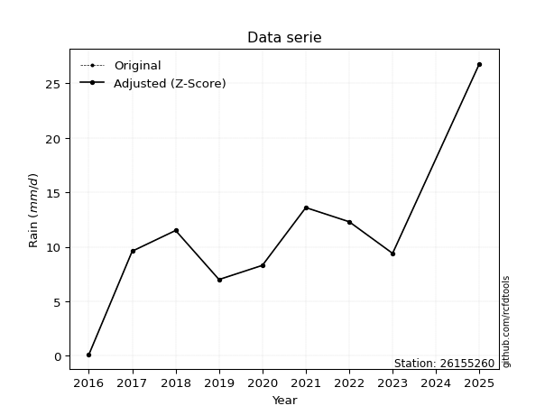</img>

</div>


> The initial value (value_initial) correspond to the initial obtained or null completed value, and value (value) is adjusted only when the initial value is outside the valid range (outlier) definite through the Z-Score value. If Z-Score is active, values out of range or outliers are replaced with the station mean value. A Z-Score (or standard score) measures how many standard deviations a data point is from the mean of a dataset, indicating its relative position; positive scores mean above the mean, negative mean below, and a score of zero is exactly at the mean, allowing for comparison of values from different distributions. It´s calculated using the formula $z=(x–μ)/σ$, where $x$ is the data point, $μ$ is the mean, and $σ$ is the standard deviation, helping identify outliers and understand probability.
>
> <sub>**Note**: In this study, "completing" (filling gaps in) and "extending" (forecasting or lengthening the historical record) rainfall data series are avoided for certain critical analyses because they introduce artificial bias and uncertainty, which can distort the statistics of rare events (extremes), alter day-to-day variability, and compromise the integrity and homogeneity of the original data. Some reasons against Completing/Extending rainfall data are: **Distortion of Extremes and Variability**: The primary issue is that most gap-filling or extension methods rely on averaging or regression with nearby stations, which inherently smooths the data. Rainfall is highly variable in space and time, with a large percentage of zero values and occasional large storms. Infilling methods often underestimate the highest values and overestimate the lowest (zero) values, which severely distorts analyses focused on flood frequency, drought severity, and intensity-duration-frequency (IDF) curves, **Loss of Data Homogeneity**: Infilled or extended data are synthetic estimates, not actual measurements. Combining these estimates with observed data can violate the assumption of data homogeneity, which requires that the data properties do not change over time. Inhomogeneity can lead to incorrect conclusions about long-term trends or changes in climate patterns, **Propagation of Errors**: Errors and biases from the original data (e.g., wind-induced undercatch, instrument errors, site changes) or the data used for imputation can propagate through the analysis, leading to unreliable hydrological models and inaccurate predictions, **Compromised Statistical Integrity**: For statistical analyses, especially those involving the frequency of events, using artificial data can introduce time bias or autocorrelation that doesn´t exist in reality, making it difficult to assess the true probability of events, **Difficulty in Validation**: It is difficult to accurately validate the quality of filled or extended data, especially for past periods where ground-truth measurements are unavailable. The reliability of imputation techniques heavily depends on the density of the surrounding station network and the complexity of the local topography.</sub>


### 4. Active continuous probability distributions from SciPy (44 of 104 available)

A Probability Density Function (PDF) describes the relative likelihood of a continuous random variable falling within a specific range, where the total area under its curve equals 1, and the area over any interval gives the actual probability for that range. Unlike discrete probabilities (like rolling a die), a PDF shows density, not direct probability for a single point (which is zero), with higher points indicating higher likelihood, often visualized as a bell curve for normal distributions.

A log of a probability density function (log-PDF) is simply the logarithm of the PDF´s value, denoted as $log(f(x))$, useful for converting multiplication of probabilities into addition, improving numerical stability with tiny numbers, and connecting to information theory concepts like entropy. Instead of dealing with very small probabilities (e.g., 0.000001), log-PDFs use negative numbers (e.g., $log(0.00001) ≈ -11.51$ that are easier for computers to handle, preventing underflow errors and simplifying complex calculations. In this study, each active probability distribution from SciPy is also evaluated in the $log$ form.

[scipy.stats](https://docs.scipy.org/doc/scipy/reference/stats.html) is a Python´s powerful submodule within the SciPy library for comprehensive statistical analysis, offering over 130 probability distributions (like Normal, Poisson), functions for descriptive stats (mean, variance), hypothesis testing (t-tests, chi-square), random variable generation, and statistical tests, making it essential for data science, modeling, and research. It provides tools to explore, model, and draw conclusions from data efficiently, working seamlessly with NumPy.

<div align="center">

|   id | p_dist             |   n_parameter | fit_method   | label                                                                       | active   | ref                                                                                                        |
|-----:|:-------------------|--------------:|:-------------|:----------------------------------------------------------------------------|:---------|:-----------------------------------------------------------------------------------------------------------|
|    0 | alpha              |             3 | MLE          | Alpha                                                                       | True     | [:mortar_board:](https://docs.scipy.org/doc/scipy/reference/generated/scipy.stats.alpha.html)              |
|    1 | betaprime          |             4 | MLE          | Beta prime                                                                  | True     | [:mortar_board:](https://docs.scipy.org/doc/scipy/reference/generated/scipy.stats.betaprime.html)          |
|    2 | chi2               |             3 | MLE          | Chi²                                                                        | True     | [:mortar_board:](https://docs.scipy.org/doc/scipy/reference/generated/scipy.stats.chi2.html)               |
|    3 | crystalball        |             4 | MLE          | Crystalball                                                                 | True     | [:mortar_board:](https://docs.scipy.org/doc/scipy/reference/generated/scipy.stats.crystalball.html)        |
|    4 | erlang             |             3 | MLE          | Erlang                                                                      | True     | [:mortar_board:](https://docs.scipy.org/doc/scipy/reference/generated/scipy.stats.erlang.html)             |
|    5 | expon              |             2 | MLE          | Exponential                                                                 | True     | [:mortar_board:](https://docs.scipy.org/doc/scipy/reference/generated/scipy.stats.expon.html)              |
|    6 | exponnorm          |             3 | MLE          | Exponentially modified Normal                                               | True     | [:mortar_board:](https://docs.scipy.org/doc/scipy/reference/generated/scipy.stats.exponnorm.html)          |
|    7 | f                  |             4 | MLE          | F                                                                           | True     | [:mortar_board:](https://docs.scipy.org/doc/scipy/reference/generated/scipy.stats.f.html)                  |
|    8 | fatiguelife        |             3 | MLE          | Fatigue-life (Birnbaum-Saunders)                                            | True     | [:mortar_board:](https://docs.scipy.org/doc/scipy/reference/generated/scipy.stats.fatiguelife.html)        |
|    9 | fisk               |             3 | MLE          | Fisk                                                                        | True     | [:mortar_board:](https://docs.scipy.org/doc/scipy/reference/generated/scipy.stats.fisk.html)               |
|   10 | gamma              |             3 | MLE          | Gamma                                                                       | True     | [:mortar_board:](https://docs.scipy.org/doc/scipy/reference/generated/scipy.stats.gamma.html)              |
|   11 | genexpon           |             5 | MLE          | Generalized exponential                                                     | True     | [:mortar_board:](https://docs.scipy.org/doc/scipy/reference/generated/scipy.stats.genexpon.html)           |
|   12 | genlogistic        |             3 | MLE          | Generalized logistic                                                        | True     | [:mortar_board:](https://docs.scipy.org/doc/scipy/reference/generated/scipy.stats.genlogistic.html)        |
|   13 | gibrat             |             2 | MM           | Gibrat                                                                      | True     | [:mortar_board:](https://docs.scipy.org/doc/scipy/reference/generated/scipy.stats.gibrat.html)             |
|   14 | gompertz           |             3 | MLE          | Gompertz (or truncated Gumbel)                                              | True     | [:mortar_board:](https://docs.scipy.org/doc/scipy/reference/generated/scipy.stats.gompertz.html)           |
|   15 | gumbel_l           |             2 | MM           | Gumbel Left Skew                                                            | True     | [:mortar_board:](https://docs.scipy.org/doc/scipy/reference/generated/scipy.stats.gumbel_l.html)           |
|   16 | gumbel_r           |             2 | MM           | Gumbel Right Skew                                                           | True     | [:mortar_board:](https://docs.scipy.org/doc/scipy/reference/generated/scipy.stats.gumbel_r.html)           |
|   17 | halflogistic       |             2 | MM           | Half-logistic                                                               | True     | [:mortar_board:](https://docs.scipy.org/doc/scipy/reference/generated/scipy.stats.halflogistic.html)       |
|   18 | halfnorm           |             2 | MM           | Half Normal                                                                 | True     | [:mortar_board:](https://docs.scipy.org/doc/scipy/reference/generated/scipy.stats.halfnorm.html)           |
|   19 | hypsecant          |             2 | MM           | hyperbolic secant                                                           | True     | [:mortar_board:](https://docs.scipy.org/doc/scipy/reference/generated/scipy.stats.hypsecant.html)          |
|   20 | invgamma           |             3 | MLE          | Inverted gamma                                                              | True     | [:mortar_board:](https://docs.scipy.org/doc/scipy/reference/generated/scipy.stats.invgamma.html)           |
|   21 | invgauss           |             3 | MLE          | Inverse Gaussian                                                            | True     | [:mortar_board:](https://docs.scipy.org/doc/scipy/reference/generated/scipy.stats.invgauss.html)           |
|   22 | invweibull         |             3 | MLE          | Inverted Weibull                                                            | True     | [:mortar_board:](https://docs.scipy.org/doc/scipy/reference/generated/scipy.stats.invweibull.html)         |
|   23 | johnsonsu          |             4 | MLE          | Johnson Su                                                                  | True     | [:mortar_board:](https://docs.scipy.org/doc/scipy/reference/generated/scipy.stats.johnsonsu.html)          |
|   24 | kstwobign          |             2 | MLE          | Limiting distribution of scaled Kolmogorov-Smirnov two-sided test statistic | True     | [:mortar_board:](https://docs.scipy.org/doc/scipy/reference/generated/scipy.stats.kstwobign.html)          |
|   25 | laplace            |             2 | MM           | Laplace                                                                     | True     | [:mortar_board:](https://docs.scipy.org/doc/scipy/reference/generated/scipy.stats.laplace.html)            |
|   26 | laplace_asymmetric |             3 | MLE          | Asymmetric Laplace                                                          | True     | [:mortar_board:](https://docs.scipy.org/doc/scipy/reference/generated/scipy.stats.laplace_asymmetric.html) |
|   27 | loggamma           |             3 | MLE          | Log gamma                                                                   | True     | [:mortar_board:](https://docs.scipy.org/doc/scipy/reference/generated/scipy.stats.loggamma.html)           |
|   28 | logistic           |             2 | MM           | Logistic (or Sech-squared)                                                  | True     | [:mortar_board:](https://docs.scipy.org/doc/scipy/reference/generated/scipy.stats.logistic.html)           |
|   29 | lognorm            |             3 | MLE          | Log Normal                                                                  | True     | [:mortar_board:](https://docs.scipy.org/doc/scipy/reference/generated/scipy.stats.lognorm.html)            |
|   30 | maxwell            |             2 | MM           | Maxwell                                                                     | True     | [:mortar_board:](https://docs.scipy.org/doc/scipy/reference/generated/scipy.stats.maxwell.html)            |
|   31 | mielke             |             4 | MLE          | Mielke Beta-Kappa / Dagum                                                   | True     | [:mortar_board:](https://docs.scipy.org/doc/scipy/reference/generated/scipy.stats.mielke.html)             |
|   32 | moyal              |             2 | MM           | Moyal                                                                       | True     | [:mortar_board:](https://docs.scipy.org/doc/scipy/reference/generated/scipy.stats.moyal.html)              |
|   33 | nakagami           |             3 | MLE          | Nakagami                                                                    | True     | [:mortar_board:](https://docs.scipy.org/doc/scipy/reference/generated/scipy.stats.nakagami.html)           |
|   34 | ncf                |             5 | MLE          | Non-central F distribution                                                  | True     | [:mortar_board:](https://docs.scipy.org/doc/scipy/reference/generated/scipy.stats.ncf.html)                |
|   35 | nct                |             4 | MLE          | Non-central Student’s t                                                     | True     | [:mortar_board:](https://docs.scipy.org/doc/scipy/reference/generated/scipy.stats.nct.html)                |
|   36 | norm               |             2 | MM           | Normal                                                                      | True     | [:mortar_board:](https://docs.scipy.org/doc/scipy/reference/generated/scipy.stats.norm.html)               |
|   37 | pearson3           |             3 | MM           | Pearson type III                                                            | True     | [:mortar_board:](https://docs.scipy.org/doc/scipy/reference/generated/scipy.stats.pearson3.html)           |
|   38 | rayleigh           |             2 | MM           | Rayleigh                                                                    | True     | [:mortar_board:](https://docs.scipy.org/doc/scipy/reference/generated/scipy.stats.rayleigh.html)           |
|   39 | rice               |             3 | MLE          | Rice                                                                        | True     | [:mortar_board:](https://docs.scipy.org/doc/scipy/reference/generated/scipy.stats.rice.html)               |
|   40 | t                  |             3 | MLE          | Student’s t                                                                 | True     | [:mortar_board:](https://docs.scipy.org/doc/scipy/reference/generated/scipy.stats.t.html)                  |
|   41 | truncnorm          |             4 | MLE          | Truncated normal                                                            | True     | [:mortar_board:](https://docs.scipy.org/doc/scipy/reference/generated/scipy.stats.truncnorm.html)          |
|   42 | wald               |             2 | MM           | Wald                                                                        | True     | [:mortar_board:](https://docs.scipy.org/doc/scipy/reference/generated/scipy.stats.wald.html)               |
|   43 | weibull_min        |             3 | MLE          | Weibull minimum                                                             | True     | [:mortar_board:](https://docs.scipy.org/doc/scipy/reference/generated/scipy.stats.weibull_min.html)        |

</div>

> **n_parameter:** # arguments & localization & scale.
>
> **Fit methods:** (MLE) maximum likelihood, (MM) L-moments.
>
>**Inactive** (With the only purpose of prevent loops, zero divisions, infinite values, over high estimated values or horizontal trending for recurrence intervals estimations, the follow distributions were disabled.)**:** foldnorm, gennorm, norminvgauss, powernorm, powerlognorm, skewnorm, genextreme, anglit, arcsine, argus, beta, bradford, burr, burr12, cauchy, cosine, halfcauchy, foldcauchy, skewcauchy, wrapcauchy, dgamma, gengamma, exponweib, exponpow, truncexpon, gausshyper, genhalflogistic, genhyperbolic, geninvgauss, halfgennorm, johnsonsb, kappa4, kappa3, ksone, kstwo, loglaplace, levy, levy_l, levy_stable, ncx2, pareto, genpareto, truncpareto, lomax, powerlaw, rdist, rel_breitwigner, recipinvgauss, semicircular, studentized_range, trapezoid, triang, truncweibull_min, tukeylambda, uniform, loguniform, vonmises, vonmises_line, weibull_max, dweibull, 


## B. Probability (PDF) vs. Empirical (EDF) distributions functions

A continuous probability distribution (CPD) describes probabilities for variables that can take any value within a range (like rain any time), unlike discrete variables with specific outcomes (like temperature). It uses a Probability Density Function (PDF), a curve where the total area under it equals 1, and the probability of the variable falling within an interval (a to b) is found by calculating the area under the curve between those points. A key feature is that the probability of hitting any single exact value is zero, so probabilities are always expressed for ranges, e.g., $P(a ≤ X ≤ b)$.

<div align="center">

Distributions parameters from station values
|    |   station | p_dist                |   n |             loc |           scale | shape                  | shape1                 | shape2             | shape3   |
|---:|----------:|:----------------------|----:|----------------:|----------------:|:-----------------------|:-----------------------|:-------------------|:---------|
|  0 |  26155260 | alpha                 |   8 |     0.003038    |     0.27377     | 1.0319561494429911e-07 |                        |                    |          |
|  1 |  26155260 | betaprime             |   8 |   -96.704       |  1684.93        | 724.1598302934185      | 11553.239268458805     |                    |          |
|  2 |  26155260 | chi2                  |   8 |     0.1         |     1.77023     | 1.5772984643898664     |                        |                    |          |
|  3 |  26155260 | crystalball           |   8 |     8.975       |     3.91336     | 1019.5521624152067     | 930.7941511592786      |                    |          |
|  4 |  26155260 | erlang                |   8 |   -55.0294      |     0.267186    | 239.44953248296662     |                        |                    |          |
|  5 |  26155260 | expon                 |   8 |     0.1         |     8.875       |                        |                        |                    |          |
|  6 |  26155260 | exponnorm             |   8 |     8.97231     |     3.91337     | 0.0006870494158580818  |                        |                    |          |
|  7 |  26155260 | f                     |   8 |  -525.358       |   534.32        | 68467.90984854901      | 78918.40222213624      |                    |          |
|  8 |  26155260 | fatiguelife           |   8 | -1288.54        |  1297.54        | 0.0030118481926216913  |                        |                    |          |
|  9 |  26155260 | fisk                  |   8 |    -4.13158e+06 |     4.13159e+06 | 1996732.8331783926     |                        |                    |          |
| 10 |  26155260 | gamma                 |   8 |   -59.9089      |     0.236989    | 290.3272034133579      |                        |                    |          |
| 11 |  26155260 | genexpon              |   8 |     0.0999924   |     3.21265     | 0.10649004283003499    | 1.752780751670791      | 0.0938650249098984 |          |
| 12 |  26155260 | genlogistic           |   8 |    13.6002      |     1.60246e-05 | 3.4817299379267452e-06 |                        |                    |          |
| 13 |  26155260 | gibrat                |   8 |     5.98963     |     1.81072     |                        |                        |                    |          |
| 14 |  26155260 | gompertz              |   8 |     0.0999832   |     2.67782     | 0.019269971261790718   |                        |                    |          |
| 15 |  26155260 | gumbel_l              |   8 |    10.7362      |     3.05123     |                        |                        |                    |          |
| 16 |  26155260 | gumbel_r              |   8 |     7.21378     |     3.05123     |                        |                        |                    |          |
| 17 |  26155260 | halflogistic          |   8 |     4.33678     |     3.34577     |                        |                        |                    |          |
| 18 |  26155260 | halfnorm              |   8 |     3.79524     |     6.49185     |                        |                        |                    |          |
| 19 |  26155260 | hypsecant             |   8 |     8.975       |     2.49132     |                        |                        |                    |          |
| 20 |  26155260 | invgamma              |   8 |   -68.8481      | 28470           | 367.19929489958156     |                        |                    |          |
| 21 |  26155260 | invgauss              |   8 |   -28.0995      |  2688.03        | 0.013723307899536873   |                        |                    |          |
| 22 |  26155260 | invweibull            |   8 |    -3.31694e+08 |     3.31694e+08 | 71972775.07008871      |                        |                    |          |
| 23 |  26155260 | johnsonsu             |   8 |    15.4136      |     0.111031    | 7.511136367440809      | 1.6419348161455414     |                    |          |
| 24 |  26155260 | kstwobign             |   8 |    -9.91234     |    21.636       |                        |                        |                    |          |
| 25 |  26155260 | laplace               |   8 |     8.975       |     2.76716     |                        |                        |                    |          |
| 26 |  26155260 | laplace_asymmetric    |   8 |     9.6         |     2.72207     | 1.121454605284417      |                        |                    |          |
| 27 |  26155260 | loggamma              |   8 |    13.2868      |     1.00056     | 0.24531616393566588    |                        |                    |          |
| 28 |  26155260 | logistic              |   8 |     8.975       |     2.15755     |                        |                        |                    |          |
| 29 |  26155260 | lognorm               |   8 |     0.1         |     0.0581231   | 13.597301041560051     |                        |                    |          |
| 30 |  26155260 | maxwell               |   8 |    -0.298017    |     5.811       |                        |                        |                    |          |
| 31 |  26155260 | mielke                |   8 |    -8.99503     |    22.5953      | 3.8542492212066506     | 947838.8960780004      |                    |          |
| 32 |  26155260 | moyal                 |   8 |     6.73709     |     1.76163     |                        |                        |                    |          |
| 33 |  26155260 | nakagami              |   8 |     0.1         |     8.98019     | 0.3473072016587676     |                        |                    |          |
| 34 |  26155260 | ncf                   |   8 |  -292.735       |   245.832       | 11701.501591520733     | 604012.6461614302      | 2659.4937569732665 |          |
| 35 |  26155260 | nct                   |   8 |  -237.979       |     3.86376     | 71726.40709143964      | 63.914660272867025     |                    |          |
| 36 |  26155260 | norm                  |   8 |     8.975       |     3.91336     |                        |                        |                    |          |
| 37 |  26155260 | pearson3              |   8 |     8.97503     |     3.91328     | -1.1574195627165182    |                        |                    |          |
| 38 |  26155260 | rayleigh              |   8 |     1.48853     |     5.97334     |                        |                        |                    |          |
| 39 |  26155260 | rice                  |   8 | -1151.12        |     3.91324     | 296.4527357173679      |                        |                    |          |
| 40 |  26155260 | t                     |   8 |     8.97551     |     3.91274     | 8435.221740225483      |                        |                    |          |
| 41 |  26155260 | truncnorm             |   8 |    -1.77366     |     7.23735     | -0.26563932918732436   | 2.124210212790599      |                    |          |
| 42 |  26155260 | wald                  |   8 |     5.06165     |     3.91336     |                        |                        |                    |          |
| 43 |  26155260 | weibull_min           |   8 |     0.1         |     2.8785      | 0.5094595363430048     |                        |                    |          |
| 44 |  26155260 | logalpha              |   8 |   -37.6726      |   888.82        | 22.601028288969367     |                        |                    |          |
| 45 |  26155260 | logbetaprime          |   8 |    -2.30259     |     3.86061     | 0.16534526536930633    | 0.4995291735323        |                    |          |
| 46 |  26155260 | logchi2               |   8 |    -2.30259     |     1.15969     | 1.034419048476023      |                        |                    |          |
| 47 |  26155260 | logcrystalball        |   8 |     2.61007     |     3.46794e-06 | 5.554299562749687e-06  | 12.00294028883248      |                    |          |
| 48 |  26155260 | logerlang             |   8 |    -2.30259     |     0.876071    | 0.0022767443800403736  |                        |                    |          |
| 49 |  26155260 | logexpon              |   8 |    -2.30259     |     4.03059     |                        |                        |                    |          |
| 50 |  26155260 | logexponnorm          |   8 |     1.72725     |     1.53668     | 0.0004965663454632168  |                        |                    |          |
| 51 |  26155260 | logf                  |   8 |    -2.30259     |     1.12275     | 1.0294223257802366     | 1.0439469329393638     |                    |          |
| 52 |  26155260 | logfatiguelife        |   8 | -1035.15        |  1036.88        | 0.0014757478939985385  |                        |                    |          |
| 53 |  26155260 | logfisk               |   8 |    -2.30259     |     3.46747     | 0.9845269738784624     |                        |                    |          |
| 54 |  26155260 | loggamma              |   8 |    -2.30259     |     1.40385     | 0.6573099340289209     |                        |                    |          |
| 55 |  26155260 | loggenexpon           |   8 |    -2.30259     |     2.59743     | 0.6443975030074132     | 3.4616133112698314e-07 | 14.782280262562573 |          |
| 56 |  26155260 | loggenlogistic        |   8 |     2.61016     |     3.43747e-06 | 3.884246179627666e-06  |                        |                    |          |
| 57 |  26155260 | loggibrat             |   8 |     0.555752    |     0.711014    |                        |                        |                    |          |
| 58 |  26155260 | loggompertz           |   8 |    -3.34754     |     0.644708    | 0.00016890557271311671 |                        |                    |          |
| 59 |  26155260 | loggumbel_l           |   8 |     2.41959     |     1.19814     |                        |                        |                    |          |
| 60 |  26155260 | loggumbel_r           |   8 |     1.03643     |     1.19814     |                        |                        |                    |          |
| 61 |  26155260 | loghalflogistic       |   8 |    -0.093288    |     1.31379     |                        |                        |                    |          |
| 62 |  26155260 | loghalfnorm           |   8 |    -0.305975    |     2.5492      |                        |                        |                    |          |
| 63 |  26155260 | loghypsecant          |   8 |     1.72801     |     0.978275    |                        |                        |                    |          |
| 64 |  26155260 | loginvgamma           |   8 |   -37.8483      | 22548.2         | 570.7192103679656      |                        |                    |          |
| 65 |  26155260 | loginvgauss           |   8 |   -17.0829      |  2139.02        | 0.008762332021926646   |                        |                    |          |
| 66 |  26155260 | loginvweibull         |   8 |    -3.114e+08   |     3.114e+08   | 150137846.1338464      |                        |                    |          |
| 67 |  26155260 | logjohnsonsu          |   8 |     2.62243     |     0.000248058 | 4.888371746197043      | 0.6287326423532091     |                    |          |
| 68 |  26155260 | logkstwobign          |   8 |    -6.72707     |     9.69321     |                        |                        |                    |          |
| 69 |  26155260 | loglaplace            |   8 |     1.72801     |     1.08659     |                        |                        |                    |          |
| 70 |  26155260 | loglaplace_asymmetric |   8 |     2.61007     |     0.00821246  | 107.36924228943514     |                        |                    |          |
| 71 |  26155260 | logloggamma           |   8 |     2.61008     |     6.70101e-07 | 7.604986000609234e-07  |                        |                    |          |
| 72 |  26155260 | loglogistic           |   8 |     1.72801     |     0.847211    |                        |                        |                    |          |
| 73 |  26155260 | loglognorm            |   8 | -1120.63        |  1122.34        | 0.001361318658038512   |                        |                    |          |
| 74 |  26155260 | logmaxwell            |   8 |    -1.91327     |     2.28183     |                        |                        |                    |          |
| 75 |  26155260 | logmielke             |   8 |    -2.44705e+06 |     2.44705e+06 | 2480858.650920239      | 11852091.610168986     |                    |          |
| 76 |  26155260 | logmoyal              |   8 |     0.849242    |     0.691745    |                        |                        |                    |          |
| 77 |  26155260 | lognakagami           |   8 | -2792.49        |  2794.22        | 826096.6879282282      |                        |                    |          |
| 78 |  26155260 | logncf                |   8 |    -2.30259     |     1.04703     | 1.05894490794855       | 1.0953310018421907     | 1.029153738253815  |          |
| 79 |  26155260 | lognct                |   8 |  -101.79        |     1.52184     | 99454.52619854378      | 68.02099336725718      |                    |          |
| 80 |  26155260 | lognorm               |   8 |     1.72801     |     1.53667     |                        |                        |                    |          |
| 81 |  26155260 | logpearson3           |   8 |     1.72801     |     1.53667     | -2.1907979294033413    |                        |                    |          |
| 82 |  26155260 | lograyleigh           |   8 |    -1.21176     |     2.34559     |                        |                        |                    |          |
| 83 |  26155260 | logrice               |   8 |  -596.783       |     1.53716     | 389.3617761310712      |                        |                    |          |
| 84 |  26155260 | logt                  |   8 |     2.29852     |     0.190981    | 0.9918506534890232     |                        |                    |          |
| 85 |  26155260 | logtruncnorm          |   8 |    21.0721      |     4.35934     | -5.362043034884156     | -4.235043320168209     |                    |          |
| 86 |  26155260 | logwald               |   8 |     0.1914      |     1.53664     |                        |                        |                    |          |
| 87 |  26155260 | logweibull_min        |   8 |    -2.30259     |     1.60855     | 0.2122113832564873     |                        |                    |          |

</div>

> **loc** (Location parameter): This shifts the distribution along the x-axis. For many common distributions, like the normal (Gaussian) distribution, loc represents the mean $μ$. For others, like the uniform distribution, it might represent the minimum value, or for the beta distribution, the left end of the support interval.
>
> **scale** (Scale parameter): This determines the width or spread of the distribution. For the normal distribution, scale represents the standard deviation $σ$. For a uniform distribution, it defines the length of the interval (from $loc$ to $loc + scale$).
>
> **shape** (Shape parameters): Refers to parameters that define the specific form of a probability distribution, distinct from its location (loc) and scale (scale). These parameters are required arguments for most distribution functions. For example, a normal (Gaussian) distribution is fully defined by its location (mean) and scale (standard deviation), so it has no specific shape parameters beyond loc and scale. However, other distributions have intrinsic properties that need specification, as Gamma distribution that takes a shape parameter, often named $a$ or $alpha$.


### 0. Cumulative distribution values - CDF (88 evaluated)

Cumulative Distribution Function (CDF), denoted as $F$<sub>$X$</sub>$(x)$, is a function that gives the probability that a random variable $X$ will take a value less than or equal to a specific value, $x$ (i.e., $(P(X≥x)$. It essentially "accumulates" probabilities from a given point up to the far right (positive infinity), providing a complete picture of the distribution´s probabilities for both discrete (like rain) and continuous (like temperature) variables, helping to find probabilities over ranges or above certain values. Each station is evaluated separately ordering the $x$ values ascending, calculating the CDF and PDF values for the activated distributions and their logarithmic forms.

<div align="center">

CDF ordered by x ascending and calculating $log(f(x))$ separately
|   id |   Station |   date |    x |   count |   mean |     std |    zscore |   Value_initial |   station |   m |      alpha |   alpha_pdf |   betaprime |   betaprime_pdf |        chi2 |      chi2_pdf |   crystalball |   crystalball_pdf |    erlang |   erlang_pdf |    expon |   expon_pdf |   exponnorm |   exponnorm_pdf |         f |      f_pdf |   fatiguelife |   fatiguelife_pdf |      fisk |   fisk_pdf |     gamma |   gamma_pdf |    genexpon |   genexpon_pdf |   genlogistic |   genlogistic_pdf |   gibrat |   gibrat_pdf |    gompertz |   gompertz_pdf |   gumbel_l |   gumbel_l_pdf |    gumbel_r |   gumbel_r_pdf |   halflogistic |   halflogistic_pdf |   halfnorm |   halfnorm_pdf |   hypsecant |   hypsecant_pdf |   invgamma |   invgamma_pdf |   invgauss |   invgauss_pdf |   invweibull |   invweibull_pdf |   johnsonsu |   johnsonsu_pdf |   kstwobign |   kstwobign_pdf |   laplace |   laplace_pdf |   laplace_asymmetric |   laplace_asymmetric_pdf |   loggamma |   loggamma_pdf |   logistic |   logistic_pdf |    lognorm |   lognorm_pdf |     maxwell |   maxwell_pdf |    mielke |   mielke_pdf |       moyal |   moyal_pdf |    nakagami |   nakagami_pdf |       ncf |    ncf_pdf |       nct |    nct_pdf |      norm |   norm_pdf |   pearson3 |   pearson3_pdf |   rayleigh |   rayleigh_pdf |      rice |   rice_pdf |         t |      t_pdf |   truncnorm |   truncnorm_pdf |     wald |   wald_pdf |   weibull_min |   weibull_min_pdf |   logalpha |   logalpha_pdf |   logbetaprime |   logbetaprime_pdf |     logchi2 |   logchi2_pdf |   logcrystalball |   logcrystalball_pdf |   logerlang |   logerlang_pdf |   logexpon |   logexpon_pdf |   logexponnorm |   logexponnorm_pdf |        logf |   logf_pdf |   logfatiguelife |   logfatiguelife_pdf |     logfisk |   logfisk_pdf |   loggenexpon |   loggenexpon_pdf |   loggenlogistic |   loggenlogistic_pdf |   loggibrat |   loggibrat_pdf |   loggompertz |   loggompertz_pdf |   loggumbel_l |   loggumbel_l_pdf |   loggumbel_r |   loggumbel_r_pdf |   loghalflogistic |   loghalflogistic_pdf |   loghalfnorm |   loghalfnorm_pdf |   loghypsecant |   loghypsecant_pdf |   loginvgamma |   loginvgamma_pdf |   loginvgauss |   loginvgauss_pdf |   loginvweibull |   loginvweibull_pdf |   logjohnsonsu |   logjohnsonsu_pdf |   logkstwobign |   logkstwobign_pdf |   loglaplace |   loglaplace_pdf |   loglaplace_asymmetric |   loglaplace_asymmetric_pdf |   logloggamma |   logloggamma_pdf |   loglogistic |   loglogistic_pdf |   loglognorm |   loglognorm_pdf |   logmaxwell |   logmaxwell_pdf |   logmielke |   logmielke_pdf |   logmoyal |   logmoyal_pdf |   lognakagami |   lognakagami_pdf |     logncf |   logncf_pdf |    lognct |   lognct_pdf |   logpearson3 |   logpearson3_pdf |   lograyleigh |   lograyleigh_pdf |    logrice |   logrice_pdf |      logt |   logt_pdf |   logtruncnorm |   logtruncnorm_pdf |   logwald |   logwald_pdf |   logweibull_min |   logweibull_min_pdf |
|-----:|----------:|-------:|-----:|--------:|-------:|--------:|----------:|----------------:|----------:|----:|-----------:|------------:|------------:|----------------:|------------:|--------------:|--------------:|------------------:|----------:|-------------:|---------:|------------:|------------:|----------------:|----------:|-----------:|--------------:|------------------:|----------:|-----------:|----------:|------------:|------------:|---------------:|--------------:|------------------:|---------:|-------------:|------------:|---------------:|-----------:|---------------:|------------:|---------------:|---------------:|-------------------:|-----------:|---------------:|------------:|----------------:|-----------:|---------------:|-----------:|---------------:|-------------:|-----------------:|------------:|----------------:|------------:|----------------:|----------:|--------------:|---------------------:|-------------------------:|-----------:|---------------:|-----------:|---------------:|-----------:|--------------:|------------:|--------------:|----------:|-------------:|------------:|------------:|------------:|---------------:|----------:|-----------:|----------:|-----------:|----------:|-----------:|-----------:|---------------:|-----------:|---------------:|----------:|-----------:|----------:|-----------:|------------:|----------------:|---------:|-----------:|--------------:|------------------:|-----------:|---------------:|---------------:|-------------------:|------------:|--------------:|-----------------:|---------------------:|------------:|----------------:|-----------:|---------------:|---------------:|-------------------:|------------:|-----------:|-----------------:|---------------------:|------------:|--------------:|--------------:|------------------:|-----------------:|---------------------:|------------:|----------------:|--------------:|------------------:|--------------:|------------------:|--------------:|------------------:|------------------:|----------------------:|--------------:|------------------:|---------------:|-------------------:|--------------:|------------------:|--------------:|------------------:|----------------:|--------------------:|---------------:|-------------------:|---------------:|-------------------:|-------------:|-----------------:|------------------------:|----------------------------:|--------------:|------------------:|--------------:|------------------:|-------------:|-----------------:|-------------:|-----------------:|------------:|----------------:|-----------:|---------------:|--------------:|------------------:|-----------:|-------------:|----------:|-------------:|--------------:|------------------:|--------------:|------------------:|-----------:|--------------:|----------:|-----------:|---------------:|-------------------:|----------:|--------------:|-----------------:|---------------------:|
|    0 |  26155260 |   2016 |  0.1 |       8 |  8.975 | 4.18356 | -2.1214   |             0.1 |  26155260 |   1 | 0.00475059 |  0.43154    |   0.0127723 |      0.00866551 | 2.01578e-14 | 1145.53       |     0.0116685 |        0.00778966 | 0.0130157 |   0.00895511 | 0        |   0.112676  |   0.0116688 |      0.00778979 | 0.0117981 | 0.00792689 |     0.0111467 |        0.00754825 | 0.0105581 | 0.00504872 | 0.0119498 |  0.00844614 | 2.52552e-07 |      0.0331473 |      0        |         0.0115643 | 0        |    0         | 1.20627e-07 |     0.00719617 |  0.0301627 |      0.0097348 | 3.38762e-05 |    0.000114275 |       0        |          0         |   0        |      0         |   0.0180571 |      0.00724411 |  0.0104234 |     0.00798895 |  0.0123707 |     0.00981289 |    0.0135946 |        0.0126786 |   0.0430547 |      0.00980704 |   0.0170523 |       0.0179202 | 0.0202337 |    0.00731209 |            0.0247954 |               0.00812251 | 7.1937e-11 | 106476         |  0.0160879 |     0.00733663 | 0.00435874 |    0.00832525 | 8.53411e-05 |   0.000642645 | 0.0299744 |    0.0127024 | 4.75526e-11 | 5.97013e-10 | 3.30101e-13 |  16522.3       | 0.0111897 | 0.00765885 | 0.0117047 | 0.00781566 | 0.0116685 | 0.00778966 |  0.0313144 |      0.0104075 |   0        |      0         | 0.0116666 | 0.00778885 | 0.0116662 | 0.00778579 |    0.351888 |      0.0906696  | 0        |  0         |    1.5058e-09 |       5.52786e+07 | 0.00573366 |      0.0116031 |     0.00190823 |        7.10482e+11 | 8.36901e-09 |   9.74699e+06 |       0.00390006 |           0.00345873 |    0.924157 |     4.73794e+12 |   0        |      0.248102  |     0.00435885 |          0.0083254 | 7.62044e-09 | 8.8323e+06 |        0.0041726 |           0.00807202 | 2.25613e-16 |     0.500173  |   5.36859e-08 |         0.24809   |         0        |           0.00438713 |    0        |        0        |   0.000685054 |        0.00132402 |     0.0192362 |         0.0158997 |   8.94518e-08 |       1.21168e-06 |          0        |              0        |      0        |          0        |      0.0103396 |          0.0105674 |    0.00488191 |        0.00985714 |    0.00621887 |         0.0127901 |       0.0107157 |           0.0234353 |      0.0384068 |          0.0106431 |       0.014726 |          0.0360879 |    0.0122462 |        0.0112703 |              0.00380487 |                  0.00431506 |    0.00378998 |        0.00430125 |    0.00851406 |        0.00996396 |   0.00418786 |       0.00810815 |     0        |         0        |  0.00656315 |      0.00665383 | 1.6911e-22 |    1.17607e-20 |    0.00438658 |         0.0083742 | 2.8427e-09 |  3.38925e+06 | 0.0043971 |   0.00838994 |     0.0277436 |         0.0171638 |      0        |          0        | 0.00436978 |    0.00834148 | 0.0135307 | 0.00291348 |     1.4922e-06 |         0.00459249 |  0        |      0        |      0.000499002 |          2.38392e+11 |
|    1 |  26155260 |   2019 |  7   |       8 |  8.975 | 4.18356 | -0.472086 |             7   |  26155260 |   2 | 0.968789   |  0.00445835 |   0.321562  |      0.0897147  | 0.902623    |    0.0296781  |     0.306891  |        0.0897537  | 0.324752  |   0.0888296  | 0.54043  |   0.0517825 |   0.306892  |      0.0897534  | 0.309317  | 0.0896291  |     0.304235  |        0.0896699  | 0.230485  | 0.0857161  | 0.324866  |  0.0907842  | 0.442291    |      0.0740412 |      0        |         0.0517857 | 0.279808 |    0.333058  | 0.208802    |     0.074893   |  0.254654  |      0.0717945 | 0.342126    |    0.120265    |       0.378234 |          0.128063  |   0.378453 |      0.108806  |   0.270571  |      0.0959912  |  0.330006  |     0.0921615  |  0.356893  |     0.090898   |    0.382234  |        0.0797645 |   0.231779  |      0.0595078  |   0.425775  |       0.076488  | 0.244907  |    0.0885049  |            0.23769   |               0.0778629  | 0.977806   |      0.0172381 |  0.285898  |     0.0946261  | 0.556381   |    0.257018   | 0.335447    |   0.0984228   | 0.264082  |    0.0636347 | 0.353358    | 0.13663     | 0.614732    |      0.0530588 | 0.308561  | 0.0903261  | 0.307247  | 0.0897232  | 0.306891  | 0.0897537  |  0.257012  |      0.0689521 |   0.346666 |      0.100918  | 0.30689   | 0.0897564  | 0.306824  | 0.0897545  |    0.83692  |      0.044967   | 0.360846 |  0.226138  |    0.790097   |       0.0241943   | 0.566157   |      0.222792  |     0.776896   |        0.019899    | 0.941564    |   0.0300605   |       0.392861   |           0.529835   |    0.999997 |     4.21797e-06 |   0.651481 |      0.0864685 |     0.55638    |          0.257017  | 0.703983    | 0.030977   |        0.557179  |           0.25798    | 0.549833    |     0.0573584 |   0.651463    |         0.0864687 |         0        |           0.533449   |    0.748724 |        0.229207 |   0.462793    |        0.517903   |     0.490051  |         0.28663   |   0.626194    |       0.244645    |          0.650447 |              0.219562 |      0.622962 |          0.211879 |      0.570321  |          0.317471  |    0.56279    |        0.235947   |    0.582645   |         0.219391  |       0.557159  |           0.157122  |      0.301054  |          0.323644  |       0.599976 |          0.144039  |    0.590854  |        0.376541  |              0.470809   |                  0.533939   |    0.47059    |        0.534073   |    0.563948   |        0.290259   |   0.559162   |       0.258182   |     0.586342 |         0.239308 |  0.483971   |      0.475345   | 0.650816   |    0.235624    |    0.55715    |         0.25686   | 0.606388   |  0.038851    | 0.556486  |   0.25652    |     0.411423  |         0.276017  |      0.595922 |          0.231914 | 0.55638    |    0.256937   | 0.158782  | 0.377343   |     0.500221   |         0.531207   |  0.719137 |      0.21093  |      0.707381    |          0.0179617   |
|    2 |  26155260 |   2020 |  8.3 |       8 |  8.975 | 4.18356 | -0.161346 |             8.3 |  26155260 |   3 | 0.973677   |  0.0031714  |   0.444609  |      0.0980499  | 0.934351    |    0.0198211  |     0.431528  |        0.100438   | 0.446021  |   0.0962473  | 0.603049 |   0.0447268 |   0.431528  |      0.100438   | 0.433453  | 0.0997983  |     0.428867  |        0.100511   | 0.359553  | 0.111288   | 0.448966  |  0.0985465  | 0.535771    |      0.069347  |      0        |         0.0686877 | 0.596261 |    0.167623  | 0.32471     |     0.103868   |  0.362392  |      0.0940419 | 0.496348    |    0.113948    |       0.531528 |          0.107221  |   0.512261 |      0.0966079 |   0.414793  |      0.123217   |  0.455094  |     0.0986189  |  0.477771  |     0.0935759  |    0.484159  |        0.0762012 |   0.323675  |      0.0829243  |   0.522077  |       0.0711581 | 0.39177   |    0.141578   |            0.36388   |               0.1192     | 0.980553   |      0.015064  |  0.422418  |     0.113083   | 0.599732   |    0.251459   | 0.46593     |   0.100599    | 0.356893  |    0.0795346 | 0.521053    | 0.118282    | 0.679213    |      0.046254  | 0.433726  | 0.100644   | 0.431796  | 0.100336   | 0.431528  | 0.100438   |  0.359507  |      0.0889012 |   0.478035 |      0.0996432 | 0.431531  | 0.100442   | 0.431468  | 0.100448   |    0.889184 |      0.0355892  | 0.589362 |  0.133012  |    0.818156   |       0.0192583   | 0.603588   |      0.216382  |     0.780208   |        0.0189923   | 0.946455    |   0.0274067   |       0.495529   |           0.68255    |    0.999998 |     3.33906e-06 |   0.665903 |      0.0828902 |     0.599731   |          0.251459  | 0.709125    | 0.0294265  |        0.600682  |           0.252275   | 0.559393    |     0.0549146 |   0.665886    |         0.0828906 |         0        |           0.646678   |    0.784087 |        0.187702 |   0.554846    |        0.558941   |     0.53991   |         0.298115  |   0.666271    |       0.225805    |          0.686287 |              0.201329 |      0.657985 |          0.199288 |      0.623136  |          0.301335  |    0.60248    |        0.229674   |    0.619429   |         0.212204  |       0.583456  |           0.151564  |      0.367309  |          0.467866  |       0.624055 |          0.138639  |    0.650221  |        0.321905  |              0.571143   |                  0.647727   |    0.570956   |        0.647979   |    0.612602   |        0.28012    |   0.602686   |       0.252323   |     0.626281 |         0.229315 |  0.570499   |      0.538776   | 0.689015   |    0.213037    |    0.600469   |         0.251249  | 0.612852   |  0.0370669   | 0.599752  |   0.25096    |     0.461543  |         0.313412  |      0.634523 |          0.221076 | 0.599717   |    0.251383   | 0.257956  | 0.869794   |     0.598903   |         0.630069   |  0.752395 |      0.180523 |      0.710378    |          0.0172356   |
|    3 |  26155260 |   2023 |  9.4 |       8 |  8.975 | 4.18356 |  0.101588 |             9.4 |  26155260 |   4 | 0.976758   |  0.00247267 |   0.552781  |      0.0974186  | 0.952853    |    0.0141462  |     0.543241  |        0.101344   | 0.551946  |   0.0952137  | 0.649322 |   0.039513  |   0.543241  |      0.101344   | 0.544269  | 0.100384   |     0.540721  |        0.10152    | 0.488579  | 0.120758   | 0.557341  |  0.0972892  | 0.609062    |      0.0637076 |      0        |         0.087232  | 0.736664 |    0.0957358 | 0.452202    |     0.127061   |  0.475533  |      0.110931  | 0.613572    |    0.0982238   |       0.639105 |          0.0884018 |   0.612056 |      0.0846671 |   0.55404   |      0.125931   |  0.562883  |     0.0961802  |  0.578805  |     0.089191   |    0.564776  |        0.070015  |   0.427922  |      0.107124   |   0.596972  |       0.064821  | 0.571187  |    0.154965   |            0.521737  |               0.170911   | 0.982339   |      0.0136554 |  0.549087  |     0.114755   | 0.630676   |    0.24556    | 0.574066    |   0.0950045   | 0.452638  |    0.0948398 | 0.638619    | 0.0952488   | 0.727149    |      0.0409684 | 0.545445  | 0.101147   | 0.543371  | 0.101201   | 0.543241  | 0.101344   |  0.466438  |      0.10515   |   0.584013 |      0.0922364 | 0.543248  | 0.101347   | 0.543195  | 0.101358   |    0.92434  |      0.0284725  | 0.70812  |  0.0868735 |    0.83757    |       0.0161722   | 0.630168   |      0.210625  |     0.782533   |        0.0183739   | 0.949754    |   0.0256288   |       0.588985   |           0.824118   |    0.999998 |     2.81769e-06 |   0.676062 |      0.0803699 |     0.630675   |          0.245559  | 0.712721    | 0.0283735  |        0.631719  |           0.246252   | 0.566122    |     0.0532273 |   0.676044    |         0.0803703 |         0        |           0.744326   |    0.805877 |        0.163181 |   0.625328    |        0.570616   |     0.577392  |         0.303802  |   0.693505    |       0.211846    |          0.710537 |              0.188438 |      0.682211 |          0.190028 |      0.659671  |          0.285293  |    0.630707   |        0.22376    |    0.645458   |         0.205971  |       0.602055  |           0.147287  |      0.435824  |          0.648576  |       0.641059 |          0.134603  |    0.688075  |        0.287068  |              0.657721   |                  0.745914   |    0.657572   |        0.74628    |    0.646837   |        0.269636   |   0.633722   |       0.246187   |     0.65431  |         0.220992 |  0.639798   |      0.571832   | 0.714541   |    0.197294    |    0.631384   |         0.245315  | 0.617389   |  0.0358475   | 0.630634  |   0.245071   |     0.502466  |         0.344901  |      0.661503 |          0.212413 | 0.630651   |    0.245488   | 0.4066    | 1.5239     |     0.682381   |         0.713057   |  0.773663 |      0.161681 |      0.712492    |          0.0167395   |
|    4 |  26155260 |   2017 |  9.6 |       8 |  8.975 | 4.18356 |  0.149394 |             9.6 |  26155260 |   5 | 0.977242   |  0.00237073 |   0.57218   |      0.0965385  | 0.955598    |    0.0133092  |     0.563445  |        0.100652   | 0.570902  |   0.0943134  | 0.657136 |   0.0386325 |   0.563445  |      0.100651   | 0.564277  | 0.0996561  |     0.560961  |        0.100843   | 0.512738  | 0.120743   | 0.576704  |  0.0962987  | 0.62169     |      0.0625662 |      0        |         0.0911062 | 0.754929 |    0.0870862 | 0.477962    |     0.130476   |  0.497968  |      0.113379  | 0.632885    |    0.0948875   |       0.656449 |          0.0850438 |   0.628764 |      0.0824057 |   0.57903   |      0.12385    |  0.582005  |     0.0950039  |  0.596509  |     0.0878301  |    0.578647  |        0.0686881 |   0.44981   |      0.111759   |   0.609811  |       0.0635633 | 0.601086  |    0.14416    |            0.557064  |               0.182484   | 0.982624   |      0.0134309 |  0.571918  |     0.113475   | 0.635834   |    0.244417   | 0.592907    |   0.0933838   | 0.471903  |    0.0978127 | 0.657249    | 0.0910639   | 0.735251    |      0.0400493 | 0.565602  | 0.100385   | 0.563546  | 0.100504   | 0.563445  | 0.100652   |  0.487732  |      0.107771  |   0.60228  |      0.0904154 | 0.563452  | 0.100655   | 0.563402  | 0.100666   |    0.929914 |      0.0272729  | 0.724872 |  0.0807349 |    0.840756   |       0.0156904   | 0.634591   |      0.209569  |     0.782919   |        0.0182727   | 0.95029     |   0.0253406   |       0.606617   |           0.851068   |    0.999998 |     2.73813e-06 |   0.677749 |      0.0799511 |     0.635833   |          0.244416  | 0.713317    | 0.0282016  |        0.636891  |           0.245087   | 0.56724     |     0.0529496 |   0.677732    |         0.0799517 |         0        |           0.762246   |    0.809273 |        0.159438 |   0.637343    |        0.570651   |     0.583796  |         0.304503  |   0.69794     |       0.209487    |          0.714482 |              0.186299 |      0.686195 |          0.18846  |      0.665646  |          0.282306  |    0.635406   |        0.222656   |    0.649783   |         0.204842  |       0.605148  |           0.146548  |      0.449907  |          0.689963  |       0.643885 |          0.133915  |    0.69406   |        0.28156   |              0.673614   |                  0.763938   |    0.673473   |        0.764326   |    0.652493   |        0.267638   |   0.638893   |       0.245003   |     0.658947 |         0.21951  |  0.651875   |      0.575313   | 0.718668   |    0.194705    |    0.636537   |         0.244166  | 0.618141   |  0.0356477   | 0.635781  |   0.243931   |     0.509788  |         0.350637  |      0.665959 |          0.210895 | 0.635808   |    0.244346   | 0.439579  | 1.6044     |     0.697551   |         0.728081   |  0.777036 |      0.158738 |      0.712844    |          0.0166582   |
|    5 |  26155260 |   2018 | 11.5 |       8 |  8.975 | 4.18356 |  0.603553 |            11.5 |  26155260 |   6 | 0.981002   |  0.0016521  |   0.741007  |      0.0786523  | 0.974816    |    0.00748778 |     0.74061   |        0.0827863  | 0.735875  |   0.077048   | 0.723213 |   0.0311873 |   0.740609  |      0.0827861  | 0.73952   | 0.0818886  |     0.738592  |        0.0830716  | 0.724961  | 0.0963633  | 0.744273  |  0.0776864  | 0.729551    |      0.0507645 |      0        |         0.137668  | 0.867126 |    0.0389744 | 0.738524    |     0.132864   |  0.723193  |      0.116524  | 0.782369    |    0.0629305   |       0.789645 |          0.0562592 |   0.764707 |      0.0607719 |   0.778357  |      0.081949   |  0.746005  |     0.0755178  |  0.746936  |     0.0691024  |    0.696119  |        0.0547147 |   0.699672  |      0.145885   |   0.718752  |       0.0510245 | 0.799238  |    0.0725516  |            0.797518  |               0.0834199  | 0.984885   |      0.0116537 |  0.763201  |     0.0837642  | 0.678985   |    0.233026   | 0.75142     |   0.0720622   | 0.686596  |    0.12912   | 0.795819    | 0.0566703   | 0.803454    |      0.0319258 | 0.74178   | 0.082105   | 0.740435  | 0.0826616  | 0.74061   | 0.0827863  |  0.708404  |      0.119494  |   0.754518 |      0.0688785 | 0.740621  | 0.0827871  | 0.740592  | 0.0827968  |    0.97194  |      0.0174417  | 0.837282 |  0.0425672 |    0.866833   |       0.0119984   | 0.671563   |      0.199645  |     0.786142   |        0.0174428   | 0.954652    |   0.0230074   |       0.783848   |           1.12564    |    0.999998 |     2.14348e-06 |   0.691869 |      0.0764481 |     0.678983   |          0.233026  | 0.718281    | 0.0267954  |        0.680146  |           0.2335     | 0.576592    |     0.0506553 |   0.691851    |         0.0764488 |         0        |           0.934792   |    0.835427 |        0.131356 |   0.738739    |        0.543995   |     0.639107  |         0.306987  |   0.733956    |       0.189475    |          0.746502 |              0.168495 |      0.719015 |          0.175041 |      0.714163  |          0.254469  |    0.674689   |        0.212091   |    0.68585    |         0.194388  |       0.631031  |           0.140074  |      0.622016  |          1.32717   |       0.667532 |          0.127961  |    0.740905  |        0.238448  |              0.826712   |                  0.937564   |    0.82666    |        0.938178   |    0.699131   |        0.248281   |   0.682117   |       0.233256   |     0.697392 |         0.206058 |  0.75605    |      0.564985   | 0.751882   |    0.173446    |    0.679639   |         0.232736  | 0.624429   |  0.0340076   | 0.678847  |   0.232575   |     0.577915  |         0.405791  |      0.702835 |          0.197367 | 0.678947   |    0.232965   | 0.705046  | 1.06064    |     0.841471   |         0.869831   |  0.803585 |      0.136024 |      0.715791    |          0.0159909   |
|    6 |  26155260 |   2022 | 12.3 |       8 |  8.975 | 4.18356 |  0.794778 |            12.3 |  26155260 |   7 | 0.982238   |  0.00144418 |   0.799636  |      0.0677429  | 0.980141    |    0.00588837 |     0.802241  |        0.0710558  | 0.793445  |   0.0667165  | 0.747071 |   0.028499  |   0.80224   |      0.0710557  | 0.800524  | 0.0703976  |     0.80046   |        0.071358   | 0.795081  | 0.0787401  | 0.802092  |  0.066708   | 0.768103    |      0.0456231 |      0        |         0.163803  | 0.89407  |    0.0289997 | 0.837189    |     0.111533   |  0.811654  |      0.103053  | 0.827932    |    0.0512362   |       0.830592 |          0.0463446 |   0.809827 |      0.0521059 |   0.836125  |      0.0629109  |  0.802133  |     0.0646934  |  0.798433  |     0.0595927  |    0.737485  |        0.0487287 |   0.815603  |      0.140387   |   0.757466  |       0.0457853 | 0.849642  |    0.0543364  |            0.854371  |               0.0599972  | 0.985648   |      0.0110552 |  0.823625  |     0.0673297  | 0.694493   |    0.228115   | 0.804874    |   0.0615444   | 0.795785  |    0.144031  | 0.836635    | 0.0457142   | 0.827744    |      0.0288293 | 0.802861  | 0.0703794  | 0.80198   | 0.0709676  | 0.802241  | 0.0710558  |  0.801755  |      0.112276  |   0.805625 |      0.0588966 | 0.802253  | 0.0710556  | 0.80223   | 0.0710626  |    0.984545 |      0.0141544  | 0.867463 |  0.0333406 |    0.875946   |       0.0108116   | 0.684854   |      0.195592  |     0.787306   |        0.0171501   | 0.956172    |   0.0221986   |       0.863694   |           1.25128    |    0.999999 |     1.95741e-06 |   0.696967 |      0.0751831 |     0.694491   |          0.228114  | 0.720066    | 0.0263013  |        0.695683  |           0.228514   | 0.579971    |     0.0498392 |   0.69695     |         0.0751838 |         0        |           1.0086     |    0.843959 |        0.122498 |   0.77459     |        0.520952   |     0.65973   |         0.306156  |   0.746453    |       0.182183    |          0.757619 |              0.162131 |      0.73062  |          0.170074 |      0.730908  |          0.243456  |    0.688806   |        0.207699   |    0.698782   |         0.190179  |       0.640368  |           0.137612  |      0.727319  |          1.85154   |       0.676062 |          0.125729  |    0.756455  |        0.224137  |              0.892232   |                  1.01187    |    0.892225   |        1.01259    |    0.71556    |        0.24024    |   0.697637   |       0.228212   |     0.711072 |         0.200759 |  0.793224   |      0.538277   | 0.763295   |    0.165983    |    0.695127   |         0.227813  | 0.626696   |  0.0334284   | 0.694326  |   0.22768    |     0.605995  |         0.429626  |      0.715933 |          0.19214  | 0.694451   |    0.228057   | 0.765312  | 0.748125   |     0.901938   |         0.929      |  0.812481 |      0.128598 |      0.716858    |          0.0157552   |
|    7 |  26155260 |   2021 | 13.6 |       8 |  8.975 | 4.18356 |  1.10552  |            13.6 |  26155260 |   8 | 0.983936   |  0.00118128 |   0.875592  |      0.0491785  | 0.986483    |    0.00399241 |     0.881367  |        0.0507056  | 0.868728  |   0.0491578  | 0.781534 |   0.0246158 |   0.881366  |      0.0507057  | 0.879103  | 0.050526   |     0.879984  |        0.0510116  | 0.879118  | 0.0513585  | 0.876772  |  0.0482958  | 0.8221      |      0.0375325 |      0.999963 |         0.21726   | 0.924468 |    0.0187008 | 0.948262    |     0.0575922  |  0.92241   |      0.065005  | 0.883983    |    0.0357266   |       0.881914 |          0.0332102 |   0.869037 |      0.0392867 |   0.90134   |      0.0389703  |  0.874605  |     0.0469787  |  0.865902  |     0.0443976  |    0.7948    |        0.039608  |   0.962879  |      0.0732712  |   0.811681  |       0.0377401 | 0.906007  |    0.0339673  |            0.914759  |               0.0351181  | 0.986717   |      0.010219  |  0.895073  |     0.0435298  | 0.717019   |    0.220182   | 0.873949    |   0.0449768   | 0.999963  |    0.170556  | 0.886626    | 0.0319613   | 0.862161    |      0.0242056 | 0.881214  | 0.0502223  | 0.881037  | 0.0506868  | 0.881367  | 0.0507056  |  0.928385  |      0.0775823 |   0.871978 |      0.0434556 | 0.881377  | 0.0507042  | 0.881362  | 0.0507074  |    1        |      0.00982175 | 0.903563 |  0.0229674 |    0.888922   |       0.00921166  | 0.704188   |      0.189229  |     0.789007   |        0.0167282   | 0.958344    |   0.0210465   |       0.999992   |           1.46817    |    0.999999 |     1.70971e-06 |   0.704428 |      0.0733322 |     0.717017   |          0.220182  | 0.722673    | 0.0255908  |        0.718244  |           0.220468   | 0.584919    |     0.0486564 |   0.70441     |         0.073333  |         0.999897 |           1.12986    |    0.855657 |        0.110609 |   0.824673    |        0.473535   |     0.69035   |         0.302976  |   0.764218    |       0.171516    |          0.773442 |              0.152911 |      0.747336 |          0.162703 |      0.754531  |          0.226779  |    0.709328   |        0.200739   |    0.717563   |         0.183628  |       0.654008  |           0.133897  |      0.976977  |          2.77318   |       0.688526 |          0.122387  |    0.777964  |        0.204342  |              0.999913   |                  1.13399    |    0.999987   |        1.13489    |    0.739069   |        0.227625   |   0.720163   |       0.220085   |     0.730836 |         0.19262  |  0.844326   |      0.474593   | 0.77943    |    0.155305    |    0.717622   |         0.219866  | 0.630013   |  0.032593    | 0.716809  |   0.219778   |     0.651121  |         0.469651  |      0.734839 |          0.184194 | 0.716971   |    0.220131   | 0.824213  | 0.454221   |     1          |         1.02452    |  0.82488  |      0.118407 |      0.718424    |          0.0154151   |


</div>

An Empirical Distribution Function (EDF) is a step-function estimate of a true cumulative distribution function (CDF) based on observed sample data, representing the proportion of data points less than or equal to a given value. It is calculated by ordering your data and jumping up by $1/n$ (where $n$ is sample size) at each unique data point, allowing analysis without assuming an underlying population distribution, and it gets closer to the true CDF as the sample size grows. For the empirical probability calculations, the parameter $m$ correspond to the order number which means the position of the $x$ values in an ascending order list.

The Kolmogorov-Smirnov (K-S) test is a non-parametric statistical test used to determine if a sample data set comes from a specific theoretical distribution (one-sample) or if two different samples come from the same underlying distribution (two-sample), by comparing their cumulative distribution functions (CDFs). It calculates the maximum vertical difference (D statistic) between these functions, with a small p-value indicating a significant difference and rejection of the null hypothesis (that the data/samples match).


### 1. EDF California (1923)

California´s estimates the true probability distribution of water-related data (like rainfall, streamflow) using observed samples, crucial for risk assessment.

<div align="center">


$P=m/n$


</div>


**1.1. Empirical values**

<div align="center">

|                | 0                  | 1                  | 2              | 3              | 4                  | 5              | 6              | 7              |
|:---------------|:-------------------|:-------------------|:---------------|:---------------|:-------------------|:---------------|:---------------|:---------------|
| date           | 2016               | 2019               | 2020           | 2023           | 2017               | 2018           | 2022           | 2021           |
| x              | 0.1                | 7.0                | 8.3            | 9.4            | 9.6                | 11.5           | 12.3           | 13.6           |
| m              | 1                  | 2                  | 3              | 4              | 5                  | 6              | 7              | 8              |
| empirical_dist | edf_california     | edf_california     | edf_california | edf_california | edf_california     | edf_california | edf_california | edf_california |
| empirical      | 0.125              | 0.25               | 0.375          | 0.5            | 0.625              | 0.75           | 0.875          | 1.0            |
| empirical_tr   | 1.1428571428571428 | 1.3333333333333333 | 1.6            | 2.0            | 2.6666666666666665 | 4.0            | 8.0            | inf            |

</div>


**1.2. Kolmogorov-Smirnov fit test (sorted by Δ)**


<div align="center">

|                | 0                   | 1                   | 2                   | 3                   | 4                   | 5                  | 6                   | 7                   | 8                   | 9                   | 10                 | 11                  | 12                  | 13                 | 14                  | 15                  | 16                 | 17                 | 18                 | 19                  | 20                  | 21                  | 22                  | 23                  | 24                  | 25                  | 26                  | 27                  | 28                 | 29                  | 30                  | 31                  | 32                  | 33                 | 34                 | 35                  | 36                  | 37                  | 38                  | 39                    | 40                  | 41                 | 42                  | 43                  | 44                  | 45                 | 46                  | 47                  | 48                 | 49                 | 50                  | 51                  | 52                 | 53                  | 54                  | 55                 | 56                  | 57                  | 58                 | 59                 | 60                 | 61                  | 62                 | 63                 | 64                 | 65                 | 66                  | 67                  | 68                 | 69                 | 70                 | 71                 | 72                 | 73                  | 74                 | 75                 | 76                 | 77                 | 78                 | 79                 | 80                 | 81                 | 82                 | 83                 | 84                 | 85                 | 86                 | 87                 |
|:---------------|:--------------------|:--------------------|:--------------------|:--------------------|:--------------------|:-------------------|:--------------------|:--------------------|:--------------------|:--------------------|:-------------------|:--------------------|:--------------------|:-------------------|:--------------------|:--------------------|:-------------------|:-------------------|:-------------------|:--------------------|:--------------------|:--------------------|:--------------------|:--------------------|:--------------------|:--------------------|:--------------------|:--------------------|:-------------------|:--------------------|:--------------------|:--------------------|:--------------------|:-------------------|:-------------------|:--------------------|:--------------------|:--------------------|:--------------------|:----------------------|:--------------------|:-------------------|:--------------------|:--------------------|:--------------------|:-------------------|:--------------------|:--------------------|:-------------------|:-------------------|:--------------------|:--------------------|:-------------------|:--------------------|:--------------------|:-------------------|:--------------------|:--------------------|:-------------------|:-------------------|:-------------------|:--------------------|:-------------------|:-------------------|:-------------------|:-------------------|:--------------------|:--------------------|:-------------------|:-------------------|:-------------------|:-------------------|:-------------------|:--------------------|:-------------------|:-------------------|:-------------------|:-------------------|:-------------------|:-------------------|:-------------------|:-------------------|:-------------------|:-------------------|:-------------------|:-------------------|:-------------------|:-------------------|
| station        | 26155260            | 26155260            | 26155260            | 26155260            | 26155260            | 26155260           | 26155260            | 26155260            | 26155260            | 26155260            | 26155260           | 26155260            | 26155260            | 26155260           | 26155260            | 26155260            | 26155260           | 26155260           | 26155260           | 26155260            | 26155260            | 26155260            | 26155260            | 26155260            | 26155260            | 26155260            | 26155260            | 26155260            | 26155260           | 26155260            | 26155260            | 26155260            | 26155260            | 26155260           | 26155260           | 26155260            | 26155260            | 26155260            | 26155260            | 26155260              | 26155260            | 26155260           | 26155260            | 26155260            | 26155260            | 26155260           | 26155260            | 26155260            | 26155260           | 26155260           | 26155260            | 26155260            | 26155260           | 26155260            | 26155260            | 26155260           | 26155260            | 26155260            | 26155260           | 26155260           | 26155260           | 26155260            | 26155260           | 26155260           | 26155260           | 26155260           | 26155260            | 26155260            | 26155260           | 26155260           | 26155260           | 26155260           | 26155260           | 26155260            | 26155260           | 26155260           | 26155260           | 26155260           | 26155260           | 26155260           | 26155260           | 26155260           | 26155260           | 26155260           | 26155260           | 26155260           | 26155260           | 26155260           |
| empirical_dist | edf_california      | edf_california      | edf_california      | edf_california      | edf_california      | edf_california     | edf_california      | edf_california      | edf_california      | edf_california      | edf_california     | edf_california      | edf_california      | edf_california     | edf_california      | edf_california      | edf_california     | edf_california     | edf_california     | edf_california      | edf_california      | edf_california      | edf_california      | edf_california      | edf_california      | edf_california      | edf_california      | edf_california      | edf_california     | edf_california      | edf_california      | edf_california      | edf_california      | edf_california     | edf_california     | edf_california      | edf_california      | edf_california      | edf_california      | edf_california        | edf_california      | edf_california     | edf_california      | edf_california      | edf_california      | edf_california     | edf_california      | edf_california      | edf_california     | edf_california     | edf_california      | edf_california      | edf_california     | edf_california      | edf_california      | edf_california     | edf_california      | edf_california      | edf_california     | edf_california     | edf_california     | edf_california      | edf_california     | edf_california     | edf_california     | edf_california     | edf_california      | edf_california      | edf_california     | edf_california     | edf_california     | edf_california     | edf_california     | edf_california      | edf_california     | edf_california     | edf_california     | edf_california     | edf_california     | edf_california     | edf_california     | edf_california     | edf_california     | edf_california     | edf_california     | edf_california     | edf_california     | edf_california     |
| p_dist         | laplace_asymmetric  | laplace             | hypsecant           | logistic            | rice                | crystalball        | norm                | exponnorm           | t                   | ncf                 | nct                | fatiguelife         | fisk                | f                  | gamma               | betaprime           | gumbel_r           | invgamma           | maxwell            | gumbel_l            | rayleigh            | erlang              | invgauss            | halfnorm            | pearson3            | logcrystalball      | moyal               | gompertz            | mielke             | halflogistic        | logjohnsonsu        | johnsonsu           | logt                | kstwobign          | genexpon           | invweibull          | loggompertz         | wald                | logloggamma         | loglaplace_asymmetric | logmielke           | gibrat             | logtruncnorm        | expon               | logrice             | logexponnorm       | lognorm             | lognorm             | lognct             | lognakagami        | logfatiguelife      | loglognorm          | loggumbel_l        | loginvgamma         | loglogistic         | logalpha           | loghypsecant        | loginvgauss         | logmaxwell         | loglaplace         | lograyleigh        | loginvweibull       | logpearson3        | logkstwobign       | nakagami           | logncf             | loghalfnorm         | loggumbel_r         | loghalflogistic    | logmoyal           | loggenexpon        | logexpon           | logfisk            | logf                | logweibull_min     | logwald            | loggibrat          | logbetaprime       | weibull_min        | truncnorm          | chi2               | logchi2            | alpha              | loggamma           | loggamma           | logerlang          | loggenlogistic     | genlogistic        |
| delta          | 0.10020460474319702 | 0.10476626219109773 | 0.10694292029907167 | 0.10891205895527242 | 0.11862255626768281 | 0.1186327427399827 | 0.11863275317583688 | 0.11863360886877117 | 0.11863810635555716 | 0.11878578969621267 | 0.1189630048284156 | 0.12001572669052774 | 0.12088244359942846 | 0.1208967656874016 | 0.12322768701173303 | 0.12440797036719253 | 0.1249661238008053 | 0.1253952878862763 | 0.1260510333651803 | 0.12703169241238066 | 0.12802159527798074 | 0.13127175085114773 | 0.13409783099728145 | 0.13726092031701842 | 0.13726757242457943 | 0.14286083655196935 | 0.14605263126733825 | 0.14703800863164473 | 0.1530972485899963 | 0.15652807338042363 | 0.17509291437861485 | 0.17518982160089336 | 0.18542072178327423 | 0.1883192035381116 | 0.1922910661595898 | 0.20520001789764164 | 0.21279278277269142 | 0.21436196514915995 | 0.22058955844178108 | 0.22080896484523937   | 0.23397052492482173 | 0.2366640753345839 | 0.25022102426607096 | 0.29043035820846685 | 0.30637953234054527 | 0.3063804894049398 | 0.30638141088381754 | 0.30638141088381754 | 0.3064858349741658 | 0.3071498690464026 | 0.30717898140552313 | 0.30916172792915175 | 0.3096501251379765 | 0.31279029851136675 | 0.31394752142397864 | 0.3161568887206455 | 0.32032141006956694 | 0.33264500326501145 | 0.3363422750991554 | 0.3408543633311034 | 0.3459220356399968 | 0.34599193140354645 | 0.3488790682192988 | 0.3499760247355299 | 0.364731703330025  | 0.3699874491347934 | 0.37296239002639997 | 0.37619360064364327 | 0.4004474903534748 | 0.400816004934859  | 0.4014631892395948 | 0.4014807723685947 | 0.4150812920702347 | 0.45398251492414465 | 0.457381071186574  | 0.4691368678879213 | 0.4987243608439498 | 0.5268964929966116 | 0.5400967893132532 | 0.5869197292098571 | 0.6526234553958772 | 0.6915639742442905 | 0.7187891591485444 | 0.7278062366400728 | 0.7278062366400728 | 0.7991573580192535 | 0.875              | 0.875              |
| deltao         | 0.4472608134160001  | 0.4472608134160001  | 0.4472608134160001  | 0.4472608134160001  | 0.4472608134160001  | 0.4472608134160001 | 0.4472608134160001  | 0.4472608134160001  | 0.4472608134160001  | 0.4472608134160001  | 0.4472608134160001 | 0.4472608134160001  | 0.4472608134160001  | 0.4472608134160001 | 0.4472608134160001  | 0.4472608134160001  | 0.4472608134160001 | 0.4472608134160001 | 0.4472608134160001 | 0.4472608134160001  | 0.4472608134160001  | 0.4472608134160001  | 0.4472608134160001  | 0.4472608134160001  | 0.4472608134160001  | 0.4472608134160001  | 0.4472608134160001  | 0.4472608134160001  | 0.4472608134160001 | 0.4472608134160001  | 0.4472608134160001  | 0.4472608134160001  | 0.4472608134160001  | 0.4472608134160001 | 0.4472608134160001 | 0.4472608134160001  | 0.4472608134160001  | 0.4472608134160001  | 0.4472608134160001  | 0.4472608134160001    | 0.4472608134160001  | 0.4472608134160001 | 0.4472608134160001  | 0.4472608134160001  | 0.4472608134160001  | 0.4472608134160001 | 0.4472608134160001  | 0.4472608134160001  | 0.4472608134160001 | 0.4472608134160001 | 0.4472608134160001  | 0.4472608134160001  | 0.4472608134160001 | 0.4472608134160001  | 0.4472608134160001  | 0.4472608134160001 | 0.4472608134160001  | 0.4472608134160001  | 0.4472608134160001 | 0.4472608134160001 | 0.4472608134160001 | 0.4472608134160001  | 0.4472608134160001 | 0.4472608134160001 | 0.4472608134160001 | 0.4472608134160001 | 0.4472608134160001  | 0.4472608134160001  | 0.4472608134160001 | 0.4472608134160001 | 0.4472608134160001 | 0.4472608134160001 | 0.4472608134160001 | 0.4472608134160001  | 0.4472608134160001 | 0.4472608134160001 | 0.4472608134160001 | 0.4472608134160001 | 0.4472608134160001 | 0.4472608134160001 | 0.4472608134160001 | 0.4472608134160001 | 0.4472608134160001 | 0.4472608134160001 | 0.4472608134160001 | 0.4472608134160001 | 0.4472608134160001 | 0.4472608134160001 |
| eval           | Δo > Δ              | Δo > Δ              | Δo > Δ              | Δo > Δ              | Δo > Δ              | Δo > Δ             | Δo > Δ              | Δo > Δ              | Δo > Δ              | Δo > Δ              | Δo > Δ             | Δo > Δ              | Δo > Δ              | Δo > Δ             | Δo > Δ              | Δo > Δ              | Δo > Δ             | Δo > Δ             | Δo > Δ             | Δo > Δ              | Δo > Δ              | Δo > Δ              | Δo > Δ              | Δo > Δ              | Δo > Δ              | Δo > Δ              | Δo > Δ              | Δo > Δ              | Δo > Δ             | Δo > Δ              | Δo > Δ              | Δo > Δ              | Δo > Δ              | Δo > Δ             | Δo > Δ             | Δo > Δ              | Δo > Δ              | Δo > Δ              | Δo > Δ              | Δo > Δ                | Δo > Δ              | Δo > Δ             | Δo > Δ              | Δo > Δ              | Δo > Δ              | Δo > Δ             | Δo > Δ              | Δo > Δ              | Δo > Δ             | Δo > Δ             | Δo > Δ              | Δo > Δ              | Δo > Δ             | Δo > Δ              | Δo > Δ              | Δo > Δ             | Δo > Δ              | Δo > Δ              | Δo > Δ             | Δo > Δ             | Δo > Δ             | Δo > Δ              | Δo > Δ             | Δo > Δ             | Δo > Δ             | Δo > Δ             | Δo > Δ              | Δo > Δ              | Δo > Δ             | Δo > Δ             | Δo > Δ             | Δo > Δ             | Δo > Δ             | Δo <= Δ             | Δo <= Δ            | Δo <= Δ            | Δo <= Δ            | Δo <= Δ            | Δo <= Δ            | Δo <= Δ            | Δo <= Δ            | Δo <= Δ            | Δo <= Δ            | Δo <= Δ            | Δo <= Δ            | Δo <= Δ            | Δo <= Δ            | Δo <= Δ            |
| fit            | 1                   | 1                   | 1                   | 1                   | 1                   | 1                  | 1                   | 1                   | 1                   | 1                   | 1                  | 1                   | 1                   | 1                  | 1                   | 1                   | 1                  | 1                  | 1                  | 1                   | 1                   | 1                   | 1                   | 1                   | 1                   | 1                   | 1                   | 1                   | 1                  | 1                   | 1                   | 1                   | 1                   | 1                  | 1                  | 1                   | 1                   | 1                   | 1                   | 1                     | 1                   | 1                  | 1                   | 1                   | 1                   | 1                  | 1                   | 1                   | 1                  | 1                  | 1                   | 1                   | 1                  | 1                   | 1                   | 1                  | 1                   | 1                   | 1                  | 1                  | 1                  | 1                   | 1                  | 1                  | 1                  | 1                  | 1                   | 1                   | 1                  | 1                  | 1                  | 1                  | 1                  | 0                   | 0                  | 0                  | 0                  | 0                  | 0                  | 0                  | 0                  | 0                  | 0                  | 0                  | 0                  | 0                  | 0                  | 0                  |
| n              | 8                   | 8                   | 8                   | 8                   | 8                   | 8                  | 8                   | 8                   | 8                   | 8                   | 8                  | 8                   | 8                   | 8                  | 8                   | 8                   | 8                  | 8                  | 8                  | 8                   | 8                   | 8                   | 8                   | 8                   | 8                   | 8                   | 8                   | 8                   | 8                  | 8                   | 8                   | 8                   | 8                   | 8                  | 8                  | 8                   | 8                   | 8                   | 8                   | 8                     | 8                   | 8                  | 8                   | 8                   | 8                   | 8                  | 8                   | 8                   | 8                  | 8                  | 8                   | 8                   | 8                  | 8                   | 8                   | 8                  | 8                   | 8                   | 8                  | 8                  | 8                  | 8                   | 8                  | 8                  | 8                  | 8                  | 8                   | 8                   | 8                  | 8                  | 8                  | 8                  | 8                  | 8                   | 8                  | 8                  | 8                  | 8                  | 8                  | 8                  | 8                  | 8                  | 8                  | 8                  | 8                  | 8                  | 8                  | 8                  |
| best_fit       | 1                   | 0                   | 0                   | 0                   | 0                   | 0                  | 0                   | 0                   | 0                   | 0                   | 0                  | 0                   | 0                   | 0                  | 0                   | 0                   | 0                  | 0                  | 0                  | 0                   | 0                   | 0                   | 0                   | 0                   | 0                   | 0                   | 0                   | 0                   | 0                  | 0                   | 0                   | 0                   | 0                   | 0                  | 0                  | 0                   | 0                   | 0                   | 0                   | 0                     | 0                   | 0                  | 0                   | 0                   | 0                   | 0                  | 0                   | 0                   | 0                  | 0                  | 0                   | 0                   | 0                  | 0                   | 0                   | 0                  | 0                   | 0                   | 0                  | 0                  | 0                  | 0                   | 0                  | 0                  | 0                  | 0                  | 0                   | 0                   | 0                  | 0                  | 0                  | 0                  | 0                  | 0                   | 0                  | 0                  | 0                  | 0                  | 0                  | 0                  | 0                  | 0                  | 0                  | 0                  | 0                  | 0                  | 0                  | 0                  |
| best_fit_sort  | 1                   | 2                   | 3                   | 4                   | 5                   | 6                  | 7                   | 8                   | 9                   | 10                  | 11                 | 12                  | 13                  | 14                 | 15                  | 16                  | 17                 | 18                 | 19                 | 20                  | 21                  | 22                  | 23                  | 24                  | 25                  | 26                  | 27                  | 28                  | 29                 | 30                  | 31                  | 32                  | 33                  | 34                 | 35                 | 36                  | 37                  | 38                  | 39                  | 40                    | 41                  | 42                 | 43                  | 44                  | 45                  | 46                 | 47                  | 48                  | 49                 | 50                 | 51                  | 52                  | 53                 | 54                  | 55                  | 56                 | 57                  | 58                  | 59                 | 60                 | 61                 | 62                  | 63                 | 64                 | 65                 | 66                 | 67                  | 68                  | 69                 | 70                 | 71                 | 72                 | 73                 | 74                  | 75                 | 76                 | 77                 | 78                 | 79                 | 80                 | 81                 | 82                 | 83                 | 84                 | 85                 | 86                 | 87                 | 88                 |

</div>


**1.3. Best fit**

<div align="center">

|   id |   station | empirical_dist   | p_dist             |    delta |   deltao | eval   |   fit |   n |   best_fit |   best_fit_sort |
|-----:|----------:|:-----------------|:-------------------|---------:|---------:|:-------|------:|----:|-----------:|----------------:|
|    0 |  26155260 | edf_california   | laplace_asymmetric | 0.100205 | 0.447261 | Δo > Δ |     1 |   8 |          1 |               1 |

</div>


<div align="center">

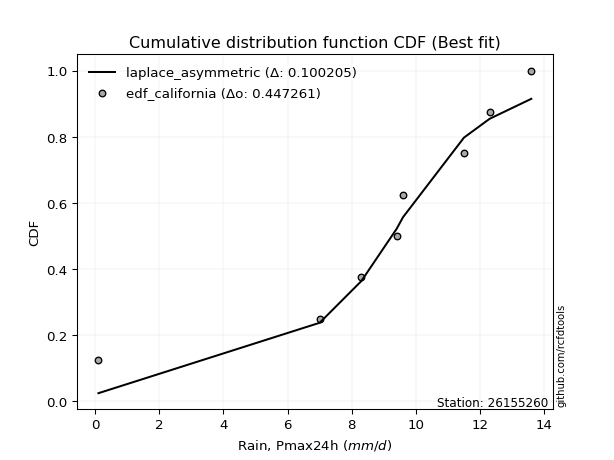</img>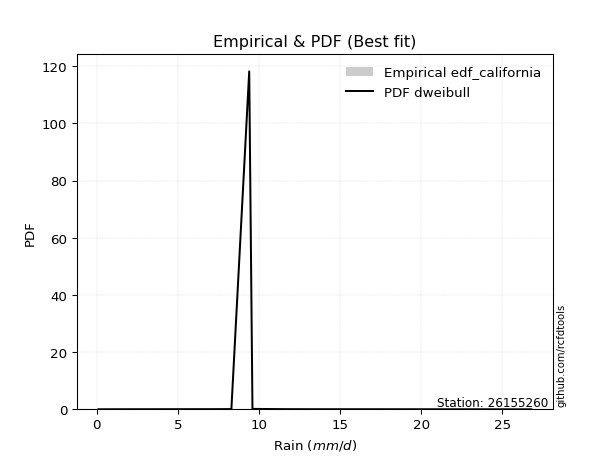</img>

</div>


### 2. EDF Hazen (1930)

Hazen method for plotting positions is a formula used to estimate the empirical cumulative probability distribution of flood events or other hydrological data. This formula often results in biased estimations, particularly when extrapolating to extreme events (high return periods).

<div align="center">


$P=(m-0.5)/n$


</div>


**2.1. Empirical values**

<div align="center">

|                | 0                  | 1                  | 2                  | 3                  | 4                  | 5         | 6                 | 7         |
|:---------------|:-------------------|:-------------------|:-------------------|:-------------------|:-------------------|:----------|:------------------|:----------|
| date           | 2016               | 2019               | 2020               | 2023               | 2017               | 2018      | 2022              | 2021      |
| x              | 0.1                | 7.0                | 8.3                | 9.4                | 9.6                | 11.5      | 12.3              | 13.6      |
| m              | 1                  | 2                  | 3                  | 4                  | 5                  | 6         | 7                 | 8         |
| empirical_dist | edf_hazen          | edf_hazen          | edf_hazen          | edf_hazen          | edf_hazen          | edf_hazen | edf_hazen         | edf_hazen |
| empirical      | 0.0625             | 0.1875             | 0.3125             | 0.4375             | 0.5625             | 0.6875    | 0.8125            | 0.9375    |
| empirical_tr   | 1.0666666666666667 | 1.2307692307692308 | 1.4545454545454546 | 1.7777777777777777 | 2.2857142857142856 | 3.2       | 5.333333333333333 | 16.0      |

</div>


**2.2. Kolmogorov-Smirnov fit test (sorted by Δ)**


<div align="center">

|                | 0                   | 1                   | 2                   | 3                   | 4                  | 5                   | 6                   | 7                   | 8                   | 9                   | 10                  | 11                  | 12                  | 13                 | 14                 | 15                  | 16                  | 17                  | 18                  | 19                  | 20                  | 21                 | 22                  | 23                  | 24                 | 25                  | 26                  | 27                 | 28                  | 29                  | 30                  | 31                  | 32                  | 33                  | 34                  | 35                 | 36                 | 37                  | 38                 | 39                    | 40                 | 41                  | 42                 | 43                 | 44                  | 45                  | 46                  | 47                  | 48                 | 49                  | 50                  | 51                 | 52                 | 53                 | 54                  | 55                  | 56                  | 57                  | 58                 | 59                  | 60                  | 61                 | 62                 | 63                 | 64                 | 65                  | 66                 | 67                  | 68                  | 69                 | 70                 | 71                 | 72                 | 73                 | 74                 | 75                 | 76                 | 77                 | 78                 | 79                 | 80                 | 81                 | 82                 | 83                 | 84                 | 85                 | 86                 | 87                 |
|:---------------|:--------------------|:--------------------|:--------------------|:--------------------|:-------------------|:--------------------|:--------------------|:--------------------|:--------------------|:--------------------|:--------------------|:--------------------|:--------------------|:-------------------|:-------------------|:--------------------|:--------------------|:--------------------|:--------------------|:--------------------|:--------------------|:-------------------|:--------------------|:--------------------|:-------------------|:--------------------|:--------------------|:-------------------|:--------------------|:--------------------|:--------------------|:--------------------|:--------------------|:--------------------|:--------------------|:-------------------|:-------------------|:--------------------|:-------------------|:----------------------|:-------------------|:--------------------|:-------------------|:-------------------|:--------------------|:--------------------|:--------------------|:--------------------|:-------------------|:--------------------|:--------------------|:-------------------|:-------------------|:-------------------|:--------------------|:--------------------|:--------------------|:--------------------|:-------------------|:--------------------|:--------------------|:-------------------|:-------------------|:-------------------|:-------------------|:--------------------|:-------------------|:--------------------|:--------------------|:-------------------|:-------------------|:-------------------|:-------------------|:-------------------|:-------------------|:-------------------|:-------------------|:-------------------|:-------------------|:-------------------|:-------------------|:-------------------|:-------------------|:-------------------|:-------------------|:-------------------|:-------------------|:-------------------|
| station        | 26155260            | 26155260            | 26155260            | 26155260            | 26155260           | 26155260            | 26155260            | 26155260            | 26155260            | 26155260            | 26155260            | 26155260            | 26155260            | 26155260           | 26155260           | 26155260            | 26155260            | 26155260            | 26155260            | 26155260            | 26155260            | 26155260           | 26155260            | 26155260            | 26155260           | 26155260            | 26155260            | 26155260           | 26155260            | 26155260            | 26155260            | 26155260            | 26155260            | 26155260            | 26155260            | 26155260           | 26155260           | 26155260            | 26155260           | 26155260              | 26155260           | 26155260            | 26155260           | 26155260           | 26155260            | 26155260            | 26155260            | 26155260            | 26155260           | 26155260            | 26155260            | 26155260           | 26155260           | 26155260           | 26155260            | 26155260            | 26155260            | 26155260            | 26155260           | 26155260            | 26155260            | 26155260           | 26155260           | 26155260           | 26155260           | 26155260            | 26155260           | 26155260            | 26155260            | 26155260           | 26155260           | 26155260           | 26155260           | 26155260           | 26155260           | 26155260           | 26155260           | 26155260           | 26155260           | 26155260           | 26155260           | 26155260           | 26155260           | 26155260           | 26155260           | 26155260           | 26155260           | 26155260           |
| empirical_dist | edf_hazen           | edf_hazen           | edf_hazen           | edf_hazen           | edf_hazen          | edf_hazen           | edf_hazen           | edf_hazen           | edf_hazen           | edf_hazen           | edf_hazen           | edf_hazen           | edf_hazen           | edf_hazen          | edf_hazen          | edf_hazen           | edf_hazen           | edf_hazen           | edf_hazen           | edf_hazen           | edf_hazen           | edf_hazen          | edf_hazen           | edf_hazen           | edf_hazen          | edf_hazen           | edf_hazen           | edf_hazen          | edf_hazen           | edf_hazen           | edf_hazen           | edf_hazen           | edf_hazen           | edf_hazen           | edf_hazen           | edf_hazen          | edf_hazen          | edf_hazen           | edf_hazen          | edf_hazen             | edf_hazen          | edf_hazen           | edf_hazen          | edf_hazen          | edf_hazen           | edf_hazen           | edf_hazen           | edf_hazen           | edf_hazen          | edf_hazen           | edf_hazen           | edf_hazen          | edf_hazen          | edf_hazen          | edf_hazen           | edf_hazen           | edf_hazen           | edf_hazen           | edf_hazen          | edf_hazen           | edf_hazen           | edf_hazen          | edf_hazen          | edf_hazen          | edf_hazen          | edf_hazen           | edf_hazen          | edf_hazen           | edf_hazen           | edf_hazen          | edf_hazen          | edf_hazen          | edf_hazen          | edf_hazen          | edf_hazen          | edf_hazen          | edf_hazen          | edf_hazen          | edf_hazen          | edf_hazen          | edf_hazen          | edf_hazen          | edf_hazen          | edf_hazen          | edf_hazen          | edf_hazen          | edf_hazen          | edf_hazen          |
| p_dist         | fisk                | gumbel_l            | pearson3            | gompertz            | mielke             | laplace_asymmetric  | logistic            | johnsonsu           | logjohnsonsu        | hypsecant           | fatiguelife         | t                   | rice                | norm               | crystalball        | exponnorm           | nct                 | ncf                 | f                   | logt                | laplace             | betaprime          | erlang              | gamma               | invgamma           | maxwell             | rayleigh            | invgauss           | gumbel_r            | invweibull          | halfnorm            | logcrystalball      | moyal               | halflogistic        | kstwobign           | genexpon           | loggompertz        | wald                | logloggamma        | loglaplace_asymmetric | logpearson3        | logmielke           | gibrat             | loggumbel_l        | logtruncnorm        | expon               | logfisk             | logrice             | logexponnorm       | lognorm             | lognorm             | lognct             | lognakagami        | loginvweibull      | logfatiguelife      | loglognorm          | loginvgamma         | loglogistic         | logalpha           | loghypsecant        | loginvgauss         | logmaxwell         | loglaplace         | lograyleigh        | logkstwobign       | logncf              | nakagami           | loghalfnorm         | loggumbel_r         | loghalflogistic    | logmoyal           | loggenexpon        | logexpon           | logf               | logweibull_min     | logwald            | loggibrat          | logbetaprime       | weibull_min        | truncnorm          | chi2               | logchi2            | alpha              | loggamma           | loggamma           | genlogistic        | loggenlogistic     | logerlang          |
| delta          | 0.05838244359942846 | 0.06715352380720435 | 0.07476757242457943 | 0.08453800863164473 | 0.0905972485899963 | 0.11001762934033188 | 0.11158710443141096 | 0.11268982160089336 | 0.11355384422290338 | 0.11653970757478738 | 0.11673546001993496 | 0.11932447463466311 | 0.11939019440145104 | 0.1193912473516559 | 0.1193912745981085 | 0.11939208191142953 | 0.11974695871320146 | 0.12122613975124136 | 0.12181744316726473 | 0.12292072178327423 | 0.13368690074636658 | 0.1340615928783946 | 0.13725221274927857 | 0.13736647700428928 | 0.1425943030519149 | 0.15343035453285797 | 0.16553534371834056 | 0.1693930515745125 | 0.18384844846895815 | 0.19473422651695566 | 0.19976092031701842 | 0.20536083655196935 | 0.20855263126733825 | 0.21902807338042363 | 0.23827509747024228 | 0.2547910661595898 | 0.2752927827726914 | 0.27686196514915995 | 0.2830895584417811 | 0.2833089648452394    | 0.2863790682192988 | 0.29647052492482173 | 0.2991640753345839 | 0.3025512798181407 | 0.31272102426607096 | 0.35293035820846685 | 0.36233308069200687 | 0.36887953234054527 | 0.3688804894049398 | 0.36888141088381754 | 0.36888141088381754 | 0.3689858349741658 | 0.3696498690464026 | 0.3696592195914964 | 0.36967898140552313 | 0.37166172792915175 | 0.37529029851136675 | 0.37644752142397864 | 0.3786568887206455 | 0.38282141006956694 | 0.39514500326501145 | 0.3988422750991554 | 0.4033543633311034 | 0.4084220356399968 | 0.4124760247355299 | 0.41888801661572717 | 0.427231703330025  | 0.43546239002639997 | 0.43869360064364327 | 0.4629474903534748 | 0.463316004934859  | 0.4639631892395948 | 0.4639807723685947 | 0.5164825149241447 | 0.519881071186574  | 0.5316368678879213 | 0.5612243608439498 | 0.5893964929966116 | 0.6025967893132532 | 0.6494197292098571 | 0.7151234553958772 | 0.7540639742442905 | 0.7812891591485444 | 0.7903062366400728 | 0.7903062366400728 | 0.8125             | 0.8125             | 0.8616573580192535 |
| deltao         | 0.4472608134160001  | 0.4472608134160001  | 0.4472608134160001  | 0.4472608134160001  | 0.4472608134160001 | 0.4472608134160001  | 0.4472608134160001  | 0.4472608134160001  | 0.4472608134160001  | 0.4472608134160001  | 0.4472608134160001  | 0.4472608134160001  | 0.4472608134160001  | 0.4472608134160001 | 0.4472608134160001 | 0.4472608134160001  | 0.4472608134160001  | 0.4472608134160001  | 0.4472608134160001  | 0.4472608134160001  | 0.4472608134160001  | 0.4472608134160001 | 0.4472608134160001  | 0.4472608134160001  | 0.4472608134160001 | 0.4472608134160001  | 0.4472608134160001  | 0.4472608134160001 | 0.4472608134160001  | 0.4472608134160001  | 0.4472608134160001  | 0.4472608134160001  | 0.4472608134160001  | 0.4472608134160001  | 0.4472608134160001  | 0.4472608134160001 | 0.4472608134160001 | 0.4472608134160001  | 0.4472608134160001 | 0.4472608134160001    | 0.4472608134160001 | 0.4472608134160001  | 0.4472608134160001 | 0.4472608134160001 | 0.4472608134160001  | 0.4472608134160001  | 0.4472608134160001  | 0.4472608134160001  | 0.4472608134160001 | 0.4472608134160001  | 0.4472608134160001  | 0.4472608134160001 | 0.4472608134160001 | 0.4472608134160001 | 0.4472608134160001  | 0.4472608134160001  | 0.4472608134160001  | 0.4472608134160001  | 0.4472608134160001 | 0.4472608134160001  | 0.4472608134160001  | 0.4472608134160001 | 0.4472608134160001 | 0.4472608134160001 | 0.4472608134160001 | 0.4472608134160001  | 0.4472608134160001 | 0.4472608134160001  | 0.4472608134160001  | 0.4472608134160001 | 0.4472608134160001 | 0.4472608134160001 | 0.4472608134160001 | 0.4472608134160001 | 0.4472608134160001 | 0.4472608134160001 | 0.4472608134160001 | 0.4472608134160001 | 0.4472608134160001 | 0.4472608134160001 | 0.4472608134160001 | 0.4472608134160001 | 0.4472608134160001 | 0.4472608134160001 | 0.4472608134160001 | 0.4472608134160001 | 0.4472608134160001 | 0.4472608134160001 |
| eval           | Δo > Δ              | Δo > Δ              | Δo > Δ              | Δo > Δ              | Δo > Δ             | Δo > Δ              | Δo > Δ              | Δo > Δ              | Δo > Δ              | Δo > Δ              | Δo > Δ              | Δo > Δ              | Δo > Δ              | Δo > Δ             | Δo > Δ             | Δo > Δ              | Δo > Δ              | Δo > Δ              | Δo > Δ              | Δo > Δ              | Δo > Δ              | Δo > Δ             | Δo > Δ              | Δo > Δ              | Δo > Δ             | Δo > Δ              | Δo > Δ              | Δo > Δ             | Δo > Δ              | Δo > Δ              | Δo > Δ              | Δo > Δ              | Δo > Δ              | Δo > Δ              | Δo > Δ              | Δo > Δ             | Δo > Δ             | Δo > Δ              | Δo > Δ             | Δo > Δ                | Δo > Δ             | Δo > Δ              | Δo > Δ             | Δo > Δ             | Δo > Δ              | Δo > Δ              | Δo > Δ              | Δo > Δ              | Δo > Δ             | Δo > Δ              | Δo > Δ              | Δo > Δ             | Δo > Δ             | Δo > Δ             | Δo > Δ              | Δo > Δ              | Δo > Δ              | Δo > Δ              | Δo > Δ             | Δo > Δ              | Δo > Δ              | Δo > Δ             | Δo > Δ             | Δo > Δ             | Δo > Δ             | Δo > Δ              | Δo > Δ             | Δo > Δ              | Δo > Δ              | Δo <= Δ            | Δo <= Δ            | Δo <= Δ            | Δo <= Δ            | Δo <= Δ            | Δo <= Δ            | Δo <= Δ            | Δo <= Δ            | Δo <= Δ            | Δo <= Δ            | Δo <= Δ            | Δo <= Δ            | Δo <= Δ            | Δo <= Δ            | Δo <= Δ            | Δo <= Δ            | Δo <= Δ            | Δo <= Δ            | Δo <= Δ            |
| fit            | 1                   | 1                   | 1                   | 1                   | 1                  | 1                   | 1                   | 1                   | 1                   | 1                   | 1                   | 1                   | 1                   | 1                  | 1                  | 1                   | 1                   | 1                   | 1                   | 1                   | 1                   | 1                  | 1                   | 1                   | 1                  | 1                   | 1                   | 1                  | 1                   | 1                   | 1                   | 1                   | 1                   | 1                   | 1                   | 1                  | 1                  | 1                   | 1                  | 1                     | 1                  | 1                   | 1                  | 1                  | 1                   | 1                   | 1                   | 1                   | 1                  | 1                   | 1                   | 1                  | 1                  | 1                  | 1                   | 1                   | 1                   | 1                   | 1                  | 1                   | 1                   | 1                  | 1                  | 1                  | 1                  | 1                   | 1                  | 1                   | 1                   | 0                  | 0                  | 0                  | 0                  | 0                  | 0                  | 0                  | 0                  | 0                  | 0                  | 0                  | 0                  | 0                  | 0                  | 0                  | 0                  | 0                  | 0                  | 0                  |
| n              | 8                   | 8                   | 8                   | 8                   | 8                  | 8                   | 8                   | 8                   | 8                   | 8                   | 8                   | 8                   | 8                   | 8                  | 8                  | 8                   | 8                   | 8                   | 8                   | 8                   | 8                   | 8                  | 8                   | 8                   | 8                  | 8                   | 8                   | 8                  | 8                   | 8                   | 8                   | 8                   | 8                   | 8                   | 8                   | 8                  | 8                  | 8                   | 8                  | 8                     | 8                  | 8                   | 8                  | 8                  | 8                   | 8                   | 8                   | 8                   | 8                  | 8                   | 8                   | 8                  | 8                  | 8                  | 8                   | 8                   | 8                   | 8                   | 8                  | 8                   | 8                   | 8                  | 8                  | 8                  | 8                  | 8                   | 8                  | 8                   | 8                   | 8                  | 8                  | 8                  | 8                  | 8                  | 8                  | 8                  | 8                  | 8                  | 8                  | 8                  | 8                  | 8                  | 8                  | 8                  | 8                  | 8                  | 8                  | 8                  |
| best_fit       | 1                   | 0                   | 0                   | 0                   | 0                  | 0                   | 0                   | 0                   | 0                   | 0                   | 0                   | 0                   | 0                   | 0                  | 0                  | 0                   | 0                   | 0                   | 0                   | 0                   | 0                   | 0                  | 0                   | 0                   | 0                  | 0                   | 0                   | 0                  | 0                   | 0                   | 0                   | 0                   | 0                   | 0                   | 0                   | 0                  | 0                  | 0                   | 0                  | 0                     | 0                  | 0                   | 0                  | 0                  | 0                   | 0                   | 0                   | 0                   | 0                  | 0                   | 0                   | 0                  | 0                  | 0                  | 0                   | 0                   | 0                   | 0                   | 0                  | 0                   | 0                   | 0                  | 0                  | 0                  | 0                  | 0                   | 0                  | 0                   | 0                   | 0                  | 0                  | 0                  | 0                  | 0                  | 0                  | 0                  | 0                  | 0                  | 0                  | 0                  | 0                  | 0                  | 0                  | 0                  | 0                  | 0                  | 0                  | 0                  |
| best_fit_sort  | 1                   | 2                   | 3                   | 4                   | 5                  | 6                   | 7                   | 8                   | 9                   | 10                  | 11                  | 12                  | 13                  | 14                 | 15                 | 16                  | 17                  | 18                  | 19                  | 20                  | 21                  | 22                 | 23                  | 24                  | 25                 | 26                  | 27                  | 28                 | 29                  | 30                  | 31                  | 32                  | 33                  | 34                  | 35                  | 36                 | 37                 | 38                  | 39                 | 40                    | 41                 | 42                  | 43                 | 44                 | 45                  | 46                  | 47                  | 48                  | 49                 | 50                  | 51                  | 52                 | 53                 | 54                 | 55                  | 56                  | 57                  | 58                  | 59                 | 60                  | 61                  | 62                 | 63                 | 64                 | 65                 | 66                  | 67                 | 68                  | 69                  | 70                 | 71                 | 72                 | 73                 | 74                 | 75                 | 76                 | 77                 | 78                 | 79                 | 80                 | 81                 | 82                 | 83                 | 84                 | 85                 | 86                 | 87                 | 88                 |

</div>


**2.3. Best fit**

<div align="center">

|   id |   station | empirical_dist   | p_dist   |     delta |   deltao | eval   |   fit |   n |   best_fit |   best_fit_sort |
|-----:|----------:|:-----------------|:---------|----------:|---------:|:-------|------:|----:|-----------:|----------------:|
|    0 |  26155260 | edf_hazen        | fisk     | 0.0583824 | 0.447261 | Δo > Δ |     1 |   8 |          1 |               1 |

</div>


<div align="center">

</img>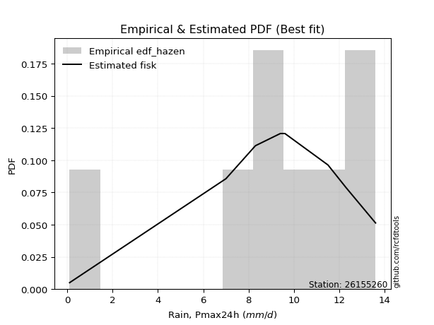</img>

</div>


### 3. EDF Weibull (1939)

Weibull plotting position formula is an empirical method used to estimate the non-exceedance probability or plotting position for a set of observed data, is often recommended or widely used in practice, particularly in flood frequency analysis.

<div align="center">


$P=m/(n+1)$


</div>


**3.1. Empirical values**

<div align="center">

|                | 0                  | 1                  | 2                  | 3                  | 4                  | 5                  | 6                  | 7                  |
|:---------------|:-------------------|:-------------------|:-------------------|:-------------------|:-------------------|:-------------------|:-------------------|:-------------------|
| date           | 2016               | 2019               | 2020               | 2023               | 2017               | 2018               | 2022               | 2021               |
| x              | 0.1                | 7.0                | 8.3                | 9.4                | 9.6                | 11.5               | 12.3               | 13.6               |
| m              | 1                  | 2                  | 3                  | 4                  | 5                  | 6                  | 7                  | 8                  |
| empirical_dist | edf_weibull        | edf_weibull        | edf_weibull        | edf_weibull        | edf_weibull        | edf_weibull        | edf_weibull        | edf_weibull        |
| empirical      | 0.1111111111111111 | 0.2222222222222222 | 0.3333333333333333 | 0.4444444444444444 | 0.5555555555555556 | 0.6666666666666666 | 0.7777777777777778 | 0.8888888888888888 |
| empirical_tr   | 1.125              | 1.2857142857142856 | 1.4999999999999998 | 1.7999999999999998 | 2.25               | 2.9999999999999996 | 4.5                | 8.999999999999996  |

</div>


**3.2. Kolmogorov-Smirnov fit test (sorted by Δ)**


<div align="center">

|                | 0                   | 1                   | 2                   | 3                   | 4                   | 5                   | 6                  | 7                   | 8                   | 9                   | 10                  | 11                  | 12                  | 13                  | 14                  | 15                 | 16                  | 17                 | 18                  | 19                 | 20                  | 21                  | 22                  | 23                  | 24                 | 25                  | 26                  | 27                  | 28                  | 29                 | 30                  | 31                 | 32                  | 33                 | 34                  | 35                 | 36                  | 37                  | 38                  | 39                    | 40                 | 41                  | 42                  | 43                  | 44                  | 45                  | 46                  | 47                  | 48                  | 49                  | 50                  | 51                 | 52                 | 53                 | 54                 | 55                  | 56                  | 57                 | 58                 | 59                 | 60                  | 61                  | 62                 | 63                 | 64                 | 65                  | 66                 | 67                  | 68                  | 69                 | 70                 | 71                 | 72                 | 73                  | 74                 | 75                 | 76                 | 77                 | 78                 | 79                 | 80                 | 81                 | 82                 | 83                 | 84                 | 85                 | 86                 | 87                 |
|:---------------|:--------------------|:--------------------|:--------------------|:--------------------|:--------------------|:--------------------|:-------------------|:--------------------|:--------------------|:--------------------|:--------------------|:--------------------|:--------------------|:--------------------|:--------------------|:-------------------|:--------------------|:-------------------|:--------------------|:-------------------|:--------------------|:--------------------|:--------------------|:--------------------|:-------------------|:--------------------|:--------------------|:--------------------|:--------------------|:-------------------|:--------------------|:-------------------|:--------------------|:-------------------|:--------------------|:-------------------|:--------------------|:--------------------|:--------------------|:----------------------|:-------------------|:--------------------|:--------------------|:--------------------|:--------------------|:--------------------|:--------------------|:--------------------|:--------------------|:--------------------|:--------------------|:-------------------|:-------------------|:-------------------|:-------------------|:--------------------|:--------------------|:-------------------|:-------------------|:-------------------|:--------------------|:--------------------|:-------------------|:-------------------|:-------------------|:--------------------|:-------------------|:--------------------|:--------------------|:-------------------|:-------------------|:-------------------|:-------------------|:--------------------|:-------------------|:-------------------|:-------------------|:-------------------|:-------------------|:-------------------|:-------------------|:-------------------|:-------------------|:-------------------|:-------------------|:-------------------|:-------------------|:-------------------|
| station        | 26155260            | 26155260            | 26155260            | 26155260            | 26155260            | 26155260            | 26155260           | 26155260            | 26155260            | 26155260            | 26155260            | 26155260            | 26155260            | 26155260            | 26155260            | 26155260           | 26155260            | 26155260           | 26155260            | 26155260           | 26155260            | 26155260            | 26155260            | 26155260            | 26155260           | 26155260            | 26155260            | 26155260            | 26155260            | 26155260           | 26155260            | 26155260           | 26155260            | 26155260           | 26155260            | 26155260           | 26155260            | 26155260            | 26155260            | 26155260              | 26155260           | 26155260            | 26155260            | 26155260            | 26155260            | 26155260            | 26155260            | 26155260            | 26155260            | 26155260            | 26155260            | 26155260           | 26155260           | 26155260           | 26155260           | 26155260            | 26155260            | 26155260           | 26155260           | 26155260           | 26155260            | 26155260            | 26155260           | 26155260           | 26155260           | 26155260            | 26155260           | 26155260            | 26155260            | 26155260           | 26155260           | 26155260           | 26155260           | 26155260            | 26155260           | 26155260           | 26155260           | 26155260           | 26155260           | 26155260           | 26155260           | 26155260           | 26155260           | 26155260           | 26155260           | 26155260           | 26155260           | 26155260           |
| empirical_dist | edf_weibull         | edf_weibull         | edf_weibull         | edf_weibull         | edf_weibull         | edf_weibull         | edf_weibull        | edf_weibull         | edf_weibull         | edf_weibull         | edf_weibull         | edf_weibull         | edf_weibull         | edf_weibull         | edf_weibull         | edf_weibull        | edf_weibull         | edf_weibull        | edf_weibull         | edf_weibull        | edf_weibull         | edf_weibull         | edf_weibull         | edf_weibull         | edf_weibull        | edf_weibull         | edf_weibull         | edf_weibull         | edf_weibull         | edf_weibull        | edf_weibull         | edf_weibull        | edf_weibull         | edf_weibull        | edf_weibull         | edf_weibull        | edf_weibull         | edf_weibull         | edf_weibull         | edf_weibull           | edf_weibull        | edf_weibull         | edf_weibull         | edf_weibull         | edf_weibull         | edf_weibull         | edf_weibull         | edf_weibull         | edf_weibull         | edf_weibull         | edf_weibull         | edf_weibull        | edf_weibull        | edf_weibull        | edf_weibull        | edf_weibull         | edf_weibull         | edf_weibull        | edf_weibull        | edf_weibull        | edf_weibull         | edf_weibull         | edf_weibull        | edf_weibull        | edf_weibull        | edf_weibull         | edf_weibull        | edf_weibull         | edf_weibull         | edf_weibull        | edf_weibull        | edf_weibull        | edf_weibull        | edf_weibull         | edf_weibull        | edf_weibull        | edf_weibull        | edf_weibull        | edf_weibull        | edf_weibull        | edf_weibull        | edf_weibull        | edf_weibull        | edf_weibull        | edf_weibull        | edf_weibull        | edf_weibull        | edf_weibull        |
| p_dist         | pearson3            | gumbel_l            | nct                 | exponnorm           | crystalball         | norm                | rice               | t                   | fatiguelife         | f                   | fisk                | ncf                 | logistic            | logjohnsonsu        | johnsonsu           | mielke             | gompertz            | betaprime          | hypsecant           | erlang             | gamma               | logt                | invgamma            | laplace_asymmetric  | laplace            | maxwell             | invgauss            | rayleigh            | invweibull          | gumbel_r           | logcrystalball      | halfnorm           | moyal               | halflogistic       | kstwobign           | genexpon           | logpearson3         | loggompertz         | logloggamma         | loglaplace_asymmetric | logmielke          | wald                | loggumbel_l         | logtruncnorm        | gibrat              | expon               | logfisk             | logrice             | logexponnorm        | lognorm             | lognorm             | lognct             | lognakagami        | loginvweibull      | logfatiguelife     | loglognorm          | loginvgamma         | loglogistic        | logalpha           | loghypsecant       | loginvgauss         | logmaxwell          | loglaplace         | lograyleigh        | logkstwobign       | logncf              | nakagami           | loghalfnorm         | loggumbel_r         | loghalflogistic    | logmoyal           | loggenexpon        | logexpon           | logf                | logweibull_min     | logwald            | loggibrat          | logbetaprime       | weibull_min        | truncnorm          | chi2               | logchi2            | alpha              | loggamma           | loggamma           | genlogistic        | loggenlogistic     | logerlang          |
| delta          | 0.07979666690920008 | 0.08094843847928558 | 0.09940642730329492 | 0.09944235013014509 | 0.09944263253710695 | 0.09944263569791136 | 0.0994444614458252 | 0.09944488599699046 | 0.09996439570431136 | 0.10011970047648577 | 0.10055297336916041 | 0.10100036976084159 | 0.10464265998696654 | 0.10564846993417043 | 0.10574537715644894 | 0.1110736740984013 | 0.11111099048421505 | 0.1112753900363595 | 0.11169057357139489 | 0.112687334433058  | 0.11563291689379634 | 0.11597627733882981 | 0.12176096971858158 | 0.13085096267366525 | 0.1325711617911619 | 0.13259702119952466 | 0.14443800629515452 | 0.14470201038500724 | 0.16001200429473345 | 0.1691278949369236 | 0.17063861432974714 | 0.1789275869836851 | 0.19417433723263156 | 0.1981947400470903 | 0.20355287524802007 | 0.2200688439373676 | 0.23776795710818766 | 0.24057056055046921 | 0.24836733621955887 | 0.24858674262301717   | 0.2617483027025995 | 0.26367589870312047 | 0.26782905759591846 | 0.27799880204384875 | 0.29221963089013947 | 0.31820813598624464 | 0.32761085846978466 | 0.33415731011832306 | 0.33415826718271757 | 0.33415918866159533 | 0.33415918866159533 | 0.3342636127519436 | 0.3349276468241804 | 0.3349369973692742 | 0.3349567591833009 | 0.33693950570692954 | 0.34056807628914454 | 0.3417252992017564 | 0.3439346664984233 | 0.3480991878473447 | 0.36042278104278924 | 0.36412005287693316 | 0.3686321411088812 | 0.3736998134177746 | 0.3777538025133077 | 0.38416579439350496 | 0.3925094811078028 | 0.40074016780417776 | 0.40397137842142106 | 0.4282252681312526 | 0.4285937827126368 | 0.4292409670173726 | 0.4292585501463725 | 0.48176029270192244 | 0.4851588489643518 | 0.4969146456656991 | 0.5265021386217276 | 0.5546742707743894 | 0.567874567091031  | 0.6146975069876349 | 0.680401233173655  | 0.7193417520220683 | 0.7465669369263221 | 0.7555840144178506 | 0.7555840144178506 | 0.7777777777777778 | 0.7777777777777778 | 0.8130462469081423 |
| deltao         | 0.4472608134160001  | 0.4472608134160001  | 0.4472608134160001  | 0.4472608134160001  | 0.4472608134160001  | 0.4472608134160001  | 0.4472608134160001 | 0.4472608134160001  | 0.4472608134160001  | 0.4472608134160001  | 0.4472608134160001  | 0.4472608134160001  | 0.4472608134160001  | 0.4472608134160001  | 0.4472608134160001  | 0.4472608134160001 | 0.4472608134160001  | 0.4472608134160001 | 0.4472608134160001  | 0.4472608134160001 | 0.4472608134160001  | 0.4472608134160001  | 0.4472608134160001  | 0.4472608134160001  | 0.4472608134160001 | 0.4472608134160001  | 0.4472608134160001  | 0.4472608134160001  | 0.4472608134160001  | 0.4472608134160001 | 0.4472608134160001  | 0.4472608134160001 | 0.4472608134160001  | 0.4472608134160001 | 0.4472608134160001  | 0.4472608134160001 | 0.4472608134160001  | 0.4472608134160001  | 0.4472608134160001  | 0.4472608134160001    | 0.4472608134160001 | 0.4472608134160001  | 0.4472608134160001  | 0.4472608134160001  | 0.4472608134160001  | 0.4472608134160001  | 0.4472608134160001  | 0.4472608134160001  | 0.4472608134160001  | 0.4472608134160001  | 0.4472608134160001  | 0.4472608134160001 | 0.4472608134160001 | 0.4472608134160001 | 0.4472608134160001 | 0.4472608134160001  | 0.4472608134160001  | 0.4472608134160001 | 0.4472608134160001 | 0.4472608134160001 | 0.4472608134160001  | 0.4472608134160001  | 0.4472608134160001 | 0.4472608134160001 | 0.4472608134160001 | 0.4472608134160001  | 0.4472608134160001 | 0.4472608134160001  | 0.4472608134160001  | 0.4472608134160001 | 0.4472608134160001 | 0.4472608134160001 | 0.4472608134160001 | 0.4472608134160001  | 0.4472608134160001 | 0.4472608134160001 | 0.4472608134160001 | 0.4472608134160001 | 0.4472608134160001 | 0.4472608134160001 | 0.4472608134160001 | 0.4472608134160001 | 0.4472608134160001 | 0.4472608134160001 | 0.4472608134160001 | 0.4472608134160001 | 0.4472608134160001 | 0.4472608134160001 |
| eval           | Δo > Δ              | Δo > Δ              | Δo > Δ              | Δo > Δ              | Δo > Δ              | Δo > Δ              | Δo > Δ             | Δo > Δ              | Δo > Δ              | Δo > Δ              | Δo > Δ              | Δo > Δ              | Δo > Δ              | Δo > Δ              | Δo > Δ              | Δo > Δ             | Δo > Δ              | Δo > Δ             | Δo > Δ              | Δo > Δ             | Δo > Δ              | Δo > Δ              | Δo > Δ              | Δo > Δ              | Δo > Δ             | Δo > Δ              | Δo > Δ              | Δo > Δ              | Δo > Δ              | Δo > Δ             | Δo > Δ              | Δo > Δ             | Δo > Δ              | Δo > Δ             | Δo > Δ              | Δo > Δ             | Δo > Δ              | Δo > Δ              | Δo > Δ              | Δo > Δ                | Δo > Δ             | Δo > Δ              | Δo > Δ              | Δo > Δ              | Δo > Δ              | Δo > Δ              | Δo > Δ              | Δo > Δ              | Δo > Δ              | Δo > Δ              | Δo > Δ              | Δo > Δ             | Δo > Δ             | Δo > Δ             | Δo > Δ             | Δo > Δ              | Δo > Δ              | Δo > Δ             | Δo > Δ             | Δo > Δ             | Δo > Δ              | Δo > Δ              | Δo > Δ             | Δo > Δ             | Δo > Δ             | Δo > Δ              | Δo > Δ             | Δo > Δ              | Δo > Δ              | Δo > Δ             | Δo > Δ             | Δo > Δ             | Δo > Δ             | Δo <= Δ             | Δo <= Δ            | Δo <= Δ            | Δo <= Δ            | Δo <= Δ            | Δo <= Δ            | Δo <= Δ            | Δo <= Δ            | Δo <= Δ            | Δo <= Δ            | Δo <= Δ            | Δo <= Δ            | Δo <= Δ            | Δo <= Δ            | Δo <= Δ            |
| fit            | 1                   | 1                   | 1                   | 1                   | 1                   | 1                   | 1                  | 1                   | 1                   | 1                   | 1                   | 1                   | 1                   | 1                   | 1                   | 1                  | 1                   | 1                  | 1                   | 1                  | 1                   | 1                   | 1                   | 1                   | 1                  | 1                   | 1                   | 1                   | 1                   | 1                  | 1                   | 1                  | 1                   | 1                  | 1                   | 1                  | 1                   | 1                   | 1                   | 1                     | 1                  | 1                   | 1                   | 1                   | 1                   | 1                   | 1                   | 1                   | 1                   | 1                   | 1                   | 1                  | 1                  | 1                  | 1                  | 1                   | 1                   | 1                  | 1                  | 1                  | 1                   | 1                   | 1                  | 1                  | 1                  | 1                   | 1                  | 1                   | 1                   | 1                  | 1                  | 1                  | 1                  | 0                   | 0                  | 0                  | 0                  | 0                  | 0                  | 0                  | 0                  | 0                  | 0                  | 0                  | 0                  | 0                  | 0                  | 0                  |
| n              | 8                   | 8                   | 8                   | 8                   | 8                   | 8                   | 8                  | 8                   | 8                   | 8                   | 8                   | 8                   | 8                   | 8                   | 8                   | 8                  | 8                   | 8                  | 8                   | 8                  | 8                   | 8                   | 8                   | 8                   | 8                  | 8                   | 8                   | 8                   | 8                   | 8                  | 8                   | 8                  | 8                   | 8                  | 8                   | 8                  | 8                   | 8                   | 8                   | 8                     | 8                  | 8                   | 8                   | 8                   | 8                   | 8                   | 8                   | 8                   | 8                   | 8                   | 8                   | 8                  | 8                  | 8                  | 8                  | 8                   | 8                   | 8                  | 8                  | 8                  | 8                   | 8                   | 8                  | 8                  | 8                  | 8                   | 8                  | 8                   | 8                   | 8                  | 8                  | 8                  | 8                  | 8                   | 8                  | 8                  | 8                  | 8                  | 8                  | 8                  | 8                  | 8                  | 8                  | 8                  | 8                  | 8                  | 8                  | 8                  |
| best_fit       | 1                   | 0                   | 0                   | 0                   | 0                   | 0                   | 0                  | 0                   | 0                   | 0                   | 0                   | 0                   | 0                   | 0                   | 0                   | 0                  | 0                   | 0                  | 0                   | 0                  | 0                   | 0                   | 0                   | 0                   | 0                  | 0                   | 0                   | 0                   | 0                   | 0                  | 0                   | 0                  | 0                   | 0                  | 0                   | 0                  | 0                   | 0                   | 0                   | 0                     | 0                  | 0                   | 0                   | 0                   | 0                   | 0                   | 0                   | 0                   | 0                   | 0                   | 0                   | 0                  | 0                  | 0                  | 0                  | 0                   | 0                   | 0                  | 0                  | 0                  | 0                   | 0                   | 0                  | 0                  | 0                  | 0                   | 0                  | 0                   | 0                   | 0                  | 0                  | 0                  | 0                  | 0                   | 0                  | 0                  | 0                  | 0                  | 0                  | 0                  | 0                  | 0                  | 0                  | 0                  | 0                  | 0                  | 0                  | 0                  |
| best_fit_sort  | 1                   | 2                   | 3                   | 4                   | 5                   | 6                   | 7                  | 8                   | 9                   | 10                  | 11                  | 12                  | 13                  | 14                  | 15                  | 16                 | 17                  | 18                 | 19                  | 20                 | 21                  | 22                  | 23                  | 24                  | 25                 | 26                  | 27                  | 28                  | 29                  | 30                 | 31                  | 32                 | 33                  | 34                 | 35                  | 36                 | 37                  | 38                  | 39                  | 40                    | 41                 | 42                  | 43                  | 44                  | 45                  | 46                  | 47                  | 48                  | 49                  | 50                  | 51                  | 52                 | 53                 | 54                 | 55                 | 56                  | 57                  | 58                 | 59                 | 60                 | 61                  | 62                  | 63                 | 64                 | 65                 | 66                  | 67                 | 68                  | 69                  | 70                 | 71                 | 72                 | 73                 | 74                  | 75                 | 76                 | 77                 | 78                 | 79                 | 80                 | 81                 | 82                 | 83                 | 84                 | 85                 | 86                 | 87                 | 88                 |

</div>


**3.3. Best fit**

<div align="center">

|   id |   station | empirical_dist   | p_dist   |     delta |   deltao | eval   |   fit |   n |   best_fit |   best_fit_sort |
|-----:|----------:|:-----------------|:---------|----------:|---------:|:-------|------:|----:|-----------:|----------------:|
|    0 |  26155260 | edf_weibull      | pearson3 | 0.0797967 | 0.447261 | Δo > Δ |     1 |   8 |          1 |               1 |

</div>


<div align="center">

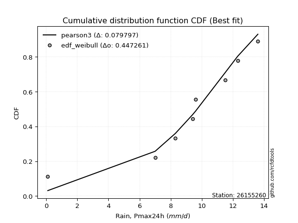</img>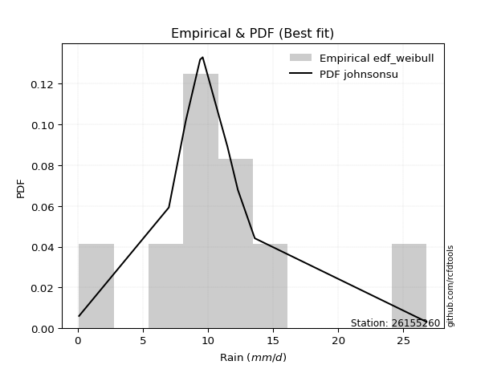</img>

</div>


### 4. EDF Beard (1943)

The Beard formula (or Beard´s plotting position formula) in hydrology is used to estimate the empirical non-exceedance probability _(P)_ of a flood event (or other extreme hydrological data point) within a given dataset.

<div align="center">


$P=(m-0.31)/(n+0.38)$


</div>


**4.1. Empirical values**

<div align="center">

|                | 0                   | 1                   | 2                  | 3                   | 4                  | 5                  | 6                  | 7                  |
|:---------------|:--------------------|:--------------------|:-------------------|:--------------------|:-------------------|:-------------------|:-------------------|:-------------------|
| date           | 2016                | 2019                | 2020               | 2023                | 2017               | 2018               | 2022               | 2021               |
| x              | 0.1                 | 7.0                 | 8.3                | 9.4                 | 9.6                | 11.5               | 12.3               | 13.6               |
| m              | 1                   | 2                   | 3                  | 4                   | 5                  | 6                  | 7                  | 8                  |
| empirical_dist | edf_beard           | edf_beard           | edf_beard          | edf_beard           | edf_beard          | edf_beard          | edf_beard          | edf_beard          |
| empirical      | 0.08233890214797135 | 0.20167064439140808 | 0.3210023866348448 | 0.44033412887828155 | 0.5596658711217184 | 0.6789976133651551 | 0.7983293556085919 | 0.9176610978520287 |
| empirical_tr   | 1.0897269180754225  | 1.2526158445440956  | 1.4727592267135323 | 1.7867803837953091  | 2.2710027100271004 | 3.115241635687732  | 4.958579881656804  | 12.144927536231886 |

</div>


**4.2. Kolmogorov-Smirnov fit test (sorted by Δ)**


<div align="center">

|                | 0                    | 1                   | 2                   | 3                  | 4                   | 5                  | 6                  | 7                   | 8                   | 9                   | 10                 | 11                  | 12                  | 13                  | 14                  | 15                  | 16                  | 17                  | 18                 | 19                  | 20                 | 21                 | 22                  | 23                  | 24                  | 25                  | 26                  | 27                  | 28                  | 29                  | 30                  | 31                 | 32                  | 33                 | 34                 | 35                 | 36                  | 37                  | 38                  | 39                 | 40                    | 41                  | 42                 | 43                  | 44                 | 45                  | 46                 | 47                 | 48                 | 49                  | 50                  | 51                  | 52                  | 53                 | 54                  | 55                  | 56                  | 57                  | 58                  | 59                  | 60                  | 61                 | 62                  | 63                 | 64                  | 65                 | 66                  | 67                 | 68                 | 69                  | 70                  | 71                 | 72                 | 73                 | 74                 | 75                 | 76                 | 77                 | 78                 | 79                 | 80                 | 81                 | 82                 | 83                 | 84                 | 85                 | 86                 | 87                 |
|:---------------|:---------------------|:--------------------|:--------------------|:-------------------|:--------------------|:-------------------|:-------------------|:--------------------|:--------------------|:--------------------|:-------------------|:--------------------|:--------------------|:--------------------|:--------------------|:--------------------|:--------------------|:--------------------|:-------------------|:--------------------|:-------------------|:-------------------|:--------------------|:--------------------|:--------------------|:--------------------|:--------------------|:--------------------|:--------------------|:--------------------|:--------------------|:-------------------|:--------------------|:-------------------|:-------------------|:-------------------|:--------------------|:--------------------|:--------------------|:-------------------|:----------------------|:--------------------|:-------------------|:--------------------|:-------------------|:--------------------|:-------------------|:-------------------|:-------------------|:--------------------|:--------------------|:--------------------|:--------------------|:-------------------|:--------------------|:--------------------|:--------------------|:--------------------|:--------------------|:--------------------|:--------------------|:-------------------|:--------------------|:-------------------|:--------------------|:-------------------|:--------------------|:-------------------|:-------------------|:--------------------|:--------------------|:-------------------|:-------------------|:-------------------|:-------------------|:-------------------|:-------------------|:-------------------|:-------------------|:-------------------|:-------------------|:-------------------|:-------------------|:-------------------|:-------------------|:-------------------|:-------------------|:-------------------|
| station        | 26155260             | 26155260            | 26155260            | 26155260           | 26155260            | 26155260           | 26155260           | 26155260            | 26155260            | 26155260            | 26155260           | 26155260            | 26155260            | 26155260            | 26155260            | 26155260            | 26155260            | 26155260            | 26155260           | 26155260            | 26155260           | 26155260           | 26155260            | 26155260            | 26155260            | 26155260            | 26155260            | 26155260            | 26155260            | 26155260            | 26155260            | 26155260           | 26155260            | 26155260           | 26155260           | 26155260           | 26155260            | 26155260            | 26155260            | 26155260           | 26155260              | 26155260            | 26155260           | 26155260            | 26155260           | 26155260            | 26155260           | 26155260           | 26155260           | 26155260            | 26155260            | 26155260            | 26155260            | 26155260           | 26155260            | 26155260            | 26155260            | 26155260            | 26155260            | 26155260            | 26155260            | 26155260           | 26155260            | 26155260           | 26155260            | 26155260           | 26155260            | 26155260           | 26155260           | 26155260            | 26155260            | 26155260           | 26155260           | 26155260           | 26155260           | 26155260           | 26155260           | 26155260           | 26155260           | 26155260           | 26155260           | 26155260           | 26155260           | 26155260           | 26155260           | 26155260           | 26155260           | 26155260           |
| empirical_dist | edf_beard            | edf_beard           | edf_beard           | edf_beard          | edf_beard           | edf_beard          | edf_beard          | edf_beard           | edf_beard           | edf_beard           | edf_beard          | edf_beard           | edf_beard           | edf_beard           | edf_beard           | edf_beard           | edf_beard           | edf_beard           | edf_beard          | edf_beard           | edf_beard          | edf_beard          | edf_beard           | edf_beard           | edf_beard           | edf_beard           | edf_beard           | edf_beard           | edf_beard           | edf_beard           | edf_beard           | edf_beard          | edf_beard           | edf_beard          | edf_beard          | edf_beard          | edf_beard           | edf_beard           | edf_beard           | edf_beard          | edf_beard             | edf_beard           | edf_beard          | edf_beard           | edf_beard          | edf_beard           | edf_beard          | edf_beard          | edf_beard          | edf_beard           | edf_beard           | edf_beard           | edf_beard           | edf_beard          | edf_beard           | edf_beard           | edf_beard           | edf_beard           | edf_beard           | edf_beard           | edf_beard           | edf_beard          | edf_beard           | edf_beard          | edf_beard           | edf_beard          | edf_beard           | edf_beard          | edf_beard          | edf_beard           | edf_beard           | edf_beard          | edf_beard          | edf_beard          | edf_beard          | edf_beard          | edf_beard          | edf_beard          | edf_beard          | edf_beard          | edf_beard          | edf_beard          | edf_beard          | edf_beard          | edf_beard          | edf_beard          | edf_beard          | edf_beard          |
| p_dist         | gumbel_l             | fisk                | pearson3            | gompertz           | mielke              | fatiguelife        | logistic           | logjohnsonsu        | johnsonsu           | t                   | norm               | crystalball         | exponnorm           | rice                | nct                 | f                   | ncf                 | hypsecant           | laplace_asymmetric | logt                | betaprime          | erlang             | gamma               | laplace             | invgamma            | maxwell             | invgauss            | rayleigh            | gumbel_r            | invweibull          | logcrystalball      | halfnorm           | moyal               | halflogistic       | kstwobign          | genexpon           | loggompertz         | logpearson3         | wald                | logloggamma        | loglaplace_asymmetric | logmielke           | loggumbel_l        | gibrat              | logtruncnorm       | expon               | logfisk            | logrice            | logexponnorm       | lognorm             | lognorm             | lognct              | lognakagami         | loginvweibull      | logfatiguelife      | loglognorm          | loginvgamma         | loglogistic         | logalpha            | loghypsecant        | loginvgauss         | logmaxwell         | loglaplace          | lograyleigh        | logkstwobign        | logncf             | nakagami            | loghalfnorm        | loggumbel_r        | loghalflogistic     | logmoyal            | loggenexpon        | logexpon           | logf               | logweibull_min     | logwald            | loggibrat          | logbetaprime       | weibull_min        | truncnorm          | chi2               | logchi2            | alpha              | loggamma           | loggamma           | genlogistic        | loggenlogistic     | logerlang          |
| delta          | 0.061697563534099054 | 0.07178076440602066 | 0.07193344354629783 | 0.0823387815210753 | 0.08776311971171469 | 0.1078650923285488 | 0.1087529755531294 | 0.10975878550033324 | 0.10985569272261175 | 0.11046585190452157 | 0.1105253025438091 | 0.11052533109987478 | 0.11052571866412403 | 0.11052833601903184 | 0.11079357260492645 | 0.11245064717497427 | 0.11272375311639654 | 0.11370557869650583 | 0.1185200159751768 | 0.12008659290499263 | 0.123606336734848  | 0.1250182811315465 | 0.12796386359228484 | 0.13085277186808503 | 0.13409191641707008 | 0.14492796789801315 | 0.15676895299364302 | 0.15703295708349574 | 0.17534606183411333 | 0.18056358212554757 | 0.19119019216056127 | 0.1912585336821736 | 0.20005024463249343 | 0.2105256867455788 | 0.2241044530788342 | 0.2406204217681817 | 0.26112213838128334 | 0.26654016607132747 | 0.26835957851431513 | 0.268918914050373  | 0.2691383204538313    | 0.28229988053341365 | 0.2883806354267326 | 0.29632994645630234 | 0.2985503798746629 | 0.33875971381705877 | 0.3481624363005988 | 0.3547088879491372 | 0.3547098450135317 | 0.35471076649240946 | 0.35471076649240946 | 0.35481519058275773 | 0.35547922465499454 | 0.3554885752000883 | 0.35550833701411505 | 0.35749108353774367 | 0.36111965411995867 | 0.36227687703257055 | 0.36448624432923743 | 0.36865076567815885 | 0.38097435887360337 | 0.3846716307077473 | 0.38918371893969533 | 0.3942513912485887 | 0.39830538034412183 | 0.4047173722243191 | 0.41306105893861694 | 0.4212917456349919 | 0.4245229562522352 | 0.44877684596206674 | 0.44914536054345094 | 0.4497925448481867 | 0.4498101279771866 | 0.5023118705327365 | 0.505710426795166  | 0.5174662234965133 | 0.5470537164525417 | 0.5752258486052035 | 0.5884261449218451 | 0.6352490848184491 | 0.7009528110044692 | 0.7398933298528825 | 0.7671185147571362 | 0.7761355922486648 | 0.7761355922486648 | 0.7983293556085919 | 0.7983293556085919 | 0.8418184558712821 |
| deltao         | 0.4472608134160001   | 0.4472608134160001  | 0.4472608134160001  | 0.4472608134160001 | 0.4472608134160001  | 0.4472608134160001 | 0.4472608134160001 | 0.4472608134160001  | 0.4472608134160001  | 0.4472608134160001  | 0.4472608134160001 | 0.4472608134160001  | 0.4472608134160001  | 0.4472608134160001  | 0.4472608134160001  | 0.4472608134160001  | 0.4472608134160001  | 0.4472608134160001  | 0.4472608134160001 | 0.4472608134160001  | 0.4472608134160001 | 0.4472608134160001 | 0.4472608134160001  | 0.4472608134160001  | 0.4472608134160001  | 0.4472608134160001  | 0.4472608134160001  | 0.4472608134160001  | 0.4472608134160001  | 0.4472608134160001  | 0.4472608134160001  | 0.4472608134160001 | 0.4472608134160001  | 0.4472608134160001 | 0.4472608134160001 | 0.4472608134160001 | 0.4472608134160001  | 0.4472608134160001  | 0.4472608134160001  | 0.4472608134160001 | 0.4472608134160001    | 0.4472608134160001  | 0.4472608134160001 | 0.4472608134160001  | 0.4472608134160001 | 0.4472608134160001  | 0.4472608134160001 | 0.4472608134160001 | 0.4472608134160001 | 0.4472608134160001  | 0.4472608134160001  | 0.4472608134160001  | 0.4472608134160001  | 0.4472608134160001 | 0.4472608134160001  | 0.4472608134160001  | 0.4472608134160001  | 0.4472608134160001  | 0.4472608134160001  | 0.4472608134160001  | 0.4472608134160001  | 0.4472608134160001 | 0.4472608134160001  | 0.4472608134160001 | 0.4472608134160001  | 0.4472608134160001 | 0.4472608134160001  | 0.4472608134160001 | 0.4472608134160001 | 0.4472608134160001  | 0.4472608134160001  | 0.4472608134160001 | 0.4472608134160001 | 0.4472608134160001 | 0.4472608134160001 | 0.4472608134160001 | 0.4472608134160001 | 0.4472608134160001 | 0.4472608134160001 | 0.4472608134160001 | 0.4472608134160001 | 0.4472608134160001 | 0.4472608134160001 | 0.4472608134160001 | 0.4472608134160001 | 0.4472608134160001 | 0.4472608134160001 | 0.4472608134160001 |
| eval           | Δo > Δ               | Δo > Δ              | Δo > Δ              | Δo > Δ             | Δo > Δ              | Δo > Δ             | Δo > Δ             | Δo > Δ              | Δo > Δ              | Δo > Δ              | Δo > Δ             | Δo > Δ              | Δo > Δ              | Δo > Δ              | Δo > Δ              | Δo > Δ              | Δo > Δ              | Δo > Δ              | Δo > Δ             | Δo > Δ              | Δo > Δ             | Δo > Δ             | Δo > Δ              | Δo > Δ              | Δo > Δ              | Δo > Δ              | Δo > Δ              | Δo > Δ              | Δo > Δ              | Δo > Δ              | Δo > Δ              | Δo > Δ             | Δo > Δ              | Δo > Δ             | Δo > Δ             | Δo > Δ             | Δo > Δ              | Δo > Δ              | Δo > Δ              | Δo > Δ             | Δo > Δ                | Δo > Δ              | Δo > Δ             | Δo > Δ              | Δo > Δ             | Δo > Δ              | Δo > Δ             | Δo > Δ             | Δo > Δ             | Δo > Δ              | Δo > Δ              | Δo > Δ              | Δo > Δ              | Δo > Δ             | Δo > Δ              | Δo > Δ              | Δo > Δ              | Δo > Δ              | Δo > Δ              | Δo > Δ              | Δo > Δ              | Δo > Δ             | Δo > Δ              | Δo > Δ             | Δo > Δ              | Δo > Δ             | Δo > Δ              | Δo > Δ             | Δo > Δ             | Δo <= Δ             | Δo <= Δ             | Δo <= Δ            | Δo <= Δ            | Δo <= Δ            | Δo <= Δ            | Δo <= Δ            | Δo <= Δ            | Δo <= Δ            | Δo <= Δ            | Δo <= Δ            | Δo <= Δ            | Δo <= Δ            | Δo <= Δ            | Δo <= Δ            | Δo <= Δ            | Δo <= Δ            | Δo <= Δ            | Δo <= Δ            |
| fit            | 1                    | 1                   | 1                   | 1                  | 1                   | 1                  | 1                  | 1                   | 1                   | 1                   | 1                  | 1                   | 1                   | 1                   | 1                   | 1                   | 1                   | 1                   | 1                  | 1                   | 1                  | 1                  | 1                   | 1                   | 1                   | 1                   | 1                   | 1                   | 1                   | 1                   | 1                   | 1                  | 1                   | 1                  | 1                  | 1                  | 1                   | 1                   | 1                   | 1                  | 1                     | 1                   | 1                  | 1                   | 1                  | 1                   | 1                  | 1                  | 1                  | 1                   | 1                   | 1                   | 1                   | 1                  | 1                   | 1                   | 1                   | 1                   | 1                   | 1                   | 1                   | 1                  | 1                   | 1                  | 1                   | 1                  | 1                   | 1                  | 1                  | 0                   | 0                   | 0                  | 0                  | 0                  | 0                  | 0                  | 0                  | 0                  | 0                  | 0                  | 0                  | 0                  | 0                  | 0                  | 0                  | 0                  | 0                  | 0                  |
| n              | 8                    | 8                   | 8                   | 8                  | 8                   | 8                  | 8                  | 8                   | 8                   | 8                   | 8                  | 8                   | 8                   | 8                   | 8                   | 8                   | 8                   | 8                   | 8                  | 8                   | 8                  | 8                  | 8                   | 8                   | 8                   | 8                   | 8                   | 8                   | 8                   | 8                   | 8                   | 8                  | 8                   | 8                  | 8                  | 8                  | 8                   | 8                   | 8                   | 8                  | 8                     | 8                   | 8                  | 8                   | 8                  | 8                   | 8                  | 8                  | 8                  | 8                   | 8                   | 8                   | 8                   | 8                  | 8                   | 8                   | 8                   | 8                   | 8                   | 8                   | 8                   | 8                  | 8                   | 8                  | 8                   | 8                  | 8                   | 8                  | 8                  | 8                   | 8                   | 8                  | 8                  | 8                  | 8                  | 8                  | 8                  | 8                  | 8                  | 8                  | 8                  | 8                  | 8                  | 8                  | 8                  | 8                  | 8                  | 8                  |
| best_fit       | 1                    | 0                   | 0                   | 0                  | 0                   | 0                  | 0                  | 0                   | 0                   | 0                   | 0                  | 0                   | 0                   | 0                   | 0                   | 0                   | 0                   | 0                   | 0                  | 0                   | 0                  | 0                  | 0                   | 0                   | 0                   | 0                   | 0                   | 0                   | 0                   | 0                   | 0                   | 0                  | 0                   | 0                  | 0                  | 0                  | 0                   | 0                   | 0                   | 0                  | 0                     | 0                   | 0                  | 0                   | 0                  | 0                   | 0                  | 0                  | 0                  | 0                   | 0                   | 0                   | 0                   | 0                  | 0                   | 0                   | 0                   | 0                   | 0                   | 0                   | 0                   | 0                  | 0                   | 0                  | 0                   | 0                  | 0                   | 0                  | 0                  | 0                   | 0                   | 0                  | 0                  | 0                  | 0                  | 0                  | 0                  | 0                  | 0                  | 0                  | 0                  | 0                  | 0                  | 0                  | 0                  | 0                  | 0                  | 0                  |
| best_fit_sort  | 1                    | 2                   | 3                   | 4                  | 5                   | 6                  | 7                  | 8                   | 9                   | 10                  | 11                 | 12                  | 13                  | 14                  | 15                  | 16                  | 17                  | 18                  | 19                 | 20                  | 21                 | 22                 | 23                  | 24                  | 25                  | 26                  | 27                  | 28                  | 29                  | 30                  | 31                  | 32                 | 33                  | 34                 | 35                 | 36                 | 37                  | 38                  | 39                  | 40                 | 41                    | 42                  | 43                 | 44                  | 45                 | 46                  | 47                 | 48                 | 49                 | 50                  | 51                  | 52                  | 53                  | 54                 | 55                  | 56                  | 57                  | 58                  | 59                  | 60                  | 61                  | 62                 | 63                  | 64                 | 65                  | 66                 | 67                  | 68                 | 69                 | 70                  | 71                  | 72                 | 73                 | 74                 | 75                 | 76                 | 77                 | 78                 | 79                 | 80                 | 81                 | 82                 | 83                 | 84                 | 85                 | 86                 | 87                 | 88                 |

</div>


**4.3. Best fit**

<div align="center">

|   id |   station | empirical_dist   | p_dist   |     delta |   deltao | eval   |   fit |   n |   best_fit |   best_fit_sort |
|-----:|----------:|:-----------------|:---------|----------:|---------:|:-------|------:|----:|-----------:|----------------:|
|    0 |  26155260 | edf_beard        | gumbel_l | 0.0616976 | 0.447261 | Δo > Δ |     1 |   8 |          1 |               1 |

</div>


<div align="center">

</img>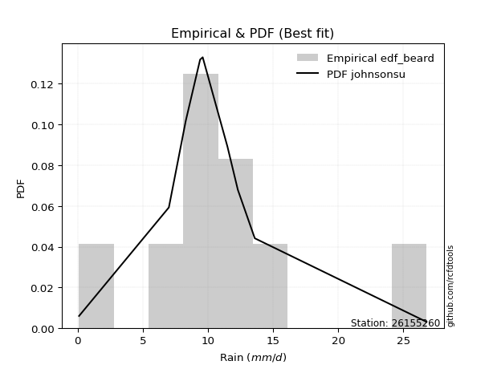</img>

</div>


### 5. EDF Chegodayev (1955)

The Chegodayev formula is an empirical plotting position formula used in hydrological frequency analysis to estimate the exceedance probability or return period of a specific event from a set of observed data. It is primarily used for plotting observed data points on probability paper to fit a theoretical distribution, particularly for analyzing extreme events like maximum flood flows or rainfall intensities. The constant _b_ value in the generalized plotting position formula is 0.3.

<div align="center">


$P=(m-b)/(n+1-2b)$


</div>


**5.1. Empirical values**

<div align="center">

|                | 0                   | 1                   | 2                   | 3                   | 4                  | 5                  | 6                  | 7                  |
|:---------------|:--------------------|:--------------------|:--------------------|:--------------------|:-------------------|:-------------------|:-------------------|:-------------------|
| date           | 2016                | 2019                | 2020                | 2023                | 2017               | 2018               | 2022               | 2021               |
| x              | 0.1                 | 7.0                 | 8.3                 | 9.4                 | 9.6                | 11.5               | 12.3               | 13.6               |
| m              | 1                   | 2                   | 3                   | 4                   | 5                  | 6                  | 7                  | 8                  |
| empirical_dist | edf_chegodayev      | edf_chegodayev      | edf_chegodayev      | edf_chegodayev      | edf_chegodayev     | edf_chegodayev     | edf_chegodayev     | edf_chegodayev     |
| empirical      | 0.08333333333333333 | 0.20238095238095236 | 0.32142857142857145 | 0.44047619047619047 | 0.5595238095238095 | 0.6785714285714286 | 0.7976190476190476 | 0.9166666666666666 |
| empirical_tr   | 1.090909090909091   | 1.253731343283582   | 1.4736842105263157  | 1.7872340425531914  | 2.27027027027027   | 3.1111111111111116 | 4.941176470588234  | 11.999999999999995 |

</div>


**5.2. Kolmogorov-Smirnov fit test (sorted by Δ)**


<div align="center">

|                | 0                   | 1                   | 2                   | 3                   | 4                   | 5                   | 6                   | 7                   | 8                   | 9                   | 10                  | 11                  | 12                  | 13                 | 14                  | 15                  | 16                 | 17                  | 18                  | 19                  | 20                  | 21                  | 22                 | 23                 | 24                  | 25                  | 26                  | 27                 | 28                 | 29                 | 30                 | 31                  | 32                 | 33                  | 34                  | 35                  | 36                 | 37                  | 38                 | 39                  | 40                    | 41                 | 42                  | 43                 | 44                  | 45                 | 46                  | 47                  | 48                  | 49                 | 50                 | 51                 | 52                 | 53                  | 54                 | 55                 | 56                 | 57                 | 58                 | 59                 | 60                 | 61                  | 62                 | 63                  | 64                 | 65                  | 66                 | 67                  | 68                  | 69                 | 70                 | 71                  | 72                  | 73                 | 74                 | 75                 | 76                 | 77                 | 78                 | 79                 | 80                 | 81                 | 82                 | 83                 | 84                 | 85                 | 86                 | 87                 |
|:---------------|:--------------------|:--------------------|:--------------------|:--------------------|:--------------------|:--------------------|:--------------------|:--------------------|:--------------------|:--------------------|:--------------------|:--------------------|:--------------------|:-------------------|:--------------------|:--------------------|:-------------------|:--------------------|:--------------------|:--------------------|:--------------------|:--------------------|:-------------------|:-------------------|:--------------------|:--------------------|:--------------------|:-------------------|:-------------------|:-------------------|:-------------------|:--------------------|:-------------------|:--------------------|:--------------------|:--------------------|:-------------------|:--------------------|:-------------------|:--------------------|:----------------------|:-------------------|:--------------------|:-------------------|:--------------------|:-------------------|:--------------------|:--------------------|:--------------------|:-------------------|:-------------------|:-------------------|:-------------------|:--------------------|:-------------------|:-------------------|:-------------------|:-------------------|:-------------------|:-------------------|:-------------------|:--------------------|:-------------------|:--------------------|:-------------------|:--------------------|:-------------------|:--------------------|:--------------------|:-------------------|:-------------------|:--------------------|:--------------------|:-------------------|:-------------------|:-------------------|:-------------------|:-------------------|:-------------------|:-------------------|:-------------------|:-------------------|:-------------------|:-------------------|:-------------------|:-------------------|:-------------------|:-------------------|
| station        | 26155260            | 26155260            | 26155260            | 26155260            | 26155260            | 26155260            | 26155260            | 26155260            | 26155260            | 26155260            | 26155260            | 26155260            | 26155260            | 26155260           | 26155260            | 26155260            | 26155260           | 26155260            | 26155260            | 26155260            | 26155260            | 26155260            | 26155260           | 26155260           | 26155260            | 26155260            | 26155260            | 26155260           | 26155260           | 26155260           | 26155260           | 26155260            | 26155260           | 26155260            | 26155260            | 26155260            | 26155260           | 26155260            | 26155260           | 26155260            | 26155260              | 26155260           | 26155260            | 26155260           | 26155260            | 26155260           | 26155260            | 26155260            | 26155260            | 26155260           | 26155260           | 26155260           | 26155260           | 26155260            | 26155260           | 26155260           | 26155260           | 26155260           | 26155260           | 26155260           | 26155260           | 26155260            | 26155260           | 26155260            | 26155260           | 26155260            | 26155260           | 26155260            | 26155260            | 26155260           | 26155260           | 26155260            | 26155260            | 26155260           | 26155260           | 26155260           | 26155260           | 26155260           | 26155260           | 26155260           | 26155260           | 26155260           | 26155260           | 26155260           | 26155260           | 26155260           | 26155260           | 26155260           |
| empirical_dist | edf_chegodayev      | edf_chegodayev      | edf_chegodayev      | edf_chegodayev      | edf_chegodayev      | edf_chegodayev      | edf_chegodayev      | edf_chegodayev      | edf_chegodayev      | edf_chegodayev      | edf_chegodayev      | edf_chegodayev      | edf_chegodayev      | edf_chegodayev     | edf_chegodayev      | edf_chegodayev      | edf_chegodayev     | edf_chegodayev      | edf_chegodayev      | edf_chegodayev      | edf_chegodayev      | edf_chegodayev      | edf_chegodayev     | edf_chegodayev     | edf_chegodayev      | edf_chegodayev      | edf_chegodayev      | edf_chegodayev     | edf_chegodayev     | edf_chegodayev     | edf_chegodayev     | edf_chegodayev      | edf_chegodayev     | edf_chegodayev      | edf_chegodayev      | edf_chegodayev      | edf_chegodayev     | edf_chegodayev      | edf_chegodayev     | edf_chegodayev      | edf_chegodayev        | edf_chegodayev     | edf_chegodayev      | edf_chegodayev     | edf_chegodayev      | edf_chegodayev     | edf_chegodayev      | edf_chegodayev      | edf_chegodayev      | edf_chegodayev     | edf_chegodayev     | edf_chegodayev     | edf_chegodayev     | edf_chegodayev      | edf_chegodayev     | edf_chegodayev     | edf_chegodayev     | edf_chegodayev     | edf_chegodayev     | edf_chegodayev     | edf_chegodayev     | edf_chegodayev      | edf_chegodayev     | edf_chegodayev      | edf_chegodayev     | edf_chegodayev      | edf_chegodayev     | edf_chegodayev      | edf_chegodayev      | edf_chegodayev     | edf_chegodayev     | edf_chegodayev      | edf_chegodayev      | edf_chegodayev     | edf_chegodayev     | edf_chegodayev     | edf_chegodayev     | edf_chegodayev     | edf_chegodayev     | edf_chegodayev     | edf_chegodayev     | edf_chegodayev     | edf_chegodayev     | edf_chegodayev     | edf_chegodayev     | edf_chegodayev     | edf_chegodayev     | edf_chegodayev     |
| p_dist         | gumbel_l            | pearson3            | fisk                | gompertz            | mielke              | fatiguelife         | logistic            | logjohnsonsu        | johnsonsu           | t                   | norm                | crystalball         | exponnorm           | rice               | nct                 | f                   | ncf                | hypsecant           | laplace_asymmetric  | logt                | betaprime           | erlang              | gamma              | laplace            | invgamma            | maxwell             | invgauss            | rayleigh           | gumbel_r           | invweibull         | logcrystalball     | halfnorm            | moyal              | halflogistic        | kstwobign           | genexpon            | loggompertz        | logpearson3         | wald               | logloggamma         | loglaplace_asymmetric | logmielke          | loggumbel_l         | gibrat             | logtruncnorm        | expon              | logfisk             | logrice             | logexponnorm        | lognorm            | lognorm            | lognct             | lognakagami        | loginvweibull       | logfatiguelife     | loglognorm         | loginvgamma        | loglogistic        | logalpha           | loghypsecant       | loginvgauss        | logmaxwell          | loglaplace         | lograyleigh         | logkstwobign       | logncf              | nakagami           | loghalfnorm         | loggumbel_r         | loghalflogistic    | logmoyal           | loggenexpon         | logexpon            | logf               | logweibull_min     | logwald            | loggibrat          | logbetaprime       | weibull_min        | truncnorm          | chi2               | logchi2            | alpha              | loggamma           | loggamma           | genlogistic        | loggenlogistic     | logerlang          |
| delta          | 0.06155550193619019 | 0.07179138194838897 | 0.07277519559138264 | 0.08333321270643727 | 0.08762105811380583 | 0.10743890753482216 | 0.10861091395522049 | 0.10961672390242438 | 0.10971363112470289 | 0.11003966711079494 | 0.11009911775008246 | 0.11009914630614814 | 0.11009953387039739 | 0.1101021512253052 | 0.11036738781119981 | 0.11202446238124764 | 0.1122975683226699 | 0.11356351709859691 | 0.11894620076890328 | 0.11994453130708377 | 0.12318015194112136 | 0.12459209633781987 | 0.1275376787985582 | 0.1307107102701761 | 0.13366573162334344 | 0.14450178310428652 | 0.15634276819991638 | 0.1566067722897691 | 0.1749198770403867 | 0.1798532741360033 | 0.190479884171017  | 0.19083234888844697 | 0.1996240598387668 | 0.21009950195185217 | 0.22339414508928992 | 0.23991011377863744 | 0.2604118303917391 | 0.26554573488596545 | 0.2679333937205885 | 0.26820860606082875 | 0.26842801246428705   | 0.2815895725438694 | 0.28767032743718834 | 0.2961878848583934 | 0.29784007188511863 | 0.3380494058275145 | 0.34745212831105454 | 0.35399857995959294 | 0.35399953702398745 | 0.3540004585028652 | 0.3540004585028652 | 0.3541048825932135 | 0.3547689166654503 | 0.35477826721054406 | 0.3547980290245708 | 0.3567807755481994 | 0.3604093461304144 | 0.3615665690430263 | 0.3637759363396932 | 0.3679404576886146 | 0.3802640508840591 | 0.38396132271820305 | 0.3884734109501511 | 0.39354108325904447 | 0.3975950723545776 | 0.40400706423477484 | 0.4123507509490727 | 0.42058143764544764 | 0.42381264826269094 | 0.4480665379725225 | 0.4484350525539067 | 0.44908223685864246 | 0.44909981998764237 | 0.5016015625431923 | 0.5050001188056217 | 0.516755915506969  | 0.5463434084629974 | 0.5745155406156592 | 0.5877158369323009 | 0.6345387768289048 | 0.7002425030149249 | 0.7391830218633382 | 0.766408206767592  | 0.7754252842591205 | 0.7754252842591205 | 0.7976190476190476 | 0.7976190476190476 | 0.8408240246859201 |
| deltao         | 0.4472608134160001  | 0.4472608134160001  | 0.4472608134160001  | 0.4472608134160001  | 0.4472608134160001  | 0.4472608134160001  | 0.4472608134160001  | 0.4472608134160001  | 0.4472608134160001  | 0.4472608134160001  | 0.4472608134160001  | 0.4472608134160001  | 0.4472608134160001  | 0.4472608134160001 | 0.4472608134160001  | 0.4472608134160001  | 0.4472608134160001 | 0.4472608134160001  | 0.4472608134160001  | 0.4472608134160001  | 0.4472608134160001  | 0.4472608134160001  | 0.4472608134160001 | 0.4472608134160001 | 0.4472608134160001  | 0.4472608134160001  | 0.4472608134160001  | 0.4472608134160001 | 0.4472608134160001 | 0.4472608134160001 | 0.4472608134160001 | 0.4472608134160001  | 0.4472608134160001 | 0.4472608134160001  | 0.4472608134160001  | 0.4472608134160001  | 0.4472608134160001 | 0.4472608134160001  | 0.4472608134160001 | 0.4472608134160001  | 0.4472608134160001    | 0.4472608134160001 | 0.4472608134160001  | 0.4472608134160001 | 0.4472608134160001  | 0.4472608134160001 | 0.4472608134160001  | 0.4472608134160001  | 0.4472608134160001  | 0.4472608134160001 | 0.4472608134160001 | 0.4472608134160001 | 0.4472608134160001 | 0.4472608134160001  | 0.4472608134160001 | 0.4472608134160001 | 0.4472608134160001 | 0.4472608134160001 | 0.4472608134160001 | 0.4472608134160001 | 0.4472608134160001 | 0.4472608134160001  | 0.4472608134160001 | 0.4472608134160001  | 0.4472608134160001 | 0.4472608134160001  | 0.4472608134160001 | 0.4472608134160001  | 0.4472608134160001  | 0.4472608134160001 | 0.4472608134160001 | 0.4472608134160001  | 0.4472608134160001  | 0.4472608134160001 | 0.4472608134160001 | 0.4472608134160001 | 0.4472608134160001 | 0.4472608134160001 | 0.4472608134160001 | 0.4472608134160001 | 0.4472608134160001 | 0.4472608134160001 | 0.4472608134160001 | 0.4472608134160001 | 0.4472608134160001 | 0.4472608134160001 | 0.4472608134160001 | 0.4472608134160001 |
| eval           | Δo > Δ              | Δo > Δ              | Δo > Δ              | Δo > Δ              | Δo > Δ              | Δo > Δ              | Δo > Δ              | Δo > Δ              | Δo > Δ              | Δo > Δ              | Δo > Δ              | Δo > Δ              | Δo > Δ              | Δo > Δ             | Δo > Δ              | Δo > Δ              | Δo > Δ             | Δo > Δ              | Δo > Δ              | Δo > Δ              | Δo > Δ              | Δo > Δ              | Δo > Δ             | Δo > Δ             | Δo > Δ              | Δo > Δ              | Δo > Δ              | Δo > Δ             | Δo > Δ             | Δo > Δ             | Δo > Δ             | Δo > Δ              | Δo > Δ             | Δo > Δ              | Δo > Δ              | Δo > Δ              | Δo > Δ             | Δo > Δ              | Δo > Δ             | Δo > Δ              | Δo > Δ                | Δo > Δ             | Δo > Δ              | Δo > Δ             | Δo > Δ              | Δo > Δ             | Δo > Δ              | Δo > Δ              | Δo > Δ              | Δo > Δ             | Δo > Δ             | Δo > Δ             | Δo > Δ             | Δo > Δ              | Δo > Δ             | Δo > Δ             | Δo > Δ             | Δo > Δ             | Δo > Δ             | Δo > Δ             | Δo > Δ             | Δo > Δ              | Δo > Δ             | Δo > Δ              | Δo > Δ             | Δo > Δ              | Δo > Δ             | Δo > Δ              | Δo > Δ              | Δo <= Δ            | Δo <= Δ            | Δo <= Δ             | Δo <= Δ             | Δo <= Δ            | Δo <= Δ            | Δo <= Δ            | Δo <= Δ            | Δo <= Δ            | Δo <= Δ            | Δo <= Δ            | Δo <= Δ            | Δo <= Δ            | Δo <= Δ            | Δo <= Δ            | Δo <= Δ            | Δo <= Δ            | Δo <= Δ            | Δo <= Δ            |
| fit            | 1                   | 1                   | 1                   | 1                   | 1                   | 1                   | 1                   | 1                   | 1                   | 1                   | 1                   | 1                   | 1                   | 1                  | 1                   | 1                   | 1                  | 1                   | 1                   | 1                   | 1                   | 1                   | 1                  | 1                  | 1                   | 1                   | 1                   | 1                  | 1                  | 1                  | 1                  | 1                   | 1                  | 1                   | 1                   | 1                   | 1                  | 1                   | 1                  | 1                   | 1                     | 1                  | 1                   | 1                  | 1                   | 1                  | 1                   | 1                   | 1                   | 1                  | 1                  | 1                  | 1                  | 1                   | 1                  | 1                  | 1                  | 1                  | 1                  | 1                  | 1                  | 1                   | 1                  | 1                   | 1                  | 1                   | 1                  | 1                   | 1                   | 0                  | 0                  | 0                   | 0                   | 0                  | 0                  | 0                  | 0                  | 0                  | 0                  | 0                  | 0                  | 0                  | 0                  | 0                  | 0                  | 0                  | 0                  | 0                  |
| n              | 8                   | 8                   | 8                   | 8                   | 8                   | 8                   | 8                   | 8                   | 8                   | 8                   | 8                   | 8                   | 8                   | 8                  | 8                   | 8                   | 8                  | 8                   | 8                   | 8                   | 8                   | 8                   | 8                  | 8                  | 8                   | 8                   | 8                   | 8                  | 8                  | 8                  | 8                  | 8                   | 8                  | 8                   | 8                   | 8                   | 8                  | 8                   | 8                  | 8                   | 8                     | 8                  | 8                   | 8                  | 8                   | 8                  | 8                   | 8                   | 8                   | 8                  | 8                  | 8                  | 8                  | 8                   | 8                  | 8                  | 8                  | 8                  | 8                  | 8                  | 8                  | 8                   | 8                  | 8                   | 8                  | 8                   | 8                  | 8                   | 8                   | 8                  | 8                  | 8                   | 8                   | 8                  | 8                  | 8                  | 8                  | 8                  | 8                  | 8                  | 8                  | 8                  | 8                  | 8                  | 8                  | 8                  | 8                  | 8                  |
| best_fit       | 1                   | 0                   | 0                   | 0                   | 0                   | 0                   | 0                   | 0                   | 0                   | 0                   | 0                   | 0                   | 0                   | 0                  | 0                   | 0                   | 0                  | 0                   | 0                   | 0                   | 0                   | 0                   | 0                  | 0                  | 0                   | 0                   | 0                   | 0                  | 0                  | 0                  | 0                  | 0                   | 0                  | 0                   | 0                   | 0                   | 0                  | 0                   | 0                  | 0                   | 0                     | 0                  | 0                   | 0                  | 0                   | 0                  | 0                   | 0                   | 0                   | 0                  | 0                  | 0                  | 0                  | 0                   | 0                  | 0                  | 0                  | 0                  | 0                  | 0                  | 0                  | 0                   | 0                  | 0                   | 0                  | 0                   | 0                  | 0                   | 0                   | 0                  | 0                  | 0                   | 0                   | 0                  | 0                  | 0                  | 0                  | 0                  | 0                  | 0                  | 0                  | 0                  | 0                  | 0                  | 0                  | 0                  | 0                  | 0                  |
| best_fit_sort  | 1                   | 2                   | 3                   | 4                   | 5                   | 6                   | 7                   | 8                   | 9                   | 10                  | 11                  | 12                  | 13                  | 14                 | 15                  | 16                  | 17                 | 18                  | 19                  | 20                  | 21                  | 22                  | 23                 | 24                 | 25                  | 26                  | 27                  | 28                 | 29                 | 30                 | 31                 | 32                  | 33                 | 34                  | 35                  | 36                  | 37                 | 38                  | 39                 | 40                  | 41                    | 42                 | 43                  | 44                 | 45                  | 46                 | 47                  | 48                  | 49                  | 50                 | 51                 | 52                 | 53                 | 54                  | 55                 | 56                 | 57                 | 58                 | 59                 | 60                 | 61                 | 62                  | 63                 | 64                  | 65                 | 66                  | 67                 | 68                  | 69                  | 70                 | 71                 | 72                  | 73                  | 74                 | 75                 | 76                 | 77                 | 78                 | 79                 | 80                 | 81                 | 82                 | 83                 | 84                 | 85                 | 86                 | 87                 | 88                 |

</div>


**5.3. Best fit**

<div align="center">

|   id |   station | empirical_dist   | p_dist   |     delta |   deltao | eval   |   fit |   n |   best_fit |   best_fit_sort |
|-----:|----------:|:-----------------|:---------|----------:|---------:|:-------|------:|----:|-----------:|----------------:|
|    0 |  26155260 | edf_chegodayev   | gumbel_l | 0.0615555 | 0.447261 | Δo > Δ |     1 |   8 |          1 |               1 |

</div>


<div align="center">

</img></img>

</div>


### 6. EDF Blom (1958)

The Blom formula is a specific "plotting position" formula used in hydrology and statistical analysis to estimate the empirical cumulative probability (or non-exceedance probability) of a data series. It is particularly recommended for data that are approximately normally distributed. The constant _a_ is set to 0.375 (or 3/8).

<div align="center">


$P=(m-a)/(n+1-2a)$


</div>


**6.1. Empirical values**

<div align="center">

|                | 0                   | 1                   | 2                  | 3                  | 4                  | 5                  | 6                 | 7                  |
|:---------------|:--------------------|:--------------------|:-------------------|:-------------------|:-------------------|:-------------------|:------------------|:-------------------|
| date           | 2016                | 2019                | 2020               | 2023               | 2017               | 2018               | 2022              | 2021               |
| x              | 0.1                 | 7.0                 | 8.3                | 9.4                | 9.6                | 11.5               | 12.3              | 13.6               |
| m              | 1                   | 2                   | 3                  | 4                  | 5                  | 6                  | 7                 | 8                  |
| empirical_dist | edf_blom            | edf_blom            | edf_blom           | edf_blom           | edf_blom           | edf_blom           | edf_blom          | edf_blom           |
| empirical      | 0.07575757575757576 | 0.19696969696969696 | 0.3181818181818182 | 0.4393939393939394 | 0.5606060606060606 | 0.6818181818181818 | 0.803030303030303 | 0.9242424242424242 |
| empirical_tr   | 1.0819672131147542  | 1.2452830188679247  | 1.4666666666666666 | 1.783783783783784  | 2.275862068965517  | 3.1428571428571423 | 5.076923076923076 | 13.199999999999992 |

</div>


**6.2. Kolmogorov-Smirnov fit test (sorted by Δ)**


<div align="center">

|                | 0                   | 1                   | 2                   | 3                   | 4                   | 5                   | 6                   | 7                  | 8                   | 9                   | 10                  | 11                  | 12                  | 13                  | 14                  | 15                  | 16                  | 17                  | 18                  | 19                  | 20                  | 21                  | 22                  | 23                  | 24                  | 25                 | 26                  | 27                  | 28                  | 29                 | 30                  | 31                 | 32                  | 33                  | 34                  | 35                  | 36                  | 37                 | 38                 | 39                 | 40                    | 41                  | 42                 | 43                 | 44                 | 45                 | 46                 | 47                 | 48                 | 49                 | 50                 | 51                  | 52                  | 53                  | 54                  | 55                 | 56                 | 57                 | 58                  | 59                 | 60                 | 61                 | 62                  | 63                  | 64                  | 65                 | 66                  | 67                 | 68                 | 69                  | 70                  | 71                 | 72                  | 73                 | 74                 | 75                 | 76                 | 77                 | 78                 | 79                 | 80                 | 81                 | 82                 | 83                 | 84                 | 85                 | 86                 | 87                 |
|:---------------|:--------------------|:--------------------|:--------------------|:--------------------|:--------------------|:--------------------|:--------------------|:-------------------|:--------------------|:--------------------|:--------------------|:--------------------|:--------------------|:--------------------|:--------------------|:--------------------|:--------------------|:--------------------|:--------------------|:--------------------|:--------------------|:--------------------|:--------------------|:--------------------|:--------------------|:-------------------|:--------------------|:--------------------|:--------------------|:-------------------|:--------------------|:-------------------|:--------------------|:--------------------|:--------------------|:--------------------|:--------------------|:-------------------|:-------------------|:-------------------|:----------------------|:--------------------|:-------------------|:-------------------|:-------------------|:-------------------|:-------------------|:-------------------|:-------------------|:-------------------|:-------------------|:--------------------|:--------------------|:--------------------|:--------------------|:-------------------|:-------------------|:-------------------|:--------------------|:-------------------|:-------------------|:-------------------|:--------------------|:--------------------|:--------------------|:-------------------|:--------------------|:-------------------|:-------------------|:--------------------|:--------------------|:-------------------|:--------------------|:-------------------|:-------------------|:-------------------|:-------------------|:-------------------|:-------------------|:-------------------|:-------------------|:-------------------|:-------------------|:-------------------|:-------------------|:-------------------|:-------------------|:-------------------|
| station        | 26155260            | 26155260            | 26155260            | 26155260            | 26155260            | 26155260            | 26155260            | 26155260           | 26155260            | 26155260            | 26155260            | 26155260            | 26155260            | 26155260            | 26155260            | 26155260            | 26155260            | 26155260            | 26155260            | 26155260            | 26155260            | 26155260            | 26155260            | 26155260            | 26155260            | 26155260           | 26155260            | 26155260            | 26155260            | 26155260           | 26155260            | 26155260           | 26155260            | 26155260            | 26155260            | 26155260            | 26155260            | 26155260           | 26155260           | 26155260           | 26155260              | 26155260            | 26155260           | 26155260           | 26155260           | 26155260           | 26155260           | 26155260           | 26155260           | 26155260           | 26155260           | 26155260            | 26155260            | 26155260            | 26155260            | 26155260           | 26155260           | 26155260           | 26155260            | 26155260           | 26155260           | 26155260           | 26155260            | 26155260            | 26155260            | 26155260           | 26155260            | 26155260           | 26155260           | 26155260            | 26155260            | 26155260           | 26155260            | 26155260           | 26155260           | 26155260           | 26155260           | 26155260           | 26155260           | 26155260           | 26155260           | 26155260           | 26155260           | 26155260           | 26155260           | 26155260           | 26155260           | 26155260           |
| empirical_dist | edf_blom            | edf_blom            | edf_blom            | edf_blom            | edf_blom            | edf_blom            | edf_blom            | edf_blom           | edf_blom            | edf_blom            | edf_blom            | edf_blom            | edf_blom            | edf_blom            | edf_blom            | edf_blom            | edf_blom            | edf_blom            | edf_blom            | edf_blom            | edf_blom            | edf_blom            | edf_blom            | edf_blom            | edf_blom            | edf_blom           | edf_blom            | edf_blom            | edf_blom            | edf_blom           | edf_blom            | edf_blom           | edf_blom            | edf_blom            | edf_blom            | edf_blom            | edf_blom            | edf_blom           | edf_blom           | edf_blom           | edf_blom              | edf_blom            | edf_blom           | edf_blom           | edf_blom           | edf_blom           | edf_blom           | edf_blom           | edf_blom           | edf_blom           | edf_blom           | edf_blom            | edf_blom            | edf_blom            | edf_blom            | edf_blom           | edf_blom           | edf_blom           | edf_blom            | edf_blom           | edf_blom           | edf_blom           | edf_blom            | edf_blom            | edf_blom            | edf_blom           | edf_blom            | edf_blom           | edf_blom           | edf_blom            | edf_blom            | edf_blom           | edf_blom            | edf_blom           | edf_blom           | edf_blom           | edf_blom           | edf_blom           | edf_blom           | edf_blom           | edf_blom           | edf_blom           | edf_blom           | edf_blom           | edf_blom           | edf_blom           | edf_blom           | edf_blom           |
| p_dist         | gumbel_l            | fisk                | pearson3            | gompertz            | mielke              | logistic            | fatiguelife         | logjohnsonsu       | johnsonsu           | t                   | norm                | crystalball         | exponnorm           | rice                | nct                 | hypsecant           | f                   | ncf                 | laplace_asymmetric  | logt                | betaprime           | erlang              | gamma               | laplace             | invgamma            | maxwell            | rayleigh            | invgauss            | gumbel_r            | invweibull         | halfnorm            | logcrystalball     | moyal               | halflogistic        | kstwobign           | genexpon            | loggompertz         | wald               | logpearson3        | logloggamma        | loglaplace_asymmetric | logmielke           | loggumbel_l        | gibrat             | logtruncnorm       | expon              | logfisk            | logrice            | logexponnorm       | lognorm            | lognorm            | lognct              | lognakagami         | loginvweibull       | logfatiguelife      | loglognorm         | loginvgamma        | loglogistic        | logalpha            | loghypsecant       | loginvgauss        | logmaxwell         | loglaplace          | lograyleigh         | logkstwobign        | logncf             | nakagami            | loghalfnorm        | loggumbel_r        | loghalflogistic     | logmoyal            | loggenexpon        | logexpon            | logf               | logweibull_min     | logwald            | loggibrat          | logbetaprime       | weibull_min        | truncnorm          | chi2               | logchi2            | alpha              | loggamma           | loggamma           | genlogistic        | loggenlogistic     | logerlang          |
| delta          | 0.06263775301844121 | 0.06519943801562507 | 0.07287363303063998 | 0.08264406923770529 | 0.08870330919605685 | 0.10969316503747156 | 0.11068566078157543 | 0.1106989749846754 | 0.11079588220695391 | 0.11328642035754821 | 0.11334587099683574 | 0.11334589955290142 | 0.11334628711715067 | 0.11334890447205848 | 0.11361414105795309 | 0.11464576818084798 | 0.11527121562800091 | 0.11554432156942318 | 0.11569944752215011 | 0.12102678238933479 | 0.12642690518787464 | 0.12783884958457314 | 0.13078443204531148 | 0.13179296135242718 | 0.13691248487009672 | 0.1477485363510398 | 0.15985352553652238 | 0.15992335460481555 | 0.17816663028713997 | 0.1852645295472587 | 0.19407910213520024 | 0.1958911395822724 | 0.20287081308552007 | 0.21334625519860545 | 0.22880540050054532 | 0.24532136918989284 | 0.26582308580299446 | 0.2711801469673418 | 0.273121492461723  | 0.2736198614720841 | 0.2738392678755424    | 0.28700082795512477 | 0.2930815828484437 | 0.2972701359406445 | 0.303251327296374  | 0.3434606612387699 | 0.3528633837223099 | 0.3594098353708483 | 0.3594107924352428 | 0.3594117139141206 | 0.3594117139141206 | 0.35951613800446885 | 0.36018017207670566 | 0.36018952262179943 | 0.36020928443582617 | 0.3621920309594548 | 0.3658206015416698 | 0.3669778244542817 | 0.36918719175094855 | 0.37335171309987   | 0.3856753062953145 | 0.3893725781294584 | 0.39388466636140645 | 0.39895233867029983 | 0.40300632776583295 | 0.4094183196460302 | 0.41776200636032806 | 0.425992693056703  | 0.4292239036739463 | 0.45347779338377786 | 0.45384630796516207 | 0.4544934922698978 | 0.45451107539889773 | 0.5070128179544477 | 0.510411374216877  | 0.5221671709182243 | 0.5517546638742528 | 0.5799267960269145 | 0.5931270923435563 | 0.6399500322401601 | 0.7056537584261802 | 0.7445942772745935 | 0.7718194621788474 | 0.7808365396703758 | 0.7808365396703758 | 0.803030303030303  | 0.803030303030303  | 0.8483997822616777 |
| deltao         | 0.4472608134160001  | 0.4472608134160001  | 0.4472608134160001  | 0.4472608134160001  | 0.4472608134160001  | 0.4472608134160001  | 0.4472608134160001  | 0.4472608134160001 | 0.4472608134160001  | 0.4472608134160001  | 0.4472608134160001  | 0.4472608134160001  | 0.4472608134160001  | 0.4472608134160001  | 0.4472608134160001  | 0.4472608134160001  | 0.4472608134160001  | 0.4472608134160001  | 0.4472608134160001  | 0.4472608134160001  | 0.4472608134160001  | 0.4472608134160001  | 0.4472608134160001  | 0.4472608134160001  | 0.4472608134160001  | 0.4472608134160001 | 0.4472608134160001  | 0.4472608134160001  | 0.4472608134160001  | 0.4472608134160001 | 0.4472608134160001  | 0.4472608134160001 | 0.4472608134160001  | 0.4472608134160001  | 0.4472608134160001  | 0.4472608134160001  | 0.4472608134160001  | 0.4472608134160001 | 0.4472608134160001 | 0.4472608134160001 | 0.4472608134160001    | 0.4472608134160001  | 0.4472608134160001 | 0.4472608134160001 | 0.4472608134160001 | 0.4472608134160001 | 0.4472608134160001 | 0.4472608134160001 | 0.4472608134160001 | 0.4472608134160001 | 0.4472608134160001 | 0.4472608134160001  | 0.4472608134160001  | 0.4472608134160001  | 0.4472608134160001  | 0.4472608134160001 | 0.4472608134160001 | 0.4472608134160001 | 0.4472608134160001  | 0.4472608134160001 | 0.4472608134160001 | 0.4472608134160001 | 0.4472608134160001  | 0.4472608134160001  | 0.4472608134160001  | 0.4472608134160001 | 0.4472608134160001  | 0.4472608134160001 | 0.4472608134160001 | 0.4472608134160001  | 0.4472608134160001  | 0.4472608134160001 | 0.4472608134160001  | 0.4472608134160001 | 0.4472608134160001 | 0.4472608134160001 | 0.4472608134160001 | 0.4472608134160001 | 0.4472608134160001 | 0.4472608134160001 | 0.4472608134160001 | 0.4472608134160001 | 0.4472608134160001 | 0.4472608134160001 | 0.4472608134160001 | 0.4472608134160001 | 0.4472608134160001 | 0.4472608134160001 |
| eval           | Δo > Δ              | Δo > Δ              | Δo > Δ              | Δo > Δ              | Δo > Δ              | Δo > Δ              | Δo > Δ              | Δo > Δ             | Δo > Δ              | Δo > Δ              | Δo > Δ              | Δo > Δ              | Δo > Δ              | Δo > Δ              | Δo > Δ              | Δo > Δ              | Δo > Δ              | Δo > Δ              | Δo > Δ              | Δo > Δ              | Δo > Δ              | Δo > Δ              | Δo > Δ              | Δo > Δ              | Δo > Δ              | Δo > Δ             | Δo > Δ              | Δo > Δ              | Δo > Δ              | Δo > Δ             | Δo > Δ              | Δo > Δ             | Δo > Δ              | Δo > Δ              | Δo > Δ              | Δo > Δ              | Δo > Δ              | Δo > Δ             | Δo > Δ             | Δo > Δ             | Δo > Δ                | Δo > Δ              | Δo > Δ             | Δo > Δ             | Δo > Δ             | Δo > Δ             | Δo > Δ             | Δo > Δ             | Δo > Δ             | Δo > Δ             | Δo > Δ             | Δo > Δ              | Δo > Δ              | Δo > Δ              | Δo > Δ              | Δo > Δ             | Δo > Δ             | Δo > Δ             | Δo > Δ              | Δo > Δ             | Δo > Δ             | Δo > Δ             | Δo > Δ              | Δo > Δ              | Δo > Δ              | Δo > Δ             | Δo > Δ              | Δo > Δ             | Δo > Δ             | Δo <= Δ             | Δo <= Δ             | Δo <= Δ            | Δo <= Δ             | Δo <= Δ            | Δo <= Δ            | Δo <= Δ            | Δo <= Δ            | Δo <= Δ            | Δo <= Δ            | Δo <= Δ            | Δo <= Δ            | Δo <= Δ            | Δo <= Δ            | Δo <= Δ            | Δo <= Δ            | Δo <= Δ            | Δo <= Δ            | Δo <= Δ            |
| fit            | 1                   | 1                   | 1                   | 1                   | 1                   | 1                   | 1                   | 1                  | 1                   | 1                   | 1                   | 1                   | 1                   | 1                   | 1                   | 1                   | 1                   | 1                   | 1                   | 1                   | 1                   | 1                   | 1                   | 1                   | 1                   | 1                  | 1                   | 1                   | 1                   | 1                  | 1                   | 1                  | 1                   | 1                   | 1                   | 1                   | 1                   | 1                  | 1                  | 1                  | 1                     | 1                   | 1                  | 1                  | 1                  | 1                  | 1                  | 1                  | 1                  | 1                  | 1                  | 1                   | 1                   | 1                   | 1                   | 1                  | 1                  | 1                  | 1                   | 1                  | 1                  | 1                  | 1                   | 1                   | 1                   | 1                  | 1                   | 1                  | 1                  | 0                   | 0                   | 0                  | 0                   | 0                  | 0                  | 0                  | 0                  | 0                  | 0                  | 0                  | 0                  | 0                  | 0                  | 0                  | 0                  | 0                  | 0                  | 0                  |
| n              | 8                   | 8                   | 8                   | 8                   | 8                   | 8                   | 8                   | 8                  | 8                   | 8                   | 8                   | 8                   | 8                   | 8                   | 8                   | 8                   | 8                   | 8                   | 8                   | 8                   | 8                   | 8                   | 8                   | 8                   | 8                   | 8                  | 8                   | 8                   | 8                   | 8                  | 8                   | 8                  | 8                   | 8                   | 8                   | 8                   | 8                   | 8                  | 8                  | 8                  | 8                     | 8                   | 8                  | 8                  | 8                  | 8                  | 8                  | 8                  | 8                  | 8                  | 8                  | 8                   | 8                   | 8                   | 8                   | 8                  | 8                  | 8                  | 8                   | 8                  | 8                  | 8                  | 8                   | 8                   | 8                   | 8                  | 8                   | 8                  | 8                  | 8                   | 8                   | 8                  | 8                   | 8                  | 8                  | 8                  | 8                  | 8                  | 8                  | 8                  | 8                  | 8                  | 8                  | 8                  | 8                  | 8                  | 8                  | 8                  |
| best_fit       | 1                   | 0                   | 0                   | 0                   | 0                   | 0                   | 0                   | 0                  | 0                   | 0                   | 0                   | 0                   | 0                   | 0                   | 0                   | 0                   | 0                   | 0                   | 0                   | 0                   | 0                   | 0                   | 0                   | 0                   | 0                   | 0                  | 0                   | 0                   | 0                   | 0                  | 0                   | 0                  | 0                   | 0                   | 0                   | 0                   | 0                   | 0                  | 0                  | 0                  | 0                     | 0                   | 0                  | 0                  | 0                  | 0                  | 0                  | 0                  | 0                  | 0                  | 0                  | 0                   | 0                   | 0                   | 0                   | 0                  | 0                  | 0                  | 0                   | 0                  | 0                  | 0                  | 0                   | 0                   | 0                   | 0                  | 0                   | 0                  | 0                  | 0                   | 0                   | 0                  | 0                   | 0                  | 0                  | 0                  | 0                  | 0                  | 0                  | 0                  | 0                  | 0                  | 0                  | 0                  | 0                  | 0                  | 0                  | 0                  |
| best_fit_sort  | 1                   | 2                   | 3                   | 4                   | 5                   | 6                   | 7                   | 8                  | 9                   | 10                  | 11                  | 12                  | 13                  | 14                  | 15                  | 16                  | 17                  | 18                  | 19                  | 20                  | 21                  | 22                  | 23                  | 24                  | 25                  | 26                 | 27                  | 28                  | 29                  | 30                 | 31                  | 32                 | 33                  | 34                  | 35                  | 36                  | 37                  | 38                 | 39                 | 40                 | 41                    | 42                  | 43                 | 44                 | 45                 | 46                 | 47                 | 48                 | 49                 | 50                 | 51                 | 52                  | 53                  | 54                  | 55                  | 56                 | 57                 | 58                 | 59                  | 60                 | 61                 | 62                 | 63                  | 64                  | 65                  | 66                 | 67                  | 68                 | 69                 | 70                  | 71                  | 72                 | 73                  | 74                 | 75                 | 76                 | 77                 | 78                 | 79                 | 80                 | 81                 | 82                 | 83                 | 84                 | 85                 | 86                 | 87                 | 88                 |

</div>


**6.3. Best fit**

<div align="center">

|   id |   station | empirical_dist   | p_dist   |     delta |   deltao | eval   |   fit |   n |   best_fit |   best_fit_sort |
|-----:|----------:|:-----------------|:---------|----------:|---------:|:-------|------:|----:|-----------:|----------------:|
|    0 |  26155260 | edf_blom         | gumbel_l | 0.0626378 | 0.447261 | Δo > Δ |     1 |   8 |          1 |               1 |

</div>


<div align="center">

</img></img>

</div>


### 7. EDF Tukey (1962)

In hydrology, the Tukey formula is used as a plotting position formula to estimate the empirical probability or frequency of a flood event (or other hydrological data). The formula parameter is given as _c=0.333_ (or 1/3).

<div align="center">


$P=(m-c)/(n+1-2c)$


</div>


**7.1. Empirical values**

<div align="center">

|                | 0                  | 1         | 2                  | 3                  | 4                 | 5                  | 6                 | 7                  |
|:---------------|:-------------------|:----------|:-------------------|:-------------------|:------------------|:-------------------|:------------------|:-------------------|
| date           | 2016               | 2019      | 2020               | 2023               | 2017              | 2018               | 2022              | 2021               |
| x              | 0.1                | 7.0       | 8.3                | 9.4                | 9.6               | 11.5               | 12.3              | 13.6               |
| m              | 1                  | 2         | 3                  | 4                  | 5                 | 6                  | 7                 | 8                  |
| empirical_dist | edf_tukey          | edf_tukey | edf_tukey          | edf_tukey          | edf_tukey         | edf_tukey          | edf_tukey         | edf_tukey          |
| empirical      | 0.08               | 0.2       | 0.32               | 0.44               | 0.56              | 0.68               | 0.8               | 0.92               |
| empirical_tr   | 1.0869565217391304 | 1.25      | 1.4705882352941178 | 1.7857142857142856 | 2.272727272727273 | 3.1250000000000004 | 5.000000000000001 | 12.500000000000007 |

</div>


**7.2. Kolmogorov-Smirnov fit test (sorted by Δ)**


<div align="center">

|                | 0                   | 1                   | 2                   | 3                   | 4                   | 5                  | 6                   | 7                  | 8                   | 9                   | 10                  | 11                  | 12                  | 13                  | 14                  | 15                  | 16                  | 17                  | 18                  | 19                  | 20                  | 21                  | 22                  | 23                  | 24                 | 25                  | 26                  | 27                  | 28                  | 29                  | 30                 | 31                  | 32                  | 33                  | 34                  | 35                  | 36                 | 37                  | 38                  | 39                  | 40                    | 41                 | 42                  | 43                 | 44                  | 45                  | 46                  | 47                  | 48                  | 49                  | 50                  | 51                 | 52                 | 53                 | 54                 | 55                  | 56                  | 57                 | 58                 | 59                 | 60                  | 61                  | 62                 | 63                 | 64                 | 65                  | 66                 | 67                  | 68                  | 69                 | 70                 | 71                 | 72                 | 73                 | 74                 | 75                 | 76                 | 77                 | 78                 | 79                 | 80                 | 81                 | 82                 | 83                 | 84                 | 85                 | 86                 | 87                 |
|:---------------|:--------------------|:--------------------|:--------------------|:--------------------|:--------------------|:-------------------|:--------------------|:-------------------|:--------------------|:--------------------|:--------------------|:--------------------|:--------------------|:--------------------|:--------------------|:--------------------|:--------------------|:--------------------|:--------------------|:--------------------|:--------------------|:--------------------|:--------------------|:--------------------|:-------------------|:--------------------|:--------------------|:--------------------|:--------------------|:--------------------|:-------------------|:--------------------|:--------------------|:--------------------|:--------------------|:--------------------|:-------------------|:--------------------|:--------------------|:--------------------|:----------------------|:-------------------|:--------------------|:-------------------|:--------------------|:--------------------|:--------------------|:--------------------|:--------------------|:--------------------|:--------------------|:-------------------|:-------------------|:-------------------|:-------------------|:--------------------|:--------------------|:-------------------|:-------------------|:-------------------|:--------------------|:--------------------|:-------------------|:-------------------|:-------------------|:--------------------|:-------------------|:--------------------|:--------------------|:-------------------|:-------------------|:-------------------|:-------------------|:-------------------|:-------------------|:-------------------|:-------------------|:-------------------|:-------------------|:-------------------|:-------------------|:-------------------|:-------------------|:-------------------|:-------------------|:-------------------|:-------------------|:-------------------|
| station        | 26155260            | 26155260            | 26155260            | 26155260            | 26155260            | 26155260           | 26155260            | 26155260           | 26155260            | 26155260            | 26155260            | 26155260            | 26155260            | 26155260            | 26155260            | 26155260            | 26155260            | 26155260            | 26155260            | 26155260            | 26155260            | 26155260            | 26155260            | 26155260            | 26155260           | 26155260            | 26155260            | 26155260            | 26155260            | 26155260            | 26155260           | 26155260            | 26155260            | 26155260            | 26155260            | 26155260            | 26155260           | 26155260            | 26155260            | 26155260            | 26155260              | 26155260           | 26155260            | 26155260           | 26155260            | 26155260            | 26155260            | 26155260            | 26155260            | 26155260            | 26155260            | 26155260           | 26155260           | 26155260           | 26155260           | 26155260            | 26155260            | 26155260           | 26155260           | 26155260           | 26155260            | 26155260            | 26155260           | 26155260           | 26155260           | 26155260            | 26155260           | 26155260            | 26155260            | 26155260           | 26155260           | 26155260           | 26155260           | 26155260           | 26155260           | 26155260           | 26155260           | 26155260           | 26155260           | 26155260           | 26155260           | 26155260           | 26155260           | 26155260           | 26155260           | 26155260           | 26155260           | 26155260           |
| empirical_dist | edf_tukey           | edf_tukey           | edf_tukey           | edf_tukey           | edf_tukey           | edf_tukey          | edf_tukey           | edf_tukey          | edf_tukey           | edf_tukey           | edf_tukey           | edf_tukey           | edf_tukey           | edf_tukey           | edf_tukey           | edf_tukey           | edf_tukey           | edf_tukey           | edf_tukey           | edf_tukey           | edf_tukey           | edf_tukey           | edf_tukey           | edf_tukey           | edf_tukey          | edf_tukey           | edf_tukey           | edf_tukey           | edf_tukey           | edf_tukey           | edf_tukey          | edf_tukey           | edf_tukey           | edf_tukey           | edf_tukey           | edf_tukey           | edf_tukey          | edf_tukey           | edf_tukey           | edf_tukey           | edf_tukey             | edf_tukey          | edf_tukey           | edf_tukey          | edf_tukey           | edf_tukey           | edf_tukey           | edf_tukey           | edf_tukey           | edf_tukey           | edf_tukey           | edf_tukey          | edf_tukey          | edf_tukey          | edf_tukey          | edf_tukey           | edf_tukey           | edf_tukey          | edf_tukey          | edf_tukey          | edf_tukey           | edf_tukey           | edf_tukey          | edf_tukey          | edf_tukey          | edf_tukey           | edf_tukey          | edf_tukey           | edf_tukey           | edf_tukey          | edf_tukey          | edf_tukey          | edf_tukey          | edf_tukey          | edf_tukey          | edf_tukey          | edf_tukey          | edf_tukey          | edf_tukey          | edf_tukey          | edf_tukey          | edf_tukey          | edf_tukey          | edf_tukey          | edf_tukey          | edf_tukey          | edf_tukey          | edf_tukey          |
| p_dist         | gumbel_l            | fisk                | pearson3            | gompertz            | mielke              | fatiguelife        | logistic            | logjohnsonsu       | johnsonsu           | t                   | norm                | crystalball         | exponnorm           | rice                | nct                 | f                   | ncf                 | hypsecant           | laplace_asymmetric  | logt                | betaprime           | erlang              | gamma               | laplace             | invgamma           | maxwell             | invgauss            | rayleigh            | gumbel_r            | invweibull          | halfnorm           | logcrystalball      | moyal               | halflogistic        | kstwobign           | genexpon            | loggompertz        | logpearson3         | wald                | logloggamma         | loglaplace_asymmetric | logmielke          | loggumbel_l         | gibrat             | logtruncnorm        | expon               | logfisk             | logrice             | logexponnorm        | lognorm             | lognorm             | lognct             | lognakagami        | loginvweibull      | logfatiguelife     | loglognorm          | loginvgamma         | loglogistic        | logalpha           | loghypsecant       | loginvgauss         | logmaxwell          | loglaplace         | lograyleigh        | logkstwobign       | logncf              | nakagami           | loghalfnorm         | loggumbel_r         | loghalflogistic    | logmoyal           | loggenexpon        | logexpon           | logf               | logweibull_min     | logwald            | loggibrat          | logbetaprime       | weibull_min        | truncnorm          | chi2               | logchi2            | alpha              | loggamma           | loggamma           | genlogistic        | loggenlogistic     | logerlang          |
| delta          | 0.06203169241238071 | 0.06944186225804931 | 0.07226757242457948 | 0.08203800863164479 | 0.08809724858999635 | 0.1088674789633936 | 0.10908710443141095 | 0.1100929143786149 | 0.11018982160089341 | 0.11146823853936638 | 0.11152768917865391 | 0.11152771773471959 | 0.11152810529896884 | 0.11153072265387665 | 0.11179595923977126 | 0.11345303380981908 | 0.11372613975124135 | 0.11403970757478737 | 0.11751762934033183 | 0.12042072178327429 | 0.12460872336969281 | 0.12602066776639131 | 0.12896625022712965 | 0.13118690074636657 | 0.1350943030519149 | 0.14593035453285796 | 0.15777133962848783 | 0.15803534371834055 | 0.17634844846895814 | 0.18223422651695564 | 0.1922609203170184 | 0.19286083655196934 | 0.20105263126733824 | 0.21152807338042362 | 0.22577509747024227 | 0.24229106615958979 | 0.2627927827726914 | 0.26887906821929886 | 0.26936196514915994 | 0.27058955844178106 | 0.27080896484523936   | 0.2839705249248217 | 0.29005127981814066 | 0.2966640753345839 | 0.30022102426607095 | 0.34043035820846684 | 0.34983308069200686 | 0.35637953234054526 | 0.35638048940493977 | 0.35638141088381753 | 0.35638141088381753 | 0.3564858349741658 | 0.3571498690464026 | 0.3571592195914964 | 0.3571789814055231 | 0.35916172792915174 | 0.36279029851136674 | 0.3639475214239786 | 0.3661568887206455 | 0.3703214100695669 | 0.38264500326501144 | 0.38634227509915536 | 0.3908543633311034 | 0.3959220356399968 | 0.3999760247355299 | 0.40638801661572715 | 0.414731703330025  | 0.42296239002639996 | 0.42619360064364326 | 0.4504474903534748 | 0.450816004934859  | 0.4514631892395948 | 0.4514807723685947 | 0.5039825149241446 | 0.507381071186574  | 0.5191368678879213 | 0.5487243608439498 | 0.5768964929966116 | 0.5900967893132532 | 0.6369197292098572 | 0.7026234553958772 | 0.7415639742442905 | 0.7687891591485443 | 0.7778062366400729 | 0.7778062366400729 | 0.8                | 0.8                | 0.8441573580192535 |
| deltao         | 0.4472608134160001  | 0.4472608134160001  | 0.4472608134160001  | 0.4472608134160001  | 0.4472608134160001  | 0.4472608134160001 | 0.4472608134160001  | 0.4472608134160001 | 0.4472608134160001  | 0.4472608134160001  | 0.4472608134160001  | 0.4472608134160001  | 0.4472608134160001  | 0.4472608134160001  | 0.4472608134160001  | 0.4472608134160001  | 0.4472608134160001  | 0.4472608134160001  | 0.4472608134160001  | 0.4472608134160001  | 0.4472608134160001  | 0.4472608134160001  | 0.4472608134160001  | 0.4472608134160001  | 0.4472608134160001 | 0.4472608134160001  | 0.4472608134160001  | 0.4472608134160001  | 0.4472608134160001  | 0.4472608134160001  | 0.4472608134160001 | 0.4472608134160001  | 0.4472608134160001  | 0.4472608134160001  | 0.4472608134160001  | 0.4472608134160001  | 0.4472608134160001 | 0.4472608134160001  | 0.4472608134160001  | 0.4472608134160001  | 0.4472608134160001    | 0.4472608134160001 | 0.4472608134160001  | 0.4472608134160001 | 0.4472608134160001  | 0.4472608134160001  | 0.4472608134160001  | 0.4472608134160001  | 0.4472608134160001  | 0.4472608134160001  | 0.4472608134160001  | 0.4472608134160001 | 0.4472608134160001 | 0.4472608134160001 | 0.4472608134160001 | 0.4472608134160001  | 0.4472608134160001  | 0.4472608134160001 | 0.4472608134160001 | 0.4472608134160001 | 0.4472608134160001  | 0.4472608134160001  | 0.4472608134160001 | 0.4472608134160001 | 0.4472608134160001 | 0.4472608134160001  | 0.4472608134160001 | 0.4472608134160001  | 0.4472608134160001  | 0.4472608134160001 | 0.4472608134160001 | 0.4472608134160001 | 0.4472608134160001 | 0.4472608134160001 | 0.4472608134160001 | 0.4472608134160001 | 0.4472608134160001 | 0.4472608134160001 | 0.4472608134160001 | 0.4472608134160001 | 0.4472608134160001 | 0.4472608134160001 | 0.4472608134160001 | 0.4472608134160001 | 0.4472608134160001 | 0.4472608134160001 | 0.4472608134160001 | 0.4472608134160001 |
| eval           | Δo > Δ              | Δo > Δ              | Δo > Δ              | Δo > Δ              | Δo > Δ              | Δo > Δ             | Δo > Δ              | Δo > Δ             | Δo > Δ              | Δo > Δ              | Δo > Δ              | Δo > Δ              | Δo > Δ              | Δo > Δ              | Δo > Δ              | Δo > Δ              | Δo > Δ              | Δo > Δ              | Δo > Δ              | Δo > Δ              | Δo > Δ              | Δo > Δ              | Δo > Δ              | Δo > Δ              | Δo > Δ             | Δo > Δ              | Δo > Δ              | Δo > Δ              | Δo > Δ              | Δo > Δ              | Δo > Δ             | Δo > Δ              | Δo > Δ              | Δo > Δ              | Δo > Δ              | Δo > Δ              | Δo > Δ             | Δo > Δ              | Δo > Δ              | Δo > Δ              | Δo > Δ                | Δo > Δ             | Δo > Δ              | Δo > Δ             | Δo > Δ              | Δo > Δ              | Δo > Δ              | Δo > Δ              | Δo > Δ              | Δo > Δ              | Δo > Δ              | Δo > Δ             | Δo > Δ             | Δo > Δ             | Δo > Δ             | Δo > Δ              | Δo > Δ              | Δo > Δ             | Δo > Δ             | Δo > Δ             | Δo > Δ              | Δo > Δ              | Δo > Δ             | Δo > Δ             | Δo > Δ             | Δo > Δ              | Δo > Δ             | Δo > Δ              | Δo > Δ              | Δo <= Δ            | Δo <= Δ            | Δo <= Δ            | Δo <= Δ            | Δo <= Δ            | Δo <= Δ            | Δo <= Δ            | Δo <= Δ            | Δo <= Δ            | Δo <= Δ            | Δo <= Δ            | Δo <= Δ            | Δo <= Δ            | Δo <= Δ            | Δo <= Δ            | Δo <= Δ            | Δo <= Δ            | Δo <= Δ            | Δo <= Δ            |
| fit            | 1                   | 1                   | 1                   | 1                   | 1                   | 1                  | 1                   | 1                  | 1                   | 1                   | 1                   | 1                   | 1                   | 1                   | 1                   | 1                   | 1                   | 1                   | 1                   | 1                   | 1                   | 1                   | 1                   | 1                   | 1                  | 1                   | 1                   | 1                   | 1                   | 1                   | 1                  | 1                   | 1                   | 1                   | 1                   | 1                   | 1                  | 1                   | 1                   | 1                   | 1                     | 1                  | 1                   | 1                  | 1                   | 1                   | 1                   | 1                   | 1                   | 1                   | 1                   | 1                  | 1                  | 1                  | 1                  | 1                   | 1                   | 1                  | 1                  | 1                  | 1                   | 1                   | 1                  | 1                  | 1                  | 1                   | 1                  | 1                   | 1                   | 0                  | 0                  | 0                  | 0                  | 0                  | 0                  | 0                  | 0                  | 0                  | 0                  | 0                  | 0                  | 0                  | 0                  | 0                  | 0                  | 0                  | 0                  | 0                  |
| n              | 8                   | 8                   | 8                   | 8                   | 8                   | 8                  | 8                   | 8                  | 8                   | 8                   | 8                   | 8                   | 8                   | 8                   | 8                   | 8                   | 8                   | 8                   | 8                   | 8                   | 8                   | 8                   | 8                   | 8                   | 8                  | 8                   | 8                   | 8                   | 8                   | 8                   | 8                  | 8                   | 8                   | 8                   | 8                   | 8                   | 8                  | 8                   | 8                   | 8                   | 8                     | 8                  | 8                   | 8                  | 8                   | 8                   | 8                   | 8                   | 8                   | 8                   | 8                   | 8                  | 8                  | 8                  | 8                  | 8                   | 8                   | 8                  | 8                  | 8                  | 8                   | 8                   | 8                  | 8                  | 8                  | 8                   | 8                  | 8                   | 8                   | 8                  | 8                  | 8                  | 8                  | 8                  | 8                  | 8                  | 8                  | 8                  | 8                  | 8                  | 8                  | 8                  | 8                  | 8                  | 8                  | 8                  | 8                  | 8                  |
| best_fit       | 1                   | 0                   | 0                   | 0                   | 0                   | 0                  | 0                   | 0                  | 0                   | 0                   | 0                   | 0                   | 0                   | 0                   | 0                   | 0                   | 0                   | 0                   | 0                   | 0                   | 0                   | 0                   | 0                   | 0                   | 0                  | 0                   | 0                   | 0                   | 0                   | 0                   | 0                  | 0                   | 0                   | 0                   | 0                   | 0                   | 0                  | 0                   | 0                   | 0                   | 0                     | 0                  | 0                   | 0                  | 0                   | 0                   | 0                   | 0                   | 0                   | 0                   | 0                   | 0                  | 0                  | 0                  | 0                  | 0                   | 0                   | 0                  | 0                  | 0                  | 0                   | 0                   | 0                  | 0                  | 0                  | 0                   | 0                  | 0                   | 0                   | 0                  | 0                  | 0                  | 0                  | 0                  | 0                  | 0                  | 0                  | 0                  | 0                  | 0                  | 0                  | 0                  | 0                  | 0                  | 0                  | 0                  | 0                  | 0                  |
| best_fit_sort  | 1                   | 2                   | 3                   | 4                   | 5                   | 6                  | 7                   | 8                  | 9                   | 10                  | 11                  | 12                  | 13                  | 14                  | 15                  | 16                  | 17                  | 18                  | 19                  | 20                  | 21                  | 22                  | 23                  | 24                  | 25                 | 26                  | 27                  | 28                  | 29                  | 30                  | 31                 | 32                  | 33                  | 34                  | 35                  | 36                  | 37                 | 38                  | 39                  | 40                  | 41                    | 42                 | 43                  | 44                 | 45                  | 46                  | 47                  | 48                  | 49                  | 50                  | 51                  | 52                 | 53                 | 54                 | 55                 | 56                  | 57                  | 58                 | 59                 | 60                 | 61                  | 62                  | 63                 | 64                 | 65                 | 66                  | 67                 | 68                  | 69                  | 70                 | 71                 | 72                 | 73                 | 74                 | 75                 | 76                 | 77                 | 78                 | 79                 | 80                 | 81                 | 82                 | 83                 | 84                 | 85                 | 86                 | 87                 | 88                 |

</div>


**7.3. Best fit**

<div align="center">

|   id |   station | empirical_dist   | p_dist   |     delta |   deltao | eval   |   fit |   n |   best_fit |   best_fit_sort |
|-----:|----------:|:-----------------|:---------|----------:|---------:|:-------|------:|----:|-----------:|----------------:|
|    0 |  26155260 | edf_tukey        | gumbel_l | 0.0620317 | 0.447261 | Δo > Δ |     1 |   8 |          1 |               1 |

</div>


<div align="center">

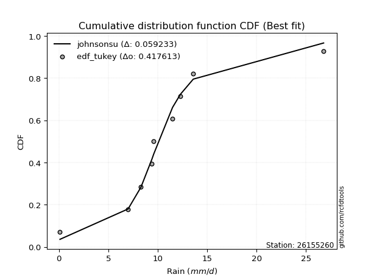</img></img>

</div>


### 8. EDF Gringorten (1963)

Gringorten plotting position formula is essential for estimating the probability and return periods of extreme events like floods and heavy rainfall. The constant _a=0.44_.

<div align="center">


$P=(m-a)/(n+1-2a)$


</div>


**8.1. Empirical values**

<div align="center">

|                | 0                   | 1                   | 2                  | 3                  | 4                  | 5                  | 6                  | 7                  |
|:---------------|:--------------------|:--------------------|:-------------------|:-------------------|:-------------------|:-------------------|:-------------------|:-------------------|
| date           | 2016                | 2019                | 2020               | 2023               | 2017               | 2018               | 2022               | 2021               |
| x              | 0.1                 | 7.0                 | 8.3                | 9.4                | 9.6                | 11.5               | 12.3               | 13.6               |
| m              | 1                   | 2                   | 3                  | 4                  | 5                  | 6                  | 7                  | 8                  |
| empirical_dist | edf_gringorten      | edf_gringorten      | edf_gringorten     | edf_gringorten     | edf_gringorten     | edf_gringorten     | edf_gringorten     | edf_gringorten     |
| empirical      | 0.06896551724137932 | 0.19211822660098524 | 0.3152709359605912 | 0.4384236453201971 | 0.5615763546798029 | 0.6847290640394089 | 0.8078817733990148 | 0.9310344827586208 |
| empirical_tr   | 1.0740740740740742  | 1.2378048780487805  | 1.460431654676259  | 1.780701754385965  | 2.2808988764044944 | 3.1718750000000004 | 5.205128205128205  | 14.500000000000018 |

</div>


**8.2. Kolmogorov-Smirnov fit test (sorted by Δ)**


<div align="center">

|                | 0                   | 1                  | 2                   | 3                   | 4                   | 5                   | 6                   | 7                  | 8                   | 9                   | 10                  | 11                 | 12                  | 13                 | 14                  | 15                  | 16                  | 17                 | 18                  | 19                  | 20                  | 21                  | 22                  | 23                  | 24                 | 25                  | 26                  | 27                  | 28                  | 29                  | 30                  | 31                 | 32                  | 33                  | 34                  | 35                 | 36                 | 37                  | 38                  | 39                    | 40                 | 41                 | 42                  | 43                  | 44                  | 45                  | 46                  | 47                  | 48                 | 49                  | 50                  | 51                 | 52                 | 53                 | 54                 | 55                  | 56                  | 57                  | 58                 | 59                 | 60                  | 61                  | 62                 | 63                 | 64                 | 65                  | 66                 | 67                  | 68                  | 69                 | 70                 | 71                 | 72                 | 73                 | 74                 | 75                 | 76                 | 77                 | 78                 | 79                 | 80                 | 81                 | 82                 | 83                 | 84                 | 85                 | 86                 | 87                 |
|:---------------|:--------------------|:-------------------|:--------------------|:--------------------|:--------------------|:--------------------|:--------------------|:-------------------|:--------------------|:--------------------|:--------------------|:-------------------|:--------------------|:-------------------|:--------------------|:--------------------|:--------------------|:-------------------|:--------------------|:--------------------|:--------------------|:--------------------|:--------------------|:--------------------|:-------------------|:--------------------|:--------------------|:--------------------|:--------------------|:--------------------|:--------------------|:-------------------|:--------------------|:--------------------|:--------------------|:-------------------|:-------------------|:--------------------|:--------------------|:----------------------|:-------------------|:-------------------|:--------------------|:--------------------|:--------------------|:--------------------|:--------------------|:--------------------|:-------------------|:--------------------|:--------------------|:-------------------|:-------------------|:-------------------|:-------------------|:--------------------|:--------------------|:--------------------|:-------------------|:-------------------|:--------------------|:--------------------|:-------------------|:-------------------|:-------------------|:--------------------|:-------------------|:--------------------|:--------------------|:-------------------|:-------------------|:-------------------|:-------------------|:-------------------|:-------------------|:-------------------|:-------------------|:-------------------|:-------------------|:-------------------|:-------------------|:-------------------|:-------------------|:-------------------|:-------------------|:-------------------|:-------------------|:-------------------|
| station        | 26155260            | 26155260           | 26155260            | 26155260            | 26155260            | 26155260            | 26155260            | 26155260           | 26155260            | 26155260            | 26155260            | 26155260           | 26155260            | 26155260           | 26155260            | 26155260            | 26155260            | 26155260           | 26155260            | 26155260            | 26155260            | 26155260            | 26155260            | 26155260            | 26155260           | 26155260            | 26155260            | 26155260            | 26155260            | 26155260            | 26155260            | 26155260           | 26155260            | 26155260            | 26155260            | 26155260           | 26155260           | 26155260            | 26155260            | 26155260              | 26155260           | 26155260           | 26155260            | 26155260            | 26155260            | 26155260            | 26155260            | 26155260            | 26155260           | 26155260            | 26155260            | 26155260           | 26155260           | 26155260           | 26155260           | 26155260            | 26155260            | 26155260            | 26155260           | 26155260           | 26155260            | 26155260            | 26155260           | 26155260           | 26155260           | 26155260            | 26155260           | 26155260            | 26155260            | 26155260           | 26155260           | 26155260           | 26155260           | 26155260           | 26155260           | 26155260           | 26155260           | 26155260           | 26155260           | 26155260           | 26155260           | 26155260           | 26155260           | 26155260           | 26155260           | 26155260           | 26155260           | 26155260           |
| empirical_dist | edf_gringorten      | edf_gringorten     | edf_gringorten      | edf_gringorten      | edf_gringorten      | edf_gringorten      | edf_gringorten      | edf_gringorten     | edf_gringorten      | edf_gringorten      | edf_gringorten      | edf_gringorten     | edf_gringorten      | edf_gringorten     | edf_gringorten      | edf_gringorten      | edf_gringorten      | edf_gringorten     | edf_gringorten      | edf_gringorten      | edf_gringorten      | edf_gringorten      | edf_gringorten      | edf_gringorten      | edf_gringorten     | edf_gringorten      | edf_gringorten      | edf_gringorten      | edf_gringorten      | edf_gringorten      | edf_gringorten      | edf_gringorten     | edf_gringorten      | edf_gringorten      | edf_gringorten      | edf_gringorten     | edf_gringorten     | edf_gringorten      | edf_gringorten      | edf_gringorten        | edf_gringorten     | edf_gringorten     | edf_gringorten      | edf_gringorten      | edf_gringorten      | edf_gringorten      | edf_gringorten      | edf_gringorten      | edf_gringorten     | edf_gringorten      | edf_gringorten      | edf_gringorten     | edf_gringorten     | edf_gringorten     | edf_gringorten     | edf_gringorten      | edf_gringorten      | edf_gringorten      | edf_gringorten     | edf_gringorten     | edf_gringorten      | edf_gringorten      | edf_gringorten     | edf_gringorten     | edf_gringorten     | edf_gringorten      | edf_gringorten     | edf_gringorten      | edf_gringorten      | edf_gringorten     | edf_gringorten     | edf_gringorten     | edf_gringorten     | edf_gringorten     | edf_gringorten     | edf_gringorten     | edf_gringorten     | edf_gringorten     | edf_gringorten     | edf_gringorten     | edf_gringorten     | edf_gringorten     | edf_gringorten     | edf_gringorten     | edf_gringorten     | edf_gringorten     | edf_gringorten     | edf_gringorten     |
| p_dist         | fisk                | gumbel_l           | pearson3            | gompertz            | mielke              | logistic            | logjohnsonsu        | johnsonsu          | laplace_asymmetric  | fatiguelife         | hypsecant           | t                  | norm                | crystalball        | exponnorm           | rice                | nct                 | f                  | ncf                 | logt                | betaprime           | erlang              | laplace             | gamma               | invgamma           | maxwell             | rayleigh            | invgauss            | gumbel_r            | invweibull          | halfnorm            | logcrystalball     | moyal               | halflogistic        | kstwobign           | genexpon           | loggompertz        | wald                | logloggamma         | loglaplace_asymmetric | logpearson3        | logmielke          | loggumbel_l         | gibrat              | logtruncnorm        | expon               | logfisk             | logrice             | logexponnorm       | lognorm             | lognorm             | lognct             | lognakagami        | loginvweibull      | logfatiguelife     | loglognorm          | loginvgamma         | loglogistic         | logalpha           | loghypsecant       | loginvgauss         | logmaxwell          | loglaplace         | lograyleigh        | logkstwobign       | logncf              | nakagami           | loghalfnorm         | loggumbel_r         | loghalflogistic    | logmoyal           | loggenexpon        | logexpon           | logf               | logweibull_min     | logwald            | loggibrat          | logbetaprime       | weibull_min        | truncnorm          | chi2               | logchi2            | alpha              | loggamma           | loggamma           | genlogistic        | loggenlogistic     | logerlang          |
| delta          | 0.05840737949942864 | 0.0636080470921836 | 0.07384392710438237 | 0.08361436331144767 | 0.08967360326979923 | 0.11066345911121384 | 0.11166926905841779 | 0.1117661762806963 | 0.11278856530092296 | 0.11359654300280242 | 0.11561606225459026 | 0.1161973025787752 | 0.11625675321806272 | 0.1162567817741284 | 0.11625716933837765 | 0.11625978669328546 | 0.11652502327918007 | 0.1181820978492279 | 0.11845520379065017 | 0.12199707646307717 | 0.12944336627740935 | 0.13263398614829333 | 0.13276325542616946 | 0.13369531426653847 | 0.1398233670913237 | 0.15065941857226678 | 0.16276440775774936 | 0.16477482497352727 | 0.18107751250836696 | 0.19011599991597042 | 0.19698998435642723 | 0.2007426099509841 | 0.20578169530674706 | 0.21625713741983243 | 0.23365687086925704 | 0.2501728395586046 | 0.2706745561717062 | 0.27409102918856876 | 0.27847133184079587 | 0.27869073824425417   | 0.2799135509779196 | 0.2918522983238365 | 0.29793305321715546 | 0.29824043001438677 | 0.30810279766508575 | 0.34831213160748165 | 0.35771485409102166 | 0.36426130573956006 | 0.3642622628039546 | 0.36426318428283233 | 0.36426318428283233 | 0.3643676083731806 | 0.3650316424454174 | 0.3650409929905112 | 0.3650607548045379 | 0.36704350132816654 | 0.37067207191038154 | 0.37182929482299343 | 0.3740386621196603 | 0.3782031834685817 | 0.39052677666402624 | 0.39422404849817017 | 0.3987361367301182 | 0.4038038090390116 | 0.4078577981345447 | 0.41426979001474196 | 0.4226134767290398 | 0.43084416342541476 | 0.43407537404265806 | 0.4583292637524896 | 0.4586977783338738 | 0.4593449626386096 | 0.4593625457676095 | 0.5118642883231594 | 0.5152628445855888 | 0.5270186412869361 | 0.5566061342429646 | 0.5847782663956264 | 0.597978562712268  | 0.6448015026088719 | 0.710505228794892  | 0.7494457476433053 | 0.7766709325475591 | 0.7856880100390876 | 0.7856880100390876 | 0.8078817733990148 | 0.8078817733990148 | 0.8551918407778741 |
| deltao         | 0.4472608134160001  | 0.4472608134160001 | 0.4472608134160001  | 0.4472608134160001  | 0.4472608134160001  | 0.4472608134160001  | 0.4472608134160001  | 0.4472608134160001 | 0.4472608134160001  | 0.4472608134160001  | 0.4472608134160001  | 0.4472608134160001 | 0.4472608134160001  | 0.4472608134160001 | 0.4472608134160001  | 0.4472608134160001  | 0.4472608134160001  | 0.4472608134160001 | 0.4472608134160001  | 0.4472608134160001  | 0.4472608134160001  | 0.4472608134160001  | 0.4472608134160001  | 0.4472608134160001  | 0.4472608134160001 | 0.4472608134160001  | 0.4472608134160001  | 0.4472608134160001  | 0.4472608134160001  | 0.4472608134160001  | 0.4472608134160001  | 0.4472608134160001 | 0.4472608134160001  | 0.4472608134160001  | 0.4472608134160001  | 0.4472608134160001 | 0.4472608134160001 | 0.4472608134160001  | 0.4472608134160001  | 0.4472608134160001    | 0.4472608134160001 | 0.4472608134160001 | 0.4472608134160001  | 0.4472608134160001  | 0.4472608134160001  | 0.4472608134160001  | 0.4472608134160001  | 0.4472608134160001  | 0.4472608134160001 | 0.4472608134160001  | 0.4472608134160001  | 0.4472608134160001 | 0.4472608134160001 | 0.4472608134160001 | 0.4472608134160001 | 0.4472608134160001  | 0.4472608134160001  | 0.4472608134160001  | 0.4472608134160001 | 0.4472608134160001 | 0.4472608134160001  | 0.4472608134160001  | 0.4472608134160001 | 0.4472608134160001 | 0.4472608134160001 | 0.4472608134160001  | 0.4472608134160001 | 0.4472608134160001  | 0.4472608134160001  | 0.4472608134160001 | 0.4472608134160001 | 0.4472608134160001 | 0.4472608134160001 | 0.4472608134160001 | 0.4472608134160001 | 0.4472608134160001 | 0.4472608134160001 | 0.4472608134160001 | 0.4472608134160001 | 0.4472608134160001 | 0.4472608134160001 | 0.4472608134160001 | 0.4472608134160001 | 0.4472608134160001 | 0.4472608134160001 | 0.4472608134160001 | 0.4472608134160001 | 0.4472608134160001 |
| eval           | Δo > Δ              | Δo > Δ             | Δo > Δ              | Δo > Δ              | Δo > Δ              | Δo > Δ              | Δo > Δ              | Δo > Δ             | Δo > Δ              | Δo > Δ              | Δo > Δ              | Δo > Δ             | Δo > Δ              | Δo > Δ             | Δo > Δ              | Δo > Δ              | Δo > Δ              | Δo > Δ             | Δo > Δ              | Δo > Δ              | Δo > Δ              | Δo > Δ              | Δo > Δ              | Δo > Δ              | Δo > Δ             | Δo > Δ              | Δo > Δ              | Δo > Δ              | Δo > Δ              | Δo > Δ              | Δo > Δ              | Δo > Δ             | Δo > Δ              | Δo > Δ              | Δo > Δ              | Δo > Δ             | Δo > Δ             | Δo > Δ              | Δo > Δ              | Δo > Δ                | Δo > Δ             | Δo > Δ             | Δo > Δ              | Δo > Δ              | Δo > Δ              | Δo > Δ              | Δo > Δ              | Δo > Δ              | Δo > Δ             | Δo > Δ              | Δo > Δ              | Δo > Δ             | Δo > Δ             | Δo > Δ             | Δo > Δ             | Δo > Δ              | Δo > Δ              | Δo > Δ              | Δo > Δ             | Δo > Δ             | Δo > Δ              | Δo > Δ              | Δo > Δ             | Δo > Δ             | Δo > Δ             | Δo > Δ              | Δo > Δ             | Δo > Δ              | Δo > Δ              | Δo <= Δ            | Δo <= Δ            | Δo <= Δ            | Δo <= Δ            | Δo <= Δ            | Δo <= Δ            | Δo <= Δ            | Δo <= Δ            | Δo <= Δ            | Δo <= Δ            | Δo <= Δ            | Δo <= Δ            | Δo <= Δ            | Δo <= Δ            | Δo <= Δ            | Δo <= Δ            | Δo <= Δ            | Δo <= Δ            | Δo <= Δ            |
| fit            | 1                   | 1                  | 1                   | 1                   | 1                   | 1                   | 1                   | 1                  | 1                   | 1                   | 1                   | 1                  | 1                   | 1                  | 1                   | 1                   | 1                   | 1                  | 1                   | 1                   | 1                   | 1                   | 1                   | 1                   | 1                  | 1                   | 1                   | 1                   | 1                   | 1                   | 1                   | 1                  | 1                   | 1                   | 1                   | 1                  | 1                  | 1                   | 1                   | 1                     | 1                  | 1                  | 1                   | 1                   | 1                   | 1                   | 1                   | 1                   | 1                  | 1                   | 1                   | 1                  | 1                  | 1                  | 1                  | 1                   | 1                   | 1                   | 1                  | 1                  | 1                   | 1                   | 1                  | 1                  | 1                  | 1                   | 1                  | 1                   | 1                   | 0                  | 0                  | 0                  | 0                  | 0                  | 0                  | 0                  | 0                  | 0                  | 0                  | 0                  | 0                  | 0                  | 0                  | 0                  | 0                  | 0                  | 0                  | 0                  |
| n              | 8                   | 8                  | 8                   | 8                   | 8                   | 8                   | 8                   | 8                  | 8                   | 8                   | 8                   | 8                  | 8                   | 8                  | 8                   | 8                   | 8                   | 8                  | 8                   | 8                   | 8                   | 8                   | 8                   | 8                   | 8                  | 8                   | 8                   | 8                   | 8                   | 8                   | 8                   | 8                  | 8                   | 8                   | 8                   | 8                  | 8                  | 8                   | 8                   | 8                     | 8                  | 8                  | 8                   | 8                   | 8                   | 8                   | 8                   | 8                   | 8                  | 8                   | 8                   | 8                  | 8                  | 8                  | 8                  | 8                   | 8                   | 8                   | 8                  | 8                  | 8                   | 8                   | 8                  | 8                  | 8                  | 8                   | 8                  | 8                   | 8                   | 8                  | 8                  | 8                  | 8                  | 8                  | 8                  | 8                  | 8                  | 8                  | 8                  | 8                  | 8                  | 8                  | 8                  | 8                  | 8                  | 8                  | 8                  | 8                  |
| best_fit       | 1                   | 0                  | 0                   | 0                   | 0                   | 0                   | 0                   | 0                  | 0                   | 0                   | 0                   | 0                  | 0                   | 0                  | 0                   | 0                   | 0                   | 0                  | 0                   | 0                   | 0                   | 0                   | 0                   | 0                   | 0                  | 0                   | 0                   | 0                   | 0                   | 0                   | 0                   | 0                  | 0                   | 0                   | 0                   | 0                  | 0                  | 0                   | 0                   | 0                     | 0                  | 0                  | 0                   | 0                   | 0                   | 0                   | 0                   | 0                   | 0                  | 0                   | 0                   | 0                  | 0                  | 0                  | 0                  | 0                   | 0                   | 0                   | 0                  | 0                  | 0                   | 0                   | 0                  | 0                  | 0                  | 0                   | 0                  | 0                   | 0                   | 0                  | 0                  | 0                  | 0                  | 0                  | 0                  | 0                  | 0                  | 0                  | 0                  | 0                  | 0                  | 0                  | 0                  | 0                  | 0                  | 0                  | 0                  | 0                  |
| best_fit_sort  | 1                   | 2                  | 3                   | 4                   | 5                   | 6                   | 7                   | 8                  | 9                   | 10                  | 11                  | 12                 | 13                  | 14                 | 15                  | 16                  | 17                  | 18                 | 19                  | 20                  | 21                  | 22                  | 23                  | 24                  | 25                 | 26                  | 27                  | 28                  | 29                  | 30                  | 31                  | 32                 | 33                  | 34                  | 35                  | 36                 | 37                 | 38                  | 39                  | 40                    | 41                 | 42                 | 43                  | 44                  | 45                  | 46                  | 47                  | 48                  | 49                 | 50                  | 51                  | 52                 | 53                 | 54                 | 55                 | 56                  | 57                  | 58                  | 59                 | 60                 | 61                  | 62                  | 63                 | 64                 | 65                 | 66                  | 67                 | 68                  | 69                  | 70                 | 71                 | 72                 | 73                 | 74                 | 75                 | 76                 | 77                 | 78                 | 79                 | 80                 | 81                 | 82                 | 83                 | 84                 | 85                 | 86                 | 87                 | 88                 |

</div>


**8.3. Best fit**

<div align="center">

|   id |   station | empirical_dist   | p_dist   |     delta |   deltao | eval   |   fit |   n |   best_fit |   best_fit_sort |
|-----:|----------:|:-----------------|:---------|----------:|---------:|:-------|------:|----:|-----------:|----------------:|
|    0 |  26155260 | edf_gringorten   | fisk     | 0.0584074 | 0.447261 | Δo > Δ |     1 |   8 |          1 |               1 |

</div>


<div align="center">

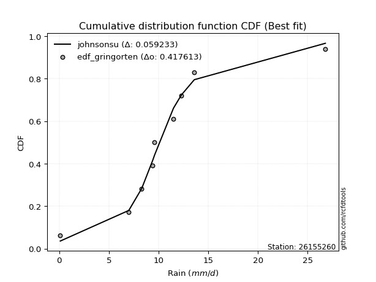</img></img>

</div>


### 9. EDF Filliben (1975)

The specific values of the constants (0.3175) (often denoted as $alpha$) and (0.365) are derived from a method proposed by James J. Filliben in a 1975 paper. This particular formula is the mean value of the $i$-th order statistic of the normal distribution and is considered a robust and effective plotting position formula for the normal probability plot correlation coefficient test for normality.

<div align="center">


$P=(m-0.3175)/(n+0.365)$


</div>


**9.1. Empirical values**

<div align="center">

|                | 0                  | 1                   | 2                  | 3                   | 4                  | 5                  | 6                  | 7                  |
|:---------------|:-------------------|:--------------------|:-------------------|:--------------------|:-------------------|:-------------------|:-------------------|:-------------------|
| date           | 2016               | 2019                | 2020               | 2023                | 2017               | 2018               | 2022               | 2021               |
| x              | 0.1                | 7.0                 | 8.3                | 9.4                 | 9.6                | 11.5               | 12.3               | 13.6               |
| m              | 1                  | 2                   | 3                  | 4                   | 5                  | 6                  | 7                  | 8                  |
| empirical_dist | edf_filliben       | edf_filliben        | edf_filliben       | edf_filliben        | edf_filliben       | edf_filliben       | edf_filliben       | edf_filliben       |
| empirical      | 0.0815899581589958 | 0.20113568439928273 | 0.3206814106395696 | 0.44022713687985654 | 0.5597728631201434 | 0.6793185893604303 | 0.7988643156007172 | 0.9184100418410042 |
| empirical_tr   | 1.0888382687927107 | 1.2517770295548074  | 1.4720633523977125 | 1.7864388681260008  | 2.271554650373387  | 3.118359739049394  | 4.971768202080237  | 12.256410256410254 |

</div>


**9.2. Kolmogorov-Smirnov fit test (sorted by Δ)**


<div align="center">

|                | 0                    | 1                   | 2                   | 3                   | 4                  | 5                   | 6                   | 7                   | 8                   | 9                   | 10                 | 11                  | 12                  | 13                  | 14                  | 15                  | 16                  | 17                  | 18                  | 19                  | 20                 | 21                 | 22                  | 23                  | 24                  | 25                  | 26                  | 27                  | 28                  | 29                  | 30                 | 31                  | 32                  | 33                 | 34                  | 35                  | 36                  | 37                 | 38                  | 39                 | 40                    | 41                 | 42                 | 43                  | 44                 | 45                 | 46                 | 47                 | 48                 | 49                 | 50                 | 51                  | 52                  | 53                  | 54                 | 55                 | 56                 | 57                 | 58                  | 59                 | 60                 | 61                 | 62                  | 63                  | 64                  | 65                 | 66                  | 67                 | 68                 | 69                  | 70                 | 71                  | 72                  | 73                 | 74                 | 75                 | 76                 | 77                 | 78                 | 79                 | 80                 | 81                 | 82                 | 83                 | 84                 | 85                 | 86                 | 87                 |
|:---------------|:---------------------|:--------------------|:--------------------|:--------------------|:-------------------|:--------------------|:--------------------|:--------------------|:--------------------|:--------------------|:-------------------|:--------------------|:--------------------|:--------------------|:--------------------|:--------------------|:--------------------|:--------------------|:--------------------|:--------------------|:-------------------|:-------------------|:--------------------|:--------------------|:--------------------|:--------------------|:--------------------|:--------------------|:--------------------|:--------------------|:-------------------|:--------------------|:--------------------|:-------------------|:--------------------|:--------------------|:--------------------|:-------------------|:--------------------|:-------------------|:----------------------|:-------------------|:-------------------|:--------------------|:-------------------|:-------------------|:-------------------|:-------------------|:-------------------|:-------------------|:-------------------|:--------------------|:--------------------|:--------------------|:-------------------|:-------------------|:-------------------|:-------------------|:--------------------|:-------------------|:-------------------|:-------------------|:--------------------|:--------------------|:--------------------|:-------------------|:--------------------|:-------------------|:-------------------|:--------------------|:-------------------|:--------------------|:--------------------|:-------------------|:-------------------|:-------------------|:-------------------|:-------------------|:-------------------|:-------------------|:-------------------|:-------------------|:-------------------|:-------------------|:-------------------|:-------------------|:-------------------|:-------------------|
| station        | 26155260             | 26155260            | 26155260            | 26155260            | 26155260           | 26155260            | 26155260            | 26155260            | 26155260            | 26155260            | 26155260           | 26155260            | 26155260            | 26155260            | 26155260            | 26155260            | 26155260            | 26155260            | 26155260            | 26155260            | 26155260           | 26155260           | 26155260            | 26155260            | 26155260            | 26155260            | 26155260            | 26155260            | 26155260            | 26155260            | 26155260           | 26155260            | 26155260            | 26155260           | 26155260            | 26155260            | 26155260            | 26155260           | 26155260            | 26155260           | 26155260              | 26155260           | 26155260           | 26155260            | 26155260           | 26155260           | 26155260           | 26155260           | 26155260           | 26155260           | 26155260           | 26155260            | 26155260            | 26155260            | 26155260           | 26155260           | 26155260           | 26155260           | 26155260            | 26155260           | 26155260           | 26155260           | 26155260            | 26155260            | 26155260            | 26155260           | 26155260            | 26155260           | 26155260           | 26155260            | 26155260           | 26155260            | 26155260            | 26155260           | 26155260           | 26155260           | 26155260           | 26155260           | 26155260           | 26155260           | 26155260           | 26155260           | 26155260           | 26155260           | 26155260           | 26155260           | 26155260           | 26155260           |
| empirical_dist | edf_filliben         | edf_filliben        | edf_filliben        | edf_filliben        | edf_filliben       | edf_filliben        | edf_filliben        | edf_filliben        | edf_filliben        | edf_filliben        | edf_filliben       | edf_filliben        | edf_filliben        | edf_filliben        | edf_filliben        | edf_filliben        | edf_filliben        | edf_filliben        | edf_filliben        | edf_filliben        | edf_filliben       | edf_filliben       | edf_filliben        | edf_filliben        | edf_filliben        | edf_filliben        | edf_filliben        | edf_filliben        | edf_filliben        | edf_filliben        | edf_filliben       | edf_filliben        | edf_filliben        | edf_filliben       | edf_filliben        | edf_filliben        | edf_filliben        | edf_filliben       | edf_filliben        | edf_filliben       | edf_filliben          | edf_filliben       | edf_filliben       | edf_filliben        | edf_filliben       | edf_filliben       | edf_filliben       | edf_filliben       | edf_filliben       | edf_filliben       | edf_filliben       | edf_filliben        | edf_filliben        | edf_filliben        | edf_filliben       | edf_filliben       | edf_filliben       | edf_filliben       | edf_filliben        | edf_filliben       | edf_filliben       | edf_filliben       | edf_filliben        | edf_filliben        | edf_filliben        | edf_filliben       | edf_filliben        | edf_filliben       | edf_filliben       | edf_filliben        | edf_filliben       | edf_filliben        | edf_filliben        | edf_filliben       | edf_filliben       | edf_filliben       | edf_filliben       | edf_filliben       | edf_filliben       | edf_filliben       | edf_filliben       | edf_filliben       | edf_filliben       | edf_filliben       | edf_filliben       | edf_filliben       | edf_filliben       | edf_filliben       |
| p_dist         | gumbel_l             | fisk                | pearson3            | gompertz            | mielke             | fatiguelife         | logistic            | logjohnsonsu        | johnsonsu           | t                   | norm               | crystalball         | exponnorm           | rice                | nct                 | f                   | ncf                 | hypsecant           | laplace_asymmetric  | logt                | betaprime          | erlang             | gamma               | laplace             | invgamma            | maxwell             | invgauss            | rayleigh            | gumbel_r            | invweibull          | halfnorm           | logcrystalball      | moyal               | halflogistic       | kstwobign           | genexpon            | loggompertz         | logpearson3        | wald                | logloggamma        | loglaplace_asymmetric | logmielke          | loggumbel_l        | gibrat              | logtruncnorm       | expon              | logfisk            | logrice            | logexponnorm       | lognorm            | lognorm            | lognct              | lognakagami         | loginvweibull       | logfatiguelife     | loglognorm         | loginvgamma        | loglogistic        | logalpha            | loghypsecant       | loginvgauss        | logmaxwell         | loglaplace          | lograyleigh         | logkstwobign        | logncf             | nakagami            | loghalfnorm        | loggumbel_r        | loghalflogistic     | logmoyal           | loggenexpon         | logexpon            | logf               | logweibull_min     | logwald            | loggibrat          | logbetaprime       | weibull_min        | truncnorm          | chi2               | logchi2            | alpha              | loggamma           | loggamma           | genlogistic        | loggenlogistic     | logerlang          |
| delta          | 0.061804555532524064 | 0.07103182041704512 | 0.07204043554472284 | 0.08181087175178814 | 0.0878701117101397 | 0.10818606832382399 | 0.10885996755155442 | 0.10986577749875825 | 0.10996268472103676 | 0.11078682789979677 | 0.1108462785390843 | 0.11084630709514998 | 0.11084669465939923 | 0.11084931201430703 | 0.11111454860020165 | 0.11277162317024947 | 0.11304472911167174 | 0.11381257069493084 | 0.11819903997990155 | 0.12019358490341764 | 0.1239273127301232 | 0.1253392571268217 | 0.12828483958756004 | 0.13095976386651004 | 0.13441289241234528 | 0.14524894389328835 | 0.15708992898891821 | 0.15735393307877094 | 0.17566703782938853 | 0.18109854211767293 | 0.1915795096774488 | 0.19172515215268662 | 0.20037122062776863 | 0.210846662740854  | 0.22463941307095955 | 0.24115538176030707 | 0.26165709837340867 | 0.267289110060303  | 0.26868055450959033 | 0.2694538740424983 | 0.2696732804459566    | 0.282834840525539  | 0.2889155954188579 | 0.29643693845472735 | 0.2990853398667882 | 0.3392946738091841 | 0.3486973962927241 | 0.3552438479412625 | 0.355244805005657  | 0.3552457264845348 | 0.3552457264845348 | 0.35535015057488306 | 0.35601418464711987 | 0.35602353519221364 | 0.3560432970062404 | 0.358026043529869  | 0.361654614112084  | 0.3628118370246959 | 0.36502120432136276 | 0.3691857256702842 | 0.3815093188657287 | 0.3852065906998726 | 0.38971867893182066 | 0.39478635124071404 | 0.39884034033624716 | 0.4052523322164444 | 0.41359601893074227 | 0.4218267056271172 | 0.4250579162443605 | 0.44931180595419207 | 0.4496803205355763 | 0.45032750484031203 | 0.45034508796931194 | 0.5028468305248619 | 0.5062453867872913 | 0.5180011834886386 | 0.547588676444667  | 0.5757608085973288 | 0.5889611049139705 | 0.6357840448105744 | 0.7014877709965944 | 0.7404282898450077 | 0.7676534747492616 | 0.7766705522407901 | 0.7766705522407901 | 0.7988643156007172 | 0.7988643156007172 | 0.8425673998602576 |
| deltao         | 0.4472608134160001   | 0.4472608134160001  | 0.4472608134160001  | 0.4472608134160001  | 0.4472608134160001 | 0.4472608134160001  | 0.4472608134160001  | 0.4472608134160001  | 0.4472608134160001  | 0.4472608134160001  | 0.4472608134160001 | 0.4472608134160001  | 0.4472608134160001  | 0.4472608134160001  | 0.4472608134160001  | 0.4472608134160001  | 0.4472608134160001  | 0.4472608134160001  | 0.4472608134160001  | 0.4472608134160001  | 0.4472608134160001 | 0.4472608134160001 | 0.4472608134160001  | 0.4472608134160001  | 0.4472608134160001  | 0.4472608134160001  | 0.4472608134160001  | 0.4472608134160001  | 0.4472608134160001  | 0.4472608134160001  | 0.4472608134160001 | 0.4472608134160001  | 0.4472608134160001  | 0.4472608134160001 | 0.4472608134160001  | 0.4472608134160001  | 0.4472608134160001  | 0.4472608134160001 | 0.4472608134160001  | 0.4472608134160001 | 0.4472608134160001    | 0.4472608134160001 | 0.4472608134160001 | 0.4472608134160001  | 0.4472608134160001 | 0.4472608134160001 | 0.4472608134160001 | 0.4472608134160001 | 0.4472608134160001 | 0.4472608134160001 | 0.4472608134160001 | 0.4472608134160001  | 0.4472608134160001  | 0.4472608134160001  | 0.4472608134160001 | 0.4472608134160001 | 0.4472608134160001 | 0.4472608134160001 | 0.4472608134160001  | 0.4472608134160001 | 0.4472608134160001 | 0.4472608134160001 | 0.4472608134160001  | 0.4472608134160001  | 0.4472608134160001  | 0.4472608134160001 | 0.4472608134160001  | 0.4472608134160001 | 0.4472608134160001 | 0.4472608134160001  | 0.4472608134160001 | 0.4472608134160001  | 0.4472608134160001  | 0.4472608134160001 | 0.4472608134160001 | 0.4472608134160001 | 0.4472608134160001 | 0.4472608134160001 | 0.4472608134160001 | 0.4472608134160001 | 0.4472608134160001 | 0.4472608134160001 | 0.4472608134160001 | 0.4472608134160001 | 0.4472608134160001 | 0.4472608134160001 | 0.4472608134160001 | 0.4472608134160001 |
| eval           | Δo > Δ               | Δo > Δ              | Δo > Δ              | Δo > Δ              | Δo > Δ             | Δo > Δ              | Δo > Δ              | Δo > Δ              | Δo > Δ              | Δo > Δ              | Δo > Δ             | Δo > Δ              | Δo > Δ              | Δo > Δ              | Δo > Δ              | Δo > Δ              | Δo > Δ              | Δo > Δ              | Δo > Δ              | Δo > Δ              | Δo > Δ             | Δo > Δ             | Δo > Δ              | Δo > Δ              | Δo > Δ              | Δo > Δ              | Δo > Δ              | Δo > Δ              | Δo > Δ              | Δo > Δ              | Δo > Δ             | Δo > Δ              | Δo > Δ              | Δo > Δ             | Δo > Δ              | Δo > Δ              | Δo > Δ              | Δo > Δ             | Δo > Δ              | Δo > Δ             | Δo > Δ                | Δo > Δ             | Δo > Δ             | Δo > Δ              | Δo > Δ             | Δo > Δ             | Δo > Δ             | Δo > Δ             | Δo > Δ             | Δo > Δ             | Δo > Δ             | Δo > Δ              | Δo > Δ              | Δo > Δ              | Δo > Δ             | Δo > Δ             | Δo > Δ             | Δo > Δ             | Δo > Δ              | Δo > Δ             | Δo > Δ             | Δo > Δ             | Δo > Δ              | Δo > Δ              | Δo > Δ              | Δo > Δ             | Δo > Δ              | Δo > Δ             | Δo > Δ             | Δo <= Δ             | Δo <= Δ            | Δo <= Δ             | Δo <= Δ             | Δo <= Δ            | Δo <= Δ            | Δo <= Δ            | Δo <= Δ            | Δo <= Δ            | Δo <= Δ            | Δo <= Δ            | Δo <= Δ            | Δo <= Δ            | Δo <= Δ            | Δo <= Δ            | Δo <= Δ            | Δo <= Δ            | Δo <= Δ            | Δo <= Δ            |
| fit            | 1                    | 1                   | 1                   | 1                   | 1                  | 1                   | 1                   | 1                   | 1                   | 1                   | 1                  | 1                   | 1                   | 1                   | 1                   | 1                   | 1                   | 1                   | 1                   | 1                   | 1                  | 1                  | 1                   | 1                   | 1                   | 1                   | 1                   | 1                   | 1                   | 1                   | 1                  | 1                   | 1                   | 1                  | 1                   | 1                   | 1                   | 1                  | 1                   | 1                  | 1                     | 1                  | 1                  | 1                   | 1                  | 1                  | 1                  | 1                  | 1                  | 1                  | 1                  | 1                   | 1                   | 1                   | 1                  | 1                  | 1                  | 1                  | 1                   | 1                  | 1                  | 1                  | 1                   | 1                   | 1                   | 1                  | 1                   | 1                  | 1                  | 0                   | 0                  | 0                   | 0                   | 0                  | 0                  | 0                  | 0                  | 0                  | 0                  | 0                  | 0                  | 0                  | 0                  | 0                  | 0                  | 0                  | 0                  | 0                  |
| n              | 8                    | 8                   | 8                   | 8                   | 8                  | 8                   | 8                   | 8                   | 8                   | 8                   | 8                  | 8                   | 8                   | 8                   | 8                   | 8                   | 8                   | 8                   | 8                   | 8                   | 8                  | 8                  | 8                   | 8                   | 8                   | 8                   | 8                   | 8                   | 8                   | 8                   | 8                  | 8                   | 8                   | 8                  | 8                   | 8                   | 8                   | 8                  | 8                   | 8                  | 8                     | 8                  | 8                  | 8                   | 8                  | 8                  | 8                  | 8                  | 8                  | 8                  | 8                  | 8                   | 8                   | 8                   | 8                  | 8                  | 8                  | 8                  | 8                   | 8                  | 8                  | 8                  | 8                   | 8                   | 8                   | 8                  | 8                   | 8                  | 8                  | 8                   | 8                  | 8                   | 8                   | 8                  | 8                  | 8                  | 8                  | 8                  | 8                  | 8                  | 8                  | 8                  | 8                  | 8                  | 8                  | 8                  | 8                  | 8                  |
| best_fit       | 1                    | 0                   | 0                   | 0                   | 0                  | 0                   | 0                   | 0                   | 0                   | 0                   | 0                  | 0                   | 0                   | 0                   | 0                   | 0                   | 0                   | 0                   | 0                   | 0                   | 0                  | 0                  | 0                   | 0                   | 0                   | 0                   | 0                   | 0                   | 0                   | 0                   | 0                  | 0                   | 0                   | 0                  | 0                   | 0                   | 0                   | 0                  | 0                   | 0                  | 0                     | 0                  | 0                  | 0                   | 0                  | 0                  | 0                  | 0                  | 0                  | 0                  | 0                  | 0                   | 0                   | 0                   | 0                  | 0                  | 0                  | 0                  | 0                   | 0                  | 0                  | 0                  | 0                   | 0                   | 0                   | 0                  | 0                   | 0                  | 0                  | 0                   | 0                  | 0                   | 0                   | 0                  | 0                  | 0                  | 0                  | 0                  | 0                  | 0                  | 0                  | 0                  | 0                  | 0                  | 0                  | 0                  | 0                  | 0                  |
| best_fit_sort  | 1                    | 2                   | 3                   | 4                   | 5                  | 6                   | 7                   | 8                   | 9                   | 10                  | 11                 | 12                  | 13                  | 14                  | 15                  | 16                  | 17                  | 18                  | 19                  | 20                  | 21                 | 22                 | 23                  | 24                  | 25                  | 26                  | 27                  | 28                  | 29                  | 30                  | 31                 | 32                  | 33                  | 34                 | 35                  | 36                  | 37                  | 38                 | 39                  | 40                 | 41                    | 42                 | 43                 | 44                  | 45                 | 46                 | 47                 | 48                 | 49                 | 50                 | 51                 | 52                  | 53                  | 54                  | 55                 | 56                 | 57                 | 58                 | 59                  | 60                 | 61                 | 62                 | 63                  | 64                  | 65                  | 66                 | 67                  | 68                 | 69                 | 70                  | 71                 | 72                  | 73                  | 74                 | 75                 | 76                 | 77                 | 78                 | 79                 | 80                 | 81                 | 82                 | 83                 | 84                 | 85                 | 86                 | 87                 | 88                 |

</div>


**9.3. Best fit**

<div align="center">

|   id |   station | empirical_dist   | p_dist   |     delta |   deltao | eval   |   fit |   n |   best_fit |   best_fit_sort |
|-----:|----------:|:-----------------|:---------|----------:|---------:|:-------|------:|----:|-----------:|----------------:|
|    0 |  26155260 | edf_filliben     | gumbel_l | 0.0618046 | 0.447261 | Δo > Δ |     1 |   8 |          1 |               1 |

</div>


<div align="center">

</img></img>

</div>


### 10. EDF Jenkinson (1977)

The Jenkinson formula in hydrology is an empirical plotting position formula used to estimate the non-exceedance probability _(P)_ or return period _(T)_ of a given ordered observation within a sample. It is a widely used method in the frequency analysis of extreme events such as floods and rainfall, as it provides a distribution-free way to plot data. _a≈0.31_ and _b≈0.38_ are constants derived to approximate the median of the probability distribution for the given rank.

<div align="center">


$P=(m-a)/(n+b)$


</div>


**10.1. Empirical values**

<div align="center">

|                | 0                   | 1                   | 2                  | 3                   | 4                  | 5                  | 6                  | 7                  |
|:---------------|:--------------------|:--------------------|:-------------------|:--------------------|:-------------------|:-------------------|:-------------------|:-------------------|
| date           | 2016                | 2019                | 2020               | 2023                | 2017               | 2018               | 2022               | 2021               |
| x              | 0.1                 | 7.0                 | 8.3                | 9.4                 | 9.6                | 11.5               | 12.3               | 13.6               |
| m              | 1                   | 2                   | 3                  | 4                   | 5                  | 6                  | 7                  | 8                  |
| empirical_dist | edf_jenkinson       | edf_jenkinson       | edf_jenkinson      | edf_jenkinson       | edf_jenkinson      | edf_jenkinson      | edf_jenkinson      | edf_jenkinson      |
| empirical      | 0.08233890214797135 | 0.20167064439140808 | 0.3210023866348448 | 0.44033412887828155 | 0.5596658711217184 | 0.6789976133651551 | 0.7983293556085919 | 0.9176610978520287 |
| empirical_tr   | 1.0897269180754225  | 1.2526158445440956  | 1.4727592267135323 | 1.7867803837953091  | 2.2710027100271004 | 3.115241635687732  | 4.958579881656804  | 12.144927536231886 |

</div>


**10.2. Kolmogorov-Smirnov fit test (sorted by Δ)**


<div align="center">

|                | 0                    | 1                   | 2                   | 3                  | 4                   | 5                  | 6                  | 7                   | 8                   | 9                   | 10                 | 11                  | 12                  | 13                  | 14                  | 15                  | 16                  | 17                  | 18                 | 19                  | 20                 | 21                 | 22                  | 23                  | 24                  | 25                  | 26                  | 27                  | 28                  | 29                  | 30                  | 31                 | 32                  | 33                 | 34                 | 35                 | 36                  | 37                  | 38                  | 39                 | 40                    | 41                  | 42                 | 43                  | 44                 | 45                  | 46                 | 47                 | 48                 | 49                  | 50                  | 51                  | 52                  | 53                 | 54                  | 55                  | 56                  | 57                  | 58                  | 59                  | 60                  | 61                 | 62                  | 63                 | 64                  | 65                 | 66                  | 67                 | 68                 | 69                  | 70                  | 71                 | 72                 | 73                 | 74                 | 75                 | 76                 | 77                 | 78                 | 79                 | 80                 | 81                 | 82                 | 83                 | 84                 | 85                 | 86                 | 87                 |
|:---------------|:---------------------|:--------------------|:--------------------|:-------------------|:--------------------|:-------------------|:-------------------|:--------------------|:--------------------|:--------------------|:-------------------|:--------------------|:--------------------|:--------------------|:--------------------|:--------------------|:--------------------|:--------------------|:-------------------|:--------------------|:-------------------|:-------------------|:--------------------|:--------------------|:--------------------|:--------------------|:--------------------|:--------------------|:--------------------|:--------------------|:--------------------|:-------------------|:--------------------|:-------------------|:-------------------|:-------------------|:--------------------|:--------------------|:--------------------|:-------------------|:----------------------|:--------------------|:-------------------|:--------------------|:-------------------|:--------------------|:-------------------|:-------------------|:-------------------|:--------------------|:--------------------|:--------------------|:--------------------|:-------------------|:--------------------|:--------------------|:--------------------|:--------------------|:--------------------|:--------------------|:--------------------|:-------------------|:--------------------|:-------------------|:--------------------|:-------------------|:--------------------|:-------------------|:-------------------|:--------------------|:--------------------|:-------------------|:-------------------|:-------------------|:-------------------|:-------------------|:-------------------|:-------------------|:-------------------|:-------------------|:-------------------|:-------------------|:-------------------|:-------------------|:-------------------|:-------------------|:-------------------|:-------------------|
| station        | 26155260             | 26155260            | 26155260            | 26155260           | 26155260            | 26155260           | 26155260           | 26155260            | 26155260            | 26155260            | 26155260           | 26155260            | 26155260            | 26155260            | 26155260            | 26155260            | 26155260            | 26155260            | 26155260           | 26155260            | 26155260           | 26155260           | 26155260            | 26155260            | 26155260            | 26155260            | 26155260            | 26155260            | 26155260            | 26155260            | 26155260            | 26155260           | 26155260            | 26155260           | 26155260           | 26155260           | 26155260            | 26155260            | 26155260            | 26155260           | 26155260              | 26155260            | 26155260           | 26155260            | 26155260           | 26155260            | 26155260           | 26155260           | 26155260           | 26155260            | 26155260            | 26155260            | 26155260            | 26155260           | 26155260            | 26155260            | 26155260            | 26155260            | 26155260            | 26155260            | 26155260            | 26155260           | 26155260            | 26155260           | 26155260            | 26155260           | 26155260            | 26155260           | 26155260           | 26155260            | 26155260            | 26155260           | 26155260           | 26155260           | 26155260           | 26155260           | 26155260           | 26155260           | 26155260           | 26155260           | 26155260           | 26155260           | 26155260           | 26155260           | 26155260           | 26155260           | 26155260           | 26155260           |
| empirical_dist | edf_jenkinson        | edf_jenkinson       | edf_jenkinson       | edf_jenkinson      | edf_jenkinson       | edf_jenkinson      | edf_jenkinson      | edf_jenkinson       | edf_jenkinson       | edf_jenkinson       | edf_jenkinson      | edf_jenkinson       | edf_jenkinson       | edf_jenkinson       | edf_jenkinson       | edf_jenkinson       | edf_jenkinson       | edf_jenkinson       | edf_jenkinson      | edf_jenkinson       | edf_jenkinson      | edf_jenkinson      | edf_jenkinson       | edf_jenkinson       | edf_jenkinson       | edf_jenkinson       | edf_jenkinson       | edf_jenkinson       | edf_jenkinson       | edf_jenkinson       | edf_jenkinson       | edf_jenkinson      | edf_jenkinson       | edf_jenkinson      | edf_jenkinson      | edf_jenkinson      | edf_jenkinson       | edf_jenkinson       | edf_jenkinson       | edf_jenkinson      | edf_jenkinson         | edf_jenkinson       | edf_jenkinson      | edf_jenkinson       | edf_jenkinson      | edf_jenkinson       | edf_jenkinson      | edf_jenkinson      | edf_jenkinson      | edf_jenkinson       | edf_jenkinson       | edf_jenkinson       | edf_jenkinson       | edf_jenkinson      | edf_jenkinson       | edf_jenkinson       | edf_jenkinson       | edf_jenkinson       | edf_jenkinson       | edf_jenkinson       | edf_jenkinson       | edf_jenkinson      | edf_jenkinson       | edf_jenkinson      | edf_jenkinson       | edf_jenkinson      | edf_jenkinson       | edf_jenkinson      | edf_jenkinson      | edf_jenkinson       | edf_jenkinson       | edf_jenkinson      | edf_jenkinson      | edf_jenkinson      | edf_jenkinson      | edf_jenkinson      | edf_jenkinson      | edf_jenkinson      | edf_jenkinson      | edf_jenkinson      | edf_jenkinson      | edf_jenkinson      | edf_jenkinson      | edf_jenkinson      | edf_jenkinson      | edf_jenkinson      | edf_jenkinson      | edf_jenkinson      |
| p_dist         | gumbel_l             | fisk                | pearson3            | gompertz           | mielke              | fatiguelife        | logistic           | logjohnsonsu        | johnsonsu           | t                   | norm               | crystalball         | exponnorm           | rice                | nct                 | f                   | ncf                 | hypsecant           | laplace_asymmetric | logt                | betaprime          | erlang             | gamma               | laplace             | invgamma            | maxwell             | invgauss            | rayleigh            | gumbel_r            | invweibull          | logcrystalball      | halfnorm           | moyal               | halflogistic       | kstwobign          | genexpon           | loggompertz         | logpearson3         | wald                | logloggamma        | loglaplace_asymmetric | logmielke           | loggumbel_l        | gibrat              | logtruncnorm       | expon               | logfisk            | logrice            | logexponnorm       | lognorm             | lognorm             | lognct              | lognakagami         | loginvweibull      | logfatiguelife      | loglognorm          | loginvgamma         | loglogistic         | logalpha            | loghypsecant        | loginvgauss         | logmaxwell         | loglaplace          | lograyleigh        | logkstwobign        | logncf             | nakagami            | loghalfnorm        | loggumbel_r        | loghalflogistic     | logmoyal            | loggenexpon        | logexpon           | logf               | logweibull_min     | logwald            | loggibrat          | logbetaprime       | weibull_min        | truncnorm          | chi2               | logchi2            | alpha              | loggamma           | loggamma           | genlogistic        | loggenlogistic     | logerlang          |
| delta          | 0.061697563534099054 | 0.07178076440602066 | 0.07193344354629783 | 0.0823387815210753 | 0.08776311971171469 | 0.1078650923285488 | 0.1087529755531294 | 0.10975878550033324 | 0.10985569272261175 | 0.11046585190452157 | 0.1105253025438091 | 0.11052533109987478 | 0.11052571866412403 | 0.11052833601903184 | 0.11079357260492645 | 0.11245064717497427 | 0.11272375311639654 | 0.11370557869650583 | 0.1185200159751768 | 0.12008659290499263 | 0.123606336734848  | 0.1250182811315465 | 0.12796386359228484 | 0.13085277186808503 | 0.13409191641707008 | 0.14492796789801315 | 0.15676895299364302 | 0.15703295708349574 | 0.17534606183411333 | 0.18056358212554757 | 0.19119019216056127 | 0.1912585336821736 | 0.20005024463249343 | 0.2105256867455788 | 0.2241044530788342 | 0.2406204217681817 | 0.26112213838128334 | 0.26654016607132747 | 0.26835957851431513 | 0.268918914050373  | 0.2691383204538313    | 0.28229988053341365 | 0.2883806354267326 | 0.29632994645630234 | 0.2985503798746629 | 0.33875971381705877 | 0.3481624363005988 | 0.3547088879491372 | 0.3547098450135317 | 0.35471076649240946 | 0.35471076649240946 | 0.35481519058275773 | 0.35547922465499454 | 0.3554885752000883 | 0.35550833701411505 | 0.35749108353774367 | 0.36111965411995867 | 0.36227687703257055 | 0.36448624432923743 | 0.36865076567815885 | 0.38097435887360337 | 0.3846716307077473 | 0.38918371893969533 | 0.3942513912485887 | 0.39830538034412183 | 0.4047173722243191 | 0.41306105893861694 | 0.4212917456349919 | 0.4245229562522352 | 0.44877684596206674 | 0.44914536054345094 | 0.4497925448481867 | 0.4498101279771866 | 0.5023118705327365 | 0.505710426795166  | 0.5174662234965133 | 0.5470537164525417 | 0.5752258486052035 | 0.5884261449218451 | 0.6352490848184491 | 0.7009528110044692 | 0.7398933298528825 | 0.7671185147571362 | 0.7761355922486648 | 0.7761355922486648 | 0.7983293556085919 | 0.7983293556085919 | 0.8418184558712821 |
| deltao         | 0.4472608134160001   | 0.4472608134160001  | 0.4472608134160001  | 0.4472608134160001 | 0.4472608134160001  | 0.4472608134160001 | 0.4472608134160001 | 0.4472608134160001  | 0.4472608134160001  | 0.4472608134160001  | 0.4472608134160001 | 0.4472608134160001  | 0.4472608134160001  | 0.4472608134160001  | 0.4472608134160001  | 0.4472608134160001  | 0.4472608134160001  | 0.4472608134160001  | 0.4472608134160001 | 0.4472608134160001  | 0.4472608134160001 | 0.4472608134160001 | 0.4472608134160001  | 0.4472608134160001  | 0.4472608134160001  | 0.4472608134160001  | 0.4472608134160001  | 0.4472608134160001  | 0.4472608134160001  | 0.4472608134160001  | 0.4472608134160001  | 0.4472608134160001 | 0.4472608134160001  | 0.4472608134160001 | 0.4472608134160001 | 0.4472608134160001 | 0.4472608134160001  | 0.4472608134160001  | 0.4472608134160001  | 0.4472608134160001 | 0.4472608134160001    | 0.4472608134160001  | 0.4472608134160001 | 0.4472608134160001  | 0.4472608134160001 | 0.4472608134160001  | 0.4472608134160001 | 0.4472608134160001 | 0.4472608134160001 | 0.4472608134160001  | 0.4472608134160001  | 0.4472608134160001  | 0.4472608134160001  | 0.4472608134160001 | 0.4472608134160001  | 0.4472608134160001  | 0.4472608134160001  | 0.4472608134160001  | 0.4472608134160001  | 0.4472608134160001  | 0.4472608134160001  | 0.4472608134160001 | 0.4472608134160001  | 0.4472608134160001 | 0.4472608134160001  | 0.4472608134160001 | 0.4472608134160001  | 0.4472608134160001 | 0.4472608134160001 | 0.4472608134160001  | 0.4472608134160001  | 0.4472608134160001 | 0.4472608134160001 | 0.4472608134160001 | 0.4472608134160001 | 0.4472608134160001 | 0.4472608134160001 | 0.4472608134160001 | 0.4472608134160001 | 0.4472608134160001 | 0.4472608134160001 | 0.4472608134160001 | 0.4472608134160001 | 0.4472608134160001 | 0.4472608134160001 | 0.4472608134160001 | 0.4472608134160001 | 0.4472608134160001 |
| eval           | Δo > Δ               | Δo > Δ              | Δo > Δ              | Δo > Δ             | Δo > Δ              | Δo > Δ             | Δo > Δ             | Δo > Δ              | Δo > Δ              | Δo > Δ              | Δo > Δ             | Δo > Δ              | Δo > Δ              | Δo > Δ              | Δo > Δ              | Δo > Δ              | Δo > Δ              | Δo > Δ              | Δo > Δ             | Δo > Δ              | Δo > Δ             | Δo > Δ             | Δo > Δ              | Δo > Δ              | Δo > Δ              | Δo > Δ              | Δo > Δ              | Δo > Δ              | Δo > Δ              | Δo > Δ              | Δo > Δ              | Δo > Δ             | Δo > Δ              | Δo > Δ             | Δo > Δ             | Δo > Δ             | Δo > Δ              | Δo > Δ              | Δo > Δ              | Δo > Δ             | Δo > Δ                | Δo > Δ              | Δo > Δ             | Δo > Δ              | Δo > Δ             | Δo > Δ              | Δo > Δ             | Δo > Δ             | Δo > Δ             | Δo > Δ              | Δo > Δ              | Δo > Δ              | Δo > Δ              | Δo > Δ             | Δo > Δ              | Δo > Δ              | Δo > Δ              | Δo > Δ              | Δo > Δ              | Δo > Δ              | Δo > Δ              | Δo > Δ             | Δo > Δ              | Δo > Δ             | Δo > Δ              | Δo > Δ             | Δo > Δ              | Δo > Δ             | Δo > Δ             | Δo <= Δ             | Δo <= Δ             | Δo <= Δ            | Δo <= Δ            | Δo <= Δ            | Δo <= Δ            | Δo <= Δ            | Δo <= Δ            | Δo <= Δ            | Δo <= Δ            | Δo <= Δ            | Δo <= Δ            | Δo <= Δ            | Δo <= Δ            | Δo <= Δ            | Δo <= Δ            | Δo <= Δ            | Δo <= Δ            | Δo <= Δ            |
| fit            | 1                    | 1                   | 1                   | 1                  | 1                   | 1                  | 1                  | 1                   | 1                   | 1                   | 1                  | 1                   | 1                   | 1                   | 1                   | 1                   | 1                   | 1                   | 1                  | 1                   | 1                  | 1                  | 1                   | 1                   | 1                   | 1                   | 1                   | 1                   | 1                   | 1                   | 1                   | 1                  | 1                   | 1                  | 1                  | 1                  | 1                   | 1                   | 1                   | 1                  | 1                     | 1                   | 1                  | 1                   | 1                  | 1                   | 1                  | 1                  | 1                  | 1                   | 1                   | 1                   | 1                   | 1                  | 1                   | 1                   | 1                   | 1                   | 1                   | 1                   | 1                   | 1                  | 1                   | 1                  | 1                   | 1                  | 1                   | 1                  | 1                  | 0                   | 0                   | 0                  | 0                  | 0                  | 0                  | 0                  | 0                  | 0                  | 0                  | 0                  | 0                  | 0                  | 0                  | 0                  | 0                  | 0                  | 0                  | 0                  |
| n              | 8                    | 8                   | 8                   | 8                  | 8                   | 8                  | 8                  | 8                   | 8                   | 8                   | 8                  | 8                   | 8                   | 8                   | 8                   | 8                   | 8                   | 8                   | 8                  | 8                   | 8                  | 8                  | 8                   | 8                   | 8                   | 8                   | 8                   | 8                   | 8                   | 8                   | 8                   | 8                  | 8                   | 8                  | 8                  | 8                  | 8                   | 8                   | 8                   | 8                  | 8                     | 8                   | 8                  | 8                   | 8                  | 8                   | 8                  | 8                  | 8                  | 8                   | 8                   | 8                   | 8                   | 8                  | 8                   | 8                   | 8                   | 8                   | 8                   | 8                   | 8                   | 8                  | 8                   | 8                  | 8                   | 8                  | 8                   | 8                  | 8                  | 8                   | 8                   | 8                  | 8                  | 8                  | 8                  | 8                  | 8                  | 8                  | 8                  | 8                  | 8                  | 8                  | 8                  | 8                  | 8                  | 8                  | 8                  | 8                  |
| best_fit       | 1                    | 0                   | 0                   | 0                  | 0                   | 0                  | 0                  | 0                   | 0                   | 0                   | 0                  | 0                   | 0                   | 0                   | 0                   | 0                   | 0                   | 0                   | 0                  | 0                   | 0                  | 0                  | 0                   | 0                   | 0                   | 0                   | 0                   | 0                   | 0                   | 0                   | 0                   | 0                  | 0                   | 0                  | 0                  | 0                  | 0                   | 0                   | 0                   | 0                  | 0                     | 0                   | 0                  | 0                   | 0                  | 0                   | 0                  | 0                  | 0                  | 0                   | 0                   | 0                   | 0                   | 0                  | 0                   | 0                   | 0                   | 0                   | 0                   | 0                   | 0                   | 0                  | 0                   | 0                  | 0                   | 0                  | 0                   | 0                  | 0                  | 0                   | 0                   | 0                  | 0                  | 0                  | 0                  | 0                  | 0                  | 0                  | 0                  | 0                  | 0                  | 0                  | 0                  | 0                  | 0                  | 0                  | 0                  | 0                  |
| best_fit_sort  | 1                    | 2                   | 3                   | 4                  | 5                   | 6                  | 7                  | 8                   | 9                   | 10                  | 11                 | 12                  | 13                  | 14                  | 15                  | 16                  | 17                  | 18                  | 19                 | 20                  | 21                 | 22                 | 23                  | 24                  | 25                  | 26                  | 27                  | 28                  | 29                  | 30                  | 31                  | 32                 | 33                  | 34                 | 35                 | 36                 | 37                  | 38                  | 39                  | 40                 | 41                    | 42                  | 43                 | 44                  | 45                 | 46                  | 47                 | 48                 | 49                 | 50                  | 51                  | 52                  | 53                  | 54                 | 55                  | 56                  | 57                  | 58                  | 59                  | 60                  | 61                  | 62                 | 63                  | 64                 | 65                  | 66                 | 67                  | 68                 | 69                 | 70                  | 71                  | 72                 | 73                 | 74                 | 75                 | 76                 | 77                 | 78                 | 79                 | 80                 | 81                 | 82                 | 83                 | 84                 | 85                 | 86                 | 87                 | 88                 |

</div>


**10.3. Best fit**

<div align="center">

|   id |   station | empirical_dist   | p_dist   |     delta |   deltao | eval   |   fit |   n |   best_fit |   best_fit_sort |
|-----:|----------:|:-----------------|:---------|----------:|---------:|:-------|------:|----:|-----------:|----------------:|
|    0 |  26155260 | edf_jenkinson    | gumbel_l | 0.0616976 | 0.447261 | Δo > Δ |     1 |   8 |          1 |               1 |

</div>


<div align="center">

</img>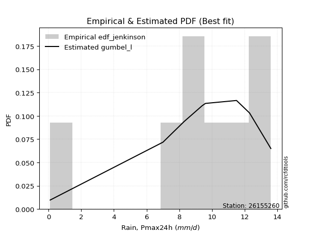</img>

</div>


### 11. EDF Cunnane (1978)

Cunnane´s work in statistical hydrology has focused on the performance and evaluation of different probability distributions (such as GEV, Gumbel, Lognormal) for flood frequency estimation. _b_ is a constant, typically set to 0.4.

<div align="center">


$P=(m-b)/(n+1-2b)$


</div>


**11.1. Empirical values**

<div align="center">

|                | 0                   | 1                   | 2                  | 3                  | 4                  | 5                  | 6                  | 7                  |
|:---------------|:--------------------|:--------------------|:-------------------|:-------------------|:-------------------|:-------------------|:-------------------|:-------------------|
| date           | 2016                | 2019                | 2020               | 2023               | 2017               | 2018               | 2022               | 2021               |
| x              | 0.1                 | 7.0                 | 8.3                | 9.4                | 9.6                | 11.5               | 12.3               | 13.6               |
| m              | 1                   | 2                   | 3                  | 4                  | 5                  | 6                  | 7                  | 8                  |
| empirical_dist | edf_cunnane         | edf_cunnane         | edf_cunnane        | edf_cunnane        | edf_cunnane        | edf_cunnane        | edf_cunnane        | edf_cunnane        |
| empirical      | 0.07317073170731708 | 0.19512195121951223 | 0.3170731707317074 | 0.4390243902439025 | 0.5609756097560976 | 0.6829268292682927 | 0.8048780487804879 | 0.926829268292683  |
| empirical_tr   | 1.0789473684210527  | 1.2424242424242424  | 1.4642857142857144 | 1.782608695652174  | 2.277777777777778  | 3.153846153846154  | 5.125000000000001  | 13.666666666666675 |

</div>


**11.2. Kolmogorov-Smirnov fit test (sorted by Δ)**


<div align="center">

|                | 0                   | 1                   | 2                   | 3                   | 4                   | 5                   | 6                   | 7                   | 8                   | 9                   | 10                  | 11                  | 12                  | 13                  | 14                  | 15                  | 16                  | 17                  | 18                  | 19                  | 20                  | 21                  | 22                  | 23                  | 24                  | 25                 | 26                  | 27                  | 28                  | 29                  | 30                  | 31                  | 32                  | 33                  | 34                  | 35                  | 36                  | 37                 | 38                 | 39                    | 40                 | 41                 | 42                 | 43                 | 44                 | 45                 | 46                 | 47                 | 48                 | 49                 | 50                 | 51                  | 52                  | 53                  | 54                 | 55                 | 56                 | 57                 | 58                  | 59                 | 60                 | 61                 | 62                  | 63                  | 64                  | 65                 | 66                  | 67                 | 68                 | 69                  | 70                  | 71                  | 72                  | 73                 | 74                 | 75                 | 76                 | 77                 | 78                 | 79                 | 80                 | 81                 | 82                 | 83                 | 84                 | 85                 | 86                 | 87                 |
|:---------------|:--------------------|:--------------------|:--------------------|:--------------------|:--------------------|:--------------------|:--------------------|:--------------------|:--------------------|:--------------------|:--------------------|:--------------------|:--------------------|:--------------------|:--------------------|:--------------------|:--------------------|:--------------------|:--------------------|:--------------------|:--------------------|:--------------------|:--------------------|:--------------------|:--------------------|:-------------------|:--------------------|:--------------------|:--------------------|:--------------------|:--------------------|:--------------------|:--------------------|:--------------------|:--------------------|:--------------------|:--------------------|:-------------------|:-------------------|:----------------------|:-------------------|:-------------------|:-------------------|:-------------------|:-------------------|:-------------------|:-------------------|:-------------------|:-------------------|:-------------------|:-------------------|:--------------------|:--------------------|:--------------------|:-------------------|:-------------------|:-------------------|:-------------------|:--------------------|:-------------------|:-------------------|:-------------------|:--------------------|:--------------------|:--------------------|:-------------------|:--------------------|:-------------------|:-------------------|:--------------------|:--------------------|:--------------------|:--------------------|:-------------------|:-------------------|:-------------------|:-------------------|:-------------------|:-------------------|:-------------------|:-------------------|:-------------------|:-------------------|:-------------------|:-------------------|:-------------------|:-------------------|:-------------------|
| station        | 26155260            | 26155260            | 26155260            | 26155260            | 26155260            | 26155260            | 26155260            | 26155260            | 26155260            | 26155260            | 26155260            | 26155260            | 26155260            | 26155260            | 26155260            | 26155260            | 26155260            | 26155260            | 26155260            | 26155260            | 26155260            | 26155260            | 26155260            | 26155260            | 26155260            | 26155260           | 26155260            | 26155260            | 26155260            | 26155260            | 26155260            | 26155260            | 26155260            | 26155260            | 26155260            | 26155260            | 26155260            | 26155260           | 26155260           | 26155260              | 26155260           | 26155260           | 26155260           | 26155260           | 26155260           | 26155260           | 26155260           | 26155260           | 26155260           | 26155260           | 26155260           | 26155260            | 26155260            | 26155260            | 26155260           | 26155260           | 26155260           | 26155260           | 26155260            | 26155260           | 26155260           | 26155260           | 26155260            | 26155260            | 26155260            | 26155260           | 26155260            | 26155260           | 26155260           | 26155260            | 26155260            | 26155260            | 26155260            | 26155260           | 26155260           | 26155260           | 26155260           | 26155260           | 26155260           | 26155260           | 26155260           | 26155260           | 26155260           | 26155260           | 26155260           | 26155260           | 26155260           | 26155260           |
| empirical_dist | edf_cunnane         | edf_cunnane         | edf_cunnane         | edf_cunnane         | edf_cunnane         | edf_cunnane         | edf_cunnane         | edf_cunnane         | edf_cunnane         | edf_cunnane         | edf_cunnane         | edf_cunnane         | edf_cunnane         | edf_cunnane         | edf_cunnane         | edf_cunnane         | edf_cunnane         | edf_cunnane         | edf_cunnane         | edf_cunnane         | edf_cunnane         | edf_cunnane         | edf_cunnane         | edf_cunnane         | edf_cunnane         | edf_cunnane        | edf_cunnane         | edf_cunnane         | edf_cunnane         | edf_cunnane         | edf_cunnane         | edf_cunnane         | edf_cunnane         | edf_cunnane         | edf_cunnane         | edf_cunnane         | edf_cunnane         | edf_cunnane        | edf_cunnane        | edf_cunnane           | edf_cunnane        | edf_cunnane        | edf_cunnane        | edf_cunnane        | edf_cunnane        | edf_cunnane        | edf_cunnane        | edf_cunnane        | edf_cunnane        | edf_cunnane        | edf_cunnane        | edf_cunnane         | edf_cunnane         | edf_cunnane         | edf_cunnane        | edf_cunnane        | edf_cunnane        | edf_cunnane        | edf_cunnane         | edf_cunnane        | edf_cunnane        | edf_cunnane        | edf_cunnane         | edf_cunnane         | edf_cunnane         | edf_cunnane        | edf_cunnane         | edf_cunnane        | edf_cunnane        | edf_cunnane         | edf_cunnane         | edf_cunnane         | edf_cunnane         | edf_cunnane        | edf_cunnane        | edf_cunnane        | edf_cunnane        | edf_cunnane        | edf_cunnane        | edf_cunnane        | edf_cunnane        | edf_cunnane        | edf_cunnane        | edf_cunnane        | edf_cunnane        | edf_cunnane        | edf_cunnane        | edf_cunnane        |
| p_dist         | fisk                | gumbel_l            | pearson3            | gompertz            | mielke              | logistic            | logjohnsonsu        | johnsonsu           | fatiguelife         | t                   | norm                | crystalball         | exponnorm           | rice                | laplace_asymmetric  | nct                 | hypsecant           | f                   | ncf                 | logt                | betaprime           | erlang              | gamma               | laplace             | invgamma            | maxwell            | rayleigh            | invgauss            | gumbel_r            | invweibull          | halfnorm            | logcrystalball      | moyal               | halflogistic        | kstwobign           | genexpon            | loggompertz         | wald               | logloggamma        | loglaplace_asymmetric | logpearson3        | logmielke          | loggumbel_l        | gibrat             | logtruncnorm       | expon              | logfisk            | logrice            | logexponnorm       | lognorm            | lognorm            | lognct              | lognakagami         | loginvweibull       | logfatiguelife     | loglognorm         | loginvgamma        | loglogistic        | logalpha            | loghypsecant       | loginvgauss        | logmaxwell         | loglaplace          | lograyleigh         | logkstwobign        | logncf             | nakagami            | loghalfnorm        | loggumbel_r        | loghalflogistic     | logmoyal            | loggenexpon         | logexpon            | logf               | logweibull_min     | logwald            | loggibrat          | logbetaprime       | weibull_min        | truncnorm          | chi2               | logchi2            | alpha              | loggamma           | loggamma           | genlogistic        | loggenlogistic     | logerlang          |
| delta          | 0.06261259396536639 | 0.06300730216847827 | 0.07324318218067705 | 0.08301361838774235 | 0.08907285834609391 | 0.11006271418750846 | 0.11106852413471247 | 0.11116543135699097 | 0.11179430823168623 | 0.11439506780765901 | 0.11445451844694654 | 0.11445454700301222 | 0.11445493456726147 | 0.11445755192216928 | 0.11459080007203915 | 0.11472278850806389 | 0.11501531733088488 | 0.11637986307811171 | 0.11665296901953398 | 0.12139633153937185 | 0.12753555263798544 | 0.12963026152976634 | 0.13189307949542228 | 0.13216251050246408 | 0.13802113232020752 | 0.1488571838011506 | 0.16096217298663318 | 0.16177110035500028 | 0.17927527773725077 | 0.18711227529744343 | 0.19518774958531104 | 0.19773888533245712 | 0.20397946053563087 | 0.21445490264871625 | 0.23065314625073005 | 0.24716911494007757 | 0.26767083155317917 | 0.2722887944174526 | 0.2754676072222688 | 0.2756870136257271    | 0.2757083365119818 | 0.2888485737053095 | 0.2949293285986284 | 0.2976396850906814 | 0.3050990730465587 | 0.3453084069889546 | 0.3547111294724946 | 0.361257581121033  | 0.3612585381854275 | 0.3612594596643053 | 0.3612594596643053 | 0.36136388375465356 | 0.36202791782689037 | 0.36203726837198413 | 0.3620570301860109 | 0.3640397767096395 | 0.3676683472918545 | 0.3688255702044664 | 0.37103493750113326 | 0.3751994588500547 | 0.3875230520454992 | 0.3912203238796431 | 0.39573241211159116 | 0.40080008442048454 | 0.40485407351601765 | 0.4112660653962149 | 0.41960975211051277 | 0.4278404388068877 | 0.431071649424131  | 0.45532553913396256 | 0.45569405371534677 | 0.45634123802008253 | 0.45635882114908244 | 0.5088605637046324 | 0.5122591199670617 | 0.524014916668409  | 0.5536024096244375 | 0.5817745417770993 | 0.594974838093741  | 0.6417977779903449 | 0.7075015041763649 | 0.7464420230247782 | 0.7736672079290321 | 0.7826842854205606 | 0.7826842854205606 | 0.8048780487804879 | 0.8048780487804879 | 0.8509866263119363 |
| deltao         | 0.4472608134160001  | 0.4472608134160001  | 0.4472608134160001  | 0.4472608134160001  | 0.4472608134160001  | 0.4472608134160001  | 0.4472608134160001  | 0.4472608134160001  | 0.4472608134160001  | 0.4472608134160001  | 0.4472608134160001  | 0.4472608134160001  | 0.4472608134160001  | 0.4472608134160001  | 0.4472608134160001  | 0.4472608134160001  | 0.4472608134160001  | 0.4472608134160001  | 0.4472608134160001  | 0.4472608134160001  | 0.4472608134160001  | 0.4472608134160001  | 0.4472608134160001  | 0.4472608134160001  | 0.4472608134160001  | 0.4472608134160001 | 0.4472608134160001  | 0.4472608134160001  | 0.4472608134160001  | 0.4472608134160001  | 0.4472608134160001  | 0.4472608134160001  | 0.4472608134160001  | 0.4472608134160001  | 0.4472608134160001  | 0.4472608134160001  | 0.4472608134160001  | 0.4472608134160001 | 0.4472608134160001 | 0.4472608134160001    | 0.4472608134160001 | 0.4472608134160001 | 0.4472608134160001 | 0.4472608134160001 | 0.4472608134160001 | 0.4472608134160001 | 0.4472608134160001 | 0.4472608134160001 | 0.4472608134160001 | 0.4472608134160001 | 0.4472608134160001 | 0.4472608134160001  | 0.4472608134160001  | 0.4472608134160001  | 0.4472608134160001 | 0.4472608134160001 | 0.4472608134160001 | 0.4472608134160001 | 0.4472608134160001  | 0.4472608134160001 | 0.4472608134160001 | 0.4472608134160001 | 0.4472608134160001  | 0.4472608134160001  | 0.4472608134160001  | 0.4472608134160001 | 0.4472608134160001  | 0.4472608134160001 | 0.4472608134160001 | 0.4472608134160001  | 0.4472608134160001  | 0.4472608134160001  | 0.4472608134160001  | 0.4472608134160001 | 0.4472608134160001 | 0.4472608134160001 | 0.4472608134160001 | 0.4472608134160001 | 0.4472608134160001 | 0.4472608134160001 | 0.4472608134160001 | 0.4472608134160001 | 0.4472608134160001 | 0.4472608134160001 | 0.4472608134160001 | 0.4472608134160001 | 0.4472608134160001 | 0.4472608134160001 |
| eval           | Δo > Δ              | Δo > Δ              | Δo > Δ              | Δo > Δ              | Δo > Δ              | Δo > Δ              | Δo > Δ              | Δo > Δ              | Δo > Δ              | Δo > Δ              | Δo > Δ              | Δo > Δ              | Δo > Δ              | Δo > Δ              | Δo > Δ              | Δo > Δ              | Δo > Δ              | Δo > Δ              | Δo > Δ              | Δo > Δ              | Δo > Δ              | Δo > Δ              | Δo > Δ              | Δo > Δ              | Δo > Δ              | Δo > Δ             | Δo > Δ              | Δo > Δ              | Δo > Δ              | Δo > Δ              | Δo > Δ              | Δo > Δ              | Δo > Δ              | Δo > Δ              | Δo > Δ              | Δo > Δ              | Δo > Δ              | Δo > Δ             | Δo > Δ             | Δo > Δ                | Δo > Δ             | Δo > Δ             | Δo > Δ             | Δo > Δ             | Δo > Δ             | Δo > Δ             | Δo > Δ             | Δo > Δ             | Δo > Δ             | Δo > Δ             | Δo > Δ             | Δo > Δ              | Δo > Δ              | Δo > Δ              | Δo > Δ             | Δo > Δ             | Δo > Δ             | Δo > Δ             | Δo > Δ              | Δo > Δ             | Δo > Δ             | Δo > Δ             | Δo > Δ              | Δo > Δ              | Δo > Δ              | Δo > Δ             | Δo > Δ              | Δo > Δ             | Δo > Δ             | Δo <= Δ             | Δo <= Δ             | Δo <= Δ             | Δo <= Δ             | Δo <= Δ            | Δo <= Δ            | Δo <= Δ            | Δo <= Δ            | Δo <= Δ            | Δo <= Δ            | Δo <= Δ            | Δo <= Δ            | Δo <= Δ            | Δo <= Δ            | Δo <= Δ            | Δo <= Δ            | Δo <= Δ            | Δo <= Δ            | Δo <= Δ            |
| fit            | 1                   | 1                   | 1                   | 1                   | 1                   | 1                   | 1                   | 1                   | 1                   | 1                   | 1                   | 1                   | 1                   | 1                   | 1                   | 1                   | 1                   | 1                   | 1                   | 1                   | 1                   | 1                   | 1                   | 1                   | 1                   | 1                  | 1                   | 1                   | 1                   | 1                   | 1                   | 1                   | 1                   | 1                   | 1                   | 1                   | 1                   | 1                  | 1                  | 1                     | 1                  | 1                  | 1                  | 1                  | 1                  | 1                  | 1                  | 1                  | 1                  | 1                  | 1                  | 1                   | 1                   | 1                   | 1                  | 1                  | 1                  | 1                  | 1                   | 1                  | 1                  | 1                  | 1                   | 1                   | 1                   | 1                  | 1                   | 1                  | 1                  | 0                   | 0                   | 0                   | 0                   | 0                  | 0                  | 0                  | 0                  | 0                  | 0                  | 0                  | 0                  | 0                  | 0                  | 0                  | 0                  | 0                  | 0                  | 0                  |
| n              | 8                   | 8                   | 8                   | 8                   | 8                   | 8                   | 8                   | 8                   | 8                   | 8                   | 8                   | 8                   | 8                   | 8                   | 8                   | 8                   | 8                   | 8                   | 8                   | 8                   | 8                   | 8                   | 8                   | 8                   | 8                   | 8                  | 8                   | 8                   | 8                   | 8                   | 8                   | 8                   | 8                   | 8                   | 8                   | 8                   | 8                   | 8                  | 8                  | 8                     | 8                  | 8                  | 8                  | 8                  | 8                  | 8                  | 8                  | 8                  | 8                  | 8                  | 8                  | 8                   | 8                   | 8                   | 8                  | 8                  | 8                  | 8                  | 8                   | 8                  | 8                  | 8                  | 8                   | 8                   | 8                   | 8                  | 8                   | 8                  | 8                  | 8                   | 8                   | 8                   | 8                   | 8                  | 8                  | 8                  | 8                  | 8                  | 8                  | 8                  | 8                  | 8                  | 8                  | 8                  | 8                  | 8                  | 8                  | 8                  |
| best_fit       | 1                   | 0                   | 0                   | 0                   | 0                   | 0                   | 0                   | 0                   | 0                   | 0                   | 0                   | 0                   | 0                   | 0                   | 0                   | 0                   | 0                   | 0                   | 0                   | 0                   | 0                   | 0                   | 0                   | 0                   | 0                   | 0                  | 0                   | 0                   | 0                   | 0                   | 0                   | 0                   | 0                   | 0                   | 0                   | 0                   | 0                   | 0                  | 0                  | 0                     | 0                  | 0                  | 0                  | 0                  | 0                  | 0                  | 0                  | 0                  | 0                  | 0                  | 0                  | 0                   | 0                   | 0                   | 0                  | 0                  | 0                  | 0                  | 0                   | 0                  | 0                  | 0                  | 0                   | 0                   | 0                   | 0                  | 0                   | 0                  | 0                  | 0                   | 0                   | 0                   | 0                   | 0                  | 0                  | 0                  | 0                  | 0                  | 0                  | 0                  | 0                  | 0                  | 0                  | 0                  | 0                  | 0                  | 0                  | 0                  |
| best_fit_sort  | 1                   | 2                   | 3                   | 4                   | 5                   | 6                   | 7                   | 8                   | 9                   | 10                  | 11                  | 12                  | 13                  | 14                  | 15                  | 16                  | 17                  | 18                  | 19                  | 20                  | 21                  | 22                  | 23                  | 24                  | 25                  | 26                 | 27                  | 28                  | 29                  | 30                  | 31                  | 32                  | 33                  | 34                  | 35                  | 36                  | 37                  | 38                 | 39                 | 40                    | 41                 | 42                 | 43                 | 44                 | 45                 | 46                 | 47                 | 48                 | 49                 | 50                 | 51                 | 52                  | 53                  | 54                  | 55                 | 56                 | 57                 | 58                 | 59                  | 60                 | 61                 | 62                 | 63                  | 64                  | 65                  | 66                 | 67                  | 68                 | 69                 | 70                  | 71                  | 72                  | 73                  | 74                 | 75                 | 76                 | 77                 | 78                 | 79                 | 80                 | 81                 | 82                 | 83                 | 84                 | 85                 | 86                 | 87                 | 88                 |

</div>


**11.3. Best fit**

<div align="center">

|   id |   station | empirical_dist   | p_dist   |     delta |   deltao | eval   |   fit |   n |   best_fit |   best_fit_sort |
|-----:|----------:|:-----------------|:---------|----------:|---------:|:-------|------:|----:|-----------:|----------------:|
|    0 |  26155260 | edf_cunnane      | fisk     | 0.0626126 | 0.447261 | Δo > Δ |     1 |   8 |          1 |               1 |

</div>


<div align="center">

</img>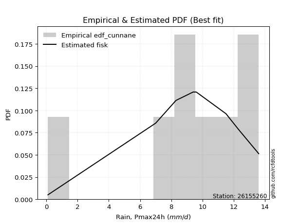</img>

</div>


### 12. EDF Adamowski (1981)

The Adamowski formula in hydrology refers to a specific plotting position formula used for estimating the non-parametric empirical distribution of hydrological events (like flood peaks) to calculate their return periods. This formula provides an alternative to traditional parametric methods (like the Gumbel or Log Pearson Type III distributions). 

<div align="center">


$P=(m-0.25)/(n+0.5)$


</div>


**12.1. Empirical values**

<div align="center">

|                | 0                   | 1                   | 2                  | 3                  | 4                  | 5                  | 6                  | 7                  |
|:---------------|:--------------------|:--------------------|:-------------------|:-------------------|:-------------------|:-------------------|:-------------------|:-------------------|
| date           | 2016                | 2019                | 2020               | 2023               | 2017               | 2018               | 2022               | 2021               |
| x              | 0.1                 | 7.0                 | 8.3                | 9.4                | 9.6                | 11.5               | 12.3               | 13.6               |
| m              | 1                   | 2                   | 3                  | 4                  | 5                  | 6                  | 7                  | 8                  |
| empirical_dist | edf_adamowski       | edf_adamowski       | edf_adamowski      | edf_adamowski      | edf_adamowski      | edf_adamowski      | edf_adamowski      | edf_adamowski      |
| empirical      | 0.08823529411764706 | 0.20588235294117646 | 0.3235294117647059 | 0.4411764705882353 | 0.5588235294117647 | 0.6764705882352942 | 0.7941176470588235 | 0.9117647058823529 |
| empirical_tr   | 1.096774193548387   | 1.259259259259259   | 1.4782608695652173 | 1.7894736842105263 | 2.2666666666666666 | 3.0909090909090913 | 4.857142857142856  | 11.33333333333333  |

</div>


**12.2. Kolmogorov-Smirnov fit test (sorted by Δ)**


<div align="center">

|                | 0                   | 1                   | 2                   | 3                   | 4                   | 5                   | 6                   | 7                   | 8                   | 9                  | 10                  | 11                  | 12                  | 13                  | 14                  | 15                  | 16                  | 17                 | 18                  | 19                  | 20                  | 21                  | 22                  | 23                 | 24                 | 25                  | 26                  | 27                  | 28                  | 29                 | 30                 | 31                  | 32                  | 33                  | 34                  | 35                  | 36                  | 37                  | 38                 | 39                    | 40                 | 41                  | 42                 | 43                 | 44                 | 45                 | 46                 | 47                 | 48                 | 49                 | 50                 | 51                  | 52                  | 53                  | 54                  | 55                 | 56                 | 57                 | 58                  | 59                 | 60                 | 61                 | 62                  | 63                  | 64                  | 65                 | 66                  | 67                 | 68                 | 69                  | 70                  | 71                 | 72                  | 73                 | 74                 | 75                 | 76                 | 77                 | 78                 | 79                 | 80                 | 81                 | 82                 | 83                 | 84                 | 85                 | 86                 | 87                 |
|:---------------|:--------------------|:--------------------|:--------------------|:--------------------|:--------------------|:--------------------|:--------------------|:--------------------|:--------------------|:-------------------|:--------------------|:--------------------|:--------------------|:--------------------|:--------------------|:--------------------|:--------------------|:-------------------|:--------------------|:--------------------|:--------------------|:--------------------|:--------------------|:-------------------|:-------------------|:--------------------|:--------------------|:--------------------|:--------------------|:-------------------|:-------------------|:--------------------|:--------------------|:--------------------|:--------------------|:--------------------|:--------------------|:--------------------|:-------------------|:----------------------|:-------------------|:--------------------|:-------------------|:-------------------|:-------------------|:-------------------|:-------------------|:-------------------|:-------------------|:-------------------|:-------------------|:--------------------|:--------------------|:--------------------|:--------------------|:-------------------|:-------------------|:-------------------|:--------------------|:-------------------|:-------------------|:-------------------|:--------------------|:--------------------|:--------------------|:-------------------|:--------------------|:-------------------|:-------------------|:--------------------|:--------------------|:-------------------|:--------------------|:-------------------|:-------------------|:-------------------|:-------------------|:-------------------|:-------------------|:-------------------|:-------------------|:-------------------|:-------------------|:-------------------|:-------------------|:-------------------|:-------------------|:-------------------|
| station        | 26155260            | 26155260            | 26155260            | 26155260            | 26155260            | 26155260            | 26155260            | 26155260            | 26155260            | 26155260           | 26155260            | 26155260            | 26155260            | 26155260            | 26155260            | 26155260            | 26155260            | 26155260           | 26155260            | 26155260            | 26155260            | 26155260            | 26155260            | 26155260           | 26155260           | 26155260            | 26155260            | 26155260            | 26155260            | 26155260           | 26155260           | 26155260            | 26155260            | 26155260            | 26155260            | 26155260            | 26155260            | 26155260            | 26155260           | 26155260              | 26155260           | 26155260            | 26155260           | 26155260           | 26155260           | 26155260           | 26155260           | 26155260           | 26155260           | 26155260           | 26155260           | 26155260            | 26155260            | 26155260            | 26155260            | 26155260           | 26155260           | 26155260           | 26155260            | 26155260           | 26155260           | 26155260           | 26155260            | 26155260            | 26155260            | 26155260           | 26155260            | 26155260           | 26155260           | 26155260            | 26155260            | 26155260           | 26155260            | 26155260           | 26155260           | 26155260           | 26155260           | 26155260           | 26155260           | 26155260           | 26155260           | 26155260           | 26155260           | 26155260           | 26155260           | 26155260           | 26155260           | 26155260           |
| empirical_dist | edf_adamowski       | edf_adamowski       | edf_adamowski       | edf_adamowski       | edf_adamowski       | edf_adamowski       | edf_adamowski       | edf_adamowski       | edf_adamowski       | edf_adamowski      | edf_adamowski       | edf_adamowski       | edf_adamowski       | edf_adamowski       | edf_adamowski       | edf_adamowski       | edf_adamowski       | edf_adamowski      | edf_adamowski       | edf_adamowski       | edf_adamowski       | edf_adamowski       | edf_adamowski       | edf_adamowski      | edf_adamowski      | edf_adamowski       | edf_adamowski       | edf_adamowski       | edf_adamowski       | edf_adamowski      | edf_adamowski      | edf_adamowski       | edf_adamowski       | edf_adamowski       | edf_adamowski       | edf_adamowski       | edf_adamowski       | edf_adamowski       | edf_adamowski      | edf_adamowski         | edf_adamowski      | edf_adamowski       | edf_adamowski      | edf_adamowski      | edf_adamowski      | edf_adamowski      | edf_adamowski      | edf_adamowski      | edf_adamowski      | edf_adamowski      | edf_adamowski      | edf_adamowski       | edf_adamowski       | edf_adamowski       | edf_adamowski       | edf_adamowski      | edf_adamowski      | edf_adamowski      | edf_adamowski       | edf_adamowski      | edf_adamowski      | edf_adamowski      | edf_adamowski       | edf_adamowski       | edf_adamowski       | edf_adamowski      | edf_adamowski       | edf_adamowski      | edf_adamowski      | edf_adamowski       | edf_adamowski       | edf_adamowski      | edf_adamowski       | edf_adamowski      | edf_adamowski      | edf_adamowski      | edf_adamowski      | edf_adamowski      | edf_adamowski      | edf_adamowski      | edf_adamowski      | edf_adamowski      | edf_adamowski      | edf_adamowski      | edf_adamowski      | edf_adamowski      | edf_adamowski      | edf_adamowski      |
| p_dist         | gumbel_l            | pearson3            | fisk                | mielke              | gompertz            | fatiguelife         | logistic            | t                   | norm                | crystalball        | exponnorm           | rice                | nct                 | logjohnsonsu        | johnsonsu           | f                   | ncf                 | hypsecant          | logt                | laplace_asymmetric  | betaprime           | erlang              | gamma               | laplace            | invgamma           | maxwell             | invgauss            | rayleigh            | gumbel_r            | invweibull         | logcrystalball     | halfnorm            | moyal               | halflogistic        | kstwobign           | genexpon            | loggompertz         | logpearson3         | logloggamma        | loglaplace_asymmetric | wald               | logmielke           | loggumbel_l        | logtruncnorm       | gibrat             | expon              | logfisk            | logrice            | logexponnorm       | lognorm            | lognorm            | lognct              | lognakagami         | loginvweibull       | logfatiguelife      | loglognorm         | loginvgamma        | loglogistic        | logalpha            | loghypsecant       | loginvgauss        | logmaxwell         | loglaplace          | lograyleigh         | logkstwobign        | logncf             | nakagami            | loghalfnorm        | loggumbel_r        | loghalflogistic     | logmoyal            | loggenexpon        | logexpon            | logf               | logweibull_min     | logwald            | loggibrat          | logbetaprime       | weibull_min        | truncnorm          | chi2               | logchi2            | alpha              | loggamma           | loggamma           | genlogistic        | loggenlogistic     | logerlang          |
| delta          | 0.06085522182414538 | 0.07109110183634415 | 0.07767715637569637 | 0.08819785710493722 | 0.08823517349075101 | 0.10533806719868771 | 0.10791063384317567 | 0.10793882677466049 | 0.10799827741394802 | 0.1079983059700137 | 0.10799869353426295 | 0.10800131088917075 | 0.10826654747506537 | 0.10891644379037957 | 0.10901335101265808 | 0.10992362204511319 | 0.11019672798653546 | 0.1128632369865521 | 0.11924425119503895 | 0.12104704110503772 | 0.12107931160498692 | 0.12249125600168542 | 0.12543683846242376 | 0.1300104301581313 | 0.131564891287209  | 0.14240094276815207 | 0.15424192786378194 | 0.15450593195363466 | 0.17281903670425225 | 0.1763518735757792 | 0.1869784836107929 | 0.18873150855231252 | 0.19752321950263235 | 0.20799866161571773 | 0.21989274452906582 | 0.23640871321841334 | 0.25691042983151496 | 0.26064377410165174 | 0.2647072055006046 | 0.2649266119040629    | 0.2669438725593296 | 0.27808817198364527 | 0.2841689268769642 | 0.2943386713248945 | 0.2954876047463486 | 0.3345480052672904 | 0.3439507277508304 | 0.3504971793993688 | 0.3504981364637633 | 0.3504990579426411 | 0.3504990579426411 | 0.35060348203298936 | 0.35126751610522616 | 0.35127686665031993 | 0.35129662846434667 | 0.3532793749879753 | 0.3569079455701903 | 0.3580651684828022 | 0.36027453577946905 | 0.3644390571283905 | 0.376762650323835  | 0.3804599221579789 | 0.38497201038992696 | 0.39003968269882033 | 0.39409367179435345 | 0.4005056636745507 | 0.40884935038884856 | 0.4170800370852235 | 0.4203112477024668 | 0.44456513741229836 | 0.44493365199368257 | 0.4455808362984183 | 0.44559841942741824 | 0.4981001619829682 | 0.5014987182453976 | 0.5132545149467449 | 0.5428420079027734 | 0.5710141400554352 | 0.5842144363720767 | 0.6310373762686807 | 0.6967411024547008 | 0.7356816213031141 | 0.7629068062073678 | 0.7719238836988964 | 0.7719238836988964 | 0.7941176470588235 | 0.7941176470588235 | 0.8359220639016064 |
| deltao         | 0.4472608134160001  | 0.4472608134160001  | 0.4472608134160001  | 0.4472608134160001  | 0.4472608134160001  | 0.4472608134160001  | 0.4472608134160001  | 0.4472608134160001  | 0.4472608134160001  | 0.4472608134160001 | 0.4472608134160001  | 0.4472608134160001  | 0.4472608134160001  | 0.4472608134160001  | 0.4472608134160001  | 0.4472608134160001  | 0.4472608134160001  | 0.4472608134160001 | 0.4472608134160001  | 0.4472608134160001  | 0.4472608134160001  | 0.4472608134160001  | 0.4472608134160001  | 0.4472608134160001 | 0.4472608134160001 | 0.4472608134160001  | 0.4472608134160001  | 0.4472608134160001  | 0.4472608134160001  | 0.4472608134160001 | 0.4472608134160001 | 0.4472608134160001  | 0.4472608134160001  | 0.4472608134160001  | 0.4472608134160001  | 0.4472608134160001  | 0.4472608134160001  | 0.4472608134160001  | 0.4472608134160001 | 0.4472608134160001    | 0.4472608134160001 | 0.4472608134160001  | 0.4472608134160001 | 0.4472608134160001 | 0.4472608134160001 | 0.4472608134160001 | 0.4472608134160001 | 0.4472608134160001 | 0.4472608134160001 | 0.4472608134160001 | 0.4472608134160001 | 0.4472608134160001  | 0.4472608134160001  | 0.4472608134160001  | 0.4472608134160001  | 0.4472608134160001 | 0.4472608134160001 | 0.4472608134160001 | 0.4472608134160001  | 0.4472608134160001 | 0.4472608134160001 | 0.4472608134160001 | 0.4472608134160001  | 0.4472608134160001  | 0.4472608134160001  | 0.4472608134160001 | 0.4472608134160001  | 0.4472608134160001 | 0.4472608134160001 | 0.4472608134160001  | 0.4472608134160001  | 0.4472608134160001 | 0.4472608134160001  | 0.4472608134160001 | 0.4472608134160001 | 0.4472608134160001 | 0.4472608134160001 | 0.4472608134160001 | 0.4472608134160001 | 0.4472608134160001 | 0.4472608134160001 | 0.4472608134160001 | 0.4472608134160001 | 0.4472608134160001 | 0.4472608134160001 | 0.4472608134160001 | 0.4472608134160001 | 0.4472608134160001 |
| eval           | Δo > Δ              | Δo > Δ              | Δo > Δ              | Δo > Δ              | Δo > Δ              | Δo > Δ              | Δo > Δ              | Δo > Δ              | Δo > Δ              | Δo > Δ             | Δo > Δ              | Δo > Δ              | Δo > Δ              | Δo > Δ              | Δo > Δ              | Δo > Δ              | Δo > Δ              | Δo > Δ             | Δo > Δ              | Δo > Δ              | Δo > Δ              | Δo > Δ              | Δo > Δ              | Δo > Δ             | Δo > Δ             | Δo > Δ              | Δo > Δ              | Δo > Δ              | Δo > Δ              | Δo > Δ             | Δo > Δ             | Δo > Δ              | Δo > Δ              | Δo > Δ              | Δo > Δ              | Δo > Δ              | Δo > Δ              | Δo > Δ              | Δo > Δ             | Δo > Δ                | Δo > Δ             | Δo > Δ              | Δo > Δ             | Δo > Δ             | Δo > Δ             | Δo > Δ             | Δo > Δ             | Δo > Δ             | Δo > Δ             | Δo > Δ             | Δo > Δ             | Δo > Δ              | Δo > Δ              | Δo > Δ              | Δo > Δ              | Δo > Δ             | Δo > Δ             | Δo > Δ             | Δo > Δ              | Δo > Δ             | Δo > Δ             | Δo > Δ             | Δo > Δ              | Δo > Δ              | Δo > Δ              | Δo > Δ             | Δo > Δ              | Δo > Δ             | Δo > Δ             | Δo > Δ              | Δo > Δ              | Δo > Δ             | Δo > Δ              | Δo <= Δ            | Δo <= Δ            | Δo <= Δ            | Δo <= Δ            | Δo <= Δ            | Δo <= Δ            | Δo <= Δ            | Δo <= Δ            | Δo <= Δ            | Δo <= Δ            | Δo <= Δ            | Δo <= Δ            | Δo <= Δ            | Δo <= Δ            | Δo <= Δ            |
| fit            | 1                   | 1                   | 1                   | 1                   | 1                   | 1                   | 1                   | 1                   | 1                   | 1                  | 1                   | 1                   | 1                   | 1                   | 1                   | 1                   | 1                   | 1                  | 1                   | 1                   | 1                   | 1                   | 1                   | 1                  | 1                  | 1                   | 1                   | 1                   | 1                   | 1                  | 1                  | 1                   | 1                   | 1                   | 1                   | 1                   | 1                   | 1                   | 1                  | 1                     | 1                  | 1                   | 1                  | 1                  | 1                  | 1                  | 1                  | 1                  | 1                  | 1                  | 1                  | 1                   | 1                   | 1                   | 1                   | 1                  | 1                  | 1                  | 1                   | 1                  | 1                  | 1                  | 1                   | 1                   | 1                   | 1                  | 1                   | 1                  | 1                  | 1                   | 1                   | 1                  | 1                   | 0                  | 0                  | 0                  | 0                  | 0                  | 0                  | 0                  | 0                  | 0                  | 0                  | 0                  | 0                  | 0                  | 0                  | 0                  |
| n              | 8                   | 8                   | 8                   | 8                   | 8                   | 8                   | 8                   | 8                   | 8                   | 8                  | 8                   | 8                   | 8                   | 8                   | 8                   | 8                   | 8                   | 8                  | 8                   | 8                   | 8                   | 8                   | 8                   | 8                  | 8                  | 8                   | 8                   | 8                   | 8                   | 8                  | 8                  | 8                   | 8                   | 8                   | 8                   | 8                   | 8                   | 8                   | 8                  | 8                     | 8                  | 8                   | 8                  | 8                  | 8                  | 8                  | 8                  | 8                  | 8                  | 8                  | 8                  | 8                   | 8                   | 8                   | 8                   | 8                  | 8                  | 8                  | 8                   | 8                  | 8                  | 8                  | 8                   | 8                   | 8                   | 8                  | 8                   | 8                  | 8                  | 8                   | 8                   | 8                  | 8                   | 8                  | 8                  | 8                  | 8                  | 8                  | 8                  | 8                  | 8                  | 8                  | 8                  | 8                  | 8                  | 8                  | 8                  | 8                  |
| best_fit       | 1                   | 0                   | 0                   | 0                   | 0                   | 0                   | 0                   | 0                   | 0                   | 0                  | 0                   | 0                   | 0                   | 0                   | 0                   | 0                   | 0                   | 0                  | 0                   | 0                   | 0                   | 0                   | 0                   | 0                  | 0                  | 0                   | 0                   | 0                   | 0                   | 0                  | 0                  | 0                   | 0                   | 0                   | 0                   | 0                   | 0                   | 0                   | 0                  | 0                     | 0                  | 0                   | 0                  | 0                  | 0                  | 0                  | 0                  | 0                  | 0                  | 0                  | 0                  | 0                   | 0                   | 0                   | 0                   | 0                  | 0                  | 0                  | 0                   | 0                  | 0                  | 0                  | 0                   | 0                   | 0                   | 0                  | 0                   | 0                  | 0                  | 0                   | 0                   | 0                  | 0                   | 0                  | 0                  | 0                  | 0                  | 0                  | 0                  | 0                  | 0                  | 0                  | 0                  | 0                  | 0                  | 0                  | 0                  | 0                  |
| best_fit_sort  | 1                   | 2                   | 3                   | 4                   | 5                   | 6                   | 7                   | 8                   | 9                   | 10                 | 11                  | 12                  | 13                  | 14                  | 15                  | 16                  | 17                  | 18                 | 19                  | 20                  | 21                  | 22                  | 23                  | 24                 | 25                 | 26                  | 27                  | 28                  | 29                  | 30                 | 31                 | 32                  | 33                  | 34                  | 35                  | 36                  | 37                  | 38                  | 39                 | 40                    | 41                 | 42                  | 43                 | 44                 | 45                 | 46                 | 47                 | 48                 | 49                 | 50                 | 51                 | 52                  | 53                  | 54                  | 55                  | 56                 | 57                 | 58                 | 59                  | 60                 | 61                 | 62                 | 63                  | 64                  | 65                  | 66                 | 67                  | 68                 | 69                 | 70                  | 71                  | 72                 | 73                  | 74                 | 75                 | 76                 | 77                 | 78                 | 79                 | 80                 | 81                 | 82                 | 83                 | 84                 | 85                 | 86                 | 87                 | 88                 |

</div>


**12.3. Best fit**

<div align="center">

|   id |   station | empirical_dist   | p_dist   |     delta |   deltao | eval   |   fit |   n |   best_fit |   best_fit_sort |
|-----:|----------:|:-----------------|:---------|----------:|---------:|:-------|------:|----:|-----------:|----------------:|
|    0 |  26155260 | edf_adamowski    | gumbel_l | 0.0608552 | 0.447261 | Δo > Δ |     1 |   8 |          1 |               1 |

</div>


<div align="center">

</img>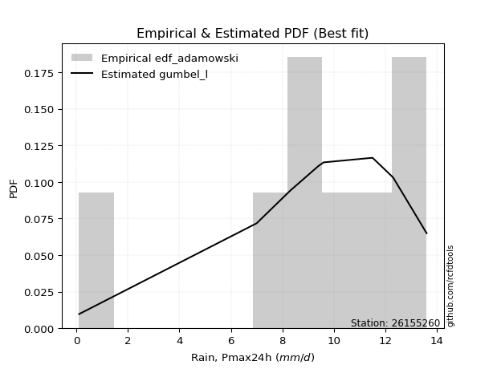</img>

</div>


## C. Best fit & Estimate extreme values for specific return periods - Tr

Best fit in probability distribution analysis means finding the theoretical distribution (like Normal, Poisson, Exponential) that most accurately mirrors your real-world data´s patterns (shape, center, spread) for better predictions, using methods like visual checks (Q-Q plots), goodness-of-fit tests (Kolmogorov-Smirnov, Chi-Squared), and information criteria (AIC) to score and select the simplest, most representative model.


### 1. Best fit (ordered by delta Δ)

<div align="center">

|   id |   station | empirical_dist   | p_dist             |     delta |   deltao | eval   |   fit |   n |   best_fit |   best_fit_sort |
|-----:|----------:|:-----------------|:-------------------|----------:|---------:|:-------|------:|----:|-----------:|----------------:|
|    0 |  26155260 | edf_hazen        | fisk               | 0.0583824 | 0.447261 | Δo > Δ |     1 |   8 |          1 |               1 |
|    1 |  26155260 | edf_gringorten   | fisk               | 0.0584074 | 0.447261 | Δo > Δ |     1 |   8 |          1 |               2 |
|    2 |  26155260 | edf_adamowski    | gumbel_l           | 0.0608552 | 0.447261 | Δo > Δ |     1 |   8 |          1 |               3 |
|    3 |  26155260 | edf_chegodayev   | gumbel_l           | 0.0615555 | 0.447261 | Δo > Δ |     1 |   8 |          1 |               4 |
|    4 |  26155260 | edf_beard        | gumbel_l           | 0.0616976 | 0.447261 | Δo > Δ |     1 |   8 |          1 |               5 |
|    5 |  26155260 | edf_jenkinson    | gumbel_l           | 0.0616976 | 0.447261 | Δo > Δ |     1 |   8 |          1 |               6 |
|    6 |  26155260 | edf_filliben     | gumbel_l           | 0.0618046 | 0.447261 | Δo > Δ |     1 |   8 |          1 |               7 |
|    7 |  26155260 | edf_tukey        | gumbel_l           | 0.0620317 | 0.447261 | Δo > Δ |     1 |   8 |          1 |               8 |
|    8 |  26155260 | edf_cunnane      | fisk               | 0.0626126 | 0.447261 | Δo > Δ |     1 |   8 |          1 |               9 |
|    9 |  26155260 | edf_blom         | gumbel_l           | 0.0626378 | 0.447261 | Δo > Δ |     1 |   8 |          1 |              10 |
|   10 |  26155260 | edf_weibull      | pearson3           | 0.0797967 | 0.447261 | Δo > Δ |     1 |   8 |          1 |              11 |
|   11 |  26155260 | edf_california   | laplace_asymmetric | 0.100205  | 0.447261 | Δo > Δ |     1 |   8 |          1 |              12 |

</div>

:file_folder:Tables: [bestfit_26155260.csv](table/bestfit_26155260.csv) | [extreme_26155260.csv](table/extreme_26155260.csv)


### 2. Extreme values

In hydrology, a return period (or recurrence interval $Tr$) is the statistical average time between extreme events like floods or droughts of a specific magnitude, indicating how rare an event is, with a 100-year flood, for example, having a 1% chance of occurring in any given year, not that it happens exactly every century. It is a key tool for infrastructure design (like bridges or dams) and risk assessment, calculated from historical data to determine the probability of future events, although it is important to remember it is statistical average, and events can cluster or be missed.

> risk_rate: assuming the return period as the project useful life.

|   id |      tr |   prob_l |     prob_g |      alpha |   betaprime |     chi2 |   crystalball |   erlang |    expon |   exponnorm |        f |   fatiguelife |     fisk |    gamma |   genexpon |   genlogistic |   gibrat |   gompertz |   gumbel_l |   gumbel_r |   halflogistic |   halfnorm |   hypsecant |   invgamma |   invgauss |   invweibull |   johnsonsu |   kstwobign |   laplace |   laplace_asymmetric |   loggamma |   logistic |   lognorm |   maxwell |   mielke |    moyal |   nakagami |      ncf |      nct |     norm |   pearson3 |   rayleigh |     rice |        t |   truncnorm |     wald |   weibull_min |   logalpha |   logbetaprime |      logchi2 |   logcrystalball |   logerlang |         logexpon |   logexponnorm |           logf |   logfatiguelife |           logfisk |      loggenexpon |   loggenlogistic |        loggibrat |   loggompertz |   loggumbel_l |   loggumbel_r |   loghalflogistic |   loghalfnorm |   loghypsecant |   loginvgamma |   loginvgauss |    loginvweibull |   logjohnsonsu |   logkstwobign |   loglaplace |   loglaplace_asymmetric |   logloggamma |   loglogistic |   loglognorm |   logmaxwell |   logmielke |    logmoyal |   lognakagami |         logncf |    lognct |   logpearson3 |   lograyleigh |   logrice |           logt |   logtruncnorm |      logwald |    logweibull_min |   station |   n |   risk_rate |
|-----:|--------:|---------:|-----------:|-----------:|------------:|---------:|--------------:|---------:|---------:|------------:|---------:|--------------:|---------:|---------:|-----------:|--------------:|---------:|-----------:|-----------:|-----------:|---------------:|-----------:|------------:|-----------:|-----------:|-------------:|------------:|------------:|----------:|---------------------:|-----------:|-----------:|----------:|----------:|---------:|---------:|-----------:|---------:|---------:|---------:|-----------:|-----------:|---------:|---------:|------------:|---------:|--------------:|-----------:|---------------:|-------------:|-----------------:|------------:|-----------------:|---------------:|---------------:|-----------------:|------------------:|-----------------:|-----------------:|-----------------:|--------------:|--------------:|--------------:|------------------:|--------------:|---------------:|--------------:|--------------:|-----------------:|---------------:|---------------:|-------------:|------------------------:|--------------:|--------------:|-------------:|-------------:|------------:|------------:|--------------:|---------------:|----------:|--------------:|--------------:|----------:|---------------:|---------------:|-------------:|------------------:|----------:|----:|------------:|
|    0 |    2    | 0.5      | 0.5        |   0.40893  |     8.86235 |  1.83697 |       8.975   |  8.85904 |  6.25168 |     8.975   |  8.96099 |       9.00035 |  9.49455 |  8.81633 |    7.7922  |      inf      |  7.80035 |    9.76724 |     9.6179 |    8.3321  |        8.01249 |    8.17393 |     8.975   |    8.7552  |    8.53808 |      8.50924 |     10.03   |     7.99307 |    8.975  |              9.27009 |   0.16762  |    8.975   |   5.62943 |   8.6403  | -8.99503 |  8.12455 |    5.04772 |  8.95288 |  8.97315 |  8.975   |    9.71308 |    8.5216  |  8.97495 |  8.97551 |     1.79891 |  7.70646 |       1.50194 |    5.22718 |    0.121291    |     0.175424 |          8.35428 |    0.1      |      1.63429     |        5.62945 |    0.30351     |          5.6171  |      3.20556      |      1.63451     |         inf      |      3.54936     |       7.51099 |       7.24607 |       4.37347 |           3.85765 |       4.11006 |        5.62943 |       5.38254 |       4.8464  |      4.92213     |        10.2493 |        3.6502  |      5.62943 |                 7.38133 |       7.38408 |       5.62943 |      5.57601 |      4.93613 |     7.23676 |     4.03118 |       5.61223 |   0.986741     |   5.62487 |       9.33283 |       4.7113  |   5.62909 |    9.95941     |        6.99709 |      3.42096 |      0.133109     |  26155260 |   8 |    0.75     |
|    1 |    2.33 | 0.570815 | 0.429185   |   0.486004 |     9.58587 |  2.28988 |       9.67334 |  9.59908 |  7.60708 |     9.67334 |  9.6657  |       9.69792 | 10.0846  |  9.53896 |    8.81438 |      inf      |  8.1541  |   10.2873  |    10.2255 |    8.97919 |        8.6778  |    8.92762 |     9.53388 |    9.48267 |    9.31071 |      9.48661 |     10.5845 |     9.0039  |    9.3976 |              9.67655 |   0.195632 |    9.59029 |   7.40554 |   9.36583 | -8.99503 |  8.7371  |    6.20577 |  9.65199 |  9.67244 |  9.67334 |   10.3416  |    9.25786 |  9.67327 |  9.67376 |     2.6801  |  8.16437 |       2.17239 |    7.14814 |    0.156107    |     0.215159 |          9.19154 |    0.1      |      3.02456     |        7.40557 |    0.558058    |          7.38102 |     10.2766       |      3.02506     |         inf      |      4.07827     |       8.5396  |       9.19844 |       5.6387  |           5.00936 |       5.52562 |        7.0109  |       7.24274 |       6.63413 |      7.64159     |        11.025  |        5.74108 |      6.64559 |                 8.29581 |       8.2982  |       7.16792 |      7.32399 |      6.5632  |     8.30487 |     5.12737 |       7.38356 |   3.11305      |   7.40332 |      11.2991  |       6.29072 |   7.40573 |   10.3999      |        7.93001 |      4.09484 |      0.207697     |  26155260 |   8 |    0.729209 |
|    2 |    5    | 0.8      | 0.2        |   1.08365  |    12.3054  |  4.66648 |      12.2686  | 12.3992  | 14.3838  |    12.2686  | 12.2926  |      12.2936  | 12.363   | 12.2687  |   13.0369  |      inf      | 10.1907  |   11.9815  |    12.1883 |   11.7904  |       11.6882  |   12.1149  |    11.7757  |   12.2672  |   12.3264  |     13.7328  |     12.1897 |    13.2977  |   11.5105 |             11.5299  |   0.456942 |   11.966   |  20.518   |  12.2215  | -8.99503 | 11.5745  |   11.3925  | 12.2595  | 12.2722  | 12.2686  |   12.2844  |   12.2054  | 12.2684  | 12.2687  |     6.22931 | 10.7278  |       7.42554 |   23.9259  |   27.776       |     0.719074 |         11.6644  |    0.1      |     65.6544      |       20.5182  | 1883.99        |         20.3777  | 143315            |     65.6748      |         inf      |      9.07382     |      12.9278  |      19.8811  |      17.0059  |          16.3366  |      19.3166  |       16.9076  |      22.4104  |      22.327   |     51.6544      |        12.7435 |       39.3038  |     15.2357  |                11.1717  |      11.1726  |      18.2195  |     20.1881  |     20.142   |    12.4568  |    15.6233  |      20.4655  |   5.55224e+06  |  20.5569  |      17.9143  |      20.0157  |  20.5251  |   12.9691      |       10.952   |     11.2041  | 378867            |  26155260 |   8 |    0.67232  |
|    3 |   10    | 0.9      | 0.1        |   2.18167  |    14.1363  |  6.9128  |      13.9902  | 14.3005  | 20.5354  |    13.9902  | 14.0421  |      14.0183  | 14.041   | 14.1184  |   16.1668  |      inf      | 12.5123  |   12.931   |    13.281  |   14.0802  |       14.1882  |   14.4734  |    13.5658  |   14.1874  |   14.457   |     17.1912  |     12.948  |    16.5669  |   13.4286 |             13.2124  |   1.04913  |   13.7156  |  40.3395  |  14.2311  | -8.99503 | 14.0449  |   15.3692  | 13.9975  | 13.9976  | 13.9902  |   13.2608  |   14.3071  | 13.99    | 13.9903  |     8.61325 | 13.4481  |      14.8961  |   55.5819  |    6.01565e+10 |     2.50957  |         12.6539  |    0.1      |   1072.99        |       40.3399  |    1.12864e+16 |         39.9915  |      1.06985e+13  |   1073.46        |         inf      |     22.5782      |      16.2852  |      30.5351  |      41.7907  |          43.6014  |      48.7689  |       34.148   |      48.5432  |      52.0726  |    244.945       |        13.2498 |      170.026   |     32.3563  |                12.3944  |      12.3944  |      36.2167  |     39.576   |     44.3425  |    15.5304  |    41.216   |      40.2499  |   8.36568e+27  |  40.4851  |      20.6733  |      45.6862  |  40.362   |   18.0204      |       12.2743  |     32.6049  |      3.71359e+34  |  26155260 |   8 |    0.651322 |
|    4 |   15    | 0.933333 | 0.0666667  |   3.27577  |    15.058   |  8.24904 |      14.8493  | 15.2625  | 24.1339  |    14.8493  | 14.9172  |      14.8798  | 14.9552  | 15.053   |   17.8174  |      inf      | 14.1135  |   13.362   |    13.7759 |   15.372   |       15.603   |   15.7007  |    14.5875  |   15.1682  |   15.5605  |     19.1424  |     13.2569 |    18.3024  |   14.5506 |             14.1966  |   1.73246  |   14.6689  |  56.525   |  15.2622  | -8.99503 | 15.4786  |   17.4561  | 14.8672  | 14.8589  | 14.8493  |   13.6648  |   15.39    | 14.849   | 14.8494  |     9.72711 | 15.195   |      20.4429  |   85.7664  |    2.65678e+26 |     5.42368  |         12.9739  |    0.1      |   5499.79        |       56.5257  |    2.9823e+36  |         55.9961  |      9.45054e+20  |   5502.67        |         inf      |     42.341       |      18.0803  |      37.0849  |      69.4042  |          75.9926  |      78.9685  |       51.0022  |      71.9109  |      80.4843  |    589.439       |        13.4008 |      369.997   |     50.2687  |                12.7983  |      12.798   |      52.6595  |     55.3833  |     66.4759  |    17.2773  |    72.3712  |      56.4102  |   1.87866e+60  |  56.7819  |      21.5191  |      69.8967  |  56.5625  |   24.7206      |       12.7158  |     64.7416  |      2.43771e+75  |  26155260 |   8 |    0.644736 |
|    5 |   20    | 0.95     | 0.05       |   4.36891  |    15.6645  |  9.20428 |      15.4119  | 15.8972  | 26.6871  |    15.4119  | 15.4911  |      15.4443  | 15.5871  | 15.6693  |   18.9288  |      inf      | 15.3696  |   13.6305  |    14.084  |   16.2765  |       16.5942  |   16.519   |    15.3082  |   15.8189  |   16.2979  |     20.5086  |     13.438  |    19.4715  |   15.3466 |             14.8948  |   2.4853   |   15.3278  |  70.4996  |  15.9465  | -8.99503 | 16.494   |   18.8506  | 15.4377  | 15.423   | 15.4119  |   13.9016  |   16.1098  | 15.4116  | 15.4121  |    10.4042  | 16.4968  |      24.9014  |  114.505   |    2.24296e+48 |     9.491    |         13.1321  |    0.1      |  17535.7         |       70.5005  |    1.88068e+64 |         69.8104  |      9.27504e+28  |  17545.9         |         inf      |     69.3372      |      19.2962  |      41.8535  |      99.0007  |         112.153   |     108.894   |       67.6855  |      93.2652  |     107.546   |   1090.1         |        13.4753 |      624.701   |     68.7155  |                12.9996  |      12.9992  |      68.2085  |     69.0207  |     86.9692  |    18.5366  |   107.826   |      70.3657  |   1.02245e+103 |  70.8652  |      21.9172  |      92.7261  |  70.5512  |   33.827       |       12.9367  |    107.939   |      8.38781e+121 |  26155260 |   8 |    0.641514 |
|    6 |   25    | 0.96     | 0.04       |   5.46167  |    16.1125  |  9.94863 |      15.8261  | 16.3668  | 28.6675  |    15.8261  | 15.9139  |      15.8601  | 16.0705  | 16.1251  |   19.7621  |      inf      | 16.4168  |   13.8217  |    14.3032 |   16.9733  |       17.3579  |   17.1279  |    15.8659  |   16.3022  |   16.8483  |     21.5609  |     13.5615 |    20.3472  |   15.9641 |             15.4365  |   3.2958   |   15.8318  |  82.9499  |  16.4546  | -8.99503 | 17.281   |   19.8892  | 15.8581  | 15.8384  | 15.8261  |   14.0627  |   16.6445  | 15.8258  | 15.8263  |    10.868   | 17.5395  |      28.6575  |  142.01    |    3.6135e+76  |    14.7382   |         13.2265  |    0.1      |  43105.1         |       82.951   |    1.87204e+99 |         82.1158  |      9.83303e+36  |  43131.9         |         inf      |    104.602       |      20.2109  |      45.6158  |     130.153   |         151.374   |     138.304   |       84.2589  |     113.094   |     133.447   |   1750.43        |        13.5204 |      924.824   |     87.5702  |                13.1202  |      13.1197  |      83.1371  |     81.1646  |    106.171   |    19.5357  |   146.872   |      82.8007  |   4.1123e+155  |  83.4203  |      22.1452  |     114.393   |  83.0148  |   46.2561      |       13.0693  |    162.552   |      2.82156e+171 |  26155260 |   8 |    0.639603 |
|    7 |   50    | 0.98     | 0.02       |  10.9237   |    17.4023  | 12.2762  |      17.0121  | 17.723   | 34.8192  |    17.0121  | 17.1265  |      17.0512  | 17.5474  | 17.4404  |   22.2172  |      inf      | 20.108   |   14.3411  |    14.8983 |   19.1195  |       19.711   |   18.8976  |    17.5952  |   17.7066  |   18.4607  |     24.8026  |     13.8743 |    22.9188  |   17.8822 |             17.1189  |   8.0049   |   17.3718  | 132.151   |  17.928   | -8.99503 | 19.7243  |   22.9101  | 17.064   | 17.0279  | 17.0121  |   14.4656  |   18.1969  | 17.0117  | 17.0125  |    11.9919  | 20.9439  |      41.9764  |  266.307   |  inf           |    59.4317   |         13.414   |    0.100007 | 704463           |      132.153   |  inf           |        130.735   |      2.77614e+77  | 704995           |         inf      |    445.671       |      22.9186  |      57.6227  |     302.319   |         381.358   |     277.096   |      166.16    |     197.697   |     250.392   |   7529.22        |        13.615  |     2926.83    |    185.974   |                13.3609  |      13.3602  |     152.201   |    129.117   |    189.353   |    22.8257  |   383.355   |     131.954   | inf            | 133.093   |      22.5667  |     210.441   | 132.274   |  221.239       |       13.3346  |    618.803   |    inf            |  26155260 |   8 |    0.63583  |
|    8 |   75    | 0.986667 | 0.0133333  |  16.385    |    18.0986  | 13.6464  |      17.6484  | 18.4577  | 38.4177  |    17.6485  | 17.7782  |      17.6908  | 18.4004  | 18.1523  |   23.5759  |      inf      | 22.601   |   14.604   |    15.1992 |   20.367   |       21.0789  |   19.8609  |    18.6058  |   18.4728  |   19.3482  |     26.6868  |     14.0198 |    24.3336  |   19.0041 |             18.1031  |  13.5338   |   18.2612  | 169.665   |  18.729   | -8.99503 | 21.153   |   24.5547  | 17.7123  | 17.6663  | 17.6484  |   14.6487  |   19.0414  | 17.6481  | 17.6491  |    12.453   | 23.0388  |      50.9205  |  376.051   |  inf           |   136.448    |         13.4762  |    0.100136 |      3.61086e+06 |      169.668   |  inf           |        167.802   |      1.72039e+118 |      3.61387e+06 |         inf      |   1186.21        |      24.423   |      64.8499  |     493.408   |         652.527   |     404.497   |      247.098   |     267.852   |     353.456   |  17580.2         |        13.65   |     5516.73    |    288.929   |                13.441   |      13.4402  |     215.823   |    165.653   |    259.348   |    24.9205  |   671.825   |     169.442   | inf            | 171.016   |      22.6924  |     293.193   | 169.836   | 1062.51        |       13.423   |   1408.65    |    inf            |  26155260 |   8 |    0.634587 |
|    9 |  100    | 0.99     | 0.01       |  21.8461   |    18.5712  | 14.6218  |      18.0788  | 18.9573  | 40.9709  |    18.0789  | 18.2194  |      18.1236  | 19.0027  | 18.6362  |   24.5109  |      inf      | 24.5323  |   14.776   |    15.396  |   21.2499  |       22.047   |   20.5172  |    19.3227  |   18.9962  |   19.9574  |     28.0204  |     14.1104 |    25.303   |   19.8002 |             18.8014  |  19.6874   |   18.8892  | 200.906   |  19.2747  | -8.99503 | 22.1667  |   25.6749  | 18.1513  | 18.0982  | 18.0788  |   14.7606  |   19.6167  | 18.0785  | 18.0796  |    12.707   | 24.5662  |      57.7803  |  476.399   |  inf           |   247.458    |         13.5073  |    0.100602 |      1.1513e+07  |      200.91    |  inf           |        198.67    |      1.77535e+159 |      1.15232e+07 |         inf      |   2532.26        |      25.4601  |      70.0608  |     697.872   |         954.329   |     523.398   |      327.431   |     329.46    |     447.532   |  32038.7         |        13.6691 |     8517.14    |    394.956   |                13.481   |      13.4802  |     276.178   |    196.067   |    321.317   |    26.4992  |  1000.28    |     200.666   | inf            | 202.621   |      22.7511  |     367.514   | 201.119   | 5121.79        |       13.4673  |   2566.09    |    inf            |  26155260 |   8 |    0.633968 |
|   10 |  200    | 0.995    | 0.005      |  43.6901   |    19.6485  | 16.981   |      19.0551  | 20.099   | 47.1226  |    19.0552  | 19.2216  |      19.1058  | 20.4473  | 19.7412  |   26.6793  |      inf      | 29.7865  |   15.15    |    15.8238 |   23.3725  |       24.3745  |   22.0181  |    21.0497  |   20.1988  |   21.3665  |     31.2264  |     14.2949 |    27.5357  |   21.7183 |             20.4838  |  48.8741   |   20.3956  | 294.774   |  20.523   | -8.99503 | 24.6089  |   28.2353  | 19.1487  | 19.0779  | 19.0551  |   14.9812  |   20.9332  | 19.0548  | 19.0563  |    13.1252  | 28.3708  |      76.054   |  822.557   |  inf           |  1055.18     |         13.5537  |    0.105991 |      1.88156e+08 |      294.78    |  inf           |        291.424   |    inf            |      1.88348e+08 |         inf      |  19931.3         |      27.8687  |      82.8767  |    1606.05    |        2380.24    |     943.625   |      645.114   |     529.494   |     770.921   | 135614           |        13.7018 |    23158.7     |    838.774   |                13.5411  |      13.5402  |     498.974   |    287.409   |    524.591   |    30.6687  |  2609.78    |     294.507   | inf            | 297.689   |      22.8315  |     616.288   | 295.122   |    2.83692e+06 |       13.5336  |  11430.7     |    inf            |  26155260 |   8 |    0.633042 |
|   11 |  250    | 0.996    | 0.004      |  54.612    |    19.9791  | 17.7429  |      19.3535  | 20.4502  | 49.103   |    19.3535  | 19.5282  |      19.4061  | 20.9111  | 20.081   |   27.355   |      inf      | 31.6718  |   15.26    |    15.9497 |   24.0549  |       25.1228  |   22.4798  |    21.6057  |   20.5707  |   21.8047  |     32.2571  |     14.3459 |    28.2267  |   22.3357 |             21.0255  |  65.6009   |   20.8792  | 331.413   |  20.9073  | -8.99503 | 25.3951  |   29.0225  | 19.4539  | 19.3773  | 19.3535  |   15.0401  |   21.3385  | 19.3531  | 19.3548  |    13.2151  | 29.6294  |      82.4602  |  974.62    |  inf           |  1689.95     |         13.563   |    0.109863 |      4.62511e+08 |      331.419   |  inf           |        327.631   |    inf            |      4.63004e+08 |         inf      |  41786.1         |      28.6198  |      87.0759  |    2099.58    |        3193.2     |    1131.22    |      802.499   |     612.949   |     912.48    | 215654           |        13.7095 |    31561.4     |   1068.92    |                13.5531  |      13.5522  |     603.324   |    323.05    |    610.033   |    32.134   |  3553.68    |     331.144   | inf            | 334.833   |      22.8461  |     722.591   | 331.817   |    6.74842e+07 |       13.5469  |  18737.6     |    inf            |  26155260 |   8 |    0.632858 |
|   12 |  500    | 0.998    | 0.002      | 109.221    |    20.9634  | 20.1156  |      20.2383  | 21.4979  | 55.2546  |    20.2383  | 20.4385  |      20.297   | 22.3495  | 21.094   |   29.3945  |       13.591  | 38.1871  |   15.5757  |    16.3105 |   26.1729  |       27.4452  |   23.8566  |    23.3325  |   21.6857  |   23.1255  |     35.4562  |     14.484  |    30.2974  |   24.2538 |             22.7079  | 164.366    |   22.379   | 469.09    |  22.054   | 13.5885  | 27.8372  |   31.368   | 20.3602  | 20.2655  | 20.2383  |   15.1937  |   22.5476  | 20.2379  | 20.2401  |    13.4022  | 33.6316  |     103.979   | 1624.24    |  inf           |  7376.95     |         13.5815  |    0.131373 |      7.55878e+09 |      469.1     |  inf           |        463.712   |    inf            |      7.56785e+09 |          13.5772 | 539653           |      30.8871  |     100.331   |    4823.13    |        7948.55    |    1942.36    |     1581.03    |     949.675   |    1514.33    | 909968           |        13.7275 |    79809.1     |   2270.09    |                13.5771  |      13.5762  |    1087.24    |    456.938   |    956.981   |    37.1226  |  9271.56    |     468.841   | inf            | 474.545   |      22.8729  |    1161.7     | 469.713   |    5.47902e+14 |       13.5735  |  90199.9     |    inf            |  26155260 |   8 |    0.632489 |
|   13 |  750    | 0.998667 | 0.00133333 | 163.831    |    21.5127  | 21.5073  |      20.7298  | 22.0841  | 58.8531  |    20.7298  | 20.9448  |      20.7922  | 23.1899  | 21.6604  |   30.5503  |       13.594  | 42.4959  |   15.7444  |    16.5034 |   27.4111  |       28.8029  |   24.6257  |    24.3427  |   22.313   |   23.873   |     37.3263  |     14.553  |    31.4607  |   25.3758 |             23.6921  | 282.015    |   23.2552  | 568.952   |  22.6953  | 13.5924  | 29.2658  |   32.6772  | 20.8644  | 20.7589  | 20.7298  |   15.2665  |   23.2237  | 20.7294  | 20.7319  |    13.4669  | 36.0311  |     117.7     | 2168.13    |  inf           | 17582.2      |         13.5877  |    0.152255 |      3.8744e+10  |      568.964   |  inf           |        562.439   |    inf            |      3.87935e+10 |          13.5852 |      2.93033e+06 |      32.1717  |     108.224   |    7843.04    |       13546.4     |    2627.21    |     2350.74    |    1214.18    |    2015.16    |      2.11133e+06 |        13.7351 |   134397       |   3526.81    |                13.585   |      13.5842  |    1533.76    |    554.027   |   1231.05    |    40.3802  | 16247       |     568.743   | inf            | 575.996   |      22.8808  |    1514.95    | 569.742   |    4.76271e+21 |       13.5823  | 231426       |    inf            |  26155260 |   8 |    0.632366 |
|   14 | 1000    | 0.999    | 0.001      | 218.44     |    21.8919  | 22.4961  |      21.0682  | 22.4894  | 61.4063  |    21.0682  | 21.2936  |      21.1333  | 23.7859  | 22.0519  |   31.3556  |       13.5956 | 45.7933  |   15.858   |    16.6332 |   28.2894  |       29.766   |   25.1569  |    25.0594  |   22.7483  |   24.3935  |     38.6529  |     14.5975 |    32.2666  |   26.1718 |             24.3904  | 414.057    |   23.8767  | 649.809   |  23.1386  | 13.5944  | 30.2794  |   33.5809  | 21.2118  | 21.0987  | 21.0682  |   15.3118  |   23.691   | 21.0677  | 21.0706  |    13.4997  | 37.7572  |     127.941   | 2650.84    |  inf           | 32643.5      |         13.5908  |    0.1718   |      1.23533e+11 |      649.822   |  inf           |        642.392   |    inf            |      1.23697e+11 |          13.5892 |      1.06961e+07 |      33.0662  |     113.882   |   11073       |       19772.6     |    3236.51    |     3114.8     |    1439.48    |    2457.71    |      3.83567e+06 |        13.7395 |   192838       |   4821.02    |                13.589   |      13.5882  |    1957.62    |    632.628   |   1465.11    |    42.8598  | 24189.4     |     649.645   | inf            | 658.197   |      22.8845  |    1820.04    | 650.737   |    4.32888e+28 |       13.5867  | 455790       |    inf            |  26155260 |   8 |    0.632305 |

<div align="center">

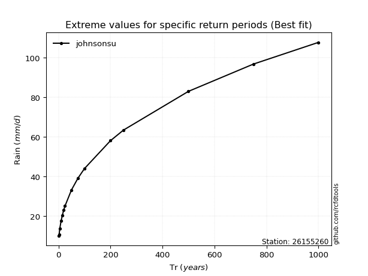</img>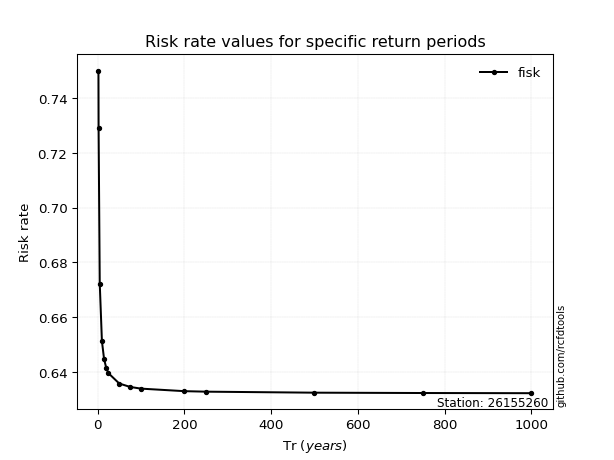</img>

</div>


<sub>**APP DISCLAIMER**: NO WARRANTY - This software is provided by [github.com/rcfdtools](https://github.com/rcfdtools) "as is", without any express or implied warranty, including warranties of merchantability, fitness for a particular purpose, or non-infringement. There is no guarantee that the software will be error-free or operate without interruption. LIMITATION OF LIABILITY - Neither the authors nor copyright holders will be liable for claims or damages arising from the software or its use. You are responsible for determining if the software is appropriate for your use and assume all associated risks, including errors, legal compliance, and data loss. NO PROFESSIONAL ADVICE - The software provides general information and does not offer professional advice. It should not replace consultation with professional advisors.</sub>