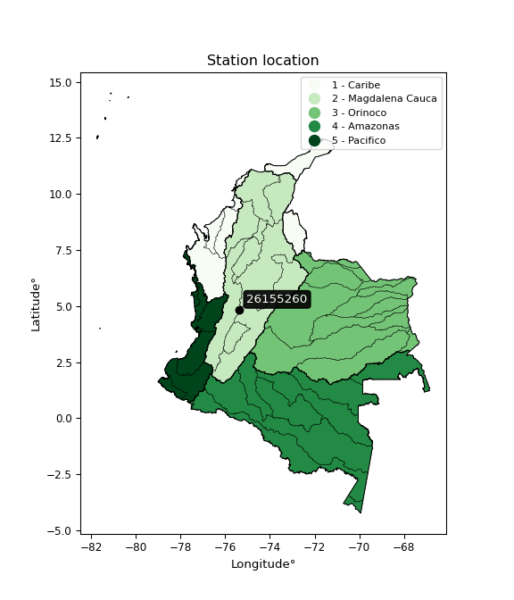

<div align="center">


</div>

# PMax24h Station (Rain, Pmax24h): 26155260

Maximum Precipitation in 24 hours (PMax24h) is the greatest amount of rainfall for a specific duration that is meteorologically possible for a given location, acting as a "worst-case" scenario for extreme storms, crucial for designing safety-critical infrastructure like bridges, river deviations, dams, spillways, and nuclear plants to prevent catastrophic failure. The PMax24h is related with the Probable Maximum Precipitation (PMP) and it is calculated by hydrologists using meteorological data to determine the upper limit of extreme rainfall, often leading to the Probable Maximum Flood (PMF) for flood control design, and is increasingly being studied for climate change impacts. Probable Maximum Precipitation (PMP) is the theoretical upper limit of rainfall, a deterministic estimate for extreme events, while probability distributions (like GEV, Gumbel) describe the likelihood and frequency of various precipitation amounts, including rare ones, showing how often events occur, with PMP representing the extreme end of these distributions, used for critical infrastructure design to ensure safety against the worst conceivable weather, unlike standard statistical forecasts which cover typical probabilities.

The most common probability distributions in hydrology, used for analyzing floods, rainfall, and streamflow, include the Normal, Log-Normal, Gumbel, Gamma (including Log-Pearson Type III), and Generalized Extreme Value (GEV) distributions, often chosen based on the data´s skewness and whether modeling extremes or general conditions, with Gumbel and GEV popular for extreme events like floods, while the Normal distribution serves as a baseline, though often requiring transformations for skewed hydrological data. These distributions help in designing water infrastructure, managing water resources, and forecasting hydrologic events.

> Hydrological data often isn´t perfectly normal (it´s skewed), so different distributions are needed for different applications, such as: **Flood Frequency Analysis**: Using Gumbel, GEV, or Log-Pearson Type III for predicting extreme flood magnitudes and their return periods, **Rainfall Analysis**: Normal for annual totals, but Log-Normal, Weibull, or GEV for intensity or extreme daily rainfall, **Streamflow Modeling**: Gamma and Log-Normal for maximum flows, GEV for minimum flows, and Kappa for daily flows.

<div align="center">

</img>

</div>


## A. General information


### 1. General running parameters

• app_version: _v20260225_. • runtime: _2026-02-27 14:50:08.749431_. • Python version: _3.14.0_. • SciPy version: _1.16.3_. • Pandas version: _2.3.3_. • NumPy version: _2.3.5_. • Stations dataset (station_dataset_file): _dataset/pmax24h_in/automatic_colombia_2003_2025.csv_. • Stations catalog (station_catalog_file): _dataset/CNE.xls_. • Minimum year to eval til year_max (date_min): _1900_. • Maximum year to eval since year_min (date_max): _2025_. • Creates, save and include plots into reports (create_plot): _False_. • Plot only fit distributions with Δo > Δ (plot_only_fit): _True_. • Plot only simple graphs avoiding multiple CDFs and multiple Extreme values plots (plot_only_simple): _False_. • Eval low extreme values, if False, evaluates high extreme values (low_extreme): _False_. • Eval every SciPy distribution as logarithmic (pdist_logarithmic_on): _True_. • Standard deviation normalized (ddof): _1.0_. • Return periods to eval in years (Tr): _[2, 2.33, 5, 10, 15, 20, 25, 50, 75, 100, 200, 250, 500, 750, 1000]_. • Minimum data sample per station, 0 means any (minimum_sample): _5_. • Z-Score maximum threshold to adjust a value, 0 means disable (zscore_max): _3.5_. • Z-Score minimum threshold to adjust a value, 0 means disable (zscore_min): _-2.5_. • Avoid zeros, e.g. rain = 0 (avoid_zeros): _True_. • Avoid null values (avoid_nans): _True_. 

:file_folder:Table: [dataset.csv](../../dataset/pmax24h_in/automatic_colombia_2003_2025.csv)

> Delta Degrees of Freedom (DDOF): is a parameter used in the formulas for calculating variance and standard deviation. When ddof=0, the divisor is $N$ (the total number of observations) and this is used when your data set is the entire population. When ddof=1, the divisor is $N-1$ and this is used when your data set is a sample drawn from a larger population. Using $N-1$ provides an unbiased estimate of the population variance (known as Bessel´s correction).


### 2. Station info and location

|   id |   CODIGO | NOMBRE                                 | CATEGORIA               | TECNOLOGIA                | ESTADO           | FECHA_INSTALACION   |   FECHA_SUSPENSION |   ALTITUD |   LATITUD |   LONGITUD | DEPARTAMENTO   | MUNICIPIO   | AREA_OPERATIVA                         | ENTIDAD                                                     | AREA_HIDROGRAFICA   | ZONA_HIDROGRAFICA   | SUBZONA_HIDROGRAFICA   |   CORRIENTE | Catalogo   |   Version |
|-----:|---------:|:---------------------------------------|:------------------------|:--------------------------|:-----------------|:--------------------|-------------------:|----------:|----------:|-----------:|:---------------|:------------|:---------------------------------------|:------------------------------------------------------------|:--------------------|:--------------------|:-----------------------|------------:|:-----------|----------:|
|    0 | 26155260 | SENDERO LAGUNA VERDE  - AUT [26155260] | Climatológica Ordinaria | Automática con Telemetría | En Mantenimiento | 06/12/2007          |                nan |      4329 |   4.84067 |   -75.3616 | Caldas         | Villamaria  | Area Operativa 09 - Cauca-Valle-Caldas | INSTITUTO DE HIDROLOGIA METEOROLOGIA Y ESTUDIOS AMBIENTALES | Magdalena Cauca     | Cauca               | Río Chinchiná          |         nan | CNE_IDEAM  |  20251226 |

<div align="center">

Dynamic map: [:earth_americas:Google](http://maps.google.com/maps?q=4.840666667,-75.36161111) [:earth_americas:OSM](https://www.openstreetmap.org/#map=18/4.840666667/-75.36161111&layers=P) [:earth_americas:Bing](https://www.bing.com/maps?cp=4.840666667~-75.36161111&lvl=18) [:earth_americas:Apple](https://maps.apple.com/frame?center=4.840666667%2C-75.36161111&span=0.003%2C0.006)

</div>


<div align="center">

```geojson
{
  "type": "Feature",
  "geometry": {
    "type": "Point", 
    "coordinates": [-75.36161111, 4.840666667]
  }, 
  "properties": {
    "Name": "26155260"
  }
}
```

</div>


### 3. Discrete values table and plot

<div align="center">

|               |          0 |           1 |            2 |           3 |           4 |           5 |           6 |           7 |          8 |
|:--------------|-----------:|------------:|-------------:|------------:|------------:|------------:|------------:|------------:|-----------:|
| Date          | 2016       | 2017        | 2018         | 2019        | 2020        | 2021        | 2022        | 2023        | 2025       |
| Value         |    0.1     |    9.6      |   11.5       |    7        |    8.3      |   13.6      |   12.3      |    9.4      |   26.8     |
| Value_initial |    0.1     |    9.6      |   11.5       |    7        |    8.3      |   13.6      |   12.3      |    9.4      |   26.8     |
| count         |    9       |    9        |    9         |    9        |    9        |    9        |    9        |    9        |    9       |
| mean          |   10.9556  |   10.9556   |   10.9556    |   10.9556   |   10.9556   |   10.9556   |   10.9556   |   10.9556   |   10.9556  |
| std           |    7.11462 |    7.11462  |    7.11462   |    7.11462  |    7.11462  |    7.11462  |    7.11462  |    7.11462  |    7.11462 |
| zscore        |   -1.52581 |   -0.190531 |    0.0765248 |   -0.555976 |   -0.373253 |    0.371692 |    0.188969 |   -0.218642 |    2.22703 |


</div>


> The initial value (value_initial) correspond to the initial obtained or null completed value, and value (value) is adjusted only when the initial value is outside the valid range (outlier) definite through the Z-Score value. If Z-Score is active, values out of range or outliers are replaced with the station mean value. A Z-Score (or standard score) measures how many standard deviations a data point is from the mean of a dataset, indicating its relative position; positive scores mean above the mean, negative mean below, and a score of zero is exactly at the mean, allowing for comparison of values from different distributions. It´s calculated using the formula $z=(x–μ)/σ$, where $x$ is the data point, $μ$ is the mean, and $σ$ is the standard deviation, helping identify outliers and understand probability.
>
> <sub>**Note**: In this study, "completing" (filling gaps in) and "extending" (forecasting or lengthening the historical record) rainfall data series are avoided for certain critical analyses because they introduce artificial bias and uncertainty, which can distort the statistics of rare events (extremes), alter day-to-day variability, and compromise the integrity and homogeneity of the original data. Some reasons against Completing/Extending rainfall data are: **Distortion of Extremes and Variability**: The primary issue is that most gap-filling or extension methods rely on averaging or regression with nearby stations, which inherently smooths the data. Rainfall is highly variable in space and time, with a large percentage of zero values and occasional large storms. Infilling methods often underestimate the highest values and overestimate the lowest (zero) values, which severely distorts analyses focused on flood frequency, drought severity, and intensity-duration-frequency (IDF) curves, **Loss of Data Homogeneity**: Infilled or extended data are synthetic estimates, not actual measurements. Combining these estimates with observed data can violate the assumption of data homogeneity, which requires that the data properties do not change over time. Inhomogeneity can lead to incorrect conclusions about long-term trends or changes in climate patterns, **Propagation of Errors**: Errors and biases from the original data (e.g., wind-induced undercatch, instrument errors, site changes) or the data used for imputation can propagate through the analysis, leading to unreliable hydrological models and inaccurate predictions, **Compromised Statistical Integrity**: For statistical analyses, especially those involving the frequency of events, using artificial data can introduce time bias or autocorrelation that doesn´t exist in reality, making it difficult to assess the true probability of events, **Difficulty in Validation**: It is difficult to accurately validate the quality of filled or extended data, especially for past periods where ground-truth measurements are unavailable. The reliability of imputation techniques heavily depends on the density of the surrounding station network and the complexity of the local topography.</sub>


### 4. Active continuous probability distributions from SciPy (80 of 104 available)

A Probability Density Function (PDF) describes the relative likelihood of a continuous random variable falling within a specific range, where the total area under its curve equals 1, and the area over any interval gives the actual probability for that range. Unlike discrete probabilities (like rolling a die), a PDF shows density, not direct probability for a single point (which is zero), with higher points indicating higher likelihood, often visualized as a bell curve for normal distributions.

A log of a probability density function (log-PDF) is simply the logarithm of the PDF´s value, denoted as $log(f(x))$, useful for converting multiplication of probabilities into addition, improving numerical stability with tiny numbers, and connecting to information theory concepts like entropy. Instead of dealing with very small probabilities (e.g., 0.000001), log-PDFs use negative numbers (e.g., $log(0.00001) ≈ -11.51$ that are easier for computers to handle, preventing underflow errors and simplifying complex calculations. In this study, each active probability distribution from SciPy is also evaluated in the $log$ form.

[scipy.stats](https://docs.scipy.org/doc/scipy/reference/stats.html) is a Python´s powerful submodule within the SciPy library for comprehensive statistical analysis, offering over 130 probability distributions (like Normal, Poisson, etc.), functions for descriptive stats (mean, variance), hypothesis testing (t-tests, chi-square), random variable generation, and statistical tests, making it essential for data science, modeling, and research. It provides tools to explore, model, and draw conclusions from data efficiently, working seamlessly with [NumPy](https://numpy.org/).

<div align="center">

|   id | p_dist           |   n_parameter | fit_method   | label                                                                       | active   | ref                                                                                                      |
|-----:|:-----------------|--------------:|:-------------|:----------------------------------------------------------------------------|:---------|:---------------------------------------------------------------------------------------------------------|
|    0 | alpha            |             3 | MLE          | Alpha                                                                       | True     | [:mortar_board:](https://docs.scipy.org/doc/scipy/reference/generated/scipy.stats.alpha.html)            |
|    1 | anglit           |             2 | MM           | Anglit                                                                      | True     | [:mortar_board:](https://docs.scipy.org/doc/scipy/reference/generated/scipy.stats.anglit.html)           |
|    2 | arcsine          |             2 | MM           | Arcsine                                                                     | True     | [:mortar_board:](https://docs.scipy.org/doc/scipy/reference/generated/scipy.stats.arcsine.html)          |
|    3 | argus            |             3 | MLE          | Argus                                                                       | True     | [:mortar_board:](https://docs.scipy.org/doc/scipy/reference/generated/scipy.stats.argus.html)            |
|    4 | beta             |             4 | MLE          | Beta                                                                        | True     | [:mortar_board:](https://docs.scipy.org/doc/scipy/reference/generated/scipy.stats.beta.html)             |
|    5 | betaprime        |             4 | MLE          | Beta prime                                                                  | True     | [:mortar_board:](https://docs.scipy.org/doc/scipy/reference/generated/scipy.stats.betaprime.html)        |
|    6 | bradford         |             3 | MLE          | Bradford                                                                    | True     | [:mortar_board:](https://docs.scipy.org/doc/scipy/reference/generated/scipy.stats.bradford.html)         |
|    7 | burr             |             4 | MLE          | Burr (Type III)                                                             | True     | [:mortar_board:](https://docs.scipy.org/doc/scipy/reference/generated/scipy.stats.burr.html)             |
|    8 | burr12           |             4 | MLE          | Burr (Type III) 12                                                          | True     | [:mortar_board:](https://docs.scipy.org/doc/scipy/reference/generated/scipy.stats.burr12.html)           |
|    9 | cosine           |             2 | MLE          | Cosine                                                                      | True     | [:mortar_board:](https://docs.scipy.org/doc/scipy/reference/generated/scipy.stats.cosine.html)           |
|   10 | crystalball      |             4 | MLE          | Crystalball                                                                 | True     | [:mortar_board:](https://docs.scipy.org/doc/scipy/reference/generated/scipy.stats.crystalball.html)      |
|   11 | dgamma           |             3 | MLE          | Double gamma                                                                | True     | [:mortar_board:](https://docs.scipy.org/doc/scipy/reference/generated/scipy.stats.dgamma.html)           |
|   12 | dweibull         |             3 | MLE          | Double Weibull                                                              | True     | [:mortar_board:](https://docs.scipy.org/doc/scipy/reference/generated/scipy.stats.dweibull.html)         |
|   13 | erlang           |             3 | MLE          | Erlang                                                                      | True     | [:mortar_board:](https://docs.scipy.org/doc/scipy/reference/generated/scipy.stats.erlang.html)           |
|   14 | exponnorm        |             3 | MLE          | Exponentially modified Normal                                               | True     | [:mortar_board:](https://docs.scipy.org/doc/scipy/reference/generated/scipy.stats.exponnorm.html)        |
|   15 | exponpow         |             3 | MLE          | Exponential power                                                           | True     | [:mortar_board:](https://docs.scipy.org/doc/scipy/reference/generated/scipy.stats.exponpow.html)         |
|   16 | exponweib        |             4 | MLE          | Exponentiated Weibull                                                       | True     | [:mortar_board:](https://docs.scipy.org/doc/scipy/reference/generated/scipy.stats.exponweib.html)        |
|   17 | f                |             4 | MLE          | F                                                                           | True     | [:mortar_board:](https://docs.scipy.org/doc/scipy/reference/generated/scipy.stats.f.html)                |
|   18 | fatiguelife      |             3 | MLE          | Fatigue-life (Birnbaum-Saunders)                                            | True     | [:mortar_board:](https://docs.scipy.org/doc/scipy/reference/generated/scipy.stats.fatiguelife.html)      |
|   19 | foldnorm         |             3 | MM           | Fold Normal                                                                 | True     | [:mortar_board:](https://docs.scipy.org/doc/scipy/reference/generated/scipy.stats.foldnorm.html)         |
|   20 | gamma            |             3 | MLE          | Gamma                                                                       | True     | [:mortar_board:](https://docs.scipy.org/doc/scipy/reference/generated/scipy.stats.gamma.html)            |
|   21 | gausshyper       |             6 | MLE          | Gauss hypergeometric                                                        | True     | [:mortar_board:](https://docs.scipy.org/doc/scipy/reference/generated/scipy.stats.gausshyper.html)       |
|   22 | genexpon         |             5 | MLE          | Generalized exponential                                                     | True     | [:mortar_board:](https://docs.scipy.org/doc/scipy/reference/generated/scipy.stats.genexpon.html)         |
|   23 | genextreme       |             3 | MLE          | Generalized exponential                                                     | True     | [:mortar_board:](https://docs.scipy.org/doc/scipy/reference/generated/scipy.stats.genextreme.html)       |
|   24 | gengamma         |             4 | MLE          | Generalized gamma                                                           | True     | [:mortar_board:](https://docs.scipy.org/doc/scipy/reference/generated/scipy.stats.gengamma.html)         |
|   25 | genhalflogistic  |             3 | MLE          | Generalized half-logistic                                                   | True     | [:mortar_board:](https://docs.scipy.org/doc/scipy/reference/generated/scipy.stats.genhalflogistic.html)  |
|   26 | genlogistic      |             3 | MLE          | Generalized logistic                                                        | True     | [:mortar_board:](https://docs.scipy.org/doc/scipy/reference/generated/scipy.stats.genlogistic.html)      |
|   27 | gennorm          |             3 | MLE          | Generalized Normal                                                          | True     | [:mortar_board:](https://docs.scipy.org/doc/scipy/reference/generated/scipy.stats.gennorm.html)          |
|   28 | genpareto        |             3 | MLE          | Generalized Pareto                                                          | True     | [:mortar_board:](https://docs.scipy.org/doc/scipy/reference/generated/scipy.stats.genpareto.html)        |
|   29 | gompertz         |             3 | MLE          | Gompertz (or truncated Gumbel)                                              | True     | [:mortar_board:](https://docs.scipy.org/doc/scipy/reference/generated/scipy.stats.gompertz.html)         |
|   30 | gumbel_l         |             2 | MM           | Gumbel Left Skew                                                            | True     | [:mortar_board:](https://docs.scipy.org/doc/scipy/reference/generated/scipy.stats.gumbel_l.html)         |
|   31 | gumbel_r         |             2 | MM           | Gumbel Right Skew                                                           | True     | [:mortar_board:](https://docs.scipy.org/doc/scipy/reference/generated/scipy.stats.gumbel_r.html)         |
|   32 | halfgennorm      |             3 | MLE          | Upper half of a generalized normal                                          | True     | [:mortar_board:](https://docs.scipy.org/doc/scipy/reference/generated/scipy.stats.halfgennorm.html)      |
|   33 | halflogistic     |             2 | MM           | Half-logistic                                                               | True     | [:mortar_board:](https://docs.scipy.org/doc/scipy/reference/generated/scipy.stats.halflogistic.html)     |
|   34 | halfnorm         |             2 | MM           | Half Normal                                                                 | True     | [:mortar_board:](https://docs.scipy.org/doc/scipy/reference/generated/scipy.stats.halfnorm.html)         |
|   35 | hypsecant        |             2 | MM           | hyperbolic secant                                                           | True     | [:mortar_board:](https://docs.scipy.org/doc/scipy/reference/generated/scipy.stats.hypsecant.html)        |
|   36 | invgamma         |             3 | MLE          | Inverted gamma                                                              | True     | [:mortar_board:](https://docs.scipy.org/doc/scipy/reference/generated/scipy.stats.invgamma.html)         |
|   37 | invgauss         |             3 | MLE          | Inverse Gaussian                                                            | True     | [:mortar_board:](https://docs.scipy.org/doc/scipy/reference/generated/scipy.stats.invgauss.html)         |
|   38 | invweibull       |             3 | MLE          | Inverted Weibull                                                            | True     | [:mortar_board:](https://docs.scipy.org/doc/scipy/reference/generated/scipy.stats.invweibull.html)       |
|   39 | johnsonsb        |             4 | MLE          | Johnson SB                                                                  | True     | [:mortar_board:](https://docs.scipy.org/doc/scipy/reference/generated/scipy.stats.johnsonsb.html)        |
|   40 | johnsonsu        |             4 | MLE          | Johnson Su                                                                  | True     | [:mortar_board:](https://docs.scipy.org/doc/scipy/reference/generated/scipy.stats.johnsonsu.html)        |
|   41 | kappa3           |             3 | MLE          | Kappa 3                                                                     | True     | [:mortar_board:](https://docs.scipy.org/doc/scipy/reference/generated/scipy.stats.kappa3.html)           |
|   42 | kappa4           |             4 | MLE          | Kappa 4                                                                     | True     | [:mortar_board:](https://docs.scipy.org/doc/scipy/reference/generated/scipy.stats.kappa4.html)           |
|   43 | ksone            |             3 | MLE          | Kolmogorov-Smirnov one-sided test statistic distribution                    | True     | [:mortar_board:](https://docs.scipy.org/doc/scipy/reference/generated/scipy.stats.ksone.html)            |
|   44 | kstwobign        |             2 | MLE          | Limiting distribution of scaled Kolmogorov-Smirnov two-sided test statistic | True     | [:mortar_board:](https://docs.scipy.org/doc/scipy/reference/generated/scipy.stats.kstwobign.html)        |
|   45 | laplace          |             2 | MM           | Laplace                                                                     | True     | [:mortar_board:](https://docs.scipy.org/doc/scipy/reference/generated/scipy.stats.laplace.html)          |
|   46 | levy_l           |             2 | MLE          | Left-skewed Levy                                                            | True     | [:mortar_board:](https://docs.scipy.org/doc/scipy/reference/generated/scipy.stats.levy_l.html)           |
|   47 | loggamma         |             3 | MLE          | Log gamma                                                                   | True     | [:mortar_board:](https://docs.scipy.org/doc/scipy/reference/generated/scipy.stats.loggamma.html)         |
|   48 | logistic         |             2 | MM           | Logistic (or Sech-squared)                                                  | True     | [:mortar_board:](https://docs.scipy.org/doc/scipy/reference/generated/scipy.stats.logistic.html)         |
|   49 | loglaplace       |             3 | MLE          | Log-Laplace                                                                 | True     | [:mortar_board:](https://docs.scipy.org/doc/scipy/reference/generated/scipy.stats.loglaplace.html)       |
|   50 | lomax            |             3 | MLE          | Lomax (Pareto of the second kind)                                           | True     | [:mortar_board:](https://docs.scipy.org/doc/scipy/reference/generated/scipy.stats.lomax.html)            |
|   51 | maxwell          |             2 | MM           | Maxwell                                                                     | True     | [:mortar_board:](https://docs.scipy.org/doc/scipy/reference/generated/scipy.stats.maxwell.html)          |
|   52 | mielke           |             4 | MLE          | Mielke Beta-Kappa / Dagum                                                   | True     | [:mortar_board:](https://docs.scipy.org/doc/scipy/reference/generated/scipy.stats.mielke.html)           |
|   53 | moyal            |             2 | MM           | Moyal                                                                       | True     | [:mortar_board:](https://docs.scipy.org/doc/scipy/reference/generated/scipy.stats.moyal.html)            |
|   54 | nakagami         |             3 | MLE          | Nakagami                                                                    | True     | [:mortar_board:](https://docs.scipy.org/doc/scipy/reference/generated/scipy.stats.nakagami.html)         |
|   55 | ncf              |             5 | MLE          | Non-central F distribution                                                  | True     | [:mortar_board:](https://docs.scipy.org/doc/scipy/reference/generated/scipy.stats.ncf.html)              |
|   56 | nct              |             4 | MLE          | Non-central Student’s t                                                     | True     | [:mortar_board:](https://docs.scipy.org/doc/scipy/reference/generated/scipy.stats.nct.html)              |
|   57 | norm             |             2 | MM           | Normal                                                                      | True     | [:mortar_board:](https://docs.scipy.org/doc/scipy/reference/generated/scipy.stats.norm.html)             |
|   58 | pearson3         |             3 | MM           | Pearson type III                                                            | True     | [:mortar_board:](https://docs.scipy.org/doc/scipy/reference/generated/scipy.stats.pearson3.html)         |
|   59 | powerlaw         |             3 | MLE          | Power-function                                                              | True     | [:mortar_board:](https://docs.scipy.org/doc/scipy/reference/generated/scipy.stats.powerlaw.html)         |
|   60 | rayleigh         |             2 | MM           | Rayleigh                                                                    | True     | [:mortar_board:](https://docs.scipy.org/doc/scipy/reference/generated/scipy.stats.rayleigh.html)         |
|   61 | rdist            |             3 | MLE          | R-distributed (symmetric beta)                                              | True     | [:mortar_board:](https://docs.scipy.org/doc/scipy/reference/generated/scipy.stats.rdist.html)            |
|   62 | rice             |             3 | MLE          | Rice                                                                        | True     | [:mortar_board:](https://docs.scipy.org/doc/scipy/reference/generated/scipy.stats.rice.html)             |
|   63 | semicircular     |             2 | MM           | Semicircular                                                                | True     | [:mortar_board:](https://docs.scipy.org/doc/scipy/reference/generated/scipy.stats.semicircular.html)     |
|   64 | skewnorm         |             3 | MLE          | Skew normal                                                                 | True     | [:mortar_board:](https://docs.scipy.org/doc/scipy/reference/generated/scipy.stats.skewnorm.html)         |
|   65 | t                |             3 | MLE          | Student’s t                                                                 | True     | [:mortar_board:](https://docs.scipy.org/doc/scipy/reference/generated/scipy.stats.t.html)                |
|   66 | trapezoid        |             4 | MLE          | Trapezoid                                                                   | True     | [:mortar_board:](https://docs.scipy.org/doc/scipy/reference/generated/scipy.stats.trapezoid.html)        |
|   67 | triang           |             3 | MLE          | Triangular                                                                  | True     | [:mortar_board:](https://docs.scipy.org/doc/scipy/reference/generated/scipy.stats.triang.html)           |
|   68 | truncexpon       |             3 | MLE          | Truncated exponential                                                       | True     | [:mortar_board:](https://docs.scipy.org/doc/scipy/reference/generated/scipy.stats.truncexpon.html)       |
|   69 | truncnorm        |             4 | MLE          | Truncated normal                                                            | True     | [:mortar_board:](https://docs.scipy.org/doc/scipy/reference/generated/scipy.stats.truncnorm.html)        |
|   70 | truncpareto      |             4 | MLE          | Upper truncated Pareto                                                      | True     | [:mortar_board:](https://docs.scipy.org/doc/scipy/reference/generated/scipy.stats.truncpareto.html)      |
|   71 | truncweibull_min |             5 | MLE          | Doubly truncated Weibull minimum                                            | True     | [:mortar_board:](https://docs.scipy.org/doc/scipy/reference/generated/scipy.stats.truncweibull_min.html) |
|   72 | tukeylambda      |             3 | MLE          | Tukey-Lamdba                                                                | True     | [:mortar_board:](https://docs.scipy.org/doc/scipy/reference/generated/scipy.stats.tukeylambda.html)      |
|   73 | uniform          |             2 | MLE          | Uniform                                                                     | True     | [:mortar_board:](https://docs.scipy.org/doc/scipy/reference/generated/scipy.stats.uniform.html)          |
|   74 | vonmises         |             3 | MLE          | Von Mises                                                                   | True     | [:mortar_board:](https://docs.scipy.org/doc/scipy/reference/generated/scipy.stats.vonmises.html)         |
|   75 | vonmises_line    |             3 | MLE          | Von Mises line                                                              | True     | [:mortar_board:](https://docs.scipy.org/doc/scipy/reference/generated/scipy.stats.vonmises_line.html)    |
|   76 | wald             |             2 | MM           | Wald                                                                        | True     | [:mortar_board:](https://docs.scipy.org/doc/scipy/reference/generated/scipy.stats.wald.html)             |
|   77 | weibull_max      |             3 | MLE          | Weibull maximum                                                             | True     | [:mortar_board:](https://docs.scipy.org/doc/scipy/reference/generated/scipy.stats.weibull_max.html)      |
|   78 | weibull_min      |             3 | MLE          | Weibull minimum                                                             | True     | [:mortar_board:](https://docs.scipy.org/doc/scipy/reference/generated/scipy.stats.weibull_min.html)      |
|   79 | wrapcauchy       |             3 | MLE          | Wrapped  Cauchy                                                             | True     | [:mortar_board:](https://docs.scipy.org/doc/scipy/reference/generated/scipy.stats.wrapcauchy.html)       |

</div>

> **n_parameter:** # arguments & localization & scale.
>
> **Fit methods:** (MLE) maximum likelihood, (MM) L-moments.
>
>**Inactive** (With the only purpose of prevent loops, zero divisions, infinite values, over high estimated values or horizontal trending for recurrence intervals estimations, the follow distributions were disabled.)**:** lognorm, norminvgauss, powernorm, powerlognorm, cauchy, halfcauchy, foldcauchy, skewcauchy, chi2, expon, fisk, genhyperbolic, geninvgauss, gibrat, kstwo, laplace_asymmetric, levy, levy_stable, ncx2, pareto, rel_breitwigner, recipinvgauss, studentized_range, loguniform, 


## B. Probability (PDF) vs. Empirical (EDF) distributions functions

A continuous probability distribution (CPD) describes probabilities for variables that can take any value within a range (like rain any time), unlike discrete variables with specific outcomes (like temperature). It uses a Probability Density Function (PDF), a curve where the total area under it equals 1, and the probability of the variable falling within an interval (a to b) is found by calculating the area under the curve between those points. A key feature is that the probability of hitting any single exact value is zero, so probabilities are always expressed for ranges, e.g., $P(a ≤ X ≤ b)$.

<div align="center">

Distributions parameters from station values
|     |   station | p_dist              |   n |              loc |           scale | shape                  | shape1                | shape2              | shape3              |
|----:|----------:|:--------------------|----:|-----------------:|----------------:|:-----------------------|:----------------------|:--------------------|:--------------------|
|   0 |  26155260 | alpha               |   9 |    -40.6084      |   415.234       | 8.180254193017479      |                       |                     |                     |
|   1 |  26155260 | anglit              |   9 |     10.9555      |    19.6228      |                        |                       |                     |                     |
|   2 |  26155260 | arcsine             |   9 |      1.46942     |    18.9723      |                        |                       |                     |                     |
|   3 |  26155260 | argus               |   9 |     -6.41249     |    34.2549      | 1.2069620796928175e-05 |                       |                     |                     |
|   4 |  26155260 | beta                |   9 |     -9.08322     |     2.58091e+08 | 9.256350487644664      | 119217958.05366944    |                     |                     |
|   5 |  26155260 | betaprime           |   9 |     -9.18587     |  1956.5         | 9.456514229674742      | 919.6094040064551     |                     |                     |
|   6 |  26155260 | bradford            |   9 |      0.0999819   |    26.7091      | 2.466145059716319      |                       |                     |                     |
|   7 |  26155260 | burr                |   9 |     -7.56302     |    19.4702      | 6.380958900997623      | 0.653020700429653     |                     |                     |
|   8 |  26155260 | burr12              |   9 |     -2.03896     |   192.251       | 2.01560043049521       | 179.42880140557986    |                     |                     |
|   9 |  26155260 | cosine              |   9 |     12.0038      |     6.28704     |                        |                       |                     |                     |
|  10 |  26155260 | crystalball         |   9 |     10.9556      |     6.70773     | 1602.601833056141      | 1271.4144239566024    |                     |                     |
|  11 |  26155260 | dgamma              |   9 |      9.4         |     7.13815     | 0.3905334681066166     |                       |                     |                     |
|  12 |  26155260 | dweibull            |   9 |      9.4         |     4.9734      | 0.7947904099632497     |                       |                     |                     |
|  13 |  26155260 | erlang              |   9 |     -9.0832      |     2.16487     | 9.256333119759631      |                       |                     |                     |
|  14 |  26155260 | exponnorm           |   9 |      5.7309      |     3.88293     | 1.3455537801526998     |                       |                     |                     |
|  15 |  26155260 | exponpow            |   9 |      0.1         |     2.98573     | 0.23683229305432085    |                       |                     |                     |
|  16 |  26155260 | exponweib           |   9 |      0.1         |     1.31328     | 2.730360742263319      | 0.17860590179949337   |                     |                     |
|  17 |  26155260 | f                   |   9 |    -12.5766      |    23.176       | 33.91456377043302      | 102.84925435848919    |                     |                     |
|  18 |  26155260 | fatiguelife         |   9 |    -17.4788      |    27.7006      | 0.23019242121444528    |                       |                     |                     |
|  19 |  26155260 | foldnorm            |   9 |      2.04521     |    10.3942      | 0.3885718449336374     |                       |                     |                     |
|  20 |  26155260 | gamma               |   9 |     -9.08323     |     2.16487     | 9.25635134001298       |                       |                     |                     |
|  21 |  26155260 | gausshyper          |   9 |      0.1         |    34.7064      | 0.716553328548585      | 2.0372171497245155    | 2.2276527764839287  | -0.2759495252788509 |
|  22 |  26155260 | genexpon            |   9 |      0.0999997   |     1.52766     | 0.05051822146662617    | 2.1051766714771807    | 0.00903838244747571 |                     |
|  23 |  26155260 | genextreme          |   9 |      8.13365     |     5.66681     | 0.07746339989065407    |                       |                     |                     |
|  24 |  26155260 | gengamma            |   9 |    -10.357       |     0.50258     | 17.6182190510878       | 0.7680335004943133    |                     |                     |
|  25 |  26155260 | genhalflogistic     |   9 |     -2.65156     |    30.7917      | 1.0455028287761823     |                       |                     |                     |
|  26 |  26155260 | genlogistic         |   9 |      6.50043     |     4.09008     | 2.085843706266806      |                       |                     |                     |
|  27 |  26155260 | gennorm             |   9 |      9.40002     |     1.06715e-06 | 0.13944733838688655    |                       |                     |                     |
|  28 |  26155260 | genpareto           |   9 |      0.1         |    17.3552      | -0.5842480949881409    |                       |                     |                     |
|  29 |  26155260 | gompertz            |   9 |      0.0999998   |    14.2701      | 0.6977135463048194     |                       |                     |                     |
|  30 |  26155260 | gumbel_l            |   9 |     13.9744      |     5.22999     |                        |                       |                     |                     |
|  31 |  26155260 | gumbel_r            |   9 |      7.93672     |     5.22999     |                        |                       |                     |                     |
|  32 |  26155260 | halfgennorm         |   9 |      0.1         |     4.15914     | 0.6276546426597596     |                       |                     |                     |
|  33 |  26155260 | halflogistic        |   9 |      3.00529     |     5.73489     |                        |                       |                     |                     |
|  34 |  26155260 | halfnorm            |   9 |      2.07719     |    11.1274      |                        |                       |                     |                     |
|  35 |  26155260 | hypsecant           |   9 |     10.9556      |     4.27027     |                        |                       |                     |                     |
|  36 |  26155260 | invgamma            |   9 |    -24.7003      |  1075.75        | 31.176079724652904     |                       |                     |                     |
|  37 |  26155260 | invgauss            |   9 |    -17.6023      |   536.898       | 0.05319040731774345    |                       |                     |                     |
|  38 |  26155260 | invweibull          |   9 |     -3.68808e+08 |     3.68808e+08 | 65751647.693059474     |                       |                     |                     |
|  39 |  26155260 | johnsonsb           |   9 |    -16.0095      |   728.784       | 13.126861766240332     | 3.9908245440498886    |                     |                     |
|  40 |  26155260 | johnsonsu           |   9 |      9.41156     |     2.16564     | -0.21269434025188366   | 0.7326340993312812    |                     |                     |
|  41 |  26155260 | kappa3              |   9 |      0.1         |    12.317       | 4.624708917112332      |                       |                     |                     |
|  42 |  26155260 | kappa4              |   9 |     -2.63575     |    29.7057      | 1.1014370726836882     | 0.9999855952378293    |                     |                     |
|  43 |  26155260 | ksone               |   9 |     -2.57        |    32.04        | 1.0                    |                       |                     |                     |
|  44 |  26155260 | kstwobign           |   9 |    -12.8422      |    27.4941      |                        |                       |                     |                     |
|  45 |  26155260 | laplace             |   9 |     10.9556      |     4.74308     |                        |                       |                     |                     |
|  46 |  26155260 | levy_l              |   9 |     28.7138      |     9.55633     |                        |                       |                     |                     |
|  47 |  26155260 | loggamma            |   9 |  -1872.76        |   258.733       | 1452.0634814588475     |                       |                     |                     |
|  48 |  26155260 | logistic            |   9 |     10.9556      |     3.69816     |                        |                       |                     |                     |
|  49 |  26155260 | loglaplace          |   9 |     -0.0365417   |     9.63654     | 1.3798567529511458     |                       |                     |                     |
|  50 |  26155260 | lomax               |   9 |      0.1         |  2190.48        | 205.1496378110295      |                       |                     |                     |
|  51 |  26155260 | maxwell             |   9 |     -4.93894     |     9.9604      |                        |                       |                     |                     |
|  52 |  26155260 | mielke              |   9 |      0.1         |    18.9247      | 0.843913718821953      | 3.926434616877797     |                     |                     |
|  53 |  26155260 | moyal               |   9 |      7.11965     |     3.01954     |                        |                       |                     |                     |
|  54 |  26155260 | nakagami            |   9 |      0.1         |    13.1365      | 0.27442812799919336    |                       |                     |                     |
|  55 |  26155260 | ncf                 |   9 |      0.1         |     0.606181    | 0.3682448868540894     | 53.40888682491398     | 7.057955131050473   |                     |
|  56 |  26155260 | nct                 |   9 |     -0.0303338   |     4.79468     | 7.140721587867281      | 2.0428166667654244    |                     |                     |
|  57 |  26155260 | norm                |   9 |     10.9556      |     6.70773     |                        |                       |                     |                     |
|  58 |  26155260 | pearson3            |   9 |     10.9555      |     6.70775     | 0.9692105916026497     |                       |                     |                     |
|  59 |  26155260 | powerlaw            |   9 |      0.1         |    26.7         | 0.18352795839428485    |                       |                     |                     |
|  60 |  26155260 | rayleigh            |   9 |     -1.87671     |    10.2387      |                        |                       |                     |                     |
|  61 |  26155260 | rdist               |   9 |     -1.65023     |    15.2502      | 1.0528289098107528     |                       |                     |                     |
|  62 |  26155260 | rice                |   9 |     -2.02407     |    10.3311      | 0.0008911899381584209  |                       |                     |                     |
|  63 |  26155260 | semicircular        |   9 |     10.9556      |    13.4154      |                        |                       |                     |                     |
|  64 |  26155260 | skewnorm            |   9 |      4.22241     |     9.50416     | 2.2376904887696116     |                       |                     |                     |
|  65 |  26155260 | t                   |   9 |     10.0331      |     2.67881     | 1.4566306869013728     |                       |                     |                     |
|  66 |  26155260 | trapezoid           |   9 |     -2.6985      |    32.04        | 1.0                    | 1.0                   |                     |                     |
|  67 |  26155260 | triang              |   9 |     -8.69172     |    35.5099      | 0.9999917195019836     |                       |                     |                     |
|  68 |  26155260 | truncexpon          |   9 |      0.0999897   |    35.4344      | 0.7535052600597902     |                       |                     |                     |
|  69 |  26155260 | truncnorm           |   9 |      4.66109     |    12.9365      | -0.3533547799239338    | 1.7113572117896805    |                     |                     |
|  70 |  26155260 | truncpareto         |   9 |      0.0986006   |     0.00139945  | 0.1251497375201449     | 19079.965620695202    |                     |                     |
|  71 |  26155260 | truncweibull_min    |   9 |     -1.56798     |    32.7334      | 1.302258030473777      | 0.0014098273284550915 | 0.8666383889581062  |                     |
|  72 |  26155260 | tukeylambda         |   9 |     -1.58325     |    15.8395      | 1.0432236329802582     |                       |                     |                     |
|  73 |  26155260 | uniform             |   9 |      0.1         |    26.7         |                        |                       |                     |                     |
|  74 |  26155260 | vonmises            |   9 |      1.07743     |     1           | 0.5851585200344257     |                       |                     |                     |
|  75 |  26155260 | vonmises_line       |   9 |     10.4564      |     5.20232     | 1.3459636567719633     |                       |                     |                     |
|  76 |  26155260 | wald                |   9 |      4.24782     |     6.70773     |                        |                       |                     |                     |
|  77 |  26155260 | weibull_max         |   9 |     26.8         |     1.4083      | 0.39223707263910823    |                       |                     |                     |
|  78 |  26155260 | weibull_min         |   9 |      7           |     4.15314     | 0.6589416784405375     |                       |                     |                     |
|  79 |  26155260 | wrapcauchy          |   9 |      0.0761342   |     4.25326     | 5.185105456815384e-06  |                       |                     |                     |
|  80 |  26155260 | logalpha            |   9 |    -57.0768      |  2135.57        | 36.226204254302374     |                       |                     |                     |
|  81 |  26155260 | loganglit           |   9 |      1.90139     |     4.47447     |                        |                       |                     |                     |
|  82 |  26155260 | logarcsine          |   9 |     -0.261668    |     4.32612     |                        |                       |                     |                     |
|  83 |  26155260 | logargus            |   9 |     -4.90059     |     8.26034     | 3.126893331327441      |                       |                     |                     |
|  84 |  26155260 | logbeta             |   9 |     -2.91236     |     6.20076     | 0.4113659911850659     | 0.06514171643357239   |                     |                     |
|  85 |  26155260 | logbetaprime        |   9 |   -943.322       |   614.62        | 949083.2283027717      | 617131.0769707644     |                     |                     |
|  86 |  26155260 | logbradford         |   9 |     -2.30259     |     5.59113     | 1.147315992669179      |                       |                     |                     |
|  87 |  26155260 | logburr             |   9 |     -2.10048e+08 |     2.10048e+08 | 381935848.14946556     | 0.5196512734667963    |                     |                     |
|  88 |  26155260 | logburr12           |   9 |     -2.30259     |     1.4329      | 0.8078449439025486     | 0.870306927531781     |                     |                     |
|  89 |  26155260 | logcosine           |   9 |      1.42636     |     1.5195      |                        |                       |                     |                     |
|  90 |  26155260 | logcrystalball      |   9 |      1.90139     |     1.52953     | 7.816142027013078      | 10.55774341717839     |                     |                     |
|  91 |  26155260 | logdgamma           |   9 |      2.44235     |     0.932785    | 0.8445095319741323     |                       |                     |                     |
|  92 |  26155260 | logdweibull         |   9 |      2.44235     |     0.927764    | 0.8177245465459595     |                       |                     |                     |
|  93 |  26155260 | logerlang           |   9 |     -2.30259     |    15.5957      | 0.5112378265720179     |                       |                     |                     |
|  94 |  26155260 | logexponnorm        |   9 |      1.9004      |     1.52953     | 0.0006432013113603038  |                       |                     |                     |
|  95 |  26155260 | logexponpow         |   9 |     -2.30259     |     1.6615      | 0.2867287893404219     |                       |                     |                     |
|  96 |  26155260 | logexponweib        |   9 |     -2.30259     |     1.79483     | 1.488534263542241      | 0.16847478150863537   |                     |                     |
|  97 |  26155260 | logf                |   9 |     -2.30259     |     1.14795     | 1.0243524018176253     | 1.0635311290078469    |                     |                     |
|  98 |  26155260 | logfatiguelife      |   9 |  -1308.14        |  1310.04        | 0.0011686852154210803  |                       |                     |                     |
|  99 |  26155260 | logfoldnorm         |   9 |     -4.04587     |     0.805936    | 7.599263302364761      |                       |                     |                     |
| 100 |  26155260 | loggamma            |   9 |     -2.30259     |     1.21969     | 0.8601517487951622     |                       |                     |                     |
| 101 |  26155260 | loggausshyper       |   9 |     -2.77709     |     6.06549     | 1.8108258915776514     | 0.46546511809699864   | 0.7000162959664871  | 1.233627474403719   |
| 102 |  26155260 | loggenexpon         |   9 |     -2.37927     |     3.3696      | 0.16859848983309655    | 5.574598904569132     | 0.15492755872085062 |                     |
| 103 |  26155260 | loggenextreme       |   9 |      1.82059     |     1.70957     | 1.164708105297792      |                       |                     |                     |
| 104 |  26155260 | loggengamma         |   9 |     -2.30259     |     1.42944     | 1.9002954536611656     | 0.16311178031092805   |                     |                     |
| 105 |  26155260 | loggenhalflogistic  |   9 |     -2.67987     |     6.51158     | 1.091032900533445      |                       |                     |                     |
| 106 |  26155260 | loggenlogistic      |   9 |      2.86317     |     0.214116    | 0.2079964837657767     |                       |                     |                     |
| 107 |  26155260 | loggennorm          |   9 |      2.26176     |     0.0526968   | 0.45267836170147807    |                       |                     |                     |
| 108 |  26155260 | loggenpareto        |   9 |     -2.53895     |    16.3352      | -2.8031979034178662    |                       |                     |                     |
| 109 |  26155260 | loggompertz         |   9 |     -2.30259     |     0.77586     | 0.002183340368528889   |                       |                     |                     |
| 110 |  26155260 | loggumbel_l         |   9 |      2.58976     |     1.19257     |                        |                       |                     |                     |
| 111 |  26155260 | loggumbel_r         |   9 |      1.21302     |     1.19257     |                        |                       |                     |                     |
| 112 |  26155260 | loghalfgennorm      |   9 |     -2.30259     |     1.42192     | 0.5828718065775844     |                       |                     |                     |
| 113 |  26155260 | loghalflogistic     |   9 |      0.0885502   |     1.30769     |                        |                       |                     |                     |
| 114 |  26155260 | loghalfnorm         |   9 |     -0.123129    |     2.53734     |                        |                       |                     |                     |
| 115 |  26155260 | loghypsecant        |   9 |      1.90139     |     0.973729    |                        |                       |                     |                     |
| 116 |  26155260 | loginvgamma         |   9 |    -43.6092      | 36128.1         | 795.5087253199429      |                       |                     |                     |
| 117 |  26155260 | loginvgauss         |   9 |    -16.7475      |  1894.29        | 0.009844827451456303   |                       |                     |                     |
| 118 |  26155260 | loginvweibull       |   9 | -23463.4         | 23464.4         | 11283.793277777182     |                       |                     |                     |
| 119 |  26155260 | logjohnsonsb        |   9 |   -781.188       |   784.795       | -9.067014303966165     | 1.4167651656048634    |                     |                     |
| 120 |  26155260 | logjohnsonsu        |   9 |      2.43637     |     0.157468    | 0.35321945693295387    | 0.5697847697461067    |                     |                     |
| 121 |  26155260 | logkappa3           |   9 |     -2.30259     |     1.49601     | 0.8074308643707149     |                       |                     |                     |
| 122 |  26155260 | logkappa4           |   9 |     -2.46534     |     6.88874     | 1.022937673740869      | 1.1972623437154712    |                     |                     |
| 123 |  26155260 | logksone            |   9 |     -2.86168     |     6.70918     | 1.0                    |                       |                     |                     |
| 124 |  26155260 | logkstwobign        |   9 |     -6.69735     |     9.87338     |                        |                       |                     |                     |
| 125 |  26155260 | loglaplace          |   9 |      1.90139     |     1.08154     |                        |                       |                     |                     |
| 126 |  26155260 | loglevy_l           |   9 |      3.40831     |     0.595932    |                        |                       |                     |                     |
| 127 |  26155260 | logloggamma         |   9 |      3.08669     |     0.3304      | 0.2932067829313908     |                       |                     |                     |
| 128 |  26155260 | loglogistic         |   9 |      1.90139     |     0.843274    |                        |                       |                     |                     |
| 129 |  26155260 | logloglaplace       |   9 |     -2.30259     |     1.31382     | 0.6397001137371539     |                       |                     |                     |
| 130 |  26155260 | loglomax            |   9 |     -2.30259     |     9.52339e+11 | 223700012488.56747     |                       |                     |                     |
| 131 |  26155260 | logmaxwell          |   9 |     -1.72293     |     2.27121     |                        |                       |                     |                     |
| 132 |  26155260 | logmielke           |   9 |     -5.09882e+06 |     5.09881e+06 | 24187954.813526824     | 2892369.013279737     |                     |                     |
| 133 |  26155260 | logmoyal            |   9 |      1.0267      |     0.68853     |                        |                       |                     |                     |
| 134 |  26155260 | lognakagami         |   9 |  -2229.08        |  2230.98        | 529776.2435496519      |                       |                     |                     |
| 135 |  26155260 | logncf              |   9 |     -2.30259     |     1.04801     | 1.010775482931535      | 1.1168236965178586    | 1.0553672119983717  |                     |
| 136 |  26155260 | lognct              |   9 |    106.205       |     1.52215     | 273172.73845425295     | -68.52380031204817    |                     |                     |
| 137 |  26155260 | lognorm             |   9 |      1.90139     |     1.52953     |                        |                       |                     |                     |
| 138 |  26155260 | logpearson3         |   9 |      1.90139     |     1.52951     | -2.1983037272363086    |                       |                     |                     |
| 139 |  26155260 | logpowerlaw         |   9 |     -2.30259     |     5.59099     | 0.23415950175487554    |                       |                     |                     |
| 140 |  26155260 | lograyleigh         |   9 |     -1.02467     |     2.33467     |                        |                       |                     |                     |
| 141 |  26155260 | logrdist            |   9 |     -2.30259     |     4.44098e-16 | 1.5435472628129734     |                       |                     |                     |
| 142 |  26155260 | logrice             |   9 |   -952.427       |     1.52952     | 623.9372088846876      |                       |                     |                     |
| 143 |  26155260 | logsemicircular     |   9 |      1.90137     |     3.05909     |                        |                       |                     |                     |
| 144 |  26155260 | logskewnorm         |   9 |      3.2884      |     2.06478     | -18403992.678251177    |                       |                     |                     |
| 145 |  26155260 | logt                |   9 |      2.32955     |     0.230345    | 0.9802208192867747     |                       |                     |                     |
| 146 |  26155260 | logtrapezoid        |   9 |     -2.54602     |     6.48924     | 1.0                    | 1.0                   |                     |                     |
| 147 |  26155260 | logtriang           |   9 |     -2.71989     |     6.00844     | 0.9999999306977307     |                       |                     |                     |
| 148 |  26155260 | logtruncexpon       |   9 |     -2.30259     |    10.9227      | 0.5118731982820383     |                       |                     |                     |
| 149 |  26155260 | logtruncnorm        |   9 |      4.81298     |     2.52524     | -4.673944636691077     | -0.6037367541090415   |                     |                     |
| 150 |  26155260 | logtruncpareto      |   9 |     -2.30317     |     0.000587835 | 2.5680026795543653e-10 | 10328.152408447082    |                     |                     |
| 151 |  26155260 | logtruncweibull_min |   9 |     -2.58707     |     6.57415     | 1.9364491073142305     | 6.133167579590303e-11 | 0.893723265246978   |                     |
| 152 |  26155260 | logtukeylambda      |   9 |     -2.30259     |     6.72323e-08 | 2.181848941057739      |                       |                     |                     |
| 153 |  26155260 | loguniform          |   9 |     -2.30259     |     5.59099     |                        |                       |                     |                     |
| 154 |  26155260 | logvonmises         |   9 |      2.54981     |     1           | 3.3826650949056867     |                       |                     |                     |
| 155 |  26155260 | logvonmises_line    |   9 |      0.501212    |     0.892477    | 1.4616504651408725e-05 |                       |                     |                     |
| 156 |  26155260 | logwald             |   9 |      0.371825    |     1.52954     |                        |                       |                     |                     |
| 157 |  26155260 | logweibull_max      |   9 |      3.2884      |     1.27703     | 0.770172216459462      |                       |                     |                     |
| 158 |  26155260 | logweibull_min      |   9 |     -2.30259     |     1.51246     | 0.23347583702990266    |                       |                     |                     |
| 159 |  26155260 | logwrapcauchy       |   9 |     -2.30259     |     0.889833    | 0.5000000000000002     |                       |                     |                     |

</div>

> **loc** (Location parameter): This shifts the distribution along the x-axis. For many common distributions, like the normal (Gaussian) distribution, loc represents the mean $μ$. For others, like the uniform distribution, it might represent the minimum value, or for the beta distribution, the left end of the support interval.
>
> **scale** (Scale parameter): This determines the width or spread of the distribution. For the normal distribution, scale represents the standard deviation $σ$. For a uniform distribution, it defines the length of the interval (from $loc$ to $loc + scale$).
>
> **shape** (Shape parameters): Refers to parameters that define the specific form of a probability distribution, distinct from its location (loc) and scale (scale). These parameters are required arguments for most distribution functions. For example, a normal (Gaussian) distribution is fully defined by its location (mean) and scale (standard deviation), so it has no specific shape parameters beyond loc and scale. However, other distributions have intrinsic properties that need specification, as Gamma distribution that takes a shape parameter, often named $a$ or $alpha$.


### 0. Cumulative distribution values - CDF (160 evaluated)

Cumulative Distribution Function (CDF), denoted as $F$<sub>$X$</sub>$(x)$, is a function that gives the probability that a random variable $X$ will take a value less than or equal to a specific value, $x$ (i.e., $(P(X≥x)$. It essentially "accumulates" probabilities from a given point up to the far right (positive infinity), providing a complete picture of the distribution´s probabilities for both discrete (like rain) and continuous (like temperature) variables, helping to find probabilities over ranges or above certain values. Each station is evaluated separately ordering the $x$ values ascending, calculating the CDF and PDF values for the activated distributions and their logarithmic forms.

<div align="center">

CDF ordered by x ascending and calculating $log(f(x))$ separately
|   id |   Station |   date |    x |   count |    mean |     std |     zscore |   Value_initial |   station |   m |     alpha |   alpha_pdf |    anglit |   anglit_pdf |   arcsine |   arcsine_pdf |     argus |   argus_pdf |     beta |   beta_pdf |   betaprime |   betaprime_pdf |    bradford |   bradford_pdf |      burr |   burr_pdf |    burr12 |   burr12_pdf |    cosine |   cosine_pdf |   crystalball |   crystalball_pdf |    dgamma |   dgamma_pdf |   dweibull |   dweibull_pdf |    erlang |   erlang_pdf |   exponnorm |   exponnorm_pdf |    exponpow |   exponpow_pdf |   exponweib |   exponweib_pdf |         f |      f_pdf |   fatiguelife |   fatiguelife_pdf |   foldnorm |   foldnorm_pdf |     gamma |   gamma_pdf |   gausshyper |   gausshyper_pdf |    genexpon |   genexpon_pdf |   genextreme |   genextreme_pdf |   gengamma |   gengamma_pdf |   genhalflogistic |   genhalflogistic_pdf |   genlogistic |   genlogistic_pdf |   gennorm |   gennorm_pdf |   genpareto |   genpareto_pdf |    gompertz |   gompertz_pdf |   gumbel_l |   gumbel_l_pdf |   gumbel_r |   gumbel_r_pdf |   halfgennorm |   halfgennorm_pdf |   halflogistic |   halflogistic_pdf |   halfnorm |   halfnorm_pdf |   hypsecant |   hypsecant_pdf |   invgamma |   invgamma_pdf |   invgauss |   invgauss_pdf |   invweibull |   invweibull_pdf |   johnsonsb |   johnsonsb_pdf |   johnsonsu |   johnsonsu_pdf |      kappa3 |   kappa3_pdf |      kappa4 |   kappa4_pdf |     ksone |   ksone_pdf |   kstwobign |   kstwobign_pdf |   laplace |   laplace_pdf |   levy_l |   levy_l_pdf |    loggamma |   loggamma_pdf |   logistic |   logistic_pdf |   loglaplace |   loglaplace_pdf |       lomax |   lomax_pdf |   maxwell |   maxwell_pdf |      mielke |   mielke_pdf |      moyal |   moyal_pdf |    nakagami |   nakagami_pdf |        ncf |     ncf_pdf |      nct |   nct_pdf |      norm |   norm_pdf |   pearson3 |   pearson3_pdf |   powerlaw |   powerlaw_pdf |   rayleigh |   rayleigh_pdf |    rdist |      rdist_pdf |      rice |   rice_pdf |   semicircular |   semicircular_pdf |   skewnorm |   skewnorm_pdf |        t |      t_pdf |   trapezoid |   trapezoid_pdf |    triang |   triang_pdf |   truncexpon |   truncexpon_pdf |   truncnorm |   truncnorm_pdf |   truncpareto |   truncpareto_pdf |   truncweibull_min |   truncweibull_min_pdf |   tukeylambda |   tukeylambda_pdf |   uniform |   uniform_pdf |   vonmises |   vonmises_pdf |   vonmises_line |   vonmises_line_pdf |     wald |   wald_pdf |   weibull_max |   weibull_max_pdf |   weibull_min |   weibull_min_pdf |   wrapcauchy |   wrapcauchy_pdf |   logalpha |   logalpha_pdf |   loganglit |   loganglit_pdf |   logarcsine |   logarcsine_pdf |   logargus |   logargus_pdf |   logbeta |   logbeta_pdf |   logbetaprime |   logbetaprime_pdf |   logbradford |   logbradford_pdf |    logburr |   logburr_pdf |   logburr12 |   logburr12_pdf |   logcosine |   logcosine_pdf |   logcrystalball |   logcrystalball_pdf |   logdgamma |   logdgamma_pdf |   logdweibull |   logdweibull_pdf |   logerlang |   logerlang_pdf |   logexponnorm |   logexponnorm_pdf |   logexponpow |   logexponpow_pdf |   logexponweib |   logexponweib_pdf |        logf |    logf_pdf |   logfatiguelife |   logfatiguelife_pdf |   logfoldnorm |   logfoldnorm_pdf |   loggausshyper |   loggausshyper_pdf |   loggenexpon |   loggenexpon_pdf |   loggenextreme |   loggenextreme_pdf |   loggengamma |   loggengamma_pdf |   loggenhalflogistic |   loggenhalflogistic_pdf |   loggenlogistic |   loggenlogistic_pdf |   loggennorm |   loggennorm_pdf |   loggenpareto |   loggenpareto_pdf |   loggompertz |   loggompertz_pdf |   loggumbel_l |   loggumbel_l_pdf |   loggumbel_r |   loggumbel_r_pdf |   loghalfgennorm |   loghalfgennorm_pdf |   loghalflogistic |   loghalflogistic_pdf |   loghalfnorm |   loghalfnorm_pdf |   loghypsecant |   loghypsecant_pdf |   loginvgamma |   loginvgamma_pdf |   loginvgauss |   loginvgauss_pdf |   loginvweibull |   loginvweibull_pdf |   logjohnsonsb |   logjohnsonsb_pdf |   logjohnsonsu |   logjohnsonsu_pdf |   logkappa3 |   logkappa3_pdf |   logkappa4 |   logkappa4_pdf |   logksone |   logksone_pdf |   logkstwobign |   logkstwobign_pdf |   loglevy_l |   loglevy_l_pdf |   logloggamma |   logloggamma_pdf |   loglogistic |   loglogistic_pdf |   logloglaplace |   logloglaplace_pdf |    loglomax |   loglomax_pdf |   logmaxwell |   logmaxwell_pdf |   logmielke |   logmielke_pdf |   logmoyal |   logmoyal_pdf |   lognakagami |   lognakagami_pdf |      logncf |   logncf_pdf |     lognct |   lognct_pdf |    lognorm |   lognorm_pdf |   logpearson3 |   logpearson3_pdf |   logpowerlaw |   logpowerlaw_pdf |   lograyleigh |   lograyleigh_pdf |   logrdist |   logrdist_pdf |    logrice |   logrice_pdf |   logsemicircular |   logsemicircular_pdf |   logskewnorm |   logskewnorm_pdf |      logt |   logt_pdf |   logtrapezoid |   logtrapezoid_pdf |   logtriang |   logtriang_pdf |   logtruncexpon |   logtruncexpon_pdf |   logtruncnorm |   logtruncnorm_pdf |   logtruncpareto |   logtruncpareto_pdf |   logtruncweibull_min |   logtruncweibull_min_pdf |   logtukeylambda |   logtukeylambda_pdf |   loguniform |   loguniform_pdf |   logvonmises |   logvonmises_pdf |   logvonmises_line |   logvonmises_line_pdf |   logwald |   logwald_pdf |   logweibull_max |   logweibull_max_pdf |   logweibull_min |   logweibull_min_pdf |   logwrapcauchy |   logwrapcauchy_pdf |
|-----:|----------:|-------:|-----:|--------:|--------:|--------:|-----------:|----------------:|----------:|----:|----------:|------------:|----------:|-------------:|----------:|--------------:|----------:|------------:|---------:|-----------:|------------:|----------------:|------------:|---------------:|----------:|-----------:|----------:|-------------:|----------:|-------------:|--------------:|------------------:|----------:|-------------:|-----------:|---------------:|----------:|-------------:|------------:|----------------:|------------:|---------------:|------------:|----------------:|----------:|-----------:|--------------:|------------------:|-----------:|---------------:|----------:|------------:|-------------:|-----------------:|------------:|---------------:|-------------:|-----------------:|-----------:|---------------:|------------------:|----------------------:|--------------:|------------------:|----------:|--------------:|------------:|----------------:|------------:|---------------:|-----------:|---------------:|-----------:|---------------:|--------------:|------------------:|---------------:|-------------------:|-----------:|---------------:|------------:|----------------:|-----------:|---------------:|-----------:|---------------:|-------------:|-----------------:|------------:|----------------:|------------:|----------------:|------------:|-------------:|------------:|-------------:|----------:|------------:|------------:|----------------:|----------:|--------------:|---------:|-------------:|------------:|---------------:|-----------:|---------------:|-------------:|-----------------:|------------:|------------:|----------:|--------------:|------------:|-------------:|-----------:|------------:|------------:|---------------:|-----------:|------------:|---------:|----------:|----------:|-----------:|-----------:|---------------:|-----------:|---------------:|-----------:|---------------:|---------:|---------------:|----------:|-----------:|---------------:|-------------------:|-----------:|---------------:|---------:|-----------:|------------:|----------------:|----------:|-------------:|-------------:|-----------------:|------------:|----------------:|--------------:|------------------:|-------------------:|-----------------------:|--------------:|------------------:|----------:|--------------:|-----------:|---------------:|----------------:|--------------------:|---------:|-----------:|--------------:|------------------:|--------------:|------------------:|-------------:|-----------------:|-----------:|---------------:|------------:|----------------:|-------------:|-----------------:|-----------:|---------------:|----------:|--------------:|---------------:|-------------------:|--------------:|------------------:|-----------:|--------------:|------------:|----------------:|------------:|----------------:|-----------------:|---------------------:|------------:|----------------:|--------------:|------------------:|------------:|----------------:|---------------:|-------------------:|--------------:|------------------:|---------------:|-------------------:|------------:|------------:|-----------------:|---------------------:|--------------:|------------------:|----------------:|--------------------:|--------------:|------------------:|----------------:|--------------------:|--------------:|------------------:|---------------------:|-------------------------:|-----------------:|---------------------:|-------------:|-----------------:|---------------:|-------------------:|--------------:|------------------:|--------------:|------------------:|--------------:|------------------:|-----------------:|---------------------:|------------------:|----------------------:|--------------:|------------------:|---------------:|-------------------:|--------------:|------------------:|--------------:|------------------:|----------------:|--------------------:|---------------:|-------------------:|---------------:|-------------------:|------------:|----------------:|------------:|----------------:|-----------:|---------------:|---------------:|-------------------:|------------:|----------------:|--------------:|------------------:|--------------:|------------------:|----------------:|--------------------:|------------:|---------------:|-------------:|-----------------:|------------:|----------------:|-----------:|---------------:|--------------:|------------------:|------------:|-------------:|-----------:|-------------:|-----------:|--------------:|--------------:|------------------:|--------------:|------------------:|--------------:|------------------:|-----------:|---------------:|-----------:|--------------:|------------------:|----------------------:|--------------:|------------------:|----------:|-----------:|---------------:|-------------------:|------------:|----------------:|----------------:|--------------------:|---------------:|-------------------:|-----------------:|---------------------:|----------------------:|--------------------------:|-----------------:|---------------------:|-------------:|-----------------:|--------------:|------------------:|-------------------:|-----------------------:|----------:|--------------:|-----------------:|---------------------:|-----------------:|---------------------:|----------------:|--------------------:|
|    0 |  26155260 |   2016 |  0.1 |       9 | 10.9556 | 7.11462 | -1.52581   |             0.1 |  26155260 |   1 | 0.0216948 |  0.0129969  | 0.0529492 |    0.0228237 |  0        |     0         | 0.0537248 |   0.0163467 | 0.023531 | 0.0143948  |   0.0234558 |      0.0143555  | 1.34692e-06 |      0.0742801 | 0.0205016 | 0.0111191  | 0.0204913 |   0.0191091  | 0.0477131 |   0.0172894  |     0.0527918 |        0.0160547  | 0.0384765 |  0.00712635  |  0.0965496 |      0.0135696 | 0.0235309 |   0.0143947  |   0.0187447 |      0.0104812  | 7.85326e-05 |     1.3402e+12 | 5.25945e-09 |     1.84729e+08 | 0.0235576 | 0.0139325  |     0.0231516 |        0.0138922  |   0        |     0          | 0.0235311 |  0.0143948  |  9.48697e-14 |     4904.3       | 8.84886e-09 |     0.0330691  |     0.021525 |       0.0131377  |  0.0233484 |     0.0143153  |         0.0468729 |             0.0178722 |     0.0257287 |        0.0108518  | 0.0995104 |    0.00609593 | 1.39451e-12 |       0.0576196 | 7.96179e-09 |     0.0488934  |  0.0680257 |    0.0125541   |  0.0113946 |     0.00974889 |   9.03298e-11 |        0.169035   |       0        |         0          |   0        |     0          |   0.0499984 |      0.0116604  |  0.0222472 |     0.0133449  |  0.0230935 |     0.0138732  |    0.0180494 |       0.0129186  |   0.0229217 |      0.0137644  |   0.0360246 |      0.00606333 | 3.07291e-11 |   0.058302   | 6.13844e-15 |    0.930631  | 0.0833333 |    0.031211 |   0.0203385 |      0.0159275  | 0.0506983 |    0.0106889  | 0.436673 |   0.00681821 | 5.53556e-14 |   107.218      |  0.0504315 |     0.0129492  |    0.0102532 |       0.00948016 | 1.15074e-12 |  0.0936552  | 0.0319084 |     0.018039  | 1.11653e-14 |  16.9742     | 0.00138621 |  0.00254482 | 1.05803e-10 |    4.18445e+06 | 2.2774e-05 | 1.51076e+11 | 0.021873 | 0.0105597 | 0.0527919 | 0.0160547  | 0.00938643 |     0.011117   |  0.0004409 |    5.83071e+12 |  0.0184642 |     0.0185082  | 0.537931 |      0.0217633 | 0.0209137 | 0.0194848  |      0.0485715 |          0.0278819 |  0.0254425 |      0.0126752 | 0.052008 | 0.00710192 |  0.00762896 |      0.00545218 | 0.0612989 |    0.0139447 |  5.50282e-07 |        0.0533192 |   0.0004906 |       0.0487405 |      0        |      126.18       |          0.0360374 |              0.0281109 |      0.554755 |         0.0325348 |  0        |     0.0374532 |   0.264308 |       0.203006 |       0.0430696 |          0.0117283  | 0        | 0          |     0.0419582 |       0.00195462  |   0           |        0          |  0.000893056 |        0.0374199 | 0.00286853 |     0.00625464 |    0        |        0        |     0        |         0        |  0.0116056 |      0.0109951 | 0.0559703 |   0.040447    |     0.00321217 |         0.00632493 |   2.19411e-06 |          0.268513 | 0.00885756 |    0.00836855 | 2.57638e-13 |     468.67      |  0.00841936 |       0.0237958 |        0.0029931 |           0.00596931 |  0.00209104 |      0.00230042 |     0.0112037 |        0.00733389 | 3.92236e-09 |     4.51545e+06 |      0.0029931 |         0.00596931 |   3.42581e-05 |        2.2119e+10 |    0.000121737 |         6.8665e+10 | 8.26269e-09 | 9.52951e+06 |       0.00296827 |           0.00593794 |   2.72135e-08 |       1.89409e-07 |      0.00555594 |         0.021062    |    0.00405183 |         0.0556313 |        0.042737 |           0.0206909 |   8.52019e-06 |       5.94077e+09 |            0.0299177 |                0.0818945 |       0.00661698 |           0.00642786 |   0.00322668 |       0.00207075 |      0.0146625 |        0.0628699   |   3.01344e-09 |        0.00281409 |     0.0163978 |         0.0136366 |   5.24342e-09 |       8.38295e-08 |      7.30244e-12 |            0.449624  |          0        |              0        |      0        |          0        |     0.00848856 |         0.00871655 |    0.00317481 |        0.00678663 |    0.00561781 |         0.0112963 |      0.00741131 |           0.0174831 |      0.0157217 |         0.00952437 |      0.0237604 |         0.00672966 | 3.35265e-10 |       0.871194  |  0.00149425 |        0.169327 |  0.0833333 |       0.149049 |      0.0111256 |          0.0289958 |    0.253329 |       0.0214187 |    0.00931986 |        0.00827072 |    0.00679131 |        0.00799881 |     6.34057e-11 |       91334.4       | 3.83356e-13 |      0.234895  |     0        |         0        |  0.00427546 |      0.00971809 | 3.2612e-29 |    3.00453e-27 |    0.00306923 |        0.00609764 | 6.53496e-09 |  7.43699e+06 | 0.00298648 |   0.00595652 | 0.00299308 |    0.00596927 |     0.0246603 |         0.0152805 |   0.000169835 |       8.95508e+10 |      0        |          0        |    0.99989 |    9.67591e+15 | 0.00299298 |    0.00596911 |          0        |              0        |    0.00677341 |        0.00988375 | 0.0167218 | 0.00353286 |     0.00140722 |          0.0115616 |  0.00482373 |       0.0231185 |     1.33731e-06 |            0.228523 |     0.00885099 |          0.0109222 |         0        |          184.056     |            0.00413177 |                 0.0280925 |         0.313195 |          1.66181e+07 |     0        |         0.178859 |    -0.0119112 |         0.0381572 |        5.59525e-07 |               0.178327 |  0        |     0         |        0.0442377 |            0.0190017 |      0.000236348 |          1.24243e+11 |     1.66802e-15 |            0.536578 |
|    1 |  26155260 |   2019 |  7   |       9 | 10.9556 | 7.11462 | -0.555976  |             7   |  26155260 |   2 | 0.294046  |  0.0631159  | 0.303837  |    0.0468754 |  0.363087 |     0.0369179 | 0.220914  |   0.0315535 | 0.296798 | 0.0607308  |   0.296773  |      0.0608002  | 0.39655     |      0.045373  | 0.271127  | 0.0670643  | 0.314607  |   0.057675   | 0.259617  |   0.0430262  |     0.277695  |        0.049983   | 0.163659  |  0.0427764   |  0.285492  |      0.0529821 | 0.296798  |   0.0607307  |   0.278077  |      0.066995   | 0.907937    |     0.0130446  | 0.438572    |     0.01469     | 0.293083  | 0.0606774  |     0.295469  |        0.0613943  |   0.341658 |     0.0646288  | 0.296798  |  0.0607307  |  0.43744     |        0.0425887 | 0.342722    |     0.0579674  |     0.295351 |       0.0625944  |  0.298737  |     0.0612826  |         0.187642  |             0.023303  |     0.266521  |        0.0638146  | 0.188682  |    0.0301391  | 0.363922    |       0.0477397 | 0.351977    |     0.0513848  |  0.231676  |    0.0387165   |  0.302357  |     0.0691518  |   0.534802    |        0.0427815  |       0.334851 |         0.0774099  |   0.341804 |     0.0650199  |   0.240048  |      0.051035   |  0.294751  |     0.0624476  |  0.295536  |     0.0614438  |    0.30935   |       0.0647082  |   0.296227  |      0.0619127  |   0.179936  |      0.0592984  | 0.401005    |   0.0572675  | 0.290062    |    0.0381664 | 0.298689  |    0.031211 |   0.325109  |      0.061236   | 0.217162  |    0.0457851  | 0.492928 |   0.00978103 | 0.977355    |     0.0191703  |  0.255479  |     0.0514335  |    0.520166  |       0.443658   | 0.475445    |  0.048973   | 0.303054  |     0.0561122 | 0.425064    |   0.051017   | 0.307724   |  0.0801032  | 0.537479    |    0.040279    | 0.319157   | 0.0504205   | 0.278525 | 0.066396  | 0.277695  | 0.049983   | 0.311651   |     0.0657814  |  0.780095  |    0.0207492   |  0.313279  |     0.0581495  | 0.698261 |      0.0259923 | 0.317155  | 0.0577337  |      0.315048  |          0.0453447 |  0.277494  |      0.0598028 | 0.205057 | 0.0583226  |  0.0916271  |      0.0188951  | 0.195275  |    0.0248889 |  0.334299    |        0.0438849 |   0.352898  |       0.0510253 |      0.924175 |        0.0088274  |          0.283784  |              0.0395254 |      0.779853 |         0.0327797 |  0.258427 |     0.0374532 |   1.40643  |       0.253044 |       0.254398  |          0.0585814  | 0.28091  | 0.148129   |     0.0595952 |       0.00332944  |   7.46151e-11 |    27678.6        |  0.259089    |        0.0374195 | 0.517543   |     0.244324   |    0.50995  |        0.223446 |     0.506552 |         0.147188 |  0.369418  |      0.302667  | 0.185389  |   0.0452437   |     0.511896   |         0.257974   |   0.820319    |          0.143452 | 0.436193   |    0.32866    | 0.655832    |       0.040234  |  0.607783   |       0.20342   |        0.511612  |           0.260716   |  0.253294   |      0.310669   |     0.274491  |        0.271143   | 0.530773    |     0.0531618   |      0.511612  |         0.260716   |   0.932937    |        0.021932   |    0.569812    |         0.0178562  | 0.704882    | 0.0312531   |       0.511204   |           0.260461   |   0.434589    |       0.488336    |      0.395233   |         0.193734    |    0.586454   |         0.144073  |        0.396041 |           0.234603  |   0.366072    |       0.0169446   |            0.593935  |                0.220946  |       0.409059   |           0.391963   |   0.200115   |       0.409125   |      0.407675  |        0.157396    |   0.405073    |        0.399884   |     0.441677  |         0.272857  |   0.582233    |       0.264069    |      0.650186    |            0.0677444 |          0.610781 |              0.239715 |      0.585178 |          0.225513 |     0.51455    |         0.326556   |    0.529852   |        0.246047   |    0.529315   |         0.214771  |      0.52954    |           0.161886  |      0.364749  |         0.321164   |      0.240961  |         0.344614   | 0.691089    |       0.0419595 |  0.702318   |        0.186001 |  0.716569  |       0.149049 |      0.572439  |          0.147014  |    0.47676  |       0.142043  |    0.401516   |        0.347687   |    0.513197   |        0.296257   |     0.763998    |           0.035535  | 0.631366    |      0.0865907 |     0.544161 |         0.248656 |  0.514849   |      0.186393   | 0.607964   |    0.260583    |    0.513049   |        0.260169   | 0.605903    |  0.039025    | 0.511559   |   0.260865   | 0.511612   |    0.260716   |     0.36604   |         0.244455  |   0.937725    |       0.0516836   |      0.554909 |          0.242572 |    1       |    0           | 0.511612   |    0.260717   |          0.509269 |              0.208086 |    0.515572   |        0.312801   | 0.173947  | 0.364217   |     0.479156   |          0.213341  |  0.603016   |       0.258483  |     0.804336    |            0.154884 |     0.469252   |          0.303751  |         0.96139  |            0.025463  |            0.697354   |                 0.231254  |         1        |          0           |     0.759883 |         0.178859 |     0.148742  |         0.385305  |        0.757634    |               0.178329 |  0.67947  |     0.24973   |        0.35372   |            0.21089   |      0.719926    |          0.0195887   |     0.608498    |            0.112922 |
|    2 |  26155260 |   2020 |  8.3 |       9 | 10.9556 | 7.11462 | -0.373253  |             8.3 |  26155260 |   3 | 0.378367  |  0.0660082  | 0.366317  |    0.0491058 |  0.409685 |     0.0349528 | 0.263523  |   0.033969  | 0.377735 | 0.0632888  |   0.377803  |      0.0633606  | 0.453472    |      0.0422735 | 0.364172  | 0.075293   | 0.390498  |   0.05875    | 0.317809  |   0.0463623  |     0.346091  |        0.0549921  | 0.23993   |  0.0825651   |  0.369875  |      0.0805601 | 0.377735  |   0.0632888  |   0.369049  |      0.0721286  | 0.922849    |     0.0100826  | 0.456192    |     0.0125314   | 0.374065  | 0.0633921  |     0.377364  |        0.0640682  |   0.423401 |     0.0610232  | 0.377735  |  0.0632888  |  0.490776    |        0.0395473 | 0.417774    |     0.0572499  |     0.378689 |       0.0650384  |  0.380319  |     0.063713   |         0.218775  |             0.0246135 |     0.354516  |        0.0708255  | 0.245871  |    0.0665682  | 0.424718    |       0.0457868 | 0.418273    |     0.0505274  |  0.286742  |    0.0460839   |  0.393412  |     0.0701747  |   0.586223    |        0.0365573  |       0.431406 |         0.0709594  |   0.423998 |     0.0613247  |   0.313701  |      0.0621343  |  0.378115  |     0.0652336  |  0.377491  |     0.0641106  |    0.39433   |       0.0654205  |   0.378816  |      0.0646029  |   0.283011  |      0.101837   | 0.474737    |   0.0560484  | 0.339275    |    0.0375644 | 0.339263  |    0.031211 |   0.404657  |      0.0607249  | 0.285639  |    0.0602222  | 0.506152 |   0.0105808  | 0.980395    |     0.0165801  |  0.327817  |     0.0595845  |    0.59009   |       0.379006   | 0.535382    |  0.0433516  | 0.377783  |     0.0585047 | 0.489827    |   0.0485898  | 0.410814   |  0.0774814  | 0.587053    |    0.0361161   | 0.384135   | 0.0493555   | 0.368558 | 0.0712822 | 0.346091  | 0.0549921  | 0.397634   |     0.0659524  |  0.805204  |    0.0180216   |  0.389799  |     0.059237   | 0.733348 |      0.0281235 | 0.393055  | 0.058709   |      0.37481   |          0.0465154 |  0.358116  |      0.0636663 | 0.302247 | 0.0928709  |  0.117837   |      0.0214278  | 0.228971  |    0.0269508 |  0.390316    |        0.0423041 |   0.418522  |       0.0498542 |      0.934576 |        0.00726946 |          0.335391  |              0.0398206 |      0.822534 |         0.032889  |  0.307116 |     0.0374532 |   1.7279   |       0.206738 |       0.33801   |          0.069598   | 0.449459 | 0.111257   |     0.0641809 |       0.00373672  |   0.371969    |        0.148079   |  0.307734    |        0.0374194 | 0.558873   |     0.240502   |    0.547947 |        0.22246  |     0.531671 |         0.147889 |  0.424645  |      0.34648   | 0.193509  |   0.0503314   |     0.555676   |         0.255522   |   0.84453     |          0.140822 | 0.493815   |    0.346585   | 0.662517    |       0.0382829 |  0.642065   |       0.198872  |        0.55586   |           0.258266   |  0.313217   |      0.398098   |     0.326794  |        0.348509   | 0.539693    |     0.0515835   |      0.555861  |         0.258266   |   0.936548    |        0.020479   |    0.572795    |         0.0171791  | 0.71007     | 0.0296884   |       0.555409   |           0.258013   |   0.518608    |       0.494466    |      0.429722   |         0.211767    |    0.610633   |         0.139768  |        0.438508 |           0.264792  |   0.368908    |       0.0163649   |            0.632702  |                0.234464  |       0.481028   |           0.453427   |   0.296848   |       0.796009   |      0.435664  |        0.171752    |   0.476572    |        0.438207   |     0.48947   |         0.287809  |   0.625697    |       0.246009    |      0.661476    |            0.0648367 |          0.65     |              0.220809 |      0.622533 |          0.213019 |     0.569677   |         0.319097   |    0.57142    |        0.241568   |    0.565562   |         0.210522  |      0.55669    |           0.156801  |      0.423789  |         0.372872   |      0.316444  |         0.56848    | 0.698049    |       0.0397959 |  0.734335   |        0.190012 |  0.741959  |       0.149049 |      0.59706   |          0.142027  |    0.502949 |       0.166507  |    0.464817   |        0.395882   |    0.563359   |        0.291703   |     0.769859    |           0.0333166 | 0.645825    |      0.0831925 |     0.585856 |         0.240536 |  0.546135   |      0.180779   | 0.650338   |    0.237       |    0.557195   |        0.257622   | 0.612397    |  0.0372473   | 0.555833   |   0.258422   | 0.55586    |    0.258266   |     0.410376  |         0.276898  |   0.946397    |       0.0501507   |      0.595449 |          0.233122 |    1       |    0           | 0.55586    |    0.258267   |          0.544682 |              0.207594 |    0.570249   |        0.328917   | 0.263467  | 0.738814   |     0.516187   |          0.221431  |  0.647851   |       0.267921  |     0.830515    |            0.152487 |     0.522986   |          0.327183  |         0.965642 |            0.0244815 |            0.736726   |                 0.230907  |         1        |          0           |     0.790351 |         0.178859 |     0.22524   |         0.512534  |        0.788012    |               0.178329 |  0.718716 |     0.212301  |        0.392144  |            0.241205  |      0.723193    |          0.0187855   |     0.629456    |            0.134255 |
|    3 |  26155260 |   2023 |  9.4 |       9 | 10.9556 | 7.11462 | -0.218642  |             9.4 |  26155260 |   4 | 0.451044  |  0.06574    | 0.421059  |    0.0503219 |  0.447566 |     0.0340157 | 0.301944  |   0.0358625 | 0.44748  | 0.0631926  |   0.447623  |      0.0632557  | 0.498679    |      0.0399635 | 0.44885   | 0.0779244  | 0.454929  |   0.0581849  | 0.37004   |   0.0484894  |     0.408306  |        0.0578971  | 0.5       |  9.97395e+07 |  0.5       |    118.159     | 0.44748   |   0.0631926  |   0.448921  |      0.0724889  | 0.932901    |     0.00827792 | 0.469185    |     0.0111462   | 0.443955  | 0.0633409  |     0.447957  |        0.0639354  |   0.488636 |     0.0575246  | 0.44748   |  0.0631926  |  0.533016    |        0.0372926 | 0.479907    |     0.0555695  |     0.450149 |       0.0645209  |  0.450442  |     0.063449   |         0.246503  |             0.0258149 |     0.433951  |        0.0729943  | 0.49963   |   14.4493     | 0.474162    |       0.0441077 | 0.473274    |     0.0494162  |  0.340986  |    0.0525461   |  0.469566  |     0.0678714  |   0.62399     |        0.0322331  |       0.50614  |         0.0648506  |   0.489519 |     0.0577437  |   0.38653   |      0.0698547  |  0.449952  |     0.065006   |  0.448124  |     0.0639654  |    0.465402  |       0.0634619  |   0.44997   |      0.0644104  |   0.414258  |      0.131831   | 0.535533    |   0.0543778  | 0.380352    |    0.0371314 | 0.373596  |    0.031211 |   0.470398  |      0.0585866  | 0.360195  |    0.0759411  | 0.518203 |   0.0113452  | 0.982353    |     0.0149137  |  0.396366  |     0.064697   |    0.634646  |       0.337809   | 0.580692    |  0.0391043  | 0.44249   |     0.0589008 | 0.54206     |   0.0463408  | 0.493025   |  0.0716043  | 0.625084    |    0.0330935   | 0.437557   | 0.0476728   | 0.447413 | 0.0715131 | 0.408306  | 0.0578971  | 0.469175   |     0.0638247  |  0.824022  |    0.0162614   |  0.454757  |     0.0586523  | 0.765646 |      0.0307699 | 0.457403  | 0.0580769  |      0.426348  |          0.0471343 |  0.428717  |      0.0643103 | 0.421043 | 0.120934   |  0.142586   |      0.0235709  | 0.259576  |    0.0286956 |  0.436136    |        0.041011  |   0.472646  |       0.0485003 |      0.942021 |        0.00630959 |          0.379231  |              0.0398599 |      0.858778 |         0.033014  |  0.348315 |     0.0374532 |   1.89906  |       0.112367 |       0.418352  |          0.0758734  | 0.556926 | 0.0853114  |     0.0685076 |       0.00414004  |   0.501787    |        0.0953046  |  0.348896    |        0.0374193 | 0.588547   |     0.236147   |    0.575545 |        0.220924 |     0.55014  |         0.149002 |  0.469898  |      0.381069  | 0.200059  |   0.0551013   |     0.587262   |         0.251806   |   0.86194     |          0.138961 | 0.537472   |    0.354095   | 0.667198    |       0.0369532 |  0.666568   |       0.194798  |        0.587784  |           0.254486   |  0.368131   |      0.490225   |     0.375237  |        0.436817   | 0.546044    |     0.0504835   |      0.587785  |         0.254486   |   0.939035    |        0.0194957  |    0.574904    |         0.0167156  | 0.713698    | 0.0286257   |       0.587302   |           0.254242   |   0.579683    |       0.485098    |      0.457028   |         0.227471    |    0.627823   |         0.136455  |        0.47301  |           0.290196  |   0.37092     |       0.0159668   |            0.662552  |                0.245403  |       0.540242   |           0.497616   |   0.44756    |       2.00461    |      0.457815  |        0.184612    |   0.532507    |        0.459475   |     0.525863  |         0.296695  |   0.655457    |       0.232171    |      0.669419    |            0.0628195 |          0.676637 |              0.207297 |      0.648468 |          0.203749 |     0.608745   |         0.308006   |    0.601195   |        0.236713   |    0.591515   |         0.206413  |      0.575958   |           0.152803  |      0.472698  |         0.41338    |      0.40477   |         0.879156   | 0.70291     |       0.038325  |  0.75819    |        0.193417 |  0.760509  |       0.149049 |      0.614503  |          0.138256  |    0.52503  |       0.18912   |    0.516311   |        0.431518   |    0.599261   |        0.28478    |     0.773912    |           0.0318333 | 0.656029    |      0.0807979 |     0.615355 |         0.233352 |  0.56835    |      0.176146   | 0.678784   |    0.22023     |    0.589036   |        0.253787   | 0.616956    |  0.0360314   | 0.587777   |   0.254644   | 0.587784   |    0.254487   |     0.446489  |         0.303972  |   0.952573    |       0.0490952   |      0.62398  |          0.225266 |    1       |    0           | 0.587784   |    0.254488   |          0.570474 |              0.206824 |    0.611867   |        0.339749   | 0.383327  | 1.19681    |     0.544113   |          0.227342  |  0.681624   |       0.274815  |     0.849385    |            0.150759 |     0.564779   |          0.344446  |         0.968647 |            0.023811  |            0.765428   |                 0.230293  |         1        |          0           |     0.812611 |         0.178859 |     0.294434  |         0.597064  |        0.810206    |               0.178328 |  0.743671 |     0.189265  |        0.423756  |            0.26746   |      0.725497    |          0.0182367   |     0.647391    |            0.154781 |
|    4 |  26155260 |   2017 |  9.6 |       9 | 10.9556 | 7.11462 | -0.190531  |             9.6 |  26155260 |   5 | 0.464164  |  0.0654475  | 0.431139  |    0.0504755 |  0.454358 |     0.0339032 | 0.309149  |   0.0361907 | 0.460098 | 0.0629702  |   0.460253  |      0.0630308  | 0.506632    |      0.0395703 | 0.464437  | 0.0779162  | 0.466543  |   0.0579495  | 0.379769  |   0.0488017  |     0.419924  |        0.0582729  | 0.63833   |  0.264716    |  0.537408  |      0.142953  | 0.460097  |   0.0629702  |   0.463389  |      0.0721751  | 0.934529    |     0.00799975 | 0.471392    |     0.0109265   | 0.456602  | 0.0631188  |     0.460721  |        0.063695   |   0.500073 |     0.0568515  | 0.460098  |  0.0629702  |  0.540435    |        0.0369068 | 0.490982    |     0.0551714  |     0.463022 |       0.0642002  |  0.463107  |     0.0631928  |         0.251689  |             0.0260432 |     0.448552  |        0.0729987  | 0.640206  |    0.286321   | 0.482953    |       0.0437996 | 0.483134    |     0.0491756  |  0.351612  |    0.0537141   |  0.483075  |     0.0672042  |   0.630365    |        0.0315229  |       0.518996 |         0.0637016  |   0.500999 |     0.0570555  |   0.400611  |      0.0709367  |  0.462927  |     0.0647323  |  0.460894  |     0.0637224  |    0.478039  |       0.0629018  |   0.462828  |      0.064153   |   0.440767  |      0.132969   | 0.546371    |   0.0539994  | 0.387771    |    0.0370587 | 0.379838  |    0.031211 |   0.482064  |      0.0580676  | 0.375708  |    0.0792118  | 0.520487 |   0.0114939  | 0.982664    |     0.014649   |  0.409375  |     0.0653803  |    0.641689  |       0.331297   | 0.58844     |  0.0383783  | 0.454263  |     0.0588181 | 0.551285    |   0.0459056  | 0.507219   |  0.0703228  | 0.631651    |    0.0325819   | 0.447055   | 0.0473057   | 0.461685 | 0.0711952 | 0.419924  | 0.0582729  | 0.481885   |     0.0632582  |  0.827246  |    0.0159814   |  0.466464  |     0.0584109  | 0.77186  |      0.0313764 | 0.468994  | 0.0578312  |      0.435782  |          0.0472115 |  0.441568  |      0.0641842 | 0.445545 | 0.123918   |  0.14734    |      0.0239606  | 0.265347  |    0.0290128 |  0.444315    |        0.0407802 |   0.482318  |       0.0482206 |      0.943268 |        0.00616035 |          0.387202  |              0.0398491 |      0.865383 |         0.0330412 |  0.355805 |     0.0374532 |   1.92044  |       0.101831 |       0.433601  |          0.0765945  | 0.573587 | 0.0813368  |     0.0693436 |       0.0042201   |   0.520236    |        0.0893038  |  0.356379    |        0.0374192 | 0.593509   |     0.235286   |    0.580193 |        0.220597 |     0.55328  |         0.149243 |  0.477984  |      0.387101  | 0.201229  |   0.0560223   |     0.592555   |         0.251022   |   0.864862    |          0.138651 | 0.544934   |    0.354819   | 0.667974    |       0.0367357 |  0.670661   |       0.194048  |        0.593134  |           0.253686   |  0.378658   |      0.510087   |     0.384641  |        0.456855   | 0.547105    |     0.0503016   |      0.593135  |         0.253686   |   0.939443    |        0.0193354  |    0.575255    |         0.0166397  | 0.714299    | 0.0284521   |       0.592647   |           0.253444   |   0.589868    |       0.482392    |      0.461848   |         0.230393    |    0.63069    |         0.135882  |        0.479168 |           0.294819  |   0.371255    |       0.0159015   |            0.667739  |                0.247356  |       0.550793   |           0.504633   |   0.5        |       3.87879    |      0.461727  |        0.187039    |   0.54221     |        0.462314   |     0.532123  |         0.297992  |   0.66032     |       0.229801    |      0.670738    |            0.0624868 |          0.680977 |              0.205044 |      0.652741 |          0.202173 |     0.615206   |         0.30572    |    0.606169   |        0.235766   |    0.595852   |         0.205639  |      0.579168   |           0.152107  |      0.481474  |         0.42037    |      0.424008  |         0.94918    | 0.703714    |       0.0380847 |  0.762268   |        0.194041 |  0.763647  |       0.149049 |      0.617407  |          0.13761   |    0.529057 |       0.193444  |    0.525458   |        0.437427   |    0.605242   |        0.283329   |     0.77458     |           0.0315929 | 0.657726    |      0.0803976 |     0.620254 |         0.232043 |  0.57205    |      0.175324   | 0.683392   |    0.217449    |    0.59437    |        0.252979   | 0.617713    |  0.0358322   | 0.59313    |   0.253844   | 0.593134   |    0.253687   |     0.452941  |         0.308876  |   0.953604    |       0.0489217   |      0.628708 |          0.223868 |    1       |    0           | 0.593134   |    0.253688   |          0.574827 |              0.206659 |    0.619038   |        0.341493   | 0.40927   | 1.26583    |     0.54891    |          0.228342  |  0.687422   |       0.275982  |     0.852556    |            0.150469 |     0.572062   |          0.347371  |         0.969147 |            0.0237012 |            0.770275   |                 0.230159  |         1        |          0           |     0.816376 |         0.178859 |     0.307138  |         0.609703  |        0.81396     |               0.178328 |  0.747618 |     0.185679  |        0.429438  |            0.272314  |      0.72588     |          0.0181469   |     0.650691    |            0.158764 |
|    5 |  26155260 |   2018 | 11.5 |       9 | 10.9556 | 7.11462 |  0.0765248 |            11.5 |  26155260 |   6 | 0.583792  |  0.0596574  | 0.527732  |    0.0508826 |  0.518279 |     0.0336106 | 0.380695  |   0.0390362 | 0.575938 | 0.058244   |   0.576181  |      0.0582734  | 0.578507    |      0.0361883 | 0.607648  | 0.0708832  | 0.573336  |   0.0539748  | 0.474507  |   0.0505483  |     0.532345  |        0.0592795  | 0.822695  |  0.048395    |  0.697936  |      0.0576151 | 0.575938  |   0.058244   |   0.594417  |      0.0644846  | 0.947598    |     0.00590406 | 0.49042     |     0.00920167  | 0.572667  | 0.0583108  |     0.577693  |        0.0586823  |   0.601722 |     0.0500349  | 0.575938  |  0.0582439  |  0.607269    |        0.0335197 | 0.59142     |     0.0502349  |     0.580215 |       0.0584243  |  0.579059  |     0.0581422  |         0.303342  |             0.0283812 |     0.583646  |        0.0677205  | 0.801615  |    0.0347319  | 0.563362    |       0.0408273 | 0.574005    |     0.0463021  |  0.463698  |    0.0638906   |  0.602932  |     0.0583278  |   0.684492    |        0.0257158  |       0.629518 |         0.0526346  |   0.6029   |     0.0500994  |   0.540474  |      0.0739391  |  0.581453  |     0.0592421  |  0.577893  |     0.0586827  |    0.590966  |       0.0554181  |   0.580472  |      0.0589174  |   0.660708  |      0.089155   | 0.644713    |   0.0491264  | 0.457577    |    0.0364416 | 0.439139  |    0.031211 |   0.586743  |      0.0517711  | 0.554222  |    0.0939849  | 0.543781 |   0.0130825  | 0.985116    |     0.0125647  |  0.536739  |     0.0672362  |    0.696788  |       0.280352   | 0.655238    |  0.0321216  | 0.563822  |     0.0558941 | 0.634273    |   0.0413078  | 0.628271   |  0.056893   | 0.68925     |    0.0281728   | 0.533148   | 0.0431402   | 0.591064 | 0.0638379 | 0.532345  | 0.0592795  | 0.595596   |     0.0559371  |  0.855395  |    0.013771    |  0.57406   |     0.0543514  | 0.839262 |      0.0411993 | 0.57549   | 0.0537898  |      0.525829  |          0.0474153 |  0.560257  |      0.0599065 | 0.671994 | 0.100638   |  0.196381   |      0.0276622  | 0.323334  |    0.0320264 |  0.519756    |        0.0386511 |   0.571101  |       0.045102  |      0.953817 |        0.00501795 |          0.462659  |              0.0395127 |      0.928478 |         0.0334207 |  0.426966 |     0.0374532 |   2.08951  |       0.106569 |       0.580673  |          0.075924   | 0.698606 | 0.0527438  |     0.0781658 |       0.00510776  |   0.651556    |        0.0537926  |  0.427476    |        0.0374191 | 0.635244   |     0.226542   |    0.619725 |        0.216989 |     0.580459 |         0.151987 |  0.552656  |      0.440204  | 0.212171  |   0.0657866   |     0.637166   |         0.242543   |   0.889663    |          0.136047 | 0.60912    |    0.35385    | 0.674445    |       0.0349528 |  0.705079   |       0.186929  |        0.63821   |           0.245013   |  0.5        |    103.874      |     0.5       |      273.271      | 0.556051    |     0.0487884   |      0.638211  |         0.245013   |   0.942815    |        0.0180279  |    0.578203    |         0.016015   | 0.719307    | 0.0270327   |       0.637681   |           0.244795   |   0.674103    |       0.447083    |      0.505968   |         0.259606    |    0.654776   |         0.130835  |        0.536274 |           0.339106  |   0.374078    |       0.015363    |            0.714007  |                0.265522  |       0.646572   |           0.550911   |   0.72888    |       0.676518   |      0.497623  |        0.211825    |   0.627189    |        0.475163   |     0.586761  |         0.306222  |   0.699974    |       0.209371    |      0.681771    |            0.0597288 |          0.716289 |              0.186179 |      0.688026 |          0.188613 |     0.668387   |         0.282214   |    0.647924   |        0.226283   |    0.632333   |         0.198149  |      0.606083   |           0.145935  |      0.562798  |         0.479919   |      0.646113  |         1.34464    | 0.710412    |       0.0361184 |  0.797837   |        0.200116 |  0.790563  |       0.149049 |      0.64175   |          0.131982  |    0.567809 |       0.238288  |    0.608777   |        0.483606   |    0.655093   |        0.267939   |     0.780106    |           0.0296455 | 0.671941    |      0.0770585 |     0.661081 |         0.219842 |  0.603049   |      0.167885   | 0.720557   |    0.194419    |    0.639314   |        0.244252   | 0.624034    |  0.0341957   | 0.638234   |   0.245166   | 0.63821    |    0.245013   |     0.512798  |         0.3555    |   0.962308    |       0.0474893   |      0.668007 |          0.211172 |    1       |    0           | 0.638211   |    0.245014   |          0.611992 |              0.204828 |    0.681986   |        0.355309   | 0.64429   | 1.10838    |     0.590919   |          0.236919  |  0.738163   |       0.285986  |     0.879505    |            0.148002 |     0.637056   |          0.372443  |         0.973345 |            0.0227993 |            0.811714   |                 0.228679  |         1        |          0           |     0.848675 |         0.178859 |     0.425169  |         0.687335  |        0.846163    |               0.178328 |  0.778578 |     0.158127  |        0.482745  |            0.320035  |      0.729089    |          0.0174088   |     0.682912    |            0.200524 |
|    6 |  26155260 |   2022 | 12.3 |       9 | 10.9556 | 7.11462 |  0.188969  |            12.3 |  26155260 |   7 | 0.63009   |  0.0560022  | 0.5683    |    0.0504834 |  0.545265 |     0.0338974 | 0.412346  |   0.0400727 | 0.621327 | 0.0551425  |   0.621587  |      0.0551572  | 0.606949    |      0.0349312 | 0.662092  | 0.0650279  | 0.615561  |   0.0515231  | 0.514995  |   0.0506014  |     0.579429  |        0.0582923  | 0.855828  |  0.035538    |  0.73933   |      0.0465331 | 0.621327  |   0.0551425  |   0.644037  |      0.0594523  | 0.952051    |     0.00524523 | 0.497547    |     0.00862695  | 0.618086  | 0.0551511  |     0.623372  |        0.0554291  |   0.640542 |     0.0470069  | 0.621327  |  0.0551424  |  0.633557    |        0.0322113 | 0.630596    |     0.0476653  |     0.625579 |       0.0549104  |  0.624318  |     0.054922   |         0.326476  |             0.0294665 |     0.6361    |        0.0632513  | 0.824901  |    0.0245394  | 0.595514    |       0.0395494 | 0.610451    |     0.0447823  |  0.516178  |    0.0671652   |  0.647791  |     0.0537788  |   0.704242    |        0.0236939  |       0.669792 |         0.0480723  |   0.641751 |     0.0470186  |   0.5986    |      0.0709932  |  0.627483  |     0.055747   |  0.623568  |     0.055419   |    0.633763  |       0.0515317  |   0.626295  |      0.0555552  |   0.7232    |      0.0679322  | 0.682942    |   0.0463827  | 0.486638    |    0.0362147 | 0.464107  |    0.031211 |   0.62692   |      0.0486429  | 0.623411  |    0.0793976  | 0.554554 |   0.0138617  | 0.985938    |     0.0118672  |  0.589898  |     0.0654158  |    0.715068  |       0.26345    | 0.679996    |  0.029804   | 0.607679  |     0.0536623 | 0.666454    |   0.0391221  | 0.671499   |  0.0512123  | 0.711118    |    0.0265156   | 0.566863   | 0.0411311   | 0.640283 | 0.0591045 | 0.579429  | 0.0582923  | 0.638854   |     0.0521668  |  0.866109  |    0.0130291   |  0.616568  |     0.0518534  | 0.87568  |      0.0510285 | 0.617561  | 0.0513255  |      0.563692  |          0.0472155 |  0.606989  |      0.0568294 | 0.743185 | 0.0775019  |  0.219134   |      0.0292208  | 0.349463  |    0.0332953 |  0.550331    |        0.0377883 |   0.606577  |       0.043568  |      0.95768  |        0.00464932 |          0.494172  |              0.0392617 |      0.955324 |         0.0337195 |  0.456929 |     0.0374532 |   2.19657  |       0.166956 |       0.639874  |          0.0717429  | 0.737375 | 0.0444693  |     0.0824312 |       0.0055652   |   0.690967    |        0.0451188  |  0.457411    |        0.0374191 | 0.650353   |     0.222705   |    0.634261 |        0.215282 |     0.590725 |         0.153344 |  0.582932  |      0.460138  | 0.216751  |   0.0705626   |     0.653348   |         0.238626   |   0.898781    |          0.135103 | 0.6328     |    0.350066   | 0.676774    |       0.0343246 |  0.717552   |       0.183976  |        0.654555  |           0.240999   |  0.555627   |      0.671602   |     0.555187  |        0.632546   | 0.559313    |     0.0482455   |      0.654556  |         0.240999   |   0.944012    |        0.01757    |    0.579273    |         0.0157941  | 0.721108    | 0.0265339   |       0.654012   |           0.240793   |   0.703577    |       0.429064    |      0.523866   |         0.272923    |    0.66351    |         0.128902  |        0.559709 |           0.358095  |   0.375105    |       0.0151721   |            0.732115  |                0.273043  |       0.683886   |           0.557427   |   0.768615   |       0.516913   |      0.51225   |        0.223417    |   0.65912     |        0.473807   |     0.607413  |         0.307796  |   0.7138      |       0.201799    |      0.685754    |            0.0587439 |          0.72858  |              0.179389 |      0.700541 |          0.183561 |     0.687029   |         0.272074   |    0.663005   |        0.222171   |    0.645554   |         0.194998  |      0.615818   |           0.143561  |      0.595782  |         0.500749   |      0.728894  |         1.08706    | 0.712817    |       0.035427  |  0.811383   |        0.202788 |  0.800587  |       0.149049 |      0.650555  |          0.129857  |    0.584531 |       0.259471  |    0.641771   |        0.497125   |    0.672883   |        0.26102    |     0.782077    |           0.0289692 | 0.677083    |      0.0758508 |     0.675701 |         0.214906 |  0.614241   |      0.164963   | 0.733356   |    0.186257    |    0.655607   |        0.240226   | 0.626314    |  0.0336176   | 0.654589   |   0.241149   | 0.654555   |    0.240999   |     0.537363  |         0.375297  |   0.965485    |       0.0469802   |      0.682041 |          0.206168 |    1       |    0           | 0.654556   |    0.241      |          0.625738 |              0.203953 |    0.706037   |        0.359892   | 0.710118  | 0.852065   |     0.60696    |          0.240113  |  0.757522   |       0.289712  |     0.889428    |            0.147093 |     0.662417   |          0.381737  |         0.974867 |            0.0224807 |            0.82707    |                 0.227977  |         1        |          0           |     0.860704 |         0.178859 |     0.471844  |         0.698965  |        0.858156    |               0.178328 |  0.788908 |     0.14917   |        0.504968  |            0.341201  |      0.730251    |          0.0171482   |     0.697045    |            0.220207 |
|    7 |  26155260 |   2021 | 13.6 |       9 | 10.9556 | 7.11462 |  0.371692  |            13.6 |  26155260 |   8 | 0.698574  |  0.0492361  | 0.633138  |    0.0491212 |  0.589926 |     0.0349403 | 0.465417  |   0.0415256 | 0.689266 | 0.0492398  |   0.68953   |      0.0492324  | 0.651124    |      0.0330648 | 0.739502  | 0.053882   | 0.679582  |   0.046852   | 0.580383  |   0.049818   |     0.653298  |        0.0550281  | 0.893504  |  0.0236356   |  0.791422  |      0.0345088 | 0.689265  |   0.0492398  |   0.715482  |      0.0503696  | 0.958278    |     0.00437021 | 0.508228    |     0.00783037  | 0.685976  | 0.049159   |     0.691526  |        0.0492886  |   0.698407 |     0.042008   | 0.689266  |  0.0492398  |  0.674106    |        0.0301913 | 0.689633    |     0.0430964  |     0.692854 |       0.0484866  |  0.691867  |     0.048872   |         0.366004  |             0.0313769 |     0.712758  |        0.0544678  | 0.850682  |    0.0161501  | 0.645559    |       0.0374363 | 0.666873    |     0.0419486  |  0.605808  |    0.0701646   |  0.712746  |     0.0461487  |   0.733129    |        0.0208278  |       0.727646 |         0.0410235  |   0.699581 |     0.0419462  |   0.685608  |      0.0622235  |  0.695802  |     0.0492332  |  0.691699  |     0.0492649  |    0.696469  |       0.0449154  |   0.694501  |      0.0492463  |   0.794764  |      0.0441769  | 0.739954    |   0.0411976  | 0.533495    |    0.0358785 | 0.504682  |    0.031211 |   0.686714  |      0.0433216  | 0.713691  |    0.0603635  | 0.573484 |   0.0153001  | 0.987081    |     0.0108973  |  0.67152   |     0.059646   |    0.740345  |       0.240079   | 0.716478    |  0.0263907  | 0.674579  |     0.0490925 | 0.714867    |   0.0353133  | 0.732383   |  0.0426137  | 0.743943    |    0.0240209   | 0.618123   | 0.0377069   | 0.711621 | 0.0505463 | 0.653298  | 0.0550281  | 0.702492   |     0.0457018  |  0.882355  |    0.0119953   |  0.680966  |     0.0471008  | 1        | 403397         | 0.681321  | 0.0466501  |      0.624673  |          0.0465233 |  0.677104  |      0.0508939 | 0.823124 | 0.047629   |  0.258768   |      0.0317536  | 0.394087  |    0.0353573 |  0.598565    |        0.0364271 |   0.661476  |       0.0408511 |      0.963387 |        0.00414875 |          0.544888  |              0.0387405 |      1        |         0.0507257 |  0.505618 |     0.0374532 |   2.48849  |       0.262602 |       0.726822  |          0.0614596  | 0.788127 | 0.0341682  |     0.0902194 |       0.00644884  |   0.74255     |        0.0348781  |  0.506056    |        0.0374191 | 0.672419   |     0.216449   |    0.655748 |        0.212371 |     0.606249 |         0.155754 |  0.630632  |      0.489171  | 0.224266  |   0.0794252   |     0.677001   |         0.232075   |   0.912285    |          0.133716 | 0.667548   |    0.340959   | 0.680177    |       0.0334197 |  0.735802   |       0.179277  |        0.678438  |           0.23428    |  0.614698   |      0.523145   |     0.609399  |        0.470225   | 0.564121    |     0.047454    |      0.678439  |         0.23428    |   0.945744    |        0.0169131  |    0.580843    |         0.015475   | 0.723738    | 0.0258166   |       0.677875   |           0.234095   |   0.745174    |       0.398288    |      0.552422   |         0.296316    |    0.676313   |         0.125968  |        0.597237 |           0.389642  |   0.376615    |       0.0148959   |            0.760149  |                0.285221  |       0.739707   |           0.549935   |   0.812503   |       0.369516   |      0.5357    |        0.244176    |   0.706336    |        0.464611   |     0.638387  |         0.308431  |   0.733511    |       0.190617    |      0.691584    |            0.0573129 |          0.746105 |              0.169508 |      0.718605 |          0.176034 |     0.713566   |         0.256039   |    0.684997   |        0.21551    |    0.664896   |         0.189965  |      0.630061   |           0.139953  |      0.647523  |         0.528311   |      0.814846  |         0.649047   | 0.716326    |       0.0344326 |  0.83198    |        0.207336 |  0.815562  |       0.149049 |      0.663442  |          0.126661  |    0.612431 |       0.297299  |    0.692482   |        0.51083    |    0.698549   |        0.249715   |     0.784939    |           0.0280041 | 0.684615    |      0.0740822 |     0.696909 |         0.207204 |  0.630591   |      0.160475   | 0.751475   |    0.174522    |    0.679411   |        0.233496   | 0.629649    |  0.0327834   | 0.678487   |   0.234423   | 0.678438   |    0.23428    |     0.576676  |         0.407943  |   0.970168    |       0.0462426   |      0.70237  |          0.198473 |    1       |    0           | 0.678438   |    0.234281   |          0.646156 |              0.202446 |    0.742515   |        0.366125   | 0.779619  | 0.552782   |     0.631324   |          0.244885  |  0.786909   |       0.295278  |     0.904139    |            0.145746 |     0.701464   |          0.395532  |         0.977103 |            0.022021  |            0.849916   |                 0.226783  |         1        |          0           |     0.878674 |         0.178859 |     0.542149  |         0.696589  |        0.876073    |               0.178328 |  0.803269 |     0.136922  |        0.541014  |            0.377348  |      0.731955    |          0.0167721   |     0.720847    |            0.25466  |
|    8 |  26155260 |   2025 | 26.8 |       9 | 10.9556 | 7.11462 |  2.22703   |            26.8 |  26155260 |   9 | 0.978323  |  0.00473671 | 1         |    0         |  1        |     0         | 0.985327  |   0.0207882 | 0.98062  | 0.00488447 |   0.980555  |      0.00488226 | 0.999806    |      0.0214354 | 0.982972  | 0.00309406 | 0.979299  |   0.00555006 | 0.987411  |   0.00746378 |     0.990915  |        0.00365375 | 0.990654  |  0.001564    |  0.966589  |      0.0041293 | 0.980619  |   0.00488448 |   0.976633  |      0.00447238 | 0.9873      |     0.00101565 | 0.580892    |     0.00399938  | 0.977792  | 0.00515578 |     0.980128  |        0.00485511 |   0.974069 |     0.00609478 | 0.98062   |  0.00488447 |  0.951288    |        0.011972  | 0.973798    |     0.00614259 |     0.977942 |       0.00516788 |  0.979812  |     0.00491455 |         1         |             0.321351  |     0.985574  |        0.00348946 | 0.932548  |    0.00261167 | 0.980184    |       0.0112864 | 0.978377    |     0.00686678 |  0.999991  |    2.00487e-05 |  0.973225  |     0.00505034 |   0.894791    |        0.00680501 |       0.968933 |         0.00533298 |   0.973703 |     0.00607611 |   0.984427  |      0.00364548 |  0.979058  |     0.00479356 |  0.98005   |     0.00485847 |    0.966201  |       0.00592281 |   0.980108  |      0.00477332 |   0.965931  |      0.00315991 | 0.974074    |   0.00417329 | 0.990895    |    0.0336925 | 0.916667  |    0.031211 |   0.968717  |      0.00656206 | 0.982291  |    0.00373363 | 0.974556 |   0.038363   | 0.992703    |     0.00613666 |  0.986406  |     0.00362601 |    0.861321  |       0.128224   | 0.916714    |  0.00770622 | 0.982698  |     0.0050747 | 0.951725    |   0.00618568 | 0.969342   |  0.00507405 | 0.937561    |    0.00759428  | 0.912218   | 0.0105213   | 0.976695 | 0.0043203 | 0.990915  | 0.00365375 | 0.974639   |     0.00535318 |  1         |    0.00687371  |  0.980205  |     0.00541509 | 1        |      0         | 0.979598  | 0.00550982 |      1         |          0         |  0.982477  |      0.0049959 | 0.974915 | 0.00212352 |  0.847647   |      0.0574705  | 0.998985  |    0.056294  |  1           |        0.0250981 |   1         |       0.0119926 |      1        |        0.00192619 |          1         |              0.0294716 |      1        |         0         |  1        |     0.0374532 |   4.64996  |       0.238014 |       1         |          0.00528459 | 0.965307 | 0.00420774 |     0.999998  |       2.07519e+08 |   0.939109    |        0.00567133 |  0.999993    |        0.0374199 | 0.801965   |     0.163101   |    0.790505 |        0.181898 |     0.721574 |         0.191773 |  0.982191  |      0.36039   | 0.918489  |   7.71295e+12 |     0.815318   |         0.172239   |   0.999983    |          0.125048 | 0.858014   |    0.206928   | 0.700998    |       0.0282086 |  0.844791   |       0.140201  |        0.81775   |           0.172896   |  0.83354    |      0.19657    |     0.802206  |        0.177288   | 0.594631    |     0.0426509   |      0.817751  |         0.172896   |   0.955893    |        0.0132012  |    0.590683    |         0.0136138  | 0.739792    | 0.0217133   |       0.817127   |           0.172913   |   0.933329    |       0.160451    |      1          |         3.26476e+07 |    0.754813   |         0.105321  |        1        |         105.522     |   0.386147    |       0.0132733   |            1         |                6.58495   |       0.973604   |           0.11414    |   0.934118   |       0.0837734  |      0.999998  |        1.12175e+09 |   0.947154    |        0.200426   |     0.834119  |         0.249883  |   0.839059    |       0.123459    |      0.727462    |            0.0487755 |          0.840676 |              0.112131 |      0.821223 |          0.127353 |     0.84966    |         0.14872    |    0.813069   |        0.15985    |    0.780399   |         0.14906   |      0.716504   |           0.114855  |      0.977008  |         0.242214   |      0.956827  |         0.0602831  | 0.73766     |       0.0287395 |  1          |       61.7387   |  0.916667  |       0.149049 |      0.742001  |          0.105026  |    0.974207 |       0.618074  |    0.973852   |        0.187352   |    0.838187   |        0.160837   |     0.802017    |           0.0226525 | 0.731068    |      0.06317   |     0.818315 |         0.149934 |  0.728648   |      0.128401   | 0.846557   |    0.110044    |    0.818218   |        0.172241   | 0.650174    |  0.0279446   | 0.817872   |   0.172959   | 0.81775    |    0.172896   |     0.992067  |         1.44943   |   1           |       0.0418816   |      0.818492 |          0.143626 |    1       |    0           | 0.817751   |    0.172896   |          0.778432 |              0.185487 |    1          |        0.386425   | 0.923031  | 0.0758649  |     0.808364   |          0.277102  |  0.999951   |       0.332857  |     0.999996    |            0.136971 |     1          |          0.482261  |         0.991095 |            0.0193495 |            1          |                 0.214599  |         1        |          0           |     1        |         0.178859 |     0.896637  |         0.290287  |        0.997038    |               0.178327 |  0.874681 |     0.0798425 |        1         |         2153.93      |      0.742559    |          0.0145881   |     1           |            0.536578 |


</div>

An Empirical Distribution Function (EDF) is a step-function estimate of a true cumulative distribution function (CDF) based on observed sample data, representing the proportion of data points less than or equal to a given value. It is calculated by ordering your data and jumping up by $1/n$ (where $n$ is sample size) at each unique data point, allowing analysis without assuming an underlying population distribution, and it gets closer to the true CDF as the sample size grows. For the empirical probability calculations, the parameter $m$ correspond to the order number which means the position of the $x$ values in an ascending order list.

The Kolmogorov-Smirnov (K-S) test is a non-parametric statistical test used to determine if a sample data set comes from a specific theoretical distribution (one-sample) or if two different samples come from the same underlying distribution (two-sample), by comparing their cumulative distribution functions (CDFs). It calculates the maximum vertical difference (D statistic) between these functions, with a small p-value indicating a significant difference and rejection of the null hypothesis (that the data/samples match).


### 1. EDF California (1923)

California´s estimates the true probability distribution of water-related data (like rainfall, streamflow) using observed samples, crucial for risk assessment.

<div align="center">


$P=m/n$


</div>


**1.1. Empirical values**

<div align="center">

|                | 0                  | 1                  | 2                  | 3                  | 4                  | 5                  | 6                  | 7                  | 8              |
|:---------------|:-------------------|:-------------------|:-------------------|:-------------------|:-------------------|:-------------------|:-------------------|:-------------------|:---------------|
| date           | 2016               | 2019               | 2020               | 2023               | 2017               | 2018               | 2022               | 2021               | 2025           |
| x              | 0.1                | 7.0                | 8.3                | 9.4                | 9.6                | 11.5               | 12.3               | 13.6               | 26.8           |
| m              | 1                  | 2                  | 3                  | 4                  | 5                  | 6                  | 7                  | 8                  | 9              |
| empirical_dist | edf_california     | edf_california     | edf_california     | edf_california     | edf_california     | edf_california     | edf_california     | edf_california     | edf_california |
| empirical      | 0.1111111111111111 | 0.2222222222222222 | 0.3333333333333333 | 0.4444444444444444 | 0.5555555555555556 | 0.6666666666666666 | 0.7777777777777778 | 0.8888888888888888 | 1.0            |
| empirical_tr   | 1.125              | 1.2857142857142856 | 1.4999999999999998 | 1.7999999999999998 | 2.25               | 2.9999999999999996 | 4.5                | 8.999999999999996  | inf            |

</div>


**1.2. Kolmogorov-Smirnov fit test (sorted by Δ)**


<div align="center">

|                | 0                   | 1                   | 2                   | 3                   | 4                   | 5                   | 6                   | 7                   | 8                   | 9                   | 10                  | 11                  | 12                  | 13                  | 14                  | 15                  | 16                  | 17                  | 18                  | 19                  | 20                  | 21                  | 22                  | 23                  | 24                  | 25                  | 26                  | 27                  | 28                  | 29                  | 30                  | 31                  | 32                  | 33                  | 34                  | 35                  | 36                  | 37                  | 38                  | 39                  | 40                  | 41                  | 42                  | 43                  | 44                  | 45                  | 46                  | 47                  | 48                  | 49                  | 50                  | 51                  | 52                  | 53                  | 54                  | 55                  | 56                  | 57                  | 58                  | 59                  | 60                  | 61                  | 62                  | 63                  | 64                  | 65                  | 66                  | 67                  | 68                  | 69                  | 70                  | 71                  | 72                  | 73                  | 74                  | 75                  | 76                  | 77                  | 78                  | 79                  | 80                  | 81                  | 82                  | 83                  | 84                  | 85                  | 86                  | 87                  | 88                  | 89                  | 90                  | 91                  | 92                  | 93                  | 94                  | 95                  | 96                  | 97                  | 98                  | 99                  | 100                 | 101                 | 102                 | 103                 | 104                 | 105                 | 106                 | 107                 | 108                 | 109                 | 110                 | 111                 | 112                 | 113                 | 114                 | 115                 | 116                 | 117                 | 118                 | 119                 | 120                 | 121                 | 122                 | 123                 | 124                 | 125                 | 126                 | 127                 | 128                 | 129                 | 130                 | 131                 | 132                 | 133                 | 134                 | 135                 | 136                 | 137                 | 138                 | 139                 | 140                 | 141                 | 142                 | 143                 | 144                 | 145                 | 146                 | 147                 | 148                 | 149                 | 150                 | 151                 | 152                 | 153                 | 154                 | 155                 | 156                 | 157                 | 158                 | 159                 |
|:---------------|:--------------------|:--------------------|:--------------------|:--------------------|:--------------------|:--------------------|:--------------------|:--------------------|:--------------------|:--------------------|:--------------------|:--------------------|:--------------------|:--------------------|:--------------------|:--------------------|:--------------------|:--------------------|:--------------------|:--------------------|:--------------------|:--------------------|:--------------------|:--------------------|:--------------------|:--------------------|:--------------------|:--------------------|:--------------------|:--------------------|:--------------------|:--------------------|:--------------------|:--------------------|:--------------------|:--------------------|:--------------------|:--------------------|:--------------------|:--------------------|:--------------------|:--------------------|:--------------------|:--------------------|:--------------------|:--------------------|:--------------------|:--------------------|:--------------------|:--------------------|:--------------------|:--------------------|:--------------------|:--------------------|:--------------------|:--------------------|:--------------------|:--------------------|:--------------------|:--------------------|:--------------------|:--------------------|:--------------------|:--------------------|:--------------------|:--------------------|:--------------------|:--------------------|:--------------------|:--------------------|:--------------------|:--------------------|:--------------------|:--------------------|:--------------------|:--------------------|:--------------------|:--------------------|:--------------------|:--------------------|:--------------------|:--------------------|:--------------------|:--------------------|:--------------------|:--------------------|:--------------------|:--------------------|:--------------------|:--------------------|:--------------------|:--------------------|:--------------------|:--------------------|:--------------------|:--------------------|:--------------------|:--------------------|:--------------------|:--------------------|:--------------------|:--------------------|:--------------------|:--------------------|:--------------------|:--------------------|:--------------------|:--------------------|:--------------------|:--------------------|:--------------------|:--------------------|:--------------------|:--------------------|:--------------------|:--------------------|:--------------------|:--------------------|:--------------------|:--------------------|:--------------------|:--------------------|:--------------------|:--------------------|:--------------------|:--------------------|:--------------------|:--------------------|:--------------------|:--------------------|:--------------------|:--------------------|:--------------------|:--------------------|:--------------------|:--------------------|:--------------------|:--------------------|:--------------------|:--------------------|:--------------------|:--------------------|:--------------------|:--------------------|:--------------------|:--------------------|:--------------------|:--------------------|:--------------------|:--------------------|:--------------------|:--------------------|:--------------------|:--------------------|:--------------------|:--------------------|:--------------------|:--------------------|:--------------------|:--------------------|
| station        | 26155260            | 26155260            | 26155260            | 26155260            | 26155260            | 26155260            | 26155260            | 26155260            | 26155260            | 26155260            | 26155260            | 26155260            | 26155260            | 26155260            | 26155260            | 26155260            | 26155260            | 26155260            | 26155260            | 26155260            | 26155260            | 26155260            | 26155260            | 26155260            | 26155260            | 26155260            | 26155260            | 26155260            | 26155260            | 26155260            | 26155260            | 26155260            | 26155260            | 26155260            | 26155260            | 26155260            | 26155260            | 26155260            | 26155260            | 26155260            | 26155260            | 26155260            | 26155260            | 26155260            | 26155260            | 26155260            | 26155260            | 26155260            | 26155260            | 26155260            | 26155260            | 26155260            | 26155260            | 26155260            | 26155260            | 26155260            | 26155260            | 26155260            | 26155260            | 26155260            | 26155260            | 26155260            | 26155260            | 26155260            | 26155260            | 26155260            | 26155260            | 26155260            | 26155260            | 26155260            | 26155260            | 26155260            | 26155260            | 26155260            | 26155260            | 26155260            | 26155260            | 26155260            | 26155260            | 26155260            | 26155260            | 26155260            | 26155260            | 26155260            | 26155260            | 26155260            | 26155260            | 26155260            | 26155260            | 26155260            | 26155260            | 26155260            | 26155260            | 26155260            | 26155260            | 26155260            | 26155260            | 26155260            | 26155260            | 26155260            | 26155260            | 26155260            | 26155260            | 26155260            | 26155260            | 26155260            | 26155260            | 26155260            | 26155260            | 26155260            | 26155260            | 26155260            | 26155260            | 26155260            | 26155260            | 26155260            | 26155260            | 26155260            | 26155260            | 26155260            | 26155260            | 26155260            | 26155260            | 26155260            | 26155260            | 26155260            | 26155260            | 26155260            | 26155260            | 26155260            | 26155260            | 26155260            | 26155260            | 26155260            | 26155260            | 26155260            | 26155260            | 26155260            | 26155260            | 26155260            | 26155260            | 26155260            | 26155260            | 26155260            | 26155260            | 26155260            | 26155260            | 26155260            | 26155260            | 26155260            | 26155260            | 26155260            | 26155260            | 26155260            | 26155260            | 26155260            | 26155260            | 26155260            | 26155260            | 26155260            |
| empirical_dist | edf_california      | edf_california      | edf_california      | edf_california      | edf_california      | edf_california      | edf_california      | edf_california      | edf_california      | edf_california      | edf_california      | edf_california      | edf_california      | edf_california      | edf_california      | edf_california      | edf_california      | edf_california      | edf_california      | edf_california      | edf_california      | edf_california      | edf_california      | edf_california      | edf_california      | edf_california      | edf_california      | edf_california      | edf_california      | edf_california      | edf_california      | edf_california      | edf_california      | edf_california      | edf_california      | edf_california      | edf_california      | edf_california      | edf_california      | edf_california      | edf_california      | edf_california      | edf_california      | edf_california      | edf_california      | edf_california      | edf_california      | edf_california      | edf_california      | edf_california      | edf_california      | edf_california      | edf_california      | edf_california      | edf_california      | edf_california      | edf_california      | edf_california      | edf_california      | edf_california      | edf_california      | edf_california      | edf_california      | edf_california      | edf_california      | edf_california      | edf_california      | edf_california      | edf_california      | edf_california      | edf_california      | edf_california      | edf_california      | edf_california      | edf_california      | edf_california      | edf_california      | edf_california      | edf_california      | edf_california      | edf_california      | edf_california      | edf_california      | edf_california      | edf_california      | edf_california      | edf_california      | edf_california      | edf_california      | edf_california      | edf_california      | edf_california      | edf_california      | edf_california      | edf_california      | edf_california      | edf_california      | edf_california      | edf_california      | edf_california      | edf_california      | edf_california      | edf_california      | edf_california      | edf_california      | edf_california      | edf_california      | edf_california      | edf_california      | edf_california      | edf_california      | edf_california      | edf_california      | edf_california      | edf_california      | edf_california      | edf_california      | edf_california      | edf_california      | edf_california      | edf_california      | edf_california      | edf_california      | edf_california      | edf_california      | edf_california      | edf_california      | edf_california      | edf_california      | edf_california      | edf_california      | edf_california      | edf_california      | edf_california      | edf_california      | edf_california      | edf_california      | edf_california      | edf_california      | edf_california      | edf_california      | edf_california      | edf_california      | edf_california      | edf_california      | edf_california      | edf_california      | edf_california      | edf_california      | edf_california      | edf_california      | edf_california      | edf_california      | edf_california      | edf_california      | edf_california      | edf_california      | edf_california      | edf_california      | edf_california      |
| p_dist         | dweibull            | loggennorm          | t                   | johnsonsu           | wald                | logjohnsonsu        | gennorm             | logt                | burr                | dgamma              | moyal               | halflogistic        | vonmises_line       | exponnorm           | genlogistic         | gumbel_r            | nct                 | kappa3              | laplace             | loggompertz         | pearson3            | loggenlogistic      | halfnorm            | alpha               | foldnorm            | invweibull          | invgamma            | johnsonsb           | genextreme          | logloggamma         | gengamma            | invgauss            | fatiguelife         | genexpon            | betaprime           | gamma               | beta                | erlang              | kstwobign           | mielke              | f                   | hypsecant           | rice                | rayleigh            | burr12              | skewnorm            | logfoldnorm         | maxwell             | gausshyper          | logistic            | logburr             | gompertz            | weibull_min         | truncnorm           | crystalball         | norm                | bradford            | logjohnsonsb        | genpareto           | logtruncnorm        | loggumbel_l         | lomax               | anglit              | logtrapezoid        | logargus            | semicircular        | ncf                 | logdgamma           | loglevy_l           | logdweibull         | gumbel_l            | logarcsine          | logsemicircular     | loganglit           | logfatiguelife      | lognct              | logcrystalball      | lognorm             | logrice             | logexponnorm        | logbetaprime        | truncexpon          | lognakagami         | loglogistic         | loggenextreme       | loghypsecant        | logmielke           | logskewnorm         | logalpha            | loglaplace          | loglaplace          | arcsine             | loginvgauss         | loginvweibull       | loginvgamma         | cosine              | logpearson3         | halfgennorm         | nakagami            | logmaxwell          | levy_l              | lograyleigh         | loggausshyper       | truncweibull_min    | logvonmises         | logweibull_max      | logkstwobign        | loggenpareto        | kappa4              | loggumbel_r         | loghalfnorm         | loggenexpon         | loggenhalflogistic  | logtriang           | wrapcauchy          | uniform             | logncf              | ksone               | logcosine           | logmoyal            | logwrapcauchy       | loghalflogistic     | logerlang           | loglomax            | logexponweib        | exponweib           | argus               | loghalfgennorm      | logburr12           | logwald             | logkappa3           | logtruncweibull_min | rdist               | logkappa4           | logf                | logksone            | triang              | logweibull_min      | genhalflogistic     | logvonmises_line    | loguniform          | logloglaplace       | tukeylambda         | powerlaw            | logtruncexpon       | logbradford         | loggengamma         | trapezoid           | logbeta             | exponpow            | truncpareto         | logexponpow         | logpowerlaw         | logtruncpareto      | loggamma            | loggamma            | logtukeylambda      | weibull_max         | logrdist            | vonmises            |
| delta          | 0.0974664172772397  | 0.10788442906643697 | 0.11001066420898659 | 0.11478883480577656 | 0.11612518224825452 | 0.13154787227975895 | 0.1349486594021233  | 0.14628587848557068 | 0.1493865041479655  | 0.15602840134121776 | 0.15650559586219515 | 0.1612427527136412  | 0.16206717817617777 | 0.1734065255482049  | 0.17613138353637392 | 0.17614298169790488 | 0.17726768540940852 | 0.17878298016373972 | 0.17984783269502258 | 0.1828503389884908  | 0.18639650585427237 | 0.18683682922735018 | 0.1893079141454601  | 0.19031483823107853 | 0.19048203464343905 | 0.19241953553376323 | 0.19308690154726216 | 0.19438768788522842 | 0.19603479687775616 | 0.19640695694085575 | 0.19702159983225287 | 0.19718992988848594 | 0.19736331484322212 | 0.19925592353003396 | 0.199358539044463   | 0.19962320130423206 | 0.1996232372532475  | 0.1996235838868694  | 0.20217443993810558 | 0.20284159141455327 | 0.20291267011582614 | 0.20328077917748633 | 0.20756783389510103 | 0.207922596359859   | 0.20930677057463842 | 0.2117844888365762  | 0.21236633833241442 | 0.21430979658268434 | 0.21521752659259175 | 0.2173684651477219  | 0.22134078286392966 | 0.22201634606552378 | 0.22222222214760715 | 0.2274124943297018  | 0.23559132261392324 | 0.23559132461839816 | 0.23776447995055527 | 0.24136632501561173 | 0.2433295582918007  | 0.24703005972304348 | 0.250502112633894   | 0.25322286644084024 | 0.25575057411474067 | 0.2575652833765816  | 0.2582563910002984  | 0.2642162585359331  | 0.2707662218706719  | 0.2741907174619751  | 0.2764578408368541  | 0.27949036105074865 | 0.283080895591558   | 0.28432935578267093 | 0.28704652370663686 | 0.28772765824114577 | 0.28898208277109516 | 0.28933642584325525 | 0.2893892874843579  | 0.2893893062040608  | 0.2893893460800847  | 0.28939024928743684 | 0.2896739131133569  | 0.29032350505689497 | 0.2908263126431335  | 0.290974589881714   | 0.2916515133144628  | 0.29232765649422343 | 0.292627015805181   | 0.2933501855731374  | 0.29532063063863156 | 0.2979436445204434  | 0.2979436445204434  | 0.29896263805695933 | 0.3070926577006936  | 0.3073173871383119  | 0.30762928401234346 | 0.30850590143216494 | 0.31221266109730306 | 0.3125801982104316  | 0.31525679457704325 | 0.32193839559046633 | 0.3255617697618867  | 0.3326870960293431  | 0.3364672562274954  | 0.34400095265664377 | 0.3467396190238474  | 0.34787477018021795 | 0.35021655091817894 | 0.353189131755268   | 0.355393889757347   | 0.36001114498538545 | 0.3629553807220649  | 0.36423135508497917 | 0.37171266825478777 | 0.38079387664765774 | 0.38283280377566076 | 0.38327091136079894 | 0.38368037961019474 | 0.384207240948814   | 0.3855608534579167  | 0.38574164155553914 | 0.3862761834235703  | 0.3885592757426658  | 0.40536856898036033 | 0.4091442041532465  | 0.4093172637774287  | 0.41910753609329077 | 0.4234717118115363  | 0.42796415632884377 | 0.43360974810395747 | 0.45724783390829615 | 0.4688664731180686  | 0.4751321628762343  | 0.4760389941077263  | 0.48009597530238224 | 0.48265941547098934 | 0.4943468374773182  | 0.4948017516055617  | 0.49770328639109673 | 0.5228850493726502  | 0.5354122248991463  | 0.5376606494172262  | 0.5417762484184945  | 0.5576311192089626  | 0.5578728986444503  | 0.5821138936061901  | 0.5980968980187622  | 0.6138530379764171  | 0.6301210738352183  | 0.6646230045605561  | 0.6857146870515581  | 0.7019523350253618  | 0.7107150802612401  | 0.7155032131744304  | 0.739167478560904   | 0.7551332166663273  | 0.7551332166663273  | 0.7777777777777778  | 0.7986695132220045  | 0.8887786512159932  | 3.6499603156682507  |
| deltao         | 0.41761268023100007 | 0.41761268023100007 | 0.41761268023100007 | 0.41761268023100007 | 0.41761268023100007 | 0.41761268023100007 | 0.41761268023100007 | 0.41761268023100007 | 0.41761268023100007 | 0.41761268023100007 | 0.41761268023100007 | 0.41761268023100007 | 0.41761268023100007 | 0.41761268023100007 | 0.41761268023100007 | 0.41761268023100007 | 0.41761268023100007 | 0.41761268023100007 | 0.41761268023100007 | 0.41761268023100007 | 0.41761268023100007 | 0.41761268023100007 | 0.41761268023100007 | 0.41761268023100007 | 0.41761268023100007 | 0.41761268023100007 | 0.41761268023100007 | 0.41761268023100007 | 0.41761268023100007 | 0.41761268023100007 | 0.41761268023100007 | 0.41761268023100007 | 0.41761268023100007 | 0.41761268023100007 | 0.41761268023100007 | 0.41761268023100007 | 0.41761268023100007 | 0.41761268023100007 | 0.41761268023100007 | 0.41761268023100007 | 0.41761268023100007 | 0.41761268023100007 | 0.41761268023100007 | 0.41761268023100007 | 0.41761268023100007 | 0.41761268023100007 | 0.41761268023100007 | 0.41761268023100007 | 0.41761268023100007 | 0.41761268023100007 | 0.41761268023100007 | 0.41761268023100007 | 0.41761268023100007 | 0.41761268023100007 | 0.41761268023100007 | 0.41761268023100007 | 0.41761268023100007 | 0.41761268023100007 | 0.41761268023100007 | 0.41761268023100007 | 0.41761268023100007 | 0.41761268023100007 | 0.41761268023100007 | 0.41761268023100007 | 0.41761268023100007 | 0.41761268023100007 | 0.41761268023100007 | 0.41761268023100007 | 0.41761268023100007 | 0.41761268023100007 | 0.41761268023100007 | 0.41761268023100007 | 0.41761268023100007 | 0.41761268023100007 | 0.41761268023100007 | 0.41761268023100007 | 0.41761268023100007 | 0.41761268023100007 | 0.41761268023100007 | 0.41761268023100007 | 0.41761268023100007 | 0.41761268023100007 | 0.41761268023100007 | 0.41761268023100007 | 0.41761268023100007 | 0.41761268023100007 | 0.41761268023100007 | 0.41761268023100007 | 0.41761268023100007 | 0.41761268023100007 | 0.41761268023100007 | 0.41761268023100007 | 0.41761268023100007 | 0.41761268023100007 | 0.41761268023100007 | 0.41761268023100007 | 0.41761268023100007 | 0.41761268023100007 | 0.41761268023100007 | 0.41761268023100007 | 0.41761268023100007 | 0.41761268023100007 | 0.41761268023100007 | 0.41761268023100007 | 0.41761268023100007 | 0.41761268023100007 | 0.41761268023100007 | 0.41761268023100007 | 0.41761268023100007 | 0.41761268023100007 | 0.41761268023100007 | 0.41761268023100007 | 0.41761268023100007 | 0.41761268023100007 | 0.41761268023100007 | 0.41761268023100007 | 0.41761268023100007 | 0.41761268023100007 | 0.41761268023100007 | 0.41761268023100007 | 0.41761268023100007 | 0.41761268023100007 | 0.41761268023100007 | 0.41761268023100007 | 0.41761268023100007 | 0.41761268023100007 | 0.41761268023100007 | 0.41761268023100007 | 0.41761268023100007 | 0.41761268023100007 | 0.41761268023100007 | 0.41761268023100007 | 0.41761268023100007 | 0.41761268023100007 | 0.41761268023100007 | 0.41761268023100007 | 0.41761268023100007 | 0.41761268023100007 | 0.41761268023100007 | 0.41761268023100007 | 0.41761268023100007 | 0.41761268023100007 | 0.41761268023100007 | 0.41761268023100007 | 0.41761268023100007 | 0.41761268023100007 | 0.41761268023100007 | 0.41761268023100007 | 0.41761268023100007 | 0.41761268023100007 | 0.41761268023100007 | 0.41761268023100007 | 0.41761268023100007 | 0.41761268023100007 | 0.41761268023100007 | 0.41761268023100007 | 0.41761268023100007 | 0.41761268023100007 | 0.41761268023100007 | 0.41761268023100007 |
| eval           | Δo > Δ              | Δo > Δ              | Δo > Δ              | Δo > Δ              | Δo > Δ              | Δo > Δ              | Δo > Δ              | Δo > Δ              | Δo > Δ              | Δo > Δ              | Δo > Δ              | Δo > Δ              | Δo > Δ              | Δo > Δ              | Δo > Δ              | Δo > Δ              | Δo > Δ              | Δo > Δ              | Δo > Δ              | Δo > Δ              | Δo > Δ              | Δo > Δ              | Δo > Δ              | Δo > Δ              | Δo > Δ              | Δo > Δ              | Δo > Δ              | Δo > Δ              | Δo > Δ              | Δo > Δ              | Δo > Δ              | Δo > Δ              | Δo > Δ              | Δo > Δ              | Δo > Δ              | Δo > Δ              | Δo > Δ              | Δo > Δ              | Δo > Δ              | Δo > Δ              | Δo > Δ              | Δo > Δ              | Δo > Δ              | Δo > Δ              | Δo > Δ              | Δo > Δ              | Δo > Δ              | Δo > Δ              | Δo > Δ              | Δo > Δ              | Δo > Δ              | Δo > Δ              | Δo > Δ              | Δo > Δ              | Δo > Δ              | Δo > Δ              | Δo > Δ              | Δo > Δ              | Δo > Δ              | Δo > Δ              | Δo > Δ              | Δo > Δ              | Δo > Δ              | Δo > Δ              | Δo > Δ              | Δo > Δ              | Δo > Δ              | Δo > Δ              | Δo > Δ              | Δo > Δ              | Δo > Δ              | Δo > Δ              | Δo > Δ              | Δo > Δ              | Δo > Δ              | Δo > Δ              | Δo > Δ              | Δo > Δ              | Δo > Δ              | Δo > Δ              | Δo > Δ              | Δo > Δ              | Δo > Δ              | Δo > Δ              | Δo > Δ              | Δo > Δ              | Δo > Δ              | Δo > Δ              | Δo > Δ              | Δo > Δ              | Δo > Δ              | Δo > Δ              | Δo > Δ              | Δo > Δ              | Δo > Δ              | Δo > Δ              | Δo > Δ              | Δo > Δ              | Δo > Δ              | Δo > Δ              | Δo > Δ              | Δo > Δ              | Δo > Δ              | Δo > Δ              | Δo > Δ              | Δo > Δ              | Δo > Δ              | Δo > Δ              | Δo > Δ              | Δo > Δ              | Δo > Δ              | Δo > Δ              | Δo > Δ              | Δo > Δ              | Δo > Δ              | Δo > Δ              | Δo > Δ              | Δo > Δ              | Δo > Δ              | Δo > Δ              | Δo > Δ              | Δo > Δ              | Δo > Δ              | Δo > Δ              | Δo > Δ              | Δo <= Δ             | Δo <= Δ             | Δo <= Δ             | Δo <= Δ             | Δo <= Δ             | Δo <= Δ             | Δo <= Δ             | Δo <= Δ             | Δo <= Δ             | Δo <= Δ             | Δo <= Δ             | Δo <= Δ             | Δo <= Δ             | Δo <= Δ             | Δo <= Δ             | Δo <= Δ             | Δo <= Δ             | Δo <= Δ             | Δo <= Δ             | Δo <= Δ             | Δo <= Δ             | Δo <= Δ             | Δo <= Δ             | Δo <= Δ             | Δo <= Δ             | Δo <= Δ             | Δo <= Δ             | Δo <= Δ             | Δo <= Δ             | Δo <= Δ             | Δo <= Δ             | Δo <= Δ             | Δo <= Δ             | Δo <= Δ             | Δo <= Δ             |
| fit            | 1                   | 1                   | 1                   | 1                   | 1                   | 1                   | 1                   | 1                   | 1                   | 1                   | 1                   | 1                   | 1                   | 1                   | 1                   | 1                   | 1                   | 1                   | 1                   | 1                   | 1                   | 1                   | 1                   | 1                   | 1                   | 1                   | 1                   | 1                   | 1                   | 1                   | 1                   | 1                   | 1                   | 1                   | 1                   | 1                   | 1                   | 1                   | 1                   | 1                   | 1                   | 1                   | 1                   | 1                   | 1                   | 1                   | 1                   | 1                   | 1                   | 1                   | 1                   | 1                   | 1                   | 1                   | 1                   | 1                   | 1                   | 1                   | 1                   | 1                   | 1                   | 1                   | 1                   | 1                   | 1                   | 1                   | 1                   | 1                   | 1                   | 1                   | 1                   | 1                   | 1                   | 1                   | 1                   | 1                   | 1                   | 1                   | 1                   | 1                   | 1                   | 1                   | 1                   | 1                   | 1                   | 1                   | 1                   | 1                   | 1                   | 1                   | 1                   | 1                   | 1                   | 1                   | 1                   | 1                   | 1                   | 1                   | 1                   | 1                   | 1                   | 1                   | 1                   | 1                   | 1                   | 1                   | 1                   | 1                   | 1                   | 1                   | 1                   | 1                   | 1                   | 1                   | 1                   | 1                   | 1                   | 1                   | 1                   | 1                   | 1                   | 1                   | 1                   | 1                   | 1                   | 0                   | 0                   | 0                   | 0                   | 0                   | 0                   | 0                   | 0                   | 0                   | 0                   | 0                   | 0                   | 0                   | 0                   | 0                   | 0                   | 0                   | 0                   | 0                   | 0                   | 0                   | 0                   | 0                   | 0                   | 0                   | 0                   | 0                   | 0                   | 0                   | 0                   | 0                   | 0                   | 0                   | 0                   | 0                   |
| n              | 9                   | 9                   | 9                   | 9                   | 9                   | 9                   | 9                   | 9                   | 9                   | 9                   | 9                   | 9                   | 9                   | 9                   | 9                   | 9                   | 9                   | 9                   | 9                   | 9                   | 9                   | 9                   | 9                   | 9                   | 9                   | 9                   | 9                   | 9                   | 9                   | 9                   | 9                   | 9                   | 9                   | 9                   | 9                   | 9                   | 9                   | 9                   | 9                   | 9                   | 9                   | 9                   | 9                   | 9                   | 9                   | 9                   | 9                   | 9                   | 9                   | 9                   | 9                   | 9                   | 9                   | 9                   | 9                   | 9                   | 9                   | 9                   | 9                   | 9                   | 9                   | 9                   | 9                   | 9                   | 9                   | 9                   | 9                   | 9                   | 9                   | 9                   | 9                   | 9                   | 9                   | 9                   | 9                   | 9                   | 9                   | 9                   | 9                   | 9                   | 9                   | 9                   | 9                   | 9                   | 9                   | 9                   | 9                   | 9                   | 9                   | 9                   | 9                   | 9                   | 9                   | 9                   | 9                   | 9                   | 9                   | 9                   | 9                   | 9                   | 9                   | 9                   | 9                   | 9                   | 9                   | 9                   | 9                   | 9                   | 9                   | 9                   | 9                   | 9                   | 9                   | 9                   | 9                   | 9                   | 9                   | 9                   | 9                   | 9                   | 9                   | 9                   | 9                   | 9                   | 9                   | 9                   | 9                   | 9                   | 9                   | 9                   | 9                   | 9                   | 9                   | 9                   | 9                   | 9                   | 9                   | 9                   | 9                   | 9                   | 9                   | 9                   | 9                   | 9                   | 9                   | 9                   | 9                   | 9                   | 9                   | 9                   | 9                   | 9                   | 9                   | 9                   | 9                   | 9                   | 9                   | 9                   | 9                   | 9                   |
| best_fit       | 1                   | 0                   | 0                   | 0                   | 0                   | 0                   | 0                   | 0                   | 0                   | 0                   | 0                   | 0                   | 0                   | 0                   | 0                   | 0                   | 0                   | 0                   | 0                   | 0                   | 0                   | 0                   | 0                   | 0                   | 0                   | 0                   | 0                   | 0                   | 0                   | 0                   | 0                   | 0                   | 0                   | 0                   | 0                   | 0                   | 0                   | 0                   | 0                   | 0                   | 0                   | 0                   | 0                   | 0                   | 0                   | 0                   | 0                   | 0                   | 0                   | 0                   | 0                   | 0                   | 0                   | 0                   | 0                   | 0                   | 0                   | 0                   | 0                   | 0                   | 0                   | 0                   | 0                   | 0                   | 0                   | 0                   | 0                   | 0                   | 0                   | 0                   | 0                   | 0                   | 0                   | 0                   | 0                   | 0                   | 0                   | 0                   | 0                   | 0                   | 0                   | 0                   | 0                   | 0                   | 0                   | 0                   | 0                   | 0                   | 0                   | 0                   | 0                   | 0                   | 0                   | 0                   | 0                   | 0                   | 0                   | 0                   | 0                   | 0                   | 0                   | 0                   | 0                   | 0                   | 0                   | 0                   | 0                   | 0                   | 0                   | 0                   | 0                   | 0                   | 0                   | 0                   | 0                   | 0                   | 0                   | 0                   | 0                   | 0                   | 0                   | 0                   | 0                   | 0                   | 0                   | 0                   | 0                   | 0                   | 0                   | 0                   | 0                   | 0                   | 0                   | 0                   | 0                   | 0                   | 0                   | 0                   | 0                   | 0                   | 0                   | 0                   | 0                   | 0                   | 0                   | 0                   | 0                   | 0                   | 0                   | 0                   | 0                   | 0                   | 0                   | 0                   | 0                   | 0                   | 0                   | 0                   | 0                   | 0                   |
| best_fit_sort  | 1                   | 2                   | 3                   | 4                   | 5                   | 6                   | 7                   | 8                   | 9                   | 10                  | 11                  | 12                  | 13                  | 14                  | 15                  | 16                  | 17                  | 18                  | 19                  | 20                  | 21                  | 22                  | 23                  | 24                  | 25                  | 26                  | 27                  | 28                  | 29                  | 30                  | 31                  | 32                  | 33                  | 34                  | 35                  | 36                  | 37                  | 38                  | 39                  | 40                  | 41                  | 42                  | 43                  | 44                  | 45                  | 46                  | 47                  | 48                  | 49                  | 50                  | 51                  | 52                  | 53                  | 54                  | 55                  | 56                  | 57                  | 58                  | 59                  | 60                  | 61                  | 62                  | 63                  | 64                  | 65                  | 66                  | 67                  | 68                  | 69                  | 70                  | 71                  | 72                  | 73                  | 74                  | 75                  | 76                  | 77                  | 78                  | 79                  | 80                  | 81                  | 82                  | 83                  | 84                  | 85                  | 86                  | 87                  | 88                  | 89                  | 90                  | 91                  | 92                  | 93                  | 94                  | 95                  | 96                  | 97                  | 98                  | 99                  | 100                 | 101                 | 102                 | 103                 | 104                 | 105                 | 106                 | 107                 | 108                 | 109                 | 110                 | 111                 | 112                 | 113                 | 114                 | 115                 | 116                 | 117                 | 118                 | 119                 | 120                 | 121                 | 122                 | 123                 | 124                 | 125                 | 126                 | 127                 | 128                 | 129                 | 130                 | 131                 | 132                 | 133                 | 134                 | 135                 | 136                 | 137                 | 138                 | 139                 | 140                 | 141                 | 142                 | 143                 | 144                 | 145                 | 146                 | 147                 | 148                 | 149                 | 150                 | 151                 | 152                 | 153                 | 154                 | 155                 | 156                 | 157                 | 158                 | 159                 | 160                 |

</div>


**1.3. Best fit**

<div align="center">

|   id |   station | empirical_dist   | p_dist   |     delta |   deltao | eval   |   fit |   n |   best_fit |   best_fit_sort |
|-----:|----------:|:-----------------|:---------|----------:|---------:|:-------|------:|----:|-----------:|----------------:|
|    0 |  26155260 | edf_california   | dweibull | 0.0974664 | 0.417613 | Δo > Δ |     1 |   9 |          1 |               1 |

</div>


### 2. EDF Hazen (1930)

Hazen method for plotting positions is a formula used to estimate the empirical cumulative probability distribution of flood events or other hydrological data. This formula often results in biased estimations, particularly when extrapolating to extreme events (high return periods).

<div align="center">


$P=(m-0.5)/n$


</div>


**2.1. Empirical values**

<div align="center">

|                | 0                   | 1                   | 2                  | 3                  | 4         | 5                  | 6                  | 7                  | 8                  |
|:---------------|:--------------------|:--------------------|:-------------------|:-------------------|:----------|:-------------------|:-------------------|:-------------------|:-------------------|
| date           | 2016                | 2019                | 2020               | 2023               | 2017      | 2018               | 2022               | 2021               | 2025               |
| x              | 0.1                 | 7.0                 | 8.3                | 9.4                | 9.6       | 11.5               | 12.3               | 13.6               | 26.8               |
| m              | 1                   | 2                   | 3                  | 4                  | 5         | 6                  | 7                  | 8                  | 9                  |
| empirical_dist | edf_hazen           | edf_hazen           | edf_hazen          | edf_hazen          | edf_hazen | edf_hazen          | edf_hazen          | edf_hazen          | edf_hazen          |
| empirical      | 0.05555555555555555 | 0.16666666666666666 | 0.2777777777777778 | 0.3888888888888889 | 0.5       | 0.6111111111111112 | 0.7222222222222222 | 0.8333333333333334 | 0.9444444444444444 |
| empirical_tr   | 1.0588235294117647  | 1.2                 | 1.3846153846153846 | 1.6363636363636362 | 2.0       | 2.5714285714285716 | 3.5999999999999996 | 6.000000000000002  | 17.999999999999993 |

</div>


**2.2. Kolmogorov-Smirnov fit test (sorted by Δ)**


<div align="center">

|                | 0                   | 1                   | 2                   | 3                   | 4                   | 5                   | 6                   | 7                   | 8                   | 9                   | 10                  | 11                  | 12                  | 13                  | 14                  | 15                  | 16                  | 17                  | 18                  | 19                  | 20                  | 21                  | 22                  | 23                  | 24                  | 25                  | 26                  | 27                  | 28                  | 29                  | 30                  | 31                  | 32                  | 33                  | 34                  | 35                  | 36                  | 37                  | 38                  | 39                  | 40                  | 41                  | 42                  | 43                  | 44                  | 45                  | 46                  | 47                  | 48                  | 49                  | 50                  | 51                  | 52                  | 53                  | 54                  | 55                  | 56                  | 57                  | 58                  | 59                  | 60                  | 61                  | 62                  | 63                  | 64                  | 65                  | 66                  | 67                  | 68                  | 69                  | 70                  | 71                  | 72                  | 73                  | 74                  | 75                  | 76                  | 77                  | 78                  | 79                  | 80                  | 81                  | 82                  | 83                  | 84                  | 85                  | 86                  | 87                  | 88                  | 89                  | 90                  | 91                  | 92                  | 93                  | 94                  | 95                  | 96                  | 97                  | 98                  | 99                  | 100                 | 101                 | 102                 | 103                 | 104                 | 105                 | 106                 | 107                 | 108                 | 109                 | 110                 | 111                 | 112                 | 113                 | 114                 | 115                 | 116                 | 117                 | 118                 | 119                 | 120                 | 121                 | 122                 | 123                 | 124                 | 125                 | 126                 | 127                 | 128                 | 129                 | 130                 | 131                 | 132                 | 133                 | 134                 | 135                 | 136                 | 137                 | 138                 | 139                 | 140                 | 141                 | 142                 | 143                 | 144                 | 145                 | 146                 | 147                 | 148                 | 149                 | 150                 | 151                 | 152                 | 153                 | 154                 | 155                 | 156                 | 157                 | 158                 | 159                 |
|:---------------|:--------------------|:--------------------|:--------------------|:--------------------|:--------------------|:--------------------|:--------------------|:--------------------|:--------------------|:--------------------|:--------------------|:--------------------|:--------------------|:--------------------|:--------------------|:--------------------|:--------------------|:--------------------|:--------------------|:--------------------|:--------------------|:--------------------|:--------------------|:--------------------|:--------------------|:--------------------|:--------------------|:--------------------|:--------------------|:--------------------|:--------------------|:--------------------|:--------------------|:--------------------|:--------------------|:--------------------|:--------------------|:--------------------|:--------------------|:--------------------|:--------------------|:--------------------|:--------------------|:--------------------|:--------------------|:--------------------|:--------------------|:--------------------|:--------------------|:--------------------|:--------------------|:--------------------|:--------------------|:--------------------|:--------------------|:--------------------|:--------------------|:--------------------|:--------------------|:--------------------|:--------------------|:--------------------|:--------------------|:--------------------|:--------------------|:--------------------|:--------------------|:--------------------|:--------------------|:--------------------|:--------------------|:--------------------|:--------------------|:--------------------|:--------------------|:--------------------|:--------------------|:--------------------|:--------------------|:--------------------|:--------------------|:--------------------|:--------------------|:--------------------|:--------------------|:--------------------|:--------------------|:--------------------|:--------------------|:--------------------|:--------------------|:--------------------|:--------------------|:--------------------|:--------------------|:--------------------|:--------------------|:--------------------|:--------------------|:--------------------|:--------------------|:--------------------|:--------------------|:--------------------|:--------------------|:--------------------|:--------------------|:--------------------|:--------------------|:--------------------|:--------------------|:--------------------|:--------------------|:--------------------|:--------------------|:--------------------|:--------------------|:--------------------|:--------------------|:--------------------|:--------------------|:--------------------|:--------------------|:--------------------|:--------------------|:--------------------|:--------------------|:--------------------|:--------------------|:--------------------|:--------------------|:--------------------|:--------------------|:--------------------|:--------------------|:--------------------|:--------------------|:--------------------|:--------------------|:--------------------|:--------------------|:--------------------|:--------------------|:--------------------|:--------------------|:--------------------|:--------------------|:--------------------|:--------------------|:--------------------|:--------------------|:--------------------|:--------------------|:--------------------|:--------------------|:--------------------|:--------------------|:--------------------|:--------------------|:--------------------|
| station        | 26155260            | 26155260            | 26155260            | 26155260            | 26155260            | 26155260            | 26155260            | 26155260            | 26155260            | 26155260            | 26155260            | 26155260            | 26155260            | 26155260            | 26155260            | 26155260            | 26155260            | 26155260            | 26155260            | 26155260            | 26155260            | 26155260            | 26155260            | 26155260            | 26155260            | 26155260            | 26155260            | 26155260            | 26155260            | 26155260            | 26155260            | 26155260            | 26155260            | 26155260            | 26155260            | 26155260            | 26155260            | 26155260            | 26155260            | 26155260            | 26155260            | 26155260            | 26155260            | 26155260            | 26155260            | 26155260            | 26155260            | 26155260            | 26155260            | 26155260            | 26155260            | 26155260            | 26155260            | 26155260            | 26155260            | 26155260            | 26155260            | 26155260            | 26155260            | 26155260            | 26155260            | 26155260            | 26155260            | 26155260            | 26155260            | 26155260            | 26155260            | 26155260            | 26155260            | 26155260            | 26155260            | 26155260            | 26155260            | 26155260            | 26155260            | 26155260            | 26155260            | 26155260            | 26155260            | 26155260            | 26155260            | 26155260            | 26155260            | 26155260            | 26155260            | 26155260            | 26155260            | 26155260            | 26155260            | 26155260            | 26155260            | 26155260            | 26155260            | 26155260            | 26155260            | 26155260            | 26155260            | 26155260            | 26155260            | 26155260            | 26155260            | 26155260            | 26155260            | 26155260            | 26155260            | 26155260            | 26155260            | 26155260            | 26155260            | 26155260            | 26155260            | 26155260            | 26155260            | 26155260            | 26155260            | 26155260            | 26155260            | 26155260            | 26155260            | 26155260            | 26155260            | 26155260            | 26155260            | 26155260            | 26155260            | 26155260            | 26155260            | 26155260            | 26155260            | 26155260            | 26155260            | 26155260            | 26155260            | 26155260            | 26155260            | 26155260            | 26155260            | 26155260            | 26155260            | 26155260            | 26155260            | 26155260            | 26155260            | 26155260            | 26155260            | 26155260            | 26155260            | 26155260            | 26155260            | 26155260            | 26155260            | 26155260            | 26155260            | 26155260            | 26155260            | 26155260            | 26155260            | 26155260            | 26155260            | 26155260            |
| empirical_dist | edf_hazen           | edf_hazen           | edf_hazen           | edf_hazen           | edf_hazen           | edf_hazen           | edf_hazen           | edf_hazen           | edf_hazen           | edf_hazen           | edf_hazen           | edf_hazen           | edf_hazen           | edf_hazen           | edf_hazen           | edf_hazen           | edf_hazen           | edf_hazen           | edf_hazen           | edf_hazen           | edf_hazen           | edf_hazen           | edf_hazen           | edf_hazen           | edf_hazen           | edf_hazen           | edf_hazen           | edf_hazen           | edf_hazen           | edf_hazen           | edf_hazen           | edf_hazen           | edf_hazen           | edf_hazen           | edf_hazen           | edf_hazen           | edf_hazen           | edf_hazen           | edf_hazen           | edf_hazen           | edf_hazen           | edf_hazen           | edf_hazen           | edf_hazen           | edf_hazen           | edf_hazen           | edf_hazen           | edf_hazen           | edf_hazen           | edf_hazen           | edf_hazen           | edf_hazen           | edf_hazen           | edf_hazen           | edf_hazen           | edf_hazen           | edf_hazen           | edf_hazen           | edf_hazen           | edf_hazen           | edf_hazen           | edf_hazen           | edf_hazen           | edf_hazen           | edf_hazen           | edf_hazen           | edf_hazen           | edf_hazen           | edf_hazen           | edf_hazen           | edf_hazen           | edf_hazen           | edf_hazen           | edf_hazen           | edf_hazen           | edf_hazen           | edf_hazen           | edf_hazen           | edf_hazen           | edf_hazen           | edf_hazen           | edf_hazen           | edf_hazen           | edf_hazen           | edf_hazen           | edf_hazen           | edf_hazen           | edf_hazen           | edf_hazen           | edf_hazen           | edf_hazen           | edf_hazen           | edf_hazen           | edf_hazen           | edf_hazen           | edf_hazen           | edf_hazen           | edf_hazen           | edf_hazen           | edf_hazen           | edf_hazen           | edf_hazen           | edf_hazen           | edf_hazen           | edf_hazen           | edf_hazen           | edf_hazen           | edf_hazen           | edf_hazen           | edf_hazen           | edf_hazen           | edf_hazen           | edf_hazen           | edf_hazen           | edf_hazen           | edf_hazen           | edf_hazen           | edf_hazen           | edf_hazen           | edf_hazen           | edf_hazen           | edf_hazen           | edf_hazen           | edf_hazen           | edf_hazen           | edf_hazen           | edf_hazen           | edf_hazen           | edf_hazen           | edf_hazen           | edf_hazen           | edf_hazen           | edf_hazen           | edf_hazen           | edf_hazen           | edf_hazen           | edf_hazen           | edf_hazen           | edf_hazen           | edf_hazen           | edf_hazen           | edf_hazen           | edf_hazen           | edf_hazen           | edf_hazen           | edf_hazen           | edf_hazen           | edf_hazen           | edf_hazen           | edf_hazen           | edf_hazen           | edf_hazen           | edf_hazen           | edf_hazen           | edf_hazen           | edf_hazen           | edf_hazen           | edf_hazen           | edf_hazen           | edf_hazen           |
| p_dist         | johnsonsu           | t                   | logjohnsonsu        | logt                | burr                | vonmises_line       | loggennorm          | exponnorm           | dweibull            | genlogistic         | nct                 | laplace             | alpha               | gumbel_r            | invgamma            | johnsonsb           | genextreme          | moyal               | gengamma            | invgauss            | fatiguelife         | invweibull          | betaprime           | gamma               | beta                | erlang              | pearson3            | f                   | hypsecant           | rice                | rayleigh            | burr12              | skewnorm            | kstwobign           | maxwell             | logistic            | weibull_min         | halflogistic        | wald                | foldnorm            | halfnorm            | genexpon            | crystalball         | norm                | gompertz            | truncnorm           | gennorm             | genpareto           | logjohnsonsb        | anglit              | logargus            | semicircular        | dgamma              | ncf                 | logdgamma           | logdweibull         | gumbel_l            | bradford            | kappa3              | truncexpon          | logloggamma         | loggenextreme       | loggompertz         | loggenlogistic      | arcsine             | cosine              | logpearson3         | mielke              | logfoldnorm         | logburr             | gausshyper          | loggumbel_l         | loggausshyper       | truncweibull_min    | logvonmises         | logweibull_max      | loggenpareto        | kappa4              | logtruncnorm        | lomax               | loglevy_l           | logtrapezoid        | wrapcauchy          | uniform             | ksone               | logarcsine          | logsemicircular     | loganglit           | logfatiguelife      | lognct              | logcrystalball      | lognorm             | logrice             | logexponnorm        | logbetaprime        | lognakagami         | loglogistic         | loghypsecant        | logmielke           | logskewnorm         | logalpha            | loglaplace          | loglaplace          | loginvgauss         | loginvweibull       | loginvgamma         | exponweib           | logerlang           | argus               | halfgennorm         | nakagami            | logmaxwell          | levy_l              | lograyleigh         | logexponweib        | logkstwobign        | loggumbel_r         | loghalfnorm         | loggenexpon         | loggenhalflogistic  | logtriang           | logncf              | triang              | logcosine           | logmoyal            | logwrapcauchy       | loghalflogistic     | loglomax            | genhalflogistic     | loghalfgennorm      | logburr12           | logwald             | logkappa3           | logtruncweibull_min | rdist               | logkappa4           | logf                | logksone            | logweibull_min      | loggengamma         | trapezoid           | logvonmises_line    | loguniform          | logloglaplace       | logbeta             | tukeylambda         | powerlaw            | logtruncexpon       | logbradford         | exponpow            | weibull_max         | truncpareto         | logexponpow         | logpowerlaw         | logtruncpareto      | loggamma            | loggamma            | logtukeylambda      | logrdist            | vonmises            |
| delta          | 0.05923327925022098 | 0.06088313020746838 | 0.07599231672420337 | 0.0907303229300151  | 0.10446048283315121 | 0.1065116226206223  | 0.11776860330104122 | 0.11785096999264943 | 0.1188248641662881  | 0.12057582798081845 | 0.12171212985385305 | 0.124292277139467   | 0.13475928267552306 | 0.13569017625510724 | 0.1375313459917067  | 0.13883213232967295 | 0.1404792413222007  | 0.14105714871439798 | 0.1414660442766974  | 0.14163437433293047 | 0.14180775928766665 | 0.1426831317594742  | 0.14380298348890752 | 0.1440676457486766  | 0.14406768169769202 | 0.14406802833131394 | 0.1449843964379308  | 0.14735711456027067 | 0.14772522362193086 | 0.15201227833954556 | 0.15236704080430352 | 0.15375121501908295 | 0.15622893328102072 | 0.15844208033947535 | 0.15875424102712887 | 0.16181290959216643 | 0.1666666665920516  | 0.16818397602982718 | 0.17168073780381005 | 0.17499173391133024 | 0.17513689158252047 | 0.17605576598266146 | 0.18003576705836777 | 0.1800357690628427  | 0.18531027976647865 | 0.1862309862082944  | 0.19050421495767877 | 0.1972553155373538  | 0.1980827448117453  | 0.2001950185591852  | 0.20275084263486562 | 0.20866070298037764 | 0.21158395689677323 | 0.21521066631511643 | 0.21863516190641963 | 0.22393480549519318 | 0.22752534003600255 | 0.22988310821727245 | 0.23433853571929528 | 0.2347679495013395  | 0.23484980543802034 | 0.23609595775890735 | 0.23840589454404634 | 0.24239238478290573 | 0.24340708250140386 | 0.2529503458766095  | 0.2566571055417476  | 0.25839714697010885 | 0.26792189388796994 | 0.26952600172651875 | 0.2707730821481473  | 0.2750103920104703  | 0.28091170067193993 | 0.2884453971010883  | 0.29118406346829195 | 0.2923192146246625  | 0.29763357619971254 | 0.2998383342017915  | 0.30258561527859906 | 0.3087784219963958  | 0.3100933372701954  | 0.3124893766936673  | 0.3272772482201053  | 0.32771535580524347 | 0.3286516853932585  | 0.3398849113382265  | 0.34260207926219244 | 0.34328321379670135 | 0.34453763832665074 | 0.34489198139881083 | 0.34494484303991346 | 0.34494486175961636 | 0.3449449016356403  | 0.3449458048429924  | 0.34522946866891246 | 0.3463818681986891  | 0.34653014543726957 | 0.347883212049779   | 0.3481825713607366  | 0.348905741128693   | 0.35087618619418715 | 0.353499200075999   | 0.353499200075999   | 0.3626482132562492  | 0.3628729426938675  | 0.36318483956789904 | 0.3635519805377352  | 0.3641060793093309  | 0.36791615625598084 | 0.3681357537659872  | 0.37081235013259883 | 0.3774939511460219  | 0.38111732531744225 | 0.3882426515848987  | 0.4031452978390422  | 0.4057721064737345  | 0.415566700540941   | 0.4185109362776205  | 0.41978691064053475 | 0.42726822381034335 | 0.4363494322032133  | 0.4392359351657503  | 0.43924619605000625 | 0.44111640901347227 | 0.4412971971110947  | 0.44183173897912587 | 0.4441148312982214  | 0.46469975970880206 | 0.46732949381709477 | 0.48351971188439935 | 0.48916530365951305 | 0.5128033894638517  | 0.5244220286736242  | 0.5306877184317899  | 0.5315945496632819  | 0.5356515308579378  | 0.5382149710265449  | 0.5499023930328738  | 0.5532588419466523  | 0.5582974824208615  | 0.574565518279663   | 0.5909677804547019  | 0.5932162049727818  | 0.5973318039740501  | 0.6090674490050006  | 0.6131866747645182  | 0.6134284542000059  | 0.6376694491617457  | 0.6536524535743178  | 0.7412702426071137  | 0.743113957666449   | 0.7575078905809174  | 0.7662706358167957  | 0.771058768729986   | 0.7947230341164596  | 0.8106887722218828  | 0.8106887722218828  | 0.8333333333333334  | 0.9443342067715487  | 3.705515871223806   |
| deltao         | 0.41761268023100007 | 0.41761268023100007 | 0.41761268023100007 | 0.41761268023100007 | 0.41761268023100007 | 0.41761268023100007 | 0.41761268023100007 | 0.41761268023100007 | 0.41761268023100007 | 0.41761268023100007 | 0.41761268023100007 | 0.41761268023100007 | 0.41761268023100007 | 0.41761268023100007 | 0.41761268023100007 | 0.41761268023100007 | 0.41761268023100007 | 0.41761268023100007 | 0.41761268023100007 | 0.41761268023100007 | 0.41761268023100007 | 0.41761268023100007 | 0.41761268023100007 | 0.41761268023100007 | 0.41761268023100007 | 0.41761268023100007 | 0.41761268023100007 | 0.41761268023100007 | 0.41761268023100007 | 0.41761268023100007 | 0.41761268023100007 | 0.41761268023100007 | 0.41761268023100007 | 0.41761268023100007 | 0.41761268023100007 | 0.41761268023100007 | 0.41761268023100007 | 0.41761268023100007 | 0.41761268023100007 | 0.41761268023100007 | 0.41761268023100007 | 0.41761268023100007 | 0.41761268023100007 | 0.41761268023100007 | 0.41761268023100007 | 0.41761268023100007 | 0.41761268023100007 | 0.41761268023100007 | 0.41761268023100007 | 0.41761268023100007 | 0.41761268023100007 | 0.41761268023100007 | 0.41761268023100007 | 0.41761268023100007 | 0.41761268023100007 | 0.41761268023100007 | 0.41761268023100007 | 0.41761268023100007 | 0.41761268023100007 | 0.41761268023100007 | 0.41761268023100007 | 0.41761268023100007 | 0.41761268023100007 | 0.41761268023100007 | 0.41761268023100007 | 0.41761268023100007 | 0.41761268023100007 | 0.41761268023100007 | 0.41761268023100007 | 0.41761268023100007 | 0.41761268023100007 | 0.41761268023100007 | 0.41761268023100007 | 0.41761268023100007 | 0.41761268023100007 | 0.41761268023100007 | 0.41761268023100007 | 0.41761268023100007 | 0.41761268023100007 | 0.41761268023100007 | 0.41761268023100007 | 0.41761268023100007 | 0.41761268023100007 | 0.41761268023100007 | 0.41761268023100007 | 0.41761268023100007 | 0.41761268023100007 | 0.41761268023100007 | 0.41761268023100007 | 0.41761268023100007 | 0.41761268023100007 | 0.41761268023100007 | 0.41761268023100007 | 0.41761268023100007 | 0.41761268023100007 | 0.41761268023100007 | 0.41761268023100007 | 0.41761268023100007 | 0.41761268023100007 | 0.41761268023100007 | 0.41761268023100007 | 0.41761268023100007 | 0.41761268023100007 | 0.41761268023100007 | 0.41761268023100007 | 0.41761268023100007 | 0.41761268023100007 | 0.41761268023100007 | 0.41761268023100007 | 0.41761268023100007 | 0.41761268023100007 | 0.41761268023100007 | 0.41761268023100007 | 0.41761268023100007 | 0.41761268023100007 | 0.41761268023100007 | 0.41761268023100007 | 0.41761268023100007 | 0.41761268023100007 | 0.41761268023100007 | 0.41761268023100007 | 0.41761268023100007 | 0.41761268023100007 | 0.41761268023100007 | 0.41761268023100007 | 0.41761268023100007 | 0.41761268023100007 | 0.41761268023100007 | 0.41761268023100007 | 0.41761268023100007 | 0.41761268023100007 | 0.41761268023100007 | 0.41761268023100007 | 0.41761268023100007 | 0.41761268023100007 | 0.41761268023100007 | 0.41761268023100007 | 0.41761268023100007 | 0.41761268023100007 | 0.41761268023100007 | 0.41761268023100007 | 0.41761268023100007 | 0.41761268023100007 | 0.41761268023100007 | 0.41761268023100007 | 0.41761268023100007 | 0.41761268023100007 | 0.41761268023100007 | 0.41761268023100007 | 0.41761268023100007 | 0.41761268023100007 | 0.41761268023100007 | 0.41761268023100007 | 0.41761268023100007 | 0.41761268023100007 | 0.41761268023100007 | 0.41761268023100007 | 0.41761268023100007 | 0.41761268023100007 | 0.41761268023100007 |
| eval           | Δo > Δ              | Δo > Δ              | Δo > Δ              | Δo > Δ              | Δo > Δ              | Δo > Δ              | Δo > Δ              | Δo > Δ              | Δo > Δ              | Δo > Δ              | Δo > Δ              | Δo > Δ              | Δo > Δ              | Δo > Δ              | Δo > Δ              | Δo > Δ              | Δo > Δ              | Δo > Δ              | Δo > Δ              | Δo > Δ              | Δo > Δ              | Δo > Δ              | Δo > Δ              | Δo > Δ              | Δo > Δ              | Δo > Δ              | Δo > Δ              | Δo > Δ              | Δo > Δ              | Δo > Δ              | Δo > Δ              | Δo > Δ              | Δo > Δ              | Δo > Δ              | Δo > Δ              | Δo > Δ              | Δo > Δ              | Δo > Δ              | Δo > Δ              | Δo > Δ              | Δo > Δ              | Δo > Δ              | Δo > Δ              | Δo > Δ              | Δo > Δ              | Δo > Δ              | Δo > Δ              | Δo > Δ              | Δo > Δ              | Δo > Δ              | Δo > Δ              | Δo > Δ              | Δo > Δ              | Δo > Δ              | Δo > Δ              | Δo > Δ              | Δo > Δ              | Δo > Δ              | Δo > Δ              | Δo > Δ              | Δo > Δ              | Δo > Δ              | Δo > Δ              | Δo > Δ              | Δo > Δ              | Δo > Δ              | Δo > Δ              | Δo > Δ              | Δo > Δ              | Δo > Δ              | Δo > Δ              | Δo > Δ              | Δo > Δ              | Δo > Δ              | Δo > Δ              | Δo > Δ              | Δo > Δ              | Δo > Δ              | Δo > Δ              | Δo > Δ              | Δo > Δ              | Δo > Δ              | Δo > Δ              | Δo > Δ              | Δo > Δ              | Δo > Δ              | Δo > Δ              | Δo > Δ              | Δo > Δ              | Δo > Δ              | Δo > Δ              | Δo > Δ              | Δo > Δ              | Δo > Δ              | Δo > Δ              | Δo > Δ              | Δo > Δ              | Δo > Δ              | Δo > Δ              | Δo > Δ              | Δo > Δ              | Δo > Δ              | Δo > Δ              | Δo > Δ              | Δo > Δ              | Δo > Δ              | Δo > Δ              | Δo > Δ              | Δo > Δ              | Δo > Δ              | Δo > Δ              | Δo > Δ              | Δo > Δ              | Δo > Δ              | Δo > Δ              | Δo > Δ              | Δo > Δ              | Δo <= Δ             | Δo <= Δ             | Δo <= Δ             | Δo <= Δ             | Δo <= Δ             | Δo <= Δ             | Δo <= Δ             | Δo <= Δ             | Δo <= Δ             | Δo <= Δ             | Δo <= Δ             | Δo <= Δ             | Δo <= Δ             | Δo <= Δ             | Δo <= Δ             | Δo <= Δ             | Δo <= Δ             | Δo <= Δ             | Δo <= Δ             | Δo <= Δ             | Δo <= Δ             | Δo <= Δ             | Δo <= Δ             | Δo <= Δ             | Δo <= Δ             | Δo <= Δ             | Δo <= Δ             | Δo <= Δ             | Δo <= Δ             | Δo <= Δ             | Δo <= Δ             | Δo <= Δ             | Δo <= Δ             | Δo <= Δ             | Δo <= Δ             | Δo <= Δ             | Δo <= Δ             | Δo <= Δ             | Δo <= Δ             | Δo <= Δ             | Δo <= Δ             | Δo <= Δ             | Δo <= Δ             |
| fit            | 1                   | 1                   | 1                   | 1                   | 1                   | 1                   | 1                   | 1                   | 1                   | 1                   | 1                   | 1                   | 1                   | 1                   | 1                   | 1                   | 1                   | 1                   | 1                   | 1                   | 1                   | 1                   | 1                   | 1                   | 1                   | 1                   | 1                   | 1                   | 1                   | 1                   | 1                   | 1                   | 1                   | 1                   | 1                   | 1                   | 1                   | 1                   | 1                   | 1                   | 1                   | 1                   | 1                   | 1                   | 1                   | 1                   | 1                   | 1                   | 1                   | 1                   | 1                   | 1                   | 1                   | 1                   | 1                   | 1                   | 1                   | 1                   | 1                   | 1                   | 1                   | 1                   | 1                   | 1                   | 1                   | 1                   | 1                   | 1                   | 1                   | 1                   | 1                   | 1                   | 1                   | 1                   | 1                   | 1                   | 1                   | 1                   | 1                   | 1                   | 1                   | 1                   | 1                   | 1                   | 1                   | 1                   | 1                   | 1                   | 1                   | 1                   | 1                   | 1                   | 1                   | 1                   | 1                   | 1                   | 1                   | 1                   | 1                   | 1                   | 1                   | 1                   | 1                   | 1                   | 1                   | 1                   | 1                   | 1                   | 1                   | 1                   | 1                   | 1                   | 1                   | 1                   | 1                   | 1                   | 1                   | 0                   | 0                   | 0                   | 0                   | 0                   | 0                   | 0                   | 0                   | 0                   | 0                   | 0                   | 0                   | 0                   | 0                   | 0                   | 0                   | 0                   | 0                   | 0                   | 0                   | 0                   | 0                   | 0                   | 0                   | 0                   | 0                   | 0                   | 0                   | 0                   | 0                   | 0                   | 0                   | 0                   | 0                   | 0                   | 0                   | 0                   | 0                   | 0                   | 0                   | 0                   | 0                   | 0                   |
| n              | 9                   | 9                   | 9                   | 9                   | 9                   | 9                   | 9                   | 9                   | 9                   | 9                   | 9                   | 9                   | 9                   | 9                   | 9                   | 9                   | 9                   | 9                   | 9                   | 9                   | 9                   | 9                   | 9                   | 9                   | 9                   | 9                   | 9                   | 9                   | 9                   | 9                   | 9                   | 9                   | 9                   | 9                   | 9                   | 9                   | 9                   | 9                   | 9                   | 9                   | 9                   | 9                   | 9                   | 9                   | 9                   | 9                   | 9                   | 9                   | 9                   | 9                   | 9                   | 9                   | 9                   | 9                   | 9                   | 9                   | 9                   | 9                   | 9                   | 9                   | 9                   | 9                   | 9                   | 9                   | 9                   | 9                   | 9                   | 9                   | 9                   | 9                   | 9                   | 9                   | 9                   | 9                   | 9                   | 9                   | 9                   | 9                   | 9                   | 9                   | 9                   | 9                   | 9                   | 9                   | 9                   | 9                   | 9                   | 9                   | 9                   | 9                   | 9                   | 9                   | 9                   | 9                   | 9                   | 9                   | 9                   | 9                   | 9                   | 9                   | 9                   | 9                   | 9                   | 9                   | 9                   | 9                   | 9                   | 9                   | 9                   | 9                   | 9                   | 9                   | 9                   | 9                   | 9                   | 9                   | 9                   | 9                   | 9                   | 9                   | 9                   | 9                   | 9                   | 9                   | 9                   | 9                   | 9                   | 9                   | 9                   | 9                   | 9                   | 9                   | 9                   | 9                   | 9                   | 9                   | 9                   | 9                   | 9                   | 9                   | 9                   | 9                   | 9                   | 9                   | 9                   | 9                   | 9                   | 9                   | 9                   | 9                   | 9                   | 9                   | 9                   | 9                   | 9                   | 9                   | 9                   | 9                   | 9                   | 9                   |
| best_fit       | 1                   | 0                   | 0                   | 0                   | 0                   | 0                   | 0                   | 0                   | 0                   | 0                   | 0                   | 0                   | 0                   | 0                   | 0                   | 0                   | 0                   | 0                   | 0                   | 0                   | 0                   | 0                   | 0                   | 0                   | 0                   | 0                   | 0                   | 0                   | 0                   | 0                   | 0                   | 0                   | 0                   | 0                   | 0                   | 0                   | 0                   | 0                   | 0                   | 0                   | 0                   | 0                   | 0                   | 0                   | 0                   | 0                   | 0                   | 0                   | 0                   | 0                   | 0                   | 0                   | 0                   | 0                   | 0                   | 0                   | 0                   | 0                   | 0                   | 0                   | 0                   | 0                   | 0                   | 0                   | 0                   | 0                   | 0                   | 0                   | 0                   | 0                   | 0                   | 0                   | 0                   | 0                   | 0                   | 0                   | 0                   | 0                   | 0                   | 0                   | 0                   | 0                   | 0                   | 0                   | 0                   | 0                   | 0                   | 0                   | 0                   | 0                   | 0                   | 0                   | 0                   | 0                   | 0                   | 0                   | 0                   | 0                   | 0                   | 0                   | 0                   | 0                   | 0                   | 0                   | 0                   | 0                   | 0                   | 0                   | 0                   | 0                   | 0                   | 0                   | 0                   | 0                   | 0                   | 0                   | 0                   | 0                   | 0                   | 0                   | 0                   | 0                   | 0                   | 0                   | 0                   | 0                   | 0                   | 0                   | 0                   | 0                   | 0                   | 0                   | 0                   | 0                   | 0                   | 0                   | 0                   | 0                   | 0                   | 0                   | 0                   | 0                   | 0                   | 0                   | 0                   | 0                   | 0                   | 0                   | 0                   | 0                   | 0                   | 0                   | 0                   | 0                   | 0                   | 0                   | 0                   | 0                   | 0                   | 0                   |
| best_fit_sort  | 1                   | 2                   | 3                   | 4                   | 5                   | 6                   | 7                   | 8                   | 9                   | 10                  | 11                  | 12                  | 13                  | 14                  | 15                  | 16                  | 17                  | 18                  | 19                  | 20                  | 21                  | 22                  | 23                  | 24                  | 25                  | 26                  | 27                  | 28                  | 29                  | 30                  | 31                  | 32                  | 33                  | 34                  | 35                  | 36                  | 37                  | 38                  | 39                  | 40                  | 41                  | 42                  | 43                  | 44                  | 45                  | 46                  | 47                  | 48                  | 49                  | 50                  | 51                  | 52                  | 53                  | 54                  | 55                  | 56                  | 57                  | 58                  | 59                  | 60                  | 61                  | 62                  | 63                  | 64                  | 65                  | 66                  | 67                  | 68                  | 69                  | 70                  | 71                  | 72                  | 73                  | 74                  | 75                  | 76                  | 77                  | 78                  | 79                  | 80                  | 81                  | 82                  | 83                  | 84                  | 85                  | 86                  | 87                  | 88                  | 89                  | 90                  | 91                  | 92                  | 93                  | 94                  | 95                  | 96                  | 97                  | 98                  | 99                  | 100                 | 101                 | 102                 | 103                 | 104                 | 105                 | 106                 | 107                 | 108                 | 109                 | 110                 | 111                 | 112                 | 113                 | 114                 | 115                 | 116                 | 117                 | 118                 | 119                 | 120                 | 121                 | 122                 | 123                 | 124                 | 125                 | 126                 | 127                 | 128                 | 129                 | 130                 | 131                 | 132                 | 133                 | 134                 | 135                 | 136                 | 137                 | 138                 | 139                 | 140                 | 141                 | 142                 | 143                 | 144                 | 145                 | 146                 | 147                 | 148                 | 149                 | 150                 | 151                 | 152                 | 153                 | 154                 | 155                 | 156                 | 157                 | 158                 | 159                 | 160                 |

</div>


**2.3. Best fit**

<div align="center">

|   id |   station | empirical_dist   | p_dist    |     delta |   deltao | eval   |   fit |   n |   best_fit |   best_fit_sort |
|-----:|----------:|:-----------------|:----------|----------:|---------:|:-------|------:|----:|-----------:|----------------:|
|    0 |  26155260 | edf_hazen        | johnsonsu | 0.0592333 | 0.417613 | Δo > Δ |     1 |   9 |          1 |               1 |

</div>


### 3. EDF Weibull (1939)

Weibull plotting position formula is an empirical method used to estimate the non-exceedance probability or plotting position for a set of observed data, is often recommended or widely used in practice, particularly in flood frequency analysis.

<div align="center">


$P=m/(n+1)$


</div>


**3.1. Empirical values**

<div align="center">

|                | 0                  | 1           | 2                  | 3                  | 4           | 5           | 6                 | 7                 | 8                  |
|:---------------|:-------------------|:------------|:-------------------|:-------------------|:------------|:------------|:------------------|:------------------|:-------------------|
| date           | 2016               | 2019        | 2020               | 2023               | 2017        | 2018        | 2022              | 2021              | 2025               |
| x              | 0.1                | 7.0         | 8.3                | 9.4                | 9.6         | 11.5        | 12.3              | 13.6              | 26.8               |
| m              | 1                  | 2           | 3                  | 4                  | 5           | 6           | 7                 | 8                 | 9                  |
| empirical_dist | edf_weibull        | edf_weibull | edf_weibull        | edf_weibull        | edf_weibull | edf_weibull | edf_weibull       | edf_weibull       | edf_weibull        |
| empirical      | 0.1                | 0.2         | 0.3                | 0.4                | 0.5         | 0.6         | 0.7               | 0.8               | 0.9                |
| empirical_tr   | 1.1111111111111112 | 1.25        | 1.4285714285714286 | 1.6666666666666667 | 2.0         | 2.5         | 3.333333333333333 | 5.000000000000001 | 10.000000000000002 |

</div>


**3.2. Kolmogorov-Smirnov fit test (sorted by Δ)**


<div align="center">

|                | 0                   | 1                   | 2                   | 3                   | 4                   | 5                   | 6                   | 7                   | 8                   | 9                   | 10                  | 11                  | 12                  | 13                  | 14                  | 15                  | 16                  | 17                  | 18                  | 19                  | 20                  | 21                  | 22                  | 23                  | 24                  | 25                  | 26                  | 27                  | 28                  | 29                  | 30                  | 31                  | 32                  | 33                  | 34                  | 35                  | 36                  | 37                  | 38                  | 39                  | 40                  | 41                  | 42                  | 43                  | 44                  | 45                  | 46                  | 47                  | 48                  | 49                  | 50                  | 51                  | 52                  | 53                  | 54                  | 55                  | 56                  | 57                  | 58                  | 59                  | 60                  | 61                  | 62                  | 63                  | 64                  | 65                  | 66                  | 67                  | 68                  | 69                  | 70                  | 71                  | 72                  | 73                  | 74                  | 75                  | 76                  | 77                  | 78                  | 79                  | 80                  | 81                  | 82                  | 83                  | 84                  | 85                  | 86                  | 87                  | 88                  | 89                  | 90                  | 91                  | 92                  | 93                  | 94                  | 95                  | 96                  | 97                  | 98                  | 99                  | 100                 | 101                 | 102                 | 103                 | 104                 | 105                 | 106                 | 107                 | 108                 | 109                 | 110                 | 111                 | 112                 | 113                 | 114                 | 115                 | 116                 | 117                 | 118                 | 119                 | 120                 | 121                 | 122                 | 123                 | 124                 | 125                 | 126                 | 127                 | 128                 | 129                 | 130                 | 131                 | 132                 | 133                 | 134                 | 135                 | 136                 | 137                 | 138                 | 139                 | 140                 | 141                 | 142                 | 143                 | 144                 | 145                 | 146                 | 147                 | 148                 | 149                 | 150                 | 151                 | 152                 | 153                 | 154                 | 155                 | 156                 | 157                 | 158                 | 159                 |
|:---------------|:--------------------|:--------------------|:--------------------|:--------------------|:--------------------|:--------------------|:--------------------|:--------------------|:--------------------|:--------------------|:--------------------|:--------------------|:--------------------|:--------------------|:--------------------|:--------------------|:--------------------|:--------------------|:--------------------|:--------------------|:--------------------|:--------------------|:--------------------|:--------------------|:--------------------|:--------------------|:--------------------|:--------------------|:--------------------|:--------------------|:--------------------|:--------------------|:--------------------|:--------------------|:--------------------|:--------------------|:--------------------|:--------------------|:--------------------|:--------------------|:--------------------|:--------------------|:--------------------|:--------------------|:--------------------|:--------------------|:--------------------|:--------------------|:--------------------|:--------------------|:--------------------|:--------------------|:--------------------|:--------------------|:--------------------|:--------------------|:--------------------|:--------------------|:--------------------|:--------------------|:--------------------|:--------------------|:--------------------|:--------------------|:--------------------|:--------------------|:--------------------|:--------------------|:--------------------|:--------------------|:--------------------|:--------------------|:--------------------|:--------------------|:--------------------|:--------------------|:--------------------|:--------------------|:--------------------|:--------------------|:--------------------|:--------------------|:--------------------|:--------------------|:--------------------|:--------------------|:--------------------|:--------------------|:--------------------|:--------------------|:--------------------|:--------------------|:--------------------|:--------------------|:--------------------|:--------------------|:--------------------|:--------------------|:--------------------|:--------------------|:--------------------|:--------------------|:--------------------|:--------------------|:--------------------|:--------------------|:--------------------|:--------------------|:--------------------|:--------------------|:--------------------|:--------------------|:--------------------|:--------------------|:--------------------|:--------------------|:--------------------|:--------------------|:--------------------|:--------------------|:--------------------|:--------------------|:--------------------|:--------------------|:--------------------|:--------------------|:--------------------|:--------------------|:--------------------|:--------------------|:--------------------|:--------------------|:--------------------|:--------------------|:--------------------|:--------------------|:--------------------|:--------------------|:--------------------|:--------------------|:--------------------|:--------------------|:--------------------|:--------------------|:--------------------|:--------------------|:--------------------|:--------------------|:--------------------|:--------------------|:--------------------|:--------------------|:--------------------|:--------------------|:--------------------|:--------------------|:--------------------|:--------------------|:--------------------|:--------------------|
| station        | 26155260            | 26155260            | 26155260            | 26155260            | 26155260            | 26155260            | 26155260            | 26155260            | 26155260            | 26155260            | 26155260            | 26155260            | 26155260            | 26155260            | 26155260            | 26155260            | 26155260            | 26155260            | 26155260            | 26155260            | 26155260            | 26155260            | 26155260            | 26155260            | 26155260            | 26155260            | 26155260            | 26155260            | 26155260            | 26155260            | 26155260            | 26155260            | 26155260            | 26155260            | 26155260            | 26155260            | 26155260            | 26155260            | 26155260            | 26155260            | 26155260            | 26155260            | 26155260            | 26155260            | 26155260            | 26155260            | 26155260            | 26155260            | 26155260            | 26155260            | 26155260            | 26155260            | 26155260            | 26155260            | 26155260            | 26155260            | 26155260            | 26155260            | 26155260            | 26155260            | 26155260            | 26155260            | 26155260            | 26155260            | 26155260            | 26155260            | 26155260            | 26155260            | 26155260            | 26155260            | 26155260            | 26155260            | 26155260            | 26155260            | 26155260            | 26155260            | 26155260            | 26155260            | 26155260            | 26155260            | 26155260            | 26155260            | 26155260            | 26155260            | 26155260            | 26155260            | 26155260            | 26155260            | 26155260            | 26155260            | 26155260            | 26155260            | 26155260            | 26155260            | 26155260            | 26155260            | 26155260            | 26155260            | 26155260            | 26155260            | 26155260            | 26155260            | 26155260            | 26155260            | 26155260            | 26155260            | 26155260            | 26155260            | 26155260            | 26155260            | 26155260            | 26155260            | 26155260            | 26155260            | 26155260            | 26155260            | 26155260            | 26155260            | 26155260            | 26155260            | 26155260            | 26155260            | 26155260            | 26155260            | 26155260            | 26155260            | 26155260            | 26155260            | 26155260            | 26155260            | 26155260            | 26155260            | 26155260            | 26155260            | 26155260            | 26155260            | 26155260            | 26155260            | 26155260            | 26155260            | 26155260            | 26155260            | 26155260            | 26155260            | 26155260            | 26155260            | 26155260            | 26155260            | 26155260            | 26155260            | 26155260            | 26155260            | 26155260            | 26155260            | 26155260            | 26155260            | 26155260            | 26155260            | 26155260            | 26155260            |
| empirical_dist | edf_weibull         | edf_weibull         | edf_weibull         | edf_weibull         | edf_weibull         | edf_weibull         | edf_weibull         | edf_weibull         | edf_weibull         | edf_weibull         | edf_weibull         | edf_weibull         | edf_weibull         | edf_weibull         | edf_weibull         | edf_weibull         | edf_weibull         | edf_weibull         | edf_weibull         | edf_weibull         | edf_weibull         | edf_weibull         | edf_weibull         | edf_weibull         | edf_weibull         | edf_weibull         | edf_weibull         | edf_weibull         | edf_weibull         | edf_weibull         | edf_weibull         | edf_weibull         | edf_weibull         | edf_weibull         | edf_weibull         | edf_weibull         | edf_weibull         | edf_weibull         | edf_weibull         | edf_weibull         | edf_weibull         | edf_weibull         | edf_weibull         | edf_weibull         | edf_weibull         | edf_weibull         | edf_weibull         | edf_weibull         | edf_weibull         | edf_weibull         | edf_weibull         | edf_weibull         | edf_weibull         | edf_weibull         | edf_weibull         | edf_weibull         | edf_weibull         | edf_weibull         | edf_weibull         | edf_weibull         | edf_weibull         | edf_weibull         | edf_weibull         | edf_weibull         | edf_weibull         | edf_weibull         | edf_weibull         | edf_weibull         | edf_weibull         | edf_weibull         | edf_weibull         | edf_weibull         | edf_weibull         | edf_weibull         | edf_weibull         | edf_weibull         | edf_weibull         | edf_weibull         | edf_weibull         | edf_weibull         | edf_weibull         | edf_weibull         | edf_weibull         | edf_weibull         | edf_weibull         | edf_weibull         | edf_weibull         | edf_weibull         | edf_weibull         | edf_weibull         | edf_weibull         | edf_weibull         | edf_weibull         | edf_weibull         | edf_weibull         | edf_weibull         | edf_weibull         | edf_weibull         | edf_weibull         | edf_weibull         | edf_weibull         | edf_weibull         | edf_weibull         | edf_weibull         | edf_weibull         | edf_weibull         | edf_weibull         | edf_weibull         | edf_weibull         | edf_weibull         | edf_weibull         | edf_weibull         | edf_weibull         | edf_weibull         | edf_weibull         | edf_weibull         | edf_weibull         | edf_weibull         | edf_weibull         | edf_weibull         | edf_weibull         | edf_weibull         | edf_weibull         | edf_weibull         | edf_weibull         | edf_weibull         | edf_weibull         | edf_weibull         | edf_weibull         | edf_weibull         | edf_weibull         | edf_weibull         | edf_weibull         | edf_weibull         | edf_weibull         | edf_weibull         | edf_weibull         | edf_weibull         | edf_weibull         | edf_weibull         | edf_weibull         | edf_weibull         | edf_weibull         | edf_weibull         | edf_weibull         | edf_weibull         | edf_weibull         | edf_weibull         | edf_weibull         | edf_weibull         | edf_weibull         | edf_weibull         | edf_weibull         | edf_weibull         | edf_weibull         | edf_weibull         | edf_weibull         | edf_weibull         | edf_weibull         | edf_weibull         |
| p_dist         | johnsonsu           | t                   | logjohnsonsu        | burr                | exponnorm           | genlogistic         | nct                 | logt                | vonmises_line       | dweibull            | alpha               | gumbel_r            | invgamma            | johnsonsb           | genextreme          | gengamma            | invgauss            | fatiguelife         | invweibull          | betaprime           | gamma               | beta                | erlang              | moyal               | pearson3            | f                   | hypsecant           | rice                | rayleigh            | burr12              | skewnorm            | laplace             | kstwobign           | maxwell             | logistic            | loggennorm          | halflogistic        | foldnorm            | halfnorm            | genexpon            | crystalball         | norm                | gompertz            | truncnorm           | wald                | genpareto           | logjohnsonsb        | anglit              | logargus            | semicircular        | ncf                 | logdgamma           | logdweibull         | gumbel_l            | bradford            | weibull_min         | kappa3              | truncexpon          | logloggamma         | gennorm             | loggenextreme       | loggompertz         | loggenlogistic      | arcsine             | cosine              | dgamma              | logpearson3         | mielke              | logfoldnorm         | logburr             | gausshyper          | loggumbel_l         | loggausshyper       | truncweibull_min    | logvonmises         | logweibull_max      | loggenpareto        | kappa4              | logtruncnorm        | lomax               | loglevy_l           | logtrapezoid        | wrapcauchy          | uniform             | ksone               | logarcsine          | logsemicircular     | loganglit           | logfatiguelife      | lognct              | logcrystalball      | lognorm             | logrice             | logexponnorm        | logbetaprime        | lognakagami         | loglogistic         | loghypsecant        | logmielke           | logskewnorm         | logalpha            | exponweib           | loglaplace          | loglaplace          | loginvgauss         | loginvweibull       | loginvgamma         | logerlang           | argus               | halfgennorm         | levy_l              | nakagami            | logmaxwell          | lograyleigh         | logexponweib        | logkstwobign        | loggumbel_r         | loghalfnorm         | loggenexpon         | loggenhalflogistic  | logtriang           | logncf              | triang              | logcosine           | logmoyal            | logwrapcauchy       | loghalflogistic     | loglomax            | genhalflogistic     | loghalfgennorm      | logburr12           | logwald             | logkappa3           | logtruncweibull_min | rdist               | logkappa4           | logf                | loggengamma         | logksone            | logweibull_min      | trapezoid           | logvonmises_line    | loguniform          | logloglaplace       | logbeta             | tukeylambda         | powerlaw            | logtruncexpon       | logbradford         | exponpow            | weibull_max         | truncpareto         | logexponpow         | logpowerlaw         | logtruncpareto      | loggamma            | loggamma            | logtukeylambda      | logrdist            | vonmises            |
| delta          | 0.06593124768223324 | 0.07491507825711985 | 0.07623962052877932 | 0.08297186278095658 | 0.08451763665931611 | 0.08724249464748512 | 0.08837879652051972 | 0.0907303229300151  | 0.09999999998726672 | 0.09999999999973591 | 0.10142594934218974 | 0.10235684292177388 | 0.10419801265837336 | 0.10549879899633963 | 0.10714590798886736 | 0.10813271094336407 | 0.10830104099959714 | 0.10847442595433332 | 0.10934979842614084 | 0.1104696501555742  | 0.11073431241534326 | 0.11073434836435869 | 0.11073469499798061 | 0.110813790002743   | 0.11165106310459744 | 0.11402378122693735 | 0.11439189028859753 | 0.11867894500621223 | 0.1190337074709702  | 0.12041788168574963 | 0.1228955999476874  | 0.124292277139467   | 0.125108747006142   | 0.12542090769379555 | 0.1284795762588331  | 0.1288797144121524  | 0.13485064269649383 | 0.1416584005779969  | 0.1418035582491871  | 0.1427224326493281  | 0.14670243372503444 | 0.14670243572950936 | 0.1519769464331453  | 0.15289765287496104 | 0.15692561735751254 | 0.16392198220402043 | 0.16474941147841193 | 0.16686168522585187 | 0.16941750930153227 | 0.17532736964704432 | 0.1818773329817831  | 0.1853018285730863  | 0.19060147216185985 | 0.19419200670266923 | 0.1965497748839391  | 0.19999999992538495 | 0.20100520238596192 | 0.20143461616800618 | 0.20151647210468698 | 0.20161532606878996 | 0.20276262442557402 | 0.205072561210713   | 0.20905905144957238 | 0.21007374916807053 | 0.21961701254327615 | 0.2226950680078844  | 0.22332377220841426 | 0.22506381363677547 | 0.23458856055463662 | 0.23619266839318537 | 0.23743974881481394 | 0.2416770586771369  | 0.2475783673386066  | 0.25511206376775497 | 0.25785073013495863 | 0.25898588129132916 | 0.2643002428663792  | 0.2665050008684582  | 0.2692522819452657  | 0.27544508866306244 | 0.276760003936862   | 0.2791560433603339  | 0.29394391488677196 | 0.29438202247191014 | 0.2953183520599252  | 0.30655157800489313 | 0.30926874592885906 | 0.30994988046336797 | 0.31120430499331736 | 0.31155864806547745 | 0.3116115097065801  | 0.311611528426283   | 0.3116115683023069  | 0.31161247150965904 | 0.3118961353355791  | 0.3130485348653557  | 0.3131968121039362  | 0.31454987871644563 | 0.3148492380274032  | 0.3155724077953596  | 0.31754285286085376 | 0.3191075360932908  | 0.3201658667426656  | 0.3201658667426656  | 0.3293148799229158  | 0.3295396093605341  | 0.32985150623456566 | 0.33077274597599754 | 0.3345828229226475  | 0.3348024204326538  | 0.33667288087299785 | 0.33747901679926545 | 0.34416061781268853 | 0.3549093182515653  | 0.3698119645057088  | 0.37243877314040114 | 0.38223336720760764 | 0.3851776029442871  | 0.38645357730720137 | 0.39393489047700997 | 0.40301609886987994 | 0.40590260183241694 | 0.40591286271667293 | 0.4077830756801389  | 0.40796386377776134 | 0.4084984056457925  | 0.410781497964888   | 0.4313664263754687  | 0.43399616048376144 | 0.45018637855106597 | 0.45583197032617967 | 0.47947005613051835 | 0.4910886953402908  | 0.4973543850984565  | 0.4982612163299485  | 0.5023181975246045  | 0.5048816376932115  | 0.5138530379764171  | 0.5165690596995405  | 0.519925508613319   | 0.5412321849463295  | 0.5576344471213686  | 0.5598828716394484  | 0.5639984706407166  | 0.5757341156716673  | 0.5798533414311848  | 0.5800951208666725  | 0.6043361158284124  | 0.6203191202409843  | 0.7079369092737804  | 0.7097806243331157  | 0.724174557247584   | 0.7329373024834622  | 0.7377254353966527  | 0.7613897007831263  | 0.7773554388885495  | 0.7773554388885495  | 0.8                 | 0.8998897623271043  | 3.749960315668251   |
| deltao         | 0.41761268023100007 | 0.41761268023100007 | 0.41761268023100007 | 0.41761268023100007 | 0.41761268023100007 | 0.41761268023100007 | 0.41761268023100007 | 0.41761268023100007 | 0.41761268023100007 | 0.41761268023100007 | 0.41761268023100007 | 0.41761268023100007 | 0.41761268023100007 | 0.41761268023100007 | 0.41761268023100007 | 0.41761268023100007 | 0.41761268023100007 | 0.41761268023100007 | 0.41761268023100007 | 0.41761268023100007 | 0.41761268023100007 | 0.41761268023100007 | 0.41761268023100007 | 0.41761268023100007 | 0.41761268023100007 | 0.41761268023100007 | 0.41761268023100007 | 0.41761268023100007 | 0.41761268023100007 | 0.41761268023100007 | 0.41761268023100007 | 0.41761268023100007 | 0.41761268023100007 | 0.41761268023100007 | 0.41761268023100007 | 0.41761268023100007 | 0.41761268023100007 | 0.41761268023100007 | 0.41761268023100007 | 0.41761268023100007 | 0.41761268023100007 | 0.41761268023100007 | 0.41761268023100007 | 0.41761268023100007 | 0.41761268023100007 | 0.41761268023100007 | 0.41761268023100007 | 0.41761268023100007 | 0.41761268023100007 | 0.41761268023100007 | 0.41761268023100007 | 0.41761268023100007 | 0.41761268023100007 | 0.41761268023100007 | 0.41761268023100007 | 0.41761268023100007 | 0.41761268023100007 | 0.41761268023100007 | 0.41761268023100007 | 0.41761268023100007 | 0.41761268023100007 | 0.41761268023100007 | 0.41761268023100007 | 0.41761268023100007 | 0.41761268023100007 | 0.41761268023100007 | 0.41761268023100007 | 0.41761268023100007 | 0.41761268023100007 | 0.41761268023100007 | 0.41761268023100007 | 0.41761268023100007 | 0.41761268023100007 | 0.41761268023100007 | 0.41761268023100007 | 0.41761268023100007 | 0.41761268023100007 | 0.41761268023100007 | 0.41761268023100007 | 0.41761268023100007 | 0.41761268023100007 | 0.41761268023100007 | 0.41761268023100007 | 0.41761268023100007 | 0.41761268023100007 | 0.41761268023100007 | 0.41761268023100007 | 0.41761268023100007 | 0.41761268023100007 | 0.41761268023100007 | 0.41761268023100007 | 0.41761268023100007 | 0.41761268023100007 | 0.41761268023100007 | 0.41761268023100007 | 0.41761268023100007 | 0.41761268023100007 | 0.41761268023100007 | 0.41761268023100007 | 0.41761268023100007 | 0.41761268023100007 | 0.41761268023100007 | 0.41761268023100007 | 0.41761268023100007 | 0.41761268023100007 | 0.41761268023100007 | 0.41761268023100007 | 0.41761268023100007 | 0.41761268023100007 | 0.41761268023100007 | 0.41761268023100007 | 0.41761268023100007 | 0.41761268023100007 | 0.41761268023100007 | 0.41761268023100007 | 0.41761268023100007 | 0.41761268023100007 | 0.41761268023100007 | 0.41761268023100007 | 0.41761268023100007 | 0.41761268023100007 | 0.41761268023100007 | 0.41761268023100007 | 0.41761268023100007 | 0.41761268023100007 | 0.41761268023100007 | 0.41761268023100007 | 0.41761268023100007 | 0.41761268023100007 | 0.41761268023100007 | 0.41761268023100007 | 0.41761268023100007 | 0.41761268023100007 | 0.41761268023100007 | 0.41761268023100007 | 0.41761268023100007 | 0.41761268023100007 | 0.41761268023100007 | 0.41761268023100007 | 0.41761268023100007 | 0.41761268023100007 | 0.41761268023100007 | 0.41761268023100007 | 0.41761268023100007 | 0.41761268023100007 | 0.41761268023100007 | 0.41761268023100007 | 0.41761268023100007 | 0.41761268023100007 | 0.41761268023100007 | 0.41761268023100007 | 0.41761268023100007 | 0.41761268023100007 | 0.41761268023100007 | 0.41761268023100007 | 0.41761268023100007 | 0.41761268023100007 | 0.41761268023100007 | 0.41761268023100007 | 0.41761268023100007 |
| eval           | Δo > Δ              | Δo > Δ              | Δo > Δ              | Δo > Δ              | Δo > Δ              | Δo > Δ              | Δo > Δ              | Δo > Δ              | Δo > Δ              | Δo > Δ              | Δo > Δ              | Δo > Δ              | Δo > Δ              | Δo > Δ              | Δo > Δ              | Δo > Δ              | Δo > Δ              | Δo > Δ              | Δo > Δ              | Δo > Δ              | Δo > Δ              | Δo > Δ              | Δo > Δ              | Δo > Δ              | Δo > Δ              | Δo > Δ              | Δo > Δ              | Δo > Δ              | Δo > Δ              | Δo > Δ              | Δo > Δ              | Δo > Δ              | Δo > Δ              | Δo > Δ              | Δo > Δ              | Δo > Δ              | Δo > Δ              | Δo > Δ              | Δo > Δ              | Δo > Δ              | Δo > Δ              | Δo > Δ              | Δo > Δ              | Δo > Δ              | Δo > Δ              | Δo > Δ              | Δo > Δ              | Δo > Δ              | Δo > Δ              | Δo > Δ              | Δo > Δ              | Δo > Δ              | Δo > Δ              | Δo > Δ              | Δo > Δ              | Δo > Δ              | Δo > Δ              | Δo > Δ              | Δo > Δ              | Δo > Δ              | Δo > Δ              | Δo > Δ              | Δo > Δ              | Δo > Δ              | Δo > Δ              | Δo > Δ              | Δo > Δ              | Δo > Δ              | Δo > Δ              | Δo > Δ              | Δo > Δ              | Δo > Δ              | Δo > Δ              | Δo > Δ              | Δo > Δ              | Δo > Δ              | Δo > Δ              | Δo > Δ              | Δo > Δ              | Δo > Δ              | Δo > Δ              | Δo > Δ              | Δo > Δ              | Δo > Δ              | Δo > Δ              | Δo > Δ              | Δo > Δ              | Δo > Δ              | Δo > Δ              | Δo > Δ              | Δo > Δ              | Δo > Δ              | Δo > Δ              | Δo > Δ              | Δo > Δ              | Δo > Δ              | Δo > Δ              | Δo > Δ              | Δo > Δ              | Δo > Δ              | Δo > Δ              | Δo > Δ              | Δo > Δ              | Δo > Δ              | Δo > Δ              | Δo > Δ              | Δo > Δ              | Δo > Δ              | Δo > Δ              | Δo > Δ              | Δo > Δ              | Δo > Δ              | Δo > Δ              | Δo > Δ              | Δo > Δ              | Δo > Δ              | Δo > Δ              | Δo > Δ              | Δo > Δ              | Δo > Δ              | Δo > Δ              | Δo > Δ              | Δo > Δ              | Δo > Δ              | Δo > Δ              | Δo > Δ              | Δo > Δ              | Δo <= Δ             | Δo <= Δ             | Δo <= Δ             | Δo <= Δ             | Δo <= Δ             | Δo <= Δ             | Δo <= Δ             | Δo <= Δ             | Δo <= Δ             | Δo <= Δ             | Δo <= Δ             | Δo <= Δ             | Δo <= Δ             | Δo <= Δ             | Δo <= Δ             | Δo <= Δ             | Δo <= Δ             | Δo <= Δ             | Δo <= Δ             | Δo <= Δ             | Δo <= Δ             | Δo <= Δ             | Δo <= Δ             | Δo <= Δ             | Δo <= Δ             | Δo <= Δ             | Δo <= Δ             | Δo <= Δ             | Δo <= Δ             | Δo <= Δ             | Δo <= Δ             | Δo <= Δ             | Δo <= Δ             |
| fit            | 1                   | 1                   | 1                   | 1                   | 1                   | 1                   | 1                   | 1                   | 1                   | 1                   | 1                   | 1                   | 1                   | 1                   | 1                   | 1                   | 1                   | 1                   | 1                   | 1                   | 1                   | 1                   | 1                   | 1                   | 1                   | 1                   | 1                   | 1                   | 1                   | 1                   | 1                   | 1                   | 1                   | 1                   | 1                   | 1                   | 1                   | 1                   | 1                   | 1                   | 1                   | 1                   | 1                   | 1                   | 1                   | 1                   | 1                   | 1                   | 1                   | 1                   | 1                   | 1                   | 1                   | 1                   | 1                   | 1                   | 1                   | 1                   | 1                   | 1                   | 1                   | 1                   | 1                   | 1                   | 1                   | 1                   | 1                   | 1                   | 1                   | 1                   | 1                   | 1                   | 1                   | 1                   | 1                   | 1                   | 1                   | 1                   | 1                   | 1                   | 1                   | 1                   | 1                   | 1                   | 1                   | 1                   | 1                   | 1                   | 1                   | 1                   | 1                   | 1                   | 1                   | 1                   | 1                   | 1                   | 1                   | 1                   | 1                   | 1                   | 1                   | 1                   | 1                   | 1                   | 1                   | 1                   | 1                   | 1                   | 1                   | 1                   | 1                   | 1                   | 1                   | 1                   | 1                   | 1                   | 1                   | 1                   | 1                   | 1                   | 1                   | 1                   | 1                   | 1                   | 1                   | 1                   | 1                   | 0                   | 0                   | 0                   | 0                   | 0                   | 0                   | 0                   | 0                   | 0                   | 0                   | 0                   | 0                   | 0                   | 0                   | 0                   | 0                   | 0                   | 0                   | 0                   | 0                   | 0                   | 0                   | 0                   | 0                   | 0                   | 0                   | 0                   | 0                   | 0                   | 0                   | 0                   | 0                   | 0                   |
| n              | 9                   | 9                   | 9                   | 9                   | 9                   | 9                   | 9                   | 9                   | 9                   | 9                   | 9                   | 9                   | 9                   | 9                   | 9                   | 9                   | 9                   | 9                   | 9                   | 9                   | 9                   | 9                   | 9                   | 9                   | 9                   | 9                   | 9                   | 9                   | 9                   | 9                   | 9                   | 9                   | 9                   | 9                   | 9                   | 9                   | 9                   | 9                   | 9                   | 9                   | 9                   | 9                   | 9                   | 9                   | 9                   | 9                   | 9                   | 9                   | 9                   | 9                   | 9                   | 9                   | 9                   | 9                   | 9                   | 9                   | 9                   | 9                   | 9                   | 9                   | 9                   | 9                   | 9                   | 9                   | 9                   | 9                   | 9                   | 9                   | 9                   | 9                   | 9                   | 9                   | 9                   | 9                   | 9                   | 9                   | 9                   | 9                   | 9                   | 9                   | 9                   | 9                   | 9                   | 9                   | 9                   | 9                   | 9                   | 9                   | 9                   | 9                   | 9                   | 9                   | 9                   | 9                   | 9                   | 9                   | 9                   | 9                   | 9                   | 9                   | 9                   | 9                   | 9                   | 9                   | 9                   | 9                   | 9                   | 9                   | 9                   | 9                   | 9                   | 9                   | 9                   | 9                   | 9                   | 9                   | 9                   | 9                   | 9                   | 9                   | 9                   | 9                   | 9                   | 9                   | 9                   | 9                   | 9                   | 9                   | 9                   | 9                   | 9                   | 9                   | 9                   | 9                   | 9                   | 9                   | 9                   | 9                   | 9                   | 9                   | 9                   | 9                   | 9                   | 9                   | 9                   | 9                   | 9                   | 9                   | 9                   | 9                   | 9                   | 9                   | 9                   | 9                   | 9                   | 9                   | 9                   | 9                   | 9                   | 9                   |
| best_fit       | 1                   | 0                   | 0                   | 0                   | 0                   | 0                   | 0                   | 0                   | 0                   | 0                   | 0                   | 0                   | 0                   | 0                   | 0                   | 0                   | 0                   | 0                   | 0                   | 0                   | 0                   | 0                   | 0                   | 0                   | 0                   | 0                   | 0                   | 0                   | 0                   | 0                   | 0                   | 0                   | 0                   | 0                   | 0                   | 0                   | 0                   | 0                   | 0                   | 0                   | 0                   | 0                   | 0                   | 0                   | 0                   | 0                   | 0                   | 0                   | 0                   | 0                   | 0                   | 0                   | 0                   | 0                   | 0                   | 0                   | 0                   | 0                   | 0                   | 0                   | 0                   | 0                   | 0                   | 0                   | 0                   | 0                   | 0                   | 0                   | 0                   | 0                   | 0                   | 0                   | 0                   | 0                   | 0                   | 0                   | 0                   | 0                   | 0                   | 0                   | 0                   | 0                   | 0                   | 0                   | 0                   | 0                   | 0                   | 0                   | 0                   | 0                   | 0                   | 0                   | 0                   | 0                   | 0                   | 0                   | 0                   | 0                   | 0                   | 0                   | 0                   | 0                   | 0                   | 0                   | 0                   | 0                   | 0                   | 0                   | 0                   | 0                   | 0                   | 0                   | 0                   | 0                   | 0                   | 0                   | 0                   | 0                   | 0                   | 0                   | 0                   | 0                   | 0                   | 0                   | 0                   | 0                   | 0                   | 0                   | 0                   | 0                   | 0                   | 0                   | 0                   | 0                   | 0                   | 0                   | 0                   | 0                   | 0                   | 0                   | 0                   | 0                   | 0                   | 0                   | 0                   | 0                   | 0                   | 0                   | 0                   | 0                   | 0                   | 0                   | 0                   | 0                   | 0                   | 0                   | 0                   | 0                   | 0                   | 0                   |
| best_fit_sort  | 1                   | 2                   | 3                   | 4                   | 5                   | 6                   | 7                   | 8                   | 9                   | 10                  | 11                  | 12                  | 13                  | 14                  | 15                  | 16                  | 17                  | 18                  | 19                  | 20                  | 21                  | 22                  | 23                  | 24                  | 25                  | 26                  | 27                  | 28                  | 29                  | 30                  | 31                  | 32                  | 33                  | 34                  | 35                  | 36                  | 37                  | 38                  | 39                  | 40                  | 41                  | 42                  | 43                  | 44                  | 45                  | 46                  | 47                  | 48                  | 49                  | 50                  | 51                  | 52                  | 53                  | 54                  | 55                  | 56                  | 57                  | 58                  | 59                  | 60                  | 61                  | 62                  | 63                  | 64                  | 65                  | 66                  | 67                  | 68                  | 69                  | 70                  | 71                  | 72                  | 73                  | 74                  | 75                  | 76                  | 77                  | 78                  | 79                  | 80                  | 81                  | 82                  | 83                  | 84                  | 85                  | 86                  | 87                  | 88                  | 89                  | 90                  | 91                  | 92                  | 93                  | 94                  | 95                  | 96                  | 97                  | 98                  | 99                  | 100                 | 101                 | 102                 | 103                 | 104                 | 105                 | 106                 | 107                 | 108                 | 109                 | 110                 | 111                 | 112                 | 113                 | 114                 | 115                 | 116                 | 117                 | 118                 | 119                 | 120                 | 121                 | 122                 | 123                 | 124                 | 125                 | 126                 | 127                 | 128                 | 129                 | 130                 | 131                 | 132                 | 133                 | 134                 | 135                 | 136                 | 137                 | 138                 | 139                 | 140                 | 141                 | 142                 | 143                 | 144                 | 145                 | 146                 | 147                 | 148                 | 149                 | 150                 | 151                 | 152                 | 153                 | 154                 | 155                 | 156                 | 157                 | 158                 | 159                 | 160                 |

</div>


**3.3. Best fit**

<div align="center">

|   id |   station | empirical_dist   | p_dist    |     delta |   deltao | eval   |   fit |   n |   best_fit |   best_fit_sort |
|-----:|----------:|:-----------------|:----------|----------:|---------:|:-------|------:|----:|-----------:|----------------:|
|    0 |  26155260 | edf_weibull      | johnsonsu | 0.0659312 | 0.417613 | Δo > Δ |     1 |   9 |          1 |               1 |

</div>


### 4. EDF Beard (1943)

The Beard formula (or Beard´s plotting position formula) in hydrology is used to estimate the empirical non-exceedance probability _(P)_ of a flood event (or other extreme hydrological data point) within a given dataset.

<div align="center">


$P=(m-0.31)/(n+0.38)$


</div>


**4.1. Empirical values**

<div align="center">

|                | 0                   | 1                   | 2                  | 3                   | 4         | 5                  | 6                  | 7                  | 8                  |
|:---------------|:--------------------|:--------------------|:-------------------|:--------------------|:----------|:-------------------|:-------------------|:-------------------|:-------------------|
| date           | 2016                | 2019                | 2020               | 2023                | 2017      | 2018               | 2022               | 2021               | 2025               |
| x              | 0.1                 | 7.0                 | 8.3                | 9.4                 | 9.6       | 11.5               | 12.3               | 13.6               | 26.8               |
| m              | 1                   | 2                   | 3                  | 4                   | 5         | 6                  | 7                  | 8                  | 9                  |
| empirical_dist | edf_beard           | edf_beard           | edf_beard          | edf_beard           | edf_beard | edf_beard          | edf_beard          | edf_beard          | edf_beard          |
| empirical      | 0.07356076759061833 | 0.18017057569296374 | 0.2867803837953091 | 0.39339019189765456 | 0.5       | 0.6066098081023454 | 0.7132196162046908 | 0.8198294243070362 | 0.9264392324093815 |
| empirical_tr   | 1.0794016110471807  | 1.2197659297789336  | 1.4020926756352765 | 1.6485061511423549  | 2.0       | 2.542005420054201  | 3.486988847583642  | 5.550295857988164  | 13.5942028985507   |

</div>


**4.2. Kolmogorov-Smirnov fit test (sorted by Δ)**


<div align="center">

|                | 0                   | 1                   | 2                   | 3                   | 4                   | 5                   | 6                   | 7                   | 8                   | 9                   | 10                  | 11                  | 12                  | 13                  | 14                  | 15                  | 16                  | 17                  | 18                  | 19                  | 20                  | 21                  | 22                  | 23                  | 24                  | 25                  | 26                  | 27                  | 28                  | 29                  | 30                  | 31                  | 32                  | 33                  | 34                  | 35                  | 36                  | 37                  | 38                  | 39                  | 40                  | 41                  | 42                  | 43                  | 44                  | 45                  | 46                  | 47                  | 48                  | 49                  | 50                  | 51                  | 52                  | 53                  | 54                  | 55                  | 56                  | 57                  | 58                  | 59                  | 60                  | 61                  | 62                  | 63                  | 64                  | 65                  | 66                  | 67                  | 68                  | 69                  | 70                  | 71                  | 72                  | 73                  | 74                  | 75                  | 76                  | 77                  | 78                  | 79                  | 80                  | 81                  | 82                  | 83                  | 84                  | 85                  | 86                  | 87                  | 88                  | 89                  | 90                  | 91                  | 92                  | 93                  | 94                  | 95                  | 96                  | 97                  | 98                  | 99                  | 100                 | 101                 | 102                 | 103                 | 104                 | 105                 | 106                 | 107                 | 108                 | 109                 | 110                 | 111                 | 112                 | 113                 | 114                 | 115                 | 116                 | 117                 | 118                 | 119                 | 120                 | 121                 | 122                 | 123                 | 124                 | 125                 | 126                 | 127                 | 128                 | 129                 | 130                 | 131                 | 132                 | 133                 | 134                 | 135                 | 136                 | 137                 | 138                 | 139                 | 140                 | 141                 | 142                 | 143                 | 144                 | 145                 | 146                 | 147                 | 148                 | 149                 | 150                 | 151                 | 152                 | 153                 | 154                 | 155                 | 156                 | 157                 | 158                 | 159                 |
|:---------------|:--------------------|:--------------------|:--------------------|:--------------------|:--------------------|:--------------------|:--------------------|:--------------------|:--------------------|:--------------------|:--------------------|:--------------------|:--------------------|:--------------------|:--------------------|:--------------------|:--------------------|:--------------------|:--------------------|:--------------------|:--------------------|:--------------------|:--------------------|:--------------------|:--------------------|:--------------------|:--------------------|:--------------------|:--------------------|:--------------------|:--------------------|:--------------------|:--------------------|:--------------------|:--------------------|:--------------------|:--------------------|:--------------------|:--------------------|:--------------------|:--------------------|:--------------------|:--------------------|:--------------------|:--------------------|:--------------------|:--------------------|:--------------------|:--------------------|:--------------------|:--------------------|:--------------------|:--------------------|:--------------------|:--------------------|:--------------------|:--------------------|:--------------------|:--------------------|:--------------------|:--------------------|:--------------------|:--------------------|:--------------------|:--------------------|:--------------------|:--------------------|:--------------------|:--------------------|:--------------------|:--------------------|:--------------------|:--------------------|:--------------------|:--------------------|:--------------------|:--------------------|:--------------------|:--------------------|:--------------------|:--------------------|:--------------------|:--------------------|:--------------------|:--------------------|:--------------------|:--------------------|:--------------------|:--------------------|:--------------------|:--------------------|:--------------------|:--------------------|:--------------------|:--------------------|:--------------------|:--------------------|:--------------------|:--------------------|:--------------------|:--------------------|:--------------------|:--------------------|:--------------------|:--------------------|:--------------------|:--------------------|:--------------------|:--------------------|:--------------------|:--------------------|:--------------------|:--------------------|:--------------------|:--------------------|:--------------------|:--------------------|:--------------------|:--------------------|:--------------------|:--------------------|:--------------------|:--------------------|:--------------------|:--------------------|:--------------------|:--------------------|:--------------------|:--------------------|:--------------------|:--------------------|:--------------------|:--------------------|:--------------------|:--------------------|:--------------------|:--------------------|:--------------------|:--------------------|:--------------------|:--------------------|:--------------------|:--------------------|:--------------------|:--------------------|:--------------------|:--------------------|:--------------------|:--------------------|:--------------------|:--------------------|:--------------------|:--------------------|:--------------------|:--------------------|:--------------------|:--------------------|:--------------------|:--------------------|:--------------------|
| station        | 26155260            | 26155260            | 26155260            | 26155260            | 26155260            | 26155260            | 26155260            | 26155260            | 26155260            | 26155260            | 26155260            | 26155260            | 26155260            | 26155260            | 26155260            | 26155260            | 26155260            | 26155260            | 26155260            | 26155260            | 26155260            | 26155260            | 26155260            | 26155260            | 26155260            | 26155260            | 26155260            | 26155260            | 26155260            | 26155260            | 26155260            | 26155260            | 26155260            | 26155260            | 26155260            | 26155260            | 26155260            | 26155260            | 26155260            | 26155260            | 26155260            | 26155260            | 26155260            | 26155260            | 26155260            | 26155260            | 26155260            | 26155260            | 26155260            | 26155260            | 26155260            | 26155260            | 26155260            | 26155260            | 26155260            | 26155260            | 26155260            | 26155260            | 26155260            | 26155260            | 26155260            | 26155260            | 26155260            | 26155260            | 26155260            | 26155260            | 26155260            | 26155260            | 26155260            | 26155260            | 26155260            | 26155260            | 26155260            | 26155260            | 26155260            | 26155260            | 26155260            | 26155260            | 26155260            | 26155260            | 26155260            | 26155260            | 26155260            | 26155260            | 26155260            | 26155260            | 26155260            | 26155260            | 26155260            | 26155260            | 26155260            | 26155260            | 26155260            | 26155260            | 26155260            | 26155260            | 26155260            | 26155260            | 26155260            | 26155260            | 26155260            | 26155260            | 26155260            | 26155260            | 26155260            | 26155260            | 26155260            | 26155260            | 26155260            | 26155260            | 26155260            | 26155260            | 26155260            | 26155260            | 26155260            | 26155260            | 26155260            | 26155260            | 26155260            | 26155260            | 26155260            | 26155260            | 26155260            | 26155260            | 26155260            | 26155260            | 26155260            | 26155260            | 26155260            | 26155260            | 26155260            | 26155260            | 26155260            | 26155260            | 26155260            | 26155260            | 26155260            | 26155260            | 26155260            | 26155260            | 26155260            | 26155260            | 26155260            | 26155260            | 26155260            | 26155260            | 26155260            | 26155260            | 26155260            | 26155260            | 26155260            | 26155260            | 26155260            | 26155260            | 26155260            | 26155260            | 26155260            | 26155260            | 26155260            | 26155260            |
| empirical_dist | edf_beard           | edf_beard           | edf_beard           | edf_beard           | edf_beard           | edf_beard           | edf_beard           | edf_beard           | edf_beard           | edf_beard           | edf_beard           | edf_beard           | edf_beard           | edf_beard           | edf_beard           | edf_beard           | edf_beard           | edf_beard           | edf_beard           | edf_beard           | edf_beard           | edf_beard           | edf_beard           | edf_beard           | edf_beard           | edf_beard           | edf_beard           | edf_beard           | edf_beard           | edf_beard           | edf_beard           | edf_beard           | edf_beard           | edf_beard           | edf_beard           | edf_beard           | edf_beard           | edf_beard           | edf_beard           | edf_beard           | edf_beard           | edf_beard           | edf_beard           | edf_beard           | edf_beard           | edf_beard           | edf_beard           | edf_beard           | edf_beard           | edf_beard           | edf_beard           | edf_beard           | edf_beard           | edf_beard           | edf_beard           | edf_beard           | edf_beard           | edf_beard           | edf_beard           | edf_beard           | edf_beard           | edf_beard           | edf_beard           | edf_beard           | edf_beard           | edf_beard           | edf_beard           | edf_beard           | edf_beard           | edf_beard           | edf_beard           | edf_beard           | edf_beard           | edf_beard           | edf_beard           | edf_beard           | edf_beard           | edf_beard           | edf_beard           | edf_beard           | edf_beard           | edf_beard           | edf_beard           | edf_beard           | edf_beard           | edf_beard           | edf_beard           | edf_beard           | edf_beard           | edf_beard           | edf_beard           | edf_beard           | edf_beard           | edf_beard           | edf_beard           | edf_beard           | edf_beard           | edf_beard           | edf_beard           | edf_beard           | edf_beard           | edf_beard           | edf_beard           | edf_beard           | edf_beard           | edf_beard           | edf_beard           | edf_beard           | edf_beard           | edf_beard           | edf_beard           | edf_beard           | edf_beard           | edf_beard           | edf_beard           | edf_beard           | edf_beard           | edf_beard           | edf_beard           | edf_beard           | edf_beard           | edf_beard           | edf_beard           | edf_beard           | edf_beard           | edf_beard           | edf_beard           | edf_beard           | edf_beard           | edf_beard           | edf_beard           | edf_beard           | edf_beard           | edf_beard           | edf_beard           | edf_beard           | edf_beard           | edf_beard           | edf_beard           | edf_beard           | edf_beard           | edf_beard           | edf_beard           | edf_beard           | edf_beard           | edf_beard           | edf_beard           | edf_beard           | edf_beard           | edf_beard           | edf_beard           | edf_beard           | edf_beard           | edf_beard           | edf_beard           | edf_beard           | edf_beard           | edf_beard           | edf_beard           | edf_beard           |
| p_dist         | johnsonsu           | t                   | logjohnsonsu        | logt                | burr                | vonmises_line       | exponnorm           | dweibull            | genlogistic         | nct                 | alpha               | gumbel_r            | loggennorm          | invgamma            | laplace             | johnsonsb           | genextreme          | moyal               | gengamma            | invgauss            | fatiguelife         | invweibull          | betaprime           | gamma               | beta                | erlang              | pearson3            | f                   | hypsecant           | rice                | rayleigh            | burr12              | skewnorm            | kstwobign           | maxwell             | logistic            | halflogistic        | foldnorm            | halfnorm            | genexpon            | wald                | crystalball         | norm                | gompertz            | truncnorm           | weibull_min         | genpareto           | logjohnsonsb        | anglit              | logargus            | gennorm             | semicircular        | ncf                 | logdgamma           | logdweibull         | gumbel_l            | dgamma              | bradford            | kappa3              | truncexpon          | logloggamma         | loggenextreme       | loggompertz         | loggenlogistic      | arcsine             | cosine              | logpearson3         | mielke              | logfoldnorm         | logburr             | gausshyper          | loggumbel_l         | loggausshyper       | truncweibull_min    | logvonmises         | logweibull_max      | loggenpareto        | kappa4              | logtruncnorm        | lomax               | loglevy_l           | logtrapezoid        | wrapcauchy          | uniform             | ksone               | logarcsine          | logsemicircular     | loganglit           | logfatiguelife      | lognct              | logcrystalball      | lognorm             | logrice             | logexponnorm        | logbetaprime        | lognakagami         | loglogistic         | loghypsecant        | logmielke           | logskewnorm         | logalpha            | loglaplace          | loglaplace          | exponweib           | loginvgauss         | loginvweibull       | loginvgamma         | logerlang           | argus               | halfgennorm         | nakagami            | levy_l              | logmaxwell          | lograyleigh         | logexponweib        | logkstwobign        | loggumbel_r         | loghalfnorm         | loggenexpon         | loggenhalflogistic  | logtriang           | logncf              | triang              | logcosine           | logmoyal            | logwrapcauchy       | loghalflogistic     | loglomax            | genhalflogistic     | loghalfgennorm      | logburr12           | logwald             | logkappa3           | logtruncweibull_min | rdist               | logkappa4           | logf                | logksone            | logweibull_min      | loggengamma         | trapezoid           | logvonmises_line    | loguniform          | logloglaplace       | logbeta             | tukeylambda         | powerlaw            | logtruncexpon       | logbradford         | exponpow            | weibull_max         | truncpareto         | logexponpow         | logpowerlaw         | logtruncpareto      | loggamma            | loggamma            | logtukeylambda      | logrdist            | vonmises            |
| delta          | 0.05923327925022098 | 0.0653844332162341  | 0.07599231672420337 | 0.0907303229300151  | 0.09095657380685412 | 0.09300771359432514 | 0.10434706096635227 | 0.10660980810208137 | 0.10707191895452128 | 0.10820822082755588 | 0.1212553736492259  | 0.12218626722881015 | 0.12226990630980694 | 0.12402743696540952 | 0.124292277139467   | 0.12532822330337579 | 0.12697533229590352 | 0.1275532396881009  | 0.12796213525040023 | 0.1281304653066333  | 0.12830385026136948 | 0.1291792227331771  | 0.13029907446261035 | 0.13056373672237942 | 0.13056377267139485 | 0.13056411930501677 | 0.1314804874116337  | 0.1338532055339735  | 0.1342213145956337  | 0.1385083693132484  | 0.13886313177800635 | 0.1402473059927858  | 0.14272502425472355 | 0.14493817131317827 | 0.1452503320008317  | 0.14830900056586926 | 0.1546800670035301  | 0.16148782488503316 | 0.16163298255622338 | 0.16255185695636437 | 0.163535425459858   | 0.1665318580320706  | 0.16653186003654552 | 0.17180637074018157 | 0.1727270771819973  | 0.18017057561834868 | 0.1837514065110567  | 0.1845788357854482  | 0.18669110953288803 | 0.18924693360856853 | 0.1950055179664445  | 0.19515679395408048 | 0.20170675728881926 | 0.20513125288012246 | 0.210430896468896   | 0.2140214310097054  | 0.21608525990553895 | 0.21637919919097537 | 0.2208346266929982  | 0.22126404047504233 | 0.22134589641172325 | 0.22259204873261018 | 0.22490198551774926 | 0.22888847575660864 | 0.2299031734751067  | 0.2394464368503123  | 0.24315319651545042 | 0.24489323794381174 | 0.2544179848616729  | 0.25602209270022164 | 0.2572691731218502  | 0.26150648298417317 | 0.26740779164564277 | 0.27494148807479113 | 0.2776801544419948  | 0.2788153055983653  | 0.28412966717341537 | 0.28633442517549434 | 0.28908170625230195 | 0.2952745129700987  | 0.2965894282438983  | 0.29898546766737016 | 0.3137733391938081  | 0.3142114467789463  | 0.31514777636696134 | 0.3263810023119294  | 0.3290981702358953  | 0.32977930477040424 | 0.33103372930035363 | 0.3313880723725137  | 0.33144093401361635 | 0.33144095273331925 | 0.3314409926093432  | 0.3314418958166953  | 0.33172555964261535 | 0.332877959172392   | 0.33302623641097245 | 0.3343793030234819  | 0.3346786623344395  | 0.3354018321023959  | 0.33737227716789003 | 0.3399952910497019  | 0.3399952910497019  | 0.3455467685026723  | 0.3491443042299521  | 0.3493690336675704  | 0.34968093054160193 | 0.3506021702830338  | 0.3544122472296837  | 0.35463184473969006 | 0.3573084411063017  | 0.36311211328237947 | 0.3639900421197248  | 0.37473874255860157 | 0.38964138881274507 | 0.3922681974474374  | 0.4020627915146439  | 0.40500702725132337 | 0.40628300161423764 | 0.41376431478404624 | 0.4228455231769162  | 0.4257320261394532  | 0.4257422870237091  | 0.42761249998717515 | 0.4277932880847976  | 0.42832782995282875 | 0.43061092227192427 | 0.45119585068250495 | 0.4538255847907976  | 0.47001580285810224 | 0.47566139463321594 | 0.4992994804375546  | 0.5109181196473271  | 0.5171838094054928  | 0.5180906406369847  | 0.5221476218316408  | 0.5247110620002478  | 0.5363984840065767  | 0.5397549329203553  | 0.5402922703857986  | 0.5610616092533658  | 0.5774638714284048  | 0.5797122959464847  | 0.5838278949477529  | 0.5955635399787035  | 0.5996827657382211  | 0.5999245451737087  | 0.6241655401354487  | 0.6401485445480206  | 0.7277663335808167  | 0.7296100486401519  | 0.7440039815546202  | 0.7527667267904985  | 0.757554859703689   | 0.7812191250901626  | 0.7971848631955858  | 0.7971848631955858  | 0.8198294243070363  | 0.9263289947364859  | 3.723521083258869   |
| deltao         | 0.41761268023100007 | 0.41761268023100007 | 0.41761268023100007 | 0.41761268023100007 | 0.41761268023100007 | 0.41761268023100007 | 0.41761268023100007 | 0.41761268023100007 | 0.41761268023100007 | 0.41761268023100007 | 0.41761268023100007 | 0.41761268023100007 | 0.41761268023100007 | 0.41761268023100007 | 0.41761268023100007 | 0.41761268023100007 | 0.41761268023100007 | 0.41761268023100007 | 0.41761268023100007 | 0.41761268023100007 | 0.41761268023100007 | 0.41761268023100007 | 0.41761268023100007 | 0.41761268023100007 | 0.41761268023100007 | 0.41761268023100007 | 0.41761268023100007 | 0.41761268023100007 | 0.41761268023100007 | 0.41761268023100007 | 0.41761268023100007 | 0.41761268023100007 | 0.41761268023100007 | 0.41761268023100007 | 0.41761268023100007 | 0.41761268023100007 | 0.41761268023100007 | 0.41761268023100007 | 0.41761268023100007 | 0.41761268023100007 | 0.41761268023100007 | 0.41761268023100007 | 0.41761268023100007 | 0.41761268023100007 | 0.41761268023100007 | 0.41761268023100007 | 0.41761268023100007 | 0.41761268023100007 | 0.41761268023100007 | 0.41761268023100007 | 0.41761268023100007 | 0.41761268023100007 | 0.41761268023100007 | 0.41761268023100007 | 0.41761268023100007 | 0.41761268023100007 | 0.41761268023100007 | 0.41761268023100007 | 0.41761268023100007 | 0.41761268023100007 | 0.41761268023100007 | 0.41761268023100007 | 0.41761268023100007 | 0.41761268023100007 | 0.41761268023100007 | 0.41761268023100007 | 0.41761268023100007 | 0.41761268023100007 | 0.41761268023100007 | 0.41761268023100007 | 0.41761268023100007 | 0.41761268023100007 | 0.41761268023100007 | 0.41761268023100007 | 0.41761268023100007 | 0.41761268023100007 | 0.41761268023100007 | 0.41761268023100007 | 0.41761268023100007 | 0.41761268023100007 | 0.41761268023100007 | 0.41761268023100007 | 0.41761268023100007 | 0.41761268023100007 | 0.41761268023100007 | 0.41761268023100007 | 0.41761268023100007 | 0.41761268023100007 | 0.41761268023100007 | 0.41761268023100007 | 0.41761268023100007 | 0.41761268023100007 | 0.41761268023100007 | 0.41761268023100007 | 0.41761268023100007 | 0.41761268023100007 | 0.41761268023100007 | 0.41761268023100007 | 0.41761268023100007 | 0.41761268023100007 | 0.41761268023100007 | 0.41761268023100007 | 0.41761268023100007 | 0.41761268023100007 | 0.41761268023100007 | 0.41761268023100007 | 0.41761268023100007 | 0.41761268023100007 | 0.41761268023100007 | 0.41761268023100007 | 0.41761268023100007 | 0.41761268023100007 | 0.41761268023100007 | 0.41761268023100007 | 0.41761268023100007 | 0.41761268023100007 | 0.41761268023100007 | 0.41761268023100007 | 0.41761268023100007 | 0.41761268023100007 | 0.41761268023100007 | 0.41761268023100007 | 0.41761268023100007 | 0.41761268023100007 | 0.41761268023100007 | 0.41761268023100007 | 0.41761268023100007 | 0.41761268023100007 | 0.41761268023100007 | 0.41761268023100007 | 0.41761268023100007 | 0.41761268023100007 | 0.41761268023100007 | 0.41761268023100007 | 0.41761268023100007 | 0.41761268023100007 | 0.41761268023100007 | 0.41761268023100007 | 0.41761268023100007 | 0.41761268023100007 | 0.41761268023100007 | 0.41761268023100007 | 0.41761268023100007 | 0.41761268023100007 | 0.41761268023100007 | 0.41761268023100007 | 0.41761268023100007 | 0.41761268023100007 | 0.41761268023100007 | 0.41761268023100007 | 0.41761268023100007 | 0.41761268023100007 | 0.41761268023100007 | 0.41761268023100007 | 0.41761268023100007 | 0.41761268023100007 | 0.41761268023100007 | 0.41761268023100007 | 0.41761268023100007 | 0.41761268023100007 |
| eval           | Δo > Δ              | Δo > Δ              | Δo > Δ              | Δo > Δ              | Δo > Δ              | Δo > Δ              | Δo > Δ              | Δo > Δ              | Δo > Δ              | Δo > Δ              | Δo > Δ              | Δo > Δ              | Δo > Δ              | Δo > Δ              | Δo > Δ              | Δo > Δ              | Δo > Δ              | Δo > Δ              | Δo > Δ              | Δo > Δ              | Δo > Δ              | Δo > Δ              | Δo > Δ              | Δo > Δ              | Δo > Δ              | Δo > Δ              | Δo > Δ              | Δo > Δ              | Δo > Δ              | Δo > Δ              | Δo > Δ              | Δo > Δ              | Δo > Δ              | Δo > Δ              | Δo > Δ              | Δo > Δ              | Δo > Δ              | Δo > Δ              | Δo > Δ              | Δo > Δ              | Δo > Δ              | Δo > Δ              | Δo > Δ              | Δo > Δ              | Δo > Δ              | Δo > Δ              | Δo > Δ              | Δo > Δ              | Δo > Δ              | Δo > Δ              | Δo > Δ              | Δo > Δ              | Δo > Δ              | Δo > Δ              | Δo > Δ              | Δo > Δ              | Δo > Δ              | Δo > Δ              | Δo > Δ              | Δo > Δ              | Δo > Δ              | Δo > Δ              | Δo > Δ              | Δo > Δ              | Δo > Δ              | Δo > Δ              | Δo > Δ              | Δo > Δ              | Δo > Δ              | Δo > Δ              | Δo > Δ              | Δo > Δ              | Δo > Δ              | Δo > Δ              | Δo > Δ              | Δo > Δ              | Δo > Δ              | Δo > Δ              | Δo > Δ              | Δo > Δ              | Δo > Δ              | Δo > Δ              | Δo > Δ              | Δo > Δ              | Δo > Δ              | Δo > Δ              | Δo > Δ              | Δo > Δ              | Δo > Δ              | Δo > Δ              | Δo > Δ              | Δo > Δ              | Δo > Δ              | Δo > Δ              | Δo > Δ              | Δo > Δ              | Δo > Δ              | Δo > Δ              | Δo > Δ              | Δo > Δ              | Δo > Δ              | Δo > Δ              | Δo > Δ              | Δo > Δ              | Δo > Δ              | Δo > Δ              | Δo > Δ              | Δo > Δ              | Δo > Δ              | Δo > Δ              | Δo > Δ              | Δo > Δ              | Δo > Δ              | Δo > Δ              | Δo > Δ              | Δo > Δ              | Δo > Δ              | Δo > Δ              | Δo > Δ              | Δo > Δ              | Δo <= Δ             | Δo <= Δ             | Δo <= Δ             | Δo <= Δ             | Δo <= Δ             | Δo <= Δ             | Δo <= Δ             | Δo <= Δ             | Δo <= Δ             | Δo <= Δ             | Δo <= Δ             | Δo <= Δ             | Δo <= Δ             | Δo <= Δ             | Δo <= Δ             | Δo <= Δ             | Δo <= Δ             | Δo <= Δ             | Δo <= Δ             | Δo <= Δ             | Δo <= Δ             | Δo <= Δ             | Δo <= Δ             | Δo <= Δ             | Δo <= Δ             | Δo <= Δ             | Δo <= Δ             | Δo <= Δ             | Δo <= Δ             | Δo <= Δ             | Δo <= Δ             | Δo <= Δ             | Δo <= Δ             | Δo <= Δ             | Δo <= Δ             | Δo <= Δ             | Δo <= Δ             | Δo <= Δ             | Δo <= Δ             | Δo <= Δ             |
| fit            | 1                   | 1                   | 1                   | 1                   | 1                   | 1                   | 1                   | 1                   | 1                   | 1                   | 1                   | 1                   | 1                   | 1                   | 1                   | 1                   | 1                   | 1                   | 1                   | 1                   | 1                   | 1                   | 1                   | 1                   | 1                   | 1                   | 1                   | 1                   | 1                   | 1                   | 1                   | 1                   | 1                   | 1                   | 1                   | 1                   | 1                   | 1                   | 1                   | 1                   | 1                   | 1                   | 1                   | 1                   | 1                   | 1                   | 1                   | 1                   | 1                   | 1                   | 1                   | 1                   | 1                   | 1                   | 1                   | 1                   | 1                   | 1                   | 1                   | 1                   | 1                   | 1                   | 1                   | 1                   | 1                   | 1                   | 1                   | 1                   | 1                   | 1                   | 1                   | 1                   | 1                   | 1                   | 1                   | 1                   | 1                   | 1                   | 1                   | 1                   | 1                   | 1                   | 1                   | 1                   | 1                   | 1                   | 1                   | 1                   | 1                   | 1                   | 1                   | 1                   | 1                   | 1                   | 1                   | 1                   | 1                   | 1                   | 1                   | 1                   | 1                   | 1                   | 1                   | 1                   | 1                   | 1                   | 1                   | 1                   | 1                   | 1                   | 1                   | 1                   | 1                   | 1                   | 1                   | 1                   | 1                   | 1                   | 1                   | 1                   | 0                   | 0                   | 0                   | 0                   | 0                   | 0                   | 0                   | 0                   | 0                   | 0                   | 0                   | 0                   | 0                   | 0                   | 0                   | 0                   | 0                   | 0                   | 0                   | 0                   | 0                   | 0                   | 0                   | 0                   | 0                   | 0                   | 0                   | 0                   | 0                   | 0                   | 0                   | 0                   | 0                   | 0                   | 0                   | 0                   | 0                   | 0                   | 0                   | 0                   |
| n              | 9                   | 9                   | 9                   | 9                   | 9                   | 9                   | 9                   | 9                   | 9                   | 9                   | 9                   | 9                   | 9                   | 9                   | 9                   | 9                   | 9                   | 9                   | 9                   | 9                   | 9                   | 9                   | 9                   | 9                   | 9                   | 9                   | 9                   | 9                   | 9                   | 9                   | 9                   | 9                   | 9                   | 9                   | 9                   | 9                   | 9                   | 9                   | 9                   | 9                   | 9                   | 9                   | 9                   | 9                   | 9                   | 9                   | 9                   | 9                   | 9                   | 9                   | 9                   | 9                   | 9                   | 9                   | 9                   | 9                   | 9                   | 9                   | 9                   | 9                   | 9                   | 9                   | 9                   | 9                   | 9                   | 9                   | 9                   | 9                   | 9                   | 9                   | 9                   | 9                   | 9                   | 9                   | 9                   | 9                   | 9                   | 9                   | 9                   | 9                   | 9                   | 9                   | 9                   | 9                   | 9                   | 9                   | 9                   | 9                   | 9                   | 9                   | 9                   | 9                   | 9                   | 9                   | 9                   | 9                   | 9                   | 9                   | 9                   | 9                   | 9                   | 9                   | 9                   | 9                   | 9                   | 9                   | 9                   | 9                   | 9                   | 9                   | 9                   | 9                   | 9                   | 9                   | 9                   | 9                   | 9                   | 9                   | 9                   | 9                   | 9                   | 9                   | 9                   | 9                   | 9                   | 9                   | 9                   | 9                   | 9                   | 9                   | 9                   | 9                   | 9                   | 9                   | 9                   | 9                   | 9                   | 9                   | 9                   | 9                   | 9                   | 9                   | 9                   | 9                   | 9                   | 9                   | 9                   | 9                   | 9                   | 9                   | 9                   | 9                   | 9                   | 9                   | 9                   | 9                   | 9                   | 9                   | 9                   | 9                   |
| best_fit       | 1                   | 0                   | 0                   | 0                   | 0                   | 0                   | 0                   | 0                   | 0                   | 0                   | 0                   | 0                   | 0                   | 0                   | 0                   | 0                   | 0                   | 0                   | 0                   | 0                   | 0                   | 0                   | 0                   | 0                   | 0                   | 0                   | 0                   | 0                   | 0                   | 0                   | 0                   | 0                   | 0                   | 0                   | 0                   | 0                   | 0                   | 0                   | 0                   | 0                   | 0                   | 0                   | 0                   | 0                   | 0                   | 0                   | 0                   | 0                   | 0                   | 0                   | 0                   | 0                   | 0                   | 0                   | 0                   | 0                   | 0                   | 0                   | 0                   | 0                   | 0                   | 0                   | 0                   | 0                   | 0                   | 0                   | 0                   | 0                   | 0                   | 0                   | 0                   | 0                   | 0                   | 0                   | 0                   | 0                   | 0                   | 0                   | 0                   | 0                   | 0                   | 0                   | 0                   | 0                   | 0                   | 0                   | 0                   | 0                   | 0                   | 0                   | 0                   | 0                   | 0                   | 0                   | 0                   | 0                   | 0                   | 0                   | 0                   | 0                   | 0                   | 0                   | 0                   | 0                   | 0                   | 0                   | 0                   | 0                   | 0                   | 0                   | 0                   | 0                   | 0                   | 0                   | 0                   | 0                   | 0                   | 0                   | 0                   | 0                   | 0                   | 0                   | 0                   | 0                   | 0                   | 0                   | 0                   | 0                   | 0                   | 0                   | 0                   | 0                   | 0                   | 0                   | 0                   | 0                   | 0                   | 0                   | 0                   | 0                   | 0                   | 0                   | 0                   | 0                   | 0                   | 0                   | 0                   | 0                   | 0                   | 0                   | 0                   | 0                   | 0                   | 0                   | 0                   | 0                   | 0                   | 0                   | 0                   | 0                   |
| best_fit_sort  | 1                   | 2                   | 3                   | 4                   | 5                   | 6                   | 7                   | 8                   | 9                   | 10                  | 11                  | 12                  | 13                  | 14                  | 15                  | 16                  | 17                  | 18                  | 19                  | 20                  | 21                  | 22                  | 23                  | 24                  | 25                  | 26                  | 27                  | 28                  | 29                  | 30                  | 31                  | 32                  | 33                  | 34                  | 35                  | 36                  | 37                  | 38                  | 39                  | 40                  | 41                  | 42                  | 43                  | 44                  | 45                  | 46                  | 47                  | 48                  | 49                  | 50                  | 51                  | 52                  | 53                  | 54                  | 55                  | 56                  | 57                  | 58                  | 59                  | 60                  | 61                  | 62                  | 63                  | 64                  | 65                  | 66                  | 67                  | 68                  | 69                  | 70                  | 71                  | 72                  | 73                  | 74                  | 75                  | 76                  | 77                  | 78                  | 79                  | 80                  | 81                  | 82                  | 83                  | 84                  | 85                  | 86                  | 87                  | 88                  | 89                  | 90                  | 91                  | 92                  | 93                  | 94                  | 95                  | 96                  | 97                  | 98                  | 99                  | 100                 | 101                 | 102                 | 103                 | 104                 | 105                 | 106                 | 107                 | 108                 | 109                 | 110                 | 111                 | 112                 | 113                 | 114                 | 115                 | 116                 | 117                 | 118                 | 119                 | 120                 | 121                 | 122                 | 123                 | 124                 | 125                 | 126                 | 127                 | 128                 | 129                 | 130                 | 131                 | 132                 | 133                 | 134                 | 135                 | 136                 | 137                 | 138                 | 139                 | 140                 | 141                 | 142                 | 143                 | 144                 | 145                 | 146                 | 147                 | 148                 | 149                 | 150                 | 151                 | 152                 | 153                 | 154                 | 155                 | 156                 | 157                 | 158                 | 159                 | 160                 |

</div>


**4.3. Best fit**

<div align="center">

|   id |   station | empirical_dist   | p_dist    |     delta |   deltao | eval   |   fit |   n |   best_fit |   best_fit_sort |
|-----:|----------:|:-----------------|:----------|----------:|---------:|:-------|------:|----:|-----------:|----------------:|
|    0 |  26155260 | edf_beard        | johnsonsu | 0.0592333 | 0.417613 | Δo > Δ |     1 |   9 |          1 |               1 |

</div>


### 5. EDF Chegodayev (1955)

The Chegodayev formula is an empirical plotting position formula used in hydrological frequency analysis to estimate the exceedance probability or return period of a specific event from a set of observed data. It is primarily used for plotting observed data points on probability paper to fit a theoretical distribution, particularly for analyzing extreme events like maximum flood flows or rainfall intensities. The constant _b_ value in the generalized plotting position formula is 0.3.

<div align="center">


$P=(m-b)/(n+1-2b)$


</div>


**5.1. Empirical values**

<div align="center">

|                | 0                   | 1                   | 2                  | 3                   | 4              | 5                  | 6                  | 7                  | 8                  |
|:---------------|:--------------------|:--------------------|:-------------------|:--------------------|:---------------|:-------------------|:-------------------|:-------------------|:-------------------|
| date           | 2016                | 2019                | 2020               | 2023                | 2017           | 2018               | 2022               | 2021               | 2025               |
| x              | 0.1                 | 7.0                 | 8.3                | 9.4                 | 9.6            | 11.5               | 12.3               | 13.6               | 26.8               |
| m              | 1                   | 2                   | 3                  | 4                   | 5              | 6                  | 7                  | 8                  | 9                  |
| empirical_dist | edf_chegodayev      | edf_chegodayev      | edf_chegodayev     | edf_chegodayev      | edf_chegodayev | edf_chegodayev     | edf_chegodayev     | edf_chegodayev     | edf_chegodayev     |
| empirical      | 0.07446808510638298 | 0.18085106382978722 | 0.2872340425531915 | 0.39361702127659576 | 0.5            | 0.6063829787234043 | 0.7127659574468085 | 0.8191489361702128 | 0.9255319148936169 |
| empirical_tr   | 1.0804597701149425  | 1.2207792207792207  | 1.4029850746268657 | 1.6491228070175437  | 2.0            | 2.540540540540541  | 3.481481481481481  | 5.529411764705883  | 13.428571428571399 |

</div>


**5.2. Kolmogorov-Smirnov fit test (sorted by Δ)**


<div align="center">

|                | 0                   | 1                   | 2                   | 3                   | 4                   | 5                   | 6                   | 7                   | 8                   | 9                   | 10                  | 11                  | 12                  | 13                  | 14                  | 15                  | 16                  | 17                  | 18                  | 19                  | 20                  | 21                  | 22                  | 23                  | 24                  | 25                  | 26                  | 27                  | 28                  | 29                  | 30                  | 31                  | 32                  | 33                  | 34                  | 35                  | 36                  | 37                  | 38                  | 39                  | 40                  | 41                  | 42                  | 43                  | 44                  | 45                  | 46                  | 47                  | 48                  | 49                  | 50                  | 51                  | 52                  | 53                  | 54                  | 55                  | 56                  | 57                  | 58                  | 59                  | 60                  | 61                  | 62                  | 63                  | 64                  | 65                  | 66                  | 67                  | 68                  | 69                  | 70                  | 71                  | 72                  | 73                  | 74                  | 75                  | 76                  | 77                  | 78                  | 79                  | 80                  | 81                  | 82                  | 83                  | 84                  | 85                  | 86                  | 87                  | 88                  | 89                  | 90                  | 91                  | 92                  | 93                  | 94                  | 95                  | 96                  | 97                  | 98                  | 99                  | 100                 | 101                 | 102                 | 103                 | 104                 | 105                 | 106                 | 107                 | 108                 | 109                 | 110                 | 111                 | 112                 | 113                 | 114                 | 115                 | 116                 | 117                 | 118                 | 119                 | 120                 | 121                 | 122                 | 123                 | 124                 | 125                 | 126                 | 127                 | 128                 | 129                 | 130                 | 131                 | 132                 | 133                 | 134                 | 135                 | 136                 | 137                 | 138                 | 139                 | 140                 | 141                 | 142                 | 143                 | 144                 | 145                 | 146                 | 147                 | 148                 | 149                 | 150                 | 151                 | 152                 | 153                 | 154                 | 155                 | 156                 | 157                 | 158                 | 159                 |
|:---------------|:--------------------|:--------------------|:--------------------|:--------------------|:--------------------|:--------------------|:--------------------|:--------------------|:--------------------|:--------------------|:--------------------|:--------------------|:--------------------|:--------------------|:--------------------|:--------------------|:--------------------|:--------------------|:--------------------|:--------------------|:--------------------|:--------------------|:--------------------|:--------------------|:--------------------|:--------------------|:--------------------|:--------------------|:--------------------|:--------------------|:--------------------|:--------------------|:--------------------|:--------------------|:--------------------|:--------------------|:--------------------|:--------------------|:--------------------|:--------------------|:--------------------|:--------------------|:--------------------|:--------------------|:--------------------|:--------------------|:--------------------|:--------------------|:--------------------|:--------------------|:--------------------|:--------------------|:--------------------|:--------------------|:--------------------|:--------------------|:--------------------|:--------------------|:--------------------|:--------------------|:--------------------|:--------------------|:--------------------|:--------------------|:--------------------|:--------------------|:--------------------|:--------------------|:--------------------|:--------------------|:--------------------|:--------------------|:--------------------|:--------------------|:--------------------|:--------------------|:--------------------|:--------------------|:--------------------|:--------------------|:--------------------|:--------------------|:--------------------|:--------------------|:--------------------|:--------------------|:--------------------|:--------------------|:--------------------|:--------------------|:--------------------|:--------------------|:--------------------|:--------------------|:--------------------|:--------------------|:--------------------|:--------------------|:--------------------|:--------------------|:--------------------|:--------------------|:--------------------|:--------------------|:--------------------|:--------------------|:--------------------|:--------------------|:--------------------|:--------------------|:--------------------|:--------------------|:--------------------|:--------------------|:--------------------|:--------------------|:--------------------|:--------------------|:--------------------|:--------------------|:--------------------|:--------------------|:--------------------|:--------------------|:--------------------|:--------------------|:--------------------|:--------------------|:--------------------|:--------------------|:--------------------|:--------------------|:--------------------|:--------------------|:--------------------|:--------------------|:--------------------|:--------------------|:--------------------|:--------------------|:--------------------|:--------------------|:--------------------|:--------------------|:--------------------|:--------------------|:--------------------|:--------------------|:--------------------|:--------------------|:--------------------|:--------------------|:--------------------|:--------------------|:--------------------|:--------------------|:--------------------|:--------------------|:--------------------|:--------------------|
| station        | 26155260            | 26155260            | 26155260            | 26155260            | 26155260            | 26155260            | 26155260            | 26155260            | 26155260            | 26155260            | 26155260            | 26155260            | 26155260            | 26155260            | 26155260            | 26155260            | 26155260            | 26155260            | 26155260            | 26155260            | 26155260            | 26155260            | 26155260            | 26155260            | 26155260            | 26155260            | 26155260            | 26155260            | 26155260            | 26155260            | 26155260            | 26155260            | 26155260            | 26155260            | 26155260            | 26155260            | 26155260            | 26155260            | 26155260            | 26155260            | 26155260            | 26155260            | 26155260            | 26155260            | 26155260            | 26155260            | 26155260            | 26155260            | 26155260            | 26155260            | 26155260            | 26155260            | 26155260            | 26155260            | 26155260            | 26155260            | 26155260            | 26155260            | 26155260            | 26155260            | 26155260            | 26155260            | 26155260            | 26155260            | 26155260            | 26155260            | 26155260            | 26155260            | 26155260            | 26155260            | 26155260            | 26155260            | 26155260            | 26155260            | 26155260            | 26155260            | 26155260            | 26155260            | 26155260            | 26155260            | 26155260            | 26155260            | 26155260            | 26155260            | 26155260            | 26155260            | 26155260            | 26155260            | 26155260            | 26155260            | 26155260            | 26155260            | 26155260            | 26155260            | 26155260            | 26155260            | 26155260            | 26155260            | 26155260            | 26155260            | 26155260            | 26155260            | 26155260            | 26155260            | 26155260            | 26155260            | 26155260            | 26155260            | 26155260            | 26155260            | 26155260            | 26155260            | 26155260            | 26155260            | 26155260            | 26155260            | 26155260            | 26155260            | 26155260            | 26155260            | 26155260            | 26155260            | 26155260            | 26155260            | 26155260            | 26155260            | 26155260            | 26155260            | 26155260            | 26155260            | 26155260            | 26155260            | 26155260            | 26155260            | 26155260            | 26155260            | 26155260            | 26155260            | 26155260            | 26155260            | 26155260            | 26155260            | 26155260            | 26155260            | 26155260            | 26155260            | 26155260            | 26155260            | 26155260            | 26155260            | 26155260            | 26155260            | 26155260            | 26155260            | 26155260            | 26155260            | 26155260            | 26155260            | 26155260            | 26155260            |
| empirical_dist | edf_chegodayev      | edf_chegodayev      | edf_chegodayev      | edf_chegodayev      | edf_chegodayev      | edf_chegodayev      | edf_chegodayev      | edf_chegodayev      | edf_chegodayev      | edf_chegodayev      | edf_chegodayev      | edf_chegodayev      | edf_chegodayev      | edf_chegodayev      | edf_chegodayev      | edf_chegodayev      | edf_chegodayev      | edf_chegodayev      | edf_chegodayev      | edf_chegodayev      | edf_chegodayev      | edf_chegodayev      | edf_chegodayev      | edf_chegodayev      | edf_chegodayev      | edf_chegodayev      | edf_chegodayev      | edf_chegodayev      | edf_chegodayev      | edf_chegodayev      | edf_chegodayev      | edf_chegodayev      | edf_chegodayev      | edf_chegodayev      | edf_chegodayev      | edf_chegodayev      | edf_chegodayev      | edf_chegodayev      | edf_chegodayev      | edf_chegodayev      | edf_chegodayev      | edf_chegodayev      | edf_chegodayev      | edf_chegodayev      | edf_chegodayev      | edf_chegodayev      | edf_chegodayev      | edf_chegodayev      | edf_chegodayev      | edf_chegodayev      | edf_chegodayev      | edf_chegodayev      | edf_chegodayev      | edf_chegodayev      | edf_chegodayev      | edf_chegodayev      | edf_chegodayev      | edf_chegodayev      | edf_chegodayev      | edf_chegodayev      | edf_chegodayev      | edf_chegodayev      | edf_chegodayev      | edf_chegodayev      | edf_chegodayev      | edf_chegodayev      | edf_chegodayev      | edf_chegodayev      | edf_chegodayev      | edf_chegodayev      | edf_chegodayev      | edf_chegodayev      | edf_chegodayev      | edf_chegodayev      | edf_chegodayev      | edf_chegodayev      | edf_chegodayev      | edf_chegodayev      | edf_chegodayev      | edf_chegodayev      | edf_chegodayev      | edf_chegodayev      | edf_chegodayev      | edf_chegodayev      | edf_chegodayev      | edf_chegodayev      | edf_chegodayev      | edf_chegodayev      | edf_chegodayev      | edf_chegodayev      | edf_chegodayev      | edf_chegodayev      | edf_chegodayev      | edf_chegodayev      | edf_chegodayev      | edf_chegodayev      | edf_chegodayev      | edf_chegodayev      | edf_chegodayev      | edf_chegodayev      | edf_chegodayev      | edf_chegodayev      | edf_chegodayev      | edf_chegodayev      | edf_chegodayev      | edf_chegodayev      | edf_chegodayev      | edf_chegodayev      | edf_chegodayev      | edf_chegodayev      | edf_chegodayev      | edf_chegodayev      | edf_chegodayev      | edf_chegodayev      | edf_chegodayev      | edf_chegodayev      | edf_chegodayev      | edf_chegodayev      | edf_chegodayev      | edf_chegodayev      | edf_chegodayev      | edf_chegodayev      | edf_chegodayev      | edf_chegodayev      | edf_chegodayev      | edf_chegodayev      | edf_chegodayev      | edf_chegodayev      | edf_chegodayev      | edf_chegodayev      | edf_chegodayev      | edf_chegodayev      | edf_chegodayev      | edf_chegodayev      | edf_chegodayev      | edf_chegodayev      | edf_chegodayev      | edf_chegodayev      | edf_chegodayev      | edf_chegodayev      | edf_chegodayev      | edf_chegodayev      | edf_chegodayev      | edf_chegodayev      | edf_chegodayev      | edf_chegodayev      | edf_chegodayev      | edf_chegodayev      | edf_chegodayev      | edf_chegodayev      | edf_chegodayev      | edf_chegodayev      | edf_chegodayev      | edf_chegodayev      | edf_chegodayev      | edf_chegodayev      | edf_chegodayev      | edf_chegodayev      | edf_chegodayev      | edf_chegodayev      |
| p_dist         | johnsonsu           | t                   | logjohnsonsu        | burr                | logt                | vonmises_line       | exponnorm           | dweibull            | genlogistic         | nct                 | alpha               | gumbel_r            | loggennorm          | invgamma            | laplace             | johnsonsb           | genextreme          | moyal               | gengamma            | invgauss            | fatiguelife         | invweibull          | betaprime           | gamma               | beta                | erlang              | pearson3            | f                   | hypsecant           | rice                | rayleigh            | burr12              | skewnorm            | kstwobign           | maxwell             | logistic            | halflogistic        | foldnorm            | halfnorm            | genexpon            | wald                | crystalball         | norm                | gompertz            | truncnorm           | weibull_min         | genpareto           | logjohnsonsb        | anglit              | logargus            | semicircular        | gennorm             | ncf                 | logdgamma           | logdweibull         | gumbel_l            | bradford            | dgamma              | kappa3              | truncexpon          | logloggamma         | loggenextreme       | loggompertz         | loggenlogistic      | arcsine             | cosine              | logpearson3         | mielke              | logfoldnorm         | logburr             | gausshyper          | loggumbel_l         | loggausshyper       | truncweibull_min    | logvonmises         | logweibull_max      | loggenpareto        | kappa4              | logtruncnorm        | lomax               | loglevy_l           | logtrapezoid        | wrapcauchy          | uniform             | ksone               | logarcsine          | logsemicircular     | loganglit           | logfatiguelife      | lognct              | logcrystalball      | lognorm             | logrice             | logexponnorm        | logbetaprime        | lognakagami         | loglogistic         | loghypsecant        | logmielke           | logskewnorm         | logalpha            | loglaplace          | loglaplace          | exponweib           | loginvgauss         | loginvweibull       | loginvgamma         | logerlang           | argus               | halfgennorm         | nakagami            | levy_l              | logmaxwell          | lograyleigh         | logexponweib        | logkstwobign        | loggumbel_r         | loghalfnorm         | loggenexpon         | loggenhalflogistic  | logtriang           | logncf              | triang              | logcosine           | logmoyal            | logwrapcauchy       | loghalflogistic     | loglomax            | genhalflogistic     | loghalfgennorm      | logburr12           | logwald             | logkappa3           | logtruncweibull_min | rdist               | logkappa4           | logf                | logksone            | logweibull_min      | loggengamma         | trapezoid           | logvonmises_line    | loguniform          | logloglaplace       | logbeta             | tukeylambda         | powerlaw            | logtruncexpon       | logbradford         | exponpow            | weibull_max         | truncpareto         | logexponpow         | logpowerlaw         | logtruncpareto      | loggamma            | loggamma            | logtukeylambda      | logrdist            | vonmises            |
| delta          | 0.05923327925022098 | 0.06561126259517525 | 0.07599231672420337 | 0.09027608567003065 | 0.0907303229300151  | 0.09232722545750172 | 0.10366657282952885 | 0.10638297872314018 | 0.10639143081769786 | 0.10752773269073246 | 0.12057488551240247 | 0.12150577909198668 | 0.12249673568874808 | 0.1233469488285861  | 0.124292277139467   | 0.12464773516655236 | 0.1262948441590801  | 0.12687275155127742 | 0.1272816471135768  | 0.12744997716980988 | 0.12762336212454606 | 0.12849873459635364 | 0.12961858632578693 | 0.129883248585556   | 0.12988328453457143 | 0.12988363116819335 | 0.13079999927481023 | 0.1331727173971501  | 0.13354082645881027 | 0.13782788117642497 | 0.13818264364118293 | 0.13956681785596237 | 0.14204453611790013 | 0.1442576831763548  | 0.14456984386400829 | 0.14762851242904584 | 0.15399957886670662 | 0.16080733674820968 | 0.1609524944193999  | 0.1618713688195409  | 0.1633085960809168  | 0.16585136989524718 | 0.1658513718997221  | 0.1711258826033581  | 0.17204658904517384 | 0.18085106375517215 | 0.18307091837423323 | 0.18389834764862473 | 0.1860106213960646  | 0.18856644547174506 | 0.19447630581725706 | 0.19523234734538564 | 0.20102626915199584 | 0.20445076474329904 | 0.2097504083320726  | 0.21334094287288197 | 0.2156987110541519  | 0.2163120892844801  | 0.22015413855617472 | 0.2205835523382189  | 0.22066540827489978 | 0.22191156059578676 | 0.22422149738092578 | 0.22820798761978517 | 0.22922268533828327 | 0.23876594871348888 | 0.242472708378627   | 0.24421274980698826 | 0.2537374967248494  | 0.25534160456339816 | 0.25658868498502674 | 0.2608259948473497  | 0.26672730350881935 | 0.2742609999379677  | 0.27699966630517137 | 0.2781348174615419  | 0.28344917903659195 | 0.2856539370386709  | 0.2884012181154785  | 0.29459402483327524 | 0.2959089401070748  | 0.2983049795305467  | 0.3130928510569847  | 0.3135309586421229  | 0.3144672882301379  | 0.3257005141751059  | 0.32841768209907185 | 0.32909881663358076 | 0.33035324116353015 | 0.33070758423569024 | 0.3307604458767929  | 0.3307604645964958  | 0.3307605044725197  | 0.33076140767987183 | 0.3310450715057919  | 0.3321974710355685  | 0.332345748274149   | 0.3336988148866584  | 0.333998174197616   | 0.3347213439655724  | 0.33669178903106656 | 0.3393148029128784  | 0.3393148029128784  | 0.3446394509869076  | 0.3484638160931286  | 0.3486885455307469  | 0.34900044240477845 | 0.34992168214621033 | 0.35373175909286025 | 0.3539513566028666  | 0.35662795296947825 | 0.36220479576661485 | 0.3633095539829013  | 0.3740582544217781  | 0.3889609006759216  | 0.39158770931061393 | 0.40138230337782044 | 0.4043265391144999  | 0.40560251347741416 | 0.41308382664722276 | 0.42216503504009273 | 0.42505153800262974 | 0.42506179888688567 | 0.4269320118503517  | 0.42711279994797413 | 0.4276473418160053  | 0.4299304341351008  | 0.4505153625456815  | 0.4531450966539742  | 0.46933531472127876 | 0.47498090649639246 | 0.49861899230073115 | 0.5102376315105036  | 0.5165033212686693  | 0.5174101525001613  | 0.5214671336948172  | 0.5240305738634243  | 0.5357179958697532  | 0.5390744447835317  | 0.539384952870034   | 0.5603811211165424  | 0.5767833832915813  | 0.5790318078096612  | 0.5831474068109295  | 0.5948830518418801  | 0.5990022776013976  | 0.5992440570368853  | 0.6234850519986251  | 0.6394680564111972  | 0.7270858454439931  | 0.7289295605033285  | 0.7433234934177968  | 0.7520862386536751  | 0.7568743715668654  | 0.780538636953339   | 0.7965043750587623  | 0.7965043750587623  | 0.8191489361702128  | 0.9254216772207213  | 3.724428400774634   |
| deltao         | 0.41761268023100007 | 0.41761268023100007 | 0.41761268023100007 | 0.41761268023100007 | 0.41761268023100007 | 0.41761268023100007 | 0.41761268023100007 | 0.41761268023100007 | 0.41761268023100007 | 0.41761268023100007 | 0.41761268023100007 | 0.41761268023100007 | 0.41761268023100007 | 0.41761268023100007 | 0.41761268023100007 | 0.41761268023100007 | 0.41761268023100007 | 0.41761268023100007 | 0.41761268023100007 | 0.41761268023100007 | 0.41761268023100007 | 0.41761268023100007 | 0.41761268023100007 | 0.41761268023100007 | 0.41761268023100007 | 0.41761268023100007 | 0.41761268023100007 | 0.41761268023100007 | 0.41761268023100007 | 0.41761268023100007 | 0.41761268023100007 | 0.41761268023100007 | 0.41761268023100007 | 0.41761268023100007 | 0.41761268023100007 | 0.41761268023100007 | 0.41761268023100007 | 0.41761268023100007 | 0.41761268023100007 | 0.41761268023100007 | 0.41761268023100007 | 0.41761268023100007 | 0.41761268023100007 | 0.41761268023100007 | 0.41761268023100007 | 0.41761268023100007 | 0.41761268023100007 | 0.41761268023100007 | 0.41761268023100007 | 0.41761268023100007 | 0.41761268023100007 | 0.41761268023100007 | 0.41761268023100007 | 0.41761268023100007 | 0.41761268023100007 | 0.41761268023100007 | 0.41761268023100007 | 0.41761268023100007 | 0.41761268023100007 | 0.41761268023100007 | 0.41761268023100007 | 0.41761268023100007 | 0.41761268023100007 | 0.41761268023100007 | 0.41761268023100007 | 0.41761268023100007 | 0.41761268023100007 | 0.41761268023100007 | 0.41761268023100007 | 0.41761268023100007 | 0.41761268023100007 | 0.41761268023100007 | 0.41761268023100007 | 0.41761268023100007 | 0.41761268023100007 | 0.41761268023100007 | 0.41761268023100007 | 0.41761268023100007 | 0.41761268023100007 | 0.41761268023100007 | 0.41761268023100007 | 0.41761268023100007 | 0.41761268023100007 | 0.41761268023100007 | 0.41761268023100007 | 0.41761268023100007 | 0.41761268023100007 | 0.41761268023100007 | 0.41761268023100007 | 0.41761268023100007 | 0.41761268023100007 | 0.41761268023100007 | 0.41761268023100007 | 0.41761268023100007 | 0.41761268023100007 | 0.41761268023100007 | 0.41761268023100007 | 0.41761268023100007 | 0.41761268023100007 | 0.41761268023100007 | 0.41761268023100007 | 0.41761268023100007 | 0.41761268023100007 | 0.41761268023100007 | 0.41761268023100007 | 0.41761268023100007 | 0.41761268023100007 | 0.41761268023100007 | 0.41761268023100007 | 0.41761268023100007 | 0.41761268023100007 | 0.41761268023100007 | 0.41761268023100007 | 0.41761268023100007 | 0.41761268023100007 | 0.41761268023100007 | 0.41761268023100007 | 0.41761268023100007 | 0.41761268023100007 | 0.41761268023100007 | 0.41761268023100007 | 0.41761268023100007 | 0.41761268023100007 | 0.41761268023100007 | 0.41761268023100007 | 0.41761268023100007 | 0.41761268023100007 | 0.41761268023100007 | 0.41761268023100007 | 0.41761268023100007 | 0.41761268023100007 | 0.41761268023100007 | 0.41761268023100007 | 0.41761268023100007 | 0.41761268023100007 | 0.41761268023100007 | 0.41761268023100007 | 0.41761268023100007 | 0.41761268023100007 | 0.41761268023100007 | 0.41761268023100007 | 0.41761268023100007 | 0.41761268023100007 | 0.41761268023100007 | 0.41761268023100007 | 0.41761268023100007 | 0.41761268023100007 | 0.41761268023100007 | 0.41761268023100007 | 0.41761268023100007 | 0.41761268023100007 | 0.41761268023100007 | 0.41761268023100007 | 0.41761268023100007 | 0.41761268023100007 | 0.41761268023100007 | 0.41761268023100007 | 0.41761268023100007 | 0.41761268023100007 | 0.41761268023100007 |
| eval           | Δo > Δ              | Δo > Δ              | Δo > Δ              | Δo > Δ              | Δo > Δ              | Δo > Δ              | Δo > Δ              | Δo > Δ              | Δo > Δ              | Δo > Δ              | Δo > Δ              | Δo > Δ              | Δo > Δ              | Δo > Δ              | Δo > Δ              | Δo > Δ              | Δo > Δ              | Δo > Δ              | Δo > Δ              | Δo > Δ              | Δo > Δ              | Δo > Δ              | Δo > Δ              | Δo > Δ              | Δo > Δ              | Δo > Δ              | Δo > Δ              | Δo > Δ              | Δo > Δ              | Δo > Δ              | Δo > Δ              | Δo > Δ              | Δo > Δ              | Δo > Δ              | Δo > Δ              | Δo > Δ              | Δo > Δ              | Δo > Δ              | Δo > Δ              | Δo > Δ              | Δo > Δ              | Δo > Δ              | Δo > Δ              | Δo > Δ              | Δo > Δ              | Δo > Δ              | Δo > Δ              | Δo > Δ              | Δo > Δ              | Δo > Δ              | Δo > Δ              | Δo > Δ              | Δo > Δ              | Δo > Δ              | Δo > Δ              | Δo > Δ              | Δo > Δ              | Δo > Δ              | Δo > Δ              | Δo > Δ              | Δo > Δ              | Δo > Δ              | Δo > Δ              | Δo > Δ              | Δo > Δ              | Δo > Δ              | Δo > Δ              | Δo > Δ              | Δo > Δ              | Δo > Δ              | Δo > Δ              | Δo > Δ              | Δo > Δ              | Δo > Δ              | Δo > Δ              | Δo > Δ              | Δo > Δ              | Δo > Δ              | Δo > Δ              | Δo > Δ              | Δo > Δ              | Δo > Δ              | Δo > Δ              | Δo > Δ              | Δo > Δ              | Δo > Δ              | Δo > Δ              | Δo > Δ              | Δo > Δ              | Δo > Δ              | Δo > Δ              | Δo > Δ              | Δo > Δ              | Δo > Δ              | Δo > Δ              | Δo > Δ              | Δo > Δ              | Δo > Δ              | Δo > Δ              | Δo > Δ              | Δo > Δ              | Δo > Δ              | Δo > Δ              | Δo > Δ              | Δo > Δ              | Δo > Δ              | Δo > Δ              | Δo > Δ              | Δo > Δ              | Δo > Δ              | Δo > Δ              | Δo > Δ              | Δo > Δ              | Δo > Δ              | Δo > Δ              | Δo > Δ              | Δo > Δ              | Δo > Δ              | Δo > Δ              | Δo > Δ              | Δo <= Δ             | Δo <= Δ             | Δo <= Δ             | Δo <= Δ             | Δo <= Δ             | Δo <= Δ             | Δo <= Δ             | Δo <= Δ             | Δo <= Δ             | Δo <= Δ             | Δo <= Δ             | Δo <= Δ             | Δo <= Δ             | Δo <= Δ             | Δo <= Δ             | Δo <= Δ             | Δo <= Δ             | Δo <= Δ             | Δo <= Δ             | Δo <= Δ             | Δo <= Δ             | Δo <= Δ             | Δo <= Δ             | Δo <= Δ             | Δo <= Δ             | Δo <= Δ             | Δo <= Δ             | Δo <= Δ             | Δo <= Δ             | Δo <= Δ             | Δo <= Δ             | Δo <= Δ             | Δo <= Δ             | Δo <= Δ             | Δo <= Δ             | Δo <= Δ             | Δo <= Δ             | Δo <= Δ             | Δo <= Δ             | Δo <= Δ             |
| fit            | 1                   | 1                   | 1                   | 1                   | 1                   | 1                   | 1                   | 1                   | 1                   | 1                   | 1                   | 1                   | 1                   | 1                   | 1                   | 1                   | 1                   | 1                   | 1                   | 1                   | 1                   | 1                   | 1                   | 1                   | 1                   | 1                   | 1                   | 1                   | 1                   | 1                   | 1                   | 1                   | 1                   | 1                   | 1                   | 1                   | 1                   | 1                   | 1                   | 1                   | 1                   | 1                   | 1                   | 1                   | 1                   | 1                   | 1                   | 1                   | 1                   | 1                   | 1                   | 1                   | 1                   | 1                   | 1                   | 1                   | 1                   | 1                   | 1                   | 1                   | 1                   | 1                   | 1                   | 1                   | 1                   | 1                   | 1                   | 1                   | 1                   | 1                   | 1                   | 1                   | 1                   | 1                   | 1                   | 1                   | 1                   | 1                   | 1                   | 1                   | 1                   | 1                   | 1                   | 1                   | 1                   | 1                   | 1                   | 1                   | 1                   | 1                   | 1                   | 1                   | 1                   | 1                   | 1                   | 1                   | 1                   | 1                   | 1                   | 1                   | 1                   | 1                   | 1                   | 1                   | 1                   | 1                   | 1                   | 1                   | 1                   | 1                   | 1                   | 1                   | 1                   | 1                   | 1                   | 1                   | 1                   | 1                   | 1                   | 1                   | 0                   | 0                   | 0                   | 0                   | 0                   | 0                   | 0                   | 0                   | 0                   | 0                   | 0                   | 0                   | 0                   | 0                   | 0                   | 0                   | 0                   | 0                   | 0                   | 0                   | 0                   | 0                   | 0                   | 0                   | 0                   | 0                   | 0                   | 0                   | 0                   | 0                   | 0                   | 0                   | 0                   | 0                   | 0                   | 0                   | 0                   | 0                   | 0                   | 0                   |
| n              | 9                   | 9                   | 9                   | 9                   | 9                   | 9                   | 9                   | 9                   | 9                   | 9                   | 9                   | 9                   | 9                   | 9                   | 9                   | 9                   | 9                   | 9                   | 9                   | 9                   | 9                   | 9                   | 9                   | 9                   | 9                   | 9                   | 9                   | 9                   | 9                   | 9                   | 9                   | 9                   | 9                   | 9                   | 9                   | 9                   | 9                   | 9                   | 9                   | 9                   | 9                   | 9                   | 9                   | 9                   | 9                   | 9                   | 9                   | 9                   | 9                   | 9                   | 9                   | 9                   | 9                   | 9                   | 9                   | 9                   | 9                   | 9                   | 9                   | 9                   | 9                   | 9                   | 9                   | 9                   | 9                   | 9                   | 9                   | 9                   | 9                   | 9                   | 9                   | 9                   | 9                   | 9                   | 9                   | 9                   | 9                   | 9                   | 9                   | 9                   | 9                   | 9                   | 9                   | 9                   | 9                   | 9                   | 9                   | 9                   | 9                   | 9                   | 9                   | 9                   | 9                   | 9                   | 9                   | 9                   | 9                   | 9                   | 9                   | 9                   | 9                   | 9                   | 9                   | 9                   | 9                   | 9                   | 9                   | 9                   | 9                   | 9                   | 9                   | 9                   | 9                   | 9                   | 9                   | 9                   | 9                   | 9                   | 9                   | 9                   | 9                   | 9                   | 9                   | 9                   | 9                   | 9                   | 9                   | 9                   | 9                   | 9                   | 9                   | 9                   | 9                   | 9                   | 9                   | 9                   | 9                   | 9                   | 9                   | 9                   | 9                   | 9                   | 9                   | 9                   | 9                   | 9                   | 9                   | 9                   | 9                   | 9                   | 9                   | 9                   | 9                   | 9                   | 9                   | 9                   | 9                   | 9                   | 9                   | 9                   |
| best_fit       | 1                   | 0                   | 0                   | 0                   | 0                   | 0                   | 0                   | 0                   | 0                   | 0                   | 0                   | 0                   | 0                   | 0                   | 0                   | 0                   | 0                   | 0                   | 0                   | 0                   | 0                   | 0                   | 0                   | 0                   | 0                   | 0                   | 0                   | 0                   | 0                   | 0                   | 0                   | 0                   | 0                   | 0                   | 0                   | 0                   | 0                   | 0                   | 0                   | 0                   | 0                   | 0                   | 0                   | 0                   | 0                   | 0                   | 0                   | 0                   | 0                   | 0                   | 0                   | 0                   | 0                   | 0                   | 0                   | 0                   | 0                   | 0                   | 0                   | 0                   | 0                   | 0                   | 0                   | 0                   | 0                   | 0                   | 0                   | 0                   | 0                   | 0                   | 0                   | 0                   | 0                   | 0                   | 0                   | 0                   | 0                   | 0                   | 0                   | 0                   | 0                   | 0                   | 0                   | 0                   | 0                   | 0                   | 0                   | 0                   | 0                   | 0                   | 0                   | 0                   | 0                   | 0                   | 0                   | 0                   | 0                   | 0                   | 0                   | 0                   | 0                   | 0                   | 0                   | 0                   | 0                   | 0                   | 0                   | 0                   | 0                   | 0                   | 0                   | 0                   | 0                   | 0                   | 0                   | 0                   | 0                   | 0                   | 0                   | 0                   | 0                   | 0                   | 0                   | 0                   | 0                   | 0                   | 0                   | 0                   | 0                   | 0                   | 0                   | 0                   | 0                   | 0                   | 0                   | 0                   | 0                   | 0                   | 0                   | 0                   | 0                   | 0                   | 0                   | 0                   | 0                   | 0                   | 0                   | 0                   | 0                   | 0                   | 0                   | 0                   | 0                   | 0                   | 0                   | 0                   | 0                   | 0                   | 0                   | 0                   |
| best_fit_sort  | 1                   | 2                   | 3                   | 4                   | 5                   | 6                   | 7                   | 8                   | 9                   | 10                  | 11                  | 12                  | 13                  | 14                  | 15                  | 16                  | 17                  | 18                  | 19                  | 20                  | 21                  | 22                  | 23                  | 24                  | 25                  | 26                  | 27                  | 28                  | 29                  | 30                  | 31                  | 32                  | 33                  | 34                  | 35                  | 36                  | 37                  | 38                  | 39                  | 40                  | 41                  | 42                  | 43                  | 44                  | 45                  | 46                  | 47                  | 48                  | 49                  | 50                  | 51                  | 52                  | 53                  | 54                  | 55                  | 56                  | 57                  | 58                  | 59                  | 60                  | 61                  | 62                  | 63                  | 64                  | 65                  | 66                  | 67                  | 68                  | 69                  | 70                  | 71                  | 72                  | 73                  | 74                  | 75                  | 76                  | 77                  | 78                  | 79                  | 80                  | 81                  | 82                  | 83                  | 84                  | 85                  | 86                  | 87                  | 88                  | 89                  | 90                  | 91                  | 92                  | 93                  | 94                  | 95                  | 96                  | 97                  | 98                  | 99                  | 100                 | 101                 | 102                 | 103                 | 104                 | 105                 | 106                 | 107                 | 108                 | 109                 | 110                 | 111                 | 112                 | 113                 | 114                 | 115                 | 116                 | 117                 | 118                 | 119                 | 120                 | 121                 | 122                 | 123                 | 124                 | 125                 | 126                 | 127                 | 128                 | 129                 | 130                 | 131                 | 132                 | 133                 | 134                 | 135                 | 136                 | 137                 | 138                 | 139                 | 140                 | 141                 | 142                 | 143                 | 144                 | 145                 | 146                 | 147                 | 148                 | 149                 | 150                 | 151                 | 152                 | 153                 | 154                 | 155                 | 156                 | 157                 | 158                 | 159                 | 160                 |

</div>


**5.3. Best fit**

<div align="center">

|   id |   station | empirical_dist   | p_dist    |     delta |   deltao | eval   |   fit |   n |   best_fit |   best_fit_sort |
|-----:|----------:|:-----------------|:----------|----------:|---------:|:-------|------:|----:|-----------:|----------------:|
|    0 |  26155260 | edf_chegodayev   | johnsonsu | 0.0592333 | 0.417613 | Δo > Δ |     1 |   9 |          1 |               1 |

</div>


### 6. EDF Blom (1958)

The Blom formula is a specific "plotting position" formula used in hydrology and statistical analysis to estimate the empirical cumulative probability (or non-exceedance probability) of a data series. It is particularly recommended for data that are approximately normally distributed. The constant _a_ is set to 0.375 (or 3/8).

<div align="center">


$P=(m-a)/(n+1-2a)$


</div>


**6.1. Empirical values**

<div align="center">

|                | 0                   | 1                   | 2                   | 3                  | 4        | 5                  | 6                  | 7                  | 8                  |
|:---------------|:--------------------|:--------------------|:--------------------|:-------------------|:---------|:-------------------|:-------------------|:-------------------|:-------------------|
| date           | 2016                | 2019                | 2020                | 2023               | 2017     | 2018               | 2022               | 2021               | 2025               |
| x              | 0.1                 | 7.0                 | 8.3                 | 9.4                | 9.6      | 11.5               | 12.3               | 13.6               | 26.8               |
| m              | 1                   | 2                   | 3                   | 4                  | 5        | 6                  | 7                  | 8                  | 9                  |
| empirical_dist | edf_blom            | edf_blom            | edf_blom            | edf_blom           | edf_blom | edf_blom           | edf_blom           | edf_blom           | edf_blom           |
| empirical      | 0.06756756756756757 | 0.17567567567567569 | 0.28378378378378377 | 0.3918918918918919 | 0.5      | 0.6081081081081081 | 0.7162162162162162 | 0.8243243243243243 | 0.9324324324324325 |
| empirical_tr   | 1.072463768115942   | 1.2131147540983607  | 1.3962264150943395  | 1.6444444444444444 | 2.0      | 2.5517241379310347 | 3.523809523809524  | 5.6923076923076925 | 14.800000000000006 |

</div>


**6.2. Kolmogorov-Smirnov fit test (sorted by Δ)**


<div align="center">

|                | 0                   | 1                   | 2                   | 3                   | 4                   | 5                   | 6                   | 7                   | 8                   | 9                   | 10                  | 11                  | 12                  | 13                  | 14                  | 15                  | 16                  | 17                  | 18                  | 19                  | 20                  | 21                  | 22                  | 23                  | 24                  | 25                  | 26                  | 27                  | 28                  | 29                  | 30                  | 31                  | 32                  | 33                  | 34                  | 35                  | 36                  | 37                  | 38                  | 39                  | 40                  | 41                  | 42                  | 43                  | 44                  | 45                  | 46                  | 47                  | 48                  | 49                  | 50                  | 51                  | 52                  | 53                  | 54                  | 55                  | 56                  | 57                  | 58                  | 59                  | 60                  | 61                  | 62                  | 63                  | 64                  | 65                  | 66                  | 67                  | 68                  | 69                  | 70                  | 71                  | 72                  | 73                  | 74                  | 75                  | 76                  | 77                  | 78                  | 79                  | 80                  | 81                  | 82                  | 83                  | 84                  | 85                  | 86                  | 87                  | 88                  | 89                  | 90                  | 91                  | 92                  | 93                  | 94                  | 95                  | 96                  | 97                  | 98                  | 99                  | 100                 | 101                 | 102                 | 103                 | 104                 | 105                 | 106                 | 107                 | 108                 | 109                 | 110                 | 111                 | 112                 | 113                 | 114                 | 115                 | 116                 | 117                 | 118                 | 119                 | 120                 | 121                 | 122                 | 123                 | 124                 | 125                 | 126                 | 127                 | 128                 | 129                 | 130                 | 131                 | 132                 | 133                 | 134                 | 135                 | 136                 | 137                 | 138                 | 139                 | 140                 | 141                 | 142                 | 143                 | 144                 | 145                 | 146                 | 147                 | 148                 | 149                 | 150                 | 151                 | 152                 | 153                 | 154                 | 155                 | 156                 | 157                 | 158                 | 159                 |
|:---------------|:--------------------|:--------------------|:--------------------|:--------------------|:--------------------|:--------------------|:--------------------|:--------------------|:--------------------|:--------------------|:--------------------|:--------------------|:--------------------|:--------------------|:--------------------|:--------------------|:--------------------|:--------------------|:--------------------|:--------------------|:--------------------|:--------------------|:--------------------|:--------------------|:--------------------|:--------------------|:--------------------|:--------------------|:--------------------|:--------------------|:--------------------|:--------------------|:--------------------|:--------------------|:--------------------|:--------------------|:--------------------|:--------------------|:--------------------|:--------------------|:--------------------|:--------------------|:--------------------|:--------------------|:--------------------|:--------------------|:--------------------|:--------------------|:--------------------|:--------------------|:--------------------|:--------------------|:--------------------|:--------------------|:--------------------|:--------------------|:--------------------|:--------------------|:--------------------|:--------------------|:--------------------|:--------------------|:--------------------|:--------------------|:--------------------|:--------------------|:--------------------|:--------------------|:--------------------|:--------------------|:--------------------|:--------------------|:--------------------|:--------------------|:--------------------|:--------------------|:--------------------|:--------------------|:--------------------|:--------------------|:--------------------|:--------------------|:--------------------|:--------------------|:--------------------|:--------------------|:--------------------|:--------------------|:--------------------|:--------------------|:--------------------|:--------------------|:--------------------|:--------------------|:--------------------|:--------------------|:--------------------|:--------------------|:--------------------|:--------------------|:--------------------|:--------------------|:--------------------|:--------------------|:--------------------|:--------------------|:--------------------|:--------------------|:--------------------|:--------------------|:--------------------|:--------------------|:--------------------|:--------------------|:--------------------|:--------------------|:--------------------|:--------------------|:--------------------|:--------------------|:--------------------|:--------------------|:--------------------|:--------------------|:--------------------|:--------------------|:--------------------|:--------------------|:--------------------|:--------------------|:--------------------|:--------------------|:--------------------|:--------------------|:--------------------|:--------------------|:--------------------|:--------------------|:--------------------|:--------------------|:--------------------|:--------------------|:--------------------|:--------------------|:--------------------|:--------------------|:--------------------|:--------------------|:--------------------|:--------------------|:--------------------|:--------------------|:--------------------|:--------------------|:--------------------|:--------------------|:--------------------|:--------------------|:--------------------|:--------------------|
| station        | 26155260            | 26155260            | 26155260            | 26155260            | 26155260            | 26155260            | 26155260            | 26155260            | 26155260            | 26155260            | 26155260            | 26155260            | 26155260            | 26155260            | 26155260            | 26155260            | 26155260            | 26155260            | 26155260            | 26155260            | 26155260            | 26155260            | 26155260            | 26155260            | 26155260            | 26155260            | 26155260            | 26155260            | 26155260            | 26155260            | 26155260            | 26155260            | 26155260            | 26155260            | 26155260            | 26155260            | 26155260            | 26155260            | 26155260            | 26155260            | 26155260            | 26155260            | 26155260            | 26155260            | 26155260            | 26155260            | 26155260            | 26155260            | 26155260            | 26155260            | 26155260            | 26155260            | 26155260            | 26155260            | 26155260            | 26155260            | 26155260            | 26155260            | 26155260            | 26155260            | 26155260            | 26155260            | 26155260            | 26155260            | 26155260            | 26155260            | 26155260            | 26155260            | 26155260            | 26155260            | 26155260            | 26155260            | 26155260            | 26155260            | 26155260            | 26155260            | 26155260            | 26155260            | 26155260            | 26155260            | 26155260            | 26155260            | 26155260            | 26155260            | 26155260            | 26155260            | 26155260            | 26155260            | 26155260            | 26155260            | 26155260            | 26155260            | 26155260            | 26155260            | 26155260            | 26155260            | 26155260            | 26155260            | 26155260            | 26155260            | 26155260            | 26155260            | 26155260            | 26155260            | 26155260            | 26155260            | 26155260            | 26155260            | 26155260            | 26155260            | 26155260            | 26155260            | 26155260            | 26155260            | 26155260            | 26155260            | 26155260            | 26155260            | 26155260            | 26155260            | 26155260            | 26155260            | 26155260            | 26155260            | 26155260            | 26155260            | 26155260            | 26155260            | 26155260            | 26155260            | 26155260            | 26155260            | 26155260            | 26155260            | 26155260            | 26155260            | 26155260            | 26155260            | 26155260            | 26155260            | 26155260            | 26155260            | 26155260            | 26155260            | 26155260            | 26155260            | 26155260            | 26155260            | 26155260            | 26155260            | 26155260            | 26155260            | 26155260            | 26155260            | 26155260            | 26155260            | 26155260            | 26155260            | 26155260            | 26155260            |
| empirical_dist | edf_blom            | edf_blom            | edf_blom            | edf_blom            | edf_blom            | edf_blom            | edf_blom            | edf_blom            | edf_blom            | edf_blom            | edf_blom            | edf_blom            | edf_blom            | edf_blom            | edf_blom            | edf_blom            | edf_blom            | edf_blom            | edf_blom            | edf_blom            | edf_blom            | edf_blom            | edf_blom            | edf_blom            | edf_blom            | edf_blom            | edf_blom            | edf_blom            | edf_blom            | edf_blom            | edf_blom            | edf_blom            | edf_blom            | edf_blom            | edf_blom            | edf_blom            | edf_blom            | edf_blom            | edf_blom            | edf_blom            | edf_blom            | edf_blom            | edf_blom            | edf_blom            | edf_blom            | edf_blom            | edf_blom            | edf_blom            | edf_blom            | edf_blom            | edf_blom            | edf_blom            | edf_blom            | edf_blom            | edf_blom            | edf_blom            | edf_blom            | edf_blom            | edf_blom            | edf_blom            | edf_blom            | edf_blom            | edf_blom            | edf_blom            | edf_blom            | edf_blom            | edf_blom            | edf_blom            | edf_blom            | edf_blom            | edf_blom            | edf_blom            | edf_blom            | edf_blom            | edf_blom            | edf_blom            | edf_blom            | edf_blom            | edf_blom            | edf_blom            | edf_blom            | edf_blom            | edf_blom            | edf_blom            | edf_blom            | edf_blom            | edf_blom            | edf_blom            | edf_blom            | edf_blom            | edf_blom            | edf_blom            | edf_blom            | edf_blom            | edf_blom            | edf_blom            | edf_blom            | edf_blom            | edf_blom            | edf_blom            | edf_blom            | edf_blom            | edf_blom            | edf_blom            | edf_blom            | edf_blom            | edf_blom            | edf_blom            | edf_blom            | edf_blom            | edf_blom            | edf_blom            | edf_blom            | edf_blom            | edf_blom            | edf_blom            | edf_blom            | edf_blom            | edf_blom            | edf_blom            | edf_blom            | edf_blom            | edf_blom            | edf_blom            | edf_blom            | edf_blom            | edf_blom            | edf_blom            | edf_blom            | edf_blom            | edf_blom            | edf_blom            | edf_blom            | edf_blom            | edf_blom            | edf_blom            | edf_blom            | edf_blom            | edf_blom            | edf_blom            | edf_blom            | edf_blom            | edf_blom            | edf_blom            | edf_blom            | edf_blom            | edf_blom            | edf_blom            | edf_blom            | edf_blom            | edf_blom            | edf_blom            | edf_blom            | edf_blom            | edf_blom            | edf_blom            | edf_blom            | edf_blom            | edf_blom            | edf_blom            |
| p_dist         | johnsonsu           | t                   | logjohnsonsu        | logt                | burr                | vonmises_line       | exponnorm           | dweibull            | genlogistic         | nct                 | loggennorm          | laplace             | alpha               | gumbel_r            | invgamma            | johnsonsb           | genextreme          | moyal               | gengamma            | invgauss            | fatiguelife         | invweibull          | betaprime           | gamma               | beta                | erlang              | pearson3            | f                   | hypsecant           | rice                | rayleigh            | burr12              | skewnorm            | kstwobign           | maxwell             | logistic            | halflogistic        | wald                | foldnorm            | halfnorm            | genexpon            | crystalball         | norm                | weibull_min         | gompertz            | truncnorm           | genpareto           | logjohnsonsb        | anglit              | gennorm             | logargus            | semicircular        | ncf                 | logdgamma           | dgamma              | logdweibull         | gumbel_l            | bradford            | kappa3              | truncexpon          | logloggamma         | loggenextreme       | loggompertz         | loggenlogistic      | arcsine             | cosine              | logpearson3         | mielke              | logfoldnorm         | logburr             | gausshyper          | loggumbel_l         | loggausshyper       | truncweibull_min    | logvonmises         | logweibull_max      | loggenpareto        | kappa4              | logtruncnorm        | lomax               | loglevy_l           | logtrapezoid        | wrapcauchy          | uniform             | ksone               | logarcsine          | logsemicircular     | loganglit           | logfatiguelife      | lognct              | logcrystalball      | lognorm             | logrice             | logexponnorm        | logbetaprime        | lognakagami         | loglogistic         | loghypsecant        | logmielke           | logskewnorm         | logalpha            | loglaplace          | loglaplace          | exponweib           | loginvgauss         | loginvweibull       | loginvgamma         | logerlang           | argus               | halfgennorm         | nakagami            | logmaxwell          | levy_l              | lograyleigh         | logexponweib        | logkstwobign        | loggumbel_r         | loghalfnorm         | loggenexpon         | loggenhalflogistic  | logtriang           | logncf              | triang              | logcosine           | logmoyal            | logwrapcauchy       | loghalflogistic     | loglomax            | genhalflogistic     | loghalfgennorm      | logburr12           | logwald             | logkappa3           | logtruncweibull_min | rdist               | logkappa4           | logf                | logksone            | logweibull_min      | loggengamma         | trapezoid           | logvonmises_line    | loguniform          | logloglaplace       | logbeta             | tukeylambda         | powerlaw            | logtruncexpon       | logbradford         | exponpow            | weibull_max         | truncpareto         | logexponpow         | logpowerlaw         | logtruncpareto      | loggamma            | loggamma            | logtukeylambda      | logrdist            | vonmises            |
| delta          | 0.05923327925022098 | 0.06388613321047143 | 0.07599231672420337 | 0.0907303229300151  | 0.09545147382414218 | 0.09750261361161328 | 0.1088419609836404  | 0.10981585515727907 | 0.11156681897180942 | 0.11270312084484402 | 0.12077160630404427 | 0.124292277139467   | 0.12575027366651403 | 0.1266811672460982  | 0.12852233698269766 | 0.12982312332066392 | 0.13147023231319166 | 0.13204813970538895 | 0.13245703526768837 | 0.13262536532392144 | 0.13279875027865762 | 0.13367412275046517 | 0.1347939744798985  | 0.13505863673966756 | 0.135058672688683   | 0.1350590193223049  | 0.13597538742892176 | 0.13834810555126165 | 0.13871621461292183 | 0.14300326933053653 | 0.1433580317952945  | 0.14474220601007393 | 0.1472199242720117  | 0.14943307133046632 | 0.14974523201811984 | 0.1528039005831574  | 0.15917496702081815 | 0.16567473179780406 | 0.16598272490232122 | 0.16612788257351144 | 0.16704675697365243 | 0.17102675804935874 | 0.17102676005383366 | 0.17567567560106062 | 0.17630127075746962 | 0.17722197719928537 | 0.18824630652834476 | 0.18907373580273626 | 0.19118600955017617 | 0.19350721796068182 | 0.1937418336258566  | 0.19965169397136862 | 0.2062016573061074  | 0.2096261528974106  | 0.21458695989977628 | 0.21492579648618415 | 0.21851633102699353 | 0.22087409920826342 | 0.22532952671028625 | 0.22575894049233047 | 0.2258407964290113  | 0.22708694874989832 | 0.22939688553503731 | 0.2333833757738967  | 0.23439807349239483 | 0.24394133686760044 | 0.24764809653273856 | 0.2493881379610998  | 0.2589128848789609  | 0.2605169927175097  | 0.2617640731391383  | 0.26600138300146126 | 0.2719026916629309  | 0.27943638809207927 | 0.2821750544592829  | 0.28331020561565345 | 0.2886245671907035  | 0.2908293251927825  | 0.29357660626959003 | 0.2997694129873868  | 0.30108432826118636 | 0.30348036768465825 | 0.31826823921109626 | 0.31870634679623444 | 0.3196426763842495  | 0.3308759023292175  | 0.3335930702531834  | 0.3342742047876923  | 0.3355286293176417  | 0.3358829723898018  | 0.33593583403090443 | 0.33593585275060733 | 0.33593589262663126 | 0.3359367958339834  | 0.33622045965990344 | 0.3373728591896801  | 0.33752113642826054 | 0.33887420304077    | 0.3391735623517276  | 0.33989673211968396 | 0.3418671771851781  | 0.34449019106698997 | 0.34449019106698997 | 0.3515399685257232  | 0.35363920424724016 | 0.35386393368485847 | 0.35417583055889    | 0.3550970703003219  | 0.3589071472469718  | 0.35912674475697814 | 0.3618033411235898  | 0.3684849421370129  | 0.3691053133054303  | 0.37923364257588965 | 0.39413628883003315 | 0.3967630974647255  | 0.406557691531932   | 0.40950192726861145 | 0.4107779016315257  | 0.4182592148013343  | 0.4273404231942043  | 0.4302269261567413  | 0.4302371870409972  | 0.43210740000446324 | 0.4322881881020857  | 0.43282272997011684 | 0.43510582228921235 | 0.45569075069979303 | 0.45832048480808574 | 0.4745107028753903  | 0.480156294650504   | 0.5037943804548427  | 0.5154130196646152  | 0.5216787094227808  | 0.5225855406542729  | 0.5266425218489288  | 0.5292059620175359  | 0.5408933840238648  | 0.5442498329376433  | 0.5462854704088496  | 0.5655565092706538  | 0.5819587714456929  | 0.5842071959637728  | 0.588322794965041   | 0.6000584399959916  | 0.6041776657555091  | 0.6044194451909969  | 0.6286604401527367  | 0.6446434445653088  | 0.7322612335981047  | 0.73410494865744    | 0.7484988815719084  | 0.7572616268077866  | 0.762049759720977   | 0.7857140251074506  | 0.8016797632128738  | 0.8016797632128738  | 0.8243243243243243  | 0.9323221947595367  | 3.7175278832358183  |
| deltao         | 0.41761268023100007 | 0.41761268023100007 | 0.41761268023100007 | 0.41761268023100007 | 0.41761268023100007 | 0.41761268023100007 | 0.41761268023100007 | 0.41761268023100007 | 0.41761268023100007 | 0.41761268023100007 | 0.41761268023100007 | 0.41761268023100007 | 0.41761268023100007 | 0.41761268023100007 | 0.41761268023100007 | 0.41761268023100007 | 0.41761268023100007 | 0.41761268023100007 | 0.41761268023100007 | 0.41761268023100007 | 0.41761268023100007 | 0.41761268023100007 | 0.41761268023100007 | 0.41761268023100007 | 0.41761268023100007 | 0.41761268023100007 | 0.41761268023100007 | 0.41761268023100007 | 0.41761268023100007 | 0.41761268023100007 | 0.41761268023100007 | 0.41761268023100007 | 0.41761268023100007 | 0.41761268023100007 | 0.41761268023100007 | 0.41761268023100007 | 0.41761268023100007 | 0.41761268023100007 | 0.41761268023100007 | 0.41761268023100007 | 0.41761268023100007 | 0.41761268023100007 | 0.41761268023100007 | 0.41761268023100007 | 0.41761268023100007 | 0.41761268023100007 | 0.41761268023100007 | 0.41761268023100007 | 0.41761268023100007 | 0.41761268023100007 | 0.41761268023100007 | 0.41761268023100007 | 0.41761268023100007 | 0.41761268023100007 | 0.41761268023100007 | 0.41761268023100007 | 0.41761268023100007 | 0.41761268023100007 | 0.41761268023100007 | 0.41761268023100007 | 0.41761268023100007 | 0.41761268023100007 | 0.41761268023100007 | 0.41761268023100007 | 0.41761268023100007 | 0.41761268023100007 | 0.41761268023100007 | 0.41761268023100007 | 0.41761268023100007 | 0.41761268023100007 | 0.41761268023100007 | 0.41761268023100007 | 0.41761268023100007 | 0.41761268023100007 | 0.41761268023100007 | 0.41761268023100007 | 0.41761268023100007 | 0.41761268023100007 | 0.41761268023100007 | 0.41761268023100007 | 0.41761268023100007 | 0.41761268023100007 | 0.41761268023100007 | 0.41761268023100007 | 0.41761268023100007 | 0.41761268023100007 | 0.41761268023100007 | 0.41761268023100007 | 0.41761268023100007 | 0.41761268023100007 | 0.41761268023100007 | 0.41761268023100007 | 0.41761268023100007 | 0.41761268023100007 | 0.41761268023100007 | 0.41761268023100007 | 0.41761268023100007 | 0.41761268023100007 | 0.41761268023100007 | 0.41761268023100007 | 0.41761268023100007 | 0.41761268023100007 | 0.41761268023100007 | 0.41761268023100007 | 0.41761268023100007 | 0.41761268023100007 | 0.41761268023100007 | 0.41761268023100007 | 0.41761268023100007 | 0.41761268023100007 | 0.41761268023100007 | 0.41761268023100007 | 0.41761268023100007 | 0.41761268023100007 | 0.41761268023100007 | 0.41761268023100007 | 0.41761268023100007 | 0.41761268023100007 | 0.41761268023100007 | 0.41761268023100007 | 0.41761268023100007 | 0.41761268023100007 | 0.41761268023100007 | 0.41761268023100007 | 0.41761268023100007 | 0.41761268023100007 | 0.41761268023100007 | 0.41761268023100007 | 0.41761268023100007 | 0.41761268023100007 | 0.41761268023100007 | 0.41761268023100007 | 0.41761268023100007 | 0.41761268023100007 | 0.41761268023100007 | 0.41761268023100007 | 0.41761268023100007 | 0.41761268023100007 | 0.41761268023100007 | 0.41761268023100007 | 0.41761268023100007 | 0.41761268023100007 | 0.41761268023100007 | 0.41761268023100007 | 0.41761268023100007 | 0.41761268023100007 | 0.41761268023100007 | 0.41761268023100007 | 0.41761268023100007 | 0.41761268023100007 | 0.41761268023100007 | 0.41761268023100007 | 0.41761268023100007 | 0.41761268023100007 | 0.41761268023100007 | 0.41761268023100007 | 0.41761268023100007 | 0.41761268023100007 | 0.41761268023100007 | 0.41761268023100007 |
| eval           | Δo > Δ              | Δo > Δ              | Δo > Δ              | Δo > Δ              | Δo > Δ              | Δo > Δ              | Δo > Δ              | Δo > Δ              | Δo > Δ              | Δo > Δ              | Δo > Δ              | Δo > Δ              | Δo > Δ              | Δo > Δ              | Δo > Δ              | Δo > Δ              | Δo > Δ              | Δo > Δ              | Δo > Δ              | Δo > Δ              | Δo > Δ              | Δo > Δ              | Δo > Δ              | Δo > Δ              | Δo > Δ              | Δo > Δ              | Δo > Δ              | Δo > Δ              | Δo > Δ              | Δo > Δ              | Δo > Δ              | Δo > Δ              | Δo > Δ              | Δo > Δ              | Δo > Δ              | Δo > Δ              | Δo > Δ              | Δo > Δ              | Δo > Δ              | Δo > Δ              | Δo > Δ              | Δo > Δ              | Δo > Δ              | Δo > Δ              | Δo > Δ              | Δo > Δ              | Δo > Δ              | Δo > Δ              | Δo > Δ              | Δo > Δ              | Δo > Δ              | Δo > Δ              | Δo > Δ              | Δo > Δ              | Δo > Δ              | Δo > Δ              | Δo > Δ              | Δo > Δ              | Δo > Δ              | Δo > Δ              | Δo > Δ              | Δo > Δ              | Δo > Δ              | Δo > Δ              | Δo > Δ              | Δo > Δ              | Δo > Δ              | Δo > Δ              | Δo > Δ              | Δo > Δ              | Δo > Δ              | Δo > Δ              | Δo > Δ              | Δo > Δ              | Δo > Δ              | Δo > Δ              | Δo > Δ              | Δo > Δ              | Δo > Δ              | Δo > Δ              | Δo > Δ              | Δo > Δ              | Δo > Δ              | Δo > Δ              | Δo > Δ              | Δo > Δ              | Δo > Δ              | Δo > Δ              | Δo > Δ              | Δo > Δ              | Δo > Δ              | Δo > Δ              | Δo > Δ              | Δo > Δ              | Δo > Δ              | Δo > Δ              | Δo > Δ              | Δo > Δ              | Δo > Δ              | Δo > Δ              | Δo > Δ              | Δo > Δ              | Δo > Δ              | Δo > Δ              | Δo > Δ              | Δo > Δ              | Δo > Δ              | Δo > Δ              | Δo > Δ              | Δo > Δ              | Δo > Δ              | Δo > Δ              | Δo > Δ              | Δo > Δ              | Δo > Δ              | Δo > Δ              | Δo > Δ              | Δo > Δ              | Δo > Δ              | Δo <= Δ             | Δo <= Δ             | Δo <= Δ             | Δo <= Δ             | Δo <= Δ             | Δo <= Δ             | Δo <= Δ             | Δo <= Δ             | Δo <= Δ             | Δo <= Δ             | Δo <= Δ             | Δo <= Δ             | Δo <= Δ             | Δo <= Δ             | Δo <= Δ             | Δo <= Δ             | Δo <= Δ             | Δo <= Δ             | Δo <= Δ             | Δo <= Δ             | Δo <= Δ             | Δo <= Δ             | Δo <= Δ             | Δo <= Δ             | Δo <= Δ             | Δo <= Δ             | Δo <= Δ             | Δo <= Δ             | Δo <= Δ             | Δo <= Δ             | Δo <= Δ             | Δo <= Δ             | Δo <= Δ             | Δo <= Δ             | Δo <= Δ             | Δo <= Δ             | Δo <= Δ             | Δo <= Δ             | Δo <= Δ             | Δo <= Δ             | Δo <= Δ             |
| fit            | 1                   | 1                   | 1                   | 1                   | 1                   | 1                   | 1                   | 1                   | 1                   | 1                   | 1                   | 1                   | 1                   | 1                   | 1                   | 1                   | 1                   | 1                   | 1                   | 1                   | 1                   | 1                   | 1                   | 1                   | 1                   | 1                   | 1                   | 1                   | 1                   | 1                   | 1                   | 1                   | 1                   | 1                   | 1                   | 1                   | 1                   | 1                   | 1                   | 1                   | 1                   | 1                   | 1                   | 1                   | 1                   | 1                   | 1                   | 1                   | 1                   | 1                   | 1                   | 1                   | 1                   | 1                   | 1                   | 1                   | 1                   | 1                   | 1                   | 1                   | 1                   | 1                   | 1                   | 1                   | 1                   | 1                   | 1                   | 1                   | 1                   | 1                   | 1                   | 1                   | 1                   | 1                   | 1                   | 1                   | 1                   | 1                   | 1                   | 1                   | 1                   | 1                   | 1                   | 1                   | 1                   | 1                   | 1                   | 1                   | 1                   | 1                   | 1                   | 1                   | 1                   | 1                   | 1                   | 1                   | 1                   | 1                   | 1                   | 1                   | 1                   | 1                   | 1                   | 1                   | 1                   | 1                   | 1                   | 1                   | 1                   | 1                   | 1                   | 1                   | 1                   | 1                   | 1                   | 1                   | 1                   | 1                   | 1                   | 0                   | 0                   | 0                   | 0                   | 0                   | 0                   | 0                   | 0                   | 0                   | 0                   | 0                   | 0                   | 0                   | 0                   | 0                   | 0                   | 0                   | 0                   | 0                   | 0                   | 0                   | 0                   | 0                   | 0                   | 0                   | 0                   | 0                   | 0                   | 0                   | 0                   | 0                   | 0                   | 0                   | 0                   | 0                   | 0                   | 0                   | 0                   | 0                   | 0                   | 0                   |
| n              | 9                   | 9                   | 9                   | 9                   | 9                   | 9                   | 9                   | 9                   | 9                   | 9                   | 9                   | 9                   | 9                   | 9                   | 9                   | 9                   | 9                   | 9                   | 9                   | 9                   | 9                   | 9                   | 9                   | 9                   | 9                   | 9                   | 9                   | 9                   | 9                   | 9                   | 9                   | 9                   | 9                   | 9                   | 9                   | 9                   | 9                   | 9                   | 9                   | 9                   | 9                   | 9                   | 9                   | 9                   | 9                   | 9                   | 9                   | 9                   | 9                   | 9                   | 9                   | 9                   | 9                   | 9                   | 9                   | 9                   | 9                   | 9                   | 9                   | 9                   | 9                   | 9                   | 9                   | 9                   | 9                   | 9                   | 9                   | 9                   | 9                   | 9                   | 9                   | 9                   | 9                   | 9                   | 9                   | 9                   | 9                   | 9                   | 9                   | 9                   | 9                   | 9                   | 9                   | 9                   | 9                   | 9                   | 9                   | 9                   | 9                   | 9                   | 9                   | 9                   | 9                   | 9                   | 9                   | 9                   | 9                   | 9                   | 9                   | 9                   | 9                   | 9                   | 9                   | 9                   | 9                   | 9                   | 9                   | 9                   | 9                   | 9                   | 9                   | 9                   | 9                   | 9                   | 9                   | 9                   | 9                   | 9                   | 9                   | 9                   | 9                   | 9                   | 9                   | 9                   | 9                   | 9                   | 9                   | 9                   | 9                   | 9                   | 9                   | 9                   | 9                   | 9                   | 9                   | 9                   | 9                   | 9                   | 9                   | 9                   | 9                   | 9                   | 9                   | 9                   | 9                   | 9                   | 9                   | 9                   | 9                   | 9                   | 9                   | 9                   | 9                   | 9                   | 9                   | 9                   | 9                   | 9                   | 9                   | 9                   |
| best_fit       | 1                   | 0                   | 0                   | 0                   | 0                   | 0                   | 0                   | 0                   | 0                   | 0                   | 0                   | 0                   | 0                   | 0                   | 0                   | 0                   | 0                   | 0                   | 0                   | 0                   | 0                   | 0                   | 0                   | 0                   | 0                   | 0                   | 0                   | 0                   | 0                   | 0                   | 0                   | 0                   | 0                   | 0                   | 0                   | 0                   | 0                   | 0                   | 0                   | 0                   | 0                   | 0                   | 0                   | 0                   | 0                   | 0                   | 0                   | 0                   | 0                   | 0                   | 0                   | 0                   | 0                   | 0                   | 0                   | 0                   | 0                   | 0                   | 0                   | 0                   | 0                   | 0                   | 0                   | 0                   | 0                   | 0                   | 0                   | 0                   | 0                   | 0                   | 0                   | 0                   | 0                   | 0                   | 0                   | 0                   | 0                   | 0                   | 0                   | 0                   | 0                   | 0                   | 0                   | 0                   | 0                   | 0                   | 0                   | 0                   | 0                   | 0                   | 0                   | 0                   | 0                   | 0                   | 0                   | 0                   | 0                   | 0                   | 0                   | 0                   | 0                   | 0                   | 0                   | 0                   | 0                   | 0                   | 0                   | 0                   | 0                   | 0                   | 0                   | 0                   | 0                   | 0                   | 0                   | 0                   | 0                   | 0                   | 0                   | 0                   | 0                   | 0                   | 0                   | 0                   | 0                   | 0                   | 0                   | 0                   | 0                   | 0                   | 0                   | 0                   | 0                   | 0                   | 0                   | 0                   | 0                   | 0                   | 0                   | 0                   | 0                   | 0                   | 0                   | 0                   | 0                   | 0                   | 0                   | 0                   | 0                   | 0                   | 0                   | 0                   | 0                   | 0                   | 0                   | 0                   | 0                   | 0                   | 0                   | 0                   |
| best_fit_sort  | 1                   | 2                   | 3                   | 4                   | 5                   | 6                   | 7                   | 8                   | 9                   | 10                  | 11                  | 12                  | 13                  | 14                  | 15                  | 16                  | 17                  | 18                  | 19                  | 20                  | 21                  | 22                  | 23                  | 24                  | 25                  | 26                  | 27                  | 28                  | 29                  | 30                  | 31                  | 32                  | 33                  | 34                  | 35                  | 36                  | 37                  | 38                  | 39                  | 40                  | 41                  | 42                  | 43                  | 44                  | 45                  | 46                  | 47                  | 48                  | 49                  | 50                  | 51                  | 52                  | 53                  | 54                  | 55                  | 56                  | 57                  | 58                  | 59                  | 60                  | 61                  | 62                  | 63                  | 64                  | 65                  | 66                  | 67                  | 68                  | 69                  | 70                  | 71                  | 72                  | 73                  | 74                  | 75                  | 76                  | 77                  | 78                  | 79                  | 80                  | 81                  | 82                  | 83                  | 84                  | 85                  | 86                  | 87                  | 88                  | 89                  | 90                  | 91                  | 92                  | 93                  | 94                  | 95                  | 96                  | 97                  | 98                  | 99                  | 100                 | 101                 | 102                 | 103                 | 104                 | 105                 | 106                 | 107                 | 108                 | 109                 | 110                 | 111                 | 112                 | 113                 | 114                 | 115                 | 116                 | 117                 | 118                 | 119                 | 120                 | 121                 | 122                 | 123                 | 124                 | 125                 | 126                 | 127                 | 128                 | 129                 | 130                 | 131                 | 132                 | 133                 | 134                 | 135                 | 136                 | 137                 | 138                 | 139                 | 140                 | 141                 | 142                 | 143                 | 144                 | 145                 | 146                 | 147                 | 148                 | 149                 | 150                 | 151                 | 152                 | 153                 | 154                 | 155                 | 156                 | 157                 | 158                 | 159                 | 160                 |

</div>


**6.3. Best fit**

<div align="center">

|   id |   station | empirical_dist   | p_dist    |     delta |   deltao | eval   |   fit |   n |   best_fit |   best_fit_sort |
|-----:|----------:|:-----------------|:----------|----------:|---------:|:-------|------:|----:|-----------:|----------------:|
|    0 |  26155260 | edf_blom         | johnsonsu | 0.0592333 | 0.417613 | Δo > Δ |     1 |   9 |          1 |               1 |

</div>


### 7. EDF Tukey (1962)

In hydrology, the Tukey formula is used as a plotting position formula to estimate the empirical probability or frequency of a flood event (or other hydrological data). The formula parameter is given as _c=0.333_ (or 1/3).

<div align="center">


$P=(m-c)/(n+1-2c)$


</div>


**7.1. Empirical values**

<div align="center">

|                | 0                   | 1                   | 2                  | 3                   | 4         | 5                  | 6                  | 7                  | 8                  |
|:---------------|:--------------------|:--------------------|:-------------------|:--------------------|:----------|:-------------------|:-------------------|:-------------------|:-------------------|
| date           | 2016                | 2019                | 2020               | 2023                | 2017      | 2018               | 2022               | 2021               | 2025               |
| x              | 0.1                 | 7.0                 | 8.3                | 9.4                 | 9.6       | 11.5               | 12.3               | 13.6               | 26.8               |
| m              | 1                   | 2                   | 3                  | 4                   | 5         | 6                  | 7                  | 8                  | 9                  |
| empirical_dist | edf_tukey           | edf_tukey           | edf_tukey          | edf_tukey           | edf_tukey | edf_tukey          | edf_tukey          | edf_tukey          | edf_tukey          |
| empirical      | 0.07142857142857142 | 0.17857142857142858 | 0.2857142857142857 | 0.39285714285714285 | 0.5       | 0.6071428571428571 | 0.7142857142857143 | 0.8214285714285714 | 0.9285714285714286 |
| empirical_tr   | 1.0769230769230769  | 1.2173913043478262  | 1.4                | 1.6470588235294117  | 2.0       | 2.545454545454545  | 3.5                | 5.599999999999999  | 14.000000000000007 |

</div>


**7.2. Kolmogorov-Smirnov fit test (sorted by Δ)**


<div align="center">

|                | 0                   | 1                   | 2                   | 3                   | 4                   | 5                   | 6                   | 7                   | 8                   | 9                   | 10                  | 11                  | 12                  | 13                  | 14                  | 15                  | 16                  | 17                  | 18                  | 19                  | 20                  | 21                  | 22                  | 23                  | 24                  | 25                  | 26                  | 27                  | 28                  | 29                  | 30                  | 31                  | 32                  | 33                  | 34                  | 35                  | 36                  | 37                  | 38                  | 39                  | 40                  | 41                  | 42                  | 43                  | 44                  | 45                  | 46                  | 47                  | 48                  | 49                  | 50                  | 51                  | 52                  | 53                  | 54                  | 55                  | 56                  | 57                  | 58                  | 59                  | 60                  | 61                  | 62                  | 63                  | 64                  | 65                  | 66                  | 67                  | 68                  | 69                  | 70                  | 71                  | 72                  | 73                  | 74                  | 75                  | 76                  | 77                  | 78                  | 79                  | 80                  | 81                  | 82                  | 83                  | 84                  | 85                  | 86                  | 87                  | 88                  | 89                  | 90                  | 91                  | 92                  | 93                  | 94                  | 95                  | 96                  | 97                  | 98                  | 99                  | 100                 | 101                 | 102                 | 103                 | 104                 | 105                 | 106                 | 107                 | 108                 | 109                 | 110                 | 111                 | 112                 | 113                 | 114                 | 115                 | 116                 | 117                 | 118                 | 119                 | 120                 | 121                 | 122                 | 123                 | 124                 | 125                 | 126                 | 127                 | 128                 | 129                 | 130                 | 131                 | 132                 | 133                 | 134                 | 135                 | 136                 | 137                 | 138                 | 139                 | 140                 | 141                 | 142                 | 143                 | 144                 | 145                 | 146                 | 147                 | 148                 | 149                 | 150                 | 151                 | 152                 | 153                 | 154                 | 155                 | 156                 | 157                 | 158                 | 159                 |
|:---------------|:--------------------|:--------------------|:--------------------|:--------------------|:--------------------|:--------------------|:--------------------|:--------------------|:--------------------|:--------------------|:--------------------|:--------------------|:--------------------|:--------------------|:--------------------|:--------------------|:--------------------|:--------------------|:--------------------|:--------------------|:--------------------|:--------------------|:--------------------|:--------------------|:--------------------|:--------------------|:--------------------|:--------------------|:--------------------|:--------------------|:--------------------|:--------------------|:--------------------|:--------------------|:--------------------|:--------------------|:--------------------|:--------------------|:--------------------|:--------------------|:--------------------|:--------------------|:--------------------|:--------------------|:--------------------|:--------------------|:--------------------|:--------------------|:--------------------|:--------------------|:--------------------|:--------------------|:--------------------|:--------------------|:--------------------|:--------------------|:--------------------|:--------------------|:--------------------|:--------------------|:--------------------|:--------------------|:--------------------|:--------------------|:--------------------|:--------------------|:--------------------|:--------------------|:--------------------|:--------------------|:--------------------|:--------------------|:--------------------|:--------------------|:--------------------|:--------------------|:--------------------|:--------------------|:--------------------|:--------------------|:--------------------|:--------------------|:--------------------|:--------------------|:--------------------|:--------------------|:--------------------|:--------------------|:--------------------|:--------------------|:--------------------|:--------------------|:--------------------|:--------------------|:--------------------|:--------------------|:--------------------|:--------------------|:--------------------|:--------------------|:--------------------|:--------------------|:--------------------|:--------------------|:--------------------|:--------------------|:--------------------|:--------------------|:--------------------|:--------------------|:--------------------|:--------------------|:--------------------|:--------------------|:--------------------|:--------------------|:--------------------|:--------------------|:--------------------|:--------------------|:--------------------|:--------------------|:--------------------|:--------------------|:--------------------|:--------------------|:--------------------|:--------------------|:--------------------|:--------------------|:--------------------|:--------------------|:--------------------|:--------------------|:--------------------|:--------------------|:--------------------|:--------------------|:--------------------|:--------------------|:--------------------|:--------------------|:--------------------|:--------------------|:--------------------|:--------------------|:--------------------|:--------------------|:--------------------|:--------------------|:--------------------|:--------------------|:--------------------|:--------------------|:--------------------|:--------------------|:--------------------|:--------------------|:--------------------|:--------------------|
| station        | 26155260            | 26155260            | 26155260            | 26155260            | 26155260            | 26155260            | 26155260            | 26155260            | 26155260            | 26155260            | 26155260            | 26155260            | 26155260            | 26155260            | 26155260            | 26155260            | 26155260            | 26155260            | 26155260            | 26155260            | 26155260            | 26155260            | 26155260            | 26155260            | 26155260            | 26155260            | 26155260            | 26155260            | 26155260            | 26155260            | 26155260            | 26155260            | 26155260            | 26155260            | 26155260            | 26155260            | 26155260            | 26155260            | 26155260            | 26155260            | 26155260            | 26155260            | 26155260            | 26155260            | 26155260            | 26155260            | 26155260            | 26155260            | 26155260            | 26155260            | 26155260            | 26155260            | 26155260            | 26155260            | 26155260            | 26155260            | 26155260            | 26155260            | 26155260            | 26155260            | 26155260            | 26155260            | 26155260            | 26155260            | 26155260            | 26155260            | 26155260            | 26155260            | 26155260            | 26155260            | 26155260            | 26155260            | 26155260            | 26155260            | 26155260            | 26155260            | 26155260            | 26155260            | 26155260            | 26155260            | 26155260            | 26155260            | 26155260            | 26155260            | 26155260            | 26155260            | 26155260            | 26155260            | 26155260            | 26155260            | 26155260            | 26155260            | 26155260            | 26155260            | 26155260            | 26155260            | 26155260            | 26155260            | 26155260            | 26155260            | 26155260            | 26155260            | 26155260            | 26155260            | 26155260            | 26155260            | 26155260            | 26155260            | 26155260            | 26155260            | 26155260            | 26155260            | 26155260            | 26155260            | 26155260            | 26155260            | 26155260            | 26155260            | 26155260            | 26155260            | 26155260            | 26155260            | 26155260            | 26155260            | 26155260            | 26155260            | 26155260            | 26155260            | 26155260            | 26155260            | 26155260            | 26155260            | 26155260            | 26155260            | 26155260            | 26155260            | 26155260            | 26155260            | 26155260            | 26155260            | 26155260            | 26155260            | 26155260            | 26155260            | 26155260            | 26155260            | 26155260            | 26155260            | 26155260            | 26155260            | 26155260            | 26155260            | 26155260            | 26155260            | 26155260            | 26155260            | 26155260            | 26155260            | 26155260            | 26155260            |
| empirical_dist | edf_tukey           | edf_tukey           | edf_tukey           | edf_tukey           | edf_tukey           | edf_tukey           | edf_tukey           | edf_tukey           | edf_tukey           | edf_tukey           | edf_tukey           | edf_tukey           | edf_tukey           | edf_tukey           | edf_tukey           | edf_tukey           | edf_tukey           | edf_tukey           | edf_tukey           | edf_tukey           | edf_tukey           | edf_tukey           | edf_tukey           | edf_tukey           | edf_tukey           | edf_tukey           | edf_tukey           | edf_tukey           | edf_tukey           | edf_tukey           | edf_tukey           | edf_tukey           | edf_tukey           | edf_tukey           | edf_tukey           | edf_tukey           | edf_tukey           | edf_tukey           | edf_tukey           | edf_tukey           | edf_tukey           | edf_tukey           | edf_tukey           | edf_tukey           | edf_tukey           | edf_tukey           | edf_tukey           | edf_tukey           | edf_tukey           | edf_tukey           | edf_tukey           | edf_tukey           | edf_tukey           | edf_tukey           | edf_tukey           | edf_tukey           | edf_tukey           | edf_tukey           | edf_tukey           | edf_tukey           | edf_tukey           | edf_tukey           | edf_tukey           | edf_tukey           | edf_tukey           | edf_tukey           | edf_tukey           | edf_tukey           | edf_tukey           | edf_tukey           | edf_tukey           | edf_tukey           | edf_tukey           | edf_tukey           | edf_tukey           | edf_tukey           | edf_tukey           | edf_tukey           | edf_tukey           | edf_tukey           | edf_tukey           | edf_tukey           | edf_tukey           | edf_tukey           | edf_tukey           | edf_tukey           | edf_tukey           | edf_tukey           | edf_tukey           | edf_tukey           | edf_tukey           | edf_tukey           | edf_tukey           | edf_tukey           | edf_tukey           | edf_tukey           | edf_tukey           | edf_tukey           | edf_tukey           | edf_tukey           | edf_tukey           | edf_tukey           | edf_tukey           | edf_tukey           | edf_tukey           | edf_tukey           | edf_tukey           | edf_tukey           | edf_tukey           | edf_tukey           | edf_tukey           | edf_tukey           | edf_tukey           | edf_tukey           | edf_tukey           | edf_tukey           | edf_tukey           | edf_tukey           | edf_tukey           | edf_tukey           | edf_tukey           | edf_tukey           | edf_tukey           | edf_tukey           | edf_tukey           | edf_tukey           | edf_tukey           | edf_tukey           | edf_tukey           | edf_tukey           | edf_tukey           | edf_tukey           | edf_tukey           | edf_tukey           | edf_tukey           | edf_tukey           | edf_tukey           | edf_tukey           | edf_tukey           | edf_tukey           | edf_tukey           | edf_tukey           | edf_tukey           | edf_tukey           | edf_tukey           | edf_tukey           | edf_tukey           | edf_tukey           | edf_tukey           | edf_tukey           | edf_tukey           | edf_tukey           | edf_tukey           | edf_tukey           | edf_tukey           | edf_tukey           | edf_tukey           | edf_tukey           | edf_tukey           | edf_tukey           |
| p_dist         | johnsonsu           | t                   | logjohnsonsu        | logt                | burr                | vonmises_line       | exponnorm           | dweibull            | genlogistic         | nct                 | loggennorm          | alpha               | gumbel_r            | laplace             | invgamma            | johnsonsb           | genextreme          | moyal               | gengamma            | invgauss            | fatiguelife         | invweibull          | betaprime           | gamma               | beta                | erlang              | pearson3            | f                   | hypsecant           | rice                | rayleigh            | burr12              | skewnorm            | kstwobign           | maxwell             | logistic            | halflogistic        | foldnorm            | halfnorm            | wald                | genexpon            | crystalball         | norm                | gompertz            | truncnorm           | weibull_min         | genpareto           | logjohnsonsb        | anglit              | logargus            | gennorm             | semicircular        | ncf                 | logdgamma           | logdweibull         | dgamma              | gumbel_l            | bradford            | kappa3              | truncexpon          | logloggamma         | loggenextreme       | loggompertz         | loggenlogistic      | arcsine             | cosine              | logpearson3         | mielke              | logfoldnorm         | logburr             | gausshyper          | loggumbel_l         | loggausshyper       | truncweibull_min    | logvonmises         | logweibull_max      | loggenpareto        | kappa4              | logtruncnorm        | lomax               | loglevy_l           | logtrapezoid        | wrapcauchy          | uniform             | ksone               | logarcsine          | logsemicircular     | loganglit           | logfatiguelife      | lognct              | logcrystalball      | lognorm             | logrice             | logexponnorm        | logbetaprime        | lognakagami         | loglogistic         | loghypsecant        | logmielke           | logskewnorm         | logalpha            | loglaplace          | loglaplace          | exponweib           | loginvgauss         | loginvweibull       | loginvgamma         | logerlang           | argus               | halfgennorm         | nakagami            | levy_l              | logmaxwell          | lograyleigh         | logexponweib        | logkstwobign        | loggumbel_r         | loghalfnorm         | loggenexpon         | loggenhalflogistic  | logtriang           | logncf              | triang              | logcosine           | logmoyal            | logwrapcauchy       | loghalflogistic     | loglomax            | genhalflogistic     | loghalfgennorm      | logburr12           | logwald             | logkappa3           | logtruncweibull_min | rdist               | logkappa4           | logf                | logksone            | logweibull_min      | loggengamma         | trapezoid           | logvonmises_line    | loguniform          | logloglaplace       | logbeta             | tukeylambda         | powerlaw            | logtruncexpon       | logbradford         | exponpow            | weibull_max         | truncpareto         | logexponpow         | logpowerlaw         | logtruncpareto      | loggamma            | loggamma            | logtukeylambda      | logrdist            | vonmises            |
| delta          | 0.05923327925022098 | 0.06485138417572245 | 0.07599231672420337 | 0.0907303229300151  | 0.09255572092838929 | 0.09460686071586033 | 0.10594620808788746 | 0.10714285714259308 | 0.10867106607605648 | 0.10980736794909107 | 0.12173685726929528 | 0.12285452077076109 | 0.12378541435034532 | 0.124292277139467   | 0.12562658408694471 | 0.12692737042491098 | 0.12857447941743871 | 0.12915238680963606 | 0.12956128237193543 | 0.1297296124281685  | 0.12990299738290467 | 0.13077836985471228 | 0.13189822158414555 | 0.1321628838439146  | 0.13216291979293004 | 0.13216326642655196 | 0.13307963453316887 | 0.1354523526555087  | 0.13582046171716888 | 0.14010751643478359 | 0.14046227889954155 | 0.14184645311432098 | 0.14432417137625875 | 0.14653731843471343 | 0.1468494791223669  | 0.14990814768740446 | 0.15627921412506526 | 0.16308697200656833 | 0.16323212967775855 | 0.1640684745003697  | 0.16415100407789954 | 0.1681310051536058  | 0.16813100715808071 | 0.17340551786171673 | 0.17432622430353248 | 0.1785714284968135  | 0.18535055363259187 | 0.18617798290698337 | 0.18829025665442323 | 0.1908460807301037  | 0.19447246892593284 | 0.19675594107561567 | 0.20330590441035445 | 0.20673040000165765 | 0.2120300435904312  | 0.2155522108650273  | 0.21562057813124058 | 0.21797834631251053 | 0.22243377381453336 | 0.22286318759657753 | 0.22294504353325842 | 0.22419119585414538 | 0.22650113263928442 | 0.2304876228781438  | 0.2315023205966419  | 0.2410455839718475  | 0.24475234363698561 | 0.2464923850653469  | 0.2560171319832081  | 0.2576212398217568  | 0.25886832024338535 | 0.2631056301057083  | 0.26900693876717796 | 0.2765406351963263  | 0.27927930156353    | 0.2804144527199005  | 0.28572881429495056 | 0.28793357229702954 | 0.2906808533738371  | 0.29687366009163385 | 0.2981885753654334  | 0.3005846147889053  | 0.3153724863153433  | 0.3158105939004815  | 0.31674692348849653 | 0.32798014943346454 | 0.33069731735743046 | 0.3313784518919394  | 0.33263287642188877 | 0.33298721949404886 | 0.3330400811351515  | 0.3330400998548544  | 0.3330401397308783  | 0.33304104293823045 | 0.3333247067641505  | 0.33447710629392713 | 0.3346253835325076  | 0.33597845014501704 | 0.33627780945597463 | 0.337000979223931   | 0.33897142428942517 | 0.341594438171237   | 0.341594438171237   | 0.34767896466471937 | 0.3507434513514872  | 0.3509681807891055  | 0.35128007766313707 | 0.35220131740456895 | 0.35601139435121887 | 0.3562309918612252  | 0.35890758822783686 | 0.36524430944442643 | 0.36558918924125994 | 0.3763378896801367  | 0.3912405359342802  | 0.39386734456897254 | 0.40366193863617905 | 0.4066061743728585  | 0.4078821487357728  | 0.4153634619055814  | 0.42444467029845134 | 0.42733117326098835 | 0.4273414341452443  | 0.4292116471087103  | 0.42939243520633275 | 0.4299269770743639  | 0.4322100693934594  | 0.4527949978040401  | 0.4554247319123328  | 0.4716149499796374  | 0.4772605417547511  | 0.5008986275590898  | 0.5125172667688622  | 0.5187829565270279  | 0.5196897877585199  | 0.5237467689531758  | 0.526310209121783   | 0.5379976311281118  | 0.5413540800418903  | 0.5424244665478457  | 0.5626607563749009  | 0.5790630185499399  | 0.5813114430680199  | 0.5854270420692881  | 0.5971626871002387  | 0.6012819128597562  | 0.6015236922952439  | 0.6257646872569838  | 0.6417476916695558  | 0.7293654807023517  | 0.7312091957616871  | 0.7456031286761554  | 0.7543658739120337  | 0.759154006825224   | 0.7828182722116976  | 0.7987840103171209  | 0.7987840103171209  | 0.8214285714285714  | 0.9284611908985329  | 3.721388887096822   |
| deltao         | 0.41761268023100007 | 0.41761268023100007 | 0.41761268023100007 | 0.41761268023100007 | 0.41761268023100007 | 0.41761268023100007 | 0.41761268023100007 | 0.41761268023100007 | 0.41761268023100007 | 0.41761268023100007 | 0.41761268023100007 | 0.41761268023100007 | 0.41761268023100007 | 0.41761268023100007 | 0.41761268023100007 | 0.41761268023100007 | 0.41761268023100007 | 0.41761268023100007 | 0.41761268023100007 | 0.41761268023100007 | 0.41761268023100007 | 0.41761268023100007 | 0.41761268023100007 | 0.41761268023100007 | 0.41761268023100007 | 0.41761268023100007 | 0.41761268023100007 | 0.41761268023100007 | 0.41761268023100007 | 0.41761268023100007 | 0.41761268023100007 | 0.41761268023100007 | 0.41761268023100007 | 0.41761268023100007 | 0.41761268023100007 | 0.41761268023100007 | 0.41761268023100007 | 0.41761268023100007 | 0.41761268023100007 | 0.41761268023100007 | 0.41761268023100007 | 0.41761268023100007 | 0.41761268023100007 | 0.41761268023100007 | 0.41761268023100007 | 0.41761268023100007 | 0.41761268023100007 | 0.41761268023100007 | 0.41761268023100007 | 0.41761268023100007 | 0.41761268023100007 | 0.41761268023100007 | 0.41761268023100007 | 0.41761268023100007 | 0.41761268023100007 | 0.41761268023100007 | 0.41761268023100007 | 0.41761268023100007 | 0.41761268023100007 | 0.41761268023100007 | 0.41761268023100007 | 0.41761268023100007 | 0.41761268023100007 | 0.41761268023100007 | 0.41761268023100007 | 0.41761268023100007 | 0.41761268023100007 | 0.41761268023100007 | 0.41761268023100007 | 0.41761268023100007 | 0.41761268023100007 | 0.41761268023100007 | 0.41761268023100007 | 0.41761268023100007 | 0.41761268023100007 | 0.41761268023100007 | 0.41761268023100007 | 0.41761268023100007 | 0.41761268023100007 | 0.41761268023100007 | 0.41761268023100007 | 0.41761268023100007 | 0.41761268023100007 | 0.41761268023100007 | 0.41761268023100007 | 0.41761268023100007 | 0.41761268023100007 | 0.41761268023100007 | 0.41761268023100007 | 0.41761268023100007 | 0.41761268023100007 | 0.41761268023100007 | 0.41761268023100007 | 0.41761268023100007 | 0.41761268023100007 | 0.41761268023100007 | 0.41761268023100007 | 0.41761268023100007 | 0.41761268023100007 | 0.41761268023100007 | 0.41761268023100007 | 0.41761268023100007 | 0.41761268023100007 | 0.41761268023100007 | 0.41761268023100007 | 0.41761268023100007 | 0.41761268023100007 | 0.41761268023100007 | 0.41761268023100007 | 0.41761268023100007 | 0.41761268023100007 | 0.41761268023100007 | 0.41761268023100007 | 0.41761268023100007 | 0.41761268023100007 | 0.41761268023100007 | 0.41761268023100007 | 0.41761268023100007 | 0.41761268023100007 | 0.41761268023100007 | 0.41761268023100007 | 0.41761268023100007 | 0.41761268023100007 | 0.41761268023100007 | 0.41761268023100007 | 0.41761268023100007 | 0.41761268023100007 | 0.41761268023100007 | 0.41761268023100007 | 0.41761268023100007 | 0.41761268023100007 | 0.41761268023100007 | 0.41761268023100007 | 0.41761268023100007 | 0.41761268023100007 | 0.41761268023100007 | 0.41761268023100007 | 0.41761268023100007 | 0.41761268023100007 | 0.41761268023100007 | 0.41761268023100007 | 0.41761268023100007 | 0.41761268023100007 | 0.41761268023100007 | 0.41761268023100007 | 0.41761268023100007 | 0.41761268023100007 | 0.41761268023100007 | 0.41761268023100007 | 0.41761268023100007 | 0.41761268023100007 | 0.41761268023100007 | 0.41761268023100007 | 0.41761268023100007 | 0.41761268023100007 | 0.41761268023100007 | 0.41761268023100007 | 0.41761268023100007 | 0.41761268023100007 | 0.41761268023100007 |
| eval           | Δo > Δ              | Δo > Δ              | Δo > Δ              | Δo > Δ              | Δo > Δ              | Δo > Δ              | Δo > Δ              | Δo > Δ              | Δo > Δ              | Δo > Δ              | Δo > Δ              | Δo > Δ              | Δo > Δ              | Δo > Δ              | Δo > Δ              | Δo > Δ              | Δo > Δ              | Δo > Δ              | Δo > Δ              | Δo > Δ              | Δo > Δ              | Δo > Δ              | Δo > Δ              | Δo > Δ              | Δo > Δ              | Δo > Δ              | Δo > Δ              | Δo > Δ              | Δo > Δ              | Δo > Δ              | Δo > Δ              | Δo > Δ              | Δo > Δ              | Δo > Δ              | Δo > Δ              | Δo > Δ              | Δo > Δ              | Δo > Δ              | Δo > Δ              | Δo > Δ              | Δo > Δ              | Δo > Δ              | Δo > Δ              | Δo > Δ              | Δo > Δ              | Δo > Δ              | Δo > Δ              | Δo > Δ              | Δo > Δ              | Δo > Δ              | Δo > Δ              | Δo > Δ              | Δo > Δ              | Δo > Δ              | Δo > Δ              | Δo > Δ              | Δo > Δ              | Δo > Δ              | Δo > Δ              | Δo > Δ              | Δo > Δ              | Δo > Δ              | Δo > Δ              | Δo > Δ              | Δo > Δ              | Δo > Δ              | Δo > Δ              | Δo > Δ              | Δo > Δ              | Δo > Δ              | Δo > Δ              | Δo > Δ              | Δo > Δ              | Δo > Δ              | Δo > Δ              | Δo > Δ              | Δo > Δ              | Δo > Δ              | Δo > Δ              | Δo > Δ              | Δo > Δ              | Δo > Δ              | Δo > Δ              | Δo > Δ              | Δo > Δ              | Δo > Δ              | Δo > Δ              | Δo > Δ              | Δo > Δ              | Δo > Δ              | Δo > Δ              | Δo > Δ              | Δo > Δ              | Δo > Δ              | Δo > Δ              | Δo > Δ              | Δo > Δ              | Δo > Δ              | Δo > Δ              | Δo > Δ              | Δo > Δ              | Δo > Δ              | Δo > Δ              | Δo > Δ              | Δo > Δ              | Δo > Δ              | Δo > Δ              | Δo > Δ              | Δo > Δ              | Δo > Δ              | Δo > Δ              | Δo > Δ              | Δo > Δ              | Δo > Δ              | Δo > Δ              | Δo > Δ              | Δo > Δ              | Δo > Δ              | Δo > Δ              | Δo > Δ              | Δo <= Δ             | Δo <= Δ             | Δo <= Δ             | Δo <= Δ             | Δo <= Δ             | Δo <= Δ             | Δo <= Δ             | Δo <= Δ             | Δo <= Δ             | Δo <= Δ             | Δo <= Δ             | Δo <= Δ             | Δo <= Δ             | Δo <= Δ             | Δo <= Δ             | Δo <= Δ             | Δo <= Δ             | Δo <= Δ             | Δo <= Δ             | Δo <= Δ             | Δo <= Δ             | Δo <= Δ             | Δo <= Δ             | Δo <= Δ             | Δo <= Δ             | Δo <= Δ             | Δo <= Δ             | Δo <= Δ             | Δo <= Δ             | Δo <= Δ             | Δo <= Δ             | Δo <= Δ             | Δo <= Δ             | Δo <= Δ             | Δo <= Δ             | Δo <= Δ             | Δo <= Δ             | Δo <= Δ             | Δo <= Δ             | Δo <= Δ             |
| fit            | 1                   | 1                   | 1                   | 1                   | 1                   | 1                   | 1                   | 1                   | 1                   | 1                   | 1                   | 1                   | 1                   | 1                   | 1                   | 1                   | 1                   | 1                   | 1                   | 1                   | 1                   | 1                   | 1                   | 1                   | 1                   | 1                   | 1                   | 1                   | 1                   | 1                   | 1                   | 1                   | 1                   | 1                   | 1                   | 1                   | 1                   | 1                   | 1                   | 1                   | 1                   | 1                   | 1                   | 1                   | 1                   | 1                   | 1                   | 1                   | 1                   | 1                   | 1                   | 1                   | 1                   | 1                   | 1                   | 1                   | 1                   | 1                   | 1                   | 1                   | 1                   | 1                   | 1                   | 1                   | 1                   | 1                   | 1                   | 1                   | 1                   | 1                   | 1                   | 1                   | 1                   | 1                   | 1                   | 1                   | 1                   | 1                   | 1                   | 1                   | 1                   | 1                   | 1                   | 1                   | 1                   | 1                   | 1                   | 1                   | 1                   | 1                   | 1                   | 1                   | 1                   | 1                   | 1                   | 1                   | 1                   | 1                   | 1                   | 1                   | 1                   | 1                   | 1                   | 1                   | 1                   | 1                   | 1                   | 1                   | 1                   | 1                   | 1                   | 1                   | 1                   | 1                   | 1                   | 1                   | 1                   | 1                   | 1                   | 1                   | 0                   | 0                   | 0                   | 0                   | 0                   | 0                   | 0                   | 0                   | 0                   | 0                   | 0                   | 0                   | 0                   | 0                   | 0                   | 0                   | 0                   | 0                   | 0                   | 0                   | 0                   | 0                   | 0                   | 0                   | 0                   | 0                   | 0                   | 0                   | 0                   | 0                   | 0                   | 0                   | 0                   | 0                   | 0                   | 0                   | 0                   | 0                   | 0                   | 0                   |
| n              | 9                   | 9                   | 9                   | 9                   | 9                   | 9                   | 9                   | 9                   | 9                   | 9                   | 9                   | 9                   | 9                   | 9                   | 9                   | 9                   | 9                   | 9                   | 9                   | 9                   | 9                   | 9                   | 9                   | 9                   | 9                   | 9                   | 9                   | 9                   | 9                   | 9                   | 9                   | 9                   | 9                   | 9                   | 9                   | 9                   | 9                   | 9                   | 9                   | 9                   | 9                   | 9                   | 9                   | 9                   | 9                   | 9                   | 9                   | 9                   | 9                   | 9                   | 9                   | 9                   | 9                   | 9                   | 9                   | 9                   | 9                   | 9                   | 9                   | 9                   | 9                   | 9                   | 9                   | 9                   | 9                   | 9                   | 9                   | 9                   | 9                   | 9                   | 9                   | 9                   | 9                   | 9                   | 9                   | 9                   | 9                   | 9                   | 9                   | 9                   | 9                   | 9                   | 9                   | 9                   | 9                   | 9                   | 9                   | 9                   | 9                   | 9                   | 9                   | 9                   | 9                   | 9                   | 9                   | 9                   | 9                   | 9                   | 9                   | 9                   | 9                   | 9                   | 9                   | 9                   | 9                   | 9                   | 9                   | 9                   | 9                   | 9                   | 9                   | 9                   | 9                   | 9                   | 9                   | 9                   | 9                   | 9                   | 9                   | 9                   | 9                   | 9                   | 9                   | 9                   | 9                   | 9                   | 9                   | 9                   | 9                   | 9                   | 9                   | 9                   | 9                   | 9                   | 9                   | 9                   | 9                   | 9                   | 9                   | 9                   | 9                   | 9                   | 9                   | 9                   | 9                   | 9                   | 9                   | 9                   | 9                   | 9                   | 9                   | 9                   | 9                   | 9                   | 9                   | 9                   | 9                   | 9                   | 9                   | 9                   |
| best_fit       | 1                   | 0                   | 0                   | 0                   | 0                   | 0                   | 0                   | 0                   | 0                   | 0                   | 0                   | 0                   | 0                   | 0                   | 0                   | 0                   | 0                   | 0                   | 0                   | 0                   | 0                   | 0                   | 0                   | 0                   | 0                   | 0                   | 0                   | 0                   | 0                   | 0                   | 0                   | 0                   | 0                   | 0                   | 0                   | 0                   | 0                   | 0                   | 0                   | 0                   | 0                   | 0                   | 0                   | 0                   | 0                   | 0                   | 0                   | 0                   | 0                   | 0                   | 0                   | 0                   | 0                   | 0                   | 0                   | 0                   | 0                   | 0                   | 0                   | 0                   | 0                   | 0                   | 0                   | 0                   | 0                   | 0                   | 0                   | 0                   | 0                   | 0                   | 0                   | 0                   | 0                   | 0                   | 0                   | 0                   | 0                   | 0                   | 0                   | 0                   | 0                   | 0                   | 0                   | 0                   | 0                   | 0                   | 0                   | 0                   | 0                   | 0                   | 0                   | 0                   | 0                   | 0                   | 0                   | 0                   | 0                   | 0                   | 0                   | 0                   | 0                   | 0                   | 0                   | 0                   | 0                   | 0                   | 0                   | 0                   | 0                   | 0                   | 0                   | 0                   | 0                   | 0                   | 0                   | 0                   | 0                   | 0                   | 0                   | 0                   | 0                   | 0                   | 0                   | 0                   | 0                   | 0                   | 0                   | 0                   | 0                   | 0                   | 0                   | 0                   | 0                   | 0                   | 0                   | 0                   | 0                   | 0                   | 0                   | 0                   | 0                   | 0                   | 0                   | 0                   | 0                   | 0                   | 0                   | 0                   | 0                   | 0                   | 0                   | 0                   | 0                   | 0                   | 0                   | 0                   | 0                   | 0                   | 0                   | 0                   |
| best_fit_sort  | 1                   | 2                   | 3                   | 4                   | 5                   | 6                   | 7                   | 8                   | 9                   | 10                  | 11                  | 12                  | 13                  | 14                  | 15                  | 16                  | 17                  | 18                  | 19                  | 20                  | 21                  | 22                  | 23                  | 24                  | 25                  | 26                  | 27                  | 28                  | 29                  | 30                  | 31                  | 32                  | 33                  | 34                  | 35                  | 36                  | 37                  | 38                  | 39                  | 40                  | 41                  | 42                  | 43                  | 44                  | 45                  | 46                  | 47                  | 48                  | 49                  | 50                  | 51                  | 52                  | 53                  | 54                  | 55                  | 56                  | 57                  | 58                  | 59                  | 60                  | 61                  | 62                  | 63                  | 64                  | 65                  | 66                  | 67                  | 68                  | 69                  | 70                  | 71                  | 72                  | 73                  | 74                  | 75                  | 76                  | 77                  | 78                  | 79                  | 80                  | 81                  | 82                  | 83                  | 84                  | 85                  | 86                  | 87                  | 88                  | 89                  | 90                  | 91                  | 92                  | 93                  | 94                  | 95                  | 96                  | 97                  | 98                  | 99                  | 100                 | 101                 | 102                 | 103                 | 104                 | 105                 | 106                 | 107                 | 108                 | 109                 | 110                 | 111                 | 112                 | 113                 | 114                 | 115                 | 116                 | 117                 | 118                 | 119                 | 120                 | 121                 | 122                 | 123                 | 124                 | 125                 | 126                 | 127                 | 128                 | 129                 | 130                 | 131                 | 132                 | 133                 | 134                 | 135                 | 136                 | 137                 | 138                 | 139                 | 140                 | 141                 | 142                 | 143                 | 144                 | 145                 | 146                 | 147                 | 148                 | 149                 | 150                 | 151                 | 152                 | 153                 | 154                 | 155                 | 156                 | 157                 | 158                 | 159                 | 160                 |

</div>


**7.3. Best fit**

<div align="center">

|   id |   station | empirical_dist   | p_dist    |     delta |   deltao | eval   |   fit |   n |   best_fit |   best_fit_sort |
|-----:|----------:|:-----------------|:----------|----------:|---------:|:-------|------:|----:|-----------:|----------------:|
|    0 |  26155260 | edf_tukey        | johnsonsu | 0.0592333 | 0.417613 | Δo > Δ |     1 |   9 |          1 |               1 |

</div>


### 8. EDF Gringorten (1963)

Gringorten plotting position formula is essential for estimating the probability and return periods of extreme events like floods and heavy rainfall. The constant _a=0.44_.

<div align="center">


$P=(m-a)/(n+1-2a)$


</div>


**8.1. Empirical values**

<div align="center">

|                | 0                    | 1                  | 2                   | 3                  | 4              | 5                  | 6                  | 7                  | 8                  |
|:---------------|:---------------------|:-------------------|:--------------------|:-------------------|:---------------|:-------------------|:-------------------|:-------------------|:-------------------|
| date           | 2016                 | 2019               | 2020                | 2023               | 2017           | 2018               | 2022               | 2021               | 2025               |
| x              | 0.1                  | 7.0                | 8.3                 | 9.4                | 9.6            | 11.5               | 12.3               | 13.6               | 26.8               |
| m              | 1                    | 2                  | 3                   | 4                  | 5              | 6                  | 7                  | 8                  | 9                  |
| empirical_dist | edf_gringorten       | edf_gringorten     | edf_gringorten      | edf_gringorten     | edf_gringorten | edf_gringorten     | edf_gringorten     | edf_gringorten     | edf_gringorten     |
| empirical      | 0.061403508771929835 | 0.1710526315789474 | 0.28070175438596495 | 0.3903508771929825 | 0.5            | 0.6096491228070176 | 0.7192982456140351 | 0.8289473684210527 | 0.9385964912280703 |
| empirical_tr   | 1.0654205607476634   | 1.2063492063492063 | 1.3902439024390243  | 1.6402877697841727 | 2.0            | 2.561797752808989  | 3.5625             | 5.846153846153847  | 16.285714285714324 |

</div>


**8.2. Kolmogorov-Smirnov fit test (sorted by Δ)**


<div align="center">

|                | 0                   | 1                   | 2                   | 3                   | 4                   | 5                   | 6                   | 7                   | 8                   | 9                   | 10                  | 11                  | 12                  | 13                  | 14                  | 15                  | 16                  | 17                  | 18                  | 19                  | 20                  | 21                  | 22                  | 23                  | 24                  | 25                  | 26                  | 27                  | 28                  | 29                  | 30                  | 31                  | 32                  | 33                  | 34                  | 35                  | 36                  | 37                  | 38                  | 39                  | 40                  | 41                  | 42                  | 43                  | 44                  | 45                  | 46                  | 47                  | 48                  | 49                  | 50                  | 51                  | 52                  | 53                  | 54                  | 55                  | 56                  | 57                  | 58                  | 59                  | 60                  | 61                  | 62                  | 63                  | 64                  | 65                  | 66                  | 67                  | 68                  | 69                  | 70                  | 71                  | 72                  | 73                  | 74                  | 75                  | 76                  | 77                  | 78                  | 79                  | 80                  | 81                  | 82                  | 83                  | 84                  | 85                  | 86                  | 87                  | 88                  | 89                  | 90                  | 91                  | 92                  | 93                  | 94                  | 95                  | 96                  | 97                  | 98                  | 99                  | 100                 | 101                 | 102                 | 103                 | 104                 | 105                 | 106                 | 107                 | 108                 | 109                 | 110                 | 111                 | 112                 | 113                 | 114                 | 115                 | 116                 | 117                 | 118                 | 119                 | 120                 | 121                 | 122                 | 123                 | 124                 | 125                 | 126                 | 127                 | 128                 | 129                 | 130                 | 131                 | 132                 | 133                 | 134                 | 135                 | 136                 | 137                 | 138                 | 139                 | 140                 | 141                 | 142                 | 143                 | 144                 | 145                 | 146                 | 147                 | 148                 | 149                 | 150                 | 151                 | 152                 | 153                 | 154                 | 155                 | 156                 | 157                 | 158                 | 159                 |
|:---------------|:--------------------|:--------------------|:--------------------|:--------------------|:--------------------|:--------------------|:--------------------|:--------------------|:--------------------|:--------------------|:--------------------|:--------------------|:--------------------|:--------------------|:--------------------|:--------------------|:--------------------|:--------------------|:--------------------|:--------------------|:--------------------|:--------------------|:--------------------|:--------------------|:--------------------|:--------------------|:--------------------|:--------------------|:--------------------|:--------------------|:--------------------|:--------------------|:--------------------|:--------------------|:--------------------|:--------------------|:--------------------|:--------------------|:--------------------|:--------------------|:--------------------|:--------------------|:--------------------|:--------------------|:--------------------|:--------------------|:--------------------|:--------------------|:--------------------|:--------------------|:--------------------|:--------------------|:--------------------|:--------------------|:--------------------|:--------------------|:--------------------|:--------------------|:--------------------|:--------------------|:--------------------|:--------------------|:--------------------|:--------------------|:--------------------|:--------------------|:--------------------|:--------------------|:--------------------|:--------------------|:--------------------|:--------------------|:--------------------|:--------------------|:--------------------|:--------------------|:--------------------|:--------------------|:--------------------|:--------------------|:--------------------|:--------------------|:--------------------|:--------------------|:--------------------|:--------------------|:--------------------|:--------------------|:--------------------|:--------------------|:--------------------|:--------------------|:--------------------|:--------------------|:--------------------|:--------------------|:--------------------|:--------------------|:--------------------|:--------------------|:--------------------|:--------------------|:--------------------|:--------------------|:--------------------|:--------------------|:--------------------|:--------------------|:--------------------|:--------------------|:--------------------|:--------------------|:--------------------|:--------------------|:--------------------|:--------------------|:--------------------|:--------------------|:--------------------|:--------------------|:--------------------|:--------------------|:--------------------|:--------------------|:--------------------|:--------------------|:--------------------|:--------------------|:--------------------|:--------------------|:--------------------|:--------------------|:--------------------|:--------------------|:--------------------|:--------------------|:--------------------|:--------------------|:--------------------|:--------------------|:--------------------|:--------------------|:--------------------|:--------------------|:--------------------|:--------------------|:--------------------|:--------------------|:--------------------|:--------------------|:--------------------|:--------------------|:--------------------|:--------------------|:--------------------|:--------------------|:--------------------|:--------------------|:--------------------|:--------------------|
| station        | 26155260            | 26155260            | 26155260            | 26155260            | 26155260            | 26155260            | 26155260            | 26155260            | 26155260            | 26155260            | 26155260            | 26155260            | 26155260            | 26155260            | 26155260            | 26155260            | 26155260            | 26155260            | 26155260            | 26155260            | 26155260            | 26155260            | 26155260            | 26155260            | 26155260            | 26155260            | 26155260            | 26155260            | 26155260            | 26155260            | 26155260            | 26155260            | 26155260            | 26155260            | 26155260            | 26155260            | 26155260            | 26155260            | 26155260            | 26155260            | 26155260            | 26155260            | 26155260            | 26155260            | 26155260            | 26155260            | 26155260            | 26155260            | 26155260            | 26155260            | 26155260            | 26155260            | 26155260            | 26155260            | 26155260            | 26155260            | 26155260            | 26155260            | 26155260            | 26155260            | 26155260            | 26155260            | 26155260            | 26155260            | 26155260            | 26155260            | 26155260            | 26155260            | 26155260            | 26155260            | 26155260            | 26155260            | 26155260            | 26155260            | 26155260            | 26155260            | 26155260            | 26155260            | 26155260            | 26155260            | 26155260            | 26155260            | 26155260            | 26155260            | 26155260            | 26155260            | 26155260            | 26155260            | 26155260            | 26155260            | 26155260            | 26155260            | 26155260            | 26155260            | 26155260            | 26155260            | 26155260            | 26155260            | 26155260            | 26155260            | 26155260            | 26155260            | 26155260            | 26155260            | 26155260            | 26155260            | 26155260            | 26155260            | 26155260            | 26155260            | 26155260            | 26155260            | 26155260            | 26155260            | 26155260            | 26155260            | 26155260            | 26155260            | 26155260            | 26155260            | 26155260            | 26155260            | 26155260            | 26155260            | 26155260            | 26155260            | 26155260            | 26155260            | 26155260            | 26155260            | 26155260            | 26155260            | 26155260            | 26155260            | 26155260            | 26155260            | 26155260            | 26155260            | 26155260            | 26155260            | 26155260            | 26155260            | 26155260            | 26155260            | 26155260            | 26155260            | 26155260            | 26155260            | 26155260            | 26155260            | 26155260            | 26155260            | 26155260            | 26155260            | 26155260            | 26155260            | 26155260            | 26155260            | 26155260            | 26155260            |
| empirical_dist | edf_gringorten      | edf_gringorten      | edf_gringorten      | edf_gringorten      | edf_gringorten      | edf_gringorten      | edf_gringorten      | edf_gringorten      | edf_gringorten      | edf_gringorten      | edf_gringorten      | edf_gringorten      | edf_gringorten      | edf_gringorten      | edf_gringorten      | edf_gringorten      | edf_gringorten      | edf_gringorten      | edf_gringorten      | edf_gringorten      | edf_gringorten      | edf_gringorten      | edf_gringorten      | edf_gringorten      | edf_gringorten      | edf_gringorten      | edf_gringorten      | edf_gringorten      | edf_gringorten      | edf_gringorten      | edf_gringorten      | edf_gringorten      | edf_gringorten      | edf_gringorten      | edf_gringorten      | edf_gringorten      | edf_gringorten      | edf_gringorten      | edf_gringorten      | edf_gringorten      | edf_gringorten      | edf_gringorten      | edf_gringorten      | edf_gringorten      | edf_gringorten      | edf_gringorten      | edf_gringorten      | edf_gringorten      | edf_gringorten      | edf_gringorten      | edf_gringorten      | edf_gringorten      | edf_gringorten      | edf_gringorten      | edf_gringorten      | edf_gringorten      | edf_gringorten      | edf_gringorten      | edf_gringorten      | edf_gringorten      | edf_gringorten      | edf_gringorten      | edf_gringorten      | edf_gringorten      | edf_gringorten      | edf_gringorten      | edf_gringorten      | edf_gringorten      | edf_gringorten      | edf_gringorten      | edf_gringorten      | edf_gringorten      | edf_gringorten      | edf_gringorten      | edf_gringorten      | edf_gringorten      | edf_gringorten      | edf_gringorten      | edf_gringorten      | edf_gringorten      | edf_gringorten      | edf_gringorten      | edf_gringorten      | edf_gringorten      | edf_gringorten      | edf_gringorten      | edf_gringorten      | edf_gringorten      | edf_gringorten      | edf_gringorten      | edf_gringorten      | edf_gringorten      | edf_gringorten      | edf_gringorten      | edf_gringorten      | edf_gringorten      | edf_gringorten      | edf_gringorten      | edf_gringorten      | edf_gringorten      | edf_gringorten      | edf_gringorten      | edf_gringorten      | edf_gringorten      | edf_gringorten      | edf_gringorten      | edf_gringorten      | edf_gringorten      | edf_gringorten      | edf_gringorten      | edf_gringorten      | edf_gringorten      | edf_gringorten      | edf_gringorten      | edf_gringorten      | edf_gringorten      | edf_gringorten      | edf_gringorten      | edf_gringorten      | edf_gringorten      | edf_gringorten      | edf_gringorten      | edf_gringorten      | edf_gringorten      | edf_gringorten      | edf_gringorten      | edf_gringorten      | edf_gringorten      | edf_gringorten      | edf_gringorten      | edf_gringorten      | edf_gringorten      | edf_gringorten      | edf_gringorten      | edf_gringorten      | edf_gringorten      | edf_gringorten      | edf_gringorten      | edf_gringorten      | edf_gringorten      | edf_gringorten      | edf_gringorten      | edf_gringorten      | edf_gringorten      | edf_gringorten      | edf_gringorten      | edf_gringorten      | edf_gringorten      | edf_gringorten      | edf_gringorten      | edf_gringorten      | edf_gringorten      | edf_gringorten      | edf_gringorten      | edf_gringorten      | edf_gringorten      | edf_gringorten      | edf_gringorten      | edf_gringorten      | edf_gringorten      |
| p_dist         | johnsonsu           | t                   | logjohnsonsu        | logt                | burr                | vonmises_line       | exponnorm           | dweibull            | genlogistic         | nct                 | loggennorm          | laplace             | alpha               | gumbel_r            | invgamma            | johnsonsb           | genextreme          | moyal               | gengamma            | invgauss            | fatiguelife         | invweibull          | betaprime           | gamma               | beta                | erlang              | pearson3            | f                   | hypsecant           | rice                | rayleigh            | burr12              | skewnorm            | kstwobign           | maxwell             | logistic            | halflogistic        | wald                | foldnorm            | halfnorm            | weibull_min         | genexpon            | crystalball         | norm                | gompertz            | truncnorm           | gennorm             | genpareto           | logjohnsonsb        | anglit              | logargus            | semicircular        | ncf                 | dgamma              | logdgamma           | logdweibull         | gumbel_l            | bradford            | kappa3              | truncexpon          | logloggamma         | loggenextreme       | loggompertz         | loggenlogistic      | arcsine             | cosine              | logpearson3         | mielke              | logfoldnorm         | logburr             | gausshyper          | loggumbel_l         | loggausshyper       | truncweibull_min    | logvonmises         | logweibull_max      | loggenpareto        | kappa4              | logtruncnorm        | lomax               | loglevy_l           | logtrapezoid        | wrapcauchy          | uniform             | ksone               | logarcsine          | logsemicircular     | loganglit           | logfatiguelife      | lognct              | logcrystalball      | lognorm             | logrice             | logexponnorm        | logbetaprime        | lognakagami         | loglogistic         | loghypsecant        | logmielke           | logskewnorm         | logalpha            | loglaplace          | loglaplace          | exponweib           | loginvgauss         | loginvweibull       | loginvgamma         | logerlang           | argus               | halfgennorm         | nakagami            | logmaxwell          | levy_l              | lograyleigh         | logexponweib        | logkstwobign        | loggumbel_r         | loghalfnorm         | loggenexpon         | loggenhalflogistic  | logtriang           | logncf              | triang              | logcosine           | logmoyal            | logwrapcauchy       | loghalflogistic     | loglomax            | genhalflogistic     | loghalfgennorm      | logburr12           | logwald             | logkappa3           | logtruncweibull_min | rdist               | logkappa4           | logf                | logksone            | logweibull_min      | loggengamma         | trapezoid           | logvonmises_line    | loguniform          | logloglaplace       | logbeta             | tukeylambda         | powerlaw            | logtruncexpon       | logbradford         | exponpow            | weibull_max         | truncpareto         | logexponpow         | logpowerlaw         | logtruncpareto      | loggamma            | loggamma            | logtukeylambda      | logrdist            | vonmises            |
| delta          | 0.05923327925022098 | 0.06234511851156199 | 0.07599231672420337 | 0.0907303229300151  | 0.10007451792087046 | 0.10212565770834159 | 0.11346500508036872 | 0.11443889925400735 | 0.11618986306853774 | 0.11732616494157233 | 0.11923059160513483 | 0.124292277139467   | 0.13037331776324235 | 0.1313042113428265  | 0.13314538107942597 | 0.13444616741739224 | 0.13609327640991997 | 0.13667118380211724 | 0.13708007936441668 | 0.13724840942064975 | 0.13742179437538593 | 0.13829716684719345 | 0.1394170185766268  | 0.13968168083639587 | 0.1396817167854113  | 0.13968206341903322 | 0.14059843152565005 | 0.14297114964798996 | 0.14333925870965014 | 0.14762631342726484 | 0.1479810758920228  | 0.14936525010680224 | 0.15184296836874    | 0.1540561154271946  | 0.15436827611484816 | 0.15742694467988572 | 0.16379801111754644 | 0.16875676119562288 | 0.1706057689990495  | 0.17075092667023972 | 0.17105263150433234 | 0.1716698010703807  | 0.17564980214608705 | 0.17564980415056197 | 0.1809243148541979  | 0.18184502129601365 | 0.19196620326177238 | 0.19286935062507304 | 0.19369677989946454 | 0.19580905364690449 | 0.19836487772258488 | 0.20427473806809693 | 0.2108247014028357  | 0.21304594520086684 | 0.2142491969941389  | 0.21954884058291246 | 0.22313937512372184 | 0.2254971433049917  | 0.22995257080701453 | 0.23038198458905879 | 0.2304638405257396  | 0.23170999284662663 | 0.2340199296317656  | 0.23800641987062499 | 0.23902111758912314 | 0.24856438096432876 | 0.2522711406294669  | 0.2540111820578281  | 0.2635359289756892  | 0.265140036814238   | 0.26638711723586656 | 0.2706244270981895  | 0.2765257357596592  | 0.2840594321888076  | 0.28679809855601124 | 0.28793324971238177 | 0.2932476112874318  | 0.2954523692895108  | 0.2981996503663183  | 0.30439245708411505 | 0.3057073723579146  | 0.3081034117813865  | 0.3228912833078246  | 0.32332939089296275 | 0.3242657204809778  | 0.33549894642594574 | 0.33821611434991167 | 0.3388972488844206  | 0.34015167341436997 | 0.34050601648653006 | 0.3405588781276327  | 0.3405588968473356  | 0.3405589367233595  | 0.34055983993071165 | 0.3408435037566317  | 0.34199590328640833 | 0.3421441805249888  | 0.34349724713749824 | 0.34379660644845583 | 0.3445197762164122  | 0.3464902212819064  | 0.3491132351637182  | 0.3491132351637182  | 0.3577040273213611  | 0.3582622483439684  | 0.3584869777815867  | 0.35879887465561827 | 0.35972011439705015 | 0.3635301913437001  | 0.3637497888537064  | 0.36642638522031806 | 0.37310798623374114 | 0.375269372101068   | 0.3838566866726179  | 0.3987593329267614  | 0.40138614156145375 | 0.41118073562866025 | 0.4141249713653397  | 0.415400945728254   | 0.4228822588980626  | 0.43196346729093255 | 0.43484997025346955 | 0.43486023113772554 | 0.4367304441011915  | 0.43691123219881395 | 0.4374457740668451  | 0.4397288663859406  | 0.4603137947965213  | 0.46294352890481405 | 0.4791337469721186  | 0.4847793387472323  | 0.5084174245515709  | 0.5200360637613435  | 0.5263017535195091  | 0.5272085847510011  | 0.5312655659456571  | 0.5338290061142641  | 0.5455164281205931  | 0.5488728770343716  | 0.5524495292044874  | 0.5701795533673821  | 0.5865818155424212  | 0.588830240060501   | 0.5929458390617692  | 0.6046814840927199  | 0.6088007098522374  | 0.6090424892877251  | 0.633283484249465   | 0.649266488662037   | 0.736884277694833   | 0.7387279927541683  | 0.7531219256686366  | 0.7618846709045148  | 0.7666728038177053  | 0.7903370692041789  | 0.8063028073096021  | 0.8063028073096021  | 0.8289473684210527  | 0.9384862535551745  | 3.7113638244401805  |
| deltao         | 0.41761268023100007 | 0.41761268023100007 | 0.41761268023100007 | 0.41761268023100007 | 0.41761268023100007 | 0.41761268023100007 | 0.41761268023100007 | 0.41761268023100007 | 0.41761268023100007 | 0.41761268023100007 | 0.41761268023100007 | 0.41761268023100007 | 0.41761268023100007 | 0.41761268023100007 | 0.41761268023100007 | 0.41761268023100007 | 0.41761268023100007 | 0.41761268023100007 | 0.41761268023100007 | 0.41761268023100007 | 0.41761268023100007 | 0.41761268023100007 | 0.41761268023100007 | 0.41761268023100007 | 0.41761268023100007 | 0.41761268023100007 | 0.41761268023100007 | 0.41761268023100007 | 0.41761268023100007 | 0.41761268023100007 | 0.41761268023100007 | 0.41761268023100007 | 0.41761268023100007 | 0.41761268023100007 | 0.41761268023100007 | 0.41761268023100007 | 0.41761268023100007 | 0.41761268023100007 | 0.41761268023100007 | 0.41761268023100007 | 0.41761268023100007 | 0.41761268023100007 | 0.41761268023100007 | 0.41761268023100007 | 0.41761268023100007 | 0.41761268023100007 | 0.41761268023100007 | 0.41761268023100007 | 0.41761268023100007 | 0.41761268023100007 | 0.41761268023100007 | 0.41761268023100007 | 0.41761268023100007 | 0.41761268023100007 | 0.41761268023100007 | 0.41761268023100007 | 0.41761268023100007 | 0.41761268023100007 | 0.41761268023100007 | 0.41761268023100007 | 0.41761268023100007 | 0.41761268023100007 | 0.41761268023100007 | 0.41761268023100007 | 0.41761268023100007 | 0.41761268023100007 | 0.41761268023100007 | 0.41761268023100007 | 0.41761268023100007 | 0.41761268023100007 | 0.41761268023100007 | 0.41761268023100007 | 0.41761268023100007 | 0.41761268023100007 | 0.41761268023100007 | 0.41761268023100007 | 0.41761268023100007 | 0.41761268023100007 | 0.41761268023100007 | 0.41761268023100007 | 0.41761268023100007 | 0.41761268023100007 | 0.41761268023100007 | 0.41761268023100007 | 0.41761268023100007 | 0.41761268023100007 | 0.41761268023100007 | 0.41761268023100007 | 0.41761268023100007 | 0.41761268023100007 | 0.41761268023100007 | 0.41761268023100007 | 0.41761268023100007 | 0.41761268023100007 | 0.41761268023100007 | 0.41761268023100007 | 0.41761268023100007 | 0.41761268023100007 | 0.41761268023100007 | 0.41761268023100007 | 0.41761268023100007 | 0.41761268023100007 | 0.41761268023100007 | 0.41761268023100007 | 0.41761268023100007 | 0.41761268023100007 | 0.41761268023100007 | 0.41761268023100007 | 0.41761268023100007 | 0.41761268023100007 | 0.41761268023100007 | 0.41761268023100007 | 0.41761268023100007 | 0.41761268023100007 | 0.41761268023100007 | 0.41761268023100007 | 0.41761268023100007 | 0.41761268023100007 | 0.41761268023100007 | 0.41761268023100007 | 0.41761268023100007 | 0.41761268023100007 | 0.41761268023100007 | 0.41761268023100007 | 0.41761268023100007 | 0.41761268023100007 | 0.41761268023100007 | 0.41761268023100007 | 0.41761268023100007 | 0.41761268023100007 | 0.41761268023100007 | 0.41761268023100007 | 0.41761268023100007 | 0.41761268023100007 | 0.41761268023100007 | 0.41761268023100007 | 0.41761268023100007 | 0.41761268023100007 | 0.41761268023100007 | 0.41761268023100007 | 0.41761268023100007 | 0.41761268023100007 | 0.41761268023100007 | 0.41761268023100007 | 0.41761268023100007 | 0.41761268023100007 | 0.41761268023100007 | 0.41761268023100007 | 0.41761268023100007 | 0.41761268023100007 | 0.41761268023100007 | 0.41761268023100007 | 0.41761268023100007 | 0.41761268023100007 | 0.41761268023100007 | 0.41761268023100007 | 0.41761268023100007 | 0.41761268023100007 | 0.41761268023100007 | 0.41761268023100007 |
| eval           | Δo > Δ              | Δo > Δ              | Δo > Δ              | Δo > Δ              | Δo > Δ              | Δo > Δ              | Δo > Δ              | Δo > Δ              | Δo > Δ              | Δo > Δ              | Δo > Δ              | Δo > Δ              | Δo > Δ              | Δo > Δ              | Δo > Δ              | Δo > Δ              | Δo > Δ              | Δo > Δ              | Δo > Δ              | Δo > Δ              | Δo > Δ              | Δo > Δ              | Δo > Δ              | Δo > Δ              | Δo > Δ              | Δo > Δ              | Δo > Δ              | Δo > Δ              | Δo > Δ              | Δo > Δ              | Δo > Δ              | Δo > Δ              | Δo > Δ              | Δo > Δ              | Δo > Δ              | Δo > Δ              | Δo > Δ              | Δo > Δ              | Δo > Δ              | Δo > Δ              | Δo > Δ              | Δo > Δ              | Δo > Δ              | Δo > Δ              | Δo > Δ              | Δo > Δ              | Δo > Δ              | Δo > Δ              | Δo > Δ              | Δo > Δ              | Δo > Δ              | Δo > Δ              | Δo > Δ              | Δo > Δ              | Δo > Δ              | Δo > Δ              | Δo > Δ              | Δo > Δ              | Δo > Δ              | Δo > Δ              | Δo > Δ              | Δo > Δ              | Δo > Δ              | Δo > Δ              | Δo > Δ              | Δo > Δ              | Δo > Δ              | Δo > Δ              | Δo > Δ              | Δo > Δ              | Δo > Δ              | Δo > Δ              | Δo > Δ              | Δo > Δ              | Δo > Δ              | Δo > Δ              | Δo > Δ              | Δo > Δ              | Δo > Δ              | Δo > Δ              | Δo > Δ              | Δo > Δ              | Δo > Δ              | Δo > Δ              | Δo > Δ              | Δo > Δ              | Δo > Δ              | Δo > Δ              | Δo > Δ              | Δo > Δ              | Δo > Δ              | Δo > Δ              | Δo > Δ              | Δo > Δ              | Δo > Δ              | Δo > Δ              | Δo > Δ              | Δo > Δ              | Δo > Δ              | Δo > Δ              | Δo > Δ              | Δo > Δ              | Δo > Δ              | Δo > Δ              | Δo > Δ              | Δo > Δ              | Δo > Δ              | Δo > Δ              | Δo > Δ              | Δo > Δ              | Δo > Δ              | Δo > Δ              | Δo > Δ              | Δo > Δ              | Δo > Δ              | Δo > Δ              | Δo > Δ              | Δo > Δ              | Δo > Δ              | Δo <= Δ             | Δo <= Δ             | Δo <= Δ             | Δo <= Δ             | Δo <= Δ             | Δo <= Δ             | Δo <= Δ             | Δo <= Δ             | Δo <= Δ             | Δo <= Δ             | Δo <= Δ             | Δo <= Δ             | Δo <= Δ             | Δo <= Δ             | Δo <= Δ             | Δo <= Δ             | Δo <= Δ             | Δo <= Δ             | Δo <= Δ             | Δo <= Δ             | Δo <= Δ             | Δo <= Δ             | Δo <= Δ             | Δo <= Δ             | Δo <= Δ             | Δo <= Δ             | Δo <= Δ             | Δo <= Δ             | Δo <= Δ             | Δo <= Δ             | Δo <= Δ             | Δo <= Δ             | Δo <= Δ             | Δo <= Δ             | Δo <= Δ             | Δo <= Δ             | Δo <= Δ             | Δo <= Δ             | Δo <= Δ             | Δo <= Δ             | Δo <= Δ             |
| fit            | 1                   | 1                   | 1                   | 1                   | 1                   | 1                   | 1                   | 1                   | 1                   | 1                   | 1                   | 1                   | 1                   | 1                   | 1                   | 1                   | 1                   | 1                   | 1                   | 1                   | 1                   | 1                   | 1                   | 1                   | 1                   | 1                   | 1                   | 1                   | 1                   | 1                   | 1                   | 1                   | 1                   | 1                   | 1                   | 1                   | 1                   | 1                   | 1                   | 1                   | 1                   | 1                   | 1                   | 1                   | 1                   | 1                   | 1                   | 1                   | 1                   | 1                   | 1                   | 1                   | 1                   | 1                   | 1                   | 1                   | 1                   | 1                   | 1                   | 1                   | 1                   | 1                   | 1                   | 1                   | 1                   | 1                   | 1                   | 1                   | 1                   | 1                   | 1                   | 1                   | 1                   | 1                   | 1                   | 1                   | 1                   | 1                   | 1                   | 1                   | 1                   | 1                   | 1                   | 1                   | 1                   | 1                   | 1                   | 1                   | 1                   | 1                   | 1                   | 1                   | 1                   | 1                   | 1                   | 1                   | 1                   | 1                   | 1                   | 1                   | 1                   | 1                   | 1                   | 1                   | 1                   | 1                   | 1                   | 1                   | 1                   | 1                   | 1                   | 1                   | 1                   | 1                   | 1                   | 1                   | 1                   | 1                   | 1                   | 0                   | 0                   | 0                   | 0                   | 0                   | 0                   | 0                   | 0                   | 0                   | 0                   | 0                   | 0                   | 0                   | 0                   | 0                   | 0                   | 0                   | 0                   | 0                   | 0                   | 0                   | 0                   | 0                   | 0                   | 0                   | 0                   | 0                   | 0                   | 0                   | 0                   | 0                   | 0                   | 0                   | 0                   | 0                   | 0                   | 0                   | 0                   | 0                   | 0                   | 0                   |
| n              | 9                   | 9                   | 9                   | 9                   | 9                   | 9                   | 9                   | 9                   | 9                   | 9                   | 9                   | 9                   | 9                   | 9                   | 9                   | 9                   | 9                   | 9                   | 9                   | 9                   | 9                   | 9                   | 9                   | 9                   | 9                   | 9                   | 9                   | 9                   | 9                   | 9                   | 9                   | 9                   | 9                   | 9                   | 9                   | 9                   | 9                   | 9                   | 9                   | 9                   | 9                   | 9                   | 9                   | 9                   | 9                   | 9                   | 9                   | 9                   | 9                   | 9                   | 9                   | 9                   | 9                   | 9                   | 9                   | 9                   | 9                   | 9                   | 9                   | 9                   | 9                   | 9                   | 9                   | 9                   | 9                   | 9                   | 9                   | 9                   | 9                   | 9                   | 9                   | 9                   | 9                   | 9                   | 9                   | 9                   | 9                   | 9                   | 9                   | 9                   | 9                   | 9                   | 9                   | 9                   | 9                   | 9                   | 9                   | 9                   | 9                   | 9                   | 9                   | 9                   | 9                   | 9                   | 9                   | 9                   | 9                   | 9                   | 9                   | 9                   | 9                   | 9                   | 9                   | 9                   | 9                   | 9                   | 9                   | 9                   | 9                   | 9                   | 9                   | 9                   | 9                   | 9                   | 9                   | 9                   | 9                   | 9                   | 9                   | 9                   | 9                   | 9                   | 9                   | 9                   | 9                   | 9                   | 9                   | 9                   | 9                   | 9                   | 9                   | 9                   | 9                   | 9                   | 9                   | 9                   | 9                   | 9                   | 9                   | 9                   | 9                   | 9                   | 9                   | 9                   | 9                   | 9                   | 9                   | 9                   | 9                   | 9                   | 9                   | 9                   | 9                   | 9                   | 9                   | 9                   | 9                   | 9                   | 9                   | 9                   |
| best_fit       | 1                   | 0                   | 0                   | 0                   | 0                   | 0                   | 0                   | 0                   | 0                   | 0                   | 0                   | 0                   | 0                   | 0                   | 0                   | 0                   | 0                   | 0                   | 0                   | 0                   | 0                   | 0                   | 0                   | 0                   | 0                   | 0                   | 0                   | 0                   | 0                   | 0                   | 0                   | 0                   | 0                   | 0                   | 0                   | 0                   | 0                   | 0                   | 0                   | 0                   | 0                   | 0                   | 0                   | 0                   | 0                   | 0                   | 0                   | 0                   | 0                   | 0                   | 0                   | 0                   | 0                   | 0                   | 0                   | 0                   | 0                   | 0                   | 0                   | 0                   | 0                   | 0                   | 0                   | 0                   | 0                   | 0                   | 0                   | 0                   | 0                   | 0                   | 0                   | 0                   | 0                   | 0                   | 0                   | 0                   | 0                   | 0                   | 0                   | 0                   | 0                   | 0                   | 0                   | 0                   | 0                   | 0                   | 0                   | 0                   | 0                   | 0                   | 0                   | 0                   | 0                   | 0                   | 0                   | 0                   | 0                   | 0                   | 0                   | 0                   | 0                   | 0                   | 0                   | 0                   | 0                   | 0                   | 0                   | 0                   | 0                   | 0                   | 0                   | 0                   | 0                   | 0                   | 0                   | 0                   | 0                   | 0                   | 0                   | 0                   | 0                   | 0                   | 0                   | 0                   | 0                   | 0                   | 0                   | 0                   | 0                   | 0                   | 0                   | 0                   | 0                   | 0                   | 0                   | 0                   | 0                   | 0                   | 0                   | 0                   | 0                   | 0                   | 0                   | 0                   | 0                   | 0                   | 0                   | 0                   | 0                   | 0                   | 0                   | 0                   | 0                   | 0                   | 0                   | 0                   | 0                   | 0                   | 0                   | 0                   |
| best_fit_sort  | 1                   | 2                   | 3                   | 4                   | 5                   | 6                   | 7                   | 8                   | 9                   | 10                  | 11                  | 12                  | 13                  | 14                  | 15                  | 16                  | 17                  | 18                  | 19                  | 20                  | 21                  | 22                  | 23                  | 24                  | 25                  | 26                  | 27                  | 28                  | 29                  | 30                  | 31                  | 32                  | 33                  | 34                  | 35                  | 36                  | 37                  | 38                  | 39                  | 40                  | 41                  | 42                  | 43                  | 44                  | 45                  | 46                  | 47                  | 48                  | 49                  | 50                  | 51                  | 52                  | 53                  | 54                  | 55                  | 56                  | 57                  | 58                  | 59                  | 60                  | 61                  | 62                  | 63                  | 64                  | 65                  | 66                  | 67                  | 68                  | 69                  | 70                  | 71                  | 72                  | 73                  | 74                  | 75                  | 76                  | 77                  | 78                  | 79                  | 80                  | 81                  | 82                  | 83                  | 84                  | 85                  | 86                  | 87                  | 88                  | 89                  | 90                  | 91                  | 92                  | 93                  | 94                  | 95                  | 96                  | 97                  | 98                  | 99                  | 100                 | 101                 | 102                 | 103                 | 104                 | 105                 | 106                 | 107                 | 108                 | 109                 | 110                 | 111                 | 112                 | 113                 | 114                 | 115                 | 116                 | 117                 | 118                 | 119                 | 120                 | 121                 | 122                 | 123                 | 124                 | 125                 | 126                 | 127                 | 128                 | 129                 | 130                 | 131                 | 132                 | 133                 | 134                 | 135                 | 136                 | 137                 | 138                 | 139                 | 140                 | 141                 | 142                 | 143                 | 144                 | 145                 | 146                 | 147                 | 148                 | 149                 | 150                 | 151                 | 152                 | 153                 | 154                 | 155                 | 156                 | 157                 | 158                 | 159                 | 160                 |

</div>


**8.3. Best fit**

<div align="center">

|   id |   station | empirical_dist   | p_dist    |     delta |   deltao | eval   |   fit |   n |   best_fit |   best_fit_sort |
|-----:|----------:|:-----------------|:----------|----------:|---------:|:-------|------:|----:|-----------:|----------------:|
|    0 |  26155260 | edf_gringorten   | johnsonsu | 0.0592333 | 0.417613 | Δo > Δ |     1 |   9 |          1 |               1 |

</div>


### 9. EDF Filliben (1975)

The specific values of the constants (0.3175) (often denoted as $alpha$) and (0.365) are derived from a method proposed by James J. Filliben in a 1975 paper. This particular formula is the mean value of the $i$-th order statistic of the normal distribution and is considered a robust and effective plotting position formula for the normal probability plot correlation coefficient test for normality.

<div align="center">


$P=(m-0.3175)/(n+0.365)$


</div>


**9.1. Empirical values**

<div align="center">

|                | 0                   | 1                  | 2                   | 3                   | 4            | 5                  | 6                  | 7                  | 8                  |
|:---------------|:--------------------|:-------------------|:--------------------|:--------------------|:-------------|:-------------------|:-------------------|:-------------------|:-------------------|
| date           | 2016                | 2019               | 2020                | 2023                | 2017         | 2018               | 2022               | 2021               | 2025               |
| x              | 0.1                 | 7.0                | 8.3                 | 9.4                 | 9.6          | 11.5               | 12.3               | 13.6               | 26.8               |
| m              | 1                   | 2                  | 3                   | 4                   | 5            | 6                  | 7                  | 8                  | 9                  |
| empirical_dist | edf_filliben        | edf_filliben       | edf_filliben        | edf_filliben        | edf_filliben | edf_filliben       | edf_filliben       | edf_filliben       | edf_filliben       |
| empirical      | 0.07287773625200214 | 0.1796583021890016 | 0.28643886812600106 | 0.39321943406300053 | 0.5          | 0.6067805659369995 | 0.7135611318739989 | 0.8203416978109984 | 0.9271222637479978 |
| empirical_tr   | 1.0786063921681543  | 1.219004230393752  | 1.401421623643846   | 1.6480422349318082  | 2.0          | 2.5431093007467753 | 3.491146318732526  | 5.566121842496286  | 13.721611721611705 |

</div>


**9.2. Kolmogorov-Smirnov fit test (sorted by Δ)**


<div align="center">

|                | 0                   | 1                   | 2                   | 3                   | 4                   | 5                   | 6                   | 7                   | 8                   | 9                   | 10                  | 11                  | 12                  | 13                  | 14                  | 15                  | 16                  | 17                  | 18                  | 19                  | 20                  | 21                  | 22                  | 23                  | 24                  | 25                  | 26                  | 27                  | 28                  | 29                  | 30                  | 31                  | 32                  | 33                  | 34                  | 35                  | 36                  | 37                  | 38                  | 39                  | 40                  | 41                  | 42                  | 43                  | 44                  | 45                  | 46                  | 47                  | 48                  | 49                  | 50                  | 51                  | 52                  | 53                  | 54                  | 55                  | 56                  | 57                  | 58                  | 59                  | 60                  | 61                  | 62                  | 63                  | 64                  | 65                  | 66                  | 67                  | 68                  | 69                  | 70                  | 71                  | 72                  | 73                  | 74                  | 75                  | 76                  | 77                  | 78                  | 79                  | 80                  | 81                  | 82                  | 83                  | 84                  | 85                  | 86                  | 87                  | 88                  | 89                  | 90                  | 91                  | 92                  | 93                  | 94                  | 95                  | 96                  | 97                  | 98                  | 99                  | 100                 | 101                 | 102                 | 103                 | 104                 | 105                 | 106                 | 107                 | 108                 | 109                 | 110                 | 111                 | 112                 | 113                 | 114                 | 115                 | 116                 | 117                 | 118                 | 119                 | 120                 | 121                 | 122                 | 123                 | 124                 | 125                 | 126                 | 127                 | 128                 | 129                 | 130                 | 131                 | 132                 | 133                 | 134                 | 135                 | 136                 | 137                 | 138                 | 139                 | 140                 | 141                 | 142                 | 143                 | 144                 | 145                 | 146                 | 147                 | 148                 | 149                 | 150                 | 151                 | 152                 | 153                 | 154                 | 155                 | 156                 | 157                 | 158                 | 159                 |
|:---------------|:--------------------|:--------------------|:--------------------|:--------------------|:--------------------|:--------------------|:--------------------|:--------------------|:--------------------|:--------------------|:--------------------|:--------------------|:--------------------|:--------------------|:--------------------|:--------------------|:--------------------|:--------------------|:--------------------|:--------------------|:--------------------|:--------------------|:--------------------|:--------------------|:--------------------|:--------------------|:--------------------|:--------------------|:--------------------|:--------------------|:--------------------|:--------------------|:--------------------|:--------------------|:--------------------|:--------------------|:--------------------|:--------------------|:--------------------|:--------------------|:--------------------|:--------------------|:--------------------|:--------------------|:--------------------|:--------------------|:--------------------|:--------------------|:--------------------|:--------------------|:--------------------|:--------------------|:--------------------|:--------------------|:--------------------|:--------------------|:--------------------|:--------------------|:--------------------|:--------------------|:--------------------|:--------------------|:--------------------|:--------------------|:--------------------|:--------------------|:--------------------|:--------------------|:--------------------|:--------------------|:--------------------|:--------------------|:--------------------|:--------------------|:--------------------|:--------------------|:--------------------|:--------------------|:--------------------|:--------------------|:--------------------|:--------------------|:--------------------|:--------------------|:--------------------|:--------------------|:--------------------|:--------------------|:--------------------|:--------------------|:--------------------|:--------------------|:--------------------|:--------------------|:--------------------|:--------------------|:--------------------|:--------------------|:--------------------|:--------------------|:--------------------|:--------------------|:--------------------|:--------------------|:--------------------|:--------------------|:--------------------|:--------------------|:--------------------|:--------------------|:--------------------|:--------------------|:--------------------|:--------------------|:--------------------|:--------------------|:--------------------|:--------------------|:--------------------|:--------------------|:--------------------|:--------------------|:--------------------|:--------------------|:--------------------|:--------------------|:--------------------|:--------------------|:--------------------|:--------------------|:--------------------|:--------------------|:--------------------|:--------------------|:--------------------|:--------------------|:--------------------|:--------------------|:--------------------|:--------------------|:--------------------|:--------------------|:--------------------|:--------------------|:--------------------|:--------------------|:--------------------|:--------------------|:--------------------|:--------------------|:--------------------|:--------------------|:--------------------|:--------------------|:--------------------|:--------------------|:--------------------|:--------------------|:--------------------|:--------------------|
| station        | 26155260            | 26155260            | 26155260            | 26155260            | 26155260            | 26155260            | 26155260            | 26155260            | 26155260            | 26155260            | 26155260            | 26155260            | 26155260            | 26155260            | 26155260            | 26155260            | 26155260            | 26155260            | 26155260            | 26155260            | 26155260            | 26155260            | 26155260            | 26155260            | 26155260            | 26155260            | 26155260            | 26155260            | 26155260            | 26155260            | 26155260            | 26155260            | 26155260            | 26155260            | 26155260            | 26155260            | 26155260            | 26155260            | 26155260            | 26155260            | 26155260            | 26155260            | 26155260            | 26155260            | 26155260            | 26155260            | 26155260            | 26155260            | 26155260            | 26155260            | 26155260            | 26155260            | 26155260            | 26155260            | 26155260            | 26155260            | 26155260            | 26155260            | 26155260            | 26155260            | 26155260            | 26155260            | 26155260            | 26155260            | 26155260            | 26155260            | 26155260            | 26155260            | 26155260            | 26155260            | 26155260            | 26155260            | 26155260            | 26155260            | 26155260            | 26155260            | 26155260            | 26155260            | 26155260            | 26155260            | 26155260            | 26155260            | 26155260            | 26155260            | 26155260            | 26155260            | 26155260            | 26155260            | 26155260            | 26155260            | 26155260            | 26155260            | 26155260            | 26155260            | 26155260            | 26155260            | 26155260            | 26155260            | 26155260            | 26155260            | 26155260            | 26155260            | 26155260            | 26155260            | 26155260            | 26155260            | 26155260            | 26155260            | 26155260            | 26155260            | 26155260            | 26155260            | 26155260            | 26155260            | 26155260            | 26155260            | 26155260            | 26155260            | 26155260            | 26155260            | 26155260            | 26155260            | 26155260            | 26155260            | 26155260            | 26155260            | 26155260            | 26155260            | 26155260            | 26155260            | 26155260            | 26155260            | 26155260            | 26155260            | 26155260            | 26155260            | 26155260            | 26155260            | 26155260            | 26155260            | 26155260            | 26155260            | 26155260            | 26155260            | 26155260            | 26155260            | 26155260            | 26155260            | 26155260            | 26155260            | 26155260            | 26155260            | 26155260            | 26155260            | 26155260            | 26155260            | 26155260            | 26155260            | 26155260            | 26155260            |
| empirical_dist | edf_filliben        | edf_filliben        | edf_filliben        | edf_filliben        | edf_filliben        | edf_filliben        | edf_filliben        | edf_filliben        | edf_filliben        | edf_filliben        | edf_filliben        | edf_filliben        | edf_filliben        | edf_filliben        | edf_filliben        | edf_filliben        | edf_filliben        | edf_filliben        | edf_filliben        | edf_filliben        | edf_filliben        | edf_filliben        | edf_filliben        | edf_filliben        | edf_filliben        | edf_filliben        | edf_filliben        | edf_filliben        | edf_filliben        | edf_filliben        | edf_filliben        | edf_filliben        | edf_filliben        | edf_filliben        | edf_filliben        | edf_filliben        | edf_filliben        | edf_filliben        | edf_filliben        | edf_filliben        | edf_filliben        | edf_filliben        | edf_filliben        | edf_filliben        | edf_filliben        | edf_filliben        | edf_filliben        | edf_filliben        | edf_filliben        | edf_filliben        | edf_filliben        | edf_filliben        | edf_filliben        | edf_filliben        | edf_filliben        | edf_filliben        | edf_filliben        | edf_filliben        | edf_filliben        | edf_filliben        | edf_filliben        | edf_filliben        | edf_filliben        | edf_filliben        | edf_filliben        | edf_filliben        | edf_filliben        | edf_filliben        | edf_filliben        | edf_filliben        | edf_filliben        | edf_filliben        | edf_filliben        | edf_filliben        | edf_filliben        | edf_filliben        | edf_filliben        | edf_filliben        | edf_filliben        | edf_filliben        | edf_filliben        | edf_filliben        | edf_filliben        | edf_filliben        | edf_filliben        | edf_filliben        | edf_filliben        | edf_filliben        | edf_filliben        | edf_filliben        | edf_filliben        | edf_filliben        | edf_filliben        | edf_filliben        | edf_filliben        | edf_filliben        | edf_filliben        | edf_filliben        | edf_filliben        | edf_filliben        | edf_filliben        | edf_filliben        | edf_filliben        | edf_filliben        | edf_filliben        | edf_filliben        | edf_filliben        | edf_filliben        | edf_filliben        | edf_filliben        | edf_filliben        | edf_filliben        | edf_filliben        | edf_filliben        | edf_filliben        | edf_filliben        | edf_filliben        | edf_filliben        | edf_filliben        | edf_filliben        | edf_filliben        | edf_filliben        | edf_filliben        | edf_filliben        | edf_filliben        | edf_filliben        | edf_filliben        | edf_filliben        | edf_filliben        | edf_filliben        | edf_filliben        | edf_filliben        | edf_filliben        | edf_filliben        | edf_filliben        | edf_filliben        | edf_filliben        | edf_filliben        | edf_filliben        | edf_filliben        | edf_filliben        | edf_filliben        | edf_filliben        | edf_filliben        | edf_filliben        | edf_filliben        | edf_filliben        | edf_filliben        | edf_filliben        | edf_filliben        | edf_filliben        | edf_filliben        | edf_filliben        | edf_filliben        | edf_filliben        | edf_filliben        | edf_filliben        | edf_filliben        | edf_filliben        | edf_filliben        |
| p_dist         | johnsonsu           | t                   | logjohnsonsu        | logt                | burr                | vonmises_line       | exponnorm           | dweibull            | genlogistic         | nct                 | alpha               | loggennorm          | gumbel_r            | laplace             | invgamma            | johnsonsb           | genextreme          | moyal               | gengamma            | invgauss            | fatiguelife         | invweibull          | betaprime           | gamma               | beta                | erlang              | pearson3            | f                   | hypsecant           | rice                | rayleigh            | burr12              | skewnorm            | kstwobign           | maxwell             | logistic            | halflogistic        | foldnorm            | halfnorm            | genexpon            | wald                | crystalball         | norm                | gompertz            | truncnorm           | weibull_min         | genpareto           | logjohnsonsb        | anglit              | logargus            | gennorm             | semicircular        | ncf                 | logdgamma           | logdweibull         | gumbel_l            | dgamma              | bradford            | kappa3              | truncexpon          | logloggamma         | loggenextreme       | loggompertz         | loggenlogistic      | arcsine             | cosine              | logpearson3         | mielke              | logfoldnorm         | logburr             | gausshyper          | loggumbel_l         | loggausshyper       | truncweibull_min    | logvonmises         | logweibull_max      | loggenpareto        | kappa4              | logtruncnorm        | lomax               | loglevy_l           | logtrapezoid        | wrapcauchy          | uniform             | ksone               | logarcsine          | logsemicircular     | loganglit           | logfatiguelife      | lognct              | logcrystalball      | lognorm             | logrice             | logexponnorm        | logbetaprime        | lognakagami         | loglogistic         | loghypsecant        | logmielke           | logskewnorm         | logalpha            | loglaplace          | loglaplace          | exponweib           | loginvgauss         | loginvweibull       | loginvgamma         | logerlang           | argus               | halfgennorm         | nakagami            | levy_l              | logmaxwell          | lograyleigh         | logexponweib        | logkstwobign        | loggumbel_r         | loghalfnorm         | loggenexpon         | loggenhalflogistic  | logtriang           | logncf              | triang              | logcosine           | logmoyal            | logwrapcauchy       | loghalflogistic     | loglomax            | genhalflogistic     | loghalfgennorm      | logburr12           | logwald             | logkappa3           | logtruncweibull_min | rdist               | logkappa4           | logf                | logksone            | logweibull_min      | loggengamma         | trapezoid           | logvonmises_line    | loguniform          | logloglaplace       | logbeta             | tukeylambda         | powerlaw            | logtruncexpon       | logbradford         | exponpow            | weibull_max         | truncpareto         | logexponpow         | logpowerlaw         | logtruncpareto      | loggamma            | loggamma            | logtukeylambda      | logrdist            | vonmises            |
| delta          | 0.05923327925022098 | 0.06521367538158007 | 0.07599231672420337 | 0.0907303229300151  | 0.09146884731081625 | 0.09351998709828735 | 0.10485933447031448 | 0.1067805659367354  | 0.1075841924584835  | 0.10872049433151809 | 0.12176764715318811 | 0.12209914847515291 | 0.12269854073277228 | 0.124292277139467   | 0.12453971046937173 | 0.125840496807338   | 0.12748760579986573 | 0.12806551319206302 | 0.12847440875436245 | 0.1286427388105955  | 0.1288161237653317  | 0.12969149623713924 | 0.13081134796657257 | 0.13107601022634163 | 0.13107604617535706 | 0.13107639280897898 | 0.13199276091559584 | 0.13436547903793572 | 0.1347335880995959  | 0.1390206428172106  | 0.13937540528196857 | 0.140759579496748   | 0.14323729775868577 | 0.1454504448171404  | 0.14576260550479392 | 0.14882127406983148 | 0.15519234050749223 | 0.1620000983889953  | 0.1621452560601855  | 0.1630641304603265  | 0.16370618329451203 | 0.1670441315360328  | 0.16704413354050773 | 0.1723186442441437  | 0.17323935068595944 | 0.17965830211438655 | 0.18426368001501883 | 0.18509110928941033 | 0.18720338303685025 | 0.18975920711253066 | 0.19483476013179046 | 0.1956690674580427  | 0.20221903079278147 | 0.20564352638408467 | 0.21094316997285822 | 0.2145337045136676  | 0.21591450207088492 | 0.2168914726949375  | 0.22134690019696032 | 0.22177631397900455 | 0.22185816991568538 | 0.2231043222365724  | 0.2254142590217114  | 0.22940074926057077 | 0.2304154469790689  | 0.23995871035427452 | 0.24366547001941263 | 0.24540551144777387 | 0.254930258365635   | 0.2565343662041838  | 0.25778144662581237 | 0.26201875648813533 | 0.267920065149605   | 0.27545376157875334 | 0.278192427945957   | 0.27932757910232753 | 0.2846419406773776  | 0.28684669867945656 | 0.2895939797562641  | 0.29578678647406087 | 0.29710170174786044 | 0.2994977411713323  | 0.31428561269777033 | 0.3147237202829085  | 0.31566004987092355 | 0.32689327581589156 | 0.3296104437398575  | 0.3302915782743664  | 0.3315460028043158  | 0.3319003458764759  | 0.3319532075175785  | 0.3319532262372814  | 0.33195326611330533 | 0.33195416932065747 | 0.3322378331465775  | 0.33339023267635415 | 0.3335385099149346  | 0.33489157652744406 | 0.33519093583840165 | 0.33591410560635804 | 0.3378845506718522  | 0.34050756455366404 | 0.34050756455366404 | 0.34622979984128854 | 0.34965657773391423 | 0.34988130717153254 | 0.3501932040455641  | 0.35111444378699597 | 0.3549245207336459  | 0.3551441182436522  | 0.3578207146102639  | 0.3637951446209957  | 0.36450231562368696 | 0.3752510160625637  | 0.39015366231670723 | 0.39278047095139956 | 0.40257506501860607 | 0.40551930075528553 | 0.4067952751181998  | 0.4142765882880084  | 0.42335779668087836 | 0.42624429964341537 | 0.4262545605276713  | 0.4281247734911373  | 0.42830556158875976 | 0.4288401034567909  | 0.4311231957758864  | 0.4517081241864671  | 0.4543378582947598  | 0.4705280763620644  | 0.4761736681371781  | 0.4998117539415168  | 0.5114303931512892  | 0.5176960829094549  | 0.518602914140947   | 0.5226598953356029  | 0.52522333550421    | 0.5369107575105388  | 0.5402672064243174  | 0.5409753017244149  | 0.561573882757328   | 0.5779761449323669  | 0.5802245694504469  | 0.5843401684517151  | 0.5960758134826657  | 0.6001950392421832  | 0.600436818677671   | 0.6246778136394108  | 0.6406608180519828  | 0.7282786070847788  | 0.7301223221441141  | 0.7445162550585824  | 0.7532790002944607  | 0.7580671332076511  | 0.7817313985941247  | 0.7976971366995479  | 0.7976971366995479  | 0.8203416978109984  | 0.9270120260751021  | 3.722838051920253   |
| deltao         | 0.41761268023100007 | 0.41761268023100007 | 0.41761268023100007 | 0.41761268023100007 | 0.41761268023100007 | 0.41761268023100007 | 0.41761268023100007 | 0.41761268023100007 | 0.41761268023100007 | 0.41761268023100007 | 0.41761268023100007 | 0.41761268023100007 | 0.41761268023100007 | 0.41761268023100007 | 0.41761268023100007 | 0.41761268023100007 | 0.41761268023100007 | 0.41761268023100007 | 0.41761268023100007 | 0.41761268023100007 | 0.41761268023100007 | 0.41761268023100007 | 0.41761268023100007 | 0.41761268023100007 | 0.41761268023100007 | 0.41761268023100007 | 0.41761268023100007 | 0.41761268023100007 | 0.41761268023100007 | 0.41761268023100007 | 0.41761268023100007 | 0.41761268023100007 | 0.41761268023100007 | 0.41761268023100007 | 0.41761268023100007 | 0.41761268023100007 | 0.41761268023100007 | 0.41761268023100007 | 0.41761268023100007 | 0.41761268023100007 | 0.41761268023100007 | 0.41761268023100007 | 0.41761268023100007 | 0.41761268023100007 | 0.41761268023100007 | 0.41761268023100007 | 0.41761268023100007 | 0.41761268023100007 | 0.41761268023100007 | 0.41761268023100007 | 0.41761268023100007 | 0.41761268023100007 | 0.41761268023100007 | 0.41761268023100007 | 0.41761268023100007 | 0.41761268023100007 | 0.41761268023100007 | 0.41761268023100007 | 0.41761268023100007 | 0.41761268023100007 | 0.41761268023100007 | 0.41761268023100007 | 0.41761268023100007 | 0.41761268023100007 | 0.41761268023100007 | 0.41761268023100007 | 0.41761268023100007 | 0.41761268023100007 | 0.41761268023100007 | 0.41761268023100007 | 0.41761268023100007 | 0.41761268023100007 | 0.41761268023100007 | 0.41761268023100007 | 0.41761268023100007 | 0.41761268023100007 | 0.41761268023100007 | 0.41761268023100007 | 0.41761268023100007 | 0.41761268023100007 | 0.41761268023100007 | 0.41761268023100007 | 0.41761268023100007 | 0.41761268023100007 | 0.41761268023100007 | 0.41761268023100007 | 0.41761268023100007 | 0.41761268023100007 | 0.41761268023100007 | 0.41761268023100007 | 0.41761268023100007 | 0.41761268023100007 | 0.41761268023100007 | 0.41761268023100007 | 0.41761268023100007 | 0.41761268023100007 | 0.41761268023100007 | 0.41761268023100007 | 0.41761268023100007 | 0.41761268023100007 | 0.41761268023100007 | 0.41761268023100007 | 0.41761268023100007 | 0.41761268023100007 | 0.41761268023100007 | 0.41761268023100007 | 0.41761268023100007 | 0.41761268023100007 | 0.41761268023100007 | 0.41761268023100007 | 0.41761268023100007 | 0.41761268023100007 | 0.41761268023100007 | 0.41761268023100007 | 0.41761268023100007 | 0.41761268023100007 | 0.41761268023100007 | 0.41761268023100007 | 0.41761268023100007 | 0.41761268023100007 | 0.41761268023100007 | 0.41761268023100007 | 0.41761268023100007 | 0.41761268023100007 | 0.41761268023100007 | 0.41761268023100007 | 0.41761268023100007 | 0.41761268023100007 | 0.41761268023100007 | 0.41761268023100007 | 0.41761268023100007 | 0.41761268023100007 | 0.41761268023100007 | 0.41761268023100007 | 0.41761268023100007 | 0.41761268023100007 | 0.41761268023100007 | 0.41761268023100007 | 0.41761268023100007 | 0.41761268023100007 | 0.41761268023100007 | 0.41761268023100007 | 0.41761268023100007 | 0.41761268023100007 | 0.41761268023100007 | 0.41761268023100007 | 0.41761268023100007 | 0.41761268023100007 | 0.41761268023100007 | 0.41761268023100007 | 0.41761268023100007 | 0.41761268023100007 | 0.41761268023100007 | 0.41761268023100007 | 0.41761268023100007 | 0.41761268023100007 | 0.41761268023100007 | 0.41761268023100007 | 0.41761268023100007 | 0.41761268023100007 |
| eval           | Δo > Δ              | Δo > Δ              | Δo > Δ              | Δo > Δ              | Δo > Δ              | Δo > Δ              | Δo > Δ              | Δo > Δ              | Δo > Δ              | Δo > Δ              | Δo > Δ              | Δo > Δ              | Δo > Δ              | Δo > Δ              | Δo > Δ              | Δo > Δ              | Δo > Δ              | Δo > Δ              | Δo > Δ              | Δo > Δ              | Δo > Δ              | Δo > Δ              | Δo > Δ              | Δo > Δ              | Δo > Δ              | Δo > Δ              | Δo > Δ              | Δo > Δ              | Δo > Δ              | Δo > Δ              | Δo > Δ              | Δo > Δ              | Δo > Δ              | Δo > Δ              | Δo > Δ              | Δo > Δ              | Δo > Δ              | Δo > Δ              | Δo > Δ              | Δo > Δ              | Δo > Δ              | Δo > Δ              | Δo > Δ              | Δo > Δ              | Δo > Δ              | Δo > Δ              | Δo > Δ              | Δo > Δ              | Δo > Δ              | Δo > Δ              | Δo > Δ              | Δo > Δ              | Δo > Δ              | Δo > Δ              | Δo > Δ              | Δo > Δ              | Δo > Δ              | Δo > Δ              | Δo > Δ              | Δo > Δ              | Δo > Δ              | Δo > Δ              | Δo > Δ              | Δo > Δ              | Δo > Δ              | Δo > Δ              | Δo > Δ              | Δo > Δ              | Δo > Δ              | Δo > Δ              | Δo > Δ              | Δo > Δ              | Δo > Δ              | Δo > Δ              | Δo > Δ              | Δo > Δ              | Δo > Δ              | Δo > Δ              | Δo > Δ              | Δo > Δ              | Δo > Δ              | Δo > Δ              | Δo > Δ              | Δo > Δ              | Δo > Δ              | Δo > Δ              | Δo > Δ              | Δo > Δ              | Δo > Δ              | Δo > Δ              | Δo > Δ              | Δo > Δ              | Δo > Δ              | Δo > Δ              | Δo > Δ              | Δo > Δ              | Δo > Δ              | Δo > Δ              | Δo > Δ              | Δo > Δ              | Δo > Δ              | Δo > Δ              | Δo > Δ              | Δo > Δ              | Δo > Δ              | Δo > Δ              | Δo > Δ              | Δo > Δ              | Δo > Δ              | Δo > Δ              | Δo > Δ              | Δo > Δ              | Δo > Δ              | Δo > Δ              | Δo > Δ              | Δo > Δ              | Δo > Δ              | Δo > Δ              | Δo > Δ              | Δo > Δ              | Δo <= Δ             | Δo <= Δ             | Δo <= Δ             | Δo <= Δ             | Δo <= Δ             | Δo <= Δ             | Δo <= Δ             | Δo <= Δ             | Δo <= Δ             | Δo <= Δ             | Δo <= Δ             | Δo <= Δ             | Δo <= Δ             | Δo <= Δ             | Δo <= Δ             | Δo <= Δ             | Δo <= Δ             | Δo <= Δ             | Δo <= Δ             | Δo <= Δ             | Δo <= Δ             | Δo <= Δ             | Δo <= Δ             | Δo <= Δ             | Δo <= Δ             | Δo <= Δ             | Δo <= Δ             | Δo <= Δ             | Δo <= Δ             | Δo <= Δ             | Δo <= Δ             | Δo <= Δ             | Δo <= Δ             | Δo <= Δ             | Δo <= Δ             | Δo <= Δ             | Δo <= Δ             | Δo <= Δ             | Δo <= Δ             | Δo <= Δ             |
| fit            | 1                   | 1                   | 1                   | 1                   | 1                   | 1                   | 1                   | 1                   | 1                   | 1                   | 1                   | 1                   | 1                   | 1                   | 1                   | 1                   | 1                   | 1                   | 1                   | 1                   | 1                   | 1                   | 1                   | 1                   | 1                   | 1                   | 1                   | 1                   | 1                   | 1                   | 1                   | 1                   | 1                   | 1                   | 1                   | 1                   | 1                   | 1                   | 1                   | 1                   | 1                   | 1                   | 1                   | 1                   | 1                   | 1                   | 1                   | 1                   | 1                   | 1                   | 1                   | 1                   | 1                   | 1                   | 1                   | 1                   | 1                   | 1                   | 1                   | 1                   | 1                   | 1                   | 1                   | 1                   | 1                   | 1                   | 1                   | 1                   | 1                   | 1                   | 1                   | 1                   | 1                   | 1                   | 1                   | 1                   | 1                   | 1                   | 1                   | 1                   | 1                   | 1                   | 1                   | 1                   | 1                   | 1                   | 1                   | 1                   | 1                   | 1                   | 1                   | 1                   | 1                   | 1                   | 1                   | 1                   | 1                   | 1                   | 1                   | 1                   | 1                   | 1                   | 1                   | 1                   | 1                   | 1                   | 1                   | 1                   | 1                   | 1                   | 1                   | 1                   | 1                   | 1                   | 1                   | 1                   | 1                   | 1                   | 1                   | 1                   | 0                   | 0                   | 0                   | 0                   | 0                   | 0                   | 0                   | 0                   | 0                   | 0                   | 0                   | 0                   | 0                   | 0                   | 0                   | 0                   | 0                   | 0                   | 0                   | 0                   | 0                   | 0                   | 0                   | 0                   | 0                   | 0                   | 0                   | 0                   | 0                   | 0                   | 0                   | 0                   | 0                   | 0                   | 0                   | 0                   | 0                   | 0                   | 0                   | 0                   |
| n              | 9                   | 9                   | 9                   | 9                   | 9                   | 9                   | 9                   | 9                   | 9                   | 9                   | 9                   | 9                   | 9                   | 9                   | 9                   | 9                   | 9                   | 9                   | 9                   | 9                   | 9                   | 9                   | 9                   | 9                   | 9                   | 9                   | 9                   | 9                   | 9                   | 9                   | 9                   | 9                   | 9                   | 9                   | 9                   | 9                   | 9                   | 9                   | 9                   | 9                   | 9                   | 9                   | 9                   | 9                   | 9                   | 9                   | 9                   | 9                   | 9                   | 9                   | 9                   | 9                   | 9                   | 9                   | 9                   | 9                   | 9                   | 9                   | 9                   | 9                   | 9                   | 9                   | 9                   | 9                   | 9                   | 9                   | 9                   | 9                   | 9                   | 9                   | 9                   | 9                   | 9                   | 9                   | 9                   | 9                   | 9                   | 9                   | 9                   | 9                   | 9                   | 9                   | 9                   | 9                   | 9                   | 9                   | 9                   | 9                   | 9                   | 9                   | 9                   | 9                   | 9                   | 9                   | 9                   | 9                   | 9                   | 9                   | 9                   | 9                   | 9                   | 9                   | 9                   | 9                   | 9                   | 9                   | 9                   | 9                   | 9                   | 9                   | 9                   | 9                   | 9                   | 9                   | 9                   | 9                   | 9                   | 9                   | 9                   | 9                   | 9                   | 9                   | 9                   | 9                   | 9                   | 9                   | 9                   | 9                   | 9                   | 9                   | 9                   | 9                   | 9                   | 9                   | 9                   | 9                   | 9                   | 9                   | 9                   | 9                   | 9                   | 9                   | 9                   | 9                   | 9                   | 9                   | 9                   | 9                   | 9                   | 9                   | 9                   | 9                   | 9                   | 9                   | 9                   | 9                   | 9                   | 9                   | 9                   | 9                   |
| best_fit       | 1                   | 0                   | 0                   | 0                   | 0                   | 0                   | 0                   | 0                   | 0                   | 0                   | 0                   | 0                   | 0                   | 0                   | 0                   | 0                   | 0                   | 0                   | 0                   | 0                   | 0                   | 0                   | 0                   | 0                   | 0                   | 0                   | 0                   | 0                   | 0                   | 0                   | 0                   | 0                   | 0                   | 0                   | 0                   | 0                   | 0                   | 0                   | 0                   | 0                   | 0                   | 0                   | 0                   | 0                   | 0                   | 0                   | 0                   | 0                   | 0                   | 0                   | 0                   | 0                   | 0                   | 0                   | 0                   | 0                   | 0                   | 0                   | 0                   | 0                   | 0                   | 0                   | 0                   | 0                   | 0                   | 0                   | 0                   | 0                   | 0                   | 0                   | 0                   | 0                   | 0                   | 0                   | 0                   | 0                   | 0                   | 0                   | 0                   | 0                   | 0                   | 0                   | 0                   | 0                   | 0                   | 0                   | 0                   | 0                   | 0                   | 0                   | 0                   | 0                   | 0                   | 0                   | 0                   | 0                   | 0                   | 0                   | 0                   | 0                   | 0                   | 0                   | 0                   | 0                   | 0                   | 0                   | 0                   | 0                   | 0                   | 0                   | 0                   | 0                   | 0                   | 0                   | 0                   | 0                   | 0                   | 0                   | 0                   | 0                   | 0                   | 0                   | 0                   | 0                   | 0                   | 0                   | 0                   | 0                   | 0                   | 0                   | 0                   | 0                   | 0                   | 0                   | 0                   | 0                   | 0                   | 0                   | 0                   | 0                   | 0                   | 0                   | 0                   | 0                   | 0                   | 0                   | 0                   | 0                   | 0                   | 0                   | 0                   | 0                   | 0                   | 0                   | 0                   | 0                   | 0                   | 0                   | 0                   | 0                   |
| best_fit_sort  | 1                   | 2                   | 3                   | 4                   | 5                   | 6                   | 7                   | 8                   | 9                   | 10                  | 11                  | 12                  | 13                  | 14                  | 15                  | 16                  | 17                  | 18                  | 19                  | 20                  | 21                  | 22                  | 23                  | 24                  | 25                  | 26                  | 27                  | 28                  | 29                  | 30                  | 31                  | 32                  | 33                  | 34                  | 35                  | 36                  | 37                  | 38                  | 39                  | 40                  | 41                  | 42                  | 43                  | 44                  | 45                  | 46                  | 47                  | 48                  | 49                  | 50                  | 51                  | 52                  | 53                  | 54                  | 55                  | 56                  | 57                  | 58                  | 59                  | 60                  | 61                  | 62                  | 63                  | 64                  | 65                  | 66                  | 67                  | 68                  | 69                  | 70                  | 71                  | 72                  | 73                  | 74                  | 75                  | 76                  | 77                  | 78                  | 79                  | 80                  | 81                  | 82                  | 83                  | 84                  | 85                  | 86                  | 87                  | 88                  | 89                  | 90                  | 91                  | 92                  | 93                  | 94                  | 95                  | 96                  | 97                  | 98                  | 99                  | 100                 | 101                 | 102                 | 103                 | 104                 | 105                 | 106                 | 107                 | 108                 | 109                 | 110                 | 111                 | 112                 | 113                 | 114                 | 115                 | 116                 | 117                 | 118                 | 119                 | 120                 | 121                 | 122                 | 123                 | 124                 | 125                 | 126                 | 127                 | 128                 | 129                 | 130                 | 131                 | 132                 | 133                 | 134                 | 135                 | 136                 | 137                 | 138                 | 139                 | 140                 | 141                 | 142                 | 143                 | 144                 | 145                 | 146                 | 147                 | 148                 | 149                 | 150                 | 151                 | 152                 | 153                 | 154                 | 155                 | 156                 | 157                 | 158                 | 159                 | 160                 |

</div>


**9.3. Best fit**

<div align="center">

|   id |   station | empirical_dist   | p_dist    |     delta |   deltao | eval   |   fit |   n |   best_fit |   best_fit_sort |
|-----:|----------:|:-----------------|:----------|----------:|---------:|:-------|------:|----:|-----------:|----------------:|
|    0 |  26155260 | edf_filliben     | johnsonsu | 0.0592333 | 0.417613 | Δo > Δ |     1 |   9 |          1 |               1 |

</div>


### 10. EDF Jenkinson (1977)

The Jenkinson formula in hydrology is an empirical plotting position formula used to estimate the non-exceedance probability _(P)_ or return period _(T)_ of a given ordered observation within a sample. It is a widely used method in the frequency analysis of extreme events such as floods and rainfall, as it provides a distribution-free way to plot data. _a≈0.31_ and _b≈0.38_ are constants derived to approximate the median of the probability distribution for the given rank.

<div align="center">


$P=(m-a)/(n+b)$


</div>


**10.1. Empirical values**

<div align="center">

|                | 0                   | 1                   | 2                  | 3                   | 4             | 5                  | 6                  | 7                  | 8                  |
|:---------------|:--------------------|:--------------------|:-------------------|:--------------------|:--------------|:-------------------|:-------------------|:-------------------|:-------------------|
| date           | 2016                | 2019                | 2020               | 2023                | 2017          | 2018               | 2022               | 2021               | 2025               |
| x              | 0.1                 | 7.0                 | 8.3                | 9.4                 | 9.6           | 11.5               | 12.3               | 13.6               | 26.8               |
| m              | 1                   | 2                   | 3                  | 4                   | 5             | 6                  | 7                  | 8                  | 9                  |
| empirical_dist | edf_jenkinson       | edf_jenkinson       | edf_jenkinson      | edf_jenkinson       | edf_jenkinson | edf_jenkinson      | edf_jenkinson      | edf_jenkinson      | edf_jenkinson      |
| empirical      | 0.07356076759061833 | 0.18017057569296374 | 0.2867803837953091 | 0.39339019189765456 | 0.5           | 0.6066098081023454 | 0.7132196162046908 | 0.8198294243070362 | 0.9264392324093815 |
| empirical_tr   | 1.0794016110471807  | 1.2197659297789336  | 1.4020926756352765 | 1.6485061511423549  | 2.0           | 2.542005420054201  | 3.486988847583642  | 5.550295857988164  | 13.5942028985507   |

</div>


**10.2. Kolmogorov-Smirnov fit test (sorted by Δ)**


<div align="center">

|                | 0                   | 1                   | 2                   | 3                   | 4                   | 5                   | 6                   | 7                   | 8                   | 9                   | 10                  | 11                  | 12                  | 13                  | 14                  | 15                  | 16                  | 17                  | 18                  | 19                  | 20                  | 21                  | 22                  | 23                  | 24                  | 25                  | 26                  | 27                  | 28                  | 29                  | 30                  | 31                  | 32                  | 33                  | 34                  | 35                  | 36                  | 37                  | 38                  | 39                  | 40                  | 41                  | 42                  | 43                  | 44                  | 45                  | 46                  | 47                  | 48                  | 49                  | 50                  | 51                  | 52                  | 53                  | 54                  | 55                  | 56                  | 57                  | 58                  | 59                  | 60                  | 61                  | 62                  | 63                  | 64                  | 65                  | 66                  | 67                  | 68                  | 69                  | 70                  | 71                  | 72                  | 73                  | 74                  | 75                  | 76                  | 77                  | 78                  | 79                  | 80                  | 81                  | 82                  | 83                  | 84                  | 85                  | 86                  | 87                  | 88                  | 89                  | 90                  | 91                  | 92                  | 93                  | 94                  | 95                  | 96                  | 97                  | 98                  | 99                  | 100                 | 101                 | 102                 | 103                 | 104                 | 105                 | 106                 | 107                 | 108                 | 109                 | 110                 | 111                 | 112                 | 113                 | 114                 | 115                 | 116                 | 117                 | 118                 | 119                 | 120                 | 121                 | 122                 | 123                 | 124                 | 125                 | 126                 | 127                 | 128                 | 129                 | 130                 | 131                 | 132                 | 133                 | 134                 | 135                 | 136                 | 137                 | 138                 | 139                 | 140                 | 141                 | 142                 | 143                 | 144                 | 145                 | 146                 | 147                 | 148                 | 149                 | 150                 | 151                 | 152                 | 153                 | 154                 | 155                 | 156                 | 157                 | 158                 | 159                 |
|:---------------|:--------------------|:--------------------|:--------------------|:--------------------|:--------------------|:--------------------|:--------------------|:--------------------|:--------------------|:--------------------|:--------------------|:--------------------|:--------------------|:--------------------|:--------------------|:--------------------|:--------------------|:--------------------|:--------------------|:--------------------|:--------------------|:--------------------|:--------------------|:--------------------|:--------------------|:--------------------|:--------------------|:--------------------|:--------------------|:--------------------|:--------------------|:--------------------|:--------------------|:--------------------|:--------------------|:--------------------|:--------------------|:--------------------|:--------------------|:--------------------|:--------------------|:--------------------|:--------------------|:--------------------|:--------------------|:--------------------|:--------------------|:--------------------|:--------------------|:--------------------|:--------------------|:--------------------|:--------------------|:--------------------|:--------------------|:--------------------|:--------------------|:--------------------|:--------------------|:--------------------|:--------------------|:--------------------|:--------------------|:--------------------|:--------------------|:--------------------|:--------------------|:--------------------|:--------------------|:--------------------|:--------------------|:--------------------|:--------------------|:--------------------|:--------------------|:--------------------|:--------------------|:--------------------|:--------------------|:--------------------|:--------------------|:--------------------|:--------------------|:--------------------|:--------------------|:--------------------|:--------------------|:--------------------|:--------------------|:--------------------|:--------------------|:--------------------|:--------------------|:--------------------|:--------------------|:--------------------|:--------------------|:--------------------|:--------------------|:--------------------|:--------------------|:--------------------|:--------------------|:--------------------|:--------------------|:--------------------|:--------------------|:--------------------|:--------------------|:--------------------|:--------------------|:--------------------|:--------------------|:--------------------|:--------------------|:--------------------|:--------------------|:--------------------|:--------------------|:--------------------|:--------------------|:--------------------|:--------------------|:--------------------|:--------------------|:--------------------|:--------------------|:--------------------|:--------------------|:--------------------|:--------------------|:--------------------|:--------------------|:--------------------|:--------------------|:--------------------|:--------------------|:--------------------|:--------------------|:--------------------|:--------------------|:--------------------|:--------------------|:--------------------|:--------------------|:--------------------|:--------------------|:--------------------|:--------------------|:--------------------|:--------------------|:--------------------|:--------------------|:--------------------|:--------------------|:--------------------|:--------------------|:--------------------|:--------------------|:--------------------|
| station        | 26155260            | 26155260            | 26155260            | 26155260            | 26155260            | 26155260            | 26155260            | 26155260            | 26155260            | 26155260            | 26155260            | 26155260            | 26155260            | 26155260            | 26155260            | 26155260            | 26155260            | 26155260            | 26155260            | 26155260            | 26155260            | 26155260            | 26155260            | 26155260            | 26155260            | 26155260            | 26155260            | 26155260            | 26155260            | 26155260            | 26155260            | 26155260            | 26155260            | 26155260            | 26155260            | 26155260            | 26155260            | 26155260            | 26155260            | 26155260            | 26155260            | 26155260            | 26155260            | 26155260            | 26155260            | 26155260            | 26155260            | 26155260            | 26155260            | 26155260            | 26155260            | 26155260            | 26155260            | 26155260            | 26155260            | 26155260            | 26155260            | 26155260            | 26155260            | 26155260            | 26155260            | 26155260            | 26155260            | 26155260            | 26155260            | 26155260            | 26155260            | 26155260            | 26155260            | 26155260            | 26155260            | 26155260            | 26155260            | 26155260            | 26155260            | 26155260            | 26155260            | 26155260            | 26155260            | 26155260            | 26155260            | 26155260            | 26155260            | 26155260            | 26155260            | 26155260            | 26155260            | 26155260            | 26155260            | 26155260            | 26155260            | 26155260            | 26155260            | 26155260            | 26155260            | 26155260            | 26155260            | 26155260            | 26155260            | 26155260            | 26155260            | 26155260            | 26155260            | 26155260            | 26155260            | 26155260            | 26155260            | 26155260            | 26155260            | 26155260            | 26155260            | 26155260            | 26155260            | 26155260            | 26155260            | 26155260            | 26155260            | 26155260            | 26155260            | 26155260            | 26155260            | 26155260            | 26155260            | 26155260            | 26155260            | 26155260            | 26155260            | 26155260            | 26155260            | 26155260            | 26155260            | 26155260            | 26155260            | 26155260            | 26155260            | 26155260            | 26155260            | 26155260            | 26155260            | 26155260            | 26155260            | 26155260            | 26155260            | 26155260            | 26155260            | 26155260            | 26155260            | 26155260            | 26155260            | 26155260            | 26155260            | 26155260            | 26155260            | 26155260            | 26155260            | 26155260            | 26155260            | 26155260            | 26155260            | 26155260            |
| empirical_dist | edf_jenkinson       | edf_jenkinson       | edf_jenkinson       | edf_jenkinson       | edf_jenkinson       | edf_jenkinson       | edf_jenkinson       | edf_jenkinson       | edf_jenkinson       | edf_jenkinson       | edf_jenkinson       | edf_jenkinson       | edf_jenkinson       | edf_jenkinson       | edf_jenkinson       | edf_jenkinson       | edf_jenkinson       | edf_jenkinson       | edf_jenkinson       | edf_jenkinson       | edf_jenkinson       | edf_jenkinson       | edf_jenkinson       | edf_jenkinson       | edf_jenkinson       | edf_jenkinson       | edf_jenkinson       | edf_jenkinson       | edf_jenkinson       | edf_jenkinson       | edf_jenkinson       | edf_jenkinson       | edf_jenkinson       | edf_jenkinson       | edf_jenkinson       | edf_jenkinson       | edf_jenkinson       | edf_jenkinson       | edf_jenkinson       | edf_jenkinson       | edf_jenkinson       | edf_jenkinson       | edf_jenkinson       | edf_jenkinson       | edf_jenkinson       | edf_jenkinson       | edf_jenkinson       | edf_jenkinson       | edf_jenkinson       | edf_jenkinson       | edf_jenkinson       | edf_jenkinson       | edf_jenkinson       | edf_jenkinson       | edf_jenkinson       | edf_jenkinson       | edf_jenkinson       | edf_jenkinson       | edf_jenkinson       | edf_jenkinson       | edf_jenkinson       | edf_jenkinson       | edf_jenkinson       | edf_jenkinson       | edf_jenkinson       | edf_jenkinson       | edf_jenkinson       | edf_jenkinson       | edf_jenkinson       | edf_jenkinson       | edf_jenkinson       | edf_jenkinson       | edf_jenkinson       | edf_jenkinson       | edf_jenkinson       | edf_jenkinson       | edf_jenkinson       | edf_jenkinson       | edf_jenkinson       | edf_jenkinson       | edf_jenkinson       | edf_jenkinson       | edf_jenkinson       | edf_jenkinson       | edf_jenkinson       | edf_jenkinson       | edf_jenkinson       | edf_jenkinson       | edf_jenkinson       | edf_jenkinson       | edf_jenkinson       | edf_jenkinson       | edf_jenkinson       | edf_jenkinson       | edf_jenkinson       | edf_jenkinson       | edf_jenkinson       | edf_jenkinson       | edf_jenkinson       | edf_jenkinson       | edf_jenkinson       | edf_jenkinson       | edf_jenkinson       | edf_jenkinson       | edf_jenkinson       | edf_jenkinson       | edf_jenkinson       | edf_jenkinson       | edf_jenkinson       | edf_jenkinson       | edf_jenkinson       | edf_jenkinson       | edf_jenkinson       | edf_jenkinson       | edf_jenkinson       | edf_jenkinson       | edf_jenkinson       | edf_jenkinson       | edf_jenkinson       | edf_jenkinson       | edf_jenkinson       | edf_jenkinson       | edf_jenkinson       | edf_jenkinson       | edf_jenkinson       | edf_jenkinson       | edf_jenkinson       | edf_jenkinson       | edf_jenkinson       | edf_jenkinson       | edf_jenkinson       | edf_jenkinson       | edf_jenkinson       | edf_jenkinson       | edf_jenkinson       | edf_jenkinson       | edf_jenkinson       | edf_jenkinson       | edf_jenkinson       | edf_jenkinson       | edf_jenkinson       | edf_jenkinson       | edf_jenkinson       | edf_jenkinson       | edf_jenkinson       | edf_jenkinson       | edf_jenkinson       | edf_jenkinson       | edf_jenkinson       | edf_jenkinson       | edf_jenkinson       | edf_jenkinson       | edf_jenkinson       | edf_jenkinson       | edf_jenkinson       | edf_jenkinson       | edf_jenkinson       | edf_jenkinson       | edf_jenkinson       | edf_jenkinson       |
| p_dist         | johnsonsu           | t                   | logjohnsonsu        | logt                | burr                | vonmises_line       | exponnorm           | dweibull            | genlogistic         | nct                 | alpha               | gumbel_r            | loggennorm          | invgamma            | laplace             | johnsonsb           | genextreme          | moyal               | gengamma            | invgauss            | fatiguelife         | invweibull          | betaprime           | gamma               | beta                | erlang              | pearson3            | f                   | hypsecant           | rice                | rayleigh            | burr12              | skewnorm            | kstwobign           | maxwell             | logistic            | halflogistic        | foldnorm            | halfnorm            | genexpon            | wald                | crystalball         | norm                | gompertz            | truncnorm           | weibull_min         | genpareto           | logjohnsonsb        | anglit              | logargus            | gennorm             | semicircular        | ncf                 | logdgamma           | logdweibull         | gumbel_l            | dgamma              | bradford            | kappa3              | truncexpon          | logloggamma         | loggenextreme       | loggompertz         | loggenlogistic      | arcsine             | cosine              | logpearson3         | mielke              | logfoldnorm         | logburr             | gausshyper          | loggumbel_l         | loggausshyper       | truncweibull_min    | logvonmises         | logweibull_max      | loggenpareto        | kappa4              | logtruncnorm        | lomax               | loglevy_l           | logtrapezoid        | wrapcauchy          | uniform             | ksone               | logarcsine          | logsemicircular     | loganglit           | logfatiguelife      | lognct              | logcrystalball      | lognorm             | logrice             | logexponnorm        | logbetaprime        | lognakagami         | loglogistic         | loghypsecant        | logmielke           | logskewnorm         | logalpha            | loglaplace          | loglaplace          | exponweib           | loginvgauss         | loginvweibull       | loginvgamma         | logerlang           | argus               | halfgennorm         | nakagami            | levy_l              | logmaxwell          | lograyleigh         | logexponweib        | logkstwobign        | loggumbel_r         | loghalfnorm         | loggenexpon         | loggenhalflogistic  | logtriang           | logncf              | triang              | logcosine           | logmoyal            | logwrapcauchy       | loghalflogistic     | loglomax            | genhalflogistic     | loghalfgennorm      | logburr12           | logwald             | logkappa3           | logtruncweibull_min | rdist               | logkappa4           | logf                | logksone            | logweibull_min      | loggengamma         | trapezoid           | logvonmises_line    | loguniform          | logloglaplace       | logbeta             | tukeylambda         | powerlaw            | logtruncexpon       | logbradford         | exponpow            | weibull_max         | truncpareto         | logexponpow         | logpowerlaw         | logtruncpareto      | loggamma            | loggamma            | logtukeylambda      | logrdist            | vonmises            |
| delta          | 0.05923327925022098 | 0.0653844332162341  | 0.07599231672420337 | 0.0907303229300151  | 0.09095657380685412 | 0.09300771359432514 | 0.10434706096635227 | 0.10660980810208137 | 0.10707191895452128 | 0.10820822082755588 | 0.1212553736492259  | 0.12218626722881015 | 0.12226990630980694 | 0.12402743696540952 | 0.124292277139467   | 0.12532822330337579 | 0.12697533229590352 | 0.1275532396881009  | 0.12796213525040023 | 0.1281304653066333  | 0.12830385026136948 | 0.1291792227331771  | 0.13029907446261035 | 0.13056373672237942 | 0.13056377267139485 | 0.13056411930501677 | 0.1314804874116337  | 0.1338532055339735  | 0.1342213145956337  | 0.1385083693132484  | 0.13886313177800635 | 0.1402473059927858  | 0.14272502425472355 | 0.14493817131317827 | 0.1452503320008317  | 0.14830900056586926 | 0.1546800670035301  | 0.16148782488503316 | 0.16163298255622338 | 0.16255185695636437 | 0.163535425459858   | 0.1665318580320706  | 0.16653186003654552 | 0.17180637074018157 | 0.1727270771819973  | 0.18017057561834868 | 0.1837514065110567  | 0.1845788357854482  | 0.18669110953288803 | 0.18924693360856853 | 0.1950055179664445  | 0.19515679395408048 | 0.20170675728881926 | 0.20513125288012246 | 0.210430896468896   | 0.2140214310097054  | 0.21608525990553895 | 0.21637919919097537 | 0.2208346266929982  | 0.22126404047504233 | 0.22134589641172325 | 0.22259204873261018 | 0.22490198551774926 | 0.22888847575660864 | 0.2299031734751067  | 0.2394464368503123  | 0.24315319651545042 | 0.24489323794381174 | 0.2544179848616729  | 0.25602209270022164 | 0.2572691731218502  | 0.26150648298417317 | 0.26740779164564277 | 0.27494148807479113 | 0.2776801544419948  | 0.2788153055983653  | 0.28412966717341537 | 0.28633442517549434 | 0.28908170625230195 | 0.2952745129700987  | 0.2965894282438983  | 0.29898546766737016 | 0.3137733391938081  | 0.3142114467789463  | 0.31514777636696134 | 0.3263810023119294  | 0.3290981702358953  | 0.32977930477040424 | 0.33103372930035363 | 0.3313880723725137  | 0.33144093401361635 | 0.33144095273331925 | 0.3314409926093432  | 0.3314418958166953  | 0.33172555964261535 | 0.332877959172392   | 0.33302623641097245 | 0.3343793030234819  | 0.3346786623344395  | 0.3354018321023959  | 0.33737227716789003 | 0.3399952910497019  | 0.3399952910497019  | 0.3455467685026723  | 0.3491443042299521  | 0.3493690336675704  | 0.34968093054160193 | 0.3506021702830338  | 0.3544122472296837  | 0.35463184473969006 | 0.3573084411063017  | 0.36311211328237947 | 0.3639900421197248  | 0.37473874255860157 | 0.38964138881274507 | 0.3922681974474374  | 0.4020627915146439  | 0.40500702725132337 | 0.40628300161423764 | 0.41376431478404624 | 0.4228455231769162  | 0.4257320261394532  | 0.4257422870237091  | 0.42761249998717515 | 0.4277932880847976  | 0.42832782995282875 | 0.43061092227192427 | 0.45119585068250495 | 0.4538255847907976  | 0.47001580285810224 | 0.47566139463321594 | 0.4992994804375546  | 0.5109181196473271  | 0.5171838094054928  | 0.5180906406369847  | 0.5221476218316408  | 0.5247110620002478  | 0.5363984840065767  | 0.5397549329203553  | 0.5402922703857986  | 0.5610616092533658  | 0.5774638714284048  | 0.5797122959464847  | 0.5838278949477529  | 0.5955635399787035  | 0.5996827657382211  | 0.5999245451737087  | 0.6241655401354487  | 0.6401485445480206  | 0.7277663335808167  | 0.7296100486401519  | 0.7440039815546202  | 0.7527667267904985  | 0.757554859703689   | 0.7812191250901626  | 0.7971848631955858  | 0.7971848631955858  | 0.8198294243070363  | 0.9263289947364859  | 3.723521083258869   |
| deltao         | 0.41761268023100007 | 0.41761268023100007 | 0.41761268023100007 | 0.41761268023100007 | 0.41761268023100007 | 0.41761268023100007 | 0.41761268023100007 | 0.41761268023100007 | 0.41761268023100007 | 0.41761268023100007 | 0.41761268023100007 | 0.41761268023100007 | 0.41761268023100007 | 0.41761268023100007 | 0.41761268023100007 | 0.41761268023100007 | 0.41761268023100007 | 0.41761268023100007 | 0.41761268023100007 | 0.41761268023100007 | 0.41761268023100007 | 0.41761268023100007 | 0.41761268023100007 | 0.41761268023100007 | 0.41761268023100007 | 0.41761268023100007 | 0.41761268023100007 | 0.41761268023100007 | 0.41761268023100007 | 0.41761268023100007 | 0.41761268023100007 | 0.41761268023100007 | 0.41761268023100007 | 0.41761268023100007 | 0.41761268023100007 | 0.41761268023100007 | 0.41761268023100007 | 0.41761268023100007 | 0.41761268023100007 | 0.41761268023100007 | 0.41761268023100007 | 0.41761268023100007 | 0.41761268023100007 | 0.41761268023100007 | 0.41761268023100007 | 0.41761268023100007 | 0.41761268023100007 | 0.41761268023100007 | 0.41761268023100007 | 0.41761268023100007 | 0.41761268023100007 | 0.41761268023100007 | 0.41761268023100007 | 0.41761268023100007 | 0.41761268023100007 | 0.41761268023100007 | 0.41761268023100007 | 0.41761268023100007 | 0.41761268023100007 | 0.41761268023100007 | 0.41761268023100007 | 0.41761268023100007 | 0.41761268023100007 | 0.41761268023100007 | 0.41761268023100007 | 0.41761268023100007 | 0.41761268023100007 | 0.41761268023100007 | 0.41761268023100007 | 0.41761268023100007 | 0.41761268023100007 | 0.41761268023100007 | 0.41761268023100007 | 0.41761268023100007 | 0.41761268023100007 | 0.41761268023100007 | 0.41761268023100007 | 0.41761268023100007 | 0.41761268023100007 | 0.41761268023100007 | 0.41761268023100007 | 0.41761268023100007 | 0.41761268023100007 | 0.41761268023100007 | 0.41761268023100007 | 0.41761268023100007 | 0.41761268023100007 | 0.41761268023100007 | 0.41761268023100007 | 0.41761268023100007 | 0.41761268023100007 | 0.41761268023100007 | 0.41761268023100007 | 0.41761268023100007 | 0.41761268023100007 | 0.41761268023100007 | 0.41761268023100007 | 0.41761268023100007 | 0.41761268023100007 | 0.41761268023100007 | 0.41761268023100007 | 0.41761268023100007 | 0.41761268023100007 | 0.41761268023100007 | 0.41761268023100007 | 0.41761268023100007 | 0.41761268023100007 | 0.41761268023100007 | 0.41761268023100007 | 0.41761268023100007 | 0.41761268023100007 | 0.41761268023100007 | 0.41761268023100007 | 0.41761268023100007 | 0.41761268023100007 | 0.41761268023100007 | 0.41761268023100007 | 0.41761268023100007 | 0.41761268023100007 | 0.41761268023100007 | 0.41761268023100007 | 0.41761268023100007 | 0.41761268023100007 | 0.41761268023100007 | 0.41761268023100007 | 0.41761268023100007 | 0.41761268023100007 | 0.41761268023100007 | 0.41761268023100007 | 0.41761268023100007 | 0.41761268023100007 | 0.41761268023100007 | 0.41761268023100007 | 0.41761268023100007 | 0.41761268023100007 | 0.41761268023100007 | 0.41761268023100007 | 0.41761268023100007 | 0.41761268023100007 | 0.41761268023100007 | 0.41761268023100007 | 0.41761268023100007 | 0.41761268023100007 | 0.41761268023100007 | 0.41761268023100007 | 0.41761268023100007 | 0.41761268023100007 | 0.41761268023100007 | 0.41761268023100007 | 0.41761268023100007 | 0.41761268023100007 | 0.41761268023100007 | 0.41761268023100007 | 0.41761268023100007 | 0.41761268023100007 | 0.41761268023100007 | 0.41761268023100007 | 0.41761268023100007 | 0.41761268023100007 | 0.41761268023100007 |
| eval           | Δo > Δ              | Δo > Δ              | Δo > Δ              | Δo > Δ              | Δo > Δ              | Δo > Δ              | Δo > Δ              | Δo > Δ              | Δo > Δ              | Δo > Δ              | Δo > Δ              | Δo > Δ              | Δo > Δ              | Δo > Δ              | Δo > Δ              | Δo > Δ              | Δo > Δ              | Δo > Δ              | Δo > Δ              | Δo > Δ              | Δo > Δ              | Δo > Δ              | Δo > Δ              | Δo > Δ              | Δo > Δ              | Δo > Δ              | Δo > Δ              | Δo > Δ              | Δo > Δ              | Δo > Δ              | Δo > Δ              | Δo > Δ              | Δo > Δ              | Δo > Δ              | Δo > Δ              | Δo > Δ              | Δo > Δ              | Δo > Δ              | Δo > Δ              | Δo > Δ              | Δo > Δ              | Δo > Δ              | Δo > Δ              | Δo > Δ              | Δo > Δ              | Δo > Δ              | Δo > Δ              | Δo > Δ              | Δo > Δ              | Δo > Δ              | Δo > Δ              | Δo > Δ              | Δo > Δ              | Δo > Δ              | Δo > Δ              | Δo > Δ              | Δo > Δ              | Δo > Δ              | Δo > Δ              | Δo > Δ              | Δo > Δ              | Δo > Δ              | Δo > Δ              | Δo > Δ              | Δo > Δ              | Δo > Δ              | Δo > Δ              | Δo > Δ              | Δo > Δ              | Δo > Δ              | Δo > Δ              | Δo > Δ              | Δo > Δ              | Δo > Δ              | Δo > Δ              | Δo > Δ              | Δo > Δ              | Δo > Δ              | Δo > Δ              | Δo > Δ              | Δo > Δ              | Δo > Δ              | Δo > Δ              | Δo > Δ              | Δo > Δ              | Δo > Δ              | Δo > Δ              | Δo > Δ              | Δo > Δ              | Δo > Δ              | Δo > Δ              | Δo > Δ              | Δo > Δ              | Δo > Δ              | Δo > Δ              | Δo > Δ              | Δo > Δ              | Δo > Δ              | Δo > Δ              | Δo > Δ              | Δo > Δ              | Δo > Δ              | Δo > Δ              | Δo > Δ              | Δo > Δ              | Δo > Δ              | Δo > Δ              | Δo > Δ              | Δo > Δ              | Δo > Δ              | Δo > Δ              | Δo > Δ              | Δo > Δ              | Δo > Δ              | Δo > Δ              | Δo > Δ              | Δo > Δ              | Δo > Δ              | Δo > Δ              | Δo > Δ              | Δo <= Δ             | Δo <= Δ             | Δo <= Δ             | Δo <= Δ             | Δo <= Δ             | Δo <= Δ             | Δo <= Δ             | Δo <= Δ             | Δo <= Δ             | Δo <= Δ             | Δo <= Δ             | Δo <= Δ             | Δo <= Δ             | Δo <= Δ             | Δo <= Δ             | Δo <= Δ             | Δo <= Δ             | Δo <= Δ             | Δo <= Δ             | Δo <= Δ             | Δo <= Δ             | Δo <= Δ             | Δo <= Δ             | Δo <= Δ             | Δo <= Δ             | Δo <= Δ             | Δo <= Δ             | Δo <= Δ             | Δo <= Δ             | Δo <= Δ             | Δo <= Δ             | Δo <= Δ             | Δo <= Δ             | Δo <= Δ             | Δo <= Δ             | Δo <= Δ             | Δo <= Δ             | Δo <= Δ             | Δo <= Δ             | Δo <= Δ             |
| fit            | 1                   | 1                   | 1                   | 1                   | 1                   | 1                   | 1                   | 1                   | 1                   | 1                   | 1                   | 1                   | 1                   | 1                   | 1                   | 1                   | 1                   | 1                   | 1                   | 1                   | 1                   | 1                   | 1                   | 1                   | 1                   | 1                   | 1                   | 1                   | 1                   | 1                   | 1                   | 1                   | 1                   | 1                   | 1                   | 1                   | 1                   | 1                   | 1                   | 1                   | 1                   | 1                   | 1                   | 1                   | 1                   | 1                   | 1                   | 1                   | 1                   | 1                   | 1                   | 1                   | 1                   | 1                   | 1                   | 1                   | 1                   | 1                   | 1                   | 1                   | 1                   | 1                   | 1                   | 1                   | 1                   | 1                   | 1                   | 1                   | 1                   | 1                   | 1                   | 1                   | 1                   | 1                   | 1                   | 1                   | 1                   | 1                   | 1                   | 1                   | 1                   | 1                   | 1                   | 1                   | 1                   | 1                   | 1                   | 1                   | 1                   | 1                   | 1                   | 1                   | 1                   | 1                   | 1                   | 1                   | 1                   | 1                   | 1                   | 1                   | 1                   | 1                   | 1                   | 1                   | 1                   | 1                   | 1                   | 1                   | 1                   | 1                   | 1                   | 1                   | 1                   | 1                   | 1                   | 1                   | 1                   | 1                   | 1                   | 1                   | 0                   | 0                   | 0                   | 0                   | 0                   | 0                   | 0                   | 0                   | 0                   | 0                   | 0                   | 0                   | 0                   | 0                   | 0                   | 0                   | 0                   | 0                   | 0                   | 0                   | 0                   | 0                   | 0                   | 0                   | 0                   | 0                   | 0                   | 0                   | 0                   | 0                   | 0                   | 0                   | 0                   | 0                   | 0                   | 0                   | 0                   | 0                   | 0                   | 0                   |
| n              | 9                   | 9                   | 9                   | 9                   | 9                   | 9                   | 9                   | 9                   | 9                   | 9                   | 9                   | 9                   | 9                   | 9                   | 9                   | 9                   | 9                   | 9                   | 9                   | 9                   | 9                   | 9                   | 9                   | 9                   | 9                   | 9                   | 9                   | 9                   | 9                   | 9                   | 9                   | 9                   | 9                   | 9                   | 9                   | 9                   | 9                   | 9                   | 9                   | 9                   | 9                   | 9                   | 9                   | 9                   | 9                   | 9                   | 9                   | 9                   | 9                   | 9                   | 9                   | 9                   | 9                   | 9                   | 9                   | 9                   | 9                   | 9                   | 9                   | 9                   | 9                   | 9                   | 9                   | 9                   | 9                   | 9                   | 9                   | 9                   | 9                   | 9                   | 9                   | 9                   | 9                   | 9                   | 9                   | 9                   | 9                   | 9                   | 9                   | 9                   | 9                   | 9                   | 9                   | 9                   | 9                   | 9                   | 9                   | 9                   | 9                   | 9                   | 9                   | 9                   | 9                   | 9                   | 9                   | 9                   | 9                   | 9                   | 9                   | 9                   | 9                   | 9                   | 9                   | 9                   | 9                   | 9                   | 9                   | 9                   | 9                   | 9                   | 9                   | 9                   | 9                   | 9                   | 9                   | 9                   | 9                   | 9                   | 9                   | 9                   | 9                   | 9                   | 9                   | 9                   | 9                   | 9                   | 9                   | 9                   | 9                   | 9                   | 9                   | 9                   | 9                   | 9                   | 9                   | 9                   | 9                   | 9                   | 9                   | 9                   | 9                   | 9                   | 9                   | 9                   | 9                   | 9                   | 9                   | 9                   | 9                   | 9                   | 9                   | 9                   | 9                   | 9                   | 9                   | 9                   | 9                   | 9                   | 9                   | 9                   |
| best_fit       | 1                   | 0                   | 0                   | 0                   | 0                   | 0                   | 0                   | 0                   | 0                   | 0                   | 0                   | 0                   | 0                   | 0                   | 0                   | 0                   | 0                   | 0                   | 0                   | 0                   | 0                   | 0                   | 0                   | 0                   | 0                   | 0                   | 0                   | 0                   | 0                   | 0                   | 0                   | 0                   | 0                   | 0                   | 0                   | 0                   | 0                   | 0                   | 0                   | 0                   | 0                   | 0                   | 0                   | 0                   | 0                   | 0                   | 0                   | 0                   | 0                   | 0                   | 0                   | 0                   | 0                   | 0                   | 0                   | 0                   | 0                   | 0                   | 0                   | 0                   | 0                   | 0                   | 0                   | 0                   | 0                   | 0                   | 0                   | 0                   | 0                   | 0                   | 0                   | 0                   | 0                   | 0                   | 0                   | 0                   | 0                   | 0                   | 0                   | 0                   | 0                   | 0                   | 0                   | 0                   | 0                   | 0                   | 0                   | 0                   | 0                   | 0                   | 0                   | 0                   | 0                   | 0                   | 0                   | 0                   | 0                   | 0                   | 0                   | 0                   | 0                   | 0                   | 0                   | 0                   | 0                   | 0                   | 0                   | 0                   | 0                   | 0                   | 0                   | 0                   | 0                   | 0                   | 0                   | 0                   | 0                   | 0                   | 0                   | 0                   | 0                   | 0                   | 0                   | 0                   | 0                   | 0                   | 0                   | 0                   | 0                   | 0                   | 0                   | 0                   | 0                   | 0                   | 0                   | 0                   | 0                   | 0                   | 0                   | 0                   | 0                   | 0                   | 0                   | 0                   | 0                   | 0                   | 0                   | 0                   | 0                   | 0                   | 0                   | 0                   | 0                   | 0                   | 0                   | 0                   | 0                   | 0                   | 0                   | 0                   |
| best_fit_sort  | 1                   | 2                   | 3                   | 4                   | 5                   | 6                   | 7                   | 8                   | 9                   | 10                  | 11                  | 12                  | 13                  | 14                  | 15                  | 16                  | 17                  | 18                  | 19                  | 20                  | 21                  | 22                  | 23                  | 24                  | 25                  | 26                  | 27                  | 28                  | 29                  | 30                  | 31                  | 32                  | 33                  | 34                  | 35                  | 36                  | 37                  | 38                  | 39                  | 40                  | 41                  | 42                  | 43                  | 44                  | 45                  | 46                  | 47                  | 48                  | 49                  | 50                  | 51                  | 52                  | 53                  | 54                  | 55                  | 56                  | 57                  | 58                  | 59                  | 60                  | 61                  | 62                  | 63                  | 64                  | 65                  | 66                  | 67                  | 68                  | 69                  | 70                  | 71                  | 72                  | 73                  | 74                  | 75                  | 76                  | 77                  | 78                  | 79                  | 80                  | 81                  | 82                  | 83                  | 84                  | 85                  | 86                  | 87                  | 88                  | 89                  | 90                  | 91                  | 92                  | 93                  | 94                  | 95                  | 96                  | 97                  | 98                  | 99                  | 100                 | 101                 | 102                 | 103                 | 104                 | 105                 | 106                 | 107                 | 108                 | 109                 | 110                 | 111                 | 112                 | 113                 | 114                 | 115                 | 116                 | 117                 | 118                 | 119                 | 120                 | 121                 | 122                 | 123                 | 124                 | 125                 | 126                 | 127                 | 128                 | 129                 | 130                 | 131                 | 132                 | 133                 | 134                 | 135                 | 136                 | 137                 | 138                 | 139                 | 140                 | 141                 | 142                 | 143                 | 144                 | 145                 | 146                 | 147                 | 148                 | 149                 | 150                 | 151                 | 152                 | 153                 | 154                 | 155                 | 156                 | 157                 | 158                 | 159                 | 160                 |

</div>


**10.3. Best fit**

<div align="center">

|   id |   station | empirical_dist   | p_dist    |     delta |   deltao | eval   |   fit |   n |   best_fit |   best_fit_sort |
|-----:|----------:|:-----------------|:----------|----------:|---------:|:-------|------:|----:|-----------:|----------------:|
|    0 |  26155260 | edf_jenkinson    | johnsonsu | 0.0592333 | 0.417613 | Δo > Δ |     1 |   9 |          1 |               1 |

</div>


### 11. EDF Cunnane (1978)

Cunnane´s work in statistical hydrology has focused on the performance and evaluation of different probability distributions (such as GEV, Gumbel, Lognormal) for flood frequency estimation. _b_ is a constant, typically set to 0.4.

<div align="center">


$P=(m-b)/(n+1-2b)$


</div>


**11.1. Empirical values**

<div align="center">

|                | 0                   | 1                  | 2                   | 3                  | 4           | 5                  | 6                 | 7                  | 8                  |
|:---------------|:--------------------|:-------------------|:--------------------|:-------------------|:------------|:-------------------|:------------------|:-------------------|:-------------------|
| date           | 2016                | 2019               | 2020                | 2023               | 2017        | 2018               | 2022              | 2021               | 2025               |
| x              | 0.1                 | 7.0                | 8.3                 | 9.4                | 9.6         | 11.5               | 12.3              | 13.6               | 26.8               |
| m              | 1                   | 2                  | 3                   | 4                  | 5           | 6                  | 7                 | 8                  | 9                  |
| empirical_dist | edf_cunnane         | edf_cunnane        | edf_cunnane         | edf_cunnane        | edf_cunnane | edf_cunnane        | edf_cunnane       | edf_cunnane        | edf_cunnane        |
| empirical      | 0.06521739130434782 | 0.1739130434782609 | 0.28260869565217395 | 0.391304347826087  | 0.5         | 0.6086956521739131 | 0.717391304347826 | 0.8260869565217391 | 0.9347826086956522 |
| empirical_tr   | 1.069767441860465   | 1.2105263157894737 | 1.393939393939394   | 1.6428571428571428 | 2.0         | 2.555555555555556  | 3.538461538461538 | 5.75               | 15.333333333333343 |

</div>


**11.2. Kolmogorov-Smirnov fit test (sorted by Δ)**


<div align="center">

|                | 0                   | 1                   | 2                   | 3                   | 4                   | 5                   | 6                   | 7                   | 8                   | 9                   | 10                  | 11                  | 12                  | 13                  | 14                  | 15                  | 16                  | 17                  | 18                  | 19                  | 20                  | 21                  | 22                  | 23                  | 24                  | 25                  | 26                  | 27                  | 28                  | 29                  | 30                  | 31                  | 32                  | 33                  | 34                  | 35                  | 36                  | 37                  | 38                  | 39                  | 40                  | 41                  | 42                  | 43                  | 44                  | 45                  | 46                  | 47                  | 48                  | 49                  | 50                  | 51                  | 52                  | 53                  | 54                  | 55                  | 56                  | 57                  | 58                  | 59                  | 60                  | 61                  | 62                  | 63                  | 64                  | 65                  | 66                  | 67                  | 68                  | 69                  | 70                  | 71                  | 72                  | 73                  | 74                  | 75                  | 76                  | 77                  | 78                  | 79                  | 80                  | 81                  | 82                  | 83                  | 84                  | 85                  | 86                  | 87                  | 88                  | 89                  | 90                  | 91                  | 92                  | 93                  | 94                  | 95                  | 96                  | 97                  | 98                  | 99                  | 100                 | 101                 | 102                 | 103                 | 104                 | 105                 | 106                 | 107                 | 108                 | 109                 | 110                 | 111                 | 112                 | 113                 | 114                 | 115                 | 116                 | 117                 | 118                 | 119                 | 120                 | 121                 | 122                 | 123                 | 124                 | 125                 | 126                 | 127                 | 128                 | 129                 | 130                 | 131                 | 132                 | 133                 | 134                 | 135                 | 136                 | 137                 | 138                 | 139                 | 140                 | 141                 | 142                 | 143                 | 144                 | 145                 | 146                 | 147                 | 148                 | 149                 | 150                 | 151                 | 152                 | 153                 | 154                 | 155                 | 156                 | 157                 | 158                 | 159                 |
|:---------------|:--------------------|:--------------------|:--------------------|:--------------------|:--------------------|:--------------------|:--------------------|:--------------------|:--------------------|:--------------------|:--------------------|:--------------------|:--------------------|:--------------------|:--------------------|:--------------------|:--------------------|:--------------------|:--------------------|:--------------------|:--------------------|:--------------------|:--------------------|:--------------------|:--------------------|:--------------------|:--------------------|:--------------------|:--------------------|:--------------------|:--------------------|:--------------------|:--------------------|:--------------------|:--------------------|:--------------------|:--------------------|:--------------------|:--------------------|:--------------------|:--------------------|:--------------------|:--------------------|:--------------------|:--------------------|:--------------------|:--------------------|:--------------------|:--------------------|:--------------------|:--------------------|:--------------------|:--------------------|:--------------------|:--------------------|:--------------------|:--------------------|:--------------------|:--------------------|:--------------------|:--------------------|:--------------------|:--------------------|:--------------------|:--------------------|:--------------------|:--------------------|:--------------------|:--------------------|:--------------------|:--------------------|:--------------------|:--------------------|:--------------------|:--------------------|:--------------------|:--------------------|:--------------------|:--------------------|:--------------------|:--------------------|:--------------------|:--------------------|:--------------------|:--------------------|:--------------------|:--------------------|:--------------------|:--------------------|:--------------------|:--------------------|:--------------------|:--------------------|:--------------------|:--------------------|:--------------------|:--------------------|:--------------------|:--------------------|:--------------------|:--------------------|:--------------------|:--------------------|:--------------------|:--------------------|:--------------------|:--------------------|:--------------------|:--------------------|:--------------------|:--------------------|:--------------------|:--------------------|:--------------------|:--------------------|:--------------------|:--------------------|:--------------------|:--------------------|:--------------------|:--------------------|:--------------------|:--------------------|:--------------------|:--------------------|:--------------------|:--------------------|:--------------------|:--------------------|:--------------------|:--------------------|:--------------------|:--------------------|:--------------------|:--------------------|:--------------------|:--------------------|:--------------------|:--------------------|:--------------------|:--------------------|:--------------------|:--------------------|:--------------------|:--------------------|:--------------------|:--------------------|:--------------------|:--------------------|:--------------------|:--------------------|:--------------------|:--------------------|:--------------------|:--------------------|:--------------------|:--------------------|:--------------------|:--------------------|:--------------------|
| station        | 26155260            | 26155260            | 26155260            | 26155260            | 26155260            | 26155260            | 26155260            | 26155260            | 26155260            | 26155260            | 26155260            | 26155260            | 26155260            | 26155260            | 26155260            | 26155260            | 26155260            | 26155260            | 26155260            | 26155260            | 26155260            | 26155260            | 26155260            | 26155260            | 26155260            | 26155260            | 26155260            | 26155260            | 26155260            | 26155260            | 26155260            | 26155260            | 26155260            | 26155260            | 26155260            | 26155260            | 26155260            | 26155260            | 26155260            | 26155260            | 26155260            | 26155260            | 26155260            | 26155260            | 26155260            | 26155260            | 26155260            | 26155260            | 26155260            | 26155260            | 26155260            | 26155260            | 26155260            | 26155260            | 26155260            | 26155260            | 26155260            | 26155260            | 26155260            | 26155260            | 26155260            | 26155260            | 26155260            | 26155260            | 26155260            | 26155260            | 26155260            | 26155260            | 26155260            | 26155260            | 26155260            | 26155260            | 26155260            | 26155260            | 26155260            | 26155260            | 26155260            | 26155260            | 26155260            | 26155260            | 26155260            | 26155260            | 26155260            | 26155260            | 26155260            | 26155260            | 26155260            | 26155260            | 26155260            | 26155260            | 26155260            | 26155260            | 26155260            | 26155260            | 26155260            | 26155260            | 26155260            | 26155260            | 26155260            | 26155260            | 26155260            | 26155260            | 26155260            | 26155260            | 26155260            | 26155260            | 26155260            | 26155260            | 26155260            | 26155260            | 26155260            | 26155260            | 26155260            | 26155260            | 26155260            | 26155260            | 26155260            | 26155260            | 26155260            | 26155260            | 26155260            | 26155260            | 26155260            | 26155260            | 26155260            | 26155260            | 26155260            | 26155260            | 26155260            | 26155260            | 26155260            | 26155260            | 26155260            | 26155260            | 26155260            | 26155260            | 26155260            | 26155260            | 26155260            | 26155260            | 26155260            | 26155260            | 26155260            | 26155260            | 26155260            | 26155260            | 26155260            | 26155260            | 26155260            | 26155260            | 26155260            | 26155260            | 26155260            | 26155260            | 26155260            | 26155260            | 26155260            | 26155260            | 26155260            | 26155260            |
| empirical_dist | edf_cunnane         | edf_cunnane         | edf_cunnane         | edf_cunnane         | edf_cunnane         | edf_cunnane         | edf_cunnane         | edf_cunnane         | edf_cunnane         | edf_cunnane         | edf_cunnane         | edf_cunnane         | edf_cunnane         | edf_cunnane         | edf_cunnane         | edf_cunnane         | edf_cunnane         | edf_cunnane         | edf_cunnane         | edf_cunnane         | edf_cunnane         | edf_cunnane         | edf_cunnane         | edf_cunnane         | edf_cunnane         | edf_cunnane         | edf_cunnane         | edf_cunnane         | edf_cunnane         | edf_cunnane         | edf_cunnane         | edf_cunnane         | edf_cunnane         | edf_cunnane         | edf_cunnane         | edf_cunnane         | edf_cunnane         | edf_cunnane         | edf_cunnane         | edf_cunnane         | edf_cunnane         | edf_cunnane         | edf_cunnane         | edf_cunnane         | edf_cunnane         | edf_cunnane         | edf_cunnane         | edf_cunnane         | edf_cunnane         | edf_cunnane         | edf_cunnane         | edf_cunnane         | edf_cunnane         | edf_cunnane         | edf_cunnane         | edf_cunnane         | edf_cunnane         | edf_cunnane         | edf_cunnane         | edf_cunnane         | edf_cunnane         | edf_cunnane         | edf_cunnane         | edf_cunnane         | edf_cunnane         | edf_cunnane         | edf_cunnane         | edf_cunnane         | edf_cunnane         | edf_cunnane         | edf_cunnane         | edf_cunnane         | edf_cunnane         | edf_cunnane         | edf_cunnane         | edf_cunnane         | edf_cunnane         | edf_cunnane         | edf_cunnane         | edf_cunnane         | edf_cunnane         | edf_cunnane         | edf_cunnane         | edf_cunnane         | edf_cunnane         | edf_cunnane         | edf_cunnane         | edf_cunnane         | edf_cunnane         | edf_cunnane         | edf_cunnane         | edf_cunnane         | edf_cunnane         | edf_cunnane         | edf_cunnane         | edf_cunnane         | edf_cunnane         | edf_cunnane         | edf_cunnane         | edf_cunnane         | edf_cunnane         | edf_cunnane         | edf_cunnane         | edf_cunnane         | edf_cunnane         | edf_cunnane         | edf_cunnane         | edf_cunnane         | edf_cunnane         | edf_cunnane         | edf_cunnane         | edf_cunnane         | edf_cunnane         | edf_cunnane         | edf_cunnane         | edf_cunnane         | edf_cunnane         | edf_cunnane         | edf_cunnane         | edf_cunnane         | edf_cunnane         | edf_cunnane         | edf_cunnane         | edf_cunnane         | edf_cunnane         | edf_cunnane         | edf_cunnane         | edf_cunnane         | edf_cunnane         | edf_cunnane         | edf_cunnane         | edf_cunnane         | edf_cunnane         | edf_cunnane         | edf_cunnane         | edf_cunnane         | edf_cunnane         | edf_cunnane         | edf_cunnane         | edf_cunnane         | edf_cunnane         | edf_cunnane         | edf_cunnane         | edf_cunnane         | edf_cunnane         | edf_cunnane         | edf_cunnane         | edf_cunnane         | edf_cunnane         | edf_cunnane         | edf_cunnane         | edf_cunnane         | edf_cunnane         | edf_cunnane         | edf_cunnane         | edf_cunnane         | edf_cunnane         | edf_cunnane         | edf_cunnane         | edf_cunnane         |
| p_dist         | johnsonsu           | t                   | logjohnsonsu        | logt                | burr                | vonmises_line       | exponnorm           | dweibull            | genlogistic         | nct                 | loggennorm          | laplace             | alpha               | gumbel_r            | invgamma            | johnsonsb           | genextreme          | moyal               | gengamma            | invgauss            | fatiguelife         | invweibull          | betaprime           | gamma               | beta                | erlang              | pearson3            | f                   | hypsecant           | rice                | rayleigh            | burr12              | skewnorm            | kstwobign           | maxwell             | logistic            | halflogistic        | wald                | foldnorm            | halfnorm            | genexpon            | crystalball         | norm                | weibull_min         | gompertz            | truncnorm           | genpareto           | logjohnsonsb        | gennorm             | anglit              | logargus            | semicircular        | ncf                 | logdgamma           | dgamma              | logdweibull         | gumbel_l            | bradford            | kappa3              | truncexpon          | logloggamma         | loggenextreme       | loggompertz         | loggenlogistic      | arcsine             | cosine              | logpearson3         | mielke              | logfoldnorm         | logburr             | gausshyper          | loggumbel_l         | loggausshyper       | truncweibull_min    | logvonmises         | logweibull_max      | loggenpareto        | kappa4              | logtruncnorm        | lomax               | loglevy_l           | logtrapezoid        | wrapcauchy          | uniform             | ksone               | logarcsine          | logsemicircular     | loganglit           | logfatiguelife      | lognct              | logcrystalball      | lognorm             | logrice             | logexponnorm        | logbetaprime        | lognakagami         | loglogistic         | loghypsecant        | logmielke           | logskewnorm         | logalpha            | loglaplace          | loglaplace          | exponweib           | loginvgauss         | loginvweibull       | loginvgamma         | logerlang           | argus               | halfgennorm         | nakagami            | logmaxwell          | levy_l              | lograyleigh         | logexponweib        | logkstwobign        | loggumbel_r         | loghalfnorm         | loggenexpon         | loggenhalflogistic  | logtriang           | logncf              | triang              | logcosine           | logmoyal            | logwrapcauchy       | loghalflogistic     | loglomax            | genhalflogistic     | loghalfgennorm      | logburr12           | logwald             | logkappa3           | logtruncweibull_min | rdist               | logkappa4           | logf                | logksone            | logweibull_min      | loggengamma         | trapezoid           | logvonmises_line    | loguniform          | logloglaplace       | logbeta             | tukeylambda         | powerlaw            | logtruncexpon       | logbradford         | exponpow            | weibull_max         | truncpareto         | logexponpow         | logpowerlaw         | logtruncpareto      | loggamma            | loggamma            | logtukeylambda      | logrdist            | vonmises            |
| delta          | 0.05923327925022098 | 0.06329858914466646 | 0.07599231672420337 | 0.0907303229300151  | 0.09721410602155697 | 0.09926524580902807 | 0.1106045931810552  | 0.11157848735469386 | 0.11332945116922422 | 0.11446575304225881 | 0.1201840622382393  | 0.124292277139467   | 0.12751290586392883 | 0.128443799443513   | 0.13028496918011245 | 0.13158575551807872 | 0.13323286451060645 | 0.13381077190280374 | 0.13421966746510317 | 0.13438799752133623 | 0.1345613824760724  | 0.13543675494787996 | 0.13655660667731329 | 0.13682126893708235 | 0.13682130488609778 | 0.1368216515197197  | 0.13773801962633656 | 0.14011073774867644 | 0.14047884681033662 | 0.14476590152795132 | 0.1451206639927093  | 0.14650483820748872 | 0.14898255646942649 | 0.15119570352788111 | 0.15150786421553464 | 0.1545665327805722  | 0.16093759921823295 | 0.1668498199294139  | 0.167745357099736   | 0.16789051477092623 | 0.16880938917106722 | 0.17278939024677353 | 0.17278939225124845 | 0.17391304340364583 | 0.17806390295488442 | 0.17898460939670016 | 0.19000893872575955 | 0.19083636800015105 | 0.19291967389487685 | 0.19294864174759097 | 0.19550446582327138 | 0.2014143261687834  | 0.2079642895035222  | 0.2113887850948254  | 0.2139994158339713  | 0.21668842868359894 | 0.22027896322440832 | 0.22263673140567822 | 0.22709215890770104 | 0.22752157268974527 | 0.2276034286264261  | 0.2288495809473131  | 0.2311595177324521  | 0.2351460079713115  | 0.23616070568980962 | 0.24570396906501524 | 0.24941072873015335 | 0.2511507701585146  | 0.2606755170763757  | 0.2622796249149245  | 0.2635267053365531  | 0.26776401519887605 | 0.2736653238603457  | 0.28119902028949406 | 0.2839376866566977  | 0.28507283781306825 | 0.2903871993881183  | 0.2925919573901973  | 0.2953392384670048  | 0.3015320451848016  | 0.30284696045860116 | 0.30524299988207304 | 0.32003087140851105 | 0.32046897899364923 | 0.3214053085816643  | 0.3326385345266323  | 0.3353557024505982  | 0.3360368369851071  | 0.3372912615150565  | 0.3376456045872166  | 0.3376984662283192  | 0.3376984849480221  | 0.33769852482404605 | 0.3376994280313982  | 0.33798309185731823 | 0.33913549138709487 | 0.33928376862567533 | 0.3406368352381848  | 0.34093619454914237 | 0.34165936431709876 | 0.3436298093825929  | 0.34625282326440476 | 0.34625282326440476 | 0.353890144788943   | 0.35540183644465495 | 0.35562656588227326 | 0.3559384627563048  | 0.3568597024977367  | 0.3606697794443866  | 0.36088937695439294 | 0.3635659733210046  | 0.3702475743344277  | 0.37145548956865    | 0.38099627477330444 | 0.39589892102744795 | 0.3985257296621403  | 0.4083203237293468  | 0.41126455946602625 | 0.4125405338289405  | 0.4200218469987491  | 0.4291030553916191  | 0.4319895583541561  | 0.431999819238412   | 0.43387003220187803 | 0.4340508202995005  | 0.43458536216753163 | 0.43686845448662714 | 0.4574533828972078  | 0.46008311700550053 | 0.4762733350728051  | 0.4819189268479188  | 0.5055570126522575  | 0.51717565186203    | 0.5234413416201956  | 0.5243481728516877  | 0.5284051540463436  | 0.5309685942149507  | 0.5426560162212796  | 0.5460124651350581  | 0.5486356466720693  | 0.5673191414680687  | 0.5837214036431077  | 0.5859698281611876  | 0.5900854271624558  | 0.6018210721934064  | 0.6059402979529239  | 0.6061820773884117  | 0.6304230723501515  | 0.6464060767627235  | 0.7340238657955195  | 0.7358675808548548  | 0.7502615137693232  | 0.7590242590052014  | 0.7638123919183918  | 0.7874766573048654  | 0.8034423954102886  | 0.8034423954102886  | 0.8260869565217391  | 0.9346723710227565  | 3.7151777069725984  |
| deltao         | 0.41761268023100007 | 0.41761268023100007 | 0.41761268023100007 | 0.41761268023100007 | 0.41761268023100007 | 0.41761268023100007 | 0.41761268023100007 | 0.41761268023100007 | 0.41761268023100007 | 0.41761268023100007 | 0.41761268023100007 | 0.41761268023100007 | 0.41761268023100007 | 0.41761268023100007 | 0.41761268023100007 | 0.41761268023100007 | 0.41761268023100007 | 0.41761268023100007 | 0.41761268023100007 | 0.41761268023100007 | 0.41761268023100007 | 0.41761268023100007 | 0.41761268023100007 | 0.41761268023100007 | 0.41761268023100007 | 0.41761268023100007 | 0.41761268023100007 | 0.41761268023100007 | 0.41761268023100007 | 0.41761268023100007 | 0.41761268023100007 | 0.41761268023100007 | 0.41761268023100007 | 0.41761268023100007 | 0.41761268023100007 | 0.41761268023100007 | 0.41761268023100007 | 0.41761268023100007 | 0.41761268023100007 | 0.41761268023100007 | 0.41761268023100007 | 0.41761268023100007 | 0.41761268023100007 | 0.41761268023100007 | 0.41761268023100007 | 0.41761268023100007 | 0.41761268023100007 | 0.41761268023100007 | 0.41761268023100007 | 0.41761268023100007 | 0.41761268023100007 | 0.41761268023100007 | 0.41761268023100007 | 0.41761268023100007 | 0.41761268023100007 | 0.41761268023100007 | 0.41761268023100007 | 0.41761268023100007 | 0.41761268023100007 | 0.41761268023100007 | 0.41761268023100007 | 0.41761268023100007 | 0.41761268023100007 | 0.41761268023100007 | 0.41761268023100007 | 0.41761268023100007 | 0.41761268023100007 | 0.41761268023100007 | 0.41761268023100007 | 0.41761268023100007 | 0.41761268023100007 | 0.41761268023100007 | 0.41761268023100007 | 0.41761268023100007 | 0.41761268023100007 | 0.41761268023100007 | 0.41761268023100007 | 0.41761268023100007 | 0.41761268023100007 | 0.41761268023100007 | 0.41761268023100007 | 0.41761268023100007 | 0.41761268023100007 | 0.41761268023100007 | 0.41761268023100007 | 0.41761268023100007 | 0.41761268023100007 | 0.41761268023100007 | 0.41761268023100007 | 0.41761268023100007 | 0.41761268023100007 | 0.41761268023100007 | 0.41761268023100007 | 0.41761268023100007 | 0.41761268023100007 | 0.41761268023100007 | 0.41761268023100007 | 0.41761268023100007 | 0.41761268023100007 | 0.41761268023100007 | 0.41761268023100007 | 0.41761268023100007 | 0.41761268023100007 | 0.41761268023100007 | 0.41761268023100007 | 0.41761268023100007 | 0.41761268023100007 | 0.41761268023100007 | 0.41761268023100007 | 0.41761268023100007 | 0.41761268023100007 | 0.41761268023100007 | 0.41761268023100007 | 0.41761268023100007 | 0.41761268023100007 | 0.41761268023100007 | 0.41761268023100007 | 0.41761268023100007 | 0.41761268023100007 | 0.41761268023100007 | 0.41761268023100007 | 0.41761268023100007 | 0.41761268023100007 | 0.41761268023100007 | 0.41761268023100007 | 0.41761268023100007 | 0.41761268023100007 | 0.41761268023100007 | 0.41761268023100007 | 0.41761268023100007 | 0.41761268023100007 | 0.41761268023100007 | 0.41761268023100007 | 0.41761268023100007 | 0.41761268023100007 | 0.41761268023100007 | 0.41761268023100007 | 0.41761268023100007 | 0.41761268023100007 | 0.41761268023100007 | 0.41761268023100007 | 0.41761268023100007 | 0.41761268023100007 | 0.41761268023100007 | 0.41761268023100007 | 0.41761268023100007 | 0.41761268023100007 | 0.41761268023100007 | 0.41761268023100007 | 0.41761268023100007 | 0.41761268023100007 | 0.41761268023100007 | 0.41761268023100007 | 0.41761268023100007 | 0.41761268023100007 | 0.41761268023100007 | 0.41761268023100007 | 0.41761268023100007 | 0.41761268023100007 | 0.41761268023100007 |
| eval           | Δo > Δ              | Δo > Δ              | Δo > Δ              | Δo > Δ              | Δo > Δ              | Δo > Δ              | Δo > Δ              | Δo > Δ              | Δo > Δ              | Δo > Δ              | Δo > Δ              | Δo > Δ              | Δo > Δ              | Δo > Δ              | Δo > Δ              | Δo > Δ              | Δo > Δ              | Δo > Δ              | Δo > Δ              | Δo > Δ              | Δo > Δ              | Δo > Δ              | Δo > Δ              | Δo > Δ              | Δo > Δ              | Δo > Δ              | Δo > Δ              | Δo > Δ              | Δo > Δ              | Δo > Δ              | Δo > Δ              | Δo > Δ              | Δo > Δ              | Δo > Δ              | Δo > Δ              | Δo > Δ              | Δo > Δ              | Δo > Δ              | Δo > Δ              | Δo > Δ              | Δo > Δ              | Δo > Δ              | Δo > Δ              | Δo > Δ              | Δo > Δ              | Δo > Δ              | Δo > Δ              | Δo > Δ              | Δo > Δ              | Δo > Δ              | Δo > Δ              | Δo > Δ              | Δo > Δ              | Δo > Δ              | Δo > Δ              | Δo > Δ              | Δo > Δ              | Δo > Δ              | Δo > Δ              | Δo > Δ              | Δo > Δ              | Δo > Δ              | Δo > Δ              | Δo > Δ              | Δo > Δ              | Δo > Δ              | Δo > Δ              | Δo > Δ              | Δo > Δ              | Δo > Δ              | Δo > Δ              | Δo > Δ              | Δo > Δ              | Δo > Δ              | Δo > Δ              | Δo > Δ              | Δo > Δ              | Δo > Δ              | Δo > Δ              | Δo > Δ              | Δo > Δ              | Δo > Δ              | Δo > Δ              | Δo > Δ              | Δo > Δ              | Δo > Δ              | Δo > Δ              | Δo > Δ              | Δo > Δ              | Δo > Δ              | Δo > Δ              | Δo > Δ              | Δo > Δ              | Δo > Δ              | Δo > Δ              | Δo > Δ              | Δo > Δ              | Δo > Δ              | Δo > Δ              | Δo > Δ              | Δo > Δ              | Δo > Δ              | Δo > Δ              | Δo > Δ              | Δo > Δ              | Δo > Δ              | Δo > Δ              | Δo > Δ              | Δo > Δ              | Δo > Δ              | Δo > Δ              | Δo > Δ              | Δo > Δ              | Δo > Δ              | Δo > Δ              | Δo > Δ              | Δo > Δ              | Δo > Δ              | Δo > Δ              | Δo <= Δ             | Δo <= Δ             | Δo <= Δ             | Δo <= Δ             | Δo <= Δ             | Δo <= Δ             | Δo <= Δ             | Δo <= Δ             | Δo <= Δ             | Δo <= Δ             | Δo <= Δ             | Δo <= Δ             | Δo <= Δ             | Δo <= Δ             | Δo <= Δ             | Δo <= Δ             | Δo <= Δ             | Δo <= Δ             | Δo <= Δ             | Δo <= Δ             | Δo <= Δ             | Δo <= Δ             | Δo <= Δ             | Δo <= Δ             | Δo <= Δ             | Δo <= Δ             | Δo <= Δ             | Δo <= Δ             | Δo <= Δ             | Δo <= Δ             | Δo <= Δ             | Δo <= Δ             | Δo <= Δ             | Δo <= Δ             | Δo <= Δ             | Δo <= Δ             | Δo <= Δ             | Δo <= Δ             | Δo <= Δ             | Δo <= Δ             | Δo <= Δ             |
| fit            | 1                   | 1                   | 1                   | 1                   | 1                   | 1                   | 1                   | 1                   | 1                   | 1                   | 1                   | 1                   | 1                   | 1                   | 1                   | 1                   | 1                   | 1                   | 1                   | 1                   | 1                   | 1                   | 1                   | 1                   | 1                   | 1                   | 1                   | 1                   | 1                   | 1                   | 1                   | 1                   | 1                   | 1                   | 1                   | 1                   | 1                   | 1                   | 1                   | 1                   | 1                   | 1                   | 1                   | 1                   | 1                   | 1                   | 1                   | 1                   | 1                   | 1                   | 1                   | 1                   | 1                   | 1                   | 1                   | 1                   | 1                   | 1                   | 1                   | 1                   | 1                   | 1                   | 1                   | 1                   | 1                   | 1                   | 1                   | 1                   | 1                   | 1                   | 1                   | 1                   | 1                   | 1                   | 1                   | 1                   | 1                   | 1                   | 1                   | 1                   | 1                   | 1                   | 1                   | 1                   | 1                   | 1                   | 1                   | 1                   | 1                   | 1                   | 1                   | 1                   | 1                   | 1                   | 1                   | 1                   | 1                   | 1                   | 1                   | 1                   | 1                   | 1                   | 1                   | 1                   | 1                   | 1                   | 1                   | 1                   | 1                   | 1                   | 1                   | 1                   | 1                   | 1                   | 1                   | 1                   | 1                   | 1                   | 1                   | 0                   | 0                   | 0                   | 0                   | 0                   | 0                   | 0                   | 0                   | 0                   | 0                   | 0                   | 0                   | 0                   | 0                   | 0                   | 0                   | 0                   | 0                   | 0                   | 0                   | 0                   | 0                   | 0                   | 0                   | 0                   | 0                   | 0                   | 0                   | 0                   | 0                   | 0                   | 0                   | 0                   | 0                   | 0                   | 0                   | 0                   | 0                   | 0                   | 0                   | 0                   |
| n              | 9                   | 9                   | 9                   | 9                   | 9                   | 9                   | 9                   | 9                   | 9                   | 9                   | 9                   | 9                   | 9                   | 9                   | 9                   | 9                   | 9                   | 9                   | 9                   | 9                   | 9                   | 9                   | 9                   | 9                   | 9                   | 9                   | 9                   | 9                   | 9                   | 9                   | 9                   | 9                   | 9                   | 9                   | 9                   | 9                   | 9                   | 9                   | 9                   | 9                   | 9                   | 9                   | 9                   | 9                   | 9                   | 9                   | 9                   | 9                   | 9                   | 9                   | 9                   | 9                   | 9                   | 9                   | 9                   | 9                   | 9                   | 9                   | 9                   | 9                   | 9                   | 9                   | 9                   | 9                   | 9                   | 9                   | 9                   | 9                   | 9                   | 9                   | 9                   | 9                   | 9                   | 9                   | 9                   | 9                   | 9                   | 9                   | 9                   | 9                   | 9                   | 9                   | 9                   | 9                   | 9                   | 9                   | 9                   | 9                   | 9                   | 9                   | 9                   | 9                   | 9                   | 9                   | 9                   | 9                   | 9                   | 9                   | 9                   | 9                   | 9                   | 9                   | 9                   | 9                   | 9                   | 9                   | 9                   | 9                   | 9                   | 9                   | 9                   | 9                   | 9                   | 9                   | 9                   | 9                   | 9                   | 9                   | 9                   | 9                   | 9                   | 9                   | 9                   | 9                   | 9                   | 9                   | 9                   | 9                   | 9                   | 9                   | 9                   | 9                   | 9                   | 9                   | 9                   | 9                   | 9                   | 9                   | 9                   | 9                   | 9                   | 9                   | 9                   | 9                   | 9                   | 9                   | 9                   | 9                   | 9                   | 9                   | 9                   | 9                   | 9                   | 9                   | 9                   | 9                   | 9                   | 9                   | 9                   | 9                   |
| best_fit       | 1                   | 0                   | 0                   | 0                   | 0                   | 0                   | 0                   | 0                   | 0                   | 0                   | 0                   | 0                   | 0                   | 0                   | 0                   | 0                   | 0                   | 0                   | 0                   | 0                   | 0                   | 0                   | 0                   | 0                   | 0                   | 0                   | 0                   | 0                   | 0                   | 0                   | 0                   | 0                   | 0                   | 0                   | 0                   | 0                   | 0                   | 0                   | 0                   | 0                   | 0                   | 0                   | 0                   | 0                   | 0                   | 0                   | 0                   | 0                   | 0                   | 0                   | 0                   | 0                   | 0                   | 0                   | 0                   | 0                   | 0                   | 0                   | 0                   | 0                   | 0                   | 0                   | 0                   | 0                   | 0                   | 0                   | 0                   | 0                   | 0                   | 0                   | 0                   | 0                   | 0                   | 0                   | 0                   | 0                   | 0                   | 0                   | 0                   | 0                   | 0                   | 0                   | 0                   | 0                   | 0                   | 0                   | 0                   | 0                   | 0                   | 0                   | 0                   | 0                   | 0                   | 0                   | 0                   | 0                   | 0                   | 0                   | 0                   | 0                   | 0                   | 0                   | 0                   | 0                   | 0                   | 0                   | 0                   | 0                   | 0                   | 0                   | 0                   | 0                   | 0                   | 0                   | 0                   | 0                   | 0                   | 0                   | 0                   | 0                   | 0                   | 0                   | 0                   | 0                   | 0                   | 0                   | 0                   | 0                   | 0                   | 0                   | 0                   | 0                   | 0                   | 0                   | 0                   | 0                   | 0                   | 0                   | 0                   | 0                   | 0                   | 0                   | 0                   | 0                   | 0                   | 0                   | 0                   | 0                   | 0                   | 0                   | 0                   | 0                   | 0                   | 0                   | 0                   | 0                   | 0                   | 0                   | 0                   | 0                   |
| best_fit_sort  | 1                   | 2                   | 3                   | 4                   | 5                   | 6                   | 7                   | 8                   | 9                   | 10                  | 11                  | 12                  | 13                  | 14                  | 15                  | 16                  | 17                  | 18                  | 19                  | 20                  | 21                  | 22                  | 23                  | 24                  | 25                  | 26                  | 27                  | 28                  | 29                  | 30                  | 31                  | 32                  | 33                  | 34                  | 35                  | 36                  | 37                  | 38                  | 39                  | 40                  | 41                  | 42                  | 43                  | 44                  | 45                  | 46                  | 47                  | 48                  | 49                  | 50                  | 51                  | 52                  | 53                  | 54                  | 55                  | 56                  | 57                  | 58                  | 59                  | 60                  | 61                  | 62                  | 63                  | 64                  | 65                  | 66                  | 67                  | 68                  | 69                  | 70                  | 71                  | 72                  | 73                  | 74                  | 75                  | 76                  | 77                  | 78                  | 79                  | 80                  | 81                  | 82                  | 83                  | 84                  | 85                  | 86                  | 87                  | 88                  | 89                  | 90                  | 91                  | 92                  | 93                  | 94                  | 95                  | 96                  | 97                  | 98                  | 99                  | 100                 | 101                 | 102                 | 103                 | 104                 | 105                 | 106                 | 107                 | 108                 | 109                 | 110                 | 111                 | 112                 | 113                 | 114                 | 115                 | 116                 | 117                 | 118                 | 119                 | 120                 | 121                 | 122                 | 123                 | 124                 | 125                 | 126                 | 127                 | 128                 | 129                 | 130                 | 131                 | 132                 | 133                 | 134                 | 135                 | 136                 | 137                 | 138                 | 139                 | 140                 | 141                 | 142                 | 143                 | 144                 | 145                 | 146                 | 147                 | 148                 | 149                 | 150                 | 151                 | 152                 | 153                 | 154                 | 155                 | 156                 | 157                 | 158                 | 159                 | 160                 |

</div>


**11.3. Best fit**

<div align="center">

|   id |   station | empirical_dist   | p_dist    |     delta |   deltao | eval   |   fit |   n |   best_fit |   best_fit_sort |
|-----:|----------:|:-----------------|:----------|----------:|---------:|:-------|------:|----:|-----------:|----------------:|
|    0 |  26155260 | edf_cunnane      | johnsonsu | 0.0592333 | 0.417613 | Δo > Δ |     1 |   9 |          1 |               1 |

</div>


### 12. EDF Adamowski (1981)

The Adamowski formula in hydrology refers to a specific plotting position formula used for estimating the non-parametric empirical distribution of hydrological events (like flood peaks) to calculate their return periods. This formula provides an alternative to traditional parametric methods (like the Gumbel or Log Pearson Type III distributions). 

<div align="center">


$P=(m-0.25)/(n+0.5)$


</div>


**12.1. Empirical values**

<div align="center">

|                | 0                   | 1                   | 2                  | 3                   | 4             | 5                  | 6                  | 7                  | 8                  |
|:---------------|:--------------------|:--------------------|:-------------------|:--------------------|:--------------|:-------------------|:-------------------|:-------------------|:-------------------|
| date           | 2016                | 2019                | 2020               | 2023                | 2017          | 2018               | 2022               | 2021               | 2025               |
| x              | 0.1                 | 7.0                 | 8.3                | 9.4                 | 9.6           | 11.5               | 12.3               | 13.6               | 26.8               |
| m              | 1                   | 2                   | 3                  | 4                   | 5             | 6                  | 7                  | 8                  | 9                  |
| empirical_dist | edf_adamowski       | edf_adamowski       | edf_adamowski      | edf_adamowski       | edf_adamowski | edf_adamowski      | edf_adamowski      | edf_adamowski      | edf_adamowski      |
| empirical      | 0.07894736842105263 | 0.18421052631578946 | 0.2894736842105263 | 0.39473684210526316 | 0.5           | 0.6052631578947368 | 0.7105263157894737 | 0.8157894736842105 | 0.9210526315789473 |
| empirical_tr   | 1.0857142857142856  | 1.2258064516129032  | 1.4074074074074074 | 1.6521739130434783  | 2.0           | 2.533333333333333  | 3.4545454545454546 | 5.428571428571428  | 12.666666666666663 |

</div>


**12.2. Kolmogorov-Smirnov fit test (sorted by Δ)**


<div align="center">

|                | 0                   | 1                   | 2                   | 3                   | 4                   | 5                   | 6                   | 7                   | 8                   | 9                   | 10                  | 11                  | 12                  | 13                  | 14                  | 15                  | 16                  | 17                  | 18                  | 19                  | 20                  | 21                  | 22                  | 23                  | 24                  | 25                  | 26                  | 27                  | 28                  | 29                  | 30                  | 31                  | 32                  | 33                  | 34                  | 35                  | 36                  | 37                  | 38                  | 39                  | 40                  | 41                  | 42                  | 43                  | 44                  | 45                  | 46                  | 47                  | 48                  | 49                  | 50                  | 51                  | 52                  | 53                  | 54                  | 55                  | 56                  | 57                  | 58                  | 59                  | 60                  | 61                  | 62                  | 63                  | 64                  | 65                  | 66                  | 67                  | 68                  | 69                  | 70                  | 71                  | 72                  | 73                  | 74                  | 75                  | 76                  | 77                  | 78                  | 79                  | 80                  | 81                  | 82                  | 83                  | 84                  | 85                  | 86                  | 87                  | 88                  | 89                  | 90                  | 91                  | 92                  | 93                  | 94                  | 95                  | 96                  | 97                  | 98                  | 99                  | 100                 | 101                 | 102                 | 103                 | 104                 | 105                 | 106                 | 107                 | 108                 | 109                 | 110                 | 111                 | 112                 | 113                 | 114                 | 115                 | 116                 | 117                 | 118                 | 119                 | 120                 | 121                 | 122                 | 123                 | 124                 | 125                 | 126                 | 127                 | 128                 | 129                 | 130                 | 131                 | 132                 | 133                 | 134                 | 135                 | 136                 | 137                 | 138                 | 139                 | 140                 | 141                 | 142                 | 143                 | 144                 | 145                 | 146                 | 147                 | 148                 | 149                 | 150                 | 151                 | 152                 | 153                 | 154                 | 155                 | 156                 | 157                 | 158                 | 159                 |
|:---------------|:--------------------|:--------------------|:--------------------|:--------------------|:--------------------|:--------------------|:--------------------|:--------------------|:--------------------|:--------------------|:--------------------|:--------------------|:--------------------|:--------------------|:--------------------|:--------------------|:--------------------|:--------------------|:--------------------|:--------------------|:--------------------|:--------------------|:--------------------|:--------------------|:--------------------|:--------------------|:--------------------|:--------------------|:--------------------|:--------------------|:--------------------|:--------------------|:--------------------|:--------------------|:--------------------|:--------------------|:--------------------|:--------------------|:--------------------|:--------------------|:--------------------|:--------------------|:--------------------|:--------------------|:--------------------|:--------------------|:--------------------|:--------------------|:--------------------|:--------------------|:--------------------|:--------------------|:--------------------|:--------------------|:--------------------|:--------------------|:--------------------|:--------------------|:--------------------|:--------------------|:--------------------|:--------------------|:--------------------|:--------------------|:--------------------|:--------------------|:--------------------|:--------------------|:--------------------|:--------------------|:--------------------|:--------------------|:--------------------|:--------------------|:--------------------|:--------------------|:--------------------|:--------------------|:--------------------|:--------------------|:--------------------|:--------------------|:--------------------|:--------------------|:--------------------|:--------------------|:--------------------|:--------------------|:--------------------|:--------------------|:--------------------|:--------------------|:--------------------|:--------------------|:--------------------|:--------------------|:--------------------|:--------------------|:--------------------|:--------------------|:--------------------|:--------------------|:--------------------|:--------------------|:--------------------|:--------------------|:--------------------|:--------------------|:--------------------|:--------------------|:--------------------|:--------------------|:--------------------|:--------------------|:--------------------|:--------------------|:--------------------|:--------------------|:--------------------|:--------------------|:--------------------|:--------------------|:--------------------|:--------------------|:--------------------|:--------------------|:--------------------|:--------------------|:--------------------|:--------------------|:--------------------|:--------------------|:--------------------|:--------------------|:--------------------|:--------------------|:--------------------|:--------------------|:--------------------|:--------------------|:--------------------|:--------------------|:--------------------|:--------------------|:--------------------|:--------------------|:--------------------|:--------------------|:--------------------|:--------------------|:--------------------|:--------------------|:--------------------|:--------------------|:--------------------|:--------------------|:--------------------|:--------------------|:--------------------|:--------------------|
| station        | 26155260            | 26155260            | 26155260            | 26155260            | 26155260            | 26155260            | 26155260            | 26155260            | 26155260            | 26155260            | 26155260            | 26155260            | 26155260            | 26155260            | 26155260            | 26155260            | 26155260            | 26155260            | 26155260            | 26155260            | 26155260            | 26155260            | 26155260            | 26155260            | 26155260            | 26155260            | 26155260            | 26155260            | 26155260            | 26155260            | 26155260            | 26155260            | 26155260            | 26155260            | 26155260            | 26155260            | 26155260            | 26155260            | 26155260            | 26155260            | 26155260            | 26155260            | 26155260            | 26155260            | 26155260            | 26155260            | 26155260            | 26155260            | 26155260            | 26155260            | 26155260            | 26155260            | 26155260            | 26155260            | 26155260            | 26155260            | 26155260            | 26155260            | 26155260            | 26155260            | 26155260            | 26155260            | 26155260            | 26155260            | 26155260            | 26155260            | 26155260            | 26155260            | 26155260            | 26155260            | 26155260            | 26155260            | 26155260            | 26155260            | 26155260            | 26155260            | 26155260            | 26155260            | 26155260            | 26155260            | 26155260            | 26155260            | 26155260            | 26155260            | 26155260            | 26155260            | 26155260            | 26155260            | 26155260            | 26155260            | 26155260            | 26155260            | 26155260            | 26155260            | 26155260            | 26155260            | 26155260            | 26155260            | 26155260            | 26155260            | 26155260            | 26155260            | 26155260            | 26155260            | 26155260            | 26155260            | 26155260            | 26155260            | 26155260            | 26155260            | 26155260            | 26155260            | 26155260            | 26155260            | 26155260            | 26155260            | 26155260            | 26155260            | 26155260            | 26155260            | 26155260            | 26155260            | 26155260            | 26155260            | 26155260            | 26155260            | 26155260            | 26155260            | 26155260            | 26155260            | 26155260            | 26155260            | 26155260            | 26155260            | 26155260            | 26155260            | 26155260            | 26155260            | 26155260            | 26155260            | 26155260            | 26155260            | 26155260            | 26155260            | 26155260            | 26155260            | 26155260            | 26155260            | 26155260            | 26155260            | 26155260            | 26155260            | 26155260            | 26155260            | 26155260            | 26155260            | 26155260            | 26155260            | 26155260            | 26155260            |
| empirical_dist | edf_adamowski       | edf_adamowski       | edf_adamowski       | edf_adamowski       | edf_adamowski       | edf_adamowski       | edf_adamowski       | edf_adamowski       | edf_adamowski       | edf_adamowski       | edf_adamowski       | edf_adamowski       | edf_adamowski       | edf_adamowski       | edf_adamowski       | edf_adamowski       | edf_adamowski       | edf_adamowski       | edf_adamowski       | edf_adamowski       | edf_adamowski       | edf_adamowski       | edf_adamowski       | edf_adamowski       | edf_adamowski       | edf_adamowski       | edf_adamowski       | edf_adamowski       | edf_adamowski       | edf_adamowski       | edf_adamowski       | edf_adamowski       | edf_adamowski       | edf_adamowski       | edf_adamowski       | edf_adamowski       | edf_adamowski       | edf_adamowski       | edf_adamowski       | edf_adamowski       | edf_adamowski       | edf_adamowski       | edf_adamowski       | edf_adamowski       | edf_adamowski       | edf_adamowski       | edf_adamowski       | edf_adamowski       | edf_adamowski       | edf_adamowski       | edf_adamowski       | edf_adamowski       | edf_adamowski       | edf_adamowski       | edf_adamowski       | edf_adamowski       | edf_adamowski       | edf_adamowski       | edf_adamowski       | edf_adamowski       | edf_adamowski       | edf_adamowski       | edf_adamowski       | edf_adamowski       | edf_adamowski       | edf_adamowski       | edf_adamowski       | edf_adamowski       | edf_adamowski       | edf_adamowski       | edf_adamowski       | edf_adamowski       | edf_adamowski       | edf_adamowski       | edf_adamowski       | edf_adamowski       | edf_adamowski       | edf_adamowski       | edf_adamowski       | edf_adamowski       | edf_adamowski       | edf_adamowski       | edf_adamowski       | edf_adamowski       | edf_adamowski       | edf_adamowski       | edf_adamowski       | edf_adamowski       | edf_adamowski       | edf_adamowski       | edf_adamowski       | edf_adamowski       | edf_adamowski       | edf_adamowski       | edf_adamowski       | edf_adamowski       | edf_adamowski       | edf_adamowski       | edf_adamowski       | edf_adamowski       | edf_adamowski       | edf_adamowski       | edf_adamowski       | edf_adamowski       | edf_adamowski       | edf_adamowski       | edf_adamowski       | edf_adamowski       | edf_adamowski       | edf_adamowski       | edf_adamowski       | edf_adamowski       | edf_adamowski       | edf_adamowski       | edf_adamowski       | edf_adamowski       | edf_adamowski       | edf_adamowski       | edf_adamowski       | edf_adamowski       | edf_adamowski       | edf_adamowski       | edf_adamowski       | edf_adamowski       | edf_adamowski       | edf_adamowski       | edf_adamowski       | edf_adamowski       | edf_adamowski       | edf_adamowski       | edf_adamowski       | edf_adamowski       | edf_adamowski       | edf_adamowski       | edf_adamowski       | edf_adamowski       | edf_adamowski       | edf_adamowski       | edf_adamowski       | edf_adamowski       | edf_adamowski       | edf_adamowski       | edf_adamowski       | edf_adamowski       | edf_adamowski       | edf_adamowski       | edf_adamowski       | edf_adamowski       | edf_adamowski       | edf_adamowski       | edf_adamowski       | edf_adamowski       | edf_adamowski       | edf_adamowski       | edf_adamowski       | edf_adamowski       | edf_adamowski       | edf_adamowski       | edf_adamowski       | edf_adamowski       |
| p_dist         | johnsonsu           | t                   | logjohnsonsu        | burr                | vonmises_line       | logt                | exponnorm           | genlogistic         | nct                 | dweibull            | alpha               | gumbel_r            | invgamma            | johnsonsb           | genextreme          | moyal               | loggennorm          | gengamma            | invgauss            | fatiguelife         | laplace             | invweibull          | betaprime           | gamma               | beta                | erlang              | pearson3            | f                   | hypsecant           | rice                | rayleigh            | burr12              | skewnorm            | kstwobign           | maxwell             | logistic            | halflogistic        | foldnorm            | halfnorm            | genexpon            | wald                | crystalball         | norm                | gompertz            | truncnorm           | genpareto           | logjohnsonsb        | anglit              | weibull_min         | logargus            | semicircular        | gennorm             | ncf                 | logdgamma           | logdweibull         | gumbel_l            | bradford            | kappa3              | truncexpon          | logloggamma         | dgamma              | loggenextreme       | loggompertz         | loggenlogistic      | arcsine             | cosine              | logpearson3         | mielke              | logfoldnorm         | logburr             | gausshyper          | loggumbel_l         | loggausshyper       | truncweibull_min    | logvonmises         | logweibull_max      | loggenpareto        | kappa4              | logtruncnorm        | lomax               | loglevy_l           | logtrapezoid        | wrapcauchy          | uniform             | ksone               | logarcsine          | logsemicircular     | loganglit           | logfatiguelife      | lognct              | logcrystalball      | lognorm             | logrice             | logexponnorm        | logbetaprime        | lognakagami         | loglogistic         | loghypsecant        | logmielke           | logskewnorm         | logalpha            | loglaplace          | loglaplace          | exponweib           | loginvgauss         | loginvweibull       | loginvgamma         | logerlang           | argus               | halfgennorm         | nakagami            | levy_l              | logmaxwell          | lograyleigh         | logexponweib        | logkstwobign        | loggumbel_r         | loghalfnorm         | loggenexpon         | loggenhalflogistic  | logtriang           | logncf              | triang              | logcosine           | logmoyal            | logwrapcauchy       | loghalflogistic     | loglomax            | genhalflogistic     | loghalfgennorm      | logburr12           | logwald             | logkappa3           | logtruncweibull_min | rdist               | logkappa4           | logf                | logksone            | loggengamma         | logweibull_min      | trapezoid           | logvonmises_line    | loguniform          | logloglaplace       | logbeta             | tukeylambda         | powerlaw            | logtruncexpon       | logbradford         | exponpow            | weibull_max         | truncpareto         | logexponpow         | logpowerlaw         | logtruncpareto      | loggamma            | loggamma            | logtukeylambda      | logrdist            | vonmises            |
| delta          | 0.05923327925022098 | 0.06673108342384271 | 0.07599231672420337 | 0.0869166231840284  | 0.08896776297149944 | 0.0907303229300151  | 0.10030711034352657 | 0.10303196833169559 | 0.10416827020473018 | 0.10526315789447277 | 0.1172154230264002  | 0.11814631660598443 | 0.11998748634258383 | 0.12128827268055009 | 0.12293538167307783 | 0.12351328906527517 | 0.12361655651741554 | 0.12392218462757454 | 0.1240905146838076  | 0.12426389963854378 | 0.124292277139467   | 0.1251392721103514  | 0.12625912383978466 | 0.12652378609955373 | 0.12652382204856916 | 0.12652416868219107 | 0.12744053678880798 | 0.1298132549111478  | 0.130181363972808   | 0.1344684186904227  | 0.13482318115518066 | 0.1362073553699601  | 0.13868507363189786 | 0.14089822069035254 | 0.141210381378006   | 0.14426904994304357 | 0.15064011638070438 | 0.15744787426220744 | 0.15759303193339766 | 0.15851190633353865 | 0.1621887752522494  | 0.1624919074092449  | 0.16249190941371983 | 0.16776642011735585 | 0.1686871265591716  | 0.17971145588823098 | 0.18053888516262248 | 0.18265115891006234 | 0.1842105262411744  | 0.1852069829857428  | 0.19111684333125478 | 0.1963521681740531  | 0.19766680666599357 | 0.20109130225729677 | 0.20639094584607032 | 0.2099814803868797  | 0.21233924856814965 | 0.21679467607017247 | 0.21722408985221664 | 0.21730594578889753 | 0.21743191011314755 | 0.2185520981097845  | 0.22086203489492354 | 0.22484852513378292 | 0.225863222852281   | 0.2354064862274866  | 0.23911324589262473 | 0.24085328732098601 | 0.2503780342388472  | 0.2519821420773959  | 0.25322922249902446 | 0.2574665323613474  | 0.2633678410228171  | 0.27090153745196544 | 0.2736402038191691  | 0.2747753549755396  | 0.2800897165505897  | 0.28229447455266865 | 0.2850417556294762  | 0.29123456234727296 | 0.29254947762107253 | 0.2949455170445444  | 0.3097333885709824  | 0.3101714961561206  | 0.31110782574413565 | 0.32234105168910365 | 0.3250582196130696  | 0.3257393541475785  | 0.3269937786775279  | 0.32734812174968797 | 0.3274009833907906  | 0.3274010021104935  | 0.3274010419865174  | 0.32740194519386956 | 0.3276856090197896  | 0.32883800854956624 | 0.3289862857881467  | 0.33033935240065615 | 0.33063871171161374 | 0.33136188147957013 | 0.3333323265450643  | 0.33595534042687614 | 0.33595534042687614 | 0.3401601676722381  | 0.3451043536071263  | 0.34532908304474463 | 0.3456409799187762  | 0.34656221966020806 | 0.350372296606858   | 0.3505918941168643  | 0.35326849048347597 | 0.35772551245194517 | 0.35995009149689905 | 0.3706987919357758  | 0.3856014381899193  | 0.38822824682461166 | 0.39802284089181816 | 0.4009670766284976  | 0.4022430509914119  | 0.4097243641612205  | 0.41880557255409046 | 0.42169207551662746 | 0.4217023364008834  | 0.4235725493643494  | 0.42375333746197186 | 0.424287879330003   | 0.4265709716490985  | 0.4471559000596792  | 0.4497856341679719  | 0.4659758522352765  | 0.4716214440103902  | 0.49525952981472887 | 0.5068781690245013  | 0.513143858782667   | 0.514050690014159   | 0.518107671208815   | 0.5206711113774221  | 0.5323585333837509  | 0.5349056695553644  | 0.5357149822975295  | 0.5570216586305401  | 0.573423920805579   | 0.575672345323659   | 0.5797879443249272  | 0.5915235893558778  | 0.5956428151153953  | 0.595884594550883   | 0.6201255895126229  | 0.6361085939251949  | 0.7237263829579909  | 0.7255700980173262  | 0.7399640309317945  | 0.7487267761676728  | 0.7535149090808632  | 0.7771791744673368  | 0.79314491257276    | 0.79314491257276    | 0.8157894736842105  | 0.9209423939060516  | 3.7289076840893034  |
| deltao         | 0.41761268023100007 | 0.41761268023100007 | 0.41761268023100007 | 0.41761268023100007 | 0.41761268023100007 | 0.41761268023100007 | 0.41761268023100007 | 0.41761268023100007 | 0.41761268023100007 | 0.41761268023100007 | 0.41761268023100007 | 0.41761268023100007 | 0.41761268023100007 | 0.41761268023100007 | 0.41761268023100007 | 0.41761268023100007 | 0.41761268023100007 | 0.41761268023100007 | 0.41761268023100007 | 0.41761268023100007 | 0.41761268023100007 | 0.41761268023100007 | 0.41761268023100007 | 0.41761268023100007 | 0.41761268023100007 | 0.41761268023100007 | 0.41761268023100007 | 0.41761268023100007 | 0.41761268023100007 | 0.41761268023100007 | 0.41761268023100007 | 0.41761268023100007 | 0.41761268023100007 | 0.41761268023100007 | 0.41761268023100007 | 0.41761268023100007 | 0.41761268023100007 | 0.41761268023100007 | 0.41761268023100007 | 0.41761268023100007 | 0.41761268023100007 | 0.41761268023100007 | 0.41761268023100007 | 0.41761268023100007 | 0.41761268023100007 | 0.41761268023100007 | 0.41761268023100007 | 0.41761268023100007 | 0.41761268023100007 | 0.41761268023100007 | 0.41761268023100007 | 0.41761268023100007 | 0.41761268023100007 | 0.41761268023100007 | 0.41761268023100007 | 0.41761268023100007 | 0.41761268023100007 | 0.41761268023100007 | 0.41761268023100007 | 0.41761268023100007 | 0.41761268023100007 | 0.41761268023100007 | 0.41761268023100007 | 0.41761268023100007 | 0.41761268023100007 | 0.41761268023100007 | 0.41761268023100007 | 0.41761268023100007 | 0.41761268023100007 | 0.41761268023100007 | 0.41761268023100007 | 0.41761268023100007 | 0.41761268023100007 | 0.41761268023100007 | 0.41761268023100007 | 0.41761268023100007 | 0.41761268023100007 | 0.41761268023100007 | 0.41761268023100007 | 0.41761268023100007 | 0.41761268023100007 | 0.41761268023100007 | 0.41761268023100007 | 0.41761268023100007 | 0.41761268023100007 | 0.41761268023100007 | 0.41761268023100007 | 0.41761268023100007 | 0.41761268023100007 | 0.41761268023100007 | 0.41761268023100007 | 0.41761268023100007 | 0.41761268023100007 | 0.41761268023100007 | 0.41761268023100007 | 0.41761268023100007 | 0.41761268023100007 | 0.41761268023100007 | 0.41761268023100007 | 0.41761268023100007 | 0.41761268023100007 | 0.41761268023100007 | 0.41761268023100007 | 0.41761268023100007 | 0.41761268023100007 | 0.41761268023100007 | 0.41761268023100007 | 0.41761268023100007 | 0.41761268023100007 | 0.41761268023100007 | 0.41761268023100007 | 0.41761268023100007 | 0.41761268023100007 | 0.41761268023100007 | 0.41761268023100007 | 0.41761268023100007 | 0.41761268023100007 | 0.41761268023100007 | 0.41761268023100007 | 0.41761268023100007 | 0.41761268023100007 | 0.41761268023100007 | 0.41761268023100007 | 0.41761268023100007 | 0.41761268023100007 | 0.41761268023100007 | 0.41761268023100007 | 0.41761268023100007 | 0.41761268023100007 | 0.41761268023100007 | 0.41761268023100007 | 0.41761268023100007 | 0.41761268023100007 | 0.41761268023100007 | 0.41761268023100007 | 0.41761268023100007 | 0.41761268023100007 | 0.41761268023100007 | 0.41761268023100007 | 0.41761268023100007 | 0.41761268023100007 | 0.41761268023100007 | 0.41761268023100007 | 0.41761268023100007 | 0.41761268023100007 | 0.41761268023100007 | 0.41761268023100007 | 0.41761268023100007 | 0.41761268023100007 | 0.41761268023100007 | 0.41761268023100007 | 0.41761268023100007 | 0.41761268023100007 | 0.41761268023100007 | 0.41761268023100007 | 0.41761268023100007 | 0.41761268023100007 | 0.41761268023100007 | 0.41761268023100007 | 0.41761268023100007 |
| eval           | Δo > Δ              | Δo > Δ              | Δo > Δ              | Δo > Δ              | Δo > Δ              | Δo > Δ              | Δo > Δ              | Δo > Δ              | Δo > Δ              | Δo > Δ              | Δo > Δ              | Δo > Δ              | Δo > Δ              | Δo > Δ              | Δo > Δ              | Δo > Δ              | Δo > Δ              | Δo > Δ              | Δo > Δ              | Δo > Δ              | Δo > Δ              | Δo > Δ              | Δo > Δ              | Δo > Δ              | Δo > Δ              | Δo > Δ              | Δo > Δ              | Δo > Δ              | Δo > Δ              | Δo > Δ              | Δo > Δ              | Δo > Δ              | Δo > Δ              | Δo > Δ              | Δo > Δ              | Δo > Δ              | Δo > Δ              | Δo > Δ              | Δo > Δ              | Δo > Δ              | Δo > Δ              | Δo > Δ              | Δo > Δ              | Δo > Δ              | Δo > Δ              | Δo > Δ              | Δo > Δ              | Δo > Δ              | Δo > Δ              | Δo > Δ              | Δo > Δ              | Δo > Δ              | Δo > Δ              | Δo > Δ              | Δo > Δ              | Δo > Δ              | Δo > Δ              | Δo > Δ              | Δo > Δ              | Δo > Δ              | Δo > Δ              | Δo > Δ              | Δo > Δ              | Δo > Δ              | Δo > Δ              | Δo > Δ              | Δo > Δ              | Δo > Δ              | Δo > Δ              | Δo > Δ              | Δo > Δ              | Δo > Δ              | Δo > Δ              | Δo > Δ              | Δo > Δ              | Δo > Δ              | Δo > Δ              | Δo > Δ              | Δo > Δ              | Δo > Δ              | Δo > Δ              | Δo > Δ              | Δo > Δ              | Δo > Δ              | Δo > Δ              | Δo > Δ              | Δo > Δ              | Δo > Δ              | Δo > Δ              | Δo > Δ              | Δo > Δ              | Δo > Δ              | Δo > Δ              | Δo > Δ              | Δo > Δ              | Δo > Δ              | Δo > Δ              | Δo > Δ              | Δo > Δ              | Δo > Δ              | Δo > Δ              | Δo > Δ              | Δo > Δ              | Δo > Δ              | Δo > Δ              | Δo > Δ              | Δo > Δ              | Δo > Δ              | Δo > Δ              | Δo > Δ              | Δo > Δ              | Δo > Δ              | Δo > Δ              | Δo > Δ              | Δo > Δ              | Δo > Δ              | Δo > Δ              | Δo > Δ              | Δo > Δ              | Δo > Δ              | Δo <= Δ             | Δo <= Δ             | Δo <= Δ             | Δo <= Δ             | Δo <= Δ             | Δo <= Δ             | Δo <= Δ             | Δo <= Δ             | Δo <= Δ             | Δo <= Δ             | Δo <= Δ             | Δo <= Δ             | Δo <= Δ             | Δo <= Δ             | Δo <= Δ             | Δo <= Δ             | Δo <= Δ             | Δo <= Δ             | Δo <= Δ             | Δo <= Δ             | Δo <= Δ             | Δo <= Δ             | Δo <= Δ             | Δo <= Δ             | Δo <= Δ             | Δo <= Δ             | Δo <= Δ             | Δo <= Δ             | Δo <= Δ             | Δo <= Δ             | Δo <= Δ             | Δo <= Δ             | Δo <= Δ             | Δo <= Δ             | Δo <= Δ             | Δo <= Δ             | Δo <= Δ             | Δo <= Δ             | Δo <= Δ             | Δo <= Δ             |
| fit            | 1                   | 1                   | 1                   | 1                   | 1                   | 1                   | 1                   | 1                   | 1                   | 1                   | 1                   | 1                   | 1                   | 1                   | 1                   | 1                   | 1                   | 1                   | 1                   | 1                   | 1                   | 1                   | 1                   | 1                   | 1                   | 1                   | 1                   | 1                   | 1                   | 1                   | 1                   | 1                   | 1                   | 1                   | 1                   | 1                   | 1                   | 1                   | 1                   | 1                   | 1                   | 1                   | 1                   | 1                   | 1                   | 1                   | 1                   | 1                   | 1                   | 1                   | 1                   | 1                   | 1                   | 1                   | 1                   | 1                   | 1                   | 1                   | 1                   | 1                   | 1                   | 1                   | 1                   | 1                   | 1                   | 1                   | 1                   | 1                   | 1                   | 1                   | 1                   | 1                   | 1                   | 1                   | 1                   | 1                   | 1                   | 1                   | 1                   | 1                   | 1                   | 1                   | 1                   | 1                   | 1                   | 1                   | 1                   | 1                   | 1                   | 1                   | 1                   | 1                   | 1                   | 1                   | 1                   | 1                   | 1                   | 1                   | 1                   | 1                   | 1                   | 1                   | 1                   | 1                   | 1                   | 1                   | 1                   | 1                   | 1                   | 1                   | 1                   | 1                   | 1                   | 1                   | 1                   | 1                   | 1                   | 1                   | 1                   | 1                   | 0                   | 0                   | 0                   | 0                   | 0                   | 0                   | 0                   | 0                   | 0                   | 0                   | 0                   | 0                   | 0                   | 0                   | 0                   | 0                   | 0                   | 0                   | 0                   | 0                   | 0                   | 0                   | 0                   | 0                   | 0                   | 0                   | 0                   | 0                   | 0                   | 0                   | 0                   | 0                   | 0                   | 0                   | 0                   | 0                   | 0                   | 0                   | 0                   | 0                   |
| n              | 9                   | 9                   | 9                   | 9                   | 9                   | 9                   | 9                   | 9                   | 9                   | 9                   | 9                   | 9                   | 9                   | 9                   | 9                   | 9                   | 9                   | 9                   | 9                   | 9                   | 9                   | 9                   | 9                   | 9                   | 9                   | 9                   | 9                   | 9                   | 9                   | 9                   | 9                   | 9                   | 9                   | 9                   | 9                   | 9                   | 9                   | 9                   | 9                   | 9                   | 9                   | 9                   | 9                   | 9                   | 9                   | 9                   | 9                   | 9                   | 9                   | 9                   | 9                   | 9                   | 9                   | 9                   | 9                   | 9                   | 9                   | 9                   | 9                   | 9                   | 9                   | 9                   | 9                   | 9                   | 9                   | 9                   | 9                   | 9                   | 9                   | 9                   | 9                   | 9                   | 9                   | 9                   | 9                   | 9                   | 9                   | 9                   | 9                   | 9                   | 9                   | 9                   | 9                   | 9                   | 9                   | 9                   | 9                   | 9                   | 9                   | 9                   | 9                   | 9                   | 9                   | 9                   | 9                   | 9                   | 9                   | 9                   | 9                   | 9                   | 9                   | 9                   | 9                   | 9                   | 9                   | 9                   | 9                   | 9                   | 9                   | 9                   | 9                   | 9                   | 9                   | 9                   | 9                   | 9                   | 9                   | 9                   | 9                   | 9                   | 9                   | 9                   | 9                   | 9                   | 9                   | 9                   | 9                   | 9                   | 9                   | 9                   | 9                   | 9                   | 9                   | 9                   | 9                   | 9                   | 9                   | 9                   | 9                   | 9                   | 9                   | 9                   | 9                   | 9                   | 9                   | 9                   | 9                   | 9                   | 9                   | 9                   | 9                   | 9                   | 9                   | 9                   | 9                   | 9                   | 9                   | 9                   | 9                   | 9                   |
| best_fit       | 1                   | 0                   | 0                   | 0                   | 0                   | 0                   | 0                   | 0                   | 0                   | 0                   | 0                   | 0                   | 0                   | 0                   | 0                   | 0                   | 0                   | 0                   | 0                   | 0                   | 0                   | 0                   | 0                   | 0                   | 0                   | 0                   | 0                   | 0                   | 0                   | 0                   | 0                   | 0                   | 0                   | 0                   | 0                   | 0                   | 0                   | 0                   | 0                   | 0                   | 0                   | 0                   | 0                   | 0                   | 0                   | 0                   | 0                   | 0                   | 0                   | 0                   | 0                   | 0                   | 0                   | 0                   | 0                   | 0                   | 0                   | 0                   | 0                   | 0                   | 0                   | 0                   | 0                   | 0                   | 0                   | 0                   | 0                   | 0                   | 0                   | 0                   | 0                   | 0                   | 0                   | 0                   | 0                   | 0                   | 0                   | 0                   | 0                   | 0                   | 0                   | 0                   | 0                   | 0                   | 0                   | 0                   | 0                   | 0                   | 0                   | 0                   | 0                   | 0                   | 0                   | 0                   | 0                   | 0                   | 0                   | 0                   | 0                   | 0                   | 0                   | 0                   | 0                   | 0                   | 0                   | 0                   | 0                   | 0                   | 0                   | 0                   | 0                   | 0                   | 0                   | 0                   | 0                   | 0                   | 0                   | 0                   | 0                   | 0                   | 0                   | 0                   | 0                   | 0                   | 0                   | 0                   | 0                   | 0                   | 0                   | 0                   | 0                   | 0                   | 0                   | 0                   | 0                   | 0                   | 0                   | 0                   | 0                   | 0                   | 0                   | 0                   | 0                   | 0                   | 0                   | 0                   | 0                   | 0                   | 0                   | 0                   | 0                   | 0                   | 0                   | 0                   | 0                   | 0                   | 0                   | 0                   | 0                   | 0                   |
| best_fit_sort  | 1                   | 2                   | 3                   | 4                   | 5                   | 6                   | 7                   | 8                   | 9                   | 10                  | 11                  | 12                  | 13                  | 14                  | 15                  | 16                  | 17                  | 18                  | 19                  | 20                  | 21                  | 22                  | 23                  | 24                  | 25                  | 26                  | 27                  | 28                  | 29                  | 30                  | 31                  | 32                  | 33                  | 34                  | 35                  | 36                  | 37                  | 38                  | 39                  | 40                  | 41                  | 42                  | 43                  | 44                  | 45                  | 46                  | 47                  | 48                  | 49                  | 50                  | 51                  | 52                  | 53                  | 54                  | 55                  | 56                  | 57                  | 58                  | 59                  | 60                  | 61                  | 62                  | 63                  | 64                  | 65                  | 66                  | 67                  | 68                  | 69                  | 70                  | 71                  | 72                  | 73                  | 74                  | 75                  | 76                  | 77                  | 78                  | 79                  | 80                  | 81                  | 82                  | 83                  | 84                  | 85                  | 86                  | 87                  | 88                  | 89                  | 90                  | 91                  | 92                  | 93                  | 94                  | 95                  | 96                  | 97                  | 98                  | 99                  | 100                 | 101                 | 102                 | 103                 | 104                 | 105                 | 106                 | 107                 | 108                 | 109                 | 110                 | 111                 | 112                 | 113                 | 114                 | 115                 | 116                 | 117                 | 118                 | 119                 | 120                 | 121                 | 122                 | 123                 | 124                 | 125                 | 126                 | 127                 | 128                 | 129                 | 130                 | 131                 | 132                 | 133                 | 134                 | 135                 | 136                 | 137                 | 138                 | 139                 | 140                 | 141                 | 142                 | 143                 | 144                 | 145                 | 146                 | 147                 | 148                 | 149                 | 150                 | 151                 | 152                 | 153                 | 154                 | 155                 | 156                 | 157                 | 158                 | 159                 | 160                 |

</div>


**12.3. Best fit**

<div align="center">

|   id |   station | empirical_dist   | p_dist    |     delta |   deltao | eval   |   fit |   n |   best_fit |   best_fit_sort |
|-----:|----------:|:-----------------|:----------|----------:|---------:|:-------|------:|----:|-----------:|----------------:|
|    0 |  26155260 | edf_adamowski    | johnsonsu | 0.0592333 | 0.417613 | Δo > Δ |     1 |   9 |          1 |               1 |

</div>


## C. Best fit & Estimate extreme values for specific return periods - Tr

Best fit in probability distribution analysis means finding the theoretical distribution (like Normal, Poisson, Exponential, etc.) that most accurately mirrors your real-world data´s patterns (shape, center, spread) for better predictions, using methods like visual checks (Q-Q plots), goodness-of-fit tests (Kolmogorov-Smirnov, Chi-Squared), and information criteria (AIC) to score and select the simplest, most representative model.


### 1. Best fit (ordered by delta Δ)

:file_folder:Table: [bestfit_26155260.csv](table/bestfit_26155260.csv)

<div align="center">

|   id |   station | empirical_dist   | p_dist    |     delta |   deltao | eval   |   fit |   n |   best_fit |   best_fit_sort |
|-----:|----------:|:-----------------|:----------|----------:|---------:|:-------|------:|----:|-----------:|----------------:|
|    0 |  26155260 | edf_adamowski    | johnsonsu | 0.0592333 | 0.417613 | Δo > Δ |     1 |   9 |          1 |               1 |
|    1 |  26155260 | edf_cunnane      | johnsonsu | 0.0592333 | 0.417613 | Δo > Δ |     1 |   9 |          1 |               2 |
|    2 |  26155260 | edf_jenkinson    | johnsonsu | 0.0592333 | 0.417613 | Δo > Δ |     1 |   9 |          1 |               3 |
|    3 |  26155260 | edf_filliben     | johnsonsu | 0.0592333 | 0.417613 | Δo > Δ |     1 |   9 |          1 |               4 |
|    4 |  26155260 | edf_gringorten   | johnsonsu | 0.0592333 | 0.417613 | Δo > Δ |     1 |   9 |          1 |               5 |
|    5 |  26155260 | edf_tukey        | johnsonsu | 0.0592333 | 0.417613 | Δo > Δ |     1 |   9 |          1 |               6 |
|    6 |  26155260 | edf_blom         | johnsonsu | 0.0592333 | 0.417613 | Δo > Δ |     1 |   9 |          1 |               7 |
|    7 |  26155260 | edf_chegodayev   | johnsonsu | 0.0592333 | 0.417613 | Δo > Δ |     1 |   9 |          1 |               8 |
|    8 |  26155260 | edf_beard        | johnsonsu | 0.0592333 | 0.417613 | Δo > Δ |     1 |   9 |          1 |               9 |
|    9 |  26155260 | edf_hazen        | johnsonsu | 0.0592333 | 0.417613 | Δo > Δ |     1 |   9 |          1 |              10 |
|   10 |  26155260 | edf_weibull      | johnsonsu | 0.0659312 | 0.417613 | Δo > Δ |     1 |   9 |          1 |              11 |
|   11 |  26155260 | edf_california   | dweibull  | 0.0974664 | 0.417613 | Δo > Δ |     1 |   9 |          1 |              12 |

</div>


### 2. Extreme values and % difference analysis

In hydrology, a return period (or recurrence interval $Tr$) is the statistical average time between extreme events like floods or droughts of a specific magnitude, indicating how rare an event is, with a 100-year flood, for example, having a 1% chance of occurring in any given year, not that it happens exactly every century. It is a key tool for infrastructure design (like bridges or dams) and risk assessment, calculated from historical data to determine the probability of future events, although it is important to remember it is statistical average, and events can cluster or be missed.

The extreme value porcentage difference is evaluated as $pdiff = 1 - (ETrBf / ETr) * 100$, where _ETrBf_ correspond to the bestfit extreme value for a specific recurrence interval and _ETr_ correspond to the extreme value for one of the most used PDFsused in hydrology.

> risk_rate: assuming the return period as the project useful life.

:file_folder:Table: [extreme_26155260.csv](table/extreme_26155260.csv), all PDFs.  
:file_folder:Table: [extremepdiff_26155260.csv](table/extremepdiff_26155260.csv), % difference between bestfit and most used PDFs in Hydrology.

<div align="center">

Extreme values table for only best fit PDFs
|   id |      tr |   prob_l |     prob_g |   alpha |   anglit |   arcsine |   argus |    beta |   betaprime |   bradford |    burr |   burr12 |   cosine |   crystalball |   dgamma |   dweibull |   erlang |   exponnorm |   exponpow |   exponweib |       f |   fatiguelife |   foldnorm |   gamma |   gausshyper |   genexpon |   genextreme |   gengamma |   genhalflogistic |   genlogistic |   gennorm |   genpareto |   gompertz |   gumbel_l |   gumbel_r |   halfgennorm |   halflogistic |   halfnorm |   hypsecant |   invgamma |   invgauss |   invweibull |   johnsonsb |   johnsonsu |   kappa3 |   kappa4 |   ksone |   kstwobign |   laplace |   levy_l |   loggamma |   logistic |   loglaplace |    lomax |   maxwell |   mielke |    moyal |   nakagami |     ncf |     nct |    norm |   pearson3 |   powerlaw |   rayleigh |    rdist |    rice |   semicircular |   skewnorm |        t |   trapezoid |   triang |   truncexpon |   truncnorm |   truncpareto |   truncweibull_min |   tukeylambda |   uniform |   vonmises |   vonmises_line |     wald |   weibull_max |   weibull_min |   wrapcauchy |   logalpha |   loganglit |   logarcsine |   logargus |   logbeta |   logbetaprime |   logbradford |   logburr |       logburr12 |   logcosine |   logcrystalball |   logdgamma |   logdweibull |       logerlang |   logexponnorm |      logexponpow |   logexponweib |           logf |   logfatiguelife |   logfoldnorm |   loggausshyper |   loggenexpon |   loggenextreme |   loggengamma |   loggenhalflogistic |   loggenlogistic |   loggennorm |   loggenpareto |   loggompertz |   loggumbel_l |   loggumbel_r |   loghalfgennorm |   loghalflogistic |   loghalfnorm |   loghypsecant |   loginvgamma |   loginvgauss |    loginvweibull |   logjohnsonsb |   logjohnsonsu |      logkappa3 |   logkappa4 |   logksone |   logkstwobign |   loglevy_l |   logloggamma |   loglogistic |   logloglaplace |        loglomax |   logmaxwell |    logmielke |    logmoyal |   lognakagami |         logncf |    lognct |   lognorm |   logpearson3 |   logpowerlaw |   lograyleigh |   logrdist |   logrice |   logsemicircular |   logskewnorm |            logt |   logtrapezoid |   logtriang |   logtruncexpon |   logtruncnorm |   logtruncpareto |   logtruncweibull_min |   logtukeylambda |   loguniform |   logvonmises |   logvonmises_line |      logwald |   logweibull_max |   logweibull_min |   logwrapcauchy |   station |   n |   risk_rate |
|-----:|--------:|---------:|-----------:|--------:|---------:|----------:|--------:|--------:|------------:|-----------:|--------:|---------:|---------:|--------------:|---------:|-----------:|---------:|------------:|-----------:|------------:|--------:|--------------:|-----------:|--------:|-------------:|-----------:|-------------:|-----------:|------------------:|--------------:|----------:|------------:|-----------:|-----------:|-----------:|--------------:|---------------:|-----------:|------------:|-----------:|-----------:|-------------:|------------:|------------:|---------:|---------:|--------:|------------:|----------:|---------:|-----------:|-----------:|-------------:|---------:|----------:|---------:|---------:|-----------:|--------:|--------:|--------:|-----------:|-----------:|-----------:|---------:|--------:|---------------:|-----------:|---------:|------------:|---------:|-------------:|------------:|--------------:|-------------------:|--------------:|----------:|-----------:|----------------:|---------:|--------------:|--------------:|-------------:|-----------:|------------:|-------------:|-----------:|----------:|---------------:|--------------:|----------:|----------------:|------------:|-----------------:|------------:|--------------:|----------------:|---------------:|-----------------:|---------------:|---------------:|-----------------:|--------------:|----------------:|--------------:|----------------:|--------------:|---------------------:|-----------------:|-------------:|---------------:|--------------:|--------------:|--------------:|-----------------:|------------------:|--------------:|---------------:|--------------:|--------------:|-----------------:|---------------:|---------------:|---------------:|------------:|-----------:|---------------:|------------:|--------------:|--------------:|----------------:|----------------:|-------------:|-------------:|------------:|--------------:|---------------:|----------:|----------:|--------------:|--------------:|--------------:|-----------:|----------:|------------------:|--------------:|----------------:|---------------:|------------:|----------------:|---------------:|-----------------:|----------------------:|-----------------:|-------------:|--------------:|-------------------:|-------------:|-----------------:|-----------------:|----------------:|----------:|----:|------------:|
|    0 |    2    | 0.5      | 0.5        | 10.1521 |  10.9555 |   10.9556 | 14.425  | 10.2387 |     10.2356 |    9.43308 | 10.0578 |  10.1816 |  12.0038 |       10.9556 |  9.4     |    9.4     |  10.2387 |     10.1114 |   0.299064 |     12.5875 | 10.2937 |       10.2217 |    9.59871 | 10.2387 |      8.53475 |    9.76397 |      10.1814 |    10.1885 |           17.4615 |       10.308  |   9.40002 |     9.99192 |    9.94451 |    12.0575 |    9.85358 |       6.22579 |        9.30571 |     9.5825 |     10.9556 |    10.1775 |    10.2187 |      9.95217 |     10.1841 |     10.0491 |  8.75312 |  12.6695 | 13.45   |     9.91119 |   10.9556 |  7.70795 |   0.197646 |    10.9556 |      6.69517 |  7.51357 |   10.3819 |  8.51025 |  9.49783 |    6.1062  | 10.7473 | 10.1429 | 10.9556 |    9.88839 |   0.711323 |    10.1784 | -1.65023 | 10.1399 |        10.9556 |    10.5191 |  10.0331 |     19.9572 |  16.4175 |      10.9925 |     9.96874 |      0.14476  |            12.4485 |     -1.58325  |   13.45   |    1.07743 |         10.4564 |  8.78118 |       26.2468 |       9.38131 |      13.4382 |    6.51588 |     6.69517 |      6.69521 |    10.15   |   26.7772 |        6.68463 |      0.965868 |   8.44914 |    0.6224       |     4.16351 |          6.69517 |     11.5    |       11.5    |     4.03875     |        6.69514 |      0.119418    |   0.532214     |    0.304732    |          6.70534 |       7.99368 |         11.2365 |       3.93999 |         10.284  |   1.68891e+09 |              4.42962 |          8.64878 |      9.6     |        11.6292 |       8.75049 |       8.60775 |       5.20754 |      1.24417     |           4.59605 |       4.89532 |        6.69517 |       6.20296 |       6.11141 |      5.8483      |        10.0251 |        10.3024 |   0.514956     |     2.22601 |    1.63707 |        4.36491 |     8.15302 |       9.04696 |       6.69517 |    0.372035     |     1.91227     |      5.87422 |      6.46715 |     4.80178 |       6.6577  |   0.994138     |   6.69669 |   6.69517 |       11.0875 |      0.133599 |       5.60794 |        0.1 |   6.69517 |           6.69506 |       6.65739 |    10.2734      |        7.71042 |     4.61226 |         1.14915 |        7.72859 |         0.106094 |               2.95379 |              0.1 |      1.63707 |       12.8047 |            1.65072 |      4.07779 |          12.121  |     0.136987     |         1.63707 |  26155260 |   9 |    0.75     |
|    1 |    2.33 | 0.570815 | 0.429185   | 11.2841 |  12.3498 |   13.0486 | 16.0766 | 11.4123 |     11.4082 |   11.2885  | 10.9915 |  11.4534 |  13.4083 |       12.1526 |  9.43542 |    9.86756 |  11.4123 |     11.1397 |   0.477984 |     24.3965 | 11.4683 |       11.3832 |   10.8959  | 11.4123 |     10.4411  |   11.0947  |      11.34   |    11.3588 |           19.2144 |       11.3118 |   9.44495 |    11.6832  |   11.4312  |    13.0989 |   10.9627  |       7.88867 |       10.4461  |    10.8744 |     11.9135 |    11.3215 |    11.3799 |     11.1417  |     11.337  |     10.6235 | 10.0566  |  14.6438 | 15.7189 |    11.1957  |   11.6799 | 13.4244  |   0.233528 |    12.0102 |      7.89761 |  9.15037 |   11.6255 | 10.0299  | 10.5478  |    7.85845 | 12.3964 | 11.1869 | 12.1526 |   11.0646  |   1.3581   |    11.4404 |  1.60037 | 11.4133 |        12.451  |    11.6772 |  10.5992 |     21.5085 |  18.1367 |      12.8463 |    11.4937  |      0.186722 |            14.272  |      0.593596 |   15.3408 |    1.34888 |         11.3706 |  9.56606 |       26.4778 |      10.2215  |      15.3306 |    8.72396 |     9.20105 |     10.7904  |    11.9776 |   26.7978 |        8.80818 |      1.43675  |  10.3248  |    1.41458      |     5.84634 |          8.7963  |     12.592  |       12.6234 |    15.6864      |        8.79627 |      0.135173    |   7.40737      |    0.559201    |          8.81228 |       9.23011 |         14.4469 |       6.28604 |         12.6825 |   3.93472e+22 |              6.29269 |          9.98368 |      9.90051 |        15.5533 |      10.2079  |      10.9149  |       6.70613 |      2.52853     |           5.96097 |       6.57228 |        8.32967 |       8.27927 |       8.51012 |      9.09001     |        11.6927 |        10.8842 |   0.987328     |     3.3636  |    2.63273 |        6.92321 |    11.6449  |      10.6154  |       8.51534 |    0.5302       |     3.66364     |      7.80016 |      9.53271 |     6.1007  |       8.75187 |   3.15113      |   8.79691 |   8.7963  |       13.4048 |      0.166531 |       7.47788 |        0.1 |   8.79629 |           9.41553 |       8.31431 |    10.8252      |       10.5567  |     6.16955 |         1.70501 |        9.5656  |         0.112116 |               4.04066 |              0.1 |      2.4323  |       14.1744 |            2.45545 |      4.87699 |          14.6718 |     0.209266     |         4.73056 |  26155260 |   9 |    0.729209 |
|    2 |    5    | 0.8      | 0.2        | 15.9735 |  17.2692 |   18.63   | 21.3742 | 16.1862 |     16.1806 |   18.5461  | 14.8497 |  16.5455 |  18.4697 |       16.6009 | 11.0747  |   13.8554  |  16.1862 |     15.5368 |   2.60345  |    245.418  | 16.2871 |       16.1333 |   16.3646  | 16.1862 |     18.2969  |   16.5329  |      16.1583 |    16.1454 |           23.839  |       15.4215 |  11.454   |    18.2051  |   17.1665  |    16.4633 |   15.7814  |      17.4244  |       15.6061  |    16.3375 |     15.7561 |    16.0379 |    16.1307 |     16.3097  |     16.063  |     13.7208 | 15.193   |  21.1933 | 23.062  |    16.6521  |   15.3016 | 22.8952  |   0.551326 |    16.0823 |     18.0364  | 17.3523  |   16.5202 | 16.3383  | 15.4113  |   16.1729  | 19.7142 | 15.6149 | 16.6009 |   16.061   |   8.01538  |    16.4927 | 10.4552  | 16.5112 |        17.5541 |    16.4003 |  13.1544 |     25.9589 |  23.0692 |      19.6122 |    17.3976  |      1.22187  |            20.5439 |      7.61417  |   21.46   |    2.40083 |         14.9246 | 13.9599  |       26.7692 |      15.5511  |      21.4554 |   26.48    |    28.2488  |     38.5264  |    18.7502 |   26.8    |       24.5729  |      6.08216  |  20.9485  | 9276.24         |    19.8677  |         24.2562  |     22.9644 |       26.4708 | 49220.1         |       24.2561  |      0.420594    |   7.01961e+42  | 1592.15        |         24.339   |      15.7516  |         23.8444 |      42.4487  |         20.7504 | inf           |             15.5721  |         15.2274  |     13.1694  |        25.1388 |      16.7987  |      23.5066  |      20.1217  |    163.093       |          19.3336  |      22.842   |       20.0059  |      24.7401  |      30.6903  |     61.7619      |        17.9532 |        13.3097 | 522.429        |    11.6249  |   12.2517  |       49.1221  |    21.0198  |      16.7887  |      21.5508  |   24.5453       |    94.5506      |     23.8135  |     50.1386  |    18.4931  |      24.1851  |   4.59679e+06  |  24.241   |  24.2562  |       21.1595 |      0.863551 |      23.6651  |        0.1 |  24.256   |          30.145   |      15.8837  |    14.1559      |       26.0011  |    14.2139  |         6.80699 |       17.2774  |         0.259983 |              10.9264  |              0.1 |      8.76008 |       20.7903 |            8.87714 |     13.2823  |          22.3375 | 11036.4          |        17.5586  |  26155260 |   9 |    0.67232  |
|    3 |   10    | 0.9      | 0.1        | 19.5817 |  20.0536 |   19.9774 | 23.9288 | 19.7232 |     19.7201 |   22.4211  | 18.0208 |  20.1806 |  21.5276 |       19.5519 | 13.8861  |   18.4509  |  19.7232 |     19.201  |   6.42814  |   1005.33   | 19.9171 |       19.6873 |   20.3901  | 19.7232 |     23.2474  |   20.4879  |      19.8364 |    19.7227 |           25.4443 |       18.6078 |  18.6202  |    22.068   |   20.9152  |    18.3364 |   19.7061  |      27.5883  |       19.8913  |    20.3801 |     18.8245 |    19.6264 |    19.6881 |     20.5189  |     19.6181 |     17.5945 | 19.0682  |  24.1152 | 26.266  |    20.8064  |   18.5892 | 25.1817  |   1.22629  |    19.0812 |     38.1703  | 24.8243  |   19.9648 | 21.3652  | 19.6457  |   22.7698  | 25.7086 | 19.2207 | 19.5519 |   19.9441  |  15.138    |    20.0951 | 12.7364  | 20.1462 |        20.1726 |    19.8553 |  16.0292 |     27.6973 |  24.9958 |      23.0242 |    21.0235  |      4.78398  |            23.5512 |     10.6451   |   24.13   |    3.12516 |         17.637  | 18.6227  |       26.7955 |      21.7255  |      24.1278 |   56.6107  |    53.3015  |     52.3831  |    22.4891 |   26.8    |       48.5648  |     12.4115   |  33.797   |    1.05493e+14  |    41.6024  |         47.5394  |     41.4988 |       60.4989 |     2.11411e+08 |       47.5391  |      2.1977      |   1.15162e+272 |    2.53989e+15 |         47.7731  |      22.4547  |         26.1058 |     171.936   |         24.0865 | inf           |             21.0761  |         19.1497  |     19.7454  |        26.5554 |      22.1727  |      36.0316  |      49.2414  |  15698.7         |          51.3657  |      57.4217  |       40.274   |      52.1397  |      75.3152  |    294.137       |        21.7512 |        16.8186 |   1.00467e+09  |    18.6079  |   23.9647  |      218.364   |    24.2411  |      20.8964  |      42.7021  |    1.15537e+06  |  1808.06        |     52.2329  |    190.593   |    48.5674  |      47.4712  |   1.0728e+27   |  47.4833  |  47.5393  |       24.3681 |      3.53445  |      53.8088  |        0.1 |  47.5389  |          54.7683  |      20.6753  |    21.2006      |       36.9742  |    19.6921  |        13.2197  |       21.6601  |         1.11187  |              16.9868  |              0.1 |     15.3222  |       27.1166 |           15.5529  |     38.4627  |          25.0196 |     2.40745e+22  |        22.1182  |  26155260 |   9 |    0.651322 |
|    4 |   15    | 0.933333 | 0.0666667  | 21.5601 |  21.2426 |   20.2344 | 24.9    | 21.602  |     21.6016 |   23.8236  | 19.8981 |  22.0561 |  22.9206 |       21.0244 | 15.8343  |   21.4078  |  21.602  |     21.322  |   9.45243  |   1966.24   | 21.8709 |       21.5888 |   22.4769  | 21.602  |     25.4128  |   22.5454  |      21.8191 |    21.6344 |           25.9287 |       20.3754 |  27.1043  |    23.6999  |   22.724   |    19.1847 |   21.9204  |      34.1169  |       22.3164  |    22.4839 |     20.5756 |    21.5739 |    21.5926 |     22.8937  |     21.5291 |     20.5392 | 21.2939  |  25.0967 | 27.334  |    23.0118  |   20.5124 | 25.8724  |   1.96702  |    20.7152 |     59.1801  | 29.2068  |   21.7322 | 24.3375  | 22.1032  |   26.2585  | 29.0795 | 21.2961 | 21.0244 |   22.0584  |  18.4336   |    21.9512 | 13.1983  | 22.0191 |        21.1937 |    21.6522 |  18.2832 |     28.2551 |  25.6139 |      24.2386 |    22.5679  |      8.13109  |            24.604  |     11.6452   |   25.02   |    3.44707 |         19.1778 | 21.617   |       26.7985 |      25.8352  |      25.0186 |   83.3091  |    69.9014  |     55.5445  |    23.988  |   26.8    |       68.2417  |     15.9388   |  43.5103  |    4.88137e+26  |    58.2538  |         66.5094  |     59.1194 |      102.274  |     3.69555e+10 |       66.509   |      7.12802     | inf            |    3.69047e+34 |         66.8948  |      26.8008  |         26.5075 |     357.706   |         25.1085 | inf           |             23.0331  |         21.3908  |     26.5521  |        26.7213 |      25.1433  |      43.7209  |      81.5854  | 309680           |          89.2943  |      92.7709  |       60.0396  |      76.0858  |     119.591   |    709.57        |        23.4612 |        20.413  |   1.62531e+16  |    21.4083  |   29.9707  |      482.103   |    25.308   |      22.9018  |      61.9814  |    2.0512e+12   | 10159.5         |     78.1572  |    403.568   |    85.0567  |      66.4654  |   3.97584e+57  |  66.4109  |  66.5092  |       25.3465 |      6.43388  |      82.1609  |        0.1 |  66.5086  |          69.1278  |      22.5488  |    31.3443      |       41.3962  |    21.8634  |        16.6472  |       23.2837  |         2.65206  |              19.7353  |              0.1 |     18.4612  |       31.155  |           18.7495  |     76.1318  |          25.7576 |     6.85398e+45  |        23.63    |  26155260 |   9 |    0.644736 |
|    5 |   20    | 0.95     | 0.05       | 22.9277 |  21.9421 |   20.3249 | 25.4331 | 22.8741 |     22.8762 |   24.5469  | 21.2661 |  23.3038 |  23.7772 |       21.9888 | 17.3072  |   23.6033  |  22.8741 |     22.8254 |  11.9197   |   3016.57   | 23.205  |       22.882  |   23.865   | 22.8741 |     26.6931  |   23.9197  |      23.1692 |    22.9335 |           26.1608 |       21.6053 |  35.9015  |    24.6445  |   23.8812  |    19.7127 |   23.4708  |      38.9913  |       24.0154  |    23.8865 |     21.811  |    22.9107 |    22.8882 |     24.5565  |     22.8327 |     22.9931 | 22.9071  |  25.5888 | 27.868  |    24.4975  |   21.8769 | 26.2261  |   2.75483  |    21.8446 |     80.7797  | 32.3215  |   22.9052 | 26.5267  | 23.8436  |   28.5946  | 31.4342 | 22.7767 | 21.9888 |   23.5079  |  20.2898   |    23.185  | 13.367   | 23.2639 |        21.7601 |    22.8502 |  20.2582 |     28.5302 |  25.9189 |      24.8618 |    23.4462  |     10.7671   |            25.1412 |     12.1419   |   25.465  |    3.62627 |         20.2602 | 23.8483  |       26.7993 |      28.9538  |      25.464  |  107.58    |    81.9881  |     56.7027  |    24.8285 |   26.8    |       85.2754  |     18.1057   |  51.706   |    2.31895e+41  |    71.6536  |         82.8673  |     76.1622 |      150.667  |     1.57306e+12 |       82.8668  |     17.7138      | inf            |    2.22174e+60 |         83.3991  |      30.0932  |         26.642  |     584.706   |         25.591  | inf           |             24.0171  |         23.0113  |     33.622   |        26.7648 |      27.1904  |      49.315   |     116.185   |      2.92832e+06 |         131.547   |     127.736   |       79.5744  |      97.6637  |     162.744   |   1314.57        |        24.5062 |        24.2383 |   1.17071e+24  |    22.8555  |   33.5166  |      821.944   |    25.8725  |      24.1945  |      80.1864  |    7.43728e+19  | 34575           |    102.124   |    681.842   |   126.492   |      82.8552  |   3.22785e+97  |  82.7274  |  82.8671  |       25.8054 |      8.92217  |     108.853   |        0.1 |  82.8662  |          78.6579  |      23.5453  |    46.2774      |       43.7686  |    23.0211  |        18.7156  |       24.1283  |         4.57838  |              21.2869  |              0.1 |     20.2641  |       34.2283 |           20.5864  |    126.63    |          26.0861 |     1.49077e+71  |        24.3987  |  26155260 |   9 |    0.641514 |
|    6 |   25    | 0.96     | 0.04       | 23.9735 |  22.4161 |   20.3669 | 25.7769 | 23.8318 |     23.8361 |   24.9882  | 22.3544 |  24.2316 |  24.3779 |       22.6987 | 18.4908  |   25.3564  |  23.8318 |     23.9914 |  14.005    |   4110.76   | 24.2156 |       23.8586 |   24.8962  | 23.8318 |     27.562   |   24.9441  |      24.1882 |    23.9141 |           26.2965 |       22.5495 |  44.7048  |    25.2753  |   24.7183  |    20.0884 |   24.665   |      42.9052  |       25.3245  |    24.9301 |     22.767  |    23.9274 |    23.867  |     25.8373  |     23.8194 |     25.1286 | 24.1917  |  25.8845 | 28.1884 |    25.6103  |   22.9353 | 26.4481  |   3.58005  |    22.7085 |    102.829   | 34.7405  |   23.776  | 28.2896  | 25.1926  |   30.3358  | 33.2455 | 23.9357 | 22.6987 |   24.6082  |  21.4753   |    24.1016 | 13.4474  | 24.1888 |        22.1275 |    23.7416 |  22.0605 |     28.6942 |  26.1006 |      25.2411 |    24.0176  |     12.8106   |            25.4671 |     12.4385   |   25.732  |    3.73922 |         21.0829 | 25.6356  |       26.7996 |      31.4828  |      25.7312 |  130.036   |    91.3463  |     57.2482  |    25.3771 |   26.8    |      100.48    |     19.5602   |  58.9549  |    5.3566e+57   |    82.8499  |         97.4281  |     92.7902 |      205.036  |     3.00858e+13 |       97.4275  |     37.2582      | inf            |    3.28276e+92 |         98.1004  |      32.7726  |         26.7021 |     844.321   |         25.8684 | inf           |             24.6047  |         24.2997  |     40.9759  |        26.7812 |      28.7479  |      53.7265  |     152.55    |      1.79838e+07 |         177.302   |     162.054   |       98.958   |     117.498   |     204.729   |   2113.75        |        25.2366 |        28.3431 |   2.73782e+32  |    23.7243  |   35.8425  |     1225.73    |    26.2332  |      25.1352  |      97.6466  |    3.82977e+28  | 89398.2         |    124.555   |   1020.89    |   172.05    |      97.4513  |   1.59925e+146 |  97.2482  |  97.4278  |       26.0677 |     10.9565   |     134.157   |        0.1 |  97.4268  |          85.5322  |      24.1636  |    68.3516      |       45.2462  |    23.7398  |        20.0902  |       24.6459  |         6.63051  |              22.2813  |              0.1 |     21.4294  |       36.7544 |           21.7738  |    190.339   |          26.2675 |     1.50737e+97  |        24.8661  |  26155260 |   9 |    0.639603 |
|    7 |   50    | 0.98     | 0.02       | 27.1682 |  23.5829 |   20.423  | 26.5563 | 26.675  |     26.6878 |   25.8873  | 25.9244 |  26.9283 |  25.9509 |       24.7315 | 22.3446  |   31.0493  |  26.675  |     27.6129 |  21.3506   |   9720.85   | 27.2498 |       26.7738 |   27.8854  | 26.675  |     29.701   |   27.9331  |      27.2162 |    26.8384 |           26.5586 |       25.4468 |  86.5181  |    26.7838  |   27.0436  |    21.1084 |   28.3438  |      55.7696  |       29.3578  |    27.9634 |     25.7312 |    27.001  |    26.7897 |     29.7827  |     26.7774 |     33.2444 | 28.4469  |  26.4768 | 28.8292 |    28.8781  |   26.2229 | 26.948   |   8.10653  |    25.3481 |    217.616   | 42.2713  |   26.3015 | 34.2446  | 29.3804  |   35.4035  | 38.8177 | 27.6294 | 24.7315 |   27.9171  |  24.0169   |    26.7624 | 13.5591  | 26.8736 |        22.9669 |    26.3324 |  29.6899 |     29.0195 |  26.4611 |      26.012  |    25.2898  |     18.3642   |            26.1276 |     13.0269   |   26.266  |    3.97511 |         23.3719 | 31.4709  |       26.7999 |      39.9152  |      26.2657 |  225.241   |   119.189   |     57.985   |    26.6402 |   26.8    |      160.767   |     22.8697   |  87.7623  |    1.33128e+159 |   121.172   |        154.881   |    172.095  |      554.301  |     3.47165e+17 |      154.88    |    446.631       | inf            |  inf           |        156.182   |      41.8395  |         26.7779 |    2480.94    |         26.3853 | inf           |             25.7575  |         28.5583  |     82.1693  |        26.7973 |      33.4409  |      67.7948  |     352.958   |      7.45122e+09 |         444.769   |     323.631   |      194.532   |     200.565   |     400.113   |   9130.68        |        27.146  |        54.0277 |   5.45131e+79  |    25.4121  |   40.9895  |     3963.1     |    27.0638  |      27.776   |     178.262   |    2.64717e+86  |     1.70953e+06 |    221.545   |   3535.48    |   447.073   |     155.092   | inf            | 154.522   | 154.881   |       26.5508 |     16.882    |     246.099   |        0.1 | 154.879   |         103.575   |      25.4481  |   486.436       |       48.3279  |    25.2332  |        23.1822  |       25.7059  |        15.5399   |              24.4261  |              0.1 |     23.9647  |       45.6066 |           24.358   |    720.129   |          26.5851 |     2.24141e+225 |        25.8183  |  26155260 |   9 |    0.63583  |
|    8 |   75    | 0.986667 | 0.0133333  | 29.0162 |  24.0964 |   20.4334 | 26.8654 | 28.2628 |     28.2816 |   26.192   | 28.1694 |  28.398  |  26.7021 |       25.8223 | 24.6951  |   34.5346  |  28.2628 |     29.7313 |  26.1943   |  15192      | 28.9672 |       28.412  |   29.5077  | 28.2628 |     30.641   |   29.5684  |      28.9019 |    28.4801 |           26.6426 |       27.1256 | 124.255   |    27.421   |   28.2466  |    21.6242 |   30.4821  |      63.7681  |       31.7024  |    29.6146 |     27.4634 |    28.7556 |    28.4331 |     32.076   |     28.4483 |     39.1893 | 31.1735  |  26.6745 | 29.0428 |    30.676   |   28.1461 | 27.1534  |  13.1009   |    26.8727 |    337.396   | 46.6883  |   27.6746 | 38.1462  | 31.8294  |   38.1626  | 42.0572 | 29.877  | 25.8223 |   29.7902  |  24.9169   |    28.21   | 13.581   | 28.3343 |        23.3022 |    27.7427 |  36.1049 |     29.1272 |  26.5805 |      26.2727 |    25.7617  |     20.7873   |            26.3504 |     13.2209   |   26.444  |    4.05589 |         24.3959 | 35.0618  |       26.8    |      45.2291  |      26.4439 |  303.681   |   133.995   |     58.1226  |    27.1485 |   26.8    |      206.902   |     24.1058   | 110.287   |    3.40027e+285 |   145.295   |        198.618   |    247.574  |     1015.16   |     9.1762e+19  |      198.616   |   2111.4         | inf            |  inf           |        200.459   |      47.6984  |         26.7907 |    4491.35    |         26.5417 | inf           |             26.1279  |         31.2814  |    130.668   |        26.7991 |      36.0986  |      76.2559  |     574.744   |      3.29182e+11 |         759.13    |     471.596   |      288.757   |     268.081   |     577.797   |  21373.2         |        28.0613 |        90.4484 |   2.60803e+133 |    25.9371  |   42.8645  |     7558.49    |    27.4127  |      29.1606  |     252.369   |    5.98207e+163 |     9.60585e+06 |    302.995   |   7273.95    |   781.451   |     199.01    | inf            | 198.104   | 198.617   |       26.6941 |     19.6272   |     342.344   |        0.1 | 198.614   |         111.805   |      25.891   |  3523.56        |       49.3936  |    25.748   |        24.3254  |       26.0668  |        21.4162   |              25.1906  |              0.1 |     24.8748  |       51.7009 |           25.2858  |   1633.1     |          26.6734 |   inf            |        26.1419  |  26155260 |   9 |    0.634587 |
|    9 |  100    | 0.99     | 0.01       | 30.3244 |  24.4017 |   20.437  | 27.038  | 29.3616 |     29.3851 |   26.3453  | 29.8423 |  29.4003 |  27.1729 |       26.5601 | 26.3962  |   37.07    |  29.3616 |     31.2344 |  29.8491   |  20426.3    | 30.1658 |       29.55   |   30.6109  | 29.3616 |     31.1993  |   30.6862  |      30.0631 |    29.6198 |           26.6837 |       28.3125 | 158.692   |    27.7899  |   29.0426  |    21.9615 |   31.9955  |      69.6459  |       33.3618  |    30.7395 |     28.6921 |    29.9867 |    29.5749 |     33.6991  |     29.6128 |     44.0244 | 33.2362  |  26.7734 | 29.1496 |    31.9078  |   29.5106 | 27.2735  |  18.4296   |    27.9491 |    460.539   | 49.8276  |   28.6098 | 41.1386  | 33.5669  |   40.0414  | 44.353  | 31.5193 | 26.5601 |   31.0962  |  25.3772   |    29.1962 | 13.589   | 29.3294 |        23.49   |    28.7035 |  41.8542 |     29.1809 |  26.64   |      26.4038 |    26.0085  |     22.1332   |            26.4623 |     13.3172   |   26.533  |    4.09654 |         24.9603 | 37.6798  |       26.8    |      49.1607  |      26.5329 |  372.302   |   143.657   |     58.1709  |    27.434  |   26.8    |      245.409   |     24.7512   | 129.543   |  inf            |   162.806   |        235.005   |    320.715  |     1574.17   |     4.98707e+21 |      235.003   |   6592.94        | inf            |  inf           |        237.329   |      52.1195  |         26.795  |    6749.06    |         26.6153 | inf           |             26.3081  |         33.3392  |    186.273   |        26.7996 |      37.9503  |      82.3537  |     811.604   |      5.42152e+12 |        1108.28    |     609.49    |      382.135   |     326.632   |     743.189   |  39021.1         |        28.6388 |       140.66   |   4.73897e+191 |    26.1856  |   43.834   |    11763.9     |    27.6187  |      30.0843  |     322.573   |    2.22657e+257 |     3.26909e+07 |    375.019   |  12118.9     |  1161.35    |     235.569   | inf            | 234.353   | 235.004   |       26.7608 |     21.1896   |     428.673   |        0.1 | 235.001   |         116.696   |      26.1154  | 25853.3         |       49.9339  |    26.0087  |        24.9199  |       26.2486  |        25.3323   |              25.5827  |              0.1 |     25.3427  |       56.5678 |           25.7629  |   2966.74    |          26.713  |   inf            |        26.305   |  26155260 |   9 |    0.633968 |
|   10 |  200    | 0.995    | 0.005      | 33.4819 |  24.9786 |   20.4405 | 27.3379 | 31.929  |     31.9652 |   26.5765  | 34.1762 |  31.6977 |  28.1303 |       28.2335 | 30.587   |   43.3738  |  31.929  |     34.8558 |  39.3191   |  39287      | 33      |       32.2224 |   33.1283  | 31.929  |     32.253   |   33.2546  |      32.7504 |    32.2944 |           26.7438 |       31.1627 | 274.875   |    28.461   |   30.7956  |    22.6948 |   35.6338  |      84.4734  |       37.3513  |    33.3122 |     31.6523 |    32.9199 |    32.2578 |     37.6011  |     32.3605 |     58.09   | 38.7128  |  26.9219 | 29.3098 |    34.7451  |   32.7982 | 27.501   |  42.0237   |    30.5311 |    974.637   | 57.4095  |   30.7495 | 49.2408  | 37.753   |   44.3341  | 49.8921 | 35.6648 | 28.2335 |   34.1769  |  26.0806   |    31.4527 | 13.5971  | 31.6063 |        23.8174 |    30.9009 |  61.3608 |     29.2613 |  26.7291 |      26.6013 |    26.3941  |     24.3406   |            26.6307 |     13.4604   |   26.6665 |    4.15771 |         25.8608 | 44.2011  |       26.8    |      59.1576  |      26.6666 |  593.927   |   163.853   |     58.2175  |    27.9333 |   26.8    |      361.478   |     25.755    | 190.427   |  inf            |   205.19    |        344.191   |    599.731  |     4663.44   |     8.43073e+25 |      344.188   | 113454           | inf            |  inf           |        348.105   |      63.7268  |         26.7989 |   17290.6     |         26.7177 | inf           |             26.5686  |         38.7952  |    477.328   |        26.7999 |      42.3096  |      97.3422  |    1860.57    |      6.74643e+15 |        2752.51    |    1095.83    |      750.523   |     513.294   |    1328.19    | 165895           |        29.8297 |       559.752  | inf            |    26.5303  |   45.3293  |    32587.2     |    28.0133  |      32.1428  |     581.198   |  inf            |     6.25138e+08 |    610.87    |  41332.4     |  3016.55    |     345.352   | inf            | 343.085   | 344.19    |       26.8519 |     23.8073   |     717.117   |        0.1 | 344.184   |         125.741   |      26.4555  |     8.13935e+07 |       50.7537  |    26.4038  |        25.8417  |       26.5232  |        32.9137   |              26.1835  |              0.1 |     26.0612  |       70.8347 |           26.4955  |  13124.6     |          26.7647 |   inf            |        26.5514  |  26155260 |   9 |    0.633042 |
|   11 |  250    | 0.996    | 0.004      | 34.5037 |  25.1254 |   20.441  | 27.408  | 32.7345 |     32.7752 |   26.6229  | 35.6702 |  32.4059 |  28.3927 |       28.7449 | 31.9594  |   45.4579  |  32.7346 |     36.0217 |  42.5489   |  47751.5    | 33.8992 |       33.0648 |   33.9012  | 32.7345 |     32.521   |   34.0482  |      33.5841 |    33.1369 |           26.7555 |       32.0785 | 324.389   |    28.6253  |   31.317   |    22.9106 |   36.8034  |      89.4409  |       38.6339  |    34.1036 |     32.6053 |    33.857  |    33.1037 |     38.8556  |     33.2304 |     63.4336 | 40.6464  |  26.9516 | 29.3418 |    35.6231  |   33.8566 | 27.5602  |  54.8232   |    31.36   |   1240.67    | 59.8557  |   31.4082 | 52.1522  | 39.1006  |   45.6532  | 51.681  | 37.0626 | 28.7449 |   35.1513  |  26.2232   |    32.1473 | 13.5981  | 32.3072 |        23.8942 |    31.5769 |  69.8802 |     29.2774 |  26.7469 |      26.641  |    26.4736  |     24.8113   |            26.6645 |     13.4888   |   26.6932 |    4.16997 |         26.0466 | 46.3585  |       26.8    |      62.5273  |      26.6933 |  685.995   |   169.431   |     58.2231  |    28.0507 |   26.8    |      406.907   |     25.9611   | 215.465   |  inf            |   218.626   |        386.762   |    734.039  |     6669.15   |     1.99164e+27 |      386.759   | 290948           | inf            |  inf           |        391.344   |      67.7653  |         26.7993 |   23156.5     |         26.7366 | inf           |             26.6185  |         40.7192  |    663.32    |        26.8    |      43.6851  |     102.251   |    2429.28    |      7.47191e+16 |        3687.59    |    1312.57    |      932.677   |     589.974   |    1590.33    | 264184           |        30.1622 |       977.519  | inf            |    26.5933  |   45.6345  |    44667.2     |    28.1169  |      32.7619  |     702.123   |  inf            |     1.61638e+09 |    709.865   |  61314       |  4101.69    |     388.184   | inf            | 385.465   | 386.76    |       26.8684 |     24.374    |     840.189   |        0.1 | 386.754   |         127.962   |      26.524   |     4.72544e+09 |       50.919   |    26.4835  |        26.0305  |       26.5784  |        34.7338   |              26.3056  |              0.1 |     26.2073  |       76.4454 |           26.6445  |  21465.3     |          26.7736 |   inf            |        26.6009  |  26155260 |   9 |    0.632858 |
|   12 |  500    | 0.998    | 0.002      | 37.7067 |  25.4894 |   20.4415 | 27.5694 | 35.1813 |     35.2372 |   26.7159  | 40.6503 |  34.5226 |  29.0911 |       30.2615 | 36.2807  |   52.0875  |  35.1813 |     39.6432 |  53.0761   |  84081.5    | 36.6609 |       35.6345 |   36.2012  | 35.1813 |     33.1856  |   36.4243  |      36.0815 |    35.7058 |           26.7785 |       34.9196 | 526.099   |    29.0182  |   32.8249  |    23.5291 |   40.4338  |     105.452   |       42.6148  |    36.4634 |     35.5652 |    36.7556 |    35.6855 |     42.7491  |     35.8961 |     82.9772 | 47.2601  |  27.011  | 29.4059 |    38.2545  |   37.1443 | 27.7131  | 125.382    |    33.9308 |   2625.61    | 67.4716  |   33.3737 | 62.292   | 43.2866  |   49.5814  | 57.2673 | 41.627  | 30.2615 |   38.1324  |  26.5103   |    34.2198 | 13.5995  | 34.3984 |        24.071  |    33.5925 | 106.412  |     29.3094 |  26.7825 |      26.7204 |    26.635   |     25.784    |            26.7322 |     13.5451   |   26.7466 |    4.19449 |         26.422  | 53.2184  |       26.8    |      73.443   |      26.7467 | 1055.86    |   184.096   |     58.2305  |    28.3214 |   26.8    |      578.1     |     26.3787   | 315.958   |  inf            |   258.826   |        546.549   |   1377.11   |    20734.6    |     3.95173e+31 |      546.544   |      5.77767e+06 | inf            |  inf           |        553.831   |      81.3098  |         26.7998 |   55756.2     |         26.7717 | inf           |             26.7148  |         47.2931  |   1999.75    |        26.8    |      47.8813  |     117.738   |    5559       |      1.82974e+20 |        9140.42    |    2248.09    |     1831.71    |     894.275   |    2733.5     |      1.11976e+06 |        31.0677 |      8543.45   | inf            |    26.7096  |   46.251   |   114914       |    28.3863  |      34.5714  |    1261.82    |  inf            |     3.09094e+10 |   1111.26    | 208493       | 10653.7     |     549.055   | inf            | 544.485   | 546.546   |       26.8985 |     25.5543   |    1347.77    |        0.1 | 546.537   |         133.227   |      26.6617  |     3.81746e+18 |       51.251   |    26.6433  |        26.4126  |       26.689   |        38.7402   |              26.5515  |              0.1 |     26.502   |       98.6    |           26.945   | 102584       |          26.7893 |   inf            |        26.7003  |  26155260 |   9 |    0.632489 |
|   13 |  750    | 0.998667 | 0.00133333 | 39.6068 |  25.6506 |   20.4416 | 27.6343 | 36.5782 |     36.6439 |   26.7469  | 43.8202 |  35.7085 |  29.4296 |       31.1039 | 38.8434  |   56.0683  |  36.5783 |     41.7616 |  59.5471   | 114197      | 38.2587 |       37.1092 |   37.4834  | 36.5782 |     33.4801  |   37.7583  |      37.4804 |    37.1791 |           26.7859 |       36.58   | 684.61    |    29.1842  |   33.6384  |    23.8596 |   42.5562  |     115.213   |       44.942   |    37.7817 |     37.2967 |    38.4467 |    37.1677 |     45.0253  |     37.4339 |     96.7397 | 51.6024  |  27.0308 | 29.4273 |    39.7327  |   39.0674 | 27.7856  | 203.589    |    35.4327 |   4070.81    | 71.9385  |   34.473  | 69.0908  | 45.7352  |   51.7725  | 60.5613 | 44.468  | 31.1039 |   39.8481  |  26.6066   |    35.3787 | 13.5998  | 35.5678 |        24.1422 |    34.7185 | 137.367  |     29.3201 |  26.7943 |      26.7469 |    26.6896  |     26.1178   |            26.7548 |     13.5637   |   26.7644 |    4.20267 |         26.5478 | 57.3314  |       26.8    |      80.1317  |      26.7645 | 1345.09    |   190.987   |     58.2319  |    28.4305 |   26.8    |      702.666   |     26.5195   | 395.099   |  inf            |   280.887   |        662.306   |   1991.57   |    40873.7    |     1.3489e+34  |      662.301   |      3.44272e+07 | inf            |  inf           |        671.701   |      89.9712  |         26.7999 |   91566.2     |         26.7824 | inf           |             26.7452  |         51.6039  |   4038.15    |        26.8    |      50.287   |     126.956   |    9019.25    |      2.20934e+22 |       15539.2     |    3036.46    |     2718.46    |    1128.97    |    3711.18    |      2.60503e+06 |        31.5216 |     43697.8    | inf            |    26.7444  |   46.4583  |   195397       |    28.515   |      35.5601  |    1777.2     |  inf            |     1.7368e+11  |   1427.83    | 426384       | 18620.4     |     665.683   | inf            | 659.645   | 662.303   |       26.9074 |     25.962    |    1755.44    |        0.1 | 662.291   |         135.407   |      26.7077  |     3.83244e+27 |       51.3621  |    26.6968  |        26.5413  |       26.726   |        40.1938   |              26.6341  |              0.1 |     26.601   |      116.091  |           27.0459  | 262056       |          26.7937 |   inf            |        26.7335  |  26155260 |   9 |    0.632366 |
|   14 | 1000    | 0.999    | 0.001      | 40.9696 |  25.7466 |   20.4417 | 27.6707 | 37.5558 |     37.6288 |   26.7624  | 46.1933 |  36.529  |  29.643  |       31.684  | 40.675   |   58.936   |  37.5558 |     43.2647 |  64.264    | 140523      | 39.3861 |       38.1442 |   38.3679  | 37.5558 |     33.6558  |   38.6824  |      38.4464 |    38.2129 |           26.7896 |       37.7576 | 818.866   |    29.2803  |   34.1886  |    24.0821 |   44.0616  |     122.311   |       46.5928  |    38.6922 |     38.5252 |    39.6463 |    38.2083 |     46.6399  |     38.517  |    107.683  | 54.919   |  27.0407 | 29.438  |    40.7568  |   40.4319 | 27.8312  | 287.252    |    36.4979 |   5556.58    | 75.1131  |   35.2328 | 74.3532  | 47.4725  |   53.2844  | 62.9124 | 46.5672 | 31.684  |   41.0542  |  26.6548   |    36.1796 | 13.5999  | 36.3759 |        24.1822 |    35.4961 | 165.182  |     29.3255 |  26.8003 |      26.7602 |    26.7171  |     26.2865   |            26.7661 |     13.5729   |   26.7733 |    4.20675 |         26.6108 | 60.29    |       26.8    |      85.0085  |      26.7735 | 1590.76    |   195.216   |     58.2324  |    28.4918 |   26.8    |      803.725   |     26.5902   | 462.949   |  inf            |   295.761   |        755.962   |   2588.36   |    66578.5    |     8.6062e+35  |      755.956   |      1.23781e+08 | inf            |  inf           |        767.147   |      96.4651  |         26.8    |  129265       |         26.7874 | inf           |             26.76    |         54.8939  |   6821.81    |        26.8    |      51.9738  |     133.562   |   12713.2     |      7.32771e+23 |       22641.5     |    3737.05    |     3597.32    |    1326.55    |    4590.15    |      4.74162e+06 |        31.815  |    168912      | inf            |    26.7606  |   46.5623  |   282251       |    28.5962  |      36.2342  |    2265.77    |  inf            |     5.91072e+11 |   1697.93    | 708260       | 27671.8     |     760.087   | inf            | 752.796   | 755.959   |       26.9116 |     26.1687   |    2107.16    |        0.1 | 755.945   |         136.647   |      26.7308  |     4.43673e+36 |       51.4177  |    26.7235  |        26.6059  |       26.7445  |        40.9445   |              26.6754  |              0.1 |     26.6506  |      131.071  |           27.0965  | 514505       |          26.7956 |   inf            |        26.7501  |  26155260 |   9 |    0.632305 |


</div>


<sub>**APP DISCLAIMER**: NO WARRANTY - This software is provided by [github.com/rcfdtools](https://github.com/rcfdtools) "as is", without any express or implied warranty, including warranties of merchantability, fitness for a particular purpose, or non-infringement. There is no guarantee that the software will be error-free or operate without interruption. LIMITATION OF LIABILITY - Neither the authors nor copyright holders will be liable for claims or damages arising from the software or its use. You are responsible for determining if the software is appropriate for your use and assume all associated risks, including errors, legal compliance, and data loss. NO PROFESSIONAL ADVICE - The software provides general information and does not offer professional advice. It should not replace consultation with professional advisors.</sub>