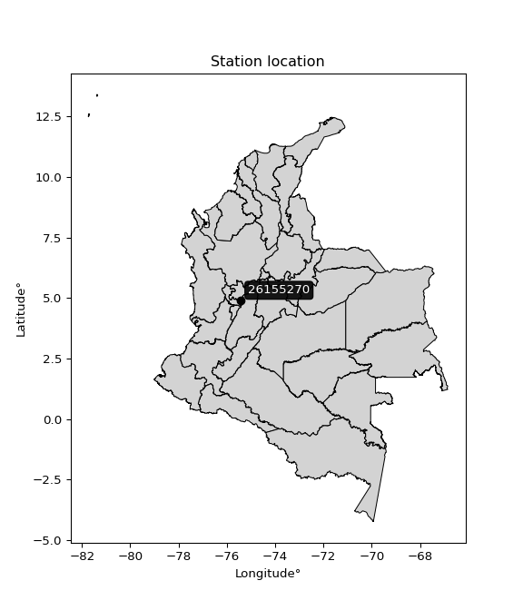

<div align="center">


</div>

# PMP Station (Rain, Pmax24h): 26155270

Probable Maximum Precipitation (PMP) is the greatest amount of rainfall for a specific duration that is meteorologically possible for a given location, acting as a "worst-case" scenario for extreme storms, crucial for designing safety-critical infrastructure like bridges, river deviations, dams, spillways, and nuclear plants to prevent catastrophic failure. PMP is calculated by hydrologists using meteorological data to determine the upper limit of extreme rainfall, often leading to the Probable Maximum Flood (PMF) for flood control design, and is increasingly being studied for climate change impacts. Probable Maximum Precipitation (PMP) is the theoretical upper limit of rainfall, a deterministic estimate for extreme events, while probability distributions (like GEV, Gumbel) describe the likelihood and frequency of various precipitation amounts, including rare ones, showing how often events occur, with PMP representing the extreme end of these distributions, used for critical infrastructure design to ensure safety against the worst conceivable weather, unlike standard statistical forecasts which cover typical probabilities.

The most common probability distributions in hydrology, used for analyzing floods, rainfall, and streamflow, include the Normal, Log-Normal, Gumbel, Gamma (including Log-Pearson Type III), and Generalized Extreme Value (GEV) distributions, often chosen based on the data´s skewness and whether modeling extremes or general conditions, with Gumbel and GEV popular for extreme events like floods, while the Normal distribution serves as a baseline, though often requiring transformations for skewed hydrological data. These distributions help in designing water infrastructure, managing water resources, and forecasting hydrologic events.

> Hydrological data often isn´t perfectly normal (it´s skewed), so different distributions are needed for different applications, such as: **Flood Frequency Analysis**: Using Gumbel, GEV, or Log-Pearson Type III for predicting extreme flood magnitudes and their return periods, **Rainfall Analysis**: Normal for annual totals, but Log-Normal, Weibull, or GEV for intensity or extreme daily rainfall, **Streamflow Modeling**: Gamma and Log-Normal for maximum flows, GEV for minimum flows, and Kappa for daily flows.

<div align="center">

</img>

</div>


## A. General information


### 1. General running parameters

• app_version: _v20260113_. • runtime: _2026-01-17 18:24:04.630693_. • Python version: _3.14.0_. • SciPy version: _1.16.3_. • Pandas version: _2.3.3_. • NumPy version: _2.3.5_. • Stations dataset (station_dataset_file): _dataset/pmax24h_in/automatic_colombia_2003_2025.csv_. • Stations catalog (station_catalog_file): _dataset/CNE.xls_. • Minimum year to eval til year_max (date_min): _1900_. • Maximum year to eval since year_min (date_max): _2025_. • Creates, save and include plots into reports (create_plot): _False_. • Plot only fit distributions with Δo > Δ (plot_only_fit): _True_. • Plot only simple graphs avoiding multiple CDFs and multiple Extreme values plots (plot_only_simple): _True_. • Eval low extreme values, if False, evaluates high extreme values (low_extreme): _False_. • Eval every SciPy distribution as logarithmic (pdist_logarithmic_on): _True_. • Standard deviation normalized (ddof): _1.0_. • Return periods to eval in years (Tr): _[2, 2.33, 5, 10, 15, 20, 25, 50, 75, 100, 200, 250, 500, 750, 1000]_. • Minimum data sample per station, 0 means any (minimum_sample): _5_. • Z-Score maximum threshold to adjust a value, 0 means disable (zscore_max): _3.5_. • Z-Score minimum threshold to adjust a value, 0 means disable (zscore_min): _-2.5_. • Avoid zeros, e.g. rain = 0 (avoid_zeros): _True_. • Avoid null values (avoid_nans): _True_. 

:file_folder:Table: [dataset.csv](../../dataset/pmax24h_in/automatic_colombia_2003_2025.csv)

> Delta Degrees of Freedom (DDOF): is a parameter used in the formulas for calculating variance and standard deviation. When ddof=0, the divisor is $N$ (the total number of observations) and this is used when your data set is the entire population. When ddof=1, the divisor is $N-1$ and this is used when your data set is a sample drawn from a larger population. Using $N-1$ provides an unbiased estimate of the population variance (known as Bessel´s correction).


### 2. Station info and location

|   id |   CODIGO | NOMBRE                              | CATEGORIA               | TECNOLOGIA                | ESTADO           | FECHA_INSTALACION   |   FECHA_SUSPENSION |   ALTITUD |   LATITUD |   LONGITUD | DEPARTAMENTO   | MUNICIPIO   | AREA_OPERATIVA                         | ENTIDAD                                                     | AREA_HIDROGRAFICA   | ZONA_HIDROGRAFICA   | SUBZONA_HIDROGRAFICA   |   CORRIENTE | Catalogo   |   Version |
|-----:|---------:|:------------------------------------|:------------------------|:--------------------------|:-----------------|:--------------------|-------------------:|----------:|----------:|-----------:|:---------------|:------------|:---------------------------------------|:------------------------------------------------------------|:--------------------|:--------------------|:-----------------------|------------:|:-----------|----------:|
|    0 | 26155270 | SAN ANTONIO CALDAS - AUT [26155270] | Climatológica Ordinaria | Automática con Telemetría | En Mantenimiento | 10/07/2008          |                nan |      3048 |   4.88661 |    -75.429 | Caldas         | Villamaria  | Area Operativa 09 - Cauca-Valle-Caldas | INSTITUTO DE HIDROLOGIA METEOROLOGIA Y ESTUDIOS AMBIENTALES | Magdalena Cauca     | Cauca               | Río Chinchiná          |         nan | CNE_IDEAM  |  20251226 |

<div align="center">

Dynamic map: [:earth_americas:Google](http://maps.google.com/maps?q=4.886611111,-75.428972222) [:earth_americas:OSM](https://www.openstreetmap.org/#map=18/4.886611111/-75.428972222&layers=P) [:earth_americas:Bing](https://www.bing.com/maps?cp=4.886611111~-75.428972222&lvl=18) [:earth_americas:Apple](https://maps.apple.com/frame?center=4.886611111%2C-75.428972222&span=0.003%2C0.006)

</div>


<div align="center">

```geojson
{
  "type": "Feature",
  "geometry": {
    "type": "Point", 
    "coordinates": [-75.428972222, 4.886611111]
  }, 
  "properties": {
    "Name": "26155270"
  }
}
```

</div>


### 3. Discrete values table and plot

<div align="center">

|               |           0 |          1 |           2 |           3 |           4 |           5 |
|:--------------|------------:|-----------:|------------:|------------:|------------:|------------:|
| Date          | 2017        | 2018       | 2019        | 2020        | 2022        | 2025        |
| Value         |   23.7      |   89.7     |   22        |   16.4      |   16.8      |   42        |
| Value_initial |   23.7      |   89.7     |   22        |   16.4      |   16.8      |   42        |
| count         |    6        |    6       |    6        |    6        |    6        |    6        |
| mean          |   35.1      |   35.1     |   35.1      |   35.1      |   35.1      |   35.1      |
| std           |   28.337    |   28.337   |   28.337    |   28.337    |   28.337    |   28.337    |
| zscore        |   -0.402301 |    1.92681 |   -0.462294 |   -0.659915 |   -0.645799 |    0.243498 |


</div>


> The initial value (value_initial) correspond to the initial obtained or null completed value, and value (value) is adjusted only when the initial value is outside the valid range (outlier) definite through the Z-Score value. If Z-Score is active, values out of range or outliers are replaced with the station mean value. A Z-Score (or standard score) measures how many standard deviations a data point is from the mean of a dataset, indicating its relative position; positive scores mean above the mean, negative mean below, and a score of zero is exactly at the mean, allowing for comparison of values from different distributions. It´s calculated using the formula $z=(x–μ)/σ$, where $x$ is the data point, $μ$ is the mean, and $σ$ is the standard deviation, helping identify outliers and understand probability.
>
> <sub>**Note**: In this study, "completing" (filling gaps in) and "extending" (forecasting or lengthening the historical record) rainfall data series are avoided for certain critical analyses because they introduce artificial bias and uncertainty, which can distort the statistics of rare events (extremes), alter day-to-day variability, and compromise the integrity and homogeneity of the original data. Some reasons against Completing/Extending rainfall data are: **Distortion of Extremes and Variability**: The primary issue is that most gap-filling or extension methods rely on averaging or regression with nearby stations, which inherently smooths the data. Rainfall is highly variable in space and time, with a large percentage of zero values and occasional large storms. Infilling methods often underestimate the highest values and overestimate the lowest (zero) values, which severely distorts analyses focused on flood frequency, drought severity, and intensity-duration-frequency (IDF) curves, **Loss of Data Homogeneity**: Infilled or extended data are synthetic estimates, not actual measurements. Combining these estimates with observed data can violate the assumption of data homogeneity, which requires that the data properties do not change over time. Inhomogeneity can lead to incorrect conclusions about long-term trends or changes in climate patterns, **Propagation of Errors**: Errors and biases from the original data (e.g., wind-induced undercatch, instrument errors, site changes) or the data used for imputation can propagate through the analysis, leading to unreliable hydrological models and inaccurate predictions, **Compromised Statistical Integrity**: For statistical analyses, especially those involving the frequency of events, using artificial data can introduce time bias or autocorrelation that doesn´t exist in reality, making it difficult to assess the true probability of events, **Difficulty in Validation**: It is difficult to accurately validate the quality of filled or extended data, especially for past periods where ground-truth measurements are unavailable. The reliability of imputation techniques heavily depends on the density of the surrounding station network and the complexity of the local topography.</sub>


### 4. Active continuous probability distributions from SciPy (80 of 104 available)

A Probability Density Function (PDF) describes the relative likelihood of a continuous random variable falling within a specific range, where the total area under its curve equals 1, and the area over any interval gives the actual probability for that range. Unlike discrete probabilities (like rolling a die), a PDF shows density, not direct probability for a single point (which is zero), with higher points indicating higher likelihood, often visualized as a bell curve for normal distributions.

A log of a probability density function (log-PDF) is simply the logarithm of the PDF´s value, denoted as $log(f(x))$, useful for converting multiplication of probabilities into addition, improving numerical stability with tiny numbers, and connecting to information theory concepts like entropy. Instead of dealing with very small probabilities (e.g., 0.000001), log-PDFs use negative numbers (e.g., $log(0.00001) ≈ -11.51$ that are easier for computers to handle, preventing underflow errors and simplifying complex calculations. In this study, each active probability distribution from SciPy is also evaluated in the $log$ form.

[scipy.stats](https://docs.scipy.org/doc/scipy/reference/stats.html) is a Python´s powerful submodule within the SciPy library for comprehensive statistical analysis, offering over 130 probability distributions (like Normal, Poisson), functions for descriptive stats (mean, variance), hypothesis testing (t-tests, chi-square), random variable generation, and statistical tests, making it essential for data science, modeling, and research. It provides tools to explore, model, and draw conclusions from data efficiently, working seamlessly with NumPy.

<div align="center">

|   id | p_dist           |   n_parameter | fit_method   | label                                                                       | active   | ref                                                                                                      |
|-----:|:-----------------|--------------:|:-------------|:----------------------------------------------------------------------------|:---------|:---------------------------------------------------------------------------------------------------------|
|    0 | alpha            |             3 | MLE          | Alpha                                                                       | True     | [:mortar_board:](https://docs.scipy.org/doc/scipy/reference/generated/scipy.stats.alpha.html)            |
|    1 | anglit           |             2 | MM           | Anglit                                                                      | True     | [:mortar_board:](https://docs.scipy.org/doc/scipy/reference/generated/scipy.stats.anglit.html)           |
|    2 | arcsine          |             2 | MM           | Arcsine                                                                     | True     | [:mortar_board:](https://docs.scipy.org/doc/scipy/reference/generated/scipy.stats.arcsine.html)          |
|    3 | argus            |             3 | MLE          | Argus                                                                       | True     | [:mortar_board:](https://docs.scipy.org/doc/scipy/reference/generated/scipy.stats.argus.html)            |
|    4 | beta             |             4 | MLE          | Beta                                                                        | True     | [:mortar_board:](https://docs.scipy.org/doc/scipy/reference/generated/scipy.stats.beta.html)             |
|    5 | betaprime        |             4 | MLE          | Beta prime                                                                  | True     | [:mortar_board:](https://docs.scipy.org/doc/scipy/reference/generated/scipy.stats.betaprime.html)        |
|    6 | bradford         |             3 | MLE          | Bradford                                                                    | True     | [:mortar_board:](https://docs.scipy.org/doc/scipy/reference/generated/scipy.stats.bradford.html)         |
|    7 | burr             |             4 | MLE          | Burr (Type III)                                                             | True     | [:mortar_board:](https://docs.scipy.org/doc/scipy/reference/generated/scipy.stats.burr.html)             |
|    8 | burr12           |             4 | MLE          | Burr (Type III) 12                                                          | True     | [:mortar_board:](https://docs.scipy.org/doc/scipy/reference/generated/scipy.stats.burr12.html)           |
|    9 | cosine           |             2 | MLE          | Cosine                                                                      | True     | [:mortar_board:](https://docs.scipy.org/doc/scipy/reference/generated/scipy.stats.cosine.html)           |
|   10 | crystalball      |             4 | MLE          | Crystalball                                                                 | True     | [:mortar_board:](https://docs.scipy.org/doc/scipy/reference/generated/scipy.stats.crystalball.html)      |
|   11 | dgamma           |             3 | MLE          | Double gamma                                                                | True     | [:mortar_board:](https://docs.scipy.org/doc/scipy/reference/generated/scipy.stats.dgamma.html)           |
|   12 | dweibull         |             3 | MLE          | Double Weibull                                                              | True     | [:mortar_board:](https://docs.scipy.org/doc/scipy/reference/generated/scipy.stats.dweibull.html)         |
|   13 | erlang           |             3 | MLE          | Erlang                                                                      | True     | [:mortar_board:](https://docs.scipy.org/doc/scipy/reference/generated/scipy.stats.erlang.html)           |
|   14 | exponnorm        |             3 | MLE          | Exponentially modified Normal                                               | True     | [:mortar_board:](https://docs.scipy.org/doc/scipy/reference/generated/scipy.stats.exponnorm.html)        |
|   15 | exponpow         |             3 | MLE          | Exponential power                                                           | True     | [:mortar_board:](https://docs.scipy.org/doc/scipy/reference/generated/scipy.stats.exponpow.html)         |
|   16 | exponweib        |             4 | MLE          | Exponentiated Weibull                                                       | True     | [:mortar_board:](https://docs.scipy.org/doc/scipy/reference/generated/scipy.stats.exponweib.html)        |
|   17 | f                |             4 | MLE          | F                                                                           | True     | [:mortar_board:](https://docs.scipy.org/doc/scipy/reference/generated/scipy.stats.f.html)                |
|   18 | fatiguelife      |             3 | MLE          | Fatigue-life (Birnbaum-Saunders)                                            | True     | [:mortar_board:](https://docs.scipy.org/doc/scipy/reference/generated/scipy.stats.fatiguelife.html)      |
|   19 | foldnorm         |             3 | MM           | Fold Normal                                                                 | True     | [:mortar_board:](https://docs.scipy.org/doc/scipy/reference/generated/scipy.stats.foldnorm.html)         |
|   20 | gamma            |             3 | MLE          | Gamma                                                                       | True     | [:mortar_board:](https://docs.scipy.org/doc/scipy/reference/generated/scipy.stats.gamma.html)            |
|   21 | gausshyper       |             6 | MLE          | Gauss hypergeometric                                                        | True     | [:mortar_board:](https://docs.scipy.org/doc/scipy/reference/generated/scipy.stats.gausshyper.html)       |
|   22 | genexpon         |             5 | MLE          | Generalized exponential                                                     | True     | [:mortar_board:](https://docs.scipy.org/doc/scipy/reference/generated/scipy.stats.genexpon.html)         |
|   23 | genextreme       |             3 | MLE          | Generalized exponential                                                     | True     | [:mortar_board:](https://docs.scipy.org/doc/scipy/reference/generated/scipy.stats.genextreme.html)       |
|   24 | gengamma         |             4 | MLE          | Generalized gamma                                                           | True     | [:mortar_board:](https://docs.scipy.org/doc/scipy/reference/generated/scipy.stats.gengamma.html)         |
|   25 | genhalflogistic  |             3 | MLE          | Generalized half-logistic                                                   | True     | [:mortar_board:](https://docs.scipy.org/doc/scipy/reference/generated/scipy.stats.genhalflogistic.html)  |
|   26 | genlogistic      |             3 | MLE          | Generalized logistic                                                        | True     | [:mortar_board:](https://docs.scipy.org/doc/scipy/reference/generated/scipy.stats.genlogistic.html)      |
|   27 | gennorm          |             3 | MLE          | Generalized Normal                                                          | True     | [:mortar_board:](https://docs.scipy.org/doc/scipy/reference/generated/scipy.stats.gennorm.html)          |
|   28 | genpareto        |             3 | MLE          | Generalized Pareto                                                          | True     | [:mortar_board:](https://docs.scipy.org/doc/scipy/reference/generated/scipy.stats.genpareto.html)        |
|   29 | gompertz         |             3 | MLE          | Gompertz (or truncated Gumbel)                                              | True     | [:mortar_board:](https://docs.scipy.org/doc/scipy/reference/generated/scipy.stats.gompertz.html)         |
|   30 | gumbel_l         |             2 | MM           | Gumbel Left Skew                                                            | True     | [:mortar_board:](https://docs.scipy.org/doc/scipy/reference/generated/scipy.stats.gumbel_l.html)         |
|   31 | gumbel_r         |             2 | MM           | Gumbel Right Skew                                                           | True     | [:mortar_board:](https://docs.scipy.org/doc/scipy/reference/generated/scipy.stats.gumbel_r.html)         |
|   32 | halfgennorm      |             3 | MLE          | Upper half of a generalized normal                                          | True     | [:mortar_board:](https://docs.scipy.org/doc/scipy/reference/generated/scipy.stats.halfgennorm.html)      |
|   33 | halflogistic     |             2 | MM           | Half-logistic                                                               | True     | [:mortar_board:](https://docs.scipy.org/doc/scipy/reference/generated/scipy.stats.halflogistic.html)     |
|   34 | halfnorm         |             2 | MM           | Half Normal                                                                 | True     | [:mortar_board:](https://docs.scipy.org/doc/scipy/reference/generated/scipy.stats.halfnorm.html)         |
|   35 | hypsecant        |             2 | MM           | hyperbolic secant                                                           | True     | [:mortar_board:](https://docs.scipy.org/doc/scipy/reference/generated/scipy.stats.hypsecant.html)        |
|   36 | invgamma         |             3 | MLE          | Inverted gamma                                                              | True     | [:mortar_board:](https://docs.scipy.org/doc/scipy/reference/generated/scipy.stats.invgamma.html)         |
|   37 | invgauss         |             3 | MLE          | Inverse Gaussian                                                            | True     | [:mortar_board:](https://docs.scipy.org/doc/scipy/reference/generated/scipy.stats.invgauss.html)         |
|   38 | invweibull       |             3 | MLE          | Inverted Weibull                                                            | True     | [:mortar_board:](https://docs.scipy.org/doc/scipy/reference/generated/scipy.stats.invweibull.html)       |
|   39 | johnsonsb        |             4 | MLE          | Johnson SB                                                                  | True     | [:mortar_board:](https://docs.scipy.org/doc/scipy/reference/generated/scipy.stats.johnsonsb.html)        |
|   40 | johnsonsu        |             4 | MLE          | Johnson Su                                                                  | True     | [:mortar_board:](https://docs.scipy.org/doc/scipy/reference/generated/scipy.stats.johnsonsu.html)        |
|   41 | kappa3           |             3 | MLE          | Kappa 3                                                                     | True     | [:mortar_board:](https://docs.scipy.org/doc/scipy/reference/generated/scipy.stats.kappa3.html)           |
|   42 | kappa4           |             4 | MLE          | Kappa 4                                                                     | True     | [:mortar_board:](https://docs.scipy.org/doc/scipy/reference/generated/scipy.stats.kappa4.html)           |
|   43 | ksone            |             3 | MLE          | Kolmogorov-Smirnov one-sided test statistic distribution                    | True     | [:mortar_board:](https://docs.scipy.org/doc/scipy/reference/generated/scipy.stats.ksone.html)            |
|   44 | kstwobign        |             2 | MLE          | Limiting distribution of scaled Kolmogorov-Smirnov two-sided test statistic | True     | [:mortar_board:](https://docs.scipy.org/doc/scipy/reference/generated/scipy.stats.kstwobign.html)        |
|   45 | laplace          |             2 | MM           | Laplace                                                                     | True     | [:mortar_board:](https://docs.scipy.org/doc/scipy/reference/generated/scipy.stats.laplace.html)          |
|   46 | levy_l           |             2 | MLE          | Left-skewed Levy                                                            | True     | [:mortar_board:](https://docs.scipy.org/doc/scipy/reference/generated/scipy.stats.levy_l.html)           |
|   47 | loggamma         |             3 | MLE          | Log gamma                                                                   | True     | [:mortar_board:](https://docs.scipy.org/doc/scipy/reference/generated/scipy.stats.loggamma.html)         |
|   48 | logistic         |             2 | MM           | Logistic (or Sech-squared)                                                  | True     | [:mortar_board:](https://docs.scipy.org/doc/scipy/reference/generated/scipy.stats.logistic.html)         |
|   49 | loglaplace       |             3 | MLE          | Log-Laplace                                                                 | True     | [:mortar_board:](https://docs.scipy.org/doc/scipy/reference/generated/scipy.stats.loglaplace.html)       |
|   50 | lomax            |             3 | MLE          | Lomax (Pareto of the second kind)                                           | True     | [:mortar_board:](https://docs.scipy.org/doc/scipy/reference/generated/scipy.stats.lomax.html)            |
|   51 | maxwell          |             2 | MM           | Maxwell                                                                     | True     | [:mortar_board:](https://docs.scipy.org/doc/scipy/reference/generated/scipy.stats.maxwell.html)          |
|   52 | mielke           |             4 | MLE          | Mielke Beta-Kappa / Dagum                                                   | True     | [:mortar_board:](https://docs.scipy.org/doc/scipy/reference/generated/scipy.stats.mielke.html)           |
|   53 | moyal            |             2 | MM           | Moyal                                                                       | True     | [:mortar_board:](https://docs.scipy.org/doc/scipy/reference/generated/scipy.stats.moyal.html)            |
|   54 | nakagami         |             3 | MLE          | Nakagami                                                                    | True     | [:mortar_board:](https://docs.scipy.org/doc/scipy/reference/generated/scipy.stats.nakagami.html)         |
|   55 | ncf              |             5 | MLE          | Non-central F distribution                                                  | True     | [:mortar_board:](https://docs.scipy.org/doc/scipy/reference/generated/scipy.stats.ncf.html)              |
|   56 | nct              |             4 | MLE          | Non-central Student’s t                                                     | True     | [:mortar_board:](https://docs.scipy.org/doc/scipy/reference/generated/scipy.stats.nct.html)              |
|   57 | norm             |             2 | MM           | Normal                                                                      | True     | [:mortar_board:](https://docs.scipy.org/doc/scipy/reference/generated/scipy.stats.norm.html)             |
|   58 | pearson3         |             3 | MM           | Pearson type III                                                            | True     | [:mortar_board:](https://docs.scipy.org/doc/scipy/reference/generated/scipy.stats.pearson3.html)         |
|   59 | powerlaw         |             3 | MLE          | Power-function                                                              | True     | [:mortar_board:](https://docs.scipy.org/doc/scipy/reference/generated/scipy.stats.powerlaw.html)         |
|   60 | rayleigh         |             2 | MM           | Rayleigh                                                                    | True     | [:mortar_board:](https://docs.scipy.org/doc/scipy/reference/generated/scipy.stats.rayleigh.html)         |
|   61 | rdist            |             3 | MLE          | R-distributed (symmetric beta)                                              | True     | [:mortar_board:](https://docs.scipy.org/doc/scipy/reference/generated/scipy.stats.rdist.html)            |
|   62 | rice             |             3 | MLE          | Rice                                                                        | True     | [:mortar_board:](https://docs.scipy.org/doc/scipy/reference/generated/scipy.stats.rice.html)             |
|   63 | semicircular     |             2 | MM           | Semicircular                                                                | True     | [:mortar_board:](https://docs.scipy.org/doc/scipy/reference/generated/scipy.stats.semicircular.html)     |
|   64 | skewnorm         |             3 | MLE          | Skew normal                                                                 | True     | [:mortar_board:](https://docs.scipy.org/doc/scipy/reference/generated/scipy.stats.skewnorm.html)         |
|   65 | t                |             3 | MLE          | Student’s t                                                                 | True     | [:mortar_board:](https://docs.scipy.org/doc/scipy/reference/generated/scipy.stats.t.html)                |
|   66 | trapezoid        |             4 | MLE          | Trapezoid                                                                   | True     | [:mortar_board:](https://docs.scipy.org/doc/scipy/reference/generated/scipy.stats.trapezoid.html)        |
|   67 | triang           |             3 | MLE          | Triangular                                                                  | True     | [:mortar_board:](https://docs.scipy.org/doc/scipy/reference/generated/scipy.stats.triang.html)           |
|   68 | truncexpon       |             3 | MLE          | Truncated exponential                                                       | True     | [:mortar_board:](https://docs.scipy.org/doc/scipy/reference/generated/scipy.stats.truncexpon.html)       |
|   69 | truncnorm        |             4 | MLE          | Truncated normal                                                            | True     | [:mortar_board:](https://docs.scipy.org/doc/scipy/reference/generated/scipy.stats.truncnorm.html)        |
|   70 | truncpareto      |             4 | MLE          | Upper truncated Pareto                                                      | True     | [:mortar_board:](https://docs.scipy.org/doc/scipy/reference/generated/scipy.stats.truncpareto.html)      |
|   71 | truncweibull_min |             5 | MLE          | Doubly truncated Weibull minimum                                            | True     | [:mortar_board:](https://docs.scipy.org/doc/scipy/reference/generated/scipy.stats.truncweibull_min.html) |
|   72 | tukeylambda      |             3 | MLE          | Tukey-Lamdba                                                                | True     | [:mortar_board:](https://docs.scipy.org/doc/scipy/reference/generated/scipy.stats.tukeylambda.html)      |
|   73 | uniform          |             2 | MLE          | Uniform                                                                     | True     | [:mortar_board:](https://docs.scipy.org/doc/scipy/reference/generated/scipy.stats.uniform.html)          |
|   74 | vonmises         |             3 | MLE          | Von Mises                                                                   | True     | [:mortar_board:](https://docs.scipy.org/doc/scipy/reference/generated/scipy.stats.vonmises.html)         |
|   75 | vonmises_line    |             3 | MLE          | Von Mises line                                                              | True     | [:mortar_board:](https://docs.scipy.org/doc/scipy/reference/generated/scipy.stats.vonmises_line.html)    |
|   76 | wald             |             2 | MM           | Wald                                                                        | True     | [:mortar_board:](https://docs.scipy.org/doc/scipy/reference/generated/scipy.stats.wald.html)             |
|   77 | weibull_max      |             3 | MLE          | Weibull maximum                                                             | True     | [:mortar_board:](https://docs.scipy.org/doc/scipy/reference/generated/scipy.stats.weibull_max.html)      |
|   78 | weibull_min      |             3 | MLE          | Weibull minimum                                                             | True     | [:mortar_board:](https://docs.scipy.org/doc/scipy/reference/generated/scipy.stats.weibull_min.html)      |
|   79 | wrapcauchy       |             3 | MLE          | Wrapped  Cauchy                                                             | True     | [:mortar_board:](https://docs.scipy.org/doc/scipy/reference/generated/scipy.stats.wrapcauchy.html)       |

</div>

> **n_parameter:** # arguments & localization & scale.
>
> **Fit methods:** (MLE) maximum likelihood, (MM) L-moments.
>
>**Inactive** (With the only purpose of prevent loops, zero divisions, infinite values, over high estimated values or horizontal trending for recurrence intervals estimations, the follow distributions were disabled.)**:** lognorm, norminvgauss, powernorm, powerlognorm, cauchy, halfcauchy, foldcauchy, skewcauchy, chi2, expon, fisk, genhyperbolic, geninvgauss, gibrat, kstwo, laplace_asymmetric, levy, levy_stable, ncx2, pareto, rel_breitwigner, recipinvgauss, studentized_range, loguniform, 


## B. Probability (PDF) vs. Empirical (EDF) distributions functions

A continuous probability distribution (CPD) describes probabilities for variables that can take any value within a range (like rain any time), unlike discrete variables with specific outcomes (like temperature). It uses a Probability Density Function (PDF), a curve where the total area under it equals 1, and the probability of the variable falling within an interval (a to b) is found by calculating the area under the curve between those points. A key feature is that the probability of hitting any single exact value is zero, so probabilities are always expressed for ranges, e.g., $P(a ≤ X ≤ b)$.

<div align="center">

Distributions parameters from station values
|     |   station | p_dist              |   n |             loc |          scale | shape                  | shape1                 | shape2                 | shape3             |
|----:|----------:|:--------------------|----:|----------------:|---------------:|:-----------------------|:-----------------------|:-----------------------|:-------------------|
|   0 |  26155270 | alpha               |   6 |    13.525       |    5.00815     | 9.900606384343083e-08  |                        |                        |                    |
|   1 |  26155270 | anglit              |   6 |    35.1         |   75.6742      |                        |                        |                        |                    |
|   2 |  26155270 | arcsine             |   6 |    -1.48289     |   73.1658      |                        |                        |                        |                    |
|   3 |  26155270 | argus               |   6 |   -23.1664      |  117.91        | 2.6943054032351524e-06 |                        |                        |                    |
|   4 |  26155270 | beta                |   6 |     9.74285     |   79.9572      | 0.10866710495583096    | 0.3913395472089378     |                        |                    |
|   5 |  26155270 | betaprime           |   6 |    -0.304873    |    0.384506    | 237.98722325443623     | 3.664660658661486      |                        |                    |
|   6 |  26155270 | bradford            |   6 |    16.3628      |   73.3372      | 357.14280517602947     |                        |                        |                    |
|   7 |  26155270 | burr                |   6 |    10.8096      |    0.930243    | 1.6816845416722543     | 45.52743768512508      |                        |                    |
|   8 |  26155270 | burr12              |   6 |     2.02479     |   14.2414      | 390.5295017972217      | 0.004205079178764077   |                        |                    |
|   9 |  26155270 | cosine              |   6 |    40.2479      |   22.6848      |                        |                        |                        |                    |
|  10 |  26155270 | crystalball         |   6 |    35.1         |   25.868       | 3969.131785635604      | 3284.655961578801      |                        |                    |
|  11 |  26155270 | dgamma              |   6 |    22           |   23.8009      | 0.44650943577182634    |                        |                        |                    |
|  12 |  26155270 | dweibull            |   6 |    22           |   25.2743      | 0.7557945469956615     |                        |                        |                    |
|  13 |  26155270 | erlang              |   6 |    16.4         |   20.5164      | 0.6664202212544462     |                        |                        |                    |
|  14 |  26155270 | exponnorm           |   6 |    16.3847      |    0.0046494   | 4029.951437460796      |                        |                        |                    |
|  15 |  26155270 | exponpow            |   6 |    16.4         |   58.0605      | 0.4882677934024206     |                        |                        |                    |
|  16 |  26155270 | exponweib           |   6 |    16.4         |   30.0434      | 1.0037736634702674     | 0.3845951000915822     |                        |                    |
|  17 |  26155270 | f                   |   6 |    16.3023      |    0.476303    | 2999.1854140487217     | 0.6435224244958037     |                        |                    |
|  18 |  26155270 | fatiguelife         |   6 |    16.4         |    2.64931e-06 | 2437.093683272049      |                        |                        |                    |
|  19 |  26155270 | foldnorm            |   6 |    -0.836644    |   44.6258      | 0.020407888257828563   |                        |                        |                    |
|  20 |  26155270 | gamma               |   6 |    16.4         |   21.9407      | 0.5022714706159228     |                        |                        |                    |
|  21 |  26155270 | gausshyper          |   6 |    16.4         |   75.3199      | 0.38704822767400654    | 0.9070377829568592     | 0.9770934541630127     | 1.0788729796431422 |
|  22 |  26155270 | genexpon            |   6 |    16.4         |    0.304974    | 0.01630988881166639    | 9.372389431316277e-09  | 1.9452640770994851     |                    |
|  23 |  26155270 | genextreme          |   6 |    18.0303      |   14.387       | -8.824783362824238     |                        |                        |                    |
|  24 |  26155270 | gengamma            |   6 |    16.4         |   20.9897      | 1.0123911210426428     | 0.43603747195037307    |                        |                    |
|  25 |  26155270 | genhalflogistic     |   6 |     9.13385     |   84.4852      | 1.0486436004355406     |                        |                        |                    |
|  26 |  26155270 | genlogistic         |   6 |   -85.8821      |   14.7429      | 1790.9593289259774     |                        |                        |                    |
|  27 |  26155270 | gennorm             |   6 |    22           |    2.17411e-05 | 0.15531284981088317    |                        |                        |                    |
|  28 |  26155270 | genpareto           |   6 |    16.4         |    6.98985     | 0.6110600727263147     |                        |                        |                    |
|  29 |  26155270 | gompertz            |   6 |    16.4         |   50.6744      | 1.0164441876330716     |                        |                        |                    |
|  30 |  26155270 | gumbel_l            |   6 |    46.742       |   20.1692      |                        |                        |                        |                    |
|  31 |  26155270 | gumbel_r            |   6 |    23.458       |   20.1692      |                        |                        |                        |                    |
|  32 |  26155270 | halfgennorm         |   6 |    16.4         |    0.116694    | 0.3016098021900163     |                        |                        |                    |
|  33 |  26155270 | halflogistic        |   6 |     4.44041     |   22.1162      |                        |                        |                        |                    |
|  34 |  26155270 | halfnorm            |   6 |     0.860908    |   42.9123      |                        |                        |                        |                    |
|  35 |  26155270 | hypsecant           |   6 |    35.1         |   16.4681      |                        |                        |                        |                    |
|  36 |  26155270 | invgamma            |   6 |    16.3022      |    0.153246    | 0.3217643197613575     |                        |                        |                    |
|  37 |  26155270 | invgauss            |   6 |    15.9765      |    1.66228     | 11.504410877912171     |                        |                        |                    |
|  38 |  26155270 | invweibull          |   6 |    16.4         |    1.32855     | 0.06445704636056782    |                        |                        |                    |
|  39 |  26155270 | johnsonsb           |   6 |    16.4         |  220.075       | 1.8929409737968161     | 0.10213084186981665    |                        |                    |
|  40 |  26155270 | johnsonsu           |   6 |    16.4         |    5.67352e-16 | -1.1094153937533555    | 0.08883010176135424    |                        |                    |
|  41 |  26155270 | kappa3              |   6 |    16.3999      |    1.10896     | 0.746509962191273      |                        |                        |                    |
|  42 |  26155270 | kappa4              |   6 |     8.91906     |   81.1267      | 1.1014774062016381     | 0.980710660654865      |                        |                    |
|  43 |  26155270 | ksone               |   6 |     9.07        |   87.96        | 1.0                    |                        |                        |                    |
|  44 |  26155270 | kstwobign           |   6 |   -31.4809      |   77.54        |                        |                        |                        |                    |
|  45 |  26155270 | laplace             |   6 |    35.1         |   18.2914      |                        |                        |                        |                    |
|  46 |  26155270 | levy_l              |   6 |    95.917       |   25.8636      |                        |                        |                        |                    |
|  47 |  26155270 | loggamma            |   6 | -7151.39        |  994.684       | 1372.6895050732119     |                        |                        |                    |
|  48 |  26155270 | logistic            |   6 |    35.1         |   14.2618      |                        |                        |                        |                    |
|  49 |  26155270 | loglaplace          |   6 |    -0.054978    |   22.055       | 2.2346232832486637     |                        |                        |                    |
|  50 |  26155270 | lomax               |   6 |    16.4         |  616.044       | 35.21818490937491      |                        |                        |                    |
|  51 |  26155270 | maxwell             |   6 |   -26.1963      |   38.4118      |                        |                        |                        |                    |
|  52 |  26155270 | mielke              |   6 |    16.3988      |    0.020163    | 1.1333681928126365     | 0.35861160046277796    |                        |                    |
|  53 |  26155270 | moyal               |   6 |    20.307       |   11.6447      |                        |                        |                        |                    |
|  54 |  26155270 | nakagami            |   6 |    16.4         |   40.6944      | 0.15312733527128836    |                        |                        |                    |
|  55 |  26155270 | ncf                 |   6 |    -0.0462058   |   25.3829      | 167.666741809308       | 7.09554464527433       | 0.11639223819018718    |                    |
|  56 |  26155270 | nct                 |   6 |     9.93537     |    3.98203     | 1.345697477771965      | 2.8923229173328178     |                        |                    |
|  57 |  26155270 | norm                |   6 |    35.1         |   25.868       |                        |                        |                        |                    |
|  58 |  26155270 | pearson3            |   6 |    35.1         |   25.868       | 1.4125474612855489     |                        |                        |                    |
|  59 |  26155270 | powerlaw            |   6 |    16.4         |   73.3         | 0.12318576838992358    |                        |                        |                    |
|  60 |  26155270 | rayleigh            |   6 |   -14.387       |   39.4849      |                        |                        |                        |                    |
|  61 |  26155270 | rdist               |   6 |    11.085       |   30.915       | 1.218565968282287      |                        |                        |                    |
|  62 |  26155270 | rice                |   6 |    -2.55683     |   32.3047      | 0.00028715253790103723 |                        |                        |                    |
|  63 |  26155270 | semicircular        |   6 |    35.1         |   51.736       |                        |                        |                        |                    |
|  64 |  26155270 | skewnorm            |   6 |    16.4         |   31.92        | 64678792.33887598      |                        |                        |                    |
|  65 |  26155270 | t                   |   6 |    20.712       |    4.82538     | 0.825371524872937      |                        |                        |                    |
|  66 |  26155270 | trapezoid           |   6 |     9.07        |   87.96        | 1.0                    | 1.0                    |                        |                    |
|  67 |  26155270 | triang              |   6 |   -32.8064      |  122.506       | 0.999999886629126      |                        |                        |                    |
|  68 |  26155270 | truncexpon          |   6 |    11.6993      |   60.9813      | 1.279092733624804      |                        |                        |                    |
|  69 |  26155270 | truncnorm           |   6 | -7006.86        |  427.831       | 16.415959074691408     | 16.587288315196894     |                        |                    |
|  70 |  26155270 | truncpareto         |   6 |    15.8555      |    0.544498    | 0.02579153116110219    | 135.62746204435996     |                        |                    |
|  71 |  26155270 | truncweibull_min    |   6 |    16.1846      |   84.6777      | 0.020466564903964004   | 0.0025439569808367087  | 0.8682954261796261     |                    |
|  72 |  26155270 | tukeylambda         |   6 |    29.4075      |   14.0949      | 1.0836022238792165     |                        |                        |                    |
|  73 |  26155270 | uniform             |   6 |    16.4         |   73.3         |                        |                        |                        |                    |
|  74 |  26155270 | vonmises            |   6 |    -2.39565     |    1           | 1.5277106011398844     |                        |                        |                    |
|  75 |  26155270 | vonmises_line       |   6 |    28.1997      |   19.5761      | 1.3522466167732738     |                        |                        |                    |
|  76 |  26155270 | wald                |   6 |     9.232       |   25.868       |                        |                        |                        |                    |
|  77 |  26155270 | weibull_max         |   6 |    89.7         |    1.57588     | 0.2315230973183353     |                        |                        |                    |
|  78 |  26155270 | weibull_min         |   6 |    16.4         |    7.59516     | 0.48896175209369863    |                        |                        |                    |
|  79 |  26155270 | wrapcauchy          |   6 |    16.4         |   11.6767      | 0.8909792505656966     |                        |                        |                    |
|  80 |  26155270 | logalpha            |   6 |     2.66579     |    0.233823    | 8.293330473784829e-06  |                        |                        |                    |
|  81 |  26155270 | loganglit           |   6 |     3.35155     |    1.75146     |                        |                        |                        |                    |
|  82 |  26155270 | logarcsine          |   6 |     2.50488     |    1.69336     |                        |                        |                        |                    |
|  83 |  26155270 | logargus            |   6 |     2.03686     |    2.57316     | 0.00011026472030419118 |                        |                        |                    |
|  84 |  26155270 | logbeta             |   6 |     2.79728     |    1.96192     | 0.2757898324020306     | 0.7060318874962094     |                        |                    |
|  85 |  26155270 | logbetaprime        |   6 |    -1.13716     |    4.64455     | 112.95216549819952     | 117.82835205925463     |                        |                    |
|  86 |  26155270 | logbradford         |   6 |     2.79728     |    1.6992      | 0.6812951965397016     |                        |                        |                    |
|  87 |  26155270 | logburr             |   6 |     0.00521528  |    1.35614     | 8.478584479690985      | 970.3172002332992      |                        |                    |
|  88 |  26155270 | logburr12           |   6 |    -1.96312e+06 |    1.96312e+06 | 636977292.2315105      | 0.005457063146111607   |                        |                    |
|  89 |  26155270 | logcosine           |   6 |     3.43507     |    0.505378    |                        |                        |                        |                    |
|  90 |  26155270 | logcrystalball      |   6 |     3.35155     |    0.598709    | 7.036529966138344      | 989.600530851339       |                        |                    |
|  91 |  26155270 | logdgamma           |   6 |     3.09104     |    0.547682    | 0.8137855456869577     |                        |                        |                    |
|  92 |  26155270 | logdweibull         |   6 |     3.09104     |    0.524649    | 0.8172725620278823     |                        |                        |                    |
|  93 |  26155270 | logerlang           |   6 |     2.79728     |    0.467825    | 0.352713001911801      |                        |                        |                    |
|  94 |  26155270 | logexponnorm        |   6 |     2.79669     |    0.000181721 | 3041.966036785532      |                        |                        |                    |
|  95 |  26155270 | logexponpow         |   6 |     2.79728     |    1.15206     | 0.25102993626153614    |                        |                        |                    |
|  96 |  26155270 | logexponweib        |   6 |     2.79728     |    0.683017    | 0.813752841204873      | 0.9056235418081537     |                        |                    |
|  97 |  26155270 | logf                |   6 |     2.77714     |    0.0757481   | 385.9740441933279      | 1.0939820103556346     |                        |                    |
|  98 |  26155270 | logfatiguelife      |   6 |     2.79728     |    7.57575e-08 | 2282.9150287418324     |                        |                        |                    |
|  99 |  26155270 | logfoldnorm         |   6 |     2.46639     |    0.753784    | 1.0098855304709073     |                        |                        |                    |
| 100 |  26155270 | loggamma            |   6 |     2.79728     |    0.484265    | 0.42865407567168945    |                        |                        |                    |
| 101 |  26155270 | loggausshyper       |   6 |     2.79728     |    1.93786     | 0.8984116014624862     | 0.9542210726943213     | 1.077711487627912      | 1.0301508821445853 |
| 102 |  26155270 | loggenexpon         |   6 |     2.79728     |    1.26039     | 2.2739207379314017     | 3.3274494757699715e-07 | 0.4406587894721984     |                    |
| 103 |  26155270 | loggenextreme       |   6 |     2.85061     |    0.479602    | -8.993398279338805     |                        |                        |                    |
| 104 |  26155270 | loggengamma         |   6 |     2.79728     |    0.682988    | 0.8138231542664548     | 0.905652883022363      |                        |                    |
| 105 |  26155270 | loggenhalflogistic  |   6 |     2.66301     |    1.94888     | 1.0629523210793435     |                        |                        |                    |
| 106 |  26155270 | loggenlogistic      |   6 |     0.168351    |    0.407626    | 1283.3131408725474     |                        |                        |                    |
| 107 |  26155270 | loggennorm          |   6 |     3.09104     |    0.000311875 | 0.23415168622518812    |                        |                        |                    |
| 108 |  26155270 | loggenpareto        |   6 |    -0.0026203   |    8.69027     | -1.9315621279464241    |                        |                        |                    |
| 109 |  26155270 | loggompertz         |   6 |     2.79728     | 2529.83        | 4557.335162120075      |                        |                        |                    |
| 110 |  26155270 | loggumbel_l         |   6 |     3.621       |    0.466812    |                        |                        |                        |                    |
| 111 |  26155270 | loggumbel_r         |   6 |     3.0821      |    0.466812    |                        |                        |                        |                    |
| 112 |  26155270 | loghalfgennorm      |   6 |     2.79728     |    0.0467221   | 0.4451308420798239     |                        |                        |                    |
| 113 |  26155270 | loghalflogistic     |   6 |     2.64194     |    0.511875    |                        |                        |                        |                    |
| 114 |  26155270 | loghalfnorm         |   6 |     2.5591      |    0.993196    |                        |                        |                        |                    |
| 115 |  26155270 | loghypsecant        |   6 |     3.35155     |    0.38115     |                        |                        |                        |                    |
| 116 |  26155270 | loginvgamma         |   6 |     2.77703     |    0.0413822   | 0.5469734037436753     |                        |                        |                    |
| 117 |  26155270 | loginvgauss         |   6 |     2.76533     |    0.130204    | 4.502334356635004      |                        |                        |                    |
| 118 |  26155270 | loginvweibull       |   6 |     2.79728     |    0.0983969   | 0.051787904070994525   |                        |                        |                    |
| 119 |  26155270 | logjohnsonsb        |   6 |     2.79728     |    3.23037     | 1.3791385880397296     | 0.10259717784090126    |                        |                    |
| 120 |  26155270 | logjohnsonsu        |   6 |     2.79728     |    6.04067e-14 | -1.0346116177695857    | 0.09861761272770242    |                        |                    |
| 121 |  26155270 | logkappa3           |   6 |     2.79728     |    1.68894     | 217.08306445885086     |                        |                        |                    |
| 122 |  26155270 | logkappa4           |   6 |     1.72388     |    2.97493     | 1.5726508660230811     | 1.0437500185693003     |                        |                    |
| 123 |  26155270 | logksone            |   6 |     2.62736     |    2.03903     | 1.0                    |                        |                        |                    |
| 124 |  26155270 | logkstwobign        |   6 |     1.63598     |    1.97729     |                        |                        |                        |                    |
| 125 |  26155270 | loglaplace          |   6 |     3.35155     |    0.423351    |                        |                        |                        |                    |
| 126 |  26155270 | loglevy_l           |   6 |     4.62068     |    0.515972    |                        |                        |                        |                    |
| 127 |  26155270 | logloggamma         |   6 |  -207.333       |   27.611       | 2060.5011980129966     |                        |                        |                    |
| 128 |  26155270 | loglogistic         |   6 |     3.35155     |    0.330086    |                        |                        |                        |                    |
| 129 |  26155270 | logloglaplace       |   6 |     2.79728     |    0.392351    | 0.5121615483861008     |                        |                        |                    |
| 130 |  26155270 | loglomax            |   6 |     2.79728     |    0.84535     | 2.3642668917296366     |                        |                        |                    |
| 131 |  26155270 | logmaxwell          |   6 |     1.93286     |    0.889032    |                        |                        |                        |                    |
| 132 |  26155270 | logmielke           |   6 |     2.64456     |    0.0456211   | 20.546256328044365     | 1.376484329659191      |                        |                    |
| 133 |  26155270 | logmoyal            |   6 |     3.00917     |    0.269514    |                        |                        |                        |                    |
| 134 |  26155270 | lognakagami         |   6 |     2.79728     |    1.11125     | 0.30325766326150394    |                        |                        |                    |
| 135 |  26155270 | logncf              |   6 |    -2.90793     |    6.24475     | 195.52391882597828     | 552.7694227912557      | 3.1440207672827825e-11 |                    |
| 136 |  26155270 | lognct              |   6 |     2.76819     |    0.000585457 | 0.49328192695245954    | 106.20146013462221     |                        |                    |
| 137 |  26155270 | lognorm             |   6 |     3.35155     |    0.598709    |                        |                        |                        |                    |
| 138 |  26155270 | logpearson3         |   6 |     3.35155     |    0.598708    | 0.9435745126611397     |                        |                        |                    |
| 139 |  26155270 | logpowerlaw         |   6 |     2.79728     |    1.69919     | 0.13632489287205013    |                        |                        |                    |
| 140 |  26155270 | lograyleigh         |   6 |     2.20619     |    0.913869    |                        |                        |                        |                    |
| 141 |  26155270 | logrdist            |   6 |     3.77578     |    0.978498    | 1.0234104058649842     |                        |                        |                    |
| 142 |  26155270 | logrice             |   6 |     2.41285     |    0.787277    | 0.00041257431274083943 |                        |                        |                    |
| 143 |  26155270 | logsemicircular     |   6 |     3.35155     |    1.19742     |                        |                        |                        |                    |
| 144 |  26155270 | logskewnorm         |   6 |     2.79728     |    0.815835    | 32063606.77073121      |                        |                        |                    |
| 145 |  26155270 | logt                |   6 |     3.35155     |    0.59871     | 3183026271.2694063     |                        |                        |                    |
| 146 |  26155270 | logtrapezoid        |   6 |     2.62736     |    2.03903     | 1.0                    | 1.0                    |                        |                    |
| 147 |  26155270 | logtriang           |   6 |     1.83798     |    2.65854     | 0.9999838489640067     |                        |                        |                    |
| 148 |  26155270 | logtruncexpon       |   6 |     2.79727     |    2.19006     | 0.775869541194542      |                        |                        |                    |
| 149 |  26155270 | logtruncnorm        |   6 |    -3.3146      |    2.07032     | 2.9521446451265554     | 3.772909960606836      |                        |                    |
| 150 |  26155270 | logtruncpareto      |   6 |     1.95237     |    0.844908    | 1.3077313644268804     | 3.0110951502273995     |                        |                    |
| 151 |  26155270 | logtruncweibull_min |   6 |     2.79167     |    1.31671     | 0.3468734072666467     | 0.004264412011796564   | 1.2947489143358504     |                    |
| 152 |  26155270 | logtukeylambda      |   6 |     3.64772     |    0.959141    | 1.1278182548592102     |                        |                        |                    |
| 153 |  26155270 | loguniform          |   6 |     2.79728     |    1.69919     |                        |                        |                        |                    |
| 154 |  26155270 | logvonmises         |   6 |    -2.96907     |    1           | 3.372699256589815      |                        |                        |                    |
| 155 |  26155270 | logvonmises_line    |   6 |     3.17533     |    0.420534    | 1.0737471920015151     |                        |                        |                    |
| 156 |  26155270 | logwald             |   6 |     2.75284     |    0.598709    |                        |                        |                        |                    |
| 157 |  26155270 | logweibull_max      |   6 |     1.21624e+08 |    1.21624e+08 | 299093675.0419869      |                        |                        |                    |
| 158 |  26155270 | logweibull_min      |   6 |     2.79728     |    0.367504    | 0.5268312898843726     |                        |                        |                    |
| 159 |  26155270 | logwrapcauchy       |   6 |     2.79728     |    0.27046     | 0.7466933826360371     |                        |                        |                    |

</div>

> **loc** (Location parameter): This shifts the distribution along the x-axis. For many common distributions, like the normal (Gaussian) distribution, loc represents the mean $μ$. For others, like the uniform distribution, it might represent the minimum value, or for the beta distribution, the left end of the support interval.
>
> **scale** (Scale parameter): This determines the width or spread of the distribution. For the normal distribution, scale represents the standard deviation $σ$. For a uniform distribution, it defines the length of the interval (from $loc$ to $loc + scale$).
>
> **shape** (Shape parameters): Refers to parameters that define the specific form of a probability distribution, distinct from its location (loc) and scale (scale). These parameters are required arguments for most distribution functions. For example, a normal (Gaussian) distribution is fully defined by its location (mean) and scale (standard deviation), so it has no specific shape parameters beyond loc and scale. However, other distributions have intrinsic properties that need specification, as Gamma distribution that takes a shape parameter, often named $a$ or $alpha$.


### 0. Cumulative distribution values - CDF (160 evaluated)

Cumulative Distribution Function (CDF), denoted as $F$<sub>$X$</sub>$(x)$, is a function that gives the probability that a random variable $X$ will take a value less than or equal to a specific value, $x$ (i.e., $(P(X≥x)$. It essentially "accumulates" probabilities from a given point up to the far right (positive infinity), providing a complete picture of the distribution´s probabilities for both discrete (like rain) and continuous (like temperature) variables, helping to find probabilities over ranges or above certain values. Each station is evaluated separately ordering the $x$ values ascending, calculating the CDF and PDF values for the activated distributions and their logarithmic forms.

<div align="center">

CDF ordered by x ascending and calculating $log(f(x))$ separately
|   id |   Station |   date |    x |   count |   mean |    std |    zscore |   Value_initial |   station |   m |     alpha |   alpha_pdf |   anglit |   anglit_pdf |   arcsine |   arcsine_pdf |    argus |   argus_pdf |     beta |   beta_pdf |   betaprime |   betaprime_pdf |   bradford |   bradford_pdf |     burr |    burr_pdf |    burr12 |   burr12_pdf |   cosine |   cosine_pdf |   crystalball |   crystalball_pdf |   dgamma |   dgamma_pdf |   dweibull |   dweibull_pdf |      erlang |     erlang_pdf |   exponnorm |   exponnorm_pdf |    exponpow |   exponpow_pdf |   exponweib |   exponweib_pdf |         f |       f_pdf |   fatiguelife |   fatiguelife_pdf |   foldnorm |   foldnorm_pdf |       gamma |   gamma_pdf |   gausshyper |   gausshyper_pdf |    genexpon |   genexpon_pdf |   genextreme |   genextreme_pdf |   gengamma |   gengamma_pdf |   genhalflogistic |   genhalflogistic_pdf |   genlogistic |   genlogistic_pdf |   gennorm |   gennorm_pdf |   genpareto |   genpareto_pdf |    gompertz |   gompertz_pdf |   gumbel_l |   gumbel_l_pdf |   gumbel_r |   gumbel_r_pdf |   halfgennorm |   halfgennorm_pdf |   halflogistic |   halflogistic_pdf |   halfnorm |   halfnorm_pdf |   hypsecant |   hypsecant_pdf |   invgamma |   invgamma_pdf |   invgauss |   invgauss_pdf |   invweibull |   invweibull_pdf |   johnsonsb |   johnsonsb_pdf |   johnsonsu |   johnsonsu_pdf |      kappa3 |   kappa3_pdf |      kappa4 |   kappa4_pdf |     ksone |   ksone_pdf |   kstwobign |   kstwobign_pdf |   laplace |   laplace_pdf |   levy_l |   levy_l_pdf |    loggamma |   loggamma_pdf |   logistic |   logistic_pdf |   loglaplace |   loglaplace_pdf |       lomax |   lomax_pdf |   maxwell |   maxwell_pdf |    mielke |   mielke_pdf |    moyal |   moyal_pdf |    nakagami |   nakagami_pdf |      ncf |   ncf_pdf |      nct |    nct_pdf |     norm |   norm_pdf |   pearson3 |   pearson3_pdf |   powerlaw |   powerlaw_pdf |   rayleigh |   rayleigh_pdf |    rdist |     rdist_pdf |     rice |   rice_pdf |   semicircular |   semicircular_pdf |   skewnorm |   skewnorm_pdf |        t |       t_pdf |   trapezoid |   trapezoid_pdf |   triang |   triang_pdf |   truncexpon |   truncexpon_pdf |   truncnorm |   truncnorm_pdf |   truncpareto |   truncpareto_pdf |   truncweibull_min |   truncweibull_min_pdf |   tukeylambda |   tukeylambda_pdf |    uniform |   uniform_pdf |   vonmises |   vonmises_pdf |   vonmises_line |   vonmises_line_pdf |     wald |   wald_pdf |   weibull_max |   weibull_max_pdf |   weibull_min |   weibull_min_pdf |   wrapcauchy |   wrapcauchy_pdf |   logalpha |   logalpha_pdf |   loganglit |   loganglit_pdf |   logarcsine |   logarcsine_pdf |   logargus |   logargus_pdf |     logbeta |   logbeta_pdf |   logbetaprime |   logbetaprime_pdf |   logbradford |   logbradford_pdf |   logburr |   logburr_pdf |   logburr12 |   logburr12_pdf |   logcosine |   logcosine_pdf |   logcrystalball |   logcrystalball_pdf |   logdgamma |   logdgamma_pdf |   logdweibull |   logdweibull_pdf |   logerlang |   logerlang_pdf |   logexponnorm |   logexponnorm_pdf |   logexponpow |   logexponpow_pdf |   logexponweib |   logexponweib_pdf |      logf |   logf_pdf |   logfatiguelife |   logfatiguelife_pdf |   logfoldnorm |   logfoldnorm_pdf |   loggausshyper |   loggausshyper_pdf |   loggenexpon |   loggenexpon_pdf |   loggenextreme |   loggenextreme_pdf |   loggengamma |   loggengamma_pdf |   loggenhalflogistic |   loggenhalflogistic_pdf |   loggenlogistic |   loggenlogistic_pdf |   loggennorm |   loggennorm_pdf |   loggenpareto |   loggenpareto_pdf |   loggompertz |   loggompertz_pdf |   loggumbel_l |   loggumbel_l_pdf |   loggumbel_r |   loggumbel_r_pdf |   loghalfgennorm |   loghalfgennorm_pdf |   loghalflogistic |   loghalflogistic_pdf |   loghalfnorm |   loghalfnorm_pdf |   loghypsecant |   loghypsecant_pdf |   loginvgamma |   loginvgamma_pdf |   loginvgauss |   loginvgauss_pdf |   loginvweibull |   loginvweibull_pdf |   logjohnsonsb |   logjohnsonsb_pdf |   logjohnsonsu |   logjohnsonsu_pdf |   logkappa3 |   logkappa3_pdf |   logkappa4 |   logkappa4_pdf |   logksone |   logksone_pdf |   logkstwobign |   logkstwobign_pdf |   loglevy_l |   loglevy_l_pdf |   logloggamma |   logloggamma_pdf |   loglogistic |   loglogistic_pdf |   logloglaplace |   logloglaplace_pdf |    loglomax |   loglomax_pdf |   logmaxwell |   logmaxwell_pdf |   logmielke |   logmielke_pdf |   logmoyal |   logmoyal_pdf |   lognakagami |   lognakagami_pdf |   logncf |   logncf_pdf |    lognct |   lognct_pdf |   lognorm |   lognorm_pdf |   logpearson3 |   logpearson3_pdf |   logpowerlaw |   logpowerlaw_pdf |   lograyleigh |   lograyleigh_pdf |    logrdist |   logrdist_pdf |   logrice |   logrice_pdf |   logsemicircular |   logsemicircular_pdf |   logskewnorm |   logskewnorm_pdf |     logt |   logt_pdf |   logtrapezoid |   logtrapezoid_pdf |   logtriang |   logtriang_pdf |   logtruncexpon |   logtruncexpon_pdf |   logtruncnorm |   logtruncnorm_pdf |   logtruncpareto |   logtruncpareto_pdf |   logtruncweibull_min |   logtruncweibull_min_pdf |   logtukeylambda |   logtukeylambda_pdf |   loguniform |   loguniform_pdf |   logvonmises |   logvonmises_pdf |   logvonmises_line |   logvonmises_line_pdf |     logwald |   logwald_pdf |   logweibull_max |   logweibull_max_pdf |   logweibull_min |   logweibull_min_pdf |   logwrapcauchy |   logwrapcauchy_pdf |
|-----:|----------:|-------:|-----:|--------:|-------:|-------:|----------:|----------------:|----------:|----:|----------:|------------:|---------:|-------------:|----------:|--------------:|---------:|------------:|---------:|-----------:|------------:|----------------:|-----------:|---------------:|---------:|------------:|----------:|-------------:|---------:|-------------:|--------------:|------------------:|---------:|-------------:|-----------:|---------------:|------------:|---------------:|------------:|----------------:|------------:|---------------:|------------:|----------------:|----------:|------------:|--------------:|------------------:|-----------:|---------------:|------------:|------------:|-------------:|-----------------:|------------:|---------------:|-------------:|-----------------:|-----------:|---------------:|------------------:|----------------------:|--------------:|------------------:|----------:|--------------:|------------:|----------------:|------------:|---------------:|-----------:|---------------:|-----------:|---------------:|--------------:|------------------:|---------------:|-------------------:|-----------:|---------------:|------------:|----------------:|-----------:|---------------:|-----------:|---------------:|-------------:|-----------------:|------------:|----------------:|------------:|----------------:|------------:|-------------:|------------:|-------------:|----------:|------------:|------------:|----------------:|----------:|--------------:|---------:|-------------:|------------:|---------------:|-----------:|---------------:|-------------:|-----------------:|------------:|------------:|----------:|--------------:|----------:|-------------:|---------:|------------:|------------:|---------------:|---------:|----------:|---------:|-----------:|---------:|-----------:|-----------:|---------------:|-----------:|---------------:|-----------:|---------------:|---------:|--------------:|---------:|-----------:|---------------:|-------------------:|-----------:|---------------:|---------:|------------:|------------:|----------------:|---------:|-------------:|-------------:|-----------------:|------------:|----------------:|--------------:|------------------:|-------------------:|-----------------------:|--------------:|------------------:|-----------:|--------------:|-----------:|---------------:|----------------:|--------------------:|---------:|-----------:|--------------:|------------------:|--------------:|------------------:|-------------:|-----------------:|-----------:|---------------:|------------:|----------------:|-------------:|-----------------:|-----------:|---------------:|------------:|--------------:|---------------:|-------------------:|--------------:|------------------:|----------:|--------------:|------------:|----------------:|------------:|----------------:|-----------------:|---------------------:|------------:|----------------:|--------------:|------------------:|------------:|----------------:|---------------:|-------------------:|--------------:|------------------:|---------------:|-------------------:|----------:|-----------:|-----------------:|---------------------:|--------------:|------------------:|----------------:|--------------------:|--------------:|------------------:|----------------:|--------------------:|--------------:|------------------:|---------------------:|-------------------------:|-----------------:|---------------------:|-------------:|-----------------:|---------------:|-------------------:|--------------:|------------------:|--------------:|------------------:|--------------:|------------------:|-----------------:|---------------------:|------------------:|----------------------:|--------------:|------------------:|---------------:|-------------------:|--------------:|------------------:|--------------:|------------------:|----------------:|--------------------:|---------------:|-------------------:|---------------:|-------------------:|------------:|----------------:|------------:|----------------:|-----------:|---------------:|---------------:|-------------------:|------------:|----------------:|--------------:|------------------:|--------------:|------------------:|----------------:|--------------------:|------------:|---------------:|-------------:|-----------------:|------------:|----------------:|-----------:|---------------:|--------------:|------------------:|---------:|-------------:|----------:|-------------:|----------:|--------------:|--------------:|------------------:|--------------:|------------------:|--------------:|------------------:|------------:|---------------:|----------:|--------------:|------------------:|----------------------:|--------------:|------------------:|---------:|-----------:|---------------:|-------------------:|------------:|----------------:|----------------:|--------------------:|---------------:|-------------------:|-----------------:|---------------------:|----------------------:|--------------------------:|-----------------:|---------------------:|-------------:|-----------------:|--------------:|------------------:|-------------------:|-----------------------:|------------:|--------------:|-----------------:|---------------------:|-----------------:|---------------------:|----------------:|--------------------:|
|    0 |  26155270 |   2020 | 16.4 |       6 |   35.1 | 28.337 | -0.659915 |            16.4 |  26155270 |   1 | 0.0815118 | 0.106027    | 0.262826 |   0.0116333  |  0.329213 |    0.0101236  | 0.164056 |  0.00804273 | 0.63237  | 0.0108275  |    0.163289 |      0.0317797  |  0.0283043 |     0.701101   | 0.11326  | 0.072461    | 0.0153497 |  0.109644    | 0.194529 |   0.0104991  |      0.23487  |        0.011876   | 0.224208 |  0.0186446   |   0.363024 |     0.0156852  | 3.47252e-11 | 6513.77        | 0.000817614 |      0.053301   | 1.21215e-08 |    1.66593e+06 | 7.10175e-07 |     7.71693e+07 | 0.0421982 | 0.887086    |     0.0455882 |       5.17523e+11 |   0.300628 |     0.0165913  | 1.32192e-08 | 1.86889e+06 |  5.69504e-07 |      6.20443e+07 | 3.54266e-08 |     0.0534796  |  6.71478e-05 |  21061.6         | 1.0853e-07 |    1.34853e+07 |         0.0450363 |            0.00649167 |      0.175999 |       0.0207293   |  0.187647 |   0.0136176   | 6.60128e-11 |     0.143065    | 6.24679e-13 |     0.0200584  |   0.19921  |    0.00882042  |   0.24196  |     0.0170228  |      0        |       0.947765    |       0.263979 |         0.0210324  |   0.282732 |     0.0174134  |    0.197886 |      0.0112571  |  0.0421985 |     0.886954   |  0.0518468 |    0.285745    |   0.00016725 |      2.63874e+10 |   0.0198936 |     1.3856e+12  |    0.133626 |     3.37561e+13 | 9.86835e-05 |  1.33083     | 3.27553e-15 |    0.362993  | 0.0833333 |   0.0113688 |    0.159702 |      0.0182477  |  0.179877 |    0.00983393 | 0.431535 |   0.00243184 | 5.44043e-07 |    2.62567e+08 |   0.212287 |     0.0117251  |     0.135012 |        0.318911  | 5.28067e-15 | 0.0571683   |  0.254121 |    0.013812   | 0.0155306 | 10.5756      | 0.236947 |   0.0201337 | 9.71966e-06 |    8.37864e+08 | 0.154505 | 0.0302422 | 0.127675 | 0.0455703  | 0.23487  | 0.011876   |   0.256029 |     0.0200902  | 0.00977868 |    3.39063e+11 |   0.262123 |     0.014571   | 0.56285  |     0.0119179 | 0.158168 | 0.0152918  |       0.275007 |          0.0114732 | 0          |     0.0249964  | 0.279837 | 0.0341923   |  0.00694444 |      0.0018948  | 0.161334 |   0.00655744 |     0.102796 |       0.021036   | 7.80185e-07 |      0.0409075  |   1.52044e-09 |        0.398234   |        2.10495e-06 |             0.792126   |   7.10543e-15 |         0.0665775 | 0          |     0.0136426 |    3.47641 |       0.437015 |        0.273107 |           0.016379  | 0.141219 |  0.0411787 |     0.0878018 |       0.000674649 |   3.19321e-08 |       4.39483e+06 |  3.77559e-08 |      0.236415    |  0.0753585 |      2.22012   |    0.204247 |        0.460359 |     0.272818 |         0.497331 |   0.128096 |       0.329154 | 4.21523e-05 |   2.61776e+10 |       0.174527 |           0.495248 |   3.24707e-06 |          0.771704 |  0.119421 |     0.769809  |   0.0185227 |       1.68136   |    0.147518 |        0.410629 |         0.177281 |             0.434095 |    0.243634 |       0.52182   |      0.268297 |         0.464663  |   5.643e-06 |     4.48189e+09 |     0.00107682 |          1.80611   |    0.00013509 |       7.63622e+10 |    6.42558e-12 |       10663.1      | 0.0495048 |   5.82224  |        0.0763151 |          1.44373e+13 |      0.21034  |          0.634942 |     1.25485e-14 |           25.3888   |   1.85714e-10 |         1.80415   |      5.4225e-05 |      930959         |   6.85056e-12 |     11369.7       |            0.0357593 |                 0.276477 |         0.131603 |            0.654216  |     0.15752  |         0.306001 |       0.395958 |        0.184042    |     1.649e-06 |         1.80144   |      0.157398 |         0.309127  |      0.158708 |         0.625803  |      8.12066e-11 |            8.42509   |          0.15058  |             0.954653  |      0.189527 |          0.780578 |       0.146086 |          0.369962  |     0.0494973 |         5.8222    |     0.0540917 |         4.07771   |      0.00480809 |         1.49636e+12 |     0.00894157 |        5.58353e+12 |       0.153315 |        3.83236e+11 | 8.20809e-15 |        0.577593 | 7.16094e-11 |   221149        |  0.0833333 |        0.49043 |       0.119388 |          0.632558  |    0.405241 |        0.101031 |      0.180923 |          0.429851 |      0.157205 |         0.401385  |     4.81515e-07 |      351026         | 6.48922e-09 |      2.79679   |     0.185538 |         0.528866 |   0.0749516 |       1.60683   |   0.138456 |      0.731819  |   5.41153e-10 |     369540        | 0.228738 |     0.44398  | 0.0554981 |    6.23981   |  0.177281 |      0.434095 |      0.172017 |          0.626726 |     0.0075107 |       2.30561e+12 |      0.188749 |          0.574174 | 3.08847e-09 |    1.45477e+07 |  0.112387 |      0.550534 |          0.216206 |              0.471272 |     0         |          0.977998 | 0.177282 |   0.434096 |     0.00694444 |          0.0817383 |    0.130207 |        0.271461 |     6.68527e-06 |            0.846045 |    1.27742e-06 |           1.64862  |      2.36836e-10 |             2.0274   |           5.23958e-09 |                 15.2382   |      7.10543e-15 |             1.02664  |    0         |         0.588516 |       1.18552 |         0.450413  |           0.219744 |              0.563772  | 0.000636517 |      0.10243  |         0.130518 |            0.653564  |      1.38306e-08 |          1.64075e+07 |     1.76729e-08 |           4.05776   |
|    1 |  26155270 |   2022 | 16.8 |       6 |   35.1 | 28.337 | -0.645799 |            16.8 |  26155270 |   2 | 0.12621   | 0.115718    | 0.267492 |   0.0116989  |  0.333247 |    0.0100487  | 0.167287 |  0.00811356 | 0.636596 | 0.0103131  |    0.176111 |      0.0323181  |  0.193971  |     0.264641   | 0.143113 | 0.0764632   | 0.0586427 |  0.104628    | 0.19875  |   0.0106059  |      0.239647 |        0.012008   | 0.231883 |  0.0197545   |   0.36941  |     0.0162526  | 0.079702    |    0.131241    | 0.0219223   |      0.0522007  | 0.0878779   |    0.106984    | 0.171851    |     0.150603    | 0.287391  | 0.363609    |     0.563338  |       0.0785046   |   0.307253 |     0.0165334  | 0.150049    | 0.186137    |  0.156131    |      0.150522    | 0.0211647   |     0.0523477  |  0.309564    |      0.102833    | 0.158549   |    0.159965    |         0.0476397 |            0.00652571 |      0.184372 |       0.0211348   |  0.193313 |   0.0147406   | 0.0546953   |     0.13067     | 0.00802274  |     0.0200551  |   0.202766 |    0.00895715  |   0.248797 |     0.0171601  |      0.129276 |       0.22232     |       0.272372 |         0.0209307  |   0.289686 |     0.017354   |    0.202433 |      0.0114804  |  0.28737   |     0.3636     |  0.169289  |    0.273141    |   0.339445   |      0.0590992   |   0.894104  |     0.0467988   |    0.97666  |     0.0122513   | 0.278334    |  0.42792     | 0.00876594  |    0.0198948 | 0.0878809 |   0.0113688 |    0.167064 |      0.0185613  |  0.183854 |    0.0100513  | 0.432511 |   0.00244829 | 0.307262    |    5.278       |   0.217014 |     0.0119143  |     0.142919 |        0.337591  | 0.0226006   | 0.05584     |  0.259665 |    0.0139103  | 0.394535  |  0.284117    | 0.245027 |   0.0202637 | 0.195428    |    0.149625    | 0.166715 | 0.0307944 | 0.146287 | 0.047403   | 0.239647 | 0.012008   |   0.264067 |     0.0200958  | 0.52629    |    0.162079    |   0.267966 |     0.0146434  | 0.567621 |     0.0119401 | 0.164327 | 0.0155003  |       0.279604 |          0.0115096 | 0.00999835 |     0.0249944  | 0.294099 | 0.037154    |  0.00772304 |      0.0019982  | 0.163968 |   0.00661074 |     0.111183 |       0.0208984  | 0.0162388   |      0.0402844  |   0.118588    |        0.226341   |        0.179334    |             0.277902   |   0.0171355   |         0.0414815 | 0.00545703 |     0.0136426 |    3.64711 |       0.400056 |        0.27971  |           0.0166337 | 0.15775  |  0.0414342 |     0.0880727 |       0.000679581 |   0.211063    |       0.228629    |  0.0919312   |      0.217302    |  0.132877  |      2.49142   |    0.215452 |        0.469476 |     0.284616 |         0.482189 |   0.136141 |       0.338537 | 0.25882     |   2.97058     |       0.186683 |           0.513534 |   0.0185102   |          0.764319 |  0.138634 |     0.823877  |   0.0593504 |       1.66555   |    0.157584 |        0.424821 |         0.187936 |             0.450211 |    0.256592 |       0.554053  |      0.279821 |         0.492261  |   0.3891    |     5.48183     |     0.043687   |          1.72998   |    0.369039   |       3.63626     |    0.0833857   |           2.48893  | 0.191754  |   5.25597  |        0.597565  |          1.98353     |      0.225636 |          0.634514 |     0.0272376   |            1.00848  |   0.042544    |         1.72739   |      0.335429   |           1.69069   |   0.0889694   |         2.64931   |            0.0424677 |                 0.280307 |         0.147837 |            0.692797  |     0.165265 |         0.337716 |       0.400409 |        0.185314    |     0.0424834 |         1.72493   |      0.165008 |         0.322564  |      0.174108 |         0.651985  |      0.123031    |            4.00093   |          0.173499 |             0.947397  |      0.208281 |          0.775821 |       0.155257 |          0.391378  |     0.19175   |         5.2561    |     0.158049  |         4.19547   |      0.3411     |         0.78846     |     0.809855   |        1.16459     |       0.952344 |        0.406185    | 0.0139186   |        0.577593 | 0.0631915   |        1.66793  |  0.0951515 |        0.49043 |       0.135067 |          0.668285  |    0.407698 |        0.102872 |      0.191468 |          0.445341 |      0.167121 |         0.421683  |     0.11978     |           2.54576   | 0.0642932   |      2.54444   |     0.198467 |         0.54403  |   0.116478  |       1.81569   |   0.156544 |      0.768699  |   0.0760173   |          1.91308  | 0.239557 |     0.453891 | 0.208321  |    5.58113   |  0.187936 |      0.450211 |      0.187357 |          0.646137 |     0.559803  |       3.16692     |      0.202745 |          0.587272 | 0.0678509   |    1.44658     |  0.125964 |      0.576094 |          0.227629 |              0.476707 |     0.0235641 |          0.977571 | 0.187937 |   0.450212 |     0.00905381 |          0.0933303 |    0.136831 |        0.27828  |     0.0202825   |            0.836786 |    0.0390533   |           1.59282  |      0.0472966   |             1.9      |           0.182045    |                  4.56207  |      0.0164898   |             0.655883 |    0.0141818 |         0.588516 |       1.19659 |         0.468469  |           0.233657 |              0.590921  | 0.00808078  |      0.559922 |         0.146741 |            0.692524  |      0.21181     |          4.10144     |     0.0949287   |           3.71481   |
|    2 |  26155270 |   2019 | 22   |       6 |   35.1 | 28.337 | -0.462294 |            22   |  26155270 |   3 | 0.554565  | 0.046721    | 0.330327 |   0.0124304  |  0.383428 |    0.00931904 | 0.211816 |  0.00900276 | 0.678863 | 0.00659543 |    0.349072 |      0.0324336  |  0.569337  |     0.029104   | 0.501978 | 0.0515995   | 0.426287  |  0.0471663   | 0.257315 |   0.0118817  |      0.306282 |        0.0135662  | 0.5      |  4.14823e+06 |   0.5      |    93.8331     | 0.419455    |    0.0422347   | 0.258955    |      0.0395501  | 0.313421    |    0.0262942   | 0.406534    |     0.0213198   | 0.652989  | 0.019201    |     0.7246    |       0.0177856   |   0.39109  |     0.0156828  | 0.523259    | 0.0394861   |  0.425961    |      0.0280328   | 0.258801    |     0.039639   |  0.41916     |      0.00737494  | 0.423911   |    0.0249445   |         0.0827709 |            0.00699468 |      0.3047   |       0.0245537   |  0.500022 |   6.65918     | 0.479055    |     0.0500341   | 0.111987    |     0.0198934  |   0.254166 |    0.0108441   |   0.341309 |     0.0181909  |      0.551048 |       0.0380954   |       0.377366 |         0.0193884  |   0.377713 |     0.0164689  |    0.26992  |      0.0144956  |  0.652976  |     0.0192018  |  0.650814  |    0.0326115   |   0.401946   |      0.00421674  |   0.935824  |     0.00234941  |    0.986913 |     0.000534073 | 0.763753    |  0.0248551   | 0.0961746   |    0.0155798 | 0.146999  |   0.0113688 |    0.271727 |      0.021272   |  0.244307 |    0.0133564  | 0.44583  |   0.00268014 | 0.77091     |    0.724667    |   0.285256 |     0.0142959  |     0.270225 |        0.6383    | 0.272904    | 0.0411924   |  0.334778 |    0.0148837  | 0.674038  |  0.0160036   | 0.35243  |   0.0206751 | 0.438358    |    0.0239128   | 0.333004 | 0.0314683 | 0.393776 | 0.0417738  | 0.306282 | 0.0135662  |   0.367364 |     0.0194307  | 0.72847    |    0.0160245   |   0.345981 |     0.0152642  | 0.630772 |     0.0124079 | 0.25093  | 0.0176264  |       0.340542 |          0.0119042 | 0.139265   |     0.0246146  | 0.579633 | 0.0587965   |  0.0216086  |      0.0033424  | 0.200145 |   0.00730371 |     0.21535  |       0.0191903  | 0.206137    |      0.0329949  |   0.509409    |        0.0331515  |        0.564177    |             0.0295104  |   0.22032     |         0.0381313 | 0.0763984  |     0.0136426 |    4.21587 |       0.294604 |        0.37397  |           0.0194346 | 0.359309 |  0.0342989 |     0.0917837 |       0.000749659 |   0.577498    |       0.0317835   |  0.426288    |      0.0131974   |  0.582425  |      0.886927  |    0.353445 |        0.545874 |     0.400445 |         0.395119 |   0.240882 |       0.43572  | 0.520626    |   0.507532    |       0.347973 |           0.662769 |   0.214313    |          0.690388 |  0.402314 |     1.00601   |   0.416474  |       1.03323   |    0.29149  |        0.559652 |         0.331737 |             0.606152 |    0.5      |     451.028     |      0.5      |       389.585     |   0.821087  |     0.610411    |     0.412861   |          1.06214   |    0.644131   |       0.438751    |    0.447551    |           0.881527 | 0.645223  |   0.567088 |        0.805813  |          0.403754    |      0.395117 |          0.618276 |     0.24129     |            0.682969 |   0.411388    |         1.06194   |      0.437279   |           0.136912  |   0.470336    |         0.904252  |            0.124411  |                 0.329513 |         0.372744 |            0.902068  |     0.5      |        44.0794   |       0.452493 |        0.201685    |     0.410939  |         1.06128   |      0.274818 |         0.499183  |      0.374925 |         0.787925  |      0.593909    |            0.873195  |          0.41255  |             0.810552  |      0.407758 |          0.696009 |       0.297635 |          0.671968  |     0.64522   |         0.567081  |     0.643009  |         0.744443  |      0.388706   |         0.0647524   |     0.873467   |        0.0797623   |       0.97223  |        0.0214215   | 0.169674    |        0.577593 | 0.310572    |        0.674884 |  0.227403  |        0.49043 |       0.349046 |          0.853105  |    0.438618 |        0.127966 |      0.333118 |          0.595676 |      0.312336 |         0.650686  |     0.431123    |           0.751647  | 0.505965    |      1.02539   |     0.362429 |         0.651945 |   0.531206  |       1.01437   |   0.390292 |      0.879235  |   0.344732    |          0.70026  | 0.374052 |     0.532878 | 0.654277  |    0.52436   |  0.331737 |      0.606152 |      0.378943 |          0.737333 |     0.787203  |       0.365315    |      0.374219 |          0.663019 | 0.249925    |    0.4591      |  0.309981 |      0.755017 |          0.362597 |              0.518925 |     0.281209  |          0.916609 | 0.331739 |   0.606152 |     0.0517119  |          0.22305   |    0.222162 |        0.354589 |     0.232594    |            0.739843 |    0.394477    |           1.07357  |      0.423202    |             1.01832  |           0.590982    |                  0.725558 |      0.180156    |             0.586325 |    0.172883  |         0.588516 |       1.34816 |         0.643624  |           0.429236 |              0.827642  | 0.419242    |      1.32733  |         0.372037 |            0.90462   |      0.588811    |          0.655353    |     0.424948    |           0.302119  |
|    3 |  26155270 |   2017 | 23.7 |       6 |   35.1 | 28.337 | -0.402301 |            23.7 |  26155270 |   4 | 0.622576  | 0.0341935   | 0.351623 |   0.0126193  |  0.399128 |    0.00915702 | 0.227357 |  0.00927981 | 0.689518 | 0.00596607 |    0.402865 |      0.0307766  |  0.612764  |     0.0225443  | 0.580314 | 0.040954    | 0.498302  |  0.0380108   | 0.277828 |   0.0122465  |      0.329715 |        0.013995   | 0.669996 |  0.0424894   |   0.560964 |     0.0253799  | 0.485312    |    0.0355858   | 0.32323     |      0.0361197  | 0.354734    |    0.02255     | 0.43894     |     0.0171246   | 0.680475  | 0.0136812   |     0.752102  |       0.0147585   |   0.417486 |     0.015369   | 0.583646    | 0.0320249   |  0.469374    |      0.0233685   | 0.323215    |     0.0361942  |  0.430086    |      0.00563317  | 0.461875   |    0.0200795   |         0.094801  |            0.00715941 |      0.346791 |       0.0249038   |  0.720783 |   0.0438928   | 0.554139    |     0.0389379   | 0.145722    |     0.0197906  |   0.273155 |    0.0114974   |   0.372293 |     0.0182384  |      0.607637 |       0.0291528   |       0.409839 |         0.0188104  |   0.405431 |     0.0161379  |    0.295396 |      0.0154715  |  0.680463  |     0.0136818  |  0.697369  |    0.023064    |   0.408202   |      0.00322944  |   0.939251  |     0.00174058  |    0.987685 |     0.00038869  | 0.798561    |  0.0169097   | 0.122319    |    0.0151968 | 0.166326  |   0.0113688 |    0.308227 |      0.0216284  |  0.268102 |    0.0146572  | 0.450457 |   0.00276393 | 0.81778     |    0.546195    |   0.310167 |     0.0150026  |     0.322168 |        0.760994  | 0.339577    | 0.0373131   |  0.360253 |    0.0150757  | 0.697214  |  0.0116722   | 0.387353 |   0.0203822 | 0.475305    |    0.0198553   | 0.38535  | 0.0300385 | 0.460028 | 0.0361953  | 0.329715 | 0.013995   |   0.400033 |     0.0189898  | 0.752653   |    0.0127008   |   0.372005 |     0.0153416  | 0.652062 |     0.0126477 | 0.2813   | 0.0180825  |       0.360865 |          0.0120027 | 0.180895   |     0.0243512  | 0.66813  | 0.0447639   |  0.0276642  |      0.00378185 | 0.212754 |   0.00753026 |     0.247523 |       0.0186627  | 0.260437    |      0.0309095  |   0.559007    |        0.0258041  |        0.608193    |             0.0228412  |   0.284919    |         0.0378851 | 0.0995907  |     0.0136426 |    4.843   |       0.227468 |        0.407565 |           0.0200602 | 0.41479  |  0.0309938 |     0.0930797 |       0.000775248 |   0.624991    |       0.0246364   |  0.443807    |      0.00805313  |  0.639827  |      0.669714  |    0.394556 |        0.558111 |     0.429467 |         0.385373 |   0.27421  |       0.459556 | 0.555594    |   0.436776    |       0.39802  |           0.680038 |   0.265026    |          0.672435 |  0.475216 |     0.948178  |   0.488528  |       0.905643  |    0.334165 |        0.586088 |         0.377977 |             0.63492  |    0.599223 |       1.0057    |      0.591741 |         0.90867   |   0.860134  |     0.449819    |     0.486827   |          0.928334  |    0.673432   |       0.354338    |    0.508223    |           0.754116 | 0.681445  |   0.418508 |        0.832899  |          0.328201    |      0.44079  |          0.608491 |     0.290674    |            0.645072 |   0.485354    |         0.928497  |      0.446342   |           0.108734  |   0.532298    |         0.76664   |            0.149525  |                 0.345509 |         0.43946  |            0.886137  |     0.714878 |         1.19983  |       0.467701 |        0.207047    |     0.484867  |         0.928118  |      0.314001 |         0.55384   |      0.43325  |         0.776304  |      0.651555    |            0.687062  |          0.471024 |             0.760084  |      0.458491 |          0.666751 |       0.35043  |          0.744617  |     0.681441  |         0.418503  |     0.691015  |         0.559474  |      0.393001   |         0.0516257   |     0.878746   |        0.0633742   |       0.973621 |        0.0163735   | 0.212666    |        0.577593 | 0.358763    |        0.62272  |  0.263907  |        0.49043 |       0.412259 |          0.841948  |    0.448463 |        0.136724 |      0.378549 |          0.62377  |      0.362686 |         0.700257  |     0.483989    |           0.673234  | 0.574631    |      0.828718  |     0.411308 |         0.659814 |   0.598284  |       0.798297  |   0.454288 |      0.837161  |   0.394238    |          0.63301  | 0.414106 |     0.542387 | 0.687715  |    0.385867  |  0.377977 |      0.63492  |      0.433501 |          0.726497 |     0.811816  |       0.300578    |      0.423589 |          0.662084 | 0.282568    |    0.420459    |  0.366788 |      0.768902 |          0.401469 |              0.525202 |     0.348233  |          0.883302 | 0.377978 |   0.634919 |     0.0696467  |          0.258855  |    0.249339 |        0.375652 |     0.286737    |            0.715121 |    0.470085    |           0.959928 |      0.493667    |             0.879879 |           0.639937    |                  0.598258 |      0.223596    |             0.581185 |    0.216688  |         0.588516 |       1.39727 |         0.674178  |           0.491671 |              0.845374  | 0.50878     |      1.08578  |         0.438947 |            0.88879   |      0.632484    |          0.526381    |     0.443593    |           0.208781  |
|    4 |  26155270 |   2025 | 42   |       6 |   35.1 | 28.337 |  0.243498 |            42   |  26155270 |   5 | 0.860389  | 0.00485259  | 0.590676 |   0.0129954  |  0.560399 |    0.00886009 | 0.421168 |  0.0117191  | 0.768876 | 0.00344534 |    0.771704 |      0.0114407  |  0.822164  |     0.00657989 | 0.883637 | 0.00588584  | 0.816389  |  0.00754286  | 0.524572 |   0.0140109  |      0.605165 |        0.0148832  | 0.914764 |  0.00503273  |   0.783684 |     0.00684917 | 0.832752    |    0.00959681  | 0.745157    |      0.0136011  | 0.615216    |    0.00961945  | 0.608352    |     0.00552698  | 0.785192  | 0.0026775   |     0.898934  |       0.00440598  |   0.662798 |     0.0112788  | 0.872645    | 0.00744794  |  0.723408    |      0.00905555  | 0.745659    |     0.0136021  |  0.480975    |      0.00155831  | 0.658826   |    0.00629262  |         0.24484   |            0.00939672 |      0.736282 |       0.0152879   |  0.900805 |   0.00299708  | 0.853804    |     0.00645944  | 0.48732     |     0.0170428  |   0.546375 |    0.0177788   |   0.671132 |     0.0132698  |      0.844948 |       0.00587696  |       0.690621 |         0.0118249  |   0.662279 |     0.0117432  |    0.62963  |      0.0177481  |  0.785184  |     0.00267762 |  0.863979  |    0.00385841  |   0.437629   |      0.00091058  |   0.954088  |     0.000434893 |    0.990829 |     8.57461e-05 | 0.911453    |  0.00238087  | 0.381152    |    0.0134581 | 0.374375  |   0.0113688 |    0.669623 |      0.0159284  |  0.657119 |    0.0187454  | 0.511438 |   0.00403182 | 0.961051    |    0.098068    |   0.618647 |     0.0165423  |     0.79915  |        0.47443   | 0.761627    | 0.0130837   |  0.631229 |    0.0135397  | 0.790815  |  0.00250559  | 0.693595 |   0.0124897 | 0.692926    |    0.00786438  | 0.754175 | 0.0117856 | 0.790601 | 0.00816552 | 0.605165 | 0.0148832  |   0.686475 |     0.012065   | 0.878458   |    0.00422709  |   0.639291 |     0.0130459  | 1        | 11738.2       | 0.613718 | 0.0164925  |       0.584653 |          0.0121952 | 0.57745    |     0.018122   | 0.90961  | 0.00341189  |  0.140156   |      0.00851239 | 0.372872 |   0.00996899 |     0.542569 |       0.0138244  | 0.666603    |      0.0152907  |   0.798941    |        0.00750566 |        0.820133    |             0.00665564 |   0.982246    |         0.0414316 | 0.34925    |     0.0136426 |    7.67353 |       0.385109 |        0.75835  |           0.0150591 | 0.756268 |  0.0105177 |     0.110544  |       0.00118167  |   0.836583    |       0.00565403  |  0.490574    |      0.000992366 |  0.827318  |      0.158563  |    0.71338  |        0.516348 |     0.65073  |         0.422435 |   0.577447 |       0.57828  | 0.737248    |   0.252419    |       0.754504 |           0.489782 |   0.615793    |          0.560404 |  0.834    |     0.343861  |   0.8143    |       0.328811  |    0.684996 |        0.575061 |         0.740509 |             0.541227 |    0.882374 |       0.236538  |      0.847326 |         0.228915  |   0.972837  |     0.0721537   |     0.817727   |          0.329734  |    0.795364   |       0.134272    |    0.780166    |           0.291347 | 0.801549  |   0.109886 |        0.938621  |          0.0995008   |      0.747179 |          0.434922 |     0.602725    |            0.469    |   0.816694    |         0.330711  |      0.483454   |           0.0415469 |   0.801578    |         0.278927  |            0.392698  |                 0.524312 |         0.817055 |            0.40496   |     0.907156 |         0.111617 |       0.602069 |        0.271501    |     0.816285  |         0.331074  |      0.723051 |         0.761722  |      0.782293 |         0.411458  |      0.859863    |            0.187544  |          0.789577 |             0.367833  |      0.764633 |          0.397314 |       0.778258 |          0.535846  |     0.801545  |         0.109885  |     0.852983  |         0.145842  |      0.41079    |         0.0201267   |     0.901097   |        0.0267929   |       0.97879  |        0.00533662  | 0.543161    |        0.577593 | 0.655073    |        0.450861 |  0.544528  |        0.49043 |       0.791449 |          0.446904  |    0.555382 |        0.257864 |      0.736453 |          0.539439 |      0.763099 |         0.547672  |     0.680452    |           0.174035  | 0.829341    |      0.225948  |     0.751332 |         0.471125 |   0.829251  |       0.194292  |   0.79575  |      0.370535  |   0.668228    |          0.364179 | 0.708711 |     0.442587 | 0.798689  |    0.102346  |  0.740509 |      0.541227 |      0.77143  |          0.421623 |     0.922515  |       0.133734    |      0.754434 |          0.450311 | 0.4874      |    0.330798    |  0.757288 |      0.51879  |          0.701668 |              0.503261 |     0.750954  |          0.503298 | 0.74051  |   0.541225 |     0.296511   |          0.534106  |    0.510609 |        0.53757  |     0.646838    |            0.550696 |    0.834031    |           0.389008 |      0.817443    |             0.360707 |           0.857163    |                  0.255207 |      0.551244    |             0.569928 |    0.553433  |         0.588516 |       1.76923 |         0.519391  |           0.865746 |              0.370502  | 0.83723     |      0.278339 |         0.817421 |            0.405253  |      0.806113    |          0.17819     |     0.507813    |           0.0877316 |
|    5 |  26155270 |   2018 | 89.7 |       6 |   35.1 | 28.337 |  1.92681  |            89.7 |  26155270 |   6 | 0.947581  | 0.000687154 | 0.995924 |   0.00168381 |  1        |    0          | 0.975774 |  0.00704708 | 1        | 3.7757e+06 |    0.966546 |      0.00107447 |  1         |     0.00231215 | 0.974325 | 0.000540061 | 0.949445  |  0.000946925 | 0.977479 |   0.00300152 |      0.982602 |        0.00166238 | 0.992882 |  0.000345394 |   0.939124 |     0.0014311  | 0.987408    |    0.000660703 | 0.980017    |      0.00106649 | 0.87337     |    0.00289839  | 0.754865    |     0.00181151  | 0.846607  | 0.000671383 |     0.984548  |       0.000571943 |   0.957478 |     0.00228483 | 0.990184    | 0.000501725 |  0.99056     |      0.00430695  | 0.98016     |     0.00106104 |  0.522209    |      0.000524495 | 0.818462   |    0.00185362  |         1         |            0.130118   |      0.988027 |       0.000807245 |  0.958863 |   0.000515958 | 0.962266    |     0.000728737 | 0.963176    |     0.00313786 |   0.999778 |    9.25136e-05 |   0.963227 |     0.00178929 |      0.957171 |       0.000880787 |       0.958534 |         0.00183605 |   0.961571 |     0.00218114 |    0.976891 |      0.00140204 |  0.846602  |     0.00067141 |  0.943165  |    0.000741211 |   0.461993   |      0.000313715 |   0.965775  |     0.000158489 |    0.992898 |     2.39185e-05 | 0.957841    |  0.000413496 | 0.978176    |    0.0114751 | 0.916667  |   0.0113688 |    0.984879 |      0.00121907 |  0.97473  |    0.0013815  | 0.958613 |   0.0163502  | 0.993767    |    0.0145958   |   0.978719 |     0.00146044 |     0.966545 |        0.0790235 | 0.980924    | 0.000974604 |  0.972055 |    0.00199469 | 0.849761  |  0.000659672 | 0.959474 |   0.0017386 | 0.907946    |    0.0024506   | 0.961124 | 0.0012022 | 0.936014 | 0.00106662 | 0.982602 | 0.00166238 |   0.959079 |     0.00186438 | 1          |    0.00168057  |   0.969025 |     0.00206799 | 1        |     0         | 0.983057 | 0.00149783 |       1        |          0         | 0.978345   |     0.00178977 | 0.965405 | 0.000412815 |  0.840278   |      0.0208428  | 1        |   0.0163257  |     1        |       0.00632321 | 1           |      0.00242081 |   0.999989    |        0.00258714 |        0.999977    |             0.00233785 |   1           |         0         | 1          |     0.0136426 |   15.0265  |       0.041081 |        1        |           0.0013907 | 0.957333 |  0.0013736 |     0.99944   |       9.12035e+09 |   0.951675    |       0.000976689 |  0.984133    |      0.23583     |  0.898367  |      0.0552151 |    0.982754 |        0.148662 |     1        |         0        |   0.974645 |       0.327399 | 0.914235    |   0.245138    |       0.962909 |           0.108915 |   0.999997    |          0.458995 |  0.962904 |     0.0687131 |   0.951549  |       0.0857903 |    0.971626 |        0.155879 |         0.972082 |             0.107054 |    0.973434 |       0.0512167 |      0.946632 |         0.0694355 |   0.996039  |     0.00971701  |     0.953807   |          0.0835637 |    0.866223   |       0.0656182   |    0.916171    |           0.103033 | 0.854704  |   0.045507 |        0.980985  |          0.028316    |      0.953735 |          0.128902 |     0.912571    |            0.364777 |   0.953374    |         0.0841209 |      0.50635    |           0.0225492 |   0.928285    |         0.0926144 |            1         |                 9.03941  |         0.96908  |            0.0746678 |     0.953837 |         0.033894 |       1        |        5.69659e+06 |     0.953207  |         0.0843515 |      0.998532 |         0.0205212 |      0.952826 |         0.0986337 |      0.941974    |            0.0596002 |          0.947984 |             0.0989748 |      0.948901 |          0.119855 |       0.968452 |          0.0826345 |     0.854699  |         0.0455071 |     0.92087   |         0.0547555 |      0.421967   |         0.0110966   |     0.917708   |        0.0193458   |       0.981588 |        0.00261922  | 0.981363    |        0.567822 | 0.968026    |        0.398286 |  0.916667  |        0.49043 |       0.969578 |          0.0890316 |    0.958469 |        0.820242 |      0.970716 |          0.111163 |      0.969779 |         0.0887867 |     0.763982    |           0.0711393 | 0.92612     |      0.0686458 |     0.960071 |         0.116758 |   0.913097  |       0.0615141 |   0.949495 |      0.0935711 |   0.867166    |          0.176441 | 0.931136 |     0.156034 | 0.848617  |    0.0431962 |  0.972082 |      0.107054 |      0.953019 |          0.107318 |     1         |       0.0802294   |      0.956733 |          0.118653 | 0.767017    |    0.484237    |  0.969871 |      0.101284 |          0.994526 |              0.155702 |     0.962727  |          0.111783 | 0.972082 |   0.107054 |     0.840278   |          0.899122  |    0.999984 |        0.752293 |     0.999999    |            0.389439 |    0.999994    |           0.104371 |      1           |             0.159284 |           1           |                  0.141927 |      0.998722    |             0.730844 |    1         |         0.588516 |       1.97322 |         0.0860898 |           1        |              0.0987488 | 0.949584    |      0.07156  |         0.969286 |            0.0743584 |      0.893588    |          0.0739186   |     0.999336    |           4.05774   |


</div>

An Empirical Distribution Function (EDF) is a step-function estimate of a true cumulative distribution function (CDF) based on observed sample data, representing the proportion of data points less than or equal to a given value. It is calculated by ordering your data and jumping up by $1/n$ (where $n$ is sample size) at each unique data point, allowing analysis without assuming an underlying population distribution, and it gets closer to the true CDF as the sample size grows. For the empirical probability calculations, the parameter $m$ correspond to the order number which means the position of the $x$ values in an ascending order list.

The Kolmogorov-Smirnov (K-S) test is a non-parametric statistical test used to determine if a sample data set comes from a specific theoretical distribution (one-sample) or if two different samples come from the same underlying distribution (two-sample), by comparing their cumulative distribution functions (CDFs). It calculates the maximum vertical difference (D statistic) between these functions, with a small p-value indicating a significant difference and rejection of the null hypothesis (that the data/samples match).


### 1. EDF California (1923)

California´s estimates the true probability distribution of water-related data (like rainfall, streamflow) using observed samples, crucial for risk assessment.

<div align="center">


$P=m/n$


</div>


**1.1. Empirical values**

<div align="center">

|                | 0                   | 1                  | 2              | 3                  | 4                  | 5              |
|:---------------|:--------------------|:-------------------|:---------------|:-------------------|:-------------------|:---------------|
| date           | 2020                | 2022               | 2019           | 2017               | 2025               | 2018           |
| x              | 16.4                | 16.8               | 22.0           | 23.7               | 42.0               | 89.7           |
| m              | 1                   | 2                  | 3              | 4                  | 5                  | 6              |
| empirical_dist | edf_california      | edf_california     | edf_california | edf_california     | edf_california     | edf_california |
| empirical      | 0.16666666666666666 | 0.3333333333333333 | 0.5            | 0.6666666666666666 | 0.8333333333333334 | 1.0            |
| empirical_tr   | 1.2                 | 1.4999999999999998 | 2.0            | 2.9999999999999996 | 6.000000000000002  | inf            |

</div>


**1.2. Kolmogorov-Smirnov fit test (sorted by Δ)**


<div align="center">

|                | 0                   | 1                   | 2                   | 3                  | 4                   | 5                   | 6                   | 7                   | 8                   | 9                   | 10                  | 11                  | 12                 | 13                  | 14                 | 15                 | 16                  | 17                  | 18                  | 19                  | 20                  | 21                  | 22                 | 23                  | 24                 | 25                  | 26                  | 27                  | 28                 | 29                  | 30                 | 31                  | 32                | 33                  | 34                 | 35                  | 36                  | 37                 | 38                 | 39                  | 40                  | 41                 | 42                  | 43                  | 44                  | 45                  | 46                  | 47                 | 48                  | 49                  | 50                 | 51                  | 52                  | 53                  | 54                  | 55                 | 56                 | 57                  | 58                 | 59                | 60                 | 61                  | 62                 | 63                  | 64                 | 65                  | 66                  | 67                 | 68                  | 69                  | 70                 | 71                  | 72                  | 73                 | 74                  | 75                  | 76                  | 77                  | 78                 | 79                  | 80                  | 81                  | 82                 | 83                 | 84                 | 85                  | 86                  | 87                 | 88                  | 89                 | 90                 | 91                 | 92                  | 93                  | 94                 | 95                 | 96                  | 97                 | 98                  | 99                 | 100                 | 101               | 102                | 103                 | 104                 | 105                 | 106                | 107                 | 108                | 109                | 110                 | 111                | 112                | 113                | 114                | 115                | 116                 | 117                 | 118                | 119               | 120                 | 121                 | 122                 | 123                | 124                 | 125                 | 126                 | 127                 | 128                | 129                | 130                | 131                | 132                | 133                 | 134                 | 135               | 136                | 137                | 138                 | 139                 | 140                | 141                 | 142                | 143                | 144                | 145                | 146                | 147                | 148                | 149                | 150                | 151                | 152               | 153                | 154                | 155                | 156                | 157                | 158                | 159               |
|:---------------|:--------------------|:--------------------|:--------------------|:-------------------|:--------------------|:--------------------|:--------------------|:--------------------|:--------------------|:--------------------|:--------------------|:--------------------|:-------------------|:--------------------|:-------------------|:-------------------|:--------------------|:--------------------|:--------------------|:--------------------|:--------------------|:--------------------|:-------------------|:--------------------|:-------------------|:--------------------|:--------------------|:--------------------|:-------------------|:--------------------|:-------------------|:--------------------|:------------------|:--------------------|:-------------------|:--------------------|:--------------------|:-------------------|:-------------------|:--------------------|:--------------------|:-------------------|:--------------------|:--------------------|:--------------------|:--------------------|:--------------------|:-------------------|:--------------------|:--------------------|:-------------------|:--------------------|:--------------------|:--------------------|:--------------------|:-------------------|:-------------------|:--------------------|:-------------------|:------------------|:-------------------|:--------------------|:-------------------|:--------------------|:-------------------|:--------------------|:--------------------|:-------------------|:--------------------|:--------------------|:-------------------|:--------------------|:--------------------|:-------------------|:--------------------|:--------------------|:--------------------|:--------------------|:-------------------|:--------------------|:--------------------|:--------------------|:-------------------|:-------------------|:-------------------|:--------------------|:--------------------|:-------------------|:--------------------|:-------------------|:-------------------|:-------------------|:--------------------|:--------------------|:-------------------|:-------------------|:--------------------|:-------------------|:--------------------|:-------------------|:--------------------|:------------------|:-------------------|:--------------------|:--------------------|:--------------------|:-------------------|:--------------------|:-------------------|:-------------------|:--------------------|:-------------------|:-------------------|:-------------------|:-------------------|:-------------------|:--------------------|:--------------------|:-------------------|:------------------|:--------------------|:--------------------|:--------------------|:-------------------|:--------------------|:--------------------|:--------------------|:--------------------|:-------------------|:-------------------|:-------------------|:-------------------|:-------------------|:--------------------|:--------------------|:------------------|:-------------------|:-------------------|:--------------------|:--------------------|:-------------------|:--------------------|:-------------------|:-------------------|:-------------------|:-------------------|:-------------------|:-------------------|:-------------------|:-------------------|:-------------------|:-------------------|:------------------|:-------------------|:-------------------|:-------------------|:-------------------|:-------------------|:-------------------|:------------------|
| station        | 26155270            | 26155270            | 26155270            | 26155270           | 26155270            | 26155270            | 26155270            | 26155270            | 26155270            | 26155270            | 26155270            | 26155270            | 26155270           | 26155270            | 26155270           | 26155270           | 26155270            | 26155270            | 26155270            | 26155270            | 26155270            | 26155270            | 26155270           | 26155270            | 26155270           | 26155270            | 26155270            | 26155270            | 26155270           | 26155270            | 26155270           | 26155270            | 26155270          | 26155270            | 26155270           | 26155270            | 26155270            | 26155270           | 26155270           | 26155270            | 26155270            | 26155270           | 26155270            | 26155270            | 26155270            | 26155270            | 26155270            | 26155270           | 26155270            | 26155270            | 26155270           | 26155270            | 26155270            | 26155270            | 26155270            | 26155270           | 26155270           | 26155270            | 26155270           | 26155270          | 26155270           | 26155270            | 26155270           | 26155270            | 26155270           | 26155270            | 26155270            | 26155270           | 26155270            | 26155270            | 26155270           | 26155270            | 26155270            | 26155270           | 26155270            | 26155270            | 26155270            | 26155270            | 26155270           | 26155270            | 26155270            | 26155270            | 26155270           | 26155270           | 26155270           | 26155270            | 26155270            | 26155270           | 26155270            | 26155270           | 26155270           | 26155270           | 26155270            | 26155270            | 26155270           | 26155270           | 26155270            | 26155270           | 26155270            | 26155270           | 26155270            | 26155270          | 26155270           | 26155270            | 26155270            | 26155270            | 26155270           | 26155270            | 26155270           | 26155270           | 26155270            | 26155270           | 26155270           | 26155270           | 26155270           | 26155270           | 26155270            | 26155270            | 26155270           | 26155270          | 26155270            | 26155270            | 26155270            | 26155270           | 26155270            | 26155270            | 26155270            | 26155270            | 26155270           | 26155270           | 26155270           | 26155270           | 26155270           | 26155270            | 26155270            | 26155270          | 26155270           | 26155270           | 26155270            | 26155270            | 26155270           | 26155270            | 26155270           | 26155270           | 26155270           | 26155270           | 26155270           | 26155270           | 26155270           | 26155270           | 26155270           | 26155270           | 26155270          | 26155270           | 26155270           | 26155270           | 26155270           | 26155270           | 26155270           | 26155270          |
| empirical_dist | edf_california      | edf_california      | edf_california      | edf_california     | edf_california      | edf_california      | edf_california      | edf_california      | edf_california      | edf_california      | edf_california      | edf_california      | edf_california     | edf_california      | edf_california     | edf_california     | edf_california      | edf_california      | edf_california      | edf_california      | edf_california      | edf_california      | edf_california     | edf_california      | edf_california     | edf_california      | edf_california      | edf_california      | edf_california     | edf_california      | edf_california     | edf_california      | edf_california    | edf_california      | edf_california     | edf_california      | edf_california      | edf_california     | edf_california     | edf_california      | edf_california      | edf_california     | edf_california      | edf_california      | edf_california      | edf_california      | edf_california      | edf_california     | edf_california      | edf_california      | edf_california     | edf_california      | edf_california      | edf_california      | edf_california      | edf_california     | edf_california     | edf_california      | edf_california     | edf_california    | edf_california     | edf_california      | edf_california     | edf_california      | edf_california     | edf_california      | edf_california      | edf_california     | edf_california      | edf_california      | edf_california     | edf_california      | edf_california      | edf_california     | edf_california      | edf_california      | edf_california      | edf_california      | edf_california     | edf_california      | edf_california      | edf_california      | edf_california     | edf_california     | edf_california     | edf_california      | edf_california      | edf_california     | edf_california      | edf_california     | edf_california     | edf_california     | edf_california      | edf_california      | edf_california     | edf_california     | edf_california      | edf_california     | edf_california      | edf_california     | edf_california      | edf_california    | edf_california     | edf_california      | edf_california      | edf_california      | edf_california     | edf_california      | edf_california     | edf_california     | edf_california      | edf_california     | edf_california     | edf_california     | edf_california     | edf_california     | edf_california      | edf_california      | edf_california     | edf_california    | edf_california      | edf_california      | edf_california      | edf_california     | edf_california      | edf_california      | edf_california      | edf_california      | edf_california     | edf_california     | edf_california     | edf_california     | edf_california     | edf_california      | edf_california      | edf_california    | edf_california     | edf_california     | edf_california      | edf_california      | edf_california     | edf_california      | edf_california     | edf_california     | edf_california     | edf_california     | edf_california     | edf_california     | edf_california     | edf_california     | edf_california     | edf_california     | edf_california    | edf_california     | edf_california     | edf_california     | edf_california     | edf_california     | edf_california     | edf_california    |
| p_dist         | logdgamma           | dgamma              | logdweibull         | t                  | bradford            | gennorm             | logf                | loginvgamma         | f                   | invgamma            | lognct              | invgauss            | logexponpow        | logbeta             | truncweibull_min   | weibull_min        | logweibull_min      | logtruncweibull_min | loggennorm          | mielke              | logvonmises_line    | loginvgauss         | gamma              | burr                | nakagami           | logburr             | loghalflogistic     | dweibull            | gausshyper         | logalpha            | halfgennorm        | gengamma            | nct               | alpha               | loghalfnorm        | loghalfgennorm      | logmoyal            | truncpareto        | logmielke          | logfoldnorm         | loggenlogistic      | logweibull_max     | powerlaw            | fatiguelife         | loggenpareto        | logpearson3         | loggumbel_r         | logloglaplace      | logarcsine          | lograyleigh         | loggengamma        | exponweib           | foldnorm            | logexponweib        | wald                | logncf             | erlang             | logkstwobign        | logmaxwell         | halflogistic      | vonmises_line      | halfnorm            | kappa3             | betaprime           | logsemicircular    | pearson3            | logbetaprime        | loglomax           | loggamma            | loggamma            | loganglit          | lognakagami         | arcsine             | logburr12          | burr12              | loglevy_l           | genpareto           | moyal               | ncf                | logtruncpareto      | logpowerlaw         | logloggamma         | logt               | lognorm            | logcrystalball     | logexponnorm        | loggenexpon         | loggompertz        | logtruncnorm        | gumbel_r           | rayleigh           | logrice            | loglogistic         | semicircular        | logfatiguelife     | maxwell            | logkappa4           | exponpow           | anglit              | loghypsecant       | logskewnorm         | genlogistic       | logerlang          | levy_l              | logwald             | logwrapcauchy       | lomax              | logcosine           | crystalball        | norm               | wrapcauchy          | exponnorm          | genexpon           | loglaplace         | loglaplace         | loggumbel_l        | logistic            | kstwobign           | hypsecant          | loggausshyper     | logtruncexpon       | tukeylambda         | logrdist            | rice               | cosine              | logargus            | gumbel_l            | rdist               | laplace            | logbradford        | logksone           | truncnorm          | logtriang          | truncexpon          | argus               | logtukeylambda    | loguniform         | logkappa3          | triang              | beta                | logjohnsonsb       | genextreme          | skewnorm           | loggenextreme      | ksone              | loggenhalflogistic | gompertz           | invweibull         | kappa4             | johnsonsb          | uniform            | loginvweibull      | genhalflogistic   | logtrapezoid       | logjohnsonsu       | johnsonsu          | trapezoid          | weibull_max        | logvonmises        | vonmises          |
| delta          | 0.07696764938769277 | 0.10144983810323682 | 0.10162991244888617 | 0.1131704826484011 | 0.13936191288405345 | 0.14002027067446068 | 0.14529602429571542 | 0.14530068699466447 | 0.15339288365561998 | 0.15339781832173693 | 0.15427661483904087 | 0.16404447332553132 | 0.1665315767154181 | 0.16662451436128262 | 0.1666645617175263 | 0.1666666347345517 | 0.16666665283608378 | 0.16666666142708633 | 0.16806827930125037 | 0.17403794781515325 | 0.17499591401697306 | 0.17528394187641155 | 0.1832847465073533 | 0.19022026935420666 | 0.1913617089976818 | 0.19469899917707434 | 0.19564225320326895 | 0.19635708752715456 | 0.1972929717286867 | 0.20045586129575052 | 0.2040570932090704 | 0.20479213577087535 | 0.206639073027311 | 0.20712300200920442 | 0.2081761618028568 | 0.21030195014725506 | 0.21237859962644134 | 0.2147457735419356 | 0.2168555318282896 | 0.22587679895969115 | 0.22720712066280235 | 0.2277192282447265 | 0.22847030107555455 | 0.23000434214819826 | 0.23126402297039028 | 0.23316592670304354 | 0.23341636689276857 | 0.2360177591179493 | 0.23719945728058656 | 0.24307808447467483 | 0.2443639124357519 | 0.24513532483155676 | 0.24918026883596917 | 0.24994765307922506 | 0.25187700042243466 | 0.2525611185660453 | 0.2536313654248725 | 0.25440721736554556 | 0.2553589861501833 | 0.256827614303004 | 0.2591012254832752 | 0.26123566086170974 | 0.2637530815172897 | 0.26380172778635524 | 0.2651973205765929 | 0.26663348840491763 | 0.26864713752061775 | 0.2690401345129442 | 0.27091016256448186 | 0.27091016256448186 | 0.2721104746580215 | 0.27242895020166064 | 0.27293413371970465 | 0.2739828840393589 | 0.27469060688454694 | 0.27795127651629314 | 0.27863800285882706 | 0.27931352485948147 | 0.2813164937587815 | 0.28603671720165924 | 0.28720291418282196 | 0.28811736963002793 | 0.2886885137600127 | 0.2886898222770139 | 0.2886898399632193 | 0.28964632239649485 | 0.29078931769477645 | 0.2908499398020886 | 0.29428004708385114 | 0.2943737765961066 | 0.2946617578348868 | 0.2998786704346522 | 0.30398098737856233 | 0.30580177926448054 | 0.3058130818743108 | 0.3064138277684704 | 0.30790365433857103 | 0.3119327118399036 | 0.31504355980439447 | 0.3162371295010841 | 0.31843329836553746 | 0.319876098002092 | 0.3210870185272475 | 0.32189524688549753 | 0.32525255102690886 | 0.32552028512528774 | 0.3270891784502911 | 0.33250162750985923 | 0.3369511840255979 | 0.3369511929148178 | 0.34275899930293807 | 0.3434362801003873 | 0.3434520621085512 | 0.3444989017519727 | 0.3444989017519727 | 0.3526655694916737 | 0.35649984244205596 | 0.35844004502191995 | 0.3712704746887263 | 0.375992208610872 | 0.37992939367960915 | 0.38174796075196815 | 0.38409900304519556 | 0.3853671144254794 | 0.38883890969366564 | 0.39245625059262745 | 0.39351204066785084 | 0.39618304064123977 | 0.3985651645190336 | 0.4016403031225818 | 0.4027601210452116 | 0.4062298280060968 | 0.4173280169827999 | 0.41914339831904013 | 0.43930938291963917 | 0.443070273120855 | 0.4499788119209206 | 0.4540006599366413 | 0.46046117858837476 | 0.46570356856247663 | 0.4765213354833518 | 0.47779144528270545 | 0.4857714011053306 | 0.4936502319230005 | 0.5003410641200545 | 0.5171416215335309 | 0.5209451510615801 | 0.5380073968244997 | 0.5443473405347266 | 0.5607709926199964 | 0.5670759436107321 | 0.5780334716931383 | 0.588492958776247 | 0.5970200018448175 | 0.6190109537325341 | 0.6433266861148759 | 0.6931769055180524 | 0.7227894073083057 | 1.0188505000122843 | 14.02646741618299 |
| deltao         | 0.530385761606      | 0.530385761606      | 0.530385761606      | 0.530385761606     | 0.530385761606      | 0.530385761606      | 0.530385761606      | 0.530385761606      | 0.530385761606      | 0.530385761606      | 0.530385761606      | 0.530385761606      | 0.530385761606     | 0.530385761606      | 0.530385761606     | 0.530385761606     | 0.530385761606      | 0.530385761606      | 0.530385761606      | 0.530385761606      | 0.530385761606      | 0.530385761606      | 0.530385761606     | 0.530385761606      | 0.530385761606     | 0.530385761606      | 0.530385761606      | 0.530385761606      | 0.530385761606     | 0.530385761606      | 0.530385761606     | 0.530385761606      | 0.530385761606    | 0.530385761606      | 0.530385761606     | 0.530385761606      | 0.530385761606      | 0.530385761606     | 0.530385761606     | 0.530385761606      | 0.530385761606      | 0.530385761606     | 0.530385761606      | 0.530385761606      | 0.530385761606      | 0.530385761606      | 0.530385761606      | 0.530385761606     | 0.530385761606      | 0.530385761606      | 0.530385761606     | 0.530385761606      | 0.530385761606      | 0.530385761606      | 0.530385761606      | 0.530385761606     | 0.530385761606     | 0.530385761606      | 0.530385761606     | 0.530385761606    | 0.530385761606     | 0.530385761606      | 0.530385761606     | 0.530385761606      | 0.530385761606     | 0.530385761606      | 0.530385761606      | 0.530385761606     | 0.530385761606      | 0.530385761606      | 0.530385761606     | 0.530385761606      | 0.530385761606      | 0.530385761606     | 0.530385761606      | 0.530385761606      | 0.530385761606      | 0.530385761606      | 0.530385761606     | 0.530385761606      | 0.530385761606      | 0.530385761606      | 0.530385761606     | 0.530385761606     | 0.530385761606     | 0.530385761606      | 0.530385761606      | 0.530385761606     | 0.530385761606      | 0.530385761606     | 0.530385761606     | 0.530385761606     | 0.530385761606      | 0.530385761606      | 0.530385761606     | 0.530385761606     | 0.530385761606      | 0.530385761606     | 0.530385761606      | 0.530385761606     | 0.530385761606      | 0.530385761606    | 0.530385761606     | 0.530385761606      | 0.530385761606      | 0.530385761606      | 0.530385761606     | 0.530385761606      | 0.530385761606     | 0.530385761606     | 0.530385761606      | 0.530385761606     | 0.530385761606     | 0.530385761606     | 0.530385761606     | 0.530385761606     | 0.530385761606      | 0.530385761606      | 0.530385761606     | 0.530385761606    | 0.530385761606      | 0.530385761606      | 0.530385761606      | 0.530385761606     | 0.530385761606      | 0.530385761606      | 0.530385761606      | 0.530385761606      | 0.530385761606     | 0.530385761606     | 0.530385761606     | 0.530385761606     | 0.530385761606     | 0.530385761606      | 0.530385761606      | 0.530385761606    | 0.530385761606     | 0.530385761606     | 0.530385761606      | 0.530385761606      | 0.530385761606     | 0.530385761606      | 0.530385761606     | 0.530385761606     | 0.530385761606     | 0.530385761606     | 0.530385761606     | 0.530385761606     | 0.530385761606     | 0.530385761606     | 0.530385761606     | 0.530385761606     | 0.530385761606    | 0.530385761606     | 0.530385761606     | 0.530385761606     | 0.530385761606     | 0.530385761606     | 0.530385761606     | 0.530385761606    |
| eval           | Δo > Δ              | Δo > Δ              | Δo > Δ              | Δo > Δ             | Δo > Δ              | Δo > Δ              | Δo > Δ              | Δo > Δ              | Δo > Δ              | Δo > Δ              | Δo > Δ              | Δo > Δ              | Δo > Δ             | Δo > Δ              | Δo > Δ             | Δo > Δ             | Δo > Δ              | Δo > Δ              | Δo > Δ              | Δo > Δ              | Δo > Δ              | Δo > Δ              | Δo > Δ             | Δo > Δ              | Δo > Δ             | Δo > Δ              | Δo > Δ              | Δo > Δ              | Δo > Δ             | Δo > Δ              | Δo > Δ             | Δo > Δ              | Δo > Δ            | Δo > Δ              | Δo > Δ             | Δo > Δ              | Δo > Δ              | Δo > Δ             | Δo > Δ             | Δo > Δ              | Δo > Δ              | Δo > Δ             | Δo > Δ              | Δo > Δ              | Δo > Δ              | Δo > Δ              | Δo > Δ              | Δo > Δ             | Δo > Δ              | Δo > Δ              | Δo > Δ             | Δo > Δ              | Δo > Δ              | Δo > Δ              | Δo > Δ              | Δo > Δ             | Δo > Δ             | Δo > Δ              | Δo > Δ             | Δo > Δ            | Δo > Δ             | Δo > Δ              | Δo > Δ             | Δo > Δ              | Δo > Δ             | Δo > Δ              | Δo > Δ              | Δo > Δ             | Δo > Δ              | Δo > Δ              | Δo > Δ             | Δo > Δ              | Δo > Δ              | Δo > Δ             | Δo > Δ              | Δo > Δ              | Δo > Δ              | Δo > Δ              | Δo > Δ             | Δo > Δ              | Δo > Δ              | Δo > Δ              | Δo > Δ             | Δo > Δ             | Δo > Δ             | Δo > Δ              | Δo > Δ              | Δo > Δ             | Δo > Δ              | Δo > Δ             | Δo > Δ             | Δo > Δ             | Δo > Δ              | Δo > Δ              | Δo > Δ             | Δo > Δ             | Δo > Δ              | Δo > Δ             | Δo > Δ              | Δo > Δ             | Δo > Δ              | Δo > Δ            | Δo > Δ             | Δo > Δ              | Δo > Δ              | Δo > Δ              | Δo > Δ             | Δo > Δ              | Δo > Δ             | Δo > Δ             | Δo > Δ              | Δo > Δ             | Δo > Δ             | Δo > Δ             | Δo > Δ             | Δo > Δ             | Δo > Δ              | Δo > Δ              | Δo > Δ             | Δo > Δ            | Δo > Δ              | Δo > Δ              | Δo > Δ              | Δo > Δ             | Δo > Δ              | Δo > Δ              | Δo > Δ              | Δo > Δ              | Δo > Δ             | Δo > Δ             | Δo > Δ             | Δo > Δ             | Δo > Δ             | Δo > Δ              | Δo > Δ              | Δo > Δ            | Δo > Δ             | Δo > Δ             | Δo > Δ              | Δo > Δ              | Δo > Δ             | Δo > Δ              | Δo > Δ             | Δo > Δ             | Δo > Δ             | Δo > Δ             | Δo > Δ             | Δo <= Δ            | Δo <= Δ            | Δo <= Δ            | Δo <= Δ            | Δo <= Δ            | Δo <= Δ           | Δo <= Δ            | Δo <= Δ            | Δo <= Δ            | Δo <= Δ            | Δo <= Δ            | Δo <= Δ            | Δo <= Δ           |
| fit            | 1                   | 1                   | 1                   | 1                  | 1                   | 1                   | 1                   | 1                   | 1                   | 1                   | 1                   | 1                   | 1                  | 1                   | 1                  | 1                  | 1                   | 1                   | 1                   | 1                   | 1                   | 1                   | 1                  | 1                   | 1                  | 1                   | 1                   | 1                   | 1                  | 1                   | 1                  | 1                   | 1                 | 1                   | 1                  | 1                   | 1                   | 1                  | 1                  | 1                   | 1                   | 1                  | 1                   | 1                   | 1                   | 1                   | 1                   | 1                  | 1                   | 1                   | 1                  | 1                   | 1                   | 1                   | 1                   | 1                  | 1                  | 1                   | 1                  | 1                 | 1                  | 1                   | 1                  | 1                   | 1                  | 1                   | 1                   | 1                  | 1                   | 1                   | 1                  | 1                   | 1                   | 1                  | 1                   | 1                   | 1                   | 1                   | 1                  | 1                   | 1                   | 1                   | 1                  | 1                  | 1                  | 1                   | 1                   | 1                  | 1                   | 1                  | 1                  | 1                  | 1                   | 1                   | 1                  | 1                  | 1                   | 1                  | 1                   | 1                  | 1                   | 1                 | 1                  | 1                   | 1                   | 1                   | 1                  | 1                   | 1                  | 1                  | 1                   | 1                  | 1                  | 1                  | 1                  | 1                  | 1                   | 1                   | 1                  | 1                 | 1                   | 1                   | 1                   | 1                  | 1                   | 1                   | 1                   | 1                   | 1                  | 1                  | 1                  | 1                  | 1                  | 1                   | 1                   | 1                 | 1                  | 1                  | 1                   | 1                   | 1                  | 1                   | 1                  | 1                  | 1                  | 1                  | 1                  | 0                  | 0                  | 0                  | 0                  | 0                  | 0                 | 0                  | 0                  | 0                  | 0                  | 0                  | 0                  | 0                 |
| n              | 6                   | 6                   | 6                   | 6                  | 6                   | 6                   | 6                   | 6                   | 6                   | 6                   | 6                   | 6                   | 6                  | 6                   | 6                  | 6                  | 6                   | 6                   | 6                   | 6                   | 6                   | 6                   | 6                  | 6                   | 6                  | 6                   | 6                   | 6                   | 6                  | 6                   | 6                  | 6                   | 6                 | 6                   | 6                  | 6                   | 6                   | 6                  | 6                  | 6                   | 6                   | 6                  | 6                   | 6                   | 6                   | 6                   | 6                   | 6                  | 6                   | 6                   | 6                  | 6                   | 6                   | 6                   | 6                   | 6                  | 6                  | 6                   | 6                  | 6                 | 6                  | 6                   | 6                  | 6                   | 6                  | 6                   | 6                   | 6                  | 6                   | 6                   | 6                  | 6                   | 6                   | 6                  | 6                   | 6                   | 6                   | 6                   | 6                  | 6                   | 6                   | 6                   | 6                  | 6                  | 6                  | 6                   | 6                   | 6                  | 6                   | 6                  | 6                  | 6                  | 6                   | 6                   | 6                  | 6                  | 6                   | 6                  | 6                   | 6                  | 6                   | 6                 | 6                  | 6                   | 6                   | 6                   | 6                  | 6                   | 6                  | 6                  | 6                   | 6                  | 6                  | 6                  | 6                  | 6                  | 6                   | 6                   | 6                  | 6                 | 6                   | 6                   | 6                   | 6                  | 6                   | 6                   | 6                   | 6                   | 6                  | 6                  | 6                  | 6                  | 6                  | 6                   | 6                   | 6                 | 6                  | 6                  | 6                   | 6                   | 6                  | 6                   | 6                  | 6                  | 6                  | 6                  | 6                  | 6                  | 6                  | 6                  | 6                  | 6                  | 6                 | 6                  | 6                  | 6                  | 6                  | 6                  | 6                  | 6                 |
| best_fit       | 1                   | 0                   | 0                   | 0                  | 0                   | 0                   | 0                   | 0                   | 0                   | 0                   | 0                   | 0                   | 0                  | 0                   | 0                  | 0                  | 0                   | 0                   | 0                   | 0                   | 0                   | 0                   | 0                  | 0                   | 0                  | 0                   | 0                   | 0                   | 0                  | 0                   | 0                  | 0                   | 0                 | 0                   | 0                  | 0                   | 0                   | 0                  | 0                  | 0                   | 0                   | 0                  | 0                   | 0                   | 0                   | 0                   | 0                   | 0                  | 0                   | 0                   | 0                  | 0                   | 0                   | 0                   | 0                   | 0                  | 0                  | 0                   | 0                  | 0                 | 0                  | 0                   | 0                  | 0                   | 0                  | 0                   | 0                   | 0                  | 0                   | 0                   | 0                  | 0                   | 0                   | 0                  | 0                   | 0                   | 0                   | 0                   | 0                  | 0                   | 0                   | 0                   | 0                  | 0                  | 0                  | 0                   | 0                   | 0                  | 0                   | 0                  | 0                  | 0                  | 0                   | 0                   | 0                  | 0                  | 0                   | 0                  | 0                   | 0                  | 0                   | 0                 | 0                  | 0                   | 0                   | 0                   | 0                  | 0                   | 0                  | 0                  | 0                   | 0                  | 0                  | 0                  | 0                  | 0                  | 0                   | 0                   | 0                  | 0                 | 0                   | 0                   | 0                   | 0                  | 0                   | 0                   | 0                   | 0                   | 0                  | 0                  | 0                  | 0                  | 0                  | 0                   | 0                   | 0                 | 0                  | 0                  | 0                   | 0                   | 0                  | 0                   | 0                  | 0                  | 0                  | 0                  | 0                  | 0                  | 0                  | 0                  | 0                  | 0                  | 0                 | 0                  | 0                  | 0                  | 0                  | 0                  | 0                  | 0                 |
| best_fit_sort  | 1                   | 2                   | 3                   | 4                  | 5                   | 6                   | 7                   | 8                   | 9                   | 10                  | 11                  | 12                  | 13                 | 14                  | 15                 | 16                 | 17                  | 18                  | 19                  | 20                  | 21                  | 22                  | 23                 | 24                  | 25                 | 26                  | 27                  | 28                  | 29                 | 30                  | 31                 | 32                  | 33                | 34                  | 35                 | 36                  | 37                  | 38                 | 39                 | 40                  | 41                  | 42                 | 43                  | 44                  | 45                  | 46                  | 47                  | 48                 | 49                  | 50                  | 51                 | 52                  | 53                  | 54                  | 55                  | 56                 | 57                 | 58                  | 59                 | 60                | 61                 | 62                  | 63                 | 64                  | 65                 | 66                  | 67                  | 68                 | 69                  | 70                  | 71                 | 72                  | 73                  | 74                 | 75                  | 76                  | 77                  | 78                  | 79                 | 80                  | 81                  | 82                  | 83                 | 84                 | 85                 | 86                  | 87                  | 88                 | 89                  | 90                 | 91                 | 92                 | 93                  | 94                  | 95                 | 96                 | 97                  | 98                 | 99                  | 100                | 101                 | 102               | 103                | 104                 | 105                 | 106                 | 107                | 108                 | 109                | 110                | 111                 | 112                | 113                | 114                | 115                | 116                | 117                 | 118                 | 119                | 120               | 121                 | 122                 | 123                 | 124                | 125                 | 126                 | 127                 | 128                 | 129                | 130                | 131                | 132                | 133                | 134                 | 135                 | 136               | 137                | 138                | 139                 | 140                 | 141                | 142                 | 143                | 144                | 145                | 146                | 147                | 148                | 149                | 150                | 151                | 152                | 153               | 154                | 155                | 156                | 157                | 158                | 159                | 160               |

</div>


**1.3. Best fit**

<div align="center">

|   id |   station | empirical_dist   | p_dist    |     delta |   deltao | eval   |   fit |   n |   best_fit |   best_fit_sort |
|-----:|----------:|:-----------------|:----------|----------:|---------:|:-------|------:|----:|-----------:|----------------:|
|    0 |  26155270 | edf_california   | logdgamma | 0.0769676 | 0.530386 | Δo > Δ |     1 |   6 |          1 |               1 |

</div>


### 2. EDF Hazen (1930)

Hazen method for plotting positions is a formula used to estimate the empirical cumulative probability distribution of flood events or other hydrological data. This formula often results in biased estimations, particularly when extrapolating to extreme events (high return periods).

<div align="center">


$P=(m-0.5)/n$


</div>


**2.1. Empirical values**

<div align="center">

|                | 0                   | 1                  | 2                  | 3                  | 4         | 5                  |
|:---------------|:--------------------|:-------------------|:-------------------|:-------------------|:----------|:-------------------|
| date           | 2020                | 2022               | 2019               | 2017               | 2025      | 2018               |
| x              | 16.4                | 16.8               | 22.0               | 23.7               | 42.0      | 89.7               |
| m              | 1                   | 2                  | 3                  | 4                  | 5         | 6                  |
| empirical_dist | edf_hazen           | edf_hazen          | edf_hazen          | edf_hazen          | edf_hazen | edf_hazen          |
| empirical      | 0.08333333333333333 | 0.25               | 0.4166666666666667 | 0.5833333333333334 | 0.75      | 0.9166666666666666 |
| empirical_tr   | 1.090909090909091   | 1.3333333333333333 | 1.7142857142857144 | 2.4000000000000004 | 4.0       | 11.999999999999995 |

</div>


**2.2. Kolmogorov-Smirnov fit test (sorted by Δ)**


<div align="center">

|                | 0                   | 1                   | 2                   | 3                   | 4                   | 5                   | 6                   | 7                   | 8                   | 9                   | 10                 | 11                  | 12                  | 13                  | 14                  | 15                  | 16                 | 17                 | 18                  | 19                  | 20                  | 21                 | 22                 | 23                  | 24                  | 25                  | 26                  | 27                 | 28                 | 29                  | 30                  | 31                 | 32                  | 33                  | 34                 | 35                  | 36                 | 37                 | 38                  | 39                  | 40                  | 41                 | 42                  | 43                  | 44                  | 45                  | 46                 | 47                 | 48                  | 49                  | 50                  | 51                 | 52                  | 53                  | 54                 | 55                  | 56                 | 57                  | 58                  | 59                  | 60                  | 61                  | 62                  | 63                  | 64                  | 65                  | 66                  | 67                 | 68                 | 69                  | 70                  | 71                  | 72                  | 73                  | 74                  | 75                  | 76                  | 77                  | 78                  | 79                  | 80                 | 81                  | 82                 | 83                  | 84                  | 85                 | 86                 | 87                  | 88                  | 89                  | 90                  | 91                  | 92                  | 93                 | 94                  | 95                  | 96                  | 97                  | 98                 | 99                  | 100                 | 101                | 102                | 103                 | 104                | 105                | 106                | 107                 | 108                 | 109                | 110                | 111                | 112                | 113                | 114                | 115                | 116                 | 117                 | 118                | 119                 | 120                 | 121                | 122                | 123                 | 124                 | 125                 | 126               | 127                 | 128                | 129                | 130                | 131                 | 132                 | 133                 | 134                 | 135                | 136                | 137                | 138                 | 139                 | 140                 | 141                 | 142                | 143                 | 144                 | 145                | 146                | 147                 | 148               | 149                | 150                | 151                | 152                | 153                | 154                | 155                | 156                | 157                | 158                | 159                |
|:---------------|:--------------------|:--------------------|:--------------------|:--------------------|:--------------------|:--------------------|:--------------------|:--------------------|:--------------------|:--------------------|:-------------------|:--------------------|:--------------------|:--------------------|:--------------------|:--------------------|:-------------------|:-------------------|:--------------------|:--------------------|:--------------------|:-------------------|:-------------------|:--------------------|:--------------------|:--------------------|:--------------------|:-------------------|:-------------------|:--------------------|:--------------------|:-------------------|:--------------------|:--------------------|:-------------------|:--------------------|:-------------------|:-------------------|:--------------------|:--------------------|:--------------------|:-------------------|:--------------------|:--------------------|:--------------------|:--------------------|:-------------------|:-------------------|:--------------------|:--------------------|:--------------------|:-------------------|:--------------------|:--------------------|:-------------------|:--------------------|:-------------------|:--------------------|:--------------------|:--------------------|:--------------------|:--------------------|:--------------------|:--------------------|:--------------------|:--------------------|:--------------------|:-------------------|:-------------------|:--------------------|:--------------------|:--------------------|:--------------------|:--------------------|:--------------------|:--------------------|:--------------------|:--------------------|:--------------------|:--------------------|:-------------------|:--------------------|:-------------------|:--------------------|:--------------------|:-------------------|:-------------------|:--------------------|:--------------------|:--------------------|:--------------------|:--------------------|:--------------------|:-------------------|:--------------------|:--------------------|:--------------------|:--------------------|:-------------------|:--------------------|:--------------------|:-------------------|:-------------------|:--------------------|:-------------------|:-------------------|:-------------------|:--------------------|:--------------------|:-------------------|:-------------------|:-------------------|:-------------------|:-------------------|:-------------------|:-------------------|:--------------------|:--------------------|:-------------------|:--------------------|:--------------------|:-------------------|:-------------------|:--------------------|:--------------------|:--------------------|:------------------|:--------------------|:-------------------|:-------------------|:-------------------|:--------------------|:--------------------|:--------------------|:--------------------|:-------------------|:-------------------|:-------------------|:--------------------|:--------------------|:--------------------|:--------------------|:-------------------|:--------------------|:--------------------|:-------------------|:-------------------|:--------------------|:------------------|:-------------------|:-------------------|:-------------------|:-------------------|:-------------------|:-------------------|:-------------------|:-------------------|:-------------------|:-------------------|:-------------------|
| station        | 26155270            | 26155270            | 26155270            | 26155270            | 26155270            | 26155270            | 26155270            | 26155270            | 26155270            | 26155270            | 26155270           | 26155270            | 26155270            | 26155270            | 26155270            | 26155270            | 26155270           | 26155270           | 26155270            | 26155270            | 26155270            | 26155270           | 26155270           | 26155270            | 26155270            | 26155270            | 26155270            | 26155270           | 26155270           | 26155270            | 26155270            | 26155270           | 26155270            | 26155270            | 26155270           | 26155270            | 26155270           | 26155270           | 26155270            | 26155270            | 26155270            | 26155270           | 26155270            | 26155270            | 26155270            | 26155270            | 26155270           | 26155270           | 26155270            | 26155270            | 26155270            | 26155270           | 26155270            | 26155270            | 26155270           | 26155270            | 26155270           | 26155270            | 26155270            | 26155270            | 26155270            | 26155270            | 26155270            | 26155270            | 26155270            | 26155270            | 26155270            | 26155270           | 26155270           | 26155270            | 26155270            | 26155270            | 26155270            | 26155270            | 26155270            | 26155270            | 26155270            | 26155270            | 26155270            | 26155270            | 26155270           | 26155270            | 26155270           | 26155270            | 26155270            | 26155270           | 26155270           | 26155270            | 26155270            | 26155270            | 26155270            | 26155270            | 26155270            | 26155270           | 26155270            | 26155270            | 26155270            | 26155270            | 26155270           | 26155270            | 26155270            | 26155270           | 26155270           | 26155270            | 26155270           | 26155270           | 26155270           | 26155270            | 26155270            | 26155270           | 26155270           | 26155270           | 26155270           | 26155270           | 26155270           | 26155270           | 26155270            | 26155270            | 26155270           | 26155270            | 26155270            | 26155270           | 26155270           | 26155270            | 26155270            | 26155270            | 26155270          | 26155270            | 26155270           | 26155270           | 26155270           | 26155270            | 26155270            | 26155270            | 26155270            | 26155270           | 26155270           | 26155270           | 26155270            | 26155270            | 26155270            | 26155270            | 26155270           | 26155270            | 26155270            | 26155270           | 26155270           | 26155270            | 26155270          | 26155270           | 26155270           | 26155270           | 26155270           | 26155270           | 26155270           | 26155270           | 26155270           | 26155270           | 26155270           | 26155270           |
| empirical_dist | edf_hazen           | edf_hazen           | edf_hazen           | edf_hazen           | edf_hazen           | edf_hazen           | edf_hazen           | edf_hazen           | edf_hazen           | edf_hazen           | edf_hazen          | edf_hazen           | edf_hazen           | edf_hazen           | edf_hazen           | edf_hazen           | edf_hazen          | edf_hazen          | edf_hazen           | edf_hazen           | edf_hazen           | edf_hazen          | edf_hazen          | edf_hazen           | edf_hazen           | edf_hazen           | edf_hazen           | edf_hazen          | edf_hazen          | edf_hazen           | edf_hazen           | edf_hazen          | edf_hazen           | edf_hazen           | edf_hazen          | edf_hazen           | edf_hazen          | edf_hazen          | edf_hazen           | edf_hazen           | edf_hazen           | edf_hazen          | edf_hazen           | edf_hazen           | edf_hazen           | edf_hazen           | edf_hazen          | edf_hazen          | edf_hazen           | edf_hazen           | edf_hazen           | edf_hazen          | edf_hazen           | edf_hazen           | edf_hazen          | edf_hazen           | edf_hazen          | edf_hazen           | edf_hazen           | edf_hazen           | edf_hazen           | edf_hazen           | edf_hazen           | edf_hazen           | edf_hazen           | edf_hazen           | edf_hazen           | edf_hazen          | edf_hazen          | edf_hazen           | edf_hazen           | edf_hazen           | edf_hazen           | edf_hazen           | edf_hazen           | edf_hazen           | edf_hazen           | edf_hazen           | edf_hazen           | edf_hazen           | edf_hazen          | edf_hazen           | edf_hazen          | edf_hazen           | edf_hazen           | edf_hazen          | edf_hazen          | edf_hazen           | edf_hazen           | edf_hazen           | edf_hazen           | edf_hazen           | edf_hazen           | edf_hazen          | edf_hazen           | edf_hazen           | edf_hazen           | edf_hazen           | edf_hazen          | edf_hazen           | edf_hazen           | edf_hazen          | edf_hazen          | edf_hazen           | edf_hazen          | edf_hazen          | edf_hazen          | edf_hazen           | edf_hazen           | edf_hazen          | edf_hazen          | edf_hazen          | edf_hazen          | edf_hazen          | edf_hazen          | edf_hazen          | edf_hazen           | edf_hazen           | edf_hazen          | edf_hazen           | edf_hazen           | edf_hazen          | edf_hazen          | edf_hazen           | edf_hazen           | edf_hazen           | edf_hazen         | edf_hazen           | edf_hazen          | edf_hazen          | edf_hazen          | edf_hazen           | edf_hazen           | edf_hazen           | edf_hazen           | edf_hazen          | edf_hazen          | edf_hazen          | edf_hazen           | edf_hazen           | edf_hazen           | edf_hazen           | edf_hazen          | edf_hazen           | edf_hazen           | edf_hazen          | edf_hazen          | edf_hazen           | edf_hazen         | edf_hazen          | edf_hazen          | edf_hazen          | edf_hazen          | edf_hazen          | edf_hazen          | edf_hazen          | edf_hazen          | edf_hazen          | edf_hazen          | edf_hazen          |
| p_dist         | logbeta             | nakagami            | logburr             | loghalflogistic     | gausshyper          | gengamma            | gamma               | nct                 | loghalfnorm         | logmoyal            | truncpareto        | logmielke           | burr                | halfgennorm         | logvonmises_line    | alpha               | logfoldnorm        | loggenlogistic     | logweibull_max      | truncweibull_min    | logpearson3         | loggumbel_r        | gennorm            | bradford            | logloglaplace       | loggennorm          | lograyleigh         | logdgamma          | weibull_min        | loggengamma         | exponweib           | dgamma             | logalpha            | logexponweib        | wald               | logncf              | erlang             | logkstwobign       | logmaxwell          | logweibull_min      | logtruncweibull_min | loghalfgennorm     | betaprime           | halflogistic        | logsemicircular     | pearson3            | logdweibull        | logbetaprime       | loglomax            | loganglit           | lognakagami         | logarcsine         | vonmises_line       | logburr12           | burr12             | genpareto           | moyal              | t                   | ncf                 | halfnorm            | logtruncpareto      | logloggamma         | logt                | lognorm             | logcrystalball      | logexponnorm        | loggenexpon         | loggompertz        | logtruncnorm       | gumbel_r            | rayleigh            | logrice             | foldnorm            | loglogistic         | semicircular        | maxwell             | logkappa4           | loginvgauss         | logexponpow         | loginvgamma         | logf               | exponpow            | anglit             | loghypsecant        | invgauss            | logskewnorm        | invgamma           | f                   | genlogistic         | lognct              | logwald             | logwrapcauchy       | lomax               | arcsine            | logcosine           | crystalball         | norm                | mielke              | wrapcauchy         | exponnorm           | genexpon            | loglaplace         | loglaplace         | loggumbel_l         | logistic           | kstwobign          | dweibull           | hypsecant           | loggausshyper       | logtruncexpon      | tukeylambda        | logrdist           | rice               | cosine             | logargus           | gumbel_l           | powerlaw            | loggenpareto        | fatiguelife        | laplace             | logbradford         | logksone           | loglevy_l          | truncnorm           | logtriang           | truncexpon          | kappa3            | levy_l              | loggamma           | loggamma           | argus              | logtukeylambda      | loguniform          | logpowerlaw         | logkappa3           | triang             | logfatiguelife     | genextreme         | skewnorm            | logerlang           | loggenextreme       | ksone               | loggenhalflogistic | gompertz            | invweibull          | kappa4             | rdist              | uniform             | loginvweibull     | genhalflogistic    | logtrapezoid       | beta               | logjohnsonsb       | trapezoid          | weibull_max        | johnsonsb          | logjohnsonsu       | johnsonsu          | logvonmises        | vonmises           |
| delta          | 0.10395923074254848 | 0.10802837566434853 | 0.11136566584374102 | 0.11230891986993569 | 0.11395963839535345 | 0.12145880243754209 | 0.12264462539490983 | 0.12330573969397773 | 0.12484282846952355 | 0.12904526629310809 | 0.1314124402086023 | 0.13352219849495628 | 0.13363710620046299 | 0.13438141158669342 | 0.13641072342201066 | 0.13789786363654383 | 0.1425434656263579 | 0.1438737873294691 | 0.14438589491139325 | 0.14751021269514114 | 0.14983259336971028 | 0.1500830335594353 | 0.1508046612737074 | 0.15267040906622925 | 0.15268442578461594 | 0.15715622633908866 | 0.15974475114134157 | 0.1603009827210261 | 0.1608316146123941 | 0.16103057910241858 | 0.16180199149822339 | 0.1647641201524659 | 0.16575833663407208 | 0.16661431974589175 | 0.1685436670891014 | 0.16922778523271204 | 0.1702980320915392 | 0.1710738840322123 | 0.17202565281685006 | 0.17214433220094877 | 0.17431542319871202 | 0.1772427058551938 | 0.18046839445302199 | 0.18064553530005945 | 0.18186398724325964 | 0.18330015507158437 | 0.1849632457822195 | 0.1853138041872845 | 0.18570680117961086 | 0.18877714132468826 | 0.18909561686832738 | 0.1894850773746511 | 0.18977376464131984 | 0.19064955070602554 | 0.1913572735512136 | 0.19530466952549372 | 0.1959801915261482 | 0.19650381598173444 | 0.19798316042544822 | 0.19939866794271027 | 0.20270338386832593 | 0.20478403629669467 | 0.20535518042667944 | 0.20535648894368064 | 0.20535650662988603 | 0.20631298906316153 | 0.20745598436144316 | 0.2075166064687553 | 0.2109467137505178 | 0.21104044326277333 | 0.21132842450155354 | 0.21654533710131896 | 0.21729461920898235 | 0.22064765404522907 | 0.22246844593114729 | 0.22308049443513717 | 0.22457032100523777 | 0.22634196953547864 | 0.22746458401988973 | 0.22855351414065367 | 0.2285565127391574 | 0.22859937850657036 | 0.2317102264710612 | 0.23290379616775087 | 0.23414774648904074 | 0.2350999650322042 | 0.2363092047855631 | 0.23632251069681837 | 0.23654276466875873 | 0.23760994817237419 | 0.24191921769357555 | 0.24218695179195437 | 0.24375584511695786 | 0.2458797181194231 | 0.24916829417652597 | 0.25361785069226467 | 0.25361785958148453 | 0.25737128114848656 | 0.2594256659696047 | 0.26010294676705403 | 0.26011872877521797 | 0.2611655684186394 | 0.2611655684186394 | 0.26933223615834045 | 0.2731665091087227 | 0.2751067116885867 | 0.2796904208604879 | 0.28793714135539306 | 0.29265887527753875 | 0.2965960603462759 | 0.2984146274186349 | 0.3007656697118623 | 0.3020337810921461 | 0.3055055763603324 | 0.3091229172592942 | 0.3101787073345176 | 0.31180363440888786 | 0.31262506862228717 | 0.3133376754815316 | 0.31523183118570036 | 0.31830696978924855 | 0.3194267877118783 | 0.3219076206638782 | 0.32289649467276355 | 0.33399468364946666 | 0.33581006498570687 | 0.347086414850623 | 0.34820196578881263 | 0.3542434958978152 | 0.3542434958978152 | 0.3559760495863059 | 0.35973693978752175 | 0.36664547858758734 | 0.37053624751615527 | 0.37066732660330803 | 0.3771278452550414 | 0.3891464152076441 | 0.3944581119493721 | 0.40243806777199737 | 0.40442035186058084 | 0.41031689858966713 | 0.41700773078672126 | 0.4338082882001977 | 0.43761181772824687 | 0.45467406349116635 | 0.4610140072013933 | 0.4795163739745731 | 0.48374261027739884 | 0.494700138359805 | 0.5051596254429136 | 0.5136866685114843 | 0.5490369018958099 | 0.5598546688166851 | 0.6098435721847191 | 0.6394560739749723 | 0.6441043259533297 | 0.7023442870658674 | 0.7266600194482091 | 1.1021838333456178 | 14.109800749516324 |
| deltao         | 0.530385761606      | 0.530385761606      | 0.530385761606      | 0.530385761606      | 0.530385761606      | 0.530385761606      | 0.530385761606      | 0.530385761606      | 0.530385761606      | 0.530385761606      | 0.530385761606     | 0.530385761606      | 0.530385761606      | 0.530385761606      | 0.530385761606      | 0.530385761606      | 0.530385761606     | 0.530385761606     | 0.530385761606      | 0.530385761606      | 0.530385761606      | 0.530385761606     | 0.530385761606     | 0.530385761606      | 0.530385761606      | 0.530385761606      | 0.530385761606      | 0.530385761606     | 0.530385761606     | 0.530385761606      | 0.530385761606      | 0.530385761606     | 0.530385761606      | 0.530385761606      | 0.530385761606     | 0.530385761606      | 0.530385761606     | 0.530385761606     | 0.530385761606      | 0.530385761606      | 0.530385761606      | 0.530385761606     | 0.530385761606      | 0.530385761606      | 0.530385761606      | 0.530385761606      | 0.530385761606     | 0.530385761606     | 0.530385761606      | 0.530385761606      | 0.530385761606      | 0.530385761606     | 0.530385761606      | 0.530385761606      | 0.530385761606     | 0.530385761606      | 0.530385761606     | 0.530385761606      | 0.530385761606      | 0.530385761606      | 0.530385761606      | 0.530385761606      | 0.530385761606      | 0.530385761606      | 0.530385761606      | 0.530385761606      | 0.530385761606      | 0.530385761606     | 0.530385761606     | 0.530385761606      | 0.530385761606      | 0.530385761606      | 0.530385761606      | 0.530385761606      | 0.530385761606      | 0.530385761606      | 0.530385761606      | 0.530385761606      | 0.530385761606      | 0.530385761606      | 0.530385761606     | 0.530385761606      | 0.530385761606     | 0.530385761606      | 0.530385761606      | 0.530385761606     | 0.530385761606     | 0.530385761606      | 0.530385761606      | 0.530385761606      | 0.530385761606      | 0.530385761606      | 0.530385761606      | 0.530385761606     | 0.530385761606      | 0.530385761606      | 0.530385761606      | 0.530385761606      | 0.530385761606     | 0.530385761606      | 0.530385761606      | 0.530385761606     | 0.530385761606     | 0.530385761606      | 0.530385761606     | 0.530385761606     | 0.530385761606     | 0.530385761606      | 0.530385761606      | 0.530385761606     | 0.530385761606     | 0.530385761606     | 0.530385761606     | 0.530385761606     | 0.530385761606     | 0.530385761606     | 0.530385761606      | 0.530385761606      | 0.530385761606     | 0.530385761606      | 0.530385761606      | 0.530385761606     | 0.530385761606     | 0.530385761606      | 0.530385761606      | 0.530385761606      | 0.530385761606    | 0.530385761606      | 0.530385761606     | 0.530385761606     | 0.530385761606     | 0.530385761606      | 0.530385761606      | 0.530385761606      | 0.530385761606      | 0.530385761606     | 0.530385761606     | 0.530385761606     | 0.530385761606      | 0.530385761606      | 0.530385761606      | 0.530385761606      | 0.530385761606     | 0.530385761606      | 0.530385761606      | 0.530385761606     | 0.530385761606     | 0.530385761606      | 0.530385761606    | 0.530385761606     | 0.530385761606     | 0.530385761606     | 0.530385761606     | 0.530385761606     | 0.530385761606     | 0.530385761606     | 0.530385761606     | 0.530385761606     | 0.530385761606     | 0.530385761606     |
| eval           | Δo > Δ              | Δo > Δ              | Δo > Δ              | Δo > Δ              | Δo > Δ              | Δo > Δ              | Δo > Δ              | Δo > Δ              | Δo > Δ              | Δo > Δ              | Δo > Δ             | Δo > Δ              | Δo > Δ              | Δo > Δ              | Δo > Δ              | Δo > Δ              | Δo > Δ             | Δo > Δ             | Δo > Δ              | Δo > Δ              | Δo > Δ              | Δo > Δ             | Δo > Δ             | Δo > Δ              | Δo > Δ              | Δo > Δ              | Δo > Δ              | Δo > Δ             | Δo > Δ             | Δo > Δ              | Δo > Δ              | Δo > Δ             | Δo > Δ              | Δo > Δ              | Δo > Δ             | Δo > Δ              | Δo > Δ             | Δo > Δ             | Δo > Δ              | Δo > Δ              | Δo > Δ              | Δo > Δ             | Δo > Δ              | Δo > Δ              | Δo > Δ              | Δo > Δ              | Δo > Δ             | Δo > Δ             | Δo > Δ              | Δo > Δ              | Δo > Δ              | Δo > Δ             | Δo > Δ              | Δo > Δ              | Δo > Δ             | Δo > Δ              | Δo > Δ             | Δo > Δ              | Δo > Δ              | Δo > Δ              | Δo > Δ              | Δo > Δ              | Δo > Δ              | Δo > Δ              | Δo > Δ              | Δo > Δ              | Δo > Δ              | Δo > Δ             | Δo > Δ             | Δo > Δ              | Δo > Δ              | Δo > Δ              | Δo > Δ              | Δo > Δ              | Δo > Δ              | Δo > Δ              | Δo > Δ              | Δo > Δ              | Δo > Δ              | Δo > Δ              | Δo > Δ             | Δo > Δ              | Δo > Δ             | Δo > Δ              | Δo > Δ              | Δo > Δ             | Δo > Δ             | Δo > Δ              | Δo > Δ              | Δo > Δ              | Δo > Δ              | Δo > Δ              | Δo > Δ              | Δo > Δ             | Δo > Δ              | Δo > Δ              | Δo > Δ              | Δo > Δ              | Δo > Δ             | Δo > Δ              | Δo > Δ              | Δo > Δ             | Δo > Δ             | Δo > Δ              | Δo > Δ             | Δo > Δ             | Δo > Δ             | Δo > Δ              | Δo > Δ              | Δo > Δ             | Δo > Δ             | Δo > Δ             | Δo > Δ             | Δo > Δ             | Δo > Δ             | Δo > Δ             | Δo > Δ              | Δo > Δ              | Δo > Δ             | Δo > Δ              | Δo > Δ              | Δo > Δ             | Δo > Δ             | Δo > Δ              | Δo > Δ              | Δo > Δ              | Δo > Δ            | Δo > Δ              | Δo > Δ             | Δo > Δ             | Δo > Δ             | Δo > Δ              | Δo > Δ              | Δo > Δ              | Δo > Δ              | Δo > Δ             | Δo > Δ             | Δo > Δ             | Δo > Δ              | Δo > Δ              | Δo > Δ              | Δo > Δ              | Δo > Δ             | Δo > Δ              | Δo > Δ              | Δo > Δ             | Δo > Δ             | Δo > Δ              | Δo > Δ            | Δo > Δ             | Δo > Δ             | Δo <= Δ            | Δo <= Δ            | Δo <= Δ            | Δo <= Δ            | Δo <= Δ            | Δo <= Δ            | Δo <= Δ            | Δo <= Δ            | Δo <= Δ            |
| fit            | 1                   | 1                   | 1                   | 1                   | 1                   | 1                   | 1                   | 1                   | 1                   | 1                   | 1                  | 1                   | 1                   | 1                   | 1                   | 1                   | 1                  | 1                  | 1                   | 1                   | 1                   | 1                  | 1                  | 1                   | 1                   | 1                   | 1                   | 1                  | 1                  | 1                   | 1                   | 1                  | 1                   | 1                   | 1                  | 1                   | 1                  | 1                  | 1                   | 1                   | 1                   | 1                  | 1                   | 1                   | 1                   | 1                   | 1                  | 1                  | 1                   | 1                   | 1                   | 1                  | 1                   | 1                   | 1                  | 1                   | 1                  | 1                   | 1                   | 1                   | 1                   | 1                   | 1                   | 1                   | 1                   | 1                   | 1                   | 1                  | 1                  | 1                   | 1                   | 1                   | 1                   | 1                   | 1                   | 1                   | 1                   | 1                   | 1                   | 1                   | 1                  | 1                   | 1                  | 1                   | 1                   | 1                  | 1                  | 1                   | 1                   | 1                   | 1                   | 1                   | 1                   | 1                  | 1                   | 1                   | 1                   | 1                   | 1                  | 1                   | 1                   | 1                  | 1                  | 1                   | 1                  | 1                  | 1                  | 1                   | 1                   | 1                  | 1                  | 1                  | 1                  | 1                  | 1                  | 1                  | 1                   | 1                   | 1                  | 1                   | 1                   | 1                  | 1                  | 1                   | 1                   | 1                   | 1                 | 1                   | 1                  | 1                  | 1                  | 1                   | 1                   | 1                   | 1                   | 1                  | 1                  | 1                  | 1                   | 1                   | 1                   | 1                   | 1                  | 1                   | 1                   | 1                  | 1                  | 1                   | 1                 | 1                  | 1                  | 0                  | 0                  | 0                  | 0                  | 0                  | 0                  | 0                  | 0                  | 0                  |
| n              | 6                   | 6                   | 6                   | 6                   | 6                   | 6                   | 6                   | 6                   | 6                   | 6                   | 6                  | 6                   | 6                   | 6                   | 6                   | 6                   | 6                  | 6                  | 6                   | 6                   | 6                   | 6                  | 6                  | 6                   | 6                   | 6                   | 6                   | 6                  | 6                  | 6                   | 6                   | 6                  | 6                   | 6                   | 6                  | 6                   | 6                  | 6                  | 6                   | 6                   | 6                   | 6                  | 6                   | 6                   | 6                   | 6                   | 6                  | 6                  | 6                   | 6                   | 6                   | 6                  | 6                   | 6                   | 6                  | 6                   | 6                  | 6                   | 6                   | 6                   | 6                   | 6                   | 6                   | 6                   | 6                   | 6                   | 6                   | 6                  | 6                  | 6                   | 6                   | 6                   | 6                   | 6                   | 6                   | 6                   | 6                   | 6                   | 6                   | 6                   | 6                  | 6                   | 6                  | 6                   | 6                   | 6                  | 6                  | 6                   | 6                   | 6                   | 6                   | 6                   | 6                   | 6                  | 6                   | 6                   | 6                   | 6                   | 6                  | 6                   | 6                   | 6                  | 6                  | 6                   | 6                  | 6                  | 6                  | 6                   | 6                   | 6                  | 6                  | 6                  | 6                  | 6                  | 6                  | 6                  | 6                   | 6                   | 6                  | 6                   | 6                   | 6                  | 6                  | 6                   | 6                   | 6                   | 6                 | 6                   | 6                  | 6                  | 6                  | 6                   | 6                   | 6                   | 6                   | 6                  | 6                  | 6                  | 6                   | 6                   | 6                   | 6                   | 6                  | 6                   | 6                   | 6                  | 6                  | 6                   | 6                 | 6                  | 6                  | 6                  | 6                  | 6                  | 6                  | 6                  | 6                  | 6                  | 6                  | 6                  |
| best_fit       | 1                   | 0                   | 0                   | 0                   | 0                   | 0                   | 0                   | 0                   | 0                   | 0                   | 0                  | 0                   | 0                   | 0                   | 0                   | 0                   | 0                  | 0                  | 0                   | 0                   | 0                   | 0                  | 0                  | 0                   | 0                   | 0                   | 0                   | 0                  | 0                  | 0                   | 0                   | 0                  | 0                   | 0                   | 0                  | 0                   | 0                  | 0                  | 0                   | 0                   | 0                   | 0                  | 0                   | 0                   | 0                   | 0                   | 0                  | 0                  | 0                   | 0                   | 0                   | 0                  | 0                   | 0                   | 0                  | 0                   | 0                  | 0                   | 0                   | 0                   | 0                   | 0                   | 0                   | 0                   | 0                   | 0                   | 0                   | 0                  | 0                  | 0                   | 0                   | 0                   | 0                   | 0                   | 0                   | 0                   | 0                   | 0                   | 0                   | 0                   | 0                  | 0                   | 0                  | 0                   | 0                   | 0                  | 0                  | 0                   | 0                   | 0                   | 0                   | 0                   | 0                   | 0                  | 0                   | 0                   | 0                   | 0                   | 0                  | 0                   | 0                   | 0                  | 0                  | 0                   | 0                  | 0                  | 0                  | 0                   | 0                   | 0                  | 0                  | 0                  | 0                  | 0                  | 0                  | 0                  | 0                   | 0                   | 0                  | 0                   | 0                   | 0                  | 0                  | 0                   | 0                   | 0                   | 0                 | 0                   | 0                  | 0                  | 0                  | 0                   | 0                   | 0                   | 0                   | 0                  | 0                  | 0                  | 0                   | 0                   | 0                   | 0                   | 0                  | 0                   | 0                   | 0                  | 0                  | 0                   | 0                 | 0                  | 0                  | 0                  | 0                  | 0                  | 0                  | 0                  | 0                  | 0                  | 0                  | 0                  |
| best_fit_sort  | 1                   | 2                   | 3                   | 4                   | 5                   | 6                   | 7                   | 8                   | 9                   | 10                  | 11                 | 12                  | 13                  | 14                  | 15                  | 16                  | 17                 | 18                 | 19                  | 20                  | 21                  | 22                 | 23                 | 24                  | 25                  | 26                  | 27                  | 28                 | 29                 | 30                  | 31                  | 32                 | 33                  | 34                  | 35                 | 36                  | 37                 | 38                 | 39                  | 40                  | 41                  | 42                 | 43                  | 44                  | 45                  | 46                  | 47                 | 48                 | 49                  | 50                  | 51                  | 52                 | 53                  | 54                  | 55                 | 56                  | 57                 | 58                  | 59                  | 60                  | 61                  | 62                  | 63                  | 64                  | 65                  | 66                  | 67                  | 68                 | 69                 | 70                  | 71                  | 72                  | 73                  | 74                  | 75                  | 76                  | 77                  | 78                  | 79                  | 80                  | 81                 | 82                  | 83                 | 84                  | 85                  | 86                 | 87                 | 88                  | 89                  | 90                  | 91                  | 92                  | 93                  | 94                 | 95                  | 96                  | 97                  | 98                  | 99                 | 100                 | 101                 | 102                | 103                | 104                 | 105                | 106                | 107                | 108                 | 109                 | 110                | 111                | 112                | 113                | 114                | 115                | 116                | 117                 | 118                 | 119                | 120                 | 121                 | 122                | 123                | 124                 | 125                 | 126                 | 127               | 128                 | 129                | 130                | 131                | 132                 | 133                 | 134                 | 135                 | 136                | 137                | 138                | 139                 | 140                 | 141                 | 142                 | 143                | 144                 | 145                 | 146                | 147                | 148                 | 149               | 150                | 151                | 152                | 153                | 154                | 155                | 156                | 157                | 158                | 159                | 160                |

</div>


**2.3. Best fit**

<div align="center">

|   id |   station | empirical_dist   | p_dist   |    delta |   deltao | eval   |   fit |   n |   best_fit |   best_fit_sort |
|-----:|----------:|:-----------------|:---------|---------:|---------:|:-------|------:|----:|-----------:|----------------:|
|    0 |  26155270 | edf_hazen        | logbeta  | 0.103959 | 0.530386 | Δo > Δ |     1 |   6 |          1 |               1 |

</div>


### 3. EDF Weibull (1939)

Weibull plotting position formula is an empirical method used to estimate the non-exceedance probability or plotting position for a set of observed data, is often recommended or widely used in practice, particularly in flood frequency analysis.

<div align="center">


$P=m/(n+1)$


</div>


**3.1. Empirical values**

<div align="center">

|                | 0                   | 1                  | 2                   | 3                  | 4                  | 5                  |
|:---------------|:--------------------|:-------------------|:--------------------|:-------------------|:-------------------|:-------------------|
| date           | 2020                | 2022               | 2019                | 2017               | 2025               | 2018               |
| x              | 16.4                | 16.8               | 22.0                | 23.7               | 42.0               | 89.7               |
| m              | 1                   | 2                  | 3                   | 4                  | 5                  | 6                  |
| empirical_dist | edf_weibull         | edf_weibull        | edf_weibull         | edf_weibull        | edf_weibull        | edf_weibull        |
| empirical      | 0.14285714285714285 | 0.2857142857142857 | 0.42857142857142855 | 0.5714285714285714 | 0.7142857142857143 | 0.8571428571428571 |
| empirical_tr   | 1.1666666666666665  | 1.4                | 1.75                | 2.333333333333333  | 3.5                | 6.999999999999997  |

</div>


**3.2. Kolmogorov-Smirnov fit test (sorted by Δ)**


<div align="center">

|                | 0                   | 1                   | 2                   | 3                   | 4                   | 5                   | 6                  | 7                   | 8                   | 9                   | 10                 | 11                 | 12                 | 13                  | 14                  | 15                 | 16                  | 17                 | 18                  | 19                 | 20                  | 21                  | 22                  | 23                  | 24                  | 25                  | 26                  | 27                  | 28                  | 29                 | 30                 | 31                 | 32                  | 33                  | 34                  | 35                  | 36                  | 37                 | 38                | 39                 | 40               | 41                  | 42                  | 43                  | 44                 | 45                  | 46                  | 47                  | 48                  | 49                  | 50                 | 51                  | 52                 | 53                  | 54                  | 55                  | 56                  | 57                  | 58                  | 59                  | 60                  | 61                  | 62                  | 63                 | 64                  | 65                 | 66                  | 67                 | 68                 | 69                  | 70                  | 71                 | 72                  | 73                 | 74                  | 75                  | 76                 | 77                  | 78                  | 79                  | 80                | 81                  | 82                 | 83                  | 84                  | 85                  | 86                 | 87                  | 88                | 89                  | 90                 | 91                  | 92                  | 93                  | 94                | 95                 | 96                 | 97                  | 98                  | 99                  | 100                | 101                | 102                 | 103                 | 104                 | 105                | 106                | 107                 | 108                | 109                 | 110                | 111                | 112                | 113                | 114                 | 115                 | 116                | 117                 | 118                | 119                | 120               | 121                | 122                | 123                 | 124                 | 125                | 126                | 127                 | 128                 | 129                | 130                | 131                 | 132                | 133                | 134                 | 135                | 136                | 137                 | 138                 | 139                | 140               | 141                | 142                | 143                 | 144                | 145                | 146                 | 147                | 148                 | 149                 | 150                | 151                | 152                | 153                | 154                | 155               | 156                | 157                | 158                | 159                |
|:---------------|:--------------------|:--------------------|:--------------------|:--------------------|:--------------------|:--------------------|:-------------------|:--------------------|:--------------------|:--------------------|:-------------------|:-------------------|:-------------------|:--------------------|:--------------------|:-------------------|:--------------------|:-------------------|:--------------------|:-------------------|:--------------------|:--------------------|:--------------------|:--------------------|:--------------------|:--------------------|:--------------------|:--------------------|:--------------------|:-------------------|:-------------------|:-------------------|:--------------------|:--------------------|:--------------------|:--------------------|:--------------------|:-------------------|:------------------|:-------------------|:-----------------|:--------------------|:--------------------|:--------------------|:-------------------|:--------------------|:--------------------|:--------------------|:--------------------|:--------------------|:-------------------|:--------------------|:-------------------|:--------------------|:--------------------|:--------------------|:--------------------|:--------------------|:--------------------|:--------------------|:--------------------|:--------------------|:--------------------|:-------------------|:--------------------|:-------------------|:--------------------|:-------------------|:-------------------|:--------------------|:--------------------|:-------------------|:--------------------|:-------------------|:--------------------|:--------------------|:-------------------|:--------------------|:--------------------|:--------------------|:------------------|:--------------------|:-------------------|:--------------------|:--------------------|:--------------------|:-------------------|:--------------------|:------------------|:--------------------|:-------------------|:--------------------|:--------------------|:--------------------|:------------------|:-------------------|:-------------------|:--------------------|:--------------------|:--------------------|:-------------------|:-------------------|:--------------------|:--------------------|:--------------------|:-------------------|:-------------------|:--------------------|:-------------------|:--------------------|:-------------------|:-------------------|:-------------------|:-------------------|:--------------------|:--------------------|:-------------------|:--------------------|:-------------------|:-------------------|:------------------|:-------------------|:-------------------|:--------------------|:--------------------|:-------------------|:-------------------|:--------------------|:--------------------|:-------------------|:-------------------|:--------------------|:-------------------|:-------------------|:--------------------|:-------------------|:-------------------|:--------------------|:--------------------|:-------------------|:------------------|:-------------------|:-------------------|:--------------------|:-------------------|:-------------------|:--------------------|:-------------------|:--------------------|:--------------------|:-------------------|:-------------------|:-------------------|:-------------------|:-------------------|:------------------|:-------------------|:-------------------|:-------------------|:-------------------|
| station        | 26155270            | 26155270            | 26155270            | 26155270            | 26155270            | 26155270            | 26155270           | 26155270            | 26155270            | 26155270            | 26155270           | 26155270           | 26155270           | 26155270            | 26155270            | 26155270           | 26155270            | 26155270           | 26155270            | 26155270           | 26155270            | 26155270            | 26155270            | 26155270            | 26155270            | 26155270            | 26155270            | 26155270            | 26155270            | 26155270           | 26155270           | 26155270           | 26155270            | 26155270            | 26155270            | 26155270            | 26155270            | 26155270           | 26155270          | 26155270           | 26155270         | 26155270            | 26155270            | 26155270            | 26155270           | 26155270            | 26155270            | 26155270            | 26155270            | 26155270            | 26155270           | 26155270            | 26155270           | 26155270            | 26155270            | 26155270            | 26155270            | 26155270            | 26155270            | 26155270            | 26155270            | 26155270            | 26155270            | 26155270           | 26155270            | 26155270           | 26155270            | 26155270           | 26155270           | 26155270            | 26155270            | 26155270           | 26155270            | 26155270           | 26155270            | 26155270            | 26155270           | 26155270            | 26155270            | 26155270            | 26155270          | 26155270            | 26155270           | 26155270            | 26155270            | 26155270            | 26155270           | 26155270            | 26155270          | 26155270            | 26155270           | 26155270            | 26155270            | 26155270            | 26155270          | 26155270           | 26155270           | 26155270            | 26155270            | 26155270            | 26155270           | 26155270           | 26155270            | 26155270            | 26155270            | 26155270           | 26155270           | 26155270            | 26155270           | 26155270            | 26155270           | 26155270           | 26155270           | 26155270           | 26155270            | 26155270            | 26155270           | 26155270            | 26155270           | 26155270           | 26155270          | 26155270           | 26155270           | 26155270            | 26155270            | 26155270           | 26155270           | 26155270            | 26155270            | 26155270           | 26155270           | 26155270            | 26155270           | 26155270           | 26155270            | 26155270           | 26155270           | 26155270            | 26155270            | 26155270           | 26155270          | 26155270           | 26155270           | 26155270            | 26155270           | 26155270           | 26155270            | 26155270           | 26155270            | 26155270            | 26155270           | 26155270           | 26155270           | 26155270           | 26155270           | 26155270          | 26155270           | 26155270           | 26155270           | 26155270           |
| empirical_dist | edf_weibull         | edf_weibull         | edf_weibull         | edf_weibull         | edf_weibull         | edf_weibull         | edf_weibull        | edf_weibull         | edf_weibull         | edf_weibull         | edf_weibull        | edf_weibull        | edf_weibull        | edf_weibull         | edf_weibull         | edf_weibull        | edf_weibull         | edf_weibull        | edf_weibull         | edf_weibull        | edf_weibull         | edf_weibull         | edf_weibull         | edf_weibull         | edf_weibull         | edf_weibull         | edf_weibull         | edf_weibull         | edf_weibull         | edf_weibull        | edf_weibull        | edf_weibull        | edf_weibull         | edf_weibull         | edf_weibull         | edf_weibull         | edf_weibull         | edf_weibull        | edf_weibull       | edf_weibull        | edf_weibull      | edf_weibull         | edf_weibull         | edf_weibull         | edf_weibull        | edf_weibull         | edf_weibull         | edf_weibull         | edf_weibull         | edf_weibull         | edf_weibull        | edf_weibull         | edf_weibull        | edf_weibull         | edf_weibull         | edf_weibull         | edf_weibull         | edf_weibull         | edf_weibull         | edf_weibull         | edf_weibull         | edf_weibull         | edf_weibull         | edf_weibull        | edf_weibull         | edf_weibull        | edf_weibull         | edf_weibull        | edf_weibull        | edf_weibull         | edf_weibull         | edf_weibull        | edf_weibull         | edf_weibull        | edf_weibull         | edf_weibull         | edf_weibull        | edf_weibull         | edf_weibull         | edf_weibull         | edf_weibull       | edf_weibull         | edf_weibull        | edf_weibull         | edf_weibull         | edf_weibull         | edf_weibull        | edf_weibull         | edf_weibull       | edf_weibull         | edf_weibull        | edf_weibull         | edf_weibull         | edf_weibull         | edf_weibull       | edf_weibull        | edf_weibull        | edf_weibull         | edf_weibull         | edf_weibull         | edf_weibull        | edf_weibull        | edf_weibull         | edf_weibull         | edf_weibull         | edf_weibull        | edf_weibull        | edf_weibull         | edf_weibull        | edf_weibull         | edf_weibull        | edf_weibull        | edf_weibull        | edf_weibull        | edf_weibull         | edf_weibull         | edf_weibull        | edf_weibull         | edf_weibull        | edf_weibull        | edf_weibull       | edf_weibull        | edf_weibull        | edf_weibull         | edf_weibull         | edf_weibull        | edf_weibull        | edf_weibull         | edf_weibull         | edf_weibull        | edf_weibull        | edf_weibull         | edf_weibull        | edf_weibull        | edf_weibull         | edf_weibull        | edf_weibull        | edf_weibull         | edf_weibull         | edf_weibull        | edf_weibull       | edf_weibull        | edf_weibull        | edf_weibull         | edf_weibull        | edf_weibull        | edf_weibull         | edf_weibull        | edf_weibull         | edf_weibull         | edf_weibull        | edf_weibull        | edf_weibull        | edf_weibull        | edf_weibull        | edf_weibull       | edf_weibull        | edf_weibull        | edf_weibull        | edf_weibull        |
| p_dist         | loghalflogistic     | loghalfnorm         | logmoyal            | logfoldnorm         | logdweibull         | loggenlogistic      | logpearson3        | loggumbel_r         | logweibull_max      | nct                 | logbeta            | nakagami           | truncweibull_min   | exponweib           | gausshyper          | gengamma           | bradford            | logarcsine         | logburr             | lograyleigh        | weibull_min         | logvonmises_line    | logalpha            | halfgennorm         | wald                | logncf              | foldnorm            | gamma               | logkstwobign        | alpha              | logmaxwell         | logweibull_min     | halflogistic        | logtruncweibull_min | vonmises_line       | loghalfgennorm      | logloglaplace       | halfnorm           | truncpareto       | logdgamma          | betaprime        | logmielke           | burr                | logsemicircular     | pearson3           | logbetaprime        | loganglit           | moyal               | ncf                 | arcsine             | gennorm            | loggennorm          | logloggamma        | logt                | lognorm             | logcrystalball      | t                   | loggengamma         | gumbel_r            | rayleigh            | dgamma              | logexponweib        | logrice             | erlang             | logwrapcauchy       | loglogistic        | lognakagami         | semicircular       | maxwell            | loginvgauss         | logexponpow         | loginvgamma        | logf                | exponpow           | anglit              | dweibull            | loghypsecant       | loglomax            | invgauss            | logkappa4           | wrapcauchy        | invgamma            | f                  | genlogistic         | lognct              | logburr12           | burr12             | genpareto           | logcosine         | logtruncpareto      | crystalball        | norm                | logexponnorm        | loggenexpon         | loggompertz       | mielke             | logtruncnorm       | loglaplace          | loglaplace          | loggenpareto        | loggumbel_l        | logistic           | logskewnorm         | loglevy_l           | lomax               | kstwobign          | exponnorm          | genexpon            | hypsecant          | logwald             | loggausshyper      | logtruncexpon      | tukeylambda        | levy_l             | logrdist            | rice                | cosine             | fatiguelife         | logargus           | gumbel_l           | powerlaw          | laplace            | logbradford        | logksone            | truncnorm           | logtriang          | truncexpon         | genextreme          | kappa3              | loggamma           | loggamma           | argus               | logtukeylambda     | loggenextreme      | loguniform          | logpowerlaw        | triang             | logkappa3           | logfatiguelife      | skewnorm           | logerlang         | invweibull         | ksone              | rdist               | loggenhalflogistic | gompertz           | loginvweibull       | kappa4             | uniform             | genhalflogistic     | beta               | logtrapezoid       | logjohnsonsb       | trapezoid          | weibull_max        | johnsonsb         | logjohnsonsu       | johnsonsu          | logvonmises        | vonmises           |
| delta          | 0.11221480306713702 | 0.11293806656476157 | 0.12916998217010087 | 0.13063870372159592 | 0.13304049808579232 | 0.13787704908308965 | 0.1379278314649483 | 0.13817827165467333 | 0.13897295649182115 | 0.13942755460478248 | 0.1428149905517588 | 0.1428474231952295 | 0.1428550379080025 | 0.14285643268186538 | 0.14285657335270105 | 0.1428570343272895 | 0.14285714285709084 | 0.1428571428571429 | 0.14707995155802672 | 0.1478399892365796 | 0.14892685270763223 | 0.15146057184478878 | 0.15385357472931022 | 0.15643804559002278 | 0.15663890518433943 | 0.15732302332795006 | 0.15777080968517282 | 0.15835891110919553 | 0.15916912212745032 | 0.1595039543901568 | 0.1601208909120881 | 0.1602395702961869 | 0.16158951906490876 | 0.16241066129395015 | 0.16386313024517996 | 0.16533794395043194 | 0.16593462613923557 | 0.1659975656236145 | 0.167126725922888 | 0.1680881984480993 | 0.16856363254826 | 0.16923648420924198 | 0.16935139191474868 | 0.16995922533849767 | 0.1713953931668224 | 0.17340904228252252 | 0.17687237941992628 | 0.18407542962138623 | 0.18607839852068625 | 0.18635590859561357 | 0.1865189469879931 | 0.19287051205337435 | 0.1928792743919327 | 0.19345041852191747 | 0.19345172703891866 | 0.19345174472512405 | 0.19532440236634407 | 0.19674486481670428 | 0.19913568135801135 | 0.19942366259679156 | 0.20047840586675159 | 0.20232860546017745 | 0.20464057519655698 | 0.2060123178058249 | 0.20647266607766868 | 0.2087428921404671 | 0.20969694998803756 | 0.2105636840263853 | 0.2111757325303752 | 0.21443720763071678 | 0.21555982211512786 | 0.2166487522358918 | 0.21665175083439553 | 0.2166946166018084 | 0.21980546456629924 | 0.22016661133667836 | 0.2209990342629889 | 0.22142108689389656 | 0.22224298458427888 | 0.22252277780993518 | 0.223711380255319 | 0.22440444288080125 | 0.2244177487920565 | 0.22463800276399676 | 0.22570518626761232 | 0.22636383642031124 | 0.2270715592654993 | 0.23101895523977942 | 0.237263532271764 | 0.23841766958261162 | 0.2417130887875027 | 0.24171309767672255 | 0.24202727477744723 | 0.24317027007572886 | 0.243230892183041 | 0.2454665192437247 | 0.2466609994648035 | 0.24926080651387744 | 0.24926080651387744 | 0.25310125909847764 | 0.2574274742535785 | 0.2612617472039607 | 0.26215022747268246 | 0.26238381114006865 | 0.26311368564272797 | 0.2632019497838247 | 0.2637919363371434 | 0.26454960122386856 | 0.2760323794506311 | 0.27763350340786125 | 0.2807541133727768 | 0.2846912984415139 | 0.2865098655138729 | 0.2886781562650031 | 0.28886090780710033 | 0.29012901918738415 | 0.2936008144555704 | 0.29602865304522125 | 0.2972181553545322 | 0.2982739454297556 | 0.299898872504126 | 0.3033270692809384 | 0.3064022078844866 | 0.30752202580711635 | 0.31099173276800157 | 0.3220899217447047 | 0.3239053030809449 | 0.33493430242556255 | 0.33518165294586116 | 0.3423387339930533 | 0.3423387339930533 | 0.34407128768154394 | 0.3478321778827598 | 0.3507930890658576 | 0.35474071668282536 | 0.3586314856113934 | 0.3586745586879714 | 0.35876256469854606 | 0.37724165330288223 | 0.3905333058672354 | 0.392515589955819 | 0.3951502539673568 | 0.4051029688819593 | 0.41999256445076355 | 0.4219035262954357 | 0.4257070558234849 | 0.43517632883599544 | 0.4491092452966313 | 0.47183784837263687 | 0.47662756905409204 | 0.4895130923720004 | 0.5017819066067223 | 0.5241403831023994 | 0.5741292864704334 | 0.6037417882606866 | 0.608390040239044 | 0.6666300013515817 | 0.6909457337339234 | 1.1160796647441145 | 14.169324559040133 |
| deltao         | 0.530385761606      | 0.530385761606      | 0.530385761606      | 0.530385761606      | 0.530385761606      | 0.530385761606      | 0.530385761606     | 0.530385761606      | 0.530385761606      | 0.530385761606      | 0.530385761606     | 0.530385761606     | 0.530385761606     | 0.530385761606      | 0.530385761606      | 0.530385761606     | 0.530385761606      | 0.530385761606     | 0.530385761606      | 0.530385761606     | 0.530385761606      | 0.530385761606      | 0.530385761606      | 0.530385761606      | 0.530385761606      | 0.530385761606      | 0.530385761606      | 0.530385761606      | 0.530385761606      | 0.530385761606     | 0.530385761606     | 0.530385761606     | 0.530385761606      | 0.530385761606      | 0.530385761606      | 0.530385761606      | 0.530385761606      | 0.530385761606     | 0.530385761606    | 0.530385761606     | 0.530385761606   | 0.530385761606      | 0.530385761606      | 0.530385761606      | 0.530385761606     | 0.530385761606      | 0.530385761606      | 0.530385761606      | 0.530385761606      | 0.530385761606      | 0.530385761606     | 0.530385761606      | 0.530385761606     | 0.530385761606      | 0.530385761606      | 0.530385761606      | 0.530385761606      | 0.530385761606      | 0.530385761606      | 0.530385761606      | 0.530385761606      | 0.530385761606      | 0.530385761606      | 0.530385761606     | 0.530385761606      | 0.530385761606     | 0.530385761606      | 0.530385761606     | 0.530385761606     | 0.530385761606      | 0.530385761606      | 0.530385761606     | 0.530385761606      | 0.530385761606     | 0.530385761606      | 0.530385761606      | 0.530385761606     | 0.530385761606      | 0.530385761606      | 0.530385761606      | 0.530385761606    | 0.530385761606      | 0.530385761606     | 0.530385761606      | 0.530385761606      | 0.530385761606      | 0.530385761606     | 0.530385761606      | 0.530385761606    | 0.530385761606      | 0.530385761606     | 0.530385761606      | 0.530385761606      | 0.530385761606      | 0.530385761606    | 0.530385761606     | 0.530385761606     | 0.530385761606      | 0.530385761606      | 0.530385761606      | 0.530385761606     | 0.530385761606     | 0.530385761606      | 0.530385761606      | 0.530385761606      | 0.530385761606     | 0.530385761606     | 0.530385761606      | 0.530385761606     | 0.530385761606      | 0.530385761606     | 0.530385761606     | 0.530385761606     | 0.530385761606     | 0.530385761606      | 0.530385761606      | 0.530385761606     | 0.530385761606      | 0.530385761606     | 0.530385761606     | 0.530385761606    | 0.530385761606     | 0.530385761606     | 0.530385761606      | 0.530385761606      | 0.530385761606     | 0.530385761606     | 0.530385761606      | 0.530385761606      | 0.530385761606     | 0.530385761606     | 0.530385761606      | 0.530385761606     | 0.530385761606     | 0.530385761606      | 0.530385761606     | 0.530385761606     | 0.530385761606      | 0.530385761606      | 0.530385761606     | 0.530385761606    | 0.530385761606     | 0.530385761606     | 0.530385761606      | 0.530385761606     | 0.530385761606     | 0.530385761606      | 0.530385761606     | 0.530385761606      | 0.530385761606      | 0.530385761606     | 0.530385761606     | 0.530385761606     | 0.530385761606     | 0.530385761606     | 0.530385761606    | 0.530385761606     | 0.530385761606     | 0.530385761606     | 0.530385761606     |
| eval           | Δo > Δ              | Δo > Δ              | Δo > Δ              | Δo > Δ              | Δo > Δ              | Δo > Δ              | Δo > Δ             | Δo > Δ              | Δo > Δ              | Δo > Δ              | Δo > Δ             | Δo > Δ             | Δo > Δ             | Δo > Δ              | Δo > Δ              | Δo > Δ             | Δo > Δ              | Δo > Δ             | Δo > Δ              | Δo > Δ             | Δo > Δ              | Δo > Δ              | Δo > Δ              | Δo > Δ              | Δo > Δ              | Δo > Δ              | Δo > Δ              | Δo > Δ              | Δo > Δ              | Δo > Δ             | Δo > Δ             | Δo > Δ             | Δo > Δ              | Δo > Δ              | Δo > Δ              | Δo > Δ              | Δo > Δ              | Δo > Δ             | Δo > Δ            | Δo > Δ             | Δo > Δ           | Δo > Δ              | Δo > Δ              | Δo > Δ              | Δo > Δ             | Δo > Δ              | Δo > Δ              | Δo > Δ              | Δo > Δ              | Δo > Δ              | Δo > Δ             | Δo > Δ              | Δo > Δ             | Δo > Δ              | Δo > Δ              | Δo > Δ              | Δo > Δ              | Δo > Δ              | Δo > Δ              | Δo > Δ              | Δo > Δ              | Δo > Δ              | Δo > Δ              | Δo > Δ             | Δo > Δ              | Δo > Δ             | Δo > Δ              | Δo > Δ             | Δo > Δ             | Δo > Δ              | Δo > Δ              | Δo > Δ             | Δo > Δ              | Δo > Δ             | Δo > Δ              | Δo > Δ              | Δo > Δ             | Δo > Δ              | Δo > Δ              | Δo > Δ              | Δo > Δ            | Δo > Δ              | Δo > Δ             | Δo > Δ              | Δo > Δ              | Δo > Δ              | Δo > Δ             | Δo > Δ              | Δo > Δ            | Δo > Δ              | Δo > Δ             | Δo > Δ              | Δo > Δ              | Δo > Δ              | Δo > Δ            | Δo > Δ             | Δo > Δ             | Δo > Δ              | Δo > Δ              | Δo > Δ              | Δo > Δ             | Δo > Δ             | Δo > Δ              | Δo > Δ              | Δo > Δ              | Δo > Δ             | Δo > Δ             | Δo > Δ              | Δo > Δ             | Δo > Δ              | Δo > Δ             | Δo > Δ             | Δo > Δ             | Δo > Δ             | Δo > Δ              | Δo > Δ              | Δo > Δ             | Δo > Δ              | Δo > Δ             | Δo > Δ             | Δo > Δ            | Δo > Δ             | Δo > Δ             | Δo > Δ              | Δo > Δ              | Δo > Δ             | Δo > Δ             | Δo > Δ              | Δo > Δ              | Δo > Δ             | Δo > Δ             | Δo > Δ              | Δo > Δ             | Δo > Δ             | Δo > Δ              | Δo > Δ             | Δo > Δ             | Δo > Δ              | Δo > Δ              | Δo > Δ             | Δo > Δ            | Δo > Δ             | Δo > Δ             | Δo > Δ              | Δo > Δ             | Δo > Δ             | Δo > Δ              | Δo > Δ             | Δo > Δ              | Δo > Δ              | Δo > Δ             | Δo > Δ             | Δo > Δ             | Δo <= Δ            | Δo <= Δ            | Δo <= Δ           | Δo <= Δ            | Δo <= Δ            | Δo <= Δ            | Δo <= Δ            |
| fit            | 1                   | 1                   | 1                   | 1                   | 1                   | 1                   | 1                  | 1                   | 1                   | 1                   | 1                  | 1                  | 1                  | 1                   | 1                   | 1                  | 1                   | 1                  | 1                   | 1                  | 1                   | 1                   | 1                   | 1                   | 1                   | 1                   | 1                   | 1                   | 1                   | 1                  | 1                  | 1                  | 1                   | 1                   | 1                   | 1                   | 1                   | 1                  | 1                 | 1                  | 1                | 1                   | 1                   | 1                   | 1                  | 1                   | 1                   | 1                   | 1                   | 1                   | 1                  | 1                   | 1                  | 1                   | 1                   | 1                   | 1                   | 1                   | 1                   | 1                   | 1                   | 1                   | 1                   | 1                  | 1                   | 1                  | 1                   | 1                  | 1                  | 1                   | 1                   | 1                  | 1                   | 1                  | 1                   | 1                   | 1                  | 1                   | 1                   | 1                   | 1                 | 1                   | 1                  | 1                   | 1                   | 1                   | 1                  | 1                   | 1                 | 1                   | 1                  | 1                   | 1                   | 1                   | 1                 | 1                  | 1                  | 1                   | 1                   | 1                   | 1                  | 1                  | 1                   | 1                   | 1                   | 1                  | 1                  | 1                   | 1                  | 1                   | 1                  | 1                  | 1                  | 1                  | 1                   | 1                   | 1                  | 1                   | 1                  | 1                  | 1                 | 1                  | 1                  | 1                   | 1                   | 1                  | 1                  | 1                   | 1                   | 1                  | 1                  | 1                   | 1                  | 1                  | 1                   | 1                  | 1                  | 1                   | 1                   | 1                  | 1                 | 1                  | 1                  | 1                   | 1                  | 1                  | 1                   | 1                  | 1                   | 1                   | 1                  | 1                  | 1                  | 0                  | 0                  | 0                 | 0                  | 0                  | 0                  | 0                  |
| n              | 6                   | 6                   | 6                   | 6                   | 6                   | 6                   | 6                  | 6                   | 6                   | 6                   | 6                  | 6                  | 6                  | 6                   | 6                   | 6                  | 6                   | 6                  | 6                   | 6                  | 6                   | 6                   | 6                   | 6                   | 6                   | 6                   | 6                   | 6                   | 6                   | 6                  | 6                  | 6                  | 6                   | 6                   | 6                   | 6                   | 6                   | 6                  | 6                 | 6                  | 6                | 6                   | 6                   | 6                   | 6                  | 6                   | 6                   | 6                   | 6                   | 6                   | 6                  | 6                   | 6                  | 6                   | 6                   | 6                   | 6                   | 6                   | 6                   | 6                   | 6                   | 6                   | 6                   | 6                  | 6                   | 6                  | 6                   | 6                  | 6                  | 6                   | 6                   | 6                  | 6                   | 6                  | 6                   | 6                   | 6                  | 6                   | 6                   | 6                   | 6                 | 6                   | 6                  | 6                   | 6                   | 6                   | 6                  | 6                   | 6                 | 6                   | 6                  | 6                   | 6                   | 6                   | 6                 | 6                  | 6                  | 6                   | 6                   | 6                   | 6                  | 6                  | 6                   | 6                   | 6                   | 6                  | 6                  | 6                   | 6                  | 6                   | 6                  | 6                  | 6                  | 6                  | 6                   | 6                   | 6                  | 6                   | 6                  | 6                  | 6                 | 6                  | 6                  | 6                   | 6                   | 6                  | 6                  | 6                   | 6                   | 6                  | 6                  | 6                   | 6                  | 6                  | 6                   | 6                  | 6                  | 6                   | 6                   | 6                  | 6                 | 6                  | 6                  | 6                   | 6                  | 6                  | 6                   | 6                  | 6                   | 6                   | 6                  | 6                  | 6                  | 6                  | 6                  | 6                 | 6                  | 6                  | 6                  | 6                  |
| best_fit       | 1                   | 0                   | 0                   | 0                   | 0                   | 0                   | 0                  | 0                   | 0                   | 0                   | 0                  | 0                  | 0                  | 0                   | 0                   | 0                  | 0                   | 0                  | 0                   | 0                  | 0                   | 0                   | 0                   | 0                   | 0                   | 0                   | 0                   | 0                   | 0                   | 0                  | 0                  | 0                  | 0                   | 0                   | 0                   | 0                   | 0                   | 0                  | 0                 | 0                  | 0                | 0                   | 0                   | 0                   | 0                  | 0                   | 0                   | 0                   | 0                   | 0                   | 0                  | 0                   | 0                  | 0                   | 0                   | 0                   | 0                   | 0                   | 0                   | 0                   | 0                   | 0                   | 0                   | 0                  | 0                   | 0                  | 0                   | 0                  | 0                  | 0                   | 0                   | 0                  | 0                   | 0                  | 0                   | 0                   | 0                  | 0                   | 0                   | 0                   | 0                 | 0                   | 0                  | 0                   | 0                   | 0                   | 0                  | 0                   | 0                 | 0                   | 0                  | 0                   | 0                   | 0                   | 0                 | 0                  | 0                  | 0                   | 0                   | 0                   | 0                  | 0                  | 0                   | 0                   | 0                   | 0                  | 0                  | 0                   | 0                  | 0                   | 0                  | 0                  | 0                  | 0                  | 0                   | 0                   | 0                  | 0                   | 0                  | 0                  | 0                 | 0                  | 0                  | 0                   | 0                   | 0                  | 0                  | 0                   | 0                   | 0                  | 0                  | 0                   | 0                  | 0                  | 0                   | 0                  | 0                  | 0                   | 0                   | 0                  | 0                 | 0                  | 0                  | 0                   | 0                  | 0                  | 0                   | 0                  | 0                   | 0                   | 0                  | 0                  | 0                  | 0                  | 0                  | 0                 | 0                  | 0                  | 0                  | 0                  |
| best_fit_sort  | 1                   | 2                   | 3                   | 4                   | 5                   | 6                   | 7                  | 8                   | 9                   | 10                  | 11                 | 12                 | 13                 | 14                  | 15                  | 16                 | 17                  | 18                 | 19                  | 20                 | 21                  | 22                  | 23                  | 24                  | 25                  | 26                  | 27                  | 28                  | 29                  | 30                 | 31                 | 32                 | 33                  | 34                  | 35                  | 36                  | 37                  | 38                 | 39                | 40                 | 41               | 42                  | 43                  | 44                  | 45                 | 46                  | 47                  | 48                  | 49                  | 50                  | 51                 | 52                  | 53                 | 54                  | 55                  | 56                  | 57                  | 58                  | 59                  | 60                  | 61                  | 62                  | 63                  | 64                 | 65                  | 66                 | 67                  | 68                 | 69                 | 70                  | 71                  | 72                 | 73                  | 74                 | 75                  | 76                  | 77                 | 78                  | 79                  | 80                  | 81                | 82                  | 83                 | 84                  | 85                  | 86                  | 87                 | 88                  | 89                | 90                  | 91                 | 92                  | 93                  | 94                  | 95                | 96                 | 97                 | 98                  | 99                  | 100                 | 101                | 102                | 103                 | 104                 | 105                 | 106                | 107                | 108                 | 109                | 110                 | 111                | 112                | 113                | 114                | 115                 | 116                 | 117                | 118                 | 119                | 120                | 121               | 122                | 123                | 124                 | 125                 | 126                | 127                | 128                 | 129                 | 130                | 131                | 132                 | 133                | 134                | 135                 | 136                | 137                | 138                 | 139                 | 140                | 141               | 142                | 143                | 144                 | 145                | 146                | 147                 | 148                | 149                 | 150                 | 151                | 152                | 153                | 154                | 155                | 156               | 157                | 158                | 159                | 160                |

</div>


**3.3. Best fit**

<div align="center">

|   id |   station | empirical_dist   | p_dist          |    delta |   deltao | eval   |   fit |   n |   best_fit |   best_fit_sort |
|-----:|----------:|:-----------------|:----------------|---------:|---------:|:-------|------:|----:|-----------:|----------------:|
|    0 |  26155270 | edf_weibull      | loghalflogistic | 0.112215 | 0.530386 | Δo > Δ |     1 |   6 |          1 |               1 |

</div>


### 4. EDF Beard (1943)

The Beard formula (or Beard´s plotting position formula) in hydrology is used to estimate the empirical non-exceedance probability _(P)_ of a flood event (or other extreme hydrological data point) within a given dataset.

<div align="center">


$P=(m-0.31)/(n+0.38)$


</div>


**4.1. Empirical values**

<div align="center">

|                | 0                   | 1                   | 2                  | 3                  | 4                  | 5                  |
|:---------------|:--------------------|:--------------------|:-------------------|:-------------------|:-------------------|:-------------------|
| date           | 2020                | 2022                | 2019               | 2017               | 2025               | 2018               |
| x              | 16.4                | 16.8                | 22.0               | 23.7               | 42.0               | 89.7               |
| m              | 1                   | 2                   | 3                  | 4                  | 5                  | 6                  |
| empirical_dist | edf_beard           | edf_beard           | edf_beard          | edf_beard          | edf_beard          | edf_beard          |
| empirical      | 0.10815047021943573 | 0.26489028213166144 | 0.4216300940438871 | 0.5783699059561128 | 0.7351097178683387 | 0.8918495297805643 |
| empirical_tr   | 1.1212653778558874  | 1.3603411513859276  | 1.7289972899728996 | 2.3717472118959106 | 3.7751479289940844 | 9.246376811594207  |

</div>


**4.2. Kolmogorov-Smirnov fit test (sorted by Δ)**


<div align="center">

|                | 0                   | 1                   | 2                   | 3                  | 4                   | 5                   | 6                 | 7                   | 8                   | 9                  | 10                  | 11                  | 12                  | 13                  | 14                  | 15                 | 16                  | 17                 | 18                  | 19                 | 20                  | 21                  | 22                  | 23                 | 24                  | 25                 | 26                  | 27                  | 28                  | 29                  | 30                  | 31                  | 32                  | 33                  | 34                  | 35                 | 36                  | 37                  | 38                  | 39                  | 40                  | 41                  | 42                 | 43                  | 44                  | 45                  | 46                 | 47                  | 48                 | 49                  | 50                  | 51                 | 52                  | 53                 | 54                  | 55                  | 56                  | 57                  | 58                 | 59                  | 60                  | 61                 | 62                  | 63                  | 64                  | 65                  | 66                  | 67                 | 68                  | 69                  | 70                  | 71                 | 72                  | 73                  | 74                  | 75                 | 76                 | 77                  | 78                  | 79                  | 80                  | 81                 | 82                  | 83                  | 84                  | 85                 | 86                 | 87                  | 88                  | 89                  | 90                  | 91                 | 92                 | 93                  | 94                  | 95                  | 96                  | 97                 | 98                  | 99                 | 100                | 101                 | 102                 | 103               | 104                | 105                 | 106                 | 107                | 108                | 109                 | 110                 | 111                 | 112                 | 113                | 114                 | 115                | 116                 | 117                 | 118               | 119                | 120                | 121               | 122                 | 123               | 124                | 125                | 126                | 127                | 128                 | 129                 | 130                 | 131                | 132                | 133                 | 134                | 135                | 136                 | 137                 | 138                | 139                | 140                | 141                | 142                | 143               | 144                | 145                 | 146                 | 147                 | 148                | 149                 | 150                | 151                | 152                | 153                | 154               | 155                | 156                | 157                | 158                | 159                |
|:---------------|:--------------------|:--------------------|:--------------------|:-------------------|:--------------------|:--------------------|:------------------|:--------------------|:--------------------|:-------------------|:--------------------|:--------------------|:--------------------|:--------------------|:--------------------|:-------------------|:--------------------|:-------------------|:--------------------|:-------------------|:--------------------|:--------------------|:--------------------|:-------------------|:--------------------|:-------------------|:--------------------|:--------------------|:--------------------|:--------------------|:--------------------|:--------------------|:--------------------|:--------------------|:--------------------|:-------------------|:--------------------|:--------------------|:--------------------|:--------------------|:--------------------|:--------------------|:-------------------|:--------------------|:--------------------|:--------------------|:-------------------|:--------------------|:-------------------|:--------------------|:--------------------|:-------------------|:--------------------|:-------------------|:--------------------|:--------------------|:--------------------|:--------------------|:-------------------|:--------------------|:--------------------|:-------------------|:--------------------|:--------------------|:--------------------|:--------------------|:--------------------|:-------------------|:--------------------|:--------------------|:--------------------|:-------------------|:--------------------|:--------------------|:--------------------|:-------------------|:-------------------|:--------------------|:--------------------|:--------------------|:--------------------|:-------------------|:--------------------|:--------------------|:--------------------|:-------------------|:-------------------|:--------------------|:--------------------|:--------------------|:--------------------|:-------------------|:-------------------|:--------------------|:--------------------|:--------------------|:--------------------|:-------------------|:--------------------|:-------------------|:-------------------|:--------------------|:--------------------|:------------------|:-------------------|:--------------------|:--------------------|:-------------------|:-------------------|:--------------------|:--------------------|:--------------------|:--------------------|:-------------------|:--------------------|:-------------------|:--------------------|:--------------------|:------------------|:-------------------|:-------------------|:------------------|:--------------------|:------------------|:-------------------|:-------------------|:-------------------|:-------------------|:--------------------|:--------------------|:--------------------|:-------------------|:-------------------|:--------------------|:-------------------|:-------------------|:--------------------|:--------------------|:-------------------|:-------------------|:-------------------|:-------------------|:-------------------|:------------------|:-------------------|:--------------------|:--------------------|:--------------------|:-------------------|:--------------------|:-------------------|:-------------------|:-------------------|:-------------------|:------------------|:-------------------|:-------------------|:-------------------|:-------------------|:-------------------|
| station        | 26155270            | 26155270            | 26155270            | 26155270           | 26155270            | 26155270            | 26155270          | 26155270            | 26155270            | 26155270           | 26155270            | 26155270            | 26155270            | 26155270            | 26155270            | 26155270           | 26155270            | 26155270           | 26155270            | 26155270           | 26155270            | 26155270            | 26155270            | 26155270           | 26155270            | 26155270           | 26155270            | 26155270            | 26155270            | 26155270            | 26155270            | 26155270            | 26155270            | 26155270            | 26155270            | 26155270           | 26155270            | 26155270            | 26155270            | 26155270            | 26155270            | 26155270            | 26155270           | 26155270            | 26155270            | 26155270            | 26155270           | 26155270            | 26155270           | 26155270            | 26155270            | 26155270           | 26155270            | 26155270           | 26155270            | 26155270            | 26155270            | 26155270            | 26155270           | 26155270            | 26155270            | 26155270           | 26155270            | 26155270            | 26155270            | 26155270            | 26155270            | 26155270           | 26155270            | 26155270            | 26155270            | 26155270           | 26155270            | 26155270            | 26155270            | 26155270           | 26155270           | 26155270            | 26155270            | 26155270            | 26155270            | 26155270           | 26155270            | 26155270            | 26155270            | 26155270           | 26155270           | 26155270            | 26155270            | 26155270            | 26155270            | 26155270           | 26155270           | 26155270            | 26155270            | 26155270            | 26155270            | 26155270           | 26155270            | 26155270           | 26155270           | 26155270            | 26155270            | 26155270          | 26155270           | 26155270            | 26155270            | 26155270           | 26155270           | 26155270            | 26155270            | 26155270            | 26155270            | 26155270           | 26155270            | 26155270           | 26155270            | 26155270            | 26155270          | 26155270           | 26155270           | 26155270          | 26155270            | 26155270          | 26155270           | 26155270           | 26155270           | 26155270           | 26155270            | 26155270            | 26155270            | 26155270           | 26155270           | 26155270            | 26155270           | 26155270           | 26155270            | 26155270            | 26155270           | 26155270           | 26155270           | 26155270           | 26155270           | 26155270          | 26155270           | 26155270            | 26155270            | 26155270            | 26155270           | 26155270            | 26155270           | 26155270           | 26155270           | 26155270           | 26155270          | 26155270           | 26155270           | 26155270           | 26155270           | 26155270           |
| empirical_dist | edf_beard           | edf_beard           | edf_beard           | edf_beard          | edf_beard           | edf_beard           | edf_beard         | edf_beard           | edf_beard           | edf_beard          | edf_beard           | edf_beard           | edf_beard           | edf_beard           | edf_beard           | edf_beard          | edf_beard           | edf_beard          | edf_beard           | edf_beard          | edf_beard           | edf_beard           | edf_beard           | edf_beard          | edf_beard           | edf_beard          | edf_beard           | edf_beard           | edf_beard           | edf_beard           | edf_beard           | edf_beard           | edf_beard           | edf_beard           | edf_beard           | edf_beard          | edf_beard           | edf_beard           | edf_beard           | edf_beard           | edf_beard           | edf_beard           | edf_beard          | edf_beard           | edf_beard           | edf_beard           | edf_beard          | edf_beard           | edf_beard          | edf_beard           | edf_beard           | edf_beard          | edf_beard           | edf_beard          | edf_beard           | edf_beard           | edf_beard           | edf_beard           | edf_beard          | edf_beard           | edf_beard           | edf_beard          | edf_beard           | edf_beard           | edf_beard           | edf_beard           | edf_beard           | edf_beard          | edf_beard           | edf_beard           | edf_beard           | edf_beard          | edf_beard           | edf_beard           | edf_beard           | edf_beard          | edf_beard          | edf_beard           | edf_beard           | edf_beard           | edf_beard           | edf_beard          | edf_beard           | edf_beard           | edf_beard           | edf_beard          | edf_beard          | edf_beard           | edf_beard           | edf_beard           | edf_beard           | edf_beard          | edf_beard          | edf_beard           | edf_beard           | edf_beard           | edf_beard           | edf_beard          | edf_beard           | edf_beard          | edf_beard          | edf_beard           | edf_beard           | edf_beard         | edf_beard          | edf_beard           | edf_beard           | edf_beard          | edf_beard          | edf_beard           | edf_beard           | edf_beard           | edf_beard           | edf_beard          | edf_beard           | edf_beard          | edf_beard           | edf_beard           | edf_beard         | edf_beard          | edf_beard          | edf_beard         | edf_beard           | edf_beard         | edf_beard          | edf_beard          | edf_beard          | edf_beard          | edf_beard           | edf_beard           | edf_beard           | edf_beard          | edf_beard          | edf_beard           | edf_beard          | edf_beard          | edf_beard           | edf_beard           | edf_beard          | edf_beard          | edf_beard          | edf_beard          | edf_beard          | edf_beard         | edf_beard          | edf_beard           | edf_beard           | edf_beard           | edf_beard          | edf_beard           | edf_beard          | edf_beard          | edf_beard          | edf_beard          | edf_beard         | edf_beard          | edf_beard          | edf_beard          | edf_beard          | edf_beard          |
| p_dist         | loghalflogistic     | logbeta             | nakagami            | gausshyper         | gengamma            | nct                 | loghalfnorm       | logmoyal            | logburr             | logvonmises_line   | halfgennorm         | gamma               | logfoldnorm         | alpha               | loggenlogistic      | logweibull_max     | exponweib           | truncweibull_min   | logpearson3         | logloglaplace      | loggumbel_r         | truncpareto         | logdgamma           | bradford           | logmielke           | burr               | lograyleigh         | weibull_min         | logdweibull         | logalpha            | wald                | logncf              | logarcsine          | gennorm             | logkstwobign        | logmaxwell         | logweibull_min      | halflogistic        | logtruncweibull_min | vonmises_line       | loggennorm          | loghalfgennorm      | t                  | halfnorm            | betaprime           | loggengamma         | logsemicircular    | pearson3            | dgamma             | logbetaprime        | logexponweib        | loganglit          | erlang              | lognakagami        | moyal               | foldnorm            | ncf                 | logloggamma         | logt               | lognorm             | logcrystalball      | loglomax           | logburr12           | gumbel_r            | burr12              | rayleigh            | genpareto           | logrice            | loglogistic         | semicircular        | logtruncpareto      | maxwell            | logkappa4           | arcsine             | logexponnorm        | loginvgauss        | loggenexpon        | loggompertz         | logexponpow         | loginvgamma         | logf                | exponpow           | logtruncnorm        | anglit              | logwrapcauchy       | loghypsecant       | invgauss           | invgamma            | f                   | genlogistic         | lognct              | logskewnorm        | lomax              | logcosine           | wrapcauchy          | crystalball         | norm                | mielke             | dweibull            | exponnorm          | genexpon           | loglaplace          | loglaplace          | logwald           | loggumbel_l        | logistic            | kstwobign           | hypsecant          | loggausshyper      | loggenpareto        | logtruncexpon       | tukeylambda         | logrdist            | rice               | loglevy_l           | cosine             | fatiguelife         | logargus            | gumbel_l          | powerlaw           | laplace            | logbradford       | logksone            | truncnorm         | levy_l             | logtriang          | truncexpon         | kappa3             | loggamma            | loggamma            | argus               | logtukeylambda     | loguniform         | logpowerlaw         | triang             | logkappa3          | genextreme          | logfatiguelife      | loggenextreme      | skewnorm           | logerlang          | ksone              | loggenhalflogistic | invweibull        | gompertz           | rdist               | kappa4              | loginvweibull       | uniform            | genhalflogistic     | logtrapezoid       | beta               | logjohnsonsb       | trapezoid          | weibull_max       | johnsonsb          | logjohnsonsu       | johnsonsu          | logvonmises        | vonmises           |
| delta          | 0.10734549249271513 | 0.10810831791405168 | 0.10814075055752237 | 0.1089962110181329 | 0.11649537506032154 | 0.11860355102215822 | 0.119879401092303 | 0.12408183891588753 | 0.12625594797540246 | 0.1306365682621644 | 0.13561404200739852 | 0.13753490752657116 | 0.13758003824913734 | 0.13867995080753254 | 0.13891035995224854 | 0.1394224675341727 | 0.13942956593667838 | 0.1425467853179207 | 0.14486916599248972 | 0.1451106225566113 | 0.14511960618221476 | 0.14630272234026373 | 0.14726419486547493 | 0.1477069816890088 | 0.14841248062661772 | 0.1485273883321243 | 0.15478132376412101 | 0.15586818723517365 | 0.16014610889611708 | 0.16079490925685164 | 0.16358023971188085 | 0.16426435785549148 | 0.16466794048854866 | 0.16569494340536872 | 0.16611045665499174 | 0.1670622254396295 | 0.16718090482372833 | 0.16853085359245018 | 0.16935199582149157 | 0.17080446477272138 | 0.17204650847074998 | 0.17227927847797336 | 0.1745003987837197 | 0.17458153105660784 | 0.17550496707580143 | 0.17592086123408002 | 0.1769005598660391 | 0.17833672769436382 | 0.1796544022841272 | 0.18035037681006394 | 0.18150460187755318 | 0.1838137139474677 | 0.18518831422320065 | 0.1888729464054133 | 0.19101676414892765 | 0.19247748232287992 | 0.19301973304822767 | 0.19982060891947412 | 0.2003917530494589 | 0.20039306156646008 | 0.20039307925266547 | 0.2005970833112723 | 0.20553983283768698 | 0.20607701588555277 | 0.20624755568287503 | 0.20636499712433298 | 0.21019495165715515 | 0.2115819097240984 | 0.21568422666800852 | 0.21750501855392673 | 0.21759366599998736 | 0.2181170670579166 | 0.21960689362801722 | 0.22106258123332068 | 0.22120327119482297 | 0.2213785421582582 | 0.2223462664931046 | 0.22240688860041674 | 0.22250115664266928 | 0.22359008676343323 | 0.22359308536193695 | 0.2236359511293498 | 0.22583699588217923 | 0.22674679909384066 | 0.22729666966029305 | 0.2279403687905303 | 0.2291843191118203 | 0.23134577740834267 | 0.23135908331959792 | 0.23157933729153818 | 0.23264652079515374 | 0.2413262238900582 | 0.2422896820601037 | 0.24420486679930542 | 0.24453538383794338 | 0.24865442331504412 | 0.24865443220426398 | 0.2524078537712661 | 0.25487328397438547 | 0.2551395193898335 | 0.2551553013979974 | 0.25620214104141886 | 0.25620214104141886 | 0.256809499825237 | 0.2643688087811199 | 0.26820308173150215 | 0.27014328431136614 | 0.2829737139781725 | 0.2876954479003182 | 0.28780793173618474 | 0.29163263296905534 | 0.29345120004141434 | 0.29580224233464175 | 0.2970703537149256 | 0.29709048377777575 | 0.3005421489831118 | 0.30296998757276267 | 0.30415948988207364 | 0.305215279957297 | 0.3068402070316674 | 0.3102684038084798 | 0.313343542412028 | 0.31446336033465777 | 0.317933067295543 | 0.3233848289027102 | 0.3290312562722461 | 0.3308466376084863 | 0.3421229874734026 | 0.34928006852059473 | 0.34928006852059473 | 0.35101262220908536 | 0.3547735124103012 | 0.3616820512103668 | 0.36557282013893483 | 0.3656158932155128 | 0.3657038992260875 | 0.36964097506326976 | 0.38418298783042365 | 0.3854997617035648 | 0.3974746403947768 | 0.3994569244833604 | 0.4120443034095007 | 0.4288448608229771 | 0.429856926605064 | 0.4326483903510263 | 0.45469923708847065 | 0.45605057982417274 | 0.46988300147370266 | 0.4787791829001783 | 0.49026934331125227 | 0.5087232411342637 | 0.5242197650097076 | 0.5449643866850237 | 0.5949532900530577 | 0.624565791843311 | 0.6292140438216682 | 0.6874540049342059 | 0.7117697373165477 | 1.0813729921064072 | 14.134617886402426 |
| deltao         | 0.530385761606      | 0.530385761606      | 0.530385761606      | 0.530385761606     | 0.530385761606      | 0.530385761606      | 0.530385761606    | 0.530385761606      | 0.530385761606      | 0.530385761606     | 0.530385761606      | 0.530385761606      | 0.530385761606      | 0.530385761606      | 0.530385761606      | 0.530385761606     | 0.530385761606      | 0.530385761606     | 0.530385761606      | 0.530385761606     | 0.530385761606      | 0.530385761606      | 0.530385761606      | 0.530385761606     | 0.530385761606      | 0.530385761606     | 0.530385761606      | 0.530385761606      | 0.530385761606      | 0.530385761606      | 0.530385761606      | 0.530385761606      | 0.530385761606      | 0.530385761606      | 0.530385761606      | 0.530385761606     | 0.530385761606      | 0.530385761606      | 0.530385761606      | 0.530385761606      | 0.530385761606      | 0.530385761606      | 0.530385761606     | 0.530385761606      | 0.530385761606      | 0.530385761606      | 0.530385761606     | 0.530385761606      | 0.530385761606     | 0.530385761606      | 0.530385761606      | 0.530385761606     | 0.530385761606      | 0.530385761606     | 0.530385761606      | 0.530385761606      | 0.530385761606      | 0.530385761606      | 0.530385761606     | 0.530385761606      | 0.530385761606      | 0.530385761606     | 0.530385761606      | 0.530385761606      | 0.530385761606      | 0.530385761606      | 0.530385761606      | 0.530385761606     | 0.530385761606      | 0.530385761606      | 0.530385761606      | 0.530385761606     | 0.530385761606      | 0.530385761606      | 0.530385761606      | 0.530385761606     | 0.530385761606     | 0.530385761606      | 0.530385761606      | 0.530385761606      | 0.530385761606      | 0.530385761606     | 0.530385761606      | 0.530385761606      | 0.530385761606      | 0.530385761606     | 0.530385761606     | 0.530385761606      | 0.530385761606      | 0.530385761606      | 0.530385761606      | 0.530385761606     | 0.530385761606     | 0.530385761606      | 0.530385761606      | 0.530385761606      | 0.530385761606      | 0.530385761606     | 0.530385761606      | 0.530385761606     | 0.530385761606     | 0.530385761606      | 0.530385761606      | 0.530385761606    | 0.530385761606     | 0.530385761606      | 0.530385761606      | 0.530385761606     | 0.530385761606     | 0.530385761606      | 0.530385761606      | 0.530385761606      | 0.530385761606      | 0.530385761606     | 0.530385761606      | 0.530385761606     | 0.530385761606      | 0.530385761606      | 0.530385761606    | 0.530385761606     | 0.530385761606     | 0.530385761606    | 0.530385761606      | 0.530385761606    | 0.530385761606     | 0.530385761606     | 0.530385761606     | 0.530385761606     | 0.530385761606      | 0.530385761606      | 0.530385761606      | 0.530385761606     | 0.530385761606     | 0.530385761606      | 0.530385761606     | 0.530385761606     | 0.530385761606      | 0.530385761606      | 0.530385761606     | 0.530385761606     | 0.530385761606     | 0.530385761606     | 0.530385761606     | 0.530385761606    | 0.530385761606     | 0.530385761606      | 0.530385761606      | 0.530385761606      | 0.530385761606     | 0.530385761606      | 0.530385761606     | 0.530385761606     | 0.530385761606     | 0.530385761606     | 0.530385761606    | 0.530385761606     | 0.530385761606     | 0.530385761606     | 0.530385761606     | 0.530385761606     |
| eval           | Δo > Δ              | Δo > Δ              | Δo > Δ              | Δo > Δ             | Δo > Δ              | Δo > Δ              | Δo > Δ            | Δo > Δ              | Δo > Δ              | Δo > Δ             | Δo > Δ              | Δo > Δ              | Δo > Δ              | Δo > Δ              | Δo > Δ              | Δo > Δ             | Δo > Δ              | Δo > Δ             | Δo > Δ              | Δo > Δ             | Δo > Δ              | Δo > Δ              | Δo > Δ              | Δo > Δ             | Δo > Δ              | Δo > Δ             | Δo > Δ              | Δo > Δ              | Δo > Δ              | Δo > Δ              | Δo > Δ              | Δo > Δ              | Δo > Δ              | Δo > Δ              | Δo > Δ              | Δo > Δ             | Δo > Δ              | Δo > Δ              | Δo > Δ              | Δo > Δ              | Δo > Δ              | Δo > Δ              | Δo > Δ             | Δo > Δ              | Δo > Δ              | Δo > Δ              | Δo > Δ             | Δo > Δ              | Δo > Δ             | Δo > Δ              | Δo > Δ              | Δo > Δ             | Δo > Δ              | Δo > Δ             | Δo > Δ              | Δo > Δ              | Δo > Δ              | Δo > Δ              | Δo > Δ             | Δo > Δ              | Δo > Δ              | Δo > Δ             | Δo > Δ              | Δo > Δ              | Δo > Δ              | Δo > Δ              | Δo > Δ              | Δo > Δ             | Δo > Δ              | Δo > Δ              | Δo > Δ              | Δo > Δ             | Δo > Δ              | Δo > Δ              | Δo > Δ              | Δo > Δ             | Δo > Δ             | Δo > Δ              | Δo > Δ              | Δo > Δ              | Δo > Δ              | Δo > Δ             | Δo > Δ              | Δo > Δ              | Δo > Δ              | Δo > Δ             | Δo > Δ             | Δo > Δ              | Δo > Δ              | Δo > Δ              | Δo > Δ              | Δo > Δ             | Δo > Δ             | Δo > Δ              | Δo > Δ              | Δo > Δ              | Δo > Δ              | Δo > Δ             | Δo > Δ              | Δo > Δ             | Δo > Δ             | Δo > Δ              | Δo > Δ              | Δo > Δ            | Δo > Δ             | Δo > Δ              | Δo > Δ              | Δo > Δ             | Δo > Δ             | Δo > Δ              | Δo > Δ              | Δo > Δ              | Δo > Δ              | Δo > Δ             | Δo > Δ              | Δo > Δ             | Δo > Δ              | Δo > Δ              | Δo > Δ            | Δo > Δ             | Δo > Δ             | Δo > Δ            | Δo > Δ              | Δo > Δ            | Δo > Δ             | Δo > Δ             | Δo > Δ             | Δo > Δ             | Δo > Δ              | Δo > Δ              | Δo > Δ              | Δo > Δ             | Δo > Δ             | Δo > Δ              | Δo > Δ             | Δo > Δ             | Δo > Δ              | Δo > Δ              | Δo > Δ             | Δo > Δ             | Δo > Δ             | Δo > Δ             | Δo > Δ             | Δo > Δ            | Δo > Δ             | Δo > Δ              | Δo > Δ              | Δo > Δ              | Δo > Δ             | Δo > Δ              | Δo > Δ             | Δo > Δ             | Δo <= Δ            | Δo <= Δ            | Δo <= Δ           | Δo <= Δ            | Δo <= Δ            | Δo <= Δ            | Δo <= Δ            | Δo <= Δ            |
| fit            | 1                   | 1                   | 1                   | 1                  | 1                   | 1                   | 1                 | 1                   | 1                   | 1                  | 1                   | 1                   | 1                   | 1                   | 1                   | 1                  | 1                   | 1                  | 1                   | 1                  | 1                   | 1                   | 1                   | 1                  | 1                   | 1                  | 1                   | 1                   | 1                   | 1                   | 1                   | 1                   | 1                   | 1                   | 1                   | 1                  | 1                   | 1                   | 1                   | 1                   | 1                   | 1                   | 1                  | 1                   | 1                   | 1                   | 1                  | 1                   | 1                  | 1                   | 1                   | 1                  | 1                   | 1                  | 1                   | 1                   | 1                   | 1                   | 1                  | 1                   | 1                   | 1                  | 1                   | 1                   | 1                   | 1                   | 1                   | 1                  | 1                   | 1                   | 1                   | 1                  | 1                   | 1                   | 1                   | 1                  | 1                  | 1                   | 1                   | 1                   | 1                   | 1                  | 1                   | 1                   | 1                   | 1                  | 1                  | 1                   | 1                   | 1                   | 1                   | 1                  | 1                  | 1                   | 1                   | 1                   | 1                   | 1                  | 1                   | 1                  | 1                  | 1                   | 1                   | 1                 | 1                  | 1                   | 1                   | 1                  | 1                  | 1                   | 1                   | 1                   | 1                   | 1                  | 1                   | 1                  | 1                   | 1                   | 1                 | 1                  | 1                  | 1                 | 1                   | 1                 | 1                  | 1                  | 1                  | 1                  | 1                   | 1                   | 1                   | 1                  | 1                  | 1                   | 1                  | 1                  | 1                   | 1                   | 1                  | 1                  | 1                  | 1                  | 1                  | 1                 | 1                  | 1                   | 1                   | 1                   | 1                  | 1                   | 1                  | 1                  | 0                  | 0                  | 0                 | 0                  | 0                  | 0                  | 0                  | 0                  |
| n              | 6                   | 6                   | 6                   | 6                  | 6                   | 6                   | 6                 | 6                   | 6                   | 6                  | 6                   | 6                   | 6                   | 6                   | 6                   | 6                  | 6                   | 6                  | 6                   | 6                  | 6                   | 6                   | 6                   | 6                  | 6                   | 6                  | 6                   | 6                   | 6                   | 6                   | 6                   | 6                   | 6                   | 6                   | 6                   | 6                  | 6                   | 6                   | 6                   | 6                   | 6                   | 6                   | 6                  | 6                   | 6                   | 6                   | 6                  | 6                   | 6                  | 6                   | 6                   | 6                  | 6                   | 6                  | 6                   | 6                   | 6                   | 6                   | 6                  | 6                   | 6                   | 6                  | 6                   | 6                   | 6                   | 6                   | 6                   | 6                  | 6                   | 6                   | 6                   | 6                  | 6                   | 6                   | 6                   | 6                  | 6                  | 6                   | 6                   | 6                   | 6                   | 6                  | 6                   | 6                   | 6                   | 6                  | 6                  | 6                   | 6                   | 6                   | 6                   | 6                  | 6                  | 6                   | 6                   | 6                   | 6                   | 6                  | 6                   | 6                  | 6                  | 6                   | 6                   | 6                 | 6                  | 6                   | 6                   | 6                  | 6                  | 6                   | 6                   | 6                   | 6                   | 6                  | 6                   | 6                  | 6                   | 6                   | 6                 | 6                  | 6                  | 6                 | 6                   | 6                 | 6                  | 6                  | 6                  | 6                  | 6                   | 6                   | 6                   | 6                  | 6                  | 6                   | 6                  | 6                  | 6                   | 6                   | 6                  | 6                  | 6                  | 6                  | 6                  | 6                 | 6                  | 6                   | 6                   | 6                   | 6                  | 6                   | 6                  | 6                  | 6                  | 6                  | 6                 | 6                  | 6                  | 6                  | 6                  | 6                  |
| best_fit       | 1                   | 0                   | 0                   | 0                  | 0                   | 0                   | 0                 | 0                   | 0                   | 0                  | 0                   | 0                   | 0                   | 0                   | 0                   | 0                  | 0                   | 0                  | 0                   | 0                  | 0                   | 0                   | 0                   | 0                  | 0                   | 0                  | 0                   | 0                   | 0                   | 0                   | 0                   | 0                   | 0                   | 0                   | 0                   | 0                  | 0                   | 0                   | 0                   | 0                   | 0                   | 0                   | 0                  | 0                   | 0                   | 0                   | 0                  | 0                   | 0                  | 0                   | 0                   | 0                  | 0                   | 0                  | 0                   | 0                   | 0                   | 0                   | 0                  | 0                   | 0                   | 0                  | 0                   | 0                   | 0                   | 0                   | 0                   | 0                  | 0                   | 0                   | 0                   | 0                  | 0                   | 0                   | 0                   | 0                  | 0                  | 0                   | 0                   | 0                   | 0                   | 0                  | 0                   | 0                   | 0                   | 0                  | 0                  | 0                   | 0                   | 0                   | 0                   | 0                  | 0                  | 0                   | 0                   | 0                   | 0                   | 0                  | 0                   | 0                  | 0                  | 0                   | 0                   | 0                 | 0                  | 0                   | 0                   | 0                  | 0                  | 0                   | 0                   | 0                   | 0                   | 0                  | 0                   | 0                  | 0                   | 0                   | 0                 | 0                  | 0                  | 0                 | 0                   | 0                 | 0                  | 0                  | 0                  | 0                  | 0                   | 0                   | 0                   | 0                  | 0                  | 0                   | 0                  | 0                  | 0                   | 0                   | 0                  | 0                  | 0                  | 0                  | 0                  | 0                 | 0                  | 0                   | 0                   | 0                   | 0                  | 0                   | 0                  | 0                  | 0                  | 0                  | 0                 | 0                  | 0                  | 0                  | 0                  | 0                  |
| best_fit_sort  | 1                   | 2                   | 3                   | 4                  | 5                   | 6                   | 7                 | 8                   | 9                   | 10                 | 11                  | 12                  | 13                  | 14                  | 15                  | 16                 | 17                  | 18                 | 19                  | 20                 | 21                  | 22                  | 23                  | 24                 | 25                  | 26                 | 27                  | 28                  | 29                  | 30                  | 31                  | 32                  | 33                  | 34                  | 35                  | 36                 | 37                  | 38                  | 39                  | 40                  | 41                  | 42                  | 43                 | 44                  | 45                  | 46                  | 47                 | 48                  | 49                 | 50                  | 51                  | 52                 | 53                  | 54                 | 55                  | 56                  | 57                  | 58                  | 59                 | 60                  | 61                  | 62                 | 63                  | 64                  | 65                  | 66                  | 67                  | 68                 | 69                  | 70                  | 71                  | 72                 | 73                  | 74                  | 75                  | 76                 | 77                 | 78                  | 79                  | 80                  | 81                  | 82                 | 83                  | 84                  | 85                  | 86                 | 87                 | 88                  | 89                  | 90                  | 91                  | 92                 | 93                 | 94                  | 95                  | 96                  | 97                  | 98                 | 99                  | 100                | 101                | 102                 | 103                 | 104               | 105                | 106                 | 107                 | 108                | 109                | 110                 | 111                 | 112                 | 113                 | 114                | 115                 | 116                | 117                 | 118                 | 119               | 120                | 121                | 122               | 123                 | 124               | 125                | 126                | 127                | 128                | 129                 | 130                 | 131                 | 132                | 133                | 134                 | 135                | 136                | 137                 | 138                 | 139                | 140                | 141                | 142                | 143                | 144               | 145                | 146                 | 147                 | 148                 | 149                | 150                 | 151                | 152                | 153                | 154                | 155               | 156                | 157                | 158                | 159                | 160                |

</div>


**4.3. Best fit**

<div align="center">

|   id |   station | empirical_dist   | p_dist          |    delta |   deltao | eval   |   fit |   n |   best_fit |   best_fit_sort |
|-----:|----------:|:-----------------|:----------------|---------:|---------:|:-------|------:|----:|-----------:|----------------:|
|    0 |  26155270 | edf_beard        | loghalflogistic | 0.107345 | 0.530386 | Δo > Δ |     1 |   6 |          1 |               1 |

</div>


### 5. EDF Chegodayev (1955)

The Chegodayev formula is an empirical plotting position formula used in hydrological frequency analysis to estimate the exceedance probability or return period of a specific event from a set of observed data. It is primarily used for plotting observed data points on probability paper to fit a theoretical distribution, particularly for analyzing extreme events like maximum flood flows or rainfall intensities. The constant _b_ value in the generalized plotting position formula is 0.3.

<div align="center">


$P=(m-b)/(n+1-2b)$


</div>


**5.1. Empirical values**

<div align="center">

|                | 0                   | 1                  | 2                  | 3                  | 4                 | 5                 |
|:---------------|:--------------------|:-------------------|:-------------------|:-------------------|:------------------|:------------------|
| date           | 2020                | 2022               | 2019               | 2017               | 2025              | 2018              |
| x              | 16.4                | 16.8               | 22.0               | 23.7               | 42.0              | 89.7              |
| m              | 1                   | 2                  | 3                  | 4                  | 5                 | 6                 |
| empirical_dist | edf_chegodayev      | edf_chegodayev     | edf_chegodayev     | edf_chegodayev     | edf_chegodayev    | edf_chegodayev    |
| empirical      | 0.10937499999999999 | 0.265625           | 0.421875           | 0.578125           | 0.734375          | 0.890625          |
| empirical_tr   | 1.1228070175438596  | 1.3617021276595744 | 1.7297297297297298 | 2.3703703703703702 | 3.764705882352941 | 9.142857142857142 |

</div>


**5.2. Kolmogorov-Smirnov fit test (sorted by Δ)**


<div align="center">

|                | 0                   | 1                   | 2                   | 3                   | 4                   | 5                   | 6                   | 7                   | 8                   | 9                   | 10                  | 11                  | 12                  | 13                  | 14                  | 15                  | 16                 | 17                  | 18                 | 19                  | 20                  | 21                 | 22                  | 23                 | 24                  | 25                  | 26                 | 27                  | 28                  | 29                  | 30                  | 31                 | 32                  | 33                  | 34                 | 35                 | 36                  | 37                  | 38                  | 39                  | 40                 | 41                  | 42                 | 43                  | 44                  | 45                  | 46                  | 47                | 48                  | 49                 | 50                  | 51                 | 52                 | 53                  | 54                  | 55                  | 56                  | 57                 | 58                  | 59                  | 60                  | 61                  | 62                  | 63                  | 64                  | 65                 | 66                  | 67                 | 68                 | 69                  | 70                 | 71                  | 72                 | 73                  | 74                  | 75                  | 76                 | 77                  | 78                 | 79                  | 80                  | 81                | 82                  | 83                  | 84                 | 85                 | 86                  | 87                 | 88                  | 89                  | 90                  | 91                  | 92                  | 93                 | 94                 | 95                 | 96                  | 97                  | 98                 | 99                  | 100                | 101                 | 102                 | 103                 | 104                | 105                 | 106                | 107                | 108                | 109                | 110                | 111                | 112                 | 113                | 114                 | 115               | 116                | 117                | 118                | 119                 | 120               | 121                | 122                 | 123                | 124                 | 125                | 126                | 127                | 128                 | 129                 | 130                 | 131                | 132                 | 133                 | 134             | 135                 | 136                 | 137                | 138                | 139               | 140                | 141                | 142                | 143                | 144                | 145                | 146                | 147                 | 148                | 149                | 150                | 151                | 152                | 153                | 154                | 155                | 156                | 157                | 158                | 159               |
|:---------------|:--------------------|:--------------------|:--------------------|:--------------------|:--------------------|:--------------------|:--------------------|:--------------------|:--------------------|:--------------------|:--------------------|:--------------------|:--------------------|:--------------------|:--------------------|:--------------------|:-------------------|:--------------------|:-------------------|:--------------------|:--------------------|:-------------------|:--------------------|:-------------------|:--------------------|:--------------------|:-------------------|:--------------------|:--------------------|:--------------------|:--------------------|:-------------------|:--------------------|:--------------------|:-------------------|:-------------------|:--------------------|:--------------------|:--------------------|:--------------------|:-------------------|:--------------------|:-------------------|:--------------------|:--------------------|:--------------------|:--------------------|:------------------|:--------------------|:-------------------|:--------------------|:-------------------|:-------------------|:--------------------|:--------------------|:--------------------|:--------------------|:-------------------|:--------------------|:--------------------|:--------------------|:--------------------|:--------------------|:--------------------|:--------------------|:-------------------|:--------------------|:-------------------|:-------------------|:--------------------|:-------------------|:--------------------|:-------------------|:--------------------|:--------------------|:--------------------|:-------------------|:--------------------|:-------------------|:--------------------|:--------------------|:------------------|:--------------------|:--------------------|:-------------------|:-------------------|:--------------------|:-------------------|:--------------------|:--------------------|:--------------------|:--------------------|:--------------------|:-------------------|:-------------------|:-------------------|:--------------------|:--------------------|:-------------------|:--------------------|:-------------------|:--------------------|:--------------------|:--------------------|:-------------------|:--------------------|:-------------------|:-------------------|:-------------------|:-------------------|:-------------------|:-------------------|:--------------------|:-------------------|:--------------------|:------------------|:-------------------|:-------------------|:-------------------|:--------------------|:------------------|:-------------------|:--------------------|:-------------------|:--------------------|:-------------------|:-------------------|:-------------------|:--------------------|:--------------------|:--------------------|:-------------------|:--------------------|:--------------------|:----------------|:--------------------|:--------------------|:-------------------|:-------------------|:------------------|:-------------------|:-------------------|:-------------------|:-------------------|:-------------------|:-------------------|:-------------------|:--------------------|:-------------------|:-------------------|:-------------------|:-------------------|:-------------------|:-------------------|:-------------------|:-------------------|:-------------------|:-------------------|:-------------------|:------------------|
| station        | 26155270            | 26155270            | 26155270            | 26155270            | 26155270            | 26155270            | 26155270            | 26155270            | 26155270            | 26155270            | 26155270            | 26155270            | 26155270            | 26155270            | 26155270            | 26155270            | 26155270           | 26155270            | 26155270           | 26155270            | 26155270            | 26155270           | 26155270            | 26155270           | 26155270            | 26155270            | 26155270           | 26155270            | 26155270            | 26155270            | 26155270            | 26155270           | 26155270            | 26155270            | 26155270           | 26155270           | 26155270            | 26155270            | 26155270            | 26155270            | 26155270           | 26155270            | 26155270           | 26155270            | 26155270            | 26155270            | 26155270            | 26155270          | 26155270            | 26155270           | 26155270            | 26155270           | 26155270           | 26155270            | 26155270            | 26155270            | 26155270            | 26155270           | 26155270            | 26155270            | 26155270            | 26155270            | 26155270            | 26155270            | 26155270            | 26155270           | 26155270            | 26155270           | 26155270           | 26155270            | 26155270           | 26155270            | 26155270           | 26155270            | 26155270            | 26155270            | 26155270           | 26155270            | 26155270           | 26155270            | 26155270            | 26155270          | 26155270            | 26155270            | 26155270           | 26155270           | 26155270            | 26155270           | 26155270            | 26155270            | 26155270            | 26155270            | 26155270            | 26155270           | 26155270           | 26155270           | 26155270            | 26155270            | 26155270           | 26155270            | 26155270           | 26155270            | 26155270            | 26155270            | 26155270           | 26155270            | 26155270           | 26155270           | 26155270           | 26155270           | 26155270           | 26155270           | 26155270            | 26155270           | 26155270            | 26155270          | 26155270           | 26155270           | 26155270           | 26155270            | 26155270          | 26155270           | 26155270            | 26155270           | 26155270            | 26155270           | 26155270           | 26155270           | 26155270            | 26155270            | 26155270            | 26155270           | 26155270            | 26155270            | 26155270        | 26155270            | 26155270            | 26155270           | 26155270           | 26155270          | 26155270           | 26155270           | 26155270           | 26155270           | 26155270           | 26155270           | 26155270           | 26155270            | 26155270           | 26155270           | 26155270           | 26155270           | 26155270           | 26155270           | 26155270           | 26155270           | 26155270           | 26155270           | 26155270           | 26155270          |
| empirical_dist | edf_chegodayev      | edf_chegodayev      | edf_chegodayev      | edf_chegodayev      | edf_chegodayev      | edf_chegodayev      | edf_chegodayev      | edf_chegodayev      | edf_chegodayev      | edf_chegodayev      | edf_chegodayev      | edf_chegodayev      | edf_chegodayev      | edf_chegodayev      | edf_chegodayev      | edf_chegodayev      | edf_chegodayev     | edf_chegodayev      | edf_chegodayev     | edf_chegodayev      | edf_chegodayev      | edf_chegodayev     | edf_chegodayev      | edf_chegodayev     | edf_chegodayev      | edf_chegodayev      | edf_chegodayev     | edf_chegodayev      | edf_chegodayev      | edf_chegodayev      | edf_chegodayev      | edf_chegodayev     | edf_chegodayev      | edf_chegodayev      | edf_chegodayev     | edf_chegodayev     | edf_chegodayev      | edf_chegodayev      | edf_chegodayev      | edf_chegodayev      | edf_chegodayev     | edf_chegodayev      | edf_chegodayev     | edf_chegodayev      | edf_chegodayev      | edf_chegodayev      | edf_chegodayev      | edf_chegodayev    | edf_chegodayev      | edf_chegodayev     | edf_chegodayev      | edf_chegodayev     | edf_chegodayev     | edf_chegodayev      | edf_chegodayev      | edf_chegodayev      | edf_chegodayev      | edf_chegodayev     | edf_chegodayev      | edf_chegodayev      | edf_chegodayev      | edf_chegodayev      | edf_chegodayev      | edf_chegodayev      | edf_chegodayev      | edf_chegodayev     | edf_chegodayev      | edf_chegodayev     | edf_chegodayev     | edf_chegodayev      | edf_chegodayev     | edf_chegodayev      | edf_chegodayev     | edf_chegodayev      | edf_chegodayev      | edf_chegodayev      | edf_chegodayev     | edf_chegodayev      | edf_chegodayev     | edf_chegodayev      | edf_chegodayev      | edf_chegodayev    | edf_chegodayev      | edf_chegodayev      | edf_chegodayev     | edf_chegodayev     | edf_chegodayev      | edf_chegodayev     | edf_chegodayev      | edf_chegodayev      | edf_chegodayev      | edf_chegodayev      | edf_chegodayev      | edf_chegodayev     | edf_chegodayev     | edf_chegodayev     | edf_chegodayev      | edf_chegodayev      | edf_chegodayev     | edf_chegodayev      | edf_chegodayev     | edf_chegodayev      | edf_chegodayev      | edf_chegodayev      | edf_chegodayev     | edf_chegodayev      | edf_chegodayev     | edf_chegodayev     | edf_chegodayev     | edf_chegodayev     | edf_chegodayev     | edf_chegodayev     | edf_chegodayev      | edf_chegodayev     | edf_chegodayev      | edf_chegodayev    | edf_chegodayev     | edf_chegodayev     | edf_chegodayev     | edf_chegodayev      | edf_chegodayev    | edf_chegodayev     | edf_chegodayev      | edf_chegodayev     | edf_chegodayev      | edf_chegodayev     | edf_chegodayev     | edf_chegodayev     | edf_chegodayev      | edf_chegodayev      | edf_chegodayev      | edf_chegodayev     | edf_chegodayev      | edf_chegodayev      | edf_chegodayev  | edf_chegodayev      | edf_chegodayev      | edf_chegodayev     | edf_chegodayev     | edf_chegodayev    | edf_chegodayev     | edf_chegodayev     | edf_chegodayev     | edf_chegodayev     | edf_chegodayev     | edf_chegodayev     | edf_chegodayev     | edf_chegodayev      | edf_chegodayev     | edf_chegodayev     | edf_chegodayev     | edf_chegodayev     | edf_chegodayev     | edf_chegodayev     | edf_chegodayev     | edf_chegodayev     | edf_chegodayev     | edf_chegodayev     | edf_chegodayev     | edf_chegodayev    |
| p_dist         | loghalflogistic     | logbeta             | nakagami            | gausshyper          | gengamma            | nct                 | loghalfnorm         | logmoyal            | logburr             | logvonmises_line    | halfgennorm         | logfoldnorm         | gamma               | loggenlogistic      | logweibull_max      | exponweib           | alpha              | truncweibull_min    | logpearson3        | loggumbel_r         | logloglaplace       | truncpareto        | bradford            | logdgamma          | logmielke           | burr                | lograyleigh        | weibull_min         | logdweibull         | logalpha            | wald                | logarcsine         | logncf              | logkstwobign        | gennorm            | logmaxwell         | logweibull_min      | halflogistic        | logtruncweibull_min | vonmises_line       | loghalfgennorm     | loggennorm          | halfnorm           | t                   | betaprime           | loggengamma         | logsemicircular     | pearson3          | logbetaprime        | dgamma             | logexponweib        | loganglit          | erlang             | lognakagami         | moyal               | foldnorm            | ncf                 | logloggamma        | logt                | lognorm             | logcrystalball      | loglomax            | gumbel_r            | rayleigh            | logburr12           | burr12             | genpareto           | logrice            | loglogistic        | semicircular        | maxwell            | logtruncpareto      | logkappa4          | arcsine             | loginvgauss         | logexponnorm        | logexponpow        | loggenexpon         | loggompertz        | loginvgamma         | logf                | exponpow          | anglit              | logwrapcauchy       | logtruncnorm       | loghypsecant       | invgauss            | invgamma           | f                   | genlogistic         | lognct              | logskewnorm         | lomax               | wrapcauchy         | logcosine          | crystalball        | norm                | mielke              | dweibull           | exponnorm           | genexpon           | loglaplace          | loglaplace          | logwald             | loggumbel_l        | logistic            | kstwobign          | hypsecant          | loggenpareto       | loggausshyper      | logtruncexpon      | tukeylambda        | logrdist            | loglevy_l          | rice                | cosine            | fatiguelife        | logargus           | gumbel_l           | powerlaw            | laplace           | logbradford        | logksone            | truncnorm          | levy_l              | logtriang          | truncexpon         | kappa3             | loggamma            | loggamma            | argus               | logtukeylambda     | loguniform          | logpowerlaw         | triang          | logkappa3           | genextreme          | logfatiguelife     | loggenextreme      | skewnorm          | logerlang          | ksone              | loggenhalflogistic | invweibull         | gompertz           | rdist              | kappa4             | loginvweibull       | uniform            | genhalflogistic    | logtrapezoid       | beta               | logjohnsonsb       | trapezoid          | weibull_max        | johnsonsb          | logjohnsonsu       | johnsonsu          | logvonmises        | vonmises          |
| delta          | 0.10710058653660232 | 0.10933284769461593 | 0.10936528033808662 | 0.10949430936944035 | 0.11625046910420872 | 0.11933826889049678 | 0.11963449513619018 | 0.12383693295977471 | 0.12699066584374102 | 0.13137128613050308 | 0.13634875987573708 | 0.13733513229302452 | 0.13826962539490983 | 0.13866545399613572 | 0.13917756157805988 | 0.13918465998056556 | 0.1394146686758711 | 0.14230187936180783 | 0.1446242600363769 | 0.14487470022610194 | 0.14584534042494987 | 0.1470374402086023 | 0.14746207573289594 | 0.1479989127338136 | 0.14914719849495628 | 0.14926210620046299 | 0.1545364178080082 | 0.15562328127906078 | 0.15892157911555282 | 0.16055000330073876 | 0.16333533375576803 | 0.1634434107079844 | 0.16401945189937867 | 0.16586555069887893 | 0.1664296612737074 | 0.1668173194835167 | 0.16693599886761545 | 0.16828594763633736 | 0.1691070898653787  | 0.17055955881660856 | 0.1720343725218605 | 0.17278122633908866 | 0.1733570012760436 | 0.17523511665205838 | 0.17526006111968861 | 0.17665557910241858 | 0.17665565390992627 | 0.178091821738251 | 0.18010547085395112 | 0.1803891201524659 | 0.18223931974589175 | 0.1835688079913549 | 0.1859230320915392 | 0.18960766427375186 | 0.19077185819281484 | 0.19125295254231567 | 0.19277482709211485 | 0.1995757029633613 | 0.20014684709334607 | 0.20014815561034727 | 0.20014817329655266 | 0.20133180117961086 | 0.20583210992943995 | 0.20612009116822017 | 0.20627455070602554 | 0.2069822735512136 | 0.21092966952549372 | 0.2113370037679856 | 0.2154393207118957 | 0.21726011259781391 | 0.2178721611018038 | 0.21832838386832593 | 0.2193619876719044 | 0.21983805145275642 | 0.22113363620214532 | 0.22193798906316153 | 0.2222562506865564 | 0.22308098436144316 | 0.2231416064687553 | 0.22334518080732035 | 0.22334817940582408 | 0.223391045173237 | 0.22650189313772784 | 0.22656195179195437 | 0.2265717137505178 | 0.2276954628344175 | 0.22893941315570743 | 0.2311008714522298 | 0.23111417736348505 | 0.23133443133542536 | 0.23240161483904087 | 0.24206094175839676 | 0.24302439992844227 | 0.2438006659696047 | 0.2439599608431926 | 0.2484095173589313 | 0.24840952624815116 | 0.25216294781515325 | 0.2536487541938212 | 0.25489461343372066 | 0.2549103954418846 | 0.25595723508530605 | 0.25595723508530605 | 0.25754421769357555 | 0.2641239028250071 | 0.26795817577538933 | 0.2698983783552533 | 0.2827288080220597 | 0.2865834019556205 | 0.2874505419442054 | 0.2913877270129425 | 0.2932062940853015 | 0.29555733637852893 | 0.2958659539972115 | 0.29682544775881275 | 0.300297243026999 | 0.3027250816166498 | 0.3039145839259608 | 0.3049703740011842 | 0.30659530107555455 | 0.310023497852367 | 0.3130986364559152 | 0.31421845437854495 | 0.3176881613394302 | 0.32216029912214594 | 0.3287863503161333 | 0.3306017316523735 | 0.3418780815172897 | 0.34903516256448186 | 0.34903516256448186 | 0.35076771625297254 | 0.3545286064541884 | 0.36143714525425397 | 0.36532791418282196 | 0.3653709872594 | 0.36545899326997466 | 0.36841644528270545 | 0.3839380818743108 | 0.3842752319230005 | 0.397229734438664 | 0.3992120185272475 | 0.4117993974533879 | 0.4285999548668643 | 0.4286323968244997 | 0.4324034843949135 | 0.4534747073079064 | 0.4558056738680599 | 0.46865847169313835 | 0.4785342769440655 | 0.4895346254429136 | 0.5084783351781509 | 0.5229952352291433 | 0.5442296688166851 | 0.5942185721847191 | 0.6238310739749723 | 0.6284793259533297 | 0.6867192870658674 | 0.7110350194482091 | 1.0825975218869714 | 14.13584241618299 |
| deltao         | 0.530385761606      | 0.530385761606      | 0.530385761606      | 0.530385761606      | 0.530385761606      | 0.530385761606      | 0.530385761606      | 0.530385761606      | 0.530385761606      | 0.530385761606      | 0.530385761606      | 0.530385761606      | 0.530385761606      | 0.530385761606      | 0.530385761606      | 0.530385761606      | 0.530385761606     | 0.530385761606      | 0.530385761606     | 0.530385761606      | 0.530385761606      | 0.530385761606     | 0.530385761606      | 0.530385761606     | 0.530385761606      | 0.530385761606      | 0.530385761606     | 0.530385761606      | 0.530385761606      | 0.530385761606      | 0.530385761606      | 0.530385761606     | 0.530385761606      | 0.530385761606      | 0.530385761606     | 0.530385761606     | 0.530385761606      | 0.530385761606      | 0.530385761606      | 0.530385761606      | 0.530385761606     | 0.530385761606      | 0.530385761606     | 0.530385761606      | 0.530385761606      | 0.530385761606      | 0.530385761606      | 0.530385761606    | 0.530385761606      | 0.530385761606     | 0.530385761606      | 0.530385761606     | 0.530385761606     | 0.530385761606      | 0.530385761606      | 0.530385761606      | 0.530385761606      | 0.530385761606     | 0.530385761606      | 0.530385761606      | 0.530385761606      | 0.530385761606      | 0.530385761606      | 0.530385761606      | 0.530385761606      | 0.530385761606     | 0.530385761606      | 0.530385761606     | 0.530385761606     | 0.530385761606      | 0.530385761606     | 0.530385761606      | 0.530385761606     | 0.530385761606      | 0.530385761606      | 0.530385761606      | 0.530385761606     | 0.530385761606      | 0.530385761606     | 0.530385761606      | 0.530385761606      | 0.530385761606    | 0.530385761606      | 0.530385761606      | 0.530385761606     | 0.530385761606     | 0.530385761606      | 0.530385761606     | 0.530385761606      | 0.530385761606      | 0.530385761606      | 0.530385761606      | 0.530385761606      | 0.530385761606     | 0.530385761606     | 0.530385761606     | 0.530385761606      | 0.530385761606      | 0.530385761606     | 0.530385761606      | 0.530385761606     | 0.530385761606      | 0.530385761606      | 0.530385761606      | 0.530385761606     | 0.530385761606      | 0.530385761606     | 0.530385761606     | 0.530385761606     | 0.530385761606     | 0.530385761606     | 0.530385761606     | 0.530385761606      | 0.530385761606     | 0.530385761606      | 0.530385761606    | 0.530385761606     | 0.530385761606     | 0.530385761606     | 0.530385761606      | 0.530385761606    | 0.530385761606     | 0.530385761606      | 0.530385761606     | 0.530385761606      | 0.530385761606     | 0.530385761606     | 0.530385761606     | 0.530385761606      | 0.530385761606      | 0.530385761606      | 0.530385761606     | 0.530385761606      | 0.530385761606      | 0.530385761606  | 0.530385761606      | 0.530385761606      | 0.530385761606     | 0.530385761606     | 0.530385761606    | 0.530385761606     | 0.530385761606     | 0.530385761606     | 0.530385761606     | 0.530385761606     | 0.530385761606     | 0.530385761606     | 0.530385761606      | 0.530385761606     | 0.530385761606     | 0.530385761606     | 0.530385761606     | 0.530385761606     | 0.530385761606     | 0.530385761606     | 0.530385761606     | 0.530385761606     | 0.530385761606     | 0.530385761606     | 0.530385761606    |
| eval           | Δo > Δ              | Δo > Δ              | Δo > Δ              | Δo > Δ              | Δo > Δ              | Δo > Δ              | Δo > Δ              | Δo > Δ              | Δo > Δ              | Δo > Δ              | Δo > Δ              | Δo > Δ              | Δo > Δ              | Δo > Δ              | Δo > Δ              | Δo > Δ              | Δo > Δ             | Δo > Δ              | Δo > Δ             | Δo > Δ              | Δo > Δ              | Δo > Δ             | Δo > Δ              | Δo > Δ             | Δo > Δ              | Δo > Δ              | Δo > Δ             | Δo > Δ              | Δo > Δ              | Δo > Δ              | Δo > Δ              | Δo > Δ             | Δo > Δ              | Δo > Δ              | Δo > Δ             | Δo > Δ             | Δo > Δ              | Δo > Δ              | Δo > Δ              | Δo > Δ              | Δo > Δ             | Δo > Δ              | Δo > Δ             | Δo > Δ              | Δo > Δ              | Δo > Δ              | Δo > Δ              | Δo > Δ            | Δo > Δ              | Δo > Δ             | Δo > Δ              | Δo > Δ             | Δo > Δ             | Δo > Δ              | Δo > Δ              | Δo > Δ              | Δo > Δ              | Δo > Δ             | Δo > Δ              | Δo > Δ              | Δo > Δ              | Δo > Δ              | Δo > Δ              | Δo > Δ              | Δo > Δ              | Δo > Δ             | Δo > Δ              | Δo > Δ             | Δo > Δ             | Δo > Δ              | Δo > Δ             | Δo > Δ              | Δo > Δ             | Δo > Δ              | Δo > Δ              | Δo > Δ              | Δo > Δ             | Δo > Δ              | Δo > Δ             | Δo > Δ              | Δo > Δ              | Δo > Δ            | Δo > Δ              | Δo > Δ              | Δo > Δ             | Δo > Δ             | Δo > Δ              | Δo > Δ             | Δo > Δ              | Δo > Δ              | Δo > Δ              | Δo > Δ              | Δo > Δ              | Δo > Δ             | Δo > Δ             | Δo > Δ             | Δo > Δ              | Δo > Δ              | Δo > Δ             | Δo > Δ              | Δo > Δ             | Δo > Δ              | Δo > Δ              | Δo > Δ              | Δo > Δ             | Δo > Δ              | Δo > Δ             | Δo > Δ             | Δo > Δ             | Δo > Δ             | Δo > Δ             | Δo > Δ             | Δo > Δ              | Δo > Δ             | Δo > Δ              | Δo > Δ            | Δo > Δ             | Δo > Δ             | Δo > Δ             | Δo > Δ              | Δo > Δ            | Δo > Δ             | Δo > Δ              | Δo > Δ             | Δo > Δ              | Δo > Δ             | Δo > Δ             | Δo > Δ             | Δo > Δ              | Δo > Δ              | Δo > Δ              | Δo > Δ             | Δo > Δ              | Δo > Δ              | Δo > Δ          | Δo > Δ              | Δo > Δ              | Δo > Δ             | Δo > Δ             | Δo > Δ            | Δo > Δ             | Δo > Δ             | Δo > Δ             | Δo > Δ             | Δo > Δ             | Δo > Δ             | Δo > Δ             | Δo > Δ              | Δo > Δ             | Δo > Δ             | Δo > Δ             | Δo > Δ             | Δo <= Δ            | Δo <= Δ            | Δo <= Δ            | Δo <= Δ            | Δo <= Δ            | Δo <= Δ            | Δo <= Δ            | Δo <= Δ           |
| fit            | 1                   | 1                   | 1                   | 1                   | 1                   | 1                   | 1                   | 1                   | 1                   | 1                   | 1                   | 1                   | 1                   | 1                   | 1                   | 1                   | 1                  | 1                   | 1                  | 1                   | 1                   | 1                  | 1                   | 1                  | 1                   | 1                   | 1                  | 1                   | 1                   | 1                   | 1                   | 1                  | 1                   | 1                   | 1                  | 1                  | 1                   | 1                   | 1                   | 1                   | 1                  | 1                   | 1                  | 1                   | 1                   | 1                   | 1                   | 1                 | 1                   | 1                  | 1                   | 1                  | 1                  | 1                   | 1                   | 1                   | 1                   | 1                  | 1                   | 1                   | 1                   | 1                   | 1                   | 1                   | 1                   | 1                  | 1                   | 1                  | 1                  | 1                   | 1                  | 1                   | 1                  | 1                   | 1                   | 1                   | 1                  | 1                   | 1                  | 1                   | 1                   | 1                 | 1                   | 1                   | 1                  | 1                  | 1                   | 1                  | 1                   | 1                   | 1                   | 1                   | 1                   | 1                  | 1                  | 1                  | 1                   | 1                   | 1                  | 1                   | 1                  | 1                   | 1                   | 1                   | 1                  | 1                   | 1                  | 1                  | 1                  | 1                  | 1                  | 1                  | 1                   | 1                  | 1                   | 1                 | 1                  | 1                  | 1                  | 1                   | 1                 | 1                  | 1                   | 1                  | 1                   | 1                  | 1                  | 1                  | 1                   | 1                   | 1                   | 1                  | 1                   | 1                   | 1               | 1                   | 1                   | 1                  | 1                  | 1                 | 1                  | 1                  | 1                  | 1                  | 1                  | 1                  | 1                  | 1                   | 1                  | 1                  | 1                  | 1                  | 0                  | 0                  | 0                  | 0                  | 0                  | 0                  | 0                  | 0                 |
| n              | 6                   | 6                   | 6                   | 6                   | 6                   | 6                   | 6                   | 6                   | 6                   | 6                   | 6                   | 6                   | 6                   | 6                   | 6                   | 6                   | 6                  | 6                   | 6                  | 6                   | 6                   | 6                  | 6                   | 6                  | 6                   | 6                   | 6                  | 6                   | 6                   | 6                   | 6                   | 6                  | 6                   | 6                   | 6                  | 6                  | 6                   | 6                   | 6                   | 6                   | 6                  | 6                   | 6                  | 6                   | 6                   | 6                   | 6                   | 6                 | 6                   | 6                  | 6                   | 6                  | 6                  | 6                   | 6                   | 6                   | 6                   | 6                  | 6                   | 6                   | 6                   | 6                   | 6                   | 6                   | 6                   | 6                  | 6                   | 6                  | 6                  | 6                   | 6                  | 6                   | 6                  | 6                   | 6                   | 6                   | 6                  | 6                   | 6                  | 6                   | 6                   | 6                 | 6                   | 6                   | 6                  | 6                  | 6                   | 6                  | 6                   | 6                   | 6                   | 6                   | 6                   | 6                  | 6                  | 6                  | 6                   | 6                   | 6                  | 6                   | 6                  | 6                   | 6                   | 6                   | 6                  | 6                   | 6                  | 6                  | 6                  | 6                  | 6                  | 6                  | 6                   | 6                  | 6                   | 6                 | 6                  | 6                  | 6                  | 6                   | 6                 | 6                  | 6                   | 6                  | 6                   | 6                  | 6                  | 6                  | 6                   | 6                   | 6                   | 6                  | 6                   | 6                   | 6               | 6                   | 6                   | 6                  | 6                  | 6                 | 6                  | 6                  | 6                  | 6                  | 6                  | 6                  | 6                  | 6                   | 6                  | 6                  | 6                  | 6                  | 6                  | 6                  | 6                  | 6                  | 6                  | 6                  | 6                  | 6                 |
| best_fit       | 1                   | 0                   | 0                   | 0                   | 0                   | 0                   | 0                   | 0                   | 0                   | 0                   | 0                   | 0                   | 0                   | 0                   | 0                   | 0                   | 0                  | 0                   | 0                  | 0                   | 0                   | 0                  | 0                   | 0                  | 0                   | 0                   | 0                  | 0                   | 0                   | 0                   | 0                   | 0                  | 0                   | 0                   | 0                  | 0                  | 0                   | 0                   | 0                   | 0                   | 0                  | 0                   | 0                  | 0                   | 0                   | 0                   | 0                   | 0                 | 0                   | 0                  | 0                   | 0                  | 0                  | 0                   | 0                   | 0                   | 0                   | 0                  | 0                   | 0                   | 0                   | 0                   | 0                   | 0                   | 0                   | 0                  | 0                   | 0                  | 0                  | 0                   | 0                  | 0                   | 0                  | 0                   | 0                   | 0                   | 0                  | 0                   | 0                  | 0                   | 0                   | 0                 | 0                   | 0                   | 0                  | 0                  | 0                   | 0                  | 0                   | 0                   | 0                   | 0                   | 0                   | 0                  | 0                  | 0                  | 0                   | 0                   | 0                  | 0                   | 0                  | 0                   | 0                   | 0                   | 0                  | 0                   | 0                  | 0                  | 0                  | 0                  | 0                  | 0                  | 0                   | 0                  | 0                   | 0                 | 0                  | 0                  | 0                  | 0                   | 0                 | 0                  | 0                   | 0                  | 0                   | 0                  | 0                  | 0                  | 0                   | 0                   | 0                   | 0                  | 0                   | 0                   | 0               | 0                   | 0                   | 0                  | 0                  | 0                 | 0                  | 0                  | 0                  | 0                  | 0                  | 0                  | 0                  | 0                   | 0                  | 0                  | 0                  | 0                  | 0                  | 0                  | 0                  | 0                  | 0                  | 0                  | 0                  | 0                 |
| best_fit_sort  | 1                   | 2                   | 3                   | 4                   | 5                   | 6                   | 7                   | 8                   | 9                   | 10                  | 11                  | 12                  | 13                  | 14                  | 15                  | 16                  | 17                 | 18                  | 19                 | 20                  | 21                  | 22                 | 23                  | 24                 | 25                  | 26                  | 27                 | 28                  | 29                  | 30                  | 31                  | 32                 | 33                  | 34                  | 35                 | 36                 | 37                  | 38                  | 39                  | 40                  | 41                 | 42                  | 43                 | 44                  | 45                  | 46                  | 47                  | 48                | 49                  | 50                 | 51                  | 52                 | 53                 | 54                  | 55                  | 56                  | 57                  | 58                 | 59                  | 60                  | 61                  | 62                  | 63                  | 64                  | 65                  | 66                 | 67                  | 68                 | 69                 | 70                  | 71                 | 72                  | 73                 | 74                  | 75                  | 76                  | 77                 | 78                  | 79                 | 80                  | 81                  | 82                | 83                  | 84                  | 85                 | 86                 | 87                  | 88                 | 89                  | 90                  | 91                  | 92                  | 93                  | 94                 | 95                 | 96                 | 97                  | 98                  | 99                 | 100                 | 101                | 102                 | 103                 | 104                 | 105                | 106                 | 107                | 108                | 109                | 110                | 111                | 112                | 113                 | 114                | 115                 | 116               | 117                | 118                | 119                | 120                 | 121               | 122                | 123                 | 124                | 125                 | 126                | 127                | 128                | 129                 | 130                 | 131                 | 132                | 133                 | 134                 | 135             | 136                 | 137                 | 138                | 139                | 140               | 141                | 142                | 143                | 144                | 145                | 146                | 147                | 148                 | 149                | 150                | 151                | 152                | 153                | 154                | 155                | 156                | 157                | 158                | 159                | 160               |

</div>


**5.3. Best fit**

<div align="center">

|   id |   station | empirical_dist   | p_dist          |    delta |   deltao | eval   |   fit |   n |   best_fit |   best_fit_sort |
|-----:|----------:|:-----------------|:----------------|---------:|---------:|:-------|------:|----:|-----------:|----------------:|
|    0 |  26155270 | edf_chegodayev   | loghalflogistic | 0.107101 | 0.530386 | Δo > Δ |     1 |   6 |          1 |               1 |

</div>


### 6. EDF Blom (1958)

The Blom formula is a specific "plotting position" formula used in hydrology and statistical analysis to estimate the empirical cumulative probability (or non-exceedance probability) of a data series. It is particularly recommended for data that are approximately normally distributed. The constant _a_ is set to 0.375 (or 3/8).

<div align="center">


$P=(m-a)/(n+1-2a)$


</div>


**6.1. Empirical values**

<div align="center">

|                | 0                  | 1                  | 2                  | 3                 | 4                 | 5                  |
|:---------------|:-------------------|:-------------------|:-------------------|:------------------|:------------------|:-------------------|
| date           | 2020               | 2022               | 2019               | 2017              | 2025              | 2018               |
| x              | 16.4               | 16.8               | 22.0               | 23.7              | 42.0              | 89.7               |
| m              | 1                  | 2                  | 3                  | 4                 | 5                 | 6                  |
| empirical_dist | edf_blom           | edf_blom           | edf_blom           | edf_blom          | edf_blom          | edf_blom           |
| empirical      | 0.1                | 0.26               | 0.42               | 0.58              | 0.74              | 0.9                |
| empirical_tr   | 1.1111111111111112 | 1.3513513513513513 | 1.7241379310344827 | 2.380952380952381 | 3.846153846153846 | 10.000000000000002 |

</div>


**6.2. Kolmogorov-Smirnov fit test (sorted by Δ)**


<div align="center">

|                | 0                   | 1                   | 2                   | 3                   | 4                   | 5                   | 6                   | 7                   | 8                   | 9                  | 10                  | 11                  | 12                  | 13                  | 14                  | 15                  | 16                  | 17                 | 18                 | 19                  | 20                | 21                  | 22                  | 23                  | 24                 | 25                  | 26                  | 27                 | 28                 | 29                  | 30                | 31                  | 32                  | 33                 | 34                  | 35                  | 36                  | 37                  | 38                  | 39                 | 40                 | 41                  | 42                 | 43                 | 44                  | 45                  | 46                  | 47                  | 48                  | 49                  | 50                  | 51                  | 52                  | 53                  | 54                 | 55                 | 56                  | 57                  | 58                  | 59                 | 60                  | 61                  | 62                  | 63                  | 64                  | 65                  | 66                  | 67                  | 68                  | 69                  | 70                  | 71                  | 72                 | 73                  | 74                  | 75                 | 76                  | 77                  | 78                  | 79                  | 80                 | 81                  | 82                 | 83                  | 84                  | 85                  | 86                  | 87                 | 88                  | 89                  | 90                 | 91                  | 92                  | 93                  | 94                 | 95                  | 96                 | 97                  | 98                  | 99                 | 100                 | 101               | 102               | 103                | 104                 | 105                | 106                | 107                 | 108                 | 109                | 110                | 111                | 112                | 113                | 114                 | 115                | 116                | 117                | 118                 | 119                 | 120                 | 121                 | 122                | 123                 | 124                 | 125                 | 126                 | 127                | 128                | 129                | 130                | 131                 | 132                | 133                 | 134                 | 135                | 136                | 137                | 138                | 139                 | 140                 | 141                 | 142                 | 143                 | 144                 | 145                | 146                | 147                 | 148                 | 149                | 150                | 151                | 152                | 153                | 154                | 155                | 156                | 157                | 158               | 159               |
|:---------------|:--------------------|:--------------------|:--------------------|:--------------------|:--------------------|:--------------------|:--------------------|:--------------------|:--------------------|:-------------------|:--------------------|:--------------------|:--------------------|:--------------------|:--------------------|:--------------------|:--------------------|:-------------------|:-------------------|:--------------------|:------------------|:--------------------|:--------------------|:--------------------|:-------------------|:--------------------|:--------------------|:-------------------|:-------------------|:--------------------|:------------------|:--------------------|:--------------------|:-------------------|:--------------------|:--------------------|:--------------------|:--------------------|:--------------------|:-------------------|:-------------------|:--------------------|:-------------------|:-------------------|:--------------------|:--------------------|:--------------------|:--------------------|:--------------------|:--------------------|:--------------------|:--------------------|:--------------------|:--------------------|:-------------------|:-------------------|:--------------------|:--------------------|:--------------------|:-------------------|:--------------------|:--------------------|:--------------------|:--------------------|:--------------------|:--------------------|:--------------------|:--------------------|:--------------------|:--------------------|:--------------------|:--------------------|:-------------------|:--------------------|:--------------------|:-------------------|:--------------------|:--------------------|:--------------------|:--------------------|:-------------------|:--------------------|:-------------------|:--------------------|:--------------------|:--------------------|:--------------------|:-------------------|:--------------------|:--------------------|:-------------------|:--------------------|:--------------------|:--------------------|:-------------------|:--------------------|:-------------------|:--------------------|:--------------------|:-------------------|:--------------------|:------------------|:------------------|:-------------------|:--------------------|:-------------------|:-------------------|:--------------------|:--------------------|:-------------------|:-------------------|:-------------------|:-------------------|:-------------------|:--------------------|:-------------------|:-------------------|:-------------------|:--------------------|:--------------------|:--------------------|:--------------------|:-------------------|:--------------------|:--------------------|:--------------------|:--------------------|:-------------------|:-------------------|:-------------------|:-------------------|:--------------------|:-------------------|:--------------------|:--------------------|:-------------------|:-------------------|:-------------------|:-------------------|:--------------------|:--------------------|:--------------------|:--------------------|:--------------------|:--------------------|:-------------------|:-------------------|:--------------------|:--------------------|:-------------------|:-------------------|:-------------------|:-------------------|:-------------------|:-------------------|:-------------------|:-------------------|:-------------------|:------------------|:------------------|
| station        | 26155270            | 26155270            | 26155270            | 26155270            | 26155270            | 26155270            | 26155270            | 26155270            | 26155270            | 26155270           | 26155270            | 26155270            | 26155270            | 26155270            | 26155270            | 26155270            | 26155270            | 26155270           | 26155270           | 26155270            | 26155270          | 26155270            | 26155270            | 26155270            | 26155270           | 26155270            | 26155270            | 26155270           | 26155270           | 26155270            | 26155270          | 26155270            | 26155270            | 26155270           | 26155270            | 26155270            | 26155270            | 26155270            | 26155270            | 26155270           | 26155270           | 26155270            | 26155270           | 26155270           | 26155270            | 26155270            | 26155270            | 26155270            | 26155270            | 26155270            | 26155270            | 26155270            | 26155270            | 26155270            | 26155270           | 26155270           | 26155270            | 26155270            | 26155270            | 26155270           | 26155270            | 26155270            | 26155270            | 26155270            | 26155270            | 26155270            | 26155270            | 26155270            | 26155270            | 26155270            | 26155270            | 26155270            | 26155270           | 26155270            | 26155270            | 26155270           | 26155270            | 26155270            | 26155270            | 26155270            | 26155270           | 26155270            | 26155270           | 26155270            | 26155270            | 26155270            | 26155270            | 26155270           | 26155270            | 26155270            | 26155270           | 26155270            | 26155270            | 26155270            | 26155270           | 26155270            | 26155270           | 26155270            | 26155270            | 26155270           | 26155270            | 26155270          | 26155270          | 26155270           | 26155270            | 26155270           | 26155270           | 26155270            | 26155270            | 26155270           | 26155270           | 26155270           | 26155270           | 26155270           | 26155270            | 26155270           | 26155270           | 26155270           | 26155270            | 26155270            | 26155270            | 26155270            | 26155270           | 26155270            | 26155270            | 26155270            | 26155270            | 26155270           | 26155270           | 26155270           | 26155270           | 26155270            | 26155270           | 26155270            | 26155270            | 26155270           | 26155270           | 26155270           | 26155270           | 26155270            | 26155270            | 26155270            | 26155270            | 26155270            | 26155270            | 26155270           | 26155270           | 26155270            | 26155270            | 26155270           | 26155270           | 26155270           | 26155270           | 26155270           | 26155270           | 26155270           | 26155270           | 26155270           | 26155270          | 26155270          |
| empirical_dist | edf_blom            | edf_blom            | edf_blom            | edf_blom            | edf_blom            | edf_blom            | edf_blom            | edf_blom            | edf_blom            | edf_blom           | edf_blom            | edf_blom            | edf_blom            | edf_blom            | edf_blom            | edf_blom            | edf_blom            | edf_blom           | edf_blom           | edf_blom            | edf_blom          | edf_blom            | edf_blom            | edf_blom            | edf_blom           | edf_blom            | edf_blom            | edf_blom           | edf_blom           | edf_blom            | edf_blom          | edf_blom            | edf_blom            | edf_blom           | edf_blom            | edf_blom            | edf_blom            | edf_blom            | edf_blom            | edf_blom           | edf_blom           | edf_blom            | edf_blom           | edf_blom           | edf_blom            | edf_blom            | edf_blom            | edf_blom            | edf_blom            | edf_blom            | edf_blom            | edf_blom            | edf_blom            | edf_blom            | edf_blom           | edf_blom           | edf_blom            | edf_blom            | edf_blom            | edf_blom           | edf_blom            | edf_blom            | edf_blom            | edf_blom            | edf_blom            | edf_blom            | edf_blom            | edf_blom            | edf_blom            | edf_blom            | edf_blom            | edf_blom            | edf_blom           | edf_blom            | edf_blom            | edf_blom           | edf_blom            | edf_blom            | edf_blom            | edf_blom            | edf_blom           | edf_blom            | edf_blom           | edf_blom            | edf_blom            | edf_blom            | edf_blom            | edf_blom           | edf_blom            | edf_blom            | edf_blom           | edf_blom            | edf_blom            | edf_blom            | edf_blom           | edf_blom            | edf_blom           | edf_blom            | edf_blom            | edf_blom           | edf_blom            | edf_blom          | edf_blom          | edf_blom           | edf_blom            | edf_blom           | edf_blom           | edf_blom            | edf_blom            | edf_blom           | edf_blom           | edf_blom           | edf_blom           | edf_blom           | edf_blom            | edf_blom           | edf_blom           | edf_blom           | edf_blom            | edf_blom            | edf_blom            | edf_blom            | edf_blom           | edf_blom            | edf_blom            | edf_blom            | edf_blom            | edf_blom           | edf_blom           | edf_blom           | edf_blom           | edf_blom            | edf_blom           | edf_blom            | edf_blom            | edf_blom           | edf_blom           | edf_blom           | edf_blom           | edf_blom            | edf_blom            | edf_blom            | edf_blom            | edf_blom            | edf_blom            | edf_blom           | edf_blom           | edf_blom            | edf_blom            | edf_blom           | edf_blom           | edf_blom           | edf_blom           | edf_blom           | edf_blom           | edf_blom           | edf_blom           | edf_blom           | edf_blom          | edf_blom          |
| p_dist         | logbeta             | nakagami            | loghalflogistic     | gausshyper          | gengamma            | nct                 | logburr             | loghalfnorm         | logmoyal            | logvonmises_line   | halfgennorm         | gamma               | alpha               | logfoldnorm         | logloglaplace       | loggenlogistic      | logweibull_max      | truncpareto        | logmielke          | logdgamma           | burr              | truncweibull_min    | exponweib           | logpearson3         | loggumbel_r        | bradford            | lograyleigh         | weibull_min        | gennorm            | logalpha            | wald              | logncf              | loggennorm          | logkstwobign       | logdweibull         | logmaxwell          | logweibull_min      | halflogistic        | logtruncweibull_min | loggengamma        | logarcsine         | vonmises_line       | loghalfgennorm     | dgamma             | logexponweib        | betaprime           | logsemicircular     | t                   | pearson3            | erlang              | logbetaprime        | halfnorm            | loganglit           | lognakagami         | moyal              | ncf                | loglomax            | foldnorm            | logburr12           | burr12             | logloggamma         | logt                | lognorm             | logcrystalball      | genpareto           | gumbel_r            | rayleigh            | logtruncpareto      | logrice             | logexponnorm        | loglogistic         | loggenexpon         | loggompertz        | semicircular        | maxwell             | logtruncnorm       | logkappa4           | loginvgauss         | logexponpow         | loginvgamma         | logf               | exponpow            | anglit             | arcsine             | loghypsecant        | invgauss            | logwrapcauchy       | invgamma           | f                   | genlogistic         | lognct             | logskewnorm         | lomax               | logcosine           | wrapcauchy         | crystalball         | norm               | logwald             | mielke              | exponnorm          | genexpon            | loglaplace        | loglaplace        | dweibull           | loggumbel_l         | logistic           | kstwobign          | hypsecant           | loggausshyper       | logtruncexpon      | tukeylambda        | loggenpareto       | logrdist           | rice               | cosine              | fatiguelife        | loglevy_l          | logargus           | gumbel_l            | powerlaw            | laplace             | logbradford         | logksone           | truncnorm           | logtriang           | levy_l              | truncexpon          | kappa3             | loggamma           | loggamma           | argus              | logtukeylambda      | loguniform         | logpowerlaw         | triang              | logkappa3          | genextreme         | logfatiguelife     | loggenextreme      | skewnorm            | logerlang           | ksone               | loggenhalflogistic  | gompertz            | invweibull          | kappa4             | rdist              | loginvweibull       | uniform             | genhalflogistic    | logtrapezoid       | beta               | logjohnsonsb       | trapezoid          | weibull_max        | johnsonsb          | logjohnsonsu       | johnsonsu          | logvonmises       | vonmises          |
| delta          | 0.10062589740921518 | 0.10469504233101512 | 0.10897558653660228 | 0.11062630506202004 | 0.11812546910420868 | 0.11997240636064432 | 0.12136566584374103 | 0.12150949513619014 | 0.12571193295977467 | 0.1257462861305031 | 0.13104807825336012 | 0.13264462539490984 | 0.13456453030321053 | 0.13921013229302448 | 0.14022034042494988 | 0.14054045399613568 | 0.14105256157805984 | 0.1414124402086023 | 0.1435221984949563 | 0.14363431605435942 | 0.143637106200463 | 0.14417687936180784 | 0.14513532483155678 | 0.14649926003637687 | 0.1467497002261019 | 0.14933707573289595 | 0.15641141780800816 | 0.1574982812790608 | 0.1608046612737074 | 0.16242500330073878 | 0.165210333755768 | 0.16589445189937863 | 0.16715622633908866 | 0.1677405506988789 | 0.16829657911555282 | 0.16869231948351665 | 0.16881099886761547 | 0.17016094763633732 | 0.17098208986537872 | 0.1710305791024186 | 0.1728184107079844 | 0.17310709797465315 | 0.1739093725218605 | 0.1747641201524659 | 0.17661431974589176 | 0.17713506111968857 | 0.17853065390992623 | 0.17983714931506775 | 0.17996682173825096 | 0.18029803209153922 | 0.18198047085395108 | 0.18273200127604358 | 0.18544380799135485 | 0.18576228353499397 | 0.1926468581928148 | 0.1946498270921148 | 0.19570680117961087 | 0.20062795254231566 | 0.20064955070602555 | 0.2013572735512136 | 0.20145070296336126 | 0.20202184709334603 | 0.20202315561034723 | 0.20202317329655262 | 0.20530466952549373 | 0.20770710992943991 | 0.20799509116822013 | 0.21270338386832593 | 0.21321200376798555 | 0.21631298906316154 | 0.21731432071189566 | 0.21745598436144317 | 0.2175166064687553 | 0.21913511259781387 | 0.21974716110180376 | 0.2209467137505178 | 0.22123698767190436 | 0.22300863620214534 | 0.22413125068655643 | 0.22522018080732037 | 0.2252231794058241 | 0.22526604517323695 | 0.2283768931377278 | 0.22921305145275642 | 0.22957046283441745 | 0.23081441315570744 | 0.23218695179195437 | 0.2329758714522298 | 0.23298917736348507 | 0.23320943133542532 | 0.2342766148390409 | 0.23643594175839677 | 0.24042251178362445 | 0.24583496084319256 | 0.2494256659696047 | 0.25028451735893126 | 0.2502845262481511 | 0.25191921769357556 | 0.25403794781515326 | 0.2567696134337206 | 0.25678539544188456 | 0.257832235085306 | 0.257832235085306 | 0.2630237541938212 | 0.26599890282500704 | 0.2698331757753893 | 0.2717733783552533 | 0.28460380802205965 | 0.28932554194420534 | 0.2932627270129425 | 0.2950812940853015 | 0.2959584019556205 | 0.2974323363785289 | 0.2987004477588127 | 0.30217224302699897 | 0.3046000816166498 | 0.3052409539972115 | 0.3057895839259608 | 0.30684537400118417 | 0.30847030107555456 | 0.31189849785236695 | 0.31497363645591514 | 0.3160934543785449 | 0.31956316133943014 | 0.33066135031613325 | 0.33153529912214597 | 0.33247673165237346 | 0.3437530815172897 | 0.3509101625644819 | 0.3509101625644819 | 0.3526427162529725 | 0.35640360645418834 | 0.3633121452542539 | 0.36720291418282197 | 0.36724598725939994 | 0.3673339932699746 | 0.3777914452827055 | 0.3858130818743108 | 0.3936502319230005 | 0.39910473443866396 | 0.40108701852724754 | 0.41367439745338785 | 0.43047495486686427 | 0.43427848439491346 | 0.43800739682449974 | 0.4576806738680599 | 0.4628497073079064 | 0.47803347169313837 | 0.48040927694406543 | 0.4951596254429136 | 0.5103533351781508 | 0.5323702352291433 | 0.5498546688166851 | 0.5998435721847191 | 0.6294560739749723 | 0.6341043259533297 | 0.6923442870658674 | 0.7166600194482091 | 1.085517166678951 | 14.12646741618299 |
| deltao         | 0.530385761606      | 0.530385761606      | 0.530385761606      | 0.530385761606      | 0.530385761606      | 0.530385761606      | 0.530385761606      | 0.530385761606      | 0.530385761606      | 0.530385761606     | 0.530385761606      | 0.530385761606      | 0.530385761606      | 0.530385761606      | 0.530385761606      | 0.530385761606      | 0.530385761606      | 0.530385761606     | 0.530385761606     | 0.530385761606      | 0.530385761606    | 0.530385761606      | 0.530385761606      | 0.530385761606      | 0.530385761606     | 0.530385761606      | 0.530385761606      | 0.530385761606     | 0.530385761606     | 0.530385761606      | 0.530385761606    | 0.530385761606      | 0.530385761606      | 0.530385761606     | 0.530385761606      | 0.530385761606      | 0.530385761606      | 0.530385761606      | 0.530385761606      | 0.530385761606     | 0.530385761606     | 0.530385761606      | 0.530385761606     | 0.530385761606     | 0.530385761606      | 0.530385761606      | 0.530385761606      | 0.530385761606      | 0.530385761606      | 0.530385761606      | 0.530385761606      | 0.530385761606      | 0.530385761606      | 0.530385761606      | 0.530385761606     | 0.530385761606     | 0.530385761606      | 0.530385761606      | 0.530385761606      | 0.530385761606     | 0.530385761606      | 0.530385761606      | 0.530385761606      | 0.530385761606      | 0.530385761606      | 0.530385761606      | 0.530385761606      | 0.530385761606      | 0.530385761606      | 0.530385761606      | 0.530385761606      | 0.530385761606      | 0.530385761606     | 0.530385761606      | 0.530385761606      | 0.530385761606     | 0.530385761606      | 0.530385761606      | 0.530385761606      | 0.530385761606      | 0.530385761606     | 0.530385761606      | 0.530385761606     | 0.530385761606      | 0.530385761606      | 0.530385761606      | 0.530385761606      | 0.530385761606     | 0.530385761606      | 0.530385761606      | 0.530385761606     | 0.530385761606      | 0.530385761606      | 0.530385761606      | 0.530385761606     | 0.530385761606      | 0.530385761606     | 0.530385761606      | 0.530385761606      | 0.530385761606     | 0.530385761606      | 0.530385761606    | 0.530385761606    | 0.530385761606     | 0.530385761606      | 0.530385761606     | 0.530385761606     | 0.530385761606      | 0.530385761606      | 0.530385761606     | 0.530385761606     | 0.530385761606     | 0.530385761606     | 0.530385761606     | 0.530385761606      | 0.530385761606     | 0.530385761606     | 0.530385761606     | 0.530385761606      | 0.530385761606      | 0.530385761606      | 0.530385761606      | 0.530385761606     | 0.530385761606      | 0.530385761606      | 0.530385761606      | 0.530385761606      | 0.530385761606     | 0.530385761606     | 0.530385761606     | 0.530385761606     | 0.530385761606      | 0.530385761606     | 0.530385761606      | 0.530385761606      | 0.530385761606     | 0.530385761606     | 0.530385761606     | 0.530385761606     | 0.530385761606      | 0.530385761606      | 0.530385761606      | 0.530385761606      | 0.530385761606      | 0.530385761606      | 0.530385761606     | 0.530385761606     | 0.530385761606      | 0.530385761606      | 0.530385761606     | 0.530385761606     | 0.530385761606     | 0.530385761606     | 0.530385761606     | 0.530385761606     | 0.530385761606     | 0.530385761606     | 0.530385761606     | 0.530385761606    | 0.530385761606    |
| eval           | Δo > Δ              | Δo > Δ              | Δo > Δ              | Δo > Δ              | Δo > Δ              | Δo > Δ              | Δo > Δ              | Δo > Δ              | Δo > Δ              | Δo > Δ             | Δo > Δ              | Δo > Δ              | Δo > Δ              | Δo > Δ              | Δo > Δ              | Δo > Δ              | Δo > Δ              | Δo > Δ             | Δo > Δ             | Δo > Δ              | Δo > Δ            | Δo > Δ              | Δo > Δ              | Δo > Δ              | Δo > Δ             | Δo > Δ              | Δo > Δ              | Δo > Δ             | Δo > Δ             | Δo > Δ              | Δo > Δ            | Δo > Δ              | Δo > Δ              | Δo > Δ             | Δo > Δ              | Δo > Δ              | Δo > Δ              | Δo > Δ              | Δo > Δ              | Δo > Δ             | Δo > Δ             | Δo > Δ              | Δo > Δ             | Δo > Δ             | Δo > Δ              | Δo > Δ              | Δo > Δ              | Δo > Δ              | Δo > Δ              | Δo > Δ              | Δo > Δ              | Δo > Δ              | Δo > Δ              | Δo > Δ              | Δo > Δ             | Δo > Δ             | Δo > Δ              | Δo > Δ              | Δo > Δ              | Δo > Δ             | Δo > Δ              | Δo > Δ              | Δo > Δ              | Δo > Δ              | Δo > Δ              | Δo > Δ              | Δo > Δ              | Δo > Δ              | Δo > Δ              | Δo > Δ              | Δo > Δ              | Δo > Δ              | Δo > Δ             | Δo > Δ              | Δo > Δ              | Δo > Δ             | Δo > Δ              | Δo > Δ              | Δo > Δ              | Δo > Δ              | Δo > Δ             | Δo > Δ              | Δo > Δ             | Δo > Δ              | Δo > Δ              | Δo > Δ              | Δo > Δ              | Δo > Δ             | Δo > Δ              | Δo > Δ              | Δo > Δ             | Δo > Δ              | Δo > Δ              | Δo > Δ              | Δo > Δ             | Δo > Δ              | Δo > Δ             | Δo > Δ              | Δo > Δ              | Δo > Δ             | Δo > Δ              | Δo > Δ            | Δo > Δ            | Δo > Δ             | Δo > Δ              | Δo > Δ             | Δo > Δ             | Δo > Δ              | Δo > Δ              | Δo > Δ             | Δo > Δ             | Δo > Δ             | Δo > Δ             | Δo > Δ             | Δo > Δ              | Δo > Δ             | Δo > Δ             | Δo > Δ             | Δo > Δ              | Δo > Δ              | Δo > Δ              | Δo > Δ              | Δo > Δ             | Δo > Δ              | Δo > Δ              | Δo > Δ              | Δo > Δ              | Δo > Δ             | Δo > Δ             | Δo > Δ             | Δo > Δ             | Δo > Δ              | Δo > Δ             | Δo > Δ              | Δo > Δ              | Δo > Δ             | Δo > Δ             | Δo > Δ             | Δo > Δ             | Δo > Δ              | Δo > Δ              | Δo > Δ              | Δo > Δ              | Δo > Δ              | Δo > Δ              | Δo > Δ             | Δo > Δ             | Δo > Δ              | Δo > Δ              | Δo > Δ             | Δo > Δ             | Δo <= Δ            | Δo <= Δ            | Δo <= Δ            | Δo <= Δ            | Δo <= Δ            | Δo <= Δ            | Δo <= Δ            | Δo <= Δ           | Δo <= Δ           |
| fit            | 1                   | 1                   | 1                   | 1                   | 1                   | 1                   | 1                   | 1                   | 1                   | 1                  | 1                   | 1                   | 1                   | 1                   | 1                   | 1                   | 1                   | 1                  | 1                  | 1                   | 1                 | 1                   | 1                   | 1                   | 1                  | 1                   | 1                   | 1                  | 1                  | 1                   | 1                 | 1                   | 1                   | 1                  | 1                   | 1                   | 1                   | 1                   | 1                   | 1                  | 1                  | 1                   | 1                  | 1                  | 1                   | 1                   | 1                   | 1                   | 1                   | 1                   | 1                   | 1                   | 1                   | 1                   | 1                  | 1                  | 1                   | 1                   | 1                   | 1                  | 1                   | 1                   | 1                   | 1                   | 1                   | 1                   | 1                   | 1                   | 1                   | 1                   | 1                   | 1                   | 1                  | 1                   | 1                   | 1                  | 1                   | 1                   | 1                   | 1                   | 1                  | 1                   | 1                  | 1                   | 1                   | 1                   | 1                   | 1                  | 1                   | 1                   | 1                  | 1                   | 1                   | 1                   | 1                  | 1                   | 1                  | 1                   | 1                   | 1                  | 1                   | 1                 | 1                 | 1                  | 1                   | 1                  | 1                  | 1                   | 1                   | 1                  | 1                  | 1                  | 1                  | 1                  | 1                   | 1                  | 1                  | 1                  | 1                   | 1                   | 1                   | 1                   | 1                  | 1                   | 1                   | 1                   | 1                   | 1                  | 1                  | 1                  | 1                  | 1                   | 1                  | 1                   | 1                   | 1                  | 1                  | 1                  | 1                  | 1                   | 1                   | 1                   | 1                   | 1                   | 1                   | 1                  | 1                  | 1                   | 1                   | 1                  | 1                  | 0                  | 0                  | 0                  | 0                  | 0                  | 0                  | 0                  | 0                 | 0                 |
| n              | 6                   | 6                   | 6                   | 6                   | 6                   | 6                   | 6                   | 6                   | 6                   | 6                  | 6                   | 6                   | 6                   | 6                   | 6                   | 6                   | 6                   | 6                  | 6                  | 6                   | 6                 | 6                   | 6                   | 6                   | 6                  | 6                   | 6                   | 6                  | 6                  | 6                   | 6                 | 6                   | 6                   | 6                  | 6                   | 6                   | 6                   | 6                   | 6                   | 6                  | 6                  | 6                   | 6                  | 6                  | 6                   | 6                   | 6                   | 6                   | 6                   | 6                   | 6                   | 6                   | 6                   | 6                   | 6                  | 6                  | 6                   | 6                   | 6                   | 6                  | 6                   | 6                   | 6                   | 6                   | 6                   | 6                   | 6                   | 6                   | 6                   | 6                   | 6                   | 6                   | 6                  | 6                   | 6                   | 6                  | 6                   | 6                   | 6                   | 6                   | 6                  | 6                   | 6                  | 6                   | 6                   | 6                   | 6                   | 6                  | 6                   | 6                   | 6                  | 6                   | 6                   | 6                   | 6                  | 6                   | 6                  | 6                   | 6                   | 6                  | 6                   | 6                 | 6                 | 6                  | 6                   | 6                  | 6                  | 6                   | 6                   | 6                  | 6                  | 6                  | 6                  | 6                  | 6                   | 6                  | 6                  | 6                  | 6                   | 6                   | 6                   | 6                   | 6                  | 6                   | 6                   | 6                   | 6                   | 6                  | 6                  | 6                  | 6                  | 6                   | 6                  | 6                   | 6                   | 6                  | 6                  | 6                  | 6                  | 6                   | 6                   | 6                   | 6                   | 6                   | 6                   | 6                  | 6                  | 6                   | 6                   | 6                  | 6                  | 6                  | 6                  | 6                  | 6                  | 6                  | 6                  | 6                  | 6                 | 6                 |
| best_fit       | 1                   | 0                   | 0                   | 0                   | 0                   | 0                   | 0                   | 0                   | 0                   | 0                  | 0                   | 0                   | 0                   | 0                   | 0                   | 0                   | 0                   | 0                  | 0                  | 0                   | 0                 | 0                   | 0                   | 0                   | 0                  | 0                   | 0                   | 0                  | 0                  | 0                   | 0                 | 0                   | 0                   | 0                  | 0                   | 0                   | 0                   | 0                   | 0                   | 0                  | 0                  | 0                   | 0                  | 0                  | 0                   | 0                   | 0                   | 0                   | 0                   | 0                   | 0                   | 0                   | 0                   | 0                   | 0                  | 0                  | 0                   | 0                   | 0                   | 0                  | 0                   | 0                   | 0                   | 0                   | 0                   | 0                   | 0                   | 0                   | 0                   | 0                   | 0                   | 0                   | 0                  | 0                   | 0                   | 0                  | 0                   | 0                   | 0                   | 0                   | 0                  | 0                   | 0                  | 0                   | 0                   | 0                   | 0                   | 0                  | 0                   | 0                   | 0                  | 0                   | 0                   | 0                   | 0                  | 0                   | 0                  | 0                   | 0                   | 0                  | 0                   | 0                 | 0                 | 0                  | 0                   | 0                  | 0                  | 0                   | 0                   | 0                  | 0                  | 0                  | 0                  | 0                  | 0                   | 0                  | 0                  | 0                  | 0                   | 0                   | 0                   | 0                   | 0                  | 0                   | 0                   | 0                   | 0                   | 0                  | 0                  | 0                  | 0                  | 0                   | 0                  | 0                   | 0                   | 0                  | 0                  | 0                  | 0                  | 0                   | 0                   | 0                   | 0                   | 0                   | 0                   | 0                  | 0                  | 0                   | 0                   | 0                  | 0                  | 0                  | 0                  | 0                  | 0                  | 0                  | 0                  | 0                  | 0                 | 0                 |
| best_fit_sort  | 1                   | 2                   | 3                   | 4                   | 5                   | 6                   | 7                   | 8                   | 9                   | 10                 | 11                  | 12                  | 13                  | 14                  | 15                  | 16                  | 17                  | 18                 | 19                 | 20                  | 21                | 22                  | 23                  | 24                  | 25                 | 26                  | 27                  | 28                 | 29                 | 30                  | 31                | 32                  | 33                  | 34                 | 35                  | 36                  | 37                  | 38                  | 39                  | 40                 | 41                 | 42                  | 43                 | 44                 | 45                  | 46                  | 47                  | 48                  | 49                  | 50                  | 51                  | 52                  | 53                  | 54                  | 55                 | 56                 | 57                  | 58                  | 59                  | 60                 | 61                  | 62                  | 63                  | 64                  | 65                  | 66                  | 67                  | 68                  | 69                  | 70                  | 71                  | 72                  | 73                 | 74                  | 75                  | 76                 | 77                  | 78                  | 79                  | 80                  | 81                 | 82                  | 83                 | 84                  | 85                  | 86                  | 87                  | 88                 | 89                  | 90                  | 91                 | 92                  | 93                  | 94                  | 95                 | 96                  | 97                 | 98                  | 99                  | 100                | 101                 | 102               | 103               | 104                | 105                 | 106                | 107                | 108                 | 109                 | 110                | 111                | 112                | 113                | 114                | 115                 | 116                | 117                | 118                | 119                 | 120                 | 121                 | 122                 | 123                | 124                 | 125                 | 126                 | 127                 | 128                | 129                | 130                | 131                | 132                 | 133                | 134                 | 135                 | 136                | 137                | 138                | 139                | 140                 | 141                 | 142                 | 143                 | 144                 | 145                 | 146                | 147                | 148                 | 149                 | 150                | 151                | 152                | 153                | 154                | 155                | 156                | 157                | 158                | 159               | 160               |

</div>


**6.3. Best fit**

<div align="center">

|   id |   station | empirical_dist   | p_dist   |    delta |   deltao | eval   |   fit |   n |   best_fit |   best_fit_sort |
|-----:|----------:|:-----------------|:---------|---------:|---------:|:-------|------:|----:|-----------:|----------------:|
|    0 |  26155270 | edf_blom         | logbeta  | 0.100626 | 0.530386 | Δo > Δ |     1 |   6 |          1 |               1 |

</div>


### 7. EDF Tukey (1962)

In hydrology, the Tukey formula is used as a plotting position formula to estimate the empirical probability or frequency of a flood event (or other hydrological data). The formula parameter is given as _c=0.333_ (or 1/3).

<div align="center">


$P=(m-c)/(n+1-2c)$


</div>


**7.1. Empirical values**

<div align="center">

|                | 0                   | 1                  | 2                   | 3                  | 4                  | 5                  |
|:---------------|:--------------------|:-------------------|:--------------------|:-------------------|:-------------------|:-------------------|
| date           | 2020                | 2022               | 2019                | 2017               | 2025               | 2018               |
| x              | 16.4                | 16.8               | 22.0                | 23.7               | 42.0               | 89.7               |
| m              | 1                   | 2                  | 3                   | 4                  | 5                  | 6                  |
| empirical_dist | edf_tukey           | edf_tukey          | edf_tukey           | edf_tukey          | edf_tukey          | edf_tukey          |
| empirical      | 0.10526315789473684 | 0.2631578947368421 | 0.42105263157894735 | 0.5789473684210527 | 0.7368421052631579 | 0.8947368421052632 |
| empirical_tr   | 1.1176470588235294  | 1.357142857142857  | 1.7272727272727273  | 2.375              | 3.7999999999999994 | 9.5                |

</div>


**7.2. Kolmogorov-Smirnov fit test (sorted by Δ)**


<div align="center">

|                | 0                   | 1                   | 2                   | 3                   | 4                   | 5                   | 6                   | 7                   | 8                   | 9                   | 10                  | 11                  | 12                 | 13                  | 14                  | 15                  | 16                  | 17                  | 18                  | 19                  | 20                  | 21                  | 22                 | 23                  | 24                  | 25                 | 26                  | 27                  | 28                  | 29                | 30                  | 31                  | 32                  | 33                  | 34                  | 35                  | 36                 | 37                  | 38                  | 39                 | 40                 | 41                  | 42                  | 43                  | 44                  | 45                  | 46                  | 47                  | 48                  | 49                  | 50                  | 51                 | 52                  | 53                  | 54                 | 55                 | 56                  | 57                  | 58                  | 59                  | 60                  | 61                 | 62                  | 63                 | 64                 | 65                  | 66                 | 67                  | 68                  | 69                  | 70                  | 71                  | 72                  | 73                  | 74                  | 75                 | 76                  | 77                  | 78                  | 79                  | 80                | 81                  | 82                  | 83                 | 84                  | 85                  | 86                  | 87                  | 88                 | 89                  | 90                  | 91                  | 92                  | 93                  | 94                  | 95                  | 96                 | 97                 | 98                  | 99                 | 100                 | 101                | 102                | 103                | 104                 | 105               | 106               | 107                 | 108                 | 109                 | 110                | 111                | 112                | 113                | 114                 | 115                 | 116                 | 117                | 118                 | 119                | 120                 | 121                 | 122                | 123                 | 124                | 125                 | 126                 | 127                 | 128                | 129                | 130                | 131                 | 132                | 133                | 134                 | 135                | 136                | 137                 | 138                 | 139                 | 140                | 141                 | 142                 | 143                | 144                 | 145                | 146                 | 147                | 148                 | 149                 | 150                | 151                | 152               | 153                | 154                | 155                | 156                | 157                | 158                | 159                |
|:---------------|:--------------------|:--------------------|:--------------------|:--------------------|:--------------------|:--------------------|:--------------------|:--------------------|:--------------------|:--------------------|:--------------------|:--------------------|:-------------------|:--------------------|:--------------------|:--------------------|:--------------------|:--------------------|:--------------------|:--------------------|:--------------------|:--------------------|:-------------------|:--------------------|:--------------------|:-------------------|:--------------------|:--------------------|:--------------------|:------------------|:--------------------|:--------------------|:--------------------|:--------------------|:--------------------|:--------------------|:-------------------|:--------------------|:--------------------|:-------------------|:-------------------|:--------------------|:--------------------|:--------------------|:--------------------|:--------------------|:--------------------|:--------------------|:--------------------|:--------------------|:--------------------|:-------------------|:--------------------|:--------------------|:-------------------|:-------------------|:--------------------|:--------------------|:--------------------|:--------------------|:--------------------|:-------------------|:--------------------|:-------------------|:-------------------|:--------------------|:-------------------|:--------------------|:--------------------|:--------------------|:--------------------|:--------------------|:--------------------|:--------------------|:--------------------|:-------------------|:--------------------|:--------------------|:--------------------|:--------------------|:------------------|:--------------------|:--------------------|:-------------------|:--------------------|:--------------------|:--------------------|:--------------------|:-------------------|:--------------------|:--------------------|:--------------------|:--------------------|:--------------------|:--------------------|:--------------------|:-------------------|:-------------------|:--------------------|:-------------------|:--------------------|:-------------------|:-------------------|:-------------------|:--------------------|:------------------|:------------------|:--------------------|:--------------------|:--------------------|:-------------------|:-------------------|:-------------------|:-------------------|:--------------------|:--------------------|:--------------------|:-------------------|:--------------------|:-------------------|:--------------------|:--------------------|:-------------------|:--------------------|:-------------------|:--------------------|:--------------------|:--------------------|:-------------------|:-------------------|:-------------------|:--------------------|:-------------------|:-------------------|:--------------------|:-------------------|:-------------------|:--------------------|:--------------------|:--------------------|:-------------------|:--------------------|:--------------------|:-------------------|:--------------------|:-------------------|:--------------------|:-------------------|:--------------------|:--------------------|:-------------------|:-------------------|:------------------|:-------------------|:-------------------|:-------------------|:-------------------|:-------------------|:-------------------|:-------------------|
| station        | 26155270            | 26155270            | 26155270            | 26155270            | 26155270            | 26155270            | 26155270            | 26155270            | 26155270            | 26155270            | 26155270            | 26155270            | 26155270           | 26155270            | 26155270            | 26155270            | 26155270            | 26155270            | 26155270            | 26155270            | 26155270            | 26155270            | 26155270           | 26155270            | 26155270            | 26155270           | 26155270            | 26155270            | 26155270            | 26155270          | 26155270            | 26155270            | 26155270            | 26155270            | 26155270            | 26155270            | 26155270           | 26155270            | 26155270            | 26155270           | 26155270           | 26155270            | 26155270            | 26155270            | 26155270            | 26155270            | 26155270            | 26155270            | 26155270            | 26155270            | 26155270            | 26155270           | 26155270            | 26155270            | 26155270           | 26155270           | 26155270            | 26155270            | 26155270            | 26155270            | 26155270            | 26155270           | 26155270            | 26155270           | 26155270           | 26155270            | 26155270           | 26155270            | 26155270            | 26155270            | 26155270            | 26155270            | 26155270            | 26155270            | 26155270            | 26155270           | 26155270            | 26155270            | 26155270            | 26155270            | 26155270          | 26155270            | 26155270            | 26155270           | 26155270            | 26155270            | 26155270            | 26155270            | 26155270           | 26155270            | 26155270            | 26155270            | 26155270            | 26155270            | 26155270            | 26155270            | 26155270           | 26155270           | 26155270            | 26155270           | 26155270            | 26155270           | 26155270           | 26155270           | 26155270            | 26155270          | 26155270          | 26155270            | 26155270            | 26155270            | 26155270           | 26155270           | 26155270           | 26155270           | 26155270            | 26155270            | 26155270            | 26155270           | 26155270            | 26155270           | 26155270            | 26155270            | 26155270           | 26155270            | 26155270           | 26155270            | 26155270            | 26155270            | 26155270           | 26155270           | 26155270           | 26155270            | 26155270           | 26155270           | 26155270            | 26155270           | 26155270           | 26155270            | 26155270            | 26155270            | 26155270           | 26155270            | 26155270            | 26155270           | 26155270            | 26155270           | 26155270            | 26155270           | 26155270            | 26155270            | 26155270           | 26155270           | 26155270          | 26155270           | 26155270           | 26155270           | 26155270           | 26155270           | 26155270           | 26155270           |
| empirical_dist | edf_tukey           | edf_tukey           | edf_tukey           | edf_tukey           | edf_tukey           | edf_tukey           | edf_tukey           | edf_tukey           | edf_tukey           | edf_tukey           | edf_tukey           | edf_tukey           | edf_tukey          | edf_tukey           | edf_tukey           | edf_tukey           | edf_tukey           | edf_tukey           | edf_tukey           | edf_tukey           | edf_tukey           | edf_tukey           | edf_tukey          | edf_tukey           | edf_tukey           | edf_tukey          | edf_tukey           | edf_tukey           | edf_tukey           | edf_tukey         | edf_tukey           | edf_tukey           | edf_tukey           | edf_tukey           | edf_tukey           | edf_tukey           | edf_tukey          | edf_tukey           | edf_tukey           | edf_tukey          | edf_tukey          | edf_tukey           | edf_tukey           | edf_tukey           | edf_tukey           | edf_tukey           | edf_tukey           | edf_tukey           | edf_tukey           | edf_tukey           | edf_tukey           | edf_tukey          | edf_tukey           | edf_tukey           | edf_tukey          | edf_tukey          | edf_tukey           | edf_tukey           | edf_tukey           | edf_tukey           | edf_tukey           | edf_tukey          | edf_tukey           | edf_tukey          | edf_tukey          | edf_tukey           | edf_tukey          | edf_tukey           | edf_tukey           | edf_tukey           | edf_tukey           | edf_tukey           | edf_tukey           | edf_tukey           | edf_tukey           | edf_tukey          | edf_tukey           | edf_tukey           | edf_tukey           | edf_tukey           | edf_tukey         | edf_tukey           | edf_tukey           | edf_tukey          | edf_tukey           | edf_tukey           | edf_tukey           | edf_tukey           | edf_tukey          | edf_tukey           | edf_tukey           | edf_tukey           | edf_tukey           | edf_tukey           | edf_tukey           | edf_tukey           | edf_tukey          | edf_tukey          | edf_tukey           | edf_tukey          | edf_tukey           | edf_tukey          | edf_tukey          | edf_tukey          | edf_tukey           | edf_tukey         | edf_tukey         | edf_tukey           | edf_tukey           | edf_tukey           | edf_tukey          | edf_tukey          | edf_tukey          | edf_tukey          | edf_tukey           | edf_tukey           | edf_tukey           | edf_tukey          | edf_tukey           | edf_tukey          | edf_tukey           | edf_tukey           | edf_tukey          | edf_tukey           | edf_tukey          | edf_tukey           | edf_tukey           | edf_tukey           | edf_tukey          | edf_tukey          | edf_tukey          | edf_tukey           | edf_tukey          | edf_tukey          | edf_tukey           | edf_tukey          | edf_tukey          | edf_tukey           | edf_tukey           | edf_tukey           | edf_tukey          | edf_tukey           | edf_tukey           | edf_tukey          | edf_tukey           | edf_tukey          | edf_tukey           | edf_tukey          | edf_tukey           | edf_tukey           | edf_tukey          | edf_tukey          | edf_tukey         | edf_tukey          | edf_tukey          | edf_tukey          | edf_tukey          | edf_tukey          | edf_tukey          | edf_tukey          |
| p_dist         | logbeta             | nakagami            | loghalflogistic     | gausshyper          | gengamma            | nct                 | loghalfnorm         | logburr             | logmoyal            | logvonmises_line    | halfgennorm         | gamma               | alpha              | logfoldnorm         | loggenlogistic      | logweibull_max      | exponweib           | truncweibull_min    | logloglaplace       | truncpareto         | logpearson3         | logdgamma           | loggumbel_r        | logmielke           | burr                | bradford           | lograyleigh         | weibull_min         | logalpha            | logdweibull       | gennorm             | wald                | logncf              | logkstwobign        | logarcsine          | logmaxwell          | logweibull_min     | halflogistic        | logtruncweibull_min | loggennorm         | vonmises_line      | loghalfgennorm      | loggengamma         | t                   | betaprime           | halfnorm            | logsemicircular     | dgamma              | pearson3            | logexponweib        | logbetaprime        | erlang             | loganglit           | lognakagami         | moyal              | ncf                | foldnorm            | loglomax            | logloggamma         | logt                | lognorm             | logcrystalball     | logburr12           | burr12             | gumbel_r           | rayleigh            | genpareto          | logrice             | logtruncpareto      | loglogistic         | semicircular        | maxwell             | logexponnorm        | logkappa4           | loggenexpon         | loggompertz        | loginvgauss         | logexponpow         | arcsine             | logtruncnorm        | loginvgamma       | logf                | exponpow            | anglit             | loghypsecant        | logwrapcauchy       | invgauss            | invgamma            | f                  | genlogistic         | lognct              | logskewnorm         | lomax               | logcosine           | wrapcauchy          | crystalball         | norm               | mielke             | logwald             | exponnorm          | genexpon            | loglaplace         | loglaplace         | dweibull           | loggumbel_l         | logistic          | kstwobign         | hypsecant           | loggausshyper       | loggenpareto        | logtruncexpon      | tukeylambda        | logrdist           | rice               | loglevy_l           | cosine              | fatiguelife         | logargus           | gumbel_l            | powerlaw           | laplace             | logbradford         | logksone           | truncnorm           | levy_l             | logtriang           | truncexpon          | kappa3              | loggamma           | loggamma           | argus              | logtukeylambda      | loguniform         | logpowerlaw        | triang              | logkappa3          | genextreme         | logfatiguelife      | loggenextreme       | skewnorm            | logerlang          | ksone               | loggenhalflogistic  | invweibull         | gompertz            | kappa4             | rdist               | loginvweibull      | uniform             | genhalflogistic     | logtrapezoid       | beta               | logjohnsonsb      | trapezoid          | weibull_max        | johnsonsb          | logjohnsonsu       | johnsonsu          | logvonmises        | vonmises           |
| delta          | 0.10522100558935278 | 0.10525343823282347 | 0.10792295495765497 | 0.10957367348307273 | 0.11707283752526138 | 0.11891977478169702 | 0.12045686355724283 | 0.12452356058058311 | 0.12465930138082737 | 0.12890418086734523 | 0.13388165461257917 | 0.13580252013175198 | 0.1369475634127132 | 0.13815750071407717 | 0.13948782241718838 | 0.13999992999911254 | 0.14000702840161822 | 0.14312424778286048 | 0.14337823516179196 | 0.14457033494544438 | 0.14544662845742956 | 0.14553180747065575 | 0.1456970686471546 | 0.14668009323179837 | 0.14679500093730513 | 0.1482844441539486 | 0.15535878622906085 | 0.15644564970011343 | 0.16137237172179142 | 0.163033421220816 | 0.16396255601054954 | 0.16415770217682069 | 0.16484182032043132 | 0.16668791911993158 | 0.16755525281324757 | 0.16763968790456935 | 0.1677583672886681 | 0.16910831605739002 | 0.16992945828643136 | 0.1703141210759308 | 0.1713819272376612 | 0.17285674094291315 | 0.17418847383926067 | 0.17457399142033092 | 0.17608242954074127 | 0.17746884338130675 | 0.17747802233097892 | 0.17792201488930803 | 0.17891419015930365 | 0.17977221448273384 | 0.18092783927500378 | 0.1834559268283813 | 0.18439117641240754 | 0.18714055901059395 | 0.1915942266138675 | 0.1935971955131675 | 0.19536479464757883 | 0.19886469591645295 | 0.20039807138441396 | 0.20096921551439872 | 0.20097052403139992 | 0.2009705417176053 | 0.20380744544286764 | 0.2045151682880557 | 0.2066544783504926 | 0.20694245958927282 | 0.2084625642623358 | 0.21215937218903824 | 0.21586127860516802 | 0.21626168913294835 | 0.21808248101886657 | 0.21869452952285645 | 0.21947088380000362 | 0.22018435609295706 | 0.22061387909828525 | 0.2206745012055974 | 0.22195600462319798 | 0.22307861910760907 | 0.22394989355801959 | 0.22410460848735989 | 0.224167549228373 | 0.22417054782687673 | 0.22421341359428965 | 0.2273242615587805 | 0.22851783125547015 | 0.22902905705511223 | 0.22976178157676008 | 0.23192323987328245 | 0.2319365457845377 | 0.23215679975647802 | 0.23322398326009353 | 0.23959383649523885 | 0.24055729466528436 | 0.24478232926424526 | 0.24626777123276256 | 0.24923188577998395 | 0.2492318946692038 | 0.2529853162362059 | 0.25507711243041764 | 0.2557169818547733 | 0.25573276386293725 | 0.2567796035063587 | 0.2567796035063587 | 0.2577605962990844 | 0.26494627124605974 | 0.268780544196442 | 0.270720746776306 | 0.28355117644311234 | 0.28827291036525804 | 0.29069524406088365 | 0.2922100954339952 | 0.2940286625063542 | 0.2963797047995816 | 0.2976478161798654 | 0.29997779610247466 | 0.30111961144805166 | 0.30354745003770245 | 0.3047369523470135 | 0.30579274242223686 | 0.3074176694966072 | 0.31084586627341965 | 0.31392100487696784 | 0.3150408227995976 | 0.31851052976048283 | 0.3262721412274091 | 0.32960871873718595 | 0.33142410007342615 | 0.34270044993834237 | 0.3498575309855345 | 0.3498575309855345 | 0.3515900846740252 | 0.35535097487524103 | 0.3622595136753066 | 0.3661502826038746 | 0.36619335568045264 | 0.3662813616910273 | 0.3725282873879686 | 0.38476045029536343 | 0.38838707402826367 | 0.39805210285971665 | 0.4000343869483002 | 0.41262176587444055 | 0.42942232328791696 | 0.4327442389297629 | 0.43322585281596615 | 0.4566280422891126 | 0.45758654941316956 | 0.4727703137984015 | 0.47935664536511813 | 0.49200173070607145 | 0.5093007035992035 | 0.5271070773344064 | 0.546696774079843 | 0.5966856774478769 | 0.6262981792381301 | 0.6309464312164876 | 0.6891863923290253 | 0.7135021247113671 | 1.0802540087842143 | 14.131730574077727 |
| deltao         | 0.530385761606      | 0.530385761606      | 0.530385761606      | 0.530385761606      | 0.530385761606      | 0.530385761606      | 0.530385761606      | 0.530385761606      | 0.530385761606      | 0.530385761606      | 0.530385761606      | 0.530385761606      | 0.530385761606     | 0.530385761606      | 0.530385761606      | 0.530385761606      | 0.530385761606      | 0.530385761606      | 0.530385761606      | 0.530385761606      | 0.530385761606      | 0.530385761606      | 0.530385761606     | 0.530385761606      | 0.530385761606      | 0.530385761606     | 0.530385761606      | 0.530385761606      | 0.530385761606      | 0.530385761606    | 0.530385761606      | 0.530385761606      | 0.530385761606      | 0.530385761606      | 0.530385761606      | 0.530385761606      | 0.530385761606     | 0.530385761606      | 0.530385761606      | 0.530385761606     | 0.530385761606     | 0.530385761606      | 0.530385761606      | 0.530385761606      | 0.530385761606      | 0.530385761606      | 0.530385761606      | 0.530385761606      | 0.530385761606      | 0.530385761606      | 0.530385761606      | 0.530385761606     | 0.530385761606      | 0.530385761606      | 0.530385761606     | 0.530385761606     | 0.530385761606      | 0.530385761606      | 0.530385761606      | 0.530385761606      | 0.530385761606      | 0.530385761606     | 0.530385761606      | 0.530385761606     | 0.530385761606     | 0.530385761606      | 0.530385761606     | 0.530385761606      | 0.530385761606      | 0.530385761606      | 0.530385761606      | 0.530385761606      | 0.530385761606      | 0.530385761606      | 0.530385761606      | 0.530385761606     | 0.530385761606      | 0.530385761606      | 0.530385761606      | 0.530385761606      | 0.530385761606    | 0.530385761606      | 0.530385761606      | 0.530385761606     | 0.530385761606      | 0.530385761606      | 0.530385761606      | 0.530385761606      | 0.530385761606     | 0.530385761606      | 0.530385761606      | 0.530385761606      | 0.530385761606      | 0.530385761606      | 0.530385761606      | 0.530385761606      | 0.530385761606     | 0.530385761606     | 0.530385761606      | 0.530385761606     | 0.530385761606      | 0.530385761606     | 0.530385761606     | 0.530385761606     | 0.530385761606      | 0.530385761606    | 0.530385761606    | 0.530385761606      | 0.530385761606      | 0.530385761606      | 0.530385761606     | 0.530385761606     | 0.530385761606     | 0.530385761606     | 0.530385761606      | 0.530385761606      | 0.530385761606      | 0.530385761606     | 0.530385761606      | 0.530385761606     | 0.530385761606      | 0.530385761606      | 0.530385761606     | 0.530385761606      | 0.530385761606     | 0.530385761606      | 0.530385761606      | 0.530385761606      | 0.530385761606     | 0.530385761606     | 0.530385761606     | 0.530385761606      | 0.530385761606     | 0.530385761606     | 0.530385761606      | 0.530385761606     | 0.530385761606     | 0.530385761606      | 0.530385761606      | 0.530385761606      | 0.530385761606     | 0.530385761606      | 0.530385761606      | 0.530385761606     | 0.530385761606      | 0.530385761606     | 0.530385761606      | 0.530385761606     | 0.530385761606      | 0.530385761606      | 0.530385761606     | 0.530385761606     | 0.530385761606    | 0.530385761606     | 0.530385761606     | 0.530385761606     | 0.530385761606     | 0.530385761606     | 0.530385761606     | 0.530385761606     |
| eval           | Δo > Δ              | Δo > Δ              | Δo > Δ              | Δo > Δ              | Δo > Δ              | Δo > Δ              | Δo > Δ              | Δo > Δ              | Δo > Δ              | Δo > Δ              | Δo > Δ              | Δo > Δ              | Δo > Δ             | Δo > Δ              | Δo > Δ              | Δo > Δ              | Δo > Δ              | Δo > Δ              | Δo > Δ              | Δo > Δ              | Δo > Δ              | Δo > Δ              | Δo > Δ             | Δo > Δ              | Δo > Δ              | Δo > Δ             | Δo > Δ              | Δo > Δ              | Δo > Δ              | Δo > Δ            | Δo > Δ              | Δo > Δ              | Δo > Δ              | Δo > Δ              | Δo > Δ              | Δo > Δ              | Δo > Δ             | Δo > Δ              | Δo > Δ              | Δo > Δ             | Δo > Δ             | Δo > Δ              | Δo > Δ              | Δo > Δ              | Δo > Δ              | Δo > Δ              | Δo > Δ              | Δo > Δ              | Δo > Δ              | Δo > Δ              | Δo > Δ              | Δo > Δ             | Δo > Δ              | Δo > Δ              | Δo > Δ             | Δo > Δ             | Δo > Δ              | Δo > Δ              | Δo > Δ              | Δo > Δ              | Δo > Δ              | Δo > Δ             | Δo > Δ              | Δo > Δ             | Δo > Δ             | Δo > Δ              | Δo > Δ             | Δo > Δ              | Δo > Δ              | Δo > Δ              | Δo > Δ              | Δo > Δ              | Δo > Δ              | Δo > Δ              | Δo > Δ              | Δo > Δ             | Δo > Δ              | Δo > Δ              | Δo > Δ              | Δo > Δ              | Δo > Δ            | Δo > Δ              | Δo > Δ              | Δo > Δ             | Δo > Δ              | Δo > Δ              | Δo > Δ              | Δo > Δ              | Δo > Δ             | Δo > Δ              | Δo > Δ              | Δo > Δ              | Δo > Δ              | Δo > Δ              | Δo > Δ              | Δo > Δ              | Δo > Δ             | Δo > Δ             | Δo > Δ              | Δo > Δ             | Δo > Δ              | Δo > Δ             | Δo > Δ             | Δo > Δ             | Δo > Δ              | Δo > Δ            | Δo > Δ            | Δo > Δ              | Δo > Δ              | Δo > Δ              | Δo > Δ             | Δo > Δ             | Δo > Δ             | Δo > Δ             | Δo > Δ              | Δo > Δ              | Δo > Δ              | Δo > Δ             | Δo > Δ              | Δo > Δ             | Δo > Δ              | Δo > Δ              | Δo > Δ             | Δo > Δ              | Δo > Δ             | Δo > Δ              | Δo > Δ              | Δo > Δ              | Δo > Δ             | Δo > Δ             | Δo > Δ             | Δo > Δ              | Δo > Δ             | Δo > Δ             | Δo > Δ              | Δo > Δ             | Δo > Δ             | Δo > Δ              | Δo > Δ              | Δo > Δ              | Δo > Δ             | Δo > Δ              | Δo > Δ              | Δo > Δ             | Δo > Δ              | Δo > Δ             | Δo > Δ              | Δo > Δ             | Δo > Δ              | Δo > Δ              | Δo > Δ             | Δo > Δ             | Δo <= Δ           | Δo <= Δ            | Δo <= Δ            | Δo <= Δ            | Δo <= Δ            | Δo <= Δ            | Δo <= Δ            | Δo <= Δ            |
| fit            | 1                   | 1                   | 1                   | 1                   | 1                   | 1                   | 1                   | 1                   | 1                   | 1                   | 1                   | 1                   | 1                  | 1                   | 1                   | 1                   | 1                   | 1                   | 1                   | 1                   | 1                   | 1                   | 1                  | 1                   | 1                   | 1                  | 1                   | 1                   | 1                   | 1                 | 1                   | 1                   | 1                   | 1                   | 1                   | 1                   | 1                  | 1                   | 1                   | 1                  | 1                  | 1                   | 1                   | 1                   | 1                   | 1                   | 1                   | 1                   | 1                   | 1                   | 1                   | 1                  | 1                   | 1                   | 1                  | 1                  | 1                   | 1                   | 1                   | 1                   | 1                   | 1                  | 1                   | 1                  | 1                  | 1                   | 1                  | 1                   | 1                   | 1                   | 1                   | 1                   | 1                   | 1                   | 1                   | 1                  | 1                   | 1                   | 1                   | 1                   | 1                 | 1                   | 1                   | 1                  | 1                   | 1                   | 1                   | 1                   | 1                  | 1                   | 1                   | 1                   | 1                   | 1                   | 1                   | 1                   | 1                  | 1                  | 1                   | 1                  | 1                   | 1                  | 1                  | 1                  | 1                   | 1                 | 1                 | 1                   | 1                   | 1                   | 1                  | 1                  | 1                  | 1                  | 1                   | 1                   | 1                   | 1                  | 1                   | 1                  | 1                   | 1                   | 1                  | 1                   | 1                  | 1                   | 1                   | 1                   | 1                  | 1                  | 1                  | 1                   | 1                  | 1                  | 1                   | 1                  | 1                  | 1                   | 1                   | 1                   | 1                  | 1                   | 1                   | 1                  | 1                   | 1                  | 1                   | 1                  | 1                   | 1                   | 1                  | 1                  | 0                 | 0                  | 0                  | 0                  | 0                  | 0                  | 0                  | 0                  |
| n              | 6                   | 6                   | 6                   | 6                   | 6                   | 6                   | 6                   | 6                   | 6                   | 6                   | 6                   | 6                   | 6                  | 6                   | 6                   | 6                   | 6                   | 6                   | 6                   | 6                   | 6                   | 6                   | 6                  | 6                   | 6                   | 6                  | 6                   | 6                   | 6                   | 6                 | 6                   | 6                   | 6                   | 6                   | 6                   | 6                   | 6                  | 6                   | 6                   | 6                  | 6                  | 6                   | 6                   | 6                   | 6                   | 6                   | 6                   | 6                   | 6                   | 6                   | 6                   | 6                  | 6                   | 6                   | 6                  | 6                  | 6                   | 6                   | 6                   | 6                   | 6                   | 6                  | 6                   | 6                  | 6                  | 6                   | 6                  | 6                   | 6                   | 6                   | 6                   | 6                   | 6                   | 6                   | 6                   | 6                  | 6                   | 6                   | 6                   | 6                   | 6                 | 6                   | 6                   | 6                  | 6                   | 6                   | 6                   | 6                   | 6                  | 6                   | 6                   | 6                   | 6                   | 6                   | 6                   | 6                   | 6                  | 6                  | 6                   | 6                  | 6                   | 6                  | 6                  | 6                  | 6                   | 6                 | 6                 | 6                   | 6                   | 6                   | 6                  | 6                  | 6                  | 6                  | 6                   | 6                   | 6                   | 6                  | 6                   | 6                  | 6                   | 6                   | 6                  | 6                   | 6                  | 6                   | 6                   | 6                   | 6                  | 6                  | 6                  | 6                   | 6                  | 6                  | 6                   | 6                  | 6                  | 6                   | 6                   | 6                   | 6                  | 6                   | 6                   | 6                  | 6                   | 6                  | 6                   | 6                  | 6                   | 6                   | 6                  | 6                  | 6                 | 6                  | 6                  | 6                  | 6                  | 6                  | 6                  | 6                  |
| best_fit       | 1                   | 0                   | 0                   | 0                   | 0                   | 0                   | 0                   | 0                   | 0                   | 0                   | 0                   | 0                   | 0                  | 0                   | 0                   | 0                   | 0                   | 0                   | 0                   | 0                   | 0                   | 0                   | 0                  | 0                   | 0                   | 0                  | 0                   | 0                   | 0                   | 0                 | 0                   | 0                   | 0                   | 0                   | 0                   | 0                   | 0                  | 0                   | 0                   | 0                  | 0                  | 0                   | 0                   | 0                   | 0                   | 0                   | 0                   | 0                   | 0                   | 0                   | 0                   | 0                  | 0                   | 0                   | 0                  | 0                  | 0                   | 0                   | 0                   | 0                   | 0                   | 0                  | 0                   | 0                  | 0                  | 0                   | 0                  | 0                   | 0                   | 0                   | 0                   | 0                   | 0                   | 0                   | 0                   | 0                  | 0                   | 0                   | 0                   | 0                   | 0                 | 0                   | 0                   | 0                  | 0                   | 0                   | 0                   | 0                   | 0                  | 0                   | 0                   | 0                   | 0                   | 0                   | 0                   | 0                   | 0                  | 0                  | 0                   | 0                  | 0                   | 0                  | 0                  | 0                  | 0                   | 0                 | 0                 | 0                   | 0                   | 0                   | 0                  | 0                  | 0                  | 0                  | 0                   | 0                   | 0                   | 0                  | 0                   | 0                  | 0                   | 0                   | 0                  | 0                   | 0                  | 0                   | 0                   | 0                   | 0                  | 0                  | 0                  | 0                   | 0                  | 0                  | 0                   | 0                  | 0                  | 0                   | 0                   | 0                   | 0                  | 0                   | 0                   | 0                  | 0                   | 0                  | 0                   | 0                  | 0                   | 0                   | 0                  | 0                  | 0                 | 0                  | 0                  | 0                  | 0                  | 0                  | 0                  | 0                  |
| best_fit_sort  | 1                   | 2                   | 3                   | 4                   | 5                   | 6                   | 7                   | 8                   | 9                   | 10                  | 11                  | 12                  | 13                 | 14                  | 15                  | 16                  | 17                  | 18                  | 19                  | 20                  | 21                  | 22                  | 23                 | 24                  | 25                  | 26                 | 27                  | 28                  | 29                  | 30                | 31                  | 32                  | 33                  | 34                  | 35                  | 36                  | 37                 | 38                  | 39                  | 40                 | 41                 | 42                  | 43                  | 44                  | 45                  | 46                  | 47                  | 48                  | 49                  | 50                  | 51                  | 52                 | 53                  | 54                  | 55                 | 56                 | 57                  | 58                  | 59                  | 60                  | 61                  | 62                 | 63                  | 64                 | 65                 | 66                  | 67                 | 68                  | 69                  | 70                  | 71                  | 72                  | 73                  | 74                  | 75                  | 76                 | 77                  | 78                  | 79                  | 80                  | 81                | 82                  | 83                  | 84                 | 85                  | 86                  | 87                  | 88                  | 89                 | 90                  | 91                  | 92                  | 93                  | 94                  | 95                  | 96                  | 97                 | 98                 | 99                  | 100                | 101                 | 102                | 103                | 104                | 105                 | 106               | 107               | 108                 | 109                 | 110                 | 111                | 112                | 113                | 114                | 115                 | 116                 | 117                 | 118                | 119                 | 120                | 121                 | 122                 | 123                | 124                 | 125                | 126                 | 127                 | 128                 | 129                | 130                | 131                | 132                 | 133                | 134                | 135                 | 136                | 137                | 138                 | 139                 | 140                 | 141                | 142                 | 143                 | 144                | 145                 | 146                | 147                 | 148                | 149                 | 150                 | 151                | 152                | 153               | 154                | 155                | 156                | 157                | 158                | 159                | 160                |

</div>


**7.3. Best fit**

<div align="center">

|   id |   station | empirical_dist   | p_dist   |    delta |   deltao | eval   |   fit |   n |   best_fit |   best_fit_sort |
|-----:|----------:|:-----------------|:---------|---------:|---------:|:-------|------:|----:|-----------:|----------------:|
|    0 |  26155270 | edf_tukey        | logbeta  | 0.105221 | 0.530386 | Δo > Δ |     1 |   6 |          1 |               1 |

</div>


### 8. EDF Gringorten (1963)

Gringorten plotting position formula is essential for estimating the probability and return periods of extreme events like floods and heavy rainfall. The constant _a=0.44_.

<div align="center">


$P=(m-a)/(n+1-2a)$


</div>


**8.1. Empirical values**

<div align="center">

|                | 0                   | 1                  | 2                   | 3                  | 4                  | 5                  |
|:---------------|:--------------------|:-------------------|:--------------------|:-------------------|:-------------------|:-------------------|
| date           | 2020                | 2022               | 2019                | 2017               | 2025               | 2018               |
| x              | 16.4                | 16.8               | 22.0                | 23.7               | 42.0               | 89.7               |
| m              | 1                   | 2                  | 3                   | 4                  | 5                  | 6                  |
| empirical_dist | edf_gringorten      | edf_gringorten     | edf_gringorten      | edf_gringorten     | edf_gringorten     | edf_gringorten     |
| empirical      | 0.09150326797385622 | 0.2549019607843137 | 0.41830065359477125 | 0.5816993464052288 | 0.7450980392156862 | 0.9084967320261437 |
| empirical_tr   | 1.1007194244604317  | 1.3421052631578947 | 1.7191011235955058  | 2.3906250000000004 | 3.9230769230769216 | 10.928571428571415 |

</div>


**8.2. Kolmogorov-Smirnov fit test (sorted by Δ)**


<div align="center">

|                | 0                   | 1                   | 2                   | 3                   | 4                   | 5                   | 6                   | 7                   | 8                   | 9                   | 10                  | 11                  | 12                  | 13                | 14               | 15                 | 16                  | 17                  | 18                  | 19                  | 20                  | 21                 | 22                  | 23                  | 24                 | 25                  | 26                  | 27                | 28                  | 29                  | 30                 | 31                 | 32                  | 33                  | 34                  | 35                 | 36                 | 37                 | 38                  | 39                  | 40                  | 41                  | 42                  | 43                 | 44                  | 45                  | 46                 | 47                  | 48                 | 49                  | 50                 | 51                 | 52                  | 53                  | 54                  | 55                  | 56                  | 57                 | 58                  | 59                  | 60                 | 61                  | 62                  | 63                  | 64                  | 65                  | 66                  | 67                  | 68                  | 69                  | 70                | 71                 | 72                 | 73                 | 74                  | 75                 | 76                 | 77                  | 78                  | 79                 | 80                  | 81                 | 82                  | 83                 | 84                  | 85                  | 86                  | 87                 | 88                  | 89                  | 90                  | 91                 | 92                 | 93                  | 94                 | 95                 | 96                  | 97                 | 98                | 99                  | 100                | 101                 | 102                 | 103                | 104               | 105                 | 106                | 107                | 108                | 109                | 110                | 111                 | 112                 | 113                | 114                 | 115                | 116                 | 117               | 118                | 119                | 120                | 121               | 122                 | 123               | 124                | 125                | 126                | 127                 | 128                | 129                | 130                 | 131                | 132                 | 133                | 134                 | 135                | 136                | 137                | 138                | 139                | 140                 | 141                | 142                | 143                | 144                | 145                | 146                | 147                | 148               | 149                | 150                | 151               | 152                | 153                | 154                | 155               | 156                | 157                | 158                | 159                |
|:---------------|:--------------------|:--------------------|:--------------------|:--------------------|:--------------------|:--------------------|:--------------------|:--------------------|:--------------------|:--------------------|:--------------------|:--------------------|:--------------------|:------------------|:-----------------|:-------------------|:--------------------|:--------------------|:--------------------|:--------------------|:--------------------|:-------------------|:--------------------|:--------------------|:-------------------|:--------------------|:--------------------|:------------------|:--------------------|:--------------------|:-------------------|:-------------------|:--------------------|:--------------------|:--------------------|:-------------------|:-------------------|:-------------------|:--------------------|:--------------------|:--------------------|:--------------------|:--------------------|:-------------------|:--------------------|:--------------------|:-------------------|:--------------------|:-------------------|:--------------------|:-------------------|:-------------------|:--------------------|:--------------------|:--------------------|:--------------------|:--------------------|:-------------------|:--------------------|:--------------------|:-------------------|:--------------------|:--------------------|:--------------------|:--------------------|:--------------------|:--------------------|:--------------------|:--------------------|:--------------------|:------------------|:-------------------|:-------------------|:-------------------|:--------------------|:-------------------|:-------------------|:--------------------|:--------------------|:-------------------|:--------------------|:-------------------|:--------------------|:-------------------|:--------------------|:--------------------|:--------------------|:-------------------|:--------------------|:--------------------|:--------------------|:-------------------|:-------------------|:--------------------|:-------------------|:-------------------|:--------------------|:-------------------|:------------------|:--------------------|:-------------------|:--------------------|:--------------------|:-------------------|:------------------|:--------------------|:-------------------|:-------------------|:-------------------|:-------------------|:-------------------|:--------------------|:--------------------|:-------------------|:--------------------|:-------------------|:--------------------|:------------------|:-------------------|:-------------------|:-------------------|:------------------|:--------------------|:------------------|:-------------------|:-------------------|:-------------------|:--------------------|:-------------------|:-------------------|:--------------------|:-------------------|:--------------------|:-------------------|:--------------------|:-------------------|:-------------------|:-------------------|:-------------------|:-------------------|:--------------------|:-------------------|:-------------------|:-------------------|:-------------------|:-------------------|:-------------------|:-------------------|:------------------|:-------------------|:-------------------|:------------------|:-------------------|:-------------------|:-------------------|:------------------|:-------------------|:-------------------|:-------------------|:-------------------|
| station        | 26155270            | 26155270            | 26155270            | 26155270            | 26155270            | 26155270            | 26155270            | 26155270            | 26155270            | 26155270            | 26155270            | 26155270            | 26155270            | 26155270          | 26155270         | 26155270           | 26155270            | 26155270            | 26155270            | 26155270            | 26155270            | 26155270           | 26155270            | 26155270            | 26155270           | 26155270            | 26155270            | 26155270          | 26155270            | 26155270            | 26155270           | 26155270           | 26155270            | 26155270            | 26155270            | 26155270           | 26155270           | 26155270           | 26155270            | 26155270            | 26155270            | 26155270            | 26155270            | 26155270           | 26155270            | 26155270            | 26155270           | 26155270            | 26155270           | 26155270            | 26155270           | 26155270           | 26155270            | 26155270            | 26155270            | 26155270            | 26155270            | 26155270           | 26155270            | 26155270            | 26155270           | 26155270            | 26155270            | 26155270            | 26155270            | 26155270            | 26155270            | 26155270            | 26155270            | 26155270            | 26155270          | 26155270           | 26155270           | 26155270           | 26155270            | 26155270           | 26155270           | 26155270            | 26155270            | 26155270           | 26155270            | 26155270           | 26155270            | 26155270           | 26155270            | 26155270            | 26155270            | 26155270           | 26155270            | 26155270            | 26155270            | 26155270           | 26155270           | 26155270            | 26155270           | 26155270           | 26155270            | 26155270           | 26155270          | 26155270            | 26155270           | 26155270            | 26155270            | 26155270           | 26155270          | 26155270            | 26155270           | 26155270           | 26155270           | 26155270           | 26155270           | 26155270            | 26155270            | 26155270           | 26155270            | 26155270           | 26155270            | 26155270          | 26155270           | 26155270           | 26155270           | 26155270          | 26155270            | 26155270          | 26155270           | 26155270           | 26155270           | 26155270            | 26155270           | 26155270           | 26155270            | 26155270           | 26155270            | 26155270           | 26155270            | 26155270           | 26155270           | 26155270           | 26155270           | 26155270           | 26155270            | 26155270           | 26155270           | 26155270           | 26155270           | 26155270           | 26155270           | 26155270           | 26155270          | 26155270           | 26155270           | 26155270          | 26155270           | 26155270           | 26155270           | 26155270          | 26155270           | 26155270           | 26155270           | 26155270           |
| empirical_dist | edf_gringorten      | edf_gringorten      | edf_gringorten      | edf_gringorten      | edf_gringorten      | edf_gringorten      | edf_gringorten      | edf_gringorten      | edf_gringorten      | edf_gringorten      | edf_gringorten      | edf_gringorten      | edf_gringorten      | edf_gringorten    | edf_gringorten   | edf_gringorten     | edf_gringorten      | edf_gringorten      | edf_gringorten      | edf_gringorten      | edf_gringorten      | edf_gringorten     | edf_gringorten      | edf_gringorten      | edf_gringorten     | edf_gringorten      | edf_gringorten      | edf_gringorten    | edf_gringorten      | edf_gringorten      | edf_gringorten     | edf_gringorten     | edf_gringorten      | edf_gringorten      | edf_gringorten      | edf_gringorten     | edf_gringorten     | edf_gringorten     | edf_gringorten      | edf_gringorten      | edf_gringorten      | edf_gringorten      | edf_gringorten      | edf_gringorten     | edf_gringorten      | edf_gringorten      | edf_gringorten     | edf_gringorten      | edf_gringorten     | edf_gringorten      | edf_gringorten     | edf_gringorten     | edf_gringorten      | edf_gringorten      | edf_gringorten      | edf_gringorten      | edf_gringorten      | edf_gringorten     | edf_gringorten      | edf_gringorten      | edf_gringorten     | edf_gringorten      | edf_gringorten      | edf_gringorten      | edf_gringorten      | edf_gringorten      | edf_gringorten      | edf_gringorten      | edf_gringorten      | edf_gringorten      | edf_gringorten    | edf_gringorten     | edf_gringorten     | edf_gringorten     | edf_gringorten      | edf_gringorten     | edf_gringorten     | edf_gringorten      | edf_gringorten      | edf_gringorten     | edf_gringorten      | edf_gringorten     | edf_gringorten      | edf_gringorten     | edf_gringorten      | edf_gringorten      | edf_gringorten      | edf_gringorten     | edf_gringorten      | edf_gringorten      | edf_gringorten      | edf_gringorten     | edf_gringorten     | edf_gringorten      | edf_gringorten     | edf_gringorten     | edf_gringorten      | edf_gringorten     | edf_gringorten    | edf_gringorten      | edf_gringorten     | edf_gringorten      | edf_gringorten      | edf_gringorten     | edf_gringorten    | edf_gringorten      | edf_gringorten     | edf_gringorten     | edf_gringorten     | edf_gringorten     | edf_gringorten     | edf_gringorten      | edf_gringorten      | edf_gringorten     | edf_gringorten      | edf_gringorten     | edf_gringorten      | edf_gringorten    | edf_gringorten     | edf_gringorten     | edf_gringorten     | edf_gringorten    | edf_gringorten      | edf_gringorten    | edf_gringorten     | edf_gringorten     | edf_gringorten     | edf_gringorten      | edf_gringorten     | edf_gringorten     | edf_gringorten      | edf_gringorten     | edf_gringorten      | edf_gringorten     | edf_gringorten      | edf_gringorten     | edf_gringorten     | edf_gringorten     | edf_gringorten     | edf_gringorten     | edf_gringorten      | edf_gringorten     | edf_gringorten     | edf_gringorten     | edf_gringorten     | edf_gringorten     | edf_gringorten     | edf_gringorten     | edf_gringorten    | edf_gringorten     | edf_gringorten     | edf_gringorten    | edf_gringorten     | edf_gringorten     | edf_gringorten     | edf_gringorten    | edf_gringorten     | edf_gringorten     | edf_gringorten     | edf_gringorten     |
| p_dist         | logbeta             | nakagami            | loghalflogistic     | gausshyper          | logburr             | gengamma            | nct                 | loghalfnorm         | logmoyal            | gamma               | logvonmises_line    | halfgennorm         | alpha               | truncpareto       | logmielke        | burr               | logfoldnorm         | loggenlogistic      | logweibull_max      | logloglaplace       | truncweibull_min    | logpearson3        | loggumbel_r         | bradford            | logdgamma          | exponweib           | gennorm             | lograyleigh       | weibull_min         | loggennorm          | logalpha           | loggengamma        | wald                | logncf              | logkstwobign        | dgamma             | logmaxwell         | logweibull_min     | logexponweib        | halflogistic        | logtruncweibull_min | erlang              | loghalfgennorm      | logdweibull        | betaprime           | logsemicircular     | logarcsine         | vonmises_line       | pearson3           | logbetaprime        | loganglit          | lognakagami        | t                   | loglomax            | halfnorm            | moyal               | logburr12           | burr12             | ncf                 | genpareto           | logloggamma        | logt                | lognorm             | logcrystalball      | logtruncpareto      | foldnorm            | gumbel_r            | rayleigh            | logexponnorm        | loggenexpon         | loggompertz       | logrice            | logtruncnorm       | loglogistic        | semicircular        | maxwell            | logkappa4          | loginvgauss         | logexponpow         | loginvgamma        | logf                | exponpow           | anglit              | loghypsecant       | invgauss            | logskewnorm         | invgamma            | f                  | genlogistic         | lognct              | logwrapcauchy       | arcsine            | lomax              | logwald             | logcosine          | crystalball        | norm                | wrapcauchy         | mielke            | exponnorm           | genexpon           | loglaplace          | loglaplace          | loggumbel_l        | dweibull          | logistic            | kstwobign          | hypsecant          | loggausshyper      | logtruncexpon      | tukeylambda        | logrdist            | rice                | cosine             | loggenpareto        | logargus           | fatiguelife         | gumbel_l          | powerlaw           | laplace            | loglevy_l          | logbradford       | logksone            | truncnorm         | logtriang          | truncexpon         | levy_l             | kappa3              | loggamma           | loggamma           | argus               | logtukeylambda     | loguniform          | logpowerlaw        | logkappa3           | triang             | genextreme         | logfatiguelife     | skewnorm           | loggenextreme      | logerlang           | ksone              | loggenhalflogistic | gompertz           | invweibull         | kappa4             | rdist              | uniform            | loginvweibull     | genhalflogistic    | logtrapezoid       | beta              | logjohnsonsb       | trapezoid          | weibull_max        | johnsonsb         | logjohnsonsu       | johnsonsu          | logvonmises        | vonmises           |
| delta          | 0.10232524381444391 | 0.10639438873624396 | 0.11067493294183112 | 0.11232565146724888 | 0.11626762662805473 | 0.11982481550943752 | 0.12167175276587316 | 0.12320884154141898 | 0.12741127936500352 | 0.12754658617922365 | 0.12824078878148779 | 0.13274742465858885 | 0.13626387670843926 | 0.136314400992916 | 0.13842415927927 | 0.1385390669847768 | 0.14090947869825332 | 0.14223980040136452 | 0.14275190798328868 | 0.14451449114409298 | 0.14587622576703657 | 0.1481986064416057 | 0.14844904663133074 | 0.15103642213812468 | 0.1521310480805032 | 0.15363205685770043 | 0.15570662205802122 | 0.158110764213237 | 0.15919762768428952 | 0.16205818712340248 | 0.1641243497059675 | 0.1659325398867323 | 0.16690968016099683 | 0.16759379830460747 | 0.16943989710410773 | 0.1696660809367797 | 0.1703916658887455 | 0.1705103452728442 | 0.17151628053020546 | 0.17247560065953654 | 0.17268143627060745 | 0.17519999287585292 | 0.17560871892708924 | 0.1767933111416966 | 0.17883440752491742 | 0.18023000031515507 | 0.1813151427341282 | 0.18160383000079694 | 0.1816661681434798 | 0.18367981725917992 | 0.1871431543965837 | 0.1874616299402228 | 0.18833388134121154 | 0.19060876196392457 | 0.19122873330218737 | 0.19434620459804364 | 0.19555151149033925 | 0.1962592343355273 | 0.19634917349734365 | 0.20020663030980743 | 0.2031500493685901 | 0.20372119349857487 | 0.20372250201557607 | 0.20372251970178146 | 0.20760534465263963 | 0.20912468456845945 | 0.20940645633466876 | 0.20969443757344897 | 0.21121494984747524 | 0.21235794514575687 | 0.212418567253069 | 0.2149113501732144 | 0.2158486745348315 | 0.2190136671171245 | 0.22083445900304272 | 0.2214465075070326 | 0.2229363340771332 | 0.22470798260737407 | 0.22583059709178516 | 0.2269195272125491 | 0.22692252581105282 | 0.2269653915784658 | 0.23007623954295664 | 0.2312698092396463 | 0.23251375956093617 | 0.23346597810409964 | 0.23467521785745854 | 0.2346885237687138 | 0.23490877774065416 | 0.23597596124426962 | 0.23728499100764056 | 0.2377097834789002 | 0.2421218581888533 | 0.24682117847788926 | 0.2475343072484214 | 0.2519838637641601 | 0.25198387265337996 | 0.2545237051852909 | 0.255737294220382 | 0.25846895983894946 | 0.2584847418471134 | 0.25953158149053485 | 0.25953158149053485 | 0.2676982492302359 | 0.271520486219965 | 0.27153252218061813 | 0.2734727247604821 | 0.2863031544272885 | 0.2910248883494342 | 0.2949620734181713 | 0.2967806404905303 | 0.29913168278375774 | 0.30039979416404156 | 0.3038715894322278 | 0.30445513398176427 | 0.3074889303311896 | 0.30843571469721787 | 0.308544720406413 | 0.3101696474807833 | 0.3135978442575958 | 0.3137376860233553 | 0.316672982861144 | 0.31779280078377375 | 0.321262507744659 | 0.3323606967213621 | 0.3341760780576023 | 0.3400320311482897 | 0.34545242792251846 | 0.3526095089697106 | 0.3526095089697106 | 0.35434206265820134 | 0.3581029528594172 | 0.36501149165948277 | 0.3689022605880507 | 0.36903333967520346 | 0.3722258844707276 | 0.3862881773088491 | 0.3875124282795395 | 0.4008040808438928 | 0.4021469639491442 | 0.40278636493247627 | 0.4153737438586167 | 0.4321743012720931 | 0.4359778308001423 | 0.4465041288506434 | 0.4593800202732887 | 0.4713464393340502 | 0.4821086233492943 | 0.486530203719282 | 0.5002576646585998 | 0.5120526815833797 | 0.540866967255287 | 0.5549527080323714 | 0.6049416114004053 | 0.6345541131906585 | 0.639202365169016 | 0.6974423262815537 | 0.7217580586638954 | 1.0940138987050947 | 14.117970684156846 |
| deltao         | 0.530385761606      | 0.530385761606      | 0.530385761606      | 0.530385761606      | 0.530385761606      | 0.530385761606      | 0.530385761606      | 0.530385761606      | 0.530385761606      | 0.530385761606      | 0.530385761606      | 0.530385761606      | 0.530385761606      | 0.530385761606    | 0.530385761606   | 0.530385761606     | 0.530385761606      | 0.530385761606      | 0.530385761606      | 0.530385761606      | 0.530385761606      | 0.530385761606     | 0.530385761606      | 0.530385761606      | 0.530385761606     | 0.530385761606      | 0.530385761606      | 0.530385761606    | 0.530385761606      | 0.530385761606      | 0.530385761606     | 0.530385761606     | 0.530385761606      | 0.530385761606      | 0.530385761606      | 0.530385761606     | 0.530385761606     | 0.530385761606     | 0.530385761606      | 0.530385761606      | 0.530385761606      | 0.530385761606      | 0.530385761606      | 0.530385761606     | 0.530385761606      | 0.530385761606      | 0.530385761606     | 0.530385761606      | 0.530385761606     | 0.530385761606      | 0.530385761606     | 0.530385761606     | 0.530385761606      | 0.530385761606      | 0.530385761606      | 0.530385761606      | 0.530385761606      | 0.530385761606     | 0.530385761606      | 0.530385761606      | 0.530385761606     | 0.530385761606      | 0.530385761606      | 0.530385761606      | 0.530385761606      | 0.530385761606      | 0.530385761606      | 0.530385761606      | 0.530385761606      | 0.530385761606      | 0.530385761606    | 0.530385761606     | 0.530385761606     | 0.530385761606     | 0.530385761606      | 0.530385761606     | 0.530385761606     | 0.530385761606      | 0.530385761606      | 0.530385761606     | 0.530385761606      | 0.530385761606     | 0.530385761606      | 0.530385761606     | 0.530385761606      | 0.530385761606      | 0.530385761606      | 0.530385761606     | 0.530385761606      | 0.530385761606      | 0.530385761606      | 0.530385761606     | 0.530385761606     | 0.530385761606      | 0.530385761606     | 0.530385761606     | 0.530385761606      | 0.530385761606     | 0.530385761606    | 0.530385761606      | 0.530385761606     | 0.530385761606      | 0.530385761606      | 0.530385761606     | 0.530385761606    | 0.530385761606      | 0.530385761606     | 0.530385761606     | 0.530385761606     | 0.530385761606     | 0.530385761606     | 0.530385761606      | 0.530385761606      | 0.530385761606     | 0.530385761606      | 0.530385761606     | 0.530385761606      | 0.530385761606    | 0.530385761606     | 0.530385761606     | 0.530385761606     | 0.530385761606    | 0.530385761606      | 0.530385761606    | 0.530385761606     | 0.530385761606     | 0.530385761606     | 0.530385761606      | 0.530385761606     | 0.530385761606     | 0.530385761606      | 0.530385761606     | 0.530385761606      | 0.530385761606     | 0.530385761606      | 0.530385761606     | 0.530385761606     | 0.530385761606     | 0.530385761606     | 0.530385761606     | 0.530385761606      | 0.530385761606     | 0.530385761606     | 0.530385761606     | 0.530385761606     | 0.530385761606     | 0.530385761606     | 0.530385761606     | 0.530385761606    | 0.530385761606     | 0.530385761606     | 0.530385761606    | 0.530385761606     | 0.530385761606     | 0.530385761606     | 0.530385761606    | 0.530385761606     | 0.530385761606     | 0.530385761606     | 0.530385761606     |
| eval           | Δo > Δ              | Δo > Δ              | Δo > Δ              | Δo > Δ              | Δo > Δ              | Δo > Δ              | Δo > Δ              | Δo > Δ              | Δo > Δ              | Δo > Δ              | Δo > Δ              | Δo > Δ              | Δo > Δ              | Δo > Δ            | Δo > Δ           | Δo > Δ             | Δo > Δ              | Δo > Δ              | Δo > Δ              | Δo > Δ              | Δo > Δ              | Δo > Δ             | Δo > Δ              | Δo > Δ              | Δo > Δ             | Δo > Δ              | Δo > Δ              | Δo > Δ            | Δo > Δ              | Δo > Δ              | Δo > Δ             | Δo > Δ             | Δo > Δ              | Δo > Δ              | Δo > Δ              | Δo > Δ             | Δo > Δ             | Δo > Δ             | Δo > Δ              | Δo > Δ              | Δo > Δ              | Δo > Δ              | Δo > Δ              | Δo > Δ             | Δo > Δ              | Δo > Δ              | Δo > Δ             | Δo > Δ              | Δo > Δ             | Δo > Δ              | Δo > Δ             | Δo > Δ             | Δo > Δ              | Δo > Δ              | Δo > Δ              | Δo > Δ              | Δo > Δ              | Δo > Δ             | Δo > Δ              | Δo > Δ              | Δo > Δ             | Δo > Δ              | Δo > Δ              | Δo > Δ              | Δo > Δ              | Δo > Δ              | Δo > Δ              | Δo > Δ              | Δo > Δ              | Δo > Δ              | Δo > Δ            | Δo > Δ             | Δo > Δ             | Δo > Δ             | Δo > Δ              | Δo > Δ             | Δo > Δ             | Δo > Δ              | Δo > Δ              | Δo > Δ             | Δo > Δ              | Δo > Δ             | Δo > Δ              | Δo > Δ             | Δo > Δ              | Δo > Δ              | Δo > Δ              | Δo > Δ             | Δo > Δ              | Δo > Δ              | Δo > Δ              | Δo > Δ             | Δo > Δ             | Δo > Δ              | Δo > Δ             | Δo > Δ             | Δo > Δ              | Δo > Δ             | Δo > Δ            | Δo > Δ              | Δo > Δ             | Δo > Δ              | Δo > Δ              | Δo > Δ             | Δo > Δ            | Δo > Δ              | Δo > Δ             | Δo > Δ             | Δo > Δ             | Δo > Δ             | Δo > Δ             | Δo > Δ              | Δo > Δ              | Δo > Δ             | Δo > Δ              | Δo > Δ             | Δo > Δ              | Δo > Δ            | Δo > Δ             | Δo > Δ             | Δo > Δ             | Δo > Δ            | Δo > Δ              | Δo > Δ            | Δo > Δ             | Δo > Δ             | Δo > Δ             | Δo > Δ              | Δo > Δ             | Δo > Δ             | Δo > Δ              | Δo > Δ             | Δo > Δ              | Δo > Δ             | Δo > Δ              | Δo > Δ             | Δo > Δ             | Δo > Δ             | Δo > Δ             | Δo > Δ             | Δo > Δ              | Δo > Δ             | Δo > Δ             | Δo > Δ             | Δo > Δ             | Δo > Δ             | Δo > Δ             | Δo > Δ             | Δo > Δ            | Δo > Δ             | Δo > Δ             | Δo <= Δ           | Δo <= Δ            | Δo <= Δ            | Δo <= Δ            | Δo <= Δ           | Δo <= Δ            | Δo <= Δ            | Δo <= Δ            | Δo <= Δ            |
| fit            | 1                   | 1                   | 1                   | 1                   | 1                   | 1                   | 1                   | 1                   | 1                   | 1                   | 1                   | 1                   | 1                   | 1                 | 1                | 1                  | 1                   | 1                   | 1                   | 1                   | 1                   | 1                  | 1                   | 1                   | 1                  | 1                   | 1                   | 1                 | 1                   | 1                   | 1                  | 1                  | 1                   | 1                   | 1                   | 1                  | 1                  | 1                  | 1                   | 1                   | 1                   | 1                   | 1                   | 1                  | 1                   | 1                   | 1                  | 1                   | 1                  | 1                   | 1                  | 1                  | 1                   | 1                   | 1                   | 1                   | 1                   | 1                  | 1                   | 1                   | 1                  | 1                   | 1                   | 1                   | 1                   | 1                   | 1                   | 1                   | 1                   | 1                   | 1                 | 1                  | 1                  | 1                  | 1                   | 1                  | 1                  | 1                   | 1                   | 1                  | 1                   | 1                  | 1                   | 1                  | 1                   | 1                   | 1                   | 1                  | 1                   | 1                   | 1                   | 1                  | 1                  | 1                   | 1                  | 1                  | 1                   | 1                  | 1                 | 1                   | 1                  | 1                   | 1                   | 1                  | 1                 | 1                   | 1                  | 1                  | 1                  | 1                  | 1                  | 1                   | 1                   | 1                  | 1                   | 1                  | 1                   | 1                 | 1                  | 1                  | 1                  | 1                 | 1                   | 1                 | 1                  | 1                  | 1                  | 1                   | 1                  | 1                  | 1                   | 1                  | 1                   | 1                  | 1                   | 1                  | 1                  | 1                  | 1                  | 1                  | 1                   | 1                  | 1                  | 1                  | 1                  | 1                  | 1                  | 1                  | 1                 | 1                  | 1                  | 0                 | 0                  | 0                  | 0                  | 0                 | 0                  | 0                  | 0                  | 0                  |
| n              | 6                   | 6                   | 6                   | 6                   | 6                   | 6                   | 6                   | 6                   | 6                   | 6                   | 6                   | 6                   | 6                   | 6                 | 6                | 6                  | 6                   | 6                   | 6                   | 6                   | 6                   | 6                  | 6                   | 6                   | 6                  | 6                   | 6                   | 6                 | 6                   | 6                   | 6                  | 6                  | 6                   | 6                   | 6                   | 6                  | 6                  | 6                  | 6                   | 6                   | 6                   | 6                   | 6                   | 6                  | 6                   | 6                   | 6                  | 6                   | 6                  | 6                   | 6                  | 6                  | 6                   | 6                   | 6                   | 6                   | 6                   | 6                  | 6                   | 6                   | 6                  | 6                   | 6                   | 6                   | 6                   | 6                   | 6                   | 6                   | 6                   | 6                   | 6                 | 6                  | 6                  | 6                  | 6                   | 6                  | 6                  | 6                   | 6                   | 6                  | 6                   | 6                  | 6                   | 6                  | 6                   | 6                   | 6                   | 6                  | 6                   | 6                   | 6                   | 6                  | 6                  | 6                   | 6                  | 6                  | 6                   | 6                  | 6                 | 6                   | 6                  | 6                   | 6                   | 6                  | 6                 | 6                   | 6                  | 6                  | 6                  | 6                  | 6                  | 6                   | 6                   | 6                  | 6                   | 6                  | 6                   | 6                 | 6                  | 6                  | 6                  | 6                 | 6                   | 6                 | 6                  | 6                  | 6                  | 6                   | 6                  | 6                  | 6                   | 6                  | 6                   | 6                  | 6                   | 6                  | 6                  | 6                  | 6                  | 6                  | 6                   | 6                  | 6                  | 6                  | 6                  | 6                  | 6                  | 6                  | 6                 | 6                  | 6                  | 6                 | 6                  | 6                  | 6                  | 6                 | 6                  | 6                  | 6                  | 6                  |
| best_fit       | 1                   | 0                   | 0                   | 0                   | 0                   | 0                   | 0                   | 0                   | 0                   | 0                   | 0                   | 0                   | 0                   | 0                 | 0                | 0                  | 0                   | 0                   | 0                   | 0                   | 0                   | 0                  | 0                   | 0                   | 0                  | 0                   | 0                   | 0                 | 0                   | 0                   | 0                  | 0                  | 0                   | 0                   | 0                   | 0                  | 0                  | 0                  | 0                   | 0                   | 0                   | 0                   | 0                   | 0                  | 0                   | 0                   | 0                  | 0                   | 0                  | 0                   | 0                  | 0                  | 0                   | 0                   | 0                   | 0                   | 0                   | 0                  | 0                   | 0                   | 0                  | 0                   | 0                   | 0                   | 0                   | 0                   | 0                   | 0                   | 0                   | 0                   | 0                 | 0                  | 0                  | 0                  | 0                   | 0                  | 0                  | 0                   | 0                   | 0                  | 0                   | 0                  | 0                   | 0                  | 0                   | 0                   | 0                   | 0                  | 0                   | 0                   | 0                   | 0                  | 0                  | 0                   | 0                  | 0                  | 0                   | 0                  | 0                 | 0                   | 0                  | 0                   | 0                   | 0                  | 0                 | 0                   | 0                  | 0                  | 0                  | 0                  | 0                  | 0                   | 0                   | 0                  | 0                   | 0                  | 0                   | 0                 | 0                  | 0                  | 0                  | 0                 | 0                   | 0                 | 0                  | 0                  | 0                  | 0                   | 0                  | 0                  | 0                   | 0                  | 0                   | 0                  | 0                   | 0                  | 0                  | 0                  | 0                  | 0                  | 0                   | 0                  | 0                  | 0                  | 0                  | 0                  | 0                  | 0                  | 0                 | 0                  | 0                  | 0                 | 0                  | 0                  | 0                  | 0                 | 0                  | 0                  | 0                  | 0                  |
| best_fit_sort  | 1                   | 2                   | 3                   | 4                   | 5                   | 6                   | 7                   | 8                   | 9                   | 10                  | 11                  | 12                  | 13                  | 14                | 15               | 16                 | 17                  | 18                  | 19                  | 20                  | 21                  | 22                 | 23                  | 24                  | 25                 | 26                  | 27                  | 28                | 29                  | 30                  | 31                 | 32                 | 33                  | 34                  | 35                  | 36                 | 37                 | 38                 | 39                  | 40                  | 41                  | 42                  | 43                  | 44                 | 45                  | 46                  | 47                 | 48                  | 49                 | 50                  | 51                 | 52                 | 53                  | 54                  | 55                  | 56                  | 57                  | 58                 | 59                  | 60                  | 61                 | 62                  | 63                  | 64                  | 65                  | 66                  | 67                  | 68                  | 69                  | 70                  | 71                | 72                 | 73                 | 74                 | 75                  | 76                 | 77                 | 78                  | 79                  | 80                 | 81                  | 82                 | 83                  | 84                 | 85                  | 86                  | 87                  | 88                 | 89                  | 90                  | 91                  | 92                 | 93                 | 94                  | 95                 | 96                 | 97                  | 98                 | 99                | 100                 | 101                | 102                 | 103                 | 104                | 105               | 106                 | 107                | 108                | 109                | 110                | 111                | 112                 | 113                 | 114                | 115                 | 116                | 117                 | 118               | 119                | 120                | 121                | 122               | 123                 | 124               | 125                | 126                | 127                | 128                 | 129                | 130                | 131                 | 132                | 133                 | 134                | 135                 | 136                | 137                | 138                | 139                | 140                | 141                 | 142                | 143                | 144                | 145                | 146                | 147                | 148                | 149               | 150                | 151                | 152               | 153                | 154                | 155                | 156               | 157                | 158                | 159                | 160                |

</div>


**8.3. Best fit**

<div align="center">

|   id |   station | empirical_dist   | p_dist   |    delta |   deltao | eval   |   fit |   n |   best_fit |   best_fit_sort |
|-----:|----------:|:-----------------|:---------|---------:|---------:|:-------|------:|----:|-----------:|----------------:|
|    0 |  26155270 | edf_gringorten   | logbeta  | 0.102325 | 0.530386 | Δo > Δ |     1 |   6 |          1 |               1 |

</div>


### 9. EDF Filliben (1975)

The specific values of the constants (0.3175) (often denoted as $alpha$) and (0.365) are derived from a method proposed by James J. Filliben in a 1975 paper. This particular formula is the mean value of the $i$-th order statistic of the normal distribution and is considered a robust and effective plotting position formula for the normal probability plot correlation coefficient test for normality.

<div align="center">


$P=(m-0.3175)/(n+0.365)$


</div>


**9.1. Empirical values**

<div align="center">

|                | 0                   | 1                   | 2                  | 3                  | 4                  | 5                  |
|:---------------|:--------------------|:--------------------|:-------------------|:-------------------|:-------------------|:-------------------|
| date           | 2020                | 2022                | 2019               | 2017               | 2025               | 2018               |
| x              | 16.4                | 16.8                | 22.0               | 23.7               | 42.0               | 89.7               |
| m              | 1                   | 2                   | 3                  | 4                  | 5                  | 6                  |
| empirical_dist | edf_filliben        | edf_filliben        | edf_filliben       | edf_filliben       | edf_filliben       | edf_filliben       |
| empirical      | 0.10722702278083267 | 0.26433621366849963 | 0.4214454045561665 | 0.5785545954438335 | 0.7356637863315004 | 0.8927729772191673 |
| empirical_tr   | 1.1201055873295205  | 1.3593166043780034  | 1.7284453496266123 | 2.3727865796831313 | 3.783060921248143  | 9.326007326007321  |

</div>


**9.2. Kolmogorov-Smirnov fit test (sorted by Δ)**


<div align="center">

|                | 0                   | 1                  | 2                   | 3                   | 4                  | 5                   | 6                   | 7                   | 8                   | 9                   | 10                 | 11                 | 12                | 13                  | 14                 | 15                  | 16                  | 17                 | 18                 | 19                  | 20                 | 21                  | 22                  | 23                 | 24                 | 25                  | 26                  | 27                  | 28                  | 29                  | 30                 | 31                  | 32                  | 33                  | 34                 | 35                  | 36                  | 37                  | 38                  | 39                  | 40                  | 41                  | 42                  | 43                 | 44                 | 45                 | 46                  | 47                  | 48                  | 49                 | 50                  | 51                  | 52                  | 53                 | 54                 | 55                  | 56                | 57                  | 58                 | 59                  | 60                  | 61                  | 62                  | 63                  | 64                  | 65                  | 66                  | 67                  | 68                  | 69                  | 70                 | 71                  | 72                  | 73                  | 74                 | 75                 | 76                  | 77                  | 78                 | 79                  | 80                  | 81                  | 82                  | 83                 | 84                 | 85                  | 86                 | 87                  | 88                  | 89                  | 90                  | 91                 | 92                 | 93                  | 94                  | 95                  | 96                  | 97                 | 98                  | 99                  | 100                 | 101                | 102                | 103                | 104                 | 105                | 106                | 107                 | 108                 | 109                | 110               | 111               | 112                | 113                 | 114                | 115                | 116                 | 117                | 118                | 119               | 120                 | 121                 | 122                 | 123                 | 124                 | 125                 | 126               | 127                | 128                 | 129                 | 130               | 131                 | 132                 | 133                 | 134                 | 135                 | 136                | 137                 | 138                 | 139                 | 140               | 141                 | 142                | 143               | 144                 | 145                | 146                | 147                | 148                 | 149               | 150                | 151                | 152                | 153                | 154                | 155              | 156                | 157                | 158                | 159                |
|:---------------|:--------------------|:-------------------|:--------------------|:--------------------|:-------------------|:--------------------|:--------------------|:--------------------|:--------------------|:--------------------|:-------------------|:-------------------|:------------------|:--------------------|:-------------------|:--------------------|:--------------------|:-------------------|:-------------------|:--------------------|:-------------------|:--------------------|:--------------------|:-------------------|:-------------------|:--------------------|:--------------------|:--------------------|:--------------------|:--------------------|:-------------------|:--------------------|:--------------------|:--------------------|:-------------------|:--------------------|:--------------------|:--------------------|:--------------------|:--------------------|:--------------------|:--------------------|:--------------------|:-------------------|:-------------------|:-------------------|:--------------------|:--------------------|:--------------------|:-------------------|:--------------------|:--------------------|:--------------------|:-------------------|:-------------------|:--------------------|:------------------|:--------------------|:-------------------|:--------------------|:--------------------|:--------------------|:--------------------|:--------------------|:--------------------|:--------------------|:--------------------|:--------------------|:--------------------|:--------------------|:-------------------|:--------------------|:--------------------|:--------------------|:-------------------|:-------------------|:--------------------|:--------------------|:-------------------|:--------------------|:--------------------|:--------------------|:--------------------|:-------------------|:-------------------|:--------------------|:-------------------|:--------------------|:--------------------|:--------------------|:--------------------|:-------------------|:-------------------|:--------------------|:--------------------|:--------------------|:--------------------|:-------------------|:--------------------|:--------------------|:--------------------|:-------------------|:-------------------|:-------------------|:--------------------|:-------------------|:-------------------|:--------------------|:--------------------|:-------------------|:------------------|:------------------|:-------------------|:--------------------|:-------------------|:-------------------|:--------------------|:-------------------|:-------------------|:------------------|:--------------------|:--------------------|:--------------------|:--------------------|:--------------------|:--------------------|:------------------|:-------------------|:--------------------|:--------------------|:------------------|:--------------------|:--------------------|:--------------------|:--------------------|:--------------------|:-------------------|:--------------------|:--------------------|:--------------------|:------------------|:--------------------|:-------------------|:------------------|:--------------------|:-------------------|:-------------------|:-------------------|:--------------------|:------------------|:-------------------|:-------------------|:-------------------|:-------------------|:-------------------|:-----------------|:-------------------|:-------------------|:-------------------|:-------------------|
| station        | 26155270            | 26155270           | 26155270            | 26155270            | 26155270           | 26155270            | 26155270            | 26155270            | 26155270            | 26155270            | 26155270           | 26155270           | 26155270          | 26155270            | 26155270           | 26155270            | 26155270            | 26155270           | 26155270           | 26155270            | 26155270           | 26155270            | 26155270            | 26155270           | 26155270           | 26155270            | 26155270            | 26155270            | 26155270            | 26155270            | 26155270           | 26155270            | 26155270            | 26155270            | 26155270           | 26155270            | 26155270            | 26155270            | 26155270            | 26155270            | 26155270            | 26155270            | 26155270            | 26155270           | 26155270           | 26155270           | 26155270            | 26155270            | 26155270            | 26155270           | 26155270            | 26155270            | 26155270            | 26155270           | 26155270           | 26155270            | 26155270          | 26155270            | 26155270           | 26155270            | 26155270            | 26155270            | 26155270            | 26155270            | 26155270            | 26155270            | 26155270            | 26155270            | 26155270            | 26155270            | 26155270           | 26155270            | 26155270            | 26155270            | 26155270           | 26155270           | 26155270            | 26155270            | 26155270           | 26155270            | 26155270            | 26155270            | 26155270            | 26155270           | 26155270           | 26155270            | 26155270           | 26155270            | 26155270            | 26155270            | 26155270            | 26155270           | 26155270           | 26155270            | 26155270            | 26155270            | 26155270            | 26155270           | 26155270            | 26155270            | 26155270            | 26155270           | 26155270           | 26155270           | 26155270            | 26155270           | 26155270           | 26155270            | 26155270            | 26155270           | 26155270          | 26155270          | 26155270           | 26155270            | 26155270           | 26155270           | 26155270            | 26155270           | 26155270           | 26155270          | 26155270            | 26155270            | 26155270            | 26155270            | 26155270            | 26155270            | 26155270          | 26155270           | 26155270            | 26155270            | 26155270          | 26155270            | 26155270            | 26155270            | 26155270            | 26155270            | 26155270           | 26155270            | 26155270            | 26155270            | 26155270          | 26155270            | 26155270           | 26155270          | 26155270            | 26155270           | 26155270           | 26155270           | 26155270            | 26155270          | 26155270           | 26155270           | 26155270           | 26155270           | 26155270           | 26155270         | 26155270           | 26155270           | 26155270           | 26155270           |
| empirical_dist | edf_filliben        | edf_filliben       | edf_filliben        | edf_filliben        | edf_filliben       | edf_filliben        | edf_filliben        | edf_filliben        | edf_filliben        | edf_filliben        | edf_filliben       | edf_filliben       | edf_filliben      | edf_filliben        | edf_filliben       | edf_filliben        | edf_filliben        | edf_filliben       | edf_filliben       | edf_filliben        | edf_filliben       | edf_filliben        | edf_filliben        | edf_filliben       | edf_filliben       | edf_filliben        | edf_filliben        | edf_filliben        | edf_filliben        | edf_filliben        | edf_filliben       | edf_filliben        | edf_filliben        | edf_filliben        | edf_filliben       | edf_filliben        | edf_filliben        | edf_filliben        | edf_filliben        | edf_filliben        | edf_filliben        | edf_filliben        | edf_filliben        | edf_filliben       | edf_filliben       | edf_filliben       | edf_filliben        | edf_filliben        | edf_filliben        | edf_filliben       | edf_filliben        | edf_filliben        | edf_filliben        | edf_filliben       | edf_filliben       | edf_filliben        | edf_filliben      | edf_filliben        | edf_filliben       | edf_filliben        | edf_filliben        | edf_filliben        | edf_filliben        | edf_filliben        | edf_filliben        | edf_filliben        | edf_filliben        | edf_filliben        | edf_filliben        | edf_filliben        | edf_filliben       | edf_filliben        | edf_filliben        | edf_filliben        | edf_filliben       | edf_filliben       | edf_filliben        | edf_filliben        | edf_filliben       | edf_filliben        | edf_filliben        | edf_filliben        | edf_filliben        | edf_filliben       | edf_filliben       | edf_filliben        | edf_filliben       | edf_filliben        | edf_filliben        | edf_filliben        | edf_filliben        | edf_filliben       | edf_filliben       | edf_filliben        | edf_filliben        | edf_filliben        | edf_filliben        | edf_filliben       | edf_filliben        | edf_filliben        | edf_filliben        | edf_filliben       | edf_filliben       | edf_filliben       | edf_filliben        | edf_filliben       | edf_filliben       | edf_filliben        | edf_filliben        | edf_filliben       | edf_filliben      | edf_filliben      | edf_filliben       | edf_filliben        | edf_filliben       | edf_filliben       | edf_filliben        | edf_filliben       | edf_filliben       | edf_filliben      | edf_filliben        | edf_filliben        | edf_filliben        | edf_filliben        | edf_filliben        | edf_filliben        | edf_filliben      | edf_filliben       | edf_filliben        | edf_filliben        | edf_filliben      | edf_filliben        | edf_filliben        | edf_filliben        | edf_filliben        | edf_filliben        | edf_filliben       | edf_filliben        | edf_filliben        | edf_filliben        | edf_filliben      | edf_filliben        | edf_filliben       | edf_filliben      | edf_filliben        | edf_filliben       | edf_filliben       | edf_filliben       | edf_filliben        | edf_filliben      | edf_filliben       | edf_filliben       | edf_filliben       | edf_filliben       | edf_filliben       | edf_filliben     | edf_filliben       | edf_filliben       | edf_filliben       | edf_filliben       |
| p_dist         | logbeta             | nakagami           | loghalflogistic     | gausshyper          | gengamma           | nct                 | loghalfnorm         | logmoyal            | logburr             | logvonmises_line    | halfgennorm        | gamma              | logfoldnorm       | alpha               | loggenlogistic     | logweibull_max      | exponweib           | truncweibull_min   | logloglaplace      | logpearson3         | loggumbel_r        | truncpareto         | logdgamma           | logmielke          | bradford           | burr                | lograyleigh         | weibull_min         | logalpha            | logdweibull         | wald               | logncf              | gennorm             | logarcsine          | logkstwobign       | logmaxwell          | logweibull_min      | halflogistic        | logtruncweibull_min | vonmises_line       | loggennorm          | loghalfgennorm      | t                   | loggengamma        | halfnorm           | betaprime          | logsemicircular     | pearson3            | dgamma              | logbetaprime       | logexponweib        | loganglit           | erlang              | lognakagami        | moyal              | ncf                 | foldnorm          | logloggamma         | loglomax           | logt                | lognorm             | logcrystalball      | logburr12           | burr12              | gumbel_r            | rayleigh            | genpareto           | logrice             | loglogistic         | logtruncpareto      | semicircular       | maxwell             | logkappa4           | logexponnorm        | loginvgauss        | loggenexpon        | loggompertz         | arcsine             | logexponpow        | loginvgamma         | logf                | exponpow            | logtruncnorm        | anglit             | logwrapcauchy      | loghypsecant        | invgauss           | invgamma            | f                   | genlogistic         | lognct              | logskewnorm        | lomax              | logcosine           | wrapcauchy          | crystalball         | norm                | mielke             | exponnorm           | genexpon            | dweibull            | logwald            | loglaplace         | loglaplace         | loggumbel_l         | logistic           | kstwobign          | hypsecant           | loggausshyper       | loggenpareto       | logtruncexpon     | tukeylambda       | logrdist           | rice                | loglevy_l          | cosine             | fatiguelife         | logargus           | gumbel_l           | powerlaw          | laplace             | logbradford         | logksone            | truncnorm           | levy_l              | logtriang           | truncexpon        | kappa3             | loggamma            | loggamma            | argus             | logtukeylambda      | loguniform          | logpowerlaw         | triang              | logkappa3           | genextreme         | logfatiguelife      | loggenextreme       | skewnorm            | logerlang         | ksone               | loggenhalflogistic | invweibull        | gompertz            | rdist              | kappa4             | loginvweibull      | uniform             | genhalflogistic   | logtrapezoid       | beta               | logjohnsonsb       | trapezoid          | weibull_max        | johnsonsb        | logjohnsonsu       | johnsonsu          | logvonmises        | vonmises           |
| delta          | 0.10718487047544861 | 0.1072173031189193 | 0.10753018198043579 | 0.10918090050585355 | 0.1166800645480422 | 0.11852700180447784 | 0.12006409058002365 | 0.12426652840360819 | 0.12570187951224066 | 0.13008249979900266 | 0.1350599735442367 | 0.1369808390634094 | 0.137764727736858 | 0.13812588234437073 | 0.1390950494399692 | 0.13960715702189336 | 0.13961425542439904 | 0.1427314748056413 | 0.1445565540934495 | 0.14505385548021038 | 0.1453042956699354 | 0.14574865387710192 | 0.14671012640231318 | 0.1478584121634559 | 0.1478916711767294 | 0.14797331986896256 | 0.15496601325184167 | 0.15605287672289425 | 0.16097959874457224 | 0.16106955633472014 | 0.1637649291996015 | 0.16444904734321214 | 0.16514087494220697 | 0.16559138792715172 | 0.1662951461427124 | 0.16724691492735017 | 0.16736559431144893 | 0.16871554308017084 | 0.16953668530921218 | 0.17098915426044203 | 0.17149244000758823 | 0.17246396796569397 | 0.17394633032055795 | 0.1753667927709182 | 0.1755049784952109 | 0.1756896565635221 | 0.17708524935375974 | 0.17852141718208447 | 0.17910033382096546 | 0.1805350662977846 | 0.18095053341439138 | 0.18399840343518836 | 0.18463424576003884 | 0.1883188779422515 | 0.1912014536366483 | 0.19320442253594833 | 0.193400929761483 | 0.20000529840719478 | 0.2000430148481105 | 0.20057644253717954 | 0.20057775105418074 | 0.20057776874038613 | 0.20498576437452518 | 0.20569348721971323 | 0.20626170537327343 | 0.20654968661205364 | 0.20964088319399335 | 0.21176659921181906 | 0.21586891615572917 | 0.21703959753682556 | 0.2176897080416474 | 0.21830175654563727 | 0.21979158311573788 | 0.22064920273166116 | 0.2215632316459788 | 0.2217921980299428 | 0.22185282013725494 | 0.22198602867192374 | 0.2226858461303899 | 0.22377477625115383 | 0.22377777484965755 | 0.22382064061707047 | 0.22528292741901743 | 0.2269314885815613 | 0.2278507381234548 | 0.22812505827825097 | 0.2293690085995409 | 0.23153046689606327 | 0.23154377280731853 | 0.23176402677925884 | 0.23283121028287435 | 0.2407721554268964 | 0.2417356135969419 | 0.24438955628702608 | 0.24508945230110513 | 0.24883911280276477 | 0.24883912169198463 | 0.2525925432589867 | 0.25532420887755414 | 0.25533999088571807 | 0.25579673141298853 | 0.2562554313620752 | 0.2563868305291395 | 0.2563868305291395 | 0.26455349826884056 | 0.2683877712192228 | 0.2703279737990868 | 0.28315840346589316 | 0.28788013738803886 | 0.2887313791747878 | 0.291817322456776 | 0.293635889529135 | 0.2959869318223624 | 0.29725504320264623 | 0.2980139312163788 | 0.3007268384708325 | 0.30315467706048327 | 0.3043441793697943 | 0.3053999694450177 | 0.307024896519388 | 0.31045309329620047 | 0.31352823189974866 | 0.31464804982237843 | 0.31811775678326365 | 0.32430827634131326 | 0.32921594575996677 | 0.331031327096207 | 0.3423076769611232 | 0.34946475800831533 | 0.34946475800831533 | 0.351197311696806 | 0.35495820189802185 | 0.36186674069808744 | 0.36575750962665543 | 0.36580058270323346 | 0.36588858871380814 | 0.3705644225018727 | 0.38436767731814425 | 0.38642320914216777 | 0.39765932988249747 | 0.399641613971081 | 0.41222899289722137 | 0.4290295503106978 | 0.430780374043667 | 0.43283307983874697 | 0.4556226845270737 | 0.4562352693118934 | 0.4708064489123056 | 0.47896387238789895 | 0.490823411774414 | 0.5089079306219844 | 0.5251432124483106 | 0.5455184551481855 | 0.5955073585162195 | 0.6251198603064727 | 0.62976811228483 | 0.6880080733973677 | 0.7123238057797094 | 1.0804495446678042 | 14.133694438963824 |
| deltao         | 0.530385761606      | 0.530385761606     | 0.530385761606      | 0.530385761606      | 0.530385761606     | 0.530385761606      | 0.530385761606      | 0.530385761606      | 0.530385761606      | 0.530385761606      | 0.530385761606     | 0.530385761606     | 0.530385761606    | 0.530385761606      | 0.530385761606     | 0.530385761606      | 0.530385761606      | 0.530385761606     | 0.530385761606     | 0.530385761606      | 0.530385761606     | 0.530385761606      | 0.530385761606      | 0.530385761606     | 0.530385761606     | 0.530385761606      | 0.530385761606      | 0.530385761606      | 0.530385761606      | 0.530385761606      | 0.530385761606     | 0.530385761606      | 0.530385761606      | 0.530385761606      | 0.530385761606     | 0.530385761606      | 0.530385761606      | 0.530385761606      | 0.530385761606      | 0.530385761606      | 0.530385761606      | 0.530385761606      | 0.530385761606      | 0.530385761606     | 0.530385761606     | 0.530385761606     | 0.530385761606      | 0.530385761606      | 0.530385761606      | 0.530385761606     | 0.530385761606      | 0.530385761606      | 0.530385761606      | 0.530385761606     | 0.530385761606     | 0.530385761606      | 0.530385761606    | 0.530385761606      | 0.530385761606     | 0.530385761606      | 0.530385761606      | 0.530385761606      | 0.530385761606      | 0.530385761606      | 0.530385761606      | 0.530385761606      | 0.530385761606      | 0.530385761606      | 0.530385761606      | 0.530385761606      | 0.530385761606     | 0.530385761606      | 0.530385761606      | 0.530385761606      | 0.530385761606     | 0.530385761606     | 0.530385761606      | 0.530385761606      | 0.530385761606     | 0.530385761606      | 0.530385761606      | 0.530385761606      | 0.530385761606      | 0.530385761606     | 0.530385761606     | 0.530385761606      | 0.530385761606     | 0.530385761606      | 0.530385761606      | 0.530385761606      | 0.530385761606      | 0.530385761606     | 0.530385761606     | 0.530385761606      | 0.530385761606      | 0.530385761606      | 0.530385761606      | 0.530385761606     | 0.530385761606      | 0.530385761606      | 0.530385761606      | 0.530385761606     | 0.530385761606     | 0.530385761606     | 0.530385761606      | 0.530385761606     | 0.530385761606     | 0.530385761606      | 0.530385761606      | 0.530385761606     | 0.530385761606    | 0.530385761606    | 0.530385761606     | 0.530385761606      | 0.530385761606     | 0.530385761606     | 0.530385761606      | 0.530385761606     | 0.530385761606     | 0.530385761606    | 0.530385761606      | 0.530385761606      | 0.530385761606      | 0.530385761606      | 0.530385761606      | 0.530385761606      | 0.530385761606    | 0.530385761606     | 0.530385761606      | 0.530385761606      | 0.530385761606    | 0.530385761606      | 0.530385761606      | 0.530385761606      | 0.530385761606      | 0.530385761606      | 0.530385761606     | 0.530385761606      | 0.530385761606      | 0.530385761606      | 0.530385761606    | 0.530385761606      | 0.530385761606     | 0.530385761606    | 0.530385761606      | 0.530385761606     | 0.530385761606     | 0.530385761606     | 0.530385761606      | 0.530385761606    | 0.530385761606     | 0.530385761606     | 0.530385761606     | 0.530385761606     | 0.530385761606     | 0.530385761606   | 0.530385761606     | 0.530385761606     | 0.530385761606     | 0.530385761606     |
| eval           | Δo > Δ              | Δo > Δ             | Δo > Δ              | Δo > Δ              | Δo > Δ             | Δo > Δ              | Δo > Δ              | Δo > Δ              | Δo > Δ              | Δo > Δ              | Δo > Δ             | Δo > Δ             | Δo > Δ            | Δo > Δ              | Δo > Δ             | Δo > Δ              | Δo > Δ              | Δo > Δ             | Δo > Δ             | Δo > Δ              | Δo > Δ             | Δo > Δ              | Δo > Δ              | Δo > Δ             | Δo > Δ             | Δo > Δ              | Δo > Δ              | Δo > Δ              | Δo > Δ              | Δo > Δ              | Δo > Δ             | Δo > Δ              | Δo > Δ              | Δo > Δ              | Δo > Δ             | Δo > Δ              | Δo > Δ              | Δo > Δ              | Δo > Δ              | Δo > Δ              | Δo > Δ              | Δo > Δ              | Δo > Δ              | Δo > Δ             | Δo > Δ             | Δo > Δ             | Δo > Δ              | Δo > Δ              | Δo > Δ              | Δo > Δ             | Δo > Δ              | Δo > Δ              | Δo > Δ              | Δo > Δ             | Δo > Δ             | Δo > Δ              | Δo > Δ            | Δo > Δ              | Δo > Δ             | Δo > Δ              | Δo > Δ              | Δo > Δ              | Δo > Δ              | Δo > Δ              | Δo > Δ              | Δo > Δ              | Δo > Δ              | Δo > Δ              | Δo > Δ              | Δo > Δ              | Δo > Δ             | Δo > Δ              | Δo > Δ              | Δo > Δ              | Δo > Δ             | Δo > Δ             | Δo > Δ              | Δo > Δ              | Δo > Δ             | Δo > Δ              | Δo > Δ              | Δo > Δ              | Δo > Δ              | Δo > Δ             | Δo > Δ             | Δo > Δ              | Δo > Δ             | Δo > Δ              | Δo > Δ              | Δo > Δ              | Δo > Δ              | Δo > Δ             | Δo > Δ             | Δo > Δ              | Δo > Δ              | Δo > Δ              | Δo > Δ              | Δo > Δ             | Δo > Δ              | Δo > Δ              | Δo > Δ              | Δo > Δ             | Δo > Δ             | Δo > Δ             | Δo > Δ              | Δo > Δ             | Δo > Δ             | Δo > Δ              | Δo > Δ              | Δo > Δ             | Δo > Δ            | Δo > Δ            | Δo > Δ             | Δo > Δ              | Δo > Δ             | Δo > Δ             | Δo > Δ              | Δo > Δ             | Δo > Δ             | Δo > Δ            | Δo > Δ              | Δo > Δ              | Δo > Δ              | Δo > Δ              | Δo > Δ              | Δo > Δ              | Δo > Δ            | Δo > Δ             | Δo > Δ              | Δo > Δ              | Δo > Δ            | Δo > Δ              | Δo > Δ              | Δo > Δ              | Δo > Δ              | Δo > Δ              | Δo > Δ             | Δo > Δ              | Δo > Δ              | Δo > Δ              | Δo > Δ            | Δo > Δ              | Δo > Δ             | Δo > Δ            | Δo > Δ              | Δo > Δ             | Δo > Δ             | Δo > Δ             | Δo > Δ              | Δo > Δ            | Δo > Δ             | Δo > Δ             | Δo <= Δ            | Δo <= Δ            | Δo <= Δ            | Δo <= Δ          | Δo <= Δ            | Δo <= Δ            | Δo <= Δ            | Δo <= Δ            |
| fit            | 1                   | 1                  | 1                   | 1                   | 1                  | 1                   | 1                   | 1                   | 1                   | 1                   | 1                  | 1                  | 1                 | 1                   | 1                  | 1                   | 1                   | 1                  | 1                  | 1                   | 1                  | 1                   | 1                   | 1                  | 1                  | 1                   | 1                   | 1                   | 1                   | 1                   | 1                  | 1                   | 1                   | 1                   | 1                  | 1                   | 1                   | 1                   | 1                   | 1                   | 1                   | 1                   | 1                   | 1                  | 1                  | 1                  | 1                   | 1                   | 1                   | 1                  | 1                   | 1                   | 1                   | 1                  | 1                  | 1                   | 1                 | 1                   | 1                  | 1                   | 1                   | 1                   | 1                   | 1                   | 1                   | 1                   | 1                   | 1                   | 1                   | 1                   | 1                  | 1                   | 1                   | 1                   | 1                  | 1                  | 1                   | 1                   | 1                  | 1                   | 1                   | 1                   | 1                   | 1                  | 1                  | 1                   | 1                  | 1                   | 1                   | 1                   | 1                   | 1                  | 1                  | 1                   | 1                   | 1                   | 1                   | 1                  | 1                   | 1                   | 1                   | 1                  | 1                  | 1                  | 1                   | 1                  | 1                  | 1                   | 1                   | 1                  | 1                 | 1                 | 1                  | 1                   | 1                  | 1                  | 1                   | 1                  | 1                  | 1                 | 1                   | 1                   | 1                   | 1                   | 1                   | 1                   | 1                 | 1                  | 1                   | 1                   | 1                 | 1                   | 1                   | 1                   | 1                   | 1                   | 1                  | 1                   | 1                   | 1                   | 1                 | 1                   | 1                  | 1                 | 1                   | 1                  | 1                  | 1                  | 1                   | 1                 | 1                  | 1                  | 0                  | 0                  | 0                  | 0                | 0                  | 0                  | 0                  | 0                  |
| n              | 6                   | 6                  | 6                   | 6                   | 6                  | 6                   | 6                   | 6                   | 6                   | 6                   | 6                  | 6                  | 6                 | 6                   | 6                  | 6                   | 6                   | 6                  | 6                  | 6                   | 6                  | 6                   | 6                   | 6                  | 6                  | 6                   | 6                   | 6                   | 6                   | 6                   | 6                  | 6                   | 6                   | 6                   | 6                  | 6                   | 6                   | 6                   | 6                   | 6                   | 6                   | 6                   | 6                   | 6                  | 6                  | 6                  | 6                   | 6                   | 6                   | 6                  | 6                   | 6                   | 6                   | 6                  | 6                  | 6                   | 6                 | 6                   | 6                  | 6                   | 6                   | 6                   | 6                   | 6                   | 6                   | 6                   | 6                   | 6                   | 6                   | 6                   | 6                  | 6                   | 6                   | 6                   | 6                  | 6                  | 6                   | 6                   | 6                  | 6                   | 6                   | 6                   | 6                   | 6                  | 6                  | 6                   | 6                  | 6                   | 6                   | 6                   | 6                   | 6                  | 6                  | 6                   | 6                   | 6                   | 6                   | 6                  | 6                   | 6                   | 6                   | 6                  | 6                  | 6                  | 6                   | 6                  | 6                  | 6                   | 6                   | 6                  | 6                 | 6                 | 6                  | 6                   | 6                  | 6                  | 6                   | 6                  | 6                  | 6                 | 6                   | 6                   | 6                   | 6                   | 6                   | 6                   | 6                 | 6                  | 6                   | 6                   | 6                 | 6                   | 6                   | 6                   | 6                   | 6                   | 6                  | 6                   | 6                   | 6                   | 6                 | 6                   | 6                  | 6                 | 6                   | 6                  | 6                  | 6                  | 6                   | 6                 | 6                  | 6                  | 6                  | 6                  | 6                  | 6                | 6                  | 6                  | 6                  | 6                  |
| best_fit       | 1                   | 0                  | 0                   | 0                   | 0                  | 0                   | 0                   | 0                   | 0                   | 0                   | 0                  | 0                  | 0                 | 0                   | 0                  | 0                   | 0                   | 0                  | 0                  | 0                   | 0                  | 0                   | 0                   | 0                  | 0                  | 0                   | 0                   | 0                   | 0                   | 0                   | 0                  | 0                   | 0                   | 0                   | 0                  | 0                   | 0                   | 0                   | 0                   | 0                   | 0                   | 0                   | 0                   | 0                  | 0                  | 0                  | 0                   | 0                   | 0                   | 0                  | 0                   | 0                   | 0                   | 0                  | 0                  | 0                   | 0                 | 0                   | 0                  | 0                   | 0                   | 0                   | 0                   | 0                   | 0                   | 0                   | 0                   | 0                   | 0                   | 0                   | 0                  | 0                   | 0                   | 0                   | 0                  | 0                  | 0                   | 0                   | 0                  | 0                   | 0                   | 0                   | 0                   | 0                  | 0                  | 0                   | 0                  | 0                   | 0                   | 0                   | 0                   | 0                  | 0                  | 0                   | 0                   | 0                   | 0                   | 0                  | 0                   | 0                   | 0                   | 0                  | 0                  | 0                  | 0                   | 0                  | 0                  | 0                   | 0                   | 0                  | 0                 | 0                 | 0                  | 0                   | 0                  | 0                  | 0                   | 0                  | 0                  | 0                 | 0                   | 0                   | 0                   | 0                   | 0                   | 0                   | 0                 | 0                  | 0                   | 0                   | 0                 | 0                   | 0                   | 0                   | 0                   | 0                   | 0                  | 0                   | 0                   | 0                   | 0                 | 0                   | 0                  | 0                 | 0                   | 0                  | 0                  | 0                  | 0                   | 0                 | 0                  | 0                  | 0                  | 0                  | 0                  | 0                | 0                  | 0                  | 0                  | 0                  |
| best_fit_sort  | 1                   | 2                  | 3                   | 4                   | 5                  | 6                   | 7                   | 8                   | 9                   | 10                  | 11                 | 12                 | 13                | 14                  | 15                 | 16                  | 17                  | 18                 | 19                 | 20                  | 21                 | 22                  | 23                  | 24                 | 25                 | 26                  | 27                  | 28                  | 29                  | 30                  | 31                 | 32                  | 33                  | 34                  | 35                 | 36                  | 37                  | 38                  | 39                  | 40                  | 41                  | 42                  | 43                  | 44                 | 45                 | 46                 | 47                  | 48                  | 49                  | 50                 | 51                  | 52                  | 53                  | 54                 | 55                 | 56                  | 57                | 58                  | 59                 | 60                  | 61                  | 62                  | 63                  | 64                  | 65                  | 66                  | 67                  | 68                  | 69                  | 70                  | 71                 | 72                  | 73                  | 74                  | 75                 | 76                 | 77                  | 78                  | 79                 | 80                  | 81                  | 82                  | 83                  | 84                 | 85                 | 86                  | 87                 | 88                  | 89                  | 90                  | 91                  | 92                 | 93                 | 94                  | 95                  | 96                  | 97                  | 98                 | 99                  | 100                 | 101                 | 102                | 103                | 104                | 105                 | 106                | 107                | 108                 | 109                 | 110                | 111               | 112               | 113                | 114                 | 115                | 116                | 117                 | 118                | 119                | 120               | 121                 | 122                 | 123                 | 124                 | 125                 | 126                 | 127               | 128                | 129                 | 130                 | 131               | 132                 | 133                 | 134                 | 135                 | 136                 | 137                | 138                 | 139                 | 140                 | 141               | 142                 | 143                | 144               | 145                 | 146                | 147                | 148                | 149                 | 150               | 151                | 152                | 153                | 154                | 155                | 156              | 157                | 158                | 159                | 160                |

</div>


**9.3. Best fit**

<div align="center">

|   id |   station | empirical_dist   | p_dist   |    delta |   deltao | eval   |   fit |   n |   best_fit |   best_fit_sort |
|-----:|----------:|:-----------------|:---------|---------:|---------:|:-------|------:|----:|-----------:|----------------:|
|    0 |  26155270 | edf_filliben     | logbeta  | 0.107185 | 0.530386 | Δo > Δ |     1 |   6 |          1 |               1 |

</div>


### 10. EDF Jenkinson (1977)

The Jenkinson formula in hydrology is an empirical plotting position formula used to estimate the non-exceedance probability _(P)_ or return period _(T)_ of a given ordered observation within a sample. It is a widely used method in the frequency analysis of extreme events such as floods and rainfall, as it provides a distribution-free way to plot data. _a≈0.31_ and _b≈0.38_ are constants derived to approximate the median of the probability distribution for the given rank.

<div align="center">


$P=(m-a)/(n+b)$


</div>


**10.1. Empirical values**

<div align="center">

|                | 0                   | 1                   | 2                  | 3                  | 4                  | 5                  |
|:---------------|:--------------------|:--------------------|:-------------------|:-------------------|:-------------------|:-------------------|
| date           | 2020                | 2022                | 2019               | 2017               | 2025               | 2018               |
| x              | 16.4                | 16.8                | 22.0               | 23.7               | 42.0               | 89.7               |
| m              | 1                   | 2                   | 3                  | 4                  | 5                  | 6                  |
| empirical_dist | edf_jenkinson       | edf_jenkinson       | edf_jenkinson      | edf_jenkinson      | edf_jenkinson      | edf_jenkinson      |
| empirical      | 0.10815047021943573 | 0.26489028213166144 | 0.4216300940438871 | 0.5783699059561128 | 0.7351097178683387 | 0.8918495297805643 |
| empirical_tr   | 1.1212653778558874  | 1.3603411513859276  | 1.7289972899728996 | 2.3717472118959106 | 3.7751479289940844 | 9.246376811594207  |

</div>


**10.2. Kolmogorov-Smirnov fit test (sorted by Δ)**


<div align="center">

|                | 0                   | 1                   | 2                   | 3                  | 4                   | 5                   | 6                 | 7                   | 8                   | 9                  | 10                  | 11                  | 12                  | 13                  | 14                  | 15                 | 16                  | 17                 | 18                  | 19                 | 20                  | 21                  | 22                  | 23                 | 24                  | 25                 | 26                  | 27                  | 28                  | 29                  | 30                  | 31                  | 32                  | 33                  | 34                  | 35                 | 36                  | 37                  | 38                  | 39                  | 40                  | 41                  | 42                 | 43                  | 44                  | 45                  | 46                 | 47                  | 48                 | 49                  | 50                  | 51                 | 52                  | 53                 | 54                  | 55                  | 56                  | 57                  | 58                 | 59                  | 60                  | 61                 | 62                  | 63                  | 64                  | 65                  | 66                  | 67                 | 68                  | 69                  | 70                  | 71                 | 72                  | 73                  | 74                  | 75                 | 76                 | 77                  | 78                  | 79                  | 80                  | 81                 | 82                  | 83                  | 84                  | 85                 | 86                 | 87                  | 88                  | 89                  | 90                  | 91                 | 92                 | 93                  | 94                  | 95                  | 96                  | 97                 | 98                  | 99                 | 100                | 101                 | 102                 | 103               | 104                | 105                 | 106                 | 107                | 108                | 109                 | 110                 | 111                 | 112                 | 113                | 114                 | 115                | 116                 | 117                 | 118               | 119                | 120                | 121               | 122                 | 123               | 124                | 125                | 126                | 127                | 128                 | 129                 | 130                 | 131                | 132                | 133                 | 134                | 135                | 136                 | 137                 | 138                | 139                | 140                | 141                | 142                | 143               | 144                | 145                 | 146                 | 147                 | 148                | 149                 | 150                | 151                | 152                | 153                | 154               | 155                | 156                | 157                | 158                | 159                |
|:---------------|:--------------------|:--------------------|:--------------------|:-------------------|:--------------------|:--------------------|:------------------|:--------------------|:--------------------|:-------------------|:--------------------|:--------------------|:--------------------|:--------------------|:--------------------|:-------------------|:--------------------|:-------------------|:--------------------|:-------------------|:--------------------|:--------------------|:--------------------|:-------------------|:--------------------|:-------------------|:--------------------|:--------------------|:--------------------|:--------------------|:--------------------|:--------------------|:--------------------|:--------------------|:--------------------|:-------------------|:--------------------|:--------------------|:--------------------|:--------------------|:--------------------|:--------------------|:-------------------|:--------------------|:--------------------|:--------------------|:-------------------|:--------------------|:-------------------|:--------------------|:--------------------|:-------------------|:--------------------|:-------------------|:--------------------|:--------------------|:--------------------|:--------------------|:-------------------|:--------------------|:--------------------|:-------------------|:--------------------|:--------------------|:--------------------|:--------------------|:--------------------|:-------------------|:--------------------|:--------------------|:--------------------|:-------------------|:--------------------|:--------------------|:--------------------|:-------------------|:-------------------|:--------------------|:--------------------|:--------------------|:--------------------|:-------------------|:--------------------|:--------------------|:--------------------|:-------------------|:-------------------|:--------------------|:--------------------|:--------------------|:--------------------|:-------------------|:-------------------|:--------------------|:--------------------|:--------------------|:--------------------|:-------------------|:--------------------|:-------------------|:-------------------|:--------------------|:--------------------|:------------------|:-------------------|:--------------------|:--------------------|:-------------------|:-------------------|:--------------------|:--------------------|:--------------------|:--------------------|:-------------------|:--------------------|:-------------------|:--------------------|:--------------------|:------------------|:-------------------|:-------------------|:------------------|:--------------------|:------------------|:-------------------|:-------------------|:-------------------|:-------------------|:--------------------|:--------------------|:--------------------|:-------------------|:-------------------|:--------------------|:-------------------|:-------------------|:--------------------|:--------------------|:-------------------|:-------------------|:-------------------|:-------------------|:-------------------|:------------------|:-------------------|:--------------------|:--------------------|:--------------------|:-------------------|:--------------------|:-------------------|:-------------------|:-------------------|:-------------------|:------------------|:-------------------|:-------------------|:-------------------|:-------------------|:-------------------|
| station        | 26155270            | 26155270            | 26155270            | 26155270           | 26155270            | 26155270            | 26155270          | 26155270            | 26155270            | 26155270           | 26155270            | 26155270            | 26155270            | 26155270            | 26155270            | 26155270           | 26155270            | 26155270           | 26155270            | 26155270           | 26155270            | 26155270            | 26155270            | 26155270           | 26155270            | 26155270           | 26155270            | 26155270            | 26155270            | 26155270            | 26155270            | 26155270            | 26155270            | 26155270            | 26155270            | 26155270           | 26155270            | 26155270            | 26155270            | 26155270            | 26155270            | 26155270            | 26155270           | 26155270            | 26155270            | 26155270            | 26155270           | 26155270            | 26155270           | 26155270            | 26155270            | 26155270           | 26155270            | 26155270           | 26155270            | 26155270            | 26155270            | 26155270            | 26155270           | 26155270            | 26155270            | 26155270           | 26155270            | 26155270            | 26155270            | 26155270            | 26155270            | 26155270           | 26155270            | 26155270            | 26155270            | 26155270           | 26155270            | 26155270            | 26155270            | 26155270           | 26155270           | 26155270            | 26155270            | 26155270            | 26155270            | 26155270           | 26155270            | 26155270            | 26155270            | 26155270           | 26155270           | 26155270            | 26155270            | 26155270            | 26155270            | 26155270           | 26155270           | 26155270            | 26155270            | 26155270            | 26155270            | 26155270           | 26155270            | 26155270           | 26155270           | 26155270            | 26155270            | 26155270          | 26155270           | 26155270            | 26155270            | 26155270           | 26155270           | 26155270            | 26155270            | 26155270            | 26155270            | 26155270           | 26155270            | 26155270           | 26155270            | 26155270            | 26155270          | 26155270           | 26155270           | 26155270          | 26155270            | 26155270          | 26155270           | 26155270           | 26155270           | 26155270           | 26155270            | 26155270            | 26155270            | 26155270           | 26155270           | 26155270            | 26155270           | 26155270           | 26155270            | 26155270            | 26155270           | 26155270           | 26155270           | 26155270           | 26155270           | 26155270          | 26155270           | 26155270            | 26155270            | 26155270            | 26155270           | 26155270            | 26155270           | 26155270           | 26155270           | 26155270           | 26155270          | 26155270           | 26155270           | 26155270           | 26155270           | 26155270           |
| empirical_dist | edf_jenkinson       | edf_jenkinson       | edf_jenkinson       | edf_jenkinson      | edf_jenkinson       | edf_jenkinson       | edf_jenkinson     | edf_jenkinson       | edf_jenkinson       | edf_jenkinson      | edf_jenkinson       | edf_jenkinson       | edf_jenkinson       | edf_jenkinson       | edf_jenkinson       | edf_jenkinson      | edf_jenkinson       | edf_jenkinson      | edf_jenkinson       | edf_jenkinson      | edf_jenkinson       | edf_jenkinson       | edf_jenkinson       | edf_jenkinson      | edf_jenkinson       | edf_jenkinson      | edf_jenkinson       | edf_jenkinson       | edf_jenkinson       | edf_jenkinson       | edf_jenkinson       | edf_jenkinson       | edf_jenkinson       | edf_jenkinson       | edf_jenkinson       | edf_jenkinson      | edf_jenkinson       | edf_jenkinson       | edf_jenkinson       | edf_jenkinson       | edf_jenkinson       | edf_jenkinson       | edf_jenkinson      | edf_jenkinson       | edf_jenkinson       | edf_jenkinson       | edf_jenkinson      | edf_jenkinson       | edf_jenkinson      | edf_jenkinson       | edf_jenkinson       | edf_jenkinson      | edf_jenkinson       | edf_jenkinson      | edf_jenkinson       | edf_jenkinson       | edf_jenkinson       | edf_jenkinson       | edf_jenkinson      | edf_jenkinson       | edf_jenkinson       | edf_jenkinson      | edf_jenkinson       | edf_jenkinson       | edf_jenkinson       | edf_jenkinson       | edf_jenkinson       | edf_jenkinson      | edf_jenkinson       | edf_jenkinson       | edf_jenkinson       | edf_jenkinson      | edf_jenkinson       | edf_jenkinson       | edf_jenkinson       | edf_jenkinson      | edf_jenkinson      | edf_jenkinson       | edf_jenkinson       | edf_jenkinson       | edf_jenkinson       | edf_jenkinson      | edf_jenkinson       | edf_jenkinson       | edf_jenkinson       | edf_jenkinson      | edf_jenkinson      | edf_jenkinson       | edf_jenkinson       | edf_jenkinson       | edf_jenkinson       | edf_jenkinson      | edf_jenkinson      | edf_jenkinson       | edf_jenkinson       | edf_jenkinson       | edf_jenkinson       | edf_jenkinson      | edf_jenkinson       | edf_jenkinson      | edf_jenkinson      | edf_jenkinson       | edf_jenkinson       | edf_jenkinson     | edf_jenkinson      | edf_jenkinson       | edf_jenkinson       | edf_jenkinson      | edf_jenkinson      | edf_jenkinson       | edf_jenkinson       | edf_jenkinson       | edf_jenkinson       | edf_jenkinson      | edf_jenkinson       | edf_jenkinson      | edf_jenkinson       | edf_jenkinson       | edf_jenkinson     | edf_jenkinson      | edf_jenkinson      | edf_jenkinson     | edf_jenkinson       | edf_jenkinson     | edf_jenkinson      | edf_jenkinson      | edf_jenkinson      | edf_jenkinson      | edf_jenkinson       | edf_jenkinson       | edf_jenkinson       | edf_jenkinson      | edf_jenkinson      | edf_jenkinson       | edf_jenkinson      | edf_jenkinson      | edf_jenkinson       | edf_jenkinson       | edf_jenkinson      | edf_jenkinson      | edf_jenkinson      | edf_jenkinson      | edf_jenkinson      | edf_jenkinson     | edf_jenkinson      | edf_jenkinson       | edf_jenkinson       | edf_jenkinson       | edf_jenkinson      | edf_jenkinson       | edf_jenkinson      | edf_jenkinson      | edf_jenkinson      | edf_jenkinson      | edf_jenkinson     | edf_jenkinson      | edf_jenkinson      | edf_jenkinson      | edf_jenkinson      | edf_jenkinson      |
| p_dist         | loghalflogistic     | logbeta             | nakagami            | gausshyper         | gengamma            | nct                 | loghalfnorm       | logmoyal            | logburr             | logvonmises_line   | halfgennorm         | gamma               | logfoldnorm         | alpha               | loggenlogistic      | logweibull_max     | exponweib           | truncweibull_min   | logpearson3         | logloglaplace      | loggumbel_r         | truncpareto         | logdgamma           | bradford           | logmielke           | burr               | lograyleigh         | weibull_min         | logdweibull         | logalpha            | wald                | logncf              | logarcsine          | gennorm             | logkstwobign        | logmaxwell         | logweibull_min      | halflogistic        | logtruncweibull_min | vonmises_line       | loggennorm          | loghalfgennorm      | t                  | halfnorm            | betaprime           | loggengamma         | logsemicircular    | pearson3            | dgamma             | logbetaprime        | logexponweib        | loganglit          | erlang              | lognakagami        | moyal               | foldnorm            | ncf                 | logloggamma         | logt               | lognorm             | logcrystalball      | loglomax           | logburr12           | gumbel_r            | burr12              | rayleigh            | genpareto           | logrice            | loglogistic         | semicircular        | logtruncpareto      | maxwell            | logkappa4           | arcsine             | logexponnorm        | loginvgauss        | loggenexpon        | loggompertz         | logexponpow         | loginvgamma         | logf                | exponpow           | logtruncnorm        | anglit              | logwrapcauchy       | loghypsecant       | invgauss           | invgamma            | f                   | genlogistic         | lognct              | logskewnorm        | lomax              | logcosine           | wrapcauchy          | crystalball         | norm                | mielke             | dweibull            | exponnorm          | genexpon           | loglaplace          | loglaplace          | logwald           | loggumbel_l        | logistic            | kstwobign           | hypsecant          | loggausshyper      | loggenpareto        | logtruncexpon       | tukeylambda         | logrdist            | rice               | loglevy_l           | cosine             | fatiguelife         | logargus            | gumbel_l          | powerlaw           | laplace            | logbradford       | logksone            | truncnorm         | levy_l             | logtriang          | truncexpon         | kappa3             | loggamma            | loggamma            | argus               | logtukeylambda     | loguniform         | logpowerlaw         | triang             | logkappa3          | genextreme          | logfatiguelife      | loggenextreme      | skewnorm           | logerlang          | ksone              | loggenhalflogistic | invweibull        | gompertz           | rdist               | kappa4              | loginvweibull       | uniform            | genhalflogistic     | logtrapezoid       | beta               | logjohnsonsb       | trapezoid          | weibull_max       | johnsonsb          | logjohnsonsu       | johnsonsu          | logvonmises        | vonmises           |
| delta          | 0.10734549249271513 | 0.10810831791405168 | 0.10814075055752237 | 0.1089962110181329 | 0.11649537506032154 | 0.11860355102215822 | 0.119879401092303 | 0.12408183891588753 | 0.12625594797540246 | 0.1306365682621644 | 0.13561404200739852 | 0.13753490752657116 | 0.13758003824913734 | 0.13867995080753254 | 0.13891035995224854 | 0.1394224675341727 | 0.13942956593667838 | 0.1425467853179207 | 0.14486916599248972 | 0.1451106225566113 | 0.14511960618221476 | 0.14630272234026373 | 0.14726419486547493 | 0.1477069816890088 | 0.14841248062661772 | 0.1485273883321243 | 0.15478132376412101 | 0.15586818723517365 | 0.16014610889611708 | 0.16079490925685164 | 0.16358023971188085 | 0.16426435785549148 | 0.16466794048854866 | 0.16569494340536872 | 0.16611045665499174 | 0.1670622254396295 | 0.16718090482372833 | 0.16853085359245018 | 0.16935199582149157 | 0.17080446477272138 | 0.17204650847074998 | 0.17227927847797336 | 0.1745003987837197 | 0.17458153105660784 | 0.17550496707580143 | 0.17592086123408002 | 0.1769005598660391 | 0.17833672769436382 | 0.1796544022841272 | 0.18035037681006394 | 0.18150460187755318 | 0.1838137139474677 | 0.18518831422320065 | 0.1888729464054133 | 0.19101676414892765 | 0.19247748232287992 | 0.19301973304822767 | 0.19982060891947412 | 0.2003917530494589 | 0.20039306156646008 | 0.20039307925266547 | 0.2005970833112723 | 0.20553983283768698 | 0.20607701588555277 | 0.20624755568287503 | 0.20636499712433298 | 0.21019495165715515 | 0.2115819097240984 | 0.21568422666800852 | 0.21750501855392673 | 0.21759366599998736 | 0.2181170670579166 | 0.21960689362801722 | 0.22106258123332068 | 0.22120327119482297 | 0.2213785421582582 | 0.2223462664931046 | 0.22240688860041674 | 0.22250115664266928 | 0.22359008676343323 | 0.22359308536193695 | 0.2236359511293498 | 0.22583699588217923 | 0.22674679909384066 | 0.22729666966029305 | 0.2279403687905303 | 0.2291843191118203 | 0.23134577740834267 | 0.23135908331959792 | 0.23157933729153818 | 0.23264652079515374 | 0.2413262238900582 | 0.2422896820601037 | 0.24420486679930542 | 0.24453538383794338 | 0.24865442331504412 | 0.24865443220426398 | 0.2524078537712661 | 0.25487328397438547 | 0.2551395193898335 | 0.2551553013979974 | 0.25620214104141886 | 0.25620214104141886 | 0.256809499825237 | 0.2643688087811199 | 0.26820308173150215 | 0.27014328431136614 | 0.2829737139781725 | 0.2876954479003182 | 0.28780793173618474 | 0.29163263296905534 | 0.29345120004141434 | 0.29580224233464175 | 0.2970703537149256 | 0.29709048377777575 | 0.3005421489831118 | 0.30296998757276267 | 0.30415948988207364 | 0.305215279957297 | 0.3068402070316674 | 0.3102684038084798 | 0.313343542412028 | 0.31446336033465777 | 0.317933067295543 | 0.3233848289027102 | 0.3290312562722461 | 0.3308466376084863 | 0.3421229874734026 | 0.34928006852059473 | 0.34928006852059473 | 0.35101262220908536 | 0.3547735124103012 | 0.3616820512103668 | 0.36557282013893483 | 0.3656158932155128 | 0.3657038992260875 | 0.36964097506326976 | 0.38418298783042365 | 0.3854997617035648 | 0.3974746403947768 | 0.3994569244833604 | 0.4120443034095007 | 0.4288448608229771 | 0.429856926605064 | 0.4326483903510263 | 0.45469923708847065 | 0.45605057982417274 | 0.46988300147370266 | 0.4787791829001783 | 0.49026934331125227 | 0.5087232411342637 | 0.5242197650097076 | 0.5449643866850237 | 0.5949532900530577 | 0.624565791843311 | 0.6292140438216682 | 0.6874540049342059 | 0.7117697373165477 | 1.0813729921064072 | 14.134617886402426 |
| deltao         | 0.530385761606      | 0.530385761606      | 0.530385761606      | 0.530385761606     | 0.530385761606      | 0.530385761606      | 0.530385761606    | 0.530385761606      | 0.530385761606      | 0.530385761606     | 0.530385761606      | 0.530385761606      | 0.530385761606      | 0.530385761606      | 0.530385761606      | 0.530385761606     | 0.530385761606      | 0.530385761606     | 0.530385761606      | 0.530385761606     | 0.530385761606      | 0.530385761606      | 0.530385761606      | 0.530385761606     | 0.530385761606      | 0.530385761606     | 0.530385761606      | 0.530385761606      | 0.530385761606      | 0.530385761606      | 0.530385761606      | 0.530385761606      | 0.530385761606      | 0.530385761606      | 0.530385761606      | 0.530385761606     | 0.530385761606      | 0.530385761606      | 0.530385761606      | 0.530385761606      | 0.530385761606      | 0.530385761606      | 0.530385761606     | 0.530385761606      | 0.530385761606      | 0.530385761606      | 0.530385761606     | 0.530385761606      | 0.530385761606     | 0.530385761606      | 0.530385761606      | 0.530385761606     | 0.530385761606      | 0.530385761606     | 0.530385761606      | 0.530385761606      | 0.530385761606      | 0.530385761606      | 0.530385761606     | 0.530385761606      | 0.530385761606      | 0.530385761606     | 0.530385761606      | 0.530385761606      | 0.530385761606      | 0.530385761606      | 0.530385761606      | 0.530385761606     | 0.530385761606      | 0.530385761606      | 0.530385761606      | 0.530385761606     | 0.530385761606      | 0.530385761606      | 0.530385761606      | 0.530385761606     | 0.530385761606     | 0.530385761606      | 0.530385761606      | 0.530385761606      | 0.530385761606      | 0.530385761606     | 0.530385761606      | 0.530385761606      | 0.530385761606      | 0.530385761606     | 0.530385761606     | 0.530385761606      | 0.530385761606      | 0.530385761606      | 0.530385761606      | 0.530385761606     | 0.530385761606     | 0.530385761606      | 0.530385761606      | 0.530385761606      | 0.530385761606      | 0.530385761606     | 0.530385761606      | 0.530385761606     | 0.530385761606     | 0.530385761606      | 0.530385761606      | 0.530385761606    | 0.530385761606     | 0.530385761606      | 0.530385761606      | 0.530385761606     | 0.530385761606     | 0.530385761606      | 0.530385761606      | 0.530385761606      | 0.530385761606      | 0.530385761606     | 0.530385761606      | 0.530385761606     | 0.530385761606      | 0.530385761606      | 0.530385761606    | 0.530385761606     | 0.530385761606     | 0.530385761606    | 0.530385761606      | 0.530385761606    | 0.530385761606     | 0.530385761606     | 0.530385761606     | 0.530385761606     | 0.530385761606      | 0.530385761606      | 0.530385761606      | 0.530385761606     | 0.530385761606     | 0.530385761606      | 0.530385761606     | 0.530385761606     | 0.530385761606      | 0.530385761606      | 0.530385761606     | 0.530385761606     | 0.530385761606     | 0.530385761606     | 0.530385761606     | 0.530385761606    | 0.530385761606     | 0.530385761606      | 0.530385761606      | 0.530385761606      | 0.530385761606     | 0.530385761606      | 0.530385761606     | 0.530385761606     | 0.530385761606     | 0.530385761606     | 0.530385761606    | 0.530385761606     | 0.530385761606     | 0.530385761606     | 0.530385761606     | 0.530385761606     |
| eval           | Δo > Δ              | Δo > Δ              | Δo > Δ              | Δo > Δ             | Δo > Δ              | Δo > Δ              | Δo > Δ            | Δo > Δ              | Δo > Δ              | Δo > Δ             | Δo > Δ              | Δo > Δ              | Δo > Δ              | Δo > Δ              | Δo > Δ              | Δo > Δ             | Δo > Δ              | Δo > Δ             | Δo > Δ              | Δo > Δ             | Δo > Δ              | Δo > Δ              | Δo > Δ              | Δo > Δ             | Δo > Δ              | Δo > Δ             | Δo > Δ              | Δo > Δ              | Δo > Δ              | Δo > Δ              | Δo > Δ              | Δo > Δ              | Δo > Δ              | Δo > Δ              | Δo > Δ              | Δo > Δ             | Δo > Δ              | Δo > Δ              | Δo > Δ              | Δo > Δ              | Δo > Δ              | Δo > Δ              | Δo > Δ             | Δo > Δ              | Δo > Δ              | Δo > Δ              | Δo > Δ             | Δo > Δ              | Δo > Δ             | Δo > Δ              | Δo > Δ              | Δo > Δ             | Δo > Δ              | Δo > Δ             | Δo > Δ              | Δo > Δ              | Δo > Δ              | Δo > Δ              | Δo > Δ             | Δo > Δ              | Δo > Δ              | Δo > Δ             | Δo > Δ              | Δo > Δ              | Δo > Δ              | Δo > Δ              | Δo > Δ              | Δo > Δ             | Δo > Δ              | Δo > Δ              | Δo > Δ              | Δo > Δ             | Δo > Δ              | Δo > Δ              | Δo > Δ              | Δo > Δ             | Δo > Δ             | Δo > Δ              | Δo > Δ              | Δo > Δ              | Δo > Δ              | Δo > Δ             | Δo > Δ              | Δo > Δ              | Δo > Δ              | Δo > Δ             | Δo > Δ             | Δo > Δ              | Δo > Δ              | Δo > Δ              | Δo > Δ              | Δo > Δ             | Δo > Δ             | Δo > Δ              | Δo > Δ              | Δo > Δ              | Δo > Δ              | Δo > Δ             | Δo > Δ              | Δo > Δ             | Δo > Δ             | Δo > Δ              | Δo > Δ              | Δo > Δ            | Δo > Δ             | Δo > Δ              | Δo > Δ              | Δo > Δ             | Δo > Δ             | Δo > Δ              | Δo > Δ              | Δo > Δ              | Δo > Δ              | Δo > Δ             | Δo > Δ              | Δo > Δ             | Δo > Δ              | Δo > Δ              | Δo > Δ            | Δo > Δ             | Δo > Δ             | Δo > Δ            | Δo > Δ              | Δo > Δ            | Δo > Δ             | Δo > Δ             | Δo > Δ             | Δo > Δ             | Δo > Δ              | Δo > Δ              | Δo > Δ              | Δo > Δ             | Δo > Δ             | Δo > Δ              | Δo > Δ             | Δo > Δ             | Δo > Δ              | Δo > Δ              | Δo > Δ             | Δo > Δ             | Δo > Δ             | Δo > Δ             | Δo > Δ             | Δo > Δ            | Δo > Δ             | Δo > Δ              | Δo > Δ              | Δo > Δ              | Δo > Δ             | Δo > Δ              | Δo > Δ             | Δo > Δ             | Δo <= Δ            | Δo <= Δ            | Δo <= Δ           | Δo <= Δ            | Δo <= Δ            | Δo <= Δ            | Δo <= Δ            | Δo <= Δ            |
| fit            | 1                   | 1                   | 1                   | 1                  | 1                   | 1                   | 1                 | 1                   | 1                   | 1                  | 1                   | 1                   | 1                   | 1                   | 1                   | 1                  | 1                   | 1                  | 1                   | 1                  | 1                   | 1                   | 1                   | 1                  | 1                   | 1                  | 1                   | 1                   | 1                   | 1                   | 1                   | 1                   | 1                   | 1                   | 1                   | 1                  | 1                   | 1                   | 1                   | 1                   | 1                   | 1                   | 1                  | 1                   | 1                   | 1                   | 1                  | 1                   | 1                  | 1                   | 1                   | 1                  | 1                   | 1                  | 1                   | 1                   | 1                   | 1                   | 1                  | 1                   | 1                   | 1                  | 1                   | 1                   | 1                   | 1                   | 1                   | 1                  | 1                   | 1                   | 1                   | 1                  | 1                   | 1                   | 1                   | 1                  | 1                  | 1                   | 1                   | 1                   | 1                   | 1                  | 1                   | 1                   | 1                   | 1                  | 1                  | 1                   | 1                   | 1                   | 1                   | 1                  | 1                  | 1                   | 1                   | 1                   | 1                   | 1                  | 1                   | 1                  | 1                  | 1                   | 1                   | 1                 | 1                  | 1                   | 1                   | 1                  | 1                  | 1                   | 1                   | 1                   | 1                   | 1                  | 1                   | 1                  | 1                   | 1                   | 1                 | 1                  | 1                  | 1                 | 1                   | 1                 | 1                  | 1                  | 1                  | 1                  | 1                   | 1                   | 1                   | 1                  | 1                  | 1                   | 1                  | 1                  | 1                   | 1                   | 1                  | 1                  | 1                  | 1                  | 1                  | 1                 | 1                  | 1                   | 1                   | 1                   | 1                  | 1                   | 1                  | 1                  | 0                  | 0                  | 0                 | 0                  | 0                  | 0                  | 0                  | 0                  |
| n              | 6                   | 6                   | 6                   | 6                  | 6                   | 6                   | 6                 | 6                   | 6                   | 6                  | 6                   | 6                   | 6                   | 6                   | 6                   | 6                  | 6                   | 6                  | 6                   | 6                  | 6                   | 6                   | 6                   | 6                  | 6                   | 6                  | 6                   | 6                   | 6                   | 6                   | 6                   | 6                   | 6                   | 6                   | 6                   | 6                  | 6                   | 6                   | 6                   | 6                   | 6                   | 6                   | 6                  | 6                   | 6                   | 6                   | 6                  | 6                   | 6                  | 6                   | 6                   | 6                  | 6                   | 6                  | 6                   | 6                   | 6                   | 6                   | 6                  | 6                   | 6                   | 6                  | 6                   | 6                   | 6                   | 6                   | 6                   | 6                  | 6                   | 6                   | 6                   | 6                  | 6                   | 6                   | 6                   | 6                  | 6                  | 6                   | 6                   | 6                   | 6                   | 6                  | 6                   | 6                   | 6                   | 6                  | 6                  | 6                   | 6                   | 6                   | 6                   | 6                  | 6                  | 6                   | 6                   | 6                   | 6                   | 6                  | 6                   | 6                  | 6                  | 6                   | 6                   | 6                 | 6                  | 6                   | 6                   | 6                  | 6                  | 6                   | 6                   | 6                   | 6                   | 6                  | 6                   | 6                  | 6                   | 6                   | 6                 | 6                  | 6                  | 6                 | 6                   | 6                 | 6                  | 6                  | 6                  | 6                  | 6                   | 6                   | 6                   | 6                  | 6                  | 6                   | 6                  | 6                  | 6                   | 6                   | 6                  | 6                  | 6                  | 6                  | 6                  | 6                 | 6                  | 6                   | 6                   | 6                   | 6                  | 6                   | 6                  | 6                  | 6                  | 6                  | 6                 | 6                  | 6                  | 6                  | 6                  | 6                  |
| best_fit       | 1                   | 0                   | 0                   | 0                  | 0                   | 0                   | 0                 | 0                   | 0                   | 0                  | 0                   | 0                   | 0                   | 0                   | 0                   | 0                  | 0                   | 0                  | 0                   | 0                  | 0                   | 0                   | 0                   | 0                  | 0                   | 0                  | 0                   | 0                   | 0                   | 0                   | 0                   | 0                   | 0                   | 0                   | 0                   | 0                  | 0                   | 0                   | 0                   | 0                   | 0                   | 0                   | 0                  | 0                   | 0                   | 0                   | 0                  | 0                   | 0                  | 0                   | 0                   | 0                  | 0                   | 0                  | 0                   | 0                   | 0                   | 0                   | 0                  | 0                   | 0                   | 0                  | 0                   | 0                   | 0                   | 0                   | 0                   | 0                  | 0                   | 0                   | 0                   | 0                  | 0                   | 0                   | 0                   | 0                  | 0                  | 0                   | 0                   | 0                   | 0                   | 0                  | 0                   | 0                   | 0                   | 0                  | 0                  | 0                   | 0                   | 0                   | 0                   | 0                  | 0                  | 0                   | 0                   | 0                   | 0                   | 0                  | 0                   | 0                  | 0                  | 0                   | 0                   | 0                 | 0                  | 0                   | 0                   | 0                  | 0                  | 0                   | 0                   | 0                   | 0                   | 0                  | 0                   | 0                  | 0                   | 0                   | 0                 | 0                  | 0                  | 0                 | 0                   | 0                 | 0                  | 0                  | 0                  | 0                  | 0                   | 0                   | 0                   | 0                  | 0                  | 0                   | 0                  | 0                  | 0                   | 0                   | 0                  | 0                  | 0                  | 0                  | 0                  | 0                 | 0                  | 0                   | 0                   | 0                   | 0                  | 0                   | 0                  | 0                  | 0                  | 0                  | 0                 | 0                  | 0                  | 0                  | 0                  | 0                  |
| best_fit_sort  | 1                   | 2                   | 3                   | 4                  | 5                   | 6                   | 7                 | 8                   | 9                   | 10                 | 11                  | 12                  | 13                  | 14                  | 15                  | 16                 | 17                  | 18                 | 19                  | 20                 | 21                  | 22                  | 23                  | 24                 | 25                  | 26                 | 27                  | 28                  | 29                  | 30                  | 31                  | 32                  | 33                  | 34                  | 35                  | 36                 | 37                  | 38                  | 39                  | 40                  | 41                  | 42                  | 43                 | 44                  | 45                  | 46                  | 47                 | 48                  | 49                 | 50                  | 51                  | 52                 | 53                  | 54                 | 55                  | 56                  | 57                  | 58                  | 59                 | 60                  | 61                  | 62                 | 63                  | 64                  | 65                  | 66                  | 67                  | 68                 | 69                  | 70                  | 71                  | 72                 | 73                  | 74                  | 75                  | 76                 | 77                 | 78                  | 79                  | 80                  | 81                  | 82                 | 83                  | 84                  | 85                  | 86                 | 87                 | 88                  | 89                  | 90                  | 91                  | 92                 | 93                 | 94                  | 95                  | 96                  | 97                  | 98                 | 99                  | 100                | 101                | 102                 | 103                 | 104               | 105                | 106                 | 107                 | 108                | 109                | 110                 | 111                 | 112                 | 113                 | 114                | 115                 | 116                | 117                 | 118                 | 119               | 120                | 121                | 122               | 123                 | 124               | 125                | 126                | 127                | 128                | 129                 | 130                 | 131                 | 132                | 133                | 134                 | 135                | 136                | 137                 | 138                 | 139                | 140                | 141                | 142                | 143                | 144               | 145                | 146                 | 147                 | 148                 | 149                | 150                 | 151                | 152                | 153                | 154                | 155               | 156                | 157                | 158                | 159                | 160                |

</div>


**10.3. Best fit**

<div align="center">

|   id |   station | empirical_dist   | p_dist          |    delta |   deltao | eval   |   fit |   n |   best_fit |   best_fit_sort |
|-----:|----------:|:-----------------|:----------------|---------:|---------:|:-------|------:|----:|-----------:|----------------:|
|    0 |  26155270 | edf_jenkinson    | loghalflogistic | 0.107345 | 0.530386 | Δo > Δ |     1 |   6 |          1 |               1 |

</div>


### 11. EDF Cunnane (1978)

Cunnane´s work in statistical hydrology has focused on the performance and evaluation of different probability distributions (such as GEV, Gumbel, Lognormal) for flood frequency estimation. _b_ is a constant, typically set to 0.4.

<div align="center">


$P=(m-b)/(n+1-2b)$


</div>


**11.1. Empirical values**

<div align="center">

|                | 0                  | 1                   | 2                   | 3                  | 4                  | 5                  |
|:---------------|:-------------------|:--------------------|:--------------------|:-------------------|:-------------------|:-------------------|
| date           | 2020               | 2022                | 2019                | 2017               | 2025               | 2018               |
| x              | 16.4               | 16.8                | 22.0                | 23.7               | 42.0               | 89.7               |
| m              | 1                  | 2                   | 3                   | 4                  | 5                  | 6                  |
| empirical_dist | edf_cunnane        | edf_cunnane         | edf_cunnane         | edf_cunnane        | edf_cunnane        | edf_cunnane        |
| empirical      | 0.0967741935483871 | 0.25806451612903225 | 0.41935483870967744 | 0.5806451612903226 | 0.7419354838709676 | 0.9032258064516128 |
| empirical_tr   | 1.1071428571428572 | 1.3478260869565217  | 1.7222222222222225  | 2.384615384615385  | 3.8749999999999982 | 10.333333333333318 |

</div>


**11.2. Kolmogorov-Smirnov fit test (sorted by Δ)**


<div align="center">

|                | 0                   | 1                   | 2                   | 3                  | 4                   | 5                   | 6                   | 7                  | 8                   | 9                   | 10                 | 11                  | 12                  | 13                  | 14                  | 15                  | 16                  | 17                  | 18                 | 19                  | 20                 | 21                  | 22                  | 23                  | 24                  | 25                 | 26                  | 27                  | 28                  | 29                  | 30                  | 31                  | 32                  | 33                  | 34                  | 35                 | 36                  | 37                  | 38                  | 39                  | 40                  | 41                  | 42                | 43                 | 44                  | 45                  | 46                  | 47                 | 48                  | 49                  | 50                  | 51                 | 52                 | 53                  | 54                  | 55                 | 56                  | 57                 | 58                  | 59                  | 60                 | 61                 | 62                  | 63                  | 64                  | 65                  | 66                  | 67                  | 68                 | 69                  | 70                  | 71                  | 72                  | 73                  | 74                  | 75                  | 76                  | 77                 | 78                  | 79                  | 80                  | 81                 | 82                  | 83                  | 84               | 85                  | 86                  | 87                  | 88                  | 89                | 90                  | 91                  | 92                 | 93                  | 94                 | 95                 | 96                 | 97                  | 98                 | 99                 | 100                | 101                 | 102                 | 103                 | 104                | 105                 | 106                 | 107                | 108               | 109                 | 110                 | 111                 | 112                 | 113                | 114                | 115                | 116                 | 117                 | 118                | 119                | 120                | 121                | 122                | 123                | 124                | 125                | 126                | 127                | 128                | 129                | 130                 | 131               | 132                | 133                | 134                | 135                 | 136                | 137                 | 138                 | 139                | 140                | 141                | 142                 | 143                | 144                | 145                 | 146                | 147                | 148                | 149                 | 150                | 151                | 152                | 153                | 154                | 155                | 156                | 157                | 158               | 159                |
|:---------------|:--------------------|:--------------------|:--------------------|:-------------------|:--------------------|:--------------------|:--------------------|:-------------------|:--------------------|:--------------------|:-------------------|:--------------------|:--------------------|:--------------------|:--------------------|:--------------------|:--------------------|:--------------------|:-------------------|:--------------------|:-------------------|:--------------------|:--------------------|:--------------------|:--------------------|:-------------------|:--------------------|:--------------------|:--------------------|:--------------------|:--------------------|:--------------------|:--------------------|:--------------------|:--------------------|:-------------------|:--------------------|:--------------------|:--------------------|:--------------------|:--------------------|:--------------------|:------------------|:-------------------|:--------------------|:--------------------|:--------------------|:-------------------|:--------------------|:--------------------|:--------------------|:-------------------|:-------------------|:--------------------|:--------------------|:-------------------|:--------------------|:-------------------|:--------------------|:--------------------|:-------------------|:-------------------|:--------------------|:--------------------|:--------------------|:--------------------|:--------------------|:--------------------|:-------------------|:--------------------|:--------------------|:--------------------|:--------------------|:--------------------|:--------------------|:--------------------|:--------------------|:-------------------|:--------------------|:--------------------|:--------------------|:-------------------|:--------------------|:--------------------|:-----------------|:--------------------|:--------------------|:--------------------|:--------------------|:------------------|:--------------------|:--------------------|:-------------------|:--------------------|:-------------------|:-------------------|:-------------------|:--------------------|:-------------------|:-------------------|:-------------------|:--------------------|:--------------------|:--------------------|:-------------------|:--------------------|:--------------------|:-------------------|:------------------|:--------------------|:--------------------|:--------------------|:--------------------|:-------------------|:-------------------|:-------------------|:--------------------|:--------------------|:-------------------|:-------------------|:-------------------|:-------------------|:-------------------|:-------------------|:-------------------|:-------------------|:-------------------|:-------------------|:-------------------|:-------------------|:--------------------|:------------------|:-------------------|:-------------------|:-------------------|:--------------------|:-------------------|:--------------------|:--------------------|:-------------------|:-------------------|:-------------------|:--------------------|:-------------------|:-------------------|:--------------------|:-------------------|:-------------------|:-------------------|:--------------------|:-------------------|:-------------------|:-------------------|:-------------------|:-------------------|:-------------------|:-------------------|:-------------------|:------------------|:-------------------|
| station        | 26155270            | 26155270            | 26155270            | 26155270           | 26155270            | 26155270            | 26155270            | 26155270           | 26155270            | 26155270            | 26155270           | 26155270            | 26155270            | 26155270            | 26155270            | 26155270            | 26155270            | 26155270            | 26155270           | 26155270            | 26155270           | 26155270            | 26155270            | 26155270            | 26155270            | 26155270           | 26155270            | 26155270            | 26155270            | 26155270            | 26155270            | 26155270            | 26155270            | 26155270            | 26155270            | 26155270           | 26155270            | 26155270            | 26155270            | 26155270            | 26155270            | 26155270            | 26155270          | 26155270           | 26155270            | 26155270            | 26155270            | 26155270           | 26155270            | 26155270            | 26155270            | 26155270           | 26155270           | 26155270            | 26155270            | 26155270           | 26155270            | 26155270           | 26155270            | 26155270            | 26155270           | 26155270           | 26155270            | 26155270            | 26155270            | 26155270            | 26155270            | 26155270            | 26155270           | 26155270            | 26155270            | 26155270            | 26155270            | 26155270            | 26155270            | 26155270            | 26155270            | 26155270           | 26155270            | 26155270            | 26155270            | 26155270           | 26155270            | 26155270            | 26155270         | 26155270            | 26155270            | 26155270            | 26155270            | 26155270          | 26155270            | 26155270            | 26155270           | 26155270            | 26155270           | 26155270           | 26155270           | 26155270            | 26155270           | 26155270           | 26155270           | 26155270            | 26155270            | 26155270            | 26155270           | 26155270            | 26155270            | 26155270           | 26155270          | 26155270            | 26155270            | 26155270            | 26155270            | 26155270           | 26155270           | 26155270           | 26155270            | 26155270            | 26155270           | 26155270           | 26155270           | 26155270           | 26155270           | 26155270           | 26155270           | 26155270           | 26155270           | 26155270           | 26155270           | 26155270           | 26155270            | 26155270          | 26155270           | 26155270           | 26155270           | 26155270            | 26155270           | 26155270            | 26155270            | 26155270           | 26155270           | 26155270           | 26155270            | 26155270           | 26155270           | 26155270            | 26155270           | 26155270           | 26155270           | 26155270            | 26155270           | 26155270           | 26155270           | 26155270           | 26155270           | 26155270           | 26155270           | 26155270           | 26155270          | 26155270           |
| empirical_dist | edf_cunnane         | edf_cunnane         | edf_cunnane         | edf_cunnane        | edf_cunnane         | edf_cunnane         | edf_cunnane         | edf_cunnane        | edf_cunnane         | edf_cunnane         | edf_cunnane        | edf_cunnane         | edf_cunnane         | edf_cunnane         | edf_cunnane         | edf_cunnane         | edf_cunnane         | edf_cunnane         | edf_cunnane        | edf_cunnane         | edf_cunnane        | edf_cunnane         | edf_cunnane         | edf_cunnane         | edf_cunnane         | edf_cunnane        | edf_cunnane         | edf_cunnane         | edf_cunnane         | edf_cunnane         | edf_cunnane         | edf_cunnane         | edf_cunnane         | edf_cunnane         | edf_cunnane         | edf_cunnane        | edf_cunnane         | edf_cunnane         | edf_cunnane         | edf_cunnane         | edf_cunnane         | edf_cunnane         | edf_cunnane       | edf_cunnane        | edf_cunnane         | edf_cunnane         | edf_cunnane         | edf_cunnane        | edf_cunnane         | edf_cunnane         | edf_cunnane         | edf_cunnane        | edf_cunnane        | edf_cunnane         | edf_cunnane         | edf_cunnane        | edf_cunnane         | edf_cunnane        | edf_cunnane         | edf_cunnane         | edf_cunnane        | edf_cunnane        | edf_cunnane         | edf_cunnane         | edf_cunnane         | edf_cunnane         | edf_cunnane         | edf_cunnane         | edf_cunnane        | edf_cunnane         | edf_cunnane         | edf_cunnane         | edf_cunnane         | edf_cunnane         | edf_cunnane         | edf_cunnane         | edf_cunnane         | edf_cunnane        | edf_cunnane         | edf_cunnane         | edf_cunnane         | edf_cunnane        | edf_cunnane         | edf_cunnane         | edf_cunnane      | edf_cunnane         | edf_cunnane         | edf_cunnane         | edf_cunnane         | edf_cunnane       | edf_cunnane         | edf_cunnane         | edf_cunnane        | edf_cunnane         | edf_cunnane        | edf_cunnane        | edf_cunnane        | edf_cunnane         | edf_cunnane        | edf_cunnane        | edf_cunnane        | edf_cunnane         | edf_cunnane         | edf_cunnane         | edf_cunnane        | edf_cunnane         | edf_cunnane         | edf_cunnane        | edf_cunnane       | edf_cunnane         | edf_cunnane         | edf_cunnane         | edf_cunnane         | edf_cunnane        | edf_cunnane        | edf_cunnane        | edf_cunnane         | edf_cunnane         | edf_cunnane        | edf_cunnane        | edf_cunnane        | edf_cunnane        | edf_cunnane        | edf_cunnane        | edf_cunnane        | edf_cunnane        | edf_cunnane        | edf_cunnane        | edf_cunnane        | edf_cunnane        | edf_cunnane         | edf_cunnane       | edf_cunnane        | edf_cunnane        | edf_cunnane        | edf_cunnane         | edf_cunnane        | edf_cunnane         | edf_cunnane         | edf_cunnane        | edf_cunnane        | edf_cunnane        | edf_cunnane         | edf_cunnane        | edf_cunnane        | edf_cunnane         | edf_cunnane        | edf_cunnane        | edf_cunnane        | edf_cunnane         | edf_cunnane        | edf_cunnane        | edf_cunnane        | edf_cunnane        | edf_cunnane        | edf_cunnane        | edf_cunnane        | edf_cunnane        | edf_cunnane       | edf_cunnane        |
| p_dist         | logbeta             | nakagami            | loghalflogistic     | gausshyper         | gengamma            | logburr             | nct                 | loghalfnorm        | logvonmises_line    | logmoyal            | gamma              | halfgennorm         | alpha               | logloglaplace       | truncpareto         | logfoldnorm         | loggenlogistic      | logmielke           | logweibull_max     | burr                | truncweibull_min   | logdgamma           | logpearson3         | loggumbel_r         | exponweib           | bradford           | lograyleigh         | weibull_min         | gennorm             | logalpha            | loggennorm          | wald                | logncf              | logkstwobign        | loggengamma         | logmaxwell         | logweibull_min      | halflogistic        | logdweibull         | logtruncweibull_min | dgamma              | loghalfgennorm      | logexponweib      | logarcsine         | vonmises_line       | betaprime           | erlang              | logsemicircular    | pearson3            | logbetaprime        | t                   | halfnorm           | loganglit          | lognakagami         | moyal               | loglomax           | ncf                 | logburr12          | burr12              | logloggamma         | logt               | lognorm            | logcrystalball      | genpareto           | foldnorm            | gumbel_r            | rayleigh            | logtruncpareto      | logrice            | logexponnorm        | loggenexpon         | loggompertz         | loglogistic         | logtruncnorm        | semicircular        | maxwell             | logkappa4           | loginvgauss        | logexponpow         | loginvgamma         | logf                | exponpow           | anglit              | loghypsecant        | invgauss         | arcsine             | invgamma            | f                   | genlogistic         | logwrapcauchy     | logskewnorm         | lognct              | lomax              | logcosine           | logwald            | crystalball        | norm               | wrapcauchy          | mielke             | exponnorm          | genexpon           | loglaplace          | loglaplace          | dweibull            | loggumbel_l        | logistic            | kstwobign           | hypsecant          | loggausshyper     | logtruncexpon       | tukeylambda         | logrdist            | loggenpareto        | rice               | cosine             | fatiguelife        | logargus            | gumbel_l            | loglevy_l          | powerlaw           | laplace            | logbradford        | logksone           | truncnorm          | logtriang          | truncexpon         | levy_l             | kappa3             | loggamma           | loggamma           | argus               | logtukeylambda    | loguniform         | logpowerlaw        | logkappa3          | triang              | genextreme         | logfatiguelife      | loggenextreme       | skewnorm           | logerlang          | ksone              | loggenhalflogistic  | gompertz           | invweibull         | kappa4              | rdist              | uniform            | loginvweibull      | genhalflogistic     | logtrapezoid       | beta               | logjohnsonsb       | trapezoid          | weibull_max        | johnsonsb          | logjohnsonsu       | johnsonsu          | logvonmises       | vonmises           |
| delta          | 0.10127105869953773 | 0.10534020362133778 | 0.10962074782692494 | 0.1112714663523427 | 0.11877063039453134 | 0.11943018197277327 | 0.12061756765096698 | 0.1221546564265128 | 0.12381080225953545 | 0.12635709425009733 | 0.1307091415239422 | 0.13169323954368267 | 0.13520969159353308 | 0.13924356556956208 | 0.13947695633763454 | 0.13985529358334714 | 0.14118561528645834 | 0.14158671462398853 | 0.1416977228683825 | 0.14170162232949535 | 0.1448220406521304 | 0.14686012250597233 | 0.14714442132669953 | 0.14739486151642456 | 0.14836113128316952 | 0.1499822370232185 | 0.15705657909833082 | 0.15814344256938334 | 0.15886917740273976 | 0.16307016459106133 | 0.16522074246812102 | 0.16585549504609065 | 0.16653961318970129 | 0.16838571198920155 | 0.16909509523145083 | 0.1693374807738393 | 0.16945616015793802 | 0.17080610892665998 | 0.17152238556716573 | 0.17162725115570127 | 0.17282863628149825 | 0.17455453381218305 | 0.174678835874924 | 0.1760442171595973 | 0.17633290442626606 | 0.17778022241001123 | 0.17836254822057146 | 0.1791758152002489 | 0.18061198302857362 | 0.18262563214427374 | 0.18306295576668066 | 0.1859578077276565 | 0.1860889692816775 | 0.18640744482531663 | 0.19329201948313746 | 0.1937713173086431 | 0.19529498838243747 | 0.1987140668350578 | 0.19942178968024585 | 0.20209586425368392 | 0.2026670083836687 | 0.2026683169006699 | 0.20266833458687528 | 0.20336918565452597 | 0.20385375899392857 | 0.20835227121976257 | 0.20864025245854279 | 0.21076789999735818 | 0.2138571650583082 | 0.21437750519219378 | 0.21552050049047541 | 0.21558112259778756 | 0.21795948200221832 | 0.21901122987955005 | 0.21978027388813653 | 0.22039232239212642 | 0.22188214896222702 | 0.2236537974924679 | 0.22477641197687898 | 0.22586534209764292 | 0.22586834069614664 | 0.2259112064635596 | 0.22902205442805046 | 0.23021562412474011 | 0.23145957444603 | 0.23243885790436933 | 0.23362103274255236 | 0.23363433865380762 | 0.23385459262574798 | 0.234122435662922 | 0.23450045788742901 | 0.23492177612936344 | 0.2410676730739471 | 0.24648012213351522 | 0.2499837338226078 | 0.2509296786492539 | 0.2509296875384738 | 0.25136114984057234 | 0.2546831091054758 | 0.2574147747240433 | 0.2574305567322072 | 0.25847739637562867 | 0.25847739637562867 | 0.26624956064543415 | 0.2666440641153297 | 0.27047833706571195 | 0.27241853964557594 | 0.2852489693123823 | 0.289970703234528 | 0.29390788830326514 | 0.29572645537562414 | 0.29807749766885155 | 0.29918420840723337 | 0.2993456090491354 | 0.3028174043173216 | 0.3052731593524993 | 0.30643474521628344 | 0.30749053529150683 | 0.3084667604488244 | 0.3091154623658771 | 0.3125436591426896 | 0.3156187977462378 | 0.3167386156688676 | 0.3202083226297528 | 0.3313065116064559 | 0.3331218929426961 | 0.3347611055737588 | 0.3443982428076123 | 0.3515553238548044 | 0.3515553238548044 | 0.35328787754329516 | 0.357048767744511 | 0.3639573065445766 | 0.3678480754731445 | 0.3679791545602973 | 0.36906332912600903 | 0.3810172517343182 | 0.38645824316463334 | 0.39687603837461327 | 0.3997498957289866 | 0.4017321798175701 | 0.4143195587437105 | 0.43112011615718693 | 0.4349236456852361 | 0.4412332032761125 | 0.45832583515838254 | 0.4660755137595193 | 0.4810544382343881 | 0.4812592781447511 | 0.49709510931388123 | 0.5109984964684735 | 0.5355960416807561 | 0.5517901526876529 | 0.6017790560556867 | 0.6313915578459399 | 0.6360398098242974 | 0.6942797709368351 | 0.7185955033191769 | 1.088742973130564 | 14.123241609731378 |
| deltao         | 0.530385761606      | 0.530385761606      | 0.530385761606      | 0.530385761606     | 0.530385761606      | 0.530385761606      | 0.530385761606      | 0.530385761606     | 0.530385761606      | 0.530385761606      | 0.530385761606     | 0.530385761606      | 0.530385761606      | 0.530385761606      | 0.530385761606      | 0.530385761606      | 0.530385761606      | 0.530385761606      | 0.530385761606     | 0.530385761606      | 0.530385761606     | 0.530385761606      | 0.530385761606      | 0.530385761606      | 0.530385761606      | 0.530385761606     | 0.530385761606      | 0.530385761606      | 0.530385761606      | 0.530385761606      | 0.530385761606      | 0.530385761606      | 0.530385761606      | 0.530385761606      | 0.530385761606      | 0.530385761606     | 0.530385761606      | 0.530385761606      | 0.530385761606      | 0.530385761606      | 0.530385761606      | 0.530385761606      | 0.530385761606    | 0.530385761606     | 0.530385761606      | 0.530385761606      | 0.530385761606      | 0.530385761606     | 0.530385761606      | 0.530385761606      | 0.530385761606      | 0.530385761606     | 0.530385761606     | 0.530385761606      | 0.530385761606      | 0.530385761606     | 0.530385761606      | 0.530385761606     | 0.530385761606      | 0.530385761606      | 0.530385761606     | 0.530385761606     | 0.530385761606      | 0.530385761606      | 0.530385761606      | 0.530385761606      | 0.530385761606      | 0.530385761606      | 0.530385761606     | 0.530385761606      | 0.530385761606      | 0.530385761606      | 0.530385761606      | 0.530385761606      | 0.530385761606      | 0.530385761606      | 0.530385761606      | 0.530385761606     | 0.530385761606      | 0.530385761606      | 0.530385761606      | 0.530385761606     | 0.530385761606      | 0.530385761606      | 0.530385761606   | 0.530385761606      | 0.530385761606      | 0.530385761606      | 0.530385761606      | 0.530385761606    | 0.530385761606      | 0.530385761606      | 0.530385761606     | 0.530385761606      | 0.530385761606     | 0.530385761606     | 0.530385761606     | 0.530385761606      | 0.530385761606     | 0.530385761606     | 0.530385761606     | 0.530385761606      | 0.530385761606      | 0.530385761606      | 0.530385761606     | 0.530385761606      | 0.530385761606      | 0.530385761606     | 0.530385761606    | 0.530385761606      | 0.530385761606      | 0.530385761606      | 0.530385761606      | 0.530385761606     | 0.530385761606     | 0.530385761606     | 0.530385761606      | 0.530385761606      | 0.530385761606     | 0.530385761606     | 0.530385761606     | 0.530385761606     | 0.530385761606     | 0.530385761606     | 0.530385761606     | 0.530385761606     | 0.530385761606     | 0.530385761606     | 0.530385761606     | 0.530385761606     | 0.530385761606      | 0.530385761606    | 0.530385761606     | 0.530385761606     | 0.530385761606     | 0.530385761606      | 0.530385761606     | 0.530385761606      | 0.530385761606      | 0.530385761606     | 0.530385761606     | 0.530385761606     | 0.530385761606      | 0.530385761606     | 0.530385761606     | 0.530385761606      | 0.530385761606     | 0.530385761606     | 0.530385761606     | 0.530385761606      | 0.530385761606     | 0.530385761606     | 0.530385761606     | 0.530385761606     | 0.530385761606     | 0.530385761606     | 0.530385761606     | 0.530385761606     | 0.530385761606    | 0.530385761606     |
| eval           | Δo > Δ              | Δo > Δ              | Δo > Δ              | Δo > Δ             | Δo > Δ              | Δo > Δ              | Δo > Δ              | Δo > Δ             | Δo > Δ              | Δo > Δ              | Δo > Δ             | Δo > Δ              | Δo > Δ              | Δo > Δ              | Δo > Δ              | Δo > Δ              | Δo > Δ              | Δo > Δ              | Δo > Δ             | Δo > Δ              | Δo > Δ             | Δo > Δ              | Δo > Δ              | Δo > Δ              | Δo > Δ              | Δo > Δ             | Δo > Δ              | Δo > Δ              | Δo > Δ              | Δo > Δ              | Δo > Δ              | Δo > Δ              | Δo > Δ              | Δo > Δ              | Δo > Δ              | Δo > Δ             | Δo > Δ              | Δo > Δ              | Δo > Δ              | Δo > Δ              | Δo > Δ              | Δo > Δ              | Δo > Δ            | Δo > Δ             | Δo > Δ              | Δo > Δ              | Δo > Δ              | Δo > Δ             | Δo > Δ              | Δo > Δ              | Δo > Δ              | Δo > Δ             | Δo > Δ             | Δo > Δ              | Δo > Δ              | Δo > Δ             | Δo > Δ              | Δo > Δ             | Δo > Δ              | Δo > Δ              | Δo > Δ             | Δo > Δ             | Δo > Δ              | Δo > Δ              | Δo > Δ              | Δo > Δ              | Δo > Δ              | Δo > Δ              | Δo > Δ             | Δo > Δ              | Δo > Δ              | Δo > Δ              | Δo > Δ              | Δo > Δ              | Δo > Δ              | Δo > Δ              | Δo > Δ              | Δo > Δ             | Δo > Δ              | Δo > Δ              | Δo > Δ              | Δo > Δ             | Δo > Δ              | Δo > Δ              | Δo > Δ           | Δo > Δ              | Δo > Δ              | Δo > Δ              | Δo > Δ              | Δo > Δ            | Δo > Δ              | Δo > Δ              | Δo > Δ             | Δo > Δ              | Δo > Δ             | Δo > Δ             | Δo > Δ             | Δo > Δ              | Δo > Δ             | Δo > Δ             | Δo > Δ             | Δo > Δ              | Δo > Δ              | Δo > Δ              | Δo > Δ             | Δo > Δ              | Δo > Δ              | Δo > Δ             | Δo > Δ            | Δo > Δ              | Δo > Δ              | Δo > Δ              | Δo > Δ              | Δo > Δ             | Δo > Δ             | Δo > Δ             | Δo > Δ              | Δo > Δ              | Δo > Δ             | Δo > Δ             | Δo > Δ             | Δo > Δ             | Δo > Δ             | Δo > Δ             | Δo > Δ             | Δo > Δ             | Δo > Δ             | Δo > Δ             | Δo > Δ             | Δo > Δ             | Δo > Δ              | Δo > Δ            | Δo > Δ             | Δo > Δ             | Δo > Δ             | Δo > Δ              | Δo > Δ             | Δo > Δ              | Δo > Δ              | Δo > Δ             | Δo > Δ             | Δo > Δ             | Δo > Δ              | Δo > Δ             | Δo > Δ             | Δo > Δ              | Δo > Δ             | Δo > Δ             | Δo > Δ             | Δo > Δ              | Δo > Δ             | Δo <= Δ            | Δo <= Δ            | Δo <= Δ            | Δo <= Δ            | Δo <= Δ            | Δo <= Δ            | Δo <= Δ            | Δo <= Δ           | Δo <= Δ            |
| fit            | 1                   | 1                   | 1                   | 1                  | 1                   | 1                   | 1                   | 1                  | 1                   | 1                   | 1                  | 1                   | 1                   | 1                   | 1                   | 1                   | 1                   | 1                   | 1                  | 1                   | 1                  | 1                   | 1                   | 1                   | 1                   | 1                  | 1                   | 1                   | 1                   | 1                   | 1                   | 1                   | 1                   | 1                   | 1                   | 1                  | 1                   | 1                   | 1                   | 1                   | 1                   | 1                   | 1                 | 1                  | 1                   | 1                   | 1                   | 1                  | 1                   | 1                   | 1                   | 1                  | 1                  | 1                   | 1                   | 1                  | 1                   | 1                  | 1                   | 1                   | 1                  | 1                  | 1                   | 1                   | 1                   | 1                   | 1                   | 1                   | 1                  | 1                   | 1                   | 1                   | 1                   | 1                   | 1                   | 1                   | 1                   | 1                  | 1                   | 1                   | 1                   | 1                  | 1                   | 1                   | 1                | 1                   | 1                   | 1                   | 1                   | 1                 | 1                   | 1                   | 1                  | 1                   | 1                  | 1                  | 1                  | 1                   | 1                  | 1                  | 1                  | 1                   | 1                   | 1                   | 1                  | 1                   | 1                   | 1                  | 1                 | 1                   | 1                   | 1                   | 1                   | 1                  | 1                  | 1                  | 1                   | 1                   | 1                  | 1                  | 1                  | 1                  | 1                  | 1                  | 1                  | 1                  | 1                  | 1                  | 1                  | 1                  | 1                   | 1                 | 1                  | 1                  | 1                  | 1                   | 1                  | 1                   | 1                   | 1                  | 1                  | 1                  | 1                   | 1                  | 1                  | 1                   | 1                  | 1                  | 1                  | 1                   | 1                  | 0                  | 0                  | 0                  | 0                  | 0                  | 0                  | 0                  | 0                 | 0                  |
| n              | 6                   | 6                   | 6                   | 6                  | 6                   | 6                   | 6                   | 6                  | 6                   | 6                   | 6                  | 6                   | 6                   | 6                   | 6                   | 6                   | 6                   | 6                   | 6                  | 6                   | 6                  | 6                   | 6                   | 6                   | 6                   | 6                  | 6                   | 6                   | 6                   | 6                   | 6                   | 6                   | 6                   | 6                   | 6                   | 6                  | 6                   | 6                   | 6                   | 6                   | 6                   | 6                   | 6                 | 6                  | 6                   | 6                   | 6                   | 6                  | 6                   | 6                   | 6                   | 6                  | 6                  | 6                   | 6                   | 6                  | 6                   | 6                  | 6                   | 6                   | 6                  | 6                  | 6                   | 6                   | 6                   | 6                   | 6                   | 6                   | 6                  | 6                   | 6                   | 6                   | 6                   | 6                   | 6                   | 6                   | 6                   | 6                  | 6                   | 6                   | 6                   | 6                  | 6                   | 6                   | 6                | 6                   | 6                   | 6                   | 6                   | 6                 | 6                   | 6                   | 6                  | 6                   | 6                  | 6                  | 6                  | 6                   | 6                  | 6                  | 6                  | 6                   | 6                   | 6                   | 6                  | 6                   | 6                   | 6                  | 6                 | 6                   | 6                   | 6                   | 6                   | 6                  | 6                  | 6                  | 6                   | 6                   | 6                  | 6                  | 6                  | 6                  | 6                  | 6                  | 6                  | 6                  | 6                  | 6                  | 6                  | 6                  | 6                   | 6                 | 6                  | 6                  | 6                  | 6                   | 6                  | 6                   | 6                   | 6                  | 6                  | 6                  | 6                   | 6                  | 6                  | 6                   | 6                  | 6                  | 6                  | 6                   | 6                  | 6                  | 6                  | 6                  | 6                  | 6                  | 6                  | 6                  | 6                 | 6                  |
| best_fit       | 1                   | 0                   | 0                   | 0                  | 0                   | 0                   | 0                   | 0                  | 0                   | 0                   | 0                  | 0                   | 0                   | 0                   | 0                   | 0                   | 0                   | 0                   | 0                  | 0                   | 0                  | 0                   | 0                   | 0                   | 0                   | 0                  | 0                   | 0                   | 0                   | 0                   | 0                   | 0                   | 0                   | 0                   | 0                   | 0                  | 0                   | 0                   | 0                   | 0                   | 0                   | 0                   | 0                 | 0                  | 0                   | 0                   | 0                   | 0                  | 0                   | 0                   | 0                   | 0                  | 0                  | 0                   | 0                   | 0                  | 0                   | 0                  | 0                   | 0                   | 0                  | 0                  | 0                   | 0                   | 0                   | 0                   | 0                   | 0                   | 0                  | 0                   | 0                   | 0                   | 0                   | 0                   | 0                   | 0                   | 0                   | 0                  | 0                   | 0                   | 0                   | 0                  | 0                   | 0                   | 0                | 0                   | 0                   | 0                   | 0                   | 0                 | 0                   | 0                   | 0                  | 0                   | 0                  | 0                  | 0                  | 0                   | 0                  | 0                  | 0                  | 0                   | 0                   | 0                   | 0                  | 0                   | 0                   | 0                  | 0                 | 0                   | 0                   | 0                   | 0                   | 0                  | 0                  | 0                  | 0                   | 0                   | 0                  | 0                  | 0                  | 0                  | 0                  | 0                  | 0                  | 0                  | 0                  | 0                  | 0                  | 0                  | 0                   | 0                 | 0                  | 0                  | 0                  | 0                   | 0                  | 0                   | 0                   | 0                  | 0                  | 0                  | 0                   | 0                  | 0                  | 0                   | 0                  | 0                  | 0                  | 0                   | 0                  | 0                  | 0                  | 0                  | 0                  | 0                  | 0                  | 0                  | 0                 | 0                  |
| best_fit_sort  | 1                   | 2                   | 3                   | 4                  | 5                   | 6                   | 7                   | 8                  | 9                   | 10                  | 11                 | 12                  | 13                  | 14                  | 15                  | 16                  | 17                  | 18                  | 19                 | 20                  | 21                 | 22                  | 23                  | 24                  | 25                  | 26                 | 27                  | 28                  | 29                  | 30                  | 31                  | 32                  | 33                  | 34                  | 35                  | 36                 | 37                  | 38                  | 39                  | 40                  | 41                  | 42                  | 43                | 44                 | 45                  | 46                  | 47                  | 48                 | 49                  | 50                  | 51                  | 52                 | 53                 | 54                  | 55                  | 56                 | 57                  | 58                 | 59                  | 60                  | 61                 | 62                 | 63                  | 64                  | 65                  | 66                  | 67                  | 68                  | 69                 | 70                  | 71                  | 72                  | 73                  | 74                  | 75                  | 76                  | 77                  | 78                 | 79                  | 80                  | 81                  | 82                 | 83                  | 84                  | 85               | 86                  | 87                  | 88                  | 89                  | 90                | 91                  | 92                  | 93                 | 94                  | 95                 | 96                 | 97                 | 98                  | 99                 | 100                | 101                | 102                 | 103                 | 104                 | 105                | 106                 | 107                 | 108                | 109               | 110                 | 111                 | 112                 | 113                 | 114                | 115                | 116                | 117                 | 118                 | 119                | 120                | 121                | 122                | 123                | 124                | 125                | 126                | 127                | 128                | 129                | 130                | 131                 | 132               | 133                | 134                | 135                | 136                 | 137                | 138                 | 139                 | 140                | 141                | 142                | 143                 | 144                | 145                | 146                 | 147                | 148                | 149                | 150                 | 151                | 152                | 153                | 154                | 155                | 156                | 157                | 158                | 159               | 160                |

</div>


**11.3. Best fit**

<div align="center">

|   id |   station | empirical_dist   | p_dist   |    delta |   deltao | eval   |   fit |   n |   best_fit |   best_fit_sort |
|-----:|----------:|:-----------------|:---------|---------:|---------:|:-------|------:|----:|-----------:|----------------:|
|    0 |  26155270 | edf_cunnane      | logbeta  | 0.101271 | 0.530386 | Δo > Δ |     1 |   6 |          1 |               1 |

</div>


### 12. EDF Adamowski (1981)

The Adamowski formula in hydrology refers to a specific plotting position formula used for estimating the non-parametric empirical distribution of hydrological events (like flood peaks) to calculate their return periods. This formula provides an alternative to traditional parametric methods (like the Gumbel or Log Pearson Type III distributions). 

<div align="center">


$P=(m-0.25)/(n+0.5)$


</div>


**12.1. Empirical values**

<div align="center">

|                | 0                   | 1                  | 2                  | 3                  | 4                  | 5                  |
|:---------------|:--------------------|:-------------------|:-------------------|:-------------------|:-------------------|:-------------------|
| date           | 2020                | 2022               | 2019               | 2017               | 2025               | 2018               |
| x              | 16.4                | 16.8               | 22.0               | 23.7               | 42.0               | 89.7               |
| m              | 1                   | 2                  | 3                  | 4                  | 5                  | 6                  |
| empirical_dist | edf_adamowski       | edf_adamowski      | edf_adamowski      | edf_adamowski      | edf_adamowski      | edf_adamowski      |
| empirical      | 0.11538461538461539 | 0.2692307692307692 | 0.4230769230769231 | 0.5769230769230769 | 0.7307692307692307 | 0.8846153846153846 |
| empirical_tr   | 1.1304347826086958  | 1.3684210526315788 | 1.7333333333333334 | 2.3636363636363633 | 3.7142857142857135 | 8.666666666666664  |

</div>


**12.2. Kolmogorov-Smirnov fit test (sorted by Δ)**


<div align="center">

|                | 0                   | 1                   | 2                   | 3                   | 4                   | 5                   | 6                   | 7                 | 8                   | 9                   | 10                 | 11                 | 12                  | 13                  | 14                 | 15                  | 16                 | 17                  | 18                  | 19                 | 20                  | 21                 | 22                 | 23                  | 24                 | 25                  | 26                  | 27                  | 28                 | 29                | 30                 | 31                 | 32                  | 33                 | 34                  | 35                  | 36                  | 37                  | 38                  | 39                  | 40                  | 41                  | 42                 | 43                  | 44                  | 45                  | 46                  | 47                | 48                 | 49                  | 50                  | 51                  | 52                  | 53                  | 54                 | 55                  | 56                  | 57                  | 58                  | 59                  | 60                  | 61                  | 62                  | 63                  | 64                  | 65                  | 66                  | 67                  | 68                  | 69                  | 70                 | 71                  | 72                  | 73                  | 74                  | 75                  | 76                  | 77                | 78                  | 79                 | 80                 | 81                  | 82                  | 83                  | 84                  | 85                  | 86                  | 87                  | 88                  | 89                | 90                 | 91                  | 92                  | 93                  | 94                 | 95                  | 96                  | 97                  | 98                 | 99                  | 100                 | 101                | 102                | 103                 | 104                 | 105                | 106                | 107                 | 108                 | 109                 | 110                | 111                | 112                | 113                | 114                | 115                | 116                | 117                | 118                | 119                | 120                 | 121                 | 122                | 123                | 124                 | 125                 | 126                 | 127                 | 128                | 129                | 130                | 131                 | 132                 | 133                 | 134                | 135                 | 136                 | 137                | 138                | 139                 | 140                 | 141                 | 142                | 143                | 144                 | 145               | 146                | 147                | 148                 | 149                | 150                | 151                | 152                | 153                | 154               | 155                | 156                | 157              | 158                | 159                |
|:---------------|:--------------------|:--------------------|:--------------------|:--------------------|:--------------------|:--------------------|:--------------------|:------------------|:--------------------|:--------------------|:-------------------|:-------------------|:--------------------|:--------------------|:-------------------|:--------------------|:-------------------|:--------------------|:--------------------|:-------------------|:--------------------|:-------------------|:-------------------|:--------------------|:-------------------|:--------------------|:--------------------|:--------------------|:-------------------|:------------------|:-------------------|:-------------------|:--------------------|:-------------------|:--------------------|:--------------------|:--------------------|:--------------------|:--------------------|:--------------------|:--------------------|:--------------------|:-------------------|:--------------------|:--------------------|:--------------------|:--------------------|:------------------|:-------------------|:--------------------|:--------------------|:--------------------|:--------------------|:--------------------|:-------------------|:--------------------|:--------------------|:--------------------|:--------------------|:--------------------|:--------------------|:--------------------|:--------------------|:--------------------|:--------------------|:--------------------|:--------------------|:--------------------|:--------------------|:--------------------|:-------------------|:--------------------|:--------------------|:--------------------|:--------------------|:--------------------|:--------------------|:------------------|:--------------------|:-------------------|:-------------------|:--------------------|:--------------------|:--------------------|:--------------------|:--------------------|:--------------------|:--------------------|:--------------------|:------------------|:-------------------|:--------------------|:--------------------|:--------------------|:-------------------|:--------------------|:--------------------|:--------------------|:-------------------|:--------------------|:--------------------|:-------------------|:-------------------|:--------------------|:--------------------|:-------------------|:-------------------|:--------------------|:--------------------|:--------------------|:-------------------|:-------------------|:-------------------|:-------------------|:-------------------|:-------------------|:-------------------|:-------------------|:-------------------|:-------------------|:--------------------|:--------------------|:-------------------|:-------------------|:--------------------|:--------------------|:--------------------|:--------------------|:-------------------|:-------------------|:-------------------|:--------------------|:--------------------|:--------------------|:-------------------|:--------------------|:--------------------|:-------------------|:-------------------|:--------------------|:--------------------|:--------------------|:-------------------|:-------------------|:--------------------|:------------------|:-------------------|:-------------------|:--------------------|:-------------------|:-------------------|:-------------------|:-------------------|:-------------------|:------------------|:-------------------|:-------------------|:-----------------|:-------------------|:-------------------|
| station        | 26155270            | 26155270            | 26155270            | 26155270            | 26155270            | 26155270            | 26155270            | 26155270          | 26155270            | 26155270            | 26155270           | 26155270           | 26155270            | 26155270            | 26155270           | 26155270            | 26155270           | 26155270            | 26155270            | 26155270           | 26155270            | 26155270           | 26155270           | 26155270            | 26155270           | 26155270            | 26155270            | 26155270            | 26155270           | 26155270          | 26155270           | 26155270           | 26155270            | 26155270           | 26155270            | 26155270            | 26155270            | 26155270            | 26155270            | 26155270            | 26155270            | 26155270            | 26155270           | 26155270            | 26155270            | 26155270            | 26155270            | 26155270          | 26155270           | 26155270            | 26155270            | 26155270            | 26155270            | 26155270            | 26155270           | 26155270            | 26155270            | 26155270            | 26155270            | 26155270            | 26155270            | 26155270            | 26155270            | 26155270            | 26155270            | 26155270            | 26155270            | 26155270            | 26155270            | 26155270            | 26155270           | 26155270            | 26155270            | 26155270            | 26155270            | 26155270            | 26155270            | 26155270          | 26155270            | 26155270           | 26155270           | 26155270            | 26155270            | 26155270            | 26155270            | 26155270            | 26155270            | 26155270            | 26155270            | 26155270          | 26155270           | 26155270            | 26155270            | 26155270            | 26155270           | 26155270            | 26155270            | 26155270            | 26155270           | 26155270            | 26155270            | 26155270           | 26155270           | 26155270            | 26155270            | 26155270           | 26155270           | 26155270            | 26155270            | 26155270            | 26155270           | 26155270           | 26155270           | 26155270           | 26155270           | 26155270           | 26155270           | 26155270           | 26155270           | 26155270           | 26155270            | 26155270            | 26155270           | 26155270           | 26155270            | 26155270            | 26155270            | 26155270            | 26155270           | 26155270           | 26155270           | 26155270            | 26155270            | 26155270            | 26155270           | 26155270            | 26155270            | 26155270           | 26155270           | 26155270            | 26155270            | 26155270            | 26155270           | 26155270           | 26155270            | 26155270          | 26155270           | 26155270           | 26155270            | 26155270           | 26155270           | 26155270           | 26155270           | 26155270           | 26155270          | 26155270           | 26155270           | 26155270         | 26155270           | 26155270           |
| empirical_dist | edf_adamowski       | edf_adamowski       | edf_adamowski       | edf_adamowski       | edf_adamowski       | edf_adamowski       | edf_adamowski       | edf_adamowski     | edf_adamowski       | edf_adamowski       | edf_adamowski      | edf_adamowski      | edf_adamowski       | edf_adamowski       | edf_adamowski      | edf_adamowski       | edf_adamowski      | edf_adamowski       | edf_adamowski       | edf_adamowski      | edf_adamowski       | edf_adamowski      | edf_adamowski      | edf_adamowski       | edf_adamowski      | edf_adamowski       | edf_adamowski       | edf_adamowski       | edf_adamowski      | edf_adamowski     | edf_adamowski      | edf_adamowski      | edf_adamowski       | edf_adamowski      | edf_adamowski       | edf_adamowski       | edf_adamowski       | edf_adamowski       | edf_adamowski       | edf_adamowski       | edf_adamowski       | edf_adamowski       | edf_adamowski      | edf_adamowski       | edf_adamowski       | edf_adamowski       | edf_adamowski       | edf_adamowski     | edf_adamowski      | edf_adamowski       | edf_adamowski       | edf_adamowski       | edf_adamowski       | edf_adamowski       | edf_adamowski      | edf_adamowski       | edf_adamowski       | edf_adamowski       | edf_adamowski       | edf_adamowski       | edf_adamowski       | edf_adamowski       | edf_adamowski       | edf_adamowski       | edf_adamowski       | edf_adamowski       | edf_adamowski       | edf_adamowski       | edf_adamowski       | edf_adamowski       | edf_adamowski      | edf_adamowski       | edf_adamowski       | edf_adamowski       | edf_adamowski       | edf_adamowski       | edf_adamowski       | edf_adamowski     | edf_adamowski       | edf_adamowski      | edf_adamowski      | edf_adamowski       | edf_adamowski       | edf_adamowski       | edf_adamowski       | edf_adamowski       | edf_adamowski       | edf_adamowski       | edf_adamowski       | edf_adamowski     | edf_adamowski      | edf_adamowski       | edf_adamowski       | edf_adamowski       | edf_adamowski      | edf_adamowski       | edf_adamowski       | edf_adamowski       | edf_adamowski      | edf_adamowski       | edf_adamowski       | edf_adamowski      | edf_adamowski      | edf_adamowski       | edf_adamowski       | edf_adamowski      | edf_adamowski      | edf_adamowski       | edf_adamowski       | edf_adamowski       | edf_adamowski      | edf_adamowski      | edf_adamowski      | edf_adamowski      | edf_adamowski      | edf_adamowski      | edf_adamowski      | edf_adamowski      | edf_adamowski      | edf_adamowski      | edf_adamowski       | edf_adamowski       | edf_adamowski      | edf_adamowski      | edf_adamowski       | edf_adamowski       | edf_adamowski       | edf_adamowski       | edf_adamowski      | edf_adamowski      | edf_adamowski      | edf_adamowski       | edf_adamowski       | edf_adamowski       | edf_adamowski      | edf_adamowski       | edf_adamowski       | edf_adamowski      | edf_adamowski      | edf_adamowski       | edf_adamowski       | edf_adamowski       | edf_adamowski      | edf_adamowski      | edf_adamowski       | edf_adamowski     | edf_adamowski      | edf_adamowski      | edf_adamowski       | edf_adamowski      | edf_adamowski      | edf_adamowski      | edf_adamowski      | edf_adamowski      | edf_adamowski     | edf_adamowski      | edf_adamowski      | edf_adamowski    | edf_adamowski      | edf_adamowski      |
| p_dist         | loghalflogistic     | logbeta             | nakagami            | gausshyper          | gengamma            | loghalfnorm         | logmoyal            | nct               | logburr             | logvonmises_line    | logfoldnorm        | loggenlogistic     | logweibull_max      | exponweib           | halfgennorm        | truncweibull_min    | gamma              | alpha               | logpearson3         | loggumbel_r        | bradford            | logloglaplace      | truncpareto        | logdgamma           | logmielke          | burr                | logdweibull         | lograyleigh         | weibull_min        | logarcsine        | logalpha           | wald               | logncf              | logkstwobign       | logmaxwell          | logweibull_min      | halflogistic        | logtruncweibull_min | vonmises_line       | gennorm             | loghalfgennorm      | halfnorm            | betaprime          | logsemicircular     | loggennorm          | pearson3            | t                   | logbetaprime      | loggengamma        | loganglit           | dgamma              | foldnorm            | logexponweib        | erlang              | moyal              | ncf                 | lognakagami         | logloggamma         | logt                | lognorm             | logcrystalball      | gumbel_r            | rayleigh            | loglomax            | logburr12           | logrice             | burr12              | arcsine             | loglogistic         | genpareto           | semicircular       | maxwell             | logkappa4           | loginvgauss         | logexponpow         | logtruncpareto      | loginvgamma         | logf              | exponpow            | logwrapcauchy      | anglit             | logexponnorm        | loghypsecant        | loggenexpon         | loggompertz         | invgauss            | invgamma            | f                   | genlogistic         | logtruncnorm      | lognct             | wrapcauchy          | logcosine           | logskewnorm         | lomax              | crystalball         | norm                | dweibull            | mielke             | exponnorm           | genexpon            | loglaplace         | loglaplace         | logwald             | loggumbel_l         | logistic           | kstwobign          | loggenpareto        | hypsecant           | loggausshyper       | loglevy_l          | logtruncexpon      | tukeylambda        | logrdist           | rice               | cosine             | fatiguelife        | logargus           | gumbel_l           | powerlaw           | laplace             | logbradford         | logksone           | levy_l             | truncnorm           | logtriang           | truncexpon          | kappa3              | loggamma           | loggamma           | argus              | logtukeylambda      | loguniform          | genextreme          | logpowerlaw        | triang              | logkappa3           | loggenextreme      | logfatiguelife     | skewnorm            | logerlang           | ksone               | invweibull         | loggenhalflogistic | gompertz            | rdist             | kappa4             | loginvweibull      | uniform             | genhalflogistic    | logtrapezoid       | beta               | logjohnsonsb       | trapezoid          | weibull_max       | johnsonsb          | logjohnsonsu       | johnsonsu        | logvonmises        | vonmises           |
| delta          | 0.10589866345967919 | 0.11534246307923134 | 0.11537489572270203 | 0.11538404588017359 | 0.11538450685476202 | 0.11843257205926705 | 0.12263500988285159 | 0.122944038121266 | 0.13059643507451024 | 0.13497705536127236 | 0.1361332092161014 | 0.1374635309192126 | 0.13797563850113675 | 0.13798273690364243 | 0.1399545291065063 | 0.14109995628488475 | 0.1418753946256791 | 0.14302043790664032 | 0.14342233695945378 | 0.1436727771491788 | 0.14626015265597286 | 0.1494511096557191 | 0.1506432094393715 | 0.15160468196458288 | 0.1527529677257255 | 0.15286787543123226 | 0.15291196373093743 | 0.15333449473108507 | 0.1544213582021377 | 0.157433795323369 | 0.1593480802238157 | 0.1621334106788449 | 0.16281752882245554 | 0.1646636276219558 | 0.16561539640659356 | 0.16573407579069238 | 0.16708402455941423 | 0.16790516678845563 | 0.16935763573968543 | 0.17003543050447667 | 0.17083244944493742 | 0.17149207111811998 | 0.1740581380427655 | 0.17545373083300314 | 0.17638699556985793 | 0.17688989866132787 | 0.17884088588282765 | 0.178903547777028 | 0.1802613483331878 | 0.18236688491443176 | 0.18399488938323516 | 0.18524333715770028 | 0.18584508897666097 | 0.18952880132230843 | 0.1895699351158917 | 0.19157290401519173 | 0.19321343350452108 | 0.19837377988643817 | 0.19894492401642294 | 0.19894623253342414 | 0.19894625021962953 | 0.20463018685251683 | 0.20491816809129704 | 0.20493757041038008 | 0.20988031993679476 | 0.21013508069106246 | 0.21058804278198281 | 0.21382843606814103 | 0.21423739763497257 | 0.21453543875626294 | 0.2160581895208908 | 0.21667023802488067 | 0.21816006459498127 | 0.21993171312522225 | 0.22105432760963334 | 0.22193415309909514 | 0.22214325773039728 | 0.222146256328901 | 0.22218912209631386 | 0.2229561825611851 | 0.2252999700608047 | 0.22554375829393075 | 0.22649353975749437 | 0.22668675359221238 | 0.22674737569952452 | 0.22773749007878435 | 0.22989894837530672 | 0.22991225428656198 | 0.23013250825850223 | 0.230177482981287 | 0.2311996917621178 | 0.24019489673883543 | 0.24275803776626947 | 0.24566671098916598 | 0.2466301691592115 | 0.24720759428200817 | 0.24720760317122803 | 0.24763913880920582 | 0.2509610247382302 | 0.25369269035679753 | 0.25370847236496147 | 0.2547553120083829 | 0.2547553120083829 | 0.26114998692434477 | 0.26292197974808396 | 0.2667562526984662 | 0.2686964552783302 | 0.28057378657100507 | 0.28152688494513656 | 0.28624861886728226 | 0.2898563386125961 | 0.2901858039360194 | 0.2920043710083784 | 0.2943554133016058 | 0.2956235246818896 | 0.2990953199500759 | 0.3015231585397267 | 0.3027126608490377 | 0.3037684509242611 | 0.3053933779986315 | 0.30882157477544386 | 0.31189671337899205 | 0.3130165313016218 | 0.3161506837375305 | 0.31648623826250705 | 0.32758442723921016 | 0.32939980857545037 | 0.34067615844036664 | 0.3478332394875588 | 0.3478332394875588 | 0.3495657931760494 | 0.35332668337726525 | 0.36023522217733084 | 0.36240682989809003 | 0.3641259911058989 | 0.36416906418247685 | 0.36425707019305154 | 0.3782656165383851 | 0.3827361587973877 | 0.39602781136174087 | 0.39801009545032445 | 0.41059747437646477 | 0.4226227814398843 | 0.4273980317899412 | 0.43120156131799037 | 0.447465091923291 | 0.4546037507911368 | 0.4626488563085229 | 0.47733235386714234 | 0.4859288562121443 | 0.5072764121012278 | 0.5169856198445278 | 0.5406238995859158 | 0.5906128029539498 | 0.620225304744203 | 0.6248735567225605 | 0.6831135178350982 | 0.70742925021744 | 1.0886071372715869 | 14.141852031567606 |
| deltao         | 0.530385761606      | 0.530385761606      | 0.530385761606      | 0.530385761606      | 0.530385761606      | 0.530385761606      | 0.530385761606      | 0.530385761606    | 0.530385761606      | 0.530385761606      | 0.530385761606     | 0.530385761606     | 0.530385761606      | 0.530385761606      | 0.530385761606     | 0.530385761606      | 0.530385761606     | 0.530385761606      | 0.530385761606      | 0.530385761606     | 0.530385761606      | 0.530385761606     | 0.530385761606     | 0.530385761606      | 0.530385761606     | 0.530385761606      | 0.530385761606      | 0.530385761606      | 0.530385761606     | 0.530385761606    | 0.530385761606     | 0.530385761606     | 0.530385761606      | 0.530385761606     | 0.530385761606      | 0.530385761606      | 0.530385761606      | 0.530385761606      | 0.530385761606      | 0.530385761606      | 0.530385761606      | 0.530385761606      | 0.530385761606     | 0.530385761606      | 0.530385761606      | 0.530385761606      | 0.530385761606      | 0.530385761606    | 0.530385761606     | 0.530385761606      | 0.530385761606      | 0.530385761606      | 0.530385761606      | 0.530385761606      | 0.530385761606     | 0.530385761606      | 0.530385761606      | 0.530385761606      | 0.530385761606      | 0.530385761606      | 0.530385761606      | 0.530385761606      | 0.530385761606      | 0.530385761606      | 0.530385761606      | 0.530385761606      | 0.530385761606      | 0.530385761606      | 0.530385761606      | 0.530385761606      | 0.530385761606     | 0.530385761606      | 0.530385761606      | 0.530385761606      | 0.530385761606      | 0.530385761606      | 0.530385761606      | 0.530385761606    | 0.530385761606      | 0.530385761606     | 0.530385761606     | 0.530385761606      | 0.530385761606      | 0.530385761606      | 0.530385761606      | 0.530385761606      | 0.530385761606      | 0.530385761606      | 0.530385761606      | 0.530385761606    | 0.530385761606     | 0.530385761606      | 0.530385761606      | 0.530385761606      | 0.530385761606     | 0.530385761606      | 0.530385761606      | 0.530385761606      | 0.530385761606     | 0.530385761606      | 0.530385761606      | 0.530385761606     | 0.530385761606     | 0.530385761606      | 0.530385761606      | 0.530385761606     | 0.530385761606     | 0.530385761606      | 0.530385761606      | 0.530385761606      | 0.530385761606     | 0.530385761606     | 0.530385761606     | 0.530385761606     | 0.530385761606     | 0.530385761606     | 0.530385761606     | 0.530385761606     | 0.530385761606     | 0.530385761606     | 0.530385761606      | 0.530385761606      | 0.530385761606     | 0.530385761606     | 0.530385761606      | 0.530385761606      | 0.530385761606      | 0.530385761606      | 0.530385761606     | 0.530385761606     | 0.530385761606     | 0.530385761606      | 0.530385761606      | 0.530385761606      | 0.530385761606     | 0.530385761606      | 0.530385761606      | 0.530385761606     | 0.530385761606     | 0.530385761606      | 0.530385761606      | 0.530385761606      | 0.530385761606     | 0.530385761606     | 0.530385761606      | 0.530385761606    | 0.530385761606     | 0.530385761606     | 0.530385761606      | 0.530385761606     | 0.530385761606     | 0.530385761606     | 0.530385761606     | 0.530385761606     | 0.530385761606    | 0.530385761606     | 0.530385761606     | 0.530385761606   | 0.530385761606     | 0.530385761606     |
| eval           | Δo > Δ              | Δo > Δ              | Δo > Δ              | Δo > Δ              | Δo > Δ              | Δo > Δ              | Δo > Δ              | Δo > Δ            | Δo > Δ              | Δo > Δ              | Δo > Δ             | Δo > Δ             | Δo > Δ              | Δo > Δ              | Δo > Δ             | Δo > Δ              | Δo > Δ             | Δo > Δ              | Δo > Δ              | Δo > Δ             | Δo > Δ              | Δo > Δ             | Δo > Δ             | Δo > Δ              | Δo > Δ             | Δo > Δ              | Δo > Δ              | Δo > Δ              | Δo > Δ             | Δo > Δ            | Δo > Δ             | Δo > Δ             | Δo > Δ              | Δo > Δ             | Δo > Δ              | Δo > Δ              | Δo > Δ              | Δo > Δ              | Δo > Δ              | Δo > Δ              | Δo > Δ              | Δo > Δ              | Δo > Δ             | Δo > Δ              | Δo > Δ              | Δo > Δ              | Δo > Δ              | Δo > Δ            | Δo > Δ             | Δo > Δ              | Δo > Δ              | Δo > Δ              | Δo > Δ              | Δo > Δ              | Δo > Δ             | Δo > Δ              | Δo > Δ              | Δo > Δ              | Δo > Δ              | Δo > Δ              | Δo > Δ              | Δo > Δ              | Δo > Δ              | Δo > Δ              | Δo > Δ              | Δo > Δ              | Δo > Δ              | Δo > Δ              | Δo > Δ              | Δo > Δ              | Δo > Δ             | Δo > Δ              | Δo > Δ              | Δo > Δ              | Δo > Δ              | Δo > Δ              | Δo > Δ              | Δo > Δ            | Δo > Δ              | Δo > Δ             | Δo > Δ             | Δo > Δ              | Δo > Δ              | Δo > Δ              | Δo > Δ              | Δo > Δ              | Δo > Δ              | Δo > Δ              | Δo > Δ              | Δo > Δ            | Δo > Δ             | Δo > Δ              | Δo > Δ              | Δo > Δ              | Δo > Δ             | Δo > Δ              | Δo > Δ              | Δo > Δ              | Δo > Δ             | Δo > Δ              | Δo > Δ              | Δo > Δ             | Δo > Δ             | Δo > Δ              | Δo > Δ              | Δo > Δ             | Δo > Δ             | Δo > Δ              | Δo > Δ              | Δo > Δ              | Δo > Δ             | Δo > Δ             | Δo > Δ             | Δo > Δ             | Δo > Δ             | Δo > Δ             | Δo > Δ             | Δo > Δ             | Δo > Δ             | Δo > Δ             | Δo > Δ              | Δo > Δ              | Δo > Δ             | Δo > Δ             | Δo > Δ              | Δo > Δ              | Δo > Δ              | Δo > Δ              | Δo > Δ             | Δo > Δ             | Δo > Δ             | Δo > Δ              | Δo > Δ              | Δo > Δ              | Δo > Δ             | Δo > Δ              | Δo > Δ              | Δo > Δ             | Δo > Δ             | Δo > Δ              | Δo > Δ              | Δo > Δ              | Δo > Δ             | Δo > Δ             | Δo > Δ              | Δo > Δ            | Δo > Δ             | Δo > Δ             | Δo > Δ              | Δo > Δ             | Δo > Δ             | Δo > Δ             | Δo <= Δ            | Δo <= Δ            | Δo <= Δ           | Δo <= Δ            | Δo <= Δ            | Δo <= Δ          | Δo <= Δ            | Δo <= Δ            |
| fit            | 1                   | 1                   | 1                   | 1                   | 1                   | 1                   | 1                   | 1                 | 1                   | 1                   | 1                  | 1                  | 1                   | 1                   | 1                  | 1                   | 1                  | 1                   | 1                   | 1                  | 1                   | 1                  | 1                  | 1                   | 1                  | 1                   | 1                   | 1                   | 1                  | 1                 | 1                  | 1                  | 1                   | 1                  | 1                   | 1                   | 1                   | 1                   | 1                   | 1                   | 1                   | 1                   | 1                  | 1                   | 1                   | 1                   | 1                   | 1                 | 1                  | 1                   | 1                   | 1                   | 1                   | 1                   | 1                  | 1                   | 1                   | 1                   | 1                   | 1                   | 1                   | 1                   | 1                   | 1                   | 1                   | 1                   | 1                   | 1                   | 1                   | 1                   | 1                  | 1                   | 1                   | 1                   | 1                   | 1                   | 1                   | 1                 | 1                   | 1                  | 1                  | 1                   | 1                   | 1                   | 1                   | 1                   | 1                   | 1                   | 1                   | 1                 | 1                  | 1                   | 1                   | 1                   | 1                  | 1                   | 1                   | 1                   | 1                  | 1                   | 1                   | 1                  | 1                  | 1                   | 1                   | 1                  | 1                  | 1                   | 1                   | 1                   | 1                  | 1                  | 1                  | 1                  | 1                  | 1                  | 1                  | 1                  | 1                  | 1                  | 1                   | 1                   | 1                  | 1                  | 1                   | 1                   | 1                   | 1                   | 1                  | 1                  | 1                  | 1                   | 1                   | 1                   | 1                  | 1                   | 1                   | 1                  | 1                  | 1                   | 1                   | 1                   | 1                  | 1                  | 1                   | 1                 | 1                  | 1                  | 1                   | 1                  | 1                  | 1                  | 0                  | 0                  | 0                 | 0                  | 0                  | 0                | 0                  | 0                  |
| n              | 6                   | 6                   | 6                   | 6                   | 6                   | 6                   | 6                   | 6                 | 6                   | 6                   | 6                  | 6                  | 6                   | 6                   | 6                  | 6                   | 6                  | 6                   | 6                   | 6                  | 6                   | 6                  | 6                  | 6                   | 6                  | 6                   | 6                   | 6                   | 6                  | 6                 | 6                  | 6                  | 6                   | 6                  | 6                   | 6                   | 6                   | 6                   | 6                   | 6                   | 6                   | 6                   | 6                  | 6                   | 6                   | 6                   | 6                   | 6                 | 6                  | 6                   | 6                   | 6                   | 6                   | 6                   | 6                  | 6                   | 6                   | 6                   | 6                   | 6                   | 6                   | 6                   | 6                   | 6                   | 6                   | 6                   | 6                   | 6                   | 6                   | 6                   | 6                  | 6                   | 6                   | 6                   | 6                   | 6                   | 6                   | 6                 | 6                   | 6                  | 6                  | 6                   | 6                   | 6                   | 6                   | 6                   | 6                   | 6                   | 6                   | 6                 | 6                  | 6                   | 6                   | 6                   | 6                  | 6                   | 6                   | 6                   | 6                  | 6                   | 6                   | 6                  | 6                  | 6                   | 6                   | 6                  | 6                  | 6                   | 6                   | 6                   | 6                  | 6                  | 6                  | 6                  | 6                  | 6                  | 6                  | 6                  | 6                  | 6                  | 6                   | 6                   | 6                  | 6                  | 6                   | 6                   | 6                   | 6                   | 6                  | 6                  | 6                  | 6                   | 6                   | 6                   | 6                  | 6                   | 6                   | 6                  | 6                  | 6                   | 6                   | 6                   | 6                  | 6                  | 6                   | 6                 | 6                  | 6                  | 6                   | 6                  | 6                  | 6                  | 6                  | 6                  | 6                 | 6                  | 6                  | 6                | 6                  | 6                  |
| best_fit       | 1                   | 0                   | 0                   | 0                   | 0                   | 0                   | 0                   | 0                 | 0                   | 0                   | 0                  | 0                  | 0                   | 0                   | 0                  | 0                   | 0                  | 0                   | 0                   | 0                  | 0                   | 0                  | 0                  | 0                   | 0                  | 0                   | 0                   | 0                   | 0                  | 0                 | 0                  | 0                  | 0                   | 0                  | 0                   | 0                   | 0                   | 0                   | 0                   | 0                   | 0                   | 0                   | 0                  | 0                   | 0                   | 0                   | 0                   | 0                 | 0                  | 0                   | 0                   | 0                   | 0                   | 0                   | 0                  | 0                   | 0                   | 0                   | 0                   | 0                   | 0                   | 0                   | 0                   | 0                   | 0                   | 0                   | 0                   | 0                   | 0                   | 0                   | 0                  | 0                   | 0                   | 0                   | 0                   | 0                   | 0                   | 0                 | 0                   | 0                  | 0                  | 0                   | 0                   | 0                   | 0                   | 0                   | 0                   | 0                   | 0                   | 0                 | 0                  | 0                   | 0                   | 0                   | 0                  | 0                   | 0                   | 0                   | 0                  | 0                   | 0                   | 0                  | 0                  | 0                   | 0                   | 0                  | 0                  | 0                   | 0                   | 0                   | 0                  | 0                  | 0                  | 0                  | 0                  | 0                  | 0                  | 0                  | 0                  | 0                  | 0                   | 0                   | 0                  | 0                  | 0                   | 0                   | 0                   | 0                   | 0                  | 0                  | 0                  | 0                   | 0                   | 0                   | 0                  | 0                   | 0                   | 0                  | 0                  | 0                   | 0                   | 0                   | 0                  | 0                  | 0                   | 0                 | 0                  | 0                  | 0                   | 0                  | 0                  | 0                  | 0                  | 0                  | 0                 | 0                  | 0                  | 0                | 0                  | 0                  |
| best_fit_sort  | 1                   | 2                   | 3                   | 4                   | 5                   | 6                   | 7                   | 8                 | 9                   | 10                  | 11                 | 12                 | 13                  | 14                  | 15                 | 16                  | 17                 | 18                  | 19                  | 20                 | 21                  | 22                 | 23                 | 24                  | 25                 | 26                  | 27                  | 28                  | 29                 | 30                | 31                 | 32                 | 33                  | 34                 | 35                  | 36                  | 37                  | 38                  | 39                  | 40                  | 41                  | 42                  | 43                 | 44                  | 45                  | 46                  | 47                  | 48                | 49                 | 50                  | 51                  | 52                  | 53                  | 54                  | 55                 | 56                  | 57                  | 58                  | 59                  | 60                  | 61                  | 62                  | 63                  | 64                  | 65                  | 66                  | 67                  | 68                  | 69                  | 70                  | 71                 | 72                  | 73                  | 74                  | 75                  | 76                  | 77                  | 78                | 79                  | 80                 | 81                 | 82                  | 83                  | 84                  | 85                  | 86                  | 87                  | 88                  | 89                  | 90                | 91                 | 92                  | 93                  | 94                  | 95                 | 96                  | 97                  | 98                  | 99                 | 100                 | 101                 | 102                | 103                | 104                 | 105                 | 106                | 107                | 108                 | 109                 | 110                 | 111                | 112                | 113                | 114                | 115                | 116                | 117                | 118                | 119                | 120                | 121                 | 122                 | 123                | 124                | 125                 | 126                 | 127                 | 128                 | 129                | 130                | 131                | 132                 | 133                 | 134                 | 135                | 136                 | 137                 | 138                | 139                | 140                 | 141                 | 142                 | 143                | 144                | 145                 | 146               | 147                | 148                | 149                 | 150                | 151                | 152                | 153                | 154                | 155               | 156                | 157                | 158              | 159                | 160                |

</div>


**12.3. Best fit**

<div align="center">

|   id |   station | empirical_dist   | p_dist          |    delta |   deltao | eval   |   fit |   n |   best_fit |   best_fit_sort |
|-----:|----------:|:-----------------|:----------------|---------:|---------:|:-------|------:|----:|-----------:|----------------:|
|    0 |  26155270 | edf_adamowski    | loghalflogistic | 0.105899 | 0.530386 | Δo > Δ |     1 |   6 |          1 |               1 |

</div>


## C. Best fit & Estimate extreme values for specific return periods - Tr

Best fit in probability distribution analysis means finding the theoretical distribution (like Normal, Poisson, Exponential) that most accurately mirrors your real-world data´s patterns (shape, center, spread) for better predictions, using methods like visual checks (Q-Q plots), goodness-of-fit tests (Kolmogorov-Smirnov, Chi-Squared), and information criteria (AIC) to score and select the simplest, most representative model.


### 1. Best fit (ordered by delta Δ)

:file_folder:Table: [bestfit_26155270.csv](table/bestfit_26155270.csv)

<div align="center">

|   id |   station | empirical_dist   | p_dist          |     delta |   deltao | eval   |   fit |   n |   best_fit |   best_fit_sort |
|-----:|----------:|:-----------------|:----------------|----------:|---------:|:-------|------:|----:|-----------:|----------------:|
|    0 |  26155270 | edf_california   | logdgamma       | 0.0769676 | 0.530386 | Δo > Δ |     1 |   6 |          1 |               1 |
|    1 |  26155270 | edf_blom         | logbeta         | 0.100626  | 0.530386 | Δo > Δ |     1 |   6 |          1 |               2 |
|    2 |  26155270 | edf_cunnane      | logbeta         | 0.101271  | 0.530386 | Δo > Δ |     1 |   6 |          1 |               3 |
|    3 |  26155270 | edf_gringorten   | logbeta         | 0.102325  | 0.530386 | Δo > Δ |     1 |   6 |          1 |               4 |
|    4 |  26155270 | edf_hazen        | logbeta         | 0.103959  | 0.530386 | Δo > Δ |     1 |   6 |          1 |               5 |
|    5 |  26155270 | edf_tukey        | logbeta         | 0.105221  | 0.530386 | Δo > Δ |     1 |   6 |          1 |               6 |
|    6 |  26155270 | edf_adamowski    | loghalflogistic | 0.105899  | 0.530386 | Δo > Δ |     1 |   6 |          1 |               7 |
|    7 |  26155270 | edf_chegodayev   | loghalflogistic | 0.107101  | 0.530386 | Δo > Δ |     1 |   6 |          1 |               8 |
|    8 |  26155270 | edf_filliben     | logbeta         | 0.107185  | 0.530386 | Δo > Δ |     1 |   6 |          1 |               9 |
|    9 |  26155270 | edf_jenkinson    | loghalflogistic | 0.107345  | 0.530386 | Δo > Δ |     1 |   6 |          1 |              10 |
|   10 |  26155270 | edf_beard        | loghalflogistic | 0.107345  | 0.530386 | Δo > Δ |     1 |   6 |          1 |              11 |
|   11 |  26155270 | edf_weibull      | loghalflogistic | 0.112215  | 0.530386 | Δo > Δ |     1 |   6 |          1 |              12 |

</div>


### 2. Extreme values and % difference analysis

In hydrology, a return period (or recurrence interval $Tr$) is the statistical average time between extreme events like floods or droughts of a specific magnitude, indicating how rare an event is, with a 100-year flood, for example, having a 1% chance of occurring in any given year, not that it happens exactly every century. It is a key tool for infrastructure design (like bridges or dams) and risk assessment, calculated from historical data to determine the probability of future events, although it is important to remember it is statistical average, and events can cluster or be missed.

The extreme value porcentage difference is evaluated as $pdiff = 1 - (ETrBf / ETr) * 100$, where _ETrBf_ correspond to the bestfit extreme value for a specific recurrence interval and _ETr_ correspond to the extreme value for one of the most used PDFsused in hydrology.

> risk_rate: assuming the return period as the project useful life.

:file_folder:Table: [extreme_26155270.csv](table/extreme_26155270.csv), all PDFs.  
:file_folder:Table: [extremepdiff_26155270.csv](table/extremepdiff_26155270.csv), % difference between bestfit and most used PDFs in Hydrology.

<div align="center">

Extreme values table for only best fit PDFs
|   id |      tr |   prob_l |     prob_g |     alpha |   anglit |   arcsine |   argus |    beta |   betaprime |   bradford |     burr |   burr12 |   cosine |   crystalball |   dgamma |   dweibull |   erlang |   exponnorm |   exponpow |   exponweib |                f |   fatiguelife |   foldnorm |    gamma |   gausshyper |   genexpon |       genextreme |   gengamma |   genhalflogistic |   genlogistic |   gennorm |   genpareto |   gompertz |   gumbel_l |   gumbel_r |   halfgennorm |   halflogistic |   halfnorm |   hypsecant |         invgamma |   invgauss |      invweibull |   johnsonsb |   johnsonsu |     kappa3 |   kappa4 |   ksone |   kstwobign |   laplace |   levy_l |   loggamma |   logistic |   loglaplace |    lomax |   maxwell |           mielke |    moyal |   nakagami |      ncf |       nct |     norm |   pearson3 |   powerlaw |   rayleigh |   rdist |     rice |   semicircular |   skewnorm |         t |   trapezoid |   triang |   truncexpon |   truncnorm |   truncpareto |   truncweibull_min |   tukeylambda |   uniform |   vonmises |   vonmises_line |     wald |   weibull_max |   weibull_min |   wrapcauchy |         logalpha |   loganglit |   logarcsine |   logargus |   logbeta |   logbetaprime |   logbradford |   logburr |   logburr12 |   logcosine |   logcrystalball |   logdgamma |   logdweibull |   logerlang |   logexponnorm |      logexponpow |   logexponweib |             logf |   logfatiguelife |   logfoldnorm |   loggausshyper |   loggenexpon |   loggenextreme |   loggengamma |   loggenhalflogistic |   loggenlogistic |      loggennorm |   loggenpareto |   loggompertz |   loggumbel_l |   loggumbel_r |   loghalfgennorm |   loghalflogistic |   loghalfnorm |   loghypsecant |      loginvgamma |      loginvgauss |   loginvweibull |   logjohnsonsb |    logjohnsonsu |   logkappa3 |   logkappa4 |   logksone |   logkstwobign |   loglevy_l |   logloggamma |   loglogistic |     logloglaplace |         loglomax |   logmaxwell |        logmielke |   logmoyal |   lognakagami |   logncf |            lognct |   lognorm |   logpearson3 |   logpowerlaw |   lograyleigh |   logrdist |   logrice |   logsemicircular |   logskewnorm |     logt |   logtrapezoid |   logtriang |   logtruncexpon |   logtruncnorm |   logtruncpareto |   logtruncweibull_min |   logtukeylambda |   loguniform |   logvonmises |   logvonmises_line |   logwald |   logweibull_max |   logweibull_min |   logwrapcauchy |   station |   n |   risk_rate |
|-----:|--------:|---------:|-----------:|----------:|---------:|----------:|--------:|--------:|------------:|-----------:|---------:|---------:|---------:|--------------:|---------:|-----------:|---------:|------------:|-----------:|------------:|-----------------:|--------------:|-----------:|---------:|-------------:|-----------:|-----------------:|-----------:|------------------:|--------------:|----------:|------------:|-----------:|-----------:|-----------:|--------------:|---------------:|-----------:|------------:|-----------------:|-----------:|----------------:|------------:|------------:|-----------:|---------:|--------:|------------:|----------:|---------:|-----------:|-----------:|-------------:|---------:|----------:|-----------------:|---------:|-----------:|---------:|----------:|---------:|-----------:|-----------:|-----------:|--------:|---------:|---------------:|-----------:|----------:|------------:|---------:|-------------:|------------:|--------------:|-------------------:|--------------:|----------:|-----------:|----------------:|---------:|--------------:|--------------:|-------------:|-----------------:|------------:|-------------:|-----------:|----------:|---------------:|--------------:|----------:|------------:|------------:|-----------------:|------------:|--------------:|------------:|---------------:|-----------------:|---------------:|-----------------:|-----------------:|--------------:|----------------:|--------------:|----------------:|--------------:|---------------------:|-----------------:|----------------:|---------------:|--------------:|--------------:|--------------:|-----------------:|------------------:|--------------:|---------------:|-----------------:|-----------------:|----------------:|---------------:|----------------:|------------:|------------:|-----------:|---------------:|------------:|--------------:|--------------:|------------------:|-----------------:|-------------:|-----------------:|-----------:|--------------:|---------:|------------------:|----------:|--------------:|--------------:|--------------:|-----------:|----------:|------------------:|--------------:|---------:|---------------:|------------:|----------------:|---------------:|-----------------:|----------------------:|-----------------:|-------------:|--------------:|-------------------:|----------:|-----------------:|-----------------:|----------------:|----------:|----:|------------:|
|    0 |    2    | 0.5      | 0.5        |   20.9501 |  35.1    |   35.1    | 48.5595 | 10.5423 |     27.0764 |    20.0435 |  21.9618 |  23.7448 |  40.2479 |       35.1    |  22      |    22      |  24.1209 |     29.3721 |    32.0113 |     28.0983 |     18.0527      |       16.4    |    29.2692 |  21.4336 |      25.0949 |    29.361  |     57.7949      |    25.8201 |           64.2421 |       29.9506 |   22      |     22.4327 |    42.7478 |    39.3497 |    30.8503 |       20.8014 |        28.7376 |    29.8048 |     35.1    |     18.0529      |    19.018  |   408.001       |     16.4    |     16.4    |    17.6622 |  50.9763 | 53.05   |     32.6891 |   35.1    |  39.0661 |    17.789  |    35.1    |      28.547  |  28.6448 |   32.8876 |     17.4144      |  29.4783 |    25.0202 |  27.8226 |   24.8629 |  35.1    |    29.2229 |    16.6639 |    32.1029 | 11.085  |  35.4791 |        35.1    |    37.9297 |   20.712  |     71.2671 |  53.8187 |      38.996  |     32.9012 |       21.7228 |            20.1853 |       29.4075 |   53.05   |  -2.39565  |         28.1997 |  26.7147 |       89.3764 |       19.9892 |      53.0836 |     20.3373      |     28.547  |      28.5471 |    36.6764 |   21.1633 |        27.5122 |       34.3684 |   24.3365 |     24.0056 |     31.0337 |          28.547  |     22      |       22      |     17.2607 |        24.0431 |     17.9359      |        23.4457 |    18.7507       |          16.4    |       26.1573 |         34.0936 |       24.0823 |         69.2457 |       22.7633 |              50.7117 |          25.4089 |    22           |        27.579  |       24.0955 |       31.4976 |       25.8729 |          20.0932 |           24.6381 |       25.2543 |        28.547  |    18.7507       |     19.1982      |     6.88977e+51 |        16.4001 |   16.4          |     38.9759 |     30.4349 |    38.3547 |        26.3727 |     32.6718 |       28.6123 |       28.547  |     24.2795       |     21.8735      |      27.1221 |     21.3647      |    25.0642 |       28.5248 |  27.7451 |     18.5232       |   28.547  |       26.0168 |       16.5735 |       26.6339 |    43.6315 |   28.2135 |           28.547  |       28.4331 |  28.547  |        58.5085 |     41.175  |         32.6568 |        24.4688 |          23.8724 |               19.8047 |          38.3871 |      38.3547 |     0.0513512 |            23.9346 |   23.5112 |          25.4187 |     19.699       |         38.3578 |  26155270 |   6 |    0.75     |
|    1 |    2.33 | 0.570815 | 0.429185   |   22.3601 |  40.477  |   43.1717 | 54.2443 | 12.4126 |     29.9279 |    22.051  |  23.4716 |  25.8616 |  45.3157 |       39.7162 |  22.2293 |    24.1032 |  26.4063 |     32.2336 |    37.7066 |     36.0097 |     19.1886      |       16.9011 |    34.4513 |  23.3083 |      29.0358 |    32.2167 |    285.391       |    31.2206 |           69.0337 |       33.0778 |   22.1249 |     24.1416 |    47.0838 |    43.3658 |    35.1277 |       22.5431 |        33.1354 |    34.7869 |     38.7943 |     19.1889      |    20.0941 | 10530           |     16.4    |     16.4    |    18.201  |  56.4514 | 59.2789 |     36.3118 |   37.8935 |  54.5373 |    18.4192 |    39.1672 |      30.4537 |  31.3752 |   37.6835 |     18.3477      |  33.5274 |    29.7398 |  30.8151 |   27.2859 |  39.7162 |    33.573  |    17.1734 |    36.9698 | 17.0673 |  39.4609 |        40.8669 |    41.6356 |   21.8512 |     75.5258 |  59.75   |      44.0783 |     36.388  |       24.1716 |            22.2294 |       31.2909 |   58.2408 |  -2.23287  |         31.6301 |  29.7415 |       89.5705 |       21.7934 |      83.9394 |     21.7211      |     32.3302 |      34.4107 |    41.5208 |   24.5672 |        30.5874 |       38.7969 |   26.383  |     26.168  |     34.7429 |          31.7659 |     23.0796 |       23.1891 |     17.7214 |        26.1611 |     19.3214      |        25.9451 |    19.8925       |          16.6075 |       29.5731 |         39.2776 |       26.2097 |     267763      |       24.9917 |              56.5325 |          27.7037 |    22.1958      |        37.276  |       26.2269 |       34.5658 |       28.5653 |          21.4505 |           27.2781 |       28.3409 |        31.0953 |    19.8926       |     20.299       |   inf           |        16.4004 |   16.4          |     44.0598 |     35.0593 |    44.3127 |        28.9251 |     44.4853 |       31.8908 |       31.3648 |     27.8252       |     23.5918      |      30.306  |     22.9384      |    27.5267 |       33.0333 |  31.665  |     19.5969       |   31.7659 |       28.9018 |       16.8623 |       29.8095 |    53.9655 |   31.0885 |           32.6233 |       31.2578 |  31.7658 |        64.5794 |     46.8311 |         36.7375 |        26.5703 |          26.08   |               21.4201 |          43.4669 |      43.259  |     0.0568538 |            26.041  |   25.2174 |          27.7081 |     21.4291      |         65.9088 |  26155270 |   6 |    0.729209 |
|    2 |    5    | 0.8      | 0.2        |   33.293  |  59.4482 |   64.6962 | 72.4795 | 51.5414 |     44.6721 |    38.8419 |  32.7579 |  39.972  |  63.5782 |       56.8711 |  29.0259 |    44.5136 |  38.9058 |     46.5405 |    69.7052 |    120.509  |     48.4163      |       27.5458 |    56.3655 |  34.5028 |      51.7222 |    46.4944 | 913852           |    80.5579 |           81.6556 |       46.6626 |   26.7666 |     35.5453 |    64.4954 |    56.3402 |    53.7106 |       35.7714 |        53.0347 |    55.8553 |     53.613  |     48.4198      |    30.9658 |     1.69658e+10 |     16.4074 |     16.4    |    23.7858 |  74.7564 | 79.438  |     51.7    |   51.8603 |  80.1694 |    22.9822 |    54.871  |      42.0755 |  45.2058 |   56.5597 |     46.0201      |  52.2832 |    59.2138 |  46.3861 |   43.1964 |  56.8711 |    53.2935 |    28.3786 |    56.4538 | 34.2542 |  55.4018 |        60.547  |    57.3072 |   28.1894 |     87.7438 |  76.7667 |      64.2197 |     52.6326 |       42.1415 |            39.1455 |       37.3471 |   75.04   |  -1.6031   |         44.9642 |  46.686  |       89.6976 |       36.501  |      88.7895 |     36.1878      |     50.1534 |      56.6297 |    61.8146 |   54.5562 |        46.3819 |       59.3004 |   38.3931 |     40.2767 |     52.1868 |          47.2494 |     32.3997 |       35.2501 |     21.304  |        39.8996 |     43.5072      |        45.1225 |    41.4184       |          21.6921 |       47.8271 |         66.5823 |       40.0192 |        inf      |       41.7641 |              75.1187 |          40.3337 |    26.4858      |        73.3727 |       40.0664 |       46.6724 |       43.9166 |          32.7299 |           43.2349 |       46.1515 |        43.8175 |    41.4201       |     31.7861      |   inf           |        16.682  |   16.4001       |     65.519  |     58.8805 |    70.7098 |        42.8246 |     74.1814 |       47.6663 |       45.112  |    171.581        |     37.4039      |      46.9101 |     36.8185      |    42.4894 |       65.0557 |  52.8398 |     42.5469       |   47.2494 |       45.1063 |       22.8267 |       46.7952 |    95.6538 |   45.8477 |           51.4452 |       46.6567 |  47.2493 |        85.7232 |     67.7501 |         56.5491 |        38.703  |          40.0759 |               34.3726 |          64.7465 |      63.8561 |     0.083445  |            36.2235 |   37.3267 |          40.3013 |     40.6167      |         84.7623 |  26155270 |   6 |    0.67232  |
|    3 |   10    | 0.9      | 0.1        |   53.3794 |  70.1862 |   69.8924 | 81.2729 | 80.7612 |     59.9116 |    57.0019 |  45.1285 |  59.8994 |  74.6118 |       68.2512 |  39.3353 |    69.4385 |  51.117  |     59.5279 |    99.9825 |    280.221  |    294.05        |       42.2433 |    72.5815 |  46.1875 |      69.0397 |    59.4554 |      6.86945e+08 |   161.593  |           86.0255 |       57.7266 |   41.7339 |     51.6748 |    76.3661 |    63.5637 |    68.8461 |       55.0861 |        69.5603 |    71.4454 |     65.4462 |    294.074       |    54.7488 |     1.93088e+15 |     16.9516 |     16.4001 |    37.8326 |  83.0379 | 88.234  |     63.4162 |   64.5389 |  86.3576 |    29.2614 |    66.4363 |      56.4249 |  58.0231 |   69.8438 |    269.426       |  68.613  |    86.5725 |  62.6197 |   66.85   |  68.2512 |    69.6669 |    47.564  |    70.3463 | 39.4623 |  66.768  |        70.6452 |    68.9038 |   39.4762 |     92.5162 |  83.4134 |      75.6386 |     65.0284 |       59.7631 |            57.2745 |       39.9385 |   82.37   |  -1.12793  |         55.1372 |  64.668  |       89.6999 |       58.2141 |      89.3298 |     92.4362      |     64.3035 |      63.8665 |    74.8913 |   84.5502 |        62.4259 |       72.5425 |   53.786  |     59.575  |     66.729  |          61.4872 |     45.5457 |       56.2738 |     26.3959 |        58.5294 |    170.285       |        77.7648 |   496.531        |          31.3663 |       66.3995 |         86.6705 |       58.7655 |        inf      |       69.5336 |              82.7894 |          54.7676 |    39.5563      |        85.0978 |       58.8591 |       55.1656 |       62.3398 |          54.8443 |           63.3787 |       66.2052 |        57.6223 |   496.667        |     65.2208      |   inf           |        40.3433 |   16.4079       |     77.9036 |     75.5059 |    86.7029 |        57.7359 |     83.9286 |       62.1634 |       58.958  | 144967            |     66.0661      |      63.7959 |     74.2714      |    62.0044 |      110.44   |  75.633  |    875.026        |   61.4872 |       63.6641 |       35.9374 |       64.5423 |   110.287  |   60.4806 |           64.9903 |       62.7532 |  61.4872 |        95.7512 |     78.2623 |         70.3627 |        51.2561 |          54.9606 |               50.44   |          76.6704 |      75.6829 |     0.108892  |            46.6616 |   56.5937 |          54.6823 |     98.2049      |         87.4586 |  26155270 |   6 |    0.651322 |
|    4 |   15    | 0.933333 | 0.0666667  |   73.3941 |  74.7715 |   70.8834 | 84.6158 | 86.3718 |     70.0116 |    65.8474 |  54.9641 |  76.1075 |  79.6377 |       73.9301 |  46.2478 |    85.8617 |  58.4779 |     67.125  |   117.419  |    418.405  |    995.913       |       51.8558 |    81.0202 |  53.4127 |      76.1876 |    67.0371 |      2.88116e+10 |   226.618  |           87.3416 |       63.9687 |   58.5205 |     64.8087 |    82.2068 |    66.8351 |    77.3855 |       70.0274 |        78.9123 |    79.5585 |     72.1993 |    995.986       |    78.1622 |     1.37534e+18 |     21.0452 |     16.4016 |    54.8919 |  85.8506 | 91.166  |     69.6361 |   71.9555 |  88.227  |    34.0597 |    72.7376 |      66.9914 |  65.6386 |   76.6597 |    853.743       |  78.0901 |   101.554  |  73.4414 |   87.2749 |  73.9301 |    78.8722 |    58.2666 |    77.5043 | 40.6891 |  72.6244 |        74.5831 |    74.9386 |   51.7134 |     94.0474 |  85.546  |      79.9752 |     70.9581 |       68.0316 |            66.0698 |       40.7864 |   84.8133 |  -0.858007 |         60.9175 |  76.2153 |       89.7    |       74.6619 |      89.481  |    235.325       |     71.5031 |      65.3484 |    80.5592 |   96.7352 |        72.8851 |       77.7671 |   65.9437 |     74.9055 |     74.6349 |          70.1241 |     55.8946 |       75.7481 |     30.2978 |        73.2345 |    483.14        |       108.202  | 22158.4          |          39.9219 |       78.286  |         94.9767 |       73.5743 |        inf      |       94.9282 |              85.2275 |          65.0846 |    57.4714      |        87.5669 |       73.7073 |       59.5047 |       75.9625 |          78.5544 |           78.6949 |       79.8807 |        67.3706 | 22174.9          |    116.121       |   inf           |       195.065  |   16.4729       |     82.5318 |     82.1641 |    92.8007 |        67.6595 |     87.1178 |       70.9487 |       68.2152 |      8.41308e+09  |    100.432       |      74.6972 |    135.462       |    77.2116 |      145.963  |  90.9895 | 144655            |   70.1241 |       76.7748 |       45.6787 |       76.1718 |   113.408  |   69.7589 |           71.192  |       73.2188 |  70.1241 |        99.2111 |     81.9695 |         76.0694 |        58.58   |          63.072  |               59.556  |          80.995  |      80.0932 |     0.125146  |            53.6368 |   73.9328 |          64.9557 |    187.226       |         88.2317 |  26155270 |   6 |    0.644736 |
|    5 |   20    | 0.95     | 0.05       |   93.3912 |  77.4688 |   71.2325 | 86.4508 | 88.0817 |     77.8112 |    70.9644 |  63.4818 | inf      |  82.7285 |       77.6491 |  51.4123 |    98.1956 |  63.7707 |     72.5153 |   129.568  |    538.922  |   2411.71        |       58.9727 |    86.6465 |  58.6652 |      80.0139 |    72.4164 |      3.94187e+11 |   281.092  |           87.9714 |       68.3392 |   75.4073 |     76.3107 |    85.9771 |    68.8714 |    83.3645 |       82.4019 |        85.4645 |    84.9675 |     76.9633 |   2411.87        |    99.9847 |     1.36699e+20 |     34.2215 |     16.4083 |    74.17   |  87.2703 | 92.632  |     73.826  |   77.2176 |  89.1843 |    38.0639 |    77.0929 |      75.668  |  71.0952 |   81.1831 |   1945.31        |  84.802  |   111.677  |  81.8279 |  105.922  |  77.6491 |    85.2836 |    64.7357 |    82.2621 | 41.1809 |  76.517  |        76.7673 |    78.9621 |   64.7831 |     94.8028 |  86.5981 |      82.2649 |     74.5255 |       72.7491 |            71.15   |       41.2054 |   86.035  |  -0.665689 |         64.9811 |  84.8203 |       89.7    |       88.0237 |      89.5539 |    598.601       |     76.1093 |      65.8784 |    83.8506 |  102.809  |        80.8689 |       80.5554 |   76.5288 |     88.1199 |     79.9552 |          76.4275 |     64.7363 |       94.3239 |     33.5471 |        85.8579 |   1114.94        |       137.349  |     3.35931e+06  |          47.7271 |       87.2164 |         99.4608 |       86.2932 |        inf      |      118.954  |              86.4133 |          73.4444 |    80.6737      |        88.47   |       86.4613 |       62.3762 |       87.2366 |         103.985  |           91.5815 |       90.5341 |        75.224  |     3.36424e+06  |    187.669       |   inf           |       331.027  |   16.7155       |     84.948  |     85.7113 |    96.0087 |        75.2888 |     88.7975 |       77.3555 |       75.45   |      3.0858e+16   |    141.648       |      82.9416 |    233.691       |    90.1878 |      175.9    | 102.923  |      1.96904e+08  |   76.4274 |       87.2815 |       52.649  |       85.0389 |   114.547  |   76.7005 |           74.8835 |       81.1491 |  76.4274 |       100.964  |     83.8624 |         79.1785 |        63.4823 |          68.1347 |               65.2935 |          83.2097 |      82.3939 |     0.13752   |            58.8321 |   90.226  |          73.2773 |    313.146       |         88.6071 |  26155270 |   6 |    0.641514 |
|    6 |   25    | 0.96     | 0.04       |  113.381  |  79.2968 |   71.3944 | 87.6341 | 88.7798 |     84.2622 |    74.2843 |  71.1461 | inf      |  84.896  |       80.3867 |  55.5361 |   108.115  |  67.9095 |     76.6963 |   138.847  |    646.114  |   4808.96        |       64.6273 |    90.8326 |  62.7992 |      82.3773 |    76.5889 |      2.95681e+12 |   328.264  |           88.3394 |       71.7056 |   91.9615 |     86.734  |    88.7198 |    70.3204 |    87.9699 |       93.0685 |        90.5128 |    88.9921 |     80.6503 |   4809.25        |   120.136  |     4.72337e+21 |     60.1839 |     16.4273 |    95.255  |  88.1277 | 93.5116 |     76.9644 |   81.2992 |  89.7851 |    41.5585 |    80.4247 |      83.1647 |  75.3585 |   84.5413 |   3679.52        |  90.0043 |   119.249  |  88.782  |  123.368  |  80.3867 |    90.1996 |    69.0241 |    85.797  | 41.4315 |  79.4091 |        78.1843 |    81.9557 |   78.541  |     95.2528 |  87.2249 |      83.6811 |     76.929  |       75.7874 |            74.4431 |       41.4545 |   86.768  |  -0.516142 |         68.073  |  91.7127 |       89.7    |       99.3599 |      89.5971 |   1522.18        |     79.3984 |      66.1258 |    86.0441 |  106.315  |        87.4128 |       82.2883 |   86.1365 |     99.9552 |     83.9108 |          81.4268 |     72.5984 |      112.3    |     36.3756 |        97.1295 |   2242.87        |       165.606  |     1.62946e+09  |          55.0027 |       94.4411 |        102.255  |       97.6544 |        inf      |      142.045  |              87.1111 |          80.6087 |   110.006       |        88.8988 |       97.8545 |       64.5036 |       97.0489 |         131.153  |          102.932  |       99.3723 |        81.9251 |     1.63345e+09  |    283.302       |   inf           |       381.271  |   17.3397       |     86.4316 |     87.9059 |    97.9864 |        81.5619 |     89.8684 |       82.4338 |       81.4984 |      6.75621e+24  |    190.646       |      89.6454 |    388.299       |   101.728  |      202.133  | 112.822  |      2.24438e+12  |   81.4268 |       96.2008 |       57.7873 |       92.2888 |   115.085  |   82.3015 |           77.3801 |       87.6018 |  81.4268 |       102.022  |     85.0109 |         81.1335 |        67.0202 |          71.5871 |               69.2138 |          84.5506 |      83.8059 |     0.147696  |            62.8442 |  105.831  |          80.4072 |    481.829       |         88.8301 |  26155270 |   6 |    0.639603 |
|    7 |   50    | 0.98     | 0.02       |  213.3    |  83.7964 |   71.6107 | 90.3169 | 89.5425 |    106.838  |    81.5394 | 102.493  | inf      |  90.5717 |       88.2264 |  68.8529 |   140.694  |  80.9165 |     89.6837 |   166.817  |   1061.48   |  41335.9         |       82.7699 |   103      |  75.9101 |      87.1904 |    89.5498 |      1.46778e+15 |   503.209  |           89.0492 |       82.0759 |  167.83   |    129.859  |    96.4005 |    74.2539 |   102.157  |      132.554  |       106.067  |   100.69   |     92.0814 |  41337.5         |   201.486  |     2.59182e+26 |    198.716  |     17.2273 |   220.828  |  89.8591 | 95.2708 |     86.1803 |   93.9779 |  91.138  |    54.9944 |    90.6043 |     111.527  |  88.7752 |   94.2808 |  26298.6         | 106.155  |   141.352  | 113.231  |  200.159  |  88.2264 |   105.211  |    78.6127 |    96.0582 | 41.8175 |  87.8043 |        81.4214 |    90.6571 |  154.841  |     96.146  |  88.4688 |      86.6163 |     82.5328 |       82.3736 |            81.6329 |       41.9457 |   88.234  |  -0.068604 |         76.7002 | 114.216  |       89.7    |      140.019  |      89.6825 | 161608           |     88.1131 |      66.4576 |    91.2321 |  112.617  |       109.916  |       85.8952 |  126.587  |    inf      |     95.2209 |          97.6267 |    103.964  |      197.213  |     47.1811 |       142.481  |  25223.7         |       299.081  |     4.615e+29    |          86.7135 |      118.637  |        108.046  |      143.399  |        inf      |      249.371  |              88.4646 |         107.376  |   388.565       |        89.4893 |      143.733  |       70.6516 |      134.77   |         292.578  |          147.536  |      130.271  |       106.738  |     4.66769e+29  |   1252.63        |   inf           |       412.881  |   54.6713       |     89.4855 |     92.4216 |   102.065  |       103.169  |     92.3269 |       98.8697 |      103.15   |      4.12533e+92  |    586.484       |     112.312  |   3558.44        |   147.835  |      302.895  | 147.545  |      4.44378e+46  |   97.6267 |      128.862  |       70.9822 |      117.028  |   115.822  |  100.986  |           83.4002 |      109.42   |  97.6268 |       104.157  |     87.3369 |         85.2603 |        76.096  |          79.6513 |               78.3649 |          87.242  |      86.7029 |     0.183378  |            73.8181 |  178.161  |         107.033  |   2190.64        |         89.273  |  26155270 |   6 |    0.63583  |
|    8 |   75    | 0.986667 | 0.0133333  |  313.206  |  85.7768 |   71.6508 | 91.3809 | 89.6441 |    122.075  |    84.1536 | 127.731  | inf      |  93.2822 |       92.4329 |  76.9179 |   160.867  |  88.6105 |     97.2808 |   182.569  |   1366.65   | 145706           |       93.6962 |   109.623  |  83.732  |      88.7856 |    97.1315 |      5.4148e+16  |   626.193  |           89.2761 |       88.1035 |  233.949  |    164.976  |   100.407  |    76.2429 |   110.403  |      160.416  |       115.109  |   107.058  |     98.7616 | 145710           |   262.158  |     1.47332e+29 |    227.576  |     21.5607 |   371.107  |  90.4435 | 95.8572 |     91.2509 |  101.394  |  91.6939 |    65.0538 |    96.4836 |     132.413  |  96.7467 |   99.576  |  82447.7         | 115.599  |   153.394  | 129.819  |  267.169  |  92.4329 |   113.845  |    82.1326 |   101.641  | 41.9061 |  92.3717 |        82.7145 |    95.3938 |  239.974  |     96.4416 |  88.8806 |      87.627  |     84.7079 |       84.7304 |            84.2215 |       42.1062 |   88.7227 |   0.155451 |         80.5745 | 128.064  |       89.7    |      167.645  |      89.7107 |      1.71466e+07 |     92.2457 |      66.5193 |    93.3753 |  114.355  |       124.783  |       87.141  |  160.747  |    inf      |    101.148  |         107.61   |    128.48   |      277.81   |     55.2028 |       178.278  | 121070           |       425.186  |     8.72344e+60  |         114.065  |      134.093  |        110.019  |      179.535  |        inf      |      349.102  |              88.8981 |         126.848  |  1032.06        |        89.6036 |      179.977  |       73.9802 |      163.11   |         495.351  |          181.878  |      150.958  |       124.585  |     8.9631e+60   |   3414.3         |   inf           |       414.359  | 8605.03         |     90.5552 |     93.951  |   103.462  |       117.41   |     93.3566 |      108.983  |      118.186  |      8.79211e+202 |   1341.38        |     126.955  |  24141.6         |   183.954  |      377.508  | 170.959  |      3.89257e+104 |  107.61   |      152.025  |       76.4881 |      133.17   |   115.963  |  112.876  |           85.934  |      123.502  | 107.61   |       104.873  |     88.1209 |         86.704  |        79.967  |          82.7496 |               81.8707 |          88.1335 |      87.6906 |     0.207967  |            78.5579 |  245.473  |         126.392  |   6000.32        |         89.4202 |  26155270 |   6 |    0.634587 |
|    9 |  100    | 0.99     | 0.01       |  413.107  |  86.9543 |   71.6648 | 91.9749 | 89.6732 |    133.924  |    85.4997 | 149.688  | inf      |  94.9811 |       95.278  |  82.7361 |   175.635  |  94.1005 |    102.671  |   193.477  |   1613      | 356243           |      101.558  |   114.136  |  89.3371 |      89.5697 |   102.511  |      6.95969e+17 |   723.009  |           89.387  |       92.3696 |  293.047  |    195.729  |   103.069  |    77.544  |   116.239  |      182.464  |       121.508  |   111.396  |    103.5    | 356249           |   310.793  |     1.31208e+31 |    233.36   |     34.2003 |   539.935  |  90.7378 | 96.1504 |     94.725  |  106.657  |  92.0189 |    73.3976 |   100.635  |     149.562  | 102.459  |  103.183  | 185017           | 122.299  |   161.59   | 142.76   |  328.544  |  95.278  |   119.916  |    83.9571 |   105.444  | 41.9415 |  95.4833 |        83.4387 |    98.6205 |  331.428  |     96.5891 |  89.0859 |      88.1387 |     85.8684 |       85.9407 |            85.5539 |       42.1855 |   88.967  |   0.286817 |         82.7138 | 138.161  |       89.7    |      188.973  |      89.7249 |      1.81896e+09 |     94.7943 |      66.5409 |    94.5935 |  115.117  |       136.18   |       87.7723 |  191.715  |    inf      |    105.049  |         114.934  |    149.393  |      356.157  |     61.8172 |       209.008  | 391058           |       547.031  |     1.93894e+102 |         138.939  |      145.676  |        111.007  |      210.572  |        inf      |      444.48   |              89.1097 |         142.729  |  2329.91        |        89.6447 |      211.108  |       76.2417 |      186.7    |         738.442  |          210.915  |      166.901  |       139.026  |     2.03794e+102 |   7337           |   inf           |       414.611  |    3.248e+09    |     91.1255 |     94.7156 |   104.167  |       128.286  |     93.9638 |      116.395  |      130.104  |    inf            |   2645.73        |     138.008  | 137958           |   214.812  |      438.582  | 189.121  |      2.81231e+186 |  114.934  |      170.586  |       79.496  |      145.423  |   116.013  |  121.769  |           87.3865 |      134.12   | 114.934  |       105.232  |     88.5145 |         87.4392 |        82.1202 |          84.3881 |               83.7212 |          88.5754 |      88.1887 |     0.227619  |            81.1443 |  310.091  |         142.175  |  12943.6         |         89.4938 |  26155270 |   6 |    0.633968 |
|   10 |  200    | 0.995    | 0.005      |  812.705  |  89.1789 |   71.6784 | 93.0072 | 89.6954 |    166.513  |    87.569  | 220.85   | inf      |  98.4353 |      101.732  |  97.0187 |   212.645  | 107.417  |    115.658  |   218.879  |   2314.7    |      3.07113e+06 |      120.802  |   124.455  | 102.999  |      90.7095 |   115.472  |      3.22668e+20 |   989.837  |           89.5491 |      102.626  |  486.791  |    296.336  |   108.961  |    80.3719 |   130.27   |      243.856  |       136.894  |   121.317  |    114.916  |      3.07112e+06 |   445.492  |     6.3849e+35  |    236.2    |    311.626  |  1349.17   |  91.1834 | 96.5902 |    102.727  |  119.335  |  92.6346 |    98.5799 |   110.592  |     200.569  | 116.414  |  111.434  |      1.2901e+06  | 138.443  |   180.289  | 178.521  |  543.346  | 101.732  |   134.389  |    86.7772 |   114.146  | 41.9812 | 102.603  |        84.7011 |   106.001  |  740.338  |     96.8098 |  89.3934 |      88.9143 |     87.7131 |       87.7973 |            87.6017 |       42.3027 |   89.3335 |   0.507092 |         86.1316 | 163.309  |       89.7    |      246.283  |      89.746  |      2.30264e+17 |     99.803  |      66.5618 |    96.7488 |  116.074  |       166.862  |       88.7299 |  300.367  |    inf      |    113.453  |         133.45   |    215.197  |      658.825  |     81.5989 |       306.598  |      7.87395e+06 |      1011.14   |   inf            |         225.182  |      175.802  |        112.478  |      309.211  |        inf      |      802.386  |              89.4177 |         189.524  | 26377.5         |        89.6855 |      310.047  |       81.3988 |      258.333  |        2110.23   |          301.13   |      209.984  |       181.069  |   inf            |  54495.7         |   inf           |       414.73   |    2.21872e+105 |     92.131  |     95.8538 |   105.235  |       157.324  |     95.1251 |      135.106  |      163.825  |    inf            |  19940.6         |     167.051  |      5.82536e+07 |   312.124  |      617.847  | 238.764  |    inf            |  133.45   |      223.801  |       84.3629 |      177.871  |   116.063  |  144.841  |           89.9775 |      161.961  | 133.45   |       105.772  |     89.107  |         88.5591 |        85.6775 |          86.9663 |               86.6273 |          89.229  |      88.9411 |     0.2853    |            85.2824 |  554.98   |         188.659  |  98959.4         |         89.6042 |  26155270 |   6 |    0.633042 |
|   11 |  250    | 0.996    | 0.004      | 1012.5    |  89.7451 |   71.68   | 93.2488 | 89.6974 |    178.363  |    87.9902 | 250.727  | inf      |  99.3822 |      103.704  | 101.684  |   224.962  | 111.727  |    119.839  |   226.802  |   2574.75   |      6.14445e+06 |      127.074  |   127.63   | 107.438  |      90.9285 |   119.644  |      2.32215e+21 |  1086.07   |           89.5807 |      105.923  |  567.478  |    338.902  |   110.721  |    81.2039 |   134.781  |      266.239  |       141.84   |   124.37   |    118.591  |      6.1444e+06  |   493.677  |     2.05125e+37 |    236.345  |    712.863  |  1815.61   |  91.2734 | 96.6782 |    105.203  |  123.417  |  92.7948 |   108.518  |   113.789  |     220.44   | 120.965  |  113.975  |      2.408e+06   | 143.64   |   186.026  | 191.58   |  639.576  | 103.704  |   139.008  |    87.3535 |   116.825  | 41.987  | 104.795  |        84.9973 |   108.271  |  963.737  |     96.8539 |  89.4547 |      89.0707 |     88.0984 |       88.1746 |            88.0184 |       42.3257 |   89.4068 |   0.553875 |         86.8376 | 171.629  |       89.7    |      266.52   |      89.7503 |      2.59057e+21 |    101.119  |      66.5643 |    97.2602 |  116.231  |       177.8    |       88.923  |  349.798  |    inf      |    115.871  |         139.682  |    242.126  |      806.806  |     89.3423 |       346.849  |      2.17071e+07 |      1234.7    |   inf            |         263.559  |      186.198  |        112.768  |      349.921  |        inf      |      972.772  |              89.4774 |         207.614  | 67189.8         |        89.6906 |      350.881  |       82.9815 |      286.761  |        3038.62   |          337.654  |      225.355  |       197.144  |   inf            | 108574           |   inf           |       414.736  |    6.46433e+226 |     92.388  |     96.0786 |   105.45   |       167.579  |     95.4296 |      141.395  |      176.405  |    inf            |  43794.2         |     177.166  |      8.5674e+08  |   352.018  |      686.477  | 256.686  |    inf            |  139.682  |      243.859  |       85.391  |      189.248  |   116.069  |  152.787  |           90.5964 |      171.638  | 139.683  |       105.88   |     89.2258 |         88.7856 |        86.4422 |          87.5002 |               87.2281 |          89.3575 |      89.0924 |     0.308012  |            86.1449 |  672.832  |         206.621  | 201092           |         89.6263 |  26155270 |   6 |    0.632858 |
|   12 |  500    | 0.998    | 0.002      | 2011.49   |  91.149  |   71.6821 | 93.8043 | 89.6996 |    220.075  |    88.8401 | 373.329  | inf      | 101.902  |      109.552  | 116.342  |   264.381  | 125.174  |    132.827  |   250.671  |   3495.1    |      5.29727e+07 |      146.749  |   137.096  | 121.33   |      91.3501 |   132.605  |      1.06232e+24 |  1418.04   |           89.6424 |      116.157  |  888.576  |    515.016  |   115.827  |    83.5891 |   148.781  |      344.449  |       157.192  |   133.47   |    130.006  |      5.29711e+07 |   656.452  |     9.75022e+41 |    236.46   |   8893.52   |  4580.45   |  91.4549 | 96.8541 |    112.624  |  136.095  |  93.2087 |   146.655  |   123.703  |     295.619  | 135.288  |  121.554  |      1.66988e+07 | 159.783  |   203.082  | 237.742  | 1063.88   | 109.552  |   153.248  |    88.5184 |   124.817  | 41.9958 | 111.334  |        85.6792 |   115.04   | 2204.68   |     96.942  |  89.5774 |      89.3845 |     88.8868 |       88.9354 |            88.8592 |       42.3712 |   89.5534 |   0.649234 |         88.2636 | 198.084  |       89.7    |      334.957  |      89.7587 |      4.6685e+41  |    104.459  |      66.5676 |    98.4463 |  116.495  |       215.487  |       89.3107 |  576.304  |    inf      |    122.563  |         159.93   |    349.587  |     1533.95   |    118.792  |       508.799  |      5.74986e+08 |      2309.16   |   inf            |         431.792  |      220.787  |        113.34   |      513.836  |        inf      |     1781.14   |              89.5935 |         275.513  |     2.10178e+06 |        89.6975 |      515.288  |       87.6913 |      396.504  |       10247.5    |          481.708  |      278.19   |       256.757  |   inf            |      1.03917e+06 |   inf           |       414.741  |  inf            |     93.0803 |     96.5218 |   105.881  |       202.491  |     96.2207 |      161.797  |      221.904  |    inf            | 858721           |     211.139  |      1.09279e+14 |   511.48   |      939.469  | 319.159  |    inf            |  159.93   |      317.046  |       87.5053 |      227.703  |   116.077  |  179.183  |           92.0376 |      204.057  | 159.93   |       106.097  |     89.4636 |         89.2412 |        88.0311 |          88.587  |               88.4502 |          89.6106 |      89.3957 |     0.397806  |            87.9023 | 1241.14   |         274.008  |      2.14951e+06 |         89.6705 |  26155270 |   6 |    0.632489 |
|   13 |  750    | 0.998667 | 0.00133333 | 3010.47   |  91.7705 |   71.6825 | 94.0275 | 89.6998 |    248.359  |    89.1256 | 472.266  | inf      | 103.123  |      112.801  | 125.017  |   288.206  | 133.076  |    140.424  |   264.139  |   4116.05   |      1.86778e+08 |      158.373  |   142.384  | 129.521  |      91.4832 |   140.187  |      3.81507e+25 |  1635.9    |           89.6623 |      122.139  | 1134.72   |    658.421  |   118.592  |    84.8639 |   156.966  |      396.606  |       166.166  |   138.554  |    136.683  |      1.8677e+08  |   759.848  |     5.28664e+44 |    236.471  |  36518.8    |  7879.17   |  91.5161 | 96.9127 |    116.793  |  143.512  |  93.405  |   175.207  |   129.495  |     350.978  | 143.799  |  125.794  |      5.17908e+07 | 169.226  |   212.577  | 269.2    | 1434.49   | 112.801  |   161.512  |    88.9104 |   129.287  | 41.9979 | 114.99   |        85.9537 |   118.822  | 3590.11   |     96.9713 |  89.6183 |      89.4895 |     89.155  |       89.1908 |            89.1417 |       42.3861 |   89.6023 |   0.681386 |         88.7418 | 213.946  |       89.7    |      378.914  |      89.7615 |      8.41264e+61 |    105.973  |      66.5682 |    98.9271 |  116.564  |       240.402  |       89.4404 |  786.833  |    inf      |    125.943  |         172.42   |    433.649  |     2253.1    |    140.615  |       636.631  |      4.22901e+09 |      3342.5    |   inf            |         578.027  |      242.707  |        113.526  |      643.322  |        inf      |     2548.3    |              89.6308 |         325.072  |     2.38383e+07 |        89.6989 |      645.153  |       90.3172 |      479.2    |       22124.9    |          592.918  |      312.928  |       299.667  |   inf            |      4.19091e+06 |   inf           |       414.742  |  inf            |     93.4407 |     96.6664 |   106.025  |       225.203  |     96.5983 |      174.36   |      253.738  |    inf            |      7.68017e+06 |     232.907  |      2.87345e+18 |   636.425  |     1119.21   | 360.972  |    inf            |  172.42   |      368.708  |       88.2278 |      252.519  |   116.078  |  195.883  |           92.6242 |      224.765  | 172.42   |       106.169  |     89.543  |         89.3938 |        88.5792 |          88.9551 |               88.8637 |          89.6932 |      89.497  |     0.468746  |            88.4972 | 1791.67   |         323.168  |      9.65224e+06 |         89.6852 |  26155270 |   6 |    0.632366 |
|   14 | 1000    | 0.999    | 0.001      | 4009.45   |  92.141  |   71.6827 | 94.1528 | 89.6999 |    270.399  |    89.2688 | 558.416  | inf      | 103.894  |      115.038  | 131.211  |   305.435  | 138.697  |    145.814  |   273.486  |   4595.24   |      4.5669e+08  |      166.665  |   146.036  | 135.357  |      91.5475 |   145.566  |      4.83837e+26 |  1801.31   |           89.6722 |      126.383  | 1340.07   |    784.009  |   120.465  |    85.7219 |   162.772  |      436.629  |       172.533  |   142.065  |    141.421  |      4.56667e+08 |   836.436  |     4.59864e+46 |    236.473  |  96642.5    | 11580.4    |  91.5469 | 96.942  |    119.681  |  148.774  |  93.5283 |   198.907  |   133.603  |     396.436  | 149.896  |  128.724  |      1.15588e+08 | 175.926  |   219.119  | 293.792  | 1774.04   | 115.038  |   167.349  |    89.1071 |   132.375  | 41.9987 | 117.517  |        86.1079 |   121.434  | 5078.58   |     96.986  |  89.6387 |      89.5421 |     89.2902 |       89.3188 |            89.2833 |       42.3935 |   89.6267 |   0.697504 |         88.9812 | 225.356  |       89.7    |      411.864  |      89.7629 |      1.51593e+82 |    106.885  |      66.5684 |    99.1981 |  116.594  |       259.5    |       89.5053 |  990.394  |    inf      |    128.123  |         181.581  |    505.408  |     2970.41   |    158.612  |       746.367  |      1.79694e+10 |      4351.96   |   inf            |         711.718  |      259.052  |        113.618  |      754.535  |        inf      |     3291.56   |              89.649  |         365.542  |     1.63653e+08 |        89.6994 |      756.684  |       92.1285 |      548.117  |       39218.7    |          687.045  |      339.419  |       334.395  |   inf            |      1.1603e+07  |   inf           |       414.742  |  inf            |     93.685  |     96.7378 |   106.097  |       242.416  |     96.8363 |      183.565  |      279.045  |    inf            |      4.64081e+07 |     249.25   |      3.05288e+22 |   743.178  |     1262.92   | 393.251  |    inf            |  181.581  |      409.975  |       88.5924 |      271.23   |   116.079  |  208.325  |           92.9553 |      240.281  | 181.582  |       106.205  |     89.5827 |         89.4702 |        88.857  |          89.1402 |               89.0716 |          89.734  |      89.5477 |     0.529454  |            88.7963 | 2333.16   |         363.298  |      2.95003e+07 |         89.6926 |  26155270 |   6 |    0.632305 |


</div>


<sub>**APP DISCLAIMER**: NO WARRANTY - This software is provided by [github.com/rcfdtools](https://github.com/rcfdtools) "as is", without any express or implied warranty, including warranties of merchantability, fitness for a particular purpose, or non-infringement. There is no guarantee that the software will be error-free or operate without interruption. LIMITATION OF LIABILITY - Neither the authors nor copyright holders will be liable for claims or damages arising from the software or its use. You are responsible for determining if the software is appropriate for your use and assume all associated risks, including errors, legal compliance, and data loss. NO PROFESSIONAL ADVICE - The software provides general information and does not offer professional advice. It should not replace consultation with professional advisors.</sub>