<div align="center">


</div>

# PMax24h Station (Rain): 26155502

Maximum Precipitation in 24 hours (PMax24h) is the greatest amount of rainfall for a specific duration that is meteorologically possible for a given location, acting as a "worst-case" scenario for extreme storms, crucial for designing safety-critical infrastructure like bridges, river deviations, dams, spillways, and nuclear plants to prevent catastrophic failure. The PMax24h is related with the Probable Maximum Precipitation (PMP) and it is calculated by hydrologists using meteorological data to determine the upper limit of extreme rainfall, often leading to the Probable Maximum Flood (PMF) for flood control design, and is increasingly being studied for climate change impacts. Probable Maximum Precipitation (PMP) is the theoretical upper limit of rainfall, a deterministic estimate for extreme events, while probability distributions (like GEV, Gumbel) describe the likelihood and frequency of various precipitation amounts, including rare ones, showing how often events occur, with PMP representing the extreme end of these distributions, used for critical infrastructure design to ensure safety against the worst conceivable weather, unlike standard statistical forecasts which cover typical probabilities.

The most common probability distributions in hydrology, used for analyzing floods, rainfall, and streamflow, include the Normal, Log-Normal, Gumbel, Gamma (including Log-Pearson Type III), and Generalized Extreme Value (GEV) distributions, often chosen based on the data´s skewness and whether modeling extremes or general conditions, with Gumbel and GEV popular for extreme events like floods, while the Normal distribution serves as a baseline, though often requiring transformations for skewed hydrological data. These distributions help in designing water infrastructure, managing water resources, and forecasting hydrologic events.

> Hydrological data often isn´t perfectly normal (it´s skewed), so different distributions are needed for different applications, such as: **Flood Frequency Analysis**: Using Gumbel, GEV, or Log-Pearson Type III for predicting extreme flood magnitudes and their return periods, **Rainfall Analysis**: Normal for annual totals, but Log-Normal, Weibull, or GEV for intensity or extreme daily rainfall, **Streamflow Modeling**: Gamma and Log-Normal for maximum flows, GEV for minimum flows, and Kappa for daily flows.

<div align="center">

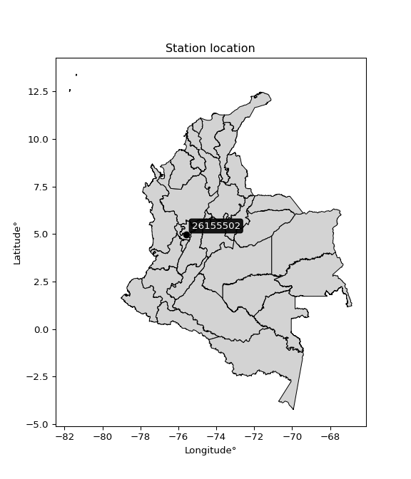</img>

</div>


## A. General information


### 1. General running parameters

• app_version: _v20260312_. • runtime: _2026-03-12 07:15:23.203550_. • Python version: _3.14.0_. • SciPy version: _1.16.3_. • Pandas version: _2.3.3_. • NumPy version: _2.3.5_. • Stations dataset (station_dataset_file): _dataset/pmax24h_in/automatic_colombia_2003_2025.csv_. • Stations catalog (station_catalog_file): _dataset/CNE.xls_. • Minimum year to eval til year_max (date_min): _1900_. • Maximum year to eval since year_min (date_max): _2025_. • Creates, save and include plots into reports (create_plot): _True_. • Plot only fit distributions with Δo > Δ (plot_only_fit): _True_. • Plot only simple graphs avoiding multiple CDFs and multiple Extreme values plots (plot_only_simple): _True_. • Eval low extreme values, if False, evaluates high extreme values (low_extreme): _False_. • Eval every SciPy distribution as logarithmic (pdist_logarithmic_on): _True_. • Standard deviation normalized (ddof): _1.0_. • Return periods to eval in years (Tr): _[2, 2.33, 5, 10, 15, 20, 25, 50, 75, 100, 200, 250, 500, 750, 1000]_. • Minimum data sample per station, 0 means any (minimum_sample): _5_. • Z-Score maximum threshold to adjust a value, 0 means disable (zscore_max): _3.5_. • Z-Score minimum threshold to adjust a value, 0 means disable (zscore_min): _-2.5_. • Avoid zeros, e.g. rain = 0 (avoid_zeros): _True_. • Avoid null values (avoid_nans): _True_. 

:file_folder:Table: [dataset.csv](../../dataset/pmax24h_in/automatic_colombia_2003_2025.csv)

> Delta Degrees of Freedom (DDOF): is a parameter used in the formulas for calculating variance and standard deviation. When ddof=0, the divisor is $N$ (the total number of observations) and this is used when your data set is the entire population. When ddof=1, the divisor is $N-1$ and this is used when your data set is a sample drawn from a larger population. Using $N-1$ provides an unbiased estimate of the population variance (known as Bessel´s correction).


### 2. Station info and location

|   id |   CODIGO | NOMBRE                      | CATEGORIA               | TECNOLOGIA                | ESTADO   | FECHA_INSTALACION   |   FECHA_SUSPENSION |   ALTITUD |   LATITUD |   LONGITUD | DEPARTAMENTO   | MUNICIPIO   | AREA_OPERATIVA                         | ENTIDAD                                    | AREA_HIDROGRAFICA   | ZONA_HIDROGRAFICA   | SUBZONA_HIDROGRAFICA   |   CORRIENTE | Catalogo   |   Version |
|-----:|---------:|:----------------------------|:------------------------|:--------------------------|:---------|:--------------------|-------------------:|----------:|----------:|-----------:|:---------------|:------------|:---------------------------------------|:-------------------------------------------|:--------------------|:--------------------|:-----------------------|------------:|:-----------|----------:|
|    0 | 26155502 | CENICAFE  - AUT  [26155502] | Climatológica Principal | Automática con Telemetría | Activa   | 30/01/2013          |                nan |      1310 |   4.99111 |   -75.5975 | Caldas         | Manizales   | Area Operativa 09 - Cauca-Valle-Caldas | CENTRO NACIONAL DE INVESTIGACIONES DE CAFE | Magdalena Cauca     | Cauca               | Río Chinchiná          |         nan | CNE_OE     |  20251226 |

<div align="center">

Dynamic map: [:earth_americas:Google](http://maps.google.com/maps?q=4.991111111,-75.59749722) [:earth_americas:OSM](https://www.openstreetmap.org/#map=18/4.991111111/-75.59749722&layers=P) [:earth_americas:Bing](https://www.bing.com/maps?cp=4.991111111~-75.59749722&lvl=18) [:earth_americas:Apple](https://maps.apple.com/frame?center=4.991111111%2C-75.59749722&span=0.003%2C0.006)

</div>


<div align="center">

```geojson
{
  "type": "Feature",
  "geometry": {
    "type": "Point", 
    "coordinates": [-75.59749722, 4.991111111]
  }, 
  "properties": {
    "Name": "26155502"
  }
}
```

</div>


### 3. Discrete values table and plot

<div align="center">

|               |          0 |         1 |           2 |           3 |           4 |           5 |           6 |
|:--------------|-----------:|----------:|------------:|------------:|------------:|------------:|------------:|
| Date          | 2017       | 2018      | 2019        | 2020        | 2021        | 2022        | 2023        |
| Value         |   36.4     |  114.8    |   83.4      |   82        |   76.9      |   62.4      |   64.3      |
| Value_initial |   36.4     |  114.8    |   83.4      |   82        |   76.9      |   62.4      |   64.3      |
| count         |    7       |    7      |    7        |    7        |    7        |    7        |    7        |
| mean          |   74.3143  |   74.3143 |   74.3143   |   74.3143   |   74.3143   |   74.3143   |   74.3143   |
| std           |   24.0386  |   24.0386 |   24.0386   |   24.0386   |   24.0386   |   24.0386   |   24.0386   |
| zscore        |   -1.57722 |    1.6842 |    0.377963 |    0.319724 |    0.107565 |   -0.495631 |   -0.416592 |


</div>


<div align="center">

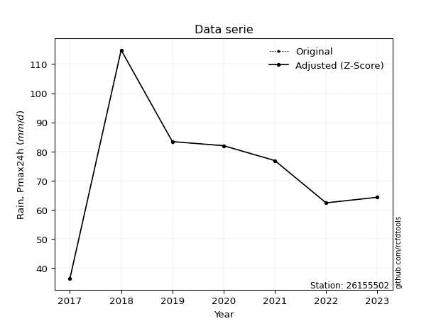</img>

</div>


> The initial value (value_initial) correspond to the initial obtained or null completed value, and value (value) is adjusted only when the initial value is outside the valid range (outlier) definite through the Z-Score value. If Z-Score is active, values out of range or outliers are replaced with the station mean value. A Z-Score (or standard score) measures how many standard deviations a data point is from the mean of a dataset, indicating its relative position; positive scores mean above the mean, negative mean below, and a score of zero is exactly at the mean, allowing for comparison of values from different distributions. It´s calculated using the formula $z=(x–μ)/σ$, where $x$ is the data point, $μ$ is the mean, and $σ$ is the standard deviation, helping identify outliers and understand probability.
>
> <sub>**Note**: In this study, "completing" (filling gaps in) and "extending" (forecasting or lengthening the historical record) rainfall data series are avoided for certain critical analyses because they introduce artificial bias and uncertainty, which can distort the statistics of rare events (extremes), alter day-to-day variability, and compromise the integrity and homogeneity of the original data. Some reasons against Completing/Extending rainfall data are: **Distortion of Extremes and Variability**: The primary issue is that most gap-filling or extension methods rely on averaging or regression with nearby stations, which inherently smooths the data. Rainfall is highly variable in space and time, with a large percentage of zero values and occasional large storms. Infilling methods often underestimate the highest values and overestimate the lowest (zero) values, which severely distorts analyses focused on flood frequency, drought severity, and intensity-duration-frequency (IDF) curves, **Loss of Data Homogeneity**: Infilled or extended data are synthetic estimates, not actual measurements. Combining these estimates with observed data can violate the assumption of data homogeneity, which requires that the data properties do not change over time. Inhomogeneity can lead to incorrect conclusions about long-term trends or changes in climate patterns, **Propagation of Errors**: Errors and biases from the original data (e.g., wind-induced undercatch, instrument errors, site changes) or the data used for imputation can propagate through the analysis, leading to unreliable hydrological models and inaccurate predictions, **Compromised Statistical Integrity**: For statistical analyses, especially those involving the frequency of events, using artificial data can introduce time bias or autocorrelation that doesn´t exist in reality, making it difficult to assess the true probability of events, **Difficulty in Validation**: It is difficult to accurately validate the quality of filled or extended data, especially for past periods where ground-truth measurements are unavailable. The reliability of imputation techniques heavily depends on the density of the surrounding station network and the complexity of the local topography.</sub>


### 4. Active continuous probability distributions from SciPy (80 of 104 available)

A Probability Density Function (PDF) describes the relative likelihood of a continuous random variable falling within a specific range, where the total area under its curve equals 1, and the area over any interval gives the actual probability for that range. Unlike discrete probabilities (like rolling a die), a PDF shows density, not direct probability for a single point (which is zero), with higher points indicating higher likelihood, often visualized as a bell curve for normal distributions.

A log of a probability density function (log-PDF) is simply the logarithm of the PDF´s value, denoted as $log(f(x))$, useful for converting multiplication of probabilities into addition, improving numerical stability with tiny numbers, and connecting to information theory concepts like entropy. Instead of dealing with very small probabilities (e.g., 0.000001), log-PDFs use negative numbers (e.g., $log(0.00001) ≈ -11.51$ that are easier for computers to handle, preventing underflow errors and simplifying complex calculations. In this study, each active probability distribution from SciPy is also evaluated in the $log$ form.

[scipy.stats](https://docs.scipy.org/doc/scipy/reference/stats.html) is a Python´s powerful submodule within the SciPy library for comprehensive statistical analysis, offering over 130 probability distributions (like Normal, Poisson, etc.), functions for descriptive stats (mean, variance), hypothesis testing (t-tests, chi-square), random variable generation, and statistical tests, making it essential for data science, modeling, and research. It provides tools to explore, model, and draw conclusions from data efficiently, working seamlessly with [NumPy](https://numpy.org/).

<div align="center">

|   id | p_dist           |   n_parameter | fit_method   | label                                                                       | active   | ref                                                                                                      |
|-----:|:-----------------|--------------:|:-------------|:----------------------------------------------------------------------------|:---------|:---------------------------------------------------------------------------------------------------------|
|    0 | alpha            |             3 | MLE          | Alpha                                                                       | True     | [:mortar_board:](https://docs.scipy.org/doc/scipy/reference/generated/scipy.stats.alpha.html)            |
|    1 | anglit           |             2 | MM           | Anglit                                                                      | True     | [:mortar_board:](https://docs.scipy.org/doc/scipy/reference/generated/scipy.stats.anglit.html)           |
|    2 | arcsine          |             2 | MM           | Arcsine                                                                     | True     | [:mortar_board:](https://docs.scipy.org/doc/scipy/reference/generated/scipy.stats.arcsine.html)          |
|    3 | argus            |             3 | MLE          | Argus                                                                       | True     | [:mortar_board:](https://docs.scipy.org/doc/scipy/reference/generated/scipy.stats.argus.html)            |
|    4 | beta             |             4 | MLE          | Beta                                                                        | True     | [:mortar_board:](https://docs.scipy.org/doc/scipy/reference/generated/scipy.stats.beta.html)             |
|    5 | betaprime        |             4 | MLE          | Beta prime                                                                  | True     | [:mortar_board:](https://docs.scipy.org/doc/scipy/reference/generated/scipy.stats.betaprime.html)        |
|    6 | bradford         |             3 | MLE          | Bradford                                                                    | True     | [:mortar_board:](https://docs.scipy.org/doc/scipy/reference/generated/scipy.stats.bradford.html)         |
|    7 | burr             |             4 | MLE          | Burr (Type III)                                                             | True     | [:mortar_board:](https://docs.scipy.org/doc/scipy/reference/generated/scipy.stats.burr.html)             |
|    8 | burr12           |             4 | MLE          | Burr (Type III) 12                                                          | True     | [:mortar_board:](https://docs.scipy.org/doc/scipy/reference/generated/scipy.stats.burr12.html)           |
|    9 | cosine           |             2 | MLE          | Cosine                                                                      | True     | [:mortar_board:](https://docs.scipy.org/doc/scipy/reference/generated/scipy.stats.cosine.html)           |
|   10 | crystalball      |             4 | MLE          | Crystalball                                                                 | True     | [:mortar_board:](https://docs.scipy.org/doc/scipy/reference/generated/scipy.stats.crystalball.html)      |
|   11 | dgamma           |             3 | MLE          | Double gamma                                                                | True     | [:mortar_board:](https://docs.scipy.org/doc/scipy/reference/generated/scipy.stats.dgamma.html)           |
|   12 | dweibull         |             3 | MLE          | Double Weibull                                                              | True     | [:mortar_board:](https://docs.scipy.org/doc/scipy/reference/generated/scipy.stats.dweibull.html)         |
|   13 | erlang           |             3 | MLE          | Erlang                                                                      | True     | [:mortar_board:](https://docs.scipy.org/doc/scipy/reference/generated/scipy.stats.erlang.html)           |
|   14 | exponnorm        |             3 | MLE          | Exponentially modified Normal                                               | True     | [:mortar_board:](https://docs.scipy.org/doc/scipy/reference/generated/scipy.stats.exponnorm.html)        |
|   15 | exponpow         |             3 | MLE          | Exponential power                                                           | True     | [:mortar_board:](https://docs.scipy.org/doc/scipy/reference/generated/scipy.stats.exponpow.html)         |
|   16 | exponweib        |             4 | MLE          | Exponentiated Weibull                                                       | True     | [:mortar_board:](https://docs.scipy.org/doc/scipy/reference/generated/scipy.stats.exponweib.html)        |
|   17 | f                |             4 | MLE          | F                                                                           | True     | [:mortar_board:](https://docs.scipy.org/doc/scipy/reference/generated/scipy.stats.f.html)                |
|   18 | fatiguelife      |             3 | MLE          | Fatigue-life (Birnbaum-Saunders)                                            | True     | [:mortar_board:](https://docs.scipy.org/doc/scipy/reference/generated/scipy.stats.fatiguelife.html)      |
|   19 | foldnorm         |             3 | MM           | Fold Normal                                                                 | True     | [:mortar_board:](https://docs.scipy.org/doc/scipy/reference/generated/scipy.stats.foldnorm.html)         |
|   20 | gamma            |             3 | MLE          | Gamma                                                                       | True     | [:mortar_board:](https://docs.scipy.org/doc/scipy/reference/generated/scipy.stats.gamma.html)            |
|   21 | gausshyper       |             6 | MLE          | Gauss hypergeometric                                                        | True     | [:mortar_board:](https://docs.scipy.org/doc/scipy/reference/generated/scipy.stats.gausshyper.html)       |
|   22 | genexpon         |             5 | MLE          | Generalized exponential                                                     | True     | [:mortar_board:](https://docs.scipy.org/doc/scipy/reference/generated/scipy.stats.genexpon.html)         |
|   23 | genextreme       |             3 | MLE          | Generalized exponential                                                     | True     | [:mortar_board:](https://docs.scipy.org/doc/scipy/reference/generated/scipy.stats.genextreme.html)       |
|   24 | gengamma         |             4 | MLE          | Generalized gamma                                                           | True     | [:mortar_board:](https://docs.scipy.org/doc/scipy/reference/generated/scipy.stats.gengamma.html)         |
|   25 | genhalflogistic  |             3 | MLE          | Generalized half-logistic                                                   | True     | [:mortar_board:](https://docs.scipy.org/doc/scipy/reference/generated/scipy.stats.genhalflogistic.html)  |
|   26 | genlogistic      |             3 | MLE          | Generalized logistic                                                        | True     | [:mortar_board:](https://docs.scipy.org/doc/scipy/reference/generated/scipy.stats.genlogistic.html)      |
|   27 | gennorm          |             3 | MLE          | Generalized Normal                                                          | True     | [:mortar_board:](https://docs.scipy.org/doc/scipy/reference/generated/scipy.stats.gennorm.html)          |
|   28 | genpareto        |             3 | MLE          | Generalized Pareto                                                          | True     | [:mortar_board:](https://docs.scipy.org/doc/scipy/reference/generated/scipy.stats.genpareto.html)        |
|   29 | gompertz         |             3 | MLE          | Gompertz (or truncated Gumbel)                                              | True     | [:mortar_board:](https://docs.scipy.org/doc/scipy/reference/generated/scipy.stats.gompertz.html)         |
|   30 | gumbel_l         |             2 | MM           | Gumbel Left Skew                                                            | True     | [:mortar_board:](https://docs.scipy.org/doc/scipy/reference/generated/scipy.stats.gumbel_l.html)         |
|   31 | gumbel_r         |             2 | MM           | Gumbel Right Skew                                                           | True     | [:mortar_board:](https://docs.scipy.org/doc/scipy/reference/generated/scipy.stats.gumbel_r.html)         |
|   32 | halfgennorm      |             3 | MLE          | Upper half of a generalized normal                                          | True     | [:mortar_board:](https://docs.scipy.org/doc/scipy/reference/generated/scipy.stats.halfgennorm.html)      |
|   33 | halflogistic     |             2 | MM           | Half-logistic                                                               | True     | [:mortar_board:](https://docs.scipy.org/doc/scipy/reference/generated/scipy.stats.halflogistic.html)     |
|   34 | halfnorm         |             2 | MM           | Half Normal                                                                 | True     | [:mortar_board:](https://docs.scipy.org/doc/scipy/reference/generated/scipy.stats.halfnorm.html)         |
|   35 | hypsecant        |             2 | MM           | hyperbolic secant                                                           | True     | [:mortar_board:](https://docs.scipy.org/doc/scipy/reference/generated/scipy.stats.hypsecant.html)        |
|   36 | invgamma         |             3 | MLE          | Inverted gamma                                                              | True     | [:mortar_board:](https://docs.scipy.org/doc/scipy/reference/generated/scipy.stats.invgamma.html)         |
|   37 | invgauss         |             3 | MLE          | Inverse Gaussian                                                            | True     | [:mortar_board:](https://docs.scipy.org/doc/scipy/reference/generated/scipy.stats.invgauss.html)         |
|   38 | invweibull       |             3 | MLE          | Inverted Weibull                                                            | True     | [:mortar_board:](https://docs.scipy.org/doc/scipy/reference/generated/scipy.stats.invweibull.html)       |
|   39 | johnsonsb        |             4 | MLE          | Johnson SB                                                                  | True     | [:mortar_board:](https://docs.scipy.org/doc/scipy/reference/generated/scipy.stats.johnsonsb.html)        |
|   40 | johnsonsu        |             4 | MLE          | Johnson Su                                                                  | True     | [:mortar_board:](https://docs.scipy.org/doc/scipy/reference/generated/scipy.stats.johnsonsu.html)        |
|   41 | kappa3           |             3 | MLE          | Kappa 3                                                                     | True     | [:mortar_board:](https://docs.scipy.org/doc/scipy/reference/generated/scipy.stats.kappa3.html)           |
|   42 | kappa4           |             4 | MLE          | Kappa 4                                                                     | True     | [:mortar_board:](https://docs.scipy.org/doc/scipy/reference/generated/scipy.stats.kappa4.html)           |
|   43 | ksone            |             3 | MLE          | Kolmogorov-Smirnov one-sided test statistic distribution                    | True     | [:mortar_board:](https://docs.scipy.org/doc/scipy/reference/generated/scipy.stats.ksone.html)            |
|   44 | kstwobign        |             2 | MLE          | Limiting distribution of scaled Kolmogorov-Smirnov two-sided test statistic | True     | [:mortar_board:](https://docs.scipy.org/doc/scipy/reference/generated/scipy.stats.kstwobign.html)        |
|   45 | laplace          |             2 | MM           | Laplace                                                                     | True     | [:mortar_board:](https://docs.scipy.org/doc/scipy/reference/generated/scipy.stats.laplace.html)          |
|   46 | levy_l           |             2 | MLE          | Left-skewed Levy                                                            | True     | [:mortar_board:](https://docs.scipy.org/doc/scipy/reference/generated/scipy.stats.levy_l.html)           |
|   47 | loggamma         |             3 | MLE          | Log gamma                                                                   | True     | [:mortar_board:](https://docs.scipy.org/doc/scipy/reference/generated/scipy.stats.loggamma.html)         |
|   48 | logistic         |             2 | MM           | Logistic (or Sech-squared)                                                  | True     | [:mortar_board:](https://docs.scipy.org/doc/scipy/reference/generated/scipy.stats.logistic.html)         |
|   49 | loglaplace       |             3 | MLE          | Log-Laplace                                                                 | True     | [:mortar_board:](https://docs.scipy.org/doc/scipy/reference/generated/scipy.stats.loglaplace.html)       |
|   50 | lomax            |             3 | MLE          | Lomax (Pareto of the second kind)                                           | True     | [:mortar_board:](https://docs.scipy.org/doc/scipy/reference/generated/scipy.stats.lomax.html)            |
|   51 | maxwell          |             2 | MM           | Maxwell                                                                     | True     | [:mortar_board:](https://docs.scipy.org/doc/scipy/reference/generated/scipy.stats.maxwell.html)          |
|   52 | mielke           |             4 | MLE          | Mielke Beta-Kappa / Dagum                                                   | True     | [:mortar_board:](https://docs.scipy.org/doc/scipy/reference/generated/scipy.stats.mielke.html)           |
|   53 | moyal            |             2 | MM           | Moyal                                                                       | True     | [:mortar_board:](https://docs.scipy.org/doc/scipy/reference/generated/scipy.stats.moyal.html)            |
|   54 | nakagami         |             3 | MLE          | Nakagami                                                                    | True     | [:mortar_board:](https://docs.scipy.org/doc/scipy/reference/generated/scipy.stats.nakagami.html)         |
|   55 | ncf              |             5 | MLE          | Non-central F distribution                                                  | True     | [:mortar_board:](https://docs.scipy.org/doc/scipy/reference/generated/scipy.stats.ncf.html)              |
|   56 | nct              |             4 | MLE          | Non-central Student’s t                                                     | True     | [:mortar_board:](https://docs.scipy.org/doc/scipy/reference/generated/scipy.stats.nct.html)              |
|   57 | norm             |             2 | MM           | Normal                                                                      | True     | [:mortar_board:](https://docs.scipy.org/doc/scipy/reference/generated/scipy.stats.norm.html)             |
|   58 | pearson3         |             3 | MM           | Pearson type III                                                            | True     | [:mortar_board:](https://docs.scipy.org/doc/scipy/reference/generated/scipy.stats.pearson3.html)         |
|   59 | powerlaw         |             3 | MLE          | Power-function                                                              | True     | [:mortar_board:](https://docs.scipy.org/doc/scipy/reference/generated/scipy.stats.powerlaw.html)         |
|   60 | rayleigh         |             2 | MM           | Rayleigh                                                                    | True     | [:mortar_board:](https://docs.scipy.org/doc/scipy/reference/generated/scipy.stats.rayleigh.html)         |
|   61 | rdist            |             3 | MLE          | R-distributed (symmetric beta)                                              | True     | [:mortar_board:](https://docs.scipy.org/doc/scipy/reference/generated/scipy.stats.rdist.html)            |
|   62 | rice             |             3 | MLE          | Rice                                                                        | True     | [:mortar_board:](https://docs.scipy.org/doc/scipy/reference/generated/scipy.stats.rice.html)             |
|   63 | semicircular     |             2 | MM           | Semicircular                                                                | True     | [:mortar_board:](https://docs.scipy.org/doc/scipy/reference/generated/scipy.stats.semicircular.html)     |
|   64 | skewnorm         |             3 | MLE          | Skew normal                                                                 | True     | [:mortar_board:](https://docs.scipy.org/doc/scipy/reference/generated/scipy.stats.skewnorm.html)         |
|   65 | t                |             3 | MLE          | Student’s t                                                                 | True     | [:mortar_board:](https://docs.scipy.org/doc/scipy/reference/generated/scipy.stats.t.html)                |
|   66 | trapezoid        |             4 | MLE          | Trapezoid                                                                   | True     | [:mortar_board:](https://docs.scipy.org/doc/scipy/reference/generated/scipy.stats.trapezoid.html)        |
|   67 | triang           |             3 | MLE          | Triangular                                                                  | True     | [:mortar_board:](https://docs.scipy.org/doc/scipy/reference/generated/scipy.stats.triang.html)           |
|   68 | truncexpon       |             3 | MLE          | Truncated exponential                                                       | True     | [:mortar_board:](https://docs.scipy.org/doc/scipy/reference/generated/scipy.stats.truncexpon.html)       |
|   69 | truncnorm        |             4 | MLE          | Truncated normal                                                            | True     | [:mortar_board:](https://docs.scipy.org/doc/scipy/reference/generated/scipy.stats.truncnorm.html)        |
|   70 | truncpareto      |             4 | MLE          | Upper truncated Pareto                                                      | True     | [:mortar_board:](https://docs.scipy.org/doc/scipy/reference/generated/scipy.stats.truncpareto.html)      |
|   71 | truncweibull_min |             5 | MLE          | Doubly truncated Weibull minimum                                            | True     | [:mortar_board:](https://docs.scipy.org/doc/scipy/reference/generated/scipy.stats.truncweibull_min.html) |
|   72 | tukeylambda      |             3 | MLE          | Tukey-Lamdba                                                                | True     | [:mortar_board:](https://docs.scipy.org/doc/scipy/reference/generated/scipy.stats.tukeylambda.html)      |
|   73 | uniform          |             2 | MLE          | Uniform                                                                     | True     | [:mortar_board:](https://docs.scipy.org/doc/scipy/reference/generated/scipy.stats.uniform.html)          |
|   74 | vonmises         |             3 | MLE          | Von Mises                                                                   | True     | [:mortar_board:](https://docs.scipy.org/doc/scipy/reference/generated/scipy.stats.vonmises.html)         |
|   75 | vonmises_line    |             3 | MLE          | Von Mises line                                                              | True     | [:mortar_board:](https://docs.scipy.org/doc/scipy/reference/generated/scipy.stats.vonmises_line.html)    |
|   76 | wald             |             2 | MM           | Wald                                                                        | True     | [:mortar_board:](https://docs.scipy.org/doc/scipy/reference/generated/scipy.stats.wald.html)             |
|   77 | weibull_max      |             3 | MLE          | Weibull maximum                                                             | True     | [:mortar_board:](https://docs.scipy.org/doc/scipy/reference/generated/scipy.stats.weibull_max.html)      |
|   78 | weibull_min      |             3 | MLE          | Weibull minimum                                                             | True     | [:mortar_board:](https://docs.scipy.org/doc/scipy/reference/generated/scipy.stats.weibull_min.html)      |
|   79 | wrapcauchy       |             3 | MLE          | Wrapped  Cauchy                                                             | True     | [:mortar_board:](https://docs.scipy.org/doc/scipy/reference/generated/scipy.stats.wrapcauchy.html)       |

</div>

> **n_parameter:** # arguments & localization & scale.
>
> **Fit methods:** (MLE) maximum likelihood, (MM) L-moments.
>
>**Inactive** (With the only purpose of prevent loops, zero divisions, infinite values, over high estimated values or horizontal trending for recurrence intervals estimations, the follow distributions were disabled.)**:** lognorm, norminvgauss, powernorm, powerlognorm, cauchy, halfcauchy, foldcauchy, skewcauchy, chi2, expon, fisk, genhyperbolic, geninvgauss, gibrat, kstwo, laplace_asymmetric, levy, levy_stable, ncx2, pareto, rel_breitwigner, recipinvgauss, studentized_range, loguniform, 


## B. Probability (PDF) vs. Empirical (EDF) distributions functions

A continuous probability distribution (CPD) describes probabilities for variables that can take any value within a range (like rain any time), unlike discrete variables with specific outcomes (like temperature). It uses a Probability Density Function (PDF), a curve where the total area under it equals 1, and the probability of the variable falling within an interval (a to b) is found by calculating the area under the curve between those points. A key feature is that the probability of hitting any single exact value is zero, so probabilities are always expressed for ranges, e.g., $P(a ≤ X ≤ b)$.

<div align="center">

Distributions parameters from station values
|     |   station | p_dist              |   n |               loc |            scale | shape                  | shape1                 | shape2                 | shape3             |
|----:|----------:|:--------------------|----:|------------------:|-----------------:|:-----------------------|:-----------------------|:-----------------------|:-------------------|
|   0 |  26155502 | alpha               |   7 |    -262.662       |   4978.02        | 14.841882651458057     |                        |                        |                    |
|   1 |  26155502 | anglit              |   7 |      74.3143      |     65.106       |                        |                        |                        |                    |
|   2 |  26155502 | arcsine             |   7 |      42.8404      |     62.9478      |                        |                        |                        |                    |
|   3 |  26155502 | argus               |   7 |      19.6745      |     99.1307      | 4.345731563280152e-06  |                        |                        |                    |
|   4 |  26155502 | beta                |   7 |      31.325       |     83.475       | 1.0011489483515474     | 0.7277264618853887     |                        |                    |
|   5 |  26155502 | betaprime           |   7 |     -66.2196      |   6540.32        | 40.04287396943291      | 1859.7565341142663     |                        |                    |
|   6 |  26155502 | bradford            |   7 |      36.4         |     78.4001      | 0.9421466720635736     |                        |                        |                    |
|   7 |  26155502 | burr                |   7 |      -0.324586    |     86.2767      | 8.269574911437966      | 0.4569602399666176     |                        |                    |
|   8 |  26155502 | burr12              |   7 |      -1.83519     |     37.9915      | 632.7809511555811      | 0.002438818639620032   |                        |                    |
|   9 |  26155502 | cosine              |   7 |      74.8162      |     19.3924      |                        |                        |                        |                    |
|  10 |  26155502 | crystalball         |   7 |      74.3143      |     22.2554      | 4588.337147261924      | 6893.332283663058      |                        |                    |
|  11 |  26155502 | dgamma              |   7 |      71.6412      |      9.28978     | 1.8816091313101593     |                        |                        |                    |
|  12 |  26155502 | dweibull            |   7 |      72.1319      |     19.1427      | 1.3402885663790034     |                        |                        |                    |
|  13 |  26155502 | erlang              |   7 |    -200.343       |      1.80471     | 152.18951884343772     |                        |                        |                    |
|  14 |  26155502 | exponnorm           |   7 |      67.1202      |     21.0715      | 0.34141230265908923    |                        |                        |                    |
|  15 |  26155502 | exponpow            |   7 |      36.4         |      1.67882     | 0.10256117802098524    |                        |                        |                    |
|  16 |  26155502 | exponweib           |   7 |      36.4         |      1.21878     | 1.3311479864659264     | 0.13250780968699366    |                        |                    |
|  17 |  26155502 | f                   |   7 |    -202.099       |    276.403       | 310.0527118151182      | 54282.46353225949      |                        |                    |
|  18 |  26155502 | fatiguelife         |   7 |      36.4         |      0.000141463 | 426.85435929403195     |                        |                        |                    |
|  19 |  26155502 | foldnorm            |   7 |      24.5556      |     22.7849      | 2.173303888277295      |                        |                        |                    |
|  20 |  26155502 | gamma               |   7 |    -200.345       |      1.8047      | 152.1915741021315      |                        |                        |                    |
|  21 |  26155502 | gausshyper          |   7 |      34.551       |     80.249       | 1.2058916275915812     | 0.9807240825725954     | 0.9173790926299008     | 0.9679233242398126 |
|  22 |  26155502 | genexpon            |   7 |      36.4         |      4.25713     | 0.10037691855999115    | 0.014603016755605632   | 0.5364852187900504     |                    |
|  23 |  26155502 | genextreme          |   7 |      37.0149      |      3.52721     | -5.736465911629445     |                        |                        |                    |
|  24 |  26155502 | gengamma            |   7 |      36.4         |      1.25544     | 1.214300385161794      | 0.1432354889517901     |                        |                    |
|  25 |  26155502 | genhalflogistic     |   7 |      28.9117      |     89.4062      | 1.0409592144465363     |                        |                        |                    |
|  26 |  26155502 | genlogistic         |   7 |      71.4654      |     13.005       | 1.1449173597935132     |                        |                        |                    |
|  27 |  26155502 | gennorm             |   7 |      76.9         |     16.1969      | 0.9798940984383515     |                        |                        |                    |
|  28 |  26155502 | genpareto           |   7 |      -0.99885     |    160.796       | -1.3885842379534004    |                        |                        |                    |
|  29 |  26155502 | gompertz            |   7 |    -169.413       |     22.1823      | 1.016241233835187e-05  |                        |                        |                    |
|  30 |  26155502 | gumbel_l            |   7 |      84.3304      |     17.3525      |                        |                        |                        |                    |
|  31 |  26155502 | gumbel_r            |   7 |      64.2982      |     17.3525      |                        |                        |                        |                    |
|  32 |  26155502 | halfgennorm         |   7 |      36.4         |      1.33546     | 0.3488800471026545     |                        |                        |                    |
|  33 |  26155502 | halflogistic        |   7 |      47.9364      |     19.0276      |                        |                        |                        |                    |
|  34 |  26155502 | halfnorm            |   7 |      44.8568      |     36.9195      |                        |                        |                        |                    |
|  35 |  26155502 | hypsecant           |   7 |      74.3143      |     14.1682      |                        |                        |                        |                    |
|  36 |  26155502 | invgamma            |   7 |    -140.634       |  19123.4         | 89.97737985837816      |                        |                        |                    |
|  37 |  26155502 | invgauss            |   7 |     -57.8743      |   4334.36        | 0.030370745869901267   |                        |                        |                    |
|  38 |  26155502 | invweibull          |   7 |      36.4         |      1.3578      | 0.04996104196884422    |                        |                        |                    |
|  39 |  26155502 | johnsonsb           |   7 |      36.4         |     78.6964      | 0.4967757144860344     | 0.07864908968597566    |                        |                    |
|  40 |  26155502 | johnsonsu           |   7 |    -187.277       |    219.464       | -15.498544453490883    | 15.358131014707642     |                        |                    |
|  41 |  26155502 | kappa3              |   7 |      36.4         |     84.547       | 1161.8150186716693     |                        |                        |                    |
|  42 |  26155502 | kappa4              |   7 |      25.8325      |     90.8198      | 1.131863402509374      | 1.02046957715761       |                        |                    |
|  43 |  26155502 | ksone               |   7 |      28.56        |     94.08        | 1.0                    |                        |                        |                    |
|  44 |  26155502 | kstwobign           |   7 |     -11.8411      |     98.8056      |                        |                        |                        |                    |
|  45 |  26155502 | laplace             |   7 |      74.3143      |     15.737       |                        |                        |                        |                    |
|  46 |  26155502 | levy_l              |   7 |     119.336       |     20.2063      |                        |                        |                        |                    |
|  47 |  26155502 | loggamma            |   7 |   -4200.01        |    638.695       | 806.5907635113163      |                        |                        |                    |
|  48 |  26155502 | logistic            |   7 |      74.3143      |     12.2701      |                        |                        |                        |                    |
|  49 |  26155502 | loglaplace          |   7 |      -0.187819    |     77.0878      | 4.174325251160644      |                        |                        |                    |
|  50 |  26155502 | lomax               |   7 |      36.4         |   1946.77        | 51.05532545155283      |                        |                        |                    |
|  51 |  26155502 | maxwell             |   7 |      21.5783      |     33.0474      |                        |                        |                        |                    |
|  52 |  26155502 | mielke              |   7 |       0.0733259   |     85.9431      | 3.7493730423069085     | 8.24120797767336       |                        |                    |
|  53 |  26155502 | moyal               |   7 |      61.5872      |     10.0185      |                        |                        |                        |                    |
|  54 |  26155502 | nakagami            |   7 |      62.4         |     15.4619      | 0.20428082367474157    |                        |                        |                    |
|  55 |  26155502 | ncf                 |   7 |      -0.942532    |     74.5019      | 23.160567737707968     | 168.99991714707681     | 1.6855302710457406e-10 |                    |
|  56 |  26155502 | nct                 |   7 |      -0.401065    |     21.2055      | 82.54696779992904      | 3.4911185940683036     |                        |                    |
|  57 |  26155502 | norm                |   7 |      74.3143      |     22.2554      |                        |                        |                        |                    |
|  58 |  26155502 | pearson3            |   7 |      74.3143      |     22.2554      | 0.13454798089109227    |                        |                        |                    |
|  59 |  26155502 | powerlaw            |   7 |      36.4         |     78.4         | 0.17160740512515765    |                        |                        |                    |
|  60 |  26155502 | rayleigh            |   7 |      31.7384      |     33.9707      |                        |                        |                        |                    |
|  61 |  26155502 | rdist               |   7 |      33.1184      |     43.7816      | 1.0624409029863884     |                        |                        |                    |
|  62 |  26155502 | rice                |   7 |      24.5125      |     25.035       | 1.657575729548192      |                        |                        |                    |
|  63 |  26155502 | semicircular        |   7 |      74.3143      |     44.5109      |                        |                        |                        |                    |
|  64 |  26155502 | skewnorm            |   7 |      57.9888      |     27.6012      | 1.1035312538418247     |                        |                        |                    |
|  65 |  26155502 | t                   |   7 |      74.3185      |     22.2527      | 354601.5009645754      |                        |                        |                    |
|  66 |  26155502 | trapezoid           |   7 |      28.56        |     94.08        | 1.0                    | 1.0                    |                        |                    |
|  67 |  26155502 | triang              |   7 |      13.175       |    101.625       | 0.9999999902422663     |                        |                        |                    |
|  68 |  26155502 | truncexpon          |   7 |      36.3999      |     83.3307      | 0.9408312460652631     |                        |                        |                    |
|  69 |  26155502 | truncnorm           |   7 |      74.3143      |     22.2554      | -827.0216040619584     | 648.3295977052483      |                        |                    |
|  70 |  26155502 | truncpareto         |   7 |      36.3604      |      0.0395868   | 0.16785929297884164    | 1981.4584658637107     |                        |                    |
|  71 |  26155502 | truncweibull_min    |   7 |      36.4         |     97.2816      | 0.9320524954752636     | 1.9832427221095e-18    | 0.8121042250881736     |                    |
|  72 |  26155502 | tukeylambda         |   7 |      60.2153      |     29.7488      | 1.2491473759514111     |                        |                        |                    |
|  73 |  26155502 | uniform             |   7 |      36.4         |     78.4         |                        |                        |                        |                    |
|  74 |  26155502 | vonmises            |   7 |       0.963307    |      1           | 1.1759750681939554     |                        |                        |                    |
|  75 |  26155502 | vonmises_line       |   7 |      75.6         |     12.4778      | 0.9297387014431987     |                        |                        |                    |
|  76 |  26155502 | wald                |   7 |      52.0588      |     22.2555      |                        |                        |                        |                    |
|  77 |  26155502 | weibull_max         |   7 |     114.8         |      1.539       | 0.2423697832122547     |                        |                        |                    |
|  78 |  26155502 | weibull_min         |   7 |      17.8671      |     63.4069      | 2.751635486840886      |                        |                        |                    |
|  79 |  26155502 | wrapcauchy          |   7 |      36.3998      |     12.9449      | 1.6501990215231822e-06 |                        |                        |                    |
|  80 |  26155502 | logalpha            |   7 |      -7.06922     |    372.731       | 32.93986664912822      |                        |                        |                    |
|  81 |  26155502 | loganglit           |   7 |       4.25825     |      0.961799    |                        |                        |                        |                    |
|  82 |  26155502 | logarcsine          |   7 |       3.7933      |      0.929908    |                        |                        |                        |                    |
|  83 |  26155502 | logargus            |   7 |       3.35908     |      1.43282     | 1.1504199900609096     |                        |                        |                    |
|  84 |  26155502 | logbeta             |   7 |       2.61686     |      2.12633     | 1.2929087785708377     | 0.2904226576365989     |                        |                    |
|  85 |  26155502 | logbetaprime        |   7 |      -5.24224     |     11.8437      | 883.803687893927       | 1102.002968155975      |                        |                    |
|  86 |  26155502 | logbradford         |   7 |       3.59457     |      1.14863     | 1.034963530028786      |                        |                        |                    |
|  87 |  26155502 | logburr             |   7 |      -0.180299    |      4.66098     | 40.05422727566435      | 0.38723481166258056    |                        |                    |
|  88 |  26155502 | logburr12           |   7 |      -0.369314    |      6.19816     | 17.366699339178403     | 94.49690259453884      |                        |                    |
|  89 |  26155502 | logcosine           |   7 |       4.22299     |      0.2893      |                        |                        |                        |                    |
|  90 |  26155502 | logcrystalball      |   7 |       4.25825     |      0.328769    | 6.2872155742119915     | 5.2933702065637895     |                        |                    |
|  91 |  26155502 | logdgamma           |   7 |       4.34251     |      0.344819    | 0.6883872322675747     |                        |                        |                    |
|  92 |  26155502 | logdweibull         |   7 |       4.34251     |      0.258538    | 0.427335174514885      |                        |                        |                    |
|  93 |  26155502 | logerlang           |   7 |      -1.58425     |      0.01965     | 297.4554908746825      |                        |                        |                    |
|  94 |  26155502 | logexponnorm        |   7 |       4.258       |      0.328774    | 0.0007673048424015552  |                        |                        |                    |
|  95 |  26155502 | logexponpow         |   7 |       3.09666     |      1.46491     | 3.1649512687770525     |                        |                        |                    |
|  96 |  26155502 | logexponweib        |   7 |      -1.47981e+07 |      1.47981e+07 | 31.424656741965425     | 12452967.741567448     |                        |                    |
|  97 |  26155502 | logf                |   7 |    -262.912       |    267.169       | 3112585.3158801636     | 2269804.4746699193     |                        |                    |
|  98 |  26155502 | logfatiguelife      |   7 |    -121.991       |    126.249       | 0.0026073209773745387  |                        |                        |                    |
|  99 |  26155502 | logfoldnorm         |   7 |       3.74931     |      0.37273     | 1.2692821319119885     |                        |                        |                    |
| 100 |  26155502 | loggamma            |   7 |      -1.00855     |      0.0218462   | 241.09247718533243     |                        |                        |                    |
| 101 |  26155502 | loggausshyper       |   7 |       3.54455     |      1.19864     | 1.1056659039336025     | 0.9053915643728581     | 1.0229024419899375     | 1.032796311486929  |
| 102 |  26155502 | loggenexpon         |   7 |       3.59334     |      0.00443147  | 0.0021705516782480287  | 2.9650159513405843     | 1.6278651577601616e-05 |                    |
| 103 |  26155502 | loggenextreme       |   7 |       4.19155     |      0.364338    | 0.5767757024202944     |                        |                        |                    |
| 104 |  26155502 | loggengamma         |   7 |      -9.51505     |      5.36848     | 82.41370866822913      | 4.67752257981026       |                        |                    |
| 105 |  26155502 | loggenhalflogistic  |   7 |       3.57696     |      1.2811      | 1.0984938579887573     |                        |                        |                    |
| 106 |  26155502 | loggenlogistic      |   7 |       4.45441     |      0.121259    | 0.4553108315062776     |                        |                        |                    |
| 107 |  26155502 | loggennorm          |   7 |       4.34252     |      0.241098    | 0.9794864405195529     |                        |                        |                    |
| 108 |  26155502 | loggenpareto        |   7 |      -0.0107387   |     12.8056      | -2.693693982670479     |                        |                        |                    |
| 109 |  26155502 | loggompertz         |   7 |       3.59457     |      0.325792    | 0.09499780519048977    |                        |                        |                    |
| 110 |  26155502 | loggumbel_l         |   7 |       4.40622     |      0.256345    |                        |                        |                        |                    |
| 111 |  26155502 | loggumbel_r         |   7 |       4.11028     |      0.256345    |                        |                        |                        |                    |
| 112 |  26155502 | loghalfgennorm      |   7 |       3.59454     |      1.14868     | 349724.75675807236     |                        |                        |                    |
| 113 |  26155502 | loghalflogistic     |   7 |       3.86854     |      0.281115    |                        |                        |                        |                    |
| 114 |  26155502 | loghalfnorm         |   7 |       3.82306     |      0.545433    |                        |                        |                        |                    |
| 115 |  26155502 | loghypsecant        |   7 |       4.25825     |      0.209305    |                        |                        |                        |                    |
| 116 |  26155502 | loginvgamma         |   7 |      -1.71021     |   1836.52        | 308.7167972487279      |                        |                        |                    |
| 117 |  26155502 | loginvgauss         |   7 |       0.973938    |    292.666       | 0.011193712144829438   |                        |                        |                    |
| 118 |  26155502 | loginvweibull       |   7 | -727381           | 727385           | 2020168.2396752788     |                        |                        |                    |
| 119 |  26155502 | logjohnsonsb        |   7 |       3.59406     |      1.14913     | 0.04037175526307296    | 0.16183719456339948    |                        |                    |
| 120 |  26155502 | logjohnsonsu        |   7 |       4.40798     |      0.253434    | 0.45649694370232874    | 1.1477976780747283     |                        |                    |
| 121 |  26155502 | logkappa3           |   7 |       3.59457     |      1.14781     | 2754.7189803972956     |                        |                        |                    |
| 122 |  26155502 | logkappa4           |   7 |       3.55202     |      1.2754      | 1.0043317908192275     | 1.0707120213790382     |                        |                    |
| 123 |  26155502 | logksone            |   7 |       3.47971     |      1.37835     | 1.0                    |                        |                        |                    |
| 124 |  26155502 | logkstwobign        |   7 |       2.79185     |      1.67852     |                        |                        |                        |                    |
| 125 |  26155502 | loglaplace          |   7 |       4.25825     |      0.232479    |                        |                        |                        |                    |
| 126 |  26155502 | loglevy_l           |   7 |       4.7933      |      0.222886    |                        |                        |                        |                    |
| 127 |  26155502 | logloggamma         |   7 |       4.20878     |      0.359689    | 1.613469822245512      |                        |                        |                    |
| 128 |  26155502 | loglogistic         |   7 |       4.25825     |      0.181263    |                        |                        |                        |                    |
| 129 |  26155502 | logloglaplace       |   7 |      -0.0195175   |      4.36202     | 17.501183179785595     |                        |                        |                    |
| 130 |  26155502 | loglomax            |   7 |       3.59457     |     16.3942      | 24.886157785397074     |                        |                        |                    |
| 131 |  26155502 | logmaxwell          |   7 |       3.47919     |      0.488203    |                        |                        |                        |                    |
| 132 |  26155502 | logmielke           |   7 |      -0.391893    |      4.87139     | 16.302647951748895     | 41.79296528817288      |                        |                    |
| 133 |  26155502 | logmoyal            |   7 |       4.07024     |      0.148001    |                        |                        |                        |                    |
| 134 |  26155502 | lognakagami         |   7 |       4.13357     |      0.241687    | 0.2293102580487218     |                        |                        |                    |
| 135 |  26155502 | logncf              |   7 |      -0.546929    |      1.192e-06   | 9.925927085963277e-05  | 462.25178056562504     | 399.0955404099461      |                    |
| 136 |  26155502 | lognct              |   7 |      -9.50241     |      0.315629    | 9033.566514230391      | 43.59302883938288      |                        |                    |
| 137 |  26155502 | lognorm             |   7 |       4.25825     |      0.328775    |                        |                        |                        |                    |
| 138 |  26155502 | logpearson3         |   7 |       4.25825     |      0.328775    | -0.6941725079111775    |                        |                        |                    |
| 139 |  26155502 | logpowerlaw         |   7 |       3.59457     |      1.14862     | 0.18396957443292092    |                        |                        |                    |
| 140 |  26155502 | lograyleigh         |   7 |       3.62933     |      0.50181     |                        |                        |                        |                    |
| 141 |  26155502 | logrdist            |   7 |       4.62739     |      0.493821    | 1.1635818458084688     |                        |                        |                    |
| 142 |  26155502 | logrice             |   7 |       3.35525     |      0.351194    | 2.342570442960783      |                        |                        |                    |
| 143 |  26155502 | logsemicircular     |   7 |       4.25825     |      0.657561    |                        |                        |                        |                    |
| 144 |  26155502 | logskewnorm         |   7 |       4.61538     |      0.485423    | -2.5881407258254305    |                        |                        |                    |
| 145 |  26155502 | logt                |   7 |       4.25832     |      0.328676    | 3410.3367669560776     |                        |                        |                    |
| 146 |  26155502 | logtrapezoid        |   7 |       3.47971     |      1.37835     | 1.0                    | 1.0                    |                        |                    |
| 147 |  26155502 | logtriang           |   7 |       3.34052     |      1.40267     | 0.9999976708883378     |                        |                        |                    |
| 148 |  26155502 | logtruncexpon       |   7 |       3.59303     |      1.52701     | 0.7532129949923758     |                        |                        |                    |
| 149 |  26155502 | logtruncnorm        |   7 |      -0.126397    |      1.08784     | 3.9159916176802767     | 4.4763972373824465     |                        |                    |
| 150 |  26155502 | logtruncpareto      |   7 |       3.59385     |      0.000717921 | 0.16781936153323665    | 1600.9300006243723     |                        |                    |
| 151 |  26155502 | logtruncweibull_min |   7 |       3.36468     |      1.78712     | 2.123779907791425      | 0.00044631792553651007 | 0.7713577637318685     |                    |
| 152 |  26155502 | logtukeylambda      |   7 |       4.43807     |      0.407447    | 1.3353385192330114     |                        |                        |                    |
| 153 |  26155502 | loguniform          |   7 |       3.59457     |      1.14862     |                        |                        |                        |                    |
| 154 |  26155502 | logvonmises         |   7 |      -2.02072     |      1           | 9.785228917415552      |                        |                        |                    |
| 155 |  26155502 | logvonmises_line    |   7 |       4.16034     |      0.185526    | 0.32098218955549196    |                        |                        |                    |
| 156 |  26155502 | logwald             |   7 |       3.92943     |      0.328823    |                        |                        |                        |                    |
| 157 |  26155502 | logweibull_max      |   7 |       4.82325     |      0.631707    | 1.7338537466324742     |                        |                        |                    |
| 158 |  26155502 | logweibull_min      |   7 |       0.710003    |      3.69021     | 13.280774456176154     |                        |                        |                    |
| 159 |  26155502 | logwrapcauchy       |   7 |       3.59457     |      0.182809    | 0.5                    |                        |                        |                    |

</div>

> **loc** (Location parameter): This shifts the distribution along the x-axis. For many common distributions, like the normal (Gaussian) distribution, loc represents the mean $μ$. For others, like the uniform distribution, it might represent the minimum value, or for the beta distribution, the left end of the support interval.
>
> **scale** (Scale parameter): This determines the width or spread of the distribution. For the normal distribution, scale represents the standard deviation $σ$. For a uniform distribution, it defines the length of the interval (from $loc$ to $loc + scale$).
>
> **shape** (Shape parameters): Refers to parameters that define the specific form of a probability distribution, distinct from its location (loc) and scale (scale). These parameters are required arguments for most distribution functions. For example, a normal (Gaussian) distribution is fully defined by its location (mean) and scale (standard deviation), so it has no specific shape parameters beyond loc and scale. However, other distributions have intrinsic properties that need specification, as Gamma distribution that takes a shape parameter, often named $a$ or $alpha$.


### 0. Cumulative distribution values - CDF (160 evaluated)

Cumulative Distribution Function (CDF), denoted as $F$<sub>$X$</sub>$(x)$, is a function that gives the probability that a random variable $X$ will take a value less than or equal to a specific value, $x$ (i.e., $(P(X≥x)$. It essentially "accumulates" probabilities from a given point up to the far right (positive infinity), providing a complete picture of the distribution´s probabilities for both discrete (like rain) and continuous (like temperature) variables, helping to find probabilities over ranges or above certain values. Each station is evaluated separately ordering the $x$ values ascending, calculating the CDF and PDF values for the activated distributions and their logarithmic forms.

<div align="center">

CDF ordered by x ascending and calculating $log(f(x))$ separately
|   id |   Station |   date |     x |   count |    mean |     std |    zscore |   Value_initial |   station |   m |    alpha |   alpha_pdf |    anglit |   anglit_pdf |   arcsine |   arcsine_pdf |     argus |   argus_pdf |      beta |     beta_pdf |   betaprime |   betaprime_pdf |   bradford |   bradford_pdf |      burr |   burr_pdf |     burr12 |   burr12_pdf |    cosine |   cosine_pdf |   crystalball |   crystalball_pdf |    dgamma |   dgamma_pdf |   dweibull |   dweibull_pdf |    erlang |   erlang_pdf |   exponnorm |   exponnorm_pdf |   exponpow |   exponpow_pdf |   exponweib |   exponweib_pdf |         f |      f_pdf |   fatiguelife |   fatiguelife_pdf |   foldnorm |   foldnorm_pdf |     gamma |   gamma_pdf |   gausshyper |   gausshyper_pdf |    genexpon |   genexpon_pdf |   genextreme |   genextreme_pdf |   gengamma |   gengamma_pdf |   genhalflogistic |   genhalflogistic_pdf |   genlogistic |   genlogistic_pdf |   gennorm |   gennorm_pdf |   genpareto |   genpareto_pdf |   gompertz |   gompertz_pdf |   gumbel_l |   gumbel_l_pdf |   gumbel_r |   gumbel_r_pdf |   halfgennorm |   halfgennorm_pdf |   halflogistic |   halflogistic_pdf |   halfnorm |   halfnorm_pdf |   hypsecant |   hypsecant_pdf |   invgamma |   invgamma_pdf |   invgauss |   invgauss_pdf |   invweibull |   invweibull_pdf |   johnsonsb |   johnsonsb_pdf |   johnsonsu |   johnsonsu_pdf |      kappa3 |   kappa3_pdf |      kappa4 |   kappa4_pdf |     ksone |   ksone_pdf |   kstwobign |   kstwobign_pdf |   laplace |   laplace_pdf |   levy_l |   levy_l_pdf |   loggamma |   loggamma_pdf |   logistic |   logistic_pdf |   loglaplace |   loglaplace_pdf |       lomax |   lomax_pdf |   maxwell |   maxwell_pdf |    mielke |   mielke_pdf |       moyal |   moyal_pdf |    nakagami |   nakagami_pdf |       ncf |    ncf_pdf |       nct |    nct_pdf |      norm |   norm_pdf |   pearson3 |   pearson3_pdf |   powerlaw |   powerlaw_pdf |   rayleigh |   rayleigh_pdf |    rdist |      rdist_pdf |      rice |   rice_pdf |   semicircular |   semicircular_pdf |   skewnorm |   skewnorm_pdf |         t |      t_pdf |   trapezoid |   trapezoid_pdf |    triang |   triang_pdf |   truncexpon |   truncexpon_pdf |   truncnorm |   truncnorm_pdf |   truncpareto |   truncpareto_pdf |   truncweibull_min |   truncweibull_min_pdf |   tukeylambda |   tukeylambda_pdf |   uniform |   uniform_pdf |   vonmises |   vonmises_pdf |   vonmises_line |   vonmises_line_pdf |     wald |   wald_pdf |   weibull_max |   weibull_max_pdf |   weibull_min |   weibull_min_pdf |   wrapcauchy |   wrapcauchy_pdf |   logalpha |   logalpha_pdf |   loganglit |   loganglit_pdf |   logarcsine |   logarcsine_pdf |   logargus |   logargus_pdf |   logbeta |   logbeta_pdf |   logbetaprime |   logbetaprime_pdf |   logbradford |   logbradford_pdf |   logburr |   logburr_pdf |   logburr12 |   logburr12_pdf |   logcosine |   logcosine_pdf |   logcrystalball |   logcrystalball_pdf |   logdgamma |   logdgamma_pdf |   logdweibull |   logdweibull_pdf |   logerlang |   logerlang_pdf |   logexponnorm |   logexponnorm_pdf |   logexponpow |   logexponpow_pdf |   logexponweib |   logexponweib_pdf |      logf |   logf_pdf |   logfatiguelife |   logfatiguelife_pdf |   logfoldnorm |   logfoldnorm_pdf |   loggausshyper |   loggausshyper_pdf |   loggenexpon |   loggenexpon_pdf |   loggenextreme |   loggenextreme_pdf |   loggengamma |   loggengamma_pdf |   loggenhalflogistic |   loggenhalflogistic_pdf |   loggenlogistic |   loggenlogistic_pdf |   loggennorm |   loggennorm_pdf |   loggenpareto |   loggenpareto_pdf |   loggompertz |   loggompertz_pdf |   loggumbel_l |   loggumbel_l_pdf |   loggumbel_r |   loggumbel_r_pdf |   loghalfgennorm |   loghalfgennorm_pdf |   loghalflogistic |   loghalflogistic_pdf |   loghalfnorm |   loghalfnorm_pdf |   loghypsecant |   loghypsecant_pdf |   loginvgamma |   loginvgamma_pdf |   loginvgauss |   loginvgauss_pdf |   loginvweibull |   loginvweibull_pdf |   logjohnsonsb |   logjohnsonsb_pdf |   logjohnsonsu |   logjohnsonsu_pdf |   logkappa3 |   logkappa3_pdf |   logkappa4 |   logkappa4_pdf |   logksone |   logksone_pdf |   logkstwobign |   logkstwobign_pdf |   loglevy_l |   loglevy_l_pdf |   logloggamma |   logloggamma_pdf |   loglogistic |   loglogistic_pdf |   logloglaplace |   logloglaplace_pdf |    loglomax |   loglomax_pdf |   logmaxwell |   logmaxwell_pdf |   logmielke |   logmielke_pdf |   logmoyal |   logmoyal_pdf |   lognakagami |   lognakagami_pdf |   logncf |   logncf_pdf |    lognct |   lognct_pdf |   lognorm |   lognorm_pdf |   logpearson3 |   logpearson3_pdf |   logpowerlaw |   logpowerlaw_pdf |   lograyleigh |   lograyleigh_pdf |    logrdist |   logrdist_pdf |   logrice |   logrice_pdf |   logsemicircular |   logsemicircular_pdf |   logskewnorm |   logskewnorm_pdf |      logt |   logt_pdf |   logtrapezoid |   logtrapezoid_pdf |   logtriang |   logtriang_pdf |   logtruncexpon |   logtruncexpon_pdf |   logtruncnorm |   logtruncnorm_pdf |   logtruncpareto |   logtruncpareto_pdf |   logtruncweibull_min |   logtruncweibull_min_pdf |   logtukeylambda |   logtukeylambda_pdf |   loguniform |   loguniform_pdf |   logvonmises |   logvonmises_pdf |   logvonmises_line |   logvonmises_line_pdf |   logwald |   logwald_pdf |   logweibull_max |   logweibull_max_pdf |   logweibull_min |   logweibull_min_pdf |   logwrapcauchy |   logwrapcauchy_pdf |
|-----:|----------:|-------:|------:|--------:|--------:|--------:|----------:|----------------:|----------:|----:|---------:|------------:|----------:|-------------:|----------:|--------------:|----------:|------------:|----------:|-------------:|------------:|----------------:|-----------:|---------------:|----------:|-----------:|-----------:|-------------:|----------:|-------------:|--------------:|------------------:|----------:|-------------:|-----------:|---------------:|----------:|-------------:|------------:|----------------:|-----------:|---------------:|------------:|----------------:|----------:|-----------:|--------------:|------------------:|-----------:|---------------:|----------:|------------:|-------------:|-----------------:|------------:|---------------:|-------------:|-----------------:|-----------:|---------------:|------------------:|----------------------:|--------------:|------------------:|----------:|--------------:|------------:|----------------:|-----------:|---------------:|-----------:|---------------:|-----------:|---------------:|--------------:|------------------:|---------------:|-------------------:|-----------:|---------------:|------------:|----------------:|-----------:|---------------:|-----------:|---------------:|-------------:|-----------------:|------------:|----------------:|------------:|----------------:|------------:|-------------:|------------:|-------------:|----------:|------------:|------------:|----------------:|----------:|--------------:|---------:|-------------:|-----------:|---------------:|-----------:|---------------:|-------------:|-----------------:|------------:|------------:|----------:|--------------:|----------:|-------------:|------------:|------------:|------------:|---------------:|----------:|-----------:|----------:|-----------:|----------:|-----------:|-----------:|---------------:|-----------:|---------------:|-----------:|---------------:|---------:|---------------:|----------:|-----------:|---------------:|-------------------:|-----------:|---------------:|----------:|-----------:|------------:|----------------:|----------:|-------------:|-------------:|-----------------:|------------:|----------------:|--------------:|------------------:|-------------------:|-----------------------:|--------------:|------------------:|----------:|--------------:|-----------:|---------------:|----------------:|--------------------:|---------:|-----------:|--------------:|------------------:|--------------:|------------------:|-------------:|-----------------:|-----------:|---------------:|------------:|----------------:|-------------:|-----------------:|-----------:|---------------:|----------:|--------------:|---------------:|-------------------:|--------------:|------------------:|----------:|--------------:|------------:|----------------:|------------:|----------------:|-----------------:|---------------------:|------------:|----------------:|--------------:|------------------:|------------:|----------------:|---------------:|-------------------:|--------------:|------------------:|---------------:|-------------------:|----------:|-----------:|-----------------:|---------------------:|--------------:|------------------:|----------------:|--------------------:|--------------:|------------------:|----------------:|--------------------:|--------------:|------------------:|---------------------:|-------------------------:|-----------------:|---------------------:|-------------:|-----------------:|---------------:|-------------------:|--------------:|------------------:|--------------:|------------------:|--------------:|------------------:|-----------------:|---------------------:|------------------:|----------------------:|--------------:|------------------:|---------------:|-------------------:|--------------:|------------------:|--------------:|------------------:|----------------:|--------------------:|---------------:|-------------------:|---------------:|-------------------:|------------:|----------------:|------------:|----------------:|-----------:|---------------:|---------------:|-------------------:|------------:|----------------:|--------------:|------------------:|--------------:|------------------:|----------------:|--------------------:|------------:|---------------:|-------------:|-----------------:|------------:|----------------:|-----------:|---------------:|--------------:|------------------:|---------:|-------------:|----------:|-------------:|----------:|--------------:|--------------:|------------------:|--------------:|------------------:|--------------:|------------------:|------------:|---------------:|----------:|--------------:|------------------:|----------------------:|--------------:|------------------:|----------:|-----------:|---------------:|-------------------:|------------:|----------------:|----------------:|--------------------:|---------------:|-------------------:|-----------------:|---------------------:|----------------------:|--------------------------:|-----------------:|---------------------:|-------------:|-----------------:|--------------:|------------------:|-------------------:|-----------------------:|----------:|--------------:|-----------------:|---------------------:|-----------------:|---------------------:|----------------:|--------------------:|
|    0 |  26155502 |   2017 |  36.4 |       7 | 74.3143 | 24.0386 | -1.57722  |            36.4 |  26155502 |   1 | 0.035653 |  0.00436645 | 0.0406663 |   0.00606752 |  0        |     0         | 0.0423954 |  0.00503285 | 0.0444664 |   0.00884777 |   0.0333763 |      0.00410365 | 4.5767e-07 |     0.0181038  | 0.0396379 | 0.00407515 | 0.00985962 |   0.0392764  | 0.0387633 |   0.00493418 |     0.0442282 |         0.0042001 | 0.0468132 |   0.00410832 |  0.0497161 |     0.00430455 | 0.0391231 |   0.00419898 |   0.0424413 |      0.0041691  |  0.0335555 |    4.84163e+11 |  0.00305836 |     7.54295e+10 | 0.0391283 | 0.00419882 |     0.0530733 |       2.93785e+08 |  0.0455786 |     0.00492854 | 0.0391232 |  0.00419898 |    0.0147514 |       0.00953479 | 4.57081e-09 |     0.0235786  |   0.00157501 |    127.353       | 0.00298053 |    7.26597e+10 |         0.0437892 |            0.00611486 |     0.0423497 |        0.00349274 |  0.044525 |    0.00262783 |    0.244884 |      0.00693626 |   0.103049 |     0.00439793 |   0.061202 |     0.00341679 | 0.00679559 |     0.00195477 |   2.72001e-13 |        0.147231   |       0        |         0          |   0        |     0          |   0.0437544 |      0.00307849 |  0.0341726 |     0.0043173  |  0.0324835 |     0.00450282 |   0.00568353 |      2.06617e+11 |  0.00800257 |     2.42694e+11 |   0.0396439 |      0.00419285 | 1.57556e-09 |    0.0117561 | 8.01934e-15 |    0.79735   | 0.0833333 |   0.0106293 |   0.0290295 |      0.00562682 | 0.0449413 |    0.00285578 | 0.378409 |   0.00210201 |   0.021478 |       0.165934 |  0.0435223 |     0.00339266 |    0.0287836 |         0.123811 | 1.60256e-14 |  0.0262256  | 0.0225968 |    0.00439184 | 0.0395936 |   0.00408318 | 0.000439755 | 0.000290491 | 0           |    0           | 0.0266095 | 0.00439384 | 0.0404878 | 0.00412855 | 0.0442282 |  0.0042001 |  0.0399935 |      0.0042    | 0.00176583 |    4.26477e+10 | 0.00937125 |     0.00400168 | 0.524898 |     0.00760039 | 0.0290927 | 0.00498008 |      0.0334722 |         0.00749268 |  0.0388911 |     0.00413075 | 0.0441914 | 0.00419777 |  0.00694444 |      0.00177154 | 0.0522289 |   0.00449764 |  2.19432e-06 |       0.0196825  |   0.0442282 |       0.0042001 |      0        |       5.88619     |        1.58269e-15 |             0.213175   |   2.13163e-14 |         0.0336016 |  0        |     0.0127551 |    6.03658 |      0.0546039 |     3.40001e-07 |          0.00409904 | 0        | 0          |     0.0748214 |       0.000599698 |     0.0333241 |        0.00486435 |  1.90229e-06 |        0.0122949 |   0.022054 |       0.172389 |  0.00906512 |        0.197086 |     0        |         0        |  0.0306899 |       0.261183 |  0.11435  |   0.185903    |      0.0553285 |           0.279238 |   3.91046e-07 |          1.26822  | 0.0379832 |      0.156034 |   0.0393577 |        0.168961 |   0.0230536 |        0.23887  |        0.0217605 |             0.158174 |   0.0307746 |       0.0988658 |      0.103554 |       0.0931573   |    0.021369 |        0.163855 |      0.0217613 |           0.158176 |     0.0328573 |          0.208781 |      0.0249485 |           0.180883 | 0.0220375 |   0.159795 |         0.021685 |             0.158349 |      0        |          0        |       0.0400014 |            0.868011 |   0.000604391 |          0.492531 |       0.0420379 |            0.187997 |     0.0216351 |          0.155147 |           0.00692488 |                 0.396254 |        0.0395985 |             0.148563 |     0.025127 |        0.0991954 |       0.409809 |        0.190751    |   1.89087e-08 |          0.291591 |     0.0412856 |          0.157683 |   0.000566068 |         0.0165105 |         0        |             0.870564 |          0        |              0        |      0        |          0        |      0.0267009 |           0.12742  |     0.0191583 |          0.160683 |     0.0194895 |          0.172155 |        0.020511 |            0.221412 |       0.113267 |       61.1009      |      0.0441465 |           0.125744 | 4.10992e-09 |        0.868723 |   0.0296609 |        0.798023 |  0.0833333 |       0.725507 |      0.0238094 |           0.290337 |    0.333678 |        0.130765 |     0.0394155 |          0.16478  |     0.0250521 |          0.134746 |       0.0185912 |           0.0900278 | 9.87519e-12 |       1.51798  |    0.0034523 |        0.0887664 |   0.0380678 |        0.155643 | 6.1101e-07 |    5.32761e-05 |    0          |       0           | 0.117622 |     0.383996 | 0.0224384 |     0.162244 | 0.0217618 |      0.158178 |     0.0368374 |          0.172778 |     0.0014606 |       6.05071e+11 |      0        |          0        | 0           |    0           | 0.0178573 |      0.172771 |          0        |              0        |     0.0354718 |          0.180105 | 0.0217584 |   0.158052 |     0.00694444 |           0.120918 |   0.0328034 |        0.258246 |      0.00190656 |            1.23635  |    0           |           0        |         0        |          329.188     |             0.0291245 |                  0.267341 |       0          |              0       |     0        |         0.870608 |       1.02162 |          0.150379 |          0.0103615 |               0.607419 |  0        |      0        |        0.0420367 |             0.187998 |         0.037251 |             0.168272 |        0        |            2.61182  |
|    1 |  26155502 |   2022 |  62.4 |       7 | 74.3143 | 24.0386 | -0.495631 |            62.4 |  26155502 |   2 | 0.318411 |  0.0168122  | 0.32106   |   0.0143423  |  0.376425 |     0.0109266 | 0.265273  |  0.0117698  | 0.287038  |   0.00989423 |   0.305771  |      0.0165729  | 0.409605   |     0.0137939  | 0.290447  | 0.0163287  | 0.55536    |   0.0106824  | 0.303019  |   0.0147886  |     0.296206  |         0.0155325 | 0.351816  |   0.0207328  |  0.333874  |     0.0185694  | 0.302942  |   0.0161543  |   0.297805  |      0.0157867  |  0.936722  |    0.00124314  |  0.714575   |     0.00208846  | 0.302934  | 0.016154   |     0.842394  |       0.00465325  |  0.304136  |     0.0153666  | 0.302942  |  0.0161543  |    0.33957   |       0.0131402  | 0.491371    |     0.0136716  |   0.594154   |      0.00207395  | 0.717623   |    0.00218001  |         0.23299   |            0.00866893 |     0.283421  |        0.0166561  |  0.208483 |    0.0124753  |    0.435067 |      0.00776414 |   0.296133 |     0.0111432  |   0.246158 |     0.0122758  | 0.32772    |     0.0210692  |   0.56725     |        0.00880062 |       0.362767 |         0.0228195  |   0.365338 |     0.0193043  |   0.259237  |      0.0163404  |  0.318399  |     0.0169241  |  0.332296  |     0.0174101  |   0.421951   |      0.000699622 |  0.670471   |     0.00163505  |   0.302407  |      0.0161217  | 0.305659    |    0.0117561 | 0.371556    |    0.0126802 | 0.359694  |   0.0106293 |   0.375166  |      0.0170314  | 0.234515  |    0.0149022  | 0.448645 |   0.0034955  |   0.363377 |       1.12416  |  0.27468   |     0.0162372  |    0.292445  |         1.25794  | 0.49204     |  0.013146   | 0.32368   |    0.0171783  | 0.290607  |   0.0163261  | 0.336931    | 0.0241138   | 4.26891e-07 |    2.45462e+07 | 0.335148  | 0.0175437  | 0.299822  | 0.016068   | 0.296206  |  0.0155325 |  0.301736  |      0.0160499 | 0.827449   |    0.0054614   | 0.334579   |     0.01768    | 0.741706 |     0.0100094  | 0.31246   | 0.0161234  |      0.331652  |         0.0137807  |  0.302281  |     0.0162681  | 0.296118  | 0.0155323  |  0.12938    |      0.00764655 | 0.234623  |   0.00953267 |  0.439607    |       0.0144071  |   0.296206  |       0.0155325 |      0.921072 |       0.00301099  |        0.451692    |             0.0139407  |   0.543651    |         0.0199899 |  0.331633 |     0.0127551 |   10.1145  |      0.141969  |     0.202198    |          0.016391   | 0.333095 | 0.0415758  |     0.0952323 |       0.00103577  |     0.314922  |        0.0160102  |  0.319668    |        0.0122948 |   0.370178 |       1.12152  |  0.371809   |        1.00497  |     0.413581 |         0.710634 |  0.336343  |       0.873166 |  0.247444 |   0.331403    |      0.387278  |           0.903903 |   0.557172    |          0.853641 | 0.295987  |      1.01833  |   0.307125  |        0.978573 |   0.402393  |        1.07421  |        0.352257  |             1.12925  |   0.189875  |       0.702244  |      0.200659 |       0.374693    |    0.359918 |        1.12004  |      0.352252  |           1.12922  |     0.328288  |          0.960123 |      0.367499  |           1.08916  | 0.353286  |   1.12749  |         0.352874 |             1.12969  |      0.395084 |          1.11631  |       0.510912  |            0.820576 |   0.463677    |          0.974105 |       0.31209   |            0.913613 |     0.348938  |          1.13283  |           0.286971   |                 0.685149 |        0.290564  |             1.01876  |     0.214416 |        0.861712  |       0.533491 |        0.284085    |   0.330916    |          1.02038  |     0.291925  |          0.953525 |   0.401244    |         1.42936   |         0        |             0.870564 |          0.439315 |              1.43536  |      0.430839 |          1.24401  |      0.320691  |           1.28582  |     0.369538  |          1.14144  |     0.386047  |          1.14618  |        0.418991 |            1.01228  |       0.508216 |        0.225531    |      0.267314  |           1.01091  | 0.468239    |        0.868723 |   0.464287  |        0.822261 |  0.474379  |       0.725507 |      0.454793  |           0.969988 |    0.438921 |        0.296847 |     0.306115  |          0.984756 |     0.334507  |          1.22811  |       0.211783  |           0.892457  | 0.552924    |       0.657053 |    0.384324  |        1.19582   |   0.295693  |        1.01834  | 0.419441   |    1.571       |    1.8784e-07 |       9.69932e+07 | 0.426195 |     0.694912 | 0.354608  |     1.1234   | 0.352253  |      1.12922  |     0.316118  |          0.993603 |     0.87006   |       0.296968    |      0.396404 |          1.20866  | 2.37096e-10 |    2.51601e+06 | 0.361738  |      1.12625  |          0.380012 |              0.950589 |     0.320651  |          0.999235 | 0.352147  |   1.12932  |     0.225035   |           0.68833  |   0.319656  |        0.806149 |      0.563384   |            0.868654 |    1.91668e-06 |           4.16175  |         0.944783 |            0.14411   |             0.350699  |                  0.890166 |       0.00142014 |              2.21018 |     0.469255 |         0.870608 |       1.34549 |          1.1352   |          0.469168  |               1.14882  |  0.461766 |      2.20907  |        0.312095  |             0.913626 |         0.308803 |             0.990289 |        0.489723 |            0.292622 |
|    2 |  26155502 |   2023 |  64.3 |       7 | 74.3143 | 24.0386 | -0.416592 |            64.3 |  26155502 |   3 | 0.350802 |  0.017262   | 0.3486    |   0.0146385  |  0.396929 |     0.0106678 | 0.288013  |  0.012165   | 0.305932  |   0.00999491 |   0.33778   |      0.0171007  | 0.435588   |     0.013558   | 0.322376  | 0.0172678  | 0.574919   |   0.0099191  | 0.331553  |   0.0152367  |     0.326366  |         0.0161997 | 0.391394  |   0.0207662  |  0.369726  |     0.0190984  | 0.334224  |   0.0167561  |   0.328442  |      0.0164473  |  0.93898   |    0.00113613  |  0.718398   |     0.00193961  | 0.334215  | 0.0167559  |     0.850922  |       0.00432946  |  0.333927  |     0.0159781  | 0.334224  |  0.0167561  |    0.364521  |       0.0131231  | 0.516708    |     0.0130039  |   0.597946   |      0.00192128  | 0.721614   |    0.00202464  |         0.249696  |            0.00891839 |     0.316031  |        0.0176495  |  0.233607 |    0.0140008  |    0.449895 |      0.00784481 |   0.317895 |     0.0117644  |   0.270408 |     0.0132557  | 0.367918   |     0.0212004  |   0.583393    |        0.00820415 |       0.405318 |         0.0219606  |   0.401555 |     0.0188131  |   0.291702  |      0.0178253  |  0.350996  |     0.017367   |  0.365716  |     0.0177455  |   0.423234   |      0.000651659 |  0.673518   |     0.00157477  |   0.333635  |      0.0167327  | 0.327995    |    0.0117561 | 0.395557    |    0.0125853 | 0.379889  |   0.0106293 |   0.407399  |      0.0168807  | 0.264609  |    0.0168145  | 0.455437 |   0.0036556  |   0.397516 |       1.15081  |  0.30658   |     0.0173258  |    0.332718  |         1.43117  | 0.516402    |  0.0125035  | 0.35664   |    0.0174958  | 0.322529  |   0.0172629  | 0.382459    | 0.0237505   | 0.334561    |    0.0717575   | 0.368712  | 0.0177627  | 0.330981  | 0.0167128  | 0.326366  |  0.0161997 |  0.332831  |      0.0166642 | 0.837525   |    0.00515145  | 0.368326   |     0.0178234  | 0.761229 |     0.0105627  | 0.34355   | 0.0165874  |      0.357988  |         0.0139359  |  0.333795  |     0.016886   | 0.326278  | 0.0161999  |  0.144316   |      0.00807588 | 0.253085  |   0.00990062 |  0.46667     |       0.0140823  |   0.326366  |       0.0161997 |      0.926561 |       0.00277325  |        0.477855    |             0.0136012  |   0.581662    |         0.0200261 |  0.355867 |     0.0127551 |   10.6802  |      0.323566  |     0.235279    |          0.0184365  | 0.407302 | 0.036556   |     0.097249  |       0.00108772  |     0.345774  |        0.0164501  |  0.343028    |        0.0122948 |   0.404181 |       1.14434  |  0.402182   |        1.01963  |     0.434717 |         0.69926  |  0.363024  |       0.905802 |  0.257592 |   0.345458    |      0.414602  |           0.917268 |   0.582546    |          0.83839  | 0.327825  |      1.10485  |   0.337442  |        1.04267  |   0.434845  |        1.08871  |        0.386672  |             1.16415  |   0.212415  |       0.803965  |      0.212748 |       0.434134    |    0.393954 |        1.14799  |      0.386667  |           1.16412  |     0.357805  |          1.00777  |      0.400519  |           1.1112   | 0.38764   |   1.16182  |         0.387297 |             1.16413  |      0.428634 |          1.11999  |       0.535434  |            0.814554 |   0.492674    |          0.958765 |       0.340254  |            0.964084 |     0.383502  |          1.17043  |           0.307902   |                 0.710825 |        0.322487  |             1.11005  |     0.24191  |        0.973915  |       0.542147 |        0.293241    |   0.362218    |          1.06644  |     0.321625  |          1.02692  |   0.443814    |         1.40643   |         0        |             0.870564 |          0.481343 |              1.36654  |      0.467555 |          1.20385  |      0.360669  |           1.37741  |     0.40413   |          1.16356  |     0.420663  |          1.16046  |        0.44916  |            0.998431 |       0.514964 |        0.224598    |      0.29944   |           1.13249  | 0.494296    |        0.868723 |   0.488988  |        0.82482  |  0.49614   |       0.725507 |      0.483596  |           0.949981 |    0.448104 |        0.315755 |     0.336632  |          1.04983  |     0.372292  |          1.28923  |       0.240207  |           1.00498   | 0.572187    |       0.627631 |    0.420312  |        1.20229   |   0.327537  |        1.10512  | 0.465644   |    1.50708     |    0.300585   |       4.58283     | 0.44708  |     0.697326 | 0.388825  |     1.15675  | 0.386668  |      1.16412  |     0.34678   |          1.05046  |     0.878772  |       0.28413     |      0.432604 |          1.20375  | 0.0894222   |    1.74873     | 0.395965  |      1.15464  |          0.408641 |              0.958062 |     0.351498  |          1.05732  | 0.386566  |   1.16428  |     0.246155   |           0.719906 |   0.344293  |        0.836639 |      0.589185   |            0.851758 |    0.118313    |           3.73438  |         0.948971 |            0.135289  |             0.377793  |                  0.916255 |       0.0587375  |              1.79615 |     0.495368 |         0.870608 |       1.38014 |          1.17371  |          0.503707  |               1.1526   |  0.523354 |      1.90504  |        0.340258  |             0.964095 |         0.339457 |             1.05338  |        0.498456 |            0.290257 |
|    3 |  26155502 |   2021 |  76.9 |       7 | 74.3143 | 24.0386 |  0.107565 |            76.9 |  26155502 |   4 | 0.572127 |  0.0169415  | 0.539674  |   0.0153111  |  0.52618  |     0.0101478 | 0.455561  |  0.0142652  | 0.4367    |   0.0108113  |   0.560632  |      0.0173261  | 0.597408   |     0.0121772  | 0.564075  | 0.0197176  | 0.675217   |   0.00636586 | 0.53417   |   0.0163668  |     0.546246  |         0.017805  | 0.566498  |   0.0193633  |  0.571883  |     0.0186784  | 0.556768  |   0.0176235  |   0.550367  |      0.0178416  |  0.950169  |    0.000699487 |  0.738368   |     0.00130913  | 0.556762  | 0.017624   |     0.894989  |       0.00281421  |  0.549349  |     0.0173757  | 0.556768  |  0.0176235  |    0.528497  |       0.0128759  | 0.655893    |     0.00928675 |   0.617604   |      0.00128107  | 0.742457   |    0.00136622  |         0.373903  |            0.0109017  |     0.560354  |        0.0195859  |  0.500001 |    0.0305992  |    0.55262  |      0.0085009  |   0.490924 |     0.0154949  |   0.47883  |     0.0195727  | 0.616479   |     0.0171854  |   0.66787     |        0.00549435 |       0.641721 |         0.0154563  |   0.614563 |     0.0148289  |   0.557772  |      0.0220974  |  0.573164  |     0.0169657  |  0.587933  |     0.016634   |   0.43       |      0.000447684 |  0.691949   |     0.00140765  |   0.556301  |      0.0176619  | 0.476122    |    0.0117561 | 0.550932    |    0.0121168 | 0.513818  |   0.0106293 |   0.604695  |      0.0140298  | 0.57576   |    0.0269582  | 0.509833 |   0.00511276 |   0.605683 |       1.12254  |  0.552489  |     0.0201503  |    0.652004  |         1.49689  | 0.650496    |  0.00897916 | 0.576881  |    0.016665   | 0.564115  |   0.0197086  | 0.641435    | 0.0166386   | 0.745602    |    0.0180789   | 0.586936  | 0.0160763  | 0.554688  | 0.0178217  | 0.546246  |  0.017805  |  0.554996  |      0.0176609 | 0.892838   |    0.00378315  | 0.586746   |     0.0161726  | 1        | 86203.4        | 0.560298  | 0.0170272  |      0.536962  |         0.0142784  |  0.558028  |     0.0177211  | 0.546177  | 0.0178076  |  0.264009   |      0.010923   | 0.393205  |   0.0123407  |  0.631344    |       0.0121062  |   0.546246  |       0.017805  |      0.954521 |       0.00179553  |        0.636442    |             0.0116485  |   0.838815    |         0.0211179 |  0.516582 |     0.0127551 |   12.691   |      0.317252  |     0.534155    |          0.026185   | 0.710684 | 0.0151093  |     0.113737  |       0.00158115  |     0.560209  |        0.0168394  |  0.497943    |        0.0122948 |   0.609413 |       1.09862  |  0.587154   |        1.0238   |     0.558001 |         0.69613  |  0.541315  |       1.07887  |  0.328904 |   0.463555    |      0.579883  |           0.903424 |   0.725104    |          0.757633 | 0.566526  |      1.49497  |   0.552785  |        1.32081  |   0.629651  |        1.05399  |        0.601136  |             1.17424  |   0.5       |   31202.6       |      0.5      |       1.06626e+08 |    0.602348 |        1.12762  |      0.601127  |           1.17423  |     0.559623  |          1.21951  |      0.600188  |           1.0731   | 0.601467  |   1.16996  |         0.601516 |             1.17172  |      0.624241 |          1.03406  |       0.678401  |            0.785559 |   0.65217     |          0.809954 |       0.536425  |            1.20497  |     0.600348  |          1.19267  |           0.451261   |                 0.904649 |        0.564095  |             1.51576  |     0.499963 |        2.05509   |       0.600793 |        0.369868    |   0.571948    |          1.23966  |     0.541566  |          1.3948   |   0.667523    |         1.05249   |         0        |             0.870564 |          0.6874   |              0.938196 |      0.659085 |          0.929498 |      0.624807  |           1.40538  |     0.611861  |          1.10577  |     0.624175  |          1.06628  |        0.614518 |            0.831022 |       0.556259 |        0.244933    |      0.56481   |           1.72623  | 0.64975     |        0.868723 |   0.638199  |        0.844205 |  0.625967  |       0.725507 |      0.639314  |           0.779755 |    0.51804  |        0.485978 |     0.553367  |          1.32694  |     0.614157  |          1.30731  |       0.5       |           2.00609   | 0.670513    |       0.478333 |    0.627554  |        1.07015   |   0.5664    |        1.49619  | 0.690196   |    0.992367    |    0.710238   |       1.35476     | 0.570608 |     0.672473 | 0.601383  |     1.16188  | 0.601128  |      1.17422  |     0.558594  |          1.27333  |     0.924111  |       0.227303    |      0.635753 |          1.03161  | 0.285218    |    0.846738    | 0.605931  |      1.13838  |          0.581347 |              0.960173 |     0.5663    |          1.30122  | 0.601072  |   1.17452  |     0.391834   |           0.908286 |   0.510282  |        1.01854  |      0.733012   |            0.757569 |    0.608112    |           1.92581  |         0.969549 |            0.098339  |             0.553896  |                  1.04364  |       0.351553   |              1.56416 |     0.65116  |         0.870608 |       1.59753 |          1.19322  |          0.700085  |               0.999384 |  0.753391 |      0.839438 |        0.53643   |             1.20496  |         0.555652 |             1.31777  |        0.554025 |            0.356442 |
|    4 |  26155502 |   2020 |  82   |       7 | 74.3143 | 24.0386 |  0.319724 |            82   |  26155502 |   5 | 0.65495  |  0.0154403  | 0.616956  |   0.0149335  |  0.578523 |     0.0104292 | 0.529759  |  0.014796   | 0.492914  |   0.0112466  |   0.645797  |      0.0159607  | 0.658266   |     0.0116951  | 0.661087  | 0.0180779  | 0.7052     |   0.00542668 | 0.616576  |   0.0158574  |     0.635081  |         0.016888  | 0.67115   |   0.0203293  |  0.668651  |     0.0185163  | 0.643938  |   0.0164317  |   0.639074  |      0.0168028  |  0.953464  |    0.000597319 |  0.744633   |     0.00115417  | 0.643935  | 0.0164323  |     0.908256  |       0.00240235  |  0.636025  |     0.0164814  | 0.643938  |  0.0164317  |    0.593828  |       0.0127425  | 0.700149    |     0.00809534 |   0.623725   |      0.00112556  | 0.748996   |    0.00120429  |         0.432015  |            0.011911   |     0.656175  |        0.0177856  |  0.633185 |    0.0221691  |    0.596842 |      0.00885176 |   0.572449 |     0.0163773  |   0.582858 |     0.0210183  | 0.697295   |     0.0144883  |   0.694008    |        0.0047817  |       0.713908 |         0.0128848  |   0.685613 |     0.0130286  |   0.664776  |      0.0195229  |  0.656032  |     0.0154357  |  0.668654  |     0.0149424  |   0.43215    |      0.000397241 |  0.699158   |     0.00142774  |   0.643699  |      0.0164807  | 0.536079    |    0.0117561 | 0.612377    |    0.0119837 | 0.568027  |   0.0106293 |   0.672214  |      0.0124338  | 0.693192  |    0.019496   | 0.538065 |   0.00599711 |   0.675315 |       1.04107  |  0.651668  |     0.0185001  |    0.735992  |         1.13562  | 0.693365    |  0.00785764 | 0.658272  |    0.0151716  | 0.661089  |   0.0180727  | 0.718068    | 0.0134698   | 0.824191    |    0.0130384   | 0.664665  | 0.0143468  | 0.642947  | 0.0166519  | 0.635081  |  0.016888  |  0.642476  |      0.0165133 | 0.911196   |    0.00342912  | 0.665309   |     0.0145771  | 1        |     0          | 0.644569  | 0.0159102  |      0.609377  |         0.0140877  |  0.645532  |     0.0164636  | 0.635026  | 0.0168909  |  0.322655   |      0.0120754  | 0.458661  |   0.0133283  |  0.691234    |       0.0113875  |   0.635081  |       0.016888  |      0.963061 |       0.00156348  |        0.694104    |             0.0109733  |   0.950274    |         0.0230111 |  0.581633 |     0.0127551 |   13.2764  |      0.295908  |     0.661892    |          0.0233499  | 0.776549 | 0.0109894  |     0.122574  |       0.00190118  |     0.643644  |        0.0157761  |  0.560646    |        0.0122948 |   0.677439 |       1.01548  |  0.651924   |        0.990561 |     0.603453 |         0.722425 |  0.612124  |       1.12438  |  0.360711 |   0.530363    |      0.636649  |           0.86177  |   0.772932    |          0.732321 | 0.662325  |      1.46671  |   0.63826   |        1.33033  |   0.695499  |        0.993008 |        0.674223  |             1.0958   |   0.660992  |       1.54326   |      0.711943 |       1.05713     |    0.67237  |        1.04804  |      0.674213  |           1.0958   |     0.638724  |          1.2368   |      0.666801  |           0.997282 | 0.674281  |   1.0917   |         0.674426 |             1.09289  |      0.68831  |          0.957912 |       0.728622  |            0.779068 |   0.701988    |          0.740848 |       0.61524   |            1.244    |     0.674648  |          1.11475  |           0.512255   |                 0.997794 |        0.66108   |             1.4821   |     0.615264 |        1.56334   |       0.625856 |        0.412801    |   0.651483    |          1.22922  |     0.63284   |          1.43509  |   0.730066    |         0.896033  |         0        |             0.870564 |          0.743035 |              0.796648 |      0.715421 |          0.825174 |      0.708936  |           1.20477  |     0.680176  |          1.01741  |     0.689778  |          0.973277 |        0.665389 |            0.752838 |       0.572632 |        0.266822    |      0.673931  |           1.63221  | 0.705534    |        0.868723 |   0.692703  |        0.853696 |  0.672554  |       0.725507 |      0.687119  |           0.708972 |    0.552333 |        0.587339 |     0.63913   |          1.33302  |     0.69404   |          1.17149  |       0.612835  |           1.53084   | 0.699788    |       0.434206 |    0.69317   |        0.970486  |   0.662271  |        1.46765  | 0.748319   |    0.82149     |    0.786559   |       1.03771     | 0.613068 |     0.648839 | 0.673693  |     1.08421  | 0.674214  |      1.0958   |     0.640583  |          1.27104  |     0.938221  |       0.212527    |      0.698798 |          0.929865 | 0.337429    |    0.784706    | 0.676658  |      1.059    |          0.642508 |              0.943153 |     0.650154  |          1.29938  | 0.674176  |   1.09605  |     0.452329   |           0.975884 |   0.577782  |        1.08382  |      0.780649   |            0.726373 |    0.717863    |           1.50849  |         0.975566 |            0.0893285 |             0.622013  |                  1.07681  |       0.451451   |              1.5499  |     0.707065 |         0.870608 |       1.67176 |          1.11221  |          0.7612    |               0.903267 |  0.800775 |      0.646714 |        0.615244  |             1.24398  |         0.640733 |             1.32127  |        0.579078 |            0.430565 |
|    5 |  26155502 |   2019 |  83.4 |       7 | 74.3143 | 24.0386 |  0.377963 |            83.4 |  26155502 |   6 | 0.676218 |  0.0149375  | 0.637748  |   0.0147652  |  0.593214 |     0.0105632 | 0.55055   |  0.014902   | 0.508753  |   0.0113813  |   0.66781   |      0.0154802  | 0.674551   |     0.0115693  | 0.685925  | 0.0173915  | 0.712639   |   0.00520286 | 0.638617  |   0.0156232  |     0.658454  |         0.0164924 | 0.699097  |   0.0195528  |  0.694147  |     0.0178808  | 0.666631  |   0.0159791  |   0.662306  |      0.0163764  |  0.954283  |    0.000573585 |  0.746223   |     0.0011176   | 0.666629  | 0.0159797  |     0.911549  |       0.0023029   |  0.65884   |     0.0161024  | 0.666631  |  0.0159791  |    0.611641  |       0.0127047  | 0.711271    |     0.00779557 |   0.625275   |      0.00108899  | 0.750655   |    0.00116608  |         0.448901  |            0.0122145  |     0.680604  |        0.0171024  |  0.662917 |    0.0203327  |    0.60931  |      0.00896047 |   0.595474 |     0.0165049  |   0.612405 |     0.0211705  | 0.717057   |     0.013744   |   0.700582    |        0.00461101 |       0.731478 |         0.0122175  |   0.703505 |     0.0125319  |   0.691419  |      0.0185251  |  0.677289  |     0.0149266  |  0.689202  |     0.014407   |   0.432698   |      0.000385314 |  0.701167   |     0.00144201  |   0.666461  |      0.0160289  | 0.552537    |    0.0117561 | 0.629131    |    0.0119516 | 0.582908  |   0.0106293 |   0.689308  |      0.0119858  | 0.719308  |    0.0178365  | 0.54666  |   0.00628435 |   0.692719 |       1.01483  |  0.6771    |     0.0178186  |    0.754534  |         1.05586  | 0.704167    |  0.00757551 | 0.679175  |    0.0146859  | 0.685921  |   0.0173873  | 0.73636     | 0.012668    | 0.841654    |    0.0119236   | 0.684384  | 0.0138209  | 0.665947  | 0.0161962  | 0.658454  |  0.0164924 |  0.66529   |      0.0160695 | 0.915937   |    0.00334429  | 0.685375   |     0.0140849  | 1        |     0          | 0.666558  | 0.0154953  |      0.629041  |         0.0140014  |  0.668257  |     0.0159921  | 0.658403  | 0.0164953  |  0.339782   |      0.0123918  | 0.47751   |   0.0135994  |  0.707044    |       0.0111977  |   0.658454  |       0.0164924 |      0.965211 |       0.00150927  |        0.709343    |             0.0107974  |   0.983513    |         0.0247996 |  0.59949  |     0.0127551 |   13.755   |      0.272143  |     0.693707    |          0.0220743  | 0.791308 | 0.0101101  |     0.12531   |       0.00200892  |     0.665459  |        0.0153813  |  0.577859    |        0.0122948 |   0.694411 |       0.98929  |  0.668596   |        0.978828 |     0.615767 |         0.732519 |  0.631241  |       1.13396  |  0.369868 |   0.55167     |      0.651124  |           0.848073 |   0.785275    |          0.725927 | 0.686915  |      1.43674  |   0.660711  |        1.32126  |   0.712144  |        0.973162 |        0.692552  |             1.0692   |   0.685553  |       1.366     |      0.728173 |       0.87246     |    0.689896 |        1.02216  |      0.692542  |           1.0692   |     0.659639  |          1.23344  |      0.683483  |           0.973293 | 0.692542  |   1.06521  |         0.692705 |             1.06625  |      0.70433  |          0.934527 |       0.7418    |            0.777833 |   0.71437     |          0.721915 |       0.636338  |            1.24807  |     0.693295  |          1.08786  |           0.529377   |                 1.02525  |        0.685914  |             1.45023  |     0.640818 |        1.45693   |       0.632958 |        0.42642     |   0.672202    |          1.21781  |     0.657116  |          1.4317   |   0.744893    |         0.855806  |         0        |             0.870564 |          0.756223 |              0.761482 |      0.729158 |          0.797833 |      0.728823  |           1.14448  |     0.69717   |          0.989959 |     0.706021  |          0.945447 |        0.677956 |            0.731827 |       0.577214 |        0.274618    |      0.701049  |           1.5692   | 0.720241    |        0.868723 |   0.707179  |        0.856535 |  0.684836  |       0.725507 |      0.698962  |           0.690188 |    0.562548 |        0.619907 |     0.661619  |          1.32291  |     0.713505  |          1.12773  |       0.637856  |           1.42645   | 0.707046    |       0.423293 |    0.709356  |        0.941514  |   0.686875  |        1.43756  | 0.761874   |    0.780154    |    0.803526   |       0.967569    | 0.623991 |     0.641516 | 0.691829  |     1.05803  | 0.692543  |      1.06919  |     0.66202   |          1.26086  |     0.941788  |       0.208979    |      0.714298 |          0.901221 | 0.350612    |    0.772931    | 0.694368  |      1.03295  |          0.658424 |              0.937026 |     0.672055  |          1.28723  | 0.692509  |   1.06943  |     0.469      |           0.993706 |   0.596275  |        1.10102  |      0.792878   |            0.718364 |    0.742589    |           1.4136   |         0.97706  |            0.0872038 |             0.640307  |                  1.08441  |       0.477677   |              1.54861 |     0.721803 |         0.870608 |       1.69036 |          1.08453  |          0.776275  |               0.877701 |  0.811368 |      0.605273 |        0.636342  |             1.24805  |         0.663019 |             1.31084  |        0.586592 |            0.457816 |
|    6 |  26155502 |   2018 | 114.8 |       7 | 74.3143 | 24.0386 |  1.6842   |           114.8 |  26155502 |   7 | 0.950913 |  0.00355082 | 0.973487  |   0.00493515 |  1        |     0         | 0.977723  |  0.00817127 | 1         | 159.538      |   0.954235  |      0.00360213 | 1          |     0.00932152 | 0.96056   | 0.0026577  | 0.822898   |   0.00234329 | 0.9685    |   0.00433716 |     0.965555  |         0.0034267 | 0.976926  |   0.00209468 |  0.973245  |     0.00246069 | 0.961032  |   0.00345844 |   0.963793  |      0.00338907 |  0.966864  |    0.000283356 |  0.772622   |     0.000645416 | 0.961034  | 0.00345827 |     0.959424  |       0.000969683 |  0.963064  |     0.00354416 | 0.961032  |  0.00345845 |    1         |       0.0227546  | 0.876347    |     0.00333971 |   0.650838   |      0.000621541 | 0.778182   |    0.000672469 |         1         |            0.0949372  |     0.960618  |        0.00291634 |  0.948087 |    0.00306695 |    1        |    181.338      |   0.97595  |     0.00404146 |   0.996938 |     0.00102139 | 0.947      |     0.00297193 |   0.803828    |        0.0023432  |       0.942169 |         0.00295145 |   0.941839 |     0.00359196 |   0.96349   |      0.00257122 |  0.951187  |     0.00353614 |  0.950937  |     0.00341841 |   0.441944   |      0.000229973 |  0.825225   |     0.0685969   |   0.961397  |      0.00344343 | 0.921679    |    0.0117561 | 0.999597    |    0.0129223 | 0.916667  |   0.0106293 |   0.925169  |      0.00388227 | 0.961834  |    0.00242527 | 0.965194 |   0.0200137  |   0.920562 |       0.41113  |  0.964413  |     0.00279706 |    0.937906  |         0.267097 | 0.866782    |  0.00335848 | 0.953095  |    0.00359485 | 0.960552  |   0.00265773 | 0.943997    | 0.00279039  | 0.991444    |    0.000968856 | 0.940514  | 0.00362078 | 0.962064  | 0.003395   | 0.965555  |  0.0034267 |  0.961805  |      0.0034538 | 1          |    0.00218887  | 0.949675   |     0.00362223 | 1        |     0          | 0.95942   | 0.00360116 |      0.983901  |         0.00594346 |  0.960646  |     0.00343563 | 0.965557  | 0.00342692 |  0.840278   |      0.019487   | 1         |   0.0196802  |  1           |       0.00768216 |   0.965555  |       0.0034267 |      1        |       0.000830653 |        0.995405    |             0.00764721 |   1           |         0         |  1        |     0.0127551 |   18.7506  |      0.275629  |     1           |          0.00409904 | 0.945408 | 0.00210572 |     0.999603  |       6.76268e+09 |     0.959857  |        0.00366396 |  0.963917    |        0.0122949 |   0.917083 |       0.408002 |  0.922991   |        0.554391 |     1        |         0        |  0.975353  |       0.732806 |  0.999969 |   1.93087e+10 |      0.866369  |           0.478921 |   0.999996    |          0.623217 | 0.959926  |      0.303106 |   0.962267  |        0.412859 |   0.941245  |        0.426133 |        0.929898  |             0.408852 |   0.903451  |       0.328753  |      0.850289 |       0.192544    |    0.920043 |        0.415943 |      0.929892  |           0.408872 |     0.96134   |          0.457513 |      0.907663  |           0.428635 | 0.929322  |   0.409379 |         0.92946  |             0.40874  |      0.918784 |          0.403736 |       1         |           18.4969   |   0.887605    |          0.372025 |       0.972558  |            0.58622  |     0.933419  |          0.405551 |           1          |                38.124    |        0.960556  |             0.305103 |     0.900423 |        0.396844  |       1        |        8.39939e+08 |   0.956395    |          0.43199  |     0.975839  |          0.350903 |   0.918813    |         0.30349   |         0.999972 |             0.87054  |          0.914718 |              0.290434 |      0.908393 |          0.352549 |      0.937446  |           0.296948 |     0.918049  |          0.401198 |     0.9164    |          0.386829 |        0.852131 |            0.378696 |       1        |        8.16281e+06 |      0.956379  |           0.252481 | 0.997834    |        0.866509 |   1         |        8.87213  |  0.916667  |       0.725507 |      0.866031  |           0.370812 |    0.965054 |        1.81643  |     0.962163  |          0.411568 |     0.935555  |          0.332618 |       0.892596  |           0.394668  | 0.814597    |       0.263012 |    0.918022  |        0.383721  |   0.959955  |        0.30314  | 0.918      |    0.276047    |    0.968247   |       0.209367    | 0.800323 |     0.44978  | 0.927814  |     0.411517 | 0.929892  |      0.408871 |     0.957708  |          0.44747  |     1         |       0.160165    |      0.914865 |          0.376583 | 0.58344     |    0.732023    | 0.925651  |      0.409862 |          0.922526 |              0.653858 |     0.959441  |          0.393417 | 0.929879  |   0.408829 |     0.840278   |           1.3301   |   0.999998  |        1.42585  |      1          |            0.582725 |    0.999999    |           0.396286 |         1        |            0.0596096 |             1         |                  1.13918  |       1          |              2.45415 |     1        |         0.870608 |       1.92905 |          0.406131 |          1         |               0.606595 |  0.926188 |      0.200816 |        0.972552  |             0.586224 |         0.961437 |             0.413391 |        1        |            2.61182  |


</div>

An Empirical Distribution Function (EDF) is a step-function estimate of a true cumulative distribution function (CDF) based on observed sample data, representing the proportion of data points less than or equal to a given value. It is calculated by ordering your data and jumping up by $1/n$ (where $n$ is sample size) at each unique data point, allowing analysis without assuming an underlying population distribution, and it gets closer to the true CDF as the sample size grows. For the empirical probability calculations, the parameter $m$ correspond to the order number which means the position of the $x$ values in an ascending order list.

The Kolmogorov-Smirnov (K-S) test is a non-parametric statistical test used to determine if a sample data set comes from a specific theoretical distribution (one-sample) or if two different samples come from the same underlying distribution (two-sample), by comparing their cumulative distribution functions (CDFs). It calculates the maximum vertical difference (D statistic) between these functions, with a small p-value indicating a significant difference and rejection of the null hypothesis (that the data/samples match).


### 1. EDF California (1923)

California´s estimates the true probability distribution of water-related data (like rainfall, streamflow) using observed samples, crucial for risk assessment.

<div align="center">


$P=m/n$


</div>


**1.1. Empirical values**

<div align="center">

|                | 0                   | 1                  | 2                   | 3                  | 4                  | 5                  | 6              |
|:---------------|:--------------------|:-------------------|:--------------------|:-------------------|:-------------------|:-------------------|:---------------|
| date           | 2017                | 2022               | 2023                | 2021               | 2020               | 2019               | 2018           |
| x              | 36.4                | 62.4               | 64.3                | 76.9               | 82.0               | 83.4               | 114.8          |
| m              | 1                   | 2                  | 3                   | 4                  | 5                  | 6                  | 7              |
| empirical_dist | edf_california      | edf_california     | edf_california      | edf_california     | edf_california     | edf_california     | edf_california |
| empirical      | 0.14285714285714285 | 0.2857142857142857 | 0.42857142857142855 | 0.5714285714285714 | 0.7142857142857143 | 0.8571428571428571 | 1.0            |
| empirical_tr   | 1.1666666666666665  | 1.4                | 1.75                | 2.333333333333333  | 3.5                | 6.999999999999997  | inf            |

</div>


**1.2. Kolmogorov-Smirnov fit test (sorted by Δ)**


<div align="center">

|                | 0                   | 1                   | 2                   | 3                   | 4                   | 5                   | 6                   | 7                   | 8                   | 9                   | 10                  | 11                  | 12                  | 13                  | 14                  | 15                  | 16                  | 17                  | 18                  | 19                  | 20                  | 21                  | 22                  | 23                  | 24                  | 25                  | 26                  | 27                  | 28                  | 29                  | 30                  | 31                  | 32                  | 33                  | 34                  | 35                  | 36                  | 37                  | 38                  | 39                  | 40                  | 41                  | 42                  | 43                  | 44                  | 45                  | 46                  | 47                  | 48                  | 49                  | 50                  | 51                  | 52                  | 53                  | 54                  | 55                  | 56                  | 57                  | 58                  | 59                  | 60                  | 61                  | 62                  | 63                  | 64                  | 65                  | 66                  | 67                  | 68                  | 69                  | 70                  | 71                  | 72                  | 73                  | 74                  | 75                  | 76                  | 77                  | 78                  | 79                  | 80                  | 81                  | 82                  | 83                  | 84                  | 85                  | 86                  | 87                  | 88                  | 89                  | 90                  | 91                  | 92                  | 93                  | 94                  | 95                  | 96                  | 97                  | 98                  | 99                  | 100                 | 101                 | 102                 | 103                 | 104                 | 105                 | 106                 | 107                 | 108                 | 109                 | 110                 | 111                 | 112                 | 113                 | 114                 | 115                 | 116                 | 117                 | 118                 | 119                 | 120                 | 121                 | 122                 | 123                 | 124                 | 125                 | 126                 | 127                 | 128                 | 129                 | 130                 | 131                 | 132                 | 133                 | 134                 | 135                 | 136                 | 137                 | 138                 | 139                 | 140                 | 141                 | 142                 | 143                 | 144                 | 145                 | 146                 | 147                 | 148                 | 149                 | 150                 | 151                 | 152                 | 153                 | 154                 | 155                 | 156                 | 157                 | 158                 | 159                 |
|:---------------|:--------------------|:--------------------|:--------------------|:--------------------|:--------------------|:--------------------|:--------------------|:--------------------|:--------------------|:--------------------|:--------------------|:--------------------|:--------------------|:--------------------|:--------------------|:--------------------|:--------------------|:--------------------|:--------------------|:--------------------|:--------------------|:--------------------|:--------------------|:--------------------|:--------------------|:--------------------|:--------------------|:--------------------|:--------------------|:--------------------|:--------------------|:--------------------|:--------------------|:--------------------|:--------------------|:--------------------|:--------------------|:--------------------|:--------------------|:--------------------|:--------------------|:--------------------|:--------------------|:--------------------|:--------------------|:--------------------|:--------------------|:--------------------|:--------------------|:--------------------|:--------------------|:--------------------|:--------------------|:--------------------|:--------------------|:--------------------|:--------------------|:--------------------|:--------------------|:--------------------|:--------------------|:--------------------|:--------------------|:--------------------|:--------------------|:--------------------|:--------------------|:--------------------|:--------------------|:--------------------|:--------------------|:--------------------|:--------------------|:--------------------|:--------------------|:--------------------|:--------------------|:--------------------|:--------------------|:--------------------|:--------------------|:--------------------|:--------------------|:--------------------|:--------------------|:--------------------|:--------------------|:--------------------|:--------------------|:--------------------|:--------------------|:--------------------|:--------------------|:--------------------|:--------------------|:--------------------|:--------------------|:--------------------|:--------------------|:--------------------|:--------------------|:--------------------|:--------------------|:--------------------|:--------------------|:--------------------|:--------------------|:--------------------|:--------------------|:--------------------|:--------------------|:--------------------|:--------------------|:--------------------|:--------------------|:--------------------|:--------------------|:--------------------|:--------------------|:--------------------|:--------------------|:--------------------|:--------------------|:--------------------|:--------------------|:--------------------|:--------------------|:--------------------|:--------------------|:--------------------|:--------------------|:--------------------|:--------------------|:--------------------|:--------------------|:--------------------|:--------------------|:--------------------|:--------------------|:--------------------|:--------------------|:--------------------|:--------------------|:--------------------|:--------------------|:--------------------|:--------------------|:--------------------|:--------------------|:--------------------|:--------------------|:--------------------|:--------------------|:--------------------|:--------------------|:--------------------|:--------------------|:--------------------|:--------------------|:--------------------|
| station        | 26155502            | 26155502            | 26155502            | 26155502            | 26155502            | 26155502            | 26155502            | 26155502            | 26155502            | 26155502            | 26155502            | 26155502            | 26155502            | 26155502            | 26155502            | 26155502            | 26155502            | 26155502            | 26155502            | 26155502            | 26155502            | 26155502            | 26155502            | 26155502            | 26155502            | 26155502            | 26155502            | 26155502            | 26155502            | 26155502            | 26155502            | 26155502            | 26155502            | 26155502            | 26155502            | 26155502            | 26155502            | 26155502            | 26155502            | 26155502            | 26155502            | 26155502            | 26155502            | 26155502            | 26155502            | 26155502            | 26155502            | 26155502            | 26155502            | 26155502            | 26155502            | 26155502            | 26155502            | 26155502            | 26155502            | 26155502            | 26155502            | 26155502            | 26155502            | 26155502            | 26155502            | 26155502            | 26155502            | 26155502            | 26155502            | 26155502            | 26155502            | 26155502            | 26155502            | 26155502            | 26155502            | 26155502            | 26155502            | 26155502            | 26155502            | 26155502            | 26155502            | 26155502            | 26155502            | 26155502            | 26155502            | 26155502            | 26155502            | 26155502            | 26155502            | 26155502            | 26155502            | 26155502            | 26155502            | 26155502            | 26155502            | 26155502            | 26155502            | 26155502            | 26155502            | 26155502            | 26155502            | 26155502            | 26155502            | 26155502            | 26155502            | 26155502            | 26155502            | 26155502            | 26155502            | 26155502            | 26155502            | 26155502            | 26155502            | 26155502            | 26155502            | 26155502            | 26155502            | 26155502            | 26155502            | 26155502            | 26155502            | 26155502            | 26155502            | 26155502            | 26155502            | 26155502            | 26155502            | 26155502            | 26155502            | 26155502            | 26155502            | 26155502            | 26155502            | 26155502            | 26155502            | 26155502            | 26155502            | 26155502            | 26155502            | 26155502            | 26155502            | 26155502            | 26155502            | 26155502            | 26155502            | 26155502            | 26155502            | 26155502            | 26155502            | 26155502            | 26155502            | 26155502            | 26155502            | 26155502            | 26155502            | 26155502            | 26155502            | 26155502            | 26155502            | 26155502            | 26155502            | 26155502            | 26155502            | 26155502            |
| empirical_dist | edf_california      | edf_california      | edf_california      | edf_california      | edf_california      | edf_california      | edf_california      | edf_california      | edf_california      | edf_california      | edf_california      | edf_california      | edf_california      | edf_california      | edf_california      | edf_california      | edf_california      | edf_california      | edf_california      | edf_california      | edf_california      | edf_california      | edf_california      | edf_california      | edf_california      | edf_california      | edf_california      | edf_california      | edf_california      | edf_california      | edf_california      | edf_california      | edf_california      | edf_california      | edf_california      | edf_california      | edf_california      | edf_california      | edf_california      | edf_california      | edf_california      | edf_california      | edf_california      | edf_california      | edf_california      | edf_california      | edf_california      | edf_california      | edf_california      | edf_california      | edf_california      | edf_california      | edf_california      | edf_california      | edf_california      | edf_california      | edf_california      | edf_california      | edf_california      | edf_california      | edf_california      | edf_california      | edf_california      | edf_california      | edf_california      | edf_california      | edf_california      | edf_california      | edf_california      | edf_california      | edf_california      | edf_california      | edf_california      | edf_california      | edf_california      | edf_california      | edf_california      | edf_california      | edf_california      | edf_california      | edf_california      | edf_california      | edf_california      | edf_california      | edf_california      | edf_california      | edf_california      | edf_california      | edf_california      | edf_california      | edf_california      | edf_california      | edf_california      | edf_california      | edf_california      | edf_california      | edf_california      | edf_california      | edf_california      | edf_california      | edf_california      | edf_california      | edf_california      | edf_california      | edf_california      | edf_california      | edf_california      | edf_california      | edf_california      | edf_california      | edf_california      | edf_california      | edf_california      | edf_california      | edf_california      | edf_california      | edf_california      | edf_california      | edf_california      | edf_california      | edf_california      | edf_california      | edf_california      | edf_california      | edf_california      | edf_california      | edf_california      | edf_california      | edf_california      | edf_california      | edf_california      | edf_california      | edf_california      | edf_california      | edf_california      | edf_california      | edf_california      | edf_california      | edf_california      | edf_california      | edf_california      | edf_california      | edf_california      | edf_california      | edf_california      | edf_california      | edf_california      | edf_california      | edf_california      | edf_california      | edf_california      | edf_california      | edf_california      | edf_california      | edf_california      | edf_california      | edf_california      | edf_california      | edf_california      | edf_california      |
| p_dist         | loglaplace          | loglaplace          | loghypsecant        | gumbel_r            | loggumbel_r         | moyal               | logmoyal            | wald                | lograyleigh         | halflogistic        | loglogistic         | logcosine           | loghalfnorm         | logmaxwell          | loginvgauss         | logfoldnorm         | loghalflogistic     | halfnorm            | truncexpon          | logjohnsonsu        | dgamma              | loginvgamma         | logalpha            | logrice             | dweibull            | loggengamma         | laplace             | loggamma            | loggamma            | logfatiguelife      | logcrystalball      | lognorm             | logexponnorm        | logf                | logt                | lognct              | hypsecant           | truncweibull_min    | logerlang           | kstwobign           | invgauss            | logkstwobign        | logburr             | logmielke           | burr                | mielke              | loggenlogistic      | rayleigh            | ncf                 | logexponweib        | genlogistic         | loggenexpon         | maxwell             | logkappa4           | loginvweibull       | invgamma            | logistic            | alpha               | logwald             | logkappa3           | bradford            | logvonmises_line    | loguniform          | loggompertz         | logskewnorm         | loganglit           | logksone            | skewnorm            | betaprime           | erlang              | gamma               | f                   | rice                | johnsonsu           | nct                 | weibull_min         | pearson3            | vonmises_line       | logweibull_min      | exponnorm           | gennorm             | logpearson3         | logloggamma         | logburr12           | logexponpow         | foldnorm            | crystalball         | norm                | truncnorm           | logsemicircular     | t                   | loggumbel_l         | genexpon            | logbetaprime        | lomax               | logdweibull         | logdgamma           | loggennorm          | logtruncweibull_min | cosine              | logloglaplace       | anglit              | logweibull_max      | loggenextreme       | loggausshyper       | logargus            | kappa4              | semicircular        | logncf              | logarcsine          | gumbel_l            | gausshyper          | genpareto           | uniform             | logtriang           | gompertz            | arcsine             | loggenpareto        | loglomax            | tukeylambda         | burr12              | logwrapcauchy       | logbradford         | ksone               | logtruncexpon       | wrapcauchy          | logjohnsonsb        | halfgennorm         | nakagami            | lognakagami         | loglevy_l           | kappa3              | argus               | logtruncnorm        | levy_l              | loggenhalflogistic  | beta                | genextreme          | logtukeylambda      | triang              | johnsonsb           | logtrapezoid        | genhalflogistic     | exponweib           | gengamma            | rdist               | logbeta             | logrdist            | trapezoid           | powerlaw            | fatiguelife         | invweibull          | logpowerlaw         | truncpareto         | exponpow            | logtruncpareto      | weibull_max         | loghalfgennorm      | logvonmises         | vonmises            |
| delta          | 0.1140735667980589  | 0.1140735667980589  | 0.1283196462800028  | 0.14008632253273767 | 0.14229107485647785 | 0.14241738780905783 | 0.14285653184696698 | 0.14285714285714285 | 0.14285714285714285 | 0.14285714285714285 | 0.14363781201732695 | 0.14499894955294712 | 0.14512429748686784 | 0.14778732594151867 | 0.15112232128926928 | 0.1528128192221453  | 0.15360034060160693 | 0.15363744126243017 | 0.15389229436443586 | 0.15609363329218418 | 0.15804572201397737 | 0.1599730096163976  | 0.16273183602710706 | 0.1627747651594269  | 0.16299558180714624 | 0.16384759065226395 | 0.16396230256783562 | 0.16442340387015064 | 0.16442340387015064 | 0.1644375912455548  | 0.16459111253945735 | 0.16460028240904723 | 0.16460098801876766 | 0.16460117233895644 | 0.16463420949970708 | 0.16531381360476727 | 0.1657235075537563  | 0.16597790093243503 | 0.1672466446470411  | 0.16783475215474375 | 0.16794109644552735 | 0.1690788139007552  | 0.17022779165210988 | 0.17026751486579406 | 0.17121790554018446 | 0.1712215966353806  | 0.17122884276230288 | 0.1717680415923467  | 0.17275848261771787 | 0.17366024927439327 | 0.17653875065989033 | 0.17796317480326063 | 0.1779679679843228  | 0.1785723437743102  | 0.17918648439883944 | 0.17985337834789328 | 0.18004240691860818 | 0.18092472157793116 | 0.18196249997928593 | 0.1825244766298723  | 0.18259229725637338 | 0.18345412849217763 | 0.18354032365001982 | 0.1849413562848219  | 0.18508742323945693 | 0.1885467934508006  | 0.18866455542263566 | 0.18888589532930222 | 0.1893326933440852  | 0.19051189519796508 | 0.19051202307546722 | 0.1905139331196265  | 0.19058474470339204 | 0.1906818645089543  | 0.19119620469448073 | 0.19168394748556272 | 0.19185277744823248 | 0.19329236757310692 | 0.19412354082832595 | 0.19483705350924252 | 0.19496425601804068 | 0.19512242189402496 | 0.19552428241263475 | 0.19643143461040669 | 0.1975040117744683  | 0.19830254059296704 | 0.19868898332012708 | 0.19868898848696814 | 0.19868900424859726 | 0.19871855509907366 | 0.1987403134625264  | 0.2000271737856908  | 0.20565715215205793 | 0.20601919321972995 | 0.20632564801250008 | 0.2158230009763298  | 0.2161564210936554  | 0.21632508573657416 | 0.2168355882145222  | 0.21852565342497554 | 0.21928680190282324 | 0.2193950459423798  | 0.22080092860242606 | 0.2208046227267897  | 0.22519768703842924 | 0.22590171810949777 | 0.22801136622296359 | 0.22810190987776735 | 0.23315226868209882 | 0.24137632961410416 | 0.24473808306174394 | 0.24550203776848212 | 0.24783327380187026 | 0.2576530612244897  | 0.26086768423116635 | 0.26166926764807663 | 0.2639283588605532  | 0.2669516060543416  | 0.2672094331127549  | 0.2673867202881206  | 0.2696456419192289  | 0.2705506340842835  | 0.27145775204529277 | 0.27423469387755106 | 0.277669967016545   | 0.2792839222220268  | 0.27992918098721353 | 0.2815355825917615  | 0.2857138588230293  | 0.28571409787435503 | 0.2945950365216842  | 0.30460567954584195 | 0.3065930490574479  | 0.3102581395422423  | 0.3104832960765479  | 0.3277653920948417  | 0.34838973243343474 | 0.3491616315244609  | 0.379465547387983   | 0.3796329363948744  | 0.3847566679791562  | 0.3881425225708947  | 0.4082416088324363  | 0.42886061503192086 | 0.43190882810054043 | 0.45599173614404187 | 0.4872751514725371  | 0.5065311548474238  | 0.5173609303415244  | 0.5417347240502988  | 0.5566800881887141  | 0.5580560686195142  | 0.5843456488758441  | 0.6353578269143944  | 0.6510079668188692  | 0.6590691943255048  | 0.7318331933304587  | 0.8571428571428571  | 1.0597793126526343  | 17.75064622977994   |
| deltao         | 0.48442053926100004 | 0.48442053926100004 | 0.48442053926100004 | 0.48442053926100004 | 0.48442053926100004 | 0.48442053926100004 | 0.48442053926100004 | 0.48442053926100004 | 0.48442053926100004 | 0.48442053926100004 | 0.48442053926100004 | 0.48442053926100004 | 0.48442053926100004 | 0.48442053926100004 | 0.48442053926100004 | 0.48442053926100004 | 0.48442053926100004 | 0.48442053926100004 | 0.48442053926100004 | 0.48442053926100004 | 0.48442053926100004 | 0.48442053926100004 | 0.48442053926100004 | 0.48442053926100004 | 0.48442053926100004 | 0.48442053926100004 | 0.48442053926100004 | 0.48442053926100004 | 0.48442053926100004 | 0.48442053926100004 | 0.48442053926100004 | 0.48442053926100004 | 0.48442053926100004 | 0.48442053926100004 | 0.48442053926100004 | 0.48442053926100004 | 0.48442053926100004 | 0.48442053926100004 | 0.48442053926100004 | 0.48442053926100004 | 0.48442053926100004 | 0.48442053926100004 | 0.48442053926100004 | 0.48442053926100004 | 0.48442053926100004 | 0.48442053926100004 | 0.48442053926100004 | 0.48442053926100004 | 0.48442053926100004 | 0.48442053926100004 | 0.48442053926100004 | 0.48442053926100004 | 0.48442053926100004 | 0.48442053926100004 | 0.48442053926100004 | 0.48442053926100004 | 0.48442053926100004 | 0.48442053926100004 | 0.48442053926100004 | 0.48442053926100004 | 0.48442053926100004 | 0.48442053926100004 | 0.48442053926100004 | 0.48442053926100004 | 0.48442053926100004 | 0.48442053926100004 | 0.48442053926100004 | 0.48442053926100004 | 0.48442053926100004 | 0.48442053926100004 | 0.48442053926100004 | 0.48442053926100004 | 0.48442053926100004 | 0.48442053926100004 | 0.48442053926100004 | 0.48442053926100004 | 0.48442053926100004 | 0.48442053926100004 | 0.48442053926100004 | 0.48442053926100004 | 0.48442053926100004 | 0.48442053926100004 | 0.48442053926100004 | 0.48442053926100004 | 0.48442053926100004 | 0.48442053926100004 | 0.48442053926100004 | 0.48442053926100004 | 0.48442053926100004 | 0.48442053926100004 | 0.48442053926100004 | 0.48442053926100004 | 0.48442053926100004 | 0.48442053926100004 | 0.48442053926100004 | 0.48442053926100004 | 0.48442053926100004 | 0.48442053926100004 | 0.48442053926100004 | 0.48442053926100004 | 0.48442053926100004 | 0.48442053926100004 | 0.48442053926100004 | 0.48442053926100004 | 0.48442053926100004 | 0.48442053926100004 | 0.48442053926100004 | 0.48442053926100004 | 0.48442053926100004 | 0.48442053926100004 | 0.48442053926100004 | 0.48442053926100004 | 0.48442053926100004 | 0.48442053926100004 | 0.48442053926100004 | 0.48442053926100004 | 0.48442053926100004 | 0.48442053926100004 | 0.48442053926100004 | 0.48442053926100004 | 0.48442053926100004 | 0.48442053926100004 | 0.48442053926100004 | 0.48442053926100004 | 0.48442053926100004 | 0.48442053926100004 | 0.48442053926100004 | 0.48442053926100004 | 0.48442053926100004 | 0.48442053926100004 | 0.48442053926100004 | 0.48442053926100004 | 0.48442053926100004 | 0.48442053926100004 | 0.48442053926100004 | 0.48442053926100004 | 0.48442053926100004 | 0.48442053926100004 | 0.48442053926100004 | 0.48442053926100004 | 0.48442053926100004 | 0.48442053926100004 | 0.48442053926100004 | 0.48442053926100004 | 0.48442053926100004 | 0.48442053926100004 | 0.48442053926100004 | 0.48442053926100004 | 0.48442053926100004 | 0.48442053926100004 | 0.48442053926100004 | 0.48442053926100004 | 0.48442053926100004 | 0.48442053926100004 | 0.48442053926100004 | 0.48442053926100004 | 0.48442053926100004 | 0.48442053926100004 | 0.48442053926100004 | 0.48442053926100004 |
| eval           | Δo > Δ              | Δo > Δ              | Δo > Δ              | Δo > Δ              | Δo > Δ              | Δo > Δ              | Δo > Δ              | Δo > Δ              | Δo > Δ              | Δo > Δ              | Δo > Δ              | Δo > Δ              | Δo > Δ              | Δo > Δ              | Δo > Δ              | Δo > Δ              | Δo > Δ              | Δo > Δ              | Δo > Δ              | Δo > Δ              | Δo > Δ              | Δo > Δ              | Δo > Δ              | Δo > Δ              | Δo > Δ              | Δo > Δ              | Δo > Δ              | Δo > Δ              | Δo > Δ              | Δo > Δ              | Δo > Δ              | Δo > Δ              | Δo > Δ              | Δo > Δ              | Δo > Δ              | Δo > Δ              | Δo > Δ              | Δo > Δ              | Δo > Δ              | Δo > Δ              | Δo > Δ              | Δo > Δ              | Δo > Δ              | Δo > Δ              | Δo > Δ              | Δo > Δ              | Δo > Δ              | Δo > Δ              | Δo > Δ              | Δo > Δ              | Δo > Δ              | Δo > Δ              | Δo > Δ              | Δo > Δ              | Δo > Δ              | Δo > Δ              | Δo > Δ              | Δo > Δ              | Δo > Δ              | Δo > Δ              | Δo > Δ              | Δo > Δ              | Δo > Δ              | Δo > Δ              | Δo > Δ              | Δo > Δ              | Δo > Δ              | Δo > Δ              | Δo > Δ              | Δo > Δ              | Δo > Δ              | Δo > Δ              | Δo > Δ              | Δo > Δ              | Δo > Δ              | Δo > Δ              | Δo > Δ              | Δo > Δ              | Δo > Δ              | Δo > Δ              | Δo > Δ              | Δo > Δ              | Δo > Δ              | Δo > Δ              | Δo > Δ              | Δo > Δ              | Δo > Δ              | Δo > Δ              | Δo > Δ              | Δo > Δ              | Δo > Δ              | Δo > Δ              | Δo > Δ              | Δo > Δ              | Δo > Δ              | Δo > Δ              | Δo > Δ              | Δo > Δ              | Δo > Δ              | Δo > Δ              | Δo > Δ              | Δo > Δ              | Δo > Δ              | Δo > Δ              | Δo > Δ              | Δo > Δ              | Δo > Δ              | Δo > Δ              | Δo > Δ              | Δo > Δ              | Δo > Δ              | Δo > Δ              | Δo > Δ              | Δo > Δ              | Δo > Δ              | Δo > Δ              | Δo > Δ              | Δo > Δ              | Δo > Δ              | Δo > Δ              | Δo > Δ              | Δo > Δ              | Δo > Δ              | Δo > Δ              | Δo > Δ              | Δo > Δ              | Δo > Δ              | Δo > Δ              | Δo > Δ              | Δo > Δ              | Δo > Δ              | Δo > Δ              | Δo > Δ              | Δo > Δ              | Δo > Δ              | Δo > Δ              | Δo > Δ              | Δo > Δ              | Δo > Δ              | Δo > Δ              | Δo > Δ              | Δo > Δ              | Δo > Δ              | Δo > Δ              | Δo > Δ              | Δo > Δ              | Δo <= Δ             | Δo <= Δ             | Δo <= Δ             | Δo <= Δ             | Δo <= Δ             | Δo <= Δ             | Δo <= Δ             | Δo <= Δ             | Δo <= Δ             | Δo <= Δ             | Δo <= Δ             | Δo <= Δ             | Δo <= Δ             | Δo <= Δ             |
| fit            | 1                   | 1                   | 1                   | 1                   | 1                   | 1                   | 1                   | 1                   | 1                   | 1                   | 1                   | 1                   | 1                   | 1                   | 1                   | 1                   | 1                   | 1                   | 1                   | 1                   | 1                   | 1                   | 1                   | 1                   | 1                   | 1                   | 1                   | 1                   | 1                   | 1                   | 1                   | 1                   | 1                   | 1                   | 1                   | 1                   | 1                   | 1                   | 1                   | 1                   | 1                   | 1                   | 1                   | 1                   | 1                   | 1                   | 1                   | 1                   | 1                   | 1                   | 1                   | 1                   | 1                   | 1                   | 1                   | 1                   | 1                   | 1                   | 1                   | 1                   | 1                   | 1                   | 1                   | 1                   | 1                   | 1                   | 1                   | 1                   | 1                   | 1                   | 1                   | 1                   | 1                   | 1                   | 1                   | 1                   | 1                   | 1                   | 1                   | 1                   | 1                   | 1                   | 1                   | 1                   | 1                   | 1                   | 1                   | 1                   | 1                   | 1                   | 1                   | 1                   | 1                   | 1                   | 1                   | 1                   | 1                   | 1                   | 1                   | 1                   | 1                   | 1                   | 1                   | 1                   | 1                   | 1                   | 1                   | 1                   | 1                   | 1                   | 1                   | 1                   | 1                   | 1                   | 1                   | 1                   | 1                   | 1                   | 1                   | 1                   | 1                   | 1                   | 1                   | 1                   | 1                   | 1                   | 1                   | 1                   | 1                   | 1                   | 1                   | 1                   | 1                   | 1                   | 1                   | 1                   | 1                   | 1                   | 1                   | 1                   | 1                   | 1                   | 1                   | 1                   | 1                   | 1                   | 0                   | 0                   | 0                   | 0                   | 0                   | 0                   | 0                   | 0                   | 0                   | 0                   | 0                   | 0                   | 0                   | 0                   |
| n              | 7                   | 7                   | 7                   | 7                   | 7                   | 7                   | 7                   | 7                   | 7                   | 7                   | 7                   | 7                   | 7                   | 7                   | 7                   | 7                   | 7                   | 7                   | 7                   | 7                   | 7                   | 7                   | 7                   | 7                   | 7                   | 7                   | 7                   | 7                   | 7                   | 7                   | 7                   | 7                   | 7                   | 7                   | 7                   | 7                   | 7                   | 7                   | 7                   | 7                   | 7                   | 7                   | 7                   | 7                   | 7                   | 7                   | 7                   | 7                   | 7                   | 7                   | 7                   | 7                   | 7                   | 7                   | 7                   | 7                   | 7                   | 7                   | 7                   | 7                   | 7                   | 7                   | 7                   | 7                   | 7                   | 7                   | 7                   | 7                   | 7                   | 7                   | 7                   | 7                   | 7                   | 7                   | 7                   | 7                   | 7                   | 7                   | 7                   | 7                   | 7                   | 7                   | 7                   | 7                   | 7                   | 7                   | 7                   | 7                   | 7                   | 7                   | 7                   | 7                   | 7                   | 7                   | 7                   | 7                   | 7                   | 7                   | 7                   | 7                   | 7                   | 7                   | 7                   | 7                   | 7                   | 7                   | 7                   | 7                   | 7                   | 7                   | 7                   | 7                   | 7                   | 7                   | 7                   | 7                   | 7                   | 7                   | 7                   | 7                   | 7                   | 7                   | 7                   | 7                   | 7                   | 7                   | 7                   | 7                   | 7                   | 7                   | 7                   | 7                   | 7                   | 7                   | 7                   | 7                   | 7                   | 7                   | 7                   | 7                   | 7                   | 7                   | 7                   | 7                   | 7                   | 7                   | 7                   | 7                   | 7                   | 7                   | 7                   | 7                   | 7                   | 7                   | 7                   | 7                   | 7                   | 7                   | 7                   | 7                   |
| best_fit       | 1                   | 1                   | 0                   | 0                   | 0                   | 0                   | 0                   | 0                   | 0                   | 0                   | 0                   | 0                   | 0                   | 0                   | 0                   | 0                   | 0                   | 0                   | 0                   | 0                   | 0                   | 0                   | 0                   | 0                   | 0                   | 0                   | 0                   | 0                   | 0                   | 0                   | 0                   | 0                   | 0                   | 0                   | 0                   | 0                   | 0                   | 0                   | 0                   | 0                   | 0                   | 0                   | 0                   | 0                   | 0                   | 0                   | 0                   | 0                   | 0                   | 0                   | 0                   | 0                   | 0                   | 0                   | 0                   | 0                   | 0                   | 0                   | 0                   | 0                   | 0                   | 0                   | 0                   | 0                   | 0                   | 0                   | 0                   | 0                   | 0                   | 0                   | 0                   | 0                   | 0                   | 0                   | 0                   | 0                   | 0                   | 0                   | 0                   | 0                   | 0                   | 0                   | 0                   | 0                   | 0                   | 0                   | 0                   | 0                   | 0                   | 0                   | 0                   | 0                   | 0                   | 0                   | 0                   | 0                   | 0                   | 0                   | 0                   | 0                   | 0                   | 0                   | 0                   | 0                   | 0                   | 0                   | 0                   | 0                   | 0                   | 0                   | 0                   | 0                   | 0                   | 0                   | 0                   | 0                   | 0                   | 0                   | 0                   | 0                   | 0                   | 0                   | 0                   | 0                   | 0                   | 0                   | 0                   | 0                   | 0                   | 0                   | 0                   | 0                   | 0                   | 0                   | 0                   | 0                   | 0                   | 0                   | 0                   | 0                   | 0                   | 0                   | 0                   | 0                   | 0                   | 0                   | 0                   | 0                   | 0                   | 0                   | 0                   | 0                   | 0                   | 0                   | 0                   | 0                   | 0                   | 0                   | 0                   | 0                   |
| best_fit_sort  | 1                   | 2                   | 3                   | 4                   | 5                   | 6                   | 7                   | 8                   | 9                   | 10                  | 11                  | 12                  | 13                  | 14                  | 15                  | 16                  | 17                  | 18                  | 19                  | 20                  | 21                  | 22                  | 23                  | 24                  | 25                  | 26                  | 27                  | 28                  | 29                  | 30                  | 31                  | 32                  | 33                  | 34                  | 35                  | 36                  | 37                  | 38                  | 39                  | 40                  | 41                  | 42                  | 43                  | 44                  | 45                  | 46                  | 47                  | 48                  | 49                  | 50                  | 51                  | 52                  | 53                  | 54                  | 55                  | 56                  | 57                  | 58                  | 59                  | 60                  | 61                  | 62                  | 63                  | 64                  | 65                  | 66                  | 67                  | 68                  | 69                  | 70                  | 71                  | 72                  | 73                  | 74                  | 75                  | 76                  | 77                  | 78                  | 79                  | 80                  | 81                  | 82                  | 83                  | 84                  | 85                  | 86                  | 87                  | 88                  | 89                  | 90                  | 91                  | 92                  | 93                  | 94                  | 95                  | 96                  | 97                  | 98                  | 99                  | 100                 | 101                 | 102                 | 103                 | 104                 | 105                 | 106                 | 107                 | 108                 | 109                 | 110                 | 111                 | 112                 | 113                 | 114                 | 115                 | 116                 | 117                 | 118                 | 119                 | 120                 | 121                 | 122                 | 123                 | 124                 | 125                 | 126                 | 127                 | 128                 | 129                 | 130                 | 131                 | 132                 | 133                 | 134                 | 135                 | 136                 | 137                 | 138                 | 139                 | 140                 | 141                 | 142                 | 143                 | 144                 | 145                 | 146                 | 147                 | 148                 | 149                 | 150                 | 151                 | 152                 | 153                 | 154                 | 155                 | 156                 | 157                 | 158                 | 159                 | 160                 |

</div>


**1.3. Best fit**

<div align="center">

|   id |   station | empirical_dist   | p_dist     |    delta |   deltao | eval   |   fit |   n |   best_fit |   best_fit_sort |
|-----:|----------:|:-----------------|:-----------|---------:|---------:|:-------|------:|----:|-----------:|----------------:|
|    0 |  26155502 | edf_california   | loglaplace | 0.114074 | 0.484421 | Δo > Δ |     1 |   7 |          1 |               1 |
|    1 |  26155502 | edf_california   | loglaplace | 0.114074 | 0.484421 | Δo > Δ |     1 |   7 |          1 |               2 |

</div>


<div align="center">

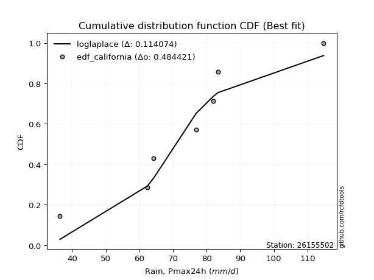</img>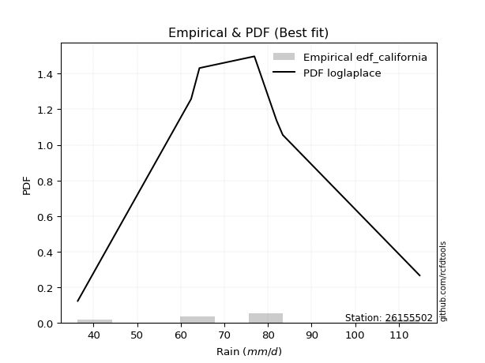</img>

</div>


### 2. EDF Hazen (1930)

Hazen method for plotting positions is a formula used to estimate the empirical cumulative probability distribution of flood events or other hydrological data. This formula often results in biased estimations, particularly when extrapolating to extreme events (high return periods).

<div align="center">


$P=(m-0.5)/n$


</div>


**2.1. Empirical values**

<div align="center">

|                | 0                   | 1                   | 2                   | 3         | 4                  | 5                  | 6                  |
|:---------------|:--------------------|:--------------------|:--------------------|:----------|:-------------------|:-------------------|:-------------------|
| date           | 2017                | 2022                | 2023                | 2021      | 2020               | 2019               | 2018               |
| x              | 36.4                | 62.4                | 64.3                | 76.9      | 82.0               | 83.4               | 114.8              |
| m              | 1                   | 2                   | 3                   | 4         | 5                  | 6                  | 7                  |
| empirical_dist | edf_hazen           | edf_hazen           | edf_hazen           | edf_hazen | edf_hazen          | edf_hazen          | edf_hazen          |
| empirical      | 0.07142857142857142 | 0.21428571428571427 | 0.35714285714285715 | 0.5       | 0.6428571428571429 | 0.7857142857142857 | 0.9285714285714286 |
| empirical_tr   | 1.0769230769230769  | 1.2727272727272727  | 1.5555555555555558  | 2.0       | 2.8000000000000003 | 4.666666666666666  | 14.000000000000007 |

</div>


**2.2. Kolmogorov-Smirnov fit test (sorted by Δ)**


<div align="center">

|                | 0                   | 1                   | 2                   | 3                   | 4                   | 5                   | 6                   | 7                   | 8                   | 9                   | 10                  | 11                  | 12                  | 13                  | 14                  | 15                  | 16                  | 17                  | 18                  | 19                  | 20                  | 21                  | 22                  | 23                  | 24                  | 25                  | 26                  | 27                  | 28                  | 29                  | 30                  | 31                  | 32                  | 33                  | 34                  | 35                  | 36                  | 37                  | 38                  | 39                  | 40                  | 41                  | 42                  | 43                  | 44                  | 45                  | 46                  | 47                  | 48                  | 49                  | 50                  | 51                  | 52                  | 53                  | 54                  | 55                  | 56                  | 57                  | 58                  | 59                  | 60                  | 61                  | 62                  | 63                  | 64                  | 65                  | 66                  | 67                  | 68                  | 69                  | 70                  | 71                  | 72                  | 73                  | 74                  | 75                  | 76                  | 77                  | 78                  | 79                  | 80                  | 81                  | 82                  | 83                  | 84                  | 85                  | 86                  | 87                  | 88                  | 89                  | 90                  | 91                  | 92                  | 93                  | 94                  | 95                  | 96                  | 97                  | 98                  | 99                  | 100                 | 101                 | 102                 | 103                 | 104                 | 105                 | 106                 | 107                 | 108                 | 109                 | 110                 | 111                 | 112                 | 113                 | 114                 | 115                 | 116                 | 117                 | 118                 | 119                 | 120                 | 121                 | 122                 | 123                 | 124                 | 125                 | 126                 | 127                 | 128                 | 129                 | 130                 | 131                 | 132                 | 133                 | 134                 | 135                 | 136                 | 137                 | 138                 | 139                 | 140                 | 141                 | 142                 | 143                 | 144                 | 145                 | 146                 | 147                 | 148                 | 149                 | 150                 | 151                 | 152                 | 153                 | 154                 | 155                 | 156                 | 157                 | 158                 | 159                 |
|:---------------|:--------------------|:--------------------|:--------------------|:--------------------|:--------------------|:--------------------|:--------------------|:--------------------|:--------------------|:--------------------|:--------------------|:--------------------|:--------------------|:--------------------|:--------------------|:--------------------|:--------------------|:--------------------|:--------------------|:--------------------|:--------------------|:--------------------|:--------------------|:--------------------|:--------------------|:--------------------|:--------------------|:--------------------|:--------------------|:--------------------|:--------------------|:--------------------|:--------------------|:--------------------|:--------------------|:--------------------|:--------------------|:--------------------|:--------------------|:--------------------|:--------------------|:--------------------|:--------------------|:--------------------|:--------------------|:--------------------|:--------------------|:--------------------|:--------------------|:--------------------|:--------------------|:--------------------|:--------------------|:--------------------|:--------------------|:--------------------|:--------------------|:--------------------|:--------------------|:--------------------|:--------------------|:--------------------|:--------------------|:--------------------|:--------------------|:--------------------|:--------------------|:--------------------|:--------------------|:--------------------|:--------------------|:--------------------|:--------------------|:--------------------|:--------------------|:--------------------|:--------------------|:--------------------|:--------------------|:--------------------|:--------------------|:--------------------|:--------------------|:--------------------|:--------------------|:--------------------|:--------------------|:--------------------|:--------------------|:--------------------|:--------------------|:--------------------|:--------------------|:--------------------|:--------------------|:--------------------|:--------------------|:--------------------|:--------------------|:--------------------|:--------------------|:--------------------|:--------------------|:--------------------|:--------------------|:--------------------|:--------------------|:--------------------|:--------------------|:--------------------|:--------------------|:--------------------|:--------------------|:--------------------|:--------------------|:--------------------|:--------------------|:--------------------|:--------------------|:--------------------|:--------------------|:--------------------|:--------------------|:--------------------|:--------------------|:--------------------|:--------------------|:--------------------|:--------------------|:--------------------|:--------------------|:--------------------|:--------------------|:--------------------|:--------------------|:--------------------|:--------------------|:--------------------|:--------------------|:--------------------|:--------------------|:--------------------|:--------------------|:--------------------|:--------------------|:--------------------|:--------------------|:--------------------|:--------------------|:--------------------|:--------------------|:--------------------|:--------------------|:--------------------|:--------------------|:--------------------|:--------------------|:--------------------|:--------------------|:--------------------|
| station        | 26155502            | 26155502            | 26155502            | 26155502            | 26155502            | 26155502            | 26155502            | 26155502            | 26155502            | 26155502            | 26155502            | 26155502            | 26155502            | 26155502            | 26155502            | 26155502            | 26155502            | 26155502            | 26155502            | 26155502            | 26155502            | 26155502            | 26155502            | 26155502            | 26155502            | 26155502            | 26155502            | 26155502            | 26155502            | 26155502            | 26155502            | 26155502            | 26155502            | 26155502            | 26155502            | 26155502            | 26155502            | 26155502            | 26155502            | 26155502            | 26155502            | 26155502            | 26155502            | 26155502            | 26155502            | 26155502            | 26155502            | 26155502            | 26155502            | 26155502            | 26155502            | 26155502            | 26155502            | 26155502            | 26155502            | 26155502            | 26155502            | 26155502            | 26155502            | 26155502            | 26155502            | 26155502            | 26155502            | 26155502            | 26155502            | 26155502            | 26155502            | 26155502            | 26155502            | 26155502            | 26155502            | 26155502            | 26155502            | 26155502            | 26155502            | 26155502            | 26155502            | 26155502            | 26155502            | 26155502            | 26155502            | 26155502            | 26155502            | 26155502            | 26155502            | 26155502            | 26155502            | 26155502            | 26155502            | 26155502            | 26155502            | 26155502            | 26155502            | 26155502            | 26155502            | 26155502            | 26155502            | 26155502            | 26155502            | 26155502            | 26155502            | 26155502            | 26155502            | 26155502            | 26155502            | 26155502            | 26155502            | 26155502            | 26155502            | 26155502            | 26155502            | 26155502            | 26155502            | 26155502            | 26155502            | 26155502            | 26155502            | 26155502            | 26155502            | 26155502            | 26155502            | 26155502            | 26155502            | 26155502            | 26155502            | 26155502            | 26155502            | 26155502            | 26155502            | 26155502            | 26155502            | 26155502            | 26155502            | 26155502            | 26155502            | 26155502            | 26155502            | 26155502            | 26155502            | 26155502            | 26155502            | 26155502            | 26155502            | 26155502            | 26155502            | 26155502            | 26155502            | 26155502            | 26155502            | 26155502            | 26155502            | 26155502            | 26155502            | 26155502            | 26155502            | 26155502            | 26155502            | 26155502            | 26155502            | 26155502            |
| empirical_dist | edf_hazen           | edf_hazen           | edf_hazen           | edf_hazen           | edf_hazen           | edf_hazen           | edf_hazen           | edf_hazen           | edf_hazen           | edf_hazen           | edf_hazen           | edf_hazen           | edf_hazen           | edf_hazen           | edf_hazen           | edf_hazen           | edf_hazen           | edf_hazen           | edf_hazen           | edf_hazen           | edf_hazen           | edf_hazen           | edf_hazen           | edf_hazen           | edf_hazen           | edf_hazen           | edf_hazen           | edf_hazen           | edf_hazen           | edf_hazen           | edf_hazen           | edf_hazen           | edf_hazen           | edf_hazen           | edf_hazen           | edf_hazen           | edf_hazen           | edf_hazen           | edf_hazen           | edf_hazen           | edf_hazen           | edf_hazen           | edf_hazen           | edf_hazen           | edf_hazen           | edf_hazen           | edf_hazen           | edf_hazen           | edf_hazen           | edf_hazen           | edf_hazen           | edf_hazen           | edf_hazen           | edf_hazen           | edf_hazen           | edf_hazen           | edf_hazen           | edf_hazen           | edf_hazen           | edf_hazen           | edf_hazen           | edf_hazen           | edf_hazen           | edf_hazen           | edf_hazen           | edf_hazen           | edf_hazen           | edf_hazen           | edf_hazen           | edf_hazen           | edf_hazen           | edf_hazen           | edf_hazen           | edf_hazen           | edf_hazen           | edf_hazen           | edf_hazen           | edf_hazen           | edf_hazen           | edf_hazen           | edf_hazen           | edf_hazen           | edf_hazen           | edf_hazen           | edf_hazen           | edf_hazen           | edf_hazen           | edf_hazen           | edf_hazen           | edf_hazen           | edf_hazen           | edf_hazen           | edf_hazen           | edf_hazen           | edf_hazen           | edf_hazen           | edf_hazen           | edf_hazen           | edf_hazen           | edf_hazen           | edf_hazen           | edf_hazen           | edf_hazen           | edf_hazen           | edf_hazen           | edf_hazen           | edf_hazen           | edf_hazen           | edf_hazen           | edf_hazen           | edf_hazen           | edf_hazen           | edf_hazen           | edf_hazen           | edf_hazen           | edf_hazen           | edf_hazen           | edf_hazen           | edf_hazen           | edf_hazen           | edf_hazen           | edf_hazen           | edf_hazen           | edf_hazen           | edf_hazen           | edf_hazen           | edf_hazen           | edf_hazen           | edf_hazen           | edf_hazen           | edf_hazen           | edf_hazen           | edf_hazen           | edf_hazen           | edf_hazen           | edf_hazen           | edf_hazen           | edf_hazen           | edf_hazen           | edf_hazen           | edf_hazen           | edf_hazen           | edf_hazen           | edf_hazen           | edf_hazen           | edf_hazen           | edf_hazen           | edf_hazen           | edf_hazen           | edf_hazen           | edf_hazen           | edf_hazen           | edf_hazen           | edf_hazen           | edf_hazen           | edf_hazen           | edf_hazen           | edf_hazen           | edf_hazen           | edf_hazen           |
| p_dist         | logjohnsonsu        | laplace             | hypsecant           | logburr             | logmielke           | burr                | mielke              | loggenlogistic      | genlogistic         | invgamma            | logistic            | maxwell             | alpha               | logskewnorm         | gumbel_r            | loggompertz         | skewnorm            | betaprime           | invgauss            | erlang              | gamma               | f                   | rice                | johnsonsu           | dweibull            | nct                 | loglogistic         | weibull_min         | rayleigh            | pearson3            | ncf                 | vonmises_line       | logweibull_min      | exponnorm           | gennorm             | logpearson3         | logloggamma         | loghypsecant        | logburr12           | logexponpow         | foldnorm            | crystalball         | norm                | truncnorm           | t                   | loggumbel_l         | loggengamma         | dgamma              | logt                | logexponnorm        | lognorm             | logcrystalball      | logfatiguelife      | logf                | lognct              | moyal               | logdweibull         | logdgamma           | loggennorm          | logtruncweibull_min | logerlang           | cosine              | logrice             | logloglaplace       | anglit              | halflogistic        | loggamma            | loggamma            | logweibull_max      | loggenextreme       | halfnorm            | loglaplace          | loglaplace          | logexponweib        | logargus            | loginvgamma         | logalpha            | semicircular        | kappa4              | loganglit           | kstwobign           | logsemicircular     | logmaxwell          | loginvgauss         | logbetaprime        | gumbel_l            | gausshyper          | logfoldnorm         | lograyleigh         | uniform             | loggumbel_r         | logcosine           | logtriang           | gompertz            | arcsine             | bradford            | logarcsine          | ksone               | loginvweibull       | logmoyal            | wrapcauchy          | wald                | logncf              | lognakagami         | loghalfnorm         | genpareto           | loghalflogistic     | truncexpon          | kappa3              | argus               | truncweibull_min    | logtruncnorm        | logkstwobign        | nakagami            | loggenexpon         | logkappa4           | logwald             | logkappa3           | logvonmises_line    | loguniform          | loggenhalflogistic  | logksone            | loglevy_l           | logwrapcauchy       | beta                | genexpon            | lomax               | logjohnsonsb        | loggausshyper       | levy_l              | logtukeylambda      | triang              | logtrapezoid        | genhalflogistic     | loggenpareto        | loglomax            | tukeylambda         | burr12              | logbradford         | logtruncexpon       | halfgennorm         | genextreme          | logbeta             | logrdist            | trapezoid           | johnsonsb           | invweibull          | exponweib           | gengamma            | rdist               | powerlaw            | fatiguelife         | logpowerlaw         | weibull_max         | truncpareto         | exponpow            | logtruncpareto      | loghalfgennorm      | logvonmises         | vonmises            |
| delta          | 0.08466506186361278 | 0.09253373113926422 | 0.09429493612518491 | 0.09879922022353849 | 0.09883894343722266 | 0.09978933411161306 | 0.09979302520680922 | 0.09980027133373148 | 0.10511017923131893 | 0.10842480691932188 | 0.10861383549003678 | 0.10939429721272162 | 0.10949615014935976 | 0.11365885181088553 | 0.11647916886133713 | 0.11663000636445411 | 0.11745732390073083 | 0.1179041219155138  | 0.11801042970804668 | 0.11908332376939368 | 0.11908345164689582 | 0.1190853616910551  | 0.11915617327482064 | 0.1192532930803829  | 0.11958784498567596 | 0.11976763326590933 | 0.12022091873713017 | 0.12025537605699133 | 0.12029353255518446 | 0.12042420601966108 | 0.12086261921553057 | 0.12186379614453552 | 0.12269496939975455 | 0.12340848208067112 | 0.12353568458946929 | 0.12369385046545356 | 0.12409571098406336 | 0.12480747514970081 | 0.1250028631818353  | 0.1260754403458969  | 0.12687396916439564 | 0.12726041189155568 | 0.12726041705839675 | 0.12726043282002586 | 0.127311742033955   | 0.1285986023571194  | 0.13465257922647902 | 0.1375307345538355  | 0.13786148009754354 | 0.1379660275415657  | 0.13796774141245996 | 0.13797092388973095 | 0.13858871592003688 | 0.13899990353272199 | 0.14032239278677114 | 0.1414353377499401  | 0.1443944295477584  | 0.144727849665084   | 0.14489651430800277 | 0.1454070167859508  | 0.1456325627310676  | 0.14709708199640414 | 0.1474518525125297  | 0.14785823047425184 | 0.1479664745138084  | 0.14848128540587083 | 0.1490907858059334  | 0.1490907858059334  | 0.14937235717385466 | 0.1493760512982183  | 0.15105182438313428 | 0.1520042916499026  | 0.1520042916499026  | 0.15321348488431588 | 0.15447314668092638 | 0.15525260610942906 | 0.1558921258327534  | 0.15667333844919595 | 0.15727015229915328 | 0.1575236141820948  | 0.160880347962476   | 0.16572604158702023 | 0.17003820968719005 | 0.17176095176266157 | 0.1729927329524054  | 0.17330951163317254 | 0.17407346633991072 | 0.18079853098826495 | 0.1821183041747181  | 0.18622448979591832 | 0.18695848976380738 | 0.18810698986231425 | 0.18943911280259496 | 0.19024069621950523 | 0.19249978743198182 | 0.1953188847915979  | 0.1992955867009871  | 0.20280612244897966 | 0.20470550399898038 | 0.20515571130076607 | 0.2078553507934554  | 0.210684023203221   | 0.21190930909647412 | 0.2142855264457836  | 0.21655286891543926 | 0.22078112190824675 | 0.22502891203017836 | 0.22532086579300728 | 0.23317710811727055 | 0.2351644776288765  | 0.23740647236100645 | 0.2388295681136709  | 0.2405073853293266  | 0.2456024784843659  | 0.24939174623183205 | 0.2500009152028816  | 0.2533910714078573  | 0.25395304805844376 | 0.2548826999207491  | 0.2549688950785912  | 0.2563368206662703  | 0.2600931268512071  | 0.26224915562822204 | 0.27543740392957017 | 0.27696116100486334 | 0.27708572358062933 | 0.2777542194410715  | 0.2939304493306697  | 0.29662625846700064 | 0.30698025536636897 | 0.3080369759594116  | 0.308204364966303   | 0.3167139511423233  | 0.3368130374038649  | 0.33838017748291305 | 0.3386380045413263  | 0.338815291716692   | 0.3410742133478003  | 0.34288632347386416 | 0.3490985384451164  | 0.3529641540203329  | 0.37986861956383844 | 0.4158465800439657  | 0.43510258341885244 | 0.445932358912953   | 0.4561852394077276  | 0.4866274971909428  | 0.5002891864604923  | 0.5033373995291118  | 0.5274203075726133  | 0.6131632954788702  | 0.6281086596172855  | 0.6557742203044155  | 0.6604046219018873  | 0.7067863983429657  | 0.7224365382474406  | 0.7304977657540762  | 0.7857142857142857  | 1.1312078840812057  | 17.82207480120851   |
| deltao         | 0.48442053926100004 | 0.48442053926100004 | 0.48442053926100004 | 0.48442053926100004 | 0.48442053926100004 | 0.48442053926100004 | 0.48442053926100004 | 0.48442053926100004 | 0.48442053926100004 | 0.48442053926100004 | 0.48442053926100004 | 0.48442053926100004 | 0.48442053926100004 | 0.48442053926100004 | 0.48442053926100004 | 0.48442053926100004 | 0.48442053926100004 | 0.48442053926100004 | 0.48442053926100004 | 0.48442053926100004 | 0.48442053926100004 | 0.48442053926100004 | 0.48442053926100004 | 0.48442053926100004 | 0.48442053926100004 | 0.48442053926100004 | 0.48442053926100004 | 0.48442053926100004 | 0.48442053926100004 | 0.48442053926100004 | 0.48442053926100004 | 0.48442053926100004 | 0.48442053926100004 | 0.48442053926100004 | 0.48442053926100004 | 0.48442053926100004 | 0.48442053926100004 | 0.48442053926100004 | 0.48442053926100004 | 0.48442053926100004 | 0.48442053926100004 | 0.48442053926100004 | 0.48442053926100004 | 0.48442053926100004 | 0.48442053926100004 | 0.48442053926100004 | 0.48442053926100004 | 0.48442053926100004 | 0.48442053926100004 | 0.48442053926100004 | 0.48442053926100004 | 0.48442053926100004 | 0.48442053926100004 | 0.48442053926100004 | 0.48442053926100004 | 0.48442053926100004 | 0.48442053926100004 | 0.48442053926100004 | 0.48442053926100004 | 0.48442053926100004 | 0.48442053926100004 | 0.48442053926100004 | 0.48442053926100004 | 0.48442053926100004 | 0.48442053926100004 | 0.48442053926100004 | 0.48442053926100004 | 0.48442053926100004 | 0.48442053926100004 | 0.48442053926100004 | 0.48442053926100004 | 0.48442053926100004 | 0.48442053926100004 | 0.48442053926100004 | 0.48442053926100004 | 0.48442053926100004 | 0.48442053926100004 | 0.48442053926100004 | 0.48442053926100004 | 0.48442053926100004 | 0.48442053926100004 | 0.48442053926100004 | 0.48442053926100004 | 0.48442053926100004 | 0.48442053926100004 | 0.48442053926100004 | 0.48442053926100004 | 0.48442053926100004 | 0.48442053926100004 | 0.48442053926100004 | 0.48442053926100004 | 0.48442053926100004 | 0.48442053926100004 | 0.48442053926100004 | 0.48442053926100004 | 0.48442053926100004 | 0.48442053926100004 | 0.48442053926100004 | 0.48442053926100004 | 0.48442053926100004 | 0.48442053926100004 | 0.48442053926100004 | 0.48442053926100004 | 0.48442053926100004 | 0.48442053926100004 | 0.48442053926100004 | 0.48442053926100004 | 0.48442053926100004 | 0.48442053926100004 | 0.48442053926100004 | 0.48442053926100004 | 0.48442053926100004 | 0.48442053926100004 | 0.48442053926100004 | 0.48442053926100004 | 0.48442053926100004 | 0.48442053926100004 | 0.48442053926100004 | 0.48442053926100004 | 0.48442053926100004 | 0.48442053926100004 | 0.48442053926100004 | 0.48442053926100004 | 0.48442053926100004 | 0.48442053926100004 | 0.48442053926100004 | 0.48442053926100004 | 0.48442053926100004 | 0.48442053926100004 | 0.48442053926100004 | 0.48442053926100004 | 0.48442053926100004 | 0.48442053926100004 | 0.48442053926100004 | 0.48442053926100004 | 0.48442053926100004 | 0.48442053926100004 | 0.48442053926100004 | 0.48442053926100004 | 0.48442053926100004 | 0.48442053926100004 | 0.48442053926100004 | 0.48442053926100004 | 0.48442053926100004 | 0.48442053926100004 | 0.48442053926100004 | 0.48442053926100004 | 0.48442053926100004 | 0.48442053926100004 | 0.48442053926100004 | 0.48442053926100004 | 0.48442053926100004 | 0.48442053926100004 | 0.48442053926100004 | 0.48442053926100004 | 0.48442053926100004 | 0.48442053926100004 | 0.48442053926100004 | 0.48442053926100004 | 0.48442053926100004 |
| eval           | Δo > Δ              | Δo > Δ              | Δo > Δ              | Δo > Δ              | Δo > Δ              | Δo > Δ              | Δo > Δ              | Δo > Δ              | Δo > Δ              | Δo > Δ              | Δo > Δ              | Δo > Δ              | Δo > Δ              | Δo > Δ              | Δo > Δ              | Δo > Δ              | Δo > Δ              | Δo > Δ              | Δo > Δ              | Δo > Δ              | Δo > Δ              | Δo > Δ              | Δo > Δ              | Δo > Δ              | Δo > Δ              | Δo > Δ              | Δo > Δ              | Δo > Δ              | Δo > Δ              | Δo > Δ              | Δo > Δ              | Δo > Δ              | Δo > Δ              | Δo > Δ              | Δo > Δ              | Δo > Δ              | Δo > Δ              | Δo > Δ              | Δo > Δ              | Δo > Δ              | Δo > Δ              | Δo > Δ              | Δo > Δ              | Δo > Δ              | Δo > Δ              | Δo > Δ              | Δo > Δ              | Δo > Δ              | Δo > Δ              | Δo > Δ              | Δo > Δ              | Δo > Δ              | Δo > Δ              | Δo > Δ              | Δo > Δ              | Δo > Δ              | Δo > Δ              | Δo > Δ              | Δo > Δ              | Δo > Δ              | Δo > Δ              | Δo > Δ              | Δo > Δ              | Δo > Δ              | Δo > Δ              | Δo > Δ              | Δo > Δ              | Δo > Δ              | Δo > Δ              | Δo > Δ              | Δo > Δ              | Δo > Δ              | Δo > Δ              | Δo > Δ              | Δo > Δ              | Δo > Δ              | Δo > Δ              | Δo > Δ              | Δo > Δ              | Δo > Δ              | Δo > Δ              | Δo > Δ              | Δo > Δ              | Δo > Δ              | Δo > Δ              | Δo > Δ              | Δo > Δ              | Δo > Δ              | Δo > Δ              | Δo > Δ              | Δo > Δ              | Δo > Δ              | Δo > Δ              | Δo > Δ              | Δo > Δ              | Δo > Δ              | Δo > Δ              | Δo > Δ              | Δo > Δ              | Δo > Δ              | Δo > Δ              | Δo > Δ              | Δo > Δ              | Δo > Δ              | Δo > Δ              | Δo > Δ              | Δo > Δ              | Δo > Δ              | Δo > Δ              | Δo > Δ              | Δo > Δ              | Δo > Δ              | Δo > Δ              | Δo > Δ              | Δo > Δ              | Δo > Δ              | Δo > Δ              | Δo > Δ              | Δo > Δ              | Δo > Δ              | Δo > Δ              | Δo > Δ              | Δo > Δ              | Δo > Δ              | Δo > Δ              | Δo > Δ              | Δo > Δ              | Δo > Δ              | Δo > Δ              | Δo > Δ              | Δo > Δ              | Δo > Δ              | Δo > Δ              | Δo > Δ              | Δo > Δ              | Δo > Δ              | Δo > Δ              | Δo > Δ              | Δo > Δ              | Δo > Δ              | Δo > Δ              | Δo > Δ              | Δo > Δ              | Δo > Δ              | Δo > Δ              | Δo > Δ              | Δo <= Δ             | Δo <= Δ             | Δo <= Δ             | Δo <= Δ             | Δo <= Δ             | Δo <= Δ             | Δo <= Δ             | Δo <= Δ             | Δo <= Δ             | Δo <= Δ             | Δo <= Δ             | Δo <= Δ             | Δo <= Δ             | Δo <= Δ             |
| fit            | 1                   | 1                   | 1                   | 1                   | 1                   | 1                   | 1                   | 1                   | 1                   | 1                   | 1                   | 1                   | 1                   | 1                   | 1                   | 1                   | 1                   | 1                   | 1                   | 1                   | 1                   | 1                   | 1                   | 1                   | 1                   | 1                   | 1                   | 1                   | 1                   | 1                   | 1                   | 1                   | 1                   | 1                   | 1                   | 1                   | 1                   | 1                   | 1                   | 1                   | 1                   | 1                   | 1                   | 1                   | 1                   | 1                   | 1                   | 1                   | 1                   | 1                   | 1                   | 1                   | 1                   | 1                   | 1                   | 1                   | 1                   | 1                   | 1                   | 1                   | 1                   | 1                   | 1                   | 1                   | 1                   | 1                   | 1                   | 1                   | 1                   | 1                   | 1                   | 1                   | 1                   | 1                   | 1                   | 1                   | 1                   | 1                   | 1                   | 1                   | 1                   | 1                   | 1                   | 1                   | 1                   | 1                   | 1                   | 1                   | 1                   | 1                   | 1                   | 1                   | 1                   | 1                   | 1                   | 1                   | 1                   | 1                   | 1                   | 1                   | 1                   | 1                   | 1                   | 1                   | 1                   | 1                   | 1                   | 1                   | 1                   | 1                   | 1                   | 1                   | 1                   | 1                   | 1                   | 1                   | 1                   | 1                   | 1                   | 1                   | 1                   | 1                   | 1                   | 1                   | 1                   | 1                   | 1                   | 1                   | 1                   | 1                   | 1                   | 1                   | 1                   | 1                   | 1                   | 1                   | 1                   | 1                   | 1                   | 1                   | 1                   | 1                   | 1                   | 1                   | 1                   | 1                   | 0                   | 0                   | 0                   | 0                   | 0                   | 0                   | 0                   | 0                   | 0                   | 0                   | 0                   | 0                   | 0                   | 0                   |
| n              | 7                   | 7                   | 7                   | 7                   | 7                   | 7                   | 7                   | 7                   | 7                   | 7                   | 7                   | 7                   | 7                   | 7                   | 7                   | 7                   | 7                   | 7                   | 7                   | 7                   | 7                   | 7                   | 7                   | 7                   | 7                   | 7                   | 7                   | 7                   | 7                   | 7                   | 7                   | 7                   | 7                   | 7                   | 7                   | 7                   | 7                   | 7                   | 7                   | 7                   | 7                   | 7                   | 7                   | 7                   | 7                   | 7                   | 7                   | 7                   | 7                   | 7                   | 7                   | 7                   | 7                   | 7                   | 7                   | 7                   | 7                   | 7                   | 7                   | 7                   | 7                   | 7                   | 7                   | 7                   | 7                   | 7                   | 7                   | 7                   | 7                   | 7                   | 7                   | 7                   | 7                   | 7                   | 7                   | 7                   | 7                   | 7                   | 7                   | 7                   | 7                   | 7                   | 7                   | 7                   | 7                   | 7                   | 7                   | 7                   | 7                   | 7                   | 7                   | 7                   | 7                   | 7                   | 7                   | 7                   | 7                   | 7                   | 7                   | 7                   | 7                   | 7                   | 7                   | 7                   | 7                   | 7                   | 7                   | 7                   | 7                   | 7                   | 7                   | 7                   | 7                   | 7                   | 7                   | 7                   | 7                   | 7                   | 7                   | 7                   | 7                   | 7                   | 7                   | 7                   | 7                   | 7                   | 7                   | 7                   | 7                   | 7                   | 7                   | 7                   | 7                   | 7                   | 7                   | 7                   | 7                   | 7                   | 7                   | 7                   | 7                   | 7                   | 7                   | 7                   | 7                   | 7                   | 7                   | 7                   | 7                   | 7                   | 7                   | 7                   | 7                   | 7                   | 7                   | 7                   | 7                   | 7                   | 7                   | 7                   |
| best_fit       | 1                   | 0                   | 0                   | 0                   | 0                   | 0                   | 0                   | 0                   | 0                   | 0                   | 0                   | 0                   | 0                   | 0                   | 0                   | 0                   | 0                   | 0                   | 0                   | 0                   | 0                   | 0                   | 0                   | 0                   | 0                   | 0                   | 0                   | 0                   | 0                   | 0                   | 0                   | 0                   | 0                   | 0                   | 0                   | 0                   | 0                   | 0                   | 0                   | 0                   | 0                   | 0                   | 0                   | 0                   | 0                   | 0                   | 0                   | 0                   | 0                   | 0                   | 0                   | 0                   | 0                   | 0                   | 0                   | 0                   | 0                   | 0                   | 0                   | 0                   | 0                   | 0                   | 0                   | 0                   | 0                   | 0                   | 0                   | 0                   | 0                   | 0                   | 0                   | 0                   | 0                   | 0                   | 0                   | 0                   | 0                   | 0                   | 0                   | 0                   | 0                   | 0                   | 0                   | 0                   | 0                   | 0                   | 0                   | 0                   | 0                   | 0                   | 0                   | 0                   | 0                   | 0                   | 0                   | 0                   | 0                   | 0                   | 0                   | 0                   | 0                   | 0                   | 0                   | 0                   | 0                   | 0                   | 0                   | 0                   | 0                   | 0                   | 0                   | 0                   | 0                   | 0                   | 0                   | 0                   | 0                   | 0                   | 0                   | 0                   | 0                   | 0                   | 0                   | 0                   | 0                   | 0                   | 0                   | 0                   | 0                   | 0                   | 0                   | 0                   | 0                   | 0                   | 0                   | 0                   | 0                   | 0                   | 0                   | 0                   | 0                   | 0                   | 0                   | 0                   | 0                   | 0                   | 0                   | 0                   | 0                   | 0                   | 0                   | 0                   | 0                   | 0                   | 0                   | 0                   | 0                   | 0                   | 0                   | 0                   |
| best_fit_sort  | 1                   | 2                   | 3                   | 4                   | 5                   | 6                   | 7                   | 8                   | 9                   | 10                  | 11                  | 12                  | 13                  | 14                  | 15                  | 16                  | 17                  | 18                  | 19                  | 20                  | 21                  | 22                  | 23                  | 24                  | 25                  | 26                  | 27                  | 28                  | 29                  | 30                  | 31                  | 32                  | 33                  | 34                  | 35                  | 36                  | 37                  | 38                  | 39                  | 40                  | 41                  | 42                  | 43                  | 44                  | 45                  | 46                  | 47                  | 48                  | 49                  | 50                  | 51                  | 52                  | 53                  | 54                  | 55                  | 56                  | 57                  | 58                  | 59                  | 60                  | 61                  | 62                  | 63                  | 64                  | 65                  | 66                  | 67                  | 68                  | 69                  | 70                  | 71                  | 72                  | 73                  | 74                  | 75                  | 76                  | 77                  | 78                  | 79                  | 80                  | 81                  | 82                  | 83                  | 84                  | 85                  | 86                  | 87                  | 88                  | 89                  | 90                  | 91                  | 92                  | 93                  | 94                  | 95                  | 96                  | 97                  | 98                  | 99                  | 100                 | 101                 | 102                 | 103                 | 104                 | 105                 | 106                 | 107                 | 108                 | 109                 | 110                 | 111                 | 112                 | 113                 | 114                 | 115                 | 116                 | 117                 | 118                 | 119                 | 120                 | 121                 | 122                 | 123                 | 124                 | 125                 | 126                 | 127                 | 128                 | 129                 | 130                 | 131                 | 132                 | 133                 | 134                 | 135                 | 136                 | 137                 | 138                 | 139                 | 140                 | 141                 | 142                 | 143                 | 144                 | 145                 | 146                 | 147                 | 148                 | 149                 | 150                 | 151                 | 152                 | 153                 | 154                 | 155                 | 156                 | 157                 | 158                 | 159                 | 160                 |

</div>


**2.3. Best fit**

<div align="center">

|   id |   station | empirical_dist   | p_dist       |     delta |   deltao | eval   |   fit |   n |   best_fit |   best_fit_sort |
|-----:|----------:|:-----------------|:-------------|----------:|---------:|:-------|------:|----:|-----------:|----------------:|
|    0 |  26155502 | edf_hazen        | logjohnsonsu | 0.0846651 | 0.484421 | Δo > Δ |     1 |   7 |          1 |               1 |

</div>


<div align="center">

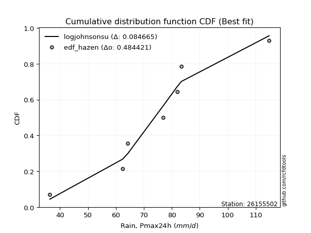</img></img>

</div>


### 3. EDF Weibull (1939)

Weibull plotting position formula is an empirical method used to estimate the non-exceedance probability or plotting position for a set of observed data, is often recommended or widely used in practice, particularly in flood frequency analysis.

<div align="center">


$P=m/(n+1)$


</div>


**3.1. Empirical values**

<div align="center">

|                | 0                  | 1                  | 2           | 3           | 4                  | 5           | 6           |
|:---------------|:-------------------|:-------------------|:------------|:------------|:-------------------|:------------|:------------|
| date           | 2017               | 2022               | 2023        | 2021        | 2020               | 2019        | 2018        |
| x              | 36.4               | 62.4               | 64.3        | 76.9        | 82.0               | 83.4        | 114.8       |
| m              | 1                  | 2                  | 3           | 4           | 5                  | 6           | 7           |
| empirical_dist | edf_weibull        | edf_weibull        | edf_weibull | edf_weibull | edf_weibull        | edf_weibull | edf_weibull |
| empirical      | 0.125              | 0.25               | 0.375       | 0.5         | 0.625              | 0.75        | 0.875       |
| empirical_tr   | 1.1428571428571428 | 1.3333333333333333 | 1.6         | 2.0         | 2.6666666666666665 | 4.0         | 8.0         |

</div>


**3.2. Kolmogorov-Smirnov fit test (sorted by Δ)**


<div align="center">

|                | 0                   | 1                   | 2                   | 3                   | 4                   | 5                   | 6                   | 7                   | 8                   | 9                   | 10                  | 11                  | 12                  | 13                  | 14                  | 15                  | 16                  | 17                  | 18                  | 19                  | 20                  | 21                  | 22                  | 23                  | 24                  | 25                  | 26                  | 27                  | 28                  | 29                  | 30                  | 31                  | 32                  | 33                  | 34                  | 35                  | 36                  | 37                  | 38                  | 39                  | 40                  | 41                  | 42                  | 43                  | 44                  | 45                  | 46                  | 47                  | 48                  | 49                  | 50                  | 51                  | 52                  | 53                  | 54                  | 55                  | 56                  | 57                  | 58                  | 59                  | 60                  | 61                  | 62                  | 63                  | 64                  | 65                  | 66                  | 67                  | 68                  | 69                  | 70                  | 71                  | 72                  | 73                  | 74                  | 75                  | 76                  | 77                  | 78                  | 79                  | 80                  | 81                  | 82                  | 83                  | 84                  | 85                  | 86                  | 87                  | 88                  | 89                  | 90                  | 91                  | 92                  | 93                  | 94                  | 95                  | 96                  | 97                  | 98                  | 99                  | 100                 | 101                 | 102                 | 103                 | 104                 | 105                 | 106                 | 107                 | 108                 | 109                 | 110                 | 111                 | 112                 | 113                 | 114                 | 115                 | 116                 | 117                 | 118                 | 119                 | 120                 | 121                 | 122                 | 123                 | 124                 | 125                 | 126                 | 127                 | 128                 | 129                 | 130                 | 131                 | 132                 | 133                 | 134                 | 135                 | 136                 | 137                 | 138                 | 139                 | 140                 | 141                 | 142                 | 143                 | 144                 | 145                 | 146                 | 147                 | 148                 | 149                 | 150                 | 151                 | 152                 | 153                 | 154                 | 155                 | 156                 | 157                 | 158                 | 159                 |
|:---------------|:--------------------|:--------------------|:--------------------|:--------------------|:--------------------|:--------------------|:--------------------|:--------------------|:--------------------|:--------------------|:--------------------|:--------------------|:--------------------|:--------------------|:--------------------|:--------------------|:--------------------|:--------------------|:--------------------|:--------------------|:--------------------|:--------------------|:--------------------|:--------------------|:--------------------|:--------------------|:--------------------|:--------------------|:--------------------|:--------------------|:--------------------|:--------------------|:--------------------|:--------------------|:--------------------|:--------------------|:--------------------|:--------------------|:--------------------|:--------------------|:--------------------|:--------------------|:--------------------|:--------------------|:--------------------|:--------------------|:--------------------|:--------------------|:--------------------|:--------------------|:--------------------|:--------------------|:--------------------|:--------------------|:--------------------|:--------------------|:--------------------|:--------------------|:--------------------|:--------------------|:--------------------|:--------------------|:--------------------|:--------------------|:--------------------|:--------------------|:--------------------|:--------------------|:--------------------|:--------------------|:--------------------|:--------------------|:--------------------|:--------------------|:--------------------|:--------------------|:--------------------|:--------------------|:--------------------|:--------------------|:--------------------|:--------------------|:--------------------|:--------------------|:--------------------|:--------------------|:--------------------|:--------------------|:--------------------|:--------------------|:--------------------|:--------------------|:--------------------|:--------------------|:--------------------|:--------------------|:--------------------|:--------------------|:--------------------|:--------------------|:--------------------|:--------------------|:--------------------|:--------------------|:--------------------|:--------------------|:--------------------|:--------------------|:--------------------|:--------------------|:--------------------|:--------------------|:--------------------|:--------------------|:--------------------|:--------------------|:--------------------|:--------------------|:--------------------|:--------------------|:--------------------|:--------------------|:--------------------|:--------------------|:--------------------|:--------------------|:--------------------|:--------------------|:--------------------|:--------------------|:--------------------|:--------------------|:--------------------|:--------------------|:--------------------|:--------------------|:--------------------|:--------------------|:--------------------|:--------------------|:--------------------|:--------------------|:--------------------|:--------------------|:--------------------|:--------------------|:--------------------|:--------------------|:--------------------|:--------------------|:--------------------|:--------------------|:--------------------|:--------------------|:--------------------|:--------------------|:--------------------|:--------------------|:--------------------|:--------------------|
| station        | 26155502            | 26155502            | 26155502            | 26155502            | 26155502            | 26155502            | 26155502            | 26155502            | 26155502            | 26155502            | 26155502            | 26155502            | 26155502            | 26155502            | 26155502            | 26155502            | 26155502            | 26155502            | 26155502            | 26155502            | 26155502            | 26155502            | 26155502            | 26155502            | 26155502            | 26155502            | 26155502            | 26155502            | 26155502            | 26155502            | 26155502            | 26155502            | 26155502            | 26155502            | 26155502            | 26155502            | 26155502            | 26155502            | 26155502            | 26155502            | 26155502            | 26155502            | 26155502            | 26155502            | 26155502            | 26155502            | 26155502            | 26155502            | 26155502            | 26155502            | 26155502            | 26155502            | 26155502            | 26155502            | 26155502            | 26155502            | 26155502            | 26155502            | 26155502            | 26155502            | 26155502            | 26155502            | 26155502            | 26155502            | 26155502            | 26155502            | 26155502            | 26155502            | 26155502            | 26155502            | 26155502            | 26155502            | 26155502            | 26155502            | 26155502            | 26155502            | 26155502            | 26155502            | 26155502            | 26155502            | 26155502            | 26155502            | 26155502            | 26155502            | 26155502            | 26155502            | 26155502            | 26155502            | 26155502            | 26155502            | 26155502            | 26155502            | 26155502            | 26155502            | 26155502            | 26155502            | 26155502            | 26155502            | 26155502            | 26155502            | 26155502            | 26155502            | 26155502            | 26155502            | 26155502            | 26155502            | 26155502            | 26155502            | 26155502            | 26155502            | 26155502            | 26155502            | 26155502            | 26155502            | 26155502            | 26155502            | 26155502            | 26155502            | 26155502            | 26155502            | 26155502            | 26155502            | 26155502            | 26155502            | 26155502            | 26155502            | 26155502            | 26155502            | 26155502            | 26155502            | 26155502            | 26155502            | 26155502            | 26155502            | 26155502            | 26155502            | 26155502            | 26155502            | 26155502            | 26155502            | 26155502            | 26155502            | 26155502            | 26155502            | 26155502            | 26155502            | 26155502            | 26155502            | 26155502            | 26155502            | 26155502            | 26155502            | 26155502            | 26155502            | 26155502            | 26155502            | 26155502            | 26155502            | 26155502            | 26155502            |
| empirical_dist | edf_weibull         | edf_weibull         | edf_weibull         | edf_weibull         | edf_weibull         | edf_weibull         | edf_weibull         | edf_weibull         | edf_weibull         | edf_weibull         | edf_weibull         | edf_weibull         | edf_weibull         | edf_weibull         | edf_weibull         | edf_weibull         | edf_weibull         | edf_weibull         | edf_weibull         | edf_weibull         | edf_weibull         | edf_weibull         | edf_weibull         | edf_weibull         | edf_weibull         | edf_weibull         | edf_weibull         | edf_weibull         | edf_weibull         | edf_weibull         | edf_weibull         | edf_weibull         | edf_weibull         | edf_weibull         | edf_weibull         | edf_weibull         | edf_weibull         | edf_weibull         | edf_weibull         | edf_weibull         | edf_weibull         | edf_weibull         | edf_weibull         | edf_weibull         | edf_weibull         | edf_weibull         | edf_weibull         | edf_weibull         | edf_weibull         | edf_weibull         | edf_weibull         | edf_weibull         | edf_weibull         | edf_weibull         | edf_weibull         | edf_weibull         | edf_weibull         | edf_weibull         | edf_weibull         | edf_weibull         | edf_weibull         | edf_weibull         | edf_weibull         | edf_weibull         | edf_weibull         | edf_weibull         | edf_weibull         | edf_weibull         | edf_weibull         | edf_weibull         | edf_weibull         | edf_weibull         | edf_weibull         | edf_weibull         | edf_weibull         | edf_weibull         | edf_weibull         | edf_weibull         | edf_weibull         | edf_weibull         | edf_weibull         | edf_weibull         | edf_weibull         | edf_weibull         | edf_weibull         | edf_weibull         | edf_weibull         | edf_weibull         | edf_weibull         | edf_weibull         | edf_weibull         | edf_weibull         | edf_weibull         | edf_weibull         | edf_weibull         | edf_weibull         | edf_weibull         | edf_weibull         | edf_weibull         | edf_weibull         | edf_weibull         | edf_weibull         | edf_weibull         | edf_weibull         | edf_weibull         | edf_weibull         | edf_weibull         | edf_weibull         | edf_weibull         | edf_weibull         | edf_weibull         | edf_weibull         | edf_weibull         | edf_weibull         | edf_weibull         | edf_weibull         | edf_weibull         | edf_weibull         | edf_weibull         | edf_weibull         | edf_weibull         | edf_weibull         | edf_weibull         | edf_weibull         | edf_weibull         | edf_weibull         | edf_weibull         | edf_weibull         | edf_weibull         | edf_weibull         | edf_weibull         | edf_weibull         | edf_weibull         | edf_weibull         | edf_weibull         | edf_weibull         | edf_weibull         | edf_weibull         | edf_weibull         | edf_weibull         | edf_weibull         | edf_weibull         | edf_weibull         | edf_weibull         | edf_weibull         | edf_weibull         | edf_weibull         | edf_weibull         | edf_weibull         | edf_weibull         | edf_weibull         | edf_weibull         | edf_weibull         | edf_weibull         | edf_weibull         | edf_weibull         | edf_weibull         | edf_weibull         | edf_weibull         | edf_weibull         |
| p_dist         | logjohnsonsu        | mielke              | loggenlogistic      | burr                | genlogistic         | gamma               | erlang              | f                   | skewnorm            | johnsonsu           | pearson3            | logmielke           | logburr             | nct                 | logweibull_min      | logpearson3         | logloggamma         | hypsecant           | exponnorm           | logburr12           | alpha               | logistic            | logskewnorm         | invgamma            | foldnorm            | crystalball         | norm                | truncnorm           | t                   | betaprime           | weibull_min         | logexponpow         | invgauss            | rice                | dweibull            | ncf                 | loggumbel_l         | dgamma              | maxwell             | lognorm             | logexponnorm        | logcrystalball      | logt                | logf                | logfatiguelife      | loggengamma         | lognct              | logerlang           | laplace             | cosine              | logrice             | anglit              | loggamma            | loggamma            | logweibull_max      | loggenextreme       | loglogistic         | rayleigh            | logexponweib        | gumbel_r            | logargus            | loginvgamma         | logalpha            | semicircular        | loganglit           | loghypsecant        | loggompertz         | logtruncweibull_min | kappa4              | halfnorm            | kstwobign           | logsemicircular     | loggennorm          | logmaxwell          | logloglaplace       | loginvgauss         | logbetaprime        | gumbel_l            | gausshyper          | vonmises_line       | gennorm             | moyal               | halflogistic        | logfoldnorm         | lograyleigh         | uniform             | loglaplace          | loglaplace          | logcosine           | logtriang           | gompertz            | arcsine             | bradford            | logdweibull         | logdgamma           | logarcsine          | ksone               | loggumbel_r         | loginvweibull       | wrapcauchy          | logncf              | loghalfnorm         | genpareto           | loghalflogistic     | truncexpon          | logmoyal            | kappa3              | argus               | truncweibull_min    | logkstwobign        | loglevy_l           | wald                | loggenexpon         | logkappa4           | logkappa3           | logvonmises_line    | loguniform          | loggenhalflogistic  | logksone            | logwrapcauchy       | beta                | genexpon            | lomax               | nakagami            | lognakagami         | logwald             | levy_l              | logtruncnorm        | logjohnsonsb        | loggausshyper       | triang              | logtrapezoid        | loggenpareto        | genhalflogistic     | loglomax            | burr12              | logbradford         | logtruncexpon       | logtukeylambda      | halfgennorm         | tukeylambda         | genextreme          | logbeta             | logrdist            | trapezoid           | johnsonsb           | invweibull          | exponweib           | gengamma            | rdist               | powerlaw            | fatiguelife         | logpowerlaw         | weibull_max         | truncpareto         | exponpow            | logtruncpareto      | loghalfgennorm      | logvonmises         | vonmises            |
| delta          | 0.08137894640939602 | 0.08555238682868971 | 0.08555608148260985 | 0.08555971428068576 | 0.08561795319465237 | 0.08603172047315621 | 0.08603172993774089 | 0.08603432899388463 | 0.08610885289966527 | 0.08639745371778385 | 0.08680451164078362 | 0.08693215752161693 | 0.08701679652668634 | 0.0870641221450762  | 0.0877490464018058  | 0.0881625598578618  | 0.08838142526977766 | 0.0884902711651534  | 0.08879337917084784 | 0.08928857746754959 | 0.08934702321108795 | 0.08941346996383415 | 0.08952819368470902 | 0.09082736639086365 | 0.09115968345010994 | 0.09154612617726998 | 0.09154613134411105 | 0.09154614710574016 | 0.09159745631966931 | 0.09162373755153067 | 0.09167590050801214 | 0.09214269887124607 | 0.09251653798236534 | 0.0959072913301708  | 0.09824482642316368 | 0.09839052203166135 | 0.1008388670963477  | 0.10192621225771636 | 0.10240317785445364 | 0.10323822951172462 | 0.10323872172682569 | 0.10323947604004641 | 0.10324157038470752 | 0.10328561781843626 | 0.1033149556125578  | 0.10336493973930141 | 0.10460810707248541 | 0.10991827701678186 | 0.11039087399640707 | 0.11138279628211845 | 0.11173756679824398 | 0.1122521887995227  | 0.11337650009164768 | 0.11337650009164768 | 0.11365807145956897 | 0.1136617655839326  | 0.114156771741597   | 0.11562875107714654 | 0.11749919917003016 | 0.11820440767491804 | 0.11875886096664068 | 0.11953832039514334 | 0.12017784011846766 | 0.12095905273491026 | 0.12180932846780906 | 0.12480747514970081 | 0.12499998109127247 | 0.12499999994184852 | 0.12499999999999198 | 0.125               | 0.12516606224819027 | 0.1300117558727345  | 0.13308990394557751 | 0.13432392397290432 | 0.13479256434011197 | 0.13604666604837584 | 0.13727844723811966 | 0.13759522591888684 | 0.13835918062562502 | 0.13972093900167837 | 0.14139282744661213 | 0.1414353377499401  | 0.14172069410691335 | 0.14508424527397923 | 0.14640401846043238 | 0.15051020408163263 | 0.1520042916499026  | 0.1520042916499026  | 0.15239270414802852 | 0.15372482708830926 | 0.15452641050521954 | 0.15678550171769612 | 0.15960459907731217 | 0.16225157240490126 | 0.16258499252222686 | 0.16358130098670137 | 0.16709183673469397 | 0.16752326378446059 | 0.16899121828469466 | 0.1721410650791697  | 0.1761950233821884  | 0.18083858320115354 | 0.18506683619396103 | 0.18931462631589263 | 0.18960658007872155 | 0.19019587649491299 | 0.19746282240298485 | 0.1994501919145908  | 0.20169218664672073 | 0.20479309961504089 | 0.20867772705679344 | 0.210684023203221   | 0.21367746051754632 | 0.2142866294885959  | 0.218238762344158   | 0.21916841420646332 | 0.21925460936430552 | 0.22062253495198458 | 0.22437884113692136 | 0.23972311821528441 | 0.24124687529057764 | 0.24137143786634363 | 0.24203993372678578 | 0.2499995731087436  | 0.24999981216006933 | 0.2533910714078573  | 0.25340882679494037 | 0.25668671097081375 | 0.258216163616384   | 0.26091197275271494 | 0.2724900792520173  | 0.2809996654280376  | 0.28480874891148444 | 0.3010987516895792  | 0.3029237188270406  | 0.3053599276335146  | 0.30717203775957846 | 0.3133842527308307  | 0.31626245847949264 | 0.3172498683060472  | 0.338815291716692   | 0.34415433384955274 | 0.38013229432968    | 0.39938829770456674 | 0.4102180731986673  | 0.4204709536934419  | 0.4330560686195142  | 0.46457490074620655 | 0.46762311381482613 | 0.4999999968449127  | 0.5774490097645845  | 0.5923943739029998  | 0.6200599345901298  | 0.6246903361876015  | 0.67107211262868    | 0.6867222525331549  | 0.6947834800397905  | 0.75                | 1.0975270388957092  | 17.87564622977994   |
| deltao         | 0.48442053926100004 | 0.48442053926100004 | 0.48442053926100004 | 0.48442053926100004 | 0.48442053926100004 | 0.48442053926100004 | 0.48442053926100004 | 0.48442053926100004 | 0.48442053926100004 | 0.48442053926100004 | 0.48442053926100004 | 0.48442053926100004 | 0.48442053926100004 | 0.48442053926100004 | 0.48442053926100004 | 0.48442053926100004 | 0.48442053926100004 | 0.48442053926100004 | 0.48442053926100004 | 0.48442053926100004 | 0.48442053926100004 | 0.48442053926100004 | 0.48442053926100004 | 0.48442053926100004 | 0.48442053926100004 | 0.48442053926100004 | 0.48442053926100004 | 0.48442053926100004 | 0.48442053926100004 | 0.48442053926100004 | 0.48442053926100004 | 0.48442053926100004 | 0.48442053926100004 | 0.48442053926100004 | 0.48442053926100004 | 0.48442053926100004 | 0.48442053926100004 | 0.48442053926100004 | 0.48442053926100004 | 0.48442053926100004 | 0.48442053926100004 | 0.48442053926100004 | 0.48442053926100004 | 0.48442053926100004 | 0.48442053926100004 | 0.48442053926100004 | 0.48442053926100004 | 0.48442053926100004 | 0.48442053926100004 | 0.48442053926100004 | 0.48442053926100004 | 0.48442053926100004 | 0.48442053926100004 | 0.48442053926100004 | 0.48442053926100004 | 0.48442053926100004 | 0.48442053926100004 | 0.48442053926100004 | 0.48442053926100004 | 0.48442053926100004 | 0.48442053926100004 | 0.48442053926100004 | 0.48442053926100004 | 0.48442053926100004 | 0.48442053926100004 | 0.48442053926100004 | 0.48442053926100004 | 0.48442053926100004 | 0.48442053926100004 | 0.48442053926100004 | 0.48442053926100004 | 0.48442053926100004 | 0.48442053926100004 | 0.48442053926100004 | 0.48442053926100004 | 0.48442053926100004 | 0.48442053926100004 | 0.48442053926100004 | 0.48442053926100004 | 0.48442053926100004 | 0.48442053926100004 | 0.48442053926100004 | 0.48442053926100004 | 0.48442053926100004 | 0.48442053926100004 | 0.48442053926100004 | 0.48442053926100004 | 0.48442053926100004 | 0.48442053926100004 | 0.48442053926100004 | 0.48442053926100004 | 0.48442053926100004 | 0.48442053926100004 | 0.48442053926100004 | 0.48442053926100004 | 0.48442053926100004 | 0.48442053926100004 | 0.48442053926100004 | 0.48442053926100004 | 0.48442053926100004 | 0.48442053926100004 | 0.48442053926100004 | 0.48442053926100004 | 0.48442053926100004 | 0.48442053926100004 | 0.48442053926100004 | 0.48442053926100004 | 0.48442053926100004 | 0.48442053926100004 | 0.48442053926100004 | 0.48442053926100004 | 0.48442053926100004 | 0.48442053926100004 | 0.48442053926100004 | 0.48442053926100004 | 0.48442053926100004 | 0.48442053926100004 | 0.48442053926100004 | 0.48442053926100004 | 0.48442053926100004 | 0.48442053926100004 | 0.48442053926100004 | 0.48442053926100004 | 0.48442053926100004 | 0.48442053926100004 | 0.48442053926100004 | 0.48442053926100004 | 0.48442053926100004 | 0.48442053926100004 | 0.48442053926100004 | 0.48442053926100004 | 0.48442053926100004 | 0.48442053926100004 | 0.48442053926100004 | 0.48442053926100004 | 0.48442053926100004 | 0.48442053926100004 | 0.48442053926100004 | 0.48442053926100004 | 0.48442053926100004 | 0.48442053926100004 | 0.48442053926100004 | 0.48442053926100004 | 0.48442053926100004 | 0.48442053926100004 | 0.48442053926100004 | 0.48442053926100004 | 0.48442053926100004 | 0.48442053926100004 | 0.48442053926100004 | 0.48442053926100004 | 0.48442053926100004 | 0.48442053926100004 | 0.48442053926100004 | 0.48442053926100004 | 0.48442053926100004 | 0.48442053926100004 | 0.48442053926100004 | 0.48442053926100004 | 0.48442053926100004 |
| eval           | Δo > Δ              | Δo > Δ              | Δo > Δ              | Δo > Δ              | Δo > Δ              | Δo > Δ              | Δo > Δ              | Δo > Δ              | Δo > Δ              | Δo > Δ              | Δo > Δ              | Δo > Δ              | Δo > Δ              | Δo > Δ              | Δo > Δ              | Δo > Δ              | Δo > Δ              | Δo > Δ              | Δo > Δ              | Δo > Δ              | Δo > Δ              | Δo > Δ              | Δo > Δ              | Δo > Δ              | Δo > Δ              | Δo > Δ              | Δo > Δ              | Δo > Δ              | Δo > Δ              | Δo > Δ              | Δo > Δ              | Δo > Δ              | Δo > Δ              | Δo > Δ              | Δo > Δ              | Δo > Δ              | Δo > Δ              | Δo > Δ              | Δo > Δ              | Δo > Δ              | Δo > Δ              | Δo > Δ              | Δo > Δ              | Δo > Δ              | Δo > Δ              | Δo > Δ              | Δo > Δ              | Δo > Δ              | Δo > Δ              | Δo > Δ              | Δo > Δ              | Δo > Δ              | Δo > Δ              | Δo > Δ              | Δo > Δ              | Δo > Δ              | Δo > Δ              | Δo > Δ              | Δo > Δ              | Δo > Δ              | Δo > Δ              | Δo > Δ              | Δo > Δ              | Δo > Δ              | Δo > Δ              | Δo > Δ              | Δo > Δ              | Δo > Δ              | Δo > Δ              | Δo > Δ              | Δo > Δ              | Δo > Δ              | Δo > Δ              | Δo > Δ              | Δo > Δ              | Δo > Δ              | Δo > Δ              | Δo > Δ              | Δo > Δ              | Δo > Δ              | Δo > Δ              | Δo > Δ              | Δo > Δ              | Δo > Δ              | Δo > Δ              | Δo > Δ              | Δo > Δ              | Δo > Δ              | Δo > Δ              | Δo > Δ              | Δo > Δ              | Δo > Δ              | Δo > Δ              | Δo > Δ              | Δo > Δ              | Δo > Δ              | Δo > Δ              | Δo > Δ              | Δo > Δ              | Δo > Δ              | Δo > Δ              | Δo > Δ              | Δo > Δ              | Δo > Δ              | Δo > Δ              | Δo > Δ              | Δo > Δ              | Δo > Δ              | Δo > Δ              | Δo > Δ              | Δo > Δ              | Δo > Δ              | Δo > Δ              | Δo > Δ              | Δo > Δ              | Δo > Δ              | Δo > Δ              | Δo > Δ              | Δo > Δ              | Δo > Δ              | Δo > Δ              | Δo > Δ              | Δo > Δ              | Δo > Δ              | Δo > Δ              | Δo > Δ              | Δo > Δ              | Δo > Δ              | Δo > Δ              | Δo > Δ              | Δo > Δ              | Δo > Δ              | Δo > Δ              | Δo > Δ              | Δo > Δ              | Δo > Δ              | Δo > Δ              | Δo > Δ              | Δo > Δ              | Δo > Δ              | Δo > Δ              | Δo > Δ              | Δo > Δ              | Δo > Δ              | Δo > Δ              | Δo > Δ              | Δo > Δ              | Δo > Δ              | Δo > Δ              | Δo <= Δ             | Δo <= Δ             | Δo <= Δ             | Δo <= Δ             | Δo <= Δ             | Δo <= Δ             | Δo <= Δ             | Δo <= Δ             | Δo <= Δ             | Δo <= Δ             | Δo <= Δ             |
| fit            | 1                   | 1                   | 1                   | 1                   | 1                   | 1                   | 1                   | 1                   | 1                   | 1                   | 1                   | 1                   | 1                   | 1                   | 1                   | 1                   | 1                   | 1                   | 1                   | 1                   | 1                   | 1                   | 1                   | 1                   | 1                   | 1                   | 1                   | 1                   | 1                   | 1                   | 1                   | 1                   | 1                   | 1                   | 1                   | 1                   | 1                   | 1                   | 1                   | 1                   | 1                   | 1                   | 1                   | 1                   | 1                   | 1                   | 1                   | 1                   | 1                   | 1                   | 1                   | 1                   | 1                   | 1                   | 1                   | 1                   | 1                   | 1                   | 1                   | 1                   | 1                   | 1                   | 1                   | 1                   | 1                   | 1                   | 1                   | 1                   | 1                   | 1                   | 1                   | 1                   | 1                   | 1                   | 1                   | 1                   | 1                   | 1                   | 1                   | 1                   | 1                   | 1                   | 1                   | 1                   | 1                   | 1                   | 1                   | 1                   | 1                   | 1                   | 1                   | 1                   | 1                   | 1                   | 1                   | 1                   | 1                   | 1                   | 1                   | 1                   | 1                   | 1                   | 1                   | 1                   | 1                   | 1                   | 1                   | 1                   | 1                   | 1                   | 1                   | 1                   | 1                   | 1                   | 1                   | 1                   | 1                   | 1                   | 1                   | 1                   | 1                   | 1                   | 1                   | 1                   | 1                   | 1                   | 1                   | 1                   | 1                   | 1                   | 1                   | 1                   | 1                   | 1                   | 1                   | 1                   | 1                   | 1                   | 1                   | 1                   | 1                   | 1                   | 1                   | 1                   | 1                   | 1                   | 1                   | 1                   | 1                   | 0                   | 0                   | 0                   | 0                   | 0                   | 0                   | 0                   | 0                   | 0                   | 0                   | 0                   |
| n              | 7                   | 7                   | 7                   | 7                   | 7                   | 7                   | 7                   | 7                   | 7                   | 7                   | 7                   | 7                   | 7                   | 7                   | 7                   | 7                   | 7                   | 7                   | 7                   | 7                   | 7                   | 7                   | 7                   | 7                   | 7                   | 7                   | 7                   | 7                   | 7                   | 7                   | 7                   | 7                   | 7                   | 7                   | 7                   | 7                   | 7                   | 7                   | 7                   | 7                   | 7                   | 7                   | 7                   | 7                   | 7                   | 7                   | 7                   | 7                   | 7                   | 7                   | 7                   | 7                   | 7                   | 7                   | 7                   | 7                   | 7                   | 7                   | 7                   | 7                   | 7                   | 7                   | 7                   | 7                   | 7                   | 7                   | 7                   | 7                   | 7                   | 7                   | 7                   | 7                   | 7                   | 7                   | 7                   | 7                   | 7                   | 7                   | 7                   | 7                   | 7                   | 7                   | 7                   | 7                   | 7                   | 7                   | 7                   | 7                   | 7                   | 7                   | 7                   | 7                   | 7                   | 7                   | 7                   | 7                   | 7                   | 7                   | 7                   | 7                   | 7                   | 7                   | 7                   | 7                   | 7                   | 7                   | 7                   | 7                   | 7                   | 7                   | 7                   | 7                   | 7                   | 7                   | 7                   | 7                   | 7                   | 7                   | 7                   | 7                   | 7                   | 7                   | 7                   | 7                   | 7                   | 7                   | 7                   | 7                   | 7                   | 7                   | 7                   | 7                   | 7                   | 7                   | 7                   | 7                   | 7                   | 7                   | 7                   | 7                   | 7                   | 7                   | 7                   | 7                   | 7                   | 7                   | 7                   | 7                   | 7                   | 7                   | 7                   | 7                   | 7                   | 7                   | 7                   | 7                   | 7                   | 7                   | 7                   | 7                   |
| best_fit       | 1                   | 0                   | 0                   | 0                   | 0                   | 0                   | 0                   | 0                   | 0                   | 0                   | 0                   | 0                   | 0                   | 0                   | 0                   | 0                   | 0                   | 0                   | 0                   | 0                   | 0                   | 0                   | 0                   | 0                   | 0                   | 0                   | 0                   | 0                   | 0                   | 0                   | 0                   | 0                   | 0                   | 0                   | 0                   | 0                   | 0                   | 0                   | 0                   | 0                   | 0                   | 0                   | 0                   | 0                   | 0                   | 0                   | 0                   | 0                   | 0                   | 0                   | 0                   | 0                   | 0                   | 0                   | 0                   | 0                   | 0                   | 0                   | 0                   | 0                   | 0                   | 0                   | 0                   | 0                   | 0                   | 0                   | 0                   | 0                   | 0                   | 0                   | 0                   | 0                   | 0                   | 0                   | 0                   | 0                   | 0                   | 0                   | 0                   | 0                   | 0                   | 0                   | 0                   | 0                   | 0                   | 0                   | 0                   | 0                   | 0                   | 0                   | 0                   | 0                   | 0                   | 0                   | 0                   | 0                   | 0                   | 0                   | 0                   | 0                   | 0                   | 0                   | 0                   | 0                   | 0                   | 0                   | 0                   | 0                   | 0                   | 0                   | 0                   | 0                   | 0                   | 0                   | 0                   | 0                   | 0                   | 0                   | 0                   | 0                   | 0                   | 0                   | 0                   | 0                   | 0                   | 0                   | 0                   | 0                   | 0                   | 0                   | 0                   | 0                   | 0                   | 0                   | 0                   | 0                   | 0                   | 0                   | 0                   | 0                   | 0                   | 0                   | 0                   | 0                   | 0                   | 0                   | 0                   | 0                   | 0                   | 0                   | 0                   | 0                   | 0                   | 0                   | 0                   | 0                   | 0                   | 0                   | 0                   | 0                   |
| best_fit_sort  | 1                   | 2                   | 3                   | 4                   | 5                   | 6                   | 7                   | 8                   | 9                   | 10                  | 11                  | 12                  | 13                  | 14                  | 15                  | 16                  | 17                  | 18                  | 19                  | 20                  | 21                  | 22                  | 23                  | 24                  | 25                  | 26                  | 27                  | 28                  | 29                  | 30                  | 31                  | 32                  | 33                  | 34                  | 35                  | 36                  | 37                  | 38                  | 39                  | 40                  | 41                  | 42                  | 43                  | 44                  | 45                  | 46                  | 47                  | 48                  | 49                  | 50                  | 51                  | 52                  | 53                  | 54                  | 55                  | 56                  | 57                  | 58                  | 59                  | 60                  | 61                  | 62                  | 63                  | 64                  | 65                  | 66                  | 67                  | 68                  | 69                  | 70                  | 71                  | 72                  | 73                  | 74                  | 75                  | 76                  | 77                  | 78                  | 79                  | 80                  | 81                  | 82                  | 83                  | 84                  | 85                  | 86                  | 87                  | 88                  | 89                  | 90                  | 91                  | 92                  | 93                  | 94                  | 95                  | 96                  | 97                  | 98                  | 99                  | 100                 | 101                 | 102                 | 103                 | 104                 | 105                 | 106                 | 107                 | 108                 | 109                 | 110                 | 111                 | 112                 | 113                 | 114                 | 115                 | 116                 | 117                 | 118                 | 119                 | 120                 | 121                 | 122                 | 123                 | 124                 | 125                 | 126                 | 127                 | 128                 | 129                 | 130                 | 131                 | 132                 | 133                 | 134                 | 135                 | 136                 | 137                 | 138                 | 139                 | 140                 | 141                 | 142                 | 143                 | 144                 | 145                 | 146                 | 147                 | 148                 | 149                 | 150                 | 151                 | 152                 | 153                 | 154                 | 155                 | 156                 | 157                 | 158                 | 159                 | 160                 |

</div>


**3.3. Best fit**

<div align="center">

|   id |   station | empirical_dist   | p_dist       |     delta |   deltao | eval   |   fit |   n |   best_fit |   best_fit_sort |
|-----:|----------:|:-----------------|:-------------|----------:|---------:|:-------|------:|----:|-----------:|----------------:|
|    0 |  26155502 | edf_weibull      | logjohnsonsu | 0.0813789 | 0.484421 | Δo > Δ |     1 |   7 |          1 |               1 |

</div>


<div align="center">

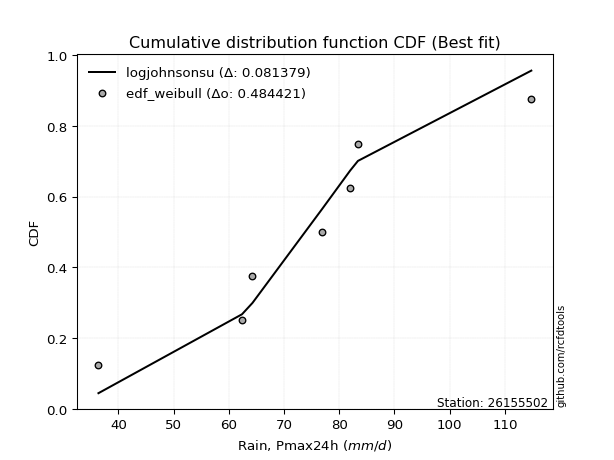</img></img>

</div>


### 4. EDF Beard (1943)

The Beard formula (or Beard´s plotting position formula) in hydrology is used to estimate the empirical non-exceedance probability _(P)_ of a flood event (or other extreme hydrological data point) within a given dataset.

<div align="center">


$P=(m-0.31)/(n+0.38)$


</div>


**4.1. Empirical values**

<div align="center">

|                | 0                   | 1                   | 2                   | 3         | 4                  | 5                  | 6                  |
|:---------------|:--------------------|:--------------------|:--------------------|:----------|:-------------------|:-------------------|:-------------------|
| date           | 2017                | 2022                | 2023                | 2021      | 2020               | 2019               | 2018               |
| x              | 36.4                | 62.4                | 64.3                | 76.9      | 82.0               | 83.4               | 114.8              |
| m              | 1                   | 2                   | 3                   | 4         | 5                  | 6                  | 7                  |
| empirical_dist | edf_beard           | edf_beard           | edf_beard           | edf_beard | edf_beard          | edf_beard          | edf_beard          |
| empirical      | 0.09349593495934959 | 0.22899728997289973 | 0.36449864498644985 | 0.5       | 0.6355013550135502 | 0.7710027100271003 | 0.9065040650406505 |
| empirical_tr   | 1.1031390134529149  | 1.29701230228471    | 1.5735607675906182  | 2.0       | 2.743494423791822  | 4.366863905325444  | 10.695652173913055 |

</div>


**4.2. Kolmogorov-Smirnov fit test (sorted by Δ)**


<div align="center">

|                | 0                   | 1                   | 2                   | 3                   | 4                   | 5                   | 6                   | 7                   | 8                   | 9                   | 10                  | 11                  | 12                  | 13                  | 14                  | 15                  | 16                  | 17                  | 18                  | 19                  | 20                  | 21                  | 22                  | 23                  | 24                  | 25                  | 26                  | 27                  | 28                  | 29                  | 30                  | 31                  | 32                  | 33                  | 34                  | 35                  | 36                  | 37                  | 38                  | 39                  | 40                  | 41                  | 42                  | 43                  | 44                  | 45                  | 46                  | 47                  | 48                  | 49                  | 50                  | 51                  | 52                  | 53                  | 54                  | 55                  | 56                  | 57                  | 58                  | 59                  | 60                  | 61                  | 62                  | 63                  | 64                  | 65                  | 66                  | 67                  | 68                  | 69                  | 70                  | 71                  | 72                  | 73                  | 74                  | 75                  | 76                  | 77                  | 78                  | 79                  | 80                  | 81                  | 82                  | 83                  | 84                  | 85                  | 86                  | 87                  | 88                  | 89                  | 90                  | 91                  | 92                  | 93                  | 94                  | 95                  | 96                  | 97                  | 98                  | 99                  | 100                 | 101                 | 102                 | 103                 | 104                 | 105                 | 106                 | 107                 | 108                 | 109                 | 110                 | 111                 | 112                 | 113                 | 114                 | 115                 | 116                 | 117                 | 118                 | 119                 | 120                 | 121                 | 122                 | 123                 | 124                 | 125                 | 126                 | 127                 | 128                 | 129                 | 130                 | 131                 | 132                 | 133                 | 134                 | 135                 | 136                 | 137                 | 138                 | 139                 | 140                 | 141                 | 142                 | 143                 | 144                 | 145                 | 146                 | 147                 | 148                 | 149                 | 150                 | 151                 | 152                 | 153                 | 154                 | 155                 | 156                 | 157                 | 158                 | 159                 |
|:---------------|:--------------------|:--------------------|:--------------------|:--------------------|:--------------------|:--------------------|:--------------------|:--------------------|:--------------------|:--------------------|:--------------------|:--------------------|:--------------------|:--------------------|:--------------------|:--------------------|:--------------------|:--------------------|:--------------------|:--------------------|:--------------------|:--------------------|:--------------------|:--------------------|:--------------------|:--------------------|:--------------------|:--------------------|:--------------------|:--------------------|:--------------------|:--------------------|:--------------------|:--------------------|:--------------------|:--------------------|:--------------------|:--------------------|:--------------------|:--------------------|:--------------------|:--------------------|:--------------------|:--------------------|:--------------------|:--------------------|:--------------------|:--------------------|:--------------------|:--------------------|:--------------------|:--------------------|:--------------------|:--------------------|:--------------------|:--------------------|:--------------------|:--------------------|:--------------------|:--------------------|:--------------------|:--------------------|:--------------------|:--------------------|:--------------------|:--------------------|:--------------------|:--------------------|:--------------------|:--------------------|:--------------------|:--------------------|:--------------------|:--------------------|:--------------------|:--------------------|:--------------------|:--------------------|:--------------------|:--------------------|:--------------------|:--------------------|:--------------------|:--------------------|:--------------------|:--------------------|:--------------------|:--------------------|:--------------------|:--------------------|:--------------------|:--------------------|:--------------------|:--------------------|:--------------------|:--------------------|:--------------------|:--------------------|:--------------------|:--------------------|:--------------------|:--------------------|:--------------------|:--------------------|:--------------------|:--------------------|:--------------------|:--------------------|:--------------------|:--------------------|:--------------------|:--------------------|:--------------------|:--------------------|:--------------------|:--------------------|:--------------------|:--------------------|:--------------------|:--------------------|:--------------------|:--------------------|:--------------------|:--------------------|:--------------------|:--------------------|:--------------------|:--------------------|:--------------------|:--------------------|:--------------------|:--------------------|:--------------------|:--------------------|:--------------------|:--------------------|:--------------------|:--------------------|:--------------------|:--------------------|:--------------------|:--------------------|:--------------------|:--------------------|:--------------------|:--------------------|:--------------------|:--------------------|:--------------------|:--------------------|:--------------------|:--------------------|:--------------------|:--------------------|:--------------------|:--------------------|:--------------------|:--------------------|:--------------------|:--------------------|
| station        | 26155502            | 26155502            | 26155502            | 26155502            | 26155502            | 26155502            | 26155502            | 26155502            | 26155502            | 26155502            | 26155502            | 26155502            | 26155502            | 26155502            | 26155502            | 26155502            | 26155502            | 26155502            | 26155502            | 26155502            | 26155502            | 26155502            | 26155502            | 26155502            | 26155502            | 26155502            | 26155502            | 26155502            | 26155502            | 26155502            | 26155502            | 26155502            | 26155502            | 26155502            | 26155502            | 26155502            | 26155502            | 26155502            | 26155502            | 26155502            | 26155502            | 26155502            | 26155502            | 26155502            | 26155502            | 26155502            | 26155502            | 26155502            | 26155502            | 26155502            | 26155502            | 26155502            | 26155502            | 26155502            | 26155502            | 26155502            | 26155502            | 26155502            | 26155502            | 26155502            | 26155502            | 26155502            | 26155502            | 26155502            | 26155502            | 26155502            | 26155502            | 26155502            | 26155502            | 26155502            | 26155502            | 26155502            | 26155502            | 26155502            | 26155502            | 26155502            | 26155502            | 26155502            | 26155502            | 26155502            | 26155502            | 26155502            | 26155502            | 26155502            | 26155502            | 26155502            | 26155502            | 26155502            | 26155502            | 26155502            | 26155502            | 26155502            | 26155502            | 26155502            | 26155502            | 26155502            | 26155502            | 26155502            | 26155502            | 26155502            | 26155502            | 26155502            | 26155502            | 26155502            | 26155502            | 26155502            | 26155502            | 26155502            | 26155502            | 26155502            | 26155502            | 26155502            | 26155502            | 26155502            | 26155502            | 26155502            | 26155502            | 26155502            | 26155502            | 26155502            | 26155502            | 26155502            | 26155502            | 26155502            | 26155502            | 26155502            | 26155502            | 26155502            | 26155502            | 26155502            | 26155502            | 26155502            | 26155502            | 26155502            | 26155502            | 26155502            | 26155502            | 26155502            | 26155502            | 26155502            | 26155502            | 26155502            | 26155502            | 26155502            | 26155502            | 26155502            | 26155502            | 26155502            | 26155502            | 26155502            | 26155502            | 26155502            | 26155502            | 26155502            | 26155502            | 26155502            | 26155502            | 26155502            | 26155502            | 26155502            |
| empirical_dist | edf_beard           | edf_beard           | edf_beard           | edf_beard           | edf_beard           | edf_beard           | edf_beard           | edf_beard           | edf_beard           | edf_beard           | edf_beard           | edf_beard           | edf_beard           | edf_beard           | edf_beard           | edf_beard           | edf_beard           | edf_beard           | edf_beard           | edf_beard           | edf_beard           | edf_beard           | edf_beard           | edf_beard           | edf_beard           | edf_beard           | edf_beard           | edf_beard           | edf_beard           | edf_beard           | edf_beard           | edf_beard           | edf_beard           | edf_beard           | edf_beard           | edf_beard           | edf_beard           | edf_beard           | edf_beard           | edf_beard           | edf_beard           | edf_beard           | edf_beard           | edf_beard           | edf_beard           | edf_beard           | edf_beard           | edf_beard           | edf_beard           | edf_beard           | edf_beard           | edf_beard           | edf_beard           | edf_beard           | edf_beard           | edf_beard           | edf_beard           | edf_beard           | edf_beard           | edf_beard           | edf_beard           | edf_beard           | edf_beard           | edf_beard           | edf_beard           | edf_beard           | edf_beard           | edf_beard           | edf_beard           | edf_beard           | edf_beard           | edf_beard           | edf_beard           | edf_beard           | edf_beard           | edf_beard           | edf_beard           | edf_beard           | edf_beard           | edf_beard           | edf_beard           | edf_beard           | edf_beard           | edf_beard           | edf_beard           | edf_beard           | edf_beard           | edf_beard           | edf_beard           | edf_beard           | edf_beard           | edf_beard           | edf_beard           | edf_beard           | edf_beard           | edf_beard           | edf_beard           | edf_beard           | edf_beard           | edf_beard           | edf_beard           | edf_beard           | edf_beard           | edf_beard           | edf_beard           | edf_beard           | edf_beard           | edf_beard           | edf_beard           | edf_beard           | edf_beard           | edf_beard           | edf_beard           | edf_beard           | edf_beard           | edf_beard           | edf_beard           | edf_beard           | edf_beard           | edf_beard           | edf_beard           | edf_beard           | edf_beard           | edf_beard           | edf_beard           | edf_beard           | edf_beard           | edf_beard           | edf_beard           | edf_beard           | edf_beard           | edf_beard           | edf_beard           | edf_beard           | edf_beard           | edf_beard           | edf_beard           | edf_beard           | edf_beard           | edf_beard           | edf_beard           | edf_beard           | edf_beard           | edf_beard           | edf_beard           | edf_beard           | edf_beard           | edf_beard           | edf_beard           | edf_beard           | edf_beard           | edf_beard           | edf_beard           | edf_beard           | edf_beard           | edf_beard           | edf_beard           | edf_beard           | edf_beard           | edf_beard           |
| p_dist         | logjohnsonsu        | hypsecant           | logburr             | logmielke           | burr                | mielke              | loggenlogistic      | genlogistic         | invgamma            | logistic            | maxwell             | alpha               | logskewnorm         | laplace             | loggompertz         | skewnorm            | betaprime           | invgauss            | erlang              | gamma               | f                   | rice                | johnsonsu           | dweibull            | nct                 | weibull_min         | rayleigh            | pearson3            | ncf                 | logweibull_min      | exponnorm           | logpearson3         | logloggamma         | logburr12           | logexponpow         | foldnorm            | crystalball         | norm                | truncnorm           | t                   | loggumbel_l         | loglogistic         | gumbel_r            | loggengamma         | dgamma              | logt                | logexponnorm        | lognorm             | logcrystalball      | logfatiguelife      | logf                | loghypsecant        | lognct              | vonmises_line       | loggennorm          | logtruncweibull_min | gennorm             | logerlang           | cosine              | logrice             | logloglaplace       | anglit              | loggamma            | loggamma            | logweibull_max      | loggenextreme       | halfnorm            | logexponweib        | logargus            | loginvgamma         | logalpha            | moyal               | halflogistic        | semicircular        | kappa4              | loganglit           | kstwobign           | logsemicircular     | logdweibull         | loglaplace          | loglaplace          | logdgamma           | logmaxwell          | loginvgauss         | logbetaprime        | gumbel_l            | gausshyper          | logfoldnorm         | lograyleigh         | uniform             | loggumbel_r         | logcosine           | logtriang           | gompertz            | arcsine             | bradford            | logarcsine          | ksone               | loginvweibull       | logmoyal            | wrapcauchy          | logncf              | loghalfnorm         | genpareto           | loghalflogistic     | truncexpon          | wald                | kappa3              | argus               | truncweibull_min    | logkstwobign        | lognakagami         | loggenexpon         | logkappa4           | logkappa3           | logvonmises_line    | loglevy_l           | loguniform          | loggenhalflogistic  | logksone            | nakagami            | logtruncnorm        | logwald             | logwrapcauchy       | beta                | genexpon            | lomax               | logjohnsonsb        | loggausshyper       | levy_l              | triang              | logtrapezoid        | logtukeylambda      | loggenpareto        | genhalflogistic     | loglomax            | burr12              | logbradford         | logtruncexpon       | halfgennorm         | tukeylambda         | genextreme          | logbeta             | logrdist            | trapezoid           | johnsonsb           | invweibull          | exponweib           | gengamma            | rdist               | powerlaw            | fatiguelife         | logpowerlaw         | weibull_max         | truncpareto         | exponpow            | logtruncpareto      | loghalfgennorm      | logvonmises         | vonmises            |
| delta          | 0.06995348617642738 | 0.07958336043799952 | 0.08408764453635309 | 0.08412736775003726 | 0.08507775842442766 | 0.08508144951962382 | 0.08508869564654609 | 0.09039860354413354 | 0.09371323123213648 | 0.09390225980285138 | 0.09468272152553617 | 0.09478457446217436 | 0.09894727612370013 | 0.09988951898285692 | 0.10191843067726866 | 0.10274574821354543 | 0.10319254622832841 | 0.10329885402086122 | 0.10437174808220828 | 0.10437187595971043 | 0.1043737860038697  | 0.10444459758763525 | 0.10454171739319751 | 0.1048762692984905  | 0.10505605757872394 | 0.10554380036980593 | 0.10558195686799901 | 0.10571263033247569 | 0.10615104352834512 | 0.10798339371256915 | 0.10869690639348573 | 0.10898227477826816 | 0.10938413529687796 | 0.11029128749464989 | 0.11136386465871151 | 0.11216239347721024 | 0.11254883620437028 | 0.11254884137121135 | 0.11254885713284046 | 0.11260016634676961 | 0.113887026669934   | 0.114156771741597   | 0.11647916886133713 | 0.11994100353929357 | 0.12281915886665004 | 0.12314990441035809 | 0.12325445185438025 | 0.12325616572527451 | 0.1232593482025455  | 0.12387714023285143 | 0.12428832784553653 | 0.12480747514970081 | 0.1256108170995857  | 0.12921958398812822 | 0.13018493862081737 | 0.1306954410987654  | 0.13089147243306198 | 0.13092098704388214 | 0.13238550630921875 | 0.13274027682534426 | 0.13314665478706644 | 0.133254898826623   | 0.13437921011874795 | 0.13437921011874795 | 0.13466078148666927 | 0.1346644756110329  | 0.13634024869594882 | 0.13850190919713043 | 0.13976157099374098 | 0.1405410304222436  | 0.14118055014556793 | 0.1414353377499401  | 0.14172069410691335 | 0.14196176276201056 | 0.14255857661196783 | 0.14281203849490934 | 0.14616877227529054 | 0.15101446589983478 | 0.1517502173913511  | 0.1520042916499026  | 0.1520042916499026  | 0.1520836375086767  | 0.1553266340000046  | 0.15704937607547612 | 0.15828115726521994 | 0.15859793594598715 | 0.15936189065272532 | 0.1660869553010795  | 0.16740672848753266 | 0.17151291410873293 | 0.17224691407662193 | 0.1733954141751288  | 0.17472753711540956 | 0.17552912053231984 | 0.17778821174479642 | 0.18060730910441244 | 0.18458401101380165 | 0.18809454676179427 | 0.18999392831179493 | 0.19044413561358062 | 0.19314377510627    | 0.19719773340928867 | 0.2018412932282538  | 0.2060695462210613  | 0.2103173363429929  | 0.21060929010582183 | 0.210684023203221   | 0.21846553243008515 | 0.2204529019416911  | 0.222694896673821   | 0.22579580964214116 | 0.22899710213296906 | 0.2346801705446466  | 0.23528933951569617 | 0.23924147237125828 | 0.2401711242335636  | 0.24018179209744384 | 0.2402573193914058  | 0.24162524497908489 | 0.24538155116402163 | 0.2456024784843659  | 0.2461853559572636  | 0.2533910714078573  | 0.26072582824238466 | 0.26224958531767795 | 0.26237414789344393 | 0.2630426437538861  | 0.2792188736434843  | 0.28191468277981524 | 0.28491289183559076 | 0.2934927892791176  | 0.3020023754551379  | 0.3057611034659425  | 0.31631281395213484 | 0.3221014617166795  | 0.3239264288541409  | 0.3263626376606149  | 0.32817474778667877 | 0.334386962757931   | 0.3382525783331475  | 0.338815291716692   | 0.36515704387665304 | 0.4011350043567803  | 0.42039100773166704 | 0.4312207832257676  | 0.4414736637205422  | 0.4645601336601647  | 0.48557761077330686 | 0.48862582384192643 | 0.5127087318854279  | 0.5984517197916848  | 0.6133970839301001  | 0.6410626446172301  | 0.6456930462147019  | 0.6920748226557804  | 0.7077249625602552  | 0.7157861900668908  | 0.7710027100271003  | 1.11649630839402    | 17.84414216473929   |
| deltao         | 0.48442053926100004 | 0.48442053926100004 | 0.48442053926100004 | 0.48442053926100004 | 0.48442053926100004 | 0.48442053926100004 | 0.48442053926100004 | 0.48442053926100004 | 0.48442053926100004 | 0.48442053926100004 | 0.48442053926100004 | 0.48442053926100004 | 0.48442053926100004 | 0.48442053926100004 | 0.48442053926100004 | 0.48442053926100004 | 0.48442053926100004 | 0.48442053926100004 | 0.48442053926100004 | 0.48442053926100004 | 0.48442053926100004 | 0.48442053926100004 | 0.48442053926100004 | 0.48442053926100004 | 0.48442053926100004 | 0.48442053926100004 | 0.48442053926100004 | 0.48442053926100004 | 0.48442053926100004 | 0.48442053926100004 | 0.48442053926100004 | 0.48442053926100004 | 0.48442053926100004 | 0.48442053926100004 | 0.48442053926100004 | 0.48442053926100004 | 0.48442053926100004 | 0.48442053926100004 | 0.48442053926100004 | 0.48442053926100004 | 0.48442053926100004 | 0.48442053926100004 | 0.48442053926100004 | 0.48442053926100004 | 0.48442053926100004 | 0.48442053926100004 | 0.48442053926100004 | 0.48442053926100004 | 0.48442053926100004 | 0.48442053926100004 | 0.48442053926100004 | 0.48442053926100004 | 0.48442053926100004 | 0.48442053926100004 | 0.48442053926100004 | 0.48442053926100004 | 0.48442053926100004 | 0.48442053926100004 | 0.48442053926100004 | 0.48442053926100004 | 0.48442053926100004 | 0.48442053926100004 | 0.48442053926100004 | 0.48442053926100004 | 0.48442053926100004 | 0.48442053926100004 | 0.48442053926100004 | 0.48442053926100004 | 0.48442053926100004 | 0.48442053926100004 | 0.48442053926100004 | 0.48442053926100004 | 0.48442053926100004 | 0.48442053926100004 | 0.48442053926100004 | 0.48442053926100004 | 0.48442053926100004 | 0.48442053926100004 | 0.48442053926100004 | 0.48442053926100004 | 0.48442053926100004 | 0.48442053926100004 | 0.48442053926100004 | 0.48442053926100004 | 0.48442053926100004 | 0.48442053926100004 | 0.48442053926100004 | 0.48442053926100004 | 0.48442053926100004 | 0.48442053926100004 | 0.48442053926100004 | 0.48442053926100004 | 0.48442053926100004 | 0.48442053926100004 | 0.48442053926100004 | 0.48442053926100004 | 0.48442053926100004 | 0.48442053926100004 | 0.48442053926100004 | 0.48442053926100004 | 0.48442053926100004 | 0.48442053926100004 | 0.48442053926100004 | 0.48442053926100004 | 0.48442053926100004 | 0.48442053926100004 | 0.48442053926100004 | 0.48442053926100004 | 0.48442053926100004 | 0.48442053926100004 | 0.48442053926100004 | 0.48442053926100004 | 0.48442053926100004 | 0.48442053926100004 | 0.48442053926100004 | 0.48442053926100004 | 0.48442053926100004 | 0.48442053926100004 | 0.48442053926100004 | 0.48442053926100004 | 0.48442053926100004 | 0.48442053926100004 | 0.48442053926100004 | 0.48442053926100004 | 0.48442053926100004 | 0.48442053926100004 | 0.48442053926100004 | 0.48442053926100004 | 0.48442053926100004 | 0.48442053926100004 | 0.48442053926100004 | 0.48442053926100004 | 0.48442053926100004 | 0.48442053926100004 | 0.48442053926100004 | 0.48442053926100004 | 0.48442053926100004 | 0.48442053926100004 | 0.48442053926100004 | 0.48442053926100004 | 0.48442053926100004 | 0.48442053926100004 | 0.48442053926100004 | 0.48442053926100004 | 0.48442053926100004 | 0.48442053926100004 | 0.48442053926100004 | 0.48442053926100004 | 0.48442053926100004 | 0.48442053926100004 | 0.48442053926100004 | 0.48442053926100004 | 0.48442053926100004 | 0.48442053926100004 | 0.48442053926100004 | 0.48442053926100004 | 0.48442053926100004 | 0.48442053926100004 | 0.48442053926100004 | 0.48442053926100004 |
| eval           | Δo > Δ              | Δo > Δ              | Δo > Δ              | Δo > Δ              | Δo > Δ              | Δo > Δ              | Δo > Δ              | Δo > Δ              | Δo > Δ              | Δo > Δ              | Δo > Δ              | Δo > Δ              | Δo > Δ              | Δo > Δ              | Δo > Δ              | Δo > Δ              | Δo > Δ              | Δo > Δ              | Δo > Δ              | Δo > Δ              | Δo > Δ              | Δo > Δ              | Δo > Δ              | Δo > Δ              | Δo > Δ              | Δo > Δ              | Δo > Δ              | Δo > Δ              | Δo > Δ              | Δo > Δ              | Δo > Δ              | Δo > Δ              | Δo > Δ              | Δo > Δ              | Δo > Δ              | Δo > Δ              | Δo > Δ              | Δo > Δ              | Δo > Δ              | Δo > Δ              | Δo > Δ              | Δo > Δ              | Δo > Δ              | Δo > Δ              | Δo > Δ              | Δo > Δ              | Δo > Δ              | Δo > Δ              | Δo > Δ              | Δo > Δ              | Δo > Δ              | Δo > Δ              | Δo > Δ              | Δo > Δ              | Δo > Δ              | Δo > Δ              | Δo > Δ              | Δo > Δ              | Δo > Δ              | Δo > Δ              | Δo > Δ              | Δo > Δ              | Δo > Δ              | Δo > Δ              | Δo > Δ              | Δo > Δ              | Δo > Δ              | Δo > Δ              | Δo > Δ              | Δo > Δ              | Δo > Δ              | Δo > Δ              | Δo > Δ              | Δo > Δ              | Δo > Δ              | Δo > Δ              | Δo > Δ              | Δo > Δ              | Δo > Δ              | Δo > Δ              | Δo > Δ              | Δo > Δ              | Δo > Δ              | Δo > Δ              | Δo > Δ              | Δo > Δ              | Δo > Δ              | Δo > Δ              | Δo > Δ              | Δo > Δ              | Δo > Δ              | Δo > Δ              | Δo > Δ              | Δo > Δ              | Δo > Δ              | Δo > Δ              | Δo > Δ              | Δo > Δ              | Δo > Δ              | Δo > Δ              | Δo > Δ              | Δo > Δ              | Δo > Δ              | Δo > Δ              | Δo > Δ              | Δo > Δ              | Δo > Δ              | Δo > Δ              | Δo > Δ              | Δo > Δ              | Δo > Δ              | Δo > Δ              | Δo > Δ              | Δo > Δ              | Δo > Δ              | Δo > Δ              | Δo > Δ              | Δo > Δ              | Δo > Δ              | Δo > Δ              | Δo > Δ              | Δo > Δ              | Δo > Δ              | Δo > Δ              | Δo > Δ              | Δo > Δ              | Δo > Δ              | Δo > Δ              | Δo > Δ              | Δo > Δ              | Δo > Δ              | Δo > Δ              | Δo > Δ              | Δo > Δ              | Δo > Δ              | Δo > Δ              | Δo > Δ              | Δo > Δ              | Δo > Δ              | Δo > Δ              | Δo > Δ              | Δo > Δ              | Δo > Δ              | Δo > Δ              | Δo > Δ              | Δo > Δ              | Δo > Δ              | Δo <= Δ             | Δo <= Δ             | Δo <= Δ             | Δo <= Δ             | Δo <= Δ             | Δo <= Δ             | Δo <= Δ             | Δo <= Δ             | Δo <= Δ             | Δo <= Δ             | Δo <= Δ             | Δo <= Δ             | Δo <= Δ             |
| fit            | 1                   | 1                   | 1                   | 1                   | 1                   | 1                   | 1                   | 1                   | 1                   | 1                   | 1                   | 1                   | 1                   | 1                   | 1                   | 1                   | 1                   | 1                   | 1                   | 1                   | 1                   | 1                   | 1                   | 1                   | 1                   | 1                   | 1                   | 1                   | 1                   | 1                   | 1                   | 1                   | 1                   | 1                   | 1                   | 1                   | 1                   | 1                   | 1                   | 1                   | 1                   | 1                   | 1                   | 1                   | 1                   | 1                   | 1                   | 1                   | 1                   | 1                   | 1                   | 1                   | 1                   | 1                   | 1                   | 1                   | 1                   | 1                   | 1                   | 1                   | 1                   | 1                   | 1                   | 1                   | 1                   | 1                   | 1                   | 1                   | 1                   | 1                   | 1                   | 1                   | 1                   | 1                   | 1                   | 1                   | 1                   | 1                   | 1                   | 1                   | 1                   | 1                   | 1                   | 1                   | 1                   | 1                   | 1                   | 1                   | 1                   | 1                   | 1                   | 1                   | 1                   | 1                   | 1                   | 1                   | 1                   | 1                   | 1                   | 1                   | 1                   | 1                   | 1                   | 1                   | 1                   | 1                   | 1                   | 1                   | 1                   | 1                   | 1                   | 1                   | 1                   | 1                   | 1                   | 1                   | 1                   | 1                   | 1                   | 1                   | 1                   | 1                   | 1                   | 1                   | 1                   | 1                   | 1                   | 1                   | 1                   | 1                   | 1                   | 1                   | 1                   | 1                   | 1                   | 1                   | 1                   | 1                   | 1                   | 1                   | 1                   | 1                   | 1                   | 1                   | 1                   | 1                   | 1                   | 0                   | 0                   | 0                   | 0                   | 0                   | 0                   | 0                   | 0                   | 0                   | 0                   | 0                   | 0                   | 0                   |
| n              | 7                   | 7                   | 7                   | 7                   | 7                   | 7                   | 7                   | 7                   | 7                   | 7                   | 7                   | 7                   | 7                   | 7                   | 7                   | 7                   | 7                   | 7                   | 7                   | 7                   | 7                   | 7                   | 7                   | 7                   | 7                   | 7                   | 7                   | 7                   | 7                   | 7                   | 7                   | 7                   | 7                   | 7                   | 7                   | 7                   | 7                   | 7                   | 7                   | 7                   | 7                   | 7                   | 7                   | 7                   | 7                   | 7                   | 7                   | 7                   | 7                   | 7                   | 7                   | 7                   | 7                   | 7                   | 7                   | 7                   | 7                   | 7                   | 7                   | 7                   | 7                   | 7                   | 7                   | 7                   | 7                   | 7                   | 7                   | 7                   | 7                   | 7                   | 7                   | 7                   | 7                   | 7                   | 7                   | 7                   | 7                   | 7                   | 7                   | 7                   | 7                   | 7                   | 7                   | 7                   | 7                   | 7                   | 7                   | 7                   | 7                   | 7                   | 7                   | 7                   | 7                   | 7                   | 7                   | 7                   | 7                   | 7                   | 7                   | 7                   | 7                   | 7                   | 7                   | 7                   | 7                   | 7                   | 7                   | 7                   | 7                   | 7                   | 7                   | 7                   | 7                   | 7                   | 7                   | 7                   | 7                   | 7                   | 7                   | 7                   | 7                   | 7                   | 7                   | 7                   | 7                   | 7                   | 7                   | 7                   | 7                   | 7                   | 7                   | 7                   | 7                   | 7                   | 7                   | 7                   | 7                   | 7                   | 7                   | 7                   | 7                   | 7                   | 7                   | 7                   | 7                   | 7                   | 7                   | 7                   | 7                   | 7                   | 7                   | 7                   | 7                   | 7                   | 7                   | 7                   | 7                   | 7                   | 7                   | 7                   |
| best_fit       | 1                   | 0                   | 0                   | 0                   | 0                   | 0                   | 0                   | 0                   | 0                   | 0                   | 0                   | 0                   | 0                   | 0                   | 0                   | 0                   | 0                   | 0                   | 0                   | 0                   | 0                   | 0                   | 0                   | 0                   | 0                   | 0                   | 0                   | 0                   | 0                   | 0                   | 0                   | 0                   | 0                   | 0                   | 0                   | 0                   | 0                   | 0                   | 0                   | 0                   | 0                   | 0                   | 0                   | 0                   | 0                   | 0                   | 0                   | 0                   | 0                   | 0                   | 0                   | 0                   | 0                   | 0                   | 0                   | 0                   | 0                   | 0                   | 0                   | 0                   | 0                   | 0                   | 0                   | 0                   | 0                   | 0                   | 0                   | 0                   | 0                   | 0                   | 0                   | 0                   | 0                   | 0                   | 0                   | 0                   | 0                   | 0                   | 0                   | 0                   | 0                   | 0                   | 0                   | 0                   | 0                   | 0                   | 0                   | 0                   | 0                   | 0                   | 0                   | 0                   | 0                   | 0                   | 0                   | 0                   | 0                   | 0                   | 0                   | 0                   | 0                   | 0                   | 0                   | 0                   | 0                   | 0                   | 0                   | 0                   | 0                   | 0                   | 0                   | 0                   | 0                   | 0                   | 0                   | 0                   | 0                   | 0                   | 0                   | 0                   | 0                   | 0                   | 0                   | 0                   | 0                   | 0                   | 0                   | 0                   | 0                   | 0                   | 0                   | 0                   | 0                   | 0                   | 0                   | 0                   | 0                   | 0                   | 0                   | 0                   | 0                   | 0                   | 0                   | 0                   | 0                   | 0                   | 0                   | 0                   | 0                   | 0                   | 0                   | 0                   | 0                   | 0                   | 0                   | 0                   | 0                   | 0                   | 0                   | 0                   |
| best_fit_sort  | 1                   | 2                   | 3                   | 4                   | 5                   | 6                   | 7                   | 8                   | 9                   | 10                  | 11                  | 12                  | 13                  | 14                  | 15                  | 16                  | 17                  | 18                  | 19                  | 20                  | 21                  | 22                  | 23                  | 24                  | 25                  | 26                  | 27                  | 28                  | 29                  | 30                  | 31                  | 32                  | 33                  | 34                  | 35                  | 36                  | 37                  | 38                  | 39                  | 40                  | 41                  | 42                  | 43                  | 44                  | 45                  | 46                  | 47                  | 48                  | 49                  | 50                  | 51                  | 52                  | 53                  | 54                  | 55                  | 56                  | 57                  | 58                  | 59                  | 60                  | 61                  | 62                  | 63                  | 64                  | 65                  | 66                  | 67                  | 68                  | 69                  | 70                  | 71                  | 72                  | 73                  | 74                  | 75                  | 76                  | 77                  | 78                  | 79                  | 80                  | 81                  | 82                  | 83                  | 84                  | 85                  | 86                  | 87                  | 88                  | 89                  | 90                  | 91                  | 92                  | 93                  | 94                  | 95                  | 96                  | 97                  | 98                  | 99                  | 100                 | 101                 | 102                 | 103                 | 104                 | 105                 | 106                 | 107                 | 108                 | 109                 | 110                 | 111                 | 112                 | 113                 | 114                 | 115                 | 116                 | 117                 | 118                 | 119                 | 120                 | 121                 | 122                 | 123                 | 124                 | 125                 | 126                 | 127                 | 128                 | 129                 | 130                 | 131                 | 132                 | 133                 | 134                 | 135                 | 136                 | 137                 | 138                 | 139                 | 140                 | 141                 | 142                 | 143                 | 144                 | 145                 | 146                 | 147                 | 148                 | 149                 | 150                 | 151                 | 152                 | 153                 | 154                 | 155                 | 156                 | 157                 | 158                 | 159                 | 160                 |

</div>


**4.3. Best fit**

<div align="center">

|   id |   station | empirical_dist   | p_dist       |     delta |   deltao | eval   |   fit |   n |   best_fit |   best_fit_sort |
|-----:|----------:|:-----------------|:-------------|----------:|---------:|:-------|------:|----:|-----------:|----------------:|
|    0 |  26155502 | edf_beard        | logjohnsonsu | 0.0699535 | 0.484421 | Δo > Δ |     1 |   7 |          1 |               1 |

</div>


<div align="center">

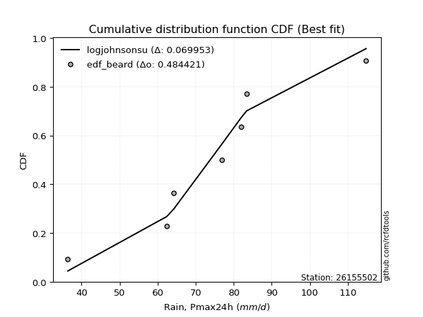</img>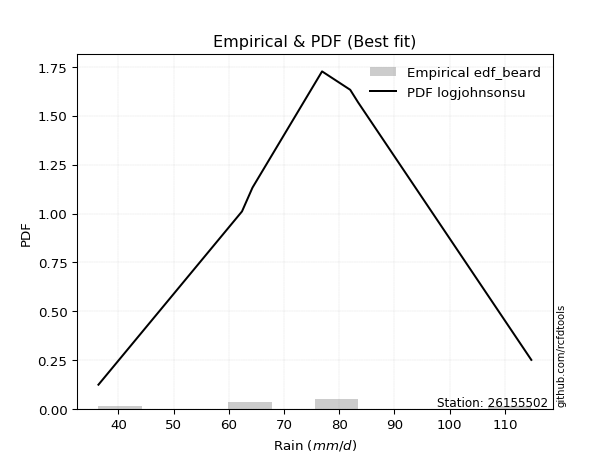</img>

</div>


### 5. EDF Chegodayev (1955)

The Chegodayev formula is an empirical plotting position formula used in hydrological frequency analysis to estimate the exceedance probability or return period of a specific event from a set of observed data. It is primarily used for plotting observed data points on probability paper to fit a theoretical distribution, particularly for analyzing extreme events like maximum flood flows or rainfall intensities. The constant _b_ value in the generalized plotting position formula is 0.3.

<div align="center">


$P=(m-b)/(n+1-2b)$


</div>


**5.1. Empirical values**

<div align="center">

|                | 0                   | 1                   | 2                   | 3              | 4                  | 5                  | 6                  |
|:---------------|:--------------------|:--------------------|:--------------------|:---------------|:-------------------|:-------------------|:-------------------|
| date           | 2017                | 2022                | 2023                | 2021           | 2020               | 2019               | 2018               |
| x              | 36.4                | 62.4                | 64.3                | 76.9           | 82.0               | 83.4               | 114.8              |
| m              | 1                   | 2                   | 3                   | 4              | 5                  | 6                  | 7                  |
| empirical_dist | edf_chegodayev      | edf_chegodayev      | edf_chegodayev      | edf_chegodayev | edf_chegodayev     | edf_chegodayev     | edf_chegodayev     |
| empirical      | 0.09459459459459459 | 0.22972972972972971 | 0.36486486486486486 | 0.5            | 0.6351351351351351 | 0.7702702702702703 | 0.9054054054054054 |
| empirical_tr   | 1.1044776119402986  | 1.2982456140350878  | 1.574468085106383   | 2.0            | 2.7407407407407405 | 4.352941176470589  | 10.571428571428568 |

</div>


**5.2. Kolmogorov-Smirnov fit test (sorted by Δ)**


<div align="center">

|                | 0                   | 1                   | 2                   | 3                   | 4                   | 5                   | 6                   | 7                   | 8                   | 9                   | 10                  | 11                  | 12                  | 13                  | 14                  | 15                  | 16                  | 17                  | 18                  | 19                  | 20                  | 21                  | 22                  | 23                  | 24                  | 25                  | 26                  | 27                  | 28                  | 29                  | 30                  | 31                  | 32                  | 33                  | 34                  | 35                  | 36                  | 37                  | 38                  | 39                  | 40                  | 41                  | 42                  | 43                  | 44                  | 45                  | 46                  | 47                  | 48                  | 49                  | 50                  | 51                  | 52                  | 53                  | 54                  | 55                  | 56                  | 57                  | 58                  | 59                  | 60                  | 61                  | 62                  | 63                  | 64                  | 65                  | 66                  | 67                  | 68                  | 69                  | 70                  | 71                  | 72                  | 73                  | 74                  | 75                  | 76                  | 77                  | 78                  | 79                  | 80                  | 81                  | 82                  | 83                  | 84                  | 85                  | 86                  | 87                  | 88                  | 89                  | 90                  | 91                  | 92                  | 93                  | 94                  | 95                  | 96                  | 97                  | 98                  | 99                  | 100                 | 101                 | 102                 | 103                 | 104                 | 105                 | 106                 | 107                 | 108                 | 109                 | 110                 | 111                 | 112                 | 113                 | 114                 | 115                 | 116                 | 117                 | 118                 | 119                 | 120                 | 121                 | 122                 | 123                 | 124                 | 125                 | 126                 | 127                 | 128                 | 129                 | 130                 | 131                 | 132                 | 133                 | 134                 | 135                 | 136                 | 137                 | 138                 | 139                 | 140                 | 141                 | 142                 | 143                 | 144                 | 145                 | 146                 | 147                 | 148                 | 149                 | 150                 | 151                 | 152                 | 153                 | 154                 | 155                 | 156                 | 157                 | 158                 | 159                 |
|:---------------|:--------------------|:--------------------|:--------------------|:--------------------|:--------------------|:--------------------|:--------------------|:--------------------|:--------------------|:--------------------|:--------------------|:--------------------|:--------------------|:--------------------|:--------------------|:--------------------|:--------------------|:--------------------|:--------------------|:--------------------|:--------------------|:--------------------|:--------------------|:--------------------|:--------------------|:--------------------|:--------------------|:--------------------|:--------------------|:--------------------|:--------------------|:--------------------|:--------------------|:--------------------|:--------------------|:--------------------|:--------------------|:--------------------|:--------------------|:--------------------|:--------------------|:--------------------|:--------------------|:--------------------|:--------------------|:--------------------|:--------------------|:--------------------|:--------------------|:--------------------|:--------------------|:--------------------|:--------------------|:--------------------|:--------------------|:--------------------|:--------------------|:--------------------|:--------------------|:--------------------|:--------------------|:--------------------|:--------------------|:--------------------|:--------------------|:--------------------|:--------------------|:--------------------|:--------------------|:--------------------|:--------------------|:--------------------|:--------------------|:--------------------|:--------------------|:--------------------|:--------------------|:--------------------|:--------------------|:--------------------|:--------------------|:--------------------|:--------------------|:--------------------|:--------------------|:--------------------|:--------------------|:--------------------|:--------------------|:--------------------|:--------------------|:--------------------|:--------------------|:--------------------|:--------------------|:--------------------|:--------------------|:--------------------|:--------------------|:--------------------|:--------------------|:--------------------|:--------------------|:--------------------|:--------------------|:--------------------|:--------------------|:--------------------|:--------------------|:--------------------|:--------------------|:--------------------|:--------------------|:--------------------|:--------------------|:--------------------|:--------------------|:--------------------|:--------------------|:--------------------|:--------------------|:--------------------|:--------------------|:--------------------|:--------------------|:--------------------|:--------------------|:--------------------|:--------------------|:--------------------|:--------------------|:--------------------|:--------------------|:--------------------|:--------------------|:--------------------|:--------------------|:--------------------|:--------------------|:--------------------|:--------------------|:--------------------|:--------------------|:--------------------|:--------------------|:--------------------|:--------------------|:--------------------|:--------------------|:--------------------|:--------------------|:--------------------|:--------------------|:--------------------|:--------------------|:--------------------|:--------------------|:--------------------|:--------------------|:--------------------|
| station        | 26155502            | 26155502            | 26155502            | 26155502            | 26155502            | 26155502            | 26155502            | 26155502            | 26155502            | 26155502            | 26155502            | 26155502            | 26155502            | 26155502            | 26155502            | 26155502            | 26155502            | 26155502            | 26155502            | 26155502            | 26155502            | 26155502            | 26155502            | 26155502            | 26155502            | 26155502            | 26155502            | 26155502            | 26155502            | 26155502            | 26155502            | 26155502            | 26155502            | 26155502            | 26155502            | 26155502            | 26155502            | 26155502            | 26155502            | 26155502            | 26155502            | 26155502            | 26155502            | 26155502            | 26155502            | 26155502            | 26155502            | 26155502            | 26155502            | 26155502            | 26155502            | 26155502            | 26155502            | 26155502            | 26155502            | 26155502            | 26155502            | 26155502            | 26155502            | 26155502            | 26155502            | 26155502            | 26155502            | 26155502            | 26155502            | 26155502            | 26155502            | 26155502            | 26155502            | 26155502            | 26155502            | 26155502            | 26155502            | 26155502            | 26155502            | 26155502            | 26155502            | 26155502            | 26155502            | 26155502            | 26155502            | 26155502            | 26155502            | 26155502            | 26155502            | 26155502            | 26155502            | 26155502            | 26155502            | 26155502            | 26155502            | 26155502            | 26155502            | 26155502            | 26155502            | 26155502            | 26155502            | 26155502            | 26155502            | 26155502            | 26155502            | 26155502            | 26155502            | 26155502            | 26155502            | 26155502            | 26155502            | 26155502            | 26155502            | 26155502            | 26155502            | 26155502            | 26155502            | 26155502            | 26155502            | 26155502            | 26155502            | 26155502            | 26155502            | 26155502            | 26155502            | 26155502            | 26155502            | 26155502            | 26155502            | 26155502            | 26155502            | 26155502            | 26155502            | 26155502            | 26155502            | 26155502            | 26155502            | 26155502            | 26155502            | 26155502            | 26155502            | 26155502            | 26155502            | 26155502            | 26155502            | 26155502            | 26155502            | 26155502            | 26155502            | 26155502            | 26155502            | 26155502            | 26155502            | 26155502            | 26155502            | 26155502            | 26155502            | 26155502            | 26155502            | 26155502            | 26155502            | 26155502            | 26155502            | 26155502            |
| empirical_dist | edf_chegodayev      | edf_chegodayev      | edf_chegodayev      | edf_chegodayev      | edf_chegodayev      | edf_chegodayev      | edf_chegodayev      | edf_chegodayev      | edf_chegodayev      | edf_chegodayev      | edf_chegodayev      | edf_chegodayev      | edf_chegodayev      | edf_chegodayev      | edf_chegodayev      | edf_chegodayev      | edf_chegodayev      | edf_chegodayev      | edf_chegodayev      | edf_chegodayev      | edf_chegodayev      | edf_chegodayev      | edf_chegodayev      | edf_chegodayev      | edf_chegodayev      | edf_chegodayev      | edf_chegodayev      | edf_chegodayev      | edf_chegodayev      | edf_chegodayev      | edf_chegodayev      | edf_chegodayev      | edf_chegodayev      | edf_chegodayev      | edf_chegodayev      | edf_chegodayev      | edf_chegodayev      | edf_chegodayev      | edf_chegodayev      | edf_chegodayev      | edf_chegodayev      | edf_chegodayev      | edf_chegodayev      | edf_chegodayev      | edf_chegodayev      | edf_chegodayev      | edf_chegodayev      | edf_chegodayev      | edf_chegodayev      | edf_chegodayev      | edf_chegodayev      | edf_chegodayev      | edf_chegodayev      | edf_chegodayev      | edf_chegodayev      | edf_chegodayev      | edf_chegodayev      | edf_chegodayev      | edf_chegodayev      | edf_chegodayev      | edf_chegodayev      | edf_chegodayev      | edf_chegodayev      | edf_chegodayev      | edf_chegodayev      | edf_chegodayev      | edf_chegodayev      | edf_chegodayev      | edf_chegodayev      | edf_chegodayev      | edf_chegodayev      | edf_chegodayev      | edf_chegodayev      | edf_chegodayev      | edf_chegodayev      | edf_chegodayev      | edf_chegodayev      | edf_chegodayev      | edf_chegodayev      | edf_chegodayev      | edf_chegodayev      | edf_chegodayev      | edf_chegodayev      | edf_chegodayev      | edf_chegodayev      | edf_chegodayev      | edf_chegodayev      | edf_chegodayev      | edf_chegodayev      | edf_chegodayev      | edf_chegodayev      | edf_chegodayev      | edf_chegodayev      | edf_chegodayev      | edf_chegodayev      | edf_chegodayev      | edf_chegodayev      | edf_chegodayev      | edf_chegodayev      | edf_chegodayev      | edf_chegodayev      | edf_chegodayev      | edf_chegodayev      | edf_chegodayev      | edf_chegodayev      | edf_chegodayev      | edf_chegodayev      | edf_chegodayev      | edf_chegodayev      | edf_chegodayev      | edf_chegodayev      | edf_chegodayev      | edf_chegodayev      | edf_chegodayev      | edf_chegodayev      | edf_chegodayev      | edf_chegodayev      | edf_chegodayev      | edf_chegodayev      | edf_chegodayev      | edf_chegodayev      | edf_chegodayev      | edf_chegodayev      | edf_chegodayev      | edf_chegodayev      | edf_chegodayev      | edf_chegodayev      | edf_chegodayev      | edf_chegodayev      | edf_chegodayev      | edf_chegodayev      | edf_chegodayev      | edf_chegodayev      | edf_chegodayev      | edf_chegodayev      | edf_chegodayev      | edf_chegodayev      | edf_chegodayev      | edf_chegodayev      | edf_chegodayev      | edf_chegodayev      | edf_chegodayev      | edf_chegodayev      | edf_chegodayev      | edf_chegodayev      | edf_chegodayev      | edf_chegodayev      | edf_chegodayev      | edf_chegodayev      | edf_chegodayev      | edf_chegodayev      | edf_chegodayev      | edf_chegodayev      | edf_chegodayev      | edf_chegodayev      | edf_chegodayev      | edf_chegodayev      | edf_chegodayev      | edf_chegodayev      | edf_chegodayev      |
| p_dist         | logjohnsonsu        | hypsecant           | logburr             | logmielke           | burr                | mielke              | loggenlogistic      | genlogistic         | invgamma            | logistic            | maxwell             | alpha               | logskewnorm         | laplace             | loggompertz         | skewnorm            | betaprime           | invgauss            | erlang              | gamma               | f                   | rice                | johnsonsu           | dweibull            | nct                 | weibull_min         | rayleigh            | pearson3            | ncf                 | logweibull_min      | exponnorm           | logpearson3         | logloggamma         | logburr12           | logexponpow         | foldnorm            | crystalball         | norm                | truncnorm           | t                   | loggumbel_l         | loglogistic         | gumbel_r            | loggengamma         | dgamma              | logt                | logexponnorm        | lognorm             | logcrystalball      | logfatiguelife      | logf                | loghypsecant        | lognct              | loggennorm          | vonmises_line       | logtruncweibull_min | logerlang           | gennorm             | cosine              | logrice             | logloglaplace       | anglit              | loggamma            | loggamma            | logweibull_max      | loggenextreme       | halfnorm            | logexponweib        | logargus            | loginvgamma         | logalpha            | semicircular        | moyal               | halflogistic        | kappa4              | loganglit           | kstwobign           | logsemicircular     | loglaplace          | loglaplace          | logdweibull         | logdgamma           | logmaxwell          | loginvgauss         | logbetaprime        | gumbel_l            | gausshyper          | logfoldnorm         | lograyleigh         | uniform             | loggumbel_r         | logcosine           | logtriang           | gompertz            | arcsine             | bradford            | logarcsine          | ksone               | loginvweibull       | logmoyal            | wrapcauchy          | logncf              | loghalfnorm         | genpareto           | loghalflogistic     | truncexpon          | wald                | kappa3              | argus               | truncweibull_min    | logkstwobign        | lognakagami         | loggenexpon         | logkappa4           | logkappa3           | loglevy_l           | logvonmises_line    | loguniform          | loggenhalflogistic  | logksone            | nakagami            | logtruncnorm        | logwald             | logwrapcauchy       | beta                | genexpon            | lomax               | logjohnsonsb        | loggausshyper       | levy_l              | triang              | logtrapezoid        | logtukeylambda      | loggenpareto        | genhalflogistic     | loglomax            | burr12              | logbradford         | logtruncexpon       | halfgennorm         | tukeylambda         | genextreme          | logbeta             | logrdist            | trapezoid           | johnsonsb           | invweibull          | exponweib           | gengamma            | rdist               | powerlaw            | fatiguelife         | logpowerlaw         | weibull_max         | truncpareto         | exponpow            | logtruncpareto      | loghalfgennorm      | logvonmises         | vonmises            |
| delta          | 0.06922104641959737 | 0.0788509206811695  | 0.08335520477952307 | 0.08339492799320725 | 0.08434531866759765 | 0.0843490097627938  | 0.08435625588971607 | 0.08966616378730352 | 0.09298079147530647 | 0.09316982004602137 | 0.09395028176870618 | 0.09405213470534435 | 0.09821483636687012 | 0.10025573886127193 | 0.10118599092043867 | 0.10201330845671541 | 0.10246010647149839 | 0.10256641426403124 | 0.10363930832537827 | 0.10363943620288041 | 0.10364134624703969 | 0.10371215783080523 | 0.10380927763636749 | 0.10414382954166052 | 0.10432361782189392 | 0.10481136061297591 | 0.10484951711116902 | 0.10498019057564567 | 0.10541860377151513 | 0.10725095395573914 | 0.10796446663665571 | 0.10824983502143815 | 0.10865169554004794 | 0.10955884773781988 | 0.11063142490188149 | 0.11142995372038023 | 0.11181639644754027 | 0.11181640161438133 | 0.11181641737601045 | 0.1118677265899396  | 0.11315458691310398 | 0.114156771741597   | 0.11647916886133713 | 0.11920856378246358 | 0.12208671910982005 | 0.1224174646535281  | 0.12252201209755026 | 0.12252372596844452 | 0.12252690844571551 | 0.12314470047602144 | 0.12355588808870654 | 0.12480747514970081 | 0.1248783773427557  | 0.12945249886398735 | 0.12958580386654323 | 0.1299630013419354  | 0.13018854728705215 | 0.131257692311477   | 0.13165306655238873 | 0.13200783706851427 | 0.13241421503023643 | 0.13252245906979299 | 0.13364677036191797 | 0.13364677036191797 | 0.13392834172983925 | 0.13393203585420288 | 0.13560780893911883 | 0.13776946944030044 | 0.13902913123691096 | 0.13980859066541362 | 0.14044811038873795 | 0.14122932300518054 | 0.1414353377499401  | 0.14172069410691335 | 0.14182613685513784 | 0.14207959873807935 | 0.14543633251846055 | 0.1502820261430048  | 0.1520042916499026  | 0.1520042916499026  | 0.15211643726976612 | 0.15244985738709171 | 0.1545941942431746  | 0.15631693631864613 | 0.15754871750838995 | 0.15786549618915713 | 0.1586294508958953  | 0.16535451554424951 | 0.16667428873070267 | 0.1707804743519029  | 0.17151447431979194 | 0.1726629744182988  | 0.17399509735857954 | 0.17479668077548982 | 0.1770557719879664  | 0.17987486934758246 | 0.18385157125697166 | 0.18736210700496425 | 0.18926148855496494 | 0.19019587649491299 | 0.19241133534944    | 0.19646529365245868 | 0.20110885347142382 | 0.2053371064642313  | 0.20958489658616292 | 0.20987685034899184 | 0.210684023203221   | 0.21773309267325514 | 0.21972046218486108 | 0.221962456916991   | 0.22506336988531117 | 0.22972954188979905 | 0.2339477307878166  | 0.23455689975886618 | 0.2385090326144283  | 0.23908313246219887 | 0.2394386844767336  | 0.2395248796345758  | 0.24089280522225487 | 0.24464911140719164 | 0.2456024784843659  | 0.2465515758356786  | 0.2533910714078573  | 0.2599933884855547  | 0.26151714556084793 | 0.2616417081366139  | 0.26231020399705607 | 0.2784864338866543  | 0.2811822430229852  | 0.2838142322003458  | 0.2927603495222876  | 0.3012699356983079  | 0.3061273233443575  | 0.31521415431688987 | 0.3213690219598495  | 0.3231939890973109  | 0.3256301979037849  | 0.32744230802984875 | 0.333654523001101   | 0.33752013857631746 | 0.338815291716692   | 0.364424604119823   | 0.4004025645999503  | 0.419658567974837   | 0.4304883434689376  | 0.4407412239637122  | 0.46346147402491955 | 0.48484517101647684 | 0.4878933840850964  | 0.5119762921285979  | 0.5977192800348547  | 0.61266464417327    | 0.6403302048604     | 0.6449606064578719  | 0.6913423828989503  | 0.7069925228034252  | 0.7150537503100608  | 0.7702702702702703  | 1.11576386863719    | 17.84524082437453   |
| deltao         | 0.48442053926100004 | 0.48442053926100004 | 0.48442053926100004 | 0.48442053926100004 | 0.48442053926100004 | 0.48442053926100004 | 0.48442053926100004 | 0.48442053926100004 | 0.48442053926100004 | 0.48442053926100004 | 0.48442053926100004 | 0.48442053926100004 | 0.48442053926100004 | 0.48442053926100004 | 0.48442053926100004 | 0.48442053926100004 | 0.48442053926100004 | 0.48442053926100004 | 0.48442053926100004 | 0.48442053926100004 | 0.48442053926100004 | 0.48442053926100004 | 0.48442053926100004 | 0.48442053926100004 | 0.48442053926100004 | 0.48442053926100004 | 0.48442053926100004 | 0.48442053926100004 | 0.48442053926100004 | 0.48442053926100004 | 0.48442053926100004 | 0.48442053926100004 | 0.48442053926100004 | 0.48442053926100004 | 0.48442053926100004 | 0.48442053926100004 | 0.48442053926100004 | 0.48442053926100004 | 0.48442053926100004 | 0.48442053926100004 | 0.48442053926100004 | 0.48442053926100004 | 0.48442053926100004 | 0.48442053926100004 | 0.48442053926100004 | 0.48442053926100004 | 0.48442053926100004 | 0.48442053926100004 | 0.48442053926100004 | 0.48442053926100004 | 0.48442053926100004 | 0.48442053926100004 | 0.48442053926100004 | 0.48442053926100004 | 0.48442053926100004 | 0.48442053926100004 | 0.48442053926100004 | 0.48442053926100004 | 0.48442053926100004 | 0.48442053926100004 | 0.48442053926100004 | 0.48442053926100004 | 0.48442053926100004 | 0.48442053926100004 | 0.48442053926100004 | 0.48442053926100004 | 0.48442053926100004 | 0.48442053926100004 | 0.48442053926100004 | 0.48442053926100004 | 0.48442053926100004 | 0.48442053926100004 | 0.48442053926100004 | 0.48442053926100004 | 0.48442053926100004 | 0.48442053926100004 | 0.48442053926100004 | 0.48442053926100004 | 0.48442053926100004 | 0.48442053926100004 | 0.48442053926100004 | 0.48442053926100004 | 0.48442053926100004 | 0.48442053926100004 | 0.48442053926100004 | 0.48442053926100004 | 0.48442053926100004 | 0.48442053926100004 | 0.48442053926100004 | 0.48442053926100004 | 0.48442053926100004 | 0.48442053926100004 | 0.48442053926100004 | 0.48442053926100004 | 0.48442053926100004 | 0.48442053926100004 | 0.48442053926100004 | 0.48442053926100004 | 0.48442053926100004 | 0.48442053926100004 | 0.48442053926100004 | 0.48442053926100004 | 0.48442053926100004 | 0.48442053926100004 | 0.48442053926100004 | 0.48442053926100004 | 0.48442053926100004 | 0.48442053926100004 | 0.48442053926100004 | 0.48442053926100004 | 0.48442053926100004 | 0.48442053926100004 | 0.48442053926100004 | 0.48442053926100004 | 0.48442053926100004 | 0.48442053926100004 | 0.48442053926100004 | 0.48442053926100004 | 0.48442053926100004 | 0.48442053926100004 | 0.48442053926100004 | 0.48442053926100004 | 0.48442053926100004 | 0.48442053926100004 | 0.48442053926100004 | 0.48442053926100004 | 0.48442053926100004 | 0.48442053926100004 | 0.48442053926100004 | 0.48442053926100004 | 0.48442053926100004 | 0.48442053926100004 | 0.48442053926100004 | 0.48442053926100004 | 0.48442053926100004 | 0.48442053926100004 | 0.48442053926100004 | 0.48442053926100004 | 0.48442053926100004 | 0.48442053926100004 | 0.48442053926100004 | 0.48442053926100004 | 0.48442053926100004 | 0.48442053926100004 | 0.48442053926100004 | 0.48442053926100004 | 0.48442053926100004 | 0.48442053926100004 | 0.48442053926100004 | 0.48442053926100004 | 0.48442053926100004 | 0.48442053926100004 | 0.48442053926100004 | 0.48442053926100004 | 0.48442053926100004 | 0.48442053926100004 | 0.48442053926100004 | 0.48442053926100004 | 0.48442053926100004 | 0.48442053926100004 |
| eval           | Δo > Δ              | Δo > Δ              | Δo > Δ              | Δo > Δ              | Δo > Δ              | Δo > Δ              | Δo > Δ              | Δo > Δ              | Δo > Δ              | Δo > Δ              | Δo > Δ              | Δo > Δ              | Δo > Δ              | Δo > Δ              | Δo > Δ              | Δo > Δ              | Δo > Δ              | Δo > Δ              | Δo > Δ              | Δo > Δ              | Δo > Δ              | Δo > Δ              | Δo > Δ              | Δo > Δ              | Δo > Δ              | Δo > Δ              | Δo > Δ              | Δo > Δ              | Δo > Δ              | Δo > Δ              | Δo > Δ              | Δo > Δ              | Δo > Δ              | Δo > Δ              | Δo > Δ              | Δo > Δ              | Δo > Δ              | Δo > Δ              | Δo > Δ              | Δo > Δ              | Δo > Δ              | Δo > Δ              | Δo > Δ              | Δo > Δ              | Δo > Δ              | Δo > Δ              | Δo > Δ              | Δo > Δ              | Δo > Δ              | Δo > Δ              | Δo > Δ              | Δo > Δ              | Δo > Δ              | Δo > Δ              | Δo > Δ              | Δo > Δ              | Δo > Δ              | Δo > Δ              | Δo > Δ              | Δo > Δ              | Δo > Δ              | Δo > Δ              | Δo > Δ              | Δo > Δ              | Δo > Δ              | Δo > Δ              | Δo > Δ              | Δo > Δ              | Δo > Δ              | Δo > Δ              | Δo > Δ              | Δo > Δ              | Δo > Δ              | Δo > Δ              | Δo > Δ              | Δo > Δ              | Δo > Δ              | Δo > Δ              | Δo > Δ              | Δo > Δ              | Δo > Δ              | Δo > Δ              | Δo > Δ              | Δo > Δ              | Δo > Δ              | Δo > Δ              | Δo > Δ              | Δo > Δ              | Δo > Δ              | Δo > Δ              | Δo > Δ              | Δo > Δ              | Δo > Δ              | Δo > Δ              | Δo > Δ              | Δo > Δ              | Δo > Δ              | Δo > Δ              | Δo > Δ              | Δo > Δ              | Δo > Δ              | Δo > Δ              | Δo > Δ              | Δo > Δ              | Δo > Δ              | Δo > Δ              | Δo > Δ              | Δo > Δ              | Δo > Δ              | Δo > Δ              | Δo > Δ              | Δo > Δ              | Δo > Δ              | Δo > Δ              | Δo > Δ              | Δo > Δ              | Δo > Δ              | Δo > Δ              | Δo > Δ              | Δo > Δ              | Δo > Δ              | Δo > Δ              | Δo > Δ              | Δo > Δ              | Δo > Δ              | Δo > Δ              | Δo > Δ              | Δo > Δ              | Δo > Δ              | Δo > Δ              | Δo > Δ              | Δo > Δ              | Δo > Δ              | Δo > Δ              | Δo > Δ              | Δo > Δ              | Δo > Δ              | Δo > Δ              | Δo > Δ              | Δo > Δ              | Δo > Δ              | Δo > Δ              | Δo > Δ              | Δo > Δ              | Δo > Δ              | Δo > Δ              | Δo > Δ              | Δo <= Δ             | Δo <= Δ             | Δo <= Δ             | Δo <= Δ             | Δo <= Δ             | Δo <= Δ             | Δo <= Δ             | Δo <= Δ             | Δo <= Δ             | Δo <= Δ             | Δo <= Δ             | Δo <= Δ             | Δo <= Δ             |
| fit            | 1                   | 1                   | 1                   | 1                   | 1                   | 1                   | 1                   | 1                   | 1                   | 1                   | 1                   | 1                   | 1                   | 1                   | 1                   | 1                   | 1                   | 1                   | 1                   | 1                   | 1                   | 1                   | 1                   | 1                   | 1                   | 1                   | 1                   | 1                   | 1                   | 1                   | 1                   | 1                   | 1                   | 1                   | 1                   | 1                   | 1                   | 1                   | 1                   | 1                   | 1                   | 1                   | 1                   | 1                   | 1                   | 1                   | 1                   | 1                   | 1                   | 1                   | 1                   | 1                   | 1                   | 1                   | 1                   | 1                   | 1                   | 1                   | 1                   | 1                   | 1                   | 1                   | 1                   | 1                   | 1                   | 1                   | 1                   | 1                   | 1                   | 1                   | 1                   | 1                   | 1                   | 1                   | 1                   | 1                   | 1                   | 1                   | 1                   | 1                   | 1                   | 1                   | 1                   | 1                   | 1                   | 1                   | 1                   | 1                   | 1                   | 1                   | 1                   | 1                   | 1                   | 1                   | 1                   | 1                   | 1                   | 1                   | 1                   | 1                   | 1                   | 1                   | 1                   | 1                   | 1                   | 1                   | 1                   | 1                   | 1                   | 1                   | 1                   | 1                   | 1                   | 1                   | 1                   | 1                   | 1                   | 1                   | 1                   | 1                   | 1                   | 1                   | 1                   | 1                   | 1                   | 1                   | 1                   | 1                   | 1                   | 1                   | 1                   | 1                   | 1                   | 1                   | 1                   | 1                   | 1                   | 1                   | 1                   | 1                   | 1                   | 1                   | 1                   | 1                   | 1                   | 1                   | 1                   | 0                   | 0                   | 0                   | 0                   | 0                   | 0                   | 0                   | 0                   | 0                   | 0                   | 0                   | 0                   | 0                   |
| n              | 7                   | 7                   | 7                   | 7                   | 7                   | 7                   | 7                   | 7                   | 7                   | 7                   | 7                   | 7                   | 7                   | 7                   | 7                   | 7                   | 7                   | 7                   | 7                   | 7                   | 7                   | 7                   | 7                   | 7                   | 7                   | 7                   | 7                   | 7                   | 7                   | 7                   | 7                   | 7                   | 7                   | 7                   | 7                   | 7                   | 7                   | 7                   | 7                   | 7                   | 7                   | 7                   | 7                   | 7                   | 7                   | 7                   | 7                   | 7                   | 7                   | 7                   | 7                   | 7                   | 7                   | 7                   | 7                   | 7                   | 7                   | 7                   | 7                   | 7                   | 7                   | 7                   | 7                   | 7                   | 7                   | 7                   | 7                   | 7                   | 7                   | 7                   | 7                   | 7                   | 7                   | 7                   | 7                   | 7                   | 7                   | 7                   | 7                   | 7                   | 7                   | 7                   | 7                   | 7                   | 7                   | 7                   | 7                   | 7                   | 7                   | 7                   | 7                   | 7                   | 7                   | 7                   | 7                   | 7                   | 7                   | 7                   | 7                   | 7                   | 7                   | 7                   | 7                   | 7                   | 7                   | 7                   | 7                   | 7                   | 7                   | 7                   | 7                   | 7                   | 7                   | 7                   | 7                   | 7                   | 7                   | 7                   | 7                   | 7                   | 7                   | 7                   | 7                   | 7                   | 7                   | 7                   | 7                   | 7                   | 7                   | 7                   | 7                   | 7                   | 7                   | 7                   | 7                   | 7                   | 7                   | 7                   | 7                   | 7                   | 7                   | 7                   | 7                   | 7                   | 7                   | 7                   | 7                   | 7                   | 7                   | 7                   | 7                   | 7                   | 7                   | 7                   | 7                   | 7                   | 7                   | 7                   | 7                   | 7                   |
| best_fit       | 1                   | 0                   | 0                   | 0                   | 0                   | 0                   | 0                   | 0                   | 0                   | 0                   | 0                   | 0                   | 0                   | 0                   | 0                   | 0                   | 0                   | 0                   | 0                   | 0                   | 0                   | 0                   | 0                   | 0                   | 0                   | 0                   | 0                   | 0                   | 0                   | 0                   | 0                   | 0                   | 0                   | 0                   | 0                   | 0                   | 0                   | 0                   | 0                   | 0                   | 0                   | 0                   | 0                   | 0                   | 0                   | 0                   | 0                   | 0                   | 0                   | 0                   | 0                   | 0                   | 0                   | 0                   | 0                   | 0                   | 0                   | 0                   | 0                   | 0                   | 0                   | 0                   | 0                   | 0                   | 0                   | 0                   | 0                   | 0                   | 0                   | 0                   | 0                   | 0                   | 0                   | 0                   | 0                   | 0                   | 0                   | 0                   | 0                   | 0                   | 0                   | 0                   | 0                   | 0                   | 0                   | 0                   | 0                   | 0                   | 0                   | 0                   | 0                   | 0                   | 0                   | 0                   | 0                   | 0                   | 0                   | 0                   | 0                   | 0                   | 0                   | 0                   | 0                   | 0                   | 0                   | 0                   | 0                   | 0                   | 0                   | 0                   | 0                   | 0                   | 0                   | 0                   | 0                   | 0                   | 0                   | 0                   | 0                   | 0                   | 0                   | 0                   | 0                   | 0                   | 0                   | 0                   | 0                   | 0                   | 0                   | 0                   | 0                   | 0                   | 0                   | 0                   | 0                   | 0                   | 0                   | 0                   | 0                   | 0                   | 0                   | 0                   | 0                   | 0                   | 0                   | 0                   | 0                   | 0                   | 0                   | 0                   | 0                   | 0                   | 0                   | 0                   | 0                   | 0                   | 0                   | 0                   | 0                   | 0                   |
| best_fit_sort  | 1                   | 2                   | 3                   | 4                   | 5                   | 6                   | 7                   | 8                   | 9                   | 10                  | 11                  | 12                  | 13                  | 14                  | 15                  | 16                  | 17                  | 18                  | 19                  | 20                  | 21                  | 22                  | 23                  | 24                  | 25                  | 26                  | 27                  | 28                  | 29                  | 30                  | 31                  | 32                  | 33                  | 34                  | 35                  | 36                  | 37                  | 38                  | 39                  | 40                  | 41                  | 42                  | 43                  | 44                  | 45                  | 46                  | 47                  | 48                  | 49                  | 50                  | 51                  | 52                  | 53                  | 54                  | 55                  | 56                  | 57                  | 58                  | 59                  | 60                  | 61                  | 62                  | 63                  | 64                  | 65                  | 66                  | 67                  | 68                  | 69                  | 70                  | 71                  | 72                  | 73                  | 74                  | 75                  | 76                  | 77                  | 78                  | 79                  | 80                  | 81                  | 82                  | 83                  | 84                  | 85                  | 86                  | 87                  | 88                  | 89                  | 90                  | 91                  | 92                  | 93                  | 94                  | 95                  | 96                  | 97                  | 98                  | 99                  | 100                 | 101                 | 102                 | 103                 | 104                 | 105                 | 106                 | 107                 | 108                 | 109                 | 110                 | 111                 | 112                 | 113                 | 114                 | 115                 | 116                 | 117                 | 118                 | 119                 | 120                 | 121                 | 122                 | 123                 | 124                 | 125                 | 126                 | 127                 | 128                 | 129                 | 130                 | 131                 | 132                 | 133                 | 134                 | 135                 | 136                 | 137                 | 138                 | 139                 | 140                 | 141                 | 142                 | 143                 | 144                 | 145                 | 146                 | 147                 | 148                 | 149                 | 150                 | 151                 | 152                 | 153                 | 154                 | 155                 | 156                 | 157                 | 158                 | 159                 | 160                 |

</div>


**5.3. Best fit**

<div align="center">

|   id |   station | empirical_dist   | p_dist       |    delta |   deltao | eval   |   fit |   n |   best_fit |   best_fit_sort |
|-----:|----------:|:-----------------|:-------------|---------:|---------:|:-------|------:|----:|-----------:|----------------:|
|    0 |  26155502 | edf_chegodayev   | logjohnsonsu | 0.069221 | 0.484421 | Δo > Δ |     1 |   7 |          1 |               1 |

</div>


<div align="center">

</img>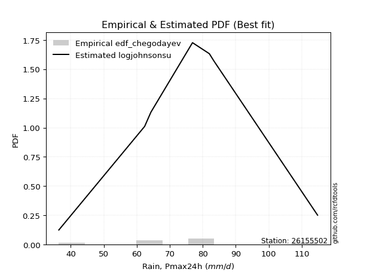</img>

</div>


### 6. EDF Blom (1958)

The Blom formula is a specific "plotting position" formula used in hydrology and statistical analysis to estimate the empirical cumulative probability (or non-exceedance probability) of a data series. It is particularly recommended for data that are approximately normally distributed. The constant _a_ is set to 0.375 (or 3/8).

<div align="center">


$P=(m-a)/(n+1-2a)$


</div>


**6.1. Empirical values**

<div align="center">

|                | 0                   | 1                   | 2                  | 3        | 4                  | 5                  | 6                  |
|:---------------|:--------------------|:--------------------|:-------------------|:---------|:-------------------|:-------------------|:-------------------|
| date           | 2017                | 2022                | 2023               | 2021     | 2020               | 2019               | 2018               |
| x              | 36.4                | 62.4                | 64.3               | 76.9     | 82.0               | 83.4               | 114.8              |
| m              | 1                   | 2                   | 3                  | 4        | 5                  | 6                  | 7                  |
| empirical_dist | edf_blom            | edf_blom            | edf_blom           | edf_blom | edf_blom           | edf_blom           | edf_blom           |
| empirical      | 0.08620689655172414 | 0.22413793103448276 | 0.3620689655172414 | 0.5      | 0.6379310344827587 | 0.7758620689655172 | 0.9137931034482759 |
| empirical_tr   | 1.0943396226415094  | 1.288888888888889   | 1.5675675675675675 | 2.0      | 2.7619047619047623 | 4.461538461538462  | 11.600000000000007 |

</div>


**6.2. Kolmogorov-Smirnov fit test (sorted by Δ)**


<div align="center">

|                | 0                   | 1                   | 2                   | 3                   | 4                   | 5                   | 6                   | 7                   | 8                   | 9                   | 10                  | 11                  | 12                  | 13                  | 14                  | 15                  | 16                  | 17                  | 18                  | 19                  | 20                  | 21                  | 22                  | 23                  | 24                  | 25                  | 26                  | 27                  | 28                  | 29                  | 30                  | 31                  | 32                  | 33                  | 34                  | 35                  | 36                  | 37                  | 38                  | 39                  | 40                  | 41                  | 42                  | 43                  | 44                  | 45                  | 46                  | 47                  | 48                  | 49                  | 50                  | 51                  | 52                  | 53                  | 54                  | 55                  | 56                  | 57                  | 58                  | 59                  | 60                  | 61                  | 62                  | 63                  | 64                  | 65                  | 66                  | 67                  | 68                  | 69                  | 70                  | 71                  | 72                  | 73                  | 74                  | 75                  | 76                  | 77                  | 78                  | 79                  | 80                  | 81                  | 82                  | 83                  | 84                  | 85                  | 86                  | 87                  | 88                  | 89                  | 90                  | 91                  | 92                  | 93                  | 94                  | 95                  | 96                  | 97                  | 98                  | 99                  | 100                 | 101                 | 102                 | 103                 | 104                 | 105                 | 106                 | 107                 | 108                 | 109                 | 110                 | 111                 | 112                 | 113                 | 114                 | 115                 | 116                 | 117                 | 118                 | 119                 | 120                 | 121                 | 122                 | 123                 | 124                 | 125                 | 126                 | 127                 | 128                 | 129                 | 130                 | 131                 | 132                 | 133                 | 134                 | 135                 | 136                 | 137                 | 138                 | 139                 | 140                 | 141                 | 142                 | 143                 | 144                 | 145                 | 146                 | 147                 | 148                 | 149                 | 150                 | 151                 | 152                 | 153                 | 154                 | 155                 | 156                 | 157                 | 158                 | 159                 |
|:---------------|:--------------------|:--------------------|:--------------------|:--------------------|:--------------------|:--------------------|:--------------------|:--------------------|:--------------------|:--------------------|:--------------------|:--------------------|:--------------------|:--------------------|:--------------------|:--------------------|:--------------------|:--------------------|:--------------------|:--------------------|:--------------------|:--------------------|:--------------------|:--------------------|:--------------------|:--------------------|:--------------------|:--------------------|:--------------------|:--------------------|:--------------------|:--------------------|:--------------------|:--------------------|:--------------------|:--------------------|:--------------------|:--------------------|:--------------------|:--------------------|:--------------------|:--------------------|:--------------------|:--------------------|:--------------------|:--------------------|:--------------------|:--------------------|:--------------------|:--------------------|:--------------------|:--------------------|:--------------------|:--------------------|:--------------------|:--------------------|:--------------------|:--------------------|:--------------------|:--------------------|:--------------------|:--------------------|:--------------------|:--------------------|:--------------------|:--------------------|:--------------------|:--------------------|:--------------------|:--------------------|:--------------------|:--------------------|:--------------------|:--------------------|:--------------------|:--------------------|:--------------------|:--------------------|:--------------------|:--------------------|:--------------------|:--------------------|:--------------------|:--------------------|:--------------------|:--------------------|:--------------------|:--------------------|:--------------------|:--------------------|:--------------------|:--------------------|:--------------------|:--------------------|:--------------------|:--------------------|:--------------------|:--------------------|:--------------------|:--------------------|:--------------------|:--------------------|:--------------------|:--------------------|:--------------------|:--------------------|:--------------------|:--------------------|:--------------------|:--------------------|:--------------------|:--------------------|:--------------------|:--------------------|:--------------------|:--------------------|:--------------------|:--------------------|:--------------------|:--------------------|:--------------------|:--------------------|:--------------------|:--------------------|:--------------------|:--------------------|:--------------------|:--------------------|:--------------------|:--------------------|:--------------------|:--------------------|:--------------------|:--------------------|:--------------------|:--------------------|:--------------------|:--------------------|:--------------------|:--------------------|:--------------------|:--------------------|:--------------------|:--------------------|:--------------------|:--------------------|:--------------------|:--------------------|:--------------------|:--------------------|:--------------------|:--------------------|:--------------------|:--------------------|:--------------------|:--------------------|:--------------------|:--------------------|:--------------------|:--------------------|
| station        | 26155502            | 26155502            | 26155502            | 26155502            | 26155502            | 26155502            | 26155502            | 26155502            | 26155502            | 26155502            | 26155502            | 26155502            | 26155502            | 26155502            | 26155502            | 26155502            | 26155502            | 26155502            | 26155502            | 26155502            | 26155502            | 26155502            | 26155502            | 26155502            | 26155502            | 26155502            | 26155502            | 26155502            | 26155502            | 26155502            | 26155502            | 26155502            | 26155502            | 26155502            | 26155502            | 26155502            | 26155502            | 26155502            | 26155502            | 26155502            | 26155502            | 26155502            | 26155502            | 26155502            | 26155502            | 26155502            | 26155502            | 26155502            | 26155502            | 26155502            | 26155502            | 26155502            | 26155502            | 26155502            | 26155502            | 26155502            | 26155502            | 26155502            | 26155502            | 26155502            | 26155502            | 26155502            | 26155502            | 26155502            | 26155502            | 26155502            | 26155502            | 26155502            | 26155502            | 26155502            | 26155502            | 26155502            | 26155502            | 26155502            | 26155502            | 26155502            | 26155502            | 26155502            | 26155502            | 26155502            | 26155502            | 26155502            | 26155502            | 26155502            | 26155502            | 26155502            | 26155502            | 26155502            | 26155502            | 26155502            | 26155502            | 26155502            | 26155502            | 26155502            | 26155502            | 26155502            | 26155502            | 26155502            | 26155502            | 26155502            | 26155502            | 26155502            | 26155502            | 26155502            | 26155502            | 26155502            | 26155502            | 26155502            | 26155502            | 26155502            | 26155502            | 26155502            | 26155502            | 26155502            | 26155502            | 26155502            | 26155502            | 26155502            | 26155502            | 26155502            | 26155502            | 26155502            | 26155502            | 26155502            | 26155502            | 26155502            | 26155502            | 26155502            | 26155502            | 26155502            | 26155502            | 26155502            | 26155502            | 26155502            | 26155502            | 26155502            | 26155502            | 26155502            | 26155502            | 26155502            | 26155502            | 26155502            | 26155502            | 26155502            | 26155502            | 26155502            | 26155502            | 26155502            | 26155502            | 26155502            | 26155502            | 26155502            | 26155502            | 26155502            | 26155502            | 26155502            | 26155502            | 26155502            | 26155502            | 26155502            |
| empirical_dist | edf_blom            | edf_blom            | edf_blom            | edf_blom            | edf_blom            | edf_blom            | edf_blom            | edf_blom            | edf_blom            | edf_blom            | edf_blom            | edf_blom            | edf_blom            | edf_blom            | edf_blom            | edf_blom            | edf_blom            | edf_blom            | edf_blom            | edf_blom            | edf_blom            | edf_blom            | edf_blom            | edf_blom            | edf_blom            | edf_blom            | edf_blom            | edf_blom            | edf_blom            | edf_blom            | edf_blom            | edf_blom            | edf_blom            | edf_blom            | edf_blom            | edf_blom            | edf_blom            | edf_blom            | edf_blom            | edf_blom            | edf_blom            | edf_blom            | edf_blom            | edf_blom            | edf_blom            | edf_blom            | edf_blom            | edf_blom            | edf_blom            | edf_blom            | edf_blom            | edf_blom            | edf_blom            | edf_blom            | edf_blom            | edf_blom            | edf_blom            | edf_blom            | edf_blom            | edf_blom            | edf_blom            | edf_blom            | edf_blom            | edf_blom            | edf_blom            | edf_blom            | edf_blom            | edf_blom            | edf_blom            | edf_blom            | edf_blom            | edf_blom            | edf_blom            | edf_blom            | edf_blom            | edf_blom            | edf_blom            | edf_blom            | edf_blom            | edf_blom            | edf_blom            | edf_blom            | edf_blom            | edf_blom            | edf_blom            | edf_blom            | edf_blom            | edf_blom            | edf_blom            | edf_blom            | edf_blom            | edf_blom            | edf_blom            | edf_blom            | edf_blom            | edf_blom            | edf_blom            | edf_blom            | edf_blom            | edf_blom            | edf_blom            | edf_blom            | edf_blom            | edf_blom            | edf_blom            | edf_blom            | edf_blom            | edf_blom            | edf_blom            | edf_blom            | edf_blom            | edf_blom            | edf_blom            | edf_blom            | edf_blom            | edf_blom            | edf_blom            | edf_blom            | edf_blom            | edf_blom            | edf_blom            | edf_blom            | edf_blom            | edf_blom            | edf_blom            | edf_blom            | edf_blom            | edf_blom            | edf_blom            | edf_blom            | edf_blom            | edf_blom            | edf_blom            | edf_blom            | edf_blom            | edf_blom            | edf_blom            | edf_blom            | edf_blom            | edf_blom            | edf_blom            | edf_blom            | edf_blom            | edf_blom            | edf_blom            | edf_blom            | edf_blom            | edf_blom            | edf_blom            | edf_blom            | edf_blom            | edf_blom            | edf_blom            | edf_blom            | edf_blom            | edf_blom            | edf_blom            | edf_blom            | edf_blom            | edf_blom            |
| p_dist         | logjohnsonsu        | hypsecant           | logburr             | logmielke           | burr                | mielke              | loggenlogistic      | genlogistic         | laplace             | invgamma            | logistic            | maxwell             | alpha               | logskewnorm         | loggompertz         | skewnorm            | betaprime           | invgauss            | erlang              | gamma               | f                   | rice                | johnsonsu           | dweibull            | nct                 | weibull_min         | rayleigh            | pearson3            | ncf                 | logweibull_min      | exponnorm           | logpearson3         | loglogistic         | logloggamma         | logburr12           | logexponpow         | gumbel_r            | foldnorm            | crystalball         | norm                | truncnorm           | t                   | loggumbel_l         | loggengamma         | loghypsecant        | vonmises_line       | dgamma              | logt                | logexponnorm        | lognorm             | logcrystalball      | gennorm             | logfatiguelife      | logf                | lognct              | loggennorm          | logtruncweibull_min | logerlang           | cosine              | logrice             | logloglaplace       | anglit              | loggamma            | loggamma            | logweibull_max      | loggenextreme       | halfnorm            | moyal               | halflogistic        | logexponweib        | logargus            | loginvgamma         | logalpha            | semicircular        | kappa4              | loganglit           | logdweibull         | logdgamma           | kstwobign           | loglaplace          | loglaplace          | logsemicircular     | logmaxwell          | loginvgauss         | logbetaprime        | gumbel_l            | gausshyper          | logfoldnorm         | lograyleigh         | uniform             | loggumbel_r         | logcosine           | logtriang           | gompertz            | arcsine             | bradford            | logarcsine          | ksone               | loginvweibull       | logmoyal            | wrapcauchy          | logncf              | loghalfnorm         | wald                | genpareto           | loghalflogistic     | truncexpon          | kappa3              | lognakagami         | argus               | truncweibull_min    | logkstwobign        | loggenexpon         | logkappa4           | logtruncnorm        | logkappa3           | logvonmises_line    | loguniform          | nakagami            | loggenhalflogistic  | loglevy_l           | logksone            | logwald             | logwrapcauchy       | beta                | genexpon            | lomax               | logjohnsonsb        | loggausshyper       | levy_l              | triang              | logtukeylambda      | logtrapezoid        | loggenpareto        | genhalflogistic     | loglomax            | burr12              | logbradford         | tukeylambda         | logtruncexpon       | halfgennorm         | genextreme          | logbeta             | logrdist            | trapezoid           | johnsonsb           | invweibull          | exponweib           | gengamma            | rdist               | powerlaw            | fatiguelife         | logpowerlaw         | weibull_max         | truncpareto         | exponpow            | logtruncpareto      | loghalfgennorm      | logvonmises         | vonmises            |
| delta          | 0.07481284511484432 | 0.08444271937641645 | 0.08894700347477003 | 0.0889867266884542  | 0.0899371173628446  | 0.08994080845804076 | 0.08994805458496302 | 0.09525796248255047 | 0.09745983951364845 | 0.09857259017055342 | 0.09876161874126832 | 0.09954208046395313 | 0.0996439334005913  | 0.10380663506211707 | 0.10677778961568563 | 0.10760510715196236 | 0.10805190516674534 | 0.10815821295927819 | 0.10923110702062522 | 0.10923123489812736 | 0.10923314494228664 | 0.10930395652605218 | 0.10940107633161444 | 0.10973562823690747 | 0.10991541651714087 | 0.11040315930822286 | 0.11044131580641597 | 0.11057198927089262 | 0.11101040246676208 | 0.11284275265098609 | 0.11355626533190266 | 0.1138416337166851  | 0.114156771741597   | 0.1142434942352949  | 0.11515064643306683 | 0.11622322359712844 | 0.11647916886133713 | 0.11702175241562718 | 0.11740819514278722 | 0.11740820030962829 | 0.1174082160712574  | 0.11745952528518655 | 0.11874638560835094 | 0.12480036247771054 | 0.12480747514970081 | 0.12678990451891975 | 0.127678517805067   | 0.12800926334877505 | 0.1281138107927972  | 0.12811552466369147 | 0.12811870714096246 | 0.12846179296385352 | 0.1287364991712684  | 0.1291476867839535  | 0.13047017603800265 | 0.1350442975592343  | 0.13555480003718234 | 0.1357803459822991  | 0.13724486524763568 | 0.13759963576376122 | 0.13800601372548338 | 0.13811425776503994 | 0.13923856905716492 | 0.13923856905716492 | 0.1395201404250862  | 0.13952383454944983 | 0.1411996076343658  | 0.1414353377499401  | 0.14172069410691335 | 0.1433612681355474  | 0.14462092993215792 | 0.14540038936066058 | 0.1460399090839849  | 0.1468211217004275  | 0.1474179355503848  | 0.1476713974333263  | 0.14932053792214264 | 0.14965395803946824 | 0.1510281312137075  | 0.1520042916499026  | 0.1520042916499026  | 0.15587382483825174 | 0.16018599293842156 | 0.16190873501389308 | 0.1631405162036369  | 0.16345729488440408 | 0.16422124959114226 | 0.17094631423949647 | 0.17226608742594962 | 0.17637227304714986 | 0.1771062730150389  | 0.17825477311354576 | 0.1795868960538265  | 0.18038847947073677 | 0.18264757068321336 | 0.1854666680428294  | 0.1894433699522186  | 0.1929539057002112  | 0.1948532872502119  | 0.19530349455199758 | 0.19800313404468695 | 0.20205709234770564 | 0.20670065216667077 | 0.210684023203221   | 0.21092890515947826 | 0.21517669528140987 | 0.2154686490442388  | 0.2233248913685021  | 0.2241377431945521  | 0.22531226088010803 | 0.22755425561223797 | 0.23065516858055812 | 0.23953952948306356 | 0.24014869845411313 | 0.24375567648805513 | 0.24410083130967525 | 0.24503048317198056 | 0.24511667832982276 | 0.2456024784843659  | 0.24648460391750182 | 0.2474708305050693  | 0.2502409101024386  | 0.2533910714078573  | 0.26558518718080165 | 0.2671089442560949  | 0.26723350683186087 | 0.267902002692303   | 0.28407823258190124 | 0.2867740417182322  | 0.2922019302432162  | 0.29835214821753453 | 0.303331423996734   | 0.30686173439355485 | 0.3236018523597603  | 0.32696082065509646 | 0.32878578779255785 | 0.33122199659903184 | 0.3330341067250957  | 0.338815291716692   | 0.33924632169634794 | 0.3431119372715644  | 0.37001640281507    | 0.4059943632951972  | 0.425250366670084   | 0.43608014216418456 | 0.44633302265895913 | 0.4718491720677901  | 0.4904369697117238  | 0.49348518278034337 | 0.5175680908238448  | 0.6033110787301017  | 0.618256442868517   | 0.645922003555647   | 0.6505524051531189  | 0.6969341815941973  | 0.7125843214986721  | 0.7206455490053078  | 0.7758620689655172  | 1.1213556673324372  | 17.83685312633166   |
| deltao         | 0.48442053926100004 | 0.48442053926100004 | 0.48442053926100004 | 0.48442053926100004 | 0.48442053926100004 | 0.48442053926100004 | 0.48442053926100004 | 0.48442053926100004 | 0.48442053926100004 | 0.48442053926100004 | 0.48442053926100004 | 0.48442053926100004 | 0.48442053926100004 | 0.48442053926100004 | 0.48442053926100004 | 0.48442053926100004 | 0.48442053926100004 | 0.48442053926100004 | 0.48442053926100004 | 0.48442053926100004 | 0.48442053926100004 | 0.48442053926100004 | 0.48442053926100004 | 0.48442053926100004 | 0.48442053926100004 | 0.48442053926100004 | 0.48442053926100004 | 0.48442053926100004 | 0.48442053926100004 | 0.48442053926100004 | 0.48442053926100004 | 0.48442053926100004 | 0.48442053926100004 | 0.48442053926100004 | 0.48442053926100004 | 0.48442053926100004 | 0.48442053926100004 | 0.48442053926100004 | 0.48442053926100004 | 0.48442053926100004 | 0.48442053926100004 | 0.48442053926100004 | 0.48442053926100004 | 0.48442053926100004 | 0.48442053926100004 | 0.48442053926100004 | 0.48442053926100004 | 0.48442053926100004 | 0.48442053926100004 | 0.48442053926100004 | 0.48442053926100004 | 0.48442053926100004 | 0.48442053926100004 | 0.48442053926100004 | 0.48442053926100004 | 0.48442053926100004 | 0.48442053926100004 | 0.48442053926100004 | 0.48442053926100004 | 0.48442053926100004 | 0.48442053926100004 | 0.48442053926100004 | 0.48442053926100004 | 0.48442053926100004 | 0.48442053926100004 | 0.48442053926100004 | 0.48442053926100004 | 0.48442053926100004 | 0.48442053926100004 | 0.48442053926100004 | 0.48442053926100004 | 0.48442053926100004 | 0.48442053926100004 | 0.48442053926100004 | 0.48442053926100004 | 0.48442053926100004 | 0.48442053926100004 | 0.48442053926100004 | 0.48442053926100004 | 0.48442053926100004 | 0.48442053926100004 | 0.48442053926100004 | 0.48442053926100004 | 0.48442053926100004 | 0.48442053926100004 | 0.48442053926100004 | 0.48442053926100004 | 0.48442053926100004 | 0.48442053926100004 | 0.48442053926100004 | 0.48442053926100004 | 0.48442053926100004 | 0.48442053926100004 | 0.48442053926100004 | 0.48442053926100004 | 0.48442053926100004 | 0.48442053926100004 | 0.48442053926100004 | 0.48442053926100004 | 0.48442053926100004 | 0.48442053926100004 | 0.48442053926100004 | 0.48442053926100004 | 0.48442053926100004 | 0.48442053926100004 | 0.48442053926100004 | 0.48442053926100004 | 0.48442053926100004 | 0.48442053926100004 | 0.48442053926100004 | 0.48442053926100004 | 0.48442053926100004 | 0.48442053926100004 | 0.48442053926100004 | 0.48442053926100004 | 0.48442053926100004 | 0.48442053926100004 | 0.48442053926100004 | 0.48442053926100004 | 0.48442053926100004 | 0.48442053926100004 | 0.48442053926100004 | 0.48442053926100004 | 0.48442053926100004 | 0.48442053926100004 | 0.48442053926100004 | 0.48442053926100004 | 0.48442053926100004 | 0.48442053926100004 | 0.48442053926100004 | 0.48442053926100004 | 0.48442053926100004 | 0.48442053926100004 | 0.48442053926100004 | 0.48442053926100004 | 0.48442053926100004 | 0.48442053926100004 | 0.48442053926100004 | 0.48442053926100004 | 0.48442053926100004 | 0.48442053926100004 | 0.48442053926100004 | 0.48442053926100004 | 0.48442053926100004 | 0.48442053926100004 | 0.48442053926100004 | 0.48442053926100004 | 0.48442053926100004 | 0.48442053926100004 | 0.48442053926100004 | 0.48442053926100004 | 0.48442053926100004 | 0.48442053926100004 | 0.48442053926100004 | 0.48442053926100004 | 0.48442053926100004 | 0.48442053926100004 | 0.48442053926100004 | 0.48442053926100004 | 0.48442053926100004 |
| eval           | Δo > Δ              | Δo > Δ              | Δo > Δ              | Δo > Δ              | Δo > Δ              | Δo > Δ              | Δo > Δ              | Δo > Δ              | Δo > Δ              | Δo > Δ              | Δo > Δ              | Δo > Δ              | Δo > Δ              | Δo > Δ              | Δo > Δ              | Δo > Δ              | Δo > Δ              | Δo > Δ              | Δo > Δ              | Δo > Δ              | Δo > Δ              | Δo > Δ              | Δo > Δ              | Δo > Δ              | Δo > Δ              | Δo > Δ              | Δo > Δ              | Δo > Δ              | Δo > Δ              | Δo > Δ              | Δo > Δ              | Δo > Δ              | Δo > Δ              | Δo > Δ              | Δo > Δ              | Δo > Δ              | Δo > Δ              | Δo > Δ              | Δo > Δ              | Δo > Δ              | Δo > Δ              | Δo > Δ              | Δo > Δ              | Δo > Δ              | Δo > Δ              | Δo > Δ              | Δo > Δ              | Δo > Δ              | Δo > Δ              | Δo > Δ              | Δo > Δ              | Δo > Δ              | Δo > Δ              | Δo > Δ              | Δo > Δ              | Δo > Δ              | Δo > Δ              | Δo > Δ              | Δo > Δ              | Δo > Δ              | Δo > Δ              | Δo > Δ              | Δo > Δ              | Δo > Δ              | Δo > Δ              | Δo > Δ              | Δo > Δ              | Δo > Δ              | Δo > Δ              | Δo > Δ              | Δo > Δ              | Δo > Δ              | Δo > Δ              | Δo > Δ              | Δo > Δ              | Δo > Δ              | Δo > Δ              | Δo > Δ              | Δo > Δ              | Δo > Δ              | Δo > Δ              | Δo > Δ              | Δo > Δ              | Δo > Δ              | Δo > Δ              | Δo > Δ              | Δo > Δ              | Δo > Δ              | Δo > Δ              | Δo > Δ              | Δo > Δ              | Δo > Δ              | Δo > Δ              | Δo > Δ              | Δo > Δ              | Δo > Δ              | Δo > Δ              | Δo > Δ              | Δo > Δ              | Δo > Δ              | Δo > Δ              | Δo > Δ              | Δo > Δ              | Δo > Δ              | Δo > Δ              | Δo > Δ              | Δo > Δ              | Δo > Δ              | Δo > Δ              | Δo > Δ              | Δo > Δ              | Δo > Δ              | Δo > Δ              | Δo > Δ              | Δo > Δ              | Δo > Δ              | Δo > Δ              | Δo > Δ              | Δo > Δ              | Δo > Δ              | Δo > Δ              | Δo > Δ              | Δo > Δ              | Δo > Δ              | Δo > Δ              | Δo > Δ              | Δo > Δ              | Δo > Δ              | Δo > Δ              | Δo > Δ              | Δo > Δ              | Δo > Δ              | Δo > Δ              | Δo > Δ              | Δo > Δ              | Δo > Δ              | Δo > Δ              | Δo > Δ              | Δo > Δ              | Δo > Δ              | Δo > Δ              | Δo > Δ              | Δo > Δ              | Δo > Δ              | Δo > Δ              | Δo > Δ              | Δo > Δ              | Δo <= Δ             | Δo <= Δ             | Δo <= Δ             | Δo <= Δ             | Δo <= Δ             | Δo <= Δ             | Δo <= Δ             | Δo <= Δ             | Δo <= Δ             | Δo <= Δ             | Δo <= Δ             | Δo <= Δ             | Δo <= Δ             |
| fit            | 1                   | 1                   | 1                   | 1                   | 1                   | 1                   | 1                   | 1                   | 1                   | 1                   | 1                   | 1                   | 1                   | 1                   | 1                   | 1                   | 1                   | 1                   | 1                   | 1                   | 1                   | 1                   | 1                   | 1                   | 1                   | 1                   | 1                   | 1                   | 1                   | 1                   | 1                   | 1                   | 1                   | 1                   | 1                   | 1                   | 1                   | 1                   | 1                   | 1                   | 1                   | 1                   | 1                   | 1                   | 1                   | 1                   | 1                   | 1                   | 1                   | 1                   | 1                   | 1                   | 1                   | 1                   | 1                   | 1                   | 1                   | 1                   | 1                   | 1                   | 1                   | 1                   | 1                   | 1                   | 1                   | 1                   | 1                   | 1                   | 1                   | 1                   | 1                   | 1                   | 1                   | 1                   | 1                   | 1                   | 1                   | 1                   | 1                   | 1                   | 1                   | 1                   | 1                   | 1                   | 1                   | 1                   | 1                   | 1                   | 1                   | 1                   | 1                   | 1                   | 1                   | 1                   | 1                   | 1                   | 1                   | 1                   | 1                   | 1                   | 1                   | 1                   | 1                   | 1                   | 1                   | 1                   | 1                   | 1                   | 1                   | 1                   | 1                   | 1                   | 1                   | 1                   | 1                   | 1                   | 1                   | 1                   | 1                   | 1                   | 1                   | 1                   | 1                   | 1                   | 1                   | 1                   | 1                   | 1                   | 1                   | 1                   | 1                   | 1                   | 1                   | 1                   | 1                   | 1                   | 1                   | 1                   | 1                   | 1                   | 1                   | 1                   | 1                   | 1                   | 1                   | 1                   | 1                   | 0                   | 0                   | 0                   | 0                   | 0                   | 0                   | 0                   | 0                   | 0                   | 0                   | 0                   | 0                   | 0                   |
| n              | 7                   | 7                   | 7                   | 7                   | 7                   | 7                   | 7                   | 7                   | 7                   | 7                   | 7                   | 7                   | 7                   | 7                   | 7                   | 7                   | 7                   | 7                   | 7                   | 7                   | 7                   | 7                   | 7                   | 7                   | 7                   | 7                   | 7                   | 7                   | 7                   | 7                   | 7                   | 7                   | 7                   | 7                   | 7                   | 7                   | 7                   | 7                   | 7                   | 7                   | 7                   | 7                   | 7                   | 7                   | 7                   | 7                   | 7                   | 7                   | 7                   | 7                   | 7                   | 7                   | 7                   | 7                   | 7                   | 7                   | 7                   | 7                   | 7                   | 7                   | 7                   | 7                   | 7                   | 7                   | 7                   | 7                   | 7                   | 7                   | 7                   | 7                   | 7                   | 7                   | 7                   | 7                   | 7                   | 7                   | 7                   | 7                   | 7                   | 7                   | 7                   | 7                   | 7                   | 7                   | 7                   | 7                   | 7                   | 7                   | 7                   | 7                   | 7                   | 7                   | 7                   | 7                   | 7                   | 7                   | 7                   | 7                   | 7                   | 7                   | 7                   | 7                   | 7                   | 7                   | 7                   | 7                   | 7                   | 7                   | 7                   | 7                   | 7                   | 7                   | 7                   | 7                   | 7                   | 7                   | 7                   | 7                   | 7                   | 7                   | 7                   | 7                   | 7                   | 7                   | 7                   | 7                   | 7                   | 7                   | 7                   | 7                   | 7                   | 7                   | 7                   | 7                   | 7                   | 7                   | 7                   | 7                   | 7                   | 7                   | 7                   | 7                   | 7                   | 7                   | 7                   | 7                   | 7                   | 7                   | 7                   | 7                   | 7                   | 7                   | 7                   | 7                   | 7                   | 7                   | 7                   | 7                   | 7                   | 7                   |
| best_fit       | 1                   | 0                   | 0                   | 0                   | 0                   | 0                   | 0                   | 0                   | 0                   | 0                   | 0                   | 0                   | 0                   | 0                   | 0                   | 0                   | 0                   | 0                   | 0                   | 0                   | 0                   | 0                   | 0                   | 0                   | 0                   | 0                   | 0                   | 0                   | 0                   | 0                   | 0                   | 0                   | 0                   | 0                   | 0                   | 0                   | 0                   | 0                   | 0                   | 0                   | 0                   | 0                   | 0                   | 0                   | 0                   | 0                   | 0                   | 0                   | 0                   | 0                   | 0                   | 0                   | 0                   | 0                   | 0                   | 0                   | 0                   | 0                   | 0                   | 0                   | 0                   | 0                   | 0                   | 0                   | 0                   | 0                   | 0                   | 0                   | 0                   | 0                   | 0                   | 0                   | 0                   | 0                   | 0                   | 0                   | 0                   | 0                   | 0                   | 0                   | 0                   | 0                   | 0                   | 0                   | 0                   | 0                   | 0                   | 0                   | 0                   | 0                   | 0                   | 0                   | 0                   | 0                   | 0                   | 0                   | 0                   | 0                   | 0                   | 0                   | 0                   | 0                   | 0                   | 0                   | 0                   | 0                   | 0                   | 0                   | 0                   | 0                   | 0                   | 0                   | 0                   | 0                   | 0                   | 0                   | 0                   | 0                   | 0                   | 0                   | 0                   | 0                   | 0                   | 0                   | 0                   | 0                   | 0                   | 0                   | 0                   | 0                   | 0                   | 0                   | 0                   | 0                   | 0                   | 0                   | 0                   | 0                   | 0                   | 0                   | 0                   | 0                   | 0                   | 0                   | 0                   | 0                   | 0                   | 0                   | 0                   | 0                   | 0                   | 0                   | 0                   | 0                   | 0                   | 0                   | 0                   | 0                   | 0                   | 0                   |
| best_fit_sort  | 1                   | 2                   | 3                   | 4                   | 5                   | 6                   | 7                   | 8                   | 9                   | 10                  | 11                  | 12                  | 13                  | 14                  | 15                  | 16                  | 17                  | 18                  | 19                  | 20                  | 21                  | 22                  | 23                  | 24                  | 25                  | 26                  | 27                  | 28                  | 29                  | 30                  | 31                  | 32                  | 33                  | 34                  | 35                  | 36                  | 37                  | 38                  | 39                  | 40                  | 41                  | 42                  | 43                  | 44                  | 45                  | 46                  | 47                  | 48                  | 49                  | 50                  | 51                  | 52                  | 53                  | 54                  | 55                  | 56                  | 57                  | 58                  | 59                  | 60                  | 61                  | 62                  | 63                  | 64                  | 65                  | 66                  | 67                  | 68                  | 69                  | 70                  | 71                  | 72                  | 73                  | 74                  | 75                  | 76                  | 77                  | 78                  | 79                  | 80                  | 81                  | 82                  | 83                  | 84                  | 85                  | 86                  | 87                  | 88                  | 89                  | 90                  | 91                  | 92                  | 93                  | 94                  | 95                  | 96                  | 97                  | 98                  | 99                  | 100                 | 101                 | 102                 | 103                 | 104                 | 105                 | 106                 | 107                 | 108                 | 109                 | 110                 | 111                 | 112                 | 113                 | 114                 | 115                 | 116                 | 117                 | 118                 | 119                 | 120                 | 121                 | 122                 | 123                 | 124                 | 125                 | 126                 | 127                 | 128                 | 129                 | 130                 | 131                 | 132                 | 133                 | 134                 | 135                 | 136                 | 137                 | 138                 | 139                 | 140                 | 141                 | 142                 | 143                 | 144                 | 145                 | 146                 | 147                 | 148                 | 149                 | 150                 | 151                 | 152                 | 153                 | 154                 | 155                 | 156                 | 157                 | 158                 | 159                 | 160                 |

</div>


**6.3. Best fit**

<div align="center">

|   id |   station | empirical_dist   | p_dist       |     delta |   deltao | eval   |   fit |   n |   best_fit |   best_fit_sort |
|-----:|----------:|:-----------------|:-------------|----------:|---------:|:-------|------:|----:|-----------:|----------------:|
|    0 |  26155502 | edf_blom         | logjohnsonsu | 0.0748128 | 0.484421 | Δo > Δ |     1 |   7 |          1 |               1 |

</div>


<div align="center">

</img>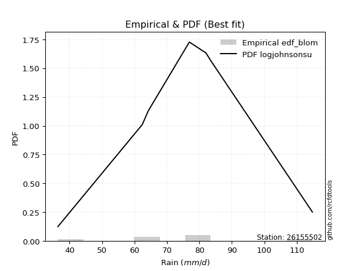</img>

</div>


### 7. EDF Tukey (1962)

In hydrology, the Tukey formula is used as a plotting position formula to estimate the empirical probability or frequency of a flood event (or other hydrological data). The formula parameter is given as _c=0.333_ (or 1/3).

<div align="center">


$P=(m-c)/(n+1-2c)$


</div>


**7.1. Empirical values**

<div align="center">

|                | 0                   | 1                   | 2                   | 3         | 4                  | 5                  | 6                  |
|:---------------|:--------------------|:--------------------|:--------------------|:----------|:-------------------|:-------------------|:-------------------|
| date           | 2017                | 2022                | 2023                | 2021      | 2020               | 2019               | 2018               |
| x              | 36.4                | 62.4                | 64.3                | 76.9      | 82.0               | 83.4               | 114.8              |
| m              | 1                   | 2                   | 3                   | 4         | 5                  | 6                  | 7                  |
| empirical_dist | edf_tukey           | edf_tukey           | edf_tukey           | edf_tukey | edf_tukey          | edf_tukey          | edf_tukey          |
| empirical      | 0.09090909090909091 | 0.22727272727272727 | 0.36363636363636365 | 0.5       | 0.6363636363636364 | 0.7727272727272727 | 0.9090909090909091 |
| empirical_tr   | 1.1                 | 1.2941176470588236  | 1.5714285714285714  | 2.0       | 2.75               | 4.3999999999999995 | 10.999999999999996 |

</div>


**7.2. Kolmogorov-Smirnov fit test (sorted by Δ)**


<div align="center">

|                | 0                   | 1                   | 2                   | 3                   | 4                   | 5                   | 6                   | 7                   | 8                   | 9                   | 10                  | 11                  | 12                  | 13                  | 14                  | 15                  | 16                  | 17                  | 18                  | 19                  | 20                  | 21                  | 22                  | 23                  | 24                  | 25                  | 26                  | 27                  | 28                  | 29                  | 30                  | 31                  | 32                  | 33                  | 34                  | 35                  | 36                  | 37                  | 38                  | 39                  | 40                  | 41                  | 42                  | 43                  | 44                  | 45                  | 46                  | 47                  | 48                  | 49                  | 50                  | 51                  | 52                  | 53                  | 54                  | 55                  | 56                  | 57                  | 58                  | 59                  | 60                  | 61                  | 62                  | 63                  | 64                  | 65                  | 66                  | 67                  | 68                  | 69                  | 70                  | 71                  | 72                  | 73                  | 74                  | 75                  | 76                  | 77                  | 78                  | 79                  | 80                  | 81                  | 82                  | 83                  | 84                  | 85                  | 86                  | 87                  | 88                  | 89                  | 90                  | 91                  | 92                  | 93                  | 94                  | 95                  | 96                  | 97                  | 98                  | 99                  | 100                 | 101                 | 102                 | 103                 | 104                 | 105                 | 106                 | 107                 | 108                 | 109                 | 110                 | 111                 | 112                 | 113                 | 114                 | 115                 | 116                 | 117                 | 118                 | 119                 | 120                 | 121                 | 122                 | 123                 | 124                 | 125                 | 126                 | 127                 | 128                 | 129                 | 130                 | 131                 | 132                 | 133                 | 134                 | 135                 | 136                 | 137                 | 138                 | 139                 | 140                 | 141                 | 142                 | 143                 | 144                 | 145                 | 146                 | 147                 | 148                 | 149                 | 150                 | 151                 | 152                 | 153                 | 154                 | 155                 | 156                 | 157                 | 158                 | 159                 |
|:---------------|:--------------------|:--------------------|:--------------------|:--------------------|:--------------------|:--------------------|:--------------------|:--------------------|:--------------------|:--------------------|:--------------------|:--------------------|:--------------------|:--------------------|:--------------------|:--------------------|:--------------------|:--------------------|:--------------------|:--------------------|:--------------------|:--------------------|:--------------------|:--------------------|:--------------------|:--------------------|:--------------------|:--------------------|:--------------------|:--------------------|:--------------------|:--------------------|:--------------------|:--------------------|:--------------------|:--------------------|:--------------------|:--------------------|:--------------------|:--------------------|:--------------------|:--------------------|:--------------------|:--------------------|:--------------------|:--------------------|:--------------------|:--------------------|:--------------------|:--------------------|:--------------------|:--------------------|:--------------------|:--------------------|:--------------------|:--------------------|:--------------------|:--------------------|:--------------------|:--------------------|:--------------------|:--------------------|:--------------------|:--------------------|:--------------------|:--------------------|:--------------------|:--------------------|:--------------------|:--------------------|:--------------------|:--------------------|:--------------------|:--------------------|:--------------------|:--------------------|:--------------------|:--------------------|:--------------------|:--------------------|:--------------------|:--------------------|:--------------------|:--------------------|:--------------------|:--------------------|:--------------------|:--------------------|:--------------------|:--------------------|:--------------------|:--------------------|:--------------------|:--------------------|:--------------------|:--------------------|:--------------------|:--------------------|:--------------------|:--------------------|:--------------------|:--------------------|:--------------------|:--------------------|:--------------------|:--------------------|:--------------------|:--------------------|:--------------------|:--------------------|:--------------------|:--------------------|:--------------------|:--------------------|:--------------------|:--------------------|:--------------------|:--------------------|:--------------------|:--------------------|:--------------------|:--------------------|:--------------------|:--------------------|:--------------------|:--------------------|:--------------------|:--------------------|:--------------------|:--------------------|:--------------------|:--------------------|:--------------------|:--------------------|:--------------------|:--------------------|:--------------------|:--------------------|:--------------------|:--------------------|:--------------------|:--------------------|:--------------------|:--------------------|:--------------------|:--------------------|:--------------------|:--------------------|:--------------------|:--------------------|:--------------------|:--------------------|:--------------------|:--------------------|:--------------------|:--------------------|:--------------------|:--------------------|:--------------------|:--------------------|
| station        | 26155502            | 26155502            | 26155502            | 26155502            | 26155502            | 26155502            | 26155502            | 26155502            | 26155502            | 26155502            | 26155502            | 26155502            | 26155502            | 26155502            | 26155502            | 26155502            | 26155502            | 26155502            | 26155502            | 26155502            | 26155502            | 26155502            | 26155502            | 26155502            | 26155502            | 26155502            | 26155502            | 26155502            | 26155502            | 26155502            | 26155502            | 26155502            | 26155502            | 26155502            | 26155502            | 26155502            | 26155502            | 26155502            | 26155502            | 26155502            | 26155502            | 26155502            | 26155502            | 26155502            | 26155502            | 26155502            | 26155502            | 26155502            | 26155502            | 26155502            | 26155502            | 26155502            | 26155502            | 26155502            | 26155502            | 26155502            | 26155502            | 26155502            | 26155502            | 26155502            | 26155502            | 26155502            | 26155502            | 26155502            | 26155502            | 26155502            | 26155502            | 26155502            | 26155502            | 26155502            | 26155502            | 26155502            | 26155502            | 26155502            | 26155502            | 26155502            | 26155502            | 26155502            | 26155502            | 26155502            | 26155502            | 26155502            | 26155502            | 26155502            | 26155502            | 26155502            | 26155502            | 26155502            | 26155502            | 26155502            | 26155502            | 26155502            | 26155502            | 26155502            | 26155502            | 26155502            | 26155502            | 26155502            | 26155502            | 26155502            | 26155502            | 26155502            | 26155502            | 26155502            | 26155502            | 26155502            | 26155502            | 26155502            | 26155502            | 26155502            | 26155502            | 26155502            | 26155502            | 26155502            | 26155502            | 26155502            | 26155502            | 26155502            | 26155502            | 26155502            | 26155502            | 26155502            | 26155502            | 26155502            | 26155502            | 26155502            | 26155502            | 26155502            | 26155502            | 26155502            | 26155502            | 26155502            | 26155502            | 26155502            | 26155502            | 26155502            | 26155502            | 26155502            | 26155502            | 26155502            | 26155502            | 26155502            | 26155502            | 26155502            | 26155502            | 26155502            | 26155502            | 26155502            | 26155502            | 26155502            | 26155502            | 26155502            | 26155502            | 26155502            | 26155502            | 26155502            | 26155502            | 26155502            | 26155502            | 26155502            |
| empirical_dist | edf_tukey           | edf_tukey           | edf_tukey           | edf_tukey           | edf_tukey           | edf_tukey           | edf_tukey           | edf_tukey           | edf_tukey           | edf_tukey           | edf_tukey           | edf_tukey           | edf_tukey           | edf_tukey           | edf_tukey           | edf_tukey           | edf_tukey           | edf_tukey           | edf_tukey           | edf_tukey           | edf_tukey           | edf_tukey           | edf_tukey           | edf_tukey           | edf_tukey           | edf_tukey           | edf_tukey           | edf_tukey           | edf_tukey           | edf_tukey           | edf_tukey           | edf_tukey           | edf_tukey           | edf_tukey           | edf_tukey           | edf_tukey           | edf_tukey           | edf_tukey           | edf_tukey           | edf_tukey           | edf_tukey           | edf_tukey           | edf_tukey           | edf_tukey           | edf_tukey           | edf_tukey           | edf_tukey           | edf_tukey           | edf_tukey           | edf_tukey           | edf_tukey           | edf_tukey           | edf_tukey           | edf_tukey           | edf_tukey           | edf_tukey           | edf_tukey           | edf_tukey           | edf_tukey           | edf_tukey           | edf_tukey           | edf_tukey           | edf_tukey           | edf_tukey           | edf_tukey           | edf_tukey           | edf_tukey           | edf_tukey           | edf_tukey           | edf_tukey           | edf_tukey           | edf_tukey           | edf_tukey           | edf_tukey           | edf_tukey           | edf_tukey           | edf_tukey           | edf_tukey           | edf_tukey           | edf_tukey           | edf_tukey           | edf_tukey           | edf_tukey           | edf_tukey           | edf_tukey           | edf_tukey           | edf_tukey           | edf_tukey           | edf_tukey           | edf_tukey           | edf_tukey           | edf_tukey           | edf_tukey           | edf_tukey           | edf_tukey           | edf_tukey           | edf_tukey           | edf_tukey           | edf_tukey           | edf_tukey           | edf_tukey           | edf_tukey           | edf_tukey           | edf_tukey           | edf_tukey           | edf_tukey           | edf_tukey           | edf_tukey           | edf_tukey           | edf_tukey           | edf_tukey           | edf_tukey           | edf_tukey           | edf_tukey           | edf_tukey           | edf_tukey           | edf_tukey           | edf_tukey           | edf_tukey           | edf_tukey           | edf_tukey           | edf_tukey           | edf_tukey           | edf_tukey           | edf_tukey           | edf_tukey           | edf_tukey           | edf_tukey           | edf_tukey           | edf_tukey           | edf_tukey           | edf_tukey           | edf_tukey           | edf_tukey           | edf_tukey           | edf_tukey           | edf_tukey           | edf_tukey           | edf_tukey           | edf_tukey           | edf_tukey           | edf_tukey           | edf_tukey           | edf_tukey           | edf_tukey           | edf_tukey           | edf_tukey           | edf_tukey           | edf_tukey           | edf_tukey           | edf_tukey           | edf_tukey           | edf_tukey           | edf_tukey           | edf_tukey           | edf_tukey           | edf_tukey           | edf_tukey           | edf_tukey           | edf_tukey           |
| p_dist         | logjohnsonsu        | hypsecant           | logburr             | logmielke           | burr                | mielke              | loggenlogistic      | genlogistic         | invgamma            | logistic            | maxwell             | alpha               | laplace             | logskewnorm         | loggompertz         | skewnorm            | betaprime           | invgauss            | erlang              | gamma               | f                   | rice                | johnsonsu           | dweibull            | nct                 | weibull_min         | rayleigh            | pearson3            | ncf                 | logweibull_min      | exponnorm           | logpearson3         | logloggamma         | logburr12           | logexponpow         | foldnorm            | loglogistic         | crystalball         | norm                | truncnorm           | t                   | loggumbel_l         | gumbel_r            | loggengamma         | dgamma              | loghypsecant        | logt                | logexponnorm        | lognorm             | logcrystalball      | logfatiguelife      | logf                | lognct              | vonmises_line       | gennorm             | loggennorm          | logtruncweibull_min | logerlang           | cosine              | logrice             | logloglaplace       | anglit              | loggamma            | loggamma            | logweibull_max      | loggenextreme       | halfnorm            | logexponweib        | moyal               | logargus            | halflogistic        | loginvgamma         | logalpha            | semicircular        | kappa4              | loganglit           | kstwobign           | logdweibull         | logdgamma           | loglaplace          | loglaplace          | logsemicircular     | logmaxwell          | loginvgauss         | logbetaprime        | gumbel_l            | gausshyper          | logfoldnorm         | lograyleigh         | uniform             | loggumbel_r         | logcosine           | logtriang           | gompertz            | arcsine             | bradford            | logarcsine          | ksone               | loginvweibull       | logmoyal            | wrapcauchy          | logncf              | loghalfnorm         | genpareto           | wald                | loghalflogistic     | truncexpon          | kappa3              | argus               | truncweibull_min    | lognakagami         | logkstwobign        | loggenexpon         | logkappa4           | logkappa3           | logvonmises_line    | loguniform          | loglevy_l           | loggenhalflogistic  | logtruncnorm        | nakagami            | logksone            | logwald             | logwrapcauchy       | beta                | genexpon            | lomax               | logjohnsonsb        | loggausshyper       | levy_l              | triang              | logtrapezoid        | logtukeylambda      | loggenpareto        | genhalflogistic     | loglomax            | burr12              | logbradford         | logtruncexpon       | tukeylambda         | halfgennorm         | genextreme          | logbeta             | logrdist            | trapezoid           | johnsonsb           | invweibull          | exponweib           | gengamma            | rdist               | powerlaw            | fatiguelife         | logpowerlaw         | weibull_max         | truncpareto         | exponpow            | logtruncpareto      | loghalfgennorm      | logvonmises         | vonmises            |
| delta          | 0.07167804887659979 | 0.08130792313817192 | 0.0858122072365255  | 0.08585193045020967 | 0.08680232112460007 | 0.08680601221979622 | 0.08681325834671849 | 0.09212316624430594 | 0.09543779393230889 | 0.09562682250302379 | 0.09640728422570863 | 0.09650913716234677 | 0.09902723763277071 | 0.10067183882387254 | 0.10364299337744112 | 0.10447031091371783 | 0.10491710892850081 | 0.10502341672103369 | 0.10609631078238069 | 0.10609643865988283 | 0.10609834870404211 | 0.10616916028780765 | 0.10626628009336991 | 0.10660083199866296 | 0.10678062027889634 | 0.10726836306997833 | 0.10730651956817147 | 0.10743719303264809 | 0.10787560622851758 | 0.10970795641274156 | 0.11042146909365813 | 0.11070683747844057 | 0.11110869799705037 | 0.1120158501948223  | 0.11308842735888391 | 0.11388695617738265 | 0.114156771741597   | 0.11427339890454269 | 0.11427340407138376 | 0.11427341983301287 | 0.11432472904694202 | 0.1156115893701064  | 0.11647916886133713 | 0.12166556623946603 | 0.1245437215668225  | 0.12480747514970081 | 0.12487446711053055 | 0.12497901455455271 | 0.12498072842544697 | 0.12498391090271796 | 0.1256017029330239  | 0.126012890545709   | 0.12733537979975815 | 0.12835730263804201 | 0.13002919108297578 | 0.13190950132098977 | 0.1324200037989378  | 0.1326455497440546  | 0.13411006900939115 | 0.13446483952551672 | 0.13487121748723885 | 0.1349794615267954  | 0.13610377281892042 | 0.13610377281892042 | 0.13638534418684167 | 0.1363890383112053  | 0.13806481139612128 | 0.1402264718973029  | 0.1414353377499401  | 0.14148613369391339 | 0.14172069410691335 | 0.14226559312241607 | 0.1429051128457404  | 0.14368632546218296 | 0.1442831393121403  | 0.1445366011950818  | 0.147893334975463   | 0.1508879360412649  | 0.1512213561585905  | 0.1520042916499026  | 0.1520042916499026  | 0.15273902860000724 | 0.15705119670017706 | 0.15877393877564858 | 0.1600057199653924  | 0.16032249864615955 | 0.16108645335289773 | 0.16781151800125196 | 0.16913129118770512 | 0.17323747680890533 | 0.1739714767767944  | 0.17511997687530126 | 0.17645209981558196 | 0.17725368323249224 | 0.17951277444496883 | 0.1823318718045849  | 0.1863085737139741  | 0.18981910946196667 | 0.1917184910119674  | 0.19216869831375308 | 0.19486833780644242 | 0.19892229610946113 | 0.20356585592842627 | 0.20779410892123376 | 0.210684023203221   | 0.21204189904316537 | 0.2123338528059943  | 0.22019009513025756 | 0.2221774646418635  | 0.22441945937399346 | 0.2272725394327966  | 0.22752037234231362 | 0.23640473324481906 | 0.23701390221586863 | 0.24096603507143075 | 0.24189568693373606 | 0.24198188209157825 | 0.24276863614770253 | 0.2433498076792573  | 0.2453230746071774  | 0.2456024784843659  | 0.2471061138641941  | 0.2533910714078573  | 0.2624503909425572  | 0.26397414801785035 | 0.26409871059361634 | 0.2647672064540585  | 0.2809434363436567  | 0.28363924547998765 | 0.28749973588584943 | 0.29521735197929    | 0.3037269381553103  | 0.3048988221158563  | 0.3188996580023935  | 0.32382602441685193 | 0.3256509915543133  | 0.3280872003607873  | 0.32989931048685117 | 0.3361115254581034  | 0.338815291716692   | 0.3399771410333199  | 0.36688160657682545 | 0.4028595670569527  | 0.42211557043183945 | 0.43294534592594003 | 0.4431982264207146  | 0.46714697771042324 | 0.48730217347347926 | 0.49035038654209884 | 0.5144332945856003  | 0.6001762824918572  | 0.6151216466302725  | 0.6427872073174025  | 0.6474176089148742  | 0.6937993853559528  | 0.7094495252604276  | 0.7175107527670632  | 0.7727272727272727  | 1.1182208710941925  | 17.84155532068903   |
| deltao         | 0.48442053926100004 | 0.48442053926100004 | 0.48442053926100004 | 0.48442053926100004 | 0.48442053926100004 | 0.48442053926100004 | 0.48442053926100004 | 0.48442053926100004 | 0.48442053926100004 | 0.48442053926100004 | 0.48442053926100004 | 0.48442053926100004 | 0.48442053926100004 | 0.48442053926100004 | 0.48442053926100004 | 0.48442053926100004 | 0.48442053926100004 | 0.48442053926100004 | 0.48442053926100004 | 0.48442053926100004 | 0.48442053926100004 | 0.48442053926100004 | 0.48442053926100004 | 0.48442053926100004 | 0.48442053926100004 | 0.48442053926100004 | 0.48442053926100004 | 0.48442053926100004 | 0.48442053926100004 | 0.48442053926100004 | 0.48442053926100004 | 0.48442053926100004 | 0.48442053926100004 | 0.48442053926100004 | 0.48442053926100004 | 0.48442053926100004 | 0.48442053926100004 | 0.48442053926100004 | 0.48442053926100004 | 0.48442053926100004 | 0.48442053926100004 | 0.48442053926100004 | 0.48442053926100004 | 0.48442053926100004 | 0.48442053926100004 | 0.48442053926100004 | 0.48442053926100004 | 0.48442053926100004 | 0.48442053926100004 | 0.48442053926100004 | 0.48442053926100004 | 0.48442053926100004 | 0.48442053926100004 | 0.48442053926100004 | 0.48442053926100004 | 0.48442053926100004 | 0.48442053926100004 | 0.48442053926100004 | 0.48442053926100004 | 0.48442053926100004 | 0.48442053926100004 | 0.48442053926100004 | 0.48442053926100004 | 0.48442053926100004 | 0.48442053926100004 | 0.48442053926100004 | 0.48442053926100004 | 0.48442053926100004 | 0.48442053926100004 | 0.48442053926100004 | 0.48442053926100004 | 0.48442053926100004 | 0.48442053926100004 | 0.48442053926100004 | 0.48442053926100004 | 0.48442053926100004 | 0.48442053926100004 | 0.48442053926100004 | 0.48442053926100004 | 0.48442053926100004 | 0.48442053926100004 | 0.48442053926100004 | 0.48442053926100004 | 0.48442053926100004 | 0.48442053926100004 | 0.48442053926100004 | 0.48442053926100004 | 0.48442053926100004 | 0.48442053926100004 | 0.48442053926100004 | 0.48442053926100004 | 0.48442053926100004 | 0.48442053926100004 | 0.48442053926100004 | 0.48442053926100004 | 0.48442053926100004 | 0.48442053926100004 | 0.48442053926100004 | 0.48442053926100004 | 0.48442053926100004 | 0.48442053926100004 | 0.48442053926100004 | 0.48442053926100004 | 0.48442053926100004 | 0.48442053926100004 | 0.48442053926100004 | 0.48442053926100004 | 0.48442053926100004 | 0.48442053926100004 | 0.48442053926100004 | 0.48442053926100004 | 0.48442053926100004 | 0.48442053926100004 | 0.48442053926100004 | 0.48442053926100004 | 0.48442053926100004 | 0.48442053926100004 | 0.48442053926100004 | 0.48442053926100004 | 0.48442053926100004 | 0.48442053926100004 | 0.48442053926100004 | 0.48442053926100004 | 0.48442053926100004 | 0.48442053926100004 | 0.48442053926100004 | 0.48442053926100004 | 0.48442053926100004 | 0.48442053926100004 | 0.48442053926100004 | 0.48442053926100004 | 0.48442053926100004 | 0.48442053926100004 | 0.48442053926100004 | 0.48442053926100004 | 0.48442053926100004 | 0.48442053926100004 | 0.48442053926100004 | 0.48442053926100004 | 0.48442053926100004 | 0.48442053926100004 | 0.48442053926100004 | 0.48442053926100004 | 0.48442053926100004 | 0.48442053926100004 | 0.48442053926100004 | 0.48442053926100004 | 0.48442053926100004 | 0.48442053926100004 | 0.48442053926100004 | 0.48442053926100004 | 0.48442053926100004 | 0.48442053926100004 | 0.48442053926100004 | 0.48442053926100004 | 0.48442053926100004 | 0.48442053926100004 | 0.48442053926100004 | 0.48442053926100004 | 0.48442053926100004 |
| eval           | Δo > Δ              | Δo > Δ              | Δo > Δ              | Δo > Δ              | Δo > Δ              | Δo > Δ              | Δo > Δ              | Δo > Δ              | Δo > Δ              | Δo > Δ              | Δo > Δ              | Δo > Δ              | Δo > Δ              | Δo > Δ              | Δo > Δ              | Δo > Δ              | Δo > Δ              | Δo > Δ              | Δo > Δ              | Δo > Δ              | Δo > Δ              | Δo > Δ              | Δo > Δ              | Δo > Δ              | Δo > Δ              | Δo > Δ              | Δo > Δ              | Δo > Δ              | Δo > Δ              | Δo > Δ              | Δo > Δ              | Δo > Δ              | Δo > Δ              | Δo > Δ              | Δo > Δ              | Δo > Δ              | Δo > Δ              | Δo > Δ              | Δo > Δ              | Δo > Δ              | Δo > Δ              | Δo > Δ              | Δo > Δ              | Δo > Δ              | Δo > Δ              | Δo > Δ              | Δo > Δ              | Δo > Δ              | Δo > Δ              | Δo > Δ              | Δo > Δ              | Δo > Δ              | Δo > Δ              | Δo > Δ              | Δo > Δ              | Δo > Δ              | Δo > Δ              | Δo > Δ              | Δo > Δ              | Δo > Δ              | Δo > Δ              | Δo > Δ              | Δo > Δ              | Δo > Δ              | Δo > Δ              | Δo > Δ              | Δo > Δ              | Δo > Δ              | Δo > Δ              | Δo > Δ              | Δo > Δ              | Δo > Δ              | Δo > Δ              | Δo > Δ              | Δo > Δ              | Δo > Δ              | Δo > Δ              | Δo > Δ              | Δo > Δ              | Δo > Δ              | Δo > Δ              | Δo > Δ              | Δo > Δ              | Δo > Δ              | Δo > Δ              | Δo > Δ              | Δo > Δ              | Δo > Δ              | Δo > Δ              | Δo > Δ              | Δo > Δ              | Δo > Δ              | Δo > Δ              | Δo > Δ              | Δo > Δ              | Δo > Δ              | Δo > Δ              | Δo > Δ              | Δo > Δ              | Δo > Δ              | Δo > Δ              | Δo > Δ              | Δo > Δ              | Δo > Δ              | Δo > Δ              | Δo > Δ              | Δo > Δ              | Δo > Δ              | Δo > Δ              | Δo > Δ              | Δo > Δ              | Δo > Δ              | Δo > Δ              | Δo > Δ              | Δo > Δ              | Δo > Δ              | Δo > Δ              | Δo > Δ              | Δo > Δ              | Δo > Δ              | Δo > Δ              | Δo > Δ              | Δo > Δ              | Δo > Δ              | Δo > Δ              | Δo > Δ              | Δo > Δ              | Δo > Δ              | Δo > Δ              | Δo > Δ              | Δo > Δ              | Δo > Δ              | Δo > Δ              | Δo > Δ              | Δo > Δ              | Δo > Δ              | Δo > Δ              | Δo > Δ              | Δo > Δ              | Δo > Δ              | Δo > Δ              | Δo > Δ              | Δo > Δ              | Δo > Δ              | Δo > Δ              | Δo > Δ              | Δo > Δ              | Δo <= Δ             | Δo <= Δ             | Δo <= Δ             | Δo <= Δ             | Δo <= Δ             | Δo <= Δ             | Δo <= Δ             | Δo <= Δ             | Δo <= Δ             | Δo <= Δ             | Δo <= Δ             | Δo <= Δ             | Δo <= Δ             |
| fit            | 1                   | 1                   | 1                   | 1                   | 1                   | 1                   | 1                   | 1                   | 1                   | 1                   | 1                   | 1                   | 1                   | 1                   | 1                   | 1                   | 1                   | 1                   | 1                   | 1                   | 1                   | 1                   | 1                   | 1                   | 1                   | 1                   | 1                   | 1                   | 1                   | 1                   | 1                   | 1                   | 1                   | 1                   | 1                   | 1                   | 1                   | 1                   | 1                   | 1                   | 1                   | 1                   | 1                   | 1                   | 1                   | 1                   | 1                   | 1                   | 1                   | 1                   | 1                   | 1                   | 1                   | 1                   | 1                   | 1                   | 1                   | 1                   | 1                   | 1                   | 1                   | 1                   | 1                   | 1                   | 1                   | 1                   | 1                   | 1                   | 1                   | 1                   | 1                   | 1                   | 1                   | 1                   | 1                   | 1                   | 1                   | 1                   | 1                   | 1                   | 1                   | 1                   | 1                   | 1                   | 1                   | 1                   | 1                   | 1                   | 1                   | 1                   | 1                   | 1                   | 1                   | 1                   | 1                   | 1                   | 1                   | 1                   | 1                   | 1                   | 1                   | 1                   | 1                   | 1                   | 1                   | 1                   | 1                   | 1                   | 1                   | 1                   | 1                   | 1                   | 1                   | 1                   | 1                   | 1                   | 1                   | 1                   | 1                   | 1                   | 1                   | 1                   | 1                   | 1                   | 1                   | 1                   | 1                   | 1                   | 1                   | 1                   | 1                   | 1                   | 1                   | 1                   | 1                   | 1                   | 1                   | 1                   | 1                   | 1                   | 1                   | 1                   | 1                   | 1                   | 1                   | 1                   | 1                   | 0                   | 0                   | 0                   | 0                   | 0                   | 0                   | 0                   | 0                   | 0                   | 0                   | 0                   | 0                   | 0                   |
| n              | 7                   | 7                   | 7                   | 7                   | 7                   | 7                   | 7                   | 7                   | 7                   | 7                   | 7                   | 7                   | 7                   | 7                   | 7                   | 7                   | 7                   | 7                   | 7                   | 7                   | 7                   | 7                   | 7                   | 7                   | 7                   | 7                   | 7                   | 7                   | 7                   | 7                   | 7                   | 7                   | 7                   | 7                   | 7                   | 7                   | 7                   | 7                   | 7                   | 7                   | 7                   | 7                   | 7                   | 7                   | 7                   | 7                   | 7                   | 7                   | 7                   | 7                   | 7                   | 7                   | 7                   | 7                   | 7                   | 7                   | 7                   | 7                   | 7                   | 7                   | 7                   | 7                   | 7                   | 7                   | 7                   | 7                   | 7                   | 7                   | 7                   | 7                   | 7                   | 7                   | 7                   | 7                   | 7                   | 7                   | 7                   | 7                   | 7                   | 7                   | 7                   | 7                   | 7                   | 7                   | 7                   | 7                   | 7                   | 7                   | 7                   | 7                   | 7                   | 7                   | 7                   | 7                   | 7                   | 7                   | 7                   | 7                   | 7                   | 7                   | 7                   | 7                   | 7                   | 7                   | 7                   | 7                   | 7                   | 7                   | 7                   | 7                   | 7                   | 7                   | 7                   | 7                   | 7                   | 7                   | 7                   | 7                   | 7                   | 7                   | 7                   | 7                   | 7                   | 7                   | 7                   | 7                   | 7                   | 7                   | 7                   | 7                   | 7                   | 7                   | 7                   | 7                   | 7                   | 7                   | 7                   | 7                   | 7                   | 7                   | 7                   | 7                   | 7                   | 7                   | 7                   | 7                   | 7                   | 7                   | 7                   | 7                   | 7                   | 7                   | 7                   | 7                   | 7                   | 7                   | 7                   | 7                   | 7                   | 7                   |
| best_fit       | 1                   | 0                   | 0                   | 0                   | 0                   | 0                   | 0                   | 0                   | 0                   | 0                   | 0                   | 0                   | 0                   | 0                   | 0                   | 0                   | 0                   | 0                   | 0                   | 0                   | 0                   | 0                   | 0                   | 0                   | 0                   | 0                   | 0                   | 0                   | 0                   | 0                   | 0                   | 0                   | 0                   | 0                   | 0                   | 0                   | 0                   | 0                   | 0                   | 0                   | 0                   | 0                   | 0                   | 0                   | 0                   | 0                   | 0                   | 0                   | 0                   | 0                   | 0                   | 0                   | 0                   | 0                   | 0                   | 0                   | 0                   | 0                   | 0                   | 0                   | 0                   | 0                   | 0                   | 0                   | 0                   | 0                   | 0                   | 0                   | 0                   | 0                   | 0                   | 0                   | 0                   | 0                   | 0                   | 0                   | 0                   | 0                   | 0                   | 0                   | 0                   | 0                   | 0                   | 0                   | 0                   | 0                   | 0                   | 0                   | 0                   | 0                   | 0                   | 0                   | 0                   | 0                   | 0                   | 0                   | 0                   | 0                   | 0                   | 0                   | 0                   | 0                   | 0                   | 0                   | 0                   | 0                   | 0                   | 0                   | 0                   | 0                   | 0                   | 0                   | 0                   | 0                   | 0                   | 0                   | 0                   | 0                   | 0                   | 0                   | 0                   | 0                   | 0                   | 0                   | 0                   | 0                   | 0                   | 0                   | 0                   | 0                   | 0                   | 0                   | 0                   | 0                   | 0                   | 0                   | 0                   | 0                   | 0                   | 0                   | 0                   | 0                   | 0                   | 0                   | 0                   | 0                   | 0                   | 0                   | 0                   | 0                   | 0                   | 0                   | 0                   | 0                   | 0                   | 0                   | 0                   | 0                   | 0                   | 0                   |
| best_fit_sort  | 1                   | 2                   | 3                   | 4                   | 5                   | 6                   | 7                   | 8                   | 9                   | 10                  | 11                  | 12                  | 13                  | 14                  | 15                  | 16                  | 17                  | 18                  | 19                  | 20                  | 21                  | 22                  | 23                  | 24                  | 25                  | 26                  | 27                  | 28                  | 29                  | 30                  | 31                  | 32                  | 33                  | 34                  | 35                  | 36                  | 37                  | 38                  | 39                  | 40                  | 41                  | 42                  | 43                  | 44                  | 45                  | 46                  | 47                  | 48                  | 49                  | 50                  | 51                  | 52                  | 53                  | 54                  | 55                  | 56                  | 57                  | 58                  | 59                  | 60                  | 61                  | 62                  | 63                  | 64                  | 65                  | 66                  | 67                  | 68                  | 69                  | 70                  | 71                  | 72                  | 73                  | 74                  | 75                  | 76                  | 77                  | 78                  | 79                  | 80                  | 81                  | 82                  | 83                  | 84                  | 85                  | 86                  | 87                  | 88                  | 89                  | 90                  | 91                  | 92                  | 93                  | 94                  | 95                  | 96                  | 97                  | 98                  | 99                  | 100                 | 101                 | 102                 | 103                 | 104                 | 105                 | 106                 | 107                 | 108                 | 109                 | 110                 | 111                 | 112                 | 113                 | 114                 | 115                 | 116                 | 117                 | 118                 | 119                 | 120                 | 121                 | 122                 | 123                 | 124                 | 125                 | 126                 | 127                 | 128                 | 129                 | 130                 | 131                 | 132                 | 133                 | 134                 | 135                 | 136                 | 137                 | 138                 | 139                 | 140                 | 141                 | 142                 | 143                 | 144                 | 145                 | 146                 | 147                 | 148                 | 149                 | 150                 | 151                 | 152                 | 153                 | 154                 | 155                 | 156                 | 157                 | 158                 | 159                 | 160                 |

</div>


**7.3. Best fit**

<div align="center">

|   id |   station | empirical_dist   | p_dist       |    delta |   deltao | eval   |   fit |   n |   best_fit |   best_fit_sort |
|-----:|----------:|:-----------------|:-------------|---------:|---------:|:-------|------:|----:|-----------:|----------------:|
|    0 |  26155502 | edf_tukey        | logjohnsonsu | 0.071678 | 0.484421 | Δo > Δ |     1 |   7 |          1 |               1 |

</div>


<div align="center">

</img></img>

</div>


### 8. EDF Gringorten (1963)

Gringorten plotting position formula is essential for estimating the probability and return periods of extreme events like floods and heavy rainfall. The constant _a=0.44_.

<div align="center">


$P=(m-a)/(n+1-2a)$


</div>


**8.1. Empirical values**

<div align="center">

|                | 0                   | 1                   | 2                  | 3              | 4                  | 5                  | 6                  |
|:---------------|:--------------------|:--------------------|:-------------------|:---------------|:-------------------|:-------------------|:-------------------|
| date           | 2017                | 2022                | 2023               | 2021           | 2020               | 2019               | 2018               |
| x              | 36.4                | 62.4                | 64.3               | 76.9           | 82.0               | 83.4               | 114.8              |
| m              | 1                   | 2                   | 3                  | 4              | 5                  | 6                  | 7                  |
| empirical_dist | edf_gringorten      | edf_gringorten      | edf_gringorten     | edf_gringorten | edf_gringorten     | edf_gringorten     | edf_gringorten     |
| empirical      | 0.07865168539325844 | 0.21910112359550563 | 0.3595505617977528 | 0.5            | 0.6404494382022471 | 0.7808988764044943 | 0.9213483146067415 |
| empirical_tr   | 1.0853658536585364  | 1.2805755395683454  | 1.5614035087719298 | 2.0            | 2.781249999999999  | 4.564102564102562  | 12.714285714285701 |

</div>


**8.2. Kolmogorov-Smirnov fit test (sorted by Δ)**


<div align="center">

|                | 0                   | 1                   | 2                   | 3                   | 4                   | 5                   | 6                   | 7                   | 8                   | 9                   | 10                  | 11                  | 12                  | 13                  | 14                  | 15                  | 16                  | 17                  | 18                  | 19                  | 20                  | 21                  | 22                  | 23                  | 24                  | 25                  | 26                  | 27                  | 28                  | 29                  | 30                  | 31                  | 32                  | 33                  | 34                  | 35                  | 36                  | 37                  | 38                  | 39                  | 40                  | 41                  | 42                  | 43                  | 44                  | 45                  | 46                  | 47                  | 48                  | 49                  | 50                  | 51                  | 52                  | 53                  | 54                  | 55                  | 56                  | 57                  | 58                  | 59                  | 60                  | 61                  | 62                  | 63                  | 64                  | 65                  | 66                  | 67                  | 68                  | 69                  | 70                  | 71                  | 72                  | 73                  | 74                  | 75                  | 76                  | 77                  | 78                  | 79                  | 80                  | 81                  | 82                  | 83                  | 84                  | 85                  | 86                  | 87                  | 88                  | 89                  | 90                  | 91                  | 92                  | 93                  | 94                  | 95                  | 96                  | 97                  | 98                  | 99                  | 100                 | 101                 | 102                 | 103                 | 104                 | 105                 | 106                 | 107                 | 108                 | 109                 | 110                 | 111                 | 112                 | 113                 | 114                 | 115                 | 116                 | 117                 | 118                 | 119                 | 120                 | 121                 | 122                 | 123                 | 124                 | 125                 | 126                 | 127                 | 128                 | 129                 | 130                 | 131                 | 132                 | 133                 | 134                 | 135                 | 136                 | 137                 | 138                 | 139                 | 140                 | 141                 | 142                 | 143                 | 144                 | 145                 | 146                 | 147                 | 148                 | 149                 | 150                 | 151                 | 152                 | 153                 | 154                 | 155                 | 156                 | 157                 | 158                 | 159                 |
|:---------------|:--------------------|:--------------------|:--------------------|:--------------------|:--------------------|:--------------------|:--------------------|:--------------------|:--------------------|:--------------------|:--------------------|:--------------------|:--------------------|:--------------------|:--------------------|:--------------------|:--------------------|:--------------------|:--------------------|:--------------------|:--------------------|:--------------------|:--------------------|:--------------------|:--------------------|:--------------------|:--------------------|:--------------------|:--------------------|:--------------------|:--------------------|:--------------------|:--------------------|:--------------------|:--------------------|:--------------------|:--------------------|:--------------------|:--------------------|:--------------------|:--------------------|:--------------------|:--------------------|:--------------------|:--------------------|:--------------------|:--------------------|:--------------------|:--------------------|:--------------------|:--------------------|:--------------------|:--------------------|:--------------------|:--------------------|:--------------------|:--------------------|:--------------------|:--------------------|:--------------------|:--------------------|:--------------------|:--------------------|:--------------------|:--------------------|:--------------------|:--------------------|:--------------------|:--------------------|:--------------------|:--------------------|:--------------------|:--------------------|:--------------------|:--------------------|:--------------------|:--------------------|:--------------------|:--------------------|:--------------------|:--------------------|:--------------------|:--------------------|:--------------------|:--------------------|:--------------------|:--------------------|:--------------------|:--------------------|:--------------------|:--------------------|:--------------------|:--------------------|:--------------------|:--------------------|:--------------------|:--------------------|:--------------------|:--------------------|:--------------------|:--------------------|:--------------------|:--------------------|:--------------------|:--------------------|:--------------------|:--------------------|:--------------------|:--------------------|:--------------------|:--------------------|:--------------------|:--------------------|:--------------------|:--------------------|:--------------------|:--------------------|:--------------------|:--------------------|:--------------------|:--------------------|:--------------------|:--------------------|:--------------------|:--------------------|:--------------------|:--------------------|:--------------------|:--------------------|:--------------------|:--------------------|:--------------------|:--------------------|:--------------------|:--------------------|:--------------------|:--------------------|:--------------------|:--------------------|:--------------------|:--------------------|:--------------------|:--------------------|:--------------------|:--------------------|:--------------------|:--------------------|:--------------------|:--------------------|:--------------------|:--------------------|:--------------------|:--------------------|:--------------------|:--------------------|:--------------------|:--------------------|:--------------------|:--------------------|:--------------------|
| station        | 26155502            | 26155502            | 26155502            | 26155502            | 26155502            | 26155502            | 26155502            | 26155502            | 26155502            | 26155502            | 26155502            | 26155502            | 26155502            | 26155502            | 26155502            | 26155502            | 26155502            | 26155502            | 26155502            | 26155502            | 26155502            | 26155502            | 26155502            | 26155502            | 26155502            | 26155502            | 26155502            | 26155502            | 26155502            | 26155502            | 26155502            | 26155502            | 26155502            | 26155502            | 26155502            | 26155502            | 26155502            | 26155502            | 26155502            | 26155502            | 26155502            | 26155502            | 26155502            | 26155502            | 26155502            | 26155502            | 26155502            | 26155502            | 26155502            | 26155502            | 26155502            | 26155502            | 26155502            | 26155502            | 26155502            | 26155502            | 26155502            | 26155502            | 26155502            | 26155502            | 26155502            | 26155502            | 26155502            | 26155502            | 26155502            | 26155502            | 26155502            | 26155502            | 26155502            | 26155502            | 26155502            | 26155502            | 26155502            | 26155502            | 26155502            | 26155502            | 26155502            | 26155502            | 26155502            | 26155502            | 26155502            | 26155502            | 26155502            | 26155502            | 26155502            | 26155502            | 26155502            | 26155502            | 26155502            | 26155502            | 26155502            | 26155502            | 26155502            | 26155502            | 26155502            | 26155502            | 26155502            | 26155502            | 26155502            | 26155502            | 26155502            | 26155502            | 26155502            | 26155502            | 26155502            | 26155502            | 26155502            | 26155502            | 26155502            | 26155502            | 26155502            | 26155502            | 26155502            | 26155502            | 26155502            | 26155502            | 26155502            | 26155502            | 26155502            | 26155502            | 26155502            | 26155502            | 26155502            | 26155502            | 26155502            | 26155502            | 26155502            | 26155502            | 26155502            | 26155502            | 26155502            | 26155502            | 26155502            | 26155502            | 26155502            | 26155502            | 26155502            | 26155502            | 26155502            | 26155502            | 26155502            | 26155502            | 26155502            | 26155502            | 26155502            | 26155502            | 26155502            | 26155502            | 26155502            | 26155502            | 26155502            | 26155502            | 26155502            | 26155502            | 26155502            | 26155502            | 26155502            | 26155502            | 26155502            | 26155502            |
| empirical_dist | edf_gringorten      | edf_gringorten      | edf_gringorten      | edf_gringorten      | edf_gringorten      | edf_gringorten      | edf_gringorten      | edf_gringorten      | edf_gringorten      | edf_gringorten      | edf_gringorten      | edf_gringorten      | edf_gringorten      | edf_gringorten      | edf_gringorten      | edf_gringorten      | edf_gringorten      | edf_gringorten      | edf_gringorten      | edf_gringorten      | edf_gringorten      | edf_gringorten      | edf_gringorten      | edf_gringorten      | edf_gringorten      | edf_gringorten      | edf_gringorten      | edf_gringorten      | edf_gringorten      | edf_gringorten      | edf_gringorten      | edf_gringorten      | edf_gringorten      | edf_gringorten      | edf_gringorten      | edf_gringorten      | edf_gringorten      | edf_gringorten      | edf_gringorten      | edf_gringorten      | edf_gringorten      | edf_gringorten      | edf_gringorten      | edf_gringorten      | edf_gringorten      | edf_gringorten      | edf_gringorten      | edf_gringorten      | edf_gringorten      | edf_gringorten      | edf_gringorten      | edf_gringorten      | edf_gringorten      | edf_gringorten      | edf_gringorten      | edf_gringorten      | edf_gringorten      | edf_gringorten      | edf_gringorten      | edf_gringorten      | edf_gringorten      | edf_gringorten      | edf_gringorten      | edf_gringorten      | edf_gringorten      | edf_gringorten      | edf_gringorten      | edf_gringorten      | edf_gringorten      | edf_gringorten      | edf_gringorten      | edf_gringorten      | edf_gringorten      | edf_gringorten      | edf_gringorten      | edf_gringorten      | edf_gringorten      | edf_gringorten      | edf_gringorten      | edf_gringorten      | edf_gringorten      | edf_gringorten      | edf_gringorten      | edf_gringorten      | edf_gringorten      | edf_gringorten      | edf_gringorten      | edf_gringorten      | edf_gringorten      | edf_gringorten      | edf_gringorten      | edf_gringorten      | edf_gringorten      | edf_gringorten      | edf_gringorten      | edf_gringorten      | edf_gringorten      | edf_gringorten      | edf_gringorten      | edf_gringorten      | edf_gringorten      | edf_gringorten      | edf_gringorten      | edf_gringorten      | edf_gringorten      | edf_gringorten      | edf_gringorten      | edf_gringorten      | edf_gringorten      | edf_gringorten      | edf_gringorten      | edf_gringorten      | edf_gringorten      | edf_gringorten      | edf_gringorten      | edf_gringorten      | edf_gringorten      | edf_gringorten      | edf_gringorten      | edf_gringorten      | edf_gringorten      | edf_gringorten      | edf_gringorten      | edf_gringorten      | edf_gringorten      | edf_gringorten      | edf_gringorten      | edf_gringorten      | edf_gringorten      | edf_gringorten      | edf_gringorten      | edf_gringorten      | edf_gringorten      | edf_gringorten      | edf_gringorten      | edf_gringorten      | edf_gringorten      | edf_gringorten      | edf_gringorten      | edf_gringorten      | edf_gringorten      | edf_gringorten      | edf_gringorten      | edf_gringorten      | edf_gringorten      | edf_gringorten      | edf_gringorten      | edf_gringorten      | edf_gringorten      | edf_gringorten      | edf_gringorten      | edf_gringorten      | edf_gringorten      | edf_gringorten      | edf_gringorten      | edf_gringorten      | edf_gringorten      | edf_gringorten      | edf_gringorten      | edf_gringorten      |
| p_dist         | logjohnsonsu        | hypsecant           | logburr             | logmielke           | laplace             | burr                | mielke              | loggenlogistic      | genlogistic         | invgamma            | logistic            | maxwell             | alpha               | logskewnorm         | loggompertz         | skewnorm            | betaprime           | invgauss            | erlang              | gamma               | f                   | rice                | johnsonsu           | dweibull            | nct                 | loglogistic         | weibull_min         | rayleigh            | pearson3            | ncf                 | gumbel_r            | logweibull_min      | exponnorm           | logpearson3         | logloggamma         | logburr12           | logexponpow         | foldnorm            | crystalball         | norm                | truncnorm           | t                   | loggumbel_l         | vonmises_line       | loghypsecant        | gennorm             | loggengamma         | dgamma              | logt                | logexponnorm        | lognorm             | logcrystalball      | logfatiguelife      | logf                | lognct              | loggennorm          | logtruncweibull_min | logerlang           | moyal               | cosine              | logrice             | logloglaplace       | anglit              | halflogistic        | loggamma            | loggamma            | logweibull_max      | loggenextreme       | halfnorm            | logdweibull         | logdgamma           | logexponweib        | logargus            | loginvgamma         | logalpha            | semicircular        | loglaplace          | loglaplace          | kappa4              | loganglit           | kstwobign           | logsemicircular     | logmaxwell          | loginvgauss         | logbetaprime        | gumbel_l            | gausshyper          | logfoldnorm         | lograyleigh         | uniform             | loggumbel_r         | logcosine           | logtriang           | gompertz            | arcsine             | bradford            | logarcsine          | ksone               | loginvweibull       | logmoyal            | wrapcauchy          | logncf              | wald                | loghalfnorm         | genpareto           | lognakagami         | loghalflogistic     | truncexpon          | kappa3              | argus               | truncweibull_min    | logkstwobign        | logtruncnorm        | loggenexpon         | logkappa4           | nakagami            | logkappa3           | logvonmises_line    | loguniform          | loggenhalflogistic  | logwald             | loglevy_l           | logksone            | logwrapcauchy       | beta                | genexpon            | lomax               | logjohnsonsb        | loggausshyper       | levy_l              | logtukeylambda      | triang              | logtrapezoid        | loggenpareto        | genhalflogistic     | loglomax            | burr12              | logbradford         | tukeylambda         | logtruncexpon       | halfgennorm         | genextreme          | logbeta             | logrdist            | trapezoid           | johnsonsb           | invweibull          | exponweib           | gengamma            | rdist               | powerlaw            | fatiguelife         | logpowerlaw         | weibull_max         | truncpareto         | exponpow            | logtruncpareto      | loghalfgennorm      | logvonmises         | vonmises            |
| delta          | 0.07984965255382137 | 0.0894795268153935  | 0.09398381091374708 | 0.09402353412743125 | 0.09494143579415987 | 0.09497392480182165 | 0.09497761589701781 | 0.09498486202394008 | 0.10029476992152753 | 0.10360939760953047 | 0.10379842618024537 | 0.10457888790293027 | 0.10468074083956835 | 0.10884344250109412 | 0.11181459705466276 | 0.11264191459093942 | 0.1130887126057224  | 0.11319502039825532 | 0.11426791445960227 | 0.11426804233710441 | 0.1142699523812637  | 0.11434076396502924 | 0.1144378837705915  | 0.1147724356758846  | 0.11495222395611793 | 0.11540550942733882 | 0.11543996674719992 | 0.11547812324539311 | 0.11560879670986968 | 0.11604720990573922 | 0.11647916886133713 | 0.11787956008996314 | 0.11859307277087971 | 0.11887844115566215 | 0.11928030167427195 | 0.12018745387204388 | 0.1212600310361055  | 0.12205855985460423 | 0.12244500258176427 | 0.12244500774860534 | 0.12244502351023445 | 0.1224963327241636  | 0.12378319304732799 | 0.12427150079943117 | 0.12480747514970081 | 0.12594338924436493 | 0.12983716991668767 | 0.13271532524404414 | 0.13304607078775219 | 0.13315061823177435 | 0.1331523321026686  | 0.1331555145799396  | 0.13377330661024553 | 0.13418449422293063 | 0.1355069834769798  | 0.14008110499821136 | 0.1405916074761594  | 0.14081715342127624 | 0.1414353377499401  | 0.14228167268661274 | 0.14263644320273836 | 0.14304282116446043 | 0.143151065204017   | 0.14366587609607948 | 0.14427537649614205 | 0.14427537649614205 | 0.14455694786406326 | 0.14456064198842689 | 0.14623641507334292 | 0.14680213420265406 | 0.14713555431997966 | 0.14839807557452453 | 0.14965773737113497 | 0.1504371967996377  | 0.15107671652296203 | 0.15185792913940455 | 0.1520042916499026  | 0.1520042916499026  | 0.15245474298936193 | 0.15270820487230344 | 0.15606493865268464 | 0.16091063227722888 | 0.1652228003773987  | 0.16694554245287022 | 0.16817732364261403 | 0.16849410232338113 | 0.1692580570301193  | 0.1759831216784736  | 0.17730289486492676 | 0.18140908048612692 | 0.18214308045401603 | 0.1832915805525229  | 0.18462370349280355 | 0.18542528690971383 | 0.1876843781221904  | 0.19050347548180654 | 0.19448017739119575 | 0.19799071313918826 | 0.19989009468918903 | 0.20034030199097472 | 0.203039941483664   | 0.20709389978668277 | 0.210684023203221   | 0.2117374596056479  | 0.2159657125984554  | 0.21910093575557496 | 0.220213502720387   | 0.22050545648321593 | 0.22836169880747914 | 0.23034906831908508 | 0.2325910630512151  | 0.23569197601953526 | 0.24123727276856655 | 0.2445763369220407  | 0.24518550589309027 | 0.2456024784843659  | 0.24913763874865238 | 0.25006729061095767 | 0.2501534857687999  | 0.2515214113564789  | 0.2533910714078573  | 0.255026041663535   | 0.2552777175414157  | 0.27062199461977876 | 0.27214575169507194 | 0.27227031427083803 | 0.2729388101312802  | 0.2891150400208784  | 0.29181084915720934 | 0.2997571414016819  | 0.3032215666496202  | 0.3033889556565116  | 0.3118985418325319  | 0.331157063518226   | 0.3319976280940735  | 0.333822595231535   | 0.336258804038009   | 0.33807091416407287 | 0.338815291716692   | 0.3442831291353251  | 0.3481487447105416  | 0.37505321025404714 | 0.4110311707341743  | 0.43028717410906103 | 0.4411169496031616  | 0.4513698300979363  | 0.47940438322625567 | 0.49547377715070096 | 0.49852199021932053 | 0.522604898262822   | 0.6083478861690789  | 0.6232932503074942  | 0.6509588109946242  | 0.6555892125920959  | 0.7019709890331745  | 0.7176211289376493  | 0.7256823564442849  | 0.7808988764044943  | 1.1263924747714142  | 17.829297915173196  |
| deltao         | 0.48442053926100004 | 0.48442053926100004 | 0.48442053926100004 | 0.48442053926100004 | 0.48442053926100004 | 0.48442053926100004 | 0.48442053926100004 | 0.48442053926100004 | 0.48442053926100004 | 0.48442053926100004 | 0.48442053926100004 | 0.48442053926100004 | 0.48442053926100004 | 0.48442053926100004 | 0.48442053926100004 | 0.48442053926100004 | 0.48442053926100004 | 0.48442053926100004 | 0.48442053926100004 | 0.48442053926100004 | 0.48442053926100004 | 0.48442053926100004 | 0.48442053926100004 | 0.48442053926100004 | 0.48442053926100004 | 0.48442053926100004 | 0.48442053926100004 | 0.48442053926100004 | 0.48442053926100004 | 0.48442053926100004 | 0.48442053926100004 | 0.48442053926100004 | 0.48442053926100004 | 0.48442053926100004 | 0.48442053926100004 | 0.48442053926100004 | 0.48442053926100004 | 0.48442053926100004 | 0.48442053926100004 | 0.48442053926100004 | 0.48442053926100004 | 0.48442053926100004 | 0.48442053926100004 | 0.48442053926100004 | 0.48442053926100004 | 0.48442053926100004 | 0.48442053926100004 | 0.48442053926100004 | 0.48442053926100004 | 0.48442053926100004 | 0.48442053926100004 | 0.48442053926100004 | 0.48442053926100004 | 0.48442053926100004 | 0.48442053926100004 | 0.48442053926100004 | 0.48442053926100004 | 0.48442053926100004 | 0.48442053926100004 | 0.48442053926100004 | 0.48442053926100004 | 0.48442053926100004 | 0.48442053926100004 | 0.48442053926100004 | 0.48442053926100004 | 0.48442053926100004 | 0.48442053926100004 | 0.48442053926100004 | 0.48442053926100004 | 0.48442053926100004 | 0.48442053926100004 | 0.48442053926100004 | 0.48442053926100004 | 0.48442053926100004 | 0.48442053926100004 | 0.48442053926100004 | 0.48442053926100004 | 0.48442053926100004 | 0.48442053926100004 | 0.48442053926100004 | 0.48442053926100004 | 0.48442053926100004 | 0.48442053926100004 | 0.48442053926100004 | 0.48442053926100004 | 0.48442053926100004 | 0.48442053926100004 | 0.48442053926100004 | 0.48442053926100004 | 0.48442053926100004 | 0.48442053926100004 | 0.48442053926100004 | 0.48442053926100004 | 0.48442053926100004 | 0.48442053926100004 | 0.48442053926100004 | 0.48442053926100004 | 0.48442053926100004 | 0.48442053926100004 | 0.48442053926100004 | 0.48442053926100004 | 0.48442053926100004 | 0.48442053926100004 | 0.48442053926100004 | 0.48442053926100004 | 0.48442053926100004 | 0.48442053926100004 | 0.48442053926100004 | 0.48442053926100004 | 0.48442053926100004 | 0.48442053926100004 | 0.48442053926100004 | 0.48442053926100004 | 0.48442053926100004 | 0.48442053926100004 | 0.48442053926100004 | 0.48442053926100004 | 0.48442053926100004 | 0.48442053926100004 | 0.48442053926100004 | 0.48442053926100004 | 0.48442053926100004 | 0.48442053926100004 | 0.48442053926100004 | 0.48442053926100004 | 0.48442053926100004 | 0.48442053926100004 | 0.48442053926100004 | 0.48442053926100004 | 0.48442053926100004 | 0.48442053926100004 | 0.48442053926100004 | 0.48442053926100004 | 0.48442053926100004 | 0.48442053926100004 | 0.48442053926100004 | 0.48442053926100004 | 0.48442053926100004 | 0.48442053926100004 | 0.48442053926100004 | 0.48442053926100004 | 0.48442053926100004 | 0.48442053926100004 | 0.48442053926100004 | 0.48442053926100004 | 0.48442053926100004 | 0.48442053926100004 | 0.48442053926100004 | 0.48442053926100004 | 0.48442053926100004 | 0.48442053926100004 | 0.48442053926100004 | 0.48442053926100004 | 0.48442053926100004 | 0.48442053926100004 | 0.48442053926100004 | 0.48442053926100004 | 0.48442053926100004 | 0.48442053926100004 | 0.48442053926100004 |
| eval           | Δo > Δ              | Δo > Δ              | Δo > Δ              | Δo > Δ              | Δo > Δ              | Δo > Δ              | Δo > Δ              | Δo > Δ              | Δo > Δ              | Δo > Δ              | Δo > Δ              | Δo > Δ              | Δo > Δ              | Δo > Δ              | Δo > Δ              | Δo > Δ              | Δo > Δ              | Δo > Δ              | Δo > Δ              | Δo > Δ              | Δo > Δ              | Δo > Δ              | Δo > Δ              | Δo > Δ              | Δo > Δ              | Δo > Δ              | Δo > Δ              | Δo > Δ              | Δo > Δ              | Δo > Δ              | Δo > Δ              | Δo > Δ              | Δo > Δ              | Δo > Δ              | Δo > Δ              | Δo > Δ              | Δo > Δ              | Δo > Δ              | Δo > Δ              | Δo > Δ              | Δo > Δ              | Δo > Δ              | Δo > Δ              | Δo > Δ              | Δo > Δ              | Δo > Δ              | Δo > Δ              | Δo > Δ              | Δo > Δ              | Δo > Δ              | Δo > Δ              | Δo > Δ              | Δo > Δ              | Δo > Δ              | Δo > Δ              | Δo > Δ              | Δo > Δ              | Δo > Δ              | Δo > Δ              | Δo > Δ              | Δo > Δ              | Δo > Δ              | Δo > Δ              | Δo > Δ              | Δo > Δ              | Δo > Δ              | Δo > Δ              | Δo > Δ              | Δo > Δ              | Δo > Δ              | Δo > Δ              | Δo > Δ              | Δo > Δ              | Δo > Δ              | Δo > Δ              | Δo > Δ              | Δo > Δ              | Δo > Δ              | Δo > Δ              | Δo > Δ              | Δo > Δ              | Δo > Δ              | Δo > Δ              | Δo > Δ              | Δo > Δ              | Δo > Δ              | Δo > Δ              | Δo > Δ              | Δo > Δ              | Δo > Δ              | Δo > Δ              | Δo > Δ              | Δo > Δ              | Δo > Δ              | Δo > Δ              | Δo > Δ              | Δo > Δ              | Δo > Δ              | Δo > Δ              | Δo > Δ              | Δo > Δ              | Δo > Δ              | Δo > Δ              | Δo > Δ              | Δo > Δ              | Δo > Δ              | Δo > Δ              | Δo > Δ              | Δo > Δ              | Δo > Δ              | Δo > Δ              | Δo > Δ              | Δo > Δ              | Δo > Δ              | Δo > Δ              | Δo > Δ              | Δo > Δ              | Δo > Δ              | Δo > Δ              | Δo > Δ              | Δo > Δ              | Δo > Δ              | Δo > Δ              | Δo > Δ              | Δo > Δ              | Δo > Δ              | Δo > Δ              | Δo > Δ              | Δo > Δ              | Δo > Δ              | Δo > Δ              | Δo > Δ              | Δo > Δ              | Δo > Δ              | Δo > Δ              | Δo > Δ              | Δo > Δ              | Δo > Δ              | Δo > Δ              | Δo > Δ              | Δo > Δ              | Δo > Δ              | Δo > Δ              | Δo > Δ              | Δo > Δ              | Δo > Δ              | Δo > Δ              | Δo <= Δ             | Δo <= Δ             | Δo <= Δ             | Δo <= Δ             | Δo <= Δ             | Δo <= Δ             | Δo <= Δ             | Δo <= Δ             | Δo <= Δ             | Δo <= Δ             | Δo <= Δ             | Δo <= Δ             | Δo <= Δ             |
| fit            | 1                   | 1                   | 1                   | 1                   | 1                   | 1                   | 1                   | 1                   | 1                   | 1                   | 1                   | 1                   | 1                   | 1                   | 1                   | 1                   | 1                   | 1                   | 1                   | 1                   | 1                   | 1                   | 1                   | 1                   | 1                   | 1                   | 1                   | 1                   | 1                   | 1                   | 1                   | 1                   | 1                   | 1                   | 1                   | 1                   | 1                   | 1                   | 1                   | 1                   | 1                   | 1                   | 1                   | 1                   | 1                   | 1                   | 1                   | 1                   | 1                   | 1                   | 1                   | 1                   | 1                   | 1                   | 1                   | 1                   | 1                   | 1                   | 1                   | 1                   | 1                   | 1                   | 1                   | 1                   | 1                   | 1                   | 1                   | 1                   | 1                   | 1                   | 1                   | 1                   | 1                   | 1                   | 1                   | 1                   | 1                   | 1                   | 1                   | 1                   | 1                   | 1                   | 1                   | 1                   | 1                   | 1                   | 1                   | 1                   | 1                   | 1                   | 1                   | 1                   | 1                   | 1                   | 1                   | 1                   | 1                   | 1                   | 1                   | 1                   | 1                   | 1                   | 1                   | 1                   | 1                   | 1                   | 1                   | 1                   | 1                   | 1                   | 1                   | 1                   | 1                   | 1                   | 1                   | 1                   | 1                   | 1                   | 1                   | 1                   | 1                   | 1                   | 1                   | 1                   | 1                   | 1                   | 1                   | 1                   | 1                   | 1                   | 1                   | 1                   | 1                   | 1                   | 1                   | 1                   | 1                   | 1                   | 1                   | 1                   | 1                   | 1                   | 1                   | 1                   | 1                   | 1                   | 1                   | 0                   | 0                   | 0                   | 0                   | 0                   | 0                   | 0                   | 0                   | 0                   | 0                   | 0                   | 0                   | 0                   |
| n              | 7                   | 7                   | 7                   | 7                   | 7                   | 7                   | 7                   | 7                   | 7                   | 7                   | 7                   | 7                   | 7                   | 7                   | 7                   | 7                   | 7                   | 7                   | 7                   | 7                   | 7                   | 7                   | 7                   | 7                   | 7                   | 7                   | 7                   | 7                   | 7                   | 7                   | 7                   | 7                   | 7                   | 7                   | 7                   | 7                   | 7                   | 7                   | 7                   | 7                   | 7                   | 7                   | 7                   | 7                   | 7                   | 7                   | 7                   | 7                   | 7                   | 7                   | 7                   | 7                   | 7                   | 7                   | 7                   | 7                   | 7                   | 7                   | 7                   | 7                   | 7                   | 7                   | 7                   | 7                   | 7                   | 7                   | 7                   | 7                   | 7                   | 7                   | 7                   | 7                   | 7                   | 7                   | 7                   | 7                   | 7                   | 7                   | 7                   | 7                   | 7                   | 7                   | 7                   | 7                   | 7                   | 7                   | 7                   | 7                   | 7                   | 7                   | 7                   | 7                   | 7                   | 7                   | 7                   | 7                   | 7                   | 7                   | 7                   | 7                   | 7                   | 7                   | 7                   | 7                   | 7                   | 7                   | 7                   | 7                   | 7                   | 7                   | 7                   | 7                   | 7                   | 7                   | 7                   | 7                   | 7                   | 7                   | 7                   | 7                   | 7                   | 7                   | 7                   | 7                   | 7                   | 7                   | 7                   | 7                   | 7                   | 7                   | 7                   | 7                   | 7                   | 7                   | 7                   | 7                   | 7                   | 7                   | 7                   | 7                   | 7                   | 7                   | 7                   | 7                   | 7                   | 7                   | 7                   | 7                   | 7                   | 7                   | 7                   | 7                   | 7                   | 7                   | 7                   | 7                   | 7                   | 7                   | 7                   | 7                   |
| best_fit       | 1                   | 0                   | 0                   | 0                   | 0                   | 0                   | 0                   | 0                   | 0                   | 0                   | 0                   | 0                   | 0                   | 0                   | 0                   | 0                   | 0                   | 0                   | 0                   | 0                   | 0                   | 0                   | 0                   | 0                   | 0                   | 0                   | 0                   | 0                   | 0                   | 0                   | 0                   | 0                   | 0                   | 0                   | 0                   | 0                   | 0                   | 0                   | 0                   | 0                   | 0                   | 0                   | 0                   | 0                   | 0                   | 0                   | 0                   | 0                   | 0                   | 0                   | 0                   | 0                   | 0                   | 0                   | 0                   | 0                   | 0                   | 0                   | 0                   | 0                   | 0                   | 0                   | 0                   | 0                   | 0                   | 0                   | 0                   | 0                   | 0                   | 0                   | 0                   | 0                   | 0                   | 0                   | 0                   | 0                   | 0                   | 0                   | 0                   | 0                   | 0                   | 0                   | 0                   | 0                   | 0                   | 0                   | 0                   | 0                   | 0                   | 0                   | 0                   | 0                   | 0                   | 0                   | 0                   | 0                   | 0                   | 0                   | 0                   | 0                   | 0                   | 0                   | 0                   | 0                   | 0                   | 0                   | 0                   | 0                   | 0                   | 0                   | 0                   | 0                   | 0                   | 0                   | 0                   | 0                   | 0                   | 0                   | 0                   | 0                   | 0                   | 0                   | 0                   | 0                   | 0                   | 0                   | 0                   | 0                   | 0                   | 0                   | 0                   | 0                   | 0                   | 0                   | 0                   | 0                   | 0                   | 0                   | 0                   | 0                   | 0                   | 0                   | 0                   | 0                   | 0                   | 0                   | 0                   | 0                   | 0                   | 0                   | 0                   | 0                   | 0                   | 0                   | 0                   | 0                   | 0                   | 0                   | 0                   | 0                   |
| best_fit_sort  | 1                   | 2                   | 3                   | 4                   | 5                   | 6                   | 7                   | 8                   | 9                   | 10                  | 11                  | 12                  | 13                  | 14                  | 15                  | 16                  | 17                  | 18                  | 19                  | 20                  | 21                  | 22                  | 23                  | 24                  | 25                  | 26                  | 27                  | 28                  | 29                  | 30                  | 31                  | 32                  | 33                  | 34                  | 35                  | 36                  | 37                  | 38                  | 39                  | 40                  | 41                  | 42                  | 43                  | 44                  | 45                  | 46                  | 47                  | 48                  | 49                  | 50                  | 51                  | 52                  | 53                  | 54                  | 55                  | 56                  | 57                  | 58                  | 59                  | 60                  | 61                  | 62                  | 63                  | 64                  | 65                  | 66                  | 67                  | 68                  | 69                  | 70                  | 71                  | 72                  | 73                  | 74                  | 75                  | 76                  | 77                  | 78                  | 79                  | 80                  | 81                  | 82                  | 83                  | 84                  | 85                  | 86                  | 87                  | 88                  | 89                  | 90                  | 91                  | 92                  | 93                  | 94                  | 95                  | 96                  | 97                  | 98                  | 99                  | 100                 | 101                 | 102                 | 103                 | 104                 | 105                 | 106                 | 107                 | 108                 | 109                 | 110                 | 111                 | 112                 | 113                 | 114                 | 115                 | 116                 | 117                 | 118                 | 119                 | 120                 | 121                 | 122                 | 123                 | 124                 | 125                 | 126                 | 127                 | 128                 | 129                 | 130                 | 131                 | 132                 | 133                 | 134                 | 135                 | 136                 | 137                 | 138                 | 139                 | 140                 | 141                 | 142                 | 143                 | 144                 | 145                 | 146                 | 147                 | 148                 | 149                 | 150                 | 151                 | 152                 | 153                 | 154                 | 155                 | 156                 | 157                 | 158                 | 159                 | 160                 |

</div>


**8.3. Best fit**

<div align="center">

|   id |   station | empirical_dist   | p_dist       |     delta |   deltao | eval   |   fit |   n |   best_fit |   best_fit_sort |
|-----:|----------:|:-----------------|:-------------|----------:|---------:|:-------|------:|----:|-----------:|----------------:|
|    0 |  26155502 | edf_gringorten   | logjohnsonsu | 0.0798497 | 0.484421 | Δo > Δ |     1 |   7 |          1 |               1 |

</div>


<div align="center">

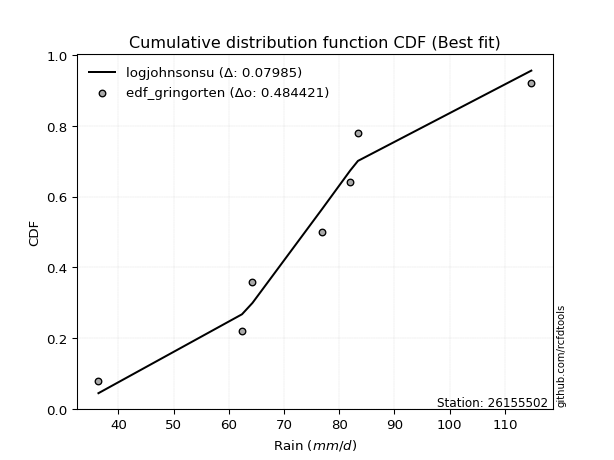</img>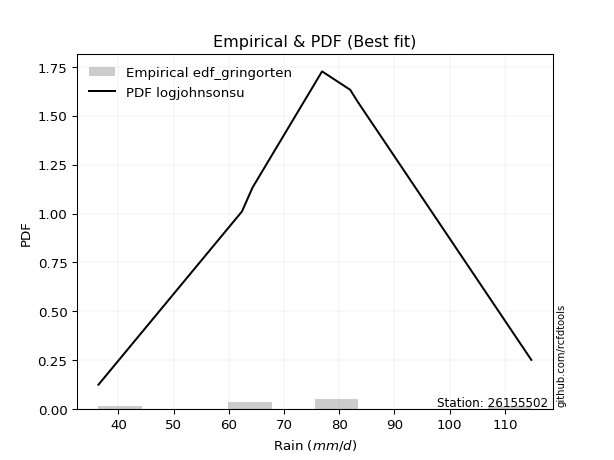</img>

</div>


### 9. EDF Filliben (1975)

The specific values of the constants (0.3175) (often denoted as $alpha$) and (0.365) are derived from a method proposed by James J. Filliben in a 1975 paper. This particular formula is the mean value of the $i$-th order statistic of the normal distribution and is considered a robust and effective plotting position formula for the normal probability plot correlation coefficient test for normality.

<div align="center">


$P=(m-0.3175)/(n+0.365)$


</div>


**9.1. Empirical values**

<div align="center">

|                | 0                   | 1                   | 2                   | 3            | 4                  | 5                  | 6                  |
|:---------------|:--------------------|:--------------------|:--------------------|:-------------|:-------------------|:-------------------|:-------------------|
| date           | 2017                | 2022                | 2023                | 2021         | 2020               | 2019               | 2018               |
| x              | 36.4                | 62.4                | 64.3                | 76.9         | 82.0               | 83.4               | 114.8              |
| m              | 1                   | 2                   | 3                   | 4            | 5                  | 6                  | 7                  |
| empirical_dist | edf_filliben        | edf_filliben        | edf_filliben        | edf_filliben | edf_filliben       | edf_filliben       | edf_filliben       |
| empirical      | 0.09266802443991853 | 0.22844534962661237 | 0.36422267481330617 | 0.5          | 0.6357773251866938 | 0.7715546503733877 | 0.9073319755600815 |
| empirical_tr   | 1.1021324354657687  | 1.2960844698636163  | 1.5728777362520021  | 2.0          | 2.7455731593662627 | 4.377414561664191  | 10.791208791208794 |

</div>


**9.2. Kolmogorov-Smirnov fit test (sorted by Δ)**


<div align="center">

|                | 0                   | 1                   | 2                   | 3                   | 4                   | 5                   | 6                   | 7                   | 8                   | 9                   | 10                  | 11                  | 12                  | 13                  | 14                  | 15                  | 16                  | 17                  | 18                  | 19                  | 20                  | 21                  | 22                  | 23                  | 24                  | 25                  | 26                  | 27                  | 28                  | 29                  | 30                  | 31                  | 32                  | 33                  | 34                  | 35                  | 36                  | 37                  | 38                  | 39                  | 40                  | 41                  | 42                  | 43                  | 44                  | 45                  | 46                  | 47                  | 48                  | 49                  | 50                  | 51                  | 52                  | 53                  | 54                  | 55                  | 56                  | 57                  | 58                  | 59                  | 60                  | 61                  | 62                  | 63                  | 64                  | 65                  | 66                  | 67                  | 68                  | 69                  | 70                  | 71                  | 72                  | 73                  | 74                  | 75                  | 76                  | 77                  | 78                  | 79                  | 80                  | 81                  | 82                  | 83                  | 84                  | 85                  | 86                  | 87                  | 88                  | 89                  | 90                  | 91                  | 92                  | 93                  | 94                  | 95                  | 96                  | 97                  | 98                  | 99                  | 100                 | 101                 | 102                 | 103                 | 104                 | 105                 | 106                 | 107                 | 108                 | 109                 | 110                 | 111                 | 112                 | 113                 | 114                 | 115                 | 116                 | 117                 | 118                 | 119                 | 120                 | 121                 | 122                 | 123                 | 124                 | 125                 | 126                 | 127                 | 128                 | 129                 | 130                 | 131                 | 132                 | 133                 | 134                 | 135                 | 136                 | 137                 | 138                 | 139                 | 140                 | 141                 | 142                 | 143                 | 144                 | 145                 | 146                 | 147                 | 148                 | 149                 | 150                 | 151                 | 152                 | 153                 | 154                 | 155                 | 156                 | 157                 | 158                 | 159                 |
|:---------------|:--------------------|:--------------------|:--------------------|:--------------------|:--------------------|:--------------------|:--------------------|:--------------------|:--------------------|:--------------------|:--------------------|:--------------------|:--------------------|:--------------------|:--------------------|:--------------------|:--------------------|:--------------------|:--------------------|:--------------------|:--------------------|:--------------------|:--------------------|:--------------------|:--------------------|:--------------------|:--------------------|:--------------------|:--------------------|:--------------------|:--------------------|:--------------------|:--------------------|:--------------------|:--------------------|:--------------------|:--------------------|:--------------------|:--------------------|:--------------------|:--------------------|:--------------------|:--------------------|:--------------------|:--------------------|:--------------------|:--------------------|:--------------------|:--------------------|:--------------------|:--------------------|:--------------------|:--------------------|:--------------------|:--------------------|:--------------------|:--------------------|:--------------------|:--------------------|:--------------------|:--------------------|:--------------------|:--------------------|:--------------------|:--------------------|:--------------------|:--------------------|:--------------------|:--------------------|:--------------------|:--------------------|:--------------------|:--------------------|:--------------------|:--------------------|:--------------------|:--------------------|:--------------------|:--------------------|:--------------------|:--------------------|:--------------------|:--------------------|:--------------------|:--------------------|:--------------------|:--------------------|:--------------------|:--------------------|:--------------------|:--------------------|:--------------------|:--------------------|:--------------------|:--------------------|:--------------------|:--------------------|:--------------------|:--------------------|:--------------------|:--------------------|:--------------------|:--------------------|:--------------------|:--------------------|:--------------------|:--------------------|:--------------------|:--------------------|:--------------------|:--------------------|:--------------------|:--------------------|:--------------------|:--------------------|:--------------------|:--------------------|:--------------------|:--------------------|:--------------------|:--------------------|:--------------------|:--------------------|:--------------------|:--------------------|:--------------------|:--------------------|:--------------------|:--------------------|:--------------------|:--------------------|:--------------------|:--------------------|:--------------------|:--------------------|:--------------------|:--------------------|:--------------------|:--------------------|:--------------------|:--------------------|:--------------------|:--------------------|:--------------------|:--------------------|:--------------------|:--------------------|:--------------------|:--------------------|:--------------------|:--------------------|:--------------------|:--------------------|:--------------------|:--------------------|:--------------------|:--------------------|:--------------------|:--------------------|:--------------------|
| station        | 26155502            | 26155502            | 26155502            | 26155502            | 26155502            | 26155502            | 26155502            | 26155502            | 26155502            | 26155502            | 26155502            | 26155502            | 26155502            | 26155502            | 26155502            | 26155502            | 26155502            | 26155502            | 26155502            | 26155502            | 26155502            | 26155502            | 26155502            | 26155502            | 26155502            | 26155502            | 26155502            | 26155502            | 26155502            | 26155502            | 26155502            | 26155502            | 26155502            | 26155502            | 26155502            | 26155502            | 26155502            | 26155502            | 26155502            | 26155502            | 26155502            | 26155502            | 26155502            | 26155502            | 26155502            | 26155502            | 26155502            | 26155502            | 26155502            | 26155502            | 26155502            | 26155502            | 26155502            | 26155502            | 26155502            | 26155502            | 26155502            | 26155502            | 26155502            | 26155502            | 26155502            | 26155502            | 26155502            | 26155502            | 26155502            | 26155502            | 26155502            | 26155502            | 26155502            | 26155502            | 26155502            | 26155502            | 26155502            | 26155502            | 26155502            | 26155502            | 26155502            | 26155502            | 26155502            | 26155502            | 26155502            | 26155502            | 26155502            | 26155502            | 26155502            | 26155502            | 26155502            | 26155502            | 26155502            | 26155502            | 26155502            | 26155502            | 26155502            | 26155502            | 26155502            | 26155502            | 26155502            | 26155502            | 26155502            | 26155502            | 26155502            | 26155502            | 26155502            | 26155502            | 26155502            | 26155502            | 26155502            | 26155502            | 26155502            | 26155502            | 26155502            | 26155502            | 26155502            | 26155502            | 26155502            | 26155502            | 26155502            | 26155502            | 26155502            | 26155502            | 26155502            | 26155502            | 26155502            | 26155502            | 26155502            | 26155502            | 26155502            | 26155502            | 26155502            | 26155502            | 26155502            | 26155502            | 26155502            | 26155502            | 26155502            | 26155502            | 26155502            | 26155502            | 26155502            | 26155502            | 26155502            | 26155502            | 26155502            | 26155502            | 26155502            | 26155502            | 26155502            | 26155502            | 26155502            | 26155502            | 26155502            | 26155502            | 26155502            | 26155502            | 26155502            | 26155502            | 26155502            | 26155502            | 26155502            | 26155502            |
| empirical_dist | edf_filliben        | edf_filliben        | edf_filliben        | edf_filliben        | edf_filliben        | edf_filliben        | edf_filliben        | edf_filliben        | edf_filliben        | edf_filliben        | edf_filliben        | edf_filliben        | edf_filliben        | edf_filliben        | edf_filliben        | edf_filliben        | edf_filliben        | edf_filliben        | edf_filliben        | edf_filliben        | edf_filliben        | edf_filliben        | edf_filliben        | edf_filliben        | edf_filliben        | edf_filliben        | edf_filliben        | edf_filliben        | edf_filliben        | edf_filliben        | edf_filliben        | edf_filliben        | edf_filliben        | edf_filliben        | edf_filliben        | edf_filliben        | edf_filliben        | edf_filliben        | edf_filliben        | edf_filliben        | edf_filliben        | edf_filliben        | edf_filliben        | edf_filliben        | edf_filliben        | edf_filliben        | edf_filliben        | edf_filliben        | edf_filliben        | edf_filliben        | edf_filliben        | edf_filliben        | edf_filliben        | edf_filliben        | edf_filliben        | edf_filliben        | edf_filliben        | edf_filliben        | edf_filliben        | edf_filliben        | edf_filliben        | edf_filliben        | edf_filliben        | edf_filliben        | edf_filliben        | edf_filliben        | edf_filliben        | edf_filliben        | edf_filliben        | edf_filliben        | edf_filliben        | edf_filliben        | edf_filliben        | edf_filliben        | edf_filliben        | edf_filliben        | edf_filliben        | edf_filliben        | edf_filliben        | edf_filliben        | edf_filliben        | edf_filliben        | edf_filliben        | edf_filliben        | edf_filliben        | edf_filliben        | edf_filliben        | edf_filliben        | edf_filliben        | edf_filliben        | edf_filliben        | edf_filliben        | edf_filliben        | edf_filliben        | edf_filliben        | edf_filliben        | edf_filliben        | edf_filliben        | edf_filliben        | edf_filliben        | edf_filliben        | edf_filliben        | edf_filliben        | edf_filliben        | edf_filliben        | edf_filliben        | edf_filliben        | edf_filliben        | edf_filliben        | edf_filliben        | edf_filliben        | edf_filliben        | edf_filliben        | edf_filliben        | edf_filliben        | edf_filliben        | edf_filliben        | edf_filliben        | edf_filliben        | edf_filliben        | edf_filliben        | edf_filliben        | edf_filliben        | edf_filliben        | edf_filliben        | edf_filliben        | edf_filliben        | edf_filliben        | edf_filliben        | edf_filliben        | edf_filliben        | edf_filliben        | edf_filliben        | edf_filliben        | edf_filliben        | edf_filliben        | edf_filliben        | edf_filliben        | edf_filliben        | edf_filliben        | edf_filliben        | edf_filliben        | edf_filliben        | edf_filliben        | edf_filliben        | edf_filliben        | edf_filliben        | edf_filliben        | edf_filliben        | edf_filliben        | edf_filliben        | edf_filliben        | edf_filliben        | edf_filliben        | edf_filliben        | edf_filliben        | edf_filliben        | edf_filliben        | edf_filliben        | edf_filliben        |
| p_dist         | logjohnsonsu        | hypsecant           | logburr             | logmielke           | burr                | mielke              | loggenlogistic      | genlogistic         | invgamma            | logistic            | maxwell             | alpha               | logskewnorm         | laplace             | loggompertz         | skewnorm            | betaprime           | invgauss            | erlang              | gamma               | f                   | rice                | johnsonsu           | dweibull            | nct                 | weibull_min         | rayleigh            | pearson3            | ncf                 | logweibull_min      | exponnorm           | logpearson3         | logloggamma         | logburr12           | logexponpow         | foldnorm            | crystalball         | norm                | truncnorm           | t                   | loglogistic         | loggumbel_l         | gumbel_r            | loggengamma         | dgamma              | logt                | logexponnorm        | lognorm             | logcrystalball      | logfatiguelife      | loghypsecant        | logf                | lognct              | vonmises_line       | gennorm             | loggennorm          | logtruncweibull_min | logerlang           | cosine              | logrice             | logloglaplace       | anglit              | loggamma            | loggamma            | logweibull_max      | loggenextreme       | halfnorm            | logexponweib        | logargus            | loginvgamma         | moyal               | halflogistic        | logalpha            | semicircular        | kappa4              | loganglit           | kstwobign           | logdweibull         | logsemicircular     | logdgamma           | loglaplace          | loglaplace          | logmaxwell          | loginvgauss         | logbetaprime        | gumbel_l            | gausshyper          | logfoldnorm         | lograyleigh         | uniform             | loggumbel_r         | logcosine           | logtriang           | gompertz            | arcsine             | bradford            | logarcsine          | ksone               | loginvweibull       | logmoyal            | wrapcauchy          | logncf              | loghalfnorm         | genpareto           | wald                | loghalflogistic     | truncexpon          | kappa3              | argus               | truncweibull_min    | logkstwobign        | lognakagami         | loggenexpon         | logkappa4           | logkappa3           | logvonmises_line    | loguniform          | loglevy_l           | loggenhalflogistic  | nakagami            | logtruncnorm        | logksone            | logwald             | logwrapcauchy       | beta                | genexpon            | lomax               | logjohnsonsb        | loggausshyper       | levy_l              | triang              | logtrapezoid        | logtukeylambda      | loggenpareto        | genhalflogistic     | loglomax            | burr12              | logbradford         | logtruncexpon       | halfgennorm         | tukeylambda         | genextreme          | logbeta             | logrdist            | trapezoid           | johnsonsb           | invweibull          | exponweib           | gengamma            | rdist               | powerlaw            | fatiguelife         | logpowerlaw         | weibull_max         | truncpareto         | exponpow            | logtruncpareto      | loghalfgennorm      | logvonmises         | vonmises            |
| delta          | 0.07050542652271474 | 0.08013530078428688 | 0.08463958488264045 | 0.08467930809632462 | 0.08562969877071502 | 0.08563338986591118 | 0.08564063599283345 | 0.0909505438904209  | 0.09426517157842385 | 0.09445420014913875 | 0.09523466187182353 | 0.09533651480846173 | 0.0994992164699875  | 0.09961354880971324 | 0.10247037102355602 | 0.10329768855983279 | 0.10374448657461577 | 0.10385079436714859 | 0.10492368842849564 | 0.10492381630599779 | 0.10492572635015707 | 0.1049965379339226  | 0.10509365773948487 | 0.10542820964477786 | 0.1056079979250113  | 0.10609574071609329 | 0.10613389721428637 | 0.10626457067876305 | 0.10670298387463248 | 0.10853533405885651 | 0.10924884673977309 | 0.10953421512455552 | 0.10993607564316532 | 0.11084322784093725 | 0.11191580500499887 | 0.1127143338234976  | 0.11310077655065764 | 0.11310078171749871 | 0.11310079747912782 | 0.11315210669305698 | 0.114156771741597   | 0.11443896701622136 | 0.11647916886133713 | 0.12049294388558093 | 0.1233710992129374  | 0.12370184475664545 | 0.12380639220066761 | 0.12380810607156187 | 0.12381128854883286 | 0.12442908057913879 | 0.12480747514970081 | 0.1248402681918239  | 0.12616275744587305 | 0.12894361381498454 | 0.1306155022599183  | 0.13073687896710473 | 0.13124738144505277 | 0.1314729273901695  | 0.1329374466555061  | 0.13329221717163162 | 0.1336985951333538  | 0.13380683917291036 | 0.13493115046503532 | 0.13493115046503532 | 0.13521272183295663 | 0.13521641595732026 | 0.13689218904223618 | 0.1390538495434178  | 0.14031351134002834 | 0.14109297076853097 | 0.1414353377499401  | 0.14172069410691335 | 0.1417324904918553  | 0.14251370310829792 | 0.1431105169582552  | 0.1433639788411967  | 0.1467207126215779  | 0.15147424721820743 | 0.15156640624612214 | 0.15180766733553303 | 0.1520042916499026  | 0.1520042916499026  | 0.15587857434629196 | 0.15760131642176348 | 0.1588330976115073  | 0.1591498762922745  | 0.15991383099901268 | 0.16663889564736686 | 0.16795866883382002 | 0.1720648544550203  | 0.1727988544229093  | 0.17394735452141616 | 0.17527947746169692 | 0.1760810608786072  | 0.17834015209108378 | 0.1811592494506998  | 0.185135951360089   | 0.18864648710808163 | 0.1905458686580823  | 0.19099607595986798 | 0.19369571545255737 | 0.19774967375557603 | 0.20239323357454117 | 0.20662148656734866 | 0.210684023203221   | 0.21086927668928027 | 0.2111612304521092  | 0.2190174727763725  | 0.22100484228797845 | 0.22324683702010836 | 0.22634774998842852 | 0.2284451617866817  | 0.23523211089093396 | 0.23584127986198353 | 0.23979341271754565 | 0.24072306457985096 | 0.24080925973769315 | 0.2410097026168749  | 0.24217718532537225 | 0.2456024784843659  | 0.24590938578411992 | 0.245933491510309   | 0.2533910714078573  | 0.261277768588672   | 0.2628015256639653  | 0.2629260882397313  | 0.26359458410017345 | 0.27977081398977166 | 0.2824666231261026  | 0.28574080235502186 | 0.29404472962540495 | 0.3025543158014253  | 0.3054851332927988  | 0.31714072447156594 | 0.3226534020629669  | 0.3244783692004283  | 0.32691457800690227 | 0.3287266881329661  | 0.33493890310421837 | 0.33880451867943484 | 0.338815291716692   | 0.3657089842229404  | 0.40168694470306765 | 0.4209429480779544  | 0.431772723572055   | 0.44202560406682956 | 0.4653880441795957  | 0.4861295511195942  | 0.4891777641882138  | 0.5132606722317152  | 0.5990036601379721  | 0.6139490242763874  | 0.6416145849635174  | 0.6462449865609892  | 0.6926267630020677  | 0.7082769029065425  | 0.7163381304131782  | 0.7715546503733877  | 1.1170482487403075  | 17.84331425421986   |
| deltao         | 0.48442053926100004 | 0.48442053926100004 | 0.48442053926100004 | 0.48442053926100004 | 0.48442053926100004 | 0.48442053926100004 | 0.48442053926100004 | 0.48442053926100004 | 0.48442053926100004 | 0.48442053926100004 | 0.48442053926100004 | 0.48442053926100004 | 0.48442053926100004 | 0.48442053926100004 | 0.48442053926100004 | 0.48442053926100004 | 0.48442053926100004 | 0.48442053926100004 | 0.48442053926100004 | 0.48442053926100004 | 0.48442053926100004 | 0.48442053926100004 | 0.48442053926100004 | 0.48442053926100004 | 0.48442053926100004 | 0.48442053926100004 | 0.48442053926100004 | 0.48442053926100004 | 0.48442053926100004 | 0.48442053926100004 | 0.48442053926100004 | 0.48442053926100004 | 0.48442053926100004 | 0.48442053926100004 | 0.48442053926100004 | 0.48442053926100004 | 0.48442053926100004 | 0.48442053926100004 | 0.48442053926100004 | 0.48442053926100004 | 0.48442053926100004 | 0.48442053926100004 | 0.48442053926100004 | 0.48442053926100004 | 0.48442053926100004 | 0.48442053926100004 | 0.48442053926100004 | 0.48442053926100004 | 0.48442053926100004 | 0.48442053926100004 | 0.48442053926100004 | 0.48442053926100004 | 0.48442053926100004 | 0.48442053926100004 | 0.48442053926100004 | 0.48442053926100004 | 0.48442053926100004 | 0.48442053926100004 | 0.48442053926100004 | 0.48442053926100004 | 0.48442053926100004 | 0.48442053926100004 | 0.48442053926100004 | 0.48442053926100004 | 0.48442053926100004 | 0.48442053926100004 | 0.48442053926100004 | 0.48442053926100004 | 0.48442053926100004 | 0.48442053926100004 | 0.48442053926100004 | 0.48442053926100004 | 0.48442053926100004 | 0.48442053926100004 | 0.48442053926100004 | 0.48442053926100004 | 0.48442053926100004 | 0.48442053926100004 | 0.48442053926100004 | 0.48442053926100004 | 0.48442053926100004 | 0.48442053926100004 | 0.48442053926100004 | 0.48442053926100004 | 0.48442053926100004 | 0.48442053926100004 | 0.48442053926100004 | 0.48442053926100004 | 0.48442053926100004 | 0.48442053926100004 | 0.48442053926100004 | 0.48442053926100004 | 0.48442053926100004 | 0.48442053926100004 | 0.48442053926100004 | 0.48442053926100004 | 0.48442053926100004 | 0.48442053926100004 | 0.48442053926100004 | 0.48442053926100004 | 0.48442053926100004 | 0.48442053926100004 | 0.48442053926100004 | 0.48442053926100004 | 0.48442053926100004 | 0.48442053926100004 | 0.48442053926100004 | 0.48442053926100004 | 0.48442053926100004 | 0.48442053926100004 | 0.48442053926100004 | 0.48442053926100004 | 0.48442053926100004 | 0.48442053926100004 | 0.48442053926100004 | 0.48442053926100004 | 0.48442053926100004 | 0.48442053926100004 | 0.48442053926100004 | 0.48442053926100004 | 0.48442053926100004 | 0.48442053926100004 | 0.48442053926100004 | 0.48442053926100004 | 0.48442053926100004 | 0.48442053926100004 | 0.48442053926100004 | 0.48442053926100004 | 0.48442053926100004 | 0.48442053926100004 | 0.48442053926100004 | 0.48442053926100004 | 0.48442053926100004 | 0.48442053926100004 | 0.48442053926100004 | 0.48442053926100004 | 0.48442053926100004 | 0.48442053926100004 | 0.48442053926100004 | 0.48442053926100004 | 0.48442053926100004 | 0.48442053926100004 | 0.48442053926100004 | 0.48442053926100004 | 0.48442053926100004 | 0.48442053926100004 | 0.48442053926100004 | 0.48442053926100004 | 0.48442053926100004 | 0.48442053926100004 | 0.48442053926100004 | 0.48442053926100004 | 0.48442053926100004 | 0.48442053926100004 | 0.48442053926100004 | 0.48442053926100004 | 0.48442053926100004 | 0.48442053926100004 | 0.48442053926100004 | 0.48442053926100004 |
| eval           | Δo > Δ              | Δo > Δ              | Δo > Δ              | Δo > Δ              | Δo > Δ              | Δo > Δ              | Δo > Δ              | Δo > Δ              | Δo > Δ              | Δo > Δ              | Δo > Δ              | Δo > Δ              | Δo > Δ              | Δo > Δ              | Δo > Δ              | Δo > Δ              | Δo > Δ              | Δo > Δ              | Δo > Δ              | Δo > Δ              | Δo > Δ              | Δo > Δ              | Δo > Δ              | Δo > Δ              | Δo > Δ              | Δo > Δ              | Δo > Δ              | Δo > Δ              | Δo > Δ              | Δo > Δ              | Δo > Δ              | Δo > Δ              | Δo > Δ              | Δo > Δ              | Δo > Δ              | Δo > Δ              | Δo > Δ              | Δo > Δ              | Δo > Δ              | Δo > Δ              | Δo > Δ              | Δo > Δ              | Δo > Δ              | Δo > Δ              | Δo > Δ              | Δo > Δ              | Δo > Δ              | Δo > Δ              | Δo > Δ              | Δo > Δ              | Δo > Δ              | Δo > Δ              | Δo > Δ              | Δo > Δ              | Δo > Δ              | Δo > Δ              | Δo > Δ              | Δo > Δ              | Δo > Δ              | Δo > Δ              | Δo > Δ              | Δo > Δ              | Δo > Δ              | Δo > Δ              | Δo > Δ              | Δo > Δ              | Δo > Δ              | Δo > Δ              | Δo > Δ              | Δo > Δ              | Δo > Δ              | Δo > Δ              | Δo > Δ              | Δo > Δ              | Δo > Δ              | Δo > Δ              | Δo > Δ              | Δo > Δ              | Δo > Δ              | Δo > Δ              | Δo > Δ              | Δo > Δ              | Δo > Δ              | Δo > Δ              | Δo > Δ              | Δo > Δ              | Δo > Δ              | Δo > Δ              | Δo > Δ              | Δo > Δ              | Δo > Δ              | Δo > Δ              | Δo > Δ              | Δo > Δ              | Δo > Δ              | Δo > Δ              | Δo > Δ              | Δo > Δ              | Δo > Δ              | Δo > Δ              | Δo > Δ              | Δo > Δ              | Δo > Δ              | Δo > Δ              | Δo > Δ              | Δo > Δ              | Δo > Δ              | Δo > Δ              | Δo > Δ              | Δo > Δ              | Δo > Δ              | Δo > Δ              | Δo > Δ              | Δo > Δ              | Δo > Δ              | Δo > Δ              | Δo > Δ              | Δo > Δ              | Δo > Δ              | Δo > Δ              | Δo > Δ              | Δo > Δ              | Δo > Δ              | Δo > Δ              | Δo > Δ              | Δo > Δ              | Δo > Δ              | Δo > Δ              | Δo > Δ              | Δo > Δ              | Δo > Δ              | Δo > Δ              | Δo > Δ              | Δo > Δ              | Δo > Δ              | Δo > Δ              | Δo > Δ              | Δo > Δ              | Δo > Δ              | Δo > Δ              | Δo > Δ              | Δo > Δ              | Δo > Δ              | Δo > Δ              | Δo > Δ              | Δo > Δ              | Δo > Δ              | Δo <= Δ             | Δo <= Δ             | Δo <= Δ             | Δo <= Δ             | Δo <= Δ             | Δo <= Δ             | Δo <= Δ             | Δo <= Δ             | Δo <= Δ             | Δo <= Δ             | Δo <= Δ             | Δo <= Δ             | Δo <= Δ             |
| fit            | 1                   | 1                   | 1                   | 1                   | 1                   | 1                   | 1                   | 1                   | 1                   | 1                   | 1                   | 1                   | 1                   | 1                   | 1                   | 1                   | 1                   | 1                   | 1                   | 1                   | 1                   | 1                   | 1                   | 1                   | 1                   | 1                   | 1                   | 1                   | 1                   | 1                   | 1                   | 1                   | 1                   | 1                   | 1                   | 1                   | 1                   | 1                   | 1                   | 1                   | 1                   | 1                   | 1                   | 1                   | 1                   | 1                   | 1                   | 1                   | 1                   | 1                   | 1                   | 1                   | 1                   | 1                   | 1                   | 1                   | 1                   | 1                   | 1                   | 1                   | 1                   | 1                   | 1                   | 1                   | 1                   | 1                   | 1                   | 1                   | 1                   | 1                   | 1                   | 1                   | 1                   | 1                   | 1                   | 1                   | 1                   | 1                   | 1                   | 1                   | 1                   | 1                   | 1                   | 1                   | 1                   | 1                   | 1                   | 1                   | 1                   | 1                   | 1                   | 1                   | 1                   | 1                   | 1                   | 1                   | 1                   | 1                   | 1                   | 1                   | 1                   | 1                   | 1                   | 1                   | 1                   | 1                   | 1                   | 1                   | 1                   | 1                   | 1                   | 1                   | 1                   | 1                   | 1                   | 1                   | 1                   | 1                   | 1                   | 1                   | 1                   | 1                   | 1                   | 1                   | 1                   | 1                   | 1                   | 1                   | 1                   | 1                   | 1                   | 1                   | 1                   | 1                   | 1                   | 1                   | 1                   | 1                   | 1                   | 1                   | 1                   | 1                   | 1                   | 1                   | 1                   | 1                   | 1                   | 0                   | 0                   | 0                   | 0                   | 0                   | 0                   | 0                   | 0                   | 0                   | 0                   | 0                   | 0                   | 0                   |
| n              | 7                   | 7                   | 7                   | 7                   | 7                   | 7                   | 7                   | 7                   | 7                   | 7                   | 7                   | 7                   | 7                   | 7                   | 7                   | 7                   | 7                   | 7                   | 7                   | 7                   | 7                   | 7                   | 7                   | 7                   | 7                   | 7                   | 7                   | 7                   | 7                   | 7                   | 7                   | 7                   | 7                   | 7                   | 7                   | 7                   | 7                   | 7                   | 7                   | 7                   | 7                   | 7                   | 7                   | 7                   | 7                   | 7                   | 7                   | 7                   | 7                   | 7                   | 7                   | 7                   | 7                   | 7                   | 7                   | 7                   | 7                   | 7                   | 7                   | 7                   | 7                   | 7                   | 7                   | 7                   | 7                   | 7                   | 7                   | 7                   | 7                   | 7                   | 7                   | 7                   | 7                   | 7                   | 7                   | 7                   | 7                   | 7                   | 7                   | 7                   | 7                   | 7                   | 7                   | 7                   | 7                   | 7                   | 7                   | 7                   | 7                   | 7                   | 7                   | 7                   | 7                   | 7                   | 7                   | 7                   | 7                   | 7                   | 7                   | 7                   | 7                   | 7                   | 7                   | 7                   | 7                   | 7                   | 7                   | 7                   | 7                   | 7                   | 7                   | 7                   | 7                   | 7                   | 7                   | 7                   | 7                   | 7                   | 7                   | 7                   | 7                   | 7                   | 7                   | 7                   | 7                   | 7                   | 7                   | 7                   | 7                   | 7                   | 7                   | 7                   | 7                   | 7                   | 7                   | 7                   | 7                   | 7                   | 7                   | 7                   | 7                   | 7                   | 7                   | 7                   | 7                   | 7                   | 7                   | 7                   | 7                   | 7                   | 7                   | 7                   | 7                   | 7                   | 7                   | 7                   | 7                   | 7                   | 7                   | 7                   |
| best_fit       | 1                   | 0                   | 0                   | 0                   | 0                   | 0                   | 0                   | 0                   | 0                   | 0                   | 0                   | 0                   | 0                   | 0                   | 0                   | 0                   | 0                   | 0                   | 0                   | 0                   | 0                   | 0                   | 0                   | 0                   | 0                   | 0                   | 0                   | 0                   | 0                   | 0                   | 0                   | 0                   | 0                   | 0                   | 0                   | 0                   | 0                   | 0                   | 0                   | 0                   | 0                   | 0                   | 0                   | 0                   | 0                   | 0                   | 0                   | 0                   | 0                   | 0                   | 0                   | 0                   | 0                   | 0                   | 0                   | 0                   | 0                   | 0                   | 0                   | 0                   | 0                   | 0                   | 0                   | 0                   | 0                   | 0                   | 0                   | 0                   | 0                   | 0                   | 0                   | 0                   | 0                   | 0                   | 0                   | 0                   | 0                   | 0                   | 0                   | 0                   | 0                   | 0                   | 0                   | 0                   | 0                   | 0                   | 0                   | 0                   | 0                   | 0                   | 0                   | 0                   | 0                   | 0                   | 0                   | 0                   | 0                   | 0                   | 0                   | 0                   | 0                   | 0                   | 0                   | 0                   | 0                   | 0                   | 0                   | 0                   | 0                   | 0                   | 0                   | 0                   | 0                   | 0                   | 0                   | 0                   | 0                   | 0                   | 0                   | 0                   | 0                   | 0                   | 0                   | 0                   | 0                   | 0                   | 0                   | 0                   | 0                   | 0                   | 0                   | 0                   | 0                   | 0                   | 0                   | 0                   | 0                   | 0                   | 0                   | 0                   | 0                   | 0                   | 0                   | 0                   | 0                   | 0                   | 0                   | 0                   | 0                   | 0                   | 0                   | 0                   | 0                   | 0                   | 0                   | 0                   | 0                   | 0                   | 0                   | 0                   |
| best_fit_sort  | 1                   | 2                   | 3                   | 4                   | 5                   | 6                   | 7                   | 8                   | 9                   | 10                  | 11                  | 12                  | 13                  | 14                  | 15                  | 16                  | 17                  | 18                  | 19                  | 20                  | 21                  | 22                  | 23                  | 24                  | 25                  | 26                  | 27                  | 28                  | 29                  | 30                  | 31                  | 32                  | 33                  | 34                  | 35                  | 36                  | 37                  | 38                  | 39                  | 40                  | 41                  | 42                  | 43                  | 44                  | 45                  | 46                  | 47                  | 48                  | 49                  | 50                  | 51                  | 52                  | 53                  | 54                  | 55                  | 56                  | 57                  | 58                  | 59                  | 60                  | 61                  | 62                  | 63                  | 64                  | 65                  | 66                  | 67                  | 68                  | 69                  | 70                  | 71                  | 72                  | 73                  | 74                  | 75                  | 76                  | 77                  | 78                  | 79                  | 80                  | 81                  | 82                  | 83                  | 84                  | 85                  | 86                  | 87                  | 88                  | 89                  | 90                  | 91                  | 92                  | 93                  | 94                  | 95                  | 96                  | 97                  | 98                  | 99                  | 100                 | 101                 | 102                 | 103                 | 104                 | 105                 | 106                 | 107                 | 108                 | 109                 | 110                 | 111                 | 112                 | 113                 | 114                 | 115                 | 116                 | 117                 | 118                 | 119                 | 120                 | 121                 | 122                 | 123                 | 124                 | 125                 | 126                 | 127                 | 128                 | 129                 | 130                 | 131                 | 132                 | 133                 | 134                 | 135                 | 136                 | 137                 | 138                 | 139                 | 140                 | 141                 | 142                 | 143                 | 144                 | 145                 | 146                 | 147                 | 148                 | 149                 | 150                 | 151                 | 152                 | 153                 | 154                 | 155                 | 156                 | 157                 | 158                 | 159                 | 160                 |

</div>


**9.3. Best fit**

<div align="center">

|   id |   station | empirical_dist   | p_dist       |     delta |   deltao | eval   |   fit |   n |   best_fit |   best_fit_sort |
|-----:|----------:|:-----------------|:-------------|----------:|---------:|:-------|------:|----:|-----------:|----------------:|
|    0 |  26155502 | edf_filliben     | logjohnsonsu | 0.0705054 | 0.484421 | Δo > Δ |     1 |   7 |          1 |               1 |

</div>


<div align="center">

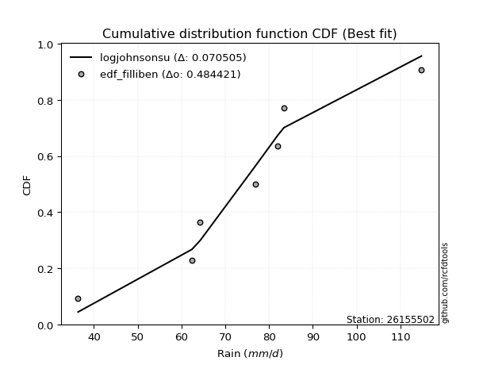</img>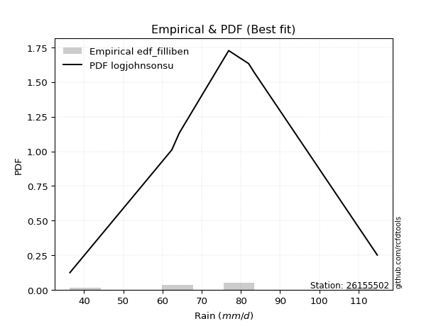</img>

</div>


### 10. EDF Jenkinson (1977)

The Jenkinson formula in hydrology is an empirical plotting position formula used to estimate the non-exceedance probability _(P)_ or return period _(T)_ of a given ordered observation within a sample. It is a widely used method in the frequency analysis of extreme events such as floods and rainfall, as it provides a distribution-free way to plot data. _a≈0.31_ and _b≈0.38_ are constants derived to approximate the median of the probability distribution for the given rank.

<div align="center">


$P=(m-a)/(n+b)$


</div>


**10.1. Empirical values**

<div align="center">

|                | 0                   | 1                   | 2                   | 3             | 4                  | 5                  | 6                  |
|:---------------|:--------------------|:--------------------|:--------------------|:--------------|:-------------------|:-------------------|:-------------------|
| date           | 2017                | 2022                | 2023                | 2021          | 2020               | 2019               | 2018               |
| x              | 36.4                | 62.4                | 64.3                | 76.9          | 82.0               | 83.4               | 114.8              |
| m              | 1                   | 2                   | 3                   | 4             | 5                  | 6                  | 7                  |
| empirical_dist | edf_jenkinson       | edf_jenkinson       | edf_jenkinson       | edf_jenkinson | edf_jenkinson      | edf_jenkinson      | edf_jenkinson      |
| empirical      | 0.09349593495934959 | 0.22899728997289973 | 0.36449864498644985 | 0.5           | 0.6355013550135502 | 0.7710027100271003 | 0.9065040650406505 |
| empirical_tr   | 1.1031390134529149  | 1.29701230228471    | 1.5735607675906182  | 2.0           | 2.743494423791822  | 4.366863905325444  | 10.695652173913055 |

</div>


**10.2. Kolmogorov-Smirnov fit test (sorted by Δ)**


<div align="center">

|                | 0                   | 1                   | 2                   | 3                   | 4                   | 5                   | 6                   | 7                   | 8                   | 9                   | 10                  | 11                  | 12                  | 13                  | 14                  | 15                  | 16                  | 17                  | 18                  | 19                  | 20                  | 21                  | 22                  | 23                  | 24                  | 25                  | 26                  | 27                  | 28                  | 29                  | 30                  | 31                  | 32                  | 33                  | 34                  | 35                  | 36                  | 37                  | 38                  | 39                  | 40                  | 41                  | 42                  | 43                  | 44                  | 45                  | 46                  | 47                  | 48                  | 49                  | 50                  | 51                  | 52                  | 53                  | 54                  | 55                  | 56                  | 57                  | 58                  | 59                  | 60                  | 61                  | 62                  | 63                  | 64                  | 65                  | 66                  | 67                  | 68                  | 69                  | 70                  | 71                  | 72                  | 73                  | 74                  | 75                  | 76                  | 77                  | 78                  | 79                  | 80                  | 81                  | 82                  | 83                  | 84                  | 85                  | 86                  | 87                  | 88                  | 89                  | 90                  | 91                  | 92                  | 93                  | 94                  | 95                  | 96                  | 97                  | 98                  | 99                  | 100                 | 101                 | 102                 | 103                 | 104                 | 105                 | 106                 | 107                 | 108                 | 109                 | 110                 | 111                 | 112                 | 113                 | 114                 | 115                 | 116                 | 117                 | 118                 | 119                 | 120                 | 121                 | 122                 | 123                 | 124                 | 125                 | 126                 | 127                 | 128                 | 129                 | 130                 | 131                 | 132                 | 133                 | 134                 | 135                 | 136                 | 137                 | 138                 | 139                 | 140                 | 141                 | 142                 | 143                 | 144                 | 145                 | 146                 | 147                 | 148                 | 149                 | 150                 | 151                 | 152                 | 153                 | 154                 | 155                 | 156                 | 157                 | 158                 | 159                 |
|:---------------|:--------------------|:--------------------|:--------------------|:--------------------|:--------------------|:--------------------|:--------------------|:--------------------|:--------------------|:--------------------|:--------------------|:--------------------|:--------------------|:--------------------|:--------------------|:--------------------|:--------------------|:--------------------|:--------------------|:--------------------|:--------------------|:--------------------|:--------------------|:--------------------|:--------------------|:--------------------|:--------------------|:--------------------|:--------------------|:--------------------|:--------------------|:--------------------|:--------------------|:--------------------|:--------------------|:--------------------|:--------------------|:--------------------|:--------------------|:--------------------|:--------------------|:--------------------|:--------------------|:--------------------|:--------------------|:--------------------|:--------------------|:--------------------|:--------------------|:--------------------|:--------------------|:--------------------|:--------------------|:--------------------|:--------------------|:--------------------|:--------------------|:--------------------|:--------------------|:--------------------|:--------------------|:--------------------|:--------------------|:--------------------|:--------------------|:--------------------|:--------------------|:--------------------|:--------------------|:--------------------|:--------------------|:--------------------|:--------------------|:--------------------|:--------------------|:--------------------|:--------------------|:--------------------|:--------------------|:--------------------|:--------------------|:--------------------|:--------------------|:--------------------|:--------------------|:--------------------|:--------------------|:--------------------|:--------------------|:--------------------|:--------------------|:--------------------|:--------------------|:--------------------|:--------------------|:--------------------|:--------------------|:--------------------|:--------------------|:--------------------|:--------------------|:--------------------|:--------------------|:--------------------|:--------------------|:--------------------|:--------------------|:--------------------|:--------------------|:--------------------|:--------------------|:--------------------|:--------------------|:--------------------|:--------------------|:--------------------|:--------------------|:--------------------|:--------------------|:--------------------|:--------------------|:--------------------|:--------------------|:--------------------|:--------------------|:--------------------|:--------------------|:--------------------|:--------------------|:--------------------|:--------------------|:--------------------|:--------------------|:--------------------|:--------------------|:--------------------|:--------------------|:--------------------|:--------------------|:--------------------|:--------------------|:--------------------|:--------------------|:--------------------|:--------------------|:--------------------|:--------------------|:--------------------|:--------------------|:--------------------|:--------------------|:--------------------|:--------------------|:--------------------|:--------------------|:--------------------|:--------------------|:--------------------|:--------------------|:--------------------|
| station        | 26155502            | 26155502            | 26155502            | 26155502            | 26155502            | 26155502            | 26155502            | 26155502            | 26155502            | 26155502            | 26155502            | 26155502            | 26155502            | 26155502            | 26155502            | 26155502            | 26155502            | 26155502            | 26155502            | 26155502            | 26155502            | 26155502            | 26155502            | 26155502            | 26155502            | 26155502            | 26155502            | 26155502            | 26155502            | 26155502            | 26155502            | 26155502            | 26155502            | 26155502            | 26155502            | 26155502            | 26155502            | 26155502            | 26155502            | 26155502            | 26155502            | 26155502            | 26155502            | 26155502            | 26155502            | 26155502            | 26155502            | 26155502            | 26155502            | 26155502            | 26155502            | 26155502            | 26155502            | 26155502            | 26155502            | 26155502            | 26155502            | 26155502            | 26155502            | 26155502            | 26155502            | 26155502            | 26155502            | 26155502            | 26155502            | 26155502            | 26155502            | 26155502            | 26155502            | 26155502            | 26155502            | 26155502            | 26155502            | 26155502            | 26155502            | 26155502            | 26155502            | 26155502            | 26155502            | 26155502            | 26155502            | 26155502            | 26155502            | 26155502            | 26155502            | 26155502            | 26155502            | 26155502            | 26155502            | 26155502            | 26155502            | 26155502            | 26155502            | 26155502            | 26155502            | 26155502            | 26155502            | 26155502            | 26155502            | 26155502            | 26155502            | 26155502            | 26155502            | 26155502            | 26155502            | 26155502            | 26155502            | 26155502            | 26155502            | 26155502            | 26155502            | 26155502            | 26155502            | 26155502            | 26155502            | 26155502            | 26155502            | 26155502            | 26155502            | 26155502            | 26155502            | 26155502            | 26155502            | 26155502            | 26155502            | 26155502            | 26155502            | 26155502            | 26155502            | 26155502            | 26155502            | 26155502            | 26155502            | 26155502            | 26155502            | 26155502            | 26155502            | 26155502            | 26155502            | 26155502            | 26155502            | 26155502            | 26155502            | 26155502            | 26155502            | 26155502            | 26155502            | 26155502            | 26155502            | 26155502            | 26155502            | 26155502            | 26155502            | 26155502            | 26155502            | 26155502            | 26155502            | 26155502            | 26155502            | 26155502            |
| empirical_dist | edf_jenkinson       | edf_jenkinson       | edf_jenkinson       | edf_jenkinson       | edf_jenkinson       | edf_jenkinson       | edf_jenkinson       | edf_jenkinson       | edf_jenkinson       | edf_jenkinson       | edf_jenkinson       | edf_jenkinson       | edf_jenkinson       | edf_jenkinson       | edf_jenkinson       | edf_jenkinson       | edf_jenkinson       | edf_jenkinson       | edf_jenkinson       | edf_jenkinson       | edf_jenkinson       | edf_jenkinson       | edf_jenkinson       | edf_jenkinson       | edf_jenkinson       | edf_jenkinson       | edf_jenkinson       | edf_jenkinson       | edf_jenkinson       | edf_jenkinson       | edf_jenkinson       | edf_jenkinson       | edf_jenkinson       | edf_jenkinson       | edf_jenkinson       | edf_jenkinson       | edf_jenkinson       | edf_jenkinson       | edf_jenkinson       | edf_jenkinson       | edf_jenkinson       | edf_jenkinson       | edf_jenkinson       | edf_jenkinson       | edf_jenkinson       | edf_jenkinson       | edf_jenkinson       | edf_jenkinson       | edf_jenkinson       | edf_jenkinson       | edf_jenkinson       | edf_jenkinson       | edf_jenkinson       | edf_jenkinson       | edf_jenkinson       | edf_jenkinson       | edf_jenkinson       | edf_jenkinson       | edf_jenkinson       | edf_jenkinson       | edf_jenkinson       | edf_jenkinson       | edf_jenkinson       | edf_jenkinson       | edf_jenkinson       | edf_jenkinson       | edf_jenkinson       | edf_jenkinson       | edf_jenkinson       | edf_jenkinson       | edf_jenkinson       | edf_jenkinson       | edf_jenkinson       | edf_jenkinson       | edf_jenkinson       | edf_jenkinson       | edf_jenkinson       | edf_jenkinson       | edf_jenkinson       | edf_jenkinson       | edf_jenkinson       | edf_jenkinson       | edf_jenkinson       | edf_jenkinson       | edf_jenkinson       | edf_jenkinson       | edf_jenkinson       | edf_jenkinson       | edf_jenkinson       | edf_jenkinson       | edf_jenkinson       | edf_jenkinson       | edf_jenkinson       | edf_jenkinson       | edf_jenkinson       | edf_jenkinson       | edf_jenkinson       | edf_jenkinson       | edf_jenkinson       | edf_jenkinson       | edf_jenkinson       | edf_jenkinson       | edf_jenkinson       | edf_jenkinson       | edf_jenkinson       | edf_jenkinson       | edf_jenkinson       | edf_jenkinson       | edf_jenkinson       | edf_jenkinson       | edf_jenkinson       | edf_jenkinson       | edf_jenkinson       | edf_jenkinson       | edf_jenkinson       | edf_jenkinson       | edf_jenkinson       | edf_jenkinson       | edf_jenkinson       | edf_jenkinson       | edf_jenkinson       | edf_jenkinson       | edf_jenkinson       | edf_jenkinson       | edf_jenkinson       | edf_jenkinson       | edf_jenkinson       | edf_jenkinson       | edf_jenkinson       | edf_jenkinson       | edf_jenkinson       | edf_jenkinson       | edf_jenkinson       | edf_jenkinson       | edf_jenkinson       | edf_jenkinson       | edf_jenkinson       | edf_jenkinson       | edf_jenkinson       | edf_jenkinson       | edf_jenkinson       | edf_jenkinson       | edf_jenkinson       | edf_jenkinson       | edf_jenkinson       | edf_jenkinson       | edf_jenkinson       | edf_jenkinson       | edf_jenkinson       | edf_jenkinson       | edf_jenkinson       | edf_jenkinson       | edf_jenkinson       | edf_jenkinson       | edf_jenkinson       | edf_jenkinson       | edf_jenkinson       | edf_jenkinson       | edf_jenkinson       | edf_jenkinson       |
| p_dist         | logjohnsonsu        | hypsecant           | logburr             | logmielke           | burr                | mielke              | loggenlogistic      | genlogistic         | invgamma            | logistic            | maxwell             | alpha               | logskewnorm         | laplace             | loggompertz         | skewnorm            | betaprime           | invgauss            | erlang              | gamma               | f                   | rice                | johnsonsu           | dweibull            | nct                 | weibull_min         | rayleigh            | pearson3            | ncf                 | logweibull_min      | exponnorm           | logpearson3         | logloggamma         | logburr12           | logexponpow         | foldnorm            | crystalball         | norm                | truncnorm           | t                   | loggumbel_l         | loglogistic         | gumbel_r            | loggengamma         | dgamma              | logt                | logexponnorm        | lognorm             | logcrystalball      | logfatiguelife      | logf                | loghypsecant        | lognct              | vonmises_line       | loggennorm          | logtruncweibull_min | gennorm             | logerlang           | cosine              | logrice             | logloglaplace       | anglit              | loggamma            | loggamma            | logweibull_max      | loggenextreme       | halfnorm            | logexponweib        | logargus            | loginvgamma         | logalpha            | moyal               | halflogistic        | semicircular        | kappa4              | loganglit           | kstwobign           | logsemicircular     | logdweibull         | loglaplace          | loglaplace          | logdgamma           | logmaxwell          | loginvgauss         | logbetaprime        | gumbel_l            | gausshyper          | logfoldnorm         | lograyleigh         | uniform             | loggumbel_r         | logcosine           | logtriang           | gompertz            | arcsine             | bradford            | logarcsine          | ksone               | loginvweibull       | logmoyal            | wrapcauchy          | logncf              | loghalfnorm         | genpareto           | loghalflogistic     | truncexpon          | wald                | kappa3              | argus               | truncweibull_min    | logkstwobign        | lognakagami         | loggenexpon         | logkappa4           | logkappa3           | logvonmises_line    | loglevy_l           | loguniform          | loggenhalflogistic  | logksone            | nakagami            | logtruncnorm        | logwald             | logwrapcauchy       | beta                | genexpon            | lomax               | logjohnsonsb        | loggausshyper       | levy_l              | triang              | logtrapezoid        | logtukeylambda      | loggenpareto        | genhalflogistic     | loglomax            | burr12              | logbradford         | logtruncexpon       | halfgennorm         | tukeylambda         | genextreme          | logbeta             | logrdist            | trapezoid           | johnsonsb           | invweibull          | exponweib           | gengamma            | rdist               | powerlaw            | fatiguelife         | logpowerlaw         | weibull_max         | truncpareto         | exponpow            | logtruncpareto      | loghalfgennorm      | logvonmises         | vonmises            |
| delta          | 0.06995348617642738 | 0.07958336043799952 | 0.08408764453635309 | 0.08412736775003726 | 0.08507775842442766 | 0.08508144951962382 | 0.08508869564654609 | 0.09039860354413354 | 0.09371323123213648 | 0.09390225980285138 | 0.09468272152553617 | 0.09478457446217436 | 0.09894727612370013 | 0.09988951898285692 | 0.10191843067726866 | 0.10274574821354543 | 0.10319254622832841 | 0.10329885402086122 | 0.10437174808220828 | 0.10437187595971043 | 0.1043737860038697  | 0.10444459758763525 | 0.10454171739319751 | 0.1048762692984905  | 0.10505605757872394 | 0.10554380036980593 | 0.10558195686799901 | 0.10571263033247569 | 0.10615104352834512 | 0.10798339371256915 | 0.10869690639348573 | 0.10898227477826816 | 0.10938413529687796 | 0.11029128749464989 | 0.11136386465871151 | 0.11216239347721024 | 0.11254883620437028 | 0.11254884137121135 | 0.11254885713284046 | 0.11260016634676961 | 0.113887026669934   | 0.114156771741597   | 0.11647916886133713 | 0.11994100353929357 | 0.12281915886665004 | 0.12314990441035809 | 0.12325445185438025 | 0.12325616572527451 | 0.1232593482025455  | 0.12387714023285143 | 0.12428832784553653 | 0.12480747514970081 | 0.1256108170995857  | 0.12921958398812822 | 0.13018493862081737 | 0.1306954410987654  | 0.13089147243306198 | 0.13092098704388214 | 0.13238550630921875 | 0.13274027682534426 | 0.13314665478706644 | 0.133254898826623   | 0.13437921011874795 | 0.13437921011874795 | 0.13466078148666927 | 0.1346644756110329  | 0.13634024869594882 | 0.13850190919713043 | 0.13976157099374098 | 0.1405410304222436  | 0.14118055014556793 | 0.1414353377499401  | 0.14172069410691335 | 0.14196176276201056 | 0.14255857661196783 | 0.14281203849490934 | 0.14616877227529054 | 0.15101446589983478 | 0.1517502173913511  | 0.1520042916499026  | 0.1520042916499026  | 0.1520836375086767  | 0.1553266340000046  | 0.15704937607547612 | 0.15828115726521994 | 0.15859793594598715 | 0.15936189065272532 | 0.1660869553010795  | 0.16740672848753266 | 0.17151291410873293 | 0.17224691407662193 | 0.1733954141751288  | 0.17472753711540956 | 0.17552912053231984 | 0.17778821174479642 | 0.18060730910441244 | 0.18458401101380165 | 0.18809454676179427 | 0.18999392831179493 | 0.19044413561358062 | 0.19314377510627    | 0.19719773340928867 | 0.2018412932282538  | 0.2060695462210613  | 0.2103173363429929  | 0.21060929010582183 | 0.210684023203221   | 0.21846553243008515 | 0.2204529019416911  | 0.222694896673821   | 0.22579580964214116 | 0.22899710213296906 | 0.2346801705446466  | 0.23528933951569617 | 0.23924147237125828 | 0.2401711242335636  | 0.24018179209744384 | 0.2402573193914058  | 0.24162524497908489 | 0.24538155116402163 | 0.2456024784843659  | 0.2461853559572636  | 0.2533910714078573  | 0.26072582824238466 | 0.26224958531767795 | 0.26237414789344393 | 0.2630426437538861  | 0.2792188736434843  | 0.28191468277981524 | 0.28491289183559076 | 0.2934927892791176  | 0.3020023754551379  | 0.3057611034659425  | 0.31631281395213484 | 0.3221014617166795  | 0.3239264288541409  | 0.3263626376606149  | 0.32817474778667877 | 0.334386962757931   | 0.3382525783331475  | 0.338815291716692   | 0.36515704387665304 | 0.4011350043567803  | 0.42039100773166704 | 0.4312207832257676  | 0.4414736637205422  | 0.4645601336601647  | 0.48557761077330686 | 0.48862582384192643 | 0.5127087318854279  | 0.5984517197916848  | 0.6133970839301001  | 0.6410626446172301  | 0.6456930462147019  | 0.6920748226557804  | 0.7077249625602552  | 0.7157861900668908  | 0.7710027100271003  | 1.11649630839402    | 17.84414216473929   |
| deltao         | 0.48442053926100004 | 0.48442053926100004 | 0.48442053926100004 | 0.48442053926100004 | 0.48442053926100004 | 0.48442053926100004 | 0.48442053926100004 | 0.48442053926100004 | 0.48442053926100004 | 0.48442053926100004 | 0.48442053926100004 | 0.48442053926100004 | 0.48442053926100004 | 0.48442053926100004 | 0.48442053926100004 | 0.48442053926100004 | 0.48442053926100004 | 0.48442053926100004 | 0.48442053926100004 | 0.48442053926100004 | 0.48442053926100004 | 0.48442053926100004 | 0.48442053926100004 | 0.48442053926100004 | 0.48442053926100004 | 0.48442053926100004 | 0.48442053926100004 | 0.48442053926100004 | 0.48442053926100004 | 0.48442053926100004 | 0.48442053926100004 | 0.48442053926100004 | 0.48442053926100004 | 0.48442053926100004 | 0.48442053926100004 | 0.48442053926100004 | 0.48442053926100004 | 0.48442053926100004 | 0.48442053926100004 | 0.48442053926100004 | 0.48442053926100004 | 0.48442053926100004 | 0.48442053926100004 | 0.48442053926100004 | 0.48442053926100004 | 0.48442053926100004 | 0.48442053926100004 | 0.48442053926100004 | 0.48442053926100004 | 0.48442053926100004 | 0.48442053926100004 | 0.48442053926100004 | 0.48442053926100004 | 0.48442053926100004 | 0.48442053926100004 | 0.48442053926100004 | 0.48442053926100004 | 0.48442053926100004 | 0.48442053926100004 | 0.48442053926100004 | 0.48442053926100004 | 0.48442053926100004 | 0.48442053926100004 | 0.48442053926100004 | 0.48442053926100004 | 0.48442053926100004 | 0.48442053926100004 | 0.48442053926100004 | 0.48442053926100004 | 0.48442053926100004 | 0.48442053926100004 | 0.48442053926100004 | 0.48442053926100004 | 0.48442053926100004 | 0.48442053926100004 | 0.48442053926100004 | 0.48442053926100004 | 0.48442053926100004 | 0.48442053926100004 | 0.48442053926100004 | 0.48442053926100004 | 0.48442053926100004 | 0.48442053926100004 | 0.48442053926100004 | 0.48442053926100004 | 0.48442053926100004 | 0.48442053926100004 | 0.48442053926100004 | 0.48442053926100004 | 0.48442053926100004 | 0.48442053926100004 | 0.48442053926100004 | 0.48442053926100004 | 0.48442053926100004 | 0.48442053926100004 | 0.48442053926100004 | 0.48442053926100004 | 0.48442053926100004 | 0.48442053926100004 | 0.48442053926100004 | 0.48442053926100004 | 0.48442053926100004 | 0.48442053926100004 | 0.48442053926100004 | 0.48442053926100004 | 0.48442053926100004 | 0.48442053926100004 | 0.48442053926100004 | 0.48442053926100004 | 0.48442053926100004 | 0.48442053926100004 | 0.48442053926100004 | 0.48442053926100004 | 0.48442053926100004 | 0.48442053926100004 | 0.48442053926100004 | 0.48442053926100004 | 0.48442053926100004 | 0.48442053926100004 | 0.48442053926100004 | 0.48442053926100004 | 0.48442053926100004 | 0.48442053926100004 | 0.48442053926100004 | 0.48442053926100004 | 0.48442053926100004 | 0.48442053926100004 | 0.48442053926100004 | 0.48442053926100004 | 0.48442053926100004 | 0.48442053926100004 | 0.48442053926100004 | 0.48442053926100004 | 0.48442053926100004 | 0.48442053926100004 | 0.48442053926100004 | 0.48442053926100004 | 0.48442053926100004 | 0.48442053926100004 | 0.48442053926100004 | 0.48442053926100004 | 0.48442053926100004 | 0.48442053926100004 | 0.48442053926100004 | 0.48442053926100004 | 0.48442053926100004 | 0.48442053926100004 | 0.48442053926100004 | 0.48442053926100004 | 0.48442053926100004 | 0.48442053926100004 | 0.48442053926100004 | 0.48442053926100004 | 0.48442053926100004 | 0.48442053926100004 | 0.48442053926100004 | 0.48442053926100004 | 0.48442053926100004 | 0.48442053926100004 | 0.48442053926100004 |
| eval           | Δo > Δ              | Δo > Δ              | Δo > Δ              | Δo > Δ              | Δo > Δ              | Δo > Δ              | Δo > Δ              | Δo > Δ              | Δo > Δ              | Δo > Δ              | Δo > Δ              | Δo > Δ              | Δo > Δ              | Δo > Δ              | Δo > Δ              | Δo > Δ              | Δo > Δ              | Δo > Δ              | Δo > Δ              | Δo > Δ              | Δo > Δ              | Δo > Δ              | Δo > Δ              | Δo > Δ              | Δo > Δ              | Δo > Δ              | Δo > Δ              | Δo > Δ              | Δo > Δ              | Δo > Δ              | Δo > Δ              | Δo > Δ              | Δo > Δ              | Δo > Δ              | Δo > Δ              | Δo > Δ              | Δo > Δ              | Δo > Δ              | Δo > Δ              | Δo > Δ              | Δo > Δ              | Δo > Δ              | Δo > Δ              | Δo > Δ              | Δo > Δ              | Δo > Δ              | Δo > Δ              | Δo > Δ              | Δo > Δ              | Δo > Δ              | Δo > Δ              | Δo > Δ              | Δo > Δ              | Δo > Δ              | Δo > Δ              | Δo > Δ              | Δo > Δ              | Δo > Δ              | Δo > Δ              | Δo > Δ              | Δo > Δ              | Δo > Δ              | Δo > Δ              | Δo > Δ              | Δo > Δ              | Δo > Δ              | Δo > Δ              | Δo > Δ              | Δo > Δ              | Δo > Δ              | Δo > Δ              | Δo > Δ              | Δo > Δ              | Δo > Δ              | Δo > Δ              | Δo > Δ              | Δo > Δ              | Δo > Δ              | Δo > Δ              | Δo > Δ              | Δo > Δ              | Δo > Δ              | Δo > Δ              | Δo > Δ              | Δo > Δ              | Δo > Δ              | Δo > Δ              | Δo > Δ              | Δo > Δ              | Δo > Δ              | Δo > Δ              | Δo > Δ              | Δo > Δ              | Δo > Δ              | Δo > Δ              | Δo > Δ              | Δo > Δ              | Δo > Δ              | Δo > Δ              | Δo > Δ              | Δo > Δ              | Δo > Δ              | Δo > Δ              | Δo > Δ              | Δo > Δ              | Δo > Δ              | Δo > Δ              | Δo > Δ              | Δo > Δ              | Δo > Δ              | Δo > Δ              | Δo > Δ              | Δo > Δ              | Δo > Δ              | Δo > Δ              | Δo > Δ              | Δo > Δ              | Δo > Δ              | Δo > Δ              | Δo > Δ              | Δo > Δ              | Δo > Δ              | Δo > Δ              | Δo > Δ              | Δo > Δ              | Δo > Δ              | Δo > Δ              | Δo > Δ              | Δo > Δ              | Δo > Δ              | Δo > Δ              | Δo > Δ              | Δo > Δ              | Δo > Δ              | Δo > Δ              | Δo > Δ              | Δo > Δ              | Δo > Δ              | Δo > Δ              | Δo > Δ              | Δo > Δ              | Δo > Δ              | Δo > Δ              | Δo > Δ              | Δo > Δ              | Δo > Δ              | Δo > Δ              | Δo <= Δ             | Δo <= Δ             | Δo <= Δ             | Δo <= Δ             | Δo <= Δ             | Δo <= Δ             | Δo <= Δ             | Δo <= Δ             | Δo <= Δ             | Δo <= Δ             | Δo <= Δ             | Δo <= Δ             | Δo <= Δ             |
| fit            | 1                   | 1                   | 1                   | 1                   | 1                   | 1                   | 1                   | 1                   | 1                   | 1                   | 1                   | 1                   | 1                   | 1                   | 1                   | 1                   | 1                   | 1                   | 1                   | 1                   | 1                   | 1                   | 1                   | 1                   | 1                   | 1                   | 1                   | 1                   | 1                   | 1                   | 1                   | 1                   | 1                   | 1                   | 1                   | 1                   | 1                   | 1                   | 1                   | 1                   | 1                   | 1                   | 1                   | 1                   | 1                   | 1                   | 1                   | 1                   | 1                   | 1                   | 1                   | 1                   | 1                   | 1                   | 1                   | 1                   | 1                   | 1                   | 1                   | 1                   | 1                   | 1                   | 1                   | 1                   | 1                   | 1                   | 1                   | 1                   | 1                   | 1                   | 1                   | 1                   | 1                   | 1                   | 1                   | 1                   | 1                   | 1                   | 1                   | 1                   | 1                   | 1                   | 1                   | 1                   | 1                   | 1                   | 1                   | 1                   | 1                   | 1                   | 1                   | 1                   | 1                   | 1                   | 1                   | 1                   | 1                   | 1                   | 1                   | 1                   | 1                   | 1                   | 1                   | 1                   | 1                   | 1                   | 1                   | 1                   | 1                   | 1                   | 1                   | 1                   | 1                   | 1                   | 1                   | 1                   | 1                   | 1                   | 1                   | 1                   | 1                   | 1                   | 1                   | 1                   | 1                   | 1                   | 1                   | 1                   | 1                   | 1                   | 1                   | 1                   | 1                   | 1                   | 1                   | 1                   | 1                   | 1                   | 1                   | 1                   | 1                   | 1                   | 1                   | 1                   | 1                   | 1                   | 1                   | 0                   | 0                   | 0                   | 0                   | 0                   | 0                   | 0                   | 0                   | 0                   | 0                   | 0                   | 0                   | 0                   |
| n              | 7                   | 7                   | 7                   | 7                   | 7                   | 7                   | 7                   | 7                   | 7                   | 7                   | 7                   | 7                   | 7                   | 7                   | 7                   | 7                   | 7                   | 7                   | 7                   | 7                   | 7                   | 7                   | 7                   | 7                   | 7                   | 7                   | 7                   | 7                   | 7                   | 7                   | 7                   | 7                   | 7                   | 7                   | 7                   | 7                   | 7                   | 7                   | 7                   | 7                   | 7                   | 7                   | 7                   | 7                   | 7                   | 7                   | 7                   | 7                   | 7                   | 7                   | 7                   | 7                   | 7                   | 7                   | 7                   | 7                   | 7                   | 7                   | 7                   | 7                   | 7                   | 7                   | 7                   | 7                   | 7                   | 7                   | 7                   | 7                   | 7                   | 7                   | 7                   | 7                   | 7                   | 7                   | 7                   | 7                   | 7                   | 7                   | 7                   | 7                   | 7                   | 7                   | 7                   | 7                   | 7                   | 7                   | 7                   | 7                   | 7                   | 7                   | 7                   | 7                   | 7                   | 7                   | 7                   | 7                   | 7                   | 7                   | 7                   | 7                   | 7                   | 7                   | 7                   | 7                   | 7                   | 7                   | 7                   | 7                   | 7                   | 7                   | 7                   | 7                   | 7                   | 7                   | 7                   | 7                   | 7                   | 7                   | 7                   | 7                   | 7                   | 7                   | 7                   | 7                   | 7                   | 7                   | 7                   | 7                   | 7                   | 7                   | 7                   | 7                   | 7                   | 7                   | 7                   | 7                   | 7                   | 7                   | 7                   | 7                   | 7                   | 7                   | 7                   | 7                   | 7                   | 7                   | 7                   | 7                   | 7                   | 7                   | 7                   | 7                   | 7                   | 7                   | 7                   | 7                   | 7                   | 7                   | 7                   | 7                   |
| best_fit       | 1                   | 0                   | 0                   | 0                   | 0                   | 0                   | 0                   | 0                   | 0                   | 0                   | 0                   | 0                   | 0                   | 0                   | 0                   | 0                   | 0                   | 0                   | 0                   | 0                   | 0                   | 0                   | 0                   | 0                   | 0                   | 0                   | 0                   | 0                   | 0                   | 0                   | 0                   | 0                   | 0                   | 0                   | 0                   | 0                   | 0                   | 0                   | 0                   | 0                   | 0                   | 0                   | 0                   | 0                   | 0                   | 0                   | 0                   | 0                   | 0                   | 0                   | 0                   | 0                   | 0                   | 0                   | 0                   | 0                   | 0                   | 0                   | 0                   | 0                   | 0                   | 0                   | 0                   | 0                   | 0                   | 0                   | 0                   | 0                   | 0                   | 0                   | 0                   | 0                   | 0                   | 0                   | 0                   | 0                   | 0                   | 0                   | 0                   | 0                   | 0                   | 0                   | 0                   | 0                   | 0                   | 0                   | 0                   | 0                   | 0                   | 0                   | 0                   | 0                   | 0                   | 0                   | 0                   | 0                   | 0                   | 0                   | 0                   | 0                   | 0                   | 0                   | 0                   | 0                   | 0                   | 0                   | 0                   | 0                   | 0                   | 0                   | 0                   | 0                   | 0                   | 0                   | 0                   | 0                   | 0                   | 0                   | 0                   | 0                   | 0                   | 0                   | 0                   | 0                   | 0                   | 0                   | 0                   | 0                   | 0                   | 0                   | 0                   | 0                   | 0                   | 0                   | 0                   | 0                   | 0                   | 0                   | 0                   | 0                   | 0                   | 0                   | 0                   | 0                   | 0                   | 0                   | 0                   | 0                   | 0                   | 0                   | 0                   | 0                   | 0                   | 0                   | 0                   | 0                   | 0                   | 0                   | 0                   | 0                   |
| best_fit_sort  | 1                   | 2                   | 3                   | 4                   | 5                   | 6                   | 7                   | 8                   | 9                   | 10                  | 11                  | 12                  | 13                  | 14                  | 15                  | 16                  | 17                  | 18                  | 19                  | 20                  | 21                  | 22                  | 23                  | 24                  | 25                  | 26                  | 27                  | 28                  | 29                  | 30                  | 31                  | 32                  | 33                  | 34                  | 35                  | 36                  | 37                  | 38                  | 39                  | 40                  | 41                  | 42                  | 43                  | 44                  | 45                  | 46                  | 47                  | 48                  | 49                  | 50                  | 51                  | 52                  | 53                  | 54                  | 55                  | 56                  | 57                  | 58                  | 59                  | 60                  | 61                  | 62                  | 63                  | 64                  | 65                  | 66                  | 67                  | 68                  | 69                  | 70                  | 71                  | 72                  | 73                  | 74                  | 75                  | 76                  | 77                  | 78                  | 79                  | 80                  | 81                  | 82                  | 83                  | 84                  | 85                  | 86                  | 87                  | 88                  | 89                  | 90                  | 91                  | 92                  | 93                  | 94                  | 95                  | 96                  | 97                  | 98                  | 99                  | 100                 | 101                 | 102                 | 103                 | 104                 | 105                 | 106                 | 107                 | 108                 | 109                 | 110                 | 111                 | 112                 | 113                 | 114                 | 115                 | 116                 | 117                 | 118                 | 119                 | 120                 | 121                 | 122                 | 123                 | 124                 | 125                 | 126                 | 127                 | 128                 | 129                 | 130                 | 131                 | 132                 | 133                 | 134                 | 135                 | 136                 | 137                 | 138                 | 139                 | 140                 | 141                 | 142                 | 143                 | 144                 | 145                 | 146                 | 147                 | 148                 | 149                 | 150                 | 151                 | 152                 | 153                 | 154                 | 155                 | 156                 | 157                 | 158                 | 159                 | 160                 |

</div>


**10.3. Best fit**

<div align="center">

|   id |   station | empirical_dist   | p_dist       |     delta |   deltao | eval   |   fit |   n |   best_fit |   best_fit_sort |
|-----:|----------:|:-----------------|:-------------|----------:|---------:|:-------|------:|----:|-----------:|----------------:|
|    0 |  26155502 | edf_jenkinson    | logjohnsonsu | 0.0699535 | 0.484421 | Δo > Δ |     1 |   7 |          1 |               1 |

</div>


<div align="center">

</img></img>

</div>


### 11. EDF Cunnane (1978)

Cunnane´s work in statistical hydrology has focused on the performance and evaluation of different probability distributions (such as GEV, Gumbel, Lognormal) for flood frequency estimation. _b_ is a constant, typically set to 0.4.

<div align="center">


$P=(m-b)/(n+1-2b)$


</div>


**11.1. Empirical values**

<div align="center">

|                | 0                   | 1                   | 2                  | 3           | 4                  | 5                  | 6                  |
|:---------------|:--------------------|:--------------------|:-------------------|:------------|:-------------------|:-------------------|:-------------------|
| date           | 2017                | 2022                | 2023               | 2021        | 2020               | 2019               | 2018               |
| x              | 36.4                | 62.4                | 64.3               | 76.9        | 82.0               | 83.4               | 114.8              |
| m              | 1                   | 2                   | 3                  | 4           | 5                  | 6                  | 7                  |
| empirical_dist | edf_cunnane         | edf_cunnane         | edf_cunnane        | edf_cunnane | edf_cunnane        | edf_cunnane        | edf_cunnane        |
| empirical      | 0.08333333333333333 | 0.22222222222222224 | 0.3611111111111111 | 0.5         | 0.6388888888888888 | 0.7777777777777777 | 0.9166666666666666 |
| empirical_tr   | 1.090909090909091   | 1.2857142857142856  | 1.565217391304348  | 2.0         | 2.7692307692307687 | 4.499999999999998  | 11.999999999999995 |

</div>


**11.2. Kolmogorov-Smirnov fit test (sorted by Δ)**


<div align="center">

|                | 0                   | 1                   | 2                   | 3                   | 4                   | 5                   | 6                   | 7                   | 8                   | 9                   | 10                  | 11                  | 12                  | 13                  | 14                  | 15                  | 16                  | 17                  | 18                  | 19                  | 20                  | 21                  | 22                  | 23                  | 24                  | 25                  | 26                  | 27                  | 28                  | 29                  | 30                  | 31                  | 32                  | 33                  | 34                  | 35                  | 36                  | 37                  | 38                  | 39                  | 40                  | 41                  | 42                  | 43                  | 44                  | 45                  | 46                  | 47                  | 48                  | 49                  | 50                  | 51                  | 52                  | 53                  | 54                  | 55                  | 56                  | 57                  | 58                  | 59                  | 60                  | 61                  | 62                  | 63                  | 64                  | 65                  | 66                  | 67                  | 68                  | 69                  | 70                  | 71                  | 72                  | 73                  | 74                  | 75                  | 76                  | 77                  | 78                  | 79                  | 80                  | 81                  | 82                  | 83                  | 84                  | 85                  | 86                  | 87                  | 88                  | 89                  | 90                  | 91                  | 92                  | 93                  | 94                  | 95                  | 96                  | 97                  | 98                  | 99                  | 100                 | 101                 | 102                 | 103                 | 104                 | 105                 | 106                 | 107                 | 108                 | 109                 | 110                 | 111                 | 112                 | 113                 | 114                 | 115                 | 116                 | 117                 | 118                 | 119                 | 120                 | 121                 | 122                 | 123                 | 124                 | 125                 | 126                 | 127                 | 128                 | 129                 | 130                 | 131                 | 132                 | 133                 | 134                 | 135                 | 136                 | 137                 | 138                 | 139                 | 140                 | 141                 | 142                 | 143                 | 144                 | 145                 | 146                 | 147                 | 148                 | 149                 | 150                 | 151                 | 152                 | 153                 | 154                 | 155                 | 156                 | 157                 | 158                 | 159                 |
|:---------------|:--------------------|:--------------------|:--------------------|:--------------------|:--------------------|:--------------------|:--------------------|:--------------------|:--------------------|:--------------------|:--------------------|:--------------------|:--------------------|:--------------------|:--------------------|:--------------------|:--------------------|:--------------------|:--------------------|:--------------------|:--------------------|:--------------------|:--------------------|:--------------------|:--------------------|:--------------------|:--------------------|:--------------------|:--------------------|:--------------------|:--------------------|:--------------------|:--------------------|:--------------------|:--------------------|:--------------------|:--------------------|:--------------------|:--------------------|:--------------------|:--------------------|:--------------------|:--------------------|:--------------------|:--------------------|:--------------------|:--------------------|:--------------------|:--------------------|:--------------------|:--------------------|:--------------------|:--------------------|:--------------------|:--------------------|:--------------------|:--------------------|:--------------------|:--------------------|:--------------------|:--------------------|:--------------------|:--------------------|:--------------------|:--------------------|:--------------------|:--------------------|:--------------------|:--------------------|:--------------------|:--------------------|:--------------------|:--------------------|:--------------------|:--------------------|:--------------------|:--------------------|:--------------------|:--------------------|:--------------------|:--------------------|:--------------------|:--------------------|:--------------------|:--------------------|:--------------------|:--------------------|:--------------------|:--------------------|:--------------------|:--------------------|:--------------------|:--------------------|:--------------------|:--------------------|:--------------------|:--------------------|:--------------------|:--------------------|:--------------------|:--------------------|:--------------------|:--------------------|:--------------------|:--------------------|:--------------------|:--------------------|:--------------------|:--------------------|:--------------------|:--------------------|:--------------------|:--------------------|:--------------------|:--------------------|:--------------------|:--------------------|:--------------------|:--------------------|:--------------------|:--------------------|:--------------------|:--------------------|:--------------------|:--------------------|:--------------------|:--------------------|:--------------------|:--------------------|:--------------------|:--------------------|:--------------------|:--------------------|:--------------------|:--------------------|:--------------------|:--------------------|:--------------------|:--------------------|:--------------------|:--------------------|:--------------------|:--------------------|:--------------------|:--------------------|:--------------------|:--------------------|:--------------------|:--------------------|:--------------------|:--------------------|:--------------------|:--------------------|:--------------------|:--------------------|:--------------------|:--------------------|:--------------------|:--------------------|:--------------------|
| station        | 26155502            | 26155502            | 26155502            | 26155502            | 26155502            | 26155502            | 26155502            | 26155502            | 26155502            | 26155502            | 26155502            | 26155502            | 26155502            | 26155502            | 26155502            | 26155502            | 26155502            | 26155502            | 26155502            | 26155502            | 26155502            | 26155502            | 26155502            | 26155502            | 26155502            | 26155502            | 26155502            | 26155502            | 26155502            | 26155502            | 26155502            | 26155502            | 26155502            | 26155502            | 26155502            | 26155502            | 26155502            | 26155502            | 26155502            | 26155502            | 26155502            | 26155502            | 26155502            | 26155502            | 26155502            | 26155502            | 26155502            | 26155502            | 26155502            | 26155502            | 26155502            | 26155502            | 26155502            | 26155502            | 26155502            | 26155502            | 26155502            | 26155502            | 26155502            | 26155502            | 26155502            | 26155502            | 26155502            | 26155502            | 26155502            | 26155502            | 26155502            | 26155502            | 26155502            | 26155502            | 26155502            | 26155502            | 26155502            | 26155502            | 26155502            | 26155502            | 26155502            | 26155502            | 26155502            | 26155502            | 26155502            | 26155502            | 26155502            | 26155502            | 26155502            | 26155502            | 26155502            | 26155502            | 26155502            | 26155502            | 26155502            | 26155502            | 26155502            | 26155502            | 26155502            | 26155502            | 26155502            | 26155502            | 26155502            | 26155502            | 26155502            | 26155502            | 26155502            | 26155502            | 26155502            | 26155502            | 26155502            | 26155502            | 26155502            | 26155502            | 26155502            | 26155502            | 26155502            | 26155502            | 26155502            | 26155502            | 26155502            | 26155502            | 26155502            | 26155502            | 26155502            | 26155502            | 26155502            | 26155502            | 26155502            | 26155502            | 26155502            | 26155502            | 26155502            | 26155502            | 26155502            | 26155502            | 26155502            | 26155502            | 26155502            | 26155502            | 26155502            | 26155502            | 26155502            | 26155502            | 26155502            | 26155502            | 26155502            | 26155502            | 26155502            | 26155502            | 26155502            | 26155502            | 26155502            | 26155502            | 26155502            | 26155502            | 26155502            | 26155502            | 26155502            | 26155502            | 26155502            | 26155502            | 26155502            | 26155502            |
| empirical_dist | edf_cunnane         | edf_cunnane         | edf_cunnane         | edf_cunnane         | edf_cunnane         | edf_cunnane         | edf_cunnane         | edf_cunnane         | edf_cunnane         | edf_cunnane         | edf_cunnane         | edf_cunnane         | edf_cunnane         | edf_cunnane         | edf_cunnane         | edf_cunnane         | edf_cunnane         | edf_cunnane         | edf_cunnane         | edf_cunnane         | edf_cunnane         | edf_cunnane         | edf_cunnane         | edf_cunnane         | edf_cunnane         | edf_cunnane         | edf_cunnane         | edf_cunnane         | edf_cunnane         | edf_cunnane         | edf_cunnane         | edf_cunnane         | edf_cunnane         | edf_cunnane         | edf_cunnane         | edf_cunnane         | edf_cunnane         | edf_cunnane         | edf_cunnane         | edf_cunnane         | edf_cunnane         | edf_cunnane         | edf_cunnane         | edf_cunnane         | edf_cunnane         | edf_cunnane         | edf_cunnane         | edf_cunnane         | edf_cunnane         | edf_cunnane         | edf_cunnane         | edf_cunnane         | edf_cunnane         | edf_cunnane         | edf_cunnane         | edf_cunnane         | edf_cunnane         | edf_cunnane         | edf_cunnane         | edf_cunnane         | edf_cunnane         | edf_cunnane         | edf_cunnane         | edf_cunnane         | edf_cunnane         | edf_cunnane         | edf_cunnane         | edf_cunnane         | edf_cunnane         | edf_cunnane         | edf_cunnane         | edf_cunnane         | edf_cunnane         | edf_cunnane         | edf_cunnane         | edf_cunnane         | edf_cunnane         | edf_cunnane         | edf_cunnane         | edf_cunnane         | edf_cunnane         | edf_cunnane         | edf_cunnane         | edf_cunnane         | edf_cunnane         | edf_cunnane         | edf_cunnane         | edf_cunnane         | edf_cunnane         | edf_cunnane         | edf_cunnane         | edf_cunnane         | edf_cunnane         | edf_cunnane         | edf_cunnane         | edf_cunnane         | edf_cunnane         | edf_cunnane         | edf_cunnane         | edf_cunnane         | edf_cunnane         | edf_cunnane         | edf_cunnane         | edf_cunnane         | edf_cunnane         | edf_cunnane         | edf_cunnane         | edf_cunnane         | edf_cunnane         | edf_cunnane         | edf_cunnane         | edf_cunnane         | edf_cunnane         | edf_cunnane         | edf_cunnane         | edf_cunnane         | edf_cunnane         | edf_cunnane         | edf_cunnane         | edf_cunnane         | edf_cunnane         | edf_cunnane         | edf_cunnane         | edf_cunnane         | edf_cunnane         | edf_cunnane         | edf_cunnane         | edf_cunnane         | edf_cunnane         | edf_cunnane         | edf_cunnane         | edf_cunnane         | edf_cunnane         | edf_cunnane         | edf_cunnane         | edf_cunnane         | edf_cunnane         | edf_cunnane         | edf_cunnane         | edf_cunnane         | edf_cunnane         | edf_cunnane         | edf_cunnane         | edf_cunnane         | edf_cunnane         | edf_cunnane         | edf_cunnane         | edf_cunnane         | edf_cunnane         | edf_cunnane         | edf_cunnane         | edf_cunnane         | edf_cunnane         | edf_cunnane         | edf_cunnane         | edf_cunnane         | edf_cunnane         | edf_cunnane         | edf_cunnane         | edf_cunnane         |
| p_dist         | logjohnsonsu        | hypsecant           | logburr             | logmielke           | burr                | mielke              | loggenlogistic      | laplace             | genlogistic         | invgamma            | logistic            | maxwell             | alpha               | logskewnorm         | loggompertz         | skewnorm            | betaprime           | invgauss            | erlang              | gamma               | f                   | rice                | johnsonsu           | dweibull            | nct                 | weibull_min         | rayleigh            | pearson3            | ncf                 | loglogistic         | logweibull_min      | exponnorm           | logpearson3         | logloggamma         | gumbel_r            | logburr12           | logexponpow         | foldnorm            | crystalball         | norm                | truncnorm           | t                   | loggumbel_l         | loghypsecant        | vonmises_line       | loggengamma         | gennorm             | dgamma              | logt                | logexponnorm        | lognorm             | logcrystalball      | logfatiguelife      | logf                | lognct              | loggennorm          | logtruncweibull_min | logerlang           | cosine              | logrice             | logloglaplace       | anglit              | loggamma            | loggamma            | moyal               | logweibull_max      | loggenextreme       | halflogistic        | halfnorm            | logexponweib        | logargus            | loginvgamma         | logalpha            | logdweibull         | logdgamma           | semicircular        | kappa4              | loganglit           | loglaplace          | loglaplace          | kstwobign           | logsemicircular     | logmaxwell          | loginvgauss         | logbetaprime        | gumbel_l            | gausshyper          | logfoldnorm         | lograyleigh         | uniform             | loggumbel_r         | logcosine           | logtriang           | gompertz            | arcsine             | bradford            | logarcsine          | ksone               | loginvweibull       | logmoyal            | wrapcauchy          | logncf              | loghalfnorm         | wald                | genpareto           | loghalflogistic     | truncexpon          | lognakagami         | kappa3              | argus               | truncweibull_min    | logkstwobign        | loggenexpon         | logkappa4           | logtruncnorm        | nakagami            | logkappa3           | logvonmises_line    | loguniform          | loggenhalflogistic  | loglevy_l           | logksone            | logwald             | logwrapcauchy       | beta                | genexpon            | lomax               | logjohnsonsb        | loggausshyper       | levy_l              | triang              | logtukeylambda      | logtrapezoid        | loggenpareto        | genhalflogistic     | loglomax            | burr12              | logbradford         | tukeylambda         | logtruncexpon       | halfgennorm         | genextreme          | logbeta             | logrdist            | trapezoid           | johnsonsb           | invweibull          | exponweib           | gengamma            | rdist               | powerlaw            | fatiguelife         | logpowerlaw         | weibull_max         | truncpareto         | exponpow            | logtruncpareto      | loghalfgennorm      | logvonmises         | vonmises            |
| delta          | 0.07672855392710476 | 0.0863584281886769  | 0.09086271228703047 | 0.09090243550071464 | 0.09185282617510504 | 0.0918565172703012  | 0.09186376339722346 | 0.09650198510751817 | 0.09717367129481091 | 0.10048829898281386 | 0.10067732755352876 | 0.10145778927621366 | 0.10155964221285174 | 0.10572234387437751 | 0.10869349842794615 | 0.1095208159642228  | 0.10996761397900578 | 0.11007392177153871 | 0.11114681583288566 | 0.1111469437103878  | 0.11114885375454708 | 0.11121966533831262 | 0.11131678514387489 | 0.11165133704916799 | 0.11183112532940132 | 0.1123188681204833  | 0.1123570246186765  | 0.11248769808315306 | 0.1129261112790226  | 0.114156771741597   | 0.11475846146324653 | 0.1154719741441631  | 0.11575734252894554 | 0.11615920304755534 | 0.11647916886133713 | 0.11706635524532727 | 0.11813893240938889 | 0.11893746122788762 | 0.11932390395504766 | 0.11932390912188873 | 0.11932392488351784 | 0.11937523409744699 | 0.12066209442061138 | 0.12480747514970081 | 0.12583205011278947 | 0.12671607128997106 | 0.12750393855772324 | 0.12959422661732753 | 0.12992497216103557 | 0.13002951960505774 | 0.130031233475952   | 0.130034415953223   | 0.13065220798352892 | 0.13106339559621402 | 0.13238588485026317 | 0.13696000637149475 | 0.13747050884944279 | 0.13769605479455962 | 0.13916057405989612 | 0.13951534457602174 | 0.13992172253774382 | 0.14002996657730038 | 0.14115427786942544 | 0.14115427786942544 | 0.1414353377499401  | 0.14143584923734664 | 0.14143954336171027 | 0.14172069410691335 | 0.1431153164466263  | 0.14527697694780792 | 0.14653663874441836 | 0.1473160981729211  | 0.14795561789624542 | 0.14836268351601237 | 0.14869610363333796 | 0.14873683051268793 | 0.14933364436264532 | 0.14958710624558683 | 0.1520042916499026  | 0.1520042916499026  | 0.15294384002596803 | 0.15778953365051226 | 0.1621017017506821  | 0.1638244438261536  | 0.16505622501589742 | 0.16537300369666452 | 0.1661369584034027  | 0.172862023051757   | 0.17418179623821015 | 0.1782879818594103  | 0.17902198182729942 | 0.1801704819258063  | 0.18150260486608694 | 0.18230418828299721 | 0.1845632794954738  | 0.18738237685508993 | 0.19135907876447913 | 0.19486961451247165 | 0.19676899606247242 | 0.1972192033642581  | 0.1999188428569474  | 0.20397280115996616 | 0.2086163609789313  | 0.210684023203221   | 0.2128446139717388  | 0.2170924040936704  | 0.21738435785649932 | 0.22222203438229157 | 0.22524060018076253 | 0.22722796969236847 | 0.2294699644244985  | 0.23257087739281865 | 0.2414552382953241  | 0.24206440726637365 | 0.24279782208192485 | 0.2456024784843659  | 0.24601654012193577 | 0.2469461919842411  | 0.24703238714208328 | 0.24840031272976226 | 0.2503443937234601  | 0.2521566189146991  | 0.2533910714078573  | 0.26750089599306215 | 0.2690246530683553  | 0.2691492156441214  | 0.2698177115045636  | 0.2859939413941618  | 0.28868975053049273 | 0.29507549346160705 | 0.30026785702979497 | 0.30237356959060374 | 0.3087774432058153  | 0.32647541557815113 | 0.3288765294673569  | 0.3307014966048184  | 0.3331377054112924  | 0.33494981553735625 | 0.338815291716692   | 0.3411620305086085  | 0.34502764608382497 | 0.37193211162733053 | 0.40791007210745767 | 0.4271660754823444  | 0.437995850976445   | 0.4482487314712197  | 0.4747227352861808  | 0.49235267852398434 | 0.4954008915926039  | 0.5194837996361054  | 0.6052267875423623  | 0.6201721516807776  | 0.6478377123679075  | 0.6524681139653792  | 0.6988498904064578  | 0.7145000303109327  | 0.7225612578175683  | 0.7777777777777777  | 1.1232713761446975  | 17.83397956311327   |
| deltao         | 0.48442053926100004 | 0.48442053926100004 | 0.48442053926100004 | 0.48442053926100004 | 0.48442053926100004 | 0.48442053926100004 | 0.48442053926100004 | 0.48442053926100004 | 0.48442053926100004 | 0.48442053926100004 | 0.48442053926100004 | 0.48442053926100004 | 0.48442053926100004 | 0.48442053926100004 | 0.48442053926100004 | 0.48442053926100004 | 0.48442053926100004 | 0.48442053926100004 | 0.48442053926100004 | 0.48442053926100004 | 0.48442053926100004 | 0.48442053926100004 | 0.48442053926100004 | 0.48442053926100004 | 0.48442053926100004 | 0.48442053926100004 | 0.48442053926100004 | 0.48442053926100004 | 0.48442053926100004 | 0.48442053926100004 | 0.48442053926100004 | 0.48442053926100004 | 0.48442053926100004 | 0.48442053926100004 | 0.48442053926100004 | 0.48442053926100004 | 0.48442053926100004 | 0.48442053926100004 | 0.48442053926100004 | 0.48442053926100004 | 0.48442053926100004 | 0.48442053926100004 | 0.48442053926100004 | 0.48442053926100004 | 0.48442053926100004 | 0.48442053926100004 | 0.48442053926100004 | 0.48442053926100004 | 0.48442053926100004 | 0.48442053926100004 | 0.48442053926100004 | 0.48442053926100004 | 0.48442053926100004 | 0.48442053926100004 | 0.48442053926100004 | 0.48442053926100004 | 0.48442053926100004 | 0.48442053926100004 | 0.48442053926100004 | 0.48442053926100004 | 0.48442053926100004 | 0.48442053926100004 | 0.48442053926100004 | 0.48442053926100004 | 0.48442053926100004 | 0.48442053926100004 | 0.48442053926100004 | 0.48442053926100004 | 0.48442053926100004 | 0.48442053926100004 | 0.48442053926100004 | 0.48442053926100004 | 0.48442053926100004 | 0.48442053926100004 | 0.48442053926100004 | 0.48442053926100004 | 0.48442053926100004 | 0.48442053926100004 | 0.48442053926100004 | 0.48442053926100004 | 0.48442053926100004 | 0.48442053926100004 | 0.48442053926100004 | 0.48442053926100004 | 0.48442053926100004 | 0.48442053926100004 | 0.48442053926100004 | 0.48442053926100004 | 0.48442053926100004 | 0.48442053926100004 | 0.48442053926100004 | 0.48442053926100004 | 0.48442053926100004 | 0.48442053926100004 | 0.48442053926100004 | 0.48442053926100004 | 0.48442053926100004 | 0.48442053926100004 | 0.48442053926100004 | 0.48442053926100004 | 0.48442053926100004 | 0.48442053926100004 | 0.48442053926100004 | 0.48442053926100004 | 0.48442053926100004 | 0.48442053926100004 | 0.48442053926100004 | 0.48442053926100004 | 0.48442053926100004 | 0.48442053926100004 | 0.48442053926100004 | 0.48442053926100004 | 0.48442053926100004 | 0.48442053926100004 | 0.48442053926100004 | 0.48442053926100004 | 0.48442053926100004 | 0.48442053926100004 | 0.48442053926100004 | 0.48442053926100004 | 0.48442053926100004 | 0.48442053926100004 | 0.48442053926100004 | 0.48442053926100004 | 0.48442053926100004 | 0.48442053926100004 | 0.48442053926100004 | 0.48442053926100004 | 0.48442053926100004 | 0.48442053926100004 | 0.48442053926100004 | 0.48442053926100004 | 0.48442053926100004 | 0.48442053926100004 | 0.48442053926100004 | 0.48442053926100004 | 0.48442053926100004 | 0.48442053926100004 | 0.48442053926100004 | 0.48442053926100004 | 0.48442053926100004 | 0.48442053926100004 | 0.48442053926100004 | 0.48442053926100004 | 0.48442053926100004 | 0.48442053926100004 | 0.48442053926100004 | 0.48442053926100004 | 0.48442053926100004 | 0.48442053926100004 | 0.48442053926100004 | 0.48442053926100004 | 0.48442053926100004 | 0.48442053926100004 | 0.48442053926100004 | 0.48442053926100004 | 0.48442053926100004 | 0.48442053926100004 | 0.48442053926100004 | 0.48442053926100004 |
| eval           | Δo > Δ              | Δo > Δ              | Δo > Δ              | Δo > Δ              | Δo > Δ              | Δo > Δ              | Δo > Δ              | Δo > Δ              | Δo > Δ              | Δo > Δ              | Δo > Δ              | Δo > Δ              | Δo > Δ              | Δo > Δ              | Δo > Δ              | Δo > Δ              | Δo > Δ              | Δo > Δ              | Δo > Δ              | Δo > Δ              | Δo > Δ              | Δo > Δ              | Δo > Δ              | Δo > Δ              | Δo > Δ              | Δo > Δ              | Δo > Δ              | Δo > Δ              | Δo > Δ              | Δo > Δ              | Δo > Δ              | Δo > Δ              | Δo > Δ              | Δo > Δ              | Δo > Δ              | Δo > Δ              | Δo > Δ              | Δo > Δ              | Δo > Δ              | Δo > Δ              | Δo > Δ              | Δo > Δ              | Δo > Δ              | Δo > Δ              | Δo > Δ              | Δo > Δ              | Δo > Δ              | Δo > Δ              | Δo > Δ              | Δo > Δ              | Δo > Δ              | Δo > Δ              | Δo > Δ              | Δo > Δ              | Δo > Δ              | Δo > Δ              | Δo > Δ              | Δo > Δ              | Δo > Δ              | Δo > Δ              | Δo > Δ              | Δo > Δ              | Δo > Δ              | Δo > Δ              | Δo > Δ              | Δo > Δ              | Δo > Δ              | Δo > Δ              | Δo > Δ              | Δo > Δ              | Δo > Δ              | Δo > Δ              | Δo > Δ              | Δo > Δ              | Δo > Δ              | Δo > Δ              | Δo > Δ              | Δo > Δ              | Δo > Δ              | Δo > Δ              | Δo > Δ              | Δo > Δ              | Δo > Δ              | Δo > Δ              | Δo > Δ              | Δo > Δ              | Δo > Δ              | Δo > Δ              | Δo > Δ              | Δo > Δ              | Δo > Δ              | Δo > Δ              | Δo > Δ              | Δo > Δ              | Δo > Δ              | Δo > Δ              | Δo > Δ              | Δo > Δ              | Δo > Δ              | Δo > Δ              | Δo > Δ              | Δo > Δ              | Δo > Δ              | Δo > Δ              | Δo > Δ              | Δo > Δ              | Δo > Δ              | Δo > Δ              | Δo > Δ              | Δo > Δ              | Δo > Δ              | Δo > Δ              | Δo > Δ              | Δo > Δ              | Δo > Δ              | Δo > Δ              | Δo > Δ              | Δo > Δ              | Δo > Δ              | Δo > Δ              | Δo > Δ              | Δo > Δ              | Δo > Δ              | Δo > Δ              | Δo > Δ              | Δo > Δ              | Δo > Δ              | Δo > Δ              | Δo > Δ              | Δo > Δ              | Δo > Δ              | Δo > Δ              | Δo > Δ              | Δo > Δ              | Δo > Δ              | Δo > Δ              | Δo > Δ              | Δo > Δ              | Δo > Δ              | Δo > Δ              | Δo > Δ              | Δo > Δ              | Δo > Δ              | Δo > Δ              | Δo > Δ              | Δo > Δ              | Δo > Δ              | Δo <= Δ             | Δo <= Δ             | Δo <= Δ             | Δo <= Δ             | Δo <= Δ             | Δo <= Δ             | Δo <= Δ             | Δo <= Δ             | Δo <= Δ             | Δo <= Δ             | Δo <= Δ             | Δo <= Δ             | Δo <= Δ             |
| fit            | 1                   | 1                   | 1                   | 1                   | 1                   | 1                   | 1                   | 1                   | 1                   | 1                   | 1                   | 1                   | 1                   | 1                   | 1                   | 1                   | 1                   | 1                   | 1                   | 1                   | 1                   | 1                   | 1                   | 1                   | 1                   | 1                   | 1                   | 1                   | 1                   | 1                   | 1                   | 1                   | 1                   | 1                   | 1                   | 1                   | 1                   | 1                   | 1                   | 1                   | 1                   | 1                   | 1                   | 1                   | 1                   | 1                   | 1                   | 1                   | 1                   | 1                   | 1                   | 1                   | 1                   | 1                   | 1                   | 1                   | 1                   | 1                   | 1                   | 1                   | 1                   | 1                   | 1                   | 1                   | 1                   | 1                   | 1                   | 1                   | 1                   | 1                   | 1                   | 1                   | 1                   | 1                   | 1                   | 1                   | 1                   | 1                   | 1                   | 1                   | 1                   | 1                   | 1                   | 1                   | 1                   | 1                   | 1                   | 1                   | 1                   | 1                   | 1                   | 1                   | 1                   | 1                   | 1                   | 1                   | 1                   | 1                   | 1                   | 1                   | 1                   | 1                   | 1                   | 1                   | 1                   | 1                   | 1                   | 1                   | 1                   | 1                   | 1                   | 1                   | 1                   | 1                   | 1                   | 1                   | 1                   | 1                   | 1                   | 1                   | 1                   | 1                   | 1                   | 1                   | 1                   | 1                   | 1                   | 1                   | 1                   | 1                   | 1                   | 1                   | 1                   | 1                   | 1                   | 1                   | 1                   | 1                   | 1                   | 1                   | 1                   | 1                   | 1                   | 1                   | 1                   | 1                   | 1                   | 0                   | 0                   | 0                   | 0                   | 0                   | 0                   | 0                   | 0                   | 0                   | 0                   | 0                   | 0                   | 0                   |
| n              | 7                   | 7                   | 7                   | 7                   | 7                   | 7                   | 7                   | 7                   | 7                   | 7                   | 7                   | 7                   | 7                   | 7                   | 7                   | 7                   | 7                   | 7                   | 7                   | 7                   | 7                   | 7                   | 7                   | 7                   | 7                   | 7                   | 7                   | 7                   | 7                   | 7                   | 7                   | 7                   | 7                   | 7                   | 7                   | 7                   | 7                   | 7                   | 7                   | 7                   | 7                   | 7                   | 7                   | 7                   | 7                   | 7                   | 7                   | 7                   | 7                   | 7                   | 7                   | 7                   | 7                   | 7                   | 7                   | 7                   | 7                   | 7                   | 7                   | 7                   | 7                   | 7                   | 7                   | 7                   | 7                   | 7                   | 7                   | 7                   | 7                   | 7                   | 7                   | 7                   | 7                   | 7                   | 7                   | 7                   | 7                   | 7                   | 7                   | 7                   | 7                   | 7                   | 7                   | 7                   | 7                   | 7                   | 7                   | 7                   | 7                   | 7                   | 7                   | 7                   | 7                   | 7                   | 7                   | 7                   | 7                   | 7                   | 7                   | 7                   | 7                   | 7                   | 7                   | 7                   | 7                   | 7                   | 7                   | 7                   | 7                   | 7                   | 7                   | 7                   | 7                   | 7                   | 7                   | 7                   | 7                   | 7                   | 7                   | 7                   | 7                   | 7                   | 7                   | 7                   | 7                   | 7                   | 7                   | 7                   | 7                   | 7                   | 7                   | 7                   | 7                   | 7                   | 7                   | 7                   | 7                   | 7                   | 7                   | 7                   | 7                   | 7                   | 7                   | 7                   | 7                   | 7                   | 7                   | 7                   | 7                   | 7                   | 7                   | 7                   | 7                   | 7                   | 7                   | 7                   | 7                   | 7                   | 7                   | 7                   |
| best_fit       | 1                   | 0                   | 0                   | 0                   | 0                   | 0                   | 0                   | 0                   | 0                   | 0                   | 0                   | 0                   | 0                   | 0                   | 0                   | 0                   | 0                   | 0                   | 0                   | 0                   | 0                   | 0                   | 0                   | 0                   | 0                   | 0                   | 0                   | 0                   | 0                   | 0                   | 0                   | 0                   | 0                   | 0                   | 0                   | 0                   | 0                   | 0                   | 0                   | 0                   | 0                   | 0                   | 0                   | 0                   | 0                   | 0                   | 0                   | 0                   | 0                   | 0                   | 0                   | 0                   | 0                   | 0                   | 0                   | 0                   | 0                   | 0                   | 0                   | 0                   | 0                   | 0                   | 0                   | 0                   | 0                   | 0                   | 0                   | 0                   | 0                   | 0                   | 0                   | 0                   | 0                   | 0                   | 0                   | 0                   | 0                   | 0                   | 0                   | 0                   | 0                   | 0                   | 0                   | 0                   | 0                   | 0                   | 0                   | 0                   | 0                   | 0                   | 0                   | 0                   | 0                   | 0                   | 0                   | 0                   | 0                   | 0                   | 0                   | 0                   | 0                   | 0                   | 0                   | 0                   | 0                   | 0                   | 0                   | 0                   | 0                   | 0                   | 0                   | 0                   | 0                   | 0                   | 0                   | 0                   | 0                   | 0                   | 0                   | 0                   | 0                   | 0                   | 0                   | 0                   | 0                   | 0                   | 0                   | 0                   | 0                   | 0                   | 0                   | 0                   | 0                   | 0                   | 0                   | 0                   | 0                   | 0                   | 0                   | 0                   | 0                   | 0                   | 0                   | 0                   | 0                   | 0                   | 0                   | 0                   | 0                   | 0                   | 0                   | 0                   | 0                   | 0                   | 0                   | 0                   | 0                   | 0                   | 0                   | 0                   |
| best_fit_sort  | 1                   | 2                   | 3                   | 4                   | 5                   | 6                   | 7                   | 8                   | 9                   | 10                  | 11                  | 12                  | 13                  | 14                  | 15                  | 16                  | 17                  | 18                  | 19                  | 20                  | 21                  | 22                  | 23                  | 24                  | 25                  | 26                  | 27                  | 28                  | 29                  | 30                  | 31                  | 32                  | 33                  | 34                  | 35                  | 36                  | 37                  | 38                  | 39                  | 40                  | 41                  | 42                  | 43                  | 44                  | 45                  | 46                  | 47                  | 48                  | 49                  | 50                  | 51                  | 52                  | 53                  | 54                  | 55                  | 56                  | 57                  | 58                  | 59                  | 60                  | 61                  | 62                  | 63                  | 64                  | 65                  | 66                  | 67                  | 68                  | 69                  | 70                  | 71                  | 72                  | 73                  | 74                  | 75                  | 76                  | 77                  | 78                  | 79                  | 80                  | 81                  | 82                  | 83                  | 84                  | 85                  | 86                  | 87                  | 88                  | 89                  | 90                  | 91                  | 92                  | 93                  | 94                  | 95                  | 96                  | 97                  | 98                  | 99                  | 100                 | 101                 | 102                 | 103                 | 104                 | 105                 | 106                 | 107                 | 108                 | 109                 | 110                 | 111                 | 112                 | 113                 | 114                 | 115                 | 116                 | 117                 | 118                 | 119                 | 120                 | 121                 | 122                 | 123                 | 124                 | 125                 | 126                 | 127                 | 128                 | 129                 | 130                 | 131                 | 132                 | 133                 | 134                 | 135                 | 136                 | 137                 | 138                 | 139                 | 140                 | 141                 | 142                 | 143                 | 144                 | 145                 | 146                 | 147                 | 148                 | 149                 | 150                 | 151                 | 152                 | 153                 | 154                 | 155                 | 156                 | 157                 | 158                 | 159                 | 160                 |

</div>


**11.3. Best fit**

<div align="center">

|   id |   station | empirical_dist   | p_dist       |     delta |   deltao | eval   |   fit |   n |   best_fit |   best_fit_sort |
|-----:|----------:|:-----------------|:-------------|----------:|---------:|:-------|------:|----:|-----------:|----------------:|
|    0 |  26155502 | edf_cunnane      | logjohnsonsu | 0.0767286 | 0.484421 | Δo > Δ |     1 |   7 |          1 |               1 |

</div>


<div align="center">

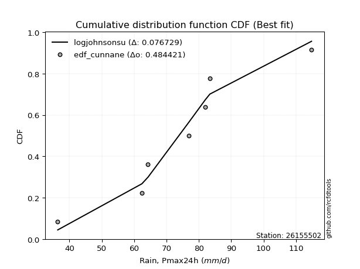</img></img>

</div>


### 12. EDF Adamowski (1981)

The Adamowski formula in hydrology refers to a specific plotting position formula used for estimating the non-parametric empirical distribution of hydrological events (like flood peaks) to calculate their return periods. This formula provides an alternative to traditional parametric methods (like the Gumbel or Log Pearson Type III distributions). 

<div align="center">


$P=(m-0.25)/(n+0.5)$


</div>


**12.1. Empirical values**

<div align="center">

|                | 0                  | 1                   | 2                   | 3             | 4                  | 5                  | 6                  |
|:---------------|:-------------------|:--------------------|:--------------------|:--------------|:-------------------|:-------------------|:-------------------|
| date           | 2017               | 2022                | 2023                | 2021          | 2020               | 2019               | 2018               |
| x              | 36.4               | 62.4                | 64.3                | 76.9          | 82.0               | 83.4               | 114.8              |
| m              | 1                  | 2                   | 3                   | 4             | 5                  | 6                  | 7                  |
| empirical_dist | edf_adamowski      | edf_adamowski       | edf_adamowski       | edf_adamowski | edf_adamowski      | edf_adamowski      | edf_adamowski      |
| empirical      | 0.1                | 0.23333333333333334 | 0.36666666666666664 | 0.5           | 0.6333333333333333 | 0.7666666666666667 | 0.9                |
| empirical_tr   | 1.1111111111111112 | 1.3043478260869565  | 1.5789473684210527  | 2.0           | 2.727272727272727  | 4.2857142857142865 | 10.000000000000002 |

</div>


**12.2. Kolmogorov-Smirnov fit test (sorted by Δ)**


<div align="center">

|                | 0                   | 1                   | 2                   | 3                   | 4                   | 5                   | 6                   | 7                   | 8                   | 9                   | 10                  | 11                  | 12                  | 13                  | 14                  | 15                  | 16                  | 17                  | 18                  | 19                  | 20                  | 21                  | 22                  | 23                  | 24                  | 25                  | 26                  | 27                  | 28                  | 29                  | 30                  | 31                  | 32                  | 33                  | 34                  | 35                  | 36                  | 37                  | 38                  | 39                  | 40                  | 41                  | 42                  | 43                  | 44                  | 45                  | 46                  | 47                  | 48                  | 49                  | 50                  | 51                  | 52                  | 53                  | 54                  | 55                  | 56                  | 57                  | 58                  | 59                  | 60                  | 61                  | 62                  | 63                  | 64                  | 65                  | 66                  | 67                  | 68                  | 69                  | 70                  | 71                  | 72                  | 73                  | 74                  | 75                  | 76                  | 77                  | 78                  | 79                  | 80                  | 81                  | 82                  | 83                  | 84                  | 85                  | 86                  | 87                  | 88                  | 89                  | 90                  | 91                  | 92                  | 93                  | 94                  | 95                  | 96                  | 97                  | 98                  | 99                  | 100                 | 101                 | 102                 | 103                 | 104                 | 105                 | 106                 | 107                 | 108                 | 109                 | 110                 | 111                 | 112                 | 113                 | 114                 | 115                 | 116                 | 117                 | 118                 | 119                 | 120                 | 121                 | 122                 | 123                 | 124                 | 125                 | 126                 | 127                 | 128                 | 129                 | 130                 | 131                 | 132                 | 133                 | 134                 | 135                 | 136                 | 137                 | 138                 | 139                 | 140                 | 141                 | 142                 | 143                 | 144                 | 145                 | 146                 | 147                 | 148                 | 149                 | 150                 | 151                 | 152                 | 153                 | 154                 | 155                 | 156                 | 157                 | 158                 | 159                 |
|:---------------|:--------------------|:--------------------|:--------------------|:--------------------|:--------------------|:--------------------|:--------------------|:--------------------|:--------------------|:--------------------|:--------------------|:--------------------|:--------------------|:--------------------|:--------------------|:--------------------|:--------------------|:--------------------|:--------------------|:--------------------|:--------------------|:--------------------|:--------------------|:--------------------|:--------------------|:--------------------|:--------------------|:--------------------|:--------------------|:--------------------|:--------------------|:--------------------|:--------------------|:--------------------|:--------------------|:--------------------|:--------------------|:--------------------|:--------------------|:--------------------|:--------------------|:--------------------|:--------------------|:--------------------|:--------------------|:--------------------|:--------------------|:--------------------|:--------------------|:--------------------|:--------------------|:--------------------|:--------------------|:--------------------|:--------------------|:--------------------|:--------------------|:--------------------|:--------------------|:--------------------|:--------------------|:--------------------|:--------------------|:--------------------|:--------------------|:--------------------|:--------------------|:--------------------|:--------------------|:--------------------|:--------------------|:--------------------|:--------------------|:--------------------|:--------------------|:--------------------|:--------------------|:--------------------|:--------------------|:--------------------|:--------------------|:--------------------|:--------------------|:--------------------|:--------------------|:--------------------|:--------------------|:--------------------|:--------------------|:--------------------|:--------------------|:--------------------|:--------------------|:--------------------|:--------------------|:--------------------|:--------------------|:--------------------|:--------------------|:--------------------|:--------------------|:--------------------|:--------------------|:--------------------|:--------------------|:--------------------|:--------------------|:--------------------|:--------------------|:--------------------|:--------------------|:--------------------|:--------------------|:--------------------|:--------------------|:--------------------|:--------------------|:--------------------|:--------------------|:--------------------|:--------------------|:--------------------|:--------------------|:--------------------|:--------------------|:--------------------|:--------------------|:--------------------|:--------------------|:--------------------|:--------------------|:--------------------|:--------------------|:--------------------|:--------------------|:--------------------|:--------------------|:--------------------|:--------------------|:--------------------|:--------------------|:--------------------|:--------------------|:--------------------|:--------------------|:--------------------|:--------------------|:--------------------|:--------------------|:--------------------|:--------------------|:--------------------|:--------------------|:--------------------|:--------------------|:--------------------|:--------------------|:--------------------|:--------------------|:--------------------|
| station        | 26155502            | 26155502            | 26155502            | 26155502            | 26155502            | 26155502            | 26155502            | 26155502            | 26155502            | 26155502            | 26155502            | 26155502            | 26155502            | 26155502            | 26155502            | 26155502            | 26155502            | 26155502            | 26155502            | 26155502            | 26155502            | 26155502            | 26155502            | 26155502            | 26155502            | 26155502            | 26155502            | 26155502            | 26155502            | 26155502            | 26155502            | 26155502            | 26155502            | 26155502            | 26155502            | 26155502            | 26155502            | 26155502            | 26155502            | 26155502            | 26155502            | 26155502            | 26155502            | 26155502            | 26155502            | 26155502            | 26155502            | 26155502            | 26155502            | 26155502            | 26155502            | 26155502            | 26155502            | 26155502            | 26155502            | 26155502            | 26155502            | 26155502            | 26155502            | 26155502            | 26155502            | 26155502            | 26155502            | 26155502            | 26155502            | 26155502            | 26155502            | 26155502            | 26155502            | 26155502            | 26155502            | 26155502            | 26155502            | 26155502            | 26155502            | 26155502            | 26155502            | 26155502            | 26155502            | 26155502            | 26155502            | 26155502            | 26155502            | 26155502            | 26155502            | 26155502            | 26155502            | 26155502            | 26155502            | 26155502            | 26155502            | 26155502            | 26155502            | 26155502            | 26155502            | 26155502            | 26155502            | 26155502            | 26155502            | 26155502            | 26155502            | 26155502            | 26155502            | 26155502            | 26155502            | 26155502            | 26155502            | 26155502            | 26155502            | 26155502            | 26155502            | 26155502            | 26155502            | 26155502            | 26155502            | 26155502            | 26155502            | 26155502            | 26155502            | 26155502            | 26155502            | 26155502            | 26155502            | 26155502            | 26155502            | 26155502            | 26155502            | 26155502            | 26155502            | 26155502            | 26155502            | 26155502            | 26155502            | 26155502            | 26155502            | 26155502            | 26155502            | 26155502            | 26155502            | 26155502            | 26155502            | 26155502            | 26155502            | 26155502            | 26155502            | 26155502            | 26155502            | 26155502            | 26155502            | 26155502            | 26155502            | 26155502            | 26155502            | 26155502            | 26155502            | 26155502            | 26155502            | 26155502            | 26155502            | 26155502            |
| empirical_dist | edf_adamowski       | edf_adamowski       | edf_adamowski       | edf_adamowski       | edf_adamowski       | edf_adamowski       | edf_adamowski       | edf_adamowski       | edf_adamowski       | edf_adamowski       | edf_adamowski       | edf_adamowski       | edf_adamowski       | edf_adamowski       | edf_adamowski       | edf_adamowski       | edf_adamowski       | edf_adamowski       | edf_adamowski       | edf_adamowski       | edf_adamowski       | edf_adamowski       | edf_adamowski       | edf_adamowski       | edf_adamowski       | edf_adamowski       | edf_adamowski       | edf_adamowski       | edf_adamowski       | edf_adamowski       | edf_adamowski       | edf_adamowski       | edf_adamowski       | edf_adamowski       | edf_adamowski       | edf_adamowski       | edf_adamowski       | edf_adamowski       | edf_adamowski       | edf_adamowski       | edf_adamowski       | edf_adamowski       | edf_adamowski       | edf_adamowski       | edf_adamowski       | edf_adamowski       | edf_adamowski       | edf_adamowski       | edf_adamowski       | edf_adamowski       | edf_adamowski       | edf_adamowski       | edf_adamowski       | edf_adamowski       | edf_adamowski       | edf_adamowski       | edf_adamowski       | edf_adamowski       | edf_adamowski       | edf_adamowski       | edf_adamowski       | edf_adamowski       | edf_adamowski       | edf_adamowski       | edf_adamowski       | edf_adamowski       | edf_adamowski       | edf_adamowski       | edf_adamowski       | edf_adamowski       | edf_adamowski       | edf_adamowski       | edf_adamowski       | edf_adamowski       | edf_adamowski       | edf_adamowski       | edf_adamowski       | edf_adamowski       | edf_adamowski       | edf_adamowski       | edf_adamowski       | edf_adamowski       | edf_adamowski       | edf_adamowski       | edf_adamowski       | edf_adamowski       | edf_adamowski       | edf_adamowski       | edf_adamowski       | edf_adamowski       | edf_adamowski       | edf_adamowski       | edf_adamowski       | edf_adamowski       | edf_adamowski       | edf_adamowski       | edf_adamowski       | edf_adamowski       | edf_adamowski       | edf_adamowski       | edf_adamowski       | edf_adamowski       | edf_adamowski       | edf_adamowski       | edf_adamowski       | edf_adamowski       | edf_adamowski       | edf_adamowski       | edf_adamowski       | edf_adamowski       | edf_adamowski       | edf_adamowski       | edf_adamowski       | edf_adamowski       | edf_adamowski       | edf_adamowski       | edf_adamowski       | edf_adamowski       | edf_adamowski       | edf_adamowski       | edf_adamowski       | edf_adamowski       | edf_adamowski       | edf_adamowski       | edf_adamowski       | edf_adamowski       | edf_adamowski       | edf_adamowski       | edf_adamowski       | edf_adamowski       | edf_adamowski       | edf_adamowski       | edf_adamowski       | edf_adamowski       | edf_adamowski       | edf_adamowski       | edf_adamowski       | edf_adamowski       | edf_adamowski       | edf_adamowski       | edf_adamowski       | edf_adamowski       | edf_adamowski       | edf_adamowski       | edf_adamowski       | edf_adamowski       | edf_adamowski       | edf_adamowski       | edf_adamowski       | edf_adamowski       | edf_adamowski       | edf_adamowski       | edf_adamowski       | edf_adamowski       | edf_adamowski       | edf_adamowski       | edf_adamowski       | edf_adamowski       | edf_adamowski       | edf_adamowski       |
| p_dist         | logjohnsonsu        | hypsecant           | logburr             | logmielke           | burr                | mielke              | loggenlogistic      | genlogistic         | invgamma            | logistic            | maxwell             | alpha               | logskewnorm         | skewnorm            | betaprime           | invgauss            | loggompertz         | erlang              | gamma               | f                   | rice                | johnsonsu           | dweibull            | nct                 | weibull_min         | rayleigh            | pearson3            | ncf                 | laplace             | logweibull_min      | exponnorm           | logpearson3         | logloggamma         | logburr12           | logexponpow         | foldnorm            | crystalball         | norm                | truncnorm           | t                   | loggumbel_l         | loglogistic         | loggengamma         | gumbel_r            | dgamma              | logt                | logexponnorm        | lognorm             | logcrystalball      | logfatiguelife      | logf                | lognct              | loghypsecant        | loggennorm          | logtruncweibull_min | logerlang           | cosine              | logrice             | logloglaplace       | anglit              | loggamma            | loggamma            | logweibull_max      | loggenextreme       | vonmises_line       | halfnorm            | gennorm             | logexponweib        | logargus            | loginvgamma         | logalpha            | semicircular        | kappa4              | loganglit           | moyal               | halflogistic        | kstwobign           | logsemicircular     | logmaxwell          | loglaplace          | loglaplace          | loginvgauss         | logdweibull         | logbetaprime        | logdgamma           | gumbel_l            | gausshyper          | logfoldnorm         | lograyleigh         | uniform             | loggumbel_r         | logcosine           | logtriang           | gompertz            | arcsine             | bradford            | logarcsine          | ksone               | loginvweibull       | wrapcauchy          | logmoyal            | logncf              | loghalfnorm         | genpareto           | loghalflogistic     | truncexpon          | wald                | kappa3              | argus               | truncweibull_min    | logkstwobign        | loggenexpon         | logkappa4           | lognakagami         | loglevy_l           | logkappa3           | logvonmises_line    | loguniform          | loggenhalflogistic  | logksone            | nakagami            | logtruncnorm        | logwald             | logwrapcauchy       | beta                | genexpon            | lomax               | logjohnsonsb        | loggausshyper       | levy_l              | triang              | logtrapezoid        | logtukeylambda      | loggenpareto        | genhalflogistic     | loglomax            | burr12              | logbradford         | logtruncexpon       | halfgennorm         | tukeylambda         | genextreme          | logbeta             | logrdist            | trapezoid           | johnsonsb           | invweibull          | exponweib           | gengamma            | rdist               | powerlaw            | fatiguelife         | logpowerlaw         | weibull_max         | truncpareto         | exponpow            | logtruncpareto      | loghalfgennorm      | logvonmises         | vonmises            |
| delta          | 0.06722673143640406 | 0.07524731707756593 | 0.0797516011759195  | 0.07979132438960368 | 0.08074171506399408 | 0.08074540615919024 | 0.0807526522861125  | 0.08606256018369995 | 0.0893771878717029  | 0.0895662164424178  | 0.09034667816510256 | 0.09044853110174078 | 0.09461123276326655 | 0.09840970485311185 | 0.09885650286789482 | 0.09896281066042761 | 0.09999998109127248 | 0.1000357047217747  | 0.10003583259927684 | 0.10003774264343612 | 0.10010855422720166 | 0.10020567403276393 | 0.10054022593805689 | 0.10072001421829035 | 0.10120775700937235 | 0.1012459135075654  | 0.1013765869720421  | 0.1018150001679115  | 0.10205754066307371 | 0.10364735035213557 | 0.10436086303305214 | 0.10464623141783458 | 0.10504809193644438 | 0.10595524413421631 | 0.10702782129827793 | 0.10782635011677666 | 0.1082127928439367  | 0.10821279801077777 | 0.10821281377240688 | 0.10826412298633603 | 0.10955098330950042 | 0.114156771741597   | 0.11560496017885996 | 0.11647916886133713 | 0.11848311550621643 | 0.11881386104992447 | 0.11891840849394664 | 0.1189201223648409  | 0.11892330484211189 | 0.11954109687241782 | 0.11995228448510292 | 0.12127477373915208 | 0.12480747514970081 | 0.1258488952603838  | 0.12635939773833182 | 0.12658494368344853 | 0.12804946294878516 | 0.12840423346491064 | 0.12881061142663286 | 0.12891885546618942 | 0.13004316675831434 | 0.13004316675831434 | 0.13032473812623568 | 0.1303284322505993  | 0.131387605668345   | 0.1320042053355152  | 0.13305949411327878 | 0.13416586583669682 | 0.1354255276333074  | 0.13620498706181    | 0.13684450678513432 | 0.13762571940157697 | 0.13822253325153422 | 0.13847599513447573 | 0.1414353377499401  | 0.14172069410691335 | 0.14183272891485693 | 0.14667842253940117 | 0.150990590639571   | 0.1520042916499026  | 0.1520042916499026  | 0.1527133327150425  | 0.1539182390715679  | 0.15394511390478632 | 0.1542516591888935  | 0.15426189258555356 | 0.15502584729229174 | 0.1617509119406459  | 0.16307068512709905 | 0.16717687074829934 | 0.16791087071618832 | 0.1690593708146952  | 0.17039149375497598 | 0.17119307717188625 | 0.17345216838436284 | 0.17627126574397883 | 0.18024796765336804 | 0.18375850340136068 | 0.18565788495136132 | 0.18880773174583643 | 0.19019587649491299 | 0.19286169004885506 | 0.1975052498678202  | 0.2017335028606277  | 0.2059812929825593  | 0.20627324674538822 | 0.210684023203221   | 0.21412948906965157 | 0.2161168585812575  | 0.2183588533133874  | 0.22145976628170755 | 0.230344127184213   | 0.23095329615526256 | 0.23333314549340267 | 0.23367772705679343 | 0.23490542901082467 | 0.23583508087313    | 0.23592127603097218 | 0.2372892016186513  | 0.24104550780358802 | 0.2456024784843659  | 0.2483533776374804  | 0.2533910714078573  | 0.2563897848819511  | 0.25791354195724436 | 0.2580381045330103  | 0.25870660039345245 | 0.27488283028305066 | 0.2775786394193816  | 0.2784088267949404  | 0.289156745918684   | 0.29766633209470433 | 0.3079291251461593  | 0.30980874891148447 | 0.31776541835624594 | 0.3195903854937073  | 0.32202659430018127 | 0.3238387044262451  | 0.33005091939749737 | 0.33391653497271384 | 0.338815291716692   | 0.3608210005162194  | 0.3967989609963467  | 0.41605496437123346 | 0.42688473986533404 | 0.43713762036010856 | 0.4580560686195142  | 0.4812415674128732  | 0.4842897804814928  | 0.5083726885249942  | 0.5941156764312512  | 0.6090610405696664  | 0.6367266012567965  | 0.6413570028542683  | 0.6877387792953467  | 0.7033889191998215  | 0.7114501467064571  | 0.7666666666666667  | 1.1121602650335864  | 17.85064622977994   |
| deltao         | 0.48442053926100004 | 0.48442053926100004 | 0.48442053926100004 | 0.48442053926100004 | 0.48442053926100004 | 0.48442053926100004 | 0.48442053926100004 | 0.48442053926100004 | 0.48442053926100004 | 0.48442053926100004 | 0.48442053926100004 | 0.48442053926100004 | 0.48442053926100004 | 0.48442053926100004 | 0.48442053926100004 | 0.48442053926100004 | 0.48442053926100004 | 0.48442053926100004 | 0.48442053926100004 | 0.48442053926100004 | 0.48442053926100004 | 0.48442053926100004 | 0.48442053926100004 | 0.48442053926100004 | 0.48442053926100004 | 0.48442053926100004 | 0.48442053926100004 | 0.48442053926100004 | 0.48442053926100004 | 0.48442053926100004 | 0.48442053926100004 | 0.48442053926100004 | 0.48442053926100004 | 0.48442053926100004 | 0.48442053926100004 | 0.48442053926100004 | 0.48442053926100004 | 0.48442053926100004 | 0.48442053926100004 | 0.48442053926100004 | 0.48442053926100004 | 0.48442053926100004 | 0.48442053926100004 | 0.48442053926100004 | 0.48442053926100004 | 0.48442053926100004 | 0.48442053926100004 | 0.48442053926100004 | 0.48442053926100004 | 0.48442053926100004 | 0.48442053926100004 | 0.48442053926100004 | 0.48442053926100004 | 0.48442053926100004 | 0.48442053926100004 | 0.48442053926100004 | 0.48442053926100004 | 0.48442053926100004 | 0.48442053926100004 | 0.48442053926100004 | 0.48442053926100004 | 0.48442053926100004 | 0.48442053926100004 | 0.48442053926100004 | 0.48442053926100004 | 0.48442053926100004 | 0.48442053926100004 | 0.48442053926100004 | 0.48442053926100004 | 0.48442053926100004 | 0.48442053926100004 | 0.48442053926100004 | 0.48442053926100004 | 0.48442053926100004 | 0.48442053926100004 | 0.48442053926100004 | 0.48442053926100004 | 0.48442053926100004 | 0.48442053926100004 | 0.48442053926100004 | 0.48442053926100004 | 0.48442053926100004 | 0.48442053926100004 | 0.48442053926100004 | 0.48442053926100004 | 0.48442053926100004 | 0.48442053926100004 | 0.48442053926100004 | 0.48442053926100004 | 0.48442053926100004 | 0.48442053926100004 | 0.48442053926100004 | 0.48442053926100004 | 0.48442053926100004 | 0.48442053926100004 | 0.48442053926100004 | 0.48442053926100004 | 0.48442053926100004 | 0.48442053926100004 | 0.48442053926100004 | 0.48442053926100004 | 0.48442053926100004 | 0.48442053926100004 | 0.48442053926100004 | 0.48442053926100004 | 0.48442053926100004 | 0.48442053926100004 | 0.48442053926100004 | 0.48442053926100004 | 0.48442053926100004 | 0.48442053926100004 | 0.48442053926100004 | 0.48442053926100004 | 0.48442053926100004 | 0.48442053926100004 | 0.48442053926100004 | 0.48442053926100004 | 0.48442053926100004 | 0.48442053926100004 | 0.48442053926100004 | 0.48442053926100004 | 0.48442053926100004 | 0.48442053926100004 | 0.48442053926100004 | 0.48442053926100004 | 0.48442053926100004 | 0.48442053926100004 | 0.48442053926100004 | 0.48442053926100004 | 0.48442053926100004 | 0.48442053926100004 | 0.48442053926100004 | 0.48442053926100004 | 0.48442053926100004 | 0.48442053926100004 | 0.48442053926100004 | 0.48442053926100004 | 0.48442053926100004 | 0.48442053926100004 | 0.48442053926100004 | 0.48442053926100004 | 0.48442053926100004 | 0.48442053926100004 | 0.48442053926100004 | 0.48442053926100004 | 0.48442053926100004 | 0.48442053926100004 | 0.48442053926100004 | 0.48442053926100004 | 0.48442053926100004 | 0.48442053926100004 | 0.48442053926100004 | 0.48442053926100004 | 0.48442053926100004 | 0.48442053926100004 | 0.48442053926100004 | 0.48442053926100004 | 0.48442053926100004 | 0.48442053926100004 | 0.48442053926100004 |
| eval           | Δo > Δ              | Δo > Δ              | Δo > Δ              | Δo > Δ              | Δo > Δ              | Δo > Δ              | Δo > Δ              | Δo > Δ              | Δo > Δ              | Δo > Δ              | Δo > Δ              | Δo > Δ              | Δo > Δ              | Δo > Δ              | Δo > Δ              | Δo > Δ              | Δo > Δ              | Δo > Δ              | Δo > Δ              | Δo > Δ              | Δo > Δ              | Δo > Δ              | Δo > Δ              | Δo > Δ              | Δo > Δ              | Δo > Δ              | Δo > Δ              | Δo > Δ              | Δo > Δ              | Δo > Δ              | Δo > Δ              | Δo > Δ              | Δo > Δ              | Δo > Δ              | Δo > Δ              | Δo > Δ              | Δo > Δ              | Δo > Δ              | Δo > Δ              | Δo > Δ              | Δo > Δ              | Δo > Δ              | Δo > Δ              | Δo > Δ              | Δo > Δ              | Δo > Δ              | Δo > Δ              | Δo > Δ              | Δo > Δ              | Δo > Δ              | Δo > Δ              | Δo > Δ              | Δo > Δ              | Δo > Δ              | Δo > Δ              | Δo > Δ              | Δo > Δ              | Δo > Δ              | Δo > Δ              | Δo > Δ              | Δo > Δ              | Δo > Δ              | Δo > Δ              | Δo > Δ              | Δo > Δ              | Δo > Δ              | Δo > Δ              | Δo > Δ              | Δo > Δ              | Δo > Δ              | Δo > Δ              | Δo > Δ              | Δo > Δ              | Δo > Δ              | Δo > Δ              | Δo > Δ              | Δo > Δ              | Δo > Δ              | Δo > Δ              | Δo > Δ              | Δo > Δ              | Δo > Δ              | Δo > Δ              | Δo > Δ              | Δo > Δ              | Δo > Δ              | Δo > Δ              | Δo > Δ              | Δo > Δ              | Δo > Δ              | Δo > Δ              | Δo > Δ              | Δo > Δ              | Δo > Δ              | Δo > Δ              | Δo > Δ              | Δo > Δ              | Δo > Δ              | Δo > Δ              | Δo > Δ              | Δo > Δ              | Δo > Δ              | Δo > Δ              | Δo > Δ              | Δo > Δ              | Δo > Δ              | Δo > Δ              | Δo > Δ              | Δo > Δ              | Δo > Δ              | Δo > Δ              | Δo > Δ              | Δo > Δ              | Δo > Δ              | Δo > Δ              | Δo > Δ              | Δo > Δ              | Δo > Δ              | Δo > Δ              | Δo > Δ              | Δo > Δ              | Δo > Δ              | Δo > Δ              | Δo > Δ              | Δo > Δ              | Δo > Δ              | Δo > Δ              | Δo > Δ              | Δo > Δ              | Δo > Δ              | Δo > Δ              | Δo > Δ              | Δo > Δ              | Δo > Δ              | Δo > Δ              | Δo > Δ              | Δo > Δ              | Δo > Δ              | Δo > Δ              | Δo > Δ              | Δo > Δ              | Δo > Δ              | Δo > Δ              | Δo > Δ              | Δo > Δ              | Δo > Δ              | Δo > Δ              | Δo > Δ              | Δo > Δ              | Δo <= Δ             | Δo <= Δ             | Δo <= Δ             | Δo <= Δ             | Δo <= Δ             | Δo <= Δ             | Δo <= Δ             | Δo <= Δ             | Δo <= Δ             | Δo <= Δ             | Δo <= Δ             |
| fit            | 1                   | 1                   | 1                   | 1                   | 1                   | 1                   | 1                   | 1                   | 1                   | 1                   | 1                   | 1                   | 1                   | 1                   | 1                   | 1                   | 1                   | 1                   | 1                   | 1                   | 1                   | 1                   | 1                   | 1                   | 1                   | 1                   | 1                   | 1                   | 1                   | 1                   | 1                   | 1                   | 1                   | 1                   | 1                   | 1                   | 1                   | 1                   | 1                   | 1                   | 1                   | 1                   | 1                   | 1                   | 1                   | 1                   | 1                   | 1                   | 1                   | 1                   | 1                   | 1                   | 1                   | 1                   | 1                   | 1                   | 1                   | 1                   | 1                   | 1                   | 1                   | 1                   | 1                   | 1                   | 1                   | 1                   | 1                   | 1                   | 1                   | 1                   | 1                   | 1                   | 1                   | 1                   | 1                   | 1                   | 1                   | 1                   | 1                   | 1                   | 1                   | 1                   | 1                   | 1                   | 1                   | 1                   | 1                   | 1                   | 1                   | 1                   | 1                   | 1                   | 1                   | 1                   | 1                   | 1                   | 1                   | 1                   | 1                   | 1                   | 1                   | 1                   | 1                   | 1                   | 1                   | 1                   | 1                   | 1                   | 1                   | 1                   | 1                   | 1                   | 1                   | 1                   | 1                   | 1                   | 1                   | 1                   | 1                   | 1                   | 1                   | 1                   | 1                   | 1                   | 1                   | 1                   | 1                   | 1                   | 1                   | 1                   | 1                   | 1                   | 1                   | 1                   | 1                   | 1                   | 1                   | 1                   | 1                   | 1                   | 1                   | 1                   | 1                   | 1                   | 1                   | 1                   | 1                   | 1                   | 1                   | 0                   | 0                   | 0                   | 0                   | 0                   | 0                   | 0                   | 0                   | 0                   | 0                   | 0                   |
| n              | 7                   | 7                   | 7                   | 7                   | 7                   | 7                   | 7                   | 7                   | 7                   | 7                   | 7                   | 7                   | 7                   | 7                   | 7                   | 7                   | 7                   | 7                   | 7                   | 7                   | 7                   | 7                   | 7                   | 7                   | 7                   | 7                   | 7                   | 7                   | 7                   | 7                   | 7                   | 7                   | 7                   | 7                   | 7                   | 7                   | 7                   | 7                   | 7                   | 7                   | 7                   | 7                   | 7                   | 7                   | 7                   | 7                   | 7                   | 7                   | 7                   | 7                   | 7                   | 7                   | 7                   | 7                   | 7                   | 7                   | 7                   | 7                   | 7                   | 7                   | 7                   | 7                   | 7                   | 7                   | 7                   | 7                   | 7                   | 7                   | 7                   | 7                   | 7                   | 7                   | 7                   | 7                   | 7                   | 7                   | 7                   | 7                   | 7                   | 7                   | 7                   | 7                   | 7                   | 7                   | 7                   | 7                   | 7                   | 7                   | 7                   | 7                   | 7                   | 7                   | 7                   | 7                   | 7                   | 7                   | 7                   | 7                   | 7                   | 7                   | 7                   | 7                   | 7                   | 7                   | 7                   | 7                   | 7                   | 7                   | 7                   | 7                   | 7                   | 7                   | 7                   | 7                   | 7                   | 7                   | 7                   | 7                   | 7                   | 7                   | 7                   | 7                   | 7                   | 7                   | 7                   | 7                   | 7                   | 7                   | 7                   | 7                   | 7                   | 7                   | 7                   | 7                   | 7                   | 7                   | 7                   | 7                   | 7                   | 7                   | 7                   | 7                   | 7                   | 7                   | 7                   | 7                   | 7                   | 7                   | 7                   | 7                   | 7                   | 7                   | 7                   | 7                   | 7                   | 7                   | 7                   | 7                   | 7                   | 7                   |
| best_fit       | 1                   | 0                   | 0                   | 0                   | 0                   | 0                   | 0                   | 0                   | 0                   | 0                   | 0                   | 0                   | 0                   | 0                   | 0                   | 0                   | 0                   | 0                   | 0                   | 0                   | 0                   | 0                   | 0                   | 0                   | 0                   | 0                   | 0                   | 0                   | 0                   | 0                   | 0                   | 0                   | 0                   | 0                   | 0                   | 0                   | 0                   | 0                   | 0                   | 0                   | 0                   | 0                   | 0                   | 0                   | 0                   | 0                   | 0                   | 0                   | 0                   | 0                   | 0                   | 0                   | 0                   | 0                   | 0                   | 0                   | 0                   | 0                   | 0                   | 0                   | 0                   | 0                   | 0                   | 0                   | 0                   | 0                   | 0                   | 0                   | 0                   | 0                   | 0                   | 0                   | 0                   | 0                   | 0                   | 0                   | 0                   | 0                   | 0                   | 0                   | 0                   | 0                   | 0                   | 0                   | 0                   | 0                   | 0                   | 0                   | 0                   | 0                   | 0                   | 0                   | 0                   | 0                   | 0                   | 0                   | 0                   | 0                   | 0                   | 0                   | 0                   | 0                   | 0                   | 0                   | 0                   | 0                   | 0                   | 0                   | 0                   | 0                   | 0                   | 0                   | 0                   | 0                   | 0                   | 0                   | 0                   | 0                   | 0                   | 0                   | 0                   | 0                   | 0                   | 0                   | 0                   | 0                   | 0                   | 0                   | 0                   | 0                   | 0                   | 0                   | 0                   | 0                   | 0                   | 0                   | 0                   | 0                   | 0                   | 0                   | 0                   | 0                   | 0                   | 0                   | 0                   | 0                   | 0                   | 0                   | 0                   | 0                   | 0                   | 0                   | 0                   | 0                   | 0                   | 0                   | 0                   | 0                   | 0                   | 0                   |
| best_fit_sort  | 1                   | 2                   | 3                   | 4                   | 5                   | 6                   | 7                   | 8                   | 9                   | 10                  | 11                  | 12                  | 13                  | 14                  | 15                  | 16                  | 17                  | 18                  | 19                  | 20                  | 21                  | 22                  | 23                  | 24                  | 25                  | 26                  | 27                  | 28                  | 29                  | 30                  | 31                  | 32                  | 33                  | 34                  | 35                  | 36                  | 37                  | 38                  | 39                  | 40                  | 41                  | 42                  | 43                  | 44                  | 45                  | 46                  | 47                  | 48                  | 49                  | 50                  | 51                  | 52                  | 53                  | 54                  | 55                  | 56                  | 57                  | 58                  | 59                  | 60                  | 61                  | 62                  | 63                  | 64                  | 65                  | 66                  | 67                  | 68                  | 69                  | 70                  | 71                  | 72                  | 73                  | 74                  | 75                  | 76                  | 77                  | 78                  | 79                  | 80                  | 81                  | 82                  | 83                  | 84                  | 85                  | 86                  | 87                  | 88                  | 89                  | 90                  | 91                  | 92                  | 93                  | 94                  | 95                  | 96                  | 97                  | 98                  | 99                  | 100                 | 101                 | 102                 | 103                 | 104                 | 105                 | 106                 | 107                 | 108                 | 109                 | 110                 | 111                 | 112                 | 113                 | 114                 | 115                 | 116                 | 117                 | 118                 | 119                 | 120                 | 121                 | 122                 | 123                 | 124                 | 125                 | 126                 | 127                 | 128                 | 129                 | 130                 | 131                 | 132                 | 133                 | 134                 | 135                 | 136                 | 137                 | 138                 | 139                 | 140                 | 141                 | 142                 | 143                 | 144                 | 145                 | 146                 | 147                 | 148                 | 149                 | 150                 | 151                 | 152                 | 153                 | 154                 | 155                 | 156                 | 157                 | 158                 | 159                 | 160                 |

</div>


**12.3. Best fit**

<div align="center">

|   id |   station | empirical_dist   | p_dist       |     delta |   deltao | eval   |   fit |   n |   best_fit |   best_fit_sort |
|-----:|----------:|:-----------------|:-------------|----------:|---------:|:-------|------:|----:|-----------:|----------------:|
|    0 |  26155502 | edf_adamowski    | logjohnsonsu | 0.0672267 | 0.484421 | Δo > Δ |     1 |   7 |          1 |               1 |

</div>


<div align="center">

</img>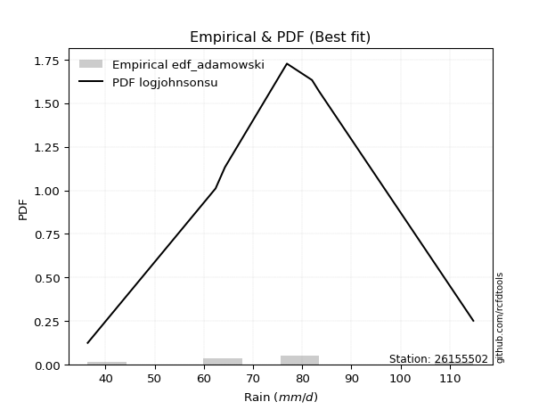</img>

</div>


## C. Best fit & Estimate extreme values for specific return periods - Tr

Best fit in probability distribution analysis means finding the theoretical distribution (like Normal, Poisson, Exponential, etc.) that most accurately mirrors your real-world data´s patterns (shape, center, spread) for better predictions, using methods like visual checks (Q-Q plots), goodness-of-fit tests (Kolmogorov-Smirnov, Chi-Squared), and information criteria (AIC) to score and select the simplest, most representative model.


### 1. Best fit (ordered by delta Δ)

:file_folder:Table: [bestfit_26155502.csv](table/bestfit_26155502.csv)

<div align="center">

|   id |   station | empirical_dist   | p_dist       |     delta |   deltao | eval   |   fit |   n |   best_fit |   best_fit_sort |
|-----:|----------:|:-----------------|:-------------|----------:|---------:|:-------|------:|----:|-----------:|----------------:|
|    0 |  26155502 | edf_adamowski    | logjohnsonsu | 0.0672267 | 0.484421 | Δo > Δ |     1 |   7 |          1 |               1 |
|    1 |  26155502 | edf_chegodayev   | logjohnsonsu | 0.069221  | 0.484421 | Δo > Δ |     1 |   7 |          1 |               2 |
|    2 |  26155502 | edf_jenkinson    | logjohnsonsu | 0.0699535 | 0.484421 | Δo > Δ |     1 |   7 |          1 |               3 |
|    3 |  26155502 | edf_beard        | logjohnsonsu | 0.0699535 | 0.484421 | Δo > Δ |     1 |   7 |          1 |               4 |
|    4 |  26155502 | edf_filliben     | logjohnsonsu | 0.0705054 | 0.484421 | Δo > Δ |     1 |   7 |          1 |               5 |
|    5 |  26155502 | edf_tukey        | logjohnsonsu | 0.071678  | 0.484421 | Δo > Δ |     1 |   7 |          1 |               6 |
|    6 |  26155502 | edf_blom         | logjohnsonsu | 0.0748128 | 0.484421 | Δo > Δ |     1 |   7 |          1 |               7 |
|    7 |  26155502 | edf_cunnane      | logjohnsonsu | 0.0767286 | 0.484421 | Δo > Δ |     1 |   7 |          1 |               8 |
|    8 |  26155502 | edf_gringorten   | logjohnsonsu | 0.0798497 | 0.484421 | Δo > Δ |     1 |   7 |          1 |               9 |
|    9 |  26155502 | edf_weibull      | logjohnsonsu | 0.0813789 | 0.484421 | Δo > Δ |     1 |   7 |          1 |              10 |
|   10 |  26155502 | edf_hazen        | logjohnsonsu | 0.0846651 | 0.484421 | Δo > Δ |     1 |   7 |          1 |              11 |
|   11 |  26155502 | edf_california   | loglaplace   | 0.114074  | 0.484421 | Δo > Δ |     1 |   7 |          1 |              12 |
|   12 |  26155502 | edf_california   | loglaplace   | 0.114074  | 0.484421 | Δo > Δ |     1 |   7 |          1 |              13 |

</div>


### 2. Extreme values and % difference analysis

In hydrology, a return period (or recurrence interval $Tr$) is the statistical average time between extreme events like floods or droughts of a specific magnitude, indicating how rare an event is, with a 100-year flood, for example, having a 1% chance of occurring in any given year, not that it happens exactly every century. It is a key tool for infrastructure design (like bridges or dams) and risk assessment, calculated from historical data to determine the probability of future events, although it is important to remember it is statistical average, and events can cluster or be missed.

The extreme value porcentage difference is evaluated as $pdiff = 1 - (ETrBf / ETr) * 100$, where _ETrBf_ correspond to the bestfit extreme value for a specific recurrence interval and _ETr_ correspond to the extreme value for one of the most used PDFsused in hydrology.

> risk_rate: assuming the return period as the project useful life.

:file_folder:Table: [extreme_26155502.csv](table/extreme_26155502.csv), all PDFs.  
:file_folder:Table: [extremepdiff_26155502.csv](table/extremepdiff_26155502.csv), % difference between bestfit and most used PDFs in Hydrology.

<div align="center">

Extreme values table for only best fit PDFs
|   id |      tr |   prob_l |     prob_g |    alpha |   anglit |   arcsine |    argus |     beta |   betaprime |   bradford |     burr |   burr12 |   cosine |   crystalball |   dgamma |   dweibull |   erlang |   exponnorm |   exponpow |        exponweib |        f |   fatiguelife |   foldnorm |    gamma |   gausshyper |   genexpon |       genextreme |         gengamma |   genhalflogistic |   genlogistic |   gennorm |   genpareto |   gompertz |   gumbel_l |   gumbel_r |   halfgennorm |   halflogistic |   halfnorm |   hypsecant |   invgamma |   invgauss |       invweibull |   johnsonsb |   johnsonsu |   kappa3 |   kappa4 |    ksone |   kstwobign |   laplace |   levy_l |   loggamma |   logistic |   loglaplace |    lomax |   maxwell |   mielke |    moyal |   nakagami |      ncf |      nct |     norm |   pearson3 |   powerlaw |   rayleigh |   rdist |     rice |   semicircular |   skewnorm |        t |   trapezoid |   triang |   truncexpon |   truncnorm |   truncpareto |   truncweibull_min |   tukeylambda |   uniform |   vonmises |   vonmises_line |     wald |   weibull_max |   weibull_min |   wrapcauchy |   logalpha |   loganglit |   logarcsine |   logargus |   logbeta |   logbetaprime |   logbradford |   logburr |   logburr12 |   logcosine |   logcrystalball |   logdgamma |      logdweibull |   logerlang |   logexponnorm |   logexponpow |   logexponweib |     logf |   logfatiguelife |   logfoldnorm |   loggausshyper |   loggenexpon |   loggenextreme |   loggengamma |   loggenhalflogistic |   loggenlogistic |   loggennorm |   loggenpareto |   loggompertz |   loggumbel_l |   loggumbel_r |   loghalfgennorm |   loghalflogistic |   loghalfnorm |   loghypsecant |   loginvgamma |   loginvgauss |   loginvweibull |   logjohnsonsb |   logjohnsonsu |   logkappa3 |   logkappa4 |   logksone |   logkstwobign |   loglevy_l |   logloggamma |   loglogistic |   logloglaplace |   loglomax |   logmaxwell |   logmielke |   logmoyal |   lognakagami |   logncf |   lognct |   lognorm |   logpearson3 |   logpowerlaw |   lograyleigh |   logrdist |   logrice |   logsemicircular |   logskewnorm |     logt |   logtrapezoid |   logtriang |   logtruncexpon |   logtruncnorm |   logtruncpareto |   logtruncweibull_min |   logtukeylambda |   loguniform |   logvonmises |   logvonmises_line |   logwald |   logweibull_max |   logweibull_min |   logwrapcauchy |   station |   n |   risk_rate |
|-----:|--------:|---------:|-----------:|---------:|---------:|----------:|---------:|---------:|------------:|-----------:|---------:|---------:|---------:|--------------:|---------:|-----------:|---------:|------------:|-----------:|-----------------:|---------:|--------------:|-----------:|---------:|-------------:|-----------:|-----------------:|-----------------:|------------------:|--------------:|----------:|------------:|-----------:|-----------:|-----------:|--------------:|---------------:|-----------:|------------:|-----------:|-----------:|-----------------:|------------:|------------:|---------:|---------:|---------:|------------:|----------:|---------:|-----------:|-----------:|-------------:|---------:|----------:|---------:|---------:|-----------:|---------:|---------:|---------:|-----------:|-----------:|-----------:|--------:|---------:|---------------:|-----------:|---------:|------------:|---------:|-------------:|------------:|--------------:|-------------------:|--------------:|----------:|-----------:|----------------:|---------:|--------------:|--------------:|-------------:|-----------:|------------:|-------------:|-----------:|----------:|---------------:|--------------:|----------:|------------:|------------:|-----------------:|------------:|-----------------:|------------:|---------------:|--------------:|---------------:|---------:|-----------------:|--------------:|----------------:|--------------:|----------------:|--------------:|---------------------:|-----------------:|-------------:|---------------:|--------------:|--------------:|--------------:|-----------------:|------------------:|--------------:|---------------:|--------------:|--------------:|----------------:|---------------:|---------------:|------------:|------------:|-----------:|---------------:|------------:|--------------:|--------------:|----------------:|-----------:|-------------:|------------:|-----------:|--------------:|---------:|---------:|----------:|--------------:|--------------:|--------------:|-----------:|----------:|------------------:|--------------:|---------:|---------------:|------------:|----------------:|---------------:|-----------------:|----------------------:|-----------------:|-------------:|--------------:|-------------------:|----------:|-----------------:|-----------------:|----------------:|----------:|----:|------------:|
|    0 |    2    | 0.5      | 0.5        |  72.7408 |  74.3143 |   74.3143 |  79.9765 |  82.6284 |     73.4562 |    69.1539 |  73.6768 |  57.6968 |  74.8162 |       74.3143 |  71.6412 |    72.1319 |  73.713  |     74.0953 |    36.4032 |     36.9579      |  73.7134 |       36.4001 |    74.0745 |  73.713  |      74.6915 |    63.0364 |     41.4337      |     37.0107      |           87.4303 |       73.8572 |   76.9    |     70.5719 |    77.4833 |    77.9705 |    70.6581 |       55.7368 |        68.8404 |    69.7586 |     74.3143 |    72.6913 |    71.799  |   2119.98        |     36.5419 |     73.7447 |  36.4    |  72.7185 |  75.6    |     69.9277 |   74.3143 |  74.9203 |    70.1838 |    74.3143 |      70.6863 |  63.0104 |   72.4109 |  73.6732 |  69.4777 |    67.5205 |  71.7132 |  73.8595 |  74.3143 |    73.8154 |    37.7808 |    71.7358 | 33.1184 |  73.4013 |        74.3143 |    73.6633 |  74.3185 |     95.0846 |  85.0347 |      66.701  |     74.3143 |       36.9266 |            65.9454 |       60.2153 |   75.6    |   0.963307 |         75.6    |  67.1    |       114.461 |       73.3666 |      77.0673 |    69.8443 |     70.6863 |      70.6863 |    73.9675 |   99.6805 |        70.5031 |       58.436  |   73.5045 |     73.8494 |     68.2369 |          70.6859 |     76.9    |     76.9         |     70.4005 |        70.6863 |       73.176  |        70.2414 |  70.6464 |          70.6537 |       68.5396 |         61.5771 |       64.7944 |         74.583  |       70.8119 |              80.9892 |          73.6746 |      76.9014 |        55.0581 |       72.5219 |       74.6092 |       66.9696 |          36.3991 |           65.1946 |       66.0853 |        70.6863 |       69.7624 |       68.837  |         67.7179 |        60.1794 |        74.0326 |     36.4    |     65.1636 |    64.643  |        65.4277 |     73.949  |       73.8321 |       70.6863 |         76.9    |    57.836  |      68.7263 |     73.5137 |    65.812  |       68.4183 |  69.3716 |  70.6121 |   70.6863 |       73.406  |       37.3789 |       68.0446 |    102.246 |   70.2401 |           70.6863 |       73.0275 |  70.691  |        85.9998 |     76.1237 |         58.107  |        73.0814 |          36.732  |               72.972  |          84.6111 |      64.643  |      0.13256  |            64.0935 |   63.5392 |          74.5826 |          73.6822 |         64.643  |  26155502 |   7 |    0.75     |
|    1 |    2.33 | 0.570815 | 0.429185   |  76.8226 |  78.9404 |   81.2588 |  84.7559 |  88.7202 |     77.4898 |    74.7353 |  77.2424 |  63.8896 |  79.1485 |       78.2858 |  77.1216 |    76.8428 |  77.7    |     78.051  |    36.4142 |     38.4003      |  77.7003 |       37.2211 |    78.1402 |  77.7    |      80.1975 |    68.7089 |     53.3915      |     38.499       |           92.5478 |       77.4359 |   79.4073 |     79.0234 |    81.9002 |    81.4258 |    74.3381 |       62.8083 |        72.624  |    74.0449 |     77.4927 |    76.7617 |    75.8795 | 145351           |     37.751  |     77.7249 |  84.9548 |  78.5441 |  82.2623 |     74.5439 |   76.7177 |  87.0074 |    74.5771 |    77.8134 |      73.241  |  68.9222 |   76.537  |  77.2405 |  72.9613 |    69.5431 |  75.9063 |  77.8086 |  78.2858 |    77.7993 |    39.3878 |    75.9229 | 42.394  |  77.5195 |        79.2758 |    77.6242 |  78.2895 |     99.6396 |  89.9551 |      72.0444 |     78.2858 |       37.2893 |            71.4478 |       63.7582 |   81.1519 |   1.15364  |         78.3105 |  69.7041 |       114.659 |       77.5317 |      82.8271 |    74.2845 |     75.6859 |      78.3229 |    79.0108 |  105.663  |        76.1341 |       63.4103 |   77.1209 |     77.9538 |     72.7926 |          74.957  |     78.2989 |     77.1451      |     74.8022 |        74.9576 |       77.6075 |        74.8467 |  74.9294 |          74.9293 |       73.1107 |         67.1696 |       69.9302 |         79.1055 |       75.0344 |              86.7278 |          77.2415 |      79.8266 |        70.5424 |       76.8298 |       78.5164 |       70.7111 |          36.3991 |           68.9428 |       70.4054 |        74.0844 |       74.1448 |       73.2403 |         73.0914 |        81.4406 |        77.1679 |     36.4    |     70.9666 |    71.2709 |        70.7651 |     84.4959 |       77.9152 |       74.4363 |         79.8969 |    64.1599 |      73.0458 |     77.1271 |    69.2875 |       70.656  |  76.9237 |  74.9214 |   74.9575 |       77.6407 |       38.4397 |       72.3862 |    112.83  |   74.5908 |           76.062  |       77.1672 |  74.9615 |        91.9348 |     81.4731 |         62.9376 |        75.4759 |          36.9565 |               78.1514 |          88.5679 |      70.1209 |      0.140452 |            68.1794 |   66.0316 |          79.1052 |          77.7881 |         80.3894 |  26155502 |   7 |    0.729209 |
|    2 |    5    | 0.8      | 0.2        |  92.9035 |  95.2622 |   99.7772 | 100.087  | 105.668  |     93.1728 |    94.7076 |  90.9171 | 105.963  |  94.7604 |       93.0449 |  89.2252 |    90.0659 |  92.8551 |     92.8852 |    37.5177 |    172.868       |  92.8549 |       54.6575 |    93.2503 |  92.8551 |      98.4649 |    96.9967 |   3390.77        |    155.932       |          106.078  |       91.4442 |   92.0944 |    102.408  |    96.1694 |    92.5882 |    90.3258 |      113.191  |        89.7444 |    92.171  |     90.2419 |    92.8272 |    92.1891 |      1.48357e+13 |    114.127  |     92.8341 | 104.45   |  97.8543 | 103.824  |     94.1525 |   88.7339 | 107.033  |    93.8365 |    91.3242 |      87.4677 |  98.7465 |   92.777  |  90.9184 |  89.0978 |    80.2462 |  93.0953 |  92.773  |  93.0449 |    92.8846 |    57.7598 |    92.6859 | 67.7529 |  93.1206 |        96.2075 |    92.7525 |  93.0469 |    112.708  | 104.071  |      92.1445 |     93.0449 |       42.957  |            92.2253 |       75.0476 |   99.12   |   1.89682  |         88.9347 |  84.2822 |       114.797 |       93.2453 |     101.468  |    93.9687 |     96.3233 |     102.967  |    96.5446 |  114.121  |       101.834  |       85.118  |   90.9019 |     93.2772 |     91.883  |          93.2184 |     93.454  |     94.937       |     94.0568 |        93.2194 |       93.9143 |        95.4444 |  93.2605 |          93.2359 |       93.3714 |         89.8938 |       95.2157 |         95.325  |       92.9437 |             103.423  |          90.9184 |      96.4292 |       107.87   |       93.2397 |       92.5925 |       89.5491 |          36.3991 |           88.7846 |       92.0248 |        89.4381 |       93.6761 |       93.1875 |        101.845  |       113.877  |        89.534  |     91.4197 |     92.8226 |    97.7472 |        98.7388 |    105.382  |       93.2166 |       90.8796 |         97.2192 |   108.837  |      92.8512 |     90.9014 |    87.9392 |       83.0989 | 114.718  |  93.4109 |   93.2194 |       93.6939 |       51.2175 |       92.7248 |    149.076 |   93.4163 |           97.6784 |       92.725  |  93.221  |       111.334  |     98.9989 |         84.2337 |        87.1664 |          40.4744 |               96.3053 |         102.411  |      91.2376 |      0.174275 |            85.7407 |   81.902  |          95.3251 |          93.2082 |        105.248  |  26155502 |   7 |    0.67232  |
|    3 |   10    | 0.9      | 0.1        | 104.439  | 104.501  |  104.248  | 107.48   | 111.277  |    104.191  |   104.42   | 101.248  | inf      | 104.193  |      102.836  |  97.9991 |    99.4346 | 103.205  |    102.879  |    45.913  |   1574.08        | 103.204  |       78.7327 |   103.274  | 103.205  |     106.64   |   122.661  | 248442           |   1213.88        |          110.793  |      101.888  |  103.729  |    110.067  |   104.114  |    98.8029 |   103.348  |      181.782  |       103.962  |   105.584  |    100.423  |   104.364  |   104.058  |      4.94903e+19 |    115.093  |    103.144  | 112.956  | 106.399  | 113.232  |    109.082  |   99.642  | 111.867  |   109.675  |   101.274  |     102.762  | 126.209  |  104.206  | 101.25   | 103.147  |    89.2906 | 105.997  | 102.995  | 102.836  |   103.137  |    78.8302 |   104.638  | 74.3581 | 103.643  |       104.895  |   103.17   | 102.837  |    117.812  | 109.585  |     102.705  |    102.836  |       56.3807 |           103.088  |       79.7519 |  106.96   |   2.46742  |         97.0033 |  99.753  |       114.8   |      103.724  |     109.601  |   110.424  |    110.408  |     109.997  |   105.698  |  114.737  |       124.088  |       98.3278 |  101.285  |    103.424  |    105.766  |         107.725  |    113.624  |    168.99        |    109.844  |       107.726  |      104.195  |       112.827  | 107.843  |         107.807  |      109.972  |        102.171  |      118.872  |        104.661  |      107.013  |             109.647  |         101.249  |     114.678  |       113.7    |      104.203  |      101.496  |      108.544  |          36.3991 |          109.537  |      112.192  |       103.953  |      110.13   |      110.364  |        133.44   |       114.738  |       100.108  |    102.573  |    103.751  |   112.193  |       127.243  |    111.155  |      103.395  |      105.27   |        117.058  |   178.364  |     109.929  |    101.282  |   108.223  |       94.9478 | 151.685  | 108.17   |  107.726  |      104.342  |       69.5738 |      110.63   |    161.567 |  108.576  |          111.055  |      103.292  | 107.729  |       119.98   |    106.827  |         97.569  |        96.4965 |          49.6676 |              105.166  |         108.75   |     102.343  |      0.201436 |            97.9569 |  102.936  |         104.661  |         103.481  |        110.36   |  26155502 |   7 |    0.651322 |
|    4 |   15    | 0.933333 | 0.0666667  | 110.48   | 108.446  |  105.1    | 110.29   | 112.782  |    109.877  |   107.804  | 107.116  | inf      | 108.489  |      107.722  | 102.809  |   104.418  | 108.459  |    107.927  |    59.8459 |   4722.95        | 108.458  |       94.4783 |   108.276  | 108.459  |     109.38   |   137.673  |      2.81807e+06 |   3383.78        |          112.22   |      107.604  |  110.57   |    112.105  |   107.712  |   101.617  |   110.694  |      232.684  |       112.008  |   112.564  |    106.233  |   110.405  |   110.311  |      2.37061e+23 |    115.096  |    108.377  | 115.791  | 109.243  | 116.368  |    117.008  |  106.023  | 113.328  |   118.679  |   106.696  |     112.919  | 142.447  |  110.07   | 107.118  | 111.301  |    94.1408 | 112.916  | 108.199  | 107.722  |   108.327  |    88.846  |   110.797  | 75.7094 | 108.929  |       108.283  |   108.483  | 107.722  |    119.45   | 111.354  |     106.545  |    107.722  |       66.8715 |           107.015  |       81.2555 |  109.573  |   2.7871   |        101.263  | 109.688  |       114.8   |      108.936  |     112.312  |   119.886  |    117.034  |     111.391  |   109.29   |  114.785  |       137.146  |      103.412  |  107.215  |    108.468  |    112.767  |         115.787  |    128.176  |    291.345       |    118.801  |       115.789  |      109.096  |       122.841  | 115.956  |         115.917  |      119.341  |        106.5    |      133.317  |        108.646  |      114.776  |             111.534  |         107.117  |     126.981  |       114.43   |      109.645  |      105.805  |      120.988  |          36.3991 |          123.364  |      124.379  |       113.27   |      119.642  |      120.432  |        155.415  |       114.784  |       106.891  |    106.585  |    107.515  |   117.468  |       145.582  |    112.96   |      108.464  |      114.048  |        130.942  |   239.662  |     119.877  |    107.209  |   122.076  |      101.939  | 175.148  | 116.398  |  115.789  |      109.571  |       80.1569 |      121.166  |    164.522 |  117.065  |          116.755  |      108.692  | 115.793  |       122.893  |    109.468  |        102.809  |       100.997  |          58.0043 |              108.283  |         110.845  |     106.337  |      0.216714 |           103.053  |  119.21   |         108.647  |         108.6    |        111.869  |  26155502 |   7 |    0.644736 |
|    5 |   20    | 0.95     | 0.05       | 114.545  | 110.766  |  105.401  | 111.833  | 113.441  |    113.668  |   109.524  | 111.304  | inf      | 111.131  |      110.921  | 106.131  |   107.798  | 111.932  |    111.259  |    76.6598 |   9466.66        | 111.931  |      106.136  |   111.552  | 111.932  |     110.749  |   148.325  |      1.54341e+07 |   6468.32        |          112.905  |      111.56   |  115.436  |    112.992  |   109.951  |   103.369  |   115.838  |      273.866  |       117.645  |   117.218  |    110.331  |   114.468  |   114.528  |      8.94831e+25 |    115.096  |    111.837  | 117.209  | 110.66   | 117.936  |    122.347  |  110.55   | 114.076  |   125.022  |   110.443  |     120.73   | 154.047  |  113.962  | 111.306  | 117.075  |    97.4003 | 117.628  | 111.646  | 110.921  |   111.752  |    94.5441 |   114.89   | 76.2061 | 112.401  |       110.163  |   112.003  | 110.921  |    120.258  | 112.227  |     108.533  |    110.921  |       74.471  |           109.042  |       81.9881 |  110.88   |   3.00504  |        103.956  | 117.091  |       114.8   |      112.34   |     113.668  |   126.597  |    121.116  |     111.886  |   111.287  |  114.794  |       146.51   |      106.099  |  111.471  |    111.763  |    117.301  |         121.392  |    139.866  |    474.752       |    125.103  |       121.394  |      112.217  |       129.934  | 121.598  |         121.558  |      125.907  |        108.675  |      143.89   |        110.978  |      120.149  |             112.432  |         111.305  |     136.528  |       114.629  |      113.191  |      108.579  |      130.54   |          36.3991 |          134.078  |      133.231  |       120.34   |      126.409  |      127.655  |        172.922  |       114.793  |       112.148  |    108.65   |    109.4    |   120.198  |       159.404  |    113.896  |      111.776  |      120.539  |        142.006  |   296.414  |     126.971  |    111.462  |   132.947  |      106.915  | 192.764  | 122.128  |  121.394  |      112.946  |       86.8089 |      128.719  |    165.688 |  122.991  |          120.042  |      112.286  | 121.4    |       124.357  |    110.794  |        105.606  |       103.693  |          64.7947 |              109.876  |         111.878  |     108.393  |      0.227428 |           105.806  |  132.989  |         110.979  |         111.946  |        112.607  |  26155502 |   7 |    0.641514 |
|    6 |   25    | 0.96     | 0.04       | 117.594  | 112.339  |  105.54   | 112.828  | 113.8    |    116.494  |   110.565  | 114.591  | inf      | 112.984  |      113.277  | 108.667  |   110.346  | 114.505  |    113.727  |    94.9886 |  15586.5         | 114.504  |      115.399  |   113.963  | 114.505  |     111.57   |   156.587  |      5.71933e+07 |  10286.6         |          113.305  |      114.59   |  119.216  |    113.474  |   111.545  |   104.616  |   119.801  |      308.799  |       121.988  |   120.68   |    113.503  |   117.515  |   117.696  |      8.64202e+27 |    115.096  |    114.4    | 118.06   | 111.507  | 118.877  |    126.346  |  114.062  | 114.545  |   129.932  |   113.309  |     127.158  | 163.09   |  116.851  | 114.594  | 121.551  |    99.8333 | 121.191  | 114.206  | 113.277  |   114.288  |    98.2025 |   117.931  | 76.4437 | 114.962  |       111.382  |   114.613  | 113.276  |    120.739  | 112.747  |     109.749  |    113.277  |       80.0903 |           110.28   |       82.4195 |  111.664  |   3.16486  |        105.801  | 123.021  |       114.8   |      114.839  |     114.481  |   131.818  |    123.963  |     112.117  |   112.584  |  114.797  |       153.851  |      107.761  |  114.828  |    114.184  |    120.588  |         125.69   |    149.784  |    737.073       |    129.978  |       125.692  |      114.468  |       135.441  | 125.927  |         125.887  |      130.972  |        109.974  |      152.292  |        112.549  |      124.257  |             112.953  |         114.592  |     144.44   |       114.706  |      115.791  |      110.597  |      138.409  |          36.3991 |          142.963  |      140.224  |       126.114  |      131.687  |      133.319  |        187.739  |       114.797  |       116.542  |    109.907  |    110.526  |   121.866  |       170.61   |    114.487  |      114.21   |      125.753  |        151.368  |   350.131  |     132.507  |    114.817  |   142.035  |      110.785  | 207.029  | 126.528  |  125.692  |      115.401  |       91.3424 |      134.633  |    166.274 |  127.548  |          122.223  |      114.964  | 125.7    |       125.237  |    111.592  |        107.345  |       105.499  |          70.2704 |              110.843  |         112.489  |     109.645  |      0.235702 |           107.521  |  145.167  |         112.55   |         114.407  |        113.047  |  26155502 |   7 |    0.639603 |
|    7 |   50    | 0.98     | 0.02       | 126.606  | 116.21   |  105.726  | 115.083  | 114.414  |    124.75   |   112.669  | 125.139  | inf      | 117.836  |      120.021  | 116.371  |   117.926  | 121.95   |    120.876  |   192.416  |  61123.2         | 121.949  |      145.117  |   120.868  | 121.95   |     113.203  |   182.25   |      3.23405e+09 |  36547.3         |          114.081  |      123.855  |  130.992  |    114.294  |   115.871  |   108      |   132.006  |      434.639  |       135.371  |   130.744  |    123.338  |   126.51   |   127.067  |      1.12479e+34 |    115.096  |    121.821  | 119.761  | 113.19   | 120.758  |    138.089  |  124.97   | 115.602  |   145.22   |   122.067  |     149.392  | 191.432  |  125.23   | 125.145  | 135.446  |   106.922  | 131.85   | 121.64   | 120.021  |   121.611  |   106.093  |   126.759  | 76.7761 | 122.314  |       114.167  |   122.174  | 120.02   |    121.694  | 113.779  |     112.236  |    120.021  |       94.5101 |           112.807  |       83.2574 |  113.232  |   3.57442  |        110.03   | 142.382  |       114.8   |      121.961  |     116.108  |   148.218  |    131.259  |     112.425  |   115.552  |  114.8    |       177.193  |      111.2    |  125.718  |    121.096  |    129.641  |         138.858  |    185.945  |   4142.42        |    145.134  |       138.861  |      120.699  |       152.63   | 139.198  |         139.162  |      146.631  |        112.521  |      179.599  |        116.36   |      136.779  |             113.943  |         125.142  |     172.142  |       114.786  |      123.182  |      116.267  |      165.758  |          36.3991 |          174.216  |      162.703  |       145.834  |      148.329  |      151.359  |        241.851  |       114.799  |       132.426  |    112.467  |    112.745  |   125.272  |       208.279  |    115.829  |      121.157  |      143.122  |        185.546  |   593.055  |     149.968  |    125.694  |   174.397  |      122.873  | 255.021  | 140.04   |  138.861  |      122.264  |      101.874  |      153.387  |    167.152 |  141.573  |          127.357  |      122.807  | 138.878  |       127.002  |    113.193  |        110.969  |       109.653  |          86.3299 |              112.803  |         113.684  |     112.193  |      0.261402 |           111.083  |  193.241  |         116.361  |         121.434  |        113.923  |  26155502 |   7 |    0.63583  |
|    8 |   75    | 0.986667 | 0.0133333  | 131.62   | 117.914  |  105.761  | 115.978  | 114.579  |    129.281  |   113.376  | 131.617  | inf      | 120.153  |      123.64   | 120.782  |   122.164  | 125.992  |    124.769  |   287.062  | 122753           | 125.992  |      163.015  |   124.574  | 125.992  |     113.743  |   197.263  |      3.37528e+10 |  69644.2         |          114.33   |      129.211  |  137.9    |    114.512  |   118.059  |   109.711  |   139.101  |      520.922  |       143.15   |   136.223  |    129.085  |   131.507  |   132.283  |      4.02743e+37 |    115.096  |    125.852  | 120.328  | 113.745  | 121.386  |    144.55   |  131.35   | 116.037  |   154.24   |   127.125  |     164.159  | 208.19   |  129.786  | 131.626  | 143.571  |   110.783  | 137.856  | 125.697  | 123.64   |   125.579  |   108.901  |   131.562  | 76.8422 | 126.27   |       115.279  |   126.28   | 123.639  |    122.011  | 114.12   |     113.082  |    123.64   |      100.504  |           113.664  |       83.5264 |  113.755  |   3.74067  |        111.581  | 154.296  |       114.8   |      125.76   |     116.65   |   157.994  |    134.604  |     112.483  |   116.739  |  114.8    |       191.294  |      112.382  |  132.503  |    124.793  |    134.2    |         146.484  |    211.417  |  14834.4         |    154.061  |       146.487  |      123.912  |       162.769  | 146.888  |         146.858  |      155.792  |        113.336  |      196.477  |        117.998  |      143.987  |             114.252  |         131.622  |     190.806  |       114.795  |      127.112  |      119.243  |      184.073  |          36.3991 |          195.434  |      176.419  |       158.757  |      158.297  |      162.283  |        280.208  |       114.8    |       143.701  |    113.334  |    113.464  |   126.428  |       232.442  |    116.386  |      124.869  |      154.226  |        209.806  |   812.75   |     160.408  |    132.466  |   196.639  |      130      | 285.927  | 147.884  |  146.487  |      125.829  |      105.887  |      164.665  |    167.345 |  149.736  |          129.467  |      127.131  | 146.511  |       127.592  |    113.728  |        112.222  |       111.239  |          93.9611 |              113.465  |         114.07   |     113.055  |      0.276552 |           112.306  |  230.435  |         117.999  |         125.193  |        114.215  |  26155502 |   7 |    0.634587 |
|    9 |  100    | 0.99     | 0.01       | 135.085  | 118.927  |  105.773  | 116.477  | 114.651  |    132.387  |   113.731  | 136.377  | inf      | 121.606  |      126.088  | 123.878  |   125.098  | 128.745  |    127.428  |   375.669  | 194091           | 128.745  |      175.893  |   127.08   | 128.745  |     114.011  |   207.914  |      1.77505e+11 | 106305           |          114.453  |      132.993  |  142.809  |    114.607  |   119.489  |   110.831  |   144.122  |      588.053  |       148.655  |   139.955  |    133.162  |   134.957  |   135.886  |      1.31941e+40 |    115.096  |    128.599  | 120.612  | 114.021  | 121.699  |    148.977  |  135.878  | 116.291  |   160.692  |   130.697  |     175.513  | 220.161  |  132.889  | 136.388  | 149.336  |   113.411  | 142.037  | 128.47   | 126.088  |   128.279  |   110.34   |   134.834  | 76.8664 | 128.949  |       115.902  |   129.075  | 126.086  |    122.168  | 114.291  |     113.508  |    126.088  |      103.771  |           114.096  |       83.6579 |  114.016  |   3.82868  |        112.375  | 162.982  |       114.8   |      128.319  |     116.921  |   165.032  |    136.634  |     112.503  |   117.405  |  114.8    |       201.525  |      112.98   |  137.538  |    127.288  |    137.139  |         151.878  |    231.731  |  41546.8         |    160.441  |       151.881  |      126.034  |       170.006  | 152.33   |         152.305  |      162.311  |        113.732  |      208.883  |        118.955  |      149.067  |             114.401  |         136.384  |     205.288  |       114.798  |      129.755  |      121.232  |      198.246  |          36.3991 |          211.996  |      186.42   |       168.612  |      165.493  |      170.225  |        310.978  |       114.8    |       152.823  |    113.769  |    113.817  |   127.011  |       250.597  |    116.712  |      127.373  |      162.581  |        229.319  |  1019.58   |     167.933  |    137.49   |   214.119  |      135.087  | 309.243  | 153.44   |  151.881  |      128.189  |      107.999  |      172.819  |    167.42  |  155.527  |          130.664  |      130.107  | 151.91   |       127.887  |    113.996  |        112.858  |       112.077  |          98.3813 |              113.797  |         114.26   |     113.489  |      0.287398 |           112.924  |  261.99   |         118.957  |         127.729  |        114.361  |  26155502 |   7 |    0.633968 |
|   10 |  200    | 0.995    | 0.005      | 143.174  | 120.841  |  105.784  | 117.345  | 114.743  |    139.552  |   114.265  | 148.473  | inf      | 124.559  |      131.64   | 131.246  |   131.953  | 135.046  |    133.551  |   678.645  | 528190           | 135.045  |      207.416  |   132.764  | 135.046  |     114.411  |   233.578  |      9.6012e+12  | 267334           |          114.632  |      142.069  |  154.662  |    114.726  |   122.6    |   113.264  |   156.194  |      770.774  |       161.892  |   148.491  |    142.984  |   143      |   144.291  |      1.47077e+46 |    115.096  |    134.889  | 121.037  | 114.431  | 122.17   |    159.173  |  146.786  | 116.772  |   176.465  |   139.263  |     206.202  | 249.284  |  139.988  | 148.495  | 163.225  |   119.411  | 151.881  | 134.848  | 131.64   |   134.449  |   112.543  |   142.321  | 76.8909 | 135.036  |       116.988  |   135.462  | 131.638  |    122.405  | 114.546  |     114.152  |    131.64   |      109.041  |           114.747  |       83.8502 |  114.408  |   3.96524  |        113.582  | 184.619  |       114.8   |      134.093  |     117.328  |   182.396  |    140.552  |     112.522  |   118.565  |  114.8    |       227.018  |      113.885  |  150.531  |    132.933  |    143.316  |         164.86   |    289.585  | 773900           |    176.015  |       164.864  |      130.7    |       187.606  | 165.437  |         165.428  |      178.128  |        114.302  |      240.317  |        120.717  |      161.234  |             114.614  |         148.488  |     244.946  |       114.8    |      135.702  |      125.668  |      236.948  |          36.3991 |          257.785  |      211.475  |       194.94   |      183.319  |      190.079  |        399.497  |       114.8    |       179.65   |    114.426  |    114.331  |   127.889  |       297.99   |    117.333  |      133.03   |      184.515  |        285.855  |  1779.91   |     186.502  |    150.446  |   262.884  |      147.466  | 370.572  | 166.843  |  164.864  |      133.37   |      111.31   |      193.029  |    167.502 |  169.519  |          132.778  |      137.016  | 164.911  |       128.33   |    114.398  |        113.822  |       113.397  |         105.93   |              114.297  |         114.537  |     114.143  |      0.313989 |           113.858  |  360.679  |         120.719  |         133.466  |        114.58   |  26155502 |   7 |    0.633042 |
|   11 |  250    | 0.996    | 0.004      | 145.713  | 121.328  |  105.786  | 117.548  | 114.758  |    141.776  |   114.372  | 152.573  | inf      | 125.368  |      133.337  | 133.594  |   134.103  | 136.987  |    135.451  |   807.417  | 710040           | 136.987  |      217.689  |   134.501  | 136.987  |     114.49   |   241.84   |      3.46335e+13 | 350923           |          114.667  |      144.983  |  158.484  |    114.746  |   123.515  |   113.98   |   160.074  |      836.114  |       166.147  |   151.117  |    146.145  |   145.52   |   146.923  |      1.29306e+48 |    115.096  |    136.828  | 121.123  | 114.513  | 122.264  |    162.329  |  150.297  | 116.897  |   181.621  |   142.014  |     217.182  | 258.743  |  142.174  | 152.598  | 167.696  |   121.254  | 154.992  | 136.823  | 133.337  |   136.347  |   112.99   |   144.626  | 76.894  | 136.899  |       117.243  |   137.427  | 133.335  |    122.452  | 114.597  |     114.281  |    133.337  |      110.153  |           114.878  |       83.8876 |  114.486  |   3.99302  |        113.825  | 191.777  |       114.8   |      135.849  |     117.409  |   188.12   |    141.567  |     112.524  |   118.838  |  114.8    |       235.496  |      114.067  |  155      |    134.655  |    145.057  |         169.045  |    311.269  |      2.27703e+06 |    181.1    |       169.048  |      132.087  |       193.321  | 169.664  |         169.661  |      183.262  |        114.41   |      250.92   |        121.153  |      165.137  |             114.655  |         152.59   |     259.304  |       114.8    |      137.506  |      127.004  |      250.929  |          36.3991 |          274.512  |      219.84   |       204.261  |      189.217  |      196.703  |        432.997  |       114.8    |       190.08   |    114.558  |    114.43   |   128.065  |       314.4    |    117.495  |      134.752  |      192.167  |        307.448  |  2136.69   |     192.621  |    154.899  |   280.834  |      151.491  | 391.98   | 171.171  |  169.049  |      134.904  |      111.993  |      199.714  |    167.513 |  174.045  |          133.279  |      139.175  | 169.102  |       128.418  |    114.478  |        114.016  |       113.671  |         107.589  |              114.398  |         114.591  |     114.274  |      0.322716 |           114.046  |  400.915  |         121.155  |         135.215  |        114.624  |  26155502 |   7 |    0.632858 |
|   12 |  500    | 0.998    | 0.002      | 153.43   | 122.536  |  105.788  | 118.015  | 114.784  |    148.464  |   114.586  | 166.005  | inf      | 127.522  |      138.369  | 140.826  |   140.627  | 142.786  |    141.173  |  1322.4    |      1.66329e+06 | 142.787  |      249.917  |   139.653  | 142.786  |     114.647  |   267.503  |      1.85713e+15 | 766841           |          114.735  |      154.022  |  170.377  |    114.779  |   126.138  |   116.032  |   172.12   |     1060.19   |       179.355  |   158.947  |    155.966  |   153.167  |   154.912  |      1.39839e+54 |    115.096  |    142.625  | 121.3    | 114.674  | 122.452  |    171.785  |  161.205  | 117.22   |   197.918  |   150.543  |     255.156  | 288.393  |  148.695  | 166.046  | 181.585  |   126.736  | 164.511  | 142.754  | 138.369  |   142.012  |   113.891  |   151.502  | 76.8984 | 142.43   |       117.83   |   143.282  | 138.366  |    122.546  | 114.698  |     114.54   |    138.369  |      112.435  |           115.14   |       83.961  |  114.643  |   4.04886  |        114.312  | 214.537  |       114.8   |      141.03   |     117.572  |   206.362  |    144.116  |     112.527  |   119.465  |  114.8    |       262.735  |      114.433  |  169.879  |    139.753  |    149.794  |         182.089  |    389.995  |      1.0146e+08  |    197.151  |       182.093  |      136.091  |       211.231  | 182.847  |         182.868  |      199.375  |        114.619  |      285.435  |        122.203  |      177.253  |             114.732  |         166.034  |     309.586  |       114.8    |      142.82   |      130.913  |      299.799  |         114.54   |          333.663  |      246.799  |       236.153  |      208.082  |      218.063  |        555.945  |       114.8    |       229.898  |    114.822  |    114.624  |   128.419  |       369.19   |    117.915  |      139.842  |      217.972  |        387.812  |  3808.84   |     212.101  |    169.718  |   344.79   |      164.134  | 464.154  | 184.689  |  182.093  |      139.305  |      113.382  |      221.066  |    167.53  |  188.198  |          134.439  |      145.715  | 182.171  |       128.596  |    114.639  |        114.407  |       114.228  |         111.075  |              114.599  |         114.698  |     114.537  |      0.350457 |           114.422  |  561.174  |         122.206  |         140.387  |        114.712  |  26155502 |   7 |    0.632489 |
|   13 |  750    | 0.998667 | 0.00133333 | 157.845  | 123.071  |  105.788  | 118.203  | 114.791  |    152.24   |   114.657  | 174.386  | inf      | 128.566  |      141.164  | 145.02   |   144.345  | 146.036  |    144.417  |  1714.49   |      2.62614e+06 | 146.037  |      268.958  |   142.514  | 146.036  |     114.699  |   282.516  |      1.90465e+16 |      1.16575e+06 |          114.758  |      159.303  |  177.346  |    114.788  |   127.54   |   117.128  |   179.161  |     1206.57   |       187.077  |   163.321  |    161.711  |   157.531  |   159.468  |      4.71086e+57 |    115.096  |    145.877  | 121.366  | 114.727  | 122.515  |    177.097  |  167.586  | 117.373  |   207.665  |   155.527  |     280.378  | 305.924  |  152.342  | 174.439  | 189.709  |   129.791  | 169.993  | 146.099  | 141.164  |   145.183  |   114.193  |   155.348  | 76.8992 | 145.506  |       118.066  |   146.552  | 141.161  |    122.577  | 114.732  |     114.627  |    141.164  |      113.214  |           115.227  |       83.9849 |  114.695  |   4.06752  |        114.475  | 228.184  |       114.8   |      143.891  |     117.626  |   217.381  |    145.259  |     112.528  |   119.718  |  114.8    |       279.338  |      114.555  |  179.347  |    142.579  |    152.145  |         189.765  |    445.294  |      1.28887e+09 |    206.737  |       189.77   |      138.249  |       221.815  | 190.609  |         190.647  |      208.93   |        114.684  |      306.776  |        122.652  |      184.346  |             114.757  |         174.424  |     343.47   |       114.8    |      145.747  |      133.052  |      332.665  |         114.628  |          373.981  |      263.273  |       257.069  |      219.527  |      231.143  |        643.41   |       114.8    |       259.841  |    114.911  |    114.686  |   128.537  |       404.058  |    118.115  |      142.658  |      234.624  |        446.162  |  5381.73   |     223.843  |    179.14   |   388.757  |      171.635  | 510.665  | 192.661  |  189.77   |      141.651  |      113.851  |      233.986  |    167.534 |  196.558  |          134.909  |      149.441  | 189.864  |       128.655  |    114.693  |        114.538  |       114.417  |         112.289  |              114.666  |         114.733  |     114.624  |      0.367187 |           114.548  |  686.535  |         122.654  |         143.252  |        114.741  |  26155502 |   7 |    0.632366 |
|   14 | 1000    | 0.999    | 0.001      | 160.939  | 123.389  |  105.788  | 118.308  | 114.794  |    154.866  |   114.693  | 180.583  | inf      | 129.225  |      143.089  | 147.981  |   146.945  | 148.285  |    146.68   |  2038.06   |      3.57354e+06 | 148.286  |      282.541  |   144.485  | 148.285  |     114.725  |   293.167  |      9.92975e+16 |      1.54598e+06 |          114.769  |      163.048  |  182.295  |    114.792  |   128.484  |   117.867  |   184.156  |     1317.5    |       192.554  |   166.341  |    165.787  |   160.585  |   162.654  |      1.49718e+60 |    115.096  |    148.128  | 121.405  | 114.753  | 122.546  |    180.778  |  172.113  | 117.47   |   214.683  |   159.061  |     299.771  | 318.448  |  154.863  | 180.645  | 195.473  |   131.898  | 173.849  | 148.424  | 143.089  |   147.375  |   114.344  |   158.005  | 76.8996 | 147.625  |       118.199  |   148.811  | 143.085  |    122.593  | 114.749  |     114.67   |    143.089  |      113.607  |           115.271  |       83.9966 |  114.722  |   4.07686  |        114.556  | 238      |       114.8   |      145.855  |     117.653  |   225.365  |    145.945  |     112.528  |   119.859  |  114.8    |       291.433  |      114.617  |  186.44   |    144.523  |    153.647  |         195.238  |    489.354  |      9.06982e+09 |    213.633  |       195.242  |      139.709  |       229.372  | 196.146  |         196.196  |      215.774  |        114.716  |      322.453  |        122.912  |      189.387  |             114.768  |         180.628  |     369.766  |       114.8    |      147.753  |      134.51   |      358.141  |         114.672  |          405.502  |      275.289  |       273.024  |      227.842  |      240.702  |        713.674  |       114.8    |       284.945  |    114.957  |    114.716  |   128.596  |       430.126  |    118.24   |      144.591  |      247.199  |        493.793  |  6901.35   |     232.336  |    186.194  |   423.312  |      177.007  | 545.739  | 198.352  |  195.243  |      143.224  |      114.087  |      243.354  |    167.535 |  202.532  |          135.173  |      152.046  | 195.349  |       128.685  |    114.72   |        114.603  |       114.513  |         112.906  |              114.699  |         114.75   |     114.668  |      0.379311 |           114.611  |  793.69   |         122.915  |         145.221  |        114.756  |  26155502 |   7 |    0.632305 |


</div>


<div align="center">

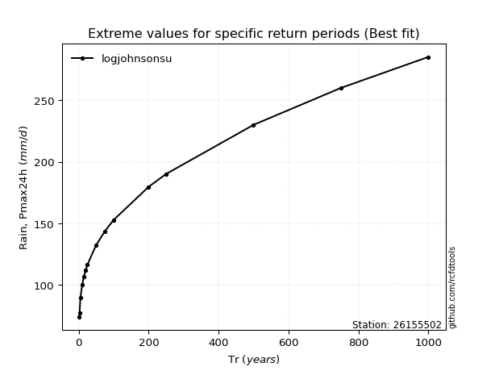</img>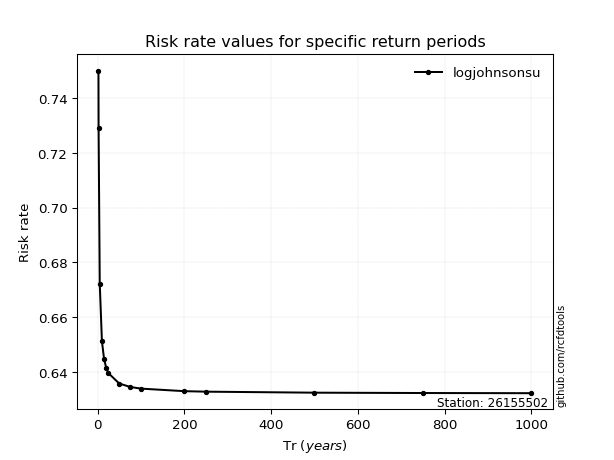</img>

</div>


<sub>**APP DISCLAIMER**: NO WARRANTY - This software is provided by [github.com/rcfdtools](https://github.com/rcfdtools) "as is", without any express or implied warranty, including warranties of merchantability, fitness for a particular purpose, or non-infringement. There is no guarantee that the software will be error-free or operate without interruption. LIMITATION OF LIABILITY - Neither the authors nor copyright holders will be liable for claims or damages arising from the software or its use. You are responsible for determining if the software is appropriate for your use and assume all associated risks, including errors, legal compliance, and data loss. NO PROFESSIONAL ADVICE - The software provides general information and does not offer professional advice. It should not replace consultation with professional advisors.</sub>