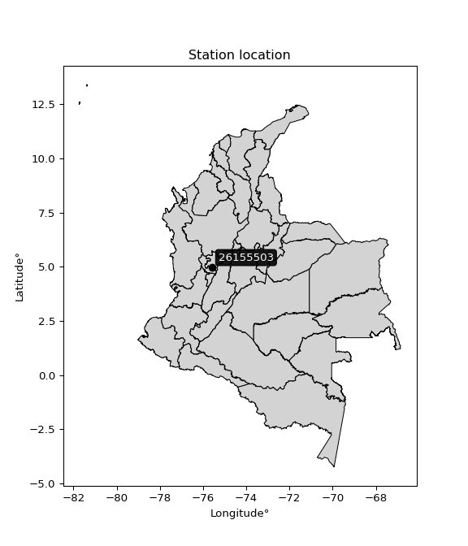

<div align="center">


</div>

# PMP Station (Rain, Pmax24h): 26155503

Probable Maximum Precipitation (PMP) is the greatest amount of rainfall for a specific duration that is meteorologically possible for a given location, acting as a "worst-case" scenario for extreme storms, crucial for designing safety-critical infrastructure like bridges, river deviations, dams, spillways, and nuclear plants to prevent catastrophic failure. PMP is calculated by hydrologists using meteorological data to determine the upper limit of extreme rainfall, often leading to the Probable Maximum Flood (PMF) for flood control design, and is increasingly being studied for climate change impacts. Probable Maximum Precipitation (PMP) is the theoretical upper limit of rainfall, a deterministic estimate for extreme events, while probability distributions (like GEV, Gumbel) describe the likelihood and frequency of various precipitation amounts, including rare ones, showing how often events occur, with PMP representing the extreme end of these distributions, used for critical infrastructure design to ensure safety against the worst conceivable weather, unlike standard statistical forecasts which cover typical probabilities.

The most common probability distributions in hydrology, used for analyzing floods, rainfall, and streamflow, include the Normal, Log-Normal, Gumbel, Gamma (including Log-Pearson Type III), and Generalized Extreme Value (GEV) distributions, often chosen based on the data´s skewness and whether modeling extremes or general conditions, with Gumbel and GEV popular for extreme events like floods, while the Normal distribution serves as a baseline, though often requiring transformations for skewed hydrological data. These distributions help in designing water infrastructure, managing water resources, and forecasting hydrologic events.

> Hydrological data often isn´t perfectly normal (it´s skewed), so different distributions are needed for different applications, such as: **Flood Frequency Analysis**: Using Gumbel, GEV, or Log-Pearson Type III for predicting extreme flood magnitudes and their return periods, **Rainfall Analysis**: Normal for annual totals, but Log-Normal, Weibull, or GEV for intensity or extreme daily rainfall, **Streamflow Modeling**: Gamma and Log-Normal for maximum flows, GEV for minimum flows, and Kappa for daily flows.

<div align="center">

</img>

</div>


## A. General information


### 1. General running parameters

• app_version: _v20260108_. • runtime: _2026-01-09 11:32:22.148588_. • Python version: _3.14.0_. • SciPy version: _1.16.3_. • Pandas version: _2.3.3_. • NumPy version: _2.3.5_. • Stations dataset (station_dataset_file): _dataset/pmax24h_in/automatic_colombia_2003_2024.csv_. • Stations catalog (station_catalog_file): _dataset/CNE.xls_. • Minimum year to eval til year_max (date_min): _1900_. • Maximum year to eval since year_min (date_max): _2024_. • Creates, save and include plots into reports (create_plot): _False_. • Plot only fit distributions with Δo > Δ (plot_only_fit): _True_. • Plot only simple graphs avoiding multiple CDFs and multiple Extreme values plots (plot_only_simple): _True_. • Eval low extreme values, if False, evaluates high extreme values (low_extreme): _False_. • Eval every SciPy distribution as logarithmic (pdist_logarithmic_on): _True_. • Standard deviation normalized (ddof): _1.0_. • Return periods to eval in years (Tr): _[2, 2.33, 5, 10, 15, 20, 25, 50, 75, 100, 200, 250, 500, 750, 1000]_. • Minimum data sample per station, 0 means any (minimum_sample): _5_. • Z-Score maximum threshold to adjust a value, 0 means disable (zscore_max): _3.5_. • Z-Score minimum threshold to adjust a value, 0 means disable (zscore_min): _-2.5_. • Avoid zeros, e.g. rain = 0 (avoid_zeros): _True_. • Avoid null values (avoid_nans): _True_. 

:file_folder:Table: [dataset.csv](../../dataset/pmax24h_in/automatic_colombia_2003_2024.csv)

> Delta Degrees of Freedom (DDOF): is a parameter used in the formulas for calculating variance and standard deviation. When ddof=0, the divisor is $N$ (the total number of observations) and this is used when your data set is the entire population. When ddof=1, the divisor is $N-1$ and this is used when your data set is a sample drawn from a larger population. Using $N-1$ provides an unbiased estimate of the population variance (known as Bessel´s correction).


### 2. Station info and location

|   id |   CODIGO | NOMBRE                      | CATEGORIA               | TECNOLOGIA                | ESTADO   | FECHA_INSTALACION   |   FECHA_SUSPENSION |   ALTITUD |   LATITUD |   LONGITUD | DEPARTAMENTO   | MUNICIPIO   | AREA_OPERATIVA                         | ENTIDAD                                    | AREA_HIDROGRAFICA   | ZONA_HIDROGRAFICA   | SUBZONA_HIDROGRAFICA   |   CORRIENTE | Catalogo   |   Version |
|-----:|---------:|:----------------------------|:------------------------|:--------------------------|:---------|:--------------------|-------------------:|----------:|----------:|-----------:|:---------------|:------------|:---------------------------------------|:-------------------------------------------|:--------------------|:--------------------|:-----------------------|------------:|:-----------|----------:|
|    0 | 26155503 | PLANALTO  - AUT  [26155503] | Climatológica Principal | Automática con Telemetría | Activa   | 29/01/2013          |                nan |      1413 |   4.98972 |   -75.5897 | Caldas         | Manizales   | Area Operativa 09 - Cauca-Valle-Caldas | CENTRO NACIONAL DE INVESTIGACIONES DE CAFE | Magdalena Cauca     | Cauca               | Río Chinchiná          |         nan | CNE_OE     |  20251226 |

<div align="center">

Dynamic map: [:earth_americas:Google](http://maps.google.com/maps?q=4.989722222,-75.58971944) [:earth_americas:OSM](https://www.openstreetmap.org/#map=18/4.989722222/-75.58971944&layers=P) [:earth_americas:Bing](https://www.bing.com/maps?cp=4.989722222~-75.58971944&lvl=18) [:earth_americas:Apple](https://maps.apple.com/frame?center=4.989722222%2C-75.58971944&span=0.003%2C0.006)

</div>


<div align="center">

```geojson
{
  "type": "Feature",
  "geometry": {
    "type": "Point", 
    "coordinates": [-75.58971944, 4.989722222]
  }, 
  "properties": {
    "Name": "26155503"
  }
}
```

</div>


### 3. Discrete values table and plot

<div align="center">

|               |           0 |          1 |           2 |          3 |           4 |            5 |          6 |
|:--------------|------------:|-----------:|------------:|-----------:|------------:|-------------:|-----------:|
| Date          | 2017        | 2018       | 2019        | 2020       | 2021        | 2022         | 2023       |
| Value         |   60.6      |  100.7     |   87.5      |   77.2     |   61.7      |   70.9       |   46.8     |
| Value_initial |   60.6      |  100.7     |   87.5      |   77.2     |   61.7      |   70.9       |   46.8     |
| count         |    7        |    7       |    7        |    7       |    7        |    7         |    7       |
| mean          |   72.2      |   72.2     |   72.2      |   72.2     |   72.2      |   72.2       |   72.2     |
| std           |   18.0877   |   18.0877  |   18.0877   |   18.0877  |   18.0877   |   18.0877    |   18.0877  |
| zscore        |   -0.641318 |    1.57565 |    0.845876 |    0.27643 |   -0.580503 |   -0.0718719 |   -1.40427 |


</div>


> The initial value (value_initial) correspond to the initial obtained or null completed value, and value (value) is adjusted only when the initial value is outside the valid range (outlier) definite through the Z-Score value. If Z-Score is active, values out of range or outliers are replaced with the station mean value. A Z-Score (or standard score) measures how many standard deviations a data point is from the mean of a dataset, indicating its relative position; positive scores mean above the mean, negative mean below, and a score of zero is exactly at the mean, allowing for comparison of values from different distributions. It´s calculated using the formula $z=(x–μ)/σ$, where $x$ is the data point, $μ$ is the mean, and $σ$ is the standard deviation, helping identify outliers and understand probability.
>
> <sub>**Note**: In this study, "completing" (filling gaps in) and "extending" (forecasting or lengthening the historical record) rainfall data series are avoided for certain critical analyses because they introduce artificial bias and uncertainty, which can distort the statistics of rare events (extremes), alter day-to-day variability, and compromise the integrity and homogeneity of the original data. Some reasons against Completing/Extending rainfall data are: **Distortion of Extremes and Variability**: The primary issue is that most gap-filling or extension methods rely on averaging or regression with nearby stations, which inherently smooths the data. Rainfall is highly variable in space and time, with a large percentage of zero values and occasional large storms. Infilling methods often underestimate the highest values and overestimate the lowest (zero) values, which severely distorts analyses focused on flood frequency, drought severity, and intensity-duration-frequency (IDF) curves, **Loss of Data Homogeneity**: Infilled or extended data are synthetic estimates, not actual measurements. Combining these estimates with observed data can violate the assumption of data homogeneity, which requires that the data properties do not change over time. Inhomogeneity can lead to incorrect conclusions about long-term trends or changes in climate patterns, **Propagation of Errors**: Errors and biases from the original data (e.g., wind-induced undercatch, instrument errors, site changes) or the data used for imputation can propagate through the analysis, leading to unreliable hydrological models and inaccurate predictions, **Compromised Statistical Integrity**: For statistical analyses, especially those involving the frequency of events, using artificial data can introduce time bias or autocorrelation that doesn´t exist in reality, making it difficult to assess the true probability of events, **Difficulty in Validation**: It is difficult to accurately validate the quality of filled or extended data, especially for past periods where ground-truth measurements are unavailable. The reliability of imputation techniques heavily depends on the density of the surrounding station network and the complexity of the local topography.</sub>


### 4. Active continuous probability distributions from SciPy (45 of 104 available)

A Probability Density Function (PDF) describes the relative likelihood of a continuous random variable falling within a specific range, where the total area under its curve equals 1, and the area over any interval gives the actual probability for that range. Unlike discrete probabilities (like rolling a die), a PDF shows density, not direct probability for a single point (which is zero), with higher points indicating higher likelihood, often visualized as a bell curve for normal distributions.

A log of a probability density function (log-PDF) is simply the logarithm of the PDF´s value, denoted as $log(f(x))$, useful for converting multiplication of probabilities into addition, improving numerical stability with tiny numbers, and connecting to information theory concepts like entropy. Instead of dealing with very small probabilities (e.g., 0.000001), log-PDFs use negative numbers (e.g., $log(0.00001) ≈ -11.51$ that are easier for computers to handle, preventing underflow errors and simplifying complex calculations. In this study, each active probability distribution from SciPy is also evaluated in the $log$ form.

[scipy.stats](https://docs.scipy.org/doc/scipy/reference/stats.html) is a Python´s powerful submodule within the SciPy library for comprehensive statistical analysis, offering over 130 probability distributions (like Normal, Poisson), functions for descriptive stats (mean, variance), hypothesis testing (t-tests, chi-square), random variable generation, and statistical tests, making it essential for data science, modeling, and research. It provides tools to explore, model, and draw conclusions from data efficiently, working seamlessly with NumPy.

<div align="center">

|   id | p_dist             |   n_parameter | fit_method   | label                                                                       | active   | ref                                                                                                        |
|-----:|:-------------------|--------------:|:-------------|:----------------------------------------------------------------------------|:---------|:-----------------------------------------------------------------------------------------------------------|
|    0 | alpha              |             3 | MLE          | Alpha                                                                       | True     | [:mortar_board:](https://docs.scipy.org/doc/scipy/reference/generated/scipy.stats.alpha.html)              |
|    1 | betaprime          |             4 | MLE          | Beta prime                                                                  | True     | [:mortar_board:](https://docs.scipy.org/doc/scipy/reference/generated/scipy.stats.betaprime.html)          |
|    2 | chi2               |             3 | MLE          | Chi²                                                                        | True     | [:mortar_board:](https://docs.scipy.org/doc/scipy/reference/generated/scipy.stats.chi2.html)               |
|    3 | crystalball        |             4 | MLE          | Crystalball                                                                 | True     | [:mortar_board:](https://docs.scipy.org/doc/scipy/reference/generated/scipy.stats.crystalball.html)        |
|    4 | dweibull           |             3 | MLE          | Double Weibull                                                              | True     | [:mortar_board:](https://docs.scipy.org/doc/scipy/reference/generated/scipy.stats.dweibull.html)           |
|    5 | erlang             |             3 | MLE          | Erlang                                                                      | True     | [:mortar_board:](https://docs.scipy.org/doc/scipy/reference/generated/scipy.stats.erlang.html)             |
|    6 | expon              |             2 | MLE          | Exponential                                                                 | True     | [:mortar_board:](https://docs.scipy.org/doc/scipy/reference/generated/scipy.stats.expon.html)              |
|    7 | exponnorm          |             3 | MLE          | Exponentially modified Normal                                               | True     | [:mortar_board:](https://docs.scipy.org/doc/scipy/reference/generated/scipy.stats.exponnorm.html)          |
|    8 | f                  |             4 | MLE          | F                                                                           | True     | [:mortar_board:](https://docs.scipy.org/doc/scipy/reference/generated/scipy.stats.f.html)                  |
|    9 | fatiguelife        |             3 | MLE          | Fatigue-life (Birnbaum-Saunders)                                            | True     | [:mortar_board:](https://docs.scipy.org/doc/scipy/reference/generated/scipy.stats.fatiguelife.html)        |
|   10 | fisk               |             3 | MLE          | Fisk                                                                        | True     | [:mortar_board:](https://docs.scipy.org/doc/scipy/reference/generated/scipy.stats.fisk.html)               |
|   11 | gamma              |             3 | MLE          | Gamma                                                                       | True     | [:mortar_board:](https://docs.scipy.org/doc/scipy/reference/generated/scipy.stats.gamma.html)              |
|   12 | genexpon           |             5 | MLE          | Generalized exponential                                                     | True     | [:mortar_board:](https://docs.scipy.org/doc/scipy/reference/generated/scipy.stats.genexpon.html)           |
|   13 | genlogistic        |             3 | MLE          | Generalized logistic                                                        | True     | [:mortar_board:](https://docs.scipy.org/doc/scipy/reference/generated/scipy.stats.genlogistic.html)        |
|   14 | gibrat             |             2 | MM           | Gibrat                                                                      | True     | [:mortar_board:](https://docs.scipy.org/doc/scipy/reference/generated/scipy.stats.gibrat.html)             |
|   15 | gompertz           |             3 | MLE          | Gompertz (or truncated Gumbel)                                              | True     | [:mortar_board:](https://docs.scipy.org/doc/scipy/reference/generated/scipy.stats.gompertz.html)           |
|   16 | gumbel_l           |             2 | MM           | Gumbel Left Skew                                                            | True     | [:mortar_board:](https://docs.scipy.org/doc/scipy/reference/generated/scipy.stats.gumbel_l.html)           |
|   17 | gumbel_r           |             2 | MM           | Gumbel Right Skew                                                           | True     | [:mortar_board:](https://docs.scipy.org/doc/scipy/reference/generated/scipy.stats.gumbel_r.html)           |
|   18 | halflogistic       |             2 | MM           | Half-logistic                                                               | True     | [:mortar_board:](https://docs.scipy.org/doc/scipy/reference/generated/scipy.stats.halflogistic.html)       |
|   19 | halfnorm           |             2 | MM           | Half Normal                                                                 | True     | [:mortar_board:](https://docs.scipy.org/doc/scipy/reference/generated/scipy.stats.halfnorm.html)           |
|   20 | hypsecant          |             2 | MM           | hyperbolic secant                                                           | True     | [:mortar_board:](https://docs.scipy.org/doc/scipy/reference/generated/scipy.stats.hypsecant.html)          |
|   21 | invgamma           |             3 | MLE          | Inverted gamma                                                              | True     | [:mortar_board:](https://docs.scipy.org/doc/scipy/reference/generated/scipy.stats.invgamma.html)           |
|   22 | invgauss           |             3 | MLE          | Inverse Gaussian                                                            | True     | [:mortar_board:](https://docs.scipy.org/doc/scipy/reference/generated/scipy.stats.invgauss.html)           |
|   23 | invweibull         |             3 | MLE          | Inverted Weibull                                                            | True     | [:mortar_board:](https://docs.scipy.org/doc/scipy/reference/generated/scipy.stats.invweibull.html)         |
|   24 | kappa4             |             4 | MLE          | Kappa 4                                                                     | True     | [:mortar_board:](https://docs.scipy.org/doc/scipy/reference/generated/scipy.stats.kappa4.html)             |
|   25 | kstwobign          |             2 | MLE          | Limiting distribution of scaled Kolmogorov-Smirnov two-sided test statistic | True     | [:mortar_board:](https://docs.scipy.org/doc/scipy/reference/generated/scipy.stats.kstwobign.html)          |
|   26 | laplace            |             2 | MM           | Laplace                                                                     | True     | [:mortar_board:](https://docs.scipy.org/doc/scipy/reference/generated/scipy.stats.laplace.html)            |
|   27 | laplace_asymmetric |             3 | MLE          | Asymmetric Laplace                                                          | True     | [:mortar_board:](https://docs.scipy.org/doc/scipy/reference/generated/scipy.stats.laplace_asymmetric.html) |
|   28 | loggamma           |             3 | MLE          | Log gamma                                                                   | True     | [:mortar_board:](https://docs.scipy.org/doc/scipy/reference/generated/scipy.stats.loggamma.html)           |
|   29 | logistic           |             2 | MM           | Logistic (or Sech-squared)                                                  | True     | [:mortar_board:](https://docs.scipy.org/doc/scipy/reference/generated/scipy.stats.logistic.html)           |
|   30 | lognorm            |             3 | MLE          | Log Normal                                                                  | True     | [:mortar_board:](https://docs.scipy.org/doc/scipy/reference/generated/scipy.stats.lognorm.html)            |
|   31 | maxwell            |             2 | MM           | Maxwell                                                                     | True     | [:mortar_board:](https://docs.scipy.org/doc/scipy/reference/generated/scipy.stats.maxwell.html)            |
|   32 | mielke             |             4 | MLE          | Mielke Beta-Kappa / Dagum                                                   | True     | [:mortar_board:](https://docs.scipy.org/doc/scipy/reference/generated/scipy.stats.mielke.html)             |
|   33 | moyal              |             2 | MM           | Moyal                                                                       | True     | [:mortar_board:](https://docs.scipy.org/doc/scipy/reference/generated/scipy.stats.moyal.html)              |
|   34 | nakagami           |             3 | MLE          | Nakagami                                                                    | True     | [:mortar_board:](https://docs.scipy.org/doc/scipy/reference/generated/scipy.stats.nakagami.html)           |
|   35 | ncf                |             5 | MLE          | Non-central F distribution                                                  | True     | [:mortar_board:](https://docs.scipy.org/doc/scipy/reference/generated/scipy.stats.ncf.html)                |
|   36 | nct                |             4 | MLE          | Non-central Student’s t                                                     | True     | [:mortar_board:](https://docs.scipy.org/doc/scipy/reference/generated/scipy.stats.nct.html)                |
|   37 | norm               |             2 | MM           | Normal                                                                      | True     | [:mortar_board:](https://docs.scipy.org/doc/scipy/reference/generated/scipy.stats.norm.html)               |
|   38 | pearson3           |             3 | MM           | Pearson type III                                                            | True     | [:mortar_board:](https://docs.scipy.org/doc/scipy/reference/generated/scipy.stats.pearson3.html)           |
|   39 | rayleigh           |             2 | MM           | Rayleigh                                                                    | True     | [:mortar_board:](https://docs.scipy.org/doc/scipy/reference/generated/scipy.stats.rayleigh.html)           |
|   40 | rice               |             3 | MLE          | Rice                                                                        | True     | [:mortar_board:](https://docs.scipy.org/doc/scipy/reference/generated/scipy.stats.rice.html)               |
|   41 | t                  |             3 | MLE          | Student’s t                                                                 | True     | [:mortar_board:](https://docs.scipy.org/doc/scipy/reference/generated/scipy.stats.t.html)                  |
|   42 | truncnorm          |             4 | MLE          | Truncated normal                                                            | True     | [:mortar_board:](https://docs.scipy.org/doc/scipy/reference/generated/scipy.stats.truncnorm.html)          |
|   43 | wald               |             2 | MM           | Wald                                                                        | True     | [:mortar_board:](https://docs.scipy.org/doc/scipy/reference/generated/scipy.stats.wald.html)               |
|   44 | weibull_min        |             3 | MLE          | Weibull minimum                                                             | True     | [:mortar_board:](https://docs.scipy.org/doc/scipy/reference/generated/scipy.stats.weibull_min.html)        |

</div>

> **n_parameter:** # arguments & localization & scale.
>
> **Fit methods:** (MLE) maximum likelihood, (MM) L-moments.
>
>**Inactive** (With the only purpose of prevent loops, zero divisions, infinite values, over high estimated values or horizontal trending for recurrence intervals estimations, the follow distributions were disabled.)**:** foldnorm, gennorm, norminvgauss, powernorm, powerlognorm, skewnorm, genextreme, anglit, arcsine, argus, beta, bradford, burr, burr12, cauchy, cosine, halfcauchy, foldcauchy, skewcauchy, wrapcauchy, dgamma, gengamma, exponweib, exponpow, truncexpon, gausshyper, genhalflogistic, genhyperbolic, geninvgauss, halfgennorm, johnsonsb, johnsonsu, kappa3, ksone, kstwo, loglaplace, levy, levy_l, levy_stable, ncx2, pareto, genpareto, truncpareto, lomax, powerlaw, rdist, rel_breitwigner, recipinvgauss, semicircular, studentized_range, trapezoid, triang, truncweibull_min, tukeylambda, uniform, loguniform, vonmises, vonmises_line, weibull_max, 


## B. Probability (PDF) vs. Empirical (EDF) distributions functions

A continuous probability distribution (CPD) describes probabilities for variables that can take any value within a range (like rain any time), unlike discrete variables with specific outcomes (like temperature). It uses a Probability Density Function (PDF), a curve where the total area under it equals 1, and the probability of the variable falling within an interval (a to b) is found by calculating the area under the curve between those points. A key feature is that the probability of hitting any single exact value is zero, so probabilities are always expressed for ranges, e.g., $P(a ≤ X ≤ b)$.

<div align="center">

Distributions parameters from station values
|    |   station | p_dist                |   n |             loc |          scale | shape                  | shape1                | shape2                | shape3   |
|---:|----------:|:----------------------|----:|----------------:|---------------:|:-----------------------|:----------------------|:----------------------|:---------|
|  0 |  26155503 | alpha                 |   7 |  -145.666       | 2845.5         | 13.136742878896186     |                       |                       |          |
|  1 |  26155503 | betaprime             |   7 |    -6.67217     |  644.096       | 24.66460357216439      | 202.41263834712998    |                       |          |
|  2 |  26155503 | chi2                  |   7 |    21.8558      |    2.93194     | 17.170943415783835     |                       |                       |          |
|  3 |  26155503 | crystalball           |   7 |    72.2         |   16.746       | 5321.039264090322      | 2201.9316497309555    |                       |          |
|  4 |  26155503 | dweibull              |   7 |    68.2115      |   15.6999      | 1.4806781349573637     |                       |                       |          |
|  5 |  26155503 | erlang                |   7 |    21.8598      |    5.86454     | 8.583863835797843      |                       |                       |          |
|  6 |  26155503 | expon                 |   7 |    46.8         |   25.4         |                        |                       |                       |          |
|  7 |  26155503 | exponnorm             |   7 |    67.6769      |   16.1285      | 0.2804424191864353     |                       |                       |          |
|  8 |  26155503 | f                     |   7 |    -3.42646     |   75.4464      | 42.430846549852916     | 831.8592139702687     |                       |          |
|  9 |  26155503 | fatiguelife           |   7 |    46.8         |    1.93836e-05 | 1120.6612030279036     |                       |                       |          |
| 10 |  26155503 | fisk                  |   7 |    -4.66584     |   75.2366      | 7.6533758337527775     |                       |                       |          |
| 11 |  26155503 | gamma                 |   7 |    21.8559      |    5.86389     | 8.585441466123928      |                       |                       |          |
| 12 |  26155503 | genexpon              |   7 |    46.7997      |    2.02305     | 0.07978194133483779    | 6.676772705849202e-07 | 1.461844345047544     |          |
| 13 |  26155503 | genlogistic           |   7 |    26.5903      |   14.1575      | 14.852283018822597     |                       |                       |          |
| 14 |  26155503 | gibrat                |   7 |    59.4249      |    7.74847     |                        |                       |                       |          |
| 15 |  26155503 | gompertz              |   7 |    77.2         |    1.79534     | 6.190803354609649e-06  |                       |                       |          |
| 16 |  26155503 | gumbel_l              |   7 |    79.7366      |   13.0568      |                        |                       |                       |          |
| 17 |  26155503 | gumbel_r              |   7 |    64.6634      |   13.0568      |                        |                       |                       |          |
| 18 |  26155503 | halflogistic          |   7 |    52.3521      |   14.3172      |                        |                       |                       |          |
| 19 |  26155503 | halfnorm              |   7 |    50.0349      |   27.7799      |                        |                       |                       |          |
| 20 |  26155503 | hypsecant             |   7 |    72.2         |   10.6608      |                        |                       |                       |          |
| 21 |  26155503 | invgamma              |   7 |   -63.7882      | 8918.51        | 66.59375116543401      |                       |                       |          |
| 22 |  26155503 | invgauss              |   7 |    -4.19351     | 1495.68        | 0.051013436173516696   |                       |                       |          |
| 23 |  26155503 | invweibull            |   7 |    46.8         |    1.66677     | 0.05491755833224185    |                       |                       |          |
| 24 |  26155503 | kappa4                |   7 |    43.401       |   57.3695      | 1.0629664896001083     | 0.9942539329273978    |                       |          |
| 25 |  26155503 | kstwobign             |   7 |    12.3931      |   68.4848      |                        |                       |                       |          |
| 26 |  26155503 | laplace               |   7 |    72.2         |   11.8412      |                        |                       |                       |          |
| 27 |  26155503 | laplace_asymmetric    |   7 |    70.9         |   13.7111      | 0.9537135270292211     |                       |                       |          |
| 28 |  26155503 | loggamma              |   7 | -4363.61        |  616.672       | 1330.614443778768      |                       |                       |          |
| 29 |  26155503 | logistic              |   7 |    72.2         |    9.23255     |                        |                       |                       |          |
| 30 |  26155503 | lognorm               |   7 |    46.8         |    0.156971    | 12.552311771251304     |                       |                       |          |
| 31 |  26155503 | maxwell               |   7 |    32.519       |   24.8664      |                        |                       |                       |          |
| 32 |  26155503 | mielke                |   7 |    -0.045053    |   70.9503      | 7.052377363358864      | 7.237964434345461     |                       |          |
| 33 |  26155503 | moyal                 |   7 |    62.6236      |    7.53835     |                        |                       |                       |          |
| 34 |  26155503 | nakagami              |   7 |    60.6         |   26.6435      | 0.06569678816651958    |                       |                       |          |
| 35 |  26155503 | ncf                   |   7 |    -0.00158398  |    3.57725e-07 | 1.6090944171159303e-08 | 2.5877443086377228    | 1.8942172604865246    |          |
| 36 |  26155503 | nct                   |   7 |   -65.0136      |   10.1618      | 55.06659381050517      | 13.318760551591982    |                       |          |
| 37 |  26155503 | norm                  |   7 |    72.2         |   16.746       |                        |                       |                       |          |
| 38 |  26155503 | pearson3              |   7 |    72.2         |   16.7459      | 0.23571653024087413    |                       |                       |          |
| 39 |  26155503 | rayleigh              |   7 |    40.1639      |   25.5611      |                        |                       |                       |          |
| 40 |  26155503 | rice                  |   7 |    39.5439      |   21.0373      | 1.0214014890217018     |                       |                       |          |
| 41 |  26155503 | t                     |   7 |    72.1989      |   16.7404      | 100867.25770368591     |                       |                       |          |
| 42 |  26155503 | truncnorm             |   7 |    72.2         |   16.746       | -580.2364257078783     | 1009.5878878456506    |                       |          |
| 43 |  26155503 | wald                  |   7 |    55.454       |   16.746       |                        |                       |                       |          |
| 44 |  26155503 | weibull_min           |   7 |    40.8012      |   35.3406      | 1.933339819166536      |                       |                       |          |
| 45 |  26155503 | logalpha              |   7 |    -4.28154     |  306.442       | 35.93831701484196      |                       |                       |          |
| 46 |  26155503 | logbetaprime          |   7 |    -5.97742     |   18.6828      | 2890.0202825277884     | 5279.202399632079     |                       |          |
| 47 |  26155503 | logchi2               |   7 |     3.84588     |    0.968965    | 1.0754009286702537     |                       |                       |          |
| 48 |  26155503 | logcrystalball        |   7 |     4.25199     |    0.236195    | 143.39111517139128     | 2308.190353056347     |                       |          |
| 49 |  26155503 | logdweibull           |   7 |     4.21393     |    0.224883    | 1.5979296469998845     |                       |                       |          |
| 50 |  26155503 | logerlang             |   7 |    -1.12855     |    0.010552    | 509.9045044498166      |                       |                       |          |
| 51 |  26155503 | logexpon              |   7 |     3.84588     |    0.406105    |                        |                       |                       |          |
| 52 |  26155503 | logexponnorm          |   7 |     4.2518      |    0.236195    | 0.0008066101552592396  |                       |                       |          |
| 53 |  26155503 | logf                  |   7 |   -84.9859      |   89.2371      | 698319.4080976273      | 481064.1231974793     |                       |          |
| 54 |  26155503 | logfatiguelife        |   7 |   -29.3154      |   33.5658      | 0.007034203292102588   |                       |                       |          |
| 55 |  26155503 | logfisk               |   7 |    -9.20811e+06 |    9.20811e+06 | 66049961.036746055     |                       |                       |          |
| 56 |  26155503 | loggamma              |   7 |    -0.914959    |    0.0108924   | 474.30676301174947     |                       |                       |          |
| 57 |  26155503 | loggenexpon           |   7 |     3.84577     |    0.0148496   | 0.014137207081427797   | 2.338169550285799     | 0.0005261336964181844 |          |
| 58 |  26155503 | loggenlogistic        |   7 |     4.26152     |    0.138209    | 0.9735328862094521     |                       |                       |          |
| 59 |  26155503 | loggibrat             |   7 |     4.07182     |    0.109281    |                        |                       |                       |          |
| 60 |  26155503 | loggompertz           |   7 |     3.84588     |    0.712502    | 1.2238931520249936     |                       |                       |          |
| 61 |  26155503 | loggumbel_l           |   7 |     4.35829     |    0.184161    |                        |                       |                       |          |
| 62 |  26155503 | loggumbel_r           |   7 |     4.14569     |    0.184161    |                        |                       |                       |          |
| 63 |  26155503 | loghalflogistic       |   7 |     3.972       |    0.201971    |                        |                       |                       |          |
| 64 |  26155503 | loghalfnorm           |   7 |     3.93934     |    0.391847    |                        |                       |                       |          |
| 65 |  26155503 | loghypsecant          |   7 |     4.25199     |    0.150367    |                        |                       |                       |          |
| 66 |  26155503 | loginvgamma           |   7 |     0.562747    |  869.151       | 236.7151822887979      |                       |                       |          |
| 67 |  26155503 | loginvgauss           |   7 |     2.27923     |  127.279       | 0.015481108110461717   |                       |                       |          |
| 68 |  26155503 | loginvweibull         |   7 |    -1.3527e+07  |    1.3527e+07  | 60771632.85469417      |                       |                       |          |
| 69 |  26155503 | logkappa4             |   7 |     3.83686     |    0.811577    | 1.005484122332808      | 1.0468097358534578    |                       |          |
| 70 |  26155503 | logkstwobign          |   7 |     3.32642     |    1.05875     |                        |                       |                       |          |
| 71 |  26155503 | loglaplace            |   7 |     4.25199     |    0.167015    |                        |                       |                       |          |
| 72 |  26155503 | loglaplace_asymmetric |   7 |     4.26127     |    0.193743    | 1.0245353730715774     |                       |                       |          |
| 73 |  26155503 | logloggamma           |   7 |     2.08361     |    0.849219    | 13.347169988581669     |                       |                       |          |
| 74 |  26155503 | loglogistic           |   7 |     4.25199     |    0.130221    |                        |                       |                       |          |
| 75 |  26155503 | loglognorm            |   7 |     3.84588     |    0.00316225  | 12.087335777605627     |                       |                       |          |
| 76 |  26155503 | logmaxwell            |   7 |     3.6923      |    0.35073     |                        |                       |                       |          |
| 77 |  26155503 | logmielke             |   7 |    -0.170728    |    4.48438     | 26.45444630907044      | 35.41414934697538     |                       |          |
| 78 |  26155503 | logmoyal              |   7 |     4.11692     |    0.106325    |                        |                       |                       |          |
| 79 |  26155503 | lognakagami           |   7 |   -24.874       |   29.1267      | 3775.320196701894      |                       |                       |          |
| 80 |  26155503 | logncf                |   7 |    -9.77676     |    8.5889      | 18208.974900651883     | 10216.502450332031    | 11529.82542752428     |          |
| 81 |  26155503 | lognct                |   7 |    -0.133843    |    0.143211    | 268.75742237685654     | 30.549265587173295    |                       |          |
| 82 |  26155503 | lognorm               |   7 |     4.25199     |    0.236195    |                        |                       |                       |          |
| 83 |  26155503 | logpearson3           |   7 |     4.25199     |    0.236195    | -0.15422734970213375   |                       |                       |          |
| 84 |  26155503 | lograyleigh           |   7 |     3.80013     |    0.360528    |                        |                       |                       |          |
| 85 |  26155503 | logrice               |   7 |     3.71691     |    0.264726    | 1.6975110738575196     |                       |                       |          |
| 86 |  26155503 | logt                  |   7 |     4.252       |    0.236161    | 4025.679008237737      |                       |                       |          |
| 87 |  26155503 | logtruncnorm          |   7 |    -0.0807949   |    1.44378     | 2.7197226763861115     | 3.25046361877446      |                       |          |
| 88 |  26155503 | logwald               |   7 |     4.01578     |    0.23621     |                        |                       |                       |          |
| 89 |  26155503 | logweibull_min        |   7 |     3.4825      |    0.854278    | 3.7287018617584753     |                       |                       |          |

</div>

> **loc** (Location parameter): This shifts the distribution along the x-axis. For many common distributions, like the normal (Gaussian) distribution, loc represents the mean $μ$. For others, like the uniform distribution, it might represent the minimum value, or for the beta distribution, the left end of the support interval.
>
> **scale** (Scale parameter): This determines the width or spread of the distribution. For the normal distribution, scale represents the standard deviation $σ$. For a uniform distribution, it defines the length of the interval (from $loc$ to $loc + scale$).
>
> **shape** (Shape parameters): Refers to parameters that define the specific form of a probability distribution, distinct from its location (loc) and scale (scale). These parameters are required arguments for most distribution functions. For example, a normal (Gaussian) distribution is fully defined by its location (mean) and scale (standard deviation), so it has no specific shape parameters beyond loc and scale. However, other distributions have intrinsic properties that need specification, as Gamma distribution that takes a shape parameter, often named $a$ or $alpha$.


### 0. Cumulative distribution values - CDF (90 evaluated)

Cumulative Distribution Function (CDF), denoted as $F$<sub>$X$</sub>$(x)$, is a function that gives the probability that a random variable $X$ will take a value less than or equal to a specific value, $x$ (i.e., $(P(X≥x)$. It essentially "accumulates" probabilities from a given point up to the far right (positive infinity), providing a complete picture of the distribution´s probabilities for both discrete (like rain) and continuous (like temperature) variables, helping to find probabilities over ranges or above certain values. Each station is evaluated separately ordering the $x$ values ascending, calculating the CDF and PDF values for the activated distributions and their logarithmic forms.

<div align="center">

CDF ordered by x ascending and calculating $log(f(x))$ separately
|   id |   Station |   date |     x |   count |   mean |     std |     zscore |   Value_initial |   station |   m |     alpha |   alpha_pdf |   betaprime |   betaprime_pdf |     chi2 |   chi2_pdf |   crystalball |   crystalball_pdf |   dweibull |   dweibull_pdf |    erlang |   erlang_pdf |    expon |   expon_pdf |   exponnorm |   exponnorm_pdf |         f |      f_pdf |   fatiguelife |   fatiguelife_pdf |     fisk |   fisk_pdf |     gamma |   gamma_pdf |    genexpon |   genexpon_pdf |   genlogistic |   genlogistic_pdf |    gibrat |   gibrat_pdf |    gompertz |   gompertz_pdf |   gumbel_l |   gumbel_l_pdf |   gumbel_r |   gumbel_r_pdf |   halflogistic |   halflogistic_pdf |   halfnorm |   halfnorm_pdf |   hypsecant |   hypsecant_pdf |   invgamma |   invgamma_pdf |   invgauss |   invgauss_pdf |   invweibull |   invweibull_pdf |      kappa4 |   kappa4_pdf |   kstwobign |   kstwobign_pdf |   laplace |   laplace_pdf |   laplace_asymmetric |   laplace_asymmetric_pdf |   loggamma |   loggamma_pdf |   logistic |   logistic_pdf |   lognorm |   lognorm_pdf |   maxwell |   maxwell_pdf |    mielke |   mielke_pdf |     moyal |   moyal_pdf |   nakagami |   nakagami_pdf |      ncf |    ncf_pdf |       nct |    nct_pdf |      norm |   norm_pdf |   pearson3 |   pearson3_pdf |   rayleigh |   rayleigh_pdf |      rice |   rice_pdf |         t |      t_pdf |   truncnorm |   truncnorm_pdf |     wald |   wald_pdf |   weibull_min |   weibull_min_pdf |   logalpha |   logalpha_pdf |   logbetaprime |   logbetaprime_pdf |     logchi2 |   logchi2_pdf |   logcrystalball |   logcrystalball_pdf |   logdweibull |   logdweibull_pdf |   logerlang |   logerlang_pdf |   logexpon |   logexpon_pdf |   logexponnorm |   logexponnorm_pdf |      logf |   logf_pdf |   logfatiguelife |   logfatiguelife_pdf |   logfisk |   logfisk_pdf |   loggenexpon |   loggenexpon_pdf |   loggenlogistic |   loggenlogistic_pdf |   loggibrat |   loggibrat_pdf |   loggompertz |   loggompertz_pdf |   loggumbel_l |   loggumbel_l_pdf |   loggumbel_r |   loggumbel_r_pdf |   loghalflogistic |   loghalflogistic_pdf |   loghalfnorm |   loghalfnorm_pdf |   loghypsecant |   loghypsecant_pdf |   loginvgamma |   loginvgamma_pdf |   loginvgauss |   loginvgauss_pdf |   loginvweibull |   loginvweibull_pdf |   logkappa4 |   logkappa4_pdf |   logkstwobign |   logkstwobign_pdf |   loglaplace |   loglaplace_pdf |   loglaplace_asymmetric |   loglaplace_asymmetric_pdf |   logloggamma |   logloggamma_pdf |   loglogistic |   loglogistic_pdf |   loglognorm |   loglognorm_pdf |   logmaxwell |   logmaxwell_pdf |   logmielke |   logmielke_pdf |    logmoyal |   logmoyal_pdf |   lognakagami |   lognakagami_pdf |    logncf |   logncf_pdf |    lognct |   lognct_pdf |   logpearson3 |   logpearson3_pdf |   lograyleigh |   lograyleigh_pdf |   logrice |   logrice_pdf |      logt |   logt_pdf |   logtruncnorm |   logtruncnorm_pdf |   logwald |   logwald_pdf |   logweibull_min |   logweibull_min_pdf |
|-----:|----------:|-------:|------:|--------:|-------:|--------:|-----------:|----------------:|----------:|----:|----------:|------------:|------------:|----------------:|---------:|-----------:|--------------:|------------------:|-----------:|---------------:|----------:|-------------:|---------:|------------:|------------:|----------------:|----------:|-----------:|--------------:|------------------:|---------:|-----------:|----------:|------------:|------------:|---------------:|--------------:|------------------:|----------:|-------------:|------------:|---------------:|-----------:|---------------:|-----------:|---------------:|---------------:|-------------------:|-----------:|---------------:|------------:|----------------:|-----------:|---------------:|-----------:|---------------:|-------------:|-----------------:|------------:|-------------:|------------:|----------------:|----------:|--------------:|---------------------:|-------------------------:|-----------:|---------------:|-----------:|---------------:|----------:|--------------:|----------:|--------------:|----------:|-------------:|----------:|------------:|-----------:|---------------:|---------:|-----------:|----------:|-----------:|----------:|-----------:|-----------:|---------------:|-----------:|---------------:|----------:|-----------:|----------:|-----------:|------------:|----------------:|---------:|-----------:|--------------:|------------------:|-----------:|---------------:|---------------:|-------------------:|------------:|--------------:|-----------------:|---------------------:|--------------:|------------------:|------------:|----------------:|-----------:|---------------:|---------------:|-------------------:|----------:|-----------:|-----------------:|---------------------:|----------:|--------------:|--------------:|------------------:|-----------------:|---------------------:|------------:|----------------:|--------------:|------------------:|--------------:|------------------:|--------------:|------------------:|------------------:|----------------------:|--------------:|------------------:|---------------:|-------------------:|--------------:|------------------:|--------------:|------------------:|----------------:|--------------------:|------------:|----------------:|---------------:|-------------------:|-------------:|-----------------:|------------------------:|----------------------------:|--------------:|------------------:|--------------:|------------------:|-------------:|-----------------:|-------------:|-----------------:|------------:|----------------:|------------:|---------------:|--------------:|------------------:|----------:|-------------:|----------:|-------------:|--------------:|------------------:|--------------:|------------------:|----------:|--------------:|----------:|-----------:|---------------:|-------------------:|----------:|--------------:|-----------------:|---------------------:|
|    0 |  26155503 |   2023 |  46.8 |       7 |   72.2 | 18.0877 | -1.40427   |            46.8 |  26155503 |   1 | 0.0497085 |  0.00788559 |   0.0491685 |      0.00805461 | 0.042461 | 0.00849968 |     0.0646611 |        0.00754094 |   0.102665 |     0.0112397  | 0.0424599 |   0.00849983 | 0        |  0.0393701  |   0.0635904 |      0.00755498 | 0.0492873 | 0.00807402 |     0.0680708 |       1.40908e+10 | 0.051851 | 0.00731085 | 0.0424609 |  0.00849968 | 1.23251e-05 |     0.039436   |     0.0410156 |        0.00832556 | 0         |   0          | 0           |    0           |  0.0771179 |     0.0056725  |   0.019683 |     0.00592142 |       0        |         0          |   0        |     0          |   0.0586032 |      0.00546606 |   0.049055 |     0.00799425 |   0.04492  |     0.0084416  |   0.00212426 |      1.01044e+11 | 9.78375e-16 |    0.153554  |   0.0376116 |      0.00959284 |  0.058531 |    0.00494299 |             0.075421 |               0.0057677  |   0.040848 |       0.390248 |  0.0600226 |     0.00611097 | 0.0427743 |      0.385219 | 0.0456762 |    0.00897424 | 0.0510573 |   0.00732362 | 0.0042857 |  0.00255753 | 0          |    0           | 0.63988  | 0.00341717 | 0.0521374 | 0.00789332 | 0.0646611 | 0.00754094 |  0.0572791 |     0.0078269  |  0.0331388 |     0.00982012 | 0.0348065 | 0.00945633 | 0.0646077 | 0.00753845 |   0.0646611 |      0.00754094 | 0        | 0          |     0.0319077 |        0.0101177  |  0.0386653 |       0.388889 |      0.0411728 |           0.386535 | 4.38539e-09 |    5.3098e+06 |        0.0427744 |             0.385219 |     0.0555553 |          0.529972 |   0.0414388 |        0.392212 |   0        |       2.46242  |      0.0427745 |           0.38522  | 0.0428422 |   0.387145 |        0.0423639 |             0.387039 | 0.0502304 |      0.342206 |   0.000112196 |          0.952578 |        0.0510649 |             0.342756 |    0        |        0        |   3.63261e-08 |          1.71774  |     0.0600146 |          0.315901 |    0.00613696 |          0.169733 |          0        |              0        |      0        |          0        |      0.0426875 |           0.283039 |      0.037933 |          0.40154  |     0.0368399 |          0.416959 |       0.0278332 |            0.447849 |  0.00586165 |         1.26805 |       0.030383 |           0.541003 |    0.0439505 |         0.263153 |               0.0631733 |                    0.318259 |     0.0503384 |          0.377654 |     0.0423475 |          0.311425 |    0.0071756 |      3.71054e+12 |    0.0210887 |         0.396322 |   0.0534398 |        0.344994 | 0.000347446 |      0.0223504 |     0.0431566 |          0.388471 | 0.0421159 |     0.389186 | 0.0376892 |     0.38448  |     0.0470464 |          0.382877 |    0.00801925 |          0.349156 | 0.0287768 |      0.455983 | 0.0427863 |   0.385126 |    1.44499e-05 |           2.54283  |  0        |      0        |        0.0404444 |             0.406491 |
|    1 |  26155503 |   2017 |  60.6 |       7 |   72.2 | 18.0877 | -0.641318  |            60.6 |  26155503 |   2 | 0.255092  |  0.0214803  |   0.257383  |      0.0215608  | 0.267982 | 0.0228015  |     0.244248  |        0.0187415  |   0.355061 |     0.0236443  | 0.267984  |   0.0228015  | 0.419176 |  0.0228671  |   0.244753  |      0.0189377  | 0.257435  | 0.0215245  |     0.77425   |       0.00819695  | 0.251981 | 0.0221028  | 0.267982  |  0.0228015  | 0.419717    |     0.0228845  |     0.276114  |        0.0240427  | 0.0296357 |   0.0573211  | 0           |    0           |  0.206205  |     0.0140395  |   0.255361 |     0.0266978  |       0.280331 |         0.0321785  |   0.296289 |     0.0267178  |   0.20685   |      0.0180657  |   0.257554 |     0.0216983  |   0.268479 |     0.0227529  |   0.410491   |      0.00145453  | 0.276904    |    0.0188602 |   0.295277  |      0.024377   |  0.187725 |    0.0158535  |             0.216679 |               0.0165702  |   0.270678 |       1.42266  |  0.22159   |     0.0186826  | 0.265887  |      1.3891   | 0.264985  |    0.0216276  | 0.252044  |   0.0221858  | 0.252772  |  0.0314712  | 0.00777978 |    1.43864e+11 | 0.68222  | 0.00275239 | 0.254431  | 0.0211214  | 0.244248  | 0.0187415  |  0.250494  |     0.0201023  |  0.27356   |     0.0227216  | 0.263072  | 0.0218847  | 0.244198  | 0.0187455  |   0.244248  |      0.0187415  | 0.173557 | 0.0640605  |     0.278349  |        0.0229879  |  0.272753  |       1.44815  |      0.268233  |           1.41064  | 0.364052    |    0.694046   |        0.265887  |             1.3891   |     0.364062  |          1.68354  |   0.270707  |        1.41545  |   0.470762 |       1.3032   |      0.265887  |           1.3891   | 0.26691   |   1.39267  |        0.26751   |             1.39999  | 0.252371  |      1.3534   |   0.350789    |          1.55014  |        0.252035  |             1.34433  |    0.112499 |        5.88338  |   0.414366    |          1.44575  |     0.222585  |          1.06287  |    0.285924   |          1.94388  |          0.316292 |              2.22794  |      0.326224 |          1.86355  |      0.228109  |           1.39047  |      0.28085  |          1.48215  |     0.289382  |          1.50998  |       0.325727  |            1.64146  |  0.330781   |         1.26334 |       0.347063 |           1.59322  |    0.2065    |         1.23641  |               0.23223   |                    1.16995  |     0.256352  |          1.2898   |     0.243392  |          1.41415  |    0.642178  |      0.119523    |    0.289733  |         1.57459  |   0.248847  |        1.30066  | 0.288622    |      2.26743   |     0.267159  |          1.38997  | 0.267961  |     1.39725  | 0.271372  |     1.44948  |     0.260719  |          1.3326   |    0.299442   |          1.63934  | 0.280631  |      1.45786  | 0.265861  |   1.38905  |    0.517821    |           1.53799  |  0.244867 |      4.36995  |        0.263564  |             1.35104  |
|    2 |  26155503 |   2021 |  61.7 |       7 |   72.2 | 18.0877 | -0.580503  |            61.7 |  26155503 |   3 | 0.279149  |  0.0222427  |   0.281507  |      0.0222833  | 0.293389 | 0.0233734  |     0.265325  |        0.0195717  |   0.38105  |     0.0235407  | 0.293391  |   0.0233734  | 0.443793 |  0.0218979  |   0.266047  |      0.0197714  | 0.281517  | 0.0222436  |     0.782996  |       0.00771234  | 0.276847 | 0.0230876  | 0.293389  |  0.0233734  | 0.444352    |     0.021913   |     0.302856  |        0.0245521  | 0.110196  |   0.0827562  | 0           |    0           |  0.222155  |     0.0149666  |   0.285138 |     0.0274023  |       0.315333 |         0.0314504  |   0.325451 |     0.0262979  |   0.227547  |      0.0195722  |   0.281837 |     0.0224346  |   0.29385  |     0.023355   |   0.41203    |      0.00134651  | 0.297601    |    0.0187718 |   0.322211  |      0.0245714  |  0.206    |    0.0173968  |             0.235695 |               0.0180244  |   0.296826 |       1.48337  |  0.24282   |     0.0199142  | 0.291455  |      1.45264  | 0.289096  |    0.0221954  | 0.276998  |   0.0231655  | 0.287704  |  0.0319734  | 0.569394   |    0.0680063   | 0.685223 | 0.0027074  | 0.278096  | 0.021892   | 0.265325  | 0.0195717  |  0.273048  |     0.0208936  |  0.298778  |     0.0231134  | 0.28742   | 0.0223709  | 0.265279  | 0.0195764  |   0.265325  |      0.0195717  | 0.243056 | 0.0617413  |     0.30383   |        0.0233241  |  0.299345  |       1.50716  |      0.294176  |           1.47261  | 0.376286    |    0.666569   |        0.291455  |             1.45264  |     0.393994  |          1.63681  |   0.296721  |        1.47567  |   0.493694 |       1.24674  |      0.291455  |           1.45264  | 0.292538  |   1.45575  |        0.293269  |             1.46296  | 0.277485  |      1.4381   |   0.37864     |          1.54541  |        0.276987  |             1.42919  |    0.219881 |        5.86518  |   0.440121    |          1.41751  |     0.242413  |          1.14204  |    0.321258   |          1.98083  |          0.355788 |              2.16223  |      0.359414 |          1.82596  |      0.254257  |           1.51675  |      0.308011 |          1.53628  |     0.316983  |          1.55716  |       0.355365  |            1.65178  |  0.353521   |         1.26492 |       0.375701 |           1.58926  |    0.229983  |         1.37702  |               0.254259  |                    1.28093  |     0.280173  |          1.35801  |     0.269723  |          1.5126   |    0.644255  |      0.111516    |    0.318415  |         1.61269  |   0.273019  |        1.38648  | 0.329523    |      2.27434   |     0.292735  |          1.4527   | 0.293655  |     1.45843  | 0.297989  |     1.50859  |     0.285292  |          1.39869  |    0.329156   |          1.66266  | 0.307297  |      1.50586  | 0.291429  |   1.45262  |    0.544994    |           1.48332  |  0.320237 |      3.99292  |        0.288414  |             1.41111  |
|    3 |  26155503 |   2022 |  70.9 |       7 |   72.2 | 18.0877 | -0.0718719 |            70.9 |  26155503 |   4 | 0.499028  |  0.024204   |   0.500417  |      0.0239958  | 0.51515  | 0.0235357  |     0.469061  |        0.0237515  |   0.535349 |     0.0187632  | 0.51515   |   0.0235353  | 0.612802 |  0.015244   |   0.471326  |      0.0238489  | 0.500059  | 0.0239664  |     0.840128  |       0.00502002  | 0.508354 | 0.0253132  | 0.51515   |  0.0235357  | 0.613429    |     0.0152451  |     0.529589  |        0.0232763  | 0.652722  |   0.0321863  | 0           |    0           |  0.398453  |     0.0234159  |   0.537816 |     0.0255479  |       0.570152 |         0.0235704  |   0.5474   |     0.0216626  |   0.461281  |      0.0296373  |   0.502194 |     0.024115   |   0.51626  |     0.0236507  |   0.421662   |      0.000829749 | 0.467551    |    0.0182173 |   0.541196  |      0.0220227  |  0.448013 |    0.0378351  |             0.476322 |               0.0364259  |   0.52268  |       1.67677  |  0.464857  |     0.0269443  | 0.515674  |      1.68773  | 0.503073  |    0.023228   | 0.508833  |   0.0252973  | 0.563566  |  0.0258697  | 0.763476   |    0.00965008  | 0.708523 | 0.00236845 | 0.4958    | 0.0241251  | 0.469061  | 0.0237515  |  0.484628  |     0.0239427  |  0.514681  |     0.0228306  | 0.501107  | 0.0231118  | 0.469078  | 0.0237594  |   0.469061  |      0.0237515  | 0.63524  | 0.0268054  |     0.51961   |        0.022623   |  0.526698  |       1.67141  |      0.519573  |           1.68197  | 0.457345    |    0.513938   |        0.515674  |             1.68773  |     0.539783  |          1.28801  |   0.521463  |        1.66985  |   0.640434 |       0.885402 |      0.515675  |           1.68773  | 0.516834  |   1.68543  |        0.518276  |             1.68734  | 0.509994  |      1.79254  |   0.583053    |          1.35636  |        0.508814  |             1.79362  |    0.708916 |        1.80995  |   0.620382    |          1.16814  |     0.445941  |          1.77651  |    0.586337   |          1.69972  |          0.614507 |              1.54077  |      0.588682 |          1.45295  |      0.519637  |           2.11287  |      0.535895 |          1.64865  |     0.543558  |          1.61114  |       0.574583  |            1.43037  |  0.530363   |         1.28108 |       0.583343 |           1.35084  |    0.527031  |         2.83189  |               0.512117  |                    2.57998  |     0.49737   |          1.69738  |     0.517813  |          1.91737  |    0.656731  |      0.0732423   |    0.548031  |         1.60598  |   0.501958  |        1.80533  | 0.612008    |      1.67339   |     0.516506  |          1.68154  | 0.517045  |     1.66973  | 0.525455  |     1.67109  |     0.505435  |          1.69202  |    0.558686   |          1.56567  | 0.530388  |      1.6252   | 0.515659  |   1.68787  |    0.724528    |           1.11561  |  0.683328 |      1.59287  |        0.507466  |             1.67007  |
|    4 |  26155503 |   2020 |  77.2 |       7 |   72.2 | 18.0877 |  0.27643   |            77.2 |  26155503 |   5 | 0.64393   |  0.0213509  |   0.643977  |      0.0211577  | 0.653599 | 0.0201026  |     0.617369  |        0.0227845  |   0.677302 |     0.0232774  | 0.653597  |   0.0201022  | 0.697856 |  0.0118954  |   0.619764  |      0.022726   | 0.643533  | 0.0211605  |     0.868108  |       0.00392718  | 0.656172 | 0.0210916  | 0.653599  |  0.0201025  | 0.698472    |     0.0118913  |     0.663344  |        0.0189688  | 0.796816  |   0.0159     | 2.12566e-11 |    3.44828e-06 |  0.561078  |     0.0276808  |   0.681927 |     0.0199945  |       0.700235 |         0.0177992  |   0.671862 |     0.017806   |   0.644099  |      0.0268503  |   0.646123 |     0.0211514  |   0.655319 |     0.0201679  |   0.426302   |      0.000656605 | 0.581431    |    0.0179447 |   0.667945  |      0.0180962  |  0.672216 |    0.0276816  |             0.662129 |               0.0235015  |   0.660312 |       1.52533  |  0.632176  |     0.0251858  | 0.655318  |      1.55935  | 0.642302  |    0.0206185  | 0.65637   |   0.0210257  | 0.70373   |  0.0187217  | 0.812107   |    0.00627599  | 0.722806 | 0.0021698  | 0.640913  | 0.0214825  | 0.617369  | 0.0227845  |  0.630936  |     0.022007   |  0.649954  |     0.0198423  | 0.639934  | 0.0206299  | 0.617433  | 0.0227909  |   0.617369  |      0.0227845  | 0.764744 | 0.0155557  |     0.653092  |        0.0195077  |  0.663087  |       1.50305  |      0.658026  |           1.53854  | 0.498315    |    0.451235   |        0.655318  |             1.55935  |     0.674504  |          1.68544  |   0.658659  |        1.52224  |   0.708431 |       0.717964 |      0.655318  |           1.55935  | 0.656157  |   1.55442  |        0.657557  |             1.55167  | 0.657149  |      1.61611  |   0.690137    |          1.1528   |        0.656358  |             1.62331  |    0.82156  |        0.950412 |   0.712587    |          0.996655 |     0.608387  |          1.99353  |    0.714438   |          1.30449  |          0.729134 |              1.15948  |      0.701115 |          1.1871   |      0.687889  |           1.75869  |      0.669309 |          1.45903  |     0.672948  |          1.40599  |       0.685226  |            1.16368  |  0.64001    |         1.29576 |       0.688666 |           1.12014  |    0.715901  |         1.70104  |               0.688966  |                    1.64479  |     0.641227  |          1.64414  |     0.673709  |          1.68809  |    0.662385  |      0.0604007   |    0.676381  |         1.39013  |   0.651997  |        1.66455  | 0.733945    |      1.2037    |     0.655546  |          1.55187  | 0.654745  |     1.53354  | 0.661758  |     1.50157  |     0.647331  |          1.60545  |    0.682695   |          1.33353  | 0.663157  |      1.4679   | 0.655313  |   1.55944  |    0.811507    |           0.932707 |  0.789372 |      0.963337 |        0.647484  |             1.58641  |
|    5 |  26155503 |   2019 |  87.5 |       7 |   72.2 | 18.0877 |  0.845876  |            87.5 |  26155503 |   6 | 0.824588  |  0.0135119  |   0.823559  |      0.0135002  | 0.822508 | 0.012667   |     0.81955   |        0.015694   |   0.871202 |     0.0134105  | 0.822503  |   0.0126669  | 0.79858  |  0.00792993 |   0.820392  |      0.0154949  | 0.823351  | 0.013535   |     0.901998  |       0.0027469   | 0.825385 | 0.011968   | 0.822508  |  0.012667   | 0.799129    |     0.00792173 |     0.818968  |        0.0114754  | 0.90102   |   0.00620437 | 0.00191211  |    0.00106746  |  0.836719  |     0.0226634  |   0.840343 |     0.0111952  |       0.841843 |         0.010173   |   0.822548 |     0.0115679  |   0.851205  |      0.0134544  |   0.824795 |     0.0133606  |   0.824213 |     0.012608   |   0.432119   |      0.000489227 | 0.764333    |    0.0175809 |   0.819687  |      0.0115244  |  0.862653 |    0.0115991  |             0.834955 |               0.0114802  |   0.824016 |       1.06057  |  0.839859  |     0.0145676  | 0.823803  |      1.09609  | 0.819875  |    0.0136127  | 0.824888  |   0.0119133  | 0.847702  |  0.00997797 | 0.863121   |    0.00395891  | 0.74368  | 0.00189237 | 0.823645  | 0.0137267  | 0.81955   | 0.015694   |  0.821666  |     0.0145499  |  0.819988  |     0.0130417  | 0.818898  | 0.0138294  | 0.819646  | 0.0156938  |   0.81955   |      0.015694   | 0.875511 | 0.00723573 |     0.819845  |        0.0127833  |  0.823577  |       1.0363   |      0.823541  |           1.07393  | 0.550238    |    0.381504   |        0.823803  |             1.09609  |     0.855773  |          1.1118   |   0.822367  |        1.06335  |   0.785806 |       0.527436 |      0.823803  |           1.09609  | 0.823981  |   1.09129  |        0.824782  |             1.08548  | 0.824763  |      1.03671  |   0.813716    |          0.820628 |        0.82489   |             1.04248  |    0.902701 |        0.430232 |   0.821226    |          0.739062 |     0.842853  |          1.57912  |    0.843374   |          0.780105 |          0.844575 |              0.709739 |      0.825676 |          0.809299 |      0.854837  |           0.932279 |      0.824157 |          0.996688 |     0.821754  |          0.959148 |       0.80626   |            0.780041 |  0.804271   |         1.33155 |       0.807523 |           0.784465 |    0.865783  |         0.803618 |               0.839608  |                    0.848174 |     0.822993  |          1.2014   |     0.843796  |          1.01216  |    0.66911   |      0.0479314   |    0.823565  |         0.951299 |   0.825153  |        1.06666  | 0.850402    |      0.695188  |     0.823241  |          1.09175  | 0.820361  |     1.07983  | 0.822096  |     1.03593  |     0.823114  |          1.15467  |    0.823523   |          0.911714 | 0.821346  |      1.03414  | 0.823799  |   1.09602  |    0.913953    |           0.712184 |  0.877461 |      0.503519 |        0.822236  |             1.15747  |
|    6 |  26155503 |   2018 | 100.7 |       7 |   72.2 | 18.0877 |  1.57565   |           100.7 |  26155503 |   7 | 0.943727  |  0.00531014 |   0.943352  |      0.00538027 | 0.936991 | 0.00535363 |     0.955613  |        0.0055981  |   0.973441 |     0.00355288 | 0.936986  |   0.00535377 | 0.880214 |  0.00471599 |   0.9546    |      0.00554825 | 0.943522  | 0.00539636 |     0.931625  |       0.00182012  | 0.92941  | 0.00476545 | 0.936991  |  0.00535363 | 0.880645    |     0.00470697 |     0.924104  |        0.00513841 | 0.952813  |   0.0023857  | 0.949973    |    0.0834615   |  0.99313   |     0.00262054 |   0.938669 |     0.00455018 |       0.93395  |         0.00446099 |   0.931819 |     0.00544401 |   0.956129  |      0.00410213 |   0.942995 |     0.00530503 |   0.937632 |     0.00527667 |   0.437705   |      0.000368463 | 0.993228    |    0.0169449 |   0.92808   |      0.00541573 |  0.954951 |    0.00380446 |             0.934106 |               0.00458348 |   0.933439 |       0.5205   |  0.956349  |     0.00452154 | 0.936349  |      0.528139 | 0.942902  |    0.00562236 | 0.928554  |   0.00476166 | 0.936224  |  0.0042211  | 0.905247   |    0.00257881  | 0.766689 | 0.00160495 | 0.944614  | 0.00536339 | 0.955613  | 0.0055981  |  0.949341  |     0.00551236 |  0.939457  |     0.00560945 | 0.944248  | 0.00570861 | 0.955671  | 0.00559395 |   0.955613  |      0.0055981  | 0.939587 | 0.00313842 |     0.937551  |        0.00559023 |  0.930853  |       0.515295 |      0.934188  |           0.524174 | 0.599548    |    0.323104   |        0.936349  |             0.528139 |     0.958626  |          0.413721 |   0.932394  |        0.52542  |   0.848453 |       0.373172 |      0.936349  |           0.528139 | 0.936096  |   0.526913 |        0.936211  |             0.523591 | 0.92803   |      0.479087 |   0.904937    |          0.491475 |        0.92856   |             0.479491 |    0.945007 |        0.205858 |   0.905931    |          0.473659 |     0.981103  |          0.407235 |    0.923643   |          0.398372 |          0.919342 |              0.383249 |      0.914024 |          0.466275 |      0.942129  |           0.382749 |      0.927903 |          0.505161 |     0.922695  |          0.501716 |       0.891767  |            0.458931 |  1          |         6.36949 |       0.895278 |           0.480255 |    0.942132  |         0.346486 |               0.923705  |                    0.403456 |     0.944765  |          0.547257 |     0.940796  |          0.427725 |    0.675163  |      0.038851    |    0.92412   |         0.502164 |   0.929976  |        0.476371 | 0.922402    |      0.363756  |     0.935574  |          0.529115 | 0.93222   |     0.533792 | 0.929544  |     0.518026 |     0.940985  |          0.541287 |    0.920849   |          0.494471 | 0.929715  |      0.527608 | 0.936332  |   0.528063 |    0.999998    |           0.521516 |  0.929404 |      0.265666 |        0.941245  |             0.549691 |


</div>

An Empirical Distribution Function (EDF) is a step-function estimate of a true cumulative distribution function (CDF) based on observed sample data, representing the proportion of data points less than or equal to a given value. It is calculated by ordering your data and jumping up by $1/n$ (where $n$ is sample size) at each unique data point, allowing analysis without assuming an underlying population distribution, and it gets closer to the true CDF as the sample size grows. For the empirical probability calculations, the parameter $m$ correspond to the order number which means the position of the $x$ values in an ascending order list.

The Kolmogorov-Smirnov (K-S) test is a non-parametric statistical test used to determine if a sample data set comes from a specific theoretical distribution (one-sample) or if two different samples come from the same underlying distribution (two-sample), by comparing their cumulative distribution functions (CDFs). It calculates the maximum vertical difference (D statistic) between these functions, with a small p-value indicating a significant difference and rejection of the null hypothesis (that the data/samples match).


### 1. EDF California (1923)

California´s estimates the true probability distribution of water-related data (like rainfall, streamflow) using observed samples, crucial for risk assessment.

<div align="center">


$P=m/n$


</div>


**1.1. Empirical values**

<div align="center">

|                | 0                   | 1                  | 2                   | 3                  | 4                  | 5                  | 6              |
|:---------------|:--------------------|:-------------------|:--------------------|:-------------------|:-------------------|:-------------------|:---------------|
| date           | 2023                | 2017               | 2021                | 2022               | 2020               | 2019               | 2018           |
| x              | 46.8                | 60.6               | 61.7                | 70.9               | 77.2               | 87.5               | 100.7          |
| m              | 1                   | 2                  | 3                   | 4                  | 5                  | 6                  | 7              |
| empirical_dist | edf_california      | edf_california     | edf_california      | edf_california     | edf_california     | edf_california     | edf_california |
| empirical      | 0.14285714285714285 | 0.2857142857142857 | 0.42857142857142855 | 0.5714285714285714 | 0.7142857142857143 | 0.8571428571428571 | 1.0            |
| empirical_tr   | 1.1666666666666665  | 1.4                | 1.75                | 2.333333333333333  | 3.5                | 6.999999999999997  | inf            |

</div>


**1.2. Kolmogorov-Smirnov fit test (sorted by Δ)**


<div align="center">

|                | 0                   | 1                   | 2                   | 3                   | 4                   | 5                   | 6                   | 7                   | 8                   | 9                   | 10                  | 11                  | 12                  | 13                  | 14                  | 15                  | 16                  | 17                  | 18                  | 19                  | 20                  | 21                  | 22                  | 23                  | 24                  | 25                  | 26                  | 27                  | 28                  | 29                  | 30                  | 31                  | 32                  | 33                  | 34                  | 35                  | 36                  | 37                  | 38                  | 39                  | 40                  | 41                  | 42                  | 43                  | 44                  | 45                  | 46                  | 47                  | 48                  | 49                  | 50                  | 51                  | 52                  | 53                  | 54                  | 55                  | 56                  | 57                  | 58                  | 59                  | 60                  | 61                  | 62                  | 63                  | 64                  | 65                  | 66                  | 67                  | 68                  | 69                    | 70                  | 71                  | 72                  | 73                  | 74                  | 75                  | 76                  | 77                  | 78                  | 79                  | 80                  | 81                  | 82                  | 83                  | 84                  | 85                  | 86                  | 87                  | 88                  | 89                  |
|:---------------|:--------------------|:--------------------|:--------------------|:--------------------|:--------------------|:--------------------|:--------------------|:--------------------|:--------------------|:--------------------|:--------------------|:--------------------|:--------------------|:--------------------|:--------------------|:--------------------|:--------------------|:--------------------|:--------------------|:--------------------|:--------------------|:--------------------|:--------------------|:--------------------|:--------------------|:--------------------|:--------------------|:--------------------|:--------------------|:--------------------|:--------------------|:--------------------|:--------------------|:--------------------|:--------------------|:--------------------|:--------------------|:--------------------|:--------------------|:--------------------|:--------------------|:--------------------|:--------------------|:--------------------|:--------------------|:--------------------|:--------------------|:--------------------|:--------------------|:--------------------|:--------------------|:--------------------|:--------------------|:--------------------|:--------------------|:--------------------|:--------------------|:--------------------|:--------------------|:--------------------|:--------------------|:--------------------|:--------------------|:--------------------|:--------------------|:--------------------|:--------------------|:--------------------|:--------------------|:----------------------|:--------------------|:--------------------|:--------------------|:--------------------|:--------------------|:--------------------|:--------------------|:--------------------|:--------------------|:--------------------|:--------------------|:--------------------|:--------------------|:--------------------|:--------------------|:--------------------|:--------------------|:--------------------|:--------------------|:--------------------|
| station        | 26155503            | 26155503            | 26155503            | 26155503            | 26155503            | 26155503            | 26155503            | 26155503            | 26155503            | 26155503            | 26155503            | 26155503            | 26155503            | 26155503            | 26155503            | 26155503            | 26155503            | 26155503            | 26155503            | 26155503            | 26155503            | 26155503            | 26155503            | 26155503            | 26155503            | 26155503            | 26155503            | 26155503            | 26155503            | 26155503            | 26155503            | 26155503            | 26155503            | 26155503            | 26155503            | 26155503            | 26155503            | 26155503            | 26155503            | 26155503            | 26155503            | 26155503            | 26155503            | 26155503            | 26155503            | 26155503            | 26155503            | 26155503            | 26155503            | 26155503            | 26155503            | 26155503            | 26155503            | 26155503            | 26155503            | 26155503            | 26155503            | 26155503            | 26155503            | 26155503            | 26155503            | 26155503            | 26155503            | 26155503            | 26155503            | 26155503            | 26155503            | 26155503            | 26155503            | 26155503              | 26155503            | 26155503            | 26155503            | 26155503            | 26155503            | 26155503            | 26155503            | 26155503            | 26155503            | 26155503            | 26155503            | 26155503            | 26155503            | 26155503            | 26155503            | 26155503            | 26155503            | 26155503            | 26155503            | 26155503            |
| empirical_dist | edf_california      | edf_california      | edf_california      | edf_california      | edf_california      | edf_california      | edf_california      | edf_california      | edf_california      | edf_california      | edf_california      | edf_california      | edf_california      | edf_california      | edf_california      | edf_california      | edf_california      | edf_california      | edf_california      | edf_california      | edf_california      | edf_california      | edf_california      | edf_california      | edf_california      | edf_california      | edf_california      | edf_california      | edf_california      | edf_california      | edf_california      | edf_california      | edf_california      | edf_california      | edf_california      | edf_california      | edf_california      | edf_california      | edf_california      | edf_california      | edf_california      | edf_california      | edf_california      | edf_california      | edf_california      | edf_california      | edf_california      | edf_california      | edf_california      | edf_california      | edf_california      | edf_california      | edf_california      | edf_california      | edf_california      | edf_california      | edf_california      | edf_california      | edf_california      | edf_california      | edf_california      | edf_california      | edf_california      | edf_california      | edf_california      | edf_california      | edf_california      | edf_california      | edf_california      | edf_california        | edf_california      | edf_california      | edf_california      | edf_california      | edf_california      | edf_california      | edf_california      | edf_california      | edf_california      | edf_california      | edf_california      | edf_california      | edf_california      | edf_california      | edf_california      | edf_california      | edf_california      | edf_california      | edf_california      | edf_california      |
| p_dist         | dweibull            | logdweibull         | kstwobign           | loginvgauss         | logkstwobign        | loginvweibull       | loginvgamma         | logrice             | logmaxwell          | weibull_min         | genlogistic         | logalpha            | rayleigh            | lognct              | loggamma            | loggamma            | logerlang           | logbetaprime        | invgauss            | lograyleigh         | logncf              | erlang              | gamma               | chi2                | logfatiguelife      | lognakagami         | logf                | loggumbel_r         | logkappa4           | logexponnorm        | logcrystalball      | lognorm             | lognorm             | logt                | maxwell             | logweibull_min      | moyal               | rice                | logmoyal            | loggenexpon         | genexpon            | loggompertz         | kappa4              | loghalfnorm         | halfnorm            | halflogistic        | expon               | logwald             | loghalflogistic     | logpearson3         | gumbel_r            | invgamma            | f                   | betaprime           | logloggamma         | alpha               | nct                 | logfisk             | mielke              | loggenlogistic      | fisk                | pearson3            | logmielke           | loglogistic         | exponnorm           | norm                | truncnorm           | crystalball         | t                   | loglaplace_asymmetric | loghypsecant        | logexpon            | wald                | logistic            | loggumbel_l         | laplace_asymmetric  | loglaplace          | hypsecant           | gumbel_l            | loggibrat           | laplace             | logtruncnorm        | nakagami            | gibrat              | loglognorm          | logchi2             | fatiguelife         | ncf                 | invweibull          | gompertz            |
| delta          | 0.06934687953947882 | 0.08730187472037103 | 0.10636028339181297 | 0.11158888244058096 | 0.11247412275720575 | 0.11502396011008388 | 0.12056058058711189 | 0.12127414255622326 | 0.12176845845840528 | 0.12474151305377623 | 0.12571547978826397 | 0.12922640195681107 | 0.12979296473980972 | 0.1305826246476623  | 0.13174592342442593 | 0.13174592342442593 | 0.1318508282917314  | 0.13439572704389346 | 0.13472175616948406 | 0.1348378949739768  | 0.1349159469604021  | 0.13518026254644627 | 0.13518223298490234 | 0.13518234474401913 | 0.1353020856148192  | 0.13583616139374433 | 0.13603300865167817 | 0.1367201789217386  | 0.1369954881533631  | 0.13711613391726973 | 0.1371165070538249  | 0.13711658615961836 | 0.13711658615961836 | 0.13714278620474413 | 0.13947548085414196 | 0.1401569814344823  | 0.1408677740883733  | 0.14115135102035287 | 0.14250969701070093 | 0.1427449471918509  | 0.14284481770921487 | 0.14285710653103634 | 0.14285714285714188 | 0.14285714285714285 | 0.14285714285714285 | 0.14285714285714285 | 0.14285714285714285 | 0.14285714285714285 | 0.14285714285714285 | 0.1432798305643273  | 0.14343375141819042 | 0.14673490524923882 | 0.1470545408287659  | 0.14706485596077928 | 0.14839887421459652 | 0.14942218966978282 | 0.15047498684065985 | 0.15108625793249375 | 0.15157314687808193 | 0.15158430451763105 | 0.15172470842254204 | 0.15552299233947592 | 0.1555522311595251  | 0.15884853888232753 | 0.1625240010557757  | 0.1632468401983697  | 0.16324685453259075 | 0.1632468566090527  | 0.16329215018501098 | 0.17431193185880067   | 0.17431473744490888 | 0.18504802730202452 | 0.1855153341652932  | 0.18575132851704876 | 0.1861587056030526  | 0.1928763397003827  | 0.19858794442443908 | 0.20102442189009134 | 0.20641637323532064 | 0.20869023944463688 | 0.22257177354996338 | 0.23210666892423426 | 0.2779345050392062  | 0.318375744672124   | 0.35646417970997957 | 0.40045193865675577 | 0.48853606685410467 | 0.4970224239218684  | 0.5622947736920691  | 0.8552307521391271  |
| deltao         | 0.48442053926100004 | 0.48442053926100004 | 0.48442053926100004 | 0.48442053926100004 | 0.48442053926100004 | 0.48442053926100004 | 0.48442053926100004 | 0.48442053926100004 | 0.48442053926100004 | 0.48442053926100004 | 0.48442053926100004 | 0.48442053926100004 | 0.48442053926100004 | 0.48442053926100004 | 0.48442053926100004 | 0.48442053926100004 | 0.48442053926100004 | 0.48442053926100004 | 0.48442053926100004 | 0.48442053926100004 | 0.48442053926100004 | 0.48442053926100004 | 0.48442053926100004 | 0.48442053926100004 | 0.48442053926100004 | 0.48442053926100004 | 0.48442053926100004 | 0.48442053926100004 | 0.48442053926100004 | 0.48442053926100004 | 0.48442053926100004 | 0.48442053926100004 | 0.48442053926100004 | 0.48442053926100004 | 0.48442053926100004 | 0.48442053926100004 | 0.48442053926100004 | 0.48442053926100004 | 0.48442053926100004 | 0.48442053926100004 | 0.48442053926100004 | 0.48442053926100004 | 0.48442053926100004 | 0.48442053926100004 | 0.48442053926100004 | 0.48442053926100004 | 0.48442053926100004 | 0.48442053926100004 | 0.48442053926100004 | 0.48442053926100004 | 0.48442053926100004 | 0.48442053926100004 | 0.48442053926100004 | 0.48442053926100004 | 0.48442053926100004 | 0.48442053926100004 | 0.48442053926100004 | 0.48442053926100004 | 0.48442053926100004 | 0.48442053926100004 | 0.48442053926100004 | 0.48442053926100004 | 0.48442053926100004 | 0.48442053926100004 | 0.48442053926100004 | 0.48442053926100004 | 0.48442053926100004 | 0.48442053926100004 | 0.48442053926100004 | 0.48442053926100004   | 0.48442053926100004 | 0.48442053926100004 | 0.48442053926100004 | 0.48442053926100004 | 0.48442053926100004 | 0.48442053926100004 | 0.48442053926100004 | 0.48442053926100004 | 0.48442053926100004 | 0.48442053926100004 | 0.48442053926100004 | 0.48442053926100004 | 0.48442053926100004 | 0.48442053926100004 | 0.48442053926100004 | 0.48442053926100004 | 0.48442053926100004 | 0.48442053926100004 | 0.48442053926100004 | 0.48442053926100004 |
| eval           | Δo > Δ              | Δo > Δ              | Δo > Δ              | Δo > Δ              | Δo > Δ              | Δo > Δ              | Δo > Δ              | Δo > Δ              | Δo > Δ              | Δo > Δ              | Δo > Δ              | Δo > Δ              | Δo > Δ              | Δo > Δ              | Δo > Δ              | Δo > Δ              | Δo > Δ              | Δo > Δ              | Δo > Δ              | Δo > Δ              | Δo > Δ              | Δo > Δ              | Δo > Δ              | Δo > Δ              | Δo > Δ              | Δo > Δ              | Δo > Δ              | Δo > Δ              | Δo > Δ              | Δo > Δ              | Δo > Δ              | Δo > Δ              | Δo > Δ              | Δo > Δ              | Δo > Δ              | Δo > Δ              | Δo > Δ              | Δo > Δ              | Δo > Δ              | Δo > Δ              | Δo > Δ              | Δo > Δ              | Δo > Δ              | Δo > Δ              | Δo > Δ              | Δo > Δ              | Δo > Δ              | Δo > Δ              | Δo > Δ              | Δo > Δ              | Δo > Δ              | Δo > Δ              | Δo > Δ              | Δo > Δ              | Δo > Δ              | Δo > Δ              | Δo > Δ              | Δo > Δ              | Δo > Δ              | Δo > Δ              | Δo > Δ              | Δo > Δ              | Δo > Δ              | Δo > Δ              | Δo > Δ              | Δo > Δ              | Δo > Δ              | Δo > Δ              | Δo > Δ              | Δo > Δ                | Δo > Δ              | Δo > Δ              | Δo > Δ              | Δo > Δ              | Δo > Δ              | Δo > Δ              | Δo > Δ              | Δo > Δ              | Δo > Δ              | Δo > Δ              | Δo > Δ              | Δo > Δ              | Δo > Δ              | Δo > Δ              | Δo > Δ              | Δo > Δ              | Δo <= Δ             | Δo <= Δ             | Δo <= Δ             | Δo <= Δ             |
| fit            | 1                   | 1                   | 1                   | 1                   | 1                   | 1                   | 1                   | 1                   | 1                   | 1                   | 1                   | 1                   | 1                   | 1                   | 1                   | 1                   | 1                   | 1                   | 1                   | 1                   | 1                   | 1                   | 1                   | 1                   | 1                   | 1                   | 1                   | 1                   | 1                   | 1                   | 1                   | 1                   | 1                   | 1                   | 1                   | 1                   | 1                   | 1                   | 1                   | 1                   | 1                   | 1                   | 1                   | 1                   | 1                   | 1                   | 1                   | 1                   | 1                   | 1                   | 1                   | 1                   | 1                   | 1                   | 1                   | 1                   | 1                   | 1                   | 1                   | 1                   | 1                   | 1                   | 1                   | 1                   | 1                   | 1                   | 1                   | 1                   | 1                   | 1                     | 1                   | 1                   | 1                   | 1                   | 1                   | 1                   | 1                   | 1                   | 1                   | 1                   | 1                   | 1                   | 1                   | 1                   | 1                   | 1                   | 0                   | 0                   | 0                   | 0                   |
| n              | 7                   | 7                   | 7                   | 7                   | 7                   | 7                   | 7                   | 7                   | 7                   | 7                   | 7                   | 7                   | 7                   | 7                   | 7                   | 7                   | 7                   | 7                   | 7                   | 7                   | 7                   | 7                   | 7                   | 7                   | 7                   | 7                   | 7                   | 7                   | 7                   | 7                   | 7                   | 7                   | 7                   | 7                   | 7                   | 7                   | 7                   | 7                   | 7                   | 7                   | 7                   | 7                   | 7                   | 7                   | 7                   | 7                   | 7                   | 7                   | 7                   | 7                   | 7                   | 7                   | 7                   | 7                   | 7                   | 7                   | 7                   | 7                   | 7                   | 7                   | 7                   | 7                   | 7                   | 7                   | 7                   | 7                   | 7                   | 7                   | 7                   | 7                     | 7                   | 7                   | 7                   | 7                   | 7                   | 7                   | 7                   | 7                   | 7                   | 7                   | 7                   | 7                   | 7                   | 7                   | 7                   | 7                   | 7                   | 7                   | 7                   | 7                   |
| best_fit       | 1                   | 0                   | 0                   | 0                   | 0                   | 0                   | 0                   | 0                   | 0                   | 0                   | 0                   | 0                   | 0                   | 0                   | 0                   | 0                   | 0                   | 0                   | 0                   | 0                   | 0                   | 0                   | 0                   | 0                   | 0                   | 0                   | 0                   | 0                   | 0                   | 0                   | 0                   | 0                   | 0                   | 0                   | 0                   | 0                   | 0                   | 0                   | 0                   | 0                   | 0                   | 0                   | 0                   | 0                   | 0                   | 0                   | 0                   | 0                   | 0                   | 0                   | 0                   | 0                   | 0                   | 0                   | 0                   | 0                   | 0                   | 0                   | 0                   | 0                   | 0                   | 0                   | 0                   | 0                   | 0                   | 0                   | 0                   | 0                   | 0                   | 0                     | 0                   | 0                   | 0                   | 0                   | 0                   | 0                   | 0                   | 0                   | 0                   | 0                   | 0                   | 0                   | 0                   | 0                   | 0                   | 0                   | 0                   | 0                   | 0                   | 0                   |
| best_fit_sort  | 1                   | 2                   | 3                   | 4                   | 5                   | 6                   | 7                   | 8                   | 9                   | 10                  | 11                  | 12                  | 13                  | 14                  | 15                  | 16                  | 17                  | 18                  | 19                  | 20                  | 21                  | 22                  | 23                  | 24                  | 25                  | 26                  | 27                  | 28                  | 29                  | 30                  | 31                  | 32                  | 33                  | 34                  | 35                  | 36                  | 37                  | 38                  | 39                  | 40                  | 41                  | 42                  | 43                  | 44                  | 45                  | 46                  | 47                  | 48                  | 49                  | 50                  | 51                  | 52                  | 53                  | 54                  | 55                  | 56                  | 57                  | 58                  | 59                  | 60                  | 61                  | 62                  | 63                  | 64                  | 65                  | 66                  | 67                  | 68                  | 69                  | 70                    | 71                  | 72                  | 73                  | 74                  | 75                  | 76                  | 77                  | 78                  | 79                  | 80                  | 81                  | 82                  | 83                  | 84                  | 85                  | 86                  | 87                  | 88                  | 89                  | 90                  |

</div>


**1.3. Best fit**

<div align="center">

|   id |   station | empirical_dist   | p_dist   |     delta |   deltao | eval   |   fit |   n |   best_fit |   best_fit_sort |
|-----:|----------:|:-----------------|:---------|----------:|---------:|:-------|------:|----:|-----------:|----------------:|
|    0 |  26155503 | edf_california   | dweibull | 0.0693469 | 0.484421 | Δo > Δ |     1 |   7 |          1 |               1 |

</div>


### 2. EDF Hazen (1930)

Hazen method for plotting positions is a formula used to estimate the empirical cumulative probability distribution of flood events or other hydrological data. This formula often results in biased estimations, particularly when extrapolating to extreme events (high return periods).

<div align="center">


$P=(m-0.5)/n$


</div>


**2.1. Empirical values**

<div align="center">

|                | 0                   | 1                   | 2                   | 3         | 4                  | 5                  | 6                  |
|:---------------|:--------------------|:--------------------|:--------------------|:----------|:-------------------|:-------------------|:-------------------|
| date           | 2023                | 2017                | 2021                | 2022      | 2020               | 2019               | 2018               |
| x              | 46.8                | 60.6                | 61.7                | 70.9      | 77.2               | 87.5               | 100.7              |
| m              | 1                   | 2                   | 3                   | 4         | 5                  | 6                  | 7                  |
| empirical_dist | edf_hazen           | edf_hazen           | edf_hazen           | edf_hazen | edf_hazen          | edf_hazen          | edf_hazen          |
| empirical      | 0.07142857142857142 | 0.21428571428571427 | 0.35714285714285715 | 0.5       | 0.6428571428571429 | 0.7857142857142857 | 0.9285714285714286 |
| empirical_tr   | 1.0769230769230769  | 1.2727272727272727  | 1.5555555555555558  | 2.0       | 2.8000000000000003 | 4.666666666666666  | 14.000000000000007 |

</div>


**2.2. Kolmogorov-Smirnov fit test (sorted by Δ)**


<div align="center">

|                | 0                   | 1                    | 2                   | 3                   | 4                   | 5                    | 6                   | 7                   | 8                   | 9                   | 10                  | 11                  | 12                  | 13                  | 14                  | 15                  | 16                  | 17                  | 18                  | 19                  | 20                  | 21                  | 22                  | 23                  | 24                  | 25                  | 26                  | 27                  | 28                  | 29                  | 30                  | 31                  | 32                  | 33                  | 34                  | 35                  | 36                  | 37                  | 38                  | 39                  | 40                  | 41                  | 42                  | 43                  | 44                  | 45                  | 46                  | 47                  | 48                  | 49                  | 50                  | 51                  | 52                  | 53                  | 54                  | 55                  | 56                    | 57                  | 58                  | 59                  | 60                  | 61                  | 62                  | 63                  | 64                  | 65                  | 66                  | 67                  | 68                  | 69                  | 70                  | 71                  | 72                  | 73                  | 74                  | 75                  | 76                  | 77                  | 78                  | 79                  | 80                  | 81                  | 82                  | 83                  | 84                  | 85                  | 86                  | 87                  | 88                  | 89                  |
|:---------------|:--------------------|:---------------------|:--------------------|:--------------------|:--------------------|:---------------------|:--------------------|:--------------------|:--------------------|:--------------------|:--------------------|:--------------------|:--------------------|:--------------------|:--------------------|:--------------------|:--------------------|:--------------------|:--------------------|:--------------------|:--------------------|:--------------------|:--------------------|:--------------------|:--------------------|:--------------------|:--------------------|:--------------------|:--------------------|:--------------------|:--------------------|:--------------------|:--------------------|:--------------------|:--------------------|:--------------------|:--------------------|:--------------------|:--------------------|:--------------------|:--------------------|:--------------------|:--------------------|:--------------------|:--------------------|:--------------------|:--------------------|:--------------------|:--------------------|:--------------------|:--------------------|:--------------------|:--------------------|:--------------------|:--------------------|:--------------------|:----------------------|:--------------------|:--------------------|:--------------------|:--------------------|:--------------------|:--------------------|:--------------------|:--------------------|:--------------------|:--------------------|:--------------------|:--------------------|:--------------------|:--------------------|:--------------------|:--------------------|:--------------------|:--------------------|:--------------------|:--------------------|:--------------------|:--------------------|:--------------------|:--------------------|:--------------------|:--------------------|:--------------------|:--------------------|:--------------------|:--------------------|:--------------------|:--------------------|:--------------------|
| station        | 26155503            | 26155503             | 26155503            | 26155503            | 26155503            | 26155503             | 26155503            | 26155503            | 26155503            | 26155503            | 26155503            | 26155503            | 26155503            | 26155503            | 26155503            | 26155503            | 26155503            | 26155503            | 26155503            | 26155503            | 26155503            | 26155503            | 26155503            | 26155503            | 26155503            | 26155503            | 26155503            | 26155503            | 26155503            | 26155503            | 26155503            | 26155503            | 26155503            | 26155503            | 26155503            | 26155503            | 26155503            | 26155503            | 26155503            | 26155503            | 26155503            | 26155503            | 26155503            | 26155503            | 26155503            | 26155503            | 26155503            | 26155503            | 26155503            | 26155503            | 26155503            | 26155503            | 26155503            | 26155503            | 26155503            | 26155503            | 26155503              | 26155503            | 26155503            | 26155503            | 26155503            | 26155503            | 26155503            | 26155503            | 26155503            | 26155503            | 26155503            | 26155503            | 26155503            | 26155503            | 26155503            | 26155503            | 26155503            | 26155503            | 26155503            | 26155503            | 26155503            | 26155503            | 26155503            | 26155503            | 26155503            | 26155503            | 26155503            | 26155503            | 26155503            | 26155503            | 26155503            | 26155503            | 26155503            | 26155503            |
| empirical_dist | edf_hazen           | edf_hazen            | edf_hazen           | edf_hazen           | edf_hazen           | edf_hazen            | edf_hazen           | edf_hazen           | edf_hazen           | edf_hazen           | edf_hazen           | edf_hazen           | edf_hazen           | edf_hazen           | edf_hazen           | edf_hazen           | edf_hazen           | edf_hazen           | edf_hazen           | edf_hazen           | edf_hazen           | edf_hazen           | edf_hazen           | edf_hazen           | edf_hazen           | edf_hazen           | edf_hazen           | edf_hazen           | edf_hazen           | edf_hazen           | edf_hazen           | edf_hazen           | edf_hazen           | edf_hazen           | edf_hazen           | edf_hazen           | edf_hazen           | edf_hazen           | edf_hazen           | edf_hazen           | edf_hazen           | edf_hazen           | edf_hazen           | edf_hazen           | edf_hazen           | edf_hazen           | edf_hazen           | edf_hazen           | edf_hazen           | edf_hazen           | edf_hazen           | edf_hazen           | edf_hazen           | edf_hazen           | edf_hazen           | edf_hazen           | edf_hazen             | edf_hazen           | edf_hazen           | edf_hazen           | edf_hazen           | edf_hazen           | edf_hazen           | edf_hazen           | edf_hazen           | edf_hazen           | edf_hazen           | edf_hazen           | edf_hazen           | edf_hazen           | edf_hazen           | edf_hazen           | edf_hazen           | edf_hazen           | edf_hazen           | edf_hazen           | edf_hazen           | edf_hazen           | edf_hazen           | edf_hazen           | edf_hazen           | edf_hazen           | edf_hazen           | edf_hazen           | edf_hazen           | edf_hazen           | edf_hazen           | edf_hazen           | edf_hazen           | edf_hazen           |
| p_dist         | logalpha            | lognct               | rayleigh            | loggamma            | loggamma            | logerlang            | genlogistic         | logbetaprime        | invgauss            | logncf              | erlang              | gamma               | chi2                | logfatiguelife      | weibull_min         | lognakagami         | logf                | logexponnorm        | logcrystalball      | lognorm             | lognorm             | logt                | logrice             | loginvgamma         | maxwell             | logweibull_min      | moyal               | rice                | kappa4              | halflogistic        | logpearson3         | gumbel_r            | loginvgauss         | invgamma            | logmaxwell          | f                   | betaprime           | logloggamma         | alpha               | nct                 | logfisk             | mielke              | loggenlogistic      | fisk                | kstwobign           | halfnorm            | pearson3            | logmielke           | lograyleigh         | loggumbel_r         | loglogistic         | exponnorm           | norm                | truncnorm           | crystalball         | t                   | loglaplace_asymmetric | loghypsecant        | loginvweibull       | loghalfnorm         | logmoyal            | logistic            | loghalflogistic     | loggumbel_l         | logkappa4           | laplace_asymmetric  | loglaplace          | hypsecant           | logkstwobign        | gumbel_l            | wald                | loggenexpon         | dweibull            | logdweibull         | laplace             | logwald             | loggompertz         | expon               | genexpon            | loggibrat           | gibrat              | logexpon            | nakagami            | logtruncnorm        | logchi2             | loglognorm          | invweibull          | fatiguelife         | ncf                 | gompertz            |
| delta          | 0.05846726172802333 | 0.059154053219090896 | 0.05927448582758718 | 0.06031735199585453 | 0.06031735199585453 | 0.060422256863159995 | 0.06182836551879753 | 0.06296715561532207 | 0.06329318474091267 | 0.0634873755318307  | 0.06375169111787488 | 0.06375366155633094 | 0.06375377331544774 | 0.06387351418624782 | 0.06406339976850636 | 0.06440758996517293 | 0.06460443722310677 | 0.06568756248869834 | 0.06568793562525349 | 0.06568801473104696 | 0.06568801473104696 | 0.06571421477617273 | 0.06634496852375191 | 0.06656412079665344 | 0.06804690942557057 | 0.0687284100059109  | 0.06943920265980191 | 0.06972277959178147 | 0.07142857142857045 | 0.07142857142857142 | 0.07185125913575591 | 0.07200517998961903 | 0.07509660043421026 | 0.07530633382066743 | 0.07544751743152897 | 0.0756259694001945  | 0.07563628453220789 | 0.07697030278602512 | 0.07799361824121143 | 0.07904641541208846 | 0.07965768650392235 | 0.08014457544951054 | 0.08015573308905966 | 0.08029613699397065 | 0.0809909903782707  | 0.08200359937185661 | 0.08409442091090452 | 0.0841236597309537  | 0.08515631593474218 | 0.08633658850550308 | 0.08741996745375613 | 0.0910954296272043  | 0.09181826876979832 | 0.09181828310401935 | 0.0918182851804813  | 0.09186357875643958 | 0.10288336043022928   | 0.10288616601633749 | 0.11144131213046851 | 0.11193864357710001 | 0.11200821275620276 | 0.11432275708847736 | 0.11450698934206649 | 0.11473013417448119 | 0.1164951913708824  | 0.12144776827181131 | 0.1271593729958677  | 0.12959585046151995 | 0.13277748269494485 | 0.13498780180674924 | 0.1352398695214576  | 0.13650289169916638 | 0.14077545096805025 | 0.14977606490057102 | 0.15114320212139198 | 0.1833282130669358  | 0.20008010597744488 | 0.20489004908824107 | 0.20543160137912733 | 0.20891585527233492 | 0.2469471732435526  | 0.2564765987305959  | 0.26347626867110274 | 0.30353524035280566 | 0.32902336722818437 | 0.42789275113855096 | 0.4908662022634978  | 0.5599646382826761  | 0.5684509953504399  | 0.7838021807105557  |
| deltao         | 0.48442053926100004 | 0.48442053926100004  | 0.48442053926100004 | 0.48442053926100004 | 0.48442053926100004 | 0.48442053926100004  | 0.48442053926100004 | 0.48442053926100004 | 0.48442053926100004 | 0.48442053926100004 | 0.48442053926100004 | 0.48442053926100004 | 0.48442053926100004 | 0.48442053926100004 | 0.48442053926100004 | 0.48442053926100004 | 0.48442053926100004 | 0.48442053926100004 | 0.48442053926100004 | 0.48442053926100004 | 0.48442053926100004 | 0.48442053926100004 | 0.48442053926100004 | 0.48442053926100004 | 0.48442053926100004 | 0.48442053926100004 | 0.48442053926100004 | 0.48442053926100004 | 0.48442053926100004 | 0.48442053926100004 | 0.48442053926100004 | 0.48442053926100004 | 0.48442053926100004 | 0.48442053926100004 | 0.48442053926100004 | 0.48442053926100004 | 0.48442053926100004 | 0.48442053926100004 | 0.48442053926100004 | 0.48442053926100004 | 0.48442053926100004 | 0.48442053926100004 | 0.48442053926100004 | 0.48442053926100004 | 0.48442053926100004 | 0.48442053926100004 | 0.48442053926100004 | 0.48442053926100004 | 0.48442053926100004 | 0.48442053926100004 | 0.48442053926100004 | 0.48442053926100004 | 0.48442053926100004 | 0.48442053926100004 | 0.48442053926100004 | 0.48442053926100004 | 0.48442053926100004   | 0.48442053926100004 | 0.48442053926100004 | 0.48442053926100004 | 0.48442053926100004 | 0.48442053926100004 | 0.48442053926100004 | 0.48442053926100004 | 0.48442053926100004 | 0.48442053926100004 | 0.48442053926100004 | 0.48442053926100004 | 0.48442053926100004 | 0.48442053926100004 | 0.48442053926100004 | 0.48442053926100004 | 0.48442053926100004 | 0.48442053926100004 | 0.48442053926100004 | 0.48442053926100004 | 0.48442053926100004 | 0.48442053926100004 | 0.48442053926100004 | 0.48442053926100004 | 0.48442053926100004 | 0.48442053926100004 | 0.48442053926100004 | 0.48442053926100004 | 0.48442053926100004 | 0.48442053926100004 | 0.48442053926100004 | 0.48442053926100004 | 0.48442053926100004 | 0.48442053926100004 |
| eval           | Δo > Δ              | Δo > Δ               | Δo > Δ              | Δo > Δ              | Δo > Δ              | Δo > Δ               | Δo > Δ              | Δo > Δ              | Δo > Δ              | Δo > Δ              | Δo > Δ              | Δo > Δ              | Δo > Δ              | Δo > Δ              | Δo > Δ              | Δo > Δ              | Δo > Δ              | Δo > Δ              | Δo > Δ              | Δo > Δ              | Δo > Δ              | Δo > Δ              | Δo > Δ              | Δo > Δ              | Δo > Δ              | Δo > Δ              | Δo > Δ              | Δo > Δ              | Δo > Δ              | Δo > Δ              | Δo > Δ              | Δo > Δ              | Δo > Δ              | Δo > Δ              | Δo > Δ              | Δo > Δ              | Δo > Δ              | Δo > Δ              | Δo > Δ              | Δo > Δ              | Δo > Δ              | Δo > Δ              | Δo > Δ              | Δo > Δ              | Δo > Δ              | Δo > Δ              | Δo > Δ              | Δo > Δ              | Δo > Δ              | Δo > Δ              | Δo > Δ              | Δo > Δ              | Δo > Δ              | Δo > Δ              | Δo > Δ              | Δo > Δ              | Δo > Δ                | Δo > Δ              | Δo > Δ              | Δo > Δ              | Δo > Δ              | Δo > Δ              | Δo > Δ              | Δo > Δ              | Δo > Δ              | Δo > Δ              | Δo > Δ              | Δo > Δ              | Δo > Δ              | Δo > Δ              | Δo > Δ              | Δo > Δ              | Δo > Δ              | Δo > Δ              | Δo > Δ              | Δo > Δ              | Δo > Δ              | Δo > Δ              | Δo > Δ              | Δo > Δ              | Δo > Δ              | Δo > Δ              | Δo > Δ              | Δo > Δ              | Δo > Δ              | Δo > Δ              | Δo <= Δ             | Δo <= Δ             | Δo <= Δ             | Δo <= Δ             |
| fit            | 1                   | 1                    | 1                   | 1                   | 1                   | 1                    | 1                   | 1                   | 1                   | 1                   | 1                   | 1                   | 1                   | 1                   | 1                   | 1                   | 1                   | 1                   | 1                   | 1                   | 1                   | 1                   | 1                   | 1                   | 1                   | 1                   | 1                   | 1                   | 1                   | 1                   | 1                   | 1                   | 1                   | 1                   | 1                   | 1                   | 1                   | 1                   | 1                   | 1                   | 1                   | 1                   | 1                   | 1                   | 1                   | 1                   | 1                   | 1                   | 1                   | 1                   | 1                   | 1                   | 1                   | 1                   | 1                   | 1                   | 1                     | 1                   | 1                   | 1                   | 1                   | 1                   | 1                   | 1                   | 1                   | 1                   | 1                   | 1                   | 1                   | 1                   | 1                   | 1                   | 1                   | 1                   | 1                   | 1                   | 1                   | 1                   | 1                   | 1                   | 1                   | 1                   | 1                   | 1                   | 1                   | 1                   | 0                   | 0                   | 0                   | 0                   |
| n              | 7                   | 7                    | 7                   | 7                   | 7                   | 7                    | 7                   | 7                   | 7                   | 7                   | 7                   | 7                   | 7                   | 7                   | 7                   | 7                   | 7                   | 7                   | 7                   | 7                   | 7                   | 7                   | 7                   | 7                   | 7                   | 7                   | 7                   | 7                   | 7                   | 7                   | 7                   | 7                   | 7                   | 7                   | 7                   | 7                   | 7                   | 7                   | 7                   | 7                   | 7                   | 7                   | 7                   | 7                   | 7                   | 7                   | 7                   | 7                   | 7                   | 7                   | 7                   | 7                   | 7                   | 7                   | 7                   | 7                   | 7                     | 7                   | 7                   | 7                   | 7                   | 7                   | 7                   | 7                   | 7                   | 7                   | 7                   | 7                   | 7                   | 7                   | 7                   | 7                   | 7                   | 7                   | 7                   | 7                   | 7                   | 7                   | 7                   | 7                   | 7                   | 7                   | 7                   | 7                   | 7                   | 7                   | 7                   | 7                   | 7                   | 7                   |
| best_fit       | 1                   | 0                    | 0                   | 0                   | 0                   | 0                    | 0                   | 0                   | 0                   | 0                   | 0                   | 0                   | 0                   | 0                   | 0                   | 0                   | 0                   | 0                   | 0                   | 0                   | 0                   | 0                   | 0                   | 0                   | 0                   | 0                   | 0                   | 0                   | 0                   | 0                   | 0                   | 0                   | 0                   | 0                   | 0                   | 0                   | 0                   | 0                   | 0                   | 0                   | 0                   | 0                   | 0                   | 0                   | 0                   | 0                   | 0                   | 0                   | 0                   | 0                   | 0                   | 0                   | 0                   | 0                   | 0                   | 0                   | 0                     | 0                   | 0                   | 0                   | 0                   | 0                   | 0                   | 0                   | 0                   | 0                   | 0                   | 0                   | 0                   | 0                   | 0                   | 0                   | 0                   | 0                   | 0                   | 0                   | 0                   | 0                   | 0                   | 0                   | 0                   | 0                   | 0                   | 0                   | 0                   | 0                   | 0                   | 0                   | 0                   | 0                   |
| best_fit_sort  | 1                   | 2                    | 3                   | 4                   | 5                   | 6                    | 7                   | 8                   | 9                   | 10                  | 11                  | 12                  | 13                  | 14                  | 15                  | 16                  | 17                  | 18                  | 19                  | 20                  | 21                  | 22                  | 23                  | 24                  | 25                  | 26                  | 27                  | 28                  | 29                  | 30                  | 31                  | 32                  | 33                  | 34                  | 35                  | 36                  | 37                  | 38                  | 39                  | 40                  | 41                  | 42                  | 43                  | 44                  | 45                  | 46                  | 47                  | 48                  | 49                  | 50                  | 51                  | 52                  | 53                  | 54                  | 55                  | 56                  | 57                    | 58                  | 59                  | 60                  | 61                  | 62                  | 63                  | 64                  | 65                  | 66                  | 67                  | 68                  | 69                  | 70                  | 71                  | 72                  | 73                  | 74                  | 75                  | 76                  | 77                  | 78                  | 79                  | 80                  | 81                  | 82                  | 83                  | 84                  | 85                  | 86                  | 87                  | 88                  | 89                  | 90                  |

</div>


**2.3. Best fit**

<div align="center">

|   id |   station | empirical_dist   | p_dist   |     delta |   deltao | eval   |   fit |   n |   best_fit |   best_fit_sort |
|-----:|----------:|:-----------------|:---------|----------:|---------:|:-------|------:|----:|-----------:|----------------:|
|    0 |  26155503 | edf_hazen        | logalpha | 0.0584673 | 0.484421 | Δo > Δ |     1 |   7 |          1 |               1 |

</div>


### 3. EDF Weibull (1939)

Weibull plotting position formula is an empirical method used to estimate the non-exceedance probability or plotting position for a set of observed data, is often recommended or widely used in practice, particularly in flood frequency analysis.

<div align="center">


$P=m/(n+1)$


</div>


**3.1. Empirical values**

<div align="center">

|                | 0                  | 1                  | 2           | 3           | 4                  | 5           | 6           |
|:---------------|:-------------------|:-------------------|:------------|:------------|:-------------------|:------------|:------------|
| date           | 2023               | 2017               | 2021        | 2022        | 2020               | 2019        | 2018        |
| x              | 46.8               | 60.6               | 61.7        | 70.9        | 77.2               | 87.5        | 100.7       |
| m              | 1                  | 2                  | 3           | 4           | 5                  | 6           | 7           |
| empirical_dist | edf_weibull        | edf_weibull        | edf_weibull | edf_weibull | edf_weibull        | edf_weibull | edf_weibull |
| empirical      | 0.125              | 0.25               | 0.375       | 0.5         | 0.625              | 0.75        | 0.875       |
| empirical_tr   | 1.1428571428571428 | 1.3333333333333333 | 1.6         | 2.0         | 2.6666666666666665 | 4.0         | 8.0         |

</div>


**3.2. Kolmogorov-Smirnov fit test (sorted by Δ)**


<div align="center">

|                | 0                   | 1                   | 2                   | 3                   | 4                   | 5                   | 6                   | 7                   | 8                   | 9                   | 10                  | 11                  | 12                  | 13                  | 14                  | 15                  | 16                  | 17                  | 18                  | 19                  | 20                  | 21                  | 22                  | 23                  | 24                  | 25                  | 26                  | 27                  | 28                  | 29                  | 30                  | 31                  | 32                  | 33                  | 34                  | 35                  | 36                  | 37                  | 38                  | 39                  | 40                  | 41                  | 42                  | 43                  | 44                  | 45                  | 46                  | 47                  | 48                  | 49                  | 50                  | 51                  | 52                  | 53                  | 54                  | 55                  | 56                    | 57                  | 58                  | 59                  | 60                  | 61                  | 62                  | 63                  | 64                  | 65                  | 66                  | 67                  | 68                  | 69                  | 70                  | 71                  | 72                  | 73                  | 74                  | 75                  | 76                  | 77                  | 78                  | 79                  | 80                  | 81                  | 82                  | 83                  | 84                  | 85                  | 86                  | 87                  | 88                  | 89                  |
|:---------------|:--------------------|:--------------------|:--------------------|:--------------------|:--------------------|:--------------------|:--------------------|:--------------------|:--------------------|:--------------------|:--------------------|:--------------------|:--------------------|:--------------------|:--------------------|:--------------------|:--------------------|:--------------------|:--------------------|:--------------------|:--------------------|:--------------------|:--------------------|:--------------------|:--------------------|:--------------------|:--------------------|:--------------------|:--------------------|:--------------------|:--------------------|:--------------------|:--------------------|:--------------------|:--------------------|:--------------------|:--------------------|:--------------------|:--------------------|:--------------------|:--------------------|:--------------------|:--------------------|:--------------------|:--------------------|:--------------------|:--------------------|:--------------------|:--------------------|:--------------------|:--------------------|:--------------------|:--------------------|:--------------------|:--------------------|:--------------------|:----------------------|:--------------------|:--------------------|:--------------------|:--------------------|:--------------------|:--------------------|:--------------------|:--------------------|:--------------------|:--------------------|:--------------------|:--------------------|:--------------------|:--------------------|:--------------------|:--------------------|:--------------------|:--------------------|:--------------------|:--------------------|:--------------------|:--------------------|:--------------------|:--------------------|:--------------------|:--------------------|:--------------------|:--------------------|:--------------------|:--------------------|:--------------------|:--------------------|:--------------------|
| station        | 26155503            | 26155503            | 26155503            | 26155503            | 26155503            | 26155503            | 26155503            | 26155503            | 26155503            | 26155503            | 26155503            | 26155503            | 26155503            | 26155503            | 26155503            | 26155503            | 26155503            | 26155503            | 26155503            | 26155503            | 26155503            | 26155503            | 26155503            | 26155503            | 26155503            | 26155503            | 26155503            | 26155503            | 26155503            | 26155503            | 26155503            | 26155503            | 26155503            | 26155503            | 26155503            | 26155503            | 26155503            | 26155503            | 26155503            | 26155503            | 26155503            | 26155503            | 26155503            | 26155503            | 26155503            | 26155503            | 26155503            | 26155503            | 26155503            | 26155503            | 26155503            | 26155503            | 26155503            | 26155503            | 26155503            | 26155503            | 26155503              | 26155503            | 26155503            | 26155503            | 26155503            | 26155503            | 26155503            | 26155503            | 26155503            | 26155503            | 26155503            | 26155503            | 26155503            | 26155503            | 26155503            | 26155503            | 26155503            | 26155503            | 26155503            | 26155503            | 26155503            | 26155503            | 26155503            | 26155503            | 26155503            | 26155503            | 26155503            | 26155503            | 26155503            | 26155503            | 26155503            | 26155503            | 26155503            | 26155503            |
| empirical_dist | edf_weibull         | edf_weibull         | edf_weibull         | edf_weibull         | edf_weibull         | edf_weibull         | edf_weibull         | edf_weibull         | edf_weibull         | edf_weibull         | edf_weibull         | edf_weibull         | edf_weibull         | edf_weibull         | edf_weibull         | edf_weibull         | edf_weibull         | edf_weibull         | edf_weibull         | edf_weibull         | edf_weibull         | edf_weibull         | edf_weibull         | edf_weibull         | edf_weibull         | edf_weibull         | edf_weibull         | edf_weibull         | edf_weibull         | edf_weibull         | edf_weibull         | edf_weibull         | edf_weibull         | edf_weibull         | edf_weibull         | edf_weibull         | edf_weibull         | edf_weibull         | edf_weibull         | edf_weibull         | edf_weibull         | edf_weibull         | edf_weibull         | edf_weibull         | edf_weibull         | edf_weibull         | edf_weibull         | edf_weibull         | edf_weibull         | edf_weibull         | edf_weibull         | edf_weibull         | edf_weibull         | edf_weibull         | edf_weibull         | edf_weibull         | edf_weibull           | edf_weibull         | edf_weibull         | edf_weibull         | edf_weibull         | edf_weibull         | edf_weibull         | edf_weibull         | edf_weibull         | edf_weibull         | edf_weibull         | edf_weibull         | edf_weibull         | edf_weibull         | edf_weibull         | edf_weibull         | edf_weibull         | edf_weibull         | edf_weibull         | edf_weibull         | edf_weibull         | edf_weibull         | edf_weibull         | edf_weibull         | edf_weibull         | edf_weibull         | edf_weibull         | edf_weibull         | edf_weibull         | edf_weibull         | edf_weibull         | edf_weibull         | edf_weibull         | edf_weibull         |
| p_dist         | invgauss            | lognakagami         | logf                | chi2                | gamma               | erlang              | logfatiguelife      | logncf              | logexponnorm        | logcrystalball      | lognorm             | lognorm             | logerlang           | logt                | logbetaprime        | genlogistic         | loggamma            | loggamma            | maxwell             | logalpha            | logweibull_min      | loginvgamma         | lognct              | kstwobign           | loginvgauss         | logpearson3         | rice                | rayleigh            | weibull_min         | invgamma            | f                   | betaprime           | logloggamma         | alpha               | logrice             | nct                 | logkstwobign        | loginvweibull       | logfisk             | mielke              | loggenlogistic      | fisk                | pearson3            | logmielke           | logmaxwell          | loglogistic         | gumbel_r            | exponnorm           | norm                | truncnorm           | crystalball         | t                   | logdweibull         | lograyleigh         | loggumbel_r         | moyal               | loglaplace_asymmetric | loghypsecant        | dweibull            | logmoyal            | loggenexpon         | kappa4              | logkappa4           | halflogistic        | halfnorm            | loghalfnorm         | loghalflogistic     | logistic            | loggumbel_l         | laplace_asymmetric  | wald                | loglaplace          | hypsecant           | gumbel_l            | loggompertz         | laplace             | expon               | genexpon            | logwald             | loggibrat           | logexpon            | nakagami            | gibrat              | logtruncnorm        | logchi2             | loglognorm          | invweibull          | ncf                 | fatiguelife         | gompertz            |
| delta          | 0.08115032759805552 | 0.08226473282231578 | 0.08246158008024962 | 0.08253903205770587 | 0.0825390632079974  | 0.08254011220942752 | 0.0826361083921757  | 0.08288408635012887 | 0.08354470534584119 | 0.08354507848239634 | 0.08354515758818981 | 0.08354515758818981 | 0.08356121512070477 | 0.08357135763331558 | 0.08382718057034247 | 0.08398443855023995 | 0.08415203200413962 | 0.08415203200413962 | 0.08590405228271342 | 0.08633467631750066 | 0.08658555286305375 | 0.08706699956616232 | 0.08731075722487827 | 0.08738840782159439 | 0.08816012430389572 | 0.08970840199289876 | 0.09019349008288646 | 0.09186119374747644 | 0.09309227075780019 | 0.09316347667781028 | 0.09348311225733735 | 0.09349342738935074 | 0.09482744564316797 | 0.09585076109835428 | 0.0962231509890456  | 0.0969035582692313  | 0.09706319698065913 | 0.09716681725294103 | 0.0975148293610652  | 0.09800171830665338 | 0.0980128759462025  | 0.0981532798511135  | 0.10195156376804737 | 0.10198080258809655 | 0.10391131560126243 | 0.10527711031089898 | 0.10531698889040089 | 0.10895257248434714 | 0.10967541162694117 | 0.1096754259611622  | 0.10967542803762415 | 0.10972072161358243 | 0.1140617791862853  | 0.11698075211683395 | 0.11886303606459575 | 0.12071430417386698 | 0.12074050328737213   | 0.12074330887348034 | 0.12120160902066746 | 0.12465255415355807 | 0.12488780433470804 | 0.12499999999999903 | 0.12499999999999944 | 0.125               | 0.125               | 0.125               | 0.125               | 0.1321798999456202  | 0.13258727703162404 | 0.13930491112895416 | 0.1397443802760825  | 0.14501651585301054 | 0.1474529933186628  | 0.1528449446638921  | 0.16436582026315916 | 0.16900034497853483 | 0.16917576337395535 | 0.1697173156648416  | 0.1833282130669358  | 0.20891585527233492 | 0.22076231301631022 | 0.26347626867110274 | 0.26480431610069544 | 0.26782095463851996 | 0.27545193865675577 | 0.39217846542426527 | 0.4372947736920692  | 0.5148795667790113  | 0.5242503525683904  | 0.74808789499627    |
| deltao         | 0.48442053926100004 | 0.48442053926100004 | 0.48442053926100004 | 0.48442053926100004 | 0.48442053926100004 | 0.48442053926100004 | 0.48442053926100004 | 0.48442053926100004 | 0.48442053926100004 | 0.48442053926100004 | 0.48442053926100004 | 0.48442053926100004 | 0.48442053926100004 | 0.48442053926100004 | 0.48442053926100004 | 0.48442053926100004 | 0.48442053926100004 | 0.48442053926100004 | 0.48442053926100004 | 0.48442053926100004 | 0.48442053926100004 | 0.48442053926100004 | 0.48442053926100004 | 0.48442053926100004 | 0.48442053926100004 | 0.48442053926100004 | 0.48442053926100004 | 0.48442053926100004 | 0.48442053926100004 | 0.48442053926100004 | 0.48442053926100004 | 0.48442053926100004 | 0.48442053926100004 | 0.48442053926100004 | 0.48442053926100004 | 0.48442053926100004 | 0.48442053926100004 | 0.48442053926100004 | 0.48442053926100004 | 0.48442053926100004 | 0.48442053926100004 | 0.48442053926100004 | 0.48442053926100004 | 0.48442053926100004 | 0.48442053926100004 | 0.48442053926100004 | 0.48442053926100004 | 0.48442053926100004 | 0.48442053926100004 | 0.48442053926100004 | 0.48442053926100004 | 0.48442053926100004 | 0.48442053926100004 | 0.48442053926100004 | 0.48442053926100004 | 0.48442053926100004 | 0.48442053926100004   | 0.48442053926100004 | 0.48442053926100004 | 0.48442053926100004 | 0.48442053926100004 | 0.48442053926100004 | 0.48442053926100004 | 0.48442053926100004 | 0.48442053926100004 | 0.48442053926100004 | 0.48442053926100004 | 0.48442053926100004 | 0.48442053926100004 | 0.48442053926100004 | 0.48442053926100004 | 0.48442053926100004 | 0.48442053926100004 | 0.48442053926100004 | 0.48442053926100004 | 0.48442053926100004 | 0.48442053926100004 | 0.48442053926100004 | 0.48442053926100004 | 0.48442053926100004 | 0.48442053926100004 | 0.48442053926100004 | 0.48442053926100004 | 0.48442053926100004 | 0.48442053926100004 | 0.48442053926100004 | 0.48442053926100004 | 0.48442053926100004 | 0.48442053926100004 | 0.48442053926100004 |
| eval           | Δo > Δ              | Δo > Δ              | Δo > Δ              | Δo > Δ              | Δo > Δ              | Δo > Δ              | Δo > Δ              | Δo > Δ              | Δo > Δ              | Δo > Δ              | Δo > Δ              | Δo > Δ              | Δo > Δ              | Δo > Δ              | Δo > Δ              | Δo > Δ              | Δo > Δ              | Δo > Δ              | Δo > Δ              | Δo > Δ              | Δo > Δ              | Δo > Δ              | Δo > Δ              | Δo > Δ              | Δo > Δ              | Δo > Δ              | Δo > Δ              | Δo > Δ              | Δo > Δ              | Δo > Δ              | Δo > Δ              | Δo > Δ              | Δo > Δ              | Δo > Δ              | Δo > Δ              | Δo > Δ              | Δo > Δ              | Δo > Δ              | Δo > Δ              | Δo > Δ              | Δo > Δ              | Δo > Δ              | Δo > Δ              | Δo > Δ              | Δo > Δ              | Δo > Δ              | Δo > Δ              | Δo > Δ              | Δo > Δ              | Δo > Δ              | Δo > Δ              | Δo > Δ              | Δo > Δ              | Δo > Δ              | Δo > Δ              | Δo > Δ              | Δo > Δ                | Δo > Δ              | Δo > Δ              | Δo > Δ              | Δo > Δ              | Δo > Δ              | Δo > Δ              | Δo > Δ              | Δo > Δ              | Δo > Δ              | Δo > Δ              | Δo > Δ              | Δo > Δ              | Δo > Δ              | Δo > Δ              | Δo > Δ              | Δo > Δ              | Δo > Δ              | Δo > Δ              | Δo > Δ              | Δo > Δ              | Δo > Δ              | Δo > Δ              | Δo > Δ              | Δo > Δ              | Δo > Δ              | Δo > Δ              | Δo > Δ              | Δo > Δ              | Δo > Δ              | Δo > Δ              | Δo <= Δ             | Δo <= Δ             | Δo <= Δ             |
| fit            | 1                   | 1                   | 1                   | 1                   | 1                   | 1                   | 1                   | 1                   | 1                   | 1                   | 1                   | 1                   | 1                   | 1                   | 1                   | 1                   | 1                   | 1                   | 1                   | 1                   | 1                   | 1                   | 1                   | 1                   | 1                   | 1                   | 1                   | 1                   | 1                   | 1                   | 1                   | 1                   | 1                   | 1                   | 1                   | 1                   | 1                   | 1                   | 1                   | 1                   | 1                   | 1                   | 1                   | 1                   | 1                   | 1                   | 1                   | 1                   | 1                   | 1                   | 1                   | 1                   | 1                   | 1                   | 1                   | 1                   | 1                     | 1                   | 1                   | 1                   | 1                   | 1                   | 1                   | 1                   | 1                   | 1                   | 1                   | 1                   | 1                   | 1                   | 1                   | 1                   | 1                   | 1                   | 1                   | 1                   | 1                   | 1                   | 1                   | 1                   | 1                   | 1                   | 1                   | 1                   | 1                   | 1                   | 1                   | 0                   | 0                   | 0                   |
| n              | 7                   | 7                   | 7                   | 7                   | 7                   | 7                   | 7                   | 7                   | 7                   | 7                   | 7                   | 7                   | 7                   | 7                   | 7                   | 7                   | 7                   | 7                   | 7                   | 7                   | 7                   | 7                   | 7                   | 7                   | 7                   | 7                   | 7                   | 7                   | 7                   | 7                   | 7                   | 7                   | 7                   | 7                   | 7                   | 7                   | 7                   | 7                   | 7                   | 7                   | 7                   | 7                   | 7                   | 7                   | 7                   | 7                   | 7                   | 7                   | 7                   | 7                   | 7                   | 7                   | 7                   | 7                   | 7                   | 7                   | 7                     | 7                   | 7                   | 7                   | 7                   | 7                   | 7                   | 7                   | 7                   | 7                   | 7                   | 7                   | 7                   | 7                   | 7                   | 7                   | 7                   | 7                   | 7                   | 7                   | 7                   | 7                   | 7                   | 7                   | 7                   | 7                   | 7                   | 7                   | 7                   | 7                   | 7                   | 7                   | 7                   | 7                   |
| best_fit       | 1                   | 0                   | 0                   | 0                   | 0                   | 0                   | 0                   | 0                   | 0                   | 0                   | 0                   | 0                   | 0                   | 0                   | 0                   | 0                   | 0                   | 0                   | 0                   | 0                   | 0                   | 0                   | 0                   | 0                   | 0                   | 0                   | 0                   | 0                   | 0                   | 0                   | 0                   | 0                   | 0                   | 0                   | 0                   | 0                   | 0                   | 0                   | 0                   | 0                   | 0                   | 0                   | 0                   | 0                   | 0                   | 0                   | 0                   | 0                   | 0                   | 0                   | 0                   | 0                   | 0                   | 0                   | 0                   | 0                   | 0                     | 0                   | 0                   | 0                   | 0                   | 0                   | 0                   | 0                   | 0                   | 0                   | 0                   | 0                   | 0                   | 0                   | 0                   | 0                   | 0                   | 0                   | 0                   | 0                   | 0                   | 0                   | 0                   | 0                   | 0                   | 0                   | 0                   | 0                   | 0                   | 0                   | 0                   | 0                   | 0                   | 0                   |
| best_fit_sort  | 1                   | 2                   | 3                   | 4                   | 5                   | 6                   | 7                   | 8                   | 9                   | 10                  | 11                  | 12                  | 13                  | 14                  | 15                  | 16                  | 17                  | 18                  | 19                  | 20                  | 21                  | 22                  | 23                  | 24                  | 25                  | 26                  | 27                  | 28                  | 29                  | 30                  | 31                  | 32                  | 33                  | 34                  | 35                  | 36                  | 37                  | 38                  | 39                  | 40                  | 41                  | 42                  | 43                  | 44                  | 45                  | 46                  | 47                  | 48                  | 49                  | 50                  | 51                  | 52                  | 53                  | 54                  | 55                  | 56                  | 57                    | 58                  | 59                  | 60                  | 61                  | 62                  | 63                  | 64                  | 65                  | 66                  | 67                  | 68                  | 69                  | 70                  | 71                  | 72                  | 73                  | 74                  | 75                  | 76                  | 77                  | 78                  | 79                  | 80                  | 81                  | 82                  | 83                  | 84                  | 85                  | 86                  | 87                  | 88                  | 89                  | 90                  |

</div>


**3.3. Best fit**

<div align="center">

|   id |   station | empirical_dist   | p_dist   |     delta |   deltao | eval   |   fit |   n |   best_fit |   best_fit_sort |
|-----:|----------:|:-----------------|:---------|----------:|---------:|:-------|------:|----:|-----------:|----------------:|
|    0 |  26155503 | edf_weibull      | invgauss | 0.0811503 | 0.484421 | Δo > Δ |     1 |   7 |          1 |               1 |

</div>


### 4. EDF Beard (1943)

The Beard formula (or Beard´s plotting position formula) in hydrology is used to estimate the empirical non-exceedance probability _(P)_ of a flood event (or other extreme hydrological data point) within a given dataset.

<div align="center">


$P=(m-0.31)/(n+0.38)$


</div>


**4.1. Empirical values**

<div align="center">

|                | 0                   | 1                   | 2                   | 3         | 4                  | 5                  | 6                  |
|:---------------|:--------------------|:--------------------|:--------------------|:----------|:-------------------|:-------------------|:-------------------|
| date           | 2023                | 2017                | 2021                | 2022      | 2020               | 2019               | 2018               |
| x              | 46.8                | 60.6                | 61.7                | 70.9      | 77.2               | 87.5               | 100.7              |
| m              | 1                   | 2                   | 3                   | 4         | 5                  | 6                  | 7                  |
| empirical_dist | edf_beard           | edf_beard           | edf_beard           | edf_beard | edf_beard          | edf_beard          | edf_beard          |
| empirical      | 0.09349593495934959 | 0.22899728997289973 | 0.36449864498644985 | 0.5       | 0.6355013550135502 | 0.7710027100271003 | 0.9065040650406505 |
| empirical_tr   | 1.1031390134529149  | 1.29701230228471    | 1.5735607675906182  | 2.0       | 2.743494423791822  | 4.366863905325444  | 10.695652173913055 |

</div>


**4.2. Kolmogorov-Smirnov fit test (sorted by Δ)**


<div align="center">

|                | 0                   | 1                   | 2                   | 3                    | 4                   | 5                   | 6                   | 7                   | 8                   | 9                   | 10                  | 11                  | 12                  | 13                  | 14                  | 15                  | 16                  | 17                  | 18                  | 19                  | 20                  | 21                  | 22                  | 23                  | 24                  | 25                  | 26                  | 27                  | 28                  | 29                  | 30                  | 31                  | 32                  | 33                  | 34                  | 35                  | 36                  | 37                  | 38                  | 39                  | 40                  | 41                  | 42                  | 43                  | 44                  | 45                  | 46                  | 47                  | 48                  | 49                  | 50                  | 51                  | 52                  | 53                  | 54                  | 55                  | 56                  | 57                  | 58                  | 59                    | 60                  | 61                  | 62                  | 63                  | 64                  | 65                  | 66                  | 67                  | 68                  | 69                  | 70                  | 71                  | 72                  | 73                  | 74                  | 75                  | 76                  | 77                  | 78                  | 79                  | 80                  | 81                  | 82                  | 83                  | 84                  | 85                  | 86                  | 87                  | 88                  | 89                  |
|:---------------|:--------------------|:--------------------|:--------------------|:---------------------|:--------------------|:--------------------|:--------------------|:--------------------|:--------------------|:--------------------|:--------------------|:--------------------|:--------------------|:--------------------|:--------------------|:--------------------|:--------------------|:--------------------|:--------------------|:--------------------|:--------------------|:--------------------|:--------------------|:--------------------|:--------------------|:--------------------|:--------------------|:--------------------|:--------------------|:--------------------|:--------------------|:--------------------|:--------------------|:--------------------|:--------------------|:--------------------|:--------------------|:--------------------|:--------------------|:--------------------|:--------------------|:--------------------|:--------------------|:--------------------|:--------------------|:--------------------|:--------------------|:--------------------|:--------------------|:--------------------|:--------------------|:--------------------|:--------------------|:--------------------|:--------------------|:--------------------|:--------------------|:--------------------|:--------------------|:----------------------|:--------------------|:--------------------|:--------------------|:--------------------|:--------------------|:--------------------|:--------------------|:--------------------|:--------------------|:--------------------|:--------------------|:--------------------|:--------------------|:--------------------|:--------------------|:--------------------|:--------------------|:--------------------|:--------------------|:--------------------|:--------------------|:--------------------|:--------------------|:--------------------|:--------------------|:--------------------|:--------------------|:--------------------|:--------------------|:--------------------|
| station        | 26155503            | 26155503            | 26155503            | 26155503             | 26155503            | 26155503            | 26155503            | 26155503            | 26155503            | 26155503            | 26155503            | 26155503            | 26155503            | 26155503            | 26155503            | 26155503            | 26155503            | 26155503            | 26155503            | 26155503            | 26155503            | 26155503            | 26155503            | 26155503            | 26155503            | 26155503            | 26155503            | 26155503            | 26155503            | 26155503            | 26155503            | 26155503            | 26155503            | 26155503            | 26155503            | 26155503            | 26155503            | 26155503            | 26155503            | 26155503            | 26155503            | 26155503            | 26155503            | 26155503            | 26155503            | 26155503            | 26155503            | 26155503            | 26155503            | 26155503            | 26155503            | 26155503            | 26155503            | 26155503            | 26155503            | 26155503            | 26155503            | 26155503            | 26155503            | 26155503              | 26155503            | 26155503            | 26155503            | 26155503            | 26155503            | 26155503            | 26155503            | 26155503            | 26155503            | 26155503            | 26155503            | 26155503            | 26155503            | 26155503            | 26155503            | 26155503            | 26155503            | 26155503            | 26155503            | 26155503            | 26155503            | 26155503            | 26155503            | 26155503            | 26155503            | 26155503            | 26155503            | 26155503            | 26155503            | 26155503            |
| empirical_dist | edf_beard           | edf_beard           | edf_beard           | edf_beard            | edf_beard           | edf_beard           | edf_beard           | edf_beard           | edf_beard           | edf_beard           | edf_beard           | edf_beard           | edf_beard           | edf_beard           | edf_beard           | edf_beard           | edf_beard           | edf_beard           | edf_beard           | edf_beard           | edf_beard           | edf_beard           | edf_beard           | edf_beard           | edf_beard           | edf_beard           | edf_beard           | edf_beard           | edf_beard           | edf_beard           | edf_beard           | edf_beard           | edf_beard           | edf_beard           | edf_beard           | edf_beard           | edf_beard           | edf_beard           | edf_beard           | edf_beard           | edf_beard           | edf_beard           | edf_beard           | edf_beard           | edf_beard           | edf_beard           | edf_beard           | edf_beard           | edf_beard           | edf_beard           | edf_beard           | edf_beard           | edf_beard           | edf_beard           | edf_beard           | edf_beard           | edf_beard           | edf_beard           | edf_beard           | edf_beard             | edf_beard           | edf_beard           | edf_beard           | edf_beard           | edf_beard           | edf_beard           | edf_beard           | edf_beard           | edf_beard           | edf_beard           | edf_beard           | edf_beard           | edf_beard           | edf_beard           | edf_beard           | edf_beard           | edf_beard           | edf_beard           | edf_beard           | edf_beard           | edf_beard           | edf_beard           | edf_beard           | edf_beard           | edf_beard           | edf_beard           | edf_beard           | edf_beard           | edf_beard           | edf_beard           |
| p_dist         | loginvgamma         | loginvgauss         | weibull_min         | genlogistic          | logrice             | logalpha            | rayleigh            | kstwobign           | lognct              | loggamma            | loggamma            | logerlang           | logbetaprime        | invgauss            | logncf              | erlang              | gamma               | chi2                | logfatiguelife      | lognakagami         | logf                | logmaxwell          | logexponnorm        | logcrystalball      | lognorm             | lognorm             | logt                | maxwell             | logweibull_min      | rice                | logpearson3         | gumbel_r            | invgamma            | f                   | betaprime           | logloggamma         | alpha               | lograyleigh         | nct                 | logfisk             | loggumbel_r         | mielke              | loggenlogistic      | fisk                | moyal               | pearson3            | logmielke           | kappa4              | halfnorm            | halflogistic        | loglogistic         | loginvweibull       | loghalfnorm         | exponnorm           | norm                | truncnorm           | crystalball         | t                   | logkappa4           | loglaplace_asymmetric | loghypsecant        | logmoyal            | loghalflogistic     | logkstwobign        | logistic            | loggenexpon         | loggumbel_l         | dweibull            | laplace_asymmetric  | loglaplace          | logdweibull         | wald                | hypsecant           | gumbel_l            | laplace             | logwald             | loggompertz         | expon               | genexpon            | loggibrat           | logexpon            | gibrat              | nakagami            | logtruncnorm        | logchi2             | loglognorm          | invweibull          | fatiguelife         | ncf                 | gompertz            |
| delta          | 0.05648779700213319 | 0.06038502474702481 | 0.06158820571714977 | 0.061642696203285274 | 0.06471908594839519 | 0.06515361837183237 | 0.06572018115483103 | 0.06627941469108525 | 0.0665098410626836  | 0.06767313983944723 | 0.06767313983944723 | 0.0677780447067527  | 0.07032294345891477 | 0.07064897258450537 | 0.0708431633754234  | 0.07110747896146757 | 0.07110944939992364 | 0.07110956115904044 | 0.07122930202984051 | 0.07176337780876563 | 0.07196022506669947 | 0.07240725056061202 | 0.07304335033229103 | 0.07304372346884619 | 0.07304380257463966 | 0.07304380257463966 | 0.07307000261976543 | 0.07540269726916327 | 0.0760841978495036  | 0.07707856743537417 | 0.0792070469793486  | 0.07936096783321173 | 0.08266212166426012 | 0.0829817572437872  | 0.08299207237580059 | 0.08432609062961782 | 0.08534940608480412 | 0.08547668707618354 | 0.08640220325568115 | 0.08701347434751505 | 0.08735897102394533 | 0.08750036329310323 | 0.08751152093265235 | 0.08765192483756334 | 0.08921023913321657 | 0.09145020875449722 | 0.0914794475745464  | 0.09349593495934862 | 0.09349593495934959 | 0.09349593495934959 | 0.09477575529734883 | 0.09672973644328306 | 0.09722706788991456 | 0.09845121747079699 | 0.09917405661339102 | 0.09917407094761205 | 0.099174073024074   | 0.09921936660003228 | 0.10178361568369695 | 0.11023914827382197   | 0.11024195385993019 | 0.11200821275620276 | 0.11450698934206649 | 0.1180659070077594  | 0.12167854493207006 | 0.12179131601198093 | 0.12208592201807389 | 0.1260638752808648  | 0.128803556115404   | 0.13451516083946038 | 0.13506448921338557 | 0.1352398695214576  | 0.13695163830511264 | 0.14234358965034194 | 0.15849898996498468 | 0.1833282130669358  | 0.18536853029025943 | 0.19017847340105562 | 0.19072002569194188 | 0.20891585527233492 | 0.2417650230434105  | 0.2543029610871453  | 0.26347626867110274 | 0.28882366466562026 | 0.3069560036974063  | 0.41318117545136557 | 0.4687988387327197  | 0.5452530625954907  | 0.5463836318196617  | 0.7690906050233703  |
| deltao         | 0.48442053926100004 | 0.48442053926100004 | 0.48442053926100004 | 0.48442053926100004  | 0.48442053926100004 | 0.48442053926100004 | 0.48442053926100004 | 0.48442053926100004 | 0.48442053926100004 | 0.48442053926100004 | 0.48442053926100004 | 0.48442053926100004 | 0.48442053926100004 | 0.48442053926100004 | 0.48442053926100004 | 0.48442053926100004 | 0.48442053926100004 | 0.48442053926100004 | 0.48442053926100004 | 0.48442053926100004 | 0.48442053926100004 | 0.48442053926100004 | 0.48442053926100004 | 0.48442053926100004 | 0.48442053926100004 | 0.48442053926100004 | 0.48442053926100004 | 0.48442053926100004 | 0.48442053926100004 | 0.48442053926100004 | 0.48442053926100004 | 0.48442053926100004 | 0.48442053926100004 | 0.48442053926100004 | 0.48442053926100004 | 0.48442053926100004 | 0.48442053926100004 | 0.48442053926100004 | 0.48442053926100004 | 0.48442053926100004 | 0.48442053926100004 | 0.48442053926100004 | 0.48442053926100004 | 0.48442053926100004 | 0.48442053926100004 | 0.48442053926100004 | 0.48442053926100004 | 0.48442053926100004 | 0.48442053926100004 | 0.48442053926100004 | 0.48442053926100004 | 0.48442053926100004 | 0.48442053926100004 | 0.48442053926100004 | 0.48442053926100004 | 0.48442053926100004 | 0.48442053926100004 | 0.48442053926100004 | 0.48442053926100004 | 0.48442053926100004   | 0.48442053926100004 | 0.48442053926100004 | 0.48442053926100004 | 0.48442053926100004 | 0.48442053926100004 | 0.48442053926100004 | 0.48442053926100004 | 0.48442053926100004 | 0.48442053926100004 | 0.48442053926100004 | 0.48442053926100004 | 0.48442053926100004 | 0.48442053926100004 | 0.48442053926100004 | 0.48442053926100004 | 0.48442053926100004 | 0.48442053926100004 | 0.48442053926100004 | 0.48442053926100004 | 0.48442053926100004 | 0.48442053926100004 | 0.48442053926100004 | 0.48442053926100004 | 0.48442053926100004 | 0.48442053926100004 | 0.48442053926100004 | 0.48442053926100004 | 0.48442053926100004 | 0.48442053926100004 | 0.48442053926100004 |
| eval           | Δo > Δ              | Δo > Δ              | Δo > Δ              | Δo > Δ               | Δo > Δ              | Δo > Δ              | Δo > Δ              | Δo > Δ              | Δo > Δ              | Δo > Δ              | Δo > Δ              | Δo > Δ              | Δo > Δ              | Δo > Δ              | Δo > Δ              | Δo > Δ              | Δo > Δ              | Δo > Δ              | Δo > Δ              | Δo > Δ              | Δo > Δ              | Δo > Δ              | Δo > Δ              | Δo > Δ              | Δo > Δ              | Δo > Δ              | Δo > Δ              | Δo > Δ              | Δo > Δ              | Δo > Δ              | Δo > Δ              | Δo > Δ              | Δo > Δ              | Δo > Δ              | Δo > Δ              | Δo > Δ              | Δo > Δ              | Δo > Δ              | Δo > Δ              | Δo > Δ              | Δo > Δ              | Δo > Δ              | Δo > Δ              | Δo > Δ              | Δo > Δ              | Δo > Δ              | Δo > Δ              | Δo > Δ              | Δo > Δ              | Δo > Δ              | Δo > Δ              | Δo > Δ              | Δo > Δ              | Δo > Δ              | Δo > Δ              | Δo > Δ              | Δo > Δ              | Δo > Δ              | Δo > Δ              | Δo > Δ                | Δo > Δ              | Δo > Δ              | Δo > Δ              | Δo > Δ              | Δo > Δ              | Δo > Δ              | Δo > Δ              | Δo > Δ              | Δo > Δ              | Δo > Δ              | Δo > Δ              | Δo > Δ              | Δo > Δ              | Δo > Δ              | Δo > Δ              | Δo > Δ              | Δo > Δ              | Δo > Δ              | Δo > Δ              | Δo > Δ              | Δo > Δ              | Δo > Δ              | Δo > Δ              | Δo > Δ              | Δo > Δ              | Δo > Δ              | Δo > Δ              | Δo <= Δ             | Δo <= Δ             | Δo <= Δ             |
| fit            | 1                   | 1                   | 1                   | 1                    | 1                   | 1                   | 1                   | 1                   | 1                   | 1                   | 1                   | 1                   | 1                   | 1                   | 1                   | 1                   | 1                   | 1                   | 1                   | 1                   | 1                   | 1                   | 1                   | 1                   | 1                   | 1                   | 1                   | 1                   | 1                   | 1                   | 1                   | 1                   | 1                   | 1                   | 1                   | 1                   | 1                   | 1                   | 1                   | 1                   | 1                   | 1                   | 1                   | 1                   | 1                   | 1                   | 1                   | 1                   | 1                   | 1                   | 1                   | 1                   | 1                   | 1                   | 1                   | 1                   | 1                   | 1                   | 1                   | 1                     | 1                   | 1                   | 1                   | 1                   | 1                   | 1                   | 1                   | 1                   | 1                   | 1                   | 1                   | 1                   | 1                   | 1                   | 1                   | 1                   | 1                   | 1                   | 1                   | 1                   | 1                   | 1                   | 1                   | 1                   | 1                   | 1                   | 1                   | 0                   | 0                   | 0                   |
| n              | 7                   | 7                   | 7                   | 7                    | 7                   | 7                   | 7                   | 7                   | 7                   | 7                   | 7                   | 7                   | 7                   | 7                   | 7                   | 7                   | 7                   | 7                   | 7                   | 7                   | 7                   | 7                   | 7                   | 7                   | 7                   | 7                   | 7                   | 7                   | 7                   | 7                   | 7                   | 7                   | 7                   | 7                   | 7                   | 7                   | 7                   | 7                   | 7                   | 7                   | 7                   | 7                   | 7                   | 7                   | 7                   | 7                   | 7                   | 7                   | 7                   | 7                   | 7                   | 7                   | 7                   | 7                   | 7                   | 7                   | 7                   | 7                   | 7                   | 7                     | 7                   | 7                   | 7                   | 7                   | 7                   | 7                   | 7                   | 7                   | 7                   | 7                   | 7                   | 7                   | 7                   | 7                   | 7                   | 7                   | 7                   | 7                   | 7                   | 7                   | 7                   | 7                   | 7                   | 7                   | 7                   | 7                   | 7                   | 7                   | 7                   | 7                   |
| best_fit       | 1                   | 0                   | 0                   | 0                    | 0                   | 0                   | 0                   | 0                   | 0                   | 0                   | 0                   | 0                   | 0                   | 0                   | 0                   | 0                   | 0                   | 0                   | 0                   | 0                   | 0                   | 0                   | 0                   | 0                   | 0                   | 0                   | 0                   | 0                   | 0                   | 0                   | 0                   | 0                   | 0                   | 0                   | 0                   | 0                   | 0                   | 0                   | 0                   | 0                   | 0                   | 0                   | 0                   | 0                   | 0                   | 0                   | 0                   | 0                   | 0                   | 0                   | 0                   | 0                   | 0                   | 0                   | 0                   | 0                   | 0                   | 0                   | 0                   | 0                     | 0                   | 0                   | 0                   | 0                   | 0                   | 0                   | 0                   | 0                   | 0                   | 0                   | 0                   | 0                   | 0                   | 0                   | 0                   | 0                   | 0                   | 0                   | 0                   | 0                   | 0                   | 0                   | 0                   | 0                   | 0                   | 0                   | 0                   | 0                   | 0                   | 0                   |
| best_fit_sort  | 1                   | 2                   | 3                   | 4                    | 5                   | 6                   | 7                   | 8                   | 9                   | 10                  | 11                  | 12                  | 13                  | 14                  | 15                  | 16                  | 17                  | 18                  | 19                  | 20                  | 21                  | 22                  | 23                  | 24                  | 25                  | 26                  | 27                  | 28                  | 29                  | 30                  | 31                  | 32                  | 33                  | 34                  | 35                  | 36                  | 37                  | 38                  | 39                  | 40                  | 41                  | 42                  | 43                  | 44                  | 45                  | 46                  | 47                  | 48                  | 49                  | 50                  | 51                  | 52                  | 53                  | 54                  | 55                  | 56                  | 57                  | 58                  | 59                  | 60                    | 61                  | 62                  | 63                  | 64                  | 65                  | 66                  | 67                  | 68                  | 69                  | 70                  | 71                  | 72                  | 73                  | 74                  | 75                  | 76                  | 77                  | 78                  | 79                  | 80                  | 81                  | 82                  | 83                  | 84                  | 85                  | 86                  | 87                  | 88                  | 89                  | 90                  |

</div>


**4.3. Best fit**

<div align="center">

|   id |   station | empirical_dist   | p_dist      |     delta |   deltao | eval   |   fit |   n |   best_fit |   best_fit_sort |
|-----:|----------:|:-----------------|:------------|----------:|---------:|:-------|------:|----:|-----------:|----------------:|
|    0 |  26155503 | edf_beard        | loginvgamma | 0.0564878 | 0.484421 | Δo > Δ |     1 |   7 |          1 |               1 |

</div>


### 5. EDF Chegodayev (1955)

The Chegodayev formula is an empirical plotting position formula used in hydrological frequency analysis to estimate the exceedance probability or return period of a specific event from a set of observed data. It is primarily used for plotting observed data points on probability paper to fit a theoretical distribution, particularly for analyzing extreme events like maximum flood flows or rainfall intensities. The constant _b_ value in the generalized plotting position formula is 0.3.

<div align="center">


$P=(m-b)/(n+1-2b)$


</div>


**5.1. Empirical values**

<div align="center">

|                | 0                   | 1                   | 2                   | 3              | 4                  | 5                  | 6                  |
|:---------------|:--------------------|:--------------------|:--------------------|:---------------|:-------------------|:-------------------|:-------------------|
| date           | 2023                | 2017                | 2021                | 2022           | 2020               | 2019               | 2018               |
| x              | 46.8                | 60.6                | 61.7                | 70.9           | 77.2               | 87.5               | 100.7              |
| m              | 1                   | 2                   | 3                   | 4              | 5                  | 6                  | 7                  |
| empirical_dist | edf_chegodayev      | edf_chegodayev      | edf_chegodayev      | edf_chegodayev | edf_chegodayev     | edf_chegodayev     | edf_chegodayev     |
| empirical      | 0.09459459459459459 | 0.22972972972972971 | 0.36486486486486486 | 0.5            | 0.6351351351351351 | 0.7702702702702703 | 0.9054054054054054 |
| empirical_tr   | 1.1044776119402986  | 1.2982456140350878  | 1.574468085106383   | 2.0            | 2.7407407407407405 | 4.352941176470589  | 10.571428571428568 |

</div>


**5.2. Kolmogorov-Smirnov fit test (sorted by Δ)**


<div align="center">

|                | 0                   | 1                    | 2                   | 3                   | 4                   | 5                   | 6                   | 7                   | 8                   | 9                   | 10                  | 11                  | 12                  | 13                  | 14                  | 15                  | 16                  | 17                  | 18                  | 19                  | 20                  | 21                  | 22                  | 23                  | 24                  | 25                  | 26                  | 27                  | 28                  | 29                  | 30                  | 31                  | 32                  | 33                  | 34                  | 35                  | 36                  | 37                  | 38                  | 39                  | 40                  | 41                  | 42                  | 43                  | 44                  | 45                  | 46                  | 47                  | 48                  | 49                  | 50                  | 51                  | 52                  | 53                  | 54                  | 55                  | 56                  | 57                  | 58                  | 59                    | 60                  | 61                  | 62                  | 63                  | 64                  | 65                  | 66                  | 67                  | 68                  | 69                  | 70                  | 71                  | 72                  | 73                  | 74                  | 75                  | 76                  | 77                  | 78                  | 79                  | 80                  | 81                  | 82                  | 83                  | 84                  | 85                  | 86                  | 87                  | 88                  | 89                  |
|:---------------|:--------------------|:---------------------|:--------------------|:--------------------|:--------------------|:--------------------|:--------------------|:--------------------|:--------------------|:--------------------|:--------------------|:--------------------|:--------------------|:--------------------|:--------------------|:--------------------|:--------------------|:--------------------|:--------------------|:--------------------|:--------------------|:--------------------|:--------------------|:--------------------|:--------------------|:--------------------|:--------------------|:--------------------|:--------------------|:--------------------|:--------------------|:--------------------|:--------------------|:--------------------|:--------------------|:--------------------|:--------------------|:--------------------|:--------------------|:--------------------|:--------------------|:--------------------|:--------------------|:--------------------|:--------------------|:--------------------|:--------------------|:--------------------|:--------------------|:--------------------|:--------------------|:--------------------|:--------------------|:--------------------|:--------------------|:--------------------|:--------------------|:--------------------|:--------------------|:----------------------|:--------------------|:--------------------|:--------------------|:--------------------|:--------------------|:--------------------|:--------------------|:--------------------|:--------------------|:--------------------|:--------------------|:--------------------|:--------------------|:--------------------|:--------------------|:--------------------|:--------------------|:--------------------|:--------------------|:--------------------|:--------------------|:--------------------|:--------------------|:--------------------|:--------------------|:--------------------|:--------------------|:--------------------|:--------------------|:--------------------|
| station        | 26155503            | 26155503             | 26155503            | 26155503            | 26155503            | 26155503            | 26155503            | 26155503            | 26155503            | 26155503            | 26155503            | 26155503            | 26155503            | 26155503            | 26155503            | 26155503            | 26155503            | 26155503            | 26155503            | 26155503            | 26155503            | 26155503            | 26155503            | 26155503            | 26155503            | 26155503            | 26155503            | 26155503            | 26155503            | 26155503            | 26155503            | 26155503            | 26155503            | 26155503            | 26155503            | 26155503            | 26155503            | 26155503            | 26155503            | 26155503            | 26155503            | 26155503            | 26155503            | 26155503            | 26155503            | 26155503            | 26155503            | 26155503            | 26155503            | 26155503            | 26155503            | 26155503            | 26155503            | 26155503            | 26155503            | 26155503            | 26155503            | 26155503            | 26155503            | 26155503              | 26155503            | 26155503            | 26155503            | 26155503            | 26155503            | 26155503            | 26155503            | 26155503            | 26155503            | 26155503            | 26155503            | 26155503            | 26155503            | 26155503            | 26155503            | 26155503            | 26155503            | 26155503            | 26155503            | 26155503            | 26155503            | 26155503            | 26155503            | 26155503            | 26155503            | 26155503            | 26155503            | 26155503            | 26155503            | 26155503            |
| empirical_dist | edf_chegodayev      | edf_chegodayev       | edf_chegodayev      | edf_chegodayev      | edf_chegodayev      | edf_chegodayev      | edf_chegodayev      | edf_chegodayev      | edf_chegodayev      | edf_chegodayev      | edf_chegodayev      | edf_chegodayev      | edf_chegodayev      | edf_chegodayev      | edf_chegodayev      | edf_chegodayev      | edf_chegodayev      | edf_chegodayev      | edf_chegodayev      | edf_chegodayev      | edf_chegodayev      | edf_chegodayev      | edf_chegodayev      | edf_chegodayev      | edf_chegodayev      | edf_chegodayev      | edf_chegodayev      | edf_chegodayev      | edf_chegodayev      | edf_chegodayev      | edf_chegodayev      | edf_chegodayev      | edf_chegodayev      | edf_chegodayev      | edf_chegodayev      | edf_chegodayev      | edf_chegodayev      | edf_chegodayev      | edf_chegodayev      | edf_chegodayev      | edf_chegodayev      | edf_chegodayev      | edf_chegodayev      | edf_chegodayev      | edf_chegodayev      | edf_chegodayev      | edf_chegodayev      | edf_chegodayev      | edf_chegodayev      | edf_chegodayev      | edf_chegodayev      | edf_chegodayev      | edf_chegodayev      | edf_chegodayev      | edf_chegodayev      | edf_chegodayev      | edf_chegodayev      | edf_chegodayev      | edf_chegodayev      | edf_chegodayev        | edf_chegodayev      | edf_chegodayev      | edf_chegodayev      | edf_chegodayev      | edf_chegodayev      | edf_chegodayev      | edf_chegodayev      | edf_chegodayev      | edf_chegodayev      | edf_chegodayev      | edf_chegodayev      | edf_chegodayev      | edf_chegodayev      | edf_chegodayev      | edf_chegodayev      | edf_chegodayev      | edf_chegodayev      | edf_chegodayev      | edf_chegodayev      | edf_chegodayev      | edf_chegodayev      | edf_chegodayev      | edf_chegodayev      | edf_chegodayev      | edf_chegodayev      | edf_chegodayev      | edf_chegodayev      | edf_chegodayev      | edf_chegodayev      | edf_chegodayev      |
| p_dist         | loginvgamma         | loginvgauss          | genlogistic         | weibull_min         | logalpha            | kstwobign           | logrice             | rayleigh            | lognct              | loggamma            | loggamma            | logerlang           | logbetaprime        | invgauss            | logncf              | erlang              | gamma               | chi2                | logfatiguelife      | lognakagami         | logf                | logexponnorm        | logcrystalball      | lognorm             | lognorm             | logt                | logmaxwell          | maxwell             | logweibull_min      | rice                | logpearson3         | gumbel_r            | invgamma            | f                   | betaprime           | logloggamma         | alpha               | lograyleigh         | nct                 | logfisk             | mielke              | loggenlogistic      | fisk                | loggumbel_r         | moyal               | pearson3            | logmielke           | kappa4              | halfnorm            | halflogistic        | loglogistic         | loginvweibull       | loghalfnorm         | exponnorm           | norm                | truncnorm           | crystalball         | t                   | logkappa4           | loglaplace_asymmetric | loghypsecant        | logmoyal            | loghalflogistic     | logkstwobign        | loggenexpon         | logistic            | loggumbel_l         | dweibull            | laplace_asymmetric  | logdweibull         | loglaplace          | wald                | hypsecant           | gumbel_l            | laplace             | logwald             | loggompertz         | expon               | genexpon            | loggibrat           | logexpon            | gibrat              | nakagami            | logtruncnorm        | logchi2             | loglognorm          | invweibull          | fatiguelife         | ncf                 | gompertz            |
| delta          | 0.0568540168805482  | 0.059652584990194824 | 0.06200891608170028 | 0.06268686535239476 | 0.06551983825024738 | 0.06554697493425526 | 0.06581774558364019 | 0.06608640103324603 | 0.0668760609410986  | 0.06803935971786224 | 0.06803935971786224 | 0.0681442645851677  | 0.07068916333732977 | 0.07101519246292037 | 0.07120938325383841 | 0.07147369883988258 | 0.07147566927833865 | 0.07147578103745544 | 0.07159552190825552 | 0.07212959768718064 | 0.07232644494511448 | 0.07340957021070604 | 0.0734099433472612  | 0.07341002245305467 | 0.07341002245305467 | 0.07343622249818044 | 0.07350591019585702 | 0.07576891714757827 | 0.07645041772791861 | 0.07744478731378918 | 0.07957326685776361 | 0.07972718771162673 | 0.08302834154267513 | 0.08334797712220221 | 0.0833582922542156  | 0.08469231050803283 | 0.08571562596321913 | 0.08657534671142854 | 0.08676842313409616 | 0.08737969422593006 | 0.08786658317151824 | 0.08787774081106736 | 0.08801814471597835 | 0.08845763065919032 | 0.09030889876846157 | 0.09181642863291223 | 0.09184566745296141 | 0.09459459459459361 | 0.09459459459459459 | 0.09459459459459459 | 0.09514197517576384 | 0.09599729668645307 | 0.09649462813308457 | 0.098817437349212   | 0.09954027649180602 | 0.09954029082602706 | 0.099540292902489   | 0.09958558647844729 | 0.10105117592686697 | 0.11060536815223698   | 0.1106081737383452  | 0.11200821275620276 | 0.11450698934206649 | 0.11733346725092941 | 0.12105887625515094 | 0.12204476481048507 | 0.1224521418964889  | 0.1253314355240348  | 0.129169775993819   | 0.13433204945655558 | 0.1348813807178754  | 0.1352398695214576  | 0.13731785818352765 | 0.14270980952875695 | 0.1588652098433997  | 0.1833282130669358  | 0.18463609053342944 | 0.18944603364422563 | 0.1899875859351119  | 0.20891585527233492 | 0.2410325832865805  | 0.2546691809655603  | 0.26347626867110274 | 0.28809122490879024 | 0.30585734406216114 | 0.41244873569453555 | 0.4677001790974746  | 0.5445206228386607  | 0.5452849721844166  | 0.7683581652665403  |
| deltao         | 0.48442053926100004 | 0.48442053926100004  | 0.48442053926100004 | 0.48442053926100004 | 0.48442053926100004 | 0.48442053926100004 | 0.48442053926100004 | 0.48442053926100004 | 0.48442053926100004 | 0.48442053926100004 | 0.48442053926100004 | 0.48442053926100004 | 0.48442053926100004 | 0.48442053926100004 | 0.48442053926100004 | 0.48442053926100004 | 0.48442053926100004 | 0.48442053926100004 | 0.48442053926100004 | 0.48442053926100004 | 0.48442053926100004 | 0.48442053926100004 | 0.48442053926100004 | 0.48442053926100004 | 0.48442053926100004 | 0.48442053926100004 | 0.48442053926100004 | 0.48442053926100004 | 0.48442053926100004 | 0.48442053926100004 | 0.48442053926100004 | 0.48442053926100004 | 0.48442053926100004 | 0.48442053926100004 | 0.48442053926100004 | 0.48442053926100004 | 0.48442053926100004 | 0.48442053926100004 | 0.48442053926100004 | 0.48442053926100004 | 0.48442053926100004 | 0.48442053926100004 | 0.48442053926100004 | 0.48442053926100004 | 0.48442053926100004 | 0.48442053926100004 | 0.48442053926100004 | 0.48442053926100004 | 0.48442053926100004 | 0.48442053926100004 | 0.48442053926100004 | 0.48442053926100004 | 0.48442053926100004 | 0.48442053926100004 | 0.48442053926100004 | 0.48442053926100004 | 0.48442053926100004 | 0.48442053926100004 | 0.48442053926100004 | 0.48442053926100004   | 0.48442053926100004 | 0.48442053926100004 | 0.48442053926100004 | 0.48442053926100004 | 0.48442053926100004 | 0.48442053926100004 | 0.48442053926100004 | 0.48442053926100004 | 0.48442053926100004 | 0.48442053926100004 | 0.48442053926100004 | 0.48442053926100004 | 0.48442053926100004 | 0.48442053926100004 | 0.48442053926100004 | 0.48442053926100004 | 0.48442053926100004 | 0.48442053926100004 | 0.48442053926100004 | 0.48442053926100004 | 0.48442053926100004 | 0.48442053926100004 | 0.48442053926100004 | 0.48442053926100004 | 0.48442053926100004 | 0.48442053926100004 | 0.48442053926100004 | 0.48442053926100004 | 0.48442053926100004 | 0.48442053926100004 |
| eval           | Δo > Δ              | Δo > Δ               | Δo > Δ              | Δo > Δ              | Δo > Δ              | Δo > Δ              | Δo > Δ              | Δo > Δ              | Δo > Δ              | Δo > Δ              | Δo > Δ              | Δo > Δ              | Δo > Δ              | Δo > Δ              | Δo > Δ              | Δo > Δ              | Δo > Δ              | Δo > Δ              | Δo > Δ              | Δo > Δ              | Δo > Δ              | Δo > Δ              | Δo > Δ              | Δo > Δ              | Δo > Δ              | Δo > Δ              | Δo > Δ              | Δo > Δ              | Δo > Δ              | Δo > Δ              | Δo > Δ              | Δo > Δ              | Δo > Δ              | Δo > Δ              | Δo > Δ              | Δo > Δ              | Δo > Δ              | Δo > Δ              | Δo > Δ              | Δo > Δ              | Δo > Δ              | Δo > Δ              | Δo > Δ              | Δo > Δ              | Δo > Δ              | Δo > Δ              | Δo > Δ              | Δo > Δ              | Δo > Δ              | Δo > Δ              | Δo > Δ              | Δo > Δ              | Δo > Δ              | Δo > Δ              | Δo > Δ              | Δo > Δ              | Δo > Δ              | Δo > Δ              | Δo > Δ              | Δo > Δ                | Δo > Δ              | Δo > Δ              | Δo > Δ              | Δo > Δ              | Δo > Δ              | Δo > Δ              | Δo > Δ              | Δo > Δ              | Δo > Δ              | Δo > Δ              | Δo > Δ              | Δo > Δ              | Δo > Δ              | Δo > Δ              | Δo > Δ              | Δo > Δ              | Δo > Δ              | Δo > Δ              | Δo > Δ              | Δo > Δ              | Δo > Δ              | Δo > Δ              | Δo > Δ              | Δo > Δ              | Δo > Δ              | Δo > Δ              | Δo > Δ              | Δo <= Δ             | Δo <= Δ             | Δo <= Δ             |
| fit            | 1                   | 1                    | 1                   | 1                   | 1                   | 1                   | 1                   | 1                   | 1                   | 1                   | 1                   | 1                   | 1                   | 1                   | 1                   | 1                   | 1                   | 1                   | 1                   | 1                   | 1                   | 1                   | 1                   | 1                   | 1                   | 1                   | 1                   | 1                   | 1                   | 1                   | 1                   | 1                   | 1                   | 1                   | 1                   | 1                   | 1                   | 1                   | 1                   | 1                   | 1                   | 1                   | 1                   | 1                   | 1                   | 1                   | 1                   | 1                   | 1                   | 1                   | 1                   | 1                   | 1                   | 1                   | 1                   | 1                   | 1                   | 1                   | 1                   | 1                     | 1                   | 1                   | 1                   | 1                   | 1                   | 1                   | 1                   | 1                   | 1                   | 1                   | 1                   | 1                   | 1                   | 1                   | 1                   | 1                   | 1                   | 1                   | 1                   | 1                   | 1                   | 1                   | 1                   | 1                   | 1                   | 1                   | 1                   | 0                   | 0                   | 0                   |
| n              | 7                   | 7                    | 7                   | 7                   | 7                   | 7                   | 7                   | 7                   | 7                   | 7                   | 7                   | 7                   | 7                   | 7                   | 7                   | 7                   | 7                   | 7                   | 7                   | 7                   | 7                   | 7                   | 7                   | 7                   | 7                   | 7                   | 7                   | 7                   | 7                   | 7                   | 7                   | 7                   | 7                   | 7                   | 7                   | 7                   | 7                   | 7                   | 7                   | 7                   | 7                   | 7                   | 7                   | 7                   | 7                   | 7                   | 7                   | 7                   | 7                   | 7                   | 7                   | 7                   | 7                   | 7                   | 7                   | 7                   | 7                   | 7                   | 7                   | 7                     | 7                   | 7                   | 7                   | 7                   | 7                   | 7                   | 7                   | 7                   | 7                   | 7                   | 7                   | 7                   | 7                   | 7                   | 7                   | 7                   | 7                   | 7                   | 7                   | 7                   | 7                   | 7                   | 7                   | 7                   | 7                   | 7                   | 7                   | 7                   | 7                   | 7                   |
| best_fit       | 1                   | 0                    | 0                   | 0                   | 0                   | 0                   | 0                   | 0                   | 0                   | 0                   | 0                   | 0                   | 0                   | 0                   | 0                   | 0                   | 0                   | 0                   | 0                   | 0                   | 0                   | 0                   | 0                   | 0                   | 0                   | 0                   | 0                   | 0                   | 0                   | 0                   | 0                   | 0                   | 0                   | 0                   | 0                   | 0                   | 0                   | 0                   | 0                   | 0                   | 0                   | 0                   | 0                   | 0                   | 0                   | 0                   | 0                   | 0                   | 0                   | 0                   | 0                   | 0                   | 0                   | 0                   | 0                   | 0                   | 0                   | 0                   | 0                   | 0                     | 0                   | 0                   | 0                   | 0                   | 0                   | 0                   | 0                   | 0                   | 0                   | 0                   | 0                   | 0                   | 0                   | 0                   | 0                   | 0                   | 0                   | 0                   | 0                   | 0                   | 0                   | 0                   | 0                   | 0                   | 0                   | 0                   | 0                   | 0                   | 0                   | 0                   |
| best_fit_sort  | 1                   | 2                    | 3                   | 4                   | 5                   | 6                   | 7                   | 8                   | 9                   | 10                  | 11                  | 12                  | 13                  | 14                  | 15                  | 16                  | 17                  | 18                  | 19                  | 20                  | 21                  | 22                  | 23                  | 24                  | 25                  | 26                  | 27                  | 28                  | 29                  | 30                  | 31                  | 32                  | 33                  | 34                  | 35                  | 36                  | 37                  | 38                  | 39                  | 40                  | 41                  | 42                  | 43                  | 44                  | 45                  | 46                  | 47                  | 48                  | 49                  | 50                  | 51                  | 52                  | 53                  | 54                  | 55                  | 56                  | 57                  | 58                  | 59                  | 60                    | 61                  | 62                  | 63                  | 64                  | 65                  | 66                  | 67                  | 68                  | 69                  | 70                  | 71                  | 72                  | 73                  | 74                  | 75                  | 76                  | 77                  | 78                  | 79                  | 80                  | 81                  | 82                  | 83                  | 84                  | 85                  | 86                  | 87                  | 88                  | 89                  | 90                  |

</div>


**5.3. Best fit**

<div align="center">

|   id |   station | empirical_dist   | p_dist      |    delta |   deltao | eval   |   fit |   n |   best_fit |   best_fit_sort |
|-----:|----------:|:-----------------|:------------|---------:|---------:|:-------|------:|----:|-----------:|----------------:|
|    0 |  26155503 | edf_chegodayev   | loginvgamma | 0.056854 | 0.484421 | Δo > Δ |     1 |   7 |          1 |               1 |

</div>


### 6. EDF Blom (1958)

The Blom formula is a specific "plotting position" formula used in hydrology and statistical analysis to estimate the empirical cumulative probability (or non-exceedance probability) of a data series. It is particularly recommended for data that are approximately normally distributed. The constant _a_ is set to 0.375 (or 3/8).

<div align="center">


$P=(m-a)/(n+1-2a)$


</div>


**6.1. Empirical values**

<div align="center">

|                | 0                   | 1                   | 2                  | 3        | 4                  | 5                  | 6                  |
|:---------------|:--------------------|:--------------------|:-------------------|:---------|:-------------------|:-------------------|:-------------------|
| date           | 2023                | 2017                | 2021               | 2022     | 2020               | 2019               | 2018               |
| x              | 46.8                | 60.6                | 61.7               | 70.9     | 77.2               | 87.5               | 100.7              |
| m              | 1                   | 2                   | 3                  | 4        | 5                  | 6                  | 7                  |
| empirical_dist | edf_blom            | edf_blom            | edf_blom           | edf_blom | edf_blom           | edf_blom           | edf_blom           |
| empirical      | 0.08620689655172414 | 0.22413793103448276 | 0.3620689655172414 | 0.5      | 0.6379310344827587 | 0.7758620689655172 | 0.9137931034482759 |
| empirical_tr   | 1.0943396226415094  | 1.288888888888889   | 1.5675675675675675 | 2.0      | 2.7619047619047623 | 4.461538461538462  | 11.600000000000007 |

</div>


**6.2. Kolmogorov-Smirnov fit test (sorted by Δ)**


<div align="center">

|                | 0                   | 1                    | 2                    | 3                   | 4                   | 5                   | 6                   | 7                   | 8                   | 9                   | 10                  | 11                  | 12                  | 13                  | 14                  | 15                  | 16                  | 17                  | 18                  | 19                  | 20                  | 21                  | 22                  | 23                  | 24                  | 25                  | 26                  | 27                  | 28                  | 29                  | 30                  | 31                  | 32                  | 33                  | 34                  | 35                  | 36                  | 37                  | 38                  | 39                  | 40                  | 41                  | 42                  | 43                  | 44                  | 45                  | 46                  | 47                  | 48                  | 49                  | 50                  | 51                  | 52                  | 53                  | 54                  | 55                  | 56                  | 57                  | 58                  | 59                    | 60                  | 61                  | 62                  | 63                  | 64                  | 65                  | 66                  | 67                  | 68                  | 69                  | 70                  | 71                  | 72                  | 73                  | 74                  | 75                  | 76                  | 77                  | 78                  | 79                  | 80                  | 81                  | 82                  | 83                  | 84                  | 85                  | 86                  | 87                  | 88                  | 89                  |
|:---------------|:--------------------|:---------------------|:---------------------|:--------------------|:--------------------|:--------------------|:--------------------|:--------------------|:--------------------|:--------------------|:--------------------|:--------------------|:--------------------|:--------------------|:--------------------|:--------------------|:--------------------|:--------------------|:--------------------|:--------------------|:--------------------|:--------------------|:--------------------|:--------------------|:--------------------|:--------------------|:--------------------|:--------------------|:--------------------|:--------------------|:--------------------|:--------------------|:--------------------|:--------------------|:--------------------|:--------------------|:--------------------|:--------------------|:--------------------|:--------------------|:--------------------|:--------------------|:--------------------|:--------------------|:--------------------|:--------------------|:--------------------|:--------------------|:--------------------|:--------------------|:--------------------|:--------------------|:--------------------|:--------------------|:--------------------|:--------------------|:--------------------|:--------------------|:--------------------|:----------------------|:--------------------|:--------------------|:--------------------|:--------------------|:--------------------|:--------------------|:--------------------|:--------------------|:--------------------|:--------------------|:--------------------|:--------------------|:--------------------|:--------------------|:--------------------|:--------------------|:--------------------|:--------------------|:--------------------|:--------------------|:--------------------|:--------------------|:--------------------|:--------------------|:--------------------|:--------------------|:--------------------|:--------------------|:--------------------|:--------------------|
| station        | 26155503            | 26155503             | 26155503             | 26155503            | 26155503            | 26155503            | 26155503            | 26155503            | 26155503            | 26155503            | 26155503            | 26155503            | 26155503            | 26155503            | 26155503            | 26155503            | 26155503            | 26155503            | 26155503            | 26155503            | 26155503            | 26155503            | 26155503            | 26155503            | 26155503            | 26155503            | 26155503            | 26155503            | 26155503            | 26155503            | 26155503            | 26155503            | 26155503            | 26155503            | 26155503            | 26155503            | 26155503            | 26155503            | 26155503            | 26155503            | 26155503            | 26155503            | 26155503            | 26155503            | 26155503            | 26155503            | 26155503            | 26155503            | 26155503            | 26155503            | 26155503            | 26155503            | 26155503            | 26155503            | 26155503            | 26155503            | 26155503            | 26155503            | 26155503            | 26155503              | 26155503            | 26155503            | 26155503            | 26155503            | 26155503            | 26155503            | 26155503            | 26155503            | 26155503            | 26155503            | 26155503            | 26155503            | 26155503            | 26155503            | 26155503            | 26155503            | 26155503            | 26155503            | 26155503            | 26155503            | 26155503            | 26155503            | 26155503            | 26155503            | 26155503            | 26155503            | 26155503            | 26155503            | 26155503            | 26155503            |
| empirical_dist | edf_blom            | edf_blom             | edf_blom             | edf_blom            | edf_blom            | edf_blom            | edf_blom            | edf_blom            | edf_blom            | edf_blom            | edf_blom            | edf_blom            | edf_blom            | edf_blom            | edf_blom            | edf_blom            | edf_blom            | edf_blom            | edf_blom            | edf_blom            | edf_blom            | edf_blom            | edf_blom            | edf_blom            | edf_blom            | edf_blom            | edf_blom            | edf_blom            | edf_blom            | edf_blom            | edf_blom            | edf_blom            | edf_blom            | edf_blom            | edf_blom            | edf_blom            | edf_blom            | edf_blom            | edf_blom            | edf_blom            | edf_blom            | edf_blom            | edf_blom            | edf_blom            | edf_blom            | edf_blom            | edf_blom            | edf_blom            | edf_blom            | edf_blom            | edf_blom            | edf_blom            | edf_blom            | edf_blom            | edf_blom            | edf_blom            | edf_blom            | edf_blom            | edf_blom            | edf_blom              | edf_blom            | edf_blom            | edf_blom            | edf_blom            | edf_blom            | edf_blom            | edf_blom            | edf_blom            | edf_blom            | edf_blom            | edf_blom            | edf_blom            | edf_blom            | edf_blom            | edf_blom            | edf_blom            | edf_blom            | edf_blom            | edf_blom            | edf_blom            | edf_blom            | edf_blom            | edf_blom            | edf_blom            | edf_blom            | edf_blom            | edf_blom            | edf_blom            | edf_blom            | edf_blom            |
| p_dist         | loginvgamma         | logrice              | weibull_min          | genlogistic         | logalpha            | rayleigh            | lognct              | loggamma            | loggamma            | loginvgauss         | logerlang           | logmaxwell          | logbetaprime        | invgauss            | logncf              | erlang              | gamma               | chi2                | logfatiguelife      | lognakagami         | logf                | logexponnorm        | logcrystalball      | lognorm             | lognorm             | logt                | kstwobign           | maxwell             | logweibull_min      | rice                | logpearson3         | gumbel_r            | lograyleigh         | invgamma            | f                   | betaprime           | logloggamma         | moyal               | alpha               | nct                 | logfisk             | mielke              | loggenlogistic      | fisk                | kappa4              | halfnorm            | halflogistic        | loggumbel_r         | pearson3            | logmielke           | loglogistic         | exponnorm           | norm                | truncnorm           | crystalball         | t                   | loginvweibull       | loghalfnorm         | logkappa4           | loglaplace_asymmetric | loghypsecant        | logmoyal            | loghalflogistic     | logistic            | loggumbel_l         | logkstwobign        | laplace_asymmetric  | loggenexpon         | dweibull            | loglaplace          | hypsecant           | wald                | gumbel_l            | logdweibull         | laplace             | logwald             | loggompertz         | expon               | genexpon            | loggibrat           | logexpon            | gibrat              | nakagami            | logtruncnorm        | logchi2             | loglognorm          | invweibull          | fatiguelife         | ncf                 | gompertz            |
| delta          | 0.05671190404788495 | 0.057430047540769746 | 0.058239049999589065 | 0.05921301673407681 | 0.0627239389026239  | 0.06329050168562256 | 0.06408016159347513 | 0.06524346037023876 | 0.06524346037023876 | 0.06524438368544178 | 0.06534836523754423 | 0.06559530068276048 | 0.0678932639897063  | 0.0682192931152969  | 0.06841348390621493 | 0.0686777994922591  | 0.06867976993071517 | 0.06867988168983197 | 0.06879962256063205 | 0.06933369833955716 | 0.069530545597491   | 0.07061367086308257 | 0.07061404399963772 | 0.07061412310543119 | 0.07061412310543119 | 0.07064032315055696 | 0.07113877362950222 | 0.0729730177999548  | 0.07365451838029513 | 0.0746488879661657  | 0.07677736751014014 | 0.07693128836400326 | 0.0781876486685581  | 0.08023244219505166 | 0.08055207777457873 | 0.08056239290659212 | 0.08189641116040935 | 0.08192120072559113 | 0.08291972661559566 | 0.08397252378647269 | 0.08458379487830658 | 0.08507068382389477 | 0.08508184146344389 | 0.08522224536835488 | 0.08620689655172317 | 0.08620689655172414 | 0.08620689655172414 | 0.08633658850550308 | 0.08902052928528875 | 0.08904976810533793 | 0.09234607582814036 | 0.09602153800158852 | 0.09674437714418255 | 0.09674439147840358 | 0.09674439355486553 | 0.09678968713082381 | 0.10158909538170002 | 0.10208642682833152 | 0.10664297462211392 | 0.1078094688046135    | 0.10781227439072172 | 0.11200821275620276 | 0.11450698934206649 | 0.11924886546286159 | 0.11965624254886542 | 0.12292526594617637 | 0.12637387664619554 | 0.1266506749503979  | 0.13092323421928176 | 0.13208548137025192 | 0.13452195883590418 | 0.1352398695214576  | 0.13991391018113347 | 0.13992384815180253 | 0.15606931049577621 | 0.1833282130669358  | 0.1902278892286764  | 0.19503783233947258 | 0.19557938463035884 | 0.20891585527233492 | 0.24662438198182746 | 0.2518732816179368  | 0.26347626867110274 | 0.2936830236040372  | 0.3142450421050317  | 0.4180405343897825  | 0.4760878771403451  | 0.5501124215339076  | 0.5536726702272872  | 0.7739499639617873  |
| deltao         | 0.48442053926100004 | 0.48442053926100004  | 0.48442053926100004  | 0.48442053926100004 | 0.48442053926100004 | 0.48442053926100004 | 0.48442053926100004 | 0.48442053926100004 | 0.48442053926100004 | 0.48442053926100004 | 0.48442053926100004 | 0.48442053926100004 | 0.48442053926100004 | 0.48442053926100004 | 0.48442053926100004 | 0.48442053926100004 | 0.48442053926100004 | 0.48442053926100004 | 0.48442053926100004 | 0.48442053926100004 | 0.48442053926100004 | 0.48442053926100004 | 0.48442053926100004 | 0.48442053926100004 | 0.48442053926100004 | 0.48442053926100004 | 0.48442053926100004 | 0.48442053926100004 | 0.48442053926100004 | 0.48442053926100004 | 0.48442053926100004 | 0.48442053926100004 | 0.48442053926100004 | 0.48442053926100004 | 0.48442053926100004 | 0.48442053926100004 | 0.48442053926100004 | 0.48442053926100004 | 0.48442053926100004 | 0.48442053926100004 | 0.48442053926100004 | 0.48442053926100004 | 0.48442053926100004 | 0.48442053926100004 | 0.48442053926100004 | 0.48442053926100004 | 0.48442053926100004 | 0.48442053926100004 | 0.48442053926100004 | 0.48442053926100004 | 0.48442053926100004 | 0.48442053926100004 | 0.48442053926100004 | 0.48442053926100004 | 0.48442053926100004 | 0.48442053926100004 | 0.48442053926100004 | 0.48442053926100004 | 0.48442053926100004 | 0.48442053926100004   | 0.48442053926100004 | 0.48442053926100004 | 0.48442053926100004 | 0.48442053926100004 | 0.48442053926100004 | 0.48442053926100004 | 0.48442053926100004 | 0.48442053926100004 | 0.48442053926100004 | 0.48442053926100004 | 0.48442053926100004 | 0.48442053926100004 | 0.48442053926100004 | 0.48442053926100004 | 0.48442053926100004 | 0.48442053926100004 | 0.48442053926100004 | 0.48442053926100004 | 0.48442053926100004 | 0.48442053926100004 | 0.48442053926100004 | 0.48442053926100004 | 0.48442053926100004 | 0.48442053926100004 | 0.48442053926100004 | 0.48442053926100004 | 0.48442053926100004 | 0.48442053926100004 | 0.48442053926100004 | 0.48442053926100004 |
| eval           | Δo > Δ              | Δo > Δ               | Δo > Δ               | Δo > Δ              | Δo > Δ              | Δo > Δ              | Δo > Δ              | Δo > Δ              | Δo > Δ              | Δo > Δ              | Δo > Δ              | Δo > Δ              | Δo > Δ              | Δo > Δ              | Δo > Δ              | Δo > Δ              | Δo > Δ              | Δo > Δ              | Δo > Δ              | Δo > Δ              | Δo > Δ              | Δo > Δ              | Δo > Δ              | Δo > Δ              | Δo > Δ              | Δo > Δ              | Δo > Δ              | Δo > Δ              | Δo > Δ              | Δo > Δ              | Δo > Δ              | Δo > Δ              | Δo > Δ              | Δo > Δ              | Δo > Δ              | Δo > Δ              | Δo > Δ              | Δo > Δ              | Δo > Δ              | Δo > Δ              | Δo > Δ              | Δo > Δ              | Δo > Δ              | Δo > Δ              | Δo > Δ              | Δo > Δ              | Δo > Δ              | Δo > Δ              | Δo > Δ              | Δo > Δ              | Δo > Δ              | Δo > Δ              | Δo > Δ              | Δo > Δ              | Δo > Δ              | Δo > Δ              | Δo > Δ              | Δo > Δ              | Δo > Δ              | Δo > Δ                | Δo > Δ              | Δo > Δ              | Δo > Δ              | Δo > Δ              | Δo > Δ              | Δo > Δ              | Δo > Δ              | Δo > Δ              | Δo > Δ              | Δo > Δ              | Δo > Δ              | Δo > Δ              | Δo > Δ              | Δo > Δ              | Δo > Δ              | Δo > Δ              | Δo > Δ              | Δo > Δ              | Δo > Δ              | Δo > Δ              | Δo > Δ              | Δo > Δ              | Δo > Δ              | Δo > Δ              | Δo > Δ              | Δo > Δ              | Δo > Δ              | Δo <= Δ             | Δo <= Δ             | Δo <= Δ             |
| fit            | 1                   | 1                    | 1                    | 1                   | 1                   | 1                   | 1                   | 1                   | 1                   | 1                   | 1                   | 1                   | 1                   | 1                   | 1                   | 1                   | 1                   | 1                   | 1                   | 1                   | 1                   | 1                   | 1                   | 1                   | 1                   | 1                   | 1                   | 1                   | 1                   | 1                   | 1                   | 1                   | 1                   | 1                   | 1                   | 1                   | 1                   | 1                   | 1                   | 1                   | 1                   | 1                   | 1                   | 1                   | 1                   | 1                   | 1                   | 1                   | 1                   | 1                   | 1                   | 1                   | 1                   | 1                   | 1                   | 1                   | 1                   | 1                   | 1                   | 1                     | 1                   | 1                   | 1                   | 1                   | 1                   | 1                   | 1                   | 1                   | 1                   | 1                   | 1                   | 1                   | 1                   | 1                   | 1                   | 1                   | 1                   | 1                   | 1                   | 1                   | 1                   | 1                   | 1                   | 1                   | 1                   | 1                   | 1                   | 0                   | 0                   | 0                   |
| n              | 7                   | 7                    | 7                    | 7                   | 7                   | 7                   | 7                   | 7                   | 7                   | 7                   | 7                   | 7                   | 7                   | 7                   | 7                   | 7                   | 7                   | 7                   | 7                   | 7                   | 7                   | 7                   | 7                   | 7                   | 7                   | 7                   | 7                   | 7                   | 7                   | 7                   | 7                   | 7                   | 7                   | 7                   | 7                   | 7                   | 7                   | 7                   | 7                   | 7                   | 7                   | 7                   | 7                   | 7                   | 7                   | 7                   | 7                   | 7                   | 7                   | 7                   | 7                   | 7                   | 7                   | 7                   | 7                   | 7                   | 7                   | 7                   | 7                   | 7                     | 7                   | 7                   | 7                   | 7                   | 7                   | 7                   | 7                   | 7                   | 7                   | 7                   | 7                   | 7                   | 7                   | 7                   | 7                   | 7                   | 7                   | 7                   | 7                   | 7                   | 7                   | 7                   | 7                   | 7                   | 7                   | 7                   | 7                   | 7                   | 7                   | 7                   |
| best_fit       | 1                   | 0                    | 0                    | 0                   | 0                   | 0                   | 0                   | 0                   | 0                   | 0                   | 0                   | 0                   | 0                   | 0                   | 0                   | 0                   | 0                   | 0                   | 0                   | 0                   | 0                   | 0                   | 0                   | 0                   | 0                   | 0                   | 0                   | 0                   | 0                   | 0                   | 0                   | 0                   | 0                   | 0                   | 0                   | 0                   | 0                   | 0                   | 0                   | 0                   | 0                   | 0                   | 0                   | 0                   | 0                   | 0                   | 0                   | 0                   | 0                   | 0                   | 0                   | 0                   | 0                   | 0                   | 0                   | 0                   | 0                   | 0                   | 0                   | 0                     | 0                   | 0                   | 0                   | 0                   | 0                   | 0                   | 0                   | 0                   | 0                   | 0                   | 0                   | 0                   | 0                   | 0                   | 0                   | 0                   | 0                   | 0                   | 0                   | 0                   | 0                   | 0                   | 0                   | 0                   | 0                   | 0                   | 0                   | 0                   | 0                   | 0                   |
| best_fit_sort  | 1                   | 2                    | 3                    | 4                   | 5                   | 6                   | 7                   | 8                   | 9                   | 10                  | 11                  | 12                  | 13                  | 14                  | 15                  | 16                  | 17                  | 18                  | 19                  | 20                  | 21                  | 22                  | 23                  | 24                  | 25                  | 26                  | 27                  | 28                  | 29                  | 30                  | 31                  | 32                  | 33                  | 34                  | 35                  | 36                  | 37                  | 38                  | 39                  | 40                  | 41                  | 42                  | 43                  | 44                  | 45                  | 46                  | 47                  | 48                  | 49                  | 50                  | 51                  | 52                  | 53                  | 54                  | 55                  | 56                  | 57                  | 58                  | 59                  | 60                    | 61                  | 62                  | 63                  | 64                  | 65                  | 66                  | 67                  | 68                  | 69                  | 70                  | 71                  | 72                  | 73                  | 74                  | 75                  | 76                  | 77                  | 78                  | 79                  | 80                  | 81                  | 82                  | 83                  | 84                  | 85                  | 86                  | 87                  | 88                  | 89                  | 90                  |

</div>


**6.3. Best fit**

<div align="center">

|   id |   station | empirical_dist   | p_dist      |     delta |   deltao | eval   |   fit |   n |   best_fit |   best_fit_sort |
|-----:|----------:|:-----------------|:------------|----------:|---------:|:-------|------:|----:|-----------:|----------------:|
|    0 |  26155503 | edf_blom         | loginvgamma | 0.0567119 | 0.484421 | Δo > Δ |     1 |   7 |          1 |               1 |

</div>


### 7. EDF Tukey (1962)

In hydrology, the Tukey formula is used as a plotting position formula to estimate the empirical probability or frequency of a flood event (or other hydrological data). The formula parameter is given as _c=0.333_ (or 1/3).

<div align="center">


$P=(m-c)/(n+1-2c)$


</div>


**7.1. Empirical values**

<div align="center">

|                | 0                   | 1                   | 2                   | 3         | 4                  | 5                  | 6                  |
|:---------------|:--------------------|:--------------------|:--------------------|:----------|:-------------------|:-------------------|:-------------------|
| date           | 2023                | 2017                | 2021                | 2022      | 2020               | 2019               | 2018               |
| x              | 46.8                | 60.6                | 61.7                | 70.9      | 77.2               | 87.5               | 100.7              |
| m              | 1                   | 2                   | 3                   | 4         | 5                  | 6                  | 7                  |
| empirical_dist | edf_tukey           | edf_tukey           | edf_tukey           | edf_tukey | edf_tukey          | edf_tukey          | edf_tukey          |
| empirical      | 0.09090909090909091 | 0.22727272727272727 | 0.36363636363636365 | 0.5       | 0.6363636363636364 | 0.7727272727272727 | 0.9090909090909091 |
| empirical_tr   | 1.1                 | 1.2941176470588236  | 1.5714285714285714  | 2.0       | 2.75               | 4.3999999999999995 | 10.999999999999996 |

</div>


**7.2. Kolmogorov-Smirnov fit test (sorted by Δ)**


<div align="center">

|                | 0                    | 1                   | 2                   | 3                   | 4                    | 5                   | 6                   | 7                   | 8                   | 9                   | 10                  | 11                  | 12                  | 13                  | 14                  | 15                  | 16                  | 17                  | 18                  | 19                  | 20                  | 21                  | 22                  | 23                  | 24                  | 25                  | 26                  | 27                  | 28                  | 29                  | 30                  | 31                  | 32                  | 33                  | 34                  | 35                  | 36                  | 37                  | 38                  | 39                  | 40                  | 41                  | 42                  | 43                  | 44                  | 45                  | 46                  | 47                  | 48                  | 49                  | 50                  | 51                  | 52                  | 53                  | 54                  | 55                  | 56                  | 57                  | 58                  | 59                    | 60                  | 61                  | 62                  | 63                  | 64                  | 65                  | 66                  | 67                  | 68                  | 69                  | 70                  | 71                  | 72                  | 73                  | 74                  | 75                  | 76                  | 77                  | 78                  | 79                  | 80                  | 81                  | 82                  | 83                  | 84                  | 85                  | 86                  | 87                  | 88                  | 89                  |
|:---------------|:---------------------|:--------------------|:--------------------|:--------------------|:---------------------|:--------------------|:--------------------|:--------------------|:--------------------|:--------------------|:--------------------|:--------------------|:--------------------|:--------------------|:--------------------|:--------------------|:--------------------|:--------------------|:--------------------|:--------------------|:--------------------|:--------------------|:--------------------|:--------------------|:--------------------|:--------------------|:--------------------|:--------------------|:--------------------|:--------------------|:--------------------|:--------------------|:--------------------|:--------------------|:--------------------|:--------------------|:--------------------|:--------------------|:--------------------|:--------------------|:--------------------|:--------------------|:--------------------|:--------------------|:--------------------|:--------------------|:--------------------|:--------------------|:--------------------|:--------------------|:--------------------|:--------------------|:--------------------|:--------------------|:--------------------|:--------------------|:--------------------|:--------------------|:--------------------|:----------------------|:--------------------|:--------------------|:--------------------|:--------------------|:--------------------|:--------------------|:--------------------|:--------------------|:--------------------|:--------------------|:--------------------|:--------------------|:--------------------|:--------------------|:--------------------|:--------------------|:--------------------|:--------------------|:--------------------|:--------------------|:--------------------|:--------------------|:--------------------|:--------------------|:--------------------|:--------------------|:--------------------|:--------------------|:--------------------|:--------------------|
| station        | 26155503             | 26155503            | 26155503            | 26155503            | 26155503             | 26155503            | 26155503            | 26155503            | 26155503            | 26155503            | 26155503            | 26155503            | 26155503            | 26155503            | 26155503            | 26155503            | 26155503            | 26155503            | 26155503            | 26155503            | 26155503            | 26155503            | 26155503            | 26155503            | 26155503            | 26155503            | 26155503            | 26155503            | 26155503            | 26155503            | 26155503            | 26155503            | 26155503            | 26155503            | 26155503            | 26155503            | 26155503            | 26155503            | 26155503            | 26155503            | 26155503            | 26155503            | 26155503            | 26155503            | 26155503            | 26155503            | 26155503            | 26155503            | 26155503            | 26155503            | 26155503            | 26155503            | 26155503            | 26155503            | 26155503            | 26155503            | 26155503            | 26155503            | 26155503            | 26155503              | 26155503            | 26155503            | 26155503            | 26155503            | 26155503            | 26155503            | 26155503            | 26155503            | 26155503            | 26155503            | 26155503            | 26155503            | 26155503            | 26155503            | 26155503            | 26155503            | 26155503            | 26155503            | 26155503            | 26155503            | 26155503            | 26155503            | 26155503            | 26155503            | 26155503            | 26155503            | 26155503            | 26155503            | 26155503            | 26155503            |
| empirical_dist | edf_tukey            | edf_tukey           | edf_tukey           | edf_tukey           | edf_tukey            | edf_tukey           | edf_tukey           | edf_tukey           | edf_tukey           | edf_tukey           | edf_tukey           | edf_tukey           | edf_tukey           | edf_tukey           | edf_tukey           | edf_tukey           | edf_tukey           | edf_tukey           | edf_tukey           | edf_tukey           | edf_tukey           | edf_tukey           | edf_tukey           | edf_tukey           | edf_tukey           | edf_tukey           | edf_tukey           | edf_tukey           | edf_tukey           | edf_tukey           | edf_tukey           | edf_tukey           | edf_tukey           | edf_tukey           | edf_tukey           | edf_tukey           | edf_tukey           | edf_tukey           | edf_tukey           | edf_tukey           | edf_tukey           | edf_tukey           | edf_tukey           | edf_tukey           | edf_tukey           | edf_tukey           | edf_tukey           | edf_tukey           | edf_tukey           | edf_tukey           | edf_tukey           | edf_tukey           | edf_tukey           | edf_tukey           | edf_tukey           | edf_tukey           | edf_tukey           | edf_tukey           | edf_tukey           | edf_tukey             | edf_tukey           | edf_tukey           | edf_tukey           | edf_tukey           | edf_tukey           | edf_tukey           | edf_tukey           | edf_tukey           | edf_tukey           | edf_tukey           | edf_tukey           | edf_tukey           | edf_tukey           | edf_tukey           | edf_tukey           | edf_tukey           | edf_tukey           | edf_tukey           | edf_tukey           | edf_tukey           | edf_tukey           | edf_tukey           | edf_tukey           | edf_tukey           | edf_tukey           | edf_tukey           | edf_tukey           | edf_tukey           | edf_tukey           | edf_tukey           |
| p_dist         | loginvgamma          | weibull_min         | genlogistic         | loginvgauss         | logrice              | logalpha            | rayleigh            | lognct              | loggamma            | loggamma            | logerlang           | kstwobign           | logbetaprime        | invgauss            | logmaxwell          | logncf              | erlang              | gamma               | chi2                | logfatiguelife      | lognakagami         | logf                | logexponnorm        | logcrystalball      | lognorm             | lognorm             | logt                | maxwell             | logweibull_min      | rice                | logpearson3         | gumbel_r            | invgamma            | f                   | betaprime           | lograyleigh         | logloggamma         | alpha               | nct                 | logfisk             | loggumbel_r         | moyal               | mielke              | loggenlogistic      | fisk                | pearson3            | logmielke           | kappa4              | halfnorm            | halflogistic        | loglogistic         | exponnorm           | norm                | truncnorm           | crystalball         | t                   | loginvweibull       | loghalfnorm         | logkappa4           | loglaplace_asymmetric | loghypsecant        | logmoyal            | loghalflogistic     | logkstwobign        | logistic            | loggumbel_l         | loggenexpon         | dweibull            | laplace_asymmetric  | loglaplace          | wald                | hypsecant           | logdweibull         | gumbel_l            | laplace             | logwald             | loggompertz         | expon               | genexpon            | loggibrat           | logexpon            | gibrat              | nakagami            | logtruncnorm        | logchi2             | loglognorm          | invweibull          | fatiguelife         | ncf                 | gompertz            |
| delta          | 0.055625515652046986 | 0.05980644811871133 | 0.06078041485319907 | 0.06210958744719727 | 0.062132241898136514 | 0.06429133702174616 | 0.06485789980474482 | 0.06564755971259739 | 0.06681085848936102 | 0.06681085848936102 | 0.06691576335666649 | 0.06800397739125771 | 0.06946066210882856 | 0.06978669123441916 | 0.06982040651035334 | 0.0699808820253372  | 0.07024519761138137 | 0.07024716804983744 | 0.07024727980895423 | 0.07036702067975431 | 0.07090109645867942 | 0.07109794371661327 | 0.07218106898220483 | 0.07218144211875999 | 0.07218152122455346 | 0.07218152122455346 | 0.07220772126967923 | 0.07454041591907706 | 0.0752219164994174  | 0.07621628608528797 | 0.0783447656292624  | 0.07849868648312552 | 0.08179984031417392 | 0.082119475893701   | 0.08212979102571438 | 0.08288984302592486 | 0.08346380927953162 | 0.08448712473471792 | 0.08553992190559495 | 0.08615119299742885 | 0.08633658850550308 | 0.0866233950829579  | 0.08663808194301703 | 0.08664923958256615 | 0.08678964348747714 | 0.09058792740441102 | 0.0906171662244602  | 0.09090909090908994 | 0.09090909090909091 | 0.09090909090909091 | 0.09391347394726263 | 0.09758893612071079 | 0.09831177526330481 | 0.09831178959752584 | 0.09831179167398779 | 0.09835708524994607 | 0.09845429914345552 | 0.09895163059008702 | 0.10350817838386941 | 0.10937686692373577   | 0.10937967250984398 | 0.11200821275620276 | 0.11450698934206649 | 0.11979046970793186 | 0.12081626358198386 | 0.12122364066798769 | 0.12351587871215339 | 0.12778843798103726 | 0.1279412747653178  | 0.13365287948937418 | 0.1352398695214576  | 0.13608935695502644 | 0.13678905191355803 | 0.14148130830025574 | 0.15763670861489848 | 0.1833282130669358  | 0.1870930929904319  | 0.19190303610122808 | 0.19244458839211434 | 0.20891585527233492 | 0.24348958574358295 | 0.2534406797370591  | 0.26347626867110274 | 0.29054822736579267 | 0.30954284774766483 | 0.414905738151538   | 0.47138568278297827 | 0.5469776252956631  | 0.5489704758699203  | 0.7708151677235427  |
| deltao         | 0.48442053926100004  | 0.48442053926100004 | 0.48442053926100004 | 0.48442053926100004 | 0.48442053926100004  | 0.48442053926100004 | 0.48442053926100004 | 0.48442053926100004 | 0.48442053926100004 | 0.48442053926100004 | 0.48442053926100004 | 0.48442053926100004 | 0.48442053926100004 | 0.48442053926100004 | 0.48442053926100004 | 0.48442053926100004 | 0.48442053926100004 | 0.48442053926100004 | 0.48442053926100004 | 0.48442053926100004 | 0.48442053926100004 | 0.48442053926100004 | 0.48442053926100004 | 0.48442053926100004 | 0.48442053926100004 | 0.48442053926100004 | 0.48442053926100004 | 0.48442053926100004 | 0.48442053926100004 | 0.48442053926100004 | 0.48442053926100004 | 0.48442053926100004 | 0.48442053926100004 | 0.48442053926100004 | 0.48442053926100004 | 0.48442053926100004 | 0.48442053926100004 | 0.48442053926100004 | 0.48442053926100004 | 0.48442053926100004 | 0.48442053926100004 | 0.48442053926100004 | 0.48442053926100004 | 0.48442053926100004 | 0.48442053926100004 | 0.48442053926100004 | 0.48442053926100004 | 0.48442053926100004 | 0.48442053926100004 | 0.48442053926100004 | 0.48442053926100004 | 0.48442053926100004 | 0.48442053926100004 | 0.48442053926100004 | 0.48442053926100004 | 0.48442053926100004 | 0.48442053926100004 | 0.48442053926100004 | 0.48442053926100004 | 0.48442053926100004   | 0.48442053926100004 | 0.48442053926100004 | 0.48442053926100004 | 0.48442053926100004 | 0.48442053926100004 | 0.48442053926100004 | 0.48442053926100004 | 0.48442053926100004 | 0.48442053926100004 | 0.48442053926100004 | 0.48442053926100004 | 0.48442053926100004 | 0.48442053926100004 | 0.48442053926100004 | 0.48442053926100004 | 0.48442053926100004 | 0.48442053926100004 | 0.48442053926100004 | 0.48442053926100004 | 0.48442053926100004 | 0.48442053926100004 | 0.48442053926100004 | 0.48442053926100004 | 0.48442053926100004 | 0.48442053926100004 | 0.48442053926100004 | 0.48442053926100004 | 0.48442053926100004 | 0.48442053926100004 | 0.48442053926100004 |
| eval           | Δo > Δ               | Δo > Δ              | Δo > Δ              | Δo > Δ              | Δo > Δ               | Δo > Δ              | Δo > Δ              | Δo > Δ              | Δo > Δ              | Δo > Δ              | Δo > Δ              | Δo > Δ              | Δo > Δ              | Δo > Δ              | Δo > Δ              | Δo > Δ              | Δo > Δ              | Δo > Δ              | Δo > Δ              | Δo > Δ              | Δo > Δ              | Δo > Δ              | Δo > Δ              | Δo > Δ              | Δo > Δ              | Δo > Δ              | Δo > Δ              | Δo > Δ              | Δo > Δ              | Δo > Δ              | Δo > Δ              | Δo > Δ              | Δo > Δ              | Δo > Δ              | Δo > Δ              | Δo > Δ              | Δo > Δ              | Δo > Δ              | Δo > Δ              | Δo > Δ              | Δo > Δ              | Δo > Δ              | Δo > Δ              | Δo > Δ              | Δo > Δ              | Δo > Δ              | Δo > Δ              | Δo > Δ              | Δo > Δ              | Δo > Δ              | Δo > Δ              | Δo > Δ              | Δo > Δ              | Δo > Δ              | Δo > Δ              | Δo > Δ              | Δo > Δ              | Δo > Δ              | Δo > Δ              | Δo > Δ                | Δo > Δ              | Δo > Δ              | Δo > Δ              | Δo > Δ              | Δo > Δ              | Δo > Δ              | Δo > Δ              | Δo > Δ              | Δo > Δ              | Δo > Δ              | Δo > Δ              | Δo > Δ              | Δo > Δ              | Δo > Δ              | Δo > Δ              | Δo > Δ              | Δo > Δ              | Δo > Δ              | Δo > Δ              | Δo > Δ              | Δo > Δ              | Δo > Δ              | Δo > Δ              | Δo > Δ              | Δo > Δ              | Δo > Δ              | Δo > Δ              | Δo <= Δ             | Δo <= Δ             | Δo <= Δ             |
| fit            | 1                    | 1                   | 1                   | 1                   | 1                    | 1                   | 1                   | 1                   | 1                   | 1                   | 1                   | 1                   | 1                   | 1                   | 1                   | 1                   | 1                   | 1                   | 1                   | 1                   | 1                   | 1                   | 1                   | 1                   | 1                   | 1                   | 1                   | 1                   | 1                   | 1                   | 1                   | 1                   | 1                   | 1                   | 1                   | 1                   | 1                   | 1                   | 1                   | 1                   | 1                   | 1                   | 1                   | 1                   | 1                   | 1                   | 1                   | 1                   | 1                   | 1                   | 1                   | 1                   | 1                   | 1                   | 1                   | 1                   | 1                   | 1                   | 1                   | 1                     | 1                   | 1                   | 1                   | 1                   | 1                   | 1                   | 1                   | 1                   | 1                   | 1                   | 1                   | 1                   | 1                   | 1                   | 1                   | 1                   | 1                   | 1                   | 1                   | 1                   | 1                   | 1                   | 1                   | 1                   | 1                   | 1                   | 1                   | 0                   | 0                   | 0                   |
| n              | 7                    | 7                   | 7                   | 7                   | 7                    | 7                   | 7                   | 7                   | 7                   | 7                   | 7                   | 7                   | 7                   | 7                   | 7                   | 7                   | 7                   | 7                   | 7                   | 7                   | 7                   | 7                   | 7                   | 7                   | 7                   | 7                   | 7                   | 7                   | 7                   | 7                   | 7                   | 7                   | 7                   | 7                   | 7                   | 7                   | 7                   | 7                   | 7                   | 7                   | 7                   | 7                   | 7                   | 7                   | 7                   | 7                   | 7                   | 7                   | 7                   | 7                   | 7                   | 7                   | 7                   | 7                   | 7                   | 7                   | 7                   | 7                   | 7                   | 7                     | 7                   | 7                   | 7                   | 7                   | 7                   | 7                   | 7                   | 7                   | 7                   | 7                   | 7                   | 7                   | 7                   | 7                   | 7                   | 7                   | 7                   | 7                   | 7                   | 7                   | 7                   | 7                   | 7                   | 7                   | 7                   | 7                   | 7                   | 7                   | 7                   | 7                   |
| best_fit       | 1                    | 0                   | 0                   | 0                   | 0                    | 0                   | 0                   | 0                   | 0                   | 0                   | 0                   | 0                   | 0                   | 0                   | 0                   | 0                   | 0                   | 0                   | 0                   | 0                   | 0                   | 0                   | 0                   | 0                   | 0                   | 0                   | 0                   | 0                   | 0                   | 0                   | 0                   | 0                   | 0                   | 0                   | 0                   | 0                   | 0                   | 0                   | 0                   | 0                   | 0                   | 0                   | 0                   | 0                   | 0                   | 0                   | 0                   | 0                   | 0                   | 0                   | 0                   | 0                   | 0                   | 0                   | 0                   | 0                   | 0                   | 0                   | 0                   | 0                     | 0                   | 0                   | 0                   | 0                   | 0                   | 0                   | 0                   | 0                   | 0                   | 0                   | 0                   | 0                   | 0                   | 0                   | 0                   | 0                   | 0                   | 0                   | 0                   | 0                   | 0                   | 0                   | 0                   | 0                   | 0                   | 0                   | 0                   | 0                   | 0                   | 0                   |
| best_fit_sort  | 1                    | 2                   | 3                   | 4                   | 5                    | 6                   | 7                   | 8                   | 9                   | 10                  | 11                  | 12                  | 13                  | 14                  | 15                  | 16                  | 17                  | 18                  | 19                  | 20                  | 21                  | 22                  | 23                  | 24                  | 25                  | 26                  | 27                  | 28                  | 29                  | 30                  | 31                  | 32                  | 33                  | 34                  | 35                  | 36                  | 37                  | 38                  | 39                  | 40                  | 41                  | 42                  | 43                  | 44                  | 45                  | 46                  | 47                  | 48                  | 49                  | 50                  | 51                  | 52                  | 53                  | 54                  | 55                  | 56                  | 57                  | 58                  | 59                  | 60                    | 61                  | 62                  | 63                  | 64                  | 65                  | 66                  | 67                  | 68                  | 69                  | 70                  | 71                  | 72                  | 73                  | 74                  | 75                  | 76                  | 77                  | 78                  | 79                  | 80                  | 81                  | 82                  | 83                  | 84                  | 85                  | 86                  | 87                  | 88                  | 89                  | 90                  |

</div>


**7.3. Best fit**

<div align="center">

|   id |   station | empirical_dist   | p_dist      |     delta |   deltao | eval   |   fit |   n |   best_fit |   best_fit_sort |
|-----:|----------:|:-----------------|:------------|----------:|---------:|:-------|------:|----:|-----------:|----------------:|
|    0 |  26155503 | edf_tukey        | loginvgamma | 0.0556255 | 0.484421 | Δo > Δ |     1 |   7 |          1 |               1 |

</div>


### 8. EDF Gringorten (1963)

Gringorten plotting position formula is essential for estimating the probability and return periods of extreme events like floods and heavy rainfall. The constant _a=0.44_.

<div align="center">


$P=(m-a)/(n+1-2a)$


</div>


**8.1. Empirical values**

<div align="center">

|                | 0                   | 1                   | 2                  | 3              | 4                  | 5                  | 6                  |
|:---------------|:--------------------|:--------------------|:-------------------|:---------------|:-------------------|:-------------------|:-------------------|
| date           | 2023                | 2017                | 2021               | 2022           | 2020               | 2019               | 2018               |
| x              | 46.8                | 60.6                | 61.7               | 70.9           | 77.2               | 87.5               | 100.7              |
| m              | 1                   | 2                   | 3                  | 4              | 5                  | 6                  | 7                  |
| empirical_dist | edf_gringorten      | edf_gringorten      | edf_gringorten     | edf_gringorten | edf_gringorten     | edf_gringorten     | edf_gringorten     |
| empirical      | 0.07865168539325844 | 0.21910112359550563 | 0.3595505617977528 | 0.5            | 0.6404494382022471 | 0.7808988764044943 | 0.9213483146067415 |
| empirical_tr   | 1.0853658536585364  | 1.2805755395683454  | 1.5614035087719298 | 2.0            | 2.781249999999999  | 4.564102564102562  | 12.714285714285701 |

</div>


**8.2. Kolmogorov-Smirnov fit test (sorted by Δ)**


<div align="center">

|                | 0                   | 1                   | 2                   | 3                    | 4                    | 5                    | 6                   | 7                   | 8                   | 9                   | 10                  | 11                  | 12                  | 13                  | 14                  | 15                  | 16                  | 17                  | 18                  | 19                  | 20                  | 21                  | 22                  | 23                  | 24                  | 25                  | 26                  | 27                  | 28                  | 29                  | 30                  | 31                  | 32                  | 33                  | 34                  | 35                  | 36                  | 37                  | 38                  | 39                  | 40                  | 41                  | 42                  | 43                  | 44                  | 45                  | 46                  | 47                  | 48                  | 49                  | 50                  | 51                  | 52                  | 53                  | 54                  | 55                  | 56                    | 57                  | 58                  | 59                  | 60                  | 61                  | 62                  | 63                  | 64                  | 65                  | 66                  | 67                  | 68                  | 69                  | 70                  | 71                  | 72                  | 73                  | 74                  | 75                  | 76                  | 77                  | 78                  | 79                  | 80                  | 81                  | 82                  | 83                  | 84                  | 85                  | 86                  | 87                  | 88                  | 89                  |
|:---------------|:--------------------|:--------------------|:--------------------|:---------------------|:---------------------|:---------------------|:--------------------|:--------------------|:--------------------|:--------------------|:--------------------|:--------------------|:--------------------|:--------------------|:--------------------|:--------------------|:--------------------|:--------------------|:--------------------|:--------------------|:--------------------|:--------------------|:--------------------|:--------------------|:--------------------|:--------------------|:--------------------|:--------------------|:--------------------|:--------------------|:--------------------|:--------------------|:--------------------|:--------------------|:--------------------|:--------------------|:--------------------|:--------------------|:--------------------|:--------------------|:--------------------|:--------------------|:--------------------|:--------------------|:--------------------|:--------------------|:--------------------|:--------------------|:--------------------|:--------------------|:--------------------|:--------------------|:--------------------|:--------------------|:--------------------|:--------------------|:----------------------|:--------------------|:--------------------|:--------------------|:--------------------|:--------------------|:--------------------|:--------------------|:--------------------|:--------------------|:--------------------|:--------------------|:--------------------|:--------------------|:--------------------|:--------------------|:--------------------|:--------------------|:--------------------|:--------------------|:--------------------|:--------------------|:--------------------|:--------------------|:--------------------|:--------------------|:--------------------|:--------------------|:--------------------|:--------------------|:--------------------|:--------------------|:--------------------|:--------------------|
| station        | 26155503            | 26155503            | 26155503            | 26155503             | 26155503             | 26155503             | 26155503            | 26155503            | 26155503            | 26155503            | 26155503            | 26155503            | 26155503            | 26155503            | 26155503            | 26155503            | 26155503            | 26155503            | 26155503            | 26155503            | 26155503            | 26155503            | 26155503            | 26155503            | 26155503            | 26155503            | 26155503            | 26155503            | 26155503            | 26155503            | 26155503            | 26155503            | 26155503            | 26155503            | 26155503            | 26155503            | 26155503            | 26155503            | 26155503            | 26155503            | 26155503            | 26155503            | 26155503            | 26155503            | 26155503            | 26155503            | 26155503            | 26155503            | 26155503            | 26155503            | 26155503            | 26155503            | 26155503            | 26155503            | 26155503            | 26155503            | 26155503              | 26155503            | 26155503            | 26155503            | 26155503            | 26155503            | 26155503            | 26155503            | 26155503            | 26155503            | 26155503            | 26155503            | 26155503            | 26155503            | 26155503            | 26155503            | 26155503            | 26155503            | 26155503            | 26155503            | 26155503            | 26155503            | 26155503            | 26155503            | 26155503            | 26155503            | 26155503            | 26155503            | 26155503            | 26155503            | 26155503            | 26155503            | 26155503            | 26155503            |
| empirical_dist | edf_gringorten      | edf_gringorten      | edf_gringorten      | edf_gringorten       | edf_gringorten       | edf_gringorten       | edf_gringorten      | edf_gringorten      | edf_gringorten      | edf_gringorten      | edf_gringorten      | edf_gringorten      | edf_gringorten      | edf_gringorten      | edf_gringorten      | edf_gringorten      | edf_gringorten      | edf_gringorten      | edf_gringorten      | edf_gringorten      | edf_gringorten      | edf_gringorten      | edf_gringorten      | edf_gringorten      | edf_gringorten      | edf_gringorten      | edf_gringorten      | edf_gringorten      | edf_gringorten      | edf_gringorten      | edf_gringorten      | edf_gringorten      | edf_gringorten      | edf_gringorten      | edf_gringorten      | edf_gringorten      | edf_gringorten      | edf_gringorten      | edf_gringorten      | edf_gringorten      | edf_gringorten      | edf_gringorten      | edf_gringorten      | edf_gringorten      | edf_gringorten      | edf_gringorten      | edf_gringorten      | edf_gringorten      | edf_gringorten      | edf_gringorten      | edf_gringorten      | edf_gringorten      | edf_gringorten      | edf_gringorten      | edf_gringorten      | edf_gringorten      | edf_gringorten        | edf_gringorten      | edf_gringorten      | edf_gringorten      | edf_gringorten      | edf_gringorten      | edf_gringorten      | edf_gringorten      | edf_gringorten      | edf_gringorten      | edf_gringorten      | edf_gringorten      | edf_gringorten      | edf_gringorten      | edf_gringorten      | edf_gringorten      | edf_gringorten      | edf_gringorten      | edf_gringorten      | edf_gringorten      | edf_gringorten      | edf_gringorten      | edf_gringorten      | edf_gringorten      | edf_gringorten      | edf_gringorten      | edf_gringorten      | edf_gringorten      | edf_gringorten      | edf_gringorten      | edf_gringorten      | edf_gringorten      | edf_gringorten      | edf_gringorten      |
| p_dist         | genlogistic         | weibull_min         | logalpha            | rayleigh             | logrice              | lognct               | loginvgamma         | loggamma            | loggamma            | logerlang           | logbetaprime        | invgauss            | logncf              | erlang              | gamma               | chi2                | logfatiguelife      | lognakagami         | logf                | logexponnorm        | logcrystalball      | lognorm             | lognorm             | logt                | loginvgauss         | maxwell             | logmaxwell          | logweibull_min      | rice                | logpearson3         | moyal               | gumbel_r            | kstwobign           | invgamma            | f                   | betaprime           | kappa4              | halfnorm            | halflogistic        | logloggamma         | lograyleigh         | alpha               | nct                 | logfisk             | mielke              | loggenlogistic      | fisk                | loggumbel_r         | pearson3            | logmielke           | loglogistic         | exponnorm           | norm                | truncnorm           | crystalball         | t                   | loglaplace_asymmetric | loghypsecant        | loginvweibull       | loghalfnorm         | logkappa4           | logmoyal            | loghalflogistic     | logistic            | loggumbel_l         | laplace_asymmetric  | logkstwobign        | loglaplace          | loggenexpon         | hypsecant           | wald                | dweibull            | gumbel_l            | logdweibull         | laplace             | logwald             | loggompertz         | expon               | genexpon            | loggibrat           | gibrat              | logexpon            | nakagami            | logtruncnorm        | logchi2             | loglognorm          | invweibull          | fatiguelife         | ncf                 | gompertz            |
| delta          | 0.05701295620900618 | 0.05924799045871501 | 0.06020553518313532 | 0.060772097966133976 | 0.061529559213960555 | 0.061561757873986545 | 0.06174871148686209 | 0.06272505665075018 | 0.06272505665075018 | 0.06282996151805564 | 0.06537486027021772 | 0.06570088939580832 | 0.06589508018672635 | 0.06615939577277052 | 0.06616136621122659 | 0.06616147797034339 | 0.06628121884114346 | 0.06681529462006858 | 0.06701214187800242 | 0.06809526714359398 | 0.06809564028014914 | 0.06809571938594261 | 0.06809571938594261 | 0.06812191943106838 | 0.07028119112441891 | 0.07045461408046622 | 0.07063210812173762 | 0.07113611466080655 | 0.07213048424667712 | 0.07425896379065156 | 0.07436598956712542 | 0.07441288464451468 | 0.07617558106847935 | 0.07771403847556307 | 0.07803367405509015 | 0.07804398918710354 | 0.07865168539325747 | 0.07865168539325844 | 0.07865168539325844 | 0.07937800744092077 | 0.08034090662495083 | 0.08040132289610707 | 0.0814541200669841  | 0.082065391158818   | 0.08255228010440618 | 0.0825634377439553  | 0.0827038416488663  | 0.08633658850550308 | 0.08650212556580017 | 0.08653136438584935 | 0.08982767210865178 | 0.09350313428209994 | 0.09422597342469397 | 0.094225987758915   | 0.09422598983537694 | 0.09427128341133523 | 0.10529106508512492   | 0.10529387067123314 | 0.10662590282067716 | 0.10712323426730866 | 0.11167978206109105 | 0.11200821275620276 | 0.11450698934206649 | 0.11673046174337301 | 0.11713783882937684 | 0.12385547292670696 | 0.1279620733851535  | 0.12956707765076333 | 0.13168748238937503 | 0.1320035551164156  | 0.1352398695214576  | 0.1359600416582589  | 0.1373955064616449  | 0.14496065559077967 | 0.15355090677628763 | 0.1833282130669358  | 0.19526469666765353 | 0.20007463977844972 | 0.20061619206933598 | 0.20891585527233492 | 0.24935487789844824 | 0.2516611894208046  | 0.26347626867110274 | 0.29871983104301436 | 0.32180025326349726 | 0.42307734182875967 | 0.4836430882988107  | 0.5551492289728848  | 0.5612278813857529  | 0.7789867714007643  |
| deltao         | 0.48442053926100004 | 0.48442053926100004 | 0.48442053926100004 | 0.48442053926100004  | 0.48442053926100004  | 0.48442053926100004  | 0.48442053926100004 | 0.48442053926100004 | 0.48442053926100004 | 0.48442053926100004 | 0.48442053926100004 | 0.48442053926100004 | 0.48442053926100004 | 0.48442053926100004 | 0.48442053926100004 | 0.48442053926100004 | 0.48442053926100004 | 0.48442053926100004 | 0.48442053926100004 | 0.48442053926100004 | 0.48442053926100004 | 0.48442053926100004 | 0.48442053926100004 | 0.48442053926100004 | 0.48442053926100004 | 0.48442053926100004 | 0.48442053926100004 | 0.48442053926100004 | 0.48442053926100004 | 0.48442053926100004 | 0.48442053926100004 | 0.48442053926100004 | 0.48442053926100004 | 0.48442053926100004 | 0.48442053926100004 | 0.48442053926100004 | 0.48442053926100004 | 0.48442053926100004 | 0.48442053926100004 | 0.48442053926100004 | 0.48442053926100004 | 0.48442053926100004 | 0.48442053926100004 | 0.48442053926100004 | 0.48442053926100004 | 0.48442053926100004 | 0.48442053926100004 | 0.48442053926100004 | 0.48442053926100004 | 0.48442053926100004 | 0.48442053926100004 | 0.48442053926100004 | 0.48442053926100004 | 0.48442053926100004 | 0.48442053926100004 | 0.48442053926100004 | 0.48442053926100004   | 0.48442053926100004 | 0.48442053926100004 | 0.48442053926100004 | 0.48442053926100004 | 0.48442053926100004 | 0.48442053926100004 | 0.48442053926100004 | 0.48442053926100004 | 0.48442053926100004 | 0.48442053926100004 | 0.48442053926100004 | 0.48442053926100004 | 0.48442053926100004 | 0.48442053926100004 | 0.48442053926100004 | 0.48442053926100004 | 0.48442053926100004 | 0.48442053926100004 | 0.48442053926100004 | 0.48442053926100004 | 0.48442053926100004 | 0.48442053926100004 | 0.48442053926100004 | 0.48442053926100004 | 0.48442053926100004 | 0.48442053926100004 | 0.48442053926100004 | 0.48442053926100004 | 0.48442053926100004 | 0.48442053926100004 | 0.48442053926100004 | 0.48442053926100004 | 0.48442053926100004 |
| eval           | Δo > Δ              | Δo > Δ              | Δo > Δ              | Δo > Δ               | Δo > Δ               | Δo > Δ               | Δo > Δ              | Δo > Δ              | Δo > Δ              | Δo > Δ              | Δo > Δ              | Δo > Δ              | Δo > Δ              | Δo > Δ              | Δo > Δ              | Δo > Δ              | Δo > Δ              | Δo > Δ              | Δo > Δ              | Δo > Δ              | Δo > Δ              | Δo > Δ              | Δo > Δ              | Δo > Δ              | Δo > Δ              | Δo > Δ              | Δo > Δ              | Δo > Δ              | Δo > Δ              | Δo > Δ              | Δo > Δ              | Δo > Δ              | Δo > Δ              | Δo > Δ              | Δo > Δ              | Δo > Δ              | Δo > Δ              | Δo > Δ              | Δo > Δ              | Δo > Δ              | Δo > Δ              | Δo > Δ              | Δo > Δ              | Δo > Δ              | Δo > Δ              | Δo > Δ              | Δo > Δ              | Δo > Δ              | Δo > Δ              | Δo > Δ              | Δo > Δ              | Δo > Δ              | Δo > Δ              | Δo > Δ              | Δo > Δ              | Δo > Δ              | Δo > Δ                | Δo > Δ              | Δo > Δ              | Δo > Δ              | Δo > Δ              | Δo > Δ              | Δo > Δ              | Δo > Δ              | Δo > Δ              | Δo > Δ              | Δo > Δ              | Δo > Δ              | Δo > Δ              | Δo > Δ              | Δo > Δ              | Δo > Δ              | Δo > Δ              | Δo > Δ              | Δo > Δ              | Δo > Δ              | Δo > Δ              | Δo > Δ              | Δo > Δ              | Δo > Δ              | Δo > Δ              | Δo > Δ              | Δo > Δ              | Δo > Δ              | Δo > Δ              | Δo > Δ              | Δo > Δ              | Δo <= Δ             | Δo <= Δ             | Δo <= Δ             |
| fit            | 1                   | 1                   | 1                   | 1                    | 1                    | 1                    | 1                   | 1                   | 1                   | 1                   | 1                   | 1                   | 1                   | 1                   | 1                   | 1                   | 1                   | 1                   | 1                   | 1                   | 1                   | 1                   | 1                   | 1                   | 1                   | 1                   | 1                   | 1                   | 1                   | 1                   | 1                   | 1                   | 1                   | 1                   | 1                   | 1                   | 1                   | 1                   | 1                   | 1                   | 1                   | 1                   | 1                   | 1                   | 1                   | 1                   | 1                   | 1                   | 1                   | 1                   | 1                   | 1                   | 1                   | 1                   | 1                   | 1                   | 1                     | 1                   | 1                   | 1                   | 1                   | 1                   | 1                   | 1                   | 1                   | 1                   | 1                   | 1                   | 1                   | 1                   | 1                   | 1                   | 1                   | 1                   | 1                   | 1                   | 1                   | 1                   | 1                   | 1                   | 1                   | 1                   | 1                   | 1                   | 1                   | 1                   | 1                   | 0                   | 0                   | 0                   |
| n              | 7                   | 7                   | 7                   | 7                    | 7                    | 7                    | 7                   | 7                   | 7                   | 7                   | 7                   | 7                   | 7                   | 7                   | 7                   | 7                   | 7                   | 7                   | 7                   | 7                   | 7                   | 7                   | 7                   | 7                   | 7                   | 7                   | 7                   | 7                   | 7                   | 7                   | 7                   | 7                   | 7                   | 7                   | 7                   | 7                   | 7                   | 7                   | 7                   | 7                   | 7                   | 7                   | 7                   | 7                   | 7                   | 7                   | 7                   | 7                   | 7                   | 7                   | 7                   | 7                   | 7                   | 7                   | 7                   | 7                   | 7                     | 7                   | 7                   | 7                   | 7                   | 7                   | 7                   | 7                   | 7                   | 7                   | 7                   | 7                   | 7                   | 7                   | 7                   | 7                   | 7                   | 7                   | 7                   | 7                   | 7                   | 7                   | 7                   | 7                   | 7                   | 7                   | 7                   | 7                   | 7                   | 7                   | 7                   | 7                   | 7                   | 7                   |
| best_fit       | 1                   | 0                   | 0                   | 0                    | 0                    | 0                    | 0                   | 0                   | 0                   | 0                   | 0                   | 0                   | 0                   | 0                   | 0                   | 0                   | 0                   | 0                   | 0                   | 0                   | 0                   | 0                   | 0                   | 0                   | 0                   | 0                   | 0                   | 0                   | 0                   | 0                   | 0                   | 0                   | 0                   | 0                   | 0                   | 0                   | 0                   | 0                   | 0                   | 0                   | 0                   | 0                   | 0                   | 0                   | 0                   | 0                   | 0                   | 0                   | 0                   | 0                   | 0                   | 0                   | 0                   | 0                   | 0                   | 0                   | 0                     | 0                   | 0                   | 0                   | 0                   | 0                   | 0                   | 0                   | 0                   | 0                   | 0                   | 0                   | 0                   | 0                   | 0                   | 0                   | 0                   | 0                   | 0                   | 0                   | 0                   | 0                   | 0                   | 0                   | 0                   | 0                   | 0                   | 0                   | 0                   | 0                   | 0                   | 0                   | 0                   | 0                   |
| best_fit_sort  | 1                   | 2                   | 3                   | 4                    | 5                    | 6                    | 7                   | 8                   | 9                   | 10                  | 11                  | 12                  | 13                  | 14                  | 15                  | 16                  | 17                  | 18                  | 19                  | 20                  | 21                  | 22                  | 23                  | 24                  | 25                  | 26                  | 27                  | 28                  | 29                  | 30                  | 31                  | 32                  | 33                  | 34                  | 35                  | 36                  | 37                  | 38                  | 39                  | 40                  | 41                  | 42                  | 43                  | 44                  | 45                  | 46                  | 47                  | 48                  | 49                  | 50                  | 51                  | 52                  | 53                  | 54                  | 55                  | 56                  | 57                    | 58                  | 59                  | 60                  | 61                  | 62                  | 63                  | 64                  | 65                  | 66                  | 67                  | 68                  | 69                  | 70                  | 71                  | 72                  | 73                  | 74                  | 75                  | 76                  | 77                  | 78                  | 79                  | 80                  | 81                  | 82                  | 83                  | 84                  | 85                  | 86                  | 87                  | 88                  | 89                  | 90                  |

</div>


**8.3. Best fit**

<div align="center">

|   id |   station | empirical_dist   | p_dist      |    delta |   deltao | eval   |   fit |   n |   best_fit |   best_fit_sort |
|-----:|----------:|:-----------------|:------------|---------:|---------:|:-------|------:|----:|-----------:|----------------:|
|    0 |  26155503 | edf_gringorten   | genlogistic | 0.057013 | 0.484421 | Δo > Δ |     1 |   7 |          1 |               1 |

</div>


### 9. EDF Filliben (1975)

The specific values of the constants (0.3175) (often denoted as $alpha$) and (0.365) are derived from a method proposed by James J. Filliben in a 1975 paper. This particular formula is the mean value of the $i$-th order statistic of the normal distribution and is considered a robust and effective plotting position formula for the normal probability plot correlation coefficient test for normality.

<div align="center">


$P=(m-0.3175)/(n+0.365)$


</div>


**9.1. Empirical values**

<div align="center">

|                | 0                   | 1                   | 2                   | 3            | 4                  | 5                  | 6                  |
|:---------------|:--------------------|:--------------------|:--------------------|:-------------|:-------------------|:-------------------|:-------------------|
| date           | 2023                | 2017                | 2021                | 2022         | 2020               | 2019               | 2018               |
| x              | 46.8                | 60.6                | 61.7                | 70.9         | 77.2               | 87.5               | 100.7              |
| m              | 1                   | 2                   | 3                   | 4            | 5                  | 6                  | 7                  |
| empirical_dist | edf_filliben        | edf_filliben        | edf_filliben        | edf_filliben | edf_filliben       | edf_filliben       | edf_filliben       |
| empirical      | 0.09266802443991853 | 0.22844534962661237 | 0.36422267481330617 | 0.5          | 0.6357773251866938 | 0.7715546503733877 | 0.9073319755600815 |
| empirical_tr   | 1.1021324354657687  | 1.2960844698636163  | 1.5728777362520021  | 2.0          | 2.7455731593662627 | 4.377414561664191  | 10.791208791208794 |

</div>


**9.2. Kolmogorov-Smirnov fit test (sorted by Δ)**


<div align="center">

|                | 0                   | 1                    | 2                   | 3                    | 4                   | 5                   | 6                   | 7                   | 8                   | 9                   | 10                  | 11                  | 12                  | 13                  | 14                  | 15                  | 16                  | 17                  | 18                  | 19                  | 20                  | 21                  | 22                  | 23                  | 24                  | 25                  | 26                  | 27                  | 28                  | 29                  | 30                  | 31                  | 32                  | 33                  | 34                  | 35                  | 36                  | 37                  | 38                  | 39                  | 40                  | 41                  | 42                  | 43                  | 44                  | 45                  | 46                  | 47                  | 48                  | 49                  | 50                  | 51                  | 52                  | 53                  | 54                  | 55                  | 56                  | 57                  | 58                  | 59                    | 60                  | 61                  | 62                  | 63                  | 64                  | 65                  | 66                  | 67                  | 68                  | 69                  | 70                  | 71                  | 72                  | 73                  | 74                  | 75                  | 76                  | 77                  | 78                  | 79                  | 80                  | 81                  | 82                  | 83                  | 84                  | 85                  | 86                  | 87                  | 88                  | 89                  |
|:---------------|:--------------------|:---------------------|:--------------------|:---------------------|:--------------------|:--------------------|:--------------------|:--------------------|:--------------------|:--------------------|:--------------------|:--------------------|:--------------------|:--------------------|:--------------------|:--------------------|:--------------------|:--------------------|:--------------------|:--------------------|:--------------------|:--------------------|:--------------------|:--------------------|:--------------------|:--------------------|:--------------------|:--------------------|:--------------------|:--------------------|:--------------------|:--------------------|:--------------------|:--------------------|:--------------------|:--------------------|:--------------------|:--------------------|:--------------------|:--------------------|:--------------------|:--------------------|:--------------------|:--------------------|:--------------------|:--------------------|:--------------------|:--------------------|:--------------------|:--------------------|:--------------------|:--------------------|:--------------------|:--------------------|:--------------------|:--------------------|:--------------------|:--------------------|:--------------------|:----------------------|:--------------------|:--------------------|:--------------------|:--------------------|:--------------------|:--------------------|:--------------------|:--------------------|:--------------------|:--------------------|:--------------------|:--------------------|:--------------------|:--------------------|:--------------------|:--------------------|:--------------------|:--------------------|:--------------------|:--------------------|:--------------------|:--------------------|:--------------------|:--------------------|:--------------------|:--------------------|:--------------------|:--------------------|:--------------------|:--------------------|
| station        | 26155503            | 26155503             | 26155503            | 26155503             | 26155503            | 26155503            | 26155503            | 26155503            | 26155503            | 26155503            | 26155503            | 26155503            | 26155503            | 26155503            | 26155503            | 26155503            | 26155503            | 26155503            | 26155503            | 26155503            | 26155503            | 26155503            | 26155503            | 26155503            | 26155503            | 26155503            | 26155503            | 26155503            | 26155503            | 26155503            | 26155503            | 26155503            | 26155503            | 26155503            | 26155503            | 26155503            | 26155503            | 26155503            | 26155503            | 26155503            | 26155503            | 26155503            | 26155503            | 26155503            | 26155503            | 26155503            | 26155503            | 26155503            | 26155503            | 26155503            | 26155503            | 26155503            | 26155503            | 26155503            | 26155503            | 26155503            | 26155503            | 26155503            | 26155503            | 26155503              | 26155503            | 26155503            | 26155503            | 26155503            | 26155503            | 26155503            | 26155503            | 26155503            | 26155503            | 26155503            | 26155503            | 26155503            | 26155503            | 26155503            | 26155503            | 26155503            | 26155503            | 26155503            | 26155503            | 26155503            | 26155503            | 26155503            | 26155503            | 26155503            | 26155503            | 26155503            | 26155503            | 26155503            | 26155503            | 26155503            |
| empirical_dist | edf_filliben        | edf_filliben         | edf_filliben        | edf_filliben         | edf_filliben        | edf_filliben        | edf_filliben        | edf_filliben        | edf_filliben        | edf_filliben        | edf_filliben        | edf_filliben        | edf_filliben        | edf_filliben        | edf_filliben        | edf_filliben        | edf_filliben        | edf_filliben        | edf_filliben        | edf_filliben        | edf_filliben        | edf_filliben        | edf_filliben        | edf_filliben        | edf_filliben        | edf_filliben        | edf_filliben        | edf_filliben        | edf_filliben        | edf_filliben        | edf_filliben        | edf_filliben        | edf_filliben        | edf_filliben        | edf_filliben        | edf_filliben        | edf_filliben        | edf_filliben        | edf_filliben        | edf_filliben        | edf_filliben        | edf_filliben        | edf_filliben        | edf_filliben        | edf_filliben        | edf_filliben        | edf_filliben        | edf_filliben        | edf_filliben        | edf_filliben        | edf_filliben        | edf_filliben        | edf_filliben        | edf_filliben        | edf_filliben        | edf_filliben        | edf_filliben        | edf_filliben        | edf_filliben        | edf_filliben          | edf_filliben        | edf_filliben        | edf_filliben        | edf_filliben        | edf_filliben        | edf_filliben        | edf_filliben        | edf_filliben        | edf_filliben        | edf_filliben        | edf_filliben        | edf_filliben        | edf_filliben        | edf_filliben        | edf_filliben        | edf_filliben        | edf_filliben        | edf_filliben        | edf_filliben        | edf_filliben        | edf_filliben        | edf_filliben        | edf_filliben        | edf_filliben        | edf_filliben        | edf_filliben        | edf_filliben        | edf_filliben        | edf_filliben        | edf_filliben        |
| p_dist         | loginvgamma         | weibull_min          | loginvgauss         | genlogistic          | logrice             | logalpha            | rayleigh            | lognct              | kstwobign           | loggamma            | loggamma            | logerlang           | logbetaprime        | invgauss            | logncf              | erlang              | gamma               | chi2                | logfatiguelife      | lognakagami         | logmaxwell          | logf                | logexponnorm        | logcrystalball      | lognorm             | lognorm             | logt                | maxwell             | logweibull_min      | rice                | logpearson3         | gumbel_r            | invgamma            | f                   | betaprime           | logloggamma         | lograyleigh         | alpha               | nct                 | loggumbel_r         | logfisk             | mielke              | loggenlogistic      | fisk                | moyal               | pearson3            | logmielke           | kappa4              | halfnorm            | halflogistic        | loglogistic         | loginvweibull       | loghalfnorm         | exponnorm           | norm                | truncnorm           | crystalball         | t                   | logkappa4           | loglaplace_asymmetric | loghypsecant        | logmoyal            | loghalflogistic     | logkstwobign        | logistic            | loggumbel_l         | loggenexpon         | dweibull            | laplace_asymmetric  | loglaplace          | wald                | logdweibull         | hypsecant           | gumbel_l            | laplace             | logwald             | loggompertz         | expon               | genexpon            | loggibrat           | logexpon            | gibrat              | nakagami            | logtruncnorm        | logchi2             | loglognorm          | invweibull          | fatiguelife         | ncf                 | gompertz            |
| delta          | 0.05621182682898951 | 0.060760295197718715 | 0.06093696509331217 | 0.061366726030141594 | 0.06389117542896414 | 0.06487764819868869 | 0.06544421098168735 | 0.06623387088953991 | 0.06683135503737261 | 0.06739716966630355 | 0.06739716966630355 | 0.06750207453360901 | 0.07004697328577109 | 0.07037300241136168 | 0.07056719320227972 | 0.0708315087883239  | 0.07083347922677996 | 0.07083359098589675 | 0.07095333185669683 | 0.07148740763562195 | 0.07157934004118097 | 0.07168425489355579 | 0.07276738015914735 | 0.07276775329570251 | 0.07276783240149598 | 0.07276783240149598 | 0.07279403244662175 | 0.07512672709601959 | 0.07580822767635992 | 0.07680259726223049 | 0.07893107680620493 | 0.07908499766006805 | 0.08238615149111644 | 0.08270578707064352 | 0.0827161022026569  | 0.08405012045647414 | 0.08464877655675249 | 0.08507343591166044 | 0.08612623308253747 | 0.08653106050451428 | 0.08673750417437137 | 0.08722439311995955 | 0.08723555075950867 | 0.08737595466441966 | 0.08838232861378552 | 0.09117423858135354 | 0.09120347740140272 | 0.09266802443991756 | 0.09266802443991853 | 0.09266802443991853 | 0.09449978512420515 | 0.09728167678957042 | 0.09777900823620192 | 0.09817524729765331 | 0.09889808644024733 | 0.09889810077446837 | 0.09889810285093031 | 0.0989433964268886  | 0.10233555602998431 | 0.1099631781006783    | 0.1099659836867865  | 0.11200821275620276 | 0.11450698934206649 | 0.11861784735404676 | 0.12140257475892638 | 0.12180995184493021 | 0.12234325635826829 | 0.12661581562715216 | 0.12852758594226033 | 0.1342391906663167  | 0.1352398695214576  | 0.13561642955967293 | 0.13667566813196896 | 0.14206761947719826 | 0.158223019791841   | 0.1833282130669358  | 0.1859204706365468  | 0.19073041374734298 | 0.19127196603822924 | 0.20891585527233492 | 0.24231696338969785 | 0.2540269909140016  | 0.26347626867110274 | 0.2893756050119076  | 0.30778391421683726 | 0.41373311579765293 | 0.4696267492521507  | 0.545805002941778   | 0.5472115423390927  | 0.7696425453696577  |
| deltao         | 0.48442053926100004 | 0.48442053926100004  | 0.48442053926100004 | 0.48442053926100004  | 0.48442053926100004 | 0.48442053926100004 | 0.48442053926100004 | 0.48442053926100004 | 0.48442053926100004 | 0.48442053926100004 | 0.48442053926100004 | 0.48442053926100004 | 0.48442053926100004 | 0.48442053926100004 | 0.48442053926100004 | 0.48442053926100004 | 0.48442053926100004 | 0.48442053926100004 | 0.48442053926100004 | 0.48442053926100004 | 0.48442053926100004 | 0.48442053926100004 | 0.48442053926100004 | 0.48442053926100004 | 0.48442053926100004 | 0.48442053926100004 | 0.48442053926100004 | 0.48442053926100004 | 0.48442053926100004 | 0.48442053926100004 | 0.48442053926100004 | 0.48442053926100004 | 0.48442053926100004 | 0.48442053926100004 | 0.48442053926100004 | 0.48442053926100004 | 0.48442053926100004 | 0.48442053926100004 | 0.48442053926100004 | 0.48442053926100004 | 0.48442053926100004 | 0.48442053926100004 | 0.48442053926100004 | 0.48442053926100004 | 0.48442053926100004 | 0.48442053926100004 | 0.48442053926100004 | 0.48442053926100004 | 0.48442053926100004 | 0.48442053926100004 | 0.48442053926100004 | 0.48442053926100004 | 0.48442053926100004 | 0.48442053926100004 | 0.48442053926100004 | 0.48442053926100004 | 0.48442053926100004 | 0.48442053926100004 | 0.48442053926100004 | 0.48442053926100004   | 0.48442053926100004 | 0.48442053926100004 | 0.48442053926100004 | 0.48442053926100004 | 0.48442053926100004 | 0.48442053926100004 | 0.48442053926100004 | 0.48442053926100004 | 0.48442053926100004 | 0.48442053926100004 | 0.48442053926100004 | 0.48442053926100004 | 0.48442053926100004 | 0.48442053926100004 | 0.48442053926100004 | 0.48442053926100004 | 0.48442053926100004 | 0.48442053926100004 | 0.48442053926100004 | 0.48442053926100004 | 0.48442053926100004 | 0.48442053926100004 | 0.48442053926100004 | 0.48442053926100004 | 0.48442053926100004 | 0.48442053926100004 | 0.48442053926100004 | 0.48442053926100004 | 0.48442053926100004 | 0.48442053926100004 |
| eval           | Δo > Δ              | Δo > Δ               | Δo > Δ              | Δo > Δ               | Δo > Δ              | Δo > Δ              | Δo > Δ              | Δo > Δ              | Δo > Δ              | Δo > Δ              | Δo > Δ              | Δo > Δ              | Δo > Δ              | Δo > Δ              | Δo > Δ              | Δo > Δ              | Δo > Δ              | Δo > Δ              | Δo > Δ              | Δo > Δ              | Δo > Δ              | Δo > Δ              | Δo > Δ              | Δo > Δ              | Δo > Δ              | Δo > Δ              | Δo > Δ              | Δo > Δ              | Δo > Δ              | Δo > Δ              | Δo > Δ              | Δo > Δ              | Δo > Δ              | Δo > Δ              | Δo > Δ              | Δo > Δ              | Δo > Δ              | Δo > Δ              | Δo > Δ              | Δo > Δ              | Δo > Δ              | Δo > Δ              | Δo > Δ              | Δo > Δ              | Δo > Δ              | Δo > Δ              | Δo > Δ              | Δo > Δ              | Δo > Δ              | Δo > Δ              | Δo > Δ              | Δo > Δ              | Δo > Δ              | Δo > Δ              | Δo > Δ              | Δo > Δ              | Δo > Δ              | Δo > Δ              | Δo > Δ              | Δo > Δ                | Δo > Δ              | Δo > Δ              | Δo > Δ              | Δo > Δ              | Δo > Δ              | Δo > Δ              | Δo > Δ              | Δo > Δ              | Δo > Δ              | Δo > Δ              | Δo > Δ              | Δo > Δ              | Δo > Δ              | Δo > Δ              | Δo > Δ              | Δo > Δ              | Δo > Δ              | Δo > Δ              | Δo > Δ              | Δo > Δ              | Δo > Δ              | Δo > Δ              | Δo > Δ              | Δo > Δ              | Δo > Δ              | Δo > Δ              | Δo > Δ              | Δo <= Δ             | Δo <= Δ             | Δo <= Δ             |
| fit            | 1                   | 1                    | 1                   | 1                    | 1                   | 1                   | 1                   | 1                   | 1                   | 1                   | 1                   | 1                   | 1                   | 1                   | 1                   | 1                   | 1                   | 1                   | 1                   | 1                   | 1                   | 1                   | 1                   | 1                   | 1                   | 1                   | 1                   | 1                   | 1                   | 1                   | 1                   | 1                   | 1                   | 1                   | 1                   | 1                   | 1                   | 1                   | 1                   | 1                   | 1                   | 1                   | 1                   | 1                   | 1                   | 1                   | 1                   | 1                   | 1                   | 1                   | 1                   | 1                   | 1                   | 1                   | 1                   | 1                   | 1                   | 1                   | 1                   | 1                     | 1                   | 1                   | 1                   | 1                   | 1                   | 1                   | 1                   | 1                   | 1                   | 1                   | 1                   | 1                   | 1                   | 1                   | 1                   | 1                   | 1                   | 1                   | 1                   | 1                   | 1                   | 1                   | 1                   | 1                   | 1                   | 1                   | 1                   | 0                   | 0                   | 0                   |
| n              | 7                   | 7                    | 7                   | 7                    | 7                   | 7                   | 7                   | 7                   | 7                   | 7                   | 7                   | 7                   | 7                   | 7                   | 7                   | 7                   | 7                   | 7                   | 7                   | 7                   | 7                   | 7                   | 7                   | 7                   | 7                   | 7                   | 7                   | 7                   | 7                   | 7                   | 7                   | 7                   | 7                   | 7                   | 7                   | 7                   | 7                   | 7                   | 7                   | 7                   | 7                   | 7                   | 7                   | 7                   | 7                   | 7                   | 7                   | 7                   | 7                   | 7                   | 7                   | 7                   | 7                   | 7                   | 7                   | 7                   | 7                   | 7                   | 7                   | 7                     | 7                   | 7                   | 7                   | 7                   | 7                   | 7                   | 7                   | 7                   | 7                   | 7                   | 7                   | 7                   | 7                   | 7                   | 7                   | 7                   | 7                   | 7                   | 7                   | 7                   | 7                   | 7                   | 7                   | 7                   | 7                   | 7                   | 7                   | 7                   | 7                   | 7                   |
| best_fit       | 1                   | 0                    | 0                   | 0                    | 0                   | 0                   | 0                   | 0                   | 0                   | 0                   | 0                   | 0                   | 0                   | 0                   | 0                   | 0                   | 0                   | 0                   | 0                   | 0                   | 0                   | 0                   | 0                   | 0                   | 0                   | 0                   | 0                   | 0                   | 0                   | 0                   | 0                   | 0                   | 0                   | 0                   | 0                   | 0                   | 0                   | 0                   | 0                   | 0                   | 0                   | 0                   | 0                   | 0                   | 0                   | 0                   | 0                   | 0                   | 0                   | 0                   | 0                   | 0                   | 0                   | 0                   | 0                   | 0                   | 0                   | 0                   | 0                   | 0                     | 0                   | 0                   | 0                   | 0                   | 0                   | 0                   | 0                   | 0                   | 0                   | 0                   | 0                   | 0                   | 0                   | 0                   | 0                   | 0                   | 0                   | 0                   | 0                   | 0                   | 0                   | 0                   | 0                   | 0                   | 0                   | 0                   | 0                   | 0                   | 0                   | 0                   |
| best_fit_sort  | 1                   | 2                    | 3                   | 4                    | 5                   | 6                   | 7                   | 8                   | 9                   | 10                  | 11                  | 12                  | 13                  | 14                  | 15                  | 16                  | 17                  | 18                  | 19                  | 20                  | 21                  | 22                  | 23                  | 24                  | 25                  | 26                  | 27                  | 28                  | 29                  | 30                  | 31                  | 32                  | 33                  | 34                  | 35                  | 36                  | 37                  | 38                  | 39                  | 40                  | 41                  | 42                  | 43                  | 44                  | 45                  | 46                  | 47                  | 48                  | 49                  | 50                  | 51                  | 52                  | 53                  | 54                  | 55                  | 56                  | 57                  | 58                  | 59                  | 60                    | 61                  | 62                  | 63                  | 64                  | 65                  | 66                  | 67                  | 68                  | 69                  | 70                  | 71                  | 72                  | 73                  | 74                  | 75                  | 76                  | 77                  | 78                  | 79                  | 80                  | 81                  | 82                  | 83                  | 84                  | 85                  | 86                  | 87                  | 88                  | 89                  | 90                  |

</div>


**9.3. Best fit**

<div align="center">

|   id |   station | empirical_dist   | p_dist      |     delta |   deltao | eval   |   fit |   n |   best_fit |   best_fit_sort |
|-----:|----------:|:-----------------|:------------|----------:|---------:|:-------|------:|----:|-----------:|----------------:|
|    0 |  26155503 | edf_filliben     | loginvgamma | 0.0562118 | 0.484421 | Δo > Δ |     1 |   7 |          1 |               1 |

</div>


### 10. EDF Jenkinson (1977)

The Jenkinson formula in hydrology is an empirical plotting position formula used to estimate the non-exceedance probability _(P)_ or return period _(T)_ of a given ordered observation within a sample. It is a widely used method in the frequency analysis of extreme events such as floods and rainfall, as it provides a distribution-free way to plot data. _a≈0.31_ and _b≈0.38_ are constants derived to approximate the median of the probability distribution for the given rank.

<div align="center">


$P=(m-a)/(n+b)$


</div>


**10.1. Empirical values**

<div align="center">

|                | 0                   | 1                   | 2                   | 3             | 4                  | 5                  | 6                  |
|:---------------|:--------------------|:--------------------|:--------------------|:--------------|:-------------------|:-------------------|:-------------------|
| date           | 2023                | 2017                | 2021                | 2022          | 2020               | 2019               | 2018               |
| x              | 46.8                | 60.6                | 61.7                | 70.9          | 77.2               | 87.5               | 100.7              |
| m              | 1                   | 2                   | 3                   | 4             | 5                  | 6                  | 7                  |
| empirical_dist | edf_jenkinson       | edf_jenkinson       | edf_jenkinson       | edf_jenkinson | edf_jenkinson      | edf_jenkinson      | edf_jenkinson      |
| empirical      | 0.09349593495934959 | 0.22899728997289973 | 0.36449864498644985 | 0.5           | 0.6355013550135502 | 0.7710027100271003 | 0.9065040650406505 |
| empirical_tr   | 1.1031390134529149  | 1.29701230228471    | 1.5735607675906182  | 2.0           | 2.743494423791822  | 4.366863905325444  | 10.695652173913055 |

</div>


**10.2. Kolmogorov-Smirnov fit test (sorted by Δ)**


<div align="center">

|                | 0                   | 1                   | 2                   | 3                    | 4                   | 5                   | 6                   | 7                   | 8                   | 9                   | 10                  | 11                  | 12                  | 13                  | 14                  | 15                  | 16                  | 17                  | 18                  | 19                  | 20                  | 21                  | 22                  | 23                  | 24                  | 25                  | 26                  | 27                  | 28                  | 29                  | 30                  | 31                  | 32                  | 33                  | 34                  | 35                  | 36                  | 37                  | 38                  | 39                  | 40                  | 41                  | 42                  | 43                  | 44                  | 45                  | 46                  | 47                  | 48                  | 49                  | 50                  | 51                  | 52                  | 53                  | 54                  | 55                  | 56                  | 57                  | 58                  | 59                    | 60                  | 61                  | 62                  | 63                  | 64                  | 65                  | 66                  | 67                  | 68                  | 69                  | 70                  | 71                  | 72                  | 73                  | 74                  | 75                  | 76                  | 77                  | 78                  | 79                  | 80                  | 81                  | 82                  | 83                  | 84                  | 85                  | 86                  | 87                  | 88                  | 89                  |
|:---------------|:--------------------|:--------------------|:--------------------|:---------------------|:--------------------|:--------------------|:--------------------|:--------------------|:--------------------|:--------------------|:--------------------|:--------------------|:--------------------|:--------------------|:--------------------|:--------------------|:--------------------|:--------------------|:--------------------|:--------------------|:--------------------|:--------------------|:--------------------|:--------------------|:--------------------|:--------------------|:--------------------|:--------------------|:--------------------|:--------------------|:--------------------|:--------------------|:--------------------|:--------------------|:--------------------|:--------------------|:--------------------|:--------------------|:--------------------|:--------------------|:--------------------|:--------------------|:--------------------|:--------------------|:--------------------|:--------------------|:--------------------|:--------------------|:--------------------|:--------------------|:--------------------|:--------------------|:--------------------|:--------------------|:--------------------|:--------------------|:--------------------|:--------------------|:--------------------|:----------------------|:--------------------|:--------------------|:--------------------|:--------------------|:--------------------|:--------------------|:--------------------|:--------------------|:--------------------|:--------------------|:--------------------|:--------------------|:--------------------|:--------------------|:--------------------|:--------------------|:--------------------|:--------------------|:--------------------|:--------------------|:--------------------|:--------------------|:--------------------|:--------------------|:--------------------|:--------------------|:--------------------|:--------------------|:--------------------|:--------------------|
| station        | 26155503            | 26155503            | 26155503            | 26155503             | 26155503            | 26155503            | 26155503            | 26155503            | 26155503            | 26155503            | 26155503            | 26155503            | 26155503            | 26155503            | 26155503            | 26155503            | 26155503            | 26155503            | 26155503            | 26155503            | 26155503            | 26155503            | 26155503            | 26155503            | 26155503            | 26155503            | 26155503            | 26155503            | 26155503            | 26155503            | 26155503            | 26155503            | 26155503            | 26155503            | 26155503            | 26155503            | 26155503            | 26155503            | 26155503            | 26155503            | 26155503            | 26155503            | 26155503            | 26155503            | 26155503            | 26155503            | 26155503            | 26155503            | 26155503            | 26155503            | 26155503            | 26155503            | 26155503            | 26155503            | 26155503            | 26155503            | 26155503            | 26155503            | 26155503            | 26155503              | 26155503            | 26155503            | 26155503            | 26155503            | 26155503            | 26155503            | 26155503            | 26155503            | 26155503            | 26155503            | 26155503            | 26155503            | 26155503            | 26155503            | 26155503            | 26155503            | 26155503            | 26155503            | 26155503            | 26155503            | 26155503            | 26155503            | 26155503            | 26155503            | 26155503            | 26155503            | 26155503            | 26155503            | 26155503            | 26155503            |
| empirical_dist | edf_jenkinson       | edf_jenkinson       | edf_jenkinson       | edf_jenkinson        | edf_jenkinson       | edf_jenkinson       | edf_jenkinson       | edf_jenkinson       | edf_jenkinson       | edf_jenkinson       | edf_jenkinson       | edf_jenkinson       | edf_jenkinson       | edf_jenkinson       | edf_jenkinson       | edf_jenkinson       | edf_jenkinson       | edf_jenkinson       | edf_jenkinson       | edf_jenkinson       | edf_jenkinson       | edf_jenkinson       | edf_jenkinson       | edf_jenkinson       | edf_jenkinson       | edf_jenkinson       | edf_jenkinson       | edf_jenkinson       | edf_jenkinson       | edf_jenkinson       | edf_jenkinson       | edf_jenkinson       | edf_jenkinson       | edf_jenkinson       | edf_jenkinson       | edf_jenkinson       | edf_jenkinson       | edf_jenkinson       | edf_jenkinson       | edf_jenkinson       | edf_jenkinson       | edf_jenkinson       | edf_jenkinson       | edf_jenkinson       | edf_jenkinson       | edf_jenkinson       | edf_jenkinson       | edf_jenkinson       | edf_jenkinson       | edf_jenkinson       | edf_jenkinson       | edf_jenkinson       | edf_jenkinson       | edf_jenkinson       | edf_jenkinson       | edf_jenkinson       | edf_jenkinson       | edf_jenkinson       | edf_jenkinson       | edf_jenkinson         | edf_jenkinson       | edf_jenkinson       | edf_jenkinson       | edf_jenkinson       | edf_jenkinson       | edf_jenkinson       | edf_jenkinson       | edf_jenkinson       | edf_jenkinson       | edf_jenkinson       | edf_jenkinson       | edf_jenkinson       | edf_jenkinson       | edf_jenkinson       | edf_jenkinson       | edf_jenkinson       | edf_jenkinson       | edf_jenkinson       | edf_jenkinson       | edf_jenkinson       | edf_jenkinson       | edf_jenkinson       | edf_jenkinson       | edf_jenkinson       | edf_jenkinson       | edf_jenkinson       | edf_jenkinson       | edf_jenkinson       | edf_jenkinson       | edf_jenkinson       |
| p_dist         | loginvgamma         | loginvgauss         | weibull_min         | genlogistic          | logrice             | logalpha            | rayleigh            | kstwobign           | lognct              | loggamma            | loggamma            | logerlang           | logbetaprime        | invgauss            | logncf              | erlang              | gamma               | chi2                | logfatiguelife      | lognakagami         | logf                | logmaxwell          | logexponnorm        | logcrystalball      | lognorm             | lognorm             | logt                | maxwell             | logweibull_min      | rice                | logpearson3         | gumbel_r            | invgamma            | f                   | betaprime           | logloggamma         | alpha               | lograyleigh         | nct                 | logfisk             | loggumbel_r         | mielke              | loggenlogistic      | fisk                | moyal               | pearson3            | logmielke           | kappa4              | halfnorm            | halflogistic        | loglogistic         | loginvweibull       | loghalfnorm         | exponnorm           | norm                | truncnorm           | crystalball         | t                   | logkappa4           | loglaplace_asymmetric | loghypsecant        | logmoyal            | loghalflogistic     | logkstwobign        | logistic            | loggenexpon         | loggumbel_l         | dweibull            | laplace_asymmetric  | loglaplace          | logdweibull         | wald                | hypsecant           | gumbel_l            | laplace             | logwald             | loggompertz         | expon               | genexpon            | loggibrat           | logexpon            | gibrat              | nakagami            | logtruncnorm        | logchi2             | loglognorm          | invweibull          | fatiguelife         | ncf                 | gompertz            |
| delta          | 0.05648779700213319 | 0.06038502474702481 | 0.06158820571714977 | 0.061642696203285274 | 0.06471908594839519 | 0.06515361837183237 | 0.06572018115483103 | 0.06627941469108525 | 0.0665098410626836  | 0.06767313983944723 | 0.06767313983944723 | 0.0677780447067527  | 0.07032294345891477 | 0.07064897258450537 | 0.0708431633754234  | 0.07110747896146757 | 0.07110944939992364 | 0.07110956115904044 | 0.07122930202984051 | 0.07176337780876563 | 0.07196022506669947 | 0.07240725056061202 | 0.07304335033229103 | 0.07304372346884619 | 0.07304380257463966 | 0.07304380257463966 | 0.07307000261976543 | 0.07540269726916327 | 0.0760841978495036  | 0.07707856743537417 | 0.0792070469793486  | 0.07936096783321173 | 0.08266212166426012 | 0.0829817572437872  | 0.08299207237580059 | 0.08432609062961782 | 0.08534940608480412 | 0.08547668707618354 | 0.08640220325568115 | 0.08701347434751505 | 0.08735897102394533 | 0.08750036329310323 | 0.08751152093265235 | 0.08765192483756334 | 0.08921023913321657 | 0.09145020875449722 | 0.0914794475745464  | 0.09349593495934862 | 0.09349593495934959 | 0.09349593495934959 | 0.09477575529734883 | 0.09672973644328306 | 0.09722706788991456 | 0.09845121747079699 | 0.09917405661339102 | 0.09917407094761205 | 0.099174073024074   | 0.09921936660003228 | 0.10178361568369695 | 0.11023914827382197   | 0.11024195385993019 | 0.11200821275620276 | 0.11450698934206649 | 0.1180659070077594  | 0.12167854493207006 | 0.12179131601198093 | 0.12208592201807389 | 0.1260638752808648  | 0.128803556115404   | 0.13451516083946038 | 0.13506448921338557 | 0.1352398695214576  | 0.13695163830511264 | 0.14234358965034194 | 0.15849898996498468 | 0.1833282130669358  | 0.18536853029025943 | 0.19017847340105562 | 0.19072002569194188 | 0.20891585527233492 | 0.2417650230434105  | 0.2543029610871453  | 0.26347626867110274 | 0.28882366466562026 | 0.3069560036974063  | 0.41318117545136557 | 0.4687988387327197  | 0.5452530625954907  | 0.5463836318196617  | 0.7690906050233703  |
| deltao         | 0.48442053926100004 | 0.48442053926100004 | 0.48442053926100004 | 0.48442053926100004  | 0.48442053926100004 | 0.48442053926100004 | 0.48442053926100004 | 0.48442053926100004 | 0.48442053926100004 | 0.48442053926100004 | 0.48442053926100004 | 0.48442053926100004 | 0.48442053926100004 | 0.48442053926100004 | 0.48442053926100004 | 0.48442053926100004 | 0.48442053926100004 | 0.48442053926100004 | 0.48442053926100004 | 0.48442053926100004 | 0.48442053926100004 | 0.48442053926100004 | 0.48442053926100004 | 0.48442053926100004 | 0.48442053926100004 | 0.48442053926100004 | 0.48442053926100004 | 0.48442053926100004 | 0.48442053926100004 | 0.48442053926100004 | 0.48442053926100004 | 0.48442053926100004 | 0.48442053926100004 | 0.48442053926100004 | 0.48442053926100004 | 0.48442053926100004 | 0.48442053926100004 | 0.48442053926100004 | 0.48442053926100004 | 0.48442053926100004 | 0.48442053926100004 | 0.48442053926100004 | 0.48442053926100004 | 0.48442053926100004 | 0.48442053926100004 | 0.48442053926100004 | 0.48442053926100004 | 0.48442053926100004 | 0.48442053926100004 | 0.48442053926100004 | 0.48442053926100004 | 0.48442053926100004 | 0.48442053926100004 | 0.48442053926100004 | 0.48442053926100004 | 0.48442053926100004 | 0.48442053926100004 | 0.48442053926100004 | 0.48442053926100004 | 0.48442053926100004   | 0.48442053926100004 | 0.48442053926100004 | 0.48442053926100004 | 0.48442053926100004 | 0.48442053926100004 | 0.48442053926100004 | 0.48442053926100004 | 0.48442053926100004 | 0.48442053926100004 | 0.48442053926100004 | 0.48442053926100004 | 0.48442053926100004 | 0.48442053926100004 | 0.48442053926100004 | 0.48442053926100004 | 0.48442053926100004 | 0.48442053926100004 | 0.48442053926100004 | 0.48442053926100004 | 0.48442053926100004 | 0.48442053926100004 | 0.48442053926100004 | 0.48442053926100004 | 0.48442053926100004 | 0.48442053926100004 | 0.48442053926100004 | 0.48442053926100004 | 0.48442053926100004 | 0.48442053926100004 | 0.48442053926100004 |
| eval           | Δo > Δ              | Δo > Δ              | Δo > Δ              | Δo > Δ               | Δo > Δ              | Δo > Δ              | Δo > Δ              | Δo > Δ              | Δo > Δ              | Δo > Δ              | Δo > Δ              | Δo > Δ              | Δo > Δ              | Δo > Δ              | Δo > Δ              | Δo > Δ              | Δo > Δ              | Δo > Δ              | Δo > Δ              | Δo > Δ              | Δo > Δ              | Δo > Δ              | Δo > Δ              | Δo > Δ              | Δo > Δ              | Δo > Δ              | Δo > Δ              | Δo > Δ              | Δo > Δ              | Δo > Δ              | Δo > Δ              | Δo > Δ              | Δo > Δ              | Δo > Δ              | Δo > Δ              | Δo > Δ              | Δo > Δ              | Δo > Δ              | Δo > Δ              | Δo > Δ              | Δo > Δ              | Δo > Δ              | Δo > Δ              | Δo > Δ              | Δo > Δ              | Δo > Δ              | Δo > Δ              | Δo > Δ              | Δo > Δ              | Δo > Δ              | Δo > Δ              | Δo > Δ              | Δo > Δ              | Δo > Δ              | Δo > Δ              | Δo > Δ              | Δo > Δ              | Δo > Δ              | Δo > Δ              | Δo > Δ                | Δo > Δ              | Δo > Δ              | Δo > Δ              | Δo > Δ              | Δo > Δ              | Δo > Δ              | Δo > Δ              | Δo > Δ              | Δo > Δ              | Δo > Δ              | Δo > Δ              | Δo > Δ              | Δo > Δ              | Δo > Δ              | Δo > Δ              | Δo > Δ              | Δo > Δ              | Δo > Δ              | Δo > Δ              | Δo > Δ              | Δo > Δ              | Δo > Δ              | Δo > Δ              | Δo > Δ              | Δo > Δ              | Δo > Δ              | Δo > Δ              | Δo <= Δ             | Δo <= Δ             | Δo <= Δ             |
| fit            | 1                   | 1                   | 1                   | 1                    | 1                   | 1                   | 1                   | 1                   | 1                   | 1                   | 1                   | 1                   | 1                   | 1                   | 1                   | 1                   | 1                   | 1                   | 1                   | 1                   | 1                   | 1                   | 1                   | 1                   | 1                   | 1                   | 1                   | 1                   | 1                   | 1                   | 1                   | 1                   | 1                   | 1                   | 1                   | 1                   | 1                   | 1                   | 1                   | 1                   | 1                   | 1                   | 1                   | 1                   | 1                   | 1                   | 1                   | 1                   | 1                   | 1                   | 1                   | 1                   | 1                   | 1                   | 1                   | 1                   | 1                   | 1                   | 1                   | 1                     | 1                   | 1                   | 1                   | 1                   | 1                   | 1                   | 1                   | 1                   | 1                   | 1                   | 1                   | 1                   | 1                   | 1                   | 1                   | 1                   | 1                   | 1                   | 1                   | 1                   | 1                   | 1                   | 1                   | 1                   | 1                   | 1                   | 1                   | 0                   | 0                   | 0                   |
| n              | 7                   | 7                   | 7                   | 7                    | 7                   | 7                   | 7                   | 7                   | 7                   | 7                   | 7                   | 7                   | 7                   | 7                   | 7                   | 7                   | 7                   | 7                   | 7                   | 7                   | 7                   | 7                   | 7                   | 7                   | 7                   | 7                   | 7                   | 7                   | 7                   | 7                   | 7                   | 7                   | 7                   | 7                   | 7                   | 7                   | 7                   | 7                   | 7                   | 7                   | 7                   | 7                   | 7                   | 7                   | 7                   | 7                   | 7                   | 7                   | 7                   | 7                   | 7                   | 7                   | 7                   | 7                   | 7                   | 7                   | 7                   | 7                   | 7                   | 7                     | 7                   | 7                   | 7                   | 7                   | 7                   | 7                   | 7                   | 7                   | 7                   | 7                   | 7                   | 7                   | 7                   | 7                   | 7                   | 7                   | 7                   | 7                   | 7                   | 7                   | 7                   | 7                   | 7                   | 7                   | 7                   | 7                   | 7                   | 7                   | 7                   | 7                   |
| best_fit       | 1                   | 0                   | 0                   | 0                    | 0                   | 0                   | 0                   | 0                   | 0                   | 0                   | 0                   | 0                   | 0                   | 0                   | 0                   | 0                   | 0                   | 0                   | 0                   | 0                   | 0                   | 0                   | 0                   | 0                   | 0                   | 0                   | 0                   | 0                   | 0                   | 0                   | 0                   | 0                   | 0                   | 0                   | 0                   | 0                   | 0                   | 0                   | 0                   | 0                   | 0                   | 0                   | 0                   | 0                   | 0                   | 0                   | 0                   | 0                   | 0                   | 0                   | 0                   | 0                   | 0                   | 0                   | 0                   | 0                   | 0                   | 0                   | 0                   | 0                     | 0                   | 0                   | 0                   | 0                   | 0                   | 0                   | 0                   | 0                   | 0                   | 0                   | 0                   | 0                   | 0                   | 0                   | 0                   | 0                   | 0                   | 0                   | 0                   | 0                   | 0                   | 0                   | 0                   | 0                   | 0                   | 0                   | 0                   | 0                   | 0                   | 0                   |
| best_fit_sort  | 1                   | 2                   | 3                   | 4                    | 5                   | 6                   | 7                   | 8                   | 9                   | 10                  | 11                  | 12                  | 13                  | 14                  | 15                  | 16                  | 17                  | 18                  | 19                  | 20                  | 21                  | 22                  | 23                  | 24                  | 25                  | 26                  | 27                  | 28                  | 29                  | 30                  | 31                  | 32                  | 33                  | 34                  | 35                  | 36                  | 37                  | 38                  | 39                  | 40                  | 41                  | 42                  | 43                  | 44                  | 45                  | 46                  | 47                  | 48                  | 49                  | 50                  | 51                  | 52                  | 53                  | 54                  | 55                  | 56                  | 57                  | 58                  | 59                  | 60                    | 61                  | 62                  | 63                  | 64                  | 65                  | 66                  | 67                  | 68                  | 69                  | 70                  | 71                  | 72                  | 73                  | 74                  | 75                  | 76                  | 77                  | 78                  | 79                  | 80                  | 81                  | 82                  | 83                  | 84                  | 85                  | 86                  | 87                  | 88                  | 89                  | 90                  |

</div>


**10.3. Best fit**

<div align="center">

|   id |   station | empirical_dist   | p_dist      |     delta |   deltao | eval   |   fit |   n |   best_fit |   best_fit_sort |
|-----:|----------:|:-----------------|:------------|----------:|---------:|:-------|------:|----:|-----------:|----------------:|
|    0 |  26155503 | edf_jenkinson    | loginvgamma | 0.0564878 | 0.484421 | Δo > Δ |     1 |   7 |          1 |               1 |

</div>


### 11. EDF Cunnane (1978)

Cunnane´s work in statistical hydrology has focused on the performance and evaluation of different probability distributions (such as GEV, Gumbel, Lognormal) for flood frequency estimation. _b_ is a constant, typically set to 0.4.

<div align="center">


$P=(m-b)/(n+1-2b)$


</div>


**11.1. Empirical values**

<div align="center">

|                | 0                   | 1                   | 2                  | 3           | 4                  | 5                  | 6                  |
|:---------------|:--------------------|:--------------------|:-------------------|:------------|:-------------------|:-------------------|:-------------------|
| date           | 2023                | 2017                | 2021               | 2022        | 2020               | 2019               | 2018               |
| x              | 46.8                | 60.6                | 61.7               | 70.9        | 77.2               | 87.5               | 100.7              |
| m              | 1                   | 2                   | 3                  | 4           | 5                  | 6                  | 7                  |
| empirical_dist | edf_cunnane         | edf_cunnane         | edf_cunnane        | edf_cunnane | edf_cunnane        | edf_cunnane        | edf_cunnane        |
| empirical      | 0.08333333333333333 | 0.22222222222222224 | 0.3611111111111111 | 0.5         | 0.6388888888888888 | 0.7777777777777777 | 0.9166666666666666 |
| empirical_tr   | 1.090909090909091   | 1.2857142857142856  | 1.565217391304348  | 2.0         | 2.7692307692307687 | 4.499999999999998  | 11.999999999999995 |

</div>


**11.2. Kolmogorov-Smirnov fit test (sorted by Δ)**


<div align="center">

|                | 0                   | 1                   | 2                   | 3                   | 4                   | 5                   | 6                   | 7                   | 8                   | 9                   | 10                  | 11                  | 12                  | 13                  | 14                  | 15                  | 16                  | 17                  | 18                  | 19                  | 20                  | 21                  | 22                  | 23                  | 24                  | 25                  | 26                  | 27                  | 28                  | 29                  | 30                  | 31                  | 32                  | 33                  | 34                  | 35                  | 36                  | 37                  | 38                  | 39                  | 40                  | 41                  | 42                  | 43                  | 44                  | 45                  | 46                  | 47                  | 48                  | 49                  | 50                  | 51                  | 52                  | 53                  | 54                  | 55                  | 56                  | 57                  | 58                    | 59                  | 60                  | 61                  | 62                  | 63                  | 64                  | 65                  | 66                  | 67                  | 68                  | 69                  | 70                  | 71                  | 72                  | 73                  | 74                  | 75                  | 76                  | 77                  | 78                  | 79                  | 80                  | 81                  | 82                  | 83                  | 84                  | 85                  | 86                  | 87                  | 88                  | 89                  |
|:---------------|:--------------------|:--------------------|:--------------------|:--------------------|:--------------------|:--------------------|:--------------------|:--------------------|:--------------------|:--------------------|:--------------------|:--------------------|:--------------------|:--------------------|:--------------------|:--------------------|:--------------------|:--------------------|:--------------------|:--------------------|:--------------------|:--------------------|:--------------------|:--------------------|:--------------------|:--------------------|:--------------------|:--------------------|:--------------------|:--------------------|:--------------------|:--------------------|:--------------------|:--------------------|:--------------------|:--------------------|:--------------------|:--------------------|:--------------------|:--------------------|:--------------------|:--------------------|:--------------------|:--------------------|:--------------------|:--------------------|:--------------------|:--------------------|:--------------------|:--------------------|:--------------------|:--------------------|:--------------------|:--------------------|:--------------------|:--------------------|:--------------------|:--------------------|:----------------------|:--------------------|:--------------------|:--------------------|:--------------------|:--------------------|:--------------------|:--------------------|:--------------------|:--------------------|:--------------------|:--------------------|:--------------------|:--------------------|:--------------------|:--------------------|:--------------------|:--------------------|:--------------------|:--------------------|:--------------------|:--------------------|:--------------------|:--------------------|:--------------------|:--------------------|:--------------------|:--------------------|:--------------------|:--------------------|:--------------------|:--------------------|
| station        | 26155503            | 26155503            | 26155503            | 26155503            | 26155503            | 26155503            | 26155503            | 26155503            | 26155503            | 26155503            | 26155503            | 26155503            | 26155503            | 26155503            | 26155503            | 26155503            | 26155503            | 26155503            | 26155503            | 26155503            | 26155503            | 26155503            | 26155503            | 26155503            | 26155503            | 26155503            | 26155503            | 26155503            | 26155503            | 26155503            | 26155503            | 26155503            | 26155503            | 26155503            | 26155503            | 26155503            | 26155503            | 26155503            | 26155503            | 26155503            | 26155503            | 26155503            | 26155503            | 26155503            | 26155503            | 26155503            | 26155503            | 26155503            | 26155503            | 26155503            | 26155503            | 26155503            | 26155503            | 26155503            | 26155503            | 26155503            | 26155503            | 26155503            | 26155503              | 26155503            | 26155503            | 26155503            | 26155503            | 26155503            | 26155503            | 26155503            | 26155503            | 26155503            | 26155503            | 26155503            | 26155503            | 26155503            | 26155503            | 26155503            | 26155503            | 26155503            | 26155503            | 26155503            | 26155503            | 26155503            | 26155503            | 26155503            | 26155503            | 26155503            | 26155503            | 26155503            | 26155503            | 26155503            | 26155503            | 26155503            |
| empirical_dist | edf_cunnane         | edf_cunnane         | edf_cunnane         | edf_cunnane         | edf_cunnane         | edf_cunnane         | edf_cunnane         | edf_cunnane         | edf_cunnane         | edf_cunnane         | edf_cunnane         | edf_cunnane         | edf_cunnane         | edf_cunnane         | edf_cunnane         | edf_cunnane         | edf_cunnane         | edf_cunnane         | edf_cunnane         | edf_cunnane         | edf_cunnane         | edf_cunnane         | edf_cunnane         | edf_cunnane         | edf_cunnane         | edf_cunnane         | edf_cunnane         | edf_cunnane         | edf_cunnane         | edf_cunnane         | edf_cunnane         | edf_cunnane         | edf_cunnane         | edf_cunnane         | edf_cunnane         | edf_cunnane         | edf_cunnane         | edf_cunnane         | edf_cunnane         | edf_cunnane         | edf_cunnane         | edf_cunnane         | edf_cunnane         | edf_cunnane         | edf_cunnane         | edf_cunnane         | edf_cunnane         | edf_cunnane         | edf_cunnane         | edf_cunnane         | edf_cunnane         | edf_cunnane         | edf_cunnane         | edf_cunnane         | edf_cunnane         | edf_cunnane         | edf_cunnane         | edf_cunnane         | edf_cunnane           | edf_cunnane         | edf_cunnane         | edf_cunnane         | edf_cunnane         | edf_cunnane         | edf_cunnane         | edf_cunnane         | edf_cunnane         | edf_cunnane         | edf_cunnane         | edf_cunnane         | edf_cunnane         | edf_cunnane         | edf_cunnane         | edf_cunnane         | edf_cunnane         | edf_cunnane         | edf_cunnane         | edf_cunnane         | edf_cunnane         | edf_cunnane         | edf_cunnane         | edf_cunnane         | edf_cunnane         | edf_cunnane         | edf_cunnane         | edf_cunnane         | edf_cunnane         | edf_cunnane         | edf_cunnane         | edf_cunnane         |
| p_dist         | weibull_min         | genlogistic         | logrice             | loginvgamma         | logalpha            | rayleigh            | lognct              | loggamma            | loggamma            | logerlang           | logbetaprime        | loginvgauss         | invgauss            | logncf              | logmaxwell          | erlang              | gamma               | chi2                | logfatiguelife      | lognakagami         | logf                | logexponnorm        | logcrystalball      | lognorm             | lognorm             | logt                | maxwell             | logweibull_min      | kstwobign           | rice                | logpearson3         | gumbel_r            | lograyleigh         | moyal               | invgamma            | f                   | betaprime           | logloggamma         | alpha               | nct                 | kappa4              | halfnorm            | halflogistic        | logfisk             | mielke              | loggenlogistic      | fisk                | loggumbel_r         | pearson3            | logmielke           | loglogistic         | exponnorm           | norm                | truncnorm           | crystalball         | t                   | loginvweibull       | loghalfnorm         | loglaplace_asymmetric | loghypsecant        | logkappa4           | logmoyal            | loghalflogistic     | logistic            | loggumbel_l         | logkstwobign        | laplace_asymmetric  | loggenexpon         | loglaplace          | dweibull            | hypsecant           | wald                | gumbel_l            | logdweibull         | laplace             | logwald             | loggompertz         | expon               | genexpon            | loggibrat           | logexpon            | gibrat              | nakagami            | logtruncnorm        | logchi2             | loglognorm          | invweibull          | fatiguelife         | ncf                 | gompertz            |
| delta          | 0.05728119559345879 | 0.05825516232794653 | 0.05840846058724394 | 0.05862761286014548 | 0.06176608449649362 | 0.06233264727949228 | 0.06312230718734485 | 0.06428560596410848 | 0.06428560596410848 | 0.06439051083141395 | 0.06693540958357602 | 0.0671600924977023  | 0.06726143870916662 | 0.06745562950008466 | 0.06751100949502101 | 0.06771994508612883 | 0.0677219155245849  | 0.06772202728370169 | 0.06784176815450177 | 0.06837584393342688 | 0.06857269119136072 | 0.06965581645695229 | 0.06965618959350744 | 0.06965626869930092 | 0.06965626869930092 | 0.06968246874442668 | 0.07201516339382452 | 0.07269666397416485 | 0.07305448244176274 | 0.07369103356003542 | 0.07581951310400986 | 0.07597343395787298 | 0.07721980799823422 | 0.07904763750720031 | 0.07927458778892138 | 0.07959422336844846 | 0.07960453850046184 | 0.08093855675427908 | 0.08196187220946538 | 0.08301466938034241 | 0.08333333333333236 | 0.08333333333333333 | 0.08333333333333333 | 0.08362594047217631 | 0.08411282941776449 | 0.08412398705731361 | 0.0842643909622246  | 0.08633658850550308 | 0.08806267487915848 | 0.08809191369920766 | 0.09138822142201009 | 0.09506368359545825 | 0.09578652273805227 | 0.0957865370722733  | 0.09578653914873525 | 0.09583183272469353 | 0.10350480419396055 | 0.10400213564059205 | 0.10685161439848323   | 0.10685441998459144 | 0.10855868343437444 | 0.11200821275620276 | 0.11450698934206649 | 0.11829101105673132 | 0.11869838814273515 | 0.12484097475843689 | 0.12541602224006526 | 0.12856638376265841 | 0.13112762696412164 | 0.13283894303154228 | 0.1335641044297739  | 0.1352398695214576  | 0.1389560557750032  | 0.14183955696406306 | 0.15511145608964594 | 0.1833282130669358  | 0.19214359804093692 | 0.1969535411517331  | 0.19749509344261937 | 0.20891585527233492 | 0.24854009079408798 | 0.25091542721180654 | 0.26347626867110274 | 0.29559873241629775 | 0.3171186053234224  | 0.41995624320204306 | 0.47896144035873583 | 0.5520281303461682  | 0.5565462334456779  | 0.7758656727740477  |
| deltao         | 0.48442053926100004 | 0.48442053926100004 | 0.48442053926100004 | 0.48442053926100004 | 0.48442053926100004 | 0.48442053926100004 | 0.48442053926100004 | 0.48442053926100004 | 0.48442053926100004 | 0.48442053926100004 | 0.48442053926100004 | 0.48442053926100004 | 0.48442053926100004 | 0.48442053926100004 | 0.48442053926100004 | 0.48442053926100004 | 0.48442053926100004 | 0.48442053926100004 | 0.48442053926100004 | 0.48442053926100004 | 0.48442053926100004 | 0.48442053926100004 | 0.48442053926100004 | 0.48442053926100004 | 0.48442053926100004 | 0.48442053926100004 | 0.48442053926100004 | 0.48442053926100004 | 0.48442053926100004 | 0.48442053926100004 | 0.48442053926100004 | 0.48442053926100004 | 0.48442053926100004 | 0.48442053926100004 | 0.48442053926100004 | 0.48442053926100004 | 0.48442053926100004 | 0.48442053926100004 | 0.48442053926100004 | 0.48442053926100004 | 0.48442053926100004 | 0.48442053926100004 | 0.48442053926100004 | 0.48442053926100004 | 0.48442053926100004 | 0.48442053926100004 | 0.48442053926100004 | 0.48442053926100004 | 0.48442053926100004 | 0.48442053926100004 | 0.48442053926100004 | 0.48442053926100004 | 0.48442053926100004 | 0.48442053926100004 | 0.48442053926100004 | 0.48442053926100004 | 0.48442053926100004 | 0.48442053926100004 | 0.48442053926100004   | 0.48442053926100004 | 0.48442053926100004 | 0.48442053926100004 | 0.48442053926100004 | 0.48442053926100004 | 0.48442053926100004 | 0.48442053926100004 | 0.48442053926100004 | 0.48442053926100004 | 0.48442053926100004 | 0.48442053926100004 | 0.48442053926100004 | 0.48442053926100004 | 0.48442053926100004 | 0.48442053926100004 | 0.48442053926100004 | 0.48442053926100004 | 0.48442053926100004 | 0.48442053926100004 | 0.48442053926100004 | 0.48442053926100004 | 0.48442053926100004 | 0.48442053926100004 | 0.48442053926100004 | 0.48442053926100004 | 0.48442053926100004 | 0.48442053926100004 | 0.48442053926100004 | 0.48442053926100004 | 0.48442053926100004 | 0.48442053926100004 |
| eval           | Δo > Δ              | Δo > Δ              | Δo > Δ              | Δo > Δ              | Δo > Δ              | Δo > Δ              | Δo > Δ              | Δo > Δ              | Δo > Δ              | Δo > Δ              | Δo > Δ              | Δo > Δ              | Δo > Δ              | Δo > Δ              | Δo > Δ              | Δo > Δ              | Δo > Δ              | Δo > Δ              | Δo > Δ              | Δo > Δ              | Δo > Δ              | Δo > Δ              | Δo > Δ              | Δo > Δ              | Δo > Δ              | Δo > Δ              | Δo > Δ              | Δo > Δ              | Δo > Δ              | Δo > Δ              | Δo > Δ              | Δo > Δ              | Δo > Δ              | Δo > Δ              | Δo > Δ              | Δo > Δ              | Δo > Δ              | Δo > Δ              | Δo > Δ              | Δo > Δ              | Δo > Δ              | Δo > Δ              | Δo > Δ              | Δo > Δ              | Δo > Δ              | Δo > Δ              | Δo > Δ              | Δo > Δ              | Δo > Δ              | Δo > Δ              | Δo > Δ              | Δo > Δ              | Δo > Δ              | Δo > Δ              | Δo > Δ              | Δo > Δ              | Δo > Δ              | Δo > Δ              | Δo > Δ                | Δo > Δ              | Δo > Δ              | Δo > Δ              | Δo > Δ              | Δo > Δ              | Δo > Δ              | Δo > Δ              | Δo > Δ              | Δo > Δ              | Δo > Δ              | Δo > Δ              | Δo > Δ              | Δo > Δ              | Δo > Δ              | Δo > Δ              | Δo > Δ              | Δo > Δ              | Δo > Δ              | Δo > Δ              | Δo > Δ              | Δo > Δ              | Δo > Δ              | Δo > Δ              | Δo > Δ              | Δo > Δ              | Δo > Δ              | Δo > Δ              | Δo > Δ              | Δo <= Δ             | Δo <= Δ             | Δo <= Δ             |
| fit            | 1                   | 1                   | 1                   | 1                   | 1                   | 1                   | 1                   | 1                   | 1                   | 1                   | 1                   | 1                   | 1                   | 1                   | 1                   | 1                   | 1                   | 1                   | 1                   | 1                   | 1                   | 1                   | 1                   | 1                   | 1                   | 1                   | 1                   | 1                   | 1                   | 1                   | 1                   | 1                   | 1                   | 1                   | 1                   | 1                   | 1                   | 1                   | 1                   | 1                   | 1                   | 1                   | 1                   | 1                   | 1                   | 1                   | 1                   | 1                   | 1                   | 1                   | 1                   | 1                   | 1                   | 1                   | 1                   | 1                   | 1                   | 1                   | 1                     | 1                   | 1                   | 1                   | 1                   | 1                   | 1                   | 1                   | 1                   | 1                   | 1                   | 1                   | 1                   | 1                   | 1                   | 1                   | 1                   | 1                   | 1                   | 1                   | 1                   | 1                   | 1                   | 1                   | 1                   | 1                   | 1                   | 1                   | 1                   | 0                   | 0                   | 0                   |
| n              | 7                   | 7                   | 7                   | 7                   | 7                   | 7                   | 7                   | 7                   | 7                   | 7                   | 7                   | 7                   | 7                   | 7                   | 7                   | 7                   | 7                   | 7                   | 7                   | 7                   | 7                   | 7                   | 7                   | 7                   | 7                   | 7                   | 7                   | 7                   | 7                   | 7                   | 7                   | 7                   | 7                   | 7                   | 7                   | 7                   | 7                   | 7                   | 7                   | 7                   | 7                   | 7                   | 7                   | 7                   | 7                   | 7                   | 7                   | 7                   | 7                   | 7                   | 7                   | 7                   | 7                   | 7                   | 7                   | 7                   | 7                   | 7                   | 7                     | 7                   | 7                   | 7                   | 7                   | 7                   | 7                   | 7                   | 7                   | 7                   | 7                   | 7                   | 7                   | 7                   | 7                   | 7                   | 7                   | 7                   | 7                   | 7                   | 7                   | 7                   | 7                   | 7                   | 7                   | 7                   | 7                   | 7                   | 7                   | 7                   | 7                   | 7                   |
| best_fit       | 1                   | 0                   | 0                   | 0                   | 0                   | 0                   | 0                   | 0                   | 0                   | 0                   | 0                   | 0                   | 0                   | 0                   | 0                   | 0                   | 0                   | 0                   | 0                   | 0                   | 0                   | 0                   | 0                   | 0                   | 0                   | 0                   | 0                   | 0                   | 0                   | 0                   | 0                   | 0                   | 0                   | 0                   | 0                   | 0                   | 0                   | 0                   | 0                   | 0                   | 0                   | 0                   | 0                   | 0                   | 0                   | 0                   | 0                   | 0                   | 0                   | 0                   | 0                   | 0                   | 0                   | 0                   | 0                   | 0                   | 0                   | 0                   | 0                     | 0                   | 0                   | 0                   | 0                   | 0                   | 0                   | 0                   | 0                   | 0                   | 0                   | 0                   | 0                   | 0                   | 0                   | 0                   | 0                   | 0                   | 0                   | 0                   | 0                   | 0                   | 0                   | 0                   | 0                   | 0                   | 0                   | 0                   | 0                   | 0                   | 0                   | 0                   |
| best_fit_sort  | 1                   | 2                   | 3                   | 4                   | 5                   | 6                   | 7                   | 8                   | 9                   | 10                  | 11                  | 12                  | 13                  | 14                  | 15                  | 16                  | 17                  | 18                  | 19                  | 20                  | 21                  | 22                  | 23                  | 24                  | 25                  | 26                  | 27                  | 28                  | 29                  | 30                  | 31                  | 32                  | 33                  | 34                  | 35                  | 36                  | 37                  | 38                  | 39                  | 40                  | 41                  | 42                  | 43                  | 44                  | 45                  | 46                  | 47                  | 48                  | 49                  | 50                  | 51                  | 52                  | 53                  | 54                  | 55                  | 56                  | 57                  | 58                  | 59                    | 60                  | 61                  | 62                  | 63                  | 64                  | 65                  | 66                  | 67                  | 68                  | 69                  | 70                  | 71                  | 72                  | 73                  | 74                  | 75                  | 76                  | 77                  | 78                  | 79                  | 80                  | 81                  | 82                  | 83                  | 84                  | 85                  | 86                  | 87                  | 88                  | 89                  | 90                  |

</div>


**11.3. Best fit**

<div align="center">

|   id |   station | empirical_dist   | p_dist      |     delta |   deltao | eval   |   fit |   n |   best_fit |   best_fit_sort |
|-----:|----------:|:-----------------|:------------|----------:|---------:|:-------|------:|----:|-----------:|----------------:|
|    0 |  26155503 | edf_cunnane      | weibull_min | 0.0572812 | 0.484421 | Δo > Δ |     1 |   7 |          1 |               1 |

</div>


### 12. EDF Adamowski (1981)

The Adamowski formula in hydrology refers to a specific plotting position formula used for estimating the non-parametric empirical distribution of hydrological events (like flood peaks) to calculate their return periods. This formula provides an alternative to traditional parametric methods (like the Gumbel or Log Pearson Type III distributions). 

<div align="center">


$P=(m-0.25)/(n+0.5)$


</div>


**12.1. Empirical values**

<div align="center">

|                | 0                  | 1                   | 2                   | 3             | 4                  | 5                  | 6                  |
|:---------------|:-------------------|:--------------------|:--------------------|:--------------|:-------------------|:-------------------|:-------------------|
| date           | 2023               | 2017                | 2021                | 2022          | 2020               | 2019               | 2018               |
| x              | 46.8               | 60.6                | 61.7                | 70.9          | 77.2               | 87.5               | 100.7              |
| m              | 1                  | 2                   | 3                   | 4             | 5                  | 6                  | 7                  |
| empirical_dist | edf_adamowski      | edf_adamowski       | edf_adamowski       | edf_adamowski | edf_adamowski      | edf_adamowski      | edf_adamowski      |
| empirical      | 0.1                | 0.23333333333333334 | 0.36666666666666664 | 0.5           | 0.6333333333333333 | 0.7666666666666667 | 0.9                |
| empirical_tr   | 1.1111111111111112 | 1.3043478260869565  | 1.5789473684210527  | 2.0           | 2.727272727272727  | 4.2857142857142865 | 10.000000000000002 |

</div>


**12.2. Kolmogorov-Smirnov fit test (sorted by Δ)**


<div align="center">

|                | 0                   | 1                   | 2                   | 3                   | 4                   | 5                   | 6                   | 7                   | 8                   | 9                   | 10                  | 11                  | 12                  | 13                  | 14                  | 15                  | 16                  | 17                  | 18                  | 19                  | 20                  | 21                  | 22                  | 23                  | 24                  | 25                  | 26                  | 27                  | 28                  | 29                  | 30                  | 31                  | 32                  | 33                  | 34                  | 35                  | 36                  | 37                  | 38                  | 39                  | 40                  | 41                  | 42                  | 43                  | 44                  | 45                  | 46                  | 47                  | 48                  | 49                  | 50                  | 51                  | 52                  | 53                  | 54                  | 55                  | 56                  | 57                  | 58                  | 59                  | 60                    | 61                  | 62                  | 63                  | 64                  | 65                  | 66                  | 67                  | 68                  | 69                  | 70                  | 71                  | 72                  | 73                  | 74                  | 75                  | 76                  | 77                  | 78                  | 79                  | 80                  | 81                  | 82                  | 83                  | 84                  | 85                  | 86                  | 87                  | 88                  | 89                  |
|:---------------|:--------------------|:--------------------|:--------------------|:--------------------|:--------------------|:--------------------|:--------------------|:--------------------|:--------------------|:--------------------|:--------------------|:--------------------|:--------------------|:--------------------|:--------------------|:--------------------|:--------------------|:--------------------|:--------------------|:--------------------|:--------------------|:--------------------|:--------------------|:--------------------|:--------------------|:--------------------|:--------------------|:--------------------|:--------------------|:--------------------|:--------------------|:--------------------|:--------------------|:--------------------|:--------------------|:--------------------|:--------------------|:--------------------|:--------------------|:--------------------|:--------------------|:--------------------|:--------------------|:--------------------|:--------------------|:--------------------|:--------------------|:--------------------|:--------------------|:--------------------|:--------------------|:--------------------|:--------------------|:--------------------|:--------------------|:--------------------|:--------------------|:--------------------|:--------------------|:--------------------|:----------------------|:--------------------|:--------------------|:--------------------|:--------------------|:--------------------|:--------------------|:--------------------|:--------------------|:--------------------|:--------------------|:--------------------|:--------------------|:--------------------|:--------------------|:--------------------|:--------------------|:--------------------|:--------------------|:--------------------|:--------------------|:--------------------|:--------------------|:--------------------|:--------------------|:--------------------|:--------------------|:--------------------|:--------------------|:--------------------|
| station        | 26155503            | 26155503            | 26155503            | 26155503            | 26155503            | 26155503            | 26155503            | 26155503            | 26155503            | 26155503            | 26155503            | 26155503            | 26155503            | 26155503            | 26155503            | 26155503            | 26155503            | 26155503            | 26155503            | 26155503            | 26155503            | 26155503            | 26155503            | 26155503            | 26155503            | 26155503            | 26155503            | 26155503            | 26155503            | 26155503            | 26155503            | 26155503            | 26155503            | 26155503            | 26155503            | 26155503            | 26155503            | 26155503            | 26155503            | 26155503            | 26155503            | 26155503            | 26155503            | 26155503            | 26155503            | 26155503            | 26155503            | 26155503            | 26155503            | 26155503            | 26155503            | 26155503            | 26155503            | 26155503            | 26155503            | 26155503            | 26155503            | 26155503            | 26155503            | 26155503            | 26155503              | 26155503            | 26155503            | 26155503            | 26155503            | 26155503            | 26155503            | 26155503            | 26155503            | 26155503            | 26155503            | 26155503            | 26155503            | 26155503            | 26155503            | 26155503            | 26155503            | 26155503            | 26155503            | 26155503            | 26155503            | 26155503            | 26155503            | 26155503            | 26155503            | 26155503            | 26155503            | 26155503            | 26155503            | 26155503            |
| empirical_dist | edf_adamowski       | edf_adamowski       | edf_adamowski       | edf_adamowski       | edf_adamowski       | edf_adamowski       | edf_adamowski       | edf_adamowski       | edf_adamowski       | edf_adamowski       | edf_adamowski       | edf_adamowski       | edf_adamowski       | edf_adamowski       | edf_adamowski       | edf_adamowski       | edf_adamowski       | edf_adamowski       | edf_adamowski       | edf_adamowski       | edf_adamowski       | edf_adamowski       | edf_adamowski       | edf_adamowski       | edf_adamowski       | edf_adamowski       | edf_adamowski       | edf_adamowski       | edf_adamowski       | edf_adamowski       | edf_adamowski       | edf_adamowski       | edf_adamowski       | edf_adamowski       | edf_adamowski       | edf_adamowski       | edf_adamowski       | edf_adamowski       | edf_adamowski       | edf_adamowski       | edf_adamowski       | edf_adamowski       | edf_adamowski       | edf_adamowski       | edf_adamowski       | edf_adamowski       | edf_adamowski       | edf_adamowski       | edf_adamowski       | edf_adamowski       | edf_adamowski       | edf_adamowski       | edf_adamowski       | edf_adamowski       | edf_adamowski       | edf_adamowski       | edf_adamowski       | edf_adamowski       | edf_adamowski       | edf_adamowski       | edf_adamowski         | edf_adamowski       | edf_adamowski       | edf_adamowski       | edf_adamowski       | edf_adamowski       | edf_adamowski       | edf_adamowski       | edf_adamowski       | edf_adamowski       | edf_adamowski       | edf_adamowski       | edf_adamowski       | edf_adamowski       | edf_adamowski       | edf_adamowski       | edf_adamowski       | edf_adamowski       | edf_adamowski       | edf_adamowski       | edf_adamowski       | edf_adamowski       | edf_adamowski       | edf_adamowski       | edf_adamowski       | edf_adamowski       | edf_adamowski       | edf_adamowski       | edf_adamowski       | edf_adamowski       |
| p_dist         | loginvgamma         | kstwobign           | loginvgauss         | genlogistic         | logalpha            | rayleigh            | weibull_min         | lognct              | loggamma            | loggamma            | logerlang           | logrice             | logbetaprime        | invgauss            | logncf              | erlang              | gamma               | chi2                | logfatiguelife      | lognakagami         | logf                | logexponnorm        | logcrystalball      | lognorm             | lognorm             | logt                | maxwell             | logweibull_min      | logmaxwell          | rice                | logpearson3         | gumbel_r            | invgamma            | f                   | betaprime           | logloggamma         | alpha               | nct                 | logfisk             | mielke              | loggenlogistic      | fisk                | lograyleigh         | loginvweibull       | pearson3            | logmielke           | loggumbel_r         | moyal               | loglogistic         | kappa4              | logkappa4           | halfnorm            | loghalfnorm         | halflogistic        | exponnorm           | norm                | truncnorm           | crystalball         | t                   | logmoyal            | loglaplace_asymmetric | loghypsecant        | logkstwobign        | loghalflogistic     | loggenexpon         | dweibull            | logistic            | loggumbel_l         | logdweibull         | laplace_asymmetric  | wald                | loglaplace          | hypsecant           | gumbel_l            | laplace             | loggompertz         | logwald             | expon               | genexpon            | loggibrat           | logexpon            | gibrat              | nakagami            | logtruncnorm        | logchi2             | loglognorm          | invweibull          | ncf                 | fatiguelife         | gompertz            |
| delta          | 0.06206699956616232 | 0.0623884078215944  | 0.06316012430389573 | 0.06381071788350207 | 0.06732164005204916 | 0.06788820283504782 | 0.0680922707578002  | 0.06867786274290039 | 0.06984116151966402 | 0.06984116151966402 | 0.06994606638696949 | 0.07122315098904561 | 0.07249096513913156 | 0.07281699426472216 | 0.0730111850556402  | 0.07327550064168437 | 0.07327747108014043 | 0.07327758283925723 | 0.0733973237100573  | 0.07393139948898242 | 0.07412824674691626 | 0.07521137201250783 | 0.07521174514906298 | 0.07521182425485645 | 0.07521182425485645 | 0.07523802429998222 | 0.07757071894938006 | 0.07825221952972039 | 0.07891131560126244 | 0.07924658911559096 | 0.0813750686595654  | 0.08152898951342852 | 0.08483014334447692 | 0.085149778924004   | 0.08516009405601738 | 0.08649411230983461 | 0.08751742776502092 | 0.08857022493589795 | 0.08918149602773184 | 0.08966838497332003 | 0.08967954261286915 | 0.08981994651778014 | 0.09198075211683396 | 0.09239369308284945 | 0.09361823043471401 | 0.0936474692547632  | 0.09386303606459576 | 0.09571430417386699 | 0.09694377697756562 | 0.09999999999999903 | 0.09999999999999942 | 0.1                 | 0.1                 | 0.1                 | 0.10061923915101378 | 0.1013420782936078  | 0.10134209262782884 | 0.10134209470429079 | 0.10138738828024907 | 0.11200821275620276 | 0.11240716995403877   | 0.11240997554014698 | 0.11372986364732579 | 0.11450698934206649 | 0.11745527265154732 | 0.12172783192043118 | 0.12384656661228685 | 0.12425394369829068 | 0.13072844585295196 | 0.1309715777956208  | 0.1352398695214576  | 0.13668318251967718 | 0.13911965998532944 | 0.14451161133055873 | 0.16066701164520147 | 0.18103248692982582 | 0.1833282130669358  | 0.185842430040622   | 0.18638398233150827 | 0.20891585527233492 | 0.23742897968297688 | 0.2564709827673621  | 0.26347626867110274 | 0.2844876213051866  | 0.3004519386567558  | 0.40884513209093193 | 0.4622947736920692  | 0.5398795667790113  | 0.540917019235057   | 0.7647545616629368  |
| deltao         | 0.48442053926100004 | 0.48442053926100004 | 0.48442053926100004 | 0.48442053926100004 | 0.48442053926100004 | 0.48442053926100004 | 0.48442053926100004 | 0.48442053926100004 | 0.48442053926100004 | 0.48442053926100004 | 0.48442053926100004 | 0.48442053926100004 | 0.48442053926100004 | 0.48442053926100004 | 0.48442053926100004 | 0.48442053926100004 | 0.48442053926100004 | 0.48442053926100004 | 0.48442053926100004 | 0.48442053926100004 | 0.48442053926100004 | 0.48442053926100004 | 0.48442053926100004 | 0.48442053926100004 | 0.48442053926100004 | 0.48442053926100004 | 0.48442053926100004 | 0.48442053926100004 | 0.48442053926100004 | 0.48442053926100004 | 0.48442053926100004 | 0.48442053926100004 | 0.48442053926100004 | 0.48442053926100004 | 0.48442053926100004 | 0.48442053926100004 | 0.48442053926100004 | 0.48442053926100004 | 0.48442053926100004 | 0.48442053926100004 | 0.48442053926100004 | 0.48442053926100004 | 0.48442053926100004 | 0.48442053926100004 | 0.48442053926100004 | 0.48442053926100004 | 0.48442053926100004 | 0.48442053926100004 | 0.48442053926100004 | 0.48442053926100004 | 0.48442053926100004 | 0.48442053926100004 | 0.48442053926100004 | 0.48442053926100004 | 0.48442053926100004 | 0.48442053926100004 | 0.48442053926100004 | 0.48442053926100004 | 0.48442053926100004 | 0.48442053926100004 | 0.48442053926100004   | 0.48442053926100004 | 0.48442053926100004 | 0.48442053926100004 | 0.48442053926100004 | 0.48442053926100004 | 0.48442053926100004 | 0.48442053926100004 | 0.48442053926100004 | 0.48442053926100004 | 0.48442053926100004 | 0.48442053926100004 | 0.48442053926100004 | 0.48442053926100004 | 0.48442053926100004 | 0.48442053926100004 | 0.48442053926100004 | 0.48442053926100004 | 0.48442053926100004 | 0.48442053926100004 | 0.48442053926100004 | 0.48442053926100004 | 0.48442053926100004 | 0.48442053926100004 | 0.48442053926100004 | 0.48442053926100004 | 0.48442053926100004 | 0.48442053926100004 | 0.48442053926100004 | 0.48442053926100004 |
| eval           | Δo > Δ              | Δo > Δ              | Δo > Δ              | Δo > Δ              | Δo > Δ              | Δo > Δ              | Δo > Δ              | Δo > Δ              | Δo > Δ              | Δo > Δ              | Δo > Δ              | Δo > Δ              | Δo > Δ              | Δo > Δ              | Δo > Δ              | Δo > Δ              | Δo > Δ              | Δo > Δ              | Δo > Δ              | Δo > Δ              | Δo > Δ              | Δo > Δ              | Δo > Δ              | Δo > Δ              | Δo > Δ              | Δo > Δ              | Δo > Δ              | Δo > Δ              | Δo > Δ              | Δo > Δ              | Δo > Δ              | Δo > Δ              | Δo > Δ              | Δo > Δ              | Δo > Δ              | Δo > Δ              | Δo > Δ              | Δo > Δ              | Δo > Δ              | Δo > Δ              | Δo > Δ              | Δo > Δ              | Δo > Δ              | Δo > Δ              | Δo > Δ              | Δo > Δ              | Δo > Δ              | Δo > Δ              | Δo > Δ              | Δo > Δ              | Δo > Δ              | Δo > Δ              | Δo > Δ              | Δo > Δ              | Δo > Δ              | Δo > Δ              | Δo > Δ              | Δo > Δ              | Δo > Δ              | Δo > Δ              | Δo > Δ                | Δo > Δ              | Δo > Δ              | Δo > Δ              | Δo > Δ              | Δo > Δ              | Δo > Δ              | Δo > Δ              | Δo > Δ              | Δo > Δ              | Δo > Δ              | Δo > Δ              | Δo > Δ              | Δo > Δ              | Δo > Δ              | Δo > Δ              | Δo > Δ              | Δo > Δ              | Δo > Δ              | Δo > Δ              | Δo > Δ              | Δo > Δ              | Δo > Δ              | Δo > Δ              | Δo > Δ              | Δo > Δ              | Δo > Δ              | Δo <= Δ             | Δo <= Δ             | Δo <= Δ             |
| fit            | 1                   | 1                   | 1                   | 1                   | 1                   | 1                   | 1                   | 1                   | 1                   | 1                   | 1                   | 1                   | 1                   | 1                   | 1                   | 1                   | 1                   | 1                   | 1                   | 1                   | 1                   | 1                   | 1                   | 1                   | 1                   | 1                   | 1                   | 1                   | 1                   | 1                   | 1                   | 1                   | 1                   | 1                   | 1                   | 1                   | 1                   | 1                   | 1                   | 1                   | 1                   | 1                   | 1                   | 1                   | 1                   | 1                   | 1                   | 1                   | 1                   | 1                   | 1                   | 1                   | 1                   | 1                   | 1                   | 1                   | 1                   | 1                   | 1                   | 1                   | 1                     | 1                   | 1                   | 1                   | 1                   | 1                   | 1                   | 1                   | 1                   | 1                   | 1                   | 1                   | 1                   | 1                   | 1                   | 1                   | 1                   | 1                   | 1                   | 1                   | 1                   | 1                   | 1                   | 1                   | 1                   | 1                   | 1                   | 0                   | 0                   | 0                   |
| n              | 7                   | 7                   | 7                   | 7                   | 7                   | 7                   | 7                   | 7                   | 7                   | 7                   | 7                   | 7                   | 7                   | 7                   | 7                   | 7                   | 7                   | 7                   | 7                   | 7                   | 7                   | 7                   | 7                   | 7                   | 7                   | 7                   | 7                   | 7                   | 7                   | 7                   | 7                   | 7                   | 7                   | 7                   | 7                   | 7                   | 7                   | 7                   | 7                   | 7                   | 7                   | 7                   | 7                   | 7                   | 7                   | 7                   | 7                   | 7                   | 7                   | 7                   | 7                   | 7                   | 7                   | 7                   | 7                   | 7                   | 7                   | 7                   | 7                   | 7                   | 7                     | 7                   | 7                   | 7                   | 7                   | 7                   | 7                   | 7                   | 7                   | 7                   | 7                   | 7                   | 7                   | 7                   | 7                   | 7                   | 7                   | 7                   | 7                   | 7                   | 7                   | 7                   | 7                   | 7                   | 7                   | 7                   | 7                   | 7                   | 7                   | 7                   |
| best_fit       | 1                   | 0                   | 0                   | 0                   | 0                   | 0                   | 0                   | 0                   | 0                   | 0                   | 0                   | 0                   | 0                   | 0                   | 0                   | 0                   | 0                   | 0                   | 0                   | 0                   | 0                   | 0                   | 0                   | 0                   | 0                   | 0                   | 0                   | 0                   | 0                   | 0                   | 0                   | 0                   | 0                   | 0                   | 0                   | 0                   | 0                   | 0                   | 0                   | 0                   | 0                   | 0                   | 0                   | 0                   | 0                   | 0                   | 0                   | 0                   | 0                   | 0                   | 0                   | 0                   | 0                   | 0                   | 0                   | 0                   | 0                   | 0                   | 0                   | 0                   | 0                     | 0                   | 0                   | 0                   | 0                   | 0                   | 0                   | 0                   | 0                   | 0                   | 0                   | 0                   | 0                   | 0                   | 0                   | 0                   | 0                   | 0                   | 0                   | 0                   | 0                   | 0                   | 0                   | 0                   | 0                   | 0                   | 0                   | 0                   | 0                   | 0                   |
| best_fit_sort  | 1                   | 2                   | 3                   | 4                   | 5                   | 6                   | 7                   | 8                   | 9                   | 10                  | 11                  | 12                  | 13                  | 14                  | 15                  | 16                  | 17                  | 18                  | 19                  | 20                  | 21                  | 22                  | 23                  | 24                  | 25                  | 26                  | 27                  | 28                  | 29                  | 30                  | 31                  | 32                  | 33                  | 34                  | 35                  | 36                  | 37                  | 38                  | 39                  | 40                  | 41                  | 42                  | 43                  | 44                  | 45                  | 46                  | 47                  | 48                  | 49                  | 50                  | 51                  | 52                  | 53                  | 54                  | 55                  | 56                  | 57                  | 58                  | 59                  | 60                  | 61                    | 62                  | 63                  | 64                  | 65                  | 66                  | 67                  | 68                  | 69                  | 70                  | 71                  | 72                  | 73                  | 74                  | 75                  | 76                  | 77                  | 78                  | 79                  | 80                  | 81                  | 82                  | 83                  | 84                  | 85                  | 86                  | 87                  | 88                  | 89                  | 90                  |

</div>


**12.3. Best fit**

<div align="center">

|   id |   station | empirical_dist   | p_dist      |    delta |   deltao | eval   |   fit |   n |   best_fit |   best_fit_sort |
|-----:|----------:|:-----------------|:------------|---------:|---------:|:-------|------:|----:|-----------:|----------------:|
|    0 |  26155503 | edf_adamowski    | loginvgamma | 0.062067 | 0.484421 | Δo > Δ |     1 |   7 |          1 |               1 |

</div>


## C. Best fit & Estimate extreme values for specific return periods - Tr

Best fit in probability distribution analysis means finding the theoretical distribution (like Normal, Poisson, Exponential) that most accurately mirrors your real-world data´s patterns (shape, center, spread) for better predictions, using methods like visual checks (Q-Q plots), goodness-of-fit tests (Kolmogorov-Smirnov, Chi-Squared), and information criteria (AIC) to score and select the simplest, most representative model.


### 1. Best fit (ordered by delta Δ)

:file_folder:Table: [bestfit_26155503.csv](table/bestfit_26155503.csv)

<div align="center">

|   id |   station | empirical_dist   | p_dist      |     delta |   deltao | eval   |   fit |   n |   best_fit |   best_fit_sort |
|-----:|----------:|:-----------------|:------------|----------:|---------:|:-------|------:|----:|-----------:|----------------:|
|    0 |  26155503 | edf_tukey        | loginvgamma | 0.0556255 | 0.484421 | Δo > Δ |     1 |   7 |          1 |               1 |
|    1 |  26155503 | edf_filliben     | loginvgamma | 0.0562118 | 0.484421 | Δo > Δ |     1 |   7 |          1 |               2 |
|    2 |  26155503 | edf_jenkinson    | loginvgamma | 0.0564878 | 0.484421 | Δo > Δ |     1 |   7 |          1 |               3 |
|    3 |  26155503 | edf_beard        | loginvgamma | 0.0564878 | 0.484421 | Δo > Δ |     1 |   7 |          1 |               4 |
|    4 |  26155503 | edf_blom         | loginvgamma | 0.0567119 | 0.484421 | Δo > Δ |     1 |   7 |          1 |               5 |
|    5 |  26155503 | edf_chegodayev   | loginvgamma | 0.056854  | 0.484421 | Δo > Δ |     1 |   7 |          1 |               6 |
|    6 |  26155503 | edf_gringorten   | genlogistic | 0.057013  | 0.484421 | Δo > Δ |     1 |   7 |          1 |               7 |
|    7 |  26155503 | edf_cunnane      | weibull_min | 0.0572812 | 0.484421 | Δo > Δ |     1 |   7 |          1 |               8 |
|    8 |  26155503 | edf_hazen        | logalpha    | 0.0584673 | 0.484421 | Δo > Δ |     1 |   7 |          1 |               9 |
|    9 |  26155503 | edf_adamowski    | loginvgamma | 0.062067  | 0.484421 | Δo > Δ |     1 |   7 |          1 |              10 |
|   10 |  26155503 | edf_california   | dweibull    | 0.0693469 | 0.484421 | Δo > Δ |     1 |   7 |          1 |              11 |
|   11 |  26155503 | edf_weibull      | invgauss    | 0.0811503 | 0.484421 | Δo > Δ |     1 |   7 |          1 |              12 |

</div>


### 2. Extreme values and % difference analysis

In hydrology, a return period (or recurrence interval $Tr$) is the statistical average time between extreme events like floods or droughts of a specific magnitude, indicating how rare an event is, with a 100-year flood, for example, having a 1% chance of occurring in any given year, not that it happens exactly every century. It is a key tool for infrastructure design (like bridges or dams) and risk assessment, calculated from historical data to determine the probability of future events, although it is important to remember it is statistical average, and events can cluster or be missed.

The extreme value porcentage difference is evaluated as $pdiff = 1 - (ETrBf / ETr) * 100$, where _ETrBf_ correspond to the bestfit extreme value for a specific recurrence interval and _ETr_ correspond to the extreme value for one of the most used PDFsused in hydrology.

> risk_rate: assuming the return period as the project useful life.

:file_folder:Table: [extreme_26155503.csv](table/extreme_26155503.csv), all PDFs.  
:file_folder:Table: [extremepdiff_26155503.csv](table/extremepdiff_26155503.csv), % difference between bestfit and most used PDFs in Hydrology.

<div align="center">

Extreme values table for only best fit PDFs
|   id |      tr |   prob_l |     prob_g |    alpha |   betaprime |     chi2 |   crystalball |   dweibull |   erlang |    expon |   exponnorm |        f |   fatiguelife |     fisk |    gamma |   genexpon |   genlogistic |   gibrat |   gompertz |   gumbel_l |   gumbel_r |   halflogistic |   halfnorm |   hypsecant |   invgamma |   invgauss |      invweibull |   kappa4 |   kstwobign |   laplace |   laplace_asymmetric |   loggamma |   logistic |   lognorm |   maxwell |   mielke |    moyal |   nakagami |        ncf |      nct |     norm |   pearson3 |   rayleigh |     rice |        t |   truncnorm |     wald |   weibull_min |   logalpha |   logbetaprime |          logchi2 |   logcrystalball |   logdweibull |   logerlang |   logexpon |   logexponnorm |     logf |   logfatiguelife |   logfisk |   loggenexpon |   loggenlogistic |   loggibrat |   loggompertz |   loggumbel_l |   loggumbel_r |   loghalflogistic |   loghalfnorm |   loghypsecant |   loginvgamma |   loginvgauss |   loginvweibull |   logkappa4 |   logkstwobign |   loglaplace |   loglaplace_asymmetric |   logloggamma |   loglogistic |    loglognorm |   logmaxwell |   logmielke |   logmoyal |   lognakagami |   logncf |   lognct |   logpearson3 |   lograyleigh |   logrice |     logt |   logtruncnorm |   logwald |   logweibull_min |   station |   n |   risk_rate |
|-----:|--------:|---------:|-----------:|---------:|------------:|---------:|--------------:|-----------:|---------:|---------:|------------:|---------:|--------------:|---------:|---------:|-----------:|--------------:|---------:|-----------:|-----------:|-----------:|---------------:|-----------:|------------:|-----------:|-----------:|----------------:|---------:|------------:|----------:|---------------------:|-----------:|-----------:|----------:|----------:|---------:|---------:|-----------:|-----------:|---------:|---------:|-----------:|-----------:|---------:|---------:|------------:|---------:|--------------:|-----------:|---------------:|-----------------:|-----------------:|--------------:|------------:|-----------:|---------------:|---------:|-----------------:|----------:|--------------:|-----------------:|------------:|--------------:|--------------:|--------------:|------------------:|--------------:|---------------:|--------------:|--------------:|----------------:|------------:|---------------:|-------------:|------------------------:|--------------:|--------------:|--------------:|-------------:|------------:|-----------:|--------------:|---------:|---------:|--------------:|--------------:|----------:|---------:|---------------:|----------:|-----------------:|----------:|----:|------------:|
|    0 |    2    | 0.5      | 0.5        |  70.9402 |     70.8826 |  70.2594 |       72.2    |    68.2115 |  70.2594 |  64.4059 |     72.1007 |  70.8976 |       46.8    |  70.5708 |  70.2594 |    64.3758 |       69.6465 |  67.1734 |    98.0725 |    74.9511 |    69.4489 |        68.0812 |    68.7721 |     72.2    |    70.809  |    70.216  |  1365.98        |  72.6854 |     69.0693 |   72.2    |              71.5652 |    69.9493 |    72.2    |   70.2449 |   70.7678 |  70.5517 |  68.5607 |    61.0091 |    15.9336 |  71.0742 |  72.2    |    71.5427 |    70.2598 |  70.8521 |  72.1989 |     72.2    |  66.7716 |       70.0389 |    69.7802 |        70.0808 |     77.4897      |          70.2449 |       67.6219 |     69.9961 |    62.0148 |        70.2449 |  70.1958 |          70.1369 |   70.5059 |       66.8541 |          70.5525 |     65.4376 |       64.4323 |       73.0242 |       67.5714 |           66.2796 |       66.9292 |        70.2449 |       69.383  |       69.0289 |         67.4535 |     69.2372 |        66.8607 |      70.2449 |                 70.5638 |       71.0099 |       70.2449 |  46.9482      |      68.8401 |     70.8231 |    66.7302 |       70.2079 |  70.1807 |  69.8317 |       70.6725 |       68.3487 |   69.592  |  70.2456 |        59.9098 |   65.0671 |          70.5836 |  26155503 |   7 |    0.75     |
|    1 |    2.33 | 0.570815 | 0.429185   |  73.9231 |     73.8912 |  73.318  |       75.1883 |    72.6244 |  73.318  |  68.2851 |     75.0834 |  73.9097 |       47.5752 |  73.4271 |  73.318  |    68.2484 |       72.7125 |  68.6872 |    98.43   |    77.551  |    72.2179 |        70.9282 |    71.9973 |     74.5916 |    73.8021 |    73.2568 | 62768.8         |  76.6088 |     72.269  |   74.0084 |              73.7608 |    72.9812 |    74.8329 |   73.269  |   73.8724 |  73.4102 |  71.182  |    61.7211 |    29.4235 |  74.0653 |  75.1883 |    74.5439 |    73.4104 |  73.9744 |  75.1862 |     75.1883 |  68.7311 |       73.2107 |    72.8135 |        73.1096 |     92.5227      |          73.269  |       72.4801 |     73.0436 |    65.9828 |        73.269  |  73.222  |          73.1571 |   73.3655 |       70.2676 |          73.4109 |     66.8497 |       68.0491 |       75.7517 |       70.2627 |           68.9958 |       70.0443 |        72.6548 |       72.4318 |       72.1206 |         70.714  |     73.1702 |        70.2511 |      72.0597 |                 72.6397 |       74.0244 |       72.9026 |  48.0971      |      71.9216 |     73.6644 |    69.2435 |       73.2418 |  73.2375 |  72.8695 |       73.6972 |       71.4545 |   72.701  |  73.2694 |        62.8032 |   66.8906 |          73.6462 |  26155503 |   7 |    0.729209 |
|    2 |    5    | 0.8      | 0.2        |  85.7672 |     85.8337 |  85.8032 |       86.2938 |    83.0113 |  85.8035 |  87.6797 |     86.2284 |  85.8516 |       64.0432 |  85.511  |  85.8032 |    87.6102 |       85.9181 |  77.4024 |    99.5849 |    85.9501 |    84.2478 |        83.8103 |    85.6362 |     84.1847 |    85.7341 |    85.674  |     1.21221e+12 |  89.5326 |     85.8602 |   83.05   |              84.7383 |    85.6201 |    84.999  |   85.6933 |   86.0922 |  85.5392 |  83.3238 |    75.3704 |   124.45   |  85.8551 |  86.2938 |    86.068  |    86.0237 |  86.1784 |  86.288  |     86.2938 |  79.7003 |       86.0049 |    85.612  |        85.6772 |    260.205       |          85.6933 |       83.6668 |     85.7469 |    89.9707 |        85.6933 |  85.6728 |          85.6057 |   85.5381 |       86.0861 |          85.5391 |     75.5929 |       85.1121 |       85.279  |       83.2558 |           82.7456 |       84.9031 |        83.1816 |       85.4952 |       85.6159 |         86.8102 |     87.2196 |        86.6772 |      81.861  |                 83.9234 |       85.8974 |       84.1426 |   4.28518e+37 |      85.45   |     85.5647 |    82.1777 |       85.7269 |  85.9203 |  85.7241 |       85.8274 |       85.3674 |   85.7757 |  85.6935 |        76.2655 |   78.0839 |          85.89   |  26155503 |   7 |    0.67232  |
|    3 |   10    | 0.9      | 0.1        |  94.3554 |     94.4493 |  95.0902 |       93.6609 |    89.8625 |  95.0909 | 105.286  |     93.6887 |  94.4464 |       86.7812 |  95.5905 |  95.0902 |   105.186  |       96.5985 |  87.3367 |   100.228  |    90.6264 |    94.046  |        94.5083 |    95.7287 |     91.845  |    94.4169 |    94.9499 |     1.04242e+18 |  95.274  |     96.2081 |   91.2577 |              94.7033 |    95.3592 |    92.486  |   95.0767 |   94.6918 |  95.7073 |  93.8951 |    98.7238 |   273.681  |  94.3224 |  93.6609 |    94.0389 |    95.0172 |  94.6327 |  93.6528 |     93.6609 |  91.3413 |       95.2047 |    95.6467 |        95.3006 |    751.581       |          95.0768 |       91.5449 |     95.5346 |   119.22   |        95.0768 |  95.0947 |          95.0498 |   95.7762 |       99.7135 |          95.7064 |     86.9621 |       99.4742 |       91.0933 |       95.5946 |           96.2247 |       97.8925 |        92.6726 |       95.9587 |       96.6914 |        102.592  |     93.9309 |       101.714  |      91.9081 |                 95.6773 |       94.3606 |       93.5142 | inf           |      96.4694 |     95.4992 |    95.3914 |       95.1769 |  95.6297 |  95.8455 |       94.6814 |       96.9131 |   95.8878 |  95.0782 |        85.8373 |   92.018  |          94.7191 |  26155503 |   7 |    0.651322 |
|    4 |   15    | 0.933333 | 0.0666667  |  98.884  |     98.9654 | 100.033  |       97.3372 |    93.4103 | 100.034  | 115.584  |     97.4374 |  98.9431 |      101.652  | 101.549  | 100.033  |   115.468  |      102.61   |  94.1889 |   100.519  |    92.7442 |    99.5741 |       100.562  |   100.981  |     96.2168 |    99.0003 |    99.9092 |     2.32391e+21 |  97.2033 |    101.702  |   96.0589 |             100.533  |   100.68   |    96.5652 |  100.137  |   99.1042 | 101.741  | 100.03   |   113.682  |   405.757  |  98.7609 |  97.3372 |    98.1151 |    99.651  |  98.9228 |  97.3279 |     97.3372 |  98.8165 |       99.9657 |   101.193  |       100.537  |   1441.98        |         100.137  |       95.8285 |    100.881  |   140.56   |       100.137  | 100.182  |         100.158  |  101.861  |      107.605  |         101.74   |     95.7857 |      107.495  |       93.8553 |      103.347  |          104.804  |      105.42   |        98.5668 |      101.823  |      102.994  |        112.73   |     96.2186 |       110.73   |      98.3475 |                103.302  |       98.7599 |       99.0524 | inf           |     102.664  |    101.429  |   104.014  |      100.28   | 100.912  | 101.456  |       99.3504 |      103.459  |  101.407  | 100.14   |        89.9897 |  102.251  |          99.327  |  26155503 |   7 |    0.644736 |
|    5 |   20    | 0.95     | 0.05       | 101.943  |    102.003  | 103.384  |       99.7447 |    95.7871 | 103.385  | 122.892  |     99.9032 | 101.964  |      112.662  | 105.872  | 103.384  |   122.763  |      106.815  |  99.564  |   100.7    |    94.0624 |   103.445  |       104.804  |   104.482  |     99.3008 |   102.097  |   103.281  |     5.13484e+23 |  98.1716 |    105.402  |   99.4654 |             104.668  |   104.344  |    99.3847 |  103.596  |  102.033  | 106.131  | 104.375  |   124.218  |   527.912  | 101.749  |  99.7447 |   100.82   |   102.731  | 101.753  |  99.7347 |     99.7447 | 104.387  |      103.137  |   105.039  |       104.135  |   2312.63        |         103.596  |       98.7833 |    104.563  |   157.979  |       103.596  | 103.662  |         103.655  |  106.291  |      113.209  |         106.13   |    103.329  |      113.041  |       95.6167 |      109.145  |          111.267  |      110.758  |       102.949  |      105.924  |      107.438  |        120.42   |     97.3642 |       117.25   |     103.188  |                109.077  |      101.705  |      103.071  | inf           |     106.993  |    105.769  |   110.587  |      103.771  | 104.541  | 105.353  |      102.501  |      108.052  |  105.204  | 103.6    |        92.3225 |  110.609  |         102.416  |  26155503 |   7 |    0.641514 |
|    6 |   25    | 0.96     | 0.04       | 104.245  |    104.281  | 105.908  |      101.517  |    97.5647 | 105.909  | 128.559  |    101.725  | 104.228  |      121.41   | 109.299  | 105.908  |   128.421  |      110.053  | 104.045  |   100.829  |    95.0004 |   106.426  |       108.072  |   107.088  |    101.688  |   104.427  |   105.826  |     3.28291e+25 |  98.7539 |    108.174  |  102.108  |             107.876  |   107.136  |   101.542  |  106.218  |  104.207  | 109.616  | 107.743  |   132.238  |   643.209  | 103.992  | 101.517  |   102.83   |   105.019  | 103.845  | 101.506  |    101.517  | 108.849  |      105.497  |   107.985  |       106.872  |   3352           |         106.218  |      101.04   |    107.369  |   172.964  |       106.218  | 106.302  |         106.309  |  109.81   |      117.568  |         109.614  |    110.07   |      117.269  |       96.8902 |      113.833  |          116.516  |      114.904  |       106.474  |      109.084  |      110.883  |        126.698  |     98.0498 |       122.383  |     107.106  |                113.779  |      103.905  |      106.255  | inf           |     110.325  |    109.234  |   115.967  |      106.419  | 107.302  | 108.342  |      104.867  |      111.597  |  108.095  | 106.224  |        93.8191 |  117.794  |         104.726  |  26155503 |   7 |    0.639603 |
|    7 |   50    | 0.98     | 0.02       | 111.079  |    111.001  | 113.411  |      106.592  |   102.788  | 113.412  | 146.165  |    106.973  | 110.895  |      149.478  | 120.439  | 113.411  |   145.997  |      120.021  | 119.84   |   101.179  |    97.5468 |   115.61   |       118.142  |   114.661  |    109.088  |   111.342  |   113.422  |     1.19912e+31 |  99.9226 |    116.314  |  110.315  |             117.841  |   115.607  |   108.131  |  114.1    |  110.512  | 120.986  | 118.198  |   156.001  |  1158.84   | 110.625  | 106.592  |   108.67   |   111.662  | 109.873  | 106.58   |    106.592  | 123.417  |      112.364  |   116.999  |       115.153  |  10848.5         |         114.1    |      107.913  |    115.88   |   229.195  |       114.1    | 114.243  |         114.305  |  121.299  |      131.23   |         120.984  |    137.537  |      130.031  |      100.433  |      129.576  |          134.3    |      127.857  |       118.188  |      118.848  |      121.638  |        148.173  |     99.4083 |       138.795  |     120.252  |                129.714  |      110.356  |      116.604  | inf           |     120.585  |    120.665  |   134.394  |      114.387  | 115.652  | 117.507  |      111.868  |      122.558  |  116.842  | 114.111  |        97.0631 |  144.666  |         111.51   |  26155503 |   7 |    0.63583  |
|    8 |   75    | 0.986667 | 0.0133333  | 114.902  |    114.73   | 117.606  |      109.315  |   105.673  | 117.607  | 156.464  |    109.811  | 114.587  |      166.382  | 127.362  | 117.606  |   156.278  |      125.813  | 130.509  |   101.356  |    98.8344 |   120.948  |       123.995  |   118.783  |    113.412  |   115.208  |   117.689  |     2.05145e+34 | 100.314  |    120.792  |  115.117  |             123.671  |   120.459  |   111.938  |  118.567  |  113.939  | 128.081  | 124.312  |   169.041  |  1616.31   | 114.318  | 109.315  |   111.856  |   115.276  | 113.126  | 109.302  |    109.315  | 132.382  |      116.109  |   122.214  |       119.882  |  21828.7         |         118.568  |      111.871  |    120.754  |   270.22   |       118.568  | 118.749  |         118.848  |  128.475  |      139.339  |         128.079  |    159.869  |      137.264  |      102.274  |      139.709  |          145.86   |      135.512  |       125.621  |      124.563  |      128.006  |        162.289  |     99.8531 |       148.744  |     128.677  |                140.051  |      113.91   |      123.035  | inf           |     126.559  |    127.907  |   146.497  |      118.908  | 120.419  | 122.824  |      115.765  |      128.967  |  121.837  | 118.582  |        98.2279 |  164.166  |         115.252  |  26155503 |   7 |    0.634587 |
|    9 |  100    | 0.99     | 0.01       | 117.553  |    117.303  | 120.51   |      111.157  |   107.656  | 120.512  | 163.771  |    111.742  | 117.131  |      178.544  | 132.48   | 120.51   |   163.573  |      129.911  | 138.773  |   101.472  |    99.6767 |   124.727  |       128.138  |   121.591  |    116.48   |   117.886  |   120.653  |     3.98469e+36 | 100.51   |    123.861  |  118.523  |             127.807  |   123.869  |   114.625  |  121.688  |  116.274  | 133.339  | 128.65   |   177.92   |  2039.71   | 116.871  | 111.157  |   114.032  |   117.738  | 115.334  | 111.144  |    111.157  | 138.918  |      118.664  |   125.903  |       123.199  |  36007.7         |         121.688  |      114.663  |    124.18   |   303.708  |       121.688  | 121.898  |         122.026  |  133.795  |      145.157  |         133.337  |    179.632  |      142.305  |      103.496  |      147.356  |          154.638  |      140.987  |       131.176  |      128.635  |      132.574  |        173.086  |    100.073  |       155.97   |     135.011  |                147.881  |      116.35   |      127.788  | inf           |     130.796  |    133.33   |   155.74   |      122.068  | 123.763  | 126.59   |      118.456  |      133.524  |  125.341  | 121.706  |        98.8275 |  180.021  |         117.824  |  26155503 |   7 |    0.633968 |
|   10 |  200    | 0.995    | 0.005      | 123.771  |    123.289  | 127.304  |      115.335  |   112.25   | 127.306  | 181.377  |    116.155  | 123.042  |      208.317  | 145.579  | 127.304  |   181.149  |      139.762  | 161.257  |   101.724  |   101.507  |   133.81   |       138.097  |   128.014  |    123.87   |   124.16   |   127.612  |     1.26409e+42 | 100.805  |    130.928  |  126.731  |             137.772  |   132.011  |   121.071  |  129.074  |  121.616  | 146.848  | 139.1    |   198.148  |  3544.72   | 122.837  | 115.335  |   119.031  |   123.372  | 120.358  | 115.32   |    115.335  | 155.198  |      124.521  |   134.786  |       131.098  | 121780           |         129.074  |      121.359  |    132.359  |   402.444  |       129.074  | 129.358  |         129.562  |  147.473  |      159.424  |         146.846  |    246.661  |      154.165  |      106.203  |      167.497  |          177.966  |      154.357  |       145.587  |      138.537  |      143.785  |        202.074  |    100.396  |       173.977  |     151.581  |                168.592  |      121.996  |      139.951  | inf           |     141.031  |    147.491  |   180.475  |      129.554  | 131.724  | 135.679  |      124.731  |      144.567  |  133.68   | 129.101  |        99.7496 |  226.493  |         123.779  |  26155503 |   7 |    0.633042 |
|   11 |  250    | 0.996    | 0.004      | 125.73   |    125.161  | 129.436  |      116.612  |   113.68   | 129.439  | 187.045  |    117.514  | 124.888  |      218.019  | 150.045  | 129.436  |   186.807  |      142.929  | 169.324  |   101.798  |   102.046  |   136.73   |       141.299  |   129.99   |    126.249  |   126.134  |   129.806  |     7.4198e+43  | 100.864  |    133.115  |  129.373  |             140.98   |   134.617  |   123.14   |  131.419  |  123.261  | 151.469  | 142.465  |   204.339  |  4227.73   | 124.71   | 116.612  |   120.576  |   125.106  | 121.898  | 116.597  |    116.612  | 160.584  |      126.326  |   137.652  |       133.62   | 180860           |         131.419  |      123.511  |    134.976  |   440.617  |       131.42   | 131.729  |         131.959  |  152.154  |      164.098  |         151.467  |    276.385  |      157.905  |      107.013  |      174.54   |          186.189  |      158.719  |       150.555  |      141.76   |      147.465  |        212.388  |    100.459  |       179.96   |     157.337  |                175.858  |      123.752  |      144.096  | inf           |     144.34   |    152.412  |   189.245  |      131.933  | 134.266  | 138.617  |      126.696  |      148.146  |  136.341  | 131.45   |        99.9374 |  244.371  |         125.632  |  26155503 |   7 |    0.632858 |
|   12 |  500    | 0.998    | 0.002      | 131.711  |    130.833  | 135.919  |      120.398  |   117.992  | 135.922  | 204.651  |    121.58   | 130.471  |      248.457  | 164.755  | 135.919  |   204.384  |      152.757  | 197.205  |   102.01   |   103.59   |   145.793  |       151.238  |   135.881  |    133.639  |   132.15   |   136.496  |     2.28986e+49 | 100.982  |    139.67   |  137.581  |             150.945  |   142.687  |   129.558  |  138.628  |  128.167  | 166.743  | 152.915  |   222.687  |  7283.27   | 130.407  | 120.398  |   125.205  |   130.28   | 126.476  | 120.382  |    120.398  | 177.71   |      131.721  |   146.597  |       141.414  | 623092           |         138.628  |      130.201  |    143.081  |   583.863  |       138.628  | 139.021  |         139.341  |  167.638  |      178.895  |         166.742  |    409.53   |      169.303  |      109.37   |      198.341  |          214.211  |      172.472  |       167.094  |      151.911  |      159.146  |        247.875  |    100.583  |       199.152  |     176.648  |                200.488  |      129.042  |      157.748  | inf           |     154.684  |    168.96   |   219.3    |      139.251  | 142.118  | 147.807  |      132.655  |      159.362  |  144.558  | 138.67   |       100.317  |  311.144  |         131.222  |  26155503 |   7 |    0.632489 |
|   13 |  750    | 0.998667 | 0.00133333 | 135.15   |    134.063  | 139.623  |      122.501  |   120.432  | 139.626  | 214.95   |    123.862  | 133.644  |      266.441  | 173.988  | 139.623  |   214.665  |      158.503  | 215.643  |   102.124  |   104.415  |   151.092  |       157.048  |   139.172  |    137.961  |   135.6    |   140.335  |     3.70608e+52 | 101.022  |    143.352  |  142.382  |             156.774  |   147.402  |   133.308  |  142.802  |  130.912  | 176.369  | 159.028  |   232.863  |  9994.61   | 133.667  | 122.501  |   127.809  |   133.173  | 129.025  | 122.484  |    122.501  | 187.978  |      134.743  |   151.872  |       145.955  |      1.29129e+06 |         142.802  |      134.128  |    147.816  |   688.37   |       142.802  | 143.247  |         143.623  |  177.403  |      187.756  |         176.369  |    531.158  |      175.828  |      110.65   |      213.732  |          232.507  |      180.668  |       177.598  |      157.959  |      166.17   |        271.307  |    100.624  |       210.817  |     189.024  |                216.465  |      132.035  |      166.316  | inf           |     160.789  |    179.615  |   239.048  |      143.493  | 146.693  | 153.239  |      136.051  |      166      |  149.34   | 142.852  |       100.444  |  359.637  |         134.387  |  26155503 |   7 |    0.632366 |
|   14 | 1000    | 0.999    | 0.001      | 137.567  |    136.32   | 142.216  |      123.949  |   122.131  | 142.219  | 222.257  |    125.445  | 135.859  |      279.269  | 180.839  | 142.216  |   221.96   |      162.578  | 229.753  |   102.2    |   104.971  |   154.85   |       161.169  |   141.445  |    141.028  |   138.022  |   143.03   |     7.00257e+54 | 101.042  |    145.903  |  145.788  |             160.91   |   150.749  |   135.967  |  145.749  |  132.809  | 183.531  | 163.366  |   239.858  | 12504.1    | 135.953  | 123.949  |   129.614  |   135.173  | 130.783  | 123.932  |    123.949  | 195.365  |      136.832  |   155.638  |       149.174  |      2.16987e+06 |         145.749  |      136.922  |    151.176  |   773.678  |       145.749  | 146.232  |         146.651  |  184.671  |      194.14   |         183.531  |    648.111  |      180.398  |      111.52   |      225.367  |          246.425  |      186.554  |       185.449  |      162.306  |      171.246  |        289.259  |    100.644  |       219.297  |     198.328  |                228.568  |      134.119  |      172.672  | inf           |     165.149  |    187.655  |   254.128  |      146.488  | 149.934  | 157.124  |      138.426  |      170.748  |  152.727  | 145.805  |       100.508  |  399.128  |         136.592  |  26155503 |   7 |    0.632305 |


</div>


<sub>**APP DISCLAIMER**: NO WARRANTY - This software is provided by [github.com/rcfdtools](https://github.com/rcfdtools) "as is", without any express or implied warranty, including warranties of merchantability, fitness for a particular purpose, or non-infringement. There is no guarantee that the software will be error-free or operate without interruption. LIMITATION OF LIABILITY - Neither the authors nor copyright holders will be liable for claims or damages arising from the software or its use. You are responsible for determining if the software is appropriate for your use and assume all associated risks, including errors, legal compliance, and data loss. NO PROFESSIONAL ADVICE - The software provides general information and does not offer professional advice. It should not replace consultation with professional advisors.</sub>