<div align="center">


</div>

# PMax24h Station (Rain): 26157190

Maximum Precipitation in 24 hours (PMax24h) is the greatest amount of rainfall for a specific duration that is meteorologically possible for a given location, acting as a "worst-case" scenario for extreme storms, crucial for designing safety-critical infrastructure like bridges, river deviations, dams, spillways, and nuclear plants to prevent catastrophic failure. The PMax24h is related with the Probable Maximum Precipitation (PMP) and it is calculated by hydrologists using meteorological data to determine the upper limit of extreme rainfall, often leading to the Probable Maximum Flood (PMF) for flood control design, and is increasingly being studied for climate change impacts. Probable Maximum Precipitation (PMP) is the theoretical upper limit of rainfall, a deterministic estimate for extreme events, while probability distributions (like GEV, Gumbel) describe the likelihood and frequency of various precipitation amounts, including rare ones, showing how often events occur, with PMP representing the extreme end of these distributions, used for critical infrastructure design to ensure safety against the worst conceivable weather, unlike standard statistical forecasts which cover typical probabilities.

The most common probability distributions in hydrology, used for analyzing floods, rainfall, and streamflow, include the Normal, Log-Normal, Gumbel, Gamma (including Log-Pearson Type III), and Generalized Extreme Value (GEV) distributions, often chosen based on the data´s skewness and whether modeling extremes or general conditions, with Gumbel and GEV popular for extreme events like floods, while the Normal distribution serves as a baseline, though often requiring transformations for skewed hydrological data. These distributions help in designing water infrastructure, managing water resources, and forecasting hydrologic events.

> Hydrological data often isn´t perfectly normal (it´s skewed), so different distributions are needed for different applications, such as: **Flood Frequency Analysis**: Using Gumbel, GEV, or Log-Pearson Type III for predicting extreme flood magnitudes and their return periods, **Rainfall Analysis**: Normal for annual totals, but Log-Normal, Weibull, or GEV for intensity or extreme daily rainfall, **Streamflow Modeling**: Gamma and Log-Normal for maximum flows, GEV for minimum flows, and Kappa for daily flows.

<div align="center">

</img>

</div>


## A. General information


### 1. General running parameters

• app_version: _v20260312_. • runtime: _2026-03-12 07:15:23.203550_. • Python version: _3.14.0_. • SciPy version: _1.16.3_. • Pandas version: _2.3.3_. • NumPy version: _2.3.5_. • Stations dataset (station_dataset_file): _dataset/pmax24h_in/automatic_colombia_2003_2025.csv_. • Stations catalog (station_catalog_file): _dataset/CNE.xls_. • Minimum year to eval til year_max (date_min): _1900_. • Maximum year to eval since year_min (date_max): _2025_. • Creates, save and include plots into reports (create_plot): _True_. • Plot only fit distributions with Δo > Δ (plot_only_fit): _True_. • Plot only simple graphs avoiding multiple CDFs and multiple Extreme values plots (plot_only_simple): _True_. • Eval low extreme values, if False, evaluates high extreme values (low_extreme): _False_. • Eval every SciPy distribution as logarithmic (pdist_logarithmic_on): _True_. • Standard deviation normalized (ddof): _1.0_. • Return periods to eval in years (Tr): _[2, 2.33, 5, 10, 15, 20, 25, 50, 75, 100, 200, 250, 500, 750, 1000]_. • Minimum data sample per station, 0 means any (minimum_sample): _5_. • Z-Score maximum threshold to adjust a value, 0 means disable (zscore_max): _3.5_. • Z-Score minimum threshold to adjust a value, 0 means disable (zscore_min): _-2.5_. • Avoid zeros, e.g. rain = 0 (avoid_zeros): _True_. • Avoid null values (avoid_nans): _True_. 

:file_folder:Table: [dataset.csv](../../dataset/pmax24h_in/automatic_colombia_2003_2025.csv)

> Delta Degrees of Freedom (DDOF): is a parameter used in the formulas for calculating variance and standard deviation. When ddof=0, the divisor is $N$ (the total number of observations) and this is used when your data set is the entire population. When ddof=1, the divisor is $N-1$ and this is used when your data set is a sample drawn from a larger population. Using $N-1$ provides an unbiased estimate of the population variance (known as Bessel´s correction).


### 2. Station info and location

|   id |   CODIGO | NOMBRE                     | CATEGORIA    | TECNOLOGIA                              | ESTADO           | FECHA_INSTALACION   |   FECHA_SUSPENSION |   ALTITUD |   LATITUD |   LONGITUD | DEPARTAMENTO   | MUNICIPIO   | AREA_OPERATIVA                         | ENTIDAD                                                     | AREA_HIDROGRAFICA   | ZONA_HIDROGRAFICA   | SUBZONA_HIDROGRAFICA   | CORRIENTE   | Catalogo   |   Version |
|-----:|---------:|:---------------------------|:-------------|:----------------------------------------|:-----------------|:--------------------|-------------------:|----------:|----------:|-----------:|:---------------|:------------|:---------------------------------------|:------------------------------------------------------------|:--------------------|:--------------------|:-----------------------|:------------|:-----------|----------:|
|    0 | 26157190 | RIO CLARO - AUT [26157190] | Limnigráfica | Automática con Telemetría, Convencional | En Mantenimiento | 10/12/2008          |                nan |      2706 |   4.90092 |   -75.4511 | Caldas         | Villamaria  | Area Operativa 09 - Cauca-Valle-Caldas | INSTITUTO DE HIDROLOGIA METEOROLOGIA Y ESTUDIOS AMBIENTALES | Magdalena Cauca     | Cauca               | Río Chinchiná          | Claro       | CNE_IDEAM  |  20251226 |

<div align="center">

Dynamic map: [:earth_americas:Google](http://maps.google.com/maps?q=4.900916667,-75.45111111) [:earth_americas:OSM](https://www.openstreetmap.org/#map=18/4.900916667/-75.45111111&layers=P) [:earth_americas:Bing](https://www.bing.com/maps?cp=4.900916667~-75.45111111&lvl=18) [:earth_americas:Apple](https://maps.apple.com/frame?center=4.900916667%2C-75.45111111&span=0.003%2C0.006)

</div>


<div align="center">

```geojson
{
  "type": "Feature",
  "geometry": {
    "type": "Point", 
    "coordinates": [-75.45111111, 4.900916667]
  }, 
  "properties": {
    "Name": "26157190"
  }
}
```

</div>


### 3. Discrete values table and plot

<div align="center">

|               |          0 |           1 |          2 |           3 |         4 |            5 |           6 |          7 |
|:--------------|-----------:|------------:|-----------:|------------:|----------:|-------------:|------------:|-----------:|
| Date          | 2017       | 2018        | 2019       | 2020        | 2021      | 2022         | 2023        | 2025       |
| Value         |   32.2     |   35.6      |   56.4     |   39        |   39.2    |   41.6       |   31.4      |   64.8     |
| Value_initial |   32.2     |   35.6      |   56.4     |   39        |   39.2    |   41.6       |   31.4      |   64.8     |
| count         |    8       |    8        |    8       |    8        |    8      |    8         |    8        |    8       |
| mean          |   42.525   |   42.525    |   42.525   |   42.525    |   42.525  |   42.525     |   42.525    |   42.525   |
| std           |   11.9005  |   11.9005   |   11.9005  |   11.9005   |   11.9005 |   11.9005    |   11.9005   |   11.9005  |
| zscore        |   -0.86761 |   -0.581908 |    1.16592 |   -0.296206 |   -0.2794 |   -0.0777278 |   -0.934834 |    1.87177 |


</div>


<div align="center">

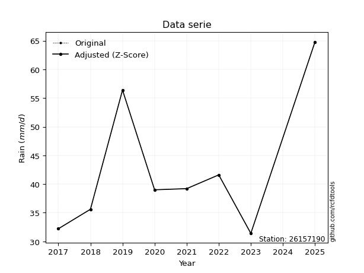</img>

</div>


> The initial value (value_initial) correspond to the initial obtained or null completed value, and value (value) is adjusted only when the initial value is outside the valid range (outlier) definite through the Z-Score value. If Z-Score is active, values out of range or outliers are replaced with the station mean value. A Z-Score (or standard score) measures how many standard deviations a data point is from the mean of a dataset, indicating its relative position; positive scores mean above the mean, negative mean below, and a score of zero is exactly at the mean, allowing for comparison of values from different distributions. It´s calculated using the formula $z=(x–μ)/σ$, where $x$ is the data point, $μ$ is the mean, and $σ$ is the standard deviation, helping identify outliers and understand probability.
>
> <sub>**Note**: In this study, "completing" (filling gaps in) and "extending" (forecasting or lengthening the historical record) rainfall data series are avoided for certain critical analyses because they introduce artificial bias and uncertainty, which can distort the statistics of rare events (extremes), alter day-to-day variability, and compromise the integrity and homogeneity of the original data. Some reasons against Completing/Extending rainfall data are: **Distortion of Extremes and Variability**: The primary issue is that most gap-filling or extension methods rely on averaging or regression with nearby stations, which inherently smooths the data. Rainfall is highly variable in space and time, with a large percentage of zero values and occasional large storms. Infilling methods often underestimate the highest values and overestimate the lowest (zero) values, which severely distorts analyses focused on flood frequency, drought severity, and intensity-duration-frequency (IDF) curves, **Loss of Data Homogeneity**: Infilled or extended data are synthetic estimates, not actual measurements. Combining these estimates with observed data can violate the assumption of data homogeneity, which requires that the data properties do not change over time. Inhomogeneity can lead to incorrect conclusions about long-term trends or changes in climate patterns, **Propagation of Errors**: Errors and biases from the original data (e.g., wind-induced undercatch, instrument errors, site changes) or the data used for imputation can propagate through the analysis, leading to unreliable hydrological models and inaccurate predictions, **Compromised Statistical Integrity**: For statistical analyses, especially those involving the frequency of events, using artificial data can introduce time bias or autocorrelation that doesn´t exist in reality, making it difficult to assess the true probability of events, **Difficulty in Validation**: It is difficult to accurately validate the quality of filled or extended data, especially for past periods where ground-truth measurements are unavailable. The reliability of imputation techniques heavily depends on the density of the surrounding station network and the complexity of the local topography.</sub>


### 4. Active continuous probability distributions from SciPy (80 of 104 available)

A Probability Density Function (PDF) describes the relative likelihood of a continuous random variable falling within a specific range, where the total area under its curve equals 1, and the area over any interval gives the actual probability for that range. Unlike discrete probabilities (like rolling a die), a PDF shows density, not direct probability for a single point (which is zero), with higher points indicating higher likelihood, often visualized as a bell curve for normal distributions.

A log of a probability density function (log-PDF) is simply the logarithm of the PDF´s value, denoted as $log(f(x))$, useful for converting multiplication of probabilities into addition, improving numerical stability with tiny numbers, and connecting to information theory concepts like entropy. Instead of dealing with very small probabilities (e.g., 0.000001), log-PDFs use negative numbers (e.g., $log(0.00001) ≈ -11.51$ that are easier for computers to handle, preventing underflow errors and simplifying complex calculations. In this study, each active probability distribution from SciPy is also evaluated in the $log$ form.

[scipy.stats](https://docs.scipy.org/doc/scipy/reference/stats.html) is a Python´s powerful submodule within the SciPy library for comprehensive statistical analysis, offering over 130 probability distributions (like Normal, Poisson, etc.), functions for descriptive stats (mean, variance), hypothesis testing (t-tests, chi-square), random variable generation, and statistical tests, making it essential for data science, modeling, and research. It provides tools to explore, model, and draw conclusions from data efficiently, working seamlessly with [NumPy](https://numpy.org/).

<div align="center">

|   id | p_dist           |   n_parameter | fit_method   | label                                                                       | active   | ref                                                                                                      |
|-----:|:-----------------|--------------:|:-------------|:----------------------------------------------------------------------------|:---------|:---------------------------------------------------------------------------------------------------------|
|    0 | alpha            |             3 | MLE          | Alpha                                                                       | True     | [:mortar_board:](https://docs.scipy.org/doc/scipy/reference/generated/scipy.stats.alpha.html)            |
|    1 | anglit           |             2 | MM           | Anglit                                                                      | True     | [:mortar_board:](https://docs.scipy.org/doc/scipy/reference/generated/scipy.stats.anglit.html)           |
|    2 | arcsine          |             2 | MM           | Arcsine                                                                     | True     | [:mortar_board:](https://docs.scipy.org/doc/scipy/reference/generated/scipy.stats.arcsine.html)          |
|    3 | argus            |             3 | MLE          | Argus                                                                       | True     | [:mortar_board:](https://docs.scipy.org/doc/scipy/reference/generated/scipy.stats.argus.html)            |
|    4 | beta             |             4 | MLE          | Beta                                                                        | True     | [:mortar_board:](https://docs.scipy.org/doc/scipy/reference/generated/scipy.stats.beta.html)             |
|    5 | betaprime        |             4 | MLE          | Beta prime                                                                  | True     | [:mortar_board:](https://docs.scipy.org/doc/scipy/reference/generated/scipy.stats.betaprime.html)        |
|    6 | bradford         |             3 | MLE          | Bradford                                                                    | True     | [:mortar_board:](https://docs.scipy.org/doc/scipy/reference/generated/scipy.stats.bradford.html)         |
|    7 | burr             |             4 | MLE          | Burr (Type III)                                                             | True     | [:mortar_board:](https://docs.scipy.org/doc/scipy/reference/generated/scipy.stats.burr.html)             |
|    8 | burr12           |             4 | MLE          | Burr (Type III) 12                                                          | True     | [:mortar_board:](https://docs.scipy.org/doc/scipy/reference/generated/scipy.stats.burr12.html)           |
|    9 | cosine           |             2 | MLE          | Cosine                                                                      | True     | [:mortar_board:](https://docs.scipy.org/doc/scipy/reference/generated/scipy.stats.cosine.html)           |
|   10 | crystalball      |             4 | MLE          | Crystalball                                                                 | True     | [:mortar_board:](https://docs.scipy.org/doc/scipy/reference/generated/scipy.stats.crystalball.html)      |
|   11 | dgamma           |             3 | MLE          | Double gamma                                                                | True     | [:mortar_board:](https://docs.scipy.org/doc/scipy/reference/generated/scipy.stats.dgamma.html)           |
|   12 | dweibull         |             3 | MLE          | Double Weibull                                                              | True     | [:mortar_board:](https://docs.scipy.org/doc/scipy/reference/generated/scipy.stats.dweibull.html)         |
|   13 | erlang           |             3 | MLE          | Erlang                                                                      | True     | [:mortar_board:](https://docs.scipy.org/doc/scipy/reference/generated/scipy.stats.erlang.html)           |
|   14 | exponnorm        |             3 | MLE          | Exponentially modified Normal                                               | True     | [:mortar_board:](https://docs.scipy.org/doc/scipy/reference/generated/scipy.stats.exponnorm.html)        |
|   15 | exponpow         |             3 | MLE          | Exponential power                                                           | True     | [:mortar_board:](https://docs.scipy.org/doc/scipy/reference/generated/scipy.stats.exponpow.html)         |
|   16 | exponweib        |             4 | MLE          | Exponentiated Weibull                                                       | True     | [:mortar_board:](https://docs.scipy.org/doc/scipy/reference/generated/scipy.stats.exponweib.html)        |
|   17 | f                |             4 | MLE          | F                                                                           | True     | [:mortar_board:](https://docs.scipy.org/doc/scipy/reference/generated/scipy.stats.f.html)                |
|   18 | fatiguelife      |             3 | MLE          | Fatigue-life (Birnbaum-Saunders)                                            | True     | [:mortar_board:](https://docs.scipy.org/doc/scipy/reference/generated/scipy.stats.fatiguelife.html)      |
|   19 | foldnorm         |             3 | MM           | Fold Normal                                                                 | True     | [:mortar_board:](https://docs.scipy.org/doc/scipy/reference/generated/scipy.stats.foldnorm.html)         |
|   20 | gamma            |             3 | MLE          | Gamma                                                                       | True     | [:mortar_board:](https://docs.scipy.org/doc/scipy/reference/generated/scipy.stats.gamma.html)            |
|   21 | gausshyper       |             6 | MLE          | Gauss hypergeometric                                                        | True     | [:mortar_board:](https://docs.scipy.org/doc/scipy/reference/generated/scipy.stats.gausshyper.html)       |
|   22 | genexpon         |             5 | MLE          | Generalized exponential                                                     | True     | [:mortar_board:](https://docs.scipy.org/doc/scipy/reference/generated/scipy.stats.genexpon.html)         |
|   23 | genextreme       |             3 | MLE          | Generalized exponential                                                     | True     | [:mortar_board:](https://docs.scipy.org/doc/scipy/reference/generated/scipy.stats.genextreme.html)       |
|   24 | gengamma         |             4 | MLE          | Generalized gamma                                                           | True     | [:mortar_board:](https://docs.scipy.org/doc/scipy/reference/generated/scipy.stats.gengamma.html)         |
|   25 | genhalflogistic  |             3 | MLE          | Generalized half-logistic                                                   | True     | [:mortar_board:](https://docs.scipy.org/doc/scipy/reference/generated/scipy.stats.genhalflogistic.html)  |
|   26 | genlogistic      |             3 | MLE          | Generalized logistic                                                        | True     | [:mortar_board:](https://docs.scipy.org/doc/scipy/reference/generated/scipy.stats.genlogistic.html)      |
|   27 | gennorm          |             3 | MLE          | Generalized Normal                                                          | True     | [:mortar_board:](https://docs.scipy.org/doc/scipy/reference/generated/scipy.stats.gennorm.html)          |
|   28 | genpareto        |             3 | MLE          | Generalized Pareto                                                          | True     | [:mortar_board:](https://docs.scipy.org/doc/scipy/reference/generated/scipy.stats.genpareto.html)        |
|   29 | gompertz         |             3 | MLE          | Gompertz (or truncated Gumbel)                                              | True     | [:mortar_board:](https://docs.scipy.org/doc/scipy/reference/generated/scipy.stats.gompertz.html)         |
|   30 | gumbel_l         |             2 | MM           | Gumbel Left Skew                                                            | True     | [:mortar_board:](https://docs.scipy.org/doc/scipy/reference/generated/scipy.stats.gumbel_l.html)         |
|   31 | gumbel_r         |             2 | MM           | Gumbel Right Skew                                                           | True     | [:mortar_board:](https://docs.scipy.org/doc/scipy/reference/generated/scipy.stats.gumbel_r.html)         |
|   32 | halfgennorm      |             3 | MLE          | Upper half of a generalized normal                                          | True     | [:mortar_board:](https://docs.scipy.org/doc/scipy/reference/generated/scipy.stats.halfgennorm.html)      |
|   33 | halflogistic     |             2 | MM           | Half-logistic                                                               | True     | [:mortar_board:](https://docs.scipy.org/doc/scipy/reference/generated/scipy.stats.halflogistic.html)     |
|   34 | halfnorm         |             2 | MM           | Half Normal                                                                 | True     | [:mortar_board:](https://docs.scipy.org/doc/scipy/reference/generated/scipy.stats.halfnorm.html)         |
|   35 | hypsecant        |             2 | MM           | hyperbolic secant                                                           | True     | [:mortar_board:](https://docs.scipy.org/doc/scipy/reference/generated/scipy.stats.hypsecant.html)        |
|   36 | invgamma         |             3 | MLE          | Inverted gamma                                                              | True     | [:mortar_board:](https://docs.scipy.org/doc/scipy/reference/generated/scipy.stats.invgamma.html)         |
|   37 | invgauss         |             3 | MLE          | Inverse Gaussian                                                            | True     | [:mortar_board:](https://docs.scipy.org/doc/scipy/reference/generated/scipy.stats.invgauss.html)         |
|   38 | invweibull       |             3 | MLE          | Inverted Weibull                                                            | True     | [:mortar_board:](https://docs.scipy.org/doc/scipy/reference/generated/scipy.stats.invweibull.html)       |
|   39 | johnsonsb        |             4 | MLE          | Johnson SB                                                                  | True     | [:mortar_board:](https://docs.scipy.org/doc/scipy/reference/generated/scipy.stats.johnsonsb.html)        |
|   40 | johnsonsu        |             4 | MLE          | Johnson Su                                                                  | True     | [:mortar_board:](https://docs.scipy.org/doc/scipy/reference/generated/scipy.stats.johnsonsu.html)        |
|   41 | kappa3           |             3 | MLE          | Kappa 3                                                                     | True     | [:mortar_board:](https://docs.scipy.org/doc/scipy/reference/generated/scipy.stats.kappa3.html)           |
|   42 | kappa4           |             4 | MLE          | Kappa 4                                                                     | True     | [:mortar_board:](https://docs.scipy.org/doc/scipy/reference/generated/scipy.stats.kappa4.html)           |
|   43 | ksone            |             3 | MLE          | Kolmogorov-Smirnov one-sided test statistic distribution                    | True     | [:mortar_board:](https://docs.scipy.org/doc/scipy/reference/generated/scipy.stats.ksone.html)            |
|   44 | kstwobign        |             2 | MLE          | Limiting distribution of scaled Kolmogorov-Smirnov two-sided test statistic | True     | [:mortar_board:](https://docs.scipy.org/doc/scipy/reference/generated/scipy.stats.kstwobign.html)        |
|   45 | laplace          |             2 | MM           | Laplace                                                                     | True     | [:mortar_board:](https://docs.scipy.org/doc/scipy/reference/generated/scipy.stats.laplace.html)          |
|   46 | levy_l           |             2 | MLE          | Left-skewed Levy                                                            | True     | [:mortar_board:](https://docs.scipy.org/doc/scipy/reference/generated/scipy.stats.levy_l.html)           |
|   47 | loggamma         |             3 | MLE          | Log gamma                                                                   | True     | [:mortar_board:](https://docs.scipy.org/doc/scipy/reference/generated/scipy.stats.loggamma.html)         |
|   48 | logistic         |             2 | MM           | Logistic (or Sech-squared)                                                  | True     | [:mortar_board:](https://docs.scipy.org/doc/scipy/reference/generated/scipy.stats.logistic.html)         |
|   49 | loglaplace       |             3 | MLE          | Log-Laplace                                                                 | True     | [:mortar_board:](https://docs.scipy.org/doc/scipy/reference/generated/scipy.stats.loglaplace.html)       |
|   50 | lomax            |             3 | MLE          | Lomax (Pareto of the second kind)                                           | True     | [:mortar_board:](https://docs.scipy.org/doc/scipy/reference/generated/scipy.stats.lomax.html)            |
|   51 | maxwell          |             2 | MM           | Maxwell                                                                     | True     | [:mortar_board:](https://docs.scipy.org/doc/scipy/reference/generated/scipy.stats.maxwell.html)          |
|   52 | mielke           |             4 | MLE          | Mielke Beta-Kappa / Dagum                                                   | True     | [:mortar_board:](https://docs.scipy.org/doc/scipy/reference/generated/scipy.stats.mielke.html)           |
|   53 | moyal            |             2 | MM           | Moyal                                                                       | True     | [:mortar_board:](https://docs.scipy.org/doc/scipy/reference/generated/scipy.stats.moyal.html)            |
|   54 | nakagami         |             3 | MLE          | Nakagami                                                                    | True     | [:mortar_board:](https://docs.scipy.org/doc/scipy/reference/generated/scipy.stats.nakagami.html)         |
|   55 | ncf              |             5 | MLE          | Non-central F distribution                                                  | True     | [:mortar_board:](https://docs.scipy.org/doc/scipy/reference/generated/scipy.stats.ncf.html)              |
|   56 | nct              |             4 | MLE          | Non-central Student’s t                                                     | True     | [:mortar_board:](https://docs.scipy.org/doc/scipy/reference/generated/scipy.stats.nct.html)              |
|   57 | norm             |             2 | MM           | Normal                                                                      | True     | [:mortar_board:](https://docs.scipy.org/doc/scipy/reference/generated/scipy.stats.norm.html)             |
|   58 | pearson3         |             3 | MM           | Pearson type III                                                            | True     | [:mortar_board:](https://docs.scipy.org/doc/scipy/reference/generated/scipy.stats.pearson3.html)         |
|   59 | powerlaw         |             3 | MLE          | Power-function                                                              | True     | [:mortar_board:](https://docs.scipy.org/doc/scipy/reference/generated/scipy.stats.powerlaw.html)         |
|   60 | rayleigh         |             2 | MM           | Rayleigh                                                                    | True     | [:mortar_board:](https://docs.scipy.org/doc/scipy/reference/generated/scipy.stats.rayleigh.html)         |
|   61 | rdist            |             3 | MLE          | R-distributed (symmetric beta)                                              | True     | [:mortar_board:](https://docs.scipy.org/doc/scipy/reference/generated/scipy.stats.rdist.html)            |
|   62 | rice             |             3 | MLE          | Rice                                                                        | True     | [:mortar_board:](https://docs.scipy.org/doc/scipy/reference/generated/scipy.stats.rice.html)             |
|   63 | semicircular     |             2 | MM           | Semicircular                                                                | True     | [:mortar_board:](https://docs.scipy.org/doc/scipy/reference/generated/scipy.stats.semicircular.html)     |
|   64 | skewnorm         |             3 | MLE          | Skew normal                                                                 | True     | [:mortar_board:](https://docs.scipy.org/doc/scipy/reference/generated/scipy.stats.skewnorm.html)         |
|   65 | t                |             3 | MLE          | Student’s t                                                                 | True     | [:mortar_board:](https://docs.scipy.org/doc/scipy/reference/generated/scipy.stats.t.html)                |
|   66 | trapezoid        |             4 | MLE          | Trapezoid                                                                   | True     | [:mortar_board:](https://docs.scipy.org/doc/scipy/reference/generated/scipy.stats.trapezoid.html)        |
|   67 | triang           |             3 | MLE          | Triangular                                                                  | True     | [:mortar_board:](https://docs.scipy.org/doc/scipy/reference/generated/scipy.stats.triang.html)           |
|   68 | truncexpon       |             3 | MLE          | Truncated exponential                                                       | True     | [:mortar_board:](https://docs.scipy.org/doc/scipy/reference/generated/scipy.stats.truncexpon.html)       |
|   69 | truncnorm        |             4 | MLE          | Truncated normal                                                            | True     | [:mortar_board:](https://docs.scipy.org/doc/scipy/reference/generated/scipy.stats.truncnorm.html)        |
|   70 | truncpareto      |             4 | MLE          | Upper truncated Pareto                                                      | True     | [:mortar_board:](https://docs.scipy.org/doc/scipy/reference/generated/scipy.stats.truncpareto.html)      |
|   71 | truncweibull_min |             5 | MLE          | Doubly truncated Weibull minimum                                            | True     | [:mortar_board:](https://docs.scipy.org/doc/scipy/reference/generated/scipy.stats.truncweibull_min.html) |
|   72 | tukeylambda      |             3 | MLE          | Tukey-Lamdba                                                                | True     | [:mortar_board:](https://docs.scipy.org/doc/scipy/reference/generated/scipy.stats.tukeylambda.html)      |
|   73 | uniform          |             2 | MLE          | Uniform                                                                     | True     | [:mortar_board:](https://docs.scipy.org/doc/scipy/reference/generated/scipy.stats.uniform.html)          |
|   74 | vonmises         |             3 | MLE          | Von Mises                                                                   | True     | [:mortar_board:](https://docs.scipy.org/doc/scipy/reference/generated/scipy.stats.vonmises.html)         |
|   75 | vonmises_line    |             3 | MLE          | Von Mises line                                                              | True     | [:mortar_board:](https://docs.scipy.org/doc/scipy/reference/generated/scipy.stats.vonmises_line.html)    |
|   76 | wald             |             2 | MM           | Wald                                                                        | True     | [:mortar_board:](https://docs.scipy.org/doc/scipy/reference/generated/scipy.stats.wald.html)             |
|   77 | weibull_max      |             3 | MLE          | Weibull maximum                                                             | True     | [:mortar_board:](https://docs.scipy.org/doc/scipy/reference/generated/scipy.stats.weibull_max.html)      |
|   78 | weibull_min      |             3 | MLE          | Weibull minimum                                                             | True     | [:mortar_board:](https://docs.scipy.org/doc/scipy/reference/generated/scipy.stats.weibull_min.html)      |
|   79 | wrapcauchy       |             3 | MLE          | Wrapped  Cauchy                                                             | True     | [:mortar_board:](https://docs.scipy.org/doc/scipy/reference/generated/scipy.stats.wrapcauchy.html)       |

</div>

> **n_parameter:** # arguments & localization & scale.
>
> **Fit methods:** (MLE) maximum likelihood, (MM) L-moments.
>
>**Inactive** (With the only purpose of prevent loops, zero divisions, infinite values, over high estimated values or horizontal trending for recurrence intervals estimations, the follow distributions were disabled.)**:** lognorm, norminvgauss, powernorm, powerlognorm, cauchy, halfcauchy, foldcauchy, skewcauchy, chi2, expon, fisk, genhyperbolic, geninvgauss, gibrat, kstwo, laplace_asymmetric, levy, levy_stable, ncx2, pareto, rel_breitwigner, recipinvgauss, studentized_range, loguniform, 


## B. Probability (PDF) vs. Empirical (EDF) distributions functions

A continuous probability distribution (CPD) describes probabilities for variables that can take any value within a range (like rain any time), unlike discrete variables with specific outcomes (like temperature). It uses a Probability Density Function (PDF), a curve where the total area under it equals 1, and the probability of the variable falling within an interval (a to b) is found by calculating the area under the curve between those points. A key feature is that the probability of hitting any single exact value is zero, so probabilities are always expressed for ranges, e.g., $P(a ≤ X ≤ b)$.

<div align="center">

Distributions parameters from station values
|     |   station | p_dist              |   n |              loc |           scale | shape                  | shape1                 | shape2                | shape3             |
|----:|----------:|:--------------------|----:|-----------------:|----------------:|:-----------------------|:-----------------------|:----------------------|:-------------------|
|   0 |  26157190 | alpha               |   8 |     21.41        |    37.3312      | 2.191376781008434      |                        |                       |                    |
|   1 |  26157190 | anglit              |   8 |     42.525       |    32.5653      |                        |                        |                       |                    |
|   2 |  26157190 | arcsine             |   8 |     26.7821      |    31.4858      |                        |                        |                       |                    |
|   3 |  26157190 | argus               |   8 |     17.7203      |    48.8317      | 1.3466009231657996e-05 |                        |                       |                    |
|   4 |  26157190 | beta                |   8 |     31.4         |    34.1548      | 0.2939500484985629     | 0.5838060965708967     |                       |                    |
|   5 |  26157190 | betaprime           |   8 |     -1.25083     |     2.48656     | 341.5445660169569      | 20.441588466253496     |                       |                    |
|   6 |  26157190 | bradford            |   8 |     31.4         |    33.4001      | 1.0583609953910793     |                        |                       |                    |
|   7 |  26157190 | burr                |   8 |     23.3784      |     7.78477     | 2.535147483063934      | 4.0275748848258175     |                       |                    |
|   8 |  26157190 | burr12              |   8 |     -7.07983     |    38.362       | 1130.3559671093724     | 0.003776377572092339   |                       |                    |
|   9 |  26157190 | cosine              |   8 |     44.1332      |     9.44108     |                        |                        |                       |                    |
|  10 |  26157190 | crystalball         |   8 |     42.525       |    11.1319      | 4287.563149444236      | 371.04328627479856     |                       |                    |
|  11 |  26157190 | dgamma              |   8 |     39.2         |     9.54539     | 0.890669990089088      |                        |                       |                    |
|  12 |  26157190 | dweibull            |   8 |     39.2         |     8.32157     | 0.7064658455929539     |                        |                       |                    |
|  13 |  26157190 | erlang              |   8 |     31.4         |    11.391       | 0.8120345022221014     |                        |                       |                    |
|  14 |  26157190 | exponnorm           |   8 |     31.3868      |     0.00434609  | 2574.857940066643      |                        |                       |                    |
|  15 |  26157190 | exponpow            |   8 |     31.4         |    19.84        | 0.9646030632293658     |                        |                       |                    |
|  16 |  26157190 | exponweib           |   8 |     31.4         |    19.6075      | 0.845607821311456      | 0.8403928294520154     |                       |                    |
|  17 |  26157190 | f                   |   8 |     27.5819      |     8.85685     | 280.4554316084501      | 4.231149489470075      |                       |                    |
|  18 |  26157190 | fatiguelife         |   8 |     30.8609      |     5.10198     | 1.5290701266888638     |                        |                       |                    |
|  19 |  26157190 | foldnorm            |   8 |     27.7029      |    17.1549      | 0.40982014423133084    |                        |                       |                    |
|  20 |  26157190 | gamma               |   8 |     31.4         |     9.74602     | 0.39320304469790845    |                        |                       |                    |
|  21 |  26157190 | gausshyper          |   8 |     31.4         |    34.1867      | 0.9430124480600495     | 1.0487297391728418     | 0.9853762056173103    | 1.0392414194238722 |
|  22 |  26157190 | genexpon            |   8 |     31.4         |    14.7193      | 1.3230905655493217     | 1.9170929005311637     | 2.623180392277595e-08 |                    |
|  23 |  26157190 | genextreme          |   8 |     35.7691      |     5.4417      | -0.5513912775961237    |                        |                       |                    |
|  24 |  26157190 | gengamma            |   8 |     31.4         |    20.7608      | 0.6736840621257433     | 0.9090977071819427     |                       |                    |
|  25 |  26157190 | genhalflogistic     |   8 |     31.4         |     8.47027     | 2.2158203283855326e-08 |                        |                       |                    |
|  26 |  26157190 | genlogistic         |   8 |    -19.5032      |     7.52528     | 1980.9255855018555     |                        |                       |                    |
|  27 |  26157190 | gennorm             |   8 |     39           |     0.388118    | 0.3942193900806613     |                        |                       |                    |
|  28 |  26157190 | genpareto           |   8 |     -0.185271    |   114.818       | -1.7668269525410012    |                        |                       |                    |
|  29 |  26157190 | gompertz            |   8 |     31.4         | 30964.6         | 2782.42027467796       |                        |                       |                    |
|  30 |  26157190 | gumbel_l            |   8 |     47.535       |     8.67951     |                        |                        |                       |                    |
|  31 |  26157190 | gumbel_r            |   8 |     37.515       |     8.67951     |                        |                        |                       |                    |
|  32 |  26157190 | halfgennorm         |   8 |     31.4         |     3.68542e-08 | 0.11710931987889531    |                        |                       |                    |
|  33 |  26157190 | halflogistic        |   8 |     29.3311      |     9.51739     |                        |                        |                       |                    |
|  34 |  26157190 | halfnorm            |   8 |     27.7907      |    18.4667      |                        |                        |                       |                    |
|  35 |  26157190 | hypsecant           |   8 |     42.525       |     7.08679     |                        |                        |                       |                    |
|  36 |  26157190 | invgamma            |   8 |     27.5125      |    18.8348      | 2.1171541337663466     |                        |                       |                    |
|  37 |  26157190 | invgauss            |   8 |     29.5579      |     9.65948     | 1.3424205748290692     |                        |                       |                    |
|  38 |  26157190 | invweibull          |   8 |     25.9002      |     9.86897     | 1.8135865122607835     |                        |                       |                    |
|  39 |  26157190 | johnsonsb           |   8 |     31.4         |    36.5668      | -0.03591889143785671   | 0.11375866297973372    |                       |                    |
|  40 |  26157190 | johnsonsu           |   8 |     30.898       |     0.016049    | -4.983193654322406     | 0.7513333019413659     |                       |                    |
|  41 |  26157190 | kappa3              |   8 |     31.4         |    33.3722      | 2488.905286083055      |                        |                       |                    |
|  42 |  26157190 | kappa4              |   8 |     27.2713      |    40.0557      | 1.1153676516905917     | 1.0649726224447327     |                       |                    |
|  43 |  26157190 | ksone               |   8 |     28.06        |    40.08        | 1.0                    |                        |                       |                    |
|  44 |  26157190 | kstwobign           |   8 |     10.5912      |    36.8484      |                        |                        |                       |                    |
|  45 |  26157190 | laplace             |   8 |     42.525       |     7.87145     |                        |                        |                       |                    |
|  46 |  26157190 | levy_l              |   8 |     67.2231      |    11.3747      |                        |                        |                       |                    |
|  47 |  26157190 | loggamma            |   8 |  -2947.94        |   414.551       | 1358.2515513882527     |                        |                       |                    |
|  48 |  26157190 | logistic            |   8 |     42.525       |     6.13734     |                        |                        |                       |                    |
|  49 |  26157190 | loglaplace          |   8 |     -0.0860481   |    39.086       | 5.54433207916329       |                        |                       |                    |
|  50 |  26157190 | lomax               |   8 |     31.4         |   249.247       | 23.360806903277684     |                        |                       |                    |
|  51 |  26157190 | maxwell             |   8 |     16.1471      |    16.5299      |                        |                        |                       |                    |
|  52 |  26157190 | mielke              |   8 |     -1.41757     |    17.5572      | 563.4115274299852      | 5.835120614123117      |                       |                    |
|  53 |  26157190 | moyal               |   8 |     36.1591      |     5.01112     |                        |                        |                       |                    |
|  54 |  26157190 | nakagami            |   8 |     31.4         |    19.0792      | 0.24338393533453864    |                        |                       |                    |
|  55 |  26157190 | ncf                 |   8 |     -2.45394     |    13.2169      | 200.06550684154797     | 44.744950671897726     | 449.20796947529834    |                    |
|  56 |  26157190 | nct                 |   8 |     -0.109805    |     0.68983     | 10.270487183582791     | 56.98123526941464      |                       |                    |
|  57 |  26157190 | norm                |   8 |     42.525       |    11.1319      |                        |                        |                       |                    |
|  58 |  26157190 | pearson3            |   8 |     42.525       |    11.1319      | 0.9816217538526217     |                        |                       |                    |
|  59 |  26157190 | powerlaw            |   8 |     31.4         |    33.4         | 0.1702291388617445     |                        |                       |                    |
|  60 |  26157190 | rayleigh            |   8 |     21.229       |    16.9917      |                        |                        |                       |                    |
|  61 |  26157190 | rdist               |   8 |     36.5         |     5.1         | 1.3592476159598368     |                        |                       |                    |
|  62 |  26157190 | rice                |   8 |     25.0375      |    14.6583      | 0.00025506896331175415 |                        |                       |                    |
|  63 |  26157190 | semicircular        |   8 |     42.525       |    22.2638      |                        |                        |                       |                    |
|  64 |  26157190 | skewnorm            |   8 |     31.4         |    15.7379      | 50319840.517396286     |                        |                       |                    |
|  65 |  26157190 | t                   |   8 |     42.525       |    11.1318      | 350720535.2448459      |                        |                       |                    |
|  66 |  26157190 | trapezoid           |   8 |     28.06        |    40.08        | 1.0                    | 1.0                    |                       |                    |
|  67 |  26157190 | triang              |   8 |     31.4         |    39.6681      | 7.172463960092897e-09  |                        |                       |                    |
|  68 |  26157190 | truncexpon          |   8 |     31.3996      |    33.5523      | 0.9954735225257267     |                        |                       |                    |
|  69 |  26157190 | truncnorm           |   8 | -10977.5         |   350.602       | 31.39999562121462      | 66.51802236217716      |                       |                    |
|  70 |  26157190 | truncpareto         |   8 |     30.0987      |     1.3013      | 9.580052884990815e-09  | 26.666546673476937     |                       |                    |
|  71 |  26157190 | truncweibull_min    |   8 |     31.3793      |    30.6961      | 0.7806893616393045     | 0.0006696741101380277  | 1.088763235317231     |                    |
|  72 |  26157190 | tukeylambda         |   8 |     36.5         |     6.81703     | 1.336673111885069      |                        |                       |                    |
|  73 |  26157190 | uniform             |   8 |     31.4         |    33.4         |                        |                        |                       |                    |
|  74 |  26157190 | vonmises            |   8 |      0.923249    |     1           | 0.6145522374945015     |                        |                       |                    |
|  75 |  26157190 | vonmises_line       |   8 |     40.1945      |     7.83218     | 0.8988560840021207     |                        |                       |                    |
|  76 |  26157190 | wald                |   8 |     31.3931      |    11.1319      |                        |                        |                       |                    |
|  77 |  26157190 | weibull_max         |   8 |     64.8         |     1.46453     | 0.17685912589904762    |                        |                       |                    |
|  78 |  26157190 | weibull_min         |   8 |     31.4         |     7.44783     | 0.6219551852911331     |                        |                       |                    |
|  79 |  26157190 | wrapcauchy          |   8 |     31.3999      |     5.31579     | 0.4298062433811154     |                        |                       |                    |
|  80 |  26157190 | logalpha            |   8 |      1.95683     |    14.3548      | 8.344522418948587      |                        |                       |                    |
|  81 |  26157190 | loganglit           |   8 |      3.7194      |     0.705404    |                        |                        |                       |                    |
|  82 |  26157190 | logarcsine          |   8 |      3.37838     |     0.682052    |                        |                        |                       |                    |
|  83 |  26157190 | logargus            |   8 |      3.18806     |     1.02159     | 0.00013257518699548486 |                        |                       |                    |
|  84 |  26157190 | logbeta             |   8 |      3.44681     |     0.807167    | 0.45256954708790287    | 0.9036580722526175     |                       |                    |
|  85 |  26157190 | logbetaprime        |   8 |     -2.88061     |     4.1725      | 1609.9554529280067     | 1018.2811666388957     |                       |                    |
|  86 |  26157190 | logbradford         |   8 |      3.44681     |     0.724573    | 1.0590617438756174     |                        |                       |                    |
|  87 |  26157190 | logburr             |   8 |      2.77607     |     0.353092    | 5.078957759096639      | 69.16201259035967      |                       |                    |
|  88 |  26157190 | logburr12           |   8 |   -146.264       |   149.701       | 26463.62072922852      | 0.019670009215211823   |                       |                    |
|  89 |  26157190 | logcosine           |   8 |      3.74591     |     0.20127     |                        |                        |                       |                    |
|  90 |  26157190 | logcrystalball      |   8 |      3.7194      |     0.241131    | 31.37164505160184      | 3173.269750046042      |                       |                    |
|  91 |  26157190 | logdgamma           |   8 |      3.66356     |     0.246222    | 0.6823188669493827     |                        |                       |                    |
|  92 |  26157190 | logdweibull         |   8 |      3.66356     |     0.197463    | 0.8971591102135332     |                        |                       |                    |
|  93 |  26157190 | logerlang           |   8 |      3.44681     |     0.335219    | 0.5079894415858133     |                        |                       |                    |
|  94 |  26157190 | logexponnorm        |   8 |      3.44636     |     0.000139536 | 1956.723009784807      |                        |                       |                    |
|  95 |  26157190 | logexponpow         |   8 |      3.44681     |     0.691297    | 0.6120727869505469     |                        |                       |                    |
|  96 |  26157190 | logexponweib        |   8 |      3.44681     |     0.38932     | 0.654184866602805      | 1.3968407668249068     |                       |                    |
|  97 |  26157190 | logf                |   8 |      3.26634     |     0.344985    | 757.8245350964162      | 7.7668204300109185     |                       |                    |
|  98 |  26157190 | logfatiguelife      |   8 |      3.4126      |     0.189024    | 1.090958469990643      |                        |                       |                    |
|  99 |  26157190 | logfoldnorm         |   8 |      3.36685     |     0.301512    | 1.003834394529016      |                        |                       |                    |
| 100 |  26157190 | loggamma            |   8 |      3.44681     |     0.419045    | 0.49596169570168325    |                        |                       |                    |
| 101 |  26157190 | loggausshyper       |   8 |      3.44681     |     0.731338    | 0.9665710535668481     | 0.9806966964040535     | 1.1846007166073322    | 1.0047127988690154 |
| 102 |  26157190 | loggenexpon         |   8 |      3.44681     |     4.8284      | 15.357033171196193     | 109.52609789660892     | 0.42184589100802006   |                    |
| 103 |  26157190 | loggenextreme       |   8 |      3.58533     |     0.154786    | -0.2721066437034936    |                        |                       |                    |
| 104 |  26157190 | loggengamma         |   8 |      3.44681     |     0.833966    | 0.47435178515821685    | 1.1673354328303502     |                       |                    |
| 105 |  26157190 | loggenhalflogistic  |   8 |      3.36919     |     0.843673    | 1.0518056656723762     |                        |                       |                    |
| 106 |  26157190 | loggenlogistic      |   8 |      2.39462     |     0.177535    | 936.6333097527345      |                        |                       |                    |
| 107 |  26157190 | loggennorm          |   8 |      3.66356     |     2.18854e-10 | 0.11353409350751215    |                        |                       |                    |
| 108 |  26157190 | loggenpareto        |   8 |     -0.00458043  |    11.6462      | -2.788914395856757     |                        |                       |                    |
| 109 |  26157190 | loggompertz         |   8 |      3.44681     |     1.30376     | 3.925472226330387      |                        |                       |                    |
| 110 |  26157190 | loggumbel_l         |   8 |      3.82793     |     0.188009    |                        |                        |                       |                    |
| 111 |  26157190 | loggumbel_r         |   8 |      3.61088     |     0.188009    |                        |                        |                       |                    |
| 112 |  26157190 | loghalfgennorm      |   8 |      3.44681     |     0.405896    | 1.4192724266878325     |                        |                       |                    |
| 113 |  26157190 | loghalflogistic     |   8 |      3.43361     |     0.206158    |                        |                        |                       |                    |
| 114 |  26157190 | loghalfnorm         |   8 |      3.40024     |     0.400011    |                        |                        |                       |                    |
| 115 |  26157190 | loghypsecant        |   8 |      3.7194      |     0.153509    |                        |                        |                       |                    |
| 116 |  26157190 | loginvgamma         |   8 |      3.26458     |     1.34472     | 3.8832696324112064     |                        |                       |                    |
| 117 |  26157190 | loginvgauss         |   8 |      3.36748     |     0.483542    | 0.7278030009623141     |                        |                       |                    |
| 118 |  26157190 | loginvweibull       |   8 |      3.0165      |     0.568827    | 3.674810793661145      |                        |                       |                    |
| 119 |  26157190 | logjohnsonsb        |   8 |      3.44665     |     0.724656    | -1.352749045251549     | 0.14852052864788037    |                       |                    |
| 120 |  26157190 | logjohnsonsu        |   8 |      3.39715     |     0.00213963  | -6.018536126700003     | 1.1212693797263729     |                       |                    |
| 121 |  26157190 | logkappa3           |   8 |      3.44681     |     0.28104     | 2.647480811201489      |                        |                       |                    |
| 122 |  26157190 | logkappa4           |   8 |      3.34218     |     0.821909    | 1.1457264107447973     | 0.9870698220748597     |                       |                    |
| 123 |  26157190 | logksone            |   8 |      3.37436     |     0.869397    | 1.0                    |                        |                       |                    |
| 124 |  26157190 | logkstwobign        |   8 |      2.98125     |     0.848612    |                        |                        |                       |                    |
| 125 |  26157190 | loglaplace          |   8 |      3.7194      |     0.170505    |                        |                        |                       |                    |
| 126 |  26157190 | loglevy_l           |   8 |      4.21806     |     0.218453    |                        |                        |                       |                    |
| 127 |  26157190 | logloggamma         |   8 |    -73.318       |    10.3131      | 1754.795046682917      |                        |                       |                    |
| 128 |  26157190 | loglogistic         |   8 |      3.7194      |     0.132942    |                        |                        |                       |                    |
| 129 |  26157190 | logloglaplace       |   8 |     -0.215924    |     3.8846      | 21.880041965564338     |                        |                       |                    |
| 130 |  26157190 | loglomax            |   8 |      3.44681     |     3.58336e+09 | 1534132263.5157673     |                        |                       |                    |
| 131 |  26157190 | logmaxwell          |   8 |      3.14803     |     0.358058    |                        |                        |                       |                    |
| 132 |  26157190 | logmielke           |   8 |      2.41627     |     0.600716    | 815.1109144393547      | 7.0293711703622535     |                       |                    |
| 133 |  26157190 | logmoyal            |   8 |      3.58151     |     0.108547    |                        |                        |                       |                    |
| 134 |  26157190 | lognakagami         |   8 |      3.44681     |     0.48423     | 0.14679201754255183    |                        |                       |                    |
| 135 |  26157190 | logncf              |   8 |     -2.09166     |     5.81854     | 346.21474783664746     | 1207.933217452569      | 1.095657142186021e-05 |                    |
| 136 |  26157190 | lognct              |   8 |     -0.658331    |     0.0135486   | 175.8490449600481      | 321.63204289169823     |                       |                    |
| 137 |  26157190 | lognorm             |   8 |      3.7194      |     0.241131    |                        |                        |                       |                    |
| 138 |  26157190 | logpearson3         |   8 |      3.7194      |     0.24113     | 0.7497318049321113     |                        |                       |                    |
| 139 |  26157190 | logpowerlaw         |   8 |      3.44681     |     0.724498    | 0.18310695402207994    |                        |                       |                    |
| 140 |  26157190 | lograyleigh         |   8 |      3.25811     |     0.368062    |                        |                        |                       |                    |
| 141 |  26157190 | logrdist            |   8 |      3.89153     |     0.444725    | 1.1095469133299742     |                        |                       |                    |
| 142 |  26157190 | logrice             |   8 |      3.32107     |     0.32925     | 0.00048149163411297666 |                        |                       |                    |
| 143 |  26157190 | logsemicircular     |   8 |      3.7194      |     0.482261    |                        |                        |                       |                    |
| 144 |  26157190 | logskewnorm         |   8 |      3.44681     |     0.363985    | 10334414.612816855     |                        |                       |                    |
| 145 |  26157190 | logt                |   8 |      3.71941     |     0.24113     | 918351942.4898202      |                        |                       |                    |
| 146 |  26157190 | logtrapezoid        |   8 |      3.37436     |     0.869397    | 1.0                    | 1.0                    |                       |                    |
| 147 |  26157190 | logtriang           |   8 |      3.10648     |     1.06482     | 0.9999999988053001     |                        |                       |                    |
| 148 |  26157190 | logtruncexpon       |   8 |      3.44681     |     0.676635    | 1.0708120798871221     |                        |                       |                    |
| 149 |  26157190 | logtruncnorm        |   8 |     -1.44783     |     1.52897     | 3.2012563362378703     | 3.675127192314985      |                       |                    |
| 150 |  26157190 | logtruncpareto      |   8 |      3.44669     |     7.36154e-05 | 3.561079441382877e-11  | 9843.325184238069      |                       |                    |
| 151 |  26157190 | logtruncweibull_min |   8 |      3.43904     |     0.813001    | 1.0672321680865071     | 2.7446886077775284e-09 | 0.9006987493537054    |                    |
| 152 |  26157190 | logtukeylambda      |   8 |      3.8415      |     0.443809    | 1.1244319575765909     |                        |                       |                    |
| 153 |  26157190 | loguniform          |   8 |      3.44681     |     0.724498    |                        |                        |                       |                    |
| 154 |  26157190 | logvonmises         |   8 |     -2.56556     |     1           | 17.650431719404324     |                        |                       |                    |
| 155 |  26157190 | logvonmises_line    |   8 |      3.81221     |     0.116312    | 5.618862283757742e-06  |                        |                       |                    |
| 156 |  26157190 | logwald             |   8 |      3.47828     |     0.241123    |                        |                        |                       |                    |
| 157 |  26157190 | logweibull_max      |   8 |      8.09356e+06 |     8.09356e+06 | 45769959.72182031      |                        |                       |                    |
| 158 |  26157190 | logweibull_min      |   8 |      3.44681     |     0.231079    | 0.5588928717506008     |                        |                       |                    |
| 159 |  26157190 | logwrapcauchy       |   8 |      3.44681     |     0.115307    | 0.5                    |                        |                       |                    |

</div>

> **loc** (Location parameter): This shifts the distribution along the x-axis. For many common distributions, like the normal (Gaussian) distribution, loc represents the mean $μ$. For others, like the uniform distribution, it might represent the minimum value, or for the beta distribution, the left end of the support interval.
>
> **scale** (Scale parameter): This determines the width or spread of the distribution. For the normal distribution, scale represents the standard deviation $σ$. For a uniform distribution, it defines the length of the interval (from $loc$ to $loc + scale$).
>
> **shape** (Shape parameters): Refers to parameters that define the specific form of a probability distribution, distinct from its location (loc) and scale (scale). These parameters are required arguments for most distribution functions. For example, a normal (Gaussian) distribution is fully defined by its location (mean) and scale (standard deviation), so it has no specific shape parameters beyond loc and scale. However, other distributions have intrinsic properties that need specification, as Gamma distribution that takes a shape parameter, often named $a$ or $alpha$.


### 0. Cumulative distribution values - CDF (160 evaluated)

Cumulative Distribution Function (CDF), denoted as $F$<sub>$X$</sub>$(x)$, is a function that gives the probability that a random variable $X$ will take a value less than or equal to a specific value, $x$ (i.e., $(P(X≥x)$. It essentially "accumulates" probabilities from a given point up to the far right (positive infinity), providing a complete picture of the distribution´s probabilities for both discrete (like rain) and continuous (like temperature) variables, helping to find probabilities over ranges or above certain values. Each station is evaluated separately ordering the $x$ values ascending, calculating the CDF and PDF values for the activated distributions and their logarithmic forms.

<div align="center">

CDF ordered by x ascending and calculating $log(f(x))$ separately
|   id |   Station |   date |    x |   count |   mean |     std |     zscore |   Value_initial |   station |   m |     alpha |   alpha_pdf |   anglit |   anglit_pdf |   arcsine |   arcsine_pdf |    argus |   argus_pdf |       beta |    beta_pdf |   betaprime |   betaprime_pdf |    bradford |   bradford_pdf |      burr |   burr_pdf |    burr12 |   burr12_pdf |   cosine |   cosine_pdf |   crystalball |   crystalball_pdf |   dgamma |   dgamma_pdf |   dweibull |   dweibull_pdf |      erlang |   erlang_pdf |   exponnorm |   exponnorm_pdf |   exponpow |   exponpow_pdf |   exponweib |   exponweib_pdf |         f |      f_pdf |   fatiguelife |   fatiguelife_pdf |   foldnorm |   foldnorm_pdf |       gamma |   gamma_pdf |   gausshyper |   gausshyper_pdf |    genexpon |   genexpon_pdf |   genextreme |   genextreme_pdf |    gengamma |   gengamma_pdf |   genhalflogistic |   genhalflogistic_pdf |   genlogistic |   genlogistic_pdf |   gennorm |   gennorm_pdf |   genpareto |   genpareto_pdf |    gompertz |   gompertz_pdf |   gumbel_l |   gumbel_l_pdf |   gumbel_r |   gumbel_r_pdf |   halfgennorm |   halfgennorm_pdf |   halflogistic |   halflogistic_pdf |   halfnorm |   halfnorm_pdf |   hypsecant |   hypsecant_pdf |   invgamma |   invgamma_pdf |   invgauss |   invgauss_pdf |   invweibull |   invweibull_pdf |   johnsonsb |   johnsonsb_pdf |   johnsonsu |   johnsonsu_pdf |      kappa3 |   kappa3_pdf |      kappa4 |   kappa4_pdf |     ksone |   ksone_pdf |   kstwobign |   kstwobign_pdf |   laplace |   laplace_pdf |   levy_l |   levy_l_pdf |    loggamma |   loggamma_pdf |   logistic |   logistic_pdf |   loglaplace |   loglaplace_pdf |       lomax |   lomax_pdf |   maxwell |   maxwell_pdf |      mielke |   mielke_pdf |    moyal |   moyal_pdf |    nakagami |   nakagami_pdf |      ncf |   ncf_pdf |      nct |    nct_pdf |     norm |   norm_pdf |   pearson3 |   pearson3_pdf |   powerlaw |   powerlaw_pdf |   rayleigh |   rayleigh_pdf |       rdist |    rdist_pdf |      rice |   rice_pdf |   semicircular |   semicircular_pdf |   skewnorm |   skewnorm_pdf |        t |      t_pdf |   trapezoid |   trapezoid_pdf |     triang |   triang_pdf |   truncexpon |   truncexpon_pdf |   truncnorm |   truncnorm_pdf |   truncpareto |   truncpareto_pdf |   truncweibull_min |   truncweibull_min_pdf |   tukeylambda |   tukeylambda_pdf |   uniform |   uniform_pdf |   vonmises |   vonmises_pdf |   vonmises_line |   vonmises_line_pdf |        wald |   wald_pdf |   weibull_max |   weibull_max_pdf |   weibull_min |   weibull_min_pdf |   wrapcauchy |   wrapcauchy_pdf |   logalpha |   logalpha_pdf |   loganglit |   loganglit_pdf |   logarcsine |   logarcsine_pdf |   logargus |   logargus_pdf |    logbeta |   logbeta_pdf |   logbetaprime |   logbetaprime_pdf |   logbradford |   logbradford_pdf |   logburr |   logburr_pdf |   logburr12 |   logburr12_pdf |   logcosine |   logcosine_pdf |   logcrystalball |   logcrystalball_pdf |   logdgamma |   logdgamma_pdf |   logdweibull |   logdweibull_pdf |   logerlang |   logerlang_pdf |   logexponnorm |   logexponnorm_pdf |   logexponpow |   logexponpow_pdf |   logexponweib |   logexponweib_pdf |      logf |   logf_pdf |   logfatiguelife |   logfatiguelife_pdf |   logfoldnorm |   logfoldnorm_pdf |   loggausshyper |   loggausshyper_pdf |   loggenexpon |   loggenexpon_pdf |   loggenextreme |   loggenextreme_pdf |   loggengamma |   loggengamma_pdf |   loggenhalflogistic |   loggenhalflogistic_pdf |   loggenlogistic |   loggenlogistic_pdf |   loggennorm |   loggennorm_pdf |   loggenpareto |   loggenpareto_pdf |   loggompertz |   loggompertz_pdf |   loggumbel_l |   loggumbel_l_pdf |   loggumbel_r |   loggumbel_r_pdf |   loghalfgennorm |   loghalfgennorm_pdf |   loghalflogistic |   loghalflogistic_pdf |   loghalfnorm |   loghalfnorm_pdf |   loghypsecant |   loghypsecant_pdf |   loginvgamma |   loginvgamma_pdf |   loginvgauss |   loginvgauss_pdf |   loginvweibull |   loginvweibull_pdf |   logjohnsonsb |   logjohnsonsb_pdf |   logjohnsonsu |   logjohnsonsu_pdf |   logkappa3 |   logkappa3_pdf |   logkappa4 |   logkappa4_pdf |   logksone |   logksone_pdf |   logkstwobign |   logkstwobign_pdf |   loglevy_l |   loglevy_l_pdf |   logloggamma |   logloggamma_pdf |   loglogistic |   loglogistic_pdf |   logloglaplace |   logloglaplace_pdf |    loglomax |   loglomax_pdf |   logmaxwell |   logmaxwell_pdf |   logmielke |   logmielke_pdf |   logmoyal |   logmoyal_pdf |   lognakagami |   lognakagami_pdf |   logncf |   logncf_pdf |   lognct |   lognct_pdf |   lognorm |   lognorm_pdf |   logpearson3 |   logpearson3_pdf |   logpowerlaw |   logpowerlaw_pdf |   lograyleigh |   lograyleigh_pdf |    logrdist |   logrdist_pdf |   logrice |   logrice_pdf |   logsemicircular |   logsemicircular_pdf |   logskewnorm |   logskewnorm_pdf |     logt |   logt_pdf |   logtrapezoid |   logtrapezoid_pdf |   logtriang |   logtriang_pdf |   logtruncexpon |   logtruncexpon_pdf |   logtruncnorm |   logtruncnorm_pdf |   logtruncpareto |   logtruncpareto_pdf |   logtruncweibull_min |   logtruncweibull_min_pdf |   logtukeylambda |   logtukeylambda_pdf |   loguniform |   loguniform_pdf |   logvonmises |   logvonmises_pdf |   logvonmises_line |   logvonmises_line_pdf |   logwald |   logwald_pdf |   logweibull_max |   logweibull_max_pdf |   logweibull_min |   logweibull_min_pdf |   logwrapcauchy |   logwrapcauchy_pdf |
|-----:|----------:|-------:|-----:|--------:|-------:|--------:|-----------:|----------------:|----------:|----:|----------:|------------:|---------:|-------------:|----------:|--------------:|---------:|------------:|-----------:|------------:|------------:|----------------:|------------:|---------------:|----------:|-----------:|----------:|-------------:|---------:|-------------:|--------------:|------------------:|---------:|-------------:|-----------:|---------------:|------------:|-------------:|------------:|----------------:|-----------:|---------------:|------------:|----------------:|----------:|-----------:|--------------:|------------------:|-----------:|---------------:|------------:|------------:|-------------:|-----------------:|------------:|---------------:|-------------:|-----------------:|------------:|---------------:|------------------:|----------------------:|--------------:|------------------:|----------:|--------------:|------------:|----------------:|------------:|---------------:|-----------:|---------------:|-----------:|---------------:|--------------:|------------------:|---------------:|-------------------:|-----------:|---------------:|------------:|----------------:|-----------:|---------------:|-----------:|---------------:|-------------:|-----------------:|------------:|----------------:|------------:|----------------:|------------:|-------------:|------------:|-------------:|----------:|------------:|------------:|----------------:|----------:|--------------:|---------:|-------------:|------------:|---------------:|-----------:|---------------:|-------------:|-----------------:|------------:|------------:|----------:|--------------:|------------:|-------------:|---------:|------------:|------------:|---------------:|---------:|----------:|---------:|-----------:|---------:|-----------:|-----------:|---------------:|-----------:|---------------:|-----------:|---------------:|------------:|-------------:|----------:|-----------:|---------------:|-------------------:|-----------:|---------------:|---------:|-----------:|------------:|----------------:|-----------:|-------------:|-------------:|-----------------:|------------:|----------------:|--------------:|------------------:|-------------------:|-----------------------:|--------------:|------------------:|----------:|--------------:|-----------:|---------------:|----------------:|--------------------:|------------:|-----------:|--------------:|------------------:|--------------:|------------------:|-------------:|-----------------:|-----------:|---------------:|------------:|----------------:|-------------:|-----------------:|-----------:|---------------:|-----------:|--------------:|---------------:|-------------------:|--------------:|------------------:|----------:|--------------:|------------:|----------------:|------------:|----------------:|-----------------:|---------------------:|------------:|----------------:|--------------:|------------------:|------------:|----------------:|---------------:|-------------------:|--------------:|------------------:|---------------:|-------------------:|----------:|-----------:|-----------------:|---------------------:|--------------:|------------------:|----------------:|--------------------:|--------------:|------------------:|----------------:|--------------------:|--------------:|------------------:|---------------------:|-------------------------:|-----------------:|---------------------:|-------------:|-----------------:|---------------:|-------------------:|--------------:|------------------:|--------------:|------------------:|--------------:|------------------:|-----------------:|---------------------:|------------------:|----------------------:|--------------:|------------------:|---------------:|-------------------:|--------------:|------------------:|--------------:|------------------:|----------------:|--------------------:|---------------:|-------------------:|---------------:|-------------------:|------------:|----------------:|------------:|----------------:|-----------:|---------------:|---------------:|-------------------:|------------:|----------------:|--------------:|------------------:|--------------:|------------------:|----------------:|--------------------:|------------:|---------------:|-------------:|-----------------:|------------:|----------------:|-----------:|---------------:|--------------:|------------------:|---------:|-------------:|---------:|-------------:|----------:|--------------:|--------------:|------------------:|--------------:|------------------:|--------------:|------------------:|------------:|---------------:|----------:|--------------:|------------------:|----------------------:|--------------:|------------------:|---------:|-----------:|---------------:|-------------------:|------------:|----------------:|----------------:|--------------------:|---------------:|-------------------:|-----------------:|---------------------:|----------------------:|--------------------------:|-----------------:|---------------------:|-------------:|-----------------:|--------------:|------------------:|-------------------:|-----------------------:|----------:|--------------:|-----------------:|---------------------:|-----------------:|---------------------:|----------------:|--------------------:|
|    0 |  26157190 |   2023 | 31.4 |       8 | 42.525 | 11.9005 | -0.934834  |            31.4 |  26157190 |   1 | 0.0619984 |  0.0458583  | 0.184344 |   0.0238146  |  0.250197 |     0.0285767 | 0.115378 |   0.0165215 | 1.5874e-05 | 1.31341e+09 |    0.122556 |      0.0292827  | 4.39745e-07 |      0.0438938 | 0.0712473 | 0.0436226  | 0.0131214 |   0.106163   | 0.130102 |   0.020571   |      0.158805 |        0.0217502  | 0.194954 |   0.0219765  |   0.192348 |     0.0166427  | 2.74125e-13 |  62.6561     |  0.00118118 |      0.0891509  | 6.4627e-16 |     0.17547    |  6.5037e-12 |   1300.92       | 0.0536761 | 0.0541822  |     0.0359791 |        0.163081   |   0.157093 |     0.0419458  | 9.58037e-07 | 1.06032e+08 |  1.26145e-15 |        0.334846  | 1.16625e-11 |     0.089888   |    0.0557202 |       0.0530527  | 2.44147e-10 | 42087.9        |       1.00209e-08 |            0.05903    |      0.101753 |        0.0308817  |  0.135805 |    0.0147155  |    0.313894 |       0.0116265 | 1.55103e-08 |     0.0898582  |   0.144298 |    0.0153634   |   0.13227  |      0.0308278 |   1.89421e-05 |       58.7285     |       0.108264 |         0.0519197  |   0.154958 |     0.0423893  |    0.130606 |      0.0179167  |  0.0536837 |     0.0541579  |   0.044508 |     0.0719927  |    0.0557187 |       0.0530523  | 1.16729e-05 |     1.66161e+09 |    0.030363 |      0.102815   | 6.83159e-12 |    0.0298711 | 4.96212e-15 |    1.12376   | 0.0833333 |   0.0249501 |   0.0927165 |      0.0300183  |  0.121665 |    0.0154565  | 0.4269   |   0.00535408 | 4.22273e-08 |    4.71597e+07 |   0.140315 |      0.0196546 |     0.101074 |         0.592791 | 5.66065e-15 |  0.0937254  |  0.162878 |    0.0268499  |   0.0839258 |   0.0365047  | 0.107885 |  0.035147   | 1.72103e-08 |    2.35804e+06 | 0.125173 | 0.0289118 | 0.111548 | 0.0314801  | 0.158805 | 0.0217502  |   0.143831 |     0.0321427  | 0.00190941 |    9.14896e+10 |   0.164021 |      0.0294498 | 3.68254e-06 |   15.5517    | 0.0899004 | 0.0269494  |       0.195672 |          0.0247686 |  0         |     0.0506984  | 0.158803 | 0.0217501  |  0.00694444 |      0.00415835 | 7.1818e-09 |   0.0504183  |  1.81821e-05 |        0.0472739 |   0         |      0.089651   |      0        |        0.234043   |        3.71137e-05 |              0.192364  |   1.82609e-12 |         0.146675  | 0         |     0.0299401 |    5.26822 |      0.208609  |        0.193195 |          0.0247374  | 0           | 0          |      0.175778 |       0.00161819  |   2.95619e-10 |    51752.5        |  7.76466e-06 |        0.075077  |  0.0985727 |       1.12291  |    0.1509   |        1.01488  |     0.205183 |         1.55337  |  0.0946684 |       0.719541 | 1.1716e-07 |   1.19398e+08 |       0.147718 |           0.913602 |   2.01191e-06 |           2.02372 | 0.0736791 |      1.42795  |   0.0365871 |        2.8462   |    0.104898 |        0.857656 |         0.129135 |             0.873254 |    0.133671 |        0.660779 |      0.168576 |          0.758607 | 3.12263e-08 |     3.57195e+07 |     0.00165604 |           3.65433  |   5.02656e-10 |     692794        |     2.2149e-14 |          45.5755   | 0.0574557 |   1.54885  |        0.0388113 |             3.12704  |      0.127841 |          1.59867  |     2.94687e-15 |            6.41406  |   5.00939e-08 |          3.18056  |       0.0615006 |            1.4647   |   3.93794e-09 |       4.91015e+06 |            0.0483446 |                 0.654608 |        0.0824964 |             1.15782  |     0.129052 |        0.265737  |       0.466374 |        0.264098    |   4.47394e-12 |          3.01088  |      0.123408 |         0.614114  |     0.0913228 |          1.16254  |      4.52045e-09 |             2.70879  |         0.0320025 |              2.42284  |     0.0926744 |          1.98119  |       0.1068   |           0.682746 |     0.0574559 |          1.54883  |     0.0472893 |          1.99443  |       0.0615057 |            1.46474  |     0.00460254 |       12.5824      |      0.0431717 |           2.06807  | 2.16622e-10 |        2.46332  | 1.18767e-14 |       129.926   |  0.0833333 |        1.15022 |      0.0757935 |           1.17187  |    0.405416 |        0.238938 |      0.134571 |          0.872187 |      0.114003 |          0.759778 |        0.138079 |            0.824839 | 3.04409e-10 |       0.428127 |     0.125928 |         1.09543  |   0.0756843 |         1.31781 |  0.0629112 |       1.21246  |   3.10805e-05 |       2.05471e+10 | 0.289981 |     0.710035 | 0.119934 |     0.948771 |  0.129135 |      0.873255 |      0.111871 |          1.14547  |     0.0016386 |       6.75628e+11 |      0.123154 |          1.22139  | 9.36527e-10 |    5.26143e+06 | 0.0703217 |      1.07829  |          0.160359 |              1.08896  |     0         |          2.19208  | 0.129133 |   0.873249 |     0.00694444 |           0.191704 |    0.102149 |        0.600301 |     7.62367e-08 |            2.24855  |    4.30194e-05 |           2.74724  |        0.0553784 |           887.907    |             0.0117852 |                  1.61307  |      7.10543e-15 |              2.21478 |    0         |          1.38027 |       1.13009 |          0.87446  |        7.56684e-06 |                1.36833 |  0        |      0        |        0.0817408 |             1.15758  |      5.95896e-09 |          7.49944e+06 |        0        |            4.1408   |
|    1 |  26157190 |   2017 | 32.2 |       8 | 42.525 | 11.9005 | -0.86761   |            32.2 |  26157190 |   2 | 0.103802  |  0.058049   | 0.203769 |   0.024738   |  0.27231  |     0.0267844 | 0.128946 |   0.0173978 | 0.263381   | 0.0975173   |    0.147154 |      0.0321731  | 0.0346778   |      0.0428086 | 0.11039   | 0.0538435  | 0.0960019 |   0.09824    | 0.147112 |   0.0219494  |      0.17683  |        0.0233095  | 0.213401 |   0.0241822  |   0.206359 |     0.0184313  | 0.119984    |   0.117134   |  0.0700929  |      0.0830975  | 0.0451605  |     0.0544148  |  0.100062   |      0.0858981  | 0.10358   | 0.069124   |     0.173221  |        0.154116   |   0.190499 |     0.0415586  | 0.412005    | 0.190862    |  0.0426836   |        0.0496759 | 0.0693857   |     0.083651   |    0.104657  |       0.0680016  | 0.147495    |     0.109461   |       0.0471889   |            0.0588985  |      0.128112 |        0.034964   |  0.148423 |    0.016903   |    0.323244 |       0.0117495 | 0.0693644   |     0.0836274  |   0.157077 |    0.0165952   |   0.158058 |      0.0335945 |   0.360556    |        0.151122   |       0.149588 |         0.0513599  |   0.188716 |     0.0419925  |    0.145702 |      0.0198491  |  0.103565  |     0.0690936  |   0.111313 |     0.0906009  |    0.104655  |       0.0680016  | 0.319813    |     0.0519764   |    0.123118 |      0.117531   | 0.0238969   |    0.0298711 | 0.0332493   |    0.0372903 | 0.103293  |   0.0249501 |   0.118269  |      0.0337963  |  0.13468  |    0.01711    | 0.431248 |   0.00551852 | 0.274212    |    5.19218     |   0.156788 |      0.0215412 |     0.117144 |         0.687041 | 0.0721268   |  0.086687   |  0.184989 |    0.028408   |   0.115723  |   0.0428374  | 0.137696 |  0.0392686  | 0.166764    |    0.101434    | 0.149426 | 0.0316876 | 0.138179 | 0.0350392  | 0.17683  | 0.0233095  |   0.170424 |     0.0342847  | 0.529806   |    0.112736    |   0.188152 |      0.0308493 | 0.13236     |    0.114224  | 0.112529  | 0.0295836  |       0.215717 |          0.0253335 |  0.0405413 |     0.0506329  | 0.176828 | 0.0233095  |  0.0106695  |      0.00515436 | 0.039928   |   0.0494015  |  0.03739     |        0.0461601 |   0.0692117 |      0.0834521  |      0.145943 |        0.144939   |        0.082867    |              0.0812078 |   0.0891595   |         0.103875  | 0.0239521 |     0.0299401 |    5.46273 |      0.266723  |        0.213812 |          0.0268133  | 0.000536386 | 0.00486186 |      0.17709  |       0.00166313  |   0.220941    |        0.151218   |  0.0594809   |        0.0728979 |  0.12929   |       1.3178   |    0.177299 |        1.08285  |     0.241578 |         1.35637  |  0.113585  |       0.783965 | 0.196552   |   3.54317     |       0.171848 |           1.00445  |   0.0500022   |           1.95194 | 0.114169  |      1.78014  |   0.114478  |        3.07206  |    0.127708 |        0.955366 |         0.152409 |             0.977242 |    0.151521 |        0.761121 |      0.188917 |          0.860999 | 0.295214    |     5.67        |     0.089537   |           3.33463  |   0.131204    |          3.17268  |     0.0812539  |           2.91921  | 0.102601  |   2.01613  |        0.130961  |             3.84869  |      0.168051 |          1.5977   |     0.0568016   |            2.1389   |   0.077479    |          2.98008  |       0.10402   |            1.89943  |   0.161608    |       3.5166      |            0.0650911 |                 0.676866 |        0.114667  |             1.39719  |     0.136241 |        0.307541  |       0.473093 |        0.270154    |   0.0736332   |          2.84353  |      0.139784 |         0.688928  |     0.123244  |          1.37239  |      0.0676085   |             2.65697  |         0.0927636 |              2.40445  |     0.142304  |          1.96285  |       0.125367 |           0.795727 |     0.102601  |          2.01611  |     0.106344  |          2.6167   |       0.104026  |            1.89945  |     0.0324724  |        0.441612    |      0.104613  |           2.71687  | 0.0619587   |        2.46117  | 0.0536118   |         1.85949 |  0.112271  |        1.15022 |      0.108301  |           1.40786  |    0.411564 |        0.249929 |      0.157758 |          0.971315 |      0.134558 |          0.875962 |        0.160388 |            0.951575 | 0.0107133   |       0.42354  |     0.154965 |         1.21136  |   0.11277   |         1.62341 |  0.0976594 |       1.54426  |   0.338992    |       3.95445     | 0.308063 |     0.727131 | 0.145357 |     1.0722   |  0.152409 |      0.977243 |      0.142609 |          1.29583  |     0.540484  |       3.9337      |      0.155326 |          1.33345  | 0.0923939   |    2.05423     | 0.0996901 |      1.25317  |          0.188323 |              1.13307  |     0.0551061 |          2.18685  | 0.152407 |   0.977238 |     0.0126048  |           0.258274 |    0.11781  |        0.644679 |     0.0555315   |            2.16648  |    0.0673679   |           2.60592  |        0.635045  |             4.30204  |             0.0543373 |                  1.73251  |      0.0357579   |              1.36051 |    0.0347255 |          1.38027 |       1.15341 |          0.979463 |        0.0344329   |                1.36834 |  0        |      0        |        0.113938  |             1.39955  |      0.25141     |          4.81539     |        0.101054 |            3.78213  |
|    2 |  26157190 |   2018 | 35.6 |       8 | 42.525 | 11.9005 | -0.581908  |            35.6 |  26157190 |   3 | 0.334937  |  0.0681242  | 0.293703 |   0.027972   |  0.35502  |     0.0225145 | 0.194201 |   0.0209325 | 0.4331     | 0.0316261   |    0.273385 |      0.0410107  | 0.173077    |      0.0387382 | 0.328154  | 0.06626    | 0.365737  |   0.0634362  | 0.231101 |   0.0272859  |      0.266943 |        0.0295329  | 0.315656 |   0.0371332  |   0.287541 |     0.0312179  | 0.405797    |   0.0636339  |  0.31374    |      0.061325   | 0.221696   |     0.0499984  |  0.298749   |      0.043941   | 0.355661  | 0.0683412  |     0.480752  |        0.0550274  |   0.328042 |     0.0391515  | 0.721895    | 0.0492289   |  0.194145    |        0.0408973 | 0.314447    |     0.061623   |    0.356348  |       0.0687485  | 0.379319    |     0.04798    |       0.242968    |            0.0555452  |      0.270331 |        0.0469757  |  0.231344 |    0.035402   |    0.364145 |       0.0123248 | 0.314379    |     0.061617   |   0.223394 |    0.0226214   |   0.287402 |      0.0412873 |   0.577694    |        0.0320822  |       0.317927 |         0.0472253  |   0.327621 |     0.039511   |    0.229167 |      0.0296152  |  0.355592  |     0.0683418  |   0.39129  |     0.0664656  |    0.356347  |       0.0687488  | 0.394265    |     0.0117763   |    0.422787 |      0.0625496  | 0.125459    |    0.0298711 | 0.147477    |    0.0316134 | 0.188124  |   0.0249501 |   0.253654  |      0.0441873  |  0.207441 |    0.0263536  | 0.451324 |   0.0063207  | 0.56422     |    1.81742     |   0.244468 |      0.030095  |     0.211055 |         1.23782  | 0.323191    |  0.0623829  |  0.29093  |    0.0334475  |   0.290817  |   0.0562569  | 0.290344 |  0.048131   | 0.372983    |    0.0428194   | 0.273495 | 0.0403022 | 0.276791 | 0.0449093  | 0.266943 | 0.0295329  |   0.297743 |     0.0395836  | 0.702602   |    0.028477    |   0.300688 |      0.0348082 | 0.430689    |    0.077536  | 0.228654  | 0.0379182  |       0.305225 |          0.027176  |  0.210433  |     0.0489248  | 0.266941 | 0.029533   |  0.0353905  |      0.00938741 | 0.200547   |   0.0450801  |  0.186644    |        0.0417117 |   0.313813  |      0.0615407  |      0.439061 |        0.0553617  |        0.287949    |              0.0486466 |   0.416551    |         0.092916  | 0.125749  |     0.0299401 |    6.00937 |      0.0788392 |        0.31998  |          0.0354316  | 0.24814     | 0.092446   |      0.183104 |       0.0018828   |   0.503552    |        0.0514817  |  0.257097    |        0.0421013 |  0.294228  |       1.89545  |    0.297514 |        1.29618  |     0.358083 |         1.03452  |  0.204558  |       1.02353  | 0.408446   |   1.48931     |       0.289614 |           1.32604  |   0.233256    |           1.70996 | 0.331832  |      2.31629  |   0.375234  |        2.17048  |    0.241892 |        1.30525  |         0.270974 |             1.3737   |    0.257194 |        1.44843  |      0.303227 |          1.49158  | 0.607421    |     1.90577     |     0.369629   |           2.30877  |   0.34419     |          1.60027  |     0.332744   |           2.18139  | 0.342569  |   2.43101  |        0.438637  |             2.26998  |      0.327658 |          1.57591  |     0.249832    |            1.75293  |   0.339554    |          2.26401  |       0.336707  |            2.42321  |   0.382176    |       1.56407     |            0.137953  |                 0.77856  |        0.291992  |             2.02334  |     0.182382 |        0.710209  |       0.501568 |        0.298382    |   0.327515    |          2.22943  |      0.226488 |         1.05659   |     0.293026  |          1.91314  |      0.31499     |             2.24209  |         0.324334  |              2.1702   |     0.332985  |          1.81832  |       0.233224 |           1.38695  |     0.342568  |          2.43101  |     0.378077  |          2.43462  |       0.336708  |            2.42314  |     0.0565243  |        0.162493    |      0.381398  |           2.43944  | 0.30417     |        2.31921  | 0.217866    |         1.51279 |  0.22773   |        1.15022 |      0.283017  |           1.95621  |    0.439193 |        0.303432 |      0.274714 |          1.34808  |      0.248583 |          1.40504  |        0.28864  |            1.66711  | 0.0523273   |       0.405724 |     0.295488 |         1.55064  |   0.314231  |         2.20081 |  0.296894  |       2.2251   |   0.542766    |       1.25844     | 0.383845 |     0.777916 | 0.276088 |     1.50837  |  0.270974 |      1.3737   |      0.296024 |          1.70076  |     0.72545   |       1.05813     |      0.305427 |          1.61115  | 0.229735    |    1.061       | 0.252642  |      1.73229  |          0.308924 |              1.2572   |     0.269829  |          2.0655   | 0.270972 |   1.3737   |     0.0518608  |           0.523879 |    0.191409 |        0.821738 |     0.257639    |            1.86778  |    0.303006    |           2.10514  |        0.809445  |             0.865509 |             0.228629  |                  1.70068  |      0.166338    |              1.26758 |    0.173276  |          1.38027 |       1.27247 |          1.38156  |        0.171785    |                1.36834 |  0.260616 |      4.21544  |        0.291924  |             2.03264  |      0.508873    |          1.55471     |        0.339788 |            1.31641  |
|    3 |  26157190 |   2020 | 39   |       8 | 42.525 | 11.9005 | -0.296206  |            39   |  26157190 |   4 | 0.535145  |  0.0487111  | 0.392599 |   0.0299908  |  0.428118 |     0.020746  | 0.270868 |   0.0240965 | 0.521158   | 0.0218761   |    0.418031 |      0.0429291  | 0.298896    |      0.0353747 | 0.529396  | 0.0505461  | 0.542729  |   0.0423598  | 0.331133 |   0.0312845  |      0.375752 |        0.0340853  | 0.483487 |   0.0727266  |   0.46536  |     0.118021   | 0.582317    |   0.0422325  |  0.493548   |      0.0452571  | 0.385111   |     0.045969   |  0.424427   |      0.0314091  | 0.548335  | 0.0455879  |     0.621046  |        0.0314061  |   0.455531 |     0.0356894  | 0.839695    | 0.0242339   |  0.324496    |        0.036053  | 0.494976    |     0.0453956  |    0.549729  |       0.0455367  | 0.512343    |     0.0322585  |       0.42077     |            0.0485789  |      0.434883 |        0.04811    |  0.5      |    0.372106   |    0.407172 |       0.0130051 | 0.494904    |     0.0453982  |   0.312063 |    0.0296478   |   0.430526 |      0.0418024 |   0.656377    |        0.0170608  |       0.468354 |         0.0410115  |   0.456149 |     0.0359371  |    0.347823 |      0.03988    |  0.548292  |     0.0455985  |   0.570185 |     0.0411499  |    0.549729  |       0.0455368  | 0.425388    |     0.00740597  |    0.584746 |      0.0361579  | 0.22702     |    0.0298711 | 0.25178     |    0.0299462 | 0.272954  |   0.0249501 |   0.407981  |      0.0452542  |  0.31951  |    0.0405909  | 0.474469 |   0.00733594 | 0.693471    |    1.11011     |   0.360233 |      0.0375513 |     0.360357 |         2.11347  | 0.504243    |  0.0450902  |  0.408994 |    0.0354785  |   0.476392  |   0.0508039  | 0.451347 |  0.0451532  | 0.495226    |    0.0307468   | 0.415964 | 0.0424086 | 0.43262  | 0.0453322  | 0.375752 | 0.0340853  |   0.433239 |     0.0393249  | 0.777238   |    0.017409    |   0.421266 |      0.0356217 | 0.697352    |    0.0838184 | 0.3647    | 0.0412833  |       0.399628 |          0.0282337 |  0.370842  |     0.0451185  | 0.37575  | 0.0340854  |  0.0745039  |      0.0136205  | 0.346473   |   0.0407587  |  0.321515    |        0.0376919 |   0.494184  |      0.0453781  |      0.58562  |        0.0342154  |        0.432885    |              0.0377307 |   0.733558    |         0.0951564 | 0.227545  |     0.0299401 |    6.59987 |      0.256942  |        0.450985 |          0.0407495  | 0.504953    | 0.0589548  |      0.189961 |       0.00216285  |   0.636748    |        0.0301035  |  0.362915    |        0.0229438 |  0.473615  |       1.96167  |    0.421166 |        1.3999   |     0.447642 |         0.946159 |  0.30668   |       1.20977  | 0.525031   |   1.11982     |       0.419337 |           1.49204  |   0.381055    |           1.53683 | 0.528312  |      1.92028  |   0.54487   |        1.58019  |    0.371562 |        1.51623  |         0.40843  |             1.61069  |    0.5      |    59292.6      |      0.5      |         67.8907   | 0.740062    |     1.10967     |     0.548658   |           1.65307  |   0.470114    |          1.20299  |     0.509566   |           1.70898  | 0.540127  |   1.85827  |        0.602829  |             1.42259  |      0.468705 |          1.50632  |     0.399093    |            1.53095  |   0.520812    |          1.728    |       0.536453  |            1.89744  |   0.501791    |       1.11156     |            0.214018  |                 0.893362 |        0.478727  |             1.98554  |     0.499767 |     1174.4       |       0.530238 |        0.33174     |   0.508358    |          1.74801  |      0.341098 |         1.46206   |     0.469712  |          1.88784  |      0.499211    |             1.79678  |         0.506277  |              1.80367  |     0.489643  |          1.60609  |       0.386679 |           1.94354  |     0.540126  |          1.85826  |     0.56497   |          1.68688  |       0.536449  |            1.89738  |     0.0695617  |        0.130576    |      0.566763  |           1.65546  | 0.499994    |        1.9386   | 0.350625    |         1.40841 |  0.332648  |        1.15022 |      0.462402  |           1.90892  |    0.469776 |        0.370839 |      0.409294 |          1.57537  |      0.396505 |          1.79994  |        0.485791 |            2.73983  | 0.0886225   |       0.390185 |     0.442616 |         1.63847  |   0.506527  |         1.93598 |  0.493179  |       1.9915   |   0.63558     |       0.83905     | 0.455886 |     0.797201 | 0.42457  |     1.70594  |  0.40843  |      1.61069  |      0.455258 |          1.7404   |     0.80175   |       0.677294    |      0.454883 |          1.63151  | 0.317003    |    0.880434    | 0.417843  |      1.83922  |          0.426449 |              1.31119  |     0.448492  |          1.83591  | 0.408428 |   1.61069  |     0.110655   |           0.765239 |    0.273702 |        0.982634 |     0.417026    |            1.63222  |    0.477293    |           1.72758  |        0.8688    |             0.501485 |             0.378503  |                  1.58091  |      0.28066     |              1.2424  |    0.299178  |          1.38027 |       1.41082 |          1.62152  |        0.2966      |                1.36834 |  0.557105 |      2.37207  |        0.479474  |             1.99311  |      0.618965    |          0.947966    |        0.423972 |            0.666109 |
|    4 |  26157190 |   2021 | 39.2 |       8 | 42.525 | 11.9005 | -0.2794    |            39.2 |  26157190 |   5 | 0.544769  |  0.0475301  | 0.398606 |   0.0300695  |  0.432261 |     0.0206859 | 0.275704 |   0.024269  | 0.525499   | 0.0215462   |    0.426608 |      0.0428378  | 0.305953    |      0.035195  | 0.539398  | 0.0494655  | 0.551105  |   0.0414042  | 0.337408 |   0.031466   |      0.382588 |        0.0342742  | 0.5      |   2.0338     |   0.5      |  1124.63       | 0.59067     |   0.0412954  |  0.502519   |      0.0444554  | 0.394278   |     0.0456993  |  0.430657   |      0.0308871  | 0.557336  | 0.0444289  |     0.627244  |        0.030582   |   0.462646 |     0.035459   | 0.844454    | 0.0233703   |  0.331682    |        0.0358121 | 0.503974    |     0.0445868  |    0.558717  |       0.0443497  | 0.518732    |     0.0316308  |       0.430438    |            0.0480931  |      0.444483 |        0.0478829  |  0.543444 |    0.172331   |    0.409777 |       0.0130491 | 0.503902    |     0.0445897  |   0.318035 |    0.0300755   |   0.43887  |      0.041642  |   0.65974     |        0.0165786  |       0.476516 |         0.0406064  |   0.463313 |     0.0356996  |    0.35585  |      0.0403884  |  0.557295  |     0.0444395  |   0.578307 |     0.0400707  |    0.558717  |       0.0443498  | 0.426856    |     0.00727131  |    0.591876 |      0.0351428  | 0.232995    |    0.0298711 | 0.257762    |    0.0298793 | 0.277944  |   0.0249501 |   0.417016  |      0.04509    |  0.327732 |    0.0416355  | 0.475943 |   0.00740396 | 0.699082    |    1.08382     |   0.367777 |      0.0378856 |     0.371332 |         2.17783  | 0.513176    |  0.0442432  |  0.416092 |    0.0355007  |   0.48649   |   0.0501704  | 0.460339 |  0.044755   | 0.501328    |    0.0302772   | 0.424439 | 0.0423362 | 0.441665 | 0.045114   | 0.382588 | 0.0342742  |   0.441089 |     0.0391728  | 0.780683   |    0.0170378   |   0.428386 |      0.0355794 | 0.714258    |    0.0852829 | 0.372961  | 0.0413301  |       0.405278 |          0.0282737 |  0.379837  |     0.0448388  | 0.382586 | 0.0342744  |  0.0772529  |      0.0138695  | 0.354599   |   0.0405045  |  0.329031    |        0.0374679 |   0.503179  |      0.044572   |      0.592387 |        0.0334635  |        0.440384    |              0.0372595 |   0.752637    |         0.0956531 | 0.233533  |     0.0299401 |    6.64993 |      0.24285   |        0.459149 |          0.04088    | 0.516574    | 0.0572601  |      0.190396 |       0.00218172  |   0.64269     |        0.0293217  |  0.367436    |        0.0222718 |  0.483627  |       1.95259  |    0.428335 |        1.40299  |     0.452476 |         0.943889 |  0.312893  |       1.21912  | 0.530725   |   1.10654     |       0.426981 |           1.49644  |   0.388894    |           1.52816 | 0.538055  |      1.88904  |   0.552881  |        1.55232  |    0.379338 |        1.52399  |         0.416688 |             1.61826  |    0.538949 |        5.13162  |      0.518507 |          3.18525  | 0.745662    |     1.0804      |     0.557035   |           1.62238  |   0.476226    |          1.18676  |     0.518245   |           1.68474  | 0.549541  |   1.8223   |        0.61002   |             1.3892   |      0.476395 |          1.50046  |     0.406896    |            1.5203   |   0.529581    |          1.70105  |       0.546067  |            1.86164  |   0.507431    |       1.09377     |            0.218606  |                 0.900576 |        0.488844  |             1.96996  |     0.637858 |       10.1136    |       0.53194  |        0.333902    |   0.517236    |          1.7232   |      0.348636 |         1.4852    |     0.479335  |          1.87481  |      0.508339    |             1.77212  |         0.515445  |              1.78095  |     0.497824  |          1.5925   |       0.396677 |           1.96528  |     0.54954   |          1.8223   |     0.573505  |          1.65049  |       0.546063  |            1.86159  |     0.0702276  |        0.129814    |      0.575135  |           1.61809  | 0.509842    |        1.91177  | 0.357818    |         1.40407 |  0.338532  |        1.15022 |      0.472133  |           1.89572  |    0.471684 |        0.375341 |      0.417372 |          1.5828   |      0.405747 |          1.81369  |        0.5      |            2.81625  | 0.0906162   |       0.389332 |     0.450994 |         1.63696  |   0.516364  |         1.9101  |  0.503301  |       1.96626  |   0.639833    |       0.82418     | 0.459964 |     0.79749  | 0.433305 |     1.70938  |  0.416688 |      1.61826  |      0.464145 |          1.73422  |     0.805182  |       0.664511    |      0.463216 |          1.62684  | 0.321491    |    0.874304    | 0.427244  |      1.83654  |          0.43316  |              1.31275  |     0.457843  |          1.82043  | 0.416686 |   1.61826  |     0.114604   |           0.778774 |    0.278752 |        0.991657 |     0.425343    |            1.61993  |    0.486081    |           1.70836  |        0.871336  |             0.489929 |             0.386571  |                  1.57358  |      0.287013    |              1.2415  |    0.306238  |          1.38027 |       1.41913 |          1.62907  |        0.303599    |                1.36835 |  0.569034 |      2.29283  |        0.489629  |             1.9773   |      0.623759    |          0.926459    |        0.427334 |            0.648602 |
|    5 |  26157190 |   2022 | 41.6 |       8 | 42.525 | 11.9005 | -0.0777278 |            41.6 |  26157190 |   6 | 0.64311   |  0.0349517  | 0.471611 |   0.030658   |  0.481286 |     0.0202543 | 0.336325 |   0.0262059 | 0.573309   | 0.0185511   |    0.526908 |      0.0403499  | 0.387946    |      0.0331722 | 0.643221  | 0.0374028  | 0.638243  |   0.0317219  | 0.415103 |   0.0331122  |      0.466888 |        0.0357142  | 0.635844 |   0.0440161  |   0.669977 |     0.0403587  | 0.677797    |   0.0318054  |  0.598547   |      0.0358743  | 0.49981    |     0.0421471  |  0.49816    |      0.0256461  | 0.649074  | 0.0326615  |     0.690776  |        0.0229643  |   0.544276 |     0.032515   | 0.890321    | 0.0155247   |  0.414383    |        0.0331781 | 0.600227    |     0.0359348  |    0.649948  |       0.032349   | 0.586787    |     0.0254506  |       0.538546    |            0.0419094  |      0.554627 |        0.0434378  |  0.736814 |    0.0448295  |    0.441762 |       0.0136187 | 0.600166    |     0.0359402  |   0.396314 |    0.0351035   |   0.535475 |      0.0385342 |   0.69389     |        0.0122657  |       0.567991 |         0.0355868  |   0.545416 |     0.032668   |    0.45857  |      0.044536   |  0.649058  |     0.0326711  |   0.661087 |     0.0296106  |    0.649948  |       0.0323491  | 0.442767    |     0.00610694  |    0.663912 |      0.0256092  | 0.304685    |    0.0298711 | 0.32864     |    0.0292279 | 0.337824  |   0.0249501 |   0.521715  |      0.0417969  |  0.444564 |    0.0564781  | 0.494764 |   0.00830873 | 0.755622    |    0.834497    |   0.462392 |      0.0405038 |     0.524861 |         2.78665  | 0.608181    |  0.0352796  |  0.500947 |    0.0349739  |   0.596912  |   0.0416669  | 0.561194 |  0.0390737  | 0.568101    |    0.0256317   | 0.52383  | 0.040097  | 0.54556  | 0.0410812  | 0.466888 | 0.0357142  |   0.532173 |     0.0364906  | 0.81716    |    0.0136377   |   0.512591 |      0.0343898 | 1           | 6363.36      | 0.471833  | 0.0407127  |       0.473558 |          0.0285697 |  0.483092  |     0.0410941  | 0.466887 | 0.0357144  |  0.114125   |      0.0168575  | 0.448149   |   0.0374541  |  0.415813    |        0.0348814 |   0.599428  |      0.0359448  |      0.663668 |        0.0264806  |        0.523744    |              0.0324371 |   1           |         0.14617   | 0.305389  |     0.0299401 |    6.98709 |      0.0791455 |        0.557597 |          0.0405868  | 0.632777    | 0.0406648  |      0.195925 |       0.00243458  |   0.703592    |        0.021978   |  0.413233    |        0.016516  |  0.594939  |       1.77338  |    0.512326 |        1.4172   |     0.508118 |         0.933692 |  0.388362  |       1.31775  | 0.592535   |   0.981813    |       0.516568 |           1.50601  |   0.476848    |           1.4341  | 0.639333  |      1.5208   |   0.636217  |        1.26249  |    0.471847 |        1.57841  |         0.514384 |             1.65339  |    0.699761 |        1.80171  |      0.653482 |          1.76626  | 0.801157    |     0.805173    |     0.643673   |           1.30507  |   0.541699    |          1.02389  |     0.610324   |           1.41928  | 0.645861  |   1.42868  |        0.682511  |             1.06968  |      0.563189 |          1.41555  |     0.493781    |            1.40703  |   0.621839    |          1.41101  |       0.644598  |            1.46183  |   0.566976    |       0.919145    |            0.274757  |                 0.991609 |        0.599189  |             1.72815  |     0.794944 |        1.02482   |       0.552587 |        0.361967    |   0.611415    |          1.45171  |      0.444584 |         1.73718   |     0.585036  |          1.66815  |      0.605319    |             1.49518  |         0.613327  |              1.51299  |     0.587569  |          1.42558  |       0.518022 |           2.07024  |     0.64586   |          1.42868  |     0.660118  |          1.2805   |       0.64459   |            1.46179  |     0.0777764  |        0.125559    |      0.659598  |           1.24195  | 0.613773    |        1.58273  | 0.439895    |         1.36022 |  0.406882  |        1.15022 |      0.57919   |           1.69502  |    0.49569  |        0.435037 |      0.512987 |          1.61987  |      0.516347 |          1.8785   |        0.641317 |            1.98985  | 0.11346     |       0.379552 |     0.546803 |         1.57444  |   0.62032   |         1.58399 |  0.610727  |       1.64352  |   0.684385    |       0.684051    | 0.507327 |     0.794721 | 0.534806 |     1.68835  |  0.514384 |      1.65339  |      0.563998 |          1.61237  |     0.84094   |       0.547409    |      0.557488 |          1.53523  | 0.371693    |    0.81998     | 0.534258  |      1.7487   |          0.511479 |              1.31986  |     0.560367  |          1.62618  | 0.514382 |   1.65339  |     0.165553   |           0.936009 |    0.340794 |        1.09647  |     0.517499    |            1.48373  |    0.58125     |           1.49888  |        0.897133  |             0.386476 |             0.477509  |                  1.48675  |      0.360528    |              1.23351 |    0.388258  |          1.38027 |       1.51743 |          1.66226  |        0.384911    |                1.36835 |  0.68211  |      1.5679   |        0.600319  |             1.73238  |      0.672466    |          0.726365    |        0.461335 |            0.514132 |
|    6 |  26157190 |   2019 | 56.4 |       8 | 42.525 | 11.9005 |  1.16592   |            56.4 |  26157190 |   7 | 0.88213   |  0.00655756 | 0.876344 |   0.0202172  |  0.843365 |     0.0427955 | 0.772587 |   0.0297034 | 0.799953   | 0.0147008   |    0.903514 |      0.0118135  | 0.808183    |      0.0244918 | 0.903031  | 0.00698255 | 0.883507  |   0.00783345 | 0.860115 |   0.0213785  |      0.893694 |        0.0164813  | 0.931105 |   0.00752891 |   0.905894 |     0.00645572 | 0.92153     |   0.00732915 |  0.89303    |      0.00955894 | 0.917064   |     0.0139567  |  0.745602   |      0.0107893  | 0.882381  | 0.00690925 |     0.879181  |        0.00690826 |   0.878065 |     0.0131331  | 0.983777    | 0.00197363  |  0.818258    |        0.0224913 | 0.894305    |     0.00950069 |    0.878789  |       0.00675185 | 0.817088    |     0.00929407 |       0.900669    |            0.0111446  |      0.920824 |        0.0100931  |  0.94247  |    0.00422656 |    0.685876 |       0.0211655 | 0.894322    |     0.00950367 |   0.937776 |    0.0199086   |   0.89269  |      0.0116752 |   0.797412    |        0.00417203 |       0.890031 |         0.0109192  |   0.878675 |     0.0130127  |    0.910725 |      0.0124329  |  0.882427  |     0.00691005 |   0.884875 |     0.00725594 |    0.878789  |       0.00675184 | 0.52064     |     0.0057312   |    0.85894  |      0.00659119 | 0.746777    |    0.0298711 | 0.749065    |    0.0282664 | 0.707086  |   0.0249501 |   0.909091  |      0.0122648  |  0.91421  |    0.0108989  | 0.694714 |   0.0223428  | 0.906488    |    0.2789      |   0.905574 |      0.0139327 |     0.920281 |         0.467545 | 0.892787    |  0.0091326  |  0.884933 |    0.0147585  |   0.91201   |   0.00847349 | 0.894424 |  0.0104725  | 0.825628    |    0.0114204   | 0.902638 | 0.0120165 | 0.904992 | 0.0107379  | 0.893694 | 0.0164813  |   0.887621 |     0.0124733  | 0.951884   |    0.00648154  |   0.882606 |      0.0143007 | 1           |    0         | 0.89862   | 0.0147977  |       0.86931  |          0.0223624 |  0.887832  |     0.0143563  | 0.893695 | 0.0164812  |  0.49997    |      0.0352837  | 0.86327    |   0.0186432  |  0.833247    |        0.0224402 |   0.893947  |      0.00952932 |      0.915588 |        0.0115797  |        0.873119    |              0.0173614 |   1           |         0         | 0.748503  |     0.0299401 |    9.24145 |      0.194732  |        0.931871 |          0.0109073  | 0.909169    | 0.00753238 |      0.25616  |       0.00734551  |   0.880411    |        0.00631832 |  0.619761    |        0.0204634 |  0.92345   |       0.479058 |    0.887786 |        0.894892 |     0.870205 |         2.35374  |  0.821704  |       1.36618  | 0.84087    |   0.714257    |       0.877764 |           0.729409 |   0.856264    |           1.09035 | 0.896196  |      0.396734 |   0.873363  |        0.438599 |    0.884032 |        0.906621 |         0.902911 |             0.71224  |    0.935412 |        0.300824 |      0.913281 |          0.369475 | 0.936993    |     0.226393    |     0.883128   |           0.42805  |   0.769656    |          0.536821 |     0.884885   |           0.50205  | 0.886248  |   0.383512 |        0.875696  |             0.358267 |      0.884998 |          0.648759 |     0.857374    |            1.02684  |   0.888852    |          0.479276 |       0.888116  |            0.381173 |   0.764245    |       0.4528      |            0.682503  |                 1.82905  |        0.911879  |             0.473793 |     0.89988  |        0.138217  |       0.704908 |        0.762111    |   0.892043    |          0.509369 |      0.948603 |         0.81143   |     0.89924   |          0.507979 |      0.890203    |             0.503512 |         0.896172  |              0.477485 |     0.886013  |          0.572033 |       0.917634 |           0.530589 |     0.886246  |          0.383512 |     0.883184  |          0.383668 |       0.888107  |            0.381183 |     0.127368   |        0.275988    |      0.8734    |           0.366547 | 0.885701    |        0.415617 | 0.830717    |         1.22142 |  0.756974  |        1.15022 |      0.907074  |           0.542424 |    0.72204  |        1.29464  |      0.89888  |          0.725918 |      0.913322 |          0.595481 |        0.92948  |            0.36319  | 0.221773    |       0.33318  |     0.893222 |         0.643439 | nan         |       nan       |  0.900307  |       0.45682  |   0.831948    |       0.34543     | 0.729811 |     0.632126 | 0.904968 |     0.642795 |  0.902911 |      0.71224  |      0.895012 |          0.579126 |     0.961795  |       0.300705    |      0.890648 |          0.625073 | 0.610025    |    0.805776    | 0.903113  |      0.635804 |          0.882056 |              1.00411  |     0.892389  |          0.600717 | 0.902911 |   0.712243 |     0.573009   |           1.74138  |    0.756231 |        1.63335  |     0.88119     |            0.946233 |    0.911337    |           0.749022 |        0.976867  |             0.185666 |             0.863805  |                  1.06395  |      0.735536    |              1.24489 |    0.808369  |          1.38027 |       1.90449 |          0.698733 |        0.801394    |                1.36834 |  0.913407 |      0.32906  |        0.912778  |             0.471087 |      0.813929    |          0.298601    |        0.643772 |            1.16129  |
|    7 |  26157190 |   2025 | 64.8 |       8 | 42.525 | 11.9005 |  1.87177   |            64.8 |  26157190 |   8 | 0.921504  |  0.00330918 | 0.989756 |   0.00618413 |  1        |     0         | 0.981294 |   0.0157233 | 0.956667   | 0.0338528   |    0.96662  |      0.00431138 | 0.999999    |      0.0213247 | 0.943898  | 0.00331168 | 0.931465  |   0.00407003 | 0.978091 |   0.00708703 |      0.977304 |        0.00484037 | 0.972332 |   0.00298998 |   0.945258 |     0.00334159 | 0.964002    |   0.00332008 |  0.949503   |      0.00451247 | 0.985318   |     0.00365887 |  0.820007   |      0.00722015 | 0.924633  | 0.00361204 |     0.924099  |        0.00408343 |   0.955119 |     0.00585649 | 0.99405     | 0.000699219 |  0.987199    |        0.0171733 | 0.950325    |     0.00446516 |    0.920244  |       0.00356602 | 0.87919     |     0.0058147  |       0.961965    |            0.00440498 |      0.973346 |        0.00349424 |  0.967054 |    0.00199196 |    1        |   73198.2       | 0.950356    |     0.00446571 |   0.999331 |    0.000563538 |   0.95779  |      0.0047591 |   0.826427    |        0.00287206 |       0.95299  |         0.00482332 |   0.954942 |     0.00579946 |    0.97255  |      0.00386866 |  0.92468   |     0.0036118  |   0.930236 |     0.00395517 |    0.920243  |       0.00356602 | 0.591761    |     0.0152727   |    0.901385 |      0.00384992 | 0.997693    |    0.0297758 | 0.996788    |    0.0362658 | 0.916667  |   0.0249501 |   0.973624  |      0.00421206 |  0.970489 |    0.00374911 | 0.969736 |   0.0341177  | 0.937776    |    0.179884    |   0.974154 |      0.0041024 |     0.964687 |         0.207106 | 0.947014    |  0.00437933 |  0.965879 |    0.00549748 | nan         | nan          | 0.954228 |  0.00456205 | 0.902259    |    0.00709038  | 0.966781 | 0.0043666 | 0.963188 | 0.00411934 | 0.977304 | 0.00484037 |   0.957912 |     0.00514462 | 1          |    0.00509668  |   0.962659 |      0.0056351 | 1           |    0         | 0.974756  | 0.00467157 |       1        |          0         |  0.966185  |     0.00533281 | 0.977305 | 0.00484029 |  0.840278   |      0.0457418  | 0.975032   |   0.00796679 |  1           |        0.0174702 |   0.950157  |      0.00448201 |      1        |        0.00877666 |        1           |              0.0131262 |   1           |         0         | 1         |     0.0299401 |   10.7533  |      0.197571  |        1        |          0.00682209 | 0.953228    | 0.00353767 |      0.996682 |       4.12309e+10 |   0.921366    |        0.00372358 |  1           |        0.075077  |  0.968716  |       0.206206 |    0.979188 |        0.404749 |     1        |         0        |  0.980014  |       0.767025 | 0.938027   |   0.699062    |       0.951366 |           0.355369 |   0.999927    |           0.98289 | 0.93765   |      0.219638 |   0.921688  |        0.270977 |    0.972664 |        0.382341 |         0.969541 |             0.285751 |    0.965831 |        0.154653 |      0.951514 |          0.199902 | 0.96147     |     0.134752    |     0.929713   |           0.257429 |   0.834473    |          0.402761 |     0.93851    |           0.287123 | 0.92717   |   0.222724 |        0.916036  |             0.233086 |      0.951846 |          0.332834 |     0.993323    |            0.960211 |   0.940013    |          0.274252 |       0.928574  |            0.218982 |   0.818974    |       0.341695    |            1         |                14.4772   |        0.958675  |             0.227886 |     0.915455 |        0.0915393 |       0.999998 |        1.47126e+09 |   0.945917    |          0.283849 |      0.997994 |         0.0662825 |     0.950516  |          0.256579 |      0.943167    |             0.278251 |         0.945671  |              0.256371 |     0.946096  |          0.311187 |       0.966504 |           0.217801 |     0.927168  |          0.222725 |     0.925138  |          0.234424 |       0.928567  |            0.218993 |     0.99998    |        1.62486e+11 |      0.913751  |           0.227855 | 0.928857    |        0.227544 | 0.996032    |         1.13338 |  0.916667  |        1.15022 |      0.960838  |           0.258858 |    0.96934  |        1.78362  |      0.967562 |          0.299154 |      0.96768  |          0.235253 |        0.965107 |            0.17402  | 0.266683    |       0.313953 |     0.957323 |         0.306584 | nan         |       nan       |  0.947308  |       0.242361 |   0.874067    |       0.26524     | 0.809253 |     0.5104   | 0.966056 |     0.273082 |  0.969541 |      0.285751 |      0.953201 |          0.285629 |     1         |       0.252736    |      0.953946 |          0.310453 | 0.730543    |    0.961965    | 0.964357  |      0.279548 |          0.990609 |              0.460975 |     0.95346   |          0.302367 | 0.969541 |   0.285752 |     0.840278   |           2.10874  |    1        |        1.87825  |     0.999961    |            0.770703 |    0.999989    |           0.538709 |        1         |             0.150093 |             0.999998  |                  0.901561 |      0.911491    |              1.30388 |    1         |          1.38027 |       1.96965 |          0.27904  |        0.991369    |                1.36833 |  0.947919 |      0.184303 |        0.959233  |             0.225777 |      0.849522    |          0.219852    |        1        |            4.1408   |


</div>

An Empirical Distribution Function (EDF) is a step-function estimate of a true cumulative distribution function (CDF) based on observed sample data, representing the proportion of data points less than or equal to a given value. It is calculated by ordering your data and jumping up by $1/n$ (where $n$ is sample size) at each unique data point, allowing analysis without assuming an underlying population distribution, and it gets closer to the true CDF as the sample size grows. For the empirical probability calculations, the parameter $m$ correspond to the order number which means the position of the $x$ values in an ascending order list.

The Kolmogorov-Smirnov (K-S) test is a non-parametric statistical test used to determine if a sample data set comes from a specific theoretical distribution (one-sample) or if two different samples come from the same underlying distribution (two-sample), by comparing their cumulative distribution functions (CDFs). It calculates the maximum vertical difference (D statistic) between these functions, with a small p-value indicating a significant difference and rejection of the null hypothesis (that the data/samples match).


### 1. EDF California (1923)

California´s estimates the true probability distribution of water-related data (like rainfall, streamflow) using observed samples, crucial for risk assessment.

<div align="center">


$P=m/n$


</div>


**1.1. Empirical values**

<div align="center">

|                | 0                  | 1                  | 2              | 3              | 4                  | 5              | 6              | 7              |
|:---------------|:-------------------|:-------------------|:---------------|:---------------|:-------------------|:---------------|:---------------|:---------------|
| date           | 2023               | 2017               | 2018           | 2020           | 2021               | 2022           | 2019           | 2025           |
| x              | 31.4               | 32.2               | 35.6           | 39.0           | 39.2               | 41.6           | 56.4           | 64.8           |
| m              | 1                  | 2                  | 3              | 4              | 5                  | 6              | 7              | 8              |
| empirical_dist | edf_california     | edf_california     | edf_california | edf_california | edf_california     | edf_california | edf_california | edf_california |
| empirical      | 0.125              | 0.25               | 0.375          | 0.5            | 0.625              | 0.75           | 0.875          | 1.0            |
| empirical_tr   | 1.1428571428571428 | 1.3333333333333333 | 1.6            | 2.0            | 2.6666666666666665 | 4.0            | 8.0            | inf            |

</div>


**1.2. Kolmogorov-Smirnov fit test (sorted by Δ)**


<div align="center">

|                | 0                   | 1                   | 2                   | 3                   | 4                  | 5                   | 6                  | 7                   | 8                  | 9                   | 10                 | 11                  | 12                  | 13                  | 14                 | 15                  | 16                  | 17                 | 18                  | 19                  | 20                  | 21                 | 22                  | 23                  | 24                 | 25                 | 26                 | 27                  | 28                  | 29                  | 30                  | 31                  | 32                  | 33                  | 34                  | 35                 | 36                  | 37                  | 38                  | 39                  | 40                  | 41                 | 42                  | 43                  | 44                  | 45                 | 46                 | 47                  | 48                  | 49                  | 50                 | 51                  | 52                  | 53                  | 54                  | 55                  | 56                  | 57                  | 58                 | 59                  | 60                  | 61                 | 62                  | 63                  | 64                 | 65                 | 66                  | 67                  | 68                  | 69                 | 70                 | 71                 | 72                 | 73                  | 74                  | 75                  | 76                  | 77                 | 78                  | 79                  | 80                  | 81                 | 82                  | 83                  | 84                  | 85                  | 86                  | 87                 | 88                  | 89                  | 90                  | 91                  | 92                  | 93                  | 94                 | 95                 | 96                  | 97                  | 98                  | 99                 | 100                 | 101                | 102                | 103                 | 104                | 105                | 106                | 107                | 108                 | 109                 | 110                | 111                | 112                | 113                | 114                | 115                | 116                 | 117                | 118                | 119                | 120                | 121                 | 122                 | 123                | 124                | 125                | 126                | 127                 | 128                 | 129                 | 130                | 131                 | 132                | 133                | 134                | 135                | 136                | 137                | 138                 | 139                 | 140                | 141                | 142                | 143                 | 144                 | 145                 | 146                | 147                 | 148                 | 149                | 150                | 151                 | 152                | 153                | 154                | 155                | 156                | 157                | 158                | 159                |
|:---------------|:--------------------|:--------------------|:--------------------|:--------------------|:-------------------|:--------------------|:-------------------|:--------------------|:-------------------|:--------------------|:-------------------|:--------------------|:--------------------|:--------------------|:-------------------|:--------------------|:--------------------|:-------------------|:--------------------|:--------------------|:--------------------|:-------------------|:--------------------|:--------------------|:-------------------|:-------------------|:-------------------|:--------------------|:--------------------|:--------------------|:--------------------|:--------------------|:--------------------|:--------------------|:--------------------|:-------------------|:--------------------|:--------------------|:--------------------|:--------------------|:--------------------|:-------------------|:--------------------|:--------------------|:--------------------|:-------------------|:-------------------|:--------------------|:--------------------|:--------------------|:-------------------|:--------------------|:--------------------|:--------------------|:--------------------|:--------------------|:--------------------|:--------------------|:-------------------|:--------------------|:--------------------|:-------------------|:--------------------|:--------------------|:-------------------|:-------------------|:--------------------|:--------------------|:--------------------|:-------------------|:-------------------|:-------------------|:-------------------|:--------------------|:--------------------|:--------------------|:--------------------|:-------------------|:--------------------|:--------------------|:--------------------|:-------------------|:--------------------|:--------------------|:--------------------|:--------------------|:--------------------|:-------------------|:--------------------|:--------------------|:--------------------|:--------------------|:--------------------|:--------------------|:-------------------|:-------------------|:--------------------|:--------------------|:--------------------|:-------------------|:--------------------|:-------------------|:-------------------|:--------------------|:-------------------|:-------------------|:-------------------|:-------------------|:--------------------|:--------------------|:-------------------|:-------------------|:-------------------|:-------------------|:-------------------|:-------------------|:--------------------|:-------------------|:-------------------|:-------------------|:-------------------|:--------------------|:--------------------|:-------------------|:-------------------|:-------------------|:-------------------|:--------------------|:--------------------|:--------------------|:-------------------|:--------------------|:-------------------|:-------------------|:-------------------|:-------------------|:-------------------|:-------------------|:--------------------|:--------------------|:-------------------|:-------------------|:-------------------|:--------------------|:--------------------|:--------------------|:-------------------|:--------------------|:--------------------|:-------------------|:-------------------|:--------------------|:-------------------|:-------------------|:-------------------|:-------------------|:-------------------|:-------------------|:-------------------|:-------------------|
| station        | 26157190            | 26157190            | 26157190            | 26157190            | 26157190           | 26157190            | 26157190           | 26157190            | 26157190           | 26157190            | 26157190           | 26157190            | 26157190            | 26157190            | 26157190           | 26157190            | 26157190            | 26157190           | 26157190            | 26157190            | 26157190            | 26157190           | 26157190            | 26157190            | 26157190           | 26157190           | 26157190           | 26157190            | 26157190            | 26157190            | 26157190            | 26157190            | 26157190            | 26157190            | 26157190            | 26157190           | 26157190            | 26157190            | 26157190            | 26157190            | 26157190            | 26157190           | 26157190            | 26157190            | 26157190            | 26157190           | 26157190           | 26157190            | 26157190            | 26157190            | 26157190           | 26157190            | 26157190            | 26157190            | 26157190            | 26157190            | 26157190            | 26157190            | 26157190           | 26157190            | 26157190            | 26157190           | 26157190            | 26157190            | 26157190           | 26157190           | 26157190            | 26157190            | 26157190            | 26157190           | 26157190           | 26157190           | 26157190           | 26157190            | 26157190            | 26157190            | 26157190            | 26157190           | 26157190            | 26157190            | 26157190            | 26157190           | 26157190            | 26157190            | 26157190            | 26157190            | 26157190            | 26157190           | 26157190            | 26157190            | 26157190            | 26157190            | 26157190            | 26157190            | 26157190           | 26157190           | 26157190            | 26157190            | 26157190            | 26157190           | 26157190            | 26157190           | 26157190           | 26157190            | 26157190           | 26157190           | 26157190           | 26157190           | 26157190            | 26157190            | 26157190           | 26157190           | 26157190           | 26157190           | 26157190           | 26157190           | 26157190            | 26157190           | 26157190           | 26157190           | 26157190           | 26157190            | 26157190            | 26157190           | 26157190           | 26157190           | 26157190           | 26157190            | 26157190            | 26157190            | 26157190           | 26157190            | 26157190           | 26157190           | 26157190           | 26157190           | 26157190           | 26157190           | 26157190            | 26157190            | 26157190           | 26157190           | 26157190           | 26157190            | 26157190            | 26157190            | 26157190           | 26157190            | 26157190            | 26157190           | 26157190           | 26157190            | 26157190           | 26157190           | 26157190           | 26157190           | 26157190           | 26157190           | 26157190           | 26157190           |
| empirical_dist | edf_california      | edf_california      | edf_california      | edf_california      | edf_california     | edf_california      | edf_california     | edf_california      | edf_california     | edf_california      | edf_california     | edf_california      | edf_california      | edf_california      | edf_california     | edf_california      | edf_california      | edf_california     | edf_california      | edf_california      | edf_california      | edf_california     | edf_california      | edf_california      | edf_california     | edf_california     | edf_california     | edf_california      | edf_california      | edf_california      | edf_california      | edf_california      | edf_california      | edf_california      | edf_california      | edf_california     | edf_california      | edf_california      | edf_california      | edf_california      | edf_california      | edf_california     | edf_california      | edf_california      | edf_california      | edf_california     | edf_california     | edf_california      | edf_california      | edf_california      | edf_california     | edf_california      | edf_california      | edf_california      | edf_california      | edf_california      | edf_california      | edf_california      | edf_california     | edf_california      | edf_california      | edf_california     | edf_california      | edf_california      | edf_california     | edf_california     | edf_california      | edf_california      | edf_california      | edf_california     | edf_california     | edf_california     | edf_california     | edf_california      | edf_california      | edf_california      | edf_california      | edf_california     | edf_california      | edf_california      | edf_california      | edf_california     | edf_california      | edf_california      | edf_california      | edf_california      | edf_california      | edf_california     | edf_california      | edf_california      | edf_california      | edf_california      | edf_california      | edf_california      | edf_california     | edf_california     | edf_california      | edf_california      | edf_california      | edf_california     | edf_california      | edf_california     | edf_california     | edf_california      | edf_california     | edf_california     | edf_california     | edf_california     | edf_california      | edf_california      | edf_california     | edf_california     | edf_california     | edf_california     | edf_california     | edf_california     | edf_california      | edf_california     | edf_california     | edf_california     | edf_california     | edf_california      | edf_california      | edf_california     | edf_california     | edf_california     | edf_california     | edf_california      | edf_california      | edf_california      | edf_california     | edf_california      | edf_california     | edf_california     | edf_california     | edf_california     | edf_california     | edf_california     | edf_california      | edf_california      | edf_california     | edf_california     | edf_california     | edf_california      | edf_california      | edf_california      | edf_california     | edf_california      | edf_california      | edf_california     | edf_california     | edf_california      | edf_california     | edf_california     | edf_california     | edf_california     | edf_california     | edf_california     | edf_california     | edf_california     |
| p_dist         | logdweibull         | logdgamma           | logfatiguelife      | fatiguelife         | logloglaplace      | dweibull            | truncpareto        | dgamma              | johnsonsu          | erlang              | logburr12          | logburr             | weibull_min         | logmielke           | invgauss           | burr                | loginvgauss         | gennorm            | genextreme          | invweibull          | logjohnsonsu        | loginvweibull      | loggenextreme       | alpha               | f                  | invgamma           | logf               | loginvgamma         | logweibull_max      | logweibull_min      | loggenlogistic      | logmoyal            | mielke              | burr12              | logalpha            | loghalflogistic    | logbeta             | logexponnorm        | loghalfnorm         | gengamma            | loggumbel_r         | lognakagami        | logexponweib        | logkstwobign        | loggenexpon         | loggompertz        | beta               | lomax               | exponnorm           | genexpon            | gompertz           | truncnorm           | nakagami            | halflogistic        | loghalfgennorm      | logtruncnorm        | loggengamma         | logpearson3         | logfoldnorm        | logkappa3           | moyal               | vonmises_line      | lograyleigh         | loggennorm          | loggamma           | loggamma           | logskewnorm         | genlogistic         | halfgennorm         | logmaxwell         | nct                | halfnorm           | foldnorm           | logexponpow         | genhalflogistic     | gumbel_r            | lognct              | logrice            | pearson3            | betaprime           | ncf                 | truncweibull_min   | kstwobign           | loghypsecant        | logtruncexpon       | logbetaprime        | loglogistic         | lognorm            | logcrystalball      | logt                | logloggamma         | rayleigh            | loganglit           | logsemicircular     | logerlang          | logarcsine         | logncf              | maxwell             | wald                | tukeylambda        | rdist               | logwald            | exponpow           | exponweib           | loglaplace         | loglaplace         | loggausshyper      | skewnorm           | arcsine             | logtruncweibull_min | logbradford        | semicircular       | logcosine          | rice               | anglit             | loglevy_l          | crystalball         | norm               | t                  | logistic           | logwrapcauchy      | hypsecant           | triang              | levy_l             | loggumbel_l        | laplace            | genpareto          | logkappa4           | powerlaw            | truncexpon          | cosine             | gausshyper          | wrapcauchy         | loggenpareto       | logksone           | gamma              | logpowerlaw        | gumbel_l           | logargus            | loguniform          | bradford           | logvonmises_line   | logrdist           | logtukeylambda      | johnsonsb           | logtriang           | ksone              | argus               | kappa4              | logtruncpareto     | uniform            | kappa3              | loggenhalflogistic | logtrapezoid       | weibull_max        | trapezoid          | loglomax           | logjohnsonsb       | logvonmises        | vonmises           |
| delta          | 0.10649265147125542 | 0.11780637335558863 | 0.11903944670953942 | 0.12104604768099736 | 0.1249999995661546 | 0.12499999998868883 | 0.125              | 0.12500000000003247 | 0.1268818542732862 | 0.13001579644837283 | 0.1355220339144242 | 0.13583134252163198 | 0.13674799564652407 | 0.13722970206794638 | 0.1386866027088588 | 0.13961012437346315 | 0.14365569222698338 | 0.1436560137080396 | 0.14534321102401593 | 0.14534496972488747 | 0.14538666063575206 | 0.1459740628914239 | 0.14597990879688633 | 0.14619784483252574 | 0.146419769989259  | 0.1464350293544735 | 0.1473987002880767 | 0.14739877994802628 | 0.14968072318240344 | 0.15047828192248347 | 0.15081075273383648 | 0.15234058116022725 | 0.15308750539577287 | 0.15399814496591085 | 0.15506071874482408 | 0.1572363827228039 | 0.15746525602362027 | 0.16046295822073298 | 0.16243050235845513 | 0.16321289315669119 | 0.16496384759949345 | 0.1677655367863954 | 0.16874608659210066 | 0.17080962417040002 | 0.17252098993977372 | 0.1763667980859302 | 0.1766911654418134 | 0.17787316959628713 | 0.17990708859369187 | 0.18061429680997987 | 0.1806355774682281 | 0.18078832835306557 | 0.18189879552897237 | 0.18200908013932715 | 0.18239152560061417 | 0.18263213479143747 | 0.18302392937345668 | 0.18600199461890843 | 0.1868105725170497 | 0.18804133526836725 | 0.18880569579853157 | 0.1924030024887552 | 0.19251157326138146 | 0.19261838685389798 | 0.1934709096066929 | 0.1934709096066929 | 0.19489390299185666 | 0.19537335426217062 | 0.20269396991177613 | 0.2031965754615076 | 0.2044395058911761 | 0.2045842044969024 | 0.2057236899295245 | 0.20830148274436855 | 0.21145371514393652 | 0.21452474799334775 | 0.21519438325045281 | 0.2157418061489943 | 0.21782655193914668 | 0.22309188654519008 | 0.22617042082003336 | 0.2262557340424417 | 0.22828472727273574 | 0.23197791545807434 | 0.23250092692257185 | 0.23343174043754789 | 0.23365286637514637 | 0.2356158863057355 | 0.23561592758083538 | 0.23561778934976418 | 0.23701333688805426 | 0.23740896524300914 | 0.23767354939098417 | 0.23852127206329832 | 0.240061698308484  | 0.2418817399104014 | 0.24267289675703718 | 0.24905299917498802 | 0.24946361367300116 | 0.2499999462624416 | 0.24999999998939704 | 0.25               | 0.2501899731908963 | 0.25184042638450715 | 0.253668339934645  | 0.253668339934645  | 0.2562187437276527 | 0.2669083287677714 | 0.26871366873639185 | 0.27249071798339475 | 0.2731517165428681 | 0.2764422123827064 | 0.2781530457338882 | 0.2781670589950066 | 0.2783892142951386 | 0.2804163610526609 | 0.28311178690949124 | 0.2831117887912336 | 0.2831127871802164 | 0.2876080109808255 | 0.2886653422063372 | 0.29142976441560503 | 0.30185057716418456 | 0.3018997303722033 | 0.3054155494176657 | 0.3054356690372351 | 0.3082375390767008 | 0.31010518194769277 | 0.32760161076988026 | 0.33418682166624575 | 0.3348971152500354 | 0.33561747639211925 | 0.3367665110025119 | 0.3413735203338232 | 0.3431180546443513 | 0.3468952242354827 | 0.3504500364150136 | 0.353685855538427  | 0.36163810307781774 | 0.36174166557322124 | 0.3620544255187326 | 0.3650888437867979 | 0.3783071532849094 | 0.38947198570713937 | 0.40823921980216016 | 0.40920628289829486 | 0.4121756487025947 | 0.41367462366249397 | 0.42135952071997473 | 0.4344452567218593 | 0.4446107784431137 | 0.44531485844554614 | 0.4752429779185904 | 0.5844470825436029 | 0.6188398535858401 | 0.6358747076704873 | 0.7333171729210056 | 0.747632094817533  | 1.029494808405768  | 9.753252513835045  |
| deltao         | 0.4472608134160001  | 0.4472608134160001  | 0.4472608134160001  | 0.4472608134160001  | 0.4472608134160001 | 0.4472608134160001  | 0.4472608134160001 | 0.4472608134160001  | 0.4472608134160001 | 0.4472608134160001  | 0.4472608134160001 | 0.4472608134160001  | 0.4472608134160001  | 0.4472608134160001  | 0.4472608134160001 | 0.4472608134160001  | 0.4472608134160001  | 0.4472608134160001 | 0.4472608134160001  | 0.4472608134160001  | 0.4472608134160001  | 0.4472608134160001 | 0.4472608134160001  | 0.4472608134160001  | 0.4472608134160001 | 0.4472608134160001 | 0.4472608134160001 | 0.4472608134160001  | 0.4472608134160001  | 0.4472608134160001  | 0.4472608134160001  | 0.4472608134160001  | 0.4472608134160001  | 0.4472608134160001  | 0.4472608134160001  | 0.4472608134160001 | 0.4472608134160001  | 0.4472608134160001  | 0.4472608134160001  | 0.4472608134160001  | 0.4472608134160001  | 0.4472608134160001 | 0.4472608134160001  | 0.4472608134160001  | 0.4472608134160001  | 0.4472608134160001 | 0.4472608134160001 | 0.4472608134160001  | 0.4472608134160001  | 0.4472608134160001  | 0.4472608134160001 | 0.4472608134160001  | 0.4472608134160001  | 0.4472608134160001  | 0.4472608134160001  | 0.4472608134160001  | 0.4472608134160001  | 0.4472608134160001  | 0.4472608134160001 | 0.4472608134160001  | 0.4472608134160001  | 0.4472608134160001 | 0.4472608134160001  | 0.4472608134160001  | 0.4472608134160001 | 0.4472608134160001 | 0.4472608134160001  | 0.4472608134160001  | 0.4472608134160001  | 0.4472608134160001 | 0.4472608134160001 | 0.4472608134160001 | 0.4472608134160001 | 0.4472608134160001  | 0.4472608134160001  | 0.4472608134160001  | 0.4472608134160001  | 0.4472608134160001 | 0.4472608134160001  | 0.4472608134160001  | 0.4472608134160001  | 0.4472608134160001 | 0.4472608134160001  | 0.4472608134160001  | 0.4472608134160001  | 0.4472608134160001  | 0.4472608134160001  | 0.4472608134160001 | 0.4472608134160001  | 0.4472608134160001  | 0.4472608134160001  | 0.4472608134160001  | 0.4472608134160001  | 0.4472608134160001  | 0.4472608134160001 | 0.4472608134160001 | 0.4472608134160001  | 0.4472608134160001  | 0.4472608134160001  | 0.4472608134160001 | 0.4472608134160001  | 0.4472608134160001 | 0.4472608134160001 | 0.4472608134160001  | 0.4472608134160001 | 0.4472608134160001 | 0.4472608134160001 | 0.4472608134160001 | 0.4472608134160001  | 0.4472608134160001  | 0.4472608134160001 | 0.4472608134160001 | 0.4472608134160001 | 0.4472608134160001 | 0.4472608134160001 | 0.4472608134160001 | 0.4472608134160001  | 0.4472608134160001 | 0.4472608134160001 | 0.4472608134160001 | 0.4472608134160001 | 0.4472608134160001  | 0.4472608134160001  | 0.4472608134160001 | 0.4472608134160001 | 0.4472608134160001 | 0.4472608134160001 | 0.4472608134160001  | 0.4472608134160001  | 0.4472608134160001  | 0.4472608134160001 | 0.4472608134160001  | 0.4472608134160001 | 0.4472608134160001 | 0.4472608134160001 | 0.4472608134160001 | 0.4472608134160001 | 0.4472608134160001 | 0.4472608134160001  | 0.4472608134160001  | 0.4472608134160001 | 0.4472608134160001 | 0.4472608134160001 | 0.4472608134160001  | 0.4472608134160001  | 0.4472608134160001  | 0.4472608134160001 | 0.4472608134160001  | 0.4472608134160001  | 0.4472608134160001 | 0.4472608134160001 | 0.4472608134160001  | 0.4472608134160001 | 0.4472608134160001 | 0.4472608134160001 | 0.4472608134160001 | 0.4472608134160001 | 0.4472608134160001 | 0.4472608134160001 | 0.4472608134160001 |
| eval           | Δo > Δ              | Δo > Δ              | Δo > Δ              | Δo > Δ              | Δo > Δ             | Δo > Δ              | Δo > Δ             | Δo > Δ              | Δo > Δ             | Δo > Δ              | Δo > Δ             | Δo > Δ              | Δo > Δ              | Δo > Δ              | Δo > Δ             | Δo > Δ              | Δo > Δ              | Δo > Δ             | Δo > Δ              | Δo > Δ              | Δo > Δ              | Δo > Δ             | Δo > Δ              | Δo > Δ              | Δo > Δ             | Δo > Δ             | Δo > Δ             | Δo > Δ              | Δo > Δ              | Δo > Δ              | Δo > Δ              | Δo > Δ              | Δo > Δ              | Δo > Δ              | Δo > Δ              | Δo > Δ             | Δo > Δ              | Δo > Δ              | Δo > Δ              | Δo > Δ              | Δo > Δ              | Δo > Δ             | Δo > Δ              | Δo > Δ              | Δo > Δ              | Δo > Δ             | Δo > Δ             | Δo > Δ              | Δo > Δ              | Δo > Δ              | Δo > Δ             | Δo > Δ              | Δo > Δ              | Δo > Δ              | Δo > Δ              | Δo > Δ              | Δo > Δ              | Δo > Δ              | Δo > Δ             | Δo > Δ              | Δo > Δ              | Δo > Δ             | Δo > Δ              | Δo > Δ              | Δo > Δ             | Δo > Δ             | Δo > Δ              | Δo > Δ              | Δo > Δ              | Δo > Δ             | Δo > Δ             | Δo > Δ             | Δo > Δ             | Δo > Δ              | Δo > Δ              | Δo > Δ              | Δo > Δ              | Δo > Δ             | Δo > Δ              | Δo > Δ              | Δo > Δ              | Δo > Δ             | Δo > Δ              | Δo > Δ              | Δo > Δ              | Δo > Δ              | Δo > Δ              | Δo > Δ             | Δo > Δ              | Δo > Δ              | Δo > Δ              | Δo > Δ              | Δo > Δ              | Δo > Δ              | Δo > Δ             | Δo > Δ             | Δo > Δ              | Δo > Δ              | Δo > Δ              | Δo > Δ             | Δo > Δ              | Δo > Δ             | Δo > Δ             | Δo > Δ              | Δo > Δ             | Δo > Δ             | Δo > Δ             | Δo > Δ             | Δo > Δ              | Δo > Δ              | Δo > Δ             | Δo > Δ             | Δo > Δ             | Δo > Δ             | Δo > Δ             | Δo > Δ             | Δo > Δ              | Δo > Δ             | Δo > Δ             | Δo > Δ             | Δo > Δ             | Δo > Δ              | Δo > Δ              | Δo > Δ             | Δo > Δ             | Δo > Δ             | Δo > Δ             | Δo > Δ              | Δo > Δ              | Δo > Δ              | Δo > Δ             | Δo > Δ              | Δo > Δ             | Δo > Δ             | Δo > Δ             | Δo > Δ             | Δo > Δ             | Δo > Δ             | Δo > Δ              | Δo > Δ              | Δo > Δ             | Δo > Δ             | Δo > Δ             | Δo > Δ              | Δo > Δ              | Δo > Δ              | Δo > Δ             | Δo > Δ              | Δo > Δ              | Δo > Δ             | Δo > Δ             | Δo > Δ              | Δo <= Δ            | Δo <= Δ            | Δo <= Δ            | Δo <= Δ            | Δo <= Δ            | Δo <= Δ            | Δo <= Δ            | Δo <= Δ            |
| fit            | 1                   | 1                   | 1                   | 1                   | 1                  | 1                   | 1                  | 1                   | 1                  | 1                   | 1                  | 1                   | 1                   | 1                   | 1                  | 1                   | 1                   | 1                  | 1                   | 1                   | 1                   | 1                  | 1                   | 1                   | 1                  | 1                  | 1                  | 1                   | 1                   | 1                   | 1                   | 1                   | 1                   | 1                   | 1                   | 1                  | 1                   | 1                   | 1                   | 1                   | 1                   | 1                  | 1                   | 1                   | 1                   | 1                  | 1                  | 1                   | 1                   | 1                   | 1                  | 1                   | 1                   | 1                   | 1                   | 1                   | 1                   | 1                   | 1                  | 1                   | 1                   | 1                  | 1                   | 1                   | 1                  | 1                  | 1                   | 1                   | 1                   | 1                  | 1                  | 1                  | 1                  | 1                   | 1                   | 1                   | 1                   | 1                  | 1                   | 1                   | 1                   | 1                  | 1                   | 1                   | 1                   | 1                   | 1                   | 1                  | 1                   | 1                   | 1                   | 1                   | 1                   | 1                   | 1                  | 1                  | 1                   | 1                   | 1                   | 1                  | 1                   | 1                  | 1                  | 1                   | 1                  | 1                  | 1                  | 1                  | 1                   | 1                   | 1                  | 1                  | 1                  | 1                  | 1                  | 1                  | 1                   | 1                  | 1                  | 1                  | 1                  | 1                   | 1                   | 1                  | 1                  | 1                  | 1                  | 1                   | 1                   | 1                   | 1                  | 1                   | 1                  | 1                  | 1                  | 1                  | 1                  | 1                  | 1                   | 1                   | 1                  | 1                  | 1                  | 1                   | 1                   | 1                   | 1                  | 1                   | 1                   | 1                  | 1                  | 1                   | 0                  | 0                  | 0                  | 0                  | 0                  | 0                  | 0                  | 0                  |
| n              | 8                   | 8                   | 8                   | 8                   | 8                  | 8                   | 8                  | 8                   | 8                  | 8                   | 8                  | 8                   | 8                   | 8                   | 8                  | 8                   | 8                   | 8                  | 8                   | 8                   | 8                   | 8                  | 8                   | 8                   | 8                  | 8                  | 8                  | 8                   | 8                   | 8                   | 8                   | 8                   | 8                   | 8                   | 8                   | 8                  | 8                   | 8                   | 8                   | 8                   | 8                   | 8                  | 8                   | 8                   | 8                   | 8                  | 8                  | 8                   | 8                   | 8                   | 8                  | 8                   | 8                   | 8                   | 8                   | 8                   | 8                   | 8                   | 8                  | 8                   | 8                   | 8                  | 8                   | 8                   | 8                  | 8                  | 8                   | 8                   | 8                   | 8                  | 8                  | 8                  | 8                  | 8                   | 8                   | 8                   | 8                   | 8                  | 8                   | 8                   | 8                   | 8                  | 8                   | 8                   | 8                   | 8                   | 8                   | 8                  | 8                   | 8                   | 8                   | 8                   | 8                   | 8                   | 8                  | 8                  | 8                   | 8                   | 8                   | 8                  | 8                   | 8                  | 8                  | 8                   | 8                  | 8                  | 8                  | 8                  | 8                   | 8                   | 8                  | 8                  | 8                  | 8                  | 8                  | 8                  | 8                   | 8                  | 8                  | 8                  | 8                  | 8                   | 8                   | 8                  | 8                  | 8                  | 8                  | 8                   | 8                   | 8                   | 8                  | 8                   | 8                  | 8                  | 8                  | 8                  | 8                  | 8                  | 8                   | 8                   | 8                  | 8                  | 8                  | 8                   | 8                   | 8                   | 8                  | 8                   | 8                   | 8                  | 8                  | 8                   | 8                  | 8                  | 8                  | 8                  | 8                  | 8                  | 8                  | 8                  |
| best_fit       | 1                   | 0                   | 0                   | 0                   | 0                  | 0                   | 0                  | 0                   | 0                  | 0                   | 0                  | 0                   | 0                   | 0                   | 0                  | 0                   | 0                   | 0                  | 0                   | 0                   | 0                   | 0                  | 0                   | 0                   | 0                  | 0                  | 0                  | 0                   | 0                   | 0                   | 0                   | 0                   | 0                   | 0                   | 0                   | 0                  | 0                   | 0                   | 0                   | 0                   | 0                   | 0                  | 0                   | 0                   | 0                   | 0                  | 0                  | 0                   | 0                   | 0                   | 0                  | 0                   | 0                   | 0                   | 0                   | 0                   | 0                   | 0                   | 0                  | 0                   | 0                   | 0                  | 0                   | 0                   | 0                  | 0                  | 0                   | 0                   | 0                   | 0                  | 0                  | 0                  | 0                  | 0                   | 0                   | 0                   | 0                   | 0                  | 0                   | 0                   | 0                   | 0                  | 0                   | 0                   | 0                   | 0                   | 0                   | 0                  | 0                   | 0                   | 0                   | 0                   | 0                   | 0                   | 0                  | 0                  | 0                   | 0                   | 0                   | 0                  | 0                   | 0                  | 0                  | 0                   | 0                  | 0                  | 0                  | 0                  | 0                   | 0                   | 0                  | 0                  | 0                  | 0                  | 0                  | 0                  | 0                   | 0                  | 0                  | 0                  | 0                  | 0                   | 0                   | 0                  | 0                  | 0                  | 0                  | 0                   | 0                   | 0                   | 0                  | 0                   | 0                  | 0                  | 0                  | 0                  | 0                  | 0                  | 0                   | 0                   | 0                  | 0                  | 0                  | 0                   | 0                   | 0                   | 0                  | 0                   | 0                   | 0                  | 0                  | 0                   | 0                  | 0                  | 0                  | 0                  | 0                  | 0                  | 0                  | 0                  |
| best_fit_sort  | 1                   | 2                   | 3                   | 4                   | 5                  | 6                   | 7                  | 8                   | 9                  | 10                  | 11                 | 12                  | 13                  | 14                  | 15                 | 16                  | 17                  | 18                 | 19                  | 20                  | 21                  | 22                 | 23                  | 24                  | 25                 | 26                 | 27                 | 28                  | 29                  | 30                  | 31                  | 32                  | 33                  | 34                  | 35                  | 36                 | 37                  | 38                  | 39                  | 40                  | 41                  | 42                 | 43                  | 44                  | 45                  | 46                 | 47                 | 48                  | 49                  | 50                  | 51                 | 52                  | 53                  | 54                  | 55                  | 56                  | 57                  | 58                  | 59                 | 60                  | 61                  | 62                 | 63                  | 64                  | 65                 | 66                 | 67                  | 68                  | 69                  | 70                 | 71                 | 72                 | 73                 | 74                  | 75                  | 76                  | 77                  | 78                 | 79                  | 80                  | 81                  | 82                 | 83                  | 84                  | 85                  | 86                  | 87                  | 88                 | 89                  | 90                  | 91                  | 92                  | 93                  | 94                  | 95                 | 96                 | 97                  | 98                  | 99                  | 100                | 101                 | 102                | 103                | 104                 | 105                | 106                | 107                | 108                | 109                 | 110                 | 111                | 112                | 113                | 114                | 115                | 116                | 117                 | 118                | 119                | 120                | 121                | 122                 | 123                 | 124                | 125                | 126                | 127                | 128                 | 129                 | 130                 | 131                | 132                 | 133                | 134                | 135                | 136                | 137                | 138                | 139                 | 140                 | 141                | 142                | 143                | 144                 | 145                 | 146                 | 147                | 148                 | 149                 | 150                | 151                | 152                 | 153                | 154                | 155                | 156                | 157                | 158                | 159                | 160                |

</div>


**1.3. Best fit**

<div align="center">

|   id |   station | empirical_dist   | p_dist      |    delta |   deltao | eval   |   fit |   n |   best_fit |   best_fit_sort |
|-----:|----------:|:-----------------|:------------|---------:|---------:|:-------|------:|----:|-----------:|----------------:|
|    0 |  26157190 | edf_california   | logdweibull | 0.106493 | 0.447261 | Δo > Δ |     1 |   8 |          1 |               1 |

</div>


<div align="center">

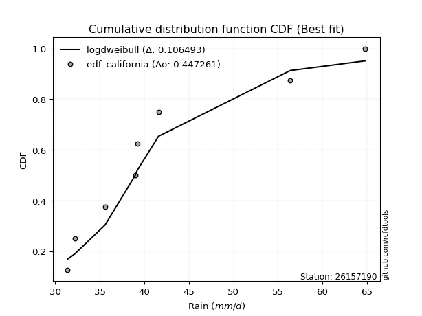</img>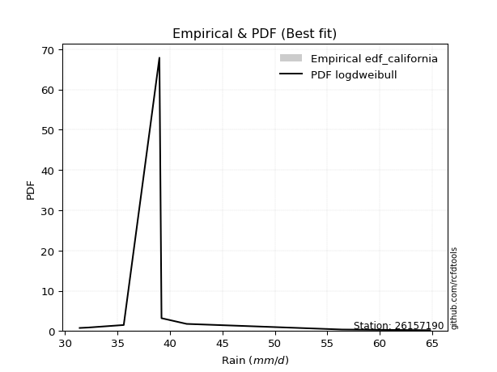</img>

</div>


### 2. EDF Hazen (1930)

Hazen method for plotting positions is a formula used to estimate the empirical cumulative probability distribution of flood events or other hydrological data. This formula often results in biased estimations, particularly when extrapolating to extreme events (high return periods).

<div align="center">


$P=(m-0.5)/n$


</div>


**2.1. Empirical values**

<div align="center">

|                | 0                  | 1                  | 2                  | 3                  | 4                  | 5         | 6                 | 7         |
|:---------------|:-------------------|:-------------------|:-------------------|:-------------------|:-------------------|:----------|:------------------|:----------|
| date           | 2023               | 2017               | 2018               | 2020               | 2021               | 2022      | 2019              | 2025      |
| x              | 31.4               | 32.2               | 35.6               | 39.0               | 39.2               | 41.6      | 56.4              | 64.8      |
| m              | 1                  | 2                  | 3                  | 4                  | 5                  | 6         | 7                 | 8         |
| empirical_dist | edf_hazen          | edf_hazen          | edf_hazen          | edf_hazen          | edf_hazen          | edf_hazen | edf_hazen         | edf_hazen |
| empirical      | 0.0625             | 0.1875             | 0.3125             | 0.4375             | 0.5625             | 0.6875    | 0.8125            | 0.9375    |
| empirical_tr   | 1.0666666666666667 | 1.2307692307692308 | 1.4545454545454546 | 1.7777777777777777 | 2.2857142857142856 | 3.2       | 5.333333333333333 | 16.0      |

</div>


**2.2. Kolmogorov-Smirnov fit test (sorted by Δ)**


<div align="center">

|                | 0                   | 1                   | 2                   | 3                   | 4                   | 5                   | 6                  | 7                   | 8                   | 9                  | 10                  | 11                  | 12                  | 13                  | 14                  | 15                  | 16                  | 17                  | 18                  | 19                  | 20                  | 21                  | 22                 | 23                  | 24                  | 25                  | 26                 | 27                 | 28                  | 29                  | 30                  | 31                  | 32                  | 33                  | 34                  | 35                  | 36                  | 37                  | 38                  | 39                  | 40                  | 41                 | 42                  | 43                  | 44                  | 45                  | 46                  | 47                  | 48                 | 49                  | 50                 | 51                  | 52                  | 53                  | 54                  | 55                  | 56                  | 57                  | 58                 | 59                 | 60                 | 61                 | 62                  | 63                  | 64                  | 65                  | 66                  | 67                  | 68                  | 69                 | 70                  | 71                  | 72                  | 73                 | 74                  | 75                  | 76                  | 77                  | 78                  | 79                  | 80                 | 81                  | 82                  | 83                  | 84                  | 85                  | 86                  | 87                 | 88                  | 89                  | 90                  | 91                 | 92                 | 93                  | 94                 | 95                 | 96                 | 97                  | 98                  | 99                  | 100                 | 101                 | 102                 | 103                | 104                 | 105                | 106                 | 107                 | 108                | 109                 | 110                | 111                 | 112                | 113                 | 114                | 115                 | 116                | 117                 | 118                 | 119                | 120                | 121                | 122                 | 123                 | 124                | 125                 | 126                | 127                | 128                | 129                 | 130                 | 131                | 132                | 133                | 134                | 135                 | 136                | 137                 | 138                | 139                 | 140                 | 141                | 142                 | 143                 | 144                | 145                | 146                 | 147                 | 148                | 149                | 150                | 151                | 152                | 153                | 154                | 155                | 156                | 157                | 158                | 159                |
|:---------------|:--------------------|:--------------------|:--------------------|:--------------------|:--------------------|:--------------------|:-------------------|:--------------------|:--------------------|:-------------------|:--------------------|:--------------------|:--------------------|:--------------------|:--------------------|:--------------------|:--------------------|:--------------------|:--------------------|:--------------------|:--------------------|:--------------------|:-------------------|:--------------------|:--------------------|:--------------------|:-------------------|:-------------------|:--------------------|:--------------------|:--------------------|:--------------------|:--------------------|:--------------------|:--------------------|:--------------------|:--------------------|:--------------------|:--------------------|:--------------------|:--------------------|:-------------------|:--------------------|:--------------------|:--------------------|:--------------------|:--------------------|:--------------------|:-------------------|:--------------------|:-------------------|:--------------------|:--------------------|:--------------------|:--------------------|:--------------------|:--------------------|:--------------------|:-------------------|:-------------------|:-------------------|:-------------------|:--------------------|:--------------------|:--------------------|:--------------------|:--------------------|:--------------------|:--------------------|:-------------------|:--------------------|:--------------------|:--------------------|:-------------------|:--------------------|:--------------------|:--------------------|:--------------------|:--------------------|:--------------------|:-------------------|:--------------------|:--------------------|:--------------------|:--------------------|:--------------------|:--------------------|:-------------------|:--------------------|:--------------------|:--------------------|:-------------------|:-------------------|:--------------------|:-------------------|:-------------------|:-------------------|:--------------------|:--------------------|:--------------------|:--------------------|:--------------------|:--------------------|:-------------------|:--------------------|:-------------------|:--------------------|:--------------------|:-------------------|:--------------------|:-------------------|:--------------------|:-------------------|:--------------------|:-------------------|:--------------------|:-------------------|:--------------------|:--------------------|:-------------------|:-------------------|:-------------------|:--------------------|:--------------------|:-------------------|:--------------------|:-------------------|:-------------------|:-------------------|:--------------------|:--------------------|:-------------------|:-------------------|:-------------------|:-------------------|:--------------------|:-------------------|:--------------------|:-------------------|:--------------------|:--------------------|:-------------------|:--------------------|:--------------------|:-------------------|:-------------------|:--------------------|:--------------------|:-------------------|:-------------------|:-------------------|:-------------------|:-------------------|:-------------------|:-------------------|:-------------------|:-------------------|:-------------------|:-------------------|:-------------------|
| station        | 26157190            | 26157190            | 26157190            | 26157190            | 26157190            | 26157190            | 26157190           | 26157190            | 26157190            | 26157190           | 26157190            | 26157190            | 26157190            | 26157190            | 26157190            | 26157190            | 26157190            | 26157190            | 26157190            | 26157190            | 26157190            | 26157190            | 26157190           | 26157190            | 26157190            | 26157190            | 26157190           | 26157190           | 26157190            | 26157190            | 26157190            | 26157190            | 26157190            | 26157190            | 26157190            | 26157190            | 26157190            | 26157190            | 26157190            | 26157190            | 26157190            | 26157190           | 26157190            | 26157190            | 26157190            | 26157190            | 26157190            | 26157190            | 26157190           | 26157190            | 26157190           | 26157190            | 26157190            | 26157190            | 26157190            | 26157190            | 26157190            | 26157190            | 26157190           | 26157190           | 26157190           | 26157190           | 26157190            | 26157190            | 26157190            | 26157190            | 26157190            | 26157190            | 26157190            | 26157190           | 26157190            | 26157190            | 26157190            | 26157190           | 26157190            | 26157190            | 26157190            | 26157190            | 26157190            | 26157190            | 26157190           | 26157190            | 26157190            | 26157190            | 26157190            | 26157190            | 26157190            | 26157190           | 26157190            | 26157190            | 26157190            | 26157190           | 26157190           | 26157190            | 26157190           | 26157190           | 26157190           | 26157190            | 26157190            | 26157190            | 26157190            | 26157190            | 26157190            | 26157190           | 26157190            | 26157190           | 26157190            | 26157190            | 26157190           | 26157190            | 26157190           | 26157190            | 26157190           | 26157190            | 26157190           | 26157190            | 26157190           | 26157190            | 26157190            | 26157190           | 26157190           | 26157190           | 26157190            | 26157190            | 26157190           | 26157190            | 26157190           | 26157190           | 26157190           | 26157190            | 26157190            | 26157190           | 26157190           | 26157190           | 26157190           | 26157190            | 26157190           | 26157190            | 26157190           | 26157190            | 26157190            | 26157190           | 26157190            | 26157190            | 26157190           | 26157190           | 26157190            | 26157190            | 26157190           | 26157190           | 26157190           | 26157190           | 26157190           | 26157190           | 26157190           | 26157190           | 26157190           | 26157190           | 26157190           | 26157190           |
| empirical_dist | edf_hazen           | edf_hazen           | edf_hazen           | edf_hazen           | edf_hazen           | edf_hazen           | edf_hazen          | edf_hazen           | edf_hazen           | edf_hazen          | edf_hazen           | edf_hazen           | edf_hazen           | edf_hazen           | edf_hazen           | edf_hazen           | edf_hazen           | edf_hazen           | edf_hazen           | edf_hazen           | edf_hazen           | edf_hazen           | edf_hazen          | edf_hazen           | edf_hazen           | edf_hazen           | edf_hazen          | edf_hazen          | edf_hazen           | edf_hazen           | edf_hazen           | edf_hazen           | edf_hazen           | edf_hazen           | edf_hazen           | edf_hazen           | edf_hazen           | edf_hazen           | edf_hazen           | edf_hazen           | edf_hazen           | edf_hazen          | edf_hazen           | edf_hazen           | edf_hazen           | edf_hazen           | edf_hazen           | edf_hazen           | edf_hazen          | edf_hazen           | edf_hazen          | edf_hazen           | edf_hazen           | edf_hazen           | edf_hazen           | edf_hazen           | edf_hazen           | edf_hazen           | edf_hazen          | edf_hazen          | edf_hazen          | edf_hazen          | edf_hazen           | edf_hazen           | edf_hazen           | edf_hazen           | edf_hazen           | edf_hazen           | edf_hazen           | edf_hazen          | edf_hazen           | edf_hazen           | edf_hazen           | edf_hazen          | edf_hazen           | edf_hazen           | edf_hazen           | edf_hazen           | edf_hazen           | edf_hazen           | edf_hazen          | edf_hazen           | edf_hazen           | edf_hazen           | edf_hazen           | edf_hazen           | edf_hazen           | edf_hazen          | edf_hazen           | edf_hazen           | edf_hazen           | edf_hazen          | edf_hazen          | edf_hazen           | edf_hazen          | edf_hazen          | edf_hazen          | edf_hazen           | edf_hazen           | edf_hazen           | edf_hazen           | edf_hazen           | edf_hazen           | edf_hazen          | edf_hazen           | edf_hazen          | edf_hazen           | edf_hazen           | edf_hazen          | edf_hazen           | edf_hazen          | edf_hazen           | edf_hazen          | edf_hazen           | edf_hazen          | edf_hazen           | edf_hazen          | edf_hazen           | edf_hazen           | edf_hazen          | edf_hazen          | edf_hazen          | edf_hazen           | edf_hazen           | edf_hazen          | edf_hazen           | edf_hazen          | edf_hazen          | edf_hazen          | edf_hazen           | edf_hazen           | edf_hazen          | edf_hazen          | edf_hazen          | edf_hazen          | edf_hazen           | edf_hazen          | edf_hazen           | edf_hazen          | edf_hazen           | edf_hazen           | edf_hazen          | edf_hazen           | edf_hazen           | edf_hazen          | edf_hazen          | edf_hazen           | edf_hazen           | edf_hazen          | edf_hazen          | edf_hazen          | edf_hazen          | edf_hazen          | edf_hazen          | edf_hazen          | edf_hazen          | edf_hazen          | edf_hazen          | edf_hazen          | edf_hazen          |
| p_dist         | logmielke           | logmoyal            | logburr             | burr                | loghalflogistic     | logbeta             | alpha              | loginvweibull       | loggenextreme       | loggenlogistic     | mielke              | loghalfnorm         | logweibull_max      | gengamma            | loggumbel_r         | loginvgamma         | logf                | burr12              | logdweibull         | logexponweib        | logburr12           | logkstwobign        | loggenexpon        | invgamma            | f                   | logalpha            | logexponnorm       | invweibull         | genextreme          | loggompertz         | lomax               | logloglaplace       | exponnorm           | genexpon            | gompertz            | truncnorm           | nakagami            | halflogistic        | loghalfgennorm      | logtruncnorm        | loggengamma         | beta               | logdgamma           | logpearson3         | logfoldnorm         | logkappa3           | moyal               | loginvgauss         | logjohnsonsu       | dweibull            | gennorm            | lograyleigh         | loggennorm          | vonmises_line       | logskewnorm         | dgamma              | invgauss            | genlogistic         | logmaxwell         | nct                | halfnorm           | foldnorm           | erlang              | logexponpow         | johnsonsu           | truncpareto         | genhalflogistic     | gumbel_r            | lognct              | logrice            | pearson3            | betaprime           | ncf                 | truncweibull_min   | logfatiguelife      | kstwobign           | loghypsecant        | logtruncexpon       | logbetaprime        | loglogistic         | lognorm            | logcrystalball      | logt                | logloggamma         | rayleigh            | loganglit           | logsemicircular     | logarcsine         | fatiguelife         | maxwell             | wald                | logwald            | exponpow           | exponweib           | loglaplace         | loglaplace         | loggausshyper      | logweibull_min      | weibull_min         | skewnorm            | arcsine             | logtruncweibull_min | logbradford         | semicircular       | logcosine           | rice               | anglit              | crystalball         | norm               | t                   | logistic           | logwrapcauchy       | logncf             | hypsecant           | lognakagami        | triang              | loggumbel_l        | laplace             | logkappa4           | genpareto          | loggamma           | loggamma           | halfgennorm         | truncexpon          | cosine             | gausshyper          | wrapcauchy         | logksone           | gumbel_l           | logargus            | loguniform          | bradford           | logerlang          | logvonmises_line   | tukeylambda        | rdist               | logrdist           | logtukeylambda      | loglevy_l          | johnsonsb           | logtriang           | ksone              | argus               | kappa4              | levy_l             | uniform            | kappa3              | powerlaw            | loggenpareto       | gamma              | loggenhalflogistic | logpowerlaw        | logtruncpareto     | logtrapezoid       | weibull_max        | trapezoid          | loglomax           | logjohnsonsb       | logvonmises        | vonmises           |
| delta          | 0.07472970206794638 | 0.08984058116022726 | 0.09081209478983399 | 0.09189646183276423 | 0.09473638272280391 | 0.09594583880726876 | 0.0976451157248619 | 0.09894885713591584 | 0.09895344621722812 | 0.0993789744592094 | 0.09951005033321825 | 0.09993050235845513 | 0.10027756993884895 | 0.10071289315669119 | 0.10246384759949345 | 0.10262646587611246 | 0.10262741380466678 | 0.10522874678255678 | 0.10607626135665826 | 0.10624608659210066 | 0.10736993214002111 | 0.10830962417040002 | 0.1100209899397737 | 0.11079174726221719 | 0.11083467909941747 | 0.11094976457839156 | 0.1111584612006078 | 0.1122288570179304 | 0.11222921471973601 | 0.11386679808593018 | 0.11537316959628713 | 0.11698022887712334 | 0.11740708859369187 | 0.11811429680997987 | 0.11813557746822809 | 0.11828832835306557 | 0.11939879552897237 | 0.11950908013932715 | 0.11989152560061415 | 0.12013213479143749 | 0.12052392937345668 | 0.1206004942960558 | 0.12291157139698838 | 0.12350199461890843 | 0.12431057251704969 | 0.12554133526836725 | 0.12630569579853157 | 0.12747017642263647 | 0.1292633879248416 | 0.12984788271429215 | 0.1299702401509205 | 0.13001157326138146 | 0.13011838685389798 | 0.13069478953641686 | 0.13239390299185666 | 0.13245384585509465 | 0.13268508085389696 | 0.13287335426217062 | 0.1406965754615076 | 0.1419395058911761 | 0.1420842044969024 | 0.1432236899295245 | 0.14481732400289404 | 0.14580148274436855 | 0.14724645102216982 | 0.14811998975524843 | 0.14895371514393652 | 0.15202474799334775 | 0.15269438325045281 | 0.1532418061489943 | 0.15532655193914668 | 0.16059188654519008 | 0.16367042082003336 | 0.1637557340424417 | 0.16532896271212372 | 0.16578472727273574 | 0.16947791545807434 | 0.17000092692257185 | 0.17093174043754789 | 0.17115286637514637 | 0.1731158863057355 | 0.17311592758083538 | 0.17311778934976418 | 0.17451333688805426 | 0.17490896524300914 | 0.17517354939098417 | 0.17602127206329832 | 0.1793817399104014 | 0.18354604768099736 | 0.18655299917498802 | 0.18696361367300116 | 0.1875             | 0.1876899731908963 | 0.18934042638450715 | 0.191168339934645  | 0.191168339934645  | 0.1937187437276527 | 0.19637254793309067 | 0.19924799564652407 | 0.20440832876777137 | 0.20621366873639185 | 0.20999071798339475 | 0.21065171654286807 | 0.2139422123827064 | 0.21565304573388822 | 0.2156670589950066 | 0.21588921429513858 | 0.22061178690949124 | 0.2206117887912336 | 0.22061278718021637 | 0.2251080109808255 | 0.22616534220633722 | 0.227480818115041  | 0.22892976441560503 | 0.2302655367863954 | 0.23935057716418456 | 0.2429155494176657 | 0.24293566903723512 | 0.24760518194769277 | 0.2513940530508442 | 0.2559709096066929 | 0.2559709096066929 | 0.26519396991177613 | 0.27168682166624575 | 0.2723971152500354 | 0.27311747639211925 | 0.2742665110025119 | 0.2806180546443513 | 0.291185855538427  | 0.29913810307781774 | 0.29924166557322124 | 0.2995544255187326 | 0.302561698308484  | 0.3025888437867979 | 0.3124999462624416 | 0.31249999998939704 | 0.3158071532849094 | 0.32697198570713937 | 0.3429163610526609 | 0.34573921980216016 | 0.34670628289829486 | 0.3496756487025947 | 0.35117462366249397 | 0.35885952071997473 | 0.3643997303722033 | 0.3821107784431137 | 0.38281485844554614 | 0.39010161076988026 | 0.4038735203338232 | 0.4093952242354827 | 0.4127429779185904 | 0.4129500364150136 | 0.4969452567218593 | 0.5219470825436029 | 0.5563398535858401 | 0.5733747076704873 | 0.6708171729210056 | 0.685132094817533  | 1.091994808405768  | 9.815752513835045  |
| deltao         | 0.4472608134160001  | 0.4472608134160001  | 0.4472608134160001  | 0.4472608134160001  | 0.4472608134160001  | 0.4472608134160001  | 0.4472608134160001 | 0.4472608134160001  | 0.4472608134160001  | 0.4472608134160001 | 0.4472608134160001  | 0.4472608134160001  | 0.4472608134160001  | 0.4472608134160001  | 0.4472608134160001  | 0.4472608134160001  | 0.4472608134160001  | 0.4472608134160001  | 0.4472608134160001  | 0.4472608134160001  | 0.4472608134160001  | 0.4472608134160001  | 0.4472608134160001 | 0.4472608134160001  | 0.4472608134160001  | 0.4472608134160001  | 0.4472608134160001 | 0.4472608134160001 | 0.4472608134160001  | 0.4472608134160001  | 0.4472608134160001  | 0.4472608134160001  | 0.4472608134160001  | 0.4472608134160001  | 0.4472608134160001  | 0.4472608134160001  | 0.4472608134160001  | 0.4472608134160001  | 0.4472608134160001  | 0.4472608134160001  | 0.4472608134160001  | 0.4472608134160001 | 0.4472608134160001  | 0.4472608134160001  | 0.4472608134160001  | 0.4472608134160001  | 0.4472608134160001  | 0.4472608134160001  | 0.4472608134160001 | 0.4472608134160001  | 0.4472608134160001 | 0.4472608134160001  | 0.4472608134160001  | 0.4472608134160001  | 0.4472608134160001  | 0.4472608134160001  | 0.4472608134160001  | 0.4472608134160001  | 0.4472608134160001 | 0.4472608134160001 | 0.4472608134160001 | 0.4472608134160001 | 0.4472608134160001  | 0.4472608134160001  | 0.4472608134160001  | 0.4472608134160001  | 0.4472608134160001  | 0.4472608134160001  | 0.4472608134160001  | 0.4472608134160001 | 0.4472608134160001  | 0.4472608134160001  | 0.4472608134160001  | 0.4472608134160001 | 0.4472608134160001  | 0.4472608134160001  | 0.4472608134160001  | 0.4472608134160001  | 0.4472608134160001  | 0.4472608134160001  | 0.4472608134160001 | 0.4472608134160001  | 0.4472608134160001  | 0.4472608134160001  | 0.4472608134160001  | 0.4472608134160001  | 0.4472608134160001  | 0.4472608134160001 | 0.4472608134160001  | 0.4472608134160001  | 0.4472608134160001  | 0.4472608134160001 | 0.4472608134160001 | 0.4472608134160001  | 0.4472608134160001 | 0.4472608134160001 | 0.4472608134160001 | 0.4472608134160001  | 0.4472608134160001  | 0.4472608134160001  | 0.4472608134160001  | 0.4472608134160001  | 0.4472608134160001  | 0.4472608134160001 | 0.4472608134160001  | 0.4472608134160001 | 0.4472608134160001  | 0.4472608134160001  | 0.4472608134160001 | 0.4472608134160001  | 0.4472608134160001 | 0.4472608134160001  | 0.4472608134160001 | 0.4472608134160001  | 0.4472608134160001 | 0.4472608134160001  | 0.4472608134160001 | 0.4472608134160001  | 0.4472608134160001  | 0.4472608134160001 | 0.4472608134160001 | 0.4472608134160001 | 0.4472608134160001  | 0.4472608134160001  | 0.4472608134160001 | 0.4472608134160001  | 0.4472608134160001 | 0.4472608134160001 | 0.4472608134160001 | 0.4472608134160001  | 0.4472608134160001  | 0.4472608134160001 | 0.4472608134160001 | 0.4472608134160001 | 0.4472608134160001 | 0.4472608134160001  | 0.4472608134160001 | 0.4472608134160001  | 0.4472608134160001 | 0.4472608134160001  | 0.4472608134160001  | 0.4472608134160001 | 0.4472608134160001  | 0.4472608134160001  | 0.4472608134160001 | 0.4472608134160001 | 0.4472608134160001  | 0.4472608134160001  | 0.4472608134160001 | 0.4472608134160001 | 0.4472608134160001 | 0.4472608134160001 | 0.4472608134160001 | 0.4472608134160001 | 0.4472608134160001 | 0.4472608134160001 | 0.4472608134160001 | 0.4472608134160001 | 0.4472608134160001 | 0.4472608134160001 |
| eval           | Δo > Δ              | Δo > Δ              | Δo > Δ              | Δo > Δ              | Δo > Δ              | Δo > Δ              | Δo > Δ             | Δo > Δ              | Δo > Δ              | Δo > Δ             | Δo > Δ              | Δo > Δ              | Δo > Δ              | Δo > Δ              | Δo > Δ              | Δo > Δ              | Δo > Δ              | Δo > Δ              | Δo > Δ              | Δo > Δ              | Δo > Δ              | Δo > Δ              | Δo > Δ             | Δo > Δ              | Δo > Δ              | Δo > Δ              | Δo > Δ             | Δo > Δ             | Δo > Δ              | Δo > Δ              | Δo > Δ              | Δo > Δ              | Δo > Δ              | Δo > Δ              | Δo > Δ              | Δo > Δ              | Δo > Δ              | Δo > Δ              | Δo > Δ              | Δo > Δ              | Δo > Δ              | Δo > Δ             | Δo > Δ              | Δo > Δ              | Δo > Δ              | Δo > Δ              | Δo > Δ              | Δo > Δ              | Δo > Δ             | Δo > Δ              | Δo > Δ             | Δo > Δ              | Δo > Δ              | Δo > Δ              | Δo > Δ              | Δo > Δ              | Δo > Δ              | Δo > Δ              | Δo > Δ             | Δo > Δ             | Δo > Δ             | Δo > Δ             | Δo > Δ              | Δo > Δ              | Δo > Δ              | Δo > Δ              | Δo > Δ              | Δo > Δ              | Δo > Δ              | Δo > Δ             | Δo > Δ              | Δo > Δ              | Δo > Δ              | Δo > Δ             | Δo > Δ              | Δo > Δ              | Δo > Δ              | Δo > Δ              | Δo > Δ              | Δo > Δ              | Δo > Δ             | Δo > Δ              | Δo > Δ              | Δo > Δ              | Δo > Δ              | Δo > Δ              | Δo > Δ              | Δo > Δ             | Δo > Δ              | Δo > Δ              | Δo > Δ              | Δo > Δ             | Δo > Δ             | Δo > Δ              | Δo > Δ             | Δo > Δ             | Δo > Δ             | Δo > Δ              | Δo > Δ              | Δo > Δ              | Δo > Δ              | Δo > Δ              | Δo > Δ              | Δo > Δ             | Δo > Δ              | Δo > Δ             | Δo > Δ              | Δo > Δ              | Δo > Δ             | Δo > Δ              | Δo > Δ             | Δo > Δ              | Δo > Δ             | Δo > Δ              | Δo > Δ             | Δo > Δ              | Δo > Δ             | Δo > Δ              | Δo > Δ              | Δo > Δ             | Δo > Δ             | Δo > Δ             | Δo > Δ              | Δo > Δ              | Δo > Δ             | Δo > Δ              | Δo > Δ             | Δo > Δ             | Δo > Δ             | Δo > Δ              | Δo > Δ              | Δo > Δ             | Δo > Δ             | Δo > Δ             | Δo > Δ             | Δo > Δ              | Δo > Δ             | Δo > Δ              | Δo > Δ             | Δo > Δ              | Δo > Δ              | Δo > Δ             | Δo > Δ              | Δo > Δ              | Δo > Δ             | Δo > Δ             | Δo > Δ              | Δo > Δ              | Δo > Δ             | Δo > Δ             | Δo > Δ             | Δo > Δ             | Δo <= Δ            | Δo <= Δ            | Δo <= Δ            | Δo <= Δ            | Δo <= Δ            | Δo <= Δ            | Δo <= Δ            | Δo <= Δ            |
| fit            | 1                   | 1                   | 1                   | 1                   | 1                   | 1                   | 1                  | 1                   | 1                   | 1                  | 1                   | 1                   | 1                   | 1                   | 1                   | 1                   | 1                   | 1                   | 1                   | 1                   | 1                   | 1                   | 1                  | 1                   | 1                   | 1                   | 1                  | 1                  | 1                   | 1                   | 1                   | 1                   | 1                   | 1                   | 1                   | 1                   | 1                   | 1                   | 1                   | 1                   | 1                   | 1                  | 1                   | 1                   | 1                   | 1                   | 1                   | 1                   | 1                  | 1                   | 1                  | 1                   | 1                   | 1                   | 1                   | 1                   | 1                   | 1                   | 1                  | 1                  | 1                  | 1                  | 1                   | 1                   | 1                   | 1                   | 1                   | 1                   | 1                   | 1                  | 1                   | 1                   | 1                   | 1                  | 1                   | 1                   | 1                   | 1                   | 1                   | 1                   | 1                  | 1                   | 1                   | 1                   | 1                   | 1                   | 1                   | 1                  | 1                   | 1                   | 1                   | 1                  | 1                  | 1                   | 1                  | 1                  | 1                  | 1                   | 1                   | 1                   | 1                   | 1                   | 1                   | 1                  | 1                   | 1                  | 1                   | 1                   | 1                  | 1                   | 1                  | 1                   | 1                  | 1                   | 1                  | 1                   | 1                  | 1                   | 1                   | 1                  | 1                  | 1                  | 1                   | 1                   | 1                  | 1                   | 1                  | 1                  | 1                  | 1                   | 1                   | 1                  | 1                  | 1                  | 1                  | 1                   | 1                  | 1                   | 1                  | 1                   | 1                   | 1                  | 1                   | 1                   | 1                  | 1                  | 1                   | 1                   | 1                  | 1                  | 1                  | 1                  | 0                  | 0                  | 0                  | 0                  | 0                  | 0                  | 0                  | 0                  |
| n              | 8                   | 8                   | 8                   | 8                   | 8                   | 8                   | 8                  | 8                   | 8                   | 8                  | 8                   | 8                   | 8                   | 8                   | 8                   | 8                   | 8                   | 8                   | 8                   | 8                   | 8                   | 8                   | 8                  | 8                   | 8                   | 8                   | 8                  | 8                  | 8                   | 8                   | 8                   | 8                   | 8                   | 8                   | 8                   | 8                   | 8                   | 8                   | 8                   | 8                   | 8                   | 8                  | 8                   | 8                   | 8                   | 8                   | 8                   | 8                   | 8                  | 8                   | 8                  | 8                   | 8                   | 8                   | 8                   | 8                   | 8                   | 8                   | 8                  | 8                  | 8                  | 8                  | 8                   | 8                   | 8                   | 8                   | 8                   | 8                   | 8                   | 8                  | 8                   | 8                   | 8                   | 8                  | 8                   | 8                   | 8                   | 8                   | 8                   | 8                   | 8                  | 8                   | 8                   | 8                   | 8                   | 8                   | 8                   | 8                  | 8                   | 8                   | 8                   | 8                  | 8                  | 8                   | 8                  | 8                  | 8                  | 8                   | 8                   | 8                   | 8                   | 8                   | 8                   | 8                  | 8                   | 8                  | 8                   | 8                   | 8                  | 8                   | 8                  | 8                   | 8                  | 8                   | 8                  | 8                   | 8                  | 8                   | 8                   | 8                  | 8                  | 8                  | 8                   | 8                   | 8                  | 8                   | 8                  | 8                  | 8                  | 8                   | 8                   | 8                  | 8                  | 8                  | 8                  | 8                   | 8                  | 8                   | 8                  | 8                   | 8                   | 8                  | 8                   | 8                   | 8                  | 8                  | 8                   | 8                   | 8                  | 8                  | 8                  | 8                  | 8                  | 8                  | 8                  | 8                  | 8                  | 8                  | 8                  | 8                  |
| best_fit       | 1                   | 0                   | 0                   | 0                   | 0                   | 0                   | 0                  | 0                   | 0                   | 0                  | 0                   | 0                   | 0                   | 0                   | 0                   | 0                   | 0                   | 0                   | 0                   | 0                   | 0                   | 0                   | 0                  | 0                   | 0                   | 0                   | 0                  | 0                  | 0                   | 0                   | 0                   | 0                   | 0                   | 0                   | 0                   | 0                   | 0                   | 0                   | 0                   | 0                   | 0                   | 0                  | 0                   | 0                   | 0                   | 0                   | 0                   | 0                   | 0                  | 0                   | 0                  | 0                   | 0                   | 0                   | 0                   | 0                   | 0                   | 0                   | 0                  | 0                  | 0                  | 0                  | 0                   | 0                   | 0                   | 0                   | 0                   | 0                   | 0                   | 0                  | 0                   | 0                   | 0                   | 0                  | 0                   | 0                   | 0                   | 0                   | 0                   | 0                   | 0                  | 0                   | 0                   | 0                   | 0                   | 0                   | 0                   | 0                  | 0                   | 0                   | 0                   | 0                  | 0                  | 0                   | 0                  | 0                  | 0                  | 0                   | 0                   | 0                   | 0                   | 0                   | 0                   | 0                  | 0                   | 0                  | 0                   | 0                   | 0                  | 0                   | 0                  | 0                   | 0                  | 0                   | 0                  | 0                   | 0                  | 0                   | 0                   | 0                  | 0                  | 0                  | 0                   | 0                   | 0                  | 0                   | 0                  | 0                  | 0                  | 0                   | 0                   | 0                  | 0                  | 0                  | 0                  | 0                   | 0                  | 0                   | 0                  | 0                   | 0                   | 0                  | 0                   | 0                   | 0                  | 0                  | 0                   | 0                   | 0                  | 0                  | 0                  | 0                  | 0                  | 0                  | 0                  | 0                  | 0                  | 0                  | 0                  | 0                  |
| best_fit_sort  | 1                   | 2                   | 3                   | 4                   | 5                   | 6                   | 7                  | 8                   | 9                   | 10                 | 11                  | 12                  | 13                  | 14                  | 15                  | 16                  | 17                  | 18                  | 19                  | 20                  | 21                  | 22                  | 23                 | 24                  | 25                  | 26                  | 27                 | 28                 | 29                  | 30                  | 31                  | 32                  | 33                  | 34                  | 35                  | 36                  | 37                  | 38                  | 39                  | 40                  | 41                  | 42                 | 43                  | 44                  | 45                  | 46                  | 47                  | 48                  | 49                 | 50                  | 51                 | 52                  | 53                  | 54                  | 55                  | 56                  | 57                  | 58                  | 59                 | 60                 | 61                 | 62                 | 63                  | 64                  | 65                  | 66                  | 67                  | 68                  | 69                  | 70                 | 71                  | 72                  | 73                  | 74                 | 75                  | 76                  | 77                  | 78                  | 79                  | 80                  | 81                 | 82                  | 83                  | 84                  | 85                  | 86                  | 87                  | 88                 | 89                  | 90                  | 91                  | 92                 | 93                 | 94                  | 95                 | 96                 | 97                 | 98                  | 99                  | 100                 | 101                 | 102                 | 103                 | 104                | 105                 | 106                | 107                 | 108                 | 109                | 110                 | 111                | 112                 | 113                | 114                 | 115                | 116                 | 117                | 118                 | 119                 | 120                | 121                | 122                | 123                 | 124                 | 125                | 126                 | 127                | 128                | 129                | 130                 | 131                 | 132                | 133                | 134                | 135                | 136                 | 137                | 138                 | 139                | 140                 | 141                 | 142                | 143                 | 144                 | 145                | 146                | 147                 | 148                 | 149                | 150                | 151                | 152                | 153                | 154                | 155                | 156                | 157                | 158                | 159                | 160                |

</div>


**2.3. Best fit**

<div align="center">

|   id |   station | empirical_dist   | p_dist    |     delta |   deltao | eval   |   fit |   n |   best_fit |   best_fit_sort |
|-----:|----------:|:-----------------|:----------|----------:|---------:|:-------|------:|----:|-----------:|----------------:|
|    0 |  26157190 | edf_hazen        | logmielke | 0.0747297 | 0.447261 | Δo > Δ |     1 |   8 |          1 |               1 |

</div>


<div align="center">

</img>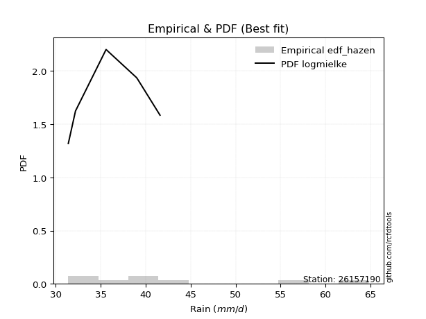</img>

</div>


### 3. EDF Weibull (1939)

Weibull plotting position formula is an empirical method used to estimate the non-exceedance probability or plotting position for a set of observed data, is often recommended or widely used in practice, particularly in flood frequency analysis.

<div align="center">


$P=m/(n+1)$


</div>


**3.1. Empirical values**

<div align="center">

|                | 0                  | 1                  | 2                  | 3                  | 4                  | 5                  | 6                  | 7                  |
|:---------------|:-------------------|:-------------------|:-------------------|:-------------------|:-------------------|:-------------------|:-------------------|:-------------------|
| date           | 2023               | 2017               | 2018               | 2020               | 2021               | 2022               | 2019               | 2025               |
| x              | 31.4               | 32.2               | 35.6               | 39.0               | 39.2               | 41.6               | 56.4               | 64.8               |
| m              | 1                  | 2                  | 3                  | 4                  | 5                  | 6                  | 7                  | 8                  |
| empirical_dist | edf_weibull        | edf_weibull        | edf_weibull        | edf_weibull        | edf_weibull        | edf_weibull        | edf_weibull        | edf_weibull        |
| empirical      | 0.1111111111111111 | 0.2222222222222222 | 0.3333333333333333 | 0.4444444444444444 | 0.5555555555555556 | 0.6666666666666666 | 0.7777777777777778 | 0.8888888888888888 |
| empirical_tr   | 1.125              | 1.2857142857142856 | 1.4999999999999998 | 1.7999999999999998 | 2.25               | 2.9999999999999996 | 4.5                | 8.999999999999996  |

</div>


**3.2. Kolmogorov-Smirnov fit test (sorted by Δ)**


<div align="center">

|                | 0                   | 1                   | 2                   | 3                   | 4                   | 5                  | 6                  | 7                   | 8                   | 9                   | 10                  | 11                  | 12                  | 13                  | 14                 | 15                  | 16                  | 17                  | 18                  | 19                  | 20                  | 21                 | 22                  | 23                  | 24                  | 25                  | 26                  | 27                  | 28                  | 29                  | 30                  | 31                  | 32                  | 33                  | 34                  | 35                  | 36                  | 37                  | 38                  | 39                  | 40                  | 41                 | 42                 | 43                  | 44                  | 45                  | 46                 | 47                 | 48                 | 49                  | 50                 | 51                 | 52                  | 53                  | 54                  | 55                  | 56                  | 57                  | 58                 | 59                  | 60                  | 61                 | 62                 | 63                  | 64                  | 65                  | 66                 | 67                 | 68                  | 69                 | 70                  | 71                  | 72                 | 73                  | 74                  | 75                 | 76                  | 77                  | 78                  | 79                 | 80                 | 81                  | 82                 | 83                  | 84                  | 85                  | 86                 | 87                  | 88                  | 89                  | 90                  | 91                  | 92                  | 93                 | 94                 | 95                 | 96                  | 97                  | 98                  | 99                  | 100                | 101                 | 102                 | 103                 | 104                 | 105                | 106                 | 107                 | 108                | 109                 | 110                 | 111                 | 112                 | 113                | 114                 | 115                 | 116                | 117                 | 118                | 119                 | 120                | 121                 | 122                 | 123                | 124                 | 125                | 126                 | 127                 | 128                 | 129                 | 130                 | 131                 | 132                 | 133                | 134                | 135                | 136                | 137                | 138                | 139                | 140                 | 141                | 142                 | 143                | 144                 | 145                 | 146                | 147                 | 148                 | 149                | 150                | 151                | 152                | 153                | 154                | 155                | 156                | 157                | 158                | 159                |
|:---------------|:--------------------|:--------------------|:--------------------|:--------------------|:--------------------|:-------------------|:-------------------|:--------------------|:--------------------|:--------------------|:--------------------|:--------------------|:--------------------|:--------------------|:-------------------|:--------------------|:--------------------|:--------------------|:--------------------|:--------------------|:--------------------|:-------------------|:--------------------|:--------------------|:--------------------|:--------------------|:--------------------|:--------------------|:--------------------|:--------------------|:--------------------|:--------------------|:--------------------|:--------------------|:--------------------|:--------------------|:--------------------|:--------------------|:--------------------|:--------------------|:--------------------|:-------------------|:-------------------|:--------------------|:--------------------|:--------------------|:-------------------|:-------------------|:-------------------|:--------------------|:-------------------|:-------------------|:--------------------|:--------------------|:--------------------|:--------------------|:--------------------|:--------------------|:-------------------|:--------------------|:--------------------|:-------------------|:-------------------|:--------------------|:--------------------|:--------------------|:-------------------|:-------------------|:--------------------|:-------------------|:--------------------|:--------------------|:-------------------|:--------------------|:--------------------|:-------------------|:--------------------|:--------------------|:--------------------|:-------------------|:-------------------|:--------------------|:-------------------|:--------------------|:--------------------|:--------------------|:-------------------|:--------------------|:--------------------|:--------------------|:--------------------|:--------------------|:--------------------|:-------------------|:-------------------|:-------------------|:--------------------|:--------------------|:--------------------|:--------------------|:-------------------|:--------------------|:--------------------|:--------------------|:--------------------|:-------------------|:--------------------|:--------------------|:-------------------|:--------------------|:--------------------|:--------------------|:--------------------|:-------------------|:--------------------|:--------------------|:-------------------|:--------------------|:-------------------|:--------------------|:-------------------|:--------------------|:--------------------|:-------------------|:--------------------|:-------------------|:--------------------|:--------------------|:--------------------|:--------------------|:--------------------|:--------------------|:--------------------|:-------------------|:-------------------|:-------------------|:-------------------|:-------------------|:-------------------|:-------------------|:--------------------|:-------------------|:--------------------|:-------------------|:--------------------|:--------------------|:-------------------|:--------------------|:--------------------|:-------------------|:-------------------|:-------------------|:-------------------|:-------------------|:-------------------|:-------------------|:-------------------|:-------------------|:-------------------|:-------------------|
| station        | 26157190            | 26157190            | 26157190            | 26157190            | 26157190            | 26157190           | 26157190           | 26157190            | 26157190            | 26157190            | 26157190            | 26157190            | 26157190            | 26157190            | 26157190           | 26157190            | 26157190            | 26157190            | 26157190            | 26157190            | 26157190            | 26157190           | 26157190            | 26157190            | 26157190            | 26157190            | 26157190            | 26157190            | 26157190            | 26157190            | 26157190            | 26157190            | 26157190            | 26157190            | 26157190            | 26157190            | 26157190            | 26157190            | 26157190            | 26157190            | 26157190            | 26157190           | 26157190           | 26157190            | 26157190            | 26157190            | 26157190           | 26157190           | 26157190           | 26157190            | 26157190           | 26157190           | 26157190            | 26157190            | 26157190            | 26157190            | 26157190            | 26157190            | 26157190           | 26157190            | 26157190            | 26157190           | 26157190           | 26157190            | 26157190            | 26157190            | 26157190           | 26157190           | 26157190            | 26157190           | 26157190            | 26157190            | 26157190           | 26157190            | 26157190            | 26157190           | 26157190            | 26157190            | 26157190            | 26157190           | 26157190           | 26157190            | 26157190           | 26157190            | 26157190            | 26157190            | 26157190           | 26157190            | 26157190            | 26157190            | 26157190            | 26157190            | 26157190            | 26157190           | 26157190           | 26157190           | 26157190            | 26157190            | 26157190            | 26157190            | 26157190           | 26157190            | 26157190            | 26157190            | 26157190            | 26157190           | 26157190            | 26157190            | 26157190           | 26157190            | 26157190            | 26157190            | 26157190            | 26157190           | 26157190            | 26157190            | 26157190           | 26157190            | 26157190           | 26157190            | 26157190           | 26157190            | 26157190            | 26157190           | 26157190            | 26157190           | 26157190            | 26157190            | 26157190            | 26157190            | 26157190            | 26157190            | 26157190            | 26157190           | 26157190           | 26157190           | 26157190           | 26157190           | 26157190           | 26157190           | 26157190            | 26157190           | 26157190            | 26157190           | 26157190            | 26157190            | 26157190           | 26157190            | 26157190            | 26157190           | 26157190           | 26157190           | 26157190           | 26157190           | 26157190           | 26157190           | 26157190           | 26157190           | 26157190           | 26157190           |
| empirical_dist | edf_weibull         | edf_weibull         | edf_weibull         | edf_weibull         | edf_weibull         | edf_weibull        | edf_weibull        | edf_weibull         | edf_weibull         | edf_weibull         | edf_weibull         | edf_weibull         | edf_weibull         | edf_weibull         | edf_weibull        | edf_weibull         | edf_weibull         | edf_weibull         | edf_weibull         | edf_weibull         | edf_weibull         | edf_weibull        | edf_weibull         | edf_weibull         | edf_weibull         | edf_weibull         | edf_weibull         | edf_weibull         | edf_weibull         | edf_weibull         | edf_weibull         | edf_weibull         | edf_weibull         | edf_weibull         | edf_weibull         | edf_weibull         | edf_weibull         | edf_weibull         | edf_weibull         | edf_weibull         | edf_weibull         | edf_weibull        | edf_weibull        | edf_weibull         | edf_weibull         | edf_weibull         | edf_weibull        | edf_weibull        | edf_weibull        | edf_weibull         | edf_weibull        | edf_weibull        | edf_weibull         | edf_weibull         | edf_weibull         | edf_weibull         | edf_weibull         | edf_weibull         | edf_weibull        | edf_weibull         | edf_weibull         | edf_weibull        | edf_weibull        | edf_weibull         | edf_weibull         | edf_weibull         | edf_weibull        | edf_weibull        | edf_weibull         | edf_weibull        | edf_weibull         | edf_weibull         | edf_weibull        | edf_weibull         | edf_weibull         | edf_weibull        | edf_weibull         | edf_weibull         | edf_weibull         | edf_weibull        | edf_weibull        | edf_weibull         | edf_weibull        | edf_weibull         | edf_weibull         | edf_weibull         | edf_weibull        | edf_weibull         | edf_weibull         | edf_weibull         | edf_weibull         | edf_weibull         | edf_weibull         | edf_weibull        | edf_weibull        | edf_weibull        | edf_weibull         | edf_weibull         | edf_weibull         | edf_weibull         | edf_weibull        | edf_weibull         | edf_weibull         | edf_weibull         | edf_weibull         | edf_weibull        | edf_weibull         | edf_weibull         | edf_weibull        | edf_weibull         | edf_weibull         | edf_weibull         | edf_weibull         | edf_weibull        | edf_weibull         | edf_weibull         | edf_weibull        | edf_weibull         | edf_weibull        | edf_weibull         | edf_weibull        | edf_weibull         | edf_weibull         | edf_weibull        | edf_weibull         | edf_weibull        | edf_weibull         | edf_weibull         | edf_weibull         | edf_weibull         | edf_weibull         | edf_weibull         | edf_weibull         | edf_weibull        | edf_weibull        | edf_weibull        | edf_weibull        | edf_weibull        | edf_weibull        | edf_weibull        | edf_weibull         | edf_weibull        | edf_weibull         | edf_weibull        | edf_weibull         | edf_weibull         | edf_weibull        | edf_weibull         | edf_weibull         | edf_weibull        | edf_weibull        | edf_weibull        | edf_weibull        | edf_weibull        | edf_weibull        | edf_weibull        | edf_weibull        | edf_weibull        | edf_weibull        | edf_weibull        |
| p_dist         | logfoldnorm         | logburr12           | loghalfnorm         | logmielke           | beta                | logbeta            | nakagami           | loggengamma         | gengamma            | halflogistic        | lograyleigh         | moyal               | logpearson3         | genextreme          | invweibull         | loginvweibull       | loggenextreme       | logburr             | alpha               | f                   | invgamma            | logf               | loginvgamma         | logmaxwell          | loginvgauss         | halfnorm            | loggumbel_r         | logjohnsonsu        | foldnorm            | logmoyal            | logexponpow         | burr                | invgauss            | burr12              | nct                 | dweibull            | logkstwobign        | loghalflogistic     | gumbel_r            | lognct              | logrice             | logexponnorm       | loggenlogistic     | mielke              | pearson3            | logweibull_max      | logdweibull        | betaprime          | johnsonsu          | logexponweib        | truncpareto        | ncf                | truncweibull_min    | genlogistic         | erlang              | loggenexpon         | kstwobign           | logalpha            | loggompertz        | lomax               | logbetaprime        | loglogistic        | loggennorm         | logloglaplace       | exponnorm           | lognorm             | logcrystalball     | logt               | genexpon            | gompertz           | truncnorm           | dgamma              | logloggamma        | rayleigh            | vonmises_line       | loganglit          | loghalfgennorm      | logtruncnorm        | logsemicircular     | logdgamma          | logfatiguelife     | logarcsine          | loghypsecant       | logkappa3           | gennorm             | maxwell             | logtruncexpon      | logskewnorm         | exponweib           | loggausshyper       | genhalflogistic     | logweibull_min      | fatiguelife         | exponpow           | logncf             | skewnorm           | loglaplace          | loglaplace          | arcsine             | logtruncweibull_min | logbradford        | weibull_min         | semicircular        | logcosine           | rice                | anglit             | crystalball         | norm                | t                  | logistic            | logwrapcauchy       | hypsecant           | lognakagami         | triang             | wald                | loggumbel_l         | logwald            | genpareto           | logkappa4          | laplace             | halfgennorm        | loggamma            | loggamma            | truncexpon         | cosine              | gausshyper         | wrapcauchy          | logksone            | gumbel_l            | logargus            | loguniform          | bradford            | logvonmises_line    | loglevy_l          | logrdist           | logerlang          | johnsonsb          | logtukeylambda     | levy_l             | logtriang          | ksone               | argus              | tukeylambda         | rdist              | kappa4              | loggenpareto        | uniform            | kappa3              | powerlaw            | loggenhalflogistic | logpowerlaw        | gamma              | logtruncpareto     | logtrapezoid       | weibull_max        | trapezoid          | loglomax           | logjohnsonsb       | logvonmises        | vonmises           |
| delta          | 0.10722052966961859 | 0.10774425613664639 | 0.10823566327921252 | 0.10945192429016859 | 0.11109523707684339 | 0.111110993950676  | 0.1111110939007927 | 0.11111110717317005 | 0.11111111086696449 | 0.11225350581707372 | 0.11286976590060538 | 0.11664639542959854 | 0.11723395106294932 | 0.11756543324623814 | 0.1175671919471097 | 0.11819628511364609 | 0.11820213101910855 | 0.11841841043483836 | 0.11842006705474795 | 0.11864199221148122 | 0.11865725157669572 | 0.1196209225102989 | 0.11962100217024849 | 0.11986324212817423 | 0.12052573197819205 | 0.12125087116356903 | 0.12146178465632629 | 0.12231894348039718 | 0.12239035659619113 | 0.12456280338244947 | 0.12496814941103518 | 0.12525306294530292 | 0.12574063640945254 | 0.12622036718813306 | 0.12721448337136632 | 0.12811631993439077 | 0.12929664232223892 | 0.12945860494502612 | 0.13119141466001438 | 0.13186104991711944 | 0.13240847281566093 | 0.1326851804429552 | 0.1341011966814316 | 0.13423227255544046 | 0.13449321860581331 | 0.13499979216107116 | 0.1355028882545335 | 0.1397585532118567 | 0.1403020065777254 | 0.14096830881432287 | 0.141175545310804  | 0.1428370874867    | 0.14292240070910833 | 0.14304636927395786 | 0.14375227983922312 | 0.14474321216199593 | 0.14495139393940237 | 0.14567198680061377 | 0.1485890203081524 | 0.15009539181850934 | 0.15009840710421452 | 0.150319533041813  | 0.1509517201872313 | 0.15170245109934555 | 0.15212931081591408 | 0.15228255297240212 | 0.152282594247502  | 0.1522844560164308 | 0.15283651903220208 | 0.1528577996904503 | 0.15301055057528778 | 0.15332737445596922 | 0.1536800035547209 | 0.15407563190967577 | 0.15409359705434966 | 0.1543402160576508 | 0.15461374782283638 | 0.15485435701365968 | 0.15518793872996495 | 0.1576337936192106 | 0.1583845182676793 | 0.15854840657706804 | 0.1588783747869113 | 0.16026355749058946 | 0.16469246237314272 | 0.16571966584165465 | 0.1666907445593021 | 0.16711612521407887 | 0.16850709305117378 | 0.17288541039431932 | 0.17503330682820611 | 0.17553921459975735 | 0.17660160323655294 | 0.1770617143669793 | 0.1788697070039299 | 0.183574995434438  | 0.18422389549020057 | 0.18422389549020057 | 0.18538033540305848 | 0.18915738465006138 | 0.1898183832095347 | 0.19230355120207965 | 0.19310887904937302 | 0.19481971240055485 | 0.19483372566167323 | 0.1950558809618052 | 0.19977845357615787 | 0.19977845545790024 | 0.199779453846883  | 0.20427467764749213 | 0.20533200887300385 | 0.20809643108227166 | 0.20943220345306207 | 0.2185172438308512 | 0.22168583589522337 | 0.22208221608433232 | 0.2222222222222222 | 0.22490420574336745 | 0.2267718486143594 | 0.22782384204007172 | 0.2443606365784428 | 0.24902646516224847 | 0.24902646516224847 | 0.2508534883329124 | 0.25156378191670203 | 0.2522841430587859 | 0.25343317766917856 | 0.25978472131101793 | 0.27035252220509365 | 0.27830476974448437 | 0.27840833223988787 | 0.27872109218539926 | 0.28175551045346453 | 0.2943052499415498 | 0.294973819951576  | 0.2956172538640396 | 0.297128108691049  | 0.306138652373806  | 0.3157886192610922 | 0.3258729495649615 | 0.32884231536926134 | 0.3303412903291606 | 0.33333327959577497 | 0.3333333333227304 | 0.33802618738664136 | 0.35526240922271207 | 0.3612774451097803 | 0.36198152511221277 | 0.36926827743654694 | 0.391909644585257  | 0.3921167030816803 | 0.3952501481191115 | 0.476111923388526  | 0.5011137492102695 | 0.521617631363618  | 0.5525413743371539 | 0.6222060618098945 | 0.6504098725953108 | 1.1267170306279901 | 9.864363624946156  |
| deltao         | 0.4472608134160001  | 0.4472608134160001  | 0.4472608134160001  | 0.4472608134160001  | 0.4472608134160001  | 0.4472608134160001 | 0.4472608134160001 | 0.4472608134160001  | 0.4472608134160001  | 0.4472608134160001  | 0.4472608134160001  | 0.4472608134160001  | 0.4472608134160001  | 0.4472608134160001  | 0.4472608134160001 | 0.4472608134160001  | 0.4472608134160001  | 0.4472608134160001  | 0.4472608134160001  | 0.4472608134160001  | 0.4472608134160001  | 0.4472608134160001 | 0.4472608134160001  | 0.4472608134160001  | 0.4472608134160001  | 0.4472608134160001  | 0.4472608134160001  | 0.4472608134160001  | 0.4472608134160001  | 0.4472608134160001  | 0.4472608134160001  | 0.4472608134160001  | 0.4472608134160001  | 0.4472608134160001  | 0.4472608134160001  | 0.4472608134160001  | 0.4472608134160001  | 0.4472608134160001  | 0.4472608134160001  | 0.4472608134160001  | 0.4472608134160001  | 0.4472608134160001 | 0.4472608134160001 | 0.4472608134160001  | 0.4472608134160001  | 0.4472608134160001  | 0.4472608134160001 | 0.4472608134160001 | 0.4472608134160001 | 0.4472608134160001  | 0.4472608134160001 | 0.4472608134160001 | 0.4472608134160001  | 0.4472608134160001  | 0.4472608134160001  | 0.4472608134160001  | 0.4472608134160001  | 0.4472608134160001  | 0.4472608134160001 | 0.4472608134160001  | 0.4472608134160001  | 0.4472608134160001 | 0.4472608134160001 | 0.4472608134160001  | 0.4472608134160001  | 0.4472608134160001  | 0.4472608134160001 | 0.4472608134160001 | 0.4472608134160001  | 0.4472608134160001 | 0.4472608134160001  | 0.4472608134160001  | 0.4472608134160001 | 0.4472608134160001  | 0.4472608134160001  | 0.4472608134160001 | 0.4472608134160001  | 0.4472608134160001  | 0.4472608134160001  | 0.4472608134160001 | 0.4472608134160001 | 0.4472608134160001  | 0.4472608134160001 | 0.4472608134160001  | 0.4472608134160001  | 0.4472608134160001  | 0.4472608134160001 | 0.4472608134160001  | 0.4472608134160001  | 0.4472608134160001  | 0.4472608134160001  | 0.4472608134160001  | 0.4472608134160001  | 0.4472608134160001 | 0.4472608134160001 | 0.4472608134160001 | 0.4472608134160001  | 0.4472608134160001  | 0.4472608134160001  | 0.4472608134160001  | 0.4472608134160001 | 0.4472608134160001  | 0.4472608134160001  | 0.4472608134160001  | 0.4472608134160001  | 0.4472608134160001 | 0.4472608134160001  | 0.4472608134160001  | 0.4472608134160001 | 0.4472608134160001  | 0.4472608134160001  | 0.4472608134160001  | 0.4472608134160001  | 0.4472608134160001 | 0.4472608134160001  | 0.4472608134160001  | 0.4472608134160001 | 0.4472608134160001  | 0.4472608134160001 | 0.4472608134160001  | 0.4472608134160001 | 0.4472608134160001  | 0.4472608134160001  | 0.4472608134160001 | 0.4472608134160001  | 0.4472608134160001 | 0.4472608134160001  | 0.4472608134160001  | 0.4472608134160001  | 0.4472608134160001  | 0.4472608134160001  | 0.4472608134160001  | 0.4472608134160001  | 0.4472608134160001 | 0.4472608134160001 | 0.4472608134160001 | 0.4472608134160001 | 0.4472608134160001 | 0.4472608134160001 | 0.4472608134160001 | 0.4472608134160001  | 0.4472608134160001 | 0.4472608134160001  | 0.4472608134160001 | 0.4472608134160001  | 0.4472608134160001  | 0.4472608134160001 | 0.4472608134160001  | 0.4472608134160001  | 0.4472608134160001 | 0.4472608134160001 | 0.4472608134160001 | 0.4472608134160001 | 0.4472608134160001 | 0.4472608134160001 | 0.4472608134160001 | 0.4472608134160001 | 0.4472608134160001 | 0.4472608134160001 | 0.4472608134160001 |
| eval           | Δo > Δ              | Δo > Δ              | Δo > Δ              | Δo > Δ              | Δo > Δ              | Δo > Δ             | Δo > Δ             | Δo > Δ              | Δo > Δ              | Δo > Δ              | Δo > Δ              | Δo > Δ              | Δo > Δ              | Δo > Δ              | Δo > Δ             | Δo > Δ              | Δo > Δ              | Δo > Δ              | Δo > Δ              | Δo > Δ              | Δo > Δ              | Δo > Δ             | Δo > Δ              | Δo > Δ              | Δo > Δ              | Δo > Δ              | Δo > Δ              | Δo > Δ              | Δo > Δ              | Δo > Δ              | Δo > Δ              | Δo > Δ              | Δo > Δ              | Δo > Δ              | Δo > Δ              | Δo > Δ              | Δo > Δ              | Δo > Δ              | Δo > Δ              | Δo > Δ              | Δo > Δ              | Δo > Δ             | Δo > Δ             | Δo > Δ              | Δo > Δ              | Δo > Δ              | Δo > Δ             | Δo > Δ             | Δo > Δ             | Δo > Δ              | Δo > Δ             | Δo > Δ             | Δo > Δ              | Δo > Δ              | Δo > Δ              | Δo > Δ              | Δo > Δ              | Δo > Δ              | Δo > Δ             | Δo > Δ              | Δo > Δ              | Δo > Δ             | Δo > Δ             | Δo > Δ              | Δo > Δ              | Δo > Δ              | Δo > Δ             | Δo > Δ             | Δo > Δ              | Δo > Δ             | Δo > Δ              | Δo > Δ              | Δo > Δ             | Δo > Δ              | Δo > Δ              | Δo > Δ             | Δo > Δ              | Δo > Δ              | Δo > Δ              | Δo > Δ             | Δo > Δ             | Δo > Δ              | Δo > Δ             | Δo > Δ              | Δo > Δ              | Δo > Δ              | Δo > Δ             | Δo > Δ              | Δo > Δ              | Δo > Δ              | Δo > Δ              | Δo > Δ              | Δo > Δ              | Δo > Δ             | Δo > Δ             | Δo > Δ             | Δo > Δ              | Δo > Δ              | Δo > Δ              | Δo > Δ              | Δo > Δ             | Δo > Δ              | Δo > Δ              | Δo > Δ              | Δo > Δ              | Δo > Δ             | Δo > Δ              | Δo > Δ              | Δo > Δ             | Δo > Δ              | Δo > Δ              | Δo > Δ              | Δo > Δ              | Δo > Δ             | Δo > Δ              | Δo > Δ              | Δo > Δ             | Δo > Δ              | Δo > Δ             | Δo > Δ              | Δo > Δ             | Δo > Δ              | Δo > Δ              | Δo > Δ             | Δo > Δ              | Δo > Δ             | Δo > Δ              | Δo > Δ              | Δo > Δ              | Δo > Δ              | Δo > Δ              | Δo > Δ              | Δo > Δ              | Δo > Δ             | Δo > Δ             | Δo > Δ             | Δo > Δ             | Δo > Δ             | Δo > Δ             | Δo > Δ             | Δo > Δ              | Δo > Δ             | Δo > Δ              | Δo > Δ             | Δo > Δ              | Δo > Δ              | Δo > Δ             | Δo > Δ              | Δo > Δ              | Δo > Δ             | Δo > Δ             | Δo > Δ             | Δo <= Δ            | Δo <= Δ            | Δo <= Δ            | Δo <= Δ            | Δo <= Δ            | Δo <= Δ            | Δo <= Δ            | Δo <= Δ            |
| fit            | 1                   | 1                   | 1                   | 1                   | 1                   | 1                  | 1                  | 1                   | 1                   | 1                   | 1                   | 1                   | 1                   | 1                   | 1                  | 1                   | 1                   | 1                   | 1                   | 1                   | 1                   | 1                  | 1                   | 1                   | 1                   | 1                   | 1                   | 1                   | 1                   | 1                   | 1                   | 1                   | 1                   | 1                   | 1                   | 1                   | 1                   | 1                   | 1                   | 1                   | 1                   | 1                  | 1                  | 1                   | 1                   | 1                   | 1                  | 1                  | 1                  | 1                   | 1                  | 1                  | 1                   | 1                   | 1                   | 1                   | 1                   | 1                   | 1                  | 1                   | 1                   | 1                  | 1                  | 1                   | 1                   | 1                   | 1                  | 1                  | 1                   | 1                  | 1                   | 1                   | 1                  | 1                   | 1                   | 1                  | 1                   | 1                   | 1                   | 1                  | 1                  | 1                   | 1                  | 1                   | 1                   | 1                   | 1                  | 1                   | 1                   | 1                   | 1                   | 1                   | 1                   | 1                  | 1                  | 1                  | 1                   | 1                   | 1                   | 1                   | 1                  | 1                   | 1                   | 1                   | 1                   | 1                  | 1                   | 1                   | 1                  | 1                   | 1                   | 1                   | 1                   | 1                  | 1                   | 1                   | 1                  | 1                   | 1                  | 1                   | 1                  | 1                   | 1                   | 1                  | 1                   | 1                  | 1                   | 1                   | 1                   | 1                   | 1                   | 1                   | 1                   | 1                  | 1                  | 1                  | 1                  | 1                  | 1                  | 1                  | 1                   | 1                  | 1                   | 1                  | 1                   | 1                   | 1                  | 1                   | 1                   | 1                  | 1                  | 1                  | 0                  | 0                  | 0                  | 0                  | 0                  | 0                  | 0                  | 0                  |
| n              | 8                   | 8                   | 8                   | 8                   | 8                   | 8                  | 8                  | 8                   | 8                   | 8                   | 8                   | 8                   | 8                   | 8                   | 8                  | 8                   | 8                   | 8                   | 8                   | 8                   | 8                   | 8                  | 8                   | 8                   | 8                   | 8                   | 8                   | 8                   | 8                   | 8                   | 8                   | 8                   | 8                   | 8                   | 8                   | 8                   | 8                   | 8                   | 8                   | 8                   | 8                   | 8                  | 8                  | 8                   | 8                   | 8                   | 8                  | 8                  | 8                  | 8                   | 8                  | 8                  | 8                   | 8                   | 8                   | 8                   | 8                   | 8                   | 8                  | 8                   | 8                   | 8                  | 8                  | 8                   | 8                   | 8                   | 8                  | 8                  | 8                   | 8                  | 8                   | 8                   | 8                  | 8                   | 8                   | 8                  | 8                   | 8                   | 8                   | 8                  | 8                  | 8                   | 8                  | 8                   | 8                   | 8                   | 8                  | 8                   | 8                   | 8                   | 8                   | 8                   | 8                   | 8                  | 8                  | 8                  | 8                   | 8                   | 8                   | 8                   | 8                  | 8                   | 8                   | 8                   | 8                   | 8                  | 8                   | 8                   | 8                  | 8                   | 8                   | 8                   | 8                   | 8                  | 8                   | 8                   | 8                  | 8                   | 8                  | 8                   | 8                  | 8                   | 8                   | 8                  | 8                   | 8                  | 8                   | 8                   | 8                   | 8                   | 8                   | 8                   | 8                   | 8                  | 8                  | 8                  | 8                  | 8                  | 8                  | 8                  | 8                   | 8                  | 8                   | 8                  | 8                   | 8                   | 8                  | 8                   | 8                   | 8                  | 8                  | 8                  | 8                  | 8                  | 8                  | 8                  | 8                  | 8                  | 8                  | 8                  |
| best_fit       | 1                   | 0                   | 0                   | 0                   | 0                   | 0                  | 0                  | 0                   | 0                   | 0                   | 0                   | 0                   | 0                   | 0                   | 0                  | 0                   | 0                   | 0                   | 0                   | 0                   | 0                   | 0                  | 0                   | 0                   | 0                   | 0                   | 0                   | 0                   | 0                   | 0                   | 0                   | 0                   | 0                   | 0                   | 0                   | 0                   | 0                   | 0                   | 0                   | 0                   | 0                   | 0                  | 0                  | 0                   | 0                   | 0                   | 0                  | 0                  | 0                  | 0                   | 0                  | 0                  | 0                   | 0                   | 0                   | 0                   | 0                   | 0                   | 0                  | 0                   | 0                   | 0                  | 0                  | 0                   | 0                   | 0                   | 0                  | 0                  | 0                   | 0                  | 0                   | 0                   | 0                  | 0                   | 0                   | 0                  | 0                   | 0                   | 0                   | 0                  | 0                  | 0                   | 0                  | 0                   | 0                   | 0                   | 0                  | 0                   | 0                   | 0                   | 0                   | 0                   | 0                   | 0                  | 0                  | 0                  | 0                   | 0                   | 0                   | 0                   | 0                  | 0                   | 0                   | 0                   | 0                   | 0                  | 0                   | 0                   | 0                  | 0                   | 0                   | 0                   | 0                   | 0                  | 0                   | 0                   | 0                  | 0                   | 0                  | 0                   | 0                  | 0                   | 0                   | 0                  | 0                   | 0                  | 0                   | 0                   | 0                   | 0                   | 0                   | 0                   | 0                   | 0                  | 0                  | 0                  | 0                  | 0                  | 0                  | 0                  | 0                   | 0                  | 0                   | 0                  | 0                   | 0                   | 0                  | 0                   | 0                   | 0                  | 0                  | 0                  | 0                  | 0                  | 0                  | 0                  | 0                  | 0                  | 0                  | 0                  |
| best_fit_sort  | 1                   | 2                   | 3                   | 4                   | 5                   | 6                  | 7                  | 8                   | 9                   | 10                  | 11                  | 12                  | 13                  | 14                  | 15                 | 16                  | 17                  | 18                  | 19                  | 20                  | 21                  | 22                 | 23                  | 24                  | 25                  | 26                  | 27                  | 28                  | 29                  | 30                  | 31                  | 32                  | 33                  | 34                  | 35                  | 36                  | 37                  | 38                  | 39                  | 40                  | 41                  | 42                 | 43                 | 44                  | 45                  | 46                  | 47                 | 48                 | 49                 | 50                  | 51                 | 52                 | 53                  | 54                  | 55                  | 56                  | 57                  | 58                  | 59                 | 60                  | 61                  | 62                 | 63                 | 64                  | 65                  | 66                  | 67                 | 68                 | 69                  | 70                 | 71                  | 72                  | 73                 | 74                  | 75                  | 76                 | 77                  | 78                  | 79                  | 80                 | 81                 | 82                  | 83                 | 84                  | 85                  | 86                  | 87                 | 88                  | 89                  | 90                  | 91                  | 92                  | 93                  | 94                 | 95                 | 96                 | 97                  | 98                  | 99                  | 100                 | 101                | 102                 | 103                 | 104                 | 105                 | 106                | 107                 | 108                 | 109                | 110                 | 111                 | 112                 | 113                 | 114                | 115                 | 116                 | 117                | 118                 | 119                | 120                 | 121                | 122                 | 123                 | 124                | 125                 | 126                | 127                 | 128                 | 129                 | 130                 | 131                 | 132                 | 133                 | 134                | 135                | 136                | 137                | 138                | 139                | 140                | 141                 | 142                | 143                 | 144                | 145                 | 146                 | 147                | 148                 | 149                 | 150                | 151                | 152                | 153                | 154                | 155                | 156                | 157                | 158                | 159                | 160                |

</div>


**3.3. Best fit**

<div align="center">

|   id |   station | empirical_dist   | p_dist      |    delta |   deltao | eval   |   fit |   n |   best_fit |   best_fit_sort |
|-----:|----------:|:-----------------|:------------|---------:|---------:|:-------|------:|----:|-----------:|----------------:|
|    0 |  26157190 | edf_weibull      | logfoldnorm | 0.107221 | 0.447261 | Δo > Δ |     1 |   8 |          1 |               1 |

</div>


<div align="center">

</img>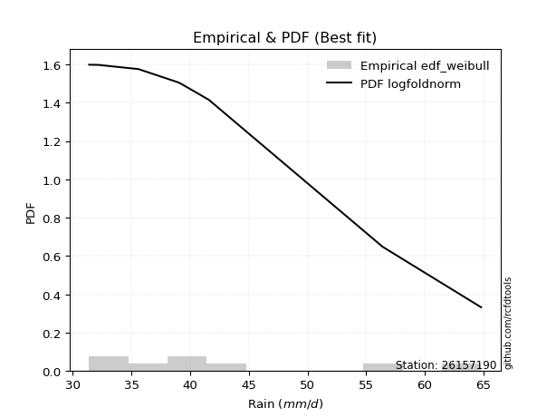</img>

</div>


### 4. EDF Beard (1943)

The Beard formula (or Beard´s plotting position formula) in hydrology is used to estimate the empirical non-exceedance probability _(P)_ of a flood event (or other extreme hydrological data point) within a given dataset.

<div align="center">


$P=(m-0.31)/(n+0.38)$


</div>


**4.1. Empirical values**

<div align="center">

|                | 0                   | 1                   | 2                  | 3                   | 4                  | 5                  | 6                  | 7                  |
|:---------------|:--------------------|:--------------------|:-------------------|:--------------------|:-------------------|:-------------------|:-------------------|:-------------------|
| date           | 2023                | 2017                | 2018               | 2020                | 2021               | 2022               | 2019               | 2025               |
| x              | 31.4                | 32.2                | 35.6               | 39.0                | 39.2               | 41.6               | 56.4               | 64.8               |
| m              | 1                   | 2                   | 3                  | 4                   | 5                  | 6                  | 7                  | 8                  |
| empirical_dist | edf_beard           | edf_beard           | edf_beard          | edf_beard           | edf_beard          | edf_beard          | edf_beard          | edf_beard          |
| empirical      | 0.08233890214797135 | 0.20167064439140808 | 0.3210023866348448 | 0.44033412887828155 | 0.5596658711217184 | 0.6789976133651551 | 0.7983293556085919 | 0.9176610978520287 |
| empirical_tr   | 1.0897269180754225  | 1.2526158445440956  | 1.4727592267135323 | 1.7867803837953091  | 2.2710027100271004 | 3.115241635687732  | 4.958579881656804  | 12.144927536231886 |

</div>


**4.2. Kolmogorov-Smirnov fit test (sorted by Δ)**


<div align="center">

|                | 0                   | 1                   | 2                  | 3                   | 4                   | 5                   | 6                   | 7                   | 8                   | 9                   | 10                  | 11                  | 12                  | 13                  | 14                  | 15                  | 16                  | 17                  | 18                  | 19                  | 20                  | 21                 | 22                  | 23                  | 24                  | 25                  | 26                  | 27                  | 28                  | 29                  | 30                  | 31                 | 32                  | 33                  | 34                  | 35                  | 36                  | 37                  | 38                  | 39                 | 40                  | 41                  | 42                 | 43                  | 44                  | 45                  | 46                  | 47                  | 48                  | 49                  | 50                  | 51                  | 52                 | 53                  | 54                  | 55                  | 56                  | 57                  | 58                  | 59                 | 60                  | 61                 | 62                  | 63                  | 64                 | 65                  | 66                  | 67                  | 68                  | 69                  | 70                  | 71                 | 72                  | 73                  | 74                  | 75                  | 76                  | 77                  | 78                  | 79                  | 80                  | 81                  | 82                  | 83                  | 84                 | 85                  | 86                 | 87                  | 88                 | 89                  | 90                 | 91                  | 92                  | 93                  | 94                 | 95                 | 96                  | 97                  | 98                  | 99                  | 100                 | 101                 | 102                 | 103                 | 104                | 105                 | 106                 | 107                 | 108                | 109                 | 110                 | 111                 | 112                | 113                | 114                 | 115                 | 116                 | 117                | 118                | 119                 | 120                 | 121                 | 122                | 123                | 124                | 125                | 126                | 127                | 128                | 129                | 130                | 131                | 132                | 133                 | 134                 | 135                 | 136                | 137                 | 138                 | 139                | 140                 | 141                | 142                 | 143                 | 144                | 145                 | 146                | 147                 | 148                 | 149                | 150                 | 151                | 152                | 153                | 154                | 155                | 156                | 157                | 158                | 159                |
|:---------------|:--------------------|:--------------------|:-------------------|:--------------------|:--------------------|:--------------------|:--------------------|:--------------------|:--------------------|:--------------------|:--------------------|:--------------------|:--------------------|:--------------------|:--------------------|:--------------------|:--------------------|:--------------------|:--------------------|:--------------------|:--------------------|:-------------------|:--------------------|:--------------------|:--------------------|:--------------------|:--------------------|:--------------------|:--------------------|:--------------------|:--------------------|:-------------------|:--------------------|:--------------------|:--------------------|:--------------------|:--------------------|:--------------------|:--------------------|:-------------------|:--------------------|:--------------------|:-------------------|:--------------------|:--------------------|:--------------------|:--------------------|:--------------------|:--------------------|:--------------------|:--------------------|:--------------------|:-------------------|:--------------------|:--------------------|:--------------------|:--------------------|:--------------------|:--------------------|:-------------------|:--------------------|:-------------------|:--------------------|:--------------------|:-------------------|:--------------------|:--------------------|:--------------------|:--------------------|:--------------------|:--------------------|:-------------------|:--------------------|:--------------------|:--------------------|:--------------------|:--------------------|:--------------------|:--------------------|:--------------------|:--------------------|:--------------------|:--------------------|:--------------------|:-------------------|:--------------------|:-------------------|:--------------------|:-------------------|:--------------------|:-------------------|:--------------------|:--------------------|:--------------------|:-------------------|:-------------------|:--------------------|:--------------------|:--------------------|:--------------------|:--------------------|:--------------------|:--------------------|:--------------------|:-------------------|:--------------------|:--------------------|:--------------------|:-------------------|:--------------------|:--------------------|:--------------------|:-------------------|:-------------------|:--------------------|:--------------------|:--------------------|:-------------------|:-------------------|:--------------------|:--------------------|:--------------------|:-------------------|:-------------------|:-------------------|:-------------------|:-------------------|:-------------------|:-------------------|:-------------------|:-------------------|:-------------------|:-------------------|:--------------------|:--------------------|:--------------------|:-------------------|:--------------------|:--------------------|:-------------------|:--------------------|:-------------------|:--------------------|:--------------------|:-------------------|:--------------------|:-------------------|:--------------------|:--------------------|:-------------------|:--------------------|:-------------------|:-------------------|:-------------------|:-------------------|:-------------------|:-------------------|:-------------------|:-------------------|:-------------------|
| station        | 26157190            | 26157190            | 26157190           | 26157190            | 26157190            | 26157190            | 26157190            | 26157190            | 26157190            | 26157190            | 26157190            | 26157190            | 26157190            | 26157190            | 26157190            | 26157190            | 26157190            | 26157190            | 26157190            | 26157190            | 26157190            | 26157190           | 26157190            | 26157190            | 26157190            | 26157190            | 26157190            | 26157190            | 26157190            | 26157190            | 26157190            | 26157190           | 26157190            | 26157190            | 26157190            | 26157190            | 26157190            | 26157190            | 26157190            | 26157190           | 26157190            | 26157190            | 26157190           | 26157190            | 26157190            | 26157190            | 26157190            | 26157190            | 26157190            | 26157190            | 26157190            | 26157190            | 26157190           | 26157190            | 26157190            | 26157190            | 26157190            | 26157190            | 26157190            | 26157190           | 26157190            | 26157190           | 26157190            | 26157190            | 26157190           | 26157190            | 26157190            | 26157190            | 26157190            | 26157190            | 26157190            | 26157190           | 26157190            | 26157190            | 26157190            | 26157190            | 26157190            | 26157190            | 26157190            | 26157190            | 26157190            | 26157190            | 26157190            | 26157190            | 26157190           | 26157190            | 26157190           | 26157190            | 26157190           | 26157190            | 26157190           | 26157190            | 26157190            | 26157190            | 26157190           | 26157190           | 26157190            | 26157190            | 26157190            | 26157190            | 26157190            | 26157190            | 26157190            | 26157190            | 26157190           | 26157190            | 26157190            | 26157190            | 26157190           | 26157190            | 26157190            | 26157190            | 26157190           | 26157190           | 26157190            | 26157190            | 26157190            | 26157190           | 26157190           | 26157190            | 26157190            | 26157190            | 26157190           | 26157190           | 26157190           | 26157190           | 26157190           | 26157190           | 26157190           | 26157190           | 26157190           | 26157190           | 26157190           | 26157190            | 26157190            | 26157190            | 26157190           | 26157190            | 26157190            | 26157190           | 26157190            | 26157190           | 26157190            | 26157190            | 26157190           | 26157190            | 26157190           | 26157190            | 26157190            | 26157190           | 26157190            | 26157190           | 26157190           | 26157190           | 26157190           | 26157190           | 26157190           | 26157190           | 26157190           | 26157190           |
| empirical_dist | edf_beard           | edf_beard           | edf_beard          | edf_beard           | edf_beard           | edf_beard           | edf_beard           | edf_beard           | edf_beard           | edf_beard           | edf_beard           | edf_beard           | edf_beard           | edf_beard           | edf_beard           | edf_beard           | edf_beard           | edf_beard           | edf_beard           | edf_beard           | edf_beard           | edf_beard          | edf_beard           | edf_beard           | edf_beard           | edf_beard           | edf_beard           | edf_beard           | edf_beard           | edf_beard           | edf_beard           | edf_beard          | edf_beard           | edf_beard           | edf_beard           | edf_beard           | edf_beard           | edf_beard           | edf_beard           | edf_beard          | edf_beard           | edf_beard           | edf_beard          | edf_beard           | edf_beard           | edf_beard           | edf_beard           | edf_beard           | edf_beard           | edf_beard           | edf_beard           | edf_beard           | edf_beard          | edf_beard           | edf_beard           | edf_beard           | edf_beard           | edf_beard           | edf_beard           | edf_beard          | edf_beard           | edf_beard          | edf_beard           | edf_beard           | edf_beard          | edf_beard           | edf_beard           | edf_beard           | edf_beard           | edf_beard           | edf_beard           | edf_beard          | edf_beard           | edf_beard           | edf_beard           | edf_beard           | edf_beard           | edf_beard           | edf_beard           | edf_beard           | edf_beard           | edf_beard           | edf_beard           | edf_beard           | edf_beard          | edf_beard           | edf_beard          | edf_beard           | edf_beard          | edf_beard           | edf_beard          | edf_beard           | edf_beard           | edf_beard           | edf_beard          | edf_beard          | edf_beard           | edf_beard           | edf_beard           | edf_beard           | edf_beard           | edf_beard           | edf_beard           | edf_beard           | edf_beard          | edf_beard           | edf_beard           | edf_beard           | edf_beard          | edf_beard           | edf_beard           | edf_beard           | edf_beard          | edf_beard          | edf_beard           | edf_beard           | edf_beard           | edf_beard          | edf_beard          | edf_beard           | edf_beard           | edf_beard           | edf_beard          | edf_beard          | edf_beard          | edf_beard          | edf_beard          | edf_beard          | edf_beard          | edf_beard          | edf_beard          | edf_beard          | edf_beard          | edf_beard           | edf_beard           | edf_beard           | edf_beard          | edf_beard           | edf_beard           | edf_beard          | edf_beard           | edf_beard          | edf_beard           | edf_beard           | edf_beard          | edf_beard           | edf_beard          | edf_beard           | edf_beard           | edf_beard          | edf_beard           | edf_beard          | edf_beard          | edf_beard          | edf_beard          | edf_beard          | edf_beard          | edf_beard          | edf_beard          | edf_beard          |
| p_dist         | logbeta             | logmielke           | loghalfnorm        | gengamma            | loginvweibull       | loggenextreme       | logburr             | alpha               | loginvgamma         | logf                | loggumbel_r         | logmoyal            | logburr12           | burr                | burr12              | invgamma            | f                   | logkstwobign        | loghalflogistic     | invweibull          | genextreme          | dweibull           | nakagami            | halflogistic        | loggengamma         | beta                | logexponnorm        | loggenlogistic      | mielke              | logweibull_max      | logdweibull         | logpearson3        | logfoldnorm         | moyal               | logexponweib        | lograyleigh         | loggenexpon         | genlogistic         | loginvgauss         | logalpha           | logjohnsonsu        | loggompertz         | lomax              | invgauss            | logloglaplace       | exponnorm           | logmaxwell          | genexpon            | gompertz            | truncnorm           | dgamma              | nct                 | vonmises_line      | halfnorm            | loghalfgennorm      | logtruncnorm        | foldnorm            | logdgamma           | logexponpow         | loggennorm         | logkappa3           | erlang             | gumbel_r            | gennorm             | lognct             | johnsonsu           | logrice             | truncpareto         | logskewnorm         | pearson3            | betaprime           | genhalflogistic    | ncf                 | truncweibull_min    | kstwobign           | logtruncexpon       | logbetaprime        | logfatiguelife      | loglogistic         | loghypsecant        | lognorm             | logcrystalball      | logt                | logloggamma         | rayleigh           | loganglit           | logsemicircular    | logarcsine          | maxwell            | exponpow            | fatiguelife        | exponweib           | loggausshyper       | logweibull_min      | loglaplace         | loglaplace         | skewnorm            | weibull_min         | arcsine             | wald                | logtruncweibull_min | logwald             | logbradford         | semicircular        | logcosine          | rice                | anglit              | logncf              | crystalball        | norm                | t                   | logistic            | logwrapcauchy      | hypsecant          | lognakagami         | triang              | loggumbel_l         | laplace            | genpareto          | logkappa4           | loggamma            | loggamma            | halfgennorm        | truncexpon         | cosine             | gausshyper         | wrapcauchy         | logksone           | gumbel_l           | logargus           | loguniform         | bradford           | logvonmises_line   | logerlang           | logrdist            | logtukeylambda      | tukeylambda        | rdist               | loglevy_l           | johnsonsb          | logtriang           | ksone              | argus               | levy_l              | kappa4             | uniform             | kappa3             | powerlaw            | loggenpareto        | gamma              | loggenhalflogistic  | logpowerlaw        | logtruncpareto     | logtrapezoid       | weibull_max        | trapezoid          | loglomax           | logjohnsonsb       | logvonmises        | vonmises           |
| delta          | 0.08744345217242394 | 0.08890034645935446 | 0.0914281157236102 | 0.09221050652184626 | 0.09764470728283196 | 0.09765055318829442 | 0.09786683260402429 | 0.09786848922393382 | 0.09979233699783091 | 0.09979328492638523 | 0.10091020682551222 | 0.10401122555163535 | 0.10453580326173956 | 0.10470148511448885 | 0.10566878935731892 | 0.10795761838393564 | 0.10800055022113592 | 0.10874506449142485 | 0.10890702711421199 | 0.10939472813964884 | 0.10939508584145446 | 0.1100089805663208 | 0.11089640889412744 | 0.11100669350448222 | 0.11202154273861176 | 0.11209810766121098 | 0.11213360261214106 | 0.11354961885061754 | 0.11368069472462639 | 0.11444821433025709 | 0.11495131042371942 | 0.1149996079840635 | 0.11580818588220476 | 0.11780330916368664 | 0.12041673098350875 | 0.12150918662653654 | 0.12419163433118179 | 0.12437096762732569 | 0.12463604754435492 | 0.1251204089697997 | 0.12642925904656005 | 0.12803744247733828 | 0.1295438139876952 | 0.12985095197561541 | 0.13115087326853148 | 0.13157773298509995 | 0.13219418882666267 | 0.13228494120138795 | 0.13230622185963617 | 0.13245897274447366 | 0.13277579662515515 | 0.13343711925633117 | 0.1335420192235356 | 0.13358181786205747 | 0.13406216999202225 | 0.13430277918284556 | 0.13472130329467957 | 0.13708221578839652 | 0.13729909610952362 | 0.1386207734887428 | 0.13971197965977533 | 0.1419831951246125 | 0.14352236135850283 | 0.14414088454232865 | 0.1441919966156079 | 0.14441232214388827 | 0.14473941951414937 | 0.14528586087696688 | 0.14656454738326474 | 0.14682416530430176 | 0.15208949991034515 | 0.154481728997392  | 0.15516803418518843 | 0.15525334740759678 | 0.15728234063789082 | 0.16149854028772692 | 0.16242935380270296 | 0.16249483383384217 | 0.16265047974030145 | 0.16298869035307412 | 0.16461349967089056 | 0.16461354094599046 | 0.16461540271491926 | 0.16601095025320933 | 0.1664065786081642 | 0.16667116275613925 | 0.1675188854284534 | 0.17087935327555648 | 0.1780506125401431 | 0.17918758655605138 | 0.1807119188027158 | 0.18083803974966223 | 0.18521635709280776 | 0.18787016129824585 | 0.1883342110563634 | 0.1883342110563634 | 0.19590594213292645 | 0.19641386676824252 | 0.19771128210154693 | 0.20113425806440924 | 0.20148833134854982 | 0.20167064439140808 | 0.20214932990802315 | 0.20543982574786146 | 0.2071506590990433 | 0.20716467236016167 | 0.20738682766029365 | 0.20764191596706966 | 0.2121094002746463 | 0.21210940215638868 | 0.21211040054537145 | 0.21660562434598057 | 0.2176629555714923 | 0.2204273777807601 | 0.22176315015155057 | 0.23084819052933964 | 0.23441316278282076 | 0.2344332824023902 | 0.2372351524418559 | 0.23910279531284784 | 0.25313678072841134 | 0.25313678072841134 | 0.2566915832769313 | 0.2631844350314008 | 0.2638947286151905 | 0.2646150897572743 | 0.265764124367667  | 0.2721156680095064 | 0.2826834689035821 | 0.2906357164429728 | 0.2907392789383763 | 0.2910520388838877 | 0.294086457151953  | 0.29972756943020246 | 0.30730476665006445 | 0.31846959907229444 | 0.3210023328972865 | 0.32100238662424196 | 0.32307745890468953 | 0.3259003176541888 | 0.33820389626344993 | 0.3411732620677498 | 0.34267223702764904 | 0.34456082822423195 | 0.3503571340851298 | 0.37360839180826877 | 0.3743124718107012 | 0.38159922413503544 | 0.38403461818585183 | 0.4008928376006379 | 0.40424059128374545 | 0.4044476497801688 | 0.4884428700870145 | 0.513444695908758  | 0.5421692091944321 | 0.5648723210356423 | 0.6509782707730343 | 0.6709614504261249 | 1.106165452797176  | 9.835591415983016  |
| deltao         | 0.4472608134160001  | 0.4472608134160001  | 0.4472608134160001 | 0.4472608134160001  | 0.4472608134160001  | 0.4472608134160001  | 0.4472608134160001  | 0.4472608134160001  | 0.4472608134160001  | 0.4472608134160001  | 0.4472608134160001  | 0.4472608134160001  | 0.4472608134160001  | 0.4472608134160001  | 0.4472608134160001  | 0.4472608134160001  | 0.4472608134160001  | 0.4472608134160001  | 0.4472608134160001  | 0.4472608134160001  | 0.4472608134160001  | 0.4472608134160001 | 0.4472608134160001  | 0.4472608134160001  | 0.4472608134160001  | 0.4472608134160001  | 0.4472608134160001  | 0.4472608134160001  | 0.4472608134160001  | 0.4472608134160001  | 0.4472608134160001  | 0.4472608134160001 | 0.4472608134160001  | 0.4472608134160001  | 0.4472608134160001  | 0.4472608134160001  | 0.4472608134160001  | 0.4472608134160001  | 0.4472608134160001  | 0.4472608134160001 | 0.4472608134160001  | 0.4472608134160001  | 0.4472608134160001 | 0.4472608134160001  | 0.4472608134160001  | 0.4472608134160001  | 0.4472608134160001  | 0.4472608134160001  | 0.4472608134160001  | 0.4472608134160001  | 0.4472608134160001  | 0.4472608134160001  | 0.4472608134160001 | 0.4472608134160001  | 0.4472608134160001  | 0.4472608134160001  | 0.4472608134160001  | 0.4472608134160001  | 0.4472608134160001  | 0.4472608134160001 | 0.4472608134160001  | 0.4472608134160001 | 0.4472608134160001  | 0.4472608134160001  | 0.4472608134160001 | 0.4472608134160001  | 0.4472608134160001  | 0.4472608134160001  | 0.4472608134160001  | 0.4472608134160001  | 0.4472608134160001  | 0.4472608134160001 | 0.4472608134160001  | 0.4472608134160001  | 0.4472608134160001  | 0.4472608134160001  | 0.4472608134160001  | 0.4472608134160001  | 0.4472608134160001  | 0.4472608134160001  | 0.4472608134160001  | 0.4472608134160001  | 0.4472608134160001  | 0.4472608134160001  | 0.4472608134160001 | 0.4472608134160001  | 0.4472608134160001 | 0.4472608134160001  | 0.4472608134160001 | 0.4472608134160001  | 0.4472608134160001 | 0.4472608134160001  | 0.4472608134160001  | 0.4472608134160001  | 0.4472608134160001 | 0.4472608134160001 | 0.4472608134160001  | 0.4472608134160001  | 0.4472608134160001  | 0.4472608134160001  | 0.4472608134160001  | 0.4472608134160001  | 0.4472608134160001  | 0.4472608134160001  | 0.4472608134160001 | 0.4472608134160001  | 0.4472608134160001  | 0.4472608134160001  | 0.4472608134160001 | 0.4472608134160001  | 0.4472608134160001  | 0.4472608134160001  | 0.4472608134160001 | 0.4472608134160001 | 0.4472608134160001  | 0.4472608134160001  | 0.4472608134160001  | 0.4472608134160001 | 0.4472608134160001 | 0.4472608134160001  | 0.4472608134160001  | 0.4472608134160001  | 0.4472608134160001 | 0.4472608134160001 | 0.4472608134160001 | 0.4472608134160001 | 0.4472608134160001 | 0.4472608134160001 | 0.4472608134160001 | 0.4472608134160001 | 0.4472608134160001 | 0.4472608134160001 | 0.4472608134160001 | 0.4472608134160001  | 0.4472608134160001  | 0.4472608134160001  | 0.4472608134160001 | 0.4472608134160001  | 0.4472608134160001  | 0.4472608134160001 | 0.4472608134160001  | 0.4472608134160001 | 0.4472608134160001  | 0.4472608134160001  | 0.4472608134160001 | 0.4472608134160001  | 0.4472608134160001 | 0.4472608134160001  | 0.4472608134160001  | 0.4472608134160001 | 0.4472608134160001  | 0.4472608134160001 | 0.4472608134160001 | 0.4472608134160001 | 0.4472608134160001 | 0.4472608134160001 | 0.4472608134160001 | 0.4472608134160001 | 0.4472608134160001 | 0.4472608134160001 |
| eval           | Δo > Δ              | Δo > Δ              | Δo > Δ             | Δo > Δ              | Δo > Δ              | Δo > Δ              | Δo > Δ              | Δo > Δ              | Δo > Δ              | Δo > Δ              | Δo > Δ              | Δo > Δ              | Δo > Δ              | Δo > Δ              | Δo > Δ              | Δo > Δ              | Δo > Δ              | Δo > Δ              | Δo > Δ              | Δo > Δ              | Δo > Δ              | Δo > Δ             | Δo > Δ              | Δo > Δ              | Δo > Δ              | Δo > Δ              | Δo > Δ              | Δo > Δ              | Δo > Δ              | Δo > Δ              | Δo > Δ              | Δo > Δ             | Δo > Δ              | Δo > Δ              | Δo > Δ              | Δo > Δ              | Δo > Δ              | Δo > Δ              | Δo > Δ              | Δo > Δ             | Δo > Δ              | Δo > Δ              | Δo > Δ             | Δo > Δ              | Δo > Δ              | Δo > Δ              | Δo > Δ              | Δo > Δ              | Δo > Δ              | Δo > Δ              | Δo > Δ              | Δo > Δ              | Δo > Δ             | Δo > Δ              | Δo > Δ              | Δo > Δ              | Δo > Δ              | Δo > Δ              | Δo > Δ              | Δo > Δ             | Δo > Δ              | Δo > Δ             | Δo > Δ              | Δo > Δ              | Δo > Δ             | Δo > Δ              | Δo > Δ              | Δo > Δ              | Δo > Δ              | Δo > Δ              | Δo > Δ              | Δo > Δ             | Δo > Δ              | Δo > Δ              | Δo > Δ              | Δo > Δ              | Δo > Δ              | Δo > Δ              | Δo > Δ              | Δo > Δ              | Δo > Δ              | Δo > Δ              | Δo > Δ              | Δo > Δ              | Δo > Δ             | Δo > Δ              | Δo > Δ             | Δo > Δ              | Δo > Δ             | Δo > Δ              | Δo > Δ             | Δo > Δ              | Δo > Δ              | Δo > Δ              | Δo > Δ             | Δo > Δ             | Δo > Δ              | Δo > Δ              | Δo > Δ              | Δo > Δ              | Δo > Δ              | Δo > Δ              | Δo > Δ              | Δo > Δ              | Δo > Δ             | Δo > Δ              | Δo > Δ              | Δo > Δ              | Δo > Δ             | Δo > Δ              | Δo > Δ              | Δo > Δ              | Δo > Δ             | Δo > Δ             | Δo > Δ              | Δo > Δ              | Δo > Δ              | Δo > Δ             | Δo > Δ             | Δo > Δ              | Δo > Δ              | Δo > Δ              | Δo > Δ             | Δo > Δ             | Δo > Δ             | Δo > Δ             | Δo > Δ             | Δo > Δ             | Δo > Δ             | Δo > Δ             | Δo > Δ             | Δo > Δ             | Δo > Δ             | Δo > Δ              | Δo > Δ              | Δo > Δ              | Δo > Δ             | Δo > Δ              | Δo > Δ              | Δo > Δ             | Δo > Δ              | Δo > Δ             | Δo > Δ              | Δo > Δ              | Δo > Δ             | Δo > Δ              | Δo > Δ             | Δo > Δ              | Δo > Δ              | Δo > Δ             | Δo > Δ              | Δo > Δ             | Δo <= Δ            | Δo <= Δ            | Δo <= Δ            | Δo <= Δ            | Δo <= Δ            | Δo <= Δ            | Δo <= Δ            | Δo <= Δ            |
| fit            | 1                   | 1                   | 1                  | 1                   | 1                   | 1                   | 1                   | 1                   | 1                   | 1                   | 1                   | 1                   | 1                   | 1                   | 1                   | 1                   | 1                   | 1                   | 1                   | 1                   | 1                   | 1                  | 1                   | 1                   | 1                   | 1                   | 1                   | 1                   | 1                   | 1                   | 1                   | 1                  | 1                   | 1                   | 1                   | 1                   | 1                   | 1                   | 1                   | 1                  | 1                   | 1                   | 1                  | 1                   | 1                   | 1                   | 1                   | 1                   | 1                   | 1                   | 1                   | 1                   | 1                  | 1                   | 1                   | 1                   | 1                   | 1                   | 1                   | 1                  | 1                   | 1                  | 1                   | 1                   | 1                  | 1                   | 1                   | 1                   | 1                   | 1                   | 1                   | 1                  | 1                   | 1                   | 1                   | 1                   | 1                   | 1                   | 1                   | 1                   | 1                   | 1                   | 1                   | 1                   | 1                  | 1                   | 1                  | 1                   | 1                  | 1                   | 1                  | 1                   | 1                   | 1                   | 1                  | 1                  | 1                   | 1                   | 1                   | 1                   | 1                   | 1                   | 1                   | 1                   | 1                  | 1                   | 1                   | 1                   | 1                  | 1                   | 1                   | 1                   | 1                  | 1                  | 1                   | 1                   | 1                   | 1                  | 1                  | 1                   | 1                   | 1                   | 1                  | 1                  | 1                  | 1                  | 1                  | 1                  | 1                  | 1                  | 1                  | 1                  | 1                  | 1                   | 1                   | 1                   | 1                  | 1                   | 1                   | 1                  | 1                   | 1                  | 1                   | 1                   | 1                  | 1                   | 1                  | 1                   | 1                   | 1                  | 1                   | 1                  | 0                  | 0                  | 0                  | 0                  | 0                  | 0                  | 0                  | 0                  |
| n              | 8                   | 8                   | 8                  | 8                   | 8                   | 8                   | 8                   | 8                   | 8                   | 8                   | 8                   | 8                   | 8                   | 8                   | 8                   | 8                   | 8                   | 8                   | 8                   | 8                   | 8                   | 8                  | 8                   | 8                   | 8                   | 8                   | 8                   | 8                   | 8                   | 8                   | 8                   | 8                  | 8                   | 8                   | 8                   | 8                   | 8                   | 8                   | 8                   | 8                  | 8                   | 8                   | 8                  | 8                   | 8                   | 8                   | 8                   | 8                   | 8                   | 8                   | 8                   | 8                   | 8                  | 8                   | 8                   | 8                   | 8                   | 8                   | 8                   | 8                  | 8                   | 8                  | 8                   | 8                   | 8                  | 8                   | 8                   | 8                   | 8                   | 8                   | 8                   | 8                  | 8                   | 8                   | 8                   | 8                   | 8                   | 8                   | 8                   | 8                   | 8                   | 8                   | 8                   | 8                   | 8                  | 8                   | 8                  | 8                   | 8                  | 8                   | 8                  | 8                   | 8                   | 8                   | 8                  | 8                  | 8                   | 8                   | 8                   | 8                   | 8                   | 8                   | 8                   | 8                   | 8                  | 8                   | 8                   | 8                   | 8                  | 8                   | 8                   | 8                   | 8                  | 8                  | 8                   | 8                   | 8                   | 8                  | 8                  | 8                   | 8                   | 8                   | 8                  | 8                  | 8                  | 8                  | 8                  | 8                  | 8                  | 8                  | 8                  | 8                  | 8                  | 8                   | 8                   | 8                   | 8                  | 8                   | 8                   | 8                  | 8                   | 8                  | 8                   | 8                   | 8                  | 8                   | 8                  | 8                   | 8                   | 8                  | 8                   | 8                  | 8                  | 8                  | 8                  | 8                  | 8                  | 8                  | 8                  | 8                  |
| best_fit       | 1                   | 0                   | 0                  | 0                   | 0                   | 0                   | 0                   | 0                   | 0                   | 0                   | 0                   | 0                   | 0                   | 0                   | 0                   | 0                   | 0                   | 0                   | 0                   | 0                   | 0                   | 0                  | 0                   | 0                   | 0                   | 0                   | 0                   | 0                   | 0                   | 0                   | 0                   | 0                  | 0                   | 0                   | 0                   | 0                   | 0                   | 0                   | 0                   | 0                  | 0                   | 0                   | 0                  | 0                   | 0                   | 0                   | 0                   | 0                   | 0                   | 0                   | 0                   | 0                   | 0                  | 0                   | 0                   | 0                   | 0                   | 0                   | 0                   | 0                  | 0                   | 0                  | 0                   | 0                   | 0                  | 0                   | 0                   | 0                   | 0                   | 0                   | 0                   | 0                  | 0                   | 0                   | 0                   | 0                   | 0                   | 0                   | 0                   | 0                   | 0                   | 0                   | 0                   | 0                   | 0                  | 0                   | 0                  | 0                   | 0                  | 0                   | 0                  | 0                   | 0                   | 0                   | 0                  | 0                  | 0                   | 0                   | 0                   | 0                   | 0                   | 0                   | 0                   | 0                   | 0                  | 0                   | 0                   | 0                   | 0                  | 0                   | 0                   | 0                   | 0                  | 0                  | 0                   | 0                   | 0                   | 0                  | 0                  | 0                   | 0                   | 0                   | 0                  | 0                  | 0                  | 0                  | 0                  | 0                  | 0                  | 0                  | 0                  | 0                  | 0                  | 0                   | 0                   | 0                   | 0                  | 0                   | 0                   | 0                  | 0                   | 0                  | 0                   | 0                   | 0                  | 0                   | 0                  | 0                   | 0                   | 0                  | 0                   | 0                  | 0                  | 0                  | 0                  | 0                  | 0                  | 0                  | 0                  | 0                  |
| best_fit_sort  | 1                   | 2                   | 3                  | 4                   | 5                   | 6                   | 7                   | 8                   | 9                   | 10                  | 11                  | 12                  | 13                  | 14                  | 15                  | 16                  | 17                  | 18                  | 19                  | 20                  | 21                  | 22                 | 23                  | 24                  | 25                  | 26                  | 27                  | 28                  | 29                  | 30                  | 31                  | 32                 | 33                  | 34                  | 35                  | 36                  | 37                  | 38                  | 39                  | 40                 | 41                  | 42                  | 43                 | 44                  | 45                  | 46                  | 47                  | 48                  | 49                  | 50                  | 51                  | 52                  | 53                 | 54                  | 55                  | 56                  | 57                  | 58                  | 59                  | 60                 | 61                  | 62                 | 63                  | 64                  | 65                 | 66                  | 67                  | 68                  | 69                  | 70                  | 71                  | 72                 | 73                  | 74                  | 75                  | 76                  | 77                  | 78                  | 79                  | 80                  | 81                  | 82                  | 83                  | 84                  | 85                 | 86                  | 87                 | 88                  | 89                 | 90                  | 91                 | 92                  | 93                  | 94                  | 95                 | 96                 | 97                  | 98                  | 99                  | 100                 | 101                 | 102                 | 103                 | 104                 | 105                | 106                 | 107                 | 108                 | 109                | 110                 | 111                 | 112                 | 113                | 114                | 115                 | 116                 | 117                 | 118                | 119                | 120                 | 121                 | 122                 | 123                | 124                | 125                | 126                | 127                | 128                | 129                | 130                | 131                | 132                | 133                | 134                 | 135                 | 136                 | 137                | 138                 | 139                 | 140                | 141                 | 142                | 143                 | 144                 | 145                | 146                 | 147                | 148                 | 149                 | 150                | 151                 | 152                | 153                | 154                | 155                | 156                | 157                | 158                | 159                | 160                |

</div>


**4.3. Best fit**

<div align="center">

|   id |   station | empirical_dist   | p_dist   |     delta |   deltao | eval   |   fit |   n |   best_fit |   best_fit_sort |
|-----:|----------:|:-----------------|:---------|----------:|---------:|:-------|------:|----:|-----------:|----------------:|
|    0 |  26157190 | edf_beard        | logbeta  | 0.0874435 | 0.447261 | Δo > Δ |     1 |   8 |          1 |               1 |

</div>


<div align="center">

</img>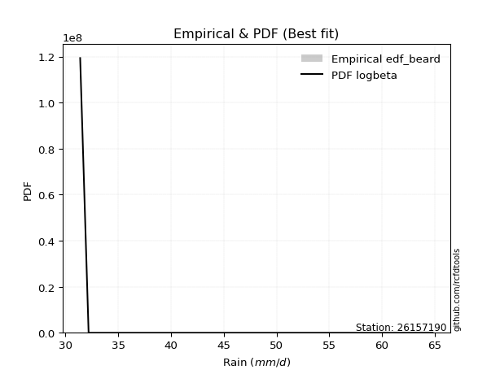</img>

</div>


### 5. EDF Chegodayev (1955)

The Chegodayev formula is an empirical plotting position formula used in hydrological frequency analysis to estimate the exceedance probability or return period of a specific event from a set of observed data. It is primarily used for plotting observed data points on probability paper to fit a theoretical distribution, particularly for analyzing extreme events like maximum flood flows or rainfall intensities. The constant _b_ value in the generalized plotting position formula is 0.3.

<div align="center">


$P=(m-b)/(n+1-2b)$


</div>


**5.1. Empirical values**

<div align="center">

|                | 0                   | 1                   | 2                   | 3                   | 4                  | 5                  | 6                  | 7                  |
|:---------------|:--------------------|:--------------------|:--------------------|:--------------------|:-------------------|:-------------------|:-------------------|:-------------------|
| date           | 2023                | 2017                | 2018                | 2020                | 2021               | 2022               | 2019               | 2025               |
| x              | 31.4                | 32.2                | 35.6                | 39.0                | 39.2               | 41.6               | 56.4               | 64.8               |
| m              | 1                   | 2                   | 3                   | 4                   | 5                  | 6                  | 7                  | 8                  |
| empirical_dist | edf_chegodayev      | edf_chegodayev      | edf_chegodayev      | edf_chegodayev      | edf_chegodayev     | edf_chegodayev     | edf_chegodayev     | edf_chegodayev     |
| empirical      | 0.08333333333333333 | 0.20238095238095236 | 0.32142857142857145 | 0.44047619047619047 | 0.5595238095238095 | 0.6785714285714286 | 0.7976190476190476 | 0.9166666666666666 |
| empirical_tr   | 1.090909090909091   | 1.253731343283582   | 1.4736842105263157  | 1.7872340425531914  | 2.27027027027027   | 3.1111111111111116 | 4.941176470588234  | 11.999999999999995 |

</div>


**5.2. Kolmogorov-Smirnov fit test (sorted by Δ)**


<div align="center">

|                | 0                  | 1                   | 2                   | 3                   | 4                   | 5                  | 6                   | 7                   | 8                   | 9                   | 10                  | 11                  | 12                  | 13                  | 14                 | 15                  | 16                 | 17                  | 18                  | 19                  | 20                  | 21                  | 22                  | 23                  | 24                  | 25                  | 26                  | 27                  | 28                  | 29                  | 30                  | 31                  | 32                  | 33                  | 34                  | 35                  | 36                  | 37                 | 38                  | 39                 | 40                  | 41                  | 42                 | 43                  | 44                 | 45                  | 46                  | 47                  | 48                 | 49                  | 50                 | 51                  | 52                  | 53                 | 54                 | 55                 | 56                  | 57                  | 58                  | 59                  | 60                  | 61                  | 62                  | 63                  | 64                  | 65                 | 66                  | 67                  | 68                 | 69                  | 70                  | 71                  | 72                 | 73                  | 74                  | 75                  | 76                 | 77                  | 78                  | 79                  | 80                 | 81                  | 82                 | 83                  | 84                  | 85                  | 86                  | 87                 | 88                  | 89                 | 90                  | 91                 | 92                 | 93                  | 94                  | 95                  | 96                  | 97                 | 98                  | 99                  | 100                 | 101                | 102                 | 103                | 104                | 105                 | 106                | 107                 | 108                 | 109                | 110                 | 111                | 112                 | 113                 | 114                 | 115                 | 116                | 117                 | 118                 | 119                 | 120                | 121                | 122                | 123                 | 124                | 125                 | 126                 | 127                | 128                | 129                 | 130                 | 131                 | 132                | 133                 | 134                | 135                 | 136                | 137                 | 138                 | 139                | 140                 | 141                | 142                 | 143                | 144                 | 145                | 146                 | 147                | 148                 | 149                 | 150                | 151                 | 152                 | 153                | 154                | 155                | 156                | 157                | 158                | 159                |
|:---------------|:-------------------|:--------------------|:--------------------|:--------------------|:--------------------|:-------------------|:--------------------|:--------------------|:--------------------|:--------------------|:--------------------|:--------------------|:--------------------|:--------------------|:-------------------|:--------------------|:-------------------|:--------------------|:--------------------|:--------------------|:--------------------|:--------------------|:--------------------|:--------------------|:--------------------|:--------------------|:--------------------|:--------------------|:--------------------|:--------------------|:--------------------|:--------------------|:--------------------|:--------------------|:--------------------|:--------------------|:--------------------|:-------------------|:--------------------|:-------------------|:--------------------|:--------------------|:-------------------|:--------------------|:-------------------|:--------------------|:--------------------|:--------------------|:-------------------|:--------------------|:-------------------|:--------------------|:--------------------|:-------------------|:-------------------|:-------------------|:--------------------|:--------------------|:--------------------|:--------------------|:--------------------|:--------------------|:--------------------|:--------------------|:--------------------|:-------------------|:--------------------|:--------------------|:-------------------|:--------------------|:--------------------|:--------------------|:-------------------|:--------------------|:--------------------|:--------------------|:-------------------|:--------------------|:--------------------|:--------------------|:-------------------|:--------------------|:-------------------|:--------------------|:--------------------|:--------------------|:--------------------|:-------------------|:--------------------|:-------------------|:--------------------|:-------------------|:-------------------|:--------------------|:--------------------|:--------------------|:--------------------|:-------------------|:--------------------|:--------------------|:--------------------|:-------------------|:--------------------|:-------------------|:-------------------|:--------------------|:-------------------|:--------------------|:--------------------|:-------------------|:--------------------|:-------------------|:--------------------|:--------------------|:--------------------|:--------------------|:-------------------|:--------------------|:--------------------|:--------------------|:-------------------|:-------------------|:-------------------|:--------------------|:-------------------|:--------------------|:--------------------|:-------------------|:-------------------|:--------------------|:--------------------|:--------------------|:-------------------|:--------------------|:-------------------|:--------------------|:-------------------|:--------------------|:--------------------|:-------------------|:--------------------|:-------------------|:--------------------|:-------------------|:--------------------|:-------------------|:--------------------|:-------------------|:--------------------|:--------------------|:-------------------|:--------------------|:--------------------|:-------------------|:-------------------|:-------------------|:-------------------|:-------------------|:-------------------|:-------------------|
| station        | 26157190           | 26157190            | 26157190            | 26157190            | 26157190            | 26157190           | 26157190            | 26157190            | 26157190            | 26157190            | 26157190            | 26157190            | 26157190            | 26157190            | 26157190           | 26157190            | 26157190           | 26157190            | 26157190            | 26157190            | 26157190            | 26157190            | 26157190            | 26157190            | 26157190            | 26157190            | 26157190            | 26157190            | 26157190            | 26157190            | 26157190            | 26157190            | 26157190            | 26157190            | 26157190            | 26157190            | 26157190            | 26157190           | 26157190            | 26157190           | 26157190            | 26157190            | 26157190           | 26157190            | 26157190           | 26157190            | 26157190            | 26157190            | 26157190           | 26157190            | 26157190           | 26157190            | 26157190            | 26157190           | 26157190           | 26157190           | 26157190            | 26157190            | 26157190            | 26157190            | 26157190            | 26157190            | 26157190            | 26157190            | 26157190            | 26157190           | 26157190            | 26157190            | 26157190           | 26157190            | 26157190            | 26157190            | 26157190           | 26157190            | 26157190            | 26157190            | 26157190           | 26157190            | 26157190            | 26157190            | 26157190           | 26157190            | 26157190           | 26157190            | 26157190            | 26157190            | 26157190            | 26157190           | 26157190            | 26157190           | 26157190            | 26157190           | 26157190           | 26157190            | 26157190            | 26157190            | 26157190            | 26157190           | 26157190            | 26157190            | 26157190            | 26157190           | 26157190            | 26157190           | 26157190           | 26157190            | 26157190           | 26157190            | 26157190            | 26157190           | 26157190            | 26157190           | 26157190            | 26157190            | 26157190            | 26157190            | 26157190           | 26157190            | 26157190            | 26157190            | 26157190           | 26157190           | 26157190           | 26157190            | 26157190           | 26157190            | 26157190            | 26157190           | 26157190           | 26157190            | 26157190            | 26157190            | 26157190           | 26157190            | 26157190           | 26157190            | 26157190           | 26157190            | 26157190            | 26157190           | 26157190            | 26157190           | 26157190            | 26157190           | 26157190            | 26157190           | 26157190            | 26157190           | 26157190            | 26157190            | 26157190           | 26157190            | 26157190            | 26157190           | 26157190           | 26157190           | 26157190           | 26157190           | 26157190           | 26157190           |
| empirical_dist | edf_chegodayev     | edf_chegodayev      | edf_chegodayev      | edf_chegodayev      | edf_chegodayev      | edf_chegodayev     | edf_chegodayev      | edf_chegodayev      | edf_chegodayev      | edf_chegodayev      | edf_chegodayev      | edf_chegodayev      | edf_chegodayev      | edf_chegodayev      | edf_chegodayev     | edf_chegodayev      | edf_chegodayev     | edf_chegodayev      | edf_chegodayev      | edf_chegodayev      | edf_chegodayev      | edf_chegodayev      | edf_chegodayev      | edf_chegodayev      | edf_chegodayev      | edf_chegodayev      | edf_chegodayev      | edf_chegodayev      | edf_chegodayev      | edf_chegodayev      | edf_chegodayev      | edf_chegodayev      | edf_chegodayev      | edf_chegodayev      | edf_chegodayev      | edf_chegodayev      | edf_chegodayev      | edf_chegodayev     | edf_chegodayev      | edf_chegodayev     | edf_chegodayev      | edf_chegodayev      | edf_chegodayev     | edf_chegodayev      | edf_chegodayev     | edf_chegodayev      | edf_chegodayev      | edf_chegodayev      | edf_chegodayev     | edf_chegodayev      | edf_chegodayev     | edf_chegodayev      | edf_chegodayev      | edf_chegodayev     | edf_chegodayev     | edf_chegodayev     | edf_chegodayev      | edf_chegodayev      | edf_chegodayev      | edf_chegodayev      | edf_chegodayev      | edf_chegodayev      | edf_chegodayev      | edf_chegodayev      | edf_chegodayev      | edf_chegodayev     | edf_chegodayev      | edf_chegodayev      | edf_chegodayev     | edf_chegodayev      | edf_chegodayev      | edf_chegodayev      | edf_chegodayev     | edf_chegodayev      | edf_chegodayev      | edf_chegodayev      | edf_chegodayev     | edf_chegodayev      | edf_chegodayev      | edf_chegodayev      | edf_chegodayev     | edf_chegodayev      | edf_chegodayev     | edf_chegodayev      | edf_chegodayev      | edf_chegodayev      | edf_chegodayev      | edf_chegodayev     | edf_chegodayev      | edf_chegodayev     | edf_chegodayev      | edf_chegodayev     | edf_chegodayev     | edf_chegodayev      | edf_chegodayev      | edf_chegodayev      | edf_chegodayev      | edf_chegodayev     | edf_chegodayev      | edf_chegodayev      | edf_chegodayev      | edf_chegodayev     | edf_chegodayev      | edf_chegodayev     | edf_chegodayev     | edf_chegodayev      | edf_chegodayev     | edf_chegodayev      | edf_chegodayev      | edf_chegodayev     | edf_chegodayev      | edf_chegodayev     | edf_chegodayev      | edf_chegodayev      | edf_chegodayev      | edf_chegodayev      | edf_chegodayev     | edf_chegodayev      | edf_chegodayev      | edf_chegodayev      | edf_chegodayev     | edf_chegodayev     | edf_chegodayev     | edf_chegodayev      | edf_chegodayev     | edf_chegodayev      | edf_chegodayev      | edf_chegodayev     | edf_chegodayev     | edf_chegodayev      | edf_chegodayev      | edf_chegodayev      | edf_chegodayev     | edf_chegodayev      | edf_chegodayev     | edf_chegodayev      | edf_chegodayev     | edf_chegodayev      | edf_chegodayev      | edf_chegodayev     | edf_chegodayev      | edf_chegodayev     | edf_chegodayev      | edf_chegodayev     | edf_chegodayev      | edf_chegodayev     | edf_chegodayev      | edf_chegodayev     | edf_chegodayev      | edf_chegodayev      | edf_chegodayev     | edf_chegodayev      | edf_chegodayev      | edf_chegodayev     | edf_chegodayev     | edf_chegodayev     | edf_chegodayev     | edf_chegodayev     | edf_chegodayev     | edf_chegodayev     |
| p_dist         | logbeta            | logmielke           | loghalfnorm         | gengamma            | loginvweibull       | loggenextreme      | logburr             | alpha               | logf                | loginvgamma         | loggumbel_r         | logburr12           | logmoyal            | burr                | burr12             | invgamma            | f                  | dweibull            | invweibull          | genextreme          | logkstwobign        | loghalflogistic     | nakagami            | halflogistic        | loggengamma         | beta                | logexponnorm        | loggenlogistic      | mielke              | logpearson3         | logweibull_max      | logfoldnorm         | logdweibull         | moyal               | lograyleigh         | logexponweib        | genlogistic         | loginvgauss        | loggenexpon         | logalpha           | logjohnsonsu        | loggompertz         | invgauss           | lomax               | logmaxwell         | logloglaplace       | exponnorm           | genexpon            | nct                | gompertz            | halfnorm           | truncnorm           | dgamma              | vonmises_line      | foldnorm           | loghalfgennorm     | logtruncnorm        | logexponpow         | logdgamma           | loggennorm          | logkappa3           | erlang              | gumbel_r            | lognct              | johnsonsu           | logrice            | gennorm             | truncpareto         | pearson3           | logskewnorm         | betaprime           | ncf                 | truncweibull_min   | genhalflogistic     | kstwobign           | logtruncexpon       | logbetaprime       | loglogistic         | logfatiguelife      | loghypsecant        | lognorm            | logcrystalball      | logt               | logloggamma         | rayleigh            | loganglit           | logsemicircular     | logarcsine         | maxwell             | exponpow           | exponweib           | fatiguelife        | loggausshyper      | logweibull_min      | loglaplace          | loglaplace          | skewnorm            | weibull_min        | arcsine             | logtruncweibull_min | logbradford         | wald               | logwald             | semicircular       | logncf             | logcosine           | rice               | anglit              | crystalball         | norm               | t                   | logistic           | logwrapcauchy       | hypsecant           | lognakagami         | triang              | loggumbel_l        | laplace             | genpareto           | logkappa4           | loggamma           | loggamma           | halfgennorm        | truncexpon          | cosine             | gausshyper          | wrapcauchy          | logksone           | gumbel_l           | logargus            | loguniform          | bradford            | logvonmises_line   | logerlang           | logrdist           | logtukeylambda      | tukeylambda        | rdist               | loglevy_l           | johnsonsb          | logtriang           | ksone              | argus               | levy_l             | kappa4              | uniform            | kappa3              | powerlaw           | loggenpareto        | gamma               | loggenhalflogistic | logpowerlaw         | logtruncpareto      | logtrapezoid       | weibull_max        | trapezoid          | loglomax           | logjohnsonsb       | logvonmises        | vonmises           |
| delta          | 0.0870172673786973 | 0.08961065444889874 | 0.09100193092988373 | 0.09178432172811979 | 0.09835501527237624 | 0.0983608611778387 | 0.09857714059356859 | 0.09857879721347809 | 0.09977965266902905 | 0.09977973232897863 | 0.10162051481505652 | 0.10439374166383064 | 0.10472153354117962 | 0.10541179310403315 | 0.1063790973468632 | 0.10781555678602672 | 0.107858488623227  | 0.10901454938095882 | 0.10925266654173993 | 0.10925302424354555 | 0.10945537248096915 | 0.10961733510375626 | 0.11047022410040097 | 0.11058050871075575 | 0.11159535794488529 | 0.11167192286748434 | 0.11284391060168533 | 0.11425992684016184 | 0.11439100271417069 | 0.11457342319033703 | 0.11515852231980139 | 0.11538200108847829 | 0.11566161841326372 | 0.11737712436996017 | 0.12108300183281007 | 0.12112703897305302 | 0.12394478283359922 | 0.124493985946446  | 0.12490194232072606 | 0.125830716959344  | 0.12628719744865113 | 0.12874775046688253 | 0.1297088903777065 | 0.13025412197723948 | 0.1317680040329362 | 0.13186118125807578 | 0.13228804097464422 | 0.13299524919093222 | 0.1330109344626047 | 0.13301652984918044 | 0.133155633068331  | 0.13316928073401793 | 0.13348610461469945 | 0.1342523272130799 | 0.1342951185009531 | 0.1347724779815665 | 0.13501308717238986 | 0.13687291131579715 | 0.13779252377794082 | 0.13904695828246944 | 0.14042228764931963 | 0.14184113352670358 | 0.14309617656477636 | 0.14376581182188142 | 0.14427026054597936 | 0.1443132347204229 | 0.14485119253187295 | 0.14514379927905796 | 0.1463979805105753 | 0.14727485537280902 | 0.15166331511661868 | 0.15474184939146196 | 0.1548271626138703 | 0.15519203698693626 | 0.15685615584416435 | 0.16107235549400045 | 0.1620031690089765 | 0.16222429494657498 | 0.16235277223593325 | 0.16284662875516526 | 0.1641873148771641 | 0.16418735615226399 | 0.1641892179211928 | 0.16558476545948286 | 0.16598039381443774 | 0.16624497796241278 | 0.16709270063472692 | 0.17045316848183   | 0.17762442774641662 | 0.1787614017623249 | 0.18041185495593576 | 0.1805698572048069 | 0.1847901722990813 | 0.18744397650451922 | 0.18819214945845453 | 0.18819214945845453 | 0.19547975733919998 | 0.1962718051703336 | 0.19728509730782046 | 0.20106214655482335 | 0.20172314511429668 | 0.2018445660539535 | 0.20238095238095236 | 0.205013640954135  | 0.2066474847817077 | 0.20672447430531682 | 0.2067384875664352 | 0.20696064286656718 | 0.21168321548091984 | 0.2116832173626622 | 0.21168421575164498 | 0.2161794395522541 | 0.21723677077776582 | 0.22000119298703363 | 0.22133696535782393 | 0.23042200573561317 | 0.2339869779890943 | 0.23400709760866373 | 0.23680896764812942 | 0.23867661051912137 | 0.2529947191305024 | 0.2529947191305024 | 0.2562653984832047 | 0.26275825023767435 | 0.263468543821464  | 0.26418890496354785 | 0.26533793957394053 | 0.2716894832157799 | 0.2822572841098556 | 0.29020953164924634 | 0.29031309414464984 | 0.29062585409016123 | 0.2936602723582265 | 0.29958550783229354 | 0.306878581856338  | 0.31804341427856797 | 0.321428517691013  | 0.32142857141796843 | 0.32208302771932756 | 0.3249058864688268 | 0.33777771146972346 | 0.3407470772740233 | 0.34224605223392257 | 0.34356639703887   | 0.34993094929140334 | 0.3731822070145423 | 0.37388628701697474 | 0.3811730393413088 | 0.38304018700048986 | 0.40046665280691124 | 0.403814406490019  | 0.40402146498644215 | 0.48801668529328784 | 0.5130185111150315 | 0.5414589012048878 | 0.5644461362419159 | 0.6499838395876723 | 0.6702511424365806 | 1.1068757607867203 | 9.83658584716838   |
| deltao         | 0.4472608134160001 | 0.4472608134160001  | 0.4472608134160001  | 0.4472608134160001  | 0.4472608134160001  | 0.4472608134160001 | 0.4472608134160001  | 0.4472608134160001  | 0.4472608134160001  | 0.4472608134160001  | 0.4472608134160001  | 0.4472608134160001  | 0.4472608134160001  | 0.4472608134160001  | 0.4472608134160001 | 0.4472608134160001  | 0.4472608134160001 | 0.4472608134160001  | 0.4472608134160001  | 0.4472608134160001  | 0.4472608134160001  | 0.4472608134160001  | 0.4472608134160001  | 0.4472608134160001  | 0.4472608134160001  | 0.4472608134160001  | 0.4472608134160001  | 0.4472608134160001  | 0.4472608134160001  | 0.4472608134160001  | 0.4472608134160001  | 0.4472608134160001  | 0.4472608134160001  | 0.4472608134160001  | 0.4472608134160001  | 0.4472608134160001  | 0.4472608134160001  | 0.4472608134160001 | 0.4472608134160001  | 0.4472608134160001 | 0.4472608134160001  | 0.4472608134160001  | 0.4472608134160001 | 0.4472608134160001  | 0.4472608134160001 | 0.4472608134160001  | 0.4472608134160001  | 0.4472608134160001  | 0.4472608134160001 | 0.4472608134160001  | 0.4472608134160001 | 0.4472608134160001  | 0.4472608134160001  | 0.4472608134160001 | 0.4472608134160001 | 0.4472608134160001 | 0.4472608134160001  | 0.4472608134160001  | 0.4472608134160001  | 0.4472608134160001  | 0.4472608134160001  | 0.4472608134160001  | 0.4472608134160001  | 0.4472608134160001  | 0.4472608134160001  | 0.4472608134160001 | 0.4472608134160001  | 0.4472608134160001  | 0.4472608134160001 | 0.4472608134160001  | 0.4472608134160001  | 0.4472608134160001  | 0.4472608134160001 | 0.4472608134160001  | 0.4472608134160001  | 0.4472608134160001  | 0.4472608134160001 | 0.4472608134160001  | 0.4472608134160001  | 0.4472608134160001  | 0.4472608134160001 | 0.4472608134160001  | 0.4472608134160001 | 0.4472608134160001  | 0.4472608134160001  | 0.4472608134160001  | 0.4472608134160001  | 0.4472608134160001 | 0.4472608134160001  | 0.4472608134160001 | 0.4472608134160001  | 0.4472608134160001 | 0.4472608134160001 | 0.4472608134160001  | 0.4472608134160001  | 0.4472608134160001  | 0.4472608134160001  | 0.4472608134160001 | 0.4472608134160001  | 0.4472608134160001  | 0.4472608134160001  | 0.4472608134160001 | 0.4472608134160001  | 0.4472608134160001 | 0.4472608134160001 | 0.4472608134160001  | 0.4472608134160001 | 0.4472608134160001  | 0.4472608134160001  | 0.4472608134160001 | 0.4472608134160001  | 0.4472608134160001 | 0.4472608134160001  | 0.4472608134160001  | 0.4472608134160001  | 0.4472608134160001  | 0.4472608134160001 | 0.4472608134160001  | 0.4472608134160001  | 0.4472608134160001  | 0.4472608134160001 | 0.4472608134160001 | 0.4472608134160001 | 0.4472608134160001  | 0.4472608134160001 | 0.4472608134160001  | 0.4472608134160001  | 0.4472608134160001 | 0.4472608134160001 | 0.4472608134160001  | 0.4472608134160001  | 0.4472608134160001  | 0.4472608134160001 | 0.4472608134160001  | 0.4472608134160001 | 0.4472608134160001  | 0.4472608134160001 | 0.4472608134160001  | 0.4472608134160001  | 0.4472608134160001 | 0.4472608134160001  | 0.4472608134160001 | 0.4472608134160001  | 0.4472608134160001 | 0.4472608134160001  | 0.4472608134160001 | 0.4472608134160001  | 0.4472608134160001 | 0.4472608134160001  | 0.4472608134160001  | 0.4472608134160001 | 0.4472608134160001  | 0.4472608134160001  | 0.4472608134160001 | 0.4472608134160001 | 0.4472608134160001 | 0.4472608134160001 | 0.4472608134160001 | 0.4472608134160001 | 0.4472608134160001 |
| eval           | Δo > Δ             | Δo > Δ              | Δo > Δ              | Δo > Δ              | Δo > Δ              | Δo > Δ             | Δo > Δ              | Δo > Δ              | Δo > Δ              | Δo > Δ              | Δo > Δ              | Δo > Δ              | Δo > Δ              | Δo > Δ              | Δo > Δ             | Δo > Δ              | Δo > Δ             | Δo > Δ              | Δo > Δ              | Δo > Δ              | Δo > Δ              | Δo > Δ              | Δo > Δ              | Δo > Δ              | Δo > Δ              | Δo > Δ              | Δo > Δ              | Δo > Δ              | Δo > Δ              | Δo > Δ              | Δo > Δ              | Δo > Δ              | Δo > Δ              | Δo > Δ              | Δo > Δ              | Δo > Δ              | Δo > Δ              | Δo > Δ             | Δo > Δ              | Δo > Δ             | Δo > Δ              | Δo > Δ              | Δo > Δ             | Δo > Δ              | Δo > Δ             | Δo > Δ              | Δo > Δ              | Δo > Δ              | Δo > Δ             | Δo > Δ              | Δo > Δ             | Δo > Δ              | Δo > Δ              | Δo > Δ             | Δo > Δ             | Δo > Δ             | Δo > Δ              | Δo > Δ              | Δo > Δ              | Δo > Δ              | Δo > Δ              | Δo > Δ              | Δo > Δ              | Δo > Δ              | Δo > Δ              | Δo > Δ             | Δo > Δ              | Δo > Δ              | Δo > Δ             | Δo > Δ              | Δo > Δ              | Δo > Δ              | Δo > Δ             | Δo > Δ              | Δo > Δ              | Δo > Δ              | Δo > Δ             | Δo > Δ              | Δo > Δ              | Δo > Δ              | Δo > Δ             | Δo > Δ              | Δo > Δ             | Δo > Δ              | Δo > Δ              | Δo > Δ              | Δo > Δ              | Δo > Δ             | Δo > Δ              | Δo > Δ             | Δo > Δ              | Δo > Δ             | Δo > Δ             | Δo > Δ              | Δo > Δ              | Δo > Δ              | Δo > Δ              | Δo > Δ             | Δo > Δ              | Δo > Δ              | Δo > Δ              | Δo > Δ             | Δo > Δ              | Δo > Δ             | Δo > Δ             | Δo > Δ              | Δo > Δ             | Δo > Δ              | Δo > Δ              | Δo > Δ             | Δo > Δ              | Δo > Δ             | Δo > Δ              | Δo > Δ              | Δo > Δ              | Δo > Δ              | Δo > Δ             | Δo > Δ              | Δo > Δ              | Δo > Δ              | Δo > Δ             | Δo > Δ             | Δo > Δ             | Δo > Δ              | Δo > Δ             | Δo > Δ              | Δo > Δ              | Δo > Δ             | Δo > Δ             | Δo > Δ              | Δo > Δ              | Δo > Δ              | Δo > Δ             | Δo > Δ              | Δo > Δ             | Δo > Δ              | Δo > Δ             | Δo > Δ              | Δo > Δ              | Δo > Δ             | Δo > Δ              | Δo > Δ             | Δo > Δ              | Δo > Δ             | Δo > Δ              | Δo > Δ             | Δo > Δ              | Δo > Δ             | Δo > Δ              | Δo > Δ              | Δo > Δ             | Δo > Δ              | Δo <= Δ             | Δo <= Δ            | Δo <= Δ            | Δo <= Δ            | Δo <= Δ            | Δo <= Δ            | Δo <= Δ            | Δo <= Δ            |
| fit            | 1                  | 1                   | 1                   | 1                   | 1                   | 1                  | 1                   | 1                   | 1                   | 1                   | 1                   | 1                   | 1                   | 1                   | 1                  | 1                   | 1                  | 1                   | 1                   | 1                   | 1                   | 1                   | 1                   | 1                   | 1                   | 1                   | 1                   | 1                   | 1                   | 1                   | 1                   | 1                   | 1                   | 1                   | 1                   | 1                   | 1                   | 1                  | 1                   | 1                  | 1                   | 1                   | 1                  | 1                   | 1                  | 1                   | 1                   | 1                   | 1                  | 1                   | 1                  | 1                   | 1                   | 1                  | 1                  | 1                  | 1                   | 1                   | 1                   | 1                   | 1                   | 1                   | 1                   | 1                   | 1                   | 1                  | 1                   | 1                   | 1                  | 1                   | 1                   | 1                   | 1                  | 1                   | 1                   | 1                   | 1                  | 1                   | 1                   | 1                   | 1                  | 1                   | 1                  | 1                   | 1                   | 1                   | 1                   | 1                  | 1                   | 1                  | 1                   | 1                  | 1                  | 1                   | 1                   | 1                   | 1                   | 1                  | 1                   | 1                   | 1                   | 1                  | 1                   | 1                  | 1                  | 1                   | 1                  | 1                   | 1                   | 1                  | 1                   | 1                  | 1                   | 1                   | 1                   | 1                   | 1                  | 1                   | 1                   | 1                   | 1                  | 1                  | 1                  | 1                   | 1                  | 1                   | 1                   | 1                  | 1                  | 1                   | 1                   | 1                   | 1                  | 1                   | 1                  | 1                   | 1                  | 1                   | 1                   | 1                  | 1                   | 1                  | 1                   | 1                  | 1                   | 1                  | 1                   | 1                  | 1                   | 1                   | 1                  | 1                   | 0                   | 0                  | 0                  | 0                  | 0                  | 0                  | 0                  | 0                  |
| n              | 8                  | 8                   | 8                   | 8                   | 8                   | 8                  | 8                   | 8                   | 8                   | 8                   | 8                   | 8                   | 8                   | 8                   | 8                  | 8                   | 8                  | 8                   | 8                   | 8                   | 8                   | 8                   | 8                   | 8                   | 8                   | 8                   | 8                   | 8                   | 8                   | 8                   | 8                   | 8                   | 8                   | 8                   | 8                   | 8                   | 8                   | 8                  | 8                   | 8                  | 8                   | 8                   | 8                  | 8                   | 8                  | 8                   | 8                   | 8                   | 8                  | 8                   | 8                  | 8                   | 8                   | 8                  | 8                  | 8                  | 8                   | 8                   | 8                   | 8                   | 8                   | 8                   | 8                   | 8                   | 8                   | 8                  | 8                   | 8                   | 8                  | 8                   | 8                   | 8                   | 8                  | 8                   | 8                   | 8                   | 8                  | 8                   | 8                   | 8                   | 8                  | 8                   | 8                  | 8                   | 8                   | 8                   | 8                   | 8                  | 8                   | 8                  | 8                   | 8                  | 8                  | 8                   | 8                   | 8                   | 8                   | 8                  | 8                   | 8                   | 8                   | 8                  | 8                   | 8                  | 8                  | 8                   | 8                  | 8                   | 8                   | 8                  | 8                   | 8                  | 8                   | 8                   | 8                   | 8                   | 8                  | 8                   | 8                   | 8                   | 8                  | 8                  | 8                  | 8                   | 8                  | 8                   | 8                   | 8                  | 8                  | 8                   | 8                   | 8                   | 8                  | 8                   | 8                  | 8                   | 8                  | 8                   | 8                   | 8                  | 8                   | 8                  | 8                   | 8                  | 8                   | 8                  | 8                   | 8                  | 8                   | 8                   | 8                  | 8                   | 8                   | 8                  | 8                  | 8                  | 8                  | 8                  | 8                  | 8                  |
| best_fit       | 1                  | 0                   | 0                   | 0                   | 0                   | 0                  | 0                   | 0                   | 0                   | 0                   | 0                   | 0                   | 0                   | 0                   | 0                  | 0                   | 0                  | 0                   | 0                   | 0                   | 0                   | 0                   | 0                   | 0                   | 0                   | 0                   | 0                   | 0                   | 0                   | 0                   | 0                   | 0                   | 0                   | 0                   | 0                   | 0                   | 0                   | 0                  | 0                   | 0                  | 0                   | 0                   | 0                  | 0                   | 0                  | 0                   | 0                   | 0                   | 0                  | 0                   | 0                  | 0                   | 0                   | 0                  | 0                  | 0                  | 0                   | 0                   | 0                   | 0                   | 0                   | 0                   | 0                   | 0                   | 0                   | 0                  | 0                   | 0                   | 0                  | 0                   | 0                   | 0                   | 0                  | 0                   | 0                   | 0                   | 0                  | 0                   | 0                   | 0                   | 0                  | 0                   | 0                  | 0                   | 0                   | 0                   | 0                   | 0                  | 0                   | 0                  | 0                   | 0                  | 0                  | 0                   | 0                   | 0                   | 0                   | 0                  | 0                   | 0                   | 0                   | 0                  | 0                   | 0                  | 0                  | 0                   | 0                  | 0                   | 0                   | 0                  | 0                   | 0                  | 0                   | 0                   | 0                   | 0                   | 0                  | 0                   | 0                   | 0                   | 0                  | 0                  | 0                  | 0                   | 0                  | 0                   | 0                   | 0                  | 0                  | 0                   | 0                   | 0                   | 0                  | 0                   | 0                  | 0                   | 0                  | 0                   | 0                   | 0                  | 0                   | 0                  | 0                   | 0                  | 0                   | 0                  | 0                   | 0                  | 0                   | 0                   | 0                  | 0                   | 0                   | 0                  | 0                  | 0                  | 0                  | 0                  | 0                  | 0                  |
| best_fit_sort  | 1                  | 2                   | 3                   | 4                   | 5                   | 6                  | 7                   | 8                   | 9                   | 10                  | 11                  | 12                  | 13                  | 14                  | 15                 | 16                  | 17                 | 18                  | 19                  | 20                  | 21                  | 22                  | 23                  | 24                  | 25                  | 26                  | 27                  | 28                  | 29                  | 30                  | 31                  | 32                  | 33                  | 34                  | 35                  | 36                  | 37                  | 38                 | 39                  | 40                 | 41                  | 42                  | 43                 | 44                  | 45                 | 46                  | 47                  | 48                  | 49                 | 50                  | 51                 | 52                  | 53                  | 54                 | 55                 | 56                 | 57                  | 58                  | 59                  | 60                  | 61                  | 62                  | 63                  | 64                  | 65                  | 66                 | 67                  | 68                  | 69                 | 70                  | 71                  | 72                  | 73                 | 74                  | 75                  | 76                  | 77                 | 78                  | 79                  | 80                  | 81                 | 82                  | 83                 | 84                  | 85                  | 86                  | 87                  | 88                 | 89                  | 90                 | 91                  | 92                 | 93                 | 94                  | 95                  | 96                  | 97                  | 98                 | 99                  | 100                 | 101                 | 102                | 103                 | 104                | 105                | 106                 | 107                | 108                 | 109                 | 110                | 111                 | 112                | 113                 | 114                 | 115                 | 116                 | 117                | 118                 | 119                 | 120                 | 121                | 122                | 123                | 124                 | 125                | 126                 | 127                 | 128                | 129                | 130                 | 131                 | 132                 | 133                | 134                 | 135                | 136                 | 137                | 138                 | 139                 | 140                | 141                 | 142                | 143                 | 144                | 145                 | 146                | 147                 | 148                | 149                 | 150                 | 151                | 152                 | 153                 | 154                | 155                | 156                | 157                | 158                | 159                | 160                |

</div>


**5.3. Best fit**

<div align="center">

|   id |   station | empirical_dist   | p_dist   |     delta |   deltao | eval   |   fit |   n |   best_fit |   best_fit_sort |
|-----:|----------:|:-----------------|:---------|----------:|---------:|:-------|------:|----:|-----------:|----------------:|
|    0 |  26157190 | edf_chegodayev   | logbeta  | 0.0870173 | 0.447261 | Δo > Δ |     1 |   8 |          1 |               1 |

</div>


<div align="center">

</img>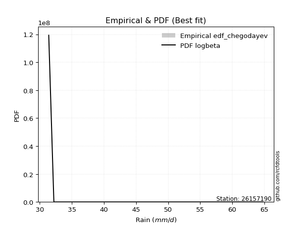</img>

</div>


### 6. EDF Blom (1958)

The Blom formula is a specific "plotting position" formula used in hydrology and statistical analysis to estimate the empirical cumulative probability (or non-exceedance probability) of a data series. It is particularly recommended for data that are approximately normally distributed. The constant _a_ is set to 0.375 (or 3/8).

<div align="center">


$P=(m-a)/(n+1-2a)$


</div>


**6.1. Empirical values**

<div align="center">

|                | 0                   | 1                   | 2                  | 3                  | 4                  | 5                  | 6                 | 7                  |
|:---------------|:--------------------|:--------------------|:-------------------|:-------------------|:-------------------|:-------------------|:------------------|:-------------------|
| date           | 2023                | 2017                | 2018               | 2020               | 2021               | 2022               | 2019              | 2025               |
| x              | 31.4                | 32.2                | 35.6               | 39.0               | 39.2               | 41.6               | 56.4              | 64.8               |
| m              | 1                   | 2                   | 3                  | 4                  | 5                  | 6                  | 7                 | 8                  |
| empirical_dist | edf_blom            | edf_blom            | edf_blom           | edf_blom           | edf_blom           | edf_blom           | edf_blom          | edf_blom           |
| empirical      | 0.07575757575757576 | 0.19696969696969696 | 0.3181818181818182 | 0.4393939393939394 | 0.5606060606060606 | 0.6818181818181818 | 0.803030303030303 | 0.9242424242424242 |
| empirical_tr   | 1.0819672131147542  | 1.2452830188679247  | 1.4666666666666666 | 1.783783783783784  | 2.275862068965517  | 3.1428571428571423 | 5.076923076923076 | 13.199999999999992 |

</div>


**6.2. Kolmogorov-Smirnov fit test (sorted by Δ)**


<div align="center">

|                | 0                   | 1                   | 2                   | 3                  | 4                   | 5                  | 6                   | 7                   | 8                   | 9                   | 10                  | 11                  | 12                  | 13                  | 14                  | 15                  | 16                  | 17                  | 18                 | 19                  | 20                  | 21                 | 22                  | 23                 | 24                 | 25                  | 26                  | 27                  | 28                  | 29                  | 30                  | 31                  | 32                 | 33                  | 34                  | 35                  | 36                  | 37                  | 38                  | 39                  | 40                  | 41                  | 42                  | 43                  | 44                 | 45                  | 46                  | 47                  | 48                  | 49                  | 50                  | 51                  | 52                  | 53                 | 54                 | 55                  | 56                  | 57                  | 58                  | 59                  | 60                  | 61                  | 62                  | 63                  | 64                  | 65                  | 66                  | 67                  | 68                  | 69                  | 70                  | 71                  | 72                  | 73                  | 74                 | 75                  | 76                  | 77                  | 78                  | 79                  | 80                  | 81                  | 82                  | 83                  | 84                 | 85                  | 86                  | 87                  | 88                 | 89                  | 90                  | 91                  | 92                  | 93                  | 94                  | 95                 | 96                  | 97                  | 98                  | 99                  | 100                 | 101                 | 102                 | 103                 | 104                 | 105                 | 106                 | 107                 | 108                | 109                 | 110                 | 111                 | 112                 | 113                | 114                | 115                 | 116                 | 117                | 118                 | 119                 | 120                | 121                | 122                 | 123                | 124                 | 125                | 126                | 127                 | 128                | 129                | 130                | 131                | 132                 | 133                | 134                 | 135                 | 136                 | 137                 | 138                 | 139                 | 140                | 141                | 142                 | 143                 | 144                | 145                 | 146                | 147                | 148                 | 149                | 150                 | 151                | 152                | 153                | 154                | 155                | 156                | 157                | 158                | 159                |
|:---------------|:--------------------|:--------------------|:--------------------|:-------------------|:--------------------|:-------------------|:--------------------|:--------------------|:--------------------|:--------------------|:--------------------|:--------------------|:--------------------|:--------------------|:--------------------|:--------------------|:--------------------|:--------------------|:-------------------|:--------------------|:--------------------|:-------------------|:--------------------|:-------------------|:-------------------|:--------------------|:--------------------|:--------------------|:--------------------|:--------------------|:--------------------|:--------------------|:-------------------|:--------------------|:--------------------|:--------------------|:--------------------|:--------------------|:--------------------|:--------------------|:--------------------|:--------------------|:--------------------|:--------------------|:-------------------|:--------------------|:--------------------|:--------------------|:--------------------|:--------------------|:--------------------|:--------------------|:--------------------|:-------------------|:-------------------|:--------------------|:--------------------|:--------------------|:--------------------|:--------------------|:--------------------|:--------------------|:--------------------|:--------------------|:--------------------|:--------------------|:--------------------|:--------------------|:--------------------|:--------------------|:--------------------|:--------------------|:--------------------|:--------------------|:-------------------|:--------------------|:--------------------|:--------------------|:--------------------|:--------------------|:--------------------|:--------------------|:--------------------|:--------------------|:-------------------|:--------------------|:--------------------|:--------------------|:-------------------|:--------------------|:--------------------|:--------------------|:--------------------|:--------------------|:--------------------|:-------------------|:--------------------|:--------------------|:--------------------|:--------------------|:--------------------|:--------------------|:--------------------|:--------------------|:--------------------|:--------------------|:--------------------|:--------------------|:-------------------|:--------------------|:--------------------|:--------------------|:--------------------|:-------------------|:-------------------|:--------------------|:--------------------|:-------------------|:--------------------|:--------------------|:-------------------|:-------------------|:--------------------|:-------------------|:--------------------|:-------------------|:-------------------|:--------------------|:-------------------|:-------------------|:-------------------|:-------------------|:--------------------|:-------------------|:--------------------|:--------------------|:--------------------|:--------------------|:--------------------|:--------------------|:-------------------|:-------------------|:--------------------|:--------------------|:-------------------|:--------------------|:-------------------|:-------------------|:--------------------|:-------------------|:--------------------|:-------------------|:-------------------|:-------------------|:-------------------|:-------------------|:-------------------|:-------------------|:-------------------|:-------------------|
| station        | 26157190            | 26157190            | 26157190            | 26157190           | 26157190            | 26157190           | 26157190            | 26157190            | 26157190            | 26157190            | 26157190            | 26157190            | 26157190            | 26157190            | 26157190            | 26157190            | 26157190            | 26157190            | 26157190           | 26157190            | 26157190            | 26157190           | 26157190            | 26157190           | 26157190           | 26157190            | 26157190            | 26157190            | 26157190            | 26157190            | 26157190            | 26157190            | 26157190           | 26157190            | 26157190            | 26157190            | 26157190            | 26157190            | 26157190            | 26157190            | 26157190            | 26157190            | 26157190            | 26157190            | 26157190           | 26157190            | 26157190            | 26157190            | 26157190            | 26157190            | 26157190            | 26157190            | 26157190            | 26157190           | 26157190           | 26157190            | 26157190            | 26157190            | 26157190            | 26157190            | 26157190            | 26157190            | 26157190            | 26157190            | 26157190            | 26157190            | 26157190            | 26157190            | 26157190            | 26157190            | 26157190            | 26157190            | 26157190            | 26157190            | 26157190           | 26157190            | 26157190            | 26157190            | 26157190            | 26157190            | 26157190            | 26157190            | 26157190            | 26157190            | 26157190           | 26157190            | 26157190            | 26157190            | 26157190           | 26157190            | 26157190            | 26157190            | 26157190            | 26157190            | 26157190            | 26157190           | 26157190            | 26157190            | 26157190            | 26157190            | 26157190            | 26157190            | 26157190            | 26157190            | 26157190            | 26157190            | 26157190            | 26157190            | 26157190           | 26157190            | 26157190            | 26157190            | 26157190            | 26157190           | 26157190           | 26157190            | 26157190            | 26157190           | 26157190            | 26157190            | 26157190           | 26157190           | 26157190            | 26157190           | 26157190            | 26157190           | 26157190           | 26157190            | 26157190           | 26157190           | 26157190           | 26157190           | 26157190            | 26157190           | 26157190            | 26157190            | 26157190            | 26157190            | 26157190            | 26157190            | 26157190           | 26157190           | 26157190            | 26157190            | 26157190           | 26157190            | 26157190           | 26157190           | 26157190            | 26157190           | 26157190            | 26157190           | 26157190           | 26157190           | 26157190           | 26157190           | 26157190           | 26157190           | 26157190           | 26157190           |
| empirical_dist | edf_blom            | edf_blom            | edf_blom            | edf_blom           | edf_blom            | edf_blom           | edf_blom            | edf_blom            | edf_blom            | edf_blom            | edf_blom            | edf_blom            | edf_blom            | edf_blom            | edf_blom            | edf_blom            | edf_blom            | edf_blom            | edf_blom           | edf_blom            | edf_blom            | edf_blom           | edf_blom            | edf_blom           | edf_blom           | edf_blom            | edf_blom            | edf_blom            | edf_blom            | edf_blom            | edf_blom            | edf_blom            | edf_blom           | edf_blom            | edf_blom            | edf_blom            | edf_blom            | edf_blom            | edf_blom            | edf_blom            | edf_blom            | edf_blom            | edf_blom            | edf_blom            | edf_blom           | edf_blom            | edf_blom            | edf_blom            | edf_blom            | edf_blom            | edf_blom            | edf_blom            | edf_blom            | edf_blom           | edf_blom           | edf_blom            | edf_blom            | edf_blom            | edf_blom            | edf_blom            | edf_blom            | edf_blom            | edf_blom            | edf_blom            | edf_blom            | edf_blom            | edf_blom            | edf_blom            | edf_blom            | edf_blom            | edf_blom            | edf_blom            | edf_blom            | edf_blom            | edf_blom           | edf_blom            | edf_blom            | edf_blom            | edf_blom            | edf_blom            | edf_blom            | edf_blom            | edf_blom            | edf_blom            | edf_blom           | edf_blom            | edf_blom            | edf_blom            | edf_blom           | edf_blom            | edf_blom            | edf_blom            | edf_blom            | edf_blom            | edf_blom            | edf_blom           | edf_blom            | edf_blom            | edf_blom            | edf_blom            | edf_blom            | edf_blom            | edf_blom            | edf_blom            | edf_blom            | edf_blom            | edf_blom            | edf_blom            | edf_blom           | edf_blom            | edf_blom            | edf_blom            | edf_blom            | edf_blom           | edf_blom           | edf_blom            | edf_blom            | edf_blom           | edf_blom            | edf_blom            | edf_blom           | edf_blom           | edf_blom            | edf_blom           | edf_blom            | edf_blom           | edf_blom           | edf_blom            | edf_blom           | edf_blom           | edf_blom           | edf_blom           | edf_blom            | edf_blom           | edf_blom            | edf_blom            | edf_blom            | edf_blom            | edf_blom            | edf_blom            | edf_blom           | edf_blom           | edf_blom            | edf_blom            | edf_blom           | edf_blom            | edf_blom           | edf_blom           | edf_blom            | edf_blom           | edf_blom            | edf_blom           | edf_blom           | edf_blom           | edf_blom           | edf_blom           | edf_blom           | edf_blom           | edf_blom           | edf_blom           |
| p_dist         | logmielke           | logbeta             | logburr             | loghalfnorm        | gengamma            | alpha              | loggumbel_r         | loginvweibull       | loggenextreme       | logmoyal            | burr                | loginvgamma         | logf                | burr12              | logkstwobign        | loghalflogistic     | logburr12           | loggenlogistic      | invgamma           | f                   | mielke              | logexponnorm       | logweibull_max      | logdweibull        | invweibull         | genextreme          | nakagami            | halflogistic        | loggengamma         | beta                | logexponweib        | dweibull            | logpearson3        | logfoldnorm         | loggenexpon         | logalpha            | moyal               | loggompertz         | lograyleigh         | lomax               | loginvgauss         | logloglaplace       | exponnorm           | genlogistic         | logjohnsonsu       | genexpon            | gompertz            | truncnorm           | dgamma              | vonmises_line       | loghalfgennorm      | logtruncnorm        | invgauss            | logdgamma          | logkappa3          | logmaxwell          | loggennorm          | nct                 | halfnorm            | foldnorm            | gennorm             | logexponpow         | logskewnorm         | erlang              | johnsonsu           | truncpareto         | gumbel_r            | lognct              | logrice             | pearson3            | genhalflogistic     | betaprime           | ncf                 | truncweibull_min    | kstwobign          | logfatiguelife      | loghypsecant        | logtruncexpon       | logbetaprime        | loglogistic         | lognorm             | logcrystalball      | logt                | logloggamma         | rayleigh           | loganglit           | logsemicircular     | logarcsine          | maxwell            | fatiguelife         | exponpow            | exponweib           | loggausshyper       | loglaplace          | loglaplace          | logweibull_min     | wald                | logwald             | weibull_min         | skewnorm            | arcsine             | logtruncweibull_min | logbradford         | semicircular        | logcosine           | rice                | anglit              | logncf              | crystalball        | norm                | t                   | logistic            | logwrapcauchy       | hypsecant          | lognakagami        | triang              | loggumbel_l         | laplace            | genpareto           | logkappa4           | loggamma           | loggamma           | halfgennorm         | truncexpon         | cosine              | gausshyper         | wrapcauchy         | logksone            | gumbel_l           | logargus           | loguniform         | bradford           | logvonmises_line    | logerlang          | logrdist            | tukeylambda         | rdist               | logtukeylambda      | loglevy_l           | johnsonsb           | logtriang          | ksone              | argus               | levy_l              | kappa4             | uniform             | kappa3             | powerlaw           | loggenpareto        | gamma              | loggenhalflogistic  | logpowerlaw        | logtruncpareto     | logtrapezoid       | weibull_max        | trapezoid          | loglomax           | logjohnsonsb       | logvonmises        | vonmises           |
| delta          | 0.08419939903764334 | 0.09026402062545058 | 0.09316588518231317 | 0.0942486841766369 | 0.09503107497487295 | 0.0957511763309225 | 0.09678202941767522 | 0.09705491774197644 | 0.09705950682328873 | 0.09931027812992423 | 0.10000053769277772 | 0.10073252648217307 | 0.10073347441072739 | 0.10333480738861739 | 0.10404411706971373 | 0.10420607969250087 | 0.10547599274608171 | 0.10884867142890642 | 0.1088978078682778 | 0.10894073970547807 | 0.10897974730291526 | 0.1092645218066684 | 0.10974726690854597 | 0.1102503630020083 | 0.110334917623991  | 0.11033527532579662 | 0.11371697734715414 | 0.11382726195750892 | 0.11484211119163845 | 0.11491867611423762 | 0.11571578356179762 | 0.11659030695671639 | 0.1178201764370902 | 0.11862875433523146 | 0.11949068690947066 | 0.12041946154808858 | 0.12062387761671334 | 0.12333649505562715 | 0.12432975507956323 | 0.12484286656598409 | 0.12557623702869708 | 0.12644992584682035 | 0.12687678556338883 | 0.12719153608035239 | 0.1273694485309022 | 0.12758399377967683 | 0.12760527443792505 | 0.12775802532276254 | 0.12807484920344403 | 0.12884107180182447 | 0.12936122257031113 | 0.12960183176113443 | 0.13079114145995757 | 0.1323812683666854 | 0.1350110322380642 | 0.13501475727968937 | 0.13580020503571616 | 0.13625768770935787 | 0.13640238631508417 | 0.13754187174770627 | 0.13943993712061753 | 0.14011966456255032 | 0.14186359996155362 | 0.14292338460895465 | 0.14535251162823043 | 0.14622605036130903 | 0.14634292981152952 | 0.14701256506863458 | 0.14755998796717607 | 0.14964473375732845 | 0.14978078157568087 | 0.15491006836337184 | 0.15798860263821513 | 0.15807391586062347 | 0.1601029090909175 | 0.16343502331818432 | 0.16392887983741627 | 0.16431910874075362 | 0.16524992225572965 | 0.16547104819332814 | 0.16743406812391726 | 0.16743410939901715 | 0.16743597116794595 | 0.16883151870623603 | 0.1692271470611909 | 0.16949173120916594 | 0.17033945388148009 | 0.17369992172858317 | 0.1808711809931698 | 0.18165210828705797 | 0.18200815500907808 | 0.18365860820268892 | 0.18803692554583445 | 0.18927440054070555 | 0.18927440054070555 | 0.1906907297512725 | 0.19643331064269812 | 0.19696969696969696 | 0.19735405625258468 | 0.19872651058595314 | 0.20053185055457362 | 0.20430889980157652 | 0.20496989836104984 | 0.20826039420088815 | 0.20997122755206998 | 0.20998524081318837 | 0.21020739611332034 | 0.21422324235746526 | 0.214929968727673  | 0.21492997060941538 | 0.21493096899839814 | 0.21942619279900727 | 0.22048352402451898 | 0.2232479462337868 | 0.2245837186045772 | 0.23366875898236633 | 0.23723373123584746 | 0.2372538508554169 | 0.24005572089488258 | 0.24192336376587453 | 0.2540769702127535 | 0.2540769702127535 | 0.25951215172995795 | 0.2660050034844275 | 0.26671529706821717 | 0.267435658210301  | 0.2685846928206937 | 0.27493623646253307 | 0.2855040373566088 | 0.2934562848959995 | 0.293559847391403  | 0.2938726073369144 | 0.29690702560497967 | 0.3006677589145446 | 0.31012533510309115 | 0.31818176444425983 | 0.31818181817121527 | 0.32129016752532114 | 0.32965878529508513 | 0.33248164404458436 | 0.3410244647164766 | 0.3439938305207765 | 0.34549280548067574 | 0.35114215461462756 | 0.3531777025381565 | 0.37642896026129546 | 0.3771330402637279 | 0.3844197925880621 | 0.39061594457624743 | 0.4037134060536645 | 0.40706115973677215 | 0.4072682182331954 | 0.4912634385400411 | 0.5162652643617847 | 0.5468701566161431 | 0.567692889488669  | 0.6575595971634298 | 0.675662397847836  | 1.101464505375465  | 9.829010089592622  |
| deltao         | 0.4472608134160001  | 0.4472608134160001  | 0.4472608134160001  | 0.4472608134160001 | 0.4472608134160001  | 0.4472608134160001 | 0.4472608134160001  | 0.4472608134160001  | 0.4472608134160001  | 0.4472608134160001  | 0.4472608134160001  | 0.4472608134160001  | 0.4472608134160001  | 0.4472608134160001  | 0.4472608134160001  | 0.4472608134160001  | 0.4472608134160001  | 0.4472608134160001  | 0.4472608134160001 | 0.4472608134160001  | 0.4472608134160001  | 0.4472608134160001 | 0.4472608134160001  | 0.4472608134160001 | 0.4472608134160001 | 0.4472608134160001  | 0.4472608134160001  | 0.4472608134160001  | 0.4472608134160001  | 0.4472608134160001  | 0.4472608134160001  | 0.4472608134160001  | 0.4472608134160001 | 0.4472608134160001  | 0.4472608134160001  | 0.4472608134160001  | 0.4472608134160001  | 0.4472608134160001  | 0.4472608134160001  | 0.4472608134160001  | 0.4472608134160001  | 0.4472608134160001  | 0.4472608134160001  | 0.4472608134160001  | 0.4472608134160001 | 0.4472608134160001  | 0.4472608134160001  | 0.4472608134160001  | 0.4472608134160001  | 0.4472608134160001  | 0.4472608134160001  | 0.4472608134160001  | 0.4472608134160001  | 0.4472608134160001 | 0.4472608134160001 | 0.4472608134160001  | 0.4472608134160001  | 0.4472608134160001  | 0.4472608134160001  | 0.4472608134160001  | 0.4472608134160001  | 0.4472608134160001  | 0.4472608134160001  | 0.4472608134160001  | 0.4472608134160001  | 0.4472608134160001  | 0.4472608134160001  | 0.4472608134160001  | 0.4472608134160001  | 0.4472608134160001  | 0.4472608134160001  | 0.4472608134160001  | 0.4472608134160001  | 0.4472608134160001  | 0.4472608134160001 | 0.4472608134160001  | 0.4472608134160001  | 0.4472608134160001  | 0.4472608134160001  | 0.4472608134160001  | 0.4472608134160001  | 0.4472608134160001  | 0.4472608134160001  | 0.4472608134160001  | 0.4472608134160001 | 0.4472608134160001  | 0.4472608134160001  | 0.4472608134160001  | 0.4472608134160001 | 0.4472608134160001  | 0.4472608134160001  | 0.4472608134160001  | 0.4472608134160001  | 0.4472608134160001  | 0.4472608134160001  | 0.4472608134160001 | 0.4472608134160001  | 0.4472608134160001  | 0.4472608134160001  | 0.4472608134160001  | 0.4472608134160001  | 0.4472608134160001  | 0.4472608134160001  | 0.4472608134160001  | 0.4472608134160001  | 0.4472608134160001  | 0.4472608134160001  | 0.4472608134160001  | 0.4472608134160001 | 0.4472608134160001  | 0.4472608134160001  | 0.4472608134160001  | 0.4472608134160001  | 0.4472608134160001 | 0.4472608134160001 | 0.4472608134160001  | 0.4472608134160001  | 0.4472608134160001 | 0.4472608134160001  | 0.4472608134160001  | 0.4472608134160001 | 0.4472608134160001 | 0.4472608134160001  | 0.4472608134160001 | 0.4472608134160001  | 0.4472608134160001 | 0.4472608134160001 | 0.4472608134160001  | 0.4472608134160001 | 0.4472608134160001 | 0.4472608134160001 | 0.4472608134160001 | 0.4472608134160001  | 0.4472608134160001 | 0.4472608134160001  | 0.4472608134160001  | 0.4472608134160001  | 0.4472608134160001  | 0.4472608134160001  | 0.4472608134160001  | 0.4472608134160001 | 0.4472608134160001 | 0.4472608134160001  | 0.4472608134160001  | 0.4472608134160001 | 0.4472608134160001  | 0.4472608134160001 | 0.4472608134160001 | 0.4472608134160001  | 0.4472608134160001 | 0.4472608134160001  | 0.4472608134160001 | 0.4472608134160001 | 0.4472608134160001 | 0.4472608134160001 | 0.4472608134160001 | 0.4472608134160001 | 0.4472608134160001 | 0.4472608134160001 | 0.4472608134160001 |
| eval           | Δo > Δ              | Δo > Δ              | Δo > Δ              | Δo > Δ             | Δo > Δ              | Δo > Δ             | Δo > Δ              | Δo > Δ              | Δo > Δ              | Δo > Δ              | Δo > Δ              | Δo > Δ              | Δo > Δ              | Δo > Δ              | Δo > Δ              | Δo > Δ              | Δo > Δ              | Δo > Δ              | Δo > Δ             | Δo > Δ              | Δo > Δ              | Δo > Δ             | Δo > Δ              | Δo > Δ             | Δo > Δ             | Δo > Δ              | Δo > Δ              | Δo > Δ              | Δo > Δ              | Δo > Δ              | Δo > Δ              | Δo > Δ              | Δo > Δ             | Δo > Δ              | Δo > Δ              | Δo > Δ              | Δo > Δ              | Δo > Δ              | Δo > Δ              | Δo > Δ              | Δo > Δ              | Δo > Δ              | Δo > Δ              | Δo > Δ              | Δo > Δ             | Δo > Δ              | Δo > Δ              | Δo > Δ              | Δo > Δ              | Δo > Δ              | Δo > Δ              | Δo > Δ              | Δo > Δ              | Δo > Δ             | Δo > Δ             | Δo > Δ              | Δo > Δ              | Δo > Δ              | Δo > Δ              | Δo > Δ              | Δo > Δ              | Δo > Δ              | Δo > Δ              | Δo > Δ              | Δo > Δ              | Δo > Δ              | Δo > Δ              | Δo > Δ              | Δo > Δ              | Δo > Δ              | Δo > Δ              | Δo > Δ              | Δo > Δ              | Δo > Δ              | Δo > Δ             | Δo > Δ              | Δo > Δ              | Δo > Δ              | Δo > Δ              | Δo > Δ              | Δo > Δ              | Δo > Δ              | Δo > Δ              | Δo > Δ              | Δo > Δ             | Δo > Δ              | Δo > Δ              | Δo > Δ              | Δo > Δ             | Δo > Δ              | Δo > Δ              | Δo > Δ              | Δo > Δ              | Δo > Δ              | Δo > Δ              | Δo > Δ             | Δo > Δ              | Δo > Δ              | Δo > Δ              | Δo > Δ              | Δo > Δ              | Δo > Δ              | Δo > Δ              | Δo > Δ              | Δo > Δ              | Δo > Δ              | Δo > Δ              | Δo > Δ              | Δo > Δ             | Δo > Δ              | Δo > Δ              | Δo > Δ              | Δo > Δ              | Δo > Δ             | Δo > Δ             | Δo > Δ              | Δo > Δ              | Δo > Δ             | Δo > Δ              | Δo > Δ              | Δo > Δ             | Δo > Δ             | Δo > Δ              | Δo > Δ             | Δo > Δ              | Δo > Δ             | Δo > Δ             | Δo > Δ              | Δo > Δ             | Δo > Δ             | Δo > Δ             | Δo > Δ             | Δo > Δ              | Δo > Δ             | Δo > Δ              | Δo > Δ              | Δo > Δ              | Δo > Δ              | Δo > Δ              | Δo > Δ              | Δo > Δ             | Δo > Δ             | Δo > Δ              | Δo > Δ              | Δo > Δ             | Δo > Δ              | Δo > Δ             | Δo > Δ             | Δo > Δ              | Δo > Δ             | Δo > Δ              | Δo > Δ             | Δo <= Δ            | Δo <= Δ            | Δo <= Δ            | Δo <= Δ            | Δo <= Δ            | Δo <= Δ            | Δo <= Δ            | Δo <= Δ            |
| fit            | 1                   | 1                   | 1                   | 1                  | 1                   | 1                  | 1                   | 1                   | 1                   | 1                   | 1                   | 1                   | 1                   | 1                   | 1                   | 1                   | 1                   | 1                   | 1                  | 1                   | 1                   | 1                  | 1                   | 1                  | 1                  | 1                   | 1                   | 1                   | 1                   | 1                   | 1                   | 1                   | 1                  | 1                   | 1                   | 1                   | 1                   | 1                   | 1                   | 1                   | 1                   | 1                   | 1                   | 1                   | 1                  | 1                   | 1                   | 1                   | 1                   | 1                   | 1                   | 1                   | 1                   | 1                  | 1                  | 1                   | 1                   | 1                   | 1                   | 1                   | 1                   | 1                   | 1                   | 1                   | 1                   | 1                   | 1                   | 1                   | 1                   | 1                   | 1                   | 1                   | 1                   | 1                   | 1                  | 1                   | 1                   | 1                   | 1                   | 1                   | 1                   | 1                   | 1                   | 1                   | 1                  | 1                   | 1                   | 1                   | 1                  | 1                   | 1                   | 1                   | 1                   | 1                   | 1                   | 1                  | 1                   | 1                   | 1                   | 1                   | 1                   | 1                   | 1                   | 1                   | 1                   | 1                   | 1                   | 1                   | 1                  | 1                   | 1                   | 1                   | 1                   | 1                  | 1                  | 1                   | 1                   | 1                  | 1                   | 1                   | 1                  | 1                  | 1                   | 1                  | 1                   | 1                  | 1                  | 1                   | 1                  | 1                  | 1                  | 1                  | 1                   | 1                  | 1                   | 1                   | 1                   | 1                   | 1                   | 1                   | 1                  | 1                  | 1                   | 1                   | 1                  | 1                   | 1                  | 1                  | 1                   | 1                  | 1                   | 1                  | 0                  | 0                  | 0                  | 0                  | 0                  | 0                  | 0                  | 0                  |
| n              | 8                   | 8                   | 8                   | 8                  | 8                   | 8                  | 8                   | 8                   | 8                   | 8                   | 8                   | 8                   | 8                   | 8                   | 8                   | 8                   | 8                   | 8                   | 8                  | 8                   | 8                   | 8                  | 8                   | 8                  | 8                  | 8                   | 8                   | 8                   | 8                   | 8                   | 8                   | 8                   | 8                  | 8                   | 8                   | 8                   | 8                   | 8                   | 8                   | 8                   | 8                   | 8                   | 8                   | 8                   | 8                  | 8                   | 8                   | 8                   | 8                   | 8                   | 8                   | 8                   | 8                   | 8                  | 8                  | 8                   | 8                   | 8                   | 8                   | 8                   | 8                   | 8                   | 8                   | 8                   | 8                   | 8                   | 8                   | 8                   | 8                   | 8                   | 8                   | 8                   | 8                   | 8                   | 8                  | 8                   | 8                   | 8                   | 8                   | 8                   | 8                   | 8                   | 8                   | 8                   | 8                  | 8                   | 8                   | 8                   | 8                  | 8                   | 8                   | 8                   | 8                   | 8                   | 8                   | 8                  | 8                   | 8                   | 8                   | 8                   | 8                   | 8                   | 8                   | 8                   | 8                   | 8                   | 8                   | 8                   | 8                  | 8                   | 8                   | 8                   | 8                   | 8                  | 8                  | 8                   | 8                   | 8                  | 8                   | 8                   | 8                  | 8                  | 8                   | 8                  | 8                   | 8                  | 8                  | 8                   | 8                  | 8                  | 8                  | 8                  | 8                   | 8                  | 8                   | 8                   | 8                   | 8                   | 8                   | 8                   | 8                  | 8                  | 8                   | 8                   | 8                  | 8                   | 8                  | 8                  | 8                   | 8                  | 8                   | 8                  | 8                  | 8                  | 8                  | 8                  | 8                  | 8                  | 8                  | 8                  |
| best_fit       | 1                   | 0                   | 0                   | 0                  | 0                   | 0                  | 0                   | 0                   | 0                   | 0                   | 0                   | 0                   | 0                   | 0                   | 0                   | 0                   | 0                   | 0                   | 0                  | 0                   | 0                   | 0                  | 0                   | 0                  | 0                  | 0                   | 0                   | 0                   | 0                   | 0                   | 0                   | 0                   | 0                  | 0                   | 0                   | 0                   | 0                   | 0                   | 0                   | 0                   | 0                   | 0                   | 0                   | 0                   | 0                  | 0                   | 0                   | 0                   | 0                   | 0                   | 0                   | 0                   | 0                   | 0                  | 0                  | 0                   | 0                   | 0                   | 0                   | 0                   | 0                   | 0                   | 0                   | 0                   | 0                   | 0                   | 0                   | 0                   | 0                   | 0                   | 0                   | 0                   | 0                   | 0                   | 0                  | 0                   | 0                   | 0                   | 0                   | 0                   | 0                   | 0                   | 0                   | 0                   | 0                  | 0                   | 0                   | 0                   | 0                  | 0                   | 0                   | 0                   | 0                   | 0                   | 0                   | 0                  | 0                   | 0                   | 0                   | 0                   | 0                   | 0                   | 0                   | 0                   | 0                   | 0                   | 0                   | 0                   | 0                  | 0                   | 0                   | 0                   | 0                   | 0                  | 0                  | 0                   | 0                   | 0                  | 0                   | 0                   | 0                  | 0                  | 0                   | 0                  | 0                   | 0                  | 0                  | 0                   | 0                  | 0                  | 0                  | 0                  | 0                   | 0                  | 0                   | 0                   | 0                   | 0                   | 0                   | 0                   | 0                  | 0                  | 0                   | 0                   | 0                  | 0                   | 0                  | 0                  | 0                   | 0                  | 0                   | 0                  | 0                  | 0                  | 0                  | 0                  | 0                  | 0                  | 0                  | 0                  |
| best_fit_sort  | 1                   | 2                   | 3                   | 4                  | 5                   | 6                  | 7                   | 8                   | 9                   | 10                  | 11                  | 12                  | 13                  | 14                  | 15                  | 16                  | 17                  | 18                  | 19                 | 20                  | 21                  | 22                 | 23                  | 24                 | 25                 | 26                  | 27                  | 28                  | 29                  | 30                  | 31                  | 32                  | 33                 | 34                  | 35                  | 36                  | 37                  | 38                  | 39                  | 40                  | 41                  | 42                  | 43                  | 44                  | 45                 | 46                  | 47                  | 48                  | 49                  | 50                  | 51                  | 52                  | 53                  | 54                 | 55                 | 56                  | 57                  | 58                  | 59                  | 60                  | 61                  | 62                  | 63                  | 64                  | 65                  | 66                  | 67                  | 68                  | 69                  | 70                  | 71                  | 72                  | 73                  | 74                  | 75                 | 76                  | 77                  | 78                  | 79                  | 80                  | 81                  | 82                  | 83                  | 84                  | 85                 | 86                  | 87                  | 88                  | 89                 | 90                  | 91                  | 92                  | 93                  | 94                  | 95                  | 96                 | 97                  | 98                  | 99                  | 100                 | 101                 | 102                 | 103                 | 104                 | 105                 | 106                 | 107                 | 108                 | 109                | 110                 | 111                 | 112                 | 113                 | 114                | 115                | 116                 | 117                 | 118                | 119                 | 120                 | 121                | 122                | 123                 | 124                | 125                 | 126                | 127                | 128                 | 129                | 130                | 131                | 132                | 133                 | 134                | 135                 | 136                 | 137                 | 138                 | 139                 | 140                 | 141                | 142                | 143                 | 144                 | 145                | 146                 | 147                | 148                | 149                 | 150                | 151                 | 152                | 153                | 154                | 155                | 156                | 157                | 158                | 159                | 160                |

</div>


**6.3. Best fit**

<div align="center">

|   id |   station | empirical_dist   | p_dist    |     delta |   deltao | eval   |   fit |   n |   best_fit |   best_fit_sort |
|-----:|----------:|:-----------------|:----------|----------:|---------:|:-------|------:|----:|-----------:|----------------:|
|    0 |  26157190 | edf_blom         | logmielke | 0.0841994 | 0.447261 | Δo > Δ |     1 |   8 |          1 |               1 |

</div>


<div align="center">

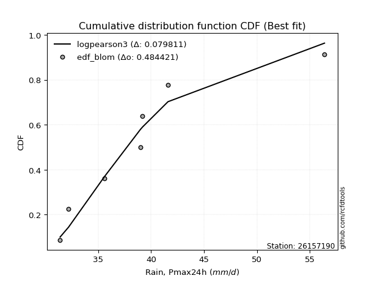</img></img>

</div>


### 7. EDF Tukey (1962)

In hydrology, the Tukey formula is used as a plotting position formula to estimate the empirical probability or frequency of a flood event (or other hydrological data). The formula parameter is given as _c=0.333_ (or 1/3).

<div align="center">


$P=(m-c)/(n+1-2c)$


</div>


**7.1. Empirical values**

<div align="center">

|                | 0                  | 1         | 2                  | 3                  | 4                 | 5                  | 6                 | 7                  |
|:---------------|:-------------------|:----------|:-------------------|:-------------------|:------------------|:-------------------|:------------------|:-------------------|
| date           | 2023               | 2017      | 2018               | 2020               | 2021              | 2022               | 2019              | 2025               |
| x              | 31.4               | 32.2      | 35.6               | 39.0               | 39.2              | 41.6               | 56.4              | 64.8               |
| m              | 1                  | 2         | 3                  | 4                  | 5                 | 6                  | 7                 | 8                  |
| empirical_dist | edf_tukey          | edf_tukey | edf_tukey          | edf_tukey          | edf_tukey         | edf_tukey          | edf_tukey         | edf_tukey          |
| empirical      | 0.08               | 0.2       | 0.32               | 0.44               | 0.56              | 0.68               | 0.8               | 0.92               |
| empirical_tr   | 1.0869565217391304 | 1.25      | 1.4705882352941178 | 1.7857142857142856 | 2.272727272727273 | 3.1250000000000004 | 5.000000000000001 | 12.500000000000007 |

</div>


**7.2. Kolmogorov-Smirnov fit test (sorted by Δ)**


<div align="center">

|                | 0                   | 1                   | 2                   | 3                   | 4                   | 5                   | 6                   | 7                   | 8                   | 9                   | 10                  | 11                  | 12                  | 13                  | 14                 | 15                  | 16                  | 17                  | 18                  | 19                  | 20                  | 21                  | 22                  | 23                  | 24                 | 25                 | 26                  | 27                  | 28                  | 29                  | 30                  | 31                  | 32                  | 33                  | 34                  | 35                  | 36                  | 37                  | 38                  | 39                  | 40                 | 41                 | 42                  | 43                 | 44                  | 45                  | 46                  | 47                 | 48                  | 49                  | 50                 | 51                  | 52                  | 53                  | 54                  | 55                  | 56                  | 57                  | 58                 | 59                  | 60                 | 61                  | 62                  | 63                 | 64                  | 65                  | 66                  | 67                  | 68                  | 69                  | 70                  | 71                  | 72                 | 73                  | 74                 | 75                 | 76                  | 77                  | 78                  | 79                  | 80                  | 81                  | 82                  | 83                 | 84                 | 85                  | 86                  | 87                  | 88                  | 89                  | 90                  | 91                 | 92                  | 93                  | 94                  | 95                  | 96                  | 97                  | 98                 | 99                  | 100                | 101                 | 102                 | 103                 | 104                 | 105                 | 106                 | 107                | 108                 | 109                 | 110                 | 111                 | 112                 | 113                 | 114                 | 115                | 116                 | 117                 | 118                 | 119                 | 120                | 121                | 122                | 123                | 124                 | 125                | 126                | 127                 | 128                 | 129                | 130                | 131                | 132                 | 133                | 134                 | 135                | 136                 | 137                | 138                 | 139                | 140                | 141                 | 142                | 143                | 144                | 145                 | 146                | 147                 | 148                 | 149                | 150                 | 151                | 152                | 153                | 154                | 155                | 156                | 157                | 158                | 159                |
|:---------------|:--------------------|:--------------------|:--------------------|:--------------------|:--------------------|:--------------------|:--------------------|:--------------------|:--------------------|:--------------------|:--------------------|:--------------------|:--------------------|:--------------------|:-------------------|:--------------------|:--------------------|:--------------------|:--------------------|:--------------------|:--------------------|:--------------------|:--------------------|:--------------------|:-------------------|:-------------------|:--------------------|:--------------------|:--------------------|:--------------------|:--------------------|:--------------------|:--------------------|:--------------------|:--------------------|:--------------------|:--------------------|:--------------------|:--------------------|:--------------------|:-------------------|:-------------------|:--------------------|:-------------------|:--------------------|:--------------------|:--------------------|:-------------------|:--------------------|:--------------------|:-------------------|:--------------------|:--------------------|:--------------------|:--------------------|:--------------------|:--------------------|:--------------------|:-------------------|:--------------------|:-------------------|:--------------------|:--------------------|:-------------------|:--------------------|:--------------------|:--------------------|:--------------------|:--------------------|:--------------------|:--------------------|:--------------------|:-------------------|:--------------------|:-------------------|:-------------------|:--------------------|:--------------------|:--------------------|:--------------------|:--------------------|:--------------------|:--------------------|:-------------------|:-------------------|:--------------------|:--------------------|:--------------------|:--------------------|:--------------------|:--------------------|:-------------------|:--------------------|:--------------------|:--------------------|:--------------------|:--------------------|:--------------------|:-------------------|:--------------------|:-------------------|:--------------------|:--------------------|:--------------------|:--------------------|:--------------------|:--------------------|:-------------------|:--------------------|:--------------------|:--------------------|:--------------------|:--------------------|:--------------------|:--------------------|:-------------------|:--------------------|:--------------------|:--------------------|:--------------------|:-------------------|:-------------------|:-------------------|:-------------------|:--------------------|:-------------------|:-------------------|:--------------------|:--------------------|:-------------------|:-------------------|:-------------------|:--------------------|:-------------------|:--------------------|:-------------------|:--------------------|:-------------------|:--------------------|:-------------------|:-------------------|:--------------------|:-------------------|:-------------------|:-------------------|:--------------------|:-------------------|:--------------------|:--------------------|:-------------------|:--------------------|:-------------------|:-------------------|:-------------------|:-------------------|:-------------------|:-------------------|:-------------------|:-------------------|:-------------------|
| station        | 26157190            | 26157190            | 26157190            | 26157190            | 26157190            | 26157190            | 26157190            | 26157190            | 26157190            | 26157190            | 26157190            | 26157190            | 26157190            | 26157190            | 26157190           | 26157190            | 26157190            | 26157190            | 26157190            | 26157190            | 26157190            | 26157190            | 26157190            | 26157190            | 26157190           | 26157190           | 26157190            | 26157190            | 26157190            | 26157190            | 26157190            | 26157190            | 26157190            | 26157190            | 26157190            | 26157190            | 26157190            | 26157190            | 26157190            | 26157190            | 26157190           | 26157190           | 26157190            | 26157190           | 26157190            | 26157190            | 26157190            | 26157190           | 26157190            | 26157190            | 26157190           | 26157190            | 26157190            | 26157190            | 26157190            | 26157190            | 26157190            | 26157190            | 26157190           | 26157190            | 26157190           | 26157190            | 26157190            | 26157190           | 26157190            | 26157190            | 26157190            | 26157190            | 26157190            | 26157190            | 26157190            | 26157190            | 26157190           | 26157190            | 26157190           | 26157190           | 26157190            | 26157190            | 26157190            | 26157190            | 26157190            | 26157190            | 26157190            | 26157190           | 26157190           | 26157190            | 26157190            | 26157190            | 26157190            | 26157190            | 26157190            | 26157190           | 26157190            | 26157190            | 26157190            | 26157190            | 26157190            | 26157190            | 26157190           | 26157190            | 26157190           | 26157190            | 26157190            | 26157190            | 26157190            | 26157190            | 26157190            | 26157190           | 26157190            | 26157190            | 26157190            | 26157190            | 26157190            | 26157190            | 26157190            | 26157190           | 26157190            | 26157190            | 26157190            | 26157190            | 26157190           | 26157190           | 26157190           | 26157190           | 26157190            | 26157190           | 26157190           | 26157190            | 26157190            | 26157190           | 26157190           | 26157190           | 26157190            | 26157190           | 26157190            | 26157190           | 26157190            | 26157190           | 26157190            | 26157190           | 26157190           | 26157190            | 26157190           | 26157190           | 26157190           | 26157190            | 26157190           | 26157190            | 26157190            | 26157190           | 26157190            | 26157190           | 26157190           | 26157190           | 26157190           | 26157190           | 26157190           | 26157190           | 26157190           | 26157190           |
| empirical_dist | edf_tukey           | edf_tukey           | edf_tukey           | edf_tukey           | edf_tukey           | edf_tukey           | edf_tukey           | edf_tukey           | edf_tukey           | edf_tukey           | edf_tukey           | edf_tukey           | edf_tukey           | edf_tukey           | edf_tukey          | edf_tukey           | edf_tukey           | edf_tukey           | edf_tukey           | edf_tukey           | edf_tukey           | edf_tukey           | edf_tukey           | edf_tukey           | edf_tukey          | edf_tukey          | edf_tukey           | edf_tukey           | edf_tukey           | edf_tukey           | edf_tukey           | edf_tukey           | edf_tukey           | edf_tukey           | edf_tukey           | edf_tukey           | edf_tukey           | edf_tukey           | edf_tukey           | edf_tukey           | edf_tukey          | edf_tukey          | edf_tukey           | edf_tukey          | edf_tukey           | edf_tukey           | edf_tukey           | edf_tukey          | edf_tukey           | edf_tukey           | edf_tukey          | edf_tukey           | edf_tukey           | edf_tukey           | edf_tukey           | edf_tukey           | edf_tukey           | edf_tukey           | edf_tukey          | edf_tukey           | edf_tukey          | edf_tukey           | edf_tukey           | edf_tukey          | edf_tukey           | edf_tukey           | edf_tukey           | edf_tukey           | edf_tukey           | edf_tukey           | edf_tukey           | edf_tukey           | edf_tukey          | edf_tukey           | edf_tukey          | edf_tukey          | edf_tukey           | edf_tukey           | edf_tukey           | edf_tukey           | edf_tukey           | edf_tukey           | edf_tukey           | edf_tukey          | edf_tukey          | edf_tukey           | edf_tukey           | edf_tukey           | edf_tukey           | edf_tukey           | edf_tukey           | edf_tukey          | edf_tukey           | edf_tukey           | edf_tukey           | edf_tukey           | edf_tukey           | edf_tukey           | edf_tukey          | edf_tukey           | edf_tukey          | edf_tukey           | edf_tukey           | edf_tukey           | edf_tukey           | edf_tukey           | edf_tukey           | edf_tukey          | edf_tukey           | edf_tukey           | edf_tukey           | edf_tukey           | edf_tukey           | edf_tukey           | edf_tukey           | edf_tukey          | edf_tukey           | edf_tukey           | edf_tukey           | edf_tukey           | edf_tukey          | edf_tukey          | edf_tukey          | edf_tukey          | edf_tukey           | edf_tukey          | edf_tukey          | edf_tukey           | edf_tukey           | edf_tukey          | edf_tukey          | edf_tukey          | edf_tukey           | edf_tukey          | edf_tukey           | edf_tukey          | edf_tukey           | edf_tukey          | edf_tukey           | edf_tukey          | edf_tukey          | edf_tukey           | edf_tukey          | edf_tukey          | edf_tukey          | edf_tukey           | edf_tukey          | edf_tukey           | edf_tukey           | edf_tukey          | edf_tukey           | edf_tukey          | edf_tukey          | edf_tukey          | edf_tukey          | edf_tukey          | edf_tukey          | edf_tukey          | edf_tukey          | edf_tukey          |
| p_dist         | logmielke           | logbeta             | loghalfnorm         | gengamma            | logburr             | alpha               | loginvweibull       | loggenextreme       | loggumbel_r         | loginvgamma         | logf                | logmoyal            | burr                | burr12              | logburr12          | logkstwobign        | loghalflogistic     | invgamma            | f                   | invweibull          | genextreme          | logexponnorm        | loggenlogistic      | nakagami            | halflogistic       | mielke             | dweibull            | logweibull_max      | loggengamma         | beta                | logdweibull         | logpearson3         | logfoldnorm         | logexponweib        | moyal               | lograyleigh         | loggenexpon         | logalpha            | loginvgauss         | genlogistic         | loggompertz        | logjohnsonsu       | lomax               | logloglaplace      | exponnorm           | invgauss            | genexpon            | gompertz           | truncnorm           | dgamma              | vonmises_line      | loghalfgennorm      | logtruncnorm        | logmaxwell          | nct                 | halfnorm            | logdgamma           | foldnorm            | loggennorm         | logkappa3           | logexponpow        | erlang              | gennorm             | gumbel_r           | johnsonsu           | logskewnorm         | lognct              | truncpareto         | logrice             | pearson3            | genhalflogistic     | betaprime           | ncf                | truncweibull_min    | kstwobign          | logtruncexpon      | logfatiguelife      | loghypsecant        | logbetaprime        | loglogistic         | lognorm             | logcrystalball      | logt                | logloggamma        | rayleigh           | loganglit           | logsemicircular     | logarcsine          | maxwell             | exponpow            | fatiguelife         | exponweib          | loggausshyper       | loglaplace          | loglaplace          | logweibull_min      | weibull_min         | skewnorm            | arcsine            | wald                | logwald            | logtruncweibull_min | logbradford         | semicircular        | logcosine           | rice                | anglit              | logncf             | crystalball         | norm                | t                   | logistic            | logwrapcauchy       | hypsecant           | lognakagami         | triang             | loggumbel_l         | laplace             | genpareto           | logkappa4           | loggamma           | loggamma           | halfgennorm        | truncexpon         | cosine              | gausshyper         | wrapcauchy         | logksone            | gumbel_l            | logargus           | loguniform         | bradford           | logvonmises_line    | logerlang          | logrdist            | logtukeylambda     | tukeylambda         | rdist              | loglevy_l           | johnsonsb          | logtriang          | ksone               | argus              | levy_l             | kappa4             | uniform             | kappa3             | powerlaw            | loggenpareto        | gamma              | loggenhalflogistic  | logpowerlaw        | logtruncpareto     | logtrapezoid       | weibull_max        | trapezoid          | loglomax           | logjohnsonsb       | logvonmises        | vonmises           |
| delta          | 0.08722970206794639 | 0.08844583880726875 | 0.09243050235845518 | 0.09321289315669123 | 0.09619618821261611 | 0.09619784483252575 | 0.09644885713591583 | 0.09645344621722812 | 0.09923956243410403 | 0.10012646587611246 | 0.10012741380466678 | 0.10234058116022728 | 0.10303084072308066 | 0.10399814496591085 | 0.1048699321400211 | 0.10707442010001667 | 0.10723638272280392 | 0.10829174726221719 | 0.10833467909941746 | 0.10972885701793039 | 0.10972921471973601 | 0.11046295822073299 | 0.11187897445920936 | 0.11189879552897242 | 0.1120090801393272 | 0.1120100503332182 | 0.11234788271429215 | 0.11277756993884891 | 0.11302392937345673 | 0.11310049429605579 | 0.11328066603231124 | 0.11600199461890848 | 0.11681057251704974 | 0.11874608659210067 | 0.11880569579853162 | 0.12251157326138151 | 0.12252098993977371 | 0.12344976457839152 | 0.12497017642263647 | 0.12537335426217067 | 0.1263667980859302 | 0.1267633879248416 | 0.12787316959628714 | 0.1294802288771233 | 0.12990708859369188 | 0.13018508085389696 | 0.13061429680997988 | 0.1306355774682281 | 0.13078832835306559 | 0.13110515223374697 | 0.1318713748321274 | 0.13239152560061418 | 0.13263213479143748 | 0.13319657546150765 | 0.13443950589117615 | 0.13458420449690245 | 0.13541157139698834 | 0.13572368992952455 | 0.137618386853898  | 0.13804133526836726 | 0.1383014827443686 | 0.14231732400289404 | 0.14247024015092047 | 0.1445247479933478 | 0.14474645102216982 | 0.14489390299185667 | 0.14519438325045286 | 0.14561998975524842 | 0.14574180614899435 | 0.14782655193914673 | 0.15281108460598392 | 0.15309188654519013 | 0.1561704208200334 | 0.15625573404244175 | 0.1582847272727358 | 0.1625009269225719 | 0.16282896271212371 | 0.16332281923135578 | 0.16343174043754793 | 0.16365286637514642 | 0.16561588630573554 | 0.16561592758083543 | 0.16561778934976423 | 0.1670133368880543 | 0.1674089652430092 | 0.16767354939098422 | 0.16852127206329837 | 0.17188173991040145 | 0.17905299917498807 | 0.18018997319089636 | 0.18104604768099736 | 0.1818404263845072 | 0.18621874372765274 | 0.18866833993464505 | 0.18866833993464505 | 0.18887254793309066 | 0.19674799564652407 | 0.19690832876777142 | 0.1987136687363919 | 0.19946361367300117 | 0.2                | 0.2024907179833948  | 0.20315171654286812 | 0.20644221238270644 | 0.20815304573388826 | 0.20816705899500665 | 0.20838921429513863 | 0.209980818115041  | 0.21311178690949129 | 0.21311178879123366 | 0.21311278718021642 | 0.21760801098082555 | 0.21866534220633727 | 0.22142976441560508 | 0.22276553678639538 | 0.2318505771641846 | 0.23541554941766574 | 0.23543566903723517 | 0.23823753907670087 | 0.24010518194769281 | 0.2534709096066929 | 0.2534709096066929 | 0.2576939699117761 | 0.2641868216662458 | 0.26489711525003545 | 0.2656174763921193 | 0.266766511002512  | 0.27311805464435135 | 0.28368585553842707 | 0.2916381030778178 | 0.2917416655732213 | 0.2920544255187327 | 0.29508884378679795 | 0.300061698308484  | 0.30830715328490943 | 0.3194719857071394 | 0.31999994626244155 | 0.319999999989397  | 0.32541636105266086 | 0.3282392198021602 | 0.3392062828982949 | 0.34217564870259476 | 0.343674623662494  | 0.3468997303722033 | 0.3513595207199748 | 0.37461077844311375 | 0.3753148584455462 | 0.38260161076988025 | 0.38637352033382316 | 0.4018952242354827 | 0.40524297791859043 | 0.4054500364150136 | 0.4894452567218593 | 0.5144470825436029 | 0.5438398535858402 | 0.5658747076704873 | 0.6533171729210057 | 0.672632094817533  | 1.104494808405768  | 9.833252513835046  |
| deltao         | 0.4472608134160001  | 0.4472608134160001  | 0.4472608134160001  | 0.4472608134160001  | 0.4472608134160001  | 0.4472608134160001  | 0.4472608134160001  | 0.4472608134160001  | 0.4472608134160001  | 0.4472608134160001  | 0.4472608134160001  | 0.4472608134160001  | 0.4472608134160001  | 0.4472608134160001  | 0.4472608134160001 | 0.4472608134160001  | 0.4472608134160001  | 0.4472608134160001  | 0.4472608134160001  | 0.4472608134160001  | 0.4472608134160001  | 0.4472608134160001  | 0.4472608134160001  | 0.4472608134160001  | 0.4472608134160001 | 0.4472608134160001 | 0.4472608134160001  | 0.4472608134160001  | 0.4472608134160001  | 0.4472608134160001  | 0.4472608134160001  | 0.4472608134160001  | 0.4472608134160001  | 0.4472608134160001  | 0.4472608134160001  | 0.4472608134160001  | 0.4472608134160001  | 0.4472608134160001  | 0.4472608134160001  | 0.4472608134160001  | 0.4472608134160001 | 0.4472608134160001 | 0.4472608134160001  | 0.4472608134160001 | 0.4472608134160001  | 0.4472608134160001  | 0.4472608134160001  | 0.4472608134160001 | 0.4472608134160001  | 0.4472608134160001  | 0.4472608134160001 | 0.4472608134160001  | 0.4472608134160001  | 0.4472608134160001  | 0.4472608134160001  | 0.4472608134160001  | 0.4472608134160001  | 0.4472608134160001  | 0.4472608134160001 | 0.4472608134160001  | 0.4472608134160001 | 0.4472608134160001  | 0.4472608134160001  | 0.4472608134160001 | 0.4472608134160001  | 0.4472608134160001  | 0.4472608134160001  | 0.4472608134160001  | 0.4472608134160001  | 0.4472608134160001  | 0.4472608134160001  | 0.4472608134160001  | 0.4472608134160001 | 0.4472608134160001  | 0.4472608134160001 | 0.4472608134160001 | 0.4472608134160001  | 0.4472608134160001  | 0.4472608134160001  | 0.4472608134160001  | 0.4472608134160001  | 0.4472608134160001  | 0.4472608134160001  | 0.4472608134160001 | 0.4472608134160001 | 0.4472608134160001  | 0.4472608134160001  | 0.4472608134160001  | 0.4472608134160001  | 0.4472608134160001  | 0.4472608134160001  | 0.4472608134160001 | 0.4472608134160001  | 0.4472608134160001  | 0.4472608134160001  | 0.4472608134160001  | 0.4472608134160001  | 0.4472608134160001  | 0.4472608134160001 | 0.4472608134160001  | 0.4472608134160001 | 0.4472608134160001  | 0.4472608134160001  | 0.4472608134160001  | 0.4472608134160001  | 0.4472608134160001  | 0.4472608134160001  | 0.4472608134160001 | 0.4472608134160001  | 0.4472608134160001  | 0.4472608134160001  | 0.4472608134160001  | 0.4472608134160001  | 0.4472608134160001  | 0.4472608134160001  | 0.4472608134160001 | 0.4472608134160001  | 0.4472608134160001  | 0.4472608134160001  | 0.4472608134160001  | 0.4472608134160001 | 0.4472608134160001 | 0.4472608134160001 | 0.4472608134160001 | 0.4472608134160001  | 0.4472608134160001 | 0.4472608134160001 | 0.4472608134160001  | 0.4472608134160001  | 0.4472608134160001 | 0.4472608134160001 | 0.4472608134160001 | 0.4472608134160001  | 0.4472608134160001 | 0.4472608134160001  | 0.4472608134160001 | 0.4472608134160001  | 0.4472608134160001 | 0.4472608134160001  | 0.4472608134160001 | 0.4472608134160001 | 0.4472608134160001  | 0.4472608134160001 | 0.4472608134160001 | 0.4472608134160001 | 0.4472608134160001  | 0.4472608134160001 | 0.4472608134160001  | 0.4472608134160001  | 0.4472608134160001 | 0.4472608134160001  | 0.4472608134160001 | 0.4472608134160001 | 0.4472608134160001 | 0.4472608134160001 | 0.4472608134160001 | 0.4472608134160001 | 0.4472608134160001 | 0.4472608134160001 | 0.4472608134160001 |
| eval           | Δo > Δ              | Δo > Δ              | Δo > Δ              | Δo > Δ              | Δo > Δ              | Δo > Δ              | Δo > Δ              | Δo > Δ              | Δo > Δ              | Δo > Δ              | Δo > Δ              | Δo > Δ              | Δo > Δ              | Δo > Δ              | Δo > Δ             | Δo > Δ              | Δo > Δ              | Δo > Δ              | Δo > Δ              | Δo > Δ              | Δo > Δ              | Δo > Δ              | Δo > Δ              | Δo > Δ              | Δo > Δ             | Δo > Δ             | Δo > Δ              | Δo > Δ              | Δo > Δ              | Δo > Δ              | Δo > Δ              | Δo > Δ              | Δo > Δ              | Δo > Δ              | Δo > Δ              | Δo > Δ              | Δo > Δ              | Δo > Δ              | Δo > Δ              | Δo > Δ              | Δo > Δ             | Δo > Δ             | Δo > Δ              | Δo > Δ             | Δo > Δ              | Δo > Δ              | Δo > Δ              | Δo > Δ             | Δo > Δ              | Δo > Δ              | Δo > Δ             | Δo > Δ              | Δo > Δ              | Δo > Δ              | Δo > Δ              | Δo > Δ              | Δo > Δ              | Δo > Δ              | Δo > Δ             | Δo > Δ              | Δo > Δ             | Δo > Δ              | Δo > Δ              | Δo > Δ             | Δo > Δ              | Δo > Δ              | Δo > Δ              | Δo > Δ              | Δo > Δ              | Δo > Δ              | Δo > Δ              | Δo > Δ              | Δo > Δ             | Δo > Δ              | Δo > Δ             | Δo > Δ             | Δo > Δ              | Δo > Δ              | Δo > Δ              | Δo > Δ              | Δo > Δ              | Δo > Δ              | Δo > Δ              | Δo > Δ             | Δo > Δ             | Δo > Δ              | Δo > Δ              | Δo > Δ              | Δo > Δ              | Δo > Δ              | Δo > Δ              | Δo > Δ             | Δo > Δ              | Δo > Δ              | Δo > Δ              | Δo > Δ              | Δo > Δ              | Δo > Δ              | Δo > Δ             | Δo > Δ              | Δo > Δ             | Δo > Δ              | Δo > Δ              | Δo > Δ              | Δo > Δ              | Δo > Δ              | Δo > Δ              | Δo > Δ             | Δo > Δ              | Δo > Δ              | Δo > Δ              | Δo > Δ              | Δo > Δ              | Δo > Δ              | Δo > Δ              | Δo > Δ             | Δo > Δ              | Δo > Δ              | Δo > Δ              | Δo > Δ              | Δo > Δ             | Δo > Δ             | Δo > Δ             | Δo > Δ             | Δo > Δ              | Δo > Δ             | Δo > Δ             | Δo > Δ              | Δo > Δ              | Δo > Δ             | Δo > Δ             | Δo > Δ             | Δo > Δ              | Δo > Δ             | Δo > Δ              | Δo > Δ             | Δo > Δ              | Δo > Δ             | Δo > Δ              | Δo > Δ             | Δo > Δ             | Δo > Δ              | Δo > Δ             | Δo > Δ             | Δo > Δ             | Δo > Δ              | Δo > Δ             | Δo > Δ              | Δo > Δ              | Δo > Δ             | Δo > Δ              | Δo > Δ             | Δo <= Δ            | Δo <= Δ            | Δo <= Δ            | Δo <= Δ            | Δo <= Δ            | Δo <= Δ            | Δo <= Δ            | Δo <= Δ            |
| fit            | 1                   | 1                   | 1                   | 1                   | 1                   | 1                   | 1                   | 1                   | 1                   | 1                   | 1                   | 1                   | 1                   | 1                   | 1                  | 1                   | 1                   | 1                   | 1                   | 1                   | 1                   | 1                   | 1                   | 1                   | 1                  | 1                  | 1                   | 1                   | 1                   | 1                   | 1                   | 1                   | 1                   | 1                   | 1                   | 1                   | 1                   | 1                   | 1                   | 1                   | 1                  | 1                  | 1                   | 1                  | 1                   | 1                   | 1                   | 1                  | 1                   | 1                   | 1                  | 1                   | 1                   | 1                   | 1                   | 1                   | 1                   | 1                   | 1                  | 1                   | 1                  | 1                   | 1                   | 1                  | 1                   | 1                   | 1                   | 1                   | 1                   | 1                   | 1                   | 1                   | 1                  | 1                   | 1                  | 1                  | 1                   | 1                   | 1                   | 1                   | 1                   | 1                   | 1                   | 1                  | 1                  | 1                   | 1                   | 1                   | 1                   | 1                   | 1                   | 1                  | 1                   | 1                   | 1                   | 1                   | 1                   | 1                   | 1                  | 1                   | 1                  | 1                   | 1                   | 1                   | 1                   | 1                   | 1                   | 1                  | 1                   | 1                   | 1                   | 1                   | 1                   | 1                   | 1                   | 1                  | 1                   | 1                   | 1                   | 1                   | 1                  | 1                  | 1                  | 1                  | 1                   | 1                  | 1                  | 1                   | 1                   | 1                  | 1                  | 1                  | 1                   | 1                  | 1                   | 1                  | 1                   | 1                  | 1                   | 1                  | 1                  | 1                   | 1                  | 1                  | 1                  | 1                   | 1                  | 1                   | 1                   | 1                  | 1                   | 1                  | 0                  | 0                  | 0                  | 0                  | 0                  | 0                  | 0                  | 0                  |
| n              | 8                   | 8                   | 8                   | 8                   | 8                   | 8                   | 8                   | 8                   | 8                   | 8                   | 8                   | 8                   | 8                   | 8                   | 8                  | 8                   | 8                   | 8                   | 8                   | 8                   | 8                   | 8                   | 8                   | 8                   | 8                  | 8                  | 8                   | 8                   | 8                   | 8                   | 8                   | 8                   | 8                   | 8                   | 8                   | 8                   | 8                   | 8                   | 8                   | 8                   | 8                  | 8                  | 8                   | 8                  | 8                   | 8                   | 8                   | 8                  | 8                   | 8                   | 8                  | 8                   | 8                   | 8                   | 8                   | 8                   | 8                   | 8                   | 8                  | 8                   | 8                  | 8                   | 8                   | 8                  | 8                   | 8                   | 8                   | 8                   | 8                   | 8                   | 8                   | 8                   | 8                  | 8                   | 8                  | 8                  | 8                   | 8                   | 8                   | 8                   | 8                   | 8                   | 8                   | 8                  | 8                  | 8                   | 8                   | 8                   | 8                   | 8                   | 8                   | 8                  | 8                   | 8                   | 8                   | 8                   | 8                   | 8                   | 8                  | 8                   | 8                  | 8                   | 8                   | 8                   | 8                   | 8                   | 8                   | 8                  | 8                   | 8                   | 8                   | 8                   | 8                   | 8                   | 8                   | 8                  | 8                   | 8                   | 8                   | 8                   | 8                  | 8                  | 8                  | 8                  | 8                   | 8                  | 8                  | 8                   | 8                   | 8                  | 8                  | 8                  | 8                   | 8                  | 8                   | 8                  | 8                   | 8                  | 8                   | 8                  | 8                  | 8                   | 8                  | 8                  | 8                  | 8                   | 8                  | 8                   | 8                   | 8                  | 8                   | 8                  | 8                  | 8                  | 8                  | 8                  | 8                  | 8                  | 8                  | 8                  |
| best_fit       | 1                   | 0                   | 0                   | 0                   | 0                   | 0                   | 0                   | 0                   | 0                   | 0                   | 0                   | 0                   | 0                   | 0                   | 0                  | 0                   | 0                   | 0                   | 0                   | 0                   | 0                   | 0                   | 0                   | 0                   | 0                  | 0                  | 0                   | 0                   | 0                   | 0                   | 0                   | 0                   | 0                   | 0                   | 0                   | 0                   | 0                   | 0                   | 0                   | 0                   | 0                  | 0                  | 0                   | 0                  | 0                   | 0                   | 0                   | 0                  | 0                   | 0                   | 0                  | 0                   | 0                   | 0                   | 0                   | 0                   | 0                   | 0                   | 0                  | 0                   | 0                  | 0                   | 0                   | 0                  | 0                   | 0                   | 0                   | 0                   | 0                   | 0                   | 0                   | 0                   | 0                  | 0                   | 0                  | 0                  | 0                   | 0                   | 0                   | 0                   | 0                   | 0                   | 0                   | 0                  | 0                  | 0                   | 0                   | 0                   | 0                   | 0                   | 0                   | 0                  | 0                   | 0                   | 0                   | 0                   | 0                   | 0                   | 0                  | 0                   | 0                  | 0                   | 0                   | 0                   | 0                   | 0                   | 0                   | 0                  | 0                   | 0                   | 0                   | 0                   | 0                   | 0                   | 0                   | 0                  | 0                   | 0                   | 0                   | 0                   | 0                  | 0                  | 0                  | 0                  | 0                   | 0                  | 0                  | 0                   | 0                   | 0                  | 0                  | 0                  | 0                   | 0                  | 0                   | 0                  | 0                   | 0                  | 0                   | 0                  | 0                  | 0                   | 0                  | 0                  | 0                  | 0                   | 0                  | 0                   | 0                   | 0                  | 0                   | 0                  | 0                  | 0                  | 0                  | 0                  | 0                  | 0                  | 0                  | 0                  |
| best_fit_sort  | 1                   | 2                   | 3                   | 4                   | 5                   | 6                   | 7                   | 8                   | 9                   | 10                  | 11                  | 12                  | 13                  | 14                  | 15                 | 16                  | 17                  | 18                  | 19                  | 20                  | 21                  | 22                  | 23                  | 24                  | 25                 | 26                 | 27                  | 28                  | 29                  | 30                  | 31                  | 32                  | 33                  | 34                  | 35                  | 36                  | 37                  | 38                  | 39                  | 40                  | 41                 | 42                 | 43                  | 44                 | 45                  | 46                  | 47                  | 48                 | 49                  | 50                  | 51                 | 52                  | 53                  | 54                  | 55                  | 56                  | 57                  | 58                  | 59                 | 60                  | 61                 | 62                  | 63                  | 64                 | 65                  | 66                  | 67                  | 68                  | 69                  | 70                  | 71                  | 72                  | 73                 | 74                  | 75                 | 76                 | 77                  | 78                  | 79                  | 80                  | 81                  | 82                  | 83                  | 84                 | 85                 | 86                  | 87                  | 88                  | 89                  | 90                  | 91                  | 92                 | 93                  | 94                  | 95                  | 96                  | 97                  | 98                  | 99                 | 100                 | 101                | 102                 | 103                 | 104                 | 105                 | 106                 | 107                 | 108                | 109                 | 110                 | 111                 | 112                 | 113                 | 114                 | 115                 | 116                | 117                 | 118                 | 119                 | 120                 | 121                | 122                | 123                | 124                | 125                 | 126                | 127                | 128                 | 129                 | 130                | 131                | 132                | 133                 | 134                | 135                 | 136                | 137                 | 138                | 139                 | 140                | 141                | 142                 | 143                | 144                | 145                | 146                 | 147                | 148                 | 149                 | 150                | 151                 | 152                | 153                | 154                | 155                | 156                | 157                | 158                | 159                | 160                |

</div>


**7.3. Best fit**

<div align="center">

|   id |   station | empirical_dist   | p_dist    |     delta |   deltao | eval   |   fit |   n |   best_fit |   best_fit_sort |
|-----:|----------:|:-----------------|:----------|----------:|---------:|:-------|------:|----:|-----------:|----------------:|
|    0 |  26157190 | edf_tukey        | logmielke | 0.0872297 | 0.447261 | Δo > Δ |     1 |   8 |          1 |               1 |

</div>


<div align="center">

</img></img>

</div>


### 8. EDF Gringorten (1963)

Gringorten plotting position formula is essential for estimating the probability and return periods of extreme events like floods and heavy rainfall. The constant _a=0.44_.

<div align="center">


$P=(m-a)/(n+1-2a)$


</div>


**8.1. Empirical values**

<div align="center">

|                | 0                   | 1                   | 2                  | 3                  | 4                  | 5                  | 6                  | 7                  |
|:---------------|:--------------------|:--------------------|:-------------------|:-------------------|:-------------------|:-------------------|:-------------------|:-------------------|
| date           | 2023                | 2017                | 2018               | 2020               | 2021               | 2022               | 2019               | 2025               |
| x              | 31.4                | 32.2                | 35.6               | 39.0               | 39.2               | 41.6               | 56.4               | 64.8               |
| m              | 1                   | 2                   | 3                  | 4                  | 5                  | 6                  | 7                  | 8                  |
| empirical_dist | edf_gringorten      | edf_gringorten      | edf_gringorten     | edf_gringorten     | edf_gringorten     | edf_gringorten     | edf_gringorten     | edf_gringorten     |
| empirical      | 0.06896551724137932 | 0.19211822660098524 | 0.3152709359605912 | 0.4384236453201971 | 0.5615763546798029 | 0.6847290640394089 | 0.8078817733990148 | 0.9310344827586208 |
| empirical_tr   | 1.0740740740740742  | 1.2378048780487805  | 1.460431654676259  | 1.780701754385965  | 2.2808988764044944 | 3.1718750000000004 | 5.205128205128205  | 14.500000000000018 |

</div>


**8.2. Kolmogorov-Smirnov fit test (sorted by Δ)**


<div align="center">

|                | 0                   | 1                   | 2                   | 3                  | 4                   | 5                   | 6                   | 7                  | 8                   | 9                  | 10                  | 11                  | 12                  | 13                  | 14                  | 15                  | 16                  | 17                  | 18                  | 19                  | 20                  | 21                  | 22                  | 23                  | 24                 | 25                  | 26                 | 27                  | 28                  | 29                  | 30                  | 31                 | 32                 | 33                  | 34                  | 35                  | 36                  | 37                  | 38                 | 39                 | 40                  | 41                  | 42                  | 43                  | 44                  | 45                  | 46                  | 47                  | 48                 | 49                  | 50                 | 51                  | 52                  | 53                 | 54                  | 55                  | 56                  | 57                 | 58                  | 59                  | 60                  | 61                  | 62                  | 63                  | 64                  | 65                 | 66                 | 67                  | 68                  | 69                  | 70                 | 71                 | 72                  | 73                  | 74                  | 75                 | 76                  | 77                  | 78                 | 79                 | 80                 | 81                 | 82                 | 83                  | 84                  | 85                 | 86                  | 87                  | 88                  | 89                  | 90                  | 91                  | 92                  | 93                  | 94                 | 95                 | 96                  | 97                  | 98                  | 99                 | 100                 | 101                 | 102                | 103                | 104                 | 105                 | 106                | 107                 | 108                 | 109                | 110                 | 111                 | 112                 | 113                 | 114                | 115                 | 116                | 117                 | 118                 | 119                | 120                 | 121                 | 122                 | 123                 | 124                | 125                 | 126                 | 127                | 128                 | 129                 | 130                 | 131                 | 132                | 133                | 134                | 135                | 136                | 137                | 138                 | 139                 | 140                | 141                 | 142                | 143                 | 144                 | 145                | 146                 | 147                 | 148                 | 149                | 150                | 151                | 152                | 153                | 154                | 155                | 156                | 157                | 158                | 159                |
|:---------------|:--------------------|:--------------------|:--------------------|:-------------------|:--------------------|:--------------------|:--------------------|:-------------------|:--------------------|:-------------------|:--------------------|:--------------------|:--------------------|:--------------------|:--------------------|:--------------------|:--------------------|:--------------------|:--------------------|:--------------------|:--------------------|:--------------------|:--------------------|:--------------------|:-------------------|:--------------------|:-------------------|:--------------------|:--------------------|:--------------------|:--------------------|:-------------------|:-------------------|:--------------------|:--------------------|:--------------------|:--------------------|:--------------------|:-------------------|:-------------------|:--------------------|:--------------------|:--------------------|:--------------------|:--------------------|:--------------------|:--------------------|:--------------------|:-------------------|:--------------------|:-------------------|:--------------------|:--------------------|:-------------------|:--------------------|:--------------------|:--------------------|:-------------------|:--------------------|:--------------------|:--------------------|:--------------------|:--------------------|:--------------------|:--------------------|:-------------------|:-------------------|:--------------------|:--------------------|:--------------------|:-------------------|:-------------------|:--------------------|:--------------------|:--------------------|:-------------------|:--------------------|:--------------------|:-------------------|:-------------------|:-------------------|:-------------------|:-------------------|:--------------------|:--------------------|:-------------------|:--------------------|:--------------------|:--------------------|:--------------------|:--------------------|:--------------------|:--------------------|:--------------------|:-------------------|:-------------------|:--------------------|:--------------------|:--------------------|:-------------------|:--------------------|:--------------------|:-------------------|:-------------------|:--------------------|:--------------------|:-------------------|:--------------------|:--------------------|:-------------------|:--------------------|:--------------------|:--------------------|:--------------------|:-------------------|:--------------------|:-------------------|:--------------------|:--------------------|:-------------------|:--------------------|:--------------------|:--------------------|:--------------------|:-------------------|:--------------------|:--------------------|:-------------------|:--------------------|:--------------------|:--------------------|:--------------------|:-------------------|:-------------------|:-------------------|:-------------------|:-------------------|:-------------------|:--------------------|:--------------------|:-------------------|:--------------------|:-------------------|:--------------------|:--------------------|:-------------------|:--------------------|:--------------------|:--------------------|:-------------------|:-------------------|:-------------------|:-------------------|:-------------------|:-------------------|:-------------------|:-------------------|:-------------------|:-------------------|:-------------------|
| station        | 26157190            | 26157190            | 26157190            | 26157190           | 26157190            | 26157190            | 26157190            | 26157190           | 26157190            | 26157190           | 26157190            | 26157190            | 26157190            | 26157190            | 26157190            | 26157190            | 26157190            | 26157190            | 26157190            | 26157190            | 26157190            | 26157190            | 26157190            | 26157190            | 26157190           | 26157190            | 26157190           | 26157190            | 26157190            | 26157190            | 26157190            | 26157190           | 26157190           | 26157190            | 26157190            | 26157190            | 26157190            | 26157190            | 26157190           | 26157190           | 26157190            | 26157190            | 26157190            | 26157190            | 26157190            | 26157190            | 26157190            | 26157190            | 26157190           | 26157190            | 26157190           | 26157190            | 26157190            | 26157190           | 26157190            | 26157190            | 26157190            | 26157190           | 26157190            | 26157190            | 26157190            | 26157190            | 26157190            | 26157190            | 26157190            | 26157190           | 26157190           | 26157190            | 26157190            | 26157190            | 26157190           | 26157190           | 26157190            | 26157190            | 26157190            | 26157190           | 26157190            | 26157190            | 26157190           | 26157190           | 26157190           | 26157190           | 26157190           | 26157190            | 26157190            | 26157190           | 26157190            | 26157190            | 26157190            | 26157190            | 26157190            | 26157190            | 26157190            | 26157190            | 26157190           | 26157190           | 26157190            | 26157190            | 26157190            | 26157190           | 26157190            | 26157190            | 26157190           | 26157190           | 26157190            | 26157190            | 26157190           | 26157190            | 26157190            | 26157190           | 26157190            | 26157190            | 26157190            | 26157190            | 26157190           | 26157190            | 26157190           | 26157190            | 26157190            | 26157190           | 26157190            | 26157190            | 26157190            | 26157190            | 26157190           | 26157190            | 26157190            | 26157190           | 26157190            | 26157190            | 26157190            | 26157190            | 26157190           | 26157190           | 26157190           | 26157190           | 26157190           | 26157190           | 26157190            | 26157190            | 26157190           | 26157190            | 26157190           | 26157190            | 26157190            | 26157190           | 26157190            | 26157190            | 26157190            | 26157190           | 26157190           | 26157190           | 26157190           | 26157190           | 26157190           | 26157190           | 26157190           | 26157190           | 26157190           | 26157190           |
| empirical_dist | edf_gringorten      | edf_gringorten      | edf_gringorten      | edf_gringorten     | edf_gringorten      | edf_gringorten      | edf_gringorten      | edf_gringorten     | edf_gringorten      | edf_gringorten     | edf_gringorten      | edf_gringorten      | edf_gringorten      | edf_gringorten      | edf_gringorten      | edf_gringorten      | edf_gringorten      | edf_gringorten      | edf_gringorten      | edf_gringorten      | edf_gringorten      | edf_gringorten      | edf_gringorten      | edf_gringorten      | edf_gringorten     | edf_gringorten      | edf_gringorten     | edf_gringorten      | edf_gringorten      | edf_gringorten      | edf_gringorten      | edf_gringorten     | edf_gringorten     | edf_gringorten      | edf_gringorten      | edf_gringorten      | edf_gringorten      | edf_gringorten      | edf_gringorten     | edf_gringorten     | edf_gringorten      | edf_gringorten      | edf_gringorten      | edf_gringorten      | edf_gringorten      | edf_gringorten      | edf_gringorten      | edf_gringorten      | edf_gringorten     | edf_gringorten      | edf_gringorten     | edf_gringorten      | edf_gringorten      | edf_gringorten     | edf_gringorten      | edf_gringorten      | edf_gringorten      | edf_gringorten     | edf_gringorten      | edf_gringorten      | edf_gringorten      | edf_gringorten      | edf_gringorten      | edf_gringorten      | edf_gringorten      | edf_gringorten     | edf_gringorten     | edf_gringorten      | edf_gringorten      | edf_gringorten      | edf_gringorten     | edf_gringorten     | edf_gringorten      | edf_gringorten      | edf_gringorten      | edf_gringorten     | edf_gringorten      | edf_gringorten      | edf_gringorten     | edf_gringorten     | edf_gringorten     | edf_gringorten     | edf_gringorten     | edf_gringorten      | edf_gringorten      | edf_gringorten     | edf_gringorten      | edf_gringorten      | edf_gringorten      | edf_gringorten      | edf_gringorten      | edf_gringorten      | edf_gringorten      | edf_gringorten      | edf_gringorten     | edf_gringorten     | edf_gringorten      | edf_gringorten      | edf_gringorten      | edf_gringorten     | edf_gringorten      | edf_gringorten      | edf_gringorten     | edf_gringorten     | edf_gringorten      | edf_gringorten      | edf_gringorten     | edf_gringorten      | edf_gringorten      | edf_gringorten     | edf_gringorten      | edf_gringorten      | edf_gringorten      | edf_gringorten      | edf_gringorten     | edf_gringorten      | edf_gringorten     | edf_gringorten      | edf_gringorten      | edf_gringorten     | edf_gringorten      | edf_gringorten      | edf_gringorten      | edf_gringorten      | edf_gringorten     | edf_gringorten      | edf_gringorten      | edf_gringorten     | edf_gringorten      | edf_gringorten      | edf_gringorten      | edf_gringorten      | edf_gringorten     | edf_gringorten     | edf_gringorten     | edf_gringorten     | edf_gringorten     | edf_gringorten     | edf_gringorten      | edf_gringorten      | edf_gringorten     | edf_gringorten      | edf_gringorten     | edf_gringorten      | edf_gringorten      | edf_gringorten     | edf_gringorten      | edf_gringorten      | edf_gringorten      | edf_gringorten     | edf_gringorten     | edf_gringorten     | edf_gringorten     | edf_gringorten     | edf_gringorten     | edf_gringorten     | edf_gringorten     | edf_gringorten     | edf_gringorten     | edf_gringorten     |
| p_dist         | logmielke           | logburr             | logbeta             | logmoyal           | burr                | alpha               | loghalfnorm         | gengamma           | loginvweibull       | loggenextreme      | loghalflogistic     | loggumbel_r         | loginvgamma         | logf                | loggenlogistic      | mielke              | burr12              | logweibull_max      | logdweibull         | logkstwobign        | logburr12           | invgamma            | f                   | logexponnorm        | logexponweib       | invweibull          | genextreme         | loggenexpon         | logalpha            | nakagami            | halflogistic        | loggengamma        | beta               | loggompertz         | lomax               | logpearson3         | logfoldnorm         | logloglaplace       | exponnorm          | genexpon           | gompertz            | truncnorm           | dweibull            | moyal               | loghalfgennorm      | logtruncnorm        | dgamma              | loginvgauss         | vonmises_line      | lograyleigh         | logdgamma          | logjohnsonsu        | genlogistic         | logkappa3          | invgauss            | loggennorm          | gennorm             | logskewnorm        | logmaxwell          | nct                 | halfnorm            | foldnorm            | logexponpow         | erlang              | genhalflogistic     | johnsonsu          | truncpareto        | gumbel_r            | lognct              | logrice             | pearson3           | betaprime          | ncf                 | truncweibull_min    | kstwobign           | logfatiguelife     | loghypsecant        | logtruncexpon       | logbetaprime       | loglogistic        | lognorm            | logcrystalball     | logt               | logloggamma         | rayleigh            | loganglit          | logsemicircular     | logarcsine          | fatiguelife         | maxwell             | exponpow            | exponweib           | loglaplace          | loglaplace          | loggausshyper      | wald               | logwald             | logweibull_min      | weibull_min         | skewnorm           | arcsine             | logtruncweibull_min | logbradford        | semicircular       | logcosine           | rice                | anglit             | crystalball         | norm                | t                  | logncf              | logistic            | logwrapcauchy       | hypsecant           | lognakagami        | triang              | loggumbel_l        | laplace             | logkappa4           | genpareto          | loggamma            | loggamma            | halfgennorm         | truncexpon          | cosine             | gausshyper          | wrapcauchy          | logksone           | gumbel_l            | logargus            | loguniform          | bradford            | logvonmises_line   | logerlang          | logrdist           | tukeylambda        | rdist              | logtukeylambda     | loglevy_l           | johnsonsb           | logtriang          | ksone               | argus              | kappa4              | levy_l              | uniform            | kappa3              | powerlaw            | loggenpareto        | gamma              | loggenhalflogistic | logpowerlaw        | logtruncpareto     | logtrapezoid       | weibull_max        | trapezoid          | loglomax           | logjohnsonsb       | logvonmises        | vonmises           |
| delta          | 0.07934792866893162 | 0.08988844946963687 | 0.09317490284667757 | 0.0944588077612125 | 0.09514906732406592 | 0.09672147040466478 | 0.09715956639786405 | 0.0979419571961001 | 0.09802521181571872 | 0.098029800897031  | 0.09935460932378914 | 0.09969291163890237 | 0.10170282055591534 | 0.10170376848446966 | 0.10399720106019461 | 0.10412827693420346 | 0.10430510146235966 | 0.10489579653983416 | 0.10539889263329649 | 0.10553868820980894 | 0.10644628681982399 | 0.10986810194202007 | 0.10991103377922035 | 0.11023481588041067 | 0.1108643131930859 | 0.11130521169773328 | 0.1113055693995389 | 0.11463921654075894 | 0.11556799117937677 | 0.11662785956838129 | 0.11673814417873607 | 0.1177529934128656 | 0.1178295583354646 | 0.11848502468691542 | 0.11999139619727237 | 0.12073105865831735 | 0.12153963655645861 | 0.12159845547810855 | 0.1220253151946771 | 0.1227325234109651 | 0.12275380406921332 | 0.12290655495405081 | 0.12338236547291283 | 0.12353475983794049 | 0.12450975220159939 | 0.12475036139242272 | 0.12598832861371534 | 0.12654653110243935 | 0.1271320665281641 | 0.12724063730079038 | 0.1275297979979736 | 0.12833974260464448 | 0.13010241830157954 | 0.1301595618693525 | 0.13176143553369984 | 0.13288932281448917 | 0.13458846675190572 | 0.1370121295928419 | 0.13792563950091652 | 0.13916856993058502 | 0.13931326853631132 | 0.14045275396893342 | 0.14303054678377747 | 0.14389367868269692 | 0.14618277918334543 | 0.1463228057019727 | 0.1471963444350513 | 0.14925381203275667 | 0.14992344728986173 | 0.15047087018840322 | 0.1525556159785556 | 0.157820950584599  | 0.16089948485944228 | 0.16098479808185062 | 0.16301379131214466 | 0.1644053173919266 | 0.16670697949748325 | 0.16722999096198077 | 0.1681608044769568 | 0.1683819304145553 | 0.1703449503451444 | 0.1703449916202443 | 0.1703468533891731 | 0.17174240092746318 | 0.17213802928241806 | 0.1724026134303931 | 0.17325033610270724 | 0.17661080394981032 | 0.18262240236080024 | 0.18378206321439694 | 0.18491903723030523 | 0.18656949042391607 | 0.19024469461444793 | 0.19024469461444793 | 0.1909478077670616 | 0.1915818402739864 | 0.19211822660098524 | 0.19360161197249948 | 0.19832435032632695 | 0.2016373928071803 | 0.20344273277580077 | 0.20721978202280367 | 0.207880780582277  | 0.2111712764221153 | 0.21288210977329713 | 0.21289612303441552 | 0.2131182783345475 | 0.21784085094890016 | 0.21784085283064253 | 0.2178418512196253 | 0.22101530087366167 | 0.22233707502023442 | 0.22339440624574614 | 0.22615882845501395 | 0.2274946008258042 | 0.23657964120359348 | 0.2401446134570746 | 0.24016473307664404 | 0.24483424598710168 | 0.2449285358094649 | 0.25504726428649577 | 0.25504726428649577 | 0.26242303395118494 | 0.26891588570565467 | 0.2696261792894443 | 0.27034654043152817 | 0.27149557504192084 | 0.2778471186837602 | 0.28841491957783594 | 0.29636716711722666 | 0.29647072961263016 | 0.29678348955814154 | 0.2998179078262068 | 0.3016380529882869 | 0.3130362173243183 | 0.3152708822230327 | 0.3152709359499881 | 0.3242010497465483 | 0.33645084381128154 | 0.33927370256078093 | 0.3439353469377038 | 0.34690471274200363 | 0.3484036877019029 | 0.35608858475938365 | 0.35793421313082396 | 0.3793398424825226 | 0.38004392248495505 | 0.38733067480928907 | 0.39740800309244384 | 0.4066242882748915 | 0.4099720419579993 | 0.4101791004544224 | 0.4941743207612681 | 0.5191761465830118 | 0.551721626984855  | 0.5706037717098962 | 0.6643516556796264 | 0.6805138682165478 | 1.0966130350067531 | 9.822218031076424  |
| deltao         | 0.4472608134160001  | 0.4472608134160001  | 0.4472608134160001  | 0.4472608134160001 | 0.4472608134160001  | 0.4472608134160001  | 0.4472608134160001  | 0.4472608134160001 | 0.4472608134160001  | 0.4472608134160001 | 0.4472608134160001  | 0.4472608134160001  | 0.4472608134160001  | 0.4472608134160001  | 0.4472608134160001  | 0.4472608134160001  | 0.4472608134160001  | 0.4472608134160001  | 0.4472608134160001  | 0.4472608134160001  | 0.4472608134160001  | 0.4472608134160001  | 0.4472608134160001  | 0.4472608134160001  | 0.4472608134160001 | 0.4472608134160001  | 0.4472608134160001 | 0.4472608134160001  | 0.4472608134160001  | 0.4472608134160001  | 0.4472608134160001  | 0.4472608134160001 | 0.4472608134160001 | 0.4472608134160001  | 0.4472608134160001  | 0.4472608134160001  | 0.4472608134160001  | 0.4472608134160001  | 0.4472608134160001 | 0.4472608134160001 | 0.4472608134160001  | 0.4472608134160001  | 0.4472608134160001  | 0.4472608134160001  | 0.4472608134160001  | 0.4472608134160001  | 0.4472608134160001  | 0.4472608134160001  | 0.4472608134160001 | 0.4472608134160001  | 0.4472608134160001 | 0.4472608134160001  | 0.4472608134160001  | 0.4472608134160001 | 0.4472608134160001  | 0.4472608134160001  | 0.4472608134160001  | 0.4472608134160001 | 0.4472608134160001  | 0.4472608134160001  | 0.4472608134160001  | 0.4472608134160001  | 0.4472608134160001  | 0.4472608134160001  | 0.4472608134160001  | 0.4472608134160001 | 0.4472608134160001 | 0.4472608134160001  | 0.4472608134160001  | 0.4472608134160001  | 0.4472608134160001 | 0.4472608134160001 | 0.4472608134160001  | 0.4472608134160001  | 0.4472608134160001  | 0.4472608134160001 | 0.4472608134160001  | 0.4472608134160001  | 0.4472608134160001 | 0.4472608134160001 | 0.4472608134160001 | 0.4472608134160001 | 0.4472608134160001 | 0.4472608134160001  | 0.4472608134160001  | 0.4472608134160001 | 0.4472608134160001  | 0.4472608134160001  | 0.4472608134160001  | 0.4472608134160001  | 0.4472608134160001  | 0.4472608134160001  | 0.4472608134160001  | 0.4472608134160001  | 0.4472608134160001 | 0.4472608134160001 | 0.4472608134160001  | 0.4472608134160001  | 0.4472608134160001  | 0.4472608134160001 | 0.4472608134160001  | 0.4472608134160001  | 0.4472608134160001 | 0.4472608134160001 | 0.4472608134160001  | 0.4472608134160001  | 0.4472608134160001 | 0.4472608134160001  | 0.4472608134160001  | 0.4472608134160001 | 0.4472608134160001  | 0.4472608134160001  | 0.4472608134160001  | 0.4472608134160001  | 0.4472608134160001 | 0.4472608134160001  | 0.4472608134160001 | 0.4472608134160001  | 0.4472608134160001  | 0.4472608134160001 | 0.4472608134160001  | 0.4472608134160001  | 0.4472608134160001  | 0.4472608134160001  | 0.4472608134160001 | 0.4472608134160001  | 0.4472608134160001  | 0.4472608134160001 | 0.4472608134160001  | 0.4472608134160001  | 0.4472608134160001  | 0.4472608134160001  | 0.4472608134160001 | 0.4472608134160001 | 0.4472608134160001 | 0.4472608134160001 | 0.4472608134160001 | 0.4472608134160001 | 0.4472608134160001  | 0.4472608134160001  | 0.4472608134160001 | 0.4472608134160001  | 0.4472608134160001 | 0.4472608134160001  | 0.4472608134160001  | 0.4472608134160001 | 0.4472608134160001  | 0.4472608134160001  | 0.4472608134160001  | 0.4472608134160001 | 0.4472608134160001 | 0.4472608134160001 | 0.4472608134160001 | 0.4472608134160001 | 0.4472608134160001 | 0.4472608134160001 | 0.4472608134160001 | 0.4472608134160001 | 0.4472608134160001 | 0.4472608134160001 |
| eval           | Δo > Δ              | Δo > Δ              | Δo > Δ              | Δo > Δ             | Δo > Δ              | Δo > Δ              | Δo > Δ              | Δo > Δ             | Δo > Δ              | Δo > Δ             | Δo > Δ              | Δo > Δ              | Δo > Δ              | Δo > Δ              | Δo > Δ              | Δo > Δ              | Δo > Δ              | Δo > Δ              | Δo > Δ              | Δo > Δ              | Δo > Δ              | Δo > Δ              | Δo > Δ              | Δo > Δ              | Δo > Δ             | Δo > Δ              | Δo > Δ             | Δo > Δ              | Δo > Δ              | Δo > Δ              | Δo > Δ              | Δo > Δ             | Δo > Δ             | Δo > Δ              | Δo > Δ              | Δo > Δ              | Δo > Δ              | Δo > Δ              | Δo > Δ             | Δo > Δ             | Δo > Δ              | Δo > Δ              | Δo > Δ              | Δo > Δ              | Δo > Δ              | Δo > Δ              | Δo > Δ              | Δo > Δ              | Δo > Δ             | Δo > Δ              | Δo > Δ             | Δo > Δ              | Δo > Δ              | Δo > Δ             | Δo > Δ              | Δo > Δ              | Δo > Δ              | Δo > Δ             | Δo > Δ              | Δo > Δ              | Δo > Δ              | Δo > Δ              | Δo > Δ              | Δo > Δ              | Δo > Δ              | Δo > Δ             | Δo > Δ             | Δo > Δ              | Δo > Δ              | Δo > Δ              | Δo > Δ             | Δo > Δ             | Δo > Δ              | Δo > Δ              | Δo > Δ              | Δo > Δ             | Δo > Δ              | Δo > Δ              | Δo > Δ             | Δo > Δ             | Δo > Δ             | Δo > Δ             | Δo > Δ             | Δo > Δ              | Δo > Δ              | Δo > Δ             | Δo > Δ              | Δo > Δ              | Δo > Δ              | Δo > Δ              | Δo > Δ              | Δo > Δ              | Δo > Δ              | Δo > Δ              | Δo > Δ             | Δo > Δ             | Δo > Δ              | Δo > Δ              | Δo > Δ              | Δo > Δ             | Δo > Δ              | Δo > Δ              | Δo > Δ             | Δo > Δ             | Δo > Δ              | Δo > Δ              | Δo > Δ             | Δo > Δ              | Δo > Δ              | Δo > Δ             | Δo > Δ              | Δo > Δ              | Δo > Δ              | Δo > Δ              | Δo > Δ             | Δo > Δ              | Δo > Δ             | Δo > Δ              | Δo > Δ              | Δo > Δ             | Δo > Δ              | Δo > Δ              | Δo > Δ              | Δo > Δ              | Δo > Δ             | Δo > Δ              | Δo > Δ              | Δo > Δ             | Δo > Δ              | Δo > Δ              | Δo > Δ              | Δo > Δ              | Δo > Δ             | Δo > Δ             | Δo > Δ             | Δo > Δ             | Δo > Δ             | Δo > Δ             | Δo > Δ              | Δo > Δ              | Δo > Δ             | Δo > Δ              | Δo > Δ             | Δo > Δ              | Δo > Δ              | Δo > Δ             | Δo > Δ              | Δo > Δ              | Δo > Δ              | Δo > Δ             | Δo > Δ             | Δo > Δ             | Δo <= Δ            | Δo <= Δ            | Δo <= Δ            | Δo <= Δ            | Δo <= Δ            | Δo <= Δ            | Δo <= Δ            | Δo <= Δ            |
| fit            | 1                   | 1                   | 1                   | 1                  | 1                   | 1                   | 1                   | 1                  | 1                   | 1                  | 1                   | 1                   | 1                   | 1                   | 1                   | 1                   | 1                   | 1                   | 1                   | 1                   | 1                   | 1                   | 1                   | 1                   | 1                  | 1                   | 1                  | 1                   | 1                   | 1                   | 1                   | 1                  | 1                  | 1                   | 1                   | 1                   | 1                   | 1                   | 1                  | 1                  | 1                   | 1                   | 1                   | 1                   | 1                   | 1                   | 1                   | 1                   | 1                  | 1                   | 1                  | 1                   | 1                   | 1                  | 1                   | 1                   | 1                   | 1                  | 1                   | 1                   | 1                   | 1                   | 1                   | 1                   | 1                   | 1                  | 1                  | 1                   | 1                   | 1                   | 1                  | 1                  | 1                   | 1                   | 1                   | 1                  | 1                   | 1                   | 1                  | 1                  | 1                  | 1                  | 1                  | 1                   | 1                   | 1                  | 1                   | 1                   | 1                   | 1                   | 1                   | 1                   | 1                   | 1                   | 1                  | 1                  | 1                   | 1                   | 1                   | 1                  | 1                   | 1                   | 1                  | 1                  | 1                   | 1                   | 1                  | 1                   | 1                   | 1                  | 1                   | 1                   | 1                   | 1                   | 1                  | 1                   | 1                  | 1                   | 1                   | 1                  | 1                   | 1                   | 1                   | 1                   | 1                  | 1                   | 1                   | 1                  | 1                   | 1                   | 1                   | 1                   | 1                  | 1                  | 1                  | 1                  | 1                  | 1                  | 1                   | 1                   | 1                  | 1                   | 1                  | 1                   | 1                   | 1                  | 1                   | 1                   | 1                   | 1                  | 1                  | 1                  | 0                  | 0                  | 0                  | 0                  | 0                  | 0                  | 0                  | 0                  |
| n              | 8                   | 8                   | 8                   | 8                  | 8                   | 8                   | 8                   | 8                  | 8                   | 8                  | 8                   | 8                   | 8                   | 8                   | 8                   | 8                   | 8                   | 8                   | 8                   | 8                   | 8                   | 8                   | 8                   | 8                   | 8                  | 8                   | 8                  | 8                   | 8                   | 8                   | 8                   | 8                  | 8                  | 8                   | 8                   | 8                   | 8                   | 8                   | 8                  | 8                  | 8                   | 8                   | 8                   | 8                   | 8                   | 8                   | 8                   | 8                   | 8                  | 8                   | 8                  | 8                   | 8                   | 8                  | 8                   | 8                   | 8                   | 8                  | 8                   | 8                   | 8                   | 8                   | 8                   | 8                   | 8                   | 8                  | 8                  | 8                   | 8                   | 8                   | 8                  | 8                  | 8                   | 8                   | 8                   | 8                  | 8                   | 8                   | 8                  | 8                  | 8                  | 8                  | 8                  | 8                   | 8                   | 8                  | 8                   | 8                   | 8                   | 8                   | 8                   | 8                   | 8                   | 8                   | 8                  | 8                  | 8                   | 8                   | 8                   | 8                  | 8                   | 8                   | 8                  | 8                  | 8                   | 8                   | 8                  | 8                   | 8                   | 8                  | 8                   | 8                   | 8                   | 8                   | 8                  | 8                   | 8                  | 8                   | 8                   | 8                  | 8                   | 8                   | 8                   | 8                   | 8                  | 8                   | 8                   | 8                  | 8                   | 8                   | 8                   | 8                   | 8                  | 8                  | 8                  | 8                  | 8                  | 8                  | 8                   | 8                   | 8                  | 8                   | 8                  | 8                   | 8                   | 8                  | 8                   | 8                   | 8                   | 8                  | 8                  | 8                  | 8                  | 8                  | 8                  | 8                  | 8                  | 8                  | 8                  | 8                  |
| best_fit       | 1                   | 0                   | 0                   | 0                  | 0                   | 0                   | 0                   | 0                  | 0                   | 0                  | 0                   | 0                   | 0                   | 0                   | 0                   | 0                   | 0                   | 0                   | 0                   | 0                   | 0                   | 0                   | 0                   | 0                   | 0                  | 0                   | 0                  | 0                   | 0                   | 0                   | 0                   | 0                  | 0                  | 0                   | 0                   | 0                   | 0                   | 0                   | 0                  | 0                  | 0                   | 0                   | 0                   | 0                   | 0                   | 0                   | 0                   | 0                   | 0                  | 0                   | 0                  | 0                   | 0                   | 0                  | 0                   | 0                   | 0                   | 0                  | 0                   | 0                   | 0                   | 0                   | 0                   | 0                   | 0                   | 0                  | 0                  | 0                   | 0                   | 0                   | 0                  | 0                  | 0                   | 0                   | 0                   | 0                  | 0                   | 0                   | 0                  | 0                  | 0                  | 0                  | 0                  | 0                   | 0                   | 0                  | 0                   | 0                   | 0                   | 0                   | 0                   | 0                   | 0                   | 0                   | 0                  | 0                  | 0                   | 0                   | 0                   | 0                  | 0                   | 0                   | 0                  | 0                  | 0                   | 0                   | 0                  | 0                   | 0                   | 0                  | 0                   | 0                   | 0                   | 0                   | 0                  | 0                   | 0                  | 0                   | 0                   | 0                  | 0                   | 0                   | 0                   | 0                   | 0                  | 0                   | 0                   | 0                  | 0                   | 0                   | 0                   | 0                   | 0                  | 0                  | 0                  | 0                  | 0                  | 0                  | 0                   | 0                   | 0                  | 0                   | 0                  | 0                   | 0                   | 0                  | 0                   | 0                   | 0                   | 0                  | 0                  | 0                  | 0                  | 0                  | 0                  | 0                  | 0                  | 0                  | 0                  | 0                  |
| best_fit_sort  | 1                   | 2                   | 3                   | 4                  | 5                   | 6                   | 7                   | 8                  | 9                   | 10                 | 11                  | 12                  | 13                  | 14                  | 15                  | 16                  | 17                  | 18                  | 19                  | 20                  | 21                  | 22                  | 23                  | 24                  | 25                 | 26                  | 27                 | 28                  | 29                  | 30                  | 31                  | 32                 | 33                 | 34                  | 35                  | 36                  | 37                  | 38                  | 39                 | 40                 | 41                  | 42                  | 43                  | 44                  | 45                  | 46                  | 47                  | 48                  | 49                 | 50                  | 51                 | 52                  | 53                  | 54                 | 55                  | 56                  | 57                  | 58                 | 59                  | 60                  | 61                  | 62                  | 63                  | 64                  | 65                  | 66                 | 67                 | 68                  | 69                  | 70                  | 71                 | 72                 | 73                  | 74                  | 75                  | 76                 | 77                  | 78                  | 79                 | 80                 | 81                 | 82                 | 83                 | 84                  | 85                  | 86                 | 87                  | 88                  | 89                  | 90                  | 91                  | 92                  | 93                  | 94                  | 95                 | 96                 | 97                  | 98                  | 99                  | 100                | 101                 | 102                 | 103                | 104                | 105                 | 106                 | 107                | 108                 | 109                 | 110                | 111                 | 112                 | 113                 | 114                 | 115                | 116                 | 117                | 118                 | 119                 | 120                | 121                 | 122                 | 123                 | 124                 | 125                | 126                 | 127                 | 128                | 129                 | 130                 | 131                 | 132                 | 133                | 134                | 135                | 136                | 137                | 138                | 139                 | 140                 | 141                | 142                 | 143                | 144                 | 145                 | 146                | 147                 | 148                 | 149                 | 150                | 151                | 152                | 153                | 154                | 155                | 156                | 157                | 158                | 159                | 160                |

</div>


**8.3. Best fit**

<div align="center">

|   id |   station | empirical_dist   | p_dist    |     delta |   deltao | eval   |   fit |   n |   best_fit |   best_fit_sort |
|-----:|----------:|:-----------------|:----------|----------:|---------:|:-------|------:|----:|-----------:|----------------:|
|    0 |  26157190 | edf_gringorten   | logmielke | 0.0793479 | 0.447261 | Δo > Δ |     1 |   8 |          1 |               1 |

</div>


<div align="center">

</img>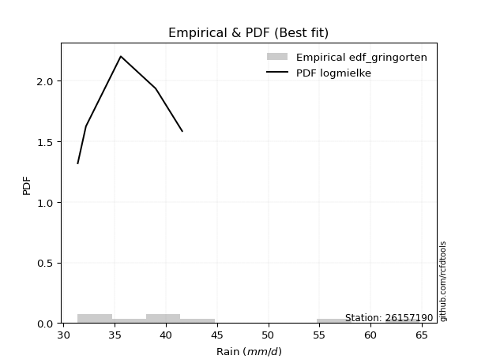</img>

</div>


### 9. EDF Filliben (1975)

The specific values of the constants (0.3175) (often denoted as $alpha$) and (0.365) are derived from a method proposed by James J. Filliben in a 1975 paper. This particular formula is the mean value of the $i$-th order statistic of the normal distribution and is considered a robust and effective plotting position formula for the normal probability plot correlation coefficient test for normality.

<div align="center">


$P=(m-0.3175)/(n+0.365)$


</div>


**9.1. Empirical values**

<div align="center">

|                | 0                  | 1                   | 2                  | 3                   | 4                  | 5                  | 6                  | 7                  |
|:---------------|:-------------------|:--------------------|:-------------------|:--------------------|:-------------------|:-------------------|:-------------------|:-------------------|
| date           | 2023               | 2017                | 2018               | 2020                | 2021               | 2022               | 2019               | 2025               |
| x              | 31.4               | 32.2                | 35.6               | 39.0                | 39.2               | 41.6               | 56.4               | 64.8               |
| m              | 1                  | 2                   | 3                  | 4                   | 5                  | 6                  | 7                  | 8                  |
| empirical_dist | edf_filliben       | edf_filliben        | edf_filliben       | edf_filliben        | edf_filliben       | edf_filliben       | edf_filliben       | edf_filliben       |
| empirical      | 0.0815899581589958 | 0.20113568439928273 | 0.3206814106395696 | 0.44022713687985654 | 0.5597728631201434 | 0.6793185893604303 | 0.7988643156007172 | 0.9184100418410042 |
| empirical_tr   | 1.0888382687927107 | 1.2517770295548074  | 1.4720633523977125 | 1.7864388681260008  | 2.271554650373387  | 3.118359739049394  | 4.971768202080237  | 12.256410256410254 |

</div>


**9.2. Kolmogorov-Smirnov fit test (sorted by Δ)**


<div align="center">

|                | 0                   | 1                  | 2                   | 3                   | 4                   | 5                   | 6                  | 7                   | 8                   | 9                   | 10                  | 11                  | 12                  | 13                  | 14                  | 15                  | 16                  | 17                  | 18                  | 19                  | 20                  | 21                  | 22                  | 23                  | 24                 | 25                  | 26                  | 27                  | 28                 | 29                  | 30                  | 31                  | 32                  | 33                 | 34                  | 35                  | 36                  | 37                  | 38                  | 39                  | 40                  | 41                 | 42                  | 43                  | 44                 | 45                 | 46                 | 47                 | 48                 | 49                  | 50                  | 51                 | 52                  | 53                  | 54                  | 55                  | 56                  | 57                  | 58                  | 59                 | 60                 | 61                 | 62                  | 63                  | 64                  | 65                  | 66                  | 67                 | 68                 | 69                 | 70                 | 71                  | 72                  | 73                  | 74                  | 75                  | 76                  | 77                 | 78                 | 79                  | 80                  | 81                 | 82                 | 83                  | 84                  | 85                 | 86                  | 87                  | 88                  | 89                  | 90                  | 91                  | 92                 | 93                  | 94                 | 95                 | 96                 | 97                  | 98                  | 99                  | 100                 | 101                 | 102                | 103                | 104                 | 105                 | 106                | 107                | 108                 | 109                 | 110                | 111                 | 112                 | 113                 | 114                 | 115                | 116                | 117                 | 118                 | 119                | 120                 | 121                 | 122                | 123                | 124                 | 125                | 126                 | 127                | 128                 | 129                 | 130                 | 131                 | 132                | 133                 | 134                | 135                | 136                 | 137                | 138                 | 139                | 140                | 141                 | 142                | 143                 | 144                 | 145                | 146                 | 147                 | 148                 | 149                 | 150                | 151                | 152                | 153                | 154                | 155                | 156                | 157                | 158                | 159                |
|:---------------|:--------------------|:-------------------|:--------------------|:--------------------|:--------------------|:--------------------|:-------------------|:--------------------|:--------------------|:--------------------|:--------------------|:--------------------|:--------------------|:--------------------|:--------------------|:--------------------|:--------------------|:--------------------|:--------------------|:--------------------|:--------------------|:--------------------|:--------------------|:--------------------|:-------------------|:--------------------|:--------------------|:--------------------|:-------------------|:--------------------|:--------------------|:--------------------|:--------------------|:-------------------|:--------------------|:--------------------|:--------------------|:--------------------|:--------------------|:--------------------|:--------------------|:-------------------|:--------------------|:--------------------|:-------------------|:-------------------|:-------------------|:-------------------|:-------------------|:--------------------|:--------------------|:-------------------|:--------------------|:--------------------|:--------------------|:--------------------|:--------------------|:--------------------|:--------------------|:-------------------|:-------------------|:-------------------|:--------------------|:--------------------|:--------------------|:--------------------|:--------------------|:-------------------|:-------------------|:-------------------|:-------------------|:--------------------|:--------------------|:--------------------|:--------------------|:--------------------|:--------------------|:-------------------|:-------------------|:--------------------|:--------------------|:-------------------|:-------------------|:--------------------|:--------------------|:-------------------|:--------------------|:--------------------|:--------------------|:--------------------|:--------------------|:--------------------|:-------------------|:--------------------|:-------------------|:-------------------|:-------------------|:--------------------|:--------------------|:--------------------|:--------------------|:--------------------|:-------------------|:-------------------|:--------------------|:--------------------|:-------------------|:-------------------|:--------------------|:--------------------|:-------------------|:--------------------|:--------------------|:--------------------|:--------------------|:-------------------|:-------------------|:--------------------|:--------------------|:-------------------|:--------------------|:--------------------|:-------------------|:-------------------|:--------------------|:-------------------|:--------------------|:-------------------|:--------------------|:--------------------|:--------------------|:--------------------|:-------------------|:--------------------|:-------------------|:-------------------|:--------------------|:-------------------|:--------------------|:-------------------|:-------------------|:--------------------|:-------------------|:--------------------|:--------------------|:-------------------|:--------------------|:--------------------|:--------------------|:--------------------|:-------------------|:-------------------|:-------------------|:-------------------|:-------------------|:-------------------|:-------------------|:-------------------|:-------------------|:-------------------|
| station        | 26157190            | 26157190           | 26157190            | 26157190            | 26157190            | 26157190            | 26157190           | 26157190            | 26157190            | 26157190            | 26157190            | 26157190            | 26157190            | 26157190            | 26157190            | 26157190            | 26157190            | 26157190            | 26157190            | 26157190            | 26157190            | 26157190            | 26157190            | 26157190            | 26157190           | 26157190            | 26157190            | 26157190            | 26157190           | 26157190            | 26157190            | 26157190            | 26157190            | 26157190           | 26157190            | 26157190            | 26157190            | 26157190            | 26157190            | 26157190            | 26157190            | 26157190           | 26157190            | 26157190            | 26157190           | 26157190           | 26157190           | 26157190           | 26157190           | 26157190            | 26157190            | 26157190           | 26157190            | 26157190            | 26157190            | 26157190            | 26157190            | 26157190            | 26157190            | 26157190           | 26157190           | 26157190           | 26157190            | 26157190            | 26157190            | 26157190            | 26157190            | 26157190           | 26157190           | 26157190           | 26157190           | 26157190            | 26157190            | 26157190            | 26157190            | 26157190            | 26157190            | 26157190           | 26157190           | 26157190            | 26157190            | 26157190           | 26157190           | 26157190            | 26157190            | 26157190           | 26157190            | 26157190            | 26157190            | 26157190            | 26157190            | 26157190            | 26157190           | 26157190            | 26157190           | 26157190           | 26157190           | 26157190            | 26157190            | 26157190            | 26157190            | 26157190            | 26157190           | 26157190           | 26157190            | 26157190            | 26157190           | 26157190           | 26157190            | 26157190            | 26157190           | 26157190            | 26157190            | 26157190            | 26157190            | 26157190           | 26157190           | 26157190            | 26157190            | 26157190           | 26157190            | 26157190            | 26157190           | 26157190           | 26157190            | 26157190           | 26157190            | 26157190           | 26157190            | 26157190            | 26157190            | 26157190            | 26157190           | 26157190            | 26157190           | 26157190           | 26157190            | 26157190           | 26157190            | 26157190           | 26157190           | 26157190            | 26157190           | 26157190            | 26157190            | 26157190           | 26157190            | 26157190            | 26157190            | 26157190            | 26157190           | 26157190           | 26157190           | 26157190           | 26157190           | 26157190           | 26157190           | 26157190           | 26157190           | 26157190           |
| empirical_dist | edf_filliben        | edf_filliben       | edf_filliben        | edf_filliben        | edf_filliben        | edf_filliben        | edf_filliben       | edf_filliben        | edf_filliben        | edf_filliben        | edf_filliben        | edf_filliben        | edf_filliben        | edf_filliben        | edf_filliben        | edf_filliben        | edf_filliben        | edf_filliben        | edf_filliben        | edf_filliben        | edf_filliben        | edf_filliben        | edf_filliben        | edf_filliben        | edf_filliben       | edf_filliben        | edf_filliben        | edf_filliben        | edf_filliben       | edf_filliben        | edf_filliben        | edf_filliben        | edf_filliben        | edf_filliben       | edf_filliben        | edf_filliben        | edf_filliben        | edf_filliben        | edf_filliben        | edf_filliben        | edf_filliben        | edf_filliben       | edf_filliben        | edf_filliben        | edf_filliben       | edf_filliben       | edf_filliben       | edf_filliben       | edf_filliben       | edf_filliben        | edf_filliben        | edf_filliben       | edf_filliben        | edf_filliben        | edf_filliben        | edf_filliben        | edf_filliben        | edf_filliben        | edf_filliben        | edf_filliben       | edf_filliben       | edf_filliben       | edf_filliben        | edf_filliben        | edf_filliben        | edf_filliben        | edf_filliben        | edf_filliben       | edf_filliben       | edf_filliben       | edf_filliben       | edf_filliben        | edf_filliben        | edf_filliben        | edf_filliben        | edf_filliben        | edf_filliben        | edf_filliben       | edf_filliben       | edf_filliben        | edf_filliben        | edf_filliben       | edf_filliben       | edf_filliben        | edf_filliben        | edf_filliben       | edf_filliben        | edf_filliben        | edf_filliben        | edf_filliben        | edf_filliben        | edf_filliben        | edf_filliben       | edf_filliben        | edf_filliben       | edf_filliben       | edf_filliben       | edf_filliben        | edf_filliben        | edf_filliben        | edf_filliben        | edf_filliben        | edf_filliben       | edf_filliben       | edf_filliben        | edf_filliben        | edf_filliben       | edf_filliben       | edf_filliben        | edf_filliben        | edf_filliben       | edf_filliben        | edf_filliben        | edf_filliben        | edf_filliben        | edf_filliben       | edf_filliben       | edf_filliben        | edf_filliben        | edf_filliben       | edf_filliben        | edf_filliben        | edf_filliben       | edf_filliben       | edf_filliben        | edf_filliben       | edf_filliben        | edf_filliben       | edf_filliben        | edf_filliben        | edf_filliben        | edf_filliben        | edf_filliben       | edf_filliben        | edf_filliben       | edf_filliben       | edf_filliben        | edf_filliben       | edf_filliben        | edf_filliben       | edf_filliben       | edf_filliben        | edf_filliben       | edf_filliben        | edf_filliben        | edf_filliben       | edf_filliben        | edf_filliben        | edf_filliben        | edf_filliben        | edf_filliben       | edf_filliben       | edf_filliben       | edf_filliben       | edf_filliben       | edf_filliben       | edf_filliben       | edf_filliben       | edf_filliben       | edf_filliben       |
| p_dist         | logbeta             | logmielke          | loghalfnorm         | gengamma            | loginvweibull       | loggenextreme       | logburr            | alpha               | loginvgamma         | logf                | loggumbel_r         | logmoyal            | burr                | logburr12           | burr12              | invgamma            | f                   | logkstwobign        | loghalflogistic     | invweibull          | genextreme          | dweibull            | nakagami            | halflogistic        | logexponnorm       | loggengamma         | beta                | loggenlogistic      | mielke             | logweibull_max      | logdweibull         | logpearson3         | logfoldnorm         | moyal              | logexponweib        | lograyleigh         | loggenexpon         | logalpha            | genlogistic         | loginvgauss         | logjohnsonsu        | loggompertz        | lomax               | invgauss            | logloglaplace      | exponnorm          | genexpon           | gompertz           | truncnorm          | dgamma              | logmaxwell          | vonmises_line      | loghalfgennorm      | nct                 | logtruncnorm        | halfnorm            | foldnorm            | logdgamma           | logexponpow         | loggennorm         | logkappa3          | erlang             | gennorm             | gumbel_r            | lognct              | johnsonsu           | logrice             | truncpareto        | logskewnorm        | pearson3           | betaprime          | genhalflogistic     | ncf                 | truncweibull_min    | kstwobign           | logtruncexpon       | logfatiguelife      | logbetaprime       | loglogistic        | loghypsecant        | lognorm             | logcrystalball     | logt               | logloggamma         | rayleigh            | loganglit          | logsemicircular     | logarcsine          | maxwell             | exponpow            | fatiguelife         | exponweib           | loggausshyper      | logweibull_min      | loglaplace         | loglaplace         | skewnorm           | weibull_min         | arcsine             | wald                | logwald             | logtruncweibull_min | logbradford        | semicircular       | logcosine           | rice                | anglit             | logncf             | crystalball         | norm                | t                  | logistic            | logwrapcauchy       | hypsecant           | lognakagami         | triang             | loggumbel_l        | laplace             | genpareto           | logkappa4          | loggamma            | loggamma            | halfgennorm        | truncexpon         | cosine              | gausshyper         | wrapcauchy          | logksone           | gumbel_l            | logargus            | loguniform          | bradford            | logvonmises_line   | logerlang           | logrdist           | logtukeylambda     | tukeylambda         | rdist              | loglevy_l           | johnsonsb          | logtriang          | ksone               | argus              | levy_l              | kappa4              | uniform            | kappa3              | powerlaw            | loggenpareto        | gamma               | loggenhalflogistic | logpowerlaw        | logtruncpareto     | logtrapezoid       | weibull_max        | trapezoid          | loglomax           | logjohnsonsb       | logvonmises        | vonmises           |
| delta          | 0.08776442816769914 | 0.0883653864672291 | 0.09174909171888546 | 0.09253148251712151 | 0.09710974729070661 | 0.09711559319616907 | 0.0973318726118989 | 0.09733352923180846 | 0.09989932899625592 | 0.09990027692481024 | 0.10037524683338683 | 0.10347626555950999 | 0.10416652512236346 | 0.10464279526016457 | 0.10513382936519357 | 0.10806461038236065 | 0.10810754221956093 | 0.10821010449929946 | 0.10837206712208663 | 0.10950172013807385 | 0.10950207783987947 | 0.11075792455529634 | 0.11121738488940269 | 0.11132766949975748 | 0.1115986426200157 | 0.11234251873388701 | 0.11241908365648617 | 0.11301465885849216 | 0.113145734732501  | 0.11391325433813171 | 0.11441635043159404 | 0.11532058397933875 | 0.11612916187748001 | 0.1181242851589619 | 0.11988177099138339 | 0.12183016262181179 | 0.12365667433905643 | 0.12458544897767432 | 0.12469194362260094 | 0.12474303954277993 | 0.12653625104498506 | 0.1275024824852129 | 0.12900885399556986 | 0.12995794397404042 | 0.1306159132764061 | 0.1310427729929746 | 0.1317499812092626 | 0.1317712618675108 | 0.1319240127523483 | 0.13224083663302977 | 0.13251516482193793 | 0.1330070592314102 | 0.13352720999989687 | 0.13375809525160642 | 0.13376781919072023 | 0.13390279385733272 | 0.13504227928995483 | 0.13654725579627114 | 0.13762007210479887 | 0.1382997974934676 | 0.13917701966765   | 0.1420901871230375 | 0.14360592455020327 | 0.14384333735377808 | 0.14451297261088314 | 0.14451931414231328 | 0.14506039550942462 | 0.1453928528753919 | 0.1460295873911394 | 0.147145141299577  | 0.1524104759056204 | 0.15394676900526663 | 0.15548901018046368 | 0.15557432340287203 | 0.15760331663316607 | 0.16181951628300217 | 0.16260182583226718 | 0.1627503297979782 | 0.1629714557355767 | 0.16309568235149913 | 0.16493447566616581 | 0.1649345169412657 | 0.1649363787101945 | 0.16633192624848459 | 0.16672755460343947 | 0.1669921387514145 | 0.16783986142372864 | 0.17120032927083173 | 0.17837158853541835 | 0.17950856255132663 | 0.18081891080114082 | 0.18115901574493748 | 0.185537333088083  | 0.18819113729352105 | 0.1884412030547884 | 0.1884412030547884 | 0.1962269181282017 | 0.19652085876666753 | 0.19803225809682218 | 0.20059929807228388 | 0.20113568439928273 | 0.20180930734382507 | 0.2024703059032984 | 0.2057608017431367 | 0.20747163509431854 | 0.20748564835543692 | 0.2077078036555689 | 0.2083908599560452 | 0.21243037626992156 | 0.21243037815166393 | 0.2124313765406467 | 0.21692660034125583 | 0.21798393156676754 | 0.22074835377603536 | 0.22208412614682577 | 0.2311691665246149 | 0.234734138778096  | 0.23475425839766545 | 0.23755612843713114 | 0.2394237713081231 | 0.25324377272683635 | 0.25324377272683635 | 0.2570125592722065 | 0.2635054110266761 | 0.26421570461046573 | 0.2649360657525496 | 0.26608510036294225 | 0.2724366440047816 | 0.28300444489885734 | 0.29095669243824807 | 0.29106025493365156 | 0.29137301487916295 | 0.2944074331472282 | 0.29983456142862747 | 0.3076257426453397 | 0.3187905750675697 | 0.32068135690201127 | 0.3206814106289667 | 0.32382640289366504 | 0.3266492616431643 | 0.3385248722587252 | 0.34149423806302504 | 0.3429932130229243 | 0.34530977221320747 | 0.35067811008040506 | 0.373929367803544  | 0.37463344780597646 | 0.38192020013031064 | 0.38478356217482734 | 0.40121381359591307 | 0.4045615672790207 | 0.404768625775444  | 0.4887638460822897 | 0.5137656719040332 | 0.5427041691865575 | 0.5651932970309176 | 0.6517272147620098 | 0.6714964104182503 | 1.1056304928050507 | 9.83484247199404   |
| deltao         | 0.4472608134160001  | 0.4472608134160001 | 0.4472608134160001  | 0.4472608134160001  | 0.4472608134160001  | 0.4472608134160001  | 0.4472608134160001 | 0.4472608134160001  | 0.4472608134160001  | 0.4472608134160001  | 0.4472608134160001  | 0.4472608134160001  | 0.4472608134160001  | 0.4472608134160001  | 0.4472608134160001  | 0.4472608134160001  | 0.4472608134160001  | 0.4472608134160001  | 0.4472608134160001  | 0.4472608134160001  | 0.4472608134160001  | 0.4472608134160001  | 0.4472608134160001  | 0.4472608134160001  | 0.4472608134160001 | 0.4472608134160001  | 0.4472608134160001  | 0.4472608134160001  | 0.4472608134160001 | 0.4472608134160001  | 0.4472608134160001  | 0.4472608134160001  | 0.4472608134160001  | 0.4472608134160001 | 0.4472608134160001  | 0.4472608134160001  | 0.4472608134160001  | 0.4472608134160001  | 0.4472608134160001  | 0.4472608134160001  | 0.4472608134160001  | 0.4472608134160001 | 0.4472608134160001  | 0.4472608134160001  | 0.4472608134160001 | 0.4472608134160001 | 0.4472608134160001 | 0.4472608134160001 | 0.4472608134160001 | 0.4472608134160001  | 0.4472608134160001  | 0.4472608134160001 | 0.4472608134160001  | 0.4472608134160001  | 0.4472608134160001  | 0.4472608134160001  | 0.4472608134160001  | 0.4472608134160001  | 0.4472608134160001  | 0.4472608134160001 | 0.4472608134160001 | 0.4472608134160001 | 0.4472608134160001  | 0.4472608134160001  | 0.4472608134160001  | 0.4472608134160001  | 0.4472608134160001  | 0.4472608134160001 | 0.4472608134160001 | 0.4472608134160001 | 0.4472608134160001 | 0.4472608134160001  | 0.4472608134160001  | 0.4472608134160001  | 0.4472608134160001  | 0.4472608134160001  | 0.4472608134160001  | 0.4472608134160001 | 0.4472608134160001 | 0.4472608134160001  | 0.4472608134160001  | 0.4472608134160001 | 0.4472608134160001 | 0.4472608134160001  | 0.4472608134160001  | 0.4472608134160001 | 0.4472608134160001  | 0.4472608134160001  | 0.4472608134160001  | 0.4472608134160001  | 0.4472608134160001  | 0.4472608134160001  | 0.4472608134160001 | 0.4472608134160001  | 0.4472608134160001 | 0.4472608134160001 | 0.4472608134160001 | 0.4472608134160001  | 0.4472608134160001  | 0.4472608134160001  | 0.4472608134160001  | 0.4472608134160001  | 0.4472608134160001 | 0.4472608134160001 | 0.4472608134160001  | 0.4472608134160001  | 0.4472608134160001 | 0.4472608134160001 | 0.4472608134160001  | 0.4472608134160001  | 0.4472608134160001 | 0.4472608134160001  | 0.4472608134160001  | 0.4472608134160001  | 0.4472608134160001  | 0.4472608134160001 | 0.4472608134160001 | 0.4472608134160001  | 0.4472608134160001  | 0.4472608134160001 | 0.4472608134160001  | 0.4472608134160001  | 0.4472608134160001 | 0.4472608134160001 | 0.4472608134160001  | 0.4472608134160001 | 0.4472608134160001  | 0.4472608134160001 | 0.4472608134160001  | 0.4472608134160001  | 0.4472608134160001  | 0.4472608134160001  | 0.4472608134160001 | 0.4472608134160001  | 0.4472608134160001 | 0.4472608134160001 | 0.4472608134160001  | 0.4472608134160001 | 0.4472608134160001  | 0.4472608134160001 | 0.4472608134160001 | 0.4472608134160001  | 0.4472608134160001 | 0.4472608134160001  | 0.4472608134160001  | 0.4472608134160001 | 0.4472608134160001  | 0.4472608134160001  | 0.4472608134160001  | 0.4472608134160001  | 0.4472608134160001 | 0.4472608134160001 | 0.4472608134160001 | 0.4472608134160001 | 0.4472608134160001 | 0.4472608134160001 | 0.4472608134160001 | 0.4472608134160001 | 0.4472608134160001 | 0.4472608134160001 |
| eval           | Δo > Δ              | Δo > Δ             | Δo > Δ              | Δo > Δ              | Δo > Δ              | Δo > Δ              | Δo > Δ             | Δo > Δ              | Δo > Δ              | Δo > Δ              | Δo > Δ              | Δo > Δ              | Δo > Δ              | Δo > Δ              | Δo > Δ              | Δo > Δ              | Δo > Δ              | Δo > Δ              | Δo > Δ              | Δo > Δ              | Δo > Δ              | Δo > Δ              | Δo > Δ              | Δo > Δ              | Δo > Δ             | Δo > Δ              | Δo > Δ              | Δo > Δ              | Δo > Δ             | Δo > Δ              | Δo > Δ              | Δo > Δ              | Δo > Δ              | Δo > Δ             | Δo > Δ              | Δo > Δ              | Δo > Δ              | Δo > Δ              | Δo > Δ              | Δo > Δ              | Δo > Δ              | Δo > Δ             | Δo > Δ              | Δo > Δ              | Δo > Δ             | Δo > Δ             | Δo > Δ             | Δo > Δ             | Δo > Δ             | Δo > Δ              | Δo > Δ              | Δo > Δ             | Δo > Δ              | Δo > Δ              | Δo > Δ              | Δo > Δ              | Δo > Δ              | Δo > Δ              | Δo > Δ              | Δo > Δ             | Δo > Δ             | Δo > Δ             | Δo > Δ              | Δo > Δ              | Δo > Δ              | Δo > Δ              | Δo > Δ              | Δo > Δ             | Δo > Δ             | Δo > Δ             | Δo > Δ             | Δo > Δ              | Δo > Δ              | Δo > Δ              | Δo > Δ              | Δo > Δ              | Δo > Δ              | Δo > Δ             | Δo > Δ             | Δo > Δ              | Δo > Δ              | Δo > Δ             | Δo > Δ             | Δo > Δ              | Δo > Δ              | Δo > Δ             | Δo > Δ              | Δo > Δ              | Δo > Δ              | Δo > Δ              | Δo > Δ              | Δo > Δ              | Δo > Δ             | Δo > Δ              | Δo > Δ             | Δo > Δ             | Δo > Δ             | Δo > Δ              | Δo > Δ              | Δo > Δ              | Δo > Δ              | Δo > Δ              | Δo > Δ             | Δo > Δ             | Δo > Δ              | Δo > Δ              | Δo > Δ             | Δo > Δ             | Δo > Δ              | Δo > Δ              | Δo > Δ             | Δo > Δ              | Δo > Δ              | Δo > Δ              | Δo > Δ              | Δo > Δ             | Δo > Δ             | Δo > Δ              | Δo > Δ              | Δo > Δ             | Δo > Δ              | Δo > Δ              | Δo > Δ             | Δo > Δ             | Δo > Δ              | Δo > Δ             | Δo > Δ              | Δo > Δ             | Δo > Δ              | Δo > Δ              | Δo > Δ              | Δo > Δ              | Δo > Δ             | Δo > Δ              | Δo > Δ             | Δo > Δ             | Δo > Δ              | Δo > Δ             | Δo > Δ              | Δo > Δ             | Δo > Δ             | Δo > Δ              | Δo > Δ             | Δo > Δ              | Δo > Δ              | Δo > Δ             | Δo > Δ              | Δo > Δ              | Δo > Δ              | Δo > Δ              | Δo > Δ             | Δo > Δ             | Δo <= Δ            | Δo <= Δ            | Δo <= Δ            | Δo <= Δ            | Δo <= Δ            | Δo <= Δ            | Δo <= Δ            | Δo <= Δ            |
| fit            | 1                   | 1                  | 1                   | 1                   | 1                   | 1                   | 1                  | 1                   | 1                   | 1                   | 1                   | 1                   | 1                   | 1                   | 1                   | 1                   | 1                   | 1                   | 1                   | 1                   | 1                   | 1                   | 1                   | 1                   | 1                  | 1                   | 1                   | 1                   | 1                  | 1                   | 1                   | 1                   | 1                   | 1                  | 1                   | 1                   | 1                   | 1                   | 1                   | 1                   | 1                   | 1                  | 1                   | 1                   | 1                  | 1                  | 1                  | 1                  | 1                  | 1                   | 1                   | 1                  | 1                   | 1                   | 1                   | 1                   | 1                   | 1                   | 1                   | 1                  | 1                  | 1                  | 1                   | 1                   | 1                   | 1                   | 1                   | 1                  | 1                  | 1                  | 1                  | 1                   | 1                   | 1                   | 1                   | 1                   | 1                   | 1                  | 1                  | 1                   | 1                   | 1                  | 1                  | 1                   | 1                   | 1                  | 1                   | 1                   | 1                   | 1                   | 1                   | 1                   | 1                  | 1                   | 1                  | 1                  | 1                  | 1                   | 1                   | 1                   | 1                   | 1                   | 1                  | 1                  | 1                   | 1                   | 1                  | 1                  | 1                   | 1                   | 1                  | 1                   | 1                   | 1                   | 1                   | 1                  | 1                  | 1                   | 1                   | 1                  | 1                   | 1                   | 1                  | 1                  | 1                   | 1                  | 1                   | 1                  | 1                   | 1                   | 1                   | 1                   | 1                  | 1                   | 1                  | 1                  | 1                   | 1                  | 1                   | 1                  | 1                  | 1                   | 1                  | 1                   | 1                   | 1                  | 1                   | 1                   | 1                   | 1                   | 1                  | 1                  | 0                  | 0                  | 0                  | 0                  | 0                  | 0                  | 0                  | 0                  |
| n              | 8                   | 8                  | 8                   | 8                   | 8                   | 8                   | 8                  | 8                   | 8                   | 8                   | 8                   | 8                   | 8                   | 8                   | 8                   | 8                   | 8                   | 8                   | 8                   | 8                   | 8                   | 8                   | 8                   | 8                   | 8                  | 8                   | 8                   | 8                   | 8                  | 8                   | 8                   | 8                   | 8                   | 8                  | 8                   | 8                   | 8                   | 8                   | 8                   | 8                   | 8                   | 8                  | 8                   | 8                   | 8                  | 8                  | 8                  | 8                  | 8                  | 8                   | 8                   | 8                  | 8                   | 8                   | 8                   | 8                   | 8                   | 8                   | 8                   | 8                  | 8                  | 8                  | 8                   | 8                   | 8                   | 8                   | 8                   | 8                  | 8                  | 8                  | 8                  | 8                   | 8                   | 8                   | 8                   | 8                   | 8                   | 8                  | 8                  | 8                   | 8                   | 8                  | 8                  | 8                   | 8                   | 8                  | 8                   | 8                   | 8                   | 8                   | 8                   | 8                   | 8                  | 8                   | 8                  | 8                  | 8                  | 8                   | 8                   | 8                   | 8                   | 8                   | 8                  | 8                  | 8                   | 8                   | 8                  | 8                  | 8                   | 8                   | 8                  | 8                   | 8                   | 8                   | 8                   | 8                  | 8                  | 8                   | 8                   | 8                  | 8                   | 8                   | 8                  | 8                  | 8                   | 8                  | 8                   | 8                  | 8                   | 8                   | 8                   | 8                   | 8                  | 8                   | 8                  | 8                  | 8                   | 8                  | 8                   | 8                  | 8                  | 8                   | 8                  | 8                   | 8                   | 8                  | 8                   | 8                   | 8                   | 8                   | 8                  | 8                  | 8                  | 8                  | 8                  | 8                  | 8                  | 8                  | 8                  | 8                  |
| best_fit       | 1                   | 0                  | 0                   | 0                   | 0                   | 0                   | 0                  | 0                   | 0                   | 0                   | 0                   | 0                   | 0                   | 0                   | 0                   | 0                   | 0                   | 0                   | 0                   | 0                   | 0                   | 0                   | 0                   | 0                   | 0                  | 0                   | 0                   | 0                   | 0                  | 0                   | 0                   | 0                   | 0                   | 0                  | 0                   | 0                   | 0                   | 0                   | 0                   | 0                   | 0                   | 0                  | 0                   | 0                   | 0                  | 0                  | 0                  | 0                  | 0                  | 0                   | 0                   | 0                  | 0                   | 0                   | 0                   | 0                   | 0                   | 0                   | 0                   | 0                  | 0                  | 0                  | 0                   | 0                   | 0                   | 0                   | 0                   | 0                  | 0                  | 0                  | 0                  | 0                   | 0                   | 0                   | 0                   | 0                   | 0                   | 0                  | 0                  | 0                   | 0                   | 0                  | 0                  | 0                   | 0                   | 0                  | 0                   | 0                   | 0                   | 0                   | 0                   | 0                   | 0                  | 0                   | 0                  | 0                  | 0                  | 0                   | 0                   | 0                   | 0                   | 0                   | 0                  | 0                  | 0                   | 0                   | 0                  | 0                  | 0                   | 0                   | 0                  | 0                   | 0                   | 0                   | 0                   | 0                  | 0                  | 0                   | 0                   | 0                  | 0                   | 0                   | 0                  | 0                  | 0                   | 0                  | 0                   | 0                  | 0                   | 0                   | 0                   | 0                   | 0                  | 0                   | 0                  | 0                  | 0                   | 0                  | 0                   | 0                  | 0                  | 0                   | 0                  | 0                   | 0                   | 0                  | 0                   | 0                   | 0                   | 0                   | 0                  | 0                  | 0                  | 0                  | 0                  | 0                  | 0                  | 0                  | 0                  | 0                  |
| best_fit_sort  | 1                   | 2                  | 3                   | 4                   | 5                   | 6                   | 7                  | 8                   | 9                   | 10                  | 11                  | 12                  | 13                  | 14                  | 15                  | 16                  | 17                  | 18                  | 19                  | 20                  | 21                  | 22                  | 23                  | 24                  | 25                 | 26                  | 27                  | 28                  | 29                 | 30                  | 31                  | 32                  | 33                  | 34                 | 35                  | 36                  | 37                  | 38                  | 39                  | 40                  | 41                  | 42                 | 43                  | 44                  | 45                 | 46                 | 47                 | 48                 | 49                 | 50                  | 51                  | 52                 | 53                  | 54                  | 55                  | 56                  | 57                  | 58                  | 59                  | 60                 | 61                 | 62                 | 63                  | 64                  | 65                  | 66                  | 67                  | 68                 | 69                 | 70                 | 71                 | 72                  | 73                  | 74                  | 75                  | 76                  | 77                  | 78                 | 79                 | 80                  | 81                  | 82                 | 83                 | 84                  | 85                  | 86                 | 87                  | 88                  | 89                  | 90                  | 91                  | 92                  | 93                 | 94                  | 95                 | 96                 | 97                 | 98                  | 99                  | 100                 | 101                 | 102                 | 103                | 104                | 105                 | 106                 | 107                | 108                | 109                 | 110                 | 111                | 112                 | 113                 | 114                 | 115                 | 116                | 117                | 118                 | 119                 | 120                | 121                 | 122                 | 123                | 124                | 125                 | 126                | 127                 | 128                | 129                 | 130                 | 131                 | 132                 | 133                | 134                 | 135                | 136                | 137                 | 138                | 139                 | 140                | 141                | 142                 | 143                | 144                 | 145                 | 146                | 147                 | 148                 | 149                 | 150                 | 151                | 152                | 153                | 154                | 155                | 156                | 157                | 158                | 159                | 160                |

</div>


**9.3. Best fit**

<div align="center">

|   id |   station | empirical_dist   | p_dist   |     delta |   deltao | eval   |   fit |   n |   best_fit |   best_fit_sort |
|-----:|----------:|:-----------------|:---------|----------:|---------:|:-------|------:|----:|-----------:|----------------:|
|    0 |  26157190 | edf_filliben     | logbeta  | 0.0877644 | 0.447261 | Δo > Δ |     1 |   8 |          1 |               1 |

</div>


<div align="center">

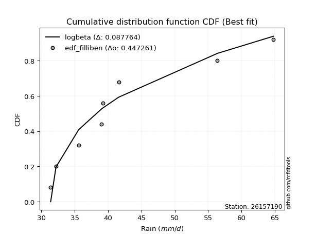</img></img>

</div>


### 10. EDF Jenkinson (1977)

The Jenkinson formula in hydrology is an empirical plotting position formula used to estimate the non-exceedance probability _(P)_ or return period _(T)_ of a given ordered observation within a sample. It is a widely used method in the frequency analysis of extreme events such as floods and rainfall, as it provides a distribution-free way to plot data. _a≈0.31_ and _b≈0.38_ are constants derived to approximate the median of the probability distribution for the given rank.

<div align="center">


$P=(m-a)/(n+b)$


</div>


**10.1. Empirical values**

<div align="center">

|                | 0                   | 1                   | 2                  | 3                   | 4                  | 5                  | 6                  | 7                  |
|:---------------|:--------------------|:--------------------|:-------------------|:--------------------|:-------------------|:-------------------|:-------------------|:-------------------|
| date           | 2023                | 2017                | 2018               | 2020                | 2021               | 2022               | 2019               | 2025               |
| x              | 31.4                | 32.2                | 35.6               | 39.0                | 39.2               | 41.6               | 56.4               | 64.8               |
| m              | 1                   | 2                   | 3                  | 4                   | 5                  | 6                  | 7                  | 8                  |
| empirical_dist | edf_jenkinson       | edf_jenkinson       | edf_jenkinson      | edf_jenkinson       | edf_jenkinson      | edf_jenkinson      | edf_jenkinson      | edf_jenkinson      |
| empirical      | 0.08233890214797135 | 0.20167064439140808 | 0.3210023866348448 | 0.44033412887828155 | 0.5596658711217184 | 0.6789976133651551 | 0.7983293556085919 | 0.9176610978520287 |
| empirical_tr   | 1.0897269180754225  | 1.2526158445440956  | 1.4727592267135323 | 1.7867803837953091  | 2.2710027100271004 | 3.115241635687732  | 4.958579881656804  | 12.144927536231886 |

</div>


**10.2. Kolmogorov-Smirnov fit test (sorted by Δ)**


<div align="center">

|                | 0                   | 1                   | 2                  | 3                   | 4                   | 5                   | 6                   | 7                   | 8                   | 9                   | 10                  | 11                  | 12                  | 13                  | 14                  | 15                  | 16                  | 17                  | 18                  | 19                  | 20                  | 21                 | 22                  | 23                  | 24                  | 25                  | 26                  | 27                  | 28                  | 29                  | 30                  | 31                 | 32                  | 33                  | 34                  | 35                  | 36                  | 37                  | 38                  | 39                 | 40                  | 41                  | 42                 | 43                  | 44                  | 45                  | 46                  | 47                  | 48                  | 49                  | 50                  | 51                  | 52                 | 53                  | 54                  | 55                  | 56                  | 57                  | 58                  | 59                 | 60                  | 61                 | 62                  | 63                  | 64                 | 65                  | 66                  | 67                  | 68                  | 69                  | 70                  | 71                 | 72                  | 73                  | 74                  | 75                  | 76                  | 77                  | 78                  | 79                  | 80                  | 81                  | 82                  | 83                  | 84                 | 85                  | 86                 | 87                  | 88                 | 89                  | 90                 | 91                  | 92                  | 93                  | 94                 | 95                 | 96                  | 97                  | 98                  | 99                  | 100                 | 101                 | 102                 | 103                 | 104                | 105                 | 106                 | 107                 | 108                | 109                 | 110                 | 111                 | 112                | 113                | 114                 | 115                 | 116                 | 117                | 118                | 119                 | 120                 | 121                 | 122                | 123                | 124                | 125                | 126                | 127                | 128                | 129                | 130                | 131                | 132                | 133                 | 134                 | 135                 | 136                | 137                 | 138                 | 139                | 140                 | 141                | 142                 | 143                 | 144                | 145                 | 146                | 147                 | 148                 | 149                | 150                 | 151                | 152                | 153                | 154                | 155                | 156                | 157                | 158                | 159                |
|:---------------|:--------------------|:--------------------|:-------------------|:--------------------|:--------------------|:--------------------|:--------------------|:--------------------|:--------------------|:--------------------|:--------------------|:--------------------|:--------------------|:--------------------|:--------------------|:--------------------|:--------------------|:--------------------|:--------------------|:--------------------|:--------------------|:-------------------|:--------------------|:--------------------|:--------------------|:--------------------|:--------------------|:--------------------|:--------------------|:--------------------|:--------------------|:-------------------|:--------------------|:--------------------|:--------------------|:--------------------|:--------------------|:--------------------|:--------------------|:-------------------|:--------------------|:--------------------|:-------------------|:--------------------|:--------------------|:--------------------|:--------------------|:--------------------|:--------------------|:--------------------|:--------------------|:--------------------|:-------------------|:--------------------|:--------------------|:--------------------|:--------------------|:--------------------|:--------------------|:-------------------|:--------------------|:-------------------|:--------------------|:--------------------|:-------------------|:--------------------|:--------------------|:--------------------|:--------------------|:--------------------|:--------------------|:-------------------|:--------------------|:--------------------|:--------------------|:--------------------|:--------------------|:--------------------|:--------------------|:--------------------|:--------------------|:--------------------|:--------------------|:--------------------|:-------------------|:--------------------|:-------------------|:--------------------|:-------------------|:--------------------|:-------------------|:--------------------|:--------------------|:--------------------|:-------------------|:-------------------|:--------------------|:--------------------|:--------------------|:--------------------|:--------------------|:--------------------|:--------------------|:--------------------|:-------------------|:--------------------|:--------------------|:--------------------|:-------------------|:--------------------|:--------------------|:--------------------|:-------------------|:-------------------|:--------------------|:--------------------|:--------------------|:-------------------|:-------------------|:--------------------|:--------------------|:--------------------|:-------------------|:-------------------|:-------------------|:-------------------|:-------------------|:-------------------|:-------------------|:-------------------|:-------------------|:-------------------|:-------------------|:--------------------|:--------------------|:--------------------|:-------------------|:--------------------|:--------------------|:-------------------|:--------------------|:-------------------|:--------------------|:--------------------|:-------------------|:--------------------|:-------------------|:--------------------|:--------------------|:-------------------|:--------------------|:-------------------|:-------------------|:-------------------|:-------------------|:-------------------|:-------------------|:-------------------|:-------------------|:-------------------|
| station        | 26157190            | 26157190            | 26157190           | 26157190            | 26157190            | 26157190            | 26157190            | 26157190            | 26157190            | 26157190            | 26157190            | 26157190            | 26157190            | 26157190            | 26157190            | 26157190            | 26157190            | 26157190            | 26157190            | 26157190            | 26157190            | 26157190           | 26157190            | 26157190            | 26157190            | 26157190            | 26157190            | 26157190            | 26157190            | 26157190            | 26157190            | 26157190           | 26157190            | 26157190            | 26157190            | 26157190            | 26157190            | 26157190            | 26157190            | 26157190           | 26157190            | 26157190            | 26157190           | 26157190            | 26157190            | 26157190            | 26157190            | 26157190            | 26157190            | 26157190            | 26157190            | 26157190            | 26157190           | 26157190            | 26157190            | 26157190            | 26157190            | 26157190            | 26157190            | 26157190           | 26157190            | 26157190           | 26157190            | 26157190            | 26157190           | 26157190            | 26157190            | 26157190            | 26157190            | 26157190            | 26157190            | 26157190           | 26157190            | 26157190            | 26157190            | 26157190            | 26157190            | 26157190            | 26157190            | 26157190            | 26157190            | 26157190            | 26157190            | 26157190            | 26157190           | 26157190            | 26157190           | 26157190            | 26157190           | 26157190            | 26157190           | 26157190            | 26157190            | 26157190            | 26157190           | 26157190           | 26157190            | 26157190            | 26157190            | 26157190            | 26157190            | 26157190            | 26157190            | 26157190            | 26157190           | 26157190            | 26157190            | 26157190            | 26157190           | 26157190            | 26157190            | 26157190            | 26157190           | 26157190           | 26157190            | 26157190            | 26157190            | 26157190           | 26157190           | 26157190            | 26157190            | 26157190            | 26157190           | 26157190           | 26157190           | 26157190           | 26157190           | 26157190           | 26157190           | 26157190           | 26157190           | 26157190           | 26157190           | 26157190            | 26157190            | 26157190            | 26157190           | 26157190            | 26157190            | 26157190           | 26157190            | 26157190           | 26157190            | 26157190            | 26157190           | 26157190            | 26157190           | 26157190            | 26157190            | 26157190           | 26157190            | 26157190           | 26157190           | 26157190           | 26157190           | 26157190           | 26157190           | 26157190           | 26157190           | 26157190           |
| empirical_dist | edf_jenkinson       | edf_jenkinson       | edf_jenkinson      | edf_jenkinson       | edf_jenkinson       | edf_jenkinson       | edf_jenkinson       | edf_jenkinson       | edf_jenkinson       | edf_jenkinson       | edf_jenkinson       | edf_jenkinson       | edf_jenkinson       | edf_jenkinson       | edf_jenkinson       | edf_jenkinson       | edf_jenkinson       | edf_jenkinson       | edf_jenkinson       | edf_jenkinson       | edf_jenkinson       | edf_jenkinson      | edf_jenkinson       | edf_jenkinson       | edf_jenkinson       | edf_jenkinson       | edf_jenkinson       | edf_jenkinson       | edf_jenkinson       | edf_jenkinson       | edf_jenkinson       | edf_jenkinson      | edf_jenkinson       | edf_jenkinson       | edf_jenkinson       | edf_jenkinson       | edf_jenkinson       | edf_jenkinson       | edf_jenkinson       | edf_jenkinson      | edf_jenkinson       | edf_jenkinson       | edf_jenkinson      | edf_jenkinson       | edf_jenkinson       | edf_jenkinson       | edf_jenkinson       | edf_jenkinson       | edf_jenkinson       | edf_jenkinson       | edf_jenkinson       | edf_jenkinson       | edf_jenkinson      | edf_jenkinson       | edf_jenkinson       | edf_jenkinson       | edf_jenkinson       | edf_jenkinson       | edf_jenkinson       | edf_jenkinson      | edf_jenkinson       | edf_jenkinson      | edf_jenkinson       | edf_jenkinson       | edf_jenkinson      | edf_jenkinson       | edf_jenkinson       | edf_jenkinson       | edf_jenkinson       | edf_jenkinson       | edf_jenkinson       | edf_jenkinson      | edf_jenkinson       | edf_jenkinson       | edf_jenkinson       | edf_jenkinson       | edf_jenkinson       | edf_jenkinson       | edf_jenkinson       | edf_jenkinson       | edf_jenkinson       | edf_jenkinson       | edf_jenkinson       | edf_jenkinson       | edf_jenkinson      | edf_jenkinson       | edf_jenkinson      | edf_jenkinson       | edf_jenkinson      | edf_jenkinson       | edf_jenkinson      | edf_jenkinson       | edf_jenkinson       | edf_jenkinson       | edf_jenkinson      | edf_jenkinson      | edf_jenkinson       | edf_jenkinson       | edf_jenkinson       | edf_jenkinson       | edf_jenkinson       | edf_jenkinson       | edf_jenkinson       | edf_jenkinson       | edf_jenkinson      | edf_jenkinson       | edf_jenkinson       | edf_jenkinson       | edf_jenkinson      | edf_jenkinson       | edf_jenkinson       | edf_jenkinson       | edf_jenkinson      | edf_jenkinson      | edf_jenkinson       | edf_jenkinson       | edf_jenkinson       | edf_jenkinson      | edf_jenkinson      | edf_jenkinson       | edf_jenkinson       | edf_jenkinson       | edf_jenkinson      | edf_jenkinson      | edf_jenkinson      | edf_jenkinson      | edf_jenkinson      | edf_jenkinson      | edf_jenkinson      | edf_jenkinson      | edf_jenkinson      | edf_jenkinson      | edf_jenkinson      | edf_jenkinson       | edf_jenkinson       | edf_jenkinson       | edf_jenkinson      | edf_jenkinson       | edf_jenkinson       | edf_jenkinson      | edf_jenkinson       | edf_jenkinson      | edf_jenkinson       | edf_jenkinson       | edf_jenkinson      | edf_jenkinson       | edf_jenkinson      | edf_jenkinson       | edf_jenkinson       | edf_jenkinson      | edf_jenkinson       | edf_jenkinson      | edf_jenkinson      | edf_jenkinson      | edf_jenkinson      | edf_jenkinson      | edf_jenkinson      | edf_jenkinson      | edf_jenkinson      | edf_jenkinson      |
| p_dist         | logbeta             | logmielke           | loghalfnorm        | gengamma            | loginvweibull       | loggenextreme       | logburr             | alpha               | loginvgamma         | logf                | loggumbel_r         | logmoyal            | logburr12           | burr                | burr12              | invgamma            | f                   | logkstwobign        | loghalflogistic     | invweibull          | genextreme          | dweibull           | nakagami            | halflogistic        | loggengamma         | beta                | logexponnorm        | loggenlogistic      | mielke              | logweibull_max      | logdweibull         | logpearson3        | logfoldnorm         | moyal               | logexponweib        | lograyleigh         | loggenexpon         | genlogistic         | loginvgauss         | logalpha           | logjohnsonsu        | loggompertz         | lomax              | invgauss            | logloglaplace       | exponnorm           | logmaxwell          | genexpon            | gompertz            | truncnorm           | dgamma              | nct                 | vonmises_line      | halfnorm            | loghalfgennorm      | logtruncnorm        | foldnorm            | logdgamma           | logexponpow         | loggennorm         | logkappa3           | erlang             | gumbel_r            | gennorm             | lognct             | johnsonsu           | logrice             | truncpareto         | logskewnorm         | pearson3            | betaprime           | genhalflogistic    | ncf                 | truncweibull_min    | kstwobign           | logtruncexpon       | logbetaprime        | logfatiguelife      | loglogistic         | loghypsecant        | lognorm             | logcrystalball      | logt                | logloggamma         | rayleigh           | loganglit           | logsemicircular    | logarcsine          | maxwell            | exponpow            | fatiguelife        | exponweib           | loggausshyper       | logweibull_min      | loglaplace         | loglaplace         | skewnorm            | weibull_min         | arcsine             | wald                | logtruncweibull_min | logwald             | logbradford         | semicircular        | logcosine          | rice                | anglit              | logncf              | crystalball        | norm                | t                   | logistic            | logwrapcauchy      | hypsecant          | lognakagami         | triang              | loggumbel_l         | laplace            | genpareto          | logkappa4           | loggamma            | loggamma            | halfgennorm        | truncexpon         | cosine             | gausshyper         | wrapcauchy         | logksone           | gumbel_l           | logargus           | loguniform         | bradford           | logvonmises_line   | logerlang           | logrdist            | logtukeylambda      | tukeylambda        | rdist               | loglevy_l           | johnsonsb          | logtriang           | ksone              | argus               | levy_l              | kappa4             | uniform             | kappa3             | powerlaw            | loggenpareto        | gamma              | loggenhalflogistic  | logpowerlaw        | logtruncpareto     | logtrapezoid       | weibull_max        | trapezoid          | loglomax           | logjohnsonsb       | logvonmises        | vonmises           |
| delta          | 0.08744345217242394 | 0.08890034645935446 | 0.0914281157236102 | 0.09221050652184626 | 0.09764470728283196 | 0.09765055318829442 | 0.09786683260402429 | 0.09786848922393382 | 0.09979233699783091 | 0.09979328492638523 | 0.10091020682551222 | 0.10401122555163535 | 0.10453580326173956 | 0.10470148511448885 | 0.10566878935731892 | 0.10795761838393564 | 0.10800055022113592 | 0.10874506449142485 | 0.10890702711421199 | 0.10939472813964884 | 0.10939508584145446 | 0.1100089805663208 | 0.11089640889412744 | 0.11100669350448222 | 0.11202154273861176 | 0.11209810766121098 | 0.11213360261214106 | 0.11354961885061754 | 0.11368069472462639 | 0.11444821433025709 | 0.11495131042371942 | 0.1149996079840635 | 0.11580818588220476 | 0.11780330916368664 | 0.12041673098350875 | 0.12150918662653654 | 0.12419163433118179 | 0.12437096762732569 | 0.12463604754435492 | 0.1251204089697997 | 0.12642925904656005 | 0.12803744247733828 | 0.1295438139876952 | 0.12985095197561541 | 0.13115087326853148 | 0.13157773298509995 | 0.13219418882666267 | 0.13228494120138795 | 0.13230622185963617 | 0.13245897274447366 | 0.13277579662515515 | 0.13343711925633117 | 0.1335420192235356 | 0.13358181786205747 | 0.13406216999202225 | 0.13430277918284556 | 0.13472130329467957 | 0.13708221578839652 | 0.13729909610952362 | 0.1386207734887428 | 0.13971197965977533 | 0.1419831951246125 | 0.14352236135850283 | 0.14414088454232865 | 0.1441919966156079 | 0.14441232214388827 | 0.14473941951414937 | 0.14528586087696688 | 0.14656454738326474 | 0.14682416530430176 | 0.15208949991034515 | 0.154481728997392  | 0.15516803418518843 | 0.15525334740759678 | 0.15728234063789082 | 0.16149854028772692 | 0.16242935380270296 | 0.16249483383384217 | 0.16265047974030145 | 0.16298869035307412 | 0.16461349967089056 | 0.16461354094599046 | 0.16461540271491926 | 0.16601095025320933 | 0.1664065786081642 | 0.16667116275613925 | 0.1675188854284534 | 0.17087935327555648 | 0.1780506125401431 | 0.17918758655605138 | 0.1807119188027158 | 0.18083803974966223 | 0.18521635709280776 | 0.18787016129824585 | 0.1883342110563634 | 0.1883342110563634 | 0.19590594213292645 | 0.19641386676824252 | 0.19771128210154693 | 0.20113425806440924 | 0.20148833134854982 | 0.20167064439140808 | 0.20214932990802315 | 0.20543982574786146 | 0.2071506590990433 | 0.20716467236016167 | 0.20738682766029365 | 0.20764191596706966 | 0.2121094002746463 | 0.21210940215638868 | 0.21211040054537145 | 0.21660562434598057 | 0.2176629555714923 | 0.2204273777807601 | 0.22176315015155057 | 0.23084819052933964 | 0.23441316278282076 | 0.2344332824023902 | 0.2372351524418559 | 0.23910279531284784 | 0.25313678072841134 | 0.25313678072841134 | 0.2566915832769313 | 0.2631844350314008 | 0.2638947286151905 | 0.2646150897572743 | 0.265764124367667  | 0.2721156680095064 | 0.2826834689035821 | 0.2906357164429728 | 0.2907392789383763 | 0.2910520388838877 | 0.294086457151953  | 0.29972756943020246 | 0.30730476665006445 | 0.31846959907229444 | 0.3210023328972865 | 0.32100238662424196 | 0.32307745890468953 | 0.3259003176541888 | 0.33820389626344993 | 0.3411732620677498 | 0.34267223702764904 | 0.34456082822423195 | 0.3503571340851298 | 0.37360839180826877 | 0.3743124718107012 | 0.38159922413503544 | 0.38403461818585183 | 0.4008928376006379 | 0.40424059128374545 | 0.4044476497801688 | 0.4884428700870145 | 0.513444695908758  | 0.5421692091944321 | 0.5648723210356423 | 0.6509782707730343 | 0.6709614504261249 | 1.106165452797176  | 9.835591415983016  |
| deltao         | 0.4472608134160001  | 0.4472608134160001  | 0.4472608134160001 | 0.4472608134160001  | 0.4472608134160001  | 0.4472608134160001  | 0.4472608134160001  | 0.4472608134160001  | 0.4472608134160001  | 0.4472608134160001  | 0.4472608134160001  | 0.4472608134160001  | 0.4472608134160001  | 0.4472608134160001  | 0.4472608134160001  | 0.4472608134160001  | 0.4472608134160001  | 0.4472608134160001  | 0.4472608134160001  | 0.4472608134160001  | 0.4472608134160001  | 0.4472608134160001 | 0.4472608134160001  | 0.4472608134160001  | 0.4472608134160001  | 0.4472608134160001  | 0.4472608134160001  | 0.4472608134160001  | 0.4472608134160001  | 0.4472608134160001  | 0.4472608134160001  | 0.4472608134160001 | 0.4472608134160001  | 0.4472608134160001  | 0.4472608134160001  | 0.4472608134160001  | 0.4472608134160001  | 0.4472608134160001  | 0.4472608134160001  | 0.4472608134160001 | 0.4472608134160001  | 0.4472608134160001  | 0.4472608134160001 | 0.4472608134160001  | 0.4472608134160001  | 0.4472608134160001  | 0.4472608134160001  | 0.4472608134160001  | 0.4472608134160001  | 0.4472608134160001  | 0.4472608134160001  | 0.4472608134160001  | 0.4472608134160001 | 0.4472608134160001  | 0.4472608134160001  | 0.4472608134160001  | 0.4472608134160001  | 0.4472608134160001  | 0.4472608134160001  | 0.4472608134160001 | 0.4472608134160001  | 0.4472608134160001 | 0.4472608134160001  | 0.4472608134160001  | 0.4472608134160001 | 0.4472608134160001  | 0.4472608134160001  | 0.4472608134160001  | 0.4472608134160001  | 0.4472608134160001  | 0.4472608134160001  | 0.4472608134160001 | 0.4472608134160001  | 0.4472608134160001  | 0.4472608134160001  | 0.4472608134160001  | 0.4472608134160001  | 0.4472608134160001  | 0.4472608134160001  | 0.4472608134160001  | 0.4472608134160001  | 0.4472608134160001  | 0.4472608134160001  | 0.4472608134160001  | 0.4472608134160001 | 0.4472608134160001  | 0.4472608134160001 | 0.4472608134160001  | 0.4472608134160001 | 0.4472608134160001  | 0.4472608134160001 | 0.4472608134160001  | 0.4472608134160001  | 0.4472608134160001  | 0.4472608134160001 | 0.4472608134160001 | 0.4472608134160001  | 0.4472608134160001  | 0.4472608134160001  | 0.4472608134160001  | 0.4472608134160001  | 0.4472608134160001  | 0.4472608134160001  | 0.4472608134160001  | 0.4472608134160001 | 0.4472608134160001  | 0.4472608134160001  | 0.4472608134160001  | 0.4472608134160001 | 0.4472608134160001  | 0.4472608134160001  | 0.4472608134160001  | 0.4472608134160001 | 0.4472608134160001 | 0.4472608134160001  | 0.4472608134160001  | 0.4472608134160001  | 0.4472608134160001 | 0.4472608134160001 | 0.4472608134160001  | 0.4472608134160001  | 0.4472608134160001  | 0.4472608134160001 | 0.4472608134160001 | 0.4472608134160001 | 0.4472608134160001 | 0.4472608134160001 | 0.4472608134160001 | 0.4472608134160001 | 0.4472608134160001 | 0.4472608134160001 | 0.4472608134160001 | 0.4472608134160001 | 0.4472608134160001  | 0.4472608134160001  | 0.4472608134160001  | 0.4472608134160001 | 0.4472608134160001  | 0.4472608134160001  | 0.4472608134160001 | 0.4472608134160001  | 0.4472608134160001 | 0.4472608134160001  | 0.4472608134160001  | 0.4472608134160001 | 0.4472608134160001  | 0.4472608134160001 | 0.4472608134160001  | 0.4472608134160001  | 0.4472608134160001 | 0.4472608134160001  | 0.4472608134160001 | 0.4472608134160001 | 0.4472608134160001 | 0.4472608134160001 | 0.4472608134160001 | 0.4472608134160001 | 0.4472608134160001 | 0.4472608134160001 | 0.4472608134160001 |
| eval           | Δo > Δ              | Δo > Δ              | Δo > Δ             | Δo > Δ              | Δo > Δ              | Δo > Δ              | Δo > Δ              | Δo > Δ              | Δo > Δ              | Δo > Δ              | Δo > Δ              | Δo > Δ              | Δo > Δ              | Δo > Δ              | Δo > Δ              | Δo > Δ              | Δo > Δ              | Δo > Δ              | Δo > Δ              | Δo > Δ              | Δo > Δ              | Δo > Δ             | Δo > Δ              | Δo > Δ              | Δo > Δ              | Δo > Δ              | Δo > Δ              | Δo > Δ              | Δo > Δ              | Δo > Δ              | Δo > Δ              | Δo > Δ             | Δo > Δ              | Δo > Δ              | Δo > Δ              | Δo > Δ              | Δo > Δ              | Δo > Δ              | Δo > Δ              | Δo > Δ             | Δo > Δ              | Δo > Δ              | Δo > Δ             | Δo > Δ              | Δo > Δ              | Δo > Δ              | Δo > Δ              | Δo > Δ              | Δo > Δ              | Δo > Δ              | Δo > Δ              | Δo > Δ              | Δo > Δ             | Δo > Δ              | Δo > Δ              | Δo > Δ              | Δo > Δ              | Δo > Δ              | Δo > Δ              | Δo > Δ             | Δo > Δ              | Δo > Δ             | Δo > Δ              | Δo > Δ              | Δo > Δ             | Δo > Δ              | Δo > Δ              | Δo > Δ              | Δo > Δ              | Δo > Δ              | Δo > Δ              | Δo > Δ             | Δo > Δ              | Δo > Δ              | Δo > Δ              | Δo > Δ              | Δo > Δ              | Δo > Δ              | Δo > Δ              | Δo > Δ              | Δo > Δ              | Δo > Δ              | Δo > Δ              | Δo > Δ              | Δo > Δ             | Δo > Δ              | Δo > Δ             | Δo > Δ              | Δo > Δ             | Δo > Δ              | Δo > Δ             | Δo > Δ              | Δo > Δ              | Δo > Δ              | Δo > Δ             | Δo > Δ             | Δo > Δ              | Δo > Δ              | Δo > Δ              | Δo > Δ              | Δo > Δ              | Δo > Δ              | Δo > Δ              | Δo > Δ              | Δo > Δ             | Δo > Δ              | Δo > Δ              | Δo > Δ              | Δo > Δ             | Δo > Δ              | Δo > Δ              | Δo > Δ              | Δo > Δ             | Δo > Δ             | Δo > Δ              | Δo > Δ              | Δo > Δ              | Δo > Δ             | Δo > Δ             | Δo > Δ              | Δo > Δ              | Δo > Δ              | Δo > Δ             | Δo > Δ             | Δo > Δ             | Δo > Δ             | Δo > Δ             | Δo > Δ             | Δo > Δ             | Δo > Δ             | Δo > Δ             | Δo > Δ             | Δo > Δ             | Δo > Δ              | Δo > Δ              | Δo > Δ              | Δo > Δ             | Δo > Δ              | Δo > Δ              | Δo > Δ             | Δo > Δ              | Δo > Δ             | Δo > Δ              | Δo > Δ              | Δo > Δ             | Δo > Δ              | Δo > Δ             | Δo > Δ              | Δo > Δ              | Δo > Δ             | Δo > Δ              | Δo > Δ             | Δo <= Δ            | Δo <= Δ            | Δo <= Δ            | Δo <= Δ            | Δo <= Δ            | Δo <= Δ            | Δo <= Δ            | Δo <= Δ            |
| fit            | 1                   | 1                   | 1                  | 1                   | 1                   | 1                   | 1                   | 1                   | 1                   | 1                   | 1                   | 1                   | 1                   | 1                   | 1                   | 1                   | 1                   | 1                   | 1                   | 1                   | 1                   | 1                  | 1                   | 1                   | 1                   | 1                   | 1                   | 1                   | 1                   | 1                   | 1                   | 1                  | 1                   | 1                   | 1                   | 1                   | 1                   | 1                   | 1                   | 1                  | 1                   | 1                   | 1                  | 1                   | 1                   | 1                   | 1                   | 1                   | 1                   | 1                   | 1                   | 1                   | 1                  | 1                   | 1                   | 1                   | 1                   | 1                   | 1                   | 1                  | 1                   | 1                  | 1                   | 1                   | 1                  | 1                   | 1                   | 1                   | 1                   | 1                   | 1                   | 1                  | 1                   | 1                   | 1                   | 1                   | 1                   | 1                   | 1                   | 1                   | 1                   | 1                   | 1                   | 1                   | 1                  | 1                   | 1                  | 1                   | 1                  | 1                   | 1                  | 1                   | 1                   | 1                   | 1                  | 1                  | 1                   | 1                   | 1                   | 1                   | 1                   | 1                   | 1                   | 1                   | 1                  | 1                   | 1                   | 1                   | 1                  | 1                   | 1                   | 1                   | 1                  | 1                  | 1                   | 1                   | 1                   | 1                  | 1                  | 1                   | 1                   | 1                   | 1                  | 1                  | 1                  | 1                  | 1                  | 1                  | 1                  | 1                  | 1                  | 1                  | 1                  | 1                   | 1                   | 1                   | 1                  | 1                   | 1                   | 1                  | 1                   | 1                  | 1                   | 1                   | 1                  | 1                   | 1                  | 1                   | 1                   | 1                  | 1                   | 1                  | 0                  | 0                  | 0                  | 0                  | 0                  | 0                  | 0                  | 0                  |
| n              | 8                   | 8                   | 8                  | 8                   | 8                   | 8                   | 8                   | 8                   | 8                   | 8                   | 8                   | 8                   | 8                   | 8                   | 8                   | 8                   | 8                   | 8                   | 8                   | 8                   | 8                   | 8                  | 8                   | 8                   | 8                   | 8                   | 8                   | 8                   | 8                   | 8                   | 8                   | 8                  | 8                   | 8                   | 8                   | 8                   | 8                   | 8                   | 8                   | 8                  | 8                   | 8                   | 8                  | 8                   | 8                   | 8                   | 8                   | 8                   | 8                   | 8                   | 8                   | 8                   | 8                  | 8                   | 8                   | 8                   | 8                   | 8                   | 8                   | 8                  | 8                   | 8                  | 8                   | 8                   | 8                  | 8                   | 8                   | 8                   | 8                   | 8                   | 8                   | 8                  | 8                   | 8                   | 8                   | 8                   | 8                   | 8                   | 8                   | 8                   | 8                   | 8                   | 8                   | 8                   | 8                  | 8                   | 8                  | 8                   | 8                  | 8                   | 8                  | 8                   | 8                   | 8                   | 8                  | 8                  | 8                   | 8                   | 8                   | 8                   | 8                   | 8                   | 8                   | 8                   | 8                  | 8                   | 8                   | 8                   | 8                  | 8                   | 8                   | 8                   | 8                  | 8                  | 8                   | 8                   | 8                   | 8                  | 8                  | 8                   | 8                   | 8                   | 8                  | 8                  | 8                  | 8                  | 8                  | 8                  | 8                  | 8                  | 8                  | 8                  | 8                  | 8                   | 8                   | 8                   | 8                  | 8                   | 8                   | 8                  | 8                   | 8                  | 8                   | 8                   | 8                  | 8                   | 8                  | 8                   | 8                   | 8                  | 8                   | 8                  | 8                  | 8                  | 8                  | 8                  | 8                  | 8                  | 8                  | 8                  |
| best_fit       | 1                   | 0                   | 0                  | 0                   | 0                   | 0                   | 0                   | 0                   | 0                   | 0                   | 0                   | 0                   | 0                   | 0                   | 0                   | 0                   | 0                   | 0                   | 0                   | 0                   | 0                   | 0                  | 0                   | 0                   | 0                   | 0                   | 0                   | 0                   | 0                   | 0                   | 0                   | 0                  | 0                   | 0                   | 0                   | 0                   | 0                   | 0                   | 0                   | 0                  | 0                   | 0                   | 0                  | 0                   | 0                   | 0                   | 0                   | 0                   | 0                   | 0                   | 0                   | 0                   | 0                  | 0                   | 0                   | 0                   | 0                   | 0                   | 0                   | 0                  | 0                   | 0                  | 0                   | 0                   | 0                  | 0                   | 0                   | 0                   | 0                   | 0                   | 0                   | 0                  | 0                   | 0                   | 0                   | 0                   | 0                   | 0                   | 0                   | 0                   | 0                   | 0                   | 0                   | 0                   | 0                  | 0                   | 0                  | 0                   | 0                  | 0                   | 0                  | 0                   | 0                   | 0                   | 0                  | 0                  | 0                   | 0                   | 0                   | 0                   | 0                   | 0                   | 0                   | 0                   | 0                  | 0                   | 0                   | 0                   | 0                  | 0                   | 0                   | 0                   | 0                  | 0                  | 0                   | 0                   | 0                   | 0                  | 0                  | 0                   | 0                   | 0                   | 0                  | 0                  | 0                  | 0                  | 0                  | 0                  | 0                  | 0                  | 0                  | 0                  | 0                  | 0                   | 0                   | 0                   | 0                  | 0                   | 0                   | 0                  | 0                   | 0                  | 0                   | 0                   | 0                  | 0                   | 0                  | 0                   | 0                   | 0                  | 0                   | 0                  | 0                  | 0                  | 0                  | 0                  | 0                  | 0                  | 0                  | 0                  |
| best_fit_sort  | 1                   | 2                   | 3                  | 4                   | 5                   | 6                   | 7                   | 8                   | 9                   | 10                  | 11                  | 12                  | 13                  | 14                  | 15                  | 16                  | 17                  | 18                  | 19                  | 20                  | 21                  | 22                 | 23                  | 24                  | 25                  | 26                  | 27                  | 28                  | 29                  | 30                  | 31                  | 32                 | 33                  | 34                  | 35                  | 36                  | 37                  | 38                  | 39                  | 40                 | 41                  | 42                  | 43                 | 44                  | 45                  | 46                  | 47                  | 48                  | 49                  | 50                  | 51                  | 52                  | 53                 | 54                  | 55                  | 56                  | 57                  | 58                  | 59                  | 60                 | 61                  | 62                 | 63                  | 64                  | 65                 | 66                  | 67                  | 68                  | 69                  | 70                  | 71                  | 72                 | 73                  | 74                  | 75                  | 76                  | 77                  | 78                  | 79                  | 80                  | 81                  | 82                  | 83                  | 84                  | 85                 | 86                  | 87                 | 88                  | 89                 | 90                  | 91                 | 92                  | 93                  | 94                  | 95                 | 96                 | 97                  | 98                  | 99                  | 100                 | 101                 | 102                 | 103                 | 104                 | 105                | 106                 | 107                 | 108                 | 109                | 110                 | 111                 | 112                 | 113                | 114                | 115                 | 116                 | 117                 | 118                | 119                | 120                 | 121                 | 122                 | 123                | 124                | 125                | 126                | 127                | 128                | 129                | 130                | 131                | 132                | 133                | 134                 | 135                 | 136                 | 137                | 138                 | 139                 | 140                | 141                 | 142                | 143                 | 144                 | 145                | 146                 | 147                | 148                 | 149                 | 150                | 151                 | 152                | 153                | 154                | 155                | 156                | 157                | 158                | 159                | 160                |

</div>


**10.3. Best fit**

<div align="center">

|   id |   station | empirical_dist   | p_dist   |     delta |   deltao | eval   |   fit |   n |   best_fit |   best_fit_sort |
|-----:|----------:|:-----------------|:---------|----------:|---------:|:-------|------:|----:|-----------:|----------------:|
|    0 |  26157190 | edf_jenkinson    | logbeta  | 0.0874435 | 0.447261 | Δo > Δ |     1 |   8 |          1 |               1 |

</div>


<div align="center">

</img>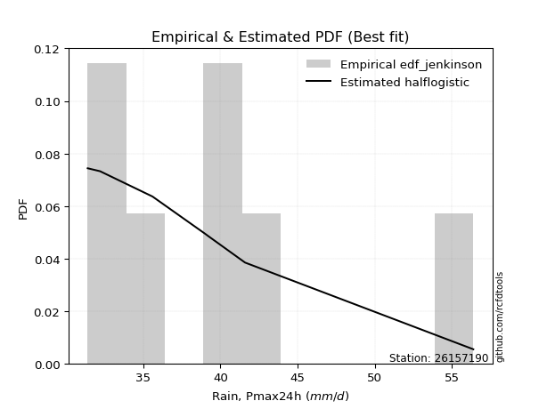</img>

</div>


### 11. EDF Cunnane (1978)

Cunnane´s work in statistical hydrology has focused on the performance and evaluation of different probability distributions (such as GEV, Gumbel, Lognormal) for flood frequency estimation. _b_ is a constant, typically set to 0.4.

<div align="center">


$P=(m-b)/(n+1-2b)$


</div>


**11.1. Empirical values**

<div align="center">

|                | 0                   | 1                   | 2                  | 3                  | 4                  | 5                  | 6                  | 7                  |
|:---------------|:--------------------|:--------------------|:-------------------|:-------------------|:-------------------|:-------------------|:-------------------|:-------------------|
| date           | 2023                | 2017                | 2018               | 2020               | 2021               | 2022               | 2019               | 2025               |
| x              | 31.4                | 32.2                | 35.6               | 39.0               | 39.2               | 41.6               | 56.4               | 64.8               |
| m              | 1                   | 2                   | 3                  | 4                  | 5                  | 6                  | 7                  | 8                  |
| empirical_dist | edf_cunnane         | edf_cunnane         | edf_cunnane        | edf_cunnane        | edf_cunnane        | edf_cunnane        | edf_cunnane        | edf_cunnane        |
| empirical      | 0.07317073170731708 | 0.19512195121951223 | 0.3170731707317074 | 0.4390243902439025 | 0.5609756097560976 | 0.6829268292682927 | 0.8048780487804879 | 0.926829268292683  |
| empirical_tr   | 1.0789473684210527  | 1.2424242424242424  | 1.4642857142857144 | 1.782608695652174  | 2.277777777777778  | 3.153846153846154  | 5.125000000000001  | 13.666666666666675 |

</div>


**11.2. Kolmogorov-Smirnov fit test (sorted by Δ)**


<div align="center">

|                | 0                   | 1                  | 2                   | 3                   | 4                  | 5                   | 6                   | 7                   | 8                  | 9                   | 10                  | 11                  | 12                  | 13                  | 14                  | 15                  | 16                  | 17                  | 18                 | 19                 | 20                  | 21                  | 22                  | 23                 | 24                 | 25                  | 26                 | 27                 | 28                  | 29                  | 30                  | 31                  | 32                  | 33                  | 34                  | 35                  | 36                  | 37                 | 38                  | 39                  | 40                 | 41                 | 42                 | 43                  | 44                 | 45                  | 46                  | 47                 | 48                  | 49                 | 50                  | 51                  | 52                  | 53                  | 54                 | 55                  | 56                  | 57                  | 58                  | 59                  | 60                  | 61                 | 62                  | 63                  | 64                  | 65                  | 66                 | 67                  | 68                  | 69                  | 70                  | 71                 | 72                 | 73                  | 74                  | 75                  | 76                  | 77                  | 78                  | 79                 | 80                  | 81                  | 82                  | 83                 | 84                  | 85                 | 86                  | 87                  | 88                  | 89                  | 90                  | 91                 | 92                  | 93                 | 94                 | 95                 | 96                  | 97                  | 98                  | 99                 | 100                | 101                 | 102                | 103                 | 104                 | 105                 | 106                | 107                 | 108                 | 109                | 110                 | 111                 | 112                 | 113                 | 114                | 115                | 116                 | 117                 | 118                 | 119                | 120                | 121                | 122                 | 123                | 124                 | 125                | 126                 | 127                 | 128                 | 129                | 130                | 131                 | 132                 | 133                | 134                | 135                 | 136                | 137                | 138                | 139                 | 140                | 141                 | 142                | 143                | 144                 | 145                 | 146                 | 147                | 148                | 149                | 150                | 151                | 152                | 153                | 154                | 155                | 156                | 157                | 158                | 159                |
|:---------------|:--------------------|:-------------------|:--------------------|:--------------------|:-------------------|:--------------------|:--------------------|:--------------------|:-------------------|:--------------------|:--------------------|:--------------------|:--------------------|:--------------------|:--------------------|:--------------------|:--------------------|:--------------------|:-------------------|:-------------------|:--------------------|:--------------------|:--------------------|:-------------------|:-------------------|:--------------------|:-------------------|:-------------------|:--------------------|:--------------------|:--------------------|:--------------------|:--------------------|:--------------------|:--------------------|:--------------------|:--------------------|:-------------------|:--------------------|:--------------------|:-------------------|:-------------------|:-------------------|:--------------------|:-------------------|:--------------------|:--------------------|:-------------------|:--------------------|:-------------------|:--------------------|:--------------------|:--------------------|:--------------------|:-------------------|:--------------------|:--------------------|:--------------------|:--------------------|:--------------------|:--------------------|:-------------------|:--------------------|:--------------------|:--------------------|:--------------------|:-------------------|:--------------------|:--------------------|:--------------------|:--------------------|:-------------------|:-------------------|:--------------------|:--------------------|:--------------------|:--------------------|:--------------------|:--------------------|:-------------------|:--------------------|:--------------------|:--------------------|:-------------------|:--------------------|:-------------------|:--------------------|:--------------------|:--------------------|:--------------------|:--------------------|:-------------------|:--------------------|:-------------------|:-------------------|:-------------------|:--------------------|:--------------------|:--------------------|:-------------------|:-------------------|:--------------------|:-------------------|:--------------------|:--------------------|:--------------------|:-------------------|:--------------------|:--------------------|:-------------------|:--------------------|:--------------------|:--------------------|:--------------------|:-------------------|:-------------------|:--------------------|:--------------------|:--------------------|:-------------------|:-------------------|:-------------------|:--------------------|:-------------------|:--------------------|:-------------------|:--------------------|:--------------------|:--------------------|:-------------------|:-------------------|:--------------------|:--------------------|:-------------------|:-------------------|:--------------------|:-------------------|:-------------------|:-------------------|:--------------------|:-------------------|:--------------------|:-------------------|:-------------------|:--------------------|:--------------------|:--------------------|:-------------------|:-------------------|:-------------------|:-------------------|:-------------------|:-------------------|:-------------------|:-------------------|:-------------------|:-------------------|:-------------------|:-------------------|:-------------------|
| station        | 26157190            | 26157190           | 26157190            | 26157190            | 26157190           | 26157190            | 26157190            | 26157190            | 26157190           | 26157190            | 26157190            | 26157190            | 26157190            | 26157190            | 26157190            | 26157190            | 26157190            | 26157190            | 26157190           | 26157190           | 26157190            | 26157190            | 26157190            | 26157190           | 26157190           | 26157190            | 26157190           | 26157190           | 26157190            | 26157190            | 26157190            | 26157190            | 26157190            | 26157190            | 26157190            | 26157190            | 26157190            | 26157190           | 26157190            | 26157190            | 26157190           | 26157190           | 26157190           | 26157190            | 26157190           | 26157190            | 26157190            | 26157190           | 26157190            | 26157190           | 26157190            | 26157190            | 26157190            | 26157190            | 26157190           | 26157190            | 26157190            | 26157190            | 26157190            | 26157190            | 26157190            | 26157190           | 26157190            | 26157190            | 26157190            | 26157190            | 26157190           | 26157190            | 26157190            | 26157190            | 26157190            | 26157190           | 26157190           | 26157190            | 26157190            | 26157190            | 26157190            | 26157190            | 26157190            | 26157190           | 26157190            | 26157190            | 26157190            | 26157190           | 26157190            | 26157190           | 26157190            | 26157190            | 26157190            | 26157190            | 26157190            | 26157190           | 26157190            | 26157190           | 26157190           | 26157190           | 26157190            | 26157190            | 26157190            | 26157190           | 26157190           | 26157190            | 26157190           | 26157190            | 26157190            | 26157190            | 26157190           | 26157190            | 26157190            | 26157190           | 26157190            | 26157190            | 26157190            | 26157190            | 26157190           | 26157190           | 26157190            | 26157190            | 26157190            | 26157190           | 26157190           | 26157190           | 26157190            | 26157190           | 26157190            | 26157190           | 26157190            | 26157190            | 26157190            | 26157190           | 26157190           | 26157190            | 26157190            | 26157190           | 26157190           | 26157190            | 26157190           | 26157190           | 26157190           | 26157190            | 26157190           | 26157190            | 26157190           | 26157190           | 26157190            | 26157190            | 26157190            | 26157190           | 26157190           | 26157190           | 26157190           | 26157190           | 26157190           | 26157190           | 26157190           | 26157190           | 26157190           | 26157190           | 26157190           | 26157190           |
| empirical_dist | edf_cunnane         | edf_cunnane        | edf_cunnane         | edf_cunnane         | edf_cunnane        | edf_cunnane         | edf_cunnane         | edf_cunnane         | edf_cunnane        | edf_cunnane         | edf_cunnane         | edf_cunnane         | edf_cunnane         | edf_cunnane         | edf_cunnane         | edf_cunnane         | edf_cunnane         | edf_cunnane         | edf_cunnane        | edf_cunnane        | edf_cunnane         | edf_cunnane         | edf_cunnane         | edf_cunnane        | edf_cunnane        | edf_cunnane         | edf_cunnane        | edf_cunnane        | edf_cunnane         | edf_cunnane         | edf_cunnane         | edf_cunnane         | edf_cunnane         | edf_cunnane         | edf_cunnane         | edf_cunnane         | edf_cunnane         | edf_cunnane        | edf_cunnane         | edf_cunnane         | edf_cunnane        | edf_cunnane        | edf_cunnane        | edf_cunnane         | edf_cunnane        | edf_cunnane         | edf_cunnane         | edf_cunnane        | edf_cunnane         | edf_cunnane        | edf_cunnane         | edf_cunnane         | edf_cunnane         | edf_cunnane         | edf_cunnane        | edf_cunnane         | edf_cunnane         | edf_cunnane         | edf_cunnane         | edf_cunnane         | edf_cunnane         | edf_cunnane        | edf_cunnane         | edf_cunnane         | edf_cunnane         | edf_cunnane         | edf_cunnane        | edf_cunnane         | edf_cunnane         | edf_cunnane         | edf_cunnane         | edf_cunnane        | edf_cunnane        | edf_cunnane         | edf_cunnane         | edf_cunnane         | edf_cunnane         | edf_cunnane         | edf_cunnane         | edf_cunnane        | edf_cunnane         | edf_cunnane         | edf_cunnane         | edf_cunnane        | edf_cunnane         | edf_cunnane        | edf_cunnane         | edf_cunnane         | edf_cunnane         | edf_cunnane         | edf_cunnane         | edf_cunnane        | edf_cunnane         | edf_cunnane        | edf_cunnane        | edf_cunnane        | edf_cunnane         | edf_cunnane         | edf_cunnane         | edf_cunnane        | edf_cunnane        | edf_cunnane         | edf_cunnane        | edf_cunnane         | edf_cunnane         | edf_cunnane         | edf_cunnane        | edf_cunnane         | edf_cunnane         | edf_cunnane        | edf_cunnane         | edf_cunnane         | edf_cunnane         | edf_cunnane         | edf_cunnane        | edf_cunnane        | edf_cunnane         | edf_cunnane         | edf_cunnane         | edf_cunnane        | edf_cunnane        | edf_cunnane        | edf_cunnane         | edf_cunnane        | edf_cunnane         | edf_cunnane        | edf_cunnane         | edf_cunnane         | edf_cunnane         | edf_cunnane        | edf_cunnane        | edf_cunnane         | edf_cunnane         | edf_cunnane        | edf_cunnane        | edf_cunnane         | edf_cunnane        | edf_cunnane        | edf_cunnane        | edf_cunnane         | edf_cunnane        | edf_cunnane         | edf_cunnane        | edf_cunnane        | edf_cunnane         | edf_cunnane         | edf_cunnane         | edf_cunnane        | edf_cunnane        | edf_cunnane        | edf_cunnane        | edf_cunnane        | edf_cunnane        | edf_cunnane        | edf_cunnane        | edf_cunnane        | edf_cunnane        | edf_cunnane        | edf_cunnane        | edf_cunnane        |
| p_dist         | logmielke           | logburr            | logbeta             | loghalfnorm         | alpha              | gengamma            | loginvweibull       | loggenextreme       | logmoyal           | loggumbel_r         | burr                | loginvgamma         | logf                | loghalflogistic     | burr12              | logkstwobign        | logburr12           | loggenlogistic      | mielke             | logweibull_max     | logdweibull         | invgamma            | f                   | logexponnorm       | invweibull         | genextreme          | logexponweib       | nakagami           | halflogistic        | loggengamma         | beta                | loggenexpon         | logalpha            | logpearson3         | dweibull            | logfoldnorm         | loggompertz         | moyal              | lomax               | logloglaplace       | exponnorm          | lograyleigh        | genexpon           | gompertz            | truncnorm          | loginvgauss         | dgamma              | vonmises_line      | loghalfgennorm      | logjohnsonsu       | logtruncnorm        | genlogistic         | logdgamma           | invgauss            | logkappa3          | loggennorm          | logmaxwell          | nct                 | halfnorm            | gennorm             | foldnorm            | logskewnorm        | logexponpow         | erlang              | johnsonsu           | truncpareto         | gumbel_r           | genhalflogistic     | lognct              | logrice             | pearson3            | betaprime          | ncf                | truncweibull_min    | kstwobign           | logfatiguelife      | loghypsecant        | logtruncexpon       | logbetaprime        | loglogistic        | lognorm             | logcrystalball      | logt                | logloggamma        | rayleigh            | loganglit          | logsemicircular     | logarcsine          | maxwell             | fatiguelife         | exponpow            | exponweib          | loggausshyper       | loglaplace         | loglaplace         | logweibull_min     | wald                | logwald             | weibull_min         | skewnorm           | arcsine            | logtruncweibull_min | logbradford        | semicircular        | logcosine           | rice                | anglit             | crystalball         | norm                | t                  | logncf              | logistic            | logwrapcauchy       | hypsecant           | lognakagami        | triang             | loggumbel_l         | laplace             | genpareto           | logkappa4          | loggamma           | loggamma           | halfgennorm         | truncexpon         | cosine              | gausshyper         | wrapcauchy          | logksone            | gumbel_l            | logargus           | loguniform         | bradford            | logvonmises_line    | logerlang          | logrdist           | tukeylambda         | rdist              | logtukeylambda     | loglevy_l          | johnsonsb           | logtriang          | ksone               | argus              | levy_l             | kappa4              | uniform             | kappa3              | powerlaw           | loggenpareto       | gamma              | loggenhalflogistic | logpowerlaw        | logtruncpareto     | logtrapezoid       | weibull_max        | trapezoid          | loglomax           | logjohnsonsb       | logvonmises        | vonmises           |
| delta          | 0.08235165328745861 | 0.0913181394321283 | 0.09137266807556138 | 0.09535733162674787 | 0.0961207254809594 | 0.09613972242498392 | 0.09742446689201334 | 0.09742905597332563 | 0.0974625323797395 | 0.09789067686778619 | 0.09815279194259285 | 0.10110207563220996 | 0.10110302356076428 | 0.10235833394231614 | 0.10370435653865429 | 0.10373645343869276 | 0.10584554189611861 | 0.10700092567872155 | 0.1071320015527304 | 0.1078995211583611 | 0.10840261725182343 | 0.10926735701831469 | 0.10931028885551497 | 0.1096340709567053 | 0.1107044667740279 | 0.11070482447583352 | 0.1138680378116129 | 0.1148256247972651 | 0.11493590940761989 | 0.11595075864174942 | 0.11602732356434842 | 0.11764294115928593 | 0.11857171579790371 | 0.11892882388720116 | 0.11917715100697507 | 0.11973740178534242 | 0.12148874930544241 | 0.1217325250668243 | 0.12299512081579936 | 0.12460218009663548 | 0.1250290398132041 | 0.1254384025296742 | 0.1257362480294921 | 0.12575752868774032 | 0.1259102795725778 | 0.12594578617873398 | 0.12622710345325916 | 0.1269933260516396 | 0.12751347682012637 | 0.1277389976809391 | 0.12775408601094973 | 0.12830018353046335 | 0.13053352261650053 | 0.13116069060999447 | 0.1331632864878795 | 0.13469155758560536 | 0.13612340472980033 | 0.13736633515946883 | 0.13751103376519513 | 0.13759219137043266 | 0.13865051919781723 | 0.1400158542113689 | 0.14122831201266128 | 0.14329293375899155 | 0.14572206077826733 | 0.14659559951134593 | 0.1474515772616405 | 0.14793303582549613 | 0.14812121251874555 | 0.14866863541728703 | 0.15075338120743942 | 0.1560187158134828 | 0.1590972500883261 | 0.15918256331073444 | 0.16121155654102848 | 0.16380457246822122 | 0.16490474472636707 | 0.16542775619086458 | 0.16635856970584062 | 0.1665796956434391 | 0.16854271557402822 | 0.16854275684912812 | 0.16854461861805692 | 0.169940166156347  | 0.17033579451130187 | 0.1706003786592769 | 0.17144810133159105 | 0.17480856917869414 | 0.18197982844328076 | 0.18202165743709486 | 0.18311680245918904 | 0.1847672556527999 | 0.18914557299594542 | 0.1896439496907426 | 0.1896439496907426 | 0.1917993772013833 | 0.19458556489251339 | 0.19512195121951223 | 0.19772360540262157 | 0.1998351580360641 | 0.2016404980046846 | 0.20541754725168748 | 0.2060785458111608 | 0.20936904165099912 | 0.21107987500218095 | 0.21109388826329933 | 0.2113160435634313 | 0.21603861617778397 | 0.21603861805952634 | 0.2160396164485091 | 0.21681008640772392 | 0.22053484024911824 | 0.22159217147462995 | 0.22435659368389776 | 0.225692366054688  | 0.2347774064324773 | 0.23834237868595842 | 0.23836249830552786 | 0.24116436834499355 | 0.2430320112159855 | 0.2544465193627904 | 0.2544465193627904 | 0.26062079918006875 | 0.2671136509345385 | 0.26782394451832814 | 0.268544305660412  | 0.26969334027080466 | 0.27604488391264403 | 0.28661268480671975 | 0.2945649323461105 | 0.294668494841514  | 0.29498125478702536 | 0.29801567305509064 | 0.3010373080645815 | 0.3112339825532021 | 0.31707311699414886 | 0.3170731707211043 | 0.3223988149754321 | 0.3322456293453438 | 0.33506848809484313 | 0.3421331121665876 | 0.34510247797088744 | 0.3466014529307867 | 0.3537289986648862 | 0.35428634998826747 | 0.37753760771140643 | 0.37824168771383887 | 0.3855284400381729 | 0.3932027886265061 | 0.4048220535037753 | 0.4081698071868831 | 0.4083768656833062 | 0.4923720859901519 | 0.5173739118118956 | 0.548717902366328  | 0.56880153693878   | 0.6601464412136886 | 0.6775101435980209 | 1.0996167596252802 | 9.826423245542362  |
| deltao         | 0.4472608134160001  | 0.4472608134160001 | 0.4472608134160001  | 0.4472608134160001  | 0.4472608134160001 | 0.4472608134160001  | 0.4472608134160001  | 0.4472608134160001  | 0.4472608134160001 | 0.4472608134160001  | 0.4472608134160001  | 0.4472608134160001  | 0.4472608134160001  | 0.4472608134160001  | 0.4472608134160001  | 0.4472608134160001  | 0.4472608134160001  | 0.4472608134160001  | 0.4472608134160001 | 0.4472608134160001 | 0.4472608134160001  | 0.4472608134160001  | 0.4472608134160001  | 0.4472608134160001 | 0.4472608134160001 | 0.4472608134160001  | 0.4472608134160001 | 0.4472608134160001 | 0.4472608134160001  | 0.4472608134160001  | 0.4472608134160001  | 0.4472608134160001  | 0.4472608134160001  | 0.4472608134160001  | 0.4472608134160001  | 0.4472608134160001  | 0.4472608134160001  | 0.4472608134160001 | 0.4472608134160001  | 0.4472608134160001  | 0.4472608134160001 | 0.4472608134160001 | 0.4472608134160001 | 0.4472608134160001  | 0.4472608134160001 | 0.4472608134160001  | 0.4472608134160001  | 0.4472608134160001 | 0.4472608134160001  | 0.4472608134160001 | 0.4472608134160001  | 0.4472608134160001  | 0.4472608134160001  | 0.4472608134160001  | 0.4472608134160001 | 0.4472608134160001  | 0.4472608134160001  | 0.4472608134160001  | 0.4472608134160001  | 0.4472608134160001  | 0.4472608134160001  | 0.4472608134160001 | 0.4472608134160001  | 0.4472608134160001  | 0.4472608134160001  | 0.4472608134160001  | 0.4472608134160001 | 0.4472608134160001  | 0.4472608134160001  | 0.4472608134160001  | 0.4472608134160001  | 0.4472608134160001 | 0.4472608134160001 | 0.4472608134160001  | 0.4472608134160001  | 0.4472608134160001  | 0.4472608134160001  | 0.4472608134160001  | 0.4472608134160001  | 0.4472608134160001 | 0.4472608134160001  | 0.4472608134160001  | 0.4472608134160001  | 0.4472608134160001 | 0.4472608134160001  | 0.4472608134160001 | 0.4472608134160001  | 0.4472608134160001  | 0.4472608134160001  | 0.4472608134160001  | 0.4472608134160001  | 0.4472608134160001 | 0.4472608134160001  | 0.4472608134160001 | 0.4472608134160001 | 0.4472608134160001 | 0.4472608134160001  | 0.4472608134160001  | 0.4472608134160001  | 0.4472608134160001 | 0.4472608134160001 | 0.4472608134160001  | 0.4472608134160001 | 0.4472608134160001  | 0.4472608134160001  | 0.4472608134160001  | 0.4472608134160001 | 0.4472608134160001  | 0.4472608134160001  | 0.4472608134160001 | 0.4472608134160001  | 0.4472608134160001  | 0.4472608134160001  | 0.4472608134160001  | 0.4472608134160001 | 0.4472608134160001 | 0.4472608134160001  | 0.4472608134160001  | 0.4472608134160001  | 0.4472608134160001 | 0.4472608134160001 | 0.4472608134160001 | 0.4472608134160001  | 0.4472608134160001 | 0.4472608134160001  | 0.4472608134160001 | 0.4472608134160001  | 0.4472608134160001  | 0.4472608134160001  | 0.4472608134160001 | 0.4472608134160001 | 0.4472608134160001  | 0.4472608134160001  | 0.4472608134160001 | 0.4472608134160001 | 0.4472608134160001  | 0.4472608134160001 | 0.4472608134160001 | 0.4472608134160001 | 0.4472608134160001  | 0.4472608134160001 | 0.4472608134160001  | 0.4472608134160001 | 0.4472608134160001 | 0.4472608134160001  | 0.4472608134160001  | 0.4472608134160001  | 0.4472608134160001 | 0.4472608134160001 | 0.4472608134160001 | 0.4472608134160001 | 0.4472608134160001 | 0.4472608134160001 | 0.4472608134160001 | 0.4472608134160001 | 0.4472608134160001 | 0.4472608134160001 | 0.4472608134160001 | 0.4472608134160001 | 0.4472608134160001 |
| eval           | Δo > Δ              | Δo > Δ             | Δo > Δ              | Δo > Δ              | Δo > Δ             | Δo > Δ              | Δo > Δ              | Δo > Δ              | Δo > Δ             | Δo > Δ              | Δo > Δ              | Δo > Δ              | Δo > Δ              | Δo > Δ              | Δo > Δ              | Δo > Δ              | Δo > Δ              | Δo > Δ              | Δo > Δ             | Δo > Δ             | Δo > Δ              | Δo > Δ              | Δo > Δ              | Δo > Δ             | Δo > Δ             | Δo > Δ              | Δo > Δ             | Δo > Δ             | Δo > Δ              | Δo > Δ              | Δo > Δ              | Δo > Δ              | Δo > Δ              | Δo > Δ              | Δo > Δ              | Δo > Δ              | Δo > Δ              | Δo > Δ             | Δo > Δ              | Δo > Δ              | Δo > Δ             | Δo > Δ             | Δo > Δ             | Δo > Δ              | Δo > Δ             | Δo > Δ              | Δo > Δ              | Δo > Δ             | Δo > Δ              | Δo > Δ             | Δo > Δ              | Δo > Δ              | Δo > Δ              | Δo > Δ              | Δo > Δ             | Δo > Δ              | Δo > Δ              | Δo > Δ              | Δo > Δ              | Δo > Δ              | Δo > Δ              | Δo > Δ             | Δo > Δ              | Δo > Δ              | Δo > Δ              | Δo > Δ              | Δo > Δ             | Δo > Δ              | Δo > Δ              | Δo > Δ              | Δo > Δ              | Δo > Δ             | Δo > Δ             | Δo > Δ              | Δo > Δ              | Δo > Δ              | Δo > Δ              | Δo > Δ              | Δo > Δ              | Δo > Δ             | Δo > Δ              | Δo > Δ              | Δo > Δ              | Δo > Δ             | Δo > Δ              | Δo > Δ             | Δo > Δ              | Δo > Δ              | Δo > Δ              | Δo > Δ              | Δo > Δ              | Δo > Δ             | Δo > Δ              | Δo > Δ             | Δo > Δ             | Δo > Δ             | Δo > Δ              | Δo > Δ              | Δo > Δ              | Δo > Δ             | Δo > Δ             | Δo > Δ              | Δo > Δ             | Δo > Δ              | Δo > Δ              | Δo > Δ              | Δo > Δ             | Δo > Δ              | Δo > Δ              | Δo > Δ             | Δo > Δ              | Δo > Δ              | Δo > Δ              | Δo > Δ              | Δo > Δ             | Δo > Δ             | Δo > Δ              | Δo > Δ              | Δo > Δ              | Δo > Δ             | Δo > Δ             | Δo > Δ             | Δo > Δ              | Δo > Δ             | Δo > Δ              | Δo > Δ             | Δo > Δ              | Δo > Δ              | Δo > Δ              | Δo > Δ             | Δo > Δ             | Δo > Δ              | Δo > Δ              | Δo > Δ             | Δo > Δ             | Δo > Δ              | Δo > Δ             | Δo > Δ             | Δo > Δ             | Δo > Δ              | Δo > Δ             | Δo > Δ              | Δo > Δ             | Δo > Δ             | Δo > Δ              | Δo > Δ              | Δo > Δ              | Δo > Δ             | Δo > Δ             | Δo > Δ             | Δo > Δ             | Δo > Δ             | Δo <= Δ            | Δo <= Δ            | Δo <= Δ            | Δo <= Δ            | Δo <= Δ            | Δo <= Δ            | Δo <= Δ            | Δo <= Δ            |
| fit            | 1                   | 1                  | 1                   | 1                   | 1                  | 1                   | 1                   | 1                   | 1                  | 1                   | 1                   | 1                   | 1                   | 1                   | 1                   | 1                   | 1                   | 1                   | 1                  | 1                  | 1                   | 1                   | 1                   | 1                  | 1                  | 1                   | 1                  | 1                  | 1                   | 1                   | 1                   | 1                   | 1                   | 1                   | 1                   | 1                   | 1                   | 1                  | 1                   | 1                   | 1                  | 1                  | 1                  | 1                   | 1                  | 1                   | 1                   | 1                  | 1                   | 1                  | 1                   | 1                   | 1                   | 1                   | 1                  | 1                   | 1                   | 1                   | 1                   | 1                   | 1                   | 1                  | 1                   | 1                   | 1                   | 1                   | 1                  | 1                   | 1                   | 1                   | 1                   | 1                  | 1                  | 1                   | 1                   | 1                   | 1                   | 1                   | 1                   | 1                  | 1                   | 1                   | 1                   | 1                  | 1                   | 1                  | 1                   | 1                   | 1                   | 1                   | 1                   | 1                  | 1                   | 1                  | 1                  | 1                  | 1                   | 1                   | 1                   | 1                  | 1                  | 1                   | 1                  | 1                   | 1                   | 1                   | 1                  | 1                   | 1                   | 1                  | 1                   | 1                   | 1                   | 1                   | 1                  | 1                  | 1                   | 1                   | 1                   | 1                  | 1                  | 1                  | 1                   | 1                  | 1                   | 1                  | 1                   | 1                   | 1                   | 1                  | 1                  | 1                   | 1                   | 1                  | 1                  | 1                   | 1                  | 1                  | 1                  | 1                   | 1                  | 1                   | 1                  | 1                  | 1                   | 1                   | 1                   | 1                  | 1                  | 1                  | 1                  | 1                  | 0                  | 0                  | 0                  | 0                  | 0                  | 0                  | 0                  | 0                  |
| n              | 8                   | 8                  | 8                   | 8                   | 8                  | 8                   | 8                   | 8                   | 8                  | 8                   | 8                   | 8                   | 8                   | 8                   | 8                   | 8                   | 8                   | 8                   | 8                  | 8                  | 8                   | 8                   | 8                   | 8                  | 8                  | 8                   | 8                  | 8                  | 8                   | 8                   | 8                   | 8                   | 8                   | 8                   | 8                   | 8                   | 8                   | 8                  | 8                   | 8                   | 8                  | 8                  | 8                  | 8                   | 8                  | 8                   | 8                   | 8                  | 8                   | 8                  | 8                   | 8                   | 8                   | 8                   | 8                  | 8                   | 8                   | 8                   | 8                   | 8                   | 8                   | 8                  | 8                   | 8                   | 8                   | 8                   | 8                  | 8                   | 8                   | 8                   | 8                   | 8                  | 8                  | 8                   | 8                   | 8                   | 8                   | 8                   | 8                   | 8                  | 8                   | 8                   | 8                   | 8                  | 8                   | 8                  | 8                   | 8                   | 8                   | 8                   | 8                   | 8                  | 8                   | 8                  | 8                  | 8                  | 8                   | 8                   | 8                   | 8                  | 8                  | 8                   | 8                  | 8                   | 8                   | 8                   | 8                  | 8                   | 8                   | 8                  | 8                   | 8                   | 8                   | 8                   | 8                  | 8                  | 8                   | 8                   | 8                   | 8                  | 8                  | 8                  | 8                   | 8                  | 8                   | 8                  | 8                   | 8                   | 8                   | 8                  | 8                  | 8                   | 8                   | 8                  | 8                  | 8                   | 8                  | 8                  | 8                  | 8                   | 8                  | 8                   | 8                  | 8                  | 8                   | 8                   | 8                   | 8                  | 8                  | 8                  | 8                  | 8                  | 8                  | 8                  | 8                  | 8                  | 8                  | 8                  | 8                  | 8                  |
| best_fit       | 1                   | 0                  | 0                   | 0                   | 0                  | 0                   | 0                   | 0                   | 0                  | 0                   | 0                   | 0                   | 0                   | 0                   | 0                   | 0                   | 0                   | 0                   | 0                  | 0                  | 0                   | 0                   | 0                   | 0                  | 0                  | 0                   | 0                  | 0                  | 0                   | 0                   | 0                   | 0                   | 0                   | 0                   | 0                   | 0                   | 0                   | 0                  | 0                   | 0                   | 0                  | 0                  | 0                  | 0                   | 0                  | 0                   | 0                   | 0                  | 0                   | 0                  | 0                   | 0                   | 0                   | 0                   | 0                  | 0                   | 0                   | 0                   | 0                   | 0                   | 0                   | 0                  | 0                   | 0                   | 0                   | 0                   | 0                  | 0                   | 0                   | 0                   | 0                   | 0                  | 0                  | 0                   | 0                   | 0                   | 0                   | 0                   | 0                   | 0                  | 0                   | 0                   | 0                   | 0                  | 0                   | 0                  | 0                   | 0                   | 0                   | 0                   | 0                   | 0                  | 0                   | 0                  | 0                  | 0                  | 0                   | 0                   | 0                   | 0                  | 0                  | 0                   | 0                  | 0                   | 0                   | 0                   | 0                  | 0                   | 0                   | 0                  | 0                   | 0                   | 0                   | 0                   | 0                  | 0                  | 0                   | 0                   | 0                   | 0                  | 0                  | 0                  | 0                   | 0                  | 0                   | 0                  | 0                   | 0                   | 0                   | 0                  | 0                  | 0                   | 0                   | 0                  | 0                  | 0                   | 0                  | 0                  | 0                  | 0                   | 0                  | 0                   | 0                  | 0                  | 0                   | 0                   | 0                   | 0                  | 0                  | 0                  | 0                  | 0                  | 0                  | 0                  | 0                  | 0                  | 0                  | 0                  | 0                  | 0                  |
| best_fit_sort  | 1                   | 2                  | 3                   | 4                   | 5                  | 6                   | 7                   | 8                   | 9                  | 10                  | 11                  | 12                  | 13                  | 14                  | 15                  | 16                  | 17                  | 18                  | 19                 | 20                 | 21                  | 22                  | 23                  | 24                 | 25                 | 26                  | 27                 | 28                 | 29                  | 30                  | 31                  | 32                  | 33                  | 34                  | 35                  | 36                  | 37                  | 38                 | 39                  | 40                  | 41                 | 42                 | 43                 | 44                  | 45                 | 46                  | 47                  | 48                 | 49                  | 50                 | 51                  | 52                  | 53                  | 54                  | 55                 | 56                  | 57                  | 58                  | 59                  | 60                  | 61                  | 62                 | 63                  | 64                  | 65                  | 66                  | 67                 | 68                  | 69                  | 70                  | 71                  | 72                 | 73                 | 74                  | 75                  | 76                  | 77                  | 78                  | 79                  | 80                 | 81                  | 82                  | 83                  | 84                 | 85                  | 86                 | 87                  | 88                  | 89                  | 90                  | 91                  | 92                 | 93                  | 94                 | 95                 | 96                 | 97                  | 98                  | 99                  | 100                | 101                | 102                 | 103                | 104                 | 105                 | 106                 | 107                | 108                 | 109                 | 110                | 111                 | 112                 | 113                 | 114                 | 115                | 116                | 117                 | 118                 | 119                 | 120                | 121                | 122                | 123                 | 124                | 125                 | 126                | 127                 | 128                 | 129                 | 130                | 131                | 132                 | 133                 | 134                | 135                | 136                 | 137                | 138                | 139                | 140                 | 141                | 142                 | 143                | 144                | 145                 | 146                 | 147                 | 148                | 149                | 150                | 151                | 152                | 153                | 154                | 155                | 156                | 157                | 158                | 159                | 160                |

</div>


**11.3. Best fit**

<div align="center">

|   id |   station | empirical_dist   | p_dist    |     delta |   deltao | eval   |   fit |   n |   best_fit |   best_fit_sort |
|-----:|----------:|:-----------------|:----------|----------:|---------:|:-------|------:|----:|-----------:|----------------:|
|    0 |  26157190 | edf_cunnane      | logmielke | 0.0823517 | 0.447261 | Δo > Δ |     1 |   8 |          1 |               1 |

</div>


<div align="center">

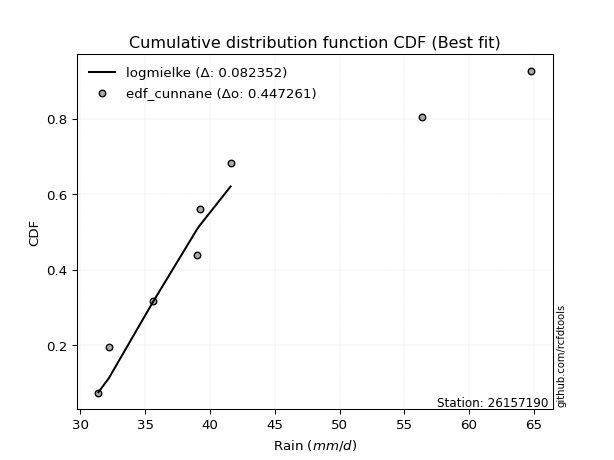</img>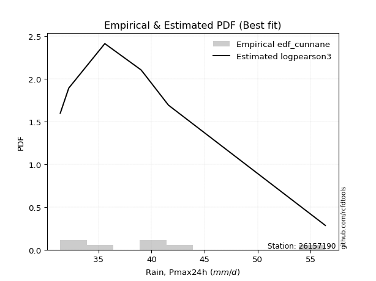</img>

</div>


### 12. EDF Adamowski (1981)

The Adamowski formula in hydrology refers to a specific plotting position formula used for estimating the non-parametric empirical distribution of hydrological events (like flood peaks) to calculate their return periods. This formula provides an alternative to traditional parametric methods (like the Gumbel or Log Pearson Type III distributions). 

<div align="center">


$P=(m-0.25)/(n+0.5)$


</div>


**12.1. Empirical values**

<div align="center">

|                | 0                   | 1                   | 2                  | 3                  | 4                  | 5                  | 6                  | 7                  |
|:---------------|:--------------------|:--------------------|:-------------------|:-------------------|:-------------------|:-------------------|:-------------------|:-------------------|
| date           | 2023                | 2017                | 2018               | 2020               | 2021               | 2022               | 2019               | 2025               |
| x              | 31.4                | 32.2                | 35.6               | 39.0               | 39.2               | 41.6               | 56.4               | 64.8               |
| m              | 1                   | 2                   | 3                  | 4                  | 5                  | 6                  | 7                  | 8                  |
| empirical_dist | edf_adamowski       | edf_adamowski       | edf_adamowski      | edf_adamowski      | edf_adamowski      | edf_adamowski      | edf_adamowski      | edf_adamowski      |
| empirical      | 0.08823529411764706 | 0.20588235294117646 | 0.3235294117647059 | 0.4411764705882353 | 0.5588235294117647 | 0.6764705882352942 | 0.7941176470588235 | 0.9117647058823529 |
| empirical_tr   | 1.096774193548387   | 1.259259259259259   | 1.4782608695652173 | 1.7894736842105263 | 2.2666666666666666 | 3.0909090909090913 | 4.857142857142856  | 11.33333333333333  |

</div>


**12.2. Kolmogorov-Smirnov fit test (sorted by Δ)**


<div align="center">

|                | 0                   | 1                   | 2                   | 3                   | 4                   | 5                  | 6                   | 7                  | 8                   | 9                   | 10                  | 11                 | 12                  | 13                  | 14                  | 15                  | 16                  | 17                  | 18                  | 19                  | 20                  | 21                 | 22                 | 23                  | 24                  | 25                  | 26                  | 27                  | 28                  | 29                  | 30                  | 31                  | 32                  | 33                  | 34                 | 35                  | 36                  | 37                  | 38                  | 39                  | 40                  | 41                  | 42                  | 43                  | 44                  | 45                  | 46                  | 47                 | 48                 | 49                  | 50                  | 51                  | 52                  | 53                  | 54                  | 55                  | 56                  | 57                  | 58                 | 59                  | 60                  | 61                 | 62                  | 63                  | 64                  | 65                 | 66                  | 67                  | 68                  | 69                  | 70                  | 71                  | 72                  | 73                 | 74                  | 75                 | 76                  | 77                  | 78                  | 79                  | 80                  | 81                  | 82                  | 83                  | 84                 | 85                  | 86                  | 87                  | 88                  | 89                  | 90                 | 91                  | 92                  | 93                  | 94                 | 95                 | 96                  | 97                 | 98                 | 99                  | 100                 | 101                 | 102                 | 103                 | 104                 | 105                 | 106                 | 107                 | 108                | 109                 | 110                 | 111                 | 112                 | 113                | 114                | 115                 | 116                 | 117                 | 118                 | 119                 | 120                | 121                | 122                 | 123                | 124                 | 125                | 126                | 127                 | 128                | 129                | 130                | 131                | 132                 | 133                | 134                 | 135                | 136                | 137                | 138                 | 139                | 140                | 141                 | 142                | 143                | 144                | 145                 | 146                | 147                | 148                 | 149                 | 150                 | 151                | 152                | 153                | 154                | 155                | 156                | 157                | 158                | 159                |
|:---------------|:--------------------|:--------------------|:--------------------|:--------------------|:--------------------|:-------------------|:--------------------|:-------------------|:--------------------|:--------------------|:--------------------|:-------------------|:--------------------|:--------------------|:--------------------|:--------------------|:--------------------|:--------------------|:--------------------|:--------------------|:--------------------|:-------------------|:-------------------|:--------------------|:--------------------|:--------------------|:--------------------|:--------------------|:--------------------|:--------------------|:--------------------|:--------------------|:--------------------|:--------------------|:-------------------|:--------------------|:--------------------|:--------------------|:--------------------|:--------------------|:--------------------|:--------------------|:--------------------|:--------------------|:--------------------|:--------------------|:--------------------|:-------------------|:-------------------|:--------------------|:--------------------|:--------------------|:--------------------|:--------------------|:--------------------|:--------------------|:--------------------|:--------------------|:-------------------|:--------------------|:--------------------|:-------------------|:--------------------|:--------------------|:--------------------|:-------------------|:--------------------|:--------------------|:--------------------|:--------------------|:--------------------|:--------------------|:--------------------|:-------------------|:--------------------|:-------------------|:--------------------|:--------------------|:--------------------|:--------------------|:--------------------|:--------------------|:--------------------|:--------------------|:-------------------|:--------------------|:--------------------|:--------------------|:--------------------|:--------------------|:-------------------|:--------------------|:--------------------|:--------------------|:-------------------|:-------------------|:--------------------|:-------------------|:-------------------|:--------------------|:--------------------|:--------------------|:--------------------|:--------------------|:--------------------|:--------------------|:--------------------|:--------------------|:-------------------|:--------------------|:--------------------|:--------------------|:--------------------|:-------------------|:-------------------|:--------------------|:--------------------|:--------------------|:--------------------|:--------------------|:-------------------|:-------------------|:--------------------|:-------------------|:--------------------|:-------------------|:-------------------|:--------------------|:-------------------|:-------------------|:-------------------|:-------------------|:--------------------|:-------------------|:--------------------|:-------------------|:-------------------|:-------------------|:--------------------|:-------------------|:-------------------|:--------------------|:-------------------|:-------------------|:-------------------|:--------------------|:-------------------|:-------------------|:--------------------|:--------------------|:--------------------|:-------------------|:-------------------|:-------------------|:-------------------|:-------------------|:-------------------|:-------------------|:-------------------|:-------------------|
| station        | 26157190            | 26157190            | 26157190            | 26157190            | 26157190            | 26157190           | 26157190            | 26157190           | 26157190            | 26157190            | 26157190            | 26157190           | 26157190            | 26157190            | 26157190            | 26157190            | 26157190            | 26157190            | 26157190            | 26157190            | 26157190            | 26157190           | 26157190           | 26157190            | 26157190            | 26157190            | 26157190            | 26157190            | 26157190            | 26157190            | 26157190            | 26157190            | 26157190            | 26157190            | 26157190           | 26157190            | 26157190            | 26157190            | 26157190            | 26157190            | 26157190            | 26157190            | 26157190            | 26157190            | 26157190            | 26157190            | 26157190            | 26157190           | 26157190           | 26157190            | 26157190            | 26157190            | 26157190            | 26157190            | 26157190            | 26157190            | 26157190            | 26157190            | 26157190           | 26157190            | 26157190            | 26157190           | 26157190            | 26157190            | 26157190            | 26157190           | 26157190            | 26157190            | 26157190            | 26157190            | 26157190            | 26157190            | 26157190            | 26157190           | 26157190            | 26157190           | 26157190            | 26157190            | 26157190            | 26157190            | 26157190            | 26157190            | 26157190            | 26157190            | 26157190           | 26157190            | 26157190            | 26157190            | 26157190            | 26157190            | 26157190           | 26157190            | 26157190            | 26157190            | 26157190           | 26157190           | 26157190            | 26157190           | 26157190           | 26157190            | 26157190            | 26157190            | 26157190            | 26157190            | 26157190            | 26157190            | 26157190            | 26157190            | 26157190           | 26157190            | 26157190            | 26157190            | 26157190            | 26157190           | 26157190           | 26157190            | 26157190            | 26157190            | 26157190            | 26157190            | 26157190           | 26157190           | 26157190            | 26157190           | 26157190            | 26157190           | 26157190           | 26157190            | 26157190           | 26157190           | 26157190           | 26157190           | 26157190            | 26157190           | 26157190            | 26157190           | 26157190           | 26157190           | 26157190            | 26157190           | 26157190           | 26157190            | 26157190           | 26157190           | 26157190           | 26157190            | 26157190           | 26157190           | 26157190            | 26157190            | 26157190            | 26157190           | 26157190           | 26157190           | 26157190           | 26157190           | 26157190           | 26157190           | 26157190           | 26157190           |
| empirical_dist | edf_adamowski       | edf_adamowski       | edf_adamowski       | edf_adamowski       | edf_adamowski       | edf_adamowski      | edf_adamowski       | edf_adamowski      | edf_adamowski       | edf_adamowski       | edf_adamowski       | edf_adamowski      | edf_adamowski       | edf_adamowski       | edf_adamowski       | edf_adamowski       | edf_adamowski       | edf_adamowski       | edf_adamowski       | edf_adamowski       | edf_adamowski       | edf_adamowski      | edf_adamowski      | edf_adamowski       | edf_adamowski       | edf_adamowski       | edf_adamowski       | edf_adamowski       | edf_adamowski       | edf_adamowski       | edf_adamowski       | edf_adamowski       | edf_adamowski       | edf_adamowski       | edf_adamowski      | edf_adamowski       | edf_adamowski       | edf_adamowski       | edf_adamowski       | edf_adamowski       | edf_adamowski       | edf_adamowski       | edf_adamowski       | edf_adamowski       | edf_adamowski       | edf_adamowski       | edf_adamowski       | edf_adamowski      | edf_adamowski      | edf_adamowski       | edf_adamowski       | edf_adamowski       | edf_adamowski       | edf_adamowski       | edf_adamowski       | edf_adamowski       | edf_adamowski       | edf_adamowski       | edf_adamowski      | edf_adamowski       | edf_adamowski       | edf_adamowski      | edf_adamowski       | edf_adamowski       | edf_adamowski       | edf_adamowski      | edf_adamowski       | edf_adamowski       | edf_adamowski       | edf_adamowski       | edf_adamowski       | edf_adamowski       | edf_adamowski       | edf_adamowski      | edf_adamowski       | edf_adamowski      | edf_adamowski       | edf_adamowski       | edf_adamowski       | edf_adamowski       | edf_adamowski       | edf_adamowski       | edf_adamowski       | edf_adamowski       | edf_adamowski      | edf_adamowski       | edf_adamowski       | edf_adamowski       | edf_adamowski       | edf_adamowski       | edf_adamowski      | edf_adamowski       | edf_adamowski       | edf_adamowski       | edf_adamowski      | edf_adamowski      | edf_adamowski       | edf_adamowski      | edf_adamowski      | edf_adamowski       | edf_adamowski       | edf_adamowski       | edf_adamowski       | edf_adamowski       | edf_adamowski       | edf_adamowski       | edf_adamowski       | edf_adamowski       | edf_adamowski      | edf_adamowski       | edf_adamowski       | edf_adamowski       | edf_adamowski       | edf_adamowski      | edf_adamowski      | edf_adamowski       | edf_adamowski       | edf_adamowski       | edf_adamowski       | edf_adamowski       | edf_adamowski      | edf_adamowski      | edf_adamowski       | edf_adamowski      | edf_adamowski       | edf_adamowski      | edf_adamowski      | edf_adamowski       | edf_adamowski      | edf_adamowski      | edf_adamowski      | edf_adamowski      | edf_adamowski       | edf_adamowski      | edf_adamowski       | edf_adamowski      | edf_adamowski      | edf_adamowski      | edf_adamowski       | edf_adamowski      | edf_adamowski      | edf_adamowski       | edf_adamowski      | edf_adamowski      | edf_adamowski      | edf_adamowski       | edf_adamowski      | edf_adamowski      | edf_adamowski       | edf_adamowski       | edf_adamowski       | edf_adamowski      | edf_adamowski      | edf_adamowski      | edf_adamowski      | edf_adamowski      | edf_adamowski      | edf_adamowski      | edf_adamowski      | edf_adamowski      |
| p_dist         | logbeta             | gengamma            | loghalfnorm         | logmielke           | loginvweibull       | loggenextreme      | logburr             | alpha              | logf                | loginvgamma         | logburr12           | loggumbel_r        | invgamma            | f                   | logmoyal            | nakagami            | halflogistic        | invweibull          | genextreme          | burr                | loggengamma         | beta               | burr12             | dweibull            | logpearson3         | logkstwobign        | loghalflogistic     | logfoldnorm         | moyal               | logexponnorm        | loggenlogistic      | mielke              | logweibull_max      | lograyleigh         | logdweibull        | loginvgauss         | logexponweib        | logjohnsonsu        | genlogistic         | loggenexpon         | invgauss            | logalpha            | logmaxwell          | nct                 | halfnorm            | foldnorm            | loggompertz         | lomax              | logexponpow        | logloglaplace       | exponnorm           | genexpon            | gompertz            | truncnorm           | dgamma              | vonmises_line       | loghalfgennorm      | logtruncnorm        | gumbel_r           | erlang              | loggennorm          | logdgamma          | lognct              | logrice             | johnsonsu           | logkappa3          | pearson3            | truncpareto         | gennorm             | betaprime           | logskewnorm         | ncf                 | truncweibull_min    | kstwobign          | genhalflogistic     | logtruncexpon      | logbetaprime        | loglogistic         | logfatiguelife      | lognorm             | logcrystalball      | logt                | loghypsecant        | logloggamma         | rayleigh           | loganglit           | logsemicircular     | logarcsine          | maxwell             | exponpow            | exponweib          | fatiguelife         | loggausshyper       | logweibull_min      | loglaplace         | loglaplace         | skewnorm            | arcsine            | weibull_min        | logtruncweibull_min | logbradford         | logncf              | semicircular        | logcosine           | rice                | anglit              | wald                | logwald             | crystalball        | norm                | t                   | logistic            | logwrapcauchy       | hypsecant          | lognakagami        | triang              | loggumbel_l         | laplace             | genpareto           | logkappa4           | loggamma           | loggamma           | halfgennorm         | truncexpon         | cosine              | gausshyper         | wrapcauchy         | logksone            | gumbel_l           | logargus           | loguniform         | bradford           | logvonmises_line    | logerlang          | logrdist            | logtukeylambda     | loglevy_l          | johnsonsb          | tukeylambda         | rdist              | logtriang          | ksone               | levy_l             | argus              | kappa4             | uniform             | kappa3             | loggenpareto       | powerlaw            | gamma               | loggenhalflogistic  | logpowerlaw        | logtruncpareto     | logtrapezoid       | weibull_max        | trapezoid          | loglomax           | logjohnsonsb       | logvonmises        | vonmises           |
| delta          | 0.08823517695721196 | 0.08968348139198534 | 0.09189579399816683 | 0.09311205500912284 | 0.10185641583260034 | 0.1018622617380628 | 0.10207854115379267 | 0.1020801977737022 | 0.10328105322925316 | 0.10328113288920274 | 0.10369346155178583 | 0.1051219153752806 | 0.10711527667398191 | 0.10715820851118218 | 0.10822293410140373 | 0.10836938376426652 | 0.10847966837462131 | 0.10855238642969511 | 0.10855274413150073 | 0.10891319366425722 | 0.10949451760875084 | 0.1095710825313499 | 0.1098804979070873 | 0.11177645065334507 | 0.11247258285420259 | 0.11295677304119323 | 0.11311873566398037 | 0.11328116075234385 | 0.11527628403382573 | 0.11634531116190944 | 0.11776132740038592 | 0.11789240327439476 | 0.11865992288002547 | 0.11898216149667562 | 0.1191630189734878 | 0.12379370583440119 | 0.12462843953327712 | 0.12558691733660632 | 0.12670649999291217 | 0.12840334288095018 | 0.12900861026566168 | 0.12933211751956808 | 0.12966716369680176 | 0.13091009412647026 | 0.13105479273219656 | 0.13219427816481866 | 0.13224915102710666 | 0.1337555225374636 | 0.1347720709796627 | 0.13536258181829985 | 0.13578944153486833 | 0.13649664975115633 | 0.13651793040940455 | 0.13667068129424204 | 0.13698750517492353 | 0.13775372777330397 | 0.13827387854179063 | 0.13851448773261393 | 0.1409953362286419 | 0.14114085341465876 | 0.14114779861860388 | 0.1412939243381649 | 0.14166497148574697 | 0.14221239438428845 | 0.14356998043393454 | 0.1439236882095437 | 0.14429714017444084 | 0.14444351916701315 | 0.14835259309209703 | 0.14956247478048423 | 0.15077625593303312 | 0.15264100905532751 | 0.15272632227773586 | 0.1547553155080299 | 0.15869343754716037 | 0.158971515157866  | 0.15990232867284204 | 0.16012345461044053 | 0.16165249212388844 | 0.16208647454102965 | 0.16208651581612954 | 0.16208837758505834 | 0.16214634864312044 | 0.16348392512334842 | 0.1638795534783033 | 0.16414413762627833 | 0.16499186029859247 | 0.16835232814569556 | 0.17552358741028218 | 0.17666056142619047 | 0.1783110146198013 | 0.17986957709276208 | 0.18268933196294684 | 0.18534313616838477 | 0.1874918693464097 | 0.1874918693464097 | 0.19337891700306553 | 0.195184256971686  | 0.1955715250582888 | 0.1989613062186889  | 0.19962230477816223 | 0.20174552399739393 | 0.20291280061800054 | 0.20462363396918237 | 0.20463764723030076 | 0.20485980253043273 | 0.20534596661417762 | 0.20588235294117646 | 0.2095823751447854 | 0.20958237702652777 | 0.20958337541551053 | 0.21407859921611966 | 0.21513593044163137 | 0.2179003526508992 | 0.2192361250216895 | 0.22832116539947872 | 0.23188613765295985 | 0.23190625727252928 | 0.23470812731199497 | 0.23657577018298692 | 0.2522944390184576 | 0.2522944390184576 | 0.25416455814707023 | 0.2606574099015399 | 0.26136770348532956 | 0.2620880646274134 | 0.2632370992378061 | 0.26958864287964546 | 0.2801564437737212 | 0.2881086913131119 | 0.2882122538085154 | 0.2885250137540268 | 0.29155943202209206 | 0.2988852277202487 | 0.30477774152020354 | 0.3159425739424335 | 0.3171810669350138 | 0.3200039256845131 | 0.32352935802714744 | 0.3235294117541029 | 0.335676871133589  | 0.33864623693788887 | 0.3386644362545562 | 0.3401452118977881 | 0.3478301089552689 | 0.37108136667840785 | 0.3717854466808403 | 0.3781382262161761 | 0.37907219900517436 | 0.39851812197532066 | 0.40171356615388454 | 0.4019206246503077 | 0.4859158449571534 | 0.510917670778897  | 0.5379575006446637 | 0.5623452959057814 | 0.6450818788033585 | 0.6667497418763565 | 1.1103771613469444 | 9.841487807952692  |
| deltao         | 0.4472608134160001  | 0.4472608134160001  | 0.4472608134160001  | 0.4472608134160001  | 0.4472608134160001  | 0.4472608134160001 | 0.4472608134160001  | 0.4472608134160001 | 0.4472608134160001  | 0.4472608134160001  | 0.4472608134160001  | 0.4472608134160001 | 0.4472608134160001  | 0.4472608134160001  | 0.4472608134160001  | 0.4472608134160001  | 0.4472608134160001  | 0.4472608134160001  | 0.4472608134160001  | 0.4472608134160001  | 0.4472608134160001  | 0.4472608134160001 | 0.4472608134160001 | 0.4472608134160001  | 0.4472608134160001  | 0.4472608134160001  | 0.4472608134160001  | 0.4472608134160001  | 0.4472608134160001  | 0.4472608134160001  | 0.4472608134160001  | 0.4472608134160001  | 0.4472608134160001  | 0.4472608134160001  | 0.4472608134160001 | 0.4472608134160001  | 0.4472608134160001  | 0.4472608134160001  | 0.4472608134160001  | 0.4472608134160001  | 0.4472608134160001  | 0.4472608134160001  | 0.4472608134160001  | 0.4472608134160001  | 0.4472608134160001  | 0.4472608134160001  | 0.4472608134160001  | 0.4472608134160001 | 0.4472608134160001 | 0.4472608134160001  | 0.4472608134160001  | 0.4472608134160001  | 0.4472608134160001  | 0.4472608134160001  | 0.4472608134160001  | 0.4472608134160001  | 0.4472608134160001  | 0.4472608134160001  | 0.4472608134160001 | 0.4472608134160001  | 0.4472608134160001  | 0.4472608134160001 | 0.4472608134160001  | 0.4472608134160001  | 0.4472608134160001  | 0.4472608134160001 | 0.4472608134160001  | 0.4472608134160001  | 0.4472608134160001  | 0.4472608134160001  | 0.4472608134160001  | 0.4472608134160001  | 0.4472608134160001  | 0.4472608134160001 | 0.4472608134160001  | 0.4472608134160001 | 0.4472608134160001  | 0.4472608134160001  | 0.4472608134160001  | 0.4472608134160001  | 0.4472608134160001  | 0.4472608134160001  | 0.4472608134160001  | 0.4472608134160001  | 0.4472608134160001 | 0.4472608134160001  | 0.4472608134160001  | 0.4472608134160001  | 0.4472608134160001  | 0.4472608134160001  | 0.4472608134160001 | 0.4472608134160001  | 0.4472608134160001  | 0.4472608134160001  | 0.4472608134160001 | 0.4472608134160001 | 0.4472608134160001  | 0.4472608134160001 | 0.4472608134160001 | 0.4472608134160001  | 0.4472608134160001  | 0.4472608134160001  | 0.4472608134160001  | 0.4472608134160001  | 0.4472608134160001  | 0.4472608134160001  | 0.4472608134160001  | 0.4472608134160001  | 0.4472608134160001 | 0.4472608134160001  | 0.4472608134160001  | 0.4472608134160001  | 0.4472608134160001  | 0.4472608134160001 | 0.4472608134160001 | 0.4472608134160001  | 0.4472608134160001  | 0.4472608134160001  | 0.4472608134160001  | 0.4472608134160001  | 0.4472608134160001 | 0.4472608134160001 | 0.4472608134160001  | 0.4472608134160001 | 0.4472608134160001  | 0.4472608134160001 | 0.4472608134160001 | 0.4472608134160001  | 0.4472608134160001 | 0.4472608134160001 | 0.4472608134160001 | 0.4472608134160001 | 0.4472608134160001  | 0.4472608134160001 | 0.4472608134160001  | 0.4472608134160001 | 0.4472608134160001 | 0.4472608134160001 | 0.4472608134160001  | 0.4472608134160001 | 0.4472608134160001 | 0.4472608134160001  | 0.4472608134160001 | 0.4472608134160001 | 0.4472608134160001 | 0.4472608134160001  | 0.4472608134160001 | 0.4472608134160001 | 0.4472608134160001  | 0.4472608134160001  | 0.4472608134160001  | 0.4472608134160001 | 0.4472608134160001 | 0.4472608134160001 | 0.4472608134160001 | 0.4472608134160001 | 0.4472608134160001 | 0.4472608134160001 | 0.4472608134160001 | 0.4472608134160001 |
| eval           | Δo > Δ              | Δo > Δ              | Δo > Δ              | Δo > Δ              | Δo > Δ              | Δo > Δ             | Δo > Δ              | Δo > Δ             | Δo > Δ              | Δo > Δ              | Δo > Δ              | Δo > Δ             | Δo > Δ              | Δo > Δ              | Δo > Δ              | Δo > Δ              | Δo > Δ              | Δo > Δ              | Δo > Δ              | Δo > Δ              | Δo > Δ              | Δo > Δ             | Δo > Δ             | Δo > Δ              | Δo > Δ              | Δo > Δ              | Δo > Δ              | Δo > Δ              | Δo > Δ              | Δo > Δ              | Δo > Δ              | Δo > Δ              | Δo > Δ              | Δo > Δ              | Δo > Δ             | Δo > Δ              | Δo > Δ              | Δo > Δ              | Δo > Δ              | Δo > Δ              | Δo > Δ              | Δo > Δ              | Δo > Δ              | Δo > Δ              | Δo > Δ              | Δo > Δ              | Δo > Δ              | Δo > Δ             | Δo > Δ             | Δo > Δ              | Δo > Δ              | Δo > Δ              | Δo > Δ              | Δo > Δ              | Δo > Δ              | Δo > Δ              | Δo > Δ              | Δo > Δ              | Δo > Δ             | Δo > Δ              | Δo > Δ              | Δo > Δ             | Δo > Δ              | Δo > Δ              | Δo > Δ              | Δo > Δ             | Δo > Δ              | Δo > Δ              | Δo > Δ              | Δo > Δ              | Δo > Δ              | Δo > Δ              | Δo > Δ              | Δo > Δ             | Δo > Δ              | Δo > Δ             | Δo > Δ              | Δo > Δ              | Δo > Δ              | Δo > Δ              | Δo > Δ              | Δo > Δ              | Δo > Δ              | Δo > Δ              | Δo > Δ             | Δo > Δ              | Δo > Δ              | Δo > Δ              | Δo > Δ              | Δo > Δ              | Δo > Δ             | Δo > Δ              | Δo > Δ              | Δo > Δ              | Δo > Δ             | Δo > Δ             | Δo > Δ              | Δo > Δ             | Δo > Δ             | Δo > Δ              | Δo > Δ              | Δo > Δ              | Δo > Δ              | Δo > Δ              | Δo > Δ              | Δo > Δ              | Δo > Δ              | Δo > Δ              | Δo > Δ             | Δo > Δ              | Δo > Δ              | Δo > Δ              | Δo > Δ              | Δo > Δ             | Δo > Δ             | Δo > Δ              | Δo > Δ              | Δo > Δ              | Δo > Δ              | Δo > Δ              | Δo > Δ             | Δo > Δ             | Δo > Δ              | Δo > Δ             | Δo > Δ              | Δo > Δ             | Δo > Δ             | Δo > Δ              | Δo > Δ             | Δo > Δ             | Δo > Δ             | Δo > Δ             | Δo > Δ              | Δo > Δ             | Δo > Δ              | Δo > Δ             | Δo > Δ             | Δo > Δ             | Δo > Δ              | Δo > Δ             | Δo > Δ             | Δo > Δ              | Δo > Δ             | Δo > Δ             | Δo > Δ             | Δo > Δ              | Δo > Δ             | Δo > Δ             | Δo > Δ              | Δo > Δ              | Δo > Δ              | Δo > Δ             | Δo <= Δ            | Δo <= Δ            | Δo <= Δ            | Δo <= Δ            | Δo <= Δ            | Δo <= Δ            | Δo <= Δ            | Δo <= Δ            |
| fit            | 1                   | 1                   | 1                   | 1                   | 1                   | 1                  | 1                   | 1                  | 1                   | 1                   | 1                   | 1                  | 1                   | 1                   | 1                   | 1                   | 1                   | 1                   | 1                   | 1                   | 1                   | 1                  | 1                  | 1                   | 1                   | 1                   | 1                   | 1                   | 1                   | 1                   | 1                   | 1                   | 1                   | 1                   | 1                  | 1                   | 1                   | 1                   | 1                   | 1                   | 1                   | 1                   | 1                   | 1                   | 1                   | 1                   | 1                   | 1                  | 1                  | 1                   | 1                   | 1                   | 1                   | 1                   | 1                   | 1                   | 1                   | 1                   | 1                  | 1                   | 1                   | 1                  | 1                   | 1                   | 1                   | 1                  | 1                   | 1                   | 1                   | 1                   | 1                   | 1                   | 1                   | 1                  | 1                   | 1                  | 1                   | 1                   | 1                   | 1                   | 1                   | 1                   | 1                   | 1                   | 1                  | 1                   | 1                   | 1                   | 1                   | 1                   | 1                  | 1                   | 1                   | 1                   | 1                  | 1                  | 1                   | 1                  | 1                  | 1                   | 1                   | 1                   | 1                   | 1                   | 1                   | 1                   | 1                   | 1                   | 1                  | 1                   | 1                   | 1                   | 1                   | 1                  | 1                  | 1                   | 1                   | 1                   | 1                   | 1                   | 1                  | 1                  | 1                   | 1                  | 1                   | 1                  | 1                  | 1                   | 1                  | 1                  | 1                  | 1                  | 1                   | 1                  | 1                   | 1                  | 1                  | 1                  | 1                   | 1                  | 1                  | 1                   | 1                  | 1                  | 1                  | 1                   | 1                  | 1                  | 1                   | 1                   | 1                   | 1                  | 0                  | 0                  | 0                  | 0                  | 0                  | 0                  | 0                  | 0                  |
| n              | 8                   | 8                   | 8                   | 8                   | 8                   | 8                  | 8                   | 8                  | 8                   | 8                   | 8                   | 8                  | 8                   | 8                   | 8                   | 8                   | 8                   | 8                   | 8                   | 8                   | 8                   | 8                  | 8                  | 8                   | 8                   | 8                   | 8                   | 8                   | 8                   | 8                   | 8                   | 8                   | 8                   | 8                   | 8                  | 8                   | 8                   | 8                   | 8                   | 8                   | 8                   | 8                   | 8                   | 8                   | 8                   | 8                   | 8                   | 8                  | 8                  | 8                   | 8                   | 8                   | 8                   | 8                   | 8                   | 8                   | 8                   | 8                   | 8                  | 8                   | 8                   | 8                  | 8                   | 8                   | 8                   | 8                  | 8                   | 8                   | 8                   | 8                   | 8                   | 8                   | 8                   | 8                  | 8                   | 8                  | 8                   | 8                   | 8                   | 8                   | 8                   | 8                   | 8                   | 8                   | 8                  | 8                   | 8                   | 8                   | 8                   | 8                   | 8                  | 8                   | 8                   | 8                   | 8                  | 8                  | 8                   | 8                  | 8                  | 8                   | 8                   | 8                   | 8                   | 8                   | 8                   | 8                   | 8                   | 8                   | 8                  | 8                   | 8                   | 8                   | 8                   | 8                  | 8                  | 8                   | 8                   | 8                   | 8                   | 8                   | 8                  | 8                  | 8                   | 8                  | 8                   | 8                  | 8                  | 8                   | 8                  | 8                  | 8                  | 8                  | 8                   | 8                  | 8                   | 8                  | 8                  | 8                  | 8                   | 8                  | 8                  | 8                   | 8                  | 8                  | 8                  | 8                   | 8                  | 8                  | 8                   | 8                   | 8                   | 8                  | 8                  | 8                  | 8                  | 8                  | 8                  | 8                  | 8                  | 8                  |
| best_fit       | 1                   | 0                   | 0                   | 0                   | 0                   | 0                  | 0                   | 0                  | 0                   | 0                   | 0                   | 0                  | 0                   | 0                   | 0                   | 0                   | 0                   | 0                   | 0                   | 0                   | 0                   | 0                  | 0                  | 0                   | 0                   | 0                   | 0                   | 0                   | 0                   | 0                   | 0                   | 0                   | 0                   | 0                   | 0                  | 0                   | 0                   | 0                   | 0                   | 0                   | 0                   | 0                   | 0                   | 0                   | 0                   | 0                   | 0                   | 0                  | 0                  | 0                   | 0                   | 0                   | 0                   | 0                   | 0                   | 0                   | 0                   | 0                   | 0                  | 0                   | 0                   | 0                  | 0                   | 0                   | 0                   | 0                  | 0                   | 0                   | 0                   | 0                   | 0                   | 0                   | 0                   | 0                  | 0                   | 0                  | 0                   | 0                   | 0                   | 0                   | 0                   | 0                   | 0                   | 0                   | 0                  | 0                   | 0                   | 0                   | 0                   | 0                   | 0                  | 0                   | 0                   | 0                   | 0                  | 0                  | 0                   | 0                  | 0                  | 0                   | 0                   | 0                   | 0                   | 0                   | 0                   | 0                   | 0                   | 0                   | 0                  | 0                   | 0                   | 0                   | 0                   | 0                  | 0                  | 0                   | 0                   | 0                   | 0                   | 0                   | 0                  | 0                  | 0                   | 0                  | 0                   | 0                  | 0                  | 0                   | 0                  | 0                  | 0                  | 0                  | 0                   | 0                  | 0                   | 0                  | 0                  | 0                  | 0                   | 0                  | 0                  | 0                   | 0                  | 0                  | 0                  | 0                   | 0                  | 0                  | 0                   | 0                   | 0                   | 0                  | 0                  | 0                  | 0                  | 0                  | 0                  | 0                  | 0                  | 0                  |
| best_fit_sort  | 1                   | 2                   | 3                   | 4                   | 5                   | 6                  | 7                   | 8                  | 9                   | 10                  | 11                  | 12                 | 13                  | 14                  | 15                  | 16                  | 17                  | 18                  | 19                  | 20                  | 21                  | 22                 | 23                 | 24                  | 25                  | 26                  | 27                  | 28                  | 29                  | 30                  | 31                  | 32                  | 33                  | 34                  | 35                 | 36                  | 37                  | 38                  | 39                  | 40                  | 41                  | 42                  | 43                  | 44                  | 45                  | 46                  | 47                  | 48                 | 49                 | 50                  | 51                  | 52                  | 53                  | 54                  | 55                  | 56                  | 57                  | 58                  | 59                 | 60                  | 61                  | 62                 | 63                  | 64                  | 65                  | 66                 | 67                  | 68                  | 69                  | 70                  | 71                  | 72                  | 73                  | 74                 | 75                  | 76                 | 77                  | 78                  | 79                  | 80                  | 81                  | 82                  | 83                  | 84                  | 85                 | 86                  | 87                  | 88                  | 89                  | 90                  | 91                 | 92                  | 93                  | 94                  | 95                 | 96                 | 97                  | 98                 | 99                 | 100                 | 101                 | 102                 | 103                 | 104                 | 105                 | 106                 | 107                 | 108                 | 109                | 110                 | 111                 | 112                 | 113                 | 114                | 115                | 116                 | 117                 | 118                 | 119                 | 120                 | 121                | 122                | 123                 | 124                | 125                 | 126                | 127                | 128                 | 129                | 130                | 131                | 132                | 133                 | 134                | 135                 | 136                | 137                | 138                | 139                 | 140                | 141                | 142                 | 143                | 144                | 145                | 146                 | 147                | 148                | 149                 | 150                 | 151                 | 152                | 153                | 154                | 155                | 156                | 157                | 158                | 159                | 160                |

</div>


**12.3. Best fit**

<div align="center">

|   id |   station | empirical_dist   | p_dist   |     delta |   deltao | eval   |   fit |   n |   best_fit |   best_fit_sort |
|-----:|----------:|:-----------------|:---------|----------:|---------:|:-------|------:|----:|-----------:|----------------:|
|    0 |  26157190 | edf_adamowski    | logbeta  | 0.0882352 | 0.447261 | Δo > Δ |     1 |   8 |          1 |               1 |

</div>


<div align="center">

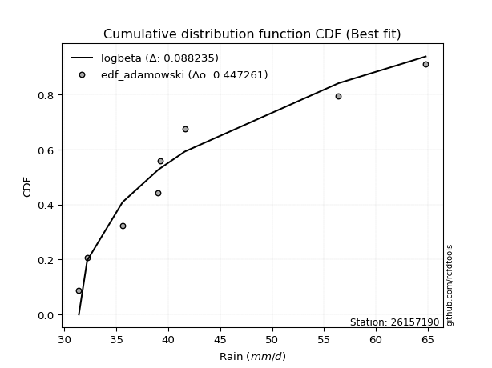</img>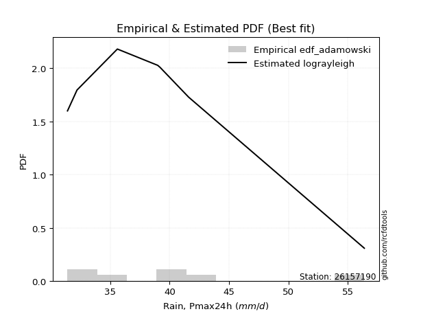</img>

</div>


## C. Best fit & Estimate extreme values for specific return periods - Tr

Best fit in probability distribution analysis means finding the theoretical distribution (like Normal, Poisson, Exponential, etc.) that most accurately mirrors your real-world data´s patterns (shape, center, spread) for better predictions, using methods like visual checks (Q-Q plots), goodness-of-fit tests (Kolmogorov-Smirnov, Chi-Squared), and information criteria (AIC) to score and select the simplest, most representative model.


### 1. Best fit (ordered by delta Δ)

:file_folder:Table: [bestfit_26157190.csv](table/bestfit_26157190.csv)

<div align="center">

|   id |   station | empirical_dist   | p_dist      |     delta |   deltao | eval   |   fit |   n |   best_fit |   best_fit_sort |
|-----:|----------:|:-----------------|:------------|----------:|---------:|:-------|------:|----:|-----------:|----------------:|
|    0 |  26157190 | edf_hazen        | logmielke   | 0.0747297 | 0.447261 | Δo > Δ |     1 |   8 |          1 |               1 |
|    1 |  26157190 | edf_gringorten   | logmielke   | 0.0793479 | 0.447261 | Δo > Δ |     1 |   8 |          1 |               2 |
|    2 |  26157190 | edf_cunnane      | logmielke   | 0.0823517 | 0.447261 | Δo > Δ |     1 |   8 |          1 |               3 |
|    3 |  26157190 | edf_blom         | logmielke   | 0.0841994 | 0.447261 | Δo > Δ |     1 |   8 |          1 |               4 |
|    4 |  26157190 | edf_chegodayev   | logbeta     | 0.0870173 | 0.447261 | Δo > Δ |     1 |   8 |          1 |               5 |
|    5 |  26157190 | edf_tukey        | logmielke   | 0.0872297 | 0.447261 | Δo > Δ |     1 |   8 |          1 |               6 |
|    6 |  26157190 | edf_beard        | logbeta     | 0.0874435 | 0.447261 | Δo > Δ |     1 |   8 |          1 |               7 |
|    7 |  26157190 | edf_jenkinson    | logbeta     | 0.0874435 | 0.447261 | Δo > Δ |     1 |   8 |          1 |               8 |
|    8 |  26157190 | edf_filliben     | logbeta     | 0.0877644 | 0.447261 | Δo > Δ |     1 |   8 |          1 |               9 |
|    9 |  26157190 | edf_adamowski    | logbeta     | 0.0882352 | 0.447261 | Δo > Δ |     1 |   8 |          1 |              10 |
|   10 |  26157190 | edf_california   | logdweibull | 0.106493  | 0.447261 | Δo > Δ |     1 |   8 |          1 |              11 |
|   11 |  26157190 | edf_weibull      | logfoldnorm | 0.107221  | 0.447261 | Δo > Δ |     1 |   8 |          1 |              12 |

</div>


### 2. Extreme values and % difference analysis

In hydrology, a return period (or recurrence interval $Tr$) is the statistical average time between extreme events like floods or droughts of a specific magnitude, indicating how rare an event is, with a 100-year flood, for example, having a 1% chance of occurring in any given year, not that it happens exactly every century. It is a key tool for infrastructure design (like bridges or dams) and risk assessment, calculated from historical data to determine the probability of future events, although it is important to remember it is statistical average, and events can cluster or be missed.

The extreme value porcentage difference is evaluated as $pdiff = 1 - (ETrBf / ETr) * 100$, where _ETrBf_ correspond to the bestfit extreme value for a specific recurrence interval and _ETr_ correspond to the extreme value for one of the most used PDFsused in hydrology.

> risk_rate: assuming the return period as the project useful life.

:file_folder:Table: [extreme_26157190.csv](table/extreme_26157190.csv), all PDFs.  
:file_folder:Table: [extremepdiff_26157190.csv](table/extremepdiff_26157190.csv), % difference between bestfit and most used PDFs in Hydrology.

<div align="center">

Extreme values table for only best fit PDFs
|   id |      tr |   prob_l |     prob_g |     alpha |   anglit |   arcsine |   argus |    beta |   betaprime |   bradford |     burr |   burr12 |   cosine |   crystalball |   dgamma |   dweibull |   erlang |   exponnorm |   exponpow |   exponweib |        f |   fatiguelife |   foldnorm |   gamma |   gausshyper |   genexpon |   genextreme |   gengamma |   genhalflogistic |   genlogistic |   gennorm |   genpareto |   gompertz |   gumbel_l |   gumbel_r |   halfgennorm |   halflogistic |   halfnorm |   hypsecant |   invgamma |   invgauss |   invweibull |   johnsonsb |   johnsonsu |   kappa3 |   kappa4 |   ksone |   kstwobign |   laplace |   levy_l |   loggamma |   logistic |   loglaplace |    lomax |   maxwell |   mielke |    moyal |   nakagami |     ncf |      nct |    norm |   pearson3 |   powerlaw |   rayleigh |   rdist |    rice |   semicircular |   skewnorm |       t |   trapezoid |   triang |   truncexpon |   truncnorm |   truncpareto |   truncweibull_min |   tukeylambda |   uniform |   vonmises |   vonmises_line |     wald |   weibull_max |   weibull_min |   wrapcauchy |   logalpha |   loganglit |   logarcsine |   logargus |   logbeta |   logbetaprime |   logbradford |   logburr |   logburr12 |   logcosine |   logcrystalball |   logdgamma |   logdweibull |   logerlang |   logexponnorm |   logexponpow |   logexponweib |     logf |   logfatiguelife |   logfoldnorm |   loggausshyper |   loggenexpon |   loggenextreme |   loggengamma |   loggenhalflogistic |   loggenlogistic |       loggennorm |   loggenpareto |   loggompertz |   loggumbel_l |   loggumbel_r |   loghalfgennorm |   loghalflogistic |   loghalfnorm |   loghypsecant |   loginvgamma |   loginvgauss |   loginvweibull |   logjohnsonsb |   logjohnsonsu |   logkappa3 |   logkappa4 |   logksone |   logkstwobign |   loglevy_l |   logloggamma |   loglogistic |   logloglaplace |         loglomax |   logmaxwell |   logmielke |   logmoyal |   lognakagami |   logncf |   lognct |   lognorm |   logpearson3 |   logpowerlaw |   lograyleigh |   logrdist |   logrice |   logsemicircular |   logskewnorm |    logt |   logtrapezoid |   logtriang |   logtruncexpon |   logtruncnorm |   logtruncpareto |   logtruncweibull_min |   logtukeylambda |   loguniform |   logvonmises |   logvonmises_line |   logwald |   logweibull_max |   logweibull_min |   logwrapcauchy |   station |   n |   risk_rate |
|-----:|--------:|---------:|-----------:|----------:|---------:|----------:|--------:|--------:|------------:|-----------:|---------:|---------:|---------:|--------------:|---------:|-----------:|---------:|------------:|-----------:|------------:|---------:|--------------:|-----------:|--------:|-------------:|-----------:|-------------:|-----------:|------------------:|--------------:|----------:|------------:|-----------:|-----------:|-----------:|--------------:|---------------:|-----------:|------------:|-----------:|-----------:|-------------:|------------:|------------:|---------:|---------:|--------:|------------:|----------:|---------:|-----------:|-----------:|-------------:|---------:|----------:|---------:|---------:|-----------:|--------:|---------:|--------:|-----------:|-----------:|-----------:|--------:|--------:|---------------:|-----------:|--------:|------------:|---------:|-------------:|------------:|--------------:|-------------------:|--------------:|----------:|-----------:|----------------:|---------:|--------------:|--------------:|-------------:|-----------:|------------:|-------------:|-----------:|----------:|---------------:|--------------:|----------:|------------:|------------:|-----------------:|------------:|--------------:|------------:|---------------:|--------------:|---------------:|---------:|-----------------:|--------------:|----------------:|--------------:|----------------:|--------------:|---------------------:|-----------------:|-----------------:|---------------:|--------------:|--------------:|--------------:|-----------------:|------------------:|--------------:|---------------:|--------------:|--------------:|----------------:|---------------:|---------------:|------------:|------------:|-----------:|---------------:|------------:|--------------:|--------------:|----------------:|-----------------:|-------------:|------------:|-----------:|--------------:|---------:|---------:|----------:|--------------:|--------------:|--------------:|-----------:|----------:|------------------:|--------------:|--------:|---------------:|------------:|----------------:|---------------:|-----------------:|----------------------:|-----------------:|-------------:|--------------:|-------------------:|----------:|-----------------:|-----------------:|----------------:|----------:|----:|------------:|
|    0 |    2    | 0.5      | 0.5        |   38.3081 |  42.525  |   42.525  | 47.425  | 38.0691 |     40.9408 |    45.1184 |  38.4355 |  38.0457 |  44.1332 |       42.525  |  39.2    |    39.2    |  37.2409 |     39.1435 |    41.6045 |     41.6719 |  38.0058 |       35.9629 |    40.2726 | 32.7624 |      44.2847 |    39.1112 |      37.9794 |    38.6245 |           40.7055 |       40.3804 |   39      |     45.7038 |    39.1128 |    44.3538 |    40.6962 |       33.7618 |        39.787  |    40.2463 |     42.525  |    38.0068 |    37.4663 |      37.9794 |     52.5461 |     36.9915 |  31.4    |  47.5657 | 48.1    |     41.0859 |   42.525  |  42.2204 |    34.4903 |    42.525  |      41.2398 |  38.9063 |   41.5729 |  39.4717 |  40.1058 |    39.1562 | 41.0114 |  40.5194 | 42.525  |    40.7321 |    31.9693 |    41.2353 | 36.5    | 42.2963 |        42.525  |    42.015  | 42.525  |     56.4008 |  43.0185 |      44.1047 |     39.1289 |       36.8186 |            40.8822 |       36.5    |   48.1    |   0.923249 |         40.1945 |  38.9165 |       64.6156 |       35.5315 |      48.1    |    39.5315 |     41.2398 |      41.2398 |    45.1277 |   38.1605 |        41.1455 |       42.2828 |   38.4417 |     37.9581 |     42.3477 |          41.2398 |     39      |       39      |     33.9661 |        37.9249 |       40.0148 |        38.784  |  38.1982 |          36.6576 |       39.8256 |         41.7848 |       38.5415 |         38.2821 |       38.9374 |              50.3362 |          39.4237 |     39           |        35.4129 |       38.8152 |       42.9063 |       39.6381 |          39.0171 |           38.8651 |       39.2537 |        41.2398 |       38.1982 |       37.633  |         38.2822 |        64.7948 |        37.5796 |     39.0001 |     43.4992 |    45.1079 |        39.787  |     42.0089 |       41.2679 |       41.2398 |         39.2    |    158.512       |      40.398  |     38.8693 |    39.1344 |       34.5206 |  41.2185 |  40.7566 |   41.2398 |       40.0263 |       31.9206 |       40.1036 |    48.9859 |   40.8022 |           41.2398 |       40.1375 | 41.2399 |        54.0071 |     47.4381 |         41.1164 |        39.5236 |          31.6263 |               42.239  |          46.5955 |      45.1079 |     0.0768758 |            45.2502 |   38.1392 |          39.407  |          35.4012 |         45.1079 |  26157190 |   8 |    0.75     |
|    1 |    2.33 | 0.570815 | 0.429185   |   39.7676 |  44.8389 |   45.9986 | 49.7793 | 41.4661 |     42.7128 |    47.4932 |  39.8586 |  39.6894 |  46.2423 |       44.5115 |  40.2759 |    39.7821 |  38.7318 |     40.8525 |    43.3444 |     44.7549 |  39.5095 |       37.5579 |    42.43   | 33.3943 |      46.6709 |    40.8102 |      39.4778 |    40.9887 |           42.3899 |       41.9766 |   39.3782 |     50.2199 |    40.8119 |    46.0821 |    42.5369 |       35.3911 |        41.6796 |    42.3903 |     44.1148 |    39.5104 |    39.0153 |      39.4778 |     63.1443 |     38.6251 |  31.4    |  50.0712 | 50.9383 |     42.8075 |   43.7271 |  49.0245 |    35.731  |    44.2752 |      42.3278 |  40.5903 |   43.6368 |  40.9901 |  41.8483 |    41.7063 | 42.7989 |  42.225  | 44.5115 |    42.6823 |    32.6396 |    43.3296 | 37.4194 | 44.1031 |        45.0067 |    43.8422 | 44.5115 |     58.3414 |  45.0807 |      46.3668 |     40.8311 |       38.5777 |            43.1094 |       37.264  |   50.4652 |   1.18908  |         41.9269 |  40.2191 |       64.7444 |       37.0904 |      53.5858 |    41.0459 |     43.3595 |      44.4626 |    47.4061 |   40.7075 |        43.1397 |       44.5182 |   39.9066 |     39.665  |     44.2952 |          43.0531 |     39.4907 |       39.9598 |     34.9648 |        39.5397 |       42.8421 |        40.5018 |  39.6712 |          38.1748 |       41.8255 |         44.0252 |       40.2003 |         39.7385 |       41.7751 |              52.7938 |          40.9368 |     39.0409      |        43.6693 |       40.4969 |       44.543  |       41.2505 |          40.6817 |           40.4915 |       41.1196 |        42.6847 |       39.6712 |       39.1364 |         39.7386 |        64.7984 |        39.0961 |     40.5346 |     45.8986 |    47.9723 |        41.3961 |     47.8732 |       43.1202 |       42.8333 |         40.2812 |    226.456       |      42.245  |     40.3831 |    40.6397 |       36.4564 |  45.1008 |  42.5054 |   43.0531 |       41.7769 |       32.4827 |       41.9649 |    53.6817 |   42.4921 |           43.5174 |       41.87   | 43.0531 |        56.3289 |     49.9479 |         43.1647 |        41.3136 |          31.839  |               44.3868 |          49.3603 |      47.4826 |     0.0802367 |            47.6537 |   39.2305 |          40.9129 |          37.266  |         51.7571 |  26157190 |   8 |    0.729209 |
|    2 |    5    | 0.8      | 0.2        |   48.2727 |  53.0029 |   55.2613 | 57.3313 | 56.4032 |     50.2073 |    56.0669 |  47.4827 |  48.8503 |  53.8429 |       51.8938 |  46.7735 |    46.553  |  46.5039 |     49.3973 |    50.4001 |     62.1923 |  48.3539 |       47.9951 |    51.5188 | 37.5722 |      55.5962 |    49.3049 |      48.4664 |    54.6545 |           50.0111 |       48.9107 |   43.4054 |     61.0168 |    49.3057 |    51.6654 |    50.5338 |       57.0302 |        50.2429 |    51.4567 |     50.4918 |    48.352  |    48.2299 |      48.4664 |     67.9505 |     49.5767 |  58.1817 |  58.1963 | 60.124  |     50.1203 |   49.7375 |  60.2974 |    44.1688 |    51.0332 |      48.2134 |  49.1772 |   51.7599 |  48.2587 |  49.9195 |    54.281  | 50.3138 |  49.7178 | 51.8939 |    50.9817 |    40.4044 |    51.7143 | 40.1507 | 51.3363 |        53.4757 |    51.5689 | 51.8938 |     63.9086 |  53.328  |      54.9502 |     49.3377 |       48.0937 |            52.4801 |       39.6914 |   58.12   |   2.22178  |         48.7177 |  47.5108 |       64.7997 |       47.4077 |      61.8017 |    47.9456 |     51.7471 |      54.3421 |    55.5199 |   53.3115 |        51.6018 |       53.6189 |   47.8544 |     49.4311 |     52.0867 |          50.5188 |     44.7501 |       46.6509 |     41.5404 |        48.7052 |       59.8925 |        49.4658 |  48.1417 |          48.0514 |       50.683  |         53.4042 |       49.004  |         48.0402 |       61.4756 |              59.8457 |          48.2132 |     41.8142      |        61.8297 |       49.1445 |       50.2694 |       49.0522 |          49.2487 |           48.7441 |       50.0427 |        49.0076 |       48.1418 |       48.132  |         48.0408 |        64.8    |        48.5648 |     48.7814 |     55.0046 |    58.5497 |        48.9892 |     59.4451 |       50.7348 |       49.5856 |         46.2846 |   1347.58        |      50.3723 |     48.3408 |    48.4038 |       51.8055 |  63.6538 |  49.9887 |   50.5188 |       49.8343 |       38.8998 |       50.3226 |    69.2374 |   49.9883 |           52.2798 |       50.0626 | 50.5188 |        63.5591 |     57.91   |         52.023  |        49.6403 |          35.2298 |               53.2236 |          59.3826 |      56.0591 |     0.094098  |            56.3426 |   45.9429 |          48.1523 |          53.9604 |         61.3448 |  26157190 |   8 |    0.67232  |
|    3 |   10    | 0.9      | 0.1        |   59.5202 |  57.6238 |   57.4974 | 60.973  | 62.4913 |     56.1074 |    60.2759 |  55.9749 |  58.7113 |  58.4349 |       56.7911 |  53.0024 |    55.5212 |  53.8109 |     57.154  |    55.2582 |     79.9992 |  59.2667 |       59.7554 |    58.2015 | 42.257  |      60.2107 |    57.0162 |      60.0321 |    68.7683 |           56.3402 |       54.5581 |   49.6611 |     63.6883 |    57.0141 |    54.7739 |    57.0471 |      113.225  |        57.3545 |    58.1657 |     55.584  |    59.2581 |    58.6716 |      60.0321 |     67.9665 |     64.4439 |  61.5295 |  61.6651 | 64.132  |     55.688  |   55.1936 |  63.0189 |    55.1494 |    56.0101 |      54.2619 |  57.2189 |   57.4765 |  55.0822 |  56.9468 |    64.4844 | 56.1831 |  55.9467 | 56.7911 |    57.4438 |    49.3865 |    57.6927 | 41.0676 | 56.4937 |        57.8213 |    57.2865 | 56.791  |     66.0832 |  58.5239 |      59.515  |     57.054  |       55.0877 |            57.9919 |       40.6951 |   61.46   |   2.94258  |         53.8543 |  55.2491 |       64.8    |       59.8716 |      63.4301 |    54.0136 |     57.1948 |      57.0392 |    59.9151 |   61.3514 |        58.2792 |       58.7459 |   56.9552 |     60.3808 |     57.4437 |          56.1724 |     51.4152 |       54.5536 |     49.7003 |        58.8527 |       79.1448 |        58.2345 |  58.6281 |          60.8747 |       57.788  |         58.832  |       57.792  |         58.3147 |       89.0374 |              62.4934 |          55.0847 |     56.449       |        64.3615 |       57.3169 |       53.7708 |       56.4848 |          57.5553 |           56.8621 |       57.8701 |        54.7227 |       58.6284 |       59.158  |         58.3161 |        64.8    |        61.3307 |     58.5475 |     59.7223 |    63.8678 |        55.6912 |     62.6348 |       56.4875 |       55.2301 |         52.7303 |   6802.77        |      57.0125 |     57.0032 |    56.3622 |       72.1939 |  80.7212 |  55.9744 |   56.1724 |       56.8981 |       47.1966 |       57.2802 |    74.2383 |   56.1279 |           57.44   |       57.1403 | 56.1724 |        66.6291 |     61.3541 |         57.5495 |        55.5673 |          41.9139 |               58.3925 |          64.2298 |      60.2713 |     0.10466   |            60.6144 |   54.3267 |          54.9855 |          87.7492 |         63.2077 |  26157190 |   8 |    0.651322 |
|    4 |   15    | 0.933333 | 0.0666667  |   68.9145 |  59.597  |   57.9239 | 62.3575 | 63.9931 |     59.3787 |    61.7478 |  61.9686 | inf      |  60.5266 |       59.235  |  56.7009 |    61.6324 |  58.1481 |     61.6914 |    57.6597 |     91.0315 |  67.4334 |       67.2276 |    61.6631 | 45.2309 |      61.8822 |    61.5269 |      69.0071 |    77.5256 |           59.9219 |       57.7442 |   54.4498 |     64.2569 |    61.5223 |    56.1817 |    60.7219 |      174.519  |        61.379  |    61.657  |     58.4901 |    67.418  |    65.6045 |      69.0072 |     67.9668 |     75.8281 |  62.6454 |  62.789  | 65.468  |     58.6438 |   58.3852 |  63.8411 |    63.276  |    58.7218 |      58.1459 |  62.0348 |   60.4096 |  59.3361 |  61.0252 |    69.9072 | 59.4211 |  59.5299 | 59.235  |    60.9655 |    53.6705 |    60.7731 | 41.3055 | 59.1511 |        59.516  |    60.2619 | 59.2349 |     66.781  |  60.8258 |      61.1858 |     61.5653 |       57.978  |            60.0953 |       41.0141 |   62.5733 |   3.26857  |         56.5349 |  60.2183 |       64.8    |       68.3547 |      63.901  |    57.6526 |     59.6924 |      57.5686 |    61.6759 |   64.3658 |        61.9821 |       60.6522 |   63.5871 |     67.8867 |     60.0632 |          59.2261 |     56.0181 |       60.0213 |     55.5223 |        65.7423 |       92.0308 |        63.6835 |  66.7205 |          70.4685 |       61.7219 |         60.8644 |       63.3137 |         66.2865 |      110.842  |              63.3119 |          59.385  |     83.9263      |        64.6581 |       62.2293 |       55.4358 |       61.1648 |          62.707  |           62.0415 |       62.4164 |        58.2782 |       66.721  |       67.2584 |         66.2887 |        64.8    |        71.6511 |     66.143  |     61.4144 |    65.7458 |        59.6142 |     63.6317 |       59.5894 |       58.5714 |         57.0195 |  17538.5         |      60.7524 |     63.0635 |    61.5679 |       86.6427 |  91.1302 |  59.3272 |   59.2261 |       61.0813 |       51.6173 |       61.2326 |    75.3571 |   59.5801 |           59.5877 |       61.2109 | 59.2261 |        67.6452 |     62.5021 |         59.7368 |        58.1426 |          46.4902 |               60.3689 |          65.8877 |      61.7446 |     0.110401  |            62.1091 |   60.5004 |          59.2601 |         124.028  |         63.7515 |  26157190 |   8 |    0.644736 |
|    5 |   20    | 0.95     | 0.05       |   77.5175 |  60.7578 |   58.0741 | 63.1174 | 64.593  |     61.6519 |    62.4972 |  66.7932 | inf      |  61.813  |       60.8354 |  59.3406 |    66.2969 |  61.2456 |     64.9107 |    59.2135 |     99.086  |  74.2294 |       72.7166 |    63.9648 | 47.4167 |      62.7504 |    64.7274 |      76.6618 |    83.9171 |           62.4314 |       59.9751 |   58.3605 |     64.4733 |    64.7205 |    57.058  |    63.2949 |      236.368  |        64.1986 |    63.9848 |     60.5403 |    74.2076 |    70.8552 |      76.6619 |     67.9668 |     85.3031 |  63.2033 |  63.34   | 66.136  |     60.6349 |   60.6497 |  64.2621 |    69.9296 |    60.596  |      61.0692 |  65.5028 |   62.3562 |  62.5033 |  63.9135 |    73.5431 | 61.6646 |  62.0752 | 60.8354 |    63.3812 |    56.1107 |    62.8205 | 41.4068 | 60.9173 |        60.4559 |    62.2456 | 60.8353 |     67.1252 |  62.198  |      62.0535 |     64.765  |       59.5461 |            61.2056 |       41.169  |   63.13   |   3.45183  |         58.2111 |  63.9214 |       64.8    |       74.8678 |      64.1294 |    60.3069 |     61.2123 |      57.7562 |    62.6642 |   65.9145 |        64.5542 |       61.6464 |   69.0735 |     73.7756 |     61.7332 |          61.3153 |     59.6093 |       64.3188 |     60.1761 |        71.1144 |      101.91   |        67.705  |  73.6817 |          78.3885 |       64.447  |         61.9243 |       67.4117 |         73.1787 |      129.508  |              63.707  |          62.5942 |    129.999       |        64.7364 |       65.7708 |       56.4981 |       64.6705 |          66.5081 |           65.949  |       65.6442 |        60.9246 |       73.6824 |       73.9005 |         73.1817 |        64.8    |        80.7585 |     72.7984 |     62.2858 |    66.7054 |        62.4115 |     64.1483 |       61.7094 |       60.9982 |         60.3261 |  34341.4         |      63.3688 |     67.9375 |    65.5429 |       98.0214 |  98.7635 |  61.6708 |   61.3153 |       64.0989 |       54.2879 |       64.0094 |    75.7846 |   61.9913 |           60.8134 |       64.0847 | 61.3153 |        68.1521 |     63.0762 |         60.9102 |        59.5907 |          49.6129 |               61.4132 |          66.7187 |      62.4946 |     0.114347  |            62.8702 |   65.5531 |          62.4494 |         162.794  |         64.0165 |  26157190 |   8 |    0.641514 |
|    6 |   25    | 0.96     | 0.04       |   85.6775 |  61.5444 |   58.1437 | 63.6075 | 64.8959 |     63.3957 |    62.9511 |  70.9095 | inf      |  62.7151 |       62.0135 |  61.3952 |    70.0875 |  63.6579 |     67.4078 |    60.3454 |    105.45   |  80.1645 |       77.0618 |    65.6742 | 49.1481 |      63.2839 |    67.2099 |      83.4726 |    88.9641 |           64.3648 |       61.6934 |   61.691  |     64.5798 |    67.201  |    57.6816 |    65.2768 |      297.489  |        66.3711 |    65.7167 |     62.1269 |    80.1365 |    75.1033 |      83.4728 |     67.9668 |     93.5326 |  63.5381 |  63.6656 | 66.5368 |     62.1264 |   62.4061 |  64.5264 |    75.6566 |    62.0298 |      63.4374 |  68.2223 |   63.8013 |  65.0548 |  66.1523 |    76.2546 | 63.3822 |  64.0588 | 62.0135 |    65.2155 |    57.6785 |    64.3417 | 41.4607 | 62.2296 |        61.0657 |    63.7216 | 62.0134 |     67.3302 |  63.1345 |      62.5851 |     67.2463 |       60.5291 |            61.8918 |       41.2602 |   63.464  |   3.56796  |         59.3485 |  66.8874 |       64.8    |       80.1903 |      64.2648 |    62.4169 |     62.2643 |      57.8435 |    63.31   |   66.8494 |        66.5265 |       62.2565 |   73.8687 |     78.6954 |     62.9318 |          62.9001 |     62.5894 |       67.9101 |     64.1105 |        75.5818 |      110      |        70.9178 |  79.956  |          85.2494 |       66.5313 |         62.5739 |       70.6971 |         79.4182 |      146.117  |              63.9387 |          65.1838 |    205.274       |        64.7658 |       68.5488 |       57.2664 |       67.5073 |          69.5446 |           69.1265 |       68.1536 |        63.0549 |       79.9569 |       79.6334 |         79.4219 |        64.8    |        89.1111 |     78.9131 |     62.8174 |    67.2878 |        64.5924 |     64.4747 |       63.3164 |       62.9224 |         63.0548 |  57833.1         |      65.3839 |     72.1038 |    68.7997 |      107.505  | 104.842  |  63.4762 |   62.9001 |       66.4749 |       56.0657 |       66.1537 |    75.9944 |   63.8458 |           61.622  |       66.3101 | 62.9002 |        68.4559 |     63.4208 |         61.6422 |        60.5203 |          51.8481 |               62.0591 |          67.2163 |      62.9491 |     0.117351  |            63.3314 |   69.9028 |          65.0226 |         204.022  |         64.1741 |  26157190 |   8 |    0.639603 |
|    7 |   50    | 0.98     | 0.02       |  123.571  |  63.4808 |   58.2368 | 64.7185 | 65.3526 |     68.7449 |    63.8689 |  86.1721 | inf      |  65.0772 |       65.3871 |  67.8073 |    82.737  |  71.1945 |     75.1645 |    63.5222 |    125.794  | 103.1    |       90.9456 |    70.627  | 54.6876 |      64.3868 |    74.9211 |     110.751  |   105.072  |           70.3219 |       66.9868 |   73.7239 |     64.7353 |    74.9049 |    59.3743 |    71.382  |      584.514  |        73.0646 |    70.7507 |     67.0461 |   103.044  |    89.1786 |     110.751  |     67.9668 |    124.653  |  64.2076 |  64.3005 | 67.3384 |     66.5059 |   67.8622 |  65.1213 |    97.1211 |    66.4104 |      71.3958 |  76.8376 |   67.9926 |  73.5722 |  73.1023 |    84.1494 | 68.6328 |  70.3141 | 65.3871 |    70.734  |    61.0623 |    68.7575 | 41.5497 | 66.039  |        62.4587 |    68.0117 | 65.387  |     67.7372 |  65.4582 |      63.6743 |     74.9502 |       62.5944 |            63.312  |       41.4368 |   64.132  |   3.81172  |         61.9269 |  76.5716 |       64.8    |       98.1594 |      64.5333 |    69.3188 |     64.9315 |      57.9602 |    64.7988 |   68.7036 |        72.5701 |       63.5087 |   92.6705 |     96.1871 |     66.1821 |          67.6689 |     73.0143 |       80.666  |     78.366  |        91.3289 |      137.562  |        81.4509 | 106.189  |         111.282  |       72.8865 |         63.9012 |       81.5243 |        105.767  |      212.328  |              64.3875 |          73.8542 |   2124.2         |        64.7951 |       77.3447 |       59.4051 |       77.0521 |          79.503  |           79.9123 |       76.0055 |        70.1448 |      106.191  |      101.287  |        105.775  |        64.8    |       125.086  |    105.786  |     63.9027 |    68.4681 |        71.4471 |     65.2156 |       68.1456 |       69.1855 |         72.5543 | 291950           |      71.5977 |     87.7139 |    79.9775 |      140.775  | 124.704  |  69.0542 |   67.6689 |       74.0927 |       60.0767 |       72.7938 |    76.2984 |   69.5493 |           63.5097 |       73.227  | 67.6689 |        69.0629 |     64.1102 |         63.1738 |        62.5371 |          57.3738 |               63.397  |          68.2027 |      63.8678 |     0.126451  |            64.2638 |   86.2172 |          73.6348 |         445.713  |         64.4874 |  26157190 |   8 |    0.63583  |
|    8 |   75    | 0.986667 | 0.0133333  |  159.56   |  64.333  |   58.2541 | 65.1592 | 65.4537 |     71.85   |    64.1778 |  97.1858 | inf      |  66.2053 |       67.1973 |  71.5746 |    90.6982 |  75.6279 |     79.7019 |    65.1831 |    138.053  | 120.416  |       99.2814 |    73.3137 | 58.0191 |      64.769  |    79.4319 |     132.207  |   114.755  |           73.7848 |       70.0635 |   81.9718 |     64.7684 |    79.4105 |    60.2302 |    74.9306 |      842.95   |        76.9556 |    73.491  |     69.9208 |   120.336  |    97.9605 |     132.207  |     67.9668 |    147.308  |  64.4308 |  64.5047 | 67.6056 |     68.9155 |   71.0538 |  65.3658 |   112.733  |    68.9405 |      76.5063 |  81.997  |   70.2713 |  79.0154 |  77.1666 |    88.4479 | 71.6686 |  74.0642 | 67.1973 |    73.8595 |    62.2675 |    71.1598 | 41.5723 | 68.1114 |        63.0152 |    70.3471 | 67.1972 |     67.8719 |  66.4876 |      64.0453 |     79.4542 |       63.3136 |            63.8002 |       41.4934 |   64.3547 |   3.89548  |         62.8634 |  82.5308 |       64.8    |      109.63   |      64.6223 |    73.6458 |     66.1412 |      57.9819 |    65.3989 |   69.3033 |        76.0725 |       63.9357 |  107.341  |    108.183  |     67.793  |          70.375  |     80.0096 |       89.3952 |     88.3348 |       102.02   |      155.435  |        88.0258 | 128.383  |         130.489  |       76.5456 |         64.3503 |       88.3153 |        128.353  |      263.913  |              64.5314 |          79.4142 |  20474           |        64.7984 |       82.602  |       60.5168 |       83.2084 |          85.7222 |           86.9395 |       80.6537 |        74.6516 |      128.386  |      117.212  |        128.365  |        64.8    |       156.408  |    130.204  |     64.2721 |    68.8661 |        75.524  |     65.5226 |       70.8817 |       73.0831 |         78.9258 | 752688           |      75.2204 |     99.2186 |    87.3377 |      163.054  | 137.077  |  72.3189 |   70.3749 |       78.741  |       61.5651 |       76.6822 |    76.362  |   72.8634 |           64.2799 |       77.2909 | 70.375  |        69.265  |     64.3401 |         63.7056 |        63.2618 |          59.6028 |               63.8572 |          68.5259 |      64.177  |     0.131659  |            64.5777 |   98.0962 |          79.1555 |         743.692  |         64.5916 |  26157190 |   8 |    0.634587 |
|    9 |  100    | 0.99     | 0.01       |  194.843  |  64.8397 |   58.2601 | 65.4052 | 65.493  |     74.0506 |    64.3328 | 106.124  | inf      |  66.9123 |       68.4217 |  74.2532 |    96.5782 |  78.7824 |     82.9212 |    66.2881 |    146.896  | 134.87   |      105.272  |    75.1401 | 60.4157 |      64.9642 |    82.6323 |     150.597  |   121.728  |           76.2357 |       72.241  |   88.3774 |     64.781  |    82.6069 |    60.7901 |    77.4421 |     1079.47   |        79.7095 |    75.3577 |     71.96   |   134.767  |   104.408  |     150.597  |     67.9668 |    165.659  |  64.5424 |  64.6045 | 67.7392 |     70.5665 |   73.3183 |  65.5088 |   125.444  |    70.7268 |      80.3526 |  85.7123 |   71.8234 |  83.1049 |  80.05   |    91.3746 | 73.815  |  76.7756 | 68.4217 |    76.0393 |    62.8851 |    72.7965 | 41.5818 | 69.5233 |        63.3268 |    71.9381 | 68.4215 |     67.9391 |  67.1013 |      64.2324 |     82.6487 |       63.6791 |            64.0472 |       41.5211 |   64.466  |   3.93766  |         63.3418 |  86.8756 |       64.8    |      118.18   |      64.6668 |    76.8669 |     66.8712 |      57.9895 |    65.7364 |   69.5953 |        78.5516 |       64.1511 |  119.991  |    117.598  |     68.8226 |          72.2663 |     85.4166 |       96.234  |     96.2477 |       110.357  |      168.923  |        92.8879 | 148.677  |         146.272  |       79.1248 |         64.5755 |       93.3486 |        149.214  |      307.761  |              64.6018 |          83.6006 | 177173           |        64.7993 |       86.3803 |       61.2552 |       87.8606 |          90.3228 |           92.2836 |       83.9819 |        78.0229 |      148.682  |      130.285  |        149.23   |        64.8    |       185.503  |    153.862  |     64.4586 |    69.0659 |        78.4508 |     65.7027 |       72.7922 |       75.9663 |         83.8628 |      1.47381e+06 |      77.7923 |    108.743  |    92.9667 |      180.2    | 146.223  |  74.6444 |   72.2663 |       82.1358 |       62.3405 |       79.4495 |    76.3859 |   75.2112 |           64.7153 |       80.1878 | 72.2663 |        69.366  |     64.4551 |         63.9757 |        63.635  |          60.8037 |               64.0901 |          68.6856 |      64.3322 |     0.135321  |            64.7352 |  107.776  |          83.3112 |        1095.34   |         64.6437 |  26157190 |   8 |    0.633968 |
|   10 |  200    | 0.995    | 0.005      |  333.651  |  65.7971 |   58.2659 | 65.8327 | 65.5359 |     79.3655 |    64.566  | 132.277  | inf      |  68.3499 |       71.1989 |  80.7233 |   111.481  |  86.4087 |     90.6779 |    68.7375 |    168.65   | 178.918  |      119.918  |    79.3066 | 66.2834 |      65.2645 |    90.3436 |     208.896  |   138.836  |           82.1281 |       77.4761 |  105.741  |     64.7944 |    90.307  |    62.0071 |    83.4801 |     1884.35   |        86.3304 |    79.6273 |     76.8727 |   178.741  |   120.596  |     208.898  |     67.9668 |    218.731  |  64.7098 |  64.7499 | 67.9396 |     74.3691 |   78.7744 |  65.7795 |   162.767  |    75.0118 |      90.433  |  94.8543 |   75.3744 |  93.8074 |  86.9971 |    98.0598 | 78.9823 |  83.5088 | 71.1989 |    81.1828 |    63.8308 |    76.5413 | 41.5935 | 72.7539 |        63.8701 |    75.5767 | 71.1987 |     68.0397 |  68.2631 |      64.515  |     90.3419 |       64.235  |            64.4214 |       41.5617 |   64.633  |   4.00117  |         64.068  |  97.698  |       64.8    |      140.123  |      64.7334 |    85.2196 |     68.2724 |      57.9968 |    66.3269 |   70.0162 |        84.5274 |       64.4765 |  161.206  |    143.814  |     70.9645 |          76.7471 |    100.126  |      115.225  |    118.628  |       133.349  |      204.251  |       105.317  | 221.892  |         193.259  |       85.3033 |         64.9131 |      106.245  |        225.848  |      444.712  |              64.7046 |          94.5903 |      4.02034e+08 |        64.7999 |       95.6419 |       62.8914 |      100.137  |         102.088  |          106.515  |       92.1194 |        86.7835 |      221.903  |      169.191  |        225.883  |        64.8    |       292.388  |    249.358  |     64.7411 |    69.3668 |        85.6307 |     66.0452 |       77.3124 |       83.355  |         97.387  |      7.44002e+06 |      84.0122 |    137.747  |   108.064  |      226.371  | 169.605  |  80.2998 |   76.7471 |       90.6764 |       63.5446 |       86.1629 |    76.411  |   80.8717 |           65.4813 |       87.2281 | 76.7471 |        69.5175 |     64.6275 |         64.3862 |        64.2092 |          62.7242 |               64.4429 |          68.921  |      64.5657 |     0.144071  |            64.9722 |  136.248  |          94.2168 |        3015.88   |         64.7218 |  26157190 |   8 |    0.633042 |
|   11 |  250    | 0.996    | 0.004      |  402.545  |  66.0407 |   58.2666 | 65.9328 | 65.5419 |     81.0848 |    64.6128 | 142.326  | inf      |  68.744  |       72.0476 |  82.8102 |   116.489  |  88.8705 |     93.175  |    69.4701 |    175.778  | 196.452  |      124.688  |    80.5853 | 68.1965 |      65.3261 |    92.826  |     232.913  |   144.428  |           84.0225 |       79.1591 |  111.923  |     64.7962 |    92.7855 |    62.3651 |    85.4213 |     2230.68   |        88.4589 |    80.9408 |     78.4541 |   196.242  |   125.985  |     232.915  |     67.9668 |    238.792  |  64.7433 |  64.7781 | 67.9797 |     75.5459 |   80.5308 |  65.85   |   177.143  |    76.3875 |      93.94   |  97.8555 |   76.4675 |  97.528  |  89.2335 |   100.113  | 80.6489 |  85.7432 | 72.0476 |    82.8102 |    64.0228 |    77.6941 | 41.5953 | 73.7484 |        63.9976 |    76.6961 | 72.0474 |     68.0598 |  68.5593 |      64.5718 |     92.8174 |       64.3472 |            64.4967 |       41.5696 |   64.6664 |   4.0139   |         64.2142 | 101.278  |       64.8    |      147.579  |      64.7467 |    88.1077 |     68.6337 |      57.9977 |    66.4659 |   70.0965 |        86.4566 |       64.542  |  178.846  |    153.448  |     71.5632 |          78.1711 |    105.417  |      122.188  |    126.964  |       141.726  |      216.496  |       109.544  | 256.403  |         211.58   |       87.2863 |         64.9803 |      110.637  |        262.608  |      500.316  |              64.7245 |          98.4216 |      1.26953e+10 |        64.7999 |       98.6695 |       63.3811 |      104.438  |         106.091  |          111.541  |       94.7781 |        89.8078 |      256.418  |      184.369  |        262.653  |        64.8    |       343.287  |    299.667  |     64.7982 |    69.4271 |        87.9832 |     66.1347 |       78.747  |       85.8762 |        102.293  |      1.25295e+07 |      86.0252 |    149.386  |   113.428  |      242.779  | 177.562  |  82.1409 |   78.1711 |       93.5423 |       63.7915 |       88.3415 |    76.4143 |   82.6985 |           65.6624 |       89.5159 | 78.1711 |        69.5478 |     64.662  |         64.4691 |        64.3261 |          63.1264 |               64.514  |          68.9672 |      64.6125 |     0.146875  |            65.0197 |  147.235  |          98.0175 |        4278.41   |         64.7374 |  26157190 |   8 |    0.632858 |
|   12 |  500    | 0.998    | 0.002      |  745.772  |  66.6449 |   58.2676 | 66.1628 | 65.5509 |     86.4661 |    64.7063 | 179.806  | inf      |  69.7928 |       74.5644 |  89.3033 |   132.65   |  96.5349 |    100.932  |    71.5982 |    198.278  | 264.343  |      139.641  |    84.3901 | 74.2006 |      65.452  |   100.537  |     329.445  |   162.031  |           89.9021 |       84.3828 |  133.008  |     64.7989 |   100.483  |    63.3916 |    91.4461 |     3659.89   |        95.0653 |    84.8571 |     83.3663 |   263.995  |   143.203  |     329.448  |     67.9668 |    311.784  |  64.8103 |  64.8329 | 68.0598 |     79.0725 |   85.9869 |  66.032  |   230.881  |    80.6539 |     105.725  | 107.363  |   79.7293 | 110.028  |  96.1804 |   106.227  | 85.8507 |  92.9163 | 74.5644 |    87.7903 |    64.4095 |    81.1336 | 41.5983 | 76.7155 |        64.291  |    80.0337 | 74.5642 |     68.0999 |  69.2941 |      64.6857 |    100.504  |       64.5729 |            64.648  |       41.5851 |   64.7332 |   4.03936  |         64.5069 | 112.663  |       64.8    |      171.91   |      64.7734 |    97.7937 |     69.5377 |      57.9988 |    66.7866 |   70.2506 |        92.4816 |       64.6732 |  254.563  |    187.722  |     73.1812 |          82.5511 |    123.806  |      146.898  |    157.031  |       171.254  |      257.336  |       123.426  | 424.892  |         280.968  |       93.4425 |         65.1141 |      125.071  |        446.605  |      719.836  |              64.7636 |         111.33   |      3.28868e+16 |        64.8    |      108.212  |       64.8061 |      118.997  |         119.236  |          128.701  |      103.169  |        99.8908 |      424.928  |      241.951  |        446.712  |        64.8    |       592.289  |    591.033  |     64.9131 |    69.548  |        95.4272 |     66.3662 |       83.1547 |       94.1908 |        119.551  |      6.32507e+07 |      92.3232 |    195.465  |   131.847  |      298.914  | 203.71   |  87.9389 |   82.5511 |      102.838  |       64.2915 |       95.1746 |    76.4192 |   88.3979 |           66.0811 |       96.6993 | 82.5511 |        69.6084 |     64.731  |         64.6357 |        64.5622 |          63.9501 |               64.6567 |          69.0581 |      64.7062 |     0.155575  |            65.1148 |  188.411  |         110.818  |       13622.1    |         64.7687 |  26157190 |   8 |    0.632489 |
|   13 |  750    | 0.998667 | 0.00133333 | 1088.39   |  66.9123 |   58.2677 | 66.2552 | 65.5528 |     89.6497 |    64.7376 | 206.967  | inf      |  70.301  |       75.9626 |  93.1077 |   142.51   | 101.029  |    105.469  |    72.7519 |    211.674  | 315.673  |      148.471  |    86.5106 | 77.7505 |      65.4951 |   105.048  |     405.563  |   172.478  |           93.3393 |       87.4365 |  146.689  |     64.7995 |   104.985  |    63.9402 |    94.9683 |     4800.93   |        98.9275 |    87.0449 |     86.2398 |   315.21   |   153.577  |     405.567  |     67.9668 |    362.891  |  64.833  |  64.8506 | 68.0866 |     81.0536 |   89.1785 |  66.1183 |   269.921  |    83.1465 |     113.293  | 113.057  |   81.5537 | 118.054  | 100.244  |   109.636  | 88.9179 |  97.2887 | 75.9626 |    90.6571 |    64.5392 |    83.0569 | 41.5991 | 78.3747 |        64.4091 |    81.8982 | 75.9624 |     68.1133 |  69.6196 |      64.7238 |    104.997  |       64.6484 |            64.6986 |       41.5902 |   64.7555 |   4.04786  |         64.6046 | 119.489  |       64.8    |      186.939  |      64.7822 |   104.023  |     69.9418 |      57.9991 |    66.9159 |   70.299  |        96.0361 |       64.717  |  320.348  |    211.244  |     73.9784 |          85.0894 |    136.086  |      163.815  |    177.991  |       191.302  |      283.244  |       132.101  | 596.697  |         332.142  |       97.0484 |         65.1583 |      134.093  |        640.253  |      889.19   |              64.7763 |         119.646  |      6.633e+21   |        64.8    |      113.887  |       65.5808 |      128.431  |         127.452  |          139.931  |      108.176  |       106.306  |      596.759  |      284.54   |        640.437  |        64.8    |       843.887  |    962.182  |     64.9517 |    69.5883 |        99.882  |     66.4764 |       85.7053 |       99.4162 |        131.27   |      1.63069e+08 |      96.0446 |    231.666  |   143.979  |      335.602  | 220.07   |  91.3941 |   85.0894 |      108.569  |       64.4601 |       99.2234 |    76.4202 |   91.7545 |           66.2504 |      100.961  | 85.0894 |        69.6286 |     64.754  |         64.6914 |        64.6416 |          64.2304 |               64.7044 |          69.0878 |      64.7374 |     0.160672  |            65.1465 |  218.432  |         119.063  |       28184.3    |         64.7791 |  26157190 |   8 |    0.632366 |
|   14 | 1000    | 0.999    | 0.001      | 1430.83   |  67.0717 |   58.2678 | 66.3071 | 65.5536 |     91.9275 |    64.7532 | 229.045  | inf      |  70.6216 |       76.9252 |  95.8093 |   149.679  | 104.222  |    108.688  |    73.5344 |    221.277  | 358.539  |      154.768  |    87.9731 | 80.2837 |      65.5171 |   108.248  |     470.868  |   179.952  |           95.7775 |       89.6027 |  157.011  |     64.7997 |   108.179  |    64.3094 |    97.4667 |     5777.92   |       101.667  |    88.5558 |     88.2786 |   357.976  |   161.059  |     470.872  |     67.9668 |    403.387  |  64.8449 |  64.8592 | 68.0999 |     82.4262 |   91.443  |  66.1726 |   301.708  |    84.9141 |     118.989  | 117.157  |   82.8146 | 124.095  | 103.127  |   111.988  | 91.1078 | 100.476  | 76.9252 |    92.6729 |    64.6043 |    84.386  | 41.5994 | 79.5213 |        64.4755 |    83.1859 | 76.925  |     68.12   |  69.8137 |      64.7428 |    108.184  |       64.6862 |            64.7239 |       41.5927 |   64.7666 |   4.0521   |         64.6534 | 124.399  |       64.8    |      197.95   |      64.7867 |   108.728  |     70.1837 |      57.9991 |    66.9886 |   70.3223 |        98.5744 |       64.7389 |  381.441  |    229.713  |     74.4858 |          86.8823 |    145.56   |      177.079  |    194.611  |       206.934  |      302.555  |       138.517  | 776.346  |         374.214  |       99.6117 |         65.1802 |      140.764  |        847.741  |     1032.31   |              64.7825 |         125.92   |      2.8668e+26  |        64.8    |      117.954  |       66.1074 |      135.573  |         133.529  |          148.486  |      111.775  |       111.106  |      776.439  |      319.638  |        848.018  |        64.8    |      1103.08   |   1426.42   |     64.9712 |    69.6085 |       103.09   |     66.5457 |       87.5053 |      103.297  |        140.424  |      3.19299e+08 |      98.7041 |    262.935  |   153.258  |      363.469  | 232.182  |  93.8772 |   86.8823 |      112.775  |       64.5447 |      102.122  |    76.4205 |   94.1483 |           66.3457 |      104.012  | 86.8822 |        69.6387 |     64.7655 |         64.7194 |        64.6814 |          64.3717 |               64.7283 |          69.1024 |      64.7531 |     0.164297  |            65.1624 |  242.943  |         125.28   |       48255.4    |         64.7844 |  26157190 |   8 |    0.632305 |


</div>


<div align="center">

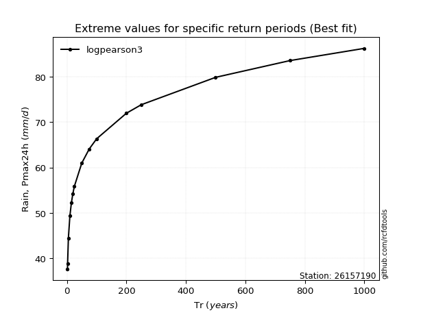</img>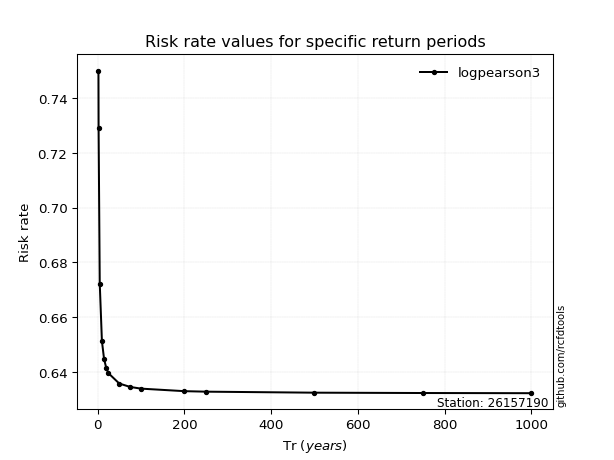</img>

</div>


<sub>**APP DISCLAIMER**: NO WARRANTY - This software is provided by [github.com/rcfdtools](https://github.com/rcfdtools) "as is", without any express or implied warranty, including warranties of merchantability, fitness for a particular purpose, or non-infringement. There is no guarantee that the software will be error-free or operate without interruption. LIMITATION OF LIABILITY - Neither the authors nor copyright holders will be liable for claims or damages arising from the software or its use. You are responsible for determining if the software is appropriate for your use and assume all associated risks, including errors, legal compliance, and data loss. NO PROFESSIONAL ADVICE - The software provides general information and does not offer professional advice. It should not replace consultation with professional advisors.</sub>