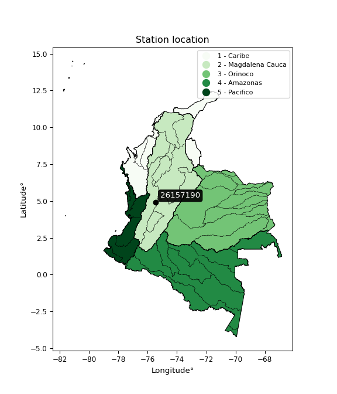

<div align="center">


</div>

# PMP Station (Rain, Pmax24h): 26157190

Probable Maximum Precipitation (PMP) is the greatest amount of rainfall for a specific duration that is meteorologically possible for a given location, acting as a "worst-case" scenario for extreme storms, crucial for designing safety-critical infrastructure like bridges, river deviations, dams, spillways, and nuclear plants to prevent catastrophic failure. PMP is calculated by hydrologists using meteorological data to determine the upper limit of extreme rainfall, often leading to the Probable Maximum Flood (PMF) for flood control design, and is increasingly being studied for climate change impacts. Probable Maximum Precipitation (PMP) is the theoretical upper limit of rainfall, a deterministic estimate for extreme events, while probability distributions (like GEV, Gumbel) describe the likelihood and frequency of various precipitation amounts, including rare ones, showing how often events occur, with PMP representing the extreme end of these distributions, used for critical infrastructure design to ensure safety against the worst conceivable weather, unlike standard statistical forecasts which cover typical probabilities.

The most common probability distributions in hydrology, used for analyzing floods, rainfall, and streamflow, include the Normal, Log-Normal, Gumbel, Gamma (including Log-Pearson Type III), and Generalized Extreme Value (GEV) distributions, often chosen based on the data´s skewness and whether modeling extremes or general conditions, with Gumbel and GEV popular for extreme events like floods, while the Normal distribution serves as a baseline, though often requiring transformations for skewed hydrological data. These distributions help in designing water infrastructure, managing water resources, and forecasting hydrologic events.

> Hydrological data often isn´t perfectly normal (it´s skewed), so different distributions are needed for different applications, such as: **Flood Frequency Analysis**: Using Gumbel, GEV, or Log-Pearson Type III for predicting extreme flood magnitudes and their return periods, **Rainfall Analysis**: Normal for annual totals, but Log-Normal, Weibull, or GEV for intensity or extreme daily rainfall, **Streamflow Modeling**: Gamma and Log-Normal for maximum flows, GEV for minimum flows, and Kappa for daily flows.

<div align="center">

</img>

</div>


## A. General information


### 1. General running parameters

• app_version: _v20260113_. • runtime: _2026-01-13 16:28:34.738620_. • Python version: _3.14.0_. • SciPy version: _1.16.3_. • Pandas version: _2.3.3_. • NumPy version: _2.3.5_. • Stations dataset (station_dataset_file): _dataset/pmax24h_in/automatic_colombia_2003_2025.csv_. • Stations catalog (station_catalog_file): _dataset/CNE.xls_. • Minimum year to eval til year_max (date_min): _1900_. • Maximum year to eval since year_min (date_max): _2025_. • Creates, save and include plots into reports (create_plot): _False_. • Plot only fit distributions with Δo > Δ (plot_only_fit): _True_. • Plot only simple graphs avoiding multiple CDFs and multiple Extreme values plots (plot_only_simple): _True_. • Eval low extreme values, if False, evaluates high extreme values (low_extreme): _False_. • Eval every SciPy distribution as logarithmic (pdist_logarithmic_on): _True_. • Standard deviation normalized (ddof): _1.0_. • Return periods to eval in years (Tr): _[2, 2.33, 5, 10, 15, 20, 25, 50, 75, 100, 200, 250, 500, 750, 1000]_. • Minimum data sample per station, 0 means any (minimum_sample): _5_. • Z-Score maximum threshold to adjust a value, 0 means disable (zscore_max): _3.5_. • Z-Score minimum threshold to adjust a value, 0 means disable (zscore_min): _-2.5_. • Avoid zeros, e.g. rain = 0 (avoid_zeros): _True_. • Avoid null values (avoid_nans): _True_. 

:file_folder:Table: [dataset.csv](../../dataset/pmax24h_in/automatic_colombia_2003_2025.csv)

> Delta Degrees of Freedom (DDOF): is a parameter used in the formulas for calculating variance and standard deviation. When ddof=0, the divisor is $N$ (the total number of observations) and this is used when your data set is the entire population. When ddof=1, the divisor is $N-1$ and this is used when your data set is a sample drawn from a larger population. Using $N-1$ provides an unbiased estimate of the population variance (known as Bessel´s correction).


### 2. Station info and location

|   id |   CODIGO | NOMBRE                     | CATEGORIA    | TECNOLOGIA                              | ESTADO           | FECHA_INSTALACION   |   FECHA_SUSPENSION |   ALTITUD |   LATITUD |   LONGITUD | DEPARTAMENTO   | MUNICIPIO   | AREA_OPERATIVA                         | ENTIDAD                                                     | AREA_HIDROGRAFICA   | ZONA_HIDROGRAFICA   | SUBZONA_HIDROGRAFICA   | CORRIENTE   | Catalogo   |   Version |
|-----:|---------:|:---------------------------|:-------------|:----------------------------------------|:-----------------|:--------------------|-------------------:|----------:|----------:|-----------:|:---------------|:------------|:---------------------------------------|:------------------------------------------------------------|:--------------------|:--------------------|:-----------------------|:------------|:-----------|----------:|
|    0 | 26157190 | RIO CLARO - AUT [26157190] | Limnigráfica | Automática con Telemetría, Convencional | En Mantenimiento | 10/12/2008          |                nan |      2706 |   4.90092 |   -75.4511 | Caldas         | Villamaria  | Area Operativa 09 - Cauca-Valle-Caldas | INSTITUTO DE HIDROLOGIA METEOROLOGIA Y ESTUDIOS AMBIENTALES | Magdalena Cauca     | Cauca               | Río Chinchiná          | Claro       | CNE_IDEAM  |  20251226 |

<div align="center">

Dynamic map: [:earth_americas:Google](http://maps.google.com/maps?q=4.900916667,-75.45111111) [:earth_americas:OSM](https://www.openstreetmap.org/#map=18/4.900916667/-75.45111111&layers=P) [:earth_americas:Bing](https://www.bing.com/maps?cp=4.900916667~-75.45111111&lvl=18) [:earth_americas:Apple](https://maps.apple.com/frame?center=4.900916667%2C-75.45111111&span=0.003%2C0.006)

</div>


<div align="center">

```geojson
{
  "type": "Feature",
  "geometry": {
    "type": "Point", 
    "coordinates": [-75.45111111, 4.900916667]
  }, 
  "properties": {
    "Name": "26157190"
  }
}
```

</div>


### 3. Discrete values table and plot

<div align="center">

|               |          0 |           1 |          2 |           3 |         4 |            5 |           6 |          7 |
|:--------------|-----------:|------------:|-----------:|------------:|----------:|-------------:|------------:|-----------:|
| Date          | 2017       | 2018        | 2019       | 2020        | 2021      | 2022         | 2023        | 2025       |
| Value         |   32.2     |   35.6      |   56.4     |   39        |   39.2    |   41.6       |   31.4      |   64.8     |
| Value_initial |   32.2     |   35.6      |   56.4     |   39        |   39.2    |   41.6       |   31.4      |   64.8     |
| count         |    8       |    8        |    8       |    8        |    8      |    8         |    8        |    8       |
| mean          |   42.525   |   42.525    |   42.525   |   42.525    |   42.525  |   42.525     |   42.525    |   42.525   |
| std           |   11.9005  |   11.9005   |   11.9005  |   11.9005   |   11.9005 |   11.9005    |   11.9005   |   11.9005  |
| zscore        |   -0.86761 |   -0.581908 |    1.16592 |   -0.296206 |   -0.2794 |   -0.0777278 |   -0.934834 |    1.87177 |


</div>


> The initial value (value_initial) correspond to the initial obtained or null completed value, and value (value) is adjusted only when the initial value is outside the valid range (outlier) definite through the Z-Score value. If Z-Score is active, values out of range or outliers are replaced with the station mean value. A Z-Score (or standard score) measures how many standard deviations a data point is from the mean of a dataset, indicating its relative position; positive scores mean above the mean, negative mean below, and a score of zero is exactly at the mean, allowing for comparison of values from different distributions. It´s calculated using the formula $z=(x–μ)/σ$, where $x$ is the data point, $μ$ is the mean, and $σ$ is the standard deviation, helping identify outliers and understand probability.
>
> <sub>**Note**: In this study, "completing" (filling gaps in) and "extending" (forecasting or lengthening the historical record) rainfall data series are avoided for certain critical analyses because they introduce artificial bias and uncertainty, which can distort the statistics of rare events (extremes), alter day-to-day variability, and compromise the integrity and homogeneity of the original data. Some reasons against Completing/Extending rainfall data are: **Distortion of Extremes and Variability**: The primary issue is that most gap-filling or extension methods rely on averaging or regression with nearby stations, which inherently smooths the data. Rainfall is highly variable in space and time, with a large percentage of zero values and occasional large storms. Infilling methods often underestimate the highest values and overestimate the lowest (zero) values, which severely distorts analyses focused on flood frequency, drought severity, and intensity-duration-frequency (IDF) curves, **Loss of Data Homogeneity**: Infilled or extended data are synthetic estimates, not actual measurements. Combining these estimates with observed data can violate the assumption of data homogeneity, which requires that the data properties do not change over time. Inhomogeneity can lead to incorrect conclusions about long-term trends or changes in climate patterns, **Propagation of Errors**: Errors and biases from the original data (e.g., wind-induced undercatch, instrument errors, site changes) or the data used for imputation can propagate through the analysis, leading to unreliable hydrological models and inaccurate predictions, **Compromised Statistical Integrity**: For statistical analyses, especially those involving the frequency of events, using artificial data can introduce time bias or autocorrelation that doesn´t exist in reality, making it difficult to assess the true probability of events, **Difficulty in Validation**: It is difficult to accurately validate the quality of filled or extended data, especially for past periods where ground-truth measurements are unavailable. The reliability of imputation techniques heavily depends on the density of the surrounding station network and the complexity of the local topography.</sub>


### 4. Active continuous probability distributions from SciPy (45 of 104 available)

A Probability Density Function (PDF) describes the relative likelihood of a continuous random variable falling within a specific range, where the total area under its curve equals 1, and the area over any interval gives the actual probability for that range. Unlike discrete probabilities (like rolling a die), a PDF shows density, not direct probability for a single point (which is zero), with higher points indicating higher likelihood, often visualized as a bell curve for normal distributions.

A log of a probability density function (log-PDF) is simply the logarithm of the PDF´s value, denoted as $log(f(x))$, useful for converting multiplication of probabilities into addition, improving numerical stability with tiny numbers, and connecting to information theory concepts like entropy. Instead of dealing with very small probabilities (e.g., 0.000001), log-PDFs use negative numbers (e.g., $log(0.00001) ≈ -11.51$ that are easier for computers to handle, preventing underflow errors and simplifying complex calculations. In this study, each active probability distribution from SciPy is also evaluated in the $log$ form.

[scipy.stats](https://docs.scipy.org/doc/scipy/reference/stats.html) is a Python´s powerful submodule within the SciPy library for comprehensive statistical analysis, offering over 130 probability distributions (like Normal, Poisson), functions for descriptive stats (mean, variance), hypothesis testing (t-tests, chi-square), random variable generation, and statistical tests, making it essential for data science, modeling, and research. It provides tools to explore, model, and draw conclusions from data efficiently, working seamlessly with NumPy.

<div align="center">

|   id | p_dist             |   n_parameter | fit_method   | label                                                                       | active   | ref                                                                                                        |
|-----:|:-------------------|--------------:|:-------------|:----------------------------------------------------------------------------|:---------|:-----------------------------------------------------------------------------------------------------------|
|    0 | alpha              |             3 | MLE          | Alpha                                                                       | True     | [:mortar_board:](https://docs.scipy.org/doc/scipy/reference/generated/scipy.stats.alpha.html)              |
|    1 | betaprime          |             4 | MLE          | Beta prime                                                                  | True     | [:mortar_board:](https://docs.scipy.org/doc/scipy/reference/generated/scipy.stats.betaprime.html)          |
|    2 | chi2               |             3 | MLE          | Chi²                                                                        | True     | [:mortar_board:](https://docs.scipy.org/doc/scipy/reference/generated/scipy.stats.chi2.html)               |
|    3 | crystalball        |             4 | MLE          | Crystalball                                                                 | True     | [:mortar_board:](https://docs.scipy.org/doc/scipy/reference/generated/scipy.stats.crystalball.html)        |
|    4 | dweibull           |             3 | MLE          | Double Weibull                                                              | True     | [:mortar_board:](https://docs.scipy.org/doc/scipy/reference/generated/scipy.stats.dweibull.html)           |
|    5 | erlang             |             3 | MLE          | Erlang                                                                      | True     | [:mortar_board:](https://docs.scipy.org/doc/scipy/reference/generated/scipy.stats.erlang.html)             |
|    6 | expon              |             2 | MLE          | Exponential                                                                 | True     | [:mortar_board:](https://docs.scipy.org/doc/scipy/reference/generated/scipy.stats.expon.html)              |
|    7 | exponnorm          |             3 | MLE          | Exponentially modified Normal                                               | True     | [:mortar_board:](https://docs.scipy.org/doc/scipy/reference/generated/scipy.stats.exponnorm.html)          |
|    8 | f                  |             4 | MLE          | F                                                                           | True     | [:mortar_board:](https://docs.scipy.org/doc/scipy/reference/generated/scipy.stats.f.html)                  |
|    9 | fatiguelife        |             3 | MLE          | Fatigue-life (Birnbaum-Saunders)                                            | True     | [:mortar_board:](https://docs.scipy.org/doc/scipy/reference/generated/scipy.stats.fatiguelife.html)        |
|   10 | fisk               |             3 | MLE          | Fisk                                                                        | True     | [:mortar_board:](https://docs.scipy.org/doc/scipy/reference/generated/scipy.stats.fisk.html)               |
|   11 | gamma              |             3 | MLE          | Gamma                                                                       | True     | [:mortar_board:](https://docs.scipy.org/doc/scipy/reference/generated/scipy.stats.gamma.html)              |
|   12 | genexpon           |             5 | MLE          | Generalized exponential                                                     | True     | [:mortar_board:](https://docs.scipy.org/doc/scipy/reference/generated/scipy.stats.genexpon.html)           |
|   13 | genlogistic        |             3 | MLE          | Generalized logistic                                                        | True     | [:mortar_board:](https://docs.scipy.org/doc/scipy/reference/generated/scipy.stats.genlogistic.html)        |
|   14 | gibrat             |             2 | MM           | Gibrat                                                                      | True     | [:mortar_board:](https://docs.scipy.org/doc/scipy/reference/generated/scipy.stats.gibrat.html)             |
|   15 | gompertz           |             3 | MLE          | Gompertz (or truncated Gumbel)                                              | True     | [:mortar_board:](https://docs.scipy.org/doc/scipy/reference/generated/scipy.stats.gompertz.html)           |
|   16 | gumbel_l           |             2 | MM           | Gumbel Left Skew                                                            | True     | [:mortar_board:](https://docs.scipy.org/doc/scipy/reference/generated/scipy.stats.gumbel_l.html)           |
|   17 | gumbel_r           |             2 | MM           | Gumbel Right Skew                                                           | True     | [:mortar_board:](https://docs.scipy.org/doc/scipy/reference/generated/scipy.stats.gumbel_r.html)           |
|   18 | halflogistic       |             2 | MM           | Half-logistic                                                               | True     | [:mortar_board:](https://docs.scipy.org/doc/scipy/reference/generated/scipy.stats.halflogistic.html)       |
|   19 | halfnorm           |             2 | MM           | Half Normal                                                                 | True     | [:mortar_board:](https://docs.scipy.org/doc/scipy/reference/generated/scipy.stats.halfnorm.html)           |
|   20 | hypsecant          |             2 | MM           | hyperbolic secant                                                           | True     | [:mortar_board:](https://docs.scipy.org/doc/scipy/reference/generated/scipy.stats.hypsecant.html)          |
|   21 | invgamma           |             3 | MLE          | Inverted gamma                                                              | True     | [:mortar_board:](https://docs.scipy.org/doc/scipy/reference/generated/scipy.stats.invgamma.html)           |
|   22 | invgauss           |             3 | MLE          | Inverse Gaussian                                                            | True     | [:mortar_board:](https://docs.scipy.org/doc/scipy/reference/generated/scipy.stats.invgauss.html)           |
|   23 | invweibull         |             3 | MLE          | Inverted Weibull                                                            | True     | [:mortar_board:](https://docs.scipy.org/doc/scipy/reference/generated/scipy.stats.invweibull.html)         |
|   24 | kappa4             |             4 | MLE          | Kappa 4                                                                     | True     | [:mortar_board:](https://docs.scipy.org/doc/scipy/reference/generated/scipy.stats.kappa4.html)             |
|   25 | kstwobign          |             2 | MLE          | Limiting distribution of scaled Kolmogorov-Smirnov two-sided test statistic | True     | [:mortar_board:](https://docs.scipy.org/doc/scipy/reference/generated/scipy.stats.kstwobign.html)          |
|   26 | laplace            |             2 | MM           | Laplace                                                                     | True     | [:mortar_board:](https://docs.scipy.org/doc/scipy/reference/generated/scipy.stats.laplace.html)            |
|   27 | laplace_asymmetric |             3 | MLE          | Asymmetric Laplace                                                          | True     | [:mortar_board:](https://docs.scipy.org/doc/scipy/reference/generated/scipy.stats.laplace_asymmetric.html) |
|   28 | loggamma           |             3 | MLE          | Log gamma                                                                   | True     | [:mortar_board:](https://docs.scipy.org/doc/scipy/reference/generated/scipy.stats.loggamma.html)           |
|   29 | logistic           |             2 | MM           | Logistic (or Sech-squared)                                                  | True     | [:mortar_board:](https://docs.scipy.org/doc/scipy/reference/generated/scipy.stats.logistic.html)           |
|   30 | lognorm            |             3 | MLE          | Log Normal                                                                  | True     | [:mortar_board:](https://docs.scipy.org/doc/scipy/reference/generated/scipy.stats.lognorm.html)            |
|   31 | maxwell            |             2 | MM           | Maxwell                                                                     | True     | [:mortar_board:](https://docs.scipy.org/doc/scipy/reference/generated/scipy.stats.maxwell.html)            |
|   32 | mielke             |             4 | MLE          | Mielke Beta-Kappa / Dagum                                                   | True     | [:mortar_board:](https://docs.scipy.org/doc/scipy/reference/generated/scipy.stats.mielke.html)             |
|   33 | moyal              |             2 | MM           | Moyal                                                                       | True     | [:mortar_board:](https://docs.scipy.org/doc/scipy/reference/generated/scipy.stats.moyal.html)              |
|   34 | nakagami           |             3 | MLE          | Nakagami                                                                    | True     | [:mortar_board:](https://docs.scipy.org/doc/scipy/reference/generated/scipy.stats.nakagami.html)           |
|   35 | ncf                |             5 | MLE          | Non-central F distribution                                                  | True     | [:mortar_board:](https://docs.scipy.org/doc/scipy/reference/generated/scipy.stats.ncf.html)                |
|   36 | nct                |             4 | MLE          | Non-central Student’s t                                                     | True     | [:mortar_board:](https://docs.scipy.org/doc/scipy/reference/generated/scipy.stats.nct.html)                |
|   37 | norm               |             2 | MM           | Normal                                                                      | True     | [:mortar_board:](https://docs.scipy.org/doc/scipy/reference/generated/scipy.stats.norm.html)               |
|   38 | pearson3           |             3 | MM           | Pearson type III                                                            | True     | [:mortar_board:](https://docs.scipy.org/doc/scipy/reference/generated/scipy.stats.pearson3.html)           |
|   39 | rayleigh           |             2 | MM           | Rayleigh                                                                    | True     | [:mortar_board:](https://docs.scipy.org/doc/scipy/reference/generated/scipy.stats.rayleigh.html)           |
|   40 | rice               |             3 | MLE          | Rice                                                                        | True     | [:mortar_board:](https://docs.scipy.org/doc/scipy/reference/generated/scipy.stats.rice.html)               |
|   41 | t                  |             3 | MLE          | Student’s t                                                                 | True     | [:mortar_board:](https://docs.scipy.org/doc/scipy/reference/generated/scipy.stats.t.html)                  |
|   42 | truncnorm          |             4 | MLE          | Truncated normal                                                            | True     | [:mortar_board:](https://docs.scipy.org/doc/scipy/reference/generated/scipy.stats.truncnorm.html)          |
|   43 | wald               |             2 | MM           | Wald                                                                        | True     | [:mortar_board:](https://docs.scipy.org/doc/scipy/reference/generated/scipy.stats.wald.html)               |
|   44 | weibull_min        |             3 | MLE          | Weibull minimum                                                             | True     | [:mortar_board:](https://docs.scipy.org/doc/scipy/reference/generated/scipy.stats.weibull_min.html)        |

</div>

> **n_parameter:** # arguments & localization & scale.
>
> **Fit methods:** (MLE) maximum likelihood, (MM) L-moments.
>
>**Inactive** (With the only purpose of prevent loops, zero divisions, infinite values, over high estimated values or horizontal trending for recurrence intervals estimations, the follow distributions were disabled.)**:** foldnorm, gennorm, norminvgauss, powernorm, powerlognorm, skewnorm, genextreme, anglit, arcsine, argus, beta, bradford, burr, burr12, cauchy, cosine, halfcauchy, foldcauchy, skewcauchy, wrapcauchy, dgamma, gengamma, exponweib, exponpow, truncexpon, gausshyper, genhalflogistic, genhyperbolic, geninvgauss, halfgennorm, johnsonsb, johnsonsu, kappa3, ksone, kstwo, loglaplace, levy, levy_l, levy_stable, ncx2, pareto, genpareto, truncpareto, lomax, powerlaw, rdist, rel_breitwigner, recipinvgauss, semicircular, studentized_range, trapezoid, triang, truncweibull_min, tukeylambda, uniform, loguniform, vonmises, vonmises_line, weibull_max, 


## B. Probability (PDF) vs. Empirical (EDF) distributions functions

A continuous probability distribution (CPD) describes probabilities for variables that can take any value within a range (like rain any time), unlike discrete variables with specific outcomes (like temperature). It uses a Probability Density Function (PDF), a curve where the total area under it equals 1, and the probability of the variable falling within an interval (a to b) is found by calculating the area under the curve between those points. A key feature is that the probability of hitting any single exact value is zero, so probabilities are always expressed for ranges, e.g., $P(a ≤ X ≤ b)$.

<div align="center">

Distributions parameters from station values
|    |   station | p_dist                |   n |           loc |           scale | shape                  | shape1             | shape2                | shape3   |
|---:|----------:|:----------------------|----:|--------------:|----------------:|:-----------------------|:-------------------|:----------------------|:---------|
|  0 |  26157190 | alpha                 |   8 |     21.41     |    37.3312      | 2.191376781008434      |                    |                       |          |
|  1 |  26157190 | betaprime             |   8 |     -1.25083  |     2.48656     | 341.5445660169569      | 20.441588466253496 |                       |          |
|  2 |  26157190 | chi2                  |   8 |     31.4      |     1.19241     | 0.8912941774760959     |                    |                       |          |
|  3 |  26157190 | crystalball           |   8 |     42.525    |    11.1319      | 4287.563149444236      | 371.04328627479856 |                       |          |
|  4 |  26157190 | dweibull              |   8 |     39.2      |     8.32157     | 0.7064658455929539     |                    |                       |          |
|  5 |  26157190 | erlang                |   8 |     31.4      |    11.391       | 0.8120345022221014     |                    |                       |          |
|  6 |  26157190 | expon                 |   8 |     31.4      |    11.125       |                        |                    |                       |          |
|  7 |  26157190 | exponnorm             |   8 |     31.3868   |     0.00434609  | 2574.857940066643      |                    |                       |          |
|  8 |  26157190 | f                     |   8 |     27.5819   |     8.85685     | 280.4554316084501      | 4.231149489470075  |                       |          |
|  9 |  26157190 | fatiguelife           |   8 |     30.8609   |     5.10198     | 1.5290701266888638     |                    |                       |          |
| 10 |  26157190 | fisk                  |   8 |     31.4      |     6.90901     | 0.7944311266701911     |                    |                       |          |
| 11 |  26157190 | gamma                 |   8 |     31.4      |     9.74602     | 0.39320304469790845    |                    |                       |          |
| 12 |  26157190 | genexpon              |   8 |     31.4      |    14.7193      | 1.3230905655493217     | 1.9170929005311637 | 2.623180392277595e-08 |          |
| 13 |  26157190 | genlogistic           |   8 |    -19.5032   |     7.52528     | 1980.9255855018555     |                    |                       |          |
| 14 |  26157190 | gibrat                |   8 |     34.0328   |     5.15079     |                        |                    |                       |          |
| 15 |  26157190 | gompertz              |   8 |     31.4      | 30964.6         | 2782.42027467796       |                    |                       |          |
| 16 |  26157190 | gumbel_l              |   8 |     47.535    |     8.67951     |                        |                    |                       |          |
| 17 |  26157190 | gumbel_r              |   8 |     37.515    |     8.67951     |                        |                    |                       |          |
| 18 |  26157190 | halflogistic          |   8 |     29.3311   |     9.51739     |                        |                    |                       |          |
| 19 |  26157190 | halfnorm              |   8 |     27.7907   |    18.4667      |                        |                    |                       |          |
| 20 |  26157190 | hypsecant             |   8 |     42.525    |     7.08679     |                        |                    |                       |          |
| 21 |  26157190 | invgamma              |   8 |     27.5125   |    18.8348      | 2.1171541337663466     |                    |                       |          |
| 22 |  26157190 | invgauss              |   8 |     29.5579   |     9.65948     | 1.3424205748290692     |                    |                       |          |
| 23 |  26157190 | invweibull            |   8 |     25.9002   |     9.86897     | 1.8135865122607835     |                    |                       |          |
| 24 |  26157190 | kappa4                |   8 |     27.2713   |    40.0557      | 1.1153676516905917     | 1.0649726224447327 |                       |          |
| 25 |  26157190 | kstwobign             |   8 |     10.5912   |    36.8484      |                        |                    |                       |          |
| 26 |  26157190 | laplace               |   8 |     42.525    |     7.87145     |                        |                    |                       |          |
| 27 |  26157190 | laplace_asymmetric    |   8 |     31.4      |     0.000205066 | 1.8432713119914765e-05 |                    |                       |          |
| 28 |  26157190 | loggamma              |   8 |  -2947.94     |   414.551       | 1358.2515513882527     |                    |                       |          |
| 29 |  26157190 | logistic              |   8 |     42.525    |     6.13734     |                        |                    |                       |          |
| 30 |  26157190 | lognorm               |   8 |     31.4      |     0.0938668   | 11.729723762370877     |                    |                       |          |
| 31 |  26157190 | maxwell               |   8 |     16.1471   |    16.5299      |                        |                    |                       |          |
| 32 |  26157190 | mielke                |   8 |     -1.41757  |    17.5572      | 563.4115274299852      | 5.835120614123117  |                       |          |
| 33 |  26157190 | moyal                 |   8 |     36.1591   |     5.01112     |                        |                    |                       |          |
| 34 |  26157190 | nakagami              |   8 |     31.4      |    19.0792      | 0.24338393533453864    |                    |                       |          |
| 35 |  26157190 | ncf                   |   8 |     -2.45394  |    13.2169      | 200.06550684154797     | 44.744950671897726 | 449.20796947529834    |          |
| 36 |  26157190 | nct                   |   8 |     -0.109805 |     0.68983     | 10.270487183582791     | 56.98123526941464  |                       |          |
| 37 |  26157190 | norm                  |   8 |     42.525    |    11.1319      |                        |                    |                       |          |
| 38 |  26157190 | pearson3              |   8 |     42.525    |    11.1319      | 0.9816217538526217     |                    |                       |          |
| 39 |  26157190 | rayleigh              |   8 |     21.229    |    16.9917      |                        |                    |                       |          |
| 40 |  26157190 | rice                  |   8 |     25.0375   |    14.6583      | 0.00025506896331175415 |                    |                       |          |
| 41 |  26157190 | t                     |   8 |     42.525    |    11.1318      | 350720535.2448459      |                    |                       |          |
| 42 |  26157190 | truncnorm             |   8 | -10977.5      |   350.602       | 31.39999562121462      | 66.51802236217716  |                       |          |
| 43 |  26157190 | wald                  |   8 |     31.3931   |    11.1319      |                        |                    |                       |          |
| 44 |  26157190 | weibull_min           |   8 |     31.4      |     7.44783     | 0.6219551852911331     |                    |                       |          |
| 45 |  26157190 | logalpha              |   8 |      1.95683  |    14.3548      | 8.344522418948587      |                    |                       |          |
| 46 |  26157190 | logbetaprime          |   8 |     -2.88061  |     4.1725      | 1609.9554529280067     | 1018.2811666388957 |                       |          |
| 47 |  26157190 | logchi2               |   8 |      3.44681  |     0.970115    | 0.9429015727379848     |                    |                       |          |
| 48 |  26157190 | logcrystalball        |   8 |      3.7194   |     0.241131    | 31.37164505160184      | 3173.269750046042  |                       |          |
| 49 |  26157190 | logdweibull           |   8 |      3.66356  |     0.197463    | 0.8971591102135332     |                    |                       |          |
| 50 |  26157190 | logerlang             |   8 |      3.44681  |     0.335219    | 0.5079894415858133     |                    |                       |          |
| 51 |  26157190 | logexpon              |   8 |      3.44681  |     0.272596    |                        |                    |                       |          |
| 52 |  26157190 | logexponnorm          |   8 |      3.44636  |     0.000139536 | 1956.723009784807      |                    |                       |          |
| 53 |  26157190 | logf                  |   8 |      3.26634  |     0.344985    | 757.8245350964162      | 7.7668204300109185 |                       |          |
| 54 |  26157190 | logfatiguelife        |   8 |      3.4126   |     0.189024    | 1.090958469990643      |                    |                       |          |
| 55 |  26157190 | logfisk               |   8 |      3.44681  |     0.295571    | 0.5500621574935111     |                    |                       |          |
| 56 |  26157190 | loggamma              |   8 |      3.44681  |     0.419045    | 0.49596169570168325    |                    |                       |          |
| 57 |  26157190 | loggenexpon           |   8 |      3.44681  |     4.8284      | 15.357033171196193     | 109.52609789660892 | 0.42184589100802006   |          |
| 58 |  26157190 | loggenlogistic        |   8 |      2.39462  |     0.177535    | 936.6333097527345      |                    |                       |          |
| 59 |  26157190 | loggibrat             |   8 |      3.53544  |     0.111579    |                        |                    |                       |          |
| 60 |  26157190 | loggompertz           |   8 |      3.44681  |     1.30376     | 3.925472226330387      |                    |                       |          |
| 61 |  26157190 | loggumbel_l           |   8 |      3.82793  |     0.188009    |                        |                    |                       |          |
| 62 |  26157190 | loggumbel_r           |   8 |      3.61088  |     0.188009    |                        |                    |                       |          |
| 63 |  26157190 | loghalflogistic       |   8 |      3.43361  |     0.206158    |                        |                    |                       |          |
| 64 |  26157190 | loghalfnorm           |   8 |      3.40024  |     0.400011    |                        |                    |                       |          |
| 65 |  26157190 | loghypsecant          |   8 |      3.7194   |     0.153509    |                        |                    |                       |          |
| 66 |  26157190 | loginvgamma           |   8 |      3.26458  |     1.34472     | 3.8832696324112064     |                    |                       |          |
| 67 |  26157190 | loginvgauss           |   8 |      3.36748  |     0.483542    | 0.7278030009623141     |                    |                       |          |
| 68 |  26157190 | loginvweibull         |   8 |      3.0165   |     0.568827    | 3.674810793661145      |                    |                       |          |
| 69 |  26157190 | logkappa4             |   8 |      3.34218  |     0.821909    | 1.1457264107447973     | 0.9870698220748597 |                       |          |
| 70 |  26157190 | logkstwobign          |   8 |      2.98125  |     0.848612    |                        |                    |                       |          |
| 71 |  26157190 | loglaplace            |   8 |      3.7194   |     0.170505    |                        |                    |                       |          |
| 72 |  26157190 | loglaplace_asymmetric |   8 |      3.66356  |     0.174014    | 0.8526547105357216     |                    |                       |          |
| 73 |  26157190 | logloggamma           |   8 |    -73.318    |    10.3131      | 1754.795046682917      |                    |                       |          |
| 74 |  26157190 | loglogistic           |   8 |      3.7194   |     0.132942    |                        |                    |                       |          |
| 75 |  26157190 | loglognorm            |   8 |      3.44681  |     0.00307772  | 11.21679767547353      |                    |                       |          |
| 76 |  26157190 | logmaxwell            |   8 |      3.14803  |     0.358058    |                        |                    |                       |          |
| 77 |  26157190 | logmielke             |   8 |      2.41627  |     0.600716    | 815.1109144393547      | 7.0293711703622535 |                       |          |
| 78 |  26157190 | logmoyal              |   8 |      3.58151  |     0.108547    |                        |                    |                       |          |
| 79 |  26157190 | lognakagami           |   8 |      3.44681  |     0.48423     | 0.14679201754255183    |                    |                       |          |
| 80 |  26157190 | logncf                |   8 |     -2.09166  |     5.81854     | 346.21474783664746     | 1207.933217452569  | 1.095657142186021e-05 |          |
| 81 |  26157190 | lognct                |   8 |     -0.658331 |     0.0135486   | 175.8490449600481      | 321.63204289169823 |                       |          |
| 82 |  26157190 | lognorm               |   8 |      3.7194   |     0.241131    |                        |                    |                       |          |
| 83 |  26157190 | logpearson3           |   8 |      3.7194   |     0.24113     | 0.7497318049321113     |                    |                       |          |
| 84 |  26157190 | lograyleigh           |   8 |      3.25811  |     0.368062    |                        |                    |                       |          |
| 85 |  26157190 | logrice               |   8 |      3.32107  |     0.32925     | 0.00048149163411297666 |                    |                       |          |
| 86 |  26157190 | logt                  |   8 |      3.71941  |     0.24113     | 918351942.4898202      |                    |                       |          |
| 87 |  26157190 | logtruncnorm          |   8 |     -1.44783  |     1.52897     | 3.2012563362378703     | 3.675127192314985  |                       |          |
| 88 |  26157190 | logwald               |   8 |      3.47828  |     0.241123    |                        |                    |                       |          |
| 89 |  26157190 | logweibull_min        |   8 |      3.44681  |     0.231079    | 0.5588928717506008     |                    |                       |          |

</div>

> **loc** (Location parameter): This shifts the distribution along the x-axis. For many common distributions, like the normal (Gaussian) distribution, loc represents the mean $μ$. For others, like the uniform distribution, it might represent the minimum value, or for the beta distribution, the left end of the support interval.
>
> **scale** (Scale parameter): This determines the width or spread of the distribution. For the normal distribution, scale represents the standard deviation $σ$. For a uniform distribution, it defines the length of the interval (from $loc$ to $loc + scale$).
>
> **shape** (Shape parameters): Refers to parameters that define the specific form of a probability distribution, distinct from its location (loc) and scale (scale). These parameters are required arguments for most distribution functions. For example, a normal (Gaussian) distribution is fully defined by its location (mean) and scale (standard deviation), so it has no specific shape parameters beyond loc and scale. However, other distributions have intrinsic properties that need specification, as Gamma distribution that takes a shape parameter, often named $a$ or $alpha$.


### 0. Cumulative distribution values - CDF (90 evaluated)

Cumulative Distribution Function (CDF), denoted as $F$<sub>$X$</sub>$(x)$, is a function that gives the probability that a random variable $X$ will take a value less than or equal to a specific value, $x$ (i.e., $(P(X≥x)$. It essentially "accumulates" probabilities from a given point up to the far right (positive infinity), providing a complete picture of the distribution´s probabilities for both discrete (like rain) and continuous (like temperature) variables, helping to find probabilities over ranges or above certain values. Each station is evaluated separately ordering the $x$ values ascending, calculating the CDF and PDF values for the activated distributions and their logarithmic forms.

<div align="center">

CDF ordered by x ascending and calculating $log(f(x))$ separately
|   id |   Station |   date |    x |   count |   mean |     std |     zscore |   Value_initial |   station |   m |     alpha |   alpha_pdf |   betaprime |   betaprime_pdf |        chi2 |    chi2_pdf |   crystalball |   crystalball_pdf |   dweibull |   dweibull_pdf |      erlang |   erlang_pdf |     expon |   expon_pdf |   exponnorm |   exponnorm_pdf |         f |      f_pdf |   fatiguelife |   fatiguelife_pdf |        fisk |    fisk_pdf |       gamma |   gamma_pdf |    genexpon |   genexpon_pdf |   genlogistic |   genlogistic_pdf |   gibrat |   gibrat_pdf |    gompertz |   gompertz_pdf |   gumbel_l |   gumbel_l_pdf |   gumbel_r |   gumbel_r_pdf |   halflogistic |   halflogistic_pdf |   halfnorm |   halfnorm_pdf |   hypsecant |   hypsecant_pdf |   invgamma |   invgamma_pdf |   invgauss |   invgauss_pdf |   invweibull |   invweibull_pdf |      kappa4 |   kappa4_pdf |   kstwobign |   kstwobign_pdf |   laplace |   laplace_pdf |   laplace_asymmetric |   laplace_asymmetric_pdf |    loggamma |   loggamma_pdf |   logistic |   logistic_pdf |   lognorm |   lognorm_pdf |   maxwell |   maxwell_pdf |      mielke |   mielke_pdf |    moyal |   moyal_pdf |    nakagami |   nakagami_pdf |      ncf |   ncf_pdf |      nct |    nct_pdf |     norm |   norm_pdf |   pearson3 |   pearson3_pdf |   rayleigh |   rayleigh_pdf |      rice |   rice_pdf |        t |      t_pdf |   truncnorm |   truncnorm_pdf |        wald |   wald_pdf |   weibull_min |   weibull_min_pdf |   logalpha |   logalpha_pdf |   logbetaprime |   logbetaprime_pdf |     logchi2 |   logchi2_pdf |   logcrystalball |   logcrystalball_pdf |   logdweibull |   logdweibull_pdf |   logerlang |   logerlang_pdf |   logexpon |   logexpon_pdf |   logexponnorm |   logexponnorm_pdf |      logf |   logf_pdf |   logfatiguelife |   logfatiguelife_pdf |    logfisk |   logfisk_pdf |   loggenexpon |   loggenexpon_pdf |   loggenlogistic |   loggenlogistic_pdf |   loggibrat |   loggibrat_pdf |   loggompertz |   loggompertz_pdf |   loggumbel_l |   loggumbel_l_pdf |   loggumbel_r |   loggumbel_r_pdf |   loghalflogistic |   loghalflogistic_pdf |   loghalfnorm |   loghalfnorm_pdf |   loghypsecant |   loghypsecant_pdf |   loginvgamma |   loginvgamma_pdf |   loginvgauss |   loginvgauss_pdf |   loginvweibull |   loginvweibull_pdf |   logkappa4 |   logkappa4_pdf |   logkstwobign |   logkstwobign_pdf |   loglaplace |   loglaplace_pdf |   loglaplace_asymmetric |   loglaplace_asymmetric_pdf |   logloggamma |   logloggamma_pdf |   loglogistic |   loglogistic_pdf |   loglognorm |   loglognorm_pdf |   logmaxwell |   logmaxwell_pdf |   logmielke |   logmielke_pdf |   logmoyal |   logmoyal_pdf |   lognakagami |   lognakagami_pdf |   logncf |   logncf_pdf |   lognct |   lognct_pdf |   logpearson3 |   logpearson3_pdf |   lograyleigh |   lograyleigh_pdf |   logrice |   logrice_pdf |     logt |   logt_pdf |   logtruncnorm |   logtruncnorm_pdf |   logwald |   logwald_pdf |   logweibull_min |   logweibull_min_pdf |
|-----:|----------:|-------:|-----:|--------:|-------:|--------:|-----------:|----------------:|----------:|----:|----------:|------------:|------------:|----------------:|------------:|------------:|--------------:|------------------:|-----------:|---------------:|------------:|-------------:|----------:|------------:|------------:|----------------:|----------:|-----------:|--------------:|------------------:|------------:|------------:|------------:|------------:|------------:|---------------:|--------------:|------------------:|---------:|-------------:|------------:|---------------:|-----------:|---------------:|-----------:|---------------:|---------------:|-------------------:|-----------:|---------------:|------------:|----------------:|-----------:|---------------:|-----------:|---------------:|-------------:|-----------------:|------------:|-------------:|------------:|----------------:|----------:|--------------:|---------------------:|-------------------------:|------------:|---------------:|-----------:|---------------:|----------:|--------------:|----------:|--------------:|------------:|-------------:|---------:|------------:|------------:|---------------:|---------:|----------:|---------:|-----------:|---------:|-----------:|-----------:|---------------:|-----------:|---------------:|----------:|-----------:|---------:|-----------:|------------:|----------------:|------------:|-----------:|--------------:|------------------:|-----------:|---------------:|---------------:|-------------------:|------------:|--------------:|-----------------:|---------------------:|--------------:|------------------:|------------:|----------------:|-----------:|---------------:|---------------:|-------------------:|----------:|-----------:|-----------------:|---------------------:|-----------:|--------------:|--------------:|------------------:|-----------------:|---------------------:|------------:|----------------:|--------------:|------------------:|--------------:|------------------:|--------------:|------------------:|------------------:|----------------------:|--------------:|------------------:|---------------:|-------------------:|--------------:|------------------:|--------------:|------------------:|----------------:|--------------------:|------------:|----------------:|---------------:|-------------------:|-------------:|-----------------:|------------------------:|----------------------------:|--------------:|------------------:|--------------:|------------------:|-------------:|-----------------:|-------------:|-----------------:|------------:|----------------:|-----------:|---------------:|--------------:|------------------:|---------:|-------------:|---------:|-------------:|--------------:|------------------:|--------------:|------------------:|----------:|--------------:|---------:|-----------:|---------------:|-------------------:|----------:|--------------:|-----------------:|---------------------:|
|    0 |  26157190 |   2023 | 31.4 |       8 | 42.525 | 11.9005 | -0.934834  |            31.4 |  26157190 |   1 | 0.0619984 |  0.0458583  |    0.122556 |      0.0292827  | 2.78705e-07 | 3.49603e+07 |      0.158805 |        0.0217502  |   0.192348 |     0.0166427  | 2.74125e-13 |  62.6561     | 0         |  0.0898876  |  0.00118118 |      0.0891509  | 0.0536761 | 0.0541822  |     0.0359791 |        0.163081   | 8.93197e-11 | 45.8096     | 9.58037e-07 | 1.06032e+08 | 1.16625e-11 |     0.089888   |      0.101753 |        0.0308817  | 0        |   0          | 1.55103e-08 |     0.0898582  |   0.144298 |    0.0153634   |   0.13227  |      0.0308278 |       0.108264 |         0.0519197  |   0.154958 |     0.0423893  |    0.130606 |      0.0179167  |  0.0536837 |     0.0541579  |   0.044508 |     0.0719927  |    0.0557187 |       0.0530523  | 4.96212e-15 |    1.12376   |   0.0927165 |      0.0300183  |  0.121665 |    0.0154565  |          1.34102e-09 |               0.0898868  | 4.22273e-08 |    4.71597e+07 |   0.140315 |      0.0196546 |  0.129135 |      0.873255 |  0.162878 |    0.0268499  |   0.0839258 |   0.0365047  | 0.107885 |  0.035147   | 1.72103e-08 |    2.35804e+06 | 0.125173 | 0.0289118 | 0.111548 | 0.0314801  | 0.158805 | 0.0217502  |   0.143831 |     0.0321427  |   0.164021 |      0.0294498 | 0.0899004 | 0.0269494  | 0.158803 | 0.0217501  |   0         |      0.089651   | 0           | 0          |   2.95619e-10 |    51752.5        |  0.0985727 |       1.12291  |       0.147718 |           0.913602 | 4.77606e-08 |   5.07033e+07 |         0.129135 |             0.873254 |      0.168576 |          0.758607 | 3.12263e-08 |     3.57195e+07 |  0         |       3.66843  |     0.00165604 |           3.65433  | 0.0574557 |   1.54885  |        0.0388113 |             3.12704  | 3.9992e-07 | 318555        |   5.00939e-08 |          3.18056  |        0.0824964 |             1.15782  |    0        |        0        |   4.47394e-12 |          3.01088  |      0.123408 |         0.614114  |     0.0913228 |          1.16254  |         0.0320025 |              2.42284  |     0.0926744 |          1.98119  |       0.1068   |           0.682746 |     0.0574559 |          1.54883  |     0.0472893 |          1.99443  |       0.0615057 |            1.46474  | 1.18767e-14 |       129.926   |      0.0757935 |           1.17187  |     0.101074 |         0.592791 |               0.0976799 |                    0.658336 |      0.134571 |          0.872187 |      0.114003 |          0.759778 |   0.00419508 |      2.48187e+12 |     0.125928 |         1.09543  |   0.0756843 |         1.31781 |  0.0629112 |       1.21246  |   3.10805e-05 |       2.05471e+10 | 0.289981 |     0.710035 | 0.119934 |     0.948771 |      0.111871 |          1.14547  |      0.123154 |          1.22139  | 0.0703217 |      1.07829  | 0.129133 |   0.873249 |    4.30194e-05 |           2.74724  |  0        |      0        |      5.95896e-09 |          7.49944e+06 |
|    1 |  26157190 |   2017 | 32.2 |       8 | 42.525 | 11.9005 | -0.86761   |            32.2 |  26157190 |   2 | 0.103802  |  0.058049   |    0.147154 |      0.0321731  | 0.628743    | 0.27639     |      0.17683  |        0.0233095  |   0.206359 |     0.0184313  | 0.119984    |   0.117134   | 0.0693855 |  0.0836507  |  0.0700929  |      0.0830975  | 0.10358   | 0.069124   |     0.173221  |        0.154116   | 0.152805    |  0.128554   | 0.412005    | 0.190862    | 0.0693857   |     0.083651   |      0.128112 |        0.034964   | 0        |   0          | 0.0693644   |     0.0836274  |   0.157077 |    0.0165952   |   0.158058 |      0.0335945 |       0.149588 |         0.0513599  |   0.188716 |     0.0419925  |    0.145702 |      0.0198491  |  0.103565  |     0.0690936  |   0.111313 |     0.0906009  |    0.104655  |       0.0680016  | 0.0332493   |    0.0372903 |   0.118269  |      0.0337963  |  0.13468  |    0.01711    |          0.0693848   |               0.08365    | 0.274212    |    5.19218     |   0.156788 |      0.0215412 |  0.152409 |      0.977243 |  0.184989 |    0.028408   |   0.115723  |   0.0428374  | 0.137696 |  0.0392686  | 0.166764    |    0.101434    | 0.149426 | 0.0316876 | 0.138179 | 0.0350392  | 0.17683  | 0.0233095  |   0.170424 |     0.0342847  |   0.188152 |      0.0308493 | 0.112529  | 0.0295836  | 0.176828 | 0.0233095  |   0.0692117 |      0.0834521  | 0.000536386 | 0.00486186 |   0.220941    |        0.151218   |  0.12929   |       1.3178   |       0.171848 |           1.00445  | 0.144955    |   2.69248     |         0.152409 |             0.977242 |      0.188917 |          0.860999 | 0.295214    |     5.67        |  0.0881615 |       3.34501  |     0.089537   |           3.33463  | 0.102601  |   2.01613  |        0.130961  |             3.84869  | 0.205022   |      3.56354  |   0.077479    |          2.98008  |        0.114667  |             1.39719  |    0        |        0        |   0.0736332   |          2.84353  |      0.139784 |         0.688928  |     0.123244  |          1.37239  |         0.0927636 |              2.40445  |     0.142304  |          1.96285  |       0.125367 |           0.795727 |     0.102601  |          2.01611  |     0.106344  |          2.6167   |       0.104026  |            1.89945  | 0.0536118   |         1.85949 |      0.108301  |           1.40786  |     0.117144 |         0.687041 |               0.11573   |                    0.779986 |      0.157758 |          0.971315 |      0.134558 |          0.875962 |   0.574291   |      1.38911     |     0.154965 |         1.21136  |   0.11277   |         1.62341 |  0.0976594 |       1.54426  |   0.338992    |       3.95445     | 0.308063 |     0.727131 | 0.145357 |     1.0722   |      0.142609 |          1.29583  |      0.155326 |          1.33345  | 0.0996901 |      1.25317  | 0.152407 |   0.977238 |    0.0673679   |           2.60592  |  0        |      0        |      0.25141     |          4.81539     |
|    2 |  26157190 |   2018 | 35.6 |       8 | 42.525 | 11.9005 | -0.581908  |            35.6 |  26157190 |   3 | 0.334937  |  0.0681242  |    0.273385 |      0.0410107  | 0.94863     | 0.0264931   |      0.266943 |        0.0295329  |   0.287541 |     0.0312179  | 0.405797    |   0.0636339  | 0.314446  |  0.0616228  |  0.31374    |      0.061325   | 0.355661  | 0.0683412  |     0.480752  |        0.0550274  | 0.402413    |  0.0454862  | 0.721895    | 0.0492289   | 0.314447    |     0.061623   |      0.270331 |        0.0469757  | 0.117052 |   0.125417   | 0.314379    |     0.061617   |   0.223394 |    0.0226214   |   0.287402 |      0.0412873 |       0.317927 |         0.0472253  |   0.327621 |     0.039511   |    0.229167 |      0.0296152  |  0.355592  |     0.0683418  |   0.39129  |     0.0664656  |    0.356347  |       0.0687488  | 0.147477    |    0.0316134 |   0.253654  |      0.0441873  |  0.207441 |    0.0263536  |          0.314444    |               0.0616225  | 0.56422     |    1.81742     |   0.244468 |      0.030095  |  0.270974 |      1.3737   |  0.29093  |    0.0334475  |   0.290817  |   0.0562569  | 0.290344 |  0.048131   | 0.372983    |    0.0428194   | 0.273495 | 0.0403022 | 0.276791 | 0.0449093  | 0.266943 | 0.0295329  |   0.297743 |     0.0395836  |   0.300688 |      0.0348082 | 0.228654  | 0.0379182  | 0.266941 | 0.029533   |   0.313813  |      0.0615407  | 0.24814     | 0.092446   |   0.503552    |        0.0514817  |  0.294228  |       1.89545  |       0.289614 |           1.32604  | 0.304246    |   1.09323     |         0.270974 |             1.3737   |      0.303227 |          1.49158  | 0.607421    |     1.90577     |  0.369048  |       2.3146   |     0.369629   |           2.30877  | 0.342569  |   2.43101  |        0.438637  |             2.26998  | 0.384375   |      1.03683  |   0.339554    |          2.26401  |        0.291992  |             2.02334  |    0.134285 |        5.86164  |   0.327515    |          2.22943  |      0.226488 |         1.05659   |     0.293026  |          1.91314  |         0.324334  |              2.1702   |     0.332985  |          1.81832  |       0.233224 |           1.38695  |     0.342568  |          2.43101  |     0.378077  |          2.43462  |       0.336708  |            2.42314  | 0.217866    |         1.51279 |      0.283017  |           1.95621  |     0.211055 |         1.23782  |               0.227645  |                    1.53426  |      0.274714 |          1.34808  |      0.248583 |          1.40504  |   0.629532   |      0.268245    |     0.295488 |         1.55064  |   0.314231  |         2.20081 |  0.296894  |       2.2251   |   0.542766    |       1.25844     | 0.383845 |     0.777916 | 0.276088 |     1.50837  |      0.296024 |          1.70076  |      0.305427 |          1.61115  | 0.252642  |      1.73229  | 0.270972 |   1.3737   |    0.303006    |           2.10514  |  0.260616 |      4.21544  |      0.508873    |          1.55471     |
|    3 |  26157190 |   2020 | 39   |       8 | 42.525 | 11.9005 | -0.296206  |            39   |  26157190 |   4 | 0.535145  |  0.0487111  |    0.418031 |      0.0429291  | 0.990421    | 0.00458337  |      0.375752 |        0.0340853  |   0.46536  |     0.118021   | 0.582317    |   0.0422325  | 0.494974  |  0.0453956  |  0.493548   |      0.0452571  | 0.548335  | 0.0455879  |     0.621046  |        0.0314061  | 0.518923    |  0.0260952  | 0.839695    | 0.0242339   | 0.494976    |     0.0453956  |      0.434883 |        0.04811    | 0.485525 |   0.0802623  | 0.494904    |     0.0453982  |   0.312063 |    0.0296478   |   0.430526 |      0.0418024 |       0.468354 |         0.0410115  |   0.456149 |     0.0359371  |    0.347823 |      0.03988    |  0.548292  |     0.0455985  |   0.570185 |     0.0411499  |    0.549729  |       0.0455368  | 0.25178     |    0.0299462 |   0.407981  |      0.0452542  |  0.31951  |    0.0405909  |          0.494971    |               0.0453954  | 0.693471    |    1.11011     |   0.360233 |      0.0375513 |  0.40843  |      1.61069  |  0.408994 |    0.0354785  |   0.476392  |   0.0508039  | 0.451347 |  0.0451532  | 0.495226    |    0.0307468   | 0.415964 | 0.0424086 | 0.43262  | 0.0453322  | 0.375752 | 0.0340853  |   0.433239 |     0.0393249  |   0.421266 |      0.0356217 | 0.3647    | 0.0412833  | 0.37575  | 0.0340854  |   0.494184  |      0.0453781  | 0.504953    | 0.0589548  |   0.636748    |        0.0301035  |  0.473615  |       1.96167  |       0.419337 |           1.49204  | 0.387851    |   0.781493    |         0.40843  |             1.61069  |      0.5      |         67.8907   | 0.740062    |     1.10967     |  0.548485  |       1.65635  |     0.548658   |           1.65307  | 0.540127  |   1.85827  |        0.602829  |             1.42259  | 0.457453   |      0.629838 |   0.520812    |          1.728    |        0.478727  |             1.98554  |    0.554979 |        3.08416  |   0.508358    |          1.74801  |      0.341098 |         1.46206   |     0.469712  |          1.88784  |         0.506277  |              1.80367  |     0.489643  |          1.60609  |       0.386679 |           1.94354  |     0.540126  |          1.85826  |     0.56497   |          1.68688  |       0.536449  |            1.89738  | 0.350625    |         1.40841 |      0.462402  |           1.90892  |     0.360357 |         2.11347  |               0.420968  |                    2.83721  |      0.409294 |          1.57537  |      0.396505 |          1.79994  |   0.647769   |      0.152698    |     0.442616 |         1.63847  |   0.506527  |         1.93598 |  0.493179  |       1.9915   |   0.63558     |       0.83905     | 0.455886 |     0.797201 | 0.42457  |     1.70594  |      0.455258 |          1.7404   |      0.454883 |          1.63151  | 0.417843  |      1.83922  | 0.408428 |   1.61069  |    0.477293    |           1.72758  |  0.557105 |      2.37207  |      0.618965    |          0.947966    |
|    4 |  26157190 |   2021 | 39.2 |       8 | 42.525 | 11.9005 | -0.2794    |            39.2 |  26157190 |   5 | 0.544769  |  0.0475301  |    0.426608 |      0.0428378  | 0.991294    | 0.00415442  |      0.382588 |        0.0342742  |   0.5      |  1124.63       | 0.59067     |   0.0412954  | 0.503972  |  0.0445868  |  0.502519   |      0.0444554  | 0.557336  | 0.0444289  |     0.627244  |        0.030582   | 0.524072    |  0.0254035  | 0.844454    | 0.0233703   | 0.503974    |     0.0445868  |      0.444483 |        0.0478829  | 0.50127  |   0.0772061  | 0.503902    |     0.0445897  |   0.318035 |    0.0300755   |   0.43887  |      0.041642  |       0.476516 |         0.0406064  |   0.463313 |     0.0356996  |    0.35585  |      0.0403884  |  0.557295  |     0.0444395  |   0.578307 |     0.0400707  |    0.558717  |       0.0443498  | 0.257762    |    0.0298793 |   0.417016  |      0.04509    |  0.327732 |    0.0416355  |          0.503969    |               0.0445866  | 0.699082    |    1.08382     |   0.367777 |      0.0378856 |  0.416688 |      1.61826  |  0.416092 |    0.0355007  |   0.48649   |   0.0501704  | 0.460339 |  0.044755   | 0.501328    |    0.0302772   | 0.424439 | 0.0423362 | 0.441665 | 0.045114   | 0.382588 | 0.0342742  |   0.441089 |     0.0391728  |   0.428386 |      0.0355794 | 0.372961  | 0.0413301  | 0.382586 | 0.0342744  |   0.503179  |      0.044572   | 0.516574    | 0.0572601  |   0.64269     |        0.0293217  |  0.483627  |       1.95259  |       0.426981 |           1.49644  | 0.391819    |   0.769886    |         0.416688 |             1.61826  |      0.518507 |          3.18525  | 0.745662    |     1.0804      |  0.556878  |       1.62556  |     0.557035   |           1.62238  | 0.549541  |   1.8223   |        0.61002   |             1.3892   | 0.460639   |      0.615964 |   0.529581    |          1.70105  |        0.488844  |             1.96996  |    0.570402 |        2.94749  |   0.517236    |          1.7232   |      0.348636 |         1.4852    |     0.479335  |          1.87481  |         0.515445  |              1.78095  |     0.497824  |          1.5925   |       0.396677 |           1.96528  |     0.54954   |          1.8223   |     0.573505  |          1.65049  |       0.546063  |            1.86159  | 0.357818    |         1.40407 |      0.472133  |           1.89572  |     0.371332 |         2.17783  |               0.4353    |                    2.76698  |      0.417372 |          1.5828   |      0.405747 |          1.81369  |   0.64854    |      0.14906     |     0.450994 |         1.63696  |   0.516364  |         1.9101  |  0.503301  |       1.96626  |   0.639833    |       0.82418     | 0.459964 |     0.79749  | 0.433305 |     1.70938  |      0.464145 |          1.73422  |      0.463216 |          1.62684  | 0.427244  |      1.83654  | 0.416686 |   1.61826  |    0.486081    |           1.70836  |  0.569034 |      2.29283  |      0.623759    |          0.926459    |
|    5 |  26157190 |   2022 | 41.6 |       8 | 42.525 | 11.9005 | -0.0777278 |            41.6 |  26157190 |   6 | 0.64311   |  0.0349517  |    0.526908 |      0.0403499  | 0.997187    | 0.00130878  |      0.466888 |        0.0357142  |   0.669977 |     0.0403587  | 0.677797    |   0.0318054  | 0.600225  |  0.0359348  |  0.598547   |      0.0358743  | 0.649074  | 0.0326615  |     0.690776  |        0.0229643  | 0.576758    |  0.0190125  | 0.890321    | 0.0155247   | 0.600227    |     0.0359348  |      0.554627 |        0.0434378  | 0.649761 |   0.0489601  | 0.600166    |     0.0359402  |   0.396314 |    0.0351035   |   0.535475 |      0.0385342 |       0.567991 |         0.0355868  |   0.545416 |     0.032668   |    0.45857  |      0.044536   |  0.649058  |     0.0326711  |   0.661087 |     0.0296106  |    0.649948  |       0.0323491  | 0.32864     |    0.0292279 |   0.521715  |      0.0417969  |  0.444564 |    0.0564781  |          0.600222    |               0.0359348  | 0.755622    |    0.834497    |   0.462392 |      0.0405038 |  0.514384 |      1.65339  |  0.500947 |    0.0349739  |   0.596912  |   0.0416669  | 0.561194 |  0.0390737  | 0.568101    |    0.0256317   | 0.52383  | 0.040097  | 0.54556  | 0.0410812  | 0.466888 | 0.0357142  |   0.532173 |     0.0364906  |   0.512591 |      0.0343898 | 0.471833  | 0.0407127  | 0.466887 | 0.0357144  |   0.599428  |      0.0359448  | 0.632777    | 0.0406648  |   0.703592    |        0.021978   |  0.594939  |       1.77338  |       0.516568 |           1.50601  | 0.434072    |   0.658646    |         0.514384 |             1.65339  |      0.653482 |          1.76626  | 0.801157    |     0.805173    |  0.643671  |       1.30717  |     0.643673   |           1.30507  | 0.645861  |   1.42868  |        0.682511  |             1.06968  | 0.493191   |      0.48878  |   0.621839    |          1.41101  |        0.599189  |             1.72815  |    0.707535 |        1.78376  |   0.611415    |          1.45171  |      0.444584 |         1.73718   |     0.585036  |          1.66815  |         0.613327  |              1.51299  |     0.587569  |          1.42558  |       0.518022 |           2.07024  |     0.64586   |          1.42868  |     0.660118  |          1.2805   |       0.64459   |            1.46179  | 0.439895    |         1.36022 |      0.57919   |           1.69502  |     0.524861 |         2.78665  |               0.577949  |                    2.06801  |      0.512987 |          1.61987  |      0.516347 |          1.8785   |   0.656357   |      0.1166      |     0.546803 |         1.57444  |   0.62032   |         1.58399 |  0.610727  |       1.64352  |   0.684385    |       0.684051    | 0.507327 |     0.794721 | 0.534806 |     1.68835  |      0.563998 |          1.61237  |      0.557488 |          1.53523  | 0.534258  |      1.7487   | 0.514382 |   1.65339  |    0.58125     |           1.49888  |  0.68211  |      1.5679   |      0.672466    |          0.726365    |
|    6 |  26157190 |   2019 | 56.4 |       8 | 42.525 | 11.9005 |  1.16592   |            56.4 |  26157190 |   7 | 0.88213   |  0.00655756 |    0.903514 |      0.0118135  | 0.999996    | 1.60635e-06 |      0.893694 |        0.0164813  |   0.905894 |     0.00645572 | 0.92153     |   0.00732915 | 0.894304  |  0.00950074 |  0.89303    |      0.00955894 | 0.882381  | 0.00690925 |     0.879181  |        0.00690826 | 0.735299    |  0.00618494 | 0.983777    | 0.00197363  | 0.894305    |     0.00950069 |      0.920824 |        0.0100931  | 0.929008 |   0.00606815 | 0.894322    |     0.00950367 |   0.937776 |    0.0199086   |   0.89269  |      0.0116752 |       0.890031 |         0.0109192  |   0.878675 |     0.0130127  |    0.910725 |      0.0124329  |  0.882427  |     0.00691005 |   0.884875 |     0.00725594 |    0.878789  |       0.00675184 | 0.749065    |    0.0282664 |   0.909091  |      0.0122648  |  0.91421  |    0.0108989  |          0.894302    |               0.00950085 | 0.906488    |    0.2789      |   0.905574 |      0.0139327 |  0.902911 |      0.71224  |  0.884933 |    0.0147585  |   0.91201   |   0.00847349 | 0.894424 |  0.0104725  | 0.825628    |    0.0114204   | 0.902638 | 0.0120165 | 0.904992 | 0.0107379  | 0.893694 | 0.0164813  |   0.887621 |     0.0124733  |   0.882606 |      0.0143007 | 0.89862   | 0.0147977  | 0.893695 | 0.0164812  |   0.893947  |      0.00952932 | 0.909169    | 0.00753238 |   0.880411    |        0.00631832 |  0.92345   |       0.479058 |       0.877764 |           0.729409 | 0.58505     |   0.382108    |         0.902911 |             0.71224  |      0.913281 |          0.369475 | 0.936993    |     0.226393    |  0.883336  |       0.427974 |     0.883128   |           0.42805  | 0.886248  |   0.383512 |        0.875696  |             0.358267 | 0.592944   |      0.22669  |   0.888852    |          0.479276 |        0.911879  |             0.473793 |    0.932402 |        0.262967 |   0.892043    |          0.509369 |      0.948603 |         0.81143   |     0.89924   |          0.507979 |         0.896172  |              0.477485 |     0.886013  |          0.572033 |       0.917634 |           0.530589 |     0.886246  |          0.383512 |     0.883184  |          0.383668 |       0.888107  |            0.381183 | 0.830717    |         1.22142 |      0.907074  |           0.542424 |     0.920281 |         0.467545 |               0.905013  |                    0.46543  |      0.89888  |          0.725918 |      0.913322 |          0.595481 |   0.680079   |      0.0544315   |     0.893222 |         0.643439 | nan         |       nan       |  0.900307  |       0.45682  |   0.831948    |       0.34543     | 0.729811 |     0.632126 | 0.904968 |     0.642795 |      0.895012 |          0.579126 |      0.890648 |          0.625073 | 0.903113  |      0.635804 | 0.902911 |   0.712243 |    0.911337    |           0.749022 |  0.913407 |      0.32906  |      0.813929    |          0.298601    |
|    7 |  26157190 |   2025 | 64.8 |       8 | 42.525 | 11.9005 |  1.87177   |            64.8 |  26157190 |   8 | 0.921504  |  0.00330918 |    0.96662  |      0.00431138 | 1           | 4.04011e-08 |      0.977304 |        0.00484037 |   0.945258 |     0.00334159 | 0.964002    |   0.00332008 | 0.950325  |  0.0044652  |  0.949503   |      0.00451247 | 0.924633  | 0.00361204 |     0.924099  |        0.00408343 | 0.777613    |  0.00411323 | 0.99405     | 0.000699219 | 0.950325    |     0.00446516 |      0.973346 |        0.00349424 | 0.963055 |   0.00262518 | 0.950356    |     0.00446571 |   0.999331 |    0.000563538 |   0.95779  |      0.0047591 |       0.95299  |         0.00482332 |   0.954942 |     0.00579946 |    0.97255  |      0.00386866 |  0.92468   |     0.0036118  |   0.930236 |     0.00395517 |    0.920243  |       0.00356602 | 0.996788    |    0.0362658 |   0.973624  |      0.00421206 |  0.970489 |    0.00374911 |          0.950323    |               0.00446528 | 0.937776    |    0.179884    |   0.974154 |      0.0041024 |  0.969541 |      0.285751 |  0.965879 |    0.00549748 | nan         | nan          | 0.954228 |  0.00456205 | 0.902259    |    0.00709038  | 0.966781 | 0.0043666 | 0.963188 | 0.00411934 | 0.977304 | 0.00484037 |   0.957912 |     0.00514462 |   0.962659 |      0.0056351 | 0.974756  | 0.00467157 | 0.977305 | 0.00484029 |   0.950157  |      0.00448201 | 0.953228    | 0.00353767 |   0.921366    |        0.00372358 |  0.968716  |       0.206206 |       0.951366 |           0.355369 | 0.633409    |   0.31789     |         0.969541 |             0.285751 |      0.951514 |          0.199902 | 0.96147     |     0.134752    |  0.929895  |       0.257173 |     0.929713   |           0.257429 | 0.92717   |   0.222724 |        0.916036  |             0.233086 | 0.620853   |      0.178719 |   0.940013    |          0.274252 |        0.958675  |             0.227886 |    0.959093 |        0.138012 |   0.945917    |          0.283849 |      0.997994 |         0.0662825 |     0.950516  |          0.256579 |         0.945671  |              0.256371 |     0.946096  |          0.311187 |       0.966504 |           0.217801 |     0.927168  |          0.222725 |     0.925138  |          0.234424 |       0.928567  |            0.218993 | 0.996032    |         1.13338 |      0.960838  |           0.258858 |     0.964687 |         0.207106 |               0.951892  |                    0.235727 |      0.967562 |          0.299154 |      0.96768  |          0.235253 |   0.68683    |      0.0436042   |     0.957323 |         0.306584 | nan         |       nan       |  0.947308  |       0.242361 |   0.874067    |       0.26524     | 0.809253 |     0.5104   | 0.966056 |     0.273082 |      0.953201 |          0.285629 |      0.953946 |          0.310453 | 0.964357  |      0.279548 | 0.969541 |   0.285752 |    0.999989    |           0.538709 |  0.947919 |      0.184303 |      0.849522    |          0.219852    |


</div>

An Empirical Distribution Function (EDF) is a step-function estimate of a true cumulative distribution function (CDF) based on observed sample data, representing the proportion of data points less than or equal to a given value. It is calculated by ordering your data and jumping up by $1/n$ (where $n$ is sample size) at each unique data point, allowing analysis without assuming an underlying population distribution, and it gets closer to the true CDF as the sample size grows. For the empirical probability calculations, the parameter $m$ correspond to the order number which means the position of the $x$ values in an ascending order list.

The Kolmogorov-Smirnov (K-S) test is a non-parametric statistical test used to determine if a sample data set comes from a specific theoretical distribution (one-sample) or if two different samples come from the same underlying distribution (two-sample), by comparing their cumulative distribution functions (CDFs). It calculates the maximum vertical difference (D statistic) between these functions, with a small p-value indicating a significant difference and rejection of the null hypothesis (that the data/samples match).


### 1. EDF California (1923)

California´s estimates the true probability distribution of water-related data (like rainfall, streamflow) using observed samples, crucial for risk assessment.

<div align="center">


$P=m/n$


</div>


**1.1. Empirical values**

<div align="center">

|                | 0                  | 1                  | 2              | 3              | 4                  | 5              | 6              | 7              |
|:---------------|:-------------------|:-------------------|:---------------|:---------------|:-------------------|:---------------|:---------------|:---------------|
| date           | 2023               | 2017               | 2018           | 2020           | 2021               | 2022           | 2019           | 2025           |
| x              | 31.4               | 32.2               | 35.6           | 39.0           | 39.2               | 41.6           | 56.4           | 64.8           |
| m              | 1                  | 2                  | 3              | 4              | 5                  | 6              | 7              | 8              |
| empirical_dist | edf_california     | edf_california     | edf_california | edf_california | edf_california     | edf_california | edf_california | edf_california |
| empirical      | 0.125              | 0.25               | 0.375          | 0.5            | 0.625              | 0.75           | 0.875          | 1.0            |
| empirical_tr   | 1.1428571428571428 | 1.3333333333333333 | 1.6            | 2.0            | 2.6666666666666665 | 4.0            | 8.0            | inf            |

</div>


**1.2. Kolmogorov-Smirnov fit test (sorted by Δ)**


<div align="center">

|                | 0                   | 1                   | 2                   | 3                   | 4                   | 5                   | 6                   | 7                  | 8                   | 9                   | 10                 | 11                  | 12                 | 13                 | 14                 | 15                  | 16                  | 17                  | 18                  | 19                  | 20                  | 21                 | 22                  | 23                  | 24                  | 25                  | 26                 | 27                  | 28                  | 29                 | 30                  | 31                  | 32                  | 33                  | 34                 | 35                  | 36                  | 37                  | 38                  | 39                  | 40                  | 41                    | 42                  | 43                 | 44                 | 45                  | 46                 | 47                 | 48                 | 49                  | 50                  | 51                 | 52                  | 53                  | 54                  | 55                  | 56                  | 57                  | 58                  | 59                  | 60                 | 61                 | 62                  | 63                  | 64                  | 65                  | 66                 | 67                  | 68                  | 69                  | 70                 | 71                 | 72                 | 73                 | 74                 | 75                  | 76                 | 77                 | 78                 | 79                  | 80                 | 81                 | 82                  | 83                  | 84                 | 85                 | 86                 | 87                  | 88                  | 89                 |
|:---------------|:--------------------|:--------------------|:--------------------|:--------------------|:--------------------|:--------------------|:--------------------|:-------------------|:--------------------|:--------------------|:-------------------|:--------------------|:-------------------|:-------------------|:-------------------|:--------------------|:--------------------|:--------------------|:--------------------|:--------------------|:--------------------|:-------------------|:--------------------|:--------------------|:--------------------|:--------------------|:-------------------|:--------------------|:--------------------|:-------------------|:--------------------|:--------------------|:--------------------|:--------------------|:-------------------|:--------------------|:--------------------|:--------------------|:--------------------|:--------------------|:--------------------|:----------------------|:--------------------|:-------------------|:-------------------|:--------------------|:-------------------|:-------------------|:-------------------|:--------------------|:--------------------|:-------------------|:--------------------|:--------------------|:--------------------|:--------------------|:--------------------|:--------------------|:--------------------|:--------------------|:-------------------|:-------------------|:--------------------|:--------------------|:--------------------|:--------------------|:-------------------|:--------------------|:--------------------|:--------------------|:-------------------|:-------------------|:-------------------|:-------------------|:-------------------|:--------------------|:-------------------|:-------------------|:-------------------|:--------------------|:-------------------|:-------------------|:--------------------|:--------------------|:-------------------|:-------------------|:-------------------|:--------------------|:--------------------|:-------------------|
| station        | 26157190            | 26157190            | 26157190            | 26157190            | 26157190            | 26157190            | 26157190            | 26157190           | 26157190            | 26157190            | 26157190           | 26157190            | 26157190           | 26157190           | 26157190           | 26157190            | 26157190            | 26157190            | 26157190            | 26157190            | 26157190            | 26157190           | 26157190            | 26157190            | 26157190            | 26157190            | 26157190           | 26157190            | 26157190            | 26157190           | 26157190            | 26157190            | 26157190            | 26157190            | 26157190           | 26157190            | 26157190            | 26157190            | 26157190            | 26157190            | 26157190            | 26157190              | 26157190            | 26157190           | 26157190           | 26157190            | 26157190           | 26157190           | 26157190           | 26157190            | 26157190            | 26157190           | 26157190            | 26157190            | 26157190            | 26157190            | 26157190            | 26157190            | 26157190            | 26157190            | 26157190           | 26157190           | 26157190            | 26157190            | 26157190            | 26157190            | 26157190           | 26157190            | 26157190            | 26157190            | 26157190           | 26157190           | 26157190           | 26157190           | 26157190           | 26157190            | 26157190           | 26157190           | 26157190           | 26157190            | 26157190           | 26157190           | 26157190            | 26157190            | 26157190           | 26157190           | 26157190           | 26157190            | 26157190            | 26157190           |
| empirical_dist | edf_california      | edf_california      | edf_california      | edf_california      | edf_california      | edf_california      | edf_california      | edf_california     | edf_california      | edf_california      | edf_california     | edf_california      | edf_california     | edf_california     | edf_california     | edf_california      | edf_california      | edf_california      | edf_california      | edf_california      | edf_california      | edf_california     | edf_california      | edf_california      | edf_california      | edf_california      | edf_california     | edf_california      | edf_california      | edf_california     | edf_california      | edf_california      | edf_california      | edf_california      | edf_california     | edf_california      | edf_california      | edf_california      | edf_california      | edf_california      | edf_california      | edf_california        | edf_california      | edf_california     | edf_california     | edf_california      | edf_california     | edf_california     | edf_california     | edf_california      | edf_california      | edf_california     | edf_california      | edf_california      | edf_california      | edf_california      | edf_california      | edf_california      | edf_california      | edf_california      | edf_california     | edf_california     | edf_california      | edf_california      | edf_california      | edf_california      | edf_california     | edf_california      | edf_california      | edf_california      | edf_california     | edf_california     | edf_california     | edf_california     | edf_california     | edf_california      | edf_california     | edf_california     | edf_california     | edf_california      | edf_california     | edf_california     | edf_california      | edf_california      | edf_california     | edf_california     | edf_california     | edf_california      | edf_california      | edf_california     |
| p_dist         | logdweibull         | logfatiguelife      | fatiguelife         | dweibull            | erlang              | weibull_min         | logmielke           | invgauss           | loginvgauss         | invweibull          | loginvweibull      | alpha               | f                  | invgamma           | logf               | loginvgamma         | logweibull_min      | loggenlogistic      | logmoyal            | mielke              | logalpha            | loghalflogistic    | logexponnorm        | logexpon            | loghalfnorm         | loggumbel_r         | lognakagami        | logkstwobign        | loggenexpon         | loggompertz        | exponnorm           | genexpon            | expon               | laplace_asymmetric  | gompertz           | truncnorm           | nakagami            | halflogistic        | logtruncnorm        | logpearson3         | moyal               | loglaplace_asymmetric | lograyleigh         | loggamma           | loggamma           | genlogistic         | logmaxwell         | nct                | halfnorm           | gumbel_r            | lognct              | logrice            | pearson3            | fisk                | betaprime           | ncf                 | kstwobign           | loghypsecant        | logbetaprime        | loglogistic         | lognorm            | lognorm            | logcrystalball      | logt                | logloggamma         | rayleigh            | logerlang          | logncf              | maxwell             | wald                | logwald            | loggibrat          | loglaplace         | gibrat             | rice               | crystalball         | norm               | t                  | logistic           | hypsecant           | loggumbel_l        | laplace            | logkappa4           | loglognorm          | gamma              | gumbel_l           | logchi2            | logfisk             | kappa4              | chi2               |
| delta          | 0.10649265147125542 | 0.11903944670953942 | 0.12104604768099736 | 0.12499999998868883 | 0.13001579644837283 | 0.13674799564652407 | 0.13722970206794638 | 0.1386866027088588 | 0.14365569222698338 | 0.14534496972488747 | 0.1459740628914239 | 0.14619784483252574 | 0.146419769989259  | 0.1464350293544735 | 0.1473987002880767 | 0.14739877994802628 | 0.15047828192248347 | 0.15081075273383648 | 0.15234058116022725 | 0.15308750539577287 | 0.15506071874482408 | 0.1572363827228039 | 0.16046295822073298 | 0.16183850362819663 | 0.16243050235845513 | 0.16496384759949345 | 0.1677655367863954 | 0.17080962417040002 | 0.17252098993977372 | 0.1763667980859302 | 0.17990708859369187 | 0.18061429680997987 | 0.18061454279715394 | 0.18061518592656112 | 0.1806355774682281 | 0.18078832835306557 | 0.18189879552897237 | 0.18200908013932715 | 0.18263213479143747 | 0.18600199461890843 | 0.18880569579853157 | 0.18970001343257215   | 0.19251157326138146 | 0.1934709096066929 | 0.1934709096066929 | 0.19537335426217062 | 0.2031965754615076 | 0.2044395058911761 | 0.2045842044969024 | 0.21452474799334775 | 0.21519438325045281 | 0.2157418061489943 | 0.21782655193914668 | 0.22238725339163323 | 0.22309188654519008 | 0.22617042082003336 | 0.22828472727273574 | 0.23197791545807434 | 0.23343174043754789 | 0.23365286637514637 | 0.2356158863057355 | 0.2356158863057355 | 0.23561592758083538 | 0.23561778934976418 | 0.23701333688805426 | 0.23740896524300914 | 0.240061698308484  | 0.24267289675703718 | 0.24905299917498802 | 0.24946361367300116 | 0.25               | 0.25               | 0.253668339934645  | 0.2579478754650415 | 0.2781670589950066 | 0.28311178690949124 | 0.2831117887912336 | 0.2831127871802164 | 0.2876080109808255 | 0.29142976441560503 | 0.3054155494176657 | 0.3054356690372351 | 0.31010518194769277 | 0.32429086752204384 | 0.3468952242354827 | 0.353685855538427  | 0.3665905973329805 | 0.37914747238914526 | 0.42135952071997473 | 0.5736301239981427 |
| deltao         | 0.4472608134160001  | 0.4472608134160001  | 0.4472608134160001  | 0.4472608134160001  | 0.4472608134160001  | 0.4472608134160001  | 0.4472608134160001  | 0.4472608134160001 | 0.4472608134160001  | 0.4472608134160001  | 0.4472608134160001 | 0.4472608134160001  | 0.4472608134160001 | 0.4472608134160001 | 0.4472608134160001 | 0.4472608134160001  | 0.4472608134160001  | 0.4472608134160001  | 0.4472608134160001  | 0.4472608134160001  | 0.4472608134160001  | 0.4472608134160001 | 0.4472608134160001  | 0.4472608134160001  | 0.4472608134160001  | 0.4472608134160001  | 0.4472608134160001 | 0.4472608134160001  | 0.4472608134160001  | 0.4472608134160001 | 0.4472608134160001  | 0.4472608134160001  | 0.4472608134160001  | 0.4472608134160001  | 0.4472608134160001 | 0.4472608134160001  | 0.4472608134160001  | 0.4472608134160001  | 0.4472608134160001  | 0.4472608134160001  | 0.4472608134160001  | 0.4472608134160001    | 0.4472608134160001  | 0.4472608134160001 | 0.4472608134160001 | 0.4472608134160001  | 0.4472608134160001 | 0.4472608134160001 | 0.4472608134160001 | 0.4472608134160001  | 0.4472608134160001  | 0.4472608134160001 | 0.4472608134160001  | 0.4472608134160001  | 0.4472608134160001  | 0.4472608134160001  | 0.4472608134160001  | 0.4472608134160001  | 0.4472608134160001  | 0.4472608134160001  | 0.4472608134160001 | 0.4472608134160001 | 0.4472608134160001  | 0.4472608134160001  | 0.4472608134160001  | 0.4472608134160001  | 0.4472608134160001 | 0.4472608134160001  | 0.4472608134160001  | 0.4472608134160001  | 0.4472608134160001 | 0.4472608134160001 | 0.4472608134160001 | 0.4472608134160001 | 0.4472608134160001 | 0.4472608134160001  | 0.4472608134160001 | 0.4472608134160001 | 0.4472608134160001 | 0.4472608134160001  | 0.4472608134160001 | 0.4472608134160001 | 0.4472608134160001  | 0.4472608134160001  | 0.4472608134160001 | 0.4472608134160001 | 0.4472608134160001 | 0.4472608134160001  | 0.4472608134160001  | 0.4472608134160001 |
| eval           | Δo > Δ              | Δo > Δ              | Δo > Δ              | Δo > Δ              | Δo > Δ              | Δo > Δ              | Δo > Δ              | Δo > Δ             | Δo > Δ              | Δo > Δ              | Δo > Δ             | Δo > Δ              | Δo > Δ             | Δo > Δ             | Δo > Δ             | Δo > Δ              | Δo > Δ              | Δo > Δ              | Δo > Δ              | Δo > Δ              | Δo > Δ              | Δo > Δ             | Δo > Δ              | Δo > Δ              | Δo > Δ              | Δo > Δ              | Δo > Δ             | Δo > Δ              | Δo > Δ              | Δo > Δ             | Δo > Δ              | Δo > Δ              | Δo > Δ              | Δo > Δ              | Δo > Δ             | Δo > Δ              | Δo > Δ              | Δo > Δ              | Δo > Δ              | Δo > Δ              | Δo > Δ              | Δo > Δ                | Δo > Δ              | Δo > Δ             | Δo > Δ             | Δo > Δ              | Δo > Δ             | Δo > Δ             | Δo > Δ             | Δo > Δ              | Δo > Δ              | Δo > Δ             | Δo > Δ              | Δo > Δ              | Δo > Δ              | Δo > Δ              | Δo > Δ              | Δo > Δ              | Δo > Δ              | Δo > Δ              | Δo > Δ             | Δo > Δ             | Δo > Δ              | Δo > Δ              | Δo > Δ              | Δo > Δ              | Δo > Δ             | Δo > Δ              | Δo > Δ              | Δo > Δ              | Δo > Δ             | Δo > Δ             | Δo > Δ             | Δo > Δ             | Δo > Δ             | Δo > Δ              | Δo > Δ             | Δo > Δ             | Δo > Δ             | Δo > Δ              | Δo > Δ             | Δo > Δ             | Δo > Δ              | Δo > Δ              | Δo > Δ             | Δo > Δ             | Δo > Δ             | Δo > Δ              | Δo > Δ              | Δo <= Δ            |
| fit            | 1                   | 1                   | 1                   | 1                   | 1                   | 1                   | 1                   | 1                  | 1                   | 1                   | 1                  | 1                   | 1                  | 1                  | 1                  | 1                   | 1                   | 1                   | 1                   | 1                   | 1                   | 1                  | 1                   | 1                   | 1                   | 1                   | 1                  | 1                   | 1                   | 1                  | 1                   | 1                   | 1                   | 1                   | 1                  | 1                   | 1                   | 1                   | 1                   | 1                   | 1                   | 1                     | 1                   | 1                  | 1                  | 1                   | 1                  | 1                  | 1                  | 1                   | 1                   | 1                  | 1                   | 1                   | 1                   | 1                   | 1                   | 1                   | 1                   | 1                   | 1                  | 1                  | 1                   | 1                   | 1                   | 1                   | 1                  | 1                   | 1                   | 1                   | 1                  | 1                  | 1                  | 1                  | 1                  | 1                   | 1                  | 1                  | 1                  | 1                   | 1                  | 1                  | 1                   | 1                   | 1                  | 1                  | 1                  | 1                   | 1                   | 0                  |
| n              | 8                   | 8                   | 8                   | 8                   | 8                   | 8                   | 8                   | 8                  | 8                   | 8                   | 8                  | 8                   | 8                  | 8                  | 8                  | 8                   | 8                   | 8                   | 8                   | 8                   | 8                   | 8                  | 8                   | 8                   | 8                   | 8                   | 8                  | 8                   | 8                   | 8                  | 8                   | 8                   | 8                   | 8                   | 8                  | 8                   | 8                   | 8                   | 8                   | 8                   | 8                   | 8                     | 8                   | 8                  | 8                  | 8                   | 8                  | 8                  | 8                  | 8                   | 8                   | 8                  | 8                   | 8                   | 8                   | 8                   | 8                   | 8                   | 8                   | 8                   | 8                  | 8                  | 8                   | 8                   | 8                   | 8                   | 8                  | 8                   | 8                   | 8                   | 8                  | 8                  | 8                  | 8                  | 8                  | 8                   | 8                  | 8                  | 8                  | 8                   | 8                  | 8                  | 8                   | 8                   | 8                  | 8                  | 8                  | 8                   | 8                   | 8                  |
| best_fit       | 1                   | 0                   | 0                   | 0                   | 0                   | 0                   | 0                   | 0                  | 0                   | 0                   | 0                  | 0                   | 0                  | 0                  | 0                  | 0                   | 0                   | 0                   | 0                   | 0                   | 0                   | 0                  | 0                   | 0                   | 0                   | 0                   | 0                  | 0                   | 0                   | 0                  | 0                   | 0                   | 0                   | 0                   | 0                  | 0                   | 0                   | 0                   | 0                   | 0                   | 0                   | 0                     | 0                   | 0                  | 0                  | 0                   | 0                  | 0                  | 0                  | 0                   | 0                   | 0                  | 0                   | 0                   | 0                   | 0                   | 0                   | 0                   | 0                   | 0                   | 0                  | 0                  | 0                   | 0                   | 0                   | 0                   | 0                  | 0                   | 0                   | 0                   | 0                  | 0                  | 0                  | 0                  | 0                  | 0                   | 0                  | 0                  | 0                  | 0                   | 0                  | 0                  | 0                   | 0                   | 0                  | 0                  | 0                  | 0                   | 0                   | 0                  |
| best_fit_sort  | 1                   | 2                   | 3                   | 4                   | 5                   | 6                   | 7                   | 8                  | 9                   | 10                  | 11                 | 12                  | 13                 | 14                 | 15                 | 16                  | 17                  | 18                  | 19                  | 20                  | 21                  | 22                 | 23                  | 24                  | 25                  | 26                  | 27                 | 28                  | 29                  | 30                 | 31                  | 32                  | 33                  | 34                  | 35                 | 36                  | 37                  | 38                  | 39                  | 40                  | 41                  | 42                    | 43                  | 44                 | 45                 | 46                  | 47                 | 48                 | 49                 | 50                  | 51                  | 52                 | 53                  | 54                  | 55                  | 56                  | 57                  | 58                  | 59                  | 60                  | 61                 | 62                 | 63                  | 64                  | 65                  | 66                  | 67                 | 68                  | 69                  | 70                  | 71                 | 72                 | 73                 | 74                 | 75                 | 76                  | 77                 | 78                 | 79                 | 80                  | 81                 | 82                 | 83                  | 84                  | 85                 | 86                 | 87                 | 88                  | 89                  | 90                 |

</div>


**1.3. Best fit**

<div align="center">

|   id |   station | empirical_dist   | p_dist      |    delta |   deltao | eval   |   fit |   n |   best_fit |   best_fit_sort |
|-----:|----------:|:-----------------|:------------|---------:|---------:|:-------|------:|----:|-----------:|----------------:|
|    0 |  26157190 | edf_california   | logdweibull | 0.106493 | 0.447261 | Δo > Δ |     1 |   8 |          1 |               1 |

</div>


### 2. EDF Hazen (1930)

Hazen method for plotting positions is a formula used to estimate the empirical cumulative probability distribution of flood events or other hydrological data. This formula often results in biased estimations, particularly when extrapolating to extreme events (high return periods).

<div align="center">


$P=(m-0.5)/n$


</div>


**2.1. Empirical values**

<div align="center">

|                | 0                  | 1                  | 2                  | 3                  | 4                  | 5         | 6                 | 7         |
|:---------------|:-------------------|:-------------------|:-------------------|:-------------------|:-------------------|:----------|:------------------|:----------|
| date           | 2023               | 2017               | 2018               | 2020               | 2021               | 2022      | 2019              | 2025      |
| x              | 31.4               | 32.2               | 35.6               | 39.0               | 39.2               | 41.6      | 56.4              | 64.8      |
| m              | 1                  | 2                  | 3                  | 4                  | 5                  | 6         | 7                 | 8         |
| empirical_dist | edf_hazen          | edf_hazen          | edf_hazen          | edf_hazen          | edf_hazen          | edf_hazen | edf_hazen         | edf_hazen |
| empirical      | 0.0625             | 0.1875             | 0.3125             | 0.4375             | 0.5625             | 0.6875    | 0.8125            | 0.9375    |
| empirical_tr   | 1.0666666666666667 | 1.2307692307692308 | 1.4545454545454546 | 1.7777777777777777 | 2.2857142857142856 | 3.2       | 5.333333333333333 | 16.0      |

</div>


**2.2. Kolmogorov-Smirnov fit test (sorted by Δ)**


<div align="center">

|                | 0                   | 1                   | 2                   | 3                  | 4                   | 5                  | 6                   | 7                   | 8                   | 9                   | 10                  | 11                  | 12                  | 13                 | 14                  | 15                  | 16                  | 17                 | 18                 | 19                 | 20                  | 21                  | 22                  | 23                  | 24                  | 25                  | 26                  | 27                  | 28                  | 29                  | 30                  | 31                  | 32                    | 33                  | 34                  | 35                  | 36                  | 37                  | 38                 | 39                 | 40                 | 41                  | 42                  | 43                  | 44                 | 45                  | 46                  | 47                  | 48                  | 49                  | 50                  | 51                  | 52                  | 53                  | 54                 | 55                 | 56                  | 57                  | 58                  | 59                  | 60                  | 61                  | 62                  | 63                 | 64                 | 65                 | 66                 | 67                  | 68                  | 69                 | 70                  | 71                 | 72                  | 73                 | 74                 | 75                  | 76                 | 77                 | 78                  | 79                  | 80                 | 81                 | 82                 | 83                 | 84                 | 85                  | 86                  | 87                  | 88                 | 89                 |
|:---------------|:--------------------|:--------------------|:--------------------|:-------------------|:--------------------|:-------------------|:--------------------|:--------------------|:--------------------|:--------------------|:--------------------|:--------------------|:--------------------|:-------------------|:--------------------|:--------------------|:--------------------|:-------------------|:-------------------|:-------------------|:--------------------|:--------------------|:--------------------|:--------------------|:--------------------|:--------------------|:--------------------|:--------------------|:--------------------|:--------------------|:--------------------|:--------------------|:----------------------|:--------------------|:--------------------|:--------------------|:--------------------|:--------------------|:-------------------|:-------------------|:-------------------|:--------------------|:--------------------|:--------------------|:-------------------|:--------------------|:--------------------|:--------------------|:--------------------|:--------------------|:--------------------|:--------------------|:--------------------|:--------------------|:-------------------|:-------------------|:--------------------|:--------------------|:--------------------|:--------------------|:--------------------|:--------------------|:--------------------|:-------------------|:-------------------|:-------------------|:-------------------|:--------------------|:--------------------|:-------------------|:--------------------|:-------------------|:--------------------|:-------------------|:-------------------|:--------------------|:-------------------|:-------------------|:--------------------|:--------------------|:-------------------|:-------------------|:-------------------|:-------------------|:-------------------|:--------------------|:--------------------|:--------------------|:-------------------|:-------------------|
| station        | 26157190            | 26157190            | 26157190            | 26157190           | 26157190            | 26157190           | 26157190            | 26157190            | 26157190            | 26157190            | 26157190            | 26157190            | 26157190            | 26157190           | 26157190            | 26157190            | 26157190            | 26157190           | 26157190           | 26157190           | 26157190            | 26157190            | 26157190            | 26157190            | 26157190            | 26157190            | 26157190            | 26157190            | 26157190            | 26157190            | 26157190            | 26157190            | 26157190              | 26157190            | 26157190            | 26157190            | 26157190            | 26157190            | 26157190           | 26157190           | 26157190           | 26157190            | 26157190            | 26157190            | 26157190           | 26157190            | 26157190            | 26157190            | 26157190            | 26157190            | 26157190            | 26157190            | 26157190            | 26157190            | 26157190           | 26157190           | 26157190            | 26157190            | 26157190            | 26157190            | 26157190            | 26157190            | 26157190            | 26157190           | 26157190           | 26157190           | 26157190           | 26157190            | 26157190            | 26157190           | 26157190            | 26157190           | 26157190            | 26157190           | 26157190           | 26157190            | 26157190           | 26157190           | 26157190            | 26157190            | 26157190           | 26157190           | 26157190           | 26157190           | 26157190           | 26157190            | 26157190            | 26157190            | 26157190           | 26157190           |
| empirical_dist | edf_hazen           | edf_hazen           | edf_hazen           | edf_hazen          | edf_hazen           | edf_hazen          | edf_hazen           | edf_hazen           | edf_hazen           | edf_hazen           | edf_hazen           | edf_hazen           | edf_hazen           | edf_hazen          | edf_hazen           | edf_hazen           | edf_hazen           | edf_hazen          | edf_hazen          | edf_hazen          | edf_hazen           | edf_hazen           | edf_hazen           | edf_hazen           | edf_hazen           | edf_hazen           | edf_hazen           | edf_hazen           | edf_hazen           | edf_hazen           | edf_hazen           | edf_hazen           | edf_hazen             | edf_hazen           | edf_hazen           | edf_hazen           | edf_hazen           | edf_hazen           | edf_hazen          | edf_hazen          | edf_hazen          | edf_hazen           | edf_hazen           | edf_hazen           | edf_hazen          | edf_hazen           | edf_hazen           | edf_hazen           | edf_hazen           | edf_hazen           | edf_hazen           | edf_hazen           | edf_hazen           | edf_hazen           | edf_hazen          | edf_hazen          | edf_hazen           | edf_hazen           | edf_hazen           | edf_hazen           | edf_hazen           | edf_hazen           | edf_hazen           | edf_hazen          | edf_hazen          | edf_hazen          | edf_hazen          | edf_hazen           | edf_hazen           | edf_hazen          | edf_hazen           | edf_hazen          | edf_hazen           | edf_hazen          | edf_hazen          | edf_hazen           | edf_hazen          | edf_hazen          | edf_hazen           | edf_hazen           | edf_hazen          | edf_hazen          | edf_hazen          | edf_hazen          | edf_hazen          | edf_hazen           | edf_hazen           | edf_hazen           | edf_hazen          | edf_hazen          |
| p_dist         | logmielke           | logmoyal            | loghalflogistic     | alpha              | loginvweibull       | loggenlogistic     | mielke              | loghalfnorm         | loggumbel_r         | loginvgamma         | logf                | logdweibull         | logkstwobign        | loggenexpon        | invgamma            | f                   | logalpha            | logexpon           | logexponnorm       | invweibull         | loggompertz         | exponnorm           | genexpon            | expon               | laplace_asymmetric  | gompertz            | truncnorm           | nakagami            | halflogistic        | logtruncnorm        | logpearson3         | moyal               | loglaplace_asymmetric | loginvgauss         | dweibull            | lograyleigh         | invgauss            | genlogistic         | logmaxwell         | nct                | halfnorm           | erlang              | gumbel_r            | lognct              | logrice            | pearson3            | fisk                | betaprime           | ncf                 | logfatiguelife      | kstwobign           | loghypsecant        | logbetaprime        | loglogistic         | lognorm            | lognorm            | logcrystalball      | logt                | logloggamma         | rayleigh            | fatiguelife         | maxwell             | wald                | loggibrat          | logwald            | loglaplace         | gibrat             | logweibull_min      | weibull_min         | rice               | crystalball         | norm               | t                   | logistic           | logncf             | hypsecant           | lognakagami        | loggumbel_l        | laplace             | logkappa4           | loggamma           | loggamma           | gumbel_l           | logerlang          | logchi2            | logfisk             | kappa4              | loglognorm          | gamma              | chi2               |
| delta          | 0.07472970206794638 | 0.08984058116022726 | 0.09473638272280391 | 0.0976451157248619 | 0.09894885713591584 | 0.0993789744592094 | 0.09951005033321825 | 0.09993050235845513 | 0.10246384759949345 | 0.10262646587611246 | 0.10262741380466678 | 0.10607626135665826 | 0.10830962417040002 | 0.1100209899397737 | 0.11079174726221719 | 0.11083467909941747 | 0.11094976457839156 | 0.1109845574653816 | 0.1111584612006078 | 0.1122288570179304 | 0.11386679808593018 | 0.11740708859369187 | 0.11811429680997987 | 0.11811454279715393 | 0.11811518592656112 | 0.11813557746822809 | 0.11828832835306557 | 0.11939879552897237 | 0.11950908013932715 | 0.12013213479143749 | 0.12350199461890843 | 0.12630569579853157 | 0.12720001343257215   | 0.12747017642263647 | 0.12984788271429215 | 0.13001157326138146 | 0.13268508085389696 | 0.13287335426217062 | 0.1406965754615076 | 0.1419395058911761 | 0.1420842044969024 | 0.14481732400289404 | 0.15202474799334775 | 0.15269438325045281 | 0.1532418061489943 | 0.15532655193914668 | 0.15988725339163323 | 0.16059188654519008 | 0.16367042082003336 | 0.16532896271212372 | 0.16578472727273574 | 0.16947791545807434 | 0.17093174043754789 | 0.17115286637514637 | 0.1731158863057355 | 0.1731158863057355 | 0.17311592758083538 | 0.17311778934976418 | 0.17451333688805426 | 0.17490896524300914 | 0.18354604768099736 | 0.18655299917498802 | 0.18696361367300116 | 0.1875             | 0.1875             | 0.191168339934645  | 0.1954478754650415 | 0.19637254793309067 | 0.19924799564652407 | 0.2156670589950066 | 0.22061178690949124 | 0.2206117887912336 | 0.22061278718021637 | 0.2251080109808255 | 0.227480818115041  | 0.22892976441560503 | 0.2302655367863954 | 0.2429155494176657 | 0.24293566903723512 | 0.24760518194769277 | 0.2559709096066929 | 0.2559709096066929 | 0.291185855538427  | 0.302561698308484  | 0.3040905973329805 | 0.31664747238914526 | 0.35885952071997473 | 0.38679086752204384 | 0.4093952242354827 | 0.6361301239981427 |
| deltao         | 0.4472608134160001  | 0.4472608134160001  | 0.4472608134160001  | 0.4472608134160001 | 0.4472608134160001  | 0.4472608134160001 | 0.4472608134160001  | 0.4472608134160001  | 0.4472608134160001  | 0.4472608134160001  | 0.4472608134160001  | 0.4472608134160001  | 0.4472608134160001  | 0.4472608134160001 | 0.4472608134160001  | 0.4472608134160001  | 0.4472608134160001  | 0.4472608134160001 | 0.4472608134160001 | 0.4472608134160001 | 0.4472608134160001  | 0.4472608134160001  | 0.4472608134160001  | 0.4472608134160001  | 0.4472608134160001  | 0.4472608134160001  | 0.4472608134160001  | 0.4472608134160001  | 0.4472608134160001  | 0.4472608134160001  | 0.4472608134160001  | 0.4472608134160001  | 0.4472608134160001    | 0.4472608134160001  | 0.4472608134160001  | 0.4472608134160001  | 0.4472608134160001  | 0.4472608134160001  | 0.4472608134160001 | 0.4472608134160001 | 0.4472608134160001 | 0.4472608134160001  | 0.4472608134160001  | 0.4472608134160001  | 0.4472608134160001 | 0.4472608134160001  | 0.4472608134160001  | 0.4472608134160001  | 0.4472608134160001  | 0.4472608134160001  | 0.4472608134160001  | 0.4472608134160001  | 0.4472608134160001  | 0.4472608134160001  | 0.4472608134160001 | 0.4472608134160001 | 0.4472608134160001  | 0.4472608134160001  | 0.4472608134160001  | 0.4472608134160001  | 0.4472608134160001  | 0.4472608134160001  | 0.4472608134160001  | 0.4472608134160001 | 0.4472608134160001 | 0.4472608134160001 | 0.4472608134160001 | 0.4472608134160001  | 0.4472608134160001  | 0.4472608134160001 | 0.4472608134160001  | 0.4472608134160001 | 0.4472608134160001  | 0.4472608134160001 | 0.4472608134160001 | 0.4472608134160001  | 0.4472608134160001 | 0.4472608134160001 | 0.4472608134160001  | 0.4472608134160001  | 0.4472608134160001 | 0.4472608134160001 | 0.4472608134160001 | 0.4472608134160001 | 0.4472608134160001 | 0.4472608134160001  | 0.4472608134160001  | 0.4472608134160001  | 0.4472608134160001 | 0.4472608134160001 |
| eval           | Δo > Δ              | Δo > Δ              | Δo > Δ              | Δo > Δ             | Δo > Δ              | Δo > Δ             | Δo > Δ              | Δo > Δ              | Δo > Δ              | Δo > Δ              | Δo > Δ              | Δo > Δ              | Δo > Δ              | Δo > Δ             | Δo > Δ              | Δo > Δ              | Δo > Δ              | Δo > Δ             | Δo > Δ             | Δo > Δ             | Δo > Δ              | Δo > Δ              | Δo > Δ              | Δo > Δ              | Δo > Δ              | Δo > Δ              | Δo > Δ              | Δo > Δ              | Δo > Δ              | Δo > Δ              | Δo > Δ              | Δo > Δ              | Δo > Δ                | Δo > Δ              | Δo > Δ              | Δo > Δ              | Δo > Δ              | Δo > Δ              | Δo > Δ             | Δo > Δ             | Δo > Δ             | Δo > Δ              | Δo > Δ              | Δo > Δ              | Δo > Δ             | Δo > Δ              | Δo > Δ              | Δo > Δ              | Δo > Δ              | Δo > Δ              | Δo > Δ              | Δo > Δ              | Δo > Δ              | Δo > Δ              | Δo > Δ             | Δo > Δ             | Δo > Δ              | Δo > Δ              | Δo > Δ              | Δo > Δ              | Δo > Δ              | Δo > Δ              | Δo > Δ              | Δo > Δ             | Δo > Δ             | Δo > Δ             | Δo > Δ             | Δo > Δ              | Δo > Δ              | Δo > Δ             | Δo > Δ              | Δo > Δ             | Δo > Δ              | Δo > Δ             | Δo > Δ             | Δo > Δ              | Δo > Δ             | Δo > Δ             | Δo > Δ              | Δo > Δ              | Δo > Δ             | Δo > Δ             | Δo > Δ             | Δo > Δ             | Δo > Δ             | Δo > Δ              | Δo > Δ              | Δo > Δ              | Δo > Δ             | Δo <= Δ            |
| fit            | 1                   | 1                   | 1                   | 1                  | 1                   | 1                  | 1                   | 1                   | 1                   | 1                   | 1                   | 1                   | 1                   | 1                  | 1                   | 1                   | 1                   | 1                  | 1                  | 1                  | 1                   | 1                   | 1                   | 1                   | 1                   | 1                   | 1                   | 1                   | 1                   | 1                   | 1                   | 1                   | 1                     | 1                   | 1                   | 1                   | 1                   | 1                   | 1                  | 1                  | 1                  | 1                   | 1                   | 1                   | 1                  | 1                   | 1                   | 1                   | 1                   | 1                   | 1                   | 1                   | 1                   | 1                   | 1                  | 1                  | 1                   | 1                   | 1                   | 1                   | 1                   | 1                   | 1                   | 1                  | 1                  | 1                  | 1                  | 1                   | 1                   | 1                  | 1                   | 1                  | 1                   | 1                  | 1                  | 1                   | 1                  | 1                  | 1                   | 1                   | 1                  | 1                  | 1                  | 1                  | 1                  | 1                   | 1                   | 1                   | 1                  | 0                  |
| n              | 8                   | 8                   | 8                   | 8                  | 8                   | 8                  | 8                   | 8                   | 8                   | 8                   | 8                   | 8                   | 8                   | 8                  | 8                   | 8                   | 8                   | 8                  | 8                  | 8                  | 8                   | 8                   | 8                   | 8                   | 8                   | 8                   | 8                   | 8                   | 8                   | 8                   | 8                   | 8                   | 8                     | 8                   | 8                   | 8                   | 8                   | 8                   | 8                  | 8                  | 8                  | 8                   | 8                   | 8                   | 8                  | 8                   | 8                   | 8                   | 8                   | 8                   | 8                   | 8                   | 8                   | 8                   | 8                  | 8                  | 8                   | 8                   | 8                   | 8                   | 8                   | 8                   | 8                   | 8                  | 8                  | 8                  | 8                  | 8                   | 8                   | 8                  | 8                   | 8                  | 8                   | 8                  | 8                  | 8                   | 8                  | 8                  | 8                   | 8                   | 8                  | 8                  | 8                  | 8                  | 8                  | 8                   | 8                   | 8                   | 8                  | 8                  |
| best_fit       | 1                   | 0                   | 0                   | 0                  | 0                   | 0                  | 0                   | 0                   | 0                   | 0                   | 0                   | 0                   | 0                   | 0                  | 0                   | 0                   | 0                   | 0                  | 0                  | 0                  | 0                   | 0                   | 0                   | 0                   | 0                   | 0                   | 0                   | 0                   | 0                   | 0                   | 0                   | 0                   | 0                     | 0                   | 0                   | 0                   | 0                   | 0                   | 0                  | 0                  | 0                  | 0                   | 0                   | 0                   | 0                  | 0                   | 0                   | 0                   | 0                   | 0                   | 0                   | 0                   | 0                   | 0                   | 0                  | 0                  | 0                   | 0                   | 0                   | 0                   | 0                   | 0                   | 0                   | 0                  | 0                  | 0                  | 0                  | 0                   | 0                   | 0                  | 0                   | 0                  | 0                   | 0                  | 0                  | 0                   | 0                  | 0                  | 0                   | 0                   | 0                  | 0                  | 0                  | 0                  | 0                  | 0                   | 0                   | 0                   | 0                  | 0                  |
| best_fit_sort  | 1                   | 2                   | 3                   | 4                  | 5                   | 6                  | 7                   | 8                   | 9                   | 10                  | 11                  | 12                  | 13                  | 14                 | 15                  | 16                  | 17                  | 18                 | 19                 | 20                 | 21                  | 22                  | 23                  | 24                  | 25                  | 26                  | 27                  | 28                  | 29                  | 30                  | 31                  | 32                  | 33                    | 34                  | 35                  | 36                  | 37                  | 38                  | 39                 | 40                 | 41                 | 42                  | 43                  | 44                  | 45                 | 46                  | 47                  | 48                  | 49                  | 50                  | 51                  | 52                  | 53                  | 54                  | 55                 | 56                 | 57                  | 58                  | 59                  | 60                  | 61                  | 62                  | 63                  | 64                 | 65                 | 66                 | 67                 | 68                  | 69                  | 70                 | 71                  | 72                 | 73                  | 74                 | 75                 | 76                  | 77                 | 78                 | 79                  | 80                  | 81                 | 82                 | 83                 | 84                 | 85                 | 86                  | 87                  | 88                  | 89                 | 90                 |

</div>


**2.3. Best fit**

<div align="center">

|   id |   station | empirical_dist   | p_dist    |     delta |   deltao | eval   |   fit |   n |   best_fit |   best_fit_sort |
|-----:|----------:|:-----------------|:----------|----------:|---------:|:-------|------:|----:|-----------:|----------------:|
|    0 |  26157190 | edf_hazen        | logmielke | 0.0747297 | 0.447261 | Δo > Δ |     1 |   8 |          1 |               1 |

</div>


### 3. EDF Weibull (1939)

Weibull plotting position formula is an empirical method used to estimate the non-exceedance probability or plotting position for a set of observed data, is often recommended or widely used in practice, particularly in flood frequency analysis.

<div align="center">


$P=m/(n+1)$


</div>


**3.1. Empirical values**

<div align="center">

|                | 0                  | 1                  | 2                  | 3                  | 4                  | 5                  | 6                  | 7                  |
|:---------------|:-------------------|:-------------------|:-------------------|:-------------------|:-------------------|:-------------------|:-------------------|:-------------------|
| date           | 2023               | 2017               | 2018               | 2020               | 2021               | 2022               | 2019               | 2025               |
| x              | 31.4               | 32.2               | 35.6               | 39.0               | 39.2               | 41.6               | 56.4               | 64.8               |
| m              | 1                  | 2                  | 3                  | 4                  | 5                  | 6                  | 7                  | 8                  |
| empirical_dist | edf_weibull        | edf_weibull        | edf_weibull        | edf_weibull        | edf_weibull        | edf_weibull        | edf_weibull        | edf_weibull        |
| empirical      | 0.1111111111111111 | 0.2222222222222222 | 0.3333333333333333 | 0.4444444444444444 | 0.5555555555555556 | 0.6666666666666666 | 0.7777777777777778 | 0.8888888888888888 |
| empirical_tr   | 1.125              | 1.2857142857142856 | 1.4999999999999998 | 1.7999999999999998 | 2.25               | 2.9999999999999996 | 4.5                | 8.999999999999996  |

</div>


**3.2. Kolmogorov-Smirnov fit test (sorted by Δ)**


<div align="center">

|                | 0                   | 1                   | 2                  | 3                   | 4                   | 5                   | 6                   | 7                   | 8                  | 9                   | 10                  | 11                  | 12                  | 13                 | 14                  | 15                  | 16                  | 17                  | 18                  | 19                  | 20                  | 21                  | 22                    | 23                  | 24                  | 25                  | 26                  | 27                  | 28                  | 29                 | 30                  | 31                 | 32                  | 33                  | 34                 | 35                 | 36                 | 37                  | 38                  | 39                  | 40                  | 41                  | 42                 | 43                  | 44                 | 45                  | 46                  | 47                  | 48                 | 49                 | 50                  | 51                  | 52                  | 53                 | 54                  | 55                 | 56                  | 57                  | 58                 | 59                 | 60                  | 61                  | 62                  | 63                 | 64                  | 65                  | 66                  | 67                  | 68                  | 69                 | 70                  | 71                  | 72                  | 73                  | 74                  | 75                 | 76                 | 77                 | 78                 | 79                  | 80                  | 81                  | 82                  | 83                 | 84                  | 85                 | 86                  | 87                 | 88                 | 89                 |
|:---------------|:--------------------|:--------------------|:-------------------|:--------------------|:--------------------|:--------------------|:--------------------|:--------------------|:-------------------|:--------------------|:--------------------|:--------------------|:--------------------|:-------------------|:--------------------|:--------------------|:--------------------|:--------------------|:--------------------|:--------------------|:--------------------|:--------------------|:----------------------|:--------------------|:--------------------|:--------------------|:--------------------|:--------------------|:--------------------|:-------------------|:--------------------|:-------------------|:--------------------|:--------------------|:-------------------|:-------------------|:-------------------|:--------------------|:--------------------|:--------------------|:--------------------|:--------------------|:-------------------|:--------------------|:-------------------|:--------------------|:--------------------|:--------------------|:-------------------|:-------------------|:--------------------|:--------------------|:--------------------|:-------------------|:--------------------|:-------------------|:--------------------|:--------------------|:-------------------|:-------------------|:--------------------|:--------------------|:--------------------|:-------------------|:--------------------|:--------------------|:--------------------|:--------------------|:--------------------|:-------------------|:--------------------|:--------------------|:--------------------|:--------------------|:--------------------|:-------------------|:-------------------|:-------------------|:-------------------|:--------------------|:--------------------|:--------------------|:--------------------|:-------------------|:--------------------|:-------------------|:--------------------|:-------------------|:-------------------|:-------------------|
| station        | 26157190            | 26157190            | 26157190           | 26157190            | 26157190            | 26157190            | 26157190            | 26157190            | 26157190           | 26157190            | 26157190            | 26157190            | 26157190            | 26157190           | 26157190            | 26157190            | 26157190            | 26157190            | 26157190            | 26157190            | 26157190            | 26157190            | 26157190              | 26157190            | 26157190            | 26157190            | 26157190            | 26157190            | 26157190            | 26157190           | 26157190            | 26157190           | 26157190            | 26157190            | 26157190           | 26157190           | 26157190           | 26157190            | 26157190            | 26157190            | 26157190            | 26157190            | 26157190           | 26157190            | 26157190           | 26157190            | 26157190            | 26157190            | 26157190           | 26157190           | 26157190            | 26157190            | 26157190            | 26157190           | 26157190            | 26157190           | 26157190            | 26157190            | 26157190           | 26157190           | 26157190            | 26157190            | 26157190            | 26157190           | 26157190            | 26157190            | 26157190            | 26157190            | 26157190            | 26157190           | 26157190            | 26157190            | 26157190            | 26157190            | 26157190            | 26157190           | 26157190           | 26157190           | 26157190           | 26157190            | 26157190            | 26157190            | 26157190            | 26157190           | 26157190            | 26157190           | 26157190            | 26157190           | 26157190           | 26157190           |
| empirical_dist | edf_weibull         | edf_weibull         | edf_weibull        | edf_weibull         | edf_weibull         | edf_weibull         | edf_weibull         | edf_weibull         | edf_weibull        | edf_weibull         | edf_weibull         | edf_weibull         | edf_weibull         | edf_weibull        | edf_weibull         | edf_weibull         | edf_weibull         | edf_weibull         | edf_weibull         | edf_weibull         | edf_weibull         | edf_weibull         | edf_weibull           | edf_weibull         | edf_weibull         | edf_weibull         | edf_weibull         | edf_weibull         | edf_weibull         | edf_weibull        | edf_weibull         | edf_weibull        | edf_weibull         | edf_weibull         | edf_weibull        | edf_weibull        | edf_weibull        | edf_weibull         | edf_weibull         | edf_weibull         | edf_weibull         | edf_weibull         | edf_weibull        | edf_weibull         | edf_weibull        | edf_weibull         | edf_weibull         | edf_weibull         | edf_weibull        | edf_weibull        | edf_weibull         | edf_weibull         | edf_weibull         | edf_weibull        | edf_weibull         | edf_weibull        | edf_weibull         | edf_weibull         | edf_weibull        | edf_weibull        | edf_weibull         | edf_weibull         | edf_weibull         | edf_weibull        | edf_weibull         | edf_weibull         | edf_weibull         | edf_weibull         | edf_weibull         | edf_weibull        | edf_weibull         | edf_weibull         | edf_weibull         | edf_weibull         | edf_weibull         | edf_weibull        | edf_weibull        | edf_weibull        | edf_weibull        | edf_weibull         | edf_weibull         | edf_weibull         | edf_weibull         | edf_weibull        | edf_weibull         | edf_weibull        | edf_weibull         | edf_weibull        | edf_weibull        | edf_weibull        |
| p_dist         | loghalfnorm         | logmielke           | nakagami           | fisk                | halflogistic        | lograyleigh         | moyal               | logpearson3         | invweibull         | loginvweibull       | alpha               | f                   | invgamma            | logf               | loginvgamma         | logmaxwell          | loginvgauss         | halfnorm            | loggumbel_r         | logmoyal            | invgauss            | nct                 | loglaplace_asymmetric | dweibull            | logkstwobign        | loghalflogistic     | gumbel_r            | lognct              | logrice             | logexponnorm       | logexpon            | loggenlogistic     | mielke              | pearson3            | logdweibull        | betaprime          | ncf                | genlogistic         | erlang              | loggenexpon         | kstwobign           | logalpha            | loggompertz        | logbetaprime        | loglogistic        | exponnorm           | lognorm             | lognorm             | logcrystalball     | logt               | genexpon            | expon               | laplace_asymmetric  | gompertz           | truncnorm           | logloggamma        | rayleigh            | logtruncnorm        | logfatiguelife     | loghypsecant       | maxwell             | logweibull_min      | fatiguelife         | logncf             | loglaplace          | weibull_min         | rice                | crystalball         | norm                | t                  | logistic            | hypsecant           | lognakagami         | wald                | loggumbel_l         | gibrat             | loggibrat          | logwald            | logkappa4          | laplace             | loggamma            | loggamma            | logchi2             | logfisk            | gumbel_l            | logerlang          | kappa4              | loglognorm         | gamma              | chi2               |
| delta          | 0.10823566327921252 | 0.10945192429016859 | 0.1111110939007927 | 0.11127614228052207 | 0.11225350581707372 | 0.11286976590060538 | 0.11664639542959854 | 0.11723395106294932 | 0.1175671919471097 | 0.11819628511364609 | 0.11842006705474795 | 0.11864199221148122 | 0.11865725157669572 | 0.1196209225102989 | 0.11962100217024849 | 0.11986324212817423 | 0.12052573197819205 | 0.12125087116356903 | 0.12146178465632629 | 0.12456280338244947 | 0.12574063640945254 | 0.12721448337136632 | 0.12723493925759943   | 0.12811631993439077 | 0.12929664232223892 | 0.12945860494502612 | 0.13119141466001438 | 0.13186104991711944 | 0.13240847281566093 | 0.1326851804429552 | 0.13406072585041884 | 0.1341011966814316 | 0.13423227255544046 | 0.13449321860581331 | 0.1355028882545335 | 0.1397585532118567 | 0.1428370874867    | 0.14304636927395786 | 0.14375227983922312 | 0.14474321216199593 | 0.14495139393940237 | 0.14567198680061377 | 0.1485890203081524 | 0.15009840710421452 | 0.150319533041813  | 0.15212931081591408 | 0.15228255297240212 | 0.15228255297240212 | 0.152282594247502  | 0.1522844560164308 | 0.15283651903220208 | 0.15283676501937615 | 0.15283740814878333 | 0.1528577996904503 | 0.15301055057528778 | 0.1536800035547209 | 0.15407563190967577 | 0.15485435701365968 | 0.1583845182676793 | 0.1588783747869113 | 0.16571966584165465 | 0.17553921459975735 | 0.17660160323655294 | 0.1788697070039299 | 0.18422389549020057 | 0.19230355120207965 | 0.19483372566167323 | 0.19977845357615787 | 0.19977845545790024 | 0.199779453846883  | 0.20427467764749213 | 0.20809643108227166 | 0.20943220345306207 | 0.22168583589522337 | 0.22208221608433232 | 0.2222222222222222 | 0.2222222222222222 | 0.2222222222222222 | 0.2267718486143594 | 0.22782384204007172 | 0.24902646516224847 | 0.24902646516224847 | 0.25547948622186933 | 0.2680363612780341 | 0.27035252220509365 | 0.2956172538640396 | 0.33802618738664136 | 0.3520686452998216 | 0.3952501481191115 | 0.6152967906648095 |
| deltao         | 0.4472608134160001  | 0.4472608134160001  | 0.4472608134160001 | 0.4472608134160001  | 0.4472608134160001  | 0.4472608134160001  | 0.4472608134160001  | 0.4472608134160001  | 0.4472608134160001 | 0.4472608134160001  | 0.4472608134160001  | 0.4472608134160001  | 0.4472608134160001  | 0.4472608134160001 | 0.4472608134160001  | 0.4472608134160001  | 0.4472608134160001  | 0.4472608134160001  | 0.4472608134160001  | 0.4472608134160001  | 0.4472608134160001  | 0.4472608134160001  | 0.4472608134160001    | 0.4472608134160001  | 0.4472608134160001  | 0.4472608134160001  | 0.4472608134160001  | 0.4472608134160001  | 0.4472608134160001  | 0.4472608134160001 | 0.4472608134160001  | 0.4472608134160001 | 0.4472608134160001  | 0.4472608134160001  | 0.4472608134160001 | 0.4472608134160001 | 0.4472608134160001 | 0.4472608134160001  | 0.4472608134160001  | 0.4472608134160001  | 0.4472608134160001  | 0.4472608134160001  | 0.4472608134160001 | 0.4472608134160001  | 0.4472608134160001 | 0.4472608134160001  | 0.4472608134160001  | 0.4472608134160001  | 0.4472608134160001 | 0.4472608134160001 | 0.4472608134160001  | 0.4472608134160001  | 0.4472608134160001  | 0.4472608134160001 | 0.4472608134160001  | 0.4472608134160001 | 0.4472608134160001  | 0.4472608134160001  | 0.4472608134160001 | 0.4472608134160001 | 0.4472608134160001  | 0.4472608134160001  | 0.4472608134160001  | 0.4472608134160001 | 0.4472608134160001  | 0.4472608134160001  | 0.4472608134160001  | 0.4472608134160001  | 0.4472608134160001  | 0.4472608134160001 | 0.4472608134160001  | 0.4472608134160001  | 0.4472608134160001  | 0.4472608134160001  | 0.4472608134160001  | 0.4472608134160001 | 0.4472608134160001 | 0.4472608134160001 | 0.4472608134160001 | 0.4472608134160001  | 0.4472608134160001  | 0.4472608134160001  | 0.4472608134160001  | 0.4472608134160001 | 0.4472608134160001  | 0.4472608134160001 | 0.4472608134160001  | 0.4472608134160001 | 0.4472608134160001 | 0.4472608134160001 |
| eval           | Δo > Δ              | Δo > Δ              | Δo > Δ             | Δo > Δ              | Δo > Δ              | Δo > Δ              | Δo > Δ              | Δo > Δ              | Δo > Δ             | Δo > Δ              | Δo > Δ              | Δo > Δ              | Δo > Δ              | Δo > Δ             | Δo > Δ              | Δo > Δ              | Δo > Δ              | Δo > Δ              | Δo > Δ              | Δo > Δ              | Δo > Δ              | Δo > Δ              | Δo > Δ                | Δo > Δ              | Δo > Δ              | Δo > Δ              | Δo > Δ              | Δo > Δ              | Δo > Δ              | Δo > Δ             | Δo > Δ              | Δo > Δ             | Δo > Δ              | Δo > Δ              | Δo > Δ             | Δo > Δ             | Δo > Δ             | Δo > Δ              | Δo > Δ              | Δo > Δ              | Δo > Δ              | Δo > Δ              | Δo > Δ             | Δo > Δ              | Δo > Δ             | Δo > Δ              | Δo > Δ              | Δo > Δ              | Δo > Δ             | Δo > Δ             | Δo > Δ              | Δo > Δ              | Δo > Δ              | Δo > Δ             | Δo > Δ              | Δo > Δ             | Δo > Δ              | Δo > Δ              | Δo > Δ             | Δo > Δ             | Δo > Δ              | Δo > Δ              | Δo > Δ              | Δo > Δ             | Δo > Δ              | Δo > Δ              | Δo > Δ              | Δo > Δ              | Δo > Δ              | Δo > Δ             | Δo > Δ              | Δo > Δ              | Δo > Δ              | Δo > Δ              | Δo > Δ              | Δo > Δ             | Δo > Δ             | Δo > Δ             | Δo > Δ             | Δo > Δ              | Δo > Δ              | Δo > Δ              | Δo > Δ              | Δo > Δ             | Δo > Δ              | Δo > Δ             | Δo > Δ              | Δo > Δ             | Δo > Δ             | Δo <= Δ            |
| fit            | 1                   | 1                   | 1                  | 1                   | 1                   | 1                   | 1                   | 1                   | 1                  | 1                   | 1                   | 1                   | 1                   | 1                  | 1                   | 1                   | 1                   | 1                   | 1                   | 1                   | 1                   | 1                   | 1                     | 1                   | 1                   | 1                   | 1                   | 1                   | 1                   | 1                  | 1                   | 1                  | 1                   | 1                   | 1                  | 1                  | 1                  | 1                   | 1                   | 1                   | 1                   | 1                   | 1                  | 1                   | 1                  | 1                   | 1                   | 1                   | 1                  | 1                  | 1                   | 1                   | 1                   | 1                  | 1                   | 1                  | 1                   | 1                   | 1                  | 1                  | 1                   | 1                   | 1                   | 1                  | 1                   | 1                   | 1                   | 1                   | 1                   | 1                  | 1                   | 1                   | 1                   | 1                   | 1                   | 1                  | 1                  | 1                  | 1                  | 1                   | 1                   | 1                   | 1                   | 1                  | 1                   | 1                  | 1                   | 1                  | 1                  | 0                  |
| n              | 8                   | 8                   | 8                  | 8                   | 8                   | 8                   | 8                   | 8                   | 8                  | 8                   | 8                   | 8                   | 8                   | 8                  | 8                   | 8                   | 8                   | 8                   | 8                   | 8                   | 8                   | 8                   | 8                     | 8                   | 8                   | 8                   | 8                   | 8                   | 8                   | 8                  | 8                   | 8                  | 8                   | 8                   | 8                  | 8                  | 8                  | 8                   | 8                   | 8                   | 8                   | 8                   | 8                  | 8                   | 8                  | 8                   | 8                   | 8                   | 8                  | 8                  | 8                   | 8                   | 8                   | 8                  | 8                   | 8                  | 8                   | 8                   | 8                  | 8                  | 8                   | 8                   | 8                   | 8                  | 8                   | 8                   | 8                   | 8                   | 8                   | 8                  | 8                   | 8                   | 8                   | 8                   | 8                   | 8                  | 8                  | 8                  | 8                  | 8                   | 8                   | 8                   | 8                   | 8                  | 8                   | 8                  | 8                   | 8                  | 8                  | 8                  |
| best_fit       | 1                   | 0                   | 0                  | 0                   | 0                   | 0                   | 0                   | 0                   | 0                  | 0                   | 0                   | 0                   | 0                   | 0                  | 0                   | 0                   | 0                   | 0                   | 0                   | 0                   | 0                   | 0                   | 0                     | 0                   | 0                   | 0                   | 0                   | 0                   | 0                   | 0                  | 0                   | 0                  | 0                   | 0                   | 0                  | 0                  | 0                  | 0                   | 0                   | 0                   | 0                   | 0                   | 0                  | 0                   | 0                  | 0                   | 0                   | 0                   | 0                  | 0                  | 0                   | 0                   | 0                   | 0                  | 0                   | 0                  | 0                   | 0                   | 0                  | 0                  | 0                   | 0                   | 0                   | 0                  | 0                   | 0                   | 0                   | 0                   | 0                   | 0                  | 0                   | 0                   | 0                   | 0                   | 0                   | 0                  | 0                  | 0                  | 0                  | 0                   | 0                   | 0                   | 0                   | 0                  | 0                   | 0                  | 0                   | 0                  | 0                  | 0                  |
| best_fit_sort  | 1                   | 2                   | 3                  | 4                   | 5                   | 6                   | 7                   | 8                   | 9                  | 10                  | 11                  | 12                  | 13                  | 14                 | 15                  | 16                  | 17                  | 18                  | 19                  | 20                  | 21                  | 22                  | 23                    | 24                  | 25                  | 26                  | 27                  | 28                  | 29                  | 30                 | 31                  | 32                 | 33                  | 34                  | 35                 | 36                 | 37                 | 38                  | 39                  | 40                  | 41                  | 42                  | 43                 | 44                  | 45                 | 46                  | 47                  | 48                  | 49                 | 50                 | 51                  | 52                  | 53                  | 54                 | 55                  | 56                 | 57                  | 58                  | 59                 | 60                 | 61                  | 62                  | 63                  | 64                 | 65                  | 66                  | 67                  | 68                  | 69                  | 70                 | 71                  | 72                  | 73                  | 74                  | 75                  | 76                 | 77                 | 78                 | 79                 | 80                  | 81                  | 82                  | 83                  | 84                 | 85                  | 86                 | 87                  | 88                 | 89                 | 90                 |

</div>


**3.3. Best fit**

<div align="center">

|   id |   station | empirical_dist   | p_dist      |    delta |   deltao | eval   |   fit |   n |   best_fit |   best_fit_sort |
|-----:|----------:|:-----------------|:------------|---------:|---------:|:-------|------:|----:|-----------:|----------------:|
|    0 |  26157190 | edf_weibull      | loghalfnorm | 0.108236 | 0.447261 | Δo > Δ |     1 |   8 |          1 |               1 |

</div>


### 4. EDF Beard (1943)

The Beard formula (or Beard´s plotting position formula) in hydrology is used to estimate the empirical non-exceedance probability _(P)_ of a flood event (or other extreme hydrological data point) within a given dataset.

<div align="center">


$P=(m-0.31)/(n+0.38)$


</div>


**4.1. Empirical values**

<div align="center">

|                | 0                   | 1                   | 2                  | 3                   | 4                  | 5                  | 6                  | 7                  |
|:---------------|:--------------------|:--------------------|:-------------------|:--------------------|:-------------------|:-------------------|:-------------------|:-------------------|
| date           | 2023                | 2017                | 2018               | 2020                | 2021               | 2022               | 2019               | 2025               |
| x              | 31.4                | 32.2                | 35.6               | 39.0                | 39.2               | 41.6               | 56.4               | 64.8               |
| m              | 1                   | 2                   | 3                  | 4                   | 5                  | 6                  | 7                  | 8                  |
| empirical_dist | edf_beard           | edf_beard           | edf_beard          | edf_beard           | edf_beard          | edf_beard          | edf_beard          | edf_beard          |
| empirical      | 0.08233890214797135 | 0.20167064439140808 | 0.3210023866348448 | 0.44033412887828155 | 0.5596658711217184 | 0.6789976133651551 | 0.7983293556085919 | 0.9176610978520287 |
| empirical_tr   | 1.0897269180754225  | 1.2526158445440956  | 1.4727592267135323 | 1.7867803837953091  | 2.2710027100271004 | 3.115241635687732  | 4.958579881656804  | 12.144927536231886 |

</div>


**4.2. Kolmogorov-Smirnov fit test (sorted by Δ)**


<div align="center">

|                | 0                   | 1                  | 2                   | 3                   | 4                   | 5                   | 6                   | 7                   | 8                   | 9                   | 10                  | 11                  | 12                  | 13                 | 14                  | 15                  | 16                  | 17                  | 18                  | 19                  | 20                  | 21                 | 22                  | 23                  | 24                  | 25                    | 26                  | 27                  | 28                 | 29                  | 30                  | 31                  | 32                  | 33                  | 34                  | 35                 | 36                  | 37                  | 38                  | 39                  | 40                  | 41                  | 42                 | 43                  | 44                 | 45                  | 46                  | 47                  | 48                  | 49                  | 50                  | 51                  | 52                  | 53                  | 54                  | 55                  | 56                  | 57                  | 58                  | 59                 | 60                 | 61                 | 62                  | 63                 | 64                  | 65                  | 66                  | 67                  | 68                  | 69                  | 70                  | 71                 | 72                  | 73                  | 74                  | 75                 | 76                  | 77                  | 78                 | 79                  | 80                  | 81                  | 82                 | 83                  | 84                 | 85                  | 86                 | 87                  | 88                 | 89                 |
|:---------------|:--------------------|:-------------------|:--------------------|:--------------------|:--------------------|:--------------------|:--------------------|:--------------------|:--------------------|:--------------------|:--------------------|:--------------------|:--------------------|:-------------------|:--------------------|:--------------------|:--------------------|:--------------------|:--------------------|:--------------------|:--------------------|:-------------------|:--------------------|:--------------------|:--------------------|:----------------------|:--------------------|:--------------------|:-------------------|:--------------------|:--------------------|:--------------------|:--------------------|:--------------------|:--------------------|:-------------------|:--------------------|:--------------------|:--------------------|:--------------------|:--------------------|:--------------------|:-------------------|:--------------------|:-------------------|:--------------------|:--------------------|:--------------------|:--------------------|:--------------------|:--------------------|:--------------------|:--------------------|:--------------------|:--------------------|:--------------------|:--------------------|:--------------------|:--------------------|:-------------------|:-------------------|:-------------------|:--------------------|:-------------------|:--------------------|:--------------------|:--------------------|:--------------------|:--------------------|:--------------------|:--------------------|:-------------------|:--------------------|:--------------------|:--------------------|:-------------------|:--------------------|:--------------------|:-------------------|:--------------------|:--------------------|:--------------------|:-------------------|:--------------------|:-------------------|:--------------------|:-------------------|:--------------------|:-------------------|:-------------------|
| station        | 26157190            | 26157190           | 26157190            | 26157190            | 26157190            | 26157190            | 26157190            | 26157190            | 26157190            | 26157190            | 26157190            | 26157190            | 26157190            | 26157190           | 26157190            | 26157190            | 26157190            | 26157190            | 26157190            | 26157190            | 26157190            | 26157190           | 26157190            | 26157190            | 26157190            | 26157190              | 26157190            | 26157190            | 26157190           | 26157190            | 26157190            | 26157190            | 26157190            | 26157190            | 26157190            | 26157190           | 26157190            | 26157190            | 26157190            | 26157190            | 26157190            | 26157190            | 26157190           | 26157190            | 26157190           | 26157190            | 26157190            | 26157190            | 26157190            | 26157190            | 26157190            | 26157190            | 26157190            | 26157190            | 26157190            | 26157190            | 26157190            | 26157190            | 26157190            | 26157190           | 26157190           | 26157190           | 26157190            | 26157190           | 26157190            | 26157190            | 26157190            | 26157190            | 26157190            | 26157190            | 26157190            | 26157190           | 26157190            | 26157190            | 26157190            | 26157190           | 26157190            | 26157190            | 26157190           | 26157190            | 26157190            | 26157190            | 26157190           | 26157190            | 26157190           | 26157190            | 26157190           | 26157190            | 26157190           | 26157190           |
| empirical_dist | edf_beard           | edf_beard          | edf_beard           | edf_beard           | edf_beard           | edf_beard           | edf_beard           | edf_beard           | edf_beard           | edf_beard           | edf_beard           | edf_beard           | edf_beard           | edf_beard          | edf_beard           | edf_beard           | edf_beard           | edf_beard           | edf_beard           | edf_beard           | edf_beard           | edf_beard          | edf_beard           | edf_beard           | edf_beard           | edf_beard             | edf_beard           | edf_beard           | edf_beard          | edf_beard           | edf_beard           | edf_beard           | edf_beard           | edf_beard           | edf_beard           | edf_beard          | edf_beard           | edf_beard           | edf_beard           | edf_beard           | edf_beard           | edf_beard           | edf_beard          | edf_beard           | edf_beard          | edf_beard           | edf_beard           | edf_beard           | edf_beard           | edf_beard           | edf_beard           | edf_beard           | edf_beard           | edf_beard           | edf_beard           | edf_beard           | edf_beard           | edf_beard           | edf_beard           | edf_beard          | edf_beard          | edf_beard          | edf_beard           | edf_beard          | edf_beard           | edf_beard           | edf_beard           | edf_beard           | edf_beard           | edf_beard           | edf_beard           | edf_beard          | edf_beard           | edf_beard           | edf_beard           | edf_beard          | edf_beard           | edf_beard           | edf_beard          | edf_beard           | edf_beard           | edf_beard           | edf_beard          | edf_beard           | edf_beard          | edf_beard           | edf_beard          | edf_beard           | edf_beard          | edf_beard          |
| p_dist         | logmielke           | loghalfnorm        | loginvweibull       | alpha               | loginvgamma         | logf                | loggumbel_r         | logmoyal            | invgamma            | f                   | logkstwobign        | loghalflogistic     | invweibull          | dweibull           | nakagami            | halflogistic        | logexponnorm        | logexpon            | loggenlogistic      | mielke              | logdweibull         | logpearson3        | moyal               | lograyleigh         | loggenexpon         | loglaplace_asymmetric | genlogistic         | loginvgauss         | logalpha           | loggompertz         | invgauss            | exponnorm           | logmaxwell          | genexpon            | expon               | laplace_asymmetric | gompertz            | truncnorm           | nct                 | halfnorm            | logtruncnorm        | fisk                | erlang             | gumbel_r            | lognct             | logrice             | pearson3            | betaprime           | ncf                 | kstwobign           | logbetaprime        | logfatiguelife      | loglogistic         | loghypsecant        | lognorm             | lognorm             | logcrystalball      | logt                | logloggamma         | rayleigh           | maxwell            | fatiguelife        | logweibull_min      | loglaplace         | weibull_min         | wald                | loggibrat           | logwald             | gibrat              | rice                | logncf              | crystalball        | norm                | t                   | logistic            | hypsecant          | lognakagami         | loggumbel_l         | laplace            | logkappa4           | loggamma            | loggamma            | gumbel_l           | logchi2             | logfisk            | logerlang           | kappa4             | loglognorm          | gamma              | chi2               |
| delta          | 0.08890034645935446 | 0.0914281157236102 | 0.09764470728283196 | 0.09786848922393382 | 0.09979233699783091 | 0.09979328492638523 | 0.10091020682551222 | 0.10401122555163535 | 0.10795761838393564 | 0.10800055022113592 | 0.10874506449142485 | 0.10890702711421199 | 0.10939472813964884 | 0.1100089805663208 | 0.11089640889412744 | 0.11100669350448222 | 0.11213360261214106 | 0.11350914801960472 | 0.11354961885061754 | 0.11368069472462639 | 0.11495131042371942 | 0.1149996079840635 | 0.11780330916368664 | 0.12150918662653654 | 0.12419163433118179 | 0.12436588455429054   | 0.12437096762732569 | 0.12463604754435492 | 0.1251204089697997 | 0.12803744247733828 | 0.12985095197561541 | 0.13157773298509995 | 0.13219418882666267 | 0.13228494120138795 | 0.13228518718856203 | 0.1322858303179692 | 0.13230622185963617 | 0.13245897274447366 | 0.13343711925633117 | 0.13358181786205747 | 0.13430277918284556 | 0.14004835124366188 | 0.1419831951246125 | 0.14352236135850283 | 0.1441919966156079 | 0.14473941951414937 | 0.14682416530430176 | 0.15208949991034515 | 0.15516803418518843 | 0.15728234063789082 | 0.16242935380270296 | 0.16249483383384217 | 0.16265047974030145 | 0.16298869035307412 | 0.16461349967089056 | 0.16461349967089056 | 0.16461354094599046 | 0.16461540271491926 | 0.16601095025320933 | 0.1664065786081642 | 0.1780506125401431 | 0.1807119188027158 | 0.18787016129824585 | 0.1883342110563634 | 0.19641386676824252 | 0.20113425806440924 | 0.20167064439140808 | 0.20167064439140808 | 0.20395026209988631 | 0.20716467236016167 | 0.20764191596706966 | 0.2121094002746463 | 0.21210940215638868 | 0.21211040054537145 | 0.21660562434598057 | 0.2204273777807601 | 0.22176315015155057 | 0.23441316278282076 | 0.2344332824023902 | 0.23910279531284784 | 0.25313678072841134 | 0.25313678072841134 | 0.2826834689035821 | 0.28425169518500915 | 0.2968085702411739 | 0.29972756943020246 | 0.3503571340851298 | 0.37262022313063575 | 0.4008928376006379 | 0.6276277373632979 |
| deltao         | 0.4472608134160001  | 0.4472608134160001 | 0.4472608134160001  | 0.4472608134160001  | 0.4472608134160001  | 0.4472608134160001  | 0.4472608134160001  | 0.4472608134160001  | 0.4472608134160001  | 0.4472608134160001  | 0.4472608134160001  | 0.4472608134160001  | 0.4472608134160001  | 0.4472608134160001 | 0.4472608134160001  | 0.4472608134160001  | 0.4472608134160001  | 0.4472608134160001  | 0.4472608134160001  | 0.4472608134160001  | 0.4472608134160001  | 0.4472608134160001 | 0.4472608134160001  | 0.4472608134160001  | 0.4472608134160001  | 0.4472608134160001    | 0.4472608134160001  | 0.4472608134160001  | 0.4472608134160001 | 0.4472608134160001  | 0.4472608134160001  | 0.4472608134160001  | 0.4472608134160001  | 0.4472608134160001  | 0.4472608134160001  | 0.4472608134160001 | 0.4472608134160001  | 0.4472608134160001  | 0.4472608134160001  | 0.4472608134160001  | 0.4472608134160001  | 0.4472608134160001  | 0.4472608134160001 | 0.4472608134160001  | 0.4472608134160001 | 0.4472608134160001  | 0.4472608134160001  | 0.4472608134160001  | 0.4472608134160001  | 0.4472608134160001  | 0.4472608134160001  | 0.4472608134160001  | 0.4472608134160001  | 0.4472608134160001  | 0.4472608134160001  | 0.4472608134160001  | 0.4472608134160001  | 0.4472608134160001  | 0.4472608134160001  | 0.4472608134160001 | 0.4472608134160001 | 0.4472608134160001 | 0.4472608134160001  | 0.4472608134160001 | 0.4472608134160001  | 0.4472608134160001  | 0.4472608134160001  | 0.4472608134160001  | 0.4472608134160001  | 0.4472608134160001  | 0.4472608134160001  | 0.4472608134160001 | 0.4472608134160001  | 0.4472608134160001  | 0.4472608134160001  | 0.4472608134160001 | 0.4472608134160001  | 0.4472608134160001  | 0.4472608134160001 | 0.4472608134160001  | 0.4472608134160001  | 0.4472608134160001  | 0.4472608134160001 | 0.4472608134160001  | 0.4472608134160001 | 0.4472608134160001  | 0.4472608134160001 | 0.4472608134160001  | 0.4472608134160001 | 0.4472608134160001 |
| eval           | Δo > Δ              | Δo > Δ             | Δo > Δ              | Δo > Δ              | Δo > Δ              | Δo > Δ              | Δo > Δ              | Δo > Δ              | Δo > Δ              | Δo > Δ              | Δo > Δ              | Δo > Δ              | Δo > Δ              | Δo > Δ             | Δo > Δ              | Δo > Δ              | Δo > Δ              | Δo > Δ              | Δo > Δ              | Δo > Δ              | Δo > Δ              | Δo > Δ             | Δo > Δ              | Δo > Δ              | Δo > Δ              | Δo > Δ                | Δo > Δ              | Δo > Δ              | Δo > Δ             | Δo > Δ              | Δo > Δ              | Δo > Δ              | Δo > Δ              | Δo > Δ              | Δo > Δ              | Δo > Δ             | Δo > Δ              | Δo > Δ              | Δo > Δ              | Δo > Δ              | Δo > Δ              | Δo > Δ              | Δo > Δ             | Δo > Δ              | Δo > Δ             | Δo > Δ              | Δo > Δ              | Δo > Δ              | Δo > Δ              | Δo > Δ              | Δo > Δ              | Δo > Δ              | Δo > Δ              | Δo > Δ              | Δo > Δ              | Δo > Δ              | Δo > Δ              | Δo > Δ              | Δo > Δ              | Δo > Δ             | Δo > Δ             | Δo > Δ             | Δo > Δ              | Δo > Δ             | Δo > Δ              | Δo > Δ              | Δo > Δ              | Δo > Δ              | Δo > Δ              | Δo > Δ              | Δo > Δ              | Δo > Δ             | Δo > Δ              | Δo > Δ              | Δo > Δ              | Δo > Δ             | Δo > Δ              | Δo > Δ              | Δo > Δ             | Δo > Δ              | Δo > Δ              | Δo > Δ              | Δo > Δ             | Δo > Δ              | Δo > Δ             | Δo > Δ              | Δo > Δ             | Δo > Δ              | Δo > Δ             | Δo <= Δ            |
| fit            | 1                   | 1                  | 1                   | 1                   | 1                   | 1                   | 1                   | 1                   | 1                   | 1                   | 1                   | 1                   | 1                   | 1                  | 1                   | 1                   | 1                   | 1                   | 1                   | 1                   | 1                   | 1                  | 1                   | 1                   | 1                   | 1                     | 1                   | 1                   | 1                  | 1                   | 1                   | 1                   | 1                   | 1                   | 1                   | 1                  | 1                   | 1                   | 1                   | 1                   | 1                   | 1                   | 1                  | 1                   | 1                  | 1                   | 1                   | 1                   | 1                   | 1                   | 1                   | 1                   | 1                   | 1                   | 1                   | 1                   | 1                   | 1                   | 1                   | 1                  | 1                  | 1                  | 1                   | 1                  | 1                   | 1                   | 1                   | 1                   | 1                   | 1                   | 1                   | 1                  | 1                   | 1                   | 1                   | 1                  | 1                   | 1                   | 1                  | 1                   | 1                   | 1                   | 1                  | 1                   | 1                  | 1                   | 1                  | 1                   | 1                  | 0                  |
| n              | 8                   | 8                  | 8                   | 8                   | 8                   | 8                   | 8                   | 8                   | 8                   | 8                   | 8                   | 8                   | 8                   | 8                  | 8                   | 8                   | 8                   | 8                   | 8                   | 8                   | 8                   | 8                  | 8                   | 8                   | 8                   | 8                     | 8                   | 8                   | 8                  | 8                   | 8                   | 8                   | 8                   | 8                   | 8                   | 8                  | 8                   | 8                   | 8                   | 8                   | 8                   | 8                   | 8                  | 8                   | 8                  | 8                   | 8                   | 8                   | 8                   | 8                   | 8                   | 8                   | 8                   | 8                   | 8                   | 8                   | 8                   | 8                   | 8                   | 8                  | 8                  | 8                  | 8                   | 8                  | 8                   | 8                   | 8                   | 8                   | 8                   | 8                   | 8                   | 8                  | 8                   | 8                   | 8                   | 8                  | 8                   | 8                   | 8                  | 8                   | 8                   | 8                   | 8                  | 8                   | 8                  | 8                   | 8                  | 8                   | 8                  | 8                  |
| best_fit       | 1                   | 0                  | 0                   | 0                   | 0                   | 0                   | 0                   | 0                   | 0                   | 0                   | 0                   | 0                   | 0                   | 0                  | 0                   | 0                   | 0                   | 0                   | 0                   | 0                   | 0                   | 0                  | 0                   | 0                   | 0                   | 0                     | 0                   | 0                   | 0                  | 0                   | 0                   | 0                   | 0                   | 0                   | 0                   | 0                  | 0                   | 0                   | 0                   | 0                   | 0                   | 0                   | 0                  | 0                   | 0                  | 0                   | 0                   | 0                   | 0                   | 0                   | 0                   | 0                   | 0                   | 0                   | 0                   | 0                   | 0                   | 0                   | 0                   | 0                  | 0                  | 0                  | 0                   | 0                  | 0                   | 0                   | 0                   | 0                   | 0                   | 0                   | 0                   | 0                  | 0                   | 0                   | 0                   | 0                  | 0                   | 0                   | 0                  | 0                   | 0                   | 0                   | 0                  | 0                   | 0                  | 0                   | 0                  | 0                   | 0                  | 0                  |
| best_fit_sort  | 1                   | 2                  | 3                   | 4                   | 5                   | 6                   | 7                   | 8                   | 9                   | 10                  | 11                  | 12                  | 13                  | 14                 | 15                  | 16                  | 17                  | 18                  | 19                  | 20                  | 21                  | 22                 | 23                  | 24                  | 25                  | 26                    | 27                  | 28                  | 29                 | 30                  | 31                  | 32                  | 33                  | 34                  | 35                  | 36                 | 37                  | 38                  | 39                  | 40                  | 41                  | 42                  | 43                 | 44                  | 45                 | 46                  | 47                  | 48                  | 49                  | 50                  | 51                  | 52                  | 53                  | 54                  | 55                  | 56                  | 57                  | 58                  | 59                  | 60                 | 61                 | 62                 | 63                  | 64                 | 65                  | 66                  | 67                  | 68                  | 69                  | 70                  | 71                  | 72                 | 73                  | 74                  | 75                  | 76                 | 77                  | 78                  | 79                 | 80                  | 81                  | 82                  | 83                 | 84                  | 85                 | 86                  | 87                 | 88                  | 89                 | 90                 |

</div>


**4.3. Best fit**

<div align="center">

|   id |   station | empirical_dist   | p_dist    |     delta |   deltao | eval   |   fit |   n |   best_fit |   best_fit_sort |
|-----:|----------:|:-----------------|:----------|----------:|---------:|:-------|------:|----:|-----------:|----------------:|
|    0 |  26157190 | edf_beard        | logmielke | 0.0889003 | 0.447261 | Δo > Δ |     1 |   8 |          1 |               1 |

</div>


### 5. EDF Chegodayev (1955)

The Chegodayev formula is an empirical plotting position formula used in hydrological frequency analysis to estimate the exceedance probability or return period of a specific event from a set of observed data. It is primarily used for plotting observed data points on probability paper to fit a theoretical distribution, particularly for analyzing extreme events like maximum flood flows or rainfall intensities. The constant _b_ value in the generalized plotting position formula is 0.3.

<div align="center">


$P=(m-b)/(n+1-2b)$


</div>


**5.1. Empirical values**

<div align="center">

|                | 0                   | 1                   | 2                   | 3                   | 4                  | 5                  | 6                  | 7                  |
|:---------------|:--------------------|:--------------------|:--------------------|:--------------------|:-------------------|:-------------------|:-------------------|:-------------------|
| date           | 2023                | 2017                | 2018                | 2020                | 2021               | 2022               | 2019               | 2025               |
| x              | 31.4                | 32.2                | 35.6                | 39.0                | 39.2               | 41.6               | 56.4               | 64.8               |
| m              | 1                   | 2                   | 3                   | 4                   | 5                  | 6                  | 7                  | 8                  |
| empirical_dist | edf_chegodayev      | edf_chegodayev      | edf_chegodayev      | edf_chegodayev      | edf_chegodayev     | edf_chegodayev     | edf_chegodayev     | edf_chegodayev     |
| empirical      | 0.08333333333333333 | 0.20238095238095236 | 0.32142857142857145 | 0.44047619047619047 | 0.5595238095238095 | 0.6785714285714286 | 0.7976190476190476 | 0.9166666666666666 |
| empirical_tr   | 1.090909090909091   | 1.253731343283582   | 1.4736842105263157  | 1.7872340425531914  | 2.27027027027027   | 3.1111111111111116 | 4.941176470588234  | 11.999999999999995 |

</div>


**5.2. Kolmogorov-Smirnov fit test (sorted by Δ)**


<div align="center">

|                | 0                   | 1                   | 2                   | 3                   | 4                   | 5                   | 6                   | 7                   | 8                   | 9                  | 10                  | 11                  | 12                  | 13                  | 14                  | 15                  | 16                  | 17                 | 18                  | 19                  | 20                  | 21                  | 22                  | 23                  | 24                  | 25                    | 26                 | 27                  | 28                 | 29                  | 30                 | 31                 | 32                  | 33                  | 34                  | 35                  | 36                 | 37                  | 38                 | 39                  | 40                  | 41                  | 42                  | 43                  | 44                  | 45                 | 46                 | 47                  | 48                  | 49                  | 50                 | 51                  | 52                  | 53                  | 54                 | 55                 | 56                  | 57                 | 58                  | 59                  | 60                  | 61                 | 62                  | 63                  | 64                 | 65                 | 66                  | 67                  | 68                  | 69                 | 70                 | 71                  | 72                 | 73                  | 74                 | 75                  | 76                  | 77                 | 78                  | 79                  | 80                 | 81                 | 82                 | 83                 | 84                 | 85                  | 86                  | 87                 | 88                  | 89                 |
|:---------------|:--------------------|:--------------------|:--------------------|:--------------------|:--------------------|:--------------------|:--------------------|:--------------------|:--------------------|:-------------------|:--------------------|:--------------------|:--------------------|:--------------------|:--------------------|:--------------------|:--------------------|:-------------------|:--------------------|:--------------------|:--------------------|:--------------------|:--------------------|:--------------------|:--------------------|:----------------------|:-------------------|:--------------------|:-------------------|:--------------------|:-------------------|:-------------------|:--------------------|:--------------------|:--------------------|:--------------------|:-------------------|:--------------------|:-------------------|:--------------------|:--------------------|:--------------------|:--------------------|:--------------------|:--------------------|:-------------------|:-------------------|:--------------------|:--------------------|:--------------------|:-------------------|:--------------------|:--------------------|:--------------------|:-------------------|:-------------------|:--------------------|:-------------------|:--------------------|:--------------------|:--------------------|:-------------------|:--------------------|:--------------------|:-------------------|:-------------------|:--------------------|:--------------------|:--------------------|:-------------------|:-------------------|:--------------------|:-------------------|:--------------------|:-------------------|:--------------------|:--------------------|:-------------------|:--------------------|:--------------------|:-------------------|:-------------------|:-------------------|:-------------------|:-------------------|:--------------------|:--------------------|:-------------------|:--------------------|:-------------------|
| station        | 26157190            | 26157190            | 26157190            | 26157190            | 26157190            | 26157190            | 26157190            | 26157190            | 26157190            | 26157190           | 26157190            | 26157190            | 26157190            | 26157190            | 26157190            | 26157190            | 26157190            | 26157190           | 26157190            | 26157190            | 26157190            | 26157190            | 26157190            | 26157190            | 26157190            | 26157190              | 26157190           | 26157190            | 26157190           | 26157190            | 26157190           | 26157190           | 26157190            | 26157190            | 26157190            | 26157190            | 26157190           | 26157190            | 26157190           | 26157190            | 26157190            | 26157190            | 26157190            | 26157190            | 26157190            | 26157190           | 26157190           | 26157190            | 26157190            | 26157190            | 26157190           | 26157190            | 26157190            | 26157190            | 26157190           | 26157190           | 26157190            | 26157190           | 26157190            | 26157190            | 26157190            | 26157190           | 26157190            | 26157190            | 26157190           | 26157190           | 26157190            | 26157190            | 26157190            | 26157190           | 26157190           | 26157190            | 26157190           | 26157190            | 26157190           | 26157190            | 26157190            | 26157190           | 26157190            | 26157190            | 26157190           | 26157190           | 26157190           | 26157190           | 26157190           | 26157190            | 26157190            | 26157190           | 26157190            | 26157190           |
| empirical_dist | edf_chegodayev      | edf_chegodayev      | edf_chegodayev      | edf_chegodayev      | edf_chegodayev      | edf_chegodayev      | edf_chegodayev      | edf_chegodayev      | edf_chegodayev      | edf_chegodayev     | edf_chegodayev      | edf_chegodayev      | edf_chegodayev      | edf_chegodayev      | edf_chegodayev      | edf_chegodayev      | edf_chegodayev      | edf_chegodayev     | edf_chegodayev      | edf_chegodayev      | edf_chegodayev      | edf_chegodayev      | edf_chegodayev      | edf_chegodayev      | edf_chegodayev      | edf_chegodayev        | edf_chegodayev     | edf_chegodayev      | edf_chegodayev     | edf_chegodayev      | edf_chegodayev     | edf_chegodayev     | edf_chegodayev      | edf_chegodayev      | edf_chegodayev      | edf_chegodayev      | edf_chegodayev     | edf_chegodayev      | edf_chegodayev     | edf_chegodayev      | edf_chegodayev      | edf_chegodayev      | edf_chegodayev      | edf_chegodayev      | edf_chegodayev      | edf_chegodayev     | edf_chegodayev     | edf_chegodayev      | edf_chegodayev      | edf_chegodayev      | edf_chegodayev     | edf_chegodayev      | edf_chegodayev      | edf_chegodayev      | edf_chegodayev     | edf_chegodayev     | edf_chegodayev      | edf_chegodayev     | edf_chegodayev      | edf_chegodayev      | edf_chegodayev      | edf_chegodayev     | edf_chegodayev      | edf_chegodayev      | edf_chegodayev     | edf_chegodayev     | edf_chegodayev      | edf_chegodayev      | edf_chegodayev      | edf_chegodayev     | edf_chegodayev     | edf_chegodayev      | edf_chegodayev     | edf_chegodayev      | edf_chegodayev     | edf_chegodayev      | edf_chegodayev      | edf_chegodayev     | edf_chegodayev      | edf_chegodayev      | edf_chegodayev     | edf_chegodayev     | edf_chegodayev     | edf_chegodayev     | edf_chegodayev     | edf_chegodayev      | edf_chegodayev      | edf_chegodayev     | edf_chegodayev      | edf_chegodayev     |
| p_dist         | logmielke           | loghalfnorm         | loginvweibull       | alpha               | logf                | loginvgamma         | loggumbel_r         | logmoyal            | invgamma            | f                  | dweibull            | invweibull          | logkstwobign        | loghalflogistic     | nakagami            | halflogistic        | logexponnorm        | logexpon           | loggenlogistic      | mielke              | logpearson3         | logdweibull         | moyal               | lograyleigh         | genlogistic         | loglaplace_asymmetric | loginvgauss        | loggenexpon         | logalpha           | loggompertz         | invgauss           | logmaxwell         | exponnorm           | genexpon            | expon               | laplace_asymmetric  | nct                | gompertz            | halfnorm           | truncnorm           | logtruncnorm        | fisk                | erlang              | gumbel_r            | lognct              | logrice            | pearson3           | betaprime           | ncf                 | kstwobign           | logbetaprime       | loglogistic         | logfatiguelife      | loghypsecant        | lognorm            | lognorm            | logcrystalball      | logt               | logloggamma         | rayleigh            | maxwell             | fatiguelife        | logweibull_min      | loglaplace          | weibull_min        | wald               | loggibrat           | logwald             | gibrat              | logncf             | rice               | crystalball         | norm               | t                   | logistic           | hypsecant           | lognakagami         | loggumbel_l        | laplace             | logkappa4           | loggamma           | loggamma           | gumbel_l           | logchi2            | logfisk            | logerlang           | kappa4              | loglognorm         | gamma               | chi2               |
| delta          | 0.08961065444889874 | 0.09100193092988373 | 0.09835501527237624 | 0.09857879721347809 | 0.09977965266902905 | 0.09977973232897863 | 0.10162051481505652 | 0.10472153354117962 | 0.10781555678602672 | 0.107858488623227  | 0.10901454938095882 | 0.10925266654173993 | 0.10945537248096915 | 0.10961733510375626 | 0.11047022410040097 | 0.11058050871075575 | 0.11284391060168533 | 0.114219456009149  | 0.11425992684016184 | 0.11439100271417069 | 0.11457342319033703 | 0.11566161841326372 | 0.11737712436996017 | 0.12108300183281007 | 0.12394478283359922 | 0.12422382295638168   | 0.124493985946446  | 0.12490194232072606 | 0.125830716959344  | 0.12874775046688253 | 0.1297088903777065 | 0.1317680040329362 | 0.13228804097464422 | 0.13299524919093222 | 0.13299549517810627 | 0.13299613830751347 | 0.1330109344626047 | 0.13301652984918044 | 0.133155633068331  | 0.13316928073401793 | 0.13501308717238986 | 0.13905392005829986 | 0.14184113352670358 | 0.14309617656477636 | 0.14376581182188142 | 0.1443132347204229 | 0.1463979805105753 | 0.15166331511661868 | 0.15474184939146196 | 0.15685615584416435 | 0.1620031690089765 | 0.16222429494657498 | 0.16235277223593325 | 0.16284662875516526 | 0.1641873148771641 | 0.1641873148771641 | 0.16418735615226399 | 0.1641892179211928 | 0.16558476545948286 | 0.16598039381443774 | 0.17762442774641662 | 0.1805698572048069 | 0.18744397650451922 | 0.18819214945845453 | 0.1962718051703336 | 0.2018445660539535 | 0.20238095238095236 | 0.20238095238095236 | 0.20437644689361295 | 0.2066474847817077 | 0.2067384875664352 | 0.21168321548091984 | 0.2116832173626622 | 0.21168421575164498 | 0.2161794395522541 | 0.22000119298703363 | 0.22133696535782393 | 0.2339869779890943 | 0.23400709760866373 | 0.23867661051912137 | 0.2529947191305024 | 0.2529947191305024 | 0.2822572841098556 | 0.2832572639996471 | 0.2958141390558119 | 0.29958550783229354 | 0.34993094929140334 | 0.3719099151410915 | 0.40046665280691124 | 0.6272015525695713 |
| deltao         | 0.4472608134160001  | 0.4472608134160001  | 0.4472608134160001  | 0.4472608134160001  | 0.4472608134160001  | 0.4472608134160001  | 0.4472608134160001  | 0.4472608134160001  | 0.4472608134160001  | 0.4472608134160001 | 0.4472608134160001  | 0.4472608134160001  | 0.4472608134160001  | 0.4472608134160001  | 0.4472608134160001  | 0.4472608134160001  | 0.4472608134160001  | 0.4472608134160001 | 0.4472608134160001  | 0.4472608134160001  | 0.4472608134160001  | 0.4472608134160001  | 0.4472608134160001  | 0.4472608134160001  | 0.4472608134160001  | 0.4472608134160001    | 0.4472608134160001 | 0.4472608134160001  | 0.4472608134160001 | 0.4472608134160001  | 0.4472608134160001 | 0.4472608134160001 | 0.4472608134160001  | 0.4472608134160001  | 0.4472608134160001  | 0.4472608134160001  | 0.4472608134160001 | 0.4472608134160001  | 0.4472608134160001 | 0.4472608134160001  | 0.4472608134160001  | 0.4472608134160001  | 0.4472608134160001  | 0.4472608134160001  | 0.4472608134160001  | 0.4472608134160001 | 0.4472608134160001 | 0.4472608134160001  | 0.4472608134160001  | 0.4472608134160001  | 0.4472608134160001 | 0.4472608134160001  | 0.4472608134160001  | 0.4472608134160001  | 0.4472608134160001 | 0.4472608134160001 | 0.4472608134160001  | 0.4472608134160001 | 0.4472608134160001  | 0.4472608134160001  | 0.4472608134160001  | 0.4472608134160001 | 0.4472608134160001  | 0.4472608134160001  | 0.4472608134160001 | 0.4472608134160001 | 0.4472608134160001  | 0.4472608134160001  | 0.4472608134160001  | 0.4472608134160001 | 0.4472608134160001 | 0.4472608134160001  | 0.4472608134160001 | 0.4472608134160001  | 0.4472608134160001 | 0.4472608134160001  | 0.4472608134160001  | 0.4472608134160001 | 0.4472608134160001  | 0.4472608134160001  | 0.4472608134160001 | 0.4472608134160001 | 0.4472608134160001 | 0.4472608134160001 | 0.4472608134160001 | 0.4472608134160001  | 0.4472608134160001  | 0.4472608134160001 | 0.4472608134160001  | 0.4472608134160001 |
| eval           | Δo > Δ              | Δo > Δ              | Δo > Δ              | Δo > Δ              | Δo > Δ              | Δo > Δ              | Δo > Δ              | Δo > Δ              | Δo > Δ              | Δo > Δ             | Δo > Δ              | Δo > Δ              | Δo > Δ              | Δo > Δ              | Δo > Δ              | Δo > Δ              | Δo > Δ              | Δo > Δ             | Δo > Δ              | Δo > Δ              | Δo > Δ              | Δo > Δ              | Δo > Δ              | Δo > Δ              | Δo > Δ              | Δo > Δ                | Δo > Δ             | Δo > Δ              | Δo > Δ             | Δo > Δ              | Δo > Δ             | Δo > Δ             | Δo > Δ              | Δo > Δ              | Δo > Δ              | Δo > Δ              | Δo > Δ             | Δo > Δ              | Δo > Δ             | Δo > Δ              | Δo > Δ              | Δo > Δ              | Δo > Δ              | Δo > Δ              | Δo > Δ              | Δo > Δ             | Δo > Δ             | Δo > Δ              | Δo > Δ              | Δo > Δ              | Δo > Δ             | Δo > Δ              | Δo > Δ              | Δo > Δ              | Δo > Δ             | Δo > Δ             | Δo > Δ              | Δo > Δ             | Δo > Δ              | Δo > Δ              | Δo > Δ              | Δo > Δ             | Δo > Δ              | Δo > Δ              | Δo > Δ             | Δo > Δ             | Δo > Δ              | Δo > Δ              | Δo > Δ              | Δo > Δ             | Δo > Δ             | Δo > Δ              | Δo > Δ             | Δo > Δ              | Δo > Δ             | Δo > Δ              | Δo > Δ              | Δo > Δ             | Δo > Δ              | Δo > Δ              | Δo > Δ             | Δo > Δ             | Δo > Δ             | Δo > Δ             | Δo > Δ             | Δo > Δ              | Δo > Δ              | Δo > Δ             | Δo > Δ              | Δo <= Δ            |
| fit            | 1                   | 1                   | 1                   | 1                   | 1                   | 1                   | 1                   | 1                   | 1                   | 1                  | 1                   | 1                   | 1                   | 1                   | 1                   | 1                   | 1                   | 1                  | 1                   | 1                   | 1                   | 1                   | 1                   | 1                   | 1                   | 1                     | 1                  | 1                   | 1                  | 1                   | 1                  | 1                  | 1                   | 1                   | 1                   | 1                   | 1                  | 1                   | 1                  | 1                   | 1                   | 1                   | 1                   | 1                   | 1                   | 1                  | 1                  | 1                   | 1                   | 1                   | 1                  | 1                   | 1                   | 1                   | 1                  | 1                  | 1                   | 1                  | 1                   | 1                   | 1                   | 1                  | 1                   | 1                   | 1                  | 1                  | 1                   | 1                   | 1                   | 1                  | 1                  | 1                   | 1                  | 1                   | 1                  | 1                   | 1                   | 1                  | 1                   | 1                   | 1                  | 1                  | 1                  | 1                  | 1                  | 1                   | 1                   | 1                  | 1                   | 0                  |
| n              | 8                   | 8                   | 8                   | 8                   | 8                   | 8                   | 8                   | 8                   | 8                   | 8                  | 8                   | 8                   | 8                   | 8                   | 8                   | 8                   | 8                   | 8                  | 8                   | 8                   | 8                   | 8                   | 8                   | 8                   | 8                   | 8                     | 8                  | 8                   | 8                  | 8                   | 8                  | 8                  | 8                   | 8                   | 8                   | 8                   | 8                  | 8                   | 8                  | 8                   | 8                   | 8                   | 8                   | 8                   | 8                   | 8                  | 8                  | 8                   | 8                   | 8                   | 8                  | 8                   | 8                   | 8                   | 8                  | 8                  | 8                   | 8                  | 8                   | 8                   | 8                   | 8                  | 8                   | 8                   | 8                  | 8                  | 8                   | 8                   | 8                   | 8                  | 8                  | 8                   | 8                  | 8                   | 8                  | 8                   | 8                   | 8                  | 8                   | 8                   | 8                  | 8                  | 8                  | 8                  | 8                  | 8                   | 8                   | 8                  | 8                   | 8                  |
| best_fit       | 1                   | 0                   | 0                   | 0                   | 0                   | 0                   | 0                   | 0                   | 0                   | 0                  | 0                   | 0                   | 0                   | 0                   | 0                   | 0                   | 0                   | 0                  | 0                   | 0                   | 0                   | 0                   | 0                   | 0                   | 0                   | 0                     | 0                  | 0                   | 0                  | 0                   | 0                  | 0                  | 0                   | 0                   | 0                   | 0                   | 0                  | 0                   | 0                  | 0                   | 0                   | 0                   | 0                   | 0                   | 0                   | 0                  | 0                  | 0                   | 0                   | 0                   | 0                  | 0                   | 0                   | 0                   | 0                  | 0                  | 0                   | 0                  | 0                   | 0                   | 0                   | 0                  | 0                   | 0                   | 0                  | 0                  | 0                   | 0                   | 0                   | 0                  | 0                  | 0                   | 0                  | 0                   | 0                  | 0                   | 0                   | 0                  | 0                   | 0                   | 0                  | 0                  | 0                  | 0                  | 0                  | 0                   | 0                   | 0                  | 0                   | 0                  |
| best_fit_sort  | 1                   | 2                   | 3                   | 4                   | 5                   | 6                   | 7                   | 8                   | 9                   | 10                 | 11                  | 12                  | 13                  | 14                  | 15                  | 16                  | 17                  | 18                 | 19                  | 20                  | 21                  | 22                  | 23                  | 24                  | 25                  | 26                    | 27                 | 28                  | 29                 | 30                  | 31                 | 32                 | 33                  | 34                  | 35                  | 36                  | 37                 | 38                  | 39                 | 40                  | 41                  | 42                  | 43                  | 44                  | 45                  | 46                 | 47                 | 48                  | 49                  | 50                  | 51                 | 52                  | 53                  | 54                  | 55                 | 56                 | 57                  | 58                 | 59                  | 60                  | 61                  | 62                 | 63                  | 64                  | 65                 | 66                 | 67                  | 68                  | 69                  | 70                 | 71                 | 72                  | 73                 | 74                  | 75                 | 76                  | 77                  | 78                 | 79                  | 80                  | 81                 | 82                 | 83                 | 84                 | 85                 | 86                  | 87                  | 88                 | 89                  | 90                 |

</div>


**5.3. Best fit**

<div align="center">

|   id |   station | empirical_dist   | p_dist    |     delta |   deltao | eval   |   fit |   n |   best_fit |   best_fit_sort |
|-----:|----------:|:-----------------|:----------|----------:|---------:|:-------|------:|----:|-----------:|----------------:|
|    0 |  26157190 | edf_chegodayev   | logmielke | 0.0896107 | 0.447261 | Δo > Δ |     1 |   8 |          1 |               1 |

</div>


### 6. EDF Blom (1958)

The Blom formula is a specific "plotting position" formula used in hydrology and statistical analysis to estimate the empirical cumulative probability (or non-exceedance probability) of a data series. It is particularly recommended for data that are approximately normally distributed. The constant _a_ is set to 0.375 (or 3/8).

<div align="center">


$P=(m-a)/(n+1-2a)$


</div>


**6.1. Empirical values**

<div align="center">

|                | 0                   | 1                   | 2                  | 3                  | 4                  | 5                  | 6                 | 7                  |
|:---------------|:--------------------|:--------------------|:-------------------|:-------------------|:-------------------|:-------------------|:------------------|:-------------------|
| date           | 2023                | 2017                | 2018               | 2020               | 2021               | 2022               | 2019              | 2025               |
| x              | 31.4                | 32.2                | 35.6               | 39.0               | 39.2               | 41.6               | 56.4              | 64.8               |
| m              | 1                   | 2                   | 3                  | 4                  | 5                  | 6                  | 7                 | 8                  |
| empirical_dist | edf_blom            | edf_blom            | edf_blom           | edf_blom           | edf_blom           | edf_blom           | edf_blom          | edf_blom           |
| empirical      | 0.07575757575757576 | 0.19696969696969696 | 0.3181818181818182 | 0.4393939393939394 | 0.5606060606060606 | 0.6818181818181818 | 0.803030303030303 | 0.9242424242424242 |
| empirical_tr   | 1.0819672131147542  | 1.2452830188679247  | 1.4666666666666666 | 1.783783783783784  | 2.275862068965517  | 3.1428571428571423 | 5.076923076923076 | 13.199999999999992 |

</div>


**6.2. Kolmogorov-Smirnov fit test (sorted by Δ)**


<div align="center">

|                | 0                   | 1                  | 2                  | 3                   | 4                   | 5                   | 6                   | 7                   | 8                   | 9                   | 10                  | 11                 | 12                  | 13                  | 14                  | 15                 | 16                 | 17                 | 18                  | 19                  | 20                  | 21                 | 22                  | 23                  | 24                  | 25                  | 26                  | 27                    | 28                  | 29                  | 30                  | 31                  | 32                 | 33                  | 34                  | 35                  | 36                  | 37                  | 38                  | 39                  | 40                  | 41                  | 42                  | 43                  | 44                  | 45                  | 46                  | 47                  | 48                  | 49                 | 50                  | 51                  | 52                  | 53                  | 54                  | 55                  | 56                  | 57                  | 58                  | 59                 | 60                 | 61                  | 62                  | 63                 | 64                  | 65                  | 66                  | 67                  | 68                  | 69                  | 70                  | 71                 | 72                  | 73                  | 74                  | 75                 | 76                 | 77                  | 78                 | 79                  | 80                 | 81                 | 82                 | 83                 | 84                 | 85                  | 86                 | 87                 | 88                 | 89                 |
|:---------------|:--------------------|:-------------------|:-------------------|:--------------------|:--------------------|:--------------------|:--------------------|:--------------------|:--------------------|:--------------------|:--------------------|:-------------------|:--------------------|:--------------------|:--------------------|:-------------------|:-------------------|:-------------------|:--------------------|:--------------------|:--------------------|:-------------------|:--------------------|:--------------------|:--------------------|:--------------------|:--------------------|:----------------------|:--------------------|:--------------------|:--------------------|:--------------------|:-------------------|:--------------------|:--------------------|:--------------------|:--------------------|:--------------------|:--------------------|:--------------------|:--------------------|:--------------------|:--------------------|:--------------------|:--------------------|:--------------------|:--------------------|:--------------------|:--------------------|:-------------------|:--------------------|:--------------------|:--------------------|:--------------------|:--------------------|:--------------------|:--------------------|:--------------------|:--------------------|:-------------------|:-------------------|:--------------------|:--------------------|:-------------------|:--------------------|:--------------------|:--------------------|:--------------------|:--------------------|:--------------------|:--------------------|:-------------------|:--------------------|:--------------------|:--------------------|:-------------------|:-------------------|:--------------------|:-------------------|:--------------------|:-------------------|:-------------------|:-------------------|:-------------------|:-------------------|:--------------------|:-------------------|:-------------------|:-------------------|:-------------------|
| station        | 26157190            | 26157190           | 26157190           | 26157190            | 26157190            | 26157190            | 26157190            | 26157190            | 26157190            | 26157190            | 26157190            | 26157190           | 26157190            | 26157190            | 26157190            | 26157190           | 26157190           | 26157190           | 26157190            | 26157190            | 26157190            | 26157190           | 26157190            | 26157190            | 26157190            | 26157190            | 26157190            | 26157190              | 26157190            | 26157190            | 26157190            | 26157190            | 26157190           | 26157190            | 26157190            | 26157190            | 26157190            | 26157190            | 26157190            | 26157190            | 26157190            | 26157190            | 26157190            | 26157190            | 26157190            | 26157190            | 26157190            | 26157190            | 26157190            | 26157190           | 26157190            | 26157190            | 26157190            | 26157190            | 26157190            | 26157190            | 26157190            | 26157190            | 26157190            | 26157190           | 26157190           | 26157190            | 26157190            | 26157190           | 26157190            | 26157190            | 26157190            | 26157190            | 26157190            | 26157190            | 26157190            | 26157190           | 26157190            | 26157190            | 26157190            | 26157190           | 26157190           | 26157190            | 26157190           | 26157190            | 26157190           | 26157190           | 26157190           | 26157190           | 26157190           | 26157190            | 26157190           | 26157190           | 26157190           | 26157190           |
| empirical_dist | edf_blom            | edf_blom           | edf_blom           | edf_blom            | edf_blom            | edf_blom            | edf_blom            | edf_blom            | edf_blom            | edf_blom            | edf_blom            | edf_blom           | edf_blom            | edf_blom            | edf_blom            | edf_blom           | edf_blom           | edf_blom           | edf_blom            | edf_blom            | edf_blom            | edf_blom           | edf_blom            | edf_blom            | edf_blom            | edf_blom            | edf_blom            | edf_blom              | edf_blom            | edf_blom            | edf_blom            | edf_blom            | edf_blom           | edf_blom            | edf_blom            | edf_blom            | edf_blom            | edf_blom            | edf_blom            | edf_blom            | edf_blom            | edf_blom            | edf_blom            | edf_blom            | edf_blom            | edf_blom            | edf_blom            | edf_blom            | edf_blom            | edf_blom           | edf_blom            | edf_blom            | edf_blom            | edf_blom            | edf_blom            | edf_blom            | edf_blom            | edf_blom            | edf_blom            | edf_blom           | edf_blom           | edf_blom            | edf_blom            | edf_blom           | edf_blom            | edf_blom            | edf_blom            | edf_blom            | edf_blom            | edf_blom            | edf_blom            | edf_blom           | edf_blom            | edf_blom            | edf_blom            | edf_blom           | edf_blom           | edf_blom            | edf_blom           | edf_blom            | edf_blom           | edf_blom           | edf_blom           | edf_blom           | edf_blom           | edf_blom            | edf_blom           | edf_blom           | edf_blom           | edf_blom           |
| p_dist         | logmielke           | loghalfnorm        | alpha              | loggumbel_r         | loginvweibull       | logmoyal            | loginvgamma         | logf                | logkstwobign        | loghalflogistic     | loggenlogistic      | invgamma           | f                   | mielke              | logexpon            | logexponnorm       | logdweibull        | invweibull         | nakagami            | halflogistic        | dweibull            | logpearson3        | loggenexpon         | logalpha            | moyal               | loggompertz         | lograyleigh         | loglaplace_asymmetric | loginvgauss         | exponnorm           | genlogistic         | genexpon            | expon              | laplace_asymmetric  | gompertz            | truncnorm           | logtruncnorm        | invgauss            | logmaxwell          | nct                 | halfnorm            | erlang              | gumbel_r            | fisk                | lognct              | logrice             | pearson3            | betaprime           | ncf                 | kstwobign          | logfatiguelife      | loghypsecant        | logbetaprime        | loglogistic         | lognorm             | lognorm             | logcrystalball      | logt                | logloggamma         | rayleigh           | maxwell            | fatiguelife         | loglaplace          | logweibull_min     | wald                | logwald             | loggibrat           | weibull_min         | gibrat              | rice                | logncf              | crystalball        | norm                | t                   | logistic            | hypsecant          | lognakagami        | loggumbel_l         | laplace            | logkappa4           | loggamma           | loggamma           | gumbel_l           | logchi2            | logerlang          | logfisk             | kappa4             | loglognorm         | gamma              | chi2               |
| delta          | 0.08419939903764334 | 0.0942486841766369 | 0.0957511763309225 | 0.09678202941767522 | 0.09705491774197644 | 0.09931027812992423 | 0.10073252648217307 | 0.10073347441072739 | 0.10404411706971373 | 0.10420607969250087 | 0.10884867142890642 | 0.1088978078682778 | 0.10894073970547807 | 0.10897974730291526 | 0.10909061807144221 | 0.1092645218066684 | 0.1102503630020083 | 0.110334917623991  | 0.11371697734715414 | 0.11382726195750892 | 0.11659030695671639 | 0.1178201764370902 | 0.11949068690947066 | 0.12041946154808858 | 0.12062387761671334 | 0.12333649505562715 | 0.12432975507956323 | 0.1253060740386327    | 0.12557623702869708 | 0.12687678556338883 | 0.12719153608035239 | 0.12758399377967683 | 0.1275842397668509 | 0.12758488289625808 | 0.12760527443792505 | 0.12775802532276254 | 0.12960183176113443 | 0.13079114145995757 | 0.13501475727968937 | 0.13625768770935787 | 0.13640238631508417 | 0.14292338460895465 | 0.14634292981152952 | 0.14662967763405743 | 0.14701256506863458 | 0.14755998796717607 | 0.14964473375732845 | 0.15491006836337184 | 0.15798860263821513 | 0.1601029090909175 | 0.16343502331818432 | 0.16392887983741627 | 0.16524992225572965 | 0.16547104819332814 | 0.16743406812391726 | 0.16743406812391726 | 0.16743410939901715 | 0.16743597116794595 | 0.16883151870623603 | 0.1692271470611909 | 0.1808711809931698 | 0.18165210828705797 | 0.18927440054070555 | 0.1906907297512725 | 0.19643331064269812 | 0.19696969696969696 | 0.19696969696969696 | 0.19735405625258468 | 0.20112969364685968 | 0.20998524081318837 | 0.21422324235746526 | 0.214929968727673  | 0.21492997060941538 | 0.21493096899839814 | 0.21942619279900727 | 0.2232479462337868 | 0.2245837186045772 | 0.23723373123584746 | 0.2372538508554169 | 0.24192336376587453 | 0.2540769702127535 | 0.2540769702127535 | 0.2855040373566088 | 0.2908330215754047 | 0.3006677589145446 | 0.30338989663156946 | 0.3531777025381565 | 0.3773211705523469 | 0.4037134060536645 | 0.6304483058163246 |
| deltao         | 0.4472608134160001  | 0.4472608134160001 | 0.4472608134160001 | 0.4472608134160001  | 0.4472608134160001  | 0.4472608134160001  | 0.4472608134160001  | 0.4472608134160001  | 0.4472608134160001  | 0.4472608134160001  | 0.4472608134160001  | 0.4472608134160001 | 0.4472608134160001  | 0.4472608134160001  | 0.4472608134160001  | 0.4472608134160001 | 0.4472608134160001 | 0.4472608134160001 | 0.4472608134160001  | 0.4472608134160001  | 0.4472608134160001  | 0.4472608134160001 | 0.4472608134160001  | 0.4472608134160001  | 0.4472608134160001  | 0.4472608134160001  | 0.4472608134160001  | 0.4472608134160001    | 0.4472608134160001  | 0.4472608134160001  | 0.4472608134160001  | 0.4472608134160001  | 0.4472608134160001 | 0.4472608134160001  | 0.4472608134160001  | 0.4472608134160001  | 0.4472608134160001  | 0.4472608134160001  | 0.4472608134160001  | 0.4472608134160001  | 0.4472608134160001  | 0.4472608134160001  | 0.4472608134160001  | 0.4472608134160001  | 0.4472608134160001  | 0.4472608134160001  | 0.4472608134160001  | 0.4472608134160001  | 0.4472608134160001  | 0.4472608134160001 | 0.4472608134160001  | 0.4472608134160001  | 0.4472608134160001  | 0.4472608134160001  | 0.4472608134160001  | 0.4472608134160001  | 0.4472608134160001  | 0.4472608134160001  | 0.4472608134160001  | 0.4472608134160001 | 0.4472608134160001 | 0.4472608134160001  | 0.4472608134160001  | 0.4472608134160001 | 0.4472608134160001  | 0.4472608134160001  | 0.4472608134160001  | 0.4472608134160001  | 0.4472608134160001  | 0.4472608134160001  | 0.4472608134160001  | 0.4472608134160001 | 0.4472608134160001  | 0.4472608134160001  | 0.4472608134160001  | 0.4472608134160001 | 0.4472608134160001 | 0.4472608134160001  | 0.4472608134160001 | 0.4472608134160001  | 0.4472608134160001 | 0.4472608134160001 | 0.4472608134160001 | 0.4472608134160001 | 0.4472608134160001 | 0.4472608134160001  | 0.4472608134160001 | 0.4472608134160001 | 0.4472608134160001 | 0.4472608134160001 |
| eval           | Δo > Δ              | Δo > Δ             | Δo > Δ             | Δo > Δ              | Δo > Δ              | Δo > Δ              | Δo > Δ              | Δo > Δ              | Δo > Δ              | Δo > Δ              | Δo > Δ              | Δo > Δ             | Δo > Δ              | Δo > Δ              | Δo > Δ              | Δo > Δ             | Δo > Δ             | Δo > Δ             | Δo > Δ              | Δo > Δ              | Δo > Δ              | Δo > Δ             | Δo > Δ              | Δo > Δ              | Δo > Δ              | Δo > Δ              | Δo > Δ              | Δo > Δ                | Δo > Δ              | Δo > Δ              | Δo > Δ              | Δo > Δ              | Δo > Δ             | Δo > Δ              | Δo > Δ              | Δo > Δ              | Δo > Δ              | Δo > Δ              | Δo > Δ              | Δo > Δ              | Δo > Δ              | Δo > Δ              | Δo > Δ              | Δo > Δ              | Δo > Δ              | Δo > Δ              | Δo > Δ              | Δo > Δ              | Δo > Δ              | Δo > Δ             | Δo > Δ              | Δo > Δ              | Δo > Δ              | Δo > Δ              | Δo > Δ              | Δo > Δ              | Δo > Δ              | Δo > Δ              | Δo > Δ              | Δo > Δ             | Δo > Δ             | Δo > Δ              | Δo > Δ              | Δo > Δ             | Δo > Δ              | Δo > Δ              | Δo > Δ              | Δo > Δ              | Δo > Δ              | Δo > Δ              | Δo > Δ              | Δo > Δ             | Δo > Δ              | Δo > Δ              | Δo > Δ              | Δo > Δ             | Δo > Δ             | Δo > Δ              | Δo > Δ             | Δo > Δ              | Δo > Δ             | Δo > Δ             | Δo > Δ             | Δo > Δ             | Δo > Δ             | Δo > Δ              | Δo > Δ             | Δo > Δ             | Δo > Δ             | Δo <= Δ            |
| fit            | 1                   | 1                  | 1                  | 1                   | 1                   | 1                   | 1                   | 1                   | 1                   | 1                   | 1                   | 1                  | 1                   | 1                   | 1                   | 1                  | 1                  | 1                  | 1                   | 1                   | 1                   | 1                  | 1                   | 1                   | 1                   | 1                   | 1                   | 1                     | 1                   | 1                   | 1                   | 1                   | 1                  | 1                   | 1                   | 1                   | 1                   | 1                   | 1                   | 1                   | 1                   | 1                   | 1                   | 1                   | 1                   | 1                   | 1                   | 1                   | 1                   | 1                  | 1                   | 1                   | 1                   | 1                   | 1                   | 1                   | 1                   | 1                   | 1                   | 1                  | 1                  | 1                   | 1                   | 1                  | 1                   | 1                   | 1                   | 1                   | 1                   | 1                   | 1                   | 1                  | 1                   | 1                   | 1                   | 1                  | 1                  | 1                   | 1                  | 1                   | 1                  | 1                  | 1                  | 1                  | 1                  | 1                   | 1                  | 1                  | 1                  | 0                  |
| n              | 8                   | 8                  | 8                  | 8                   | 8                   | 8                   | 8                   | 8                   | 8                   | 8                   | 8                   | 8                  | 8                   | 8                   | 8                   | 8                  | 8                  | 8                  | 8                   | 8                   | 8                   | 8                  | 8                   | 8                   | 8                   | 8                   | 8                   | 8                     | 8                   | 8                   | 8                   | 8                   | 8                  | 8                   | 8                   | 8                   | 8                   | 8                   | 8                   | 8                   | 8                   | 8                   | 8                   | 8                   | 8                   | 8                   | 8                   | 8                   | 8                   | 8                  | 8                   | 8                   | 8                   | 8                   | 8                   | 8                   | 8                   | 8                   | 8                   | 8                  | 8                  | 8                   | 8                   | 8                  | 8                   | 8                   | 8                   | 8                   | 8                   | 8                   | 8                   | 8                  | 8                   | 8                   | 8                   | 8                  | 8                  | 8                   | 8                  | 8                   | 8                  | 8                  | 8                  | 8                  | 8                  | 8                   | 8                  | 8                  | 8                  | 8                  |
| best_fit       | 1                   | 0                  | 0                  | 0                   | 0                   | 0                   | 0                   | 0                   | 0                   | 0                   | 0                   | 0                  | 0                   | 0                   | 0                   | 0                  | 0                  | 0                  | 0                   | 0                   | 0                   | 0                  | 0                   | 0                   | 0                   | 0                   | 0                   | 0                     | 0                   | 0                   | 0                   | 0                   | 0                  | 0                   | 0                   | 0                   | 0                   | 0                   | 0                   | 0                   | 0                   | 0                   | 0                   | 0                   | 0                   | 0                   | 0                   | 0                   | 0                   | 0                  | 0                   | 0                   | 0                   | 0                   | 0                   | 0                   | 0                   | 0                   | 0                   | 0                  | 0                  | 0                   | 0                   | 0                  | 0                   | 0                   | 0                   | 0                   | 0                   | 0                   | 0                   | 0                  | 0                   | 0                   | 0                   | 0                  | 0                  | 0                   | 0                  | 0                   | 0                  | 0                  | 0                  | 0                  | 0                  | 0                   | 0                  | 0                  | 0                  | 0                  |
| best_fit_sort  | 1                   | 2                  | 3                  | 4                   | 5                   | 6                   | 7                   | 8                   | 9                   | 10                  | 11                  | 12                 | 13                  | 14                  | 15                  | 16                 | 17                 | 18                 | 19                  | 20                  | 21                  | 22                 | 23                  | 24                  | 25                  | 26                  | 27                  | 28                    | 29                  | 30                  | 31                  | 32                  | 33                 | 34                  | 35                  | 36                  | 37                  | 38                  | 39                  | 40                  | 41                  | 42                  | 43                  | 44                  | 45                  | 46                  | 47                  | 48                  | 49                  | 50                 | 51                  | 52                  | 53                  | 54                  | 55                  | 56                  | 57                  | 58                  | 59                  | 60                 | 61                 | 62                  | 63                  | 64                 | 65                  | 66                  | 67                  | 68                  | 69                  | 70                  | 71                  | 72                 | 73                  | 74                  | 75                  | 76                 | 77                 | 78                  | 79                 | 80                  | 81                 | 82                 | 83                 | 84                 | 85                 | 86                  | 87                 | 88                 | 89                 | 90                 |

</div>


**6.3. Best fit**

<div align="center">

|   id |   station | empirical_dist   | p_dist    |     delta |   deltao | eval   |   fit |   n |   best_fit |   best_fit_sort |
|-----:|----------:|:-----------------|:----------|----------:|---------:|:-------|------:|----:|-----------:|----------------:|
|    0 |  26157190 | edf_blom         | logmielke | 0.0841994 | 0.447261 | Δo > Δ |     1 |   8 |          1 |               1 |

</div>


### 7. EDF Tukey (1962)

In hydrology, the Tukey formula is used as a plotting position formula to estimate the empirical probability or frequency of a flood event (or other hydrological data). The formula parameter is given as _c=0.333_ (or 1/3).

<div align="center">


$P=(m-c)/(n+1-2c)$


</div>


**7.1. Empirical values**

<div align="center">

|                | 0                  | 1         | 2                  | 3                  | 4                 | 5                  | 6                 | 7                  |
|:---------------|:-------------------|:----------|:-------------------|:-------------------|:------------------|:-------------------|:------------------|:-------------------|
| date           | 2023               | 2017      | 2018               | 2020               | 2021              | 2022               | 2019              | 2025               |
| x              | 31.4               | 32.2      | 35.6               | 39.0               | 39.2              | 41.6               | 56.4              | 64.8               |
| m              | 1                  | 2         | 3                  | 4                  | 5                 | 6                  | 7                 | 8                  |
| empirical_dist | edf_tukey          | edf_tukey | edf_tukey          | edf_tukey          | edf_tukey         | edf_tukey          | edf_tukey         | edf_tukey          |
| empirical      | 0.08               | 0.2       | 0.32               | 0.44               | 0.56              | 0.68               | 0.8               | 0.92               |
| empirical_tr   | 1.0869565217391304 | 1.25      | 1.4705882352941178 | 1.7857142857142856 | 2.272727272727273 | 3.1250000000000004 | 5.000000000000001 | 12.500000000000007 |

</div>


**7.2. Kolmogorov-Smirnov fit test (sorted by Δ)**


<div align="center">

|                | 0                   | 1                   | 2                   | 3                   | 4                   | 5                   | 6                   | 7                   | 8                   | 9                   | 10                  | 11                  | 12                  | 13                  | 14                  | 15                  | 16                  | 17                 | 18                 | 19                  | 20                  | 21                  | 22                  | 23                  | 24                  | 25                  | 26                    | 27                  | 28                  | 29                 | 30                  | 31                  | 32                  | 33                  | 34                  | 35                 | 36                  | 37                  | 38                  | 39                  | 40                  | 41                  | 42                  | 43                 | 44                  | 45                  | 46                  | 47                  | 48                 | 49                 | 50                  | 51                  | 52                  | 53                  | 54                  | 55                  | 56                  | 57                  | 58                 | 59                 | 60                  | 61                  | 62                  | 63                  | 64                  | 65                  | 66                 | 67                 | 68                 | 69                  | 70                 | 71                  | 72                  | 73                  | 74                  | 75                  | 76                  | 77                  | 78                  | 79                  | 80                 | 81                 | 82                  | 83                  | 84                 | 85                 | 86                 | 87                 | 88                 | 89                 |
|:---------------|:--------------------|:--------------------|:--------------------|:--------------------|:--------------------|:--------------------|:--------------------|:--------------------|:--------------------|:--------------------|:--------------------|:--------------------|:--------------------|:--------------------|:--------------------|:--------------------|:--------------------|:-------------------|:-------------------|:--------------------|:--------------------|:--------------------|:--------------------|:--------------------|:--------------------|:--------------------|:----------------------|:--------------------|:--------------------|:-------------------|:--------------------|:--------------------|:--------------------|:--------------------|:--------------------|:-------------------|:--------------------|:--------------------|:--------------------|:--------------------|:--------------------|:--------------------|:--------------------|:-------------------|:--------------------|:--------------------|:--------------------|:--------------------|:-------------------|:-------------------|:--------------------|:--------------------|:--------------------|:--------------------|:--------------------|:--------------------|:--------------------|:--------------------|:-------------------|:-------------------|:--------------------|:--------------------|:--------------------|:--------------------|:--------------------|:--------------------|:-------------------|:-------------------|:-------------------|:--------------------|:-------------------|:--------------------|:--------------------|:--------------------|:--------------------|:--------------------|:--------------------|:--------------------|:--------------------|:--------------------|:-------------------|:-------------------|:--------------------|:--------------------|:-------------------|:-------------------|:-------------------|:-------------------|:-------------------|:-------------------|
| station        | 26157190            | 26157190            | 26157190            | 26157190            | 26157190            | 26157190            | 26157190            | 26157190            | 26157190            | 26157190            | 26157190            | 26157190            | 26157190            | 26157190            | 26157190            | 26157190            | 26157190            | 26157190           | 26157190           | 26157190            | 26157190            | 26157190            | 26157190            | 26157190            | 26157190            | 26157190            | 26157190              | 26157190            | 26157190            | 26157190           | 26157190            | 26157190            | 26157190            | 26157190            | 26157190            | 26157190           | 26157190            | 26157190            | 26157190            | 26157190            | 26157190            | 26157190            | 26157190            | 26157190           | 26157190            | 26157190            | 26157190            | 26157190            | 26157190           | 26157190           | 26157190            | 26157190            | 26157190            | 26157190            | 26157190            | 26157190            | 26157190            | 26157190            | 26157190           | 26157190           | 26157190            | 26157190            | 26157190            | 26157190            | 26157190            | 26157190            | 26157190           | 26157190           | 26157190           | 26157190            | 26157190           | 26157190            | 26157190            | 26157190            | 26157190            | 26157190            | 26157190            | 26157190            | 26157190            | 26157190            | 26157190           | 26157190           | 26157190            | 26157190            | 26157190           | 26157190           | 26157190           | 26157190           | 26157190           | 26157190           |
| empirical_dist | edf_tukey           | edf_tukey           | edf_tukey           | edf_tukey           | edf_tukey           | edf_tukey           | edf_tukey           | edf_tukey           | edf_tukey           | edf_tukey           | edf_tukey           | edf_tukey           | edf_tukey           | edf_tukey           | edf_tukey           | edf_tukey           | edf_tukey           | edf_tukey          | edf_tukey          | edf_tukey           | edf_tukey           | edf_tukey           | edf_tukey           | edf_tukey           | edf_tukey           | edf_tukey           | edf_tukey             | edf_tukey           | edf_tukey           | edf_tukey          | edf_tukey           | edf_tukey           | edf_tukey           | edf_tukey           | edf_tukey           | edf_tukey          | edf_tukey           | edf_tukey           | edf_tukey           | edf_tukey           | edf_tukey           | edf_tukey           | edf_tukey           | edf_tukey          | edf_tukey           | edf_tukey           | edf_tukey           | edf_tukey           | edf_tukey          | edf_tukey          | edf_tukey           | edf_tukey           | edf_tukey           | edf_tukey           | edf_tukey           | edf_tukey           | edf_tukey           | edf_tukey           | edf_tukey          | edf_tukey          | edf_tukey           | edf_tukey           | edf_tukey           | edf_tukey           | edf_tukey           | edf_tukey           | edf_tukey          | edf_tukey          | edf_tukey          | edf_tukey           | edf_tukey          | edf_tukey           | edf_tukey           | edf_tukey           | edf_tukey           | edf_tukey           | edf_tukey           | edf_tukey           | edf_tukey           | edf_tukey           | edf_tukey          | edf_tukey          | edf_tukey           | edf_tukey           | edf_tukey          | edf_tukey          | edf_tukey          | edf_tukey          | edf_tukey          | edf_tukey          |
| p_dist         | logmielke           | loghalfnorm         | alpha               | loginvweibull       | loggumbel_r         | loginvgamma         | logf                | logmoyal            | logkstwobign        | loghalflogistic     | invgamma            | f                   | invweibull          | logexponnorm        | logexpon            | loggenlogistic      | nakagami            | halflogistic       | mielke             | dweibull            | logdweibull         | logpearson3         | moyal               | lograyleigh         | loggenexpon         | logalpha            | loglaplace_asymmetric | loginvgauss         | genlogistic         | loggompertz        | exponnorm           | invgauss            | genexpon            | expon               | laplace_asymmetric  | gompertz           | truncnorm           | logtruncnorm        | logmaxwell          | nct                 | halfnorm            | erlang              | fisk                | gumbel_r           | lognct              | logrice             | pearson3            | betaprime           | ncf                | kstwobign          | logfatiguelife      | loghypsecant        | logbetaprime        | loglogistic         | lognorm             | lognorm             | logcrystalball      | logt                | logloggamma        | rayleigh           | maxwell             | fatiguelife         | loglaplace          | logweibull_min      | weibull_min         | wald                | loggibrat          | logwald            | gibrat             | rice                | logncf             | crystalball         | norm                | t                   | logistic            | hypsecant           | lognakagami         | loggumbel_l         | laplace             | logkappa4           | loggamma           | loggamma           | gumbel_l            | logchi2             | logfisk            | logerlang          | kappa4             | loglognorm         | gamma              | chi2               |
| delta          | 0.08722970206794639 | 0.09243050235845518 | 0.09619784483252575 | 0.09644885713591583 | 0.09923956243410403 | 0.10012646587611246 | 0.10012741380466678 | 0.10234058116022728 | 0.10707442010001667 | 0.10723638272280392 | 0.10829174726221719 | 0.10833467909941746 | 0.10972885701793039 | 0.11046295822073299 | 0.11183850362819665 | 0.11187897445920936 | 0.11189879552897242 | 0.1120090801393272 | 0.1120100503332182 | 0.11234788271429215 | 0.11328066603231124 | 0.11600199461890848 | 0.11880569579853162 | 0.12251157326138151 | 0.12252098993977371 | 0.12344976457839152 | 0.1247000134325722    | 0.12497017642263647 | 0.12537335426217067 | 0.1263667980859302 | 0.12990708859369188 | 0.13018508085389696 | 0.13061429680997988 | 0.13061454279715395 | 0.13061518592656113 | 0.1306355774682281 | 0.13078832835306559 | 0.13263213479143748 | 0.13319657546150765 | 0.13443950589117615 | 0.13458420449690245 | 0.14231732400289404 | 0.14238725339163327 | 0.1445247479933478 | 0.14519438325045286 | 0.14574180614899435 | 0.14782655193914673 | 0.15309188654519013 | 0.1561704208200334 | 0.1582847272727358 | 0.16282896271212371 | 0.16332281923135578 | 0.16343174043754793 | 0.16365286637514642 | 0.16561588630573554 | 0.16561588630573554 | 0.16561592758083543 | 0.16561778934976423 | 0.1670133368880543 | 0.1674089652430092 | 0.17905299917498807 | 0.18104604768099736 | 0.18866833993464505 | 0.18887254793309066 | 0.19674799564652407 | 0.19946361367300117 | 0.2                | 0.2                | 0.2029478754650415 | 0.20816705899500665 | 0.209980818115041  | 0.21311178690949129 | 0.21311178879123366 | 0.21311278718021642 | 0.21760801098082555 | 0.22142976441560508 | 0.22276553678639538 | 0.23541554941766574 | 0.23543566903723517 | 0.24010518194769281 | 0.2534709096066929 | 0.2534709096066929 | 0.28368585553842707 | 0.28659059733298053 | 0.2991474723891453 | 0.300061698308484  | 0.3513595207199748 | 0.3742908675220438 | 0.4018952242354827 | 0.6286301239981427 |
| deltao         | 0.4472608134160001  | 0.4472608134160001  | 0.4472608134160001  | 0.4472608134160001  | 0.4472608134160001  | 0.4472608134160001  | 0.4472608134160001  | 0.4472608134160001  | 0.4472608134160001  | 0.4472608134160001  | 0.4472608134160001  | 0.4472608134160001  | 0.4472608134160001  | 0.4472608134160001  | 0.4472608134160001  | 0.4472608134160001  | 0.4472608134160001  | 0.4472608134160001 | 0.4472608134160001 | 0.4472608134160001  | 0.4472608134160001  | 0.4472608134160001  | 0.4472608134160001  | 0.4472608134160001  | 0.4472608134160001  | 0.4472608134160001  | 0.4472608134160001    | 0.4472608134160001  | 0.4472608134160001  | 0.4472608134160001 | 0.4472608134160001  | 0.4472608134160001  | 0.4472608134160001  | 0.4472608134160001  | 0.4472608134160001  | 0.4472608134160001 | 0.4472608134160001  | 0.4472608134160001  | 0.4472608134160001  | 0.4472608134160001  | 0.4472608134160001  | 0.4472608134160001  | 0.4472608134160001  | 0.4472608134160001 | 0.4472608134160001  | 0.4472608134160001  | 0.4472608134160001  | 0.4472608134160001  | 0.4472608134160001 | 0.4472608134160001 | 0.4472608134160001  | 0.4472608134160001  | 0.4472608134160001  | 0.4472608134160001  | 0.4472608134160001  | 0.4472608134160001  | 0.4472608134160001  | 0.4472608134160001  | 0.4472608134160001 | 0.4472608134160001 | 0.4472608134160001  | 0.4472608134160001  | 0.4472608134160001  | 0.4472608134160001  | 0.4472608134160001  | 0.4472608134160001  | 0.4472608134160001 | 0.4472608134160001 | 0.4472608134160001 | 0.4472608134160001  | 0.4472608134160001 | 0.4472608134160001  | 0.4472608134160001  | 0.4472608134160001  | 0.4472608134160001  | 0.4472608134160001  | 0.4472608134160001  | 0.4472608134160001  | 0.4472608134160001  | 0.4472608134160001  | 0.4472608134160001 | 0.4472608134160001 | 0.4472608134160001  | 0.4472608134160001  | 0.4472608134160001 | 0.4472608134160001 | 0.4472608134160001 | 0.4472608134160001 | 0.4472608134160001 | 0.4472608134160001 |
| eval           | Δo > Δ              | Δo > Δ              | Δo > Δ              | Δo > Δ              | Δo > Δ              | Δo > Δ              | Δo > Δ              | Δo > Δ              | Δo > Δ              | Δo > Δ              | Δo > Δ              | Δo > Δ              | Δo > Δ              | Δo > Δ              | Δo > Δ              | Δo > Δ              | Δo > Δ              | Δo > Δ             | Δo > Δ             | Δo > Δ              | Δo > Δ              | Δo > Δ              | Δo > Δ              | Δo > Δ              | Δo > Δ              | Δo > Δ              | Δo > Δ                | Δo > Δ              | Δo > Δ              | Δo > Δ             | Δo > Δ              | Δo > Δ              | Δo > Δ              | Δo > Δ              | Δo > Δ              | Δo > Δ             | Δo > Δ              | Δo > Δ              | Δo > Δ              | Δo > Δ              | Δo > Δ              | Δo > Δ              | Δo > Δ              | Δo > Δ             | Δo > Δ              | Δo > Δ              | Δo > Δ              | Δo > Δ              | Δo > Δ             | Δo > Δ             | Δo > Δ              | Δo > Δ              | Δo > Δ              | Δo > Δ              | Δo > Δ              | Δo > Δ              | Δo > Δ              | Δo > Δ              | Δo > Δ             | Δo > Δ             | Δo > Δ              | Δo > Δ              | Δo > Δ              | Δo > Δ              | Δo > Δ              | Δo > Δ              | Δo > Δ             | Δo > Δ             | Δo > Δ             | Δo > Δ              | Δo > Δ             | Δo > Δ              | Δo > Δ              | Δo > Δ              | Δo > Δ              | Δo > Δ              | Δo > Δ              | Δo > Δ              | Δo > Δ              | Δo > Δ              | Δo > Δ             | Δo > Δ             | Δo > Δ              | Δo > Δ              | Δo > Δ             | Δo > Δ             | Δo > Δ             | Δo > Δ             | Δo > Δ             | Δo <= Δ            |
| fit            | 1                   | 1                   | 1                   | 1                   | 1                   | 1                   | 1                   | 1                   | 1                   | 1                   | 1                   | 1                   | 1                   | 1                   | 1                   | 1                   | 1                   | 1                  | 1                  | 1                   | 1                   | 1                   | 1                   | 1                   | 1                   | 1                   | 1                     | 1                   | 1                   | 1                  | 1                   | 1                   | 1                   | 1                   | 1                   | 1                  | 1                   | 1                   | 1                   | 1                   | 1                   | 1                   | 1                   | 1                  | 1                   | 1                   | 1                   | 1                   | 1                  | 1                  | 1                   | 1                   | 1                   | 1                   | 1                   | 1                   | 1                   | 1                   | 1                  | 1                  | 1                   | 1                   | 1                   | 1                   | 1                   | 1                   | 1                  | 1                  | 1                  | 1                   | 1                  | 1                   | 1                   | 1                   | 1                   | 1                   | 1                   | 1                   | 1                   | 1                   | 1                  | 1                  | 1                   | 1                   | 1                  | 1                  | 1                  | 1                  | 1                  | 0                  |
| n              | 8                   | 8                   | 8                   | 8                   | 8                   | 8                   | 8                   | 8                   | 8                   | 8                   | 8                   | 8                   | 8                   | 8                   | 8                   | 8                   | 8                   | 8                  | 8                  | 8                   | 8                   | 8                   | 8                   | 8                   | 8                   | 8                   | 8                     | 8                   | 8                   | 8                  | 8                   | 8                   | 8                   | 8                   | 8                   | 8                  | 8                   | 8                   | 8                   | 8                   | 8                   | 8                   | 8                   | 8                  | 8                   | 8                   | 8                   | 8                   | 8                  | 8                  | 8                   | 8                   | 8                   | 8                   | 8                   | 8                   | 8                   | 8                   | 8                  | 8                  | 8                   | 8                   | 8                   | 8                   | 8                   | 8                   | 8                  | 8                  | 8                  | 8                   | 8                  | 8                   | 8                   | 8                   | 8                   | 8                   | 8                   | 8                   | 8                   | 8                   | 8                  | 8                  | 8                   | 8                   | 8                  | 8                  | 8                  | 8                  | 8                  | 8                  |
| best_fit       | 1                   | 0                   | 0                   | 0                   | 0                   | 0                   | 0                   | 0                   | 0                   | 0                   | 0                   | 0                   | 0                   | 0                   | 0                   | 0                   | 0                   | 0                  | 0                  | 0                   | 0                   | 0                   | 0                   | 0                   | 0                   | 0                   | 0                     | 0                   | 0                   | 0                  | 0                   | 0                   | 0                   | 0                   | 0                   | 0                  | 0                   | 0                   | 0                   | 0                   | 0                   | 0                   | 0                   | 0                  | 0                   | 0                   | 0                   | 0                   | 0                  | 0                  | 0                   | 0                   | 0                   | 0                   | 0                   | 0                   | 0                   | 0                   | 0                  | 0                  | 0                   | 0                   | 0                   | 0                   | 0                   | 0                   | 0                  | 0                  | 0                  | 0                   | 0                  | 0                   | 0                   | 0                   | 0                   | 0                   | 0                   | 0                   | 0                   | 0                   | 0                  | 0                  | 0                   | 0                   | 0                  | 0                  | 0                  | 0                  | 0                  | 0                  |
| best_fit_sort  | 1                   | 2                   | 3                   | 4                   | 5                   | 6                   | 7                   | 8                   | 9                   | 10                  | 11                  | 12                  | 13                  | 14                  | 15                  | 16                  | 17                  | 18                 | 19                 | 20                  | 21                  | 22                  | 23                  | 24                  | 25                  | 26                  | 27                    | 28                  | 29                  | 30                 | 31                  | 32                  | 33                  | 34                  | 35                  | 36                 | 37                  | 38                  | 39                  | 40                  | 41                  | 42                  | 43                  | 44                 | 45                  | 46                  | 47                  | 48                  | 49                 | 50                 | 51                  | 52                  | 53                  | 54                  | 55                  | 56                  | 57                  | 58                  | 59                 | 60                 | 61                  | 62                  | 63                  | 64                  | 65                  | 66                  | 67                 | 68                 | 69                 | 70                  | 71                 | 72                  | 73                  | 74                  | 75                  | 76                  | 77                  | 78                  | 79                  | 80                  | 81                 | 82                 | 83                  | 84                  | 85                 | 86                 | 87                 | 88                 | 89                 | 90                 |

</div>


**7.3. Best fit**

<div align="center">

|   id |   station | empirical_dist   | p_dist    |     delta |   deltao | eval   |   fit |   n |   best_fit |   best_fit_sort |
|-----:|----------:|:-----------------|:----------|----------:|---------:|:-------|------:|----:|-----------:|----------------:|
|    0 |  26157190 | edf_tukey        | logmielke | 0.0872297 | 0.447261 | Δo > Δ |     1 |   8 |          1 |               1 |

</div>


### 8. EDF Gringorten (1963)

Gringorten plotting position formula is essential for estimating the probability and return periods of extreme events like floods and heavy rainfall. The constant _a=0.44_.

<div align="center">


$P=(m-a)/(n+1-2a)$


</div>


**8.1. Empirical values**

<div align="center">

|                | 0                   | 1                   | 2                  | 3                  | 4                  | 5                  | 6                  | 7                  |
|:---------------|:--------------------|:--------------------|:-------------------|:-------------------|:-------------------|:-------------------|:-------------------|:-------------------|
| date           | 2023                | 2017                | 2018               | 2020               | 2021               | 2022               | 2019               | 2025               |
| x              | 31.4                | 32.2                | 35.6               | 39.0               | 39.2               | 41.6               | 56.4               | 64.8               |
| m              | 1                   | 2                   | 3                  | 4                  | 5                  | 6                  | 7                  | 8                  |
| empirical_dist | edf_gringorten      | edf_gringorten      | edf_gringorten     | edf_gringorten     | edf_gringorten     | edf_gringorten     | edf_gringorten     | edf_gringorten     |
| empirical      | 0.06896551724137932 | 0.19211822660098524 | 0.3152709359605912 | 0.4384236453201971 | 0.5615763546798029 | 0.6847290640394089 | 0.8078817733990148 | 0.9310344827586208 |
| empirical_tr   | 1.0740740740740742  | 1.2378048780487805  | 1.460431654676259  | 1.780701754385965  | 2.2808988764044944 | 3.1718750000000004 | 5.205128205128205  | 14.500000000000018 |

</div>


**8.2. Kolmogorov-Smirnov fit test (sorted by Δ)**


<div align="center">

|                | 0                   | 1                  | 2                   | 3                   | 4                   | 5                   | 6                   | 7                   | 8                   | 9                   | 10                  | 11                  | 12                  | 13                  | 14                  | 15                  | 16                  | 17                  | 18                  | 19                  | 20                  | 21                  | 22                  | 23                  | 24                 | 25                 | 26                  | 27                  | 28                  | 29                  | 30                  | 31                  | 32                  | 33                    | 34                  | 35                  | 36                  | 37                  | 38                  | 39                  | 40                  | 41                  | 42                  | 43                  | 44                  | 45                 | 46                 | 47                 | 48                  | 49                  | 50                 | 51                  | 52                 | 53                 | 54                 | 55                 | 56                 | 57                 | 58                  | 59                  | 60                  | 61                  | 62                  | 63                 | 64                  | 65                  | 66                  | 67                 | 68                  | 69                  | 70                  | 71                  | 72                 | 73                  | 74                  | 75                  | 76                 | 77                 | 78                  | 79                  | 80                  | 81                  | 82                  | 83                  | 84                 | 85                  | 86                  | 87                 | 88                 | 89                 |
|:---------------|:--------------------|:-------------------|:--------------------|:--------------------|:--------------------|:--------------------|:--------------------|:--------------------|:--------------------|:--------------------|:--------------------|:--------------------|:--------------------|:--------------------|:--------------------|:--------------------|:--------------------|:--------------------|:--------------------|:--------------------|:--------------------|:--------------------|:--------------------|:--------------------|:-------------------|:-------------------|:--------------------|:--------------------|:--------------------|:--------------------|:--------------------|:--------------------|:--------------------|:----------------------|:--------------------|:--------------------|:--------------------|:--------------------|:--------------------|:--------------------|:--------------------|:--------------------|:--------------------|:--------------------|:--------------------|:-------------------|:-------------------|:-------------------|:--------------------|:--------------------|:-------------------|:--------------------|:-------------------|:-------------------|:-------------------|:-------------------|:-------------------|:-------------------|:--------------------|:--------------------|:--------------------|:--------------------|:--------------------|:-------------------|:--------------------|:--------------------|:--------------------|:-------------------|:--------------------|:--------------------|:--------------------|:--------------------|:-------------------|:--------------------|:--------------------|:--------------------|:-------------------|:-------------------|:--------------------|:--------------------|:--------------------|:--------------------|:--------------------|:--------------------|:-------------------|:--------------------|:--------------------|:-------------------|:-------------------|:-------------------|
| station        | 26157190            | 26157190           | 26157190            | 26157190            | 26157190            | 26157190            | 26157190            | 26157190            | 26157190            | 26157190            | 26157190            | 26157190            | 26157190            | 26157190            | 26157190            | 26157190            | 26157190            | 26157190            | 26157190            | 26157190            | 26157190            | 26157190            | 26157190            | 26157190            | 26157190           | 26157190           | 26157190            | 26157190            | 26157190            | 26157190            | 26157190            | 26157190            | 26157190            | 26157190              | 26157190            | 26157190            | 26157190            | 26157190            | 26157190            | 26157190            | 26157190            | 26157190            | 26157190            | 26157190            | 26157190            | 26157190           | 26157190           | 26157190           | 26157190            | 26157190            | 26157190           | 26157190            | 26157190           | 26157190           | 26157190           | 26157190           | 26157190           | 26157190           | 26157190            | 26157190            | 26157190            | 26157190            | 26157190            | 26157190           | 26157190            | 26157190            | 26157190            | 26157190           | 26157190            | 26157190            | 26157190            | 26157190            | 26157190           | 26157190            | 26157190            | 26157190            | 26157190           | 26157190           | 26157190            | 26157190            | 26157190            | 26157190            | 26157190            | 26157190            | 26157190           | 26157190            | 26157190            | 26157190           | 26157190           | 26157190           |
| empirical_dist | edf_gringorten      | edf_gringorten     | edf_gringorten      | edf_gringorten      | edf_gringorten      | edf_gringorten      | edf_gringorten      | edf_gringorten      | edf_gringorten      | edf_gringorten      | edf_gringorten      | edf_gringorten      | edf_gringorten      | edf_gringorten      | edf_gringorten      | edf_gringorten      | edf_gringorten      | edf_gringorten      | edf_gringorten      | edf_gringorten      | edf_gringorten      | edf_gringorten      | edf_gringorten      | edf_gringorten      | edf_gringorten     | edf_gringorten     | edf_gringorten      | edf_gringorten      | edf_gringorten      | edf_gringorten      | edf_gringorten      | edf_gringorten      | edf_gringorten      | edf_gringorten        | edf_gringorten      | edf_gringorten      | edf_gringorten      | edf_gringorten      | edf_gringorten      | edf_gringorten      | edf_gringorten      | edf_gringorten      | edf_gringorten      | edf_gringorten      | edf_gringorten      | edf_gringorten     | edf_gringorten     | edf_gringorten     | edf_gringorten      | edf_gringorten      | edf_gringorten     | edf_gringorten      | edf_gringorten     | edf_gringorten     | edf_gringorten     | edf_gringorten     | edf_gringorten     | edf_gringorten     | edf_gringorten      | edf_gringorten      | edf_gringorten      | edf_gringorten      | edf_gringorten      | edf_gringorten     | edf_gringorten      | edf_gringorten      | edf_gringorten      | edf_gringorten     | edf_gringorten      | edf_gringorten      | edf_gringorten      | edf_gringorten      | edf_gringorten     | edf_gringorten      | edf_gringorten      | edf_gringorten      | edf_gringorten     | edf_gringorten     | edf_gringorten      | edf_gringorten      | edf_gringorten      | edf_gringorten      | edf_gringorten      | edf_gringorten      | edf_gringorten     | edf_gringorten      | edf_gringorten      | edf_gringorten     | edf_gringorten     | edf_gringorten     |
| p_dist         | logmielke           | logmoyal           | alpha               | loghalfnorm         | loginvweibull       | loghalflogistic     | loggumbel_r         | loginvgamma         | logf                | loggenlogistic      | mielke              | logdweibull         | logkstwobign        | invgamma            | f                   | logexpon            | logexponnorm        | invweibull          | loggenexpon         | logalpha            | nakagami            | halflogistic        | loggompertz         | logpearson3         | exponnorm          | genexpon           | expon               | laplace_asymmetric  | gompertz            | truncnorm           | dweibull            | moyal               | logtruncnorm        | loglaplace_asymmetric | loginvgauss         | lograyleigh         | genlogistic         | invgauss            | logmaxwell          | nct                 | halfnorm            | erlang              | gumbel_r            | lognct              | logrice             | pearson3           | fisk               | betaprime          | ncf                 | kstwobign           | logfatiguelife     | loghypsecant        | logbetaprime       | loglogistic        | lognorm            | lognorm            | logcrystalball     | logt               | logloggamma         | rayleigh            | fatiguelife         | maxwell             | loglaplace          | wald               | logwald             | loggibrat           | logweibull_min      | gibrat             | weibull_min         | rice                | crystalball         | norm                | t                  | logncf              | logistic            | hypsecant           | lognakagami        | loggumbel_l        | laplace             | logkappa4           | loggamma            | loggamma            | gumbel_l            | logchi2             | logerlang          | logfisk             | kappa4              | loglognorm         | gamma              | chi2               |
| delta          | 0.07934792866893162 | 0.0944588077612125 | 0.09672147040466478 | 0.09715956639786405 | 0.09802521181571872 | 0.09935460932378914 | 0.09969291163890237 | 0.10170282055591534 | 0.10170376848446966 | 0.10399720106019461 | 0.10412827693420346 | 0.10539889263329649 | 0.10553868820980894 | 0.10986810194202007 | 0.10991103377922035 | 0.11006091214518449 | 0.11023481588041067 | 0.11130521169773328 | 0.11463921654075894 | 0.11556799117937677 | 0.11662785956838129 | 0.11673814417873607 | 0.11848502468691542 | 0.12073105865831735 | 0.1220253151946771 | 0.1227325234109651 | 0.12273276939813917 | 0.12273341252754635 | 0.12275380406921332 | 0.12290655495405081 | 0.12338236547291283 | 0.12353475983794049 | 0.12475036139242272 | 0.12627636811237508   | 0.12654653110243935 | 0.12724063730079038 | 0.13010241830157954 | 0.13176143553369984 | 0.13792563950091652 | 0.13916856993058502 | 0.13931326853631132 | 0.14389367868269692 | 0.14925381203275667 | 0.14992344728986173 | 0.15047087018840322 | 0.1525556159785556 | 0.153421736150254  | 0.157820950584599  | 0.16089948485944228 | 0.16301379131214466 | 0.1644053173919266 | 0.16670697949748325 | 0.1681608044769568 | 0.1683819304145553 | 0.1703449503451444 | 0.1703449503451444 | 0.1703449916202443 | 0.1703468533891731 | 0.17174240092746318 | 0.17213802928241806 | 0.18262240236080024 | 0.18378206321439694 | 0.19024469461444793 | 0.1915818402739864 | 0.19211822660098524 | 0.19211822660098524 | 0.19360161197249948 | 0.1982188114256327 | 0.19832435032632695 | 0.21289612303441552 | 0.21784085094890016 | 0.21784085283064253 | 0.2178418512196253 | 0.22101530087366167 | 0.22233707502023442 | 0.22615882845501395 | 0.2274946008258042 | 0.2401446134570746 | 0.24016473307664404 | 0.24483424598710168 | 0.25504726428649577 | 0.25504726428649577 | 0.28841491957783594 | 0.29762508009160127 | 0.3016380529882869 | 0.31018195514776603 | 0.35608858475938365 | 0.3821726409210586 | 0.4066242882748915 | 0.6333591880375515 |
| deltao         | 0.4472608134160001  | 0.4472608134160001 | 0.4472608134160001  | 0.4472608134160001  | 0.4472608134160001  | 0.4472608134160001  | 0.4472608134160001  | 0.4472608134160001  | 0.4472608134160001  | 0.4472608134160001  | 0.4472608134160001  | 0.4472608134160001  | 0.4472608134160001  | 0.4472608134160001  | 0.4472608134160001  | 0.4472608134160001  | 0.4472608134160001  | 0.4472608134160001  | 0.4472608134160001  | 0.4472608134160001  | 0.4472608134160001  | 0.4472608134160001  | 0.4472608134160001  | 0.4472608134160001  | 0.4472608134160001 | 0.4472608134160001 | 0.4472608134160001  | 0.4472608134160001  | 0.4472608134160001  | 0.4472608134160001  | 0.4472608134160001  | 0.4472608134160001  | 0.4472608134160001  | 0.4472608134160001    | 0.4472608134160001  | 0.4472608134160001  | 0.4472608134160001  | 0.4472608134160001  | 0.4472608134160001  | 0.4472608134160001  | 0.4472608134160001  | 0.4472608134160001  | 0.4472608134160001  | 0.4472608134160001  | 0.4472608134160001  | 0.4472608134160001 | 0.4472608134160001 | 0.4472608134160001 | 0.4472608134160001  | 0.4472608134160001  | 0.4472608134160001 | 0.4472608134160001  | 0.4472608134160001 | 0.4472608134160001 | 0.4472608134160001 | 0.4472608134160001 | 0.4472608134160001 | 0.4472608134160001 | 0.4472608134160001  | 0.4472608134160001  | 0.4472608134160001  | 0.4472608134160001  | 0.4472608134160001  | 0.4472608134160001 | 0.4472608134160001  | 0.4472608134160001  | 0.4472608134160001  | 0.4472608134160001 | 0.4472608134160001  | 0.4472608134160001  | 0.4472608134160001  | 0.4472608134160001  | 0.4472608134160001 | 0.4472608134160001  | 0.4472608134160001  | 0.4472608134160001  | 0.4472608134160001 | 0.4472608134160001 | 0.4472608134160001  | 0.4472608134160001  | 0.4472608134160001  | 0.4472608134160001  | 0.4472608134160001  | 0.4472608134160001  | 0.4472608134160001 | 0.4472608134160001  | 0.4472608134160001  | 0.4472608134160001 | 0.4472608134160001 | 0.4472608134160001 |
| eval           | Δo > Δ              | Δo > Δ             | Δo > Δ              | Δo > Δ              | Δo > Δ              | Δo > Δ              | Δo > Δ              | Δo > Δ              | Δo > Δ              | Δo > Δ              | Δo > Δ              | Δo > Δ              | Δo > Δ              | Δo > Δ              | Δo > Δ              | Δo > Δ              | Δo > Δ              | Δo > Δ              | Δo > Δ              | Δo > Δ              | Δo > Δ              | Δo > Δ              | Δo > Δ              | Δo > Δ              | Δo > Δ             | Δo > Δ             | Δo > Δ              | Δo > Δ              | Δo > Δ              | Δo > Δ              | Δo > Δ              | Δo > Δ              | Δo > Δ              | Δo > Δ                | Δo > Δ              | Δo > Δ              | Δo > Δ              | Δo > Δ              | Δo > Δ              | Δo > Δ              | Δo > Δ              | Δo > Δ              | Δo > Δ              | Δo > Δ              | Δo > Δ              | Δo > Δ             | Δo > Δ             | Δo > Δ             | Δo > Δ              | Δo > Δ              | Δo > Δ             | Δo > Δ              | Δo > Δ             | Δo > Δ             | Δo > Δ             | Δo > Δ             | Δo > Δ             | Δo > Δ             | Δo > Δ              | Δo > Δ              | Δo > Δ              | Δo > Δ              | Δo > Δ              | Δo > Δ             | Δo > Δ              | Δo > Δ              | Δo > Δ              | Δo > Δ             | Δo > Δ              | Δo > Δ              | Δo > Δ              | Δo > Δ              | Δo > Δ             | Δo > Δ              | Δo > Δ              | Δo > Δ              | Δo > Δ             | Δo > Δ             | Δo > Δ              | Δo > Δ              | Δo > Δ              | Δo > Δ              | Δo > Δ              | Δo > Δ              | Δo > Δ             | Δo > Δ              | Δo > Δ              | Δo > Δ             | Δo > Δ             | Δo <= Δ            |
| fit            | 1                   | 1                  | 1                   | 1                   | 1                   | 1                   | 1                   | 1                   | 1                   | 1                   | 1                   | 1                   | 1                   | 1                   | 1                   | 1                   | 1                   | 1                   | 1                   | 1                   | 1                   | 1                   | 1                   | 1                   | 1                  | 1                  | 1                   | 1                   | 1                   | 1                   | 1                   | 1                   | 1                   | 1                     | 1                   | 1                   | 1                   | 1                   | 1                   | 1                   | 1                   | 1                   | 1                   | 1                   | 1                   | 1                  | 1                  | 1                  | 1                   | 1                   | 1                  | 1                   | 1                  | 1                  | 1                  | 1                  | 1                  | 1                  | 1                   | 1                   | 1                   | 1                   | 1                   | 1                  | 1                   | 1                   | 1                   | 1                  | 1                   | 1                   | 1                   | 1                   | 1                  | 1                   | 1                   | 1                   | 1                  | 1                  | 1                   | 1                   | 1                   | 1                   | 1                   | 1                   | 1                  | 1                   | 1                   | 1                  | 1                  | 0                  |
| n              | 8                   | 8                  | 8                   | 8                   | 8                   | 8                   | 8                   | 8                   | 8                   | 8                   | 8                   | 8                   | 8                   | 8                   | 8                   | 8                   | 8                   | 8                   | 8                   | 8                   | 8                   | 8                   | 8                   | 8                   | 8                  | 8                  | 8                   | 8                   | 8                   | 8                   | 8                   | 8                   | 8                   | 8                     | 8                   | 8                   | 8                   | 8                   | 8                   | 8                   | 8                   | 8                   | 8                   | 8                   | 8                   | 8                  | 8                  | 8                  | 8                   | 8                   | 8                  | 8                   | 8                  | 8                  | 8                  | 8                  | 8                  | 8                  | 8                   | 8                   | 8                   | 8                   | 8                   | 8                  | 8                   | 8                   | 8                   | 8                  | 8                   | 8                   | 8                   | 8                   | 8                  | 8                   | 8                   | 8                   | 8                  | 8                  | 8                   | 8                   | 8                   | 8                   | 8                   | 8                   | 8                  | 8                   | 8                   | 8                  | 8                  | 8                  |
| best_fit       | 1                   | 0                  | 0                   | 0                   | 0                   | 0                   | 0                   | 0                   | 0                   | 0                   | 0                   | 0                   | 0                   | 0                   | 0                   | 0                   | 0                   | 0                   | 0                   | 0                   | 0                   | 0                   | 0                   | 0                   | 0                  | 0                  | 0                   | 0                   | 0                   | 0                   | 0                   | 0                   | 0                   | 0                     | 0                   | 0                   | 0                   | 0                   | 0                   | 0                   | 0                   | 0                   | 0                   | 0                   | 0                   | 0                  | 0                  | 0                  | 0                   | 0                   | 0                  | 0                   | 0                  | 0                  | 0                  | 0                  | 0                  | 0                  | 0                   | 0                   | 0                   | 0                   | 0                   | 0                  | 0                   | 0                   | 0                   | 0                  | 0                   | 0                   | 0                   | 0                   | 0                  | 0                   | 0                   | 0                   | 0                  | 0                  | 0                   | 0                   | 0                   | 0                   | 0                   | 0                   | 0                  | 0                   | 0                   | 0                  | 0                  | 0                  |
| best_fit_sort  | 1                   | 2                  | 3                   | 4                   | 5                   | 6                   | 7                   | 8                   | 9                   | 10                  | 11                  | 12                  | 13                  | 14                  | 15                  | 16                  | 17                  | 18                  | 19                  | 20                  | 21                  | 22                  | 23                  | 24                  | 25                 | 26                 | 27                  | 28                  | 29                  | 30                  | 31                  | 32                  | 33                  | 34                    | 35                  | 36                  | 37                  | 38                  | 39                  | 40                  | 41                  | 42                  | 43                  | 44                  | 45                  | 46                 | 47                 | 48                 | 49                  | 50                  | 51                 | 52                  | 53                 | 54                 | 55                 | 56                 | 57                 | 58                 | 59                  | 60                  | 61                  | 62                  | 63                  | 64                 | 65                  | 66                  | 67                  | 68                 | 69                  | 70                  | 71                  | 72                  | 73                 | 74                  | 75                  | 76                  | 77                 | 78                 | 79                  | 80                  | 81                  | 82                  | 83                  | 84                  | 85                 | 86                  | 87                  | 88                 | 89                 | 90                 |

</div>


**8.3. Best fit**

<div align="center">

|   id |   station | empirical_dist   | p_dist    |     delta |   deltao | eval   |   fit |   n |   best_fit |   best_fit_sort |
|-----:|----------:|:-----------------|:----------|----------:|---------:|:-------|------:|----:|-----------:|----------------:|
|    0 |  26157190 | edf_gringorten   | logmielke | 0.0793479 | 0.447261 | Δo > Δ |     1 |   8 |          1 |               1 |

</div>


### 9. EDF Filliben (1975)

The specific values of the constants (0.3175) (often denoted as $alpha$) and (0.365) are derived from a method proposed by James J. Filliben in a 1975 paper. This particular formula is the mean value of the $i$-th order statistic of the normal distribution and is considered a robust and effective plotting position formula for the normal probability plot correlation coefficient test for normality.

<div align="center">


$P=(m-0.3175)/(n+0.365)$


</div>


**9.1. Empirical values**

<div align="center">

|                | 0                  | 1                   | 2                  | 3                   | 4                  | 5                  | 6                  | 7                  |
|:---------------|:-------------------|:--------------------|:-------------------|:--------------------|:-------------------|:-------------------|:-------------------|:-------------------|
| date           | 2023               | 2017                | 2018               | 2020                | 2021               | 2022               | 2019               | 2025               |
| x              | 31.4               | 32.2                | 35.6               | 39.0                | 39.2               | 41.6               | 56.4               | 64.8               |
| m              | 1                  | 2                   | 3                  | 4                   | 5                  | 6                  | 7                  | 8                  |
| empirical_dist | edf_filliben       | edf_filliben        | edf_filliben       | edf_filliben        | edf_filliben       | edf_filliben       | edf_filliben       | edf_filliben       |
| empirical      | 0.0815899581589958 | 0.20113568439928273 | 0.3206814106395696 | 0.44022713687985654 | 0.5597728631201434 | 0.6793185893604303 | 0.7988643156007172 | 0.9184100418410042 |
| empirical_tr   | 1.0888382687927107 | 1.2517770295548074  | 1.4720633523977125 | 1.7864388681260008  | 2.271554650373387  | 3.118359739049394  | 4.971768202080237  | 12.256410256410254 |

</div>


**9.2. Kolmogorov-Smirnov fit test (sorted by Δ)**


<div align="center">

|                | 0                  | 1                   | 2                   | 3                   | 4                   | 5                   | 6                   | 7                   | 8                   | 9                   | 10                  | 11                  | 12                  | 13                  | 14                  | 15                  | 16                 | 17                  | 18                  | 19                 | 20                  | 21                  | 22                 | 23                  | 24                  | 25                    | 26                  | 27                  | 28                  | 29                 | 30                  | 31                 | 32                 | 33                  | 34                  | 35                 | 36                 | 37                  | 38                  | 39                  | 40                  | 41                 | 42                 | 43                  | 44                  | 45                  | 46                 | 47                 | 48                  | 49                  | 50                  | 51                 | 52                 | 53                  | 54                  | 55                  | 56                 | 57                 | 58                  | 59                  | 60                  | 61                  | 62                  | 63                 | 64                  | 65                  | 66                  | 67                  | 68                  | 69                  | 70                 | 71                  | 72                  | 73                 | 74                  | 75                  | 76                  | 77                 | 78                  | 79                 | 80                  | 81                  | 82                  | 83                  | 84                 | 85                  | 86                  | 87                 | 88                  | 89                 |
|:---------------|:-------------------|:--------------------|:--------------------|:--------------------|:--------------------|:--------------------|:--------------------|:--------------------|:--------------------|:--------------------|:--------------------|:--------------------|:--------------------|:--------------------|:--------------------|:--------------------|:-------------------|:--------------------|:--------------------|:-------------------|:--------------------|:--------------------|:-------------------|:--------------------|:--------------------|:----------------------|:--------------------|:--------------------|:--------------------|:-------------------|:--------------------|:-------------------|:-------------------|:--------------------|:--------------------|:-------------------|:-------------------|:--------------------|:--------------------|:--------------------|:--------------------|:-------------------|:-------------------|:--------------------|:--------------------|:--------------------|:-------------------|:-------------------|:--------------------|:--------------------|:--------------------|:-------------------|:-------------------|:--------------------|:--------------------|:--------------------|:-------------------|:-------------------|:--------------------|:--------------------|:--------------------|:--------------------|:--------------------|:-------------------|:--------------------|:--------------------|:--------------------|:--------------------|:--------------------|:--------------------|:-------------------|:--------------------|:--------------------|:-------------------|:--------------------|:--------------------|:--------------------|:-------------------|:--------------------|:-------------------|:--------------------|:--------------------|:--------------------|:--------------------|:-------------------|:--------------------|:--------------------|:-------------------|:--------------------|:-------------------|
| station        | 26157190           | 26157190            | 26157190            | 26157190            | 26157190            | 26157190            | 26157190            | 26157190            | 26157190            | 26157190            | 26157190            | 26157190            | 26157190            | 26157190            | 26157190            | 26157190            | 26157190           | 26157190            | 26157190            | 26157190           | 26157190            | 26157190            | 26157190           | 26157190            | 26157190            | 26157190              | 26157190            | 26157190            | 26157190            | 26157190           | 26157190            | 26157190           | 26157190           | 26157190            | 26157190            | 26157190           | 26157190           | 26157190            | 26157190            | 26157190            | 26157190            | 26157190           | 26157190           | 26157190            | 26157190            | 26157190            | 26157190           | 26157190           | 26157190            | 26157190            | 26157190            | 26157190           | 26157190           | 26157190            | 26157190            | 26157190            | 26157190           | 26157190           | 26157190            | 26157190            | 26157190            | 26157190            | 26157190            | 26157190           | 26157190            | 26157190            | 26157190            | 26157190            | 26157190            | 26157190            | 26157190           | 26157190            | 26157190            | 26157190           | 26157190            | 26157190            | 26157190            | 26157190           | 26157190            | 26157190           | 26157190            | 26157190            | 26157190            | 26157190            | 26157190           | 26157190            | 26157190            | 26157190           | 26157190            | 26157190           |
| empirical_dist | edf_filliben       | edf_filliben        | edf_filliben        | edf_filliben        | edf_filliben        | edf_filliben        | edf_filliben        | edf_filliben        | edf_filliben        | edf_filliben        | edf_filliben        | edf_filliben        | edf_filliben        | edf_filliben        | edf_filliben        | edf_filliben        | edf_filliben       | edf_filliben        | edf_filliben        | edf_filliben       | edf_filliben        | edf_filliben        | edf_filliben       | edf_filliben        | edf_filliben        | edf_filliben          | edf_filliben        | edf_filliben        | edf_filliben        | edf_filliben       | edf_filliben        | edf_filliben       | edf_filliben       | edf_filliben        | edf_filliben        | edf_filliben       | edf_filliben       | edf_filliben        | edf_filliben        | edf_filliben        | edf_filliben        | edf_filliben       | edf_filliben       | edf_filliben        | edf_filliben        | edf_filliben        | edf_filliben       | edf_filliben       | edf_filliben        | edf_filliben        | edf_filliben        | edf_filliben       | edf_filliben       | edf_filliben        | edf_filliben        | edf_filliben        | edf_filliben       | edf_filliben       | edf_filliben        | edf_filliben        | edf_filliben        | edf_filliben        | edf_filliben        | edf_filliben       | edf_filliben        | edf_filliben        | edf_filliben        | edf_filliben        | edf_filliben        | edf_filliben        | edf_filliben       | edf_filliben        | edf_filliben        | edf_filliben       | edf_filliben        | edf_filliben        | edf_filliben        | edf_filliben       | edf_filliben        | edf_filliben       | edf_filliben        | edf_filliben        | edf_filliben        | edf_filliben        | edf_filliben       | edf_filliben        | edf_filliben        | edf_filliben       | edf_filliben        | edf_filliben       |
| p_dist         | logmielke          | loghalfnorm         | loginvweibull       | alpha               | loginvgamma         | logf                | loggumbel_r         | logmoyal            | invgamma            | f                   | logkstwobign        | loghalflogistic     | invweibull          | dweibull            | nakagami            | halflogistic        | logexponnorm       | logexpon            | loggenlogistic      | mielke             | logdweibull         | logpearson3         | moyal              | lograyleigh         | loggenexpon         | loglaplace_asymmetric | logalpha            | genlogistic         | loginvgauss         | loggompertz        | invgauss            | exponnorm          | genexpon           | expon               | laplace_asymmetric  | gompertz           | truncnorm          | logmaxwell          | nct                 | logtruncnorm        | halfnorm            | fisk               | erlang             | gumbel_r            | lognct              | logrice             | pearson3           | betaprime          | ncf                 | kstwobign           | logfatiguelife      | logbetaprime       | loglogistic        | loghypsecant        | lognorm             | lognorm             | logcrystalball     | logt               | logloggamma         | rayleigh            | maxwell             | fatiguelife         | logweibull_min      | loglaplace         | weibull_min         | wald                | loggibrat           | logwald             | gibrat              | rice                | logncf             | crystalball         | norm                | t                  | logistic            | hypsecant           | lognakagami         | loggumbel_l        | laplace             | logkappa4          | loggamma            | loggamma            | gumbel_l            | logchi2             | logfisk            | logerlang           | kappa4              | loglognorm         | gamma               | chi2               |
| delta          | 0.0883653864672291 | 0.09174909171888546 | 0.09710974729070661 | 0.09733352923180846 | 0.09989932899625592 | 0.09990027692481024 | 0.10037524683338683 | 0.10347626555950999 | 0.10806461038236065 | 0.10810754221956093 | 0.10821010449929946 | 0.10837206712208663 | 0.10950172013807385 | 0.11075792455529634 | 0.11121738488940269 | 0.11132766949975748 | 0.1115986426200157 | 0.11297418802747937 | 0.11301465885849216 | 0.113145734732501  | 0.11441635043159404 | 0.11532058397933875 | 0.1181242851589619 | 0.12183016262181179 | 0.12365667433905643 | 0.12447287655271555   | 0.12458544897767432 | 0.12469194362260094 | 0.12474303954277993 | 0.1275024824852129 | 0.12995794397404042 | 0.1310427729929746 | 0.1317499812092626 | 0.13175022719643664 | 0.13175087032584384 | 0.1317712618675108 | 0.1319240127523483 | 0.13251516482193793 | 0.13375809525160642 | 0.13376781919072023 | 0.13390279385733272 | 0.1407972952326374 | 0.1420901871230375 | 0.14384333735377808 | 0.14451297261088314 | 0.14506039550942462 | 0.147145141299577  | 0.1524104759056204 | 0.15548901018046368 | 0.15760331663316607 | 0.16260182583226718 | 0.1627503297979782 | 0.1629714557355767 | 0.16309568235149913 | 0.16493447566616581 | 0.16493447566616581 | 0.1649345169412657 | 0.1649363787101945 | 0.16633192624848459 | 0.16672755460343947 | 0.17837158853541835 | 0.18081891080114082 | 0.18819113729352105 | 0.1884412030547884 | 0.19652085876666753 | 0.20059929807228388 | 0.20113568439928273 | 0.20113568439928273 | 0.20362928610461112 | 0.20748564835543692 | 0.2083908599560452 | 0.21243037626992156 | 0.21243037815166393 | 0.2124313765406467 | 0.21692660034125583 | 0.22074835377603536 | 0.22208412614682577 | 0.234734138778096  | 0.23475425839766545 | 0.2394237713081231 | 0.25324377272683635 | 0.25324377272683635 | 0.28300444489885734 | 0.28500063917398466 | 0.2975575142301494 | 0.29983456142862747 | 0.35067811008040506 | 0.3731551831227611 | 0.40121381359591307 | 0.627948713358573  |
| deltao         | 0.4472608134160001 | 0.4472608134160001  | 0.4472608134160001  | 0.4472608134160001  | 0.4472608134160001  | 0.4472608134160001  | 0.4472608134160001  | 0.4472608134160001  | 0.4472608134160001  | 0.4472608134160001  | 0.4472608134160001  | 0.4472608134160001  | 0.4472608134160001  | 0.4472608134160001  | 0.4472608134160001  | 0.4472608134160001  | 0.4472608134160001 | 0.4472608134160001  | 0.4472608134160001  | 0.4472608134160001 | 0.4472608134160001  | 0.4472608134160001  | 0.4472608134160001 | 0.4472608134160001  | 0.4472608134160001  | 0.4472608134160001    | 0.4472608134160001  | 0.4472608134160001  | 0.4472608134160001  | 0.4472608134160001 | 0.4472608134160001  | 0.4472608134160001 | 0.4472608134160001 | 0.4472608134160001  | 0.4472608134160001  | 0.4472608134160001 | 0.4472608134160001 | 0.4472608134160001  | 0.4472608134160001  | 0.4472608134160001  | 0.4472608134160001  | 0.4472608134160001 | 0.4472608134160001 | 0.4472608134160001  | 0.4472608134160001  | 0.4472608134160001  | 0.4472608134160001 | 0.4472608134160001 | 0.4472608134160001  | 0.4472608134160001  | 0.4472608134160001  | 0.4472608134160001 | 0.4472608134160001 | 0.4472608134160001  | 0.4472608134160001  | 0.4472608134160001  | 0.4472608134160001 | 0.4472608134160001 | 0.4472608134160001  | 0.4472608134160001  | 0.4472608134160001  | 0.4472608134160001  | 0.4472608134160001  | 0.4472608134160001 | 0.4472608134160001  | 0.4472608134160001  | 0.4472608134160001  | 0.4472608134160001  | 0.4472608134160001  | 0.4472608134160001  | 0.4472608134160001 | 0.4472608134160001  | 0.4472608134160001  | 0.4472608134160001 | 0.4472608134160001  | 0.4472608134160001  | 0.4472608134160001  | 0.4472608134160001 | 0.4472608134160001  | 0.4472608134160001 | 0.4472608134160001  | 0.4472608134160001  | 0.4472608134160001  | 0.4472608134160001  | 0.4472608134160001 | 0.4472608134160001  | 0.4472608134160001  | 0.4472608134160001 | 0.4472608134160001  | 0.4472608134160001 |
| eval           | Δo > Δ             | Δo > Δ              | Δo > Δ              | Δo > Δ              | Δo > Δ              | Δo > Δ              | Δo > Δ              | Δo > Δ              | Δo > Δ              | Δo > Δ              | Δo > Δ              | Δo > Δ              | Δo > Δ              | Δo > Δ              | Δo > Δ              | Δo > Δ              | Δo > Δ             | Δo > Δ              | Δo > Δ              | Δo > Δ             | Δo > Δ              | Δo > Δ              | Δo > Δ             | Δo > Δ              | Δo > Δ              | Δo > Δ                | Δo > Δ              | Δo > Δ              | Δo > Δ              | Δo > Δ             | Δo > Δ              | Δo > Δ             | Δo > Δ             | Δo > Δ              | Δo > Δ              | Δo > Δ             | Δo > Δ             | Δo > Δ              | Δo > Δ              | Δo > Δ              | Δo > Δ              | Δo > Δ             | Δo > Δ             | Δo > Δ              | Δo > Δ              | Δo > Δ              | Δo > Δ             | Δo > Δ             | Δo > Δ              | Δo > Δ              | Δo > Δ              | Δo > Δ             | Δo > Δ             | Δo > Δ              | Δo > Δ              | Δo > Δ              | Δo > Δ             | Δo > Δ             | Δo > Δ              | Δo > Δ              | Δo > Δ              | Δo > Δ              | Δo > Δ              | Δo > Δ             | Δo > Δ              | Δo > Δ              | Δo > Δ              | Δo > Δ              | Δo > Δ              | Δo > Δ              | Δo > Δ             | Δo > Δ              | Δo > Δ              | Δo > Δ             | Δo > Δ              | Δo > Δ              | Δo > Δ              | Δo > Δ             | Δo > Δ              | Δo > Δ             | Δo > Δ              | Δo > Δ              | Δo > Δ              | Δo > Δ              | Δo > Δ             | Δo > Δ              | Δo > Δ              | Δo > Δ             | Δo > Δ              | Δo <= Δ            |
| fit            | 1                  | 1                   | 1                   | 1                   | 1                   | 1                   | 1                   | 1                   | 1                   | 1                   | 1                   | 1                   | 1                   | 1                   | 1                   | 1                   | 1                  | 1                   | 1                   | 1                  | 1                   | 1                   | 1                  | 1                   | 1                   | 1                     | 1                   | 1                   | 1                   | 1                  | 1                   | 1                  | 1                  | 1                   | 1                   | 1                  | 1                  | 1                   | 1                   | 1                   | 1                   | 1                  | 1                  | 1                   | 1                   | 1                   | 1                  | 1                  | 1                   | 1                   | 1                   | 1                  | 1                  | 1                   | 1                   | 1                   | 1                  | 1                  | 1                   | 1                   | 1                   | 1                   | 1                   | 1                  | 1                   | 1                   | 1                   | 1                   | 1                   | 1                   | 1                  | 1                   | 1                   | 1                  | 1                   | 1                   | 1                   | 1                  | 1                   | 1                  | 1                   | 1                   | 1                   | 1                   | 1                  | 1                   | 1                   | 1                  | 1                   | 0                  |
| n              | 8                  | 8                   | 8                   | 8                   | 8                   | 8                   | 8                   | 8                   | 8                   | 8                   | 8                   | 8                   | 8                   | 8                   | 8                   | 8                   | 8                  | 8                   | 8                   | 8                  | 8                   | 8                   | 8                  | 8                   | 8                   | 8                     | 8                   | 8                   | 8                   | 8                  | 8                   | 8                  | 8                  | 8                   | 8                   | 8                  | 8                  | 8                   | 8                   | 8                   | 8                   | 8                  | 8                  | 8                   | 8                   | 8                   | 8                  | 8                  | 8                   | 8                   | 8                   | 8                  | 8                  | 8                   | 8                   | 8                   | 8                  | 8                  | 8                   | 8                   | 8                   | 8                   | 8                   | 8                  | 8                   | 8                   | 8                   | 8                   | 8                   | 8                   | 8                  | 8                   | 8                   | 8                  | 8                   | 8                   | 8                   | 8                  | 8                   | 8                  | 8                   | 8                   | 8                   | 8                   | 8                  | 8                   | 8                   | 8                  | 8                   | 8                  |
| best_fit       | 1                  | 0                   | 0                   | 0                   | 0                   | 0                   | 0                   | 0                   | 0                   | 0                   | 0                   | 0                   | 0                   | 0                   | 0                   | 0                   | 0                  | 0                   | 0                   | 0                  | 0                   | 0                   | 0                  | 0                   | 0                   | 0                     | 0                   | 0                   | 0                   | 0                  | 0                   | 0                  | 0                  | 0                   | 0                   | 0                  | 0                  | 0                   | 0                   | 0                   | 0                   | 0                  | 0                  | 0                   | 0                   | 0                   | 0                  | 0                  | 0                   | 0                   | 0                   | 0                  | 0                  | 0                   | 0                   | 0                   | 0                  | 0                  | 0                   | 0                   | 0                   | 0                   | 0                   | 0                  | 0                   | 0                   | 0                   | 0                   | 0                   | 0                   | 0                  | 0                   | 0                   | 0                  | 0                   | 0                   | 0                   | 0                  | 0                   | 0                  | 0                   | 0                   | 0                   | 0                   | 0                  | 0                   | 0                   | 0                  | 0                   | 0                  |
| best_fit_sort  | 1                  | 2                   | 3                   | 4                   | 5                   | 6                   | 7                   | 8                   | 9                   | 10                  | 11                  | 12                  | 13                  | 14                  | 15                  | 16                  | 17                 | 18                  | 19                  | 20                 | 21                  | 22                  | 23                 | 24                  | 25                  | 26                    | 27                  | 28                  | 29                  | 30                 | 31                  | 32                 | 33                 | 34                  | 35                  | 36                 | 37                 | 38                  | 39                  | 40                  | 41                  | 42                 | 43                 | 44                  | 45                  | 46                  | 47                 | 48                 | 49                  | 50                  | 51                  | 52                 | 53                 | 54                  | 55                  | 56                  | 57                 | 58                 | 59                  | 60                  | 61                  | 62                  | 63                  | 64                 | 65                  | 66                  | 67                  | 68                  | 69                  | 70                  | 71                 | 72                  | 73                  | 74                 | 75                  | 76                  | 77                  | 78                 | 79                  | 80                 | 81                  | 82                  | 83                  | 84                  | 85                 | 86                  | 87                  | 88                 | 89                  | 90                 |

</div>


**9.3. Best fit**

<div align="center">

|   id |   station | empirical_dist   | p_dist    |     delta |   deltao | eval   |   fit |   n |   best_fit |   best_fit_sort |
|-----:|----------:|:-----------------|:----------|----------:|---------:|:-------|------:|----:|-----------:|----------------:|
|    0 |  26157190 | edf_filliben     | logmielke | 0.0883654 | 0.447261 | Δo > Δ |     1 |   8 |          1 |               1 |

</div>


### 10. EDF Jenkinson (1977)

The Jenkinson formula in hydrology is an empirical plotting position formula used to estimate the non-exceedance probability _(P)_ or return period _(T)_ of a given ordered observation within a sample. It is a widely used method in the frequency analysis of extreme events such as floods and rainfall, as it provides a distribution-free way to plot data. _a≈0.31_ and _b≈0.38_ are constants derived to approximate the median of the probability distribution for the given rank.

<div align="center">


$P=(m-a)/(n+b)$


</div>


**10.1. Empirical values**

<div align="center">

|                | 0                   | 1                   | 2                  | 3                   | 4                  | 5                  | 6                  | 7                  |
|:---------------|:--------------------|:--------------------|:-------------------|:--------------------|:-------------------|:-------------------|:-------------------|:-------------------|
| date           | 2023                | 2017                | 2018               | 2020                | 2021               | 2022               | 2019               | 2025               |
| x              | 31.4                | 32.2                | 35.6               | 39.0                | 39.2               | 41.6               | 56.4               | 64.8               |
| m              | 1                   | 2                   | 3                  | 4                   | 5                  | 6                  | 7                  | 8                  |
| empirical_dist | edf_jenkinson       | edf_jenkinson       | edf_jenkinson      | edf_jenkinson       | edf_jenkinson      | edf_jenkinson      | edf_jenkinson      | edf_jenkinson      |
| empirical      | 0.08233890214797135 | 0.20167064439140808 | 0.3210023866348448 | 0.44033412887828155 | 0.5596658711217184 | 0.6789976133651551 | 0.7983293556085919 | 0.9176610978520287 |
| empirical_tr   | 1.0897269180754225  | 1.2526158445440956  | 1.4727592267135323 | 1.7867803837953091  | 2.2710027100271004 | 3.115241635687732  | 4.958579881656804  | 12.144927536231886 |

</div>


**10.2. Kolmogorov-Smirnov fit test (sorted by Δ)**


<div align="center">

|                | 0                   | 1                  | 2                   | 3                   | 4                   | 5                   | 6                   | 7                   | 8                   | 9                   | 10                  | 11                  | 12                  | 13                 | 14                  | 15                  | 16                  | 17                  | 18                  | 19                  | 20                  | 21                 | 22                  | 23                  | 24                  | 25                    | 26                  | 27                  | 28                 | 29                  | 30                  | 31                  | 32                  | 33                  | 34                  | 35                 | 36                  | 37                  | 38                  | 39                  | 40                  | 41                  | 42                 | 43                  | 44                 | 45                  | 46                  | 47                  | 48                  | 49                  | 50                  | 51                  | 52                  | 53                  | 54                  | 55                  | 56                  | 57                  | 58                  | 59                 | 60                 | 61                 | 62                  | 63                 | 64                  | 65                  | 66                  | 67                  | 68                  | 69                  | 70                  | 71                 | 72                  | 73                  | 74                  | 75                 | 76                  | 77                  | 78                 | 79                  | 80                  | 81                  | 82                 | 83                  | 84                 | 85                  | 86                 | 87                  | 88                 | 89                 |
|:---------------|:--------------------|:-------------------|:--------------------|:--------------------|:--------------------|:--------------------|:--------------------|:--------------------|:--------------------|:--------------------|:--------------------|:--------------------|:--------------------|:-------------------|:--------------------|:--------------------|:--------------------|:--------------------|:--------------------|:--------------------|:--------------------|:-------------------|:--------------------|:--------------------|:--------------------|:----------------------|:--------------------|:--------------------|:-------------------|:--------------------|:--------------------|:--------------------|:--------------------|:--------------------|:--------------------|:-------------------|:--------------------|:--------------------|:--------------------|:--------------------|:--------------------|:--------------------|:-------------------|:--------------------|:-------------------|:--------------------|:--------------------|:--------------------|:--------------------|:--------------------|:--------------------|:--------------------|:--------------------|:--------------------|:--------------------|:--------------------|:--------------------|:--------------------|:--------------------|:-------------------|:-------------------|:-------------------|:--------------------|:-------------------|:--------------------|:--------------------|:--------------------|:--------------------|:--------------------|:--------------------|:--------------------|:-------------------|:--------------------|:--------------------|:--------------------|:-------------------|:--------------------|:--------------------|:-------------------|:--------------------|:--------------------|:--------------------|:-------------------|:--------------------|:-------------------|:--------------------|:-------------------|:--------------------|:-------------------|:-------------------|
| station        | 26157190            | 26157190           | 26157190            | 26157190            | 26157190            | 26157190            | 26157190            | 26157190            | 26157190            | 26157190            | 26157190            | 26157190            | 26157190            | 26157190           | 26157190            | 26157190            | 26157190            | 26157190            | 26157190            | 26157190            | 26157190            | 26157190           | 26157190            | 26157190            | 26157190            | 26157190              | 26157190            | 26157190            | 26157190           | 26157190            | 26157190            | 26157190            | 26157190            | 26157190            | 26157190            | 26157190           | 26157190            | 26157190            | 26157190            | 26157190            | 26157190            | 26157190            | 26157190           | 26157190            | 26157190           | 26157190            | 26157190            | 26157190            | 26157190            | 26157190            | 26157190            | 26157190            | 26157190            | 26157190            | 26157190            | 26157190            | 26157190            | 26157190            | 26157190            | 26157190           | 26157190           | 26157190           | 26157190            | 26157190           | 26157190            | 26157190            | 26157190            | 26157190            | 26157190            | 26157190            | 26157190            | 26157190           | 26157190            | 26157190            | 26157190            | 26157190           | 26157190            | 26157190            | 26157190           | 26157190            | 26157190            | 26157190            | 26157190           | 26157190            | 26157190           | 26157190            | 26157190           | 26157190            | 26157190           | 26157190           |
| empirical_dist | edf_jenkinson       | edf_jenkinson      | edf_jenkinson       | edf_jenkinson       | edf_jenkinson       | edf_jenkinson       | edf_jenkinson       | edf_jenkinson       | edf_jenkinson       | edf_jenkinson       | edf_jenkinson       | edf_jenkinson       | edf_jenkinson       | edf_jenkinson      | edf_jenkinson       | edf_jenkinson       | edf_jenkinson       | edf_jenkinson       | edf_jenkinson       | edf_jenkinson       | edf_jenkinson       | edf_jenkinson      | edf_jenkinson       | edf_jenkinson       | edf_jenkinson       | edf_jenkinson         | edf_jenkinson       | edf_jenkinson       | edf_jenkinson      | edf_jenkinson       | edf_jenkinson       | edf_jenkinson       | edf_jenkinson       | edf_jenkinson       | edf_jenkinson       | edf_jenkinson      | edf_jenkinson       | edf_jenkinson       | edf_jenkinson       | edf_jenkinson       | edf_jenkinson       | edf_jenkinson       | edf_jenkinson      | edf_jenkinson       | edf_jenkinson      | edf_jenkinson       | edf_jenkinson       | edf_jenkinson       | edf_jenkinson       | edf_jenkinson       | edf_jenkinson       | edf_jenkinson       | edf_jenkinson       | edf_jenkinson       | edf_jenkinson       | edf_jenkinson       | edf_jenkinson       | edf_jenkinson       | edf_jenkinson       | edf_jenkinson      | edf_jenkinson      | edf_jenkinson      | edf_jenkinson       | edf_jenkinson      | edf_jenkinson       | edf_jenkinson       | edf_jenkinson       | edf_jenkinson       | edf_jenkinson       | edf_jenkinson       | edf_jenkinson       | edf_jenkinson      | edf_jenkinson       | edf_jenkinson       | edf_jenkinson       | edf_jenkinson      | edf_jenkinson       | edf_jenkinson       | edf_jenkinson      | edf_jenkinson       | edf_jenkinson       | edf_jenkinson       | edf_jenkinson      | edf_jenkinson       | edf_jenkinson      | edf_jenkinson       | edf_jenkinson      | edf_jenkinson       | edf_jenkinson      | edf_jenkinson      |
| p_dist         | logmielke           | loghalfnorm        | loginvweibull       | alpha               | loginvgamma         | logf                | loggumbel_r         | logmoyal            | invgamma            | f                   | logkstwobign        | loghalflogistic     | invweibull          | dweibull           | nakagami            | halflogistic        | logexponnorm        | logexpon            | loggenlogistic      | mielke              | logdweibull         | logpearson3        | moyal               | lograyleigh         | loggenexpon         | loglaplace_asymmetric | genlogistic         | loginvgauss         | logalpha           | loggompertz         | invgauss            | exponnorm           | logmaxwell          | genexpon            | expon               | laplace_asymmetric | gompertz            | truncnorm           | nct                 | halfnorm            | logtruncnorm        | fisk                | erlang             | gumbel_r            | lognct             | logrice             | pearson3            | betaprime           | ncf                 | kstwobign           | logbetaprime        | logfatiguelife      | loglogistic         | loghypsecant        | lognorm             | lognorm             | logcrystalball      | logt                | logloggamma         | rayleigh           | maxwell            | fatiguelife        | logweibull_min      | loglaplace         | weibull_min         | wald                | loggibrat           | logwald             | gibrat              | rice                | logncf              | crystalball        | norm                | t                   | logistic            | hypsecant          | lognakagami         | loggumbel_l         | laplace            | logkappa4           | loggamma            | loggamma            | gumbel_l           | logchi2             | logfisk            | logerlang           | kappa4             | loglognorm          | gamma              | chi2               |
| delta          | 0.08890034645935446 | 0.0914281157236102 | 0.09764470728283196 | 0.09786848922393382 | 0.09979233699783091 | 0.09979328492638523 | 0.10091020682551222 | 0.10401122555163535 | 0.10795761838393564 | 0.10800055022113592 | 0.10874506449142485 | 0.10890702711421199 | 0.10939472813964884 | 0.1100089805663208 | 0.11089640889412744 | 0.11100669350448222 | 0.11213360261214106 | 0.11350914801960472 | 0.11354961885061754 | 0.11368069472462639 | 0.11495131042371942 | 0.1149996079840635 | 0.11780330916368664 | 0.12150918662653654 | 0.12419163433118179 | 0.12436588455429054   | 0.12437096762732569 | 0.12463604754435492 | 0.1251204089697997 | 0.12803744247733828 | 0.12985095197561541 | 0.13157773298509995 | 0.13219418882666267 | 0.13228494120138795 | 0.13228518718856203 | 0.1322858303179692 | 0.13230622185963617 | 0.13245897274447366 | 0.13343711925633117 | 0.13358181786205747 | 0.13430277918284556 | 0.14004835124366188 | 0.1419831951246125 | 0.14352236135850283 | 0.1441919966156079 | 0.14473941951414937 | 0.14682416530430176 | 0.15208949991034515 | 0.15516803418518843 | 0.15728234063789082 | 0.16242935380270296 | 0.16249483383384217 | 0.16265047974030145 | 0.16298869035307412 | 0.16461349967089056 | 0.16461349967089056 | 0.16461354094599046 | 0.16461540271491926 | 0.16601095025320933 | 0.1664065786081642 | 0.1780506125401431 | 0.1807119188027158 | 0.18787016129824585 | 0.1883342110563634 | 0.19641386676824252 | 0.20113425806440924 | 0.20167064439140808 | 0.20167064439140808 | 0.20395026209988631 | 0.20716467236016167 | 0.20764191596706966 | 0.2121094002746463 | 0.21210940215638868 | 0.21211040054537145 | 0.21660562434598057 | 0.2204273777807601 | 0.22176315015155057 | 0.23441316278282076 | 0.2344332824023902 | 0.23910279531284784 | 0.25313678072841134 | 0.25313678072841134 | 0.2826834689035821 | 0.28425169518500915 | 0.2968085702411739 | 0.29972756943020246 | 0.3503571340851298 | 0.37262022313063575 | 0.4008928376006379 | 0.6276277373632979 |
| deltao         | 0.4472608134160001  | 0.4472608134160001 | 0.4472608134160001  | 0.4472608134160001  | 0.4472608134160001  | 0.4472608134160001  | 0.4472608134160001  | 0.4472608134160001  | 0.4472608134160001  | 0.4472608134160001  | 0.4472608134160001  | 0.4472608134160001  | 0.4472608134160001  | 0.4472608134160001 | 0.4472608134160001  | 0.4472608134160001  | 0.4472608134160001  | 0.4472608134160001  | 0.4472608134160001  | 0.4472608134160001  | 0.4472608134160001  | 0.4472608134160001 | 0.4472608134160001  | 0.4472608134160001  | 0.4472608134160001  | 0.4472608134160001    | 0.4472608134160001  | 0.4472608134160001  | 0.4472608134160001 | 0.4472608134160001  | 0.4472608134160001  | 0.4472608134160001  | 0.4472608134160001  | 0.4472608134160001  | 0.4472608134160001  | 0.4472608134160001 | 0.4472608134160001  | 0.4472608134160001  | 0.4472608134160001  | 0.4472608134160001  | 0.4472608134160001  | 0.4472608134160001  | 0.4472608134160001 | 0.4472608134160001  | 0.4472608134160001 | 0.4472608134160001  | 0.4472608134160001  | 0.4472608134160001  | 0.4472608134160001  | 0.4472608134160001  | 0.4472608134160001  | 0.4472608134160001  | 0.4472608134160001  | 0.4472608134160001  | 0.4472608134160001  | 0.4472608134160001  | 0.4472608134160001  | 0.4472608134160001  | 0.4472608134160001  | 0.4472608134160001 | 0.4472608134160001 | 0.4472608134160001 | 0.4472608134160001  | 0.4472608134160001 | 0.4472608134160001  | 0.4472608134160001  | 0.4472608134160001  | 0.4472608134160001  | 0.4472608134160001  | 0.4472608134160001  | 0.4472608134160001  | 0.4472608134160001 | 0.4472608134160001  | 0.4472608134160001  | 0.4472608134160001  | 0.4472608134160001 | 0.4472608134160001  | 0.4472608134160001  | 0.4472608134160001 | 0.4472608134160001  | 0.4472608134160001  | 0.4472608134160001  | 0.4472608134160001 | 0.4472608134160001  | 0.4472608134160001 | 0.4472608134160001  | 0.4472608134160001 | 0.4472608134160001  | 0.4472608134160001 | 0.4472608134160001 |
| eval           | Δo > Δ              | Δo > Δ             | Δo > Δ              | Δo > Δ              | Δo > Δ              | Δo > Δ              | Δo > Δ              | Δo > Δ              | Δo > Δ              | Δo > Δ              | Δo > Δ              | Δo > Δ              | Δo > Δ              | Δo > Δ             | Δo > Δ              | Δo > Δ              | Δo > Δ              | Δo > Δ              | Δo > Δ              | Δo > Δ              | Δo > Δ              | Δo > Δ             | Δo > Δ              | Δo > Δ              | Δo > Δ              | Δo > Δ                | Δo > Δ              | Δo > Δ              | Δo > Δ             | Δo > Δ              | Δo > Δ              | Δo > Δ              | Δo > Δ              | Δo > Δ              | Δo > Δ              | Δo > Δ             | Δo > Δ              | Δo > Δ              | Δo > Δ              | Δo > Δ              | Δo > Δ              | Δo > Δ              | Δo > Δ             | Δo > Δ              | Δo > Δ             | Δo > Δ              | Δo > Δ              | Δo > Δ              | Δo > Δ              | Δo > Δ              | Δo > Δ              | Δo > Δ              | Δo > Δ              | Δo > Δ              | Δo > Δ              | Δo > Δ              | Δo > Δ              | Δo > Δ              | Δo > Δ              | Δo > Δ             | Δo > Δ             | Δo > Δ             | Δo > Δ              | Δo > Δ             | Δo > Δ              | Δo > Δ              | Δo > Δ              | Δo > Δ              | Δo > Δ              | Δo > Δ              | Δo > Δ              | Δo > Δ             | Δo > Δ              | Δo > Δ              | Δo > Δ              | Δo > Δ             | Δo > Δ              | Δo > Δ              | Δo > Δ             | Δo > Δ              | Δo > Δ              | Δo > Δ              | Δo > Δ             | Δo > Δ              | Δo > Δ             | Δo > Δ              | Δo > Δ             | Δo > Δ              | Δo > Δ             | Δo <= Δ            |
| fit            | 1                   | 1                  | 1                   | 1                   | 1                   | 1                   | 1                   | 1                   | 1                   | 1                   | 1                   | 1                   | 1                   | 1                  | 1                   | 1                   | 1                   | 1                   | 1                   | 1                   | 1                   | 1                  | 1                   | 1                   | 1                   | 1                     | 1                   | 1                   | 1                  | 1                   | 1                   | 1                   | 1                   | 1                   | 1                   | 1                  | 1                   | 1                   | 1                   | 1                   | 1                   | 1                   | 1                  | 1                   | 1                  | 1                   | 1                   | 1                   | 1                   | 1                   | 1                   | 1                   | 1                   | 1                   | 1                   | 1                   | 1                   | 1                   | 1                   | 1                  | 1                  | 1                  | 1                   | 1                  | 1                   | 1                   | 1                   | 1                   | 1                   | 1                   | 1                   | 1                  | 1                   | 1                   | 1                   | 1                  | 1                   | 1                   | 1                  | 1                   | 1                   | 1                   | 1                  | 1                   | 1                  | 1                   | 1                  | 1                   | 1                  | 0                  |
| n              | 8                   | 8                  | 8                   | 8                   | 8                   | 8                   | 8                   | 8                   | 8                   | 8                   | 8                   | 8                   | 8                   | 8                  | 8                   | 8                   | 8                   | 8                   | 8                   | 8                   | 8                   | 8                  | 8                   | 8                   | 8                   | 8                     | 8                   | 8                   | 8                  | 8                   | 8                   | 8                   | 8                   | 8                   | 8                   | 8                  | 8                   | 8                   | 8                   | 8                   | 8                   | 8                   | 8                  | 8                   | 8                  | 8                   | 8                   | 8                   | 8                   | 8                   | 8                   | 8                   | 8                   | 8                   | 8                   | 8                   | 8                   | 8                   | 8                   | 8                  | 8                  | 8                  | 8                   | 8                  | 8                   | 8                   | 8                   | 8                   | 8                   | 8                   | 8                   | 8                  | 8                   | 8                   | 8                   | 8                  | 8                   | 8                   | 8                  | 8                   | 8                   | 8                   | 8                  | 8                   | 8                  | 8                   | 8                  | 8                   | 8                  | 8                  |
| best_fit       | 1                   | 0                  | 0                   | 0                   | 0                   | 0                   | 0                   | 0                   | 0                   | 0                   | 0                   | 0                   | 0                   | 0                  | 0                   | 0                   | 0                   | 0                   | 0                   | 0                   | 0                   | 0                  | 0                   | 0                   | 0                   | 0                     | 0                   | 0                   | 0                  | 0                   | 0                   | 0                   | 0                   | 0                   | 0                   | 0                  | 0                   | 0                   | 0                   | 0                   | 0                   | 0                   | 0                  | 0                   | 0                  | 0                   | 0                   | 0                   | 0                   | 0                   | 0                   | 0                   | 0                   | 0                   | 0                   | 0                   | 0                   | 0                   | 0                   | 0                  | 0                  | 0                  | 0                   | 0                  | 0                   | 0                   | 0                   | 0                   | 0                   | 0                   | 0                   | 0                  | 0                   | 0                   | 0                   | 0                  | 0                   | 0                   | 0                  | 0                   | 0                   | 0                   | 0                  | 0                   | 0                  | 0                   | 0                  | 0                   | 0                  | 0                  |
| best_fit_sort  | 1                   | 2                  | 3                   | 4                   | 5                   | 6                   | 7                   | 8                   | 9                   | 10                  | 11                  | 12                  | 13                  | 14                 | 15                  | 16                  | 17                  | 18                  | 19                  | 20                  | 21                  | 22                 | 23                  | 24                  | 25                  | 26                    | 27                  | 28                  | 29                 | 30                  | 31                  | 32                  | 33                  | 34                  | 35                  | 36                 | 37                  | 38                  | 39                  | 40                  | 41                  | 42                  | 43                 | 44                  | 45                 | 46                  | 47                  | 48                  | 49                  | 50                  | 51                  | 52                  | 53                  | 54                  | 55                  | 56                  | 57                  | 58                  | 59                  | 60                 | 61                 | 62                 | 63                  | 64                 | 65                  | 66                  | 67                  | 68                  | 69                  | 70                  | 71                  | 72                 | 73                  | 74                  | 75                  | 76                 | 77                  | 78                  | 79                 | 80                  | 81                  | 82                  | 83                 | 84                  | 85                 | 86                  | 87                 | 88                  | 89                 | 90                 |

</div>


**10.3. Best fit**

<div align="center">

|   id |   station | empirical_dist   | p_dist    |     delta |   deltao | eval   |   fit |   n |   best_fit |   best_fit_sort |
|-----:|----------:|:-----------------|:----------|----------:|---------:|:-------|------:|----:|-----------:|----------------:|
|    0 |  26157190 | edf_jenkinson    | logmielke | 0.0889003 | 0.447261 | Δo > Δ |     1 |   8 |          1 |               1 |

</div>


### 11. EDF Cunnane (1978)

Cunnane´s work in statistical hydrology has focused on the performance and evaluation of different probability distributions (such as GEV, Gumbel, Lognormal) for flood frequency estimation. _b_ is a constant, typically set to 0.4.

<div align="center">


$P=(m-b)/(n+1-2b)$


</div>


**11.1. Empirical values**

<div align="center">

|                | 0                   | 1                   | 2                  | 3                  | 4                  | 5                  | 6                  | 7                  |
|:---------------|:--------------------|:--------------------|:-------------------|:-------------------|:-------------------|:-------------------|:-------------------|:-------------------|
| date           | 2023                | 2017                | 2018               | 2020               | 2021               | 2022               | 2019               | 2025               |
| x              | 31.4                | 32.2                | 35.6               | 39.0               | 39.2               | 41.6               | 56.4               | 64.8               |
| m              | 1                   | 2                   | 3                  | 4                  | 5                  | 6                  | 7                  | 8                  |
| empirical_dist | edf_cunnane         | edf_cunnane         | edf_cunnane        | edf_cunnane        | edf_cunnane        | edf_cunnane        | edf_cunnane        | edf_cunnane        |
| empirical      | 0.07317073170731708 | 0.19512195121951223 | 0.3170731707317074 | 0.4390243902439025 | 0.5609756097560976 | 0.6829268292682927 | 0.8048780487804879 | 0.926829268292683  |
| empirical_tr   | 1.0789473684210527  | 1.2424242424242424  | 1.4642857142857144 | 1.782608695652174  | 2.277777777777778  | 3.153846153846154  | 5.125000000000001  | 13.666666666666675 |

</div>


**11.2. Kolmogorov-Smirnov fit test (sorted by Δ)**


<div align="center">

|                | 0                   | 1                   | 2                  | 3                   | 4                  | 5                   | 6                   | 7                   | 8                   | 9                   | 10                  | 11                 | 12                  | 13                  | 14                  | 15                  | 16                 | 17                 | 18                 | 19                  | 20                  | 21                  | 22                  | 23                  | 24                  | 25                 | 26                 | 27                 | 28                    | 29                 | 30                  | 31                  | 32                  | 33                 | 34                  | 35                  | 36                  | 37                  | 38                  | 39                  | 40                  | 41                  | 42                 | 43                  | 44                  | 45                 | 46                  | 47                 | 48                 | 49                  | 50                  | 51                  | 52                  | 53                 | 54                  | 55                  | 56                  | 57                  | 58                 | 59                  | 60                  | 61                  | 62                 | 63                 | 64                  | 65                  | 66                  | 67                  | 68                  | 69                  | 70                  | 71                  | 72                 | 73                  | 74                  | 75                  | 76                 | 77                  | 78                  | 79                 | 80                 | 81                 | 82                  | 83                  | 84                 | 85                  | 86                  | 87                 | 88                 | 89                 |
|:---------------|:--------------------|:--------------------|:-------------------|:--------------------|:-------------------|:--------------------|:--------------------|:--------------------|:--------------------|:--------------------|:--------------------|:-------------------|:--------------------|:--------------------|:--------------------|:--------------------|:-------------------|:-------------------|:-------------------|:--------------------|:--------------------|:--------------------|:--------------------|:--------------------|:--------------------|:-------------------|:-------------------|:-------------------|:----------------------|:-------------------|:--------------------|:--------------------|:--------------------|:-------------------|:--------------------|:--------------------|:--------------------|:--------------------|:--------------------|:--------------------|:--------------------|:--------------------|:-------------------|:--------------------|:--------------------|:-------------------|:--------------------|:-------------------|:-------------------|:--------------------|:--------------------|:--------------------|:--------------------|:-------------------|:--------------------|:--------------------|:--------------------|:--------------------|:-------------------|:--------------------|:--------------------|:--------------------|:-------------------|:-------------------|:--------------------|:--------------------|:--------------------|:--------------------|:--------------------|:--------------------|:--------------------|:--------------------|:-------------------|:--------------------|:--------------------|:--------------------|:-------------------|:--------------------|:--------------------|:-------------------|:-------------------|:-------------------|:--------------------|:--------------------|:-------------------|:--------------------|:--------------------|:-------------------|:-------------------|:-------------------|
| station        | 26157190            | 26157190            | 26157190           | 26157190            | 26157190           | 26157190            | 26157190            | 26157190            | 26157190            | 26157190            | 26157190            | 26157190           | 26157190            | 26157190            | 26157190            | 26157190            | 26157190           | 26157190           | 26157190           | 26157190            | 26157190            | 26157190            | 26157190            | 26157190            | 26157190            | 26157190           | 26157190           | 26157190           | 26157190              | 26157190           | 26157190            | 26157190            | 26157190            | 26157190           | 26157190            | 26157190            | 26157190            | 26157190            | 26157190            | 26157190            | 26157190            | 26157190            | 26157190           | 26157190            | 26157190            | 26157190           | 26157190            | 26157190           | 26157190           | 26157190            | 26157190            | 26157190            | 26157190            | 26157190           | 26157190            | 26157190            | 26157190            | 26157190            | 26157190           | 26157190            | 26157190            | 26157190            | 26157190           | 26157190           | 26157190            | 26157190            | 26157190            | 26157190            | 26157190            | 26157190            | 26157190            | 26157190            | 26157190           | 26157190            | 26157190            | 26157190            | 26157190           | 26157190            | 26157190            | 26157190           | 26157190           | 26157190           | 26157190            | 26157190            | 26157190           | 26157190            | 26157190            | 26157190           | 26157190           | 26157190           |
| empirical_dist | edf_cunnane         | edf_cunnane         | edf_cunnane        | edf_cunnane         | edf_cunnane        | edf_cunnane         | edf_cunnane         | edf_cunnane         | edf_cunnane         | edf_cunnane         | edf_cunnane         | edf_cunnane        | edf_cunnane         | edf_cunnane         | edf_cunnane         | edf_cunnane         | edf_cunnane        | edf_cunnane        | edf_cunnane        | edf_cunnane         | edf_cunnane         | edf_cunnane         | edf_cunnane         | edf_cunnane         | edf_cunnane         | edf_cunnane        | edf_cunnane        | edf_cunnane        | edf_cunnane           | edf_cunnane        | edf_cunnane         | edf_cunnane         | edf_cunnane         | edf_cunnane        | edf_cunnane         | edf_cunnane         | edf_cunnane         | edf_cunnane         | edf_cunnane         | edf_cunnane         | edf_cunnane         | edf_cunnane         | edf_cunnane        | edf_cunnane         | edf_cunnane         | edf_cunnane        | edf_cunnane         | edf_cunnane        | edf_cunnane        | edf_cunnane         | edf_cunnane         | edf_cunnane         | edf_cunnane         | edf_cunnane        | edf_cunnane         | edf_cunnane         | edf_cunnane         | edf_cunnane         | edf_cunnane        | edf_cunnane         | edf_cunnane         | edf_cunnane         | edf_cunnane        | edf_cunnane        | edf_cunnane         | edf_cunnane         | edf_cunnane         | edf_cunnane         | edf_cunnane         | edf_cunnane         | edf_cunnane         | edf_cunnane         | edf_cunnane        | edf_cunnane         | edf_cunnane         | edf_cunnane         | edf_cunnane        | edf_cunnane         | edf_cunnane         | edf_cunnane        | edf_cunnane        | edf_cunnane        | edf_cunnane         | edf_cunnane         | edf_cunnane        | edf_cunnane         | edf_cunnane         | edf_cunnane        | edf_cunnane        | edf_cunnane        |
| p_dist         | logmielke           | loghalfnorm         | alpha              | loginvweibull       | logmoyal           | loggumbel_r         | loginvgamma         | logf                | loghalflogistic     | logkstwobign        | loggenlogistic      | mielke             | logdweibull         | invgamma            | f                   | logexpon            | logexponnorm       | invweibull         | nakagami           | halflogistic        | loggenexpon         | logalpha            | logpearson3         | dweibull            | loggompertz         | moyal              | exponnorm          | lograyleigh        | loglaplace_asymmetric | genexpon           | expon               | laplace_asymmetric  | gompertz            | truncnorm          | loginvgauss         | logtruncnorm        | genlogistic         | invgauss            | logmaxwell          | nct                 | halfnorm            | erlang              | gumbel_r           | lognct              | logrice             | fisk               | pearson3            | betaprime          | ncf                | kstwobign           | logfatiguelife      | loghypsecant        | logbetaprime        | loglogistic        | lognorm             | lognorm             | logcrystalball      | logt                | logloggamma        | rayleigh            | maxwell             | fatiguelife         | loglaplace         | logweibull_min     | wald                | logwald             | loggibrat           | weibull_min         | gibrat              | rice                | crystalball         | norm                | t                  | logncf              | logistic            | hypsecant           | lognakagami        | loggumbel_l         | laplace             | logkappa4          | loggamma           | loggamma           | gumbel_l            | logchi2             | logerlang          | logfisk             | kappa4              | loglognorm         | gamma              | chi2               |
| delta          | 0.08235165328745861 | 0.09535733162674787 | 0.0961207254809594 | 0.09742446689201334 | 0.0974625323797395 | 0.09789067686778619 | 0.10110207563220996 | 0.10110302356076428 | 0.10235833394231614 | 0.10373645343869276 | 0.10700092567872155 | 0.1071320015527304 | 0.10840261725182343 | 0.10926735701831469 | 0.10931028885551497 | 0.10946016722147911 | 0.1096340709567053 | 0.1107044667740279 | 0.1148256247972651 | 0.11493590940761989 | 0.11764294115928593 | 0.11857171579790371 | 0.11892882388720116 | 0.11917715100697507 | 0.12148874930544241 | 0.1217325250668243 | 0.1250290398132041 | 0.1254384025296742 | 0.12567562318866976   | 0.1257362480294921 | 0.12573649401666614 | 0.12573713714607335 | 0.12575752868774032 | 0.1259102795725778 | 0.12594578617873398 | 0.12775408601094973 | 0.12830018353046335 | 0.13116069060999447 | 0.13612340472980033 | 0.13736633515946883 | 0.13751103376519513 | 0.14329293375899155 | 0.1474515772616405 | 0.14812121251874555 | 0.14866863541728703 | 0.1492165216843162 | 0.15075338120743942 | 0.1560187158134828 | 0.1590972500883261 | 0.16121155654102848 | 0.16380457246822122 | 0.16490474472636707 | 0.16635856970584062 | 0.1665796956434391 | 0.16854271557402822 | 0.16854271557402822 | 0.16854275684912812 | 0.16854461861805692 | 0.169940166156347  | 0.17033579451130187 | 0.18197982844328076 | 0.18202165743709486 | 0.1896439496907426 | 0.1917993772013833 | 0.19458556489251339 | 0.19512195121951223 | 0.19512195121951223 | 0.19772360540262157 | 0.20002104619674888 | 0.21109388826329933 | 0.21603861617778397 | 0.21603861805952634 | 0.2160396164485091 | 0.21681008640772392 | 0.22053484024911824 | 0.22435659368389776 | 0.225692366054688  | 0.23834237868595842 | 0.23836249830552786 | 0.2430320112159855 | 0.2544465193627904 | 0.2544465193627904 | 0.28661268480671975 | 0.29341986562566347 | 0.3010373080645815 | 0.30597674068182823 | 0.35428634998826747 | 0.3791689163025316 | 0.4048220535037753 | 0.6315569532664354 |
| deltao         | 0.4472608134160001  | 0.4472608134160001  | 0.4472608134160001 | 0.4472608134160001  | 0.4472608134160001 | 0.4472608134160001  | 0.4472608134160001  | 0.4472608134160001  | 0.4472608134160001  | 0.4472608134160001  | 0.4472608134160001  | 0.4472608134160001 | 0.4472608134160001  | 0.4472608134160001  | 0.4472608134160001  | 0.4472608134160001  | 0.4472608134160001 | 0.4472608134160001 | 0.4472608134160001 | 0.4472608134160001  | 0.4472608134160001  | 0.4472608134160001  | 0.4472608134160001  | 0.4472608134160001  | 0.4472608134160001  | 0.4472608134160001 | 0.4472608134160001 | 0.4472608134160001 | 0.4472608134160001    | 0.4472608134160001 | 0.4472608134160001  | 0.4472608134160001  | 0.4472608134160001  | 0.4472608134160001 | 0.4472608134160001  | 0.4472608134160001  | 0.4472608134160001  | 0.4472608134160001  | 0.4472608134160001  | 0.4472608134160001  | 0.4472608134160001  | 0.4472608134160001  | 0.4472608134160001 | 0.4472608134160001  | 0.4472608134160001  | 0.4472608134160001 | 0.4472608134160001  | 0.4472608134160001 | 0.4472608134160001 | 0.4472608134160001  | 0.4472608134160001  | 0.4472608134160001  | 0.4472608134160001  | 0.4472608134160001 | 0.4472608134160001  | 0.4472608134160001  | 0.4472608134160001  | 0.4472608134160001  | 0.4472608134160001 | 0.4472608134160001  | 0.4472608134160001  | 0.4472608134160001  | 0.4472608134160001 | 0.4472608134160001 | 0.4472608134160001  | 0.4472608134160001  | 0.4472608134160001  | 0.4472608134160001  | 0.4472608134160001  | 0.4472608134160001  | 0.4472608134160001  | 0.4472608134160001  | 0.4472608134160001 | 0.4472608134160001  | 0.4472608134160001  | 0.4472608134160001  | 0.4472608134160001 | 0.4472608134160001  | 0.4472608134160001  | 0.4472608134160001 | 0.4472608134160001 | 0.4472608134160001 | 0.4472608134160001  | 0.4472608134160001  | 0.4472608134160001 | 0.4472608134160001  | 0.4472608134160001  | 0.4472608134160001 | 0.4472608134160001 | 0.4472608134160001 |
| eval           | Δo > Δ              | Δo > Δ              | Δo > Δ             | Δo > Δ              | Δo > Δ             | Δo > Δ              | Δo > Δ              | Δo > Δ              | Δo > Δ              | Δo > Δ              | Δo > Δ              | Δo > Δ             | Δo > Δ              | Δo > Δ              | Δo > Δ              | Δo > Δ              | Δo > Δ             | Δo > Δ             | Δo > Δ             | Δo > Δ              | Δo > Δ              | Δo > Δ              | Δo > Δ              | Δo > Δ              | Δo > Δ              | Δo > Δ             | Δo > Δ             | Δo > Δ             | Δo > Δ                | Δo > Δ             | Δo > Δ              | Δo > Δ              | Δo > Δ              | Δo > Δ             | Δo > Δ              | Δo > Δ              | Δo > Δ              | Δo > Δ              | Δo > Δ              | Δo > Δ              | Δo > Δ              | Δo > Δ              | Δo > Δ             | Δo > Δ              | Δo > Δ              | Δo > Δ             | Δo > Δ              | Δo > Δ             | Δo > Δ             | Δo > Δ              | Δo > Δ              | Δo > Δ              | Δo > Δ              | Δo > Δ             | Δo > Δ              | Δo > Δ              | Δo > Δ              | Δo > Δ              | Δo > Δ             | Δo > Δ              | Δo > Δ              | Δo > Δ              | Δo > Δ             | Δo > Δ             | Δo > Δ              | Δo > Δ              | Δo > Δ              | Δo > Δ              | Δo > Δ              | Δo > Δ              | Δo > Δ              | Δo > Δ              | Δo > Δ             | Δo > Δ              | Δo > Δ              | Δo > Δ              | Δo > Δ             | Δo > Δ              | Δo > Δ              | Δo > Δ             | Δo > Δ             | Δo > Δ             | Δo > Δ              | Δo > Δ              | Δo > Δ             | Δo > Δ              | Δo > Δ              | Δo > Δ             | Δo > Δ             | Δo <= Δ            |
| fit            | 1                   | 1                   | 1                  | 1                   | 1                  | 1                   | 1                   | 1                   | 1                   | 1                   | 1                   | 1                  | 1                   | 1                   | 1                   | 1                   | 1                  | 1                  | 1                  | 1                   | 1                   | 1                   | 1                   | 1                   | 1                   | 1                  | 1                  | 1                  | 1                     | 1                  | 1                   | 1                   | 1                   | 1                  | 1                   | 1                   | 1                   | 1                   | 1                   | 1                   | 1                   | 1                   | 1                  | 1                   | 1                   | 1                  | 1                   | 1                  | 1                  | 1                   | 1                   | 1                   | 1                   | 1                  | 1                   | 1                   | 1                   | 1                   | 1                  | 1                   | 1                   | 1                   | 1                  | 1                  | 1                   | 1                   | 1                   | 1                   | 1                   | 1                   | 1                   | 1                   | 1                  | 1                   | 1                   | 1                   | 1                  | 1                   | 1                   | 1                  | 1                  | 1                  | 1                   | 1                   | 1                  | 1                   | 1                   | 1                  | 1                  | 0                  |
| n              | 8                   | 8                   | 8                  | 8                   | 8                  | 8                   | 8                   | 8                   | 8                   | 8                   | 8                   | 8                  | 8                   | 8                   | 8                   | 8                   | 8                  | 8                  | 8                  | 8                   | 8                   | 8                   | 8                   | 8                   | 8                   | 8                  | 8                  | 8                  | 8                     | 8                  | 8                   | 8                   | 8                   | 8                  | 8                   | 8                   | 8                   | 8                   | 8                   | 8                   | 8                   | 8                   | 8                  | 8                   | 8                   | 8                  | 8                   | 8                  | 8                  | 8                   | 8                   | 8                   | 8                   | 8                  | 8                   | 8                   | 8                   | 8                   | 8                  | 8                   | 8                   | 8                   | 8                  | 8                  | 8                   | 8                   | 8                   | 8                   | 8                   | 8                   | 8                   | 8                   | 8                  | 8                   | 8                   | 8                   | 8                  | 8                   | 8                   | 8                  | 8                  | 8                  | 8                   | 8                   | 8                  | 8                   | 8                   | 8                  | 8                  | 8                  |
| best_fit       | 1                   | 0                   | 0                  | 0                   | 0                  | 0                   | 0                   | 0                   | 0                   | 0                   | 0                   | 0                  | 0                   | 0                   | 0                   | 0                   | 0                  | 0                  | 0                  | 0                   | 0                   | 0                   | 0                   | 0                   | 0                   | 0                  | 0                  | 0                  | 0                     | 0                  | 0                   | 0                   | 0                   | 0                  | 0                   | 0                   | 0                   | 0                   | 0                   | 0                   | 0                   | 0                   | 0                  | 0                   | 0                   | 0                  | 0                   | 0                  | 0                  | 0                   | 0                   | 0                   | 0                   | 0                  | 0                   | 0                   | 0                   | 0                   | 0                  | 0                   | 0                   | 0                   | 0                  | 0                  | 0                   | 0                   | 0                   | 0                   | 0                   | 0                   | 0                   | 0                   | 0                  | 0                   | 0                   | 0                   | 0                  | 0                   | 0                   | 0                  | 0                  | 0                  | 0                   | 0                   | 0                  | 0                   | 0                   | 0                  | 0                  | 0                  |
| best_fit_sort  | 1                   | 2                   | 3                  | 4                   | 5                  | 6                   | 7                   | 8                   | 9                   | 10                  | 11                  | 12                 | 13                  | 14                  | 15                  | 16                  | 17                 | 18                 | 19                 | 20                  | 21                  | 22                  | 23                  | 24                  | 25                  | 26                 | 27                 | 28                 | 29                    | 30                 | 31                  | 32                  | 33                  | 34                 | 35                  | 36                  | 37                  | 38                  | 39                  | 40                  | 41                  | 42                  | 43                 | 44                  | 45                  | 46                 | 47                  | 48                 | 49                 | 50                  | 51                  | 52                  | 53                  | 54                 | 55                  | 56                  | 57                  | 58                  | 59                 | 60                  | 61                  | 62                  | 63                 | 64                 | 65                  | 66                  | 67                  | 68                  | 69                  | 70                  | 71                  | 72                  | 73                 | 74                  | 75                  | 76                  | 77                 | 78                  | 79                  | 80                 | 81                 | 82                 | 83                  | 84                  | 85                 | 86                  | 87                  | 88                 | 89                 | 90                 |

</div>


**11.3. Best fit**

<div align="center">

|   id |   station | empirical_dist   | p_dist    |     delta |   deltao | eval   |   fit |   n |   best_fit |   best_fit_sort |
|-----:|----------:|:-----------------|:----------|----------:|---------:|:-------|------:|----:|-----------:|----------------:|
|    0 |  26157190 | edf_cunnane      | logmielke | 0.0823517 | 0.447261 | Δo > Δ |     1 |   8 |          1 |               1 |

</div>


### 12. EDF Adamowski (1981)

The Adamowski formula in hydrology refers to a specific plotting position formula used for estimating the non-parametric empirical distribution of hydrological events (like flood peaks) to calculate their return periods. This formula provides an alternative to traditional parametric methods (like the Gumbel or Log Pearson Type III distributions). 

<div align="center">


$P=(m-0.25)/(n+0.5)$


</div>


**12.1. Empirical values**

<div align="center">

|                | 0                   | 1                   | 2                  | 3                  | 4                  | 5                  | 6                  | 7                  |
|:---------------|:--------------------|:--------------------|:-------------------|:-------------------|:-------------------|:-------------------|:-------------------|:-------------------|
| date           | 2023                | 2017                | 2018               | 2020               | 2021               | 2022               | 2019               | 2025               |
| x              | 31.4                | 32.2                | 35.6               | 39.0               | 39.2               | 41.6               | 56.4               | 64.8               |
| m              | 1                   | 2                   | 3                  | 4                  | 5                  | 6                  | 7                  | 8                  |
| empirical_dist | edf_adamowski       | edf_adamowski       | edf_adamowski      | edf_adamowski      | edf_adamowski      | edf_adamowski      | edf_adamowski      | edf_adamowski      |
| empirical      | 0.08823529411764706 | 0.20588235294117646 | 0.3235294117647059 | 0.4411764705882353 | 0.5588235294117647 | 0.6764705882352942 | 0.7941176470588235 | 0.9117647058823529 |
| empirical_tr   | 1.096774193548387   | 1.259259259259259   | 1.4782608695652173 | 1.7894736842105263 | 2.2666666666666666 | 3.0909090909090913 | 4.857142857142856  | 11.33333333333333  |

</div>


**12.2. Kolmogorov-Smirnov fit test (sorted by Δ)**


<div align="center">

|                | 0                   | 1                   | 2                   | 3                  | 4                   | 5                   | 6                  | 7                   | 8                   | 9                   | 10                  | 11                  | 12                  | 13                  | 14                  | 15                  | 16                  | 17                  | 18                  | 19                 | 20                  | 21                  | 22                  | 23                 | 24                    | 25                  | 26                  | 27                  | 28                  | 29                  | 30                  | 31                  | 32                  | 33                  | 34                  | 35                  | 36                  | 37                 | 38                  | 39                  | 40                  | 41                  | 42                 | 43                  | 44                  | 45                  | 46                  | 47                  | 48                  | 49                 | 50                  | 51                  | 52                  | 53                  | 54                  | 55                  | 56                  | 57                  | 58                  | 59                 | 60                  | 61                  | 62                  | 63                 | 64                 | 65                  | 66                  | 67                  | 68                  | 69                  | 70                 | 71                 | 72                  | 73                  | 74                  | 75                 | 76                 | 77                  | 78                  | 79                  | 80                 | 81                 | 82                 | 83                 | 84                 | 85                 | 86                 | 87                 | 88                  | 89                 |
|:---------------|:--------------------|:--------------------|:--------------------|:-------------------|:--------------------|:--------------------|:-------------------|:--------------------|:--------------------|:--------------------|:--------------------|:--------------------|:--------------------|:--------------------|:--------------------|:--------------------|:--------------------|:--------------------|:--------------------|:-------------------|:--------------------|:--------------------|:--------------------|:-------------------|:----------------------|:--------------------|:--------------------|:--------------------|:--------------------|:--------------------|:--------------------|:--------------------|:--------------------|:--------------------|:--------------------|:--------------------|:--------------------|:-------------------|:--------------------|:--------------------|:--------------------|:--------------------|:-------------------|:--------------------|:--------------------|:--------------------|:--------------------|:--------------------|:--------------------|:-------------------|:--------------------|:--------------------|:--------------------|:--------------------|:--------------------|:--------------------|:--------------------|:--------------------|:--------------------|:-------------------|:--------------------|:--------------------|:--------------------|:-------------------|:-------------------|:--------------------|:--------------------|:--------------------|:--------------------|:--------------------|:-------------------|:-------------------|:--------------------|:--------------------|:--------------------|:-------------------|:-------------------|:--------------------|:--------------------|:--------------------|:-------------------|:-------------------|:-------------------|:-------------------|:-------------------|:-------------------|:-------------------|:-------------------|:--------------------|:-------------------|
| station        | 26157190            | 26157190            | 26157190            | 26157190           | 26157190            | 26157190            | 26157190           | 26157190            | 26157190            | 26157190            | 26157190            | 26157190            | 26157190            | 26157190            | 26157190            | 26157190            | 26157190            | 26157190            | 26157190            | 26157190           | 26157190            | 26157190            | 26157190            | 26157190           | 26157190              | 26157190            | 26157190            | 26157190            | 26157190            | 26157190            | 26157190            | 26157190            | 26157190            | 26157190            | 26157190            | 26157190            | 26157190            | 26157190           | 26157190            | 26157190            | 26157190            | 26157190            | 26157190           | 26157190            | 26157190            | 26157190            | 26157190            | 26157190            | 26157190            | 26157190           | 26157190            | 26157190            | 26157190            | 26157190            | 26157190            | 26157190            | 26157190            | 26157190            | 26157190            | 26157190           | 26157190            | 26157190            | 26157190            | 26157190           | 26157190           | 26157190            | 26157190            | 26157190            | 26157190            | 26157190            | 26157190           | 26157190           | 26157190            | 26157190            | 26157190            | 26157190           | 26157190           | 26157190            | 26157190            | 26157190            | 26157190           | 26157190           | 26157190           | 26157190           | 26157190           | 26157190           | 26157190           | 26157190           | 26157190            | 26157190           |
| empirical_dist | edf_adamowski       | edf_adamowski       | edf_adamowski       | edf_adamowski      | edf_adamowski       | edf_adamowski       | edf_adamowski      | edf_adamowski       | edf_adamowski       | edf_adamowski       | edf_adamowski       | edf_adamowski       | edf_adamowski       | edf_adamowski       | edf_adamowski       | edf_adamowski       | edf_adamowski       | edf_adamowski       | edf_adamowski       | edf_adamowski      | edf_adamowski       | edf_adamowski       | edf_adamowski       | edf_adamowski      | edf_adamowski         | edf_adamowski       | edf_adamowski       | edf_adamowski       | edf_adamowski       | edf_adamowski       | edf_adamowski       | edf_adamowski       | edf_adamowski       | edf_adamowski       | edf_adamowski       | edf_adamowski       | edf_adamowski       | edf_adamowski      | edf_adamowski       | edf_adamowski       | edf_adamowski       | edf_adamowski       | edf_adamowski      | edf_adamowski       | edf_adamowski       | edf_adamowski       | edf_adamowski       | edf_adamowski       | edf_adamowski       | edf_adamowski      | edf_adamowski       | edf_adamowski       | edf_adamowski       | edf_adamowski       | edf_adamowski       | edf_adamowski       | edf_adamowski       | edf_adamowski       | edf_adamowski       | edf_adamowski      | edf_adamowski       | edf_adamowski       | edf_adamowski       | edf_adamowski      | edf_adamowski      | edf_adamowski       | edf_adamowski       | edf_adamowski       | edf_adamowski       | edf_adamowski       | edf_adamowski      | edf_adamowski      | edf_adamowski       | edf_adamowski       | edf_adamowski       | edf_adamowski      | edf_adamowski      | edf_adamowski       | edf_adamowski       | edf_adamowski       | edf_adamowski      | edf_adamowski      | edf_adamowski      | edf_adamowski      | edf_adamowski      | edf_adamowski      | edf_adamowski      | edf_adamowski      | edf_adamowski       | edf_adamowski      |
| p_dist         | loghalfnorm         | logmielke           | loginvweibull       | alpha              | logf                | loginvgamma         | loggumbel_r        | invgamma            | f                   | logmoyal            | nakagami            | halflogistic        | invweibull          | dweibull            | logpearson3         | logkstwobign        | loghalflogistic     | moyal               | logexponnorm        | logexpon           | loggenlogistic      | mielke              | lograyleigh         | logdweibull        | loglaplace_asymmetric | loginvgauss         | genlogistic         | loggenexpon         | invgauss            | logalpha            | logmaxwell          | nct                 | halfnorm            | loggompertz         | fisk                | exponnorm           | genexpon            | expon              | laplace_asymmetric  | gompertz            | truncnorm           | logtruncnorm        | gumbel_r           | erlang              | lognct              | logrice             | pearson3            | betaprime           | ncf                 | kstwobign          | logbetaprime        | loglogistic         | logfatiguelife      | lognorm             | lognorm             | logcrystalball      | logt                | loghypsecant        | logloggamma         | rayleigh           | maxwell             | fatiguelife         | logweibull_min      | loglaplace         | weibull_min        | logncf              | rice                | wald                | logwald             | loggibrat           | gibrat             | crystalball        | norm                | t                   | logistic            | hypsecant          | lognakagami        | loggumbel_l         | laplace             | logkappa4           | loggamma           | loggamma           | logchi2            | gumbel_l           | logfisk            | logerlang          | kappa4             | loglognorm         | gamma               | chi2               |
| delta          | 0.09189579399816683 | 0.09311205500912284 | 0.10185641583260034 | 0.1020801977737022 | 0.10328105322925316 | 0.10328113288920274 | 0.1051219153752806 | 0.10711527667398191 | 0.10715820851118218 | 0.10822293410140373 | 0.10836938376426652 | 0.10847966837462131 | 0.10855238642969511 | 0.11177645065334507 | 0.11247258285420259 | 0.11295677304119323 | 0.11311873566398037 | 0.11527628403382573 | 0.11634531116190944 | 0.1177208565693731 | 0.11776132740038592 | 0.11789240327439476 | 0.11898216149667562 | 0.1191630189734878 | 0.12352354284433686   | 0.12379370583440119 | 0.12670649999291217 | 0.12840334288095018 | 0.12900861026566168 | 0.12933211751956808 | 0.12966716369680176 | 0.13091009412647026 | 0.13105479273219656 | 0.13224915102710666 | 0.13415195927398615 | 0.13578944153486833 | 0.13649664975115633 | 0.1364968957383304 | 0.13649753886773758 | 0.13651793040940455 | 0.13667068129424204 | 0.13851448773261393 | 0.1409953362286419 | 0.14114085341465876 | 0.14166497148574697 | 0.14221239438428845 | 0.14429714017444084 | 0.14956247478048423 | 0.15264100905532751 | 0.1547553155080299 | 0.15990232867284204 | 0.16012345461044053 | 0.16165249212388844 | 0.16208647454102965 | 0.16208647454102965 | 0.16208651581612954 | 0.16208837758505834 | 0.16214634864312044 | 0.16348392512334842 | 0.1638795534783033 | 0.17552358741028218 | 0.17986957709276208 | 0.18534313616838477 | 0.1874918693464097 | 0.1955715250582888 | 0.20174552399739393 | 0.20463764723030076 | 0.20534596661417762 | 0.20588235294117646 | 0.20588235294117646 | 0.2064772872297474 | 0.2095823751447854 | 0.20958237702652777 | 0.20958337541551053 | 0.21407859921611966 | 0.2179003526508992 | 0.2192361250216895 | 0.23188613765295985 | 0.23190625727252928 | 0.23657577018298692 | 0.2522944390184576 | 0.2522944390184576 | 0.2783553032153334 | 0.2801564437737212 | 0.2909121782714982 | 0.2988852277202487 | 0.3478301089552689 | 0.3684085145808674 | 0.39851812197532066 | 0.6251007122334369 |
| deltao         | 0.4472608134160001  | 0.4472608134160001  | 0.4472608134160001  | 0.4472608134160001 | 0.4472608134160001  | 0.4472608134160001  | 0.4472608134160001 | 0.4472608134160001  | 0.4472608134160001  | 0.4472608134160001  | 0.4472608134160001  | 0.4472608134160001  | 0.4472608134160001  | 0.4472608134160001  | 0.4472608134160001  | 0.4472608134160001  | 0.4472608134160001  | 0.4472608134160001  | 0.4472608134160001  | 0.4472608134160001 | 0.4472608134160001  | 0.4472608134160001  | 0.4472608134160001  | 0.4472608134160001 | 0.4472608134160001    | 0.4472608134160001  | 0.4472608134160001  | 0.4472608134160001  | 0.4472608134160001  | 0.4472608134160001  | 0.4472608134160001  | 0.4472608134160001  | 0.4472608134160001  | 0.4472608134160001  | 0.4472608134160001  | 0.4472608134160001  | 0.4472608134160001  | 0.4472608134160001 | 0.4472608134160001  | 0.4472608134160001  | 0.4472608134160001  | 0.4472608134160001  | 0.4472608134160001 | 0.4472608134160001  | 0.4472608134160001  | 0.4472608134160001  | 0.4472608134160001  | 0.4472608134160001  | 0.4472608134160001  | 0.4472608134160001 | 0.4472608134160001  | 0.4472608134160001  | 0.4472608134160001  | 0.4472608134160001  | 0.4472608134160001  | 0.4472608134160001  | 0.4472608134160001  | 0.4472608134160001  | 0.4472608134160001  | 0.4472608134160001 | 0.4472608134160001  | 0.4472608134160001  | 0.4472608134160001  | 0.4472608134160001 | 0.4472608134160001 | 0.4472608134160001  | 0.4472608134160001  | 0.4472608134160001  | 0.4472608134160001  | 0.4472608134160001  | 0.4472608134160001 | 0.4472608134160001 | 0.4472608134160001  | 0.4472608134160001  | 0.4472608134160001  | 0.4472608134160001 | 0.4472608134160001 | 0.4472608134160001  | 0.4472608134160001  | 0.4472608134160001  | 0.4472608134160001 | 0.4472608134160001 | 0.4472608134160001 | 0.4472608134160001 | 0.4472608134160001 | 0.4472608134160001 | 0.4472608134160001 | 0.4472608134160001 | 0.4472608134160001  | 0.4472608134160001 |
| eval           | Δo > Δ              | Δo > Δ              | Δo > Δ              | Δo > Δ             | Δo > Δ              | Δo > Δ              | Δo > Δ             | Δo > Δ              | Δo > Δ              | Δo > Δ              | Δo > Δ              | Δo > Δ              | Δo > Δ              | Δo > Δ              | Δo > Δ              | Δo > Δ              | Δo > Δ              | Δo > Δ              | Δo > Δ              | Δo > Δ             | Δo > Δ              | Δo > Δ              | Δo > Δ              | Δo > Δ             | Δo > Δ                | Δo > Δ              | Δo > Δ              | Δo > Δ              | Δo > Δ              | Δo > Δ              | Δo > Δ              | Δo > Δ              | Δo > Δ              | Δo > Δ              | Δo > Δ              | Δo > Δ              | Δo > Δ              | Δo > Δ             | Δo > Δ              | Δo > Δ              | Δo > Δ              | Δo > Δ              | Δo > Δ             | Δo > Δ              | Δo > Δ              | Δo > Δ              | Δo > Δ              | Δo > Δ              | Δo > Δ              | Δo > Δ             | Δo > Δ              | Δo > Δ              | Δo > Δ              | Δo > Δ              | Δo > Δ              | Δo > Δ              | Δo > Δ              | Δo > Δ              | Δo > Δ              | Δo > Δ             | Δo > Δ              | Δo > Δ              | Δo > Δ              | Δo > Δ             | Δo > Δ             | Δo > Δ              | Δo > Δ              | Δo > Δ              | Δo > Δ              | Δo > Δ              | Δo > Δ             | Δo > Δ             | Δo > Δ              | Δo > Δ              | Δo > Δ              | Δo > Δ             | Δo > Δ             | Δo > Δ              | Δo > Δ              | Δo > Δ              | Δo > Δ             | Δo > Δ             | Δo > Δ             | Δo > Δ             | Δo > Δ             | Δo > Δ             | Δo > Δ             | Δo > Δ             | Δo > Δ              | Δo <= Δ            |
| fit            | 1                   | 1                   | 1                   | 1                  | 1                   | 1                   | 1                  | 1                   | 1                   | 1                   | 1                   | 1                   | 1                   | 1                   | 1                   | 1                   | 1                   | 1                   | 1                   | 1                  | 1                   | 1                   | 1                   | 1                  | 1                     | 1                   | 1                   | 1                   | 1                   | 1                   | 1                   | 1                   | 1                   | 1                   | 1                   | 1                   | 1                   | 1                  | 1                   | 1                   | 1                   | 1                   | 1                  | 1                   | 1                   | 1                   | 1                   | 1                   | 1                   | 1                  | 1                   | 1                   | 1                   | 1                   | 1                   | 1                   | 1                   | 1                   | 1                   | 1                  | 1                   | 1                   | 1                   | 1                  | 1                  | 1                   | 1                   | 1                   | 1                   | 1                   | 1                  | 1                  | 1                   | 1                   | 1                   | 1                  | 1                  | 1                   | 1                   | 1                   | 1                  | 1                  | 1                  | 1                  | 1                  | 1                  | 1                  | 1                  | 1                   | 0                  |
| n              | 8                   | 8                   | 8                   | 8                  | 8                   | 8                   | 8                  | 8                   | 8                   | 8                   | 8                   | 8                   | 8                   | 8                   | 8                   | 8                   | 8                   | 8                   | 8                   | 8                  | 8                   | 8                   | 8                   | 8                  | 8                     | 8                   | 8                   | 8                   | 8                   | 8                   | 8                   | 8                   | 8                   | 8                   | 8                   | 8                   | 8                   | 8                  | 8                   | 8                   | 8                   | 8                   | 8                  | 8                   | 8                   | 8                   | 8                   | 8                   | 8                   | 8                  | 8                   | 8                   | 8                   | 8                   | 8                   | 8                   | 8                   | 8                   | 8                   | 8                  | 8                   | 8                   | 8                   | 8                  | 8                  | 8                   | 8                   | 8                   | 8                   | 8                   | 8                  | 8                  | 8                   | 8                   | 8                   | 8                  | 8                  | 8                   | 8                   | 8                   | 8                  | 8                  | 8                  | 8                  | 8                  | 8                  | 8                  | 8                  | 8                   | 8                  |
| best_fit       | 1                   | 0                   | 0                   | 0                  | 0                   | 0                   | 0                  | 0                   | 0                   | 0                   | 0                   | 0                   | 0                   | 0                   | 0                   | 0                   | 0                   | 0                   | 0                   | 0                  | 0                   | 0                   | 0                   | 0                  | 0                     | 0                   | 0                   | 0                   | 0                   | 0                   | 0                   | 0                   | 0                   | 0                   | 0                   | 0                   | 0                   | 0                  | 0                   | 0                   | 0                   | 0                   | 0                  | 0                   | 0                   | 0                   | 0                   | 0                   | 0                   | 0                  | 0                   | 0                   | 0                   | 0                   | 0                   | 0                   | 0                   | 0                   | 0                   | 0                  | 0                   | 0                   | 0                   | 0                  | 0                  | 0                   | 0                   | 0                   | 0                   | 0                   | 0                  | 0                  | 0                   | 0                   | 0                   | 0                  | 0                  | 0                   | 0                   | 0                   | 0                  | 0                  | 0                  | 0                  | 0                  | 0                  | 0                  | 0                  | 0                   | 0                  |
| best_fit_sort  | 1                   | 2                   | 3                   | 4                  | 5                   | 6                   | 7                  | 8                   | 9                   | 10                  | 11                  | 12                  | 13                  | 14                  | 15                  | 16                  | 17                  | 18                  | 19                  | 20                 | 21                  | 22                  | 23                  | 24                 | 25                    | 26                  | 27                  | 28                  | 29                  | 30                  | 31                  | 32                  | 33                  | 34                  | 35                  | 36                  | 37                  | 38                 | 39                  | 40                  | 41                  | 42                  | 43                 | 44                  | 45                  | 46                  | 47                  | 48                  | 49                  | 50                 | 51                  | 52                  | 53                  | 54                  | 55                  | 56                  | 57                  | 58                  | 59                  | 60                 | 61                  | 62                  | 63                  | 64                 | 65                 | 66                  | 67                  | 68                  | 69                  | 70                  | 71                 | 72                 | 73                  | 74                  | 75                  | 76                 | 77                 | 78                  | 79                  | 80                  | 81                 | 82                 | 83                 | 84                 | 85                 | 86                 | 87                 | 88                 | 89                  | 90                 |

</div>


**12.3. Best fit**

<div align="center">

|   id |   station | empirical_dist   | p_dist      |     delta |   deltao | eval   |   fit |   n |   best_fit |   best_fit_sort |
|-----:|----------:|:-----------------|:------------|----------:|---------:|:-------|------:|----:|-----------:|----------------:|
|    0 |  26157190 | edf_adamowski    | loghalfnorm | 0.0918958 | 0.447261 | Δo > Δ |     1 |   8 |          1 |               1 |

</div>


## C. Best fit & Estimate extreme values for specific return periods - Tr

Best fit in probability distribution analysis means finding the theoretical distribution (like Normal, Poisson, Exponential) that most accurately mirrors your real-world data´s patterns (shape, center, spread) for better predictions, using methods like visual checks (Q-Q plots), goodness-of-fit tests (Kolmogorov-Smirnov, Chi-Squared), and information criteria (AIC) to score and select the simplest, most representative model.


### 1. Best fit (ordered by delta Δ)

:file_folder:Table: [bestfit_26157190.csv](table/bestfit_26157190.csv)

<div align="center">

|   id |   station | empirical_dist   | p_dist      |     delta |   deltao | eval   |   fit |   n |   best_fit |   best_fit_sort |
|-----:|----------:|:-----------------|:------------|----------:|---------:|:-------|------:|----:|-----------:|----------------:|
|    0 |  26157190 | edf_hazen        | logmielke   | 0.0747297 | 0.447261 | Δo > Δ |     1 |   8 |          1 |               1 |
|    1 |  26157190 | edf_gringorten   | logmielke   | 0.0793479 | 0.447261 | Δo > Δ |     1 |   8 |          1 |               2 |
|    2 |  26157190 | edf_cunnane      | logmielke   | 0.0823517 | 0.447261 | Δo > Δ |     1 |   8 |          1 |               3 |
|    3 |  26157190 | edf_blom         | logmielke   | 0.0841994 | 0.447261 | Δo > Δ |     1 |   8 |          1 |               4 |
|    4 |  26157190 | edf_tukey        | logmielke   | 0.0872297 | 0.447261 | Δo > Δ |     1 |   8 |          1 |               5 |
|    5 |  26157190 | edf_filliben     | logmielke   | 0.0883654 | 0.447261 | Δo > Δ |     1 |   8 |          1 |               6 |
|    6 |  26157190 | edf_beard        | logmielke   | 0.0889003 | 0.447261 | Δo > Δ |     1 |   8 |          1 |               7 |
|    7 |  26157190 | edf_jenkinson    | logmielke   | 0.0889003 | 0.447261 | Δo > Δ |     1 |   8 |          1 |               8 |
|    8 |  26157190 | edf_chegodayev   | logmielke   | 0.0896107 | 0.447261 | Δo > Δ |     1 |   8 |          1 |               9 |
|    9 |  26157190 | edf_adamowski    | loghalfnorm | 0.0918958 | 0.447261 | Δo > Δ |     1 |   8 |          1 |              10 |
|   10 |  26157190 | edf_california   | logdweibull | 0.106493  | 0.447261 | Δo > Δ |     1 |   8 |          1 |              11 |
|   11 |  26157190 | edf_weibull      | loghalfnorm | 0.108236  | 0.447261 | Δo > Δ |     1 |   8 |          1 |              12 |

</div>


### 2. Extreme values and % difference analysis

In hydrology, a return period (or recurrence interval $Tr$) is the statistical average time between extreme events like floods or droughts of a specific magnitude, indicating how rare an event is, with a 100-year flood, for example, having a 1% chance of occurring in any given year, not that it happens exactly every century. It is a key tool for infrastructure design (like bridges or dams) and risk assessment, calculated from historical data to determine the probability of future events, although it is important to remember it is statistical average, and events can cluster or be missed.

The extreme value porcentage difference is evaluated as $pdiff = 1 - (ETrBf / ETr) * 100$, where _ETrBf_ correspond to the bestfit extreme value for a specific recurrence interval and _ETr_ correspond to the extreme value for one of the most used PDFsused in hydrology.

> risk_rate: assuming the return period as the project useful life.

:file_folder:Table: [extreme_26157190.csv](table/extreme_26157190.csv), all PDFs.  
:file_folder:Table: [extremepdiff_26157190.csv](table/extremepdiff_26157190.csv), % difference between bestfit and most used PDFs in Hydrology.

<div align="center">

Extreme values table for only best fit PDFs
|   id |      tr |   prob_l |     prob_g |     alpha |   betaprime |    chi2 |   crystalball |   dweibull |   erlang |    expon |   exponnorm |        f |   fatiguelife |       fisk |   gamma |   genexpon |   genlogistic |   gibrat |   gompertz |   gumbel_l |   gumbel_r |   halflogistic |   halfnorm |   hypsecant |   invgamma |   invgauss |   invweibull |   kappa4 |   kstwobign |   laplace |   laplace_asymmetric |   loggamma |   logistic |   lognorm |   maxwell |   mielke |    moyal |   nakagami |     ncf |      nct |    norm |   pearson3 |   rayleigh |    rice |       t |   truncnorm |     wald |   weibull_min |   logalpha |   logbetaprime |     logchi2 |   logcrystalball |   logdweibull |   logerlang |   logexpon |   logexponnorm |     logf |   logfatiguelife |         logfisk |   loggenexpon |   loggenlogistic |   loggibrat |   loggompertz |   loggumbel_l |   loggumbel_r |   loghalflogistic |   loghalfnorm |   loghypsecant |   loginvgamma |   loginvgauss |   loginvweibull |   logkappa4 |   logkstwobign |   loglaplace |   loglaplace_asymmetric |   logloggamma |   loglogistic |    loglognorm |   logmaxwell |   logmielke |   logmoyal |   lognakagami |   logncf |   lognct |   logpearson3 |   lograyleigh |   logrice |    logt |   logtruncnorm |   logwald |   logweibull_min |   station |   n |   risk_rate |
|-----:|--------:|---------:|-----------:|----------:|------------:|--------:|--------------:|-----------:|---------:|---------:|------------:|---------:|--------------:|-----------:|--------:|-----------:|--------------:|---------:|-----------:|-----------:|-----------:|---------------:|-----------:|------------:|-----------:|-----------:|-------------:|---------:|------------:|----------:|---------------------:|-----------:|-----------:|----------:|----------:|---------:|---------:|-----------:|--------:|---------:|--------:|-----------:|-----------:|--------:|--------:|------------:|---------:|--------------:|-----------:|---------------:|------------:|-----------------:|--------------:|------------:|-----------:|---------------:|---------:|-----------------:|----------------:|--------------:|-----------------:|------------:|--------------:|--------------:|--------------:|------------------:|--------------:|---------------:|--------------:|--------------:|----------------:|------------:|---------------:|-------------:|------------------------:|--------------:|--------------:|--------------:|-------------:|------------:|-----------:|--------------:|---------:|---------:|--------------:|--------------:|----------:|--------:|---------------:|----------:|-----------------:|----------:|----:|------------:|
|    0 |    2    | 0.5      | 0.5        |   38.3081 |     40.9408 | 31.8334 |       42.525  |    39.2    |  37.2409 |  39.1113 |     39.1435 |  38.0058 |       35.9629 |    38.309  | 32.7624 |    39.1112 |       40.3804 |  39.1836 |    39.1128 |    44.3538 |    40.6962 |        39.787  |    40.2463 |     42.525  |    38.0068 |    37.4663 |      37.9794 |  47.5657 |     41.0859 |   42.525  |              39.1113 |    34.4903 |    42.525  |   41.2398 |   41.5729 |  39.4717 |  40.1058 |    39.1562 | 41.0114 |  40.5194 | 42.525  |    40.7321 |    41.2353 | 42.2963 | 42.525  |     39.1289 |  38.9165 |       35.5315 |    39.5315 |        41.1455 |     46.5755 |          41.2398 |       39      |     33.9661 |    37.9306 |        37.9249 |  38.1982 |          36.6576 |   42.1983       |       38.5415 |          39.4237 |     38.3601 |       38.8152 |       42.9063 |       39.6381 |           38.8651 |       39.2537 |        41.2398 |       38.1982 |       37.633  |         38.2822 |     43.4992 |        39.787  |      41.2398 |                 40.1857 |       41.2679 |       41.2398 |  31.4968      |      40.398  |     38.8693 |    39.1344 |       34.5206 |  41.2185 |  40.7566 |       40.0263 |       40.1036 |   40.8022 | 41.2399 |        39.5236 |   38.1392 |          35.4012 |  26157190 |   8 |    0.75     |
|    1 |    2.33 | 0.570815 | 0.429185   |   39.7676 |     42.7128 | 32.0126 |       44.5115 |    39.7821 |  38.7318 |  40.8103 |     40.8525 |  39.5095 |       37.5579 |    41.2927 | 33.3943 |    40.8102 |       41.9766 |  40.1899 |    40.8119 |    46.0821 |    42.5369 |        41.6796 |    42.3903 |     44.1148 |    39.5104 |    39.0153 |      39.4778 |  50.0712 |     42.8075 |   43.7271 |              40.8104 |    35.731  |    44.2752 |   43.0531 |   43.6368 |  40.9901 |  41.8483 |    41.7063 | 42.7989 |  42.225  | 44.5115 |    42.6823 |    43.3296 | 44.1031 | 44.5115 |     40.8311 |  40.2191 |       37.0904 |    41.0459 |        43.1397 |     54.39   |          43.0531 |       39.9598 |     34.9648 |    39.543  |        39.5397 |  39.6712 |          38.1748 |   51.5832       |       40.2003 |          40.9368 |     39.2055 |       40.4969 |       44.543  |       41.2505 |           40.4915 |       41.1196 |        42.6847 |       39.6712 |       39.1364 |         39.7386 |     45.8986 |        41.3961 |      42.3278 |                 41.4579 |       43.1202 |       42.8333 |  32.1235      |      42.245  |     40.3831 |    40.6397 |       36.4564 |  45.1008 |  42.5054 |       41.7769 |       41.9649 |   42.4921 | 43.0531 |        41.3136 |   39.2305 |          37.266  |  26157190 |   8 |    0.729209 |
|    2 |    5    | 0.8      | 0.2        |   48.2727 |     50.2073 | 33.1334 |       51.8938 |    46.553  |  46.5039 |  49.305  |     49.3973 |  48.3539 |       47.9951 |    70.9609 | 37.5722 |    49.3049 |       48.9107 |  45.9833 |    49.3057 |    51.6654 |    50.5338 |        50.2429 |    51.4567 |     50.4918 |    48.352  |    48.2299 |      48.4664 |  58.1963 |     50.1203 |   49.7375 |              49.3052 |    44.1688 |    51.0332 |   50.5188 |   51.7599 |  48.2587 |  49.9195 |    54.281  | 50.3138 |  49.7178 | 51.8939 |    50.9817 |    51.7143 | 51.3363 | 51.8938 |     49.3377 |  47.5108 |       47.4077 |    47.9456 |        51.6018 |    140.405  |          50.5188 |       46.6509 |     41.5404 |    48.693  |        48.7052 |  48.1417 |          48.0514 | 1238.02         |       49.004  |          48.2132 |     44.4478 |       49.1445 |       50.2694 |       49.0522 |           48.7441 |       50.0427 |        49.0076 |       48.1418 |       48.132  |         48.0408 |     55.0046 |        48.9892 |      48.2134 |                 48.449  |       50.7348 |       49.5856 |   2.08491e+18 |      50.3723 |     48.3408 |    48.4038 |       51.8055 |  63.6538 |  49.9887 |       49.8343 |       50.3226 |   49.9883 | 50.5188 |        49.6403 |   45.9429 |          53.9604 |  26157190 |   8 |    0.67232  |
|    3 |   10    | 0.9      | 0.1        |   59.5202 |     56.1074 | 34.3425 |       56.7911 |    55.5212 |  53.8109 |  57.0163 |     57.154  |  59.2667 |       59.7554 |   141.194  | 42.257  |    57.0162 |       54.5581 |  52.5871 |    57.0141 |    54.7739 |    57.0471 |        57.3545 |    58.1657 |     55.584  |    59.2581 |    58.6716 |      60.0321 |  61.6651 |     55.688  |   55.1936 |              57.0165 |    55.1494 |    56.0101 |   56.1724 |   57.4765 |  55.0822 |  56.9468 |    64.4844 | 56.1831 |  55.9467 | 56.7911 |    57.4438 |    57.6927 | 56.4937 | 56.791  |     57.054  |  55.2491 |       59.8716 |    54.0136 |        58.2792 |    384.318  |          56.1724 |       54.5536 |     49.7003 |    58.8201 |        58.8527 |  58.6281 |          60.8747 |    2.93087e+08  |       57.792  |          55.0847 |     51.2836 |       57.3169 |       53.7708 |       56.4848 |           56.8621 |       57.8701 |        54.7227 |       58.6284 |       59.158  |         58.3161 |     59.7223 |        55.6912 |      54.2619 |                 55.8111 |       56.4875 |       55.2301 | inf           |      57.0125 |     57.0032 |    56.3622 |       72.1939 |  80.7212 |  55.9744 |       56.8981 |       57.2802 |   56.1279 | 56.1724 |        55.5673 |   54.3267 |          87.7492 |  26157190 |   8 |    0.651322 |
|    4 |   15    | 0.933333 | 0.0666667  |   68.9145 |     59.3787 | 35.0994 |       59.235  |    61.6324 |  58.1481 |  61.5271 |     61.6914 |  67.4334 |       67.2276 |   222.878  | 45.2309 |    61.5269 |       57.7442 |  57.1421 |    61.5223 |    56.1817 |    60.7219 |        61.379  |    61.657  |     58.4901 |    67.418  |    65.6045 |      69.0072 |  62.789  |     58.6438 |   58.3852 |              61.5273 |    63.276  |    58.7218 |   59.2261 |   60.4096 |  59.3361 |  61.0252 |    69.9072 | 59.4211 |  59.5299 | 59.235  |    60.9655 |    60.7731 | 59.1511 | 59.2349 |     61.5653 |  60.2183 |       68.3547 |    57.6526 |        61.9821 |    719.161  |          59.2261 |       60.0213 |     55.5223 |    65.6943 |        65.7423 |  66.7205 |          70.4685 |    1.14674e+17  |       63.3137 |          59.385  |     56.602  |       62.2293 |       55.4358 |       61.1648 |           62.0415 |       62.4164 |        58.2782 |       66.721  |       67.2584 |         66.2887 |     61.4144 |        59.6142 |      58.1459 |                 60.626  |       59.5894 |       58.5714 | inf           |      60.7524 |     63.0635 |    61.5679 |       86.6427 |  91.1302 |  59.3272 |       61.0813 |       61.2326 |   59.5801 | 59.2261 |        58.1426 |   60.5004 |         124.028  |  26157190 |   8 |    0.644736 |
|    5 |   20    | 0.95     | 0.05       |   77.5175 |     61.6519 | 35.6525 |       60.8354 |    66.2969 |  61.2456 |  64.7275 |     64.9107 |  74.2294 |       72.7166 |   312.631  | 47.4167 |    64.7274 |       59.9751 |  60.7152 |    64.7205 |    57.058  |    63.2949 |        64.1986 |    63.9848 |     60.5403 |    74.2076 |    70.8552 |      76.6619 |  63.34   |     60.6349 |   60.6497 |              64.7278 |    69.9296 |    60.596  |   61.3153 |   62.3562 |  62.5033 |  63.9135 |    73.5431 | 61.6646 |  62.0752 | 60.8354 |    63.3812 |    62.8205 | 60.9173 | 60.8353 |     64.765  |  63.9214 |       74.8678 |    60.3069 |        64.5542 |   1135.51   |          61.3153 |       64.3188 |     60.1761 |    71.0535 |        71.1144 |  73.6817 |          78.3885 |    4.08069e+28  |       67.4117 |          62.5942 |     61.1571 |       65.7708 |       56.4981 |       64.6705 |           65.949  |       65.6442 |        60.9246 |       73.6824 |       73.9005 |         73.1817 |     62.2858 |        62.4115 |      61.0692 |                 64.292  |       61.7094 |       60.9982 | inf           |      63.3688 |     67.9375 |    65.5429 |       98.0214 |  98.7635 |  61.6708 |       64.0989 |       64.0094 |   61.9913 | 61.3153 |        59.5907 |   65.5531 |         162.794  |  26157190 |   8 |    0.641514 |
|    6 |   25    | 0.96     | 0.04       |   85.6775 |     63.3957 | 36.0891 |       62.0135 |    70.0875 |  63.6579 |  67.21   |     67.4078 |  80.1645 |       77.0618 |   408.776  | 49.1481 |    67.2099 |       61.6934 |  63.6939 |    67.201  |    57.6816 |    65.2768 |        66.3711 |    65.7167 |     62.1269 |    80.1365 |    75.1033 |      83.4728 |  63.6656 |     62.1264 |   62.4061 |              67.2103 |    75.6566 |    62.0298 |   62.9001 |   63.8013 |  65.0548 |  66.1523 |    76.2546 | 63.3822 |  64.0588 | 62.0135 |    65.2155 |    64.3417 | 62.2296 | 62.0134 |     67.2463 |  66.8874 |       80.1903 |    62.4169 |        66.5265 |   1627.65   |          62.9001 |       67.9101 |     64.1105 |    75.5097 |        75.5818 |  79.956  |          85.2494 |    9.07328e+42  |       70.6971 |          65.1838 |     65.2334 |       68.5488 |       57.2664 |       67.5073 |           69.1265 |       68.1536 |        63.0549 |       79.9569 |       79.6334 |         79.4219 |     62.8174 |        64.5924 |      63.4374 |                 67.2875 |       63.3164 |       62.9224 | inf           |      65.3839 |     72.1038 |    68.7997 |      107.505  | 104.842  |  63.4762 |       66.4749 |       66.1537 |   63.8458 | 62.9002 |        60.5203 |   69.9028 |         204.022  |  26157190 |   8 |    0.639603 |
|    7 |   50    | 0.98     | 0.02       |  123.571  |     68.7449 | 37.4796 |       65.3871 |    82.737  |  71.1945 |  74.9213 |     75.1645 | 103.1    |       90.9456 |   958.168  | 54.6876 |    74.9211 |       66.9868 |  74.1939 |    74.9049 |    59.3743 |    71.382  |        73.0646 |    70.7507 |     67.0461 |   103.044  |    89.1786 |     110.751  |  64.3005 |     66.5059 |   67.8622 |              74.9217 |    97.1211 |    66.4104 |   67.6689 |   67.9926 |  73.5722 |  73.1023 |    84.1494 | 68.6328 |  70.3141 | 65.3871 |    70.734  |    68.7575 | 66.039  | 65.387  |     74.9502 |  76.5716 |       98.1594 |    69.3188 |        72.5701 |   5111.8    |          67.6689 |       80.666  |     78.366  |    91.2142 |        91.3289 | 106.189  |         111.282  |    1.84483e+153 |       81.5243 |          73.8542 |     81.8942 |       77.3447 |       59.4051 |       77.0521 |           79.9123 |       76.0055 |        70.1448 |      106.191  |      101.287  |        105.775  |     63.9027 |        71.4471 |      71.3958 |                 77.5123 |       68.1456 |       69.1855 | inf           |      71.5977 |     87.7139 |    79.9775 |      140.775  | 124.704  |  69.0542 |       74.0927 |       72.7938 |   69.5493 | 67.6689 |        62.5371 |   86.2172 |         445.713  |  26157190 |   8 |    0.63583  |
|    8 |   75    | 0.986667 | 0.0133333  |  159.56   |     71.85   | 38.3124 |       67.1973 |    90.6982 |  75.6279 |  79.4321 |     79.7019 | 120.416  |       99.2814 |  1588.56   | 58.0191 |    79.4319 |       70.0635 |  81.2857 |    79.4105 |    60.2302 |    74.9306 |        76.9556 |    73.491  |     69.9208 |   120.336  |    97.9605 |     132.207  |  64.5047 |     68.9155 |   71.0538 |              79.4325 |   112.733  |    68.9405 |   70.3749 |   70.2713 |  79.0154 |  77.1666 |    88.4479 | 71.6686 |  74.0642 | 67.1973 |    73.8595 |    71.1598 | 68.1114 | 67.1972 |     79.4542 |  82.5308 |      109.63   |    73.6458 |        76.0725 |  10131.8    |          70.375  |       89.3952 |     88.3348 |   101.874  |       102.02   | 128.383  |         130.489  |  inf            |       88.3153 |          79.4142 |     95.4929 |       82.602  |       60.5168 |       83.2084 |           86.9395 |       80.6537 |        74.6516 |      128.386  |      117.212  |        128.365  |     64.2721 |        75.524  |      76.5063 |                 84.1992 |       70.8817 |       73.0831 | inf           |      75.2204 |     99.2186 |    87.3377 |      163.054  | 137.077  |  72.3189 |       78.741  |       76.6822 |   72.8634 | 70.375  |        63.2618 |   98.0962 |         743.692  |  26157190 |   8 |    0.634587 |
|    9 |  100    | 0.99     | 0.01       |  194.843  |     74.0506 | 38.9103 |       68.4217 |    96.5782 |  78.7824 |  82.6325 |     82.9212 | 134.87   |      105.272  |  2277.59   | 60.4157 |    82.6323 |       72.241  |  86.7793 |    82.6069 |    60.7901 |    77.4421 |        79.7095 |    75.3577 |     71.96   |   134.767  |   104.408  |     150.597  |  64.6045 |     70.5665 |   73.3183 |              82.633  |   125.444  |    70.7268 |   72.2663 |   71.8234 |  83.1049 |  80.05   |    91.3746 | 73.815  |  76.7756 | 68.4217 |    76.0393 |    72.7965 | 69.5233 | 68.4215 |     82.6487 |  86.8756 |      118.18   |    76.8669 |        78.5516 |  16550.2    |          72.2663 |       96.234  |     96.2477 |   110.185  |       110.357  | 148.677  |         146.272  |  inf            |       93.3486 |          83.6006 |    107.561  |       86.3803 |       61.2552 |       87.8606 |           92.2836 |       83.9819 |        78.0229 |      148.682  |      130.285  |        149.23   |     64.4586 |        78.4508 |      80.3526 |                 89.2907 |       72.7922 |       75.9663 | inf           |      77.7923 |    108.743  |    92.9667 |      180.2    | 146.223  |  74.6444 |       82.1358 |       79.4495 |   75.2112 | 72.2663 |        63.635  |  107.776  |        1095.34   |  26157190 |   8 |    0.633968 |
|   10 |  200    | 0.995    | 0.005      |  333.651  |     79.3655 | 40.3707 |       71.1989 |   111.481  |  86.4087 |  90.3438 |     90.6779 | 178.918  |      119.918  |  5440.51   | 66.2834 |    90.3436 |       77.4761 | 101.726  |    90.307  |    62.0071 |    83.4801 |        86.3304 |    79.6273 |     76.8727 |   178.741  |   120.596  |     208.898  |  64.7499 |     74.3691 |   78.7744 |              90.3443 |   162.767  |    75.0118 |   76.7471 |   75.3744 |  93.8074 |  86.9971 |    98.0598 | 78.9823 |  83.5088 | 71.1989 |    81.1828 |    76.5413 | 72.7539 | 71.1987 |     90.3419 |  97.698  |      140.123  |    85.2196 |        84.5274 |  54807.8    |          76.7471 |      115.225  |    118.628  |   133.101  |       133.349  | 221.892  |         193.259  |  inf            |      106.245  |          94.5903 |    148.685  |       95.6419 |       62.8914 |      100.137  |          106.515  |       92.1194 |        86.7835 |      221.903  |      169.191  |        225.883  |     64.7411 |        85.6307 |      90.433  |                102.859  |       77.3124 |       83.355  | inf           |      84.0122 |    137.747  |   108.064  |      226.371  | 169.605  |  80.2998 |       90.6764 |       86.1629 |   80.8717 | 76.7471 |        64.2092 |  136.248  |        3015.88   |  26157190 |   8 |    0.633042 |
|   11 |  250    | 0.996    | 0.004      |  402.545  |     81.0848 | 40.8459 |       72.0476 |   116.489  |  88.8705 |  92.8263 |     93.175  | 196.452  |      124.688  |  7203.75   | 68.1965 |    92.826  |       79.1591 | 107.088  |    92.7855 |    62.3651 |    85.4213 |        88.4589 |    80.9408 |     78.4541 |   196.242  |   125.985  |     232.915  |  64.7781 |     75.5459 |   80.5308 |              92.8268 |   177.143  |    76.3875 |   78.1711 |   76.4675 |  97.528  |  89.2335 |   100.113  | 80.6489 |  85.7432 | 72.0476 |    82.8102 |    77.6941 | 73.7484 | 72.0474 |     92.8174 | 101.278  |      147.579  |    88.1077 |        86.4566 |  80900.5    |          78.1711 |      122.188  |    126.964  |   141.449  |       141.726  | 256.403  |         211.58   |  inf            |      110.637  |          98.4216 |    167.001  |       98.6695 |       63.3811 |      104.438  |          111.541  |       94.7781 |        89.8078 |      256.418  |      184.369  |        262.653  |     64.7982 |        87.9832 |      93.94   |                107.651  |       78.747  |       85.8762 | inf           |      86.0252 |    149.386  |   113.428  |      242.779  | 177.562  |  82.1409 |       93.5423 |       88.3415 |   82.6985 | 78.1711 |        64.3261 |  147.235  |        4278.41   |  26157190 |   8 |    0.632858 |
|   12 |  500    | 0.998    | 0.002      |  745.772  |     86.4661 | 42.3355 |       74.5644 |   132.65   |  96.5349 | 100.538  |    100.932  | 264.343  |      139.641  | 17237.5    | 74.2006 |   100.537  |       84.3828 | 125.622  |   100.483  |    63.3916 |    91.4461 |        95.0653 |    84.8571 |     83.3663 |   263.995  |   143.203  |     329.448  |  64.8329 |     79.0725 |   85.9869 |             100.538  |   230.881  |    80.6539 |   82.5511 |   79.7293 | 110.028  |  96.1804 |   106.227  | 85.8507 |  92.9163 | 74.5644 |    87.7903 |    81.1336 | 76.7155 | 74.5642 |    100.504  | 112.663  |      171.91   |    97.7937 |        92.4816 | 273919      |          82.5511 |      146.898  |    157.031  |   170.867  |       171.254  | 424.892  |         280.968  |  inf            |      125.071  |         111.33   |    249.506  |      108.212  |       64.8061 |      118.997  |          128.701  |      103.169  |        99.8908 |      424.928  |      241.951  |        446.712  |     64.9131 |        95.4272 |     105.725  |                124.01   |       83.1547 |       94.1908 | inf           |      92.3232 |    195.465  |   131.847  |      298.914  | 203.71   |  87.9389 |      102.838  |       95.1746 |   88.3979 | 82.5511 |        64.5622 |  188.411  |       13622.1    |  26157190 |   8 |    0.632489 |
|   13 |  750    | 0.998667 | 0.00133333 | 1088.39   |     89.6497 | 43.2149 |       75.9626 |   142.51   | 101.029  | 105.048  |    105.469  | 315.673  |      148.471  | 28719.7    | 77.7505 |   105.048  |       87.4365 | 137.879  |   104.985  |    63.9402 |    94.9683 |        98.9275 |    87.0449 |     86.2398 |   315.21   |   153.577  |     405.567  |  64.8506 |     81.0536 |   89.1785 |             105.049  |   269.921  |    83.1465 |   85.0894 |   81.5537 | 118.054  | 100.244  |   109.636  | 88.9179 |  97.2887 | 75.9626 |    90.6571 |    83.0569 | 78.3747 | 75.9624 |    104.997  | 119.489  |      186.939  |   104.023  |        96.0361 | 562503      |          85.0894 |      163.815  |    177.991  |   190.836  |       191.302  | 596.697  |         332.142  |  inf            |      134.093  |         119.646  |    325.381  |      113.887  |       65.5808 |      128.431  |          139.931  |      108.176  |       106.306  |      596.759  |      284.54   |        640.437  |     64.9517 |        99.882  |     113.293  |                134.708  |       85.7053 |       99.4162 | inf           |      96.0446 |    231.666  |   143.979  |      335.602  | 220.07   |  91.3941 |      108.569  |       99.2234 |   91.7545 | 85.0894 |        64.6416 |  218.432  |       28184.3    |  26157190 |   8 |    0.632366 |
|   14 | 1000    | 0.999    | 0.001      | 1430.83   |     91.9275 | 43.842  |       76.9252 |   149.679  | 104.222  | 108.249  |    108.688  | 358.539  |      154.768  | 41256      | 80.2837 |   108.248  |       89.6027 | 147.258  |   108.179  |    64.3094 |    97.4667 |       101.667  |    88.5558 |     88.2786 |   357.976  |   161.059  |     470.872  |  64.8592 |     82.4262 |   91.443  |             108.25   |   301.708  |    84.9141 |   86.8823 |   82.8146 | 124.095  | 103.127  |   111.988  | 91.1078 | 100.476  | 76.9252 |    92.6729 |    84.386  | 79.5213 | 76.925  |    108.184  | 124.399  |      197.95   |   108.728  |        98.5744 | 939475      |          86.8823 |      177.079  |    194.611  |   206.404  |       206.934  | 776.346  |         374.214  |  inf            |      140.764  |         125.92   |    398.69   |      117.954  |       66.1074 |      135.573  |          148.486  |      111.775  |       111.106  |      776.439  |      319.638  |        848.018  |     64.9712 |       103.09   |     118.989  |                142.854  |       87.5053 |      103.297  | inf           |      98.7041 |    262.935  |   153.258  |      363.469  | 232.182  |  93.8772 |      112.775  |      102.122  |   94.1483 | 86.8822 |        64.6814 |  242.943  |       48255.4    |  26157190 |   8 |    0.632305 |


</div>


<sub>**APP DISCLAIMER**: NO WARRANTY - This software is provided by [github.com/rcfdtools](https://github.com/rcfdtools) "as is", without any express or implied warranty, including warranties of merchantability, fitness for a particular purpose, or non-infringement. There is no guarantee that the software will be error-free or operate without interruption. LIMITATION OF LIABILITY - Neither the authors nor copyright holders will be liable for claims or damages arising from the software or its use. You are responsible for determining if the software is appropriate for your use and assume all associated risks, including errors, legal compliance, and data loss. NO PROFESSIONAL ADVICE - The software provides general information and does not offer professional advice. It should not replace consultation with professional advisors.</sub>