<div align="center">


</div>

# PMax24h Station (Rain): 26165501

Maximum Precipitation in 24 hours (PMax24h) is the greatest amount of rainfall for a specific duration that is meteorologically possible for a given location, acting as a "worst-case" scenario for extreme storms, crucial for designing safety-critical infrastructure like bridges, river deviations, dams, spillways, and nuclear plants to prevent catastrophic failure. The PMax24h is related with the Probable Maximum Precipitation (PMP) and it is calculated by hydrologists using meteorological data to determine the upper limit of extreme rainfall, often leading to the Probable Maximum Flood (PMF) for flood control design, and is increasingly being studied for climate change impacts. Probable Maximum Precipitation (PMP) is the theoretical upper limit of rainfall, a deterministic estimate for extreme events, while probability distributions (like GEV, Gumbel) describe the likelihood and frequency of various precipitation amounts, including rare ones, showing how often events occur, with PMP representing the extreme end of these distributions, used for critical infrastructure design to ensure safety against the worst conceivable weather, unlike standard statistical forecasts which cover typical probabilities.

The most common probability distributions in hydrology, used for analyzing floods, rainfall, and streamflow, include the Normal, Log-Normal, Gumbel, Gamma (including Log-Pearson Type III), and Generalized Extreme Value (GEV) distributions, often chosen based on the data´s skewness and whether modeling extremes or general conditions, with Gumbel and GEV popular for extreme events like floods, while the Normal distribution serves as a baseline, though often requiring transformations for skewed hydrological data. These distributions help in designing water infrastructure, managing water resources, and forecasting hydrologic events.

> Hydrological data often isn´t perfectly normal (it´s skewed), so different distributions are needed for different applications, such as: **Flood Frequency Analysis**: Using Gumbel, GEV, or Log-Pearson Type III for predicting extreme flood magnitudes and their return periods, **Rainfall Analysis**: Normal for annual totals, but Log-Normal, Weibull, or GEV for intensity or extreme daily rainfall, **Streamflow Modeling**: Gamma and Log-Normal for maximum flows, GEV for minimum flows, and Kappa for daily flows.

<div align="center">

</img>

</div>


## A. General information


### 1. General running parameters

• app_version: _v20260312_. • runtime: _2026-03-12 07:15:23.203550_. • Python version: _3.14.0_. • SciPy version: _1.16.3_. • Pandas version: _2.3.3_. • NumPy version: _2.3.5_. • Stations dataset (station_dataset_file): _dataset/pmax24h_in/automatic_colombia_2003_2025.csv_. • Stations catalog (station_catalog_file): _dataset/CNE.xls_. • Minimum year to eval til year_max (date_min): _1900_. • Maximum year to eval since year_min (date_max): _2025_. • Creates, save and include plots into reports (create_plot): _True_. • Plot only fit distributions with Δo > Δ (plot_only_fit): _True_. • Plot only simple graphs avoiding multiple CDFs and multiple Extreme values plots (plot_only_simple): _True_. • Eval low extreme values, if False, evaluates high extreme values (low_extreme): _False_. • Eval every SciPy distribution as logarithmic (pdist_logarithmic_on): _True_. • Standard deviation normalized (ddof): _1.0_. • Return periods to eval in years (Tr): _[2, 2.33, 5, 10, 15, 20, 25, 50, 75, 100, 200, 250, 500, 750, 1000]_. • Minimum data sample per station, 0 means any (minimum_sample): _5_. • Z-Score maximum threshold to adjust a value, 0 means disable (zscore_max): _3.5_. • Z-Score minimum threshold to adjust a value, 0 means disable (zscore_min): _-2.5_. • Avoid zeros, e.g. rain = 0 (avoid_zeros): _True_. • Avoid null values (avoid_nans): _True_. 

:file_folder:Table: [dataset.csv](../../dataset/pmax24h_in/automatic_colombia_2003_2025.csv)

> Delta Degrees of Freedom (DDOF): is a parameter used in the formulas for calculating variance and standard deviation. When ddof=0, the divisor is $N$ (the total number of observations) and this is used when your data set is the entire population. When ddof=1, the divisor is $N-1$ and this is used when your data set is a sample drawn from a larger population. Using $N-1$ provides an unbiased estimate of the population variance (known as Bessel´s correction).


### 2. Station info and location

|   id |   CODIGO | NOMBRE                       | CATEGORIA               | TECNOLOGIA                | ESTADO   | FECHA_INSTALACION   |   FECHA_SUSPENSION |   ALTITUD |   LATITUD |   LONGITUD | DEPARTAMENTO   | MUNICIPIO   | AREA_OPERATIVA                      | ENTIDAD                                    | AREA_HIDROGRAFICA   | ZONA_HIDROGRAFICA   | SUBZONA_HIDROGRAFICA                 |   CORRIENTE | Catalogo   |   Version |
|-----:|---------:|:-----------------------------|:------------------------|:--------------------------|:---------|:--------------------|-------------------:|----------:|----------:|-----------:|:---------------|:------------|:------------------------------------|:-------------------------------------------|:--------------------|:--------------------|:-------------------------------------|------------:|:-----------|----------:|
|    0 | 26165501 | EL CIPRES  - AUT  [26165501] | Climatológica Principal | Automática con Telemetría | Activa   | 21/05/2014          |                nan |      1877 |   5.43333 |      -75.5 | Caldas         | Salamina    | Area Operativa 01 - Antioquia-Chocó | CENTRO NACIONAL DE INVESTIGACIONES DE CAFE | Magdalena Cauca     | Cauca               | Rio Tapias y otros directos al Cauca |         nan | CNE_OE     |  20251226 |

<div align="center">

Dynamic map: [:earth_americas:Google](http://maps.google.com/maps?q=5.433333333,-75.5) [:earth_americas:OSM](https://www.openstreetmap.org/#map=18/5.433333333/-75.5&layers=P) [:earth_americas:Bing](https://www.bing.com/maps?cp=5.433333333~-75.5&lvl=18) [:earth_americas:Apple](https://maps.apple.com/frame?center=5.433333333%2C-75.5&span=0.003%2C0.006)

</div>


<div align="center">

```geojson
{
  "type": "Feature",
  "geometry": {
    "type": "Point", 
    "coordinates": [-75.5, 5.433333333]
  }, 
  "properties": {
    "Name": "26165501"
  }
}
```

</div>


### 3. Discrete values table and plot

<div align="center">

|               |           0 |           1 |          2 |         3 |           4 |           5 |          6 |
|:--------------|------------:|------------:|-----------:|----------:|------------:|------------:|-----------:|
| Date          | 2017        | 2018        | 2019       | 2020      | 2021        | 2022        | 2023       |
| Value         |   50.2      |   43.9      |   74.5     |   76.1    |   65.8      |   45        |   49       |
| Value_initial |   50.2      |   43.9      |   74.5     |   76.1    |   65.8      |   45        |   49       |
| count         |    7        |    7        |    7       |    7      |    7        |    7        |    7       |
| mean          |   57.7857   |   57.7857   |   57.7857  |   57.7857 |   57.7857   |   57.7857   |   57.7857  |
| std           |   13.9644   |   13.9644   |   13.9644  |   13.9644 |   13.9644   |   13.9644   |   13.9644  |
| zscore        |   -0.543218 |   -0.994365 |    1.19692 |    1.3115 |    0.573908 |   -0.915593 |   -0.62915 |


</div>


<div align="center">

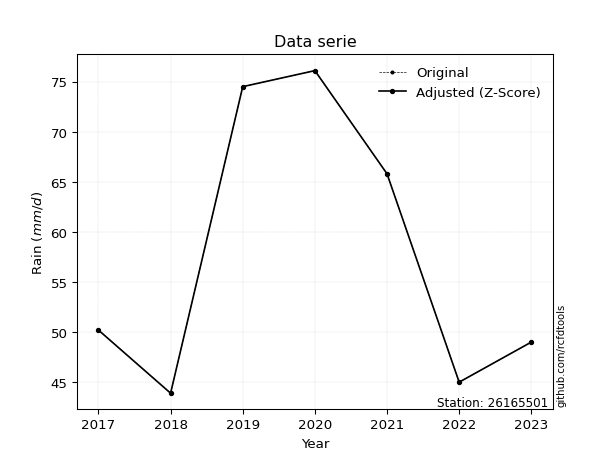</img>

</div>


> The initial value (value_initial) correspond to the initial obtained or null completed value, and value (value) is adjusted only when the initial value is outside the valid range (outlier) definite through the Z-Score value. If Z-Score is active, values out of range or outliers are replaced with the station mean value. A Z-Score (or standard score) measures how many standard deviations a data point is from the mean of a dataset, indicating its relative position; positive scores mean above the mean, negative mean below, and a score of zero is exactly at the mean, allowing for comparison of values from different distributions. It´s calculated using the formula $z=(x–μ)/σ$, where $x$ is the data point, $μ$ is the mean, and $σ$ is the standard deviation, helping identify outliers and understand probability.
>
> <sub>**Note**: In this study, "completing" (filling gaps in) and "extending" (forecasting or lengthening the historical record) rainfall data series are avoided for certain critical analyses because they introduce artificial bias and uncertainty, which can distort the statistics of rare events (extremes), alter day-to-day variability, and compromise the integrity and homogeneity of the original data. Some reasons against Completing/Extending rainfall data are: **Distortion of Extremes and Variability**: The primary issue is that most gap-filling or extension methods rely on averaging or regression with nearby stations, which inherently smooths the data. Rainfall is highly variable in space and time, with a large percentage of zero values and occasional large storms. Infilling methods often underestimate the highest values and overestimate the lowest (zero) values, which severely distorts analyses focused on flood frequency, drought severity, and intensity-duration-frequency (IDF) curves, **Loss of Data Homogeneity**: Infilled or extended data are synthetic estimates, not actual measurements. Combining these estimates with observed data can violate the assumption of data homogeneity, which requires that the data properties do not change over time. Inhomogeneity can lead to incorrect conclusions about long-term trends or changes in climate patterns, **Propagation of Errors**: Errors and biases from the original data (e.g., wind-induced undercatch, instrument errors, site changes) or the data used for imputation can propagate through the analysis, leading to unreliable hydrological models and inaccurate predictions, **Compromised Statistical Integrity**: For statistical analyses, especially those involving the frequency of events, using artificial data can introduce time bias or autocorrelation that doesn´t exist in reality, making it difficult to assess the true probability of events, **Difficulty in Validation**: It is difficult to accurately validate the quality of filled or extended data, especially for past periods where ground-truth measurements are unavailable. The reliability of imputation techniques heavily depends on the density of the surrounding station network and the complexity of the local topography.</sub>


### 4. Active continuous probability distributions from SciPy (80 of 104 available)

A Probability Density Function (PDF) describes the relative likelihood of a continuous random variable falling within a specific range, where the total area under its curve equals 1, and the area over any interval gives the actual probability for that range. Unlike discrete probabilities (like rolling a die), a PDF shows density, not direct probability for a single point (which is zero), with higher points indicating higher likelihood, often visualized as a bell curve for normal distributions.

A log of a probability density function (log-PDF) is simply the logarithm of the PDF´s value, denoted as $log(f(x))$, useful for converting multiplication of probabilities into addition, improving numerical stability with tiny numbers, and connecting to information theory concepts like entropy. Instead of dealing with very small probabilities (e.g., 0.000001), log-PDFs use negative numbers (e.g., $log(0.00001) ≈ -11.51$ that are easier for computers to handle, preventing underflow errors and simplifying complex calculations. In this study, each active probability distribution from SciPy is also evaluated in the $log$ form.

[scipy.stats](https://docs.scipy.org/doc/scipy/reference/stats.html) is a Python´s powerful submodule within the SciPy library for comprehensive statistical analysis, offering over 130 probability distributions (like Normal, Poisson, etc.), functions for descriptive stats (mean, variance), hypothesis testing (t-tests, chi-square), random variable generation, and statistical tests, making it essential for data science, modeling, and research. It provides tools to explore, model, and draw conclusions from data efficiently, working seamlessly with [NumPy](https://numpy.org/).

<div align="center">

|   id | p_dist           |   n_parameter | fit_method   | label                                                                       | active   | ref                                                                                                      |
|-----:|:-----------------|--------------:|:-------------|:----------------------------------------------------------------------------|:---------|:---------------------------------------------------------------------------------------------------------|
|    0 | alpha            |             3 | MLE          | Alpha                                                                       | True     | [:mortar_board:](https://docs.scipy.org/doc/scipy/reference/generated/scipy.stats.alpha.html)            |
|    1 | anglit           |             2 | MM           | Anglit                                                                      | True     | [:mortar_board:](https://docs.scipy.org/doc/scipy/reference/generated/scipy.stats.anglit.html)           |
|    2 | arcsine          |             2 | MM           | Arcsine                                                                     | True     | [:mortar_board:](https://docs.scipy.org/doc/scipy/reference/generated/scipy.stats.arcsine.html)          |
|    3 | argus            |             3 | MLE          | Argus                                                                       | True     | [:mortar_board:](https://docs.scipy.org/doc/scipy/reference/generated/scipy.stats.argus.html)            |
|    4 | beta             |             4 | MLE          | Beta                                                                        | True     | [:mortar_board:](https://docs.scipy.org/doc/scipy/reference/generated/scipy.stats.beta.html)             |
|    5 | betaprime        |             4 | MLE          | Beta prime                                                                  | True     | [:mortar_board:](https://docs.scipy.org/doc/scipy/reference/generated/scipy.stats.betaprime.html)        |
|    6 | bradford         |             3 | MLE          | Bradford                                                                    | True     | [:mortar_board:](https://docs.scipy.org/doc/scipy/reference/generated/scipy.stats.bradford.html)         |
|    7 | burr             |             4 | MLE          | Burr (Type III)                                                             | True     | [:mortar_board:](https://docs.scipy.org/doc/scipy/reference/generated/scipy.stats.burr.html)             |
|    8 | burr12           |             4 | MLE          | Burr (Type III) 12                                                          | True     | [:mortar_board:](https://docs.scipy.org/doc/scipy/reference/generated/scipy.stats.burr12.html)           |
|    9 | cosine           |             2 | MLE          | Cosine                                                                      | True     | [:mortar_board:](https://docs.scipy.org/doc/scipy/reference/generated/scipy.stats.cosine.html)           |
|   10 | crystalball      |             4 | MLE          | Crystalball                                                                 | True     | [:mortar_board:](https://docs.scipy.org/doc/scipy/reference/generated/scipy.stats.crystalball.html)      |
|   11 | dgamma           |             3 | MLE          | Double gamma                                                                | True     | [:mortar_board:](https://docs.scipy.org/doc/scipy/reference/generated/scipy.stats.dgamma.html)           |
|   12 | dweibull         |             3 | MLE          | Double Weibull                                                              | True     | [:mortar_board:](https://docs.scipy.org/doc/scipy/reference/generated/scipy.stats.dweibull.html)         |
|   13 | erlang           |             3 | MLE          | Erlang                                                                      | True     | [:mortar_board:](https://docs.scipy.org/doc/scipy/reference/generated/scipy.stats.erlang.html)           |
|   14 | exponnorm        |             3 | MLE          | Exponentially modified Normal                                               | True     | [:mortar_board:](https://docs.scipy.org/doc/scipy/reference/generated/scipy.stats.exponnorm.html)        |
|   15 | exponpow         |             3 | MLE          | Exponential power                                                           | True     | [:mortar_board:](https://docs.scipy.org/doc/scipy/reference/generated/scipy.stats.exponpow.html)         |
|   16 | exponweib        |             4 | MLE          | Exponentiated Weibull                                                       | True     | [:mortar_board:](https://docs.scipy.org/doc/scipy/reference/generated/scipy.stats.exponweib.html)        |
|   17 | f                |             4 | MLE          | F                                                                           | True     | [:mortar_board:](https://docs.scipy.org/doc/scipy/reference/generated/scipy.stats.f.html)                |
|   18 | fatiguelife      |             3 | MLE          | Fatigue-life (Birnbaum-Saunders)                                            | True     | [:mortar_board:](https://docs.scipy.org/doc/scipy/reference/generated/scipy.stats.fatiguelife.html)      |
|   19 | foldnorm         |             3 | MM           | Fold Normal                                                                 | True     | [:mortar_board:](https://docs.scipy.org/doc/scipy/reference/generated/scipy.stats.foldnorm.html)         |
|   20 | gamma            |             3 | MLE          | Gamma                                                                       | True     | [:mortar_board:](https://docs.scipy.org/doc/scipy/reference/generated/scipy.stats.gamma.html)            |
|   21 | gausshyper       |             6 | MLE          | Gauss hypergeometric                                                        | True     | [:mortar_board:](https://docs.scipy.org/doc/scipy/reference/generated/scipy.stats.gausshyper.html)       |
|   22 | genexpon         |             5 | MLE          | Generalized exponential                                                     | True     | [:mortar_board:](https://docs.scipy.org/doc/scipy/reference/generated/scipy.stats.genexpon.html)         |
|   23 | genextreme       |             3 | MLE          | Generalized exponential                                                     | True     | [:mortar_board:](https://docs.scipy.org/doc/scipy/reference/generated/scipy.stats.genextreme.html)       |
|   24 | gengamma         |             4 | MLE          | Generalized gamma                                                           | True     | [:mortar_board:](https://docs.scipy.org/doc/scipy/reference/generated/scipy.stats.gengamma.html)         |
|   25 | genhalflogistic  |             3 | MLE          | Generalized half-logistic                                                   | True     | [:mortar_board:](https://docs.scipy.org/doc/scipy/reference/generated/scipy.stats.genhalflogistic.html)  |
|   26 | genlogistic      |             3 | MLE          | Generalized logistic                                                        | True     | [:mortar_board:](https://docs.scipy.org/doc/scipy/reference/generated/scipy.stats.genlogistic.html)      |
|   27 | gennorm          |             3 | MLE          | Generalized Normal                                                          | True     | [:mortar_board:](https://docs.scipy.org/doc/scipy/reference/generated/scipy.stats.gennorm.html)          |
|   28 | genpareto        |             3 | MLE          | Generalized Pareto                                                          | True     | [:mortar_board:](https://docs.scipy.org/doc/scipy/reference/generated/scipy.stats.genpareto.html)        |
|   29 | gompertz         |             3 | MLE          | Gompertz (or truncated Gumbel)                                              | True     | [:mortar_board:](https://docs.scipy.org/doc/scipy/reference/generated/scipy.stats.gompertz.html)         |
|   30 | gumbel_l         |             2 | MM           | Gumbel Left Skew                                                            | True     | [:mortar_board:](https://docs.scipy.org/doc/scipy/reference/generated/scipy.stats.gumbel_l.html)         |
|   31 | gumbel_r         |             2 | MM           | Gumbel Right Skew                                                           | True     | [:mortar_board:](https://docs.scipy.org/doc/scipy/reference/generated/scipy.stats.gumbel_r.html)         |
|   32 | halfgennorm      |             3 | MLE          | Upper half of a generalized normal                                          | True     | [:mortar_board:](https://docs.scipy.org/doc/scipy/reference/generated/scipy.stats.halfgennorm.html)      |
|   33 | halflogistic     |             2 | MM           | Half-logistic                                                               | True     | [:mortar_board:](https://docs.scipy.org/doc/scipy/reference/generated/scipy.stats.halflogistic.html)     |
|   34 | halfnorm         |             2 | MM           | Half Normal                                                                 | True     | [:mortar_board:](https://docs.scipy.org/doc/scipy/reference/generated/scipy.stats.halfnorm.html)         |
|   35 | hypsecant        |             2 | MM           | hyperbolic secant                                                           | True     | [:mortar_board:](https://docs.scipy.org/doc/scipy/reference/generated/scipy.stats.hypsecant.html)        |
|   36 | invgamma         |             3 | MLE          | Inverted gamma                                                              | True     | [:mortar_board:](https://docs.scipy.org/doc/scipy/reference/generated/scipy.stats.invgamma.html)         |
|   37 | invgauss         |             3 | MLE          | Inverse Gaussian                                                            | True     | [:mortar_board:](https://docs.scipy.org/doc/scipy/reference/generated/scipy.stats.invgauss.html)         |
|   38 | invweibull       |             3 | MLE          | Inverted Weibull                                                            | True     | [:mortar_board:](https://docs.scipy.org/doc/scipy/reference/generated/scipy.stats.invweibull.html)       |
|   39 | johnsonsb        |             4 | MLE          | Johnson SB                                                                  | True     | [:mortar_board:](https://docs.scipy.org/doc/scipy/reference/generated/scipy.stats.johnsonsb.html)        |
|   40 | johnsonsu        |             4 | MLE          | Johnson Su                                                                  | True     | [:mortar_board:](https://docs.scipy.org/doc/scipy/reference/generated/scipy.stats.johnsonsu.html)        |
|   41 | kappa3           |             3 | MLE          | Kappa 3                                                                     | True     | [:mortar_board:](https://docs.scipy.org/doc/scipy/reference/generated/scipy.stats.kappa3.html)           |
|   42 | kappa4           |             4 | MLE          | Kappa 4                                                                     | True     | [:mortar_board:](https://docs.scipy.org/doc/scipy/reference/generated/scipy.stats.kappa4.html)           |
|   43 | ksone            |             3 | MLE          | Kolmogorov-Smirnov one-sided test statistic distribution                    | True     | [:mortar_board:](https://docs.scipy.org/doc/scipy/reference/generated/scipy.stats.ksone.html)            |
|   44 | kstwobign        |             2 | MLE          | Limiting distribution of scaled Kolmogorov-Smirnov two-sided test statistic | True     | [:mortar_board:](https://docs.scipy.org/doc/scipy/reference/generated/scipy.stats.kstwobign.html)        |
|   45 | laplace          |             2 | MM           | Laplace                                                                     | True     | [:mortar_board:](https://docs.scipy.org/doc/scipy/reference/generated/scipy.stats.laplace.html)          |
|   46 | levy_l           |             2 | MLE          | Left-skewed Levy                                                            | True     | [:mortar_board:](https://docs.scipy.org/doc/scipy/reference/generated/scipy.stats.levy_l.html)           |
|   47 | loggamma         |             3 | MLE          | Log gamma                                                                   | True     | [:mortar_board:](https://docs.scipy.org/doc/scipy/reference/generated/scipy.stats.loggamma.html)         |
|   48 | logistic         |             2 | MM           | Logistic (or Sech-squared)                                                  | True     | [:mortar_board:](https://docs.scipy.org/doc/scipy/reference/generated/scipy.stats.logistic.html)         |
|   49 | loglaplace       |             3 | MLE          | Log-Laplace                                                                 | True     | [:mortar_board:](https://docs.scipy.org/doc/scipy/reference/generated/scipy.stats.loglaplace.html)       |
|   50 | lomax            |             3 | MLE          | Lomax (Pareto of the second kind)                                           | True     | [:mortar_board:](https://docs.scipy.org/doc/scipy/reference/generated/scipy.stats.lomax.html)            |
|   51 | maxwell          |             2 | MM           | Maxwell                                                                     | True     | [:mortar_board:](https://docs.scipy.org/doc/scipy/reference/generated/scipy.stats.maxwell.html)          |
|   52 | mielke           |             4 | MLE          | Mielke Beta-Kappa / Dagum                                                   | True     | [:mortar_board:](https://docs.scipy.org/doc/scipy/reference/generated/scipy.stats.mielke.html)           |
|   53 | moyal            |             2 | MM           | Moyal                                                                       | True     | [:mortar_board:](https://docs.scipy.org/doc/scipy/reference/generated/scipy.stats.moyal.html)            |
|   54 | nakagami         |             3 | MLE          | Nakagami                                                                    | True     | [:mortar_board:](https://docs.scipy.org/doc/scipy/reference/generated/scipy.stats.nakagami.html)         |
|   55 | ncf              |             5 | MLE          | Non-central F distribution                                                  | True     | [:mortar_board:](https://docs.scipy.org/doc/scipy/reference/generated/scipy.stats.ncf.html)              |
|   56 | nct              |             4 | MLE          | Non-central Student’s t                                                     | True     | [:mortar_board:](https://docs.scipy.org/doc/scipy/reference/generated/scipy.stats.nct.html)              |
|   57 | norm             |             2 | MM           | Normal                                                                      | True     | [:mortar_board:](https://docs.scipy.org/doc/scipy/reference/generated/scipy.stats.norm.html)             |
|   58 | pearson3         |             3 | MM           | Pearson type III                                                            | True     | [:mortar_board:](https://docs.scipy.org/doc/scipy/reference/generated/scipy.stats.pearson3.html)         |
|   59 | powerlaw         |             3 | MLE          | Power-function                                                              | True     | [:mortar_board:](https://docs.scipy.org/doc/scipy/reference/generated/scipy.stats.powerlaw.html)         |
|   60 | rayleigh         |             2 | MM           | Rayleigh                                                                    | True     | [:mortar_board:](https://docs.scipy.org/doc/scipy/reference/generated/scipy.stats.rayleigh.html)         |
|   61 | rdist            |             3 | MLE          | R-distributed (symmetric beta)                                              | True     | [:mortar_board:](https://docs.scipy.org/doc/scipy/reference/generated/scipy.stats.rdist.html)            |
|   62 | rice             |             3 | MLE          | Rice                                                                        | True     | [:mortar_board:](https://docs.scipy.org/doc/scipy/reference/generated/scipy.stats.rice.html)             |
|   63 | semicircular     |             2 | MM           | Semicircular                                                                | True     | [:mortar_board:](https://docs.scipy.org/doc/scipy/reference/generated/scipy.stats.semicircular.html)     |
|   64 | skewnorm         |             3 | MLE          | Skew normal                                                                 | True     | [:mortar_board:](https://docs.scipy.org/doc/scipy/reference/generated/scipy.stats.skewnorm.html)         |
|   65 | t                |             3 | MLE          | Student’s t                                                                 | True     | [:mortar_board:](https://docs.scipy.org/doc/scipy/reference/generated/scipy.stats.t.html)                |
|   66 | trapezoid        |             4 | MLE          | Trapezoid                                                                   | True     | [:mortar_board:](https://docs.scipy.org/doc/scipy/reference/generated/scipy.stats.trapezoid.html)        |
|   67 | triang           |             3 | MLE          | Triangular                                                                  | True     | [:mortar_board:](https://docs.scipy.org/doc/scipy/reference/generated/scipy.stats.triang.html)           |
|   68 | truncexpon       |             3 | MLE          | Truncated exponential                                                       | True     | [:mortar_board:](https://docs.scipy.org/doc/scipy/reference/generated/scipy.stats.truncexpon.html)       |
|   69 | truncnorm        |             4 | MLE          | Truncated normal                                                            | True     | [:mortar_board:](https://docs.scipy.org/doc/scipy/reference/generated/scipy.stats.truncnorm.html)        |
|   70 | truncpareto      |             4 | MLE          | Upper truncated Pareto                                                      | True     | [:mortar_board:](https://docs.scipy.org/doc/scipy/reference/generated/scipy.stats.truncpareto.html)      |
|   71 | truncweibull_min |             5 | MLE          | Doubly truncated Weibull minimum                                            | True     | [:mortar_board:](https://docs.scipy.org/doc/scipy/reference/generated/scipy.stats.truncweibull_min.html) |
|   72 | tukeylambda      |             3 | MLE          | Tukey-Lamdba                                                                | True     | [:mortar_board:](https://docs.scipy.org/doc/scipy/reference/generated/scipy.stats.tukeylambda.html)      |
|   73 | uniform          |             2 | MLE          | Uniform                                                                     | True     | [:mortar_board:](https://docs.scipy.org/doc/scipy/reference/generated/scipy.stats.uniform.html)          |
|   74 | vonmises         |             3 | MLE          | Von Mises                                                                   | True     | [:mortar_board:](https://docs.scipy.org/doc/scipy/reference/generated/scipy.stats.vonmises.html)         |
|   75 | vonmises_line    |             3 | MLE          | Von Mises line                                                              | True     | [:mortar_board:](https://docs.scipy.org/doc/scipy/reference/generated/scipy.stats.vonmises_line.html)    |
|   76 | wald             |             2 | MM           | Wald                                                                        | True     | [:mortar_board:](https://docs.scipy.org/doc/scipy/reference/generated/scipy.stats.wald.html)             |
|   77 | weibull_max      |             3 | MLE          | Weibull maximum                                                             | True     | [:mortar_board:](https://docs.scipy.org/doc/scipy/reference/generated/scipy.stats.weibull_max.html)      |
|   78 | weibull_min      |             3 | MLE          | Weibull minimum                                                             | True     | [:mortar_board:](https://docs.scipy.org/doc/scipy/reference/generated/scipy.stats.weibull_min.html)      |
|   79 | wrapcauchy       |             3 | MLE          | Wrapped  Cauchy                                                             | True     | [:mortar_board:](https://docs.scipy.org/doc/scipy/reference/generated/scipy.stats.wrapcauchy.html)       |

</div>

> **n_parameter:** # arguments & localization & scale.
>
> **Fit methods:** (MLE) maximum likelihood, (MM) L-moments.
>
>**Inactive** (With the only purpose of prevent loops, zero divisions, infinite values, over high estimated values or horizontal trending for recurrence intervals estimations, the follow distributions were disabled.)**:** lognorm, norminvgauss, powernorm, powerlognorm, cauchy, halfcauchy, foldcauchy, skewcauchy, chi2, expon, fisk, genhyperbolic, geninvgauss, gibrat, kstwo, laplace_asymmetric, levy, levy_stable, ncx2, pareto, rel_breitwigner, recipinvgauss, studentized_range, loguniform, 


## B. Probability (PDF) vs. Empirical (EDF) distributions functions

A continuous probability distribution (CPD) describes probabilities for variables that can take any value within a range (like rain any time), unlike discrete variables with specific outcomes (like temperature). It uses a Probability Density Function (PDF), a curve where the total area under it equals 1, and the probability of the variable falling within an interval (a to b) is found by calculating the area under the curve between those points. A key feature is that the probability of hitting any single exact value is zero, so probabilities are always expressed for ranges, e.g., $P(a ≤ X ≤ b)$.

<div align="center">

Distributions parameters from station values
|     |   station | p_dist              |   n |             loc |          scale | shape                  | shape1                | shape2               | shape3             |
|----:|----------:|:--------------------|----:|----------------:|---------------:|:-----------------------|:----------------------|:---------------------|:-------------------|
|   0 |  26165501 | alpha               |   7 |    40.3829      |    6.71808     | 0.00027434093763040483 |                       |                      |                    |
|   1 |  26165501 | anglit              |   7 |    57.7857      |   37.8211      |                        |                       |                      |                    |
|   2 |  26165501 | arcsine             |   7 |    39.502       |   36.5674      |                        |                       |                      |                    |
|   3 |  26165501 | argus               |   7 |    31.8838      |   46.9745      | 1.1526936209622553e-05 |                       |                      |                    |
|   4 |  26165501 | beta                |   7 |    43.7914      |   32.3086      | 0.9809830069698056     | 0.8181600235786388    |                      |                    |
|   5 |  26165501 | betaprime           |   7 |    -1.44093     |    2.96217     | 450.9992988371164      | 23.561408968835266    |                      |                    |
|   6 |  26165501 | bradford            |   7 |    43.9         |   32.2001      | 1.1462527248787162     |                       |                      |                    |
|   7 |  26165501 | burr                |   7 |    -0.477824    |   16.3679      | 5.777359291626432      | 729.5243990937415     |                      |                    |
|   8 |  26165501 | burr12              |   7 |    -4.56311     |   48.3301      | 1385.678233954578      | 0.0030882379036166014 |                      |                    |
|   9 |  26165501 | cosine              |   7 |    58.4281      |   10.1691      |                        |                       |                      |                    |
|  10 |  26165501 | crystalball         |   7 |    57.7857      |   12.9285      | 8075.901011719419      | 8196.641813638158     |                      |                    |
|  11 |  26165501 | dgamma              |   7 |    58.8788      |    1.17957     | 10.558173803523466     |                       |                      |                    |
|  12 |  26165501 | dweibull            |   7 |    59.7027      |   13.8737      | 4.375633151671177      |                       |                      |                    |
|  13 |  26165501 | erlang              |   7 |    43.9         |   19.3759      | 0.64743383362401       |                       |                      |                    |
|  14 |  26165501 | exponnorm           |   7 |    43.8837      |    0.00499058  | 2761.0447102732915     |                       |                      |                    |
|  15 |  26165501 | exponpow            |   7 |    43.9         |   29.4262      | 0.49988645773247786    |                       |                      |                    |
|  16 |  26165501 | exponweib           |   7 |    43.9         |    1.41242     | 1.079778056079486      | 0.32690158471755176   |                      |                    |
|  17 |  26165501 | f                   |   7 |    42.0441      |   10.4006      | 3.522163619285994      | 2.8979049305576368    |                      |                    |
|  18 |  26165501 | fatiguelife         |   7 |    43.9         |    2.07028e-06 | 2515.3764677068675     |                       |                      |                    |
|  19 |  26165501 | foldnorm            |   7 |    34.8315      |   14.0679      | 1.5833303501769374     |                       |                      |                    |
|  20 |  26165501 | gamma               |   7 |    43.9         |   35.855       | 0.2638469280012519     |                       |                      |                    |
|  21 |  26165501 | gausshyper          |   7 |    43.9         |   33.8814      | 0.8586371937584725     | 1.060603093674171     | 0.9856570674467556   | 1.14565915229063   |
|  22 |  26165501 | genexpon            |   7 |    43.9         |  416.768       | 28.958164617855687     | 33.77137324627182     | 1.2930455888806605   |                    |
|  23 |  26165501 | genextreme          |   7 |    47.6314      |    5.61058     | -1.018018928230823     |                       |                      |                    |
|  24 |  26165501 | gengamma            |   7 |    43.9         |    1.43397     | 0.9772773989808987     | 0.30636621432137934   |                      |                    |
|  25 |  26165501 | genhalflogistic     |   7 |    41.9608      |   36.9892      | 1.083484069979581      |                       |                      |                    |
|  26 |  26165501 | genlogistic         |   7 |   -17.7894      |    9.96689     | 1057.3794626432154     |                       |                      |                    |
|  27 |  26165501 | gennorm             |   7 |    50.2         |    0.051035    | 0.2778771281437197     |                       |                      |                    |
|  28 |  26165501 | genpareto           |   7 |    -1.36035     |  180.75        | -2.33345356533135      |                       |                      |                    |
|  29 |  26165501 | gompertz            |   7 |    43.9         |  104.538       | 6.394081476859555      |                       |                      |                    |
|  30 |  26165501 | gumbel_l            |   7 |    63.6042      |   10.0803      |                        |                       |                      |                    |
|  31 |  26165501 | gumbel_r            |   7 |    51.9672      |   10.0803      |                        |                       |                      |                    |
|  32 |  26165501 | halfgennorm         |   7 |    43.9         |    1.44253     | 0.4387459165182542     |                       |                      |                    |
|  33 |  26165501 | halflogistic        |   7 |    42.4624      |   11.0534      |                        |                       |                      |                    |
|  34 |  26165501 | halfnorm            |   7 |    40.6734      |   21.4471      |                        |                       |                      |                    |
|  35 |  26165501 | hypsecant           |   7 |    57.7857      |    8.23056     |                        |                       |                      |                    |
|  36 |  26165501 | invgamma            |   7 |    41.2501      |    9.1443      | 1.2847453368036612     |                       |                      |                    |
|  37 |  26165501 | invgauss            |   7 |    42.3474      |    7.37885     | 2.0922477948092713     |                       |                      |                    |
|  38 |  26165501 | invweibull          |   7 |    42.1201      |    5.51137     | 0.9823036383189012     |                       |                      |                    |
|  39 |  26165501 | johnsonsb           |   7 |    43.9         |   32.2015      | 0.7604016328508756     | 0.12277664322081616   |                      |                    |
|  40 |  26165501 | johnsonsu           |   7 |     3.65463e+08 |    8.5119e+07  | 62875255.68435711      | 29061087.57709842     |                      |                    |
|  41 |  26165501 | kappa3              |   7 |    43.897       |   30.2066      | 25.338171109889373     |                       |                      |                    |
|  42 |  26165501 | kappa4              |   7 |    37.5215      |   38.0078      | 1.2011563054964116     | 0.9763659052511949    |                      |                    |
|  43 |  26165501 | ksone               |   7 |    35.3928      |   44.7857      | 1.0                    |                       |                      |                    |
|  44 |  26165501 | kstwobign           |   7 |    17.6048      |   45.8916      |                        |                       |                      |                    |
|  45 |  26165501 | laplace             |   7 |    57.7857      |    9.14185     |                        |                       |                      |                    |
|  46 |  26165501 | levy_l              |   7 |    77.2319      |    4.76061     |                        |                       |                      |                    |
|  47 |  26165501 | loggamma            |   7 | -2984.14        |  434.275       | 1102.181242053728      |                       |                      |                    |
|  48 |  26165501 | logistic            |   7 |    57.7857      |    7.12787     |                        |                       |                      |                    |
|  49 |  26165501 | loglaplace          |   7 |    -0.147904    |   50.3479      | 5.202242511832744      |                       |                      |                    |
|  50 |  26165501 | lomax               |   7 |    43.9         |  127.31        | 9.933130914358081      |                       |                      |                    |
|  51 |  26165501 | maxwell             |   7 |    27.1505      |   19.1978      |                        |                       |                      |                    |
|  52 |  26165501 | mielke              |   7 |    -1.11576     |   19.3706      | 1850.8282903179968     | 5.843421044306867     |                      |                    |
|  53 |  26165501 | moyal               |   7 |    50.3923      |    5.81988     |                        |                       |                      |                    |
|  54 |  26165501 | nakagami            |   7 |    43.9         |   23.8898      | 0.15302080696693127    |                       |                      |                    |
|  55 |  26165501 | ncf                 |   7 |    -1.38473     |    0.0178857   | 0.07899237125264405    | 67.46585781687716     | 253.36437038597836   |                    |
|  56 |  26165501 | nct                 |   7 |    -0.547157    |    0.737752    | 11.61958011413325      | 73.85734463216403     |                      |                    |
|  57 |  26165501 | norm                |   7 |    57.7857      |   12.9285      |                        |                       |                      |                    |
|  58 |  26165501 | pearson3            |   7 |    57.7857      |   12.9285      | 0.35993502478607636    |                       |                      |                    |
|  59 |  26165501 | powerlaw            |   7 |    43.9         |   32.2         | 0.1615243124948501     |                       |                      |                    |
|  60 |  26165501 | rayleigh            |   7 |    33.0527      |   19.7341      |                        |                       |                      |                    |
|  61 |  26165501 | rdist               |   7 |    47.1838      |    3.28385     | 1.4923978242514133     |                       |                      |                    |
|  62 |  26165501 | rice                |   7 |    36.1763      |   17.5153      | 0.2587434629246207     |                       |                      |                    |
|  63 |  26165501 | semicircular        |   7 |    57.7857      |   25.8571      |                        |                       |                      |                    |
|  64 |  26165501 | skewnorm            |   7 |    43.9         |   18.974       | 14461527.069038656     |                       |                      |                    |
|  65 |  26165501 | t                   |   7 |    57.7814      |   12.9282      | 1330946.287527753      |                       |                      |                    |
|  66 |  26165501 | trapezoid           |   7 |    40.68        |   38.64        | 1.0                    | 1.0                   |                      |                    |
|  67 |  26165501 | triang              |   7 |    29.0088      |   47.0912      | 0.9999999999766951     |                       |                      |                    |
|  68 |  26165501 | truncexpon          |   7 |    43.9         |   39.3629      | 0.8180289544311654     |                       |                      |                    |
|  69 |  26165501 | truncnorm           |   7 |    51.305       |   15.424       | -0.48051200928869164   | 64.90762045137035     |                      |                    |
|  70 |  26165501 | truncpareto         |   7 |    43.8903      |    0.00972134  | 0.0005362118770510236  | 3313.3016716271695    |                      |                    |
|  71 |  26165501 | truncweibull_min    |   7 |    43.8514      |   33.7031      | 0.5279954789199559     | 0.0014429974209836198 | 0.956845027311648    |                    |
|  72 |  26165501 | tukeylambda         |   7 |    60.0179      |   17.956       | 1.1140439064205871     |                       |                      |                    |
|  73 |  26165501 | uniform             |   7 |    43.9         |   32.2         |                        |                       |                      |                    |
|  74 |  26165501 | vonmises            |   7 |    -0.0664916   |    1           | 1.0427049528693089     |                       |                      |                    |
|  75 |  26165501 | vonmises_line       |   7 |    60.1385      |    5.16895     | 9.994501823314381e-06  |                       |                      |                    |
|  76 |  26165501 | wald                |   7 |    44.8572      |   12.9285      |                        |                       |                      |                    |
|  77 |  26165501 | weibull_max         |   7 |    76.1         |    1.54403     | 0.3829327074386616     |                       |                      |                    |
|  78 |  26165501 | weibull_min         |   7 |    43.9         |    2.83762     | 0.257846358204718      |                       |                      |                    |
|  79 |  26165501 | wrapcauchy          |   7 |    43.9         |    5.12479     | 0.525                  |                       |                      |                    |
|  80 |  26165501 | logalpha            |   7 |     1.16477     |   38.2845      | 13.453154988337339     |                       |                      |                    |
|  81 |  26165501 | loganglit           |   7 |     4.03227     |    0.642911    |                        |                       |                      |                    |
|  82 |  26165501 | logarcsine          |   7 |     3.72147     |    0.621599    |                        |                       |                      |                    |
|  83 |  26165501 | logargus            |   7 |     3.59136     |    0.789808    | 7.767410858186308e-05  |                       |                      |                    |
|  84 |  26165501 | logbeta             |   7 |     3.78191     |    0.649446    | 0.3456200281720073     | 1.0881949505281079    |                      |                    |
|  85 |  26165501 | logbetaprime        |   7 |    -3.43849     |   10.294       | 645.13522597271        | 891.0652368476581     |                      |                    |
|  86 |  26165501 | logbradford         |   7 |     3.78191     |    0.550142    | 1.0678328296632222     |                       |                      |                    |
|  87 |  26165501 | logburr             |   7 |    -0.729813    |    3.8261      | 27.28337121148695      | 208.66050702098642    |                      |                    |
|  88 |  26165501 | logburr12           |   7 |    -0.290338    |    5.53927     | 21.61995511334544      | 126.3921231589872     |                      |                    |
|  89 |  26165501 | logcosine           |   7 |     4.04055     |    0.172521    |                        |                       |                      |                    |
|  90 |  26165501 | logcrystalball      |   7 |     4.03227     |    0.219771    | 45.244106452366026     | 9.521699577463936     |                      |                    |
|  91 |  26165501 | logdgamma           |   7 |     4.05869     |    0.018598    | 11.458563350899503     |                       |                      |                    |
|  92 |  26165501 | logdweibull         |   7 |     4.06266     |    0.236052    | 4.349600275448516      |                       |                      |                    |
|  93 |  26165501 | logerlang           |   7 |     3.78191     |    0.262543    | 0.6928656109619142     |                       |                      |                    |
|  94 |  26165501 | logexponnorm        |   7 |     3.9935      |    0.21633     | 0.17923185027297922    |                       |                      |                    |
|  95 |  26165501 | logexponpow         |   7 |     3.78191     |    0.593456    | 0.7873992426595755     |                       |                      |                    |
|  96 |  26165501 | logexponweib        |   7 |     3.78191     |    0.421478    | 0.4504170399296923     | 1.348442700456029     |                      |                    |
|  97 |  26165501 | logf                |   7 |     3.78191     |    0.28674     | 1.0166890587957171     | 683.4491583236834     |                      |                    |
|  98 |  26165501 | logfatiguelife      |   7 |     3.77483     |    0.0865535   | 1.8377674250088376     |                       |                      |                    |
|  99 |  26165501 | logfoldnorm         |   7 |     3.71359     |    0.273766    | 0.9964551451022812     |                       |                      |                    |
| 100 |  26165501 | loggamma            |   7 |     3.78191     |    0.27908     | 0.5740391468201033     |                       |                      |                    |
| 101 |  26165501 | loggausshyper       |   7 |     3.78191     |    0.581877    | 0.5265748228029725     | 1.2637676478947566    | 1.0676092443677518   | 0.8552844577326825 |
| 102 |  26165501 | loggenexpon         |   7 |     3.78188     |    0.00359523  | 0.012346227909763266   | 1.069572194434457     | 3.02230001511517e-05 |                    |
| 103 |  26165501 | loggenextreme       |   7 |     3.87621     |    0.124059    | -0.6389616001323187    |                       |                      |                    |
| 104 |  26165501 | loggengamma         |   7 |     3.78191     |    1.03117     | 0.42361333254722394    | 1.1838455440615574    |                      |                    |
| 105 |  26165501 | loggenhalflogistic  |   7 |     3.78191     |    0.514051    | 0.9270429096187875     |                       |                      |                    |
| 106 |  26165501 | loggenlogistic      |   7 |     2.77858     |    0.174563    | 718.5284376271165      |                       |                      |                    |
| 107 |  26165501 | loggennorm          |   7 |     3.91602     |    0.178077    | 0.9522947508893131     |                       |                      |                    |
| 108 |  26165501 | loggenpareto        |   7 |    -0.0179619   |   18.6529      | -4.288002834745512     |                       |                      |                    |
| 109 |  26165501 | loggompertz         |   7 |     3.78191     |    0.855064    | 2.5925875684746664     |                       |                      |                    |
| 110 |  26165501 | loggumbel_l         |   7 |     4.13118     |    0.171353    |                        |                       |                      |                    |
| 111 |  26165501 | loggumbel_r         |   7 |     3.93336     |    0.171353    |                        |                       |                      |                    |
| 112 |  26165501 | loghalfgennorm      |   7 |     3.78191     |    0.0127759   | 0.39001433418575593    |                       |                      |                    |
| 113 |  26165501 | loghalflogistic     |   7 |     3.77179     |    0.187894    |                        |                       |                      |                    |
| 114 |  26165501 | loghalfnorm         |   7 |     3.74138     |    0.364573    |                        |                       |                      |                    |
| 115 |  26165501 | loghypsecant        |   7 |     4.03227     |    0.139909    |                        |                       |                      |                    |
| 116 |  26165501 | loginvgamma         |   7 |    -0.482457    | 1975.43        | 438.5894533861185      |                       |                      |                    |
| 117 |  26165501 | loginvgauss         |   7 |     3.74041     |    0.210951    | 1.3835654403560813     |                       |                      |                    |
| 118 |  26165501 | loginvweibull       |   7 |     3.68204     |    0.194172    | 1.5651335406555122     |                       |                      |                    |
| 119 |  26165501 | logjohnsonsb        |   7 |     3.78191     |    0.551514    | 1.3680862863753438     | 0.11984787908339908   |                      |                    |
| 120 |  26165501 | logjohnsonsu        |   7 |     4.33205     |    1.84895e-15 | 2.4969859962233993     | 0.09592246934904958   |                      |                    |
| 121 |  26165501 | logkappa3           |   7 |     3.78191     |    0.545186    | 223.17312878685004     |                       |                      |                    |
| 122 |  26165501 | logkappa4           |   7 |     3.73589     |    0.644049    | 1.0771946391509908     | 1.0779541409129232    |                      |                    |
| 123 |  26165501 | logksone            |   7 |     3.65162     |    0.7613      | 1.0                    |                       |                      |                    |
| 124 |  26165501 | logkstwobign        |   7 |     3.33253     |    0.798641    |                        |                       |                      |                    |
| 125 |  26165501 | loglaplace          |   7 |     4.03227     |    0.1554      |                        |                       |                      |                    |
| 126 |  26165501 | loglevy_l           |   7 |     4.34881     |    0.0698332   |                        |                       |                      |                    |
| 127 |  26165501 | logloggamma         |   7 |   -45.449       |    7.12203     | 1041.135091111376      |                       |                      |                    |
| 128 |  26165501 | loglogistic         |   7 |     4.03227     |    0.121165    |                        |                       |                      |                    |
| 129 |  26165501 | logloglaplace       |   7 |     0.0184358   |    3.89758     | 20.913335278295186     |                       |                      |                    |
| 130 |  26165501 | loglomax            |   7 |     3.78191     |    3.69792     | 15.51141683586674      |                       |                      |                    |
| 131 |  26165501 | logmaxwell          |   7 |     3.51151     |    0.326337    |                        |                       |                      |                    |
| 132 |  26165501 | logmielke           |   7 |   -21.4503      |   24.7016      | 7651.931144903327      | 146.35959568765304    |                      |                    |
| 133 |  26165501 | logmoyal            |   7 |     3.90659     |    0.0989306   |                        |                       |                      |                    |
| 134 |  26165501 | lognakagami         |   7 |     3.78191     |    0.573662    | 0.09492694692314999    |                       |                      |                    |
| 135 |  26165501 | logncf              |   7 |     3.69034     |    0.114438    | 13012.030974245901     | 4.131238808603804     | 10334.449180518402   |                    |
| 136 |  26165501 | lognct              |   7 |    -4.90223     |    0.111026    | 648.4100534015945      | 80.36617910161976     |                      |                    |
| 137 |  26165501 | lognorm             |   7 |     4.03227     |    0.219769    |                        |                       |                      |                    |
| 138 |  26165501 | logpearson3         |   7 |     4.03227     |    0.219769    | 0.2787055643179377     |                       |                      |                    |
| 139 |  26165501 | logpowerlaw         |   7 |     3.78191     |    0.550134    | 0.16980884407819286    |                       |                      |                    |
| 140 |  26165501 | lograyleigh         |   7 |     3.61184     |    0.335455    |                        |                       |                      |                    |
| 141 |  26165501 | logrdist            |   7 |     4.05698     |    0.275068    | 1.1327533477895062     |                       |                      |                    |
| 142 |  26165501 | logrice             |   7 |     3.65713     |    0.291983    | 0.4660802203331188     |                       |                      |                    |
| 143 |  26165501 | logsemicircular     |   7 |     4.03227     |    0.439537    |                        |                       |                      |                    |
| 144 |  26165501 | logskewnorm         |   7 |     3.78191     |    0.33313     | 39481632.47126289      |                       |                      |                    |
| 145 |  26165501 | logt                |   7 |     4.03227     |    0.219773    | 95458167.10423401      |                       |                      |                    |
| 146 |  26165501 | logtrapezoid        |   7 |     3.41067     |    0.932399    | 1.0                    | 1.0                   |                      |                    |
| 147 |  26165501 | logtriang           |   7 |     3.54528     |    0.78677     | 0.9999959201811934     |                       |                      |                    |
| 148 |  26165501 | logtruncexpon       |   7 |     3.78191     |    0.575471    | 0.9559758546506967     |                       |                      |                    |
| 149 |  26165501 | logtruncnorm        |   7 |    -2.18151     |    1.60153     | 3.7235848406461        | 4.067090999739889     |                      |                    |
| 150 |  26165501 | logtruncpareto      |   7 |     3.78172     |    0.000188091 | 1.7335637215764462e-09 | 2927.170389523908     |                      |                    |
| 151 |  26165501 | logtruncweibull_min |   7 |     3.78046     |    0.938427    | 0.6889308011490638     | 0.0015533826386800263 | 0.5877834469562724   |                    |
| 152 |  26165501 | logtukeylambda      |   7 |     4.05694     |    0.305134    | 1.1091522640197469     |                       |                      |                    |
| 153 |  26165501 | loguniform          |   7 |     3.78191     |    0.550134    |                        |                       |                      |                    |
| 154 |  26165501 | logvonmises         |   7 |    -2.25142     |    1           | 21.075754357246637     |                       |                      |                    |
| 155 |  26165501 | logvonmises_line    |   7 |     4.05672     |    0.0877261   | 1.4767021282131821e-05 |                       |                      |                    |
| 156 |  26165501 | logwald             |   7 |     3.8125      |    0.219767    |                        |                       |                      |                    |
| 157 |  26165501 | logweibull_max      |   7 |     4.33205     |    0.328405    | 0.7826044489699888     |                       |                      |                    |
| 158 |  26165501 | logweibull_min      |   7 |     3.78191     |    0.268821    | 0.685219497566893      |                       |                      |                    |
| 159 |  26165501 | logwrapcauchy       |   7 |     3.78191     |    0.0875565   | 0.525                  |                       |                      |                    |

</div>

> **loc** (Location parameter): This shifts the distribution along the x-axis. For many common distributions, like the normal (Gaussian) distribution, loc represents the mean $μ$. For others, like the uniform distribution, it might represent the minimum value, or for the beta distribution, the left end of the support interval.
>
> **scale** (Scale parameter): This determines the width or spread of the distribution. For the normal distribution, scale represents the standard deviation $σ$. For a uniform distribution, it defines the length of the interval (from $loc$ to $loc + scale$).
>
> **shape** (Shape parameters): Refers to parameters that define the specific form of a probability distribution, distinct from its location (loc) and scale (scale). These parameters are required arguments for most distribution functions. For example, a normal (Gaussian) distribution is fully defined by its location (mean) and scale (standard deviation), so it has no specific shape parameters beyond loc and scale. However, other distributions have intrinsic properties that need specification, as Gamma distribution that takes a shape parameter, often named $a$ or $alpha$.


### 0. Cumulative distribution values - CDF (160 evaluated)

Cumulative Distribution Function (CDF), denoted as $F$<sub>$X$</sub>$(x)$, is a function that gives the probability that a random variable $X$ will take a value less than or equal to a specific value, $x$ (i.e., $(P(X≥x)$. It essentially "accumulates" probabilities from a given point up to the far right (positive infinity), providing a complete picture of the distribution´s probabilities for both discrete (like rain) and continuous (like temperature) variables, helping to find probabilities over ranges or above certain values. Each station is evaluated separately ordering the $x$ values ascending, calculating the CDF and PDF values for the activated distributions and their logarithmic forms.

<div align="center">

CDF ordered by x ascending and calculating $log(f(x))$ separately
|   id |   Station |   date |    x |   count |    mean |     std |    zscore |   Value_initial |   station |   m |    alpha |   alpha_pdf |   anglit |   anglit_pdf |   arcsine |   arcsine_pdf |     argus |   argus_pdf |       beta |   beta_pdf |   betaprime |   betaprime_pdf |    bradford |   bradford_pdf |     burr |   burr_pdf |    burr12 |   burr12_pdf |   cosine |   cosine_pdf |   crystalball |   crystalball_pdf |   dgamma |   dgamma_pdf |   dweibull |   dweibull_pdf |      erlang |     erlang_pdf |   exponnorm |   exponnorm_pdf |    exponpow |   exponpow_pdf |   exponweib |   exponweib_pdf |         f |      f_pdf |   fatiguelife |   fatiguelife_pdf |   foldnorm |   foldnorm_pdf |       gamma |   gamma_pdf |   gausshyper |   gausshyper_pdf |    genexpon |   genexpon_pdf |   genextreme |   genextreme_pdf |    gengamma |   gengamma_pdf |   genhalflogistic |   genhalflogistic_pdf |   genlogistic |   genlogistic_pdf |   gennorm |   gennorm_pdf |   genpareto |   genpareto_pdf |    gompertz |   gompertz_pdf |   gumbel_l |   gumbel_l_pdf |   gumbel_r |   gumbel_r_pdf |   halfgennorm |   halfgennorm_pdf |   halflogistic |   halflogistic_pdf |   halfnorm |   halfnorm_pdf |   hypsecant |   hypsecant_pdf |   invgamma |   invgamma_pdf |   invgauss |   invgauss_pdf |   invweibull |   invweibull_pdf |   johnsonsb |   johnsonsb_pdf |   johnsonsu |   johnsonsu_pdf |      kappa3 |   kappa3_pdf |      kappa4 |   kappa4_pdf |    ksone |   ksone_pdf |   kstwobign |   kstwobign_pdf |   laplace |   laplace_pdf |   levy_l |   levy_l_pdf |    loggamma |   loggamma_pdf |   logistic |   logistic_pdf |   loglaplace |   loglaplace_pdf |       lomax |   lomax_pdf |   maxwell |   maxwell_pdf |   mielke |   mielke_pdf |     moyal |   moyal_pdf |    nakagami |   nakagami_pdf |      ncf |    ncf_pdf |      nct |    nct_pdf |     norm |   norm_pdf |   pearson3 |   pearson3_pdf |   powerlaw |   powerlaw_pdf |   rayleigh |   rayleigh_pdf |       rdist |   rdist_pdf |      rice |   rice_pdf |   semicircular |   semicircular_pdf |   skewnorm |   skewnorm_pdf |        t |     t_pdf |   trapezoid |   trapezoid_pdf |    triang |   triang_pdf |   truncexpon |   truncexpon_pdf |   truncnorm |   truncnorm_pdf |   truncpareto |   truncpareto_pdf |   truncweibull_min |   truncweibull_min_pdf |   tukeylambda |   tukeylambda_pdf |   uniform |   uniform_pdf |   vonmises |   vonmises_pdf |   vonmises_line |   vonmises_line_pdf |        wald |   wald_pdf |   weibull_max |   weibull_max_pdf |   weibull_min |   weibull_min_pdf |   wrapcauchy |   wrapcauchy_pdf |   logalpha |   logalpha_pdf |   loganglit |   loganglit_pdf |   logarcsine |   logarcsine_pdf |   logargus |   logargus_pdf |     logbeta |   logbeta_pdf |   logbetaprime |   logbetaprime_pdf |   logbradford |   logbradford_pdf |   logburr |   logburr_pdf |   logburr12 |   logburr12_pdf |   logcosine |   logcosine_pdf |   logcrystalball |   logcrystalball_pdf |   logdgamma |   logdgamma_pdf |   logdweibull |   logdweibull_pdf |   logerlang |   logerlang_pdf |   logexponnorm |   logexponnorm_pdf |   logexponpow |   logexponpow_pdf |   logexponweib |   logexponweib_pdf |        logf |   logf_pdf |   logfatiguelife |   logfatiguelife_pdf |   logfoldnorm |   logfoldnorm_pdf |   loggausshyper |   loggausshyper_pdf |   loggenexpon |   loggenexpon_pdf |   loggenextreme |   loggenextreme_pdf |   loggengamma |   loggengamma_pdf |   loggenhalflogistic |   loggenhalflogistic_pdf |   loggenlogistic |   loggenlogistic_pdf |   loggennorm |   loggennorm_pdf |   loggenpareto |   loggenpareto_pdf |   loggompertz |   loggompertz_pdf |   loggumbel_l |   loggumbel_l_pdf |   loggumbel_r |   loggumbel_r_pdf |   loghalfgennorm |   loghalfgennorm_pdf |   loghalflogistic |   loghalflogistic_pdf |   loghalfnorm |   loghalfnorm_pdf |   loghypsecant |   loghypsecant_pdf |   loginvgamma |   loginvgamma_pdf |   loginvgauss |   loginvgauss_pdf |   loginvweibull |   loginvweibull_pdf |   logjohnsonsb |   logjohnsonsb_pdf |   logjohnsonsu |   logjohnsonsu_pdf |   logkappa3 |   logkappa3_pdf |   logkappa4 |   logkappa4_pdf |   logksone |   logksone_pdf |   logkstwobign |   logkstwobign_pdf |   loglevy_l |   loglevy_l_pdf |   logloggamma |   logloggamma_pdf |   loglogistic |   loglogistic_pdf |   logloglaplace |   logloglaplace_pdf |    loglomax |   loglomax_pdf |   logmaxwell |   logmaxwell_pdf |   logmielke |   logmielke_pdf |   logmoyal |   logmoyal_pdf |   lognakagami |   lognakagami_pdf |    logncf |   logncf_pdf |   lognct |   lognct_pdf |   lognorm |   lognorm_pdf |   logpearson3 |   logpearson3_pdf |   logpowerlaw |   logpowerlaw_pdf |   lograyleigh |   lograyleigh_pdf |    logrdist |   logrdist_pdf |   logrice |   logrice_pdf |   logsemicircular |   logsemicircular_pdf |   logskewnorm |   logskewnorm_pdf |     logt |   logt_pdf |   logtrapezoid |   logtrapezoid_pdf |   logtriang |   logtriang_pdf |   logtruncexpon |   logtruncexpon_pdf |   logtruncnorm |   logtruncnorm_pdf |   logtruncpareto |   logtruncpareto_pdf |   logtruncweibull_min |   logtruncweibull_min_pdf |   logtukeylambda |   logtukeylambda_pdf |   loguniform |   loguniform_pdf |   logvonmises |   logvonmises_pdf |   logvonmises_line |   logvonmises_line_pdf |   logwald |   logwald_pdf |   logweibull_max |   logweibull_max_pdf |   logweibull_min |   logweibull_min_pdf |   logwrapcauchy |   logwrapcauchy_pdf |
|-----:|----------:|-------:|-----:|--------:|--------:|--------:|----------:|----------------:|----------:|----:|---------:|------------:|---------:|-------------:|----------:|--------------:|----------:|------------:|-----------:|-----------:|------------:|----------------:|------------:|---------------:|---------:|-----------:|----------:|-------------:|---------:|-------------:|--------------:|------------------:|---------:|-------------:|-----------:|---------------:|------------:|---------------:|------------:|----------------:|------------:|---------------:|------------:|----------------:|----------:|-----------:|--------------:|------------------:|-----------:|---------------:|------------:|------------:|-------------:|-----------------:|------------:|---------------:|-------------:|-----------------:|------------:|---------------:|------------------:|----------------------:|--------------:|------------------:|----------:|--------------:|------------:|----------------:|------------:|---------------:|-----------:|---------------:|-----------:|---------------:|--------------:|------------------:|---------------:|-------------------:|-----------:|---------------:|------------:|----------------:|-----------:|---------------:|-----------:|---------------:|-------------:|-----------------:|------------:|----------------:|------------:|----------------:|------------:|-------------:|------------:|-------------:|---------:|------------:|------------:|----------------:|----------:|--------------:|---------:|-------------:|------------:|---------------:|-----------:|---------------:|-------------:|-----------------:|------------:|------------:|----------:|--------------:|---------:|-------------:|----------:|------------:|------------:|---------------:|---------:|-----------:|---------:|-----------:|---------:|-----------:|-----------:|---------------:|-----------:|---------------:|-----------:|---------------:|------------:|------------:|----------:|-----------:|---------------:|-------------------:|-----------:|---------------:|---------:|----------:|------------:|----------------:|----------:|-------------:|-------------:|-----------------:|------------:|----------------:|--------------:|------------------:|-------------------:|-----------------------:|--------------:|------------------:|----------:|--------------:|-----------:|---------------:|----------------:|--------------------:|------------:|-----------:|--------------:|------------------:|--------------:|------------------:|-------------:|-----------------:|-----------:|---------------:|------------:|----------------:|-------------:|-----------------:|-----------:|---------------:|------------:|--------------:|---------------:|-------------------:|--------------:|------------------:|----------:|--------------:|------------:|----------------:|------------:|----------------:|-----------------:|---------------------:|------------:|----------------:|--------------:|------------------:|------------:|----------------:|---------------:|-------------------:|--------------:|------------------:|---------------:|-------------------:|------------:|-----------:|-----------------:|---------------------:|--------------:|------------------:|----------------:|--------------------:|--------------:|------------------:|----------------:|--------------------:|--------------:|------------------:|---------------------:|-------------------------:|-----------------:|---------------------:|-------------:|-----------------:|---------------:|-------------------:|--------------:|------------------:|--------------:|------------------:|--------------:|------------------:|-----------------:|---------------------:|------------------:|----------------------:|--------------:|------------------:|---------------:|-------------------:|--------------:|------------------:|--------------:|------------------:|----------------:|--------------------:|---------------:|-------------------:|---------------:|-------------------:|------------:|----------------:|------------:|----------------:|-----------:|---------------:|---------------:|-------------------:|------------:|----------------:|--------------:|------------------:|--------------:|------------------:|----------------:|--------------------:|------------:|---------------:|-------------:|-----------------:|------------:|----------------:|-----------:|---------------:|--------------:|------------------:|----------:|-------------:|---------:|-------------:|----------:|--------------:|--------------:|------------------:|--------------:|------------------:|--------------:|------------------:|------------:|---------------:|----------:|--------------:|------------------:|----------------------:|--------------:|------------------:|---------:|-----------:|---------------:|-------------------:|------------:|----------------:|----------------:|--------------------:|---------------:|-------------------:|-----------------:|---------------------:|----------------------:|--------------------------:|-----------------:|---------------------:|-------------:|-----------------:|--------------:|------------------:|-------------------:|-----------------------:|----------:|--------------:|-----------------:|---------------------:|-----------------:|---------------------:|----------------:|--------------------:|
|    0 |  26165501 |   2018 | 43.9 |       7 | 57.7857 | 13.9644 | -0.994365 |            43.9 |  26165501 |   1 | 0.05614  |  0.0699313  | 0.164972 |    0.0196269 |  0.225464 |     0.0267609 | 0.0965296 |   0.0157932 | 0.00307288 |  0.0277665 |    0.123788 |      0.0227947  | 9.65464e-07 |      0.0466108 | 0.101306 | 0.0301494  | 0.0117626 |   0.0853699  | 0.115073 |    0.017868  |      0.141403 |         0.0173328 | 0.11788  |    0.0354501 |  0.0853646 |     0.041782   | 1.12801e-10 | 10278.2        |  0.00117989 |      0.0724469  | 1.56027e-08 |     1.0977e+06 | 8.97302e-06 |     4.45754e+08 | 0.0773589 | 0.0583288  |     0.0203747 |       6.43801e+11 |   0.160998 |      0.0206235 | 7.95828e-05 | 2.95516e+09 |  5.21187e-14 |        6.29935   | 2.36343e-07 |     0.0694827  |    0.0480668 |       0.0805174  | 5.26163e-05 |    2.21707e+09 |         0.0269798 |             0.0143211 |      0.114582 |        0.0248807  |  0.193667 |    0.0162102  |    0.313522 |      0.00913633 | 2.47724e-14 |     0.0611651  |   0.132035 |      0.0121928 |   0.107939 |     0.0238378  |   1.25647e-13 |        0.263929   |      0.0649381 |         0.0450441  |   0.119586 |     0.0367838  |    0.116493 |      0.0138399  |  0.0536873 |     0.0653119  |   0.046319 |     0.0819319  |    0.0480661 |       0.0805156  | 0.000123337 |     8.32856e+09 |    0.1411   |       0.0173295 | 8.71257e-05 |    0.0291405 | 5.21564e-14 |   12.3067    | 0.189952 |   0.0223285 |    0.102093 |      0.0252966  |  0.109474 |    0.0119751  | 0.294511 |   0.0042115  | 2.11844e-08 |     1.2447e+06 |   0.124762 |     0.0153197  |    0.0998407 |         0.642476 | 1.57954e-06 |  0.078023   |  0.141278 |     0.0216221 |      nan |          nan | 0.0806758 |  0.0260415  | 1.42567e-05 |    6.14058e+08 | 0.12708  | 0.0218185  | 0.118253 | 0.0245024  | 0.141403 |  0.0173328 |   0.13759  |      0.0196408 | 0.00295891 |    6.72636e+10 |   0.140213 |      0.0239485 | 5.81416e-13 | 1190        | 0.0897419 |  0.0221634 |       0.175352 |          0.0207693 |   0        |     0.0420515  | 0.141472 | 0.0173389 |  0.00694444 |      0.00431332 | 0.0999949 |    0.0134301 |   5.3866e-10 |        0.045471  | 0.000218047 |       0.0336701 |   2.50112e-09 |       12.7182     |        1.68431e-10 |              0.561611  |   7.10543e-15 |         0.0543679 | 0         |     0.0310559 |    7.49447 |      0.349728  |     6.39545e-06 |           0.0307903 | 0           | 0          |     0.0407579 |       0.00155111  |   0.000171812 |        6.2343e+09 |     0        |        0.0997058 |   0.119961 |       1.11785  |    0.148782 |        1.10707  |     0.201888 |          1.72833 |  0.0860279 |       0.889337 | 5.96102e-06 |   4.63927e+09 |       0.271011 |           0.8858   |   9.73458e-06 |           2.67171 | 0.0990966 |      1.37764  |    0.150547 |        0.73536  |    0.102653 |        0.98855  |         0.127319 |             0.948754 |   0.0767396 |         1.57867 |     0.0596536 |           1.96491 | 1.03752e-10 |    80936.4      |       0.127137 |           0.951382 |   1.22988e-12 |       2180.66     |    8.00499e-10 |        1.09481e+06 | 2.36693e-08 | 2.7094e+07 |        0.0403458 |            12.6093   |      0.121193 |          1.77304  |     1.54361e-08 |         1.84667e+07 |   0.000128228 |          3.43371  |       0.0589552 |            2.61578  |   2.22119e-08 |        2.5083e+07 |          1.22866e-06 |                 0.972669 |         0.10142  |             1.32748  |     0.24485  |         1.28031  |       0.38259  |        0.261728    |   5.30789e-12 |          3.03204  |      0.122129 |          0.66732  |     0.0889083 |          1.25572  |      9.73957e-14 |            21.9315   |         0.0269304 |              2.65914  |     0.0885263 |          2.17506  |       0.10538  |           0.739521 |      0.120686 |          1.00452  |     0.0478482 |          3.34047  |       0.0589586 |            2.61569  |     0.00257677 |        2.15251e+12 |       0.221758 |        0.0518633   | 6.70668e-11 |         1.79032 |  1.5444e-15 |        21.7244  |   0.171149 |        1.31354 |      0.0904912 |           1.36786  |    0.274395 |        0.232239 |      0.129    |          0.942068 |      0.112423 |          0.823539 |        0.240421 |            1.336    | 1.72901e-10 |       4.19464  |     0.123646 |         1.19091  |    0.102279 |        1.32362  |  0.0604035 |       1.29872  |     0.0011343 |       4.84927e+11 | 0.0597925 |     2.45141  | 0.180853 |     1.00751  |  0.127316 |      0.948746 |      0.123306 |          1.04142  |    0.00273574 |       1.04608e+12 |      0.120608 |          1.3291   | 6.17294e-10 |    5.72422e+06 | 0.0786781 |      1.21036  |          0.158083 |               1.19048 |     0         |          2.39511  | 0.127319 |   0.948743 |       0.158532 |           0.854058 |   0.0904599 |        0.764559 |     3.44321e-06 |             2.82295 |    1.32083e-06 |           3.26594  |      0.000895788 |           661.343    |           6.97014e-08 |                 11.1042   |      0.000188639 |              2.35409 |    0         |          1.81774 |       1.12776 |          0.946127 |         0.00144564 |                1.8142  |  0        |      0        |         0.223702 |             0.476533 |      7.43174e-11 |        114670        |        0        |             5.8359  |
|    1 |  26165501 |   2022 | 45   |       7 | 57.7857 | 13.9644 | -0.915593 |            45   |  26165501 |   2 | 0.1457   |  0.0872552  | 0.187116 |    0.0206237 |  0.253497 |     0.0243546 | 0.114636  |   0.017123  | 0.0327685  |  0.026691  |    0.150213 |      0.0252187  | 0.0502945   |      0.0448544 | 0.136969 | 0.0345443  | 0.102201  |   0.0775164  | 0.135644 |    0.0195277 |      0.161343 |         0.0189228 | 0.161328 |    0.0434511 |  0.137755  |     0.0528504  | 0.169685    |     0.0964754  |  0.0778163  |      0.0669257  | 0.192156    |     0.0861582  | 0.578206    |     0.112999    | 0.143275  | 0.0602185  |     0.61401   |       0.0503885   |   0.184201 |      0.0215686 | 0.438519    | 0.102658    |  0.078222    |        0.0598252 | 0.0737241   |     0.0646158  |    0.150788  |       0.0973051  | 0.612463    |    0.100943    |         0.0430001 |             0.014811  |      0.143662 |        0.0279415  |  0.21334  |    0.0197587  |    0.323671 |      0.00931962 | 0.0654001   |     0.0577696  |   0.146091 |      0.0133784 |   0.135872 |     0.0269045  |   0.159849    |        0.108616   |      0.114286  |         0.044644   |   0.159875 |     0.0364531  |    0.132701 |      0.0156599  |  0.136896  |     0.0813016  |   0.149473 |     0.0966248  |    0.150785  |       0.0973037  | 0.636864    |     0.0433625   |    0.161039 |       0.0189233 | 0.0321417   |    0.0291405 | 0.0607744   |    0.0459776 | 0.214514 |   0.0223285 |    0.131712 |      0.0284815  |  0.123472 |    0.0135063  | 0.299256 |   0.00441814 | 0.270586    |     5.93039    |   0.142612 |     0.0171543  |    0.117077  |         0.753391 | 0.0819086   |  0.0710187  |  0.166008 |     0.0233197 |      nan |          nan | 0.112001  |  0.0308128  | 0.313813    |    0.0872842   | 0.152333 | 0.0240723  | 0.146761 | 0.02728    | 0.161343 |  0.0189228 |   0.160206 |      0.0214686 | 0.579603   |    0.0851091   |   0.167451 |      0.0255414 | 0.210735    |    0.146897 | 0.115487  |  0.0246042 |       0.198552 |          0.0214001 |   0.046231 |     0.0419808  | 0.161418 | 0.018929  |  0.0124995  |      0.00578681 | 0.115314  |    0.0144222 |   0.0493257  |        0.0442179 | 0.0378644   |       0.0347544 |   0.584998    |        0.111131   |        0.208411    |              0.110168  |   0.0379124   |         0.0330686 | 0.0341615 |     0.0310559 |    7.81707 |      0.200773  |     0.0338757   |           0.0307903 | 4.93368e-21 | 1.5804e-18 |     0.0425194 |       0.00165323  |   0.543065    |        0.0838886  |     0.105999 |        0.0900854 |   0.1496   |       1.27665  |    0.177193 |        1.18782  |     0.241429 |          1.48902 |  0.109366  |       0.996215 | 0.335629    |   4.67527     |       0.293328 |           0.91724  |   0.0645907   |           2.54925 | 0.136329  |      1.62605  |    0.169712 |        0.814272 |    0.128743 |        1.11942  |         0.152317 |             1.07179  |   0.123903  |         2.24257 |     0.120475  |           2.91313 | 0.206548    |        5.46728  |       0.152207 |           1.07504  |   0.0818493   |          2.59815  |    0.177854    |        4.31728     | 0.226742    | 4.52335    |        0.285249  |             6.54785  |      0.165054 |          1.77137  |     0.265048    |         5.45891     |   0.0822983   |          3.20832  |       0.135075  |            3.39632  |   0.173213    |        3.48027    |          0.0246217   |                 1.01749  |         0.137187 |             1.55895  |     0.278766 |         1.46504  |       0.389182 |        0.27113     |   0.0733079   |          2.89228  |      0.139717 |          0.75556  |     0.12311   |          1.50494  |      0.222542    |             6.01202  |         0.0925282 |              2.63829  |     0.142111  |          2.15374  |       0.125289 |           0.87256  |      0.147258 |          1.14297  |     0.144532  |          4.1501   |       0.135075  |            3.39617  |     0.841729   |        1.22489     |       0.223074 |        0.0544898   | 0.0443072   |         1.79032 |  0.0523643  |         1.96754 |   0.203657 |        1.31354 |      0.127459  |           1.61311  |    0.280329 |        0.247624 |      0.153802 |          1.06261  |      0.134473 |          0.960592 |        0.275742 |            1.52226  | 0.0982913   |       3.7572   |     0.154847 |         1.32863  |    0.137933 |        1.55378  |  0.0975083 |       1.69304  |     0.461813  |       3.54219     | 0.130493  |     3.15317  | 0.206801 |     1.08892  |  0.152313 |      1.07179  |      0.150801 |          1.18027  |    0.590582   |       4.05226     |      0.155196 |          1.46262  | 0.116693    |    2.70496     | 0.111025  |      1.3998   |          0.188212 |               1.24304 |     0.0592203 |          2.38851  | 0.152316 |   1.07178  |       0.180373 |           0.910991 |   0.110371  |        0.84452  |     0.0683854   |             2.70412 |    0.0785428   |           3.08295  |      0.612295    |             5.02394  |           0.143139    |                  4.20061  |      0.049413    |              1.91133 |    0.0449857 |          1.81774 |       1.1527  |          1.06964  |         0.0463438  |                1.8142  |  0        |      0        |         0.235874 |             0.507515 |      0.177214    |             4.44366  |        0.136388 |             4.9262  |
|    2 |  26165501 |   2023 | 49   |       7 | 57.7857 | 13.9644 | -0.62915  |            49   |  26165501 |   3 | 0.435679 |  0.0532693  | 0.27597  |    0.0236377 |  0.340447 |     0.0198516 | 0.192387  |   0.0216707 | 0.139008   |  0.0266178 |    0.265642 |      0.0318204  | 0.218439    |      0.0394489 | 0.294591 | 0.0420054  | 0.355926  |   0.0514568  | 0.225134 |    0.0250434 |      0.248392 |         0.0244952 | 0.366199 |    0.0500588 |  0.362611  |     0.0476287  | 0.423635    |     0.0456971  |  0.310165   |      0.0500634  | 0.403385    |     0.0369264  | 0.76641     |     0.0225493   | 0.355512  | 0.0443485  |     0.733678  |       0.0200878   |   0.277454 |      0.0250107 | 0.642604    | 0.0296847   |  0.274937    |        0.0423463 | 0.300657    |     0.0494818  |    0.447434  |       0.0513775  | 0.778591    |    0.019822    |         0.106158  |             0.0168367 |      0.272727 |        0.0355308  |  0.351792 |    0.0662303  |    0.362421 |      0.0100824  | 0.273616    |     0.0466506  |   0.209315 |      0.0184217 |   0.261255 |     0.0347877  |   0.435367    |        0.0463104  |      0.287397  |         0.0414985  |   0.302161 |     0.0345017  |    0.210859 |      0.023786   |  0.419106  |     0.0544987  |   0.445898 |     0.052773   |    0.44743   |       0.0513776  | 0.710663    |     0.00978079  |    0.248121 |       0.0245119 | 0.148704    |    0.0291405 | 0.21765     |    0.0354542 | 0.303828 |   0.0223285 |    0.262513 |      0.0357209  |  0.191247 |    0.0209199  | 0.318663 |   0.00533353 | 0.573414    |     2.31613    |   0.225729 |     0.02452    |    0.202517  |         1.3032   | 0.323049    |  0.0507835  |  0.269758 |     0.0281704 |      nan |          nan | 0.259714  |  0.0409362  | 0.501378    |    0.0299053   | 0.262652 | 0.0305438  | 0.271511 | 0.0341473  | 0.248392 |  0.0244952 |   0.258248 |      0.0272618 | 0.742565   |    0.0235181   |   0.27857  |      0.0295425 | 0.736822    |    0.138964 | 0.228339  |  0.0311981 |       0.287927 |          0.0231559 |   0.211908 |     0.0405595  | 0.248491 | 0.0245011 |  0.0463631  |      0.011145   | 0.180218  |    0.0180297 |   0.217507   |        0.0399453 | 0.182848    |       0.0373633 |   0.773242    |        0.0241155  |        0.470444    |              0.0443028 |   0.165036    |         0.0310448 | 0.158385  |     0.0310559 |    8.16108 |      0.180079  |     0.157037    |           0.0307904 | 0.187639    | 0.0827559  |     0.0500052 |       0.00211668  |   0.687513    |        0.018377   |     0.334267 |        0.0319529 |   0.279062 |       1.73011  |    0.288428 |        1.40931  |     0.350749 |          1.14807 |  0.209022  |       1.33633  | 0.560108    |   1.73979     |       0.375258 |           0.999833 |   0.266171    |           2.20197 | 0.300599  |      2.12685  |    0.251765 |        1.1206   |    0.241958 |        1.52294  |         0.261391 |             1.47999  |   0.378228  |         2.92747 |     0.391328  |           2.44156 | 0.511886    |        2.50059  |       0.261621 |           1.4844   |   0.261771    |          1.8273   |    0.426286    |        2.16869     | 0.46051     | 1.86846    |        0.56536   |             1.85143  |      0.315161 |          1.74794  |     0.54951     |         2.28404     |   0.324743    |          2.50445  |       0.412289  |            2.72549  |   0.359595    |        1.56106    |          0.118585    |                 1.19606  |         0.295167 |             2.0615   |     0.438382 |         2.36545  |       0.413861 |        0.310505    |   0.29925     |          2.41613  |      0.21915  |          1.12727  |     0.279616  |          2.07948  |      0.52011     |             2.16649  |         0.308968  |              2.40704  |     0.320133  |          2.00993  |       0.223623 |           1.47008  |      0.263972 |          1.58033  |     0.439981  |          2.64662  |       0.412282  |            2.72549  |     0.885202   |        0.264007    |       0.228169 |        0.0658667   | 0.196767    |         1.79032 |  0.210171   |         1.79008 |   0.315515 |        1.31354 |      0.289275  |           2.08495  |    0.304136 |        0.316153 |      0.261801 |          1.46488  |      0.238822 |          1.50032  |        0.438948 |            2.36999  | 0.365106    |       2.58628  |     0.284624 |         1.68384  |    0.295439 |        2.05637  |  0.281254  |       2.43157  |     0.612728  |       1.05508     | 0.397128  |     2.73268  | 0.310251 |     1.32698  |  0.261388 |      1.47999  |      0.27018  |          1.60111  |    0.760725   |       1.17535     |      0.294118 |          1.75628  | 0.278836    |    1.53004     | 0.251774  |      1.85108  |          0.300093 |               1.37245 |     0.258539  |          2.26825  | 0.261389 |   1.47997  |       0.266293 |           1.1069   |   0.194004  |        1.11966  |     0.282435    |             2.33217 |    0.316522    |           2.52353  |      0.798339    |             1.13797  |           0.397371    |                  2.31606  |      0.206335    |              1.80381 |    0.19978   |          1.81774 |       1.26172 |          1.48141  |         0.200838   |                1.81422 |  0.230509 |      4.75451  |         0.284288 |             0.635658 |      0.418295    |             1.96491  |        0.370915 |             1.38635 |
|    3 |  26165501 |   2017 | 50.2 |       7 | 57.7857 | 13.9644 | -0.543218 |            50.2 |  26165501 |   4 | 0.493835 |  0.0440064  | 0.304768 |    0.0243414 |  0.36382  |     0.019134  | 0.219154  |   0.0229309 | 0.171015   |  0.0267323 |    0.304541 |      0.0329404  | 0.264942    |      0.0380725 | 0.344981 | 0.0418254  | 0.414187  |   0.0457766  | 0.256045 |    0.026452  |      0.278688 |         0.0259779 | 0.420832 |    0.0401515 |  0.413091  |     0.0363191  | 0.474828    |     0.0398691  |  0.3677     |      0.045888   | 0.444836    |     0.0323829  | 0.790277    |     0.0175827   | 0.405715  | 0.0394105  |     0.756005  |       0.0172645   |   0.308028 |      0.0259301 | 0.674972    | 0.024572    |  0.324082    |        0.0396422 | 0.357699    |     0.0456362  |    0.503216  |       0.0420132  | 0.79959     |    0.0154885   |         0.126774  |             0.0175312 |      0.316009 |        0.0365048  |  0.5      |    0.733081   |    0.374676 |      0.0103468  | 0.327792    |     0.0436696  |   0.232445 |      0.0201435 |   0.30373  |     0.0359045  |   0.48641     |        0.0391071  |      0.336383  |         0.0401163  |   0.343095 |     0.0337076  |    0.241063 |      0.0265683  |  0.479218  |     0.0459458  |   0.503717 |     0.0439661  |    0.503212  |       0.0420133  | 0.72134     |     0.00813689  |    0.278441 |       0.0259994 | 0.183672    |    0.0291405 | 0.259405    |    0.0341874 | 0.330622 |   0.0223285 |    0.305915 |      0.0365181  |  0.218073 |    0.0238543  | 0.325263 |   0.00567132 | 0.62484     |     1.95121    |   0.256501 |     0.0267553  |    0.236634  |         1.52274  | 0.381075    |  0.0460134  |  0.304169 |     0.0291399 |      nan |          nan | 0.309314  |  0.0415651  | 0.534614    |    0.0257318   | 0.300078 | 0.0317705  | 0.313086 | 0.0350532  | 0.278688 |  0.0259779 |   0.291781 |      0.0285877 | 0.768347   |    0.0196995   |   0.314433 |      0.0301864 | 0.927671    |    0.202847 | 0.26655   |  0.032429  |       0.315949 |          0.0235374 |   0.260136 |     0.0397962  | 0.278795 | 0.0259834 |  0.0607015  |      0.0127524  | 0.202503  |    0.019112  |   0.264719   |        0.0387459 | 0.2279      |       0.037686  |   0.799234    |        0.019527   |        0.519895    |              0.0384279 |   0.202138    |         0.0308046 | 0.195652  |     0.0310559 |    8.50035 |      0.349773  |     0.193985    |           0.0307905 | 0.283843    | 0.0765832  |     0.0526483 |       0.00229172  |   0.707218    |        0.014719   |     0.367722 |        0.0243464 |   0.321979 |       1.81339  |    0.323092 |        1.45481  |     0.37797  |          1.10433 |  0.242416  |       1.42333  | 0.599415    |   1.52123     |       0.399641 |           1.01505  |   0.318442    |           2.11992 | 0.352472  |      2.15312  |    0.280006 |        1.21413  |    0.279944 |        1.61495  |         0.298413 |             1.57827  |   0.439645  |         2.08921 |     0.440751  |           1.64882 | 0.567922    |        2.14526  |       0.298749 |           1.58259  |   0.304717    |          1.72558  |    0.475799    |        1.93312     | 0.502611    | 1.62314    |        0.605999  |             1.52759  |      0.35728  |          1.73289  |     0.600989    |         1.98511     |   0.383149    |          2.32511  |       0.47384   |            2.3674   |   0.395166    |        1.38739    |          0.148225    |                 1.25474  |         0.345624 |             2.10194  |     0.499998 |         2.74671  |       0.421537 |        0.324259    |   0.356103    |          2.28382  |      0.247901 |          1.25042  |     0.330704  |          2.13556  |      0.567834    |             1.79737  |         0.365993  |              2.30462  |     0.368068  |          1.95133  |       0.261558 |           1.6661   |      0.303412 |          1.67704  |     0.499238  |          2.26356  |       0.473834  |            2.36742  |     0.891026   |        0.22055     |       0.229811 |        0.0699783   | 0.240084    |         1.79032 |  0.253248   |         1.77171 |   0.347296 |        1.31354 |      0.340128  |           2.11164  |    0.312087 |        0.341569 |      0.298451 |          1.56275  |      0.276985 |          1.65283  |        0.5      |            2.68286  | 0.424516    |       2.32947  |     0.326114 |         1.74243  |    0.345778 |        2.09733  |  0.340344  |       2.44049  |     0.636222  |       0.896478    | 0.459432  |     2.4189   | 0.342979 |     1.37686  |  0.298409 |      1.57827  |      0.310016 |          1.68878  |    0.786866   |       0.996392    |      0.337083 |          1.79191  | 0.31468     |    1.4384      | 0.297426  |      1.91806  |          0.333604 |               1.39681 |     0.312719  |          2.20871  | 0.29841  |   1.57825  |       0.293747 |           1.16256  |   0.222039  |        1.19784  |     0.337691    |             2.23615 |    0.37586     |           2.38275  |      0.823228    |             0.932944 |           0.450777    |                  2.10709  |      0.24983     |              1.79219 |    0.24376   |          1.81774 |       1.29879 |          1.58093  |         0.244732   |                1.81422 |  0.338944 |      4.17249  |         0.30019  |             0.679515 |      0.462555    |             1.7052   |        0.400284 |             1.06663 |
|    4 |  26165501 |   2021 | 65.8 |       7 | 57.7857 | 13.9644 |  0.573908 |            65.8 |  26165501 |   5 | 0.791576 |  0.00801124 | 0.705613 |    0.0241012 |  0.64443  |     0.0193694 | 0.6688    |   0.0319032 | 0.612897   |  0.0308793 |    0.764817 |      0.0205315  | 0.754703    |      0.0261919 | 0.797785 | 0.0157082  | 0.799587  |   0.0121886  | 0.72091  |    0.0273662 |      0.732335 |         0.0254635 | 0.525686 |    0.0204859 |  0.513511  |     0.00956396 | 0.814842    |     0.0114868  |  0.796182   |      0.0147917  | 0.74579     |     0.0118621  | 0.907154    |     0.00338314  | 0.73497   | 0.0107123  |     0.901997  |       0.00510497  |   0.731645 |      0.0234502 | 0.866203    | 0.0063555   |  0.781044    |        0.0221392 | 0.794152    |     0.0153986  |    0.787553  |       0.00780234 | 0.904158    |    0.00311348  |         0.502754  |             0.0334788 |      0.7859   |        0.0189951  |  0.892806 |    0.00543739 |    0.578801 |      0.0175247  | 0.774663    |     0.0169949  |   0.71159  |      0.0355743 |   0.776053 |     0.0195188  |   0.791108    |        0.00975045 |      0.784002  |         0.0174308  |   0.758627 |     0.0187294  |    0.770108 |      0.0255658  |  0.801726  |     0.00876921 |   0.819572 |     0.00914546 |    0.787551  |       0.00780241 | 0.80317     |     0.00485913  |    0.732593 |       0.0254833 | 0.638264    |    0.0291402 | 0.726748    |    0.0271884 | 0.678947 |   0.0223285 |    0.779976 |      0.0200595  |  0.791914 |    0.0227619  | 0.481277 |   0.0182867  | 0.892835    |     0.462234   |   0.754796 |     0.0259655  |    0.814815  |         1.19167  | 0.79334     |  0.0137576  |  0.744212 |     0.0222003 |      nan |          nan | 0.790126  |  0.017609   | 0.770955    |    0.00963257  | 0.760659 | 0.0212948  | 0.772422 | 0.0192063  | 0.732335 |  0.0254635 |   0.744644 |      0.0231495 | 0.939634   |    0.00693031  |   0.747628 |      0.0212218 | 1           |    0        | 0.74935   |  0.0234242 |       0.694111 |          0.0234083 |   0.751586 |     0.0216021  | 0.732449 | 0.0254587 |  0.422635   |      0.0336493  | 0.610391  |    0.0331814 |   0.763754   |        0.0260681 | 0.74631     |       0.0242951 |   0.952559    |        0.00561977 |        0.874971    |              0.0145868 |   0.674623    |         0.0303345 | 0.680124  |     0.0310559 |   10.9953  |      0.0437212 |     0.674321    |           0.0307907 | 0.832995    | 0.0132929  |     0.126405  |       0.00971977  |   0.816162    |        0.00366597 |     0.562171 |        0.0130643 |   0.783462 |       1.23009  |    0.730962 |        1.37954  |     0.665428 |          1.17996 |  0.716082  |       1.88154  | 0.867043    |   0.691451    |       0.671755 |           0.917717 |   0.797967    |           1.49631 | 0.800145  |      0.989501 |    0.716337 |        1.7174   |    0.753971 |        1.53368  |         0.758765 |             1.41849  |   0.534071  |         1.47517 |     0.529451  |           1.00239 | 0.874313    |        0.545149 |       0.75916  |           1.41432  |   0.66561     |          1.00851  |    0.801576    |        0.722067    | 0.764266    | 0.583629   |        0.825724  |             0.448386 |      0.764514 |          1.15087  |     0.918187    |         0.678352    |   0.796994    |          0.90227  |       0.799054  |            0.555988 |   0.642741    |        0.628573   |          0.608093    |                 2.2691   |         0.798051 |             1.03114  |     0.879141 |         0.619313 |       0.547289 |        0.725966    |   0.791802    |          1.01336  |      0.748936 |          2.02496  |     0.796049  |          1.05965  |      0.815945    |             0.467314 |         0.801891  |              0.949925 |     0.778012  |          1.03821  |       0.796047 |           1.36004  |      0.768264 |          1.35136  |     0.8161    |          0.575407 |       0.799056  |            0.556004 |     0.931837   |        0.146341    |       0.261527 |        0.214592    | 0.724554    |         1.79032 |  0.724936   |         1.76182 |   0.702747 |        1.31354 |      0.797147  |           1.08312  |    0.488286 |        1.30138  |      0.757417 |          1.42668  |      0.781409 |          1.40972  |        0.87717  |            0.616286 | 0.800305    |       0.755017 |     0.7672   |         1.23128  |    0.79731  |        1.02881  |  0.808116  |       0.950875 |     0.78184   |       0.35127     | 0.804935  |     0.601888 | 0.721527 |     1.20402  |  0.758765 |      1.41851  |      0.766311 |          1.30945  |    0.949204   |       0.398273    |      0.7696   |          1.17684  | 0.669215    |    1.40541     | 0.772696  |      1.27711  |          0.718877 |               1.35614 |     0.77558   |          1.1451   | 0.758759 |   1.4185   |       0.692572 |           1.78509  |   0.664478  |        2.07216  |     0.820439    |             1.39727 |    0.849495    |           1.2345   |      0.961496    |             0.309426 |           0.855845    |                  1.11187  |      0.730033    |              1.78786 |    0.735649  |          1.81774 |       1.75987 |          1.41461  |         0.735675   |                1.81423 |  0.846472 |      0.707064 |         0.589416 |             1.67672  |      0.733817    |             0.596511 |        0.588253 |             0.96099 |
|    5 |  26165501 |   2019 | 74.5 |       7 | 57.7857 | 13.9644 |  1.19692  |            74.5 |  26165501 |   6 | 0.843926 |  0.00451596 | 0.886596 |    0.0167677 |  0.867151 |     0.0429496 | 0.925565  |   0.0243724 | 0.915856   |  0.04305   |    0.895911 |      0.0103091  | 0.964781    |      0.0223094 | 0.895122 | 0.00764127 | 0.878306  |   0.00658673 | 0.910686 |    0.0154995 |      0.901964 |         0.013379  | 0.903367 |    0.0307196 |  0.867205  |     0.0520618  | 0.890872    |     0.00651595 |  0.891599   |      0.00786701 | 0.83009     |     0.00784747 | 0.929984    |     0.00203881  | 0.806734  | 0.00631896 |     0.936796  |       0.00309835  |   0.891851 |      0.0132056 | 0.909638    | 0.00389784  |  0.949875    |        0.0167375 | 0.893566    |     0.00817641 |    0.838932  |       0.00446977 | 0.925398    |    0.00192054  |         0.887985  |             0.0609963 |      0.904248 |        0.00913121 |  0.927111 |    0.0028591  |    0.810368 |      0.0507917  | 0.886322    |     0.00931761 |   0.947519 |      0.0153444 |   0.898564 |     0.00953422 |   0.856677    |        0.00578863 |      0.895537  |         0.00895706 |   0.885253 |     0.010725   |    0.916927 |      0.009979   |  0.858493  |     0.00483385 |   0.879732 |     0.00519598 |    0.83893   |       0.00446981 | 0.869196    |     0.0171393   |    0.902246 |       0.0133676 | 0.889907    |    0.0275653 | 0.953202    |    0.024708  | 0.873205 |   0.0223285 |    0.907545 |      0.00998784 |  0.919659 |    0.00878828 | 0.813189 |   0.0806569  | 0.936696    |     0.26431    |   0.91253  |     0.0111982  |    0.916716  |         0.535935 | 0.882298    |  0.0074039  |  0.892366 |     0.0120747 |      nan |          nan | 0.899699  |  0.00857154 | 0.841293    |    0.0067568   | 0.897232 | 0.0107258  | 0.893984 | 0.00956187 | 0.901964 |  0.013379  |   0.896749 |      0.0120896 | 0.991801   |    0.0052353   |   0.889816 |      0.0117268 | 1           |    0        | 0.901369  |  0.0119304 |       0.880723 |          0.0187854 |   0.893198 |     0.0114552  | 0.902026 | 0.0133731 |  0.766078   |      0.0453033  | 0.933201  |    0.0410278 |   0.967232   |        0.0208988 | 0.903131    |       0.0121961 |   0.993728    |        0.00402178 |        0.983327    |              0.0106846 |   0.944529    |         0.0325192 | 0.950311  |     0.0310559 |   12.2396  |      0.248873  |     0.942198    |           0.0307903 | 0.912966    | 0.00617324 |     0.362864  |       0.0880374   |   0.842175    |        0.00245533 |     0.851073 |        0.0813943 |   0.900431 |       0.676703 |    0.881023 |        1.00717  |     0.853665 |          2.30823 |  0.929745  |       1.42768  | 0.943448    |   0.545241    |       0.775687 |           0.748733 |   0.972262    |           1.31834 | 0.89322   |      0.545804 |    0.896413 |        1.09376  |    0.908464 |        0.926524 |         0.897489 |             0.813111 |   0.876284  |         2.24026 |     0.855674  |           3.14349 | 0.926166    |        0.312899 |       0.897377 |           0.809877 |   0.775192    |          0.761888 |    0.874688    |        0.472225    | 0.825193    | 0.410653   |        0.871893  |             0.307234 |      0.881251 |          0.731454 |     0.984407    |         0.387195    |   0.885325    |          0.545154 |       0.853018  |            0.337551 |   0.711417    |        0.48632    |          0.929993    |                 2.84438  |         0.895151 |             0.567944 |     0.935769 |         0.325011 |       0.710919 |        3.17266     |   0.891367    |          0.611396 |      0.942311 |          0.960404 |     0.895382  |          0.577429 |      0.862984    |             0.306003 |         0.892552  |              0.541131 |     0.881683  |          0.6463   |       0.913581 |           0.610118 |      0.898657 |          0.758418 |     0.872787  |          0.35942  |       0.85302   |            0.337558 |     0.959576   |        0.48001     |       0.32486  |        1.62443     | 0.946875    |         1.79031 |  0.952043   |         1.97527 |   0.865862 |        1.31354 |      0.900524  |           0.610062 |    0.824711 |        5.67712  |      0.897291 |          0.821269 |      0.908776 |          0.684213 |        0.933523 |            0.323889 | 0.874256    |       0.461454 |     0.888338 |         0.730624 |    0.894227 |        0.567369 |  0.89684   |       0.518458 |     0.820273  |       0.273502    | 0.863019  |     0.360153 | 0.848117 |     0.826826 |  0.897491 |      0.813112 |      0.893516 |          0.750088 |    0.993333   |       0.318929    |      0.885907 |          0.708671 | 0.893062    |    2.88136     | 0.895907  |      0.72472  |          0.874501 |               1.12045 |     0.887628  |          0.679198 | 0.897485 |   0.813129 |       0.931981 |           2.07077  |   0.946709  |        2.47338  |     0.976507    |             1.12607 |    0.981294    |           0.90425  |      0.99501     |             0.236801 |           0.980881    |                  0.913705 |      0.957445    |              1.92352 |    0.961375  |          1.81774 |       1.89778 |          0.80564  |         0.960963   |                1.8142  |  0.910908 |      0.373102 |         0.889287 |             3.84302  |      0.796065    |             0.420092 |        0.881219 |             5.13553 |
|    6 |  26165501 |   2020 | 76.1 |       7 | 57.7857 | 13.9644 |  1.3115   |            76.1 |  26165501 |   7 | 0.850834 |  0.00412742 | 0.91201  |    0.01498   |  1        |     0         | 0.961515  |   0.020296  | 1          | 17.4847    |    0.911276 |      0.00892342 | 0.999999    |      0.0217174 | 0.906584 | 0.00670732 | 0.888304  |   0.00592563 | 0.933521 |    0.0130492 |      0.921697 |         0.0113139 | 0.943724 |    0.0200958 |  0.937393  |     0.0347122  | 0.90079     |     0.00589266 |  0.903483   |      0.00700456 | 0.842198    |     0.00729429 | 0.933118    |     0.0018821   | 0.816418  | 0.00579694 |     0.941544  |       0.00284145  |   0.91152  |      0.0113988 | 0.915625    | 0.00359046  |  0.975749    |        0.0155499 | 0.905904    |     0.00726294 |    0.845777  |       0.00409536 | 0.928356    |    0.00178017  |         1         |             0.916811  |      0.917847 |        0.00789404 |  0.931465 |    0.00258917 |    1        |      7.2474e+06 | 0.900395    |     0.00829007 |   0.96839  |      0.0108319 |   0.912781 |     0.0082636  |   0.865548    |        0.00530961 |      0.908974  |         0.00786025 |   0.901427 |     0.00950798 |    0.931479 |      0.00826107 |  0.865869  |     0.00439686 |   0.887671 |     0.00473846 |    0.845776  |       0.0040954  | 0.976347    |     4.51261     |    0.921958 |       0.0112995 | 0.931691    |    0.0241148 | 0.991987    |    0.0235115 | 0.908931 |   0.0223285 |    0.92241  |      0.0086187  |  0.932558 |    0.00737724 | 0.959714 |   0.0882557  | 0.942059    |     0.240857   |   0.928865 |     0.00926987 |    0.92736   |         0.467442 | 0.893513    |  0.00663121 |  0.910386 |     0.0104704 |      nan |          nan | 0.912525  |  0.00748497 | 0.851774    |    0.00634864  | 0.913193 | 0.00925187 | 0.908267 | 0.00831762 | 0.921697 |  0.0113139 |   0.914702 |      0.0103777 | 1          |    0.00501628  |   0.907373 |      0.0102387 | 1           |    0        | 0.919053  |  0.0102012 |       0.909687 |          0.0173803 |   0.910315 |     0.00996311 | 0.92175  | 0.0113083 |  0.840278   |      0.0474465  | 1         |    0.0424708 |   1          |        0.0200664 | 0.921168    |       0.0103785 |   1           |        0.00382189 |        1           |              0.0101644 |   0.998602    |         0.0378236 | 1         |     0.0310559 |   12.7442  |      0.26097   |     0.991463    |           0.0307903 | 0.922227    | 0.00542305 |     0.999996  |       1.13669e+08 |   0.845983    |        0.00230715 |     1        |        0.0997058 |   0.913977 |       0.599207 |    0.901577 |        0.926678 |     0.914983 |          3.88053 |  0.958158  |       1.23666  | 0.954791    |   0.522357    |       0.791254 |           0.716341 |   0.999994    |           1.29205 | 0.904221  |      0.490575 |    0.91812  |        0.948959 |    0.926946 |        0.813156 |         0.913726 |             0.715982 |   0.91772   |         1.66589 |     0.91537   |           2.42729 | 0.932515    |        0.285102 |       0.91355  |           0.713269 |   0.790967    |          0.723024 |    0.884362    |        0.438637    | 0.833675    | 0.387904   |        0.878229  |             0.289287 |      0.896072 |          0.663953 |     0.992007    |         0.325874    |   0.896401    |          0.497978 |       0.859919  |            0.312473 |   0.721539    |        0.466647   |          0.989289    |                 2.62924  |         0.906586 |             0.509284 |     0.942311 |         0.291371 |       0.99981  |        9.18531e+10 |   0.903756    |          0.555298 |      0.960416 |          0.746007 |     0.906996  |          0.516701 |      0.869275    |             0.286419 |         0.903487  |              0.488869 |     0.894802  |          0.589062 |       0.925639 |           0.526675 |      0.913812 |          0.668966 |     0.880145  |          0.333605 |       0.859922  |            0.31248  |     0.981499   |        3.94546     |       0.991473 |        6.85639e+11 | 0.984772    |         1.73177 |  0.996569   |         2.41725 |   0.893773 |        1.31354 |      0.912803  |           0.546443 |    0.958753 |        6.05064  |      0.91369  |          0.723097 |      0.92231  |          0.591381 |        0.940046 |            0.29067  | 0.883666    |       0.424785 |     0.903053 |         0.65509  |    0.905653 |        0.509001 |  0.907295  |       0.466422 |     0.825973  |       0.263165    | 0.87037   |     0.332267 | 0.864986 |     0.7611   |  0.913727 |      0.71598  |      0.908552 |          0.666011 |    1          |       0.308668    |      0.900215 |          0.638644 | 0.999386    |  146.541       | 0.910442  |      0.644231 |          0.897673 |               1.05923 |     0.901345  |          0.612537 | 0.913722 |   0.715999 |       0.976502 |           2.11965  |   0.999995  |        2.54204  |     0.999999    |             1.08525 |    1           |           0.856823 |      0.999943    |             0.227657 |           1           |                  0.886048 |      1           |              3.18626 |    1         |          1.81774 |       1.91387 |          0.708908 |         0.999513   |                1.8142  |  0.918444 |      0.336934 |         1        |          3500.51     |      0.804746    |             0.397254 |        1        |             5.8359  |


</div>

An Empirical Distribution Function (EDF) is a step-function estimate of a true cumulative distribution function (CDF) based on observed sample data, representing the proportion of data points less than or equal to a given value. It is calculated by ordering your data and jumping up by $1/n$ (where $n$ is sample size) at each unique data point, allowing analysis without assuming an underlying population distribution, and it gets closer to the true CDF as the sample size grows. For the empirical probability calculations, the parameter $m$ correspond to the order number which means the position of the $x$ values in an ascending order list.

The Kolmogorov-Smirnov (K-S) test is a non-parametric statistical test used to determine if a sample data set comes from a specific theoretical distribution (one-sample) or if two different samples come from the same underlying distribution (two-sample), by comparing their cumulative distribution functions (CDFs). It calculates the maximum vertical difference (D statistic) between these functions, with a small p-value indicating a significant difference and rejection of the null hypothesis (that the data/samples match).


### 1. EDF California (1923)

California´s estimates the true probability distribution of water-related data (like rainfall, streamflow) using observed samples, crucial for risk assessment.

<div align="center">


$P=m/n$


</div>


**1.1. Empirical values**

<div align="center">

|                | 0                   | 1                  | 2                   | 3                  | 4                  | 5                  | 6              |
|:---------------|:--------------------|:-------------------|:--------------------|:-------------------|:-------------------|:-------------------|:---------------|
| date           | 2018                | 2022               | 2023                | 2017               | 2021               | 2019               | 2020           |
| x              | 43.9                | 45.0               | 49.0                | 50.2               | 65.8               | 74.5               | 76.1           |
| m              | 1                   | 2                  | 3                   | 4                  | 5                  | 6                  | 7              |
| empirical_dist | edf_california      | edf_california     | edf_california      | edf_california     | edf_california     | edf_california     | edf_california |
| empirical      | 0.14285714285714285 | 0.2857142857142857 | 0.42857142857142855 | 0.5714285714285714 | 0.7142857142857143 | 0.8571428571428571 | 1.0            |
| empirical_tr   | 1.1666666666666665  | 1.4                | 1.75                | 2.333333333333333  | 3.5                | 6.999999999999997  | inf            |

</div>


**1.2. Kolmogorov-Smirnov fit test (sorted by Δ)**


<div align="center">

|                | 0                   | 1                   | 2                   | 3                   | 4                   | 5                   | 6                   | 7                   | 8                   | 9                   | 10                  | 11                  | 12                  | 13                  | 14                  | 15                  | 16                  | 17                  | 18                  | 19                  | 20                  | 21                  | 22                  | 23                  | 24                  | 25                  | 26                  | 27                  | 28                  | 29                  | 30                  | 31                  | 32                  | 33                  | 34                  | 35                  | 36                  | 37                  | 38                  | 39                  | 40                  | 41                  | 42                  | 43                  | 44                  | 45                  | 46                  | 47                  | 48                  | 49                  | 50                  | 51                  | 52                  | 53                  | 54                  | 55                  | 56                  | 57                  | 58                  | 59                  | 60                  | 61                  | 62                  | 63                  | 64                  | 65                  | 66                  | 67                  | 68                  | 69                  | 70                  | 71                  | 72                  | 73                  | 74                  | 75                  | 76                  | 77                  | 78                  | 79                  | 80                  | 81                  | 82                  | 83                  | 84                  | 85                  | 86                  | 87                  | 88                  | 89                  | 90                  | 91                  | 92                  | 93                  | 94                  | 95                  | 96                  | 97                  | 98                  | 99                  | 100                 | 101                 | 102                 | 103                 | 104                 | 105                 | 106                 | 107                 | 108                 | 109                 | 110                 | 111                 | 112                 | 113                 | 114                 | 115                 | 116                 | 117                 | 118                 | 119                 | 120                 | 121                 | 122                 | 123                 | 124                 | 125                 | 126                 | 127                 | 128                 | 129                 | 130                 | 131                 | 132                 | 133                 | 134                 | 135                 | 136                 | 137                 | 138                 | 139                 | 140                 | 141                 | 142                 | 143                 | 144                 | 145                 | 146                 | 147                 | 148                 | 149                 | 150                 | 151                 | 152                 | 153                 | 154                 | 155                 | 156                 | 157                 | 158                 | 159                 |
|:---------------|:--------------------|:--------------------|:--------------------|:--------------------|:--------------------|:--------------------|:--------------------|:--------------------|:--------------------|:--------------------|:--------------------|:--------------------|:--------------------|:--------------------|:--------------------|:--------------------|:--------------------|:--------------------|:--------------------|:--------------------|:--------------------|:--------------------|:--------------------|:--------------------|:--------------------|:--------------------|:--------------------|:--------------------|:--------------------|:--------------------|:--------------------|:--------------------|:--------------------|:--------------------|:--------------------|:--------------------|:--------------------|:--------------------|:--------------------|:--------------------|:--------------------|:--------------------|:--------------------|:--------------------|:--------------------|:--------------------|:--------------------|:--------------------|:--------------------|:--------------------|:--------------------|:--------------------|:--------------------|:--------------------|:--------------------|:--------------------|:--------------------|:--------------------|:--------------------|:--------------------|:--------------------|:--------------------|:--------------------|:--------------------|:--------------------|:--------------------|:--------------------|:--------------------|:--------------------|:--------------------|:--------------------|:--------------------|:--------------------|:--------------------|:--------------------|:--------------------|:--------------------|:--------------------|:--------------------|:--------------------|:--------------------|:--------------------|:--------------------|:--------------------|:--------------------|:--------------------|:--------------------|:--------------------|:--------------------|:--------------------|:--------------------|:--------------------|:--------------------|:--------------------|:--------------------|:--------------------|:--------------------|:--------------------|:--------------------|:--------------------|:--------------------|:--------------------|:--------------------|:--------------------|:--------------------|:--------------------|:--------------------|:--------------------|:--------------------|:--------------------|:--------------------|:--------------------|:--------------------|:--------------------|:--------------------|:--------------------|:--------------------|:--------------------|:--------------------|:--------------------|:--------------------|:--------------------|:--------------------|:--------------------|:--------------------|:--------------------|:--------------------|:--------------------|:--------------------|:--------------------|:--------------------|:--------------------|:--------------------|:--------------------|:--------------------|:--------------------|:--------------------|:--------------------|:--------------------|:--------------------|:--------------------|:--------------------|:--------------------|:--------------------|:--------------------|:--------------------|:--------------------|:--------------------|:--------------------|:--------------------|:--------------------|:--------------------|:--------------------|:--------------------|:--------------------|:--------------------|:--------------------|:--------------------|:--------------------|:--------------------|
| station        | 26165501            | 26165501            | 26165501            | 26165501            | 26165501            | 26165501            | 26165501            | 26165501            | 26165501            | 26165501            | 26165501            | 26165501            | 26165501            | 26165501            | 26165501            | 26165501            | 26165501            | 26165501            | 26165501            | 26165501            | 26165501            | 26165501            | 26165501            | 26165501            | 26165501            | 26165501            | 26165501            | 26165501            | 26165501            | 26165501            | 26165501            | 26165501            | 26165501            | 26165501            | 26165501            | 26165501            | 26165501            | 26165501            | 26165501            | 26165501            | 26165501            | 26165501            | 26165501            | 26165501            | 26165501            | 26165501            | 26165501            | 26165501            | 26165501            | 26165501            | 26165501            | 26165501            | 26165501            | 26165501            | 26165501            | 26165501            | 26165501            | 26165501            | 26165501            | 26165501            | 26165501            | 26165501            | 26165501            | 26165501            | 26165501            | 26165501            | 26165501            | 26165501            | 26165501            | 26165501            | 26165501            | 26165501            | 26165501            | 26165501            | 26165501            | 26165501            | 26165501            | 26165501            | 26165501            | 26165501            | 26165501            | 26165501            | 26165501            | 26165501            | 26165501            | 26165501            | 26165501            | 26165501            | 26165501            | 26165501            | 26165501            | 26165501            | 26165501            | 26165501            | 26165501            | 26165501            | 26165501            | 26165501            | 26165501            | 26165501            | 26165501            | 26165501            | 26165501            | 26165501            | 26165501            | 26165501            | 26165501            | 26165501            | 26165501            | 26165501            | 26165501            | 26165501            | 26165501            | 26165501            | 26165501            | 26165501            | 26165501            | 26165501            | 26165501            | 26165501            | 26165501            | 26165501            | 26165501            | 26165501            | 26165501            | 26165501            | 26165501            | 26165501            | 26165501            | 26165501            | 26165501            | 26165501            | 26165501            | 26165501            | 26165501            | 26165501            | 26165501            | 26165501            | 26165501            | 26165501            | 26165501            | 26165501            | 26165501            | 26165501            | 26165501            | 26165501            | 26165501            | 26165501            | 26165501            | 26165501            | 26165501            | 26165501            | 26165501            | 26165501            | 26165501            | 26165501            | 26165501            | 26165501            | 26165501            | 26165501            |
| empirical_dist | edf_california      | edf_california      | edf_california      | edf_california      | edf_california      | edf_california      | edf_california      | edf_california      | edf_california      | edf_california      | edf_california      | edf_california      | edf_california      | edf_california      | edf_california      | edf_california      | edf_california      | edf_california      | edf_california      | edf_california      | edf_california      | edf_california      | edf_california      | edf_california      | edf_california      | edf_california      | edf_california      | edf_california      | edf_california      | edf_california      | edf_california      | edf_california      | edf_california      | edf_california      | edf_california      | edf_california      | edf_california      | edf_california      | edf_california      | edf_california      | edf_california      | edf_california      | edf_california      | edf_california      | edf_california      | edf_california      | edf_california      | edf_california      | edf_california      | edf_california      | edf_california      | edf_california      | edf_california      | edf_california      | edf_california      | edf_california      | edf_california      | edf_california      | edf_california      | edf_california      | edf_california      | edf_california      | edf_california      | edf_california      | edf_california      | edf_california      | edf_california      | edf_california      | edf_california      | edf_california      | edf_california      | edf_california      | edf_california      | edf_california      | edf_california      | edf_california      | edf_california      | edf_california      | edf_california      | edf_california      | edf_california      | edf_california      | edf_california      | edf_california      | edf_california      | edf_california      | edf_california      | edf_california      | edf_california      | edf_california      | edf_california      | edf_california      | edf_california      | edf_california      | edf_california      | edf_california      | edf_california      | edf_california      | edf_california      | edf_california      | edf_california      | edf_california      | edf_california      | edf_california      | edf_california      | edf_california      | edf_california      | edf_california      | edf_california      | edf_california      | edf_california      | edf_california      | edf_california      | edf_california      | edf_california      | edf_california      | edf_california      | edf_california      | edf_california      | edf_california      | edf_california      | edf_california      | edf_california      | edf_california      | edf_california      | edf_california      | edf_california      | edf_california      | edf_california      | edf_california      | edf_california      | edf_california      | edf_california      | edf_california      | edf_california      | edf_california      | edf_california      | edf_california      | edf_california      | edf_california      | edf_california      | edf_california      | edf_california      | edf_california      | edf_california      | edf_california      | edf_california      | edf_california      | edf_california      | edf_california      | edf_california      | edf_california      | edf_california      | edf_california      | edf_california      | edf_california      | edf_california      | edf_california      | edf_california      | edf_california      |
| p_dist         | invgauss            | logfatiguelife      | loginvgauss         | logtruncweibull_min | logexponweib        | erlang              | halfgennorm         | loghalfgennorm      | nakagami            | invgamma            | alpha               | loginvweibull       | loggenextreme       | logbeta             | genextreme          | invweibull          | logncf              | exponpow            | logerlang           | truncweibull_min    | logloglaplace       | loggennorm          | logf                | logwrapcauchy       | gennorm             | loggamma            | loggamma            | logdgamma           | burr12              | f                   | lognakagami         | logdweibull         | loglomax            | dgamma              | logarcsine          | logweibull_min      | genpareto           | dweibull            | loghalfnorm         | loggenexpon         | wrapcauchy          | lomax               | loggausshyper       | loghalflogistic     | logtruncnorm        | arcsine             | exponnorm           | logbetaprime        | genexpon            | gamma               | logfoldnorm         | loggompertz         | logburr             | logksone            | logmielke           | loggenlogistic      | burr                | halfnorm            | lognct              | logmoyal            | logkstwobign        | logtruncexpon       | lograyleigh         | halflogistic        | logsemicircular     | loggenpareto        | loggumbel_r         | ksone               | gompertz            | logmaxwell          | levy_l              | gausshyper          | loganglit           | logalpha            | logbradford         | genlogistic         | semicircular        | logrdist            | rayleigh            | nct                 | logskewnorm         | weibull_min         | loglevy_l           | logpearson3         | moyal               | foldnorm            | kstwobign           | anglit              | logexponpow         | betaprime           | maxwell             | gumbel_r            | loginvgamma         | logweibull_max      | ncf                 | logexponnorm        | logloggamma         | logcrystalball      | logt                | lognorm             | logrice             | logtrapezoid        | loggengamma         | pearson3            | logwald             | wald                | logburr12           | logcosine           | t                   | crystalball         | norm                | johnsonsu           | loglogistic         | rice                | bradford            | truncexpon          | loghypsecant        | skewnorm            | kappa4              | powerlaw            | logistic            | cosine              | logkappa4           | logtukeylambda      | loggumbel_l         | logvonmises_line    | loguniform          | fatiguelife         | logargus            | hypsecant           | logkappa3           | logpowerlaw         | loglaplace          | loglaplace          | exponweib           | gumbel_l            | truncnorm           | truncpareto         | logtriang           | gengamma            | johnsonsb           | argus               | laplace             | rdist               | triang              | tukeylambda         | logtruncpareto      | uniform             | vonmises_line       | kappa3              | beta                | loggenhalflogistic  | genhalflogistic     | trapezoid           | logjohnsonsu        | logjohnsonsb        | weibull_max         | logvonmises         | vonmises            | mielke              |
| delta          | 0.13624172211909005 | 0.13678837904302338 | 0.1411827378516115  | 0.14285707315577928 | 0.14285714205664396 | 0.14285714274434233 | 0.1428571428570172  | 0.14285714285704545 | 0.14822597242672075 | 0.1488183231015475  | 0.14916630952667131 | 0.15063903447464952 | 0.15063913355669994 | 0.15275687590358578 | 0.1542228872906719  | 0.1542240980649917  | 0.15522090918457482 | 0.15780237428772992 | 0.16002682303043236 | 0.16068497950908522 | 0.1628838961365393  | 0.1648550295105714  | 0.16632515392621972 | 0.17114442148807468 | 0.1785201493657953  | 0.17854934164490455 | 0.17854934164490455 | 0.18021421547415983 | 0.1835133516894022  | 0.18358197914907592 | 0.1841563403861009  | 0.18483434421385359 | 0.1874230035493571  | 0.18860016994165063 | 0.19345847140380823 | 0.19525394759117898 | 0.19675232670730314 | 0.20077447484106736 | 0.2033606918073318  | 0.20341597183553467 | 0.20370610272039547 | 0.2038057092689361  | 0.20390102793826004 | 0.205435558122256   | 0.20717144236460705 | 0.2076083285630233  | 0.20789797512619201 | 0.20874584720349998 | 0.21372981937327318 | 0.214032109479868   | 0.2141486489459299  | 0.21532559673597235 | 0.21895614107090955 | 0.2241323430604638  | 0.22565066226123642 | 0.22580444087352997 | 0.2264476208971647  | 0.2283335178090291  | 0.22844953727653    | 0.23108454187556693 | 0.23130079573951767 | 0.23373754181773876 | 0.23434515378113802 | 0.23504516994704094 | 0.2378242621039799  | 0.23973321578728846 | 0.24072417293684673 | 0.2408064326055923  | 0.24363621684247355 | 0.24531449986414167 | 0.24616563671784575 | 0.24734616538645632 | 0.2483363098821209  | 0.24944913195202478 | 0.2529865779549597  | 0.2554192200076169  | 0.25547964404896223 | 0.2567489719123053  | 0.25699541761111266 | 0.25834293361898736 | 0.2587094896241815  | 0.2589417055430689  | 0.25934201237491794 | 0.261412326571226   | 0.262114567801387   | 0.26340069699491486 | 0.2655133301904639  | 0.2666609891620582  | 0.2667113405590005  | 0.2668876794275977  | 0.26725997174789035 | 0.2676985230526295  | 0.26801691062580224 | 0.27123854024262795 | 0.27135106166555023 | 0.2726795377002157  | 0.2729777255849846  | 0.27301572465484325 | 0.27301859484125557 | 0.27301938875895804 | 0.2740028796842136  | 0.2776813089800018  | 0.2784605086178097  | 0.2796473184792064  | 0.2857142857142857  | 0.287585500896291   | 0.2914223737843321  | 0.2914842418670964  | 0.29263367367183146 | 0.2927401049579671  | 0.2927401148142451  | 0.2929879824546705  | 0.29444346699741736 | 0.304878276389776   | 0.30648675135968595 | 0.3067100578152861  | 0.30987051165560825 | 0.3112924671286723  | 0.3120238613427495  | 0.31399344806226065 | 0.3149271196477958  | 0.3153837422142854  | 0.3181802096189877  | 0.32159833423620854 | 0.3235273749006237  | 0.3266963298034192  | 0.32766846920728954 | 0.328295756459803   | 0.32901218302089097 | 0.33036541235712835 | 0.33134485416072607 | 0.3321535764802112  | 0.3347943797176916  | 0.3347943797176916  | 0.3378389198221475  | 0.3389832256337936  | 0.34352886723461057 | 0.34467057641903026 | 0.34938931116448474 | 0.35001953869049024 | 0.3511496360782924  | 0.35227489810986934 | 0.35335566692569476 | 0.356242396678473   | 0.36892602444880596 | 0.3692901374029083  | 0.36976791915622614 | 0.37577639751552777 | 0.37744310493061006 | 0.3877562080306943  | 0.40041378952726087 | 0.423203639976817   | 0.444654205658709   | 0.510727038137246   | 0.5322830438055514  | 0.5560151167534753  | 0.5878804813640652  | 1.0455825784753245  | 11.744172890502355  | nan                 |
| deltao         | 0.48442053926100004 | 0.48442053926100004 | 0.48442053926100004 | 0.48442053926100004 | 0.48442053926100004 | 0.48442053926100004 | 0.48442053926100004 | 0.48442053926100004 | 0.48442053926100004 | 0.48442053926100004 | 0.48442053926100004 | 0.48442053926100004 | 0.48442053926100004 | 0.48442053926100004 | 0.48442053926100004 | 0.48442053926100004 | 0.48442053926100004 | 0.48442053926100004 | 0.48442053926100004 | 0.48442053926100004 | 0.48442053926100004 | 0.48442053926100004 | 0.48442053926100004 | 0.48442053926100004 | 0.48442053926100004 | 0.48442053926100004 | 0.48442053926100004 | 0.48442053926100004 | 0.48442053926100004 | 0.48442053926100004 | 0.48442053926100004 | 0.48442053926100004 | 0.48442053926100004 | 0.48442053926100004 | 0.48442053926100004 | 0.48442053926100004 | 0.48442053926100004 | 0.48442053926100004 | 0.48442053926100004 | 0.48442053926100004 | 0.48442053926100004 | 0.48442053926100004 | 0.48442053926100004 | 0.48442053926100004 | 0.48442053926100004 | 0.48442053926100004 | 0.48442053926100004 | 0.48442053926100004 | 0.48442053926100004 | 0.48442053926100004 | 0.48442053926100004 | 0.48442053926100004 | 0.48442053926100004 | 0.48442053926100004 | 0.48442053926100004 | 0.48442053926100004 | 0.48442053926100004 | 0.48442053926100004 | 0.48442053926100004 | 0.48442053926100004 | 0.48442053926100004 | 0.48442053926100004 | 0.48442053926100004 | 0.48442053926100004 | 0.48442053926100004 | 0.48442053926100004 | 0.48442053926100004 | 0.48442053926100004 | 0.48442053926100004 | 0.48442053926100004 | 0.48442053926100004 | 0.48442053926100004 | 0.48442053926100004 | 0.48442053926100004 | 0.48442053926100004 | 0.48442053926100004 | 0.48442053926100004 | 0.48442053926100004 | 0.48442053926100004 | 0.48442053926100004 | 0.48442053926100004 | 0.48442053926100004 | 0.48442053926100004 | 0.48442053926100004 | 0.48442053926100004 | 0.48442053926100004 | 0.48442053926100004 | 0.48442053926100004 | 0.48442053926100004 | 0.48442053926100004 | 0.48442053926100004 | 0.48442053926100004 | 0.48442053926100004 | 0.48442053926100004 | 0.48442053926100004 | 0.48442053926100004 | 0.48442053926100004 | 0.48442053926100004 | 0.48442053926100004 | 0.48442053926100004 | 0.48442053926100004 | 0.48442053926100004 | 0.48442053926100004 | 0.48442053926100004 | 0.48442053926100004 | 0.48442053926100004 | 0.48442053926100004 | 0.48442053926100004 | 0.48442053926100004 | 0.48442053926100004 | 0.48442053926100004 | 0.48442053926100004 | 0.48442053926100004 | 0.48442053926100004 | 0.48442053926100004 | 0.48442053926100004 | 0.48442053926100004 | 0.48442053926100004 | 0.48442053926100004 | 0.48442053926100004 | 0.48442053926100004 | 0.48442053926100004 | 0.48442053926100004 | 0.48442053926100004 | 0.48442053926100004 | 0.48442053926100004 | 0.48442053926100004 | 0.48442053926100004 | 0.48442053926100004 | 0.48442053926100004 | 0.48442053926100004 | 0.48442053926100004 | 0.48442053926100004 | 0.48442053926100004 | 0.48442053926100004 | 0.48442053926100004 | 0.48442053926100004 | 0.48442053926100004 | 0.48442053926100004 | 0.48442053926100004 | 0.48442053926100004 | 0.48442053926100004 | 0.48442053926100004 | 0.48442053926100004 | 0.48442053926100004 | 0.48442053926100004 | 0.48442053926100004 | 0.48442053926100004 | 0.48442053926100004 | 0.48442053926100004 | 0.48442053926100004 | 0.48442053926100004 | 0.48442053926100004 | 0.48442053926100004 | 0.48442053926100004 | 0.48442053926100004 | 0.48442053926100004 | 0.48442053926100004 | 0.48442053926100004 | 0.48442053926100004 |
| eval           | Δo > Δ              | Δo > Δ              | Δo > Δ              | Δo > Δ              | Δo > Δ              | Δo > Δ              | Δo > Δ              | Δo > Δ              | Δo > Δ              | Δo > Δ              | Δo > Δ              | Δo > Δ              | Δo > Δ              | Δo > Δ              | Δo > Δ              | Δo > Δ              | Δo > Δ              | Δo > Δ              | Δo > Δ              | Δo > Δ              | Δo > Δ              | Δo > Δ              | Δo > Δ              | Δo > Δ              | Δo > Δ              | Δo > Δ              | Δo > Δ              | Δo > Δ              | Δo > Δ              | Δo > Δ              | Δo > Δ              | Δo > Δ              | Δo > Δ              | Δo > Δ              | Δo > Δ              | Δo > Δ              | Δo > Δ              | Δo > Δ              | Δo > Δ              | Δo > Δ              | Δo > Δ              | Δo > Δ              | Δo > Δ              | Δo > Δ              | Δo > Δ              | Δo > Δ              | Δo > Δ              | Δo > Δ              | Δo > Δ              | Δo > Δ              | Δo > Δ              | Δo > Δ              | Δo > Δ              | Δo > Δ              | Δo > Δ              | Δo > Δ              | Δo > Δ              | Δo > Δ              | Δo > Δ              | Δo > Δ              | Δo > Δ              | Δo > Δ              | Δo > Δ              | Δo > Δ              | Δo > Δ              | Δo > Δ              | Δo > Δ              | Δo > Δ              | Δo > Δ              | Δo > Δ              | Δo > Δ              | Δo > Δ              | Δo > Δ              | Δo > Δ              | Δo > Δ              | Δo > Δ              | Δo > Δ              | Δo > Δ              | Δo > Δ              | Δo > Δ              | Δo > Δ              | Δo > Δ              | Δo > Δ              | Δo > Δ              | Δo > Δ              | Δo > Δ              | Δo > Δ              | Δo > Δ              | Δo > Δ              | Δo > Δ              | Δo > Δ              | Δo > Δ              | Δo > Δ              | Δo > Δ              | Δo > Δ              | Δo > Δ              | Δo > Δ              | Δo > Δ              | Δo > Δ              | Δo > Δ              | Δo > Δ              | Δo > Δ              | Δo > Δ              | Δo > Δ              | Δo > Δ              | Δo > Δ              | Δo > Δ              | Δo > Δ              | Δo > Δ              | Δo > Δ              | Δo > Δ              | Δo > Δ              | Δo > Δ              | Δo > Δ              | Δo > Δ              | Δo > Δ              | Δo > Δ              | Δo > Δ              | Δo > Δ              | Δo > Δ              | Δo > Δ              | Δo > Δ              | Δo > Δ              | Δo > Δ              | Δo > Δ              | Δo > Δ              | Δo > Δ              | Δo > Δ              | Δo > Δ              | Δo > Δ              | Δo > Δ              | Δo > Δ              | Δo > Δ              | Δo > Δ              | Δo > Δ              | Δo > Δ              | Δo > Δ              | Δo > Δ              | Δo > Δ              | Δo > Δ              | Δo > Δ              | Δo > Δ              | Δo > Δ              | Δo > Δ              | Δo > Δ              | Δo > Δ              | Δo > Δ              | Δo > Δ              | Δo > Δ              | Δo > Δ              | Δo > Δ              | Δo > Δ              | Δo > Δ              | Δo <= Δ             | Δo <= Δ             | Δo <= Δ             | Δo <= Δ             | Δo <= Δ             | Δo <= Δ             | Δo <= Δ             |
| fit            | 1                   | 1                   | 1                   | 1                   | 1                   | 1                   | 1                   | 1                   | 1                   | 1                   | 1                   | 1                   | 1                   | 1                   | 1                   | 1                   | 1                   | 1                   | 1                   | 1                   | 1                   | 1                   | 1                   | 1                   | 1                   | 1                   | 1                   | 1                   | 1                   | 1                   | 1                   | 1                   | 1                   | 1                   | 1                   | 1                   | 1                   | 1                   | 1                   | 1                   | 1                   | 1                   | 1                   | 1                   | 1                   | 1                   | 1                   | 1                   | 1                   | 1                   | 1                   | 1                   | 1                   | 1                   | 1                   | 1                   | 1                   | 1                   | 1                   | 1                   | 1                   | 1                   | 1                   | 1                   | 1                   | 1                   | 1                   | 1                   | 1                   | 1                   | 1                   | 1                   | 1                   | 1                   | 1                   | 1                   | 1                   | 1                   | 1                   | 1                   | 1                   | 1                   | 1                   | 1                   | 1                   | 1                   | 1                   | 1                   | 1                   | 1                   | 1                   | 1                   | 1                   | 1                   | 1                   | 1                   | 1                   | 1                   | 1                   | 1                   | 1                   | 1                   | 1                   | 1                   | 1                   | 1                   | 1                   | 1                   | 1                   | 1                   | 1                   | 1                   | 1                   | 1                   | 1                   | 1                   | 1                   | 1                   | 1                   | 1                   | 1                   | 1                   | 1                   | 1                   | 1                   | 1                   | 1                   | 1                   | 1                   | 1                   | 1                   | 1                   | 1                   | 1                   | 1                   | 1                   | 1                   | 1                   | 1                   | 1                   | 1                   | 1                   | 1                   | 1                   | 1                   | 1                   | 1                   | 1                   | 1                   | 1                   | 1                   | 1                   | 1                   | 0                   | 0                   | 0                   | 0                   | 0                   | 0                   | 0                   |
| n              | 7                   | 7                   | 7                   | 7                   | 7                   | 7                   | 7                   | 7                   | 7                   | 7                   | 7                   | 7                   | 7                   | 7                   | 7                   | 7                   | 7                   | 7                   | 7                   | 7                   | 7                   | 7                   | 7                   | 7                   | 7                   | 7                   | 7                   | 7                   | 7                   | 7                   | 7                   | 7                   | 7                   | 7                   | 7                   | 7                   | 7                   | 7                   | 7                   | 7                   | 7                   | 7                   | 7                   | 7                   | 7                   | 7                   | 7                   | 7                   | 7                   | 7                   | 7                   | 7                   | 7                   | 7                   | 7                   | 7                   | 7                   | 7                   | 7                   | 7                   | 7                   | 7                   | 7                   | 7                   | 7                   | 7                   | 7                   | 7                   | 7                   | 7                   | 7                   | 7                   | 7                   | 7                   | 7                   | 7                   | 7                   | 7                   | 7                   | 7                   | 7                   | 7                   | 7                   | 7                   | 7                   | 7                   | 7                   | 7                   | 7                   | 7                   | 7                   | 7                   | 7                   | 7                   | 7                   | 7                   | 7                   | 7                   | 7                   | 7                   | 7                   | 7                   | 7                   | 7                   | 7                   | 7                   | 7                   | 7                   | 7                   | 7                   | 7                   | 7                   | 7                   | 7                   | 7                   | 7                   | 7                   | 7                   | 7                   | 7                   | 7                   | 7                   | 7                   | 7                   | 7                   | 7                   | 7                   | 7                   | 7                   | 7                   | 7                   | 7                   | 7                   | 7                   | 7                   | 7                   | 7                   | 7                   | 7                   | 7                   | 7                   | 7                   | 7                   | 7                   | 7                   | 7                   | 7                   | 7                   | 7                   | 7                   | 7                   | 7                   | 7                   | 7                   | 7                   | 7                   | 7                   | 7                   | 7                   | 7                   |
| best_fit       | 1                   | 0                   | 0                   | 0                   | 0                   | 0                   | 0                   | 0                   | 0                   | 0                   | 0                   | 0                   | 0                   | 0                   | 0                   | 0                   | 0                   | 0                   | 0                   | 0                   | 0                   | 0                   | 0                   | 0                   | 0                   | 0                   | 0                   | 0                   | 0                   | 0                   | 0                   | 0                   | 0                   | 0                   | 0                   | 0                   | 0                   | 0                   | 0                   | 0                   | 0                   | 0                   | 0                   | 0                   | 0                   | 0                   | 0                   | 0                   | 0                   | 0                   | 0                   | 0                   | 0                   | 0                   | 0                   | 0                   | 0                   | 0                   | 0                   | 0                   | 0                   | 0                   | 0                   | 0                   | 0                   | 0                   | 0                   | 0                   | 0                   | 0                   | 0                   | 0                   | 0                   | 0                   | 0                   | 0                   | 0                   | 0                   | 0                   | 0                   | 0                   | 0                   | 0                   | 0                   | 0                   | 0                   | 0                   | 0                   | 0                   | 0                   | 0                   | 0                   | 0                   | 0                   | 0                   | 0                   | 0                   | 0                   | 0                   | 0                   | 0                   | 0                   | 0                   | 0                   | 0                   | 0                   | 0                   | 0                   | 0                   | 0                   | 0                   | 0                   | 0                   | 0                   | 0                   | 0                   | 0                   | 0                   | 0                   | 0                   | 0                   | 0                   | 0                   | 0                   | 0                   | 0                   | 0                   | 0                   | 0                   | 0                   | 0                   | 0                   | 0                   | 0                   | 0                   | 0                   | 0                   | 0                   | 0                   | 0                   | 0                   | 0                   | 0                   | 0                   | 0                   | 0                   | 0                   | 0                   | 0                   | 0                   | 0                   | 0                   | 0                   | 0                   | 0                   | 0                   | 0                   | 0                   | 0                   | 0                   |
| best_fit_sort  | 1                   | 2                   | 3                   | 4                   | 5                   | 6                   | 7                   | 8                   | 9                   | 10                  | 11                  | 12                  | 13                  | 14                  | 15                  | 16                  | 17                  | 18                  | 19                  | 20                  | 21                  | 22                  | 23                  | 24                  | 25                  | 26                  | 27                  | 28                  | 29                  | 30                  | 31                  | 32                  | 33                  | 34                  | 35                  | 36                  | 37                  | 38                  | 39                  | 40                  | 41                  | 42                  | 43                  | 44                  | 45                  | 46                  | 47                  | 48                  | 49                  | 50                  | 51                  | 52                  | 53                  | 54                  | 55                  | 56                  | 57                  | 58                  | 59                  | 60                  | 61                  | 62                  | 63                  | 64                  | 65                  | 66                  | 67                  | 68                  | 69                  | 70                  | 71                  | 72                  | 73                  | 74                  | 75                  | 76                  | 77                  | 78                  | 79                  | 80                  | 81                  | 82                  | 83                  | 84                  | 85                  | 86                  | 87                  | 88                  | 89                  | 90                  | 91                  | 92                  | 93                  | 94                  | 95                  | 96                  | 97                  | 98                  | 99                  | 100                 | 101                 | 102                 | 103                 | 104                 | 105                 | 106                 | 107                 | 108                 | 109                 | 110                 | 111                 | 112                 | 113                 | 114                 | 115                 | 116                 | 117                 | 118                 | 119                 | 120                 | 121                 | 122                 | 123                 | 124                 | 125                 | 126                 | 127                 | 128                 | 129                 | 130                 | 131                 | 132                 | 133                 | 134                 | 135                 | 136                 | 137                 | 138                 | 139                 | 140                 | 141                 | 142                 | 143                 | 144                 | 145                 | 146                 | 147                 | 148                 | 149                 | 150                 | 151                 | 152                 | 153                 | 154                 | 155                 | 156                 | 157                 | 158                 | 159                 | 160                 |

</div>


**1.3. Best fit**

<div align="center">

|   id |   station | empirical_dist   | p_dist   |    delta |   deltao | eval   |   fit |   n |   best_fit |   best_fit_sort |
|-----:|----------:|:-----------------|:---------|---------:|---------:|:-------|------:|----:|-----------:|----------------:|
|    0 |  26165501 | edf_california   | invgauss | 0.136242 | 0.484421 | Δo > Δ |     1 |   7 |          1 |               1 |

</div>


<div align="center">

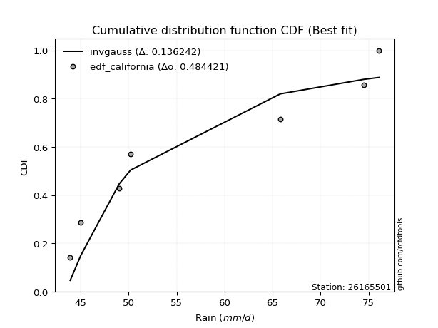</img>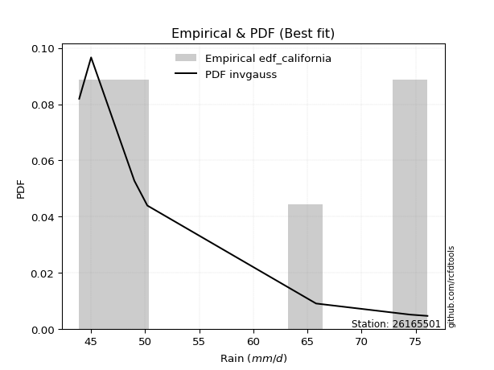</img>

</div>


### 2. EDF Hazen (1930)

Hazen method for plotting positions is a formula used to estimate the empirical cumulative probability distribution of flood events or other hydrological data. This formula often results in biased estimations, particularly when extrapolating to extreme events (high return periods).

<div align="center">


$P=(m-0.5)/n$


</div>


**2.1. Empirical values**

<div align="center">

|                | 0                   | 1                   | 2                   | 3         | 4                  | 5                  | 6                  |
|:---------------|:--------------------|:--------------------|:--------------------|:----------|:-------------------|:-------------------|:-------------------|
| date           | 2018                | 2022                | 2023                | 2017      | 2021               | 2019               | 2020               |
| x              | 43.9                | 45.0                | 49.0                | 50.2      | 65.8               | 74.5               | 76.1               |
| m              | 1                   | 2                   | 3                   | 4         | 5                  | 6                  | 7                  |
| empirical_dist | edf_hazen           | edf_hazen           | edf_hazen           | edf_hazen | edf_hazen          | edf_hazen          | edf_hazen          |
| empirical      | 0.07142857142857142 | 0.21428571428571427 | 0.35714285714285715 | 0.5       | 0.6428571428571429 | 0.7857142857142857 | 0.9285714285714286 |
| empirical_tr   | 1.0769230769230769  | 1.2727272727272727  | 1.5555555555555558  | 2.0       | 2.8000000000000003 | 4.666666666666666  | 14.000000000000007 |

</div>


**2.2. Kolmogorov-Smirnov fit test (sorted by Δ)**


<div align="center">

|                | 0                   | 1                   | 2                   | 3                   | 4                   | 5                   | 6                   | 7                   | 8                   | 9                   | 10                  | 11                  | 12                  | 13                  | 14                  | 15                  | 16                  | 17                  | 18                  | 19                  | 20                  | 21                  | 22                  | 23                  | 24                  | 25                  | 26                  | 27                  | 28                  | 29                  | 30                  | 31                  | 32                  | 33                  | 34                  | 35                  | 36                  | 37                  | 38                  | 39                  | 40                  | 41                  | 42                  | 43                  | 44                  | 45                  | 46                  | 47                  | 48                  | 49                  | 50                  | 51                  | 52                  | 53                  | 54                  | 55                  | 56                  | 57                  | 58                  | 59                  | 60                  | 61                  | 62                  | 63                  | 64                  | 65                  | 66                  | 67                  | 68                  | 69                  | 70                  | 71                  | 72                  | 73                  | 74                  | 75                  | 76                  | 77                  | 78                  | 79                  | 80                  | 81                  | 82                  | 83                  | 84                  | 85                  | 86                  | 87                  | 88                  | 89                  | 90                  | 91                  | 92                  | 93                  | 94                  | 95                  | 96                  | 97                  | 98                  | 99                  | 100                 | 101                 | 102                 | 103                 | 104                 | 105                 | 106                 | 107                 | 108                 | 109                 | 110                 | 111                 | 112                 | 113                 | 114                 | 115                 | 116                 | 117                 | 118                 | 119                 | 120                 | 121                 | 122                 | 123                 | 124                 | 125                 | 126                 | 127                 | 128                 | 129                 | 130                 | 131                 | 132                 | 133                 | 134                 | 135                 | 136                 | 137                 | 138                 | 139                 | 140                 | 141                 | 142                 | 143                 | 144                 | 145                 | 146                 | 147                 | 148                 | 149                 | 150                 | 151                 | 152                 | 153                 | 154                 | 155                 | 156                 | 157                 | 158                 | 159                 |
|:---------------|:--------------------|:--------------------|:--------------------|:--------------------|:--------------------|:--------------------|:--------------------|:--------------------|:--------------------|:--------------------|:--------------------|:--------------------|:--------------------|:--------------------|:--------------------|:--------------------|:--------------------|:--------------------|:--------------------|:--------------------|:--------------------|:--------------------|:--------------------|:--------------------|:--------------------|:--------------------|:--------------------|:--------------------|:--------------------|:--------------------|:--------------------|:--------------------|:--------------------|:--------------------|:--------------------|:--------------------|:--------------------|:--------------------|:--------------------|:--------------------|:--------------------|:--------------------|:--------------------|:--------------------|:--------------------|:--------------------|:--------------------|:--------------------|:--------------------|:--------------------|:--------------------|:--------------------|:--------------------|:--------------------|:--------------------|:--------------------|:--------------------|:--------------------|:--------------------|:--------------------|:--------------------|:--------------------|:--------------------|:--------------------|:--------------------|:--------------------|:--------------------|:--------------------|:--------------------|:--------------------|:--------------------|:--------------------|:--------------------|:--------------------|:--------------------|:--------------------|:--------------------|:--------------------|:--------------------|:--------------------|:--------------------|:--------------------|:--------------------|:--------------------|:--------------------|:--------------------|:--------------------|:--------------------|:--------------------|:--------------------|:--------------------|:--------------------|:--------------------|:--------------------|:--------------------|:--------------------|:--------------------|:--------------------|:--------------------|:--------------------|:--------------------|:--------------------|:--------------------|:--------------------|:--------------------|:--------------------|:--------------------|:--------------------|:--------------------|:--------------------|:--------------------|:--------------------|:--------------------|:--------------------|:--------------------|:--------------------|:--------------------|:--------------------|:--------------------|:--------------------|:--------------------|:--------------------|:--------------------|:--------------------|:--------------------|:--------------------|:--------------------|:--------------------|:--------------------|:--------------------|:--------------------|:--------------------|:--------------------|:--------------------|:--------------------|:--------------------|:--------------------|:--------------------|:--------------------|:--------------------|:--------------------|:--------------------|:--------------------|:--------------------|:--------------------|:--------------------|:--------------------|:--------------------|:--------------------|:--------------------|:--------------------|:--------------------|:--------------------|:--------------------|:--------------------|:--------------------|:--------------------|:--------------------|:--------------------|:--------------------|
| station        | 26165501            | 26165501            | 26165501            | 26165501            | 26165501            | 26165501            | 26165501            | 26165501            | 26165501            | 26165501            | 26165501            | 26165501            | 26165501            | 26165501            | 26165501            | 26165501            | 26165501            | 26165501            | 26165501            | 26165501            | 26165501            | 26165501            | 26165501            | 26165501            | 26165501            | 26165501            | 26165501            | 26165501            | 26165501            | 26165501            | 26165501            | 26165501            | 26165501            | 26165501            | 26165501            | 26165501            | 26165501            | 26165501            | 26165501            | 26165501            | 26165501            | 26165501            | 26165501            | 26165501            | 26165501            | 26165501            | 26165501            | 26165501            | 26165501            | 26165501            | 26165501            | 26165501            | 26165501            | 26165501            | 26165501            | 26165501            | 26165501            | 26165501            | 26165501            | 26165501            | 26165501            | 26165501            | 26165501            | 26165501            | 26165501            | 26165501            | 26165501            | 26165501            | 26165501            | 26165501            | 26165501            | 26165501            | 26165501            | 26165501            | 26165501            | 26165501            | 26165501            | 26165501            | 26165501            | 26165501            | 26165501            | 26165501            | 26165501            | 26165501            | 26165501            | 26165501            | 26165501            | 26165501            | 26165501            | 26165501            | 26165501            | 26165501            | 26165501            | 26165501            | 26165501            | 26165501            | 26165501            | 26165501            | 26165501            | 26165501            | 26165501            | 26165501            | 26165501            | 26165501            | 26165501            | 26165501            | 26165501            | 26165501            | 26165501            | 26165501            | 26165501            | 26165501            | 26165501            | 26165501            | 26165501            | 26165501            | 26165501            | 26165501            | 26165501            | 26165501            | 26165501            | 26165501            | 26165501            | 26165501            | 26165501            | 26165501            | 26165501            | 26165501            | 26165501            | 26165501            | 26165501            | 26165501            | 26165501            | 26165501            | 26165501            | 26165501            | 26165501            | 26165501            | 26165501            | 26165501            | 26165501            | 26165501            | 26165501            | 26165501            | 26165501            | 26165501            | 26165501            | 26165501            | 26165501            | 26165501            | 26165501            | 26165501            | 26165501            | 26165501            | 26165501            | 26165501            | 26165501            | 26165501            | 26165501            | 26165501            |
| empirical_dist | edf_hazen           | edf_hazen           | edf_hazen           | edf_hazen           | edf_hazen           | edf_hazen           | edf_hazen           | edf_hazen           | edf_hazen           | edf_hazen           | edf_hazen           | edf_hazen           | edf_hazen           | edf_hazen           | edf_hazen           | edf_hazen           | edf_hazen           | edf_hazen           | edf_hazen           | edf_hazen           | edf_hazen           | edf_hazen           | edf_hazen           | edf_hazen           | edf_hazen           | edf_hazen           | edf_hazen           | edf_hazen           | edf_hazen           | edf_hazen           | edf_hazen           | edf_hazen           | edf_hazen           | edf_hazen           | edf_hazen           | edf_hazen           | edf_hazen           | edf_hazen           | edf_hazen           | edf_hazen           | edf_hazen           | edf_hazen           | edf_hazen           | edf_hazen           | edf_hazen           | edf_hazen           | edf_hazen           | edf_hazen           | edf_hazen           | edf_hazen           | edf_hazen           | edf_hazen           | edf_hazen           | edf_hazen           | edf_hazen           | edf_hazen           | edf_hazen           | edf_hazen           | edf_hazen           | edf_hazen           | edf_hazen           | edf_hazen           | edf_hazen           | edf_hazen           | edf_hazen           | edf_hazen           | edf_hazen           | edf_hazen           | edf_hazen           | edf_hazen           | edf_hazen           | edf_hazen           | edf_hazen           | edf_hazen           | edf_hazen           | edf_hazen           | edf_hazen           | edf_hazen           | edf_hazen           | edf_hazen           | edf_hazen           | edf_hazen           | edf_hazen           | edf_hazen           | edf_hazen           | edf_hazen           | edf_hazen           | edf_hazen           | edf_hazen           | edf_hazen           | edf_hazen           | edf_hazen           | edf_hazen           | edf_hazen           | edf_hazen           | edf_hazen           | edf_hazen           | edf_hazen           | edf_hazen           | edf_hazen           | edf_hazen           | edf_hazen           | edf_hazen           | edf_hazen           | edf_hazen           | edf_hazen           | edf_hazen           | edf_hazen           | edf_hazen           | edf_hazen           | edf_hazen           | edf_hazen           | edf_hazen           | edf_hazen           | edf_hazen           | edf_hazen           | edf_hazen           | edf_hazen           | edf_hazen           | edf_hazen           | edf_hazen           | edf_hazen           | edf_hazen           | edf_hazen           | edf_hazen           | edf_hazen           | edf_hazen           | edf_hazen           | edf_hazen           | edf_hazen           | edf_hazen           | edf_hazen           | edf_hazen           | edf_hazen           | edf_hazen           | edf_hazen           | edf_hazen           | edf_hazen           | edf_hazen           | edf_hazen           | edf_hazen           | edf_hazen           | edf_hazen           | edf_hazen           | edf_hazen           | edf_hazen           | edf_hazen           | edf_hazen           | edf_hazen           | edf_hazen           | edf_hazen           | edf_hazen           | edf_hazen           | edf_hazen           | edf_hazen           | edf_hazen           | edf_hazen           | edf_hazen           | edf_hazen           | edf_hazen           |
| p_dist         | logwrapcauchy       | exponpow            | logdgamma           | f                   | logdweibull         | dgamma              | logf                | logweibull_min      | dweibull            | logarcsine          | wrapcauchy          | loghalfnorm         | logfoldnorm         | nakagami            | invweibull          | genextreme          | halfgennorm         | alpha               | loggompertz         | lomax               | genexpon            | logksone            | exponnorm           | arcsine             | loggenexpon         | logmielke           | burr                | loggenlogistic      | loggenextreme       | loginvweibull       | burr12              | halfnorm            | lognct              | logburr             | loglomax            | logexponweib        | invgamma            | loghalflogistic     | logkstwobign        | logncf              | lograyleigh         | halflogistic        | logmoyal            | logsemicircular     | loggumbel_r         | ksone               | erlang              | gompertz            | loghalfgennorm      | loginvgauss         | logmaxwell          | gausshyper          | invgauss            | loganglit           | logalpha            | genlogistic         | semicircular        | logrdist            | rayleigh            | logbradford         | nct                 | logskewnorm         | logpearson3         | moyal               | logtruncexpon       | foldnorm            | kstwobign           | anglit              | logexponpow         | betaprime           | maxwell             | gumbel_r            | loginvgamma         | logbetaprime        | logweibull_max      | ncf                 | logexponnorm        | logloggamma         | logcrystalball      | logt                | lognorm             | logrice             | loglevy_l           | logtrapezoid        | logtruncnorm        | loggengamma         | logfatiguelife      | pearson3            | logtruncweibull_min | logwald             | wald                | logburr12           | logcosine           | t                   | crystalball         | norm                | johnsonsu           | loglogistic         | levy_l              | logbeta             | logerlang           | truncweibull_min    | rice                | logloglaplace       | bradford            | truncexpon          | loggennorm          | loghypsecant        | skewnorm            | kappa4              | genpareto           | logistic            | cosine              | logkappa4           | gennorm             | loggamma            | loggamma            | logtukeylambda      | loggumbel_l         | logvonmises_line    | lognakagami         | loguniform          | logargus            | hypsecant           | logkappa3           | loglaplace          | loglaplace          | gumbel_l            | truncnorm           | loggausshyper       | logtriang           | argus               | laplace             | gamma               | triang              | tukeylambda         | uniform             | vonmises_line       | loggenpareto        | kappa3              | beta                | weibull_min         | loggenhalflogistic  | genhalflogistic     | powerlaw            | fatiguelife         | logpowerlaw         | exponweib           | truncpareto         | gengamma            | johnsonsb           | rdist               | trapezoid           | logtruncpareto      | logjohnsonsu        | weibull_max         | logjohnsonsb        | logvonmises         | vonmises            | mielke              |
| delta          | 0.09971585005950329 | 0.10293296320969081 | 0.10878564404558844 | 0.11215340772050453 | 0.11340577278528219 | 0.11765278847563909 | 0.12140925439590744 | 0.12382537616260758 | 0.12934590341249597 | 0.1304594977019365  | 0.13227753129182407 | 0.1351552503871154  | 0.1427200775173585  | 0.14423551054858746 | 0.14469378410212497 | 0.14469557500709174 | 0.14825096015669037 | 0.14871922495608914 | 0.14894509176122495 | 0.15048320479460542 | 0.1512946660227099  | 0.15270377163189242 | 0.15332521140129418 | 0.15403535450629213 | 0.15413689286301568 | 0.15445287417182985 | 0.1550190494685933  | 0.15519424251670433 | 0.1561972843592827  | 0.15619869138741171 | 0.15672937199267645 | 0.1569049463804577  | 0.1570209658479586  | 0.1572877642253938  | 0.157448010375273   | 0.15871913387038195 | 0.15886842509556132 | 0.15903379823984454 | 0.15987222431094628 | 0.1620781180034816  | 0.16291658235256662 | 0.16361659851846955 | 0.16525869201878574 | 0.1663956906754085  | 0.16929560150827533 | 0.16937786117702092 | 0.17198511014347173 | 0.17220764541390216 | 0.17308798694698224 | 0.17324247282312832 | 0.17388592843557027 | 0.17591759395788492 | 0.17671502447189213 | 0.1769077384535495  | 0.17802056052345339 | 0.1839906485790455  | 0.18405107262039083 | 0.18532040048373388 | 0.18556684618254127 | 0.18654769003663207 | 0.18691436219041596 | 0.1872809181956101  | 0.1899837551426546  | 0.19068599637281558 | 0.19079300904672702 | 0.19197212556634347 | 0.19408475876189252 | 0.19523241773348682 | 0.19528276913042908 | 0.19545910799902633 | 0.19583140031931895 | 0.19626995162405808 | 0.19658833919723084 | 0.19958231468566182 | 0.19980996881405655 | 0.19992249023697883 | 0.2012509662716443  | 0.20154915415641322 | 0.20158715322627185 | 0.20159002341268417 | 0.20159081733038664 | 0.2025743082556422  | 0.2029659673700885  | 0.20625273755143042 | 0.20663823982830065 | 0.2070319371892383  | 0.20821695047159477 | 0.20821874705063498 | 0.2129876335982508  | 0.21428571428571427 | 0.21615692946771958 | 0.21999380235576071 | 0.22005567043852503 | 0.22120510224326007 | 0.2213115335293957  | 0.22131154338567371 | 0.2215594110260991  | 0.22301489556884596 | 0.2230823251778735  | 0.22418544733215717 | 0.23145539445900376 | 0.23211355093765662 | 0.2334497049612046  | 0.2343124675651107  | 0.23505817993111455 | 0.2352814863867147  | 0.2362836009391428  | 0.23844194022703685 | 0.23986389570010092 | 0.2405952899141781  | 0.24209301486341242 | 0.2434985482192244  | 0.243955170785714   | 0.2467516381904163  | 0.2499487207943667  | 0.24997791307347594 | 0.24997791307347594 | 0.25016976280763714 | 0.2520988034720523  | 0.25526775837484783 | 0.2555849118146723  | 0.25623989777871814 | 0.2575836115923196  | 0.25893684092855695 | 0.25991628273215467 | 0.2633658082891202  | 0.2633658082891202  | 0.2675546542052222  | 0.27210029580603917 | 0.27532959936683143 | 0.27796073973591334 | 0.28084632668129794 | 0.28192709549712336 | 0.2854606809084394  | 0.29749745302023456 | 0.2978615659743369  | 0.3043478260869564  | 0.30601453350203867 | 0.31116178721585985 | 0.31632763660212293 | 0.32898521809868947 | 0.3303702769716403  | 0.3517750685482456  | 0.3732256342301376  | 0.38542201949083205 | 0.3997243278883744  | 0.4035821479087826  | 0.4092674912507189  | 0.41609914784760166 | 0.42144811011906164 | 0.4225782075068638  | 0.4276709681070444  | 0.43929846670867456 | 0.44119649058479754 | 0.46085447237697996 | 0.5164519099354938  | 0.6274436881820467  | 1.1170111499038962  | 11.815601461930926  | nan                 |
| deltao         | 0.48442053926100004 | 0.48442053926100004 | 0.48442053926100004 | 0.48442053926100004 | 0.48442053926100004 | 0.48442053926100004 | 0.48442053926100004 | 0.48442053926100004 | 0.48442053926100004 | 0.48442053926100004 | 0.48442053926100004 | 0.48442053926100004 | 0.48442053926100004 | 0.48442053926100004 | 0.48442053926100004 | 0.48442053926100004 | 0.48442053926100004 | 0.48442053926100004 | 0.48442053926100004 | 0.48442053926100004 | 0.48442053926100004 | 0.48442053926100004 | 0.48442053926100004 | 0.48442053926100004 | 0.48442053926100004 | 0.48442053926100004 | 0.48442053926100004 | 0.48442053926100004 | 0.48442053926100004 | 0.48442053926100004 | 0.48442053926100004 | 0.48442053926100004 | 0.48442053926100004 | 0.48442053926100004 | 0.48442053926100004 | 0.48442053926100004 | 0.48442053926100004 | 0.48442053926100004 | 0.48442053926100004 | 0.48442053926100004 | 0.48442053926100004 | 0.48442053926100004 | 0.48442053926100004 | 0.48442053926100004 | 0.48442053926100004 | 0.48442053926100004 | 0.48442053926100004 | 0.48442053926100004 | 0.48442053926100004 | 0.48442053926100004 | 0.48442053926100004 | 0.48442053926100004 | 0.48442053926100004 | 0.48442053926100004 | 0.48442053926100004 | 0.48442053926100004 | 0.48442053926100004 | 0.48442053926100004 | 0.48442053926100004 | 0.48442053926100004 | 0.48442053926100004 | 0.48442053926100004 | 0.48442053926100004 | 0.48442053926100004 | 0.48442053926100004 | 0.48442053926100004 | 0.48442053926100004 | 0.48442053926100004 | 0.48442053926100004 | 0.48442053926100004 | 0.48442053926100004 | 0.48442053926100004 | 0.48442053926100004 | 0.48442053926100004 | 0.48442053926100004 | 0.48442053926100004 | 0.48442053926100004 | 0.48442053926100004 | 0.48442053926100004 | 0.48442053926100004 | 0.48442053926100004 | 0.48442053926100004 | 0.48442053926100004 | 0.48442053926100004 | 0.48442053926100004 | 0.48442053926100004 | 0.48442053926100004 | 0.48442053926100004 | 0.48442053926100004 | 0.48442053926100004 | 0.48442053926100004 | 0.48442053926100004 | 0.48442053926100004 | 0.48442053926100004 | 0.48442053926100004 | 0.48442053926100004 | 0.48442053926100004 | 0.48442053926100004 | 0.48442053926100004 | 0.48442053926100004 | 0.48442053926100004 | 0.48442053926100004 | 0.48442053926100004 | 0.48442053926100004 | 0.48442053926100004 | 0.48442053926100004 | 0.48442053926100004 | 0.48442053926100004 | 0.48442053926100004 | 0.48442053926100004 | 0.48442053926100004 | 0.48442053926100004 | 0.48442053926100004 | 0.48442053926100004 | 0.48442053926100004 | 0.48442053926100004 | 0.48442053926100004 | 0.48442053926100004 | 0.48442053926100004 | 0.48442053926100004 | 0.48442053926100004 | 0.48442053926100004 | 0.48442053926100004 | 0.48442053926100004 | 0.48442053926100004 | 0.48442053926100004 | 0.48442053926100004 | 0.48442053926100004 | 0.48442053926100004 | 0.48442053926100004 | 0.48442053926100004 | 0.48442053926100004 | 0.48442053926100004 | 0.48442053926100004 | 0.48442053926100004 | 0.48442053926100004 | 0.48442053926100004 | 0.48442053926100004 | 0.48442053926100004 | 0.48442053926100004 | 0.48442053926100004 | 0.48442053926100004 | 0.48442053926100004 | 0.48442053926100004 | 0.48442053926100004 | 0.48442053926100004 | 0.48442053926100004 | 0.48442053926100004 | 0.48442053926100004 | 0.48442053926100004 | 0.48442053926100004 | 0.48442053926100004 | 0.48442053926100004 | 0.48442053926100004 | 0.48442053926100004 | 0.48442053926100004 | 0.48442053926100004 | 0.48442053926100004 | 0.48442053926100004 | 0.48442053926100004 |
| eval           | Δo > Δ              | Δo > Δ              | Δo > Δ              | Δo > Δ              | Δo > Δ              | Δo > Δ              | Δo > Δ              | Δo > Δ              | Δo > Δ              | Δo > Δ              | Δo > Δ              | Δo > Δ              | Δo > Δ              | Δo > Δ              | Δo > Δ              | Δo > Δ              | Δo > Δ              | Δo > Δ              | Δo > Δ              | Δo > Δ              | Δo > Δ              | Δo > Δ              | Δo > Δ              | Δo > Δ              | Δo > Δ              | Δo > Δ              | Δo > Δ              | Δo > Δ              | Δo > Δ              | Δo > Δ              | Δo > Δ              | Δo > Δ              | Δo > Δ              | Δo > Δ              | Δo > Δ              | Δo > Δ              | Δo > Δ              | Δo > Δ              | Δo > Δ              | Δo > Δ              | Δo > Δ              | Δo > Δ              | Δo > Δ              | Δo > Δ              | Δo > Δ              | Δo > Δ              | Δo > Δ              | Δo > Δ              | Δo > Δ              | Δo > Δ              | Δo > Δ              | Δo > Δ              | Δo > Δ              | Δo > Δ              | Δo > Δ              | Δo > Δ              | Δo > Δ              | Δo > Δ              | Δo > Δ              | Δo > Δ              | Δo > Δ              | Δo > Δ              | Δo > Δ              | Δo > Δ              | Δo > Δ              | Δo > Δ              | Δo > Δ              | Δo > Δ              | Δo > Δ              | Δo > Δ              | Δo > Δ              | Δo > Δ              | Δo > Δ              | Δo > Δ              | Δo > Δ              | Δo > Δ              | Δo > Δ              | Δo > Δ              | Δo > Δ              | Δo > Δ              | Δo > Δ              | Δo > Δ              | Δo > Δ              | Δo > Δ              | Δo > Δ              | Δo > Δ              | Δo > Δ              | Δo > Δ              | Δo > Δ              | Δo > Δ              | Δo > Δ              | Δo > Δ              | Δo > Δ              | Δo > Δ              | Δo > Δ              | Δo > Δ              | Δo > Δ              | Δo > Δ              | Δo > Δ              | Δo > Δ              | Δo > Δ              | Δo > Δ              | Δo > Δ              | Δo > Δ              | Δo > Δ              | Δo > Δ              | Δo > Δ              | Δo > Δ              | Δo > Δ              | Δo > Δ              | Δo > Δ              | Δo > Δ              | Δo > Δ              | Δo > Δ              | Δo > Δ              | Δo > Δ              | Δo > Δ              | Δo > Δ              | Δo > Δ              | Δo > Δ              | Δo > Δ              | Δo > Δ              | Δo > Δ              | Δo > Δ              | Δo > Δ              | Δo > Δ              | Δo > Δ              | Δo > Δ              | Δo > Δ              | Δo > Δ              | Δo > Δ              | Δo > Δ              | Δo > Δ              | Δo > Δ              | Δo > Δ              | Δo > Δ              | Δo > Δ              | Δo > Δ              | Δo > Δ              | Δo > Δ              | Δo > Δ              | Δo > Δ              | Δo > Δ              | Δo > Δ              | Δo > Δ              | Δo > Δ              | Δo > Δ              | Δo > Δ              | Δo > Δ              | Δo > Δ              | Δo > Δ              | Δo > Δ              | Δo > Δ              | Δo > Δ              | Δo > Δ              | Δo <= Δ             | Δo <= Δ             | Δo <= Δ             | Δo <= Δ             | Δo <= Δ             |
| fit            | 1                   | 1                   | 1                   | 1                   | 1                   | 1                   | 1                   | 1                   | 1                   | 1                   | 1                   | 1                   | 1                   | 1                   | 1                   | 1                   | 1                   | 1                   | 1                   | 1                   | 1                   | 1                   | 1                   | 1                   | 1                   | 1                   | 1                   | 1                   | 1                   | 1                   | 1                   | 1                   | 1                   | 1                   | 1                   | 1                   | 1                   | 1                   | 1                   | 1                   | 1                   | 1                   | 1                   | 1                   | 1                   | 1                   | 1                   | 1                   | 1                   | 1                   | 1                   | 1                   | 1                   | 1                   | 1                   | 1                   | 1                   | 1                   | 1                   | 1                   | 1                   | 1                   | 1                   | 1                   | 1                   | 1                   | 1                   | 1                   | 1                   | 1                   | 1                   | 1                   | 1                   | 1                   | 1                   | 1                   | 1                   | 1                   | 1                   | 1                   | 1                   | 1                   | 1                   | 1                   | 1                   | 1                   | 1                   | 1                   | 1                   | 1                   | 1                   | 1                   | 1                   | 1                   | 1                   | 1                   | 1                   | 1                   | 1                   | 1                   | 1                   | 1                   | 1                   | 1                   | 1                   | 1                   | 1                   | 1                   | 1                   | 1                   | 1                   | 1                   | 1                   | 1                   | 1                   | 1                   | 1                   | 1                   | 1                   | 1                   | 1                   | 1                   | 1                   | 1                   | 1                   | 1                   | 1                   | 1                   | 1                   | 1                   | 1                   | 1                   | 1                   | 1                   | 1                   | 1                   | 1                   | 1                   | 1                   | 1                   | 1                   | 1                   | 1                   | 1                   | 1                   | 1                   | 1                   | 1                   | 1                   | 1                   | 1                   | 1                   | 1                   | 1                   | 1                   | 0                   | 0                   | 0                   | 0                   | 0                   |
| n              | 7                   | 7                   | 7                   | 7                   | 7                   | 7                   | 7                   | 7                   | 7                   | 7                   | 7                   | 7                   | 7                   | 7                   | 7                   | 7                   | 7                   | 7                   | 7                   | 7                   | 7                   | 7                   | 7                   | 7                   | 7                   | 7                   | 7                   | 7                   | 7                   | 7                   | 7                   | 7                   | 7                   | 7                   | 7                   | 7                   | 7                   | 7                   | 7                   | 7                   | 7                   | 7                   | 7                   | 7                   | 7                   | 7                   | 7                   | 7                   | 7                   | 7                   | 7                   | 7                   | 7                   | 7                   | 7                   | 7                   | 7                   | 7                   | 7                   | 7                   | 7                   | 7                   | 7                   | 7                   | 7                   | 7                   | 7                   | 7                   | 7                   | 7                   | 7                   | 7                   | 7                   | 7                   | 7                   | 7                   | 7                   | 7                   | 7                   | 7                   | 7                   | 7                   | 7                   | 7                   | 7                   | 7                   | 7                   | 7                   | 7                   | 7                   | 7                   | 7                   | 7                   | 7                   | 7                   | 7                   | 7                   | 7                   | 7                   | 7                   | 7                   | 7                   | 7                   | 7                   | 7                   | 7                   | 7                   | 7                   | 7                   | 7                   | 7                   | 7                   | 7                   | 7                   | 7                   | 7                   | 7                   | 7                   | 7                   | 7                   | 7                   | 7                   | 7                   | 7                   | 7                   | 7                   | 7                   | 7                   | 7                   | 7                   | 7                   | 7                   | 7                   | 7                   | 7                   | 7                   | 7                   | 7                   | 7                   | 7                   | 7                   | 7                   | 7                   | 7                   | 7                   | 7                   | 7                   | 7                   | 7                   | 7                   | 7                   | 7                   | 7                   | 7                   | 7                   | 7                   | 7                   | 7                   | 7                   | 7                   |
| best_fit       | 1                   | 0                   | 0                   | 0                   | 0                   | 0                   | 0                   | 0                   | 0                   | 0                   | 0                   | 0                   | 0                   | 0                   | 0                   | 0                   | 0                   | 0                   | 0                   | 0                   | 0                   | 0                   | 0                   | 0                   | 0                   | 0                   | 0                   | 0                   | 0                   | 0                   | 0                   | 0                   | 0                   | 0                   | 0                   | 0                   | 0                   | 0                   | 0                   | 0                   | 0                   | 0                   | 0                   | 0                   | 0                   | 0                   | 0                   | 0                   | 0                   | 0                   | 0                   | 0                   | 0                   | 0                   | 0                   | 0                   | 0                   | 0                   | 0                   | 0                   | 0                   | 0                   | 0                   | 0                   | 0                   | 0                   | 0                   | 0                   | 0                   | 0                   | 0                   | 0                   | 0                   | 0                   | 0                   | 0                   | 0                   | 0                   | 0                   | 0                   | 0                   | 0                   | 0                   | 0                   | 0                   | 0                   | 0                   | 0                   | 0                   | 0                   | 0                   | 0                   | 0                   | 0                   | 0                   | 0                   | 0                   | 0                   | 0                   | 0                   | 0                   | 0                   | 0                   | 0                   | 0                   | 0                   | 0                   | 0                   | 0                   | 0                   | 0                   | 0                   | 0                   | 0                   | 0                   | 0                   | 0                   | 0                   | 0                   | 0                   | 0                   | 0                   | 0                   | 0                   | 0                   | 0                   | 0                   | 0                   | 0                   | 0                   | 0                   | 0                   | 0                   | 0                   | 0                   | 0                   | 0                   | 0                   | 0                   | 0                   | 0                   | 0                   | 0                   | 0                   | 0                   | 0                   | 0                   | 0                   | 0                   | 0                   | 0                   | 0                   | 0                   | 0                   | 0                   | 0                   | 0                   | 0                   | 0                   | 0                   |
| best_fit_sort  | 1                   | 2                   | 3                   | 4                   | 5                   | 6                   | 7                   | 8                   | 9                   | 10                  | 11                  | 12                  | 13                  | 14                  | 15                  | 16                  | 17                  | 18                  | 19                  | 20                  | 21                  | 22                  | 23                  | 24                  | 25                  | 26                  | 27                  | 28                  | 29                  | 30                  | 31                  | 32                  | 33                  | 34                  | 35                  | 36                  | 37                  | 38                  | 39                  | 40                  | 41                  | 42                  | 43                  | 44                  | 45                  | 46                  | 47                  | 48                  | 49                  | 50                  | 51                  | 52                  | 53                  | 54                  | 55                  | 56                  | 57                  | 58                  | 59                  | 60                  | 61                  | 62                  | 63                  | 64                  | 65                  | 66                  | 67                  | 68                  | 69                  | 70                  | 71                  | 72                  | 73                  | 74                  | 75                  | 76                  | 77                  | 78                  | 79                  | 80                  | 81                  | 82                  | 83                  | 84                  | 85                  | 86                  | 87                  | 88                  | 89                  | 90                  | 91                  | 92                  | 93                  | 94                  | 95                  | 96                  | 97                  | 98                  | 99                  | 100                 | 101                 | 102                 | 103                 | 104                 | 105                 | 106                 | 107                 | 108                 | 109                 | 110                 | 111                 | 112                 | 113                 | 114                 | 115                 | 116                 | 117                 | 118                 | 119                 | 120                 | 121                 | 122                 | 123                 | 124                 | 125                 | 126                 | 127                 | 128                 | 129                 | 130                 | 131                 | 132                 | 133                 | 134                 | 135                 | 136                 | 137                 | 138                 | 139                 | 140                 | 141                 | 142                 | 143                 | 144                 | 145                 | 146                 | 147                 | 148                 | 149                 | 150                 | 151                 | 152                 | 153                 | 154                 | 155                 | 156                 | 157                 | 158                 | 159                 | 160                 |

</div>


**2.3. Best fit**

<div align="center">

|   id |   station | empirical_dist   | p_dist        |     delta |   deltao | eval   |   fit |   n |   best_fit |   best_fit_sort |
|-----:|----------:|:-----------------|:--------------|----------:|---------:|:-------|------:|----:|-----------:|----------------:|
|    0 |  26165501 | edf_hazen        | logwrapcauchy | 0.0997159 | 0.484421 | Δo > Δ |     1 |   7 |          1 |               1 |

</div>


<div align="center">

</img>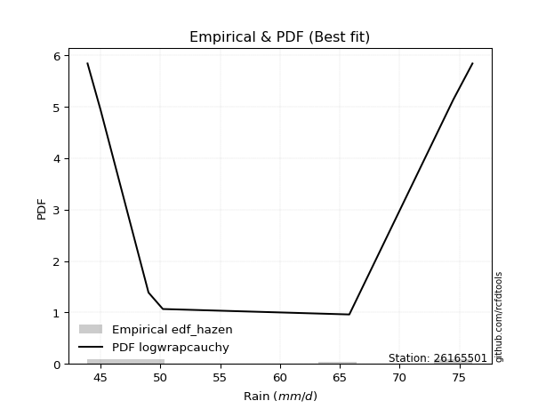</img>

</div>


### 3. EDF Weibull (1939)

Weibull plotting position formula is an empirical method used to estimate the non-exceedance probability or plotting position for a set of observed data, is often recommended or widely used in practice, particularly in flood frequency analysis.

<div align="center">


$P=m/(n+1)$


</div>


**3.1. Empirical values**

<div align="center">

|                | 0                  | 1                  | 2           | 3           | 4                  | 5           | 6           |
|:---------------|:-------------------|:-------------------|:------------|:------------|:-------------------|:------------|:------------|
| date           | 2018               | 2022               | 2023        | 2017        | 2021               | 2019        | 2020        |
| x              | 43.9               | 45.0               | 49.0        | 50.2        | 65.8               | 74.5        | 76.1        |
| m              | 1                  | 2                  | 3           | 4           | 5                  | 6           | 7           |
| empirical_dist | edf_weibull        | edf_weibull        | edf_weibull | edf_weibull | edf_weibull        | edf_weibull | edf_weibull |
| empirical      | 0.125              | 0.25               | 0.375       | 0.5         | 0.625              | 0.75        | 0.875       |
| empirical_tr   | 1.1428571428571428 | 1.3333333333333333 | 1.6         | 2.0         | 2.6666666666666665 | 4.0         | 8.0         |

</div>


**3.2. Kolmogorov-Smirnov fit test (sorted by Δ)**


<div align="center">

|                | 0                   | 1                   | 2                   | 3                   | 4                   | 5                   | 6                   | 7                   | 8                   | 9                   | 10                  | 11                  | 12                  | 13                  | 14                  | 15                  | 16                  | 17                  | 18                  | 19                  | 20                  | 21                  | 22                  | 23                  | 24                  | 25                  | 26                  | 27                  | 28                  | 29                  | 30                  | 31                  | 32                  | 33                  | 34                  | 35                  | 36                  | 37                  | 38                  | 39                  | 40                  | 41                  | 42                  | 43                  | 44                  | 45                  | 46                  | 47                  | 48                  | 49                  | 50                  | 51                  | 52                  | 53                  | 54                  | 55                  | 56                  | 57                  | 58                  | 59                  | 60                  | 61                  | 62                  | 63                  | 64                  | 65                  | 66                  | 67                  | 68                  | 69                  | 70                  | 71                  | 72                  | 73                  | 74                  | 75                  | 76                  | 77                  | 78                  | 79                  | 80                  | 81                  | 82                  | 83                  | 84                  | 85                  | 86                  | 87                  | 88                  | 89                  | 90                  | 91                  | 92                  | 93                  | 94                  | 95                  | 96                  | 97                  | 98                  | 99                  | 100                 | 101                 | 102                 | 103                 | 104                 | 105                 | 106                 | 107                 | 108                 | 109                 | 110                 | 111                 | 112                 | 113                 | 114                 | 115                 | 116                 | 117                 | 118                 | 119                 | 120                 | 121                 | 122                 | 123                 | 124                 | 125                 | 126                 | 127                 | 128                 | 129                 | 130                 | 131                 | 132                 | 133                 | 134                 | 135                 | 136                 | 137                 | 138                 | 139                 | 140                 | 141                 | 142                 | 143                 | 144                 | 145                 | 146                 | 147                 | 148                 | 149                 | 150                 | 151                 | 152                 | 153                 | 154                 | 155                 | 156                 | 157                 | 158                 | 159                 |
|:---------------|:--------------------|:--------------------|:--------------------|:--------------------|:--------------------|:--------------------|:--------------------|:--------------------|:--------------------|:--------------------|:--------------------|:--------------------|:--------------------|:--------------------|:--------------------|:--------------------|:--------------------|:--------------------|:--------------------|:--------------------|:--------------------|:--------------------|:--------------------|:--------------------|:--------------------|:--------------------|:--------------------|:--------------------|:--------------------|:--------------------|:--------------------|:--------------------|:--------------------|:--------------------|:--------------------|:--------------------|:--------------------|:--------------------|:--------------------|:--------------------|:--------------------|:--------------------|:--------------------|:--------------------|:--------------------|:--------------------|:--------------------|:--------------------|:--------------------|:--------------------|:--------------------|:--------------------|:--------------------|:--------------------|:--------------------|:--------------------|:--------------------|:--------------------|:--------------------|:--------------------|:--------------------|:--------------------|:--------------------|:--------------------|:--------------------|:--------------------|:--------------------|:--------------------|:--------------------|:--------------------|:--------------------|:--------------------|:--------------------|:--------------------|:--------------------|:--------------------|:--------------------|:--------------------|:--------------------|:--------------------|:--------------------|:--------------------|:--------------------|:--------------------|:--------------------|:--------------------|:--------------------|:--------------------|:--------------------|:--------------------|:--------------------|:--------------------|:--------------------|:--------------------|:--------------------|:--------------------|:--------------------|:--------------------|:--------------------|:--------------------|:--------------------|:--------------------|:--------------------|:--------------------|:--------------------|:--------------------|:--------------------|:--------------------|:--------------------|:--------------------|:--------------------|:--------------------|:--------------------|:--------------------|:--------------------|:--------------------|:--------------------|:--------------------|:--------------------|:--------------------|:--------------------|:--------------------|:--------------------|:--------------------|:--------------------|:--------------------|:--------------------|:--------------------|:--------------------|:--------------------|:--------------------|:--------------------|:--------------------|:--------------------|:--------------------|:--------------------|:--------------------|:--------------------|:--------------------|:--------------------|:--------------------|:--------------------|:--------------------|:--------------------|:--------------------|:--------------------|:--------------------|:--------------------|:--------------------|:--------------------|:--------------------|:--------------------|:--------------------|:--------------------|:--------------------|:--------------------|:--------------------|:--------------------|:--------------------|:--------------------|
| station        | 26165501            | 26165501            | 26165501            | 26165501            | 26165501            | 26165501            | 26165501            | 26165501            | 26165501            | 26165501            | 26165501            | 26165501            | 26165501            | 26165501            | 26165501            | 26165501            | 26165501            | 26165501            | 26165501            | 26165501            | 26165501            | 26165501            | 26165501            | 26165501            | 26165501            | 26165501            | 26165501            | 26165501            | 26165501            | 26165501            | 26165501            | 26165501            | 26165501            | 26165501            | 26165501            | 26165501            | 26165501            | 26165501            | 26165501            | 26165501            | 26165501            | 26165501            | 26165501            | 26165501            | 26165501            | 26165501            | 26165501            | 26165501            | 26165501            | 26165501            | 26165501            | 26165501            | 26165501            | 26165501            | 26165501            | 26165501            | 26165501            | 26165501            | 26165501            | 26165501            | 26165501            | 26165501            | 26165501            | 26165501            | 26165501            | 26165501            | 26165501            | 26165501            | 26165501            | 26165501            | 26165501            | 26165501            | 26165501            | 26165501            | 26165501            | 26165501            | 26165501            | 26165501            | 26165501            | 26165501            | 26165501            | 26165501            | 26165501            | 26165501            | 26165501            | 26165501            | 26165501            | 26165501            | 26165501            | 26165501            | 26165501            | 26165501            | 26165501            | 26165501            | 26165501            | 26165501            | 26165501            | 26165501            | 26165501            | 26165501            | 26165501            | 26165501            | 26165501            | 26165501            | 26165501            | 26165501            | 26165501            | 26165501            | 26165501            | 26165501            | 26165501            | 26165501            | 26165501            | 26165501            | 26165501            | 26165501            | 26165501            | 26165501            | 26165501            | 26165501            | 26165501            | 26165501            | 26165501            | 26165501            | 26165501            | 26165501            | 26165501            | 26165501            | 26165501            | 26165501            | 26165501            | 26165501            | 26165501            | 26165501            | 26165501            | 26165501            | 26165501            | 26165501            | 26165501            | 26165501            | 26165501            | 26165501            | 26165501            | 26165501            | 26165501            | 26165501            | 26165501            | 26165501            | 26165501            | 26165501            | 26165501            | 26165501            | 26165501            | 26165501            | 26165501            | 26165501            | 26165501            | 26165501            | 26165501            | 26165501            |
| empirical_dist | edf_weibull         | edf_weibull         | edf_weibull         | edf_weibull         | edf_weibull         | edf_weibull         | edf_weibull         | edf_weibull         | edf_weibull         | edf_weibull         | edf_weibull         | edf_weibull         | edf_weibull         | edf_weibull         | edf_weibull         | edf_weibull         | edf_weibull         | edf_weibull         | edf_weibull         | edf_weibull         | edf_weibull         | edf_weibull         | edf_weibull         | edf_weibull         | edf_weibull         | edf_weibull         | edf_weibull         | edf_weibull         | edf_weibull         | edf_weibull         | edf_weibull         | edf_weibull         | edf_weibull         | edf_weibull         | edf_weibull         | edf_weibull         | edf_weibull         | edf_weibull         | edf_weibull         | edf_weibull         | edf_weibull         | edf_weibull         | edf_weibull         | edf_weibull         | edf_weibull         | edf_weibull         | edf_weibull         | edf_weibull         | edf_weibull         | edf_weibull         | edf_weibull         | edf_weibull         | edf_weibull         | edf_weibull         | edf_weibull         | edf_weibull         | edf_weibull         | edf_weibull         | edf_weibull         | edf_weibull         | edf_weibull         | edf_weibull         | edf_weibull         | edf_weibull         | edf_weibull         | edf_weibull         | edf_weibull         | edf_weibull         | edf_weibull         | edf_weibull         | edf_weibull         | edf_weibull         | edf_weibull         | edf_weibull         | edf_weibull         | edf_weibull         | edf_weibull         | edf_weibull         | edf_weibull         | edf_weibull         | edf_weibull         | edf_weibull         | edf_weibull         | edf_weibull         | edf_weibull         | edf_weibull         | edf_weibull         | edf_weibull         | edf_weibull         | edf_weibull         | edf_weibull         | edf_weibull         | edf_weibull         | edf_weibull         | edf_weibull         | edf_weibull         | edf_weibull         | edf_weibull         | edf_weibull         | edf_weibull         | edf_weibull         | edf_weibull         | edf_weibull         | edf_weibull         | edf_weibull         | edf_weibull         | edf_weibull         | edf_weibull         | edf_weibull         | edf_weibull         | edf_weibull         | edf_weibull         | edf_weibull         | edf_weibull         | edf_weibull         | edf_weibull         | edf_weibull         | edf_weibull         | edf_weibull         | edf_weibull         | edf_weibull         | edf_weibull         | edf_weibull         | edf_weibull         | edf_weibull         | edf_weibull         | edf_weibull         | edf_weibull         | edf_weibull         | edf_weibull         | edf_weibull         | edf_weibull         | edf_weibull         | edf_weibull         | edf_weibull         | edf_weibull         | edf_weibull         | edf_weibull         | edf_weibull         | edf_weibull         | edf_weibull         | edf_weibull         | edf_weibull         | edf_weibull         | edf_weibull         | edf_weibull         | edf_weibull         | edf_weibull         | edf_weibull         | edf_weibull         | edf_weibull         | edf_weibull         | edf_weibull         | edf_weibull         | edf_weibull         | edf_weibull         | edf_weibull         | edf_weibull         | edf_weibull         | edf_weibull         |
| p_dist         | f                   | dweibull            | logarcsine          | exponpow            | logweibull_min      | logdgamma           | logdweibull         | logwrapcauchy       | arcsine             | logf                | logfoldnorm         | wrapcauchy          | nakagami            | logbetaprime        | logksone            | loghalfnorm         | dgamma              | loggengamma         | halfnorm            | lognct              | invweibull          | genextreme          | lograyleigh         | halflogistic        | halfgennorm         | logsemicircular     | alpha               | lomax               | ksone               | loggumbel_r         | loggenexpon         | logkstwobign        | exponnorm           | logmielke           | burr                | loggenlogistic      | logmaxwell          | loggenextreme       | loginvweibull       | burr12              | levy_l              | logburr             | loglomax            | genexpon            | logexponweib        | loggompertz         | invgamma            | loghalflogistic     | loganglit           | logalpha            | logncf              | logmoyal            | genlogistic         | semicircular        | gompertz            | logrdist            | rayleigh            | nct                 | loglevy_l           | genpareto           | erlang              | logpearson3         | moyal               | logskewnorm         | loghalfgennorm      | loginvgauss         | foldnorm            | kstwobign           | invgauss            | anglit              | logexponpow         | betaprime           | maxwell             | gumbel_r            | loginvgamma         | logweibull_max      | gausshyper          | ncf                 | logfatiguelife      | logexponnorm        | logloggamma         | logcrystalball      | logt                | lognorm             | logrice             | logtrapezoid        | pearson3            | logburr12           | logcosine           | t                   | crystalball         | norm                | johnsonsu           | logbradford         | loglogistic         | logtruncexpon       | logtruncweibull_min | logtruncnorm        | rice                | bradford            | truncexpon          | lognakagami         | loghypsecant        | skewnorm            | kappa4              | logbeta             | logistic            | cosine              | logkappa4           | logerlang           | truncweibull_min    | logwald             | wald                | logtukeylambda      | loggumbel_l         | logloglaplace       | loggennorm          | logvonmises_line    | loguniform          | logargus            | loggenpareto        | hypsecant           | logkappa3           | loglaplace          | loglaplace          | gumbel_l            | gamma               | gennorm             | loggamma            | loggamma            | truncnorm           | logtriang           | argus               | laplace             | loggausshyper       | triang              | tukeylambda         | uniform             | vonmises_line       | weibull_min         | kappa3              | beta                | loggenhalflogistic  | fatiguelife         | powerlaw            | genhalflogistic     | logpowerlaw         | johnsonsb           | exponweib           | truncpareto         | gengamma            | logtruncpareto      | logjohnsonsu        | rdist               | trapezoid           | weibull_max         | logjohnsonsb        | logvonmises         | vonmises            | mielke              |
| delta          | 0.10997042930822687 | 0.11720518708191507 | 0.12202989997523683 | 0.12499998439725273 | 0.12499999992568263 | 0.12628422039849063 | 0.1295252459942931  | 0.13121877011319538 | 0.1361797571344519  | 0.13926639725305034 | 0.1427200775173585  | 0.14400077423167396 | 0.14595548920680768 | 0.14601088611423324 | 0.15270377163189242 | 0.1530123932442583  | 0.1533670741899248  | 0.1534605086178097  | 0.1569049463804577  | 0.1570209658479586  | 0.16255092695926787 | 0.16255271786423464 | 0.16291658235256662 | 0.16361659851846955 | 0.16610810301383327 | 0.1663956906754085  | 0.16657636781323204 | 0.16834034765174832 | 0.16937786117702092 | 0.17104928716386048 | 0.1719940357201586  | 0.17214714371128914 | 0.17218368941190632 | 0.17231001702897275 | 0.17278513473468138 | 0.17305138537384723 | 0.17388592843557027 | 0.1740544272164256  | 0.17405583424455462 | 0.17458651484981935 | 0.17473706528927435 | 0.17514490708253672 | 0.1753051532324159  | 0.17627593487235527 | 0.17657627672752485 | 0.17669214004189504 | 0.17672556795270422 | 0.17689094109698744 | 0.1769077384535495  | 0.17802056052345339 | 0.1799352608606245  | 0.18311583487592864 | 0.1839906485790455  | 0.18405107262039083 | 0.1845998579959588  | 0.18532040048373388 | 0.18556684618254127 | 0.18691436219041596 | 0.18791344094634654 | 0.18852158629198384 | 0.18984225300061464 | 0.1899837551426546  | 0.19068599637281558 | 0.19077966786477146 | 0.19094512980412515 | 0.19109961568027123 | 0.19197212556634347 | 0.19408475876189252 | 0.19457216732903504 | 0.19523241773348682 | 0.19528276913042908 | 0.19545910799902633 | 0.19583140031931895 | 0.19626995162405808 | 0.19658833919723084 | 0.19980996881405655 | 0.1998753411907429  | 0.19992249023697883 | 0.20072428965988842 | 0.2012509662716443  | 0.20154915415641322 | 0.20158715322627185 | 0.20159002341268417 | 0.20159081733038664 | 0.2025743082556422  | 0.20625273755143042 | 0.20821874705063498 | 0.21999380235576071 | 0.22005567043852503 | 0.22120510224326007 | 0.2213115335293957  | 0.22131154338567371 | 0.2215594110260991  | 0.22226197575091777 | 0.22301489556884596 | 0.22650729476101272 | 0.23088101364376212 | 0.2312935282182682  | 0.2334497049612046  | 0.23505817993111455 | 0.2352814863867147  | 0.23772776895752945 | 0.23844194022703685 | 0.23986389570010092 | 0.2405952899141781  | 0.24204259018930008 | 0.2434985482192244  | 0.243955170785714   | 0.2467516381904163  | 0.24931253731614667 | 0.24997069379479953 | 0.25                | 0.25                | 0.25016976280763714 | 0.2520988034720523  | 0.2521696104222536  | 0.2541407437962857  | 0.25526775837484783 | 0.25623989777871814 | 0.2575836115923196  | 0.2575903586444313  | 0.25893684092855695 | 0.25991628273215467 | 0.2633658082891202  | 0.2633658082891202  | 0.2675546542052222  | 0.26760353805129655 | 0.2678058636515096  | 0.26783505593061885 | 0.26783505593061885 | 0.27210029580603917 | 0.27796073973591334 | 0.28084632668129794 | 0.28192709549712336 | 0.29318674222397434 | 0.29749745302023456 | 0.2978615659743369  | 0.3043478260869564  | 0.30601453350203867 | 0.31251313411449744 | 0.31632763660212293 | 0.32898521809868947 | 0.3517750685482456  | 0.3640100421740887  | 0.3675648766336892  | 0.3732256342301376  | 0.38572500505163976 | 0.3868639217925781  | 0.391410348393576   | 0.3982420049904588  | 0.4035909672619188  | 0.4233393477276547  | 0.42514018666269426 | 0.4276709681070444  | 0.43929846670867456 | 0.498594767078351   | 0.591729402467761   | 1.1477839117366289  | 11.869172890502355  | nan                 |
| deltao         | 0.48442053926100004 | 0.48442053926100004 | 0.48442053926100004 | 0.48442053926100004 | 0.48442053926100004 | 0.48442053926100004 | 0.48442053926100004 | 0.48442053926100004 | 0.48442053926100004 | 0.48442053926100004 | 0.48442053926100004 | 0.48442053926100004 | 0.48442053926100004 | 0.48442053926100004 | 0.48442053926100004 | 0.48442053926100004 | 0.48442053926100004 | 0.48442053926100004 | 0.48442053926100004 | 0.48442053926100004 | 0.48442053926100004 | 0.48442053926100004 | 0.48442053926100004 | 0.48442053926100004 | 0.48442053926100004 | 0.48442053926100004 | 0.48442053926100004 | 0.48442053926100004 | 0.48442053926100004 | 0.48442053926100004 | 0.48442053926100004 | 0.48442053926100004 | 0.48442053926100004 | 0.48442053926100004 | 0.48442053926100004 | 0.48442053926100004 | 0.48442053926100004 | 0.48442053926100004 | 0.48442053926100004 | 0.48442053926100004 | 0.48442053926100004 | 0.48442053926100004 | 0.48442053926100004 | 0.48442053926100004 | 0.48442053926100004 | 0.48442053926100004 | 0.48442053926100004 | 0.48442053926100004 | 0.48442053926100004 | 0.48442053926100004 | 0.48442053926100004 | 0.48442053926100004 | 0.48442053926100004 | 0.48442053926100004 | 0.48442053926100004 | 0.48442053926100004 | 0.48442053926100004 | 0.48442053926100004 | 0.48442053926100004 | 0.48442053926100004 | 0.48442053926100004 | 0.48442053926100004 | 0.48442053926100004 | 0.48442053926100004 | 0.48442053926100004 | 0.48442053926100004 | 0.48442053926100004 | 0.48442053926100004 | 0.48442053926100004 | 0.48442053926100004 | 0.48442053926100004 | 0.48442053926100004 | 0.48442053926100004 | 0.48442053926100004 | 0.48442053926100004 | 0.48442053926100004 | 0.48442053926100004 | 0.48442053926100004 | 0.48442053926100004 | 0.48442053926100004 | 0.48442053926100004 | 0.48442053926100004 | 0.48442053926100004 | 0.48442053926100004 | 0.48442053926100004 | 0.48442053926100004 | 0.48442053926100004 | 0.48442053926100004 | 0.48442053926100004 | 0.48442053926100004 | 0.48442053926100004 | 0.48442053926100004 | 0.48442053926100004 | 0.48442053926100004 | 0.48442053926100004 | 0.48442053926100004 | 0.48442053926100004 | 0.48442053926100004 | 0.48442053926100004 | 0.48442053926100004 | 0.48442053926100004 | 0.48442053926100004 | 0.48442053926100004 | 0.48442053926100004 | 0.48442053926100004 | 0.48442053926100004 | 0.48442053926100004 | 0.48442053926100004 | 0.48442053926100004 | 0.48442053926100004 | 0.48442053926100004 | 0.48442053926100004 | 0.48442053926100004 | 0.48442053926100004 | 0.48442053926100004 | 0.48442053926100004 | 0.48442053926100004 | 0.48442053926100004 | 0.48442053926100004 | 0.48442053926100004 | 0.48442053926100004 | 0.48442053926100004 | 0.48442053926100004 | 0.48442053926100004 | 0.48442053926100004 | 0.48442053926100004 | 0.48442053926100004 | 0.48442053926100004 | 0.48442053926100004 | 0.48442053926100004 | 0.48442053926100004 | 0.48442053926100004 | 0.48442053926100004 | 0.48442053926100004 | 0.48442053926100004 | 0.48442053926100004 | 0.48442053926100004 | 0.48442053926100004 | 0.48442053926100004 | 0.48442053926100004 | 0.48442053926100004 | 0.48442053926100004 | 0.48442053926100004 | 0.48442053926100004 | 0.48442053926100004 | 0.48442053926100004 | 0.48442053926100004 | 0.48442053926100004 | 0.48442053926100004 | 0.48442053926100004 | 0.48442053926100004 | 0.48442053926100004 | 0.48442053926100004 | 0.48442053926100004 | 0.48442053926100004 | 0.48442053926100004 | 0.48442053926100004 | 0.48442053926100004 | 0.48442053926100004 | 0.48442053926100004 |
| eval           | Δo > Δ              | Δo > Δ              | Δo > Δ              | Δo > Δ              | Δo > Δ              | Δo > Δ              | Δo > Δ              | Δo > Δ              | Δo > Δ              | Δo > Δ              | Δo > Δ              | Δo > Δ              | Δo > Δ              | Δo > Δ              | Δo > Δ              | Δo > Δ              | Δo > Δ              | Δo > Δ              | Δo > Δ              | Δo > Δ              | Δo > Δ              | Δo > Δ              | Δo > Δ              | Δo > Δ              | Δo > Δ              | Δo > Δ              | Δo > Δ              | Δo > Δ              | Δo > Δ              | Δo > Δ              | Δo > Δ              | Δo > Δ              | Δo > Δ              | Δo > Δ              | Δo > Δ              | Δo > Δ              | Δo > Δ              | Δo > Δ              | Δo > Δ              | Δo > Δ              | Δo > Δ              | Δo > Δ              | Δo > Δ              | Δo > Δ              | Δo > Δ              | Δo > Δ              | Δo > Δ              | Δo > Δ              | Δo > Δ              | Δo > Δ              | Δo > Δ              | Δo > Δ              | Δo > Δ              | Δo > Δ              | Δo > Δ              | Δo > Δ              | Δo > Δ              | Δo > Δ              | Δo > Δ              | Δo > Δ              | Δo > Δ              | Δo > Δ              | Δo > Δ              | Δo > Δ              | Δo > Δ              | Δo > Δ              | Δo > Δ              | Δo > Δ              | Δo > Δ              | Δo > Δ              | Δo > Δ              | Δo > Δ              | Δo > Δ              | Δo > Δ              | Δo > Δ              | Δo > Δ              | Δo > Δ              | Δo > Δ              | Δo > Δ              | Δo > Δ              | Δo > Δ              | Δo > Δ              | Δo > Δ              | Δo > Δ              | Δo > Δ              | Δo > Δ              | Δo > Δ              | Δo > Δ              | Δo > Δ              | Δo > Δ              | Δo > Δ              | Δo > Δ              | Δo > Δ              | Δo > Δ              | Δo > Δ              | Δo > Δ              | Δo > Δ              | Δo > Δ              | Δo > Δ              | Δo > Δ              | Δo > Δ              | Δo > Δ              | Δo > Δ              | Δo > Δ              | Δo > Δ              | Δo > Δ              | Δo > Δ              | Δo > Δ              | Δo > Δ              | Δo > Δ              | Δo > Δ              | Δo > Δ              | Δo > Δ              | Δo > Δ              | Δo > Δ              | Δo > Δ              | Δo > Δ              | Δo > Δ              | Δo > Δ              | Δo > Δ              | Δo > Δ              | Δo > Δ              | Δo > Δ              | Δo > Δ              | Δo > Δ              | Δo > Δ              | Δo > Δ              | Δo > Δ              | Δo > Δ              | Δo > Δ              | Δo > Δ              | Δo > Δ              | Δo > Δ              | Δo > Δ              | Δo > Δ              | Δo > Δ              | Δo > Δ              | Δo > Δ              | Δo > Δ              | Δo > Δ              | Δo > Δ              | Δo > Δ              | Δo > Δ              | Δo > Δ              | Δo > Δ              | Δo > Δ              | Δo > Δ              | Δo > Δ              | Δo > Δ              | Δo > Δ              | Δo > Δ              | Δo > Δ              | Δo > Δ              | Δo > Δ              | Δo > Δ              | Δo <= Δ             | Δo <= Δ             | Δo <= Δ             | Δo <= Δ             | Δo <= Δ             |
| fit            | 1                   | 1                   | 1                   | 1                   | 1                   | 1                   | 1                   | 1                   | 1                   | 1                   | 1                   | 1                   | 1                   | 1                   | 1                   | 1                   | 1                   | 1                   | 1                   | 1                   | 1                   | 1                   | 1                   | 1                   | 1                   | 1                   | 1                   | 1                   | 1                   | 1                   | 1                   | 1                   | 1                   | 1                   | 1                   | 1                   | 1                   | 1                   | 1                   | 1                   | 1                   | 1                   | 1                   | 1                   | 1                   | 1                   | 1                   | 1                   | 1                   | 1                   | 1                   | 1                   | 1                   | 1                   | 1                   | 1                   | 1                   | 1                   | 1                   | 1                   | 1                   | 1                   | 1                   | 1                   | 1                   | 1                   | 1                   | 1                   | 1                   | 1                   | 1                   | 1                   | 1                   | 1                   | 1                   | 1                   | 1                   | 1                   | 1                   | 1                   | 1                   | 1                   | 1                   | 1                   | 1                   | 1                   | 1                   | 1                   | 1                   | 1                   | 1                   | 1                   | 1                   | 1                   | 1                   | 1                   | 1                   | 1                   | 1                   | 1                   | 1                   | 1                   | 1                   | 1                   | 1                   | 1                   | 1                   | 1                   | 1                   | 1                   | 1                   | 1                   | 1                   | 1                   | 1                   | 1                   | 1                   | 1                   | 1                   | 1                   | 1                   | 1                   | 1                   | 1                   | 1                   | 1                   | 1                   | 1                   | 1                   | 1                   | 1                   | 1                   | 1                   | 1                   | 1                   | 1                   | 1                   | 1                   | 1                   | 1                   | 1                   | 1                   | 1                   | 1                   | 1                   | 1                   | 1                   | 1                   | 1                   | 1                   | 1                   | 1                   | 1                   | 1                   | 1                   | 0                   | 0                   | 0                   | 0                   | 0                   |
| n              | 7                   | 7                   | 7                   | 7                   | 7                   | 7                   | 7                   | 7                   | 7                   | 7                   | 7                   | 7                   | 7                   | 7                   | 7                   | 7                   | 7                   | 7                   | 7                   | 7                   | 7                   | 7                   | 7                   | 7                   | 7                   | 7                   | 7                   | 7                   | 7                   | 7                   | 7                   | 7                   | 7                   | 7                   | 7                   | 7                   | 7                   | 7                   | 7                   | 7                   | 7                   | 7                   | 7                   | 7                   | 7                   | 7                   | 7                   | 7                   | 7                   | 7                   | 7                   | 7                   | 7                   | 7                   | 7                   | 7                   | 7                   | 7                   | 7                   | 7                   | 7                   | 7                   | 7                   | 7                   | 7                   | 7                   | 7                   | 7                   | 7                   | 7                   | 7                   | 7                   | 7                   | 7                   | 7                   | 7                   | 7                   | 7                   | 7                   | 7                   | 7                   | 7                   | 7                   | 7                   | 7                   | 7                   | 7                   | 7                   | 7                   | 7                   | 7                   | 7                   | 7                   | 7                   | 7                   | 7                   | 7                   | 7                   | 7                   | 7                   | 7                   | 7                   | 7                   | 7                   | 7                   | 7                   | 7                   | 7                   | 7                   | 7                   | 7                   | 7                   | 7                   | 7                   | 7                   | 7                   | 7                   | 7                   | 7                   | 7                   | 7                   | 7                   | 7                   | 7                   | 7                   | 7                   | 7                   | 7                   | 7                   | 7                   | 7                   | 7                   | 7                   | 7                   | 7                   | 7                   | 7                   | 7                   | 7                   | 7                   | 7                   | 7                   | 7                   | 7                   | 7                   | 7                   | 7                   | 7                   | 7                   | 7                   | 7                   | 7                   | 7                   | 7                   | 7                   | 7                   | 7                   | 7                   | 7                   | 7                   |
| best_fit       | 1                   | 0                   | 0                   | 0                   | 0                   | 0                   | 0                   | 0                   | 0                   | 0                   | 0                   | 0                   | 0                   | 0                   | 0                   | 0                   | 0                   | 0                   | 0                   | 0                   | 0                   | 0                   | 0                   | 0                   | 0                   | 0                   | 0                   | 0                   | 0                   | 0                   | 0                   | 0                   | 0                   | 0                   | 0                   | 0                   | 0                   | 0                   | 0                   | 0                   | 0                   | 0                   | 0                   | 0                   | 0                   | 0                   | 0                   | 0                   | 0                   | 0                   | 0                   | 0                   | 0                   | 0                   | 0                   | 0                   | 0                   | 0                   | 0                   | 0                   | 0                   | 0                   | 0                   | 0                   | 0                   | 0                   | 0                   | 0                   | 0                   | 0                   | 0                   | 0                   | 0                   | 0                   | 0                   | 0                   | 0                   | 0                   | 0                   | 0                   | 0                   | 0                   | 0                   | 0                   | 0                   | 0                   | 0                   | 0                   | 0                   | 0                   | 0                   | 0                   | 0                   | 0                   | 0                   | 0                   | 0                   | 0                   | 0                   | 0                   | 0                   | 0                   | 0                   | 0                   | 0                   | 0                   | 0                   | 0                   | 0                   | 0                   | 0                   | 0                   | 0                   | 0                   | 0                   | 0                   | 0                   | 0                   | 0                   | 0                   | 0                   | 0                   | 0                   | 0                   | 0                   | 0                   | 0                   | 0                   | 0                   | 0                   | 0                   | 0                   | 0                   | 0                   | 0                   | 0                   | 0                   | 0                   | 0                   | 0                   | 0                   | 0                   | 0                   | 0                   | 0                   | 0                   | 0                   | 0                   | 0                   | 0                   | 0                   | 0                   | 0                   | 0                   | 0                   | 0                   | 0                   | 0                   | 0                   | 0                   |
| best_fit_sort  | 1                   | 2                   | 3                   | 4                   | 5                   | 6                   | 7                   | 8                   | 9                   | 10                  | 11                  | 12                  | 13                  | 14                  | 15                  | 16                  | 17                  | 18                  | 19                  | 20                  | 21                  | 22                  | 23                  | 24                  | 25                  | 26                  | 27                  | 28                  | 29                  | 30                  | 31                  | 32                  | 33                  | 34                  | 35                  | 36                  | 37                  | 38                  | 39                  | 40                  | 41                  | 42                  | 43                  | 44                  | 45                  | 46                  | 47                  | 48                  | 49                  | 50                  | 51                  | 52                  | 53                  | 54                  | 55                  | 56                  | 57                  | 58                  | 59                  | 60                  | 61                  | 62                  | 63                  | 64                  | 65                  | 66                  | 67                  | 68                  | 69                  | 70                  | 71                  | 72                  | 73                  | 74                  | 75                  | 76                  | 77                  | 78                  | 79                  | 80                  | 81                  | 82                  | 83                  | 84                  | 85                  | 86                  | 87                  | 88                  | 89                  | 90                  | 91                  | 92                  | 93                  | 94                  | 95                  | 96                  | 97                  | 98                  | 99                  | 100                 | 101                 | 102                 | 103                 | 104                 | 105                 | 106                 | 107                 | 108                 | 109                 | 110                 | 111                 | 112                 | 113                 | 114                 | 115                 | 116                 | 117                 | 118                 | 119                 | 120                 | 121                 | 122                 | 123                 | 124                 | 125                 | 126                 | 127                 | 128                 | 129                 | 130                 | 131                 | 132                 | 133                 | 134                 | 135                 | 136                 | 137                 | 138                 | 139                 | 140                 | 141                 | 142                 | 143                 | 144                 | 145                 | 146                 | 147                 | 148                 | 149                 | 150                 | 151                 | 152                 | 153                 | 154                 | 155                 | 156                 | 157                 | 158                 | 159                 | 160                 |

</div>


**3.3. Best fit**

<div align="center">

|   id |   station | empirical_dist   | p_dist   |   delta |   deltao | eval   |   fit |   n |   best_fit |   best_fit_sort |
|-----:|----------:|:-----------------|:---------|--------:|---------:|:-------|------:|----:|-----------:|----------------:|
|    0 |  26165501 | edf_weibull      | f        | 0.10997 | 0.484421 | Δo > Δ |     1 |   7 |          1 |               1 |

</div>


<div align="center">

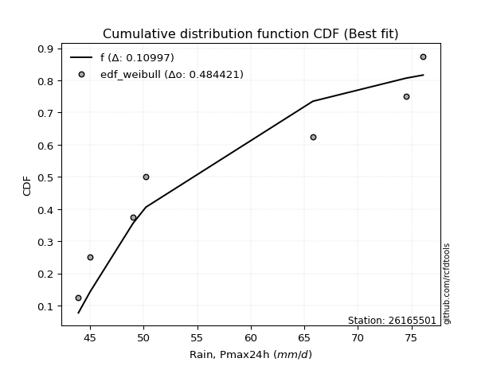</img>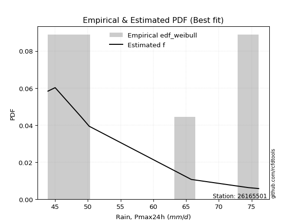</img>

</div>


### 4. EDF Beard (1943)

The Beard formula (or Beard´s plotting position formula) in hydrology is used to estimate the empirical non-exceedance probability _(P)_ of a flood event (or other extreme hydrological data point) within a given dataset.

<div align="center">


$P=(m-0.31)/(n+0.38)$


</div>


**4.1. Empirical values**

<div align="center">

|                | 0                   | 1                   | 2                   | 3         | 4                  | 5                  | 6                  |
|:---------------|:--------------------|:--------------------|:--------------------|:----------|:-------------------|:-------------------|:-------------------|
| date           | 2018                | 2022                | 2023                | 2017      | 2021               | 2019               | 2020               |
| x              | 43.9                | 45.0                | 49.0                | 50.2      | 65.8               | 74.5               | 76.1               |
| m              | 1                   | 2                   | 3                   | 4         | 5                  | 6                  | 7                  |
| empirical_dist | edf_beard           | edf_beard           | edf_beard           | edf_beard | edf_beard          | edf_beard          | edf_beard          |
| empirical      | 0.09349593495934959 | 0.22899728997289973 | 0.36449864498644985 | 0.5       | 0.6355013550135502 | 0.7710027100271003 | 0.9065040650406505 |
| empirical_tr   | 1.1031390134529149  | 1.29701230228471    | 1.5735607675906182  | 2.0       | 2.743494423791822  | 4.366863905325444  | 10.695652173913055 |

</div>


**4.2. Kolmogorov-Smirnov fit test (sorted by Δ)**


<div align="center">

|                | 0                   | 1                   | 2                   | 3                   | 4                   | 5                   | 6                   | 7                   | 8                   | 9                   | 10                  | 11                  | 12                  | 13                  | 14                  | 15                  | 16                  | 17                  | 18                  | 19                  | 20                  | 21                  | 22                  | 23                  | 24                  | 25                  | 26                  | 27                  | 28                  | 29                  | 30                  | 31                  | 32                  | 33                  | 34                  | 35                  | 36                  | 37                  | 38                  | 39                  | 40                  | 41                  | 42                  | 43                  | 44                  | 45                  | 46                  | 47                  | 48                  | 49                  | 50                  | 51                  | 52                  | 53                  | 54                  | 55                  | 56                  | 57                  | 58                  | 59                  | 60                  | 61                  | 62                  | 63                  | 64                  | 65                  | 66                  | 67                  | 68                  | 69                  | 70                  | 71                  | 72                  | 73                  | 74                  | 75                  | 76                  | 77                  | 78                  | 79                  | 80                  | 81                  | 82                  | 83                  | 84                  | 85                  | 86                  | 87                  | 88                  | 89                  | 90                  | 91                  | 92                  | 93                  | 94                  | 95                  | 96                  | 97                  | 98                  | 99                  | 100                 | 101                 | 102                 | 103                 | 104                 | 105                 | 106                 | 107                 | 108                 | 109                 | 110                 | 111                 | 112                 | 113                 | 114                 | 115                 | 116                 | 117                 | 118                 | 119                 | 120                 | 121                 | 122                 | 123                 | 124                 | 125                 | 126                 | 127                 | 128                 | 129                 | 130                 | 131                 | 132                 | 133                 | 134                 | 135                 | 136                 | 137                 | 138                 | 139                 | 140                 | 141                 | 142                 | 143                 | 144                 | 145                 | 146                 | 147                 | 148                 | 149                 | 150                 | 151                 | 152                 | 153                 | 154                 | 155                 | 156                 | 157                 | 158                 | 159                 |
|:---------------|:--------------------|:--------------------|:--------------------|:--------------------|:--------------------|:--------------------|:--------------------|:--------------------|:--------------------|:--------------------|:--------------------|:--------------------|:--------------------|:--------------------|:--------------------|:--------------------|:--------------------|:--------------------|:--------------------|:--------------------|:--------------------|:--------------------|:--------------------|:--------------------|:--------------------|:--------------------|:--------------------|:--------------------|:--------------------|:--------------------|:--------------------|:--------------------|:--------------------|:--------------------|:--------------------|:--------------------|:--------------------|:--------------------|:--------------------|:--------------------|:--------------------|:--------------------|:--------------------|:--------------------|:--------------------|:--------------------|:--------------------|:--------------------|:--------------------|:--------------------|:--------------------|:--------------------|:--------------------|:--------------------|:--------------------|:--------------------|:--------------------|:--------------------|:--------------------|:--------------------|:--------------------|:--------------------|:--------------------|:--------------------|:--------------------|:--------------------|:--------------------|:--------------------|:--------------------|:--------------------|:--------------------|:--------------------|:--------------------|:--------------------|:--------------------|:--------------------|:--------------------|:--------------------|:--------------------|:--------------------|:--------------------|:--------------------|:--------------------|:--------------------|:--------------------|:--------------------|:--------------------|:--------------------|:--------------------|:--------------------|:--------------------|:--------------------|:--------------------|:--------------------|:--------------------|:--------------------|:--------------------|:--------------------|:--------------------|:--------------------|:--------------------|:--------------------|:--------------------|:--------------------|:--------------------|:--------------------|:--------------------|:--------------------|:--------------------|:--------------------|:--------------------|:--------------------|:--------------------|:--------------------|:--------------------|:--------------------|:--------------------|:--------------------|:--------------------|:--------------------|:--------------------|:--------------------|:--------------------|:--------------------|:--------------------|:--------------------|:--------------------|:--------------------|:--------------------|:--------------------|:--------------------|:--------------------|:--------------------|:--------------------|:--------------------|:--------------------|:--------------------|:--------------------|:--------------------|:--------------------|:--------------------|:--------------------|:--------------------|:--------------------|:--------------------|:--------------------|:--------------------|:--------------------|:--------------------|:--------------------|:--------------------|:--------------------|:--------------------|:--------------------|:--------------------|:--------------------|:--------------------|:--------------------|:--------------------|:--------------------|
| station        | 26165501            | 26165501            | 26165501            | 26165501            | 26165501            | 26165501            | 26165501            | 26165501            | 26165501            | 26165501            | 26165501            | 26165501            | 26165501            | 26165501            | 26165501            | 26165501            | 26165501            | 26165501            | 26165501            | 26165501            | 26165501            | 26165501            | 26165501            | 26165501            | 26165501            | 26165501            | 26165501            | 26165501            | 26165501            | 26165501            | 26165501            | 26165501            | 26165501            | 26165501            | 26165501            | 26165501            | 26165501            | 26165501            | 26165501            | 26165501            | 26165501            | 26165501            | 26165501            | 26165501            | 26165501            | 26165501            | 26165501            | 26165501            | 26165501            | 26165501            | 26165501            | 26165501            | 26165501            | 26165501            | 26165501            | 26165501            | 26165501            | 26165501            | 26165501            | 26165501            | 26165501            | 26165501            | 26165501            | 26165501            | 26165501            | 26165501            | 26165501            | 26165501            | 26165501            | 26165501            | 26165501            | 26165501            | 26165501            | 26165501            | 26165501            | 26165501            | 26165501            | 26165501            | 26165501            | 26165501            | 26165501            | 26165501            | 26165501            | 26165501            | 26165501            | 26165501            | 26165501            | 26165501            | 26165501            | 26165501            | 26165501            | 26165501            | 26165501            | 26165501            | 26165501            | 26165501            | 26165501            | 26165501            | 26165501            | 26165501            | 26165501            | 26165501            | 26165501            | 26165501            | 26165501            | 26165501            | 26165501            | 26165501            | 26165501            | 26165501            | 26165501            | 26165501            | 26165501            | 26165501            | 26165501            | 26165501            | 26165501            | 26165501            | 26165501            | 26165501            | 26165501            | 26165501            | 26165501            | 26165501            | 26165501            | 26165501            | 26165501            | 26165501            | 26165501            | 26165501            | 26165501            | 26165501            | 26165501            | 26165501            | 26165501            | 26165501            | 26165501            | 26165501            | 26165501            | 26165501            | 26165501            | 26165501            | 26165501            | 26165501            | 26165501            | 26165501            | 26165501            | 26165501            | 26165501            | 26165501            | 26165501            | 26165501            | 26165501            | 26165501            | 26165501            | 26165501            | 26165501            | 26165501            | 26165501            | 26165501            |
| empirical_dist | edf_beard           | edf_beard           | edf_beard           | edf_beard           | edf_beard           | edf_beard           | edf_beard           | edf_beard           | edf_beard           | edf_beard           | edf_beard           | edf_beard           | edf_beard           | edf_beard           | edf_beard           | edf_beard           | edf_beard           | edf_beard           | edf_beard           | edf_beard           | edf_beard           | edf_beard           | edf_beard           | edf_beard           | edf_beard           | edf_beard           | edf_beard           | edf_beard           | edf_beard           | edf_beard           | edf_beard           | edf_beard           | edf_beard           | edf_beard           | edf_beard           | edf_beard           | edf_beard           | edf_beard           | edf_beard           | edf_beard           | edf_beard           | edf_beard           | edf_beard           | edf_beard           | edf_beard           | edf_beard           | edf_beard           | edf_beard           | edf_beard           | edf_beard           | edf_beard           | edf_beard           | edf_beard           | edf_beard           | edf_beard           | edf_beard           | edf_beard           | edf_beard           | edf_beard           | edf_beard           | edf_beard           | edf_beard           | edf_beard           | edf_beard           | edf_beard           | edf_beard           | edf_beard           | edf_beard           | edf_beard           | edf_beard           | edf_beard           | edf_beard           | edf_beard           | edf_beard           | edf_beard           | edf_beard           | edf_beard           | edf_beard           | edf_beard           | edf_beard           | edf_beard           | edf_beard           | edf_beard           | edf_beard           | edf_beard           | edf_beard           | edf_beard           | edf_beard           | edf_beard           | edf_beard           | edf_beard           | edf_beard           | edf_beard           | edf_beard           | edf_beard           | edf_beard           | edf_beard           | edf_beard           | edf_beard           | edf_beard           | edf_beard           | edf_beard           | edf_beard           | edf_beard           | edf_beard           | edf_beard           | edf_beard           | edf_beard           | edf_beard           | edf_beard           | edf_beard           | edf_beard           | edf_beard           | edf_beard           | edf_beard           | edf_beard           | edf_beard           | edf_beard           | edf_beard           | edf_beard           | edf_beard           | edf_beard           | edf_beard           | edf_beard           | edf_beard           | edf_beard           | edf_beard           | edf_beard           | edf_beard           | edf_beard           | edf_beard           | edf_beard           | edf_beard           | edf_beard           | edf_beard           | edf_beard           | edf_beard           | edf_beard           | edf_beard           | edf_beard           | edf_beard           | edf_beard           | edf_beard           | edf_beard           | edf_beard           | edf_beard           | edf_beard           | edf_beard           | edf_beard           | edf_beard           | edf_beard           | edf_beard           | edf_beard           | edf_beard           | edf_beard           | edf_beard           | edf_beard           | edf_beard           | edf_beard           | edf_beard           |
| p_dist         | f                   | logweibull_min      | logdgamma           | logdweibull         | logwrapcauchy       | exponpow            | dweibull            | logarcsine          | logf                | wrapcauchy          | dgamma              | arcsine             | nakagami            | loghalfnorm         | logfoldnorm         | invweibull          | genextreme          | logksone            | halfgennorm         | alpha               | loggompertz         | halfnorm            | lognct              | lomax               | genexpon            | exponnorm           | loggenexpon         | logkstwobign        | logmielke           | burr                | loggenlogistic      | lograyleigh         | loggenextreme       | loginvweibull       | halflogistic        | burr12              | logburr             | loglomax            | logexponweib        | invgamma            | loghalflogistic     | logsemicircular     | loggumbel_r         | ksone               | logncf              | gompertz            | logmoyal            | logmaxwell          | loganglit           | logbetaprime        | logalpha            | gausshyper          | erlang              | loghalfgennorm      | loginvgauss         | genlogistic         | semicircular        | invgauss            | loggengamma         | logrdist            | rayleigh            | nct                 | logskewnorm         | loglevy_l           | logpearson3         | moyal               | foldnorm            | kstwobign           | anglit              | logexponpow         | betaprime           | maxwell             | gumbel_r            | loginvgamma         | logweibull_max      | ncf                 | logfatiguelife      | levy_l              | logexponnorm        | logbradford         | logloggamma         | logcrystalball      | logt                | lognorm             | logrice             | logtruncexpon       | logtrapezoid        | pearson3            | logtruncnorm        | logburr12           | genpareto           | logcosine           | logtruncweibull_min | t                   | crystalball         | norm                | johnsonsu           | loglogistic         | logwald             | wald                | logbeta             | rice                | bradford            | truncexpon          | loghypsecant        | logerlang           | truncweibull_min    | skewnorm            | kappa4              | logloglaplace       | logistic            | loggennorm          | cosine              | logkappa4           | lognakagami         | logtukeylambda      | loggumbel_l         | logvonmises_line    | loguniform          | gennorm             | loggamma            | loggamma            | logargus            | hypsecant           | logkappa3           | loglaplace          | loglaplace          | gumbel_l            | truncnorm           | logtriang           | gamma               | argus               | laplace             | loggausshyper       | loggenpareto        | triang              | tukeylambda         | uniform             | vonmises_line       | kappa3              | weibull_min         | beta                | loggenhalflogistic  | genhalflogistic     | powerlaw            | fatiguelife         | logpowerlaw         | exponweib           | johnsonsb           | truncpareto         | gengamma            | rdist               | logtruncpareto      | trapezoid           | logjohnsonsu        | weibull_max         | logjohnsonsb        | logvonmises         | vonmises            | mielke              |
| delta          | 0.09946907429467666 | 0.10175801263182949 | 0.10528151037139033 | 0.10852253596719283 | 0.11021606008609508 | 0.1102887510532835  | 0.12199011556890327 | 0.12202989997523683 | 0.12876504223950014 | 0.13227753129182407 | 0.1323643641628245  | 0.1361797571344519  | 0.13687972270499477 | 0.1425110382307081  | 0.1427200775173585  | 0.15204957194571767 | 0.15205136285068444 | 0.15270377163189242 | 0.15560674800028307 | 0.15607501279968183 | 0.15630087960481764 | 0.1569049463804577  | 0.1570209658479586  | 0.15783899263819812 | 0.1586504538663026  | 0.16068099924488688 | 0.16149268070660838 | 0.16164578869773893 | 0.16180866201542254 | 0.16228377972113117 | 0.16255003036029703 | 0.16291658235256662 | 0.1635530722028754  | 0.1635544792310044  | 0.16361659851846955 | 0.16408515983626915 | 0.1646435520689865  | 0.1648037982188657  | 0.16607492171397464 | 0.16622421293915401 | 0.16638958608343724 | 0.1663956906754085  | 0.16929560150827533 | 0.16937786117702092 | 0.1694339058470743  | 0.17220764541390216 | 0.17261447986237843 | 0.17388592843557027 | 0.1769077384535495  | 0.17751495115488364 | 0.17802056052345339 | 0.1788726311636426  | 0.17934089798706443 | 0.18044377479057494 | 0.18059826066672102 | 0.1839906485790455  | 0.18405107262039083 | 0.18407081231548483 | 0.1849645736584602  | 0.18532040048373388 | 0.18556684618254127 | 0.18691436219041596 | 0.1872809181956101  | 0.18791344094634654 | 0.1899837551426546  | 0.19068599637281558 | 0.19197212556634347 | 0.19408475876189252 | 0.19523241773348682 | 0.19528276913042908 | 0.19545910799902633 | 0.19583140031931895 | 0.19626995162405808 | 0.19658833919723084 | 0.19980996881405655 | 0.19992249023697883 | 0.20086116262800208 | 0.2010149616470953  | 0.2012509662716443  | 0.20125926572381747 | 0.20154915415641322 | 0.20158715322627185 | 0.20159002341268417 | 0.20159081733038664 | 0.2025743082556422  | 0.20550458473391242 | 0.20625273755143042 | 0.20821874705063498 | 0.21399402767189335 | 0.21999380235576071 | 0.22002565133263424 | 0.22005567043852503 | 0.2203434214418435  | 0.22120510224326007 | 0.2213115335293957  | 0.22131154338567371 | 0.2215594110260991  | 0.22301489556884596 | 0.22899728997289973 | 0.22899728997289973 | 0.23154123517574987 | 0.2334497049612046  | 0.23505817993111455 | 0.2352814863867147  | 0.23844194022703685 | 0.23881118230259646 | 0.23946933878124932 | 0.23986389570010092 | 0.2405952899141781  | 0.2416682554087034  | 0.2434985482192244  | 0.2436393887827355  | 0.243955170785714   | 0.2467516381904163  | 0.2482291239710796  | 0.25016976280763714 | 0.2520988034720523  | 0.25526775837484783 | 0.25623989777871814 | 0.2573045086379594  | 0.25733370091706864 | 0.25733370091706864 | 0.2575836115923196  | 0.25893684092855695 | 0.25991628273215467 | 0.2633658082891202  | 0.2633658082891202  | 0.2675546542052222  | 0.27210029580603917 | 0.27796073973591334 | 0.2781048930648467  | 0.28084632668129794 | 0.28192709549712336 | 0.28268538721042413 | 0.2890944236850817  | 0.29749745302023456 | 0.2978615659743369  | 0.3043478260869564  | 0.30601453350203867 | 0.31632763660212293 | 0.3230144891280476  | 0.32898521809868947 | 0.3517750685482456  | 0.3732256342301376  | 0.37806623164723935 | 0.385012752201189   | 0.3962263600651899  | 0.4019117034071262  | 0.4078666318196784  | 0.40874336000400896 | 0.41409232227546894 | 0.4276709681070444  | 0.43384070274120484 | 0.43929846670867456 | 0.44614289668979457 | 0.5090961220919012  | 0.6127321124948613  | 1.1267812017095284  | 11.837668825461705  | nan                 |
| deltao         | 0.48442053926100004 | 0.48442053926100004 | 0.48442053926100004 | 0.48442053926100004 | 0.48442053926100004 | 0.48442053926100004 | 0.48442053926100004 | 0.48442053926100004 | 0.48442053926100004 | 0.48442053926100004 | 0.48442053926100004 | 0.48442053926100004 | 0.48442053926100004 | 0.48442053926100004 | 0.48442053926100004 | 0.48442053926100004 | 0.48442053926100004 | 0.48442053926100004 | 0.48442053926100004 | 0.48442053926100004 | 0.48442053926100004 | 0.48442053926100004 | 0.48442053926100004 | 0.48442053926100004 | 0.48442053926100004 | 0.48442053926100004 | 0.48442053926100004 | 0.48442053926100004 | 0.48442053926100004 | 0.48442053926100004 | 0.48442053926100004 | 0.48442053926100004 | 0.48442053926100004 | 0.48442053926100004 | 0.48442053926100004 | 0.48442053926100004 | 0.48442053926100004 | 0.48442053926100004 | 0.48442053926100004 | 0.48442053926100004 | 0.48442053926100004 | 0.48442053926100004 | 0.48442053926100004 | 0.48442053926100004 | 0.48442053926100004 | 0.48442053926100004 | 0.48442053926100004 | 0.48442053926100004 | 0.48442053926100004 | 0.48442053926100004 | 0.48442053926100004 | 0.48442053926100004 | 0.48442053926100004 | 0.48442053926100004 | 0.48442053926100004 | 0.48442053926100004 | 0.48442053926100004 | 0.48442053926100004 | 0.48442053926100004 | 0.48442053926100004 | 0.48442053926100004 | 0.48442053926100004 | 0.48442053926100004 | 0.48442053926100004 | 0.48442053926100004 | 0.48442053926100004 | 0.48442053926100004 | 0.48442053926100004 | 0.48442053926100004 | 0.48442053926100004 | 0.48442053926100004 | 0.48442053926100004 | 0.48442053926100004 | 0.48442053926100004 | 0.48442053926100004 | 0.48442053926100004 | 0.48442053926100004 | 0.48442053926100004 | 0.48442053926100004 | 0.48442053926100004 | 0.48442053926100004 | 0.48442053926100004 | 0.48442053926100004 | 0.48442053926100004 | 0.48442053926100004 | 0.48442053926100004 | 0.48442053926100004 | 0.48442053926100004 | 0.48442053926100004 | 0.48442053926100004 | 0.48442053926100004 | 0.48442053926100004 | 0.48442053926100004 | 0.48442053926100004 | 0.48442053926100004 | 0.48442053926100004 | 0.48442053926100004 | 0.48442053926100004 | 0.48442053926100004 | 0.48442053926100004 | 0.48442053926100004 | 0.48442053926100004 | 0.48442053926100004 | 0.48442053926100004 | 0.48442053926100004 | 0.48442053926100004 | 0.48442053926100004 | 0.48442053926100004 | 0.48442053926100004 | 0.48442053926100004 | 0.48442053926100004 | 0.48442053926100004 | 0.48442053926100004 | 0.48442053926100004 | 0.48442053926100004 | 0.48442053926100004 | 0.48442053926100004 | 0.48442053926100004 | 0.48442053926100004 | 0.48442053926100004 | 0.48442053926100004 | 0.48442053926100004 | 0.48442053926100004 | 0.48442053926100004 | 0.48442053926100004 | 0.48442053926100004 | 0.48442053926100004 | 0.48442053926100004 | 0.48442053926100004 | 0.48442053926100004 | 0.48442053926100004 | 0.48442053926100004 | 0.48442053926100004 | 0.48442053926100004 | 0.48442053926100004 | 0.48442053926100004 | 0.48442053926100004 | 0.48442053926100004 | 0.48442053926100004 | 0.48442053926100004 | 0.48442053926100004 | 0.48442053926100004 | 0.48442053926100004 | 0.48442053926100004 | 0.48442053926100004 | 0.48442053926100004 | 0.48442053926100004 | 0.48442053926100004 | 0.48442053926100004 | 0.48442053926100004 | 0.48442053926100004 | 0.48442053926100004 | 0.48442053926100004 | 0.48442053926100004 | 0.48442053926100004 | 0.48442053926100004 | 0.48442053926100004 | 0.48442053926100004 | 0.48442053926100004 | 0.48442053926100004 |
| eval           | Δo > Δ              | Δo > Δ              | Δo > Δ              | Δo > Δ              | Δo > Δ              | Δo > Δ              | Δo > Δ              | Δo > Δ              | Δo > Δ              | Δo > Δ              | Δo > Δ              | Δo > Δ              | Δo > Δ              | Δo > Δ              | Δo > Δ              | Δo > Δ              | Δo > Δ              | Δo > Δ              | Δo > Δ              | Δo > Δ              | Δo > Δ              | Δo > Δ              | Δo > Δ              | Δo > Δ              | Δo > Δ              | Δo > Δ              | Δo > Δ              | Δo > Δ              | Δo > Δ              | Δo > Δ              | Δo > Δ              | Δo > Δ              | Δo > Δ              | Δo > Δ              | Δo > Δ              | Δo > Δ              | Δo > Δ              | Δo > Δ              | Δo > Δ              | Δo > Δ              | Δo > Δ              | Δo > Δ              | Δo > Δ              | Δo > Δ              | Δo > Δ              | Δo > Δ              | Δo > Δ              | Δo > Δ              | Δo > Δ              | Δo > Δ              | Δo > Δ              | Δo > Δ              | Δo > Δ              | Δo > Δ              | Δo > Δ              | Δo > Δ              | Δo > Δ              | Δo > Δ              | Δo > Δ              | Δo > Δ              | Δo > Δ              | Δo > Δ              | Δo > Δ              | Δo > Δ              | Δo > Δ              | Δo > Δ              | Δo > Δ              | Δo > Δ              | Δo > Δ              | Δo > Δ              | Δo > Δ              | Δo > Δ              | Δo > Δ              | Δo > Δ              | Δo > Δ              | Δo > Δ              | Δo > Δ              | Δo > Δ              | Δo > Δ              | Δo > Δ              | Δo > Δ              | Δo > Δ              | Δo > Δ              | Δo > Δ              | Δo > Δ              | Δo > Δ              | Δo > Δ              | Δo > Δ              | Δo > Δ              | Δo > Δ              | Δo > Δ              | Δo > Δ              | Δo > Δ              | Δo > Δ              | Δo > Δ              | Δo > Δ              | Δo > Δ              | Δo > Δ              | Δo > Δ              | Δo > Δ              | Δo > Δ              | Δo > Δ              | Δo > Δ              | Δo > Δ              | Δo > Δ              | Δo > Δ              | Δo > Δ              | Δo > Δ              | Δo > Δ              | Δo > Δ              | Δo > Δ              | Δo > Δ              | Δo > Δ              | Δo > Δ              | Δo > Δ              | Δo > Δ              | Δo > Δ              | Δo > Δ              | Δo > Δ              | Δo > Δ              | Δo > Δ              | Δo > Δ              | Δo > Δ              | Δo > Δ              | Δo > Δ              | Δo > Δ              | Δo > Δ              | Δo > Δ              | Δo > Δ              | Δo > Δ              | Δo > Δ              | Δo > Δ              | Δo > Δ              | Δo > Δ              | Δo > Δ              | Δo > Δ              | Δo > Δ              | Δo > Δ              | Δo > Δ              | Δo > Δ              | Δo > Δ              | Δo > Δ              | Δo > Δ              | Δo > Δ              | Δo > Δ              | Δo > Δ              | Δo > Δ              | Δo > Δ              | Δo > Δ              | Δo > Δ              | Δo > Δ              | Δo > Δ              | Δo > Δ              | Δo > Δ              | Δo > Δ              | Δo <= Δ             | Δo <= Δ             | Δo <= Δ             | Δo <= Δ             | Δo <= Δ             |
| fit            | 1                   | 1                   | 1                   | 1                   | 1                   | 1                   | 1                   | 1                   | 1                   | 1                   | 1                   | 1                   | 1                   | 1                   | 1                   | 1                   | 1                   | 1                   | 1                   | 1                   | 1                   | 1                   | 1                   | 1                   | 1                   | 1                   | 1                   | 1                   | 1                   | 1                   | 1                   | 1                   | 1                   | 1                   | 1                   | 1                   | 1                   | 1                   | 1                   | 1                   | 1                   | 1                   | 1                   | 1                   | 1                   | 1                   | 1                   | 1                   | 1                   | 1                   | 1                   | 1                   | 1                   | 1                   | 1                   | 1                   | 1                   | 1                   | 1                   | 1                   | 1                   | 1                   | 1                   | 1                   | 1                   | 1                   | 1                   | 1                   | 1                   | 1                   | 1                   | 1                   | 1                   | 1                   | 1                   | 1                   | 1                   | 1                   | 1                   | 1                   | 1                   | 1                   | 1                   | 1                   | 1                   | 1                   | 1                   | 1                   | 1                   | 1                   | 1                   | 1                   | 1                   | 1                   | 1                   | 1                   | 1                   | 1                   | 1                   | 1                   | 1                   | 1                   | 1                   | 1                   | 1                   | 1                   | 1                   | 1                   | 1                   | 1                   | 1                   | 1                   | 1                   | 1                   | 1                   | 1                   | 1                   | 1                   | 1                   | 1                   | 1                   | 1                   | 1                   | 1                   | 1                   | 1                   | 1                   | 1                   | 1                   | 1                   | 1                   | 1                   | 1                   | 1                   | 1                   | 1                   | 1                   | 1                   | 1                   | 1                   | 1                   | 1                   | 1                   | 1                   | 1                   | 1                   | 1                   | 1                   | 1                   | 1                   | 1                   | 1                   | 1                   | 1                   | 1                   | 0                   | 0                   | 0                   | 0                   | 0                   |
| n              | 7                   | 7                   | 7                   | 7                   | 7                   | 7                   | 7                   | 7                   | 7                   | 7                   | 7                   | 7                   | 7                   | 7                   | 7                   | 7                   | 7                   | 7                   | 7                   | 7                   | 7                   | 7                   | 7                   | 7                   | 7                   | 7                   | 7                   | 7                   | 7                   | 7                   | 7                   | 7                   | 7                   | 7                   | 7                   | 7                   | 7                   | 7                   | 7                   | 7                   | 7                   | 7                   | 7                   | 7                   | 7                   | 7                   | 7                   | 7                   | 7                   | 7                   | 7                   | 7                   | 7                   | 7                   | 7                   | 7                   | 7                   | 7                   | 7                   | 7                   | 7                   | 7                   | 7                   | 7                   | 7                   | 7                   | 7                   | 7                   | 7                   | 7                   | 7                   | 7                   | 7                   | 7                   | 7                   | 7                   | 7                   | 7                   | 7                   | 7                   | 7                   | 7                   | 7                   | 7                   | 7                   | 7                   | 7                   | 7                   | 7                   | 7                   | 7                   | 7                   | 7                   | 7                   | 7                   | 7                   | 7                   | 7                   | 7                   | 7                   | 7                   | 7                   | 7                   | 7                   | 7                   | 7                   | 7                   | 7                   | 7                   | 7                   | 7                   | 7                   | 7                   | 7                   | 7                   | 7                   | 7                   | 7                   | 7                   | 7                   | 7                   | 7                   | 7                   | 7                   | 7                   | 7                   | 7                   | 7                   | 7                   | 7                   | 7                   | 7                   | 7                   | 7                   | 7                   | 7                   | 7                   | 7                   | 7                   | 7                   | 7                   | 7                   | 7                   | 7                   | 7                   | 7                   | 7                   | 7                   | 7                   | 7                   | 7                   | 7                   | 7                   | 7                   | 7                   | 7                   | 7                   | 7                   | 7                   | 7                   |
| best_fit       | 1                   | 0                   | 0                   | 0                   | 0                   | 0                   | 0                   | 0                   | 0                   | 0                   | 0                   | 0                   | 0                   | 0                   | 0                   | 0                   | 0                   | 0                   | 0                   | 0                   | 0                   | 0                   | 0                   | 0                   | 0                   | 0                   | 0                   | 0                   | 0                   | 0                   | 0                   | 0                   | 0                   | 0                   | 0                   | 0                   | 0                   | 0                   | 0                   | 0                   | 0                   | 0                   | 0                   | 0                   | 0                   | 0                   | 0                   | 0                   | 0                   | 0                   | 0                   | 0                   | 0                   | 0                   | 0                   | 0                   | 0                   | 0                   | 0                   | 0                   | 0                   | 0                   | 0                   | 0                   | 0                   | 0                   | 0                   | 0                   | 0                   | 0                   | 0                   | 0                   | 0                   | 0                   | 0                   | 0                   | 0                   | 0                   | 0                   | 0                   | 0                   | 0                   | 0                   | 0                   | 0                   | 0                   | 0                   | 0                   | 0                   | 0                   | 0                   | 0                   | 0                   | 0                   | 0                   | 0                   | 0                   | 0                   | 0                   | 0                   | 0                   | 0                   | 0                   | 0                   | 0                   | 0                   | 0                   | 0                   | 0                   | 0                   | 0                   | 0                   | 0                   | 0                   | 0                   | 0                   | 0                   | 0                   | 0                   | 0                   | 0                   | 0                   | 0                   | 0                   | 0                   | 0                   | 0                   | 0                   | 0                   | 0                   | 0                   | 0                   | 0                   | 0                   | 0                   | 0                   | 0                   | 0                   | 0                   | 0                   | 0                   | 0                   | 0                   | 0                   | 0                   | 0                   | 0                   | 0                   | 0                   | 0                   | 0                   | 0                   | 0                   | 0                   | 0                   | 0                   | 0                   | 0                   | 0                   | 0                   |
| best_fit_sort  | 1                   | 2                   | 3                   | 4                   | 5                   | 6                   | 7                   | 8                   | 9                   | 10                  | 11                  | 12                  | 13                  | 14                  | 15                  | 16                  | 17                  | 18                  | 19                  | 20                  | 21                  | 22                  | 23                  | 24                  | 25                  | 26                  | 27                  | 28                  | 29                  | 30                  | 31                  | 32                  | 33                  | 34                  | 35                  | 36                  | 37                  | 38                  | 39                  | 40                  | 41                  | 42                  | 43                  | 44                  | 45                  | 46                  | 47                  | 48                  | 49                  | 50                  | 51                  | 52                  | 53                  | 54                  | 55                  | 56                  | 57                  | 58                  | 59                  | 60                  | 61                  | 62                  | 63                  | 64                  | 65                  | 66                  | 67                  | 68                  | 69                  | 70                  | 71                  | 72                  | 73                  | 74                  | 75                  | 76                  | 77                  | 78                  | 79                  | 80                  | 81                  | 82                  | 83                  | 84                  | 85                  | 86                  | 87                  | 88                  | 89                  | 90                  | 91                  | 92                  | 93                  | 94                  | 95                  | 96                  | 97                  | 98                  | 99                  | 100                 | 101                 | 102                 | 103                 | 104                 | 105                 | 106                 | 107                 | 108                 | 109                 | 110                 | 111                 | 112                 | 113                 | 114                 | 115                 | 116                 | 117                 | 118                 | 119                 | 120                 | 121                 | 122                 | 123                 | 124                 | 125                 | 126                 | 127                 | 128                 | 129                 | 130                 | 131                 | 132                 | 133                 | 134                 | 135                 | 136                 | 137                 | 138                 | 139                 | 140                 | 141                 | 142                 | 143                 | 144                 | 145                 | 146                 | 147                 | 148                 | 149                 | 150                 | 151                 | 152                 | 153                 | 154                 | 155                 | 156                 | 157                 | 158                 | 159                 | 160                 |

</div>


**4.3. Best fit**

<div align="center">

|   id |   station | empirical_dist   | p_dist   |     delta |   deltao | eval   |   fit |   n |   best_fit |   best_fit_sort |
|-----:|----------:|:-----------------|:---------|----------:|---------:|:-------|------:|----:|-----------:|----------------:|
|    0 |  26165501 | edf_beard        | f        | 0.0994691 | 0.484421 | Δo > Δ |     1 |   7 |          1 |               1 |

</div>


<div align="center">

</img></img>

</div>


### 5. EDF Chegodayev (1955)

The Chegodayev formula is an empirical plotting position formula used in hydrological frequency analysis to estimate the exceedance probability or return period of a specific event from a set of observed data. It is primarily used for plotting observed data points on probability paper to fit a theoretical distribution, particularly for analyzing extreme events like maximum flood flows or rainfall intensities. The constant _b_ value in the generalized plotting position formula is 0.3.

<div align="center">


$P=(m-b)/(n+1-2b)$


</div>


**5.1. Empirical values**

<div align="center">

|                | 0                   | 1                   | 2                   | 3              | 4                  | 5                  | 6                  |
|:---------------|:--------------------|:--------------------|:--------------------|:---------------|:-------------------|:-------------------|:-------------------|
| date           | 2018                | 2022                | 2023                | 2017           | 2021               | 2019               | 2020               |
| x              | 43.9                | 45.0                | 49.0                | 50.2           | 65.8               | 74.5               | 76.1               |
| m              | 1                   | 2                   | 3                   | 4              | 5                  | 6                  | 7                  |
| empirical_dist | edf_chegodayev      | edf_chegodayev      | edf_chegodayev      | edf_chegodayev | edf_chegodayev     | edf_chegodayev     | edf_chegodayev     |
| empirical      | 0.09459459459459459 | 0.22972972972972971 | 0.36486486486486486 | 0.5            | 0.6351351351351351 | 0.7702702702702703 | 0.9054054054054054 |
| empirical_tr   | 1.1044776119402986  | 1.2982456140350878  | 1.574468085106383   | 2.0            | 2.7407407407407405 | 4.352941176470589  | 10.571428571428568 |

</div>


**5.2. Kolmogorov-Smirnov fit test (sorted by Δ)**


<div align="center">

|                | 0                   | 1                   | 2                   | 3                   | 4                   | 5                   | 6                   | 7                   | 8                   | 9                   | 10                  | 11                  | 12                  | 13                  | 14                  | 15                  | 16                  | 17                  | 18                  | 19                  | 20                  | 21                  | 22                  | 23                  | 24                  | 25                  | 26                  | 27                  | 28                  | 29                  | 30                  | 31                  | 32                  | 33                  | 34                  | 35                  | 36                  | 37                  | 38                  | 39                  | 40                  | 41                  | 42                  | 43                  | 44                  | 45                  | 46                  | 47                  | 48                  | 49                  | 50                  | 51                  | 52                  | 53                  | 54                  | 55                  | 56                  | 57                  | 58                  | 59                  | 60                  | 61                  | 62                  | 63                  | 64                  | 65                  | 66                  | 67                  | 68                  | 69                  | 70                  | 71                  | 72                  | 73                  | 74                  | 75                  | 76                  | 77                  | 78                  | 79                  | 80                  | 81                  | 82                  | 83                  | 84                  | 85                  | 86                  | 87                  | 88                  | 89                  | 90                  | 91                  | 92                  | 93                  | 94                  | 95                  | 96                  | 97                  | 98                  | 99                  | 100                 | 101                 | 102                 | 103                 | 104                 | 105                 | 106                 | 107                 | 108                 | 109                 | 110                 | 111                 | 112                 | 113                 | 114                 | 115                 | 116                 | 117                 | 118                 | 119                 | 120                 | 121                 | 122                 | 123                 | 124                 | 125                 | 126                 | 127                 | 128                 | 129                 | 130                 | 131                 | 132                 | 133                 | 134                 | 135                 | 136                 | 137                 | 138                 | 139                 | 140                 | 141                 | 142                 | 143                 | 144                 | 145                 | 146                 | 147                 | 148                 | 149                 | 150                 | 151                 | 152                 | 153                 | 154                 | 155                 | 156                 | 157                 | 158                 | 159                 |
|:---------------|:--------------------|:--------------------|:--------------------|:--------------------|:--------------------|:--------------------|:--------------------|:--------------------|:--------------------|:--------------------|:--------------------|:--------------------|:--------------------|:--------------------|:--------------------|:--------------------|:--------------------|:--------------------|:--------------------|:--------------------|:--------------------|:--------------------|:--------------------|:--------------------|:--------------------|:--------------------|:--------------------|:--------------------|:--------------------|:--------------------|:--------------------|:--------------------|:--------------------|:--------------------|:--------------------|:--------------------|:--------------------|:--------------------|:--------------------|:--------------------|:--------------------|:--------------------|:--------------------|:--------------------|:--------------------|:--------------------|:--------------------|:--------------------|:--------------------|:--------------------|:--------------------|:--------------------|:--------------------|:--------------------|:--------------------|:--------------------|:--------------------|:--------------------|:--------------------|:--------------------|:--------------------|:--------------------|:--------------------|:--------------------|:--------------------|:--------------------|:--------------------|:--------------------|:--------------------|:--------------------|:--------------------|:--------------------|:--------------------|:--------------------|:--------------------|:--------------------|:--------------------|:--------------------|:--------------------|:--------------------|:--------------------|:--------------------|:--------------------|:--------------------|:--------------------|:--------------------|:--------------------|:--------------------|:--------------------|:--------------------|:--------------------|:--------------------|:--------------------|:--------------------|:--------------------|:--------------------|:--------------------|:--------------------|:--------------------|:--------------------|:--------------------|:--------------------|:--------------------|:--------------------|:--------------------|:--------------------|:--------------------|:--------------------|:--------------------|:--------------------|:--------------------|:--------------------|:--------------------|:--------------------|:--------------------|:--------------------|:--------------------|:--------------------|:--------------------|:--------------------|:--------------------|:--------------------|:--------------------|:--------------------|:--------------------|:--------------------|:--------------------|:--------------------|:--------------------|:--------------------|:--------------------|:--------------------|:--------------------|:--------------------|:--------------------|:--------------------|:--------------------|:--------------------|:--------------------|:--------------------|:--------------------|:--------------------|:--------------------|:--------------------|:--------------------|:--------------------|:--------------------|:--------------------|:--------------------|:--------------------|:--------------------|:--------------------|:--------------------|:--------------------|:--------------------|:--------------------|:--------------------|:--------------------|:--------------------|:--------------------|
| station        | 26165501            | 26165501            | 26165501            | 26165501            | 26165501            | 26165501            | 26165501            | 26165501            | 26165501            | 26165501            | 26165501            | 26165501            | 26165501            | 26165501            | 26165501            | 26165501            | 26165501            | 26165501            | 26165501            | 26165501            | 26165501            | 26165501            | 26165501            | 26165501            | 26165501            | 26165501            | 26165501            | 26165501            | 26165501            | 26165501            | 26165501            | 26165501            | 26165501            | 26165501            | 26165501            | 26165501            | 26165501            | 26165501            | 26165501            | 26165501            | 26165501            | 26165501            | 26165501            | 26165501            | 26165501            | 26165501            | 26165501            | 26165501            | 26165501            | 26165501            | 26165501            | 26165501            | 26165501            | 26165501            | 26165501            | 26165501            | 26165501            | 26165501            | 26165501            | 26165501            | 26165501            | 26165501            | 26165501            | 26165501            | 26165501            | 26165501            | 26165501            | 26165501            | 26165501            | 26165501            | 26165501            | 26165501            | 26165501            | 26165501            | 26165501            | 26165501            | 26165501            | 26165501            | 26165501            | 26165501            | 26165501            | 26165501            | 26165501            | 26165501            | 26165501            | 26165501            | 26165501            | 26165501            | 26165501            | 26165501            | 26165501            | 26165501            | 26165501            | 26165501            | 26165501            | 26165501            | 26165501            | 26165501            | 26165501            | 26165501            | 26165501            | 26165501            | 26165501            | 26165501            | 26165501            | 26165501            | 26165501            | 26165501            | 26165501            | 26165501            | 26165501            | 26165501            | 26165501            | 26165501            | 26165501            | 26165501            | 26165501            | 26165501            | 26165501            | 26165501            | 26165501            | 26165501            | 26165501            | 26165501            | 26165501            | 26165501            | 26165501            | 26165501            | 26165501            | 26165501            | 26165501            | 26165501            | 26165501            | 26165501            | 26165501            | 26165501            | 26165501            | 26165501            | 26165501            | 26165501            | 26165501            | 26165501            | 26165501            | 26165501            | 26165501            | 26165501            | 26165501            | 26165501            | 26165501            | 26165501            | 26165501            | 26165501            | 26165501            | 26165501            | 26165501            | 26165501            | 26165501            | 26165501            | 26165501            | 26165501            |
| empirical_dist | edf_chegodayev      | edf_chegodayev      | edf_chegodayev      | edf_chegodayev      | edf_chegodayev      | edf_chegodayev      | edf_chegodayev      | edf_chegodayev      | edf_chegodayev      | edf_chegodayev      | edf_chegodayev      | edf_chegodayev      | edf_chegodayev      | edf_chegodayev      | edf_chegodayev      | edf_chegodayev      | edf_chegodayev      | edf_chegodayev      | edf_chegodayev      | edf_chegodayev      | edf_chegodayev      | edf_chegodayev      | edf_chegodayev      | edf_chegodayev      | edf_chegodayev      | edf_chegodayev      | edf_chegodayev      | edf_chegodayev      | edf_chegodayev      | edf_chegodayev      | edf_chegodayev      | edf_chegodayev      | edf_chegodayev      | edf_chegodayev      | edf_chegodayev      | edf_chegodayev      | edf_chegodayev      | edf_chegodayev      | edf_chegodayev      | edf_chegodayev      | edf_chegodayev      | edf_chegodayev      | edf_chegodayev      | edf_chegodayev      | edf_chegodayev      | edf_chegodayev      | edf_chegodayev      | edf_chegodayev      | edf_chegodayev      | edf_chegodayev      | edf_chegodayev      | edf_chegodayev      | edf_chegodayev      | edf_chegodayev      | edf_chegodayev      | edf_chegodayev      | edf_chegodayev      | edf_chegodayev      | edf_chegodayev      | edf_chegodayev      | edf_chegodayev      | edf_chegodayev      | edf_chegodayev      | edf_chegodayev      | edf_chegodayev      | edf_chegodayev      | edf_chegodayev      | edf_chegodayev      | edf_chegodayev      | edf_chegodayev      | edf_chegodayev      | edf_chegodayev      | edf_chegodayev      | edf_chegodayev      | edf_chegodayev      | edf_chegodayev      | edf_chegodayev      | edf_chegodayev      | edf_chegodayev      | edf_chegodayev      | edf_chegodayev      | edf_chegodayev      | edf_chegodayev      | edf_chegodayev      | edf_chegodayev      | edf_chegodayev      | edf_chegodayev      | edf_chegodayev      | edf_chegodayev      | edf_chegodayev      | edf_chegodayev      | edf_chegodayev      | edf_chegodayev      | edf_chegodayev      | edf_chegodayev      | edf_chegodayev      | edf_chegodayev      | edf_chegodayev      | edf_chegodayev      | edf_chegodayev      | edf_chegodayev      | edf_chegodayev      | edf_chegodayev      | edf_chegodayev      | edf_chegodayev      | edf_chegodayev      | edf_chegodayev      | edf_chegodayev      | edf_chegodayev      | edf_chegodayev      | edf_chegodayev      | edf_chegodayev      | edf_chegodayev      | edf_chegodayev      | edf_chegodayev      | edf_chegodayev      | edf_chegodayev      | edf_chegodayev      | edf_chegodayev      | edf_chegodayev      | edf_chegodayev      | edf_chegodayev      | edf_chegodayev      | edf_chegodayev      | edf_chegodayev      | edf_chegodayev      | edf_chegodayev      | edf_chegodayev      | edf_chegodayev      | edf_chegodayev      | edf_chegodayev      | edf_chegodayev      | edf_chegodayev      | edf_chegodayev      | edf_chegodayev      | edf_chegodayev      | edf_chegodayev      | edf_chegodayev      | edf_chegodayev      | edf_chegodayev      | edf_chegodayev      | edf_chegodayev      | edf_chegodayev      | edf_chegodayev      | edf_chegodayev      | edf_chegodayev      | edf_chegodayev      | edf_chegodayev      | edf_chegodayev      | edf_chegodayev      | edf_chegodayev      | edf_chegodayev      | edf_chegodayev      | edf_chegodayev      | edf_chegodayev      | edf_chegodayev      | edf_chegodayev      | edf_chegodayev      | edf_chegodayev      | edf_chegodayev      |
| p_dist         | f                   | logweibull_min      | logdgamma           | logdweibull         | exponpow            | logwrapcauchy       | dweibull            | logarcsine          | logf                | wrapcauchy          | dgamma              | arcsine             | nakagami            | logfoldnorm         | loghalfnorm         | invweibull          | genextreme          | logksone            | halfgennorm         | alpha               | loggompertz         | halfnorm            | lognct              | lomax               | genexpon            | exponnorm           | loggenexpon         | logkstwobign        | logmielke           | burr                | loggenlogistic      | lograyleigh         | halflogistic        | loggenextreme       | loginvweibull       | burr12              | logburr             | loglomax            | logsemicircular     | logexponweib        | invgamma            | loghalflogistic     | loggumbel_r         | ksone               | logncf              | gompertz            | logmoyal            | logmaxwell          | logbetaprime        | loganglit           | logalpha            | gausshyper          | erlang              | loghalfgennorm      | loginvgauss         | loggengamma         | genlogistic         | semicircular        | invgauss            | logrdist            | rayleigh            | nct                 | logskewnorm         | loglevy_l           | logpearson3         | moyal               | foldnorm            | kstwobign           | anglit              | logexponpow         | betaprime           | maxwell             | gumbel_r            | loginvgamma         | logweibull_max      | levy_l              | ncf                 | logfatiguelife      | logexponnorm        | logloggamma         | logcrystalball      | logt                | lognorm             | logbradford         | logrice             | logtruncexpon       | logtrapezoid        | pearson3            | logtruncnorm        | genpareto           | logburr12           | logcosine           | logtruncweibull_min | t                   | crystalball         | norm                | johnsonsu           | loglogistic         | logwald             | wald                | logbeta             | rice                | bradford            | truncexpon          | loghypsecant        | logerlang           | truncweibull_min    | skewnorm            | kappa4              | logloglaplace       | logistic            | cosine              | loggennorm          | logkappa4           | lognakagami         | logtukeylambda      | loggumbel_l         | logvonmises_line    | loguniform          | logargus            | gennorm             | loggamma            | loggamma            | hypsecant           | logkappa3           | loglaplace          | loglaplace          | gumbel_l            | truncnorm           | gamma               | logtriang           | argus               | laplace             | loggausshyper       | loggenpareto        | triang              | tukeylambda         | uniform             | vonmises_line       | kappa3              | weibull_min         | beta                | loggenhalflogistic  | genhalflogistic     | powerlaw            | fatiguelife         | logpowerlaw         | exponweib           | johnsonsb           | truncpareto         | gengamma            | rdist               | logtruncpareto      | trapezoid           | logjohnsonsu        | weibull_max         | logjohnsonsb        | logvonmises         | vonmises            | mielke              |
| delta          | 0.09983529417309178 | 0.10065935299658435 | 0.10601395012822035 | 0.10925497572402282 | 0.11065497093169863 | 0.1109484998429251  | 0.12162389569048815 | 0.12202989997523683 | 0.12913126211791526 | 0.13227753129182407 | 0.1330968039196545  | 0.1361797571344519  | 0.13651350282657976 | 0.1427200775173585  | 0.14287725810912322 | 0.15241579182413278 | 0.15241758272909955 | 0.15270377163189242 | 0.1559729678786982  | 0.15644123267809695 | 0.15666709948323276 | 0.1569049463804577  | 0.1570209658479586  | 0.15820521251661324 | 0.15901667374471773 | 0.161047219123302   | 0.1618589005850235  | 0.16201200857615405 | 0.16217488189383766 | 0.1626499995995463  | 0.16291625023871215 | 0.16291658235256662 | 0.16361659851846955 | 0.16391929208129052 | 0.16392069910941953 | 0.16445137971468426 | 0.16500977194740163 | 0.16517001809728082 | 0.1663956906754085  | 0.16644114159238976 | 0.16659043281756913 | 0.16675580596185235 | 0.16929560150827533 | 0.16937786117702092 | 0.16980012572548941 | 0.17220764541390216 | 0.17298069974079355 | 0.17388592843557027 | 0.17641629151963867 | 0.1769077384535495  | 0.17802056052345339 | 0.17960507092047262 | 0.17970711786547955 | 0.18080999466899006 | 0.18096448054513614 | 0.18386591402321506 | 0.1839906485790455  | 0.18405107262039083 | 0.18443703219389995 | 0.18532040048373388 | 0.18556684618254127 | 0.18691436219041596 | 0.1872809181956101  | 0.18791344094634654 | 0.1899837551426546  | 0.19068599637281558 | 0.19197212556634347 | 0.19408475876189252 | 0.19523241773348682 | 0.19528276913042908 | 0.19545910799902633 | 0.19583140031931895 | 0.19626995162405808 | 0.19658833919723084 | 0.19980996881405655 | 0.19991630201185034 | 0.19992249023697883 | 0.20049494274958707 | 0.2012509662716443  | 0.20154915415641322 | 0.20158715322627185 | 0.20159002341268417 | 0.20159081733038664 | 0.2019917054806475  | 0.2025743082556422  | 0.20623702449074244 | 0.20625273755143042 | 0.20821874705063498 | 0.21436024755030847 | 0.21892699169738927 | 0.21999380235576071 | 0.22005567043852503 | 0.2207096413202586  | 0.22120510224326007 | 0.2213115335293957  | 0.22131154338567371 | 0.2215594110260991  | 0.22301489556884596 | 0.22972972972972971 | 0.22972972972972971 | 0.231907455054165   | 0.2334497049612046  | 0.23505817993111455 | 0.2352814863867147  | 0.23844194022703685 | 0.23917740218101158 | 0.23983555865966444 | 0.23986389570010092 | 0.2405952899141781  | 0.24203447528711852 | 0.2434985482192244  | 0.243955170785714   | 0.24400560866115062 | 0.2467516381904163  | 0.2478629040926646  | 0.25016976280763714 | 0.2520988034720523  | 0.25526775837484783 | 0.25623989777871814 | 0.2575836115923196  | 0.2576707285163745  | 0.25769992079548376 | 0.25769992079548376 | 0.25893684092855695 | 0.25991628273215467 | 0.2633658082891202  | 0.2633658082891202  | 0.2675546542052222  | 0.27210029580603917 | 0.2777386731864317  | 0.27796073973591334 | 0.28084632668129794 | 0.28192709549712336 | 0.28305160708883925 | 0.28799576404983673 | 0.29749745302023456 | 0.2978615659743369  | 0.3043478260869564  | 0.30601453350203867 | 0.31632763660212293 | 0.3226482692496326  | 0.32898521809868947 | 0.3517750685482456  | 0.3732256342301376  | 0.37770001176882434 | 0.384280312444359   | 0.3958601401867749  | 0.40154548352871117 | 0.4071341920628484  | 0.40837714012559395 | 0.41372610239705393 | 0.4276709681070444  | 0.43347448286278983 | 0.43929846670867456 | 0.44541045693296455 | 0.5087299022134861  | 0.6119996727380312  | 1.1275136414663587  | 11.83876748509695   | nan                 |
| deltao         | 0.48442053926100004 | 0.48442053926100004 | 0.48442053926100004 | 0.48442053926100004 | 0.48442053926100004 | 0.48442053926100004 | 0.48442053926100004 | 0.48442053926100004 | 0.48442053926100004 | 0.48442053926100004 | 0.48442053926100004 | 0.48442053926100004 | 0.48442053926100004 | 0.48442053926100004 | 0.48442053926100004 | 0.48442053926100004 | 0.48442053926100004 | 0.48442053926100004 | 0.48442053926100004 | 0.48442053926100004 | 0.48442053926100004 | 0.48442053926100004 | 0.48442053926100004 | 0.48442053926100004 | 0.48442053926100004 | 0.48442053926100004 | 0.48442053926100004 | 0.48442053926100004 | 0.48442053926100004 | 0.48442053926100004 | 0.48442053926100004 | 0.48442053926100004 | 0.48442053926100004 | 0.48442053926100004 | 0.48442053926100004 | 0.48442053926100004 | 0.48442053926100004 | 0.48442053926100004 | 0.48442053926100004 | 0.48442053926100004 | 0.48442053926100004 | 0.48442053926100004 | 0.48442053926100004 | 0.48442053926100004 | 0.48442053926100004 | 0.48442053926100004 | 0.48442053926100004 | 0.48442053926100004 | 0.48442053926100004 | 0.48442053926100004 | 0.48442053926100004 | 0.48442053926100004 | 0.48442053926100004 | 0.48442053926100004 | 0.48442053926100004 | 0.48442053926100004 | 0.48442053926100004 | 0.48442053926100004 | 0.48442053926100004 | 0.48442053926100004 | 0.48442053926100004 | 0.48442053926100004 | 0.48442053926100004 | 0.48442053926100004 | 0.48442053926100004 | 0.48442053926100004 | 0.48442053926100004 | 0.48442053926100004 | 0.48442053926100004 | 0.48442053926100004 | 0.48442053926100004 | 0.48442053926100004 | 0.48442053926100004 | 0.48442053926100004 | 0.48442053926100004 | 0.48442053926100004 | 0.48442053926100004 | 0.48442053926100004 | 0.48442053926100004 | 0.48442053926100004 | 0.48442053926100004 | 0.48442053926100004 | 0.48442053926100004 | 0.48442053926100004 | 0.48442053926100004 | 0.48442053926100004 | 0.48442053926100004 | 0.48442053926100004 | 0.48442053926100004 | 0.48442053926100004 | 0.48442053926100004 | 0.48442053926100004 | 0.48442053926100004 | 0.48442053926100004 | 0.48442053926100004 | 0.48442053926100004 | 0.48442053926100004 | 0.48442053926100004 | 0.48442053926100004 | 0.48442053926100004 | 0.48442053926100004 | 0.48442053926100004 | 0.48442053926100004 | 0.48442053926100004 | 0.48442053926100004 | 0.48442053926100004 | 0.48442053926100004 | 0.48442053926100004 | 0.48442053926100004 | 0.48442053926100004 | 0.48442053926100004 | 0.48442053926100004 | 0.48442053926100004 | 0.48442053926100004 | 0.48442053926100004 | 0.48442053926100004 | 0.48442053926100004 | 0.48442053926100004 | 0.48442053926100004 | 0.48442053926100004 | 0.48442053926100004 | 0.48442053926100004 | 0.48442053926100004 | 0.48442053926100004 | 0.48442053926100004 | 0.48442053926100004 | 0.48442053926100004 | 0.48442053926100004 | 0.48442053926100004 | 0.48442053926100004 | 0.48442053926100004 | 0.48442053926100004 | 0.48442053926100004 | 0.48442053926100004 | 0.48442053926100004 | 0.48442053926100004 | 0.48442053926100004 | 0.48442053926100004 | 0.48442053926100004 | 0.48442053926100004 | 0.48442053926100004 | 0.48442053926100004 | 0.48442053926100004 | 0.48442053926100004 | 0.48442053926100004 | 0.48442053926100004 | 0.48442053926100004 | 0.48442053926100004 | 0.48442053926100004 | 0.48442053926100004 | 0.48442053926100004 | 0.48442053926100004 | 0.48442053926100004 | 0.48442053926100004 | 0.48442053926100004 | 0.48442053926100004 | 0.48442053926100004 | 0.48442053926100004 | 0.48442053926100004 | 0.48442053926100004 |
| eval           | Δo > Δ              | Δo > Δ              | Δo > Δ              | Δo > Δ              | Δo > Δ              | Δo > Δ              | Δo > Δ              | Δo > Δ              | Δo > Δ              | Δo > Δ              | Δo > Δ              | Δo > Δ              | Δo > Δ              | Δo > Δ              | Δo > Δ              | Δo > Δ              | Δo > Δ              | Δo > Δ              | Δo > Δ              | Δo > Δ              | Δo > Δ              | Δo > Δ              | Δo > Δ              | Δo > Δ              | Δo > Δ              | Δo > Δ              | Δo > Δ              | Δo > Δ              | Δo > Δ              | Δo > Δ              | Δo > Δ              | Δo > Δ              | Δo > Δ              | Δo > Δ              | Δo > Δ              | Δo > Δ              | Δo > Δ              | Δo > Δ              | Δo > Δ              | Δo > Δ              | Δo > Δ              | Δo > Δ              | Δo > Δ              | Δo > Δ              | Δo > Δ              | Δo > Δ              | Δo > Δ              | Δo > Δ              | Δo > Δ              | Δo > Δ              | Δo > Δ              | Δo > Δ              | Δo > Δ              | Δo > Δ              | Δo > Δ              | Δo > Δ              | Δo > Δ              | Δo > Δ              | Δo > Δ              | Δo > Δ              | Δo > Δ              | Δo > Δ              | Δo > Δ              | Δo > Δ              | Δo > Δ              | Δo > Δ              | Δo > Δ              | Δo > Δ              | Δo > Δ              | Δo > Δ              | Δo > Δ              | Δo > Δ              | Δo > Δ              | Δo > Δ              | Δo > Δ              | Δo > Δ              | Δo > Δ              | Δo > Δ              | Δo > Δ              | Δo > Δ              | Δo > Δ              | Δo > Δ              | Δo > Δ              | Δo > Δ              | Δo > Δ              | Δo > Δ              | Δo > Δ              | Δo > Δ              | Δo > Δ              | Δo > Δ              | Δo > Δ              | Δo > Δ              | Δo > Δ              | Δo > Δ              | Δo > Δ              | Δo > Δ              | Δo > Δ              | Δo > Δ              | Δo > Δ              | Δo > Δ              | Δo > Δ              | Δo > Δ              | Δo > Δ              | Δo > Δ              | Δo > Δ              | Δo > Δ              | Δo > Δ              | Δo > Δ              | Δo > Δ              | Δo > Δ              | Δo > Δ              | Δo > Δ              | Δo > Δ              | Δo > Δ              | Δo > Δ              | Δo > Δ              | Δo > Δ              | Δo > Δ              | Δo > Δ              | Δo > Δ              | Δo > Δ              | Δo > Δ              | Δo > Δ              | Δo > Δ              | Δo > Δ              | Δo > Δ              | Δo > Δ              | Δo > Δ              | Δo > Δ              | Δo > Δ              | Δo > Δ              | Δo > Δ              | Δo > Δ              | Δo > Δ              | Δo > Δ              | Δo > Δ              | Δo > Δ              | Δo > Δ              | Δo > Δ              | Δo > Δ              | Δo > Δ              | Δo > Δ              | Δo > Δ              | Δo > Δ              | Δo > Δ              | Δo > Δ              | Δo > Δ              | Δo > Δ              | Δo > Δ              | Δo > Δ              | Δo > Δ              | Δo > Δ              | Δo > Δ              | Δo > Δ              | Δo > Δ              | Δo <= Δ             | Δo <= Δ             | Δo <= Δ             | Δo <= Δ             | Δo <= Δ             |
| fit            | 1                   | 1                   | 1                   | 1                   | 1                   | 1                   | 1                   | 1                   | 1                   | 1                   | 1                   | 1                   | 1                   | 1                   | 1                   | 1                   | 1                   | 1                   | 1                   | 1                   | 1                   | 1                   | 1                   | 1                   | 1                   | 1                   | 1                   | 1                   | 1                   | 1                   | 1                   | 1                   | 1                   | 1                   | 1                   | 1                   | 1                   | 1                   | 1                   | 1                   | 1                   | 1                   | 1                   | 1                   | 1                   | 1                   | 1                   | 1                   | 1                   | 1                   | 1                   | 1                   | 1                   | 1                   | 1                   | 1                   | 1                   | 1                   | 1                   | 1                   | 1                   | 1                   | 1                   | 1                   | 1                   | 1                   | 1                   | 1                   | 1                   | 1                   | 1                   | 1                   | 1                   | 1                   | 1                   | 1                   | 1                   | 1                   | 1                   | 1                   | 1                   | 1                   | 1                   | 1                   | 1                   | 1                   | 1                   | 1                   | 1                   | 1                   | 1                   | 1                   | 1                   | 1                   | 1                   | 1                   | 1                   | 1                   | 1                   | 1                   | 1                   | 1                   | 1                   | 1                   | 1                   | 1                   | 1                   | 1                   | 1                   | 1                   | 1                   | 1                   | 1                   | 1                   | 1                   | 1                   | 1                   | 1                   | 1                   | 1                   | 1                   | 1                   | 1                   | 1                   | 1                   | 1                   | 1                   | 1                   | 1                   | 1                   | 1                   | 1                   | 1                   | 1                   | 1                   | 1                   | 1                   | 1                   | 1                   | 1                   | 1                   | 1                   | 1                   | 1                   | 1                   | 1                   | 1                   | 1                   | 1                   | 1                   | 1                   | 1                   | 1                   | 1                   | 1                   | 0                   | 0                   | 0                   | 0                   | 0                   |
| n              | 7                   | 7                   | 7                   | 7                   | 7                   | 7                   | 7                   | 7                   | 7                   | 7                   | 7                   | 7                   | 7                   | 7                   | 7                   | 7                   | 7                   | 7                   | 7                   | 7                   | 7                   | 7                   | 7                   | 7                   | 7                   | 7                   | 7                   | 7                   | 7                   | 7                   | 7                   | 7                   | 7                   | 7                   | 7                   | 7                   | 7                   | 7                   | 7                   | 7                   | 7                   | 7                   | 7                   | 7                   | 7                   | 7                   | 7                   | 7                   | 7                   | 7                   | 7                   | 7                   | 7                   | 7                   | 7                   | 7                   | 7                   | 7                   | 7                   | 7                   | 7                   | 7                   | 7                   | 7                   | 7                   | 7                   | 7                   | 7                   | 7                   | 7                   | 7                   | 7                   | 7                   | 7                   | 7                   | 7                   | 7                   | 7                   | 7                   | 7                   | 7                   | 7                   | 7                   | 7                   | 7                   | 7                   | 7                   | 7                   | 7                   | 7                   | 7                   | 7                   | 7                   | 7                   | 7                   | 7                   | 7                   | 7                   | 7                   | 7                   | 7                   | 7                   | 7                   | 7                   | 7                   | 7                   | 7                   | 7                   | 7                   | 7                   | 7                   | 7                   | 7                   | 7                   | 7                   | 7                   | 7                   | 7                   | 7                   | 7                   | 7                   | 7                   | 7                   | 7                   | 7                   | 7                   | 7                   | 7                   | 7                   | 7                   | 7                   | 7                   | 7                   | 7                   | 7                   | 7                   | 7                   | 7                   | 7                   | 7                   | 7                   | 7                   | 7                   | 7                   | 7                   | 7                   | 7                   | 7                   | 7                   | 7                   | 7                   | 7                   | 7                   | 7                   | 7                   | 7                   | 7                   | 7                   | 7                   | 7                   |
| best_fit       | 1                   | 0                   | 0                   | 0                   | 0                   | 0                   | 0                   | 0                   | 0                   | 0                   | 0                   | 0                   | 0                   | 0                   | 0                   | 0                   | 0                   | 0                   | 0                   | 0                   | 0                   | 0                   | 0                   | 0                   | 0                   | 0                   | 0                   | 0                   | 0                   | 0                   | 0                   | 0                   | 0                   | 0                   | 0                   | 0                   | 0                   | 0                   | 0                   | 0                   | 0                   | 0                   | 0                   | 0                   | 0                   | 0                   | 0                   | 0                   | 0                   | 0                   | 0                   | 0                   | 0                   | 0                   | 0                   | 0                   | 0                   | 0                   | 0                   | 0                   | 0                   | 0                   | 0                   | 0                   | 0                   | 0                   | 0                   | 0                   | 0                   | 0                   | 0                   | 0                   | 0                   | 0                   | 0                   | 0                   | 0                   | 0                   | 0                   | 0                   | 0                   | 0                   | 0                   | 0                   | 0                   | 0                   | 0                   | 0                   | 0                   | 0                   | 0                   | 0                   | 0                   | 0                   | 0                   | 0                   | 0                   | 0                   | 0                   | 0                   | 0                   | 0                   | 0                   | 0                   | 0                   | 0                   | 0                   | 0                   | 0                   | 0                   | 0                   | 0                   | 0                   | 0                   | 0                   | 0                   | 0                   | 0                   | 0                   | 0                   | 0                   | 0                   | 0                   | 0                   | 0                   | 0                   | 0                   | 0                   | 0                   | 0                   | 0                   | 0                   | 0                   | 0                   | 0                   | 0                   | 0                   | 0                   | 0                   | 0                   | 0                   | 0                   | 0                   | 0                   | 0                   | 0                   | 0                   | 0                   | 0                   | 0                   | 0                   | 0                   | 0                   | 0                   | 0                   | 0                   | 0                   | 0                   | 0                   | 0                   |
| best_fit_sort  | 1                   | 2                   | 3                   | 4                   | 5                   | 6                   | 7                   | 8                   | 9                   | 10                  | 11                  | 12                  | 13                  | 14                  | 15                  | 16                  | 17                  | 18                  | 19                  | 20                  | 21                  | 22                  | 23                  | 24                  | 25                  | 26                  | 27                  | 28                  | 29                  | 30                  | 31                  | 32                  | 33                  | 34                  | 35                  | 36                  | 37                  | 38                  | 39                  | 40                  | 41                  | 42                  | 43                  | 44                  | 45                  | 46                  | 47                  | 48                  | 49                  | 50                  | 51                  | 52                  | 53                  | 54                  | 55                  | 56                  | 57                  | 58                  | 59                  | 60                  | 61                  | 62                  | 63                  | 64                  | 65                  | 66                  | 67                  | 68                  | 69                  | 70                  | 71                  | 72                  | 73                  | 74                  | 75                  | 76                  | 77                  | 78                  | 79                  | 80                  | 81                  | 82                  | 83                  | 84                  | 85                  | 86                  | 87                  | 88                  | 89                  | 90                  | 91                  | 92                  | 93                  | 94                  | 95                  | 96                  | 97                  | 98                  | 99                  | 100                 | 101                 | 102                 | 103                 | 104                 | 105                 | 106                 | 107                 | 108                 | 109                 | 110                 | 111                 | 112                 | 113                 | 114                 | 115                 | 116                 | 117                 | 118                 | 119                 | 120                 | 121                 | 122                 | 123                 | 124                 | 125                 | 126                 | 127                 | 128                 | 129                 | 130                 | 131                 | 132                 | 133                 | 134                 | 135                 | 136                 | 137                 | 138                 | 139                 | 140                 | 141                 | 142                 | 143                 | 144                 | 145                 | 146                 | 147                 | 148                 | 149                 | 150                 | 151                 | 152                 | 153                 | 154                 | 155                 | 156                 | 157                 | 158                 | 159                 | 160                 |

</div>


**5.3. Best fit**

<div align="center">

|   id |   station | empirical_dist   | p_dist   |     delta |   deltao | eval   |   fit |   n |   best_fit |   best_fit_sort |
|-----:|----------:|:-----------------|:---------|----------:|---------:|:-------|------:|----:|-----------:|----------------:|
|    0 |  26165501 | edf_chegodayev   | f        | 0.0998353 | 0.484421 | Δo > Δ |     1 |   7 |          1 |               1 |

</div>


<div align="center">

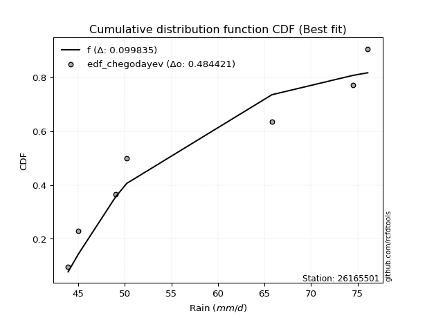</img>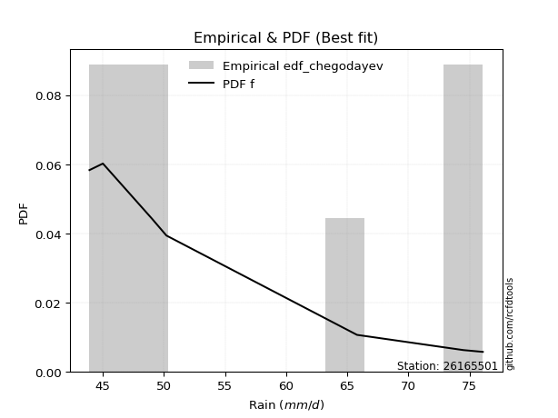</img>

</div>


### 6. EDF Blom (1958)

The Blom formula is a specific "plotting position" formula used in hydrology and statistical analysis to estimate the empirical cumulative probability (or non-exceedance probability) of a data series. It is particularly recommended for data that are approximately normally distributed. The constant _a_ is set to 0.375 (or 3/8).

<div align="center">


$P=(m-a)/(n+1-2a)$


</div>


**6.1. Empirical values**

<div align="center">

|                | 0                   | 1                   | 2                  | 3        | 4                  | 5                  | 6                  |
|:---------------|:--------------------|:--------------------|:-------------------|:---------|:-------------------|:-------------------|:-------------------|
| date           | 2018                | 2022                | 2023               | 2017     | 2021               | 2019               | 2020               |
| x              | 43.9                | 45.0                | 49.0               | 50.2     | 65.8               | 74.5               | 76.1               |
| m              | 1                   | 2                   | 3                  | 4        | 5                  | 6                  | 7                  |
| empirical_dist | edf_blom            | edf_blom            | edf_blom           | edf_blom | edf_blom           | edf_blom           | edf_blom           |
| empirical      | 0.08620689655172414 | 0.22413793103448276 | 0.3620689655172414 | 0.5      | 0.6379310344827587 | 0.7758620689655172 | 0.9137931034482759 |
| empirical_tr   | 1.0943396226415094  | 1.288888888888889   | 1.5675675675675675 | 2.0      | 2.7619047619047623 | 4.461538461538462  | 11.600000000000007 |

</div>


**6.2. Kolmogorov-Smirnov fit test (sorted by Δ)**


<div align="center">

|                | 0                   | 1                   | 2                   | 3                   | 4                   | 5                   | 6                   | 7                   | 8                   | 9                   | 10                  | 11                  | 12                  | 13                  | 14                  | 15                  | 16                  | 17                  | 18                  | 19                  | 20                  | 21                  | 22                  | 23                  | 24                  | 25                  | 26                  | 27                  | 28                  | 29                  | 30                  | 31                  | 32                  | 33                  | 34                  | 35                  | 36                  | 37                  | 38                  | 39                  | 40                  | 41                  | 42                  | 43                  | 44                  | 45                  | 46                  | 47                  | 48                  | 49                  | 50                  | 51                  | 52                  | 53                  | 54                  | 55                  | 56                  | 57                  | 58                  | 59                  | 60                  | 61                  | 62                  | 63                  | 64                  | 65                  | 66                  | 67                  | 68                  | 69                  | 70                  | 71                  | 72                  | 73                  | 74                  | 75                  | 76                  | 77                  | 78                  | 79                  | 80                  | 81                  | 82                  | 83                  | 84                  | 85                  | 86                  | 87                  | 88                  | 89                  | 90                  | 91                  | 92                  | 93                  | 94                  | 95                  | 96                  | 97                  | 98                  | 99                  | 100                 | 101                 | 102                 | 103                 | 104                 | 105                 | 106                 | 107                 | 108                 | 109                 | 110                 | 111                 | 112                 | 113                 | 114                 | 115                 | 116                 | 117                 | 118                 | 119                 | 120                 | 121                 | 122                 | 123                 | 124                 | 125                 | 126                 | 127                 | 128                 | 129                 | 130                 | 131                 | 132                 | 133                 | 134                 | 135                 | 136                 | 137                 | 138                 | 139                 | 140                 | 141                 | 142                 | 143                 | 144                 | 145                 | 146                 | 147                 | 148                 | 149                 | 150                 | 151                 | 152                 | 153                 | 154                 | 155                 | 156                 | 157                 | 158                 | 159                 |
|:---------------|:--------------------|:--------------------|:--------------------|:--------------------|:--------------------|:--------------------|:--------------------|:--------------------|:--------------------|:--------------------|:--------------------|:--------------------|:--------------------|:--------------------|:--------------------|:--------------------|:--------------------|:--------------------|:--------------------|:--------------------|:--------------------|:--------------------|:--------------------|:--------------------|:--------------------|:--------------------|:--------------------|:--------------------|:--------------------|:--------------------|:--------------------|:--------------------|:--------------------|:--------------------|:--------------------|:--------------------|:--------------------|:--------------------|:--------------------|:--------------------|:--------------------|:--------------------|:--------------------|:--------------------|:--------------------|:--------------------|:--------------------|:--------------------|:--------------------|:--------------------|:--------------------|:--------------------|:--------------------|:--------------------|:--------------------|:--------------------|:--------------------|:--------------------|:--------------------|:--------------------|:--------------------|:--------------------|:--------------------|:--------------------|:--------------------|:--------------------|:--------------------|:--------------------|:--------------------|:--------------------|:--------------------|:--------------------|:--------------------|:--------------------|:--------------------|:--------------------|:--------------------|:--------------------|:--------------------|:--------------------|:--------------------|:--------------------|:--------------------|:--------------------|:--------------------|:--------------------|:--------------------|:--------------------|:--------------------|:--------------------|:--------------------|:--------------------|:--------------------|:--------------------|:--------------------|:--------------------|:--------------------|:--------------------|:--------------------|:--------------------|:--------------------|:--------------------|:--------------------|:--------------------|:--------------------|:--------------------|:--------------------|:--------------------|:--------------------|:--------------------|:--------------------|:--------------------|:--------------------|:--------------------|:--------------------|:--------------------|:--------------------|:--------------------|:--------------------|:--------------------|:--------------------|:--------------------|:--------------------|:--------------------|:--------------------|:--------------------|:--------------------|:--------------------|:--------------------|:--------------------|:--------------------|:--------------------|:--------------------|:--------------------|:--------------------|:--------------------|:--------------------|:--------------------|:--------------------|:--------------------|:--------------------|:--------------------|:--------------------|:--------------------|:--------------------|:--------------------|:--------------------|:--------------------|:--------------------|:--------------------|:--------------------|:--------------------|:--------------------|:--------------------|:--------------------|:--------------------|:--------------------|:--------------------|:--------------------|:--------------------|
| station        | 26165501            | 26165501            | 26165501            | 26165501            | 26165501            | 26165501            | 26165501            | 26165501            | 26165501            | 26165501            | 26165501            | 26165501            | 26165501            | 26165501            | 26165501            | 26165501            | 26165501            | 26165501            | 26165501            | 26165501            | 26165501            | 26165501            | 26165501            | 26165501            | 26165501            | 26165501            | 26165501            | 26165501            | 26165501            | 26165501            | 26165501            | 26165501            | 26165501            | 26165501            | 26165501            | 26165501            | 26165501            | 26165501            | 26165501            | 26165501            | 26165501            | 26165501            | 26165501            | 26165501            | 26165501            | 26165501            | 26165501            | 26165501            | 26165501            | 26165501            | 26165501            | 26165501            | 26165501            | 26165501            | 26165501            | 26165501            | 26165501            | 26165501            | 26165501            | 26165501            | 26165501            | 26165501            | 26165501            | 26165501            | 26165501            | 26165501            | 26165501            | 26165501            | 26165501            | 26165501            | 26165501            | 26165501            | 26165501            | 26165501            | 26165501            | 26165501            | 26165501            | 26165501            | 26165501            | 26165501            | 26165501            | 26165501            | 26165501            | 26165501            | 26165501            | 26165501            | 26165501            | 26165501            | 26165501            | 26165501            | 26165501            | 26165501            | 26165501            | 26165501            | 26165501            | 26165501            | 26165501            | 26165501            | 26165501            | 26165501            | 26165501            | 26165501            | 26165501            | 26165501            | 26165501            | 26165501            | 26165501            | 26165501            | 26165501            | 26165501            | 26165501            | 26165501            | 26165501            | 26165501            | 26165501            | 26165501            | 26165501            | 26165501            | 26165501            | 26165501            | 26165501            | 26165501            | 26165501            | 26165501            | 26165501            | 26165501            | 26165501            | 26165501            | 26165501            | 26165501            | 26165501            | 26165501            | 26165501            | 26165501            | 26165501            | 26165501            | 26165501            | 26165501            | 26165501            | 26165501            | 26165501            | 26165501            | 26165501            | 26165501            | 26165501            | 26165501            | 26165501            | 26165501            | 26165501            | 26165501            | 26165501            | 26165501            | 26165501            | 26165501            | 26165501            | 26165501            | 26165501            | 26165501            | 26165501            | 26165501            |
| empirical_dist | edf_blom            | edf_blom            | edf_blom            | edf_blom            | edf_blom            | edf_blom            | edf_blom            | edf_blom            | edf_blom            | edf_blom            | edf_blom            | edf_blom            | edf_blom            | edf_blom            | edf_blom            | edf_blom            | edf_blom            | edf_blom            | edf_blom            | edf_blom            | edf_blom            | edf_blom            | edf_blom            | edf_blom            | edf_blom            | edf_blom            | edf_blom            | edf_blom            | edf_blom            | edf_blom            | edf_blom            | edf_blom            | edf_blom            | edf_blom            | edf_blom            | edf_blom            | edf_blom            | edf_blom            | edf_blom            | edf_blom            | edf_blom            | edf_blom            | edf_blom            | edf_blom            | edf_blom            | edf_blom            | edf_blom            | edf_blom            | edf_blom            | edf_blom            | edf_blom            | edf_blom            | edf_blom            | edf_blom            | edf_blom            | edf_blom            | edf_blom            | edf_blom            | edf_blom            | edf_blom            | edf_blom            | edf_blom            | edf_blom            | edf_blom            | edf_blom            | edf_blom            | edf_blom            | edf_blom            | edf_blom            | edf_blom            | edf_blom            | edf_blom            | edf_blom            | edf_blom            | edf_blom            | edf_blom            | edf_blom            | edf_blom            | edf_blom            | edf_blom            | edf_blom            | edf_blom            | edf_blom            | edf_blom            | edf_blom            | edf_blom            | edf_blom            | edf_blom            | edf_blom            | edf_blom            | edf_blom            | edf_blom            | edf_blom            | edf_blom            | edf_blom            | edf_blom            | edf_blom            | edf_blom            | edf_blom            | edf_blom            | edf_blom            | edf_blom            | edf_blom            | edf_blom            | edf_blom            | edf_blom            | edf_blom            | edf_blom            | edf_blom            | edf_blom            | edf_blom            | edf_blom            | edf_blom            | edf_blom            | edf_blom            | edf_blom            | edf_blom            | edf_blom            | edf_blom            | edf_blom            | edf_blom            | edf_blom            | edf_blom            | edf_blom            | edf_blom            | edf_blom            | edf_blom            | edf_blom            | edf_blom            | edf_blom            | edf_blom            | edf_blom            | edf_blom            | edf_blom            | edf_blom            | edf_blom            | edf_blom            | edf_blom            | edf_blom            | edf_blom            | edf_blom            | edf_blom            | edf_blom            | edf_blom            | edf_blom            | edf_blom            | edf_blom            | edf_blom            | edf_blom            | edf_blom            | edf_blom            | edf_blom            | edf_blom            | edf_blom            | edf_blom            | edf_blom            | edf_blom            | edf_blom            | edf_blom            | edf_blom            |
| p_dist         | f                   | logdgamma           | logwrapcauchy       | exponpow            | logdweibull         | logweibull_min      | logarcsine          | dweibull            | logf                | dgamma              | wrapcauchy          | arcsine             | nakagami            | loghalfnorm         | logfoldnorm         | invweibull          | genextreme          | logksone            | halfgennorm         | alpha               | loggompertz         | lomax               | genexpon            | halfnorm            | lognct              | exponnorm           | loggenexpon         | logmielke           | burr                | logkstwobign        | loggenlogistic      | loggenextreme       | loginvweibull       | burr12              | logburr             | loglomax            | lograyleigh         | halflogistic        | logexponweib        | invgamma            | loghalflogistic     | logsemicircular     | logncf              | loggumbel_r         | ksone               | logmoyal            | gompertz            | logmaxwell          | gausshyper          | loganglit           | erlang              | loghalfgennorm      | logalpha            | loginvgauss         | invgauss            | genlogistic         | semicircular        | logbetaprime        | logrdist            | rayleigh            | nct                 | logskewnorm         | loglevy_l           | logpearson3         | moyal               | foldnorm            | loggengamma         | kstwobign           | anglit              | logexponpow         | betaprime           | maxwell             | gumbel_r            | logbradford         | loginvgamma         | logweibull_max      | ncf                 | logtruncexpon       | logexponnorm        | logloggamma         | logcrystalball      | logt                | lognorm             | logrice             | logfatiguelife      | logtrapezoid        | pearson3            | levy_l              | logtruncnorm        | logtruncweibull_min | logburr12           | logcosine           | t                   | crystalball         | norm                | johnsonsu           | loglogistic         | wald                | logwald             | genpareto           | logbeta             | rice                | bradford            | truncexpon          | logerlang           | truncweibull_min    | loghypsecant        | logloglaplace       | skewnorm            | kappa4              | loggennorm          | logistic            | cosine              | logkappa4           | logtukeylambda      | lognakagami         | loggumbel_l         | gennorm             | loggamma            | loggamma            | logvonmises_line    | loguniform          | logargus            | hypsecant           | logkappa3           | loglaplace          | loglaplace          | gumbel_l            | truncnorm           | logtriang           | loggausshyper       | gamma               | argus               | laplace             | loggenpareto        | triang              | tukeylambda         | uniform             | vonmises_line       | kappa3              | weibull_min         | beta                | loggenhalflogistic  | genhalflogistic     | powerlaw            | fatiguelife         | logpowerlaw         | exponweib           | truncpareto         | johnsonsb           | gengamma            | rdist               | logtruncpareto      | trapezoid           | logjohnsonsu        | weibull_max         | logjohnsonsb        | logvonmises         | vonmises            | mielke              |
| delta          | 0.09737508259735184 | 0.1038595356712042  | 0.10535670114767814 | 0.10785907158407504 | 0.10847966441089796 | 0.10904705103945489 | 0.12202989997523683 | 0.12441979503811174 | 0.12633536277029167 | 0.12750500522440755 | 0.13227753129182407 | 0.1392570293831394  | 0.13930940217420323 | 0.14008135876149963 | 0.1427200775173585  | 0.1496198924765092  | 0.14962168338147597 | 0.15270377163189242 | 0.1531770685310746  | 0.15364533333047337 | 0.15387120013560918 | 0.15540931316898965 | 0.15622077439709414 | 0.1569049463804577  | 0.1570209658479586  | 0.1582513197756784  | 0.15906300123739991 | 0.15937898254621408 | 0.1598541002519227  | 0.15987222431094628 | 0.16012035089108856 | 0.16112339273366694 | 0.16112479976179594 | 0.16165548036706068 | 0.16221387259977804 | 0.16237411874965724 | 0.16291658235256662 | 0.16361659851846955 | 0.16364524224476618 | 0.16379453346994555 | 0.16395990661422877 | 0.1663956906754085  | 0.16700422637786583 | 0.16929560150827533 | 0.16937786117702092 | 0.17018480039316997 | 0.17220764541390216 | 0.17388592843557027 | 0.17591759395788492 | 0.1769077384535495  | 0.17691121851785596 | 0.17801409532136647 | 0.17802056052345339 | 0.17816858119751255 | 0.18164113284627637 | 0.1839906485790455  | 0.18405107262039083 | 0.1848039895625091  | 0.18532040048373388 | 0.18556684618254127 | 0.18691436219041596 | 0.1872809181956101  | 0.1881876422469358  | 0.1899837551426546  | 0.19068599637281558 | 0.19197212556634347 | 0.1922536120660856  | 0.19408475876189252 | 0.19523241773348682 | 0.19528276913042908 | 0.19545910799902633 | 0.19583140031931895 | 0.19626995162405808 | 0.19639990678540054 | 0.19658833919723084 | 0.19980996881405655 | 0.19992249023697883 | 0.20064522579549549 | 0.2012509662716443  | 0.20154915415641322 | 0.20158715322627185 | 0.20159002341268417 | 0.20159081733038664 | 0.2025743082556422  | 0.20329084209721054 | 0.20625273755143042 | 0.20821874705063498 | 0.20830400005472077 | 0.21156434820268488 | 0.21791374197263502 | 0.21999380235576071 | 0.22005567043852503 | 0.22120510224326007 | 0.2213115335293957  | 0.22131154338567371 | 0.2215594110260991  | 0.22301489556884596 | 0.22413793103448276 | 0.22413793103448276 | 0.2273146897402597  | 0.2291115557065414  | 0.2334497049612046  | 0.23505817993111455 | 0.2352814863867147  | 0.236381502833388   | 0.23703965931204085 | 0.23844194022703685 | 0.23923857593949494 | 0.23986389570010092 | 0.2405952899141781  | 0.24120970931352703 | 0.2434985482192244  | 0.243955170785714   | 0.2467516381904163  | 0.25016976280763714 | 0.25065880344028807 | 0.2520988034720523  | 0.2548748291687509  | 0.2549040214478602  | 0.2549040214478602  | 0.25526775837484783 | 0.25623989777871814 | 0.2575836115923196  | 0.25893684092855695 | 0.25991628273215467 | 0.2633658082891202  | 0.2633658082891202  | 0.2675546542052222  | 0.27210029580603917 | 0.27796073973591334 | 0.28025570774121566 | 0.28053457253405517 | 0.28084632668129794 | 0.28192709549712336 | 0.29638346209270716 | 0.29749745302023456 | 0.2978615659743369  | 0.3043478260869564  | 0.30601453350203867 | 0.31632763660212293 | 0.32544416859725606 | 0.32898521809868947 | 0.3517750685482456  | 0.3732256342301376  | 0.3804959111164478  | 0.38987211113960596 | 0.3986560395343984  | 0.40434138287633464 | 0.4111730394732174  | 0.41272599075809535 | 0.4165220017446774  | 0.4276709681070444  | 0.4362703822104133  | 0.43929846670867456 | 0.4510022556282115  | 0.5115258015611097  | 0.6175914714332782  | 1.1219372582782803  | 11.83037978705408   | nan                 |
| deltao         | 0.48442053926100004 | 0.48442053926100004 | 0.48442053926100004 | 0.48442053926100004 | 0.48442053926100004 | 0.48442053926100004 | 0.48442053926100004 | 0.48442053926100004 | 0.48442053926100004 | 0.48442053926100004 | 0.48442053926100004 | 0.48442053926100004 | 0.48442053926100004 | 0.48442053926100004 | 0.48442053926100004 | 0.48442053926100004 | 0.48442053926100004 | 0.48442053926100004 | 0.48442053926100004 | 0.48442053926100004 | 0.48442053926100004 | 0.48442053926100004 | 0.48442053926100004 | 0.48442053926100004 | 0.48442053926100004 | 0.48442053926100004 | 0.48442053926100004 | 0.48442053926100004 | 0.48442053926100004 | 0.48442053926100004 | 0.48442053926100004 | 0.48442053926100004 | 0.48442053926100004 | 0.48442053926100004 | 0.48442053926100004 | 0.48442053926100004 | 0.48442053926100004 | 0.48442053926100004 | 0.48442053926100004 | 0.48442053926100004 | 0.48442053926100004 | 0.48442053926100004 | 0.48442053926100004 | 0.48442053926100004 | 0.48442053926100004 | 0.48442053926100004 | 0.48442053926100004 | 0.48442053926100004 | 0.48442053926100004 | 0.48442053926100004 | 0.48442053926100004 | 0.48442053926100004 | 0.48442053926100004 | 0.48442053926100004 | 0.48442053926100004 | 0.48442053926100004 | 0.48442053926100004 | 0.48442053926100004 | 0.48442053926100004 | 0.48442053926100004 | 0.48442053926100004 | 0.48442053926100004 | 0.48442053926100004 | 0.48442053926100004 | 0.48442053926100004 | 0.48442053926100004 | 0.48442053926100004 | 0.48442053926100004 | 0.48442053926100004 | 0.48442053926100004 | 0.48442053926100004 | 0.48442053926100004 | 0.48442053926100004 | 0.48442053926100004 | 0.48442053926100004 | 0.48442053926100004 | 0.48442053926100004 | 0.48442053926100004 | 0.48442053926100004 | 0.48442053926100004 | 0.48442053926100004 | 0.48442053926100004 | 0.48442053926100004 | 0.48442053926100004 | 0.48442053926100004 | 0.48442053926100004 | 0.48442053926100004 | 0.48442053926100004 | 0.48442053926100004 | 0.48442053926100004 | 0.48442053926100004 | 0.48442053926100004 | 0.48442053926100004 | 0.48442053926100004 | 0.48442053926100004 | 0.48442053926100004 | 0.48442053926100004 | 0.48442053926100004 | 0.48442053926100004 | 0.48442053926100004 | 0.48442053926100004 | 0.48442053926100004 | 0.48442053926100004 | 0.48442053926100004 | 0.48442053926100004 | 0.48442053926100004 | 0.48442053926100004 | 0.48442053926100004 | 0.48442053926100004 | 0.48442053926100004 | 0.48442053926100004 | 0.48442053926100004 | 0.48442053926100004 | 0.48442053926100004 | 0.48442053926100004 | 0.48442053926100004 | 0.48442053926100004 | 0.48442053926100004 | 0.48442053926100004 | 0.48442053926100004 | 0.48442053926100004 | 0.48442053926100004 | 0.48442053926100004 | 0.48442053926100004 | 0.48442053926100004 | 0.48442053926100004 | 0.48442053926100004 | 0.48442053926100004 | 0.48442053926100004 | 0.48442053926100004 | 0.48442053926100004 | 0.48442053926100004 | 0.48442053926100004 | 0.48442053926100004 | 0.48442053926100004 | 0.48442053926100004 | 0.48442053926100004 | 0.48442053926100004 | 0.48442053926100004 | 0.48442053926100004 | 0.48442053926100004 | 0.48442053926100004 | 0.48442053926100004 | 0.48442053926100004 | 0.48442053926100004 | 0.48442053926100004 | 0.48442053926100004 | 0.48442053926100004 | 0.48442053926100004 | 0.48442053926100004 | 0.48442053926100004 | 0.48442053926100004 | 0.48442053926100004 | 0.48442053926100004 | 0.48442053926100004 | 0.48442053926100004 | 0.48442053926100004 | 0.48442053926100004 | 0.48442053926100004 | 0.48442053926100004 |
| eval           | Δo > Δ              | Δo > Δ              | Δo > Δ              | Δo > Δ              | Δo > Δ              | Δo > Δ              | Δo > Δ              | Δo > Δ              | Δo > Δ              | Δo > Δ              | Δo > Δ              | Δo > Δ              | Δo > Δ              | Δo > Δ              | Δo > Δ              | Δo > Δ              | Δo > Δ              | Δo > Δ              | Δo > Δ              | Δo > Δ              | Δo > Δ              | Δo > Δ              | Δo > Δ              | Δo > Δ              | Δo > Δ              | Δo > Δ              | Δo > Δ              | Δo > Δ              | Δo > Δ              | Δo > Δ              | Δo > Δ              | Δo > Δ              | Δo > Δ              | Δo > Δ              | Δo > Δ              | Δo > Δ              | Δo > Δ              | Δo > Δ              | Δo > Δ              | Δo > Δ              | Δo > Δ              | Δo > Δ              | Δo > Δ              | Δo > Δ              | Δo > Δ              | Δo > Δ              | Δo > Δ              | Δo > Δ              | Δo > Δ              | Δo > Δ              | Δo > Δ              | Δo > Δ              | Δo > Δ              | Δo > Δ              | Δo > Δ              | Δo > Δ              | Δo > Δ              | Δo > Δ              | Δo > Δ              | Δo > Δ              | Δo > Δ              | Δo > Δ              | Δo > Δ              | Δo > Δ              | Δo > Δ              | Δo > Δ              | Δo > Δ              | Δo > Δ              | Δo > Δ              | Δo > Δ              | Δo > Δ              | Δo > Δ              | Δo > Δ              | Δo > Δ              | Δo > Δ              | Δo > Δ              | Δo > Δ              | Δo > Δ              | Δo > Δ              | Δo > Δ              | Δo > Δ              | Δo > Δ              | Δo > Δ              | Δo > Δ              | Δo > Δ              | Δo > Δ              | Δo > Δ              | Δo > Δ              | Δo > Δ              | Δo > Δ              | Δo > Δ              | Δo > Δ              | Δo > Δ              | Δo > Δ              | Δo > Δ              | Δo > Δ              | Δo > Δ              | Δo > Δ              | Δo > Δ              | Δo > Δ              | Δo > Δ              | Δo > Δ              | Δo > Δ              | Δo > Δ              | Δo > Δ              | Δo > Δ              | Δo > Δ              | Δo > Δ              | Δo > Δ              | Δo > Δ              | Δo > Δ              | Δo > Δ              | Δo > Δ              | Δo > Δ              | Δo > Δ              | Δo > Δ              | Δo > Δ              | Δo > Δ              | Δo > Δ              | Δo > Δ              | Δo > Δ              | Δo > Δ              | Δo > Δ              | Δo > Δ              | Δo > Δ              | Δo > Δ              | Δo > Δ              | Δo > Δ              | Δo > Δ              | Δo > Δ              | Δo > Δ              | Δo > Δ              | Δo > Δ              | Δo > Δ              | Δo > Δ              | Δo > Δ              | Δo > Δ              | Δo > Δ              | Δo > Δ              | Δo > Δ              | Δo > Δ              | Δo > Δ              | Δo > Δ              | Δo > Δ              | Δo > Δ              | Δo > Δ              | Δo > Δ              | Δo > Δ              | Δo > Δ              | Δo > Δ              | Δo > Δ              | Δo > Δ              | Δo > Δ              | Δo > Δ              | Δo > Δ              | Δo <= Δ             | Δo <= Δ             | Δo <= Δ             | Δo <= Δ             | Δo <= Δ             |
| fit            | 1                   | 1                   | 1                   | 1                   | 1                   | 1                   | 1                   | 1                   | 1                   | 1                   | 1                   | 1                   | 1                   | 1                   | 1                   | 1                   | 1                   | 1                   | 1                   | 1                   | 1                   | 1                   | 1                   | 1                   | 1                   | 1                   | 1                   | 1                   | 1                   | 1                   | 1                   | 1                   | 1                   | 1                   | 1                   | 1                   | 1                   | 1                   | 1                   | 1                   | 1                   | 1                   | 1                   | 1                   | 1                   | 1                   | 1                   | 1                   | 1                   | 1                   | 1                   | 1                   | 1                   | 1                   | 1                   | 1                   | 1                   | 1                   | 1                   | 1                   | 1                   | 1                   | 1                   | 1                   | 1                   | 1                   | 1                   | 1                   | 1                   | 1                   | 1                   | 1                   | 1                   | 1                   | 1                   | 1                   | 1                   | 1                   | 1                   | 1                   | 1                   | 1                   | 1                   | 1                   | 1                   | 1                   | 1                   | 1                   | 1                   | 1                   | 1                   | 1                   | 1                   | 1                   | 1                   | 1                   | 1                   | 1                   | 1                   | 1                   | 1                   | 1                   | 1                   | 1                   | 1                   | 1                   | 1                   | 1                   | 1                   | 1                   | 1                   | 1                   | 1                   | 1                   | 1                   | 1                   | 1                   | 1                   | 1                   | 1                   | 1                   | 1                   | 1                   | 1                   | 1                   | 1                   | 1                   | 1                   | 1                   | 1                   | 1                   | 1                   | 1                   | 1                   | 1                   | 1                   | 1                   | 1                   | 1                   | 1                   | 1                   | 1                   | 1                   | 1                   | 1                   | 1                   | 1                   | 1                   | 1                   | 1                   | 1                   | 1                   | 1                   | 1                   | 1                   | 0                   | 0                   | 0                   | 0                   | 0                   |
| n              | 7                   | 7                   | 7                   | 7                   | 7                   | 7                   | 7                   | 7                   | 7                   | 7                   | 7                   | 7                   | 7                   | 7                   | 7                   | 7                   | 7                   | 7                   | 7                   | 7                   | 7                   | 7                   | 7                   | 7                   | 7                   | 7                   | 7                   | 7                   | 7                   | 7                   | 7                   | 7                   | 7                   | 7                   | 7                   | 7                   | 7                   | 7                   | 7                   | 7                   | 7                   | 7                   | 7                   | 7                   | 7                   | 7                   | 7                   | 7                   | 7                   | 7                   | 7                   | 7                   | 7                   | 7                   | 7                   | 7                   | 7                   | 7                   | 7                   | 7                   | 7                   | 7                   | 7                   | 7                   | 7                   | 7                   | 7                   | 7                   | 7                   | 7                   | 7                   | 7                   | 7                   | 7                   | 7                   | 7                   | 7                   | 7                   | 7                   | 7                   | 7                   | 7                   | 7                   | 7                   | 7                   | 7                   | 7                   | 7                   | 7                   | 7                   | 7                   | 7                   | 7                   | 7                   | 7                   | 7                   | 7                   | 7                   | 7                   | 7                   | 7                   | 7                   | 7                   | 7                   | 7                   | 7                   | 7                   | 7                   | 7                   | 7                   | 7                   | 7                   | 7                   | 7                   | 7                   | 7                   | 7                   | 7                   | 7                   | 7                   | 7                   | 7                   | 7                   | 7                   | 7                   | 7                   | 7                   | 7                   | 7                   | 7                   | 7                   | 7                   | 7                   | 7                   | 7                   | 7                   | 7                   | 7                   | 7                   | 7                   | 7                   | 7                   | 7                   | 7                   | 7                   | 7                   | 7                   | 7                   | 7                   | 7                   | 7                   | 7                   | 7                   | 7                   | 7                   | 7                   | 7                   | 7                   | 7                   | 7                   |
| best_fit       | 1                   | 0                   | 0                   | 0                   | 0                   | 0                   | 0                   | 0                   | 0                   | 0                   | 0                   | 0                   | 0                   | 0                   | 0                   | 0                   | 0                   | 0                   | 0                   | 0                   | 0                   | 0                   | 0                   | 0                   | 0                   | 0                   | 0                   | 0                   | 0                   | 0                   | 0                   | 0                   | 0                   | 0                   | 0                   | 0                   | 0                   | 0                   | 0                   | 0                   | 0                   | 0                   | 0                   | 0                   | 0                   | 0                   | 0                   | 0                   | 0                   | 0                   | 0                   | 0                   | 0                   | 0                   | 0                   | 0                   | 0                   | 0                   | 0                   | 0                   | 0                   | 0                   | 0                   | 0                   | 0                   | 0                   | 0                   | 0                   | 0                   | 0                   | 0                   | 0                   | 0                   | 0                   | 0                   | 0                   | 0                   | 0                   | 0                   | 0                   | 0                   | 0                   | 0                   | 0                   | 0                   | 0                   | 0                   | 0                   | 0                   | 0                   | 0                   | 0                   | 0                   | 0                   | 0                   | 0                   | 0                   | 0                   | 0                   | 0                   | 0                   | 0                   | 0                   | 0                   | 0                   | 0                   | 0                   | 0                   | 0                   | 0                   | 0                   | 0                   | 0                   | 0                   | 0                   | 0                   | 0                   | 0                   | 0                   | 0                   | 0                   | 0                   | 0                   | 0                   | 0                   | 0                   | 0                   | 0                   | 0                   | 0                   | 0                   | 0                   | 0                   | 0                   | 0                   | 0                   | 0                   | 0                   | 0                   | 0                   | 0                   | 0                   | 0                   | 0                   | 0                   | 0                   | 0                   | 0                   | 0                   | 0                   | 0                   | 0                   | 0                   | 0                   | 0                   | 0                   | 0                   | 0                   | 0                   | 0                   |
| best_fit_sort  | 1                   | 2                   | 3                   | 4                   | 5                   | 6                   | 7                   | 8                   | 9                   | 10                  | 11                  | 12                  | 13                  | 14                  | 15                  | 16                  | 17                  | 18                  | 19                  | 20                  | 21                  | 22                  | 23                  | 24                  | 25                  | 26                  | 27                  | 28                  | 29                  | 30                  | 31                  | 32                  | 33                  | 34                  | 35                  | 36                  | 37                  | 38                  | 39                  | 40                  | 41                  | 42                  | 43                  | 44                  | 45                  | 46                  | 47                  | 48                  | 49                  | 50                  | 51                  | 52                  | 53                  | 54                  | 55                  | 56                  | 57                  | 58                  | 59                  | 60                  | 61                  | 62                  | 63                  | 64                  | 65                  | 66                  | 67                  | 68                  | 69                  | 70                  | 71                  | 72                  | 73                  | 74                  | 75                  | 76                  | 77                  | 78                  | 79                  | 80                  | 81                  | 82                  | 83                  | 84                  | 85                  | 86                  | 87                  | 88                  | 89                  | 90                  | 91                  | 92                  | 93                  | 94                  | 95                  | 96                  | 97                  | 98                  | 99                  | 100                 | 101                 | 102                 | 103                 | 104                 | 105                 | 106                 | 107                 | 108                 | 109                 | 110                 | 111                 | 112                 | 113                 | 114                 | 115                 | 116                 | 117                 | 118                 | 119                 | 120                 | 121                 | 122                 | 123                 | 124                 | 125                 | 126                 | 127                 | 128                 | 129                 | 130                 | 131                 | 132                 | 133                 | 134                 | 135                 | 136                 | 137                 | 138                 | 139                 | 140                 | 141                 | 142                 | 143                 | 144                 | 145                 | 146                 | 147                 | 148                 | 149                 | 150                 | 151                 | 152                 | 153                 | 154                 | 155                 | 156                 | 157                 | 158                 | 159                 | 160                 |

</div>


**6.3. Best fit**

<div align="center">

|   id |   station | empirical_dist   | p_dist   |     delta |   deltao | eval   |   fit |   n |   best_fit |   best_fit_sort |
|-----:|----------:|:-----------------|:---------|----------:|---------:|:-------|------:|----:|-----------:|----------------:|
|    0 |  26165501 | edf_blom         | f        | 0.0973751 | 0.484421 | Δo > Δ |     1 |   7 |          1 |               1 |

</div>


<div align="center">

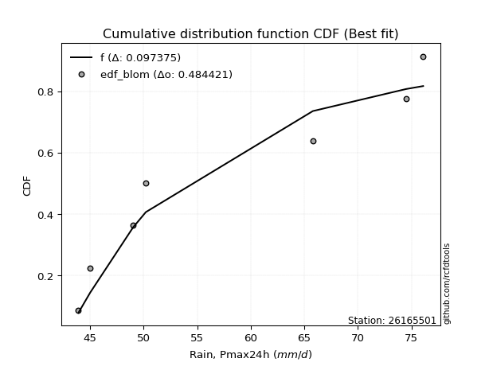</img>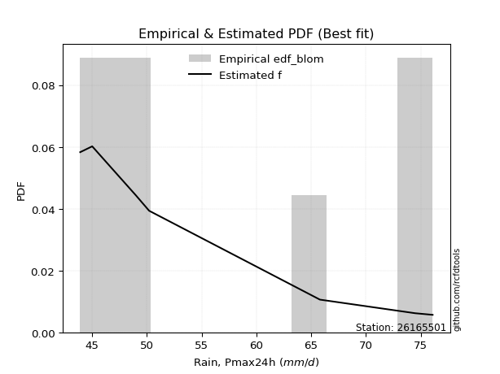</img>

</div>


### 7. EDF Tukey (1962)

In hydrology, the Tukey formula is used as a plotting position formula to estimate the empirical probability or frequency of a flood event (or other hydrological data). The formula parameter is given as _c=0.333_ (or 1/3).

<div align="center">


$P=(m-c)/(n+1-2c)$


</div>


**7.1. Empirical values**

<div align="center">

|                | 0                   | 1                   | 2                   | 3         | 4                  | 5                  | 6                  |
|:---------------|:--------------------|:--------------------|:--------------------|:----------|:-------------------|:-------------------|:-------------------|
| date           | 2018                | 2022                | 2023                | 2017      | 2021               | 2019               | 2020               |
| x              | 43.9                | 45.0                | 49.0                | 50.2      | 65.8               | 74.5               | 76.1               |
| m              | 1                   | 2                   | 3                   | 4         | 5                  | 6                  | 7                  |
| empirical_dist | edf_tukey           | edf_tukey           | edf_tukey           | edf_tukey | edf_tukey          | edf_tukey          | edf_tukey          |
| empirical      | 0.09090909090909091 | 0.22727272727272727 | 0.36363636363636365 | 0.5       | 0.6363636363636364 | 0.7727272727272727 | 0.9090909090909091 |
| empirical_tr   | 1.1                 | 1.2941176470588236  | 1.5714285714285714  | 2.0       | 2.75               | 4.3999999999999995 | 10.999999999999996 |

</div>


**7.2. Kolmogorov-Smirnov fit test (sorted by Δ)**


<div align="center">

|                | 0                   | 1                   | 2                   | 3                   | 4                   | 5                   | 6                   | 7                   | 8                   | 9                   | 10                  | 11                  | 12                  | 13                  | 14                  | 15                  | 16                  | 17                  | 18                  | 19                  | 20                  | 21                  | 22                  | 23                  | 24                  | 25                  | 26                  | 27                  | 28                  | 29                  | 30                  | 31                  | 32                  | 33                  | 34                  | 35                  | 36                  | 37                  | 38                  | 39                  | 40                  | 41                  | 42                  | 43                  | 44                  | 45                  | 46                  | 47                  | 48                  | 49                  | 50                  | 51                  | 52                  | 53                  | 54                  | 55                  | 56                  | 57                  | 58                  | 59                  | 60                  | 61                  | 62                  | 63                  | 64                  | 65                  | 66                  | 67                  | 68                  | 69                  | 70                  | 71                  | 72                  | 73                  | 74                  | 75                  | 76                  | 77                  | 78                  | 79                  | 80                  | 81                  | 82                  | 83                  | 84                  | 85                  | 86                  | 87                  | 88                  | 89                  | 90                  | 91                  | 92                  | 93                  | 94                  | 95                  | 96                  | 97                  | 98                  | 99                  | 100                 | 101                 | 102                 | 103                 | 104                 | 105                 | 106                 | 107                 | 108                 | 109                 | 110                 | 111                 | 112                 | 113                 | 114                 | 115                 | 116                 | 117                 | 118                 | 119                 | 120                 | 121                 | 122                 | 123                 | 124                 | 125                 | 126                 | 127                 | 128                 | 129                 | 130                 | 131                 | 132                 | 133                 | 134                 | 135                 | 136                 | 137                 | 138                 | 139                 | 140                 | 141                 | 142                 | 143                 | 144                 | 145                 | 146                 | 147                 | 148                 | 149                 | 150                 | 151                 | 152                 | 153                 | 154                 | 155                 | 156                 | 157                 | 158                 | 159                 |
|:---------------|:--------------------|:--------------------|:--------------------|:--------------------|:--------------------|:--------------------|:--------------------|:--------------------|:--------------------|:--------------------|:--------------------|:--------------------|:--------------------|:--------------------|:--------------------|:--------------------|:--------------------|:--------------------|:--------------------|:--------------------|:--------------------|:--------------------|:--------------------|:--------------------|:--------------------|:--------------------|:--------------------|:--------------------|:--------------------|:--------------------|:--------------------|:--------------------|:--------------------|:--------------------|:--------------------|:--------------------|:--------------------|:--------------------|:--------------------|:--------------------|:--------------------|:--------------------|:--------------------|:--------------------|:--------------------|:--------------------|:--------------------|:--------------------|:--------------------|:--------------------|:--------------------|:--------------------|:--------------------|:--------------------|:--------------------|:--------------------|:--------------------|:--------------------|:--------------------|:--------------------|:--------------------|:--------------------|:--------------------|:--------------------|:--------------------|:--------------------|:--------------------|:--------------------|:--------------------|:--------------------|:--------------------|:--------------------|:--------------------|:--------------------|:--------------------|:--------------------|:--------------------|:--------------------|:--------------------|:--------------------|:--------------------|:--------------------|:--------------------|:--------------------|:--------------------|:--------------------|:--------------------|:--------------------|:--------------------|:--------------------|:--------------------|:--------------------|:--------------------|:--------------------|:--------------------|:--------------------|:--------------------|:--------------------|:--------------------|:--------------------|:--------------------|:--------------------|:--------------------|:--------------------|:--------------------|:--------------------|:--------------------|:--------------------|:--------------------|:--------------------|:--------------------|:--------------------|:--------------------|:--------------------|:--------------------|:--------------------|:--------------------|:--------------------|:--------------------|:--------------------|:--------------------|:--------------------|:--------------------|:--------------------|:--------------------|:--------------------|:--------------------|:--------------------|:--------------------|:--------------------|:--------------------|:--------------------|:--------------------|:--------------------|:--------------------|:--------------------|:--------------------|:--------------------|:--------------------|:--------------------|:--------------------|:--------------------|:--------------------|:--------------------|:--------------------|:--------------------|:--------------------|:--------------------|:--------------------|:--------------------|:--------------------|:--------------------|:--------------------|:--------------------|:--------------------|:--------------------|:--------------------|:--------------------|:--------------------|:--------------------|
| station        | 26165501            | 26165501            | 26165501            | 26165501            | 26165501            | 26165501            | 26165501            | 26165501            | 26165501            | 26165501            | 26165501            | 26165501            | 26165501            | 26165501            | 26165501            | 26165501            | 26165501            | 26165501            | 26165501            | 26165501            | 26165501            | 26165501            | 26165501            | 26165501            | 26165501            | 26165501            | 26165501            | 26165501            | 26165501            | 26165501            | 26165501            | 26165501            | 26165501            | 26165501            | 26165501            | 26165501            | 26165501            | 26165501            | 26165501            | 26165501            | 26165501            | 26165501            | 26165501            | 26165501            | 26165501            | 26165501            | 26165501            | 26165501            | 26165501            | 26165501            | 26165501            | 26165501            | 26165501            | 26165501            | 26165501            | 26165501            | 26165501            | 26165501            | 26165501            | 26165501            | 26165501            | 26165501            | 26165501            | 26165501            | 26165501            | 26165501            | 26165501            | 26165501            | 26165501            | 26165501            | 26165501            | 26165501            | 26165501            | 26165501            | 26165501            | 26165501            | 26165501            | 26165501            | 26165501            | 26165501            | 26165501            | 26165501            | 26165501            | 26165501            | 26165501            | 26165501            | 26165501            | 26165501            | 26165501            | 26165501            | 26165501            | 26165501            | 26165501            | 26165501            | 26165501            | 26165501            | 26165501            | 26165501            | 26165501            | 26165501            | 26165501            | 26165501            | 26165501            | 26165501            | 26165501            | 26165501            | 26165501            | 26165501            | 26165501            | 26165501            | 26165501            | 26165501            | 26165501            | 26165501            | 26165501            | 26165501            | 26165501            | 26165501            | 26165501            | 26165501            | 26165501            | 26165501            | 26165501            | 26165501            | 26165501            | 26165501            | 26165501            | 26165501            | 26165501            | 26165501            | 26165501            | 26165501            | 26165501            | 26165501            | 26165501            | 26165501            | 26165501            | 26165501            | 26165501            | 26165501            | 26165501            | 26165501            | 26165501            | 26165501            | 26165501            | 26165501            | 26165501            | 26165501            | 26165501            | 26165501            | 26165501            | 26165501            | 26165501            | 26165501            | 26165501            | 26165501            | 26165501            | 26165501            | 26165501            | 26165501            |
| empirical_dist | edf_tukey           | edf_tukey           | edf_tukey           | edf_tukey           | edf_tukey           | edf_tukey           | edf_tukey           | edf_tukey           | edf_tukey           | edf_tukey           | edf_tukey           | edf_tukey           | edf_tukey           | edf_tukey           | edf_tukey           | edf_tukey           | edf_tukey           | edf_tukey           | edf_tukey           | edf_tukey           | edf_tukey           | edf_tukey           | edf_tukey           | edf_tukey           | edf_tukey           | edf_tukey           | edf_tukey           | edf_tukey           | edf_tukey           | edf_tukey           | edf_tukey           | edf_tukey           | edf_tukey           | edf_tukey           | edf_tukey           | edf_tukey           | edf_tukey           | edf_tukey           | edf_tukey           | edf_tukey           | edf_tukey           | edf_tukey           | edf_tukey           | edf_tukey           | edf_tukey           | edf_tukey           | edf_tukey           | edf_tukey           | edf_tukey           | edf_tukey           | edf_tukey           | edf_tukey           | edf_tukey           | edf_tukey           | edf_tukey           | edf_tukey           | edf_tukey           | edf_tukey           | edf_tukey           | edf_tukey           | edf_tukey           | edf_tukey           | edf_tukey           | edf_tukey           | edf_tukey           | edf_tukey           | edf_tukey           | edf_tukey           | edf_tukey           | edf_tukey           | edf_tukey           | edf_tukey           | edf_tukey           | edf_tukey           | edf_tukey           | edf_tukey           | edf_tukey           | edf_tukey           | edf_tukey           | edf_tukey           | edf_tukey           | edf_tukey           | edf_tukey           | edf_tukey           | edf_tukey           | edf_tukey           | edf_tukey           | edf_tukey           | edf_tukey           | edf_tukey           | edf_tukey           | edf_tukey           | edf_tukey           | edf_tukey           | edf_tukey           | edf_tukey           | edf_tukey           | edf_tukey           | edf_tukey           | edf_tukey           | edf_tukey           | edf_tukey           | edf_tukey           | edf_tukey           | edf_tukey           | edf_tukey           | edf_tukey           | edf_tukey           | edf_tukey           | edf_tukey           | edf_tukey           | edf_tukey           | edf_tukey           | edf_tukey           | edf_tukey           | edf_tukey           | edf_tukey           | edf_tukey           | edf_tukey           | edf_tukey           | edf_tukey           | edf_tukey           | edf_tukey           | edf_tukey           | edf_tukey           | edf_tukey           | edf_tukey           | edf_tukey           | edf_tukey           | edf_tukey           | edf_tukey           | edf_tukey           | edf_tukey           | edf_tukey           | edf_tukey           | edf_tukey           | edf_tukey           | edf_tukey           | edf_tukey           | edf_tukey           | edf_tukey           | edf_tukey           | edf_tukey           | edf_tukey           | edf_tukey           | edf_tukey           | edf_tukey           | edf_tukey           | edf_tukey           | edf_tukey           | edf_tukey           | edf_tukey           | edf_tukey           | edf_tukey           | edf_tukey           | edf_tukey           | edf_tukey           | edf_tukey           | edf_tukey           | edf_tukey           |
| p_dist         | f                   | logdgamma           | logweibull_min      | logdweibull         | logwrapcauchy       | exponpow            | logarcsine          | dweibull            | logf                | dgamma              | wrapcauchy          | arcsine             | nakagami            | loghalfnorm         | logfoldnorm         | invweibull          | genextreme          | logksone            | halfgennorm         | alpha               | loggompertz         | halfnorm            | lomax               | lognct              | genexpon            | exponnorm           | loggenexpon         | logkstwobign        | logmielke           | burr                | loggenlogistic      | loggenextreme       | loginvweibull       | lograyleigh         | burr12              | halflogistic        | logburr             | loglomax            | logexponweib        | invgamma            | loghalflogistic     | logsemicircular     | logncf              | loggumbel_r         | ksone               | logmoyal            | gompertz            | logmaxwell          | loganglit           | gausshyper          | logalpha            | erlang              | loghalfgennorm      | loginvgauss         | logbetaprime        | invgauss            | genlogistic         | semicircular        | logrdist            | rayleigh            | nct                 | logskewnorm         | loggengamma         | loglevy_l           | logpearson3         | moyal               | foldnorm            | kstwobign           | anglit              | logexponpow         | betaprime           | maxwell             | gumbel_r            | loginvgamma         | logbradford         | logweibull_max      | ncf                 | logexponnorm        | logloggamma         | logcrystalball      | logt                | lognorm             | logfatiguelife      | logrice             | levy_l              | logtruncexpon       | logtrapezoid        | pearson3            | logtruncnorm        | logtruncweibull_min | logburr12           | logcosine           | t                   | crystalball         | norm                | johnsonsu           | genpareto           | loglogistic         | logwald             | wald                | logbeta             | rice                | bradford            | truncexpon          | logerlang           | loghypsecant        | truncweibull_min    | skewnorm            | kappa4              | logloglaplace       | loggennorm          | logistic            | cosine              | logkappa4           | lognakagami         | logtukeylambda      | loggumbel_l         | logvonmises_line    | loguniform          | gennorm             | loggamma            | loggamma            | logargus            | hypsecant           | logkappa3           | loglaplace          | loglaplace          | gumbel_l            | truncnorm           | logtriang           | gamma               | argus               | loggausshyper       | laplace             | loggenpareto        | triang              | tukeylambda         | uniform             | vonmises_line       | kappa3              | weibull_min         | beta                | loggenhalflogistic  | genhalflogistic     | powerlaw            | fatiguelife         | logpowerlaw         | exponweib           | johnsonsb           | truncpareto         | gengamma            | rdist               | logtruncpareto      | trapezoid           | logjohnsonsu        | weibull_max         | logjohnsonsb        | logvonmises         | vonmises            | mielke              |
| delta          | 0.09860679294459052 | 0.10355694767121792 | 0.10434485668208804 | 0.10691226629177564 | 0.10849149738592268 | 0.10942646970319736 | 0.12202989997523683 | 0.12285239691898941 | 0.127902760889414   | 0.13063980146265208 | 0.13227753129182407 | 0.1361797571344519  | 0.13774200405508097 | 0.14164875688062195 | 0.1427200775173585  | 0.15118729059563152 | 0.1511890815005983  | 0.15270377163189242 | 0.15474446665019692 | 0.1552127314495957  | 0.1554385982547315  | 0.1569049463804577  | 0.15697671128811197 | 0.1570209658479586  | 0.15778817251621646 | 0.15981871789480073 | 0.16063039935652224 | 0.1607835073476528  | 0.1609463806653364  | 0.16142149837104502 | 0.16168774901021088 | 0.16269079085278926 | 0.16269219788091827 | 0.16291658235256662 | 0.163222878486183   | 0.16361659851846955 | 0.16378127071890036 | 0.16394151686877956 | 0.1652126403638885  | 0.16536193158906787 | 0.1655273047333511  | 0.1663956906754085  | 0.16857162449698815 | 0.16929560150827533 | 0.16937786117702092 | 0.1717521985122923  | 0.17220764541390216 | 0.17388592843557027 | 0.1769077384535495  | 0.1771480684634702  | 0.17802056052345339 | 0.17847861663697828 | 0.1795814934404888  | 0.17973597931663488 | 0.18010179520514233 | 0.18320853096539869 | 0.1839906485790455  | 0.18405107262039083 | 0.18532040048373388 | 0.18556684618254127 | 0.18691436219041596 | 0.1872809181956101  | 0.18755141770871875 | 0.18791344094634654 | 0.1899837551426546  | 0.19068599637281558 | 0.19197212556634347 | 0.19408475876189252 | 0.19523241773348682 | 0.19528276913042908 | 0.19545910799902633 | 0.19583140031931895 | 0.19626995162405808 | 0.19658833919723084 | 0.19953470302364507 | 0.19980996881405655 | 0.19992249023697883 | 0.2012509662716443  | 0.20154915415641322 | 0.20158715322627185 | 0.20159002341268417 | 0.20159081733038664 | 0.20172344397808828 | 0.2025743082556422  | 0.203601805697354   | 0.20378002203374002 | 0.20625273755143042 | 0.20821874705063498 | 0.2131317463218072  | 0.21948114009175734 | 0.21999380235576071 | 0.22005567043852503 | 0.22120510224326007 | 0.2213115335293957  | 0.22131154338567371 | 0.2215594110260991  | 0.22261249538289293 | 0.22301489556884596 | 0.22727272727272727 | 0.22727272727272727 | 0.23067895382566372 | 0.2334497049612046  | 0.23505817993111455 | 0.2352814863867147  | 0.2379489009525103  | 0.23844194022703685 | 0.23860705743116317 | 0.23986389570010092 | 0.2405952899141781  | 0.24080597405861726 | 0.24277710743264935 | 0.2434985482192244  | 0.243955170785714   | 0.2467516381904163  | 0.2490914053211658  | 0.25016976280763714 | 0.2520988034720523  | 0.25526775837484783 | 0.25623989777871814 | 0.25644222728787325 | 0.2564714195669825  | 0.2564714195669825  | 0.2575836115923196  | 0.25893684092855695 | 0.25991628273215467 | 0.2633658082891202  | 0.2633658082891202  | 0.2675546542052222  | 0.27210029580603917 | 0.27796073973591334 | 0.2789671744149329  | 0.28084632668129794 | 0.281823105860338   | 0.28192709549712336 | 0.2916812677353404  | 0.29749745302023456 | 0.2978615659743369  | 0.3043478260869564  | 0.30601453350203867 | 0.31632763660212293 | 0.3238767704781338  | 0.32898521809868947 | 0.3517750685482456  | 0.3732256342301376  | 0.37892851299732555 | 0.38673731490136143 | 0.3970886414152761  | 0.4027739847572124  | 0.4095911945198508  | 0.40960564135409516 | 0.41495460362555514 | 0.4276709681070444  | 0.43470298409129104 | 0.43929846670867456 | 0.44786745938996697 | 0.5099584034419873  | 0.6144566751950337  | 1.1250566390093562  | 11.835081981411447  | nan                 |
| deltao         | 0.48442053926100004 | 0.48442053926100004 | 0.48442053926100004 | 0.48442053926100004 | 0.48442053926100004 | 0.48442053926100004 | 0.48442053926100004 | 0.48442053926100004 | 0.48442053926100004 | 0.48442053926100004 | 0.48442053926100004 | 0.48442053926100004 | 0.48442053926100004 | 0.48442053926100004 | 0.48442053926100004 | 0.48442053926100004 | 0.48442053926100004 | 0.48442053926100004 | 0.48442053926100004 | 0.48442053926100004 | 0.48442053926100004 | 0.48442053926100004 | 0.48442053926100004 | 0.48442053926100004 | 0.48442053926100004 | 0.48442053926100004 | 0.48442053926100004 | 0.48442053926100004 | 0.48442053926100004 | 0.48442053926100004 | 0.48442053926100004 | 0.48442053926100004 | 0.48442053926100004 | 0.48442053926100004 | 0.48442053926100004 | 0.48442053926100004 | 0.48442053926100004 | 0.48442053926100004 | 0.48442053926100004 | 0.48442053926100004 | 0.48442053926100004 | 0.48442053926100004 | 0.48442053926100004 | 0.48442053926100004 | 0.48442053926100004 | 0.48442053926100004 | 0.48442053926100004 | 0.48442053926100004 | 0.48442053926100004 | 0.48442053926100004 | 0.48442053926100004 | 0.48442053926100004 | 0.48442053926100004 | 0.48442053926100004 | 0.48442053926100004 | 0.48442053926100004 | 0.48442053926100004 | 0.48442053926100004 | 0.48442053926100004 | 0.48442053926100004 | 0.48442053926100004 | 0.48442053926100004 | 0.48442053926100004 | 0.48442053926100004 | 0.48442053926100004 | 0.48442053926100004 | 0.48442053926100004 | 0.48442053926100004 | 0.48442053926100004 | 0.48442053926100004 | 0.48442053926100004 | 0.48442053926100004 | 0.48442053926100004 | 0.48442053926100004 | 0.48442053926100004 | 0.48442053926100004 | 0.48442053926100004 | 0.48442053926100004 | 0.48442053926100004 | 0.48442053926100004 | 0.48442053926100004 | 0.48442053926100004 | 0.48442053926100004 | 0.48442053926100004 | 0.48442053926100004 | 0.48442053926100004 | 0.48442053926100004 | 0.48442053926100004 | 0.48442053926100004 | 0.48442053926100004 | 0.48442053926100004 | 0.48442053926100004 | 0.48442053926100004 | 0.48442053926100004 | 0.48442053926100004 | 0.48442053926100004 | 0.48442053926100004 | 0.48442053926100004 | 0.48442053926100004 | 0.48442053926100004 | 0.48442053926100004 | 0.48442053926100004 | 0.48442053926100004 | 0.48442053926100004 | 0.48442053926100004 | 0.48442053926100004 | 0.48442053926100004 | 0.48442053926100004 | 0.48442053926100004 | 0.48442053926100004 | 0.48442053926100004 | 0.48442053926100004 | 0.48442053926100004 | 0.48442053926100004 | 0.48442053926100004 | 0.48442053926100004 | 0.48442053926100004 | 0.48442053926100004 | 0.48442053926100004 | 0.48442053926100004 | 0.48442053926100004 | 0.48442053926100004 | 0.48442053926100004 | 0.48442053926100004 | 0.48442053926100004 | 0.48442053926100004 | 0.48442053926100004 | 0.48442053926100004 | 0.48442053926100004 | 0.48442053926100004 | 0.48442053926100004 | 0.48442053926100004 | 0.48442053926100004 | 0.48442053926100004 | 0.48442053926100004 | 0.48442053926100004 | 0.48442053926100004 | 0.48442053926100004 | 0.48442053926100004 | 0.48442053926100004 | 0.48442053926100004 | 0.48442053926100004 | 0.48442053926100004 | 0.48442053926100004 | 0.48442053926100004 | 0.48442053926100004 | 0.48442053926100004 | 0.48442053926100004 | 0.48442053926100004 | 0.48442053926100004 | 0.48442053926100004 | 0.48442053926100004 | 0.48442053926100004 | 0.48442053926100004 | 0.48442053926100004 | 0.48442053926100004 | 0.48442053926100004 | 0.48442053926100004 | 0.48442053926100004 | 0.48442053926100004 |
| eval           | Δo > Δ              | Δo > Δ              | Δo > Δ              | Δo > Δ              | Δo > Δ              | Δo > Δ              | Δo > Δ              | Δo > Δ              | Δo > Δ              | Δo > Δ              | Δo > Δ              | Δo > Δ              | Δo > Δ              | Δo > Δ              | Δo > Δ              | Δo > Δ              | Δo > Δ              | Δo > Δ              | Δo > Δ              | Δo > Δ              | Δo > Δ              | Δo > Δ              | Δo > Δ              | Δo > Δ              | Δo > Δ              | Δo > Δ              | Δo > Δ              | Δo > Δ              | Δo > Δ              | Δo > Δ              | Δo > Δ              | Δo > Δ              | Δo > Δ              | Δo > Δ              | Δo > Δ              | Δo > Δ              | Δo > Δ              | Δo > Δ              | Δo > Δ              | Δo > Δ              | Δo > Δ              | Δo > Δ              | Δo > Δ              | Δo > Δ              | Δo > Δ              | Δo > Δ              | Δo > Δ              | Δo > Δ              | Δo > Δ              | Δo > Δ              | Δo > Δ              | Δo > Δ              | Δo > Δ              | Δo > Δ              | Δo > Δ              | Δo > Δ              | Δo > Δ              | Δo > Δ              | Δo > Δ              | Δo > Δ              | Δo > Δ              | Δo > Δ              | Δo > Δ              | Δo > Δ              | Δo > Δ              | Δo > Δ              | Δo > Δ              | Δo > Δ              | Δo > Δ              | Δo > Δ              | Δo > Δ              | Δo > Δ              | Δo > Δ              | Δo > Δ              | Δo > Δ              | Δo > Δ              | Δo > Δ              | Δo > Δ              | Δo > Δ              | Δo > Δ              | Δo > Δ              | Δo > Δ              | Δo > Δ              | Δo > Δ              | Δo > Δ              | Δo > Δ              | Δo > Δ              | Δo > Δ              | Δo > Δ              | Δo > Δ              | Δo > Δ              | Δo > Δ              | Δo > Δ              | Δo > Δ              | Δo > Δ              | Δo > Δ              | Δo > Δ              | Δo > Δ              | Δo > Δ              | Δo > Δ              | Δo > Δ              | Δo > Δ              | Δo > Δ              | Δo > Δ              | Δo > Δ              | Δo > Δ              | Δo > Δ              | Δo > Δ              | Δo > Δ              | Δo > Δ              | Δo > Δ              | Δo > Δ              | Δo > Δ              | Δo > Δ              | Δo > Δ              | Δo > Δ              | Δo > Δ              | Δo > Δ              | Δo > Δ              | Δo > Δ              | Δo > Δ              | Δo > Δ              | Δo > Δ              | Δo > Δ              | Δo > Δ              | Δo > Δ              | Δo > Δ              | Δo > Δ              | Δo > Δ              | Δo > Δ              | Δo > Δ              | Δo > Δ              | Δo > Δ              | Δo > Δ              | Δo > Δ              | Δo > Δ              | Δo > Δ              | Δo > Δ              | Δo > Δ              | Δo > Δ              | Δo > Δ              | Δo > Δ              | Δo > Δ              | Δo > Δ              | Δo > Δ              | Δo > Δ              | Δo > Δ              | Δo > Δ              | Δo > Δ              | Δo > Δ              | Δo > Δ              | Δo > Δ              | Δo > Δ              | Δo > Δ              | Δo > Δ              | Δo <= Δ             | Δo <= Δ             | Δo <= Δ             | Δo <= Δ             | Δo <= Δ             |
| fit            | 1                   | 1                   | 1                   | 1                   | 1                   | 1                   | 1                   | 1                   | 1                   | 1                   | 1                   | 1                   | 1                   | 1                   | 1                   | 1                   | 1                   | 1                   | 1                   | 1                   | 1                   | 1                   | 1                   | 1                   | 1                   | 1                   | 1                   | 1                   | 1                   | 1                   | 1                   | 1                   | 1                   | 1                   | 1                   | 1                   | 1                   | 1                   | 1                   | 1                   | 1                   | 1                   | 1                   | 1                   | 1                   | 1                   | 1                   | 1                   | 1                   | 1                   | 1                   | 1                   | 1                   | 1                   | 1                   | 1                   | 1                   | 1                   | 1                   | 1                   | 1                   | 1                   | 1                   | 1                   | 1                   | 1                   | 1                   | 1                   | 1                   | 1                   | 1                   | 1                   | 1                   | 1                   | 1                   | 1                   | 1                   | 1                   | 1                   | 1                   | 1                   | 1                   | 1                   | 1                   | 1                   | 1                   | 1                   | 1                   | 1                   | 1                   | 1                   | 1                   | 1                   | 1                   | 1                   | 1                   | 1                   | 1                   | 1                   | 1                   | 1                   | 1                   | 1                   | 1                   | 1                   | 1                   | 1                   | 1                   | 1                   | 1                   | 1                   | 1                   | 1                   | 1                   | 1                   | 1                   | 1                   | 1                   | 1                   | 1                   | 1                   | 1                   | 1                   | 1                   | 1                   | 1                   | 1                   | 1                   | 1                   | 1                   | 1                   | 1                   | 1                   | 1                   | 1                   | 1                   | 1                   | 1                   | 1                   | 1                   | 1                   | 1                   | 1                   | 1                   | 1                   | 1                   | 1                   | 1                   | 1                   | 1                   | 1                   | 1                   | 1                   | 1                   | 1                   | 0                   | 0                   | 0                   | 0                   | 0                   |
| n              | 7                   | 7                   | 7                   | 7                   | 7                   | 7                   | 7                   | 7                   | 7                   | 7                   | 7                   | 7                   | 7                   | 7                   | 7                   | 7                   | 7                   | 7                   | 7                   | 7                   | 7                   | 7                   | 7                   | 7                   | 7                   | 7                   | 7                   | 7                   | 7                   | 7                   | 7                   | 7                   | 7                   | 7                   | 7                   | 7                   | 7                   | 7                   | 7                   | 7                   | 7                   | 7                   | 7                   | 7                   | 7                   | 7                   | 7                   | 7                   | 7                   | 7                   | 7                   | 7                   | 7                   | 7                   | 7                   | 7                   | 7                   | 7                   | 7                   | 7                   | 7                   | 7                   | 7                   | 7                   | 7                   | 7                   | 7                   | 7                   | 7                   | 7                   | 7                   | 7                   | 7                   | 7                   | 7                   | 7                   | 7                   | 7                   | 7                   | 7                   | 7                   | 7                   | 7                   | 7                   | 7                   | 7                   | 7                   | 7                   | 7                   | 7                   | 7                   | 7                   | 7                   | 7                   | 7                   | 7                   | 7                   | 7                   | 7                   | 7                   | 7                   | 7                   | 7                   | 7                   | 7                   | 7                   | 7                   | 7                   | 7                   | 7                   | 7                   | 7                   | 7                   | 7                   | 7                   | 7                   | 7                   | 7                   | 7                   | 7                   | 7                   | 7                   | 7                   | 7                   | 7                   | 7                   | 7                   | 7                   | 7                   | 7                   | 7                   | 7                   | 7                   | 7                   | 7                   | 7                   | 7                   | 7                   | 7                   | 7                   | 7                   | 7                   | 7                   | 7                   | 7                   | 7                   | 7                   | 7                   | 7                   | 7                   | 7                   | 7                   | 7                   | 7                   | 7                   | 7                   | 7                   | 7                   | 7                   | 7                   |
| best_fit       | 1                   | 0                   | 0                   | 0                   | 0                   | 0                   | 0                   | 0                   | 0                   | 0                   | 0                   | 0                   | 0                   | 0                   | 0                   | 0                   | 0                   | 0                   | 0                   | 0                   | 0                   | 0                   | 0                   | 0                   | 0                   | 0                   | 0                   | 0                   | 0                   | 0                   | 0                   | 0                   | 0                   | 0                   | 0                   | 0                   | 0                   | 0                   | 0                   | 0                   | 0                   | 0                   | 0                   | 0                   | 0                   | 0                   | 0                   | 0                   | 0                   | 0                   | 0                   | 0                   | 0                   | 0                   | 0                   | 0                   | 0                   | 0                   | 0                   | 0                   | 0                   | 0                   | 0                   | 0                   | 0                   | 0                   | 0                   | 0                   | 0                   | 0                   | 0                   | 0                   | 0                   | 0                   | 0                   | 0                   | 0                   | 0                   | 0                   | 0                   | 0                   | 0                   | 0                   | 0                   | 0                   | 0                   | 0                   | 0                   | 0                   | 0                   | 0                   | 0                   | 0                   | 0                   | 0                   | 0                   | 0                   | 0                   | 0                   | 0                   | 0                   | 0                   | 0                   | 0                   | 0                   | 0                   | 0                   | 0                   | 0                   | 0                   | 0                   | 0                   | 0                   | 0                   | 0                   | 0                   | 0                   | 0                   | 0                   | 0                   | 0                   | 0                   | 0                   | 0                   | 0                   | 0                   | 0                   | 0                   | 0                   | 0                   | 0                   | 0                   | 0                   | 0                   | 0                   | 0                   | 0                   | 0                   | 0                   | 0                   | 0                   | 0                   | 0                   | 0                   | 0                   | 0                   | 0                   | 0                   | 0                   | 0                   | 0                   | 0                   | 0                   | 0                   | 0                   | 0                   | 0                   | 0                   | 0                   | 0                   |
| best_fit_sort  | 1                   | 2                   | 3                   | 4                   | 5                   | 6                   | 7                   | 8                   | 9                   | 10                  | 11                  | 12                  | 13                  | 14                  | 15                  | 16                  | 17                  | 18                  | 19                  | 20                  | 21                  | 22                  | 23                  | 24                  | 25                  | 26                  | 27                  | 28                  | 29                  | 30                  | 31                  | 32                  | 33                  | 34                  | 35                  | 36                  | 37                  | 38                  | 39                  | 40                  | 41                  | 42                  | 43                  | 44                  | 45                  | 46                  | 47                  | 48                  | 49                  | 50                  | 51                  | 52                  | 53                  | 54                  | 55                  | 56                  | 57                  | 58                  | 59                  | 60                  | 61                  | 62                  | 63                  | 64                  | 65                  | 66                  | 67                  | 68                  | 69                  | 70                  | 71                  | 72                  | 73                  | 74                  | 75                  | 76                  | 77                  | 78                  | 79                  | 80                  | 81                  | 82                  | 83                  | 84                  | 85                  | 86                  | 87                  | 88                  | 89                  | 90                  | 91                  | 92                  | 93                  | 94                  | 95                  | 96                  | 97                  | 98                  | 99                  | 100                 | 101                 | 102                 | 103                 | 104                 | 105                 | 106                 | 107                 | 108                 | 109                 | 110                 | 111                 | 112                 | 113                 | 114                 | 115                 | 116                 | 117                 | 118                 | 119                 | 120                 | 121                 | 122                 | 123                 | 124                 | 125                 | 126                 | 127                 | 128                 | 129                 | 130                 | 131                 | 132                 | 133                 | 134                 | 135                 | 136                 | 137                 | 138                 | 139                 | 140                 | 141                 | 142                 | 143                 | 144                 | 145                 | 146                 | 147                 | 148                 | 149                 | 150                 | 151                 | 152                 | 153                 | 154                 | 155                 | 156                 | 157                 | 158                 | 159                 | 160                 |

</div>


**7.3. Best fit**

<div align="center">

|   id |   station | empirical_dist   | p_dist   |     delta |   deltao | eval   |   fit |   n |   best_fit |   best_fit_sort |
|-----:|----------:|:-----------------|:---------|----------:|---------:|:-------|------:|----:|-----------:|----------------:|
|    0 |  26165501 | edf_tukey        | f        | 0.0986068 | 0.484421 | Δo > Δ |     1 |   7 |          1 |               1 |

</div>


<div align="center">

</img></img>

</div>


### 8. EDF Gringorten (1963)

Gringorten plotting position formula is essential for estimating the probability and return periods of extreme events like floods and heavy rainfall. The constant _a=0.44_.

<div align="center">


$P=(m-a)/(n+1-2a)$


</div>


**8.1. Empirical values**

<div align="center">

|                | 0                   | 1                   | 2                  | 3              | 4                  | 5                  | 6                  |
|:---------------|:--------------------|:--------------------|:-------------------|:---------------|:-------------------|:-------------------|:-------------------|
| date           | 2018                | 2022                | 2023               | 2017           | 2021               | 2019               | 2020               |
| x              | 43.9                | 45.0                | 49.0               | 50.2           | 65.8               | 74.5               | 76.1               |
| m              | 1                   | 2                   | 3                  | 4              | 5                  | 6                  | 7                  |
| empirical_dist | edf_gringorten      | edf_gringorten      | edf_gringorten     | edf_gringorten | edf_gringorten     | edf_gringorten     | edf_gringorten     |
| empirical      | 0.07865168539325844 | 0.21910112359550563 | 0.3595505617977528 | 0.5            | 0.6404494382022471 | 0.7808988764044943 | 0.9213483146067415 |
| empirical_tr   | 1.0853658536585364  | 1.2805755395683454  | 1.5614035087719298 | 2.0            | 2.781249999999999  | 4.564102564102562  | 12.714285714285701 |

</div>


**8.2. Kolmogorov-Smirnov fit test (sorted by Δ)**


<div align="center">

|                | 0                   | 1                   | 2                   | 3                   | 4                   | 5                   | 6                   | 7                   | 8                   | 9                   | 10                  | 11                  | 12                  | 13                  | 14                  | 15                  | 16                  | 17                  | 18                  | 19                  | 20                  | 21                  | 22                  | 23                  | 24                  | 25                  | 26                  | 27                  | 28                  | 29                  | 30                  | 31                  | 32                  | 33                  | 34                  | 35                  | 36                  | 37                  | 38                  | 39                  | 40                  | 41                  | 42                  | 43                  | 44                  | 45                  | 46                  | 47                  | 48                  | 49                  | 50                  | 51                  | 52                  | 53                  | 54                  | 55                  | 56                  | 57                  | 58                  | 59                  | 60                  | 61                  | 62                  | 63                  | 64                  | 65                  | 66                  | 67                  | 68                  | 69                  | 70                  | 71                  | 72                  | 73                  | 74                  | 75                  | 76                  | 77                  | 78                  | 79                  | 80                  | 81                  | 82                  | 83                  | 84                  | 85                  | 86                  | 87                  | 88                  | 89                  | 90                  | 91                  | 92                  | 93                  | 94                  | 95                  | 96                  | 97                  | 98                  | 99                  | 100                 | 101                 | 102                 | 103                 | 104                 | 105                 | 106                 | 107                 | 108                 | 109                 | 110                 | 111                 | 112                 | 113                 | 114                 | 115                 | 116                 | 117                 | 118                 | 119                 | 120                 | 121                 | 122                 | 123                 | 124                 | 125                 | 126                 | 127                 | 128                 | 129                 | 130                 | 131                 | 132                 | 133                 | 134                 | 135                 | 136                 | 137                 | 138                 | 139                 | 140                 | 141                 | 142                 | 143                 | 144                 | 145                 | 146                 | 147                 | 148                 | 149                 | 150                 | 151                 | 152                 | 153                 | 154                 | 155                 | 156                 | 157                 | 158                 | 159                 |
|:---------------|:--------------------|:--------------------|:--------------------|:--------------------|:--------------------|:--------------------|:--------------------|:--------------------|:--------------------|:--------------------|:--------------------|:--------------------|:--------------------|:--------------------|:--------------------|:--------------------|:--------------------|:--------------------|:--------------------|:--------------------|:--------------------|:--------------------|:--------------------|:--------------------|:--------------------|:--------------------|:--------------------|:--------------------|:--------------------|:--------------------|:--------------------|:--------------------|:--------------------|:--------------------|:--------------------|:--------------------|:--------------------|:--------------------|:--------------------|:--------------------|:--------------------|:--------------------|:--------------------|:--------------------|:--------------------|:--------------------|:--------------------|:--------------------|:--------------------|:--------------------|:--------------------|:--------------------|:--------------------|:--------------------|:--------------------|:--------------------|:--------------------|:--------------------|:--------------------|:--------------------|:--------------------|:--------------------|:--------------------|:--------------------|:--------------------|:--------------------|:--------------------|:--------------------|:--------------------|:--------------------|:--------------------|:--------------------|:--------------------|:--------------------|:--------------------|:--------------------|:--------------------|:--------------------|:--------------------|:--------------------|:--------------------|:--------------------|:--------------------|:--------------------|:--------------------|:--------------------|:--------------------|:--------------------|:--------------------|:--------------------|:--------------------|:--------------------|:--------------------|:--------------------|:--------------------|:--------------------|:--------------------|:--------------------|:--------------------|:--------------------|:--------------------|:--------------------|:--------------------|:--------------------|:--------------------|:--------------------|:--------------------|:--------------------|:--------------------|:--------------------|:--------------------|:--------------------|:--------------------|:--------------------|:--------------------|:--------------------|:--------------------|:--------------------|:--------------------|:--------------------|:--------------------|:--------------------|:--------------------|:--------------------|:--------------------|:--------------------|:--------------------|:--------------------|:--------------------|:--------------------|:--------------------|:--------------------|:--------------------|:--------------------|:--------------------|:--------------------|:--------------------|:--------------------|:--------------------|:--------------------|:--------------------|:--------------------|:--------------------|:--------------------|:--------------------|:--------------------|:--------------------|:--------------------|:--------------------|:--------------------|:--------------------|:--------------------|:--------------------|:--------------------|:--------------------|:--------------------|:--------------------|:--------------------|:--------------------|:--------------------|
| station        | 26165501            | 26165501            | 26165501            | 26165501            | 26165501            | 26165501            | 26165501            | 26165501            | 26165501            | 26165501            | 26165501            | 26165501            | 26165501            | 26165501            | 26165501            | 26165501            | 26165501            | 26165501            | 26165501            | 26165501            | 26165501            | 26165501            | 26165501            | 26165501            | 26165501            | 26165501            | 26165501            | 26165501            | 26165501            | 26165501            | 26165501            | 26165501            | 26165501            | 26165501            | 26165501            | 26165501            | 26165501            | 26165501            | 26165501            | 26165501            | 26165501            | 26165501            | 26165501            | 26165501            | 26165501            | 26165501            | 26165501            | 26165501            | 26165501            | 26165501            | 26165501            | 26165501            | 26165501            | 26165501            | 26165501            | 26165501            | 26165501            | 26165501            | 26165501            | 26165501            | 26165501            | 26165501            | 26165501            | 26165501            | 26165501            | 26165501            | 26165501            | 26165501            | 26165501            | 26165501            | 26165501            | 26165501            | 26165501            | 26165501            | 26165501            | 26165501            | 26165501            | 26165501            | 26165501            | 26165501            | 26165501            | 26165501            | 26165501            | 26165501            | 26165501            | 26165501            | 26165501            | 26165501            | 26165501            | 26165501            | 26165501            | 26165501            | 26165501            | 26165501            | 26165501            | 26165501            | 26165501            | 26165501            | 26165501            | 26165501            | 26165501            | 26165501            | 26165501            | 26165501            | 26165501            | 26165501            | 26165501            | 26165501            | 26165501            | 26165501            | 26165501            | 26165501            | 26165501            | 26165501            | 26165501            | 26165501            | 26165501            | 26165501            | 26165501            | 26165501            | 26165501            | 26165501            | 26165501            | 26165501            | 26165501            | 26165501            | 26165501            | 26165501            | 26165501            | 26165501            | 26165501            | 26165501            | 26165501            | 26165501            | 26165501            | 26165501            | 26165501            | 26165501            | 26165501            | 26165501            | 26165501            | 26165501            | 26165501            | 26165501            | 26165501            | 26165501            | 26165501            | 26165501            | 26165501            | 26165501            | 26165501            | 26165501            | 26165501            | 26165501            | 26165501            | 26165501            | 26165501            | 26165501            | 26165501            | 26165501            |
| empirical_dist | edf_gringorten      | edf_gringorten      | edf_gringorten      | edf_gringorten      | edf_gringorten      | edf_gringorten      | edf_gringorten      | edf_gringorten      | edf_gringorten      | edf_gringorten      | edf_gringorten      | edf_gringorten      | edf_gringorten      | edf_gringorten      | edf_gringorten      | edf_gringorten      | edf_gringorten      | edf_gringorten      | edf_gringorten      | edf_gringorten      | edf_gringorten      | edf_gringorten      | edf_gringorten      | edf_gringorten      | edf_gringorten      | edf_gringorten      | edf_gringorten      | edf_gringorten      | edf_gringorten      | edf_gringorten      | edf_gringorten      | edf_gringorten      | edf_gringorten      | edf_gringorten      | edf_gringorten      | edf_gringorten      | edf_gringorten      | edf_gringorten      | edf_gringorten      | edf_gringorten      | edf_gringorten      | edf_gringorten      | edf_gringorten      | edf_gringorten      | edf_gringorten      | edf_gringorten      | edf_gringorten      | edf_gringorten      | edf_gringorten      | edf_gringorten      | edf_gringorten      | edf_gringorten      | edf_gringorten      | edf_gringorten      | edf_gringorten      | edf_gringorten      | edf_gringorten      | edf_gringorten      | edf_gringorten      | edf_gringorten      | edf_gringorten      | edf_gringorten      | edf_gringorten      | edf_gringorten      | edf_gringorten      | edf_gringorten      | edf_gringorten      | edf_gringorten      | edf_gringorten      | edf_gringorten      | edf_gringorten      | edf_gringorten      | edf_gringorten      | edf_gringorten      | edf_gringorten      | edf_gringorten      | edf_gringorten      | edf_gringorten      | edf_gringorten      | edf_gringorten      | edf_gringorten      | edf_gringorten      | edf_gringorten      | edf_gringorten      | edf_gringorten      | edf_gringorten      | edf_gringorten      | edf_gringorten      | edf_gringorten      | edf_gringorten      | edf_gringorten      | edf_gringorten      | edf_gringorten      | edf_gringorten      | edf_gringorten      | edf_gringorten      | edf_gringorten      | edf_gringorten      | edf_gringorten      | edf_gringorten      | edf_gringorten      | edf_gringorten      | edf_gringorten      | edf_gringorten      | edf_gringorten      | edf_gringorten      | edf_gringorten      | edf_gringorten      | edf_gringorten      | edf_gringorten      | edf_gringorten      | edf_gringorten      | edf_gringorten      | edf_gringorten      | edf_gringorten      | edf_gringorten      | edf_gringorten      | edf_gringorten      | edf_gringorten      | edf_gringorten      | edf_gringorten      | edf_gringorten      | edf_gringorten      | edf_gringorten      | edf_gringorten      | edf_gringorten      | edf_gringorten      | edf_gringorten      | edf_gringorten      | edf_gringorten      | edf_gringorten      | edf_gringorten      | edf_gringorten      | edf_gringorten      | edf_gringorten      | edf_gringorten      | edf_gringorten      | edf_gringorten      | edf_gringorten      | edf_gringorten      | edf_gringorten      | edf_gringorten      | edf_gringorten      | edf_gringorten      | edf_gringorten      | edf_gringorten      | edf_gringorten      | edf_gringorten      | edf_gringorten      | edf_gringorten      | edf_gringorten      | edf_gringorten      | edf_gringorten      | edf_gringorten      | edf_gringorten      | edf_gringorten      | edf_gringorten      | edf_gringorten      | edf_gringorten      | edf_gringorten      |
| p_dist         | logwrapcauchy       | f                   | exponpow            | logdgamma           | logdweibull         | logweibull_min      | dgamma              | logarcsine          | logf                | dweibull            | wrapcauchy          | loghalfnorm         | nakagami            | logfoldnorm         | arcsine             | invweibull          | genextreme          | halfgennorm         | alpha               | loggompertz         | logksone            | lomax               | genexpon            | exponnorm           | loggenexpon         | logmielke           | halfnorm            | lognct              | burr                | loggenlogistic      | loggenextreme       | loginvweibull       | burr12              | logburr             | loglomax            | logkstwobign        | logexponweib        | invgamma            | loghalflogistic     | lograyleigh         | halflogistic        | logncf              | logsemicircular     | logmoyal            | loggumbel_r         | ksone               | gompertz            | logmaxwell          | erlang              | loghalfgennorm      | loginvgauss         | gausshyper          | loganglit           | logalpha            | invgauss            | genlogistic         | semicircular        | logrdist            | rayleigh            | nct                 | logskewnorm         | logpearson3         | moyal               | logbradford         | foldnorm            | logbetaprime        | kstwobign           | anglit              | logexponpow         | betaprime           | logtruncexpon       | loglevy_l           | maxwell             | gumbel_r            | loginvgamma         | loggengamma         | logweibull_max      | ncf                 | logexponnorm        | logloggamma         | logcrystalball      | logt                | lognorm             | logrice             | logfatiguelife      | logtrapezoid        | pearson3            | logtruncnorm        | logtruncweibull_min | levy_l              | logwald             | wald                | logburr12           | logcosine           | t                   | crystalball         | norm                | johnsonsu           | loglogistic         | logbeta             | rice                | logerlang           | truncweibull_min    | genpareto           | bradford            | truncexpon          | logloglaplace       | loghypsecant        | loggennorm          | skewnorm            | kappa4              | logistic            | cosine              | logkappa4           | logtukeylambda      | loggumbel_l         | gennorm             | loggamma            | loggamma            | lognakagami         | logvonmises_line    | loguniform          | logargus            | hypsecant           | logkappa3           | loglaplace          | loglaplace          | gumbel_l            | truncnorm           | loggausshyper       | logtriang           | argus               | laplace             | gamma               | triang              | tukeylambda         | loggenpareto        | uniform             | vonmises_line       | kappa3              | weibull_min         | beta                | loggenhalflogistic  | genhalflogistic     | powerlaw            | fatiguelife         | logpowerlaw         | exponweib           | truncpareto         | johnsonsb           | gengamma            | rdist               | logtruncpareto      | trapezoid           | logjohnsonsu        | weibull_max         | logjohnsonsb        | logvonmises         | vonmises            | mielke              |
| delta          | 0.10031989370870109 | 0.10493029375581742 | 0.10534066786458662 | 0.10637793939069262 | 0.11099806813038637 | 0.11660226219792047 | 0.1224681977854305  | 0.12323638373724947 | 0.12381695905080325 | 0.12693819875760015 | 0.13227753129182407 | 0.13756295504201121 | 0.14182780589369182 | 0.1427200775173585  | 0.14681224054160513 | 0.14710148875702078 | 0.14710327966198755 | 0.15065866481158618 | 0.15112692961098495 | 0.15135279641612076 | 0.15270377163189242 | 0.15289090944950123 | 0.15370237067760573 | 0.15573291605619    | 0.1565445975179115  | 0.15686057882672566 | 0.1569049463804577  | 0.1570209658479586  | 0.1573356965324343  | 0.15760194717160014 | 0.15860498901417852 | 0.15860639604230753 | 0.15913707664757226 | 0.15969546888028963 | 0.15985571503016882 | 0.15987222431094628 | 0.16112683852527776 | 0.16127612975045713 | 0.16144150289474035 | 0.16291658235256662 | 0.16361659851846955 | 0.1644858226583774  | 0.1663956906754085  | 0.16766639667368155 | 0.16929560150827533 | 0.16937786117702092 | 0.17220764541390216 | 0.17388592843557027 | 0.17439281479836755 | 0.17549569160187806 | 0.17565017747802414 | 0.17591759395788492 | 0.1769077384535495  | 0.17802056052345339 | 0.17912272912678795 | 0.1839906485790455  | 0.18405107262039083 | 0.18532040048373388 | 0.18556684618254127 | 0.18691436219041596 | 0.1872809181956101  | 0.1899837551426546  | 0.19068599637281558 | 0.19136309934642348 | 0.19197212556634347 | 0.1923592007209748  | 0.19408475876189252 | 0.19523241773348682 | 0.19528276913042908 | 0.19545910799902633 | 0.19560841835651843 | 0.19574285340540148 | 0.19583140031931895 | 0.19626995162405808 | 0.19658833919723084 | 0.19980882322455118 | 0.19980996881405655 | 0.19992249023697883 | 0.2012509662716443  | 0.20154915415641322 | 0.20158715322627185 | 0.20159002341268417 | 0.20159081733038664 | 0.2025743082556422  | 0.20580924581669913 | 0.20625273755143042 | 0.20821874705063498 | 0.20904594448319647 | 0.2153953382531466  | 0.21585921121318646 | 0.21910112359550563 | 0.21910112359550563 | 0.21999380235576071 | 0.22005567043852503 | 0.22120510224326007 | 0.2213115335293957  | 0.22131154338567371 | 0.2215594110260991  | 0.22301489556884596 | 0.226593151987053   | 0.2334497049612046  | 0.23386309911389958 | 0.23452125559255244 | 0.2348699008987254  | 0.23505817993111455 | 0.2352814863867147  | 0.23672017222000652 | 0.23844194022703685 | 0.23869130559403862 | 0.23986389570010092 | 0.2405952899141781  | 0.2434985482192244  | 0.243955170785714   | 0.2467516381904163  | 0.25016976280763714 | 0.2520988034720523  | 0.2523564254492625  | 0.25238561772837176 | 0.25238561772837176 | 0.25317720715977665 | 0.25526775837484783 | 0.25623989777871814 | 0.2575836115923196  | 0.25893684092855695 | 0.25991628273215467 | 0.2633658082891202  | 0.2633658082891202  | 0.2675546542052222  | 0.27210029580603917 | 0.27773730402172725 | 0.27796073973591334 | 0.28084632668129794 | 0.28192709549712336 | 0.28305297625354375 | 0.29749745302023456 | 0.2978615659743369  | 0.30393867325117285 | 0.3043478260869564  | 0.30601453350203867 | 0.31632763660212293 | 0.32796257231674464 | 0.32898521809868947 | 0.3517750685482456  | 0.3732256342301376  | 0.3830143148359364  | 0.3949089185785831  | 0.40117444325388696 | 0.4068597865958232  | 0.413691443192706   | 0.4177627981970725  | 0.419040405464166   | 0.4276709681070444  | 0.4387887859299019  | 0.43929846670867456 | 0.45603906306718855 | 0.514044205280598   | 0.6226282788722554  | 1.1194188545587918  | 11.822824575895615  | nan                 |
| deltao         | 0.48442053926100004 | 0.48442053926100004 | 0.48442053926100004 | 0.48442053926100004 | 0.48442053926100004 | 0.48442053926100004 | 0.48442053926100004 | 0.48442053926100004 | 0.48442053926100004 | 0.48442053926100004 | 0.48442053926100004 | 0.48442053926100004 | 0.48442053926100004 | 0.48442053926100004 | 0.48442053926100004 | 0.48442053926100004 | 0.48442053926100004 | 0.48442053926100004 | 0.48442053926100004 | 0.48442053926100004 | 0.48442053926100004 | 0.48442053926100004 | 0.48442053926100004 | 0.48442053926100004 | 0.48442053926100004 | 0.48442053926100004 | 0.48442053926100004 | 0.48442053926100004 | 0.48442053926100004 | 0.48442053926100004 | 0.48442053926100004 | 0.48442053926100004 | 0.48442053926100004 | 0.48442053926100004 | 0.48442053926100004 | 0.48442053926100004 | 0.48442053926100004 | 0.48442053926100004 | 0.48442053926100004 | 0.48442053926100004 | 0.48442053926100004 | 0.48442053926100004 | 0.48442053926100004 | 0.48442053926100004 | 0.48442053926100004 | 0.48442053926100004 | 0.48442053926100004 | 0.48442053926100004 | 0.48442053926100004 | 0.48442053926100004 | 0.48442053926100004 | 0.48442053926100004 | 0.48442053926100004 | 0.48442053926100004 | 0.48442053926100004 | 0.48442053926100004 | 0.48442053926100004 | 0.48442053926100004 | 0.48442053926100004 | 0.48442053926100004 | 0.48442053926100004 | 0.48442053926100004 | 0.48442053926100004 | 0.48442053926100004 | 0.48442053926100004 | 0.48442053926100004 | 0.48442053926100004 | 0.48442053926100004 | 0.48442053926100004 | 0.48442053926100004 | 0.48442053926100004 | 0.48442053926100004 | 0.48442053926100004 | 0.48442053926100004 | 0.48442053926100004 | 0.48442053926100004 | 0.48442053926100004 | 0.48442053926100004 | 0.48442053926100004 | 0.48442053926100004 | 0.48442053926100004 | 0.48442053926100004 | 0.48442053926100004 | 0.48442053926100004 | 0.48442053926100004 | 0.48442053926100004 | 0.48442053926100004 | 0.48442053926100004 | 0.48442053926100004 | 0.48442053926100004 | 0.48442053926100004 | 0.48442053926100004 | 0.48442053926100004 | 0.48442053926100004 | 0.48442053926100004 | 0.48442053926100004 | 0.48442053926100004 | 0.48442053926100004 | 0.48442053926100004 | 0.48442053926100004 | 0.48442053926100004 | 0.48442053926100004 | 0.48442053926100004 | 0.48442053926100004 | 0.48442053926100004 | 0.48442053926100004 | 0.48442053926100004 | 0.48442053926100004 | 0.48442053926100004 | 0.48442053926100004 | 0.48442053926100004 | 0.48442053926100004 | 0.48442053926100004 | 0.48442053926100004 | 0.48442053926100004 | 0.48442053926100004 | 0.48442053926100004 | 0.48442053926100004 | 0.48442053926100004 | 0.48442053926100004 | 0.48442053926100004 | 0.48442053926100004 | 0.48442053926100004 | 0.48442053926100004 | 0.48442053926100004 | 0.48442053926100004 | 0.48442053926100004 | 0.48442053926100004 | 0.48442053926100004 | 0.48442053926100004 | 0.48442053926100004 | 0.48442053926100004 | 0.48442053926100004 | 0.48442053926100004 | 0.48442053926100004 | 0.48442053926100004 | 0.48442053926100004 | 0.48442053926100004 | 0.48442053926100004 | 0.48442053926100004 | 0.48442053926100004 | 0.48442053926100004 | 0.48442053926100004 | 0.48442053926100004 | 0.48442053926100004 | 0.48442053926100004 | 0.48442053926100004 | 0.48442053926100004 | 0.48442053926100004 | 0.48442053926100004 | 0.48442053926100004 | 0.48442053926100004 | 0.48442053926100004 | 0.48442053926100004 | 0.48442053926100004 | 0.48442053926100004 | 0.48442053926100004 | 0.48442053926100004 | 0.48442053926100004 | 0.48442053926100004 |
| eval           | Δo > Δ              | Δo > Δ              | Δo > Δ              | Δo > Δ              | Δo > Δ              | Δo > Δ              | Δo > Δ              | Δo > Δ              | Δo > Δ              | Δo > Δ              | Δo > Δ              | Δo > Δ              | Δo > Δ              | Δo > Δ              | Δo > Δ              | Δo > Δ              | Δo > Δ              | Δo > Δ              | Δo > Δ              | Δo > Δ              | Δo > Δ              | Δo > Δ              | Δo > Δ              | Δo > Δ              | Δo > Δ              | Δo > Δ              | Δo > Δ              | Δo > Δ              | Δo > Δ              | Δo > Δ              | Δo > Δ              | Δo > Δ              | Δo > Δ              | Δo > Δ              | Δo > Δ              | Δo > Δ              | Δo > Δ              | Δo > Δ              | Δo > Δ              | Δo > Δ              | Δo > Δ              | Δo > Δ              | Δo > Δ              | Δo > Δ              | Δo > Δ              | Δo > Δ              | Δo > Δ              | Δo > Δ              | Δo > Δ              | Δo > Δ              | Δo > Δ              | Δo > Δ              | Δo > Δ              | Δo > Δ              | Δo > Δ              | Δo > Δ              | Δo > Δ              | Δo > Δ              | Δo > Δ              | Δo > Δ              | Δo > Δ              | Δo > Δ              | Δo > Δ              | Δo > Δ              | Δo > Δ              | Δo > Δ              | Δo > Δ              | Δo > Δ              | Δo > Δ              | Δo > Δ              | Δo > Δ              | Δo > Δ              | Δo > Δ              | Δo > Δ              | Δo > Δ              | Δo > Δ              | Δo > Δ              | Δo > Δ              | Δo > Δ              | Δo > Δ              | Δo > Δ              | Δo > Δ              | Δo > Δ              | Δo > Δ              | Δo > Δ              | Δo > Δ              | Δo > Δ              | Δo > Δ              | Δo > Δ              | Δo > Δ              | Δo > Δ              | Δo > Δ              | Δo > Δ              | Δo > Δ              | Δo > Δ              | Δo > Δ              | Δo > Δ              | Δo > Δ              | Δo > Δ              | Δo > Δ              | Δo > Δ              | Δo > Δ              | Δo > Δ              | Δo > Δ              | Δo > Δ              | Δo > Δ              | Δo > Δ              | Δo > Δ              | Δo > Δ              | Δo > Δ              | Δo > Δ              | Δo > Δ              | Δo > Δ              | Δo > Δ              | Δo > Δ              | Δo > Δ              | Δo > Δ              | Δo > Δ              | Δo > Δ              | Δo > Δ              | Δo > Δ              | Δo > Δ              | Δo > Δ              | Δo > Δ              | Δo > Δ              | Δo > Δ              | Δo > Δ              | Δo > Δ              | Δo > Δ              | Δo > Δ              | Δo > Δ              | Δo > Δ              | Δo > Δ              | Δo > Δ              | Δo > Δ              | Δo > Δ              | Δo > Δ              | Δo > Δ              | Δo > Δ              | Δo > Δ              | Δo > Δ              | Δo > Δ              | Δo > Δ              | Δo > Δ              | Δo > Δ              | Δo > Δ              | Δo > Δ              | Δo > Δ              | Δo > Δ              | Δo > Δ              | Δo > Δ              | Δo > Δ              | Δo > Δ              | Δo > Δ              | Δo > Δ              | Δo <= Δ             | Δo <= Δ             | Δo <= Δ             | Δo <= Δ             | Δo <= Δ             |
| fit            | 1                   | 1                   | 1                   | 1                   | 1                   | 1                   | 1                   | 1                   | 1                   | 1                   | 1                   | 1                   | 1                   | 1                   | 1                   | 1                   | 1                   | 1                   | 1                   | 1                   | 1                   | 1                   | 1                   | 1                   | 1                   | 1                   | 1                   | 1                   | 1                   | 1                   | 1                   | 1                   | 1                   | 1                   | 1                   | 1                   | 1                   | 1                   | 1                   | 1                   | 1                   | 1                   | 1                   | 1                   | 1                   | 1                   | 1                   | 1                   | 1                   | 1                   | 1                   | 1                   | 1                   | 1                   | 1                   | 1                   | 1                   | 1                   | 1                   | 1                   | 1                   | 1                   | 1                   | 1                   | 1                   | 1                   | 1                   | 1                   | 1                   | 1                   | 1                   | 1                   | 1                   | 1                   | 1                   | 1                   | 1                   | 1                   | 1                   | 1                   | 1                   | 1                   | 1                   | 1                   | 1                   | 1                   | 1                   | 1                   | 1                   | 1                   | 1                   | 1                   | 1                   | 1                   | 1                   | 1                   | 1                   | 1                   | 1                   | 1                   | 1                   | 1                   | 1                   | 1                   | 1                   | 1                   | 1                   | 1                   | 1                   | 1                   | 1                   | 1                   | 1                   | 1                   | 1                   | 1                   | 1                   | 1                   | 1                   | 1                   | 1                   | 1                   | 1                   | 1                   | 1                   | 1                   | 1                   | 1                   | 1                   | 1                   | 1                   | 1                   | 1                   | 1                   | 1                   | 1                   | 1                   | 1                   | 1                   | 1                   | 1                   | 1                   | 1                   | 1                   | 1                   | 1                   | 1                   | 1                   | 1                   | 1                   | 1                   | 1                   | 1                   | 1                   | 1                   | 0                   | 0                   | 0                   | 0                   | 0                   |
| n              | 7                   | 7                   | 7                   | 7                   | 7                   | 7                   | 7                   | 7                   | 7                   | 7                   | 7                   | 7                   | 7                   | 7                   | 7                   | 7                   | 7                   | 7                   | 7                   | 7                   | 7                   | 7                   | 7                   | 7                   | 7                   | 7                   | 7                   | 7                   | 7                   | 7                   | 7                   | 7                   | 7                   | 7                   | 7                   | 7                   | 7                   | 7                   | 7                   | 7                   | 7                   | 7                   | 7                   | 7                   | 7                   | 7                   | 7                   | 7                   | 7                   | 7                   | 7                   | 7                   | 7                   | 7                   | 7                   | 7                   | 7                   | 7                   | 7                   | 7                   | 7                   | 7                   | 7                   | 7                   | 7                   | 7                   | 7                   | 7                   | 7                   | 7                   | 7                   | 7                   | 7                   | 7                   | 7                   | 7                   | 7                   | 7                   | 7                   | 7                   | 7                   | 7                   | 7                   | 7                   | 7                   | 7                   | 7                   | 7                   | 7                   | 7                   | 7                   | 7                   | 7                   | 7                   | 7                   | 7                   | 7                   | 7                   | 7                   | 7                   | 7                   | 7                   | 7                   | 7                   | 7                   | 7                   | 7                   | 7                   | 7                   | 7                   | 7                   | 7                   | 7                   | 7                   | 7                   | 7                   | 7                   | 7                   | 7                   | 7                   | 7                   | 7                   | 7                   | 7                   | 7                   | 7                   | 7                   | 7                   | 7                   | 7                   | 7                   | 7                   | 7                   | 7                   | 7                   | 7                   | 7                   | 7                   | 7                   | 7                   | 7                   | 7                   | 7                   | 7                   | 7                   | 7                   | 7                   | 7                   | 7                   | 7                   | 7                   | 7                   | 7                   | 7                   | 7                   | 7                   | 7                   | 7                   | 7                   | 7                   |
| best_fit       | 1                   | 0                   | 0                   | 0                   | 0                   | 0                   | 0                   | 0                   | 0                   | 0                   | 0                   | 0                   | 0                   | 0                   | 0                   | 0                   | 0                   | 0                   | 0                   | 0                   | 0                   | 0                   | 0                   | 0                   | 0                   | 0                   | 0                   | 0                   | 0                   | 0                   | 0                   | 0                   | 0                   | 0                   | 0                   | 0                   | 0                   | 0                   | 0                   | 0                   | 0                   | 0                   | 0                   | 0                   | 0                   | 0                   | 0                   | 0                   | 0                   | 0                   | 0                   | 0                   | 0                   | 0                   | 0                   | 0                   | 0                   | 0                   | 0                   | 0                   | 0                   | 0                   | 0                   | 0                   | 0                   | 0                   | 0                   | 0                   | 0                   | 0                   | 0                   | 0                   | 0                   | 0                   | 0                   | 0                   | 0                   | 0                   | 0                   | 0                   | 0                   | 0                   | 0                   | 0                   | 0                   | 0                   | 0                   | 0                   | 0                   | 0                   | 0                   | 0                   | 0                   | 0                   | 0                   | 0                   | 0                   | 0                   | 0                   | 0                   | 0                   | 0                   | 0                   | 0                   | 0                   | 0                   | 0                   | 0                   | 0                   | 0                   | 0                   | 0                   | 0                   | 0                   | 0                   | 0                   | 0                   | 0                   | 0                   | 0                   | 0                   | 0                   | 0                   | 0                   | 0                   | 0                   | 0                   | 0                   | 0                   | 0                   | 0                   | 0                   | 0                   | 0                   | 0                   | 0                   | 0                   | 0                   | 0                   | 0                   | 0                   | 0                   | 0                   | 0                   | 0                   | 0                   | 0                   | 0                   | 0                   | 0                   | 0                   | 0                   | 0                   | 0                   | 0                   | 0                   | 0                   | 0                   | 0                   | 0                   |
| best_fit_sort  | 1                   | 2                   | 3                   | 4                   | 5                   | 6                   | 7                   | 8                   | 9                   | 10                  | 11                  | 12                  | 13                  | 14                  | 15                  | 16                  | 17                  | 18                  | 19                  | 20                  | 21                  | 22                  | 23                  | 24                  | 25                  | 26                  | 27                  | 28                  | 29                  | 30                  | 31                  | 32                  | 33                  | 34                  | 35                  | 36                  | 37                  | 38                  | 39                  | 40                  | 41                  | 42                  | 43                  | 44                  | 45                  | 46                  | 47                  | 48                  | 49                  | 50                  | 51                  | 52                  | 53                  | 54                  | 55                  | 56                  | 57                  | 58                  | 59                  | 60                  | 61                  | 62                  | 63                  | 64                  | 65                  | 66                  | 67                  | 68                  | 69                  | 70                  | 71                  | 72                  | 73                  | 74                  | 75                  | 76                  | 77                  | 78                  | 79                  | 80                  | 81                  | 82                  | 83                  | 84                  | 85                  | 86                  | 87                  | 88                  | 89                  | 90                  | 91                  | 92                  | 93                  | 94                  | 95                  | 96                  | 97                  | 98                  | 99                  | 100                 | 101                 | 102                 | 103                 | 104                 | 105                 | 106                 | 107                 | 108                 | 109                 | 110                 | 111                 | 112                 | 113                 | 114                 | 115                 | 116                 | 117                 | 118                 | 119                 | 120                 | 121                 | 122                 | 123                 | 124                 | 125                 | 126                 | 127                 | 128                 | 129                 | 130                 | 131                 | 132                 | 133                 | 134                 | 135                 | 136                 | 137                 | 138                 | 139                 | 140                 | 141                 | 142                 | 143                 | 144                 | 145                 | 146                 | 147                 | 148                 | 149                 | 150                 | 151                 | 152                 | 153                 | 154                 | 155                 | 156                 | 157                 | 158                 | 159                 | 160                 |

</div>


**8.3. Best fit**

<div align="center">

|   id |   station | empirical_dist   | p_dist        |   delta |   deltao | eval   |   fit |   n |   best_fit |   best_fit_sort |
|-----:|----------:|:-----------------|:--------------|--------:|---------:|:-------|------:|----:|-----------:|----------------:|
|    0 |  26165501 | edf_gringorten   | logwrapcauchy | 0.10032 | 0.484421 | Δo > Δ |     1 |   7 |          1 |               1 |

</div>


<div align="center">

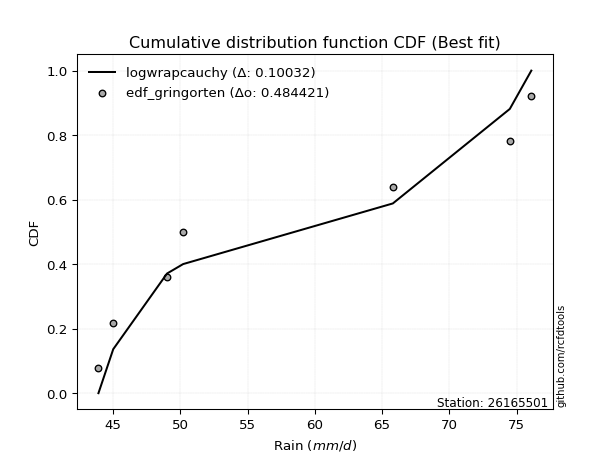</img>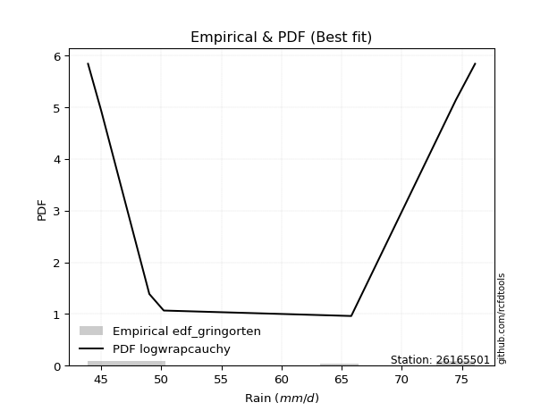</img>

</div>


### 9. EDF Filliben (1975)

The specific values of the constants (0.3175) (often denoted as $alpha$) and (0.365) are derived from a method proposed by James J. Filliben in a 1975 paper. This particular formula is the mean value of the $i$-th order statistic of the normal distribution and is considered a robust and effective plotting position formula for the normal probability plot correlation coefficient test for normality.

<div align="center">


$P=(m-0.3175)/(n+0.365)$


</div>


**9.1. Empirical values**

<div align="center">

|                | 0                   | 1                   | 2                   | 3            | 4                  | 5                  | 6                  |
|:---------------|:--------------------|:--------------------|:--------------------|:-------------|:-------------------|:-------------------|:-------------------|
| date           | 2018                | 2022                | 2023                | 2017         | 2021               | 2019               | 2020               |
| x              | 43.9                | 45.0                | 49.0                | 50.2         | 65.8               | 74.5               | 76.1               |
| m              | 1                   | 2                   | 3                   | 4            | 5                  | 6                  | 7                  |
| empirical_dist | edf_filliben        | edf_filliben        | edf_filliben        | edf_filliben | edf_filliben       | edf_filliben       | edf_filliben       |
| empirical      | 0.09266802443991853 | 0.22844534962661237 | 0.36422267481330617 | 0.5          | 0.6357773251866938 | 0.7715546503733877 | 0.9073319755600815 |
| empirical_tr   | 1.1021324354657687  | 1.2960844698636163  | 1.5728777362520021  | 2.0          | 2.7455731593662627 | 4.377414561664191  | 10.791208791208794 |

</div>


**9.2. Kolmogorov-Smirnov fit test (sorted by Δ)**


<div align="center">

|                | 0                   | 1                   | 2                   | 3                   | 4                   | 5                   | 6                   | 7                   | 8                   | 9                   | 10                  | 11                  | 12                  | 13                  | 14                  | 15                  | 16                  | 17                  | 18                  | 19                  | 20                  | 21                  | 22                  | 23                  | 24                  | 25                  | 26                  | 27                  | 28                  | 29                  | 30                  | 31                  | 32                  | 33                  | 34                  | 35                  | 36                  | 37                  | 38                  | 39                  | 40                  | 41                  | 42                  | 43                  | 44                  | 45                  | 46                  | 47                  | 48                  | 49                  | 50                  | 51                  | 52                  | 53                  | 54                  | 55                  | 56                  | 57                  | 58                  | 59                  | 60                  | 61                  | 62                  | 63                  | 64                  | 65                  | 66                  | 67                  | 68                  | 69                  | 70                  | 71                  | 72                  | 73                  | 74                  | 75                  | 76                  | 77                  | 78                  | 79                  | 80                  | 81                  | 82                  | 83                  | 84                  | 85                  | 86                  | 87                  | 88                  | 89                  | 90                  | 91                  | 92                  | 93                  | 94                  | 95                  | 96                  | 97                  | 98                  | 99                  | 100                 | 101                 | 102                 | 103                 | 104                 | 105                 | 106                 | 107                 | 108                 | 109                 | 110                 | 111                 | 112                 | 113                 | 114                 | 115                 | 116                 | 117                 | 118                 | 119                 | 120                 | 121                 | 122                 | 123                 | 124                 | 125                 | 126                 | 127                 | 128                 | 129                 | 130                 | 131                 | 132                 | 133                 | 134                 | 135                 | 136                 | 137                 | 138                 | 139                 | 140                 | 141                 | 142                 | 143                 | 144                 | 145                 | 146                 | 147                 | 148                 | 149                 | 150                 | 151                 | 152                 | 153                 | 154                 | 155                 | 156                 | 157                 | 158                 | 159                 |
|:---------------|:--------------------|:--------------------|:--------------------|:--------------------|:--------------------|:--------------------|:--------------------|:--------------------|:--------------------|:--------------------|:--------------------|:--------------------|:--------------------|:--------------------|:--------------------|:--------------------|:--------------------|:--------------------|:--------------------|:--------------------|:--------------------|:--------------------|:--------------------|:--------------------|:--------------------|:--------------------|:--------------------|:--------------------|:--------------------|:--------------------|:--------------------|:--------------------|:--------------------|:--------------------|:--------------------|:--------------------|:--------------------|:--------------------|:--------------------|:--------------------|:--------------------|:--------------------|:--------------------|:--------------------|:--------------------|:--------------------|:--------------------|:--------------------|:--------------------|:--------------------|:--------------------|:--------------------|:--------------------|:--------------------|:--------------------|:--------------------|:--------------------|:--------------------|:--------------------|:--------------------|:--------------------|:--------------------|:--------------------|:--------------------|:--------------------|:--------------------|:--------------------|:--------------------|:--------------------|:--------------------|:--------------------|:--------------------|:--------------------|:--------------------|:--------------------|:--------------------|:--------------------|:--------------------|:--------------------|:--------------------|:--------------------|:--------------------|:--------------------|:--------------------|:--------------------|:--------------------|:--------------------|:--------------------|:--------------------|:--------------------|:--------------------|:--------------------|:--------------------|:--------------------|:--------------------|:--------------------|:--------------------|:--------------------|:--------------------|:--------------------|:--------------------|:--------------------|:--------------------|:--------------------|:--------------------|:--------------------|:--------------------|:--------------------|:--------------------|:--------------------|:--------------------|:--------------------|:--------------------|:--------------------|:--------------------|:--------------------|:--------------------|:--------------------|:--------------------|:--------------------|:--------------------|:--------------------|:--------------------|:--------------------|:--------------------|:--------------------|:--------------------|:--------------------|:--------------------|:--------------------|:--------------------|:--------------------|:--------------------|:--------------------|:--------------------|:--------------------|:--------------------|:--------------------|:--------------------|:--------------------|:--------------------|:--------------------|:--------------------|:--------------------|:--------------------|:--------------------|:--------------------|:--------------------|:--------------------|:--------------------|:--------------------|:--------------------|:--------------------|:--------------------|:--------------------|:--------------------|:--------------------|:--------------------|:--------------------|:--------------------|
| station        | 26165501            | 26165501            | 26165501            | 26165501            | 26165501            | 26165501            | 26165501            | 26165501            | 26165501            | 26165501            | 26165501            | 26165501            | 26165501            | 26165501            | 26165501            | 26165501            | 26165501            | 26165501            | 26165501            | 26165501            | 26165501            | 26165501            | 26165501            | 26165501            | 26165501            | 26165501            | 26165501            | 26165501            | 26165501            | 26165501            | 26165501            | 26165501            | 26165501            | 26165501            | 26165501            | 26165501            | 26165501            | 26165501            | 26165501            | 26165501            | 26165501            | 26165501            | 26165501            | 26165501            | 26165501            | 26165501            | 26165501            | 26165501            | 26165501            | 26165501            | 26165501            | 26165501            | 26165501            | 26165501            | 26165501            | 26165501            | 26165501            | 26165501            | 26165501            | 26165501            | 26165501            | 26165501            | 26165501            | 26165501            | 26165501            | 26165501            | 26165501            | 26165501            | 26165501            | 26165501            | 26165501            | 26165501            | 26165501            | 26165501            | 26165501            | 26165501            | 26165501            | 26165501            | 26165501            | 26165501            | 26165501            | 26165501            | 26165501            | 26165501            | 26165501            | 26165501            | 26165501            | 26165501            | 26165501            | 26165501            | 26165501            | 26165501            | 26165501            | 26165501            | 26165501            | 26165501            | 26165501            | 26165501            | 26165501            | 26165501            | 26165501            | 26165501            | 26165501            | 26165501            | 26165501            | 26165501            | 26165501            | 26165501            | 26165501            | 26165501            | 26165501            | 26165501            | 26165501            | 26165501            | 26165501            | 26165501            | 26165501            | 26165501            | 26165501            | 26165501            | 26165501            | 26165501            | 26165501            | 26165501            | 26165501            | 26165501            | 26165501            | 26165501            | 26165501            | 26165501            | 26165501            | 26165501            | 26165501            | 26165501            | 26165501            | 26165501            | 26165501            | 26165501            | 26165501            | 26165501            | 26165501            | 26165501            | 26165501            | 26165501            | 26165501            | 26165501            | 26165501            | 26165501            | 26165501            | 26165501            | 26165501            | 26165501            | 26165501            | 26165501            | 26165501            | 26165501            | 26165501            | 26165501            | 26165501            | 26165501            |
| empirical_dist | edf_filliben        | edf_filliben        | edf_filliben        | edf_filliben        | edf_filliben        | edf_filliben        | edf_filliben        | edf_filliben        | edf_filliben        | edf_filliben        | edf_filliben        | edf_filliben        | edf_filliben        | edf_filliben        | edf_filliben        | edf_filliben        | edf_filliben        | edf_filliben        | edf_filliben        | edf_filliben        | edf_filliben        | edf_filliben        | edf_filliben        | edf_filliben        | edf_filliben        | edf_filliben        | edf_filliben        | edf_filliben        | edf_filliben        | edf_filliben        | edf_filliben        | edf_filliben        | edf_filliben        | edf_filliben        | edf_filliben        | edf_filliben        | edf_filliben        | edf_filliben        | edf_filliben        | edf_filliben        | edf_filliben        | edf_filliben        | edf_filliben        | edf_filliben        | edf_filliben        | edf_filliben        | edf_filliben        | edf_filliben        | edf_filliben        | edf_filliben        | edf_filliben        | edf_filliben        | edf_filliben        | edf_filliben        | edf_filliben        | edf_filliben        | edf_filliben        | edf_filliben        | edf_filliben        | edf_filliben        | edf_filliben        | edf_filliben        | edf_filliben        | edf_filliben        | edf_filliben        | edf_filliben        | edf_filliben        | edf_filliben        | edf_filliben        | edf_filliben        | edf_filliben        | edf_filliben        | edf_filliben        | edf_filliben        | edf_filliben        | edf_filliben        | edf_filliben        | edf_filliben        | edf_filliben        | edf_filliben        | edf_filliben        | edf_filliben        | edf_filliben        | edf_filliben        | edf_filliben        | edf_filliben        | edf_filliben        | edf_filliben        | edf_filliben        | edf_filliben        | edf_filliben        | edf_filliben        | edf_filliben        | edf_filliben        | edf_filliben        | edf_filliben        | edf_filliben        | edf_filliben        | edf_filliben        | edf_filliben        | edf_filliben        | edf_filliben        | edf_filliben        | edf_filliben        | edf_filliben        | edf_filliben        | edf_filliben        | edf_filliben        | edf_filliben        | edf_filliben        | edf_filliben        | edf_filliben        | edf_filliben        | edf_filliben        | edf_filliben        | edf_filliben        | edf_filliben        | edf_filliben        | edf_filliben        | edf_filliben        | edf_filliben        | edf_filliben        | edf_filliben        | edf_filliben        | edf_filliben        | edf_filliben        | edf_filliben        | edf_filliben        | edf_filliben        | edf_filliben        | edf_filliben        | edf_filliben        | edf_filliben        | edf_filliben        | edf_filliben        | edf_filliben        | edf_filliben        | edf_filliben        | edf_filliben        | edf_filliben        | edf_filliben        | edf_filliben        | edf_filliben        | edf_filliben        | edf_filliben        | edf_filliben        | edf_filliben        | edf_filliben        | edf_filliben        | edf_filliben        | edf_filliben        | edf_filliben        | edf_filliben        | edf_filliben        | edf_filliben        | edf_filliben        | edf_filliben        | edf_filliben        | edf_filliben        | edf_filliben        |
| p_dist         | f                   | logweibull_min      | logdgamma           | logdweibull         | logwrapcauchy       | exponpow            | logarcsine          | dweibull            | logf                | dgamma              | wrapcauchy          | arcsine             | nakagami            | loghalfnorm         | logfoldnorm         | invweibull          | genextreme          | logksone            | halfgennorm         | alpha               | loggompertz         | halfnorm            | lognct              | lomax               | genexpon            | exponnorm           | loggenexpon         | logkstwobign        | logmielke           | burr                | loggenlogistic      | lograyleigh         | loggenextreme       | loginvweibull       | halflogistic        | burr12              | logburr             | loglomax            | logexponweib        | invgamma            | loghalflogistic     | logsemicircular     | logncf              | loggumbel_r         | ksone               | gompertz            | logmoyal            | logmaxwell          | loganglit           | logalpha            | gausshyper          | logbetaprime        | erlang              | loghalfgennorm      | loginvgauss         | invgauss            | genlogistic         | semicircular        | logrdist            | rayleigh            | loggengamma         | nct                 | logskewnorm         | loglevy_l           | logpearson3         | moyal               | foldnorm            | kstwobign           | anglit              | logexponpow         | betaprime           | maxwell             | gumbel_r            | loginvgamma         | logweibull_max      | ncf                 | logbradford         | logfatiguelife      | logexponnorm        | logloggamma         | logcrystalball      | logt                | lognorm             | levy_l              | logrice             | logtruncexpon       | logtrapezoid        | pearson3            | logtruncnorm        | logburr12           | logcosine           | logtruncweibull_min | genpareto           | t                   | crystalball         | norm                | johnsonsu           | loglogistic         | logwald             | wald                | logbeta             | rice                | bradford            | truncexpon          | loghypsecant        | logerlang           | truncweibull_min    | skewnorm            | kappa4              | logloglaplace       | loggennorm          | logistic            | cosine              | logkappa4           | lognakagami         | logtukeylambda      | loggumbel_l         | logvonmises_line    | loguniform          | gennorm             | loggamma            | loggamma            | logargus            | hypsecant           | logkappa3           | loglaplace          | loglaplace          | gumbel_l            | truncnorm           | logtriang           | gamma               | argus               | laplace             | loggausshyper       | loggenpareto        | triang              | tukeylambda         | uniform             | vonmises_line       | kappa3              | weibull_min         | beta                | loggenhalflogistic  | genhalflogistic     | powerlaw            | fatiguelife         | logpowerlaw         | exponweib           | johnsonsb           | truncpareto         | gengamma            | rdist               | logtruncpareto      | trapezoid           | logjohnsonsu        | weibull_max         | logjohnsonsb        | logvonmises         | vonmises            | mielke              |
| delta          | 0.09919310412153304 | 0.10258592315126047 | 0.10472957002510297 | 0.10797059562090547 | 0.10966411973980772 | 0.11001278088013988 | 0.12202989997523683 | 0.12226608574204689 | 0.1284890720663565  | 0.13181242381653713 | 0.13227753129182407 | 0.1361797571344519  | 0.13715569287813845 | 0.14223506805756447 | 0.1427200775173585  | 0.15177360177257404 | 0.1517753926775408  | 0.15270377163189242 | 0.15533077782713944 | 0.1557990426265382  | 0.15602490943167402 | 0.1569049463804577  | 0.1570209658479586  | 0.1575630224650545  | 0.15837448369315898 | 0.16040502907174325 | 0.16121671053346476 | 0.1613698185245953  | 0.16153269184227892 | 0.16200780954798755 | 0.1622740601871534  | 0.16291658235256662 | 0.16327710202973178 | 0.1632785090578608  | 0.16361659851846955 | 0.16380918966312552 | 0.16436758189584288 | 0.16452782804572208 | 0.16579895154083102 | 0.1659482427660104  | 0.1661136159102936  | 0.1663956906754085  | 0.16915793567393067 | 0.16929560150827533 | 0.16937786117702092 | 0.17220764541390216 | 0.1723385096892348  | 0.17388592843557027 | 0.1769077384535495  | 0.17802056052345339 | 0.17832069081735524 | 0.1783428616743147  | 0.1790649278139208  | 0.18016780461743132 | 0.1803222904935774  | 0.1837948421423412  | 0.1839906485790455  | 0.18405107262039083 | 0.18532040048373388 | 0.18556684618254127 | 0.18579248417789118 | 0.18691436219041596 | 0.1872809181956101  | 0.18791344094634654 | 0.1899837551426546  | 0.19068599637281558 | 0.19197212556634347 | 0.19408475876189252 | 0.19523241773348682 | 0.19528276913042908 | 0.19545910799902633 | 0.19583140031931895 | 0.19626995162405808 | 0.19658833919723084 | 0.19980996881405655 | 0.19992249023697883 | 0.2007073253775301  | 0.20113713280114576 | 0.2012509662716443  | 0.20154915415641322 | 0.20158715322627185 | 0.20159002341268417 | 0.20159081733038664 | 0.20184287216652638 | 0.2025743082556422  | 0.20495264438762506 | 0.20625273755143042 | 0.20821874705063498 | 0.21371805749874973 | 0.21999380235576071 | 0.22005567043852503 | 0.22006745126869987 | 0.2208535618520653  | 0.22120510224326007 | 0.2213115335293957  | 0.22131154338567371 | 0.2215594110260991  | 0.22301489556884596 | 0.22844534962661237 | 0.22844534962661237 | 0.23126526500260625 | 0.2334497049612046  | 0.23505817993111455 | 0.2352814863867147  | 0.23844194022703685 | 0.23853521212945283 | 0.2391933686081057  | 0.23986389570010092 | 0.2405952899141781  | 0.24139228523555978 | 0.24336341860959187 | 0.2434985482192244  | 0.243955170785714   | 0.2467516381904163  | 0.24850509414422328 | 0.25016976280763714 | 0.2520988034720523  | 0.25526775837484783 | 0.25623989777871814 | 0.25702853846481577 | 0.257057730743925   | 0.257057730743925   | 0.2575836115923196  | 0.25893684092855695 | 0.25991628273215467 | 0.2633658082891202  | 0.2633658082891202  | 0.2675546542052222  | 0.27210029580603917 | 0.27796073973591334 | 0.2783808632379904  | 0.28084632668129794 | 0.28192709549712336 | 0.2824094170372805  | 0.28992233420451274 | 0.29749745302023456 | 0.2978615659743369  | 0.3043478260869564  | 0.30601453350203867 | 0.31632763660212293 | 0.32329045930119127 | 0.32898521809868947 | 0.3517750685482456  | 0.3732256342301376  | 0.37834220182038303 | 0.3855646925474764  | 0.3965023302383336  | 0.40218767358026986 | 0.4084185721659658  | 0.40901933017715264 | 0.4143682924486126  | 0.4276709681070444  | 0.4341166729143485  | 0.43929846670867456 | 0.4466948370360819  | 0.5093720922650449  | 0.6132840528411486  | 1.1262292613632412  | 11.836840914942274  | nan                 |
| deltao         | 0.48442053926100004 | 0.48442053926100004 | 0.48442053926100004 | 0.48442053926100004 | 0.48442053926100004 | 0.48442053926100004 | 0.48442053926100004 | 0.48442053926100004 | 0.48442053926100004 | 0.48442053926100004 | 0.48442053926100004 | 0.48442053926100004 | 0.48442053926100004 | 0.48442053926100004 | 0.48442053926100004 | 0.48442053926100004 | 0.48442053926100004 | 0.48442053926100004 | 0.48442053926100004 | 0.48442053926100004 | 0.48442053926100004 | 0.48442053926100004 | 0.48442053926100004 | 0.48442053926100004 | 0.48442053926100004 | 0.48442053926100004 | 0.48442053926100004 | 0.48442053926100004 | 0.48442053926100004 | 0.48442053926100004 | 0.48442053926100004 | 0.48442053926100004 | 0.48442053926100004 | 0.48442053926100004 | 0.48442053926100004 | 0.48442053926100004 | 0.48442053926100004 | 0.48442053926100004 | 0.48442053926100004 | 0.48442053926100004 | 0.48442053926100004 | 0.48442053926100004 | 0.48442053926100004 | 0.48442053926100004 | 0.48442053926100004 | 0.48442053926100004 | 0.48442053926100004 | 0.48442053926100004 | 0.48442053926100004 | 0.48442053926100004 | 0.48442053926100004 | 0.48442053926100004 | 0.48442053926100004 | 0.48442053926100004 | 0.48442053926100004 | 0.48442053926100004 | 0.48442053926100004 | 0.48442053926100004 | 0.48442053926100004 | 0.48442053926100004 | 0.48442053926100004 | 0.48442053926100004 | 0.48442053926100004 | 0.48442053926100004 | 0.48442053926100004 | 0.48442053926100004 | 0.48442053926100004 | 0.48442053926100004 | 0.48442053926100004 | 0.48442053926100004 | 0.48442053926100004 | 0.48442053926100004 | 0.48442053926100004 | 0.48442053926100004 | 0.48442053926100004 | 0.48442053926100004 | 0.48442053926100004 | 0.48442053926100004 | 0.48442053926100004 | 0.48442053926100004 | 0.48442053926100004 | 0.48442053926100004 | 0.48442053926100004 | 0.48442053926100004 | 0.48442053926100004 | 0.48442053926100004 | 0.48442053926100004 | 0.48442053926100004 | 0.48442053926100004 | 0.48442053926100004 | 0.48442053926100004 | 0.48442053926100004 | 0.48442053926100004 | 0.48442053926100004 | 0.48442053926100004 | 0.48442053926100004 | 0.48442053926100004 | 0.48442053926100004 | 0.48442053926100004 | 0.48442053926100004 | 0.48442053926100004 | 0.48442053926100004 | 0.48442053926100004 | 0.48442053926100004 | 0.48442053926100004 | 0.48442053926100004 | 0.48442053926100004 | 0.48442053926100004 | 0.48442053926100004 | 0.48442053926100004 | 0.48442053926100004 | 0.48442053926100004 | 0.48442053926100004 | 0.48442053926100004 | 0.48442053926100004 | 0.48442053926100004 | 0.48442053926100004 | 0.48442053926100004 | 0.48442053926100004 | 0.48442053926100004 | 0.48442053926100004 | 0.48442053926100004 | 0.48442053926100004 | 0.48442053926100004 | 0.48442053926100004 | 0.48442053926100004 | 0.48442053926100004 | 0.48442053926100004 | 0.48442053926100004 | 0.48442053926100004 | 0.48442053926100004 | 0.48442053926100004 | 0.48442053926100004 | 0.48442053926100004 | 0.48442053926100004 | 0.48442053926100004 | 0.48442053926100004 | 0.48442053926100004 | 0.48442053926100004 | 0.48442053926100004 | 0.48442053926100004 | 0.48442053926100004 | 0.48442053926100004 | 0.48442053926100004 | 0.48442053926100004 | 0.48442053926100004 | 0.48442053926100004 | 0.48442053926100004 | 0.48442053926100004 | 0.48442053926100004 | 0.48442053926100004 | 0.48442053926100004 | 0.48442053926100004 | 0.48442053926100004 | 0.48442053926100004 | 0.48442053926100004 | 0.48442053926100004 | 0.48442053926100004 | 0.48442053926100004 | 0.48442053926100004 |
| eval           | Δo > Δ              | Δo > Δ              | Δo > Δ              | Δo > Δ              | Δo > Δ              | Δo > Δ              | Δo > Δ              | Δo > Δ              | Δo > Δ              | Δo > Δ              | Δo > Δ              | Δo > Δ              | Δo > Δ              | Δo > Δ              | Δo > Δ              | Δo > Δ              | Δo > Δ              | Δo > Δ              | Δo > Δ              | Δo > Δ              | Δo > Δ              | Δo > Δ              | Δo > Δ              | Δo > Δ              | Δo > Δ              | Δo > Δ              | Δo > Δ              | Δo > Δ              | Δo > Δ              | Δo > Δ              | Δo > Δ              | Δo > Δ              | Δo > Δ              | Δo > Δ              | Δo > Δ              | Δo > Δ              | Δo > Δ              | Δo > Δ              | Δo > Δ              | Δo > Δ              | Δo > Δ              | Δo > Δ              | Δo > Δ              | Δo > Δ              | Δo > Δ              | Δo > Δ              | Δo > Δ              | Δo > Δ              | Δo > Δ              | Δo > Δ              | Δo > Δ              | Δo > Δ              | Δo > Δ              | Δo > Δ              | Δo > Δ              | Δo > Δ              | Δo > Δ              | Δo > Δ              | Δo > Δ              | Δo > Δ              | Δo > Δ              | Δo > Δ              | Δo > Δ              | Δo > Δ              | Δo > Δ              | Δo > Δ              | Δo > Δ              | Δo > Δ              | Δo > Δ              | Δo > Δ              | Δo > Δ              | Δo > Δ              | Δo > Δ              | Δo > Δ              | Δo > Δ              | Δo > Δ              | Δo > Δ              | Δo > Δ              | Δo > Δ              | Δo > Δ              | Δo > Δ              | Δo > Δ              | Δo > Δ              | Δo > Δ              | Δo > Δ              | Δo > Δ              | Δo > Δ              | Δo > Δ              | Δo > Δ              | Δo > Δ              | Δo > Δ              | Δo > Δ              | Δo > Δ              | Δo > Δ              | Δo > Δ              | Δo > Δ              | Δo > Δ              | Δo > Δ              | Δo > Δ              | Δo > Δ              | Δo > Δ              | Δo > Δ              | Δo > Δ              | Δo > Δ              | Δo > Δ              | Δo > Δ              | Δo > Δ              | Δo > Δ              | Δo > Δ              | Δo > Δ              | Δo > Δ              | Δo > Δ              | Δo > Δ              | Δo > Δ              | Δo > Δ              | Δo > Δ              | Δo > Δ              | Δo > Δ              | Δo > Δ              | Δo > Δ              | Δo > Δ              | Δo > Δ              | Δo > Δ              | Δo > Δ              | Δo > Δ              | Δo > Δ              | Δo > Δ              | Δo > Δ              | Δo > Δ              | Δo > Δ              | Δo > Δ              | Δo > Δ              | Δo > Δ              | Δo > Δ              | Δo > Δ              | Δo > Δ              | Δo > Δ              | Δo > Δ              | Δo > Δ              | Δo > Δ              | Δo > Δ              | Δo > Δ              | Δo > Δ              | Δo > Δ              | Δo > Δ              | Δo > Δ              | Δo > Δ              | Δo > Δ              | Δo > Δ              | Δo > Δ              | Δo > Δ              | Δo > Δ              | Δo > Δ              | Δo > Δ              | Δo > Δ              | Δo <= Δ             | Δo <= Δ             | Δo <= Δ             | Δo <= Δ             | Δo <= Δ             |
| fit            | 1                   | 1                   | 1                   | 1                   | 1                   | 1                   | 1                   | 1                   | 1                   | 1                   | 1                   | 1                   | 1                   | 1                   | 1                   | 1                   | 1                   | 1                   | 1                   | 1                   | 1                   | 1                   | 1                   | 1                   | 1                   | 1                   | 1                   | 1                   | 1                   | 1                   | 1                   | 1                   | 1                   | 1                   | 1                   | 1                   | 1                   | 1                   | 1                   | 1                   | 1                   | 1                   | 1                   | 1                   | 1                   | 1                   | 1                   | 1                   | 1                   | 1                   | 1                   | 1                   | 1                   | 1                   | 1                   | 1                   | 1                   | 1                   | 1                   | 1                   | 1                   | 1                   | 1                   | 1                   | 1                   | 1                   | 1                   | 1                   | 1                   | 1                   | 1                   | 1                   | 1                   | 1                   | 1                   | 1                   | 1                   | 1                   | 1                   | 1                   | 1                   | 1                   | 1                   | 1                   | 1                   | 1                   | 1                   | 1                   | 1                   | 1                   | 1                   | 1                   | 1                   | 1                   | 1                   | 1                   | 1                   | 1                   | 1                   | 1                   | 1                   | 1                   | 1                   | 1                   | 1                   | 1                   | 1                   | 1                   | 1                   | 1                   | 1                   | 1                   | 1                   | 1                   | 1                   | 1                   | 1                   | 1                   | 1                   | 1                   | 1                   | 1                   | 1                   | 1                   | 1                   | 1                   | 1                   | 1                   | 1                   | 1                   | 1                   | 1                   | 1                   | 1                   | 1                   | 1                   | 1                   | 1                   | 1                   | 1                   | 1                   | 1                   | 1                   | 1                   | 1                   | 1                   | 1                   | 1                   | 1                   | 1                   | 1                   | 1                   | 1                   | 1                   | 1                   | 0                   | 0                   | 0                   | 0                   | 0                   |
| n              | 7                   | 7                   | 7                   | 7                   | 7                   | 7                   | 7                   | 7                   | 7                   | 7                   | 7                   | 7                   | 7                   | 7                   | 7                   | 7                   | 7                   | 7                   | 7                   | 7                   | 7                   | 7                   | 7                   | 7                   | 7                   | 7                   | 7                   | 7                   | 7                   | 7                   | 7                   | 7                   | 7                   | 7                   | 7                   | 7                   | 7                   | 7                   | 7                   | 7                   | 7                   | 7                   | 7                   | 7                   | 7                   | 7                   | 7                   | 7                   | 7                   | 7                   | 7                   | 7                   | 7                   | 7                   | 7                   | 7                   | 7                   | 7                   | 7                   | 7                   | 7                   | 7                   | 7                   | 7                   | 7                   | 7                   | 7                   | 7                   | 7                   | 7                   | 7                   | 7                   | 7                   | 7                   | 7                   | 7                   | 7                   | 7                   | 7                   | 7                   | 7                   | 7                   | 7                   | 7                   | 7                   | 7                   | 7                   | 7                   | 7                   | 7                   | 7                   | 7                   | 7                   | 7                   | 7                   | 7                   | 7                   | 7                   | 7                   | 7                   | 7                   | 7                   | 7                   | 7                   | 7                   | 7                   | 7                   | 7                   | 7                   | 7                   | 7                   | 7                   | 7                   | 7                   | 7                   | 7                   | 7                   | 7                   | 7                   | 7                   | 7                   | 7                   | 7                   | 7                   | 7                   | 7                   | 7                   | 7                   | 7                   | 7                   | 7                   | 7                   | 7                   | 7                   | 7                   | 7                   | 7                   | 7                   | 7                   | 7                   | 7                   | 7                   | 7                   | 7                   | 7                   | 7                   | 7                   | 7                   | 7                   | 7                   | 7                   | 7                   | 7                   | 7                   | 7                   | 7                   | 7                   | 7                   | 7                   | 7                   |
| best_fit       | 1                   | 0                   | 0                   | 0                   | 0                   | 0                   | 0                   | 0                   | 0                   | 0                   | 0                   | 0                   | 0                   | 0                   | 0                   | 0                   | 0                   | 0                   | 0                   | 0                   | 0                   | 0                   | 0                   | 0                   | 0                   | 0                   | 0                   | 0                   | 0                   | 0                   | 0                   | 0                   | 0                   | 0                   | 0                   | 0                   | 0                   | 0                   | 0                   | 0                   | 0                   | 0                   | 0                   | 0                   | 0                   | 0                   | 0                   | 0                   | 0                   | 0                   | 0                   | 0                   | 0                   | 0                   | 0                   | 0                   | 0                   | 0                   | 0                   | 0                   | 0                   | 0                   | 0                   | 0                   | 0                   | 0                   | 0                   | 0                   | 0                   | 0                   | 0                   | 0                   | 0                   | 0                   | 0                   | 0                   | 0                   | 0                   | 0                   | 0                   | 0                   | 0                   | 0                   | 0                   | 0                   | 0                   | 0                   | 0                   | 0                   | 0                   | 0                   | 0                   | 0                   | 0                   | 0                   | 0                   | 0                   | 0                   | 0                   | 0                   | 0                   | 0                   | 0                   | 0                   | 0                   | 0                   | 0                   | 0                   | 0                   | 0                   | 0                   | 0                   | 0                   | 0                   | 0                   | 0                   | 0                   | 0                   | 0                   | 0                   | 0                   | 0                   | 0                   | 0                   | 0                   | 0                   | 0                   | 0                   | 0                   | 0                   | 0                   | 0                   | 0                   | 0                   | 0                   | 0                   | 0                   | 0                   | 0                   | 0                   | 0                   | 0                   | 0                   | 0                   | 0                   | 0                   | 0                   | 0                   | 0                   | 0                   | 0                   | 0                   | 0                   | 0                   | 0                   | 0                   | 0                   | 0                   | 0                   | 0                   |
| best_fit_sort  | 1                   | 2                   | 3                   | 4                   | 5                   | 6                   | 7                   | 8                   | 9                   | 10                  | 11                  | 12                  | 13                  | 14                  | 15                  | 16                  | 17                  | 18                  | 19                  | 20                  | 21                  | 22                  | 23                  | 24                  | 25                  | 26                  | 27                  | 28                  | 29                  | 30                  | 31                  | 32                  | 33                  | 34                  | 35                  | 36                  | 37                  | 38                  | 39                  | 40                  | 41                  | 42                  | 43                  | 44                  | 45                  | 46                  | 47                  | 48                  | 49                  | 50                  | 51                  | 52                  | 53                  | 54                  | 55                  | 56                  | 57                  | 58                  | 59                  | 60                  | 61                  | 62                  | 63                  | 64                  | 65                  | 66                  | 67                  | 68                  | 69                  | 70                  | 71                  | 72                  | 73                  | 74                  | 75                  | 76                  | 77                  | 78                  | 79                  | 80                  | 81                  | 82                  | 83                  | 84                  | 85                  | 86                  | 87                  | 88                  | 89                  | 90                  | 91                  | 92                  | 93                  | 94                  | 95                  | 96                  | 97                  | 98                  | 99                  | 100                 | 101                 | 102                 | 103                 | 104                 | 105                 | 106                 | 107                 | 108                 | 109                 | 110                 | 111                 | 112                 | 113                 | 114                 | 115                 | 116                 | 117                 | 118                 | 119                 | 120                 | 121                 | 122                 | 123                 | 124                 | 125                 | 126                 | 127                 | 128                 | 129                 | 130                 | 131                 | 132                 | 133                 | 134                 | 135                 | 136                 | 137                 | 138                 | 139                 | 140                 | 141                 | 142                 | 143                 | 144                 | 145                 | 146                 | 147                 | 148                 | 149                 | 150                 | 151                 | 152                 | 153                 | 154                 | 155                 | 156                 | 157                 | 158                 | 159                 | 160                 |

</div>


**9.3. Best fit**

<div align="center">

|   id |   station | empirical_dist   | p_dist   |     delta |   deltao | eval   |   fit |   n |   best_fit |   best_fit_sort |
|-----:|----------:|:-----------------|:---------|----------:|---------:|:-------|------:|----:|-----------:|----------------:|
|    0 |  26165501 | edf_filliben     | f        | 0.0991931 | 0.484421 | Δo > Δ |     1 |   7 |          1 |               1 |

</div>


<div align="center">

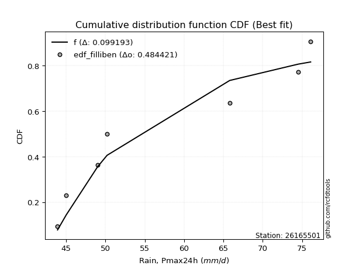</img></img>

</div>


### 10. EDF Jenkinson (1977)

The Jenkinson formula in hydrology is an empirical plotting position formula used to estimate the non-exceedance probability _(P)_ or return period _(T)_ of a given ordered observation within a sample. It is a widely used method in the frequency analysis of extreme events such as floods and rainfall, as it provides a distribution-free way to plot data. _a≈0.31_ and _b≈0.38_ are constants derived to approximate the median of the probability distribution for the given rank.

<div align="center">


$P=(m-a)/(n+b)$


</div>


**10.1. Empirical values**

<div align="center">

|                | 0                   | 1                   | 2                   | 3             | 4                  | 5                  | 6                  |
|:---------------|:--------------------|:--------------------|:--------------------|:--------------|:-------------------|:-------------------|:-------------------|
| date           | 2018                | 2022                | 2023                | 2017          | 2021               | 2019               | 2020               |
| x              | 43.9                | 45.0                | 49.0                | 50.2          | 65.8               | 74.5               | 76.1               |
| m              | 1                   | 2                   | 3                   | 4             | 5                  | 6                  | 7                  |
| empirical_dist | edf_jenkinson       | edf_jenkinson       | edf_jenkinson       | edf_jenkinson | edf_jenkinson      | edf_jenkinson      | edf_jenkinson      |
| empirical      | 0.09349593495934959 | 0.22899728997289973 | 0.36449864498644985 | 0.5           | 0.6355013550135502 | 0.7710027100271003 | 0.9065040650406505 |
| empirical_tr   | 1.1031390134529149  | 1.29701230228471    | 1.5735607675906182  | 2.0           | 2.743494423791822  | 4.366863905325444  | 10.695652173913055 |

</div>


**10.2. Kolmogorov-Smirnov fit test (sorted by Δ)**


<div align="center">

|                | 0                   | 1                   | 2                   | 3                   | 4                   | 5                   | 6                   | 7                   | 8                   | 9                   | 10                  | 11                  | 12                  | 13                  | 14                  | 15                  | 16                  | 17                  | 18                  | 19                  | 20                  | 21                  | 22                  | 23                  | 24                  | 25                  | 26                  | 27                  | 28                  | 29                  | 30                  | 31                  | 32                  | 33                  | 34                  | 35                  | 36                  | 37                  | 38                  | 39                  | 40                  | 41                  | 42                  | 43                  | 44                  | 45                  | 46                  | 47                  | 48                  | 49                  | 50                  | 51                  | 52                  | 53                  | 54                  | 55                  | 56                  | 57                  | 58                  | 59                  | 60                  | 61                  | 62                  | 63                  | 64                  | 65                  | 66                  | 67                  | 68                  | 69                  | 70                  | 71                  | 72                  | 73                  | 74                  | 75                  | 76                  | 77                  | 78                  | 79                  | 80                  | 81                  | 82                  | 83                  | 84                  | 85                  | 86                  | 87                  | 88                  | 89                  | 90                  | 91                  | 92                  | 93                  | 94                  | 95                  | 96                  | 97                  | 98                  | 99                  | 100                 | 101                 | 102                 | 103                 | 104                 | 105                 | 106                 | 107                 | 108                 | 109                 | 110                 | 111                 | 112                 | 113                 | 114                 | 115                 | 116                 | 117                 | 118                 | 119                 | 120                 | 121                 | 122                 | 123                 | 124                 | 125                 | 126                 | 127                 | 128                 | 129                 | 130                 | 131                 | 132                 | 133                 | 134                 | 135                 | 136                 | 137                 | 138                 | 139                 | 140                 | 141                 | 142                 | 143                 | 144                 | 145                 | 146                 | 147                 | 148                 | 149                 | 150                 | 151                 | 152                 | 153                 | 154                 | 155                 | 156                 | 157                 | 158                 | 159                 |
|:---------------|:--------------------|:--------------------|:--------------------|:--------------------|:--------------------|:--------------------|:--------------------|:--------------------|:--------------------|:--------------------|:--------------------|:--------------------|:--------------------|:--------------------|:--------------------|:--------------------|:--------------------|:--------------------|:--------------------|:--------------------|:--------------------|:--------------------|:--------------------|:--------------------|:--------------------|:--------------------|:--------------------|:--------------------|:--------------------|:--------------------|:--------------------|:--------------------|:--------------------|:--------------------|:--------------------|:--------------------|:--------------------|:--------------------|:--------------------|:--------------------|:--------------------|:--------------------|:--------------------|:--------------------|:--------------------|:--------------------|:--------------------|:--------------------|:--------------------|:--------------------|:--------------------|:--------------------|:--------------------|:--------------------|:--------------------|:--------------------|:--------------------|:--------------------|:--------------------|:--------------------|:--------------------|:--------------------|:--------------------|:--------------------|:--------------------|:--------------------|:--------------------|:--------------------|:--------------------|:--------------------|:--------------------|:--------------------|:--------------------|:--------------------|:--------------------|:--------------------|:--------------------|:--------------------|:--------------------|:--------------------|:--------------------|:--------------------|:--------------------|:--------------------|:--------------------|:--------------------|:--------------------|:--------------------|:--------------------|:--------------------|:--------------------|:--------------------|:--------------------|:--------------------|:--------------------|:--------------------|:--------------------|:--------------------|:--------------------|:--------------------|:--------------------|:--------------------|:--------------------|:--------------------|:--------------------|:--------------------|:--------------------|:--------------------|:--------------------|:--------------------|:--------------------|:--------------------|:--------------------|:--------------------|:--------------------|:--------------------|:--------------------|:--------------------|:--------------------|:--------------------|:--------------------|:--------------------|:--------------------|:--------------------|:--------------------|:--------------------|:--------------------|:--------------------|:--------------------|:--------------------|:--------------------|:--------------------|:--------------------|:--------------------|:--------------------|:--------------------|:--------------------|:--------------------|:--------------------|:--------------------|:--------------------|:--------------------|:--------------------|:--------------------|:--------------------|:--------------------|:--------------------|:--------------------|:--------------------|:--------------------|:--------------------|:--------------------|:--------------------|:--------------------|:--------------------|:--------------------|:--------------------|:--------------------|:--------------------|:--------------------|
| station        | 26165501            | 26165501            | 26165501            | 26165501            | 26165501            | 26165501            | 26165501            | 26165501            | 26165501            | 26165501            | 26165501            | 26165501            | 26165501            | 26165501            | 26165501            | 26165501            | 26165501            | 26165501            | 26165501            | 26165501            | 26165501            | 26165501            | 26165501            | 26165501            | 26165501            | 26165501            | 26165501            | 26165501            | 26165501            | 26165501            | 26165501            | 26165501            | 26165501            | 26165501            | 26165501            | 26165501            | 26165501            | 26165501            | 26165501            | 26165501            | 26165501            | 26165501            | 26165501            | 26165501            | 26165501            | 26165501            | 26165501            | 26165501            | 26165501            | 26165501            | 26165501            | 26165501            | 26165501            | 26165501            | 26165501            | 26165501            | 26165501            | 26165501            | 26165501            | 26165501            | 26165501            | 26165501            | 26165501            | 26165501            | 26165501            | 26165501            | 26165501            | 26165501            | 26165501            | 26165501            | 26165501            | 26165501            | 26165501            | 26165501            | 26165501            | 26165501            | 26165501            | 26165501            | 26165501            | 26165501            | 26165501            | 26165501            | 26165501            | 26165501            | 26165501            | 26165501            | 26165501            | 26165501            | 26165501            | 26165501            | 26165501            | 26165501            | 26165501            | 26165501            | 26165501            | 26165501            | 26165501            | 26165501            | 26165501            | 26165501            | 26165501            | 26165501            | 26165501            | 26165501            | 26165501            | 26165501            | 26165501            | 26165501            | 26165501            | 26165501            | 26165501            | 26165501            | 26165501            | 26165501            | 26165501            | 26165501            | 26165501            | 26165501            | 26165501            | 26165501            | 26165501            | 26165501            | 26165501            | 26165501            | 26165501            | 26165501            | 26165501            | 26165501            | 26165501            | 26165501            | 26165501            | 26165501            | 26165501            | 26165501            | 26165501            | 26165501            | 26165501            | 26165501            | 26165501            | 26165501            | 26165501            | 26165501            | 26165501            | 26165501            | 26165501            | 26165501            | 26165501            | 26165501            | 26165501            | 26165501            | 26165501            | 26165501            | 26165501            | 26165501            | 26165501            | 26165501            | 26165501            | 26165501            | 26165501            | 26165501            |
| empirical_dist | edf_jenkinson       | edf_jenkinson       | edf_jenkinson       | edf_jenkinson       | edf_jenkinson       | edf_jenkinson       | edf_jenkinson       | edf_jenkinson       | edf_jenkinson       | edf_jenkinson       | edf_jenkinson       | edf_jenkinson       | edf_jenkinson       | edf_jenkinson       | edf_jenkinson       | edf_jenkinson       | edf_jenkinson       | edf_jenkinson       | edf_jenkinson       | edf_jenkinson       | edf_jenkinson       | edf_jenkinson       | edf_jenkinson       | edf_jenkinson       | edf_jenkinson       | edf_jenkinson       | edf_jenkinson       | edf_jenkinson       | edf_jenkinson       | edf_jenkinson       | edf_jenkinson       | edf_jenkinson       | edf_jenkinson       | edf_jenkinson       | edf_jenkinson       | edf_jenkinson       | edf_jenkinson       | edf_jenkinson       | edf_jenkinson       | edf_jenkinson       | edf_jenkinson       | edf_jenkinson       | edf_jenkinson       | edf_jenkinson       | edf_jenkinson       | edf_jenkinson       | edf_jenkinson       | edf_jenkinson       | edf_jenkinson       | edf_jenkinson       | edf_jenkinson       | edf_jenkinson       | edf_jenkinson       | edf_jenkinson       | edf_jenkinson       | edf_jenkinson       | edf_jenkinson       | edf_jenkinson       | edf_jenkinson       | edf_jenkinson       | edf_jenkinson       | edf_jenkinson       | edf_jenkinson       | edf_jenkinson       | edf_jenkinson       | edf_jenkinson       | edf_jenkinson       | edf_jenkinson       | edf_jenkinson       | edf_jenkinson       | edf_jenkinson       | edf_jenkinson       | edf_jenkinson       | edf_jenkinson       | edf_jenkinson       | edf_jenkinson       | edf_jenkinson       | edf_jenkinson       | edf_jenkinson       | edf_jenkinson       | edf_jenkinson       | edf_jenkinson       | edf_jenkinson       | edf_jenkinson       | edf_jenkinson       | edf_jenkinson       | edf_jenkinson       | edf_jenkinson       | edf_jenkinson       | edf_jenkinson       | edf_jenkinson       | edf_jenkinson       | edf_jenkinson       | edf_jenkinson       | edf_jenkinson       | edf_jenkinson       | edf_jenkinson       | edf_jenkinson       | edf_jenkinson       | edf_jenkinson       | edf_jenkinson       | edf_jenkinson       | edf_jenkinson       | edf_jenkinson       | edf_jenkinson       | edf_jenkinson       | edf_jenkinson       | edf_jenkinson       | edf_jenkinson       | edf_jenkinson       | edf_jenkinson       | edf_jenkinson       | edf_jenkinson       | edf_jenkinson       | edf_jenkinson       | edf_jenkinson       | edf_jenkinson       | edf_jenkinson       | edf_jenkinson       | edf_jenkinson       | edf_jenkinson       | edf_jenkinson       | edf_jenkinson       | edf_jenkinson       | edf_jenkinson       | edf_jenkinson       | edf_jenkinson       | edf_jenkinson       | edf_jenkinson       | edf_jenkinson       | edf_jenkinson       | edf_jenkinson       | edf_jenkinson       | edf_jenkinson       | edf_jenkinson       | edf_jenkinson       | edf_jenkinson       | edf_jenkinson       | edf_jenkinson       | edf_jenkinson       | edf_jenkinson       | edf_jenkinson       | edf_jenkinson       | edf_jenkinson       | edf_jenkinson       | edf_jenkinson       | edf_jenkinson       | edf_jenkinson       | edf_jenkinson       | edf_jenkinson       | edf_jenkinson       | edf_jenkinson       | edf_jenkinson       | edf_jenkinson       | edf_jenkinson       | edf_jenkinson       | edf_jenkinson       | edf_jenkinson       | edf_jenkinson       | edf_jenkinson       |
| p_dist         | f                   | logweibull_min      | logdgamma           | logdweibull         | logwrapcauchy       | exponpow            | dweibull            | logarcsine          | logf                | wrapcauchy          | dgamma              | arcsine             | nakagami            | loghalfnorm         | logfoldnorm         | invweibull          | genextreme          | logksone            | halfgennorm         | alpha               | loggompertz         | halfnorm            | lognct              | lomax               | genexpon            | exponnorm           | loggenexpon         | logkstwobign        | logmielke           | burr                | loggenlogistic      | lograyleigh         | loggenextreme       | loginvweibull       | halflogistic        | burr12              | logburr             | loglomax            | logexponweib        | invgamma            | loghalflogistic     | logsemicircular     | loggumbel_r         | ksone               | logncf              | gompertz            | logmoyal            | logmaxwell          | loganglit           | logbetaprime        | logalpha            | gausshyper          | erlang              | loghalfgennorm      | loginvgauss         | genlogistic         | semicircular        | invgauss            | loggengamma         | logrdist            | rayleigh            | nct                 | logskewnorm         | loglevy_l           | logpearson3         | moyal               | foldnorm            | kstwobign           | anglit              | logexponpow         | betaprime           | maxwell             | gumbel_r            | loginvgamma         | logweibull_max      | ncf                 | logfatiguelife      | levy_l              | logexponnorm        | logbradford         | logloggamma         | logcrystalball      | logt                | lognorm             | logrice             | logtruncexpon       | logtrapezoid        | pearson3            | logtruncnorm        | logburr12           | genpareto           | logcosine           | logtruncweibull_min | t                   | crystalball         | norm                | johnsonsu           | loglogistic         | logwald             | wald                | logbeta             | rice                | bradford            | truncexpon          | loghypsecant        | logerlang           | truncweibull_min    | skewnorm            | kappa4              | logloglaplace       | logistic            | loggennorm          | cosine              | logkappa4           | lognakagami         | logtukeylambda      | loggumbel_l         | logvonmises_line    | loguniform          | gennorm             | loggamma            | loggamma            | logargus            | hypsecant           | logkappa3           | loglaplace          | loglaplace          | gumbel_l            | truncnorm           | logtriang           | gamma               | argus               | laplace             | loggausshyper       | loggenpareto        | triang              | tukeylambda         | uniform             | vonmises_line       | kappa3              | weibull_min         | beta                | loggenhalflogistic  | genhalflogistic     | powerlaw            | fatiguelife         | logpowerlaw         | exponweib           | johnsonsb           | truncpareto         | gengamma            | rdist               | logtruncpareto      | trapezoid           | logjohnsonsu        | weibull_max         | logjohnsonsb        | logvonmises         | vonmises            | mielke              |
| delta          | 0.09946907429467666 | 0.10175801263182949 | 0.10528151037139033 | 0.10852253596719283 | 0.11021606008609508 | 0.1102887510532835  | 0.12199011556890327 | 0.12202989997523683 | 0.12876504223950014 | 0.13227753129182407 | 0.1323643641628245  | 0.1361797571344519  | 0.13687972270499477 | 0.1425110382307081  | 0.1427200775173585  | 0.15204957194571767 | 0.15205136285068444 | 0.15270377163189242 | 0.15560674800028307 | 0.15607501279968183 | 0.15630087960481764 | 0.1569049463804577  | 0.1570209658479586  | 0.15783899263819812 | 0.1586504538663026  | 0.16068099924488688 | 0.16149268070660838 | 0.16164578869773893 | 0.16180866201542254 | 0.16228377972113117 | 0.16255003036029703 | 0.16291658235256662 | 0.1635530722028754  | 0.1635544792310044  | 0.16361659851846955 | 0.16408515983626915 | 0.1646435520689865  | 0.1648037982188657  | 0.16607492171397464 | 0.16622421293915401 | 0.16638958608343724 | 0.1663956906754085  | 0.16929560150827533 | 0.16937786117702092 | 0.1694339058470743  | 0.17220764541390216 | 0.17261447986237843 | 0.17388592843557027 | 0.1769077384535495  | 0.17751495115488364 | 0.17802056052345339 | 0.1788726311636426  | 0.17934089798706443 | 0.18044377479057494 | 0.18059826066672102 | 0.1839906485790455  | 0.18405107262039083 | 0.18407081231548483 | 0.1849645736584602  | 0.18532040048373388 | 0.18556684618254127 | 0.18691436219041596 | 0.1872809181956101  | 0.18791344094634654 | 0.1899837551426546  | 0.19068599637281558 | 0.19197212556634347 | 0.19408475876189252 | 0.19523241773348682 | 0.19528276913042908 | 0.19545910799902633 | 0.19583140031931895 | 0.19626995162405808 | 0.19658833919723084 | 0.19980996881405655 | 0.19992249023697883 | 0.20086116262800208 | 0.2010149616470953  | 0.2012509662716443  | 0.20125926572381747 | 0.20154915415641322 | 0.20158715322627185 | 0.20159002341268417 | 0.20159081733038664 | 0.2025743082556422  | 0.20550458473391242 | 0.20625273755143042 | 0.20821874705063498 | 0.21399402767189335 | 0.21999380235576071 | 0.22002565133263424 | 0.22005567043852503 | 0.2203434214418435  | 0.22120510224326007 | 0.2213115335293957  | 0.22131154338567371 | 0.2215594110260991  | 0.22301489556884596 | 0.22899728997289973 | 0.22899728997289973 | 0.23154123517574987 | 0.2334497049612046  | 0.23505817993111455 | 0.2352814863867147  | 0.23844194022703685 | 0.23881118230259646 | 0.23946933878124932 | 0.23986389570010092 | 0.2405952899141781  | 0.2416682554087034  | 0.2434985482192244  | 0.2436393887827355  | 0.243955170785714   | 0.2467516381904163  | 0.2482291239710796  | 0.25016976280763714 | 0.2520988034720523  | 0.25526775837484783 | 0.25623989777871814 | 0.2573045086379594  | 0.25733370091706864 | 0.25733370091706864 | 0.2575836115923196  | 0.25893684092855695 | 0.25991628273215467 | 0.2633658082891202  | 0.2633658082891202  | 0.2675546542052222  | 0.27210029580603917 | 0.27796073973591334 | 0.2781048930648467  | 0.28084632668129794 | 0.28192709549712336 | 0.28268538721042413 | 0.2890944236850817  | 0.29749745302023456 | 0.2978615659743369  | 0.3043478260869564  | 0.30601453350203867 | 0.31632763660212293 | 0.3230144891280476  | 0.32898521809868947 | 0.3517750685482456  | 0.3732256342301376  | 0.37806623164723935 | 0.385012752201189   | 0.3962263600651899  | 0.4019117034071262  | 0.4078666318196784  | 0.40874336000400896 | 0.41409232227546894 | 0.4276709681070444  | 0.43384070274120484 | 0.43929846670867456 | 0.44614289668979457 | 0.5090961220919012  | 0.6127321124948613  | 1.1267812017095284  | 11.837668825461705  | nan                 |
| deltao         | 0.48442053926100004 | 0.48442053926100004 | 0.48442053926100004 | 0.48442053926100004 | 0.48442053926100004 | 0.48442053926100004 | 0.48442053926100004 | 0.48442053926100004 | 0.48442053926100004 | 0.48442053926100004 | 0.48442053926100004 | 0.48442053926100004 | 0.48442053926100004 | 0.48442053926100004 | 0.48442053926100004 | 0.48442053926100004 | 0.48442053926100004 | 0.48442053926100004 | 0.48442053926100004 | 0.48442053926100004 | 0.48442053926100004 | 0.48442053926100004 | 0.48442053926100004 | 0.48442053926100004 | 0.48442053926100004 | 0.48442053926100004 | 0.48442053926100004 | 0.48442053926100004 | 0.48442053926100004 | 0.48442053926100004 | 0.48442053926100004 | 0.48442053926100004 | 0.48442053926100004 | 0.48442053926100004 | 0.48442053926100004 | 0.48442053926100004 | 0.48442053926100004 | 0.48442053926100004 | 0.48442053926100004 | 0.48442053926100004 | 0.48442053926100004 | 0.48442053926100004 | 0.48442053926100004 | 0.48442053926100004 | 0.48442053926100004 | 0.48442053926100004 | 0.48442053926100004 | 0.48442053926100004 | 0.48442053926100004 | 0.48442053926100004 | 0.48442053926100004 | 0.48442053926100004 | 0.48442053926100004 | 0.48442053926100004 | 0.48442053926100004 | 0.48442053926100004 | 0.48442053926100004 | 0.48442053926100004 | 0.48442053926100004 | 0.48442053926100004 | 0.48442053926100004 | 0.48442053926100004 | 0.48442053926100004 | 0.48442053926100004 | 0.48442053926100004 | 0.48442053926100004 | 0.48442053926100004 | 0.48442053926100004 | 0.48442053926100004 | 0.48442053926100004 | 0.48442053926100004 | 0.48442053926100004 | 0.48442053926100004 | 0.48442053926100004 | 0.48442053926100004 | 0.48442053926100004 | 0.48442053926100004 | 0.48442053926100004 | 0.48442053926100004 | 0.48442053926100004 | 0.48442053926100004 | 0.48442053926100004 | 0.48442053926100004 | 0.48442053926100004 | 0.48442053926100004 | 0.48442053926100004 | 0.48442053926100004 | 0.48442053926100004 | 0.48442053926100004 | 0.48442053926100004 | 0.48442053926100004 | 0.48442053926100004 | 0.48442053926100004 | 0.48442053926100004 | 0.48442053926100004 | 0.48442053926100004 | 0.48442053926100004 | 0.48442053926100004 | 0.48442053926100004 | 0.48442053926100004 | 0.48442053926100004 | 0.48442053926100004 | 0.48442053926100004 | 0.48442053926100004 | 0.48442053926100004 | 0.48442053926100004 | 0.48442053926100004 | 0.48442053926100004 | 0.48442053926100004 | 0.48442053926100004 | 0.48442053926100004 | 0.48442053926100004 | 0.48442053926100004 | 0.48442053926100004 | 0.48442053926100004 | 0.48442053926100004 | 0.48442053926100004 | 0.48442053926100004 | 0.48442053926100004 | 0.48442053926100004 | 0.48442053926100004 | 0.48442053926100004 | 0.48442053926100004 | 0.48442053926100004 | 0.48442053926100004 | 0.48442053926100004 | 0.48442053926100004 | 0.48442053926100004 | 0.48442053926100004 | 0.48442053926100004 | 0.48442053926100004 | 0.48442053926100004 | 0.48442053926100004 | 0.48442053926100004 | 0.48442053926100004 | 0.48442053926100004 | 0.48442053926100004 | 0.48442053926100004 | 0.48442053926100004 | 0.48442053926100004 | 0.48442053926100004 | 0.48442053926100004 | 0.48442053926100004 | 0.48442053926100004 | 0.48442053926100004 | 0.48442053926100004 | 0.48442053926100004 | 0.48442053926100004 | 0.48442053926100004 | 0.48442053926100004 | 0.48442053926100004 | 0.48442053926100004 | 0.48442053926100004 | 0.48442053926100004 | 0.48442053926100004 | 0.48442053926100004 | 0.48442053926100004 | 0.48442053926100004 | 0.48442053926100004 | 0.48442053926100004 |
| eval           | Δo > Δ              | Δo > Δ              | Δo > Δ              | Δo > Δ              | Δo > Δ              | Δo > Δ              | Δo > Δ              | Δo > Δ              | Δo > Δ              | Δo > Δ              | Δo > Δ              | Δo > Δ              | Δo > Δ              | Δo > Δ              | Δo > Δ              | Δo > Δ              | Δo > Δ              | Δo > Δ              | Δo > Δ              | Δo > Δ              | Δo > Δ              | Δo > Δ              | Δo > Δ              | Δo > Δ              | Δo > Δ              | Δo > Δ              | Δo > Δ              | Δo > Δ              | Δo > Δ              | Δo > Δ              | Δo > Δ              | Δo > Δ              | Δo > Δ              | Δo > Δ              | Δo > Δ              | Δo > Δ              | Δo > Δ              | Δo > Δ              | Δo > Δ              | Δo > Δ              | Δo > Δ              | Δo > Δ              | Δo > Δ              | Δo > Δ              | Δo > Δ              | Δo > Δ              | Δo > Δ              | Δo > Δ              | Δo > Δ              | Δo > Δ              | Δo > Δ              | Δo > Δ              | Δo > Δ              | Δo > Δ              | Δo > Δ              | Δo > Δ              | Δo > Δ              | Δo > Δ              | Δo > Δ              | Δo > Δ              | Δo > Δ              | Δo > Δ              | Δo > Δ              | Δo > Δ              | Δo > Δ              | Δo > Δ              | Δo > Δ              | Δo > Δ              | Δo > Δ              | Δo > Δ              | Δo > Δ              | Δo > Δ              | Δo > Δ              | Δo > Δ              | Δo > Δ              | Δo > Δ              | Δo > Δ              | Δo > Δ              | Δo > Δ              | Δo > Δ              | Δo > Δ              | Δo > Δ              | Δo > Δ              | Δo > Δ              | Δo > Δ              | Δo > Δ              | Δo > Δ              | Δo > Δ              | Δo > Δ              | Δo > Δ              | Δo > Δ              | Δo > Δ              | Δo > Δ              | Δo > Δ              | Δo > Δ              | Δo > Δ              | Δo > Δ              | Δo > Δ              | Δo > Δ              | Δo > Δ              | Δo > Δ              | Δo > Δ              | Δo > Δ              | Δo > Δ              | Δo > Δ              | Δo > Δ              | Δo > Δ              | Δo > Δ              | Δo > Δ              | Δo > Δ              | Δo > Δ              | Δo > Δ              | Δo > Δ              | Δo > Δ              | Δo > Δ              | Δo > Δ              | Δo > Δ              | Δo > Δ              | Δo > Δ              | Δo > Δ              | Δo > Δ              | Δo > Δ              | Δo > Δ              | Δo > Δ              | Δo > Δ              | Δo > Δ              | Δo > Δ              | Δo > Δ              | Δo > Δ              | Δo > Δ              | Δo > Δ              | Δo > Δ              | Δo > Δ              | Δo > Δ              | Δo > Δ              | Δo > Δ              | Δo > Δ              | Δo > Δ              | Δo > Δ              | Δo > Δ              | Δo > Δ              | Δo > Δ              | Δo > Δ              | Δo > Δ              | Δo > Δ              | Δo > Δ              | Δo > Δ              | Δo > Δ              | Δo > Δ              | Δo > Δ              | Δo > Δ              | Δo > Δ              | Δo > Δ              | Δo > Δ              | Δo > Δ              | Δo <= Δ             | Δo <= Δ             | Δo <= Δ             | Δo <= Δ             | Δo <= Δ             |
| fit            | 1                   | 1                   | 1                   | 1                   | 1                   | 1                   | 1                   | 1                   | 1                   | 1                   | 1                   | 1                   | 1                   | 1                   | 1                   | 1                   | 1                   | 1                   | 1                   | 1                   | 1                   | 1                   | 1                   | 1                   | 1                   | 1                   | 1                   | 1                   | 1                   | 1                   | 1                   | 1                   | 1                   | 1                   | 1                   | 1                   | 1                   | 1                   | 1                   | 1                   | 1                   | 1                   | 1                   | 1                   | 1                   | 1                   | 1                   | 1                   | 1                   | 1                   | 1                   | 1                   | 1                   | 1                   | 1                   | 1                   | 1                   | 1                   | 1                   | 1                   | 1                   | 1                   | 1                   | 1                   | 1                   | 1                   | 1                   | 1                   | 1                   | 1                   | 1                   | 1                   | 1                   | 1                   | 1                   | 1                   | 1                   | 1                   | 1                   | 1                   | 1                   | 1                   | 1                   | 1                   | 1                   | 1                   | 1                   | 1                   | 1                   | 1                   | 1                   | 1                   | 1                   | 1                   | 1                   | 1                   | 1                   | 1                   | 1                   | 1                   | 1                   | 1                   | 1                   | 1                   | 1                   | 1                   | 1                   | 1                   | 1                   | 1                   | 1                   | 1                   | 1                   | 1                   | 1                   | 1                   | 1                   | 1                   | 1                   | 1                   | 1                   | 1                   | 1                   | 1                   | 1                   | 1                   | 1                   | 1                   | 1                   | 1                   | 1                   | 1                   | 1                   | 1                   | 1                   | 1                   | 1                   | 1                   | 1                   | 1                   | 1                   | 1                   | 1                   | 1                   | 1                   | 1                   | 1                   | 1                   | 1                   | 1                   | 1                   | 1                   | 1                   | 1                   | 1                   | 0                   | 0                   | 0                   | 0                   | 0                   |
| n              | 7                   | 7                   | 7                   | 7                   | 7                   | 7                   | 7                   | 7                   | 7                   | 7                   | 7                   | 7                   | 7                   | 7                   | 7                   | 7                   | 7                   | 7                   | 7                   | 7                   | 7                   | 7                   | 7                   | 7                   | 7                   | 7                   | 7                   | 7                   | 7                   | 7                   | 7                   | 7                   | 7                   | 7                   | 7                   | 7                   | 7                   | 7                   | 7                   | 7                   | 7                   | 7                   | 7                   | 7                   | 7                   | 7                   | 7                   | 7                   | 7                   | 7                   | 7                   | 7                   | 7                   | 7                   | 7                   | 7                   | 7                   | 7                   | 7                   | 7                   | 7                   | 7                   | 7                   | 7                   | 7                   | 7                   | 7                   | 7                   | 7                   | 7                   | 7                   | 7                   | 7                   | 7                   | 7                   | 7                   | 7                   | 7                   | 7                   | 7                   | 7                   | 7                   | 7                   | 7                   | 7                   | 7                   | 7                   | 7                   | 7                   | 7                   | 7                   | 7                   | 7                   | 7                   | 7                   | 7                   | 7                   | 7                   | 7                   | 7                   | 7                   | 7                   | 7                   | 7                   | 7                   | 7                   | 7                   | 7                   | 7                   | 7                   | 7                   | 7                   | 7                   | 7                   | 7                   | 7                   | 7                   | 7                   | 7                   | 7                   | 7                   | 7                   | 7                   | 7                   | 7                   | 7                   | 7                   | 7                   | 7                   | 7                   | 7                   | 7                   | 7                   | 7                   | 7                   | 7                   | 7                   | 7                   | 7                   | 7                   | 7                   | 7                   | 7                   | 7                   | 7                   | 7                   | 7                   | 7                   | 7                   | 7                   | 7                   | 7                   | 7                   | 7                   | 7                   | 7                   | 7                   | 7                   | 7                   | 7                   |
| best_fit       | 1                   | 0                   | 0                   | 0                   | 0                   | 0                   | 0                   | 0                   | 0                   | 0                   | 0                   | 0                   | 0                   | 0                   | 0                   | 0                   | 0                   | 0                   | 0                   | 0                   | 0                   | 0                   | 0                   | 0                   | 0                   | 0                   | 0                   | 0                   | 0                   | 0                   | 0                   | 0                   | 0                   | 0                   | 0                   | 0                   | 0                   | 0                   | 0                   | 0                   | 0                   | 0                   | 0                   | 0                   | 0                   | 0                   | 0                   | 0                   | 0                   | 0                   | 0                   | 0                   | 0                   | 0                   | 0                   | 0                   | 0                   | 0                   | 0                   | 0                   | 0                   | 0                   | 0                   | 0                   | 0                   | 0                   | 0                   | 0                   | 0                   | 0                   | 0                   | 0                   | 0                   | 0                   | 0                   | 0                   | 0                   | 0                   | 0                   | 0                   | 0                   | 0                   | 0                   | 0                   | 0                   | 0                   | 0                   | 0                   | 0                   | 0                   | 0                   | 0                   | 0                   | 0                   | 0                   | 0                   | 0                   | 0                   | 0                   | 0                   | 0                   | 0                   | 0                   | 0                   | 0                   | 0                   | 0                   | 0                   | 0                   | 0                   | 0                   | 0                   | 0                   | 0                   | 0                   | 0                   | 0                   | 0                   | 0                   | 0                   | 0                   | 0                   | 0                   | 0                   | 0                   | 0                   | 0                   | 0                   | 0                   | 0                   | 0                   | 0                   | 0                   | 0                   | 0                   | 0                   | 0                   | 0                   | 0                   | 0                   | 0                   | 0                   | 0                   | 0                   | 0                   | 0                   | 0                   | 0                   | 0                   | 0                   | 0                   | 0                   | 0                   | 0                   | 0                   | 0                   | 0                   | 0                   | 0                   | 0                   |
| best_fit_sort  | 1                   | 2                   | 3                   | 4                   | 5                   | 6                   | 7                   | 8                   | 9                   | 10                  | 11                  | 12                  | 13                  | 14                  | 15                  | 16                  | 17                  | 18                  | 19                  | 20                  | 21                  | 22                  | 23                  | 24                  | 25                  | 26                  | 27                  | 28                  | 29                  | 30                  | 31                  | 32                  | 33                  | 34                  | 35                  | 36                  | 37                  | 38                  | 39                  | 40                  | 41                  | 42                  | 43                  | 44                  | 45                  | 46                  | 47                  | 48                  | 49                  | 50                  | 51                  | 52                  | 53                  | 54                  | 55                  | 56                  | 57                  | 58                  | 59                  | 60                  | 61                  | 62                  | 63                  | 64                  | 65                  | 66                  | 67                  | 68                  | 69                  | 70                  | 71                  | 72                  | 73                  | 74                  | 75                  | 76                  | 77                  | 78                  | 79                  | 80                  | 81                  | 82                  | 83                  | 84                  | 85                  | 86                  | 87                  | 88                  | 89                  | 90                  | 91                  | 92                  | 93                  | 94                  | 95                  | 96                  | 97                  | 98                  | 99                  | 100                 | 101                 | 102                 | 103                 | 104                 | 105                 | 106                 | 107                 | 108                 | 109                 | 110                 | 111                 | 112                 | 113                 | 114                 | 115                 | 116                 | 117                 | 118                 | 119                 | 120                 | 121                 | 122                 | 123                 | 124                 | 125                 | 126                 | 127                 | 128                 | 129                 | 130                 | 131                 | 132                 | 133                 | 134                 | 135                 | 136                 | 137                 | 138                 | 139                 | 140                 | 141                 | 142                 | 143                 | 144                 | 145                 | 146                 | 147                 | 148                 | 149                 | 150                 | 151                 | 152                 | 153                 | 154                 | 155                 | 156                 | 157                 | 158                 | 159                 | 160                 |

</div>


**10.3. Best fit**

<div align="center">

|   id |   station | empirical_dist   | p_dist   |     delta |   deltao | eval   |   fit |   n |   best_fit |   best_fit_sort |
|-----:|----------:|:-----------------|:---------|----------:|---------:|:-------|------:|----:|-----------:|----------------:|
|    0 |  26165501 | edf_jenkinson    | f        | 0.0994691 | 0.484421 | Δo > Δ |     1 |   7 |          1 |               1 |

</div>


<div align="center">

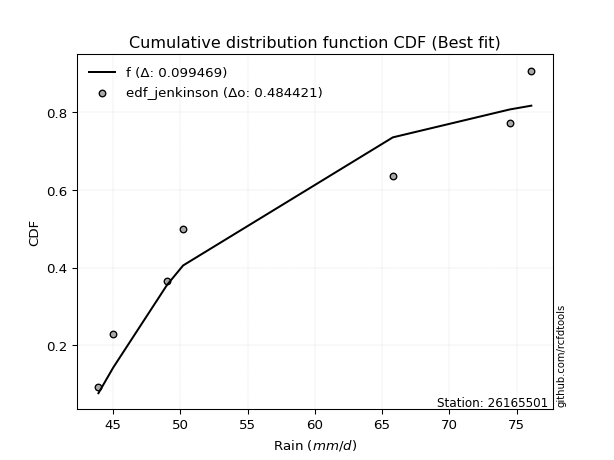</img>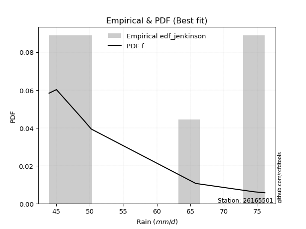</img>

</div>


### 11. EDF Cunnane (1978)

Cunnane´s work in statistical hydrology has focused on the performance and evaluation of different probability distributions (such as GEV, Gumbel, Lognormal) for flood frequency estimation. _b_ is a constant, typically set to 0.4.

<div align="center">


$P=(m-b)/(n+1-2b)$


</div>


**11.1. Empirical values**

<div align="center">

|                | 0                   | 1                   | 2                  | 3           | 4                  | 5                  | 6                  |
|:---------------|:--------------------|:--------------------|:-------------------|:------------|:-------------------|:-------------------|:-------------------|
| date           | 2018                | 2022                | 2023               | 2017        | 2021               | 2019               | 2020               |
| x              | 43.9                | 45.0                | 49.0               | 50.2        | 65.8               | 74.5               | 76.1               |
| m              | 1                   | 2                   | 3                  | 4           | 5                  | 6                  | 7                  |
| empirical_dist | edf_cunnane         | edf_cunnane         | edf_cunnane        | edf_cunnane | edf_cunnane        | edf_cunnane        | edf_cunnane        |
| empirical      | 0.08333333333333333 | 0.22222222222222224 | 0.3611111111111111 | 0.5         | 0.6388888888888888 | 0.7777777777777777 | 0.9166666666666666 |
| empirical_tr   | 1.090909090909091   | 1.2857142857142856  | 1.565217391304348  | 2.0         | 2.7692307692307687 | 4.499999999999998  | 11.999999999999995 |

</div>


**11.2. Kolmogorov-Smirnov fit test (sorted by Δ)**


<div align="center">

|                | 0                   | 1                   | 2                   | 3                   | 4                   | 5                   | 6                   | 7                   | 8                   | 9                   | 10                  | 11                  | 12                  | 13                  | 14                  | 15                  | 16                  | 17                  | 18                  | 19                  | 20                  | 21                  | 22                  | 23                  | 24                  | 25                  | 26                  | 27                  | 28                  | 29                  | 30                  | 31                  | 32                  | 33                  | 34                  | 35                  | 36                  | 37                  | 38                  | 39                  | 40                  | 41                  | 42                  | 43                  | 44                  | 45                  | 46                  | 47                  | 48                  | 49                  | 50                  | 51                  | 52                  | 53                  | 54                  | 55                  | 56                  | 57                  | 58                  | 59                  | 60                  | 61                  | 62                  | 63                  | 64                  | 65                  | 66                  | 67                  | 68                  | 69                  | 70                  | 71                  | 72                  | 73                  | 74                  | 75                  | 76                  | 77                  | 78                  | 79                  | 80                  | 81                  | 82                  | 83                  | 84                  | 85                  | 86                  | 87                  | 88                  | 89                  | 90                  | 91                  | 92                  | 93                  | 94                  | 95                  | 96                  | 97                  | 98                  | 99                  | 100                 | 101                 | 102                 | 103                 | 104                 | 105                 | 106                 | 107                 | 108                 | 109                 | 110                 | 111                 | 112                 | 113                 | 114                 | 115                 | 116                 | 117                 | 118                 | 119                 | 120                 | 121                 | 122                 | 123                 | 124                 | 125                 | 126                 | 127                 | 128                 | 129                 | 130                 | 131                 | 132                 | 133                 | 134                 | 135                 | 136                 | 137                 | 138                 | 139                 | 140                 | 141                 | 142                 | 143                 | 144                 | 145                 | 146                 | 147                 | 148                 | 149                 | 150                 | 151                 | 152                 | 153                 | 154                 | 155                 | 156                 | 157                 | 158                 | 159                 |
|:---------------|:--------------------|:--------------------|:--------------------|:--------------------|:--------------------|:--------------------|:--------------------|:--------------------|:--------------------|:--------------------|:--------------------|:--------------------|:--------------------|:--------------------|:--------------------|:--------------------|:--------------------|:--------------------|:--------------------|:--------------------|:--------------------|:--------------------|:--------------------|:--------------------|:--------------------|:--------------------|:--------------------|:--------------------|:--------------------|:--------------------|:--------------------|:--------------------|:--------------------|:--------------------|:--------------------|:--------------------|:--------------------|:--------------------|:--------------------|:--------------------|:--------------------|:--------------------|:--------------------|:--------------------|:--------------------|:--------------------|:--------------------|:--------------------|:--------------------|:--------------------|:--------------------|:--------------------|:--------------------|:--------------------|:--------------------|:--------------------|:--------------------|:--------------------|:--------------------|:--------------------|:--------------------|:--------------------|:--------------------|:--------------------|:--------------------|:--------------------|:--------------------|:--------------------|:--------------------|:--------------------|:--------------------|:--------------------|:--------------------|:--------------------|:--------------------|:--------------------|:--------------------|:--------------------|:--------------------|:--------------------|:--------------------|:--------------------|:--------------------|:--------------------|:--------------------|:--------------------|:--------------------|:--------------------|:--------------------|:--------------------|:--------------------|:--------------------|:--------------------|:--------------------|:--------------------|:--------------------|:--------------------|:--------------------|:--------------------|:--------------------|:--------------------|:--------------------|:--------------------|:--------------------|:--------------------|:--------------------|:--------------------|:--------------------|:--------------------|:--------------------|:--------------------|:--------------------|:--------------------|:--------------------|:--------------------|:--------------------|:--------------------|:--------------------|:--------------------|:--------------------|:--------------------|:--------------------|:--------------------|:--------------------|:--------------------|:--------------------|:--------------------|:--------------------|:--------------------|:--------------------|:--------------------|:--------------------|:--------------------|:--------------------|:--------------------|:--------------------|:--------------------|:--------------------|:--------------------|:--------------------|:--------------------|:--------------------|:--------------------|:--------------------|:--------------------|:--------------------|:--------------------|:--------------------|:--------------------|:--------------------|:--------------------|:--------------------|:--------------------|:--------------------|:--------------------|:--------------------|:--------------------|:--------------------|:--------------------|:--------------------|
| station        | 26165501            | 26165501            | 26165501            | 26165501            | 26165501            | 26165501            | 26165501            | 26165501            | 26165501            | 26165501            | 26165501            | 26165501            | 26165501            | 26165501            | 26165501            | 26165501            | 26165501            | 26165501            | 26165501            | 26165501            | 26165501            | 26165501            | 26165501            | 26165501            | 26165501            | 26165501            | 26165501            | 26165501            | 26165501            | 26165501            | 26165501            | 26165501            | 26165501            | 26165501            | 26165501            | 26165501            | 26165501            | 26165501            | 26165501            | 26165501            | 26165501            | 26165501            | 26165501            | 26165501            | 26165501            | 26165501            | 26165501            | 26165501            | 26165501            | 26165501            | 26165501            | 26165501            | 26165501            | 26165501            | 26165501            | 26165501            | 26165501            | 26165501            | 26165501            | 26165501            | 26165501            | 26165501            | 26165501            | 26165501            | 26165501            | 26165501            | 26165501            | 26165501            | 26165501            | 26165501            | 26165501            | 26165501            | 26165501            | 26165501            | 26165501            | 26165501            | 26165501            | 26165501            | 26165501            | 26165501            | 26165501            | 26165501            | 26165501            | 26165501            | 26165501            | 26165501            | 26165501            | 26165501            | 26165501            | 26165501            | 26165501            | 26165501            | 26165501            | 26165501            | 26165501            | 26165501            | 26165501            | 26165501            | 26165501            | 26165501            | 26165501            | 26165501            | 26165501            | 26165501            | 26165501            | 26165501            | 26165501            | 26165501            | 26165501            | 26165501            | 26165501            | 26165501            | 26165501            | 26165501            | 26165501            | 26165501            | 26165501            | 26165501            | 26165501            | 26165501            | 26165501            | 26165501            | 26165501            | 26165501            | 26165501            | 26165501            | 26165501            | 26165501            | 26165501            | 26165501            | 26165501            | 26165501            | 26165501            | 26165501            | 26165501            | 26165501            | 26165501            | 26165501            | 26165501            | 26165501            | 26165501            | 26165501            | 26165501            | 26165501            | 26165501            | 26165501            | 26165501            | 26165501            | 26165501            | 26165501            | 26165501            | 26165501            | 26165501            | 26165501            | 26165501            | 26165501            | 26165501            | 26165501            | 26165501            | 26165501            |
| empirical_dist | edf_cunnane         | edf_cunnane         | edf_cunnane         | edf_cunnane         | edf_cunnane         | edf_cunnane         | edf_cunnane         | edf_cunnane         | edf_cunnane         | edf_cunnane         | edf_cunnane         | edf_cunnane         | edf_cunnane         | edf_cunnane         | edf_cunnane         | edf_cunnane         | edf_cunnane         | edf_cunnane         | edf_cunnane         | edf_cunnane         | edf_cunnane         | edf_cunnane         | edf_cunnane         | edf_cunnane         | edf_cunnane         | edf_cunnane         | edf_cunnane         | edf_cunnane         | edf_cunnane         | edf_cunnane         | edf_cunnane         | edf_cunnane         | edf_cunnane         | edf_cunnane         | edf_cunnane         | edf_cunnane         | edf_cunnane         | edf_cunnane         | edf_cunnane         | edf_cunnane         | edf_cunnane         | edf_cunnane         | edf_cunnane         | edf_cunnane         | edf_cunnane         | edf_cunnane         | edf_cunnane         | edf_cunnane         | edf_cunnane         | edf_cunnane         | edf_cunnane         | edf_cunnane         | edf_cunnane         | edf_cunnane         | edf_cunnane         | edf_cunnane         | edf_cunnane         | edf_cunnane         | edf_cunnane         | edf_cunnane         | edf_cunnane         | edf_cunnane         | edf_cunnane         | edf_cunnane         | edf_cunnane         | edf_cunnane         | edf_cunnane         | edf_cunnane         | edf_cunnane         | edf_cunnane         | edf_cunnane         | edf_cunnane         | edf_cunnane         | edf_cunnane         | edf_cunnane         | edf_cunnane         | edf_cunnane         | edf_cunnane         | edf_cunnane         | edf_cunnane         | edf_cunnane         | edf_cunnane         | edf_cunnane         | edf_cunnane         | edf_cunnane         | edf_cunnane         | edf_cunnane         | edf_cunnane         | edf_cunnane         | edf_cunnane         | edf_cunnane         | edf_cunnane         | edf_cunnane         | edf_cunnane         | edf_cunnane         | edf_cunnane         | edf_cunnane         | edf_cunnane         | edf_cunnane         | edf_cunnane         | edf_cunnane         | edf_cunnane         | edf_cunnane         | edf_cunnane         | edf_cunnane         | edf_cunnane         | edf_cunnane         | edf_cunnane         | edf_cunnane         | edf_cunnane         | edf_cunnane         | edf_cunnane         | edf_cunnane         | edf_cunnane         | edf_cunnane         | edf_cunnane         | edf_cunnane         | edf_cunnane         | edf_cunnane         | edf_cunnane         | edf_cunnane         | edf_cunnane         | edf_cunnane         | edf_cunnane         | edf_cunnane         | edf_cunnane         | edf_cunnane         | edf_cunnane         | edf_cunnane         | edf_cunnane         | edf_cunnane         | edf_cunnane         | edf_cunnane         | edf_cunnane         | edf_cunnane         | edf_cunnane         | edf_cunnane         | edf_cunnane         | edf_cunnane         | edf_cunnane         | edf_cunnane         | edf_cunnane         | edf_cunnane         | edf_cunnane         | edf_cunnane         | edf_cunnane         | edf_cunnane         | edf_cunnane         | edf_cunnane         | edf_cunnane         | edf_cunnane         | edf_cunnane         | edf_cunnane         | edf_cunnane         | edf_cunnane         | edf_cunnane         | edf_cunnane         | edf_cunnane         | edf_cunnane         | edf_cunnane         |
| p_dist         | f                   | logwrapcauchy       | logdgamma           | exponpow            | logdweibull         | logweibull_min      | logarcsine          | logf                | dweibull            | dgamma              | wrapcauchy          | loghalfnorm         | nakagami            | arcsine             | logfoldnorm         | invweibull          | genextreme          | halfgennorm         | alpha               | logksone            | loggompertz         | lomax               | genexpon            | halfnorm            | lognct              | exponnorm           | loggenexpon         | logmielke           | burr                | loggenlogistic      | logkstwobign        | loggenextreme       | loginvweibull       | burr12              | logburr             | loglomax            | logexponweib        | invgamma            | lograyleigh         | loghalflogistic     | halflogistic        | logncf              | logsemicircular     | logmoyal            | loggumbel_r         | ksone               | gompertz            | logmaxwell          | gausshyper          | erlang              | loganglit           | loghalfgennorm      | loginvgauss         | logalpha            | invgauss            | genlogistic         | semicircular        | logrdist            | rayleigh            | nct                 | logskewnorm         | logbetaprime        | logpearson3         | moyal               | loglevy_l           | foldnorm            | kstwobign           | logbradford         | loggengamma         | anglit              | logexponpow         | betaprime           | maxwell             | gumbel_r            | loginvgamma         | logtruncexpon       | logweibull_max      | ncf                 | logexponnorm        | logloggamma         | logcrystalball      | logt                | lognorm             | logrice             | logfatiguelife      | logtrapezoid        | pearson3            | logtruncnorm        | levy_l              | logtruncweibull_min | logburr12           | logcosine           | t                   | crystalball         | norm                | johnsonsu           | logwald             | wald                | loglogistic         | logbeta             | genpareto           | rice                | bradford            | truncexpon          | logerlang           | truncweibull_min    | logloglaplace       | loghypsecant        | skewnorm            | loggennorm          | kappa4              | logistic            | cosine              | logkappa4           | logtukeylambda      | lognakagami         | loggumbel_l         | gennorm             | loggamma            | loggamma            | logvonmises_line    | loguniform          | logargus            | hypsecant           | logkappa3           | loglaplace          | loglaplace          | gumbel_l            | truncnorm           | logtriang           | loggausshyper       | argus               | gamma               | laplace             | triang              | tukeylambda         | loggenpareto        | uniform             | vonmises_line       | kappa3              | weibull_min         | beta                | loggenhalflogistic  | genhalflogistic     | powerlaw            | fatiguelife         | logpowerlaw         | exponweib           | truncpareto         | johnsonsb           | gengamma            | rdist               | logtruncpareto      | trapezoid           | logjohnsonsu        | weibull_max         | logjohnsonsb        | logvonmises         | vonmises            | mielke              |
| delta          | 0.10024864581574255 | 0.1034409923354177  | 0.10481739007733437 | 0.10690121717794487 | 0.10943751881702812 | 0.11192061425784561 | 0.12202989997523683 | 0.1253775083641615  | 0.1253776494442419  | 0.1255892964121471  | 0.13227753129182407 | 0.13912350435536947 | 0.1402672565803335  | 0.14213059260153021 | 0.1427200775173585  | 0.14866203807037903 | 0.1486638289753458  | 0.15221921412494444 | 0.1526874789243432  | 0.15270377163189242 | 0.152913345729479   | 0.15445145876285948 | 0.15526291999096398 | 0.1569049463804577  | 0.1570209658479586  | 0.15729346536954825 | 0.15810514683126975 | 0.1584211281400839  | 0.15889624584579254 | 0.1591624964849584  | 0.15987222431094628 | 0.16016553832753677 | 0.16016694535566578 | 0.1606976259609305  | 0.16125601819364788 | 0.16141626434352707 | 0.162687387838636   | 0.16283667906381538 | 0.16291658235256662 | 0.1630020522080986  | 0.16361659851846955 | 0.16604637197173566 | 0.1663956906754085  | 0.1692269459870398  | 0.16929560150827533 | 0.16937786117702092 | 0.17220764541390216 | 0.17388592843557027 | 0.17591759395788492 | 0.1759533641117258  | 0.1769077384535495  | 0.1770562409152363  | 0.1772107267913824  | 0.17802056052345339 | 0.1806832784401462  | 0.1839906485790455  | 0.18405107262039083 | 0.18532040048373388 | 0.18556684618254127 | 0.18691436219041596 | 0.1872809181956101  | 0.18767755278089993 | 0.1899837551426546  | 0.19068599637281558 | 0.19106120546532662 | 0.19197212556634347 | 0.19408475876189252 | 0.1944841979731401  | 0.19512717528447632 | 0.19523241773348682 | 0.19528276913042908 | 0.19545910799902633 | 0.19583140031931895 | 0.19626995162405808 | 0.19658833919723084 | 0.19872951698323504 | 0.19980996881405655 | 0.19992249023697883 | 0.2012509662716443  | 0.20154915415641322 | 0.20158715322627185 | 0.20159002341268417 | 0.20159081733038664 | 0.2025743082556422  | 0.20424869650334082 | 0.20625273755143042 | 0.20821874705063498 | 0.21060649379655472 | 0.2111775632731116  | 0.21695588756650486 | 0.21999380235576071 | 0.22005567043852503 | 0.22120510224326007 | 0.2213115335293957  | 0.22131154338567371 | 0.2215594110260991  | 0.22222222222222224 | 0.22222222222222224 | 0.22301489556884596 | 0.22815370130041124 | 0.23018825295865053 | 0.2334497049612046  | 0.23505817993111455 | 0.2352814863867147  | 0.23542364842725783 | 0.23608180490591069 | 0.23828072153336477 | 0.23844194022703685 | 0.23986389570010092 | 0.24025185490739687 | 0.2405952899141781  | 0.2434985482192244  | 0.243955170785714   | 0.2467516381904163  | 0.25016976280763714 | 0.25161665784641835 | 0.2520988034720523  | 0.25391697476262076 | 0.25394616704173    | 0.25394616704173    | 0.25526775837484783 | 0.25623989777871814 | 0.2575836115923196  | 0.25893684092855695 | 0.25991628273215467 | 0.2633658082891202  | 0.2633658082891202  | 0.2675546542052222  | 0.27210029580603917 | 0.27796073973591334 | 0.2792978533350855  | 0.28084632668129794 | 0.28149242694018545 | 0.28192709549712336 | 0.29749745302023456 | 0.2978615659743369  | 0.299257025311098   | 0.3043478260869564  | 0.30601453350203867 | 0.31632763660212293 | 0.32640202300338633 | 0.32898521809868947 | 0.3517750685482456  | 0.3732256342301376  | 0.3814537655225781  | 0.3917878199518665  | 0.39961389394052865 | 0.4052992372824649  | 0.4121308938793477  | 0.4146416995703559  | 0.4174798561508077  | 0.4276709681070444  | 0.4372282366165436  | 0.43929846670867456 | 0.45291796444047194 | 0.5124836559672399  | 0.6195071802455387  | 1.1209794038721501  | 11.82750622383569   | nan                 |
| deltao         | 0.48442053926100004 | 0.48442053926100004 | 0.48442053926100004 | 0.48442053926100004 | 0.48442053926100004 | 0.48442053926100004 | 0.48442053926100004 | 0.48442053926100004 | 0.48442053926100004 | 0.48442053926100004 | 0.48442053926100004 | 0.48442053926100004 | 0.48442053926100004 | 0.48442053926100004 | 0.48442053926100004 | 0.48442053926100004 | 0.48442053926100004 | 0.48442053926100004 | 0.48442053926100004 | 0.48442053926100004 | 0.48442053926100004 | 0.48442053926100004 | 0.48442053926100004 | 0.48442053926100004 | 0.48442053926100004 | 0.48442053926100004 | 0.48442053926100004 | 0.48442053926100004 | 0.48442053926100004 | 0.48442053926100004 | 0.48442053926100004 | 0.48442053926100004 | 0.48442053926100004 | 0.48442053926100004 | 0.48442053926100004 | 0.48442053926100004 | 0.48442053926100004 | 0.48442053926100004 | 0.48442053926100004 | 0.48442053926100004 | 0.48442053926100004 | 0.48442053926100004 | 0.48442053926100004 | 0.48442053926100004 | 0.48442053926100004 | 0.48442053926100004 | 0.48442053926100004 | 0.48442053926100004 | 0.48442053926100004 | 0.48442053926100004 | 0.48442053926100004 | 0.48442053926100004 | 0.48442053926100004 | 0.48442053926100004 | 0.48442053926100004 | 0.48442053926100004 | 0.48442053926100004 | 0.48442053926100004 | 0.48442053926100004 | 0.48442053926100004 | 0.48442053926100004 | 0.48442053926100004 | 0.48442053926100004 | 0.48442053926100004 | 0.48442053926100004 | 0.48442053926100004 | 0.48442053926100004 | 0.48442053926100004 | 0.48442053926100004 | 0.48442053926100004 | 0.48442053926100004 | 0.48442053926100004 | 0.48442053926100004 | 0.48442053926100004 | 0.48442053926100004 | 0.48442053926100004 | 0.48442053926100004 | 0.48442053926100004 | 0.48442053926100004 | 0.48442053926100004 | 0.48442053926100004 | 0.48442053926100004 | 0.48442053926100004 | 0.48442053926100004 | 0.48442053926100004 | 0.48442053926100004 | 0.48442053926100004 | 0.48442053926100004 | 0.48442053926100004 | 0.48442053926100004 | 0.48442053926100004 | 0.48442053926100004 | 0.48442053926100004 | 0.48442053926100004 | 0.48442053926100004 | 0.48442053926100004 | 0.48442053926100004 | 0.48442053926100004 | 0.48442053926100004 | 0.48442053926100004 | 0.48442053926100004 | 0.48442053926100004 | 0.48442053926100004 | 0.48442053926100004 | 0.48442053926100004 | 0.48442053926100004 | 0.48442053926100004 | 0.48442053926100004 | 0.48442053926100004 | 0.48442053926100004 | 0.48442053926100004 | 0.48442053926100004 | 0.48442053926100004 | 0.48442053926100004 | 0.48442053926100004 | 0.48442053926100004 | 0.48442053926100004 | 0.48442053926100004 | 0.48442053926100004 | 0.48442053926100004 | 0.48442053926100004 | 0.48442053926100004 | 0.48442053926100004 | 0.48442053926100004 | 0.48442053926100004 | 0.48442053926100004 | 0.48442053926100004 | 0.48442053926100004 | 0.48442053926100004 | 0.48442053926100004 | 0.48442053926100004 | 0.48442053926100004 | 0.48442053926100004 | 0.48442053926100004 | 0.48442053926100004 | 0.48442053926100004 | 0.48442053926100004 | 0.48442053926100004 | 0.48442053926100004 | 0.48442053926100004 | 0.48442053926100004 | 0.48442053926100004 | 0.48442053926100004 | 0.48442053926100004 | 0.48442053926100004 | 0.48442053926100004 | 0.48442053926100004 | 0.48442053926100004 | 0.48442053926100004 | 0.48442053926100004 | 0.48442053926100004 | 0.48442053926100004 | 0.48442053926100004 | 0.48442053926100004 | 0.48442053926100004 | 0.48442053926100004 | 0.48442053926100004 | 0.48442053926100004 | 0.48442053926100004 | 0.48442053926100004 |
| eval           | Δo > Δ              | Δo > Δ              | Δo > Δ              | Δo > Δ              | Δo > Δ              | Δo > Δ              | Δo > Δ              | Δo > Δ              | Δo > Δ              | Δo > Δ              | Δo > Δ              | Δo > Δ              | Δo > Δ              | Δo > Δ              | Δo > Δ              | Δo > Δ              | Δo > Δ              | Δo > Δ              | Δo > Δ              | Δo > Δ              | Δo > Δ              | Δo > Δ              | Δo > Δ              | Δo > Δ              | Δo > Δ              | Δo > Δ              | Δo > Δ              | Δo > Δ              | Δo > Δ              | Δo > Δ              | Δo > Δ              | Δo > Δ              | Δo > Δ              | Δo > Δ              | Δo > Δ              | Δo > Δ              | Δo > Δ              | Δo > Δ              | Δo > Δ              | Δo > Δ              | Δo > Δ              | Δo > Δ              | Δo > Δ              | Δo > Δ              | Δo > Δ              | Δo > Δ              | Δo > Δ              | Δo > Δ              | Δo > Δ              | Δo > Δ              | Δo > Δ              | Δo > Δ              | Δo > Δ              | Δo > Δ              | Δo > Δ              | Δo > Δ              | Δo > Δ              | Δo > Δ              | Δo > Δ              | Δo > Δ              | Δo > Δ              | Δo > Δ              | Δo > Δ              | Δo > Δ              | Δo > Δ              | Δo > Δ              | Δo > Δ              | Δo > Δ              | Δo > Δ              | Δo > Δ              | Δo > Δ              | Δo > Δ              | Δo > Δ              | Δo > Δ              | Δo > Δ              | Δo > Δ              | Δo > Δ              | Δo > Δ              | Δo > Δ              | Δo > Δ              | Δo > Δ              | Δo > Δ              | Δo > Δ              | Δo > Δ              | Δo > Δ              | Δo > Δ              | Δo > Δ              | Δo > Δ              | Δo > Δ              | Δo > Δ              | Δo > Δ              | Δo > Δ              | Δo > Δ              | Δo > Δ              | Δo > Δ              | Δo > Δ              | Δo > Δ              | Δo > Δ              | Δo > Δ              | Δo > Δ              | Δo > Δ              | Δo > Δ              | Δo > Δ              | Δo > Δ              | Δo > Δ              | Δo > Δ              | Δo > Δ              | Δo > Δ              | Δo > Δ              | Δo > Δ              | Δo > Δ              | Δo > Δ              | Δo > Δ              | Δo > Δ              | Δo > Δ              | Δo > Δ              | Δo > Δ              | Δo > Δ              | Δo > Δ              | Δo > Δ              | Δo > Δ              | Δo > Δ              | Δo > Δ              | Δo > Δ              | Δo > Δ              | Δo > Δ              | Δo > Δ              | Δo > Δ              | Δo > Δ              | Δo > Δ              | Δo > Δ              | Δo > Δ              | Δo > Δ              | Δo > Δ              | Δo > Δ              | Δo > Δ              | Δo > Δ              | Δo > Δ              | Δo > Δ              | Δo > Δ              | Δo > Δ              | Δo > Δ              | Δo > Δ              | Δo > Δ              | Δo > Δ              | Δo > Δ              | Δo > Δ              | Δo > Δ              | Δo > Δ              | Δo > Δ              | Δo > Δ              | Δo > Δ              | Δo > Δ              | Δo > Δ              | Δo > Δ              | Δo <= Δ             | Δo <= Δ             | Δo <= Δ             | Δo <= Δ             | Δo <= Δ             |
| fit            | 1                   | 1                   | 1                   | 1                   | 1                   | 1                   | 1                   | 1                   | 1                   | 1                   | 1                   | 1                   | 1                   | 1                   | 1                   | 1                   | 1                   | 1                   | 1                   | 1                   | 1                   | 1                   | 1                   | 1                   | 1                   | 1                   | 1                   | 1                   | 1                   | 1                   | 1                   | 1                   | 1                   | 1                   | 1                   | 1                   | 1                   | 1                   | 1                   | 1                   | 1                   | 1                   | 1                   | 1                   | 1                   | 1                   | 1                   | 1                   | 1                   | 1                   | 1                   | 1                   | 1                   | 1                   | 1                   | 1                   | 1                   | 1                   | 1                   | 1                   | 1                   | 1                   | 1                   | 1                   | 1                   | 1                   | 1                   | 1                   | 1                   | 1                   | 1                   | 1                   | 1                   | 1                   | 1                   | 1                   | 1                   | 1                   | 1                   | 1                   | 1                   | 1                   | 1                   | 1                   | 1                   | 1                   | 1                   | 1                   | 1                   | 1                   | 1                   | 1                   | 1                   | 1                   | 1                   | 1                   | 1                   | 1                   | 1                   | 1                   | 1                   | 1                   | 1                   | 1                   | 1                   | 1                   | 1                   | 1                   | 1                   | 1                   | 1                   | 1                   | 1                   | 1                   | 1                   | 1                   | 1                   | 1                   | 1                   | 1                   | 1                   | 1                   | 1                   | 1                   | 1                   | 1                   | 1                   | 1                   | 1                   | 1                   | 1                   | 1                   | 1                   | 1                   | 1                   | 1                   | 1                   | 1                   | 1                   | 1                   | 1                   | 1                   | 1                   | 1                   | 1                   | 1                   | 1                   | 1                   | 1                   | 1                   | 1                   | 1                   | 1                   | 1                   | 1                   | 0                   | 0                   | 0                   | 0                   | 0                   |
| n              | 7                   | 7                   | 7                   | 7                   | 7                   | 7                   | 7                   | 7                   | 7                   | 7                   | 7                   | 7                   | 7                   | 7                   | 7                   | 7                   | 7                   | 7                   | 7                   | 7                   | 7                   | 7                   | 7                   | 7                   | 7                   | 7                   | 7                   | 7                   | 7                   | 7                   | 7                   | 7                   | 7                   | 7                   | 7                   | 7                   | 7                   | 7                   | 7                   | 7                   | 7                   | 7                   | 7                   | 7                   | 7                   | 7                   | 7                   | 7                   | 7                   | 7                   | 7                   | 7                   | 7                   | 7                   | 7                   | 7                   | 7                   | 7                   | 7                   | 7                   | 7                   | 7                   | 7                   | 7                   | 7                   | 7                   | 7                   | 7                   | 7                   | 7                   | 7                   | 7                   | 7                   | 7                   | 7                   | 7                   | 7                   | 7                   | 7                   | 7                   | 7                   | 7                   | 7                   | 7                   | 7                   | 7                   | 7                   | 7                   | 7                   | 7                   | 7                   | 7                   | 7                   | 7                   | 7                   | 7                   | 7                   | 7                   | 7                   | 7                   | 7                   | 7                   | 7                   | 7                   | 7                   | 7                   | 7                   | 7                   | 7                   | 7                   | 7                   | 7                   | 7                   | 7                   | 7                   | 7                   | 7                   | 7                   | 7                   | 7                   | 7                   | 7                   | 7                   | 7                   | 7                   | 7                   | 7                   | 7                   | 7                   | 7                   | 7                   | 7                   | 7                   | 7                   | 7                   | 7                   | 7                   | 7                   | 7                   | 7                   | 7                   | 7                   | 7                   | 7                   | 7                   | 7                   | 7                   | 7                   | 7                   | 7                   | 7                   | 7                   | 7                   | 7                   | 7                   | 7                   | 7                   | 7                   | 7                   | 7                   |
| best_fit       | 1                   | 0                   | 0                   | 0                   | 0                   | 0                   | 0                   | 0                   | 0                   | 0                   | 0                   | 0                   | 0                   | 0                   | 0                   | 0                   | 0                   | 0                   | 0                   | 0                   | 0                   | 0                   | 0                   | 0                   | 0                   | 0                   | 0                   | 0                   | 0                   | 0                   | 0                   | 0                   | 0                   | 0                   | 0                   | 0                   | 0                   | 0                   | 0                   | 0                   | 0                   | 0                   | 0                   | 0                   | 0                   | 0                   | 0                   | 0                   | 0                   | 0                   | 0                   | 0                   | 0                   | 0                   | 0                   | 0                   | 0                   | 0                   | 0                   | 0                   | 0                   | 0                   | 0                   | 0                   | 0                   | 0                   | 0                   | 0                   | 0                   | 0                   | 0                   | 0                   | 0                   | 0                   | 0                   | 0                   | 0                   | 0                   | 0                   | 0                   | 0                   | 0                   | 0                   | 0                   | 0                   | 0                   | 0                   | 0                   | 0                   | 0                   | 0                   | 0                   | 0                   | 0                   | 0                   | 0                   | 0                   | 0                   | 0                   | 0                   | 0                   | 0                   | 0                   | 0                   | 0                   | 0                   | 0                   | 0                   | 0                   | 0                   | 0                   | 0                   | 0                   | 0                   | 0                   | 0                   | 0                   | 0                   | 0                   | 0                   | 0                   | 0                   | 0                   | 0                   | 0                   | 0                   | 0                   | 0                   | 0                   | 0                   | 0                   | 0                   | 0                   | 0                   | 0                   | 0                   | 0                   | 0                   | 0                   | 0                   | 0                   | 0                   | 0                   | 0                   | 0                   | 0                   | 0                   | 0                   | 0                   | 0                   | 0                   | 0                   | 0                   | 0                   | 0                   | 0                   | 0                   | 0                   | 0                   | 0                   |
| best_fit_sort  | 1                   | 2                   | 3                   | 4                   | 5                   | 6                   | 7                   | 8                   | 9                   | 10                  | 11                  | 12                  | 13                  | 14                  | 15                  | 16                  | 17                  | 18                  | 19                  | 20                  | 21                  | 22                  | 23                  | 24                  | 25                  | 26                  | 27                  | 28                  | 29                  | 30                  | 31                  | 32                  | 33                  | 34                  | 35                  | 36                  | 37                  | 38                  | 39                  | 40                  | 41                  | 42                  | 43                  | 44                  | 45                  | 46                  | 47                  | 48                  | 49                  | 50                  | 51                  | 52                  | 53                  | 54                  | 55                  | 56                  | 57                  | 58                  | 59                  | 60                  | 61                  | 62                  | 63                  | 64                  | 65                  | 66                  | 67                  | 68                  | 69                  | 70                  | 71                  | 72                  | 73                  | 74                  | 75                  | 76                  | 77                  | 78                  | 79                  | 80                  | 81                  | 82                  | 83                  | 84                  | 85                  | 86                  | 87                  | 88                  | 89                  | 90                  | 91                  | 92                  | 93                  | 94                  | 95                  | 96                  | 97                  | 98                  | 99                  | 100                 | 101                 | 102                 | 103                 | 104                 | 105                 | 106                 | 107                 | 108                 | 109                 | 110                 | 111                 | 112                 | 113                 | 114                 | 115                 | 116                 | 117                 | 118                 | 119                 | 120                 | 121                 | 122                 | 123                 | 124                 | 125                 | 126                 | 127                 | 128                 | 129                 | 130                 | 131                 | 132                 | 133                 | 134                 | 135                 | 136                 | 137                 | 138                 | 139                 | 140                 | 141                 | 142                 | 143                 | 144                 | 145                 | 146                 | 147                 | 148                 | 149                 | 150                 | 151                 | 152                 | 153                 | 154                 | 155                 | 156                 | 157                 | 158                 | 159                 | 160                 |

</div>


**11.3. Best fit**

<div align="center">

|   id |   station | empirical_dist   | p_dist   |    delta |   deltao | eval   |   fit |   n |   best_fit |   best_fit_sort |
|-----:|----------:|:-----------------|:---------|---------:|---------:|:-------|------:|----:|-----------:|----------------:|
|    0 |  26165501 | edf_cunnane      | f        | 0.100249 | 0.484421 | Δo > Δ |     1 |   7 |          1 |               1 |

</div>


<div align="center">

</img></img>

</div>


### 12. EDF Adamowski (1981)

The Adamowski formula in hydrology refers to a specific plotting position formula used for estimating the non-parametric empirical distribution of hydrological events (like flood peaks) to calculate their return periods. This formula provides an alternative to traditional parametric methods (like the Gumbel or Log Pearson Type III distributions). 

<div align="center">


$P=(m-0.25)/(n+0.5)$


</div>


**12.1. Empirical values**

<div align="center">

|                | 0                  | 1                   | 2                   | 3             | 4                  | 5                  | 6                  |
|:---------------|:-------------------|:--------------------|:--------------------|:--------------|:-------------------|:-------------------|:-------------------|
| date           | 2018               | 2022                | 2023                | 2017          | 2021               | 2019               | 2020               |
| x              | 43.9               | 45.0                | 49.0                | 50.2          | 65.8               | 74.5               | 76.1               |
| m              | 1                  | 2                   | 3                   | 4             | 5                  | 6                  | 7                  |
| empirical_dist | edf_adamowski      | edf_adamowski       | edf_adamowski       | edf_adamowski | edf_adamowski      | edf_adamowski      | edf_adamowski      |
| empirical      | 0.1                | 0.23333333333333334 | 0.36666666666666664 | 0.5           | 0.6333333333333333 | 0.7666666666666667 | 0.9                |
| empirical_tr   | 1.1111111111111112 | 1.3043478260869565  | 1.5789473684210527  | 2.0           | 2.727272727272727  | 4.2857142857142865 | 10.000000000000002 |

</div>


**12.2. Kolmogorov-Smirnov fit test (sorted by Δ)**


<div align="center">

|                | 0                   | 1                   | 2                   | 3                   | 4                   | 5                   | 6                   | 7                   | 8                   | 9                   | 10                  | 11                  | 12                  | 13                  | 14                  | 15                  | 16                  | 17                  | 18                  | 19                  | 20                  | 21                  | 22                  | 23                  | 24                  | 25                  | 26                  | 27                  | 28                  | 29                  | 30                  | 31                  | 32                  | 33                  | 34                  | 35                  | 36                  | 37                  | 38                  | 39                  | 40                  | 41                  | 42                  | 43                  | 44                  | 45                  | 46                  | 47                  | 48                  | 49                  | 50                  | 51                  | 52                  | 53                  | 54                  | 55                  | 56                  | 57                  | 58                  | 59                  | 60                  | 61                  | 62                  | 63                  | 64                  | 65                  | 66                  | 67                  | 68                  | 69                  | 70                  | 71                  | 72                  | 73                  | 74                  | 75                  | 76                  | 77                  | 78                  | 79                  | 80                  | 81                  | 82                  | 83                  | 84                  | 85                  | 86                  | 87                  | 88                  | 89                  | 90                  | 91                  | 92                  | 93                  | 94                  | 95                  | 96                  | 97                  | 98                  | 99                  | 100                 | 101                 | 102                 | 103                 | 104                 | 105                 | 106                 | 107                 | 108                 | 109                 | 110                 | 111                 | 112                 | 113                 | 114                 | 115                 | 116                 | 117                 | 118                 | 119                 | 120                 | 121                 | 122                 | 123                 | 124                 | 125                 | 126                 | 127                 | 128                 | 129                 | 130                 | 131                 | 132                 | 133                 | 134                 | 135                 | 136                 | 137                 | 138                 | 139                 | 140                 | 141                 | 142                 | 143                 | 144                 | 145                 | 146                 | 147                 | 148                 | 149                 | 150                 | 151                 | 152                 | 153                 | 154                 | 155                 | 156                 | 157                 | 158                 | 159                 |
|:---------------|:--------------------|:--------------------|:--------------------|:--------------------|:--------------------|:--------------------|:--------------------|:--------------------|:--------------------|:--------------------|:--------------------|:--------------------|:--------------------|:--------------------|:--------------------|:--------------------|:--------------------|:--------------------|:--------------------|:--------------------|:--------------------|:--------------------|:--------------------|:--------------------|:--------------------|:--------------------|:--------------------|:--------------------|:--------------------|:--------------------|:--------------------|:--------------------|:--------------------|:--------------------|:--------------------|:--------------------|:--------------------|:--------------------|:--------------------|:--------------------|:--------------------|:--------------------|:--------------------|:--------------------|:--------------------|:--------------------|:--------------------|:--------------------|:--------------------|:--------------------|:--------------------|:--------------------|:--------------------|:--------------------|:--------------------|:--------------------|:--------------------|:--------------------|:--------------------|:--------------------|:--------------------|:--------------------|:--------------------|:--------------------|:--------------------|:--------------------|:--------------------|:--------------------|:--------------------|:--------------------|:--------------------|:--------------------|:--------------------|:--------------------|:--------------------|:--------------------|:--------------------|:--------------------|:--------------------|:--------------------|:--------------------|:--------------------|:--------------------|:--------------------|:--------------------|:--------------------|:--------------------|:--------------------|:--------------------|:--------------------|:--------------------|:--------------------|:--------------------|:--------------------|:--------------------|:--------------------|:--------------------|:--------------------|:--------------------|:--------------------|:--------------------|:--------------------|:--------------------|:--------------------|:--------------------|:--------------------|:--------------------|:--------------------|:--------------------|:--------------------|:--------------------|:--------------------|:--------------------|:--------------------|:--------------------|:--------------------|:--------------------|:--------------------|:--------------------|:--------------------|:--------------------|:--------------------|:--------------------|:--------------------|:--------------------|:--------------------|:--------------------|:--------------------|:--------------------|:--------------------|:--------------------|:--------------------|:--------------------|:--------------------|:--------------------|:--------------------|:--------------------|:--------------------|:--------------------|:--------------------|:--------------------|:--------------------|:--------------------|:--------------------|:--------------------|:--------------------|:--------------------|:--------------------|:--------------------|:--------------------|:--------------------|:--------------------|:--------------------|:--------------------|:--------------------|:--------------------|:--------------------|:--------------------|:--------------------|:--------------------|
| station        | 26165501            | 26165501            | 26165501            | 26165501            | 26165501            | 26165501            | 26165501            | 26165501            | 26165501            | 26165501            | 26165501            | 26165501            | 26165501            | 26165501            | 26165501            | 26165501            | 26165501            | 26165501            | 26165501            | 26165501            | 26165501            | 26165501            | 26165501            | 26165501            | 26165501            | 26165501            | 26165501            | 26165501            | 26165501            | 26165501            | 26165501            | 26165501            | 26165501            | 26165501            | 26165501            | 26165501            | 26165501            | 26165501            | 26165501            | 26165501            | 26165501            | 26165501            | 26165501            | 26165501            | 26165501            | 26165501            | 26165501            | 26165501            | 26165501            | 26165501            | 26165501            | 26165501            | 26165501            | 26165501            | 26165501            | 26165501            | 26165501            | 26165501            | 26165501            | 26165501            | 26165501            | 26165501            | 26165501            | 26165501            | 26165501            | 26165501            | 26165501            | 26165501            | 26165501            | 26165501            | 26165501            | 26165501            | 26165501            | 26165501            | 26165501            | 26165501            | 26165501            | 26165501            | 26165501            | 26165501            | 26165501            | 26165501            | 26165501            | 26165501            | 26165501            | 26165501            | 26165501            | 26165501            | 26165501            | 26165501            | 26165501            | 26165501            | 26165501            | 26165501            | 26165501            | 26165501            | 26165501            | 26165501            | 26165501            | 26165501            | 26165501            | 26165501            | 26165501            | 26165501            | 26165501            | 26165501            | 26165501            | 26165501            | 26165501            | 26165501            | 26165501            | 26165501            | 26165501            | 26165501            | 26165501            | 26165501            | 26165501            | 26165501            | 26165501            | 26165501            | 26165501            | 26165501            | 26165501            | 26165501            | 26165501            | 26165501            | 26165501            | 26165501            | 26165501            | 26165501            | 26165501            | 26165501            | 26165501            | 26165501            | 26165501            | 26165501            | 26165501            | 26165501            | 26165501            | 26165501            | 26165501            | 26165501            | 26165501            | 26165501            | 26165501            | 26165501            | 26165501            | 26165501            | 26165501            | 26165501            | 26165501            | 26165501            | 26165501            | 26165501            | 26165501            | 26165501            | 26165501            | 26165501            | 26165501            | 26165501            |
| empirical_dist | edf_adamowski       | edf_adamowski       | edf_adamowski       | edf_adamowski       | edf_adamowski       | edf_adamowski       | edf_adamowski       | edf_adamowski       | edf_adamowski       | edf_adamowski       | edf_adamowski       | edf_adamowski       | edf_adamowski       | edf_adamowski       | edf_adamowski       | edf_adamowski       | edf_adamowski       | edf_adamowski       | edf_adamowski       | edf_adamowski       | edf_adamowski       | edf_adamowski       | edf_adamowski       | edf_adamowski       | edf_adamowski       | edf_adamowski       | edf_adamowski       | edf_adamowski       | edf_adamowski       | edf_adamowski       | edf_adamowski       | edf_adamowski       | edf_adamowski       | edf_adamowski       | edf_adamowski       | edf_adamowski       | edf_adamowski       | edf_adamowski       | edf_adamowski       | edf_adamowski       | edf_adamowski       | edf_adamowski       | edf_adamowski       | edf_adamowski       | edf_adamowski       | edf_adamowski       | edf_adamowski       | edf_adamowski       | edf_adamowski       | edf_adamowski       | edf_adamowski       | edf_adamowski       | edf_adamowski       | edf_adamowski       | edf_adamowski       | edf_adamowski       | edf_adamowski       | edf_adamowski       | edf_adamowski       | edf_adamowski       | edf_adamowski       | edf_adamowski       | edf_adamowski       | edf_adamowski       | edf_adamowski       | edf_adamowski       | edf_adamowski       | edf_adamowski       | edf_adamowski       | edf_adamowski       | edf_adamowski       | edf_adamowski       | edf_adamowski       | edf_adamowski       | edf_adamowski       | edf_adamowski       | edf_adamowski       | edf_adamowski       | edf_adamowski       | edf_adamowski       | edf_adamowski       | edf_adamowski       | edf_adamowski       | edf_adamowski       | edf_adamowski       | edf_adamowski       | edf_adamowski       | edf_adamowski       | edf_adamowski       | edf_adamowski       | edf_adamowski       | edf_adamowski       | edf_adamowski       | edf_adamowski       | edf_adamowski       | edf_adamowski       | edf_adamowski       | edf_adamowski       | edf_adamowski       | edf_adamowski       | edf_adamowski       | edf_adamowski       | edf_adamowski       | edf_adamowski       | edf_adamowski       | edf_adamowski       | edf_adamowski       | edf_adamowski       | edf_adamowski       | edf_adamowski       | edf_adamowski       | edf_adamowski       | edf_adamowski       | edf_adamowski       | edf_adamowski       | edf_adamowski       | edf_adamowski       | edf_adamowski       | edf_adamowski       | edf_adamowski       | edf_adamowski       | edf_adamowski       | edf_adamowski       | edf_adamowski       | edf_adamowski       | edf_adamowski       | edf_adamowski       | edf_adamowski       | edf_adamowski       | edf_adamowski       | edf_adamowski       | edf_adamowski       | edf_adamowski       | edf_adamowski       | edf_adamowski       | edf_adamowski       | edf_adamowski       | edf_adamowski       | edf_adamowski       | edf_adamowski       | edf_adamowski       | edf_adamowski       | edf_adamowski       | edf_adamowski       | edf_adamowski       | edf_adamowski       | edf_adamowski       | edf_adamowski       | edf_adamowski       | edf_adamowski       | edf_adamowski       | edf_adamowski       | edf_adamowski       | edf_adamowski       | edf_adamowski       | edf_adamowski       | edf_adamowski       | edf_adamowski       | edf_adamowski       | edf_adamowski       |
| p_dist         | logweibull_min      | f                   | logdgamma           | exponpow            | logdweibull         | logwrapcauchy       | dweibull            | logarcsine          | logf                | wrapcauchy          | arcsine             | dgamma              | nakagami            | logfoldnorm         | loghalfnorm         | logksone            | invweibull          | genextreme          | halfnorm            | lognct              | halfgennorm         | alpha               | lomax               | loggompertz         | genexpon            | exponnorm           | lograyleigh         | halflogistic        | loggenexpon         | logkstwobign        | logmielke           | burr                | loggenlogistic      | loggenextreme       | loginvweibull       | burr12              | logsemicircular     | logburr             | loglomax            | logexponweib        | invgamma            | loghalflogistic     | loggumbel_r         | ksone               | logbetaprime        | logncf              | gompertz            | logmaxwell          | logmoyal            | loganglit           | logalpha            | loggengamma         | erlang              | loghalfgennorm      | loginvgauss         | gausshyper          | genlogistic         | semicircular        | logrdist            | rayleigh            | invgauss            | nct                 | logskewnorm         | loglevy_l           | logpearson3         | moyal               | foldnorm            | kstwobign           | levy_l              | anglit              | logexponpow         | betaprime           | maxwell             | gumbel_r            | loginvgamma         | logfatiguelife      | logweibull_max      | ncf                 | logexponnorm        | logloggamma         | logcrystalball      | logt                | lognorm             | logrice             | logbradford         | logtrapezoid        | pearson3            | logtruncexpon       | genpareto           | logtruncnorm        | logburr12           | logcosine           | t                   | crystalball         | norm                | johnsonsu           | logtruncweibull_min | loglogistic         | logwald             | wald                | rice                | logbeta             | bradford            | truncexpon          | loghypsecant        | skewnorm            | kappa4              | logerlang           | truncweibull_min    | logistic            | logloglaplace       | cosine              | loggennorm          | lognakagami         | logkappa4           | logtukeylambda      | loggumbel_l         | logvonmises_line    | loguniform          | logargus            | hypsecant           | gennorm             | loggamma            | loggamma            | logkappa3           | loglaplace          | loglaplace          | gumbel_l            | truncnorm           | gamma               | logtriang           | argus               | laplace             | loggenpareto        | loggausshyper       | triang              | tukeylambda         | uniform             | vonmises_line       | kappa3              | weibull_min         | beta                | loggenhalflogistic  | genhalflogistic     | powerlaw            | fatiguelife         | logpowerlaw         | exponweib           | johnsonsb           | truncpareto         | gengamma            | rdist               | logtruncpareto      | trapezoid           | logjohnsonsu        | weibull_max         | logjohnsonsb        | logvonmises         | vonmises            | mielke              |
| delta          | 0.10048351492008467 | 0.10163709597489357 | 0.10961755373182391 | 0.11245677273350041 | 0.11285857932762644 | 0.11455210344652866 | 0.11982209388868637 | 0.12202989997523683 | 0.13093306391971704 | 0.13227753129182407 | 0.1361797571344519  | 0.13670040752325807 | 0.13762215587347437 | 0.1427200775173585  | 0.144679059910925   | 0.15270377163189242 | 0.15421759362593457 | 0.15421938453090134 | 0.1569049463804577  | 0.1570209658479586  | 0.15777476968049997 | 0.15824303447989874 | 0.16000701431841502 | 0.16002547337522838 | 0.1608184755465195  | 0.16284902092510378 | 0.16291658235256662 | 0.16361659851846955 | 0.16366070238682529 | 0.16381381037795584 | 0.16397668369563945 | 0.16445180140134807 | 0.16471805204051393 | 0.1657210938830923  | 0.16572250091122132 | 0.16625318151648605 | 0.1663956906754085  | 0.1668115737492034  | 0.1669718198990826  | 0.16824294339419155 | 0.16839223461937092 | 0.16855760776365414 | 0.16929560150827533 | 0.16937786117702092 | 0.17101088611423323 | 0.1716019275272912  | 0.17220764541390216 | 0.17388592843557027 | 0.17478250154259534 | 0.1769077384535495  | 0.17802056052345339 | 0.1784605086178097  | 0.18150891966728133 | 0.18261179647079184 | 0.18276628234693792 | 0.1832086745240762  | 0.1839906485790455  | 0.18405107262039083 | 0.18532040048373388 | 0.18556684618254127 | 0.18623883399570174 | 0.18691436219041596 | 0.1872809181956101  | 0.18791344094634654 | 0.1899837551426546  | 0.19068599637281558 | 0.19197212556634347 | 0.19408475876189252 | 0.1945108966064449  | 0.19523241773348682 | 0.19528276913042908 | 0.19545910799902633 | 0.19583140031931895 | 0.19626995162405808 | 0.19658833919723084 | 0.19869314094778529 | 0.19980996881405655 | 0.19992249023697883 | 0.2012509662716443  | 0.20154915415641322 | 0.20158715322627185 | 0.20159002341268417 | 0.20159081733038664 | 0.2025743082556422  | 0.20559530908425105 | 0.20625273755143042 | 0.20821874705063498 | 0.209840628094346   | 0.21352158629198384 | 0.21616204935211025 | 0.21999380235576071 | 0.22005567043852503 | 0.22120510224326007 | 0.2213115335293957  | 0.22131154338567371 | 0.2215594110260991  | 0.2225114431220604  | 0.22301489556884596 | 0.23333333333333334 | 0.23333333333333334 | 0.2334497049612046  | 0.23370925685596677 | 0.23505817993111455 | 0.2352814863867147  | 0.23844194022703685 | 0.23986389570010092 | 0.2405952899141781  | 0.24097920398281336 | 0.24163736046146622 | 0.2434985482192244  | 0.2438362770889203  | 0.243955170785714   | 0.2458074104629524  | 0.2460611022908628  | 0.2467516381904163  | 0.25016976280763714 | 0.2520988034720523  | 0.25526775837484783 | 0.25623989777871814 | 0.2575836115923196  | 0.25893684092855695 | 0.2594725303181763  | 0.25950172259728554 | 0.25950172259728554 | 0.25991628273215467 | 0.2633658082891202  | 0.2633658082891202  | 0.2675546542052222  | 0.27210029580603917 | 0.2759368713846299  | 0.27796073973591334 | 0.28084632668129794 | 0.28192709549712336 | 0.28259035864443127 | 0.28485340889064104 | 0.29749745302023456 | 0.2978615659743369  | 0.3043478260869564  | 0.30601453350203867 | 0.31632763660212293 | 0.3208464674478308  | 0.32898521809868947 | 0.3517750685482456  | 0.3732256342301376  | 0.37589820996702256 | 0.3806767088407554  | 0.3940583383849731  | 0.3997436817269094  | 0.4035305884592448  | 0.40657533832379217 | 0.41192430059525215 | 0.4276709681070444  | 0.43167268106098805 | 0.43929846670867456 | 0.441806853329361   | 0.5069281004116843  | 0.6083960691344277  | 1.1311172450699623  | 11.844172890502355  | nan                 |
| deltao         | 0.48442053926100004 | 0.48442053926100004 | 0.48442053926100004 | 0.48442053926100004 | 0.48442053926100004 | 0.48442053926100004 | 0.48442053926100004 | 0.48442053926100004 | 0.48442053926100004 | 0.48442053926100004 | 0.48442053926100004 | 0.48442053926100004 | 0.48442053926100004 | 0.48442053926100004 | 0.48442053926100004 | 0.48442053926100004 | 0.48442053926100004 | 0.48442053926100004 | 0.48442053926100004 | 0.48442053926100004 | 0.48442053926100004 | 0.48442053926100004 | 0.48442053926100004 | 0.48442053926100004 | 0.48442053926100004 | 0.48442053926100004 | 0.48442053926100004 | 0.48442053926100004 | 0.48442053926100004 | 0.48442053926100004 | 0.48442053926100004 | 0.48442053926100004 | 0.48442053926100004 | 0.48442053926100004 | 0.48442053926100004 | 0.48442053926100004 | 0.48442053926100004 | 0.48442053926100004 | 0.48442053926100004 | 0.48442053926100004 | 0.48442053926100004 | 0.48442053926100004 | 0.48442053926100004 | 0.48442053926100004 | 0.48442053926100004 | 0.48442053926100004 | 0.48442053926100004 | 0.48442053926100004 | 0.48442053926100004 | 0.48442053926100004 | 0.48442053926100004 | 0.48442053926100004 | 0.48442053926100004 | 0.48442053926100004 | 0.48442053926100004 | 0.48442053926100004 | 0.48442053926100004 | 0.48442053926100004 | 0.48442053926100004 | 0.48442053926100004 | 0.48442053926100004 | 0.48442053926100004 | 0.48442053926100004 | 0.48442053926100004 | 0.48442053926100004 | 0.48442053926100004 | 0.48442053926100004 | 0.48442053926100004 | 0.48442053926100004 | 0.48442053926100004 | 0.48442053926100004 | 0.48442053926100004 | 0.48442053926100004 | 0.48442053926100004 | 0.48442053926100004 | 0.48442053926100004 | 0.48442053926100004 | 0.48442053926100004 | 0.48442053926100004 | 0.48442053926100004 | 0.48442053926100004 | 0.48442053926100004 | 0.48442053926100004 | 0.48442053926100004 | 0.48442053926100004 | 0.48442053926100004 | 0.48442053926100004 | 0.48442053926100004 | 0.48442053926100004 | 0.48442053926100004 | 0.48442053926100004 | 0.48442053926100004 | 0.48442053926100004 | 0.48442053926100004 | 0.48442053926100004 | 0.48442053926100004 | 0.48442053926100004 | 0.48442053926100004 | 0.48442053926100004 | 0.48442053926100004 | 0.48442053926100004 | 0.48442053926100004 | 0.48442053926100004 | 0.48442053926100004 | 0.48442053926100004 | 0.48442053926100004 | 0.48442053926100004 | 0.48442053926100004 | 0.48442053926100004 | 0.48442053926100004 | 0.48442053926100004 | 0.48442053926100004 | 0.48442053926100004 | 0.48442053926100004 | 0.48442053926100004 | 0.48442053926100004 | 0.48442053926100004 | 0.48442053926100004 | 0.48442053926100004 | 0.48442053926100004 | 0.48442053926100004 | 0.48442053926100004 | 0.48442053926100004 | 0.48442053926100004 | 0.48442053926100004 | 0.48442053926100004 | 0.48442053926100004 | 0.48442053926100004 | 0.48442053926100004 | 0.48442053926100004 | 0.48442053926100004 | 0.48442053926100004 | 0.48442053926100004 | 0.48442053926100004 | 0.48442053926100004 | 0.48442053926100004 | 0.48442053926100004 | 0.48442053926100004 | 0.48442053926100004 | 0.48442053926100004 | 0.48442053926100004 | 0.48442053926100004 | 0.48442053926100004 | 0.48442053926100004 | 0.48442053926100004 | 0.48442053926100004 | 0.48442053926100004 | 0.48442053926100004 | 0.48442053926100004 | 0.48442053926100004 | 0.48442053926100004 | 0.48442053926100004 | 0.48442053926100004 | 0.48442053926100004 | 0.48442053926100004 | 0.48442053926100004 | 0.48442053926100004 | 0.48442053926100004 | 0.48442053926100004 | 0.48442053926100004 |
| eval           | Δo > Δ              | Δo > Δ              | Δo > Δ              | Δo > Δ              | Δo > Δ              | Δo > Δ              | Δo > Δ              | Δo > Δ              | Δo > Δ              | Δo > Δ              | Δo > Δ              | Δo > Δ              | Δo > Δ              | Δo > Δ              | Δo > Δ              | Δo > Δ              | Δo > Δ              | Δo > Δ              | Δo > Δ              | Δo > Δ              | Δo > Δ              | Δo > Δ              | Δo > Δ              | Δo > Δ              | Δo > Δ              | Δo > Δ              | Δo > Δ              | Δo > Δ              | Δo > Δ              | Δo > Δ              | Δo > Δ              | Δo > Δ              | Δo > Δ              | Δo > Δ              | Δo > Δ              | Δo > Δ              | Δo > Δ              | Δo > Δ              | Δo > Δ              | Δo > Δ              | Δo > Δ              | Δo > Δ              | Δo > Δ              | Δo > Δ              | Δo > Δ              | Δo > Δ              | Δo > Δ              | Δo > Δ              | Δo > Δ              | Δo > Δ              | Δo > Δ              | Δo > Δ              | Δo > Δ              | Δo > Δ              | Δo > Δ              | Δo > Δ              | Δo > Δ              | Δo > Δ              | Δo > Δ              | Δo > Δ              | Δo > Δ              | Δo > Δ              | Δo > Δ              | Δo > Δ              | Δo > Δ              | Δo > Δ              | Δo > Δ              | Δo > Δ              | Δo > Δ              | Δo > Δ              | Δo > Δ              | Δo > Δ              | Δo > Δ              | Δo > Δ              | Δo > Δ              | Δo > Δ              | Δo > Δ              | Δo > Δ              | Δo > Δ              | Δo > Δ              | Δo > Δ              | Δo > Δ              | Δo > Δ              | Δo > Δ              | Δo > Δ              | Δo > Δ              | Δo > Δ              | Δo > Δ              | Δo > Δ              | Δo > Δ              | Δo > Δ              | Δo > Δ              | Δo > Δ              | Δo > Δ              | Δo > Δ              | Δo > Δ              | Δo > Δ              | Δo > Δ              | Δo > Δ              | Δo > Δ              | Δo > Δ              | Δo > Δ              | Δo > Δ              | Δo > Δ              | Δo > Δ              | Δo > Δ              | Δo > Δ              | Δo > Δ              | Δo > Δ              | Δo > Δ              | Δo > Δ              | Δo > Δ              | Δo > Δ              | Δo > Δ              | Δo > Δ              | Δo > Δ              | Δo > Δ              | Δo > Δ              | Δo > Δ              | Δo > Δ              | Δo > Δ              | Δo > Δ              | Δo > Δ              | Δo > Δ              | Δo > Δ              | Δo > Δ              | Δo > Δ              | Δo > Δ              | Δo > Δ              | Δo > Δ              | Δo > Δ              | Δo > Δ              | Δo > Δ              | Δo > Δ              | Δo > Δ              | Δo > Δ              | Δo > Δ              | Δo > Δ              | Δo > Δ              | Δo > Δ              | Δo > Δ              | Δo > Δ              | Δo > Δ              | Δo > Δ              | Δo > Δ              | Δo > Δ              | Δo > Δ              | Δo > Δ              | Δo > Δ              | Δo > Δ              | Δo > Δ              | Δo > Δ              | Δo > Δ              | Δo > Δ              | Δo > Δ              | Δo <= Δ             | Δo <= Δ             | Δo <= Δ             | Δo <= Δ             | Δo <= Δ             |
| fit            | 1                   | 1                   | 1                   | 1                   | 1                   | 1                   | 1                   | 1                   | 1                   | 1                   | 1                   | 1                   | 1                   | 1                   | 1                   | 1                   | 1                   | 1                   | 1                   | 1                   | 1                   | 1                   | 1                   | 1                   | 1                   | 1                   | 1                   | 1                   | 1                   | 1                   | 1                   | 1                   | 1                   | 1                   | 1                   | 1                   | 1                   | 1                   | 1                   | 1                   | 1                   | 1                   | 1                   | 1                   | 1                   | 1                   | 1                   | 1                   | 1                   | 1                   | 1                   | 1                   | 1                   | 1                   | 1                   | 1                   | 1                   | 1                   | 1                   | 1                   | 1                   | 1                   | 1                   | 1                   | 1                   | 1                   | 1                   | 1                   | 1                   | 1                   | 1                   | 1                   | 1                   | 1                   | 1                   | 1                   | 1                   | 1                   | 1                   | 1                   | 1                   | 1                   | 1                   | 1                   | 1                   | 1                   | 1                   | 1                   | 1                   | 1                   | 1                   | 1                   | 1                   | 1                   | 1                   | 1                   | 1                   | 1                   | 1                   | 1                   | 1                   | 1                   | 1                   | 1                   | 1                   | 1                   | 1                   | 1                   | 1                   | 1                   | 1                   | 1                   | 1                   | 1                   | 1                   | 1                   | 1                   | 1                   | 1                   | 1                   | 1                   | 1                   | 1                   | 1                   | 1                   | 1                   | 1                   | 1                   | 1                   | 1                   | 1                   | 1                   | 1                   | 1                   | 1                   | 1                   | 1                   | 1                   | 1                   | 1                   | 1                   | 1                   | 1                   | 1                   | 1                   | 1                   | 1                   | 1                   | 1                   | 1                   | 1                   | 1                   | 1                   | 1                   | 1                   | 0                   | 0                   | 0                   | 0                   | 0                   |
| n              | 7                   | 7                   | 7                   | 7                   | 7                   | 7                   | 7                   | 7                   | 7                   | 7                   | 7                   | 7                   | 7                   | 7                   | 7                   | 7                   | 7                   | 7                   | 7                   | 7                   | 7                   | 7                   | 7                   | 7                   | 7                   | 7                   | 7                   | 7                   | 7                   | 7                   | 7                   | 7                   | 7                   | 7                   | 7                   | 7                   | 7                   | 7                   | 7                   | 7                   | 7                   | 7                   | 7                   | 7                   | 7                   | 7                   | 7                   | 7                   | 7                   | 7                   | 7                   | 7                   | 7                   | 7                   | 7                   | 7                   | 7                   | 7                   | 7                   | 7                   | 7                   | 7                   | 7                   | 7                   | 7                   | 7                   | 7                   | 7                   | 7                   | 7                   | 7                   | 7                   | 7                   | 7                   | 7                   | 7                   | 7                   | 7                   | 7                   | 7                   | 7                   | 7                   | 7                   | 7                   | 7                   | 7                   | 7                   | 7                   | 7                   | 7                   | 7                   | 7                   | 7                   | 7                   | 7                   | 7                   | 7                   | 7                   | 7                   | 7                   | 7                   | 7                   | 7                   | 7                   | 7                   | 7                   | 7                   | 7                   | 7                   | 7                   | 7                   | 7                   | 7                   | 7                   | 7                   | 7                   | 7                   | 7                   | 7                   | 7                   | 7                   | 7                   | 7                   | 7                   | 7                   | 7                   | 7                   | 7                   | 7                   | 7                   | 7                   | 7                   | 7                   | 7                   | 7                   | 7                   | 7                   | 7                   | 7                   | 7                   | 7                   | 7                   | 7                   | 7                   | 7                   | 7                   | 7                   | 7                   | 7                   | 7                   | 7                   | 7                   | 7                   | 7                   | 7                   | 7                   | 7                   | 7                   | 7                   | 7                   |
| best_fit       | 1                   | 0                   | 0                   | 0                   | 0                   | 0                   | 0                   | 0                   | 0                   | 0                   | 0                   | 0                   | 0                   | 0                   | 0                   | 0                   | 0                   | 0                   | 0                   | 0                   | 0                   | 0                   | 0                   | 0                   | 0                   | 0                   | 0                   | 0                   | 0                   | 0                   | 0                   | 0                   | 0                   | 0                   | 0                   | 0                   | 0                   | 0                   | 0                   | 0                   | 0                   | 0                   | 0                   | 0                   | 0                   | 0                   | 0                   | 0                   | 0                   | 0                   | 0                   | 0                   | 0                   | 0                   | 0                   | 0                   | 0                   | 0                   | 0                   | 0                   | 0                   | 0                   | 0                   | 0                   | 0                   | 0                   | 0                   | 0                   | 0                   | 0                   | 0                   | 0                   | 0                   | 0                   | 0                   | 0                   | 0                   | 0                   | 0                   | 0                   | 0                   | 0                   | 0                   | 0                   | 0                   | 0                   | 0                   | 0                   | 0                   | 0                   | 0                   | 0                   | 0                   | 0                   | 0                   | 0                   | 0                   | 0                   | 0                   | 0                   | 0                   | 0                   | 0                   | 0                   | 0                   | 0                   | 0                   | 0                   | 0                   | 0                   | 0                   | 0                   | 0                   | 0                   | 0                   | 0                   | 0                   | 0                   | 0                   | 0                   | 0                   | 0                   | 0                   | 0                   | 0                   | 0                   | 0                   | 0                   | 0                   | 0                   | 0                   | 0                   | 0                   | 0                   | 0                   | 0                   | 0                   | 0                   | 0                   | 0                   | 0                   | 0                   | 0                   | 0                   | 0                   | 0                   | 0                   | 0                   | 0                   | 0                   | 0                   | 0                   | 0                   | 0                   | 0                   | 0                   | 0                   | 0                   | 0                   | 0                   |
| best_fit_sort  | 1                   | 2                   | 3                   | 4                   | 5                   | 6                   | 7                   | 8                   | 9                   | 10                  | 11                  | 12                  | 13                  | 14                  | 15                  | 16                  | 17                  | 18                  | 19                  | 20                  | 21                  | 22                  | 23                  | 24                  | 25                  | 26                  | 27                  | 28                  | 29                  | 30                  | 31                  | 32                  | 33                  | 34                  | 35                  | 36                  | 37                  | 38                  | 39                  | 40                  | 41                  | 42                  | 43                  | 44                  | 45                  | 46                  | 47                  | 48                  | 49                  | 50                  | 51                  | 52                  | 53                  | 54                  | 55                  | 56                  | 57                  | 58                  | 59                  | 60                  | 61                  | 62                  | 63                  | 64                  | 65                  | 66                  | 67                  | 68                  | 69                  | 70                  | 71                  | 72                  | 73                  | 74                  | 75                  | 76                  | 77                  | 78                  | 79                  | 80                  | 81                  | 82                  | 83                  | 84                  | 85                  | 86                  | 87                  | 88                  | 89                  | 90                  | 91                  | 92                  | 93                  | 94                  | 95                  | 96                  | 97                  | 98                  | 99                  | 100                 | 101                 | 102                 | 103                 | 104                 | 105                 | 106                 | 107                 | 108                 | 109                 | 110                 | 111                 | 112                 | 113                 | 114                 | 115                 | 116                 | 117                 | 118                 | 119                 | 120                 | 121                 | 122                 | 123                 | 124                 | 125                 | 126                 | 127                 | 128                 | 129                 | 130                 | 131                 | 132                 | 133                 | 134                 | 135                 | 136                 | 137                 | 138                 | 139                 | 140                 | 141                 | 142                 | 143                 | 144                 | 145                 | 146                 | 147                 | 148                 | 149                 | 150                 | 151                 | 152                 | 153                 | 154                 | 155                 | 156                 | 157                 | 158                 | 159                 | 160                 |

</div>


**12.3. Best fit**

<div align="center">

|   id |   station | empirical_dist   | p_dist         |    delta |   deltao | eval   |   fit |   n |   best_fit |   best_fit_sort |
|-----:|----------:|:-----------------|:---------------|---------:|---------:|:-------|------:|----:|-----------:|----------------:|
|    0 |  26165501 | edf_adamowski    | logweibull_min | 0.100484 | 0.484421 | Δo > Δ |     1 |   7 |          1 |               1 |

</div>


<div align="center">

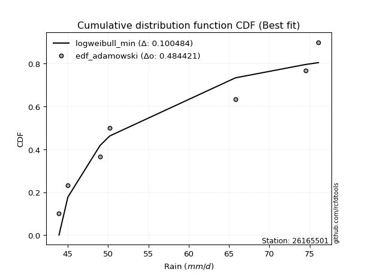</img>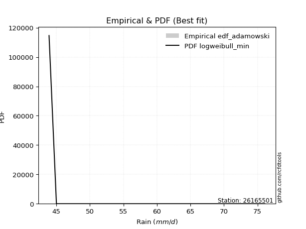</img>

</div>


## C. Best fit & Estimate extreme values for specific return periods - Tr

Best fit in probability distribution analysis means finding the theoretical distribution (like Normal, Poisson, Exponential, etc.) that most accurately mirrors your real-world data´s patterns (shape, center, spread) for better predictions, using methods like visual checks (Q-Q plots), goodness-of-fit tests (Kolmogorov-Smirnov, Chi-Squared), and information criteria (AIC) to score and select the simplest, most representative model.


### 1. Best fit (ordered by delta Δ)

:file_folder:Table: [bestfit_26165501.csv](table/bestfit_26165501.csv)

<div align="center">

|   id |   station | empirical_dist   | p_dist         |     delta |   deltao | eval   |   fit |   n |   best_fit |   best_fit_sort |
|-----:|----------:|:-----------------|:---------------|----------:|---------:|:-------|------:|----:|-----------:|----------------:|
|    0 |  26165501 | edf_blom         | f              | 0.0973751 | 0.484421 | Δo > Δ |     1 |   7 |          1 |               1 |
|    1 |  26165501 | edf_tukey        | f              | 0.0986068 | 0.484421 | Δo > Δ |     1 |   7 |          1 |               2 |
|    2 |  26165501 | edf_filliben     | f              | 0.0991931 | 0.484421 | Δo > Δ |     1 |   7 |          1 |               3 |
|    3 |  26165501 | edf_jenkinson    | f              | 0.0994691 | 0.484421 | Δo > Δ |     1 |   7 |          1 |               4 |
|    4 |  26165501 | edf_beard        | f              | 0.0994691 | 0.484421 | Δo > Δ |     1 |   7 |          1 |               5 |
|    5 |  26165501 | edf_hazen        | logwrapcauchy  | 0.0997159 | 0.484421 | Δo > Δ |     1 |   7 |          1 |               6 |
|    6 |  26165501 | edf_chegodayev   | f              | 0.0998353 | 0.484421 | Δo > Δ |     1 |   7 |          1 |               7 |
|    7 |  26165501 | edf_cunnane      | f              | 0.100249  | 0.484421 | Δo > Δ |     1 |   7 |          1 |               8 |
|    8 |  26165501 | edf_gringorten   | logwrapcauchy  | 0.10032   | 0.484421 | Δo > Δ |     1 |   7 |          1 |               9 |
|    9 |  26165501 | edf_adamowski    | logweibull_min | 0.100484  | 0.484421 | Δo > Δ |     1 |   7 |          1 |              10 |
|   10 |  26165501 | edf_weibull      | f              | 0.10997   | 0.484421 | Δo > Δ |     1 |   7 |          1 |              11 |
|   11 |  26165501 | edf_california   | invgauss       | 0.136242  | 0.484421 | Δo > Δ |     1 |   7 |          1 |              12 |

</div>


### 2. Extreme values and % difference analysis

In hydrology, a return period (or recurrence interval $Tr$) is the statistical average time between extreme events like floods or droughts of a specific magnitude, indicating how rare an event is, with a 100-year flood, for example, having a 1% chance of occurring in any given year, not that it happens exactly every century. It is a key tool for infrastructure design (like bridges or dams) and risk assessment, calculated from historical data to determine the probability of future events, although it is important to remember it is statistical average, and events can cluster or be missed.

The extreme value porcentage difference is evaluated as $pdiff = 1 - (ETrBf / ETr) * 100$, where _ETrBf_ correspond to the bestfit extreme value for a specific recurrence interval and _ETr_ correspond to the extreme value for one of the most used PDFsused in hydrology.

> risk_rate: assuming the return period as the project useful life.

:file_folder:Table: [extreme_26165501.csv](table/extreme_26165501.csv), all PDFs.  
:file_folder:Table: [extremepdiff_26165501.csv](table/extremepdiff_26165501.csv), % difference between bestfit and most used PDFs in Hydrology.

<div align="center">

Extreme values table for only best fit PDFs
|   id |      tr |   prob_l |     prob_g |     alpha |   anglit |   arcsine |   argus |    beta |   betaprime |   bradford |     burr |   burr12 |   cosine |   crystalball |   dgamma |   dweibull |   erlang |   exponnorm |   exponpow |   exponweib |         f |   fatiguelife |   foldnorm |    gamma |   gausshyper |   genexpon |   genextreme |   gengamma |   genhalflogistic |   genlogistic |   gennorm |   genpareto |   gompertz |   gumbel_l |   gumbel_r |   halfgennorm |   halflogistic |   halfnorm |   hypsecant |   invgamma |   invgauss |   invweibull |   johnsonsb |   johnsonsu |   kappa3 |   kappa4 |   ksone |   kstwobign |   laplace |   levy_l |   loggamma |   logistic |   loglaplace |    lomax |   maxwell |   mielke |    moyal |   nakagami |      ncf |      nct |    norm |   pearson3 |   powerlaw |   rayleigh |   rdist |     rice |   semicircular |   skewnorm |       t |   trapezoid |   triang |   truncexpon |   truncnorm |   truncpareto |   truncweibull_min |   tukeylambda |   uniform |   vonmises |   vonmises_line |     wald |   weibull_max |   weibull_min |   wrapcauchy |   logalpha |   loganglit |   logarcsine |   logargus |   logbeta |   logbetaprime |   logbradford |   logburr |   logburr12 |   logcosine |   logcrystalball |   logdgamma |   logdweibull |   logerlang |   logexponnorm |   logexponpow |   logexponweib |     logf |   logfatiguelife |   logfoldnorm |   loggausshyper |   loggenexpon |   loggenextreme |   loggengamma |   loggenhalflogistic |   loggenlogistic |   loggennorm |   loggenpareto |   loggompertz |   loggumbel_l |   loggumbel_r |   loghalfgennorm |   loghalflogistic |   loghalfnorm |   loghypsecant |   loginvgamma |   loginvgauss |   loginvweibull |   logjohnsonsb |   logjohnsonsu |   logkappa3 |   logkappa4 |   logksone |   logkstwobign |   loglevy_l |   logloggamma |   loglogistic |   logloglaplace |   loglomax |   logmaxwell |   logmielke |   logmoyal |   lognakagami |      logncf |   lognct |   lognorm |   logpearson3 |   logpowerlaw |   lograyleigh |   logrdist |   logrice |   logsemicircular |   logskewnorm |     logt |   logtrapezoid |   logtriang |   logtruncexpon |   logtruncnorm |   logtruncpareto |   logtruncweibull_min |   logtukeylambda |   loguniform |   logvonmises |   logvonmises_line |   logwald |   logweibull_max |   logweibull_min |   logwrapcauchy |   station |   n |   risk_rate |
|-----:|--------:|---------:|-----------:|----------:|---------:|----------:|--------:|--------:|------------:|-----------:|---------:|---------:|---------:|--------------:|---------:|-----------:|---------:|------------:|-----------:|------------:|----------:|--------------:|-----------:|---------:|-------------:|-----------:|-------------:|-----------:|------------------:|--------------:|----------:|------------:|-----------:|-----------:|-----------:|--------------:|---------------:|-----------:|------------:|-----------:|-----------:|-------------:|------------:|------------:|---------:|---------:|--------:|------------:|----------:|---------:|-----------:|-----------:|-------------:|---------:|----------:|---------:|---------:|-----------:|---------:|---------:|--------:|-----------:|-----------:|-----------:|--------:|---------:|---------------:|-----------:|--------:|------------:|---------:|-------------:|------------:|--------------:|-------------------:|--------------:|----------:|-----------:|----------------:|---------:|--------------:|--------------:|-------------:|-----------:|------------:|-------------:|-----------:|----------:|---------------:|--------------:|----------:|------------:|------------:|-----------------:|------------:|--------------:|------------:|---------------:|--------------:|---------------:|---------:|-----------------:|--------------:|----------------:|--------------:|----------------:|--------------:|---------------------:|-----------------:|-------------:|---------------:|--------------:|--------------:|--------------:|-----------------:|------------------:|--------------:|---------------:|--------------:|--------------:|----------------:|---------------:|---------------:|------------:|------------:|-----------:|---------------:|------------:|--------------:|--------------:|----------------:|-----------:|-------------:|------------:|-----------:|--------------:|------------:|---------:|----------:|--------------:|--------------:|--------------:|-----------:|----------:|------------------:|--------------:|---------:|---------------:|------------:|----------------:|---------------:|-----------------:|----------------------:|-----------------:|-------------:|--------------:|-------------------:|----------:|-----------------:|-----------------:|----------------:|----------:|----:|------------:|
|    0 |    2    | 0.5      | 0.5        |   50.3416 |  57.7857 |   57.7857 | 60.4588 | 62.0404 |     56.0284 |    56.9628 |  54.1068 |  52.265  |  58.4281 |       57.7857 |  58.8788 |    59.7027 |  50.8534 |     53.4348 |    52.0574 |     44.479  |   52.9264 |       43.9    |    57.1327 |  45.7379 |      55.1748 |    53.7037 |      50.1239 |    44.2902 |           65.7176 |       55.2653 |   50.2    |     60.7312 |    54.6592 |    59.9097 |    55.6618 |       50.5557 |        54.6058 |    55.1393 |     57.7857 |    50.6673 |    50.116  |      50.124  |     43.9657 |     57.7857 |  61.0553 |  57.8068 | 57.7857 |     55.5834 |   57.7857 |  66.7676 |    47.6325 |    57.7857 |      56.3887 |  53.1012 |   56.68   |  54.1242 |  54.9761 |    48.9541 |  56.2933 |  55.5547 | 57.7857 |    57.0116 |    44.3407 |    56.2878 | 47.1838 |  57.1451 |        57.7857 |    56.6978 | 57.7814 |     68.0026 |  62.3073 |      56.7953 |     57.5708 |       44.4474 |            49.6966 |       60.0179 |   60      | -0.0664916 |         60.1385 |  53.5948 |       75.5071 |       44.5849 |      60      |    55.1762 |     56.3887 |      56.3887 |    58.6631 |   47.5024 |        55.3335 |       55.0127 |   53.8513 |     58.2133 |     56.8577 |          56.3886 |     57.8984 |       58.1289 |     48.7712 |        56.3672 |       57.096  |        50.8508 |  50.1197 |          47.5312 |       54.6219 |         48.0165 |       53.0238 |    50.7772      |       54.9063 |              62.5621 |          54.0877 |      50.2    |        60.9085 |       53.7588 |       58.4618 |       54.3891 |          48.5639 |           53.4216 |       53.9082 |        56.3887 |       55.9814 |       50.2169 |    50.7774      |        43.9003 |        76.0858 |     58.0435 |     57.8262 |    56.3887 |        54.2423 |     66.3743 |       56.4346 |       56.3887 |         50.2    |    51.9826 |      55.3387 |     54.0916 |    53.7588 |       45.5826 |     51.0897 |  55.9764 |   56.3887 |       55.8166 |       44.3094 |       54.971  |    57.7996 |   55.6852 |           56.3887 |       54.9601 |  56.3888 |        58.5555 |     60.4376 |         54.25   |        53.0718 |          44.3406 |               51.4382 |          57.7973 |      57.7996 |      0.10525  |            57.7843 |   52.5114 |          61.9576 |          51.3864 |         57.7996 |  26165501 |   7 |    0.75     |
|    1 |    2.33 | 0.570815 | 0.429185   |   52.2326 |  60.4731 |   61.8199 | 62.7236 | 64.4221 |     58.2625 |    59.2499 |  56.1487 |  54.3297 |  60.6999 |       60.0928 |  67.3437 |    68.7326 |  52.9584 |     55.5391 |    54.9532 |     44.9364 |   55.5707 |       44.3171 |    59.6307 |  47.0215 |      57.5069 |    55.8199 |      52.0526 |    44.6545 |           67.7299 |       57.3797 |   50.5498 |     65.3385 |    56.888  |    61.9169 |    57.7996 |       52.7138 |        56.8038 |    57.6292 |     59.6321 |    52.532  |    51.9196 |      52.0527 |     44.179  |     60.0899 |  63.4854 |  60.2268 | 60.9572 |     57.7275 |   59.1819 |  69.6153 |    48.9453 |    59.8184 |      57.743  |  55.2162 |   59.0769 |  56.1679 |  56.9998 |    51.7235 |  58.5412 |  57.7552 | 60.0928 |    59.3289 |    44.9007 |    58.7202 | 47.7415 |  59.3397 |        60.6679 |    58.9006 | 60.0885 |     69.8734 |  64.5873 |      59.018  |     59.6694 |       44.8794 |            51.6244 |       62.3669 |   62.2803 |  0.137431  |         62.4384 |  55.1076 |       75.7592 |       45.3826 |      66.4382 |    57.3279 |     59.0244 |      60.3912 |    60.94   |   49.3082 |        59.2896 |       57.207  |   55.8731 |     60.6141 |     59.0918 |          58.644  |     67.0976 |       67.7555 |     50.268  |        58.621  |       60.3789 |        53.0455 |  52.6297 |          49.1465 |       57.1003 |         49.4729 |       55.1118 |    52.618       |       59.4453 |              64.7072 |          56.1285 |      51.6322 |        67.7867 |       55.8883 |       60.4909 |       56.4019 |          50.2839 |           55.4553 |       56.2389 |        58.1866 |       58.1868 |       51.9997 |    52.6182      |        43.9012 |        76.0978 |     60.3854 |     60.2383 |    59.5121 |        56.3044 |     69.2057 |       58.7    |       58.3712 |         51.6547 |    54.01   |      57.64   |     56.1367 |    55.6403 |       47.348  |     52.9301 |  58.7689 |   58.6441 |       58.0594 |       44.7981 |       57.2916 |    61.1194 |   57.8343 |           59.2202 |       57.1273 |  58.6442 |        61.2595 |     62.7842 |         56.3191 |        54.9846 |          44.6848 |               53.4692 |          60.1593 |      60.0958 |      0.109448 |            60.0844 |   53.8793 |          65.0564 |          54.1886 |         64.5202 |  26165501 |   7 |    0.729209 |
|    2 |    5    | 0.8      | 0.2        |   66.8952 |  69.9547 |   72.5775 | 69.9883 | 71.4948 |     67.6243 |    67.5597 |  65.9418 |  65.834  |  68.8865 |       68.6666 |  71.9204 |    73.3019 |  64.5616 |     66.0605 |    70.9698 |     50.7834 |   73.4646 |       53.1783 |    68.947  |  57.8917 |      66.6676 |    66.1851 |      67.4951 |    50.2265 |           72.9425 |       66.5643 |   56.1218 |     74.2884 |    67.3697 |    68.4013 |    67.0871 |       66.7403 |        66.7493 |    68.159  |     67.0383 |    65.6047 |    63.8138 |      67.4954 |     65.1402 |     68.6529 |  71.354  |  68.5301 | 71.2214 |     66.8349 |   66.1623 |  74.3333 |    57.1652 |    67.667  |      65.0177 |  66.2929 |   68.511  |  65.9571 |  66.3737 |    69.0271 |  67.7729 |  67.317  | 68.6666 |    68.3797 |    51.9888 |    68.4581 | 49.4403 |  68.1242 |        70.5038 |    68.2162 | 68.6621 |     75.2407 |  71.1285 |      67.2156 |     68.1834 |       50.2393 |            61.1577 |       69.9052 |   69.66   |  0.935781  |         69.8817 |  63.5763 |       76.0693 |       61.8678 |      73.8189 |    66.7158 |     69.3472 |      72.509  |    68.8573 |   60.2363 |        77.0475 |       65.8895 |   65.7904 |     69.2615 |     67.8963 |          67.8454 |     72.3638 |       73.2602 |     59.2062 |        67.8313 |       77.0722 |        65.657  |  70.3925 |          62.4366 |       67.9646 |         57.4609 |       66.021  |    65.9124      |       93.0972 |              71.1006 |          65.925  |      59.677  |        75.7675 |       66.3427 |       67.54   |       66.0479 |          63.7215 |           65.6697 |       67.2623 |        65.9932 |       67.4363 |       64.0804 |    65.9123      |        44.1967 |        76.1    |     68.6321 |     68.6415 |    70.8566 |        65.9745 |     74.165  |       67.9023 |       66.7022 |         59.7745 |    65.7734 |      67.6661 |     65.9733 |    65.2518 |       69.5081 |     65.2722 |  70.6623 |   67.8453 |       67.6016 |       50.8941 |       67.6052 |    71.4692 |   67.2838 |           69.9975 |       67.2783 |  67.8457 |        69.7301 |     70.0346 |         64.8564 |        63.3323 |          49.072  |               62.7084 |          68.4138 |      68.1712 |      0.126602 |            68.1749 |   62.2215 |          72.511  |          75.21   |         73.1913 |  26165501 |   7 |    0.67232  |
|    3 |   10    | 0.9      | 0.1        |   93.8339 |  75.3214 |   75.1746 | 73.4915 | 74.1244 |     74.9038 |    71.6669 |  75.1556 | inf      |  73.8326 |       74.3543 |  74.3918 |    75.1703 |  75.9665 |     75.6116 |    85.9041 |     63.8258 |   99.9318 |       65.4134 |    75.1347 |  72.1753 |      71.6697 |    75.3106 |      96.5936 |    64.5196 |           74.6948 |       74.0443 |   67.2042 |     75.7406 |    76.0525 |    72.0116 |    74.6516 |       83.9818 |        75.0086 |    75.9507 |     72.9524 |    86.154  |    78.9107 |      96.594  |     75.6463 |     74.3334 |  74.8695 |  72.3804 | 75.7    |     73.7691 |   72.499  |  75.4723 |    66.8669 |    73.4473 |      72.4122 |  77.1124 |   75.1503 |  75.1508 |  74.5351 |    85.0932 |  74.7611 |  75.1469 | 74.3543 |    74.7723 |    60.6714 |    75.4014 | 50.0558 |  74.3859 |        75.5508 |    75.1095 | 74.3496 |     77.3371 |  73.6834 |      71.4077 |     74.2464 |       58.1882 |            67.5774 |       73.1112 |   72.88   |  1.54759   |         73.1295 |  72.5635 |       76.0957 |      115.966  |      75.0662 |    74.4526 |     75.9711 |      75.7817 |    73.0349 |   69.1748 |        92.11   |       70.6261 |   75.4617 |     74.7473 |     73.8394 |          74.7325 |     75.3528 |       75.6416 |     69.3825 |        74.744  |       92.3704 |        79.0535 |  95.3108 |          82.7951 |       76.558  |         64.1375 |       76.6607 |    90.0004      |      144.221  |              73.7176 |          75.1532 |      68.2837 |        76.0829 |       75.5948 |       71.8147 |       75.1111 |          86.5718 |           75.5682 |       76.7882 |        72.9725 |       74.6328 |       81.3333 |    89.9986      |        52.5744 |        76.1    |     72.5747 |     72.5046 |    76.4616 |        74.4362 |     75.4146 |       74.7486 |       73.5889 |         68.5667 |    79.3355 |      75.7504 |     75.2824 |    74.9625 |      110.742  |     84.7449 |  80.0932 |   74.7324 |       75.1626 |       59.0107 |       76.0745 |    74.6753 |   74.9286 |           76.2679 |       75.934  |  74.7329 |        73.3484 |     73.0888 |         69.8659 |        68.7012 |          56.2364 |               68.5609 |          72.2628 |      72.0266 |      0.139511 |            72.0382 |   72.4916 |          74.7037 |         108.842  |         74.7677 |  26165501 |   7 |    0.651322 |
|    4 |   15    | 0.933333 | 0.0666667  |  120.676  |  77.6131 |   75.6699 | 74.8233 | 74.8961 |     78.9086 |    73.1072 |  80.9068 | inf      |  76.0856 |       77.1926 |  75.6179 |    75.9853 |  82.8579 |     81.1986 |    94.4436 |     76.2147 |  122.347  |       73.4153 |    78.2229 |  81.7554 |      73.5298 |    80.5357 |     125.945  |    79.0893 |           75.2113 |       78.2643 |   76.8378 |     75.9605 |    80.8162 |    73.6466 |    78.9195 |       96.0257 |        79.6826 |    80.0056 |     76.3275 |   104.384  |    89.5446 |     125.945  |     76.0245 |     77.1681 |  76.1684 |  73.7011 | 77.1929 |     77.4503 |   76.2057 |  75.8164 |    73.5835 |    76.5966 |      77.1216 |  83.8005 |   78.5568 |  80.8826 |  79.2717 |    93.8916 |  78.5412 |  79.6067 | 77.1926 |    78.0804 |    64.9065 |    78.9789 | 50.2276 |  77.6115 |        77.5189 |    78.6967 | 77.1878 |     78.0098 |  74.5032 |      72.9105 |     77.3516 |       62.6327 |            70.1486 |       74.1543 |   73.9533 |  1.88176   |         74.2121 |  78.3347 |       76.0986 |      179.082  |      75.4224 |    78.8807 |     78.989  |      76.4224 |    74.6888 |   73.1546 |       100.841  |       72.3622 |   81.6688 |     77.4112 |     76.7164 |          78.4265 |     76.8765 |       76.7051 |     76.3202 |        78.4594 |      101.347  |        87.7065 | 114.956  |          99.2376 |       81.2745 |         67.3512 |       83.2357 |   116.031       |      187.066  |              74.5875 |          80.9183 |      73.9542 |        76.097  |       80.9176 |       73.8387 |       80.7628 |         107.947  |           81.8172 |       82.2676 |        77.2816 |       78.592  |       95.3392 |   116.026       |        66.4664 |        76.1    |     73.9386 |     73.7887 |    78.4268 |        79.3608 |     75.7962 |       78.4063 |       77.6358 |         74.4564 |    88.8808 |      80.2663 |     81.1231 |    81.2477 |      145.327  |    103.164  |  85.3392 |   78.4263 |       79.3683 |       63.3304 |       80.8444 |    75.397  |   79.1924 |           78.8626 |       80.8703 |  78.427  |        74.5487 |     74.0968 |         71.7855 |        70.8825 |          60.6494 |               70.8583 |          73.5624 |      73.3595 |      0.146472 |            73.374  |   79.9637 |          75.284  |         138.71   |         75.2241 |  26165501 |   7 |    0.644736 |
|    5 |   20    | 0.95     | 0.05       |  147.495  |  78.9612 |   75.8443 | 75.5544 | 75.2529 |     81.6791 |    73.8412 |  85.1919 | inf      |  77.4712 |       79.0513 |  76.4277 |    76.4896 |  87.8184 |     85.1626 |   100.373  |     87.5914 |  142.499  |       79.3397 |    80.2454 |  88.9532 |      74.5074 |    84.1959 |     155.474  |    92.9711 |           75.4553 |       81.219  |   85.2615 |     76.0287 |    84.0691 |    74.6643 |    81.9078 |      105.446  |        82.9573 |    82.7089 |     78.7085 |   121.274  |    97.8327 |     155.474  |     76.0776 |     79.0245 |  76.9098 |  74.3706 | 77.9393 |     79.9301 |   78.8356 |  75.9926 |    78.8567 |    78.7733 |      80.6477 |  88.714  |   80.8175 |  85.1502 |  82.6262 |    99.8364 |  81.1311 |  82.7563 | 79.0513 |    80.2897 |    67.3392 |    81.3568 | 50.3041 |  79.7552 |        78.6106 |    81.0884 | 79.0465 |     78.3416 |  74.9076 |      73.684  |     79.4074 |       65.3493 |            71.5293 |       74.6679 |   74.49   |  2.10143   |         74.7534 |  82.6353 |       76.0993 |      243.87   |      75.5948 |    82.0178 |     80.82   |      76.6494 |    75.6125 |   75.4116 |       107.06   |       73.2625 |   86.3795 |     79.1301 |     78.5411 |          80.944  |     77.8982 |       77.3707 |     81.726  |        80.9949 |      107.726  |        94.2201 | 131.741  |         113.409  |       84.5255 |         69.2828 |       88.0659 |   145.092       |      225.103  |              75.0267 |          85.2161 |      78.2887 |        76.0991 |       84.6582 |       75.1272 |       84.9712 |         128.661  |           86.5008 |       86.1364 |        80.4736 |       81.3306 |      107.553  |   145.084       |        72.5007 |        76.1    |     74.6301 |     74.4229 |    79.4282 |        82.8606 |     75.9924 |       80.8933 |       80.5623 |         79.0167 |    96.5175 |      83.411  |     85.4901 |    86.0153 |      175.158  |    121.59   |  88.9897 |   80.9438 |       82.2951 |       65.9319 |       84.1791 |    75.6755 |   82.1567 |           80.3397 |       84.3384 |  80.9445 |        75.148  |     74.5991 |         72.8009 |        72.0689 |          63.5052 |               72.0832 |          74.2112 |      74.0353 |      0.151234 |            74.0512 |   86.0284 |          75.5403 |         166.504  |         75.4459 |  26165501 |   7 |    0.641514 |
|    6 |   25    | 0.96     | 0.04       |  174.305  |  79.8748 |   75.9252 | 76.0258 | 75.4551 |     83.7976 |    74.2861 |  88.6457 | inf      |  78.4428 |       80.4195 |  77.0289 |    76.8483 |  91.6998 |     88.2374 |   104.892  |     98.0685 |  161.124  |       84.047  |    81.7342 |  94.7264 |      75.1125 |    87.0092 |     185.137  |   106.067  |           75.5966 |       83.4949 |   92.7725 |     76.0576 |    86.5243 |    75.3885 |    84.2095 |      113.253  |        85.4804 |    84.7204 |     80.5512 |   137.238  |   104.659  |     185.138  |     76.0914 |     80.391  |  77.4169 |  74.7758 | 78.3872 |     81.7875 |   80.8756 |  76.1032 |    83.2571 |    80.4385 |      83.4933 |  92.6245 |   82.4959 |  88.5881 |  85.2263 |   104.284  |  83.0982 |  85.2006 | 80.4195 |    81.938  |    68.909  |    83.1235 | 50.3463 |  81.3477 |        79.3188 |    82.8678 | 80.4147 |     78.5393 |  75.1486 |      74.1555 |     80.9304 |       67.1649 |            72.3904 |       74.9725 |   74.812  |  2.25681   |         75.0782 |  86.0801 |       76.0996 |      308.124  |      75.6969 |    84.4582 |     82.0849 |      76.7549 |    76.2142 |   76.8708 |       111.911  |       73.8133 |   90.23   |     80.3828 |     79.8465 |          82.8488 |     78.6648 |       77.8477 |     86.2147 |        82.915  |      112.68   |        99.4926 | 146.664  |         126.069  |       87.0037 |         70.5879 |       91.9097 |   177.832       |      259.867  |              75.293  |          88.6815 |      81.8398 |        76.0997 |       87.5405 |       76.0578 |       88.3617 |         149.063  |           90.2914 |       89.1324 |        83.0343 |       83.4245 |      118.584  |   177.818       |        74.5648 |        76.1    |     75.0482 |     74.7988 |    80.0352 |        85.5828 |     76.1157 |       82.772  |       82.8753 |         82.7923 |   102.999  |      85.825  |     89.0194 |    89.9023 |      201.607  |    140.416  |  91.7923 |   82.8485 |       84.5425 |       67.6598 |       86.7455 |    75.8132 |   84.4289 |           81.3128 |       87.0149 |  82.8493 |        75.5073 |     74.9    |         73.4293 |        72.8152 |          65.4846 |               72.8442 |          74.5989 |      74.4437 |      0.154848 |            74.4605 |   91.2163 |          75.6816 |         192.941  |         75.5777 |  26165501 |   7 |    0.639603 |
|    7 |   50    | 0.98     | 0.02       |  308.31   |  82.1236 |   76.0333 | 77.0946 | 75.8235 |     90.2618 |    75.1861 | 100.185  | inf      |  80.9871 |       84.3377 |  78.7813 |    77.8253 | 103.908  |     97.7884 |   118.466  |    141.108  |  241.141  |       99.1498 |    85.9976 | 113.511  |      76.3756 |    95.6128 |     334.79   |   162.009  |           75.865  |       90.5057 |  122.061  |     76.0916 |    93.8027 |    77.3544 |    91.3    |      140.304  |        93.2543 |    90.5668 |     86.2644 |   208.815  |   127.868  |     334.79   |     76.1007 |     84.3042 |  78.7634 |  75.5971 | 79.2829 |     87.2419 |   87.2122 |  76.3523 |    98.8284 |    85.5261 |      92.989  | 105.347  |   87.3636 | 100.064  |  93.298  |   117.265  |  89.0321 |  92.8532 | 84.3377 |    86.7612 |    72.3143 |    88.2519 | 50.4197 |  85.9699 |        80.9366 |    88.0401 | 84.3328 |     78.9316 |  75.6267 |      75.1157 |     85.3307 |       71.2702 |            74.1902 |       75.5707 |   75.456  |  2.63052   |         75.7277 |  97.3272 |       76.0999 |      606.827  |      75.8992 |    92.1329 |     85.2836 |      76.8961 |    77.5962 |   80.0887 |       127.219  |       74.9398 |  103.443  |     83.9132 |     83.3685 |          88.5548 |     80.9393 |       79.1624 |    101.97   |        88.6777 |      128.1    |       117.155  | 206.17   |         176.9    |       94.5169 |         73.6862 |      104.412  |   416.263       |      405.569  |              75.8371 |         100.268  |      94.0157 |        76.1    |       96.3945 |       78.6424 |       99.6804 |         250.723  |          103.047  |       98.4457 |        91.5028 |       89.8117 |      163.963  |   416.188       |        76.068  |        76.1    |     75.8933 |     75.5326 |    81.2632 |        94.1045 |     76.3943 |       88.3845 |       90.3616 |         96.0184 |   126.81   |      93.2286 |    100.872  |   103.124  |      304.651  |    245.675  | 100.398  |   88.5545 |       91.4456 |       71.546  |       94.6471 |    76.0156 |   91.3779 |           83.58   |       95.2867 |  88.5554 |        76.2256 |     75.5008 |         74.7321 |        74.3937 |          70.18   |               74.4283 |          75.3665 |      75.2673 |      0.165734 |            75.2859 |  110.434  |          75.9294 |         314.136  |         75.8393 |  26165501 |   7 |    0.63583  |
|    8 |   75    | 0.986667 | 0.0133333  |  442.296  |  83.1134 |   76.0534 | 77.5185 | 75.9316 |     93.9912 |    75.4892 | 107.567  | inf      |  82.2022 |       86.44   |  79.7436 |    78.3234 | 111.136  |    103.375  |   126.084  |    174.641  |  309.084  |      108.245  |    88.2852 | 124.979  |      76.8181 |   100.556  |     485.868  |   207.262  |           75.9491 |       94.5807 |  143.775  |     76.0967 |    97.8366 |    78.3485 |    95.4213 |      158.099  |        97.7732 |    93.7494 |     89.6031 |   272.502  |   142.7    |     485.868  |     76.1013 |     86.4039 |  79.4594 |  75.8753 | 79.5814 |     90.2429 |   90.9189 |  76.4546 |   109.426  |    88.4645 |      99.0367 | 113.212  |   90.0101 | 107.397  |  98.0182 |   124.337  |  92.4109 |  97.4029 | 86.44   |    89.4127 |    73.5323 |    91.042  | 50.4398 |  88.4841 |        81.5829 |    90.8557 | 86.4351 |     79.0615 |  75.785  |      75.4411 |     87.7119 |       72.7937 |            74.8141 |       75.7652 |   75.6707 |  2.77315   |         75.9442 | 104.248  |       76.1    |      869.097  |      75.9662 |    96.7214 |     86.7306 |      76.9223 |    78.1512 |   81.2789 |       136.387  |       75.3228 |  112.177  |     85.7741 |     85.1049 |          91.7767 |     82.2143 |       79.8414 |    112.6    |        91.939  |      137.145  |       128.442  | 252.67   |         216.859  |       98.8153 |         74.9451 |      112.136  |   839.372       |      525.533  |              76.0247 |         107.685  |     102.019  |        76.1    |      101.51   |       79.9826 |      106.914  |         355.518  |          111.275  |      103.918  |        96.8461 |       93.495  |      200.759  |   839.137       |        76.1697 |        76.1    |     76.184  |     75.7682 |    81.6766 |        99.1497 |     76.509  |       91.5436 |       94.9898 |        104.956  |   143.842  |      97.5184 |    108.503  |   111.739  |      381.706  |    375.78   | 105.398  |   91.7764 |       95.4577 |       72.9837 |       99.2441 |    76.0588 |   95.3897 |           84.5033 |      100.115  |  91.7774 |        76.4649 |     75.7007 |         75.1805 |        74.9474 |          72.0035 |               74.9754 |          75.6179 |      75.5438 |      0.171926 |            75.5631 |  124.221  |          75.9988 |         426.005  |         75.9262 |  26165501 |   7 |    0.634587 |
|    9 |  100    | 0.99     | 0.01       |  576.278  |  83.7019 |   76.0604 | 77.7551 | 75.9815 |     96.6246 |    75.6414 | 113.116  | inf      |  82.9637 |       87.862  |  80.4042 |    78.6513 | 116.296  |    107.339  |   131.35   |    202.646  |  370.212  |      114.79   |    89.8325 | 133.287  |      77.0453 |   104.026  |     637.879  |   245.86   |           75.9897 |       97.4648 |  161.424  |     76.0983 |   100.607  |    78.9987 |    98.3382 |      171.612  |       100.972  |    95.9175 |     91.9714 |   331.555  |   153.72   |     637.878  |     76.1014 |     87.8241 |  79.9315 |  76.0157 | 79.7307 |     92.299  |   93.5489 |  76.5144 |   117.695  |    90.5391 |     103.565  | 118.989  |   91.8127 | 112.905  | 101.367  |   129.15   |  94.778  | 100.676  | 87.862  |    91.2314 |    74.1575 |    92.9428 | 50.4487 |  90.1967 |        81.9448 |    92.7738 | 87.857  |     79.1263 |  75.864  |      75.6048 |     89.3293 |       73.587  |            75.1308 |       75.861  |   75.778  |  2.84708   |         76.0525 | 109.294  |       76.1    |     1103.66   |      75.9997 |   100.034  |     87.6026 |      76.9314 |    78.4627 |   81.9053 |       143.005  |       75.5157 |  118.889  |     87.02   |     86.2115 |          94.0222 |     83.1004 |       80.2915 |    120.852  |        94.2151 |      143.573  |       136.904  | 292.343  |         251.06   |      101.834  |         75.6459 |      117.806  |  1559.62        |      631.149  |              76.1206 |         113.264  |     108.131  |        76.1    |      105.113  |       80.8716 |      112.349  |         464.987  |          117.492  |      107.82   |       100.824  |       96.0949 |      232.959  |  1559.04        |        76.1909 |        76.1    |     76.3375 |     75.8831 |    81.8842 |       102.762  |     76.5762 |       93.741  |       98.3994 |        111.915  |   157.616  |     100.553  |    114.263  |   118.285  |      445.009  |    536.546  | 108.942  |   94.0218 |       98.3028 |       73.7317 |      102.503  |    76.0753 |   98.2208 |           85.0248 |      103.544  |  94.0228 |        76.5845 |     75.8006 |         75.4076 |        75.2298 |          72.9709 |               75.2528 |          75.7421 |      75.6825 |      0.176261 |            75.702  |  135.347  |          76.03   |         533.136  |         75.9697 |  26165501 |   7 |    0.633968 |
|   10 |  200    | 0.995    | 0.005      | 1112.19   |  84.8138 |   76.0672 | 78.1664 | 76.0492 |    102.953  |    75.8703 | 127.652  | inf      |  84.5122 |       91.0874 |  81.9338 |    79.3711 | 128.817  |    116.89   |   143.584  |    286.105  |  578.441  |      130.81   |    93.3421 | 153.788  |      77.3972 |   112.266  |    1251.71   |   364.091  |           76.0481 |      104.398  |  212.261  |     76.0997 |   106.996  |    80.4121 |   105.351  |      207.218  |       108.661  |   100.876  |     97.6769 |   542.062  |   181.762  |    1251.7    |     76.1015 |     91.0455 |  81.031  |  76.2289 | 79.9547 |     97.0348 |   99.8855 |  76.6277 |   140.505  |    95.5157 |     115.343  | 133.617  |   95.9368 | 127.321  | 109.435  |   140.132  | 100.406  | 108.745  | 91.0874 |    95.433  |    75.1161 |    97.2921 | 50.4602 |  94.1147 |        82.5758 |    97.1607 | 91.0824 |     79.2233 |  75.9821 |      75.8516 |     93.0156 |       74.818  |            75.6118 |       76.002  |   75.939  |  2.96032   |         76.2149 | 121.863  |       76.1    |     1869.32   |      76.0498 |   108.248  |     89.274  |      76.9403 |    79.0072 |   82.9    |       159.385  |       75.8069 |  137.063  |     89.81   |     88.5063 |          99.3212 |     85.1869 |       81.2888 |    143.45   |        99.5981 |      159.103  |       158.949  | 417.296  |         359.219  |      109.028  |         76.8404 |      132.145  | 12166.3         |      978.514  |              76.2691 |         127.889  |     124.492  |        76.1    |      113.71   |       82.8381 |      126.572  |         954.163  |          133.899  |      117.302  |       111.093  |      102.339  |      338.552  | 12157.4         |        76.2033 |        76.1    |     76.6053 |     76.0499 |    82.1965 |       111.59   |     76.7036 |       98.913  |      107.086  |        131.119  |   197.862  |     107.855  |    129.449  |   135.673  |      631.319  |   1598.63   | 117.502  |   99.3208 |      105.178  |       74.8919 |      110.369  |    76.0929 |  105.011  |           85.9416 |      111.835  |  99.322  |        76.7639 |     75.9504 |         75.7517 |        75.6605 |          74.497  |               75.6735 |          75.9254 |      75.891  |      0.186563 |            75.9109 |  167.586  |          76.0712 |         939.842  |         76.0348 |  26165501 |   7 |    0.633042 |
|   11 |  250    | 0.996    | 0.004      | 1380.15   |  85.0967 |   76.068  | 78.2626 | 76.0613 |    104.991  |    75.9162 | 132.709  | inf      |  84.9367 |       92.0731 |  82.4103 |    79.5849 | 132.871  |    119.965  |   147.392  |    318.204  |  669.622  |      136.031  |    94.4147 | 160.512  |      77.4698 |   114.884  |    1560.97   |   410.572  |           76.0593 |      106.627  |  231.304  |     76.0998 |   108.972  |    80.8279 |   107.605  |      219.602  |       111.133  |   102.402  |     99.5135 |   637.82   |   191.193  |    1560.96   |     76.1015 |     92.0299 |  81.3793 |  76.272  | 79.9994 |     98.5004 |  101.925  |  76.6572 |   148.814  |    97.1134 |     119.413  | 138.548  |   97.2063 | 132.332  | 112.033  |   143.501  | 102.201  | 111.406  | 92.0731 |    96.7382 |    75.3108 |    98.6309 | 50.4621 |  95.3206 |        82.7238 |    98.5102 | 92.068  |     79.2426 |  76.0057 |      75.9012 |     94.1465 |       75.0702 |            75.7088 |       76.0296 |   75.9712 |  2.9832    |         76.2474 | 126.022  |       76.1    |     2186.03   |      76.0599 |   110.971  |     89.7045 |      76.9414 |    79.1351 |   83.11   |       164.799  |       75.8654 |  143.588  |     90.653  |     89.146  |         100.999  |     85.847  |       81.5875 |    151.63   |       101.306  |      164.115  |       166.573  | 468.5    |         403.684  |      111.327  |         77.1115 |      136.97   | 29312.8         |     1125.9    |              76.2998 |         132.98   |     130.294  |        76.1    |      116.453  |       83.4257 |      131.517  |        1229.47   |          139.645  |      120.383  |       114.616  |      104.349  |      383.443  | 29286.5         |        76.2042 |        76.1    |     76.673  |     76.082  |    82.2591 |       114.473  |     76.7368 |      100.547  |      110.034  |        138.132  |   213.357  |     110.208  |    134.765  |   141.797  |      702.714  |   2474.21   | 120.27   |  100.999  |      107.403  |       75.1297 |      112.909  |    76.0952 |  107.192  |           86.1581 |      114.516  | 101      |        76.7998 |     75.9804 |         75.821  |        75.7476 |          74.8135 |               75.7583 |          75.9614 |      75.9327 |      0.189848 |            75.9528 |  179.861  |          76.0784 |        1136.64   |         76.0479 |  26165501 |   7 |    0.632858 |
|   12 |  500    | 0.998    | 0.002      | 2719.92   |  85.7984 |   76.0691 | 78.4839 | 76.0834 |    111.341  |    76.008  | 149.713  | inf      |  86.0663 |       94.9961 |  83.8496 |    80.2039 | 145.524  |    129.516  |   158.845  |    435.938  | 1061.51   |      152.409  |    97.5953 | 181.716  |      77.6191 |   122.915  |    3121.14   |   584.641  |           76.0808 |      113.546  |  299.519  |     76.1    |   114.883  |    82.02   |   114.602  |      260.957  |       118.806  |   106.95   |    105.219  |  1067.35   |   221.571  |    3121.12   |     76.1015 |     94.9492 |  82.4595 |  76.3592 | 80.089  |    102.893  |  108.262  |  76.7334 |   178.081  |   102.068  |     132.994  | 154.59   |  100.995  | 149.164  | 120.101  |   153.518  | 107.741  | 119.893  | 94.9961 |   100.667  |    75.7034 |   102.625  | 50.4655 |  98.918  |        83.0646 |   102.534  | 94.991  |     79.2813 |  76.0529 |      76.0005 |     97.5106 |       75.5809 |            75.9038 |       76.084  |   76.0356 |  3.0291    |         76.3123 | 139.243  |       76.1    |     3432.61   |      76.0799 |   119.708  |     90.7808 |      76.9428 |    79.4301 |   83.5482 |       182.097  |       75.9827 |  166.292  |     93.1274 |     90.8709 |         106.145  |     87.8702 |       82.4584 |    180.258  |       106.555  |      179.725  |       192.025  | 673.299  |         582.083  |      118.434  |         77.7126 |      152.637  |     1.16942e+06 |     1736.12   |              76.3632 |         150.111  |     150.182  |        76.1    |      124.909  |       85.1335 |      148.128  |        2899.13   |          159.1    |      130.06   |       126.288  |      110.608  |      570.926  |     1.16747e+06 |        76.2049 |        76.1    |     76.8543 |     76.1442 |    82.3844 |       123.565  |     76.8226 |      105.545  |      119.703  |        162.986  |   271.568  |     117.538  |    152.753  |   162.641  |      965.78   |  13550.2    | 128.931  |  106.144  |      114.368  |       75.6109 |      120.842  |    76.0987 |  113.965  |           86.6587 |      122.899  | 106.146  |        76.8715 |     76.0403 |         75.9602 |        75.9231 |          75.4582 |               75.9287 |          76.0323 |      76.0163 |      0.199991 |            76.0366 |  225.188  |          76.0911 |        2098.11   |         76.0739 |  26165501 |   7 |    0.632489 |
|   13 |  750    | 0.998667 | 0.00133333 | 4059.69   |  86.109  |   76.0693 | 78.5729 | 76.0899 |    115.079  |    76.0387 | 160.641  | inf      |  86.6137 |       96.6199 |  84.6665 |    80.5386 | 152.962  |    135.103  |   165.295  |    518.479  | 1394.33   |      162.086  |    99.3622 | 194.311  |      77.6706 |   127.546  |    4696.1    |   709.371  |           76.0876 |      117.591  |  346.216  |     76.1    |   118.192  |    82.6571 |   118.693  |      287.186  |       123.291  |   109.491  |    108.556  |  1449.61   |   240.021  |    4696.06   |     76.1015 |     96.571  |  83.0953 |  76.3887 | 80.1189 |    105.36   |  111.969  |  76.7695 |   197.933  |   104.963  |     141.643  | 164.506  |  103.113  | 159.972  | 124.82   |   159.094  | 110.967  | 125.027  | 96.6199 |   102.888  |    75.8351 |   104.859  | 50.4664 | 100.929  |        83.2018 |   104.782  | 96.6148 |     79.2942 |  76.0686 |      76.0336 |     99.3855 |       75.753  |            75.9691 |       76.1017 |   76.0571 |  3.04443   |         76.334  | 147.171  |       76.1    |     4373.91   |      76.0866 |   125.032  |     91.2614 |      76.943  |    79.549  |   83.7023 |       192.572  |       76.0219 |  181.51   |     94.4863 |     91.7188 |         109.115  |     89.0388 |       82.9333 |    199.532  |       109.594  |      188.886  |       208.237  | 834.042  |         722.554  |      122.576  |         77.9414 |      162.293  |     2.45922e+07 |     2232.36   |              76.3852 |         161.13   |     163.253  |        76.1    |      129.81   |       86.0605 |      158.795  |        5035.67   |          171.705  |      135.801  |       133.659  |      114.289  |      725.766  |     2.45342e+07 |        76.205  |        76.1    |     76.9479 |     76.1641 |    82.4262 |       128.987  |     76.8633 |      108.423  |      125.741  |        180.012  |   314.321  |     121.849  |    164.406  |   176.227  |     1152.38   |  49402.3    | 134.051  |  109.115  |      118.489  |       75.773  |      125.519  |    76.0995 |  117.933  |           86.861  |      127.847  | 109.116  |        76.8954 |     76.0602 |         76.0067 |        75.9819 |          75.6767 |               75.9857 |          76.0555 |      76.0442 |      0.205898 |            76.0645 |  257.673  |          76.0947 |        3048.59   |         76.0826 |  26165501 |   7 |    0.632366 |
|   14 | 1000    | 0.999    | 0.001      | 5399.46   |  86.2941 |   76.0693 | 78.6228 | 76.0929 |    117.745  |    76.054  | 168.872  | inf      |  86.959  |       97.7379 |  85.2364 |    80.7655 | 158.254  |    139.067  |   169.767  |    583.647  | 1693.8    |      168.989  |   100.579  | 203.322  |      77.6969 |   130.804  |    6280.73   |   809.12   |           76.0909 |      120.459  |  382.597  |     76.1    |   120.477  |    83.0859 |   121.595  |      306.714  |       126.473  |   111.246  |    110.924  |  1804.07   |   253.381  |    6280.67   |     76.1015 |     97.6876 |  83.5498 |  76.4035 | 80.1338 |    107.069  |  114.599  |  76.7922 |   213.402  |   107.016  |     148.119  | 171.791  |  104.578  | 168.106  | 128.169  |   162.937  | 113.252  | 128.753  | 97.7379 |   104.433  |    75.9012 |   106.403  | 50.4668 | 102.319  |        83.2789 |   106.334  | 97.7327 |     79.3007 |  76.0764 |      76.0502 |    100.679  |       75.8394 |            76.0018 |       76.1105 |   76.0678 |  3.05209   |         76.3448 | 152.873  |       76.1    |     5150.56   |      76.09   |   128.913  |     91.5491 |      76.9431 |    79.6158 |   83.7818 |       200.173  |       76.0415 |  193.295  |     95.4156 |     92.2577 |         111.209  |     89.8628 |       83.2569 |    214.481  |       111.74   |      195.399  |       220.371  | 971.624  |         843.008  |      125.512  |         78.0652 |      169.371  |     3.63318e+08 |     2666.01   |              76.3964 |         169.433  |     173.238  |        76.1    |      133.268  |       86.6901 |      166.824  |        7623.86   |          181.248  |      139.913  |       139.149  |      116.913  |      862.932  |     3.62224e+08 |        76.2051 |        76.1    |     77.0112 |     76.1737 |    82.4471 |       132.881  |     76.8889 |      110.448  |      130.207  |        193.388  |   349.494  |     124.92   |    173.229  |   186.549  |     1301.35   | 146140      | 137.711  |  111.208  |      121.437  |       75.8545 |      128.856  |    76.0998 |  120.753  |           86.9749 |      131.379  | 111.21   |        76.9074 |     76.0702 |         76.03   |        76.0114 |          75.7866 |               76.0142 |          76.0669 |      76.0581 |      0.210085 |            76.0785 |  283.9    |          76.0963 |        3999.91   |         76.087  |  26165501 |   7 |    0.632305 |


</div>


<div align="center">

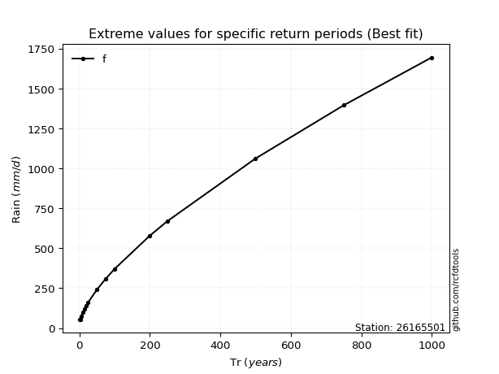</img>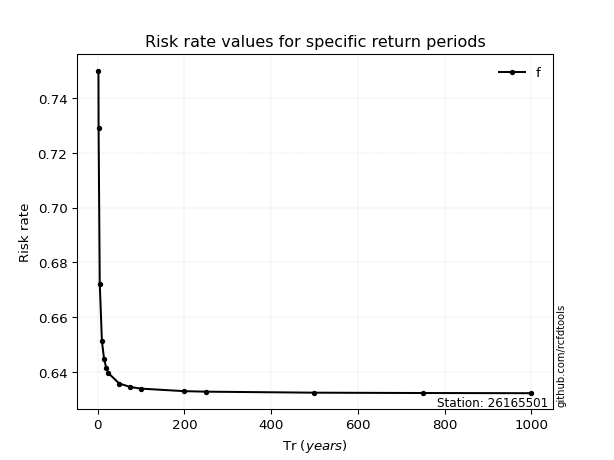</img>

</div>


<sub>**APP DISCLAIMER**: NO WARRANTY - This software is provided by [github.com/rcfdtools](https://github.com/rcfdtools) "as is", without any express or implied warranty, including warranties of merchantability, fitness for a particular purpose, or non-infringement. There is no guarantee that the software will be error-free or operate without interruption. LIMITATION OF LIABILITY - Neither the authors nor copyright holders will be liable for claims or damages arising from the software or its use. You are responsible for determining if the software is appropriate for your use and assume all associated risks, including errors, legal compliance, and data loss. NO PROFESSIONAL ADVICE - The software provides general information and does not offer professional advice. It should not replace consultation with professional advisors.</sub>