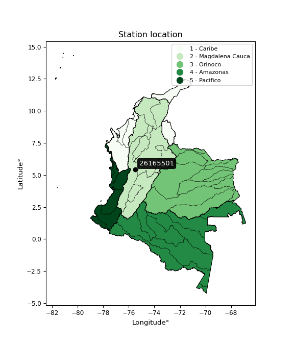

<div align="center">


</div>

# PMP Station (Rain, Pmax24h): 26165501

Probable Maximum Precipitation (PMP) is the greatest amount of rainfall for a specific duration that is meteorologically possible for a given location, acting as a "worst-case" scenario for extreme storms, crucial for designing safety-critical infrastructure like bridges, river deviations, dams, spillways, and nuclear plants to prevent catastrophic failure. PMP is calculated by hydrologists using meteorological data to determine the upper limit of extreme rainfall, often leading to the Probable Maximum Flood (PMF) for flood control design, and is increasingly being studied for climate change impacts. Probable Maximum Precipitation (PMP) is the theoretical upper limit of rainfall, a deterministic estimate for extreme events, while probability distributions (like GEV, Gumbel) describe the likelihood and frequency of various precipitation amounts, including rare ones, showing how often events occur, with PMP representing the extreme end of these distributions, used for critical infrastructure design to ensure safety against the worst conceivable weather, unlike standard statistical forecasts which cover typical probabilities.

The most common probability distributions in hydrology, used for analyzing floods, rainfall, and streamflow, include the Normal, Log-Normal, Gumbel, Gamma (including Log-Pearson Type III), and Generalized Extreme Value (GEV) distributions, often chosen based on the data´s skewness and whether modeling extremes or general conditions, with Gumbel and GEV popular for extreme events like floods, while the Normal distribution serves as a baseline, though often requiring transformations for skewed hydrological data. These distributions help in designing water infrastructure, managing water resources, and forecasting hydrologic events.

> Hydrological data often isn´t perfectly normal (it´s skewed), so different distributions are needed for different applications, such as: **Flood Frequency Analysis**: Using Gumbel, GEV, or Log-Pearson Type III for predicting extreme flood magnitudes and their return periods, **Rainfall Analysis**: Normal for annual totals, but Log-Normal, Weibull, or GEV for intensity or extreme daily rainfall, **Streamflow Modeling**: Gamma and Log-Normal for maximum flows, GEV for minimum flows, and Kappa for daily flows.

<div align="center">

</img>

</div>


## A. General information


### 1. General running parameters

• app_version: _v20260113_. • runtime: _2026-01-13 16:28:34.738620_. • Python version: _3.14.0_. • SciPy version: _1.16.3_. • Pandas version: _2.3.3_. • NumPy version: _2.3.5_. • Stations dataset (station_dataset_file): _dataset/pmax24h_in/automatic_colombia_2003_2025.csv_. • Stations catalog (station_catalog_file): _dataset/CNE.xls_. • Minimum year to eval til year_max (date_min): _1900_. • Maximum year to eval since year_min (date_max): _2025_. • Creates, save and include plots into reports (create_plot): _False_. • Plot only fit distributions with Δo > Δ (plot_only_fit): _True_. • Plot only simple graphs avoiding multiple CDFs and multiple Extreme values plots (plot_only_simple): _True_. • Eval low extreme values, if False, evaluates high extreme values (low_extreme): _False_. • Eval every SciPy distribution as logarithmic (pdist_logarithmic_on): _True_. • Standard deviation normalized (ddof): _1.0_. • Return periods to eval in years (Tr): _[2, 2.33, 5, 10, 15, 20, 25, 50, 75, 100, 200, 250, 500, 750, 1000]_. • Minimum data sample per station, 0 means any (minimum_sample): _5_. • Z-Score maximum threshold to adjust a value, 0 means disable (zscore_max): _3.5_. • Z-Score minimum threshold to adjust a value, 0 means disable (zscore_min): _-2.5_. • Avoid zeros, e.g. rain = 0 (avoid_zeros): _True_. • Avoid null values (avoid_nans): _True_. 

:file_folder:Table: [dataset.csv](../../dataset/pmax24h_in/automatic_colombia_2003_2025.csv)

> Delta Degrees of Freedom (DDOF): is a parameter used in the formulas for calculating variance and standard deviation. When ddof=0, the divisor is $N$ (the total number of observations) and this is used when your data set is the entire population. When ddof=1, the divisor is $N-1$ and this is used when your data set is a sample drawn from a larger population. Using $N-1$ provides an unbiased estimate of the population variance (known as Bessel´s correction).


### 2. Station info and location

|   id |   CODIGO | NOMBRE                       | CATEGORIA               | TECNOLOGIA                | ESTADO   | FECHA_INSTALACION   |   FECHA_SUSPENSION |   ALTITUD |   LATITUD |   LONGITUD | DEPARTAMENTO   | MUNICIPIO   | AREA_OPERATIVA                      | ENTIDAD                                    | AREA_HIDROGRAFICA   | ZONA_HIDROGRAFICA   | SUBZONA_HIDROGRAFICA                 |   CORRIENTE | Catalogo   |   Version |
|-----:|---------:|:-----------------------------|:------------------------|:--------------------------|:---------|:--------------------|-------------------:|----------:|----------:|-----------:|:---------------|:------------|:------------------------------------|:-------------------------------------------|:--------------------|:--------------------|:-------------------------------------|------------:|:-----------|----------:|
|    0 | 26165501 | EL CIPRES  - AUT  [26165501] | Climatológica Principal | Automática con Telemetría | Activa   | 21/05/2014          |                nan |      1877 |   5.43333 |      -75.5 | Caldas         | Salamina    | Area Operativa 01 - Antioquia-Chocó | CENTRO NACIONAL DE INVESTIGACIONES DE CAFE | Magdalena Cauca     | Cauca               | Rio Tapias y otros directos al Cauca |         nan | CNE_OE     |  20251226 |

<div align="center">

Dynamic map: [:earth_americas:Google](http://maps.google.com/maps?q=5.433333333,-75.5) [:earth_americas:OSM](https://www.openstreetmap.org/#map=18/5.433333333/-75.5&layers=P) [:earth_americas:Bing](https://www.bing.com/maps?cp=5.433333333~-75.5&lvl=18) [:earth_americas:Apple](https://maps.apple.com/frame?center=5.433333333%2C-75.5&span=0.003%2C0.006)

</div>


<div align="center">

```geojson
{
  "type": "Feature",
  "geometry": {
    "type": "Point", 
    "coordinates": [-75.5, 5.433333333]
  }, 
  "properties": {
    "Name": "26165501"
  }
}
```

</div>


### 3. Discrete values table and plot

<div align="center">

|               |           0 |           1 |          2 |         3 |           4 |           5 |          6 |
|:--------------|------------:|------------:|-----------:|----------:|------------:|------------:|-----------:|
| Date          | 2017        | 2018        | 2019       | 2020      | 2021        | 2022        | 2023       |
| Value         |   50.2      |   43.9      |   74.5     |   76.1    |   65.8      |   45        |   49       |
| Value_initial |   50.2      |   43.9      |   74.5     |   76.1    |   65.8      |   45        |   49       |
| count         |    7        |    7        |    7       |    7      |    7        |    7        |    7       |
| mean          |   57.7857   |   57.7857   |   57.7857  |   57.7857 |   57.7857   |   57.7857   |   57.7857  |
| std           |   13.9644   |   13.9644   |   13.9644  |   13.9644 |   13.9644   |   13.9644   |   13.9644  |
| zscore        |   -0.543218 |   -0.994365 |    1.19692 |    1.3115 |    0.573908 |   -0.915593 |   -0.62915 |


</div>


> The initial value (value_initial) correspond to the initial obtained or null completed value, and value (value) is adjusted only when the initial value is outside the valid range (outlier) definite through the Z-Score value. If Z-Score is active, values out of range or outliers are replaced with the station mean value. A Z-Score (or standard score) measures how many standard deviations a data point is from the mean of a dataset, indicating its relative position; positive scores mean above the mean, negative mean below, and a score of zero is exactly at the mean, allowing for comparison of values from different distributions. It´s calculated using the formula $z=(x–μ)/σ$, where $x$ is the data point, $μ$ is the mean, and $σ$ is the standard deviation, helping identify outliers and understand probability.
>
> <sub>**Note**: In this study, "completing" (filling gaps in) and "extending" (forecasting or lengthening the historical record) rainfall data series are avoided for certain critical analyses because they introduce artificial bias and uncertainty, which can distort the statistics of rare events (extremes), alter day-to-day variability, and compromise the integrity and homogeneity of the original data. Some reasons against Completing/Extending rainfall data are: **Distortion of Extremes and Variability**: The primary issue is that most gap-filling or extension methods rely on averaging or regression with nearby stations, which inherently smooths the data. Rainfall is highly variable in space and time, with a large percentage of zero values and occasional large storms. Infilling methods often underestimate the highest values and overestimate the lowest (zero) values, which severely distorts analyses focused on flood frequency, drought severity, and intensity-duration-frequency (IDF) curves, **Loss of Data Homogeneity**: Infilled or extended data are synthetic estimates, not actual measurements. Combining these estimates with observed data can violate the assumption of data homogeneity, which requires that the data properties do not change over time. Inhomogeneity can lead to incorrect conclusions about long-term trends or changes in climate patterns, **Propagation of Errors**: Errors and biases from the original data (e.g., wind-induced undercatch, instrument errors, site changes) or the data used for imputation can propagate through the analysis, leading to unreliable hydrological models and inaccurate predictions, **Compromised Statistical Integrity**: For statistical analyses, especially those involving the frequency of events, using artificial data can introduce time bias or autocorrelation that doesn´t exist in reality, making it difficult to assess the true probability of events, **Difficulty in Validation**: It is difficult to accurately validate the quality of filled or extended data, especially for past periods where ground-truth measurements are unavailable. The reliability of imputation techniques heavily depends on the density of the surrounding station network and the complexity of the local topography.</sub>


### 4. Active continuous probability distributions from SciPy (45 of 104 available)

A Probability Density Function (PDF) describes the relative likelihood of a continuous random variable falling within a specific range, where the total area under its curve equals 1, and the area over any interval gives the actual probability for that range. Unlike discrete probabilities (like rolling a die), a PDF shows density, not direct probability for a single point (which is zero), with higher points indicating higher likelihood, often visualized as a bell curve for normal distributions.

A log of a probability density function (log-PDF) is simply the logarithm of the PDF´s value, denoted as $log(f(x))$, useful for converting multiplication of probabilities into addition, improving numerical stability with tiny numbers, and connecting to information theory concepts like entropy. Instead of dealing with very small probabilities (e.g., 0.000001), log-PDFs use negative numbers (e.g., $log(0.00001) ≈ -11.51$ that are easier for computers to handle, preventing underflow errors and simplifying complex calculations. In this study, each active probability distribution from SciPy is also evaluated in the $log$ form.

[scipy.stats](https://docs.scipy.org/doc/scipy/reference/stats.html) is a Python´s powerful submodule within the SciPy library for comprehensive statistical analysis, offering over 130 probability distributions (like Normal, Poisson), functions for descriptive stats (mean, variance), hypothesis testing (t-tests, chi-square), random variable generation, and statistical tests, making it essential for data science, modeling, and research. It provides tools to explore, model, and draw conclusions from data efficiently, working seamlessly with NumPy.

<div align="center">

|   id | p_dist             |   n_parameter | fit_method   | label                                                                       | active   | ref                                                                                                        |
|-----:|:-------------------|--------------:|:-------------|:----------------------------------------------------------------------------|:---------|:-----------------------------------------------------------------------------------------------------------|
|    0 | alpha              |             3 | MLE          | Alpha                                                                       | True     | [:mortar_board:](https://docs.scipy.org/doc/scipy/reference/generated/scipy.stats.alpha.html)              |
|    1 | betaprime          |             4 | MLE          | Beta prime                                                                  | True     | [:mortar_board:](https://docs.scipy.org/doc/scipy/reference/generated/scipy.stats.betaprime.html)          |
|    2 | chi2               |             3 | MLE          | Chi²                                                                        | True     | [:mortar_board:](https://docs.scipy.org/doc/scipy/reference/generated/scipy.stats.chi2.html)               |
|    3 | crystalball        |             4 | MLE          | Crystalball                                                                 | True     | [:mortar_board:](https://docs.scipy.org/doc/scipy/reference/generated/scipy.stats.crystalball.html)        |
|    4 | dweibull           |             3 | MLE          | Double Weibull                                                              | True     | [:mortar_board:](https://docs.scipy.org/doc/scipy/reference/generated/scipy.stats.dweibull.html)           |
|    5 | erlang             |             3 | MLE          | Erlang                                                                      | True     | [:mortar_board:](https://docs.scipy.org/doc/scipy/reference/generated/scipy.stats.erlang.html)             |
|    6 | expon              |             2 | MLE          | Exponential                                                                 | True     | [:mortar_board:](https://docs.scipy.org/doc/scipy/reference/generated/scipy.stats.expon.html)              |
|    7 | exponnorm          |             3 | MLE          | Exponentially modified Normal                                               | True     | [:mortar_board:](https://docs.scipy.org/doc/scipy/reference/generated/scipy.stats.exponnorm.html)          |
|    8 | f                  |             4 | MLE          | F                                                                           | True     | [:mortar_board:](https://docs.scipy.org/doc/scipy/reference/generated/scipy.stats.f.html)                  |
|    9 | fatiguelife        |             3 | MLE          | Fatigue-life (Birnbaum-Saunders)                                            | True     | [:mortar_board:](https://docs.scipy.org/doc/scipy/reference/generated/scipy.stats.fatiguelife.html)        |
|   10 | fisk               |             3 | MLE          | Fisk                                                                        | True     | [:mortar_board:](https://docs.scipy.org/doc/scipy/reference/generated/scipy.stats.fisk.html)               |
|   11 | gamma              |             3 | MLE          | Gamma                                                                       | True     | [:mortar_board:](https://docs.scipy.org/doc/scipy/reference/generated/scipy.stats.gamma.html)              |
|   12 | genexpon           |             5 | MLE          | Generalized exponential                                                     | True     | [:mortar_board:](https://docs.scipy.org/doc/scipy/reference/generated/scipy.stats.genexpon.html)           |
|   13 | genlogistic        |             3 | MLE          | Generalized logistic                                                        | True     | [:mortar_board:](https://docs.scipy.org/doc/scipy/reference/generated/scipy.stats.genlogistic.html)        |
|   14 | gibrat             |             2 | MM           | Gibrat                                                                      | True     | [:mortar_board:](https://docs.scipy.org/doc/scipy/reference/generated/scipy.stats.gibrat.html)             |
|   15 | gompertz           |             3 | MLE          | Gompertz (or truncated Gumbel)                                              | True     | [:mortar_board:](https://docs.scipy.org/doc/scipy/reference/generated/scipy.stats.gompertz.html)           |
|   16 | gumbel_l           |             2 | MM           | Gumbel Left Skew                                                            | True     | [:mortar_board:](https://docs.scipy.org/doc/scipy/reference/generated/scipy.stats.gumbel_l.html)           |
|   17 | gumbel_r           |             2 | MM           | Gumbel Right Skew                                                           | True     | [:mortar_board:](https://docs.scipy.org/doc/scipy/reference/generated/scipy.stats.gumbel_r.html)           |
|   18 | halflogistic       |             2 | MM           | Half-logistic                                                               | True     | [:mortar_board:](https://docs.scipy.org/doc/scipy/reference/generated/scipy.stats.halflogistic.html)       |
|   19 | halfnorm           |             2 | MM           | Half Normal                                                                 | True     | [:mortar_board:](https://docs.scipy.org/doc/scipy/reference/generated/scipy.stats.halfnorm.html)           |
|   20 | hypsecant          |             2 | MM           | hyperbolic secant                                                           | True     | [:mortar_board:](https://docs.scipy.org/doc/scipy/reference/generated/scipy.stats.hypsecant.html)          |
|   21 | invgamma           |             3 | MLE          | Inverted gamma                                                              | True     | [:mortar_board:](https://docs.scipy.org/doc/scipy/reference/generated/scipy.stats.invgamma.html)           |
|   22 | invgauss           |             3 | MLE          | Inverse Gaussian                                                            | True     | [:mortar_board:](https://docs.scipy.org/doc/scipy/reference/generated/scipy.stats.invgauss.html)           |
|   23 | invweibull         |             3 | MLE          | Inverted Weibull                                                            | True     | [:mortar_board:](https://docs.scipy.org/doc/scipy/reference/generated/scipy.stats.invweibull.html)         |
|   24 | kappa4             |             4 | MLE          | Kappa 4                                                                     | True     | [:mortar_board:](https://docs.scipy.org/doc/scipy/reference/generated/scipy.stats.kappa4.html)             |
|   25 | kstwobign          |             2 | MLE          | Limiting distribution of scaled Kolmogorov-Smirnov two-sided test statistic | True     | [:mortar_board:](https://docs.scipy.org/doc/scipy/reference/generated/scipy.stats.kstwobign.html)          |
|   26 | laplace            |             2 | MM           | Laplace                                                                     | True     | [:mortar_board:](https://docs.scipy.org/doc/scipy/reference/generated/scipy.stats.laplace.html)            |
|   27 | laplace_asymmetric |             3 | MLE          | Asymmetric Laplace                                                          | True     | [:mortar_board:](https://docs.scipy.org/doc/scipy/reference/generated/scipy.stats.laplace_asymmetric.html) |
|   28 | loggamma           |             3 | MLE          | Log gamma                                                                   | True     | [:mortar_board:](https://docs.scipy.org/doc/scipy/reference/generated/scipy.stats.loggamma.html)           |
|   29 | logistic           |             2 | MM           | Logistic (or Sech-squared)                                                  | True     | [:mortar_board:](https://docs.scipy.org/doc/scipy/reference/generated/scipy.stats.logistic.html)           |
|   30 | lognorm            |             3 | MLE          | Log Normal                                                                  | True     | [:mortar_board:](https://docs.scipy.org/doc/scipy/reference/generated/scipy.stats.lognorm.html)            |
|   31 | maxwell            |             2 | MM           | Maxwell                                                                     | True     | [:mortar_board:](https://docs.scipy.org/doc/scipy/reference/generated/scipy.stats.maxwell.html)            |
|   32 | mielke             |             4 | MLE          | Mielke Beta-Kappa / Dagum                                                   | True     | [:mortar_board:](https://docs.scipy.org/doc/scipy/reference/generated/scipy.stats.mielke.html)             |
|   33 | moyal              |             2 | MM           | Moyal                                                                       | True     | [:mortar_board:](https://docs.scipy.org/doc/scipy/reference/generated/scipy.stats.moyal.html)              |
|   34 | nakagami           |             3 | MLE          | Nakagami                                                                    | True     | [:mortar_board:](https://docs.scipy.org/doc/scipy/reference/generated/scipy.stats.nakagami.html)           |
|   35 | ncf                |             5 | MLE          | Non-central F distribution                                                  | True     | [:mortar_board:](https://docs.scipy.org/doc/scipy/reference/generated/scipy.stats.ncf.html)                |
|   36 | nct                |             4 | MLE          | Non-central Student’s t                                                     | True     | [:mortar_board:](https://docs.scipy.org/doc/scipy/reference/generated/scipy.stats.nct.html)                |
|   37 | norm               |             2 | MM           | Normal                                                                      | True     | [:mortar_board:](https://docs.scipy.org/doc/scipy/reference/generated/scipy.stats.norm.html)               |
|   38 | pearson3           |             3 | MM           | Pearson type III                                                            | True     | [:mortar_board:](https://docs.scipy.org/doc/scipy/reference/generated/scipy.stats.pearson3.html)           |
|   39 | rayleigh           |             2 | MM           | Rayleigh                                                                    | True     | [:mortar_board:](https://docs.scipy.org/doc/scipy/reference/generated/scipy.stats.rayleigh.html)           |
|   40 | rice               |             3 | MLE          | Rice                                                                        | True     | [:mortar_board:](https://docs.scipy.org/doc/scipy/reference/generated/scipy.stats.rice.html)               |
|   41 | t                  |             3 | MLE          | Student’s t                                                                 | True     | [:mortar_board:](https://docs.scipy.org/doc/scipy/reference/generated/scipy.stats.t.html)                  |
|   42 | truncnorm          |             4 | MLE          | Truncated normal                                                            | True     | [:mortar_board:](https://docs.scipy.org/doc/scipy/reference/generated/scipy.stats.truncnorm.html)          |
|   43 | wald               |             2 | MM           | Wald                                                                        | True     | [:mortar_board:](https://docs.scipy.org/doc/scipy/reference/generated/scipy.stats.wald.html)               |
|   44 | weibull_min        |             3 | MLE          | Weibull minimum                                                             | True     | [:mortar_board:](https://docs.scipy.org/doc/scipy/reference/generated/scipy.stats.weibull_min.html)        |

</div>

> **n_parameter:** # arguments & localization & scale.
>
> **Fit methods:** (MLE) maximum likelihood, (MM) L-moments.
>
>**Inactive** (With the only purpose of prevent loops, zero divisions, infinite values, over high estimated values or horizontal trending for recurrence intervals estimations, the follow distributions were disabled.)**:** foldnorm, gennorm, norminvgauss, powernorm, powerlognorm, skewnorm, genextreme, anglit, arcsine, argus, beta, bradford, burr, burr12, cauchy, cosine, halfcauchy, foldcauchy, skewcauchy, wrapcauchy, dgamma, gengamma, exponweib, exponpow, truncexpon, gausshyper, genhalflogistic, genhyperbolic, geninvgauss, halfgennorm, johnsonsb, johnsonsu, kappa3, ksone, kstwo, loglaplace, levy, levy_l, levy_stable, ncx2, pareto, genpareto, truncpareto, lomax, powerlaw, rdist, rel_breitwigner, recipinvgauss, semicircular, studentized_range, trapezoid, triang, truncweibull_min, tukeylambda, uniform, loguniform, vonmises, vonmises_line, weibull_max, 


## B. Probability (PDF) vs. Empirical (EDF) distributions functions

A continuous probability distribution (CPD) describes probabilities for variables that can take any value within a range (like rain any time), unlike discrete variables with specific outcomes (like temperature). It uses a Probability Density Function (PDF), a curve where the total area under it equals 1, and the probability of the variable falling within an interval (a to b) is found by calculating the area under the curve between those points. A key feature is that the probability of hitting any single exact value is zero, so probabilities are always expressed for ranges, e.g., $P(a ≤ X ≤ b)$.

<div align="center">

Distributions parameters from station values
|    |   station | p_dist                |   n |          loc |          scale | shape                  | shape1             | shape2               | shape3   |
|---:|----------:|:----------------------|----:|-------------:|---------------:|:-----------------------|:-------------------|:---------------------|:---------|
|  0 |  26165501 | alpha                 |   7 |    40.3829   |    6.71808     | 0.00027434093763040483 |                    |                      |          |
|  1 |  26165501 | betaprime             |   7 |    -1.44093  |    2.96217     | 450.9992988371164      | 23.561408968835266 |                      |          |
|  2 |  26165501 | chi2                  |   7 |    43.9      |    4.73874     | 0.72448127641549       |                    |                      |          |
|  3 |  26165501 | crystalball           |   7 |    57.7857   |   12.9285      | 8075.901011719419      | 8196.641813638158  |                      |          |
|  4 |  26165501 | dweibull              |   7 |    59.7027   |   13.8737      | 4.375633151671177      |                    |                      |          |
|  5 |  26165501 | erlang                |   7 |    43.9      |   19.3759      | 0.64743383362401       |                    |                      |          |
|  6 |  26165501 | expon                 |   7 |    43.9      |   13.8857      |                        |                    |                      |          |
|  7 |  26165501 | exponnorm             |   7 |    43.8837   |    0.00499058  | 2761.0447102732915     |                    |                      |          |
|  8 |  26165501 | f                     |   7 |    42.0441   |   10.4006      | 3.522163619285994      | 2.8979049305576368 |                      |          |
|  9 |  26165501 | fatiguelife           |   7 |    43.9      |    2.07028e-06 | 2515.3764677068675     |                    |                      |          |
| 10 |  26165501 | fisk                  |   7 |    43.9      |    6.57511     | 0.5727543879316447     |                    |                      |          |
| 11 |  26165501 | gamma                 |   7 |    43.9      |   35.855       | 0.2638469280012519     |                    |                      |          |
| 12 |  26165501 | genexpon              |   7 |    43.9      |  416.768       | 28.958164617855687     | 33.77137324627182  | 1.2930455888806605   |          |
| 13 |  26165501 | genlogistic           |   7 |   -17.7894   |    9.96689     | 1057.3794626432154     |                    |                      |          |
| 14 |  26165501 | gibrat                |   7 |    47.9229   |    5.98212     |                        |                    |                      |          |
| 15 |  26165501 | gompertz              |   7 |    43.9      |  104.538       | 6.394081476859555      |                    |                      |          |
| 16 |  26165501 | gumbel_l              |   7 |    63.6042   |   10.0803      |                        |                    |                      |          |
| 17 |  26165501 | gumbel_r              |   7 |    51.9672   |   10.0803      |                        |                    |                      |          |
| 18 |  26165501 | halflogistic          |   7 |    42.4624   |   11.0534      |                        |                    |                      |          |
| 19 |  26165501 | halfnorm              |   7 |    40.6734   |   21.4471      |                        |                    |                      |          |
| 20 |  26165501 | hypsecant             |   7 |    57.7857   |    8.23056     |                        |                    |                      |          |
| 21 |  26165501 | invgamma              |   7 |    41.2501   |    9.1443      | 1.2847453368036612     |                    |                      |          |
| 22 |  26165501 | invgauss              |   7 |    42.3474   |    7.37885     | 2.0922477948092713     |                    |                      |          |
| 23 |  26165501 | invweibull            |   7 |    42.1201   |    5.51137     | 0.9823036383189012     |                    |                      |          |
| 24 |  26165501 | kappa4                |   7 |    37.5215   |   38.0078      | 1.2011563054964116     | 0.9763659052511949 |                      |          |
| 25 |  26165501 | kstwobign             |   7 |    17.6048   |   45.8916      |                        |                    |                      |          |
| 26 |  26165501 | laplace               |   7 |    57.7857   |    9.14185     |                        |                    |                      |          |
| 27 |  26165501 | laplace_asymmetric    |   7 |    43.9      |    0.0389097   | 0.002797097538043053   |                    |                      |          |
| 28 |  26165501 | loggamma              |   7 | -2984.14     |  434.275       | 1102.181242053728      |                    |                      |          |
| 29 |  26165501 | logistic              |   7 |    57.7857   |    7.12787     |                        |                    |                      |          |
| 30 |  26165501 | lognorm               |   7 |    43.9      |    0.0659372   | 12.241051102695605     |                    |                      |          |
| 31 |  26165501 | maxwell               |   7 |    27.1505   |   19.1978      |                        |                    |                      |          |
| 32 |  26165501 | mielke                |   7 |    -1.11576  |   19.3706      | 1850.8282903179968     | 5.843421044306867  |                      |          |
| 33 |  26165501 | moyal                 |   7 |    50.3923   |    5.81988     |                        |                    |                      |          |
| 34 |  26165501 | nakagami              |   7 |    43.9      |   23.8898      | 0.15302080696693127    |                    |                      |          |
| 35 |  26165501 | ncf                   |   7 |    -1.38473  |    0.0178857   | 0.07899237125264405    | 67.46585781687716  | 253.36437038597836   |          |
| 36 |  26165501 | nct                   |   7 |    -0.547157 |    0.737752    | 11.61958011413325      | 73.85734463216403  |                      |          |
| 37 |  26165501 | norm                  |   7 |    57.7857   |   12.9285      |                        |                    |                      |          |
| 38 |  26165501 | pearson3              |   7 |    57.7857   |   12.9285      | 0.35993502478607636    |                    |                      |          |
| 39 |  26165501 | rayleigh              |   7 |    33.0527   |   19.7341      |                        |                    |                      |          |
| 40 |  26165501 | rice                  |   7 |    36.1763   |   17.5153      | 0.2587434629246207     |                    |                      |          |
| 41 |  26165501 | t                     |   7 |    57.7814   |   12.9282      | 1330946.287527753      |                    |                      |          |
| 42 |  26165501 | truncnorm             |   7 |    51.305    |   15.424       | -0.48051200928869164   | 64.90762045137035  |                      |          |
| 43 |  26165501 | wald                  |   7 |    44.8572   |   12.9285      |                        |                    |                      |          |
| 44 |  26165501 | weibull_min           |   7 |    43.9      |    2.83762     | 0.257846358204718      |                    |                      |          |
| 45 |  26165501 | logalpha              |   7 |     1.16477  |   38.2845      | 13.453154988337339     |                    |                      |          |
| 46 |  26165501 | logbetaprime          |   7 |    -3.43849  |   10.294       | 645.13522597271        | 891.0652368476581  |                      |          |
| 47 |  26165501 | logchi2               |   7 |     3.78191  |    0.9934      | 0.9745252014352528     |                    |                      |          |
| 48 |  26165501 | logcrystalball        |   7 |     4.03227  |    0.219771    | 45.244106452366026     | 9.521699577463936  |                      |          |
| 49 |  26165501 | logdweibull           |   7 |     4.06266  |    0.236052    | 4.349600275448516      |                    |                      |          |
| 50 |  26165501 | logerlang             |   7 |     3.78191  |    0.262543    | 0.6928656109619142     |                    |                      |          |
| 51 |  26165501 | logexpon              |   7 |     3.78191  |    0.250354    |                        |                    |                      |          |
| 52 |  26165501 | logexponnorm          |   7 |     3.9935   |    0.21633     | 0.17923185027297922    |                    |                      |          |
| 53 |  26165501 | logf                  |   7 |     3.78191  |    0.28674     | 1.0166890587957171     | 683.4491583236834  |                      |          |
| 54 |  26165501 | logfatiguelife        |   7 |     3.77483  |    0.0865535   | 1.8377674250088376     |                    |                      |          |
| 55 |  26165501 | logfisk               |   7 |     3.78191  |    0.2061      | 0.8738514680185359     |                    |                      |          |
| 56 |  26165501 | loggamma              |   7 |     3.78191  |    0.27908     | 0.5740391468201033     |                    |                      |          |
| 57 |  26165501 | loggenexpon           |   7 |     3.78188  |    0.00359523  | 0.012346227909763266   | 1.069572194434457  | 3.02230001511517e-05 |          |
| 58 |  26165501 | loggenlogistic        |   7 |     2.77858  |    0.174563    | 718.5284376271165      |                    |                      |          |
| 59 |  26165501 | loggibrat             |   7 |     3.86462  |    0.101684    |                        |                    |                      |          |
| 60 |  26165501 | loggompertz           |   7 |     3.78191  |    0.855064    | 2.5925875684746664     |                    |                      |          |
| 61 |  26165501 | loggumbel_l           |   7 |     4.13118  |    0.171353    |                        |                    |                      |          |
| 62 |  26165501 | loggumbel_r           |   7 |     3.93336  |    0.171353    |                        |                    |                      |          |
| 63 |  26165501 | loghalflogistic       |   7 |     3.77179  |    0.187894    |                        |                    |                      |          |
| 64 |  26165501 | loghalfnorm           |   7 |     3.74138  |    0.364573    |                        |                    |                      |          |
| 65 |  26165501 | loghypsecant          |   7 |     4.03227  |    0.139909    |                        |                    |                      |          |
| 66 |  26165501 | loginvgamma           |   7 |    -0.482457 | 1975.43        | 438.5894533861185      |                    |                      |          |
| 67 |  26165501 | loginvgauss           |   7 |     3.74041  |    0.210951    | 1.3835654403560813     |                    |                      |          |
| 68 |  26165501 | loginvweibull         |   7 |     3.68204  |    0.194172    | 1.5651335406555122     |                    |                      |          |
| 69 |  26165501 | logkappa4             |   7 |     3.73589  |    0.644049    | 1.0771946391509908     | 1.0779541409129232 |                      |          |
| 70 |  26165501 | logkstwobign          |   7 |     3.33253  |    0.798641    |                        |                    |                      |          |
| 71 |  26165501 | loglaplace            |   7 |     4.03227  |    0.1554      |                        |                    |                      |          |
| 72 |  26165501 | loglaplace_asymmetric |   7 |     3.78191  |    5.30649e-05 | 0.00021197482288768874 |                    |                      |          |
| 73 |  26165501 | logloggamma           |   7 |   -45.449    |    7.12203     | 1041.135091111376      |                    |                      |          |
| 74 |  26165501 | loglogistic           |   7 |     4.03227  |    0.121165    |                        |                    |                      |          |
| 75 |  26165501 | loglognorm            |   7 |     3.78191  |    0.00152377  | 11.827967352297048     |                    |                      |          |
| 76 |  26165501 | logmaxwell            |   7 |     3.51151  |    0.326337    |                        |                    |                      |          |
| 77 |  26165501 | logmielke             |   7 |   -21.4503   |   24.7016      | 7651.931144903327      | 146.35959568765304 |                      |          |
| 78 |  26165501 | logmoyal              |   7 |     3.90659  |    0.0989306   |                        |                    |                      |          |
| 79 |  26165501 | lognakagami           |   7 |     3.78191  |    0.573662    | 0.09492694692314999    |                    |                      |          |
| 80 |  26165501 | logncf                |   7 |     3.69034  |    0.114438    | 13012.030974245901     | 4.131238808603804  | 10334.449180518402   |          |
| 81 |  26165501 | lognct                |   7 |    -4.90223  |    0.111026    | 648.4100534015945      | 80.36617910161976  |                      |          |
| 82 |  26165501 | lognorm               |   7 |     4.03227  |    0.219769    |                        |                    |                      |          |
| 83 |  26165501 | logpearson3           |   7 |     4.03227  |    0.219769    | 0.2787055643179377     |                    |                      |          |
| 84 |  26165501 | lograyleigh           |   7 |     3.61184  |    0.335455    |                        |                    |                      |          |
| 85 |  26165501 | logrice               |   7 |     3.65713  |    0.291983    | 0.4660802203331188     |                    |                      |          |
| 86 |  26165501 | logt                  |   7 |     4.03227  |    0.219773    | 95458167.10423401      |                    |                      |          |
| 87 |  26165501 | logtruncnorm          |   7 |    -2.18151  |    1.60153     | 3.7235848406461        | 4.067090999739889  |                      |          |
| 88 |  26165501 | logwald               |   7 |     3.8125   |    0.219767    |                        |                    |                      |          |
| 89 |  26165501 | logweibull_min        |   7 |     3.78191  |    0.268821    | 0.685219497566893      |                    |                      |          |

</div>

> **loc** (Location parameter): This shifts the distribution along the x-axis. For many common distributions, like the normal (Gaussian) distribution, loc represents the mean $μ$. For others, like the uniform distribution, it might represent the minimum value, or for the beta distribution, the left end of the support interval.
>
> **scale** (Scale parameter): This determines the width or spread of the distribution. For the normal distribution, scale represents the standard deviation $σ$. For a uniform distribution, it defines the length of the interval (from $loc$ to $loc + scale$).
>
> **shape** (Shape parameters): Refers to parameters that define the specific form of a probability distribution, distinct from its location (loc) and scale (scale). These parameters are required arguments for most distribution functions. For example, a normal (Gaussian) distribution is fully defined by its location (mean) and scale (standard deviation), so it has no specific shape parameters beyond loc and scale. However, other distributions have intrinsic properties that need specification, as Gamma distribution that takes a shape parameter, often named $a$ or $alpha$.


### 0. Cumulative distribution values - CDF (90 evaluated)

Cumulative Distribution Function (CDF), denoted as $F$<sub>$X$</sub>$(x)$, is a function that gives the probability that a random variable $X$ will take a value less than or equal to a specific value, $x$ (i.e., $(P(X≥x)$. It essentially "accumulates" probabilities from a given point up to the far right (positive infinity), providing a complete picture of the distribution´s probabilities for both discrete (like rain) and continuous (like temperature) variables, helping to find probabilities over ranges or above certain values. Each station is evaluated separately ordering the $x$ values ascending, calculating the CDF and PDF values for the activated distributions and their logarithmic forms.

<div align="center">

CDF ordered by x ascending and calculating $log(f(x))$ separately
|   id |   Station |   date |    x |   count |    mean |     std |    zscore |   Value_initial |   station |   m |    alpha |   alpha_pdf |   betaprime |   betaprime_pdf |        chi2 |    chi2_pdf |   crystalball |   crystalball_pdf |   dweibull |   dweibull_pdf |      erlang |     erlang_pdf |     expon |   expon_pdf |   exponnorm |   exponnorm_pdf |         f |      f_pdf |   fatiguelife |   fatiguelife_pdf |        fisk |        fisk_pdf |       gamma |   gamma_pdf |    genexpon |   genexpon_pdf |   genlogistic |   genlogistic_pdf |    gibrat |   gibrat_pdf |    gompertz |   gompertz_pdf |   gumbel_l |   gumbel_l_pdf |   gumbel_r |   gumbel_r_pdf |   halflogistic |   halflogistic_pdf |   halfnorm |   halfnorm_pdf |   hypsecant |   hypsecant_pdf |   invgamma |   invgamma_pdf |   invgauss |   invgauss_pdf |   invweibull |   invweibull_pdf |      kappa4 |   kappa4_pdf |   kstwobign |   kstwobign_pdf |   laplace |   laplace_pdf |   laplace_asymmetric |   laplace_asymmetric_pdf |    loggamma |   loggamma_pdf |   logistic |   logistic_pdf |   lognorm |   lognorm_pdf |   maxwell |   maxwell_pdf |   mielke |   mielke_pdf |     moyal |   moyal_pdf |    nakagami |   nakagami_pdf |      ncf |    ncf_pdf |      nct |    nct_pdf |     norm |   norm_pdf |   pearson3 |   pearson3_pdf |   rayleigh |   rayleigh_pdf |      rice |   rice_pdf |        t |     t_pdf |   truncnorm |   truncnorm_pdf |        wald |   wald_pdf |   weibull_min |   weibull_min_pdf |   logalpha |   logalpha_pdf |   logbetaprime |   logbetaprime_pdf |     logchi2 |   logchi2_pdf |   logcrystalball |   logcrystalball_pdf |   logdweibull |   logdweibull_pdf |   logerlang |   logerlang_pdf |   logexpon |   logexpon_pdf |   logexponnorm |   logexponnorm_pdf |        logf |   logf_pdf |   logfatiguelife |   logfatiguelife_pdf |     logfisk |   logfisk_pdf |   loggenexpon |   loggenexpon_pdf |   loggenlogistic |   loggenlogistic_pdf |   loggibrat |   loggibrat_pdf |   loggompertz |   loggompertz_pdf |   loggumbel_l |   loggumbel_l_pdf |   loggumbel_r |   loggumbel_r_pdf |   loghalflogistic |   loghalflogistic_pdf |   loghalfnorm |   loghalfnorm_pdf |   loghypsecant |   loghypsecant_pdf |   loginvgamma |   loginvgamma_pdf |   loginvgauss |   loginvgauss_pdf |   loginvweibull |   loginvweibull_pdf |   logkappa4 |   logkappa4_pdf |   logkstwobign |   logkstwobign_pdf |   loglaplace |   loglaplace_pdf |   loglaplace_asymmetric |   loglaplace_asymmetric_pdf |   logloggamma |   logloggamma_pdf |   loglogistic |   loglogistic_pdf |   loglognorm |   loglognorm_pdf |   logmaxwell |   logmaxwell_pdf |   logmielke |   logmielke_pdf |   logmoyal |   logmoyal_pdf |   lognakagami |   lognakagami_pdf |    logncf |   logncf_pdf |   lognct |   lognct_pdf |   logpearson3 |   logpearson3_pdf |   lograyleigh |   lograyleigh_pdf |   logrice |   logrice_pdf |     logt |   logt_pdf |   logtruncnorm |   logtruncnorm_pdf |   logwald |   logwald_pdf |   logweibull_min |   logweibull_min_pdf |
|-----:|----------:|-------:|-----:|--------:|--------:|--------:|----------:|----------------:|----------:|----:|---------:|------------:|------------:|----------------:|------------:|------------:|--------------:|------------------:|-----------:|---------------:|------------:|---------------:|----------:|------------:|------------:|----------------:|----------:|-----------:|--------------:|------------------:|------------:|----------------:|------------:|------------:|------------:|---------------:|--------------:|------------------:|----------:|-------------:|------------:|---------------:|-----------:|---------------:|-----------:|---------------:|---------------:|-------------------:|-----------:|---------------:|------------:|----------------:|-----------:|---------------:|-----------:|---------------:|-------------:|-----------------:|------------:|-------------:|------------:|----------------:|----------:|--------------:|---------------------:|-------------------------:|------------:|---------------:|-----------:|---------------:|----------:|--------------:|----------:|--------------:|---------:|-------------:|----------:|------------:|------------:|---------------:|---------:|-----------:|---------:|-----------:|---------:|-----------:|-----------:|---------------:|-----------:|---------------:|----------:|-----------:|---------:|----------:|------------:|----------------:|------------:|-----------:|--------------:|------------------:|-----------:|---------------:|---------------:|-------------------:|------------:|--------------:|-----------------:|---------------------:|--------------:|------------------:|------------:|----------------:|-----------:|---------------:|---------------:|-------------------:|------------:|-----------:|-----------------:|---------------------:|------------:|--------------:|--------------:|------------------:|-----------------:|---------------------:|------------:|----------------:|--------------:|------------------:|--------------:|------------------:|--------------:|------------------:|------------------:|----------------------:|--------------:|------------------:|---------------:|-------------------:|--------------:|------------------:|--------------:|------------------:|----------------:|--------------------:|------------:|----------------:|---------------:|-------------------:|-------------:|-----------------:|------------------------:|----------------------------:|--------------:|------------------:|--------------:|------------------:|-------------:|-----------------:|-------------:|-----------------:|------------:|----------------:|-----------:|---------------:|--------------:|------------------:|----------:|-------------:|---------:|-------------:|--------------:|------------------:|--------------:|------------------:|----------:|--------------:|---------:|-----------:|---------------:|-------------------:|----------:|--------------:|-----------------:|---------------------:|
|    0 |  26165501 |   2018 | 43.9 |       7 | 57.7857 | 13.9644 | -0.994365 |            43.9 |  26165501 |   1 | 0.05614  |  0.0699313  |    0.123788 |      0.0227947  | 3.72986e-06 | 1.90151e+08 |      0.141403 |         0.0173328 |  0.0853646 |     0.041782   | 1.12801e-10 | 10278.2        | 0         |  0.0720165  |  0.00117989 |      0.0724469  | 0.0773589 | 0.0583288  |     0.0203747 |       6.43801e+11 | 2.67904e-09 | 215952          | 7.95828e-05 | 2.95516e+09 | 2.36343e-07 |     0.0694827  |      0.114582 |        0.0248807  | 0         |   0          | 2.47724e-14 |     0.0611651  |   0.132035 |      0.0121928 |   0.107939 |     0.0238378  |      0.0649381 |         0.0450441  |   0.119586 |     0.0367838  |    0.116493 |      0.0138399  |  0.0536873 |     0.0653119  |   0.046319 |     0.0819319  |    0.0480661 |       0.0805156  | 5.21564e-14 |   12.3067    |    0.102093 |      0.0252966  |  0.109474 |    0.0119751  |          1.05544e-05 |               0.0718861  | 2.11844e-08 |     1.2447e+06 |   0.124762 |     0.0153197  |  0.127316 |      0.948746 |  0.141278 |     0.0216221 |      nan |          nan | 0.0806758 |  0.0260415  | 1.42567e-05 |    6.14058e+08 | 0.12708  | 0.0218185  | 0.118253 | 0.0245024  | 0.141403 |  0.0173328 |   0.13759  |      0.0196408 |   0.140213 |      0.0239485 | 0.0897419 |  0.0221634 | 0.141472 | 0.0173389 | 0.000218047 |       0.0336701 | 0           | 0          |   0.000171812 |        6.2343e+09 |   0.119961 |       1.11785  |       0.271011 |           0.8858   | 2.67074e-08 |   2.93038e+07 |         0.127319 |             0.948754 |     0.0596536 |           1.96491 | 1.03752e-10 |    80936.4      |  0         |       3.99434  |       0.127137 |           0.951382 | 2.36693e-08 | 2.7094e+07 |        0.0403458 |            12.6093   | 1.52603e-13 |    300.284    |   0.000128228 |          3.43371  |         0.10142  |             1.32748  |   0         |        0        |   5.30789e-12 |          3.03204  |      0.122129 |          0.66732  |     0.0889083 |          1.25572  |         0.0269304 |              2.65914  |     0.0885263 |          2.17506  |       0.10538  |           0.739521 |      0.120686 |          1.00452  |     0.0478482 |          3.34047  |       0.0589586 |            2.61569  |  1.5444e-15 |        21.7244  |      0.0904912 |           1.36786  |    0.0998407 |         0.642476 |             6.93519e-08 |                    3.99463  |      0.129    |          0.942068 |      0.112423 |          0.823539 |   0.00733728 |      3.86715e+12 |     0.123646 |         1.19091  |    0.102279 |        1.32362  |  0.0604035 |       1.29872  |     0.0011343 |       4.84927e+11 | 0.0597925 |     2.45141  | 0.180853 |     1.00751  |      0.123306 |          1.04142  |      0.120608 |          1.3291   | 0.0786781 |      1.21036  | 0.127319 |   0.948743 |    1.32083e-06 |           3.26594  |  0        |      0        |      7.43174e-11 |        114670        |
|    1 |  26165501 |   2022 | 45   |       7 | 57.7857 | 13.9644 | -0.915593 |            45   |  26165501 |   2 | 0.1457   |  0.0872552  |    0.150213 |      0.0252187  | 0.499633    | 0.151013    |      0.161343 |         0.0189228 |  0.137755  |     0.0528504  | 0.169685    |     0.0964754  | 0.0761616 |  0.0665316  |  0.0778163  |      0.0669257  | 0.143275  | 0.0602185  |     0.61401   |       0.0503885   | 0.264235    |      0.101229   | 0.438519    | 0.102658    | 0.0737241   |     0.0646158  |      0.143662 |        0.0279415  | 0         |   0          | 0.0654001   |     0.0577696  |   0.146091 |      0.0133784 |   0.135872 |     0.0269045  |      0.114286  |         0.044644   |   0.159875 |     0.0364531  |    0.132701 |      0.0156599  |  0.136896  |     0.0813016  |   0.149473 |     0.0966248  |    0.150785  |       0.0973037  | 0.0607744   |    0.0459776 |    0.131712 |      0.0284815  |  0.123472 |    0.0135063  |          0.0760396   |               0.0664206  | 0.270586    |     5.93039    |   0.142612 |     0.0171543  |  0.152313 |      1.07179  |  0.166008 |     0.0233197 |      nan |          nan | 0.112001  |  0.0308128  | 0.313813    |    0.0872842   | 0.152333 | 0.0240723  | 0.146761 | 0.02728    | 0.161343 |  0.0189228 |   0.160206 |      0.0214686 |   0.167451 |      0.0255414 | 0.115487  |  0.0246042 | 0.161418 | 0.018929  | 0.0378644   |       0.0347544 | 4.93368e-21 | 1.5804e-18 |   0.543065    |        0.0838886  |   0.1496   |       1.27665  |       0.293328 |           0.91724  | 0.132681    |   2.59053     |         0.152317 |             1.07179  |     0.120475  |           2.91313 | 0.206548    |        5.46728  |  0.0941238 |       3.61838  |       0.152207 |           1.07504  | 0.226742    | 4.52335    |        0.285249  |             6.54785  | 0.135612    |      4.13906  |   0.0822983   |          3.20832  |         0.137187 |             1.55895  |   0         |        0        |   0.0733079   |          2.89228  |      0.139717 |          0.75556  |     0.12311   |          1.50494  |         0.0925282 |              2.63829  |     0.142111  |          2.15374  |       0.125289 |           0.87256  |      0.147258 |          1.14297  |     0.144532  |          4.1501   |       0.135075  |            3.39617  |  0.0523643  |         1.96754 |      0.127459  |           1.61311  |    0.117077  |         0.753391 |             0.0941304   |                    3.61862  |      0.153802 |          1.06261  |      0.134473 |          0.960592 |   0.593158   |      1.32555     |     0.154847 |         1.32863  |    0.137933 |        1.55378  |  0.0975083 |       1.69304  |     0.461813  |       3.54219     | 0.130493  |     3.15317  | 0.206801 |     1.08892  |      0.150801 |          1.18027  |      0.155196 |          1.46262  | 0.111025  |      1.3998   | 0.152316 |   1.07178  |    0.0785428   |           3.08295  |  0        |      0        |      0.177214    |             4.44366  |
|    2 |  26165501 |   2023 | 49   |       7 | 57.7857 | 13.9644 | -0.62915  |            49   |  26165501 |   3 | 0.435679 |  0.0532693  |    0.265642 |      0.0318204  | 0.786905    | 0.0372269   |      0.248392 |         0.0244952 |  0.362611  |     0.0476287  | 0.423635    |     0.0456971  | 0.307387  |  0.0498795  |  0.310165   |      0.0500634  | 0.355512  | 0.0443485  |     0.733678  |       0.0200878   | 0.463687    |      0.0279281  | 0.642604    | 0.0296847   | 0.300657    |     0.0494818  |      0.272727 |        0.0355308  | 0.0432209 |   0.0851834  | 0.273616    |     0.0466506  |   0.209315 |      0.0184217 |   0.261255 |     0.0347877  |      0.287397  |         0.0414985  |   0.302161 |     0.0345017  |    0.210859 |      0.023786   |  0.419106  |     0.0544987  |   0.445898 |     0.052773   |    0.44743   |       0.0513776  | 0.21765     |    0.0354542 |    0.262513 |      0.0357209  |  0.191247 |    0.0209199  |          0.306936    |               0.0498221  | 0.573414    |     2.31613    |   0.225729 |     0.02452    |  0.261388 |      1.47999  |  0.269758 |     0.0281704 |      nan |          nan | 0.259714  |  0.0409362  | 0.501378    |    0.0299053   | 0.262652 | 0.0305438  | 0.271511 | 0.0341473  | 0.248392 |  0.0244952 |   0.258248 |      0.0272618 |   0.27857  |      0.0295425 | 0.228339  |  0.0311981 | 0.248491 | 0.0245011 | 0.182848    |       0.0373633 | 0.187639    | 0.0827559  |   0.687513    |        0.018377   |   0.279062 |       1.73011  |       0.375258 |           0.999833 | 0.270556    |   1.15555     |         0.261391 |             1.47999  |     0.391328  |           2.44156 | 0.511886    |        2.50059  |  0.355321  |       2.57507  |       0.261621 |           1.4844   | 0.46051     | 1.86846    |        0.56536   |             1.85143  | 0.365999    |      1.84496  |   0.324743    |          2.50445  |         0.295167 |             2.0615   |   0.0936503 |        6.14839  |   0.29925     |          2.41613  |      0.21915  |          1.12727  |     0.279616  |          2.07948  |         0.308968  |              2.40704  |     0.320133  |          2.00993  |       0.223623 |           1.47008  |      0.263972 |          1.58033  |     0.439981  |          2.64662  |       0.412282  |            2.72549  |  0.210171   |         1.79008 |      0.289275  |           2.08495  |    0.202517  |         1.3032   |             0.355341    |                    2.57518  |      0.261801 |          1.46488  |      0.238822 |          1.50032  |   0.64122    |      0.287453    |     0.284624 |         1.68384  |    0.295439 |        2.05637  |  0.281254  |       2.43157  |     0.612728  |       1.05508     | 0.397128  |     2.73268  | 0.310251 |     1.32698  |      0.27018  |          1.60111  |      0.294118 |          1.75628  | 0.251774  |      1.85108  | 0.261389 |   1.47997  |    0.316522    |           2.52353  |  0.230509 |      4.75451  |      0.418295    |             1.96491  |
|    3 |  26165501 |   2017 | 50.2 |       7 | 57.7857 | 13.9644 | -0.543218 |            50.2 |  26165501 |   4 | 0.493835 |  0.0440064  |    0.304541 |      0.0329404  | 0.826123    | 0.0286643   |      0.278688 |         0.0259779 |  0.413091  |     0.0363191  | 0.474828    |     0.0398691  | 0.364729  |  0.04575    |  0.3677     |      0.045888   | 0.405715  | 0.0394105  |     0.756005  |       0.0172645   | 0.49388     |      0.0227249  | 0.674972    | 0.024572    | 0.357699    |     0.0456362  |      0.316009 |        0.0365048  | 0.167058  |   0.109888   | 0.327792    |     0.0436696  |   0.232445 |      0.0201435 |   0.30373  |     0.0359045  |      0.336383  |         0.0401163  |   0.343095 |     0.0337076  |    0.241063 |      0.0265683  |  0.479218  |     0.0459458  |   0.503717 |     0.0439661  |    0.503212  |       0.0420133  | 0.259405    |    0.0341874 |    0.305915 |      0.0365181  |  0.218073 |    0.0238543  |          0.364217    |               0.0457044  | 0.62484     |     1.95121    |   0.256501 |     0.0267553  |  0.298409 |      1.57827  |  0.304169 |     0.0291399 |      nan |          nan | 0.309314  |  0.0415651  | 0.534614    |    0.0257318   | 0.300078 | 0.0317705  | 0.313086 | 0.0350532  | 0.278688 |  0.0259779 |   0.291781 |      0.0285877 |   0.314433 |      0.0301864 | 0.26655   |  0.032429  | 0.278795 | 0.0259834 | 0.2279      |       0.037686  | 0.283843    | 0.0765832  |   0.707218    |        0.014719   |   0.321979 |       1.81339  |       0.399641 |           1.01505  | 0.296933    |   1.03084     |         0.298413 |             1.57827  |     0.440751  |           1.64882 | 0.567922    |        2.14526  |  0.414708  |       2.33786  |       0.298749 |           1.58259  | 0.502611    | 1.62314    |        0.605999  |             1.52759  | 0.4072      |      1.57298  |   0.383149    |          2.32511  |         0.345624 |             2.10194  |   0.247521  |        6.15019  |   0.356103    |          2.28382  |      0.247901 |          1.25042  |     0.330704  |          2.13556  |         0.365993  |              2.30462  |     0.368068  |          1.95133  |       0.261558 |           1.6661   |      0.303412 |          1.67704  |     0.499238  |          2.26356  |       0.473834  |            2.36742  |  0.253248   |         1.77171 |      0.340128  |           2.11164  |    0.236634  |         1.52274  |             0.414731    |                    2.33794  |      0.298451 |          1.56275  |      0.276985 |          1.65283  |   0.647487   |      0.234128    |     0.326114 |         1.74243  |    0.345778 |        2.09733  |  0.340344  |       2.44049  |     0.636222  |       0.896478    | 0.459432  |     2.4189   | 0.342979 |     1.37686  |      0.310016 |          1.68878  |      0.337083 |          1.79191  | 0.297426  |      1.91806  | 0.29841  |   1.57825  |    0.37586     |           2.38275  |  0.338944 |      4.17249  |      0.462555    |             1.7052   |
|    4 |  26165501 |   2021 | 65.8 |       7 | 57.7857 | 13.9644 |  0.573908 |            65.8 |  26165501 |   5 | 0.791576 |  0.00801124 |    0.764817 |      0.0205315  | 0.980493    | 0.00249687  |      0.732335 |         0.0254635 |  0.513511  |     0.00956396 | 0.814842    |     0.0114868  | 0.793439  |  0.0148758  |  0.796182   |      0.0147917  | 0.73497   | 0.0107123  |     0.901997  |       0.00510497  | 0.665775    |      0.00581957 | 0.866203    | 0.0063555   | 0.794152    |     0.0153986  |      0.7859   |        0.0189951  | 0.863186  |   0.0122565  | 0.774663    |     0.0169949  |   0.71159  |      0.0355743 |   0.776053 |     0.0195188  |      0.784002  |         0.0174308  |   0.758627 |     0.0187294  |    0.770108 |      0.0255658  |  0.801726  |     0.00876921 |   0.819572 |     0.00914546 |    0.787551  |       0.00780241 | 0.726748    |    0.0271884 |    0.779976 |      0.0200595  |  0.791914 |    0.0227619  |          0.792854    |               0.0148911  | 0.892835    |     0.462234   |   0.754796 |     0.0259655  |  0.758765 |      1.41851  |  0.744212 |     0.0222003 |      nan |          nan | 0.790126  |  0.017609   | 0.770955    |    0.00963257  | 0.760659 | 0.0212948  | 0.772422 | 0.0192063  | 0.732335 |  0.0254635 |   0.744644 |      0.0231495 |   0.747628 |      0.0212218 | 0.74935   |  0.0234242 | 0.732449 | 0.0254587 | 0.74631     |       0.0242951 | 0.832995    | 0.0132929  |   0.816162    |        0.00366597 |   0.783462 |       1.23009  |       0.671755 |           0.917717 | 0.487217    |   0.510596    |         0.758765 |             1.41849  |     0.529451  |           1.00239 | 0.874313    |        0.545149 |  0.801414  |       0.793221 |       0.75916  |           1.41432  | 0.764266    | 0.583629   |        0.825724  |             0.448386 | 0.643291    |      0.495473 |   0.796994    |          0.90227  |         0.798051 |             1.03114  |   0.87548   |        0.637579 |   0.791802    |          1.01336  |      0.748936 |          2.02496  |     0.796049  |          1.05965  |         0.801891  |              0.949925 |     0.778012  |          1.03821  |       0.796047 |           1.36004  |      0.768264 |          1.35136  |     0.8161    |          0.575407 |       0.799056  |            0.556004 |  0.724936   |         1.76182 |      0.797147  |           1.08312  |    0.814815  |         1.19167  |             0.801437    |                    0.793185 |      0.757417 |          1.42668  |      0.781409 |          1.40972  |   0.681512   |      0.0745587   |     0.7672   |         1.23128  |    0.79731  |        1.02881  |  0.808116  |       0.950875 |     0.78184   |       0.35127     | 0.804935  |     0.601888 | 0.721527 |     1.20402  |      0.766311 |          1.30945  |      0.7696   |          1.17684  | 0.772696  |      1.27711  | 0.758759 |   1.4185   |    0.849495    |           1.2345   |  0.846472 |      0.707064 |      0.733817    |             0.596511 |
|    5 |  26165501 |   2019 | 74.5 |       7 | 57.7857 | 13.9644 |  1.19692  |            74.5 |  26165501 |   6 | 0.843926 |  0.00451596 |    0.895911 |      0.0103091  | 0.993424    | 0.000805519 |      0.901964 |         0.013379  |  0.867205  |     0.0520618  | 0.890872    |     0.00651595 | 0.889606  |  0.00795015 |  0.891599   |      0.00786701 | 0.806734  | 0.00631896 |     0.936796  |       0.00309835  | 0.706973    |      0.00387755 | 0.909638    | 0.00389784  | 0.893566    |     0.00817641 |      0.904248 |        0.00913121 | 0.932056  |   0.00493727 | 0.886322    |     0.00931761 |   0.947519 |      0.0153444 |   0.898564 |     0.00953422 |      0.895537  |         0.00895706 |   0.885253 |     0.010725   |    0.916927 |      0.009979   |  0.858493  |     0.00483385 |   0.879732 |     0.00519598 |    0.83893   |       0.00446981 | 0.953202    |    0.024708  |    0.907545 |      0.00998784 |  0.919659 |    0.00878828 |          0.889169    |               0.0079673  | 0.936696    |     0.26431    |   0.91253  |     0.0111982  |  0.897491 |      0.813112 |  0.892366 |     0.0120747 |      nan |          nan | 0.899699  |  0.00857154 | 0.841293    |    0.0067568   | 0.897232 | 0.0107258  | 0.893984 | 0.00956187 | 0.901964 |  0.013379  |   0.896749 |      0.0120896 |   0.889816 |      0.0117268 | 0.901369  |  0.0119304 | 0.902026 | 0.0133731 | 0.903131    |       0.0121961 | 0.912966    | 0.00617324 |   0.842175    |        0.00245533 |   0.900431 |       0.676703 |       0.775687 |           0.748733 | 0.544516    |   0.418159    |         0.897489 |             0.813111 |     0.855674  |           3.14349 | 0.926166    |        0.312899 |  0.87907   |       0.483034 |       0.897377 |           0.809877 | 0.825193    | 0.410653   |        0.871893  |             0.307234 | 0.694985    |      0.350246 |   0.885325    |          0.545154 |         0.895151 |             0.567944 |   0.93041   |        0.29957  |   0.891367    |          0.611396 |      0.942311 |          0.960404 |     0.895382  |          0.577429 |         0.892552  |              0.541131 |     0.881683  |          0.6463   |       0.913581 |           0.610118 |      0.898657 |          0.758418 |     0.872787  |          0.35942  |       0.85302   |            0.337558 |  0.952043   |         1.97527 |      0.900524  |           0.610062 |    0.916716  |         0.535935 |             0.879089    |                    0.482995 |      0.897291 |          0.821269 |      0.908776 |          0.684213 |   0.689543   |      0.0564323   |     0.888338 |         0.730624 |    0.894227 |        0.567369 |  0.89684   |       0.518458 |     0.820273  |       0.273502    | 0.863019  |     0.360153 | 0.848117 |     0.826826 |      0.893516 |          0.750088 |      0.885907 |          0.708671 | 0.895907  |      0.72472  | 0.897485 |   0.813129 |    0.981294    |           0.90425  |  0.910908 |      0.373102 |      0.796065    |             0.420092 |
|    6 |  26165501 |   2020 | 76.1 |       7 | 57.7857 | 13.9644 |  1.3115   |            76.1 |  26165501 |   7 | 0.850834 |  0.00412742 |    0.911276 |      0.00892342 | 0.994591    | 0.000658629 |      0.921697 |         0.0113139 |  0.937393  |     0.0347122  | 0.90079     |     0.00589266 | 0.901621  |  0.00708489 |  0.903483   |      0.00700456 | 0.816418  | 0.00579694 |     0.941544  |       0.00284145  | 0.712984    |      0.00363998 | 0.915625    | 0.00359046  | 0.905904    |     0.00726294 |      0.917847 |        0.00789404 | 0.939398  |   0.00426083 | 0.900395    |     0.00829007 |   0.96839  |      0.0108319 |   0.912781 |     0.0082636  |      0.908974  |         0.00786025 |   0.901427 |     0.00950798 |    0.931479 |      0.00826107 |  0.865869  |     0.00439686 |   0.887671 |     0.00473846 |    0.845776  |       0.0040954  | 0.991987    |    0.0235115 |    0.92241  |      0.0086187  |  0.932558 |    0.00737724 |          0.901211    |               0.00710165 | 0.942059    |     0.240857   |   0.928865 |     0.00926987 |  0.913727 |      0.71598  |  0.910386 |     0.0104704 |      nan |          nan | 0.912525  |  0.00748497 | 0.851774    |    0.00634864  | 0.913193 | 0.00925187 | 0.908267 | 0.00831762 | 0.921697 |  0.0113139 |   0.914702 |      0.0103777 |   0.907373 |      0.0102387 | 0.919053  |  0.0102012 | 0.92175  | 0.0113083 | 0.921168    |       0.0103785 | 0.922227    | 0.00542305 |   0.845983    |        0.00230715 |   0.913977 |       0.599207 |       0.791254 |           0.716341 | 0.553265    |   0.405439    |         0.913726 |             0.715982 |     0.91537   |           2.42729 | 0.932515    |        0.285102 |  0.888911  |       0.443728 |       0.91355  |           0.713269 | 0.833675    | 0.387904   |        0.878229  |             0.289287 | 0.702232    |      0.332145 |   0.896401    |          0.497978 |         0.906586 |             0.509284 |   0.936417  |        0.26665  |   0.903756    |          0.555298 |      0.960416 |          0.746007 |     0.906996  |          0.516701 |         0.903487  |              0.488869 |     0.894802  |          0.589062 |       0.925639 |           0.526675 |      0.913812 |          0.668966 |     0.880145  |          0.333605 |       0.859922  |            0.31248  |  0.996569   |         2.41725 |      0.912803  |           0.546443 |    0.92736   |         0.467442 |             0.888929    |                    0.443689 |      0.91369  |          0.723097 |      0.92231  |          0.591381 |   0.690718   |      0.054163    |     0.903053 |         0.65509  |    0.905653 |        0.509001 |  0.907295  |       0.466422 |     0.825973  |       0.263165    | 0.87037   |     0.332267 | 0.864986 |     0.7611   |      0.908552 |          0.666011 |      0.900215 |          0.638644 | 0.910442  |      0.644231 | 0.913722 |   0.715999 |    1           |           0.856823 |  0.918444 |      0.336934 |      0.804746    |             0.397254 |


</div>

An Empirical Distribution Function (EDF) is a step-function estimate of a true cumulative distribution function (CDF) based on observed sample data, representing the proportion of data points less than or equal to a given value. It is calculated by ordering your data and jumping up by $1/n$ (where $n$ is sample size) at each unique data point, allowing analysis without assuming an underlying population distribution, and it gets closer to the true CDF as the sample size grows. For the empirical probability calculations, the parameter $m$ correspond to the order number which means the position of the $x$ values in an ascending order list.

The Kolmogorov-Smirnov (K-S) test is a non-parametric statistical test used to determine if a sample data set comes from a specific theoretical distribution (one-sample) or if two different samples come from the same underlying distribution (two-sample), by comparing their cumulative distribution functions (CDFs). It calculates the maximum vertical difference (D statistic) between these functions, with a small p-value indicating a significant difference and rejection of the null hypothesis (that the data/samples match).


### 1. EDF California (1923)

California´s estimates the true probability distribution of water-related data (like rainfall, streamflow) using observed samples, crucial for risk assessment.

<div align="center">


$P=m/n$


</div>


**1.1. Empirical values**

<div align="center">

|                | 0                   | 1                  | 2                   | 3                  | 4                  | 5                  | 6              |
|:---------------|:--------------------|:-------------------|:--------------------|:-------------------|:-------------------|:-------------------|:---------------|
| date           | 2018                | 2022               | 2023                | 2017               | 2021               | 2019               | 2020           |
| x              | 43.9                | 45.0               | 49.0                | 50.2               | 65.8               | 74.5               | 76.1           |
| m              | 1                   | 2                  | 3                   | 4                  | 5                  | 6                  | 7              |
| empirical_dist | edf_california      | edf_california     | edf_california      | edf_california     | edf_california     | edf_california     | edf_california |
| empirical      | 0.14285714285714285 | 0.2857142857142857 | 0.42857142857142855 | 0.5714285714285714 | 0.7142857142857143 | 0.8571428571428571 | 1.0            |
| empirical_tr   | 1.1666666666666665  | 1.4                | 1.75                | 2.333333333333333  | 3.5                | 6.999999999999997  | inf            |

</div>


**1.2. Kolmogorov-Smirnov fit test (sorted by Δ)**


<div align="center">

|                | 0                   | 1                   | 2                   | 3                   | 4                   | 5                   | 6                   | 7                   | 8                   | 9                   | 10                  | 11                  | 12                  | 13                  | 14                  | 15                  | 16                  | 17                    | 18                  | 19                  | 20                  | 21                  | 22                  | 23                  | 24                  | 25                  | 26                  | 27                  | 28                  | 29                  | 30                  | 31                  | 32                  | 33                  | 34                  | 35                  | 36                  | 37                  | 38                  | 39                  | 40                  | 41                  | 42                  | 43                  | 44                  | 45                  | 46                  | 47                  | 48                  | 49                  | 50                  | 51                  | 52                  | 53                  | 54                  | 55                  | 56                  | 57                  | 58                  | 59                  | 60                  | 61                  | 62                  | 63                  | 64                  | 65                  | 66                  | 67                  | 68                  | 69                  | 70                  | 71                  | 72                  | 73                  | 74                  | 75                  | 76                  | 77                  | 78                  | 79                  | 80                  | 81                  | 82                  | 83                  | 84                  | 85                  | 86                  | 87                  | 88                  | 89                  |
|:---------------|:--------------------|:--------------------|:--------------------|:--------------------|:--------------------|:--------------------|:--------------------|:--------------------|:--------------------|:--------------------|:--------------------|:--------------------|:--------------------|:--------------------|:--------------------|:--------------------|:--------------------|:----------------------|:--------------------|:--------------------|:--------------------|:--------------------|:--------------------|:--------------------|:--------------------|:--------------------|:--------------------|:--------------------|:--------------------|:--------------------|:--------------------|:--------------------|:--------------------|:--------------------|:--------------------|:--------------------|:--------------------|:--------------------|:--------------------|:--------------------|:--------------------|:--------------------|:--------------------|:--------------------|:--------------------|:--------------------|:--------------------|:--------------------|:--------------------|:--------------------|:--------------------|:--------------------|:--------------------|:--------------------|:--------------------|:--------------------|:--------------------|:--------------------|:--------------------|:--------------------|:--------------------|:--------------------|:--------------------|:--------------------|:--------------------|:--------------------|:--------------------|:--------------------|:--------------------|:--------------------|:--------------------|:--------------------|:--------------------|:--------------------|:--------------------|:--------------------|:--------------------|:--------------------|:--------------------|:--------------------|:--------------------|:--------------------|:--------------------|:--------------------|:--------------------|:--------------------|:--------------------|:--------------------|:--------------------|:--------------------|
| station        | 26165501            | 26165501            | 26165501            | 26165501            | 26165501            | 26165501            | 26165501            | 26165501            | 26165501            | 26165501            | 26165501            | 26165501            | 26165501            | 26165501            | 26165501            | 26165501            | 26165501            | 26165501              | 26165501            | 26165501            | 26165501            | 26165501            | 26165501            | 26165501            | 26165501            | 26165501            | 26165501            | 26165501            | 26165501            | 26165501            | 26165501            | 26165501            | 26165501            | 26165501            | 26165501            | 26165501            | 26165501            | 26165501            | 26165501            | 26165501            | 26165501            | 26165501            | 26165501            | 26165501            | 26165501            | 26165501            | 26165501            | 26165501            | 26165501            | 26165501            | 26165501            | 26165501            | 26165501            | 26165501            | 26165501            | 26165501            | 26165501            | 26165501            | 26165501            | 26165501            | 26165501            | 26165501            | 26165501            | 26165501            | 26165501            | 26165501            | 26165501            | 26165501            | 26165501            | 26165501            | 26165501            | 26165501            | 26165501            | 26165501            | 26165501            | 26165501            | 26165501            | 26165501            | 26165501            | 26165501            | 26165501            | 26165501            | 26165501            | 26165501            | 26165501            | 26165501            | 26165501            | 26165501            | 26165501            | 26165501            |
| empirical_dist | edf_california      | edf_california      | edf_california      | edf_california      | edf_california      | edf_california      | edf_california      | edf_california      | edf_california      | edf_california      | edf_california      | edf_california      | edf_california      | edf_california      | edf_california      | edf_california      | edf_california      | edf_california        | edf_california      | edf_california      | edf_california      | edf_california      | edf_california      | edf_california      | edf_california      | edf_california      | edf_california      | edf_california      | edf_california      | edf_california      | edf_california      | edf_california      | edf_california      | edf_california      | edf_california      | edf_california      | edf_california      | edf_california      | edf_california      | edf_california      | edf_california      | edf_california      | edf_california      | edf_california      | edf_california      | edf_california      | edf_california      | edf_california      | edf_california      | edf_california      | edf_california      | edf_california      | edf_california      | edf_california      | edf_california      | edf_california      | edf_california      | edf_california      | edf_california      | edf_california      | edf_california      | edf_california      | edf_california      | edf_california      | edf_california      | edf_california      | edf_california      | edf_california      | edf_california      | edf_california      | edf_california      | edf_california      | edf_california      | edf_california      | edf_california      | edf_california      | edf_california      | edf_california      | edf_california      | edf_california      | edf_california      | edf_california      | edf_california      | edf_california      | edf_california      | edf_california      | edf_california      | edf_california      | edf_california      | edf_california      |
| p_dist         | invgauss            | logfatiguelife      | loginvgauss         | erlang              | nakagami            | invgamma            | alpha               | loginvweibull       | invweibull          | logncf              | logerlang           | logf                | loggamma            | loggamma            | f                   | lognakagami         | logdweibull         | loglaplace_asymmetric | logexpon            | logweibull_min      | dweibull            | loghalfnorm         | loggenexpon         | loghalflogistic     | logtruncnorm        | exponnorm           | logbetaprime        | expon               | laplace_asymmetric  | genexpon            | gamma               | loggompertz         | logmielke           | loggenlogistic      | halfnorm            | lognct              | logmoyal            | logkstwobign        | lograyleigh         | halflogistic        | loggumbel_r         | gompertz            | logmaxwell          | logalpha            | genlogistic         | rayleigh            | nct                 | weibull_min         | logpearson3         | moyal               | kstwobign           | betaprime           | maxwell             | gumbel_r            | loginvgamma         | ncf                 | logexponnorm        | logloggamma         | logcrystalball      | logt                | lognorm             | lognorm             | logrice             | pearson3            | logwald             | fisk                | wald                | t                   | crystalball         | norm                | loglogistic         | logfisk             | rice                | loglognorm          | loghypsecant        | kappa4              | logistic            | logkappa4           | loggumbel_l         | fatiguelife         | hypsecant           | loglaplace          | loggibrat           | gumbel_l            | truncnorm           | laplace             | chi2                | gibrat              | logchi2             | mielke              |
| delta          | 0.13624172211909005 | 0.13678837904302338 | 0.1411827378516115  | 0.14285714274434233 | 0.14822597242672075 | 0.1488183231015475  | 0.14916630952667131 | 0.15063903447464952 | 0.1542240980649917  | 0.15522090918457482 | 0.16002682303043236 | 0.16632515392621972 | 0.17854934164490455 | 0.17854934164490455 | 0.18358197914907592 | 0.1841563403861009  | 0.18483434421385359 | 0.19158383824975544   | 0.19159047381634914 | 0.19525394759117898 | 0.20077447484106736 | 0.2033606918073318  | 0.20341597183553467 | 0.205435558122256   | 0.20717144236460705 | 0.20789797512619201 | 0.20874584720349998 | 0.2095526925643716  | 0.2096746939596268  | 0.21372981937327318 | 0.214032109479868   | 0.21532559673597235 | 0.22565066226123642 | 0.22580444087352997 | 0.2283335178090291  | 0.22844953727653    | 0.23108454187556693 | 0.23130079573951767 | 0.23434515378113802 | 0.23504516994704094 | 0.24072417293684673 | 0.24363621684247355 | 0.24531449986414167 | 0.24944913195202478 | 0.2554192200076169  | 0.25699541761111266 | 0.25834293361898736 | 0.2589417055430689  | 0.261412326571226   | 0.262114567801387   | 0.2655133301904639  | 0.2668876794275977  | 0.26725997174789035 | 0.2676985230526295  | 0.26801691062580224 | 0.27135106166555023 | 0.2726795377002157  | 0.2729777255849846  | 0.27301572465484325 | 0.27301859484125557 | 0.27301938875895804 | 0.27301938875895804 | 0.2740028796842136  | 0.2796473184792064  | 0.2857142857142857  | 0.2870160428048819  | 0.287585500896291   | 0.29263367367183146 | 0.2927401049579671  | 0.2927401148142451  | 0.29444346699741736 | 0.2977679006599293  | 0.304878276389776   | 0.30928233405609484 | 0.30987051165560825 | 0.3120238613427495  | 0.3149271196477958  | 0.3181802096189877  | 0.3235273749006237  | 0.328295756459803   | 0.33036541235712835 | 0.3347943797176916  | 0.33492108237473395 | 0.3389832256337936  | 0.34352886723461057 | 0.35335566692569476 | 0.3583334256318946  | 0.4043709855500789  | 0.4467346957022512  | nan                 |
| deltao         | 0.48442053926100004 | 0.48442053926100004 | 0.48442053926100004 | 0.48442053926100004 | 0.48442053926100004 | 0.48442053926100004 | 0.48442053926100004 | 0.48442053926100004 | 0.48442053926100004 | 0.48442053926100004 | 0.48442053926100004 | 0.48442053926100004 | 0.48442053926100004 | 0.48442053926100004 | 0.48442053926100004 | 0.48442053926100004 | 0.48442053926100004 | 0.48442053926100004   | 0.48442053926100004 | 0.48442053926100004 | 0.48442053926100004 | 0.48442053926100004 | 0.48442053926100004 | 0.48442053926100004 | 0.48442053926100004 | 0.48442053926100004 | 0.48442053926100004 | 0.48442053926100004 | 0.48442053926100004 | 0.48442053926100004 | 0.48442053926100004 | 0.48442053926100004 | 0.48442053926100004 | 0.48442053926100004 | 0.48442053926100004 | 0.48442053926100004 | 0.48442053926100004 | 0.48442053926100004 | 0.48442053926100004 | 0.48442053926100004 | 0.48442053926100004 | 0.48442053926100004 | 0.48442053926100004 | 0.48442053926100004 | 0.48442053926100004 | 0.48442053926100004 | 0.48442053926100004 | 0.48442053926100004 | 0.48442053926100004 | 0.48442053926100004 | 0.48442053926100004 | 0.48442053926100004 | 0.48442053926100004 | 0.48442053926100004 | 0.48442053926100004 | 0.48442053926100004 | 0.48442053926100004 | 0.48442053926100004 | 0.48442053926100004 | 0.48442053926100004 | 0.48442053926100004 | 0.48442053926100004 | 0.48442053926100004 | 0.48442053926100004 | 0.48442053926100004 | 0.48442053926100004 | 0.48442053926100004 | 0.48442053926100004 | 0.48442053926100004 | 0.48442053926100004 | 0.48442053926100004 | 0.48442053926100004 | 0.48442053926100004 | 0.48442053926100004 | 0.48442053926100004 | 0.48442053926100004 | 0.48442053926100004 | 0.48442053926100004 | 0.48442053926100004 | 0.48442053926100004 | 0.48442053926100004 | 0.48442053926100004 | 0.48442053926100004 | 0.48442053926100004 | 0.48442053926100004 | 0.48442053926100004 | 0.48442053926100004 | 0.48442053926100004 | 0.48442053926100004 | 0.48442053926100004 |
| eval           | Δo > Δ              | Δo > Δ              | Δo > Δ              | Δo > Δ              | Δo > Δ              | Δo > Δ              | Δo > Δ              | Δo > Δ              | Δo > Δ              | Δo > Δ              | Δo > Δ              | Δo > Δ              | Δo > Δ              | Δo > Δ              | Δo > Δ              | Δo > Δ              | Δo > Δ              | Δo > Δ                | Δo > Δ              | Δo > Δ              | Δo > Δ              | Δo > Δ              | Δo > Δ              | Δo > Δ              | Δo > Δ              | Δo > Δ              | Δo > Δ              | Δo > Δ              | Δo > Δ              | Δo > Δ              | Δo > Δ              | Δo > Δ              | Δo > Δ              | Δo > Δ              | Δo > Δ              | Δo > Δ              | Δo > Δ              | Δo > Δ              | Δo > Δ              | Δo > Δ              | Δo > Δ              | Δo > Δ              | Δo > Δ              | Δo > Δ              | Δo > Δ              | Δo > Δ              | Δo > Δ              | Δo > Δ              | Δo > Δ              | Δo > Δ              | Δo > Δ              | Δo > Δ              | Δo > Δ              | Δo > Δ              | Δo > Δ              | Δo > Δ              | Δo > Δ              | Δo > Δ              | Δo > Δ              | Δo > Δ              | Δo > Δ              | Δo > Δ              | Δo > Δ              | Δo > Δ              | Δo > Δ              | Δo > Δ              | Δo > Δ              | Δo > Δ              | Δo > Δ              | Δo > Δ              | Δo > Δ              | Δo > Δ              | Δo > Δ              | Δo > Δ              | Δo > Δ              | Δo > Δ              | Δo > Δ              | Δo > Δ              | Δo > Δ              | Δo > Δ              | Δo > Δ              | Δo > Δ              | Δo > Δ              | Δo > Δ              | Δo > Δ              | Δo > Δ              | Δo > Δ              | Δo > Δ              | Δo > Δ              | Δo <= Δ             |
| fit            | 1                   | 1                   | 1                   | 1                   | 1                   | 1                   | 1                   | 1                   | 1                   | 1                   | 1                   | 1                   | 1                   | 1                   | 1                   | 1                   | 1                   | 1                     | 1                   | 1                   | 1                   | 1                   | 1                   | 1                   | 1                   | 1                   | 1                   | 1                   | 1                   | 1                   | 1                   | 1                   | 1                   | 1                   | 1                   | 1                   | 1                   | 1                   | 1                   | 1                   | 1                   | 1                   | 1                   | 1                   | 1                   | 1                   | 1                   | 1                   | 1                   | 1                   | 1                   | 1                   | 1                   | 1                   | 1                   | 1                   | 1                   | 1                   | 1                   | 1                   | 1                   | 1                   | 1                   | 1                   | 1                   | 1                   | 1                   | 1                   | 1                   | 1                   | 1                   | 1                   | 1                   | 1                   | 1                   | 1                   | 1                   | 1                   | 1                   | 1                   | 1                   | 1                   | 1                   | 1                   | 1                   | 1                   | 1                   | 1                   | 1                   | 0                   |
| n              | 7                   | 7                   | 7                   | 7                   | 7                   | 7                   | 7                   | 7                   | 7                   | 7                   | 7                   | 7                   | 7                   | 7                   | 7                   | 7                   | 7                   | 7                     | 7                   | 7                   | 7                   | 7                   | 7                   | 7                   | 7                   | 7                   | 7                   | 7                   | 7                   | 7                   | 7                   | 7                   | 7                   | 7                   | 7                   | 7                   | 7                   | 7                   | 7                   | 7                   | 7                   | 7                   | 7                   | 7                   | 7                   | 7                   | 7                   | 7                   | 7                   | 7                   | 7                   | 7                   | 7                   | 7                   | 7                   | 7                   | 7                   | 7                   | 7                   | 7                   | 7                   | 7                   | 7                   | 7                   | 7                   | 7                   | 7                   | 7                   | 7                   | 7                   | 7                   | 7                   | 7                   | 7                   | 7                   | 7                   | 7                   | 7                   | 7                   | 7                   | 7                   | 7                   | 7                   | 7                   | 7                   | 7                   | 7                   | 7                   | 7                   | 7                   |
| best_fit       | 1                   | 0                   | 0                   | 0                   | 0                   | 0                   | 0                   | 0                   | 0                   | 0                   | 0                   | 0                   | 0                   | 0                   | 0                   | 0                   | 0                   | 0                     | 0                   | 0                   | 0                   | 0                   | 0                   | 0                   | 0                   | 0                   | 0                   | 0                   | 0                   | 0                   | 0                   | 0                   | 0                   | 0                   | 0                   | 0                   | 0                   | 0                   | 0                   | 0                   | 0                   | 0                   | 0                   | 0                   | 0                   | 0                   | 0                   | 0                   | 0                   | 0                   | 0                   | 0                   | 0                   | 0                   | 0                   | 0                   | 0                   | 0                   | 0                   | 0                   | 0                   | 0                   | 0                   | 0                   | 0                   | 0                   | 0                   | 0                   | 0                   | 0                   | 0                   | 0                   | 0                   | 0                   | 0                   | 0                   | 0                   | 0                   | 0                   | 0                   | 0                   | 0                   | 0                   | 0                   | 0                   | 0                   | 0                   | 0                   | 0                   | 0                   |
| best_fit_sort  | 1                   | 2                   | 3                   | 4                   | 5                   | 6                   | 7                   | 8                   | 9                   | 10                  | 11                  | 12                  | 13                  | 14                  | 15                  | 16                  | 17                  | 18                    | 19                  | 20                  | 21                  | 22                  | 23                  | 24                  | 25                  | 26                  | 27                  | 28                  | 29                  | 30                  | 31                  | 32                  | 33                  | 34                  | 35                  | 36                  | 37                  | 38                  | 39                  | 40                  | 41                  | 42                  | 43                  | 44                  | 45                  | 46                  | 47                  | 48                  | 49                  | 50                  | 51                  | 52                  | 53                  | 54                  | 55                  | 56                  | 57                  | 58                  | 59                  | 60                  | 61                  | 62                  | 63                  | 64                  | 65                  | 66                  | 67                  | 68                  | 69                  | 70                  | 71                  | 72                  | 73                  | 74                  | 75                  | 76                  | 77                  | 78                  | 79                  | 80                  | 81                  | 82                  | 83                  | 84                  | 85                  | 86                  | 87                  | 88                  | 89                  | 90                  |

</div>


**1.3. Best fit**

<div align="center">

|   id |   station | empirical_dist   | p_dist   |    delta |   deltao | eval   |   fit |   n |   best_fit |   best_fit_sort |
|-----:|----------:|:-----------------|:---------|---------:|---------:|:-------|------:|----:|-----------:|----------------:|
|    0 |  26165501 | edf_california   | invgauss | 0.136242 | 0.484421 | Δo > Δ |     1 |   7 |          1 |               1 |

</div>


### 2. EDF Hazen (1930)

Hazen method for plotting positions is a formula used to estimate the empirical cumulative probability distribution of flood events or other hydrological data. This formula often results in biased estimations, particularly when extrapolating to extreme events (high return periods).

<div align="center">


$P=(m-0.5)/n$


</div>


**2.1. Empirical values**

<div align="center">

|                | 0                   | 1                   | 2                   | 3         | 4                  | 5                  | 6                  |
|:---------------|:--------------------|:--------------------|:--------------------|:----------|:-------------------|:-------------------|:-------------------|
| date           | 2018                | 2022                | 2023                | 2017      | 2021               | 2019               | 2020               |
| x              | 43.9                | 45.0                | 49.0                | 50.2      | 65.8               | 74.5               | 76.1               |
| m              | 1                   | 2                   | 3                   | 4         | 5                  | 6                  | 7                  |
| empirical_dist | edf_hazen           | edf_hazen           | edf_hazen           | edf_hazen | edf_hazen          | edf_hazen          | edf_hazen          |
| empirical      | 0.07142857142857142 | 0.21428571428571427 | 0.35714285714285715 | 0.5       | 0.6428571428571429 | 0.7857142857142857 | 0.9285714285714286 |
| empirical_tr   | 1.0769230769230769  | 1.2727272727272727  | 1.5555555555555558  | 2.0       | 2.8000000000000003 | 4.666666666666666  | 14.000000000000007 |

</div>


**2.2. Kolmogorov-Smirnov fit test (sorted by Δ)**


<div align="center">

|                | 0                   | 1                   | 2                   | 3                   | 4                   | 5                   | 6                   | 7                   | 8                   | 9                   | 10                  | 11                  | 12                  | 13                  | 14                  | 15                  | 16                  | 17                  | 18                  | 19                  | 20                  | 21                    | 22                  | 23                  | 24                  | 25                  | 26                  | 27                  | 28                  | 29                  | 30                  | 31                  | 32                  | 33                  | 34                  | 35                  | 36                  | 37                  | 38                  | 39                  | 40                  | 41                  | 42                  | 43                  | 44                  | 45                  | 46                  | 47                  | 48                  | 49                  | 50                  | 51                  | 52                  | 53                  | 54                  | 55                  | 56                  | 57                  | 58                  | 59                  | 60                  | 61                  | 62                  | 63                  | 64                  | 65                  | 66                  | 67                  | 68                  | 69                  | 70                  | 71                  | 72                  | 73                  | 74                  | 75                  | 76                  | 77                  | 78                  | 79                  | 80                  | 81                  | 82                  | 83                  | 84                  | 85                  | 86                  | 87                  | 88                  | 89                  |
|:---------------|:--------------------|:--------------------|:--------------------|:--------------------|:--------------------|:--------------------|:--------------------|:--------------------|:--------------------|:--------------------|:--------------------|:--------------------|:--------------------|:--------------------|:--------------------|:--------------------|:--------------------|:--------------------|:--------------------|:--------------------|:--------------------|:----------------------|:--------------------|:--------------------|:--------------------|:--------------------|:--------------------|:--------------------|:--------------------|:--------------------|:--------------------|:--------------------|:--------------------|:--------------------|:--------------------|:--------------------|:--------------------|:--------------------|:--------------------|:--------------------|:--------------------|:--------------------|:--------------------|:--------------------|:--------------------|:--------------------|:--------------------|:--------------------|:--------------------|:--------------------|:--------------------|:--------------------|:--------------------|:--------------------|:--------------------|:--------------------|:--------------------|:--------------------|:--------------------|:--------------------|:--------------------|:--------------------|:--------------------|:--------------------|:--------------------|:--------------------|:--------------------|:--------------------|:--------------------|:--------------------|:--------------------|:--------------------|:--------------------|:--------------------|:--------------------|:--------------------|:--------------------|:--------------------|:--------------------|:--------------------|:--------------------|:--------------------|:--------------------|:--------------------|:--------------------|:--------------------|:--------------------|:--------------------|:--------------------|:--------------------|
| station        | 26165501            | 26165501            | 26165501            | 26165501            | 26165501            | 26165501            | 26165501            | 26165501            | 26165501            | 26165501            | 26165501            | 26165501            | 26165501            | 26165501            | 26165501            | 26165501            | 26165501            | 26165501            | 26165501            | 26165501            | 26165501            | 26165501              | 26165501            | 26165501            | 26165501            | 26165501            | 26165501            | 26165501            | 26165501            | 26165501            | 26165501            | 26165501            | 26165501            | 26165501            | 26165501            | 26165501            | 26165501            | 26165501            | 26165501            | 26165501            | 26165501            | 26165501            | 26165501            | 26165501            | 26165501            | 26165501            | 26165501            | 26165501            | 26165501            | 26165501            | 26165501            | 26165501            | 26165501            | 26165501            | 26165501            | 26165501            | 26165501            | 26165501            | 26165501            | 26165501            | 26165501            | 26165501            | 26165501            | 26165501            | 26165501            | 26165501            | 26165501            | 26165501            | 26165501            | 26165501            | 26165501            | 26165501            | 26165501            | 26165501            | 26165501            | 26165501            | 26165501            | 26165501            | 26165501            | 26165501            | 26165501            | 26165501            | 26165501            | 26165501            | 26165501            | 26165501            | 26165501            | 26165501            | 26165501            | 26165501            |
| empirical_dist | edf_hazen           | edf_hazen           | edf_hazen           | edf_hazen           | edf_hazen           | edf_hazen           | edf_hazen           | edf_hazen           | edf_hazen           | edf_hazen           | edf_hazen           | edf_hazen           | edf_hazen           | edf_hazen           | edf_hazen           | edf_hazen           | edf_hazen           | edf_hazen           | edf_hazen           | edf_hazen           | edf_hazen           | edf_hazen             | edf_hazen           | edf_hazen           | edf_hazen           | edf_hazen           | edf_hazen           | edf_hazen           | edf_hazen           | edf_hazen           | edf_hazen           | edf_hazen           | edf_hazen           | edf_hazen           | edf_hazen           | edf_hazen           | edf_hazen           | edf_hazen           | edf_hazen           | edf_hazen           | edf_hazen           | edf_hazen           | edf_hazen           | edf_hazen           | edf_hazen           | edf_hazen           | edf_hazen           | edf_hazen           | edf_hazen           | edf_hazen           | edf_hazen           | edf_hazen           | edf_hazen           | edf_hazen           | edf_hazen           | edf_hazen           | edf_hazen           | edf_hazen           | edf_hazen           | edf_hazen           | edf_hazen           | edf_hazen           | edf_hazen           | edf_hazen           | edf_hazen           | edf_hazen           | edf_hazen           | edf_hazen           | edf_hazen           | edf_hazen           | edf_hazen           | edf_hazen           | edf_hazen           | edf_hazen           | edf_hazen           | edf_hazen           | edf_hazen           | edf_hazen           | edf_hazen           | edf_hazen           | edf_hazen           | edf_hazen           | edf_hazen           | edf_hazen           | edf_hazen           | edf_hazen           | edf_hazen           | edf_hazen           | edf_hazen           | edf_hazen           |
| p_dist         | f                   | logdweibull         | logf                | logweibull_min      | dweibull            | loghalfnorm         | nakagami            | invweibull          | alpha               | loggompertz         | laplace_asymmetric  | expon               | genexpon            | exponnorm           | loggenexpon         | logmielke           | loggenlogistic      | loginvweibull       | halfnorm            | lognct              | logexpon            | loglaplace_asymmetric | invgamma            | loghalflogistic     | logkstwobign        | logncf              | lograyleigh         | halflogistic        | logmoyal            | loggumbel_r         | erlang              | gompertz            | loginvgauss         | logmaxwell          | invgauss            | logalpha            | genlogistic         | rayleigh            | nct                 | logpearson3         | moyal               | kstwobign           | betaprime           | maxwell             | gumbel_r            | loginvgamma         | logbetaprime        | ncf                 | logexponnorm        | logloggamma         | logcrystalball      | logt                | lognorm             | lognorm             | logrice             | logtruncnorm        | logfatiguelife      | pearson3            | logwald             | fisk                | wald                | t                   | crystalball         | norm                | loglogistic         | logfisk             | logerlang           | rice                | loghypsecant        | kappa4              | logistic            | logkappa4           | loggamma            | loggamma            | loggumbel_l         | lognakagami         | hypsecant           | loglaplace          | loggibrat           | gumbel_l            | truncnorm           | laplace             | gamma               | weibull_min         | gibrat              | logchi2             | loglognorm          | fatiguelife         | chi2                | mielke              |
| delta          | 0.11215340772050453 | 0.11340577278528219 | 0.12140925439590744 | 0.12382537616260758 | 0.12934590341249597 | 0.1351552503871154  | 0.14423551054858746 | 0.14469378410212497 | 0.14871922495608914 | 0.14894509176122495 | 0.1499969592035838  | 0.1505820602211393  | 0.1512946660227099  | 0.15332521140129418 | 0.15413689286301568 | 0.15445287417182985 | 0.15519424251670433 | 0.15619869138741171 | 0.1569049463804577  | 0.1570209658479586  | 0.15855665920975048 | 0.15858023425119283   | 0.15886842509556132 | 0.15903379823984454 | 0.15987222431094628 | 0.1620781180034816  | 0.16291658235256662 | 0.16361659851846955 | 0.16525869201878574 | 0.16929560150827533 | 0.17198511014347173 | 0.17220764541390216 | 0.17324247282312832 | 0.17388592843557027 | 0.17671502447189213 | 0.17802056052345339 | 0.1839906485790455  | 0.18556684618254127 | 0.18691436219041596 | 0.1899837551426546  | 0.19068599637281558 | 0.19408475876189252 | 0.19545910799902633 | 0.19583140031931895 | 0.19626995162405808 | 0.19658833919723084 | 0.19958231468566182 | 0.19992249023697883 | 0.2012509662716443  | 0.20154915415641322 | 0.20158715322627185 | 0.20159002341268417 | 0.20159081733038664 | 0.20159081733038664 | 0.2025743082556422  | 0.20663823982830065 | 0.20821695047159477 | 0.20821874705063498 | 0.21428571428571427 | 0.2155874713763105  | 0.21615692946771958 | 0.22120510224326007 | 0.2213115335293957  | 0.22131154338567371 | 0.22301489556884596 | 0.2263393292313579  | 0.23145539445900376 | 0.2334497049612046  | 0.23844194022703685 | 0.2405952899141781  | 0.2434985482192244  | 0.2467516381904163  | 0.24997791307347594 | 0.24997791307347594 | 0.2520988034720523  | 0.2555849118146723  | 0.25893684092855695 | 0.2633658082891202  | 0.26349251094616255 | 0.2675546542052222  | 0.27210029580603917 | 0.28192709549712336 | 0.2854606809084394  | 0.3303702769716403  | 0.3329424141215075  | 0.3753061242736798  | 0.3788721234385404  | 0.3997243278883744  | 0.429761997060466   | nan                 |
| deltao         | 0.48442053926100004 | 0.48442053926100004 | 0.48442053926100004 | 0.48442053926100004 | 0.48442053926100004 | 0.48442053926100004 | 0.48442053926100004 | 0.48442053926100004 | 0.48442053926100004 | 0.48442053926100004 | 0.48442053926100004 | 0.48442053926100004 | 0.48442053926100004 | 0.48442053926100004 | 0.48442053926100004 | 0.48442053926100004 | 0.48442053926100004 | 0.48442053926100004 | 0.48442053926100004 | 0.48442053926100004 | 0.48442053926100004 | 0.48442053926100004   | 0.48442053926100004 | 0.48442053926100004 | 0.48442053926100004 | 0.48442053926100004 | 0.48442053926100004 | 0.48442053926100004 | 0.48442053926100004 | 0.48442053926100004 | 0.48442053926100004 | 0.48442053926100004 | 0.48442053926100004 | 0.48442053926100004 | 0.48442053926100004 | 0.48442053926100004 | 0.48442053926100004 | 0.48442053926100004 | 0.48442053926100004 | 0.48442053926100004 | 0.48442053926100004 | 0.48442053926100004 | 0.48442053926100004 | 0.48442053926100004 | 0.48442053926100004 | 0.48442053926100004 | 0.48442053926100004 | 0.48442053926100004 | 0.48442053926100004 | 0.48442053926100004 | 0.48442053926100004 | 0.48442053926100004 | 0.48442053926100004 | 0.48442053926100004 | 0.48442053926100004 | 0.48442053926100004 | 0.48442053926100004 | 0.48442053926100004 | 0.48442053926100004 | 0.48442053926100004 | 0.48442053926100004 | 0.48442053926100004 | 0.48442053926100004 | 0.48442053926100004 | 0.48442053926100004 | 0.48442053926100004 | 0.48442053926100004 | 0.48442053926100004 | 0.48442053926100004 | 0.48442053926100004 | 0.48442053926100004 | 0.48442053926100004 | 0.48442053926100004 | 0.48442053926100004 | 0.48442053926100004 | 0.48442053926100004 | 0.48442053926100004 | 0.48442053926100004 | 0.48442053926100004 | 0.48442053926100004 | 0.48442053926100004 | 0.48442053926100004 | 0.48442053926100004 | 0.48442053926100004 | 0.48442053926100004 | 0.48442053926100004 | 0.48442053926100004 | 0.48442053926100004 | 0.48442053926100004 | 0.48442053926100004 |
| eval           | Δo > Δ              | Δo > Δ              | Δo > Δ              | Δo > Δ              | Δo > Δ              | Δo > Δ              | Δo > Δ              | Δo > Δ              | Δo > Δ              | Δo > Δ              | Δo > Δ              | Δo > Δ              | Δo > Δ              | Δo > Δ              | Δo > Δ              | Δo > Δ              | Δo > Δ              | Δo > Δ              | Δo > Δ              | Δo > Δ              | Δo > Δ              | Δo > Δ                | Δo > Δ              | Δo > Δ              | Δo > Δ              | Δo > Δ              | Δo > Δ              | Δo > Δ              | Δo > Δ              | Δo > Δ              | Δo > Δ              | Δo > Δ              | Δo > Δ              | Δo > Δ              | Δo > Δ              | Δo > Δ              | Δo > Δ              | Δo > Δ              | Δo > Δ              | Δo > Δ              | Δo > Δ              | Δo > Δ              | Δo > Δ              | Δo > Δ              | Δo > Δ              | Δo > Δ              | Δo > Δ              | Δo > Δ              | Δo > Δ              | Δo > Δ              | Δo > Δ              | Δo > Δ              | Δo > Δ              | Δo > Δ              | Δo > Δ              | Δo > Δ              | Δo > Δ              | Δo > Δ              | Δo > Δ              | Δo > Δ              | Δo > Δ              | Δo > Δ              | Δo > Δ              | Δo > Δ              | Δo > Δ              | Δo > Δ              | Δo > Δ              | Δo > Δ              | Δo > Δ              | Δo > Δ              | Δo > Δ              | Δo > Δ              | Δo > Δ              | Δo > Δ              | Δo > Δ              | Δo > Δ              | Δo > Δ              | Δo > Δ              | Δo > Δ              | Δo > Δ              | Δo > Δ              | Δo > Δ              | Δo > Δ              | Δo > Δ              | Δo > Δ              | Δo > Δ              | Δo > Δ              | Δo > Δ              | Δo > Δ              | Δo <= Δ             |
| fit            | 1                   | 1                   | 1                   | 1                   | 1                   | 1                   | 1                   | 1                   | 1                   | 1                   | 1                   | 1                   | 1                   | 1                   | 1                   | 1                   | 1                   | 1                   | 1                   | 1                   | 1                   | 1                     | 1                   | 1                   | 1                   | 1                   | 1                   | 1                   | 1                   | 1                   | 1                   | 1                   | 1                   | 1                   | 1                   | 1                   | 1                   | 1                   | 1                   | 1                   | 1                   | 1                   | 1                   | 1                   | 1                   | 1                   | 1                   | 1                   | 1                   | 1                   | 1                   | 1                   | 1                   | 1                   | 1                   | 1                   | 1                   | 1                   | 1                   | 1                   | 1                   | 1                   | 1                   | 1                   | 1                   | 1                   | 1                   | 1                   | 1                   | 1                   | 1                   | 1                   | 1                   | 1                   | 1                   | 1                   | 1                   | 1                   | 1                   | 1                   | 1                   | 1                   | 1                   | 1                   | 1                   | 1                   | 1                   | 1                   | 1                   | 0                   |
| n              | 7                   | 7                   | 7                   | 7                   | 7                   | 7                   | 7                   | 7                   | 7                   | 7                   | 7                   | 7                   | 7                   | 7                   | 7                   | 7                   | 7                   | 7                   | 7                   | 7                   | 7                   | 7                     | 7                   | 7                   | 7                   | 7                   | 7                   | 7                   | 7                   | 7                   | 7                   | 7                   | 7                   | 7                   | 7                   | 7                   | 7                   | 7                   | 7                   | 7                   | 7                   | 7                   | 7                   | 7                   | 7                   | 7                   | 7                   | 7                   | 7                   | 7                   | 7                   | 7                   | 7                   | 7                   | 7                   | 7                   | 7                   | 7                   | 7                   | 7                   | 7                   | 7                   | 7                   | 7                   | 7                   | 7                   | 7                   | 7                   | 7                   | 7                   | 7                   | 7                   | 7                   | 7                   | 7                   | 7                   | 7                   | 7                   | 7                   | 7                   | 7                   | 7                   | 7                   | 7                   | 7                   | 7                   | 7                   | 7                   | 7                   | 7                   |
| best_fit       | 1                   | 0                   | 0                   | 0                   | 0                   | 0                   | 0                   | 0                   | 0                   | 0                   | 0                   | 0                   | 0                   | 0                   | 0                   | 0                   | 0                   | 0                   | 0                   | 0                   | 0                   | 0                     | 0                   | 0                   | 0                   | 0                   | 0                   | 0                   | 0                   | 0                   | 0                   | 0                   | 0                   | 0                   | 0                   | 0                   | 0                   | 0                   | 0                   | 0                   | 0                   | 0                   | 0                   | 0                   | 0                   | 0                   | 0                   | 0                   | 0                   | 0                   | 0                   | 0                   | 0                   | 0                   | 0                   | 0                   | 0                   | 0                   | 0                   | 0                   | 0                   | 0                   | 0                   | 0                   | 0                   | 0                   | 0                   | 0                   | 0                   | 0                   | 0                   | 0                   | 0                   | 0                   | 0                   | 0                   | 0                   | 0                   | 0                   | 0                   | 0                   | 0                   | 0                   | 0                   | 0                   | 0                   | 0                   | 0                   | 0                   | 0                   |
| best_fit_sort  | 1                   | 2                   | 3                   | 4                   | 5                   | 6                   | 7                   | 8                   | 9                   | 10                  | 11                  | 12                  | 13                  | 14                  | 15                  | 16                  | 17                  | 18                  | 19                  | 20                  | 21                  | 22                    | 23                  | 24                  | 25                  | 26                  | 27                  | 28                  | 29                  | 30                  | 31                  | 32                  | 33                  | 34                  | 35                  | 36                  | 37                  | 38                  | 39                  | 40                  | 41                  | 42                  | 43                  | 44                  | 45                  | 46                  | 47                  | 48                  | 49                  | 50                  | 51                  | 52                  | 53                  | 54                  | 55                  | 56                  | 57                  | 58                  | 59                  | 60                  | 61                  | 62                  | 63                  | 64                  | 65                  | 66                  | 67                  | 68                  | 69                  | 70                  | 71                  | 72                  | 73                  | 74                  | 75                  | 76                  | 77                  | 78                  | 79                  | 80                  | 81                  | 82                  | 83                  | 84                  | 85                  | 86                  | 87                  | 88                  | 89                  | 90                  |

</div>


**2.3. Best fit**

<div align="center">

|   id |   station | empirical_dist   | p_dist   |    delta |   deltao | eval   |   fit |   n |   best_fit |   best_fit_sort |
|-----:|----------:|:-----------------|:---------|---------:|---------:|:-------|------:|----:|-----------:|----------------:|
|    0 |  26165501 | edf_hazen        | f        | 0.112153 | 0.484421 | Δo > Δ |     1 |   7 |          1 |               1 |

</div>


### 3. EDF Weibull (1939)

Weibull plotting position formula is an empirical method used to estimate the non-exceedance probability or plotting position for a set of observed data, is often recommended or widely used in practice, particularly in flood frequency analysis.

<div align="center">


$P=m/(n+1)$


</div>


**3.1. Empirical values**

<div align="center">

|                | 0                  | 1                  | 2           | 3           | 4                  | 5           | 6           |
|:---------------|:-------------------|:-------------------|:------------|:------------|:-------------------|:------------|:------------|
| date           | 2018               | 2022               | 2023        | 2017        | 2021               | 2019        | 2020        |
| x              | 43.9               | 45.0               | 49.0        | 50.2        | 65.8               | 74.5        | 76.1        |
| m              | 1                  | 2                  | 3           | 4           | 5                  | 6           | 7           |
| empirical_dist | edf_weibull        | edf_weibull        | edf_weibull | edf_weibull | edf_weibull        | edf_weibull | edf_weibull |
| empirical      | 0.125              | 0.25               | 0.375       | 0.5         | 0.625              | 0.75        | 0.875       |
| empirical_tr   | 1.1428571428571428 | 1.3333333333333333 | 1.6         | 2.0         | 2.6666666666666665 | 4.0         | 8.0         |

</div>


**3.2. Kolmogorov-Smirnov fit test (sorted by Δ)**


<div align="center">

|                | 0                   | 1                   | 2                   | 3                   | 4                   | 5                   | 6                   | 7                   | 8                   | 9                   | 10                  | 11                  | 12                  | 13                  | 14                  | 15                  | 16                  | 17                  | 18                  | 19                  | 20                  | 21                  | 22                  | 23                  | 24                  | 25                  | 26                  | 27                  | 28                    | 29                  | 30                  | 31                  | 32                  | 33                  | 34                  | 35                  | 36                  | 37                  | 38                  | 39                  | 40                  | 41                  | 42                  | 43                  | 44                  | 45                  | 46                  | 47                  | 48                  | 49                  | 50                  | 51                  | 52                  | 53                  | 54                  | 55                  | 56                  | 57                  | 58                  | 59                  | 60                  | 61                  | 62                  | 63                  | 64                  | 65                  | 66                  | 67                  | 68                  | 69                  | 70                  | 71                  | 72                  | 73                  | 74                  | 75                  | 76                  | 77                  | 78                  | 79                  | 80                  | 81                  | 82                  | 83                  | 84                  | 85                  | 86                  | 87                  | 88                  | 89                  |
|:---------------|:--------------------|:--------------------|:--------------------|:--------------------|:--------------------|:--------------------|:--------------------|:--------------------|:--------------------|:--------------------|:--------------------|:--------------------|:--------------------|:--------------------|:--------------------|:--------------------|:--------------------|:--------------------|:--------------------|:--------------------|:--------------------|:--------------------|:--------------------|:--------------------|:--------------------|:--------------------|:--------------------|:--------------------|:----------------------|:--------------------|:--------------------|:--------------------|:--------------------|:--------------------|:--------------------|:--------------------|:--------------------|:--------------------|:--------------------|:--------------------|:--------------------|:--------------------|:--------------------|:--------------------|:--------------------|:--------------------|:--------------------|:--------------------|:--------------------|:--------------------|:--------------------|:--------------------|:--------------------|:--------------------|:--------------------|:--------------------|:--------------------|:--------------------|:--------------------|:--------------------|:--------------------|:--------------------|:--------------------|:--------------------|:--------------------|:--------------------|:--------------------|:--------------------|:--------------------|:--------------------|:--------------------|:--------------------|:--------------------|:--------------------|:--------------------|:--------------------|:--------------------|:--------------------|:--------------------|:--------------------|:--------------------|:--------------------|:--------------------|:--------------------|:--------------------|:--------------------|:--------------------|:--------------------|:--------------------|:--------------------|
| station        | 26165501            | 26165501            | 26165501            | 26165501            | 26165501            | 26165501            | 26165501            | 26165501            | 26165501            | 26165501            | 26165501            | 26165501            | 26165501            | 26165501            | 26165501            | 26165501            | 26165501            | 26165501            | 26165501            | 26165501            | 26165501            | 26165501            | 26165501            | 26165501            | 26165501            | 26165501            | 26165501            | 26165501            | 26165501              | 26165501            | 26165501            | 26165501            | 26165501            | 26165501            | 26165501            | 26165501            | 26165501            | 26165501            | 26165501            | 26165501            | 26165501            | 26165501            | 26165501            | 26165501            | 26165501            | 26165501            | 26165501            | 26165501            | 26165501            | 26165501            | 26165501            | 26165501            | 26165501            | 26165501            | 26165501            | 26165501            | 26165501            | 26165501            | 26165501            | 26165501            | 26165501            | 26165501            | 26165501            | 26165501            | 26165501            | 26165501            | 26165501            | 26165501            | 26165501            | 26165501            | 26165501            | 26165501            | 26165501            | 26165501            | 26165501            | 26165501            | 26165501            | 26165501            | 26165501            | 26165501            | 26165501            | 26165501            | 26165501            | 26165501            | 26165501            | 26165501            | 26165501            | 26165501            | 26165501            | 26165501            |
| empirical_dist | edf_weibull         | edf_weibull         | edf_weibull         | edf_weibull         | edf_weibull         | edf_weibull         | edf_weibull         | edf_weibull         | edf_weibull         | edf_weibull         | edf_weibull         | edf_weibull         | edf_weibull         | edf_weibull         | edf_weibull         | edf_weibull         | edf_weibull         | edf_weibull         | edf_weibull         | edf_weibull         | edf_weibull         | edf_weibull         | edf_weibull         | edf_weibull         | edf_weibull         | edf_weibull         | edf_weibull         | edf_weibull         | edf_weibull           | edf_weibull         | edf_weibull         | edf_weibull         | edf_weibull         | edf_weibull         | edf_weibull         | edf_weibull         | edf_weibull         | edf_weibull         | edf_weibull         | edf_weibull         | edf_weibull         | edf_weibull         | edf_weibull         | edf_weibull         | edf_weibull         | edf_weibull         | edf_weibull         | edf_weibull         | edf_weibull         | edf_weibull         | edf_weibull         | edf_weibull         | edf_weibull         | edf_weibull         | edf_weibull         | edf_weibull         | edf_weibull         | edf_weibull         | edf_weibull         | edf_weibull         | edf_weibull         | edf_weibull         | edf_weibull         | edf_weibull         | edf_weibull         | edf_weibull         | edf_weibull         | edf_weibull         | edf_weibull         | edf_weibull         | edf_weibull         | edf_weibull         | edf_weibull         | edf_weibull         | edf_weibull         | edf_weibull         | edf_weibull         | edf_weibull         | edf_weibull         | edf_weibull         | edf_weibull         | edf_weibull         | edf_weibull         | edf_weibull         | edf_weibull         | edf_weibull         | edf_weibull         | edf_weibull         | edf_weibull         | edf_weibull         |
| p_dist         | f                   | dweibull            | logweibull_min      | logdweibull         | logf                | nakagami            | logbetaprime        | loghalfnorm         | halfnorm            | lognct              | fisk                | invweibull          | lograyleigh         | halflogistic        | alpha               | loggumbel_r         | loggenexpon         | logkstwobign        | exponnorm           | logmielke           | logfisk             | loggenlogistic      | expon               | logmaxwell          | laplace_asymmetric  | loginvweibull       | genexpon            | logexpon            | loglaplace_asymmetric | loggompertz         | invgamma            | loghalflogistic     | logalpha            | logncf              | logmoyal            | genlogistic         | gompertz            | rayleigh            | nct                 | erlang              | logpearson3         | moyal               | loginvgauss         | kstwobign           | invgauss            | betaprime           | maxwell             | gumbel_r            | loginvgamma         | ncf                 | logfatiguelife      | logexponnorm        | logloggamma         | logcrystalball      | logt                | lognorm             | lognorm             | logrice             | pearson3            | t                   | crystalball         | norm                | loglogistic         | logtruncnorm        | rice                | lognakagami         | loghypsecant        | kappa4              | logistic            | logkappa4           | logerlang           | logwald             | wald                | loggumbel_l         | hypsecant           | loglaplace          | gumbel_l            | gamma               | loggamma            | loggamma            | truncnorm           | loggibrat           | laplace             | weibull_min         | logchi2             | gibrat              | loglognorm          | fatiguelife         | chi2                | mielke              |
| delta          | 0.10997042930822687 | 0.11720518708191507 | 0.12499999992568263 | 0.1295252459942931  | 0.13926639725305034 | 0.14595548920680768 | 0.14601088611423324 | 0.1530123932442583  | 0.1569049463804577  | 0.1570209658479586  | 0.1620160428048819  | 0.16255092695926787 | 0.16291658235256662 | 0.16361659851846955 | 0.16657636781323204 | 0.17104928716386048 | 0.1719940357201586  | 0.17214714371128914 | 0.17218368941190632 | 0.17231001702897275 | 0.1727679006599293  | 0.17305138537384723 | 0.1738384068500859  | 0.17388592843557027 | 0.1739604082453411  | 0.17405583424455462 | 0.17627593487235527 | 0.1764138020668934  | 0.17643737710833574   | 0.17669214004189504 | 0.17672556795270422 | 0.17689094109698744 | 0.17802056052345339 | 0.1799352608606245  | 0.18311583487592864 | 0.1839906485790455  | 0.1845998579959588  | 0.18556684618254127 | 0.18691436219041596 | 0.18984225300061464 | 0.1899837551426546  | 0.19068599637281558 | 0.19109961568027123 | 0.19408475876189252 | 0.19457216732903504 | 0.19545910799902633 | 0.19583140031931895 | 0.19626995162405808 | 0.19658833919723084 | 0.19992249023697883 | 0.20072428965988842 | 0.2012509662716443  | 0.20154915415641322 | 0.20158715322627185 | 0.20159002341268417 | 0.20159081733038664 | 0.20159081733038664 | 0.2025743082556422  | 0.20821874705063498 | 0.22120510224326007 | 0.2213115335293957  | 0.22131154338567371 | 0.22301489556884596 | 0.2312935282182682  | 0.2334497049612046  | 0.23772776895752945 | 0.23844194022703685 | 0.2405952899141781  | 0.2434985482192244  | 0.2467516381904163  | 0.24931253731614667 | 0.25                | 0.25                | 0.2520988034720523  | 0.25893684092855695 | 0.2633658082891202  | 0.2675546542052222  | 0.26760353805129655 | 0.26783505593061885 | 0.26783505593061885 | 0.27210029580603917 | 0.2813496538033054  | 0.28192709549712336 | 0.31251313411449744 | 0.3217346957022512  | 0.3329424141215075  | 0.3431578377242547  | 0.3640100421740887  | 0.4119048542033231  | nan                 |
| deltao         | 0.48442053926100004 | 0.48442053926100004 | 0.48442053926100004 | 0.48442053926100004 | 0.48442053926100004 | 0.48442053926100004 | 0.48442053926100004 | 0.48442053926100004 | 0.48442053926100004 | 0.48442053926100004 | 0.48442053926100004 | 0.48442053926100004 | 0.48442053926100004 | 0.48442053926100004 | 0.48442053926100004 | 0.48442053926100004 | 0.48442053926100004 | 0.48442053926100004 | 0.48442053926100004 | 0.48442053926100004 | 0.48442053926100004 | 0.48442053926100004 | 0.48442053926100004 | 0.48442053926100004 | 0.48442053926100004 | 0.48442053926100004 | 0.48442053926100004 | 0.48442053926100004 | 0.48442053926100004   | 0.48442053926100004 | 0.48442053926100004 | 0.48442053926100004 | 0.48442053926100004 | 0.48442053926100004 | 0.48442053926100004 | 0.48442053926100004 | 0.48442053926100004 | 0.48442053926100004 | 0.48442053926100004 | 0.48442053926100004 | 0.48442053926100004 | 0.48442053926100004 | 0.48442053926100004 | 0.48442053926100004 | 0.48442053926100004 | 0.48442053926100004 | 0.48442053926100004 | 0.48442053926100004 | 0.48442053926100004 | 0.48442053926100004 | 0.48442053926100004 | 0.48442053926100004 | 0.48442053926100004 | 0.48442053926100004 | 0.48442053926100004 | 0.48442053926100004 | 0.48442053926100004 | 0.48442053926100004 | 0.48442053926100004 | 0.48442053926100004 | 0.48442053926100004 | 0.48442053926100004 | 0.48442053926100004 | 0.48442053926100004 | 0.48442053926100004 | 0.48442053926100004 | 0.48442053926100004 | 0.48442053926100004 | 0.48442053926100004 | 0.48442053926100004 | 0.48442053926100004 | 0.48442053926100004 | 0.48442053926100004 | 0.48442053926100004 | 0.48442053926100004 | 0.48442053926100004 | 0.48442053926100004 | 0.48442053926100004 | 0.48442053926100004 | 0.48442053926100004 | 0.48442053926100004 | 0.48442053926100004 | 0.48442053926100004 | 0.48442053926100004 | 0.48442053926100004 | 0.48442053926100004 | 0.48442053926100004 | 0.48442053926100004 | 0.48442053926100004 | 0.48442053926100004 |
| eval           | Δo > Δ              | Δo > Δ              | Δo > Δ              | Δo > Δ              | Δo > Δ              | Δo > Δ              | Δo > Δ              | Δo > Δ              | Δo > Δ              | Δo > Δ              | Δo > Δ              | Δo > Δ              | Δo > Δ              | Δo > Δ              | Δo > Δ              | Δo > Δ              | Δo > Δ              | Δo > Δ              | Δo > Δ              | Δo > Δ              | Δo > Δ              | Δo > Δ              | Δo > Δ              | Δo > Δ              | Δo > Δ              | Δo > Δ              | Δo > Δ              | Δo > Δ              | Δo > Δ                | Δo > Δ              | Δo > Δ              | Δo > Δ              | Δo > Δ              | Δo > Δ              | Δo > Δ              | Δo > Δ              | Δo > Δ              | Δo > Δ              | Δo > Δ              | Δo > Δ              | Δo > Δ              | Δo > Δ              | Δo > Δ              | Δo > Δ              | Δo > Δ              | Δo > Δ              | Δo > Δ              | Δo > Δ              | Δo > Δ              | Δo > Δ              | Δo > Δ              | Δo > Δ              | Δo > Δ              | Δo > Δ              | Δo > Δ              | Δo > Δ              | Δo > Δ              | Δo > Δ              | Δo > Δ              | Δo > Δ              | Δo > Δ              | Δo > Δ              | Δo > Δ              | Δo > Δ              | Δo > Δ              | Δo > Δ              | Δo > Δ              | Δo > Δ              | Δo > Δ              | Δo > Δ              | Δo > Δ              | Δo > Δ              | Δo > Δ              | Δo > Δ              | Δo > Δ              | Δo > Δ              | Δo > Δ              | Δo > Δ              | Δo > Δ              | Δo > Δ              | Δo > Δ              | Δo > Δ              | Δo > Δ              | Δo > Δ              | Δo > Δ              | Δo > Δ              | Δo > Δ              | Δo > Δ              | Δo > Δ              | Δo <= Δ             |
| fit            | 1                   | 1                   | 1                   | 1                   | 1                   | 1                   | 1                   | 1                   | 1                   | 1                   | 1                   | 1                   | 1                   | 1                   | 1                   | 1                   | 1                   | 1                   | 1                   | 1                   | 1                   | 1                   | 1                   | 1                   | 1                   | 1                   | 1                   | 1                   | 1                     | 1                   | 1                   | 1                   | 1                   | 1                   | 1                   | 1                   | 1                   | 1                   | 1                   | 1                   | 1                   | 1                   | 1                   | 1                   | 1                   | 1                   | 1                   | 1                   | 1                   | 1                   | 1                   | 1                   | 1                   | 1                   | 1                   | 1                   | 1                   | 1                   | 1                   | 1                   | 1                   | 1                   | 1                   | 1                   | 1                   | 1                   | 1                   | 1                   | 1                   | 1                   | 1                   | 1                   | 1                   | 1                   | 1                   | 1                   | 1                   | 1                   | 1                   | 1                   | 1                   | 1                   | 1                   | 1                   | 1                   | 1                   | 1                   | 1                   | 1                   | 0                   |
| n              | 7                   | 7                   | 7                   | 7                   | 7                   | 7                   | 7                   | 7                   | 7                   | 7                   | 7                   | 7                   | 7                   | 7                   | 7                   | 7                   | 7                   | 7                   | 7                   | 7                   | 7                   | 7                   | 7                   | 7                   | 7                   | 7                   | 7                   | 7                   | 7                     | 7                   | 7                   | 7                   | 7                   | 7                   | 7                   | 7                   | 7                   | 7                   | 7                   | 7                   | 7                   | 7                   | 7                   | 7                   | 7                   | 7                   | 7                   | 7                   | 7                   | 7                   | 7                   | 7                   | 7                   | 7                   | 7                   | 7                   | 7                   | 7                   | 7                   | 7                   | 7                   | 7                   | 7                   | 7                   | 7                   | 7                   | 7                   | 7                   | 7                   | 7                   | 7                   | 7                   | 7                   | 7                   | 7                   | 7                   | 7                   | 7                   | 7                   | 7                   | 7                   | 7                   | 7                   | 7                   | 7                   | 7                   | 7                   | 7                   | 7                   | 7                   |
| best_fit       | 1                   | 0                   | 0                   | 0                   | 0                   | 0                   | 0                   | 0                   | 0                   | 0                   | 0                   | 0                   | 0                   | 0                   | 0                   | 0                   | 0                   | 0                   | 0                   | 0                   | 0                   | 0                   | 0                   | 0                   | 0                   | 0                   | 0                   | 0                   | 0                     | 0                   | 0                   | 0                   | 0                   | 0                   | 0                   | 0                   | 0                   | 0                   | 0                   | 0                   | 0                   | 0                   | 0                   | 0                   | 0                   | 0                   | 0                   | 0                   | 0                   | 0                   | 0                   | 0                   | 0                   | 0                   | 0                   | 0                   | 0                   | 0                   | 0                   | 0                   | 0                   | 0                   | 0                   | 0                   | 0                   | 0                   | 0                   | 0                   | 0                   | 0                   | 0                   | 0                   | 0                   | 0                   | 0                   | 0                   | 0                   | 0                   | 0                   | 0                   | 0                   | 0                   | 0                   | 0                   | 0                   | 0                   | 0                   | 0                   | 0                   | 0                   |
| best_fit_sort  | 1                   | 2                   | 3                   | 4                   | 5                   | 6                   | 7                   | 8                   | 9                   | 10                  | 11                  | 12                  | 13                  | 14                  | 15                  | 16                  | 17                  | 18                  | 19                  | 20                  | 21                  | 22                  | 23                  | 24                  | 25                  | 26                  | 27                  | 28                  | 29                    | 30                  | 31                  | 32                  | 33                  | 34                  | 35                  | 36                  | 37                  | 38                  | 39                  | 40                  | 41                  | 42                  | 43                  | 44                  | 45                  | 46                  | 47                  | 48                  | 49                  | 50                  | 51                  | 52                  | 53                  | 54                  | 55                  | 56                  | 57                  | 58                  | 59                  | 60                  | 61                  | 62                  | 63                  | 64                  | 65                  | 66                  | 67                  | 68                  | 69                  | 70                  | 71                  | 72                  | 73                  | 74                  | 75                  | 76                  | 77                  | 78                  | 79                  | 80                  | 81                  | 82                  | 83                  | 84                  | 85                  | 86                  | 87                  | 88                  | 89                  | 90                  |

</div>


**3.3. Best fit**

<div align="center">

|   id |   station | empirical_dist   | p_dist   |   delta |   deltao | eval   |   fit |   n |   best_fit |   best_fit_sort |
|-----:|----------:|:-----------------|:---------|--------:|---------:|:-------|------:|----:|-----------:|----------------:|
|    0 |  26165501 | edf_weibull      | f        | 0.10997 | 0.484421 | Δo > Δ |     1 |   7 |          1 |               1 |

</div>


### 4. EDF Beard (1943)

The Beard formula (or Beard´s plotting position formula) in hydrology is used to estimate the empirical non-exceedance probability _(P)_ of a flood event (or other extreme hydrological data point) within a given dataset.

<div align="center">


$P=(m-0.31)/(n+0.38)$


</div>


**4.1. Empirical values**

<div align="center">

|                | 0                   | 1                   | 2                   | 3         | 4                  | 5                  | 6                  |
|:---------------|:--------------------|:--------------------|:--------------------|:----------|:-------------------|:-------------------|:-------------------|
| date           | 2018                | 2022                | 2023                | 2017      | 2021               | 2019               | 2020               |
| x              | 43.9                | 45.0                | 49.0                | 50.2      | 65.8               | 74.5               | 76.1               |
| m              | 1                   | 2                   | 3                   | 4         | 5                  | 6                  | 7                  |
| empirical_dist | edf_beard           | edf_beard           | edf_beard           | edf_beard | edf_beard          | edf_beard          | edf_beard          |
| empirical      | 0.09349593495934959 | 0.22899728997289973 | 0.36449864498644985 | 0.5       | 0.6355013550135502 | 0.7710027100271003 | 0.9065040650406505 |
| empirical_tr   | 1.1031390134529149  | 1.29701230228471    | 1.5735607675906182  | 2.0       | 2.743494423791822  | 4.366863905325444  | 10.695652173913055 |

</div>


**4.2. Kolmogorov-Smirnov fit test (sorted by Δ)**


<div align="center">

|                | 0                   | 1                   | 2                   | 3                   | 4                   | 5                   | 6                   | 7                   | 8                   | 9                   | 10                  | 11                  | 12                  | 13                  | 14                  | 15                  | 16                  | 17                  | 18                  | 19                  | 20                  | 21                  | 22                  | 23                  | 24                    | 25                  | 26                  | 27                  | 28                  | 29                  | 30                  | 31                  | 32                  | 33                  | 34                  | 35                  | 36                  | 37                  | 38                  | 39                  | 40                  | 41                  | 42                  | 43                  | 44                  | 45                  | 46                  | 47                  | 48                  | 49                  | 50                  | 51                  | 52                  | 53                  | 54                  | 55                  | 56                  | 57                  | 58                  | 59                  | 60                  | 61                  | 62                  | 63                  | 64                  | 65                  | 66                  | 67                  | 68                  | 69                  | 70                  | 71                  | 72                  | 73                  | 74                  | 75                  | 76                  | 77                  | 78                  | 79                  | 80                  | 81                  | 82                  | 83                  | 84                  | 85                  | 86                  | 87                  | 88                  | 89                  |
|:---------------|:--------------------|:--------------------|:--------------------|:--------------------|:--------------------|:--------------------|:--------------------|:--------------------|:--------------------|:--------------------|:--------------------|:--------------------|:--------------------|:--------------------|:--------------------|:--------------------|:--------------------|:--------------------|:--------------------|:--------------------|:--------------------|:--------------------|:--------------------|:--------------------|:----------------------|:--------------------|:--------------------|:--------------------|:--------------------|:--------------------|:--------------------|:--------------------|:--------------------|:--------------------|:--------------------|:--------------------|:--------------------|:--------------------|:--------------------|:--------------------|:--------------------|:--------------------|:--------------------|:--------------------|:--------------------|:--------------------|:--------------------|:--------------------|:--------------------|:--------------------|:--------------------|:--------------------|:--------------------|:--------------------|:--------------------|:--------------------|:--------------------|:--------------------|:--------------------|:--------------------|:--------------------|:--------------------|:--------------------|:--------------------|:--------------------|:--------------------|:--------------------|:--------------------|:--------------------|:--------------------|:--------------------|:--------------------|:--------------------|:--------------------|:--------------------|:--------------------|:--------------------|:--------------------|:--------------------|:--------------------|:--------------------|:--------------------|:--------------------|:--------------------|:--------------------|:--------------------|:--------------------|:--------------------|:--------------------|:--------------------|
| station        | 26165501            | 26165501            | 26165501            | 26165501            | 26165501            | 26165501            | 26165501            | 26165501            | 26165501            | 26165501            | 26165501            | 26165501            | 26165501            | 26165501            | 26165501            | 26165501            | 26165501            | 26165501            | 26165501            | 26165501            | 26165501            | 26165501            | 26165501            | 26165501            | 26165501              | 26165501            | 26165501            | 26165501            | 26165501            | 26165501            | 26165501            | 26165501            | 26165501            | 26165501            | 26165501            | 26165501            | 26165501            | 26165501            | 26165501            | 26165501            | 26165501            | 26165501            | 26165501            | 26165501            | 26165501            | 26165501            | 26165501            | 26165501            | 26165501            | 26165501            | 26165501            | 26165501            | 26165501            | 26165501            | 26165501            | 26165501            | 26165501            | 26165501            | 26165501            | 26165501            | 26165501            | 26165501            | 26165501            | 26165501            | 26165501            | 26165501            | 26165501            | 26165501            | 26165501            | 26165501            | 26165501            | 26165501            | 26165501            | 26165501            | 26165501            | 26165501            | 26165501            | 26165501            | 26165501            | 26165501            | 26165501            | 26165501            | 26165501            | 26165501            | 26165501            | 26165501            | 26165501            | 26165501            | 26165501            | 26165501            |
| empirical_dist | edf_beard           | edf_beard           | edf_beard           | edf_beard           | edf_beard           | edf_beard           | edf_beard           | edf_beard           | edf_beard           | edf_beard           | edf_beard           | edf_beard           | edf_beard           | edf_beard           | edf_beard           | edf_beard           | edf_beard           | edf_beard           | edf_beard           | edf_beard           | edf_beard           | edf_beard           | edf_beard           | edf_beard           | edf_beard             | edf_beard           | edf_beard           | edf_beard           | edf_beard           | edf_beard           | edf_beard           | edf_beard           | edf_beard           | edf_beard           | edf_beard           | edf_beard           | edf_beard           | edf_beard           | edf_beard           | edf_beard           | edf_beard           | edf_beard           | edf_beard           | edf_beard           | edf_beard           | edf_beard           | edf_beard           | edf_beard           | edf_beard           | edf_beard           | edf_beard           | edf_beard           | edf_beard           | edf_beard           | edf_beard           | edf_beard           | edf_beard           | edf_beard           | edf_beard           | edf_beard           | edf_beard           | edf_beard           | edf_beard           | edf_beard           | edf_beard           | edf_beard           | edf_beard           | edf_beard           | edf_beard           | edf_beard           | edf_beard           | edf_beard           | edf_beard           | edf_beard           | edf_beard           | edf_beard           | edf_beard           | edf_beard           | edf_beard           | edf_beard           | edf_beard           | edf_beard           | edf_beard           | edf_beard           | edf_beard           | edf_beard           | edf_beard           | edf_beard           | edf_beard           | edf_beard           |
| p_dist         | f                   | logweibull_min      | logdweibull         | dweibull            | logf                | nakagami            | loghalfnorm         | invweibull          | alpha               | loggompertz         | halfnorm            | lognct              | laplace_asymmetric  | expon               | genexpon            | exponnorm           | loggenexpon         | logkstwobign        | logmielke           | loggenlogistic      | lograyleigh         | loginvweibull       | halflogistic        | logexpon            | loglaplace_asymmetric | invgamma            | loghalflogistic     | loggumbel_r         | logncf              | gompertz            | logmoyal            | logmaxwell          | logbetaprime        | logalpha            | erlang              | loginvgauss         | genlogistic         | invgauss            | rayleigh            | nct                 | logpearson3         | moyal               | fisk                | kstwobign           | betaprime           | maxwell             | gumbel_r            | loginvgamma         | ncf                 | logfatiguelife      | logexponnorm        | logloggamma         | logcrystalball      | logt                | lognorm             | lognorm             | logrice             | logfisk             | pearson3            | logtruncnorm        | t                   | crystalball         | norm                | loglogistic         | wald                | logwald             | rice                | loghypsecant        | logerlang           | kappa4              | logistic            | logkappa4           | lognakagami         | loggumbel_l         | loggamma            | loggamma            | hypsecant           | loglaplace          | gumbel_l            | loggibrat           | truncnorm           | gamma               | laplace             | weibull_min         | gibrat              | logchi2             | loglognorm          | fatiguelife         | chi2                | mielke              |
| delta          | 0.09946907429467666 | 0.10175801263182949 | 0.10852253596719283 | 0.12199011556890327 | 0.12876504223950014 | 0.13687972270499477 | 0.1425110382307081  | 0.15204957194571767 | 0.15607501279968183 | 0.15630087960481764 | 0.1569049463804577  | 0.1570209658479586  | 0.1573527470471765  | 0.157937848064732   | 0.1586504538663026  | 0.16068099924488688 | 0.16149268070660838 | 0.16164578869773893 | 0.16180866201542254 | 0.16255003036029703 | 0.16291658235256662 | 0.1635544792310044  | 0.16361659851846955 | 0.16591244705334318 | 0.16593602209478553   | 0.16622421293915401 | 0.16638958608343724 | 0.16929560150827533 | 0.1694339058470743  | 0.17220764541390216 | 0.17261447986237843 | 0.17388592843557027 | 0.17751495115488364 | 0.17802056052345339 | 0.17934089798706443 | 0.18059826066672102 | 0.1839906485790455  | 0.18407081231548483 | 0.18556684618254127 | 0.18691436219041596 | 0.1899837551426546  | 0.19068599637281558 | 0.19352010784553242 | 0.19408475876189252 | 0.19545910799902633 | 0.19583140031931895 | 0.19626995162405808 | 0.19658833919723084 | 0.19992249023697883 | 0.20086116262800208 | 0.2012509662716443  | 0.20154915415641322 | 0.20158715322627185 | 0.20159002341268417 | 0.20159081733038664 | 0.20159081733038664 | 0.2025743082556422  | 0.20427196570057982 | 0.20821874705063498 | 0.21399402767189335 | 0.22120510224326007 | 0.2213115335293957  | 0.22131154338567371 | 0.22301489556884596 | 0.22899728997289973 | 0.22899728997289973 | 0.2334497049612046  | 0.23844194022703685 | 0.23881118230259646 | 0.2405952899141781  | 0.2434985482192244  | 0.2467516381904163  | 0.2482291239710796  | 0.2520988034720523  | 0.25733370091706864 | 0.25733370091706864 | 0.25893684092855695 | 0.2633658082891202  | 0.2675546542052222  | 0.27084829878975525 | 0.27210029580603917 | 0.2781048930648467  | 0.28192709549712336 | 0.3230144891280476  | 0.3329424141215075  | 0.3532387607429017  | 0.364160547751355   | 0.385012752201189   | 0.4224062092168733  | nan                 |
| deltao         | 0.48442053926100004 | 0.48442053926100004 | 0.48442053926100004 | 0.48442053926100004 | 0.48442053926100004 | 0.48442053926100004 | 0.48442053926100004 | 0.48442053926100004 | 0.48442053926100004 | 0.48442053926100004 | 0.48442053926100004 | 0.48442053926100004 | 0.48442053926100004 | 0.48442053926100004 | 0.48442053926100004 | 0.48442053926100004 | 0.48442053926100004 | 0.48442053926100004 | 0.48442053926100004 | 0.48442053926100004 | 0.48442053926100004 | 0.48442053926100004 | 0.48442053926100004 | 0.48442053926100004 | 0.48442053926100004   | 0.48442053926100004 | 0.48442053926100004 | 0.48442053926100004 | 0.48442053926100004 | 0.48442053926100004 | 0.48442053926100004 | 0.48442053926100004 | 0.48442053926100004 | 0.48442053926100004 | 0.48442053926100004 | 0.48442053926100004 | 0.48442053926100004 | 0.48442053926100004 | 0.48442053926100004 | 0.48442053926100004 | 0.48442053926100004 | 0.48442053926100004 | 0.48442053926100004 | 0.48442053926100004 | 0.48442053926100004 | 0.48442053926100004 | 0.48442053926100004 | 0.48442053926100004 | 0.48442053926100004 | 0.48442053926100004 | 0.48442053926100004 | 0.48442053926100004 | 0.48442053926100004 | 0.48442053926100004 | 0.48442053926100004 | 0.48442053926100004 | 0.48442053926100004 | 0.48442053926100004 | 0.48442053926100004 | 0.48442053926100004 | 0.48442053926100004 | 0.48442053926100004 | 0.48442053926100004 | 0.48442053926100004 | 0.48442053926100004 | 0.48442053926100004 | 0.48442053926100004 | 0.48442053926100004 | 0.48442053926100004 | 0.48442053926100004 | 0.48442053926100004 | 0.48442053926100004 | 0.48442053926100004 | 0.48442053926100004 | 0.48442053926100004 | 0.48442053926100004 | 0.48442053926100004 | 0.48442053926100004 | 0.48442053926100004 | 0.48442053926100004 | 0.48442053926100004 | 0.48442053926100004 | 0.48442053926100004 | 0.48442053926100004 | 0.48442053926100004 | 0.48442053926100004 | 0.48442053926100004 | 0.48442053926100004 | 0.48442053926100004 | 0.48442053926100004 |
| eval           | Δo > Δ              | Δo > Δ              | Δo > Δ              | Δo > Δ              | Δo > Δ              | Δo > Δ              | Δo > Δ              | Δo > Δ              | Δo > Δ              | Δo > Δ              | Δo > Δ              | Δo > Δ              | Δo > Δ              | Δo > Δ              | Δo > Δ              | Δo > Δ              | Δo > Δ              | Δo > Δ              | Δo > Δ              | Δo > Δ              | Δo > Δ              | Δo > Δ              | Δo > Δ              | Δo > Δ              | Δo > Δ                | Δo > Δ              | Δo > Δ              | Δo > Δ              | Δo > Δ              | Δo > Δ              | Δo > Δ              | Δo > Δ              | Δo > Δ              | Δo > Δ              | Δo > Δ              | Δo > Δ              | Δo > Δ              | Δo > Δ              | Δo > Δ              | Δo > Δ              | Δo > Δ              | Δo > Δ              | Δo > Δ              | Δo > Δ              | Δo > Δ              | Δo > Δ              | Δo > Δ              | Δo > Δ              | Δo > Δ              | Δo > Δ              | Δo > Δ              | Δo > Δ              | Δo > Δ              | Δo > Δ              | Δo > Δ              | Δo > Δ              | Δo > Δ              | Δo > Δ              | Δo > Δ              | Δo > Δ              | Δo > Δ              | Δo > Δ              | Δo > Δ              | Δo > Δ              | Δo > Δ              | Δo > Δ              | Δo > Δ              | Δo > Δ              | Δo > Δ              | Δo > Δ              | Δo > Δ              | Δo > Δ              | Δo > Δ              | Δo > Δ              | Δo > Δ              | Δo > Δ              | Δo > Δ              | Δo > Δ              | Δo > Δ              | Δo > Δ              | Δo > Δ              | Δo > Δ              | Δo > Δ              | Δo > Δ              | Δo > Δ              | Δo > Δ              | Δo > Δ              | Δo > Δ              | Δo > Δ              | Δo <= Δ             |
| fit            | 1                   | 1                   | 1                   | 1                   | 1                   | 1                   | 1                   | 1                   | 1                   | 1                   | 1                   | 1                   | 1                   | 1                   | 1                   | 1                   | 1                   | 1                   | 1                   | 1                   | 1                   | 1                   | 1                   | 1                   | 1                     | 1                   | 1                   | 1                   | 1                   | 1                   | 1                   | 1                   | 1                   | 1                   | 1                   | 1                   | 1                   | 1                   | 1                   | 1                   | 1                   | 1                   | 1                   | 1                   | 1                   | 1                   | 1                   | 1                   | 1                   | 1                   | 1                   | 1                   | 1                   | 1                   | 1                   | 1                   | 1                   | 1                   | 1                   | 1                   | 1                   | 1                   | 1                   | 1                   | 1                   | 1                   | 1                   | 1                   | 1                   | 1                   | 1                   | 1                   | 1                   | 1                   | 1                   | 1                   | 1                   | 1                   | 1                   | 1                   | 1                   | 1                   | 1                   | 1                   | 1                   | 1                   | 1                   | 1                   | 1                   | 0                   |
| n              | 7                   | 7                   | 7                   | 7                   | 7                   | 7                   | 7                   | 7                   | 7                   | 7                   | 7                   | 7                   | 7                   | 7                   | 7                   | 7                   | 7                   | 7                   | 7                   | 7                   | 7                   | 7                   | 7                   | 7                   | 7                     | 7                   | 7                   | 7                   | 7                   | 7                   | 7                   | 7                   | 7                   | 7                   | 7                   | 7                   | 7                   | 7                   | 7                   | 7                   | 7                   | 7                   | 7                   | 7                   | 7                   | 7                   | 7                   | 7                   | 7                   | 7                   | 7                   | 7                   | 7                   | 7                   | 7                   | 7                   | 7                   | 7                   | 7                   | 7                   | 7                   | 7                   | 7                   | 7                   | 7                   | 7                   | 7                   | 7                   | 7                   | 7                   | 7                   | 7                   | 7                   | 7                   | 7                   | 7                   | 7                   | 7                   | 7                   | 7                   | 7                   | 7                   | 7                   | 7                   | 7                   | 7                   | 7                   | 7                   | 7                   | 7                   |
| best_fit       | 1                   | 0                   | 0                   | 0                   | 0                   | 0                   | 0                   | 0                   | 0                   | 0                   | 0                   | 0                   | 0                   | 0                   | 0                   | 0                   | 0                   | 0                   | 0                   | 0                   | 0                   | 0                   | 0                   | 0                   | 0                     | 0                   | 0                   | 0                   | 0                   | 0                   | 0                   | 0                   | 0                   | 0                   | 0                   | 0                   | 0                   | 0                   | 0                   | 0                   | 0                   | 0                   | 0                   | 0                   | 0                   | 0                   | 0                   | 0                   | 0                   | 0                   | 0                   | 0                   | 0                   | 0                   | 0                   | 0                   | 0                   | 0                   | 0                   | 0                   | 0                   | 0                   | 0                   | 0                   | 0                   | 0                   | 0                   | 0                   | 0                   | 0                   | 0                   | 0                   | 0                   | 0                   | 0                   | 0                   | 0                   | 0                   | 0                   | 0                   | 0                   | 0                   | 0                   | 0                   | 0                   | 0                   | 0                   | 0                   | 0                   | 0                   |
| best_fit_sort  | 1                   | 2                   | 3                   | 4                   | 5                   | 6                   | 7                   | 8                   | 9                   | 10                  | 11                  | 12                  | 13                  | 14                  | 15                  | 16                  | 17                  | 18                  | 19                  | 20                  | 21                  | 22                  | 23                  | 24                  | 25                    | 26                  | 27                  | 28                  | 29                  | 30                  | 31                  | 32                  | 33                  | 34                  | 35                  | 36                  | 37                  | 38                  | 39                  | 40                  | 41                  | 42                  | 43                  | 44                  | 45                  | 46                  | 47                  | 48                  | 49                  | 50                  | 51                  | 52                  | 53                  | 54                  | 55                  | 56                  | 57                  | 58                  | 59                  | 60                  | 61                  | 62                  | 63                  | 64                  | 65                  | 66                  | 67                  | 68                  | 69                  | 70                  | 71                  | 72                  | 73                  | 74                  | 75                  | 76                  | 77                  | 78                  | 79                  | 80                  | 81                  | 82                  | 83                  | 84                  | 85                  | 86                  | 87                  | 88                  | 89                  | 90                  |

</div>


**4.3. Best fit**

<div align="center">

|   id |   station | empirical_dist   | p_dist   |     delta |   deltao | eval   |   fit |   n |   best_fit |   best_fit_sort |
|-----:|----------:|:-----------------|:---------|----------:|---------:|:-------|------:|----:|-----------:|----------------:|
|    0 |  26165501 | edf_beard        | f        | 0.0994691 | 0.484421 | Δo > Δ |     1 |   7 |          1 |               1 |

</div>


### 5. EDF Chegodayev (1955)

The Chegodayev formula is an empirical plotting position formula used in hydrological frequency analysis to estimate the exceedance probability or return period of a specific event from a set of observed data. It is primarily used for plotting observed data points on probability paper to fit a theoretical distribution, particularly for analyzing extreme events like maximum flood flows or rainfall intensities. The constant _b_ value in the generalized plotting position formula is 0.3.

<div align="center">


$P=(m-b)/(n+1-2b)$


</div>


**5.1. Empirical values**

<div align="center">

|                | 0                   | 1                   | 2                   | 3              | 4                  | 5                  | 6                  |
|:---------------|:--------------------|:--------------------|:--------------------|:---------------|:-------------------|:-------------------|:-------------------|
| date           | 2018                | 2022                | 2023                | 2017           | 2021               | 2019               | 2020               |
| x              | 43.9                | 45.0                | 49.0                | 50.2           | 65.8               | 74.5               | 76.1               |
| m              | 1                   | 2                   | 3                   | 4              | 5                  | 6                  | 7                  |
| empirical_dist | edf_chegodayev      | edf_chegodayev      | edf_chegodayev      | edf_chegodayev | edf_chegodayev     | edf_chegodayev     | edf_chegodayev     |
| empirical      | 0.09459459459459459 | 0.22972972972972971 | 0.36486486486486486 | 0.5            | 0.6351351351351351 | 0.7702702702702703 | 0.9054054054054054 |
| empirical_tr   | 1.1044776119402986  | 1.2982456140350878  | 1.574468085106383   | 2.0            | 2.7407407407407405 | 4.352941176470589  | 10.571428571428568 |

</div>


**5.2. Kolmogorov-Smirnov fit test (sorted by Δ)**


<div align="center">

|                | 0                   | 1                   | 2                   | 3                   | 4                   | 5                   | 6                   | 7                   | 8                   | 9                   | 10                  | 11                  | 12                  | 13                  | 14                  | 15                  | 16                  | 17                  | 18                  | 19                  | 20                  | 21                  | 22                  | 23                  | 24                    | 25                  | 26                  | 27                  | 28                  | 29                  | 30                  | 31                  | 32                  | 33                  | 34                  | 35                  | 36                  | 37                  | 38                  | 39                  | 40                  | 41                  | 42                  | 43                  | 44                  | 45                  | 46                  | 47                  | 48                  | 49                  | 50                  | 51                  | 52                  | 53                  | 54                  | 55                  | 56                  | 57                  | 58                  | 59                  | 60                  | 61                  | 62                  | 63                  | 64                  | 65                  | 66                  | 67                  | 68                  | 69                  | 70                  | 71                  | 72                  | 73                  | 74                  | 75                  | 76                  | 77                  | 78                  | 79                  | 80                  | 81                  | 82                  | 83                  | 84                  | 85                  | 86                  | 87                  | 88                  | 89                  |
|:---------------|:--------------------|:--------------------|:--------------------|:--------------------|:--------------------|:--------------------|:--------------------|:--------------------|:--------------------|:--------------------|:--------------------|:--------------------|:--------------------|:--------------------|:--------------------|:--------------------|:--------------------|:--------------------|:--------------------|:--------------------|:--------------------|:--------------------|:--------------------|:--------------------|:----------------------|:--------------------|:--------------------|:--------------------|:--------------------|:--------------------|:--------------------|:--------------------|:--------------------|:--------------------|:--------------------|:--------------------|:--------------------|:--------------------|:--------------------|:--------------------|:--------------------|:--------------------|:--------------------|:--------------------|:--------------------|:--------------------|:--------------------|:--------------------|:--------------------|:--------------------|:--------------------|:--------------------|:--------------------|:--------------------|:--------------------|:--------------------|:--------------------|:--------------------|:--------------------|:--------------------|:--------------------|:--------------------|:--------------------|:--------------------|:--------------------|:--------------------|:--------------------|:--------------------|:--------------------|:--------------------|:--------------------|:--------------------|:--------------------|:--------------------|:--------------------|:--------------------|:--------------------|:--------------------|:--------------------|:--------------------|:--------------------|:--------------------|:--------------------|:--------------------|:--------------------|:--------------------|:--------------------|:--------------------|:--------------------|:--------------------|
| station        | 26165501            | 26165501            | 26165501            | 26165501            | 26165501            | 26165501            | 26165501            | 26165501            | 26165501            | 26165501            | 26165501            | 26165501            | 26165501            | 26165501            | 26165501            | 26165501            | 26165501            | 26165501            | 26165501            | 26165501            | 26165501            | 26165501            | 26165501            | 26165501            | 26165501              | 26165501            | 26165501            | 26165501            | 26165501            | 26165501            | 26165501            | 26165501            | 26165501            | 26165501            | 26165501            | 26165501            | 26165501            | 26165501            | 26165501            | 26165501            | 26165501            | 26165501            | 26165501            | 26165501            | 26165501            | 26165501            | 26165501            | 26165501            | 26165501            | 26165501            | 26165501            | 26165501            | 26165501            | 26165501            | 26165501            | 26165501            | 26165501            | 26165501            | 26165501            | 26165501            | 26165501            | 26165501            | 26165501            | 26165501            | 26165501            | 26165501            | 26165501            | 26165501            | 26165501            | 26165501            | 26165501            | 26165501            | 26165501            | 26165501            | 26165501            | 26165501            | 26165501            | 26165501            | 26165501            | 26165501            | 26165501            | 26165501            | 26165501            | 26165501            | 26165501            | 26165501            | 26165501            | 26165501            | 26165501            | 26165501            |
| empirical_dist | edf_chegodayev      | edf_chegodayev      | edf_chegodayev      | edf_chegodayev      | edf_chegodayev      | edf_chegodayev      | edf_chegodayev      | edf_chegodayev      | edf_chegodayev      | edf_chegodayev      | edf_chegodayev      | edf_chegodayev      | edf_chegodayev      | edf_chegodayev      | edf_chegodayev      | edf_chegodayev      | edf_chegodayev      | edf_chegodayev      | edf_chegodayev      | edf_chegodayev      | edf_chegodayev      | edf_chegodayev      | edf_chegodayev      | edf_chegodayev      | edf_chegodayev        | edf_chegodayev      | edf_chegodayev      | edf_chegodayev      | edf_chegodayev      | edf_chegodayev      | edf_chegodayev      | edf_chegodayev      | edf_chegodayev      | edf_chegodayev      | edf_chegodayev      | edf_chegodayev      | edf_chegodayev      | edf_chegodayev      | edf_chegodayev      | edf_chegodayev      | edf_chegodayev      | edf_chegodayev      | edf_chegodayev      | edf_chegodayev      | edf_chegodayev      | edf_chegodayev      | edf_chegodayev      | edf_chegodayev      | edf_chegodayev      | edf_chegodayev      | edf_chegodayev      | edf_chegodayev      | edf_chegodayev      | edf_chegodayev      | edf_chegodayev      | edf_chegodayev      | edf_chegodayev      | edf_chegodayev      | edf_chegodayev      | edf_chegodayev      | edf_chegodayev      | edf_chegodayev      | edf_chegodayev      | edf_chegodayev      | edf_chegodayev      | edf_chegodayev      | edf_chegodayev      | edf_chegodayev      | edf_chegodayev      | edf_chegodayev      | edf_chegodayev      | edf_chegodayev      | edf_chegodayev      | edf_chegodayev      | edf_chegodayev      | edf_chegodayev      | edf_chegodayev      | edf_chegodayev      | edf_chegodayev      | edf_chegodayev      | edf_chegodayev      | edf_chegodayev      | edf_chegodayev      | edf_chegodayev      | edf_chegodayev      | edf_chegodayev      | edf_chegodayev      | edf_chegodayev      | edf_chegodayev      | edf_chegodayev      |
| p_dist         | f                   | logweibull_min      | logdweibull         | dweibull            | logf                | nakagami            | loghalfnorm         | invweibull          | alpha               | loggompertz         | halfnorm            | lognct              | laplace_asymmetric  | expon               | genexpon            | exponnorm           | loggenexpon         | logkstwobign        | logmielke           | loggenlogistic      | lograyleigh         | halflogistic        | loginvweibull       | logexpon            | loglaplace_asymmetric | invgamma            | loghalflogistic     | loggumbel_r         | logncf              | gompertz            | logmoyal            | logmaxwell          | logbetaprime        | logalpha            | erlang              | loginvgauss         | genlogistic         | invgauss            | rayleigh            | nct                 | logpearson3         | moyal               | fisk                | kstwobign           | betaprime           | maxwell             | gumbel_r            | loginvgamma         | ncf                 | logfatiguelife      | logexponnorm        | logloggamma         | logcrystalball      | logt                | lognorm             | lognorm             | logrice             | logfisk             | pearson3            | logtruncnorm        | t                   | crystalball         | norm                | loglogistic         | wald                | logwald             | rice                | loghypsecant        | logerlang           | kappa4              | logistic            | logkappa4           | lognakagami         | loggumbel_l         | loggamma            | loggamma            | hypsecant           | loglaplace          | gumbel_l            | loggibrat           | truncnorm           | gamma               | laplace             | weibull_min         | gibrat              | logchi2             | loglognorm          | fatiguelife         | chi2                | mielke              |
| delta          | 0.09983529417309178 | 0.10065935299658435 | 0.10925497572402282 | 0.12162389569048815 | 0.12913126211791526 | 0.13651350282657976 | 0.14287725810912322 | 0.15241579182413278 | 0.15644123267809695 | 0.15666709948323276 | 0.1569049463804577  | 0.1570209658479586  | 0.15771896692559162 | 0.1583040679431471  | 0.15901667374471773 | 0.161047219123302   | 0.1618589005850235  | 0.16201200857615405 | 0.16217488189383766 | 0.16291625023871215 | 0.16291658235256662 | 0.16361659851846955 | 0.16392069910941953 | 0.1662786669317583  | 0.16630224197320065   | 0.16659043281756913 | 0.16675580596185235 | 0.16929560150827533 | 0.16980012572548941 | 0.17220764541390216 | 0.17298069974079355 | 0.17388592843557027 | 0.17641629151963867 | 0.17802056052345339 | 0.17970711786547955 | 0.18096448054513614 | 0.1839906485790455  | 0.18443703219389995 | 0.18556684618254127 | 0.18691436219041596 | 0.1899837551426546  | 0.19068599637281558 | 0.19242144821028728 | 0.19408475876189252 | 0.19545910799902633 | 0.19583140031931895 | 0.19626995162405808 | 0.19658833919723084 | 0.19992249023697883 | 0.20049494274958707 | 0.2012509662716443  | 0.20154915415641322 | 0.20158715322627185 | 0.20159002341268417 | 0.20159081733038664 | 0.20159081733038664 | 0.2025743082556422  | 0.20317330606533468 | 0.20821874705063498 | 0.21436024755030847 | 0.22120510224326007 | 0.2213115335293957  | 0.22131154338567371 | 0.22301489556884596 | 0.22972972972972971 | 0.22972972972972971 | 0.2334497049612046  | 0.23844194022703685 | 0.23917740218101158 | 0.2405952899141781  | 0.2434985482192244  | 0.2467516381904163  | 0.2478629040926646  | 0.2520988034720523  | 0.25769992079548376 | 0.25769992079548376 | 0.25893684092855695 | 0.2633658082891202  | 0.2675546542052222  | 0.27121451866817026 | 0.27210029580603917 | 0.2777386731864317  | 0.28192709549712336 | 0.3226482692496326  | 0.3329424141215075  | 0.3521401011076566  | 0.36342810799452496 | 0.384280312444359   | 0.42203998933845827 | nan                 |
| deltao         | 0.48442053926100004 | 0.48442053926100004 | 0.48442053926100004 | 0.48442053926100004 | 0.48442053926100004 | 0.48442053926100004 | 0.48442053926100004 | 0.48442053926100004 | 0.48442053926100004 | 0.48442053926100004 | 0.48442053926100004 | 0.48442053926100004 | 0.48442053926100004 | 0.48442053926100004 | 0.48442053926100004 | 0.48442053926100004 | 0.48442053926100004 | 0.48442053926100004 | 0.48442053926100004 | 0.48442053926100004 | 0.48442053926100004 | 0.48442053926100004 | 0.48442053926100004 | 0.48442053926100004 | 0.48442053926100004   | 0.48442053926100004 | 0.48442053926100004 | 0.48442053926100004 | 0.48442053926100004 | 0.48442053926100004 | 0.48442053926100004 | 0.48442053926100004 | 0.48442053926100004 | 0.48442053926100004 | 0.48442053926100004 | 0.48442053926100004 | 0.48442053926100004 | 0.48442053926100004 | 0.48442053926100004 | 0.48442053926100004 | 0.48442053926100004 | 0.48442053926100004 | 0.48442053926100004 | 0.48442053926100004 | 0.48442053926100004 | 0.48442053926100004 | 0.48442053926100004 | 0.48442053926100004 | 0.48442053926100004 | 0.48442053926100004 | 0.48442053926100004 | 0.48442053926100004 | 0.48442053926100004 | 0.48442053926100004 | 0.48442053926100004 | 0.48442053926100004 | 0.48442053926100004 | 0.48442053926100004 | 0.48442053926100004 | 0.48442053926100004 | 0.48442053926100004 | 0.48442053926100004 | 0.48442053926100004 | 0.48442053926100004 | 0.48442053926100004 | 0.48442053926100004 | 0.48442053926100004 | 0.48442053926100004 | 0.48442053926100004 | 0.48442053926100004 | 0.48442053926100004 | 0.48442053926100004 | 0.48442053926100004 | 0.48442053926100004 | 0.48442053926100004 | 0.48442053926100004 | 0.48442053926100004 | 0.48442053926100004 | 0.48442053926100004 | 0.48442053926100004 | 0.48442053926100004 | 0.48442053926100004 | 0.48442053926100004 | 0.48442053926100004 | 0.48442053926100004 | 0.48442053926100004 | 0.48442053926100004 | 0.48442053926100004 | 0.48442053926100004 | 0.48442053926100004 |
| eval           | Δo > Δ              | Δo > Δ              | Δo > Δ              | Δo > Δ              | Δo > Δ              | Δo > Δ              | Δo > Δ              | Δo > Δ              | Δo > Δ              | Δo > Δ              | Δo > Δ              | Δo > Δ              | Δo > Δ              | Δo > Δ              | Δo > Δ              | Δo > Δ              | Δo > Δ              | Δo > Δ              | Δo > Δ              | Δo > Δ              | Δo > Δ              | Δo > Δ              | Δo > Δ              | Δo > Δ              | Δo > Δ                | Δo > Δ              | Δo > Δ              | Δo > Δ              | Δo > Δ              | Δo > Δ              | Δo > Δ              | Δo > Δ              | Δo > Δ              | Δo > Δ              | Δo > Δ              | Δo > Δ              | Δo > Δ              | Δo > Δ              | Δo > Δ              | Δo > Δ              | Δo > Δ              | Δo > Δ              | Δo > Δ              | Δo > Δ              | Δo > Δ              | Δo > Δ              | Δo > Δ              | Δo > Δ              | Δo > Δ              | Δo > Δ              | Δo > Δ              | Δo > Δ              | Δo > Δ              | Δo > Δ              | Δo > Δ              | Δo > Δ              | Δo > Δ              | Δo > Δ              | Δo > Δ              | Δo > Δ              | Δo > Δ              | Δo > Δ              | Δo > Δ              | Δo > Δ              | Δo > Δ              | Δo > Δ              | Δo > Δ              | Δo > Δ              | Δo > Δ              | Δo > Δ              | Δo > Δ              | Δo > Δ              | Δo > Δ              | Δo > Δ              | Δo > Δ              | Δo > Δ              | Δo > Δ              | Δo > Δ              | Δo > Δ              | Δo > Δ              | Δo > Δ              | Δo > Δ              | Δo > Δ              | Δo > Δ              | Δo > Δ              | Δo > Δ              | Δo > Δ              | Δo > Δ              | Δo > Δ              | Δo <= Δ             |
| fit            | 1                   | 1                   | 1                   | 1                   | 1                   | 1                   | 1                   | 1                   | 1                   | 1                   | 1                   | 1                   | 1                   | 1                   | 1                   | 1                   | 1                   | 1                   | 1                   | 1                   | 1                   | 1                   | 1                   | 1                   | 1                     | 1                   | 1                   | 1                   | 1                   | 1                   | 1                   | 1                   | 1                   | 1                   | 1                   | 1                   | 1                   | 1                   | 1                   | 1                   | 1                   | 1                   | 1                   | 1                   | 1                   | 1                   | 1                   | 1                   | 1                   | 1                   | 1                   | 1                   | 1                   | 1                   | 1                   | 1                   | 1                   | 1                   | 1                   | 1                   | 1                   | 1                   | 1                   | 1                   | 1                   | 1                   | 1                   | 1                   | 1                   | 1                   | 1                   | 1                   | 1                   | 1                   | 1                   | 1                   | 1                   | 1                   | 1                   | 1                   | 1                   | 1                   | 1                   | 1                   | 1                   | 1                   | 1                   | 1                   | 1                   | 0                   |
| n              | 7                   | 7                   | 7                   | 7                   | 7                   | 7                   | 7                   | 7                   | 7                   | 7                   | 7                   | 7                   | 7                   | 7                   | 7                   | 7                   | 7                   | 7                   | 7                   | 7                   | 7                   | 7                   | 7                   | 7                   | 7                     | 7                   | 7                   | 7                   | 7                   | 7                   | 7                   | 7                   | 7                   | 7                   | 7                   | 7                   | 7                   | 7                   | 7                   | 7                   | 7                   | 7                   | 7                   | 7                   | 7                   | 7                   | 7                   | 7                   | 7                   | 7                   | 7                   | 7                   | 7                   | 7                   | 7                   | 7                   | 7                   | 7                   | 7                   | 7                   | 7                   | 7                   | 7                   | 7                   | 7                   | 7                   | 7                   | 7                   | 7                   | 7                   | 7                   | 7                   | 7                   | 7                   | 7                   | 7                   | 7                   | 7                   | 7                   | 7                   | 7                   | 7                   | 7                   | 7                   | 7                   | 7                   | 7                   | 7                   | 7                   | 7                   |
| best_fit       | 1                   | 0                   | 0                   | 0                   | 0                   | 0                   | 0                   | 0                   | 0                   | 0                   | 0                   | 0                   | 0                   | 0                   | 0                   | 0                   | 0                   | 0                   | 0                   | 0                   | 0                   | 0                   | 0                   | 0                   | 0                     | 0                   | 0                   | 0                   | 0                   | 0                   | 0                   | 0                   | 0                   | 0                   | 0                   | 0                   | 0                   | 0                   | 0                   | 0                   | 0                   | 0                   | 0                   | 0                   | 0                   | 0                   | 0                   | 0                   | 0                   | 0                   | 0                   | 0                   | 0                   | 0                   | 0                   | 0                   | 0                   | 0                   | 0                   | 0                   | 0                   | 0                   | 0                   | 0                   | 0                   | 0                   | 0                   | 0                   | 0                   | 0                   | 0                   | 0                   | 0                   | 0                   | 0                   | 0                   | 0                   | 0                   | 0                   | 0                   | 0                   | 0                   | 0                   | 0                   | 0                   | 0                   | 0                   | 0                   | 0                   | 0                   |
| best_fit_sort  | 1                   | 2                   | 3                   | 4                   | 5                   | 6                   | 7                   | 8                   | 9                   | 10                  | 11                  | 12                  | 13                  | 14                  | 15                  | 16                  | 17                  | 18                  | 19                  | 20                  | 21                  | 22                  | 23                  | 24                  | 25                    | 26                  | 27                  | 28                  | 29                  | 30                  | 31                  | 32                  | 33                  | 34                  | 35                  | 36                  | 37                  | 38                  | 39                  | 40                  | 41                  | 42                  | 43                  | 44                  | 45                  | 46                  | 47                  | 48                  | 49                  | 50                  | 51                  | 52                  | 53                  | 54                  | 55                  | 56                  | 57                  | 58                  | 59                  | 60                  | 61                  | 62                  | 63                  | 64                  | 65                  | 66                  | 67                  | 68                  | 69                  | 70                  | 71                  | 72                  | 73                  | 74                  | 75                  | 76                  | 77                  | 78                  | 79                  | 80                  | 81                  | 82                  | 83                  | 84                  | 85                  | 86                  | 87                  | 88                  | 89                  | 90                  |

</div>


**5.3. Best fit**

<div align="center">

|   id |   station | empirical_dist   | p_dist   |     delta |   deltao | eval   |   fit |   n |   best_fit |   best_fit_sort |
|-----:|----------:|:-----------------|:---------|----------:|---------:|:-------|------:|----:|-----------:|----------------:|
|    0 |  26165501 | edf_chegodayev   | f        | 0.0998353 | 0.484421 | Δo > Δ |     1 |   7 |          1 |               1 |

</div>


### 6. EDF Blom (1958)

The Blom formula is a specific "plotting position" formula used in hydrology and statistical analysis to estimate the empirical cumulative probability (or non-exceedance probability) of a data series. It is particularly recommended for data that are approximately normally distributed. The constant _a_ is set to 0.375 (or 3/8).

<div align="center">


$P=(m-a)/(n+1-2a)$


</div>


**6.1. Empirical values**

<div align="center">

|                | 0                   | 1                   | 2                  | 3        | 4                  | 5                  | 6                  |
|:---------------|:--------------------|:--------------------|:-------------------|:---------|:-------------------|:-------------------|:-------------------|
| date           | 2018                | 2022                | 2023               | 2017     | 2021               | 2019               | 2020               |
| x              | 43.9                | 45.0                | 49.0               | 50.2     | 65.8               | 74.5               | 76.1               |
| m              | 1                   | 2                   | 3                  | 4        | 5                  | 6                  | 7                  |
| empirical_dist | edf_blom            | edf_blom            | edf_blom           | edf_blom | edf_blom           | edf_blom           | edf_blom           |
| empirical      | 0.08620689655172414 | 0.22413793103448276 | 0.3620689655172414 | 0.5      | 0.6379310344827587 | 0.7758620689655172 | 0.9137931034482759 |
| empirical_tr   | 1.0943396226415094  | 1.288888888888889   | 1.5675675675675675 | 2.0      | 2.7619047619047623 | 4.461538461538462  | 11.600000000000007 |

</div>


**6.2. Kolmogorov-Smirnov fit test (sorted by Δ)**


<div align="center">

|                | 0                   | 1                   | 2                   | 3                   | 4                   | 5                   | 6                   | 7                   | 8                   | 9                   | 10                  | 11                  | 12                  | 13                  | 14                  | 15                  | 16                  | 17                  | 18                  | 19                  | 20                  | 21                  | 22                  | 23                    | 24                  | 25                  | 26                  | 27                  | 28                  | 29                  | 30                  | 31                  | 32                  | 33                  | 34                  | 35                  | 36                  | 37                  | 38                  | 39                  | 40                  | 41                  | 42                  | 43                  | 44                  | 45                  | 46                  | 47                  | 48                  | 49                  | 50                  | 51                  | 52                  | 53                  | 54                  | 55                  | 56                  | 57                  | 58                  | 59                  | 60                  | 61                  | 62                  | 63                  | 64                  | 65                  | 66                  | 67                  | 68                  | 69                  | 70                  | 71                  | 72                  | 73                  | 74                  | 75                  | 76                  | 77                  | 78                  | 79                  | 80                  | 81                  | 82                  | 83                  | 84                  | 85                  | 86                  | 87                  | 88                  | 89                  |
|:---------------|:--------------------|:--------------------|:--------------------|:--------------------|:--------------------|:--------------------|:--------------------|:--------------------|:--------------------|:--------------------|:--------------------|:--------------------|:--------------------|:--------------------|:--------------------|:--------------------|:--------------------|:--------------------|:--------------------|:--------------------|:--------------------|:--------------------|:--------------------|:----------------------|:--------------------|:--------------------|:--------------------|:--------------------|:--------------------|:--------------------|:--------------------|:--------------------|:--------------------|:--------------------|:--------------------|:--------------------|:--------------------|:--------------------|:--------------------|:--------------------|:--------------------|:--------------------|:--------------------|:--------------------|:--------------------|:--------------------|:--------------------|:--------------------|:--------------------|:--------------------|:--------------------|:--------------------|:--------------------|:--------------------|:--------------------|:--------------------|:--------------------|:--------------------|:--------------------|:--------------------|:--------------------|:--------------------|:--------------------|:--------------------|:--------------------|:--------------------|:--------------------|:--------------------|:--------------------|:--------------------|:--------------------|:--------------------|:--------------------|:--------------------|:--------------------|:--------------------|:--------------------|:--------------------|:--------------------|:--------------------|:--------------------|:--------------------|:--------------------|:--------------------|:--------------------|:--------------------|:--------------------|:--------------------|:--------------------|:--------------------|
| station        | 26165501            | 26165501            | 26165501            | 26165501            | 26165501            | 26165501            | 26165501            | 26165501            | 26165501            | 26165501            | 26165501            | 26165501            | 26165501            | 26165501            | 26165501            | 26165501            | 26165501            | 26165501            | 26165501            | 26165501            | 26165501            | 26165501            | 26165501            | 26165501              | 26165501            | 26165501            | 26165501            | 26165501            | 26165501            | 26165501            | 26165501            | 26165501            | 26165501            | 26165501            | 26165501            | 26165501            | 26165501            | 26165501            | 26165501            | 26165501            | 26165501            | 26165501            | 26165501            | 26165501            | 26165501            | 26165501            | 26165501            | 26165501            | 26165501            | 26165501            | 26165501            | 26165501            | 26165501            | 26165501            | 26165501            | 26165501            | 26165501            | 26165501            | 26165501            | 26165501            | 26165501            | 26165501            | 26165501            | 26165501            | 26165501            | 26165501            | 26165501            | 26165501            | 26165501            | 26165501            | 26165501            | 26165501            | 26165501            | 26165501            | 26165501            | 26165501            | 26165501            | 26165501            | 26165501            | 26165501            | 26165501            | 26165501            | 26165501            | 26165501            | 26165501            | 26165501            | 26165501            | 26165501            | 26165501            | 26165501            |
| empirical_dist | edf_blom            | edf_blom            | edf_blom            | edf_blom            | edf_blom            | edf_blom            | edf_blom            | edf_blom            | edf_blom            | edf_blom            | edf_blom            | edf_blom            | edf_blom            | edf_blom            | edf_blom            | edf_blom            | edf_blom            | edf_blom            | edf_blom            | edf_blom            | edf_blom            | edf_blom            | edf_blom            | edf_blom              | edf_blom            | edf_blom            | edf_blom            | edf_blom            | edf_blom            | edf_blom            | edf_blom            | edf_blom            | edf_blom            | edf_blom            | edf_blom            | edf_blom            | edf_blom            | edf_blom            | edf_blom            | edf_blom            | edf_blom            | edf_blom            | edf_blom            | edf_blom            | edf_blom            | edf_blom            | edf_blom            | edf_blom            | edf_blom            | edf_blom            | edf_blom            | edf_blom            | edf_blom            | edf_blom            | edf_blom            | edf_blom            | edf_blom            | edf_blom            | edf_blom            | edf_blom            | edf_blom            | edf_blom            | edf_blom            | edf_blom            | edf_blom            | edf_blom            | edf_blom            | edf_blom            | edf_blom            | edf_blom            | edf_blom            | edf_blom            | edf_blom            | edf_blom            | edf_blom            | edf_blom            | edf_blom            | edf_blom            | edf_blom            | edf_blom            | edf_blom            | edf_blom            | edf_blom            | edf_blom            | edf_blom            | edf_blom            | edf_blom            | edf_blom            | edf_blom            | edf_blom            |
| p_dist         | f                   | logdweibull         | logweibull_min      | dweibull            | logf                | nakagami            | loghalfnorm         | invweibull          | alpha               | loggompertz         | laplace_asymmetric  | expon               | genexpon            | halfnorm            | lognct              | exponnorm           | loggenexpon         | logmielke           | logkstwobign        | loggenlogistic      | loginvweibull       | lograyleigh         | logexpon            | loglaplace_asymmetric | halflogistic        | invgamma            | loghalflogistic     | logncf              | loggumbel_r         | logmoyal            | gompertz            | logmaxwell          | erlang              | logalpha            | loginvgauss         | invgauss            | genlogistic         | logbetaprime        | rayleigh            | nct                 | logpearson3         | moyal               | kstwobign           | betaprime           | maxwell             | gumbel_r            | loginvgamma         | ncf                 | fisk                | logexponnorm        | logloggamma         | logcrystalball      | logt                | lognorm             | lognorm             | logrice             | logfatiguelife      | pearson3            | logfisk             | logtruncnorm        | t                   | crystalball         | norm                | loglogistic         | wald                | logwald             | rice                | logerlang           | loghypsecant        | kappa4              | logistic            | logkappa4           | lognakagami         | loggumbel_l         | loggamma            | loggamma            | hypsecant           | loglaplace          | gumbel_l            | loggibrat           | truncnorm           | gamma               | laplace             | weibull_min         | gibrat              | logchi2             | loglognorm          | fatiguelife         | chi2                | mielke              |
| delta          | 0.09737508259735184 | 0.10847966441089796 | 0.10904705103945489 | 0.12441979503811174 | 0.12633536277029167 | 0.13930940217420323 | 0.14008135876149963 | 0.1496198924765092  | 0.15364533333047337 | 0.15387120013560918 | 0.15492306757796803 | 0.15550816859552352 | 0.15622077439709414 | 0.1569049463804577  | 0.1570209658479586  | 0.1582513197756784  | 0.15906300123739991 | 0.15937898254621408 | 0.15987222431094628 | 0.16012035089108856 | 0.16112479976179594 | 0.16291658235256662 | 0.16348276758413471 | 0.16350634262557706   | 0.16361659851846955 | 0.16379453346994555 | 0.16395990661422877 | 0.16700422637786583 | 0.16929560150827533 | 0.17018480039316997 | 0.17220764541390216 | 0.17388592843557027 | 0.17691121851785596 | 0.17802056052345339 | 0.17816858119751255 | 0.18164113284627637 | 0.1839906485790455  | 0.1848039895625091  | 0.18556684618254127 | 0.18691436219041596 | 0.1899837551426546  | 0.19068599637281558 | 0.19408475876189252 | 0.19545910799902633 | 0.19583140031931895 | 0.19626995162405808 | 0.19658833919723084 | 0.19992249023697883 | 0.20080914625315782 | 0.2012509662716443  | 0.20154915415641322 | 0.20158715322627185 | 0.20159002341268417 | 0.20159081733038664 | 0.20159081733038664 | 0.2025743082556422  | 0.20329084209721054 | 0.20821874705063498 | 0.21156100410820522 | 0.21156434820268488 | 0.22120510224326007 | 0.2213115335293957  | 0.22131154338567371 | 0.22301489556884596 | 0.22413793103448276 | 0.22413793103448276 | 0.2334497049612046  | 0.236381502833388   | 0.23844194022703685 | 0.2405952899141781  | 0.2434985482192244  | 0.2467516381904163  | 0.25065880344028807 | 0.2520988034720523  | 0.2549040214478602  | 0.2549040214478602  | 0.25893684092855695 | 0.2633658082891202  | 0.2675546542052222  | 0.2684186193205468  | 0.27210029580603917 | 0.28053457253405517 | 0.28192709549712336 | 0.32544416859725606 | 0.3329424141215075  | 0.36052779915052713 | 0.3690199066897719  | 0.38987211113960596 | 0.42483588868608174 | nan                 |
| deltao         | 0.48442053926100004 | 0.48442053926100004 | 0.48442053926100004 | 0.48442053926100004 | 0.48442053926100004 | 0.48442053926100004 | 0.48442053926100004 | 0.48442053926100004 | 0.48442053926100004 | 0.48442053926100004 | 0.48442053926100004 | 0.48442053926100004 | 0.48442053926100004 | 0.48442053926100004 | 0.48442053926100004 | 0.48442053926100004 | 0.48442053926100004 | 0.48442053926100004 | 0.48442053926100004 | 0.48442053926100004 | 0.48442053926100004 | 0.48442053926100004 | 0.48442053926100004 | 0.48442053926100004   | 0.48442053926100004 | 0.48442053926100004 | 0.48442053926100004 | 0.48442053926100004 | 0.48442053926100004 | 0.48442053926100004 | 0.48442053926100004 | 0.48442053926100004 | 0.48442053926100004 | 0.48442053926100004 | 0.48442053926100004 | 0.48442053926100004 | 0.48442053926100004 | 0.48442053926100004 | 0.48442053926100004 | 0.48442053926100004 | 0.48442053926100004 | 0.48442053926100004 | 0.48442053926100004 | 0.48442053926100004 | 0.48442053926100004 | 0.48442053926100004 | 0.48442053926100004 | 0.48442053926100004 | 0.48442053926100004 | 0.48442053926100004 | 0.48442053926100004 | 0.48442053926100004 | 0.48442053926100004 | 0.48442053926100004 | 0.48442053926100004 | 0.48442053926100004 | 0.48442053926100004 | 0.48442053926100004 | 0.48442053926100004 | 0.48442053926100004 | 0.48442053926100004 | 0.48442053926100004 | 0.48442053926100004 | 0.48442053926100004 | 0.48442053926100004 | 0.48442053926100004 | 0.48442053926100004 | 0.48442053926100004 | 0.48442053926100004 | 0.48442053926100004 | 0.48442053926100004 | 0.48442053926100004 | 0.48442053926100004 | 0.48442053926100004 | 0.48442053926100004 | 0.48442053926100004 | 0.48442053926100004 | 0.48442053926100004 | 0.48442053926100004 | 0.48442053926100004 | 0.48442053926100004 | 0.48442053926100004 | 0.48442053926100004 | 0.48442053926100004 | 0.48442053926100004 | 0.48442053926100004 | 0.48442053926100004 | 0.48442053926100004 | 0.48442053926100004 | 0.48442053926100004 |
| eval           | Δo > Δ              | Δo > Δ              | Δo > Δ              | Δo > Δ              | Δo > Δ              | Δo > Δ              | Δo > Δ              | Δo > Δ              | Δo > Δ              | Δo > Δ              | Δo > Δ              | Δo > Δ              | Δo > Δ              | Δo > Δ              | Δo > Δ              | Δo > Δ              | Δo > Δ              | Δo > Δ              | Δo > Δ              | Δo > Δ              | Δo > Δ              | Δo > Δ              | Δo > Δ              | Δo > Δ                | Δo > Δ              | Δo > Δ              | Δo > Δ              | Δo > Δ              | Δo > Δ              | Δo > Δ              | Δo > Δ              | Δo > Δ              | Δo > Δ              | Δo > Δ              | Δo > Δ              | Δo > Δ              | Δo > Δ              | Δo > Δ              | Δo > Δ              | Δo > Δ              | Δo > Δ              | Δo > Δ              | Δo > Δ              | Δo > Δ              | Δo > Δ              | Δo > Δ              | Δo > Δ              | Δo > Δ              | Δo > Δ              | Δo > Δ              | Δo > Δ              | Δo > Δ              | Δo > Δ              | Δo > Δ              | Δo > Δ              | Δo > Δ              | Δo > Δ              | Δo > Δ              | Δo > Δ              | Δo > Δ              | Δo > Δ              | Δo > Δ              | Δo > Δ              | Δo > Δ              | Δo > Δ              | Δo > Δ              | Δo > Δ              | Δo > Δ              | Δo > Δ              | Δo > Δ              | Δo > Δ              | Δo > Δ              | Δo > Δ              | Δo > Δ              | Δo > Δ              | Δo > Δ              | Δo > Δ              | Δo > Δ              | Δo > Δ              | Δo > Δ              | Δo > Δ              | Δo > Δ              | Δo > Δ              | Δo > Δ              | Δo > Δ              | Δo > Δ              | Δo > Δ              | Δo > Δ              | Δo > Δ              | Δo <= Δ             |
| fit            | 1                   | 1                   | 1                   | 1                   | 1                   | 1                   | 1                   | 1                   | 1                   | 1                   | 1                   | 1                   | 1                   | 1                   | 1                   | 1                   | 1                   | 1                   | 1                   | 1                   | 1                   | 1                   | 1                   | 1                     | 1                   | 1                   | 1                   | 1                   | 1                   | 1                   | 1                   | 1                   | 1                   | 1                   | 1                   | 1                   | 1                   | 1                   | 1                   | 1                   | 1                   | 1                   | 1                   | 1                   | 1                   | 1                   | 1                   | 1                   | 1                   | 1                   | 1                   | 1                   | 1                   | 1                   | 1                   | 1                   | 1                   | 1                   | 1                   | 1                   | 1                   | 1                   | 1                   | 1                   | 1                   | 1                   | 1                   | 1                   | 1                   | 1                   | 1                   | 1                   | 1                   | 1                   | 1                   | 1                   | 1                   | 1                   | 1                   | 1                   | 1                   | 1                   | 1                   | 1                   | 1                   | 1                   | 1                   | 1                   | 1                   | 0                   |
| n              | 7                   | 7                   | 7                   | 7                   | 7                   | 7                   | 7                   | 7                   | 7                   | 7                   | 7                   | 7                   | 7                   | 7                   | 7                   | 7                   | 7                   | 7                   | 7                   | 7                   | 7                   | 7                   | 7                   | 7                     | 7                   | 7                   | 7                   | 7                   | 7                   | 7                   | 7                   | 7                   | 7                   | 7                   | 7                   | 7                   | 7                   | 7                   | 7                   | 7                   | 7                   | 7                   | 7                   | 7                   | 7                   | 7                   | 7                   | 7                   | 7                   | 7                   | 7                   | 7                   | 7                   | 7                   | 7                   | 7                   | 7                   | 7                   | 7                   | 7                   | 7                   | 7                   | 7                   | 7                   | 7                   | 7                   | 7                   | 7                   | 7                   | 7                   | 7                   | 7                   | 7                   | 7                   | 7                   | 7                   | 7                   | 7                   | 7                   | 7                   | 7                   | 7                   | 7                   | 7                   | 7                   | 7                   | 7                   | 7                   | 7                   | 7                   |
| best_fit       | 1                   | 0                   | 0                   | 0                   | 0                   | 0                   | 0                   | 0                   | 0                   | 0                   | 0                   | 0                   | 0                   | 0                   | 0                   | 0                   | 0                   | 0                   | 0                   | 0                   | 0                   | 0                   | 0                   | 0                     | 0                   | 0                   | 0                   | 0                   | 0                   | 0                   | 0                   | 0                   | 0                   | 0                   | 0                   | 0                   | 0                   | 0                   | 0                   | 0                   | 0                   | 0                   | 0                   | 0                   | 0                   | 0                   | 0                   | 0                   | 0                   | 0                   | 0                   | 0                   | 0                   | 0                   | 0                   | 0                   | 0                   | 0                   | 0                   | 0                   | 0                   | 0                   | 0                   | 0                   | 0                   | 0                   | 0                   | 0                   | 0                   | 0                   | 0                   | 0                   | 0                   | 0                   | 0                   | 0                   | 0                   | 0                   | 0                   | 0                   | 0                   | 0                   | 0                   | 0                   | 0                   | 0                   | 0                   | 0                   | 0                   | 0                   |
| best_fit_sort  | 1                   | 2                   | 3                   | 4                   | 5                   | 6                   | 7                   | 8                   | 9                   | 10                  | 11                  | 12                  | 13                  | 14                  | 15                  | 16                  | 17                  | 18                  | 19                  | 20                  | 21                  | 22                  | 23                  | 24                    | 25                  | 26                  | 27                  | 28                  | 29                  | 30                  | 31                  | 32                  | 33                  | 34                  | 35                  | 36                  | 37                  | 38                  | 39                  | 40                  | 41                  | 42                  | 43                  | 44                  | 45                  | 46                  | 47                  | 48                  | 49                  | 50                  | 51                  | 52                  | 53                  | 54                  | 55                  | 56                  | 57                  | 58                  | 59                  | 60                  | 61                  | 62                  | 63                  | 64                  | 65                  | 66                  | 67                  | 68                  | 69                  | 70                  | 71                  | 72                  | 73                  | 74                  | 75                  | 76                  | 77                  | 78                  | 79                  | 80                  | 81                  | 82                  | 83                  | 84                  | 85                  | 86                  | 87                  | 88                  | 89                  | 90                  |

</div>


**6.3. Best fit**

<div align="center">

|   id |   station | empirical_dist   | p_dist   |     delta |   deltao | eval   |   fit |   n |   best_fit |   best_fit_sort |
|-----:|----------:|:-----------------|:---------|----------:|---------:|:-------|------:|----:|-----------:|----------------:|
|    0 |  26165501 | edf_blom         | f        | 0.0973751 | 0.484421 | Δo > Δ |     1 |   7 |          1 |               1 |

</div>


### 7. EDF Tukey (1962)

In hydrology, the Tukey formula is used as a plotting position formula to estimate the empirical probability or frequency of a flood event (or other hydrological data). The formula parameter is given as _c=0.333_ (or 1/3).

<div align="center">


$P=(m-c)/(n+1-2c)$


</div>


**7.1. Empirical values**

<div align="center">

|                | 0                   | 1                   | 2                   | 3         | 4                  | 5                  | 6                  |
|:---------------|:--------------------|:--------------------|:--------------------|:----------|:-------------------|:-------------------|:-------------------|
| date           | 2018                | 2022                | 2023                | 2017      | 2021               | 2019               | 2020               |
| x              | 43.9                | 45.0                | 49.0                | 50.2      | 65.8               | 74.5               | 76.1               |
| m              | 1                   | 2                   | 3                   | 4         | 5                  | 6                  | 7                  |
| empirical_dist | edf_tukey           | edf_tukey           | edf_tukey           | edf_tukey | edf_tukey          | edf_tukey          | edf_tukey          |
| empirical      | 0.09090909090909091 | 0.22727272727272727 | 0.36363636363636365 | 0.5       | 0.6363636363636364 | 0.7727272727272727 | 0.9090909090909091 |
| empirical_tr   | 1.1                 | 1.2941176470588236  | 1.5714285714285714  | 2.0       | 2.75               | 4.3999999999999995 | 10.999999999999996 |

</div>


**7.2. Kolmogorov-Smirnov fit test (sorted by Δ)**


<div align="center">

|                | 0                   | 1                   | 2                   | 3                   | 4                   | 5                   | 6                   | 7                   | 8                   | 9                   | 10                  | 11                  | 12                  | 13                  | 14                  | 15                  | 16                  | 17                  | 18                  | 19                  | 20                  | 21                  | 22                  | 23                  | 24                    | 25                  | 26                  | 27                  | 28                  | 29                  | 30                  | 31                  | 32                  | 33                  | 34                  | 35                  | 36                  | 37                  | 38                  | 39                  | 40                  | 41                  | 42                  | 43                  | 44                  | 45                  | 46                  | 47                  | 48                  | 49                  | 50                  | 51                  | 52                  | 53                  | 54                  | 55                  | 56                  | 57                  | 58                  | 59                  | 60                  | 61                  | 62                  | 63                  | 64                  | 65                  | 66                  | 67                  | 68                  | 69                  | 70                  | 71                  | 72                  | 73                  | 74                  | 75                  | 76                  | 77                  | 78                  | 79                  | 80                  | 81                  | 82                  | 83                  | 84                  | 85                  | 86                  | 87                  | 88                  | 89                  |
|:---------------|:--------------------|:--------------------|:--------------------|:--------------------|:--------------------|:--------------------|:--------------------|:--------------------|:--------------------|:--------------------|:--------------------|:--------------------|:--------------------|:--------------------|:--------------------|:--------------------|:--------------------|:--------------------|:--------------------|:--------------------|:--------------------|:--------------------|:--------------------|:--------------------|:----------------------|:--------------------|:--------------------|:--------------------|:--------------------|:--------------------|:--------------------|:--------------------|:--------------------|:--------------------|:--------------------|:--------------------|:--------------------|:--------------------|:--------------------|:--------------------|:--------------------|:--------------------|:--------------------|:--------------------|:--------------------|:--------------------|:--------------------|:--------------------|:--------------------|:--------------------|:--------------------|:--------------------|:--------------------|:--------------------|:--------------------|:--------------------|:--------------------|:--------------------|:--------------------|:--------------------|:--------------------|:--------------------|:--------------------|:--------------------|:--------------------|:--------------------|:--------------------|:--------------------|:--------------------|:--------------------|:--------------------|:--------------------|:--------------------|:--------------------|:--------------------|:--------------------|:--------------------|:--------------------|:--------------------|:--------------------|:--------------------|:--------------------|:--------------------|:--------------------|:--------------------|:--------------------|:--------------------|:--------------------|:--------------------|:--------------------|
| station        | 26165501            | 26165501            | 26165501            | 26165501            | 26165501            | 26165501            | 26165501            | 26165501            | 26165501            | 26165501            | 26165501            | 26165501            | 26165501            | 26165501            | 26165501            | 26165501            | 26165501            | 26165501            | 26165501            | 26165501            | 26165501            | 26165501            | 26165501            | 26165501            | 26165501              | 26165501            | 26165501            | 26165501            | 26165501            | 26165501            | 26165501            | 26165501            | 26165501            | 26165501            | 26165501            | 26165501            | 26165501            | 26165501            | 26165501            | 26165501            | 26165501            | 26165501            | 26165501            | 26165501            | 26165501            | 26165501            | 26165501            | 26165501            | 26165501            | 26165501            | 26165501            | 26165501            | 26165501            | 26165501            | 26165501            | 26165501            | 26165501            | 26165501            | 26165501            | 26165501            | 26165501            | 26165501            | 26165501            | 26165501            | 26165501            | 26165501            | 26165501            | 26165501            | 26165501            | 26165501            | 26165501            | 26165501            | 26165501            | 26165501            | 26165501            | 26165501            | 26165501            | 26165501            | 26165501            | 26165501            | 26165501            | 26165501            | 26165501            | 26165501            | 26165501            | 26165501            | 26165501            | 26165501            | 26165501            | 26165501            |
| empirical_dist | edf_tukey           | edf_tukey           | edf_tukey           | edf_tukey           | edf_tukey           | edf_tukey           | edf_tukey           | edf_tukey           | edf_tukey           | edf_tukey           | edf_tukey           | edf_tukey           | edf_tukey           | edf_tukey           | edf_tukey           | edf_tukey           | edf_tukey           | edf_tukey           | edf_tukey           | edf_tukey           | edf_tukey           | edf_tukey           | edf_tukey           | edf_tukey           | edf_tukey             | edf_tukey           | edf_tukey           | edf_tukey           | edf_tukey           | edf_tukey           | edf_tukey           | edf_tukey           | edf_tukey           | edf_tukey           | edf_tukey           | edf_tukey           | edf_tukey           | edf_tukey           | edf_tukey           | edf_tukey           | edf_tukey           | edf_tukey           | edf_tukey           | edf_tukey           | edf_tukey           | edf_tukey           | edf_tukey           | edf_tukey           | edf_tukey           | edf_tukey           | edf_tukey           | edf_tukey           | edf_tukey           | edf_tukey           | edf_tukey           | edf_tukey           | edf_tukey           | edf_tukey           | edf_tukey           | edf_tukey           | edf_tukey           | edf_tukey           | edf_tukey           | edf_tukey           | edf_tukey           | edf_tukey           | edf_tukey           | edf_tukey           | edf_tukey           | edf_tukey           | edf_tukey           | edf_tukey           | edf_tukey           | edf_tukey           | edf_tukey           | edf_tukey           | edf_tukey           | edf_tukey           | edf_tukey           | edf_tukey           | edf_tukey           | edf_tukey           | edf_tukey           | edf_tukey           | edf_tukey           | edf_tukey           | edf_tukey           | edf_tukey           | edf_tukey           | edf_tukey           |
| p_dist         | f                   | logweibull_min      | logdweibull         | dweibull            | logf                | nakagami            | loghalfnorm         | invweibull          | alpha               | loggompertz         | laplace_asymmetric  | halfnorm            | lognct              | expon               | genexpon            | exponnorm           | loggenexpon         | logkstwobign        | logmielke           | loggenlogistic      | loginvweibull       | lograyleigh         | halflogistic        | logexpon            | loglaplace_asymmetric | invgamma            | loghalflogistic     | logncf              | loggumbel_r         | logmoyal            | gompertz            | logmaxwell          | logalpha            | erlang              | loginvgauss         | logbetaprime        | invgauss            | genlogistic         | rayleigh            | nct                 | logpearson3         | moyal               | kstwobign           | betaprime           | maxwell             | fisk                | gumbel_r            | loginvgamma         | ncf                 | logexponnorm        | logloggamma         | logcrystalball      | logt                | lognorm             | lognorm             | logfatiguelife      | logrice             | logfisk             | pearson3            | logtruncnorm        | t                   | crystalball         | norm                | loglogistic         | wald                | logwald             | rice                | logerlang           | loghypsecant        | kappa4              | logistic            | logkappa4           | lognakagami         | loggumbel_l         | loggamma            | loggamma            | hypsecant           | loglaplace          | gumbel_l            | loggibrat           | truncnorm           | gamma               | laplace             | weibull_min         | gibrat              | logchi2             | loglognorm          | fatiguelife         | chi2                | mielke              |
| delta          | 0.09860679294459052 | 0.10434485668208804 | 0.10691226629177564 | 0.12285239691898941 | 0.127902760889414   | 0.13774200405508097 | 0.14164875688062195 | 0.15118729059563152 | 0.1552127314495957  | 0.1554385982547315  | 0.15649046569709035 | 0.1569049463804577  | 0.1570209658479586  | 0.15707556671464584 | 0.15778817251621646 | 0.15981871789480073 | 0.16063039935652224 | 0.1607835073476528  | 0.1609463806653364  | 0.16168774901021088 | 0.16269219788091827 | 0.16291658235256662 | 0.16361659851846955 | 0.16505016570325703 | 0.16507374074469938   | 0.16536193158906787 | 0.1655273047333511  | 0.16857162449698815 | 0.16929560150827533 | 0.1717521985122923  | 0.17220764541390216 | 0.17388592843557027 | 0.17802056052345339 | 0.17847861663697828 | 0.17973597931663488 | 0.18010179520514233 | 0.18320853096539869 | 0.1839906485790455  | 0.18556684618254127 | 0.18691436219041596 | 0.1899837551426546  | 0.19068599637281558 | 0.19408475876189252 | 0.19545910799902633 | 0.19583140031931895 | 0.19610695189579097 | 0.19626995162405808 | 0.19658833919723084 | 0.19992249023697883 | 0.2012509662716443  | 0.20154915415641322 | 0.20158715322627185 | 0.20159002341268417 | 0.20159081733038664 | 0.20159081733038664 | 0.20172344397808828 | 0.2025743082556422  | 0.20685880975083837 | 0.20821874705063498 | 0.2131317463218072  | 0.22120510224326007 | 0.2213115335293957  | 0.22131154338567371 | 0.22301489556884596 | 0.22727272727272727 | 0.22727272727272727 | 0.2334497049612046  | 0.2379489009525103  | 0.23844194022703685 | 0.2405952899141781  | 0.2434985482192244  | 0.2467516381904163  | 0.2490914053211658  | 0.2520988034720523  | 0.2564714195669825  | 0.2564714195669825  | 0.25893684092855695 | 0.2633658082891202  | 0.2675546542052222  | 0.26998601743966905 | 0.27210029580603917 | 0.2789671744149329  | 0.28192709549712336 | 0.3238767704781338  | 0.3329424141215075  | 0.3558256047931603  | 0.3658851104515274  | 0.38673731490136143 | 0.4232684905669595  | nan                 |
| deltao         | 0.48442053926100004 | 0.48442053926100004 | 0.48442053926100004 | 0.48442053926100004 | 0.48442053926100004 | 0.48442053926100004 | 0.48442053926100004 | 0.48442053926100004 | 0.48442053926100004 | 0.48442053926100004 | 0.48442053926100004 | 0.48442053926100004 | 0.48442053926100004 | 0.48442053926100004 | 0.48442053926100004 | 0.48442053926100004 | 0.48442053926100004 | 0.48442053926100004 | 0.48442053926100004 | 0.48442053926100004 | 0.48442053926100004 | 0.48442053926100004 | 0.48442053926100004 | 0.48442053926100004 | 0.48442053926100004   | 0.48442053926100004 | 0.48442053926100004 | 0.48442053926100004 | 0.48442053926100004 | 0.48442053926100004 | 0.48442053926100004 | 0.48442053926100004 | 0.48442053926100004 | 0.48442053926100004 | 0.48442053926100004 | 0.48442053926100004 | 0.48442053926100004 | 0.48442053926100004 | 0.48442053926100004 | 0.48442053926100004 | 0.48442053926100004 | 0.48442053926100004 | 0.48442053926100004 | 0.48442053926100004 | 0.48442053926100004 | 0.48442053926100004 | 0.48442053926100004 | 0.48442053926100004 | 0.48442053926100004 | 0.48442053926100004 | 0.48442053926100004 | 0.48442053926100004 | 0.48442053926100004 | 0.48442053926100004 | 0.48442053926100004 | 0.48442053926100004 | 0.48442053926100004 | 0.48442053926100004 | 0.48442053926100004 | 0.48442053926100004 | 0.48442053926100004 | 0.48442053926100004 | 0.48442053926100004 | 0.48442053926100004 | 0.48442053926100004 | 0.48442053926100004 | 0.48442053926100004 | 0.48442053926100004 | 0.48442053926100004 | 0.48442053926100004 | 0.48442053926100004 | 0.48442053926100004 | 0.48442053926100004 | 0.48442053926100004 | 0.48442053926100004 | 0.48442053926100004 | 0.48442053926100004 | 0.48442053926100004 | 0.48442053926100004 | 0.48442053926100004 | 0.48442053926100004 | 0.48442053926100004 | 0.48442053926100004 | 0.48442053926100004 | 0.48442053926100004 | 0.48442053926100004 | 0.48442053926100004 | 0.48442053926100004 | 0.48442053926100004 | 0.48442053926100004 |
| eval           | Δo > Δ              | Δo > Δ              | Δo > Δ              | Δo > Δ              | Δo > Δ              | Δo > Δ              | Δo > Δ              | Δo > Δ              | Δo > Δ              | Δo > Δ              | Δo > Δ              | Δo > Δ              | Δo > Δ              | Δo > Δ              | Δo > Δ              | Δo > Δ              | Δo > Δ              | Δo > Δ              | Δo > Δ              | Δo > Δ              | Δo > Δ              | Δo > Δ              | Δo > Δ              | Δo > Δ              | Δo > Δ                | Δo > Δ              | Δo > Δ              | Δo > Δ              | Δo > Δ              | Δo > Δ              | Δo > Δ              | Δo > Δ              | Δo > Δ              | Δo > Δ              | Δo > Δ              | Δo > Δ              | Δo > Δ              | Δo > Δ              | Δo > Δ              | Δo > Δ              | Δo > Δ              | Δo > Δ              | Δo > Δ              | Δo > Δ              | Δo > Δ              | Δo > Δ              | Δo > Δ              | Δo > Δ              | Δo > Δ              | Δo > Δ              | Δo > Δ              | Δo > Δ              | Δo > Δ              | Δo > Δ              | Δo > Δ              | Δo > Δ              | Δo > Δ              | Δo > Δ              | Δo > Δ              | Δo > Δ              | Δo > Δ              | Δo > Δ              | Δo > Δ              | Δo > Δ              | Δo > Δ              | Δo > Δ              | Δo > Δ              | Δo > Δ              | Δo > Δ              | Δo > Δ              | Δo > Δ              | Δo > Δ              | Δo > Δ              | Δo > Δ              | Δo > Δ              | Δo > Δ              | Δo > Δ              | Δo > Δ              | Δo > Δ              | Δo > Δ              | Δo > Δ              | Δo > Δ              | Δo > Δ              | Δo > Δ              | Δo > Δ              | Δo > Δ              | Δo > Δ              | Δo > Δ              | Δo > Δ              | Δo <= Δ             |
| fit            | 1                   | 1                   | 1                   | 1                   | 1                   | 1                   | 1                   | 1                   | 1                   | 1                   | 1                   | 1                   | 1                   | 1                   | 1                   | 1                   | 1                   | 1                   | 1                   | 1                   | 1                   | 1                   | 1                   | 1                   | 1                     | 1                   | 1                   | 1                   | 1                   | 1                   | 1                   | 1                   | 1                   | 1                   | 1                   | 1                   | 1                   | 1                   | 1                   | 1                   | 1                   | 1                   | 1                   | 1                   | 1                   | 1                   | 1                   | 1                   | 1                   | 1                   | 1                   | 1                   | 1                   | 1                   | 1                   | 1                   | 1                   | 1                   | 1                   | 1                   | 1                   | 1                   | 1                   | 1                   | 1                   | 1                   | 1                   | 1                   | 1                   | 1                   | 1                   | 1                   | 1                   | 1                   | 1                   | 1                   | 1                   | 1                   | 1                   | 1                   | 1                   | 1                   | 1                   | 1                   | 1                   | 1                   | 1                   | 1                   | 1                   | 0                   |
| n              | 7                   | 7                   | 7                   | 7                   | 7                   | 7                   | 7                   | 7                   | 7                   | 7                   | 7                   | 7                   | 7                   | 7                   | 7                   | 7                   | 7                   | 7                   | 7                   | 7                   | 7                   | 7                   | 7                   | 7                   | 7                     | 7                   | 7                   | 7                   | 7                   | 7                   | 7                   | 7                   | 7                   | 7                   | 7                   | 7                   | 7                   | 7                   | 7                   | 7                   | 7                   | 7                   | 7                   | 7                   | 7                   | 7                   | 7                   | 7                   | 7                   | 7                   | 7                   | 7                   | 7                   | 7                   | 7                   | 7                   | 7                   | 7                   | 7                   | 7                   | 7                   | 7                   | 7                   | 7                   | 7                   | 7                   | 7                   | 7                   | 7                   | 7                   | 7                   | 7                   | 7                   | 7                   | 7                   | 7                   | 7                   | 7                   | 7                   | 7                   | 7                   | 7                   | 7                   | 7                   | 7                   | 7                   | 7                   | 7                   | 7                   | 7                   |
| best_fit       | 1                   | 0                   | 0                   | 0                   | 0                   | 0                   | 0                   | 0                   | 0                   | 0                   | 0                   | 0                   | 0                   | 0                   | 0                   | 0                   | 0                   | 0                   | 0                   | 0                   | 0                   | 0                   | 0                   | 0                   | 0                     | 0                   | 0                   | 0                   | 0                   | 0                   | 0                   | 0                   | 0                   | 0                   | 0                   | 0                   | 0                   | 0                   | 0                   | 0                   | 0                   | 0                   | 0                   | 0                   | 0                   | 0                   | 0                   | 0                   | 0                   | 0                   | 0                   | 0                   | 0                   | 0                   | 0                   | 0                   | 0                   | 0                   | 0                   | 0                   | 0                   | 0                   | 0                   | 0                   | 0                   | 0                   | 0                   | 0                   | 0                   | 0                   | 0                   | 0                   | 0                   | 0                   | 0                   | 0                   | 0                   | 0                   | 0                   | 0                   | 0                   | 0                   | 0                   | 0                   | 0                   | 0                   | 0                   | 0                   | 0                   | 0                   |
| best_fit_sort  | 1                   | 2                   | 3                   | 4                   | 5                   | 6                   | 7                   | 8                   | 9                   | 10                  | 11                  | 12                  | 13                  | 14                  | 15                  | 16                  | 17                  | 18                  | 19                  | 20                  | 21                  | 22                  | 23                  | 24                  | 25                    | 26                  | 27                  | 28                  | 29                  | 30                  | 31                  | 32                  | 33                  | 34                  | 35                  | 36                  | 37                  | 38                  | 39                  | 40                  | 41                  | 42                  | 43                  | 44                  | 45                  | 46                  | 47                  | 48                  | 49                  | 50                  | 51                  | 52                  | 53                  | 54                  | 55                  | 56                  | 57                  | 58                  | 59                  | 60                  | 61                  | 62                  | 63                  | 64                  | 65                  | 66                  | 67                  | 68                  | 69                  | 70                  | 71                  | 72                  | 73                  | 74                  | 75                  | 76                  | 77                  | 78                  | 79                  | 80                  | 81                  | 82                  | 83                  | 84                  | 85                  | 86                  | 87                  | 88                  | 89                  | 90                  |

</div>


**7.3. Best fit**

<div align="center">

|   id |   station | empirical_dist   | p_dist   |     delta |   deltao | eval   |   fit |   n |   best_fit |   best_fit_sort |
|-----:|----------:|:-----------------|:---------|----------:|---------:|:-------|------:|----:|-----------:|----------------:|
|    0 |  26165501 | edf_tukey        | f        | 0.0986068 | 0.484421 | Δo > Δ |     1 |   7 |          1 |               1 |

</div>


### 8. EDF Gringorten (1963)

Gringorten plotting position formula is essential for estimating the probability and return periods of extreme events like floods and heavy rainfall. The constant _a=0.44_.

<div align="center">


$P=(m-a)/(n+1-2a)$


</div>


**8.1. Empirical values**

<div align="center">

|                | 0                   | 1                   | 2                  | 3              | 4                  | 5                  | 6                  |
|:---------------|:--------------------|:--------------------|:-------------------|:---------------|:-------------------|:-------------------|:-------------------|
| date           | 2018                | 2022                | 2023               | 2017           | 2021               | 2019               | 2020               |
| x              | 43.9                | 45.0                | 49.0               | 50.2           | 65.8               | 74.5               | 76.1               |
| m              | 1                   | 2                   | 3                  | 4              | 5                  | 6                  | 7                  |
| empirical_dist | edf_gringorten      | edf_gringorten      | edf_gringorten     | edf_gringorten | edf_gringorten     | edf_gringorten     | edf_gringorten     |
| empirical      | 0.07865168539325844 | 0.21910112359550563 | 0.3595505617977528 | 0.5            | 0.6404494382022471 | 0.7808988764044943 | 0.9213483146067415 |
| empirical_tr   | 1.0853658536585364  | 1.2805755395683454  | 1.5614035087719298 | 2.0            | 2.781249999999999  | 4.564102564102562  | 12.714285714285701 |

</div>


**8.2. Kolmogorov-Smirnov fit test (sorted by Δ)**


<div align="center">

|                | 0                   | 1                   | 2                   | 3                   | 4                   | 5                   | 6                   | 7                   | 8                   | 9                   | 10                  | 11                  | 12                  | 13                  | 14                  | 15                  | 16                  | 17                  | 18                  | 19                  | 20                  | 21                  | 22                    | 23                  | 24                  | 25                  | 26                  | 27                  | 28                  | 29                  | 30                  | 31                  | 32                  | 33                  | 34                  | 35                  | 36                  | 37                  | 38                  | 39                  | 40                  | 41                  | 42                  | 43                  | 44                  | 45                  | 46                  | 47                  | 48                  | 49                  | 50                  | 51                  | 52                  | 53                  | 54                  | 55                  | 56                  | 57                  | 58                  | 59                  | 60                  | 61                  | 62                  | 63                  | 64                  | 65                  | 66                  | 67                  | 68                  | 69                  | 70                  | 71                  | 72                  | 73                  | 74                  | 75                  | 76                  | 77                  | 78                  | 79                  | 80                  | 81                  | 82                  | 83                  | 84                  | 85                  | 86                  | 87                  | 88                  | 89                  |
|:---------------|:--------------------|:--------------------|:--------------------|:--------------------|:--------------------|:--------------------|:--------------------|:--------------------|:--------------------|:--------------------|:--------------------|:--------------------|:--------------------|:--------------------|:--------------------|:--------------------|:--------------------|:--------------------|:--------------------|:--------------------|:--------------------|:--------------------|:----------------------|:--------------------|:--------------------|:--------------------|:--------------------|:--------------------|:--------------------|:--------------------|:--------------------|:--------------------|:--------------------|:--------------------|:--------------------|:--------------------|:--------------------|:--------------------|:--------------------|:--------------------|:--------------------|:--------------------|:--------------------|:--------------------|:--------------------|:--------------------|:--------------------|:--------------------|:--------------------|:--------------------|:--------------------|:--------------------|:--------------------|:--------------------|:--------------------|:--------------------|:--------------------|:--------------------|:--------------------|:--------------------|:--------------------|:--------------------|:--------------------|:--------------------|:--------------------|:--------------------|:--------------------|:--------------------|:--------------------|:--------------------|:--------------------|:--------------------|:--------------------|:--------------------|:--------------------|:--------------------|:--------------------|:--------------------|:--------------------|:--------------------|:--------------------|:--------------------|:--------------------|:--------------------|:--------------------|:--------------------|:--------------------|:--------------------|:--------------------|:--------------------|
| station        | 26165501            | 26165501            | 26165501            | 26165501            | 26165501            | 26165501            | 26165501            | 26165501            | 26165501            | 26165501            | 26165501            | 26165501            | 26165501            | 26165501            | 26165501            | 26165501            | 26165501            | 26165501            | 26165501            | 26165501            | 26165501            | 26165501            | 26165501              | 26165501            | 26165501            | 26165501            | 26165501            | 26165501            | 26165501            | 26165501            | 26165501            | 26165501            | 26165501            | 26165501            | 26165501            | 26165501            | 26165501            | 26165501            | 26165501            | 26165501            | 26165501            | 26165501            | 26165501            | 26165501            | 26165501            | 26165501            | 26165501            | 26165501            | 26165501            | 26165501            | 26165501            | 26165501            | 26165501            | 26165501            | 26165501            | 26165501            | 26165501            | 26165501            | 26165501            | 26165501            | 26165501            | 26165501            | 26165501            | 26165501            | 26165501            | 26165501            | 26165501            | 26165501            | 26165501            | 26165501            | 26165501            | 26165501            | 26165501            | 26165501            | 26165501            | 26165501            | 26165501            | 26165501            | 26165501            | 26165501            | 26165501            | 26165501            | 26165501            | 26165501            | 26165501            | 26165501            | 26165501            | 26165501            | 26165501            | 26165501            |
| empirical_dist | edf_gringorten      | edf_gringorten      | edf_gringorten      | edf_gringorten      | edf_gringorten      | edf_gringorten      | edf_gringorten      | edf_gringorten      | edf_gringorten      | edf_gringorten      | edf_gringorten      | edf_gringorten      | edf_gringorten      | edf_gringorten      | edf_gringorten      | edf_gringorten      | edf_gringorten      | edf_gringorten      | edf_gringorten      | edf_gringorten      | edf_gringorten      | edf_gringorten      | edf_gringorten        | edf_gringorten      | edf_gringorten      | edf_gringorten      | edf_gringorten      | edf_gringorten      | edf_gringorten      | edf_gringorten      | edf_gringorten      | edf_gringorten      | edf_gringorten      | edf_gringorten      | edf_gringorten      | edf_gringorten      | edf_gringorten      | edf_gringorten      | edf_gringorten      | edf_gringorten      | edf_gringorten      | edf_gringorten      | edf_gringorten      | edf_gringorten      | edf_gringorten      | edf_gringorten      | edf_gringorten      | edf_gringorten      | edf_gringorten      | edf_gringorten      | edf_gringorten      | edf_gringorten      | edf_gringorten      | edf_gringorten      | edf_gringorten      | edf_gringorten      | edf_gringorten      | edf_gringorten      | edf_gringorten      | edf_gringorten      | edf_gringorten      | edf_gringorten      | edf_gringorten      | edf_gringorten      | edf_gringorten      | edf_gringorten      | edf_gringorten      | edf_gringorten      | edf_gringorten      | edf_gringorten      | edf_gringorten      | edf_gringorten      | edf_gringorten      | edf_gringorten      | edf_gringorten      | edf_gringorten      | edf_gringorten      | edf_gringorten      | edf_gringorten      | edf_gringorten      | edf_gringorten      | edf_gringorten      | edf_gringorten      | edf_gringorten      | edf_gringorten      | edf_gringorten      | edf_gringorten      | edf_gringorten      | edf_gringorten      | edf_gringorten      |
| p_dist         | f                   | logdweibull         | logweibull_min      | logf                | dweibull            | loghalfnorm         | nakagami            | invweibull          | alpha               | loggompertz         | laplace_asymmetric  | expon               | genexpon            | exponnorm           | loggenexpon         | logmielke           | halfnorm            | lognct              | loggenlogistic      | loginvweibull       | logkstwobign        | logexpon            | loglaplace_asymmetric | invgamma            | loghalflogistic     | lograyleigh         | halflogistic        | logncf              | logmoyal            | loggumbel_r         | gompertz            | logmaxwell          | erlang              | loginvgauss         | logalpha            | invgauss            | genlogistic         | rayleigh            | nct                 | logpearson3         | moyal               | logbetaprime        | kstwobign           | betaprime           | maxwell             | gumbel_r            | loginvgamma         | ncf                 | logexponnorm        | logloggamma         | logcrystalball      | logt                | lognorm             | lognorm             | logrice             | logfatiguelife      | pearson3            | fisk                | logtruncnorm        | wald                | logwald             | logfisk             | t                   | crystalball         | norm                | loglogistic         | rice                | logerlang           | loghypsecant        | kappa4              | logistic            | logkappa4           | loggumbel_l         | loggamma            | loggamma            | lognakagami         | hypsecant           | loglaplace          | loggibrat           | gumbel_l            | truncnorm           | laplace             | gamma               | weibull_min         | gibrat              | logchi2             | loglognorm          | fatiguelife         | chi2                | mielke              |
| delta          | 0.10493029375581742 | 0.11099806813038637 | 0.11660226219792047 | 0.12381695905080325 | 0.12693819875760015 | 0.13756295504201121 | 0.14182780589369182 | 0.14710148875702078 | 0.15112692961098495 | 0.15135279641612076 | 0.15240466385847962 | 0.1529897648760351  | 0.15370237067760573 | 0.15573291605619    | 0.1565445975179115  | 0.15686057882672566 | 0.1569049463804577  | 0.1570209658479586  | 0.15760194717160014 | 0.15860639604230753 | 0.15987222431094628 | 0.1609643638646463  | 0.16098793890608865   | 0.16127612975045713 | 0.16144150289474035 | 0.16291658235256662 | 0.16361659851846955 | 0.1644858226583774  | 0.16766639667368155 | 0.16929560150827533 | 0.17220764541390216 | 0.17388592843557027 | 0.17439281479836755 | 0.17565017747802414 | 0.17802056052345339 | 0.17912272912678795 | 0.1839906485790455  | 0.18556684618254127 | 0.18691436219041596 | 0.1899837551426546  | 0.19068599637281558 | 0.1923592007209748  | 0.19408475876189252 | 0.19545910799902633 | 0.19583140031931895 | 0.19626995162405808 | 0.19658833919723084 | 0.19992249023697883 | 0.2012509662716443  | 0.20154915415641322 | 0.20158715322627185 | 0.20159002341268417 | 0.20159081733038664 | 0.20159081733038664 | 0.2025743082556422  | 0.20580924581669913 | 0.20821874705063498 | 0.2083643574116234  | 0.20904594448319647 | 0.21910112359550563 | 0.21910112359550563 | 0.2191162152666708  | 0.22120510224326007 | 0.2213115335293957  | 0.22131154338567371 | 0.22301489556884596 | 0.2334497049612046  | 0.23386309911389958 | 0.23844194022703685 | 0.2405952899141781  | 0.2434985482192244  | 0.2467516381904163  | 0.2520988034720523  | 0.25238561772837176 | 0.25238561772837176 | 0.25317720715977665 | 0.25893684092855695 | 0.2633658082891202  | 0.2659002156010582  | 0.2675546542052222  | 0.27210029580603917 | 0.28192709549712336 | 0.28305297625354375 | 0.32796257231674464 | 0.3329424141215075  | 0.3680830103089927  | 0.3740567141287491  | 0.3949089185785831  | 0.4273542924055703  | nan                 |
| deltao         | 0.48442053926100004 | 0.48442053926100004 | 0.48442053926100004 | 0.48442053926100004 | 0.48442053926100004 | 0.48442053926100004 | 0.48442053926100004 | 0.48442053926100004 | 0.48442053926100004 | 0.48442053926100004 | 0.48442053926100004 | 0.48442053926100004 | 0.48442053926100004 | 0.48442053926100004 | 0.48442053926100004 | 0.48442053926100004 | 0.48442053926100004 | 0.48442053926100004 | 0.48442053926100004 | 0.48442053926100004 | 0.48442053926100004 | 0.48442053926100004 | 0.48442053926100004   | 0.48442053926100004 | 0.48442053926100004 | 0.48442053926100004 | 0.48442053926100004 | 0.48442053926100004 | 0.48442053926100004 | 0.48442053926100004 | 0.48442053926100004 | 0.48442053926100004 | 0.48442053926100004 | 0.48442053926100004 | 0.48442053926100004 | 0.48442053926100004 | 0.48442053926100004 | 0.48442053926100004 | 0.48442053926100004 | 0.48442053926100004 | 0.48442053926100004 | 0.48442053926100004 | 0.48442053926100004 | 0.48442053926100004 | 0.48442053926100004 | 0.48442053926100004 | 0.48442053926100004 | 0.48442053926100004 | 0.48442053926100004 | 0.48442053926100004 | 0.48442053926100004 | 0.48442053926100004 | 0.48442053926100004 | 0.48442053926100004 | 0.48442053926100004 | 0.48442053926100004 | 0.48442053926100004 | 0.48442053926100004 | 0.48442053926100004 | 0.48442053926100004 | 0.48442053926100004 | 0.48442053926100004 | 0.48442053926100004 | 0.48442053926100004 | 0.48442053926100004 | 0.48442053926100004 | 0.48442053926100004 | 0.48442053926100004 | 0.48442053926100004 | 0.48442053926100004 | 0.48442053926100004 | 0.48442053926100004 | 0.48442053926100004 | 0.48442053926100004 | 0.48442053926100004 | 0.48442053926100004 | 0.48442053926100004 | 0.48442053926100004 | 0.48442053926100004 | 0.48442053926100004 | 0.48442053926100004 | 0.48442053926100004 | 0.48442053926100004 | 0.48442053926100004 | 0.48442053926100004 | 0.48442053926100004 | 0.48442053926100004 | 0.48442053926100004 | 0.48442053926100004 | 0.48442053926100004 |
| eval           | Δo > Δ              | Δo > Δ              | Δo > Δ              | Δo > Δ              | Δo > Δ              | Δo > Δ              | Δo > Δ              | Δo > Δ              | Δo > Δ              | Δo > Δ              | Δo > Δ              | Δo > Δ              | Δo > Δ              | Δo > Δ              | Δo > Δ              | Δo > Δ              | Δo > Δ              | Δo > Δ              | Δo > Δ              | Δo > Δ              | Δo > Δ              | Δo > Δ              | Δo > Δ                | Δo > Δ              | Δo > Δ              | Δo > Δ              | Δo > Δ              | Δo > Δ              | Δo > Δ              | Δo > Δ              | Δo > Δ              | Δo > Δ              | Δo > Δ              | Δo > Δ              | Δo > Δ              | Δo > Δ              | Δo > Δ              | Δo > Δ              | Δo > Δ              | Δo > Δ              | Δo > Δ              | Δo > Δ              | Δo > Δ              | Δo > Δ              | Δo > Δ              | Δo > Δ              | Δo > Δ              | Δo > Δ              | Δo > Δ              | Δo > Δ              | Δo > Δ              | Δo > Δ              | Δo > Δ              | Δo > Δ              | Δo > Δ              | Δo > Δ              | Δo > Δ              | Δo > Δ              | Δo > Δ              | Δo > Δ              | Δo > Δ              | Δo > Δ              | Δo > Δ              | Δo > Δ              | Δo > Δ              | Δo > Δ              | Δo > Δ              | Δo > Δ              | Δo > Δ              | Δo > Δ              | Δo > Δ              | Δo > Δ              | Δo > Δ              | Δo > Δ              | Δo > Δ              | Δo > Δ              | Δo > Δ              | Δo > Δ              | Δo > Δ              | Δo > Δ              | Δo > Δ              | Δo > Δ              | Δo > Δ              | Δo > Δ              | Δo > Δ              | Δo > Δ              | Δo > Δ              | Δo > Δ              | Δo > Δ              | Δo <= Δ             |
| fit            | 1                   | 1                   | 1                   | 1                   | 1                   | 1                   | 1                   | 1                   | 1                   | 1                   | 1                   | 1                   | 1                   | 1                   | 1                   | 1                   | 1                   | 1                   | 1                   | 1                   | 1                   | 1                   | 1                     | 1                   | 1                   | 1                   | 1                   | 1                   | 1                   | 1                   | 1                   | 1                   | 1                   | 1                   | 1                   | 1                   | 1                   | 1                   | 1                   | 1                   | 1                   | 1                   | 1                   | 1                   | 1                   | 1                   | 1                   | 1                   | 1                   | 1                   | 1                   | 1                   | 1                   | 1                   | 1                   | 1                   | 1                   | 1                   | 1                   | 1                   | 1                   | 1                   | 1                   | 1                   | 1                   | 1                   | 1                   | 1                   | 1                   | 1                   | 1                   | 1                   | 1                   | 1                   | 1                   | 1                   | 1                   | 1                   | 1                   | 1                   | 1                   | 1                   | 1                   | 1                   | 1                   | 1                   | 1                   | 1                   | 1                   | 0                   |
| n              | 7                   | 7                   | 7                   | 7                   | 7                   | 7                   | 7                   | 7                   | 7                   | 7                   | 7                   | 7                   | 7                   | 7                   | 7                   | 7                   | 7                   | 7                   | 7                   | 7                   | 7                   | 7                   | 7                     | 7                   | 7                   | 7                   | 7                   | 7                   | 7                   | 7                   | 7                   | 7                   | 7                   | 7                   | 7                   | 7                   | 7                   | 7                   | 7                   | 7                   | 7                   | 7                   | 7                   | 7                   | 7                   | 7                   | 7                   | 7                   | 7                   | 7                   | 7                   | 7                   | 7                   | 7                   | 7                   | 7                   | 7                   | 7                   | 7                   | 7                   | 7                   | 7                   | 7                   | 7                   | 7                   | 7                   | 7                   | 7                   | 7                   | 7                   | 7                   | 7                   | 7                   | 7                   | 7                   | 7                   | 7                   | 7                   | 7                   | 7                   | 7                   | 7                   | 7                   | 7                   | 7                   | 7                   | 7                   | 7                   | 7                   | 7                   |
| best_fit       | 1                   | 0                   | 0                   | 0                   | 0                   | 0                   | 0                   | 0                   | 0                   | 0                   | 0                   | 0                   | 0                   | 0                   | 0                   | 0                   | 0                   | 0                   | 0                   | 0                   | 0                   | 0                   | 0                     | 0                   | 0                   | 0                   | 0                   | 0                   | 0                   | 0                   | 0                   | 0                   | 0                   | 0                   | 0                   | 0                   | 0                   | 0                   | 0                   | 0                   | 0                   | 0                   | 0                   | 0                   | 0                   | 0                   | 0                   | 0                   | 0                   | 0                   | 0                   | 0                   | 0                   | 0                   | 0                   | 0                   | 0                   | 0                   | 0                   | 0                   | 0                   | 0                   | 0                   | 0                   | 0                   | 0                   | 0                   | 0                   | 0                   | 0                   | 0                   | 0                   | 0                   | 0                   | 0                   | 0                   | 0                   | 0                   | 0                   | 0                   | 0                   | 0                   | 0                   | 0                   | 0                   | 0                   | 0                   | 0                   | 0                   | 0                   |
| best_fit_sort  | 1                   | 2                   | 3                   | 4                   | 5                   | 6                   | 7                   | 8                   | 9                   | 10                  | 11                  | 12                  | 13                  | 14                  | 15                  | 16                  | 17                  | 18                  | 19                  | 20                  | 21                  | 22                  | 23                    | 24                  | 25                  | 26                  | 27                  | 28                  | 29                  | 30                  | 31                  | 32                  | 33                  | 34                  | 35                  | 36                  | 37                  | 38                  | 39                  | 40                  | 41                  | 42                  | 43                  | 44                  | 45                  | 46                  | 47                  | 48                  | 49                  | 50                  | 51                  | 52                  | 53                  | 54                  | 55                  | 56                  | 57                  | 58                  | 59                  | 60                  | 61                  | 62                  | 63                  | 64                  | 65                  | 66                  | 67                  | 68                  | 69                  | 70                  | 71                  | 72                  | 73                  | 74                  | 75                  | 76                  | 77                  | 78                  | 79                  | 80                  | 81                  | 82                  | 83                  | 84                  | 85                  | 86                  | 87                  | 88                  | 89                  | 90                  |

</div>


**8.3. Best fit**

<div align="center">

|   id |   station | empirical_dist   | p_dist   |   delta |   deltao | eval   |   fit |   n |   best_fit |   best_fit_sort |
|-----:|----------:|:-----------------|:---------|--------:|---------:|:-------|------:|----:|-----------:|----------------:|
|    0 |  26165501 | edf_gringorten   | f        | 0.10493 | 0.484421 | Δo > Δ |     1 |   7 |          1 |               1 |

</div>


### 9. EDF Filliben (1975)

The specific values of the constants (0.3175) (often denoted as $alpha$) and (0.365) are derived from a method proposed by James J. Filliben in a 1975 paper. This particular formula is the mean value of the $i$-th order statistic of the normal distribution and is considered a robust and effective plotting position formula for the normal probability plot correlation coefficient test for normality.

<div align="center">


$P=(m-0.3175)/(n+0.365)$


</div>


**9.1. Empirical values**

<div align="center">

|                | 0                   | 1                   | 2                   | 3            | 4                  | 5                  | 6                  |
|:---------------|:--------------------|:--------------------|:--------------------|:-------------|:-------------------|:-------------------|:-------------------|
| date           | 2018                | 2022                | 2023                | 2017         | 2021               | 2019               | 2020               |
| x              | 43.9                | 45.0                | 49.0                | 50.2         | 65.8               | 74.5               | 76.1               |
| m              | 1                   | 2                   | 3                   | 4            | 5                  | 6                  | 7                  |
| empirical_dist | edf_filliben        | edf_filliben        | edf_filliben        | edf_filliben | edf_filliben       | edf_filliben       | edf_filliben       |
| empirical      | 0.09266802443991853 | 0.22844534962661237 | 0.36422267481330617 | 0.5          | 0.6357773251866938 | 0.7715546503733877 | 0.9073319755600815 |
| empirical_tr   | 1.1021324354657687  | 1.2960844698636163  | 1.5728777362520021  | 2.0          | 2.7455731593662627 | 4.377414561664191  | 10.791208791208794 |

</div>


**9.2. Kolmogorov-Smirnov fit test (sorted by Δ)**


<div align="center">

|                | 0                   | 1                   | 2                   | 3                   | 4                   | 5                   | 6                   | 7                   | 8                   | 9                   | 10                  | 11                  | 12                  | 13                  | 14                  | 15                  | 16                  | 17                  | 18                  | 19                  | 20                  | 21                  | 22                  | 23                  | 24                    | 25                  | 26                  | 27                  | 28                  | 29                  | 30                  | 31                  | 32                  | 33                  | 34                  | 35                  | 36                  | 37                  | 38                  | 39                  | 40                  | 41                  | 42                  | 43                  | 44                  | 45                  | 46                  | 47                  | 48                  | 49                  | 50                  | 51                  | 52                  | 53                  | 54                  | 55                  | 56                  | 57                  | 58                  | 59                  | 60                  | 61                  | 62                  | 63                  | 64                  | 65                  | 66                  | 67                  | 68                  | 69                  | 70                  | 71                  | 72                  | 73                  | 74                  | 75                  | 76                  | 77                  | 78                  | 79                  | 80                  | 81                  | 82                  | 83                  | 84                  | 85                  | 86                  | 87                  | 88                  | 89                  |
|:---------------|:--------------------|:--------------------|:--------------------|:--------------------|:--------------------|:--------------------|:--------------------|:--------------------|:--------------------|:--------------------|:--------------------|:--------------------|:--------------------|:--------------------|:--------------------|:--------------------|:--------------------|:--------------------|:--------------------|:--------------------|:--------------------|:--------------------|:--------------------|:--------------------|:----------------------|:--------------------|:--------------------|:--------------------|:--------------------|:--------------------|:--------------------|:--------------------|:--------------------|:--------------------|:--------------------|:--------------------|:--------------------|:--------------------|:--------------------|:--------------------|:--------------------|:--------------------|:--------------------|:--------------------|:--------------------|:--------------------|:--------------------|:--------------------|:--------------------|:--------------------|:--------------------|:--------------------|:--------------------|:--------------------|:--------------------|:--------------------|:--------------------|:--------------------|:--------------------|:--------------------|:--------------------|:--------------------|:--------------------|:--------------------|:--------------------|:--------------------|:--------------------|:--------------------|:--------------------|:--------------------|:--------------------|:--------------------|:--------------------|:--------------------|:--------------------|:--------------------|:--------------------|:--------------------|:--------------------|:--------------------|:--------------------|:--------------------|:--------------------|:--------------------|:--------------------|:--------------------|:--------------------|:--------------------|:--------------------|:--------------------|
| station        | 26165501            | 26165501            | 26165501            | 26165501            | 26165501            | 26165501            | 26165501            | 26165501            | 26165501            | 26165501            | 26165501            | 26165501            | 26165501            | 26165501            | 26165501            | 26165501            | 26165501            | 26165501            | 26165501            | 26165501            | 26165501            | 26165501            | 26165501            | 26165501            | 26165501              | 26165501            | 26165501            | 26165501            | 26165501            | 26165501            | 26165501            | 26165501            | 26165501            | 26165501            | 26165501            | 26165501            | 26165501            | 26165501            | 26165501            | 26165501            | 26165501            | 26165501            | 26165501            | 26165501            | 26165501            | 26165501            | 26165501            | 26165501            | 26165501            | 26165501            | 26165501            | 26165501            | 26165501            | 26165501            | 26165501            | 26165501            | 26165501            | 26165501            | 26165501            | 26165501            | 26165501            | 26165501            | 26165501            | 26165501            | 26165501            | 26165501            | 26165501            | 26165501            | 26165501            | 26165501            | 26165501            | 26165501            | 26165501            | 26165501            | 26165501            | 26165501            | 26165501            | 26165501            | 26165501            | 26165501            | 26165501            | 26165501            | 26165501            | 26165501            | 26165501            | 26165501            | 26165501            | 26165501            | 26165501            | 26165501            |
| empirical_dist | edf_filliben        | edf_filliben        | edf_filliben        | edf_filliben        | edf_filliben        | edf_filliben        | edf_filliben        | edf_filliben        | edf_filliben        | edf_filliben        | edf_filliben        | edf_filliben        | edf_filliben        | edf_filliben        | edf_filliben        | edf_filliben        | edf_filliben        | edf_filliben        | edf_filliben        | edf_filliben        | edf_filliben        | edf_filliben        | edf_filliben        | edf_filliben        | edf_filliben          | edf_filliben        | edf_filliben        | edf_filliben        | edf_filliben        | edf_filliben        | edf_filliben        | edf_filliben        | edf_filliben        | edf_filliben        | edf_filliben        | edf_filliben        | edf_filliben        | edf_filliben        | edf_filliben        | edf_filliben        | edf_filliben        | edf_filliben        | edf_filliben        | edf_filliben        | edf_filliben        | edf_filliben        | edf_filliben        | edf_filliben        | edf_filliben        | edf_filliben        | edf_filliben        | edf_filliben        | edf_filliben        | edf_filliben        | edf_filliben        | edf_filliben        | edf_filliben        | edf_filliben        | edf_filliben        | edf_filliben        | edf_filliben        | edf_filliben        | edf_filliben        | edf_filliben        | edf_filliben        | edf_filliben        | edf_filliben        | edf_filliben        | edf_filliben        | edf_filliben        | edf_filliben        | edf_filliben        | edf_filliben        | edf_filliben        | edf_filliben        | edf_filliben        | edf_filliben        | edf_filliben        | edf_filliben        | edf_filliben        | edf_filliben        | edf_filliben        | edf_filliben        | edf_filliben        | edf_filliben        | edf_filliben        | edf_filliben        | edf_filliben        | edf_filliben        | edf_filliben        |
| p_dist         | f                   | logweibull_min      | logdweibull         | dweibull            | logf                | nakagami            | loghalfnorm         | invweibull          | alpha               | loggompertz         | halfnorm            | lognct              | laplace_asymmetric  | expon               | genexpon            | exponnorm           | loggenexpon         | logkstwobign        | logmielke           | loggenlogistic      | lograyleigh         | loginvweibull       | halflogistic        | logexpon            | loglaplace_asymmetric | invgamma            | loghalflogistic     | logncf              | loggumbel_r         | gompertz            | logmoyal            | logmaxwell          | logalpha            | logbetaprime        | erlang              | loginvgauss         | invgauss            | genlogistic         | rayleigh            | nct                 | logpearson3         | moyal               | kstwobign           | fisk                | betaprime           | maxwell             | gumbel_r            | loginvgamma         | ncf                 | logfatiguelife      | logexponnorm        | logloggamma         | logcrystalball      | logt                | lognorm             | lognorm             | logrice             | logfisk             | pearson3            | logtruncnorm        | t                   | crystalball         | norm                | loglogistic         | wald                | logwald             | rice                | loghypsecant        | logerlang           | kappa4              | logistic            | logkappa4           | lognakagami         | loggumbel_l         | loggamma            | loggamma            | hypsecant           | loglaplace          | gumbel_l            | loggibrat           | truncnorm           | gamma               | laplace             | weibull_min         | gibrat              | logchi2             | loglognorm          | fatiguelife         | chi2                | mielke              |
| delta          | 0.09919310412153304 | 0.10258592315126047 | 0.10797059562090547 | 0.12226608574204689 | 0.1284890720663565  | 0.13715569287813845 | 0.14223506805756447 | 0.15177360177257404 | 0.1557990426265382  | 0.15602490943167402 | 0.1569049463804577  | 0.1570209658479586  | 0.15707677687403288 | 0.15766187789158836 | 0.15837448369315898 | 0.16040502907174325 | 0.16121671053346476 | 0.1613698185245953  | 0.16153269184227892 | 0.1622740601871534  | 0.16291658235256662 | 0.1632785090578608  | 0.16361659851846955 | 0.16563647688019956 | 0.1656600519216419    | 0.1659482427660104  | 0.1661136159102936  | 0.16915793567393067 | 0.16929560150827533 | 0.17220764541390216 | 0.1723385096892348  | 0.17388592843557027 | 0.17802056052345339 | 0.1783428616743147  | 0.1790649278139208  | 0.1803222904935774  | 0.1837948421423412  | 0.1839906485790455  | 0.18556684618254127 | 0.18691436219041596 | 0.1899837551426546  | 0.19068599637281558 | 0.19408475876189252 | 0.1943480183649634  | 0.19545910799902633 | 0.19583140031931895 | 0.19626995162405808 | 0.19658833919723084 | 0.19992249023697883 | 0.20113713280114576 | 0.2012509662716443  | 0.20154915415641322 | 0.20158715322627185 | 0.20159002341268417 | 0.20159081733038664 | 0.20159081733038664 | 0.2025743082556422  | 0.2050998762200108  | 0.20821874705063498 | 0.21371805749874973 | 0.22120510224326007 | 0.2213115335293957  | 0.22131154338567371 | 0.22301489556884596 | 0.22844534962661237 | 0.22844534962661237 | 0.2334497049612046  | 0.23844194022703685 | 0.23853521212945283 | 0.2405952899141781  | 0.2434985482192244  | 0.2467516381904163  | 0.24850509414422328 | 0.2520988034720523  | 0.257057730743925   | 0.257057730743925   | 0.25893684092855695 | 0.2633658082891202  | 0.2675546542052222  | 0.27057232861661157 | 0.27210029580603917 | 0.2783808632379904  | 0.28192709549712336 | 0.32329045930119127 | 0.3329424141215075  | 0.3540666712623327  | 0.36471248809764234 | 0.3855646925474764  | 0.42268217939001695 | nan                 |
| deltao         | 0.48442053926100004 | 0.48442053926100004 | 0.48442053926100004 | 0.48442053926100004 | 0.48442053926100004 | 0.48442053926100004 | 0.48442053926100004 | 0.48442053926100004 | 0.48442053926100004 | 0.48442053926100004 | 0.48442053926100004 | 0.48442053926100004 | 0.48442053926100004 | 0.48442053926100004 | 0.48442053926100004 | 0.48442053926100004 | 0.48442053926100004 | 0.48442053926100004 | 0.48442053926100004 | 0.48442053926100004 | 0.48442053926100004 | 0.48442053926100004 | 0.48442053926100004 | 0.48442053926100004 | 0.48442053926100004   | 0.48442053926100004 | 0.48442053926100004 | 0.48442053926100004 | 0.48442053926100004 | 0.48442053926100004 | 0.48442053926100004 | 0.48442053926100004 | 0.48442053926100004 | 0.48442053926100004 | 0.48442053926100004 | 0.48442053926100004 | 0.48442053926100004 | 0.48442053926100004 | 0.48442053926100004 | 0.48442053926100004 | 0.48442053926100004 | 0.48442053926100004 | 0.48442053926100004 | 0.48442053926100004 | 0.48442053926100004 | 0.48442053926100004 | 0.48442053926100004 | 0.48442053926100004 | 0.48442053926100004 | 0.48442053926100004 | 0.48442053926100004 | 0.48442053926100004 | 0.48442053926100004 | 0.48442053926100004 | 0.48442053926100004 | 0.48442053926100004 | 0.48442053926100004 | 0.48442053926100004 | 0.48442053926100004 | 0.48442053926100004 | 0.48442053926100004 | 0.48442053926100004 | 0.48442053926100004 | 0.48442053926100004 | 0.48442053926100004 | 0.48442053926100004 | 0.48442053926100004 | 0.48442053926100004 | 0.48442053926100004 | 0.48442053926100004 | 0.48442053926100004 | 0.48442053926100004 | 0.48442053926100004 | 0.48442053926100004 | 0.48442053926100004 | 0.48442053926100004 | 0.48442053926100004 | 0.48442053926100004 | 0.48442053926100004 | 0.48442053926100004 | 0.48442053926100004 | 0.48442053926100004 | 0.48442053926100004 | 0.48442053926100004 | 0.48442053926100004 | 0.48442053926100004 | 0.48442053926100004 | 0.48442053926100004 | 0.48442053926100004 | 0.48442053926100004 |
| eval           | Δo > Δ              | Δo > Δ              | Δo > Δ              | Δo > Δ              | Δo > Δ              | Δo > Δ              | Δo > Δ              | Δo > Δ              | Δo > Δ              | Δo > Δ              | Δo > Δ              | Δo > Δ              | Δo > Δ              | Δo > Δ              | Δo > Δ              | Δo > Δ              | Δo > Δ              | Δo > Δ              | Δo > Δ              | Δo > Δ              | Δo > Δ              | Δo > Δ              | Δo > Δ              | Δo > Δ              | Δo > Δ                | Δo > Δ              | Δo > Δ              | Δo > Δ              | Δo > Δ              | Δo > Δ              | Δo > Δ              | Δo > Δ              | Δo > Δ              | Δo > Δ              | Δo > Δ              | Δo > Δ              | Δo > Δ              | Δo > Δ              | Δo > Δ              | Δo > Δ              | Δo > Δ              | Δo > Δ              | Δo > Δ              | Δo > Δ              | Δo > Δ              | Δo > Δ              | Δo > Δ              | Δo > Δ              | Δo > Δ              | Δo > Δ              | Δo > Δ              | Δo > Δ              | Δo > Δ              | Δo > Δ              | Δo > Δ              | Δo > Δ              | Δo > Δ              | Δo > Δ              | Δo > Δ              | Δo > Δ              | Δo > Δ              | Δo > Δ              | Δo > Δ              | Δo > Δ              | Δo > Δ              | Δo > Δ              | Δo > Δ              | Δo > Δ              | Δo > Δ              | Δo > Δ              | Δo > Δ              | Δo > Δ              | Δo > Δ              | Δo > Δ              | Δo > Δ              | Δo > Δ              | Δo > Δ              | Δo > Δ              | Δo > Δ              | Δo > Δ              | Δo > Δ              | Δo > Δ              | Δo > Δ              | Δo > Δ              | Δo > Δ              | Δo > Δ              | Δo > Δ              | Δo > Δ              | Δo > Δ              | Δo <= Δ             |
| fit            | 1                   | 1                   | 1                   | 1                   | 1                   | 1                   | 1                   | 1                   | 1                   | 1                   | 1                   | 1                   | 1                   | 1                   | 1                   | 1                   | 1                   | 1                   | 1                   | 1                   | 1                   | 1                   | 1                   | 1                   | 1                     | 1                   | 1                   | 1                   | 1                   | 1                   | 1                   | 1                   | 1                   | 1                   | 1                   | 1                   | 1                   | 1                   | 1                   | 1                   | 1                   | 1                   | 1                   | 1                   | 1                   | 1                   | 1                   | 1                   | 1                   | 1                   | 1                   | 1                   | 1                   | 1                   | 1                   | 1                   | 1                   | 1                   | 1                   | 1                   | 1                   | 1                   | 1                   | 1                   | 1                   | 1                   | 1                   | 1                   | 1                   | 1                   | 1                   | 1                   | 1                   | 1                   | 1                   | 1                   | 1                   | 1                   | 1                   | 1                   | 1                   | 1                   | 1                   | 1                   | 1                   | 1                   | 1                   | 1                   | 1                   | 0                   |
| n              | 7                   | 7                   | 7                   | 7                   | 7                   | 7                   | 7                   | 7                   | 7                   | 7                   | 7                   | 7                   | 7                   | 7                   | 7                   | 7                   | 7                   | 7                   | 7                   | 7                   | 7                   | 7                   | 7                   | 7                   | 7                     | 7                   | 7                   | 7                   | 7                   | 7                   | 7                   | 7                   | 7                   | 7                   | 7                   | 7                   | 7                   | 7                   | 7                   | 7                   | 7                   | 7                   | 7                   | 7                   | 7                   | 7                   | 7                   | 7                   | 7                   | 7                   | 7                   | 7                   | 7                   | 7                   | 7                   | 7                   | 7                   | 7                   | 7                   | 7                   | 7                   | 7                   | 7                   | 7                   | 7                   | 7                   | 7                   | 7                   | 7                   | 7                   | 7                   | 7                   | 7                   | 7                   | 7                   | 7                   | 7                   | 7                   | 7                   | 7                   | 7                   | 7                   | 7                   | 7                   | 7                   | 7                   | 7                   | 7                   | 7                   | 7                   |
| best_fit       | 1                   | 0                   | 0                   | 0                   | 0                   | 0                   | 0                   | 0                   | 0                   | 0                   | 0                   | 0                   | 0                   | 0                   | 0                   | 0                   | 0                   | 0                   | 0                   | 0                   | 0                   | 0                   | 0                   | 0                   | 0                     | 0                   | 0                   | 0                   | 0                   | 0                   | 0                   | 0                   | 0                   | 0                   | 0                   | 0                   | 0                   | 0                   | 0                   | 0                   | 0                   | 0                   | 0                   | 0                   | 0                   | 0                   | 0                   | 0                   | 0                   | 0                   | 0                   | 0                   | 0                   | 0                   | 0                   | 0                   | 0                   | 0                   | 0                   | 0                   | 0                   | 0                   | 0                   | 0                   | 0                   | 0                   | 0                   | 0                   | 0                   | 0                   | 0                   | 0                   | 0                   | 0                   | 0                   | 0                   | 0                   | 0                   | 0                   | 0                   | 0                   | 0                   | 0                   | 0                   | 0                   | 0                   | 0                   | 0                   | 0                   | 0                   |
| best_fit_sort  | 1                   | 2                   | 3                   | 4                   | 5                   | 6                   | 7                   | 8                   | 9                   | 10                  | 11                  | 12                  | 13                  | 14                  | 15                  | 16                  | 17                  | 18                  | 19                  | 20                  | 21                  | 22                  | 23                  | 24                  | 25                    | 26                  | 27                  | 28                  | 29                  | 30                  | 31                  | 32                  | 33                  | 34                  | 35                  | 36                  | 37                  | 38                  | 39                  | 40                  | 41                  | 42                  | 43                  | 44                  | 45                  | 46                  | 47                  | 48                  | 49                  | 50                  | 51                  | 52                  | 53                  | 54                  | 55                  | 56                  | 57                  | 58                  | 59                  | 60                  | 61                  | 62                  | 63                  | 64                  | 65                  | 66                  | 67                  | 68                  | 69                  | 70                  | 71                  | 72                  | 73                  | 74                  | 75                  | 76                  | 77                  | 78                  | 79                  | 80                  | 81                  | 82                  | 83                  | 84                  | 85                  | 86                  | 87                  | 88                  | 89                  | 90                  |

</div>


**9.3. Best fit**

<div align="center">

|   id |   station | empirical_dist   | p_dist   |     delta |   deltao | eval   |   fit |   n |   best_fit |   best_fit_sort |
|-----:|----------:|:-----------------|:---------|----------:|---------:|:-------|------:|----:|-----------:|----------------:|
|    0 |  26165501 | edf_filliben     | f        | 0.0991931 | 0.484421 | Δo > Δ |     1 |   7 |          1 |               1 |

</div>


### 10. EDF Jenkinson (1977)

The Jenkinson formula in hydrology is an empirical plotting position formula used to estimate the non-exceedance probability _(P)_ or return period _(T)_ of a given ordered observation within a sample. It is a widely used method in the frequency analysis of extreme events such as floods and rainfall, as it provides a distribution-free way to plot data. _a≈0.31_ and _b≈0.38_ are constants derived to approximate the median of the probability distribution for the given rank.

<div align="center">


$P=(m-a)/(n+b)$


</div>


**10.1. Empirical values**

<div align="center">

|                | 0                   | 1                   | 2                   | 3             | 4                  | 5                  | 6                  |
|:---------------|:--------------------|:--------------------|:--------------------|:--------------|:-------------------|:-------------------|:-------------------|
| date           | 2018                | 2022                | 2023                | 2017          | 2021               | 2019               | 2020               |
| x              | 43.9                | 45.0                | 49.0                | 50.2          | 65.8               | 74.5               | 76.1               |
| m              | 1                   | 2                   | 3                   | 4             | 5                  | 6                  | 7                  |
| empirical_dist | edf_jenkinson       | edf_jenkinson       | edf_jenkinson       | edf_jenkinson | edf_jenkinson      | edf_jenkinson      | edf_jenkinson      |
| empirical      | 0.09349593495934959 | 0.22899728997289973 | 0.36449864498644985 | 0.5           | 0.6355013550135502 | 0.7710027100271003 | 0.9065040650406505 |
| empirical_tr   | 1.1031390134529149  | 1.29701230228471    | 1.5735607675906182  | 2.0           | 2.743494423791822  | 4.366863905325444  | 10.695652173913055 |

</div>


**10.2. Kolmogorov-Smirnov fit test (sorted by Δ)**


<div align="center">

|                | 0                   | 1                   | 2                   | 3                   | 4                   | 5                   | 6                   | 7                   | 8                   | 9                   | 10                  | 11                  | 12                  | 13                  | 14                  | 15                  | 16                  | 17                  | 18                  | 19                  | 20                  | 21                  | 22                  | 23                  | 24                    | 25                  | 26                  | 27                  | 28                  | 29                  | 30                  | 31                  | 32                  | 33                  | 34                  | 35                  | 36                  | 37                  | 38                  | 39                  | 40                  | 41                  | 42                  | 43                  | 44                  | 45                  | 46                  | 47                  | 48                  | 49                  | 50                  | 51                  | 52                  | 53                  | 54                  | 55                  | 56                  | 57                  | 58                  | 59                  | 60                  | 61                  | 62                  | 63                  | 64                  | 65                  | 66                  | 67                  | 68                  | 69                  | 70                  | 71                  | 72                  | 73                  | 74                  | 75                  | 76                  | 77                  | 78                  | 79                  | 80                  | 81                  | 82                  | 83                  | 84                  | 85                  | 86                  | 87                  | 88                  | 89                  |
|:---------------|:--------------------|:--------------------|:--------------------|:--------------------|:--------------------|:--------------------|:--------------------|:--------------------|:--------------------|:--------------------|:--------------------|:--------------------|:--------------------|:--------------------|:--------------------|:--------------------|:--------------------|:--------------------|:--------------------|:--------------------|:--------------------|:--------------------|:--------------------|:--------------------|:----------------------|:--------------------|:--------------------|:--------------------|:--------------------|:--------------------|:--------------------|:--------------------|:--------------------|:--------------------|:--------------------|:--------------------|:--------------------|:--------------------|:--------------------|:--------------------|:--------------------|:--------------------|:--------------------|:--------------------|:--------------------|:--------------------|:--------------------|:--------------------|:--------------------|:--------------------|:--------------------|:--------------------|:--------------------|:--------------------|:--------------------|:--------------------|:--------------------|:--------------------|:--------------------|:--------------------|:--------------------|:--------------------|:--------------------|:--------------------|:--------------------|:--------------------|:--------------------|:--------------------|:--------------------|:--------------------|:--------------------|:--------------------|:--------------------|:--------------------|:--------------------|:--------------------|:--------------------|:--------------------|:--------------------|:--------------------|:--------------------|:--------------------|:--------------------|:--------------------|:--------------------|:--------------------|:--------------------|:--------------------|:--------------------|:--------------------|
| station        | 26165501            | 26165501            | 26165501            | 26165501            | 26165501            | 26165501            | 26165501            | 26165501            | 26165501            | 26165501            | 26165501            | 26165501            | 26165501            | 26165501            | 26165501            | 26165501            | 26165501            | 26165501            | 26165501            | 26165501            | 26165501            | 26165501            | 26165501            | 26165501            | 26165501              | 26165501            | 26165501            | 26165501            | 26165501            | 26165501            | 26165501            | 26165501            | 26165501            | 26165501            | 26165501            | 26165501            | 26165501            | 26165501            | 26165501            | 26165501            | 26165501            | 26165501            | 26165501            | 26165501            | 26165501            | 26165501            | 26165501            | 26165501            | 26165501            | 26165501            | 26165501            | 26165501            | 26165501            | 26165501            | 26165501            | 26165501            | 26165501            | 26165501            | 26165501            | 26165501            | 26165501            | 26165501            | 26165501            | 26165501            | 26165501            | 26165501            | 26165501            | 26165501            | 26165501            | 26165501            | 26165501            | 26165501            | 26165501            | 26165501            | 26165501            | 26165501            | 26165501            | 26165501            | 26165501            | 26165501            | 26165501            | 26165501            | 26165501            | 26165501            | 26165501            | 26165501            | 26165501            | 26165501            | 26165501            | 26165501            |
| empirical_dist | edf_jenkinson       | edf_jenkinson       | edf_jenkinson       | edf_jenkinson       | edf_jenkinson       | edf_jenkinson       | edf_jenkinson       | edf_jenkinson       | edf_jenkinson       | edf_jenkinson       | edf_jenkinson       | edf_jenkinson       | edf_jenkinson       | edf_jenkinson       | edf_jenkinson       | edf_jenkinson       | edf_jenkinson       | edf_jenkinson       | edf_jenkinson       | edf_jenkinson       | edf_jenkinson       | edf_jenkinson       | edf_jenkinson       | edf_jenkinson       | edf_jenkinson         | edf_jenkinson       | edf_jenkinson       | edf_jenkinson       | edf_jenkinson       | edf_jenkinson       | edf_jenkinson       | edf_jenkinson       | edf_jenkinson       | edf_jenkinson       | edf_jenkinson       | edf_jenkinson       | edf_jenkinson       | edf_jenkinson       | edf_jenkinson       | edf_jenkinson       | edf_jenkinson       | edf_jenkinson       | edf_jenkinson       | edf_jenkinson       | edf_jenkinson       | edf_jenkinson       | edf_jenkinson       | edf_jenkinson       | edf_jenkinson       | edf_jenkinson       | edf_jenkinson       | edf_jenkinson       | edf_jenkinson       | edf_jenkinson       | edf_jenkinson       | edf_jenkinson       | edf_jenkinson       | edf_jenkinson       | edf_jenkinson       | edf_jenkinson       | edf_jenkinson       | edf_jenkinson       | edf_jenkinson       | edf_jenkinson       | edf_jenkinson       | edf_jenkinson       | edf_jenkinson       | edf_jenkinson       | edf_jenkinson       | edf_jenkinson       | edf_jenkinson       | edf_jenkinson       | edf_jenkinson       | edf_jenkinson       | edf_jenkinson       | edf_jenkinson       | edf_jenkinson       | edf_jenkinson       | edf_jenkinson       | edf_jenkinson       | edf_jenkinson       | edf_jenkinson       | edf_jenkinson       | edf_jenkinson       | edf_jenkinson       | edf_jenkinson       | edf_jenkinson       | edf_jenkinson       | edf_jenkinson       | edf_jenkinson       |
| p_dist         | f                   | logweibull_min      | logdweibull         | dweibull            | logf                | nakagami            | loghalfnorm         | invweibull          | alpha               | loggompertz         | halfnorm            | lognct              | laplace_asymmetric  | expon               | genexpon            | exponnorm           | loggenexpon         | logkstwobign        | logmielke           | loggenlogistic      | lograyleigh         | loginvweibull       | halflogistic        | logexpon            | loglaplace_asymmetric | invgamma            | loghalflogistic     | loggumbel_r         | logncf              | gompertz            | logmoyal            | logmaxwell          | logbetaprime        | logalpha            | erlang              | loginvgauss         | genlogistic         | invgauss            | rayleigh            | nct                 | logpearson3         | moyal               | fisk                | kstwobign           | betaprime           | maxwell             | gumbel_r            | loginvgamma         | ncf                 | logfatiguelife      | logexponnorm        | logloggamma         | logcrystalball      | logt                | lognorm             | lognorm             | logrice             | logfisk             | pearson3            | logtruncnorm        | t                   | crystalball         | norm                | loglogistic         | wald                | logwald             | rice                | loghypsecant        | logerlang           | kappa4              | logistic            | logkappa4           | lognakagami         | loggumbel_l         | loggamma            | loggamma            | hypsecant           | loglaplace          | gumbel_l            | loggibrat           | truncnorm           | gamma               | laplace             | weibull_min         | gibrat              | logchi2             | loglognorm          | fatiguelife         | chi2                | mielke              |
| delta          | 0.09946907429467666 | 0.10175801263182949 | 0.10852253596719283 | 0.12199011556890327 | 0.12876504223950014 | 0.13687972270499477 | 0.1425110382307081  | 0.15204957194571767 | 0.15607501279968183 | 0.15630087960481764 | 0.1569049463804577  | 0.1570209658479586  | 0.1573527470471765  | 0.157937848064732   | 0.1586504538663026  | 0.16068099924488688 | 0.16149268070660838 | 0.16164578869773893 | 0.16180866201542254 | 0.16255003036029703 | 0.16291658235256662 | 0.1635544792310044  | 0.16361659851846955 | 0.16591244705334318 | 0.16593602209478553   | 0.16622421293915401 | 0.16638958608343724 | 0.16929560150827533 | 0.1694339058470743  | 0.17220764541390216 | 0.17261447986237843 | 0.17388592843557027 | 0.17751495115488364 | 0.17802056052345339 | 0.17934089798706443 | 0.18059826066672102 | 0.1839906485790455  | 0.18407081231548483 | 0.18556684618254127 | 0.18691436219041596 | 0.1899837551426546  | 0.19068599637281558 | 0.19352010784553242 | 0.19408475876189252 | 0.19545910799902633 | 0.19583140031931895 | 0.19626995162405808 | 0.19658833919723084 | 0.19992249023697883 | 0.20086116262800208 | 0.2012509662716443  | 0.20154915415641322 | 0.20158715322627185 | 0.20159002341268417 | 0.20159081733038664 | 0.20159081733038664 | 0.2025743082556422  | 0.20427196570057982 | 0.20821874705063498 | 0.21399402767189335 | 0.22120510224326007 | 0.2213115335293957  | 0.22131154338567371 | 0.22301489556884596 | 0.22899728997289973 | 0.22899728997289973 | 0.2334497049612046  | 0.23844194022703685 | 0.23881118230259646 | 0.2405952899141781  | 0.2434985482192244  | 0.2467516381904163  | 0.2482291239710796  | 0.2520988034720523  | 0.25733370091706864 | 0.25733370091706864 | 0.25893684092855695 | 0.2633658082891202  | 0.2675546542052222  | 0.27084829878975525 | 0.27210029580603917 | 0.2781048930648467  | 0.28192709549712336 | 0.3230144891280476  | 0.3329424141215075  | 0.3532387607429017  | 0.364160547751355   | 0.385012752201189   | 0.4224062092168733  | nan                 |
| deltao         | 0.48442053926100004 | 0.48442053926100004 | 0.48442053926100004 | 0.48442053926100004 | 0.48442053926100004 | 0.48442053926100004 | 0.48442053926100004 | 0.48442053926100004 | 0.48442053926100004 | 0.48442053926100004 | 0.48442053926100004 | 0.48442053926100004 | 0.48442053926100004 | 0.48442053926100004 | 0.48442053926100004 | 0.48442053926100004 | 0.48442053926100004 | 0.48442053926100004 | 0.48442053926100004 | 0.48442053926100004 | 0.48442053926100004 | 0.48442053926100004 | 0.48442053926100004 | 0.48442053926100004 | 0.48442053926100004   | 0.48442053926100004 | 0.48442053926100004 | 0.48442053926100004 | 0.48442053926100004 | 0.48442053926100004 | 0.48442053926100004 | 0.48442053926100004 | 0.48442053926100004 | 0.48442053926100004 | 0.48442053926100004 | 0.48442053926100004 | 0.48442053926100004 | 0.48442053926100004 | 0.48442053926100004 | 0.48442053926100004 | 0.48442053926100004 | 0.48442053926100004 | 0.48442053926100004 | 0.48442053926100004 | 0.48442053926100004 | 0.48442053926100004 | 0.48442053926100004 | 0.48442053926100004 | 0.48442053926100004 | 0.48442053926100004 | 0.48442053926100004 | 0.48442053926100004 | 0.48442053926100004 | 0.48442053926100004 | 0.48442053926100004 | 0.48442053926100004 | 0.48442053926100004 | 0.48442053926100004 | 0.48442053926100004 | 0.48442053926100004 | 0.48442053926100004 | 0.48442053926100004 | 0.48442053926100004 | 0.48442053926100004 | 0.48442053926100004 | 0.48442053926100004 | 0.48442053926100004 | 0.48442053926100004 | 0.48442053926100004 | 0.48442053926100004 | 0.48442053926100004 | 0.48442053926100004 | 0.48442053926100004 | 0.48442053926100004 | 0.48442053926100004 | 0.48442053926100004 | 0.48442053926100004 | 0.48442053926100004 | 0.48442053926100004 | 0.48442053926100004 | 0.48442053926100004 | 0.48442053926100004 | 0.48442053926100004 | 0.48442053926100004 | 0.48442053926100004 | 0.48442053926100004 | 0.48442053926100004 | 0.48442053926100004 | 0.48442053926100004 | 0.48442053926100004 |
| eval           | Δo > Δ              | Δo > Δ              | Δo > Δ              | Δo > Δ              | Δo > Δ              | Δo > Δ              | Δo > Δ              | Δo > Δ              | Δo > Δ              | Δo > Δ              | Δo > Δ              | Δo > Δ              | Δo > Δ              | Δo > Δ              | Δo > Δ              | Δo > Δ              | Δo > Δ              | Δo > Δ              | Δo > Δ              | Δo > Δ              | Δo > Δ              | Δo > Δ              | Δo > Δ              | Δo > Δ              | Δo > Δ                | Δo > Δ              | Δo > Δ              | Δo > Δ              | Δo > Δ              | Δo > Δ              | Δo > Δ              | Δo > Δ              | Δo > Δ              | Δo > Δ              | Δo > Δ              | Δo > Δ              | Δo > Δ              | Δo > Δ              | Δo > Δ              | Δo > Δ              | Δo > Δ              | Δo > Δ              | Δo > Δ              | Δo > Δ              | Δo > Δ              | Δo > Δ              | Δo > Δ              | Δo > Δ              | Δo > Δ              | Δo > Δ              | Δo > Δ              | Δo > Δ              | Δo > Δ              | Δo > Δ              | Δo > Δ              | Δo > Δ              | Δo > Δ              | Δo > Δ              | Δo > Δ              | Δo > Δ              | Δo > Δ              | Δo > Δ              | Δo > Δ              | Δo > Δ              | Δo > Δ              | Δo > Δ              | Δo > Δ              | Δo > Δ              | Δo > Δ              | Δo > Δ              | Δo > Δ              | Δo > Δ              | Δo > Δ              | Δo > Δ              | Δo > Δ              | Δo > Δ              | Δo > Δ              | Δo > Δ              | Δo > Δ              | Δo > Δ              | Δo > Δ              | Δo > Δ              | Δo > Δ              | Δo > Δ              | Δo > Δ              | Δo > Δ              | Δo > Δ              | Δo > Δ              | Δo > Δ              | Δo <= Δ             |
| fit            | 1                   | 1                   | 1                   | 1                   | 1                   | 1                   | 1                   | 1                   | 1                   | 1                   | 1                   | 1                   | 1                   | 1                   | 1                   | 1                   | 1                   | 1                   | 1                   | 1                   | 1                   | 1                   | 1                   | 1                   | 1                     | 1                   | 1                   | 1                   | 1                   | 1                   | 1                   | 1                   | 1                   | 1                   | 1                   | 1                   | 1                   | 1                   | 1                   | 1                   | 1                   | 1                   | 1                   | 1                   | 1                   | 1                   | 1                   | 1                   | 1                   | 1                   | 1                   | 1                   | 1                   | 1                   | 1                   | 1                   | 1                   | 1                   | 1                   | 1                   | 1                   | 1                   | 1                   | 1                   | 1                   | 1                   | 1                   | 1                   | 1                   | 1                   | 1                   | 1                   | 1                   | 1                   | 1                   | 1                   | 1                   | 1                   | 1                   | 1                   | 1                   | 1                   | 1                   | 1                   | 1                   | 1                   | 1                   | 1                   | 1                   | 0                   |
| n              | 7                   | 7                   | 7                   | 7                   | 7                   | 7                   | 7                   | 7                   | 7                   | 7                   | 7                   | 7                   | 7                   | 7                   | 7                   | 7                   | 7                   | 7                   | 7                   | 7                   | 7                   | 7                   | 7                   | 7                   | 7                     | 7                   | 7                   | 7                   | 7                   | 7                   | 7                   | 7                   | 7                   | 7                   | 7                   | 7                   | 7                   | 7                   | 7                   | 7                   | 7                   | 7                   | 7                   | 7                   | 7                   | 7                   | 7                   | 7                   | 7                   | 7                   | 7                   | 7                   | 7                   | 7                   | 7                   | 7                   | 7                   | 7                   | 7                   | 7                   | 7                   | 7                   | 7                   | 7                   | 7                   | 7                   | 7                   | 7                   | 7                   | 7                   | 7                   | 7                   | 7                   | 7                   | 7                   | 7                   | 7                   | 7                   | 7                   | 7                   | 7                   | 7                   | 7                   | 7                   | 7                   | 7                   | 7                   | 7                   | 7                   | 7                   |
| best_fit       | 1                   | 0                   | 0                   | 0                   | 0                   | 0                   | 0                   | 0                   | 0                   | 0                   | 0                   | 0                   | 0                   | 0                   | 0                   | 0                   | 0                   | 0                   | 0                   | 0                   | 0                   | 0                   | 0                   | 0                   | 0                     | 0                   | 0                   | 0                   | 0                   | 0                   | 0                   | 0                   | 0                   | 0                   | 0                   | 0                   | 0                   | 0                   | 0                   | 0                   | 0                   | 0                   | 0                   | 0                   | 0                   | 0                   | 0                   | 0                   | 0                   | 0                   | 0                   | 0                   | 0                   | 0                   | 0                   | 0                   | 0                   | 0                   | 0                   | 0                   | 0                   | 0                   | 0                   | 0                   | 0                   | 0                   | 0                   | 0                   | 0                   | 0                   | 0                   | 0                   | 0                   | 0                   | 0                   | 0                   | 0                   | 0                   | 0                   | 0                   | 0                   | 0                   | 0                   | 0                   | 0                   | 0                   | 0                   | 0                   | 0                   | 0                   |
| best_fit_sort  | 1                   | 2                   | 3                   | 4                   | 5                   | 6                   | 7                   | 8                   | 9                   | 10                  | 11                  | 12                  | 13                  | 14                  | 15                  | 16                  | 17                  | 18                  | 19                  | 20                  | 21                  | 22                  | 23                  | 24                  | 25                    | 26                  | 27                  | 28                  | 29                  | 30                  | 31                  | 32                  | 33                  | 34                  | 35                  | 36                  | 37                  | 38                  | 39                  | 40                  | 41                  | 42                  | 43                  | 44                  | 45                  | 46                  | 47                  | 48                  | 49                  | 50                  | 51                  | 52                  | 53                  | 54                  | 55                  | 56                  | 57                  | 58                  | 59                  | 60                  | 61                  | 62                  | 63                  | 64                  | 65                  | 66                  | 67                  | 68                  | 69                  | 70                  | 71                  | 72                  | 73                  | 74                  | 75                  | 76                  | 77                  | 78                  | 79                  | 80                  | 81                  | 82                  | 83                  | 84                  | 85                  | 86                  | 87                  | 88                  | 89                  | 90                  |

</div>


**10.3. Best fit**

<div align="center">

|   id |   station | empirical_dist   | p_dist   |     delta |   deltao | eval   |   fit |   n |   best_fit |   best_fit_sort |
|-----:|----------:|:-----------------|:---------|----------:|---------:|:-------|------:|----:|-----------:|----------------:|
|    0 |  26165501 | edf_jenkinson    | f        | 0.0994691 | 0.484421 | Δo > Δ |     1 |   7 |          1 |               1 |

</div>


### 11. EDF Cunnane (1978)

Cunnane´s work in statistical hydrology has focused on the performance and evaluation of different probability distributions (such as GEV, Gumbel, Lognormal) for flood frequency estimation. _b_ is a constant, typically set to 0.4.

<div align="center">


$P=(m-b)/(n+1-2b)$


</div>


**11.1. Empirical values**

<div align="center">

|                | 0                   | 1                   | 2                  | 3           | 4                  | 5                  | 6                  |
|:---------------|:--------------------|:--------------------|:-------------------|:------------|:-------------------|:-------------------|:-------------------|
| date           | 2018                | 2022                | 2023               | 2017        | 2021               | 2019               | 2020               |
| x              | 43.9                | 45.0                | 49.0               | 50.2        | 65.8               | 74.5               | 76.1               |
| m              | 1                   | 2                   | 3                  | 4           | 5                  | 6                  | 7                  |
| empirical_dist | edf_cunnane         | edf_cunnane         | edf_cunnane        | edf_cunnane | edf_cunnane        | edf_cunnane        | edf_cunnane        |
| empirical      | 0.08333333333333333 | 0.22222222222222224 | 0.3611111111111111 | 0.5         | 0.6388888888888888 | 0.7777777777777777 | 0.9166666666666666 |
| empirical_tr   | 1.090909090909091   | 1.2857142857142856  | 1.565217391304348  | 2.0         | 2.7692307692307687 | 4.499999999999998  | 11.999999999999995 |

</div>


**11.2. Kolmogorov-Smirnov fit test (sorted by Δ)**


<div align="center">

|                | 0                   | 1                   | 2                   | 3                   | 4                   | 5                   | 6                   | 7                   | 8                   | 9                   | 10                  | 11                  | 12                  | 13                  | 14                  | 15                  | 16                  | 17                  | 18                  | 19                  | 20                  | 21                  | 22                    | 23                  | 24                  | 25                  | 26                  | 27                  | 28                  | 29                  | 30                  | 31                  | 32                  | 33                  | 34                  | 35                  | 36                  | 37                  | 38                  | 39                  | 40                  | 41                  | 42                  | 43                  | 44                  | 45                  | 46                  | 47                  | 48                  | 49                  | 50                  | 51                  | 52                  | 53                  | 54                  | 55                  | 56                  | 57                  | 58                  | 59                  | 60                  | 61                  | 62                  | 63                  | 64                  | 65                  | 66                  | 67                  | 68                  | 69                  | 70                  | 71                  | 72                  | 73                  | 74                  | 75                  | 76                  | 77                  | 78                  | 79                  | 80                  | 81                  | 82                  | 83                  | 84                  | 85                  | 86                  | 87                  | 88                  | 89                  |
|:---------------|:--------------------|:--------------------|:--------------------|:--------------------|:--------------------|:--------------------|:--------------------|:--------------------|:--------------------|:--------------------|:--------------------|:--------------------|:--------------------|:--------------------|:--------------------|:--------------------|:--------------------|:--------------------|:--------------------|:--------------------|:--------------------|:--------------------|:----------------------|:--------------------|:--------------------|:--------------------|:--------------------|:--------------------|:--------------------|:--------------------|:--------------------|:--------------------|:--------------------|:--------------------|:--------------------|:--------------------|:--------------------|:--------------------|:--------------------|:--------------------|:--------------------|:--------------------|:--------------------|:--------------------|:--------------------|:--------------------|:--------------------|:--------------------|:--------------------|:--------------------|:--------------------|:--------------------|:--------------------|:--------------------|:--------------------|:--------------------|:--------------------|:--------------------|:--------------------|:--------------------|:--------------------|:--------------------|:--------------------|:--------------------|:--------------------|:--------------------|:--------------------|:--------------------|:--------------------|:--------------------|:--------------------|:--------------------|:--------------------|:--------------------|:--------------------|:--------------------|:--------------------|:--------------------|:--------------------|:--------------------|:--------------------|:--------------------|:--------------------|:--------------------|:--------------------|:--------------------|:--------------------|:--------------------|:--------------------|:--------------------|
| station        | 26165501            | 26165501            | 26165501            | 26165501            | 26165501            | 26165501            | 26165501            | 26165501            | 26165501            | 26165501            | 26165501            | 26165501            | 26165501            | 26165501            | 26165501            | 26165501            | 26165501            | 26165501            | 26165501            | 26165501            | 26165501            | 26165501            | 26165501              | 26165501            | 26165501            | 26165501            | 26165501            | 26165501            | 26165501            | 26165501            | 26165501            | 26165501            | 26165501            | 26165501            | 26165501            | 26165501            | 26165501            | 26165501            | 26165501            | 26165501            | 26165501            | 26165501            | 26165501            | 26165501            | 26165501            | 26165501            | 26165501            | 26165501            | 26165501            | 26165501            | 26165501            | 26165501            | 26165501            | 26165501            | 26165501            | 26165501            | 26165501            | 26165501            | 26165501            | 26165501            | 26165501            | 26165501            | 26165501            | 26165501            | 26165501            | 26165501            | 26165501            | 26165501            | 26165501            | 26165501            | 26165501            | 26165501            | 26165501            | 26165501            | 26165501            | 26165501            | 26165501            | 26165501            | 26165501            | 26165501            | 26165501            | 26165501            | 26165501            | 26165501            | 26165501            | 26165501            | 26165501            | 26165501            | 26165501            | 26165501            |
| empirical_dist | edf_cunnane         | edf_cunnane         | edf_cunnane         | edf_cunnane         | edf_cunnane         | edf_cunnane         | edf_cunnane         | edf_cunnane         | edf_cunnane         | edf_cunnane         | edf_cunnane         | edf_cunnane         | edf_cunnane         | edf_cunnane         | edf_cunnane         | edf_cunnane         | edf_cunnane         | edf_cunnane         | edf_cunnane         | edf_cunnane         | edf_cunnane         | edf_cunnane         | edf_cunnane           | edf_cunnane         | edf_cunnane         | edf_cunnane         | edf_cunnane         | edf_cunnane         | edf_cunnane         | edf_cunnane         | edf_cunnane         | edf_cunnane         | edf_cunnane         | edf_cunnane         | edf_cunnane         | edf_cunnane         | edf_cunnane         | edf_cunnane         | edf_cunnane         | edf_cunnane         | edf_cunnane         | edf_cunnane         | edf_cunnane         | edf_cunnane         | edf_cunnane         | edf_cunnane         | edf_cunnane         | edf_cunnane         | edf_cunnane         | edf_cunnane         | edf_cunnane         | edf_cunnane         | edf_cunnane         | edf_cunnane         | edf_cunnane         | edf_cunnane         | edf_cunnane         | edf_cunnane         | edf_cunnane         | edf_cunnane         | edf_cunnane         | edf_cunnane         | edf_cunnane         | edf_cunnane         | edf_cunnane         | edf_cunnane         | edf_cunnane         | edf_cunnane         | edf_cunnane         | edf_cunnane         | edf_cunnane         | edf_cunnane         | edf_cunnane         | edf_cunnane         | edf_cunnane         | edf_cunnane         | edf_cunnane         | edf_cunnane         | edf_cunnane         | edf_cunnane         | edf_cunnane         | edf_cunnane         | edf_cunnane         | edf_cunnane         | edf_cunnane         | edf_cunnane         | edf_cunnane         | edf_cunnane         | edf_cunnane         | edf_cunnane         |
| p_dist         | f                   | logdweibull         | logweibull_min      | logf                | dweibull            | loghalfnorm         | nakagami            | invweibull          | alpha               | loggompertz         | laplace_asymmetric  | expon               | genexpon            | halfnorm            | lognct              | exponnorm           | loggenexpon         | logmielke           | loggenlogistic      | logkstwobign        | loginvweibull       | logexpon            | loglaplace_asymmetric | invgamma            | lograyleigh         | loghalflogistic     | halflogistic        | logncf              | logmoyal            | loggumbel_r         | gompertz            | logmaxwell          | erlang              | loginvgauss         | logalpha            | invgauss            | genlogistic         | rayleigh            | nct                 | logbetaprime        | logpearson3         | moyal               | kstwobign           | betaprime           | maxwell             | gumbel_r            | loginvgamma         | ncf                 | logexponnorm        | logloggamma         | logcrystalball      | logt                | lognorm             | lognorm             | logrice             | fisk                | logfatiguelife      | pearson3            | logtruncnorm        | logfisk             | t                   | crystalball         | norm                | wald                | logwald             | loglogistic         | rice                | logerlang           | loghypsecant        | kappa4              | logistic            | logkappa4           | lognakagami         | loggumbel_l         | loggamma            | loggamma            | hypsecant           | loglaplace          | loggibrat           | gumbel_l            | truncnorm           | gamma               | laplace             | weibull_min         | gibrat              | logchi2             | loglognorm          | fatiguelife         | chi2                | mielke              |
| delta          | 0.10024864581574255 | 0.10943751881702812 | 0.11192061425784561 | 0.1253775083641615  | 0.1253776494442419  | 0.13912350435536947 | 0.1402672565803335  | 0.14866203807037903 | 0.1526874789243432  | 0.152913345729479   | 0.15396521317183787 | 0.15455031418939336 | 0.15526291999096398 | 0.1569049463804577  | 0.1570209658479586  | 0.15729346536954825 | 0.15810514683126975 | 0.1584211281400839  | 0.1591624964849584  | 0.15987222431094628 | 0.16016694535566578 | 0.16252491317800455 | 0.1625484882194469    | 0.16283667906381538 | 0.16291658235256662 | 0.1630020522080986  | 0.16361659851846955 | 0.16604637197173566 | 0.1692269459870398  | 0.16929560150827533 | 0.17220764541390216 | 0.17388592843557027 | 0.1759533641117258  | 0.1772107267913824  | 0.17802056052345339 | 0.1806832784401462  | 0.1839906485790455  | 0.18556684618254127 | 0.18691436219041596 | 0.18767755278089993 | 0.1899837551426546  | 0.19068599637281558 | 0.19408475876189252 | 0.19545910799902633 | 0.19583140031931895 | 0.19626995162405808 | 0.19658833919723084 | 0.19992249023697883 | 0.2012509662716443  | 0.20154915415641322 | 0.20158715322627185 | 0.20159002341268417 | 0.20159081733038664 | 0.20159081733038664 | 0.2025743082556422  | 0.20368270947154854 | 0.20424869650334082 | 0.20821874705063498 | 0.21060649379655472 | 0.21443456732659594 | 0.22120510224326007 | 0.2213115335293957  | 0.22131154338567371 | 0.22222222222222224 | 0.22222222222222224 | 0.22301489556884596 | 0.2334497049612046  | 0.23542364842725783 | 0.23844194022703685 | 0.2405952899141781  | 0.2434985482192244  | 0.2467516381904163  | 0.25161665784641835 | 0.2520988034720523  | 0.25394616704173    | 0.25394616704173    | 0.25893684092855695 | 0.2633658082891202  | 0.2674607649144165  | 0.2675546542052222  | 0.27210029580603917 | 0.28149242694018545 | 0.28192709549712336 | 0.32640202300338633 | 0.3329424141215075  | 0.36340136236891785 | 0.37093561550203247 | 0.3917878199518665  | 0.425793743092212   | nan                 |
| deltao         | 0.48442053926100004 | 0.48442053926100004 | 0.48442053926100004 | 0.48442053926100004 | 0.48442053926100004 | 0.48442053926100004 | 0.48442053926100004 | 0.48442053926100004 | 0.48442053926100004 | 0.48442053926100004 | 0.48442053926100004 | 0.48442053926100004 | 0.48442053926100004 | 0.48442053926100004 | 0.48442053926100004 | 0.48442053926100004 | 0.48442053926100004 | 0.48442053926100004 | 0.48442053926100004 | 0.48442053926100004 | 0.48442053926100004 | 0.48442053926100004 | 0.48442053926100004   | 0.48442053926100004 | 0.48442053926100004 | 0.48442053926100004 | 0.48442053926100004 | 0.48442053926100004 | 0.48442053926100004 | 0.48442053926100004 | 0.48442053926100004 | 0.48442053926100004 | 0.48442053926100004 | 0.48442053926100004 | 0.48442053926100004 | 0.48442053926100004 | 0.48442053926100004 | 0.48442053926100004 | 0.48442053926100004 | 0.48442053926100004 | 0.48442053926100004 | 0.48442053926100004 | 0.48442053926100004 | 0.48442053926100004 | 0.48442053926100004 | 0.48442053926100004 | 0.48442053926100004 | 0.48442053926100004 | 0.48442053926100004 | 0.48442053926100004 | 0.48442053926100004 | 0.48442053926100004 | 0.48442053926100004 | 0.48442053926100004 | 0.48442053926100004 | 0.48442053926100004 | 0.48442053926100004 | 0.48442053926100004 | 0.48442053926100004 | 0.48442053926100004 | 0.48442053926100004 | 0.48442053926100004 | 0.48442053926100004 | 0.48442053926100004 | 0.48442053926100004 | 0.48442053926100004 | 0.48442053926100004 | 0.48442053926100004 | 0.48442053926100004 | 0.48442053926100004 | 0.48442053926100004 | 0.48442053926100004 | 0.48442053926100004 | 0.48442053926100004 | 0.48442053926100004 | 0.48442053926100004 | 0.48442053926100004 | 0.48442053926100004 | 0.48442053926100004 | 0.48442053926100004 | 0.48442053926100004 | 0.48442053926100004 | 0.48442053926100004 | 0.48442053926100004 | 0.48442053926100004 | 0.48442053926100004 | 0.48442053926100004 | 0.48442053926100004 | 0.48442053926100004 | 0.48442053926100004 |
| eval           | Δo > Δ              | Δo > Δ              | Δo > Δ              | Δo > Δ              | Δo > Δ              | Δo > Δ              | Δo > Δ              | Δo > Δ              | Δo > Δ              | Δo > Δ              | Δo > Δ              | Δo > Δ              | Δo > Δ              | Δo > Δ              | Δo > Δ              | Δo > Δ              | Δo > Δ              | Δo > Δ              | Δo > Δ              | Δo > Δ              | Δo > Δ              | Δo > Δ              | Δo > Δ                | Δo > Δ              | Δo > Δ              | Δo > Δ              | Δo > Δ              | Δo > Δ              | Δo > Δ              | Δo > Δ              | Δo > Δ              | Δo > Δ              | Δo > Δ              | Δo > Δ              | Δo > Δ              | Δo > Δ              | Δo > Δ              | Δo > Δ              | Δo > Δ              | Δo > Δ              | Δo > Δ              | Δo > Δ              | Δo > Δ              | Δo > Δ              | Δo > Δ              | Δo > Δ              | Δo > Δ              | Δo > Δ              | Δo > Δ              | Δo > Δ              | Δo > Δ              | Δo > Δ              | Δo > Δ              | Δo > Δ              | Δo > Δ              | Δo > Δ              | Δo > Δ              | Δo > Δ              | Δo > Δ              | Δo > Δ              | Δo > Δ              | Δo > Δ              | Δo > Δ              | Δo > Δ              | Δo > Δ              | Δo > Δ              | Δo > Δ              | Δo > Δ              | Δo > Δ              | Δo > Δ              | Δo > Δ              | Δo > Δ              | Δo > Δ              | Δo > Δ              | Δo > Δ              | Δo > Δ              | Δo > Δ              | Δo > Δ              | Δo > Δ              | Δo > Δ              | Δo > Δ              | Δo > Δ              | Δo > Δ              | Δo > Δ              | Δo > Δ              | Δo > Δ              | Δo > Δ              | Δo > Δ              | Δo > Δ              | Δo <= Δ             |
| fit            | 1                   | 1                   | 1                   | 1                   | 1                   | 1                   | 1                   | 1                   | 1                   | 1                   | 1                   | 1                   | 1                   | 1                   | 1                   | 1                   | 1                   | 1                   | 1                   | 1                   | 1                   | 1                   | 1                     | 1                   | 1                   | 1                   | 1                   | 1                   | 1                   | 1                   | 1                   | 1                   | 1                   | 1                   | 1                   | 1                   | 1                   | 1                   | 1                   | 1                   | 1                   | 1                   | 1                   | 1                   | 1                   | 1                   | 1                   | 1                   | 1                   | 1                   | 1                   | 1                   | 1                   | 1                   | 1                   | 1                   | 1                   | 1                   | 1                   | 1                   | 1                   | 1                   | 1                   | 1                   | 1                   | 1                   | 1                   | 1                   | 1                   | 1                   | 1                   | 1                   | 1                   | 1                   | 1                   | 1                   | 1                   | 1                   | 1                   | 1                   | 1                   | 1                   | 1                   | 1                   | 1                   | 1                   | 1                   | 1                   | 1                   | 0                   |
| n              | 7                   | 7                   | 7                   | 7                   | 7                   | 7                   | 7                   | 7                   | 7                   | 7                   | 7                   | 7                   | 7                   | 7                   | 7                   | 7                   | 7                   | 7                   | 7                   | 7                   | 7                   | 7                   | 7                     | 7                   | 7                   | 7                   | 7                   | 7                   | 7                   | 7                   | 7                   | 7                   | 7                   | 7                   | 7                   | 7                   | 7                   | 7                   | 7                   | 7                   | 7                   | 7                   | 7                   | 7                   | 7                   | 7                   | 7                   | 7                   | 7                   | 7                   | 7                   | 7                   | 7                   | 7                   | 7                   | 7                   | 7                   | 7                   | 7                   | 7                   | 7                   | 7                   | 7                   | 7                   | 7                   | 7                   | 7                   | 7                   | 7                   | 7                   | 7                   | 7                   | 7                   | 7                   | 7                   | 7                   | 7                   | 7                   | 7                   | 7                   | 7                   | 7                   | 7                   | 7                   | 7                   | 7                   | 7                   | 7                   | 7                   | 7                   |
| best_fit       | 1                   | 0                   | 0                   | 0                   | 0                   | 0                   | 0                   | 0                   | 0                   | 0                   | 0                   | 0                   | 0                   | 0                   | 0                   | 0                   | 0                   | 0                   | 0                   | 0                   | 0                   | 0                   | 0                     | 0                   | 0                   | 0                   | 0                   | 0                   | 0                   | 0                   | 0                   | 0                   | 0                   | 0                   | 0                   | 0                   | 0                   | 0                   | 0                   | 0                   | 0                   | 0                   | 0                   | 0                   | 0                   | 0                   | 0                   | 0                   | 0                   | 0                   | 0                   | 0                   | 0                   | 0                   | 0                   | 0                   | 0                   | 0                   | 0                   | 0                   | 0                   | 0                   | 0                   | 0                   | 0                   | 0                   | 0                   | 0                   | 0                   | 0                   | 0                   | 0                   | 0                   | 0                   | 0                   | 0                   | 0                   | 0                   | 0                   | 0                   | 0                   | 0                   | 0                   | 0                   | 0                   | 0                   | 0                   | 0                   | 0                   | 0                   |
| best_fit_sort  | 1                   | 2                   | 3                   | 4                   | 5                   | 6                   | 7                   | 8                   | 9                   | 10                  | 11                  | 12                  | 13                  | 14                  | 15                  | 16                  | 17                  | 18                  | 19                  | 20                  | 21                  | 22                  | 23                    | 24                  | 25                  | 26                  | 27                  | 28                  | 29                  | 30                  | 31                  | 32                  | 33                  | 34                  | 35                  | 36                  | 37                  | 38                  | 39                  | 40                  | 41                  | 42                  | 43                  | 44                  | 45                  | 46                  | 47                  | 48                  | 49                  | 50                  | 51                  | 52                  | 53                  | 54                  | 55                  | 56                  | 57                  | 58                  | 59                  | 60                  | 61                  | 62                  | 63                  | 64                  | 65                  | 66                  | 67                  | 68                  | 69                  | 70                  | 71                  | 72                  | 73                  | 74                  | 75                  | 76                  | 77                  | 78                  | 79                  | 80                  | 81                  | 82                  | 83                  | 84                  | 85                  | 86                  | 87                  | 88                  | 89                  | 90                  |

</div>


**11.3. Best fit**

<div align="center">

|   id |   station | empirical_dist   | p_dist   |    delta |   deltao | eval   |   fit |   n |   best_fit |   best_fit_sort |
|-----:|----------:|:-----------------|:---------|---------:|---------:|:-------|------:|----:|-----------:|----------------:|
|    0 |  26165501 | edf_cunnane      | f        | 0.100249 | 0.484421 | Δo > Δ |     1 |   7 |          1 |               1 |

</div>


### 12. EDF Adamowski (1981)

The Adamowski formula in hydrology refers to a specific plotting position formula used for estimating the non-parametric empirical distribution of hydrological events (like flood peaks) to calculate their return periods. This formula provides an alternative to traditional parametric methods (like the Gumbel or Log Pearson Type III distributions). 

<div align="center">


$P=(m-0.25)/(n+0.5)$


</div>


**12.1. Empirical values**

<div align="center">

|                | 0                  | 1                   | 2                   | 3             | 4                  | 5                  | 6                  |
|:---------------|:-------------------|:--------------------|:--------------------|:--------------|:-------------------|:-------------------|:-------------------|
| date           | 2018               | 2022                | 2023                | 2017          | 2021               | 2019               | 2020               |
| x              | 43.9               | 45.0                | 49.0                | 50.2          | 65.8               | 74.5               | 76.1               |
| m              | 1                  | 2                   | 3                   | 4             | 5                  | 6                  | 7                  |
| empirical_dist | edf_adamowski      | edf_adamowski       | edf_adamowski       | edf_adamowski | edf_adamowski      | edf_adamowski      | edf_adamowski      |
| empirical      | 0.1                | 0.23333333333333334 | 0.36666666666666664 | 0.5           | 0.6333333333333333 | 0.7666666666666667 | 0.9                |
| empirical_tr   | 1.1111111111111112 | 1.3043478260869565  | 1.5789473684210527  | 2.0           | 2.727272727272727  | 4.2857142857142865 | 10.000000000000002 |

</div>


**12.2. Kolmogorov-Smirnov fit test (sorted by Δ)**


<div align="center">

|                | 0                   | 1                   | 2                   | 3                   | 4                   | 5                   | 6                   | 7                   | 8                   | 9                   | 10                  | 11                  | 12                  | 13                  | 14                  | 15                  | 16                  | 17                  | 18                  | 19                  | 20                  | 21                  | 22                  | 23                  | 24                    | 25                  | 26                  | 27                  | 28                  | 29                  | 30                  | 31                  | 32                  | 33                  | 34                  | 35                  | 36                  | 37                  | 38                  | 39                  | 40                  | 41                  | 42                  | 43                  | 44                  | 45                  | 46                  | 47                  | 48                  | 49                  | 50                  | 51                  | 52                  | 53                  | 54                  | 55                  | 56                  | 57                  | 58                  | 59                  | 60                  | 61                  | 62                  | 63                  | 64                  | 65                  | 66                  | 67                  | 68                  | 69                  | 70                  | 71                  | 72                  | 73                  | 74                  | 75                  | 76                  | 77                  | 78                  | 79                  | 80                  | 81                  | 82                  | 83                  | 84                  | 85                  | 86                  | 87                  | 88                  | 89                  |
|:---------------|:--------------------|:--------------------|:--------------------|:--------------------|:--------------------|:--------------------|:--------------------|:--------------------|:--------------------|:--------------------|:--------------------|:--------------------|:--------------------|:--------------------|:--------------------|:--------------------|:--------------------|:--------------------|:--------------------|:--------------------|:--------------------|:--------------------|:--------------------|:--------------------|:----------------------|:--------------------|:--------------------|:--------------------|:--------------------|:--------------------|:--------------------|:--------------------|:--------------------|:--------------------|:--------------------|:--------------------|:--------------------|:--------------------|:--------------------|:--------------------|:--------------------|:--------------------|:--------------------|:--------------------|:--------------------|:--------------------|:--------------------|:--------------------|:--------------------|:--------------------|:--------------------|:--------------------|:--------------------|:--------------------|:--------------------|:--------------------|:--------------------|:--------------------|:--------------------|:--------------------|:--------------------|:--------------------|:--------------------|:--------------------|:--------------------|:--------------------|:--------------------|:--------------------|:--------------------|:--------------------|:--------------------|:--------------------|:--------------------|:--------------------|:--------------------|:--------------------|:--------------------|:--------------------|:--------------------|:--------------------|:--------------------|:--------------------|:--------------------|:--------------------|:--------------------|:--------------------|:--------------------|:--------------------|:--------------------|:--------------------|
| station        | 26165501            | 26165501            | 26165501            | 26165501            | 26165501            | 26165501            | 26165501            | 26165501            | 26165501            | 26165501            | 26165501            | 26165501            | 26165501            | 26165501            | 26165501            | 26165501            | 26165501            | 26165501            | 26165501            | 26165501            | 26165501            | 26165501            | 26165501            | 26165501            | 26165501              | 26165501            | 26165501            | 26165501            | 26165501            | 26165501            | 26165501            | 26165501            | 26165501            | 26165501            | 26165501            | 26165501            | 26165501            | 26165501            | 26165501            | 26165501            | 26165501            | 26165501            | 26165501            | 26165501            | 26165501            | 26165501            | 26165501            | 26165501            | 26165501            | 26165501            | 26165501            | 26165501            | 26165501            | 26165501            | 26165501            | 26165501            | 26165501            | 26165501            | 26165501            | 26165501            | 26165501            | 26165501            | 26165501            | 26165501            | 26165501            | 26165501            | 26165501            | 26165501            | 26165501            | 26165501            | 26165501            | 26165501            | 26165501            | 26165501            | 26165501            | 26165501            | 26165501            | 26165501            | 26165501            | 26165501            | 26165501            | 26165501            | 26165501            | 26165501            | 26165501            | 26165501            | 26165501            | 26165501            | 26165501            | 26165501            |
| empirical_dist | edf_adamowski       | edf_adamowski       | edf_adamowski       | edf_adamowski       | edf_adamowski       | edf_adamowski       | edf_adamowski       | edf_adamowski       | edf_adamowski       | edf_adamowski       | edf_adamowski       | edf_adamowski       | edf_adamowski       | edf_adamowski       | edf_adamowski       | edf_adamowski       | edf_adamowski       | edf_adamowski       | edf_adamowski       | edf_adamowski       | edf_adamowski       | edf_adamowski       | edf_adamowski       | edf_adamowski       | edf_adamowski         | edf_adamowski       | edf_adamowski       | edf_adamowski       | edf_adamowski       | edf_adamowski       | edf_adamowski       | edf_adamowski       | edf_adamowski       | edf_adamowski       | edf_adamowski       | edf_adamowski       | edf_adamowski       | edf_adamowski       | edf_adamowski       | edf_adamowski       | edf_adamowski       | edf_adamowski       | edf_adamowski       | edf_adamowski       | edf_adamowski       | edf_adamowski       | edf_adamowski       | edf_adamowski       | edf_adamowski       | edf_adamowski       | edf_adamowski       | edf_adamowski       | edf_adamowski       | edf_adamowski       | edf_adamowski       | edf_adamowski       | edf_adamowski       | edf_adamowski       | edf_adamowski       | edf_adamowski       | edf_adamowski       | edf_adamowski       | edf_adamowski       | edf_adamowski       | edf_adamowski       | edf_adamowski       | edf_adamowski       | edf_adamowski       | edf_adamowski       | edf_adamowski       | edf_adamowski       | edf_adamowski       | edf_adamowski       | edf_adamowski       | edf_adamowski       | edf_adamowski       | edf_adamowski       | edf_adamowski       | edf_adamowski       | edf_adamowski       | edf_adamowski       | edf_adamowski       | edf_adamowski       | edf_adamowski       | edf_adamowski       | edf_adamowski       | edf_adamowski       | edf_adamowski       | edf_adamowski       | edf_adamowski       |
| p_dist         | logweibull_min      | f                   | logdweibull         | dweibull            | logf                | nakagami            | loghalfnorm         | invweibull          | halfnorm            | lognct              | alpha               | laplace_asymmetric  | loggompertz         | expon               | genexpon            | exponnorm           | lograyleigh         | halflogistic        | loggenexpon         | logkstwobign        | logmielke           | loggenlogistic      | loginvweibull       | logexpon            | loglaplace_asymmetric | invgamma            | loghalflogistic     | loggumbel_r         | logbetaprime        | logncf              | gompertz            | logmaxwell          | logmoyal            | logalpha            | erlang              | loginvgauss         | genlogistic         | rayleigh            | invgauss            | nct                 | fisk                | logpearson3         | moyal               | kstwobign           | betaprime           | maxwell             | gumbel_r            | loginvgamma         | logfisk             | logfatiguelife      | ncf                 | logexponnorm        | logloggamma         | logcrystalball      | logt                | lognorm             | lognorm             | logrice             | pearson3            | logtruncnorm        | t                   | crystalball         | norm                | loglogistic         | wald                | logwald             | rice                | loghypsecant        | kappa4              | logerlang           | logistic            | lognakagami         | logkappa4           | loggumbel_l         | hypsecant           | loggamma            | loggamma            | loglaplace          | gumbel_l            | truncnorm           | loggibrat           | gamma               | laplace             | weibull_min         | gibrat              | logchi2             | loglognorm          | fatiguelife         | chi2                | mielke              |
| delta          | 0.10048351492008467 | 0.10163709597489357 | 0.11285857932762644 | 0.11982209388868637 | 0.13093306391971704 | 0.13762215587347437 | 0.144679059910925   | 0.15421759362593457 | 0.1569049463804577  | 0.1570209658479586  | 0.15824303447989874 | 0.1595207687273934  | 0.16002547337522838 | 0.1601058697449489  | 0.1608184755465195  | 0.16284902092510378 | 0.16291658235256662 | 0.16361659851846955 | 0.16366070238682529 | 0.16381381037795584 | 0.16397668369563945 | 0.16471805204051393 | 0.16572250091122132 | 0.16808046873356008 | 0.16810404377500243   | 0.16839223461937092 | 0.16855760776365414 | 0.16929560150827533 | 0.17101088611423323 | 0.1716019275272912  | 0.17220764541390216 | 0.17388592843557027 | 0.17478250154259534 | 0.17802056052345339 | 0.18150891966728133 | 0.18276628234693792 | 0.1839906485790455  | 0.18556684618254127 | 0.18623883399570174 | 0.18691436219041596 | 0.18701604280488193 | 0.1899837551426546  | 0.19068599637281558 | 0.19408475876189252 | 0.19545910799902633 | 0.19583140031931895 | 0.19626995162405808 | 0.19658833919723084 | 0.19776790065992933 | 0.19869314094778529 | 0.19992249023697883 | 0.2012509662716443  | 0.20154915415641322 | 0.20158715322627185 | 0.20159002341268417 | 0.20159081733038664 | 0.20159081733038664 | 0.2025743082556422  | 0.20821874705063498 | 0.21616204935211025 | 0.22120510224326007 | 0.2213115335293957  | 0.22131154338567371 | 0.22301489556884596 | 0.23333333333333334 | 0.23333333333333334 | 0.2334497049612046  | 0.23844194022703685 | 0.2405952899141781  | 0.24097920398281336 | 0.2434985482192244  | 0.2460611022908628  | 0.2467516381904163  | 0.2520988034720523  | 0.25893684092855695 | 0.25950172259728554 | 0.25950172259728554 | 0.2633658082891202  | 0.2675546542052222  | 0.27210029580603917 | 0.27301632046997204 | 0.2759368713846299  | 0.28192709549712336 | 0.3208464674478308  | 0.3329424141215075  | 0.34673469570225124 | 0.35982450439092134 | 0.3806767088407554  | 0.4202381875366565  | nan                 |
| deltao         | 0.48442053926100004 | 0.48442053926100004 | 0.48442053926100004 | 0.48442053926100004 | 0.48442053926100004 | 0.48442053926100004 | 0.48442053926100004 | 0.48442053926100004 | 0.48442053926100004 | 0.48442053926100004 | 0.48442053926100004 | 0.48442053926100004 | 0.48442053926100004 | 0.48442053926100004 | 0.48442053926100004 | 0.48442053926100004 | 0.48442053926100004 | 0.48442053926100004 | 0.48442053926100004 | 0.48442053926100004 | 0.48442053926100004 | 0.48442053926100004 | 0.48442053926100004 | 0.48442053926100004 | 0.48442053926100004   | 0.48442053926100004 | 0.48442053926100004 | 0.48442053926100004 | 0.48442053926100004 | 0.48442053926100004 | 0.48442053926100004 | 0.48442053926100004 | 0.48442053926100004 | 0.48442053926100004 | 0.48442053926100004 | 0.48442053926100004 | 0.48442053926100004 | 0.48442053926100004 | 0.48442053926100004 | 0.48442053926100004 | 0.48442053926100004 | 0.48442053926100004 | 0.48442053926100004 | 0.48442053926100004 | 0.48442053926100004 | 0.48442053926100004 | 0.48442053926100004 | 0.48442053926100004 | 0.48442053926100004 | 0.48442053926100004 | 0.48442053926100004 | 0.48442053926100004 | 0.48442053926100004 | 0.48442053926100004 | 0.48442053926100004 | 0.48442053926100004 | 0.48442053926100004 | 0.48442053926100004 | 0.48442053926100004 | 0.48442053926100004 | 0.48442053926100004 | 0.48442053926100004 | 0.48442053926100004 | 0.48442053926100004 | 0.48442053926100004 | 0.48442053926100004 | 0.48442053926100004 | 0.48442053926100004 | 0.48442053926100004 | 0.48442053926100004 | 0.48442053926100004 | 0.48442053926100004 | 0.48442053926100004 | 0.48442053926100004 | 0.48442053926100004 | 0.48442053926100004 | 0.48442053926100004 | 0.48442053926100004 | 0.48442053926100004 | 0.48442053926100004 | 0.48442053926100004 | 0.48442053926100004 | 0.48442053926100004 | 0.48442053926100004 | 0.48442053926100004 | 0.48442053926100004 | 0.48442053926100004 | 0.48442053926100004 | 0.48442053926100004 | 0.48442053926100004 |
| eval           | Δo > Δ              | Δo > Δ              | Δo > Δ              | Δo > Δ              | Δo > Δ              | Δo > Δ              | Δo > Δ              | Δo > Δ              | Δo > Δ              | Δo > Δ              | Δo > Δ              | Δo > Δ              | Δo > Δ              | Δo > Δ              | Δo > Δ              | Δo > Δ              | Δo > Δ              | Δo > Δ              | Δo > Δ              | Δo > Δ              | Δo > Δ              | Δo > Δ              | Δo > Δ              | Δo > Δ              | Δo > Δ                | Δo > Δ              | Δo > Δ              | Δo > Δ              | Δo > Δ              | Δo > Δ              | Δo > Δ              | Δo > Δ              | Δo > Δ              | Δo > Δ              | Δo > Δ              | Δo > Δ              | Δo > Δ              | Δo > Δ              | Δo > Δ              | Δo > Δ              | Δo > Δ              | Δo > Δ              | Δo > Δ              | Δo > Δ              | Δo > Δ              | Δo > Δ              | Δo > Δ              | Δo > Δ              | Δo > Δ              | Δo > Δ              | Δo > Δ              | Δo > Δ              | Δo > Δ              | Δo > Δ              | Δo > Δ              | Δo > Δ              | Δo > Δ              | Δo > Δ              | Δo > Δ              | Δo > Δ              | Δo > Δ              | Δo > Δ              | Δo > Δ              | Δo > Δ              | Δo > Δ              | Δo > Δ              | Δo > Δ              | Δo > Δ              | Δo > Δ              | Δo > Δ              | Δo > Δ              | Δo > Δ              | Δo > Δ              | Δo > Δ              | Δo > Δ              | Δo > Δ              | Δo > Δ              | Δo > Δ              | Δo > Δ              | Δo > Δ              | Δo > Δ              | Δo > Δ              | Δo > Δ              | Δo > Δ              | Δo > Δ              | Δo > Δ              | Δo > Δ              | Δo > Δ              | Δo > Δ              | Δo <= Δ             |
| fit            | 1                   | 1                   | 1                   | 1                   | 1                   | 1                   | 1                   | 1                   | 1                   | 1                   | 1                   | 1                   | 1                   | 1                   | 1                   | 1                   | 1                   | 1                   | 1                   | 1                   | 1                   | 1                   | 1                   | 1                   | 1                     | 1                   | 1                   | 1                   | 1                   | 1                   | 1                   | 1                   | 1                   | 1                   | 1                   | 1                   | 1                   | 1                   | 1                   | 1                   | 1                   | 1                   | 1                   | 1                   | 1                   | 1                   | 1                   | 1                   | 1                   | 1                   | 1                   | 1                   | 1                   | 1                   | 1                   | 1                   | 1                   | 1                   | 1                   | 1                   | 1                   | 1                   | 1                   | 1                   | 1                   | 1                   | 1                   | 1                   | 1                   | 1                   | 1                   | 1                   | 1                   | 1                   | 1                   | 1                   | 1                   | 1                   | 1                   | 1                   | 1                   | 1                   | 1                   | 1                   | 1                   | 1                   | 1                   | 1                   | 1                   | 0                   |
| n              | 7                   | 7                   | 7                   | 7                   | 7                   | 7                   | 7                   | 7                   | 7                   | 7                   | 7                   | 7                   | 7                   | 7                   | 7                   | 7                   | 7                   | 7                   | 7                   | 7                   | 7                   | 7                   | 7                   | 7                   | 7                     | 7                   | 7                   | 7                   | 7                   | 7                   | 7                   | 7                   | 7                   | 7                   | 7                   | 7                   | 7                   | 7                   | 7                   | 7                   | 7                   | 7                   | 7                   | 7                   | 7                   | 7                   | 7                   | 7                   | 7                   | 7                   | 7                   | 7                   | 7                   | 7                   | 7                   | 7                   | 7                   | 7                   | 7                   | 7                   | 7                   | 7                   | 7                   | 7                   | 7                   | 7                   | 7                   | 7                   | 7                   | 7                   | 7                   | 7                   | 7                   | 7                   | 7                   | 7                   | 7                   | 7                   | 7                   | 7                   | 7                   | 7                   | 7                   | 7                   | 7                   | 7                   | 7                   | 7                   | 7                   | 7                   |
| best_fit       | 1                   | 0                   | 0                   | 0                   | 0                   | 0                   | 0                   | 0                   | 0                   | 0                   | 0                   | 0                   | 0                   | 0                   | 0                   | 0                   | 0                   | 0                   | 0                   | 0                   | 0                   | 0                   | 0                   | 0                   | 0                     | 0                   | 0                   | 0                   | 0                   | 0                   | 0                   | 0                   | 0                   | 0                   | 0                   | 0                   | 0                   | 0                   | 0                   | 0                   | 0                   | 0                   | 0                   | 0                   | 0                   | 0                   | 0                   | 0                   | 0                   | 0                   | 0                   | 0                   | 0                   | 0                   | 0                   | 0                   | 0                   | 0                   | 0                   | 0                   | 0                   | 0                   | 0                   | 0                   | 0                   | 0                   | 0                   | 0                   | 0                   | 0                   | 0                   | 0                   | 0                   | 0                   | 0                   | 0                   | 0                   | 0                   | 0                   | 0                   | 0                   | 0                   | 0                   | 0                   | 0                   | 0                   | 0                   | 0                   | 0                   | 0                   |
| best_fit_sort  | 1                   | 2                   | 3                   | 4                   | 5                   | 6                   | 7                   | 8                   | 9                   | 10                  | 11                  | 12                  | 13                  | 14                  | 15                  | 16                  | 17                  | 18                  | 19                  | 20                  | 21                  | 22                  | 23                  | 24                  | 25                    | 26                  | 27                  | 28                  | 29                  | 30                  | 31                  | 32                  | 33                  | 34                  | 35                  | 36                  | 37                  | 38                  | 39                  | 40                  | 41                  | 42                  | 43                  | 44                  | 45                  | 46                  | 47                  | 48                  | 49                  | 50                  | 51                  | 52                  | 53                  | 54                  | 55                  | 56                  | 57                  | 58                  | 59                  | 60                  | 61                  | 62                  | 63                  | 64                  | 65                  | 66                  | 67                  | 68                  | 69                  | 70                  | 71                  | 72                  | 73                  | 74                  | 75                  | 76                  | 77                  | 78                  | 79                  | 80                  | 81                  | 82                  | 83                  | 84                  | 85                  | 86                  | 87                  | 88                  | 89                  | 90                  |

</div>


**12.3. Best fit**

<div align="center">

|   id |   station | empirical_dist   | p_dist         |    delta |   deltao | eval   |   fit |   n |   best_fit |   best_fit_sort |
|-----:|----------:|:-----------------|:---------------|---------:|---------:|:-------|------:|----:|-----------:|----------------:|
|    0 |  26165501 | edf_adamowski    | logweibull_min | 0.100484 | 0.484421 | Δo > Δ |     1 |   7 |          1 |               1 |

</div>


## C. Best fit & Estimate extreme values for specific return periods - Tr

Best fit in probability distribution analysis means finding the theoretical distribution (like Normal, Poisson, Exponential) that most accurately mirrors your real-world data´s patterns (shape, center, spread) for better predictions, using methods like visual checks (Q-Q plots), goodness-of-fit tests (Kolmogorov-Smirnov, Chi-Squared), and information criteria (AIC) to score and select the simplest, most representative model.


### 1. Best fit (ordered by delta Δ)

:file_folder:Table: [bestfit_26165501.csv](table/bestfit_26165501.csv)

<div align="center">

|   id |   station | empirical_dist   | p_dist         |     delta |   deltao | eval   |   fit |   n |   best_fit |   best_fit_sort |
|-----:|----------:|:-----------------|:---------------|----------:|---------:|:-------|------:|----:|-----------:|----------------:|
|    0 |  26165501 | edf_blom         | f              | 0.0973751 | 0.484421 | Δo > Δ |     1 |   7 |          1 |               1 |
|    1 |  26165501 | edf_tukey        | f              | 0.0986068 | 0.484421 | Δo > Δ |     1 |   7 |          1 |               2 |
|    2 |  26165501 | edf_filliben     | f              | 0.0991931 | 0.484421 | Δo > Δ |     1 |   7 |          1 |               3 |
|    3 |  26165501 | edf_jenkinson    | f              | 0.0994691 | 0.484421 | Δo > Δ |     1 |   7 |          1 |               4 |
|    4 |  26165501 | edf_beard        | f              | 0.0994691 | 0.484421 | Δo > Δ |     1 |   7 |          1 |               5 |
|    5 |  26165501 | edf_chegodayev   | f              | 0.0998353 | 0.484421 | Δo > Δ |     1 |   7 |          1 |               6 |
|    6 |  26165501 | edf_cunnane      | f              | 0.100249  | 0.484421 | Δo > Δ |     1 |   7 |          1 |               7 |
|    7 |  26165501 | edf_adamowski    | logweibull_min | 0.100484  | 0.484421 | Δo > Δ |     1 |   7 |          1 |               8 |
|    8 |  26165501 | edf_gringorten   | f              | 0.10493   | 0.484421 | Δo > Δ |     1 |   7 |          1 |               9 |
|    9 |  26165501 | edf_weibull      | f              | 0.10997   | 0.484421 | Δo > Δ |     1 |   7 |          1 |              10 |
|   10 |  26165501 | edf_hazen        | f              | 0.112153  | 0.484421 | Δo > Δ |     1 |   7 |          1 |              11 |
|   11 |  26165501 | edf_california   | invgauss       | 0.136242  | 0.484421 | Δo > Δ |     1 |   7 |          1 |              12 |

</div>


### 2. Extreme values and % difference analysis

In hydrology, a return period (or recurrence interval $Tr$) is the statistical average time between extreme events like floods or droughts of a specific magnitude, indicating how rare an event is, with a 100-year flood, for example, having a 1% chance of occurring in any given year, not that it happens exactly every century. It is a key tool for infrastructure design (like bridges or dams) and risk assessment, calculated from historical data to determine the probability of future events, although it is important to remember it is statistical average, and events can cluster or be missed.

The extreme value porcentage difference is evaluated as $pdiff = 1 - (ETrBf / ETr) * 100$, where _ETrBf_ correspond to the bestfit extreme value for a specific recurrence interval and _ETr_ correspond to the extreme value for one of the most used PDFsused in hydrology.

> risk_rate: assuming the return period as the project useful life.

:file_folder:Table: [extreme_26165501.csv](table/extreme_26165501.csv), all PDFs.  
:file_folder:Table: [extremepdiff_26165501.csv](table/extremepdiff_26165501.csv), % difference between bestfit and most used PDFs in Hydrology.

<div align="center">

Extreme values table for only best fit PDFs
|   id |      tr |   prob_l |     prob_g |     alpha |   betaprime |    chi2 |   crystalball |   dweibull |   erlang |    expon |   exponnorm |         f |   fatiguelife |             fisk |    gamma |   genexpon |   genlogistic |   gibrat |   gompertz |   gumbel_l |   gumbel_r |   halflogistic |   halfnorm |   hypsecant |   invgamma |   invgauss |   invweibull |   kappa4 |   kstwobign |   laplace |   laplace_asymmetric |   loggamma |   logistic |   lognorm |   maxwell |   mielke |    moyal |   nakagami |      ncf |      nct |    norm |   pearson3 |   rayleigh |     rice |       t |   truncnorm |     wald |   weibull_min |   logalpha |   logbetaprime |          logchi2 |   logcrystalball |   logdweibull |   logerlang |   logexpon |   logexponnorm |     logf |   logfatiguelife |           logfisk |   loggenexpon |   loggenlogistic |   loggibrat |   loggompertz |   loggumbel_l |   loggumbel_r |   loghalflogistic |   loghalfnorm |   loghypsecant |   loginvgamma |   loginvgauss |   loginvweibull |   logkappa4 |   logkstwobign |   loglaplace |   loglaplace_asymmetric |   logloggamma |   loglogistic |    loglognorm |   logmaxwell |   logmielke |   logmoyal |   lognakagami |      logncf |   lognct |   logpearson3 |   lograyleigh |   logrice |     logt |   logtruncnorm |   logwald |   logweibull_min |   station |   n |   risk_rate |
|-----:|--------:|---------:|-----------:|----------:|------------:|--------:|--------------:|-----------:|---------:|---------:|------------:|----------:|--------------:|-----------------:|---------:|-----------:|--------------:|---------:|-----------:|-----------:|-----------:|---------------:|-----------:|------------:|-----------:|-----------:|-------------:|---------:|------------:|----------:|---------------------:|-----------:|-----------:|----------:|----------:|---------:|---------:|-----------:|---------:|---------:|--------:|-----------:|-----------:|---------:|--------:|------------:|---------:|--------------:|-----------:|---------------:|-----------------:|-----------------:|--------------:|------------:|-----------:|---------------:|---------:|-----------------:|------------------:|--------------:|-----------------:|------------:|--------------:|--------------:|--------------:|------------------:|--------------:|---------------:|--------------:|--------------:|----------------:|------------:|---------------:|-------------:|------------------------:|--------------:|--------------:|--------------:|-------------:|------------:|-----------:|--------------:|------------:|---------:|--------------:|--------------:|----------:|---------:|---------------:|----------:|-----------------:|----------:|----:|------------:|
|    0 |    2    | 0.5      | 0.5        |   50.3416 |     56.0284 | 45.0024 |       57.7857 |    59.7027 |  50.8534 |  53.5248 |     53.4348 |   52.9264 |       43.9    |     50.4751      |  45.7379 |    53.7037 |       55.2653 |  53.905  |    54.6592 |    59.9097 |    55.6618 |        54.6058 |    55.1393 |     57.7857 |    50.6673 |    50.116  |      50.124  |  57.8068 |     55.5834 |   57.7857 |              53.5421 |    47.6325 |    57.7857 |   56.3887 |   56.68   |  54.1242 |  54.9761 |    48.9541 |  56.2933 |  55.5547 | 57.7857 |    57.0116 |    56.2878 |  57.1451 | 57.7814 |     57.5708 |  53.5948 |       44.5849 |    55.1762 |        55.3335 |     67.5062      |          56.3886 |       58.1289 |     48.7712 |    52.219  |        56.3672 |  50.1197 |          47.5312 |     53.9476       |       53.0238 |          54.0877 |     52.789  |       53.7588 |       58.4618 |       54.3891 |           53.4216 |       53.9082 |        56.3887 |       55.9814 |       50.2169 |    50.7774      |     57.8262 |        54.2423 |      56.3887 |                 52.2183 |       56.4346 |       56.3887 |  43.9669      |      55.3387 |     54.0916 |    53.7588 |       45.5826 |     51.0897 |  55.9764 |       55.8166 |       54.971  |   55.6852 |  56.3888 |        53.0718 |   52.5114 |          51.3864 |  26165501 |   7 |    0.75     |
|    1 |    2.33 | 0.570815 | 0.429185   |   52.2326 |     58.2625 | 45.5555 |       60.0928 |    68.7326 |  52.9584 |  55.6455 |     55.5391 |   55.5707 |       44.3171 |     54.7179      |  47.0215 |    55.8199 |       57.3797 |  55.0737 |    56.888  |    61.9169 |    57.7996 |        56.8038 |    57.6292 |     59.6321 |    52.532  |    51.9196 |      52.0527 |  60.2268 |     57.7275 |   59.1819 |              55.6665 |    48.9453 |    59.8184 |   58.6441 |   59.0769 |  56.1679 |  56.9998 |    51.7235 |  58.5412 |  57.7552 | 60.0928 |    59.3289 |    58.7202 |  59.3397 | 60.0885 |     59.6694 |  55.1076 |       45.3826 |    57.3279 |        59.2896 |     79.5761      |          58.644  |       67.7555 |     50.268  |    54.2542 |        58.621  |  52.6297 |          49.1465 |     58.4135       |       55.1118 |          56.1285 |     53.8482 |       55.8883 |       60.4909 |       56.4019 |           55.4553 |       56.2389 |        58.1866 |       58.1868 |       51.9997 |    52.6182      |     60.2383 |        56.3044 |      57.743  |                 54.2534 |       58.7    |       58.3712 |  44.4556      |      57.64   |     56.1367 |    55.6403 |       47.348  |     52.9301 |  58.7689 |       58.0594 |       57.2916 |   57.8343 |  58.6442 |        54.9846 |   53.8793 |          54.1886 |  26165501 |   7 |    0.729209 |
|    2 |    5    | 0.8      | 0.2        |   66.8952 |     67.6243 | 49.3667 |       68.6666 |    73.3019 |  64.5616 |  66.2482 |     66.0605 |   73.4646 |       53.1783 |    117.872       |  57.8917 |    66.1851 |       66.5643 |  61.8021 |    67.3697 |    68.4013 |    67.0871 |        66.7493 |    68.159  |     67.0383 |    65.6047 |    63.8138 |      67.4954 |  68.5301 |     66.8349 |   66.1623 |              66.2884 |    57.1652 |    67.667  |   67.8453 |   68.511  |  65.9571 |  66.3737 |    69.0271 |  67.7729 |  67.317  | 68.6666 |    68.3797 |    68.4581 |  68.1242 | 68.6621 |     68.1834 |  63.5763 |       61.8678 |    66.7158 |        77.0475 |    214.852       |          67.8454 |       73.2602 |     59.2062 |    65.6832 |        67.8313 |  70.3925 |          62.4366 |    120.177        |       66.021  |          65.925  |     60.3728 |       66.3427 |       67.54   |       66.0479 |           65.6697 |       67.2623 |        65.9932 |       67.4363 |       64.0804 |    65.9123      |     68.6415 |        65.9745 |      65.0177 |                 65.6813 |       67.9023 |       66.7022 |   3.73925e+15 |      67.6661 |     65.9733 |    65.2518 |       69.5081 |     65.2722 |  70.6623 |       67.6016 |       67.6052 |   67.2838 |  67.8457 |        63.3323 |   62.2215 |          75.21   |  26165501 |   7 |    0.67232  |
|    3 |   10    | 0.9      | 0.1        |   93.8339 |     74.9038 | 53.7606 |       74.3543 |    75.1703 |  75.9665 |  75.873  |     75.6116 |   99.9318 |       65.4134 |    348.663       |  72.1753 |    75.3106 |       74.0443 |  69.4718 |    76.0525 |    72.0116 |    74.6516 |        75.0086 |    75.9507 |     72.9524 |    86.154  |    78.9107 |      96.594  |  72.3804 |     73.7691 |   72.499  |              75.9306 |    66.8669 |    73.4473 |   74.7324 |   75.1503 |  75.1508 |  74.5351 |    85.0932 |  74.7611 |  75.1469 | 74.3543 |    74.7723 |    75.4014 |  74.3859 | 74.3496 |     74.2464 |  72.5635 |      115.966  |    74.4526 |        92.11   |    610.989       |          74.7325 |       75.6416 |     69.3825 |    78.1302 |        74.744  |  95.3108 |          82.7951 |    560.693        |       76.6607 |          75.1532 |     68.7797 |       75.5948 |       71.8147 |       75.1111 |           75.5682 |       76.7882 |        72.9725 |       74.6328 |       81.3333 |    89.9986      |     72.5046 |        74.4362 |      72.4122 |                 78.1268 |       74.7486 |       73.5889 | inf           |      75.7504 |     75.2824 |    74.9625 |      110.742  |     84.7449 |  80.0932 |       75.1626 |       76.0745 |   74.9286 |  74.7329 |        68.7012 |   72.4916 |         108.842  |  26165501 |   7 |    0.651322 |
|    4 |   15    | 0.933333 | 0.0666667  |  120.676  |     78.9086 | 56.5778 |       77.1926 |    75.9853 |  82.8579 |  81.5032 |     81.1986 |  122.347  |       73.4153 |    703.05        |  81.7554 |    80.5357 |       78.2643 |  74.762  |    80.8162 |    73.6466 |    78.9195 |        79.6826 |    80.0056 |     76.3275 |   104.384  |    89.5446 |     125.945  |  73.7011 |     77.4503 |   76.2057 |              81.5709 |    73.5835 |    76.5966 |   78.4263 |   78.5568 |  80.8826 |  79.2717 |    93.8916 |  78.5412 |  79.6067 | 77.1926 |    78.0804 |    78.9789 |  77.6115 | 77.1878 |     77.3516 |  78.3347 |      179.082  |    78.8807 |       100.841  |   1168.28        |          78.4265 |       76.7051 |     76.3202 |    86.4776 |        78.4594 | 114.956  |          99.2376 |   2996.75         |       83.2357 |          80.9183 |     75.2511 |       80.9176 |       73.8387 |       80.7628 |           81.8172 |       82.2676 |        77.2816 |       78.592  |       95.3392 |   116.026       |     73.7887 |        79.3608 |      77.1216 |                 86.4733 |       78.4063 |       77.6358 | inf           |      80.2663 |     81.1231 |    81.2477 |      145.327  |    103.164  |  85.3392 |       79.3683 |       80.8444 |   79.1924 |  78.427  |        70.8825 |   79.9637 |         138.71   |  26165501 |   7 |    0.644736 |
|    5 |   20    | 0.95     | 0.05       |  147.495  |     81.6791 | 58.6567 |       79.0513 |    76.4896 |  87.8184 |  85.4979 |     85.1626 |  142.499  |       79.3397 |   1167.32        |  88.9532 |    84.1959 |       81.219  |  78.9117 |    84.0691 |    74.6643 |    81.9078 |        82.9573 |    82.7089 |     78.7085 |   121.274  |    97.8327 |     155.474  |  74.3706 |     79.9301 |   78.8356 |              85.5728 |    78.8567 |    78.7733 |   80.9438 |   80.8175 |  85.1502 |  82.6262 |    99.8364 |  81.1311 |  82.7563 | 79.0513 |    80.2897 |    81.3568 |  79.7552 | 79.0465 |     79.4074 |  82.6353 |      243.87   |    82.0178 |       107.06   |   1872.65        |          80.944  |       77.3707 |     81.726  |    92.9357 |        80.9949 | 131.741  |         113.409  |  17535.2          |       88.0659 |          85.2161 |     80.7508 |       84.6582 |       75.1272 |       84.9712 |           86.5008 |       86.1364 |        80.4736 |       81.3306 |      107.553  |   145.084       |     74.4229 |        82.8606 |      80.6477 |                 92.9306 |       80.8933 |       80.5623 | inf           |      83.411  |     85.4901 |    86.0153 |      175.158  |    121.59   |  88.9897 |       82.2951 |       84.1791 |   82.1567 |  80.9445 |        72.0689 |   86.0284 |         166.504  |  26165501 |   7 |    0.641514 |
|    6 |   25    | 0.96     | 0.04       |  174.305  |     83.7976 | 60.3073 |       80.4195 |    76.8483 |  91.6998 |  88.5964 |     88.2374 |  161.124  |       84.047  |   1733.1         |  94.7264 |    87.0092 |       83.4949 |  82.3712 |    86.5243 |    75.3885 |    84.2095 |        85.4804 |    84.7204 |     80.5512 |   137.238  |   104.659  |     185.138  |  74.7758 |     81.7875 |   80.8756 |              88.6768 |    83.2571 |    80.4385 |   82.8485 |   82.4959 |  88.5881 |  85.2263 |   104.284  |  83.0982 |  85.2006 | 80.4195 |    81.938  |    83.1235 |  81.3477 | 80.4147 |     80.9304 |  86.0801 |      308.124  |    84.4582 |       111.911  |   2715.52        |          82.8488 |       77.8477 |     86.2147 |    98.2754 |        82.915  | 146.664  |         126.069  | 109954            |       91.9097 |          88.6815 |     85.6417 |       87.5405 |       76.0578 |       88.3617 |           90.2914 |       89.1324 |        83.0343 |       83.4245 |      118.584  |   177.818       |     74.7988 |        85.5828 |      83.4933 |                 98.2695 |       82.772  |       82.8753 | inf           |      85.825  |     89.0194 |    89.9023 |      201.607  |    140.416  |  91.7923 |       84.5425 |       86.7455 |   84.4289 |  82.8493 |        72.8152 |   91.2163 |         192.941  |  26165501 |   7 |    0.639603 |
|    7 |   50    | 0.98     | 0.02       |  308.31   |     90.2618 | 65.605  |       84.3377 |    77.8253 | 103.908  |  98.2212 |     97.7884 |  241.141  |       99.1498 |   5917.43        | 113.511  |    95.6128 |       90.5057 |  94.5659 |    93.8027 |    77.3544 |    91.3    |        93.2543 |    90.5668 |     86.2644 |   208.815  |   127.868  |     334.79   |  75.5971 |     87.2419 |   87.2122 |              98.319  |    98.8284 |    85.5261 |   88.5545 |   87.3636 | 100.064  |  93.298  |   117.265  |  89.0321 |  92.8532 | 84.3377 |    86.7612 |    88.2519 |  85.9699 | 84.3328 |     85.3307 |  97.3272 |      606.827  |    92.1329 |       127.219  |   8835.98        |          88.5548 |       79.1624 |    101.97   |   116.898  |        88.6777 | 206.17   |         176.9    |      2.16125e+09  |      104.412  |         100.268  |    105.368  |       96.3945 |       78.6424 |       99.6804 |          103.047  |       98.4457 |        91.5028 |       89.8117 |      163.963  |   416.188       |     75.5326 |        94.1045 |      92.989  |                116.89   |       88.3845 |       90.3616 | inf           |      93.2286 |    100.872  |   103.124  |      304.651  |    245.675  | 100.398  |       91.4456 |       94.6471 |   91.3779 |  88.5554 |        74.3937 |  110.434  |         314.136  |  26165501 |   7 |    0.63583  |
|    8 |   75    | 0.986667 | 0.0133333  |  442.296  |     93.9912 | 68.8003 |       86.44   |    78.3234 | 111.136  | 103.851  |    103.375  |  309.084  |      108.245  |  12107.8         | 124.979  |   100.556  |       94.5807 | 102.802  |    97.8366 |    78.3485 |    95.4213 |        97.7732 |    93.7494 |     89.6031 |   272.502  |   142.7    |     485.868  |  75.8753 |     90.2429 |   90.9189 |             103.959  |   109.426  |    88.4645 |   91.7764 |   90.0101 | 107.397  |  98.0182 |   124.337  |  92.4109 |  97.4029 | 86.44   |    89.4127 |    91.042  |  88.4841 | 86.4351 |     87.7119 | 104.248  |      869.097  |    96.7214 |       136.387  |  17874.9         |          91.7767 |       79.8414 |    112.6    |   129.388  |        91.939  | 252.67   |         216.859  |      9.36776e+13  |      112.136  |         107.685  |    121.202  |      101.51   |       79.9826 |      106.914  |          111.275  |      103.918  |        96.8461 |       93.495  |      200.759  |   839.137       |     75.7682 |        99.1497 |      99.0367 |                129.378  |       91.5436 |       94.9898 | inf           |      97.5184 |    108.503  |   111.739  |      381.706  |    375.78   | 105.398  |       95.4577 |       99.2441 |   95.3897 |  91.7774 |        74.9474 |  124.221  |         426.005  |  26165501 |   7 |    0.634587 |
|    9 |  100    | 0.99     | 0.01       |  576.278  |     96.6246 | 71.1021 |       87.862  |    78.6513 | 116.296  | 107.846  |    107.339  |  370.212  |      114.79   |  20096.9         | 133.287  |   104.026  |       97.4648 | 109.183  |   100.607  |    78.9987 |    98.3382 |       100.972  |    95.9175 |     91.9714 |   331.555  |   153.72   |     637.878  |  76.0157 |     92.299  |   93.5489 |             107.961  |   117.695  |    90.5391 |   94.0218 |   91.8127 | 112.905  | 101.367  |   129.15   |  94.778  | 100.676  | 87.862  |    91.2314 |    92.9428 |  90.1967 | 87.857  |     89.3293 | 109.294  |     1103.66   |   100.034  |       143.005  |  29622           |          94.0222 |       80.2915 |    120.852  |   139.051  |        94.2151 | 292.343  |         251.06   |      6.99358e+18  |      117.806  |         113.264  |    135.086  |      105.113  |       80.8716 |      112.349  |          117.492  |      107.82   |       100.824  |       96.0949 |      232.959  |  1559.04        |     75.8831 |       102.762  |     103.565  |                139.039  |       93.741  |       98.3994 | inf           |     100.553  |    114.263  |   118.285  |      445.009  |    536.546  | 108.942  |       98.3028 |      102.503  |   98.2208 |  94.0228 |        75.2298 |  135.347  |         533.136  |  26165501 |   7 |    0.633968 |
|   10 |  200    | 0.995    | 0.005      | 1112.19   |    102.953  | 76.7464 |       91.0874 |    79.3711 | 128.817  | 117.471  |    116.89   |  578.441  |      130.81   |  67899.1         | 153.788  |   112.266  |      104.398  | 126.541  |   106.996  |    80.4121 |   105.351  |       108.661  |   100.876  |     97.6769 |   542.062  |   181.762  |    1251.7    |  76.2289 |     97.0348 |   99.8855 |             117.603  |   140.505  |    95.5157 |   99.3208 |   95.9368 | 127.321  | 109.435  |   140.132  | 100.406  | 108.745  | 91.0874 |    95.433  |    97.2921 |  94.1147 | 91.0824 |     93.0156 | 121.863  |     1869.32   |   108.248  |       159.385  | 101531           |          99.3212 |       81.2888 |    143.45   |   165.401  |        99.5981 | 417.296  |         359.219  |      7.71789e+39  |      132.145  |         127.889  |    181.449  |      113.71   |       82.8381 |      126.572  |          133.899  |      117.302  |       111.093  |      102.339  |      338.552  | 12157.4         |     76.0499 |       111.59   |     115.343  |                165.384  |       98.913  |      107.086  | inf           |     107.855  |    129.449  |   135.673  |      631.319  |   1598.63   | 117.502  |      105.178  |      110.369  |  105.011  |  99.322  |        75.6605 |  167.586  |         939.842  |  26165501 |   7 |    0.633042 |
|   11 |  250    | 0.996    | 0.004      | 1380.15   |    104.991  | 78.5887 |       92.0731 |    79.5849 | 132.871  | 120.569  |    119.965  |  669.622  |      136.031  | 100400           | 160.512  |   114.884  |      106.627  | 132.769  |   108.972  |    80.8279 |   107.605  |       111.133  |   102.402  |     99.5135 |   637.82   |   191.193  |    1560.96   |  76.272  |     98.5004 |  101.925  |             120.708  |   148.814  |    97.1134 |  100.999  |   97.2063 | 132.332  | 112.033  |   143.501  | 102.201  | 111.406  | 92.0731 |    96.7382 |    98.6309 |  95.3206 | 92.068  |     94.1465 | 126.022  |     2186.03   |   110.971  |       164.799  | 151526           |         100.999  |       81.5875 |    151.63   |   174.904  |       101.306  | 468.5    |         403.684  |      1.1765e+51   |      136.97   |         132.98   |    201.712  |      116.453  |       83.4257 |      131.517  |          139.645  |      120.383  |       114.616  |      104.349  |      383.443  | 29286.5         |     76.082  |       114.473  |     119.413  |                174.886  |      100.547  |      110.034  | inf           |     110.208  |    134.765  |   141.797  |      702.714  |   2474.21   | 120.27   |      107.403  |      112.909  |  107.192  | 101      |        75.7476 |  179.861  |        1136.64   |  26165501 |   7 |    0.632858 |
|   12 |  500    | 0.998    | 0.002      | 2719.92   |    111.341  | 84.3765 |       94.9961 |    80.2039 | 145.524  | 130.194  |    129.516  | 1061.51   |      152.409  | 337836           | 181.716  |   122.915  |      113.546  | 154.294  |   114.883  |    82.02   |   114.602  |       118.806  |   106.95   |    105.219  |  1067.35   |   221.571  |    3121.12   |  76.3592 |    102.893  |  108.262  |             130.35   |   178.081  |   102.068  |  106.144  |  100.995  | 149.164  | 120.101  |   153.518  | 107.741  | 119.893  | 94.9961 |   100.667  |   102.625  |  98.918  | 94.991  |     97.5106 | 139.243  |     3432.61   |   119.708  |       182.097  | 530793           |         106.145  |       82.4584 |    180.258  |   208.048  |       106.555  | 673.299  |         582.083  |      1.42372e+111 |      152.637  |         150.111  |    290.825  |      124.909  |       85.1335 |      148.128  |          159.1    |      130.06   |       126.288  |      110.608  |      570.926  |     1.16747e+06 |     76.1442 |       123.565  |     132.994  |                208.024  |      105.545  |      119.703  | inf           |     117.538  |    152.753  |   162.641  |      965.78   |  13550.2    | 128.931  |      114.368  |      120.842  |  113.965  | 106.146  |        75.9231 |  225.188  |        2098.11   |  26165501 |   7 |    0.632489 |
|   13 |  750    | 0.998667 | 0.00133333 | 4059.69   |    115.079  | 87.8017 |       96.6199 |    80.5386 | 152.962  | 135.824  |    135.103  | 1394.33   |      162.086  | 686483           | 194.311  |   127.546  |      117.591  | 168.529  |   118.192  |    82.6571 |   118.693  |       123.291  |   109.491  |    108.556  |  1449.61   |   240.021  |    4696.06   |  76.3887 |    105.36   |  111.969  |             135.99   |   197.933  |   104.963  |  109.115  |  103.113  | 159.972  | 124.82   |   159.094  | 110.967  | 125.027  | 96.6199 |   102.888  |   104.859  | 100.929  | 96.6148 |     99.3855 | 147.171  |     4373.91   |   125.032  |       192.572  |      1.11178e+06 |         109.115  |       82.9333 |    199.532  |   230.276  |       109.594  | 834.042  |         722.554  |      8.78949e+175 |      162.293  |         161.13   |    370.44   |      129.81   |       86.0605 |      158.795  |          171.705  |      135.801  |       133.659  |      114.289  |      725.766  |     2.45342e+07 |     76.1641 |       128.987  |     141.643  |                230.248  |      108.423  |      125.741  | inf           |     121.849  |    164.406  |   176.227  |     1152.38   |  49402.3    | 134.051  |      118.489  |      125.519  |  117.933  | 109.116  |        75.9819 |  257.673  |        3048.59   |  26165501 |   7 |    0.632366 |
|   14 | 1000    | 0.999    | 0.001      | 5399.46   |    117.745  | 90.2473 |       97.7379 |    80.7655 | 158.254  | 139.819  |    139.067  | 1693.8    |      168.989  |      1.13503e+06 | 203.322  |   130.804  |      120.459  | 179.423  |   120.477  |    83.0859 |   121.595  |       126.473  |   111.246  |    110.924  |  1804.07   |   253.381  |    6280.67   |  76.4035 |    107.069  |  114.599  |             139.992  |   213.402  |   107.016  |  111.208  |  104.578  | 168.106  | 128.169  |   162.937  | 113.252  | 128.753  | 97.7379 |   104.433  |   106.403  | 102.319  | 97.7327 |    100.679  | 152.873  |     5150.56   |   128.913  |       200.173  |      1.88303e+06 |         111.209  |       83.2569 |    214.481  |   247.473  |       111.74   | 971.624  |         843.008  |      9.81224e+243 |      169.371  |         169.433  |    445.795  |      133.268  |       86.6901 |      166.824  |          181.248  |      139.913  |       139.149  |      116.913  |      862.932  |     3.62224e+08 |     76.1737 |       132.881  |     148.119  |                247.441  |      110.448  |      130.207  | inf           |     124.92   |    173.229  |   186.549  |     1301.35   | 146140      | 137.711  |      121.437  |      128.856  |  120.753  | 111.21   |        76.0114 |  283.9    |        3999.91   |  26165501 |   7 |    0.632305 |


</div>


<sub>**APP DISCLAIMER**: NO WARRANTY - This software is provided by [github.com/rcfdtools](https://github.com/rcfdtools) "as is", without any express or implied warranty, including warranties of merchantability, fitness for a particular purpose, or non-infringement. There is no guarantee that the software will be error-free or operate without interruption. LIMITATION OF LIABILITY - Neither the authors nor copyright holders will be liable for claims or damages arising from the software or its use. You are responsible for determining if the software is appropriate for your use and assume all associated risks, including errors, legal compliance, and data loss. NO PROFESSIONAL ADVICE - The software provides general information and does not offer professional advice. It should not replace consultation with professional advisors.</sub>