<div align="center">


</div>

# PMax24h Station (Rain): 26167070

Maximum Precipitation in 24 hours (PMax24h) is the greatest amount of rainfall for a specific duration that is meteorologically possible for a given location, acting as a "worst-case" scenario for extreme storms, crucial for designing safety-critical infrastructure like bridges, river deviations, dams, spillways, and nuclear plants to prevent catastrophic failure. The PMax24h is related with the Probable Maximum Precipitation (PMP) and it is calculated by hydrologists using meteorological data to determine the upper limit of extreme rainfall, often leading to the Probable Maximum Flood (PMF) for flood control design, and is increasingly being studied for climate change impacts. Probable Maximum Precipitation (PMP) is the theoretical upper limit of rainfall, a deterministic estimate for extreme events, while probability distributions (like GEV, Gumbel) describe the likelihood and frequency of various precipitation amounts, including rare ones, showing how often events occur, with PMP representing the extreme end of these distributions, used for critical infrastructure design to ensure safety against the worst conceivable weather, unlike standard statistical forecasts which cover typical probabilities.

The most common probability distributions in hydrology, used for analyzing floods, rainfall, and streamflow, include the Normal, Log-Normal, Gumbel, Gamma (including Log-Pearson Type III), and Generalized Extreme Value (GEV) distributions, often chosen based on the data´s skewness and whether modeling extremes or general conditions, with Gumbel and GEV popular for extreme events like floods, while the Normal distribution serves as a baseline, though often requiring transformations for skewed hydrological data. These distributions help in designing water infrastructure, managing water resources, and forecasting hydrologic events.

> Hydrological data often isn´t perfectly normal (it´s skewed), so different distributions are needed for different applications, such as: **Flood Frequency Analysis**: Using Gumbel, GEV, or Log-Pearson Type III for predicting extreme flood magnitudes and their return periods, **Rainfall Analysis**: Normal for annual totals, but Log-Normal, Weibull, or GEV for intensity or extreme daily rainfall, **Streamflow Modeling**: Gamma and Log-Normal for maximum flows, GEV for minimum flows, and Kappa for daily flows.

<div align="center">

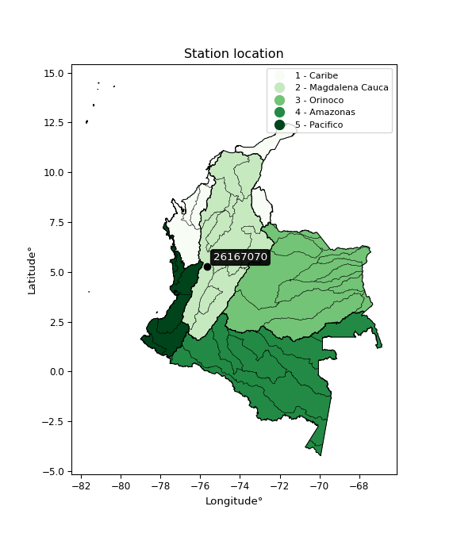</img>

</div>


## A. General information


### 1. General running parameters

• app_version: _v20260312_. • runtime: _2026-03-12 07:15:23.203550_. • Python version: _3.14.0_. • SciPy version: _1.16.3_. • Pandas version: _2.3.3_. • NumPy version: _2.3.5_. • Stations dataset (station_dataset_file): _dataset/pmax24h_in/automatic_colombia_2003_2025.csv_. • Stations catalog (station_catalog_file): _dataset/CNE.xls_. • Minimum year to eval til year_max (date_min): _1900_. • Maximum year to eval since year_min (date_max): _2025_. • Creates, save and include plots into reports (create_plot): _True_. • Plot only fit distributions with Δo > Δ (plot_only_fit): _True_. • Plot only simple graphs avoiding multiple CDFs and multiple Extreme values plots (plot_only_simple): _True_. • Eval low extreme values, if False, evaluates high extreme values (low_extreme): _False_. • Eval every SciPy distribution as logarithmic (pdist_logarithmic_on): _True_. • Standard deviation normalized (ddof): _1.0_. • Return periods to eval in years (Tr): _[2, 2.33, 5, 10, 15, 20, 25, 50, 75, 100, 200, 250, 500, 750, 1000]_. • Minimum data sample per station, 0 means any (minimum_sample): _5_. • Z-Score maximum threshold to adjust a value, 0 means disable (zscore_max): _3.5_. • Z-Score minimum threshold to adjust a value, 0 means disable (zscore_min): _-2.5_. • Avoid zeros, e.g. rain = 0 (avoid_zeros): _True_. • Avoid null values (avoid_nans): _True_. 

:file_folder:Table: [dataset.csv](../../dataset/pmax24h_in/automatic_colombia_2003_2025.csv)

> Delta Degrees of Freedom (DDOF): is a parameter used in the formulas for calculating variance and standard deviation. When ddof=0, the divisor is $N$ (the total number of observations) and this is used when your data set is the entire population. When ddof=1, the divisor is $N-1$ and this is used when your data set is a sample drawn from a larger population. Using $N-1$ provides an unbiased estimate of the population variance (known as Bessel´s correction).


### 2. Station info and location

|   id |   CODIGO | NOMBRE                 | CATEGORIA    | TECNOLOGIA                              | ESTADO           | FECHA_INSTALACION   |   FECHA_SUSPENSION |   ALTITUD |   LATITUD |   LONGITUD | DEPARTAMENTO   | MUNICIPIO   | AREA_OPERATIVA                         | ENTIDAD                                                     | AREA_HIDROGRAFICA   | ZONA_HIDROGRAFICA   | SUBZONA_HIDROGRAFICA                 | CORRIENTE   | Catalogo   |   Version |
|-----:|---------:|:-----------------------|:-------------|:----------------------------------------|:-----------------|:--------------------|-------------------:|----------:|----------:|-----------:|:---------------|:------------|:---------------------------------------|:------------------------------------------------------------|:--------------------|:--------------------|:-------------------------------------|:------------|:-----------|----------:|
|    0 | 26167070 | IRRA  - AUT [26167070] | Limnigráfica | Automática con Telemetría, Convencional | En Mantenimiento | 15/11/1961          |                nan |       766 |   5.26831 |   -75.6642 | Caldas         | Neira       | Area Operativa 09 - Cauca-Valle-Caldas | INSTITUTO DE HIDROLOGIA METEOROLOGIA Y ESTUDIOS AMBIENTALES | Magdalena Cauca     | Cauca               | Rio Tapias y otros directos al Cauca | Cauca       | CNE_IDEAM  |  20251226 |

<div align="center">

Dynamic map: [:earth_americas:Google](http://maps.google.com/maps?q=5.268305556,-75.66419444) [:earth_americas:OSM](https://www.openstreetmap.org/#map=18/5.268305556/-75.66419444&layers=P) [:earth_americas:Bing](https://www.bing.com/maps?cp=5.268305556~-75.66419444&lvl=18) [:earth_americas:Apple](https://maps.apple.com/frame?center=5.268305556%2C-75.66419444&span=0.003%2C0.006)

</div>


<div align="center">

```geojson
{
  "type": "Feature",
  "geometry": {
    "type": "Point", 
    "coordinates": [-75.66419444, 5.268305556]
  }, 
  "properties": {
    "Name": "26167070"
  }
}
```

</div>


### 3. Discrete values table and plot

<div align="center">

|               |           0 |           1 |          2 |          3 |           4 |
|:--------------|------------:|------------:|-----------:|-----------:|------------:|
| Date          | 2019        | 2020        | 2021       | 2022       | 2025        |
| Value         |   44        |   71.6      |   88.2     |   40.8     |   63.8      |
| Value_initial |   44        |   71.6      |   88.2     |   40.8     |   63.8      |
| count         |    5        |    5        |    5       |    5       |    5        |
| mean          |   61.68     |   61.68     |   61.68    |   61.68    |   61.68     |
| std           |   19.7153   |   19.7153   |   19.7153  |   19.7153  |   19.7153   |
| zscore        |   -0.896767 |    0.503163 |    1.34515 |   -1.05908 |    0.107531 |


</div>


<div align="center">

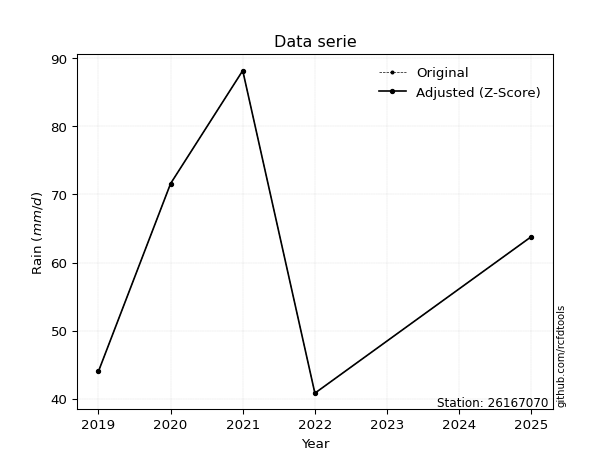</img>

</div>


> The initial value (value_initial) correspond to the initial obtained or null completed value, and value (value) is adjusted only when the initial value is outside the valid range (outlier) definite through the Z-Score value. If Z-Score is active, values out of range or outliers are replaced with the station mean value. A Z-Score (or standard score) measures how many standard deviations a data point is from the mean of a dataset, indicating its relative position; positive scores mean above the mean, negative mean below, and a score of zero is exactly at the mean, allowing for comparison of values from different distributions. It´s calculated using the formula $z=(x–μ)/σ$, where $x$ is the data point, $μ$ is the mean, and $σ$ is the standard deviation, helping identify outliers and understand probability.
>
> <sub>**Note**: In this study, "completing" (filling gaps in) and "extending" (forecasting or lengthening the historical record) rainfall data series are avoided for certain critical analyses because they introduce artificial bias and uncertainty, which can distort the statistics of rare events (extremes), alter day-to-day variability, and compromise the integrity and homogeneity of the original data. Some reasons against Completing/Extending rainfall data are: **Distortion of Extremes and Variability**: The primary issue is that most gap-filling or extension methods rely on averaging or regression with nearby stations, which inherently smooths the data. Rainfall is highly variable in space and time, with a large percentage of zero values and occasional large storms. Infilling methods often underestimate the highest values and overestimate the lowest (zero) values, which severely distorts analyses focused on flood frequency, drought severity, and intensity-duration-frequency (IDF) curves, **Loss of Data Homogeneity**: Infilled or extended data are synthetic estimates, not actual measurements. Combining these estimates with observed data can violate the assumption of data homogeneity, which requires that the data properties do not change over time. Inhomogeneity can lead to incorrect conclusions about long-term trends or changes in climate patterns, **Propagation of Errors**: Errors and biases from the original data (e.g., wind-induced undercatch, instrument errors, site changes) or the data used for imputation can propagate through the analysis, leading to unreliable hydrological models and inaccurate predictions, **Compromised Statistical Integrity**: For statistical analyses, especially those involving the frequency of events, using artificial data can introduce time bias or autocorrelation that doesn´t exist in reality, making it difficult to assess the true probability of events, **Difficulty in Validation**: It is difficult to accurately validate the quality of filled or extended data, especially for past periods where ground-truth measurements are unavailable. The reliability of imputation techniques heavily depends on the density of the surrounding station network and the complexity of the local topography.</sub>


### 4. Active continuous probability distributions from SciPy (80 of 104 available)

A Probability Density Function (PDF) describes the relative likelihood of a continuous random variable falling within a specific range, where the total area under its curve equals 1, and the area over any interval gives the actual probability for that range. Unlike discrete probabilities (like rolling a die), a PDF shows density, not direct probability for a single point (which is zero), with higher points indicating higher likelihood, often visualized as a bell curve for normal distributions.

A log of a probability density function (log-PDF) is simply the logarithm of the PDF´s value, denoted as $log(f(x))$, useful for converting multiplication of probabilities into addition, improving numerical stability with tiny numbers, and connecting to information theory concepts like entropy. Instead of dealing with very small probabilities (e.g., 0.000001), log-PDFs use negative numbers (e.g., $log(0.00001) ≈ -11.51$ that are easier for computers to handle, preventing underflow errors and simplifying complex calculations. In this study, each active probability distribution from SciPy is also evaluated in the $log$ form.

[scipy.stats](https://docs.scipy.org/doc/scipy/reference/stats.html) is a Python´s powerful submodule within the SciPy library for comprehensive statistical analysis, offering over 130 probability distributions (like Normal, Poisson, etc.), functions for descriptive stats (mean, variance), hypothesis testing (t-tests, chi-square), random variable generation, and statistical tests, making it essential for data science, modeling, and research. It provides tools to explore, model, and draw conclusions from data efficiently, working seamlessly with [NumPy](https://numpy.org/).

<div align="center">

|   id | p_dist           |   n_parameter | fit_method   | label                                                                       | active   | ref                                                                                                      |
|-----:|:-----------------|--------------:|:-------------|:----------------------------------------------------------------------------|:---------|:---------------------------------------------------------------------------------------------------------|
|    0 | alpha            |             3 | MLE          | Alpha                                                                       | True     | [:mortar_board:](https://docs.scipy.org/doc/scipy/reference/generated/scipy.stats.alpha.html)            |
|    1 | anglit           |             2 | MM           | Anglit                                                                      | True     | [:mortar_board:](https://docs.scipy.org/doc/scipy/reference/generated/scipy.stats.anglit.html)           |
|    2 | arcsine          |             2 | MM           | Arcsine                                                                     | True     | [:mortar_board:](https://docs.scipy.org/doc/scipy/reference/generated/scipy.stats.arcsine.html)          |
|    3 | argus            |             3 | MLE          | Argus                                                                       | True     | [:mortar_board:](https://docs.scipy.org/doc/scipy/reference/generated/scipy.stats.argus.html)            |
|    4 | beta             |             4 | MLE          | Beta                                                                        | True     | [:mortar_board:](https://docs.scipy.org/doc/scipy/reference/generated/scipy.stats.beta.html)             |
|    5 | betaprime        |             4 | MLE          | Beta prime                                                                  | True     | [:mortar_board:](https://docs.scipy.org/doc/scipy/reference/generated/scipy.stats.betaprime.html)        |
|    6 | bradford         |             3 | MLE          | Bradford                                                                    | True     | [:mortar_board:](https://docs.scipy.org/doc/scipy/reference/generated/scipy.stats.bradford.html)         |
|    7 | burr             |             4 | MLE          | Burr (Type III)                                                             | True     | [:mortar_board:](https://docs.scipy.org/doc/scipy/reference/generated/scipy.stats.burr.html)             |
|    8 | burr12           |             4 | MLE          | Burr (Type III) 12                                                          | True     | [:mortar_board:](https://docs.scipy.org/doc/scipy/reference/generated/scipy.stats.burr12.html)           |
|    9 | cosine           |             2 | MLE          | Cosine                                                                      | True     | [:mortar_board:](https://docs.scipy.org/doc/scipy/reference/generated/scipy.stats.cosine.html)           |
|   10 | crystalball      |             4 | MLE          | Crystalball                                                                 | True     | [:mortar_board:](https://docs.scipy.org/doc/scipy/reference/generated/scipy.stats.crystalball.html)      |
|   11 | dgamma           |             3 | MLE          | Double gamma                                                                | True     | [:mortar_board:](https://docs.scipy.org/doc/scipy/reference/generated/scipy.stats.dgamma.html)           |
|   12 | dweibull         |             3 | MLE          | Double Weibull                                                              | True     | [:mortar_board:](https://docs.scipy.org/doc/scipy/reference/generated/scipy.stats.dweibull.html)         |
|   13 | erlang           |             3 | MLE          | Erlang                                                                      | True     | [:mortar_board:](https://docs.scipy.org/doc/scipy/reference/generated/scipy.stats.erlang.html)           |
|   14 | exponnorm        |             3 | MLE          | Exponentially modified Normal                                               | True     | [:mortar_board:](https://docs.scipy.org/doc/scipy/reference/generated/scipy.stats.exponnorm.html)        |
|   15 | exponpow         |             3 | MLE          | Exponential power                                                           | True     | [:mortar_board:](https://docs.scipy.org/doc/scipy/reference/generated/scipy.stats.exponpow.html)         |
|   16 | exponweib        |             4 | MLE          | Exponentiated Weibull                                                       | True     | [:mortar_board:](https://docs.scipy.org/doc/scipy/reference/generated/scipy.stats.exponweib.html)        |
|   17 | f                |             4 | MLE          | F                                                                           | True     | [:mortar_board:](https://docs.scipy.org/doc/scipy/reference/generated/scipy.stats.f.html)                |
|   18 | fatiguelife      |             3 | MLE          | Fatigue-life (Birnbaum-Saunders)                                            | True     | [:mortar_board:](https://docs.scipy.org/doc/scipy/reference/generated/scipy.stats.fatiguelife.html)      |
|   19 | foldnorm         |             3 | MM           | Fold Normal                                                                 | True     | [:mortar_board:](https://docs.scipy.org/doc/scipy/reference/generated/scipy.stats.foldnorm.html)         |
|   20 | gamma            |             3 | MLE          | Gamma                                                                       | True     | [:mortar_board:](https://docs.scipy.org/doc/scipy/reference/generated/scipy.stats.gamma.html)            |
|   21 | gausshyper       |             6 | MLE          | Gauss hypergeometric                                                        | True     | [:mortar_board:](https://docs.scipy.org/doc/scipy/reference/generated/scipy.stats.gausshyper.html)       |
|   22 | genexpon         |             5 | MLE          | Generalized exponential                                                     | True     | [:mortar_board:](https://docs.scipy.org/doc/scipy/reference/generated/scipy.stats.genexpon.html)         |
|   23 | genextreme       |             3 | MLE          | Generalized exponential                                                     | True     | [:mortar_board:](https://docs.scipy.org/doc/scipy/reference/generated/scipy.stats.genextreme.html)       |
|   24 | gengamma         |             4 | MLE          | Generalized gamma                                                           | True     | [:mortar_board:](https://docs.scipy.org/doc/scipy/reference/generated/scipy.stats.gengamma.html)         |
|   25 | genhalflogistic  |             3 | MLE          | Generalized half-logistic                                                   | True     | [:mortar_board:](https://docs.scipy.org/doc/scipy/reference/generated/scipy.stats.genhalflogistic.html)  |
|   26 | genlogistic      |             3 | MLE          | Generalized logistic                                                        | True     | [:mortar_board:](https://docs.scipy.org/doc/scipy/reference/generated/scipy.stats.genlogistic.html)      |
|   27 | gennorm          |             3 | MLE          | Generalized Normal                                                          | True     | [:mortar_board:](https://docs.scipy.org/doc/scipy/reference/generated/scipy.stats.gennorm.html)          |
|   28 | genpareto        |             3 | MLE          | Generalized Pareto                                                          | True     | [:mortar_board:](https://docs.scipy.org/doc/scipy/reference/generated/scipy.stats.genpareto.html)        |
|   29 | gompertz         |             3 | MLE          | Gompertz (or truncated Gumbel)                                              | True     | [:mortar_board:](https://docs.scipy.org/doc/scipy/reference/generated/scipy.stats.gompertz.html)         |
|   30 | gumbel_l         |             2 | MM           | Gumbel Left Skew                                                            | True     | [:mortar_board:](https://docs.scipy.org/doc/scipy/reference/generated/scipy.stats.gumbel_l.html)         |
|   31 | gumbel_r         |             2 | MM           | Gumbel Right Skew                                                           | True     | [:mortar_board:](https://docs.scipy.org/doc/scipy/reference/generated/scipy.stats.gumbel_r.html)         |
|   32 | halfgennorm      |             3 | MLE          | Upper half of a generalized normal                                          | True     | [:mortar_board:](https://docs.scipy.org/doc/scipy/reference/generated/scipy.stats.halfgennorm.html)      |
|   33 | halflogistic     |             2 | MM           | Half-logistic                                                               | True     | [:mortar_board:](https://docs.scipy.org/doc/scipy/reference/generated/scipy.stats.halflogistic.html)     |
|   34 | halfnorm         |             2 | MM           | Half Normal                                                                 | True     | [:mortar_board:](https://docs.scipy.org/doc/scipy/reference/generated/scipy.stats.halfnorm.html)         |
|   35 | hypsecant        |             2 | MM           | hyperbolic secant                                                           | True     | [:mortar_board:](https://docs.scipy.org/doc/scipy/reference/generated/scipy.stats.hypsecant.html)        |
|   36 | invgamma         |             3 | MLE          | Inverted gamma                                                              | True     | [:mortar_board:](https://docs.scipy.org/doc/scipy/reference/generated/scipy.stats.invgamma.html)         |
|   37 | invgauss         |             3 | MLE          | Inverse Gaussian                                                            | True     | [:mortar_board:](https://docs.scipy.org/doc/scipy/reference/generated/scipy.stats.invgauss.html)         |
|   38 | invweibull       |             3 | MLE          | Inverted Weibull                                                            | True     | [:mortar_board:](https://docs.scipy.org/doc/scipy/reference/generated/scipy.stats.invweibull.html)       |
|   39 | johnsonsb        |             4 | MLE          | Johnson SB                                                                  | True     | [:mortar_board:](https://docs.scipy.org/doc/scipy/reference/generated/scipy.stats.johnsonsb.html)        |
|   40 | johnsonsu        |             4 | MLE          | Johnson Su                                                                  | True     | [:mortar_board:](https://docs.scipy.org/doc/scipy/reference/generated/scipy.stats.johnsonsu.html)        |
|   41 | kappa3           |             3 | MLE          | Kappa 3                                                                     | True     | [:mortar_board:](https://docs.scipy.org/doc/scipy/reference/generated/scipy.stats.kappa3.html)           |
|   42 | kappa4           |             4 | MLE          | Kappa 4                                                                     | True     | [:mortar_board:](https://docs.scipy.org/doc/scipy/reference/generated/scipy.stats.kappa4.html)           |
|   43 | ksone            |             3 | MLE          | Kolmogorov-Smirnov one-sided test statistic distribution                    | True     | [:mortar_board:](https://docs.scipy.org/doc/scipy/reference/generated/scipy.stats.ksone.html)            |
|   44 | kstwobign        |             2 | MLE          | Limiting distribution of scaled Kolmogorov-Smirnov two-sided test statistic | True     | [:mortar_board:](https://docs.scipy.org/doc/scipy/reference/generated/scipy.stats.kstwobign.html)        |
|   45 | laplace          |             2 | MM           | Laplace                                                                     | True     | [:mortar_board:](https://docs.scipy.org/doc/scipy/reference/generated/scipy.stats.laplace.html)          |
|   46 | levy_l           |             2 | MLE          | Left-skewed Levy                                                            | True     | [:mortar_board:](https://docs.scipy.org/doc/scipy/reference/generated/scipy.stats.levy_l.html)           |
|   47 | loggamma         |             3 | MLE          | Log gamma                                                                   | True     | [:mortar_board:](https://docs.scipy.org/doc/scipy/reference/generated/scipy.stats.loggamma.html)         |
|   48 | logistic         |             2 | MM           | Logistic (or Sech-squared)                                                  | True     | [:mortar_board:](https://docs.scipy.org/doc/scipy/reference/generated/scipy.stats.logistic.html)         |
|   49 | loglaplace       |             3 | MLE          | Log-Laplace                                                                 | True     | [:mortar_board:](https://docs.scipy.org/doc/scipy/reference/generated/scipy.stats.loglaplace.html)       |
|   50 | lomax            |             3 | MLE          | Lomax (Pareto of the second kind)                                           | True     | [:mortar_board:](https://docs.scipy.org/doc/scipy/reference/generated/scipy.stats.lomax.html)            |
|   51 | maxwell          |             2 | MM           | Maxwell                                                                     | True     | [:mortar_board:](https://docs.scipy.org/doc/scipy/reference/generated/scipy.stats.maxwell.html)          |
|   52 | mielke           |             4 | MLE          | Mielke Beta-Kappa / Dagum                                                   | True     | [:mortar_board:](https://docs.scipy.org/doc/scipy/reference/generated/scipy.stats.mielke.html)           |
|   53 | moyal            |             2 | MM           | Moyal                                                                       | True     | [:mortar_board:](https://docs.scipy.org/doc/scipy/reference/generated/scipy.stats.moyal.html)            |
|   54 | nakagami         |             3 | MLE          | Nakagami                                                                    | True     | [:mortar_board:](https://docs.scipy.org/doc/scipy/reference/generated/scipy.stats.nakagami.html)         |
|   55 | ncf              |             5 | MLE          | Non-central F distribution                                                  | True     | [:mortar_board:](https://docs.scipy.org/doc/scipy/reference/generated/scipy.stats.ncf.html)              |
|   56 | nct              |             4 | MLE          | Non-central Student’s t                                                     | True     | [:mortar_board:](https://docs.scipy.org/doc/scipy/reference/generated/scipy.stats.nct.html)              |
|   57 | norm             |             2 | MM           | Normal                                                                      | True     | [:mortar_board:](https://docs.scipy.org/doc/scipy/reference/generated/scipy.stats.norm.html)             |
|   58 | pearson3         |             3 | MM           | Pearson type III                                                            | True     | [:mortar_board:](https://docs.scipy.org/doc/scipy/reference/generated/scipy.stats.pearson3.html)         |
|   59 | powerlaw         |             3 | MLE          | Power-function                                                              | True     | [:mortar_board:](https://docs.scipy.org/doc/scipy/reference/generated/scipy.stats.powerlaw.html)         |
|   60 | rayleigh         |             2 | MM           | Rayleigh                                                                    | True     | [:mortar_board:](https://docs.scipy.org/doc/scipy/reference/generated/scipy.stats.rayleigh.html)         |
|   61 | rdist            |             3 | MLE          | R-distributed (symmetric beta)                                              | True     | [:mortar_board:](https://docs.scipy.org/doc/scipy/reference/generated/scipy.stats.rdist.html)            |
|   62 | rice             |             3 | MLE          | Rice                                                                        | True     | [:mortar_board:](https://docs.scipy.org/doc/scipy/reference/generated/scipy.stats.rice.html)             |
|   63 | semicircular     |             2 | MM           | Semicircular                                                                | True     | [:mortar_board:](https://docs.scipy.org/doc/scipy/reference/generated/scipy.stats.semicircular.html)     |
|   64 | skewnorm         |             3 | MLE          | Skew normal                                                                 | True     | [:mortar_board:](https://docs.scipy.org/doc/scipy/reference/generated/scipy.stats.skewnorm.html)         |
|   65 | t                |             3 | MLE          | Student’s t                                                                 | True     | [:mortar_board:](https://docs.scipy.org/doc/scipy/reference/generated/scipy.stats.t.html)                |
|   66 | trapezoid        |             4 | MLE          | Trapezoid                                                                   | True     | [:mortar_board:](https://docs.scipy.org/doc/scipy/reference/generated/scipy.stats.trapezoid.html)        |
|   67 | triang           |             3 | MLE          | Triangular                                                                  | True     | [:mortar_board:](https://docs.scipy.org/doc/scipy/reference/generated/scipy.stats.triang.html)           |
|   68 | truncexpon       |             3 | MLE          | Truncated exponential                                                       | True     | [:mortar_board:](https://docs.scipy.org/doc/scipy/reference/generated/scipy.stats.truncexpon.html)       |
|   69 | truncnorm        |             4 | MLE          | Truncated normal                                                            | True     | [:mortar_board:](https://docs.scipy.org/doc/scipy/reference/generated/scipy.stats.truncnorm.html)        |
|   70 | truncpareto      |             4 | MLE          | Upper truncated Pareto                                                      | True     | [:mortar_board:](https://docs.scipy.org/doc/scipy/reference/generated/scipy.stats.truncpareto.html)      |
|   71 | truncweibull_min |             5 | MLE          | Doubly truncated Weibull minimum                                            | True     | [:mortar_board:](https://docs.scipy.org/doc/scipy/reference/generated/scipy.stats.truncweibull_min.html) |
|   72 | tukeylambda      |             3 | MLE          | Tukey-Lamdba                                                                | True     | [:mortar_board:](https://docs.scipy.org/doc/scipy/reference/generated/scipy.stats.tukeylambda.html)      |
|   73 | uniform          |             2 | MLE          | Uniform                                                                     | True     | [:mortar_board:](https://docs.scipy.org/doc/scipy/reference/generated/scipy.stats.uniform.html)          |
|   74 | vonmises         |             3 | MLE          | Von Mises                                                                   | True     | [:mortar_board:](https://docs.scipy.org/doc/scipy/reference/generated/scipy.stats.vonmises.html)         |
|   75 | vonmises_line    |             3 | MLE          | Von Mises line                                                              | True     | [:mortar_board:](https://docs.scipy.org/doc/scipy/reference/generated/scipy.stats.vonmises_line.html)    |
|   76 | wald             |             2 | MM           | Wald                                                                        | True     | [:mortar_board:](https://docs.scipy.org/doc/scipy/reference/generated/scipy.stats.wald.html)             |
|   77 | weibull_max      |             3 | MLE          | Weibull maximum                                                             | True     | [:mortar_board:](https://docs.scipy.org/doc/scipy/reference/generated/scipy.stats.weibull_max.html)      |
|   78 | weibull_min      |             3 | MLE          | Weibull minimum                                                             | True     | [:mortar_board:](https://docs.scipy.org/doc/scipy/reference/generated/scipy.stats.weibull_min.html)      |
|   79 | wrapcauchy       |             3 | MLE          | Wrapped  Cauchy                                                             | True     | [:mortar_board:](https://docs.scipy.org/doc/scipy/reference/generated/scipy.stats.wrapcauchy.html)       |

</div>

> **n_parameter:** # arguments & localization & scale.
>
> **Fit methods:** (MLE) maximum likelihood, (MM) L-moments.
>
>**Inactive** (With the only purpose of prevent loops, zero divisions, infinite values, over high estimated values or horizontal trending for recurrence intervals estimations, the follow distributions were disabled.)**:** lognorm, norminvgauss, powernorm, powerlognorm, cauchy, halfcauchy, foldcauchy, skewcauchy, chi2, expon, fisk, genhyperbolic, geninvgauss, gibrat, kstwo, laplace_asymmetric, levy, levy_stable, ncx2, pareto, rel_breitwigner, recipinvgauss, studentized_range, loguniform, 


## B. Probability (PDF) vs. Empirical (EDF) distributions functions

A continuous probability distribution (CPD) describes probabilities for variables that can take any value within a range (like rain any time), unlike discrete variables with specific outcomes (like temperature). It uses a Probability Density Function (PDF), a curve where the total area under it equals 1, and the probability of the variable falling within an interval (a to b) is found by calculating the area under the curve between those points. A key feature is that the probability of hitting any single exact value is zero, so probabilities are always expressed for ranges, e.g., $P(a ≤ X ≤ b)$.

<div align="center">

Distributions parameters from station values
|     |   station | p_dist              |   n |             loc |          scale | shape                  | shape1                | shape2                | shape3             |
|----:|----------:|:--------------------|----:|----------------:|---------------:|:-----------------------|:----------------------|:----------------------|:-------------------|
|   0 |  26167070 | alpha               |   5 |   -97.187       | 1427.66        | 9.097158336353473      |                       |                       |                    |
|   1 |  26167070 | anglit              |   5 |    61.68        |   51.5861      |                        |                       |                       |                    |
|   2 |  26167070 | arcsine             |   5 |    36.7419      |   49.8762      |                        |                       |                       |                    |
|   3 |  26167070 | argus               |   5 |    24.1803      |   67.7399      | 2.80275897784683e-06   |                       |                       |                    |
|   4 |  26167070 | beta                |   5 |    40.6946      |   47.5054      | 0.6314688556166286     | 0.6732507205777688    |                       |                    |
|   5 |  26167070 | betaprime           |   5 |    -0.531836    |    6.47863     | 120.18515605154494     | 13.487843582232458    |                       |                    |
|   6 |  26167070 | bradford            |   5 |    40.8         |   47.4001      | 1.0413640132076836     |                       |                       |                    |
|   7 |  26167070 | burr                |   5 |    -9.44237     |    8.76875     | 4.5420199121755225     | 6555.184146786978     |                       |                    |
|   8 |  26167070 | burr12              |   5 |    -3.94307     |   44.5508      | 976.7026730412981      | 0.0029225969473233686 |                       |                    |
|   9 |  26167070 | cosine              |   5 |    62.2604      |   14.1827      |                        |                       |                       |                    |
|  10 |  26167070 | crystalball         |   5 |    61.68        |   17.6339      | 95444.23493221673      | 3973.22756096953      |                       |                    |
|  11 |  26167070 | dgamma              |   5 |    56.084       |    3.55673     | 4.651233436181869      |                       |                       |                    |
|  12 |  26167070 | dweibull            |   5 |    57.4584      |   18.4501      | 2.176195456984447      |                       |                       |                    |
|  13 |  26167070 | erlang              |   5 |     1.43148     |    5.04743     | 11.981273238664599     |                       |                       |                    |
|  14 |  26167070 | exponnorm           |   5 |    59.2007      |   17.4589      | 0.1420065549038137     |                       |                       |                    |
|  15 |  26167070 | exponpow            |   5 |    40.8         |   38.0258      | 0.21229786553074706    |                       |                       |                    |
|  16 |  26167070 | exponweib           |   5 |    40.8         |    1.21764     | 1.3637957095065305     | 0.20792505352155902   |                       |                    |
|  17 |  26167070 | f                   |   5 |    -1.55809     |   62.8951      | 27.156317857728602     | 363.21456843748086    |                       |                    |
|  18 |  26167070 | fatiguelife         |   5 |    40.8         |    1.43369e-06 | 4212.763420902793      |                       |                       |                    |
|  19 |  26167070 | foldnorm            |   5 |    24.6917      |   18.2537      | 2.0098021313025964     |                       |                       |                    |
|  20 |  26167070 | gamma               |   5 |     8.68252     |    5.65335     | 9.268655910892814      |                       |                       |                    |
|  21 |  26167070 | gausshyper          |   5 |    40.8         |   47.5597      | 0.9679776527625089     | 1.02144045985486      | 0.9300903450326872    | 1.128307025232115  |
|  22 |  26167070 | genexpon            |   5 |    40.8         |    2.48701     | 0.11913743773587107    | 4.915499041157647e-08 | 1.5861831645064193    |                    |
|  23 |  26167070 | genextreme          |   5 |    41.4819      |    5.06226     | -7.4235723917139325    |                       |                       |                    |
|  24 |  26167070 | gengamma            |   5 |    40.8         |    1.21105     | 1.2954763105679388     | 0.24239312112768274   |                       |                    |
|  25 |  26167070 | genhalflogistic     |   5 |    39.4271      |   50.8494      | 1.0425747231280647     |                       |                       |                    |
|  26 |  26167070 | genlogistic         |   5 |   -44.0095      |   14.7967      | 707.2599880190401      |                       |                       |                    |
|  27 |  26167070 | gennorm             |   5 |    64.5         |   23.7001      | 3669493.0664696135     |                       |                       |                    |
|  28 |  26167070 | genpareto           |   5 |    -0.9685      |  170.823       | -1.9157306218868109    |                       |                       |                    |
|  29 |  26167070 | gompertz            |   5 |    40.8         |   56.9592      | 1.9133925260688471     |                       |                       |                    |
|  30 |  26167070 | gumbel_l            |   5 |    69.6162      |   13.7491      |                        |                       |                       |                    |
|  31 |  26167070 | gumbel_r            |   5 |    53.7438      |   13.7491      |                        |                       |                       |                    |
|  32 |  26167070 | halfgennorm         |   5 |    40.8         |    1.37415     | 0.3979855151862923     |                       |                       |                    |
|  33 |  26167070 | halflogistic        |   5 |    40.7798      |   15.0763      |                        |                       |                       |                    |
|  34 |  26167070 | halfnorm            |   5 |    38.3397      |   29.2528      |                        |                       |                       |                    |
|  35 |  26167070 | hypsecant           |   5 |    61.68        |   11.2261      |                        |                       |                       |                    |
|  36 |  26167070 | invgamma            |   5 |     3.97667     |  542.554       | 10.364844889579919     |                       |                       |                    |
|  37 |  26167070 | invgauss            |   5 |    37.6305      |   14.2036      | 1.6932033533605488     |                       |                       |                    |
|  38 |  26167070 | invweibull          |   5 |    40.8         |    1.50742     | 0.054864963099284014   |                       |                       |                    |
|  39 |  26167070 | johnsonsb           |   5 |    40.8         |   47.4         | 1.7555168226730826     | 0.15645583909569022   |                       |                    |
|  40 |  26167070 | johnsonsu           |   5 |    40.8         |    3.07137e-10 | -1.7041327022659594    | 0.11650054903698469   |                       |                    |
|  41 |  26167070 | kappa3              |   5 |    39.7963      |   48.3234      | 587.4550025187473      |                       |                       |                    |
|  42 |  26167070 | kappa4              |   5 |    33.5719      |   55.4904      | 1.149463687144657      | 0.9741173757347554    |                       |                    |
|  43 |  26167070 | ksone               |   5 |    31.1372      |   61.0855      | 1.0                    |                       |                       |                    |
|  44 |  26167070 | kstwobign           |   5 |     2.68646     |   67.2796      |                        |                       |                       |                    |
|  45 |  26167070 | laplace             |   5 |    61.68        |   12.469       |                        |                       |                       |                    |
|  46 |  26167070 | levy_l              |   5 |    90.5433      |    8.95217     |                        |                       |                       |                    |
|  47 |  26167070 | loggamma            |   5 | -3421.98        |  517.178       | 842.5607033028691      |                       |                       |                    |
|  48 |  26167070 | logistic            |   5 |    61.68        |    9.72207     |                        |                       |                       |                    |
|  49 |  26167070 | loglaplace          |   5 |    -0.171024    |   63.971       | 3.98789893091676       |                       |                       |                    |
|  50 |  26167070 | lomax               |   5 |    40.8         |    3.08234e+09 | 140345263.1830578      |                       |                       |                    |
|  51 |  26167070 | maxwell             |   5 |    19.8951      |   26.1848      |                        |                       |                       |                    |
|  52 |  26167070 | mielke              |   5 |    -1.48319     |   12.7553      | 1148.284538589942      | 3.9915410052607037    |                       |                    |
|  53 |  26167070 | moyal               |   5 |    51.5958      |    7.93803     |                        |                       |                       |                    |
|  54 |  26167070 | nakagami            |   5 |    40.8         |   27.0185      | 0.09005063595646884    |                       |                       |                    |
|  55 |  26167070 | ncf                 |   5 |    -0.00657085  |    6.29515e-06 | 6.127643970744337e-07  | 3.971212990645104     | 5.000825800388675     |                    |
|  56 |  26167070 | nct                 |   5 |    -0.0776831   |    2.27364     | 6.492011596398477      | 24.035402404906662    |                       |                    |
|  57 |  26167070 | norm                |   5 |    61.68        |   17.6339      |                        |                       |                       |                    |
|  58 |  26167070 | pearson3            |   5 |    61.68        |   17.6339      | 0.1826378674349577     |                       |                       |                    |
|  59 |  26167070 | powerlaw            |   5 |    40.8         |   47.4         | 0.1241118349655328     |                       |                       |                    |
|  60 |  26167070 | rayleigh            |   5 |    27.9454      |   26.9163      |                        |                       |                       |                    |
|  61 |  26167070 | rdist               |   5 |    38.6031      |   25.1969      | 1.0823257163122104     |                       |                       |                    |
|  62 |  26167070 | rice                |   5 |    30.3131      |   22.7606      | 0.7067292337658322     |                       |                       |                    |
|  63 |  26167070 | semicircular        |   5 |    61.68        |   35.2678      |                        |                       |                       |                    |
|  64 |  26167070 | skewnorm            |   5 |    40.8         |   27.3305      | 20985040.08367466      |                       |                       |                    |
|  65 |  26167070 | t                   |   5 |    61.6693      |   17.6354      | 364565.42052229575     |                       |                       |                    |
|  66 |  26167070 | trapezoid           |   5 |    36.06        |   56.88        | 1.0                    | 1.0                   |                       |                    |
|  67 |  26167070 | triang              |   5 |    20.3794      |   67.8206      | 0.9999999989052848     |                       |                       |                    |
|  68 |  26167070 | truncexpon          |   5 |    40.7981      |   51.6957      | 0.9169399532393687     |                       |                       |                    |
|  69 |  26167070 | truncnorm           |   5 |    13.903       |   36.1316      | 0.7444186258684442     | 7552.434214412739     |                       |                    |
|  70 |  26167070 | truncpareto         |   5 |    40.6072      |    0.192752    | 0.2740129683067433     | 246.91140189608987    |                       |                    |
|  71 |  26167070 | truncweibull_min    |   5 |    40.8         |   66.1457      | 0.5523287874930736     | 1.978865901710982e-09 | 0.7166092148896395    |                    |
|  72 |  26167070 | tukeylambda         |   5 |    64.5012      |   27.6783      | 1.1677979773490388     |                       |                       |                    |
|  73 |  26167070 | uniform             |   5 |    40.8         |   47.4         |                        |                       |                       |                    |
|  74 |  26167070 | vonmises            |   5 |     1.16191     |    1           | 0.812899006520419      |                       |                       |                    |
|  75 |  26167070 | vonmises_line       |   5 |    64.5189      |    7.54998     | 1.62567054789982e-06   |                       |                       |                    |
|  76 |  26167070 | wald                |   5 |    44.0461      |   17.6339      |                        |                       |                       |                    |
|  77 |  26167070 | weibull_max         |   5 |    88.2         |    1.41694     | 0.22461707970739875    |                       |                       |                    |
|  78 |  26167070 | weibull_min         |   5 |    40.8         |   26.8295      | 0.5936075047667515     |                       |                       |                    |
|  79 |  26167070 | wrapcauchy          |   5 |    40.8         |    7.54394     | 0.5249999999999999     |                       |                       |                    |
|  80 |  26167070 | logalpha            |   5 |    -2.02887     |  126.58        | 20.77866924828851      |                       |                       |                    |
|  81 |  26167070 | loganglit           |   5 |     4.07987     |    0.85522     |                        |                       |                       |                    |
|  82 |  26167070 | logarcsine          |   5 |     3.66643     |    0.826871    |                        |                       |                       |                    |
|  83 |  26167070 | logargus            |   5 |     3.46348     |    1.07873     | 0.00020328460802395933 |                       |                       |                    |
|  84 |  26167070 | logbeta             |   5 |     3.55527     |    0.924336    | 0.47786072127690704    | 0.4597014484333558    |                       |                    |
|  85 |  26167070 | logbetaprime        |   5 |    -3.91295     |    6.1346      | 828.4327117341218      | 636.4325798585223     |                       |                    |
|  86 |  26167070 | logbradford         |   5 |     3.70868     |    0.770942    | 1.2105576573439056     |                       |                       |                    |
|  87 |  26167070 | logburr             |   5 |   -31.1338      |   33.0593      | 138.178240946683       | 3419.521318758941     |                       |                    |
|  88 |  26167070 | logburr12           |   5 |    -0.533944    |    6.19504     | 18.37930225377815      | 132.03654401533151    |                       |                    |
|  89 |  26167070 | logcosine           |   5 |     4.0797      |    0.232243    |                        |                       |                       |                    |
|  90 |  26167070 | logcrystalball      |   5 |     4.07987     |    0.292343    | 7.006256382887715      | 4249.0617032651       |                       |                    |
|  91 |  26167070 | logdgamma           |   5 |     3.99966     |    0.0386549   | 7.315647572582465      |                       |                       |                    |
|  92 |  26167070 | logdweibull         |   5 |     4.02188     |    0.313233    | 2.833812337274063      |                       |                       |                    |
|  93 |  26167070 | logerlang           |   5 |   -10.0885      |    0.00604274  | 2344.6810794994017     |                       |                       |                    |
|  94 |  26167070 | logexponnorm        |   5 |     4.07948     |    0.292342    | 0.0013164134572244308  |                       |                       |                    |
|  95 |  26167070 | logexponpow         |   5 |     3.70868     |    0.693142    | 0.5162215129786762     |                       |                       |                    |
|  96 |  26167070 | logexponweib        |   5 |     3.70868     |    0.795069    | 0.0781413726186925     | 1.6387260002588964    |                       |                    |
|  97 |  26167070 | logf                |   5 |   -35.8179      |   39.8959      | 548817.2296038903      | 39804.60381561011     |                       |                    |
|  98 |  26167070 | logfatiguelife      |   5 |     3.70868     |    5.25212e-07 | 1102.9833252647263     |                       |                       |                    |
|  99 |  26167070 | logfoldnorm         |   5 |     3.48276     |    0.302858    | 1.9524534388191883     |                       |                       |                    |
| 100 |  26167070 | loggamma            |   5 |   -10.1901      |    0.00599175  | 2381.5824948531517     |                       |                       |                    |
| 101 |  26167070 | loggausshyper       |   5 |     3.70868     |    0.783238    | 0.8713591919475683     | 0.9996787417479283    | 1.0448591710642479    | 1.1322683714561341 |
| 102 |  26167070 | loggenexpon         |   5 |     3.70862     |    0.00750202  | 0.015031485560098493   | 3.773808358871795     | 3.388771813535626e-05 |                    |
| 103 |  26167070 | loggenextreme       |   5 |     4.10282     |    0.429552    | 1.1400278633980776     |                       |                       |                    |
| 104 |  26167070 | loggengamma         |   5 |     3.70868     |    0.593544    | 0.07353984918315482    | 2.00591098503046      |                       |                    |
| 105 |  26167070 | loggenhalflogistic  |   5 |     3.70272     |    0.781462    | 1.005893612198963      |                       |                       |                    |
| 106 |  26167070 | loggenlogistic      |   5 |     2.32455     |    0.257223    | 521.0212807933032      |                       |                       |                    |
| 107 |  26167070 | loggennorm          |   5 |     4.15575     |    0.219472    | 0.9504514764552616     |                       |                       |                    |
| 108 |  26167070 | loggenpareto        |   5 |    -0.00603324  |    9.49006     | -2.1156533325035283    |                       |                       |                    |
| 109 |  26167070 | loggompertz         |   5 |     3.70868     |    0.652547    | 1.0570077158885343     |                       |                       |                    |
| 110 |  26167070 | loggumbel_l         |   5 |     4.21144     |    0.227939    |                        |                       |                       |                    |
| 111 |  26167070 | loggumbel_r         |   5 |     3.9483      |    0.227939    |                        |                       |                       |                    |
| 112 |  26167070 | loghalfgennorm      |   5 |     3.70868     |    0.770951    | 348043.3133208591      |                       |                       |                    |
| 113 |  26167070 | loghalflogistic     |   5 |     3.73333     |    0.249967    |                        |                       |                       |                    |
| 114 |  26167070 | loghalfnorm         |   5 |     3.69292     |    0.484967    |                        |                       |                       |                    |
| 115 |  26167070 | loghypsecant        |   5 |     4.07987     |    0.186111    |                        |                       |                       |                    |
| 116 |  26167070 | loginvgamma         |   5 |    -3.01633     | 4156.02        | 586.6897852670111      |                       |                       |                    |
| 117 |  26167070 | loginvgauss         |   5 |     3.58785     |    0.662029    | 0.743193472254104      |                       |                       |                    |
| 118 |  26167070 | loginvweibull       |   5 |    -7.83806e+06 |    7.83807e+06 | 30447351.665234946     |                       |                       |                    |
| 119 |  26167070 | logjohnsonsb        |   5 |     3.70868     |    0.770925    | 0.4824440218228848     | 0.17703389394754787   |                       |                    |
| 120 |  26167070 | logjohnsonsu        |   5 |     5.97927     |    0.262448    | 17.3101212930597       | 6.494350285937022     |                       |                    |
| 121 |  26167070 | logkappa3           |   5 |     3.70868     |    0.770732    | 6512.634660047492      |                       |                       |                    |
| 122 |  26167070 | logkappa4           |   5 |     3.64705     |    0.911298    | 1.0685586273329184     | 1.0945768032667702    |                       |                    |
| 123 |  26167070 | logksone            |   5 |     3.57351     |    1.01271     | 1.0                    |                       |                       |                    |
| 124 |  26167070 | logkstwobign        |   5 |     3.06341     |    1.15689     |                        |                       |                       |                    |
| 125 |  26167070 | loglaplace          |   5 |     4.07987     |    0.206718    |                        |                       |                       |                    |
| 126 |  26167070 | loglevy_l           |   5 |     4.512       |    0.123581    |                        |                       |                       |                    |
| 127 |  26167070 | logloggamma         |   5 |    -0.846346    |    1.50524     | 26.881192507075163     |                       |                       |                    |
| 128 |  26167070 | loglogistic         |   5 |     4.07987     |    0.161177    |                        |                       |                       |                    |
| 129 |  26167070 | logloglaplace       |   5 |    -0.00289181  |    4.15864     | 16.08519300411779      |                       |                       |                    |
| 130 |  26167070 | loglomax            |   5 |     3.70868     |    4.78773     | 13.49634617994084      |                       |                       |                    |
| 131 |  26167070 | logmaxwell          |   5 |     3.38714     |    0.434104    |                        |                       |                       |                    |
| 132 |  26167070 | logmielke           |   5 |    -2.97743e+06 |    2.97744e+06 | 780587368.8103937      | 11767111.78371873     |                       |                    |
| 133 |  26167070 | logmoyal            |   5 |     3.91268     |    0.131601    |                        |                       |                       |                    |
| 134 |  26167070 | lognakagami         |   5 |     3.70868     |    0.503196    | 0.3616302265857715     |                       |                       |                    |
| 135 |  26167070 | logncf              |   5 |    -7.82781     |    7.45711     | 5135.998938224075      | 7394.715632612642     | 3064.260999842427     |                    |
| 136 |  26167070 | lognct              |   5 |    -0.887247    |    0.0890043   | 159.27819497933808     | 55.547335655653       |                       |                    |
| 137 |  26167070 | lognorm             |   5 |     4.07987     |    0.292343    |                        |                       |                       |                    |
| 138 |  26167070 | logpearson3         |   5 |     4.07987     |    0.292343    | -0.04548618351272909   |                       |                       |                    |
| 139 |  26167070 | logpowerlaw         |   5 |     3.70868     |    0.770925    | 0.13063723204798686    |                       |                       |                    |
| 140 |  26167070 | lograyleigh         |   5 |     3.5206      |    0.446232    |                        |                       |                       |                    |
| 141 |  26167070 | logrdist            |   5 |     4.10743     |    0.398752    | 1.0632788724771616     |                       |                       |                    |
| 142 |  26167070 | logrice             |   5 |     3.53541     |    0.35784     | 0.9911702692105034     |                       |                       |                    |
| 143 |  26167070 | logsemicircular     |   5 |     4.07987     |    0.584686    |                        |                       |                       |                    |
| 144 |  26167070 | logskewnorm         |   5 |     4.12006     |    0.295093    | -0.17323609863251332   |                       |                       |                    |
| 145 |  26167070 | logt                |   5 |     4.07987     |    0.292346    | 232151237.04690602     |                       |                       |                    |
| 146 |  26167070 | logtrapezoid        |   5 |     3.25299     |    1.24031     | 1.0                    | 1.0                   |                       |                    |
| 147 |  26167070 | logtriang           |   5 |     3.40168     |    1.07793     | 0.9999998654591291     |                       |                       |                    |
| 148 |  26167070 | logtruncexpon       |   5 |     3.70868     |    0.803995    | 0.958873791891218      |                       |                       |                    |
| 149 |  26167070 | logtruncnorm        |   5 |    -0.0835697   |    1.2641      | 2.9999673811920218     | 3.6098336625846064    |                       |                    |
| 150 |  26167070 | logtruncpareto      |   5 |     3.70527     |    0.00341561  | 3.8840104009676454e-07 | 226.70648586963418    |                       |                    |
| 151 |  26167070 | logtruncweibull_min |   5 |     3.70714     |    0.657895    | 0.5406724582979807     | 0.002342423454923008  | 1.1741584992420808    |                    |
| 152 |  26167070 | logtukeylambda      |   5 |     4.09399     |    0.418496    | 1.0852617619594964     |                       |                       |                    |
| 153 |  26167070 | loguniform          |   5 |     3.70868     |    0.770925    |                        |                       |                       |                    |
| 154 |  26167070 | logvonmises         |   5 |    -2.20312     |    1           | 12.091507450645624     |                       |                       |                    |
| 155 |  26167070 | logvonmises_line    |   5 |     4.0942      |    0.122716    | 0.3565571792915764     |                       |                       |                    |
| 156 |  26167070 | logwald             |   5 |     3.78753     |    0.292332    |                        |                       |                       |                    |
| 157 |  26167070 | logweibull_max      |   5 |     4.47961     |    0.351162    | 0.8464894832786136     |                       |                       |                    |
| 158 |  26167070 | logweibull_min      |   5 |     3.70868     |    0.637899    | 0.1420758974792743     |                       |                       |                    |
| 159 |  26167070 | logwrapcauchy       |   5 |     3.70868     |    0.122697    | 0.525                  |                       |                       |                    |

</div>

> **loc** (Location parameter): This shifts the distribution along the x-axis. For many common distributions, like the normal (Gaussian) distribution, loc represents the mean $μ$. For others, like the uniform distribution, it might represent the minimum value, or for the beta distribution, the left end of the support interval.
>
> **scale** (Scale parameter): This determines the width or spread of the distribution. For the normal distribution, scale represents the standard deviation $σ$. For a uniform distribution, it defines the length of the interval (from $loc$ to $loc + scale$).
>
> **shape** (Shape parameters): Refers to parameters that define the specific form of a probability distribution, distinct from its location (loc) and scale (scale). These parameters are required arguments for most distribution functions. For example, a normal (Gaussian) distribution is fully defined by its location (mean) and scale (standard deviation), so it has no specific shape parameters beyond loc and scale. However, other distributions have intrinsic properties that need specification, as Gamma distribution that takes a shape parameter, often named $a$ or $alpha$.


### 0. Cumulative distribution values - CDF (160 evaluated)

Cumulative Distribution Function (CDF), denoted as $F$<sub>$X$</sub>$(x)$, is a function that gives the probability that a random variable $X$ will take a value less than or equal to a specific value, $x$ (i.e., $(P(X≥x)$. It essentially "accumulates" probabilities from a given point up to the far right (positive infinity), providing a complete picture of the distribution´s probabilities for both discrete (like rain) and continuous (like temperature) variables, helping to find probabilities over ranges or above certain values. Each station is evaluated separately ordering the $x$ values ascending, calculating the CDF and PDF values for the activated distributions and their logarithmic forms.

<div align="center">

CDF ordered by x ascending and calculating $log(f(x))$ separately
|   id |   Station |   date |    x |   count |   mean |     std |    zscore |   Value_initial |   station |   m |    alpha |   alpha_pdf |   anglit |   anglit_pdf |   arcsine |   arcsine_pdf |     argus |   argus_pdf |      beta |     beta_pdf |   betaprime |   betaprime_pdf |    bradford |   bradford_pdf |     burr |   burr_pdf |   burr12 |   burr12_pdf |   cosine |   cosine_pdf |   crystalball |   crystalball_pdf |   dgamma |   dgamma_pdf |   dweibull |   dweibull_pdf |    erlang |   erlang_pdf |   exponnorm |   exponnorm_pdf |    exponpow |   exponpow_pdf |   exponweib |   exponweib_pdf |        f |      f_pdf |   fatiguelife |   fatiguelife_pdf |   foldnorm |   foldnorm_pdf |    gamma |   gamma_pdf |   gausshyper |   gausshyper_pdf |    genexpon |   genexpon_pdf |   genextreme |   genextreme_pdf |    gengamma |   gengamma_pdf |   genhalflogistic |   genhalflogistic_pdf |   genlogistic |   genlogistic_pdf |     gennorm |   gennorm_pdf |   genpareto |   genpareto_pdf |    gompertz |   gompertz_pdf |   gumbel_l |   gumbel_l_pdf |   gumbel_r |   gumbel_r_pdf |   halfgennorm |   halfgennorm_pdf |   halflogistic |   halflogistic_pdf |   halfnorm |   halfnorm_pdf |   hypsecant |   hypsecant_pdf |   invgamma |   invgamma_pdf |   invgauss |   invgauss_pdf |   invweibull |   invweibull_pdf |   johnsonsb |   johnsonsb_pdf |   johnsonsu |   johnsonsu_pdf |    kappa3 |   kappa3_pdf |      kappa4 |   kappa4_pdf |    ksone |   ksone_pdf |   kstwobign |   kstwobign_pdf |   laplace |   laplace_pdf |   levy_l |   levy_l_pdf |   loggamma |   loggamma_pdf |   logistic |   logistic_pdf |   loglaplace |   loglaplace_pdf |       lomax |   lomax_pdf |   maxwell |   maxwell_pdf |   mielke |   mielke_pdf |     moyal |   moyal_pdf |   nakagami |   nakagami_pdf |      ncf |    ncf_pdf |       nct |    nct_pdf |     norm |   norm_pdf |   pearson3 |   pearson3_pdf |   powerlaw |   powerlaw_pdf |   rayleigh |   rayleigh_pdf |    rdist |      rdist_pdf |      rice |   rice_pdf |   semicircular |   semicircular_pdf |   skewnorm |   skewnorm_pdf |        t |      t_pdf |   trapezoid |   trapezoid_pdf |    triang |   triang_pdf |   truncexpon |   truncexpon_pdf |   truncnorm |   truncnorm_pdf |   truncpareto |   truncpareto_pdf |   truncweibull_min |   truncweibull_min_pdf |   tukeylambda |   tukeylambda_pdf |   uniform |   uniform_pdf |   vonmises |   vonmises_pdf |   vonmises_line |   vonmises_line_pdf |     wald |   wald_pdf |   weibull_max |   weibull_max_pdf |   weibull_min |   weibull_min_pdf |   wrapcauchy |   wrapcauchy_pdf |   logalpha |   logalpha_pdf |   loganglit |   loganglit_pdf |   logarcsine |   logarcsine_pdf |   logargus |   logargus_pdf |   logbeta |   logbeta_pdf |   logbetaprime |   logbetaprime_pdf |   logbradford |   logbradford_pdf |   logburr |   logburr_pdf |   logburr12 |   logburr12_pdf |   logcosine |   logcosine_pdf |   logcrystalball |   logcrystalball_pdf |   logdgamma |   logdgamma_pdf |   logdweibull |   logdweibull_pdf |   logerlang |   logerlang_pdf |   logexponnorm |   logexponnorm_pdf |   logexponpow |   logexponpow_pdf |   logexponweib |   logexponweib_pdf |     logf |   logf_pdf |   logfatiguelife |   logfatiguelife_pdf |   logfoldnorm |   logfoldnorm_pdf |   loggausshyper |   loggausshyper_pdf |   loggenexpon |   loggenexpon_pdf |   loggenextreme |   loggenextreme_pdf |   loggengamma |   loggengamma_pdf |   loggenhalflogistic |   loggenhalflogistic_pdf |   loggenlogistic |   loggenlogistic_pdf |   loggennorm |   loggennorm_pdf |   loggenpareto |   loggenpareto_pdf |   loggompertz |   loggompertz_pdf |   loggumbel_l |   loggumbel_l_pdf |   loggumbel_r |   loggumbel_r_pdf |   loghalfgennorm |   loghalfgennorm_pdf |   loghalflogistic |   loghalflogistic_pdf |   loghalfnorm |   loghalfnorm_pdf |   loghypsecant |   loghypsecant_pdf |   loginvgamma |   loginvgamma_pdf |   loginvgauss |   loginvgauss_pdf |   loginvweibull |   loginvweibull_pdf |   logjohnsonsb |   logjohnsonsb_pdf |   logjohnsonsu |   logjohnsonsu_pdf |   logkappa3 |   logkappa3_pdf |   logkappa4 |   logkappa4_pdf |   logksone |   logksone_pdf |   logkstwobign |   logkstwobign_pdf |   loglevy_l |   loglevy_l_pdf |   logloggamma |   logloggamma_pdf |   loglogistic |   loglogistic_pdf |   logloglaplace |   logloglaplace_pdf |    loglomax |   loglomax_pdf |   logmaxwell |   logmaxwell_pdf |   logmielke |   logmielke_pdf |   logmoyal |   logmoyal_pdf |   lognakagami |   lognakagami_pdf |   logncf |   logncf_pdf |    lognct |   lognct_pdf |   lognorm |   lognorm_pdf |   logpearson3 |   logpearson3_pdf |   logpowerlaw |   logpowerlaw_pdf |   lograyleigh |   lograyleigh_pdf |    logrdist |   logrdist_pdf |   logrice |   logrice_pdf |   logsemicircular |   logsemicircular_pdf |   logskewnorm |   logskewnorm_pdf |     logt |   logt_pdf |   logtrapezoid |   logtrapezoid_pdf |   logtriang |   logtriang_pdf |   logtruncexpon |   logtruncexpon_pdf |   logtruncnorm |   logtruncnorm_pdf |   logtruncpareto |   logtruncpareto_pdf |   logtruncweibull_min |   logtruncweibull_min_pdf |   logtukeylambda |   logtukeylambda_pdf |   loguniform |   loguniform_pdf |   logvonmises |   logvonmises_pdf |   logvonmises_line |   logvonmises_line_pdf |   logwald |   logwald_pdf |   logweibull_max |   logweibull_max_pdf |   logweibull_min |   logweibull_min_pdf |   logwrapcauchy |   logwrapcauchy_pdf |
|-----:|----------:|-------:|-----:|--------:|-------:|--------:|----------:|----------------:|----------:|----:|---------:|------------:|---------:|-------------:|----------:|--------------:|----------:|------------:|----------:|-------------:|------------:|----------------:|------------:|---------------:|---------:|-----------:|---------:|-------------:|---------:|-------------:|--------------:|------------------:|---------:|-------------:|-----------:|---------------:|----------:|-------------:|------------:|----------------:|------------:|---------------:|------------:|----------------:|---------:|-----------:|--------------:|------------------:|-----------:|---------------:|---------:|------------:|-------------:|-----------------:|------------:|---------------:|-------------:|-----------------:|------------:|---------------:|------------------:|----------------------:|--------------:|------------------:|------------:|--------------:|------------:|----------------:|------------:|---------------:|-----------:|---------------:|-----------:|---------------:|--------------:|------------------:|---------------:|-------------------:|-----------:|---------------:|------------:|----------------:|-----------:|---------------:|-----------:|---------------:|-------------:|-----------------:|------------:|----------------:|------------:|----------------:|----------:|-------------:|------------:|-------------:|---------:|------------:|------------:|----------------:|----------:|--------------:|---------:|-------------:|-----------:|---------------:|-----------:|---------------:|-------------:|-----------------:|------------:|------------:|----------:|--------------:|---------:|-------------:|----------:|------------:|-----------:|---------------:|---------:|-----------:|----------:|-----------:|---------:|-----------:|-----------:|---------------:|-----------:|---------------:|-----------:|---------------:|---------:|---------------:|----------:|-----------:|---------------:|-------------------:|-----------:|---------------:|---------:|-----------:|------------:|----------------:|----------:|-------------:|-------------:|-----------------:|------------:|----------------:|--------------:|------------------:|-------------------:|-----------------------:|--------------:|------------------:|----------:|--------------:|-----------:|---------------:|----------------:|--------------------:|---------:|-----------:|--------------:|------------------:|--------------:|------------------:|-------------:|-----------------:|-----------:|---------------:|------------:|----------------:|-------------:|-----------------:|-----------:|---------------:|----------:|--------------:|---------------:|-------------------:|--------------:|------------------:|----------:|--------------:|------------:|----------------:|------------:|----------------:|-----------------:|---------------------:|------------:|----------------:|--------------:|------------------:|------------:|----------------:|---------------:|-------------------:|--------------:|------------------:|---------------:|-------------------:|---------:|-----------:|-----------------:|---------------------:|--------------:|------------------:|----------------:|--------------------:|--------------:|------------------:|----------------:|--------------------:|--------------:|------------------:|---------------------:|-------------------------:|-----------------:|---------------------:|-------------:|-----------------:|---------------:|-------------------:|--------------:|------------------:|--------------:|------------------:|--------------:|------------------:|-----------------:|---------------------:|------------------:|----------------------:|--------------:|------------------:|---------------:|-------------------:|--------------:|------------------:|--------------:|------------------:|----------------:|--------------------:|---------------:|-------------------:|---------------:|-------------------:|------------:|----------------:|------------:|----------------:|-----------:|---------------:|---------------:|-------------------:|------------:|----------------:|--------------:|------------------:|--------------:|------------------:|----------------:|--------------------:|------------:|---------------:|-------------:|-----------------:|------------:|----------------:|-----------:|---------------:|--------------:|------------------:|---------:|-------------:|----------:|-------------:|----------:|--------------:|--------------:|------------------:|--------------:|------------------:|--------------:|------------------:|------------:|---------------:|----------:|--------------:|------------------:|----------------------:|--------------:|------------------:|---------:|-----------:|---------------:|-------------------:|------------:|----------------:|----------------:|--------------------:|---------------:|-------------------:|-----------------:|---------------------:|----------------------:|--------------------------:|-----------------:|---------------------:|-------------:|-----------------:|--------------:|------------------:|-------------------:|-----------------------:|----------:|--------------:|-----------------:|---------------------:|-----------------:|---------------------:|----------------:|--------------------:|
|    0 |  26167070 |   2022 | 40.8 |       5 |  61.68 | 19.7153 | -1.05908  |            40.8 |  26167070 |   1 | 0.105794 |  0.0137087  | 0.138022 |    0.0133727 |  0.184148 |     0.0233438 | 0.0889195 |   0.0105336 | 0.0157066 |    0.0941217 |   0.0987029 |      0.0159387  | 1.44755e-06 |      0.0307863 | 0.094347 | 0.0201318  | 0.012262 |   0.0620907  | 0.100285 |   0.0118684  |      0.11819  |        0.011223   | 0.252447 |   0.0272579  |   0.224516 |     0.0234834  | 0.0990291 |   0.0133175  |    0.118089 |      0.0112389  | 0.000458011 |    1.36846e+10 | 9.19175e-05 |     3.66628e+09 | 0.106736 | 0.0137616  |     0.0843266 |       2.49725e+12 |   0.127888 |     0.0119103  | 0.103079 |  0.0145034  |  7.05901e-16 |        0.0961671 | 2.37821e-07 |     0.0479039  |  0.000406632 |   2648.77        | 2.91881e-05 |    1.28973e+09 |         0.0136928 |             0.0101159 |      0.101361 |        0.0156553  | 1.89951e-06 |      0.021097 |    0.280969 |      0.00791835 | 4.63054e-14 |     0.0335923  |   0.115705 |     0.00790864 |  0.0770232 |     0.0143617  |   6.13712e-15 |        0.21593    |    0.000671295 |         0.0331645  |   0.067028 |     0.0271792  |   0.0983195 |      0.00861953 |   0.096215 |     0.0167839  |  0.0600475 |     0.0492161  |   0.00222088 |      1.04776e+11 | 9.63884e-05 |     2.10503e+09 |   0.0531282 |     3.14491e+07 | 0.0205453 |    0.0204705 | 1.31817e-14 |    2.13195   | 0.158184 |   0.0163705 |   0.0946961 |      0.0166184  | 0.0936964 |    0.00751433 | 0.328599 |   0.00310952 |   0.101439 |       0.617227 |   0.104547 |     0.00962933 |    0.0830135 |         0.401579 | 5.09683e-10 |  0.0455321  |  0.112175 |    0.0141216  |      nan |          nan | 0.0483943 |  0.0141404  | 0.00131722 |    3.33875e+10 | 0.463221 | 0.00710412 | 0.0947789 | 0.0176445  | 0.11819  | 0.011223   |   0.115275 |     0.0119017  |   0.010865 |    1.89782e+11 |   0.107778 |     0.0158307  | 0.52934  |      0.0133864 | 0.0794756 | 0.0145599  |       0.146446 |          0.0145475 |  0         |     0.0291939  | 0.11833  | 0.0112314  |  0.00694444 |      0.00293015 | 0.0906597 |   0.00887923 |  6.11547e-05 |        0.0322248 | 1.56449e-07 |      0.0366573  |   1.42521e-16 |        1.8249     |        8.40787e-09 |           116.429      |   7.10543e-15 |         0.0359774 | 0         |      0.021097 |    6.91197 |       0.101337 |     1.12248e-06 |           0.0210801 | 0        | 0          |      0.110809 |       0.00115519  |   5.66712e-10 |    47344.7        |     0        |       0.0677326  |  0.0997459 |       0.673562 |    0.118468 |        0.755738 |     0.145163 |         1.74822  |  0.0764927 |       0.615602 |  0.26654  |   0.887855    |       0.187458 |           0.671055 |   1.51168e-06 |          1.9795   | 0.0901683 |      0.860085 |    0.117973 |        0.47943  |   0.0866465 |        0.666974 |         0.102099 |             0.609473 |    0.210191 |         1.82768 |      0.184    |          1.66429  |    0.101582 |        0.617529 |       0.102098 |           0.609472 |   1.43504e-08 |       1.66813e+07 |      0.0111385 |        3.21177e+12 | 0.101935 |   0.614981 |        0.0231879 |          5.02235e+11 |      0.110331 |          0.670747 |     7.65541e-14 |          150.232    |   0.000122095 |          2.00355  |        0.153539 |            0.327352 |    0.00609915 |       2.02597e+12 |           0.00382682 |                 0.644762 |        0.0913786 |             0.848074 |     0.075984 |         0.311621 |       0.564991 |        0.266711    |   5.90133e-09 |           1.61982 |      0.104326 |          0.432943 |      0.057204 |          0.718035 |         0        |              1.2971  |          0        |              0        |     0.0259314 |          1.64437  |      0.0861106 |           0.45706  |     0.0996001 |          0.641284 |     0.0648956 |          1.6254   |       0.0908333 |            0.846383 |    1.02917e-08 |        1.18477e+07 |       0.110075 |           0.534524 | 5.00611e-14 |         1.29572 |  0.00563039 |         1.5756  |   0.133474 |       0.987453 |      0.0851874 |           0.915065 |    0.305106 |        0.180365 |      0.105351 |          0.575249 |     0.0908788 |          0.512602 |       0.0802533 |            0.347801 | 2.51499e-12 |       2.81894  |    0.0919211 |         0.766491 |   0.0903267 |        0.842926 |  0.0299484 |       0.623755 |   1.00622e-11 |      16387.6      | 0.100247 |     0.618274 | 0.0969419 |     0.659334 |  0.102099 |      0.609473 |      0.102895 |          0.601408 |     0.0102129 |       3.00431e+12 |     0.0849991 |          0.864283 | 1.48771e-09 |    1.78658e+07 | 0.0696151 |      0.779398 |          0.124932 |              0.84127  |      0.102117 |          0.609262 | 0.1021   |   0.609472 |       0.134982 |           0.592433 |   0.0811162 |        0.528438 |     3.55976e-06 |             2.01692 |    1.06269e-05 |           2.92958  |      2.97247e-08 |            53.9809   |            2.8365e-07 |                 20.3864   |      0.000499182 |              1.56901 |    0         |          1.29714 |       1.10205 |          0.601807 |        1.63064e-06 |               0.879776 |  0        |      0        |         0.142884 |             0.305263 |       0.00699828 |          2.23108e+12 |        0        |            4.16451  |
|    1 |  26167070 |   2019 | 44   |       5 |  61.68 | 19.7153 | -0.896767 |            44   |  26167070 |   2 | 0.155122 |  0.0170751  | 0.183487 |    0.0150066 |  0.249167 |     0.0180985 | 0.125621  |   0.0123907 | 0.139553  |    0.0270507 |   0.156465  |      0.0200128  | 0.0952088   |      0.0287641 | 0.168046 | 0.0254689  | 0.188992 |   0.048287   | 0.142274 |   0.0143583  |      0.158023 |        0.013686   | 0.343037 |   0.0284253  |   0.30226  |     0.0245998  | 0.147067  |   0.0166642  |    0.157984 |      0.0137082  | 0.553495    |    0.0316379   | 0.621425    |     0.0281006   | 0.156012 | 0.0169849  |     0.638568  |       0.0207587   |   0.169462 |     0.0140892  | 0.155296 |  0.0180597  |  0.104262    |        0.0304495 | 0.142122    |     0.0410958  |  0.443969    |      0.0151756   | 0.606519    |    0.0322769   |         0.0471802 |             0.0108261 |      0.158109 |        0.0196832  | 0.5         |      0.021097 |    0.306731 |      0.00818738 | 0.104678    |     0.031814   |   0.143746 |     0.00966466 |  0.131161  |     0.0193782  |   0.266143    |        0.0532516  |    0.106394    |         0.0327891  |   0.153431 |     0.0267696  |   0.129962  |      0.0112578  |   0.157226 |     0.0211451  |  0.232134  |     0.051198   |   0.383069   |      0.0063021   | 0.910644    |     0.00846916  |   0.856318  |     0.00824692  | 0.0860511 |    0.0204705 | 0.0939688   |    0.0255241 | 0.21057  |   0.0163705 |   0.15486   |      0.02078    | 0.12111   |    0.00971283 | 0.339025 |   0.00341446 |   0.155993 |       0.829862 |   0.139609 |     0.0123552  |    0.119614  |         0.578636 | 0.135585    |  0.0393586  |  0.161912 |    0.0169037  |      nan |          nan | 0.106622  |  0.0220608  | 0.573769   |    0.0322553   | 0.485358 | 0.00673438 | 0.159203  | 0.0223588  | 0.158023 | 0.013686   |   0.157623 |     0.0145669  |   0.715667 |    0.0277571   |   0.162961 |     0.0185487  | 0.572508 |      0.0136302 | 0.131692  | 0.0179618  |       0.19478  |          0.015619  |  0.0932077 |     0.0289945  | 0.15819  | 0.0136943  |  0.019486   |      0.0049083  | 0.1213    |   0.0102706  |  0.100054    |        0.0302905 | 0.113375    |      0.0341842  |   0.698694    |        0.0472487  |        0.303016    |             0.0475504  |   0.0747013   |         0.0221094 | 0.0675105 |      0.021097 |    7.20034 |       0.19007  |     0.0674576   |           0.0210802 | 0        | 0          |      0.114672 |       0.00126204  |   0.246499    |        0.0395602  |     0.192538 |       0.0479546  |  0.159519  |       0.909628 |    0.181168 |        0.900721 |     0.24635  |         1.10153  |  0.12961   |       0.789427 |  0.328234 |   0.761673    |       0.241968 |           0.770682 |   0.141252    |          1.76968  | 0.167933  |      1.18537  |    0.159345 |        0.620656 |   0.145367  |        0.886757 |         0.155913 |             0.818259 |    0.359062 |         1.93291 |      0.316447 |          1.72587  |    0.156152 |        0.829949 |       0.155912 |           0.818258 |   0.312655    |       2.05714     |      0.739128  |        1.24029     | 0.156247 |   0.825755 |        0.634487  |          0.856034    |      0.167639 |          0.850248 |     0.182757    |            1.99132  |   0.146065    |          1.8576   |        0.180539 |            0.389821 |    0.7656     |       1.47359     |           0.0550087  |                 0.712617 |        0.16778   |             1.16238  |     0.103665 |         0.427889 |       0.585677 |        0.28161     |   0.121611    |           1.59737 |      0.142256 |          0.577436 |      0.128177 |          1.15522  |         0        |              1.2971  |          0.101373 |              1.97971  |     0.149282  |          1.61635  |      0.128229  |           0.670505 |     0.156446  |          0.865629 |     0.210114  |          2.02962  |       0.167136  |            1.16147  |    0.53561     |        1.03278     |       0.156729 |           0.705149 | 0.0978367   |         1.29572 |  0.108818   |         1.29759 |   0.208034 |       0.987453 |      0.167594  |           1.24552  |    0.319709 |        0.207487 |      0.155908 |          0.767129 |     0.137706  |          0.736723 |       0.110956  |            0.471275 | 0.19038     |       2.24684  |    0.159303  |         1.01203  |   0.166579  |        1.16413  |  0.103232  |       1.3097   |   0.196846    |          1.87427  | 0.15495  |     0.83264  | 0.15563   |     0.895588 |  0.155913 |      0.818259 |      0.155933 |          0.806017 |     0.738217  |       1.27721     |     0.160097  |          1.11184  | 0.18937     |    1.37481     | 0.138989  |      1.04773  |          0.192365 |              0.939338 |      0.155911 |          0.817946 | 0.155913 |   0.818254 |       0.183422 |           0.690599 |   0.125924  |        0.658407 |     0.145364    |             1.83612 |    0.202414    |           2.44459  |      0.578967    |             2.33616  |            0.370222   |                  2.56561  |      0.103246    |              1.31672 |    0.0979441 |          1.29714 |       1.1553  |          0.811473 |        0.0679274   |               0.939232 |  0        |      0        |         0.168109 |             0.364883 |       0.522153   |          0.66397     |        0.253196 |            2.24652  |
|    2 |  26167070 |   2025 | 63.8 |       5 |  61.68 | 19.7153 |  0.107531 |            63.8 |  26167070 |   3 | 0.590551 |  0.0214077  | 0.54105  |    0.0193196 |  0.527092 |     0.0128104 | 0.466352  |   0.0210101 | 0.509382  |    0.0160425 |   0.615603  |      0.0200279  | 0.573128    |      0.0204519 | 0.652978 | 0.0172582  | 0.69769  |   0.0127385  | 0.534519 |   0.0223775  |      0.547847 |        0.0224607  | 0.548705 |   0.0188684  |   0.54662  |     0.015228   | 0.58064   |   0.0218613  |    0.548209 |      0.0224593  | 0.766964    |    0.00474913  | 0.790352    |     0.00338014  | 0.586207 | 0.0213601  |     0.829136  |       0.00524728  |   0.552761 |     0.0216678  | 0.604339 |  0.0215769  |  0.588676    |        0.0201517 | 0.667725    |     0.0159173  |  0.536578    |      0.00195642  | 0.801006    |    0.00384043  |         0.320456  |             0.0176366 |      0.616107 |        0.0201599  | 0.5         |      0.021097 |    0.491594 |      0.0108764  | 0.613999    |     0.0194176  |   0.480591 |     0.0247468  |  0.618022  |     0.0216314  |   0.704184    |        0.0100327  |    0.643108    |         0.0194481  |   0.615894 |     0.0186758  |   0.559757  |      0.0278563  |   0.623866 |     0.0194953  |  0.727831  |     0.0112073  |   0.422685   |      0.000868264 | 0.959618    |     0.00114757  |   0.902116  |     0.000875142 | 0.491368  |    0.0204705 | 0.519661    |    0.0194779 | 0.534705 |   0.0163705 |   0.618696  |      0.020152   | 0.578177  |    0.0338297  | 0.437122 |   0.00730068 |   0.604972 |       1.31217  |   0.5543   |     0.0254114  |    0.653633  |         1.67556  | 0.649094    |  0.0159775  |  0.578378 |    0.0210051  |      nan |          nan | 0.642929  |  0.0209255  | 0.814226   |    0.00600484  | 0.598739 | 0.00482748 | 0.633819  | 0.0188818  | 0.547847 | 0.0224607  |   0.559698 |     0.0222025  |   0.914161 |    0.00493296  |   0.588199 |     0.0203798  | 1        | 107481         | 0.574746  | 0.0219937  |       0.538245 |          0.0180184 |  0.59996   |     0.0204884  | 0.548083 | 0.0224572  |  0.237845   |      0.0171482  | 0.409891  |   0.01888    |  0.598311    |        0.0206523 | 0.633648    |      0.0186368  |   0.938233    |        0.00408172 |        0.757155    |             0.0135797  |   0.485769    |         0.020294  | 0.485232  |      0.021097 |   10.441   |       0.301487 |     0.484845    |           0.0210802 | 0.712039 | 0.0189585  |      0.150301 |       0.00262211  |   0.598534    |        0.00945619 |     0.495397 |       0.006584   |  0.622397  |       1.25759  |    0.58827  |        1.15092  |     0.55876  |         0.783222 |  0.548931  |       1.36874  |  0.581637 |   0.695681    |       0.577208 |           0.919817 |   0.670421    |          1.16304  | 0.661421  |      1.07048  |    0.545924 |        1.40075  |   0.603314  |        1.33417  |         0.602408 |             1.31943  |    0.545576 |         1.17256 |      0.542996 |          0.869828 |    0.604918 |        1.31131  |       0.602408 |           1.31943  |   0.704714    |       0.603541    |      0.91536   |        0.214452    | 0.603774 |   1.31252  |        0.798555  |          0.26304     |      0.606284 |          1.27043  |     0.704104    |            1.04876  |   0.674663    |          0.982078 |        0.416596 |            0.988042 |    0.962713   |       0.18659     |           0.409438   |                 1.27756  |        0.656006  |             1.07475  |     0.500014 |         2.2265   |       0.71129  |        0.421375    |   0.646581    |           1.13579 |      0.543088 |          1.57008  |      0.668669 |          1.18065  |         0        |              1.2971  |          0.68842  |              1.05229  |     0.660101  |          1.04339  |      0.626338  |           1.57736  |     0.612349  |          1.28815  |     0.713777  |          0.748017 |       0.655452  |            1.07556  |    0.705237    |        0.325121    |       0.57382  |           1.38218  | 0.579279    |         1.29572 |  0.570546   |         1.23731 |   0.574936 |       0.987453 |      0.665341  |           1.07688  |    0.444127 |        0.554546 |      0.590724 |          1.35131  |     0.615581  |          1.4682   |       0.500001  |            1.93394  | 0.700263    |       0.772779 |    0.62872   |         1.20179  |   0.658993  |        1.08274  |  0.691276  |       1.11258  |   0.664045    |          0.868251 | 0.604073 |     1.30698  | 0.618058  |     1.2707   |  0.602408 |      1.31943  |      0.599678 |          1.32703  |     0.931294  |       0.27213     |     0.636873  |          1.15829  | 0.54033     |    0.838535    | 0.623866  |      1.24418  |          0.582396 |              1.07961  |      0.602341 |          1.31963  | 0.602404 |   1.31942  |       0.529768 |           1.17366  |   0.489383  |        1.29797  |     0.691674    |             1.15663 |    0.794806    |           0.952489 |      0.900126    |             0.409285 |            0.82846    |                  0.693238 |      0.57831     |              1.26872 |    0.579915  |          1.29714 |       1.60268 |          1.32563  |        0.608872    |               1.71792  |  0.754313 |      0.93988  |         0.39307  |             0.959359 |       0.61355    |          0.116763    |        0.525374 |            0.427874 |
|    3 |  26167070 |   2020 | 71.6 |       5 |  61.68 | 19.7153 |  0.503163 |            71.6 |  26167070 |   4 | 0.738517 |  0.0163025  | 0.687594 |    0.017969  |  0.630221 |     0.013912  | 0.635827  |   0.0221391 | 0.634855  |    0.0163447 |   0.749858  |      0.0144142  | 0.724208    |      0.0183616 | 0.764021 | 0.0115251  | 0.778513 |   0.00836923 | 0.702201 |   0.0200971  |      0.713131 |        0.0193127  | 0.753847 |   0.0269806  |   0.714566 |     0.0246238  | 0.733349  |   0.0170032  |    0.713387 |      0.019289   | 0.798488    |    0.00345586  | 0.81254     |     0.00240771  | 0.735131 | 0.0165676  |     0.864382  |       0.00389005  |   0.712255 |     0.0186843  | 0.75254  |  0.0162213  |  0.736455    |        0.0178244 | 0.771322    |     0.0109546  |  0.549619    |      0.00143875  | 0.826088    |    0.00270616  |         0.475289  |             0.0223641 |      0.75131  |        0.0145157  | 0.5         |      0.021097 |    0.584194 |      0.0130752  | 0.746509    |     0.0146232  |   0.68501  |     0.0264658  |  0.761183  |     0.0151074  |   0.768982    |        0.00687303 |    0.770737    |         0.0134637  |   0.744461 |     0.0142907  |   0.750514  |      0.0200173  |   0.753288 |     0.0137828  |  0.798643  |     0.0073287  |   0.42851    |      0.000646867 | 0.968003    |     0.00104099  |   0.907865  |     0.000625014 | 0.651038  |    0.0204705 | 0.667998    |    0.0185893 | 0.662395 |   0.0163705 |   0.755128  |      0.0148293  | 0.774338  |    0.0180978  | 0.508196 |   0.0114307  |   0.744811 |       1.08887  |   0.735043 |     0.0200323  |    0.801749  |         0.95904  | 0.753991    |  0.0112013  |  0.727433 |    0.0169113  |      nan |          nan | 0.77668   |  0.0136932  | 0.854675   |    0.00448785  | 0.634071 | 0.0042463  | 0.757656  | 0.0130466  | 0.713131 | 0.0193127  |   0.720227 |     0.0184523  |   0.947901 |    0.00381967  |   0.731585 |     0.0161735  | 1        |      0         | 0.729649  | 0.0174321  |       0.676676 |          0.0173223 |  0.740234  |     0.0154708  | 0.71332  | 0.0193049  |  0.390405   |      0.0219699  | 0.570382  |   0.0222716  |  0.747835    |        0.0177599 | 0.75845     |      0.0135138  |   0.964616    |        0.00282121 |        0.851451    |             0.010807   |   0.64434     |         0.0204162 | 0.649789  |      0.021097 |   11.8315  |       0.165732 |     0.649271    |           0.0210802 | 0.822782 | 0.0104672  |      0.175864 |       0.00413592  |   0.662225    |        0.00706572 |     0.550019 |       0.00806905 |  0.7538    |       1.00522  |    0.716224 |        1.0543   |     0.653061 |         0.86839  |  0.708644  |       1.3803   |  0.667174 |   0.80516     |       0.678597 |           0.82944  |   0.7979      |          1.05118  | 0.768478  |      0.789794 |    0.708248 |        1.36829  |   0.747976  |        1.15075  |         0.743485 |             1.1018   |    0.752795 |         1.95327 |      0.703675 |          1.76275  |    0.744677 |        1.08838  |       0.743485 |           1.1018   |   0.766371    |       0.472423    |      0.936654  |        0.15848     | 0.743844 |   1.09219  |        0.825927  |          0.214281    |      0.742322 |          1.06609  |     0.81737     |            0.920731 |   0.773758    |          0.742105 |        0.551505 |            1.38069  |    0.979486   |       0.110176    |           0.574218   |                 1.59786  |        0.763929  |             0.799533 |     0.69682  |         1.29419  |       0.765534 |        0.531501    |   0.764385    |           0.9036  |      0.727245 |          1.55462  |      0.784552 |          0.83516  |         0        |              1.2971  |          0.791584 |              0.746886 |     0.766817  |          0.808329 |      0.781197  |           1.08524  |     0.748334  |          1.04995  |     0.786942  |          0.534191 |       0.763472  |            0.800392 |    0.744764    |        0.373892    |       0.72769  |           1.2478   | 0.72873     |         1.29572 |  0.714647   |         1.2656  |   0.68883  |       0.987453 |      0.77412   |           0.811728 |    0.526154 |        0.917766 |      0.737523 |          1.16317  |     0.766107  |          1.11174  |       0.678     |            1.21185  | 0.776646    |       0.563436 |    0.753922  |         0.958587 |   0.767457  |        0.801171 |  0.797784  |       0.751629 |   0.753691    |          0.689985 | 0.743247 |     1.08326  | 0.751141  |     1.02016  |  0.743485 |      1.1018   |      0.742092 |          1.116    |     0.95964   |       0.222905    |     0.756909  |          0.916212 | 0.640168    |    0.907893    | 0.753653  |      0.994278 |          0.704441 |              1.02894  |      0.743452 |          1.10215  | 0.743481 |   1.1018   |       0.673788 |           1.32362  |   0.650543  |        1.4965   |     0.815954    |             1.00205 |    0.889329    |           0.698485 |      0.942157    |             0.325854 |            0.900295   |                  0.560711 |      0.72511     |              1.2787  |    0.72953   |          1.29714 |       1.74412 |          1.10137  |        0.785354    |               1.31582  |  0.83876  |      0.563636 |         0.525585 |             1.37249  |       0.625538   |          0.0929183   |        0.585064 |            0.666254 |
|    4 |  26167070 |   2021 | 88.2 |       5 |  61.68 | 19.7153 |  1.34515  |            88.2 |  26167070 |   5 | 0.918667 |  0.00625315 | 0.928181 |    0.01001   |  1        |     0         | 0.965087  |   0.0136796 | 1         | 1616.27      |   0.908764  |      0.00572294 | 1           |      0.0150813 | 0.890953 | 0.00478529 | 0.874369 |   0.00389193 | 0.944969 |   0.00835681 |      0.933699 |        0.00730166 | 0.980138 |   0.00361146 |   0.976024 |     0.00515554 | 0.922631  |   0.00652998 |    0.933569 |      0.00729038 | 0.84302     |    0.00210098  | 0.843249    |     0.00143838  | 0.920437 | 0.00647484 |     0.913854  |       0.00226294  |   0.929137 |     0.00742526 | 0.929256 |  0.00596641 |  0.997946    |        0.0131484 | 0.896755    |     0.00494586 |  0.568496    |      0.000912433 | 0.860254    |    0.00158162  |         1         |             0.176306  |      0.911071 |        0.00573412 | 0.999998    |      0.021097 |    1        | 177807          | 0.916606    |     0.00643849 |   0.979011 |     0.0058983  |  0.921652  |     0.00546915 |   0.851894    |        0.00360512 |    0.91745     |         0.00524949 |   0.911706 |     0.00638141 |   0.940208  |      0.00529489 |   0.905139 |     0.00552869 |  0.883608  |     0.00352461 |   0.437083   |      0.000418715 | 1           |    13.1057      |   0.91589   |     0.000379449 | 0.990841  |    0.0203784 | 0.962209    |    0.0166506 | 0.934145 |   0.0163705 |   0.920966  |      0.00597117 | 0.940395  |    0.00478024 | 0.949367 |   0.0492671  |   0.913348 |       0.530037 |   0.938648 |     0.00592341 |    0.927698  |         0.349762 | 0.88447     |  0.00526034 |  0.921608 |    0.00690378 |      nan |          nan | 0.920585  |  0.00498564 | 0.912528   |    0.00268526  | 0.695979 | 0.00326465 | 0.900846  | 0.00525546 | 0.933699 | 0.00730166 |   0.929249 |     0.00704732 |   1        |    0.00261839  |   0.918377 |     0.00678848 | 1        |      0         | 0.9265    | 0.00681064 |       0.928678 |          0.0118994 |  0.91714   |     0.00648841 | 0.933761 | 0.00729579 |  0.840278   |      0.0322316  | 1         |   0.0294896  |  1           |        0.012882  | 0.912938    |      0.00583881 |   1           |        0.00163347 |        0.999995    |             0.00747026 |   0.999923    |         0.0300115 | 1         |      0.021097 |   14.2451  |       0.22125  |     0.999202    |           0.0210801 | 0.928084 | 0.00363481 |      0.999283 |       1.13281e+10 |   0.753873    |        0.00432115 |     1        |       0.0677326  |  0.908272  |       0.492147 |    0.902248 |        0.694508 |     0.917846 |         3.01643  |  0.962165  |       0.879443 |  1        |   1.31445e+08 |       0.826438 |           0.578218 |   0.999985    |          0.895488 | 0.889594  |      0.403793 |    0.931062 |        0.669114 |   0.931396  |        0.582109 |         0.914246 |             0.535816 |    0.977081 |         0.32462 |      0.973297 |          0.48436  |    0.913198 |        0.530304 |       0.914246 |           0.535816 |   0.846815    |       0.311666    |      0.962546  |        0.095745    | 0.913151 |   0.533021 |        0.86399   |          0.155469    |      0.909716 |          0.53745  |     0.990768    |            0.753576 |   0.891321    |          0.40782  |        1        |          212.159    |    0.993836   |       0.0381373   |           1          |                 3.17396  |        0.887156  |             0.412912 |     0.873722 |         0.523625 |       1        |        2.72966e+07 |   0.908163    |           0.4848  |      0.960954 |          0.555525 |      0.90737  |          0.386948 |         0.999971 |              1.29707 |          0.903827 |              0.36624  |     0.895229  |          0.441401 |      0.92602   |           0.393935 |     0.91036   |          0.513425 |     0.871468  |          0.301693 |       0.886866  |            0.413619 |    1           |    50918.8         |       0.925086 |           0.603309 | 0.998903    |         1.2947  |  1          |        26.2358  |   0.894726 |       0.987453 |      0.90014   |           0.422499 |    0.949219 |        3.57077  |      0.918901 |          0.562114 |     0.922738  |          0.442326 |       0.850341  |            0.537041 | 0.86668     |       0.3237   |    0.903528  |         0.490583 |   0.890272  |        0.408584 |  0.907633  |       0.349366 |   0.868644    |          0.425104 | 0.911267 |     0.531415 | 0.90806   |     0.499489 |  0.914246 |      0.535816 |      0.915311 |          0.542124 |     1         |       0.169455    |     0.900677  |          0.478356 | 0.892429    |    2.17412     | 0.908022  |      0.499255 |          0.898441 |              0.794598 |      0.914271 |          0.535962 | 0.914242 |   0.535826 |       0.97804  |           1.5947   |   1         |        1.85541  |     0.999998    |             0.77314 |    0.999999    |           0.390364 |      1           |             0.238109 |            0.999997   |                  0.409153 |      1           |              2.24962 |    1         |          1.29714 |       1.91387 |          0.529496 |        0.999892    |               0.879776 |  0.918691 |      0.252414 |         1        |           419.671    |       0.642019   |          0.0677728   |        1        |            4.16451  |


</div>

An Empirical Distribution Function (EDF) is a step-function estimate of a true cumulative distribution function (CDF) based on observed sample data, representing the proportion of data points less than or equal to a given value. It is calculated by ordering your data and jumping up by $1/n$ (where $n$ is sample size) at each unique data point, allowing analysis without assuming an underlying population distribution, and it gets closer to the true CDF as the sample size grows. For the empirical probability calculations, the parameter $m$ correspond to the order number which means the position of the $x$ values in an ascending order list.

The Kolmogorov-Smirnov (K-S) test is a non-parametric statistical test used to determine if a sample data set comes from a specific theoretical distribution (one-sample) or if two different samples come from the same underlying distribution (two-sample), by comparing their cumulative distribution functions (CDFs). It calculates the maximum vertical difference (D statistic) between these functions, with a small p-value indicating a significant difference and rejection of the null hypothesis (that the data/samples match).


### 1. EDF California (1923)

California´s estimates the true probability distribution of water-related data (like rainfall, streamflow) using observed samples, crucial for risk assessment.

<div align="center">


$P=m/n$


</div>


**1.1. Empirical values**

<div align="center">

|                | 0              | 1                  | 2              | 3                 | 4              |
|:---------------|:---------------|:-------------------|:---------------|:------------------|:---------------|
| date           | 2022           | 2019               | 2025           | 2020              | 2021           |
| x              | 40.8           | 44.0               | 63.8           | 71.6              | 88.2           |
| m              | 1              | 2                  | 3              | 4                 | 5              |
| empirical_dist | edf_california | edf_california     | edf_california | edf_california    | edf_california |
| empirical      | 0.2            | 0.4                | 0.6            | 0.8               | 1.0            |
| empirical_tr   | 1.25           | 1.6666666666666667 | 2.5            | 5.000000000000001 | inf            |

</div>


**1.2. Kolmogorov-Smirnov fit test (sorted by Δ)**


<div align="center">

|                | 0                   | 1                   | 2                   | 3                   | 4                   | 5                   | 6                  | 7                   | 8                   | 9                   | 10                  | 11                  | 12                  | 13                 | 14                  | 15                  | 16                  | 17                  | 18                  | 19                  | 20                  | 21                  | 22                  | 23                  | 24                 | 25                  | 26                 | 27                  | 28                 | 29                 | 30                 | 31                  | 32                 | 33                  | 34                  | 35                  | 36                  | 37                  | 38                  | 39                 | 40                 | 41                  | 42                  | 43                  | 44                  | 45                 | 46                 | 47                 | 48                 | 49                 | 50                  | 51                 | 52                  | 53                  | 54                 | 55                 | 56                  | 57                  | 58                 | 59                  | 60                  | 61                  | 62                  | 63                  | 64                 | 65                 | 66                  | 67                  | 68                  | 69                 | 70                 | 71                  | 72                 | 73                 | 74                  | 75                  | 76                  | 77                  | 78                  | 79                 | 80                 | 81                  | 82                  | 83                 | 84                 | 85                  | 86                  | 87                  | 88                 | 89                 | 90                 | 91                  | 92                  | 93                  | 94                  | 95                  | 96                  | 97                  | 98                 | 99                  | 100                | 101                 | 102                | 103                 | 104                 | 105                | 106                | 107                 | 108                 | 109                 | 110                 | 111                 | 112                 | 113                 | 114                | 115                 | 116                 | 117                | 118                | 119                | 120                 | 121                | 122                | 123                | 124                 | 125                 | 126                | 127                 | 128                | 129                | 130                | 131                | 132                | 133                | 134                 | 135                | 136                 | 137                | 138                | 139                | 140                | 141                 | 142                | 143                 | 144                 | 145                | 146                 | 147                | 148                | 149                | 150                | 151                | 152                | 153                | 154                | 155                | 156                | 157                | 158                | 159                |
|:---------------|:--------------------|:--------------------|:--------------------|:--------------------|:--------------------|:--------------------|:-------------------|:--------------------|:--------------------|:--------------------|:--------------------|:--------------------|:--------------------|:-------------------|:--------------------|:--------------------|:--------------------|:--------------------|:--------------------|:--------------------|:--------------------|:--------------------|:--------------------|:--------------------|:-------------------|:--------------------|:-------------------|:--------------------|:-------------------|:-------------------|:-------------------|:--------------------|:-------------------|:--------------------|:--------------------|:--------------------|:--------------------|:--------------------|:--------------------|:-------------------|:-------------------|:--------------------|:--------------------|:--------------------|:--------------------|:-------------------|:-------------------|:-------------------|:-------------------|:-------------------|:--------------------|:-------------------|:--------------------|:--------------------|:-------------------|:-------------------|:--------------------|:--------------------|:-------------------|:--------------------|:--------------------|:--------------------|:--------------------|:--------------------|:-------------------|:-------------------|:--------------------|:--------------------|:--------------------|:-------------------|:-------------------|:--------------------|:-------------------|:-------------------|:--------------------|:--------------------|:--------------------|:--------------------|:--------------------|:-------------------|:-------------------|:--------------------|:--------------------|:-------------------|:-------------------|:--------------------|:--------------------|:--------------------|:-------------------|:-------------------|:-------------------|:--------------------|:--------------------|:--------------------|:--------------------|:--------------------|:--------------------|:--------------------|:-------------------|:--------------------|:-------------------|:--------------------|:-------------------|:--------------------|:--------------------|:-------------------|:-------------------|:--------------------|:--------------------|:--------------------|:--------------------|:--------------------|:--------------------|:--------------------|:-------------------|:--------------------|:--------------------|:-------------------|:-------------------|:-------------------|:--------------------|:-------------------|:-------------------|:-------------------|:--------------------|:--------------------|:-------------------|:--------------------|:-------------------|:-------------------|:-------------------|:-------------------|:-------------------|:-------------------|:--------------------|:-------------------|:--------------------|:-------------------|:-------------------|:-------------------|:-------------------|:--------------------|:-------------------|:--------------------|:--------------------|:-------------------|:--------------------|:-------------------|:-------------------|:-------------------|:-------------------|:-------------------|:-------------------|:-------------------|:-------------------|:-------------------|:-------------------|:-------------------|:-------------------|:-------------------|
| station        | 26167070            | 26167070            | 26167070            | 26167070            | 26167070            | 26167070            | 26167070           | 26167070            | 26167070            | 26167070            | 26167070            | 26167070            | 26167070            | 26167070           | 26167070            | 26167070            | 26167070            | 26167070            | 26167070            | 26167070            | 26167070            | 26167070            | 26167070            | 26167070            | 26167070           | 26167070            | 26167070           | 26167070            | 26167070           | 26167070           | 26167070           | 26167070            | 26167070           | 26167070            | 26167070            | 26167070            | 26167070            | 26167070            | 26167070            | 26167070           | 26167070           | 26167070            | 26167070            | 26167070            | 26167070            | 26167070           | 26167070           | 26167070           | 26167070           | 26167070           | 26167070            | 26167070           | 26167070            | 26167070            | 26167070           | 26167070           | 26167070            | 26167070            | 26167070           | 26167070            | 26167070            | 26167070            | 26167070            | 26167070            | 26167070           | 26167070           | 26167070            | 26167070            | 26167070            | 26167070           | 26167070           | 26167070            | 26167070           | 26167070           | 26167070            | 26167070            | 26167070            | 26167070            | 26167070            | 26167070           | 26167070           | 26167070            | 26167070            | 26167070           | 26167070           | 26167070            | 26167070            | 26167070            | 26167070           | 26167070           | 26167070           | 26167070            | 26167070            | 26167070            | 26167070            | 26167070            | 26167070            | 26167070            | 26167070           | 26167070            | 26167070           | 26167070            | 26167070           | 26167070            | 26167070            | 26167070           | 26167070           | 26167070            | 26167070            | 26167070            | 26167070            | 26167070            | 26167070            | 26167070            | 26167070           | 26167070            | 26167070            | 26167070           | 26167070           | 26167070           | 26167070            | 26167070           | 26167070           | 26167070           | 26167070            | 26167070            | 26167070           | 26167070            | 26167070           | 26167070           | 26167070           | 26167070           | 26167070           | 26167070           | 26167070            | 26167070           | 26167070            | 26167070           | 26167070           | 26167070           | 26167070           | 26167070            | 26167070           | 26167070            | 26167070            | 26167070           | 26167070            | 26167070           | 26167070           | 26167070           | 26167070           | 26167070           | 26167070           | 26167070           | 26167070           | 26167070           | 26167070           | 26167070           | 26167070           | 26167070           |
| empirical_dist | edf_california      | edf_california      | edf_california      | edf_california      | edf_california      | edf_california      | edf_california     | edf_california      | edf_california      | edf_california      | edf_california      | edf_california      | edf_california      | edf_california     | edf_california      | edf_california      | edf_california      | edf_california      | edf_california      | edf_california      | edf_california      | edf_california      | edf_california      | edf_california      | edf_california     | edf_california      | edf_california     | edf_california      | edf_california     | edf_california     | edf_california     | edf_california      | edf_california     | edf_california      | edf_california      | edf_california      | edf_california      | edf_california      | edf_california      | edf_california     | edf_california     | edf_california      | edf_california      | edf_california      | edf_california      | edf_california     | edf_california     | edf_california     | edf_california     | edf_california     | edf_california      | edf_california     | edf_california      | edf_california      | edf_california     | edf_california     | edf_california      | edf_california      | edf_california     | edf_california      | edf_california      | edf_california      | edf_california      | edf_california      | edf_california     | edf_california     | edf_california      | edf_california      | edf_california      | edf_california     | edf_california     | edf_california      | edf_california     | edf_california     | edf_california      | edf_california      | edf_california      | edf_california      | edf_california      | edf_california     | edf_california     | edf_california      | edf_california      | edf_california     | edf_california     | edf_california      | edf_california      | edf_california      | edf_california     | edf_california     | edf_california     | edf_california      | edf_california      | edf_california      | edf_california      | edf_california      | edf_california      | edf_california      | edf_california     | edf_california      | edf_california     | edf_california      | edf_california     | edf_california      | edf_california      | edf_california     | edf_california     | edf_california      | edf_california      | edf_california      | edf_california      | edf_california      | edf_california      | edf_california      | edf_california     | edf_california      | edf_california      | edf_california     | edf_california     | edf_california     | edf_california      | edf_california     | edf_california     | edf_california     | edf_california      | edf_california      | edf_california     | edf_california      | edf_california     | edf_california     | edf_california     | edf_california     | edf_california     | edf_california     | edf_california      | edf_california     | edf_california      | edf_california     | edf_california     | edf_california     | edf_california     | edf_california      | edf_california     | edf_california      | edf_california      | edf_california     | edf_california      | edf_california     | edf_california     | edf_california     | edf_california     | edf_california     | edf_california     | edf_california     | edf_california     | edf_california     | edf_california     | edf_california     | edf_california     | edf_california     |
| p_dist         | logdgamma           | dgamma              | logdweibull         | dweibull            | logbeta             | logarcsine          | invgauss           | arcsine             | logbetaprime        | ksone               | loginvgauss         | logksone            | exponpow            | logtruncnorm       | logexponpow         | logjohnsonsb        | truncweibull_min    | halfgennorm         | lognakagami         | semicircular        | gengamma            | logsemicircular     | loglomax            | logrdist            | burr12             | nakagami            | logwrapcauchy      | genpareto           | anglit             | logtrapezoid       | loggausshyper      | loganglit           | exponweib          | logtruncweibull_min | foldnorm            | burr                | logburr             | loggenlogistic      | logfoldnorm         | logkstwobign       | loginvweibull      | logmielke           | logfatiguelife      | rayleigh            | maxwell             | fatiguelife        | lograyleigh        | logalpha           | logburr12          | logmaxwell         | nct                 | t                  | genlogistic         | crystalball         | norm               | exponnorm          | pearson3            | invgamma            | logjohnsonsu       | betaprime           | loginvgamma         | logf                | logerlang           | f                   | loggamma           | loggamma           | logpearson3         | logt                | logcrystalball      | lognorm            | logexponnorm       | logskewnorm         | logloggamma        | lognct             | gamma               | alpha               | logncf              | kstwobign           | weibull_min         | halfnorm           | loggenextreme      | wrapcauchy          | loghalfnorm         | erlang             | loggenexpon        | logcosine           | logtruncexpon       | gumbel_l            | cosine             | loggumbel_l        | genexpon           | logbradford         | logistic            | beta                | logrice             | loglogistic         | lomax               | rice                | gumbel_r           | hypsecant           | logargus           | loghypsecant        | loggumbel_r        | loglevy_l           | logtriang           | argus              | logweibull_max     | loggompertz         | triang              | laplace             | loglaplace          | loglaplace          | truncnorm           | logloglaplace       | logkappa4          | levy_l              | moyal               | halflogistic       | gompertz           | gausshyper         | loggennorm          | logtukeylambda     | logmoyal           | loghalflogistic    | truncexpon          | gennorm             | logtruncpareto     | loguniform          | logkappa3          | ncf                | bradford           | kappa4             | skewnorm           | kappa3             | powerlaw            | tukeylambda        | logvonmises_line    | uniform            | vonmises_line      | logpowerlaw        | truncpareto        | logexponweib        | loggenhalflogistic | genhalflogistic     | logweibull_min      | loggenpareto       | loggengamma         | rdist              | wald               | logwald            | trapezoid          | genextreme         | johnsonsu          | johnsonsb          | invweibull         | weibull_max        | loghalfgennorm     | logvonmises        | vonmises           | mielke             |
| delta          | 0.05442427564910346 | 0.05696283843696759 | 0.09632539704987875 | 0.09774030755174451 | 0.13282586384655792 | 0.15364973629540657 | 0.1678655888278405 | 0.16977892458860178 | 0.17356167726433336 | 0.18943019891630378 | 0.18988622282148873 | 0.19196603107593374 | 0.19954198929024622 | 0.1999893730811774 | 0.19999998564956747 | 0.19999998970832059 | 0.19999999159213006 | 0.19999999999999388 | 0.20315419867947437 | 0.20521960914637527 | 0.20651863837200202 | 0.20763546394415006 | 0.20961985577450068 | 0.21062957225278223 | 0.2110079179105279 | 0.21422590961087107 | 0.2149355838998741 | 0.21580564152943404 | 0.2165128870782577 | 0.216578468181451  | 0.2172430947929913 | 0.21883172279146212 | 0.2214250334725516 | 0.2284602065336072  | 0.23053805920190412 | 0.23195367435351294 | 0.23206712738682303 | 0.23222001558141786 | 0.23236085686266722 | 0.2324055070765668 | 0.2328637129596053 | 0.23342127491685255 | 0.23448681207673427 | 0.23703888299002965 | 0.23808821327444624 | 0.2385678894712917 | 0.2399031574539244 | 0.2404806826032716 | 0.2406546080873078 | 0.2406969205596607 | 0.24079745717710593 | 0.2418096440445384 | 0.24189128569040824 | 0.24197672816550136 | 0.2419768217063955 | 0.2420160517298724 | 0.24237671082566734 | 0.24277388851794632 | 0.2432713945532176 | 0.24353485151612259 | 0.24355389169375105 | 0.24375283730360237 | 0.24384817054295121 | 0.24398771341506342 | 0.2440067384175039 | 0.2440067384175039 | 0.24406705446356966 | 0.24408665374697552 | 0.24408748150694737 | 0.2440874893660323 | 0.2440882597867948 | 0.24408895091171076 | 0.2440923258109666 | 0.2443702963812095 | 0.24470433399784672 | 0.24487788388324877 | 0.24505000611309458 | 0.24514011423840487 | 0.24612716145920177 | 0.2465693140590968 | 0.2484953104563229 | 0.24998128834730005 | 0.25071810970971947 | 0.2529326454554599 | 0.2539345741251974 | 0.25463269459499377 | 0.25463628033437014 | 0.25625447406950974 | 0.2577263412259069 | 0.257744448583668  | 0.2578784034793097 | 0.25874839980224495 | 0.26039127559462305 | 0.26044740900933316 | 0.26101078435817815 | 0.26229416322686583 | 0.26441466845598793 | 0.26830805808981095 | 0.2688385265629849 | 0.27003834289640083 | 0.2703904756998834 | 0.27177120187389026 | 0.2718227544515411 | 0.27384575760299623 | 0.27407589476897803 | 0.2743790386173962 | 0.2744146963649584 | 0.27838888252276317 | 0.27870049201091424 | 0.27889045199440876 | 0.28038568778589706 | 0.28038568778589706 | 0.28662542390907736 | 0.28904353324466686 | 0.2911822680204064 | 0.29180361858364523 | 0.29337766720133496 | 0.2936063259896855 | 0.2953215495604301 | 0.2957380570820086 | 0.29633499015952125 | 0.2967542694413098 | 0.2967680734462211 | 0.2986268122263311 | 0.29994624396034464 | 0.30000000000000004 | 0.3001258253284028 | 0.30205588856961413 | 0.3021633281016989 | 0.3040208183277421 | 0.3047912127369878 | 0.3060311994451959 | 0.3067923225511788 | 0.3139489430753023 | 0.31566728634496444 | 0.3252987065357914 | 0.33207264218636967 | 0.3324894514767932 | 0.332542394790444  | 0.3382172718382114 | 0.3382327192655761 | 0.33912838245876786 | 0.3449913177132492 | 0.35281980081300274 | 0.35798071257008957 | 0.3649909877371819 | 0.36559971662764457 | 0.3999999977776115 | 0.4                | 0.4                | 0.4095947299914348 | 0.4315043679249525 | 0.456318246906775  | 0.5106438500559779 | 0.5629169050052247 | 0.6241361519064755 | 0.8                | 1.002681950995402  | 13.2450990816356   | nan                |
| deltao         | 0.5865427407550001  | 0.5865427407550001  | 0.5865427407550001  | 0.5865427407550001  | 0.5865427407550001  | 0.5865427407550001  | 0.5865427407550001 | 0.5865427407550001  | 0.5865427407550001  | 0.5865427407550001  | 0.5865427407550001  | 0.5865427407550001  | 0.5865427407550001  | 0.5865427407550001 | 0.5865427407550001  | 0.5865427407550001  | 0.5865427407550001  | 0.5865427407550001  | 0.5865427407550001  | 0.5865427407550001  | 0.5865427407550001  | 0.5865427407550001  | 0.5865427407550001  | 0.5865427407550001  | 0.5865427407550001 | 0.5865427407550001  | 0.5865427407550001 | 0.5865427407550001  | 0.5865427407550001 | 0.5865427407550001 | 0.5865427407550001 | 0.5865427407550001  | 0.5865427407550001 | 0.5865427407550001  | 0.5865427407550001  | 0.5865427407550001  | 0.5865427407550001  | 0.5865427407550001  | 0.5865427407550001  | 0.5865427407550001 | 0.5865427407550001 | 0.5865427407550001  | 0.5865427407550001  | 0.5865427407550001  | 0.5865427407550001  | 0.5865427407550001 | 0.5865427407550001 | 0.5865427407550001 | 0.5865427407550001 | 0.5865427407550001 | 0.5865427407550001  | 0.5865427407550001 | 0.5865427407550001  | 0.5865427407550001  | 0.5865427407550001 | 0.5865427407550001 | 0.5865427407550001  | 0.5865427407550001  | 0.5865427407550001 | 0.5865427407550001  | 0.5865427407550001  | 0.5865427407550001  | 0.5865427407550001  | 0.5865427407550001  | 0.5865427407550001 | 0.5865427407550001 | 0.5865427407550001  | 0.5865427407550001  | 0.5865427407550001  | 0.5865427407550001 | 0.5865427407550001 | 0.5865427407550001  | 0.5865427407550001 | 0.5865427407550001 | 0.5865427407550001  | 0.5865427407550001  | 0.5865427407550001  | 0.5865427407550001  | 0.5865427407550001  | 0.5865427407550001 | 0.5865427407550001 | 0.5865427407550001  | 0.5865427407550001  | 0.5865427407550001 | 0.5865427407550001 | 0.5865427407550001  | 0.5865427407550001  | 0.5865427407550001  | 0.5865427407550001 | 0.5865427407550001 | 0.5865427407550001 | 0.5865427407550001  | 0.5865427407550001  | 0.5865427407550001  | 0.5865427407550001  | 0.5865427407550001  | 0.5865427407550001  | 0.5865427407550001  | 0.5865427407550001 | 0.5865427407550001  | 0.5865427407550001 | 0.5865427407550001  | 0.5865427407550001 | 0.5865427407550001  | 0.5865427407550001  | 0.5865427407550001 | 0.5865427407550001 | 0.5865427407550001  | 0.5865427407550001  | 0.5865427407550001  | 0.5865427407550001  | 0.5865427407550001  | 0.5865427407550001  | 0.5865427407550001  | 0.5865427407550001 | 0.5865427407550001  | 0.5865427407550001  | 0.5865427407550001 | 0.5865427407550001 | 0.5865427407550001 | 0.5865427407550001  | 0.5865427407550001 | 0.5865427407550001 | 0.5865427407550001 | 0.5865427407550001  | 0.5865427407550001  | 0.5865427407550001 | 0.5865427407550001  | 0.5865427407550001 | 0.5865427407550001 | 0.5865427407550001 | 0.5865427407550001 | 0.5865427407550001 | 0.5865427407550001 | 0.5865427407550001  | 0.5865427407550001 | 0.5865427407550001  | 0.5865427407550001 | 0.5865427407550001 | 0.5865427407550001 | 0.5865427407550001 | 0.5865427407550001  | 0.5865427407550001 | 0.5865427407550001  | 0.5865427407550001  | 0.5865427407550001 | 0.5865427407550001  | 0.5865427407550001 | 0.5865427407550001 | 0.5865427407550001 | 0.5865427407550001 | 0.5865427407550001 | 0.5865427407550001 | 0.5865427407550001 | 0.5865427407550001 | 0.5865427407550001 | 0.5865427407550001 | 0.5865427407550001 | 0.5865427407550001 | 0.5865427407550001 |
| eval           | Δo > Δ              | Δo > Δ              | Δo > Δ              | Δo > Δ              | Δo > Δ              | Δo > Δ              | Δo > Δ             | Δo > Δ              | Δo > Δ              | Δo > Δ              | Δo > Δ              | Δo > Δ              | Δo > Δ              | Δo > Δ             | Δo > Δ              | Δo > Δ              | Δo > Δ              | Δo > Δ              | Δo > Δ              | Δo > Δ              | Δo > Δ              | Δo > Δ              | Δo > Δ              | Δo > Δ              | Δo > Δ             | Δo > Δ              | Δo > Δ             | Δo > Δ              | Δo > Δ             | Δo > Δ             | Δo > Δ             | Δo > Δ              | Δo > Δ             | Δo > Δ              | Δo > Δ              | Δo > Δ              | Δo > Δ              | Δo > Δ              | Δo > Δ              | Δo > Δ             | Δo > Δ             | Δo > Δ              | Δo > Δ              | Δo > Δ              | Δo > Δ              | Δo > Δ             | Δo > Δ             | Δo > Δ             | Δo > Δ             | Δo > Δ             | Δo > Δ              | Δo > Δ             | Δo > Δ              | Δo > Δ              | Δo > Δ             | Δo > Δ             | Δo > Δ              | Δo > Δ              | Δo > Δ             | Δo > Δ              | Δo > Δ              | Δo > Δ              | Δo > Δ              | Δo > Δ              | Δo > Δ             | Δo > Δ             | Δo > Δ              | Δo > Δ              | Δo > Δ              | Δo > Δ             | Δo > Δ             | Δo > Δ              | Δo > Δ             | Δo > Δ             | Δo > Δ              | Δo > Δ              | Δo > Δ              | Δo > Δ              | Δo > Δ              | Δo > Δ             | Δo > Δ             | Δo > Δ              | Δo > Δ              | Δo > Δ             | Δo > Δ             | Δo > Δ              | Δo > Δ              | Δo > Δ              | Δo > Δ             | Δo > Δ             | Δo > Δ             | Δo > Δ              | Δo > Δ              | Δo > Δ              | Δo > Δ              | Δo > Δ              | Δo > Δ              | Δo > Δ              | Δo > Δ             | Δo > Δ              | Δo > Δ             | Δo > Δ              | Δo > Δ             | Δo > Δ              | Δo > Δ              | Δo > Δ             | Δo > Δ             | Δo > Δ              | Δo > Δ              | Δo > Δ              | Δo > Δ              | Δo > Δ              | Δo > Δ              | Δo > Δ              | Δo > Δ             | Δo > Δ              | Δo > Δ              | Δo > Δ             | Δo > Δ             | Δo > Δ             | Δo > Δ              | Δo > Δ             | Δo > Δ             | Δo > Δ             | Δo > Δ              | Δo > Δ              | Δo > Δ             | Δo > Δ              | Δo > Δ             | Δo > Δ             | Δo > Δ             | Δo > Δ             | Δo > Δ             | Δo > Δ             | Δo > Δ              | Δo > Δ             | Δo > Δ              | Δo > Δ             | Δo > Δ             | Δo > Δ             | Δo > Δ             | Δo > Δ              | Δo > Δ             | Δo > Δ              | Δo > Δ              | Δo > Δ             | Δo > Δ              | Δo > Δ             | Δo > Δ             | Δo > Δ             | Δo > Δ             | Δo > Δ             | Δo > Δ             | Δo > Δ             | Δo > Δ             | Δo <= Δ            | Δo <= Δ            | Δo <= Δ            | Δo <= Δ            | Δo <= Δ            |
| fit            | 1                   | 1                   | 1                   | 1                   | 1                   | 1                   | 1                  | 1                   | 1                   | 1                   | 1                   | 1                   | 1                   | 1                  | 1                   | 1                   | 1                   | 1                   | 1                   | 1                   | 1                   | 1                   | 1                   | 1                   | 1                  | 1                   | 1                  | 1                   | 1                  | 1                  | 1                  | 1                   | 1                  | 1                   | 1                   | 1                   | 1                   | 1                   | 1                   | 1                  | 1                  | 1                   | 1                   | 1                   | 1                   | 1                  | 1                  | 1                  | 1                  | 1                  | 1                   | 1                  | 1                   | 1                   | 1                  | 1                  | 1                   | 1                   | 1                  | 1                   | 1                   | 1                   | 1                   | 1                   | 1                  | 1                  | 1                   | 1                   | 1                   | 1                  | 1                  | 1                   | 1                  | 1                  | 1                   | 1                   | 1                   | 1                   | 1                   | 1                  | 1                  | 1                   | 1                   | 1                  | 1                  | 1                   | 1                   | 1                   | 1                  | 1                  | 1                  | 1                   | 1                   | 1                   | 1                   | 1                   | 1                   | 1                   | 1                  | 1                   | 1                  | 1                   | 1                  | 1                   | 1                   | 1                  | 1                  | 1                   | 1                   | 1                   | 1                   | 1                   | 1                   | 1                   | 1                  | 1                   | 1                   | 1                  | 1                  | 1                  | 1                   | 1                  | 1                  | 1                  | 1                   | 1                   | 1                  | 1                   | 1                  | 1                  | 1                  | 1                  | 1                  | 1                  | 1                   | 1                  | 1                   | 1                  | 1                  | 1                  | 1                  | 1                   | 1                  | 1                   | 1                   | 1                  | 1                   | 1                  | 1                  | 1                  | 1                  | 1                  | 1                  | 1                  | 1                  | 0                  | 0                  | 0                  | 0                  | 0                  |
| n              | 5                   | 5                   | 5                   | 5                   | 5                   | 5                   | 5                  | 5                   | 5                   | 5                   | 5                   | 5                   | 5                   | 5                  | 5                   | 5                   | 5                   | 5                   | 5                   | 5                   | 5                   | 5                   | 5                   | 5                   | 5                  | 5                   | 5                  | 5                   | 5                  | 5                  | 5                  | 5                   | 5                  | 5                   | 5                   | 5                   | 5                   | 5                   | 5                   | 5                  | 5                  | 5                   | 5                   | 5                   | 5                   | 5                  | 5                  | 5                  | 5                  | 5                  | 5                   | 5                  | 5                   | 5                   | 5                  | 5                  | 5                   | 5                   | 5                  | 5                   | 5                   | 5                   | 5                   | 5                   | 5                  | 5                  | 5                   | 5                   | 5                   | 5                  | 5                  | 5                   | 5                  | 5                  | 5                   | 5                   | 5                   | 5                   | 5                   | 5                  | 5                  | 5                   | 5                   | 5                  | 5                  | 5                   | 5                   | 5                   | 5                  | 5                  | 5                  | 5                   | 5                   | 5                   | 5                   | 5                   | 5                   | 5                   | 5                  | 5                   | 5                  | 5                   | 5                  | 5                   | 5                   | 5                  | 5                  | 5                   | 5                   | 5                   | 5                   | 5                   | 5                   | 5                   | 5                  | 5                   | 5                   | 5                  | 5                  | 5                  | 5                   | 5                  | 5                  | 5                  | 5                   | 5                   | 5                  | 5                   | 5                  | 5                  | 5                  | 5                  | 5                  | 5                  | 5                   | 5                  | 5                   | 5                  | 5                  | 5                  | 5                  | 5                   | 5                  | 5                   | 5                   | 5                  | 5                   | 5                  | 5                  | 5                  | 5                  | 5                  | 5                  | 5                  | 5                  | 5                  | 5                  | 5                  | 5                  | 5                  |
| best_fit       | 1                   | 0                   | 0                   | 0                   | 0                   | 0                   | 0                  | 0                   | 0                   | 0                   | 0                   | 0                   | 0                   | 0                  | 0                   | 0                   | 0                   | 0                   | 0                   | 0                   | 0                   | 0                   | 0                   | 0                   | 0                  | 0                   | 0                  | 0                   | 0                  | 0                  | 0                  | 0                   | 0                  | 0                   | 0                   | 0                   | 0                   | 0                   | 0                   | 0                  | 0                  | 0                   | 0                   | 0                   | 0                   | 0                  | 0                  | 0                  | 0                  | 0                  | 0                   | 0                  | 0                   | 0                   | 0                  | 0                  | 0                   | 0                   | 0                  | 0                   | 0                   | 0                   | 0                   | 0                   | 0                  | 0                  | 0                   | 0                   | 0                   | 0                  | 0                  | 0                   | 0                  | 0                  | 0                   | 0                   | 0                   | 0                   | 0                   | 0                  | 0                  | 0                   | 0                   | 0                  | 0                  | 0                   | 0                   | 0                   | 0                  | 0                  | 0                  | 0                   | 0                   | 0                   | 0                   | 0                   | 0                   | 0                   | 0                  | 0                   | 0                  | 0                   | 0                  | 0                   | 0                   | 0                  | 0                  | 0                   | 0                   | 0                   | 0                   | 0                   | 0                   | 0                   | 0                  | 0                   | 0                   | 0                  | 0                  | 0                  | 0                   | 0                  | 0                  | 0                  | 0                   | 0                   | 0                  | 0                   | 0                  | 0                  | 0                  | 0                  | 0                  | 0                  | 0                   | 0                  | 0                   | 0                  | 0                  | 0                  | 0                  | 0                   | 0                  | 0                   | 0                   | 0                  | 0                   | 0                  | 0                  | 0                  | 0                  | 0                  | 0                  | 0                  | 0                  | 0                  | 0                  | 0                  | 0                  | 0                  |
| best_fit_sort  | 1                   | 2                   | 3                   | 4                   | 5                   | 6                   | 7                  | 8                   | 9                   | 10                  | 11                  | 12                  | 13                  | 14                 | 15                  | 16                  | 17                  | 18                  | 19                  | 20                  | 21                  | 22                  | 23                  | 24                  | 25                 | 26                  | 27                 | 28                  | 29                 | 30                 | 31                 | 32                  | 33                 | 34                  | 35                  | 36                  | 37                  | 38                  | 39                  | 40                 | 41                 | 42                  | 43                  | 44                  | 45                  | 46                 | 47                 | 48                 | 49                 | 50                 | 51                  | 52                 | 53                  | 54                  | 55                 | 56                 | 57                  | 58                  | 59                 | 60                  | 61                  | 62                  | 63                  | 64                  | 65                 | 66                 | 67                  | 68                  | 69                  | 70                 | 71                 | 72                  | 73                 | 74                 | 75                  | 76                  | 77                  | 78                  | 79                  | 80                 | 81                 | 82                  | 83                  | 84                 | 85                 | 86                  | 87                  | 88                  | 89                 | 90                 | 91                 | 92                  | 93                  | 94                  | 95                  | 96                  | 97                  | 98                  | 99                 | 100                 | 101                | 102                 | 103                | 104                 | 105                 | 106                | 107                | 108                 | 109                 | 110                 | 111                 | 112                 | 113                 | 114                 | 115                | 116                 | 117                 | 118                | 119                | 120                | 121                 | 122                | 123                | 124                | 125                 | 126                 | 127                | 128                 | 129                | 130                | 131                | 132                | 133                | 134                | 135                 | 136                | 137                 | 138                | 139                | 140                | 141                | 142                 | 143                | 144                 | 145                 | 146                | 147                 | 148                | 149                | 150                | 151                | 152                | 153                | 154                | 155                | 156                | 157                | 158                | 159                | 160                |

</div>


**1.3. Best fit**

<div align="center">

|   id |   station | empirical_dist   | p_dist    |     delta |   deltao | eval   |   fit |   n |   best_fit |   best_fit_sort |
|-----:|----------:|:-----------------|:----------|----------:|---------:|:-------|------:|----:|-----------:|----------------:|
|    0 |  26167070 | edf_california   | logdgamma | 0.0544243 | 0.586543 | Δo > Δ |     1 |   5 |          1 |               1 |

</div>


<div align="center">

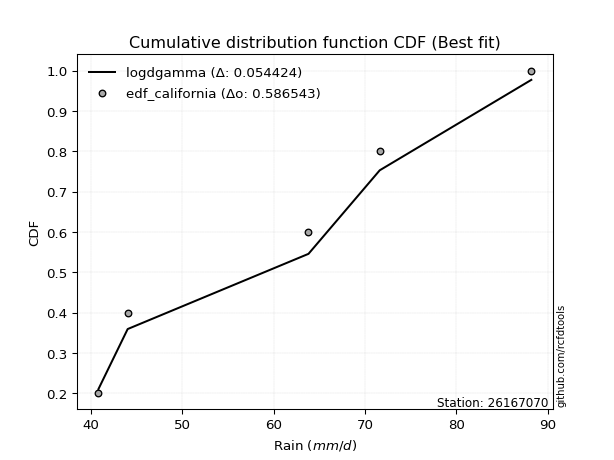</img>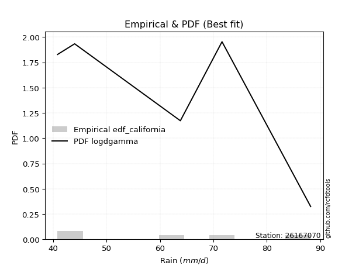</img>

</div>


### 2. EDF Hazen (1930)

Hazen method for plotting positions is a formula used to estimate the empirical cumulative probability distribution of flood events or other hydrological data. This formula often results in biased estimations, particularly when extrapolating to extreme events (high return periods).

<div align="center">


$P=(m-0.5)/n$


</div>


**2.1. Empirical values**

<div align="center">

|                | 0                  | 1                  | 2         | 3                 | 4                  |
|:---------------|:-------------------|:-------------------|:----------|:------------------|:-------------------|
| date           | 2022               | 2019               | 2025      | 2020              | 2021               |
| x              | 40.8               | 44.0               | 63.8      | 71.6              | 88.2               |
| m              | 1                  | 2                  | 3         | 4                 | 5                  |
| empirical_dist | edf_hazen          | edf_hazen          | edf_hazen | edf_hazen         | edf_hazen          |
| empirical      | 0.1                | 0.3                | 0.5       | 0.7               | 0.9                |
| empirical_tr   | 1.1111111111111112 | 1.4285714285714286 | 2.0       | 3.333333333333333 | 10.000000000000002 |

</div>


**2.2. Kolmogorov-Smirnov fit test (sorted by Δ)**


<div align="center">

|                | 0                  | 1                   | 2                  | 3                   | 4                   | 5                   | 6                   | 7                   | 8                   | 9                  | 10                  | 11                  | 12                  | 13                  | 14                  | 15                 | 16                 | 17                  | 18                 | 19                  | 20                  | 21                  | 22                  | 23                 | 24                  | 25                 | 26                  | 27                  | 28                  | 29                 | 30                  | 31                  | 32                  | 33                  | 34                  | 35                  | 36                 | 37                  | 38                  | 39                  | 40                 | 41                  | 42                  | 43                  | 44                  | 45                  | 46                  | 47                  | 48                  | 49                  | 50                  | 51                 | 52                  | 53                 | 54                  | 55                  | 56                 | 57                  | 58                  | 59                 | 60                  | 61                  | 62                  | 63                  | 64                  | 65                  | 66                  | 67                 | 68                  | 69                  | 70                  | 71                  | 72                 | 73                  | 74                 | 75                  | 76                 | 77                 | 78                  | 79                  | 80                 | 81                 | 82                  | 83                 | 84                  | 85                  | 86                  | 87                  | 88                 | 89                  | 90                  | 91                  | 92                  | 93                  | 94                  | 95                 | 96                  | 97                  | 98                  | 99                  | 100                 | 101                 | 102                 | 103                 | 104                 | 105                 | 106                 | 107                | 108                | 109                | 110                 | 111                 | 112                 | 113                 | 114                 | 115                | 116                 | 117                 | 118                | 119                 | 120                 | 121                 | 122                 | 123                 | 124                 | 125                 | 126                 | 127                 | 128                | 129                 | 130                | 131                 | 132                 | 133                | 134                | 135                 | 136                | 137                 | 138                 | 139                 | 140                | 141                | 142                 | 143                 | 144                | 145                 | 146                | 147                 | 148                | 149                | 150                 | 151                | 152                | 153                | 154                | 155                | 156                | 157                | 158                | 159                |
|:---------------|:-------------------|:--------------------|:-------------------|:--------------------|:--------------------|:--------------------|:--------------------|:--------------------|:--------------------|:-------------------|:--------------------|:--------------------|:--------------------|:--------------------|:--------------------|:-------------------|:-------------------|:--------------------|:-------------------|:--------------------|:--------------------|:--------------------|:--------------------|:-------------------|:--------------------|:-------------------|:--------------------|:--------------------|:--------------------|:-------------------|:--------------------|:--------------------|:--------------------|:--------------------|:--------------------|:--------------------|:-------------------|:--------------------|:--------------------|:--------------------|:-------------------|:--------------------|:--------------------|:--------------------|:--------------------|:--------------------|:--------------------|:--------------------|:--------------------|:--------------------|:--------------------|:-------------------|:--------------------|:-------------------|:--------------------|:--------------------|:-------------------|:--------------------|:--------------------|:-------------------|:--------------------|:--------------------|:--------------------|:--------------------|:--------------------|:--------------------|:--------------------|:-------------------|:--------------------|:--------------------|:--------------------|:--------------------|:-------------------|:--------------------|:-------------------|:--------------------|:-------------------|:-------------------|:--------------------|:--------------------|:-------------------|:-------------------|:--------------------|:-------------------|:--------------------|:--------------------|:--------------------|:--------------------|:-------------------|:--------------------|:--------------------|:--------------------|:--------------------|:--------------------|:--------------------|:-------------------|:--------------------|:--------------------|:--------------------|:--------------------|:--------------------|:--------------------|:--------------------|:--------------------|:--------------------|:--------------------|:--------------------|:-------------------|:-------------------|:-------------------|:--------------------|:--------------------|:--------------------|:--------------------|:--------------------|:-------------------|:--------------------|:--------------------|:-------------------|:--------------------|:--------------------|:--------------------|:--------------------|:--------------------|:--------------------|:--------------------|:--------------------|:--------------------|:-------------------|:--------------------|:-------------------|:--------------------|:--------------------|:-------------------|:-------------------|:--------------------|:-------------------|:--------------------|:--------------------|:--------------------|:-------------------|:-------------------|:--------------------|:--------------------|:-------------------|:--------------------|:-------------------|:--------------------|:-------------------|:-------------------|:--------------------|:-------------------|:-------------------|:-------------------|:-------------------|:-------------------|:-------------------|:-------------------|:-------------------|:-------------------|
| station        | 26167070           | 26167070            | 26167070           | 26167070            | 26167070            | 26167070            | 26167070            | 26167070            | 26167070            | 26167070           | 26167070            | 26167070            | 26167070            | 26167070            | 26167070            | 26167070           | 26167070           | 26167070            | 26167070           | 26167070            | 26167070            | 26167070            | 26167070            | 26167070           | 26167070            | 26167070           | 26167070            | 26167070            | 26167070            | 26167070           | 26167070            | 26167070            | 26167070            | 26167070            | 26167070            | 26167070            | 26167070           | 26167070            | 26167070            | 26167070            | 26167070           | 26167070            | 26167070            | 26167070            | 26167070            | 26167070            | 26167070            | 26167070            | 26167070            | 26167070            | 26167070            | 26167070           | 26167070            | 26167070           | 26167070            | 26167070            | 26167070           | 26167070            | 26167070            | 26167070           | 26167070            | 26167070            | 26167070            | 26167070            | 26167070            | 26167070            | 26167070            | 26167070           | 26167070            | 26167070            | 26167070            | 26167070            | 26167070           | 26167070            | 26167070           | 26167070            | 26167070           | 26167070           | 26167070            | 26167070            | 26167070           | 26167070           | 26167070            | 26167070           | 26167070            | 26167070            | 26167070            | 26167070            | 26167070           | 26167070            | 26167070            | 26167070            | 26167070            | 26167070            | 26167070            | 26167070           | 26167070            | 26167070            | 26167070            | 26167070            | 26167070            | 26167070            | 26167070            | 26167070            | 26167070            | 26167070            | 26167070            | 26167070           | 26167070           | 26167070           | 26167070            | 26167070            | 26167070            | 26167070            | 26167070            | 26167070           | 26167070            | 26167070            | 26167070           | 26167070            | 26167070            | 26167070            | 26167070            | 26167070            | 26167070            | 26167070            | 26167070            | 26167070            | 26167070           | 26167070            | 26167070           | 26167070            | 26167070            | 26167070           | 26167070           | 26167070            | 26167070           | 26167070            | 26167070            | 26167070            | 26167070           | 26167070           | 26167070            | 26167070            | 26167070           | 26167070            | 26167070           | 26167070            | 26167070           | 26167070           | 26167070            | 26167070           | 26167070           | 26167070           | 26167070           | 26167070           | 26167070           | 26167070           | 26167070           | 26167070           |
| empirical_dist | edf_hazen          | edf_hazen           | edf_hazen          | edf_hazen           | edf_hazen           | edf_hazen           | edf_hazen           | edf_hazen           | edf_hazen           | edf_hazen          | edf_hazen           | edf_hazen           | edf_hazen           | edf_hazen           | edf_hazen           | edf_hazen          | edf_hazen          | edf_hazen           | edf_hazen          | edf_hazen           | edf_hazen           | edf_hazen           | edf_hazen           | edf_hazen          | edf_hazen           | edf_hazen          | edf_hazen           | edf_hazen           | edf_hazen           | edf_hazen          | edf_hazen           | edf_hazen           | edf_hazen           | edf_hazen           | edf_hazen           | edf_hazen           | edf_hazen          | edf_hazen           | edf_hazen           | edf_hazen           | edf_hazen          | edf_hazen           | edf_hazen           | edf_hazen           | edf_hazen           | edf_hazen           | edf_hazen           | edf_hazen           | edf_hazen           | edf_hazen           | edf_hazen           | edf_hazen          | edf_hazen           | edf_hazen          | edf_hazen           | edf_hazen           | edf_hazen          | edf_hazen           | edf_hazen           | edf_hazen          | edf_hazen           | edf_hazen           | edf_hazen           | edf_hazen           | edf_hazen           | edf_hazen           | edf_hazen           | edf_hazen          | edf_hazen           | edf_hazen           | edf_hazen           | edf_hazen           | edf_hazen          | edf_hazen           | edf_hazen          | edf_hazen           | edf_hazen          | edf_hazen          | edf_hazen           | edf_hazen           | edf_hazen          | edf_hazen          | edf_hazen           | edf_hazen          | edf_hazen           | edf_hazen           | edf_hazen           | edf_hazen           | edf_hazen          | edf_hazen           | edf_hazen           | edf_hazen           | edf_hazen           | edf_hazen           | edf_hazen           | edf_hazen          | edf_hazen           | edf_hazen           | edf_hazen           | edf_hazen           | edf_hazen           | edf_hazen           | edf_hazen           | edf_hazen           | edf_hazen           | edf_hazen           | edf_hazen           | edf_hazen          | edf_hazen          | edf_hazen          | edf_hazen           | edf_hazen           | edf_hazen           | edf_hazen           | edf_hazen           | edf_hazen          | edf_hazen           | edf_hazen           | edf_hazen          | edf_hazen           | edf_hazen           | edf_hazen           | edf_hazen           | edf_hazen           | edf_hazen           | edf_hazen           | edf_hazen           | edf_hazen           | edf_hazen          | edf_hazen           | edf_hazen          | edf_hazen           | edf_hazen           | edf_hazen          | edf_hazen          | edf_hazen           | edf_hazen          | edf_hazen           | edf_hazen           | edf_hazen           | edf_hazen          | edf_hazen          | edf_hazen           | edf_hazen           | edf_hazen          | edf_hazen           | edf_hazen          | edf_hazen           | edf_hazen          | edf_hazen          | edf_hazen           | edf_hazen          | edf_hazen          | edf_hazen          | edf_hazen          | edf_hazen          | edf_hazen          | edf_hazen          | edf_hazen          | edf_hazen          |
| p_dist         | logarcsine         | logdweibull         | logbetaprime       | ksone               | logksone            | arcsine             | semicircular        | logsemicircular     | logdgamma           | logrdist           | logwrapcauchy       | anglit              | logtrapezoid        | loganglit           | dweibull            | foldnorm           | logfoldnorm        | rayleigh            | maxwell            | lograyleigh         | logalpha            | logburr12           | logmaxwell          | nct                | t                   | genlogistic        | crystalball         | norm                | exponnorm           | pearson3           | invgamma            | logjohnsonsu        | betaprime           | loginvgamma         | logf                | logerlang           | f                  | loggamma            | loggamma            | logpearson3         | logt               | logcrystalball      | lognorm             | logexponnorm        | logskewnorm         | logloggamma         | lognct              | gamma               | alpha               | logncf              | kstwobign           | weibull_min        | halfnorm            | loggenextreme      | wrapcauchy          | dgamma              | erlang             | burr                | logcosine           | loginvweibull      | loggenlogistic      | gumbel_l            | cosine              | loggumbel_l         | logmielke           | loghalfnorm         | logistic            | beta               | logrice             | logburr             | loglogistic         | lognakagami         | lomax              | logkstwobign        | logbeta            | genexpon            | rice               | gumbel_r           | hypsecant           | logargus            | logbradford        | loghypsecant       | loggumbel_r         | logtriang          | argus               | logweibull_max      | loggenexpon         | loggompertz         | triang             | laplace             | loglaplace          | loglaplace          | genpareto           | truncnorm           | logloglaplace       | logkappa4          | logtruncexpon       | moyal               | halflogistic        | gompertz            | gausshyper          | loggennorm          | logtukeylambda      | logmoyal            | burr12              | loghalflogistic     | truncexpon          | gennorm            | loglomax           | loguniform         | logkappa3           | loggausshyper       | halfgennorm         | logexponpow         | bradford            | loglevy_l          | kappa4              | skewnorm            | loginvgauss        | kappa3              | tukeylambda         | invgauss            | levy_l              | logvonmises_line    | uniform             | vonmises_line       | logjohnsonsb        | loggenhalflogistic  | genhalflogistic    | truncweibull_min    | logweibull_min     | exponpow            | logtruncnorm        | wald               | logwald            | gengamma            | trapezoid          | nakagami            | exponweib           | logtruncweibull_min | genextreme         | logfatiguelife     | fatiguelife         | ncf                 | logtruncpareto     | powerlaw            | logpowerlaw        | truncpareto         | logexponweib       | invweibull         | loggenpareto        | loggengamma        | rdist              | weibull_max        | johnsonsu          | johnsonsb          | loghalfgennorm     | logvonmises        | vonmises           | mielke             |
| delta          | 0.0587602662448965 | 0.08399978713406109 | 0.0874576780656302 | 0.08943019891630374 | 0.09196603107593371 | 0.09999999999999998 | 0.10521960914637524 | 0.10763546394415002 | 0.11019144991873386 | 0.1106295722527822 | 0.11493558389987402 | 0.11651288707825766 | 0.11657846818145096 | 0.11883172279146209 | 0.12451610369991697 | 0.1305380592019041 | 0.1323608568626672 | 0.13703888299002961 | 0.1380882132744462 | 0.13990315745392437 | 0.14048068260327157 | 0.14065460808730776 | 0.14069692055966065 | 0.1407974571771059 | 0.14180964404453836 | 0.1418912856904082 | 0.14197672816550133 | 0.14197682170639547 | 0.14201605172987236 | 0.1423767108256673 | 0.14277388851794628 | 0.14327139455321758 | 0.14353485151612255 | 0.14355389169375102 | 0.14375283730360233 | 0.14384817054295118 | 0.1439877134150634 | 0.14400673841750386 | 0.14400673841750386 | 0.14406705446356963 | 0.1440866537469755 | 0.14408748150694733 | 0.14408748936603227 | 0.14408825978679476 | 0.14408895091171073 | 0.14409232581096657 | 0.14437029638120946 | 0.14470433399784668 | 0.14487788388324874 | 0.14505000611309454 | 0.14514011423840484 | 0.1461271614592018 | 0.14656931405909676 | 0.1484953104563228 | 0.14998128834729996 | 0.15244695953190693 | 0.1529326454554599 | 0.15297818291189968 | 0.15463269459499374 | 0.1554518660777453 | 0.15600641744924593 | 0.15625447406950968 | 0.15772634122590684 | 0.15774444858366798 | 0.15899279159987423 | 0.16010104691036275 | 0.16039127559462305 | 0.1604474090093331 | 0.16101078435817812 | 0.16142149768811287 | 0.16229416322686582 | 0.16404490161120866 | 0.1644146684559879 | 0.16534079163175297 | 0.1665400280982521 | 0.16772471600149141 | 0.1683080580898109 | 0.1688385265629849 | 0.17003834289640077 | 0.17039047569988336 | 0.1704207407053524 | 0.1717712018738902 | 0.17182275445154105 | 0.174075894768978  | 0.17437903861739618 | 0.17441469636495832 | 0.17466289634821275 | 0.17838888252276314 | 0.1787004920109142 | 0.17889045199440873 | 0.18038568778589703 | 0.18038568778589703 | 0.18096912065847168 | 0.18662542390907733 | 0.18904353324466683 | 0.1911822680204064 | 0.19167374797268633 | 0.19337766720133495 | 0.19360632598968547 | 0.19532154956043007 | 0.19573805708200856 | 0.19633499015952122 | 0.19675426944130975 | 0.19676807344622105 | 0.19769037483655616 | 0.19862681222633105 | 0.19994624396034463 | 0.2                | 0.2002633786857091 | 0.2020558885696141 | 0.20216332810169885 | 0.20410376749241088 | 0.20418382644443944 | 0.20471376393774798 | 0.20479121273698775 | 0.2051063253601729 | 0.20603119944519588 | 0.20679232255117874 | 0.213777198670014  | 0.21394894307530227 | 0.22529870653579137 | 0.22783133159075797 | 0.22859884615326428 | 0.23207264218636967 | 0.23248945147679317 | 0.23254239479044397 | 0.23560976481798607 | 0.24499131771324917 | 0.2528198008130027 | 0.25715483861346855 | 0.2579807125700896 | 0.26696352932246015 | 0.29480620527260515 | 0.3                | 0.3                | 0.30651863837200205 | 0.3095947299914347 | 0.31422590961087105 | 0.32142503347255164 | 0.3284602065336072  | 0.3315043679249525 | 0.3344868120767343 | 0.33856788947129174 | 0.36322113930298283 | 0.4001258253284028 | 0.41566728634496447 | 0.4382172718382114 | 0.43823271926557605 | 0.4391283824587679 | 0.4629169050052248 | 0.46499098773718195 | 0.4655997166276446 | 0.4999999977776115 | 0.5241361519064754 | 0.5563182469067751 | 0.6106438500559779 | 0.7                | 1.102681950995402  | 13.345099081635599 | nan                |
| deltao         | 0.5865427407550001 | 0.5865427407550001  | 0.5865427407550001 | 0.5865427407550001  | 0.5865427407550001  | 0.5865427407550001  | 0.5865427407550001  | 0.5865427407550001  | 0.5865427407550001  | 0.5865427407550001 | 0.5865427407550001  | 0.5865427407550001  | 0.5865427407550001  | 0.5865427407550001  | 0.5865427407550001  | 0.5865427407550001 | 0.5865427407550001 | 0.5865427407550001  | 0.5865427407550001 | 0.5865427407550001  | 0.5865427407550001  | 0.5865427407550001  | 0.5865427407550001  | 0.5865427407550001 | 0.5865427407550001  | 0.5865427407550001 | 0.5865427407550001  | 0.5865427407550001  | 0.5865427407550001  | 0.5865427407550001 | 0.5865427407550001  | 0.5865427407550001  | 0.5865427407550001  | 0.5865427407550001  | 0.5865427407550001  | 0.5865427407550001  | 0.5865427407550001 | 0.5865427407550001  | 0.5865427407550001  | 0.5865427407550001  | 0.5865427407550001 | 0.5865427407550001  | 0.5865427407550001  | 0.5865427407550001  | 0.5865427407550001  | 0.5865427407550001  | 0.5865427407550001  | 0.5865427407550001  | 0.5865427407550001  | 0.5865427407550001  | 0.5865427407550001  | 0.5865427407550001 | 0.5865427407550001  | 0.5865427407550001 | 0.5865427407550001  | 0.5865427407550001  | 0.5865427407550001 | 0.5865427407550001  | 0.5865427407550001  | 0.5865427407550001 | 0.5865427407550001  | 0.5865427407550001  | 0.5865427407550001  | 0.5865427407550001  | 0.5865427407550001  | 0.5865427407550001  | 0.5865427407550001  | 0.5865427407550001 | 0.5865427407550001  | 0.5865427407550001  | 0.5865427407550001  | 0.5865427407550001  | 0.5865427407550001 | 0.5865427407550001  | 0.5865427407550001 | 0.5865427407550001  | 0.5865427407550001 | 0.5865427407550001 | 0.5865427407550001  | 0.5865427407550001  | 0.5865427407550001 | 0.5865427407550001 | 0.5865427407550001  | 0.5865427407550001 | 0.5865427407550001  | 0.5865427407550001  | 0.5865427407550001  | 0.5865427407550001  | 0.5865427407550001 | 0.5865427407550001  | 0.5865427407550001  | 0.5865427407550001  | 0.5865427407550001  | 0.5865427407550001  | 0.5865427407550001  | 0.5865427407550001 | 0.5865427407550001  | 0.5865427407550001  | 0.5865427407550001  | 0.5865427407550001  | 0.5865427407550001  | 0.5865427407550001  | 0.5865427407550001  | 0.5865427407550001  | 0.5865427407550001  | 0.5865427407550001  | 0.5865427407550001  | 0.5865427407550001 | 0.5865427407550001 | 0.5865427407550001 | 0.5865427407550001  | 0.5865427407550001  | 0.5865427407550001  | 0.5865427407550001  | 0.5865427407550001  | 0.5865427407550001 | 0.5865427407550001  | 0.5865427407550001  | 0.5865427407550001 | 0.5865427407550001  | 0.5865427407550001  | 0.5865427407550001  | 0.5865427407550001  | 0.5865427407550001  | 0.5865427407550001  | 0.5865427407550001  | 0.5865427407550001  | 0.5865427407550001  | 0.5865427407550001 | 0.5865427407550001  | 0.5865427407550001 | 0.5865427407550001  | 0.5865427407550001  | 0.5865427407550001 | 0.5865427407550001 | 0.5865427407550001  | 0.5865427407550001 | 0.5865427407550001  | 0.5865427407550001  | 0.5865427407550001  | 0.5865427407550001 | 0.5865427407550001 | 0.5865427407550001  | 0.5865427407550001  | 0.5865427407550001 | 0.5865427407550001  | 0.5865427407550001 | 0.5865427407550001  | 0.5865427407550001 | 0.5865427407550001 | 0.5865427407550001  | 0.5865427407550001 | 0.5865427407550001 | 0.5865427407550001 | 0.5865427407550001 | 0.5865427407550001 | 0.5865427407550001 | 0.5865427407550001 | 0.5865427407550001 | 0.5865427407550001 |
| eval           | Δo > Δ             | Δo > Δ              | Δo > Δ             | Δo > Δ              | Δo > Δ              | Δo > Δ              | Δo > Δ              | Δo > Δ              | Δo > Δ              | Δo > Δ             | Δo > Δ              | Δo > Δ              | Δo > Δ              | Δo > Δ              | Δo > Δ              | Δo > Δ             | Δo > Δ             | Δo > Δ              | Δo > Δ             | Δo > Δ              | Δo > Δ              | Δo > Δ              | Δo > Δ              | Δo > Δ             | Δo > Δ              | Δo > Δ             | Δo > Δ              | Δo > Δ              | Δo > Δ              | Δo > Δ             | Δo > Δ              | Δo > Δ              | Δo > Δ              | Δo > Δ              | Δo > Δ              | Δo > Δ              | Δo > Δ             | Δo > Δ              | Δo > Δ              | Δo > Δ              | Δo > Δ             | Δo > Δ              | Δo > Δ              | Δo > Δ              | Δo > Δ              | Δo > Δ              | Δo > Δ              | Δo > Δ              | Δo > Δ              | Δo > Δ              | Δo > Δ              | Δo > Δ             | Δo > Δ              | Δo > Δ             | Δo > Δ              | Δo > Δ              | Δo > Δ             | Δo > Δ              | Δo > Δ              | Δo > Δ             | Δo > Δ              | Δo > Δ              | Δo > Δ              | Δo > Δ              | Δo > Δ              | Δo > Δ              | Δo > Δ              | Δo > Δ             | Δo > Δ              | Δo > Δ              | Δo > Δ              | Δo > Δ              | Δo > Δ             | Δo > Δ              | Δo > Δ             | Δo > Δ              | Δo > Δ             | Δo > Δ             | Δo > Δ              | Δo > Δ              | Δo > Δ             | Δo > Δ             | Δo > Δ              | Δo > Δ             | Δo > Δ              | Δo > Δ              | Δo > Δ              | Δo > Δ              | Δo > Δ             | Δo > Δ              | Δo > Δ              | Δo > Δ              | Δo > Δ              | Δo > Δ              | Δo > Δ              | Δo > Δ             | Δo > Δ              | Δo > Δ              | Δo > Δ              | Δo > Δ              | Δo > Δ              | Δo > Δ              | Δo > Δ              | Δo > Δ              | Δo > Δ              | Δo > Δ              | Δo > Δ              | Δo > Δ             | Δo > Δ             | Δo > Δ             | Δo > Δ              | Δo > Δ              | Δo > Δ              | Δo > Δ              | Δo > Δ              | Δo > Δ             | Δo > Δ              | Δo > Δ              | Δo > Δ             | Δo > Δ              | Δo > Δ              | Δo > Δ              | Δo > Δ              | Δo > Δ              | Δo > Δ              | Δo > Δ              | Δo > Δ              | Δo > Δ              | Δo > Δ             | Δo > Δ              | Δo > Δ             | Δo > Δ              | Δo > Δ              | Δo > Δ             | Δo > Δ             | Δo > Δ              | Δo > Δ             | Δo > Δ              | Δo > Δ              | Δo > Δ              | Δo > Δ             | Δo > Δ             | Δo > Δ              | Δo > Δ              | Δo > Δ             | Δo > Δ              | Δo > Δ             | Δo > Δ              | Δo > Δ             | Δo > Δ             | Δo > Δ              | Δo > Δ             | Δo > Δ             | Δo > Δ             | Δo > Δ             | Δo <= Δ            | Δo <= Δ            | Δo <= Δ            | Δo <= Δ            | Δo <= Δ            |
| fit            | 1                  | 1                   | 1                  | 1                   | 1                   | 1                   | 1                   | 1                   | 1                   | 1                  | 1                   | 1                   | 1                   | 1                   | 1                   | 1                  | 1                  | 1                   | 1                  | 1                   | 1                   | 1                   | 1                   | 1                  | 1                   | 1                  | 1                   | 1                   | 1                   | 1                  | 1                   | 1                   | 1                   | 1                   | 1                   | 1                   | 1                  | 1                   | 1                   | 1                   | 1                  | 1                   | 1                   | 1                   | 1                   | 1                   | 1                   | 1                   | 1                   | 1                   | 1                   | 1                  | 1                   | 1                  | 1                   | 1                   | 1                  | 1                   | 1                   | 1                  | 1                   | 1                   | 1                   | 1                   | 1                   | 1                   | 1                   | 1                  | 1                   | 1                   | 1                   | 1                   | 1                  | 1                   | 1                  | 1                   | 1                  | 1                  | 1                   | 1                   | 1                  | 1                  | 1                   | 1                  | 1                   | 1                   | 1                   | 1                   | 1                  | 1                   | 1                   | 1                   | 1                   | 1                   | 1                   | 1                  | 1                   | 1                   | 1                   | 1                   | 1                   | 1                   | 1                   | 1                   | 1                   | 1                   | 1                   | 1                  | 1                  | 1                  | 1                   | 1                   | 1                   | 1                   | 1                   | 1                  | 1                   | 1                   | 1                  | 1                   | 1                   | 1                   | 1                   | 1                   | 1                   | 1                   | 1                   | 1                   | 1                  | 1                   | 1                  | 1                   | 1                   | 1                  | 1                  | 1                   | 1                  | 1                   | 1                   | 1                   | 1                  | 1                  | 1                   | 1                   | 1                  | 1                   | 1                  | 1                   | 1                  | 1                  | 1                   | 1                  | 1                  | 1                  | 1                  | 0                  | 0                  | 0                  | 0                  | 0                  |
| n              | 5                  | 5                   | 5                  | 5                   | 5                   | 5                   | 5                   | 5                   | 5                   | 5                  | 5                   | 5                   | 5                   | 5                   | 5                   | 5                  | 5                  | 5                   | 5                  | 5                   | 5                   | 5                   | 5                   | 5                  | 5                   | 5                  | 5                   | 5                   | 5                   | 5                  | 5                   | 5                   | 5                   | 5                   | 5                   | 5                   | 5                  | 5                   | 5                   | 5                   | 5                  | 5                   | 5                   | 5                   | 5                   | 5                   | 5                   | 5                   | 5                   | 5                   | 5                   | 5                  | 5                   | 5                  | 5                   | 5                   | 5                  | 5                   | 5                   | 5                  | 5                   | 5                   | 5                   | 5                   | 5                   | 5                   | 5                   | 5                  | 5                   | 5                   | 5                   | 5                   | 5                  | 5                   | 5                  | 5                   | 5                  | 5                  | 5                   | 5                   | 5                  | 5                  | 5                   | 5                  | 5                   | 5                   | 5                   | 5                   | 5                  | 5                   | 5                   | 5                   | 5                   | 5                   | 5                   | 5                  | 5                   | 5                   | 5                   | 5                   | 5                   | 5                   | 5                   | 5                   | 5                   | 5                   | 5                   | 5                  | 5                  | 5                  | 5                   | 5                   | 5                   | 5                   | 5                   | 5                  | 5                   | 5                   | 5                  | 5                   | 5                   | 5                   | 5                   | 5                   | 5                   | 5                   | 5                   | 5                   | 5                  | 5                   | 5                  | 5                   | 5                   | 5                  | 5                  | 5                   | 5                  | 5                   | 5                   | 5                   | 5                  | 5                  | 5                   | 5                   | 5                  | 5                   | 5                  | 5                   | 5                  | 5                  | 5                   | 5                  | 5                  | 5                  | 5                  | 5                  | 5                  | 5                  | 5                  | 5                  |
| best_fit       | 1                  | 0                   | 0                  | 0                   | 0                   | 0                   | 0                   | 0                   | 0                   | 0                  | 0                   | 0                   | 0                   | 0                   | 0                   | 0                  | 0                  | 0                   | 0                  | 0                   | 0                   | 0                   | 0                   | 0                  | 0                   | 0                  | 0                   | 0                   | 0                   | 0                  | 0                   | 0                   | 0                   | 0                   | 0                   | 0                   | 0                  | 0                   | 0                   | 0                   | 0                  | 0                   | 0                   | 0                   | 0                   | 0                   | 0                   | 0                   | 0                   | 0                   | 0                   | 0                  | 0                   | 0                  | 0                   | 0                   | 0                  | 0                   | 0                   | 0                  | 0                   | 0                   | 0                   | 0                   | 0                   | 0                   | 0                   | 0                  | 0                   | 0                   | 0                   | 0                   | 0                  | 0                   | 0                  | 0                   | 0                  | 0                  | 0                   | 0                   | 0                  | 0                  | 0                   | 0                  | 0                   | 0                   | 0                   | 0                   | 0                  | 0                   | 0                   | 0                   | 0                   | 0                   | 0                   | 0                  | 0                   | 0                   | 0                   | 0                   | 0                   | 0                   | 0                   | 0                   | 0                   | 0                   | 0                   | 0                  | 0                  | 0                  | 0                   | 0                   | 0                   | 0                   | 0                   | 0                  | 0                   | 0                   | 0                  | 0                   | 0                   | 0                   | 0                   | 0                   | 0                   | 0                   | 0                   | 0                   | 0                  | 0                   | 0                  | 0                   | 0                   | 0                  | 0                  | 0                   | 0                  | 0                   | 0                   | 0                   | 0                  | 0                  | 0                   | 0                   | 0                  | 0                   | 0                  | 0                   | 0                  | 0                  | 0                   | 0                  | 0                  | 0                  | 0                  | 0                  | 0                  | 0                  | 0                  | 0                  |
| best_fit_sort  | 1                  | 2                   | 3                  | 4                   | 5                   | 6                   | 7                   | 8                   | 9                   | 10                 | 11                  | 12                  | 13                  | 14                  | 15                  | 16                 | 17                 | 18                  | 19                 | 20                  | 21                  | 22                  | 23                  | 24                 | 25                  | 26                 | 27                  | 28                  | 29                  | 30                 | 31                  | 32                  | 33                  | 34                  | 35                  | 36                  | 37                 | 38                  | 39                  | 40                  | 41                 | 42                  | 43                  | 44                  | 45                  | 46                  | 47                  | 48                  | 49                  | 50                  | 51                  | 52                 | 53                  | 54                 | 55                  | 56                  | 57                 | 58                  | 59                  | 60                 | 61                  | 62                  | 63                  | 64                  | 65                  | 66                  | 67                  | 68                 | 69                  | 70                  | 71                  | 72                  | 73                 | 74                  | 75                 | 76                  | 77                 | 78                 | 79                  | 80                  | 81                 | 82                 | 83                  | 84                 | 85                  | 86                  | 87                  | 88                  | 89                 | 90                  | 91                  | 92                  | 93                  | 94                  | 95                  | 96                 | 97                  | 98                  | 99                  | 100                 | 101                 | 102                 | 103                 | 104                 | 105                 | 106                 | 107                 | 108                | 109                | 110                | 111                 | 112                 | 113                 | 114                 | 115                 | 116                | 117                 | 118                 | 119                | 120                 | 121                 | 122                 | 123                 | 124                 | 125                 | 126                 | 127                 | 128                 | 129                | 130                 | 131                | 132                 | 133                 | 134                | 135                | 136                 | 137                | 138                 | 139                 | 140                 | 141                | 142                | 143                 | 144                 | 145                | 146                 | 147                | 148                 | 149                | 150                | 151                 | 152                | 153                | 154                | 155                | 156                | 157                | 158                | 159                | 160                |

</div>


**2.3. Best fit**

<div align="center">

|   id |   station | empirical_dist   | p_dist     |     delta |   deltao | eval   |   fit |   n |   best_fit |   best_fit_sort |
|-----:|----------:|:-----------------|:-----------|----------:|---------:|:-------|------:|----:|-----------:|----------------:|
|    0 |  26167070 | edf_hazen        | logarcsine | 0.0587603 | 0.586543 | Δo > Δ |     1 |   5 |          1 |               1 |

</div>


<div align="center">

</img></img>

</div>


### 3. EDF Weibull (1939)

Weibull plotting position formula is an empirical method used to estimate the non-exceedance probability or plotting position for a set of observed data, is often recommended or widely used in practice, particularly in flood frequency analysis.

<div align="center">


$P=m/(n+1)$


</div>


**3.1. Empirical values**

<div align="center">

|                | 0                   | 1                  | 2           | 3                  | 4                  |
|:---------------|:--------------------|:-------------------|:------------|:-------------------|:-------------------|
| date           | 2022                | 2019               | 2025        | 2020               | 2021               |
| x              | 40.8                | 44.0               | 63.8        | 71.6               | 88.2               |
| m              | 1                   | 2                  | 3           | 4                  | 5                  |
| empirical_dist | edf_weibull         | edf_weibull        | edf_weibull | edf_weibull        | edf_weibull        |
| empirical      | 0.16666666666666666 | 0.3333333333333333 | 0.5         | 0.6666666666666666 | 0.8333333333333334 |
| empirical_tr   | 1.2                 | 1.4999999999999998 | 2.0         | 2.9999999999999996 | 6.000000000000002  |

</div>


**3.2. Kolmogorov-Smirnov fit test (sorted by Δ)**


<div align="center">

|                | 0                   | 1                   | 2                   | 3                   | 4                   | 5                  | 6                   | 7                   | 8                  | 9                   | 10                 | 11                  | 12                  | 13                  | 14                  | 15                  | 16                  | 17                  | 18                  | 19                 | 20                  | 21                 | 22                  | 23                 | 24                 | 25                  | 26                  | 27                  | 28                  | 29                  | 30                  | 31                  | 32                  | 33                  | 34                  | 35                  | 36                 | 37                 | 38                  | 39                  | 40                  | 41                  | 42                  | 43                  | 44                 | 45                 | 46                  | 47                 | 48                 | 49                  | 50                  | 51                  | 52                 | 53                  | 54                  | 55                  | 56                  | 57                  | 58                  | 59                 | 60                 | 61                  | 62                 | 63                 | 64                 | 65                  | 66                  | 67                  | 68                 | 69                  | 70                  | 71                  | 72                  | 73                 | 74                  | 75                 | 76                 | 77                  | 78                  | 79                  | 80                  | 81                  | 82                  | 83                  | 84                  | 85                  | 86                 | 87                  | 88                  | 89                 | 90                  | 91                  | 92                  | 93                  | 94                  | 95                  | 96                  | 97                  | 98                 | 99                  | 100                 | 101                 | 102                 | 103                 | 104                | 105                 | 106                 | 107                | 108                 | 109                | 110                 | 111                | 112                 | 113                 | 114                 | 115                 | 116                 | 117                 | 118                 | 119                 | 120                 | 121                | 122                 | 123                | 124                 | 125                | 126                | 127                | 128                | 129                | 130                 | 131                | 132                 | 133                 | 134                 | 135                | 136                 | 137                | 138                 | 139                 | 140                 | 141                | 142                | 143                | 144                 | 145                | 146                | 147                 | 148                | 149                | 150                 | 151                 | 152                | 153                | 154                | 155                | 156                | 157                | 158                | 159                |
|:---------------|:--------------------|:--------------------|:--------------------|:--------------------|:--------------------|:-------------------|:--------------------|:--------------------|:-------------------|:--------------------|:-------------------|:--------------------|:--------------------|:--------------------|:--------------------|:--------------------|:--------------------|:--------------------|:--------------------|:-------------------|:--------------------|:-------------------|:--------------------|:-------------------|:-------------------|:--------------------|:--------------------|:--------------------|:--------------------|:--------------------|:--------------------|:--------------------|:--------------------|:--------------------|:--------------------|:--------------------|:-------------------|:-------------------|:--------------------|:--------------------|:--------------------|:--------------------|:--------------------|:--------------------|:-------------------|:-------------------|:--------------------|:-------------------|:-------------------|:--------------------|:--------------------|:--------------------|:-------------------|:--------------------|:--------------------|:--------------------|:--------------------|:--------------------|:--------------------|:-------------------|:-------------------|:--------------------|:-------------------|:-------------------|:-------------------|:--------------------|:--------------------|:--------------------|:-------------------|:--------------------|:--------------------|:--------------------|:--------------------|:-------------------|:--------------------|:-------------------|:-------------------|:--------------------|:--------------------|:--------------------|:--------------------|:--------------------|:--------------------|:--------------------|:--------------------|:--------------------|:-------------------|:--------------------|:--------------------|:-------------------|:--------------------|:--------------------|:--------------------|:--------------------|:--------------------|:--------------------|:--------------------|:--------------------|:-------------------|:--------------------|:--------------------|:--------------------|:--------------------|:--------------------|:-------------------|:--------------------|:--------------------|:-------------------|:--------------------|:-------------------|:--------------------|:-------------------|:--------------------|:--------------------|:--------------------|:--------------------|:--------------------|:--------------------|:--------------------|:--------------------|:--------------------|:-------------------|:--------------------|:-------------------|:--------------------|:-------------------|:-------------------|:-------------------|:-------------------|:-------------------|:--------------------|:-------------------|:--------------------|:--------------------|:--------------------|:-------------------|:--------------------|:-------------------|:--------------------|:--------------------|:--------------------|:-------------------|:-------------------|:-------------------|:--------------------|:-------------------|:-------------------|:--------------------|:-------------------|:-------------------|:--------------------|:--------------------|:-------------------|:-------------------|:-------------------|:-------------------|:-------------------|:-------------------|:-------------------|:-------------------|
| station        | 26167070            | 26167070            | 26167070            | 26167070            | 26167070            | 26167070           | 26167070            | 26167070            | 26167070           | 26167070            | 26167070           | 26167070            | 26167070            | 26167070            | 26167070            | 26167070            | 26167070            | 26167070            | 26167070            | 26167070           | 26167070            | 26167070           | 26167070            | 26167070           | 26167070           | 26167070            | 26167070            | 26167070            | 26167070            | 26167070            | 26167070            | 26167070            | 26167070            | 26167070            | 26167070            | 26167070            | 26167070           | 26167070           | 26167070            | 26167070            | 26167070            | 26167070            | 26167070            | 26167070            | 26167070           | 26167070           | 26167070            | 26167070           | 26167070           | 26167070            | 26167070            | 26167070            | 26167070           | 26167070            | 26167070            | 26167070            | 26167070            | 26167070            | 26167070            | 26167070           | 26167070           | 26167070            | 26167070           | 26167070           | 26167070           | 26167070            | 26167070            | 26167070            | 26167070           | 26167070            | 26167070            | 26167070            | 26167070            | 26167070           | 26167070            | 26167070           | 26167070           | 26167070            | 26167070            | 26167070            | 26167070            | 26167070            | 26167070            | 26167070            | 26167070            | 26167070            | 26167070           | 26167070            | 26167070            | 26167070           | 26167070            | 26167070            | 26167070            | 26167070            | 26167070            | 26167070            | 26167070            | 26167070            | 26167070           | 26167070            | 26167070            | 26167070            | 26167070            | 26167070            | 26167070           | 26167070            | 26167070            | 26167070           | 26167070            | 26167070           | 26167070            | 26167070           | 26167070            | 26167070            | 26167070            | 26167070            | 26167070            | 26167070            | 26167070            | 26167070            | 26167070            | 26167070           | 26167070            | 26167070           | 26167070            | 26167070           | 26167070           | 26167070           | 26167070           | 26167070           | 26167070            | 26167070           | 26167070            | 26167070            | 26167070            | 26167070           | 26167070            | 26167070           | 26167070            | 26167070            | 26167070            | 26167070           | 26167070           | 26167070           | 26167070            | 26167070           | 26167070           | 26167070            | 26167070           | 26167070           | 26167070            | 26167070            | 26167070           | 26167070           | 26167070           | 26167070           | 26167070           | 26167070           | 26167070           | 26167070           |
| empirical_dist | edf_weibull         | edf_weibull         | edf_weibull         | edf_weibull         | edf_weibull         | edf_weibull        | edf_weibull         | edf_weibull         | edf_weibull        | edf_weibull         | edf_weibull        | edf_weibull         | edf_weibull         | edf_weibull         | edf_weibull         | edf_weibull         | edf_weibull         | edf_weibull         | edf_weibull         | edf_weibull        | edf_weibull         | edf_weibull        | edf_weibull         | edf_weibull        | edf_weibull        | edf_weibull         | edf_weibull         | edf_weibull         | edf_weibull         | edf_weibull         | edf_weibull         | edf_weibull         | edf_weibull         | edf_weibull         | edf_weibull         | edf_weibull         | edf_weibull        | edf_weibull        | edf_weibull         | edf_weibull         | edf_weibull         | edf_weibull         | edf_weibull         | edf_weibull         | edf_weibull        | edf_weibull        | edf_weibull         | edf_weibull        | edf_weibull        | edf_weibull         | edf_weibull         | edf_weibull         | edf_weibull        | edf_weibull         | edf_weibull         | edf_weibull         | edf_weibull         | edf_weibull         | edf_weibull         | edf_weibull        | edf_weibull        | edf_weibull         | edf_weibull        | edf_weibull        | edf_weibull        | edf_weibull         | edf_weibull         | edf_weibull         | edf_weibull        | edf_weibull         | edf_weibull         | edf_weibull         | edf_weibull         | edf_weibull        | edf_weibull         | edf_weibull        | edf_weibull        | edf_weibull         | edf_weibull         | edf_weibull         | edf_weibull         | edf_weibull         | edf_weibull         | edf_weibull         | edf_weibull         | edf_weibull         | edf_weibull        | edf_weibull         | edf_weibull         | edf_weibull        | edf_weibull         | edf_weibull         | edf_weibull         | edf_weibull         | edf_weibull         | edf_weibull         | edf_weibull         | edf_weibull         | edf_weibull        | edf_weibull         | edf_weibull         | edf_weibull         | edf_weibull         | edf_weibull         | edf_weibull        | edf_weibull         | edf_weibull         | edf_weibull        | edf_weibull         | edf_weibull        | edf_weibull         | edf_weibull        | edf_weibull         | edf_weibull         | edf_weibull         | edf_weibull         | edf_weibull         | edf_weibull         | edf_weibull         | edf_weibull         | edf_weibull         | edf_weibull        | edf_weibull         | edf_weibull        | edf_weibull         | edf_weibull        | edf_weibull        | edf_weibull        | edf_weibull        | edf_weibull        | edf_weibull         | edf_weibull        | edf_weibull         | edf_weibull         | edf_weibull         | edf_weibull        | edf_weibull         | edf_weibull        | edf_weibull         | edf_weibull         | edf_weibull         | edf_weibull        | edf_weibull        | edf_weibull        | edf_weibull         | edf_weibull        | edf_weibull        | edf_weibull         | edf_weibull        | edf_weibull        | edf_weibull         | edf_weibull         | edf_weibull        | edf_weibull        | edf_weibull        | edf_weibull        | edf_weibull        | edf_weibull        | edf_weibull        | edf_weibull        |
| p_dist         | logarcsine          | logbetaprime        | ksone               | logksone            | semicircular        | logdweibull        | loglevy_l           | logsemicircular     | dweibull           | logdgamma           | dgamma             | anglit              | logtrapezoid        | loganglit           | levy_l              | foldnorm            | burr                | logburr             | loggenlogistic      | logfoldnorm        | logkstwobign        | loginvweibull      | logbeta             | genpareto          | logrdist           | weibull_min         | lognakagami         | logweibull_max      | loggenextreme       | arcsine             | logwrapcauchy       | wrapcauchy          | gennorm             | logmielke           | rayleigh            | maxwell             | lograyleigh        | logalpha           | logburr12           | logmaxwell          | nct                 | t                   | genlogistic         | crystalball         | norm               | exponnorm          | pearson3            | invgamma           | logjohnsonsu       | betaprime           | loginvgamma         | logf                | logerlang          | f                   | loggamma            | loggamma            | logpearson3         | logt                | logcrystalball      | lognorm            | logexponnorm       | logskewnorm         | logloggamma        | lognct             | gamma              | alpha               | logncf              | kstwobign           | halfnorm           | loghalfnorm         | erlang              | loggenexpon         | logcosine           | gumbel_l           | cosine              | loggumbel_l        | genexpon           | logweibull_min      | logtruncexpon       | logbradford         | logistic            | beta                | logrice             | loglogistic         | burr12              | lomax               | loglomax           | rice                | gumbel_r            | hypsecant          | logargus            | loggausshyper       | halfgennorm         | logexponpow         | loghypsecant        | loggumbel_r         | logjohnsonsb        | logtriang           | argus              | loggompertz         | triang              | laplace             | loglaplace          | loglaplace          | loginvgauss        | truncnorm           | logloglaplace       | logkappa4          | moyal               | halflogistic       | invgauss            | gompertz           | gausshyper          | loggennorm          | logtukeylambda      | logmoyal            | loghalflogistic     | truncexpon          | loguniform          | logkappa3           | bradford            | kappa4             | skewnorm            | kappa3             | truncweibull_min    | tukeylambda        | genextreme         | logvonmises_line   | uniform            | vonmises_line      | exponpow            | loggenhalflogistic | genhalflogistic     | exponweib           | logtruncnorm        | ncf                | gengamma            | logfatiguelife     | trapezoid           | nakagami            | logtruncweibull_min | fatiguelife        | wald               | logwald            | invweibull          | loggenpareto       | logtruncpareto     | powerlaw            | logexponweib       | logpowerlaw        | truncpareto         | loggengamma         | weibull_max        | rdist              | johnsonsu          | johnsonsb          | loghalfgennorm     | logvonmises        | vonmises           | mielke             |
| delta          | 0.08698306962873986 | 0.09136573781192345 | 0.12276353224963707 | 0.12529936440926703 | 0.13855294247970856 | 0.1399634790015729 | 0.14051242426966282 | 0.14096879727748335 | 0.1426904437067712 | 0.14374738017639332 | 0.1468043157703257 | 0.14984622041159099 | 0.14991180151478428 | 0.15216505612479542 | 0.16193217948659763 | 0.16387139253523741 | 0.16528700768684623 | 0.16540046072015632 | 0.16555334891475115 | 0.1656941901960005 | 0.16573884040990008 | 0.1661970462929386 | 0.16666663732344023 | 0.1666666599223986 | 0.1666666651789561 | 0.16666666609995473 | 0.16666666665660448 | 0.16666666666622632 | 0.16666666666665653 | 0.16666666666666663 | 0.16666666666666666 | 0.16666666666666666 | 0.16666666666666669 | 0.16675460825018584 | 0.17037221632336294 | 0.17142154660777953 | 0.1732364907872577 | 0.1738140159366049 | 0.17398794142064108 | 0.17403025389299398 | 0.17413079051043923 | 0.17514297737787168 | 0.17522461902374153 | 0.17531006149883466 | 0.1753101550397288 | 0.1753493850632057 | 0.17571004415900063 | 0.1761072218512796 | 0.1766047278865509 | 0.17686818484945588 | 0.17688722502708434 | 0.17708617063693566 | 0.1771815038762845 | 0.17732104674839672 | 0.17734007175083719 | 0.17734007175083719 | 0.17740038779690295 | 0.17741998708030882 | 0.17742081484028066 | 0.1774208226993656 | 0.1774215931201281 | 0.17742228424504405 | 0.1774256591442999 | 0.1777036297145428 | 0.17803766733118   | 0.17821121721658206 | 0.17838333944642787 | 0.17847344757173816 | 0.1799026473924301 | 0.18405144304305276 | 0.18626597878879322 | 0.18726790745853067 | 0.18796602792832706 | 0.189587807402843  | 0.19105967455924017 | 0.1910777819170013 | 0.191211736812643  | 0.19131404590342294 | 0.19167374797268633 | 0.19208173313557825 | 0.19372460892795637 | 0.19378074234266643 | 0.19434411769151144 | 0.19562749656019915 | 0.19769037483655616 | 0.19774800178932123 | 0.2002633786857091 | 0.20164139142314422 | 0.20217185989631822 | 0.2033716762297341 | 0.20372380903321669 | 0.20410376749241088 | 0.20418382644443944 | 0.20471376393774798 | 0.20510453520722352 | 0.20515608778487437 | 0.20523742435653003 | 0.20740922810231133 | 0.2077123719507295 | 0.21172221585609646 | 0.21203382534424753 | 0.21222378532774205 | 0.21371902111923036 | 0.21371902111923036 | 0.213777198670014  | 0.21995875724241065 | 0.22237686657800015 | 0.2245156013537397 | 0.22671100053466828 | 0.2269396593230188 | 0.22783133159075797 | 0.2286548828937634 | 0.22907139041534189 | 0.22966832349285454 | 0.23008760277464307 | 0.23010140677955437 | 0.23196014555966438 | 0.23327957729367796 | 0.23538922190294742 | 0.23549666143503217 | 0.23812454607032107 | 0.2393645327785292 | 0.24012565588451207 | 0.2472822764086356 | 0.25715483861346855 | 0.2586320398691247 | 0.2648377012582859 | 0.265405975519703  | 0.2658227848101265 | 0.2658757281237773 | 0.26696352932246015 | 0.2783246510465825 | 0.28615313414633603 | 0.29035158912390324 | 0.29480620527260515 | 0.2965544726363162 | 0.30100581346803246 | 0.301153478743401  | 0.31384737231489884 | 0.31422590961087105 | 0.3284602065336072  | 0.329135709973555  | 0.3333333333333333 | 0.3333333333333333 | 0.39625023833855816 | 0.3983243210705153 | 0.4001258253284028 | 0.41416084428527344 | 0.4153597466296274 | 0.4312935580148969 | 0.43823271926557605 | 0.46271308428928326 | 0.4908028185731421 | 0.4999999977776115 | 0.5229849135734417 | 0.5773105167226447 | 0.6666666666666666 | 1.102681950995402  | 13.411765748302265 | nan                |
| deltao         | 0.5865427407550001  | 0.5865427407550001  | 0.5865427407550001  | 0.5865427407550001  | 0.5865427407550001  | 0.5865427407550001 | 0.5865427407550001  | 0.5865427407550001  | 0.5865427407550001 | 0.5865427407550001  | 0.5865427407550001 | 0.5865427407550001  | 0.5865427407550001  | 0.5865427407550001  | 0.5865427407550001  | 0.5865427407550001  | 0.5865427407550001  | 0.5865427407550001  | 0.5865427407550001  | 0.5865427407550001 | 0.5865427407550001  | 0.5865427407550001 | 0.5865427407550001  | 0.5865427407550001 | 0.5865427407550001 | 0.5865427407550001  | 0.5865427407550001  | 0.5865427407550001  | 0.5865427407550001  | 0.5865427407550001  | 0.5865427407550001  | 0.5865427407550001  | 0.5865427407550001  | 0.5865427407550001  | 0.5865427407550001  | 0.5865427407550001  | 0.5865427407550001 | 0.5865427407550001 | 0.5865427407550001  | 0.5865427407550001  | 0.5865427407550001  | 0.5865427407550001  | 0.5865427407550001  | 0.5865427407550001  | 0.5865427407550001 | 0.5865427407550001 | 0.5865427407550001  | 0.5865427407550001 | 0.5865427407550001 | 0.5865427407550001  | 0.5865427407550001  | 0.5865427407550001  | 0.5865427407550001 | 0.5865427407550001  | 0.5865427407550001  | 0.5865427407550001  | 0.5865427407550001  | 0.5865427407550001  | 0.5865427407550001  | 0.5865427407550001 | 0.5865427407550001 | 0.5865427407550001  | 0.5865427407550001 | 0.5865427407550001 | 0.5865427407550001 | 0.5865427407550001  | 0.5865427407550001  | 0.5865427407550001  | 0.5865427407550001 | 0.5865427407550001  | 0.5865427407550001  | 0.5865427407550001  | 0.5865427407550001  | 0.5865427407550001 | 0.5865427407550001  | 0.5865427407550001 | 0.5865427407550001 | 0.5865427407550001  | 0.5865427407550001  | 0.5865427407550001  | 0.5865427407550001  | 0.5865427407550001  | 0.5865427407550001  | 0.5865427407550001  | 0.5865427407550001  | 0.5865427407550001  | 0.5865427407550001 | 0.5865427407550001  | 0.5865427407550001  | 0.5865427407550001 | 0.5865427407550001  | 0.5865427407550001  | 0.5865427407550001  | 0.5865427407550001  | 0.5865427407550001  | 0.5865427407550001  | 0.5865427407550001  | 0.5865427407550001  | 0.5865427407550001 | 0.5865427407550001  | 0.5865427407550001  | 0.5865427407550001  | 0.5865427407550001  | 0.5865427407550001  | 0.5865427407550001 | 0.5865427407550001  | 0.5865427407550001  | 0.5865427407550001 | 0.5865427407550001  | 0.5865427407550001 | 0.5865427407550001  | 0.5865427407550001 | 0.5865427407550001  | 0.5865427407550001  | 0.5865427407550001  | 0.5865427407550001  | 0.5865427407550001  | 0.5865427407550001  | 0.5865427407550001  | 0.5865427407550001  | 0.5865427407550001  | 0.5865427407550001 | 0.5865427407550001  | 0.5865427407550001 | 0.5865427407550001  | 0.5865427407550001 | 0.5865427407550001 | 0.5865427407550001 | 0.5865427407550001 | 0.5865427407550001 | 0.5865427407550001  | 0.5865427407550001 | 0.5865427407550001  | 0.5865427407550001  | 0.5865427407550001  | 0.5865427407550001 | 0.5865427407550001  | 0.5865427407550001 | 0.5865427407550001  | 0.5865427407550001  | 0.5865427407550001  | 0.5865427407550001 | 0.5865427407550001 | 0.5865427407550001 | 0.5865427407550001  | 0.5865427407550001 | 0.5865427407550001 | 0.5865427407550001  | 0.5865427407550001 | 0.5865427407550001 | 0.5865427407550001  | 0.5865427407550001  | 0.5865427407550001 | 0.5865427407550001 | 0.5865427407550001 | 0.5865427407550001 | 0.5865427407550001 | 0.5865427407550001 | 0.5865427407550001 | 0.5865427407550001 |
| eval           | Δo > Δ              | Δo > Δ              | Δo > Δ              | Δo > Δ              | Δo > Δ              | Δo > Δ             | Δo > Δ              | Δo > Δ              | Δo > Δ             | Δo > Δ              | Δo > Δ             | Δo > Δ              | Δo > Δ              | Δo > Δ              | Δo > Δ              | Δo > Δ              | Δo > Δ              | Δo > Δ              | Δo > Δ              | Δo > Δ             | Δo > Δ              | Δo > Δ             | Δo > Δ              | Δo > Δ             | Δo > Δ             | Δo > Δ              | Δo > Δ              | Δo > Δ              | Δo > Δ              | Δo > Δ              | Δo > Δ              | Δo > Δ              | Δo > Δ              | Δo > Δ              | Δo > Δ              | Δo > Δ              | Δo > Δ             | Δo > Δ             | Δo > Δ              | Δo > Δ              | Δo > Δ              | Δo > Δ              | Δo > Δ              | Δo > Δ              | Δo > Δ             | Δo > Δ             | Δo > Δ              | Δo > Δ             | Δo > Δ             | Δo > Δ              | Δo > Δ              | Δo > Δ              | Δo > Δ             | Δo > Δ              | Δo > Δ              | Δo > Δ              | Δo > Δ              | Δo > Δ              | Δo > Δ              | Δo > Δ             | Δo > Δ             | Δo > Δ              | Δo > Δ             | Δo > Δ             | Δo > Δ             | Δo > Δ              | Δo > Δ              | Δo > Δ              | Δo > Δ             | Δo > Δ              | Δo > Δ              | Δo > Δ              | Δo > Δ              | Δo > Δ             | Δo > Δ              | Δo > Δ             | Δo > Δ             | Δo > Δ              | Δo > Δ              | Δo > Δ              | Δo > Δ              | Δo > Δ              | Δo > Δ              | Δo > Δ              | Δo > Δ              | Δo > Δ              | Δo > Δ             | Δo > Δ              | Δo > Δ              | Δo > Δ             | Δo > Δ              | Δo > Δ              | Δo > Δ              | Δo > Δ              | Δo > Δ              | Δo > Δ              | Δo > Δ              | Δo > Δ              | Δo > Δ             | Δo > Δ              | Δo > Δ              | Δo > Δ              | Δo > Δ              | Δo > Δ              | Δo > Δ             | Δo > Δ              | Δo > Δ              | Δo > Δ             | Δo > Δ              | Δo > Δ             | Δo > Δ              | Δo > Δ             | Δo > Δ              | Δo > Δ              | Δo > Δ              | Δo > Δ              | Δo > Δ              | Δo > Δ              | Δo > Δ              | Δo > Δ              | Δo > Δ              | Δo > Δ             | Δo > Δ              | Δo > Δ             | Δo > Δ              | Δo > Δ             | Δo > Δ             | Δo > Δ             | Δo > Δ             | Δo > Δ             | Δo > Δ              | Δo > Δ             | Δo > Δ              | Δo > Δ              | Δo > Δ              | Δo > Δ             | Δo > Δ              | Δo > Δ             | Δo > Δ              | Δo > Δ              | Δo > Δ              | Δo > Δ             | Δo > Δ             | Δo > Δ             | Δo > Δ              | Δo > Δ             | Δo > Δ             | Δo > Δ              | Δo > Δ             | Δo > Δ             | Δo > Δ              | Δo > Δ              | Δo > Δ             | Δo > Δ             | Δo > Δ             | Δo > Δ             | Δo <= Δ            | Δo <= Δ            | Δo <= Δ            | Δo <= Δ            |
| fit            | 1                   | 1                   | 1                   | 1                   | 1                   | 1                  | 1                   | 1                   | 1                  | 1                   | 1                  | 1                   | 1                   | 1                   | 1                   | 1                   | 1                   | 1                   | 1                   | 1                  | 1                   | 1                  | 1                   | 1                  | 1                  | 1                   | 1                   | 1                   | 1                   | 1                   | 1                   | 1                   | 1                   | 1                   | 1                   | 1                   | 1                  | 1                  | 1                   | 1                   | 1                   | 1                   | 1                   | 1                   | 1                  | 1                  | 1                   | 1                  | 1                  | 1                   | 1                   | 1                   | 1                  | 1                   | 1                   | 1                   | 1                   | 1                   | 1                   | 1                  | 1                  | 1                   | 1                  | 1                  | 1                  | 1                   | 1                   | 1                   | 1                  | 1                   | 1                   | 1                   | 1                   | 1                  | 1                   | 1                  | 1                  | 1                   | 1                   | 1                   | 1                   | 1                   | 1                   | 1                   | 1                   | 1                   | 1                  | 1                   | 1                   | 1                  | 1                   | 1                   | 1                   | 1                   | 1                   | 1                   | 1                   | 1                   | 1                  | 1                   | 1                   | 1                   | 1                   | 1                   | 1                  | 1                   | 1                   | 1                  | 1                   | 1                  | 1                   | 1                  | 1                   | 1                   | 1                   | 1                   | 1                   | 1                   | 1                   | 1                   | 1                   | 1                  | 1                   | 1                  | 1                   | 1                  | 1                  | 1                  | 1                  | 1                  | 1                   | 1                  | 1                   | 1                   | 1                   | 1                  | 1                   | 1                  | 1                   | 1                   | 1                   | 1                  | 1                  | 1                  | 1                   | 1                  | 1                  | 1                   | 1                  | 1                  | 1                   | 1                   | 1                  | 1                  | 1                  | 1                  | 0                  | 0                  | 0                  | 0                  |
| n              | 5                   | 5                   | 5                   | 5                   | 5                   | 5                  | 5                   | 5                   | 5                  | 5                   | 5                  | 5                   | 5                   | 5                   | 5                   | 5                   | 5                   | 5                   | 5                   | 5                  | 5                   | 5                  | 5                   | 5                  | 5                  | 5                   | 5                   | 5                   | 5                   | 5                   | 5                   | 5                   | 5                   | 5                   | 5                   | 5                   | 5                  | 5                  | 5                   | 5                   | 5                   | 5                   | 5                   | 5                   | 5                  | 5                  | 5                   | 5                  | 5                  | 5                   | 5                   | 5                   | 5                  | 5                   | 5                   | 5                   | 5                   | 5                   | 5                   | 5                  | 5                  | 5                   | 5                  | 5                  | 5                  | 5                   | 5                   | 5                   | 5                  | 5                   | 5                   | 5                   | 5                   | 5                  | 5                   | 5                  | 5                  | 5                   | 5                   | 5                   | 5                   | 5                   | 5                   | 5                   | 5                   | 5                   | 5                  | 5                   | 5                   | 5                  | 5                   | 5                   | 5                   | 5                   | 5                   | 5                   | 5                   | 5                   | 5                  | 5                   | 5                   | 5                   | 5                   | 5                   | 5                  | 5                   | 5                   | 5                  | 5                   | 5                  | 5                   | 5                  | 5                   | 5                   | 5                   | 5                   | 5                   | 5                   | 5                   | 5                   | 5                   | 5                  | 5                   | 5                  | 5                   | 5                  | 5                  | 5                  | 5                  | 5                  | 5                   | 5                  | 5                   | 5                   | 5                   | 5                  | 5                   | 5                  | 5                   | 5                   | 5                   | 5                  | 5                  | 5                  | 5                   | 5                  | 5                  | 5                   | 5                  | 5                  | 5                   | 5                   | 5                  | 5                  | 5                  | 5                  | 5                  | 5                  | 5                  | 5                  |
| best_fit       | 1                   | 0                   | 0                   | 0                   | 0                   | 0                  | 0                   | 0                   | 0                  | 0                   | 0                  | 0                   | 0                   | 0                   | 0                   | 0                   | 0                   | 0                   | 0                   | 0                  | 0                   | 0                  | 0                   | 0                  | 0                  | 0                   | 0                   | 0                   | 0                   | 0                   | 0                   | 0                   | 0                   | 0                   | 0                   | 0                   | 0                  | 0                  | 0                   | 0                   | 0                   | 0                   | 0                   | 0                   | 0                  | 0                  | 0                   | 0                  | 0                  | 0                   | 0                   | 0                   | 0                  | 0                   | 0                   | 0                   | 0                   | 0                   | 0                   | 0                  | 0                  | 0                   | 0                  | 0                  | 0                  | 0                   | 0                   | 0                   | 0                  | 0                   | 0                   | 0                   | 0                   | 0                  | 0                   | 0                  | 0                  | 0                   | 0                   | 0                   | 0                   | 0                   | 0                   | 0                   | 0                   | 0                   | 0                  | 0                   | 0                   | 0                  | 0                   | 0                   | 0                   | 0                   | 0                   | 0                   | 0                   | 0                   | 0                  | 0                   | 0                   | 0                   | 0                   | 0                   | 0                  | 0                   | 0                   | 0                  | 0                   | 0                  | 0                   | 0                  | 0                   | 0                   | 0                   | 0                   | 0                   | 0                   | 0                   | 0                   | 0                   | 0                  | 0                   | 0                  | 0                   | 0                  | 0                  | 0                  | 0                  | 0                  | 0                   | 0                  | 0                   | 0                   | 0                   | 0                  | 0                   | 0                  | 0                   | 0                   | 0                   | 0                  | 0                  | 0                  | 0                   | 0                  | 0                  | 0                   | 0                  | 0                  | 0                   | 0                   | 0                  | 0                  | 0                  | 0                  | 0                  | 0                  | 0                  | 0                  |
| best_fit_sort  | 1                   | 2                   | 3                   | 4                   | 5                   | 6                  | 7                   | 8                   | 9                  | 10                  | 11                 | 12                  | 13                  | 14                  | 15                  | 16                  | 17                  | 18                  | 19                  | 20                 | 21                  | 22                 | 23                  | 24                 | 25                 | 26                  | 27                  | 28                  | 29                  | 30                  | 31                  | 32                  | 33                  | 34                  | 35                  | 36                  | 37                 | 38                 | 39                  | 40                  | 41                  | 42                  | 43                  | 44                  | 45                 | 46                 | 47                  | 48                 | 49                 | 50                  | 51                  | 52                  | 53                 | 54                  | 55                  | 56                  | 57                  | 58                  | 59                  | 60                 | 61                 | 62                  | 63                 | 64                 | 65                 | 66                  | 67                  | 68                  | 69                 | 70                  | 71                  | 72                  | 73                  | 74                 | 75                  | 76                 | 77                 | 78                  | 79                  | 80                  | 81                  | 82                  | 83                  | 84                  | 85                  | 86                  | 87                 | 88                  | 89                  | 90                 | 91                  | 92                  | 93                  | 94                  | 95                  | 96                  | 97                  | 98                  | 99                 | 100                 | 101                 | 102                 | 103                 | 104                 | 105                | 106                 | 107                 | 108                | 109                 | 110                | 111                 | 112                | 113                 | 114                 | 115                 | 116                 | 117                 | 118                 | 119                 | 120                 | 121                 | 122                | 123                 | 124                | 125                 | 126                | 127                | 128                | 129                | 130                | 131                 | 132                | 133                 | 134                 | 135                 | 136                | 137                 | 138                | 139                 | 140                 | 141                 | 142                | 143                | 144                | 145                 | 146                | 147                | 148                 | 149                | 150                | 151                 | 152                 | 153                | 154                | 155                | 156                | 157                | 158                | 159                | 160                |

</div>


**3.3. Best fit**

<div align="center">

|   id |   station | empirical_dist   | p_dist     |     delta |   deltao | eval   |   fit |   n |   best_fit |   best_fit_sort |
|-----:|----------:|:-----------------|:-----------|----------:|---------:|:-------|------:|----:|-----------:|----------------:|
|    0 |  26167070 | edf_weibull      | logarcsine | 0.0869831 | 0.586543 | Δo > Δ |     1 |   5 |          1 |               1 |

</div>


<div align="center">

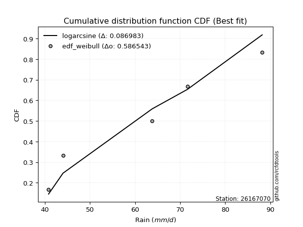</img></img>

</div>


### 4. EDF Beard (1943)

The Beard formula (or Beard´s plotting position formula) in hydrology is used to estimate the empirical non-exceedance probability _(P)_ of a flood event (or other extreme hydrological data point) within a given dataset.

<div align="center">


$P=(m-0.31)/(n+0.38)$


</div>


**4.1. Empirical values**

<div align="center">

|                | 0                   | 1                  | 2         | 3                  | 4                  |
|:---------------|:--------------------|:-------------------|:----------|:-------------------|:-------------------|
| date           | 2022                | 2019               | 2025      | 2020               | 2021               |
| x              | 40.8                | 44.0               | 63.8      | 71.6               | 88.2               |
| m              | 1                   | 2                  | 3         | 4                  | 5                  |
| empirical_dist | edf_beard           | edf_beard          | edf_beard | edf_beard          | edf_beard          |
| empirical      | 0.12825278810408922 | 0.3141263940520446 | 0.5       | 0.6858736059479554 | 0.8717472118959109 |
| empirical_tr   | 1.1471215351812367  | 1.4579945799457996 | 2.0       | 3.183431952662722  | 7.797101449275368  |

</div>


**4.2. Kolmogorov-Smirnov fit test (sorted by Δ)**


<div align="center">

|                | 0                   | 1                   | 2                   | 3                   | 4                  | 5                   | 6                   | 7                   | 8                   | 9                   | 10                  | 11                 | 12                  | 13                  | 14                 | 15                 | 16                  | 17                  | 18                  | 19                 | 20                  | 21                  | 22                  | 23                  | 24                  | 25                  | 26                 | 27                 | 28                 | 29                 | 30                  | 31                 | 32                 | 33                  | 34                  | 35                  | 36                 | 37                 | 38                  | 39                  | 40                 | 41                  | 42                  | 43                  | 44                  | 45                  | 46                 | 47                 | 48                  | 49                  | 50                  | 51                 | 52                 | 53                  | 54                 | 55                 | 56                  | 57                  | 58                  | 59                  | 60                  | 61                 | 62                 | 63                  | 64                  | 65                  | 66                  | 67                  | 68                  | 69                 | 70                  | 71                  | 72                 | 73                  | 74                  | 75                  | 76                  | 77                  | 78                  | 79                 | 80                  | 81                  | 82                  | 83                 | 84                 | 85                  | 86                  | 87                  | 88                  | 89                 | 90                  | 91                  | 92                  | 93                  | 94                  | 95                  | 96                  | 97                 | 98                  | 99                  | 100                 | 101                 | 102                 | 103                 | 104                 | 105                 | 106                | 107                | 108                | 109                 | 110                 | 111                 | 112                 | 113                | 114                 | 115                 | 116                 | 117                 | 118                | 119                 | 120                 | 121                 | 122                | 123                 | 124                | 125                | 126                | 127                | 128                 | 129                | 130                 | 131                 | 132                 | 133                | 134                 | 135                 | 136                | 137                | 138                | 139                 | 140                | 141                 | 142                | 143                | 144                | 145                 | 146                 | 147                | 148                 | 149                | 150                 | 151                 | 152                | 153                | 154                | 155                | 156                | 157                | 158                | 159                |
|:---------------|:--------------------|:--------------------|:--------------------|:--------------------|:-------------------|:--------------------|:--------------------|:--------------------|:--------------------|:--------------------|:--------------------|:-------------------|:--------------------|:--------------------|:-------------------|:-------------------|:--------------------|:--------------------|:--------------------|:-------------------|:--------------------|:--------------------|:--------------------|:--------------------|:--------------------|:--------------------|:-------------------|:-------------------|:-------------------|:-------------------|:--------------------|:-------------------|:-------------------|:--------------------|:--------------------|:--------------------|:-------------------|:-------------------|:--------------------|:--------------------|:-------------------|:--------------------|:--------------------|:--------------------|:--------------------|:--------------------|:-------------------|:-------------------|:--------------------|:--------------------|:--------------------|:-------------------|:-------------------|:--------------------|:-------------------|:-------------------|:--------------------|:--------------------|:--------------------|:--------------------|:--------------------|:-------------------|:-------------------|:--------------------|:--------------------|:--------------------|:--------------------|:--------------------|:--------------------|:-------------------|:--------------------|:--------------------|:-------------------|:--------------------|:--------------------|:--------------------|:--------------------|:--------------------|:--------------------|:-------------------|:--------------------|:--------------------|:--------------------|:-------------------|:-------------------|:--------------------|:--------------------|:--------------------|:--------------------|:-------------------|:--------------------|:--------------------|:--------------------|:--------------------|:--------------------|:--------------------|:--------------------|:-------------------|:--------------------|:--------------------|:--------------------|:--------------------|:--------------------|:--------------------|:--------------------|:--------------------|:-------------------|:-------------------|:-------------------|:--------------------|:--------------------|:--------------------|:--------------------|:-------------------|:--------------------|:--------------------|:--------------------|:--------------------|:-------------------|:--------------------|:--------------------|:--------------------|:-------------------|:--------------------|:-------------------|:-------------------|:-------------------|:-------------------|:--------------------|:-------------------|:--------------------|:--------------------|:--------------------|:-------------------|:--------------------|:--------------------|:-------------------|:-------------------|:-------------------|:--------------------|:-------------------|:--------------------|:-------------------|:-------------------|:-------------------|:--------------------|:--------------------|:-------------------|:--------------------|:-------------------|:--------------------|:--------------------|:-------------------|:-------------------|:-------------------|:-------------------|:-------------------|:-------------------|:-------------------|:-------------------|
| station        | 26167070            | 26167070            | 26167070            | 26167070            | 26167070           | 26167070            | 26167070            | 26167070            | 26167070            | 26167070            | 26167070            | 26167070           | 26167070            | 26167070            | 26167070           | 26167070           | 26167070            | 26167070            | 26167070            | 26167070           | 26167070            | 26167070            | 26167070            | 26167070            | 26167070            | 26167070            | 26167070           | 26167070           | 26167070           | 26167070           | 26167070            | 26167070           | 26167070           | 26167070            | 26167070            | 26167070            | 26167070           | 26167070           | 26167070            | 26167070            | 26167070           | 26167070            | 26167070            | 26167070            | 26167070            | 26167070            | 26167070           | 26167070           | 26167070            | 26167070            | 26167070            | 26167070           | 26167070           | 26167070            | 26167070           | 26167070           | 26167070            | 26167070            | 26167070            | 26167070            | 26167070            | 26167070           | 26167070           | 26167070            | 26167070            | 26167070            | 26167070            | 26167070            | 26167070            | 26167070           | 26167070            | 26167070            | 26167070           | 26167070            | 26167070            | 26167070            | 26167070            | 26167070            | 26167070            | 26167070           | 26167070            | 26167070            | 26167070            | 26167070           | 26167070           | 26167070            | 26167070            | 26167070            | 26167070            | 26167070           | 26167070            | 26167070            | 26167070            | 26167070            | 26167070            | 26167070            | 26167070            | 26167070           | 26167070            | 26167070            | 26167070            | 26167070            | 26167070            | 26167070            | 26167070            | 26167070            | 26167070           | 26167070           | 26167070           | 26167070            | 26167070            | 26167070            | 26167070            | 26167070           | 26167070            | 26167070            | 26167070            | 26167070            | 26167070           | 26167070            | 26167070            | 26167070            | 26167070           | 26167070            | 26167070           | 26167070           | 26167070           | 26167070           | 26167070            | 26167070           | 26167070            | 26167070            | 26167070            | 26167070           | 26167070            | 26167070            | 26167070           | 26167070           | 26167070           | 26167070            | 26167070           | 26167070            | 26167070           | 26167070           | 26167070           | 26167070            | 26167070            | 26167070           | 26167070            | 26167070           | 26167070            | 26167070            | 26167070           | 26167070           | 26167070           | 26167070           | 26167070           | 26167070           | 26167070           | 26167070           |
| empirical_dist | edf_beard           | edf_beard           | edf_beard           | edf_beard           | edf_beard          | edf_beard           | edf_beard           | edf_beard           | edf_beard           | edf_beard           | edf_beard           | edf_beard          | edf_beard           | edf_beard           | edf_beard          | edf_beard          | edf_beard           | edf_beard           | edf_beard           | edf_beard          | edf_beard           | edf_beard           | edf_beard           | edf_beard           | edf_beard           | edf_beard           | edf_beard          | edf_beard          | edf_beard          | edf_beard          | edf_beard           | edf_beard          | edf_beard          | edf_beard           | edf_beard           | edf_beard           | edf_beard          | edf_beard          | edf_beard           | edf_beard           | edf_beard          | edf_beard           | edf_beard           | edf_beard           | edf_beard           | edf_beard           | edf_beard          | edf_beard          | edf_beard           | edf_beard           | edf_beard           | edf_beard          | edf_beard          | edf_beard           | edf_beard          | edf_beard          | edf_beard           | edf_beard           | edf_beard           | edf_beard           | edf_beard           | edf_beard          | edf_beard          | edf_beard           | edf_beard           | edf_beard           | edf_beard           | edf_beard           | edf_beard           | edf_beard          | edf_beard           | edf_beard           | edf_beard          | edf_beard           | edf_beard           | edf_beard           | edf_beard           | edf_beard           | edf_beard           | edf_beard          | edf_beard           | edf_beard           | edf_beard           | edf_beard          | edf_beard          | edf_beard           | edf_beard           | edf_beard           | edf_beard           | edf_beard          | edf_beard           | edf_beard           | edf_beard           | edf_beard           | edf_beard           | edf_beard           | edf_beard           | edf_beard          | edf_beard           | edf_beard           | edf_beard           | edf_beard           | edf_beard           | edf_beard           | edf_beard           | edf_beard           | edf_beard          | edf_beard          | edf_beard          | edf_beard           | edf_beard           | edf_beard           | edf_beard           | edf_beard          | edf_beard           | edf_beard           | edf_beard           | edf_beard           | edf_beard          | edf_beard           | edf_beard           | edf_beard           | edf_beard          | edf_beard           | edf_beard          | edf_beard          | edf_beard          | edf_beard          | edf_beard           | edf_beard          | edf_beard           | edf_beard           | edf_beard           | edf_beard          | edf_beard           | edf_beard           | edf_beard          | edf_beard          | edf_beard          | edf_beard           | edf_beard          | edf_beard           | edf_beard          | edf_beard          | edf_beard          | edf_beard           | edf_beard           | edf_beard          | edf_beard           | edf_beard          | edf_beard           | edf_beard           | edf_beard          | edf_beard          | edf_beard          | edf_beard          | edf_beard          | edf_beard          | edf_beard          | edf_beard          |
| p_dist         | logarcsine          | logbetaprime        | logdweibull         | ksone               | dweibull           | logdgamma           | logksone            | semicircular        | logsemicircular     | dgamma              | logrdist            | weibull_min        | arcsine             | logwrapcauchy       | anglit             | logtrapezoid       | loganglit           | loggenextreme       | wrapcauchy          | logbeta            | foldnorm            | logfoldnorm         | rayleigh            | maxwell             | genpareto           | burr                | lograyleigh        | logalpha           | logburr12          | logmaxwell         | nct                 | loginvweibull      | t                  | loggenlogistic      | genlogistic         | crystalball         | norm               | exponnorm          | pearson3            | invgamma            | logjohnsonsu       | betaprime           | loginvgamma         | logf                | logerlang           | f                   | loggamma           | loggamma           | logpearson3         | logt                | logcrystalball      | lognorm            | logexponnorm       | logskewnorm         | logloggamma        | lognct             | gamma               | logmielke           | alpha               | logncf              | kstwobign           | logweibull_max     | halfnorm           | logburr             | lognakagami         | loghalfnorm         | logkstwobign        | erlang              | logcosine           | gumbel_l           | cosine              | loggumbel_l         | genexpon           | logbradford         | logistic            | beta                | loggenexpon         | logrice             | loglogistic         | loglevy_l          | lomax               | rice                | gumbel_r            | hypsecant          | logargus           | gennorm             | loghypsecant        | loggumbel_r         | logtriang           | argus              | logtruncexpon       | loggompertz         | triang              | laplace             | loglaplace          | loglaplace          | burr12              | loglomax           | levy_l              | truncnorm           | logloglaplace       | loggausshyper       | halfgennorm         | logexponpow         | logkappa4           | moyal               | halflogistic       | gompertz           | gausshyper         | loggennorm          | logtukeylambda      | logmoyal            | loghalflogistic     | loginvgauss        | truncexpon          | loguniform          | logkappa3           | bradford            | kappa4             | skewnorm            | logjohnsonsb        | invgauss            | kappa3             | logweibull_min      | tukeylambda        | logvonmises_line   | uniform            | vonmises_line      | truncweibull_min    | loggenhalflogistic | genhalflogistic     | exponpow            | logtruncnorm        | trapezoid          | gengamma            | genextreme          | exponweib          | wald               | logwald            | nakagami            | logfatiguelife     | logtruncweibull_min | fatiguelife        | ncf                | logtruncpareto     | powerlaw            | logexponweib        | logpowerlaw        | invweibull          | loggenpareto       | truncpareto         | loggengamma         | rdist              | weibull_max        | johnsonsu          | johnsonsb          | loghalfgennorm     | logvonmises        | vonmises           | mielke             |
| delta          | 0.06777613034745117 | 0.07720792782864905 | 0.10154960043899541 | 0.10355659296834838 | 0.1042765651441937 | 0.10533350161381583 | 0.10609242512797834 | 0.11934600319841987 | 0.12176185799619466 | 0.12419417142781772 | 0.12825278661637865 | 0.1282527875373773 | 0.12825278810408913 | 0.12825278810408922 | 0.1306392811303023 | 0.1307048622334956 | 0.13295811684350672 | 0.13436891640427828 | 0.13585489429525544 | 0.1382872399941629 | 0.14466445325394872 | 0.14648725091471182 | 0.15116527704207425 | 0.15221460732649084 | 0.15271633255438247 | 0.15297818291189968 | 0.154029551505969  | 0.1546070766553162 | 0.1547810021393524 | 0.1548233146117053 | 0.15492385122915053 | 0.1554518660777453 | 0.155936038096583  | 0.15600641744924593 | 0.15601767974245284 | 0.15610312221754596 | 0.1561032157584401 | 0.156142445781917  | 0.15650310487771193 | 0.15690028256999092 | 0.1573977886052622 | 0.15766124556816719 | 0.15768028574579565 | 0.15787923135564697 | 0.15797456459499581 | 0.15811410746710802 | 0.1581331324695485 | 0.1581331324695485 | 0.15819344851561426 | 0.15821304779902012 | 0.15821387555899197 | 0.1582138834180769 | 0.1582146538388394 | 0.15821534496375536 | 0.1582187198630112 | 0.1584966904332541 | 0.15883072804989132 | 0.15899279159987423 | 0.15900427793529337 | 0.15917640016513918 | 0.15926650829044947 | 0.1602883023129138 | 0.1606957081111414 | 0.16142149768811287 | 0.16404490161120866 | 0.16484450376176407 | 0.16534079163175297 | 0.16705903950750453 | 0.16875908864703837 | 0.1703808681215543 | 0.17185273527795147 | 0.17187084263571262 | 0.1720047975313543 | 0.17287479385428955 | 0.17451766964666768 | 0.17457380306137774 | 0.17466289634821275 | 0.17513717841022275 | 0.17642055727891046 | 0.1768535372560837 | 0.17854106250803253 | 0.18243445214185552 | 0.18296492061502953 | 0.1841647369484454 | 0.184516869751928  | 0.18587360594795543 | 0.18589759592593483 | 0.18594914850358568 | 0.18820228882102263 | 0.1885054326694408 | 0.19167374797268633 | 0.19251527657480777 | 0.19282688606295884 | 0.19301684604645336 | 0.19451208183794166 | 0.19451208183794166 | 0.19769037483655616 | 0.2002633786857091 | 0.20034605804917507 | 0.20075181796112196 | 0.20316992729671146 | 0.20410376749241088 | 0.20418382644443944 | 0.20471376393774798 | 0.20530866207245102 | 0.20750406125337958 | 0.2077327200417301 | 0.2094479436124747 | 0.2098644511340532 | 0.21046138421156585 | 0.21088066349335438 | 0.21089446749826568 | 0.21275320627837568 | 0.213777198670014  | 0.21407263801238927 | 0.21618228262165873 | 0.21628972215374348 | 0.21891760678903238 | 0.2201575934972405 | 0.22091871660322338 | 0.22148337076594143 | 0.22783133159075797 | 0.2280753371273469 | 0.22972792446600043 | 0.239425100587836  | 0.2461990362384143 | 0.2466158455288378 | 0.2466687888424886 | 0.25715483861346855 | 0.2591177117652938 | 0.26694619486504734 | 0.26696352932246015 | 0.29480620527260515 | 0.2954683359393902 | 0.30100581346803246 | 0.30325157982086337 | 0.307298639420507  | 0.3141263940520446 | 0.3141263940520446 | 0.31422590961087105 | 0.3203604180246897 | 0.3284602065336072  | 0.329135709973555  | 0.3349683511988937 | 0.4001258253284028 | 0.41416084428527344 | 0.42500198840672326 | 0.4312935580148969 | 0.43466411690113566 | 0.4367381996330927 | 0.43823271926557605 | 0.46271308428928326 | 0.4999999977776115 | 0.5100097578544309 | 0.5421918528547305 | 0.5965174560039332 | 0.6858736059479554 | 1.102681950995402  | 13.373351869739688 | nan                |
| deltao         | 0.5865427407550001  | 0.5865427407550001  | 0.5865427407550001  | 0.5865427407550001  | 0.5865427407550001 | 0.5865427407550001  | 0.5865427407550001  | 0.5865427407550001  | 0.5865427407550001  | 0.5865427407550001  | 0.5865427407550001  | 0.5865427407550001 | 0.5865427407550001  | 0.5865427407550001  | 0.5865427407550001 | 0.5865427407550001 | 0.5865427407550001  | 0.5865427407550001  | 0.5865427407550001  | 0.5865427407550001 | 0.5865427407550001  | 0.5865427407550001  | 0.5865427407550001  | 0.5865427407550001  | 0.5865427407550001  | 0.5865427407550001  | 0.5865427407550001 | 0.5865427407550001 | 0.5865427407550001 | 0.5865427407550001 | 0.5865427407550001  | 0.5865427407550001 | 0.5865427407550001 | 0.5865427407550001  | 0.5865427407550001  | 0.5865427407550001  | 0.5865427407550001 | 0.5865427407550001 | 0.5865427407550001  | 0.5865427407550001  | 0.5865427407550001 | 0.5865427407550001  | 0.5865427407550001  | 0.5865427407550001  | 0.5865427407550001  | 0.5865427407550001  | 0.5865427407550001 | 0.5865427407550001 | 0.5865427407550001  | 0.5865427407550001  | 0.5865427407550001  | 0.5865427407550001 | 0.5865427407550001 | 0.5865427407550001  | 0.5865427407550001 | 0.5865427407550001 | 0.5865427407550001  | 0.5865427407550001  | 0.5865427407550001  | 0.5865427407550001  | 0.5865427407550001  | 0.5865427407550001 | 0.5865427407550001 | 0.5865427407550001  | 0.5865427407550001  | 0.5865427407550001  | 0.5865427407550001  | 0.5865427407550001  | 0.5865427407550001  | 0.5865427407550001 | 0.5865427407550001  | 0.5865427407550001  | 0.5865427407550001 | 0.5865427407550001  | 0.5865427407550001  | 0.5865427407550001  | 0.5865427407550001  | 0.5865427407550001  | 0.5865427407550001  | 0.5865427407550001 | 0.5865427407550001  | 0.5865427407550001  | 0.5865427407550001  | 0.5865427407550001 | 0.5865427407550001 | 0.5865427407550001  | 0.5865427407550001  | 0.5865427407550001  | 0.5865427407550001  | 0.5865427407550001 | 0.5865427407550001  | 0.5865427407550001  | 0.5865427407550001  | 0.5865427407550001  | 0.5865427407550001  | 0.5865427407550001  | 0.5865427407550001  | 0.5865427407550001 | 0.5865427407550001  | 0.5865427407550001  | 0.5865427407550001  | 0.5865427407550001  | 0.5865427407550001  | 0.5865427407550001  | 0.5865427407550001  | 0.5865427407550001  | 0.5865427407550001 | 0.5865427407550001 | 0.5865427407550001 | 0.5865427407550001  | 0.5865427407550001  | 0.5865427407550001  | 0.5865427407550001  | 0.5865427407550001 | 0.5865427407550001  | 0.5865427407550001  | 0.5865427407550001  | 0.5865427407550001  | 0.5865427407550001 | 0.5865427407550001  | 0.5865427407550001  | 0.5865427407550001  | 0.5865427407550001 | 0.5865427407550001  | 0.5865427407550001 | 0.5865427407550001 | 0.5865427407550001 | 0.5865427407550001 | 0.5865427407550001  | 0.5865427407550001 | 0.5865427407550001  | 0.5865427407550001  | 0.5865427407550001  | 0.5865427407550001 | 0.5865427407550001  | 0.5865427407550001  | 0.5865427407550001 | 0.5865427407550001 | 0.5865427407550001 | 0.5865427407550001  | 0.5865427407550001 | 0.5865427407550001  | 0.5865427407550001 | 0.5865427407550001 | 0.5865427407550001 | 0.5865427407550001  | 0.5865427407550001  | 0.5865427407550001 | 0.5865427407550001  | 0.5865427407550001 | 0.5865427407550001  | 0.5865427407550001  | 0.5865427407550001 | 0.5865427407550001 | 0.5865427407550001 | 0.5865427407550001 | 0.5865427407550001 | 0.5865427407550001 | 0.5865427407550001 | 0.5865427407550001 |
| eval           | Δo > Δ              | Δo > Δ              | Δo > Δ              | Δo > Δ              | Δo > Δ             | Δo > Δ              | Δo > Δ              | Δo > Δ              | Δo > Δ              | Δo > Δ              | Δo > Δ              | Δo > Δ             | Δo > Δ              | Δo > Δ              | Δo > Δ             | Δo > Δ             | Δo > Δ              | Δo > Δ              | Δo > Δ              | Δo > Δ             | Δo > Δ              | Δo > Δ              | Δo > Δ              | Δo > Δ              | Δo > Δ              | Δo > Δ              | Δo > Δ             | Δo > Δ             | Δo > Δ             | Δo > Δ             | Δo > Δ              | Δo > Δ             | Δo > Δ             | Δo > Δ              | Δo > Δ              | Δo > Δ              | Δo > Δ             | Δo > Δ             | Δo > Δ              | Δo > Δ              | Δo > Δ             | Δo > Δ              | Δo > Δ              | Δo > Δ              | Δo > Δ              | Δo > Δ              | Δo > Δ             | Δo > Δ             | Δo > Δ              | Δo > Δ              | Δo > Δ              | Δo > Δ             | Δo > Δ             | Δo > Δ              | Δo > Δ             | Δo > Δ             | Δo > Δ              | Δo > Δ              | Δo > Δ              | Δo > Δ              | Δo > Δ              | Δo > Δ             | Δo > Δ             | Δo > Δ              | Δo > Δ              | Δo > Δ              | Δo > Δ              | Δo > Δ              | Δo > Δ              | Δo > Δ             | Δo > Δ              | Δo > Δ              | Δo > Δ             | Δo > Δ              | Δo > Δ              | Δo > Δ              | Δo > Δ              | Δo > Δ              | Δo > Δ              | Δo > Δ             | Δo > Δ              | Δo > Δ              | Δo > Δ              | Δo > Δ             | Δo > Δ             | Δo > Δ              | Δo > Δ              | Δo > Δ              | Δo > Δ              | Δo > Δ             | Δo > Δ              | Δo > Δ              | Δo > Δ              | Δo > Δ              | Δo > Δ              | Δo > Δ              | Δo > Δ              | Δo > Δ             | Δo > Δ              | Δo > Δ              | Δo > Δ              | Δo > Δ              | Δo > Δ              | Δo > Δ              | Δo > Δ              | Δo > Δ              | Δo > Δ             | Δo > Δ             | Δo > Δ             | Δo > Δ              | Δo > Δ              | Δo > Δ              | Δo > Δ              | Δo > Δ             | Δo > Δ              | Δo > Δ              | Δo > Δ              | Δo > Δ              | Δo > Δ             | Δo > Δ              | Δo > Δ              | Δo > Δ              | Δo > Δ             | Δo > Δ              | Δo > Δ             | Δo > Δ             | Δo > Δ             | Δo > Δ             | Δo > Δ              | Δo > Δ             | Δo > Δ              | Δo > Δ              | Δo > Δ              | Δo > Δ             | Δo > Δ              | Δo > Δ              | Δo > Δ             | Δo > Δ             | Δo > Δ             | Δo > Δ              | Δo > Δ             | Δo > Δ              | Δo > Δ             | Δo > Δ             | Δo > Δ             | Δo > Δ              | Δo > Δ              | Δo > Δ             | Δo > Δ              | Δo > Δ             | Δo > Δ              | Δo > Δ              | Δo > Δ             | Δo > Δ             | Δo > Δ             | Δo <= Δ            | Δo <= Δ            | Δo <= Δ            | Δo <= Δ            | Δo <= Δ            |
| fit            | 1                   | 1                   | 1                   | 1                   | 1                  | 1                   | 1                   | 1                   | 1                   | 1                   | 1                   | 1                  | 1                   | 1                   | 1                  | 1                  | 1                   | 1                   | 1                   | 1                  | 1                   | 1                   | 1                   | 1                   | 1                   | 1                   | 1                  | 1                  | 1                  | 1                  | 1                   | 1                  | 1                  | 1                   | 1                   | 1                   | 1                  | 1                  | 1                   | 1                   | 1                  | 1                   | 1                   | 1                   | 1                   | 1                   | 1                  | 1                  | 1                   | 1                   | 1                   | 1                  | 1                  | 1                   | 1                  | 1                  | 1                   | 1                   | 1                   | 1                   | 1                   | 1                  | 1                  | 1                   | 1                   | 1                   | 1                   | 1                   | 1                   | 1                  | 1                   | 1                   | 1                  | 1                   | 1                   | 1                   | 1                   | 1                   | 1                   | 1                  | 1                   | 1                   | 1                   | 1                  | 1                  | 1                   | 1                   | 1                   | 1                   | 1                  | 1                   | 1                   | 1                   | 1                   | 1                   | 1                   | 1                   | 1                  | 1                   | 1                   | 1                   | 1                   | 1                   | 1                   | 1                   | 1                   | 1                  | 1                  | 1                  | 1                   | 1                   | 1                   | 1                   | 1                  | 1                   | 1                   | 1                   | 1                   | 1                  | 1                   | 1                   | 1                   | 1                  | 1                   | 1                  | 1                  | 1                  | 1                  | 1                   | 1                  | 1                   | 1                   | 1                   | 1                  | 1                   | 1                   | 1                  | 1                  | 1                  | 1                   | 1                  | 1                   | 1                  | 1                  | 1                  | 1                   | 1                   | 1                  | 1                   | 1                  | 1                   | 1                   | 1                  | 1                  | 1                  | 0                  | 0                  | 0                  | 0                  | 0                  |
| n              | 5                   | 5                   | 5                   | 5                   | 5                  | 5                   | 5                   | 5                   | 5                   | 5                   | 5                   | 5                  | 5                   | 5                   | 5                  | 5                  | 5                   | 5                   | 5                   | 5                  | 5                   | 5                   | 5                   | 5                   | 5                   | 5                   | 5                  | 5                  | 5                  | 5                  | 5                   | 5                  | 5                  | 5                   | 5                   | 5                   | 5                  | 5                  | 5                   | 5                   | 5                  | 5                   | 5                   | 5                   | 5                   | 5                   | 5                  | 5                  | 5                   | 5                   | 5                   | 5                  | 5                  | 5                   | 5                  | 5                  | 5                   | 5                   | 5                   | 5                   | 5                   | 5                  | 5                  | 5                   | 5                   | 5                   | 5                   | 5                   | 5                   | 5                  | 5                   | 5                   | 5                  | 5                   | 5                   | 5                   | 5                   | 5                   | 5                   | 5                  | 5                   | 5                   | 5                   | 5                  | 5                  | 5                   | 5                   | 5                   | 5                   | 5                  | 5                   | 5                   | 5                   | 5                   | 5                   | 5                   | 5                   | 5                  | 5                   | 5                   | 5                   | 5                   | 5                   | 5                   | 5                   | 5                   | 5                  | 5                  | 5                  | 5                   | 5                   | 5                   | 5                   | 5                  | 5                   | 5                   | 5                   | 5                   | 5                  | 5                   | 5                   | 5                   | 5                  | 5                   | 5                  | 5                  | 5                  | 5                  | 5                   | 5                  | 5                   | 5                   | 5                   | 5                  | 5                   | 5                   | 5                  | 5                  | 5                  | 5                   | 5                  | 5                   | 5                  | 5                  | 5                  | 5                   | 5                   | 5                  | 5                   | 5                  | 5                   | 5                   | 5                  | 5                  | 5                  | 5                  | 5                  | 5                  | 5                  | 5                  |
| best_fit       | 1                   | 0                   | 0                   | 0                   | 0                  | 0                   | 0                   | 0                   | 0                   | 0                   | 0                   | 0                  | 0                   | 0                   | 0                  | 0                  | 0                   | 0                   | 0                   | 0                  | 0                   | 0                   | 0                   | 0                   | 0                   | 0                   | 0                  | 0                  | 0                  | 0                  | 0                   | 0                  | 0                  | 0                   | 0                   | 0                   | 0                  | 0                  | 0                   | 0                   | 0                  | 0                   | 0                   | 0                   | 0                   | 0                   | 0                  | 0                  | 0                   | 0                   | 0                   | 0                  | 0                  | 0                   | 0                  | 0                  | 0                   | 0                   | 0                   | 0                   | 0                   | 0                  | 0                  | 0                   | 0                   | 0                   | 0                   | 0                   | 0                   | 0                  | 0                   | 0                   | 0                  | 0                   | 0                   | 0                   | 0                   | 0                   | 0                   | 0                  | 0                   | 0                   | 0                   | 0                  | 0                  | 0                   | 0                   | 0                   | 0                   | 0                  | 0                   | 0                   | 0                   | 0                   | 0                   | 0                   | 0                   | 0                  | 0                   | 0                   | 0                   | 0                   | 0                   | 0                   | 0                   | 0                   | 0                  | 0                  | 0                  | 0                   | 0                   | 0                   | 0                   | 0                  | 0                   | 0                   | 0                   | 0                   | 0                  | 0                   | 0                   | 0                   | 0                  | 0                   | 0                  | 0                  | 0                  | 0                  | 0                   | 0                  | 0                   | 0                   | 0                   | 0                  | 0                   | 0                   | 0                  | 0                  | 0                  | 0                   | 0                  | 0                   | 0                  | 0                  | 0                  | 0                   | 0                   | 0                  | 0                   | 0                  | 0                   | 0                   | 0                  | 0                  | 0                  | 0                  | 0                  | 0                  | 0                  | 0                  |
| best_fit_sort  | 1                   | 2                   | 3                   | 4                   | 5                  | 6                   | 7                   | 8                   | 9                   | 10                  | 11                  | 12                 | 13                  | 14                  | 15                 | 16                 | 17                  | 18                  | 19                  | 20                 | 21                  | 22                  | 23                  | 24                  | 25                  | 26                  | 27                 | 28                 | 29                 | 30                 | 31                  | 32                 | 33                 | 34                  | 35                  | 36                  | 37                 | 38                 | 39                  | 40                  | 41                 | 42                  | 43                  | 44                  | 45                  | 46                  | 47                 | 48                 | 49                  | 50                  | 51                  | 52                 | 53                 | 54                  | 55                 | 56                 | 57                  | 58                  | 59                  | 60                  | 61                  | 62                 | 63                 | 64                  | 65                  | 66                  | 67                  | 68                  | 69                  | 70                 | 71                  | 72                  | 73                 | 74                  | 75                  | 76                  | 77                  | 78                  | 79                  | 80                 | 81                  | 82                  | 83                  | 84                 | 85                 | 86                  | 87                  | 88                  | 89                  | 90                 | 91                  | 92                  | 93                  | 94                  | 95                  | 96                  | 97                  | 98                 | 99                  | 100                 | 101                 | 102                 | 103                 | 104                 | 105                 | 106                 | 107                | 108                | 109                | 110                 | 111                 | 112                 | 113                 | 114                | 115                 | 116                 | 117                 | 118                 | 119                | 120                 | 121                 | 122                 | 123                | 124                 | 125                | 126                | 127                | 128                | 129                 | 130                | 131                 | 132                 | 133                 | 134                | 135                 | 136                 | 137                | 138                | 139                | 140                 | 141                | 142                 | 143                | 144                | 145                | 146                 | 147                 | 148                | 149                 | 150                | 151                 | 152                 | 153                | 154                | 155                | 156                | 157                | 158                | 159                | 160                |

</div>


**4.3. Best fit**

<div align="center">

|   id |   station | empirical_dist   | p_dist     |     delta |   deltao | eval   |   fit |   n |   best_fit |   best_fit_sort |
|-----:|----------:|:-----------------|:-----------|----------:|---------:|:-------|------:|----:|-----------:|----------------:|
|    0 |  26167070 | edf_beard        | logarcsine | 0.0677761 | 0.586543 | Δo > Δ |     1 |   5 |          1 |               1 |

</div>


<div align="center">

</img></img>

</div>


### 5. EDF Chegodayev (1955)

The Chegodayev formula is an empirical plotting position formula used in hydrological frequency analysis to estimate the exceedance probability or return period of a specific event from a set of observed data. It is primarily used for plotting observed data points on probability paper to fit a theoretical distribution, particularly for analyzing extreme events like maximum flood flows or rainfall intensities. The constant _b_ value in the generalized plotting position formula is 0.3.

<div align="center">


$P=(m-b)/(n+1-2b)$


</div>


**5.1. Empirical values**

<div align="center">

|                | 0                   | 1                   | 2              | 3                  | 4                  |
|:---------------|:--------------------|:--------------------|:---------------|:-------------------|:-------------------|
| date           | 2022                | 2019                | 2025           | 2020               | 2021               |
| x              | 40.8                | 44.0                | 63.8           | 71.6               | 88.2               |
| m              | 1                   | 2                   | 3              | 4                  | 5                  |
| empirical_dist | edf_chegodayev      | edf_chegodayev      | edf_chegodayev | edf_chegodayev     | edf_chegodayev     |
| empirical      | 0.12962962962962962 | 0.31481481481481477 | 0.5            | 0.6851851851851851 | 0.8703703703703703 |
| empirical_tr   | 1.148936170212766   | 1.4594594594594594  | 2.0            | 3.1764705882352935 | 7.714285714285713  |

</div>


**5.2. Kolmogorov-Smirnov fit test (sorted by Δ)**


<div align="center">

|                | 0                   | 1                   | 2                   | 3                   | 4                   | 5                   | 6                   | 7                   | 8                  | 9                   | 10                  | 11                 | 12                  | 13                  | 14                  | 15                  | 16                  | 17                  | 18                  | 19                 | 20                  | 21                  | 22                  | 23                 | 24                  | 25                  | 26                  | 27                  | 28                 | 29                  | 30                  | 31                  | 32                  | 33                  | 34                 | 35                 | 36                  | 37                  | 38                  | 39                  | 40                  | 41                  | 42                 | 43                 | 44                  | 45                  | 46                  | 47                  | 48                 | 49                  | 50                  | 51                  | 52                  | 53                 | 54                  | 55                  | 56                  | 57                  | 58                  | 59                  | 60                  | 61                  | 62                  | 63                  | 64                  | 65                  | 66                  | 67                  | 68                  | 69                  | 70                  | 71                  | 72                  | 73                 | 74                  | 75                  | 76                  | 77                  | 78                 | 79                 | 80                  | 81                  | 82                  | 83                  | 84                  | 85                  | 86                  | 87                  | 88                  | 89                  | 90                  | 91                  | 92                  | 93                 | 94                 | 95                 | 96                  | 97                  | 98                 | 99                 | 100                | 101                 | 102                 | 103                 | 104                 | 105                 | 106                 | 107                 | 108                 | 109                | 110                 | 111                 | 112                 | 113                | 114                | 115                 | 116                 | 117                 | 118                | 119                 | 120                 | 121                 | 122                 | 123                 | 124                 | 125                 | 126                 | 127                 | 128                 | 129                 | 130                 | 131                | 132                 | 133                | 134                 | 135                 | 136                 | 137                 | 138                 | 139                 | 140                | 141                 | 142                | 143                 | 144                | 145                 | 146                | 147                | 148                 | 149                | 150                 | 151                 | 152                | 153                | 154                | 155                | 156                | 157                | 158                | 159                |
|:---------------|:--------------------|:--------------------|:--------------------|:--------------------|:--------------------|:--------------------|:--------------------|:--------------------|:-------------------|:--------------------|:--------------------|:-------------------|:--------------------|:--------------------|:--------------------|:--------------------|:--------------------|:--------------------|:--------------------|:-------------------|:--------------------|:--------------------|:--------------------|:-------------------|:--------------------|:--------------------|:--------------------|:--------------------|:-------------------|:--------------------|:--------------------|:--------------------|:--------------------|:--------------------|:-------------------|:-------------------|:--------------------|:--------------------|:--------------------|:--------------------|:--------------------|:--------------------|:-------------------|:-------------------|:--------------------|:--------------------|:--------------------|:--------------------|:-------------------|:--------------------|:--------------------|:--------------------|:--------------------|:-------------------|:--------------------|:--------------------|:--------------------|:--------------------|:--------------------|:--------------------|:--------------------|:--------------------|:--------------------|:--------------------|:--------------------|:--------------------|:--------------------|:--------------------|:--------------------|:--------------------|:--------------------|:--------------------|:--------------------|:-------------------|:--------------------|:--------------------|:--------------------|:--------------------|:-------------------|:-------------------|:--------------------|:--------------------|:--------------------|:--------------------|:--------------------|:--------------------|:--------------------|:--------------------|:--------------------|:--------------------|:--------------------|:--------------------|:--------------------|:-------------------|:-------------------|:-------------------|:--------------------|:--------------------|:-------------------|:-------------------|:-------------------|:--------------------|:--------------------|:--------------------|:--------------------|:--------------------|:--------------------|:--------------------|:--------------------|:-------------------|:--------------------|:--------------------|:--------------------|:-------------------|:-------------------|:--------------------|:--------------------|:--------------------|:-------------------|:--------------------|:--------------------|:--------------------|:--------------------|:--------------------|:--------------------|:--------------------|:--------------------|:--------------------|:--------------------|:--------------------|:--------------------|:-------------------|:--------------------|:-------------------|:--------------------|:--------------------|:--------------------|:--------------------|:--------------------|:--------------------|:-------------------|:--------------------|:-------------------|:--------------------|:-------------------|:--------------------|:-------------------|:-------------------|:--------------------|:-------------------|:--------------------|:--------------------|:-------------------|:-------------------|:-------------------|:-------------------|:-------------------|:-------------------|:-------------------|:-------------------|
| station        | 26167070            | 26167070            | 26167070            | 26167070            | 26167070            | 26167070            | 26167070            | 26167070            | 26167070           | 26167070            | 26167070            | 26167070           | 26167070            | 26167070            | 26167070            | 26167070            | 26167070            | 26167070            | 26167070            | 26167070           | 26167070            | 26167070            | 26167070            | 26167070           | 26167070            | 26167070            | 26167070            | 26167070            | 26167070           | 26167070            | 26167070            | 26167070            | 26167070            | 26167070            | 26167070           | 26167070           | 26167070            | 26167070            | 26167070            | 26167070            | 26167070            | 26167070            | 26167070           | 26167070           | 26167070            | 26167070            | 26167070            | 26167070            | 26167070           | 26167070            | 26167070            | 26167070            | 26167070            | 26167070           | 26167070            | 26167070            | 26167070            | 26167070            | 26167070            | 26167070            | 26167070            | 26167070            | 26167070            | 26167070            | 26167070            | 26167070            | 26167070            | 26167070            | 26167070            | 26167070            | 26167070            | 26167070            | 26167070            | 26167070           | 26167070            | 26167070            | 26167070            | 26167070            | 26167070           | 26167070           | 26167070            | 26167070            | 26167070            | 26167070            | 26167070            | 26167070            | 26167070            | 26167070            | 26167070            | 26167070            | 26167070            | 26167070            | 26167070            | 26167070           | 26167070           | 26167070           | 26167070            | 26167070            | 26167070           | 26167070           | 26167070           | 26167070            | 26167070            | 26167070            | 26167070            | 26167070            | 26167070            | 26167070            | 26167070            | 26167070           | 26167070            | 26167070            | 26167070            | 26167070           | 26167070           | 26167070            | 26167070            | 26167070            | 26167070           | 26167070            | 26167070            | 26167070            | 26167070            | 26167070            | 26167070            | 26167070            | 26167070            | 26167070            | 26167070            | 26167070            | 26167070            | 26167070           | 26167070            | 26167070           | 26167070            | 26167070            | 26167070            | 26167070            | 26167070            | 26167070            | 26167070           | 26167070            | 26167070           | 26167070            | 26167070           | 26167070            | 26167070           | 26167070           | 26167070            | 26167070           | 26167070            | 26167070            | 26167070           | 26167070           | 26167070           | 26167070           | 26167070           | 26167070           | 26167070           | 26167070           |
| empirical_dist | edf_chegodayev      | edf_chegodayev      | edf_chegodayev      | edf_chegodayev      | edf_chegodayev      | edf_chegodayev      | edf_chegodayev      | edf_chegodayev      | edf_chegodayev     | edf_chegodayev      | edf_chegodayev      | edf_chegodayev     | edf_chegodayev      | edf_chegodayev      | edf_chegodayev      | edf_chegodayev      | edf_chegodayev      | edf_chegodayev      | edf_chegodayev      | edf_chegodayev     | edf_chegodayev      | edf_chegodayev      | edf_chegodayev      | edf_chegodayev     | edf_chegodayev      | edf_chegodayev      | edf_chegodayev      | edf_chegodayev      | edf_chegodayev     | edf_chegodayev      | edf_chegodayev      | edf_chegodayev      | edf_chegodayev      | edf_chegodayev      | edf_chegodayev     | edf_chegodayev     | edf_chegodayev      | edf_chegodayev      | edf_chegodayev      | edf_chegodayev      | edf_chegodayev      | edf_chegodayev      | edf_chegodayev     | edf_chegodayev     | edf_chegodayev      | edf_chegodayev      | edf_chegodayev      | edf_chegodayev      | edf_chegodayev     | edf_chegodayev      | edf_chegodayev      | edf_chegodayev      | edf_chegodayev      | edf_chegodayev     | edf_chegodayev      | edf_chegodayev      | edf_chegodayev      | edf_chegodayev      | edf_chegodayev      | edf_chegodayev      | edf_chegodayev      | edf_chegodayev      | edf_chegodayev      | edf_chegodayev      | edf_chegodayev      | edf_chegodayev      | edf_chegodayev      | edf_chegodayev      | edf_chegodayev      | edf_chegodayev      | edf_chegodayev      | edf_chegodayev      | edf_chegodayev      | edf_chegodayev     | edf_chegodayev      | edf_chegodayev      | edf_chegodayev      | edf_chegodayev      | edf_chegodayev     | edf_chegodayev     | edf_chegodayev      | edf_chegodayev      | edf_chegodayev      | edf_chegodayev      | edf_chegodayev      | edf_chegodayev      | edf_chegodayev      | edf_chegodayev      | edf_chegodayev      | edf_chegodayev      | edf_chegodayev      | edf_chegodayev      | edf_chegodayev      | edf_chegodayev     | edf_chegodayev     | edf_chegodayev     | edf_chegodayev      | edf_chegodayev      | edf_chegodayev     | edf_chegodayev     | edf_chegodayev     | edf_chegodayev      | edf_chegodayev      | edf_chegodayev      | edf_chegodayev      | edf_chegodayev      | edf_chegodayev      | edf_chegodayev      | edf_chegodayev      | edf_chegodayev     | edf_chegodayev      | edf_chegodayev      | edf_chegodayev      | edf_chegodayev     | edf_chegodayev     | edf_chegodayev      | edf_chegodayev      | edf_chegodayev      | edf_chegodayev     | edf_chegodayev      | edf_chegodayev      | edf_chegodayev      | edf_chegodayev      | edf_chegodayev      | edf_chegodayev      | edf_chegodayev      | edf_chegodayev      | edf_chegodayev      | edf_chegodayev      | edf_chegodayev      | edf_chegodayev      | edf_chegodayev     | edf_chegodayev      | edf_chegodayev     | edf_chegodayev      | edf_chegodayev      | edf_chegodayev      | edf_chegodayev      | edf_chegodayev      | edf_chegodayev      | edf_chegodayev     | edf_chegodayev      | edf_chegodayev     | edf_chegodayev      | edf_chegodayev     | edf_chegodayev      | edf_chegodayev     | edf_chegodayev     | edf_chegodayev      | edf_chegodayev     | edf_chegodayev      | edf_chegodayev      | edf_chegodayev     | edf_chegodayev     | edf_chegodayev     | edf_chegodayev     | edf_chegodayev     | edf_chegodayev     | edf_chegodayev     | edf_chegodayev     |
| p_dist         | logarcsine          | logbetaprime        | logdweibull         | ksone               | dweibull            | logdgamma           | logksone            | semicircular        | logsemicircular    | dgamma              | logrdist            | weibull_min        | arcsine             | logwrapcauchy       | anglit              | logtrapezoid        | loganglit           | loggenextreme       | wrapcauchy          | logbeta            | foldnorm            | logfoldnorm         | genpareto           | rayleigh           | maxwell             | burr                | lograyleigh         | logalpha            | loginvweibull      | logburr12           | logmaxwell          | nct                 | loggenlogistic      | t                   | genlogistic        | crystalball        | norm                | exponnorm           | pearson3            | invgamma            | logjohnsonsu        | betaprime           | loginvgamma        | logf               | logerlang           | f                   | loggamma            | loggamma            | logpearson3        | logt                | logcrystalball      | lognorm             | logexponnorm        | logskewnorm        | logloggamma         | logmielke           | lognct              | gamma               | logweibull_max      | alpha               | logncf              | kstwobign           | halfnorm            | logburr             | lognakagami         | logkstwobign        | loghalfnorm         | erlang              | logcosine           | gumbel_l            | cosine              | loggumbel_l         | genexpon            | logbradford        | loggenexpon         | logistic            | beta                | loglevy_l           | logrice            | loglogistic        | lomax               | rice                | gumbel_r            | hypsecant           | gennorm             | logargus            | loghypsecant        | loggumbel_r         | logtriang           | argus               | logtruncexpon       | loggompertz         | triang              | laplace            | loglaplace         | loglaplace         | burr12              | levy_l              | loglomax           | truncnorm          | logloglaplace      | loggausshyper       | halfgennorm         | logexponpow         | logkappa4           | moyal               | halflogistic        | gompertz            | gausshyper          | loggennorm         | logtukeylambda      | logmoyal            | loghalflogistic     | loginvgauss        | truncexpon         | loguniform          | logkappa3           | bradford            | logjohnsonsb       | kappa4              | skewnorm            | invgauss            | logweibull_min      | kappa3              | tukeylambda         | logvonmises_line    | uniform             | vonmises_line       | truncweibull_min    | loggenhalflogistic  | exponpow            | genhalflogistic    | logtruncnorm        | trapezoid          | gengamma            | genextreme          | exponweib           | nakagami            | logwald             | wald                | logfatiguelife     | logtruncweibull_min | fatiguelife        | ncf                 | logtruncpareto     | powerlaw            | logexponweib       | logpowerlaw        | invweibull          | loggenpareto       | truncpareto         | loggengamma         | rdist              | weibull_max        | johnsonsu          | johnsonsb          | loghalfgennorm     | logvonmises        | vonmises           | mielke             |
| delta          | 0.06846455111022132 | 0.07720792782864905 | 0.10292644196453593 | 0.10424501373111852 | 0.10565340666973422 | 0.10671034313935635 | 0.10678084589074849 | 0.12003442396119002 | 0.1224502787589648 | 0.12281732990227731 | 0.12962962814191906 | 0.1296296290629177 | 0.12962962962962965 | 0.12962962962962965 | 0.13132770189307244 | 0.13139328299626574 | 0.13364653760627687 | 0.13427560236841568 | 0.13516647353248512 | 0.1369103984686225 | 0.14535287401671887 | 0.14717567167748197 | 0.15133949102884206 | 0.1518536978048444 | 0.15290302808926098 | 0.15297818291189968 | 0.15471797226873915 | 0.15529549741808635 | 0.1554518660777453 | 0.15546942290212254 | 0.15551173537447543 | 0.15561227199192068 | 0.15600641744924593 | 0.15662445885935314 | 0.156706100505223  | 0.1567915429803161 | 0.15679163652121025 | 0.15683086654468714 | 0.15719152564048208 | 0.15758870333276107 | 0.15808620936803236 | 0.15834966633093733 | 0.1583687065085658 | 0.1585676521184171 | 0.15866298535776596 | 0.15880252822987817 | 0.15882155323231864 | 0.15882155323231864 | 0.1588818692783844 | 0.15890146856179027 | 0.15890229632176212 | 0.15890230418084705 | 0.15890307460160955 | 0.1589037657265255 | 0.15890714062578135 | 0.15899279159987423 | 0.15918511119602424 | 0.15951914881266147 | 0.15959988155014349 | 0.15969269869806352 | 0.15986482092790932 | 0.15995492905321962 | 0.16138412887391154 | 0.16142149768811287 | 0.16404490161120866 | 0.16534079163175297 | 0.16553292452453422 | 0.16774746027027468 | 0.16944750940980852 | 0.17106928888432446 | 0.17254115604072162 | 0.17255926339848277 | 0.17269321829412446 | 0.1735632146170597 | 0.17466289634821275 | 0.17520609040943783 | 0.17526222382414788 | 0.17547669573054328 | 0.1758255991729929 | 0.1771089780416806 | 0.17922948327080268 | 0.18312287290462567 | 0.18365334137779968 | 0.18485315771121555 | 0.18518518518518523 | 0.18520529051469814 | 0.18658601668870498 | 0.18663756926635583 | 0.18889070958379278 | 0.18919385343221096 | 0.19167374797268633 | 0.19320369733757792 | 0.19351530682572898 | 0.1937052668092235 | 0.1952005026007118 | 0.1952005026007118 | 0.19769037483655616 | 0.19896921652363467 | 0.2002633786857091 | 0.2014402387238921 | 0.2038583480594816 | 0.20410376749241088 | 0.20418382644443944 | 0.20471376393774798 | 0.20599708283522117 | 0.20819248201614973 | 0.20842114080450025 | 0.21013636437524486 | 0.21055287189682334 | 0.211149804974336  | 0.21156908425612453 | 0.21158288826103583 | 0.21344162704114583 | 0.213777198670014  | 0.2147610587751594 | 0.21687070338442888 | 0.21697814291651363 | 0.21960602755180253 | 0.2207949500031713 | 0.22084601426001066 | 0.22160713736599352 | 0.22783133159075797 | 0.22835108294045992 | 0.22876375789011705 | 0.24011352135060615 | 0.24688745700118445 | 0.24730426629160795 | 0.24735720960525875 | 0.25715483861346855 | 0.25980613252806395 | 0.26696352932246015 | 0.2676346156278175 | 0.29480620527260515 | 0.2953288537963803 | 0.30100581346803246 | 0.30187473829532285 | 0.30661021865773685 | 0.31422590961087105 | 0.31481481481481477 | 0.31481481481481477 | 0.3196719972619195 | 0.3284602065336072  | 0.329135709973555  | 0.33359150967335327 | 0.4001258253284028 | 0.41416084428527344 | 0.4243135676439531 | 0.4312935580148969 | 0.43328727537559514 | 0.4353613581075523 | 0.43823271926557605 | 0.46271308428928326 | 0.4999999977776115 | 0.5093213370916606 | 0.5415034320919603 | 0.5958290352411632 | 0.6851851851851851 | 1.102681950995402  | 13.374728711265229 | nan                |
| deltao         | 0.5865427407550001  | 0.5865427407550001  | 0.5865427407550001  | 0.5865427407550001  | 0.5865427407550001  | 0.5865427407550001  | 0.5865427407550001  | 0.5865427407550001  | 0.5865427407550001 | 0.5865427407550001  | 0.5865427407550001  | 0.5865427407550001 | 0.5865427407550001  | 0.5865427407550001  | 0.5865427407550001  | 0.5865427407550001  | 0.5865427407550001  | 0.5865427407550001  | 0.5865427407550001  | 0.5865427407550001 | 0.5865427407550001  | 0.5865427407550001  | 0.5865427407550001  | 0.5865427407550001 | 0.5865427407550001  | 0.5865427407550001  | 0.5865427407550001  | 0.5865427407550001  | 0.5865427407550001 | 0.5865427407550001  | 0.5865427407550001  | 0.5865427407550001  | 0.5865427407550001  | 0.5865427407550001  | 0.5865427407550001 | 0.5865427407550001 | 0.5865427407550001  | 0.5865427407550001  | 0.5865427407550001  | 0.5865427407550001  | 0.5865427407550001  | 0.5865427407550001  | 0.5865427407550001 | 0.5865427407550001 | 0.5865427407550001  | 0.5865427407550001  | 0.5865427407550001  | 0.5865427407550001  | 0.5865427407550001 | 0.5865427407550001  | 0.5865427407550001  | 0.5865427407550001  | 0.5865427407550001  | 0.5865427407550001 | 0.5865427407550001  | 0.5865427407550001  | 0.5865427407550001  | 0.5865427407550001  | 0.5865427407550001  | 0.5865427407550001  | 0.5865427407550001  | 0.5865427407550001  | 0.5865427407550001  | 0.5865427407550001  | 0.5865427407550001  | 0.5865427407550001  | 0.5865427407550001  | 0.5865427407550001  | 0.5865427407550001  | 0.5865427407550001  | 0.5865427407550001  | 0.5865427407550001  | 0.5865427407550001  | 0.5865427407550001 | 0.5865427407550001  | 0.5865427407550001  | 0.5865427407550001  | 0.5865427407550001  | 0.5865427407550001 | 0.5865427407550001 | 0.5865427407550001  | 0.5865427407550001  | 0.5865427407550001  | 0.5865427407550001  | 0.5865427407550001  | 0.5865427407550001  | 0.5865427407550001  | 0.5865427407550001  | 0.5865427407550001  | 0.5865427407550001  | 0.5865427407550001  | 0.5865427407550001  | 0.5865427407550001  | 0.5865427407550001 | 0.5865427407550001 | 0.5865427407550001 | 0.5865427407550001  | 0.5865427407550001  | 0.5865427407550001 | 0.5865427407550001 | 0.5865427407550001 | 0.5865427407550001  | 0.5865427407550001  | 0.5865427407550001  | 0.5865427407550001  | 0.5865427407550001  | 0.5865427407550001  | 0.5865427407550001  | 0.5865427407550001  | 0.5865427407550001 | 0.5865427407550001  | 0.5865427407550001  | 0.5865427407550001  | 0.5865427407550001 | 0.5865427407550001 | 0.5865427407550001  | 0.5865427407550001  | 0.5865427407550001  | 0.5865427407550001 | 0.5865427407550001  | 0.5865427407550001  | 0.5865427407550001  | 0.5865427407550001  | 0.5865427407550001  | 0.5865427407550001  | 0.5865427407550001  | 0.5865427407550001  | 0.5865427407550001  | 0.5865427407550001  | 0.5865427407550001  | 0.5865427407550001  | 0.5865427407550001 | 0.5865427407550001  | 0.5865427407550001 | 0.5865427407550001  | 0.5865427407550001  | 0.5865427407550001  | 0.5865427407550001  | 0.5865427407550001  | 0.5865427407550001  | 0.5865427407550001 | 0.5865427407550001  | 0.5865427407550001 | 0.5865427407550001  | 0.5865427407550001 | 0.5865427407550001  | 0.5865427407550001 | 0.5865427407550001 | 0.5865427407550001  | 0.5865427407550001 | 0.5865427407550001  | 0.5865427407550001  | 0.5865427407550001 | 0.5865427407550001 | 0.5865427407550001 | 0.5865427407550001 | 0.5865427407550001 | 0.5865427407550001 | 0.5865427407550001 | 0.5865427407550001 |
| eval           | Δo > Δ              | Δo > Δ              | Δo > Δ              | Δo > Δ              | Δo > Δ              | Δo > Δ              | Δo > Δ              | Δo > Δ              | Δo > Δ             | Δo > Δ              | Δo > Δ              | Δo > Δ             | Δo > Δ              | Δo > Δ              | Δo > Δ              | Δo > Δ              | Δo > Δ              | Δo > Δ              | Δo > Δ              | Δo > Δ             | Δo > Δ              | Δo > Δ              | Δo > Δ              | Δo > Δ             | Δo > Δ              | Δo > Δ              | Δo > Δ              | Δo > Δ              | Δo > Δ             | Δo > Δ              | Δo > Δ              | Δo > Δ              | Δo > Δ              | Δo > Δ              | Δo > Δ             | Δo > Δ             | Δo > Δ              | Δo > Δ              | Δo > Δ              | Δo > Δ              | Δo > Δ              | Δo > Δ              | Δo > Δ             | Δo > Δ             | Δo > Δ              | Δo > Δ              | Δo > Δ              | Δo > Δ              | Δo > Δ             | Δo > Δ              | Δo > Δ              | Δo > Δ              | Δo > Δ              | Δo > Δ             | Δo > Δ              | Δo > Δ              | Δo > Δ              | Δo > Δ              | Δo > Δ              | Δo > Δ              | Δo > Δ              | Δo > Δ              | Δo > Δ              | Δo > Δ              | Δo > Δ              | Δo > Δ              | Δo > Δ              | Δo > Δ              | Δo > Δ              | Δo > Δ              | Δo > Δ              | Δo > Δ              | Δo > Δ              | Δo > Δ             | Δo > Δ              | Δo > Δ              | Δo > Δ              | Δo > Δ              | Δo > Δ             | Δo > Δ             | Δo > Δ              | Δo > Δ              | Δo > Δ              | Δo > Δ              | Δo > Δ              | Δo > Δ              | Δo > Δ              | Δo > Δ              | Δo > Δ              | Δo > Δ              | Δo > Δ              | Δo > Δ              | Δo > Δ              | Δo > Δ             | Δo > Δ             | Δo > Δ             | Δo > Δ              | Δo > Δ              | Δo > Δ             | Δo > Δ             | Δo > Δ             | Δo > Δ              | Δo > Δ              | Δo > Δ              | Δo > Δ              | Δo > Δ              | Δo > Δ              | Δo > Δ              | Δo > Δ              | Δo > Δ             | Δo > Δ              | Δo > Δ              | Δo > Δ              | Δo > Δ             | Δo > Δ             | Δo > Δ              | Δo > Δ              | Δo > Δ              | Δo > Δ             | Δo > Δ              | Δo > Δ              | Δo > Δ              | Δo > Δ              | Δo > Δ              | Δo > Δ              | Δo > Δ              | Δo > Δ              | Δo > Δ              | Δo > Δ              | Δo > Δ              | Δo > Δ              | Δo > Δ             | Δo > Δ              | Δo > Δ             | Δo > Δ              | Δo > Δ              | Δo > Δ              | Δo > Δ              | Δo > Δ              | Δo > Δ              | Δo > Δ             | Δo > Δ              | Δo > Δ             | Δo > Δ              | Δo > Δ             | Δo > Δ              | Δo > Δ             | Δo > Δ             | Δo > Δ              | Δo > Δ             | Δo > Δ              | Δo > Δ              | Δo > Δ             | Δo > Δ             | Δo > Δ             | Δo <= Δ            | Δo <= Δ            | Δo <= Δ            | Δo <= Δ            | Δo <= Δ            |
| fit            | 1                   | 1                   | 1                   | 1                   | 1                   | 1                   | 1                   | 1                   | 1                  | 1                   | 1                   | 1                  | 1                   | 1                   | 1                   | 1                   | 1                   | 1                   | 1                   | 1                  | 1                   | 1                   | 1                   | 1                  | 1                   | 1                   | 1                   | 1                   | 1                  | 1                   | 1                   | 1                   | 1                   | 1                   | 1                  | 1                  | 1                   | 1                   | 1                   | 1                   | 1                   | 1                   | 1                  | 1                  | 1                   | 1                   | 1                   | 1                   | 1                  | 1                   | 1                   | 1                   | 1                   | 1                  | 1                   | 1                   | 1                   | 1                   | 1                   | 1                   | 1                   | 1                   | 1                   | 1                   | 1                   | 1                   | 1                   | 1                   | 1                   | 1                   | 1                   | 1                   | 1                   | 1                  | 1                   | 1                   | 1                   | 1                   | 1                  | 1                  | 1                   | 1                   | 1                   | 1                   | 1                   | 1                   | 1                   | 1                   | 1                   | 1                   | 1                   | 1                   | 1                   | 1                  | 1                  | 1                  | 1                   | 1                   | 1                  | 1                  | 1                  | 1                   | 1                   | 1                   | 1                   | 1                   | 1                   | 1                   | 1                   | 1                  | 1                   | 1                   | 1                   | 1                  | 1                  | 1                   | 1                   | 1                   | 1                  | 1                   | 1                   | 1                   | 1                   | 1                   | 1                   | 1                   | 1                   | 1                   | 1                   | 1                   | 1                   | 1                  | 1                   | 1                  | 1                   | 1                   | 1                   | 1                   | 1                   | 1                   | 1                  | 1                   | 1                  | 1                   | 1                  | 1                   | 1                  | 1                  | 1                   | 1                  | 1                   | 1                   | 1                  | 1                  | 1                  | 0                  | 0                  | 0                  | 0                  | 0                  |
| n              | 5                   | 5                   | 5                   | 5                   | 5                   | 5                   | 5                   | 5                   | 5                  | 5                   | 5                   | 5                  | 5                   | 5                   | 5                   | 5                   | 5                   | 5                   | 5                   | 5                  | 5                   | 5                   | 5                   | 5                  | 5                   | 5                   | 5                   | 5                   | 5                  | 5                   | 5                   | 5                   | 5                   | 5                   | 5                  | 5                  | 5                   | 5                   | 5                   | 5                   | 5                   | 5                   | 5                  | 5                  | 5                   | 5                   | 5                   | 5                   | 5                  | 5                   | 5                   | 5                   | 5                   | 5                  | 5                   | 5                   | 5                   | 5                   | 5                   | 5                   | 5                   | 5                   | 5                   | 5                   | 5                   | 5                   | 5                   | 5                   | 5                   | 5                   | 5                   | 5                   | 5                   | 5                  | 5                   | 5                   | 5                   | 5                   | 5                  | 5                  | 5                   | 5                   | 5                   | 5                   | 5                   | 5                   | 5                   | 5                   | 5                   | 5                   | 5                   | 5                   | 5                   | 5                  | 5                  | 5                  | 5                   | 5                   | 5                  | 5                  | 5                  | 5                   | 5                   | 5                   | 5                   | 5                   | 5                   | 5                   | 5                   | 5                  | 5                   | 5                   | 5                   | 5                  | 5                  | 5                   | 5                   | 5                   | 5                  | 5                   | 5                   | 5                   | 5                   | 5                   | 5                   | 5                   | 5                   | 5                   | 5                   | 5                   | 5                   | 5                  | 5                   | 5                  | 5                   | 5                   | 5                   | 5                   | 5                   | 5                   | 5                  | 5                   | 5                  | 5                   | 5                  | 5                   | 5                  | 5                  | 5                   | 5                  | 5                   | 5                   | 5                  | 5                  | 5                  | 5                  | 5                  | 5                  | 5                  | 5                  |
| best_fit       | 1                   | 0                   | 0                   | 0                   | 0                   | 0                   | 0                   | 0                   | 0                  | 0                   | 0                   | 0                  | 0                   | 0                   | 0                   | 0                   | 0                   | 0                   | 0                   | 0                  | 0                   | 0                   | 0                   | 0                  | 0                   | 0                   | 0                   | 0                   | 0                  | 0                   | 0                   | 0                   | 0                   | 0                   | 0                  | 0                  | 0                   | 0                   | 0                   | 0                   | 0                   | 0                   | 0                  | 0                  | 0                   | 0                   | 0                   | 0                   | 0                  | 0                   | 0                   | 0                   | 0                   | 0                  | 0                   | 0                   | 0                   | 0                   | 0                   | 0                   | 0                   | 0                   | 0                   | 0                   | 0                   | 0                   | 0                   | 0                   | 0                   | 0                   | 0                   | 0                   | 0                   | 0                  | 0                   | 0                   | 0                   | 0                   | 0                  | 0                  | 0                   | 0                   | 0                   | 0                   | 0                   | 0                   | 0                   | 0                   | 0                   | 0                   | 0                   | 0                   | 0                   | 0                  | 0                  | 0                  | 0                   | 0                   | 0                  | 0                  | 0                  | 0                   | 0                   | 0                   | 0                   | 0                   | 0                   | 0                   | 0                   | 0                  | 0                   | 0                   | 0                   | 0                  | 0                  | 0                   | 0                   | 0                   | 0                  | 0                   | 0                   | 0                   | 0                   | 0                   | 0                   | 0                   | 0                   | 0                   | 0                   | 0                   | 0                   | 0                  | 0                   | 0                  | 0                   | 0                   | 0                   | 0                   | 0                   | 0                   | 0                  | 0                   | 0                  | 0                   | 0                  | 0                   | 0                  | 0                  | 0                   | 0                  | 0                   | 0                   | 0                  | 0                  | 0                  | 0                  | 0                  | 0                  | 0                  | 0                  |
| best_fit_sort  | 1                   | 2                   | 3                   | 4                   | 5                   | 6                   | 7                   | 8                   | 9                  | 10                  | 11                  | 12                 | 13                  | 14                  | 15                  | 16                  | 17                  | 18                  | 19                  | 20                 | 21                  | 22                  | 23                  | 24                 | 25                  | 26                  | 27                  | 28                  | 29                 | 30                  | 31                  | 32                  | 33                  | 34                  | 35                 | 36                 | 37                  | 38                  | 39                  | 40                  | 41                  | 42                  | 43                 | 44                 | 45                  | 46                  | 47                  | 48                  | 49                 | 50                  | 51                  | 52                  | 53                  | 54                 | 55                  | 56                  | 57                  | 58                  | 59                  | 60                  | 61                  | 62                  | 63                  | 64                  | 65                  | 66                  | 67                  | 68                  | 69                  | 70                  | 71                  | 72                  | 73                  | 74                 | 75                  | 76                  | 77                  | 78                  | 79                 | 80                 | 81                  | 82                  | 83                  | 84                  | 85                  | 86                  | 87                  | 88                  | 89                  | 90                  | 91                  | 92                  | 93                  | 94                 | 95                 | 96                 | 97                  | 98                  | 99                 | 100                | 101                | 102                 | 103                 | 104                 | 105                 | 106                 | 107                 | 108                 | 109                 | 110                | 111                 | 112                 | 113                 | 114                | 115                | 116                 | 117                 | 118                 | 119                | 120                 | 121                 | 122                 | 123                 | 124                 | 125                 | 126                 | 127                 | 128                 | 129                 | 130                 | 131                 | 132                | 133                 | 134                | 135                 | 136                 | 137                 | 138                 | 139                 | 140                 | 141                | 142                 | 143                | 144                 | 145                | 146                 | 147                | 148                | 149                 | 150                | 151                 | 152                 | 153                | 154                | 155                | 156                | 157                | 158                | 159                | 160                |

</div>


**5.3. Best fit**

<div align="center">

|   id |   station | empirical_dist   | p_dist     |     delta |   deltao | eval   |   fit |   n |   best_fit |   best_fit_sort |
|-----:|----------:|:-----------------|:-----------|----------:|---------:|:-------|------:|----:|-----------:|----------------:|
|    0 |  26167070 | edf_chegodayev   | logarcsine | 0.0684646 | 0.586543 | Δo > Δ |     1 |   5 |          1 |               1 |

</div>


<div align="center">

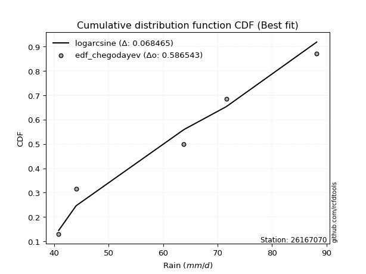</img>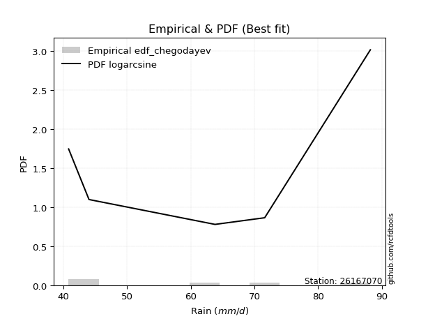</img>

</div>


### 6. EDF Blom (1958)

The Blom formula is a specific "plotting position" formula used in hydrology and statistical analysis to estimate the empirical cumulative probability (or non-exceedance probability) of a data series. It is particularly recommended for data that are approximately normally distributed. The constant _a_ is set to 0.375 (or 3/8).

<div align="center">


$P=(m-a)/(n+1-2a)$


</div>


**6.1. Empirical values**

<div align="center">

|                | 0                   | 1                   | 2        | 3                  | 4                  |
|:---------------|:--------------------|:--------------------|:---------|:-------------------|:-------------------|
| date           | 2022                | 2019                | 2025     | 2020               | 2021               |
| x              | 40.8                | 44.0                | 63.8     | 71.6               | 88.2               |
| m              | 1                   | 2                   | 3        | 4                  | 5                  |
| empirical_dist | edf_blom            | edf_blom            | edf_blom | edf_blom           | edf_blom           |
| empirical      | 0.11904761904761904 | 0.30952380952380953 | 0.5      | 0.6904761904761905 | 0.8809523809523809 |
| empirical_tr   | 1.135135135135135   | 1.4482758620689655  | 2.0      | 3.230769230769231  | 8.399999999999999  |

</div>


**6.2. Kolmogorov-Smirnov fit test (sorted by Δ)**


<div align="center">

|                | 0                   | 1                   | 2                   | 3                   | 4                   | 5                   | 6                   | 7                   | 8                   | 9                   | 10                  | 11                  | 12                 | 13                 | 14                 | 15                  | 16                 | 17                  | 18                  | 19                  | 20                  | 21                  | 22                  | 23                  | 24                  | 25                 | 26                 | 27                 | 28                  | 29                 | 30                  | 31                  | 32                  | 33                 | 34                  | 35                  | 36                  | 37                  | 38                 | 39                  | 40                  | 41                  | 42                  | 43                 | 44                 | 45                  | 46                  | 47                  | 48                  | 49                 | 50                  | 51                 | 52                 | 53                  | 54                  | 55                 | 56                  | 57                 | 58                  | 59                 | 60                  | 61                  | 62                  | 63                  | 64                  | 65                  | 66                  | 67                  | 68                  | 69                  | 70                 | 71                  | 72                  | 73                 | 74                  | 75                 | 76                  | 77                  | 78                  | 79                  | 80                  | 81                  | 82                 | 83                 | 84                  | 85                 | 86                  | 87                  | 88                  | 89                  | 90                  | 91                  | 92                  | 93                  | 94                  | 95                  | 96                  | 97                  | 98                  | 99                 | 100                 | 101                | 102                | 103                 | 104                 | 105                 | 106                 | 107                | 108                 | 109                | 110                | 111                | 112                 | 113                 | 114                 | 115                | 116                | 117                | 118                 | 119                | 120                | 121                 | 122                 | 123                 | 124                | 125                | 126                 | 127                 | 128                | 129                 | 130                 | 131                 | 132                 | 133                 | 134                 | 135                 | 136                 | 137                | 138                 | 139                 | 140                 | 141                 | 142                | 143                 | 144                | 145                 | 146                 | 147                | 148                 | 149                | 150                 | 151                 | 152                | 153                | 154                | 155                | 156                | 157                | 158                | 159                |
|:---------------|:--------------------|:--------------------|:--------------------|:--------------------|:--------------------|:--------------------|:--------------------|:--------------------|:--------------------|:--------------------|:--------------------|:--------------------|:-------------------|:-------------------|:-------------------|:--------------------|:-------------------|:--------------------|:--------------------|:--------------------|:--------------------|:--------------------|:--------------------|:--------------------|:--------------------|:-------------------|:-------------------|:-------------------|:--------------------|:-------------------|:--------------------|:--------------------|:--------------------|:-------------------|:--------------------|:--------------------|:--------------------|:--------------------|:-------------------|:--------------------|:--------------------|:--------------------|:--------------------|:-------------------|:-------------------|:--------------------|:--------------------|:--------------------|:--------------------|:-------------------|:--------------------|:-------------------|:-------------------|:--------------------|:--------------------|:-------------------|:--------------------|:-------------------|:--------------------|:-------------------|:--------------------|:--------------------|:--------------------|:--------------------|:--------------------|:--------------------|:--------------------|:--------------------|:--------------------|:--------------------|:-------------------|:--------------------|:--------------------|:-------------------|:--------------------|:-------------------|:--------------------|:--------------------|:--------------------|:--------------------|:--------------------|:--------------------|:-------------------|:-------------------|:--------------------|:-------------------|:--------------------|:--------------------|:--------------------|:--------------------|:--------------------|:--------------------|:--------------------|:--------------------|:--------------------|:--------------------|:--------------------|:--------------------|:--------------------|:-------------------|:--------------------|:-------------------|:-------------------|:--------------------|:--------------------|:--------------------|:--------------------|:-------------------|:--------------------|:-------------------|:-------------------|:-------------------|:--------------------|:--------------------|:--------------------|:-------------------|:-------------------|:-------------------|:--------------------|:-------------------|:-------------------|:--------------------|:--------------------|:--------------------|:-------------------|:-------------------|:--------------------|:--------------------|:-------------------|:--------------------|:--------------------|:--------------------|:--------------------|:--------------------|:--------------------|:--------------------|:--------------------|:-------------------|:--------------------|:--------------------|:--------------------|:--------------------|:-------------------|:--------------------|:-------------------|:--------------------|:--------------------|:-------------------|:--------------------|:-------------------|:--------------------|:--------------------|:-------------------|:-------------------|:-------------------|:-------------------|:-------------------|:-------------------|:-------------------|:-------------------|
| station        | 26167070            | 26167070            | 26167070            | 26167070            | 26167070            | 26167070            | 26167070            | 26167070            | 26167070            | 26167070            | 26167070            | 26167070            | 26167070           | 26167070           | 26167070           | 26167070            | 26167070           | 26167070            | 26167070            | 26167070            | 26167070            | 26167070            | 26167070            | 26167070            | 26167070            | 26167070           | 26167070           | 26167070           | 26167070            | 26167070           | 26167070            | 26167070            | 26167070            | 26167070           | 26167070            | 26167070            | 26167070            | 26167070            | 26167070           | 26167070            | 26167070            | 26167070            | 26167070            | 26167070           | 26167070           | 26167070            | 26167070            | 26167070            | 26167070            | 26167070           | 26167070            | 26167070           | 26167070           | 26167070            | 26167070            | 26167070           | 26167070            | 26167070           | 26167070            | 26167070           | 26167070            | 26167070            | 26167070            | 26167070            | 26167070            | 26167070            | 26167070            | 26167070            | 26167070            | 26167070            | 26167070           | 26167070            | 26167070            | 26167070           | 26167070            | 26167070           | 26167070            | 26167070            | 26167070            | 26167070            | 26167070            | 26167070            | 26167070           | 26167070           | 26167070            | 26167070           | 26167070            | 26167070            | 26167070            | 26167070            | 26167070            | 26167070            | 26167070            | 26167070            | 26167070            | 26167070            | 26167070            | 26167070            | 26167070            | 26167070           | 26167070            | 26167070           | 26167070           | 26167070            | 26167070            | 26167070            | 26167070            | 26167070           | 26167070            | 26167070           | 26167070           | 26167070           | 26167070            | 26167070            | 26167070            | 26167070           | 26167070           | 26167070           | 26167070            | 26167070           | 26167070           | 26167070            | 26167070            | 26167070            | 26167070           | 26167070           | 26167070            | 26167070            | 26167070           | 26167070            | 26167070            | 26167070            | 26167070            | 26167070            | 26167070            | 26167070            | 26167070            | 26167070           | 26167070            | 26167070            | 26167070            | 26167070            | 26167070           | 26167070            | 26167070           | 26167070            | 26167070            | 26167070           | 26167070            | 26167070           | 26167070            | 26167070            | 26167070           | 26167070           | 26167070           | 26167070           | 26167070           | 26167070           | 26167070           | 26167070           |
| empirical_dist | edf_blom            | edf_blom            | edf_blom            | edf_blom            | edf_blom            | edf_blom            | edf_blom            | edf_blom            | edf_blom            | edf_blom            | edf_blom            | edf_blom            | edf_blom           | edf_blom           | edf_blom           | edf_blom            | edf_blom           | edf_blom            | edf_blom            | edf_blom            | edf_blom            | edf_blom            | edf_blom            | edf_blom            | edf_blom            | edf_blom           | edf_blom           | edf_blom           | edf_blom            | edf_blom           | edf_blom            | edf_blom            | edf_blom            | edf_blom           | edf_blom            | edf_blom            | edf_blom            | edf_blom            | edf_blom           | edf_blom            | edf_blom            | edf_blom            | edf_blom            | edf_blom           | edf_blom           | edf_blom            | edf_blom            | edf_blom            | edf_blom            | edf_blom           | edf_blom            | edf_blom           | edf_blom           | edf_blom            | edf_blom            | edf_blom           | edf_blom            | edf_blom           | edf_blom            | edf_blom           | edf_blom            | edf_blom            | edf_blom            | edf_blom            | edf_blom            | edf_blom            | edf_blom            | edf_blom            | edf_blom            | edf_blom            | edf_blom           | edf_blom            | edf_blom            | edf_blom           | edf_blom            | edf_blom           | edf_blom            | edf_blom            | edf_blom            | edf_blom            | edf_blom            | edf_blom            | edf_blom           | edf_blom           | edf_blom            | edf_blom           | edf_blom            | edf_blom            | edf_blom            | edf_blom            | edf_blom            | edf_blom            | edf_blom            | edf_blom            | edf_blom            | edf_blom            | edf_blom            | edf_blom            | edf_blom            | edf_blom           | edf_blom            | edf_blom           | edf_blom           | edf_blom            | edf_blom            | edf_blom            | edf_blom            | edf_blom           | edf_blom            | edf_blom           | edf_blom           | edf_blom           | edf_blom            | edf_blom            | edf_blom            | edf_blom           | edf_blom           | edf_blom           | edf_blom            | edf_blom           | edf_blom           | edf_blom            | edf_blom            | edf_blom            | edf_blom           | edf_blom           | edf_blom            | edf_blom            | edf_blom           | edf_blom            | edf_blom            | edf_blom            | edf_blom            | edf_blom            | edf_blom            | edf_blom            | edf_blom            | edf_blom           | edf_blom            | edf_blom            | edf_blom            | edf_blom            | edf_blom           | edf_blom            | edf_blom           | edf_blom            | edf_blom            | edf_blom           | edf_blom            | edf_blom           | edf_blom            | edf_blom            | edf_blom           | edf_blom           | edf_blom           | edf_blom           | edf_blom           | edf_blom           | edf_blom           | edf_blom           |
| p_dist         | logarcsine          | logbetaprime        | logdweibull         | logdgamma           | ksone               | logksone            | dweibull            | semicircular        | logsemicircular     | arcsine             | logwrapcauchy       | logrdist            | anglit             | logtrapezoid       | weibull_min        | loganglit           | dgamma             | loggenextreme       | foldnorm            | wrapcauchy          | logfoldnorm         | rayleigh            | logbeta             | maxwell             | lograyleigh         | logalpha           | logburr12          | logmaxwell         | nct                 | t                  | genlogistic         | crystalball         | norm                | exponnorm          | pearson3            | invgamma            | logjohnsonsu        | burr                | betaprime          | loginvgamma         | logf                | logerlang           | f                   | loggamma           | loggamma           | logpearson3         | logt                | logcrystalball      | lognorm             | logexponnorm       | logskewnorm         | logloggamma        | lognct             | gamma               | alpha               | logncf             | kstwobign           | loginvweibull      | loggenlogistic      | halfnorm           | logmielke           | loghalfnorm         | logburr             | genpareto           | erlang              | lognakagami         | logcosine           | logweibull_max      | logkstwobign        | gumbel_l            | cosine             | loggumbel_l         | genexpon            | logistic           | beta                | logbradford        | logrice             | loglogistic         | lomax               | loggenexpon         | rice                | gumbel_r            | hypsecant          | logargus           | loghypsecant        | loggumbel_r        | logtriang           | argus               | loglevy_l           | loggompertz         | triang              | laplace             | loglaplace          | loglaplace          | gennorm             | logtruncexpon       | truncnorm           | burr12              | logloglaplace       | loglomax           | logkappa4           | moyal              | halflogistic       | loggausshyper       | halfgennorm         | logexponpow         | gompertz            | gausshyper         | loggennorm          | logtukeylambda     | logmoyal           | loghalflogistic    | truncexpon          | levy_l              | loguniform          | logkappa3          | loginvgauss        | bradford           | kappa4              | skewnorm           | kappa3             | logjohnsonsb        | invgauss            | tukeylambda         | logweibull_min     | logvonmises_line   | uniform             | vonmises_line       | loggenhalflogistic | truncweibull_min    | genhalflogistic     | exponpow            | logtruncnorm        | trapezoid           | gengamma            | wald                | logwald             | exponweib          | genextreme          | nakagami            | logfatiguelife      | logtruncweibull_min | fatiguelife        | ncf                 | logtruncpareto     | powerlaw            | logexponweib        | logpowerlaw        | truncpareto         | invweibull         | loggenpareto        | loggengamma         | rdist              | weibull_max        | johnsonsu          | johnsonsb          | loghalfgennorm     | logvonmises        | vonmises           | mielke             |
| delta          | 0.06317354581921608 | 0.07720792782864905 | 0.09234443138252535 | 0.09612833255734576 | 0.09895400844011329 | 0.10148984059974325 | 0.10546848465229794 | 0.11474341867018478 | 0.11715927346795957 | 0.11904761904761907 | 0.11904761904761907 | 0.12015338177659174 | 0.1260366966020672 | 0.1261022777052605 | 0.1270795424115827 | 0.12835553231527164 | 0.1333993404842879 | 0.13897150093251331 | 0.14006186872571363 | 0.14045747882349047 | 0.14188466638647673 | 0.14656269251383916 | 0.14749240905063307 | 0.14761202279825575 | 0.14942696697773392 | 0.1500044921270811 | 0.1501784176111173 | 0.1502207300834702 | 0.15032126670091545 | 0.1513334535683479 | 0.15141509521421775 | 0.15150053768931088 | 0.15150063123020502 | 0.1515398612536819 | 0.15190052034947685 | 0.15229769804175583 | 0.15279520407702712 | 0.15297818291189968 | 0.1530586610399321 | 0.15307770121756056 | 0.15327664682741188 | 0.15337198006676073 | 0.15351152293887294 | 0.1535305479413134 | 0.1535305479413134 | 0.15359086398737917 | 0.15361046327078504 | 0.15361129103075688 | 0.15361129888984182 | 0.1536120693106043 | 0.15361276043552027 | 0.1536161353347761 | 0.153894105905019  | 0.15422814352165623 | 0.15440169340705828 | 0.1545738156369041 | 0.15466392376221438 | 0.1554518660777453 | 0.15600641744924593 | 0.1560931235829063 | 0.15899279159987423 | 0.16024191923352898 | 0.16142149768811287 | 0.16192150161085264 | 0.16245645497926944 | 0.16404490161120866 | 0.16415650411880328 | 0.16489088684114883 | 0.16534079163175297 | 0.16577828359331923 | 0.1672501507497164 | 0.16726825810747753 | 0.16772471600149141 | 0.1699150851184326 | 0.16997121853314265 | 0.1704207407053524 | 0.17053459388198766 | 0.17181797275067537 | 0.17393847797979745 | 0.17466289634821275 | 0.17783186761362044 | 0.17836233608679444 | 0.1795621524202103 | 0.1799142852236929 | 0.18129501139769974 | 0.1813465639753506 | 0.18359970429278755 | 0.18390284814120572 | 0.18605870631255386 | 0.18791269204657268 | 0.18822430153472375 | 0.18841426151821827 | 0.18990949730970658 | 0.18990949730970658 | 0.19047619047619047 | 0.19167374797268633 | 0.19614923343288687 | 0.19769037483655616 | 0.19856734276847637 | 0.2002633786857091 | 0.20070607754421593 | 0.2029014767251445 | 0.203130135513495  | 0.20410376749241088 | 0.20418382644443944 | 0.20471376393774798 | 0.20484535908423962 | 0.2052618666058181 | 0.20585879968333076 | 0.2062780789651193 | 0.2062918829700306 | 0.2081506217501406 | 0.20947005348415418 | 0.20955122710564525 | 0.21157969809342364 | 0.2116871376255084 | 0.213777198670014  | 0.2143150222607973 | 0.21555500896900542 | 0.2163161320749883 | 0.2234727525991118 | 0.22608595529417652 | 0.22783133159075797 | 0.23482251605960092 | 0.2389330935224705 | 0.2415964517101792 | 0.24201326100060272 | 0.24206620431425352 | 0.2545151272370587 | 0.25715483861346855 | 0.26234361033681225 | 0.26696352932246015 | 0.29480620527260515 | 0.30007092046762524 | 0.30100581346803246 | 0.30952380952380953 | 0.30952380952380953 | 0.3119012239487421 | 0.31245674887733343 | 0.31422590961087105 | 0.32496300255292476 | 0.3284602065336072  | 0.329135709973555  | 0.34417352025536385 | 0.4001258253284028 | 0.41416084428527344 | 0.42960457293495835 | 0.4312935580148969 | 0.43823271926557605 | 0.4438692859576057 | 0.44594336868956286 | 0.46271308428928326 | 0.4999999977776115 | 0.514612342382666  | 0.5467944373829655 | 0.6011200405321684 | 0.6904761904761905 | 1.102681950995402  | 13.364146700683218 | nan                |
| deltao         | 0.5865427407550001  | 0.5865427407550001  | 0.5865427407550001  | 0.5865427407550001  | 0.5865427407550001  | 0.5865427407550001  | 0.5865427407550001  | 0.5865427407550001  | 0.5865427407550001  | 0.5865427407550001  | 0.5865427407550001  | 0.5865427407550001  | 0.5865427407550001 | 0.5865427407550001 | 0.5865427407550001 | 0.5865427407550001  | 0.5865427407550001 | 0.5865427407550001  | 0.5865427407550001  | 0.5865427407550001  | 0.5865427407550001  | 0.5865427407550001  | 0.5865427407550001  | 0.5865427407550001  | 0.5865427407550001  | 0.5865427407550001 | 0.5865427407550001 | 0.5865427407550001 | 0.5865427407550001  | 0.5865427407550001 | 0.5865427407550001  | 0.5865427407550001  | 0.5865427407550001  | 0.5865427407550001 | 0.5865427407550001  | 0.5865427407550001  | 0.5865427407550001  | 0.5865427407550001  | 0.5865427407550001 | 0.5865427407550001  | 0.5865427407550001  | 0.5865427407550001  | 0.5865427407550001  | 0.5865427407550001 | 0.5865427407550001 | 0.5865427407550001  | 0.5865427407550001  | 0.5865427407550001  | 0.5865427407550001  | 0.5865427407550001 | 0.5865427407550001  | 0.5865427407550001 | 0.5865427407550001 | 0.5865427407550001  | 0.5865427407550001  | 0.5865427407550001 | 0.5865427407550001  | 0.5865427407550001 | 0.5865427407550001  | 0.5865427407550001 | 0.5865427407550001  | 0.5865427407550001  | 0.5865427407550001  | 0.5865427407550001  | 0.5865427407550001  | 0.5865427407550001  | 0.5865427407550001  | 0.5865427407550001  | 0.5865427407550001  | 0.5865427407550001  | 0.5865427407550001 | 0.5865427407550001  | 0.5865427407550001  | 0.5865427407550001 | 0.5865427407550001  | 0.5865427407550001 | 0.5865427407550001  | 0.5865427407550001  | 0.5865427407550001  | 0.5865427407550001  | 0.5865427407550001  | 0.5865427407550001  | 0.5865427407550001 | 0.5865427407550001 | 0.5865427407550001  | 0.5865427407550001 | 0.5865427407550001  | 0.5865427407550001  | 0.5865427407550001  | 0.5865427407550001  | 0.5865427407550001  | 0.5865427407550001  | 0.5865427407550001  | 0.5865427407550001  | 0.5865427407550001  | 0.5865427407550001  | 0.5865427407550001  | 0.5865427407550001  | 0.5865427407550001  | 0.5865427407550001 | 0.5865427407550001  | 0.5865427407550001 | 0.5865427407550001 | 0.5865427407550001  | 0.5865427407550001  | 0.5865427407550001  | 0.5865427407550001  | 0.5865427407550001 | 0.5865427407550001  | 0.5865427407550001 | 0.5865427407550001 | 0.5865427407550001 | 0.5865427407550001  | 0.5865427407550001  | 0.5865427407550001  | 0.5865427407550001 | 0.5865427407550001 | 0.5865427407550001 | 0.5865427407550001  | 0.5865427407550001 | 0.5865427407550001 | 0.5865427407550001  | 0.5865427407550001  | 0.5865427407550001  | 0.5865427407550001 | 0.5865427407550001 | 0.5865427407550001  | 0.5865427407550001  | 0.5865427407550001 | 0.5865427407550001  | 0.5865427407550001  | 0.5865427407550001  | 0.5865427407550001  | 0.5865427407550001  | 0.5865427407550001  | 0.5865427407550001  | 0.5865427407550001  | 0.5865427407550001 | 0.5865427407550001  | 0.5865427407550001  | 0.5865427407550001  | 0.5865427407550001  | 0.5865427407550001 | 0.5865427407550001  | 0.5865427407550001 | 0.5865427407550001  | 0.5865427407550001  | 0.5865427407550001 | 0.5865427407550001  | 0.5865427407550001 | 0.5865427407550001  | 0.5865427407550001  | 0.5865427407550001 | 0.5865427407550001 | 0.5865427407550001 | 0.5865427407550001 | 0.5865427407550001 | 0.5865427407550001 | 0.5865427407550001 | 0.5865427407550001 |
| eval           | Δo > Δ              | Δo > Δ              | Δo > Δ              | Δo > Δ              | Δo > Δ              | Δo > Δ              | Δo > Δ              | Δo > Δ              | Δo > Δ              | Δo > Δ              | Δo > Δ              | Δo > Δ              | Δo > Δ             | Δo > Δ             | Δo > Δ             | Δo > Δ              | Δo > Δ             | Δo > Δ              | Δo > Δ              | Δo > Δ              | Δo > Δ              | Δo > Δ              | Δo > Δ              | Δo > Δ              | Δo > Δ              | Δo > Δ             | Δo > Δ             | Δo > Δ             | Δo > Δ              | Δo > Δ             | Δo > Δ              | Δo > Δ              | Δo > Δ              | Δo > Δ             | Δo > Δ              | Δo > Δ              | Δo > Δ              | Δo > Δ              | Δo > Δ             | Δo > Δ              | Δo > Δ              | Δo > Δ              | Δo > Δ              | Δo > Δ             | Δo > Δ             | Δo > Δ              | Δo > Δ              | Δo > Δ              | Δo > Δ              | Δo > Δ             | Δo > Δ              | Δo > Δ             | Δo > Δ             | Δo > Δ              | Δo > Δ              | Δo > Δ             | Δo > Δ              | Δo > Δ             | Δo > Δ              | Δo > Δ             | Δo > Δ              | Δo > Δ              | Δo > Δ              | Δo > Δ              | Δo > Δ              | Δo > Δ              | Δo > Δ              | Δo > Δ              | Δo > Δ              | Δo > Δ              | Δo > Δ             | Δo > Δ              | Δo > Δ              | Δo > Δ             | Δo > Δ              | Δo > Δ             | Δo > Δ              | Δo > Δ              | Δo > Δ              | Δo > Δ              | Δo > Δ              | Δo > Δ              | Δo > Δ             | Δo > Δ             | Δo > Δ              | Δo > Δ             | Δo > Δ              | Δo > Δ              | Δo > Δ              | Δo > Δ              | Δo > Δ              | Δo > Δ              | Δo > Δ              | Δo > Δ              | Δo > Δ              | Δo > Δ              | Δo > Δ              | Δo > Δ              | Δo > Δ              | Δo > Δ             | Δo > Δ              | Δo > Δ             | Δo > Δ             | Δo > Δ              | Δo > Δ              | Δo > Δ              | Δo > Δ              | Δo > Δ             | Δo > Δ              | Δo > Δ             | Δo > Δ             | Δo > Δ             | Δo > Δ              | Δo > Δ              | Δo > Δ              | Δo > Δ             | Δo > Δ             | Δo > Δ             | Δo > Δ              | Δo > Δ             | Δo > Δ             | Δo > Δ              | Δo > Δ              | Δo > Δ              | Δo > Δ             | Δo > Δ             | Δo > Δ              | Δo > Δ              | Δo > Δ             | Δo > Δ              | Δo > Δ              | Δo > Δ              | Δo > Δ              | Δo > Δ              | Δo > Δ              | Δo > Δ              | Δo > Δ              | Δo > Δ             | Δo > Δ              | Δo > Δ              | Δo > Δ              | Δo > Δ              | Δo > Δ             | Δo > Δ              | Δo > Δ             | Δo > Δ              | Δo > Δ              | Δo > Δ             | Δo > Δ              | Δo > Δ             | Δo > Δ              | Δo > Δ              | Δo > Δ             | Δo > Δ             | Δo > Δ             | Δo <= Δ            | Δo <= Δ            | Δo <= Δ            | Δo <= Δ            | Δo <= Δ            |
| fit            | 1                   | 1                   | 1                   | 1                   | 1                   | 1                   | 1                   | 1                   | 1                   | 1                   | 1                   | 1                   | 1                  | 1                  | 1                  | 1                   | 1                  | 1                   | 1                   | 1                   | 1                   | 1                   | 1                   | 1                   | 1                   | 1                  | 1                  | 1                  | 1                   | 1                  | 1                   | 1                   | 1                   | 1                  | 1                   | 1                   | 1                   | 1                   | 1                  | 1                   | 1                   | 1                   | 1                   | 1                  | 1                  | 1                   | 1                   | 1                   | 1                   | 1                  | 1                   | 1                  | 1                  | 1                   | 1                   | 1                  | 1                   | 1                  | 1                   | 1                  | 1                   | 1                   | 1                   | 1                   | 1                   | 1                   | 1                   | 1                   | 1                   | 1                   | 1                  | 1                   | 1                   | 1                  | 1                   | 1                  | 1                   | 1                   | 1                   | 1                   | 1                   | 1                   | 1                  | 1                  | 1                   | 1                  | 1                   | 1                   | 1                   | 1                   | 1                   | 1                   | 1                   | 1                   | 1                   | 1                   | 1                   | 1                   | 1                   | 1                  | 1                   | 1                  | 1                  | 1                   | 1                   | 1                   | 1                   | 1                  | 1                   | 1                  | 1                  | 1                  | 1                   | 1                   | 1                   | 1                  | 1                  | 1                  | 1                   | 1                  | 1                  | 1                   | 1                   | 1                   | 1                  | 1                  | 1                   | 1                   | 1                  | 1                   | 1                   | 1                   | 1                   | 1                   | 1                   | 1                   | 1                   | 1                  | 1                   | 1                   | 1                   | 1                   | 1                  | 1                   | 1                  | 1                   | 1                   | 1                  | 1                   | 1                  | 1                   | 1                   | 1                  | 1                  | 1                  | 0                  | 0                  | 0                  | 0                  | 0                  |
| n              | 5                   | 5                   | 5                   | 5                   | 5                   | 5                   | 5                   | 5                   | 5                   | 5                   | 5                   | 5                   | 5                  | 5                  | 5                  | 5                   | 5                  | 5                   | 5                   | 5                   | 5                   | 5                   | 5                   | 5                   | 5                   | 5                  | 5                  | 5                  | 5                   | 5                  | 5                   | 5                   | 5                   | 5                  | 5                   | 5                   | 5                   | 5                   | 5                  | 5                   | 5                   | 5                   | 5                   | 5                  | 5                  | 5                   | 5                   | 5                   | 5                   | 5                  | 5                   | 5                  | 5                  | 5                   | 5                   | 5                  | 5                   | 5                  | 5                   | 5                  | 5                   | 5                   | 5                   | 5                   | 5                   | 5                   | 5                   | 5                   | 5                   | 5                   | 5                  | 5                   | 5                   | 5                  | 5                   | 5                  | 5                   | 5                   | 5                   | 5                   | 5                   | 5                   | 5                  | 5                  | 5                   | 5                  | 5                   | 5                   | 5                   | 5                   | 5                   | 5                   | 5                   | 5                   | 5                   | 5                   | 5                   | 5                   | 5                   | 5                  | 5                   | 5                  | 5                  | 5                   | 5                   | 5                   | 5                   | 5                  | 5                   | 5                  | 5                  | 5                  | 5                   | 5                   | 5                   | 5                  | 5                  | 5                  | 5                   | 5                  | 5                  | 5                   | 5                   | 5                   | 5                  | 5                  | 5                   | 5                   | 5                  | 5                   | 5                   | 5                   | 5                   | 5                   | 5                   | 5                   | 5                   | 5                  | 5                   | 5                   | 5                   | 5                   | 5                  | 5                   | 5                  | 5                   | 5                   | 5                  | 5                   | 5                  | 5                   | 5                   | 5                  | 5                  | 5                  | 5                  | 5                  | 5                  | 5                  | 5                  |
| best_fit       | 1                   | 0                   | 0                   | 0                   | 0                   | 0                   | 0                   | 0                   | 0                   | 0                   | 0                   | 0                   | 0                  | 0                  | 0                  | 0                   | 0                  | 0                   | 0                   | 0                   | 0                   | 0                   | 0                   | 0                   | 0                   | 0                  | 0                  | 0                  | 0                   | 0                  | 0                   | 0                   | 0                   | 0                  | 0                   | 0                   | 0                   | 0                   | 0                  | 0                   | 0                   | 0                   | 0                   | 0                  | 0                  | 0                   | 0                   | 0                   | 0                   | 0                  | 0                   | 0                  | 0                  | 0                   | 0                   | 0                  | 0                   | 0                  | 0                   | 0                  | 0                   | 0                   | 0                   | 0                   | 0                   | 0                   | 0                   | 0                   | 0                   | 0                   | 0                  | 0                   | 0                   | 0                  | 0                   | 0                  | 0                   | 0                   | 0                   | 0                   | 0                   | 0                   | 0                  | 0                  | 0                   | 0                  | 0                   | 0                   | 0                   | 0                   | 0                   | 0                   | 0                   | 0                   | 0                   | 0                   | 0                   | 0                   | 0                   | 0                  | 0                   | 0                  | 0                  | 0                   | 0                   | 0                   | 0                   | 0                  | 0                   | 0                  | 0                  | 0                  | 0                   | 0                   | 0                   | 0                  | 0                  | 0                  | 0                   | 0                  | 0                  | 0                   | 0                   | 0                   | 0                  | 0                  | 0                   | 0                   | 0                  | 0                   | 0                   | 0                   | 0                   | 0                   | 0                   | 0                   | 0                   | 0                  | 0                   | 0                   | 0                   | 0                   | 0                  | 0                   | 0                  | 0                   | 0                   | 0                  | 0                   | 0                  | 0                   | 0                   | 0                  | 0                  | 0                  | 0                  | 0                  | 0                  | 0                  | 0                  |
| best_fit_sort  | 1                   | 2                   | 3                   | 4                   | 5                   | 6                   | 7                   | 8                   | 9                   | 10                  | 11                  | 12                  | 13                 | 14                 | 15                 | 16                  | 17                 | 18                  | 19                  | 20                  | 21                  | 22                  | 23                  | 24                  | 25                  | 26                 | 27                 | 28                 | 29                  | 30                 | 31                  | 32                  | 33                  | 34                 | 35                  | 36                  | 37                  | 38                  | 39                 | 40                  | 41                  | 42                  | 43                  | 44                 | 45                 | 46                  | 47                  | 48                  | 49                  | 50                 | 51                  | 52                 | 53                 | 54                  | 55                  | 56                 | 57                  | 58                 | 59                  | 60                 | 61                  | 62                  | 63                  | 64                  | 65                  | 66                  | 67                  | 68                  | 69                  | 70                  | 71                 | 72                  | 73                  | 74                 | 75                  | 76                 | 77                  | 78                  | 79                  | 80                  | 81                  | 82                  | 83                 | 84                 | 85                  | 86                 | 87                  | 88                  | 89                  | 90                  | 91                  | 92                  | 93                  | 94                  | 95                  | 96                  | 97                  | 98                  | 99                  | 100                | 101                 | 102                | 103                | 104                 | 105                 | 106                 | 107                 | 108                | 109                 | 110                | 111                | 112                | 113                 | 114                 | 115                 | 116                | 117                | 118                | 119                 | 120                | 121                | 122                 | 123                 | 124                 | 125                | 126                | 127                 | 128                 | 129                | 130                 | 131                 | 132                 | 133                 | 134                 | 135                 | 136                 | 137                 | 138                | 139                 | 140                 | 141                 | 142                 | 143                | 144                 | 145                | 146                 | 147                 | 148                | 149                 | 150                | 151                 | 152                 | 153                | 154                | 155                | 156                | 157                | 158                | 159                | 160                |

</div>


**6.3. Best fit**

<div align="center">

|   id |   station | empirical_dist   | p_dist     |     delta |   deltao | eval   |   fit |   n |   best_fit |   best_fit_sort |
|-----:|----------:|:-----------------|:-----------|----------:|---------:|:-------|------:|----:|-----------:|----------------:|
|    0 |  26167070 | edf_blom         | logarcsine | 0.0631735 | 0.586543 | Δo > Δ |     1 |   5 |          1 |               1 |

</div>


<div align="center">

</img>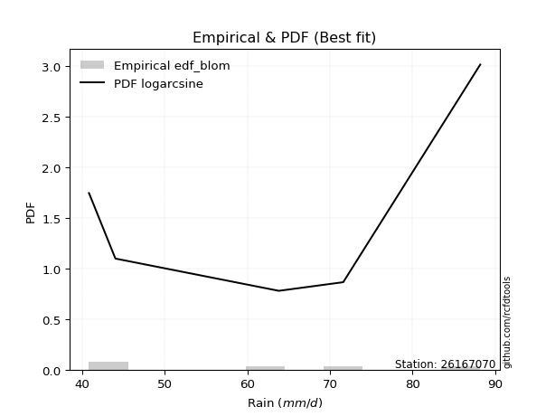</img>

</div>


### 7. EDF Tukey (1962)

In hydrology, the Tukey formula is used as a plotting position formula to estimate the empirical probability or frequency of a flood event (or other hydrological data). The formula parameter is given as _c=0.333_ (or 1/3).

<div align="center">


$P=(m-c)/(n+1-2c)$


</div>


**7.1. Empirical values**

<div align="center">

|                | 0                  | 1                  | 2         | 3         | 4         |
|:---------------|:-------------------|:-------------------|:----------|:----------|:----------|
| date           | 2022               | 2019               | 2025      | 2020      | 2021      |
| x              | 40.8               | 44.0               | 63.8      | 71.6      | 88.2      |
| m              | 1                  | 2                  | 3         | 4         | 5         |
| empirical_dist | edf_tukey          | edf_tukey          | edf_tukey | edf_tukey | edf_tukey |
| empirical      | 0.125              | 0.3125             | 0.5       | 0.6875    | 0.875     |
| empirical_tr   | 1.1428571428571428 | 1.4545454545454546 | 2.0       | 3.2       | 8.0       |

</div>


**7.2. Kolmogorov-Smirnov fit test (sorted by Δ)**


<div align="center">

|                | 0                   | 1                   | 2                   | 3                   | 4                   | 5                  | 6                   | 7                   | 8                   | 9                   | 10                  | 11                 | 12                 | 13                  | 14                  | 15                  | 16                 | 17                  | 18                 | 19                 | 20                 | 21                 | 22                  | 23                  | 24                  | 25                  | 26                  | 27                  | 28                  | 29                 | 30                  | 31                  | 32                  | 33                  | 34                  | 35                 | 36                 | 37                 | 38                 | 39                  | 40                  | 41                  | 42                  | 43                  | 44                 | 45                 | 46                  | 47                  | 48                  | 49                 | 50                  | 51                  | 52                  | 53                  | 54                  | 55                  | 56                 | 57                  | 58                  | 59                  | 60                  | 61                  | 62                  | 63                  | 64                  | 65                  | 66                  | 67                 | 68                  | 69                 | 70                  | 71                 | 72                 | 73                  | 74                  | 75                  | 76                  | 77                  | 78                  | 79                 | 80                 | 81                 | 82                 | 83                  | 84                  | 85                 | 86                  | 87                 | 88                 | 89                 | 90                  | 91                 | 92                  | 93                  | 94                  | 95                  | 96                  | 97                  | 98                 | 99                  | 100                | 101                | 102                 | 103                 | 104                 | 105                 | 106                 | 107                 | 108                 | 109                 | 110                 | 111                 | 112                 | 113                 | 114                | 115                | 116                 | 117                 | 118                | 119                 | 120                 | 121                 | 122                 | 123                 | 124                 | 125                 | 126                 | 127                 | 128                 | 129                | 130                | 131                 | 132                 | 133                 | 134                 | 135                | 136                | 137                | 138                | 139                 | 140                | 141                 | 142                | 143                 | 144                | 145                 | 146                | 147                | 148                | 149                 | 150                | 151                 | 152                | 153                | 154                | 155                | 156                | 157                | 158                | 159                |
|:---------------|:--------------------|:--------------------|:--------------------|:--------------------|:--------------------|:-------------------|:--------------------|:--------------------|:--------------------|:--------------------|:--------------------|:-------------------|:-------------------|:--------------------|:--------------------|:--------------------|:-------------------|:--------------------|:-------------------|:-------------------|:-------------------|:-------------------|:--------------------|:--------------------|:--------------------|:--------------------|:--------------------|:--------------------|:--------------------|:-------------------|:--------------------|:--------------------|:--------------------|:--------------------|:--------------------|:-------------------|:-------------------|:-------------------|:-------------------|:--------------------|:--------------------|:--------------------|:--------------------|:--------------------|:-------------------|:-------------------|:--------------------|:--------------------|:--------------------|:-------------------|:--------------------|:--------------------|:--------------------|:--------------------|:--------------------|:--------------------|:-------------------|:--------------------|:--------------------|:--------------------|:--------------------|:--------------------|:--------------------|:--------------------|:--------------------|:--------------------|:--------------------|:-------------------|:--------------------|:-------------------|:--------------------|:-------------------|:-------------------|:--------------------|:--------------------|:--------------------|:--------------------|:--------------------|:--------------------|:-------------------|:-------------------|:-------------------|:-------------------|:--------------------|:--------------------|:-------------------|:--------------------|:-------------------|:-------------------|:-------------------|:--------------------|:-------------------|:--------------------|:--------------------|:--------------------|:--------------------|:--------------------|:--------------------|:-------------------|:--------------------|:-------------------|:-------------------|:--------------------|:--------------------|:--------------------|:--------------------|:--------------------|:--------------------|:--------------------|:--------------------|:--------------------|:--------------------|:--------------------|:--------------------|:-------------------|:-------------------|:--------------------|:--------------------|:-------------------|:--------------------|:--------------------|:--------------------|:--------------------|:--------------------|:--------------------|:--------------------|:--------------------|:--------------------|:--------------------|:-------------------|:-------------------|:--------------------|:--------------------|:--------------------|:--------------------|:-------------------|:-------------------|:-------------------|:-------------------|:--------------------|:-------------------|:--------------------|:-------------------|:--------------------|:-------------------|:--------------------|:-------------------|:-------------------|:-------------------|:--------------------|:-------------------|:--------------------|:-------------------|:-------------------|:-------------------|:-------------------|:-------------------|:-------------------|:-------------------|:-------------------|
| station        | 26167070            | 26167070            | 26167070            | 26167070            | 26167070            | 26167070           | 26167070            | 26167070            | 26167070            | 26167070            | 26167070            | 26167070           | 26167070           | 26167070            | 26167070            | 26167070            | 26167070           | 26167070            | 26167070           | 26167070           | 26167070           | 26167070           | 26167070            | 26167070            | 26167070            | 26167070            | 26167070            | 26167070            | 26167070            | 26167070           | 26167070            | 26167070            | 26167070            | 26167070            | 26167070            | 26167070           | 26167070           | 26167070           | 26167070           | 26167070            | 26167070            | 26167070            | 26167070            | 26167070            | 26167070           | 26167070           | 26167070            | 26167070            | 26167070            | 26167070           | 26167070            | 26167070            | 26167070            | 26167070            | 26167070            | 26167070            | 26167070           | 26167070            | 26167070            | 26167070            | 26167070            | 26167070            | 26167070            | 26167070            | 26167070            | 26167070            | 26167070            | 26167070           | 26167070            | 26167070           | 26167070            | 26167070           | 26167070           | 26167070            | 26167070            | 26167070            | 26167070            | 26167070            | 26167070            | 26167070           | 26167070           | 26167070           | 26167070           | 26167070            | 26167070            | 26167070           | 26167070            | 26167070           | 26167070           | 26167070           | 26167070            | 26167070           | 26167070            | 26167070            | 26167070            | 26167070            | 26167070            | 26167070            | 26167070           | 26167070            | 26167070           | 26167070           | 26167070            | 26167070            | 26167070            | 26167070            | 26167070            | 26167070            | 26167070            | 26167070            | 26167070            | 26167070            | 26167070            | 26167070            | 26167070           | 26167070           | 26167070            | 26167070            | 26167070           | 26167070            | 26167070            | 26167070            | 26167070            | 26167070            | 26167070            | 26167070            | 26167070            | 26167070            | 26167070            | 26167070           | 26167070           | 26167070            | 26167070            | 26167070            | 26167070            | 26167070           | 26167070           | 26167070           | 26167070           | 26167070            | 26167070           | 26167070            | 26167070           | 26167070            | 26167070           | 26167070            | 26167070           | 26167070           | 26167070           | 26167070            | 26167070           | 26167070            | 26167070           | 26167070           | 26167070           | 26167070           | 26167070           | 26167070           | 26167070           | 26167070           |
| empirical_dist | edf_tukey           | edf_tukey           | edf_tukey           | edf_tukey           | edf_tukey           | edf_tukey          | edf_tukey           | edf_tukey           | edf_tukey           | edf_tukey           | edf_tukey           | edf_tukey          | edf_tukey          | edf_tukey           | edf_tukey           | edf_tukey           | edf_tukey          | edf_tukey           | edf_tukey          | edf_tukey          | edf_tukey          | edf_tukey          | edf_tukey           | edf_tukey           | edf_tukey           | edf_tukey           | edf_tukey           | edf_tukey           | edf_tukey           | edf_tukey          | edf_tukey           | edf_tukey           | edf_tukey           | edf_tukey           | edf_tukey           | edf_tukey          | edf_tukey          | edf_tukey          | edf_tukey          | edf_tukey           | edf_tukey           | edf_tukey           | edf_tukey           | edf_tukey           | edf_tukey          | edf_tukey          | edf_tukey           | edf_tukey           | edf_tukey           | edf_tukey          | edf_tukey           | edf_tukey           | edf_tukey           | edf_tukey           | edf_tukey           | edf_tukey           | edf_tukey          | edf_tukey           | edf_tukey           | edf_tukey           | edf_tukey           | edf_tukey           | edf_tukey           | edf_tukey           | edf_tukey           | edf_tukey           | edf_tukey           | edf_tukey          | edf_tukey           | edf_tukey          | edf_tukey           | edf_tukey          | edf_tukey          | edf_tukey           | edf_tukey           | edf_tukey           | edf_tukey           | edf_tukey           | edf_tukey           | edf_tukey          | edf_tukey          | edf_tukey          | edf_tukey          | edf_tukey           | edf_tukey           | edf_tukey          | edf_tukey           | edf_tukey          | edf_tukey          | edf_tukey          | edf_tukey           | edf_tukey          | edf_tukey           | edf_tukey           | edf_tukey           | edf_tukey           | edf_tukey           | edf_tukey           | edf_tukey          | edf_tukey           | edf_tukey          | edf_tukey          | edf_tukey           | edf_tukey           | edf_tukey           | edf_tukey           | edf_tukey           | edf_tukey           | edf_tukey           | edf_tukey           | edf_tukey           | edf_tukey           | edf_tukey           | edf_tukey           | edf_tukey          | edf_tukey          | edf_tukey           | edf_tukey           | edf_tukey          | edf_tukey           | edf_tukey           | edf_tukey           | edf_tukey           | edf_tukey           | edf_tukey           | edf_tukey           | edf_tukey           | edf_tukey           | edf_tukey           | edf_tukey          | edf_tukey          | edf_tukey           | edf_tukey           | edf_tukey           | edf_tukey           | edf_tukey          | edf_tukey          | edf_tukey          | edf_tukey          | edf_tukey           | edf_tukey          | edf_tukey           | edf_tukey          | edf_tukey           | edf_tukey          | edf_tukey           | edf_tukey          | edf_tukey          | edf_tukey          | edf_tukey           | edf_tukey          | edf_tukey           | edf_tukey          | edf_tukey          | edf_tukey          | edf_tukey          | edf_tukey          | edf_tukey          | edf_tukey          | edf_tukey          |
| p_dist         | logarcsine          | logbetaprime        | logdweibull         | dweibull            | ksone               | logdgamma          | logksone            | semicircular        | logsemicircular     | logrdist            | weibull_min         | arcsine            | logwrapcauchy      | dgamma              | anglit              | logtrapezoid        | loganglit          | loggenextreme       | wrapcauchy         | logbeta            | foldnorm           | logfoldnorm        | rayleigh            | maxwell             | lograyleigh         | burr                | logalpha            | logburr12           | logmaxwell          | nct                | t                   | genlogistic         | crystalball         | norm                | exponnorm           | pearson3           | invgamma           | loginvweibull      | logjohnsonsu       | genpareto           | loggenlogistic      | betaprime           | loginvgamma         | logf                | logerlang          | f                  | loggamma            | loggamma            | logpearson3         | logt               | logcrystalball      | lognorm             | logexponnorm        | logskewnorm         | logloggamma         | lognct              | gamma              | alpha               | logncf              | kstwobign           | logmielke           | halfnorm            | logburr             | logweibull_max      | loghalfnorm         | lognakagami         | logkstwobign        | erlang             | logcosine           | gumbel_l           | cosine              | loggumbel_l        | genexpon           | logbradford         | logistic            | beta                | logrice             | loggenexpon         | loglogistic         | lomax              | loglevy_l          | rice               | gumbel_r           | hypsecant           | logargus            | loghypsecant       | loggumbel_r         | logtriang          | argus              | gennorm            | loggompertz         | triang             | laplace             | logtruncexpon       | loglaplace          | loglaplace          | burr12              | truncnorm           | loglomax           | logloglaplace       | levy_l             | logkappa4          | loggausshyper       | halfgennorm         | logexponpow         | moyal               | halflogistic        | gompertz            | gausshyper          | loggennorm          | logtukeylambda      | logmoyal            | loghalflogistic     | truncexpon          | loginvgauss        | loguniform         | logkappa3           | bradford            | kappa4             | skewnorm            | logjohnsonsb        | kappa3              | invgauss            | logweibull_min      | tukeylambda         | logvonmises_line    | uniform             | vonmises_line       | truncweibull_min    | loggenhalflogistic | genhalflogistic    | exponpow            | logtruncnorm        | trapezoid           | gengamma            | genextreme         | exponweib          | wald               | logwald            | nakagami            | logfatiguelife     | logtruncweibull_min | fatiguelife        | ncf                 | logtruncpareto     | powerlaw            | logexponweib       | logpowerlaw        | invweibull         | truncpareto         | loggenpareto       | loggengamma         | rdist              | weibull_max        | johnsonsu          | johnsonsb          | loghalfgennorm     | logvonmises        | vonmises           | mielke             |
| delta          | 0.06614973629540655 | 0.07720792782864905 | 0.09829681233490628 | 0.10102377704010457 | 0.10193019891630375 | 0.1020807135097267 | 0.10446603107593372 | 0.11771960914637525 | 0.12013546394415003 | 0.12499999851228942 | 0.12499999943328807 | 0.125              | 0.125              | 0.12744695953190693 | 0.12901288707825767 | 0.12907846818145097 | 0.1313317227914621 | 0.13599531045632285 | 0.1374812883473    | 0.1415400280982521 | 0.1430380592019041 | 0.1448608568626672 | 0.14953888299002963 | 0.15058821327444621 | 0.15240315745392438 | 0.15297818291189968 | 0.15298068260327158 | 0.15315460808730777 | 0.15319692055966067 | 0.1532974571771059 | 0.15430964404453837 | 0.15439128569040822 | 0.15447672816550134 | 0.15447682170639548 | 0.15451605172987237 | 0.1548767108256673 | 0.1552738885179463 | 0.1554518660777453 | 0.1557713945532176 | 0.15596912065847168 | 0.15600641744924593 | 0.15603485151612256 | 0.15605389169375103 | 0.15625283730360234 | 0.1563481705429512 | 0.1564877134150634 | 0.15650673841750387 | 0.15650673841750387 | 0.15656705446356964 | 0.1565866537469755 | 0.15658748150694735 | 0.15658748936603228 | 0.15658825978679478 | 0.15658895091171074 | 0.15659232581096658 | 0.15687029638120947 | 0.1572043339978467 | 0.15737788388324875 | 0.15755000611309455 | 0.15764011423840485 | 0.15899279159987423 | 0.15906931405909677 | 0.16142149768811287 | 0.16191469636495837 | 0.16321810970971945 | 0.16404490161120866 | 0.16534079163175297 | 0.1654326454554599 | 0.16713269459499375 | 0.1687544740695097 | 0.17022634122590685 | 0.170244448583668  | 0.1703784034793097 | 0.17124839980224493 | 0.17289127559462306 | 0.17294740900933311 | 0.17351078435817813 | 0.17466289634821275 | 0.17479416322686583 | 0.1769146684559879 | 0.1801063253601729 | 0.1808080580898109 | 0.1813385265629849 | 0.18253834289640078 | 0.18289047569988337 | 0.1842712018738902 | 0.18432275445154106 | 0.186575894768978  | 0.1868790386173962 | 0.1875             | 0.19088888252276315 | 0.1912004920109142 | 0.19139045199440874 | 0.19167374797268633 | 0.19288568778589704 | 0.19288568778589704 | 0.19769037483655616 | 0.19912542390907734 | 0.2002633786857091 | 0.20154353324466684 | 0.2035988461532643 | 0.2036822680204064 | 0.20410376749241088 | 0.20418382644443944 | 0.20471376393774798 | 0.20587766720133496 | 0.20610632598968548 | 0.20782154956043009 | 0.20823805708200857 | 0.20883499015952123 | 0.20925426944130976 | 0.20926807344622106 | 0.21112681222633106 | 0.21244624396034464 | 0.213777198670014  | 0.2145558885696141 | 0.21466332810169886 | 0.21729121273698776 | 0.2185311994451959 | 0.21929232255117875 | 0.22310976481798606 | 0.22644894307530228 | 0.22783133159075797 | 0.23298071257008957 | 0.23779870653579138 | 0.24457264218636968 | 0.24498945147679319 | 0.24504239479044398 | 0.25715483861346855 | 0.2574913177132492 | 0.2653198008130027 | 0.26696352932246015 | 0.29480620527260515 | 0.29709472999143477 | 0.30100581346803246 | 0.3065043679249525 | 0.3089250334725516 | 0.3125             | 0.3125             | 0.31422590961087105 | 0.3219868120767343 | 0.3284602065336072  | 0.329135709973555  | 0.33822113930298286 | 0.4001258253284028 | 0.41416084428527344 | 0.4266283824587679 | 0.4312935580148969 | 0.4379169050052248 | 0.43823271926557605 | 0.4399909877371819 | 0.46271308428928326 | 0.4999999977776115 | 0.5116361519064755 | 0.543818246906775  | 0.5981438500559779 | 0.6875             | 1.102681950995402  | 13.3700990816356   | nan                |
| deltao         | 0.5865427407550001  | 0.5865427407550001  | 0.5865427407550001  | 0.5865427407550001  | 0.5865427407550001  | 0.5865427407550001 | 0.5865427407550001  | 0.5865427407550001  | 0.5865427407550001  | 0.5865427407550001  | 0.5865427407550001  | 0.5865427407550001 | 0.5865427407550001 | 0.5865427407550001  | 0.5865427407550001  | 0.5865427407550001  | 0.5865427407550001 | 0.5865427407550001  | 0.5865427407550001 | 0.5865427407550001 | 0.5865427407550001 | 0.5865427407550001 | 0.5865427407550001  | 0.5865427407550001  | 0.5865427407550001  | 0.5865427407550001  | 0.5865427407550001  | 0.5865427407550001  | 0.5865427407550001  | 0.5865427407550001 | 0.5865427407550001  | 0.5865427407550001  | 0.5865427407550001  | 0.5865427407550001  | 0.5865427407550001  | 0.5865427407550001 | 0.5865427407550001 | 0.5865427407550001 | 0.5865427407550001 | 0.5865427407550001  | 0.5865427407550001  | 0.5865427407550001  | 0.5865427407550001  | 0.5865427407550001  | 0.5865427407550001 | 0.5865427407550001 | 0.5865427407550001  | 0.5865427407550001  | 0.5865427407550001  | 0.5865427407550001 | 0.5865427407550001  | 0.5865427407550001  | 0.5865427407550001  | 0.5865427407550001  | 0.5865427407550001  | 0.5865427407550001  | 0.5865427407550001 | 0.5865427407550001  | 0.5865427407550001  | 0.5865427407550001  | 0.5865427407550001  | 0.5865427407550001  | 0.5865427407550001  | 0.5865427407550001  | 0.5865427407550001  | 0.5865427407550001  | 0.5865427407550001  | 0.5865427407550001 | 0.5865427407550001  | 0.5865427407550001 | 0.5865427407550001  | 0.5865427407550001 | 0.5865427407550001 | 0.5865427407550001  | 0.5865427407550001  | 0.5865427407550001  | 0.5865427407550001  | 0.5865427407550001  | 0.5865427407550001  | 0.5865427407550001 | 0.5865427407550001 | 0.5865427407550001 | 0.5865427407550001 | 0.5865427407550001  | 0.5865427407550001  | 0.5865427407550001 | 0.5865427407550001  | 0.5865427407550001 | 0.5865427407550001 | 0.5865427407550001 | 0.5865427407550001  | 0.5865427407550001 | 0.5865427407550001  | 0.5865427407550001  | 0.5865427407550001  | 0.5865427407550001  | 0.5865427407550001  | 0.5865427407550001  | 0.5865427407550001 | 0.5865427407550001  | 0.5865427407550001 | 0.5865427407550001 | 0.5865427407550001  | 0.5865427407550001  | 0.5865427407550001  | 0.5865427407550001  | 0.5865427407550001  | 0.5865427407550001  | 0.5865427407550001  | 0.5865427407550001  | 0.5865427407550001  | 0.5865427407550001  | 0.5865427407550001  | 0.5865427407550001  | 0.5865427407550001 | 0.5865427407550001 | 0.5865427407550001  | 0.5865427407550001  | 0.5865427407550001 | 0.5865427407550001  | 0.5865427407550001  | 0.5865427407550001  | 0.5865427407550001  | 0.5865427407550001  | 0.5865427407550001  | 0.5865427407550001  | 0.5865427407550001  | 0.5865427407550001  | 0.5865427407550001  | 0.5865427407550001 | 0.5865427407550001 | 0.5865427407550001  | 0.5865427407550001  | 0.5865427407550001  | 0.5865427407550001  | 0.5865427407550001 | 0.5865427407550001 | 0.5865427407550001 | 0.5865427407550001 | 0.5865427407550001  | 0.5865427407550001 | 0.5865427407550001  | 0.5865427407550001 | 0.5865427407550001  | 0.5865427407550001 | 0.5865427407550001  | 0.5865427407550001 | 0.5865427407550001 | 0.5865427407550001 | 0.5865427407550001  | 0.5865427407550001 | 0.5865427407550001  | 0.5865427407550001 | 0.5865427407550001 | 0.5865427407550001 | 0.5865427407550001 | 0.5865427407550001 | 0.5865427407550001 | 0.5865427407550001 | 0.5865427407550001 |
| eval           | Δo > Δ              | Δo > Δ              | Δo > Δ              | Δo > Δ              | Δo > Δ              | Δo > Δ             | Δo > Δ              | Δo > Δ              | Δo > Δ              | Δo > Δ              | Δo > Δ              | Δo > Δ             | Δo > Δ             | Δo > Δ              | Δo > Δ              | Δo > Δ              | Δo > Δ             | Δo > Δ              | Δo > Δ             | Δo > Δ             | Δo > Δ             | Δo > Δ             | Δo > Δ              | Δo > Δ              | Δo > Δ              | Δo > Δ              | Δo > Δ              | Δo > Δ              | Δo > Δ              | Δo > Δ             | Δo > Δ              | Δo > Δ              | Δo > Δ              | Δo > Δ              | Δo > Δ              | Δo > Δ             | Δo > Δ             | Δo > Δ             | Δo > Δ             | Δo > Δ              | Δo > Δ              | Δo > Δ              | Δo > Δ              | Δo > Δ              | Δo > Δ             | Δo > Δ             | Δo > Δ              | Δo > Δ              | Δo > Δ              | Δo > Δ             | Δo > Δ              | Δo > Δ              | Δo > Δ              | Δo > Δ              | Δo > Δ              | Δo > Δ              | Δo > Δ             | Δo > Δ              | Δo > Δ              | Δo > Δ              | Δo > Δ              | Δo > Δ              | Δo > Δ              | Δo > Δ              | Δo > Δ              | Δo > Δ              | Δo > Δ              | Δo > Δ             | Δo > Δ              | Δo > Δ             | Δo > Δ              | Δo > Δ             | Δo > Δ             | Δo > Δ              | Δo > Δ              | Δo > Δ              | Δo > Δ              | Δo > Δ              | Δo > Δ              | Δo > Δ             | Δo > Δ             | Δo > Δ             | Δo > Δ             | Δo > Δ              | Δo > Δ              | Δo > Δ             | Δo > Δ              | Δo > Δ             | Δo > Δ             | Δo > Δ             | Δo > Δ              | Δo > Δ             | Δo > Δ              | Δo > Δ              | Δo > Δ              | Δo > Δ              | Δo > Δ              | Δo > Δ              | Δo > Δ             | Δo > Δ              | Δo > Δ             | Δo > Δ             | Δo > Δ              | Δo > Δ              | Δo > Δ              | Δo > Δ              | Δo > Δ              | Δo > Δ              | Δo > Δ              | Δo > Δ              | Δo > Δ              | Δo > Δ              | Δo > Δ              | Δo > Δ              | Δo > Δ             | Δo > Δ             | Δo > Δ              | Δo > Δ              | Δo > Δ             | Δo > Δ              | Δo > Δ              | Δo > Δ              | Δo > Δ              | Δo > Δ              | Δo > Δ              | Δo > Δ              | Δo > Δ              | Δo > Δ              | Δo > Δ              | Δo > Δ             | Δo > Δ             | Δo > Δ              | Δo > Δ              | Δo > Δ              | Δo > Δ              | Δo > Δ             | Δo > Δ             | Δo > Δ             | Δo > Δ             | Δo > Δ              | Δo > Δ             | Δo > Δ              | Δo > Δ             | Δo > Δ              | Δo > Δ             | Δo > Δ              | Δo > Δ             | Δo > Δ             | Δo > Δ             | Δo > Δ              | Δo > Δ             | Δo > Δ              | Δo > Δ             | Δo > Δ             | Δo > Δ             | Δo <= Δ            | Δo <= Δ            | Δo <= Δ            | Δo <= Δ            | Δo <= Δ            |
| fit            | 1                   | 1                   | 1                   | 1                   | 1                   | 1                  | 1                   | 1                   | 1                   | 1                   | 1                   | 1                  | 1                  | 1                   | 1                   | 1                   | 1                  | 1                   | 1                  | 1                  | 1                  | 1                  | 1                   | 1                   | 1                   | 1                   | 1                   | 1                   | 1                   | 1                  | 1                   | 1                   | 1                   | 1                   | 1                   | 1                  | 1                  | 1                  | 1                  | 1                   | 1                   | 1                   | 1                   | 1                   | 1                  | 1                  | 1                   | 1                   | 1                   | 1                  | 1                   | 1                   | 1                   | 1                   | 1                   | 1                   | 1                  | 1                   | 1                   | 1                   | 1                   | 1                   | 1                   | 1                   | 1                   | 1                   | 1                   | 1                  | 1                   | 1                  | 1                   | 1                  | 1                  | 1                   | 1                   | 1                   | 1                   | 1                   | 1                   | 1                  | 1                  | 1                  | 1                  | 1                   | 1                   | 1                  | 1                   | 1                  | 1                  | 1                  | 1                   | 1                  | 1                   | 1                   | 1                   | 1                   | 1                   | 1                   | 1                  | 1                   | 1                  | 1                  | 1                   | 1                   | 1                   | 1                   | 1                   | 1                   | 1                   | 1                   | 1                   | 1                   | 1                   | 1                   | 1                  | 1                  | 1                   | 1                   | 1                  | 1                   | 1                   | 1                   | 1                   | 1                   | 1                   | 1                   | 1                   | 1                   | 1                   | 1                  | 1                  | 1                   | 1                   | 1                   | 1                   | 1                  | 1                  | 1                  | 1                  | 1                   | 1                  | 1                   | 1                  | 1                   | 1                  | 1                   | 1                  | 1                  | 1                  | 1                   | 1                  | 1                   | 1                  | 1                  | 1                  | 0                  | 0                  | 0                  | 0                  | 0                  |
| n              | 5                   | 5                   | 5                   | 5                   | 5                   | 5                  | 5                   | 5                   | 5                   | 5                   | 5                   | 5                  | 5                  | 5                   | 5                   | 5                   | 5                  | 5                   | 5                  | 5                  | 5                  | 5                  | 5                   | 5                   | 5                   | 5                   | 5                   | 5                   | 5                   | 5                  | 5                   | 5                   | 5                   | 5                   | 5                   | 5                  | 5                  | 5                  | 5                  | 5                   | 5                   | 5                   | 5                   | 5                   | 5                  | 5                  | 5                   | 5                   | 5                   | 5                  | 5                   | 5                   | 5                   | 5                   | 5                   | 5                   | 5                  | 5                   | 5                   | 5                   | 5                   | 5                   | 5                   | 5                   | 5                   | 5                   | 5                   | 5                  | 5                   | 5                  | 5                   | 5                  | 5                  | 5                   | 5                   | 5                   | 5                   | 5                   | 5                   | 5                  | 5                  | 5                  | 5                  | 5                   | 5                   | 5                  | 5                   | 5                  | 5                  | 5                  | 5                   | 5                  | 5                   | 5                   | 5                   | 5                   | 5                   | 5                   | 5                  | 5                   | 5                  | 5                  | 5                   | 5                   | 5                   | 5                   | 5                   | 5                   | 5                   | 5                   | 5                   | 5                   | 5                   | 5                   | 5                  | 5                  | 5                   | 5                   | 5                  | 5                   | 5                   | 5                   | 5                   | 5                   | 5                   | 5                   | 5                   | 5                   | 5                   | 5                  | 5                  | 5                   | 5                   | 5                   | 5                   | 5                  | 5                  | 5                  | 5                  | 5                   | 5                  | 5                   | 5                  | 5                   | 5                  | 5                   | 5                  | 5                  | 5                  | 5                   | 5                  | 5                   | 5                  | 5                  | 5                  | 5                  | 5                  | 5                  | 5                  | 5                  |
| best_fit       | 1                   | 0                   | 0                   | 0                   | 0                   | 0                  | 0                   | 0                   | 0                   | 0                   | 0                   | 0                  | 0                  | 0                   | 0                   | 0                   | 0                  | 0                   | 0                  | 0                  | 0                  | 0                  | 0                   | 0                   | 0                   | 0                   | 0                   | 0                   | 0                   | 0                  | 0                   | 0                   | 0                   | 0                   | 0                   | 0                  | 0                  | 0                  | 0                  | 0                   | 0                   | 0                   | 0                   | 0                   | 0                  | 0                  | 0                   | 0                   | 0                   | 0                  | 0                   | 0                   | 0                   | 0                   | 0                   | 0                   | 0                  | 0                   | 0                   | 0                   | 0                   | 0                   | 0                   | 0                   | 0                   | 0                   | 0                   | 0                  | 0                   | 0                  | 0                   | 0                  | 0                  | 0                   | 0                   | 0                   | 0                   | 0                   | 0                   | 0                  | 0                  | 0                  | 0                  | 0                   | 0                   | 0                  | 0                   | 0                  | 0                  | 0                  | 0                   | 0                  | 0                   | 0                   | 0                   | 0                   | 0                   | 0                   | 0                  | 0                   | 0                  | 0                  | 0                   | 0                   | 0                   | 0                   | 0                   | 0                   | 0                   | 0                   | 0                   | 0                   | 0                   | 0                   | 0                  | 0                  | 0                   | 0                   | 0                  | 0                   | 0                   | 0                   | 0                   | 0                   | 0                   | 0                   | 0                   | 0                   | 0                   | 0                  | 0                  | 0                   | 0                   | 0                   | 0                   | 0                  | 0                  | 0                  | 0                  | 0                   | 0                  | 0                   | 0                  | 0                   | 0                  | 0                   | 0                  | 0                  | 0                  | 0                   | 0                  | 0                   | 0                  | 0                  | 0                  | 0                  | 0                  | 0                  | 0                  | 0                  |
| best_fit_sort  | 1                   | 2                   | 3                   | 4                   | 5                   | 6                  | 7                   | 8                   | 9                   | 10                  | 11                  | 12                 | 13                 | 14                  | 15                  | 16                  | 17                 | 18                  | 19                 | 20                 | 21                 | 22                 | 23                  | 24                  | 25                  | 26                  | 27                  | 28                  | 29                  | 30                 | 31                  | 32                  | 33                  | 34                  | 35                  | 36                 | 37                 | 38                 | 39                 | 40                  | 41                  | 42                  | 43                  | 44                  | 45                 | 46                 | 47                  | 48                  | 49                  | 50                 | 51                  | 52                  | 53                  | 54                  | 55                  | 56                  | 57                 | 58                  | 59                  | 60                  | 61                  | 62                  | 63                  | 64                  | 65                  | 66                  | 67                  | 68                 | 69                  | 70                 | 71                  | 72                 | 73                 | 74                  | 75                  | 76                  | 77                  | 78                  | 79                  | 80                 | 81                 | 82                 | 83                 | 84                  | 85                  | 86                 | 87                  | 88                 | 89                 | 90                 | 91                  | 92                 | 93                  | 94                  | 95                  | 96                  | 97                  | 98                  | 99                 | 100                 | 101                | 102                | 103                 | 104                 | 105                 | 106                 | 107                 | 108                 | 109                 | 110                 | 111                 | 112                 | 113                 | 114                 | 115                | 116                | 117                 | 118                 | 119                | 120                 | 121                 | 122                 | 123                 | 124                 | 125                 | 126                 | 127                 | 128                 | 129                 | 130                | 131                | 132                 | 133                 | 134                 | 135                 | 136                | 137                | 138                | 139                | 140                 | 141                | 142                 | 143                | 144                 | 145                | 146                 | 147                | 148                | 149                | 150                 | 151                | 152                 | 153                | 154                | 155                | 156                | 157                | 158                | 159                | 160                |

</div>


**7.3. Best fit**

<div align="center">

|   id |   station | empirical_dist   | p_dist     |     delta |   deltao | eval   |   fit |   n |   best_fit |   best_fit_sort |
|-----:|----------:|:-----------------|:-----------|----------:|---------:|:-------|------:|----:|-----------:|----------------:|
|    0 |  26167070 | edf_tukey        | logarcsine | 0.0661497 | 0.586543 | Δo > Δ |     1 |   5 |          1 |               1 |

</div>


<div align="center">

</img></img>

</div>


### 8. EDF Gringorten (1963)

Gringorten plotting position formula is essential for estimating the probability and return periods of extreme events like floods and heavy rainfall. The constant _a=0.44_.

<div align="center">


$P=(m-a)/(n+1-2a)$


</div>


**8.1. Empirical values**

<div align="center">

|                | 0                   | 1                  | 2              | 3                 | 4                  |
|:---------------|:--------------------|:-------------------|:---------------|:------------------|:-------------------|
| date           | 2022                | 2019               | 2025           | 2020              | 2021               |
| x              | 40.8                | 44.0               | 63.8           | 71.6              | 88.2               |
| m              | 1                   | 2                  | 3              | 4                 | 5                  |
| empirical_dist | edf_gringorten      | edf_gringorten     | edf_gringorten | edf_gringorten    | edf_gringorten     |
| empirical      | 0.10937500000000001 | 0.3046875          | 0.5            | 0.6953125         | 0.8906249999999999 |
| empirical_tr   | 1.1228070175438596  | 1.4382022471910112 | 2.0            | 3.282051282051282 | 9.142857142857133  |

</div>


**8.2. Kolmogorov-Smirnov fit test (sorted by Δ)**


<div align="center">

|                | 0                  | 1                  | 2                   | 3                   | 4                   | 5                   | 6                   | 7                   | 8                   | 9                   | 10                  | 11                 | 12                  | 13                  | 14                 | 15                 | 16                  | 17                 | 18                  | 19                  | 20                  | 21                  | 22                  | 23                  | 24                 | 25                  | 26                  | 27                 | 28                  | 29                  | 30                  | 31                  | 32                  | 33                 | 34                 | 35                 | 36                  | 37                  | 38                  | 39                 | 40                 | 41                  | 42                  | 43                  | 44                 | 45                  | 46                  | 47                  | 48                  | 49                  | 50                  | 51                 | 52                  | 53                  | 54                  | 55                  | 56                  | 57                 | 58                  | 59                 | 60                 | 61                  | 62                  | 63                  | 64                 | 65                  | 66                  | 67                 | 68                  | 69                  | 70                  | 71                  | 72                  | 73                  | 74                  | 75                 | 76                  | 77                 | 78                  | 79                 | 80                 | 81                  | 82                  | 83                  | 84                 | 85                  | 86                 | 87                 | 88                  | 89                 | 90                  | 91                  | 92                  | 93                  | 94                  | 95                  | 96                 | 97                 | 98                 | 99                  | 100                 | 101                 | 102                 | 103                | 104                 | 105                 | 106                 | 107                 | 108                 | 109                 | 110                 | 111                 | 112                 | 113                | 114                 | 115                 | 116                | 117                 | 118                | 119                 | 120                | 121                 | 122                 | 123                 | 124                 | 125                 | 126                 | 127                 | 128                 | 129                 | 130                | 131                 | 132                 | 133                 | 134                | 135                | 136                 | 137                 | 138                | 139                | 140                 | 141                | 142                | 143                 | 144                | 145                 | 146                | 147                | 148                 | 149                | 150                | 151                 | 152                | 153                | 154                | 155                | 156                | 157                | 158                | 159                |
|:---------------|:-------------------|:-------------------|:--------------------|:--------------------|:--------------------|:--------------------|:--------------------|:--------------------|:--------------------|:--------------------|:--------------------|:-------------------|:--------------------|:--------------------|:-------------------|:-------------------|:--------------------|:-------------------|:--------------------|:--------------------|:--------------------|:--------------------|:--------------------|:--------------------|:-------------------|:--------------------|:--------------------|:-------------------|:--------------------|:--------------------|:--------------------|:--------------------|:--------------------|:-------------------|:-------------------|:-------------------|:--------------------|:--------------------|:--------------------|:-------------------|:-------------------|:--------------------|:--------------------|:--------------------|:-------------------|:--------------------|:--------------------|:--------------------|:--------------------|:--------------------|:--------------------|:-------------------|:--------------------|:--------------------|:--------------------|:--------------------|:--------------------|:-------------------|:--------------------|:-------------------|:-------------------|:--------------------|:--------------------|:--------------------|:-------------------|:--------------------|:--------------------|:-------------------|:--------------------|:--------------------|:--------------------|:--------------------|:--------------------|:--------------------|:--------------------|:-------------------|:--------------------|:-------------------|:--------------------|:-------------------|:-------------------|:--------------------|:--------------------|:--------------------|:-------------------|:--------------------|:-------------------|:-------------------|:--------------------|:-------------------|:--------------------|:--------------------|:--------------------|:--------------------|:--------------------|:--------------------|:-------------------|:-------------------|:-------------------|:--------------------|:--------------------|:--------------------|:--------------------|:-------------------|:--------------------|:--------------------|:--------------------|:--------------------|:--------------------|:--------------------|:--------------------|:--------------------|:--------------------|:-------------------|:--------------------|:--------------------|:-------------------|:--------------------|:-------------------|:--------------------|:-------------------|:--------------------|:--------------------|:--------------------|:--------------------|:--------------------|:--------------------|:--------------------|:--------------------|:--------------------|:-------------------|:--------------------|:--------------------|:--------------------|:-------------------|:-------------------|:--------------------|:--------------------|:-------------------|:-------------------|:--------------------|:-------------------|:-------------------|:--------------------|:-------------------|:--------------------|:-------------------|:-------------------|:--------------------|:-------------------|:-------------------|:--------------------|:-------------------|:-------------------|:-------------------|:-------------------|:-------------------|:-------------------|:-------------------|:-------------------|
| station        | 26167070           | 26167070           | 26167070            | 26167070            | 26167070            | 26167070            | 26167070            | 26167070            | 26167070            | 26167070            | 26167070            | 26167070           | 26167070            | 26167070            | 26167070           | 26167070           | 26167070            | 26167070           | 26167070            | 26167070            | 26167070            | 26167070            | 26167070            | 26167070            | 26167070           | 26167070            | 26167070            | 26167070           | 26167070            | 26167070            | 26167070            | 26167070            | 26167070            | 26167070           | 26167070           | 26167070           | 26167070            | 26167070            | 26167070            | 26167070           | 26167070           | 26167070            | 26167070            | 26167070            | 26167070           | 26167070            | 26167070            | 26167070            | 26167070            | 26167070            | 26167070            | 26167070           | 26167070            | 26167070            | 26167070            | 26167070            | 26167070            | 26167070           | 26167070            | 26167070           | 26167070           | 26167070            | 26167070            | 26167070            | 26167070           | 26167070            | 26167070            | 26167070           | 26167070            | 26167070            | 26167070            | 26167070            | 26167070            | 26167070            | 26167070            | 26167070           | 26167070            | 26167070           | 26167070            | 26167070           | 26167070           | 26167070            | 26167070            | 26167070            | 26167070           | 26167070            | 26167070           | 26167070           | 26167070            | 26167070           | 26167070            | 26167070            | 26167070            | 26167070            | 26167070            | 26167070            | 26167070           | 26167070           | 26167070           | 26167070            | 26167070            | 26167070            | 26167070            | 26167070           | 26167070            | 26167070            | 26167070            | 26167070            | 26167070            | 26167070            | 26167070            | 26167070            | 26167070            | 26167070           | 26167070            | 26167070            | 26167070           | 26167070            | 26167070           | 26167070            | 26167070           | 26167070            | 26167070            | 26167070            | 26167070            | 26167070            | 26167070            | 26167070            | 26167070            | 26167070            | 26167070           | 26167070            | 26167070            | 26167070            | 26167070           | 26167070           | 26167070            | 26167070            | 26167070           | 26167070           | 26167070            | 26167070           | 26167070           | 26167070            | 26167070           | 26167070            | 26167070           | 26167070           | 26167070            | 26167070           | 26167070           | 26167070            | 26167070           | 26167070           | 26167070           | 26167070           | 26167070           | 26167070           | 26167070           | 26167070           |
| empirical_dist | edf_gringorten     | edf_gringorten     | edf_gringorten      | edf_gringorten      | edf_gringorten      | edf_gringorten      | edf_gringorten      | edf_gringorten      | edf_gringorten      | edf_gringorten      | edf_gringorten      | edf_gringorten     | edf_gringorten      | edf_gringorten      | edf_gringorten     | edf_gringorten     | edf_gringorten      | edf_gringorten     | edf_gringorten      | edf_gringorten      | edf_gringorten      | edf_gringorten      | edf_gringorten      | edf_gringorten      | edf_gringorten     | edf_gringorten      | edf_gringorten      | edf_gringorten     | edf_gringorten      | edf_gringorten      | edf_gringorten      | edf_gringorten      | edf_gringorten      | edf_gringorten     | edf_gringorten     | edf_gringorten     | edf_gringorten      | edf_gringorten      | edf_gringorten      | edf_gringorten     | edf_gringorten     | edf_gringorten      | edf_gringorten      | edf_gringorten      | edf_gringorten     | edf_gringorten      | edf_gringorten      | edf_gringorten      | edf_gringorten      | edf_gringorten      | edf_gringorten      | edf_gringorten     | edf_gringorten      | edf_gringorten      | edf_gringorten      | edf_gringorten      | edf_gringorten      | edf_gringorten     | edf_gringorten      | edf_gringorten     | edf_gringorten     | edf_gringorten      | edf_gringorten      | edf_gringorten      | edf_gringorten     | edf_gringorten      | edf_gringorten      | edf_gringorten     | edf_gringorten      | edf_gringorten      | edf_gringorten      | edf_gringorten      | edf_gringorten      | edf_gringorten      | edf_gringorten      | edf_gringorten     | edf_gringorten      | edf_gringorten     | edf_gringorten      | edf_gringorten     | edf_gringorten     | edf_gringorten      | edf_gringorten      | edf_gringorten      | edf_gringorten     | edf_gringorten      | edf_gringorten     | edf_gringorten     | edf_gringorten      | edf_gringorten     | edf_gringorten      | edf_gringorten      | edf_gringorten      | edf_gringorten      | edf_gringorten      | edf_gringorten      | edf_gringorten     | edf_gringorten     | edf_gringorten     | edf_gringorten      | edf_gringorten      | edf_gringorten      | edf_gringorten      | edf_gringorten     | edf_gringorten      | edf_gringorten      | edf_gringorten      | edf_gringorten      | edf_gringorten      | edf_gringorten      | edf_gringorten      | edf_gringorten      | edf_gringorten      | edf_gringorten     | edf_gringorten      | edf_gringorten      | edf_gringorten     | edf_gringorten      | edf_gringorten     | edf_gringorten      | edf_gringorten     | edf_gringorten      | edf_gringorten      | edf_gringorten      | edf_gringorten      | edf_gringorten      | edf_gringorten      | edf_gringorten      | edf_gringorten      | edf_gringorten      | edf_gringorten     | edf_gringorten      | edf_gringorten      | edf_gringorten      | edf_gringorten     | edf_gringorten     | edf_gringorten      | edf_gringorten      | edf_gringorten     | edf_gringorten     | edf_gringorten      | edf_gringorten     | edf_gringorten     | edf_gringorten      | edf_gringorten     | edf_gringorten      | edf_gringorten     | edf_gringorten     | edf_gringorten      | edf_gringorten     | edf_gringorten     | edf_gringorten      | edf_gringorten     | edf_gringorten     | edf_gringorten     | edf_gringorten     | edf_gringorten     | edf_gringorten     | edf_gringorten     | edf_gringorten     |
| p_dist         | logarcsine         | logbetaprime       | logdweibull         | ksone               | logksone            | logdgamma           | arcsine             | semicircular        | logwrapcauchy       | logsemicircular     | dweibull            | logrdist           | anglit              | logtrapezoid        | loganglit          | foldnorm           | weibull_min         | logfoldnorm        | rayleigh            | maxwell             | dgamma              | loggenextreme       | lograyleigh         | logalpha            | wrapcauchy         | logburr12           | logmaxwell          | nct                | t                   | genlogistic         | crystalball         | norm                | exponnorm           | pearson3           | invgamma           | logjohnsonsu       | betaprime           | loginvgamma         | logf                | logerlang          | f                  | loggamma            | loggamma            | logpearson3         | logt               | logcrystalball      | lognorm             | logexponnorm        | logskewnorm         | logloggamma         | lognct              | gamma              | alpha               | logncf              | kstwobign           | halfnorm            | burr                | loginvweibull      | loggenlogistic      | logbeta            | erlang             | logmielke           | logcosine           | loghalfnorm         | gumbel_l           | logburr             | cosine              | loggumbel_l        | lognakagami         | logistic            | beta                | logkstwobign        | logrice             | loglogistic         | genexpon            | lomax              | logweibull_max      | logbradford        | genpareto           | rice               | gumbel_r           | loggenexpon         | hypsecant           | logargus            | loghypsecant       | loggumbel_r         | logtriang          | argus              | loggompertz         | triang             | laplace             | loglaplace          | loglaplace          | truncnorm           | logtruncexpon       | logloglaplace       | gennorm            | loglevy_l          | logkappa4          | burr12              | moyal               | halflogistic        | gompertz            | loglomax           | gausshyper          | loggennorm          | logtukeylambda      | logmoyal            | loghalflogistic     | loggausshyper       | halfgennorm         | truncexpon          | logexponpow         | loguniform         | logkappa3           | bradford            | kappa4             | skewnorm            | loginvgauss        | kappa3              | levy_l             | invgauss            | tukeylambda         | logjohnsonsb        | logvonmises_line    | uniform             | vonmises_line       | logweibull_min      | loggenhalflogistic  | truncweibull_min    | genhalflogistic    | exponpow            | logtruncnorm        | gengamma            | logwald            | wald               | trapezoid           | nakagami            | exponweib          | genextreme         | logtruncweibull_min | logfatiguelife     | fatiguelife        | ncf                 | logtruncpareto     | powerlaw            | logpowerlaw        | logexponweib       | truncpareto         | invweibull         | loggenpareto       | loggengamma         | rdist              | weibull_max        | johnsonsu          | johnsonsb          | loghalfgennorm     | logvonmises        | vonmises           | mielke             |
| delta          | 0.0587602662448965 | 0.0780826780656302 | 0.08267181233490639 | 0.09411769891630375 | 0.09665353107593372 | 0.10081644991873386 | 0.10937500000000011 | 0.10990710914637525 | 0.11024808389987406 | 0.11232296394415003 | 0.11514110369991697 | 0.1153170722527822 | 0.12120038707825767 | 0.12126596818145097 | 0.1235192227914621 | 0.1352255592019041 | 0.13675216145920166 | 0.1370483568626672 | 0.14172638299002963 | 0.14277571327444621 | 0.14307195953190693 | 0.14380781045632285 | 0.14459065745392438 | 0.14516818260327158 | 0.1452937883473    | 0.14534210808730777 | 0.14538442055966067 | 0.1454849571771059 | 0.14649714404453837 | 0.14657878569040822 | 0.14666422816550134 | 0.14666432170639548 | 0.14670355172987237 | 0.1470642108256673 | 0.1474613885179463 | 0.1479588945532176 | 0.14822235151612256 | 0.14824139169375103 | 0.14844033730360234 | 0.1485356705429512 | 0.1486752134150634 | 0.14869423841750387 | 0.14869423841750387 | 0.14875455446356964 | 0.1487741537469755 | 0.14877498150694735 | 0.14877498936603228 | 0.14877575978679478 | 0.14877645091171074 | 0.14877982581096658 | 0.14905779638120947 | 0.1493918339978467 | 0.14956538388324875 | 0.14973750611309455 | 0.14982761423840485 | 0.15125681405909677 | 0.15297818291189968 | 0.1554518660777453 | 0.15600641744924593 | 0.1571650280982521 | 0.1576201454554599 | 0.15899279159987423 | 0.15932019459499375 | 0.16010104691036275 | 0.1609419740695097 | 0.16142149768811287 | 0.16241384122590685 | 0.162431948583668  | 0.16404490161120866 | 0.16507877559462306 | 0.16513490900933311 | 0.16534079163175297 | 0.16569828435817813 | 0.16698166322686583 | 0.16772471600149141 | 0.1691021684559879 | 0.16972719636495837 | 0.1704207407053524 | 0.17159412065847168 | 0.1729955580898109 | 0.1735260265629849 | 0.17466289634821275 | 0.17472584289640078 | 0.17507797569988337 | 0.1764587018738902 | 0.17651025445154106 | 0.178763394768978  | 0.1790665386173962 | 0.18307638252276315 | 0.1833879920109142 | 0.18357795199440874 | 0.18507318778589704 | 0.18507318778589704 | 0.19131292390907734 | 0.19167374797268633 | 0.19373103324466684 | 0.1953125          | 0.1957313253601729 | 0.1958697680204064 | 0.19769037483655616 | 0.19806516720133496 | 0.19829382598968548 | 0.20000904956043009 | 0.2002633786857091 | 0.20042555708200857 | 0.20102249015952123 | 0.20144176944130976 | 0.20145557344622106 | 0.20331431222633106 | 0.20410376749241088 | 0.20418382644443944 | 0.20463374396034464 | 0.20471376393774798 | 0.2067433885696141 | 0.20685082810169886 | 0.20947871273698776 | 0.2107186994451959 | 0.21147982255117875 | 0.213777198670014  | 0.21863644307530228 | 0.2192238461532643 | 0.22783133159075797 | 0.22998620653579138 | 0.23092226481798606 | 0.23676014218636968 | 0.23717695147679319 | 0.23722989479044398 | 0.24860571257008945 | 0.24967881771324918 | 0.25715483861346855 | 0.2575073008130027 | 0.26696352932246015 | 0.29480620527260515 | 0.30183113837200204 | 0.3046875          | 0.3046875          | 0.30490722999143477 | 0.31422590961087105 | 0.3167375334725516 | 0.3221293679249524 | 0.3284602065336072  | 0.3297993120767343 | 0.3338803894712917 | 0.35384613930298286 | 0.4001258253284028 | 0.41416084428527344 | 0.4335297718382114 | 0.4344408824587679 | 0.43823271926557605 | 0.4535419050052247 | 0.4556159877371819 | 0.46271308428928326 | 0.4999999977776115 | 0.5194486519064755 | 0.551630746906775  | 0.6059563500559779 | 0.6953125          | 1.102681950995402  | 13.3544740816356   | nan                |
| deltao         | 0.5865427407550001 | 0.5865427407550001 | 0.5865427407550001  | 0.5865427407550001  | 0.5865427407550001  | 0.5865427407550001  | 0.5865427407550001  | 0.5865427407550001  | 0.5865427407550001  | 0.5865427407550001  | 0.5865427407550001  | 0.5865427407550001 | 0.5865427407550001  | 0.5865427407550001  | 0.5865427407550001 | 0.5865427407550001 | 0.5865427407550001  | 0.5865427407550001 | 0.5865427407550001  | 0.5865427407550001  | 0.5865427407550001  | 0.5865427407550001  | 0.5865427407550001  | 0.5865427407550001  | 0.5865427407550001 | 0.5865427407550001  | 0.5865427407550001  | 0.5865427407550001 | 0.5865427407550001  | 0.5865427407550001  | 0.5865427407550001  | 0.5865427407550001  | 0.5865427407550001  | 0.5865427407550001 | 0.5865427407550001 | 0.5865427407550001 | 0.5865427407550001  | 0.5865427407550001  | 0.5865427407550001  | 0.5865427407550001 | 0.5865427407550001 | 0.5865427407550001  | 0.5865427407550001  | 0.5865427407550001  | 0.5865427407550001 | 0.5865427407550001  | 0.5865427407550001  | 0.5865427407550001  | 0.5865427407550001  | 0.5865427407550001  | 0.5865427407550001  | 0.5865427407550001 | 0.5865427407550001  | 0.5865427407550001  | 0.5865427407550001  | 0.5865427407550001  | 0.5865427407550001  | 0.5865427407550001 | 0.5865427407550001  | 0.5865427407550001 | 0.5865427407550001 | 0.5865427407550001  | 0.5865427407550001  | 0.5865427407550001  | 0.5865427407550001 | 0.5865427407550001  | 0.5865427407550001  | 0.5865427407550001 | 0.5865427407550001  | 0.5865427407550001  | 0.5865427407550001  | 0.5865427407550001  | 0.5865427407550001  | 0.5865427407550001  | 0.5865427407550001  | 0.5865427407550001 | 0.5865427407550001  | 0.5865427407550001 | 0.5865427407550001  | 0.5865427407550001 | 0.5865427407550001 | 0.5865427407550001  | 0.5865427407550001  | 0.5865427407550001  | 0.5865427407550001 | 0.5865427407550001  | 0.5865427407550001 | 0.5865427407550001 | 0.5865427407550001  | 0.5865427407550001 | 0.5865427407550001  | 0.5865427407550001  | 0.5865427407550001  | 0.5865427407550001  | 0.5865427407550001  | 0.5865427407550001  | 0.5865427407550001 | 0.5865427407550001 | 0.5865427407550001 | 0.5865427407550001  | 0.5865427407550001  | 0.5865427407550001  | 0.5865427407550001  | 0.5865427407550001 | 0.5865427407550001  | 0.5865427407550001  | 0.5865427407550001  | 0.5865427407550001  | 0.5865427407550001  | 0.5865427407550001  | 0.5865427407550001  | 0.5865427407550001  | 0.5865427407550001  | 0.5865427407550001 | 0.5865427407550001  | 0.5865427407550001  | 0.5865427407550001 | 0.5865427407550001  | 0.5865427407550001 | 0.5865427407550001  | 0.5865427407550001 | 0.5865427407550001  | 0.5865427407550001  | 0.5865427407550001  | 0.5865427407550001  | 0.5865427407550001  | 0.5865427407550001  | 0.5865427407550001  | 0.5865427407550001  | 0.5865427407550001  | 0.5865427407550001 | 0.5865427407550001  | 0.5865427407550001  | 0.5865427407550001  | 0.5865427407550001 | 0.5865427407550001 | 0.5865427407550001  | 0.5865427407550001  | 0.5865427407550001 | 0.5865427407550001 | 0.5865427407550001  | 0.5865427407550001 | 0.5865427407550001 | 0.5865427407550001  | 0.5865427407550001 | 0.5865427407550001  | 0.5865427407550001 | 0.5865427407550001 | 0.5865427407550001  | 0.5865427407550001 | 0.5865427407550001 | 0.5865427407550001  | 0.5865427407550001 | 0.5865427407550001 | 0.5865427407550001 | 0.5865427407550001 | 0.5865427407550001 | 0.5865427407550001 | 0.5865427407550001 | 0.5865427407550001 |
| eval           | Δo > Δ             | Δo > Δ             | Δo > Δ              | Δo > Δ              | Δo > Δ              | Δo > Δ              | Δo > Δ              | Δo > Δ              | Δo > Δ              | Δo > Δ              | Δo > Δ              | Δo > Δ             | Δo > Δ              | Δo > Δ              | Δo > Δ             | Δo > Δ             | Δo > Δ              | Δo > Δ             | Δo > Δ              | Δo > Δ              | Δo > Δ              | Δo > Δ              | Δo > Δ              | Δo > Δ              | Δo > Δ             | Δo > Δ              | Δo > Δ              | Δo > Δ             | Δo > Δ              | Δo > Δ              | Δo > Δ              | Δo > Δ              | Δo > Δ              | Δo > Δ             | Δo > Δ             | Δo > Δ             | Δo > Δ              | Δo > Δ              | Δo > Δ              | Δo > Δ             | Δo > Δ             | Δo > Δ              | Δo > Δ              | Δo > Δ              | Δo > Δ             | Δo > Δ              | Δo > Δ              | Δo > Δ              | Δo > Δ              | Δo > Δ              | Δo > Δ              | Δo > Δ             | Δo > Δ              | Δo > Δ              | Δo > Δ              | Δo > Δ              | Δo > Δ              | Δo > Δ             | Δo > Δ              | Δo > Δ             | Δo > Δ             | Δo > Δ              | Δo > Δ              | Δo > Δ              | Δo > Δ             | Δo > Δ              | Δo > Δ              | Δo > Δ             | Δo > Δ              | Δo > Δ              | Δo > Δ              | Δo > Δ              | Δo > Δ              | Δo > Δ              | Δo > Δ              | Δo > Δ             | Δo > Δ              | Δo > Δ             | Δo > Δ              | Δo > Δ             | Δo > Δ             | Δo > Δ              | Δo > Δ              | Δo > Δ              | Δo > Δ             | Δo > Δ              | Δo > Δ             | Δo > Δ             | Δo > Δ              | Δo > Δ             | Δo > Δ              | Δo > Δ              | Δo > Δ              | Δo > Δ              | Δo > Δ              | Δo > Δ              | Δo > Δ             | Δo > Δ             | Δo > Δ             | Δo > Δ              | Δo > Δ              | Δo > Δ              | Δo > Δ              | Δo > Δ             | Δo > Δ              | Δo > Δ              | Δo > Δ              | Δo > Δ              | Δo > Δ              | Δo > Δ              | Δo > Δ              | Δo > Δ              | Δo > Δ              | Δo > Δ             | Δo > Δ              | Δo > Δ              | Δo > Δ             | Δo > Δ              | Δo > Δ             | Δo > Δ              | Δo > Δ             | Δo > Δ              | Δo > Δ              | Δo > Δ              | Δo > Δ              | Δo > Δ              | Δo > Δ              | Δo > Δ              | Δo > Δ              | Δo > Δ              | Δo > Δ             | Δo > Δ              | Δo > Δ              | Δo > Δ              | Δo > Δ             | Δo > Δ             | Δo > Δ              | Δo > Δ              | Δo > Δ             | Δo > Δ             | Δo > Δ              | Δo > Δ             | Δo > Δ             | Δo > Δ              | Δo > Δ             | Δo > Δ              | Δo > Δ             | Δo > Δ             | Δo > Δ              | Δo > Δ             | Δo > Δ             | Δo > Δ              | Δo > Δ             | Δo > Δ             | Δo > Δ             | Δo <= Δ            | Δo <= Δ            | Δo <= Δ            | Δo <= Δ            | Δo <= Δ            |
| fit            | 1                  | 1                  | 1                   | 1                   | 1                   | 1                   | 1                   | 1                   | 1                   | 1                   | 1                   | 1                  | 1                   | 1                   | 1                  | 1                  | 1                   | 1                  | 1                   | 1                   | 1                   | 1                   | 1                   | 1                   | 1                  | 1                   | 1                   | 1                  | 1                   | 1                   | 1                   | 1                   | 1                   | 1                  | 1                  | 1                  | 1                   | 1                   | 1                   | 1                  | 1                  | 1                   | 1                   | 1                   | 1                  | 1                   | 1                   | 1                   | 1                   | 1                   | 1                   | 1                  | 1                   | 1                   | 1                   | 1                   | 1                   | 1                  | 1                   | 1                  | 1                  | 1                   | 1                   | 1                   | 1                  | 1                   | 1                   | 1                  | 1                   | 1                   | 1                   | 1                   | 1                   | 1                   | 1                   | 1                  | 1                   | 1                  | 1                   | 1                  | 1                  | 1                   | 1                   | 1                   | 1                  | 1                   | 1                  | 1                  | 1                   | 1                  | 1                   | 1                   | 1                   | 1                   | 1                   | 1                   | 1                  | 1                  | 1                  | 1                   | 1                   | 1                   | 1                   | 1                  | 1                   | 1                   | 1                   | 1                   | 1                   | 1                   | 1                   | 1                   | 1                   | 1                  | 1                   | 1                   | 1                  | 1                   | 1                  | 1                   | 1                  | 1                   | 1                   | 1                   | 1                   | 1                   | 1                   | 1                   | 1                   | 1                   | 1                  | 1                   | 1                   | 1                   | 1                  | 1                  | 1                   | 1                   | 1                  | 1                  | 1                   | 1                  | 1                  | 1                   | 1                  | 1                   | 1                  | 1                  | 1                   | 1                  | 1                  | 1                   | 1                  | 1                  | 1                  | 0                  | 0                  | 0                  | 0                  | 0                  |
| n              | 5                  | 5                  | 5                   | 5                   | 5                   | 5                   | 5                   | 5                   | 5                   | 5                   | 5                   | 5                  | 5                   | 5                   | 5                  | 5                  | 5                   | 5                  | 5                   | 5                   | 5                   | 5                   | 5                   | 5                   | 5                  | 5                   | 5                   | 5                  | 5                   | 5                   | 5                   | 5                   | 5                   | 5                  | 5                  | 5                  | 5                   | 5                   | 5                   | 5                  | 5                  | 5                   | 5                   | 5                   | 5                  | 5                   | 5                   | 5                   | 5                   | 5                   | 5                   | 5                  | 5                   | 5                   | 5                   | 5                   | 5                   | 5                  | 5                   | 5                  | 5                  | 5                   | 5                   | 5                   | 5                  | 5                   | 5                   | 5                  | 5                   | 5                   | 5                   | 5                   | 5                   | 5                   | 5                   | 5                  | 5                   | 5                  | 5                   | 5                  | 5                  | 5                   | 5                   | 5                   | 5                  | 5                   | 5                  | 5                  | 5                   | 5                  | 5                   | 5                   | 5                   | 5                   | 5                   | 5                   | 5                  | 5                  | 5                  | 5                   | 5                   | 5                   | 5                   | 5                  | 5                   | 5                   | 5                   | 5                   | 5                   | 5                   | 5                   | 5                   | 5                   | 5                  | 5                   | 5                   | 5                  | 5                   | 5                  | 5                   | 5                  | 5                   | 5                   | 5                   | 5                   | 5                   | 5                   | 5                   | 5                   | 5                   | 5                  | 5                   | 5                   | 5                   | 5                  | 5                  | 5                   | 5                   | 5                  | 5                  | 5                   | 5                  | 5                  | 5                   | 5                  | 5                   | 5                  | 5                  | 5                   | 5                  | 5                  | 5                   | 5                  | 5                  | 5                  | 5                  | 5                  | 5                  | 5                  | 5                  |
| best_fit       | 1                  | 0                  | 0                   | 0                   | 0                   | 0                   | 0                   | 0                   | 0                   | 0                   | 0                   | 0                  | 0                   | 0                   | 0                  | 0                  | 0                   | 0                  | 0                   | 0                   | 0                   | 0                   | 0                   | 0                   | 0                  | 0                   | 0                   | 0                  | 0                   | 0                   | 0                   | 0                   | 0                   | 0                  | 0                  | 0                  | 0                   | 0                   | 0                   | 0                  | 0                  | 0                   | 0                   | 0                   | 0                  | 0                   | 0                   | 0                   | 0                   | 0                   | 0                   | 0                  | 0                   | 0                   | 0                   | 0                   | 0                   | 0                  | 0                   | 0                  | 0                  | 0                   | 0                   | 0                   | 0                  | 0                   | 0                   | 0                  | 0                   | 0                   | 0                   | 0                   | 0                   | 0                   | 0                   | 0                  | 0                   | 0                  | 0                   | 0                  | 0                  | 0                   | 0                   | 0                   | 0                  | 0                   | 0                  | 0                  | 0                   | 0                  | 0                   | 0                   | 0                   | 0                   | 0                   | 0                   | 0                  | 0                  | 0                  | 0                   | 0                   | 0                   | 0                   | 0                  | 0                   | 0                   | 0                   | 0                   | 0                   | 0                   | 0                   | 0                   | 0                   | 0                  | 0                   | 0                   | 0                  | 0                   | 0                  | 0                   | 0                  | 0                   | 0                   | 0                   | 0                   | 0                   | 0                   | 0                   | 0                   | 0                   | 0                  | 0                   | 0                   | 0                   | 0                  | 0                  | 0                   | 0                   | 0                  | 0                  | 0                   | 0                  | 0                  | 0                   | 0                  | 0                   | 0                  | 0                  | 0                   | 0                  | 0                  | 0                   | 0                  | 0                  | 0                  | 0                  | 0                  | 0                  | 0                  | 0                  |
| best_fit_sort  | 1                  | 2                  | 3                   | 4                   | 5                   | 6                   | 7                   | 8                   | 9                   | 10                  | 11                  | 12                 | 13                  | 14                  | 15                 | 16                 | 17                  | 18                 | 19                  | 20                  | 21                  | 22                  | 23                  | 24                  | 25                 | 26                  | 27                  | 28                 | 29                  | 30                  | 31                  | 32                  | 33                  | 34                 | 35                 | 36                 | 37                  | 38                  | 39                  | 40                 | 41                 | 42                  | 43                  | 44                  | 45                 | 46                  | 47                  | 48                  | 49                  | 50                  | 51                  | 52                 | 53                  | 54                  | 55                  | 56                  | 57                  | 58                 | 59                  | 60                 | 61                 | 62                  | 63                  | 64                  | 65                 | 66                  | 67                  | 68                 | 69                  | 70                  | 71                  | 72                  | 73                  | 74                  | 75                  | 76                 | 77                  | 78                 | 79                  | 80                 | 81                 | 82                  | 83                  | 84                  | 85                 | 86                  | 87                 | 88                 | 89                  | 90                 | 91                  | 92                  | 93                  | 94                  | 95                  | 96                  | 97                 | 98                 | 99                 | 100                 | 101                 | 102                 | 103                 | 104                | 105                 | 106                 | 107                 | 108                 | 109                 | 110                 | 111                 | 112                 | 113                 | 114                | 115                 | 116                 | 117                | 118                 | 119                | 120                 | 121                | 122                 | 123                 | 124                 | 125                 | 126                 | 127                 | 128                 | 129                 | 130                 | 131                | 132                 | 133                 | 134                 | 135                | 136                | 137                 | 138                 | 139                | 140                | 141                 | 142                | 143                | 144                 | 145                | 146                 | 147                | 148                | 149                 | 150                | 151                | 152                 | 153                | 154                | 155                | 156                | 157                | 158                | 159                | 160                |

</div>


**8.3. Best fit**

<div align="center">

|   id |   station | empirical_dist   | p_dist     |     delta |   deltao | eval   |   fit |   n |   best_fit |   best_fit_sort |
|-----:|----------:|:-----------------|:-----------|----------:|---------:|:-------|------:|----:|-----------:|----------------:|
|    0 |  26167070 | edf_gringorten   | logarcsine | 0.0587603 | 0.586543 | Δo > Δ |     1 |   5 |          1 |               1 |

</div>


<div align="center">

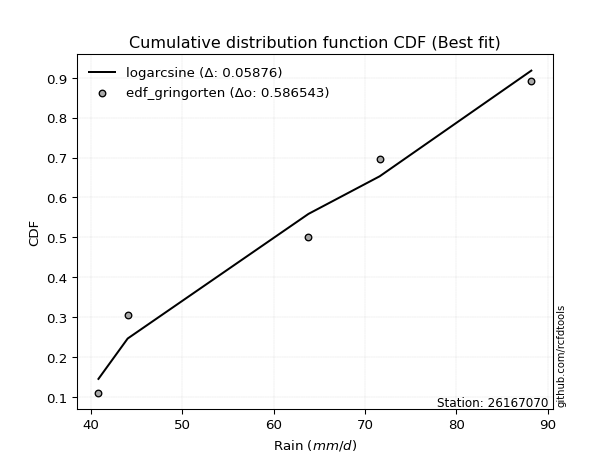</img>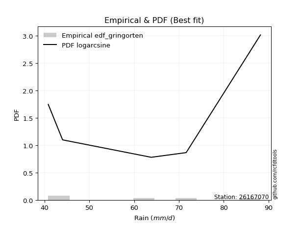</img>

</div>


### 9. EDF Filliben (1975)

The specific values of the constants (0.3175) (often denoted as $alpha$) and (0.365) are derived from a method proposed by James J. Filliben in a 1975 paper. This particular formula is the mean value of the $i$-th order statistic of the normal distribution and is considered a robust and effective plotting position formula for the normal probability plot correlation coefficient test for normality.

<div align="center">


$P=(m-0.3175)/(n+0.365)$


</div>


**9.1. Empirical values**

<div align="center">

|                | 0                   | 1                  | 2            | 3                  | 4                  |
|:---------------|:--------------------|:-------------------|:-------------|:-------------------|:-------------------|
| date           | 2022                | 2019               | 2025         | 2020               | 2021               |
| x              | 40.8                | 44.0               | 63.8         | 71.6               | 88.2               |
| m              | 1                   | 2                  | 3            | 4                  | 5                  |
| empirical_dist | edf_filliben        | edf_filliben       | edf_filliben | edf_filliben       | edf_filliben       |
| empirical      | 0.12721342031686858 | 0.3136067101584343 | 0.5          | 0.6863932898415657 | 0.8727865796831314 |
| empirical_tr   | 1.1457554725040042  | 1.456890699253225  | 2.0          | 3.188707280832095  | 7.860805860805863  |

</div>


**9.2. Kolmogorov-Smirnov fit test (sorted by Δ)**


<div align="center">

|                | 0                   | 1                   | 2                   | 3                   | 4                   | 5                   | 6                  | 7                   | 8                   | 9                   | 10                  | 11                  | 12                  | 13                  | 14                  | 15                  | 16                  | 17                  | 18                  | 19                  | 20                  | 21                  | 22                 | 23                 | 24                  | 25                  | 26                 | 27                  | 28                  | 29                  | 30                 | 31                  | 32                 | 33                 | 34                  | 35                  | 36                  | 37                 | 38                  | 39                  | 40                  | 41                  | 42                 | 43                  | 44                  | 45                  | 46                  | 47                  | 48                  | 49                  | 50                  | 51                  | 52                  | 53                  | 54                  | 55                  | 56                  | 57                  | 58                  | 59                  | 60                  | 61                  | 62                  | 63                  | 64                  | 65                  | 66                  | 67                  | 68                  | 69                  | 70                  | 71                  | 72                  | 73                 | 74                  | 75                 | 76                 | 77                  | 78                 | 79                  | 80                 | 81                  | 82                  | 83                  | 84                  | 85                  | 86                  | 87                  | 88                 | 89                  | 90                  | 91                  | 92                 | 93                  | 94                  | 95                  | 96                  | 97                 | 98                 | 99                 | 100                 | 101                 | 102                 | 103                 | 104                 | 105                 | 106                 | 107                 | 108                 | 109                | 110                 | 111                 | 112                 | 113                 | 114                | 115                 | 116                 | 117                 | 118                 | 119                 | 120                 | 121                 | 122                 | 123                | 124                 | 125                 | 126                 | 127                 | 128                 | 129                 | 130                | 131                 | 132                 | 133                 | 134                 | 135                 | 136                 | 137                | 138                | 139                 | 140                | 141                 | 142                | 143                 | 144                | 145                 | 146                | 147                | 148                 | 149                | 150                 | 151                 | 152                | 153                | 154                | 155                | 156                | 157                | 158                | 159                |
|:---------------|:--------------------|:--------------------|:--------------------|:--------------------|:--------------------|:--------------------|:-------------------|:--------------------|:--------------------|:--------------------|:--------------------|:--------------------|:--------------------|:--------------------|:--------------------|:--------------------|:--------------------|:--------------------|:--------------------|:--------------------|:--------------------|:--------------------|:-------------------|:-------------------|:--------------------|:--------------------|:-------------------|:--------------------|:--------------------|:--------------------|:-------------------|:--------------------|:-------------------|:-------------------|:--------------------|:--------------------|:--------------------|:-------------------|:--------------------|:--------------------|:--------------------|:--------------------|:-------------------|:--------------------|:--------------------|:--------------------|:--------------------|:--------------------|:--------------------|:--------------------|:--------------------|:--------------------|:--------------------|:--------------------|:--------------------|:--------------------|:--------------------|:--------------------|:--------------------|:--------------------|:--------------------|:--------------------|:--------------------|:--------------------|:--------------------|:--------------------|:--------------------|:--------------------|:--------------------|:--------------------|:--------------------|:--------------------|:--------------------|:-------------------|:--------------------|:-------------------|:-------------------|:--------------------|:-------------------|:--------------------|:-------------------|:--------------------|:--------------------|:--------------------|:--------------------|:--------------------|:--------------------|:--------------------|:-------------------|:--------------------|:--------------------|:--------------------|:-------------------|:--------------------|:--------------------|:--------------------|:--------------------|:-------------------|:-------------------|:-------------------|:--------------------|:--------------------|:--------------------|:--------------------|:--------------------|:--------------------|:--------------------|:--------------------|:--------------------|:-------------------|:--------------------|:--------------------|:--------------------|:--------------------|:-------------------|:--------------------|:--------------------|:--------------------|:--------------------|:--------------------|:--------------------|:--------------------|:--------------------|:-------------------|:--------------------|:--------------------|:--------------------|:--------------------|:--------------------|:--------------------|:-------------------|:--------------------|:--------------------|:--------------------|:--------------------|:--------------------|:--------------------|:-------------------|:-------------------|:--------------------|:-------------------|:--------------------|:-------------------|:--------------------|:-------------------|:--------------------|:-------------------|:-------------------|:--------------------|:-------------------|:--------------------|:--------------------|:-------------------|:-------------------|:-------------------|:-------------------|:-------------------|:-------------------|:-------------------|:-------------------|
| station        | 26167070            | 26167070            | 26167070            | 26167070            | 26167070            | 26167070            | 26167070           | 26167070            | 26167070            | 26167070            | 26167070            | 26167070            | 26167070            | 26167070            | 26167070            | 26167070            | 26167070            | 26167070            | 26167070            | 26167070            | 26167070            | 26167070            | 26167070           | 26167070           | 26167070            | 26167070            | 26167070           | 26167070            | 26167070            | 26167070            | 26167070           | 26167070            | 26167070           | 26167070           | 26167070            | 26167070            | 26167070            | 26167070           | 26167070            | 26167070            | 26167070            | 26167070            | 26167070           | 26167070            | 26167070            | 26167070            | 26167070            | 26167070            | 26167070            | 26167070            | 26167070            | 26167070            | 26167070            | 26167070            | 26167070            | 26167070            | 26167070            | 26167070            | 26167070            | 26167070            | 26167070            | 26167070            | 26167070            | 26167070            | 26167070            | 26167070            | 26167070            | 26167070            | 26167070            | 26167070            | 26167070            | 26167070            | 26167070            | 26167070           | 26167070            | 26167070           | 26167070           | 26167070            | 26167070           | 26167070            | 26167070           | 26167070            | 26167070            | 26167070            | 26167070            | 26167070            | 26167070            | 26167070            | 26167070           | 26167070            | 26167070            | 26167070            | 26167070           | 26167070            | 26167070            | 26167070            | 26167070            | 26167070           | 26167070           | 26167070           | 26167070            | 26167070            | 26167070            | 26167070            | 26167070            | 26167070            | 26167070            | 26167070            | 26167070            | 26167070           | 26167070            | 26167070            | 26167070            | 26167070            | 26167070           | 26167070            | 26167070            | 26167070            | 26167070            | 26167070            | 26167070            | 26167070            | 26167070            | 26167070           | 26167070            | 26167070            | 26167070            | 26167070            | 26167070            | 26167070            | 26167070           | 26167070            | 26167070            | 26167070            | 26167070            | 26167070            | 26167070            | 26167070           | 26167070           | 26167070            | 26167070           | 26167070            | 26167070           | 26167070            | 26167070           | 26167070            | 26167070           | 26167070           | 26167070            | 26167070           | 26167070            | 26167070            | 26167070           | 26167070           | 26167070           | 26167070           | 26167070           | 26167070           | 26167070           | 26167070           |
| empirical_dist | edf_filliben        | edf_filliben        | edf_filliben        | edf_filliben        | edf_filliben        | edf_filliben        | edf_filliben       | edf_filliben        | edf_filliben        | edf_filliben        | edf_filliben        | edf_filliben        | edf_filliben        | edf_filliben        | edf_filliben        | edf_filliben        | edf_filliben        | edf_filliben        | edf_filliben        | edf_filliben        | edf_filliben        | edf_filliben        | edf_filliben       | edf_filliben       | edf_filliben        | edf_filliben        | edf_filliben       | edf_filliben        | edf_filliben        | edf_filliben        | edf_filliben       | edf_filliben        | edf_filliben       | edf_filliben       | edf_filliben        | edf_filliben        | edf_filliben        | edf_filliben       | edf_filliben        | edf_filliben        | edf_filliben        | edf_filliben        | edf_filliben       | edf_filliben        | edf_filliben        | edf_filliben        | edf_filliben        | edf_filliben        | edf_filliben        | edf_filliben        | edf_filliben        | edf_filliben        | edf_filliben        | edf_filliben        | edf_filliben        | edf_filliben        | edf_filliben        | edf_filliben        | edf_filliben        | edf_filliben        | edf_filliben        | edf_filliben        | edf_filliben        | edf_filliben        | edf_filliben        | edf_filliben        | edf_filliben        | edf_filliben        | edf_filliben        | edf_filliben        | edf_filliben        | edf_filliben        | edf_filliben        | edf_filliben       | edf_filliben        | edf_filliben       | edf_filliben       | edf_filliben        | edf_filliben       | edf_filliben        | edf_filliben       | edf_filliben        | edf_filliben        | edf_filliben        | edf_filliben        | edf_filliben        | edf_filliben        | edf_filliben        | edf_filliben       | edf_filliben        | edf_filliben        | edf_filliben        | edf_filliben       | edf_filliben        | edf_filliben        | edf_filliben        | edf_filliben        | edf_filliben       | edf_filliben       | edf_filliben       | edf_filliben        | edf_filliben        | edf_filliben        | edf_filliben        | edf_filliben        | edf_filliben        | edf_filliben        | edf_filliben        | edf_filliben        | edf_filliben       | edf_filliben        | edf_filliben        | edf_filliben        | edf_filliben        | edf_filliben       | edf_filliben        | edf_filliben        | edf_filliben        | edf_filliben        | edf_filliben        | edf_filliben        | edf_filliben        | edf_filliben        | edf_filliben       | edf_filliben        | edf_filliben        | edf_filliben        | edf_filliben        | edf_filliben        | edf_filliben        | edf_filliben       | edf_filliben        | edf_filliben        | edf_filliben        | edf_filliben        | edf_filliben        | edf_filliben        | edf_filliben       | edf_filliben       | edf_filliben        | edf_filliben       | edf_filliben        | edf_filliben       | edf_filliben        | edf_filliben       | edf_filliben        | edf_filliben       | edf_filliben       | edf_filliben        | edf_filliben       | edf_filliben        | edf_filliben        | edf_filliben       | edf_filliben       | edf_filliben       | edf_filliben       | edf_filliben       | edf_filliben       | edf_filliben       | edf_filliben       |
| p_dist         | logarcsine          | logbetaprime        | logdweibull         | ksone               | dweibull            | logdgamma           | logksone           | semicircular        | logsemicircular     | dgamma              | logrdist            | weibull_min         | arcsine             | logwrapcauchy       | anglit              | logtrapezoid        | loganglit           | loggenextreme       | wrapcauchy          | logbeta             | foldnorm            | logfoldnorm         | rayleigh           | maxwell            | burr                | lograyleigh         | genpareto          | logalpha            | logburr12           | logmaxwell          | nct                | t                   | loginvweibull      | genlogistic        | crystalball         | norm                | exponnorm           | pearson3           | loggenlogistic      | invgamma            | logjohnsonsu        | betaprime           | loginvgamma        | logf                | logerlang           | f                   | loggamma            | loggamma            | logpearson3         | logt                | logcrystalball      | lognorm             | logexponnorm        | logskewnorm         | logloggamma         | lognct              | gamma               | alpha               | logncf              | kstwobign           | logmielke           | halfnorm            | logweibull_max      | logburr             | lognakagami         | loghalfnorm         | logkstwobign        | erlang              | logcosine           | gumbel_l            | cosine              | loggumbel_l         | genexpon            | logbradford        | logistic            | beta               | logrice            | loggenexpon         | loglogistic        | loglevy_l           | lomax              | rice                | gumbel_r            | hypsecant           | logargus            | loghypsecant        | loggumbel_r         | gennorm             | logtriang          | argus               | logtruncexpon       | loggompertz         | triang             | laplace             | loglaplace          | loglaplace          | burr12              | truncnorm          | loglomax           | levy_l             | logloglaplace       | loggausshyper       | halfgennorm         | logexponpow         | logkappa4           | moyal               | halflogistic        | gompertz            | gausshyper          | loggennorm         | logtukeylambda      | logmoyal            | loghalflogistic     | truncexpon          | loginvgauss        | loguniform          | logkappa3           | bradford            | kappa4              | skewnorm            | logjohnsonsb        | kappa3              | invgauss            | logweibull_min     | tukeylambda         | logvonmises_line    | uniform             | vonmises_line       | truncweibull_min    | loggenhalflogistic  | genhalflogistic    | exponpow            | logtruncnorm        | trapezoid           | gengamma            | genextreme          | exponweib           | wald               | logwald            | nakagami            | logfatiguelife     | logtruncweibull_min | fatiguelife        | ncf                 | logtruncpareto     | powerlaw            | logexponweib       | logpowerlaw        | invweibull          | loggenpareto       | truncpareto         | loggengamma         | rdist              | weibull_max        | johnsonsu          | johnsonsb          | loghalfgennorm     | logvonmises        | vonmises           | mielke             |
| delta          | 0.06725644645384082 | 0.07720792782864905 | 0.10051023265177483 | 0.10303690907473803 | 0.10323719735697312 | 0.10429413382659525 | 0.105572741234368  | 0.11882631930480952 | 0.12124217410258431 | 0.12523353921503835 | 0.12721341882915801 | 0.12721341975015665 | 0.12721342031686855 | 0.12721342031686858 | 0.13011959723669195 | 0.13018517833988524 | 0.13243843294989638 | 0.13488860029788852 | 0.13637457818886567 | 0.13932660778138353 | 0.14414476936033838 | 0.14596756702110147 | 0.1506455931484639 | 0.1516949234328805 | 0.15297818291189968 | 0.15350986761235866 | 0.1537557003416031 | 0.15408739276170585 | 0.15426131824574205 | 0.15430363071809494 | 0.1544041673355402 | 0.15541635420297265 | 0.1554518660777453 | 0.1554979958488425 | 0.15558343832393562 | 0.15558353186482976 | 0.15562276188830665 | 0.1559834209841016 | 0.15600641744924593 | 0.15638059867638057 | 0.15687810471165187 | 0.15714156167455684 | 0.1571606018521853 | 0.15735954746203662 | 0.15745488070138547 | 0.15759442357349768 | 0.15761344857593815 | 0.15761344857593815 | 0.15767376462200391 | 0.15769336390540978 | 0.15769419166538162 | 0.15769419952446656 | 0.15769496994522905 | 0.15769566107014502 | 0.15769903596940085 | 0.15797700653964375 | 0.15831104415628097 | 0.15848459404168302 | 0.15865671627152883 | 0.15874682439683913 | 0.15899279159987423 | 0.16017602421753105 | 0.16080798620652403 | 0.16142149768811287 | 0.16404490161120866 | 0.16432481986815373 | 0.16534079163175297 | 0.16653935561389419 | 0.16823940475342802 | 0.16986118422794397 | 0.17133305138434113 | 0.17135115874210227 | 0.17148511363774396 | 0.1723551099606792 | 0.17399798575305733 | 0.1740541191677674 | 0.1746174945166124 | 0.17466289634821275 | 0.1759008733853001 | 0.17789290504330432 | 0.1780213786144222 | 0.18191476824824518 | 0.18244523672141919 | 0.18364505305483506 | 0.18399718585831765 | 0.18537791203232448 | 0.18542946460997534 | 0.18639328984156572 | 0.1876826049274123 | 0.18798574877583046 | 0.19167374797268633 | 0.19199559268119742 | 0.1923072021693485 | 0.19249716215284302 | 0.19399239794433132 | 0.19399239794433132 | 0.19769037483655616 | 0.2002321340675116 | 0.2002633786857091 | 0.2013854258363957 | 0.20265024340310112 | 0.20410376749241088 | 0.20418382644443944 | 0.20471376393774798 | 0.20478897817884067 | 0.20698437735976924 | 0.20721303614811976 | 0.20892825971886436 | 0.20934476724044285 | 0.2099417003179555 | 0.21036097959974404 | 0.21037478360465534 | 0.21223352238476534 | 0.21355295411877892 | 0.213777198670014  | 0.21566259872804838 | 0.21577003826013313 | 0.21839792289542204 | 0.21963790960363017 | 0.22039903270961303 | 0.22200305465955178 | 0.22755565323373655 | 0.22783133159075797 | 0.230767292253221  | 0.23890541669422566 | 0.24567935234480395 | 0.24609616163522746 | 0.24614910494887826 | 0.25715483861346855 | 0.25859802787168346 | 0.266426510971437  | 0.26696352932246015 | 0.29480620527260515 | 0.29598801983300044 | 0.30100581346803246 | 0.30429094760808395 | 0.30781832331411735 | 0.3136067101584343 | 0.3136067101584343 | 0.31422590961087105 | 0.3208801019183    | 0.3284602065336072  | 0.329135709973555  | 0.33600771898611426 | 0.4001258253284028 | 0.41416084428527344 | 0.4255216723003336 | 0.4312935580148969 | 0.43570348468835624 | 0.4377775674203134 | 0.43823271926557605 | 0.46271308428928326 | 0.4999999977776115 | 0.5105294417480412 | 0.5427115367483408 | 0.5970371398975436 | 0.6863932898415657 | 1.102681950995402  | 13.372312501952468 | nan                |
| deltao         | 0.5865427407550001  | 0.5865427407550001  | 0.5865427407550001  | 0.5865427407550001  | 0.5865427407550001  | 0.5865427407550001  | 0.5865427407550001 | 0.5865427407550001  | 0.5865427407550001  | 0.5865427407550001  | 0.5865427407550001  | 0.5865427407550001  | 0.5865427407550001  | 0.5865427407550001  | 0.5865427407550001  | 0.5865427407550001  | 0.5865427407550001  | 0.5865427407550001  | 0.5865427407550001  | 0.5865427407550001  | 0.5865427407550001  | 0.5865427407550001  | 0.5865427407550001 | 0.5865427407550001 | 0.5865427407550001  | 0.5865427407550001  | 0.5865427407550001 | 0.5865427407550001  | 0.5865427407550001  | 0.5865427407550001  | 0.5865427407550001 | 0.5865427407550001  | 0.5865427407550001 | 0.5865427407550001 | 0.5865427407550001  | 0.5865427407550001  | 0.5865427407550001  | 0.5865427407550001 | 0.5865427407550001  | 0.5865427407550001  | 0.5865427407550001  | 0.5865427407550001  | 0.5865427407550001 | 0.5865427407550001  | 0.5865427407550001  | 0.5865427407550001  | 0.5865427407550001  | 0.5865427407550001  | 0.5865427407550001  | 0.5865427407550001  | 0.5865427407550001  | 0.5865427407550001  | 0.5865427407550001  | 0.5865427407550001  | 0.5865427407550001  | 0.5865427407550001  | 0.5865427407550001  | 0.5865427407550001  | 0.5865427407550001  | 0.5865427407550001  | 0.5865427407550001  | 0.5865427407550001  | 0.5865427407550001  | 0.5865427407550001  | 0.5865427407550001  | 0.5865427407550001  | 0.5865427407550001  | 0.5865427407550001  | 0.5865427407550001  | 0.5865427407550001  | 0.5865427407550001  | 0.5865427407550001  | 0.5865427407550001  | 0.5865427407550001 | 0.5865427407550001  | 0.5865427407550001 | 0.5865427407550001 | 0.5865427407550001  | 0.5865427407550001 | 0.5865427407550001  | 0.5865427407550001 | 0.5865427407550001  | 0.5865427407550001  | 0.5865427407550001  | 0.5865427407550001  | 0.5865427407550001  | 0.5865427407550001  | 0.5865427407550001  | 0.5865427407550001 | 0.5865427407550001  | 0.5865427407550001  | 0.5865427407550001  | 0.5865427407550001 | 0.5865427407550001  | 0.5865427407550001  | 0.5865427407550001  | 0.5865427407550001  | 0.5865427407550001 | 0.5865427407550001 | 0.5865427407550001 | 0.5865427407550001  | 0.5865427407550001  | 0.5865427407550001  | 0.5865427407550001  | 0.5865427407550001  | 0.5865427407550001  | 0.5865427407550001  | 0.5865427407550001  | 0.5865427407550001  | 0.5865427407550001 | 0.5865427407550001  | 0.5865427407550001  | 0.5865427407550001  | 0.5865427407550001  | 0.5865427407550001 | 0.5865427407550001  | 0.5865427407550001  | 0.5865427407550001  | 0.5865427407550001  | 0.5865427407550001  | 0.5865427407550001  | 0.5865427407550001  | 0.5865427407550001  | 0.5865427407550001 | 0.5865427407550001  | 0.5865427407550001  | 0.5865427407550001  | 0.5865427407550001  | 0.5865427407550001  | 0.5865427407550001  | 0.5865427407550001 | 0.5865427407550001  | 0.5865427407550001  | 0.5865427407550001  | 0.5865427407550001  | 0.5865427407550001  | 0.5865427407550001  | 0.5865427407550001 | 0.5865427407550001 | 0.5865427407550001  | 0.5865427407550001 | 0.5865427407550001  | 0.5865427407550001 | 0.5865427407550001  | 0.5865427407550001 | 0.5865427407550001  | 0.5865427407550001 | 0.5865427407550001 | 0.5865427407550001  | 0.5865427407550001 | 0.5865427407550001  | 0.5865427407550001  | 0.5865427407550001 | 0.5865427407550001 | 0.5865427407550001 | 0.5865427407550001 | 0.5865427407550001 | 0.5865427407550001 | 0.5865427407550001 | 0.5865427407550001 |
| eval           | Δo > Δ              | Δo > Δ              | Δo > Δ              | Δo > Δ              | Δo > Δ              | Δo > Δ              | Δo > Δ             | Δo > Δ              | Δo > Δ              | Δo > Δ              | Δo > Δ              | Δo > Δ              | Δo > Δ              | Δo > Δ              | Δo > Δ              | Δo > Δ              | Δo > Δ              | Δo > Δ              | Δo > Δ              | Δo > Δ              | Δo > Δ              | Δo > Δ              | Δo > Δ             | Δo > Δ             | Δo > Δ              | Δo > Δ              | Δo > Δ             | Δo > Δ              | Δo > Δ              | Δo > Δ              | Δo > Δ             | Δo > Δ              | Δo > Δ             | Δo > Δ             | Δo > Δ              | Δo > Δ              | Δo > Δ              | Δo > Δ             | Δo > Δ              | Δo > Δ              | Δo > Δ              | Δo > Δ              | Δo > Δ             | Δo > Δ              | Δo > Δ              | Δo > Δ              | Δo > Δ              | Δo > Δ              | Δo > Δ              | Δo > Δ              | Δo > Δ              | Δo > Δ              | Δo > Δ              | Δo > Δ              | Δo > Δ              | Δo > Δ              | Δo > Δ              | Δo > Δ              | Δo > Δ              | Δo > Δ              | Δo > Δ              | Δo > Δ              | Δo > Δ              | Δo > Δ              | Δo > Δ              | Δo > Δ              | Δo > Δ              | Δo > Δ              | Δo > Δ              | Δo > Δ              | Δo > Δ              | Δo > Δ              | Δo > Δ              | Δo > Δ             | Δo > Δ              | Δo > Δ             | Δo > Δ             | Δo > Δ              | Δo > Δ             | Δo > Δ              | Δo > Δ             | Δo > Δ              | Δo > Δ              | Δo > Δ              | Δo > Δ              | Δo > Δ              | Δo > Δ              | Δo > Δ              | Δo > Δ             | Δo > Δ              | Δo > Δ              | Δo > Δ              | Δo > Δ             | Δo > Δ              | Δo > Δ              | Δo > Δ              | Δo > Δ              | Δo > Δ             | Δo > Δ             | Δo > Δ             | Δo > Δ              | Δo > Δ              | Δo > Δ              | Δo > Δ              | Δo > Δ              | Δo > Δ              | Δo > Δ              | Δo > Δ              | Δo > Δ              | Δo > Δ             | Δo > Δ              | Δo > Δ              | Δo > Δ              | Δo > Δ              | Δo > Δ             | Δo > Δ              | Δo > Δ              | Δo > Δ              | Δo > Δ              | Δo > Δ              | Δo > Δ              | Δo > Δ              | Δo > Δ              | Δo > Δ             | Δo > Δ              | Δo > Δ              | Δo > Δ              | Δo > Δ              | Δo > Δ              | Δo > Δ              | Δo > Δ             | Δo > Δ              | Δo > Δ              | Δo > Δ              | Δo > Δ              | Δo > Δ              | Δo > Δ              | Δo > Δ             | Δo > Δ             | Δo > Δ              | Δo > Δ             | Δo > Δ              | Δo > Δ             | Δo > Δ              | Δo > Δ             | Δo > Δ              | Δo > Δ             | Δo > Δ             | Δo > Δ              | Δo > Δ             | Δo > Δ              | Δo > Δ              | Δo > Δ             | Δo > Δ             | Δo > Δ             | Δo <= Δ            | Δo <= Δ            | Δo <= Δ            | Δo <= Δ            | Δo <= Δ            |
| fit            | 1                   | 1                   | 1                   | 1                   | 1                   | 1                   | 1                  | 1                   | 1                   | 1                   | 1                   | 1                   | 1                   | 1                   | 1                   | 1                   | 1                   | 1                   | 1                   | 1                   | 1                   | 1                   | 1                  | 1                  | 1                   | 1                   | 1                  | 1                   | 1                   | 1                   | 1                  | 1                   | 1                  | 1                  | 1                   | 1                   | 1                   | 1                  | 1                   | 1                   | 1                   | 1                   | 1                  | 1                   | 1                   | 1                   | 1                   | 1                   | 1                   | 1                   | 1                   | 1                   | 1                   | 1                   | 1                   | 1                   | 1                   | 1                   | 1                   | 1                   | 1                   | 1                   | 1                   | 1                   | 1                   | 1                   | 1                   | 1                   | 1                   | 1                   | 1                   | 1                   | 1                   | 1                  | 1                   | 1                  | 1                  | 1                   | 1                  | 1                   | 1                  | 1                   | 1                   | 1                   | 1                   | 1                   | 1                   | 1                   | 1                  | 1                   | 1                   | 1                   | 1                  | 1                   | 1                   | 1                   | 1                   | 1                  | 1                  | 1                  | 1                   | 1                   | 1                   | 1                   | 1                   | 1                   | 1                   | 1                   | 1                   | 1                  | 1                   | 1                   | 1                   | 1                   | 1                  | 1                   | 1                   | 1                   | 1                   | 1                   | 1                   | 1                   | 1                   | 1                  | 1                   | 1                   | 1                   | 1                   | 1                   | 1                   | 1                  | 1                   | 1                   | 1                   | 1                   | 1                   | 1                   | 1                  | 1                  | 1                   | 1                  | 1                   | 1                  | 1                   | 1                  | 1                   | 1                  | 1                  | 1                   | 1                  | 1                   | 1                   | 1                  | 1                  | 1                  | 0                  | 0                  | 0                  | 0                  | 0                  |
| n              | 5                   | 5                   | 5                   | 5                   | 5                   | 5                   | 5                  | 5                   | 5                   | 5                   | 5                   | 5                   | 5                   | 5                   | 5                   | 5                   | 5                   | 5                   | 5                   | 5                   | 5                   | 5                   | 5                  | 5                  | 5                   | 5                   | 5                  | 5                   | 5                   | 5                   | 5                  | 5                   | 5                  | 5                  | 5                   | 5                   | 5                   | 5                  | 5                   | 5                   | 5                   | 5                   | 5                  | 5                   | 5                   | 5                   | 5                   | 5                   | 5                   | 5                   | 5                   | 5                   | 5                   | 5                   | 5                   | 5                   | 5                   | 5                   | 5                   | 5                   | 5                   | 5                   | 5                   | 5                   | 5                   | 5                   | 5                   | 5                   | 5                   | 5                   | 5                   | 5                   | 5                   | 5                  | 5                   | 5                  | 5                  | 5                   | 5                  | 5                   | 5                  | 5                   | 5                   | 5                   | 5                   | 5                   | 5                   | 5                   | 5                  | 5                   | 5                   | 5                   | 5                  | 5                   | 5                   | 5                   | 5                   | 5                  | 5                  | 5                  | 5                   | 5                   | 5                   | 5                   | 5                   | 5                   | 5                   | 5                   | 5                   | 5                  | 5                   | 5                   | 5                   | 5                   | 5                  | 5                   | 5                   | 5                   | 5                   | 5                   | 5                   | 5                   | 5                   | 5                  | 5                   | 5                   | 5                   | 5                   | 5                   | 5                   | 5                  | 5                   | 5                   | 5                   | 5                   | 5                   | 5                   | 5                  | 5                  | 5                   | 5                  | 5                   | 5                  | 5                   | 5                  | 5                   | 5                  | 5                  | 5                   | 5                  | 5                   | 5                   | 5                  | 5                  | 5                  | 5                  | 5                  | 5                  | 5                  | 5                  |
| best_fit       | 1                   | 0                   | 0                   | 0                   | 0                   | 0                   | 0                  | 0                   | 0                   | 0                   | 0                   | 0                   | 0                   | 0                   | 0                   | 0                   | 0                   | 0                   | 0                   | 0                   | 0                   | 0                   | 0                  | 0                  | 0                   | 0                   | 0                  | 0                   | 0                   | 0                   | 0                  | 0                   | 0                  | 0                  | 0                   | 0                   | 0                   | 0                  | 0                   | 0                   | 0                   | 0                   | 0                  | 0                   | 0                   | 0                   | 0                   | 0                   | 0                   | 0                   | 0                   | 0                   | 0                   | 0                   | 0                   | 0                   | 0                   | 0                   | 0                   | 0                   | 0                   | 0                   | 0                   | 0                   | 0                   | 0                   | 0                   | 0                   | 0                   | 0                   | 0                   | 0                   | 0                   | 0                  | 0                   | 0                  | 0                  | 0                   | 0                  | 0                   | 0                  | 0                   | 0                   | 0                   | 0                   | 0                   | 0                   | 0                   | 0                  | 0                   | 0                   | 0                   | 0                  | 0                   | 0                   | 0                   | 0                   | 0                  | 0                  | 0                  | 0                   | 0                   | 0                   | 0                   | 0                   | 0                   | 0                   | 0                   | 0                   | 0                  | 0                   | 0                   | 0                   | 0                   | 0                  | 0                   | 0                   | 0                   | 0                   | 0                   | 0                   | 0                   | 0                   | 0                  | 0                   | 0                   | 0                   | 0                   | 0                   | 0                   | 0                  | 0                   | 0                   | 0                   | 0                   | 0                   | 0                   | 0                  | 0                  | 0                   | 0                  | 0                   | 0                  | 0                   | 0                  | 0                   | 0                  | 0                  | 0                   | 0                  | 0                   | 0                   | 0                  | 0                  | 0                  | 0                  | 0                  | 0                  | 0                  | 0                  |
| best_fit_sort  | 1                   | 2                   | 3                   | 4                   | 5                   | 6                   | 7                  | 8                   | 9                   | 10                  | 11                  | 12                  | 13                  | 14                  | 15                  | 16                  | 17                  | 18                  | 19                  | 20                  | 21                  | 22                  | 23                 | 24                 | 25                  | 26                  | 27                 | 28                  | 29                  | 30                  | 31                 | 32                  | 33                 | 34                 | 35                  | 36                  | 37                  | 38                 | 39                  | 40                  | 41                  | 42                  | 43                 | 44                  | 45                  | 46                  | 47                  | 48                  | 49                  | 50                  | 51                  | 52                  | 53                  | 54                  | 55                  | 56                  | 57                  | 58                  | 59                  | 60                  | 61                  | 62                  | 63                  | 64                  | 65                  | 66                  | 67                  | 68                  | 69                  | 70                  | 71                  | 72                  | 73                  | 74                 | 75                  | 76                 | 77                 | 78                  | 79                 | 80                  | 81                 | 82                  | 83                  | 84                  | 85                  | 86                  | 87                  | 88                  | 89                 | 90                  | 91                  | 92                  | 93                 | 94                  | 95                  | 96                  | 97                  | 98                 | 99                 | 100                | 101                 | 102                 | 103                 | 104                 | 105                 | 106                 | 107                 | 108                 | 109                 | 110                | 111                 | 112                 | 113                 | 114                 | 115                | 116                 | 117                 | 118                 | 119                 | 120                 | 121                 | 122                 | 123                 | 124                | 125                 | 126                 | 127                 | 128                 | 129                 | 130                 | 131                | 132                 | 133                 | 134                 | 135                 | 136                 | 137                 | 138                | 139                | 140                 | 141                | 142                 | 143                | 144                 | 145                | 146                 | 147                | 148                | 149                 | 150                | 151                 | 152                 | 153                | 154                | 155                | 156                | 157                | 158                | 159                | 160                |

</div>


**9.3. Best fit**

<div align="center">

|   id |   station | empirical_dist   | p_dist     |     delta |   deltao | eval   |   fit |   n |   best_fit |   best_fit_sort |
|-----:|----------:|:-----------------|:-----------|----------:|---------:|:-------|------:|----:|-----------:|----------------:|
|    0 |  26167070 | edf_filliben     | logarcsine | 0.0672564 | 0.586543 | Δo > Δ |     1 |   5 |          1 |               1 |

</div>


<div align="center">

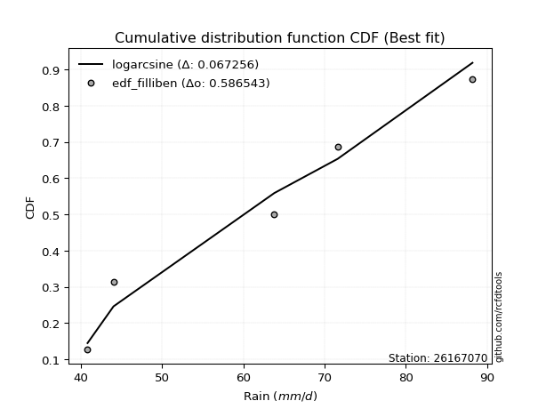</img></img>

</div>


### 10. EDF Jenkinson (1977)

The Jenkinson formula in hydrology is an empirical plotting position formula used to estimate the non-exceedance probability _(P)_ or return period _(T)_ of a given ordered observation within a sample. It is a widely used method in the frequency analysis of extreme events such as floods and rainfall, as it provides a distribution-free way to plot data. _a≈0.31_ and _b≈0.38_ are constants derived to approximate the median of the probability distribution for the given rank.

<div align="center">


$P=(m-a)/(n+b)$


</div>


**10.1. Empirical values**

<div align="center">

|                | 0                   | 1                  | 2             | 3                  | 4                  |
|:---------------|:--------------------|:-------------------|:--------------|:-------------------|:-------------------|
| date           | 2022                | 2019               | 2025          | 2020               | 2021               |
| x              | 40.8                | 44.0               | 63.8          | 71.6               | 88.2               |
| m              | 1                   | 2                  | 3             | 4                  | 5                  |
| empirical_dist | edf_jenkinson       | edf_jenkinson      | edf_jenkinson | edf_jenkinson      | edf_jenkinson      |
| empirical      | 0.12825278810408922 | 0.3141263940520446 | 0.5           | 0.6858736059479554 | 0.8717472118959109 |
| empirical_tr   | 1.1471215351812367  | 1.4579945799457996 | 2.0           | 3.183431952662722  | 7.797101449275368  |

</div>


**10.2. Kolmogorov-Smirnov fit test (sorted by Δ)**


<div align="center">

|                | 0                   | 1                   | 2                   | 3                   | 4                  | 5                   | 6                   | 7                   | 8                   | 9                   | 10                  | 11                 | 12                  | 13                  | 14                 | 15                 | 16                  | 17                  | 18                  | 19                 | 20                  | 21                  | 22                  | 23                  | 24                  | 25                  | 26                 | 27                 | 28                 | 29                 | 30                  | 31                 | 32                 | 33                  | 34                  | 35                  | 36                 | 37                 | 38                  | 39                  | 40                 | 41                  | 42                  | 43                  | 44                  | 45                  | 46                 | 47                 | 48                  | 49                  | 50                  | 51                 | 52                 | 53                  | 54                 | 55                 | 56                  | 57                  | 58                  | 59                  | 60                  | 61                 | 62                 | 63                  | 64                  | 65                  | 66                  | 67                  | 68                  | 69                 | 70                  | 71                  | 72                 | 73                  | 74                  | 75                  | 76                  | 77                  | 78                  | 79                 | 80                  | 81                  | 82                  | 83                 | 84                 | 85                  | 86                  | 87                  | 88                  | 89                 | 90                  | 91                  | 92                  | 93                  | 94                  | 95                  | 96                  | 97                 | 98                  | 99                  | 100                 | 101                 | 102                 | 103                 | 104                 | 105                 | 106                | 107                | 108                | 109                 | 110                 | 111                 | 112                 | 113                | 114                 | 115                 | 116                 | 117                 | 118                | 119                 | 120                 | 121                 | 122                | 123                 | 124                | 125                | 126                | 127                | 128                 | 129                | 130                 | 131                 | 132                 | 133                | 134                 | 135                 | 136                | 137                | 138                | 139                 | 140                | 141                 | 142                | 143                | 144                | 145                 | 146                 | 147                | 148                 | 149                | 150                 | 151                 | 152                | 153                | 154                | 155                | 156                | 157                | 158                | 159                |
|:---------------|:--------------------|:--------------------|:--------------------|:--------------------|:-------------------|:--------------------|:--------------------|:--------------------|:--------------------|:--------------------|:--------------------|:-------------------|:--------------------|:--------------------|:-------------------|:-------------------|:--------------------|:--------------------|:--------------------|:-------------------|:--------------------|:--------------------|:--------------------|:--------------------|:--------------------|:--------------------|:-------------------|:-------------------|:-------------------|:-------------------|:--------------------|:-------------------|:-------------------|:--------------------|:--------------------|:--------------------|:-------------------|:-------------------|:--------------------|:--------------------|:-------------------|:--------------------|:--------------------|:--------------------|:--------------------|:--------------------|:-------------------|:-------------------|:--------------------|:--------------------|:--------------------|:-------------------|:-------------------|:--------------------|:-------------------|:-------------------|:--------------------|:--------------------|:--------------------|:--------------------|:--------------------|:-------------------|:-------------------|:--------------------|:--------------------|:--------------------|:--------------------|:--------------------|:--------------------|:-------------------|:--------------------|:--------------------|:-------------------|:--------------------|:--------------------|:--------------------|:--------------------|:--------------------|:--------------------|:-------------------|:--------------------|:--------------------|:--------------------|:-------------------|:-------------------|:--------------------|:--------------------|:--------------------|:--------------------|:-------------------|:--------------------|:--------------------|:--------------------|:--------------------|:--------------------|:--------------------|:--------------------|:-------------------|:--------------------|:--------------------|:--------------------|:--------------------|:--------------------|:--------------------|:--------------------|:--------------------|:-------------------|:-------------------|:-------------------|:--------------------|:--------------------|:--------------------|:--------------------|:-------------------|:--------------------|:--------------------|:--------------------|:--------------------|:-------------------|:--------------------|:--------------------|:--------------------|:-------------------|:--------------------|:-------------------|:-------------------|:-------------------|:-------------------|:--------------------|:-------------------|:--------------------|:--------------------|:--------------------|:-------------------|:--------------------|:--------------------|:-------------------|:-------------------|:-------------------|:--------------------|:-------------------|:--------------------|:-------------------|:-------------------|:-------------------|:--------------------|:--------------------|:-------------------|:--------------------|:-------------------|:--------------------|:--------------------|:-------------------|:-------------------|:-------------------|:-------------------|:-------------------|:-------------------|:-------------------|:-------------------|
| station        | 26167070            | 26167070            | 26167070            | 26167070            | 26167070           | 26167070            | 26167070            | 26167070            | 26167070            | 26167070            | 26167070            | 26167070           | 26167070            | 26167070            | 26167070           | 26167070           | 26167070            | 26167070            | 26167070            | 26167070           | 26167070            | 26167070            | 26167070            | 26167070            | 26167070            | 26167070            | 26167070           | 26167070           | 26167070           | 26167070           | 26167070            | 26167070           | 26167070           | 26167070            | 26167070            | 26167070            | 26167070           | 26167070           | 26167070            | 26167070            | 26167070           | 26167070            | 26167070            | 26167070            | 26167070            | 26167070            | 26167070           | 26167070           | 26167070            | 26167070            | 26167070            | 26167070           | 26167070           | 26167070            | 26167070           | 26167070           | 26167070            | 26167070            | 26167070            | 26167070            | 26167070            | 26167070           | 26167070           | 26167070            | 26167070            | 26167070            | 26167070            | 26167070            | 26167070            | 26167070           | 26167070            | 26167070            | 26167070           | 26167070            | 26167070            | 26167070            | 26167070            | 26167070            | 26167070            | 26167070           | 26167070            | 26167070            | 26167070            | 26167070           | 26167070           | 26167070            | 26167070            | 26167070            | 26167070            | 26167070           | 26167070            | 26167070            | 26167070            | 26167070            | 26167070            | 26167070            | 26167070            | 26167070           | 26167070            | 26167070            | 26167070            | 26167070            | 26167070            | 26167070            | 26167070            | 26167070            | 26167070           | 26167070           | 26167070           | 26167070            | 26167070            | 26167070            | 26167070            | 26167070           | 26167070            | 26167070            | 26167070            | 26167070            | 26167070           | 26167070            | 26167070            | 26167070            | 26167070           | 26167070            | 26167070           | 26167070           | 26167070           | 26167070           | 26167070            | 26167070           | 26167070            | 26167070            | 26167070            | 26167070           | 26167070            | 26167070            | 26167070           | 26167070           | 26167070           | 26167070            | 26167070           | 26167070            | 26167070           | 26167070           | 26167070           | 26167070            | 26167070            | 26167070           | 26167070            | 26167070           | 26167070            | 26167070            | 26167070           | 26167070           | 26167070           | 26167070           | 26167070           | 26167070           | 26167070           | 26167070           |
| empirical_dist | edf_jenkinson       | edf_jenkinson       | edf_jenkinson       | edf_jenkinson       | edf_jenkinson      | edf_jenkinson       | edf_jenkinson       | edf_jenkinson       | edf_jenkinson       | edf_jenkinson       | edf_jenkinson       | edf_jenkinson      | edf_jenkinson       | edf_jenkinson       | edf_jenkinson      | edf_jenkinson      | edf_jenkinson       | edf_jenkinson       | edf_jenkinson       | edf_jenkinson      | edf_jenkinson       | edf_jenkinson       | edf_jenkinson       | edf_jenkinson       | edf_jenkinson       | edf_jenkinson       | edf_jenkinson      | edf_jenkinson      | edf_jenkinson      | edf_jenkinson      | edf_jenkinson       | edf_jenkinson      | edf_jenkinson      | edf_jenkinson       | edf_jenkinson       | edf_jenkinson       | edf_jenkinson      | edf_jenkinson      | edf_jenkinson       | edf_jenkinson       | edf_jenkinson      | edf_jenkinson       | edf_jenkinson       | edf_jenkinson       | edf_jenkinson       | edf_jenkinson       | edf_jenkinson      | edf_jenkinson      | edf_jenkinson       | edf_jenkinson       | edf_jenkinson       | edf_jenkinson      | edf_jenkinson      | edf_jenkinson       | edf_jenkinson      | edf_jenkinson      | edf_jenkinson       | edf_jenkinson       | edf_jenkinson       | edf_jenkinson       | edf_jenkinson       | edf_jenkinson      | edf_jenkinson      | edf_jenkinson       | edf_jenkinson       | edf_jenkinson       | edf_jenkinson       | edf_jenkinson       | edf_jenkinson       | edf_jenkinson      | edf_jenkinson       | edf_jenkinson       | edf_jenkinson      | edf_jenkinson       | edf_jenkinson       | edf_jenkinson       | edf_jenkinson       | edf_jenkinson       | edf_jenkinson       | edf_jenkinson      | edf_jenkinson       | edf_jenkinson       | edf_jenkinson       | edf_jenkinson      | edf_jenkinson      | edf_jenkinson       | edf_jenkinson       | edf_jenkinson       | edf_jenkinson       | edf_jenkinson      | edf_jenkinson       | edf_jenkinson       | edf_jenkinson       | edf_jenkinson       | edf_jenkinson       | edf_jenkinson       | edf_jenkinson       | edf_jenkinson      | edf_jenkinson       | edf_jenkinson       | edf_jenkinson       | edf_jenkinson       | edf_jenkinson       | edf_jenkinson       | edf_jenkinson       | edf_jenkinson       | edf_jenkinson      | edf_jenkinson      | edf_jenkinson      | edf_jenkinson       | edf_jenkinson       | edf_jenkinson       | edf_jenkinson       | edf_jenkinson      | edf_jenkinson       | edf_jenkinson       | edf_jenkinson       | edf_jenkinson       | edf_jenkinson      | edf_jenkinson       | edf_jenkinson       | edf_jenkinson       | edf_jenkinson      | edf_jenkinson       | edf_jenkinson      | edf_jenkinson      | edf_jenkinson      | edf_jenkinson      | edf_jenkinson       | edf_jenkinson      | edf_jenkinson       | edf_jenkinson       | edf_jenkinson       | edf_jenkinson      | edf_jenkinson       | edf_jenkinson       | edf_jenkinson      | edf_jenkinson      | edf_jenkinson      | edf_jenkinson       | edf_jenkinson      | edf_jenkinson       | edf_jenkinson      | edf_jenkinson      | edf_jenkinson      | edf_jenkinson       | edf_jenkinson       | edf_jenkinson      | edf_jenkinson       | edf_jenkinson      | edf_jenkinson       | edf_jenkinson       | edf_jenkinson      | edf_jenkinson      | edf_jenkinson      | edf_jenkinson      | edf_jenkinson      | edf_jenkinson      | edf_jenkinson      | edf_jenkinson      |
| p_dist         | logarcsine          | logbetaprime        | logdweibull         | ksone               | dweibull           | logdgamma           | logksone            | semicircular        | logsemicircular     | dgamma              | logrdist            | weibull_min        | arcsine             | logwrapcauchy       | anglit             | logtrapezoid       | loganglit           | loggenextreme       | wrapcauchy          | logbeta            | foldnorm            | logfoldnorm         | rayleigh            | maxwell             | genpareto           | burr                | lograyleigh        | logalpha           | logburr12          | logmaxwell         | nct                 | loginvweibull      | t                  | loggenlogistic      | genlogistic         | crystalball         | norm               | exponnorm          | pearson3            | invgamma            | logjohnsonsu       | betaprime           | loginvgamma         | logf                | logerlang           | f                   | loggamma           | loggamma           | logpearson3         | logt                | logcrystalball      | lognorm            | logexponnorm       | logskewnorm         | logloggamma        | lognct             | gamma               | logmielke           | alpha               | logncf              | kstwobign           | logweibull_max     | halfnorm           | logburr             | lognakagami         | loghalfnorm         | logkstwobign        | erlang              | logcosine           | gumbel_l           | cosine              | loggumbel_l         | genexpon           | logbradford         | logistic            | beta                | loggenexpon         | logrice             | loglogistic         | loglevy_l          | lomax               | rice                | gumbel_r            | hypsecant          | logargus           | gennorm             | loghypsecant        | loggumbel_r         | logtriang           | argus              | logtruncexpon       | loggompertz         | triang              | laplace             | loglaplace          | loglaplace          | burr12              | loglomax           | levy_l              | truncnorm           | logloglaplace       | loggausshyper       | halfgennorm         | logexponpow         | logkappa4           | moyal               | halflogistic       | gompertz           | gausshyper         | loggennorm          | logtukeylambda      | logmoyal            | loghalflogistic     | loginvgauss        | truncexpon          | loguniform          | logkappa3           | bradford            | kappa4             | skewnorm            | logjohnsonsb        | invgauss            | kappa3             | logweibull_min      | tukeylambda        | logvonmises_line   | uniform            | vonmises_line      | truncweibull_min    | loggenhalflogistic | genhalflogistic     | exponpow            | logtruncnorm        | trapezoid          | gengamma            | genextreme          | exponweib          | wald               | logwald            | nakagami            | logfatiguelife     | logtruncweibull_min | fatiguelife        | ncf                | logtruncpareto     | powerlaw            | logexponweib        | logpowerlaw        | invweibull          | loggenpareto       | truncpareto         | loggengamma         | rdist              | weibull_max        | johnsonsu          | johnsonsb          | loghalfgennorm     | logvonmises        | vonmises           | mielke             |
| delta          | 0.06777613034745117 | 0.07720792782864905 | 0.10154960043899541 | 0.10355659296834838 | 0.1042765651441937 | 0.10533350161381583 | 0.10609242512797834 | 0.11934600319841987 | 0.12176185799619466 | 0.12419417142781772 | 0.12825278661637865 | 0.1282527875373773 | 0.12825278810408913 | 0.12825278810408922 | 0.1306392811303023 | 0.1307048622334956 | 0.13295811684350672 | 0.13436891640427828 | 0.13585489429525544 | 0.1382872399941629 | 0.14466445325394872 | 0.14648725091471182 | 0.15116527704207425 | 0.15221460732649084 | 0.15271633255438247 | 0.15297818291189968 | 0.154029551505969  | 0.1546070766553162 | 0.1547810021393524 | 0.1548233146117053 | 0.15492385122915053 | 0.1554518660777453 | 0.155936038096583  | 0.15600641744924593 | 0.15601767974245284 | 0.15610312221754596 | 0.1561032157584401 | 0.156142445781917  | 0.15650310487771193 | 0.15690028256999092 | 0.1573977886052622 | 0.15766124556816719 | 0.15768028574579565 | 0.15787923135564697 | 0.15797456459499581 | 0.15811410746710802 | 0.1581331324695485 | 0.1581331324695485 | 0.15819344851561426 | 0.15821304779902012 | 0.15821387555899197 | 0.1582138834180769 | 0.1582146538388394 | 0.15821534496375536 | 0.1582187198630112 | 0.1584966904332541 | 0.15883072804989132 | 0.15899279159987423 | 0.15900427793529337 | 0.15917640016513918 | 0.15926650829044947 | 0.1602883023129138 | 0.1606957081111414 | 0.16142149768811287 | 0.16404490161120866 | 0.16484450376176407 | 0.16534079163175297 | 0.16705903950750453 | 0.16875908864703837 | 0.1703808681215543 | 0.17185273527795147 | 0.17187084263571262 | 0.1720047975313543 | 0.17287479385428955 | 0.17451766964666768 | 0.17457380306137774 | 0.17466289634821275 | 0.17513717841022275 | 0.17642055727891046 | 0.1768535372560837 | 0.17854106250803253 | 0.18243445214185552 | 0.18296492061502953 | 0.1841647369484454 | 0.184516869751928  | 0.18587360594795543 | 0.18589759592593483 | 0.18594914850358568 | 0.18820228882102263 | 0.1885054326694408 | 0.19167374797268633 | 0.19251527657480777 | 0.19282688606295884 | 0.19301684604645336 | 0.19451208183794166 | 0.19451208183794166 | 0.19769037483655616 | 0.2002633786857091 | 0.20034605804917507 | 0.20075181796112196 | 0.20316992729671146 | 0.20410376749241088 | 0.20418382644443944 | 0.20471376393774798 | 0.20530866207245102 | 0.20750406125337958 | 0.2077327200417301 | 0.2094479436124747 | 0.2098644511340532 | 0.21046138421156585 | 0.21088066349335438 | 0.21089446749826568 | 0.21275320627837568 | 0.213777198670014  | 0.21407263801238927 | 0.21618228262165873 | 0.21628972215374348 | 0.21891760678903238 | 0.2201575934972405 | 0.22091871660322338 | 0.22148337076594143 | 0.22783133159075797 | 0.2280753371273469 | 0.22972792446600043 | 0.239425100587836  | 0.2461990362384143 | 0.2466158455288378 | 0.2466687888424886 | 0.25715483861346855 | 0.2591177117652938 | 0.26694619486504734 | 0.26696352932246015 | 0.29480620527260515 | 0.2954683359393902 | 0.30100581346803246 | 0.30325157982086337 | 0.307298639420507  | 0.3141263940520446 | 0.3141263940520446 | 0.31422590961087105 | 0.3203604180246897 | 0.3284602065336072  | 0.329135709973555  | 0.3349683511988937 | 0.4001258253284028 | 0.41416084428527344 | 0.42500198840672326 | 0.4312935580148969 | 0.43466411690113566 | 0.4367381996330927 | 0.43823271926557605 | 0.46271308428928326 | 0.4999999977776115 | 0.5100097578544309 | 0.5421918528547305 | 0.5965174560039332 | 0.6858736059479554 | 1.102681950995402  | 13.373351869739688 | nan                |
| deltao         | 0.5865427407550001  | 0.5865427407550001  | 0.5865427407550001  | 0.5865427407550001  | 0.5865427407550001 | 0.5865427407550001  | 0.5865427407550001  | 0.5865427407550001  | 0.5865427407550001  | 0.5865427407550001  | 0.5865427407550001  | 0.5865427407550001 | 0.5865427407550001  | 0.5865427407550001  | 0.5865427407550001 | 0.5865427407550001 | 0.5865427407550001  | 0.5865427407550001  | 0.5865427407550001  | 0.5865427407550001 | 0.5865427407550001  | 0.5865427407550001  | 0.5865427407550001  | 0.5865427407550001  | 0.5865427407550001  | 0.5865427407550001  | 0.5865427407550001 | 0.5865427407550001 | 0.5865427407550001 | 0.5865427407550001 | 0.5865427407550001  | 0.5865427407550001 | 0.5865427407550001 | 0.5865427407550001  | 0.5865427407550001  | 0.5865427407550001  | 0.5865427407550001 | 0.5865427407550001 | 0.5865427407550001  | 0.5865427407550001  | 0.5865427407550001 | 0.5865427407550001  | 0.5865427407550001  | 0.5865427407550001  | 0.5865427407550001  | 0.5865427407550001  | 0.5865427407550001 | 0.5865427407550001 | 0.5865427407550001  | 0.5865427407550001  | 0.5865427407550001  | 0.5865427407550001 | 0.5865427407550001 | 0.5865427407550001  | 0.5865427407550001 | 0.5865427407550001 | 0.5865427407550001  | 0.5865427407550001  | 0.5865427407550001  | 0.5865427407550001  | 0.5865427407550001  | 0.5865427407550001 | 0.5865427407550001 | 0.5865427407550001  | 0.5865427407550001  | 0.5865427407550001  | 0.5865427407550001  | 0.5865427407550001  | 0.5865427407550001  | 0.5865427407550001 | 0.5865427407550001  | 0.5865427407550001  | 0.5865427407550001 | 0.5865427407550001  | 0.5865427407550001  | 0.5865427407550001  | 0.5865427407550001  | 0.5865427407550001  | 0.5865427407550001  | 0.5865427407550001 | 0.5865427407550001  | 0.5865427407550001  | 0.5865427407550001  | 0.5865427407550001 | 0.5865427407550001 | 0.5865427407550001  | 0.5865427407550001  | 0.5865427407550001  | 0.5865427407550001  | 0.5865427407550001 | 0.5865427407550001  | 0.5865427407550001  | 0.5865427407550001  | 0.5865427407550001  | 0.5865427407550001  | 0.5865427407550001  | 0.5865427407550001  | 0.5865427407550001 | 0.5865427407550001  | 0.5865427407550001  | 0.5865427407550001  | 0.5865427407550001  | 0.5865427407550001  | 0.5865427407550001  | 0.5865427407550001  | 0.5865427407550001  | 0.5865427407550001 | 0.5865427407550001 | 0.5865427407550001 | 0.5865427407550001  | 0.5865427407550001  | 0.5865427407550001  | 0.5865427407550001  | 0.5865427407550001 | 0.5865427407550001  | 0.5865427407550001  | 0.5865427407550001  | 0.5865427407550001  | 0.5865427407550001 | 0.5865427407550001  | 0.5865427407550001  | 0.5865427407550001  | 0.5865427407550001 | 0.5865427407550001  | 0.5865427407550001 | 0.5865427407550001 | 0.5865427407550001 | 0.5865427407550001 | 0.5865427407550001  | 0.5865427407550001 | 0.5865427407550001  | 0.5865427407550001  | 0.5865427407550001  | 0.5865427407550001 | 0.5865427407550001  | 0.5865427407550001  | 0.5865427407550001 | 0.5865427407550001 | 0.5865427407550001 | 0.5865427407550001  | 0.5865427407550001 | 0.5865427407550001  | 0.5865427407550001 | 0.5865427407550001 | 0.5865427407550001 | 0.5865427407550001  | 0.5865427407550001  | 0.5865427407550001 | 0.5865427407550001  | 0.5865427407550001 | 0.5865427407550001  | 0.5865427407550001  | 0.5865427407550001 | 0.5865427407550001 | 0.5865427407550001 | 0.5865427407550001 | 0.5865427407550001 | 0.5865427407550001 | 0.5865427407550001 | 0.5865427407550001 |
| eval           | Δo > Δ              | Δo > Δ              | Δo > Δ              | Δo > Δ              | Δo > Δ             | Δo > Δ              | Δo > Δ              | Δo > Δ              | Δo > Δ              | Δo > Δ              | Δo > Δ              | Δo > Δ             | Δo > Δ              | Δo > Δ              | Δo > Δ             | Δo > Δ             | Δo > Δ              | Δo > Δ              | Δo > Δ              | Δo > Δ             | Δo > Δ              | Δo > Δ              | Δo > Δ              | Δo > Δ              | Δo > Δ              | Δo > Δ              | Δo > Δ             | Δo > Δ             | Δo > Δ             | Δo > Δ             | Δo > Δ              | Δo > Δ             | Δo > Δ             | Δo > Δ              | Δo > Δ              | Δo > Δ              | Δo > Δ             | Δo > Δ             | Δo > Δ              | Δo > Δ              | Δo > Δ             | Δo > Δ              | Δo > Δ              | Δo > Δ              | Δo > Δ              | Δo > Δ              | Δo > Δ             | Δo > Δ             | Δo > Δ              | Δo > Δ              | Δo > Δ              | Δo > Δ             | Δo > Δ             | Δo > Δ              | Δo > Δ             | Δo > Δ             | Δo > Δ              | Δo > Δ              | Δo > Δ              | Δo > Δ              | Δo > Δ              | Δo > Δ             | Δo > Δ             | Δo > Δ              | Δo > Δ              | Δo > Δ              | Δo > Δ              | Δo > Δ              | Δo > Δ              | Δo > Δ             | Δo > Δ              | Δo > Δ              | Δo > Δ             | Δo > Δ              | Δo > Δ              | Δo > Δ              | Δo > Δ              | Δo > Δ              | Δo > Δ              | Δo > Δ             | Δo > Δ              | Δo > Δ              | Δo > Δ              | Δo > Δ             | Δo > Δ             | Δo > Δ              | Δo > Δ              | Δo > Δ              | Δo > Δ              | Δo > Δ             | Δo > Δ              | Δo > Δ              | Δo > Δ              | Δo > Δ              | Δo > Δ              | Δo > Δ              | Δo > Δ              | Δo > Δ             | Δo > Δ              | Δo > Δ              | Δo > Δ              | Δo > Δ              | Δo > Δ              | Δo > Δ              | Δo > Δ              | Δo > Δ              | Δo > Δ             | Δo > Δ             | Δo > Δ             | Δo > Δ              | Δo > Δ              | Δo > Δ              | Δo > Δ              | Δo > Δ             | Δo > Δ              | Δo > Δ              | Δo > Δ              | Δo > Δ              | Δo > Δ             | Δo > Δ              | Δo > Δ              | Δo > Δ              | Δo > Δ             | Δo > Δ              | Δo > Δ             | Δo > Δ             | Δo > Δ             | Δo > Δ             | Δo > Δ              | Δo > Δ             | Δo > Δ              | Δo > Δ              | Δo > Δ              | Δo > Δ             | Δo > Δ              | Δo > Δ              | Δo > Δ             | Δo > Δ             | Δo > Δ             | Δo > Δ              | Δo > Δ             | Δo > Δ              | Δo > Δ             | Δo > Δ             | Δo > Δ             | Δo > Δ              | Δo > Δ              | Δo > Δ             | Δo > Δ              | Δo > Δ             | Δo > Δ              | Δo > Δ              | Δo > Δ             | Δo > Δ             | Δo > Δ             | Δo <= Δ            | Δo <= Δ            | Δo <= Δ            | Δo <= Δ            | Δo <= Δ            |
| fit            | 1                   | 1                   | 1                   | 1                   | 1                  | 1                   | 1                   | 1                   | 1                   | 1                   | 1                   | 1                  | 1                   | 1                   | 1                  | 1                  | 1                   | 1                   | 1                   | 1                  | 1                   | 1                   | 1                   | 1                   | 1                   | 1                   | 1                  | 1                  | 1                  | 1                  | 1                   | 1                  | 1                  | 1                   | 1                   | 1                   | 1                  | 1                  | 1                   | 1                   | 1                  | 1                   | 1                   | 1                   | 1                   | 1                   | 1                  | 1                  | 1                   | 1                   | 1                   | 1                  | 1                  | 1                   | 1                  | 1                  | 1                   | 1                   | 1                   | 1                   | 1                   | 1                  | 1                  | 1                   | 1                   | 1                   | 1                   | 1                   | 1                   | 1                  | 1                   | 1                   | 1                  | 1                   | 1                   | 1                   | 1                   | 1                   | 1                   | 1                  | 1                   | 1                   | 1                   | 1                  | 1                  | 1                   | 1                   | 1                   | 1                   | 1                  | 1                   | 1                   | 1                   | 1                   | 1                   | 1                   | 1                   | 1                  | 1                   | 1                   | 1                   | 1                   | 1                   | 1                   | 1                   | 1                   | 1                  | 1                  | 1                  | 1                   | 1                   | 1                   | 1                   | 1                  | 1                   | 1                   | 1                   | 1                   | 1                  | 1                   | 1                   | 1                   | 1                  | 1                   | 1                  | 1                  | 1                  | 1                  | 1                   | 1                  | 1                   | 1                   | 1                   | 1                  | 1                   | 1                   | 1                  | 1                  | 1                  | 1                   | 1                  | 1                   | 1                  | 1                  | 1                  | 1                   | 1                   | 1                  | 1                   | 1                  | 1                   | 1                   | 1                  | 1                  | 1                  | 0                  | 0                  | 0                  | 0                  | 0                  |
| n              | 5                   | 5                   | 5                   | 5                   | 5                  | 5                   | 5                   | 5                   | 5                   | 5                   | 5                   | 5                  | 5                   | 5                   | 5                  | 5                  | 5                   | 5                   | 5                   | 5                  | 5                   | 5                   | 5                   | 5                   | 5                   | 5                   | 5                  | 5                  | 5                  | 5                  | 5                   | 5                  | 5                  | 5                   | 5                   | 5                   | 5                  | 5                  | 5                   | 5                   | 5                  | 5                   | 5                   | 5                   | 5                   | 5                   | 5                  | 5                  | 5                   | 5                   | 5                   | 5                  | 5                  | 5                   | 5                  | 5                  | 5                   | 5                   | 5                   | 5                   | 5                   | 5                  | 5                  | 5                   | 5                   | 5                   | 5                   | 5                   | 5                   | 5                  | 5                   | 5                   | 5                  | 5                   | 5                   | 5                   | 5                   | 5                   | 5                   | 5                  | 5                   | 5                   | 5                   | 5                  | 5                  | 5                   | 5                   | 5                   | 5                   | 5                  | 5                   | 5                   | 5                   | 5                   | 5                   | 5                   | 5                   | 5                  | 5                   | 5                   | 5                   | 5                   | 5                   | 5                   | 5                   | 5                   | 5                  | 5                  | 5                  | 5                   | 5                   | 5                   | 5                   | 5                  | 5                   | 5                   | 5                   | 5                   | 5                  | 5                   | 5                   | 5                   | 5                  | 5                   | 5                  | 5                  | 5                  | 5                  | 5                   | 5                  | 5                   | 5                   | 5                   | 5                  | 5                   | 5                   | 5                  | 5                  | 5                  | 5                   | 5                  | 5                   | 5                  | 5                  | 5                  | 5                   | 5                   | 5                  | 5                   | 5                  | 5                   | 5                   | 5                  | 5                  | 5                  | 5                  | 5                  | 5                  | 5                  | 5                  |
| best_fit       | 1                   | 0                   | 0                   | 0                   | 0                  | 0                   | 0                   | 0                   | 0                   | 0                   | 0                   | 0                  | 0                   | 0                   | 0                  | 0                  | 0                   | 0                   | 0                   | 0                  | 0                   | 0                   | 0                   | 0                   | 0                   | 0                   | 0                  | 0                  | 0                  | 0                  | 0                   | 0                  | 0                  | 0                   | 0                   | 0                   | 0                  | 0                  | 0                   | 0                   | 0                  | 0                   | 0                   | 0                   | 0                   | 0                   | 0                  | 0                  | 0                   | 0                   | 0                   | 0                  | 0                  | 0                   | 0                  | 0                  | 0                   | 0                   | 0                   | 0                   | 0                   | 0                  | 0                  | 0                   | 0                   | 0                   | 0                   | 0                   | 0                   | 0                  | 0                   | 0                   | 0                  | 0                   | 0                   | 0                   | 0                   | 0                   | 0                   | 0                  | 0                   | 0                   | 0                   | 0                  | 0                  | 0                   | 0                   | 0                   | 0                   | 0                  | 0                   | 0                   | 0                   | 0                   | 0                   | 0                   | 0                   | 0                  | 0                   | 0                   | 0                   | 0                   | 0                   | 0                   | 0                   | 0                   | 0                  | 0                  | 0                  | 0                   | 0                   | 0                   | 0                   | 0                  | 0                   | 0                   | 0                   | 0                   | 0                  | 0                   | 0                   | 0                   | 0                  | 0                   | 0                  | 0                  | 0                  | 0                  | 0                   | 0                  | 0                   | 0                   | 0                   | 0                  | 0                   | 0                   | 0                  | 0                  | 0                  | 0                   | 0                  | 0                   | 0                  | 0                  | 0                  | 0                   | 0                   | 0                  | 0                   | 0                  | 0                   | 0                   | 0                  | 0                  | 0                  | 0                  | 0                  | 0                  | 0                  | 0                  |
| best_fit_sort  | 1                   | 2                   | 3                   | 4                   | 5                  | 6                   | 7                   | 8                   | 9                   | 10                  | 11                  | 12                 | 13                  | 14                  | 15                 | 16                 | 17                  | 18                  | 19                  | 20                 | 21                  | 22                  | 23                  | 24                  | 25                  | 26                  | 27                 | 28                 | 29                 | 30                 | 31                  | 32                 | 33                 | 34                  | 35                  | 36                  | 37                 | 38                 | 39                  | 40                  | 41                 | 42                  | 43                  | 44                  | 45                  | 46                  | 47                 | 48                 | 49                  | 50                  | 51                  | 52                 | 53                 | 54                  | 55                 | 56                 | 57                  | 58                  | 59                  | 60                  | 61                  | 62                 | 63                 | 64                  | 65                  | 66                  | 67                  | 68                  | 69                  | 70                 | 71                  | 72                  | 73                 | 74                  | 75                  | 76                  | 77                  | 78                  | 79                  | 80                 | 81                  | 82                  | 83                  | 84                 | 85                 | 86                  | 87                  | 88                  | 89                  | 90                 | 91                  | 92                  | 93                  | 94                  | 95                  | 96                  | 97                  | 98                 | 99                  | 100                 | 101                 | 102                 | 103                 | 104                 | 105                 | 106                 | 107                | 108                | 109                | 110                 | 111                 | 112                 | 113                 | 114                | 115                 | 116                 | 117                 | 118                 | 119                | 120                 | 121                 | 122                 | 123                | 124                 | 125                | 126                | 127                | 128                | 129                 | 130                | 131                 | 132                 | 133                 | 134                | 135                 | 136                 | 137                | 138                | 139                | 140                 | 141                | 142                 | 143                | 144                | 145                | 146                 | 147                 | 148                | 149                 | 150                | 151                 | 152                 | 153                | 154                | 155                | 156                | 157                | 158                | 159                | 160                |

</div>


**10.3. Best fit**

<div align="center">

|   id |   station | empirical_dist   | p_dist     |     delta |   deltao | eval   |   fit |   n |   best_fit |   best_fit_sort |
|-----:|----------:|:-----------------|:-----------|----------:|---------:|:-------|------:|----:|-----------:|----------------:|
|    0 |  26167070 | edf_jenkinson    | logarcsine | 0.0677761 | 0.586543 | Δo > Δ |     1 |   5 |          1 |               1 |

</div>


<div align="center">

</img></img>

</div>


### 11. EDF Cunnane (1978)

Cunnane´s work in statistical hydrology has focused on the performance and evaluation of different probability distributions (such as GEV, Gumbel, Lognormal) for flood frequency estimation. _b_ is a constant, typically set to 0.4.

<div align="center">


$P=(m-b)/(n+1-2b)$


</div>


**11.1. Empirical values**

<div align="center">

|                | 0                   | 1                  | 2           | 3                  | 4                  |
|:---------------|:--------------------|:-------------------|:------------|:-------------------|:-------------------|
| date           | 2022                | 2019               | 2025        | 2020               | 2021               |
| x              | 40.8                | 44.0               | 63.8        | 71.6               | 88.2               |
| m              | 1                   | 2                  | 3           | 4                  | 5                  |
| empirical_dist | edf_cunnane         | edf_cunnane        | edf_cunnane | edf_cunnane        | edf_cunnane        |
| empirical      | 0.11538461538461538 | 0.3076923076923077 | 0.5         | 0.6923076923076923 | 0.8846153846153845 |
| empirical_tr   | 1.1304347826086958  | 1.4444444444444444 | 2.0         | 3.25               | 8.666666666666655  |

</div>


**11.2. Kolmogorov-Smirnov fit test (sorted by Δ)**


<div align="center">

|                | 0                    | 1                   | 2                   | 3                   | 4                   | 5                   | 6                  | 7                   | 8                   | 9                   | 10                  | 11                  | 12                  | 13                  | 14                 | 15                  | 16                  | 17                 | 18                 | 19                  | 20                 | 21                  | 22                  | 23                 | 24                 | 25                  | 26                  | 27                  | 28                  | 29                  | 30                  | 31                 | 32                  | 33                  | 34                 | 35                 | 36                  | 37                  | 38                  | 39                  | 40                 | 41                 | 42                  | 43                  | 44                  | 45                 | 46                  | 47                 | 48                  | 49                  | 50                  | 51                  | 52                 | 53                  | 54                  | 55                  | 56                  | 57                  | 58                 | 59                  | 60                  | 61                  | 62                  | 63                  | 64                  | 65                 | 66                  | 67                  | 68                  | 69                 | 70                  | 71                  | 72                  | 73                  | 74                  | 75                  | 76                  | 77                 | 78                  | 79                  | 80                 | 81                  | 82                 | 83                  | 84                  | 85                  | 86                  | 87                 | 88                  | 89                  | 90                  | 91                  | 92                  | 93                  | 94                  | 95                 | 96                  | 97                  | 98                  | 99                 | 100                | 101                 | 102                | 103                | 104                 | 105                 | 106                 | 107                 | 108                 | 109                 | 110                 | 111                 | 112                 | 113                 | 114                 | 115                 | 116                 | 117                | 118                | 119                 | 120                | 121                 | 122                 | 123                | 124                 | 125                | 126                | 127                 | 128                | 129                 | 130                | 131                 | 132                 | 133                 | 134                 | 135                | 136                | 137                | 138                 | 139                | 140                | 141                 | 142                | 143                | 144                | 145                 | 146                | 147                | 148                 | 149                 | 150                 | 151                 | 152                | 153                | 154                | 155                | 156                | 157                | 158                | 159                |
|:---------------|:---------------------|:--------------------|:--------------------|:--------------------|:--------------------|:--------------------|:-------------------|:--------------------|:--------------------|:--------------------|:--------------------|:--------------------|:--------------------|:--------------------|:-------------------|:--------------------|:--------------------|:-------------------|:-------------------|:--------------------|:-------------------|:--------------------|:--------------------|:-------------------|:-------------------|:--------------------|:--------------------|:--------------------|:--------------------|:--------------------|:--------------------|:-------------------|:--------------------|:--------------------|:-------------------|:-------------------|:--------------------|:--------------------|:--------------------|:--------------------|:-------------------|:-------------------|:--------------------|:--------------------|:--------------------|:-------------------|:--------------------|:-------------------|:--------------------|:--------------------|:--------------------|:--------------------|:-------------------|:--------------------|:--------------------|:--------------------|:--------------------|:--------------------|:-------------------|:--------------------|:--------------------|:--------------------|:--------------------|:--------------------|:--------------------|:-------------------|:--------------------|:--------------------|:--------------------|:-------------------|:--------------------|:--------------------|:--------------------|:--------------------|:--------------------|:--------------------|:--------------------|:-------------------|:--------------------|:--------------------|:-------------------|:--------------------|:-------------------|:--------------------|:--------------------|:--------------------|:--------------------|:-------------------|:--------------------|:--------------------|:--------------------|:--------------------|:--------------------|:--------------------|:--------------------|:-------------------|:--------------------|:--------------------|:--------------------|:-------------------|:-------------------|:--------------------|:-------------------|:-------------------|:--------------------|:--------------------|:--------------------|:--------------------|:--------------------|:--------------------|:--------------------|:--------------------|:--------------------|:--------------------|:--------------------|:--------------------|:--------------------|:-------------------|:-------------------|:--------------------|:-------------------|:--------------------|:--------------------|:-------------------|:--------------------|:-------------------|:-------------------|:--------------------|:-------------------|:--------------------|:-------------------|:--------------------|:--------------------|:--------------------|:--------------------|:-------------------|:-------------------|:-------------------|:--------------------|:-------------------|:-------------------|:--------------------|:-------------------|:-------------------|:-------------------|:--------------------|:-------------------|:-------------------|:--------------------|:--------------------|:--------------------|:--------------------|:-------------------|:-------------------|:-------------------|:-------------------|:-------------------|:-------------------|:-------------------|:-------------------|
| station        | 26167070             | 26167070            | 26167070            | 26167070            | 26167070            | 26167070            | 26167070           | 26167070            | 26167070            | 26167070            | 26167070            | 26167070            | 26167070            | 26167070            | 26167070           | 26167070            | 26167070            | 26167070           | 26167070           | 26167070            | 26167070           | 26167070            | 26167070            | 26167070           | 26167070           | 26167070            | 26167070            | 26167070            | 26167070            | 26167070            | 26167070            | 26167070           | 26167070            | 26167070            | 26167070           | 26167070           | 26167070            | 26167070            | 26167070            | 26167070            | 26167070           | 26167070           | 26167070            | 26167070            | 26167070            | 26167070           | 26167070            | 26167070           | 26167070            | 26167070            | 26167070            | 26167070            | 26167070           | 26167070            | 26167070            | 26167070            | 26167070            | 26167070            | 26167070           | 26167070            | 26167070            | 26167070            | 26167070            | 26167070            | 26167070            | 26167070           | 26167070            | 26167070            | 26167070            | 26167070           | 26167070            | 26167070            | 26167070            | 26167070            | 26167070            | 26167070            | 26167070            | 26167070           | 26167070            | 26167070            | 26167070           | 26167070            | 26167070           | 26167070            | 26167070            | 26167070            | 26167070            | 26167070           | 26167070            | 26167070            | 26167070            | 26167070            | 26167070            | 26167070            | 26167070            | 26167070           | 26167070            | 26167070            | 26167070            | 26167070           | 26167070           | 26167070            | 26167070           | 26167070           | 26167070            | 26167070            | 26167070            | 26167070            | 26167070            | 26167070            | 26167070            | 26167070            | 26167070            | 26167070            | 26167070            | 26167070            | 26167070            | 26167070           | 26167070           | 26167070            | 26167070           | 26167070            | 26167070            | 26167070           | 26167070            | 26167070           | 26167070           | 26167070            | 26167070           | 26167070            | 26167070           | 26167070            | 26167070            | 26167070            | 26167070            | 26167070           | 26167070           | 26167070           | 26167070            | 26167070           | 26167070           | 26167070            | 26167070           | 26167070           | 26167070           | 26167070            | 26167070           | 26167070           | 26167070            | 26167070            | 26167070            | 26167070            | 26167070           | 26167070           | 26167070           | 26167070           | 26167070           | 26167070           | 26167070           | 26167070           |
| empirical_dist | edf_cunnane          | edf_cunnane         | edf_cunnane         | edf_cunnane         | edf_cunnane         | edf_cunnane         | edf_cunnane        | edf_cunnane         | edf_cunnane         | edf_cunnane         | edf_cunnane         | edf_cunnane         | edf_cunnane         | edf_cunnane         | edf_cunnane        | edf_cunnane         | edf_cunnane         | edf_cunnane        | edf_cunnane        | edf_cunnane         | edf_cunnane        | edf_cunnane         | edf_cunnane         | edf_cunnane        | edf_cunnane        | edf_cunnane         | edf_cunnane         | edf_cunnane         | edf_cunnane         | edf_cunnane         | edf_cunnane         | edf_cunnane        | edf_cunnane         | edf_cunnane         | edf_cunnane        | edf_cunnane        | edf_cunnane         | edf_cunnane         | edf_cunnane         | edf_cunnane         | edf_cunnane        | edf_cunnane        | edf_cunnane         | edf_cunnane         | edf_cunnane         | edf_cunnane        | edf_cunnane         | edf_cunnane        | edf_cunnane         | edf_cunnane         | edf_cunnane         | edf_cunnane         | edf_cunnane        | edf_cunnane         | edf_cunnane         | edf_cunnane         | edf_cunnane         | edf_cunnane         | edf_cunnane        | edf_cunnane         | edf_cunnane         | edf_cunnane         | edf_cunnane         | edf_cunnane         | edf_cunnane         | edf_cunnane        | edf_cunnane         | edf_cunnane         | edf_cunnane         | edf_cunnane        | edf_cunnane         | edf_cunnane         | edf_cunnane         | edf_cunnane         | edf_cunnane         | edf_cunnane         | edf_cunnane         | edf_cunnane        | edf_cunnane         | edf_cunnane         | edf_cunnane        | edf_cunnane         | edf_cunnane        | edf_cunnane         | edf_cunnane         | edf_cunnane         | edf_cunnane         | edf_cunnane        | edf_cunnane         | edf_cunnane         | edf_cunnane         | edf_cunnane         | edf_cunnane         | edf_cunnane         | edf_cunnane         | edf_cunnane        | edf_cunnane         | edf_cunnane         | edf_cunnane         | edf_cunnane        | edf_cunnane        | edf_cunnane         | edf_cunnane        | edf_cunnane        | edf_cunnane         | edf_cunnane         | edf_cunnane         | edf_cunnane         | edf_cunnane         | edf_cunnane         | edf_cunnane         | edf_cunnane         | edf_cunnane         | edf_cunnane         | edf_cunnane         | edf_cunnane         | edf_cunnane         | edf_cunnane        | edf_cunnane        | edf_cunnane         | edf_cunnane        | edf_cunnane         | edf_cunnane         | edf_cunnane        | edf_cunnane         | edf_cunnane        | edf_cunnane        | edf_cunnane         | edf_cunnane        | edf_cunnane         | edf_cunnane        | edf_cunnane         | edf_cunnane         | edf_cunnane         | edf_cunnane         | edf_cunnane        | edf_cunnane        | edf_cunnane        | edf_cunnane         | edf_cunnane        | edf_cunnane        | edf_cunnane         | edf_cunnane        | edf_cunnane        | edf_cunnane        | edf_cunnane         | edf_cunnane        | edf_cunnane        | edf_cunnane         | edf_cunnane         | edf_cunnane         | edf_cunnane         | edf_cunnane        | edf_cunnane        | edf_cunnane        | edf_cunnane        | edf_cunnane        | edf_cunnane        | edf_cunnane        | edf_cunnane        |
| p_dist         | logarcsine           | logbetaprime        | logdweibull         | logdgamma           | ksone               | logksone            | dweibull           | semicircular        | logsemicircular     | arcsine             | logwrapcauchy       | logrdist            | anglit              | logtrapezoid        | loganglit          | weibull_min         | dgamma              | foldnorm           | logfoldnorm        | loggenextreme       | wrapcauchy         | rayleigh            | maxwell             | lograyleigh        | logalpha           | logburr12           | logmaxwell          | nct                 | t                   | genlogistic         | crystalball         | norm               | exponnorm           | pearson3            | invgamma           | logjohnsonsu       | logbeta             | betaprime           | loginvgamma         | logf                | logerlang          | f                  | loggamma            | loggamma            | logpearson3         | logt               | logcrystalball      | lognorm            | logexponnorm        | logskewnorm         | logloggamma         | lognct              | gamma              | alpha               | logncf              | kstwobign           | burr                | halfnorm            | loginvweibull      | loggenlogistic      | logmielke           | loghalfnorm         | erlang              | logburr             | logcosine           | gumbel_l           | lognakagami         | logkstwobign        | cosine              | loggumbel_l        | genpareto           | logweibull_max      | genexpon            | logistic            | beta                | logrice             | loglogistic         | logbradford        | lomax               | loggenexpon         | rice               | gumbel_r            | hypsecant          | logargus            | loghypsecant        | loggumbel_r         | logtriang           | argus              | loggompertz         | triang              | laplace             | loglaplace          | loglaplace          | loglevy_l           | logtruncexpon       | gennorm            | truncnorm           | logloglaplace       | burr12              | logkappa4          | loglomax           | moyal               | halflogistic       | gompertz           | gausshyper          | loggennorm          | loggausshyper       | halfgennorm         | logtukeylambda      | logmoyal            | logexponpow         | loghalflogistic     | truncexpon          | loguniform          | logkappa3           | bradford            | levy_l              | kappa4             | loginvgauss        | skewnorm            | kappa3             | invgauss            | logjohnsonsb        | tukeylambda        | logvonmises_line    | uniform            | vonmises_line      | logweibull_min      | loggenhalflogistic | truncweibull_min    | genhalflogistic    | exponpow            | logtruncnorm        | gengamma            | trapezoid           | wald               | logwald            | exponweib          | nakagami            | genextreme         | logfatiguelife     | logtruncweibull_min | fatiguelife        | ncf                | logtruncpareto     | powerlaw            | logpowerlaw        | logexponweib       | truncpareto         | invweibull          | loggenpareto        | loggengamma         | rdist              | weibull_max        | johnsonsu          | johnsonsb          | loghalfgennorm     | logvonmises        | vonmises           | mielke             |
| delta          | 0.061342043987714256 | 0.07720792782864905 | 0.08868142771952181 | 0.09480683453411849 | 0.09712250660861146 | 0.09965833876824143 | 0.1091314883153016 | 0.11291191683868296 | 0.11532777163645774 | 0.11538461538461553 | 0.11538461538461553 | 0.11832187994508991 | 0.12420519477056538 | 0.12427077587375868 | 0.1265240304837698 | 0.13074254607458624 | 0.13706234414729157 | 0.1382303668942118 | 0.1400531645549749 | 0.14080300276401514 | 0.1422889806549923 | 0.14473119068233734 | 0.14578052096675392 | 0.1475954651462321 | 0.1481729902955793 | 0.14834691577961548 | 0.14838922825196837 | 0.14848976486941362 | 0.14950195173684608 | 0.14958359338271593 | 0.14966903585780905 | 0.1496691293987032 | 0.14970835942218008 | 0.15006901851797502 | 0.150466196210254  | 0.1509637022455253 | 0.15115541271363675 | 0.15122715920843027 | 0.15124619938605874 | 0.15144514499591005 | 0.1515404782352589 | 0.1516800211073711 | 0.15169904610981158 | 0.15169904610981158 | 0.15175936215587735 | 0.1517789614392832 | 0.15177978919925506 | 0.15177979705834   | 0.15178056747910249 | 0.15178125860401845 | 0.15178463350327429 | 0.15206260407351718 | 0.1523966416901544 | 0.15257019157555646 | 0.15274231380540226 | 0.15283242193071256 | 0.15297818291189968 | 0.15426162175140448 | 0.1554518660777453 | 0.15600641744924593 | 0.15899279159987423 | 0.16010104691036275 | 0.16062495314776762 | 0.16142149768811287 | 0.16232500228730146 | 0.1639467817618174 | 0.16404490161120866 | 0.16534079163175297 | 0.16541864891821456 | 0.1654367562759757 | 0.16558450527385632 | 0.16672238867265066 | 0.16772471600149141 | 0.16808358328693077 | 0.16813971670164082 | 0.16870309205048584 | 0.16998647091917354 | 0.1704207407053524 | 0.17210697614829562 | 0.17466289634821275 | 0.1760003657821186 | 0.17653083425529262 | 0.1777306505887085 | 0.17808278339219108 | 0.17946350956619792 | 0.17951506214384877 | 0.18176820246128572 | 0.1820713463097039 | 0.18608119021507086 | 0.18639279970322192 | 0.18658275968671645 | 0.18807799547820475 | 0.18807799547820475 | 0.18972170997555754 | 0.19167374797268633 | 0.1923076923076923 | 0.19431773160138505 | 0.19673584093697455 | 0.19769037483655616 | 0.1988745757127141 | 0.2002633786857091 | 0.20106997489364267 | 0.2012986336819932 | 0.2030138572527378 | 0.20343036477431628 | 0.20402729785182894 | 0.20410376749241088 | 0.20418382644443944 | 0.20444657713361747 | 0.20446038113852877 | 0.20471376393774798 | 0.20631911991863877 | 0.20763855165265235 | 0.20974819626192182 | 0.20985563579400657 | 0.21248352042929547 | 0.21321423076864893 | 0.2137235071375036 | 0.213777198670014  | 0.21448463024348646 | 0.22164125076761   | 0.22783133159075797 | 0.22791745712567835 | 0.2329910142280991 | 0.23976494987867739 | 0.2401817591691009 | 0.2402347024827517 | 0.24259609718547404 | 0.2526836254055569 | 0.25715483861346855 | 0.2605121085053104 | 0.26696352932246015 | 0.29480620527260515 | 0.30100581346803246 | 0.30190242229912706 | 0.3076923076923077 | 0.3076923076923077 | 0.3137327257802439 | 0.31422590961087105 | 0.316119752540337  | 0.3267945043844266 | 0.3284602065336072  | 0.330875581778984  | 0.3478365239183675 | 0.4001258253284028 | 0.41416084428527344 | 0.4312935580148969 | 0.4314360747664602 | 0.43823271926557605 | 0.44753228962060926 | 0.44960637235256656 | 0.46271308428928326 | 0.4999999977776115 | 0.5164438442141678 | 0.5486259392144673 | 0.6029515423636702 | 0.6923076923076923 | 1.102681950995402  | 13.360483697020214 | nan                |
| deltao         | 0.5865427407550001   | 0.5865427407550001  | 0.5865427407550001  | 0.5865427407550001  | 0.5865427407550001  | 0.5865427407550001  | 0.5865427407550001 | 0.5865427407550001  | 0.5865427407550001  | 0.5865427407550001  | 0.5865427407550001  | 0.5865427407550001  | 0.5865427407550001  | 0.5865427407550001  | 0.5865427407550001 | 0.5865427407550001  | 0.5865427407550001  | 0.5865427407550001 | 0.5865427407550001 | 0.5865427407550001  | 0.5865427407550001 | 0.5865427407550001  | 0.5865427407550001  | 0.5865427407550001 | 0.5865427407550001 | 0.5865427407550001  | 0.5865427407550001  | 0.5865427407550001  | 0.5865427407550001  | 0.5865427407550001  | 0.5865427407550001  | 0.5865427407550001 | 0.5865427407550001  | 0.5865427407550001  | 0.5865427407550001 | 0.5865427407550001 | 0.5865427407550001  | 0.5865427407550001  | 0.5865427407550001  | 0.5865427407550001  | 0.5865427407550001 | 0.5865427407550001 | 0.5865427407550001  | 0.5865427407550001  | 0.5865427407550001  | 0.5865427407550001 | 0.5865427407550001  | 0.5865427407550001 | 0.5865427407550001  | 0.5865427407550001  | 0.5865427407550001  | 0.5865427407550001  | 0.5865427407550001 | 0.5865427407550001  | 0.5865427407550001  | 0.5865427407550001  | 0.5865427407550001  | 0.5865427407550001  | 0.5865427407550001 | 0.5865427407550001  | 0.5865427407550001  | 0.5865427407550001  | 0.5865427407550001  | 0.5865427407550001  | 0.5865427407550001  | 0.5865427407550001 | 0.5865427407550001  | 0.5865427407550001  | 0.5865427407550001  | 0.5865427407550001 | 0.5865427407550001  | 0.5865427407550001  | 0.5865427407550001  | 0.5865427407550001  | 0.5865427407550001  | 0.5865427407550001  | 0.5865427407550001  | 0.5865427407550001 | 0.5865427407550001  | 0.5865427407550001  | 0.5865427407550001 | 0.5865427407550001  | 0.5865427407550001 | 0.5865427407550001  | 0.5865427407550001  | 0.5865427407550001  | 0.5865427407550001  | 0.5865427407550001 | 0.5865427407550001  | 0.5865427407550001  | 0.5865427407550001  | 0.5865427407550001  | 0.5865427407550001  | 0.5865427407550001  | 0.5865427407550001  | 0.5865427407550001 | 0.5865427407550001  | 0.5865427407550001  | 0.5865427407550001  | 0.5865427407550001 | 0.5865427407550001 | 0.5865427407550001  | 0.5865427407550001 | 0.5865427407550001 | 0.5865427407550001  | 0.5865427407550001  | 0.5865427407550001  | 0.5865427407550001  | 0.5865427407550001  | 0.5865427407550001  | 0.5865427407550001  | 0.5865427407550001  | 0.5865427407550001  | 0.5865427407550001  | 0.5865427407550001  | 0.5865427407550001  | 0.5865427407550001  | 0.5865427407550001 | 0.5865427407550001 | 0.5865427407550001  | 0.5865427407550001 | 0.5865427407550001  | 0.5865427407550001  | 0.5865427407550001 | 0.5865427407550001  | 0.5865427407550001 | 0.5865427407550001 | 0.5865427407550001  | 0.5865427407550001 | 0.5865427407550001  | 0.5865427407550001 | 0.5865427407550001  | 0.5865427407550001  | 0.5865427407550001  | 0.5865427407550001  | 0.5865427407550001 | 0.5865427407550001 | 0.5865427407550001 | 0.5865427407550001  | 0.5865427407550001 | 0.5865427407550001 | 0.5865427407550001  | 0.5865427407550001 | 0.5865427407550001 | 0.5865427407550001 | 0.5865427407550001  | 0.5865427407550001 | 0.5865427407550001 | 0.5865427407550001  | 0.5865427407550001  | 0.5865427407550001  | 0.5865427407550001  | 0.5865427407550001 | 0.5865427407550001 | 0.5865427407550001 | 0.5865427407550001 | 0.5865427407550001 | 0.5865427407550001 | 0.5865427407550001 | 0.5865427407550001 |
| eval           | Δo > Δ               | Δo > Δ              | Δo > Δ              | Δo > Δ              | Δo > Δ              | Δo > Δ              | Δo > Δ             | Δo > Δ              | Δo > Δ              | Δo > Δ              | Δo > Δ              | Δo > Δ              | Δo > Δ              | Δo > Δ              | Δo > Δ             | Δo > Δ              | Δo > Δ              | Δo > Δ             | Δo > Δ             | Δo > Δ              | Δo > Δ             | Δo > Δ              | Δo > Δ              | Δo > Δ             | Δo > Δ             | Δo > Δ              | Δo > Δ              | Δo > Δ              | Δo > Δ              | Δo > Δ              | Δo > Δ              | Δo > Δ             | Δo > Δ              | Δo > Δ              | Δo > Δ             | Δo > Δ             | Δo > Δ              | Δo > Δ              | Δo > Δ              | Δo > Δ              | Δo > Δ             | Δo > Δ             | Δo > Δ              | Δo > Δ              | Δo > Δ              | Δo > Δ             | Δo > Δ              | Δo > Δ             | Δo > Δ              | Δo > Δ              | Δo > Δ              | Δo > Δ              | Δo > Δ             | Δo > Δ              | Δo > Δ              | Δo > Δ              | Δo > Δ              | Δo > Δ              | Δo > Δ             | Δo > Δ              | Δo > Δ              | Δo > Δ              | Δo > Δ              | Δo > Δ              | Δo > Δ              | Δo > Δ             | Δo > Δ              | Δo > Δ              | Δo > Δ              | Δo > Δ             | Δo > Δ              | Δo > Δ              | Δo > Δ              | Δo > Δ              | Δo > Δ              | Δo > Δ              | Δo > Δ              | Δo > Δ             | Δo > Δ              | Δo > Δ              | Δo > Δ             | Δo > Δ              | Δo > Δ             | Δo > Δ              | Δo > Δ              | Δo > Δ              | Δo > Δ              | Δo > Δ             | Δo > Δ              | Δo > Δ              | Δo > Δ              | Δo > Δ              | Δo > Δ              | Δo > Δ              | Δo > Δ              | Δo > Δ             | Δo > Δ              | Δo > Δ              | Δo > Δ              | Δo > Δ             | Δo > Δ             | Δo > Δ              | Δo > Δ             | Δo > Δ             | Δo > Δ              | Δo > Δ              | Δo > Δ              | Δo > Δ              | Δo > Δ              | Δo > Δ              | Δo > Δ              | Δo > Δ              | Δo > Δ              | Δo > Δ              | Δo > Δ              | Δo > Δ              | Δo > Δ              | Δo > Δ             | Δo > Δ             | Δo > Δ              | Δo > Δ             | Δo > Δ              | Δo > Δ              | Δo > Δ             | Δo > Δ              | Δo > Δ             | Δo > Δ             | Δo > Δ              | Δo > Δ             | Δo > Δ              | Δo > Δ             | Δo > Δ              | Δo > Δ              | Δo > Δ              | Δo > Δ              | Δo > Δ             | Δo > Δ             | Δo > Δ             | Δo > Δ              | Δo > Δ             | Δo > Δ             | Δo > Δ              | Δo > Δ             | Δo > Δ             | Δo > Δ             | Δo > Δ              | Δo > Δ             | Δo > Δ             | Δo > Δ              | Δo > Δ              | Δo > Δ              | Δo > Δ              | Δo > Δ             | Δo > Δ             | Δo > Δ             | Δo <= Δ            | Δo <= Δ            | Δo <= Δ            | Δo <= Δ            | Δo <= Δ            |
| fit            | 1                    | 1                   | 1                   | 1                   | 1                   | 1                   | 1                  | 1                   | 1                   | 1                   | 1                   | 1                   | 1                   | 1                   | 1                  | 1                   | 1                   | 1                  | 1                  | 1                   | 1                  | 1                   | 1                   | 1                  | 1                  | 1                   | 1                   | 1                   | 1                   | 1                   | 1                   | 1                  | 1                   | 1                   | 1                  | 1                  | 1                   | 1                   | 1                   | 1                   | 1                  | 1                  | 1                   | 1                   | 1                   | 1                  | 1                   | 1                  | 1                   | 1                   | 1                   | 1                   | 1                  | 1                   | 1                   | 1                   | 1                   | 1                   | 1                  | 1                   | 1                   | 1                   | 1                   | 1                   | 1                   | 1                  | 1                   | 1                   | 1                   | 1                  | 1                   | 1                   | 1                   | 1                   | 1                   | 1                   | 1                   | 1                  | 1                   | 1                   | 1                  | 1                   | 1                  | 1                   | 1                   | 1                   | 1                   | 1                  | 1                   | 1                   | 1                   | 1                   | 1                   | 1                   | 1                   | 1                  | 1                   | 1                   | 1                   | 1                  | 1                  | 1                   | 1                  | 1                  | 1                   | 1                   | 1                   | 1                   | 1                   | 1                   | 1                   | 1                   | 1                   | 1                   | 1                   | 1                   | 1                   | 1                  | 1                  | 1                   | 1                  | 1                   | 1                   | 1                  | 1                   | 1                  | 1                  | 1                   | 1                  | 1                   | 1                  | 1                   | 1                   | 1                   | 1                   | 1                  | 1                  | 1                  | 1                   | 1                  | 1                  | 1                   | 1                  | 1                  | 1                  | 1                   | 1                  | 1                  | 1                   | 1                   | 1                   | 1                   | 1                  | 1                  | 1                  | 0                  | 0                  | 0                  | 0                  | 0                  |
| n              | 5                    | 5                   | 5                   | 5                   | 5                   | 5                   | 5                  | 5                   | 5                   | 5                   | 5                   | 5                   | 5                   | 5                   | 5                  | 5                   | 5                   | 5                  | 5                  | 5                   | 5                  | 5                   | 5                   | 5                  | 5                  | 5                   | 5                   | 5                   | 5                   | 5                   | 5                   | 5                  | 5                   | 5                   | 5                  | 5                  | 5                   | 5                   | 5                   | 5                   | 5                  | 5                  | 5                   | 5                   | 5                   | 5                  | 5                   | 5                  | 5                   | 5                   | 5                   | 5                   | 5                  | 5                   | 5                   | 5                   | 5                   | 5                   | 5                  | 5                   | 5                   | 5                   | 5                   | 5                   | 5                   | 5                  | 5                   | 5                   | 5                   | 5                  | 5                   | 5                   | 5                   | 5                   | 5                   | 5                   | 5                   | 5                  | 5                   | 5                   | 5                  | 5                   | 5                  | 5                   | 5                   | 5                   | 5                   | 5                  | 5                   | 5                   | 5                   | 5                   | 5                   | 5                   | 5                   | 5                  | 5                   | 5                   | 5                   | 5                  | 5                  | 5                   | 5                  | 5                  | 5                   | 5                   | 5                   | 5                   | 5                   | 5                   | 5                   | 5                   | 5                   | 5                   | 5                   | 5                   | 5                   | 5                  | 5                  | 5                   | 5                  | 5                   | 5                   | 5                  | 5                   | 5                  | 5                  | 5                   | 5                  | 5                   | 5                  | 5                   | 5                   | 5                   | 5                   | 5                  | 5                  | 5                  | 5                   | 5                  | 5                  | 5                   | 5                  | 5                  | 5                  | 5                   | 5                  | 5                  | 5                   | 5                   | 5                   | 5                   | 5                  | 5                  | 5                  | 5                  | 5                  | 5                  | 5                  | 5                  |
| best_fit       | 1                    | 0                   | 0                   | 0                   | 0                   | 0                   | 0                  | 0                   | 0                   | 0                   | 0                   | 0                   | 0                   | 0                   | 0                  | 0                   | 0                   | 0                  | 0                  | 0                   | 0                  | 0                   | 0                   | 0                  | 0                  | 0                   | 0                   | 0                   | 0                   | 0                   | 0                   | 0                  | 0                   | 0                   | 0                  | 0                  | 0                   | 0                   | 0                   | 0                   | 0                  | 0                  | 0                   | 0                   | 0                   | 0                  | 0                   | 0                  | 0                   | 0                   | 0                   | 0                   | 0                  | 0                   | 0                   | 0                   | 0                   | 0                   | 0                  | 0                   | 0                   | 0                   | 0                   | 0                   | 0                   | 0                  | 0                   | 0                   | 0                   | 0                  | 0                   | 0                   | 0                   | 0                   | 0                   | 0                   | 0                   | 0                  | 0                   | 0                   | 0                  | 0                   | 0                  | 0                   | 0                   | 0                   | 0                   | 0                  | 0                   | 0                   | 0                   | 0                   | 0                   | 0                   | 0                   | 0                  | 0                   | 0                   | 0                   | 0                  | 0                  | 0                   | 0                  | 0                  | 0                   | 0                   | 0                   | 0                   | 0                   | 0                   | 0                   | 0                   | 0                   | 0                   | 0                   | 0                   | 0                   | 0                  | 0                  | 0                   | 0                  | 0                   | 0                   | 0                  | 0                   | 0                  | 0                  | 0                   | 0                  | 0                   | 0                  | 0                   | 0                   | 0                   | 0                   | 0                  | 0                  | 0                  | 0                   | 0                  | 0                  | 0                   | 0                  | 0                  | 0                  | 0                   | 0                  | 0                  | 0                   | 0                   | 0                   | 0                   | 0                  | 0                  | 0                  | 0                  | 0                  | 0                  | 0                  | 0                  |
| best_fit_sort  | 1                    | 2                   | 3                   | 4                   | 5                   | 6                   | 7                  | 8                   | 9                   | 10                  | 11                  | 12                  | 13                  | 14                  | 15                 | 16                  | 17                  | 18                 | 19                 | 20                  | 21                 | 22                  | 23                  | 24                 | 25                 | 26                  | 27                  | 28                  | 29                  | 30                  | 31                  | 32                 | 33                  | 34                  | 35                 | 36                 | 37                  | 38                  | 39                  | 40                  | 41                 | 42                 | 43                  | 44                  | 45                  | 46                 | 47                  | 48                 | 49                  | 50                  | 51                  | 52                  | 53                 | 54                  | 55                  | 56                  | 57                  | 58                  | 59                 | 60                  | 61                  | 62                  | 63                  | 64                  | 65                  | 66                 | 67                  | 68                  | 69                  | 70                 | 71                  | 72                  | 73                  | 74                  | 75                  | 76                  | 77                  | 78                 | 79                  | 80                  | 81                 | 82                  | 83                 | 84                  | 85                  | 86                  | 87                  | 88                 | 89                  | 90                  | 91                  | 92                  | 93                  | 94                  | 95                  | 96                 | 97                  | 98                  | 99                  | 100                | 101                | 102                 | 103                | 104                | 105                 | 106                 | 107                 | 108                 | 109                 | 110                 | 111                 | 112                 | 113                 | 114                 | 115                 | 116                 | 117                 | 118                | 119                | 120                 | 121                | 122                 | 123                 | 124                | 125                 | 126                | 127                | 128                 | 129                | 130                 | 131                | 132                 | 133                 | 134                 | 135                 | 136                | 137                | 138                | 139                 | 140                | 141                | 142                 | 143                | 144                | 145                | 146                 | 147                | 148                | 149                 | 150                 | 151                 | 152                 | 153                | 154                | 155                | 156                | 157                | 158                | 159                | 160                |

</div>


**11.3. Best fit**

<div align="center">

|   id |   station | empirical_dist   | p_dist     |    delta |   deltao | eval   |   fit |   n |   best_fit |   best_fit_sort |
|-----:|----------:|:-----------------|:-----------|---------:|---------:|:-------|------:|----:|-----------:|----------------:|
|    0 |  26167070 | edf_cunnane      | logarcsine | 0.061342 | 0.586543 | Δo > Δ |     1 |   5 |          1 |               1 |

</div>


<div align="center">

</img>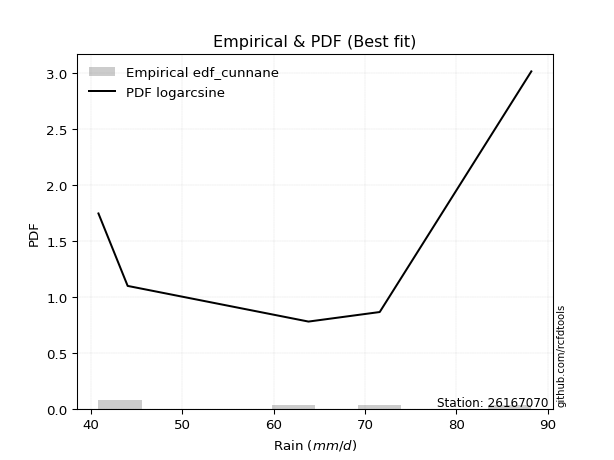</img>

</div>


### 12. EDF Adamowski (1981)

The Adamowski formula in hydrology refers to a specific plotting position formula used for estimating the non-parametric empirical distribution of hydrological events (like flood peaks) to calculate their return periods. This formula provides an alternative to traditional parametric methods (like the Gumbel or Log Pearson Type III distributions). 

<div align="center">


$P=(m-0.25)/(n+0.5)$


</div>


**12.1. Empirical values**

<div align="center">

|                | 0                   | 1                  | 2             | 3                  | 4                  |
|:---------------|:--------------------|:-------------------|:--------------|:-------------------|:-------------------|
| date           | 2022                | 2019               | 2025          | 2020               | 2021               |
| x              | 40.8                | 44.0               | 63.8          | 71.6               | 88.2               |
| m              | 1                   | 2                  | 3             | 4                  | 5                  |
| empirical_dist | edf_adamowski       | edf_adamowski      | edf_adamowski | edf_adamowski      | edf_adamowski      |
| empirical      | 0.13636363636363635 | 0.3181818181818182 | 0.5           | 0.6818181818181818 | 0.8636363636363636 |
| empirical_tr   | 1.1578947368421053  | 1.4666666666666666 | 2.0           | 3.1428571428571423 | 7.333333333333334  |

</div>


**12.2. Kolmogorov-Smirnov fit test (sorted by Δ)**


<div align="center">

|                | 0                   | 1                   | 2                   | 3                   | 4                  | 5                   | 6                   | 7                   | 8                   | 9                  | 10                  | 11                  | 12                  | 13                 | 14                  | 15                  | 16                  | 17                  | 18                  | 19                 | 20                  | 21                  | 22                  | 23                  | 24                 | 25                 | 26                  | 27                  | 28                 | 29                  | 30                  | 31                  | 32                  | 33                 | 34                  | 35                  | 36                 | 37                  | 38                  | 39                  | 40                 | 41                  | 42                  | 43                  | 44                  | 45                 | 46                  | 47                  | 48                  | 49                  | 50                  | 51                  | 52                  | 53                  | 54                  | 55                  | 56                  | 57                  | 58                  | 59                  | 60                  | 61                  | 62                  | 63                  | 64                  | 65                  | 66                  | 67                  | 68                  | 69                  | 70                  | 71                  | 72                  | 73                  | 74                  | 75                 | 76                  | 77                 | 78                 | 79                 | 80                  | 81                 | 82                  | 83                  | 84                  | 85                  | 86                  | 87                  | 88                  | 89                  | 90                 | 91                  | 92                  | 93                 | 94                  | 95                  | 96                  | 97                  | 98                 | 99                  | 100                 | 101                 | 102                | 103                 | 104                 | 105                 | 106                 | 107                 | 108                | 109                 | 110                | 111                 | 112                 | 113                 | 114                 | 115                 | 116                 | 117                 | 118                | 119                 | 120                 | 121                 | 122                 | 123                 | 124                 | 125                | 126                 | 127                 | 128                 | 129                 | 130                 | 131                | 132                 | 133                 | 134                | 135                 | 136                 | 137                 | 138                | 139                | 140                | 141                | 142                 | 143                | 144                | 145                 | 146                | 147                 | 148                | 149                | 150                 | 151                 | 152                | 153                | 154                | 155                | 156                | 157                | 158                | 159                |
|:---------------|:--------------------|:--------------------|:--------------------|:--------------------|:-------------------|:--------------------|:--------------------|:--------------------|:--------------------|:-------------------|:--------------------|:--------------------|:--------------------|:-------------------|:--------------------|:--------------------|:--------------------|:--------------------|:--------------------|:-------------------|:--------------------|:--------------------|:--------------------|:--------------------|:-------------------|:-------------------|:--------------------|:--------------------|:-------------------|:--------------------|:--------------------|:--------------------|:--------------------|:-------------------|:--------------------|:--------------------|:-------------------|:--------------------|:--------------------|:--------------------|:-------------------|:--------------------|:--------------------|:--------------------|:--------------------|:-------------------|:--------------------|:--------------------|:--------------------|:--------------------|:--------------------|:--------------------|:--------------------|:--------------------|:--------------------|:--------------------|:--------------------|:--------------------|:--------------------|:--------------------|:--------------------|:--------------------|:--------------------|:--------------------|:--------------------|:--------------------|:--------------------|:--------------------|:--------------------|:--------------------|:--------------------|:--------------------|:--------------------|:--------------------|:--------------------|:-------------------|:--------------------|:-------------------|:-------------------|:-------------------|:--------------------|:-------------------|:--------------------|:--------------------|:--------------------|:--------------------|:--------------------|:--------------------|:--------------------|:--------------------|:-------------------|:--------------------|:--------------------|:-------------------|:--------------------|:--------------------|:--------------------|:--------------------|:-------------------|:--------------------|:--------------------|:--------------------|:-------------------|:--------------------|:--------------------|:--------------------|:--------------------|:--------------------|:-------------------|:--------------------|:-------------------|:--------------------|:--------------------|:--------------------|:--------------------|:--------------------|:--------------------|:--------------------|:-------------------|:--------------------|:--------------------|:--------------------|:--------------------|:--------------------|:--------------------|:-------------------|:--------------------|:--------------------|:--------------------|:--------------------|:--------------------|:-------------------|:--------------------|:--------------------|:-------------------|:--------------------|:--------------------|:--------------------|:-------------------|:-------------------|:-------------------|:-------------------|:--------------------|:-------------------|:-------------------|:--------------------|:-------------------|:--------------------|:-------------------|:-------------------|:--------------------|:--------------------|:-------------------|:-------------------|:-------------------|:-------------------|:-------------------|:-------------------|:-------------------|:-------------------|
| station        | 26167070            | 26167070            | 26167070            | 26167070            | 26167070           | 26167070            | 26167070            | 26167070            | 26167070            | 26167070           | 26167070            | 26167070            | 26167070            | 26167070           | 26167070            | 26167070            | 26167070            | 26167070            | 26167070            | 26167070           | 26167070            | 26167070            | 26167070            | 26167070            | 26167070           | 26167070           | 26167070            | 26167070            | 26167070           | 26167070            | 26167070            | 26167070            | 26167070            | 26167070           | 26167070            | 26167070            | 26167070           | 26167070            | 26167070            | 26167070            | 26167070           | 26167070            | 26167070            | 26167070            | 26167070            | 26167070           | 26167070            | 26167070            | 26167070            | 26167070            | 26167070            | 26167070            | 26167070            | 26167070            | 26167070            | 26167070            | 26167070            | 26167070            | 26167070            | 26167070            | 26167070            | 26167070            | 26167070            | 26167070            | 26167070            | 26167070            | 26167070            | 26167070            | 26167070            | 26167070            | 26167070            | 26167070            | 26167070            | 26167070            | 26167070            | 26167070           | 26167070            | 26167070           | 26167070           | 26167070           | 26167070            | 26167070           | 26167070            | 26167070            | 26167070            | 26167070            | 26167070            | 26167070            | 26167070            | 26167070            | 26167070           | 26167070            | 26167070            | 26167070           | 26167070            | 26167070            | 26167070            | 26167070            | 26167070           | 26167070            | 26167070            | 26167070            | 26167070           | 26167070            | 26167070            | 26167070            | 26167070            | 26167070            | 26167070           | 26167070            | 26167070           | 26167070            | 26167070            | 26167070            | 26167070            | 26167070            | 26167070            | 26167070            | 26167070           | 26167070            | 26167070            | 26167070            | 26167070            | 26167070            | 26167070            | 26167070           | 26167070            | 26167070            | 26167070            | 26167070            | 26167070            | 26167070           | 26167070            | 26167070            | 26167070           | 26167070            | 26167070            | 26167070            | 26167070           | 26167070           | 26167070           | 26167070           | 26167070            | 26167070           | 26167070           | 26167070            | 26167070           | 26167070            | 26167070           | 26167070           | 26167070            | 26167070            | 26167070           | 26167070           | 26167070           | 26167070           | 26167070           | 26167070           | 26167070           | 26167070           |
| empirical_dist | edf_adamowski       | edf_adamowski       | edf_adamowski       | edf_adamowski       | edf_adamowski      | edf_adamowski       | edf_adamowski       | edf_adamowski       | edf_adamowski       | edf_adamowski      | edf_adamowski       | edf_adamowski       | edf_adamowski       | edf_adamowski      | edf_adamowski       | edf_adamowski       | edf_adamowski       | edf_adamowski       | edf_adamowski       | edf_adamowski      | edf_adamowski       | edf_adamowski       | edf_adamowski       | edf_adamowski       | edf_adamowski      | edf_adamowski      | edf_adamowski       | edf_adamowski       | edf_adamowski      | edf_adamowski       | edf_adamowski       | edf_adamowski       | edf_adamowski       | edf_adamowski      | edf_adamowski       | edf_adamowski       | edf_adamowski      | edf_adamowski       | edf_adamowski       | edf_adamowski       | edf_adamowski      | edf_adamowski       | edf_adamowski       | edf_adamowski       | edf_adamowski       | edf_adamowski      | edf_adamowski       | edf_adamowski       | edf_adamowski       | edf_adamowski       | edf_adamowski       | edf_adamowski       | edf_adamowski       | edf_adamowski       | edf_adamowski       | edf_adamowski       | edf_adamowski       | edf_adamowski       | edf_adamowski       | edf_adamowski       | edf_adamowski       | edf_adamowski       | edf_adamowski       | edf_adamowski       | edf_adamowski       | edf_adamowski       | edf_adamowski       | edf_adamowski       | edf_adamowski       | edf_adamowski       | edf_adamowski       | edf_adamowski       | edf_adamowski       | edf_adamowski       | edf_adamowski       | edf_adamowski      | edf_adamowski       | edf_adamowski      | edf_adamowski      | edf_adamowski      | edf_adamowski       | edf_adamowski      | edf_adamowski       | edf_adamowski       | edf_adamowski       | edf_adamowski       | edf_adamowski       | edf_adamowski       | edf_adamowski       | edf_adamowski       | edf_adamowski      | edf_adamowski       | edf_adamowski       | edf_adamowski      | edf_adamowski       | edf_adamowski       | edf_adamowski       | edf_adamowski       | edf_adamowski      | edf_adamowski       | edf_adamowski       | edf_adamowski       | edf_adamowski      | edf_adamowski       | edf_adamowski       | edf_adamowski       | edf_adamowski       | edf_adamowski       | edf_adamowski      | edf_adamowski       | edf_adamowski      | edf_adamowski       | edf_adamowski       | edf_adamowski       | edf_adamowski       | edf_adamowski       | edf_adamowski       | edf_adamowski       | edf_adamowski      | edf_adamowski       | edf_adamowski       | edf_adamowski       | edf_adamowski       | edf_adamowski       | edf_adamowski       | edf_adamowski      | edf_adamowski       | edf_adamowski       | edf_adamowski       | edf_adamowski       | edf_adamowski       | edf_adamowski      | edf_adamowski       | edf_adamowski       | edf_adamowski      | edf_adamowski       | edf_adamowski       | edf_adamowski       | edf_adamowski      | edf_adamowski      | edf_adamowski      | edf_adamowski      | edf_adamowski       | edf_adamowski      | edf_adamowski      | edf_adamowski       | edf_adamowski      | edf_adamowski       | edf_adamowski      | edf_adamowski      | edf_adamowski       | edf_adamowski       | edf_adamowski      | edf_adamowski      | edf_adamowski      | edf_adamowski      | edf_adamowski      | edf_adamowski      | edf_adamowski      | edf_adamowski      |
| p_dist         | logarcsine          | logbetaprime        | ksone               | logdweibull         | logksone           | dweibull            | logdgamma           | dgamma              | semicircular        | logsemicircular    | anglit              | logtrapezoid        | logbeta             | logrdist           | weibull_min         | wrapcauchy          | logwrapcauchy       | arcsine             | loganglit           | loggenextreme      | genpareto           | foldnorm            | logfoldnorm         | burr                | rayleigh           | loginvweibull      | loggenlogistic      | logweibull_max      | maxwell            | lograyleigh         | logalpha            | logburr12           | logmaxwell          | nct                | logmielke           | t                   | genlogistic        | crystalball         | norm                | exponnorm           | pearson3           | invgamma            | logburr             | logjohnsonsu        | betaprime           | loginvgamma        | logf                | logerlang           | f                   | loggamma            | loggamma            | logpearson3         | logt                | logcrystalball      | lognorm             | logexponnorm        | logskewnorm         | logloggamma         | lognct              | gamma               | alpha               | logncf              | kstwobign           | lognakagami         | halfnorm            | logkstwobign        | loglevy_l           | loghalfnorm         | erlang              | logcosine           | gumbel_l            | loggenexpon         | cosine              | loggumbel_l         | genexpon            | logbradford        | logistic            | beta               | logrice            | loglogistic        | gennorm             | lomax              | rice                | gumbel_r            | hypsecant           | logargus            | loghypsecant        | loggumbel_r         | logtruncexpon       | levy_l              | logtriang          | argus               | loggompertz         | triang             | laplace             | burr12              | loglaplace          | loglaplace          | loglomax           | loggausshyper       | halfgennorm         | logexponpow         | truncnorm          | logloglaplace       | logkappa4           | moyal               | halflogistic        | gompertz            | loginvgauss        | gausshyper          | loggennorm         | logtukeylambda      | logmoyal            | loghalflogistic     | logjohnsonsb        | truncexpon          | loguniform          | logkappa3           | logweibull_min     | bradford            | kappa4              | skewnorm            | invgauss            | kappa3              | tukeylambda         | logvonmises_line   | uniform             | vonmises_line       | truncweibull_min    | loggenhalflogistic  | exponpow            | genhalflogistic    | logtruncnorm        | genextreme          | trapezoid          | gengamma            | exponweib           | nakagami            | logfatiguelife     | logwald            | wald               | ncf                | logtruncweibull_min | fatiguelife        | logtruncpareto     | powerlaw            | logexponweib       | invweibull          | loggenpareto       | logpowerlaw        | truncpareto         | loggengamma         | rdist              | weibull_max        | johnsonsu          | johnsonsb          | loghalfgennorm     | logvonmises        | vonmises           | mielke             |
| delta          | 0.07183155447722472 | 0.07720792782864905 | 0.10761201709812193 | 0.10966044869854263 | 0.1101478492577519 | 0.11238741340374092 | 0.11344434987336305 | 0.11650128546729543 | 0.12340142732819342 | 0.1258172821259682 | 0.13469470526007585 | 0.13476028636326914 | 0.13636360702040995 | 0.1363636348759258 | 0.13636363579692443 | 0.13636363636363635 | 0.13636363636363635 | 0.13636363636363635 | 0.13701354097328028 | 0.1376426057354191 | 0.14460548429483533 | 0.14871987738372228 | 0.15054267504448537 | 0.15297818291189968 | 0.1552207011718478 | 0.1554518660777453 | 0.15600641744924593 | 0.15623287818314013 | 0.1562700314562644 | 0.15808497563574256 | 0.15866250078508976 | 0.15883642626912595 | 0.15887873874147884 | 0.1589792753589241 | 0.15899279159987423 | 0.15999146222635655 | 0.1600731038722264 | 0.16015854634731952 | 0.16015863988821366 | 0.16019786991169055 | 0.1605585290074855 | 0.16095570669976447 | 0.16142149768811287 | 0.16145321273503577 | 0.16171666969794074 | 0.1617357098755692 | 0.16193465548542052 | 0.16202998872476937 | 0.16216953159688158 | 0.16218855659932205 | 0.16218855659932205 | 0.16224887264538781 | 0.16226847192879368 | 0.16226929968876552 | 0.16226930754785046 | 0.16227007796861295 | 0.16227076909352892 | 0.16227414399278475 | 0.16255211456302765 | 0.16288615217966487 | 0.16305970206506692 | 0.16323182429491273 | 0.16332193242022303 | 0.16404490161120866 | 0.16475113224091495 | 0.16534079163175297 | 0.16874268899653655 | 0.16889992789153763 | 0.17111446363727809 | 0.17281451277681192 | 0.17443629225132787 | 0.17466289634821275 | 0.17590815940772503 | 0.17592626676548617 | 0.17606022166112786 | 0.1769302179840631 | 0.17857309377644123 | 0.1786292271911513 | 0.1791926025399963 | 0.180475981408684  | 0.18181818181818182 | 0.1825964866378061 | 0.18648987627162908 | 0.18702034474480309 | 0.18822016107821896 | 0.18857229388170155 | 0.18995302005570838 | 0.19000457263335924 | 0.19167374797268633 | 0.19223520978962794 | 0.1922577129507962 | 0.19256085679921436 | 0.19657070070458132 | 0.1968823101927324 | 0.19707227017622692 | 0.19769037483655616 | 0.19856750596771522 | 0.19856750596771522 | 0.2002633786857091 | 0.20410376749241088 | 0.20418382644443944 | 0.20471376393774798 | 0.2048072420908955 | 0.20722535142648502 | 0.20936408620222458 | 0.21155948538315314 | 0.21178814417150366 | 0.21350336774224826 | 0.213777198670014  | 0.21391987526382675 | 0.2145168083413394 | 0.21493608762312794 | 0.21494989162803924 | 0.21680863040814924 | 0.21742794663616788 | 0.21812806214216282 | 0.22023770675143228 | 0.22034514628351703 | 0.2216170762064532 | 0.22297303091880594 | 0.22421301762701407 | 0.22497414073299693 | 0.22783133159075797 | 0.23213076125712045 | 0.24348052471760956 | 0.2502544603681879 | 0.25067126965861136 | 0.25072421297226216 | 0.25715483861346855 | 0.26317313589506736 | 0.26696352932246015 | 0.2710016189948209 | 0.29480620527260515 | 0.29514073156131615 | 0.2986958571633837 | 0.30100581346803246 | 0.30324321529073345 | 0.31422590961087105 | 0.3163049938949161 | 0.3181818181818182 | 0.3181818181818182 | 0.3268575029393465 | 0.3284602065336072  | 0.329135709973555  | 0.4001258253284028 | 0.41416084428527344 | 0.4209465642769497 | 0.42655326864158843 | 0.4286273513735456 | 0.4312935580148969 | 0.43823271926557605 | 0.46271308428928326 | 0.4999999977776115 | 0.5059543337246573 | 0.5381364287249568 | 0.5924620318741598 | 0.6818181818181818 | 1.102681950995402  | 13.381462717999236 | nan                |
| deltao         | 0.5865427407550001  | 0.5865427407550001  | 0.5865427407550001  | 0.5865427407550001  | 0.5865427407550001 | 0.5865427407550001  | 0.5865427407550001  | 0.5865427407550001  | 0.5865427407550001  | 0.5865427407550001 | 0.5865427407550001  | 0.5865427407550001  | 0.5865427407550001  | 0.5865427407550001 | 0.5865427407550001  | 0.5865427407550001  | 0.5865427407550001  | 0.5865427407550001  | 0.5865427407550001  | 0.5865427407550001 | 0.5865427407550001  | 0.5865427407550001  | 0.5865427407550001  | 0.5865427407550001  | 0.5865427407550001 | 0.5865427407550001 | 0.5865427407550001  | 0.5865427407550001  | 0.5865427407550001 | 0.5865427407550001  | 0.5865427407550001  | 0.5865427407550001  | 0.5865427407550001  | 0.5865427407550001 | 0.5865427407550001  | 0.5865427407550001  | 0.5865427407550001 | 0.5865427407550001  | 0.5865427407550001  | 0.5865427407550001  | 0.5865427407550001 | 0.5865427407550001  | 0.5865427407550001  | 0.5865427407550001  | 0.5865427407550001  | 0.5865427407550001 | 0.5865427407550001  | 0.5865427407550001  | 0.5865427407550001  | 0.5865427407550001  | 0.5865427407550001  | 0.5865427407550001  | 0.5865427407550001  | 0.5865427407550001  | 0.5865427407550001  | 0.5865427407550001  | 0.5865427407550001  | 0.5865427407550001  | 0.5865427407550001  | 0.5865427407550001  | 0.5865427407550001  | 0.5865427407550001  | 0.5865427407550001  | 0.5865427407550001  | 0.5865427407550001  | 0.5865427407550001  | 0.5865427407550001  | 0.5865427407550001  | 0.5865427407550001  | 0.5865427407550001  | 0.5865427407550001  | 0.5865427407550001  | 0.5865427407550001  | 0.5865427407550001  | 0.5865427407550001  | 0.5865427407550001 | 0.5865427407550001  | 0.5865427407550001 | 0.5865427407550001 | 0.5865427407550001 | 0.5865427407550001  | 0.5865427407550001 | 0.5865427407550001  | 0.5865427407550001  | 0.5865427407550001  | 0.5865427407550001  | 0.5865427407550001  | 0.5865427407550001  | 0.5865427407550001  | 0.5865427407550001  | 0.5865427407550001 | 0.5865427407550001  | 0.5865427407550001  | 0.5865427407550001 | 0.5865427407550001  | 0.5865427407550001  | 0.5865427407550001  | 0.5865427407550001  | 0.5865427407550001 | 0.5865427407550001  | 0.5865427407550001  | 0.5865427407550001  | 0.5865427407550001 | 0.5865427407550001  | 0.5865427407550001  | 0.5865427407550001  | 0.5865427407550001  | 0.5865427407550001  | 0.5865427407550001 | 0.5865427407550001  | 0.5865427407550001 | 0.5865427407550001  | 0.5865427407550001  | 0.5865427407550001  | 0.5865427407550001  | 0.5865427407550001  | 0.5865427407550001  | 0.5865427407550001  | 0.5865427407550001 | 0.5865427407550001  | 0.5865427407550001  | 0.5865427407550001  | 0.5865427407550001  | 0.5865427407550001  | 0.5865427407550001  | 0.5865427407550001 | 0.5865427407550001  | 0.5865427407550001  | 0.5865427407550001  | 0.5865427407550001  | 0.5865427407550001  | 0.5865427407550001 | 0.5865427407550001  | 0.5865427407550001  | 0.5865427407550001 | 0.5865427407550001  | 0.5865427407550001  | 0.5865427407550001  | 0.5865427407550001 | 0.5865427407550001 | 0.5865427407550001 | 0.5865427407550001 | 0.5865427407550001  | 0.5865427407550001 | 0.5865427407550001 | 0.5865427407550001  | 0.5865427407550001 | 0.5865427407550001  | 0.5865427407550001 | 0.5865427407550001 | 0.5865427407550001  | 0.5865427407550001  | 0.5865427407550001 | 0.5865427407550001 | 0.5865427407550001 | 0.5865427407550001 | 0.5865427407550001 | 0.5865427407550001 | 0.5865427407550001 | 0.5865427407550001 |
| eval           | Δo > Δ              | Δo > Δ              | Δo > Δ              | Δo > Δ              | Δo > Δ             | Δo > Δ              | Δo > Δ              | Δo > Δ              | Δo > Δ              | Δo > Δ             | Δo > Δ              | Δo > Δ              | Δo > Δ              | Δo > Δ             | Δo > Δ              | Δo > Δ              | Δo > Δ              | Δo > Δ              | Δo > Δ              | Δo > Δ             | Δo > Δ              | Δo > Δ              | Δo > Δ              | Δo > Δ              | Δo > Δ             | Δo > Δ             | Δo > Δ              | Δo > Δ              | Δo > Δ             | Δo > Δ              | Δo > Δ              | Δo > Δ              | Δo > Δ              | Δo > Δ             | Δo > Δ              | Δo > Δ              | Δo > Δ             | Δo > Δ              | Δo > Δ              | Δo > Δ              | Δo > Δ             | Δo > Δ              | Δo > Δ              | Δo > Δ              | Δo > Δ              | Δo > Δ             | Δo > Δ              | Δo > Δ              | Δo > Δ              | Δo > Δ              | Δo > Δ              | Δo > Δ              | Δo > Δ              | Δo > Δ              | Δo > Δ              | Δo > Δ              | Δo > Δ              | Δo > Δ              | Δo > Δ              | Δo > Δ              | Δo > Δ              | Δo > Δ              | Δo > Δ              | Δo > Δ              | Δo > Δ              | Δo > Δ              | Δo > Δ              | Δo > Δ              | Δo > Δ              | Δo > Δ              | Δo > Δ              | Δo > Δ              | Δo > Δ              | Δo > Δ              | Δo > Δ              | Δo > Δ             | Δo > Δ              | Δo > Δ             | Δo > Δ             | Δo > Δ             | Δo > Δ              | Δo > Δ             | Δo > Δ              | Δo > Δ              | Δo > Δ              | Δo > Δ              | Δo > Δ              | Δo > Δ              | Δo > Δ              | Δo > Δ              | Δo > Δ             | Δo > Δ              | Δo > Δ              | Δo > Δ             | Δo > Δ              | Δo > Δ              | Δo > Δ              | Δo > Δ              | Δo > Δ             | Δo > Δ              | Δo > Δ              | Δo > Δ              | Δo > Δ             | Δo > Δ              | Δo > Δ              | Δo > Δ              | Δo > Δ              | Δo > Δ              | Δo > Δ             | Δo > Δ              | Δo > Δ             | Δo > Δ              | Δo > Δ              | Δo > Δ              | Δo > Δ              | Δo > Δ              | Δo > Δ              | Δo > Δ              | Δo > Δ             | Δo > Δ              | Δo > Δ              | Δo > Δ              | Δo > Δ              | Δo > Δ              | Δo > Δ              | Δo > Δ             | Δo > Δ              | Δo > Δ              | Δo > Δ              | Δo > Δ              | Δo > Δ              | Δo > Δ             | Δo > Δ              | Δo > Δ              | Δo > Δ             | Δo > Δ              | Δo > Δ              | Δo > Δ              | Δo > Δ             | Δo > Δ             | Δo > Δ             | Δo > Δ             | Δo > Δ              | Δo > Δ             | Δo > Δ             | Δo > Δ              | Δo > Δ             | Δo > Δ              | Δo > Δ             | Δo > Δ             | Δo > Δ              | Δo > Δ              | Δo > Δ             | Δo > Δ             | Δo > Δ             | Δo <= Δ            | Δo <= Δ            | Δo <= Δ            | Δo <= Δ            | Δo <= Δ            |
| fit            | 1                   | 1                   | 1                   | 1                   | 1                  | 1                   | 1                   | 1                   | 1                   | 1                  | 1                   | 1                   | 1                   | 1                  | 1                   | 1                   | 1                   | 1                   | 1                   | 1                  | 1                   | 1                   | 1                   | 1                   | 1                  | 1                  | 1                   | 1                   | 1                  | 1                   | 1                   | 1                   | 1                   | 1                  | 1                   | 1                   | 1                  | 1                   | 1                   | 1                   | 1                  | 1                   | 1                   | 1                   | 1                   | 1                  | 1                   | 1                   | 1                   | 1                   | 1                   | 1                   | 1                   | 1                   | 1                   | 1                   | 1                   | 1                   | 1                   | 1                   | 1                   | 1                   | 1                   | 1                   | 1                   | 1                   | 1                   | 1                   | 1                   | 1                   | 1                   | 1                   | 1                   | 1                   | 1                   | 1                  | 1                   | 1                  | 1                  | 1                  | 1                   | 1                  | 1                   | 1                   | 1                   | 1                   | 1                   | 1                   | 1                   | 1                   | 1                  | 1                   | 1                   | 1                  | 1                   | 1                   | 1                   | 1                   | 1                  | 1                   | 1                   | 1                   | 1                  | 1                   | 1                   | 1                   | 1                   | 1                   | 1                  | 1                   | 1                  | 1                   | 1                   | 1                   | 1                   | 1                   | 1                   | 1                   | 1                  | 1                   | 1                   | 1                   | 1                   | 1                   | 1                   | 1                  | 1                   | 1                   | 1                   | 1                   | 1                   | 1                  | 1                   | 1                   | 1                  | 1                   | 1                   | 1                   | 1                  | 1                  | 1                  | 1                  | 1                   | 1                  | 1                  | 1                   | 1                  | 1                   | 1                  | 1                  | 1                   | 1                   | 1                  | 1                  | 1                  | 0                  | 0                  | 0                  | 0                  | 0                  |
| n              | 5                   | 5                   | 5                   | 5                   | 5                  | 5                   | 5                   | 5                   | 5                   | 5                  | 5                   | 5                   | 5                   | 5                  | 5                   | 5                   | 5                   | 5                   | 5                   | 5                  | 5                   | 5                   | 5                   | 5                   | 5                  | 5                  | 5                   | 5                   | 5                  | 5                   | 5                   | 5                   | 5                   | 5                  | 5                   | 5                   | 5                  | 5                   | 5                   | 5                   | 5                  | 5                   | 5                   | 5                   | 5                   | 5                  | 5                   | 5                   | 5                   | 5                   | 5                   | 5                   | 5                   | 5                   | 5                   | 5                   | 5                   | 5                   | 5                   | 5                   | 5                   | 5                   | 5                   | 5                   | 5                   | 5                   | 5                   | 5                   | 5                   | 5                   | 5                   | 5                   | 5                   | 5                   | 5                   | 5                  | 5                   | 5                  | 5                  | 5                  | 5                   | 5                  | 5                   | 5                   | 5                   | 5                   | 5                   | 5                   | 5                   | 5                   | 5                  | 5                   | 5                   | 5                  | 5                   | 5                   | 5                   | 5                   | 5                  | 5                   | 5                   | 5                   | 5                  | 5                   | 5                   | 5                   | 5                   | 5                   | 5                  | 5                   | 5                  | 5                   | 5                   | 5                   | 5                   | 5                   | 5                   | 5                   | 5                  | 5                   | 5                   | 5                   | 5                   | 5                   | 5                   | 5                  | 5                   | 5                   | 5                   | 5                   | 5                   | 5                  | 5                   | 5                   | 5                  | 5                   | 5                   | 5                   | 5                  | 5                  | 5                  | 5                  | 5                   | 5                  | 5                  | 5                   | 5                  | 5                   | 5                  | 5                  | 5                   | 5                   | 5                  | 5                  | 5                  | 5                  | 5                  | 5                  | 5                  | 5                  |
| best_fit       | 1                   | 0                   | 0                   | 0                   | 0                  | 0                   | 0                   | 0                   | 0                   | 0                  | 0                   | 0                   | 0                   | 0                  | 0                   | 0                   | 0                   | 0                   | 0                   | 0                  | 0                   | 0                   | 0                   | 0                   | 0                  | 0                  | 0                   | 0                   | 0                  | 0                   | 0                   | 0                   | 0                   | 0                  | 0                   | 0                   | 0                  | 0                   | 0                   | 0                   | 0                  | 0                   | 0                   | 0                   | 0                   | 0                  | 0                   | 0                   | 0                   | 0                   | 0                   | 0                   | 0                   | 0                   | 0                   | 0                   | 0                   | 0                   | 0                   | 0                   | 0                   | 0                   | 0                   | 0                   | 0                   | 0                   | 0                   | 0                   | 0                   | 0                   | 0                   | 0                   | 0                   | 0                   | 0                   | 0                  | 0                   | 0                  | 0                  | 0                  | 0                   | 0                  | 0                   | 0                   | 0                   | 0                   | 0                   | 0                   | 0                   | 0                   | 0                  | 0                   | 0                   | 0                  | 0                   | 0                   | 0                   | 0                   | 0                  | 0                   | 0                   | 0                   | 0                  | 0                   | 0                   | 0                   | 0                   | 0                   | 0                  | 0                   | 0                  | 0                   | 0                   | 0                   | 0                   | 0                   | 0                   | 0                   | 0                  | 0                   | 0                   | 0                   | 0                   | 0                   | 0                   | 0                  | 0                   | 0                   | 0                   | 0                   | 0                   | 0                  | 0                   | 0                   | 0                  | 0                   | 0                   | 0                   | 0                  | 0                  | 0                  | 0                  | 0                   | 0                  | 0                  | 0                   | 0                  | 0                   | 0                  | 0                  | 0                   | 0                   | 0                  | 0                  | 0                  | 0                  | 0                  | 0                  | 0                  | 0                  |
| best_fit_sort  | 1                   | 2                   | 3                   | 4                   | 5                  | 6                   | 7                   | 8                   | 9                   | 10                 | 11                  | 12                  | 13                  | 14                 | 15                  | 16                  | 17                  | 18                  | 19                  | 20                 | 21                  | 22                  | 23                  | 24                  | 25                 | 26                 | 27                  | 28                  | 29                 | 30                  | 31                  | 32                  | 33                  | 34                 | 35                  | 36                  | 37                 | 38                  | 39                  | 40                  | 41                 | 42                  | 43                  | 44                  | 45                  | 46                 | 47                  | 48                  | 49                  | 50                  | 51                  | 52                  | 53                  | 54                  | 55                  | 56                  | 57                  | 58                  | 59                  | 60                  | 61                  | 62                  | 63                  | 64                  | 65                  | 66                  | 67                  | 68                  | 69                  | 70                  | 71                  | 72                  | 73                  | 74                  | 75                  | 76                 | 77                  | 78                 | 79                 | 80                 | 81                  | 82                 | 83                  | 84                  | 85                  | 86                  | 87                  | 88                  | 89                  | 90                  | 91                 | 92                  | 93                  | 94                 | 95                  | 96                  | 97                  | 98                  | 99                 | 100                 | 101                 | 102                 | 103                | 104                 | 105                 | 106                 | 107                 | 108                 | 109                | 110                 | 111                | 112                 | 113                 | 114                 | 115                 | 116                 | 117                 | 118                 | 119                | 120                 | 121                 | 122                 | 123                 | 124                 | 125                 | 126                | 127                 | 128                 | 129                 | 130                 | 131                 | 132                | 133                 | 134                 | 135                | 136                 | 137                 | 138                 | 139                | 140                | 141                | 142                | 143                 | 144                | 145                | 146                 | 147                | 148                 | 149                | 150                | 151                 | 152                 | 153                | 154                | 155                | 156                | 157                | 158                | 159                | 160                |

</div>


**12.3. Best fit**

<div align="center">

|   id |   station | empirical_dist   | p_dist     |     delta |   deltao | eval   |   fit |   n |   best_fit |   best_fit_sort |
|-----:|----------:|:-----------------|:-----------|----------:|---------:|:-------|------:|----:|-----------:|----------------:|
|    0 |  26167070 | edf_adamowski    | logarcsine | 0.0718316 | 0.586543 | Δo > Δ |     1 |   5 |          1 |               1 |

</div>


<div align="center">

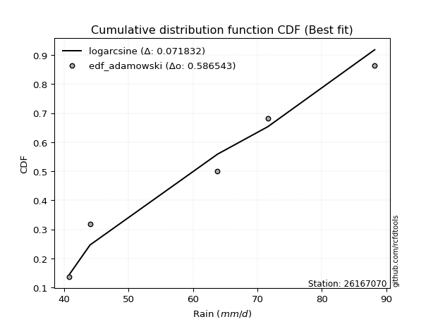</img></img>

</div>


## C. Best fit & Estimate extreme values for specific return periods - Tr

Best fit in probability distribution analysis means finding the theoretical distribution (like Normal, Poisson, Exponential, etc.) that most accurately mirrors your real-world data´s patterns (shape, center, spread) for better predictions, using methods like visual checks (Q-Q plots), goodness-of-fit tests (Kolmogorov-Smirnov, Chi-Squared), and information criteria (AIC) to score and select the simplest, most representative model.


### 1. Best fit (ordered by delta Δ)

:file_folder:Table: [bestfit_26167070.csv](table/bestfit_26167070.csv)

<div align="center">

|   id |   station | empirical_dist   | p_dist     |     delta |   deltao | eval   |   fit |   n |   best_fit |   best_fit_sort |
|-----:|----------:|:-----------------|:-----------|----------:|---------:|:-------|------:|----:|-----------:|----------------:|
|    0 |  26167070 | edf_california   | logdgamma  | 0.0544243 | 0.586543 | Δo > Δ |     1 |   5 |          1 |               1 |
|    1 |  26167070 | edf_gringorten   | logarcsine | 0.0587603 | 0.586543 | Δo > Δ |     1 |   5 |          1 |               2 |
|    2 |  26167070 | edf_hazen        | logarcsine | 0.0587603 | 0.586543 | Δo > Δ |     1 |   5 |          1 |               3 |
|    3 |  26167070 | edf_cunnane      | logarcsine | 0.061342  | 0.586543 | Δo > Δ |     1 |   5 |          1 |               4 |
|    4 |  26167070 | edf_blom         | logarcsine | 0.0631735 | 0.586543 | Δo > Δ |     1 |   5 |          1 |               5 |
|    5 |  26167070 | edf_tukey        | logarcsine | 0.0661497 | 0.586543 | Δo > Δ |     1 |   5 |          1 |               6 |
|    6 |  26167070 | edf_filliben     | logarcsine | 0.0672564 | 0.586543 | Δo > Δ |     1 |   5 |          1 |               7 |
|    7 |  26167070 | edf_jenkinson    | logarcsine | 0.0677761 | 0.586543 | Δo > Δ |     1 |   5 |          1 |               8 |
|    8 |  26167070 | edf_beard        | logarcsine | 0.0677761 | 0.586543 | Δo > Δ |     1 |   5 |          1 |               9 |
|    9 |  26167070 | edf_chegodayev   | logarcsine | 0.0684646 | 0.586543 | Δo > Δ |     1 |   5 |          1 |              10 |
|   10 |  26167070 | edf_adamowski    | logarcsine | 0.0718316 | 0.586543 | Δo > Δ |     1 |   5 |          1 |              11 |
|   11 |  26167070 | edf_weibull      | logarcsine | 0.0869831 | 0.586543 | Δo > Δ |     1 |   5 |          1 |              12 |

</div>


### 2. Extreme values and % difference analysis

In hydrology, a return period (or recurrence interval $Tr$) is the statistical average time between extreme events like floods or droughts of a specific magnitude, indicating how rare an event is, with a 100-year flood, for example, having a 1% chance of occurring in any given year, not that it happens exactly every century. It is a key tool for infrastructure design (like bridges or dams) and risk assessment, calculated from historical data to determine the probability of future events, although it is important to remember it is statistical average, and events can cluster or be missed.

The extreme value porcentage difference is evaluated as $pdiff = 1 - (ETrBf / ETr) * 100$, where _ETrBf_ correspond to the bestfit extreme value for a specific recurrence interval and _ETr_ correspond to the extreme value for one of the most used PDFsused in hydrology.

> risk_rate: assuming the return period as the project useful life.

:file_folder:Table: [extreme_26167070.csv](table/extreme_26167070.csv), all PDFs.  
:file_folder:Table: [extremepdiff_26167070.csv](table/extremepdiff_26167070.csv), % difference between bestfit and most used PDFs in Hydrology.

<div align="center">

Extreme values table for only best fit PDFs
|   id |      tr |   prob_l |     prob_g |    alpha |   anglit |   arcsine |   argus |    beta |   betaprime |   bradford |     burr |   burr12 |   cosine |   crystalball |   dgamma |   dweibull |   erlang |   exponnorm |   exponpow |   exponweib |        f |   fatiguelife |   foldnorm |    gamma |   gausshyper |   genexpon |      genextreme |   gengamma |   genhalflogistic |   genlogistic |   gennorm |   genpareto |   gompertz |   gumbel_l |   gumbel_r |   halfgennorm |   halflogistic |   halfnorm |   hypsecant |   invgamma |   invgauss |      invweibull |   johnsonsb |        johnsonsu |   kappa3 |   kappa4 |   ksone |   kstwobign |   laplace |   levy_l |   loggamma |   logistic |   loglaplace |    lomax |   maxwell |   mielke |    moyal |   nakagami |       ncf |      nct |     norm |   pearson3 |   powerlaw |   rayleigh |   rdist |     rice |   semicircular |   skewnorm |        t |   trapezoid |   triang |   truncexpon |   truncnorm |   truncpareto |   truncweibull_min |   tukeylambda |   uniform |   vonmises |   vonmises_line |     wald |   weibull_max |   weibull_min |   wrapcauchy |   logalpha |   loganglit |   logarcsine |   logargus |   logbeta |   logbetaprime |   logbradford |   logburr |   logburr12 |   logcosine |   logcrystalball |   logdgamma |   logdweibull |   logerlang |   logexponnorm |   logexponpow |   logexponweib |     logf |   logfatiguelife |   logfoldnorm |   loggausshyper |   loggenexpon |   loggenextreme |   loggengamma |   loggenhalflogistic |   loggenlogistic |   loggennorm |   loggenpareto |   loggompertz |   loggumbel_l |   loggumbel_r |   loghalfgennorm |   loghalflogistic |   loghalfnorm |   loghypsecant |   loginvgamma |   loginvgauss |   loginvweibull |   logjohnsonsb |   logjohnsonsu |   logkappa3 |   logkappa4 |   logksone |   logkstwobign |   loglevy_l |   logloggamma |   loglogistic |   logloglaplace |   loglomax |   logmaxwell |   logmielke |   logmoyal |   lognakagami |   logncf |   lognct |   lognorm |   logpearson3 |   logpowerlaw |   lograyleigh |   logrdist |   logrice |   logsemicircular |   logskewnorm |     logt |   logtrapezoid |   logtriang |   logtruncexpon |   logtruncnorm |   logtruncpareto |   logtruncweibull_min |   logtukeylambda |   loguniform |   logvonmises |   logvonmises_line |   logwald |   logweibull_max |   logweibull_min |   logwrapcauchy |   station |   n |   risk_rate |
|-----:|--------:|---------:|-----------:|---------:|---------:|----------:|--------:|--------:|------------:|-----------:|---------:|---------:|---------:|--------------:|---------:|-----------:|---------:|------------:|-----------:|------------:|---------:|--------------:|-----------:|---------:|-------------:|-----------:|----------------:|-----------:|------------------:|--------------:|----------:|------------:|-----------:|-----------:|-----------:|--------------:|---------------:|-----------:|------------:|-----------:|-----------:|----------------:|------------:|-----------------:|---------:|---------:|--------:|------------:|----------:|---------:|-----------:|-----------:|-------------:|---------:|----------:|---------:|---------:|-----------:|----------:|---------:|---------:|-----------:|-----------:|-----------:|--------:|---------:|---------------:|-----------:|---------:|------------:|---------:|-------------:|------------:|--------------:|-------------------:|--------------:|----------:|-----------:|----------------:|---------:|--------------:|--------------:|-------------:|-----------:|------------:|-------------:|-----------:|----------:|---------------:|--------------:|----------:|------------:|------------:|-----------------:|------------:|--------------:|------------:|---------------:|--------------:|---------------:|---------:|-----------------:|--------------:|----------------:|--------------:|----------------:|--------------:|---------------------:|-----------------:|-------------:|---------------:|--------------:|--------------:|--------------:|-----------------:|------------------:|--------------:|---------------:|--------------:|--------------:|----------------:|---------------:|---------------:|------------:|------------:|-----------:|---------------:|------------:|--------------:|--------------:|----------------:|-----------:|-------------:|------------:|-----------:|--------------:|---------:|---------:|----------:|--------------:|--------------:|--------------:|-----------:|----------:|------------------:|--------------:|---------:|---------------:|------------:|----------------:|---------------:|-----------------:|----------------------:|-----------------:|-------------:|--------------:|-------------------:|----------:|-----------------:|-----------------:|----------------:|----------:|----:|------------:|
|    0 |    2    | 0.5      | 0.5        |  59.7482 |  61.68   |   61.68   | 65.387  | 63.2157 |     58.4885 |    60.3161 |  56.363  |  52.8523 |  62.2604 |       61.68   |  56.084  |    57.4584 |  60.2322 |     61.6642 |    42.654  |     41.6161 |  59.9129 |       40.8    |    61.3794 |  59.2096 |      59.5556 |    55.2695 |    51.1604      |    41.9215 |           72.6853 |       58.4937 |      64.5 |     64.567  |    58.4087 |    64.577  |    58.783  |       50.6315 |        57.3428 |    58.0704 |     61.68   |    58.051  |    50.9716 |  1241.51        |     40.8006 |     40.8003      |  64.2217 |  62.794  | 61.68   |     58.3653 |   61.68   |  70.8654 |    59.0136 |    61.68   |      59.1375 |  56.0233 |   60.1718 |  56.2557 |  57.8478 |    42.2897 |   46.2149 |  57.5285 |  61.68   |    61.1435 |    40.978  |    59.6369 | 38.6031 |  60.4997 |        61.68   |    59.2341 |  61.6693 |     76.2802 |  68.3358 |      59.2463 |     57.4314 |       41.7744 |            49.7769 |       64.5012 |   64.5    |    1.16191 |         64.5189 |  55.9638 |       87.9229 |       55.2699 |      64.5    |    58.1458 |     59.1375 |      59.1375 |    61.5396 |   56.5082 |        58.7513 |       55.6285 |   55.9229 |     61.7177 |     59.1276 |          59.1375 |     54.5794 |       55.8059 |     59.0129 |        59.1375 |       49.8387 |        40.9449 |  59.0622 |          40.8    |       58.7983 |         53.6409 |       54.8626 |         68.8205 |       40.9706 |              68.1913 |          56.1367 |      63.7996 |        31.3303 |       56.6979 |       62.047  |       56.3644 |          40.7999 |           55.0341 |       55.7024 |        59.1375 |       58.6475 |       51.9331 |         56.1636 |        42.7812 |        60.4733 |     40.8    |     60.2546 |    59.1375 |        55.7473 |     69.4323 |       59.6979 |       59.1375 |         63.8    |    52.5095 |      57.6772 |     56.074  |    55.4972 |       54.2453 |  59.0388 |  58.3717 |   59.1375 |       59.2687 |       40.9564 |       57.168  |    60.7905 |   58.0638 |           59.1375 |       59.1408 |  59.1376 |        62.1794 |     64.3212 |         54.8762 |        50.8431 |          42.8067 |               46.8168 |          59.9787 |      59.988  |      0.110458 |            59.9916 |   53.7909 |          70.2354 |     42.8212      |         59.988  |  26167070 |   5 |    0.75     |
|    1 |    2.33 | 0.570815 | 0.429185   |  62.8882 |  65.3454 |   67.1824 | 68.653  | 67.6367 |     61.6435 |    63.687  |  59.5086 |  55.9737 |  65.4289 |       64.8268 |  64.8679 |    65.2385 |  63.3528 |     64.8106 |    44.5912 |     42.6218 |  63.0851 |       41.6103 |    64.6361 |  62.2763 |      62.9202 |    58.4576 |    90.8161      |    43.0627 |           75.5902 |       61.6331 |      64.5 |     70.5617 |    61.6519 |    67.3147 |    61.6989 |       53.9848 |        60.3408 |    61.4666 |     64.1984 |    61.206  |    53.8354 | 57342           |     40.802  |     40.8016      |  67.6811 |  66.4487 | 66.0058 |     61.5086 |   63.5843 |  76.2205 |    62.1784 |    64.4525 |      61.0343 |  59.3774 |   63.4411 |  59.4099 |  60.608  |    43.9095 |   58.2778 |  60.6701 |  64.8268 |    64.3023 |    41.3174 |    62.9546 | 43.8758 |  63.6216 |        65.6112 |    62.4072 |  64.8164 |     79.0342 |  71.6194 |      62.4855 |     60.6248 |       42.2562 |            52.7803 |       67.9893 |   67.8567 |    1.39495 |         67.8782 |  58.0272 |       88.0922 |       61.037  |      73.9774 |    61.2966 |     62.8426 |      64.7858 |    64.8249 |   62.8094 |        63.359  |       58.7568 |   59.0261 |     64.9385 |     62.2763 |          62.3045 |     65.0223 |       65.58   |     62.1798 |        62.3045 |       53.3693 |        41.209  |  62.234  |          41.6387 |       62.0623 |         56.7082 |       58.0079 |         72.587  |       41.2201 |              71.4473 |          59.286  |      66.0534 |        41.694  |       59.8793 |       64.9281 |       59.156  |          40.7999 |           57.8387 |       58.9286 |        61.6588 |       61.808  |       54.8688 |         59.3151 |        45.8808 |        63.6615 |     40.8    |     63.8139 |    63.5343 |        58.8434 |     74.7595 |       62.8705 |       61.9192 |         66.3819 |    55.6093 |      60.8896 |     59.1802 |    58.0958 |       57.8484 |  62.2144 |  61.5201 |   62.3045 |       62.438  |       41.2325 |       60.4004 |    66.1463 |   61.2076 |           63.1201 |       62.3078 |  62.3047 |        66.0277 |     67.7672 |         57.8304 |        53.1138 |          43.8501 |               48.9775 |          63.4242 |      63.354  |      0.11634  |            62.4209 |   55.6627 |          73.8715 |     49.6526      |         69.9854 |  26167070 |   5 |    0.729209 |
|    2 |    5    | 0.8      | 0.2        |  75.7472 |  78.2779 |   81.8553 | 79.1292 | 81.037  |     75.4186 |    75.8414 |  75.0154 |  74.3495 |  76.8467 |       76.521  |  73.3954 |    75.182  |  75.9094 |     76.5132 |    72.041  |     66.8701 |  75.9014 |       58.8229 |    76.7408 |  74.7505 |      75.2634 |    74.3972 | 46767.3         |    63.5398 |           83.2647 |       75.2696 |      64.5 |     84.1152 |    75.5672 |    76.1592 |    74.3666 |       76.6201 |        73.9059 |    75.8286 |     74.3001 |    75.3178 |    71.7861 |     1.1254e+12  |     40.9373 |     41.2747      |  78.8769 |  78.843  | 80.0057 |     74.8606 |   73.1053 |  85.0925 |    75.5852 |    75.1576 |      71.4701 |  76.1473 |   76.3088 |  75.2314 |  73.3936 |    61.5424 |  131.091  |  75.1554 |  76.521  |    76.343  |    48.6515 |    76.2366 | 58.3956 |  76.0221 |        79.0269 |    75.8255 |  76.5116 |     86.935  |  81.04   |      74.624  |     74.9094 |       47.3982 |            67.1244 |       79.147  |   78.72   |    2.30789 |         78.7503 |  69.578  |       88.1982 |      100.611  |      84.8422 |    75.1971 |     77.8694 |      82.6274 |    76.5941 |   81.9854 |        84.4379 |       71.7433 |   74.7063 |     76.8523 |     75.0796 |          75.6341 |     73.4258 |       75.6106 |     75.5975 |        75.6341 |       77.324  |        47.0117 |  75.6464 |          64.1532 |       75.8661 |         70.2751 |       74.307  |         82.3894 |       45.1969 |              80.9958 |          75.1472 |      78.9955 |        75.994  |       74.6258 |       75.1817 |       72.9803 |          40.7999 |           72.4263 |       74.7708 |        72.8999 |       75.4672 |       73.4372 |         75.1922 |        80.6421 |        76.1516 |     40.8    |     76.5354 |    80.1322 |        74.0301 |     84.5    |       75.8243 |       73.9437 |         81.4123 |    74.8178 |      75.3684 |     74.7659 |    71.8125 |       76.9817 |  75.7332 |  75.3618 |   75.6341 |       75.6813 |       46.9169 |       75.2783 |    83.3278 |   75.2451 |           78.8423 |       75.6352 |  75.6345 |        78.4419 |     78.7129 |         70.48   |        64.1514 |          52.8252 |               61.334  |          75.9014 |      75.5974 |      0.141166 |            72.4146 |   67.4104 |          83.0887 |      3.18487e+09 |         83.5123 |  26167070 |   5 |    0.67232  |
|    3 |   10    | 0.9      | 0.1        |  85.4814 |  85.5978 |   85.3975 | 84.181  | 85.5827 |     86.7356 |    81.8003 |  90.1885 | inf      |  83.7449 |       84.2787 |  78.5025 |    80.4182 |  85.097  |     84.2858 |   128.703  |    161.169  |  85.3413 |       82.589  |    84.7711 |  83.9924 |      81.4614 |    88.8667 |     1.22731e+07 |   125.295  |           85.9354 |       86.3747 |      64.5 |     87.1174 |    85.798  |    81.0834 |    84.6843 |      105.646  |        85.1711 |    86.4562 |     82.3666 |    87.2949 |    93.3233 |     9.80532e+17 |     42.9859 |     61.522       |  83.762  |  84.5358 | 86.1142 |     85.0265 |   81.7481 |  87.2345 |    86.1214 |    83.0416 |      82.4807 |  91.3706 |   85.3644 |  91.1037 |  84.5254 |    83.8262 |  223.621  |  88.0397 |  84.2787 |    84.5955 |    61.0814 |    85.7069 | 62.2621 |  84.7672 |        85.9107 |    85.7547 |  84.27   |     90.0211 |  84.7197 |      80.9676 |     86.112  |       56.4197 |            76.3694 |       83.848  |   83.46   |    2.98784 |         83.4941 |  81.8361 |       88.1999 |      150.147  |      86.6782 |    86.7795 |     87.9164 |      87.625  |    83.0106 |   86.7525 |       102.764  |       79.2229 |   90.6134 |     84.6514 |     84.0581 |          86.0147 |     78.6203 |       80.8332 |     86.1443 |        86.0146 |      108.529  |        59.7728 |  86.1611 |         116.523  |       86.6784 |         78.6695 |       90.1649 |         85.6816 |       51.9462 |              84.7259 |          91.1499 |      93.3194 |        85.2201 |       86.771  |       81.5767 |       86.595  |          40.7999 |           87.2998 |       89.1765 |        83.3308 |       86.5109 |       98.3128 |         91.216  |        87.4662 |        84.9429 |     81.7182 |     82.5086 |    88.6723 |        88.1709 |     87.0358 |       85.4947 |       84.2685 |         98.8283 |    99.4171 |      87.5768 |     90.4202 |    86.3672 |       95.7358 |  86.4313 |  86.8344 |   86.0147 |       85.8898 |       57.5603 |       88.0756 |    88.4985 |   86.8384 |           88.3736 |       86.0116 |  86.0152 |        83.9023 |     83.4536 |         78.2317 |        72.7261 |          63.7804 |               71.5624 |          81.9618 |      81.6559 |      0.160687 |            79.1325 |   82.6002 |          86.0567 |      6.06399e+99 |         86.0438 |  26167070 |   5 |    0.651322 |
|    4 |   15    | 0.933333 | 0.0666667  |  90.7607 |  88.7236 |   86.0731 | 86.1016 | 86.7587 |     93.1827 |    83.883  |  99.9223 | inf      |  86.8872 |       88.15   |  81.1332 |    82.9155 |  89.9446 |     88.1677 |   176.712  |    284.358  |  90.3461 |       98.1326 |    88.7785 |  88.9012 |      83.6621 |    97.3308 |     2.84415e+08 |   194.926  |           86.7428 |       92.6398 |      64.5 |     87.7021 |    91.0283 |    83.3134 |    90.5054 |      126.436  |        91.5462 |    91.9868 |     86.9701 |    94.2625 |   108.052  |     2.20215e+21 |     48.5902 |    177.202       |  85.3903 |  86.4835 | 88.1504 |     90.4233 |   86.8039 |  87.8815 |    91.9432 |    87.3371 |      89.692  | 100.276  |   90.0107 | 101.466  |  90.9858 |    96.965  |  294.177  |  95.7936 |  88.15   |    88.7934 |    67.9867 |    90.5865 | 63.0695 |  89.2429 |        88.5951 |    90.9218 |  88.1416 |     91.0113 |  85.9003 |      83.2678 |     92.1024 |       62.6382 |            79.9895 |       85.3647 |   85.04   |    3.32992 |         85.0753 |  89.7077 |       88.2    |      184.505  |      87.2025 |    93.4386 |     92.5924 |      88.6119 |    85.5886 |   87.5956 |       113.553  |       82.032  |  101.086  |     88.5032 |     88.4965 |          91.7161 |     81.3742 |       83.3427 |     91.9724 |        91.716  |      131.505  |        70.153  |  91.9614 |         172.159  |       92.6374 |         81.9295 |       99.9918 |         86.6372 |       56.6121 |              85.9138 |         101.638  |     103.002  |        86.9238 |       93.4687 |       84.6491 |       95.3684 |          40.7999 |           97.0328 |       97.7395 |        89.9395 |       92.7296 |      117.92   |        101.72   |        87.9854 |        89.4634 |     83.8477 |     84.5002 |    91.7167 |        96.7448 |     87.8167 |       90.6623 |       90.4884 |        111.132  |   118.215  |      94.5894 |    100.652  |    96.131  |      107.327  |  92.3696 |  93.4052 |   91.7161 |       91.4589 |       64.2835 |       95.4966 |    89.5962 |   93.3933 |           92.3954 |       91.7098 |  91.7166 |        85.7336 |     85.0344 |         81.2637 |        76.7268 |          69.7317 |               76.1793 |          84.0474 |      83.7815 |      0.171516 |            81.9053 |   94.114  |          86.8939 |    inf           |         86.7807 |  26167070 |   5 |    0.644736 |
|    5 |   20    | 0.95     | 0.05       |  94.3865 |  90.5623 |   86.3111 | 87.1558 | 87.2577 |     97.7332 |    84.9431 | 107.298  | inf      |  88.8196 |       90.6851 |  82.9012 |    84.5256 |  93.2153 |     90.7112 |   217.279  |    419.919  |  93.7329 |      109.641  |    91.4028 |  92.2247 |      84.7923 |   103.336  |     2.56856e+09 |   265.329  |           87.13   |       97.0264 |      64.5 |     87.9131 |    94.468  |    84.7015 |    94.5813 |      142.926  |        96.0128 |    95.6741 |     90.2177 |    99.2409 |   119.367  |     4.89105e+23 |     56.4511 |    509.356       |  86.2045 |  87.4702 | 89.1685 |     94.0588 |   90.391  |  88.2129 |    95.9774 |    90.306  |      95.1877 | 106.594  |   93.0943 | 109.404  |  95.5612 |   106.015  |  353.566  | 101.452  |  90.6851 |    91.5714 |    72.1539 |    93.8298 | 63.3699 |  92.2068 |        90.0841 |    94.3668 |  90.677  |     91.4998 |  86.4827 |      84.4574 |     96.1474 |       66.9267 |            81.9151 |       86.1076 |   85.83   |    3.5369  |         85.866  |  95.5736 |       88.2    |      211.148  |      87.4563 |    98.1642 |     95.4584 |      88.9621 |    87.0376 |   87.8759 |       121.306  |       83.5028 |  109.153  |     91.0103 |     91.3416 |          95.653  |     83.2592 |       84.9704 |     96.0114 |        95.6529 |      150.168  |        78.691  |  95.9769 |         229.847  |       96.76   |         83.6597 |      107.231  |         87.0825 |       60.1116 |              86.4972 |         109.692  |     110.526  |        87.5033 |       98.0692 |       86.6197 |      102.035  |          40.7999 |          104.492  |      103.901  |        94.9146 |       97.0875 |      134.773  |        109.786  |        88.1045 |        92.4678 |     84.9332 |     85.4823 |    93.2779 |       102.986  |     88.2193 |       94.1743 |       95.0537 |        120.998  |   134.098  |      99.5507 |    108.496  |   103.706  |      115.842  |  96.4958 |  98.0572 |   95.653  |       95.2893 |       68.6668 |      100.772  |    90.0033 |   97.9873 |           94.7045 |       95.6441 |  95.6536 |        86.6516 |     85.8253 |         82.8812 |        79.0692 |          73.3824 |               78.7953 |          85.0971 |      84.8649 |      0.179047 |            83.3956 |  103.726  |          87.2778 |    inf           |         87.1395 |  26167070 |   5 |    0.641514 |
|    6 |   25    | 0.96     | 0.04       |  97.1463 |  91.8084 |   86.4214 | 87.8356 | 87.5227 |    101.263  |    85.5852 | 113.317  | inf      |  90.1747 |       92.5514 |  84.2285 |    85.7009 |  95.6721 |     92.5843 |   252.348  |    561.144  |  96.2823 |      118.784  |    93.3346 |  94.7268 |      85.4812 |   107.994  |     1.39913e+10 |   334.542  |           87.3566 |      100.405  |      64.5 |     88.0129 |    97      |    85.6893 |    97.7207 |      156.724  |        99.4542 |    98.4175 |     92.7311 |   103.136  |   128.603  |     3.13953e+25 |     64.1341 |   1203.02        |  86.693  |  88.0675 | 89.7793 |     96.782  |   93.1734 |  88.4208 |    99.0651 |    92.5772 |      99.6813 | 111.495  |   95.3835 | 115.932  |  99.1076 |   112.84   |  405.863  | 105.947  |  92.5514 |    93.6311 |    74.914  |    96.2395 | 63.515  |  94.4035 |        91.05   |    96.93   |  92.5434 |     91.7908 |  86.8297 |      85.1846 |     99.1808 |       70.0174 |            83.1095 |       86.5467 |   86.304  |    3.67409 |         86.3403 | 100.272  |       88.2    |      233.064  |      87.6066 |   101.843  |     97.4509 |      89.1251 |    87.9849 |   88.0003 |       127.392  |       84.4075 |  115.816  |     92.8482 |     93.3912 |          98.6587 |     84.6934 |       86.1639 |     99.1028 |        98.6586 |      166.102  |        85.9543 |  99.0482 |         289.173  |       99.9116 |         84.7318 |      113.006  |         87.3374 |       62.9074 |              86.8439 |         116.328  |     116.766  |        87.7648 |      101.56   |       88.0499 |      107.487  |          40.7999 |          110.627  |      108.735  |        98.953  |      100.45   |      149.85   |        116.433  |        88.1474 |        94.7007 |     85.5912 |     86.0632 |    94.2273 |       107.923  |     88.473  |       96.8257 |       98.701  |        129.387  |   148.15   |     103.401  |    114.951  |   109.987  |      122.619  |  99.6599 | 101.673  |   98.6587 |       98.2054 |       71.7159 |      104.879  |    90.1988 |  101.529  |           96.2333 |       98.6477 |  98.6594 |        87.2033 |     86.2999 |         83.8869 |        80.6127 |          75.8373 |               80.4776 |          85.7275 |      85.5217 |      0.184829 |            84.3206 |  112.128  |          87.495  |    inf           |         87.3529 |  26167070 |   5 |    0.639603 |
|    7 |   50    | 0.98     | 0.02       | 105.508  |  94.8757 |   86.5689 | 89.3769 | 87.9576 |    112.295  |    86.8833 | 133.88   | inf      |  93.7232 |       97.8956 |  88.162  |    89.0301 | 102.94   |     97.9514 |   380.347  |   1278.79   | 103.852  |      148.121  |    98.8666 | 102.155  |      86.8878 |   122.464  |     2.59207e+12 |   652.413  |           87.7949 |      110.813  |      64.5 |     88.1504 |   104.216  |    88.3707 |   107.392  |      205.302  |       110.057  |   106.392  |    100.523  |   115.492  |   159.603  |     1.16092e+31 |     82.0659 |  15710.3         |  87.67   |  89.2779 | 91.0011 |    104.778  |  101.816  |  88.8891 |   108.495  |    99.5165 |     115.038  | 126.718  |  102.023  | 138.56   | 110.117  |   132.895  |  611.063  | 120.608  |  97.8956 |    99.5985 |    81.0796 |   103.234  | 63.7207 | 100.755  |        93.2567 |   104.38   |  97.8881 |     92.3683 |  87.5184 |      86.6703 |    108.1    |       77.7244 |            85.5905 |       87.404  |   87.252  |    3.97621 |         87.2891 | 115.613  |       88.2    |      307.843  |      87.9044 |   113.421  |    102.535  |      89.3432 |    90.1712 |   88.1557 |       146.8    |       86.2686 |  139.094  |     98.0747 |     98.9786 |         107.799  |     89.0467 |       89.5735 |    108.545  |       107.798  |      224.568  |       111.978  | 108.417  |         604.097  |      109.516  |         86.9563 |      131.879  |         87.8121 |       71.9386 |              87.5289 |         139.4    |     138.646  |        88.0994 |      112.021  |       92.0523 |      126.179  |          40.7999 |          131.89   |      124.104  |       112.599  |      110.861  |      210.884  |        139.546  |        88.1905 |       101.187  |     86.9226 |     87.1921 |    96.1553 |       123.831  |     89.0467 |      104.736  |      110.735  |        160.303  |   204.077  |     115.433  |    137.349  |   132.01   |      144.667  | 109.355  | 113.014  |  107.799  |      107.03   |       78.9762 |      117.775  |    90.4731 |  112.469  |           99.819  |      107.78   | 107.799  |        88.3084 |     87.2496 |         85.9829 |        84.081  |          81.4515 |               84.1254 |          86.9836 |      86.8505 |      0.202604 |            86.2321 |  144.598  |          87.8922 |    inf           |         87.7769 |  26167070 |   5 |    0.63583  |
|    8 |   75    | 0.986667 | 0.0133333  | 110.298  |  96.2257 |   86.5962 | 89.9881 | 88.0672 |    118.838  |    87.3201 | 147.379  | inf      |  95.4178 |      100.763  |  90.3597 |    90.7991 | 106.982  |    100.833  |   467.752  |   1967.28   | 108.082  |      165.789  |   101.835  | 106.303  |      87.3674 |   130.928  |     5.39226e+13 |   928.973  |           87.9355 |      116.863  |      64.5 |     88.1772 |   108.048  |    89.7266 |   113.013  |      237.809  |       116.221  |   110.733  |    105.077  |   122.947  |   179.178  |     2.00032e+34 |     85.8325 |  63318.6         |  87.9957 |  89.6882 | 91.4083 |    109.178  |  106.872  |  89.0815 |   113.936  |   103.524  |     125.096  | 135.623  |  105.632  | 153.665  | 116.555  |   143.854  |  768.646  | 129.747  | 100.763  |   102.843  |    83.3411 |   107.04   | 63.7625 | 104.196  |        94.1382 |   108.436  | 100.756  |     92.5595 |  87.7463 |      87.1752 |    113.011  |       80.856  |            86.4458 |       87.6807 |   87.568  |    4.08356 |         87.6054 | 125.052  |       88.2    |      356.106  |      88.003  |   120.34   |    104.855  |      89.3837 |    91.0532 |   88.1817 |       158.564  |       86.9047 |  154.784  |    100.857  |    101.764  |         113.047  |     91.5499 |       91.4041 |    113.994  |       113.047  |      265.775  |       129.609  | 113.816  |         941.443  |      115.045  |         87.7224 |      143.608  |         87.9564 |       77.4205 |              87.7546 |         154.859  |     153.41   |        88.1573 |      117.904  |       94.145  |      138.503  |          40.7999 |          146.081  |      133.364  |       121.429  |      116.967  |      259.542  |        155.034  |        88.1962 |       104.719  |     87.371  |     87.5519 |    96.8066 |       133.562  |     89.2836 |      109.179  |      118.342  |        182.5    |   248.046  |     122.551  |    152.321  |   146.879  |      158.294  | 114.972  | 119.767  |  113.047  |      112.069  |       81.8041 |      125.445  |    90.5278 |  118.858  |          101.289  |      113.024  | 113.048  |        88.6773 |     87.5663 |         86.708  |        85.3716 |          83.5619 |               85.4331 |          87.398  |      87.298  |      0.212955 |            86.8852 |  169.093  |          88.01   |    inf           |         87.9179 |  26167070 |   5 |    0.634587 |
|    9 |  100    | 0.99     | 0.01       | 113.669  |  97.0284 |   86.6058 | 90.3294 | 88.1134 |    123.536  |    87.5393 | 157.695  | inf      |  96.4799 |      102.703  |  91.8825 |    91.9901 | 109.774  |    102.784  |   534.981  |   2616.94   | 111.011  |      178.502  |   103.843  | 109.174  |      87.61   |   136.933  |     4.6205e+14  |  1175.33   |           88.0044 |      121.145  |      64.5 |     88.1869 |   110.619  |    90.6135 |   116.992  |      262.742  |       120.583  |   113.69   |    108.308  |   128.356  |   193.635  |     3.90504e+36 |     86.9975 | 162692           |  88.1588 |  89.8954 | 91.6119 |    112.192  |  110.459  |  89.194  |   117.778  |   106.354  |     132.761  | 141.941  |  108.091  | 165.331  | 121.123  |   151.312  |  901.603  | 136.516  | 102.703  |   105.054  |    84.5129 |   109.633  | 63.778  | 106.534  |        94.6318 |   111.199  | 102.696  |     92.6549 |  87.86   |      87.4295 |    116.377  |       82.5482 |            86.8789 |       87.8165 |   87.726  |    4.13808 |         87.7635 | 131.935  |       88.2    |      392.301  |      88.0523 |   125.333  |    106.26   |      89.3979 |    91.5494 |   88.1902 |       167.117  |       87.2258 |  166.979  |    102.731  |    103.549  |         116.741  |     93.3158 |       92.6446 |    117.841  |       116.741  |      298.51   |       143.209  | 117.624  |        1295.51   |      118.941  |         88.1102 |      152.253  |         88.0248 |       81.3881 |              87.8669 |         166.825  |     164.877  |        88.1768 |      121.985  |       95.5394 |      147.946  |          40.7999 |          157.038  |      140.065  |       128.109  |      121.321  |      301.665  |        167.024  |        88.198  |       107.128  |     87.596  |     87.7264 |    97.134  |       140.668  |     89.4223 |      112.265  |      124.026  |        200.489  |   285.902  |     127.65   |    163.893  |   158.434  |      168.304  | 118.946  | 124.628  |  116.741  |      115.603  |       83.3061 |      130.954  |    90.5478 |  123.399  |          102.121  |      116.714  | 116.742  |        88.8619 |     87.7247 |         87.0758 |        86.0461 |          84.6672 |               86.1055 |          87.6034 |      87.5227 |      0.220309 |            87.2143 |  189.53   |          88.0649 |    inf           |         87.9884 |  26167070 |   5 |    0.633968 |
|   10 |  200    | 0.995    | 0.005      | 121.735  |  98.5449 |   86.615  | 90.9225 | 88.169  |    135.087  |    87.8691 | 185.359  | inf      |  98.6396 |      107.102  |  95.4498 |    94.678  | 116.278  |    107.211  |   713.436  |   4902.92   | 117.862  |      209.62   |   108.397  | 115.881  |      87.9786 |   151.403  |     8.08198e+16 |  1976.43   |           88.1053 |      131.438  |      64.5 |     88.1965 |   116.375  |    92.5412 |   126.556  |      329.32   |       131.071  |   120.453  |    116.09   |   141.846  |   230.182  |     1.25396e+42 |     87.9509 |      1.38451e+06 |  88.4073 |  90.2102 | 91.9173 |    119.135  |  119.102  |  89.4071 |   127.002  |   113.142  |     153.214  | 157.164  |  113.716  | 197.092  | 132.127  |   168.308  | 1313.27   | 153.898  | 107.102  |   110.12   |    86.3238 |   115.565  | 63.7939 | 111.868  |        95.4924 |   117.518  | 107.095  |     92.7976 |  88.0302 |      87.8133 |    124.129  |       85.2604 |            87.5355 |       88.0154 |   87.963  |    4.22056 |         88.0007 | 149.079  |       88.2    |      485.95   |      88.1262 |   137.688  |    108.965  |      89.4116 |    92.4181 |   88.1978 |       188.495  |       87.7113 |  200.505  |    106.957  |    107.277  |         125.573  |     97.5579 |       95.4694 |    127.079  |       125.573  |      390.655  |       179.825  | 126.758  |        2830.2    |      128.276  |         88.6979 |      174.236  |         88.1207 |       91.1998 |              88.0344 |         199.515  |     196.328  |        88.1946 |      131.533  |       98.6421 |      173.368  |          40.7999 |          186.864  |      156.685  |       145.75   |      131.918  |      437.54   |        199.781  |        88.1995 |       112.642  |     87.9347 |     87.9779 |    97.6271 |       158.505  |     89.6858 |      119.511  |      138.799  |        253.231  |   407.714  |     140.127  |    195.439  |   190.143  |      193.627  | 128.52   | 136.616  |  125.573  |      124.015  |       85.6772 |      144.487  |    90.5681 |  134.394  |          103.588  |      125.537  | 125.575  |        89.1389 |     87.9623 |         87.634  |        87.0975 |          86.3916 |               87.1381 |          87.9077 |      87.8607 |      0.238141 |            87.711  |  251.829  |          88.1406 |    inf           |         88.0942 |  26167070 |   5 |    0.633042 |
|   11 |  250    | 0.996    | 0.004      | 124.325  |  98.9309 |   86.6161 | 91.0613 | 88.1778 |    138.884  |    87.9352 | 195.191  | inf      |  99.2316 |      108.446  |  96.572  |    95.4962 | 118.314  |    108.565  |   775.517  |   5907.24   | 120.014  |      219.762  |   109.788  | 117.986  |      88.0532 |   156.061  |     4.25162e+17 |  2307.12   |           88.125  |      134.748  |      64.5 |     88.1977 |   118.111  |    93.1084 |   129.631  |      352.743  |       134.443  |   122.534  |    118.595  |   146.338  |   242.41   |     7.38912e+43 |     88.0466 |      2.66379e+06 |  88.4599 |  90.2739 | 91.9784 |    121.284  |  121.884  |  89.4626 |   129.969  |   115.321  |     160.447  | 162.065  |  115.448  | 208.535  | 135.67   |   173.514  | 1479.4    | 159.845  | 108.446  |   111.682  |    86.6937 |   117.391  | 63.7959 | 113.506  |        95.6943 |   119.462  | 108.44   |     92.8261 |  88.0642 |      87.8904 |    126.528  |       85.8294 |            87.6679 |       88.0543 |   88.0104 |    4.23712 |         88.0481 | 154.75   |       88.2    |      517.987  |      88.1409 |   141.774  |    109.665  |      89.4132 |    92.6226 |   88.1987 |       195.625  |       87.809  |  212.695  |    108.241  |    108.322  |         128.404  |     98.9241 |       96.3364 |    130.05   |       128.404  |      424.687  |       192.814  | 129.693  |        3651.08   |      131.273  |         88.8163 |      181.673  |         88.1385 |       94.4327 |              88.0677 |         211.329  |     207.731  |        88.1967 |      134.528  |       99.574  |      182.435  |          40.7999 |          197.608  |      162.184  |       151.931  |      135.369  |      494.464  |        211.62   |        88.1997 |       114.34   |     88.0026 |     88.026  |    97.726  |       164.471  |     89.7545 |      121.796  |      143.905  |        273.596  |   458.865  |     144.208  |    206.818  |   201.645  |      202.154  | 131.609  | 140.568  |  128.404  |      126.698  |       86.1693 |      148.928  |    90.5707 |  137.956  |          103.936  |      128.363  | 128.405  |        89.1944 |     88.0099 |         87.7466 |        87.3138 |          86.7464 |               87.3482 |          87.9677 |      87.9284 |      0.243934 |            87.8107 |  276.656  |          88.1544 |    inf           |         88.1153 |  26167070 |   5 |    0.632858 |
|   12 |  500    | 0.998    | 0.002      | 132.378  |  99.8879 |   86.6176 | 91.3804 | 88.1921 |    150.959  |    88.0675 | 228.981  | inf      | 100.807  |      112.433  |  99.991  |    97.9147 | 124.485  |    112.582  |   981.505  |  10111.5    | 126.56   |      251.576  |   113.915  | 124.378  |      88.2041 |   170.531  |     7.35367e+19 |  3607.48   |           88.1636 |      145.019  |      64.5 |     88.1994 |   123.188  |    94.7344 |   139.175  |      431.816  |       144.908  |   128.738  |    126.376  |   160.807  |   281.646  |     2.30819e+49 |     88.1638 |      1.85493e+07 |  88.58   |  90.4029 | 92.1006 |    127.723  |  130.527  |  89.6058 |   139.201  |   122.079  |     185.165  | 177.289  |  120.615  | 248.427  | 146.675  |   188.962  | 2132.24   | 179.528  | 112.433  |   116.354  |    87.4415 |   122.839  | 63.7989 | 118.38   |        96.1592 |   125.258  | 112.427  |     92.8831 |  88.1321 |      88.045  |    133.714  |       86.9954 |            87.9336 |       88.1304 |   88.1052 |    4.2703  |         88.143  | 172.784  |       88.2    |      623.184  |      88.1705 |   154.847  |    111.419  |      89.4154 |    93.0945 |   88.1997 |       218.599  |       88.0048 |  255.609  |    112.034  |    111.152  |         137.178  |    103.184  |       98.9201 |    139.297  |       137.177  |      545.651  |       237.133  | 138.816  |        8116.81   |      140.576  |         89.054  |      205.944  |         88.1721 |      104.706  |              88.1342 |         252.64   |     247.724  |        88.1992 |      143.616  |      102.295  |      213.71   |          88.0661 |          235.05   |      179.752  |       172.851  |      146.242  |      728.175  |        253.025  |        88.1999 |       119.41   |     88.1386 |     88.1185 |    97.9241 |       183.728  |     89.9321 |      128.765  |      160.966  |        350.333  |   670.892  |     157.105  |    246.53   |   242.003  |      229.855  | 141.248  | 153.171  |  137.178  |      134.983  |       87.172  |      163.007  |    90.5744 |  149.114  |          104.74   |      137.126  | 137.179  |        89.3052 |     88.1049 |         87.9728 |        87.7526 |          87.4663 |               87.772  |          88.0862 |      88.0641 |      0.262158 |            88.0105 |  373.06   |          88.1799 |    inf           |         88.1577 |  26167070 |   5 |    0.632489 |
|   13 |  750    | 0.998667 | 0.00133333 | 137.11   | 100.312  |   86.6179 | 91.5086 | 88.1957 |    158.235  |    88.1116 | 251.263  | inf      | 101.571  |      114.648  | 101.95   |    99.2537 | 127.999  |    114.815  |  1110.56   |  13499.8    | 130.304  |      270.373  |   116.208  | 128.027  |      88.255  |   178.995  |     1.49557e+21 |  4589.28   |           88.1762 |      151.023  |      64.5 |     88.1997 |   125.961  |    95.6034 |   144.755  |      482.579  |       151.026  |   132.203  |    130.928  |   169.657  |   305.382  |     3.7623e+52  |     88.1838 |      5.4517e+07  |  88.6326 |  90.4466 | 92.1413 |    131.34   |  135.583  |  89.6738 |   144.622  |   126.028  |     201.354  | 186.194  |  123.505  | 275.171  | 153.112  |   197.541  | 2634.11   | 191.96   | 114.648  |   118.974  |    87.6932 |   125.886  | 63.7995 | 121.099  |        96.3463 |   128.496  | 114.642  |     92.9021 |  88.1548 |      88.0966 |    137.749  |       87.3926 |            88.0224 |       88.1552 |   88.1368 |    4.28136 |         88.1746 | 183.597  |       88.2    |      688.614  |      88.1803 |   162.78   |    112.204  |      89.4158 |    93.2848 |   88.1999 |       232.651  |       88.0703 |  284.724  |    114.13   |    112.551  |         142.308  |    105.693  |      100.364  |    144.727  |       142.308  |      628.152  |       266.006  | 144.167  |       13013.3    |      146.027  |         89.1334 |      220.994  |         88.1825 |      110.879  |              88.1562 |         280.437  |     274.727  |        88.1997 |      148.792  |      103.779  |      234.42   |          88.1114 |          260.144  |      190.382  |       186.399  |      152.721  |      917.377  |        280.887  |        88.2    |       122.246  |     88.1839 |     88.1477 |    97.9903 |       195.519  |     90.0165 |      132.765  |      171.856  |        406.882  |   845.577  |     164.815  |    273.19   |   269.257  |      246.938  | 146.927  | 160.789  |  142.308  |      139.804  |       87.5118 |      171.452  |    90.5751 |  155.715  |          105.065  |      142.249  | 142.309  |        89.3422 |     88.1366 |         88.0485 |        87.9008 |          87.7093 |               87.9143 |          88.125  |      88.1094 |      0.27301  |            88.0772 |  446.299  |          88.1876 |    inf           |         88.1718 |  26167070 |   5 |    0.632366 |
|   14 | 1000    | 0.999    | 0.001      | 140.483  | 100.564  |   86.618  | 91.5806 | 88.1972 |    163.5    |    88.1337 | 268.32   | inf      | 102.052  |      116.173  | 103.324  |   100.174  | 130.455  |    116.354  |  1205.68   |  16408.2    | 132.927  |      283.781  |   117.786  | 130.581  |      88.2807 |   185      |     1.26717e+22 |  5399.69   |           88.1823 |      155.283  |      64.5 |     88.1998 |   127.849  |    96.1883 |   148.712  |      520.651  |       155.366  |   134.597  |    134.157  |   176.12   |   322.536  |     7.14462e+54 |     88.1907 |      1.14522e+08 |  88.6656 |  90.4686 | 92.1617 |    133.846  |  139.17   |  89.7165 |   148.483  |   128.828  |     213.692  | 192.512  |  125.502  | 295.859  | 157.679  |   203.445  | 3057.71   | 201.227  | 116.173  |   120.789  |    87.8194 |   127.991  | 63.7997 | 122.975  |        96.4514 |   130.732  | 116.167  |     92.9116 |  88.1661 |      88.1224 |    140.544  |       87.5928 |            88.0669 |       88.1674 |   88.1526 |    4.28689 |         88.1904 | 191.375  |       88.2    |      736.741  |      88.1852 |   168.547  |    112.675  |      89.4159 |    93.3918 |   88.1999 |       242.909  |       88.103  |  307.425  |    115.57   |    113.442  |         145.951  |    107.484  |      101.363  |    148.595  |       145.951  |      692.465  |       287.897  | 147.975  |       18222.9    |      149.901  |         89.1732 |      232.069  |         88.1874 |      115.334  |              88.1672 |         301.989  |     295.709  |        88.1998 |      152.407  |      104.79   |      250.317  |          88.134  |          279.552  |      198.089  |       196.651  |      157.377  |     1082.74   |        302.492  |        88.2    |       124.206  |     88.2066 |     88.1618 |    98.0233 |       204.129  |     90.0696 |      135.574  |      180.022  |        453.504  |  1000.72   |     170.364  |    293.83   |   290.437  |      259.466  | 150.981  | 166.312  |  145.951  |      143.217  |       87.6828 |      177.542  |    90.5754 |  160.436  |          105.248  |      145.887  | 145.953  |        89.3607 |     88.1525 |         88.0864 |        87.9753 |          87.8314 |               87.9857 |          88.1442 |      88.132  |      0.28081  |            88.1106 |  507.72   |          88.1911 |    inf           |         88.1788 |  26167070 |   5 |    0.632305 |


</div>


<div align="center">

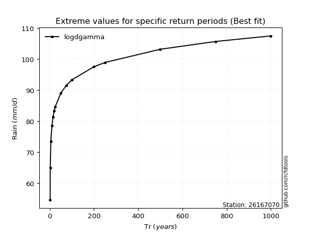</img>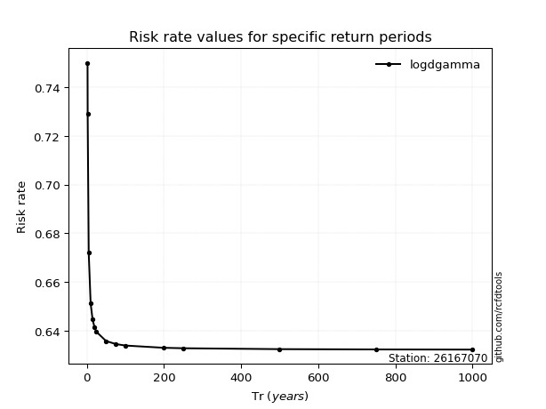</img>

</div>


<sub>**APP DISCLAIMER**: NO WARRANTY - This software is provided by [github.com/rcfdtools](https://github.com/rcfdtools) "as is", without any express or implied warranty, including warranties of merchantability, fitness for a particular purpose, or non-infringement. There is no guarantee that the software will be error-free or operate without interruption. LIMITATION OF LIABILITY - Neither the authors nor copyright holders will be liable for claims or damages arising from the software or its use. You are responsible for determining if the software is appropriate for your use and assume all associated risks, including errors, legal compliance, and data loss. NO PROFESSIONAL ADVICE - The software provides general information and does not offer professional advice. It should not replace consultation with professional advisors.</sub>