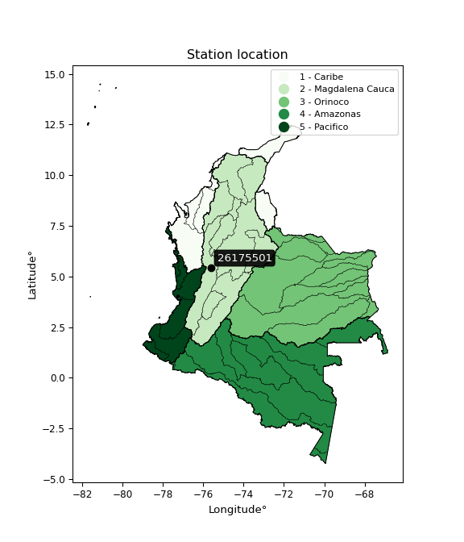

<div align="center">


</div>

# PMP Station (rain, Pmax24h): 26175501

Probable Maximum Precipitation (PMP) is the greatest amount of rainfall for a specific duration that is meteorologically possible for a given location, acting as a "worst-case" scenario for extreme storms, crucial for designing safety-critical infrastructure like bridges, river deviations, dams, spillways, and nuclear plants to prevent catastrophic failure. PMP is calculated by hydrologists using meteorological data to determine the upper limit of extreme rainfall, often leading to the Probable Maximum Flood (PMF) for flood control design, and is increasingly being studied for climate change impacts.

<div align="center">

</img>

</div>


## A. General information


### 1. General running parameters

• app_version: _v20251227_. • runtime: _2025-12-27 09:02:11.367833_. • Python version: _3.14.0_. • SciPy version: _1.16.3_. • Pandas version: _2.3.3_. • NumPy version: _2.3.5_. • Stations dataset (station_dataset_file): _dataset/pmax24h_in/automatic_colombia_2003_2024_filter.csv_. • Stations catalog (station_catalog_file): _dataset/CNE_IDEAM.xls_. • Minimum year to eval til year_max (date_min): _2003_. • Maximum year to eval since year_min (date_max): _2024_. • Creates, save and include plots into reports (create_plot): _False_. • Plot only fit distributions with Δo > Δ (plot_only_fit): _True_. • Eval low extreme values, if False, evaluates high extreme values (low_extreme): _False_. • Eval every SciPy distribution as logarithmic (pdist_logarithmic_on): _True_. • Standard deviation normalized (ddof): _1.0_. • Return periods to eval in years (Tr): _[2, 2.33, 5, 10, 15, 20, 25, 50, 75, 100, 200, 250, 500, 750, 1000]_. • Minimum data sample per station, 0 means any (minimum_sample): _5_. • Z-Score threshold to adjust a value, 0 means disable (zscore): _3.5_. • Avoid zeros, e.g. rain = 0 (avoid_zeros): _True_. • Avoid null values (avoid_nans): _True_. [:file_folder:Dataset file.](../../dataset/pmax24h_in/automatic_colombia_2003_2024_filter.csv)

> Delta Degrees of Freedom (DDOF): is a parameter used in the formulas for calculating variance and standard deviation. When ddof=0, the divisor is $N$ (the total number of observations) and this is used when your data set is the entire population. When ddof=1, the divisor is $N-1$ and this is used when your data set is a sample drawn from a larger population. Using $N-1$ provides an unbiased estimate of the population variance (known as Bessel´s correction).


### 2. Station info and location

|   id |   CODIGO | NOMBRE                            | CATEGORIA               | TECNOLOGIA                | ESTADO   | FECHA_INSTALACION   |   FECHA_SUSPENSION |   ALTITUD |   LATITUD |   LONGITUD | DEPARTAMENTO   | MUNICIPIO   | AREA_OPERATIVA                         | ENTIDAD                                    | AREA_HIDROGRAFICA   | ZONA_HIDROGRAFICA   | SUBZONA_HIDROGRAFICA               |   CORRIENTE | Catalogo   |
|-----:|---------:|:----------------------------------|:------------------------|:--------------------------|:---------|:--------------------|-------------------:|----------:|----------:|-----------:|:---------------|:------------|:---------------------------------------|:-------------------------------------------|:--------------------|:--------------------|:-----------------------------------|------------:|:-----------|
|    0 | 26175501 | RAFAEL ESCOBAR  - AUT  [26175501] | Climatológica Principal | Automática con Telemetría | Activa   | 05/03/2014          |                nan |      1307 |      5.45 |   -75.6331 | Caldas         | Supia       | Area Operativa 09 - Cauca-Valle-Caldas | CENTRO NACIONAL DE INVESTIGACIONES DE CAFE | Magdalena Cauca     | Cauca               | Río Frío y Otros Directos al Cauca |         nan | CNE_OE     |

<div align="center">

Map location in: [:earth_americas:Google](http://maps.google.com/maps?q=5.45,-75.63305556) [:earth_americas:OSM](https://www.openstreetmap.org/#map=18/5.45/-75.63305556&layers=P) [:earth_americas:Bing](https://www.bing.com/maps?cp=5.45~-75.63305556&lvl=18) [:earth_americas:Apple](https://maps.apple.com/frame?center=5.45%2C-75.63305556&span=0.003%2C0.006)

</div>


<div align="center">

```geojson
{
  "type": "Feature",
  "geometry": {
    "type": "Point", 
    "coordinates": [-75.63305556, 5.45]
  }, 
  "properties": {
    "Name": "26175501"
  }
}
```

</div>


### 3. Discrete values table and plot

|               |           0 |          1 |          2 |           3 |           4 |         5 |           6 |
|:--------------|------------:|-----------:|-----------:|------------:|------------:|----------:|------------:|
| Date          | 2017        | 2018       | 2019       | 2020        | 2021        | 2022      | 2023        |
| Value         |   59.2      |   77.8     |   44.4     |   51.1      |   63.2      |   80.9    |   51.4      |
| Value_initial |   59.2      |   77.8     |   44.4     |   51.1      |   63.2      |   80.9    |   51.4      |
| count         |    7        |    7       |    7       |    7        |    7        |    7      |    7        |
| mean          |   61.1429   |   61.1429  |   61.1429  |   61.1429   |   61.1429   |   61.1429 |   61.1429   |
| std           |   13.8559   |   13.8559  |   13.8559  |   13.8559   |   13.8559   |   13.8559 |   13.8559   |
| zscore        |   -0.140219 |    1.20217 |   -1.20836 |   -0.724807 |    0.148467 |    1.4259 |   -0.703155 |

> The initial value (value_initial) correspond to the initial obtained or null completed value, and value (value) is adjusted only when the initial value is outside the valid range definite through the Z-Score value. If Z-Score is active, values out of range or outliers are replaced with the station mean value


### 4. Active continuous probability distributions from SciPy (45 of 104 available)

[scipy.stats](https://docs.scipy.org/doc/scipy/reference/stats.html) is a Python´s powerful submodule within the SciPy library for comprehensive statistical analysis, offering over 130 probability distributions (like Normal, Poisson), functions for descriptive stats (mean, variance), hypothesis testing (t-tests, chi-square), random variable generation, and statistical tests, making it essential for data science, modeling, and research. It provides tools to explore, model, and draw conclusions from data efficiently, working seamlessly with NumPy.

<div align="center">

|   id | p_dist             |   n_parameter | fit_method   | label                                                                       | active   | ref                                                                                                        |
|-----:|:-------------------|--------------:|:-------------|:----------------------------------------------------------------------------|:---------|:-----------------------------------------------------------------------------------------------------------|
|    0 | alpha              |             3 | MLE          | Alpha                                                                       | True     | [:mortar_board:](https://docs.scipy.org/doc/scipy/reference/generated/scipy.stats.alpha.html)              |
|    1 | betaprime          |             4 | MLE          | Beta prime                                                                  | True     | [:mortar_board:](https://docs.scipy.org/doc/scipy/reference/generated/scipy.stats.betaprime.html)          |
|    2 | chi2               |             3 | MLE          | Chi²                                                                        | True     | [:mortar_board:](https://docs.scipy.org/doc/scipy/reference/generated/scipy.stats.chi2.html)               |
|    3 | crystalball        |             4 | MLE          | Crystalball                                                                 | True     | [:mortar_board:](https://docs.scipy.org/doc/scipy/reference/generated/scipy.stats.crystalball.html)        |
|    4 | erlang             |             3 | MLE          | Erlang                                                                      | True     | [:mortar_board:](https://docs.scipy.org/doc/scipy/reference/generated/scipy.stats.erlang.html)             |
|    5 | expon              |             2 | MLE          | Exponential                                                                 | True     | [:mortar_board:](https://docs.scipy.org/doc/scipy/reference/generated/scipy.stats.expon.html)              |
|    6 | exponnorm          |             3 | MLE          | Exponentially modified Normal                                               | True     | [:mortar_board:](https://docs.scipy.org/doc/scipy/reference/generated/scipy.stats.exponnorm.html)          |
|    7 | f                  |             4 | MLE          | F                                                                           | True     | [:mortar_board:](https://docs.scipy.org/doc/scipy/reference/generated/scipy.stats.f.html)                  |
|    8 | fatiguelife        |             3 | MLE          | Fatigue-life (Birnbaum-Saunders)                                            | True     | [:mortar_board:](https://docs.scipy.org/doc/scipy/reference/generated/scipy.stats.fatiguelife.html)        |
|    9 | fisk               |             3 | MLE          | Fisk                                                                        | True     | [:mortar_board:](https://docs.scipy.org/doc/scipy/reference/generated/scipy.stats.fisk.html)               |
|   10 | gamma              |             3 | MLE          | Gamma                                                                       | True     | [:mortar_board:](https://docs.scipy.org/doc/scipy/reference/generated/scipy.stats.gamma.html)              |
|   11 | genexpon           |             5 | MLE          | Generalized exponential                                                     | True     | [:mortar_board:](https://docs.scipy.org/doc/scipy/reference/generated/scipy.stats.genexpon.html)           |
|   12 | genlogistic        |             3 | MLE          | Generalized logistic                                                        | True     | [:mortar_board:](https://docs.scipy.org/doc/scipy/reference/generated/scipy.stats.genlogistic.html)        |
|   13 | gibrat             |             2 | MM           | Gibrat                                                                      | True     | [:mortar_board:](https://docs.scipy.org/doc/scipy/reference/generated/scipy.stats.gibrat.html)             |
|   14 | gompertz           |             3 | MLE          | Gompertz (or truncated Gumbel)                                              | True     | [:mortar_board:](https://docs.scipy.org/doc/scipy/reference/generated/scipy.stats.gompertz.html)           |
|   15 | gumbel_l           |             2 | MM           | Gumbel Left Skew                                                            | True     | [:mortar_board:](https://docs.scipy.org/doc/scipy/reference/generated/scipy.stats.gumbel_l.html)           |
|   16 | gumbel_r           |             2 | MM           | Gumbel Right Skew                                                           | True     | [:mortar_board:](https://docs.scipy.org/doc/scipy/reference/generated/scipy.stats.gumbel_r.html)           |
|   17 | halflogistic       |             2 | MM           | Half-logistic                                                               | True     | [:mortar_board:](https://docs.scipy.org/doc/scipy/reference/generated/scipy.stats.halflogistic.html)       |
|   18 | halfnorm           |             2 | MM           | Half Normal                                                                 | True     | [:mortar_board:](https://docs.scipy.org/doc/scipy/reference/generated/scipy.stats.halfnorm.html)           |
|   19 | hypsecant          |             2 | MM           | hyperbolic secant                                                           | True     | [:mortar_board:](https://docs.scipy.org/doc/scipy/reference/generated/scipy.stats.hypsecant.html)          |
|   20 | invgamma           |             3 | MLE          | Inverted gamma                                                              | True     | [:mortar_board:](https://docs.scipy.org/doc/scipy/reference/generated/scipy.stats.invgamma.html)           |
|   21 | invgauss           |             3 | MLE          | Inverse Gaussian                                                            | True     | [:mortar_board:](https://docs.scipy.org/doc/scipy/reference/generated/scipy.stats.invgauss.html)           |
|   22 | invweibull         |             3 | MLE          | Inverted Weibull                                                            | True     | [:mortar_board:](https://docs.scipy.org/doc/scipy/reference/generated/scipy.stats.invweibull.html)         |
|   23 | johnsonsu          |             4 | MLE          | Johnson Su                                                                  | True     | [:mortar_board:](https://docs.scipy.org/doc/scipy/reference/generated/scipy.stats.johnsonsu.html)          |
|   24 | kstwobign          |             2 | MLE          | Limiting distribution of scaled Kolmogorov-Smirnov two-sided test statistic | True     | [:mortar_board:](https://docs.scipy.org/doc/scipy/reference/generated/scipy.stats.kstwobign.html)          |
|   25 | laplace            |             2 | MM           | Laplace                                                                     | True     | [:mortar_board:](https://docs.scipy.org/doc/scipy/reference/generated/scipy.stats.laplace.html)            |
|   26 | laplace_asymmetric |             3 | MLE          | Asymmetric Laplace                                                          | True     | [:mortar_board:](https://docs.scipy.org/doc/scipy/reference/generated/scipy.stats.laplace_asymmetric.html) |
|   27 | loggamma           |             3 | MLE          | Log gamma                                                                   | True     | [:mortar_board:](https://docs.scipy.org/doc/scipy/reference/generated/scipy.stats.loggamma.html)           |
|   28 | logistic           |             2 | MM           | Logistic (or Sech-squared)                                                  | True     | [:mortar_board:](https://docs.scipy.org/doc/scipy/reference/generated/scipy.stats.logistic.html)           |
|   29 | lognorm            |             3 | MLE          | Log Normal                                                                  | True     | [:mortar_board:](https://docs.scipy.org/doc/scipy/reference/generated/scipy.stats.lognorm.html)            |
|   30 | maxwell            |             2 | MM           | Maxwell                                                                     | True     | [:mortar_board:](https://docs.scipy.org/doc/scipy/reference/generated/scipy.stats.maxwell.html)            |
|   31 | mielke             |             4 | MLE          | Mielke Beta-Kappa / Dagum                                                   | True     | [:mortar_board:](https://docs.scipy.org/doc/scipy/reference/generated/scipy.stats.mielke.html)             |
|   32 | moyal              |             2 | MM           | Moyal                                                                       | True     | [:mortar_board:](https://docs.scipy.org/doc/scipy/reference/generated/scipy.stats.moyal.html)              |
|   33 | nakagami           |             3 | MLE          | Nakagami                                                                    | True     | [:mortar_board:](https://docs.scipy.org/doc/scipy/reference/generated/scipy.stats.nakagami.html)           |
|   34 | ncf                |             5 | MLE          | Non-central F distribution                                                  | True     | [:mortar_board:](https://docs.scipy.org/doc/scipy/reference/generated/scipy.stats.ncf.html)                |
|   35 | nct                |             4 | MLE          | Non-central Student’s t                                                     | True     | [:mortar_board:](https://docs.scipy.org/doc/scipy/reference/generated/scipy.stats.nct.html)                |
|   36 | norm               |             2 | MM           | Normal                                                                      | True     | [:mortar_board:](https://docs.scipy.org/doc/scipy/reference/generated/scipy.stats.norm.html)               |
|   37 | pareto             |             3 | MLE          | Pareto                                                                      | True     | [:mortar_board:](https://docs.scipy.org/doc/scipy/reference/generated/scipy.stats.pareto.html)             |
|   38 | pearson3           |             3 | MM           | Pearson type III                                                            | True     | [:mortar_board:](https://docs.scipy.org/doc/scipy/reference/generated/scipy.stats.pearson3.html)           |
|   39 | rayleigh           |             2 | MM           | Rayleigh                                                                    | True     | [:mortar_board:](https://docs.scipy.org/doc/scipy/reference/generated/scipy.stats.rayleigh.html)           |
|   40 | rice               |             3 | MLE          | Rice                                                                        | True     | [:mortar_board:](https://docs.scipy.org/doc/scipy/reference/generated/scipy.stats.rice.html)               |
|   41 | t                  |             3 | MLE          | Student’s t                                                                 | True     | [:mortar_board:](https://docs.scipy.org/doc/scipy/reference/generated/scipy.stats.t.html)                  |
|   42 | truncnorm          |             4 | MLE          | Truncated normal                                                            | True     | [:mortar_board:](https://docs.scipy.org/doc/scipy/reference/generated/scipy.stats.truncnorm.html)          |
|   43 | wald               |             2 | MM           | Wald                                                                        | True     | [:mortar_board:](https://docs.scipy.org/doc/scipy/reference/generated/scipy.stats.wald.html)               |
|   44 | weibull_min        |             3 | MLE          | Weibull minimum                                                             | True     | [:mortar_board:](https://docs.scipy.org/doc/scipy/reference/generated/scipy.stats.weibull_min.html)        |

</div>

> **n_parameter:** # arguments & localization & scale.
>
> **Fit methods:** (MLE) maximum likelihood, (MM) L-moments.
>
>**Inactive:** foldnorm, gennorm, norminvgauss, powernorm, powerlognorm, skewnorm, genextreme, anglit, arcsine, argus, beta, bradford, burr, burr12, cauchy, cosine, halfcauchy, foldcauchy, skewcauchy, wrapcauchy, dgamma, gengamma, exponweib, exponpow, truncexpon, gausshyper, genhalflogistic, genhyperbolic, geninvgauss, halfgennorm, johnsonsb, kappa4, kappa3, ksone, kstwo, loglaplace, levy, levy_l, levy_stable, ncx2, genpareto, truncpareto, lomax, powerlaw, rdist, rel_breitwigner, recipinvgauss, semicircular, studentized_range, trapezoid, triang, truncweibull_min, tukeylambda, uniform, loguniform, vonmises, vonmises_line, weibull_max, dweibull, 


## B. Probability distributions vs. Empirical distributions

A continuous probability distribution (CPD) describes probabilities for variables that can take any value within a range (like rain any time), unlike discrete variables with specific outcomes (like temperature). It uses a Probability Density Function (PDF), a curve where the total area under it equals 1, and the probability of the variable falling within an interval (a to b) is found by calculating the area under the curve between those points. A key feature is that the probability of hitting any single exact value is zero, so probabilities are always expressed for ranges, e.g., $P(a ≤ X ≤ b)$.

<div align="center">

Distributions parameters from station values
|    |   station | p_dist                |   n |             loc |            scale | shape               | shape1                | shape2               | shape3   |
|---:|----------:|:----------------------|----:|----------------:|-----------------:|:--------------------|:----------------------|:---------------------|:---------|
|  0 |  26175501 | alpha                 |   7 |    -4.91535     |    340.766       | 5.350399241733725   |                       |                      |          |
|  1 |  26175501 | betaprime             |   7 |    -0.406278    |      5.71931     | 271.55375009185184  | 26.24205673328018     |                      |          |
|  2 |  26175501 | chi2                  |   7 |    44.4         |      1.09689     | 0.9235498214488482  |                       |                      |          |
|  3 |  26175501 | crystalball           |   7 |    61.1426      |     12.8274      | 199627.1426043935   | 80.13330677086984     |                      |          |
|  4 |  26175501 | erlang                |   7 |    44.4         |     15.4737      | 0.9208281131311369  |                       |                      |          |
|  5 |  26175501 | expon                 |   7 |    44.4         |     16.7429      |                     |                       |                      |          |
|  6 |  26175501 | exponnorm             |   7 |    45.539       |      3.17434     | 4.915630857286887   |                       |                      |          |
|  7 |  26175501 | f                     |   7 |    44.3758      |     14.4033      | 0.9683033709815945  | 17.630936807118005    |                      |          |
|  8 |  26175501 | fatiguelife           |   7 |    44.4         |      3.91868e-06 | 2062.284407435046   |                       |                      |          |
|  9 |  26175501 | fisk                  |   7 |    38.7425      |     19.0363      | 2.556690109769569   |                       |                      |          |
| 10 |  26175501 | gamma                 |   7 |    44.4         |     21.3039      | 0.5844766186025395  |                       |                      |          |
| 11 |  26175501 | genexpon              |   7 |    44.4         |      1.67156     | 0.09983996392301511 | 4.226803157611638e-08 | 1.378246517419318    |          |
| 12 |  26175501 | genlogistic           |   7 |   -16.7087      |     10.3404      | 1032.4077168730269  |                       |                      |          |
| 13 |  26175501 | gibrat                |   7 |    51.3566      |      5.93565     |                     |                       |                      |          |
| 14 |  26175501 | gompertz              |   7 |    44.4         |     30.5066      | 1.1151192654123463  |                       |                      |          |
| 15 |  26175501 | gumbel_l              |   7 |    66.9162      |     10.002       |                     |                       |                      |          |
| 16 |  26175501 | gumbel_r              |   7 |    55.3695      |     10.002       |                     |                       |                      |          |
| 17 |  26175501 | halflogistic          |   7 |    45.9386      |     10.9675      |                     |                       |                      |          |
| 18 |  26175501 | halfnorm              |   7 |    44.1635      |     21.2805      |                     |                       |                      |          |
| 19 |  26175501 | hypsecant             |   7 |    61.1429      |      8.16661     |                     |                       |                      |          |
| 20 |  26175501 | invgamma              |   7 |    23.6163      |    290.763       | 8.713363419692971   |                       |                      |          |
| 21 |  26175501 | invgauss              |   7 |    34.5875      |     88.9864      | 0.29842026836682733 |                       |                      |          |
| 22 |  26175501 | invweibull            |   7 |  -362.856       |    417.759       | 40.88403631233966   |                       |                      |          |
| 23 |  26175501 | johnsonsu             |   7 |     1.00019e+09 |      5.68088e+08 | 121060258.41602188  | 90943362.4203476      |                      |          |
| 24 |  26175501 | kstwobign             |   7 |    19.1161      |     48.106       |                     |                       |                      |          |
| 25 |  26175501 | laplace               |   7 |    61.1429      |      9.07082     |                     |                       |                      |          |
| 26 |  26175501 | laplace_asymmetric    |   7 |    59.2         |     10.582       | 0.9123599273673335  |                       |                      |          |
| 27 |  26175501 | loggamma              |   7 | -3223.74        |    460.439       | 1254.5013885789554  |                       |                      |          |
| 28 |  26175501 | logistic              |   7 |    61.1429      |      7.07249     |                     |                       |                      |          |
| 29 |  26175501 | lognorm               |   7 |    44.4         |      0.101766    | 12.382553171421579  |                       |                      |          |
| 30 |  26175501 | maxwell               |   7 |    30.7457      |     19.0486      |                     |                       |                      |          |
| 31 |  26175501 | mielke                |   7 |   -28.8259      |     38.9975      | 4826.3062515158945  | 8.384941355045449     |                      |          |
| 32 |  26175501 | moyal                 |   7 |    53.8069      |      5.77466     |                     |                       |                      |          |
| 33 |  26175501 | nakagami              |   7 |    44.4         |     25.3709      | 0.23763477411465986 |                       |                      |          |
| 34 |  26175501 | ncf                   |   7 |    -3.8106      |     28.6438      | 304.3125528407478   | 61.13638075307284     | 363.17227822403856   |          |
| 35 |  26175501 | nct                   |   7 |    -0.380923    |      1.42196     | 12.830100155018982  | 40.71704965603617     |                      |          |
| 36 |  26175501 | norm                  |   7 |    61.1429      |     12.8281      |                     |                       |                      |          |
| 37 |  26175501 | pareto                |   7 |    44.3847      |      0.0153499   | 0.16806941560815902 |                       |                      |          |
| 38 |  26175501 | pearson3              |   7 |    61.1429      |     12.8281      | 0.385960376813411   |                       |                      |          |
| 39 |  26175501 | rayleigh              |   7 |    36.602       |     19.5808      |                     |                       |                      |          |
| 40 |  26175501 | rice                  |   7 |    38.5917      |     17.6833      | 0.39062871792668735 |                       |                      |          |
| 41 |  26175501 | t                     |   7 |    61.143       |     12.8281      | 244842736.02707082  |                       |                      |          |
| 42 |  26175501 | truncnorm             |   7 |    61.1429      |     12.8281      | -37.52984240808412  | 2262.930592593852     |                      |          |
| 43 |  26175501 | wald                  |   7 |    48.3148      |     12.8281      |                     |                       |                      |          |
| 44 |  26175501 | weibull_min           |   7 |    44.4         |     17.2967      | 0.8010516522984996  |                       |                      |          |
| 45 |  26175501 | logalpha              |   7 |     0.328985    |     68.4989      | 18.2589809694992    |                       |                      |          |
| 46 |  26175501 | logbetaprime          |   7 |    -3.80468     |     37.1211      | 729.7378629451644   | 3431.1360230752507    |                      |          |
| 47 |  26175501 | logchi2               |   7 |     3.79324     |      0.934481    | 0.9848603851282149  |                       |                      |          |
| 48 |  26175501 | logcrystalball        |   7 |     4.09161     |      0.207026    | 43.9153736462925    | 56.46430676683151     |                      |          |
| 49 |  26175501 | logerlang             |   7 |     3.65015     |      0.106795    | 4.11275155441853    |                       |                      |          |
| 50 |  26175501 | logexpon              |   7 |     3.79324     |      0.298367    |                     |                       |                      |          |
| 51 |  26175501 | logexponnorm          |   7 |     4.061       |      0.204753    | 0.14950915997067413 |                       |                      |          |
| 52 |  26175501 | logf                  |   7 |     2.86196     |      1.19956     | 547.1306625785003   | 81.07861157447036     |                      |          |
| 53 |  26175501 | logfatiguelife        |   7 |     3.37928     |      0.68121     | 0.3021657916040331  |                       |                      |          |
| 54 |  26175501 | logfisk               |   7 |    -0.197761    |      4.27807     | 34.13694905572849   |                       |                      |          |
| 55 |  26175501 | loggamma              |   7 |     3.59036     |      0.0885132   | 5.59985821888824    |                       |                      |          |
| 56 |  26175501 | loggenexpon           |   7 |     3.78635     |      0.155699    | 0.2776752919765083  | 3.094033524826019     | 0.055487017733221705 |          |
| 57 |  26175501 | loggenlogistic        |   7 |     2.91769     |      0.17759     | 421.74086980453376  |                       |                      |          |
| 58 |  26175501 | loggibrat             |   7 |     3.93364     |      0.0958119   |                     |                       |                      |          |
| 59 |  26175501 | loggompertz           |   7 |     3.79324     |      0.364285    | 0.5978819328508287  |                       |                      |          |
| 60 |  26175501 | loggumbel_l           |   7 |     4.18478     |      0.161419    |                     |                       |                      |          |
| 61 |  26175501 | loggumbel_r           |   7 |     3.99843     |      0.161419    |                     |                       |                      |          |
| 62 |  26175501 | loghalflogistic       |   7 |     3.84621     |      0.177016    |                     |                       |                      |          |
| 63 |  26175501 | loghalfnorm           |   7 |     3.81756     |      0.343465    |                     |                       |                      |          |
| 64 |  26175501 | loghypsecant          |   7 |     4.09161     |      0.131798    |                     |                       |                      |          |
| 65 |  26175501 | loginvgamma           |   7 |     2.78204     |     51.3094      | 40.17279943025444   |                       |                      |          |
| 66 |  26175501 | loginvgauss           |   7 |     3.34521     |      8.88592     | 0.08399786602234896 |                       |                      |          |
| 67 |  26175501 | loginvweibull         |   7 |    -8.0901e+06  |      8.0901e+06  | 45507722.09434907   |                       |                      |          |
| 68 |  26175501 | logjohnsonsu          |   7 |     6.29099e+06 | 174732           | 131775737.63878341  | 30810610.355840746    |                      |          |
| 69 |  26175501 | logkstwobign          |   7 |     3.3719      |      0.822904    |                     |                       |                      |          |
| 70 |  26175501 | loglaplace            |   7 |     4.09161     |      0.146391    |                     |                       |                      |          |
| 71 |  26175501 | loglaplace_asymmetric |   7 |     4.08092     |      0.175042    | 0.9699788896883288  |                       |                      |          |
| 72 |  26175501 | logloggamma           |   7 |   -40.4325      |      6.48665     | 957.6330946249188   |                       |                      |          |
| 73 |  26175501 | loglogistic           |   7 |     4.09161     |      0.11414     |                     |                       |                      |          |
| 74 |  26175501 | loglognorm            |   7 |     3.79324     |      0.00227181  | 11.958594851696194  |                       |                      |          |
| 75 |  26175501 | logmaxwell            |   7 |     3.60104     |      0.307418    |                     |                       |                      |          |
| 76 |  26175501 | logmielke             |   7 |     3.79322     |      0.606445    | 0.7473914192762809  | 1613.4162811680876    |                      |          |
| 77 |  26175501 | logmoyal              |   7 |     3.97321     |      0.0931951   |                     |                       |                      |          |
| 78 |  26175501 | lognakagami           |   7 |     3.79324     |      0.371872    | 0.3425311240666844  |                       |                      |          |
| 79 |  26175501 | logncf                |   7 |     2.794       |      0.831882    | 3702.8758729881865  | 80.35829601852669     | 1930.3902115327369   |          |
| 80 |  26175501 | lognct                |   7 |    -3.99328     |      0.0226289   | 469.0042982018042   | 356.77864594652124    |                      |          |
| 81 |  26175501 | lognorm               |   7 |     4.09161     |      0.207027    |                     |                       |                      |          |
| 82 |  26175501 | logpareto             |   7 |     3.79295     |      0.000287702 | 0.16799222936951122 |                       |                      |          |
| 83 |  26175501 | logpearson3           |   7 |     4.09161     |      0.207027    | 0.18824341361621288 |                       |                      |          |
| 84 |  26175501 | lograyleigh           |   7 |     3.69555     |      0.316007    |                     |                       |                      |          |
| 85 |  26175501 | logrice               |   7 |     3.70233     |      0.265511    | 0.8704089772581016  |                       |                      |          |
| 86 |  26175501 | logt                  |   7 |     4.09161     |      0.20703     | 223822921.29340208  |                       |                      |          |
| 87 |  26175501 | logtruncnorm          |   7 |    -0.053449    |      1.12267     | 3.4263757141303524  | 4.928968688668984     |                      |          |
| 88 |  26175501 | logwald               |   7 |     3.88455     |      0.207057    |                     |                       |                      |          |
| 89 |  26175501 | logweibull_min        |   7 |     3.75427     |      0.373752    | 1.5776859539797154  |                       |                      |          |

</div>

> **loc** (Location parameter): This shifts the distribution along the x-axis. For many common distributions, like the normal (Gaussian) distribution, loc represents the mean $μ$. For others, like the uniform distribution, it might represent the minimum value, or for the beta distribution, the left end of the support interval.
>
> **scale** (Scale parameter): This determines the width or spread of the distribution. For the normal distribution, scale represents the standard deviation $σ$. For a uniform distribution, it defines the length of the interval (from $loc$ to $loc + scale$).
>
> **shape** (Shape parameters): Refers to parameters that define the specific form of a probability distribution, distinct from its location (loc) and scale (scale). These parameters are required arguments for most distribution functions. For example, a normal (Gaussian) distribution is fully defined by its location (mean) and scale (standard deviation), so it has no specific shape parameters beyond loc and scale. However, other distributions have intrinsic properties that need specification, as Gamma distribution that takes a shape parameter, often named $a$ or $alpha$.


### 0. Cumulative distribution values - CDF (90 evaluated)

Cumulative Distribution Function (CDF), denoted as $F$<sub>$X$</sub>$(x)$, is a function that gives the probability that a random variable $X$ will take a value less than or equal to a specific value, $x$ (i.e., $(P(X≥x)$. It essentially "accumulates" probabilities from a given point up to the far right (positive infinity), providing a complete picture of the distribution´s probabilities for both discrete (like rain) and continuous (like temperature) variables, helping to find probabilities over ranges or above certain values.

<div align="center">

CDF ordered by x ascending and calculating $log(f(x))$ separately
|   id |   Station |   date |    x |   count |    mean |     std |    zscore |   Value_initial |   station |   m |     alpha |   alpha_pdf |   betaprime |   betaprime_pdf |        chi2 |    chi2_pdf |   crystalball |   crystalball_pdf |      erlang |   erlang_pdf |    expon |   expon_pdf |   exponnorm |   exponnorm_pdf |         f |      f_pdf |   fatiguelife |   fatiguelife_pdf |      fisk |   fisk_pdf |       gamma |      gamma_pdf |    genexpon |   genexpon_pdf |   genlogistic |   genlogistic_pdf |      gibrat |   gibrat_pdf |    gompertz |   gompertz_pdf |   gumbel_l |   gumbel_l_pdf |   gumbel_r |   gumbel_r_pdf |   halflogistic |   halflogistic_pdf |   halfnorm |   halfnorm_pdf |   hypsecant |   hypsecant_pdf |   invgamma |   invgamma_pdf |   invgauss |   invgauss_pdf |   invweibull |   invweibull_pdf |   johnsonsu |   johnsonsu_pdf |   kstwobign |   kstwobign_pdf |   laplace |   laplace_pdf |   laplace_asymmetric |   laplace_asymmetric_pdf |   loggamma |   loggamma_pdf |   logistic |   logistic_pdf |   lognorm |   lognorm_pdf |   maxwell |   maxwell_pdf |   mielke |   mielke_pdf |     moyal |   moyal_pdf |    nakagami |   nakagami_pdf |       ncf |   ncf_pdf |       nct |    nct_pdf |     norm |   norm_pdf |   pareto |   pareto_pdf |   pearson3 |   pearson3_pdf |   rayleigh |   rayleigh_pdf |      rice |   rice_pdf |        t |      t_pdf |   truncnorm |   truncnorm_pdf |      wald |   wald_pdf |   weibull_min |   weibull_min_pdf |   logalpha |   logalpha_pdf |   logbetaprime |   logbetaprime_pdf |     logchi2 |   logchi2_pdf |   logcrystalball |   logcrystalball_pdf |   logerlang |   logerlang_pdf |   logexpon |   logexpon_pdf |   logexponnorm |   logexponnorm_pdf |      logf |   logf_pdf |   logfatiguelife |   logfatiguelife_pdf |   logfisk |   logfisk_pdf |   loggenexpon |   loggenexpon_pdf |   loggenlogistic |   loggenlogistic_pdf |   loggibrat |   loggibrat_pdf |   loggompertz |   loggompertz_pdf |   loggumbel_l |   loggumbel_l_pdf |   loggumbel_r |   loggumbel_r_pdf |   loghalflogistic |   loghalflogistic_pdf |   loghalfnorm |   loghalfnorm_pdf |   loghypsecant |   loghypsecant_pdf |   loginvgamma |   loginvgamma_pdf |   loginvgauss |   loginvgauss_pdf |   loginvweibull |   loginvweibull_pdf |   logjohnsonsu |   logjohnsonsu_pdf |   logkstwobign |   logkstwobign_pdf |   loglaplace |   loglaplace_pdf |   loglaplace_asymmetric |   loglaplace_asymmetric_pdf |   logloggamma |   logloggamma_pdf |   loglogistic |   loglogistic_pdf |   loglognorm |   loglognorm_pdf |   logmaxwell |   logmaxwell_pdf |   logmielke |   logmielke_pdf |   logmoyal |   logmoyal_pdf |   lognakagami |   lognakagami_pdf |    logncf |   logncf_pdf |   lognct |   lognct_pdf |   logpareto |   logpareto_pdf |   logpearson3 |   logpearson3_pdf |   lograyleigh |   lograyleigh_pdf |   logrice |   logrice_pdf |      logt |   logt_pdf |   logtruncnorm |   logtruncnorm_pdf |   logwald |   logwald_pdf |   logweibull_min |   logweibull_min_pdf |
|-----:|----------:|-------:|-----:|--------:|--------:|--------:|----------:|----------------:|----------:|----:|----------:|------------:|------------:|----------------:|------------:|------------:|--------------:|------------------:|------------:|-------------:|---------:|------------:|------------:|----------------:|----------:|-----------:|--------------:|------------------:|----------:|-----------:|------------:|---------------:|------------:|---------------:|--------------:|------------------:|------------:|-------------:|------------:|---------------:|-----------:|---------------:|-----------:|---------------:|---------------:|-------------------:|-----------:|---------------:|------------:|----------------:|-----------:|---------------:|-----------:|---------------:|-------------:|-----------------:|------------:|----------------:|------------:|----------------:|----------:|--------------:|---------------------:|-------------------------:|-----------:|---------------:|-----------:|---------------:|----------:|--------------:|----------:|--------------:|---------:|-------------:|----------:|------------:|------------:|---------------:|----------:|----------:|----------:|-----------:|---------:|-----------:|---------:|-------------:|-----------:|---------------:|-----------:|---------------:|----------:|-----------:|---------:|-----------:|------------:|----------------:|----------:|-----------:|--------------:|------------------:|-----------:|---------------:|---------------:|-------------------:|------------:|--------------:|-----------------:|---------------------:|------------:|----------------:|-----------:|---------------:|---------------:|-------------------:|----------:|-----------:|-----------------:|---------------------:|----------:|--------------:|--------------:|------------------:|-----------------:|---------------------:|------------:|----------------:|--------------:|------------------:|--------------:|------------------:|--------------:|------------------:|------------------:|----------------------:|--------------:|------------------:|---------------:|-------------------:|--------------:|------------------:|--------------:|------------------:|----------------:|--------------------:|---------------:|-------------------:|---------------:|-------------------:|-------------:|-----------------:|------------------------:|----------------------------:|--------------:|------------------:|--------------:|------------------:|-------------:|-----------------:|-------------:|-----------------:|------------:|----------------:|-----------:|---------------:|--------------:|------------------:|----------:|-------------:|---------:|-------------:|------------:|----------------:|--------------:|------------------:|--------------:|------------------:|----------:|--------------:|----------:|-----------:|---------------:|-------------------:|----------:|--------------:|-----------------:|---------------------:|
|    0 |  26175501 |   2019 | 44.4 |       7 | 61.1429 | 13.8559 | -1.20836  |            44.4 |  26175501 |   1 | 0.0594333 |  0.0165676  |   0.0709848 |      0.0159628  | 2.30052e-07 | 1.49509e+07 |      0.095909 |         0.013269  | 7.76212e-15 |   1.00593    | 0        |  0.059727   |   0.0447077 |      0.0201975  | 0.0355467 | 0.709781   |     0.0412317 |       2.50997e+11 | 0.0430155 | 0.0186032  | 1.00887e-09 | 82987.4        | 1.80796e-07 |     0.0597285  |     0.0609839 |        0.0164742  | 0           |  0           | 3.53619e-12 |     0.0365534  |  0.0999244 |     0.00947378 |  0.0500682 |     0.0149893  |       0        |         0          | 0.00886676 |     0.0374915  |    0.081494 |      0.00987027 |  0.0520132 |     0.0177528  |  0.0439466 |     0.0201882  |    0.0588809 |       0.0167414  |   0.0927948 |      0.0131334  |   0.0548121 |      0.0171956  |  0.07895  |    0.00870374 |            0.0980749 |               0.0101584  |  0.0454148 |       0.842194 |  0.0856988 |     0.0110788  |  0.074765 |      0.682117 | 0.0841557 |    0.0166462  |      nan |          nan | 0.0239426 |  0.0121879  | 3.17224e-08 |    2.12185e+06 | 0.0718056 | 0.0156565 | 0.0627871 | 0.0163735  | 0.095917 | 0.0132692  | 0        |  10.9492     |  0.0855781 |     0.0148142  |  0.0762379 |     0.0187881  | 0.0487565 | 0.0163737  | 0.095916 | 0.013269   |    0.095917 |      0.0132692  | 0         | 0          |   4.72847e-13 |       53.3078     |  0.0650023 |       0.723728 |       0.176718 |           0.830403 | 2.28439e-08 |   2.53305e+07 |        0.0747628 |             0.682108 |    0.040807 |        0.880281 |   0        |       3.35158  |      0.0745874 |           0.682716 | 0.0557472 |   0.762004 |        0.0479021 |             0.821609 | 0.0854015 |      0.668096 |     0.0123794 |          1.80947  |        0.0480169 |             0.817983 | 0           |     0           |   1.26682e-10 |          1.64125  |     0.0846268 |          0.501432 |     0.0282947 |          0.624914 |          0        |              0        |      0        |          0        |      0.0659413 |           0.496751 |      0.055722 |          0.762133 |     0.0487825 |          0.813036 |       0.0479728 |            0.819574 |      0.0720443 |           0.672029 |       0.044264 |           0.883712 |    0.0651344 |         0.444936 |               0.0890582 |                    0.52453  |     0.0782485 |          0.686742 |     0.0682405 |          0.557067 |   0.00720146 |      3.76241e+12 |    0.0578821 |         0.83442  | 0.000507591 |        16.0048  | 0.00863145 |       0.357341 |   4.64681e-11 |      71682.8      | 0.0557226 |     0.762129 | 0.1273   |     0.836709 |    0        |     583.91      |     0.0693957 |          0.710236 |     0.0466588 |          0.932612 |  0.039414 |      0.851302 | 0.0747677 |   0.682127 |    7.17778e-07 |           3.28414  |  0        |      0        |         0.027848 |             1.11162  |
|    1 |  26175501 |   2020 | 51.1 |       7 | 61.1429 | 13.8559 | -0.724807 |            51.1 |  26175501 |   2 | 0.231764  |  0.0331182  |   0.227273  |      0.0297102  | 0.988191    | 0.00614673  |      0.216843 |         0.0228915 | 0.39104     |   0.0425563  | 0.329794 |  0.0400293  |   0.288692  |      0.0430283  | 0.502743  | 0.0308254  |     0.736974  |       0.0154393   | 0.248856  | 0.0386742  | 0.510026    |     0.0363228  | 0.329802    |     0.04003    |     0.231265  |        0.0327236  | 0           |  0           | 0.239579    |     0.0346229  |  0.185929  |     0.0167427  |  0.216006  |     0.0330951  |       0.231054 |         0.0431553  | 0.255542   |     0.0355539  |    0.18108  |      0.0209964  |  0.240928  |     0.035619   |  0.257795  |     0.038149   |    0.233765  |       0.0335565  |   0.213592  |      0.0230133  |   0.231356  |      0.0331427  |  0.165248 |    0.0182175  |            0.196312  |               0.0203336  |  0.250487  |       1.93781  |  0.194663  |     0.0221661  |  0.222934 |      1.44109  | 0.233004  |    0.0270226  |      nan |          nan | 0.206185  |  0.0392798  | 0.413908    |    0.0289701   | 0.224743  | 0.0291557 | 0.229169  | 0.031818   | 0.216849 | 0.0228907  | 0.640139 |   0.00900648 |  0.22334   |     0.0259603  |  0.239752  |     0.0287477  | 0.206957  | 0.0294129  | 0.216846 | 0.0228904  |    0.216849 |      0.0228907  | 0.0797134 | 0.0749409  |   0.373619    |        0.0350333  |  0.228691  |       1.59552  |       0.315186 |           1.12141  | 0.307971    |   1.02577     |        0.222931  |             1.44109  |    0.255857 |        1.98626  |   0.375652 |       2.09255  |      0.223006  |           1.4438   | 0.236014  |   1.7534   |        0.247532  |             1.89659  | 0.233321  |      1.47802  |     0.287216  |          1.9962   |        0.251895  |             1.95243  | 4.48349e-11 |     2.02998e-06 |   0.245339    |          1.82172  |     0.190391  |          1.05931  |     0.224794  |          2.07858  |          0.24244  |              2.65859  |      0.264929 |          2.19378  |      0.186693  |           1.33668  |      0.236056 |          1.75406  |     0.245823  |          1.87926  |       0.252188  |            1.95421  |      0.21986   |           1.44905  |       0.260366 |           1.98897  |    0.170123  |         1.16212  |               0.203785  |                    1.20024  |     0.225312  |          1.42009  |     0.200576  |          1.40481  |   0.634929   |      0.223655    |    0.240169  |         1.69268  | 0.335335    |         1.78295 | 0.216612   |       2.46534  |   0.393926    |          1.85123  | 0.236055  |     1.75405  | 0.279766 |     1.31084  |    0.646702 |       0.421431  |     0.226692  |          1.52871  |     0.247365  |          1.79554  |  0.231376 |      1.76673  | 0.222937  |   1.44108  |    0.37446     |           2.12193  |  0.100168 |      4.89778  |         0.269797 |             2.01788  |
|    2 |  26175501 |   2023 | 51.4 |       7 | 61.1429 | 13.8559 | -0.703155 |            51.4 |  26175501 |   3 | 0.241763  |  0.0335364  |   0.23625   |      0.0301347  | 0.989895    | 0.00523619  |      0.223773 |         0.0233081 | 0.403662    |   0.0415946  | 0.341696 |  0.0393185  |   0.301551  |      0.0426836  | 0.511839  | 0.0298283  |     0.741534  |       0.0149695   | 0.260496  | 0.038911   | 0.520748    |     0.0351689  | 0.341704    |     0.0393191  |     0.241147  |        0.0331475  | 4.35668e-07 |  5.12954e-05 | 0.249946    |     0.0344884  |  0.191012  |     0.0171448  |  0.226012  |     0.033605   |       0.243959 |         0.0428758  | 0.266184   |     0.0353874  |    0.187477 |      0.0216521  |  0.251662  |     0.0359331  |  0.269254  |     0.0382309  |    0.243894  |       0.0339641  |   0.220561  |      0.0234442  |   0.24135   |      0.0334812  |  0.170805 |    0.0188301  |            0.202508  |               0.0209754  |  0.261897  |       1.96044  |  0.201399  |     0.0227413  |  0.23146  |      1.4719   | 0.241161  |    0.0273573  |      nan |          nan | 0.218057  |  0.0398525  | 0.422493    |    0.0282689   | 0.233556  | 0.0295901 | 0.238778  | 0.0322368  | 0.223778 | 0.0233072  | 0.642773 |   0.00855823 |  0.231191  |     0.026376   |  0.248416  |     0.0290082  | 0.215836  | 0.0297821  | 0.223776 | 0.023307   |    0.223778 |      0.0233072  | 0.102928  | 0.0794788  |   0.383996    |        0.034154   |  0.238121  |       1.62641  |       0.321777 |           1.13055  | 0.313904    |   1.0016      |        0.231457  |             1.4719   |    0.267536 |        2.00376  |   0.387782 |       2.0519   |      0.231548  |           1.47464  | 0.246364  |   1.78267  |        0.258703  |             1.91986  | 0.242077  |      1.51383  |     0.298886  |          1.99106  |        0.263393  |             1.97556  | 0.00279761  |     1.43177     |   0.256012    |          1.82504  |     0.196681  |          1.0899   |     0.237066  |          2.11399  |          0.257939 |              2.63668  |      0.277733 |          2.18084  |      0.194663  |           1.38662  |      0.24641  |          1.78332  |     0.256895  |          1.90348  |       0.263696  |            1.9772   |      0.228435  |           1.48089  |       0.272056 |           2.00482  |    0.177063  |         1.20953  |               0.210933  |                    1.24234  |     0.233712  |          1.44995  |     0.208925  |          1.448    |   0.636211   |      0.214458    |    0.250149  |         1.7167   | 0.345718    |         1.76467 | 0.231156   |       2.50276  |   0.404671    |          1.82     | 0.246409  |     1.78331  | 0.287485 |     1.32642  |    0.649111 |       0.401855  |     0.235731  |          1.55942  |     0.257929  |          1.81384  |  0.241783 |      1.78876  | 0.231463  |   1.47189  |    0.386766    |           2.08297  |  0.129507 |      5.10166  |         0.281623 |             2.02234  |
|    3 |  26175501 |   2017 | 59.2 |       7 | 61.1429 | 13.8559 | -0.140219 |            59.2 |  26175501 |   4 | 0.51416   |  0.0330498  |   0.491433  |      0.0326161  | 0.999795    | 9.99682e-05 |      0.439814 |         0.0307462 | 0.650791    |   0.0236795  | 0.586856 |  0.0246758  |   0.57463   |      0.02726    | 0.678708  | 0.0155588  |     0.826993  |       0.00814702  | 0.545889  | 0.0309808  | 0.716203    |     0.0178664  | 0.586866    |     0.0246759  |     0.512109  |        0.0331322  | 0.60976     |  0.0489261   | 0.501566    |     0.0295957  |  0.37019   |     0.0291126  |  0.505689  |     0.0344726  |       0.540296 |         0.0322807  | 0.520177   |     0.0292109  |    0.424978 |      0.0378994  |  0.529415  |     0.0322075  |  0.545828  |     0.0305236  |    0.517812  |       0.0330124  |   0.438959  |      0.0311716  |   0.508875  |      0.032422   |  0.403598 |    0.0444942  |            0.454268  |               0.0470522  |  0.546612  |       1.89548  |  0.431752  |     0.0346897  |  0.47942  |      1.92444  | 0.474202  |    0.0306276  |      nan |          nan | 0.530721  |  0.0355832  | 0.595961    |    0.0179235   | 0.486588  | 0.0326691 | 0.504587  | 0.0328951  | 0.439809 | 0.0307445  | 0.68495  |   0.00357401 |  0.464774  |     0.0315647  |  0.486222  |     0.0302821  | 0.467301  | 0.0325891  | 0.439805 | 0.0307443  |    0.439809 |      0.0307445  | 0.600131  | 0.0392523  |   0.586297    |        0.0197631  |  0.500809  |       1.94125  |       0.491918 |           1.24037  | 0.427333    |   0.659104    |        0.479418  |             1.92445  |    0.550215 |        1.83913  |   0.618708 |       1.27793  |      0.479823  |           1.92536  | 0.521291  |   1.93186  |        0.538954  |             1.87293  | 0.50123   |      1.99458  |     0.560502  |          1.65416  |        0.547362  |             1.85613  | 0.666392    |     2.46951     |   0.512817    |          1.76131  |     0.40874   |          1.92485  |     0.548877  |          2.03979  |          0.580336 |              1.87331  |      0.556787 |          1.73135  |      0.474223  |           2.40722  |      0.521383 |          1.93175  |     0.536756  |          1.88218  |       0.547661  |            1.85486  |      0.479133  |           1.95043  |       0.552143 |           1.80958  |    0.464806  |         3.17511  |               0.484764  |                    2.85514  |     0.477832  |          1.89887  |     0.476615  |          2.1855   |   0.657201   |      0.106839    |    0.513172  |         1.8702   | 0.572747    |         1.48786 | 0.57473    |       2.05207  |   0.619336    |          1.26388  | 0.521381  |     1.93175  | 0.492411 |     1.50718  |    0.686704 |       0.182767  |     0.491902  |          1.9324   |     0.524597  |          1.83463  |  0.511292 |      1.89425  | 0.479421  |   1.92441  |    0.623455    |           1.32084  |  0.646694 |      2.08316  |         0.554494 |             1.73978  |
|    4 |  26175501 |   2021 | 63.2 |       7 | 61.1429 | 13.8559 |  0.148467 |            63.2 |  26175501 |   5 | 0.635935  |  0.0275828  |   0.614976  |      0.0287758  | 0.999971    | 1.4193e-05  |      0.563714 |         0.0307033 | 0.733473    |   0.0179424  | 0.674654 |  0.0194319  |   0.670817  |      0.0210962  | 0.733459  | 0.0120385  |     0.855902  |       0.00641112  | 0.654905  | 0.0236257  | 0.7782      |     0.0134067  | 0.674664    |     0.0194318  |     0.634712  |        0.027897   | 0.755152    |  0.0265346   | 0.613286    |     0.0261792  |  0.498258  |     0.0345966  |  0.633127  |     0.0289334  |       0.656667 |         0.0259306  | 0.628974   |     0.02513    |    0.579347 |      0.0377723  |  0.64631   |     0.0261319  |  0.655518  |     0.0243605  |    0.639197  |       0.0274509  |   0.5646    |      0.0311271  |   0.629498  |      0.027679   |  0.601455 |    0.0439371  |            0.613453  |               0.0333275  |  0.661651  |       1.61013  |  0.572208  |     0.034611   |  0.60419  |      1.8609   | 0.593146  |    0.0284812  |      nan |          nan | 0.657482  |  0.027764   | 0.661628    |    0.0150438   | 0.610915  | 0.0290894 | 0.627119  | 0.0280681  | 0.563702 | 0.0307018  | 0.697355 |   0.0027034  |  0.588216  |     0.0296956  |  0.602511  |     0.0275749  | 0.592763  | 0.0297719  | 0.563697 | 0.0307018  |    0.563702 |      0.0307018  | 0.725079  | 0.0246063  |   0.656662    |        0.0156393  |  0.623518  |       1.78471  |       0.572369 |           1.21228  | 0.467496    |   0.57361     |        0.60419   |             1.86092  |    0.661244 |        1.54794  |   0.693741 |       1.02645  |      0.604593  |           1.85996  | 0.640672  |   1.69859  |        0.652797  |             1.59625  | 0.627761  |      1.8363   |     0.660992  |          1.41564  |        0.65894   |             1.54695  | 0.787372    |     1.36509     |   0.62395     |          1.62681  |     0.545211  |          2.21993  |     0.670262  |          1.66129  |          0.68984  |              1.48044  |      0.661504 |          1.46935  |      0.628467  |           2.2211   |      0.640745 |          1.69814  |     0.651382  |          1.6099   |       0.659144  |            1.54544  |      0.60556   |           1.88432  |       0.661417 |           1.52581  |    0.655889  |         2.35063  |               0.641363  |                    1.98736  |     0.601262  |          1.8464   |     0.617563  |          2.0692   |   0.663474   |      0.0864394   |    0.630342  |         1.69365  | 0.667471    |         1.41285 | 0.692776   |       1.56429  |   0.695444    |          1.06814  | 0.640743  |     1.69815  | 0.58955  |     1.44982  |    0.69729  |       0.143916  |     0.615378  |          1.81544  |     0.638436  |          1.63204  |  0.6297   |      1.70887  | 0.604189  |   1.86088  |    0.701141    |           1.06407  |  0.755568 |      1.31863  |         0.65981  |             1.47618  |
|    5 |  26175501 |   2018 | 77.8 |       7 | 61.1429 | 13.8559 |  1.20217  |            77.8 |  26175501 |   6 | 0.890773  |  0.00931806 |   0.89512   |      0.0105114  | 1           | 1.34098e-08 |      0.902956 |         0.0133843 | 0.899463    |   0.00667339 | 0.86397  |  0.00812465 |   0.870853  |      0.00827658 | 0.854228  | 0.00559025 |     0.92156   |       0.00310394  | 0.862647  | 0.00775613 | 0.904499    |     0.00532086 | 0.863977    |     0.00812443 |     0.895129  |        0.00958992 | 0.932416    |  0.0049419   | 0.891136    |     0.0118931  |  0.948636  |     0.015246   |  0.89926   |     0.00954666 |       0.896192 |         0.00897373 | 0.886037   |     0.0107508  |    0.917656 |      0.00997096 |  0.88623   |     0.00896028 |  0.882372  |     0.00883522 |    0.893267  |       0.00935435 |   0.906074  |      0.0132515  |   0.898046  |      0.0103374  |  0.9203   |    0.00878637 |            0.890221  |               0.00946494 |  0.892254  |       0.663116 |  0.913347  |     0.0111905  |  0.897622 |      0.862348 | 0.893249  |    0.0120925  |      nan |          nan | 0.900326  |  0.00858529 | 0.827836    |    0.00839841  | 0.89604   | 0.0106999 | 0.892409  | 0.00984289 | 0.902941 | 0.0133851  | 0.725204 |   0.00138215 |  0.897368  |     0.0120154  |  0.890673  |     0.0117474  | 0.898216  | 0.0118987  | 0.902938 | 0.0133853  |    0.902941 |      0.0133851  | 0.913417  | 0.00618435 |   0.816227    |        0.0074666  |  0.892748  |       0.780648 |       0.793346 |           0.864386 | 0.56736     |   0.405773    |        0.897623  |             0.862347 |    0.884271 |        0.656966 |   0.847396 |       0.511465 |      0.897548  |           0.860367 | 0.888628  |   0.714536 |        0.883475  |             0.675838 | 0.89264   |      0.718702 |     0.875182  |          0.676975 |        0.878566  |             0.64038  | 0.930439    |     0.317762    |   0.888111    |          0.856365 |     0.942467  |          1.01773  |     0.895475  |          0.612451 |          0.892627 |              0.574006 |      0.881773 |          0.685609 |      0.91368   |           0.646946 |      0.888596 |          0.71421  |     0.88423   |          0.68055  |       0.878552  |            0.639886 |      0.900651  |           0.855094 |       0.884275 |           0.671047 |    0.916802  |         0.568326 |               0.886636  |                    0.628194 |     0.895457  |          0.876358 |     0.908886  |          0.725529 |   0.677482   |      0.0534885   |    0.888457  |         0.774961 | 0.943353    |         1.25695 | 0.896924   |       0.549924 |   0.863184    |          0.576735 | 0.888597  |     0.714217 | 0.837763 |     0.878077 |    0.719923 |       0.0838411 |     0.894713  |          0.81641  |     0.886021  |          0.751703 |  0.890072 |      0.781099 | 0.897619  |   0.862354 |    0.859958    |           0.523316 |  0.910953 |      0.395771 |         0.878697 |             0.672986 |
|    6 |  26175501 |   2022 | 80.9 |       7 | 61.1429 | 13.8559 |  1.4259   |            80.9 |  26175501 |   7 | 0.916125  |  0.00712883 |   0.923524  |      0.00791088 | 1           | 3.11155e-09 |      0.93825  |         0.0094977 | 0.918146    |   0.0054236  | 0.886962 |  0.0067514  |   0.894123  |      0.00678532 | 0.870371  | 0.00484661 |     0.930548  |       0.00270552  | 0.884191  | 0.00621003 | 0.919573    |     0.00443373 | 0.886969    |     0.00675118 |     0.921188  |        0.00731291 | 0.94574     |  0.00372524  | 0.92378     |     0.00921749 |  0.982534  |     0.0070679  |  0.925072  |     0.00720339 |       0.920739 |         0.0069405  | 0.915707   |     0.00844957 |    0.943498 |      0.00688243 |  0.910811  |     0.00697821 |  0.906838  |     0.00701571 |    0.918748  |       0.00717317 |   0.940862  |      0.00931194 |   0.926163  |      0.00788395 |  0.943372 |    0.00624291 |            0.915969  |               0.00724504 |  0.915624  |       0.53647  |  0.942325  |     0.00768455 |  0.927421 |      0.666818 | 0.92592   |    0.00906969 |      nan |          nan | 0.923707  |  0.00658566 | 0.852297    |    0.00739993  | 0.924895  | 0.0080153 | 0.91914   | 0.00749526 | 0.938238 | 0.00949867 | 0.729271 |   0.00124609 |  0.929553  |     0.00885023 |  0.922622  |     0.00894013 | 0.930177  | 0.00881565 | 0.938236 | 0.00949891 |    0.938238 |      0.00949867 | 0.930364  | 0.00481595 |   0.837793    |        0.00647502 |  0.919971  |       0.616676 |       0.825406 |           0.776421 | 0.582782    |   0.384025    |        0.927422  |             0.666814 |    0.90758  |        0.539103 |   0.866127 |       0.448687 |      0.927283  |           0.665511 | 0.913726  |   0.573786 |        0.907402  |             0.552077 | 0.91757   |      0.562402 |     0.899461  |          0.567858 |        0.901317  |             0.527249 | 0.94155     |     0.253937    |   0.9184      |          0.695256 |     0.973679  |          0.593116 |     0.916984  |          0.492329 |          0.912969 |              0.470263 |      0.906265 |          0.570273 |      0.935649  |           0.484934 |      0.913684 |          0.57357  |     0.9083    |          0.554732 |       0.901286  |            0.526922 |      0.930103  |           0.656591 |       0.908155 |           0.553924 |    0.936292  |         0.435193 |               0.908706  |                    0.505897 |     0.925796  |          0.680208 |     0.933543  |          0.543547 |   0.6795     |      0.0498748   |    0.915708  |         0.622993 | 0.992044    |         1.23575 | 0.916337   |       0.447209 |   0.88429     |          0.50463  | 0.913685  |     0.573575 | 0.8696   |     0.752341 |    0.723072 |       0.0775024 |     0.923089  |          0.639888 |     0.912584  |          0.610723 |  0.917511 |      0.626456 | 0.927418  |   0.666826 |    0.879066    |           0.456206 |  0.924979 |      0.324905 |         0.902732 |             0.559678 |


</div>

An Empirical Distribution Function (EDF) is a step-function estimate of a true cumulative distribution function (CDF) based on observed sample data, representing the proportion of data points less than or equal to a given value. It is calculated by ordering your data and jumping up by $1/n$ (where $n$ is sample size) at each unique data point, allowing analysis without assuming an underlying population distribution, and it gets closer to the true CDF as the sample size grows.


### 1. Empirical - EDF California (1923)

California´s estimates the true probability distribution of water-related data (like rainfall, streamflow) using observed samples, crucial for risk assessment.

<div align="center">


$P=m/n$


</div>


**1.1. Empirical values**

<div align="center">

|                | 0                   | 1                  | 2                   | 3                  | 4                  | 5                  | 6              |
|:---------------|:--------------------|:-------------------|:--------------------|:-------------------|:-------------------|:-------------------|:---------------|
| date           | 2019                | 2020               | 2023                | 2017               | 2021               | 2018               | 2022           |
| x              | 44.4                | 51.1               | 51.4                | 59.2               | 63.2               | 77.8               | 80.9           |
| m              | 1                   | 2                  | 3                   | 4                  | 5                  | 6                  | 7              |
| empirical_dist | edf_california      | edf_california     | edf_california      | edf_california     | edf_california     | edf_california     | edf_california |
| empirical      | 0.14285714285714285 | 0.2857142857142857 | 0.42857142857142855 | 0.5714285714285714 | 0.7142857142857143 | 0.8571428571428571 | 1.0            |
| empirical_tr   | 1.1666666666666665  | 1.4                | 1.75                | 2.333333333333333  | 3.5                | 6.999999999999997  | inf            |

</div>


**1.2. Kolmogorov-Smirnov fit test (sorted by Δ)**


<div align="center">

|                | 0                   | 1                   | 2                   | 3                   | 4                   | 5                   | 6                   | 7                   | 8                   | 9                   | 10                  | 11                  | 12                  | 13                  | 14                  | 15                  | 16                  | 17                  | 18                  | 19                  | 20                  | 21                  | 22                  | 23                  | 24                  | 25                  | 26                  | 27                  | 28                  | 29                  | 30                  | 31                  | 32                  | 33                  | 34                  | 35                  | 36                  | 37                  | 38                  | 39                  | 40                  | 41                  | 42                  | 43                  | 44                  | 45                  | 46                  | 47                  | 48                  | 49                  | 50                  | 51                  | 52                  | 53                  | 54                  | 55                  | 56                  | 57                  | 58                  | 59                  | 60                  | 61                  | 62                  | 63                  | 64                  | 65                  | 66                  | 67                  | 68                    | 69                  | 70                  | 71                  | 72                  | 73                  | 74                  | 75                  | 76                  | 77                  | 78                  | 79                  | 80                  | 81                  | 82                  | 83                  | 84                  | 85                  | 86                  | 87                  | 88                  | 89                  |
|:---------------|:--------------------|:--------------------|:--------------------|:--------------------|:--------------------|:--------------------|:--------------------|:--------------------|:--------------------|:--------------------|:--------------------|:--------------------|:--------------------|:--------------------|:--------------------|:--------------------|:--------------------|:--------------------|:--------------------|:--------------------|:--------------------|:--------------------|:--------------------|:--------------------|:--------------------|:--------------------|:--------------------|:--------------------|:--------------------|:--------------------|:--------------------|:--------------------|:--------------------|:--------------------|:--------------------|:--------------------|:--------------------|:--------------------|:--------------------|:--------------------|:--------------------|:--------------------|:--------------------|:--------------------|:--------------------|:--------------------|:--------------------|:--------------------|:--------------------|:--------------------|:--------------------|:--------------------|:--------------------|:--------------------|:--------------------|:--------------------|:--------------------|:--------------------|:--------------------|:--------------------|:--------------------|:--------------------|:--------------------|:--------------------|:--------------------|:--------------------|:--------------------|:--------------------|:----------------------|:--------------------|:--------------------|:--------------------|:--------------------|:--------------------|:--------------------|:--------------------|:--------------------|:--------------------|:--------------------|:--------------------|:--------------------|:--------------------|:--------------------|:--------------------|:--------------------|:--------------------|:--------------------|:--------------------|:--------------------|:--------------------|
| station        | 26175501            | 26175501            | 26175501            | 26175501            | 26175501            | 26175501            | 26175501            | 26175501            | 26175501            | 26175501            | 26175501            | 26175501            | 26175501            | 26175501            | 26175501            | 26175501            | 26175501            | 26175501            | 26175501            | 26175501            | 26175501            | 26175501            | 26175501            | 26175501            | 26175501            | 26175501            | 26175501            | 26175501            | 26175501            | 26175501            | 26175501            | 26175501            | 26175501            | 26175501            | 26175501            | 26175501            | 26175501            | 26175501            | 26175501            | 26175501            | 26175501            | 26175501            | 26175501            | 26175501            | 26175501            | 26175501            | 26175501            | 26175501            | 26175501            | 26175501            | 26175501            | 26175501            | 26175501            | 26175501            | 26175501            | 26175501            | 26175501            | 26175501            | 26175501            | 26175501            | 26175501            | 26175501            | 26175501            | 26175501            | 26175501            | 26175501            | 26175501            | 26175501            | 26175501              | 26175501            | 26175501            | 26175501            | 26175501            | 26175501            | 26175501            | 26175501            | 26175501            | 26175501            | 26175501            | 26175501            | 26175501            | 26175501            | 26175501            | 26175501            | 26175501            | 26175501            | 26175501            | 26175501            | 26175501            | 26175501            |
| empirical_dist | edf_california      | edf_california      | edf_california      | edf_california      | edf_california      | edf_california      | edf_california      | edf_california      | edf_california      | edf_california      | edf_california      | edf_california      | edf_california      | edf_california      | edf_california      | edf_california      | edf_california      | edf_california      | edf_california      | edf_california      | edf_california      | edf_california      | edf_california      | edf_california      | edf_california      | edf_california      | edf_california      | edf_california      | edf_california      | edf_california      | edf_california      | edf_california      | edf_california      | edf_california      | edf_california      | edf_california      | edf_california      | edf_california      | edf_california      | edf_california      | edf_california      | edf_california      | edf_california      | edf_california      | edf_california      | edf_california      | edf_california      | edf_california      | edf_california      | edf_california      | edf_california      | edf_california      | edf_california      | edf_california      | edf_california      | edf_california      | edf_california      | edf_california      | edf_california      | edf_california      | edf_california      | edf_california      | edf_california      | edf_california      | edf_california      | edf_california      | edf_california      | edf_california      | edf_california        | edf_california      | edf_california      | edf_california      | edf_california      | edf_california      | edf_california      | edf_california      | edf_california      | edf_california      | edf_california      | edf_california      | edf_california      | edf_california      | edf_california      | edf_california      | edf_california      | edf_california      | edf_california      | edf_california      | edf_california      | edf_california      |
| p_dist         | exponnorm           | loggenexpon         | lognct              | logmielke           | logtruncnorm        | genexpon            | lognakagami         | erlang              | logexpon            | expon               | logweibull_min      | nakagami            | loghalfnorm         | logkstwobign        | invgauss            | logerlang           | weibull_min         | halfnorm            | loginvweibull       | loggenlogistic      | loggamma            | loggamma            | fisk                | logfatiguelife      | loghalflogistic     | lograyleigh         | loginvgauss         | loggompertz         | logbetaprime        | invgamma            | logmaxwell          | gompertz            | rayleigh            | loginvgamma         | logncf              | logf                | halflogistic        | invweibull          | logfisk             | logrice             | alpha               | kstwobign           | maxwell             | genlogistic         | nct                 | logalpha            | loggumbel_r         | betaprime           | logpearson3         | logloggamma         | ncf                 | logexponnorm        | logt                | lognorm             | lognorm             | logcrystalball      | pearson3            | logmoyal            | logjohnsonsu        | gumbel_r            | truncnorm           | norm                | t                   | crystalball         | johnsonsu           | moyal               | rice                | f                   | loglaplace_asymmetric | loglogistic         | gamma               | laplace_asymmetric  | logistic            | loggumbel_l         | loghypsecant        | gumbel_l            | hypsecant           | loglaplace          | laplace             | logwald             | wald                | loglognorm          | pareto              | logpareto           | logchi2             | loggibrat           | gibrat              | fatiguelife         | chi2                | mielke              |
| delta          | 0.12702039833338757 | 0.13047772862828338 | 0.14108606205685953 | 0.1423495519575461  | 0.1428564250794636  | 0.1428569620613251  | 0.14285714281067474 | 0.14285714285713508 | 0.14285714285714285 | 0.14285714285714285 | 0.146948666902459   | 0.14770271008096236 | 0.15083796028350754 | 0.1565154755743381  | 0.1593178465815101  | 0.16103522637537115 | 0.16220669138508637 | 0.16238776811216094 | 0.16487559485605846 | 0.1651785641391631  | 0.16667417404699386 | 0.16667417404699386 | 0.16807582815790156 | 0.1698686613166024  | 0.17063269591045038 | 0.17064206134270393 | 0.17167626950683745 | 0.1725590632401226  | 0.17459390675513742 | 0.1769090466637805  | 0.17842276337880209 | 0.17862536557091613 | 0.180155170840991   | 0.18216144513050403 | 0.18216246090668348 | 0.18220758800328024 | 0.18461273613721751 | 0.18467757296072715 | 0.18649397077919627 | 0.18678808134849334 | 0.18680813073946453 | 0.18722116439651312 | 0.187410465994692   | 0.18742484622684402 | 0.18979355735760545 | 0.19044997647463718 | 0.1915050519688595  | 0.19232115682755244 | 0.1928407948175251  | 0.19485904882512411 | 0.19501580937544888 | 0.19702309511204782 | 0.19710834206665928 | 0.19711153979710727 | 0.19711153979710727 | 0.19711432357874098 | 0.19738065205621524 | 0.1974150708928803  | 0.20013618478716028 | 0.20255976856742594 | 0.20479307524465065 | 0.20479307976677597 | 0.20479568704799478 | 0.20479876293462132 | 0.20801026064716344 | 0.2105147384646568  | 0.21273499547581975 | 0.21702845754225142 | 0.21763851665350903   | 0.2196460118207587  | 0.22431145349442028 | 0.226063703691287   | 0.22717203111971923 | 0.23189044376354476 | 0.23390862562507284 | 0.23755952242728148 | 0.24109485731590005 | 0.25150797869462305 | 0.25776679204449027 | 0.2990644171501395  | 0.325643626781177   | 0.3492144485581167  | 0.3544246192881809  | 0.36098774583374726 | 0.41721762670809937 | 0.425773817184831   | 0.4285709929038547  | 0.4512593094974301  | 0.7024766156919812  | nan                 |
| deltao         | 0.48442053926100004 | 0.48442053926100004 | 0.48442053926100004 | 0.48442053926100004 | 0.48442053926100004 | 0.48442053926100004 | 0.48442053926100004 | 0.48442053926100004 | 0.48442053926100004 | 0.48442053926100004 | 0.48442053926100004 | 0.48442053926100004 | 0.48442053926100004 | 0.48442053926100004 | 0.48442053926100004 | 0.48442053926100004 | 0.48442053926100004 | 0.48442053926100004 | 0.48442053926100004 | 0.48442053926100004 | 0.48442053926100004 | 0.48442053926100004 | 0.48442053926100004 | 0.48442053926100004 | 0.48442053926100004 | 0.48442053926100004 | 0.48442053926100004 | 0.48442053926100004 | 0.48442053926100004 | 0.48442053926100004 | 0.48442053926100004 | 0.48442053926100004 | 0.48442053926100004 | 0.48442053926100004 | 0.48442053926100004 | 0.48442053926100004 | 0.48442053926100004 | 0.48442053926100004 | 0.48442053926100004 | 0.48442053926100004 | 0.48442053926100004 | 0.48442053926100004 | 0.48442053926100004 | 0.48442053926100004 | 0.48442053926100004 | 0.48442053926100004 | 0.48442053926100004 | 0.48442053926100004 | 0.48442053926100004 | 0.48442053926100004 | 0.48442053926100004 | 0.48442053926100004 | 0.48442053926100004 | 0.48442053926100004 | 0.48442053926100004 | 0.48442053926100004 | 0.48442053926100004 | 0.48442053926100004 | 0.48442053926100004 | 0.48442053926100004 | 0.48442053926100004 | 0.48442053926100004 | 0.48442053926100004 | 0.48442053926100004 | 0.48442053926100004 | 0.48442053926100004 | 0.48442053926100004 | 0.48442053926100004 | 0.48442053926100004   | 0.48442053926100004 | 0.48442053926100004 | 0.48442053926100004 | 0.48442053926100004 | 0.48442053926100004 | 0.48442053926100004 | 0.48442053926100004 | 0.48442053926100004 | 0.48442053926100004 | 0.48442053926100004 | 0.48442053926100004 | 0.48442053926100004 | 0.48442053926100004 | 0.48442053926100004 | 0.48442053926100004 | 0.48442053926100004 | 0.48442053926100004 | 0.48442053926100004 | 0.48442053926100004 | 0.48442053926100004 | 0.48442053926100004 |
| eval           | Δo > Δ              | Δo > Δ              | Δo > Δ              | Δo > Δ              | Δo > Δ              | Δo > Δ              | Δo > Δ              | Δo > Δ              | Δo > Δ              | Δo > Δ              | Δo > Δ              | Δo > Δ              | Δo > Δ              | Δo > Δ              | Δo > Δ              | Δo > Δ              | Δo > Δ              | Δo > Δ              | Δo > Δ              | Δo > Δ              | Δo > Δ              | Δo > Δ              | Δo > Δ              | Δo > Δ              | Δo > Δ              | Δo > Δ              | Δo > Δ              | Δo > Δ              | Δo > Δ              | Δo > Δ              | Δo > Δ              | Δo > Δ              | Δo > Δ              | Δo > Δ              | Δo > Δ              | Δo > Δ              | Δo > Δ              | Δo > Δ              | Δo > Δ              | Δo > Δ              | Δo > Δ              | Δo > Δ              | Δo > Δ              | Δo > Δ              | Δo > Δ              | Δo > Δ              | Δo > Δ              | Δo > Δ              | Δo > Δ              | Δo > Δ              | Δo > Δ              | Δo > Δ              | Δo > Δ              | Δo > Δ              | Δo > Δ              | Δo > Δ              | Δo > Δ              | Δo > Δ              | Δo > Δ              | Δo > Δ              | Δo > Δ              | Δo > Δ              | Δo > Δ              | Δo > Δ              | Δo > Δ              | Δo > Δ              | Δo > Δ              | Δo > Δ              | Δo > Δ                | Δo > Δ              | Δo > Δ              | Δo > Δ              | Δo > Δ              | Δo > Δ              | Δo > Δ              | Δo > Δ              | Δo > Δ              | Δo > Δ              | Δo > Δ              | Δo > Δ              | Δo > Δ              | Δo > Δ              | Δo > Δ              | Δo > Δ              | Δo > Δ              | Δo > Δ              | Δo > Δ              | Δo > Δ              | Δo <= Δ             | Δo <= Δ             |
| fit            | 1                   | 1                   | 1                   | 1                   | 1                   | 1                   | 1                   | 1                   | 1                   | 1                   | 1                   | 1                   | 1                   | 1                   | 1                   | 1                   | 1                   | 1                   | 1                   | 1                   | 1                   | 1                   | 1                   | 1                   | 1                   | 1                   | 1                   | 1                   | 1                   | 1                   | 1                   | 1                   | 1                   | 1                   | 1                   | 1                   | 1                   | 1                   | 1                   | 1                   | 1                   | 1                   | 1                   | 1                   | 1                   | 1                   | 1                   | 1                   | 1                   | 1                   | 1                   | 1                   | 1                   | 1                   | 1                   | 1                   | 1                   | 1                   | 1                   | 1                   | 1                   | 1                   | 1                   | 1                   | 1                   | 1                   | 1                   | 1                   | 1                     | 1                   | 1                   | 1                   | 1                   | 1                   | 1                   | 1                   | 1                   | 1                   | 1                   | 1                   | 1                   | 1                   | 1                   | 1                   | 1                   | 1                   | 1                   | 1                   | 0                   | 0                   |
| n              | 7                   | 7                   | 7                   | 7                   | 7                   | 7                   | 7                   | 7                   | 7                   | 7                   | 7                   | 7                   | 7                   | 7                   | 7                   | 7                   | 7                   | 7                   | 7                   | 7                   | 7                   | 7                   | 7                   | 7                   | 7                   | 7                   | 7                   | 7                   | 7                   | 7                   | 7                   | 7                   | 7                   | 7                   | 7                   | 7                   | 7                   | 7                   | 7                   | 7                   | 7                   | 7                   | 7                   | 7                   | 7                   | 7                   | 7                   | 7                   | 7                   | 7                   | 7                   | 7                   | 7                   | 7                   | 7                   | 7                   | 7                   | 7                   | 7                   | 7                   | 7                   | 7                   | 7                   | 7                   | 7                   | 7                   | 7                   | 7                   | 7                     | 7                   | 7                   | 7                   | 7                   | 7                   | 7                   | 7                   | 7                   | 7                   | 7                   | 7                   | 7                   | 7                   | 7                   | 7                   | 7                   | 7                   | 7                   | 7                   | 7                   | 7                   |
| best_fit       | 1                   | 0                   | 0                   | 0                   | 0                   | 0                   | 0                   | 0                   | 0                   | 0                   | 0                   | 0                   | 0                   | 0                   | 0                   | 0                   | 0                   | 0                   | 0                   | 0                   | 0                   | 0                   | 0                   | 0                   | 0                   | 0                   | 0                   | 0                   | 0                   | 0                   | 0                   | 0                   | 0                   | 0                   | 0                   | 0                   | 0                   | 0                   | 0                   | 0                   | 0                   | 0                   | 0                   | 0                   | 0                   | 0                   | 0                   | 0                   | 0                   | 0                   | 0                   | 0                   | 0                   | 0                   | 0                   | 0                   | 0                   | 0                   | 0                   | 0                   | 0                   | 0                   | 0                   | 0                   | 0                   | 0                   | 0                   | 0                   | 0                     | 0                   | 0                   | 0                   | 0                   | 0                   | 0                   | 0                   | 0                   | 0                   | 0                   | 0                   | 0                   | 0                   | 0                   | 0                   | 0                   | 0                   | 0                   | 0                   | 0                   | 0                   |
| best_fit_sort  | 1                   | 2                   | 3                   | 4                   | 5                   | 6                   | 7                   | 8                   | 9                   | 10                  | 11                  | 12                  | 13                  | 14                  | 15                  | 16                  | 17                  | 18                  | 19                  | 20                  | 21                  | 22                  | 23                  | 24                  | 25                  | 26                  | 27                  | 28                  | 29                  | 30                  | 31                  | 32                  | 33                  | 34                  | 35                  | 36                  | 37                  | 38                  | 39                  | 40                  | 41                  | 42                  | 43                  | 44                  | 45                  | 46                  | 47                  | 48                  | 49                  | 50                  | 51                  | 52                  | 53                  | 54                  | 55                  | 56                  | 57                  | 58                  | 59                  | 60                  | 61                  | 62                  | 63                  | 64                  | 65                  | 66                  | 67                  | 68                  | 69                    | 70                  | 71                  | 72                  | 73                  | 74                  | 75                  | 76                  | 77                  | 78                  | 79                  | 80                  | 81                  | 82                  | 83                  | 84                  | 85                  | 86                  | 87                  | 88                  | 89                  | 90                  |

</div>


**1.3. Best fit**

<div align="center">

|   id |   station | empirical_dist   | p_dist    |   delta |   deltao | eval   |   fit |   n |   best_fit |   best_fit_sort |
|-----:|----------:|:-----------------|:----------|--------:|---------:|:-------|------:|----:|-----------:|----------------:|
|    0 |  26175501 | edf_california   | exponnorm | 0.12702 | 0.484421 | Δo > Δ |     1 |   7 |          1 |               1 |

</div>


### 2. Empirical - EDF Hazen (1930)

Hazen method for plotting positions is a formula used to estimate the empirical cumulative probability distribution of flood events or other hydrological data. This formula often results in biased estimations, particularly when extrapolating to extreme events (high return periods).

<div align="center">


$P=(m-0.5)/n$


</div>


**2.1. Empirical values**

<div align="center">

|                | 0                   | 1                   | 2                   | 3         | 4                  | 5                  | 6                  |
|:---------------|:--------------------|:--------------------|:--------------------|:----------|:-------------------|:-------------------|:-------------------|
| date           | 2019                | 2020                | 2023                | 2017      | 2021               | 2018               | 2022               |
| x              | 44.4                | 51.1                | 51.4                | 59.2      | 63.2               | 77.8               | 80.9               |
| m              | 1                   | 2                   | 3                   | 4         | 5                  | 6                  | 7                  |
| empirical_dist | edf_hazen           | edf_hazen           | edf_hazen           | edf_hazen | edf_hazen          | edf_hazen          | edf_hazen          |
| empirical      | 0.07142857142857142 | 0.21428571428571427 | 0.35714285714285715 | 0.5       | 0.6428571428571429 | 0.7857142857142857 | 0.9285714285714286 |
| empirical_tr   | 1.0769230769230769  | 1.2727272727272727  | 1.5555555555555558  | 2.0       | 2.8000000000000003 | 4.666666666666666  | 14.000000000000007 |

</div>


**2.2. Kolmogorov-Smirnov fit test (sorted by Δ)**


<div align="center">

|                | 0                   | 1                   | 2                   | 3                   | 4                   | 5                   | 6                   | 7                   | 8                   | 9                   | 10                  | 11                  | 12                  | 13                  | 14                  | 15                  | 16                  | 17                  | 18                  | 19                  | 20                  | 21                  | 22                  | 23                  | 24                  | 25                  | 26                  | 27                  | 28                  | 29                  | 30                  | 31                  | 32                  | 33                  | 34                  | 35                  | 36                  | 37                  | 38                  | 39                  | 40                  | 41                  | 42                  | 43                  | 44                  | 45                  | 46                  | 47                  | 48                  | 49                  | 50                  | 51                  | 52                  | 53                  | 54                  | 55                  | 56                  | 57                  | 58                  | 59                  | 60                    | 61                  | 62                  | 63                  | 64                  | 65                  | 66                  | 67                  | 68                  | 69                  | 70                  | 71                  | 72                  | 73                  | 74                  | 75                  | 76                  | 77                  | 78                  | 79                  | 80                  | 81                  | 82                  | 83                  | 84                  | 85                  | 86                  | 87                  | 88                  | 89                  |
|:---------------|:--------------------|:--------------------|:--------------------|:--------------------|:--------------------|:--------------------|:--------------------|:--------------------|:--------------------|:--------------------|:--------------------|:--------------------|:--------------------|:--------------------|:--------------------|:--------------------|:--------------------|:--------------------|:--------------------|:--------------------|:--------------------|:--------------------|:--------------------|:--------------------|:--------------------|:--------------------|:--------------------|:--------------------|:--------------------|:--------------------|:--------------------|:--------------------|:--------------------|:--------------------|:--------------------|:--------------------|:--------------------|:--------------------|:--------------------|:--------------------|:--------------------|:--------------------|:--------------------|:--------------------|:--------------------|:--------------------|:--------------------|:--------------------|:--------------------|:--------------------|:--------------------|:--------------------|:--------------------|:--------------------|:--------------------|:--------------------|:--------------------|:--------------------|:--------------------|:--------------------|:----------------------|:--------------------|:--------------------|:--------------------|:--------------------|:--------------------|:--------------------|:--------------------|:--------------------|:--------------------|:--------------------|:--------------------|:--------------------|:--------------------|:--------------------|:--------------------|:--------------------|:--------------------|:--------------------|:--------------------|:--------------------|:--------------------|:--------------------|:--------------------|:--------------------|:--------------------|:--------------------|:--------------------|:--------------------|:--------------------|
| station        | 26175501            | 26175501            | 26175501            | 26175501            | 26175501            | 26175501            | 26175501            | 26175501            | 26175501            | 26175501            | 26175501            | 26175501            | 26175501            | 26175501            | 26175501            | 26175501            | 26175501            | 26175501            | 26175501            | 26175501            | 26175501            | 26175501            | 26175501            | 26175501            | 26175501            | 26175501            | 26175501            | 26175501            | 26175501            | 26175501            | 26175501            | 26175501            | 26175501            | 26175501            | 26175501            | 26175501            | 26175501            | 26175501            | 26175501            | 26175501            | 26175501            | 26175501            | 26175501            | 26175501            | 26175501            | 26175501            | 26175501            | 26175501            | 26175501            | 26175501            | 26175501            | 26175501            | 26175501            | 26175501            | 26175501            | 26175501            | 26175501            | 26175501            | 26175501            | 26175501            | 26175501              | 26175501            | 26175501            | 26175501            | 26175501            | 26175501            | 26175501            | 26175501            | 26175501            | 26175501            | 26175501            | 26175501            | 26175501            | 26175501            | 26175501            | 26175501            | 26175501            | 26175501            | 26175501            | 26175501            | 26175501            | 26175501            | 26175501            | 26175501            | 26175501            | 26175501            | 26175501            | 26175501            | 26175501            | 26175501            |
| empirical_dist | edf_hazen           | edf_hazen           | edf_hazen           | edf_hazen           | edf_hazen           | edf_hazen           | edf_hazen           | edf_hazen           | edf_hazen           | edf_hazen           | edf_hazen           | edf_hazen           | edf_hazen           | edf_hazen           | edf_hazen           | edf_hazen           | edf_hazen           | edf_hazen           | edf_hazen           | edf_hazen           | edf_hazen           | edf_hazen           | edf_hazen           | edf_hazen           | edf_hazen           | edf_hazen           | edf_hazen           | edf_hazen           | edf_hazen           | edf_hazen           | edf_hazen           | edf_hazen           | edf_hazen           | edf_hazen           | edf_hazen           | edf_hazen           | edf_hazen           | edf_hazen           | edf_hazen           | edf_hazen           | edf_hazen           | edf_hazen           | edf_hazen           | edf_hazen           | edf_hazen           | edf_hazen           | edf_hazen           | edf_hazen           | edf_hazen           | edf_hazen           | edf_hazen           | edf_hazen           | edf_hazen           | edf_hazen           | edf_hazen           | edf_hazen           | edf_hazen           | edf_hazen           | edf_hazen           | edf_hazen           | edf_hazen             | edf_hazen           | edf_hazen           | edf_hazen           | edf_hazen           | edf_hazen           | edf_hazen           | edf_hazen           | edf_hazen           | edf_hazen           | edf_hazen           | edf_hazen           | edf_hazen           | edf_hazen           | edf_hazen           | edf_hazen           | edf_hazen           | edf_hazen           | edf_hazen           | edf_hazen           | edf_hazen           | edf_hazen           | edf_hazen           | edf_hazen           | edf_hazen           | edf_hazen           | edf_hazen           | edf_hazen           | edf_hazen           | edf_hazen           |
| p_dist         | lognct              | exponnorm           | loggenexpon         | logweibull_min      | loginvweibull       | loggenlogistic      | loghalfnorm         | fisk                | invgauss            | logfatiguelife      | logerlang           | logkstwobign        | loginvgauss         | lograyleigh         | halfnorm            | loggompertz         | logbetaprime        | invgamma            | loggamma            | loggamma            | loghalflogistic     | logmaxwell          | gompertz            | rayleigh            | loginvgamma         | logncf              | logf                | halflogistic        | invweibull          | logfisk             | logrice             | alpha               | expon               | genexpon            | kstwobign           | maxwell             | genlogistic         | nct                 | logalpha            | loggumbel_r         | betaprime           | logpearson3         | logloggamma         | ncf                 | logexponnorm        | logt                | lognorm             | lognorm             | logcrystalball      | pearson3            | logmoyal            | logjohnsonsu        | gumbel_r            | truncnorm           | norm                | t                   | crystalball         | johnsonsu           | moyal               | rice                | loglaplace_asymmetric | loglogistic         | laplace_asymmetric  | logistic            | logmielke           | weibull_min         | logtruncnorm        | loggumbel_l         | logexpon            | loghypsecant        | gumbel_l            | hypsecant           | erlang              | lognakagami         | loglaplace          | laplace             | nakagami            | logwald             | wald                | f                   | gamma               | logchi2             | loggibrat           | gibrat              | loglognorm          | pareto              | logpareto           | fatiguelife         | chi2                | mielke              |
| delta          | 0.06965749062828813 | 0.0851389568870462  | 0.08946762744972825 | 0.09298316760071801 | 0.09344702342748706 | 0.0937499927105917  | 0.09605866666886553 | 0.09664725672933017 | 0.09665777697454192 | 0.09844008988803099 | 0.09855715953390598 | 0.09856114345775324 | 0.10024769807826606 | 0.1003072121546773  | 0.10032264392129531 | 0.10239660207065593 | 0.10528907341060534 | 0.10548047523520909 | 0.10653986063403409 | 0.10653986063403409 | 0.10691312846992784 | 0.10699419195023069 | 0.10719679414234473 | 0.1087265994124196  | 0.11073287370193263 | 0.11073388947811208 | 0.11077901657470884 | 0.11318416470864612 | 0.11324900153215575 | 0.11506539935062488 | 0.11535950991992194 | 0.11537955931089314 | 0.11550861900539486 | 0.11551592584207535 | 0.11579259296794173 | 0.1159818945661206  | 0.11599627479827262 | 0.11836498592903405 | 0.11902140504606579 | 0.1200764805402881  | 0.12089258539898104 | 0.12141222338895372 | 0.12343047739655272 | 0.12358723794687748 | 0.12559452368347643 | 0.12567977063808788 | 0.12568296836853587 | 0.12568296836853587 | 0.12568575215016958 | 0.12595208062764385 | 0.1259864994643089  | 0.12870761335858888 | 0.13113119713885454 | 0.13336450381607926 | 0.13336450833820457 | 0.13336711561942338 | 0.13337019150604992 | 0.13658168921859204 | 0.1390861670360854  | 0.14130642404724836 | 0.14620994522493763   | 0.14821744039218732 | 0.1546351322627156  | 0.15574345969114783 | 0.15763823067805882 | 0.15933284233601966 | 0.16017383756197193 | 0.16046187233497336 | 0.16136664953670185 | 0.16248005419650144 | 0.1661309509987101  | 0.16966628588732866 | 0.1767542562820789  | 0.17964040375029203 | 0.18007940726605168 | 0.18633822061591884 | 0.19962277744159393 | 0.2276358457215681  | 0.2542150553526056  | 0.2884570289708228  | 0.2957400249229917  | 0.34578905527952797 | 0.3543452457562596  | 0.3571424214752833  | 0.42064301998668807 | 0.4258531907167523  | 0.43241631726231866 | 0.5226878809260015  | 0.7739051871205526  | nan                 |
| deltao         | 0.48442053926100004 | 0.48442053926100004 | 0.48442053926100004 | 0.48442053926100004 | 0.48442053926100004 | 0.48442053926100004 | 0.48442053926100004 | 0.48442053926100004 | 0.48442053926100004 | 0.48442053926100004 | 0.48442053926100004 | 0.48442053926100004 | 0.48442053926100004 | 0.48442053926100004 | 0.48442053926100004 | 0.48442053926100004 | 0.48442053926100004 | 0.48442053926100004 | 0.48442053926100004 | 0.48442053926100004 | 0.48442053926100004 | 0.48442053926100004 | 0.48442053926100004 | 0.48442053926100004 | 0.48442053926100004 | 0.48442053926100004 | 0.48442053926100004 | 0.48442053926100004 | 0.48442053926100004 | 0.48442053926100004 | 0.48442053926100004 | 0.48442053926100004 | 0.48442053926100004 | 0.48442053926100004 | 0.48442053926100004 | 0.48442053926100004 | 0.48442053926100004 | 0.48442053926100004 | 0.48442053926100004 | 0.48442053926100004 | 0.48442053926100004 | 0.48442053926100004 | 0.48442053926100004 | 0.48442053926100004 | 0.48442053926100004 | 0.48442053926100004 | 0.48442053926100004 | 0.48442053926100004 | 0.48442053926100004 | 0.48442053926100004 | 0.48442053926100004 | 0.48442053926100004 | 0.48442053926100004 | 0.48442053926100004 | 0.48442053926100004 | 0.48442053926100004 | 0.48442053926100004 | 0.48442053926100004 | 0.48442053926100004 | 0.48442053926100004 | 0.48442053926100004   | 0.48442053926100004 | 0.48442053926100004 | 0.48442053926100004 | 0.48442053926100004 | 0.48442053926100004 | 0.48442053926100004 | 0.48442053926100004 | 0.48442053926100004 | 0.48442053926100004 | 0.48442053926100004 | 0.48442053926100004 | 0.48442053926100004 | 0.48442053926100004 | 0.48442053926100004 | 0.48442053926100004 | 0.48442053926100004 | 0.48442053926100004 | 0.48442053926100004 | 0.48442053926100004 | 0.48442053926100004 | 0.48442053926100004 | 0.48442053926100004 | 0.48442053926100004 | 0.48442053926100004 | 0.48442053926100004 | 0.48442053926100004 | 0.48442053926100004 | 0.48442053926100004 | 0.48442053926100004 |
| eval           | Δo > Δ              | Δo > Δ              | Δo > Δ              | Δo > Δ              | Δo > Δ              | Δo > Δ              | Δo > Δ              | Δo > Δ              | Δo > Δ              | Δo > Δ              | Δo > Δ              | Δo > Δ              | Δo > Δ              | Δo > Δ              | Δo > Δ              | Δo > Δ              | Δo > Δ              | Δo > Δ              | Δo > Δ              | Δo > Δ              | Δo > Δ              | Δo > Δ              | Δo > Δ              | Δo > Δ              | Δo > Δ              | Δo > Δ              | Δo > Δ              | Δo > Δ              | Δo > Δ              | Δo > Δ              | Δo > Δ              | Δo > Δ              | Δo > Δ              | Δo > Δ              | Δo > Δ              | Δo > Δ              | Δo > Δ              | Δo > Δ              | Δo > Δ              | Δo > Δ              | Δo > Δ              | Δo > Δ              | Δo > Δ              | Δo > Δ              | Δo > Δ              | Δo > Δ              | Δo > Δ              | Δo > Δ              | Δo > Δ              | Δo > Δ              | Δo > Δ              | Δo > Δ              | Δo > Δ              | Δo > Δ              | Δo > Δ              | Δo > Δ              | Δo > Δ              | Δo > Δ              | Δo > Δ              | Δo > Δ              | Δo > Δ                | Δo > Δ              | Δo > Δ              | Δo > Δ              | Δo > Δ              | Δo > Δ              | Δo > Δ              | Δo > Δ              | Δo > Δ              | Δo > Δ              | Δo > Δ              | Δo > Δ              | Δo > Δ              | Δo > Δ              | Δo > Δ              | Δo > Δ              | Δo > Δ              | Δo > Δ              | Δo > Δ              | Δo > Δ              | Δo > Δ              | Δo > Δ              | Δo > Δ              | Δo > Δ              | Δo > Δ              | Δo > Δ              | Δo > Δ              | Δo <= Δ             | Δo <= Δ             | Δo <= Δ             |
| fit            | 1                   | 1                   | 1                   | 1                   | 1                   | 1                   | 1                   | 1                   | 1                   | 1                   | 1                   | 1                   | 1                   | 1                   | 1                   | 1                   | 1                   | 1                   | 1                   | 1                   | 1                   | 1                   | 1                   | 1                   | 1                   | 1                   | 1                   | 1                   | 1                   | 1                   | 1                   | 1                   | 1                   | 1                   | 1                   | 1                   | 1                   | 1                   | 1                   | 1                   | 1                   | 1                   | 1                   | 1                   | 1                   | 1                   | 1                   | 1                   | 1                   | 1                   | 1                   | 1                   | 1                   | 1                   | 1                   | 1                   | 1                   | 1                   | 1                   | 1                   | 1                     | 1                   | 1                   | 1                   | 1                   | 1                   | 1                   | 1                   | 1                   | 1                   | 1                   | 1                   | 1                   | 1                   | 1                   | 1                   | 1                   | 1                   | 1                   | 1                   | 1                   | 1                   | 1                   | 1                   | 1                   | 1                   | 1                   | 0                   | 0                   | 0                   |
| n              | 7                   | 7                   | 7                   | 7                   | 7                   | 7                   | 7                   | 7                   | 7                   | 7                   | 7                   | 7                   | 7                   | 7                   | 7                   | 7                   | 7                   | 7                   | 7                   | 7                   | 7                   | 7                   | 7                   | 7                   | 7                   | 7                   | 7                   | 7                   | 7                   | 7                   | 7                   | 7                   | 7                   | 7                   | 7                   | 7                   | 7                   | 7                   | 7                   | 7                   | 7                   | 7                   | 7                   | 7                   | 7                   | 7                   | 7                   | 7                   | 7                   | 7                   | 7                   | 7                   | 7                   | 7                   | 7                   | 7                   | 7                   | 7                   | 7                   | 7                   | 7                     | 7                   | 7                   | 7                   | 7                   | 7                   | 7                   | 7                   | 7                   | 7                   | 7                   | 7                   | 7                   | 7                   | 7                   | 7                   | 7                   | 7                   | 7                   | 7                   | 7                   | 7                   | 7                   | 7                   | 7                   | 7                   | 7                   | 7                   | 7                   | 7                   |
| best_fit       | 1                   | 0                   | 0                   | 0                   | 0                   | 0                   | 0                   | 0                   | 0                   | 0                   | 0                   | 0                   | 0                   | 0                   | 0                   | 0                   | 0                   | 0                   | 0                   | 0                   | 0                   | 0                   | 0                   | 0                   | 0                   | 0                   | 0                   | 0                   | 0                   | 0                   | 0                   | 0                   | 0                   | 0                   | 0                   | 0                   | 0                   | 0                   | 0                   | 0                   | 0                   | 0                   | 0                   | 0                   | 0                   | 0                   | 0                   | 0                   | 0                   | 0                   | 0                   | 0                   | 0                   | 0                   | 0                   | 0                   | 0                   | 0                   | 0                   | 0                   | 0                     | 0                   | 0                   | 0                   | 0                   | 0                   | 0                   | 0                   | 0                   | 0                   | 0                   | 0                   | 0                   | 0                   | 0                   | 0                   | 0                   | 0                   | 0                   | 0                   | 0                   | 0                   | 0                   | 0                   | 0                   | 0                   | 0                   | 0                   | 0                   | 0                   |
| best_fit_sort  | 1                   | 2                   | 3                   | 4                   | 5                   | 6                   | 7                   | 8                   | 9                   | 10                  | 11                  | 12                  | 13                  | 14                  | 15                  | 16                  | 17                  | 18                  | 19                  | 20                  | 21                  | 22                  | 23                  | 24                  | 25                  | 26                  | 27                  | 28                  | 29                  | 30                  | 31                  | 32                  | 33                  | 34                  | 35                  | 36                  | 37                  | 38                  | 39                  | 40                  | 41                  | 42                  | 43                  | 44                  | 45                  | 46                  | 47                  | 48                  | 49                  | 50                  | 51                  | 52                  | 53                  | 54                  | 55                  | 56                  | 57                  | 58                  | 59                  | 60                  | 61                    | 62                  | 63                  | 64                  | 65                  | 66                  | 67                  | 68                  | 69                  | 70                  | 71                  | 72                  | 73                  | 74                  | 75                  | 76                  | 77                  | 78                  | 79                  | 80                  | 81                  | 82                  | 83                  | 84                  | 85                  | 86                  | 87                  | 88                  | 89                  | 90                  |

</div>


**2.3. Best fit**

<div align="center">

|   id |   station | empirical_dist   | p_dist   |     delta |   deltao | eval   |   fit |   n |   best_fit |   best_fit_sort |
|-----:|----------:|:-----------------|:---------|----------:|---------:|:-------|------:|----:|-----------:|----------------:|
|    0 |  26175501 | edf_hazen        | lognct   | 0.0696575 | 0.484421 | Δo > Δ |     1 |   7 |          1 |               1 |

</div>


### 3. Empirical - EDF Weibull (1939)

Weibull plotting position formula is an empirical method used to estimate the non-exceedance probability or plotting position for a set of observed data, is often recommended or widely used in practice, particularly in flood frequency analysis.

<div align="center">


$P=m/(n+1)$


</div>


**3.1. Empirical values**

<div align="center">

|                | 0                  | 1                  | 2           | 3           | 4                  | 5           | 6           |
|:---------------|:-------------------|:-------------------|:------------|:------------|:-------------------|:------------|:------------|
| date           | 2019               | 2020               | 2023        | 2017        | 2021               | 2018        | 2022        |
| x              | 44.4               | 51.1               | 51.4        | 59.2        | 63.2               | 77.8        | 80.9        |
| m              | 1                  | 2                  | 3           | 4           | 5                  | 6           | 7           |
| empirical_dist | edf_weibull        | edf_weibull        | edf_weibull | edf_weibull | edf_weibull        | edf_weibull | edf_weibull |
| empirical      | 0.125              | 0.25               | 0.375       | 0.5         | 0.625              | 0.75        | 0.875       |
| empirical_tr   | 1.1428571428571428 | 1.3333333333333333 | 1.6         | 2.0         | 2.6666666666666665 | 4.0         | 8.0         |

</div>


**3.2. Kolmogorov-Smirnov fit test (sorted by Δ)**


<div align="center">

|                | 0                   | 1                   | 2                   | 3                   | 4                   | 5                   | 6                   | 7                   | 8                   | 9                   | 10                  | 11                  | 12                  | 13                  | 14                  | 15                  | 16                  | 17                  | 18                  | 19                  | 20                  | 21                  | 22                  | 23                  | 24                  | 25                  | 26                  | 27                  | 28                  | 29                  | 30                  | 31                  | 32                  | 33                  | 34                  | 35                  | 36                  | 37                  | 38                  | 39                  | 40                  | 41                  | 42                  | 43                  | 44                  | 45                  | 46                  | 47                  | 48                  | 49                  | 50                  | 51                  | 52                  | 53                  | 54                  | 55                  | 56                  | 57                  | 58                  | 59                  | 60                  | 61                  | 62                  | 63                  | 64                  | 65                  | 66                    | 67                  | 68                  | 69                  | 70                  | 71                  | 72                  | 73                  | 74                  | 75                  | 76                  | 77                  | 78                  | 79                  | 80                  | 81                  | 82                  | 83                  | 84                  | 85                  | 86                  | 87                  | 88                  | 89                  |
|:---------------|:--------------------|:--------------------|:--------------------|:--------------------|:--------------------|:--------------------|:--------------------|:--------------------|:--------------------|:--------------------|:--------------------|:--------------------|:--------------------|:--------------------|:--------------------|:--------------------|:--------------------|:--------------------|:--------------------|:--------------------|:--------------------|:--------------------|:--------------------|:--------------------|:--------------------|:--------------------|:--------------------|:--------------------|:--------------------|:--------------------|:--------------------|:--------------------|:--------------------|:--------------------|:--------------------|:--------------------|:--------------------|:--------------------|:--------------------|:--------------------|:--------------------|:--------------------|:--------------------|:--------------------|:--------------------|:--------------------|:--------------------|:--------------------|:--------------------|:--------------------|:--------------------|:--------------------|:--------------------|:--------------------|:--------------------|:--------------------|:--------------------|:--------------------|:--------------------|:--------------------|:--------------------|:--------------------|:--------------------|:--------------------|:--------------------|:--------------------|:----------------------|:--------------------|:--------------------|:--------------------|:--------------------|:--------------------|:--------------------|:--------------------|:--------------------|:--------------------|:--------------------|:--------------------|:--------------------|:--------------------|:--------------------|:--------------------|:--------------------|:--------------------|:--------------------|:--------------------|:--------------------|:--------------------|:--------------------|:--------------------|
| station        | 26175501            | 26175501            | 26175501            | 26175501            | 26175501            | 26175501            | 26175501            | 26175501            | 26175501            | 26175501            | 26175501            | 26175501            | 26175501            | 26175501            | 26175501            | 26175501            | 26175501            | 26175501            | 26175501            | 26175501            | 26175501            | 26175501            | 26175501            | 26175501            | 26175501            | 26175501            | 26175501            | 26175501            | 26175501            | 26175501            | 26175501            | 26175501            | 26175501            | 26175501            | 26175501            | 26175501            | 26175501            | 26175501            | 26175501            | 26175501            | 26175501            | 26175501            | 26175501            | 26175501            | 26175501            | 26175501            | 26175501            | 26175501            | 26175501            | 26175501            | 26175501            | 26175501            | 26175501            | 26175501            | 26175501            | 26175501            | 26175501            | 26175501            | 26175501            | 26175501            | 26175501            | 26175501            | 26175501            | 26175501            | 26175501            | 26175501            | 26175501              | 26175501            | 26175501            | 26175501            | 26175501            | 26175501            | 26175501            | 26175501            | 26175501            | 26175501            | 26175501            | 26175501            | 26175501            | 26175501            | 26175501            | 26175501            | 26175501            | 26175501            | 26175501            | 26175501            | 26175501            | 26175501            | 26175501            | 26175501            |
| empirical_dist | edf_weibull         | edf_weibull         | edf_weibull         | edf_weibull         | edf_weibull         | edf_weibull         | edf_weibull         | edf_weibull         | edf_weibull         | edf_weibull         | edf_weibull         | edf_weibull         | edf_weibull         | edf_weibull         | edf_weibull         | edf_weibull         | edf_weibull         | edf_weibull         | edf_weibull         | edf_weibull         | edf_weibull         | edf_weibull         | edf_weibull         | edf_weibull         | edf_weibull         | edf_weibull         | edf_weibull         | edf_weibull         | edf_weibull         | edf_weibull         | edf_weibull         | edf_weibull         | edf_weibull         | edf_weibull         | edf_weibull         | edf_weibull         | edf_weibull         | edf_weibull         | edf_weibull         | edf_weibull         | edf_weibull         | edf_weibull         | edf_weibull         | edf_weibull         | edf_weibull         | edf_weibull         | edf_weibull         | edf_weibull         | edf_weibull         | edf_weibull         | edf_weibull         | edf_weibull         | edf_weibull         | edf_weibull         | edf_weibull         | edf_weibull         | edf_weibull         | edf_weibull         | edf_weibull         | edf_weibull         | edf_weibull         | edf_weibull         | edf_weibull         | edf_weibull         | edf_weibull         | edf_weibull         | edf_weibull           | edf_weibull         | edf_weibull         | edf_weibull         | edf_weibull         | edf_weibull         | edf_weibull         | edf_weibull         | edf_weibull         | edf_weibull         | edf_weibull         | edf_weibull         | edf_weibull         | edf_weibull         | edf_weibull         | edf_weibull         | edf_weibull         | edf_weibull         | edf_weibull         | edf_weibull         | edf_weibull         | edf_weibull         | edf_weibull         | edf_weibull         |
| p_dist         | logbetaprime        | lognct              | fisk                | exponnorm           | logtruncnorm        | genexpon            | weibull_min         | expon               | loggenexpon         | logexpon            | loginvweibull       | loggenlogistic      | logweibull_min      | loghalfnorm         | invgauss            | logfatiguelife      | loginvgauss         | logerlang           | logkstwobign        | lograyleigh         | halfnorm            | invgamma            | loggompertz         | logmaxwell          | loginvgamma         | logncf              | logf                | logrice             | rayleigh            | alpha               | gompertz            | loggamma            | loggamma            | nct                 | loghalflogistic     | logfisk             | logalpha            | maxwell             | invweibull          | lognakagami         | logpearson3         | betaprime           | genlogistic         | logloggamma         | loggumbel_r         | ncf                 | halflogistic        | logmoyal            | pearson3            | logexponnorm        | logt                | lognorm             | lognorm             | logcrystalball      | kstwobign           | gumbel_r            | logjohnsonsu        | erlang              | t                   | truncnorm           | norm                | crystalball         | johnsonsu           | moyal               | rice                | nakagami            | loglaplace_asymmetric | loglogistic         | laplace_asymmetric  | logistic            | loghypsecant        | hypsecant           | loggumbel_l         | logmielke           | loglaplace          | gumbel_l            | laplace             | logwald             | f                   | gamma               | wald                | logchi2             | loggibrat           | gibrat              | loglognorm          | pareto              | logpareto           | fatiguelife         | chi2                | mielke              |
| delta          | 0.06518606167826746 | 0.08776305913537208 | 0.11450439958647302 | 0.1208532426013319  | 0.12499928222232076 | 0.12499981920418224 | 0.12499999999952716 | 0.125               | 0.12518191316401395 | 0.12565236382241612 | 0.12855169791943677 | 0.1285664911149883  | 0.1286974533150037  | 0.13177295238315123 | 0.13237206268882762 | 0.13347539382367435 | 0.13423018163877543 | 0.13427144524819168 | 0.13427542917203894 | 0.136021497868963   | 0.136036929635581   | 0.136230074294037   | 0.13811088778494163 | 0.13845655120536038 | 0.13859641714605797 | 0.1385970882589077  | 0.13862827300631653 | 0.14007182677893282 | 0.14067320992718424 | 0.14077316073254376 | 0.14113642688384886 | 0.1422541463483198  | 0.1422541463483198  | 0.1424092005816313  | 0.14262741418421354 | 0.1426404748618848  | 0.142748042383963   | 0.14324859004307489 | 0.14326686382997023 | 0.1439261180360063  | 0.14471327376485288 | 0.14511958404640213 | 0.14512889350812097 | 0.14545654605142877 | 0.1454753754230942  | 0.14604033533186467 | 0.14619222269277288 | 0.14692430250422506 | 0.1473683488562071  | 0.14754834508901826 | 0.14761937742679687 | 0.1476220814672513  | 0.1476220814672513  | 0.14762343722201599 | 0.14804581715046838 | 0.14926042049032584 | 0.15065127333263817 | 0.15079059998189515 | 0.15293758809697977 | 0.152940639962025   | 0.1529406489589431  | 0.15295572154829118 | 0.1560739872579716  | 0.15694330989322824 | 0.1591635669043912  | 0.1639084917273082  | 0.16406708808208048   | 0.16607458324933017 | 0.17249227511985846 | 0.17360060254829068 | 0.1803371970536443  | 0.1875234287444715  | 0.1924666776154439  | 0.19335251639234452 | 0.19793655012319453 | 0.19863597088036455 | 0.2041953634730617  | 0.24549298857871094 | 0.2527427432565371  | 0.260025739208706   | 0.27207219820974843 | 0.29221762670809937 | 0.37220238861340244 | 0.37499956433242615 | 0.3849287342724024  | 0.3901389050024666  | 0.39670203154803296 | 0.4869735952117158  | 0.7381909014062669  | nan                 |
| deltao         | 0.48442053926100004 | 0.48442053926100004 | 0.48442053926100004 | 0.48442053926100004 | 0.48442053926100004 | 0.48442053926100004 | 0.48442053926100004 | 0.48442053926100004 | 0.48442053926100004 | 0.48442053926100004 | 0.48442053926100004 | 0.48442053926100004 | 0.48442053926100004 | 0.48442053926100004 | 0.48442053926100004 | 0.48442053926100004 | 0.48442053926100004 | 0.48442053926100004 | 0.48442053926100004 | 0.48442053926100004 | 0.48442053926100004 | 0.48442053926100004 | 0.48442053926100004 | 0.48442053926100004 | 0.48442053926100004 | 0.48442053926100004 | 0.48442053926100004 | 0.48442053926100004 | 0.48442053926100004 | 0.48442053926100004 | 0.48442053926100004 | 0.48442053926100004 | 0.48442053926100004 | 0.48442053926100004 | 0.48442053926100004 | 0.48442053926100004 | 0.48442053926100004 | 0.48442053926100004 | 0.48442053926100004 | 0.48442053926100004 | 0.48442053926100004 | 0.48442053926100004 | 0.48442053926100004 | 0.48442053926100004 | 0.48442053926100004 | 0.48442053926100004 | 0.48442053926100004 | 0.48442053926100004 | 0.48442053926100004 | 0.48442053926100004 | 0.48442053926100004 | 0.48442053926100004 | 0.48442053926100004 | 0.48442053926100004 | 0.48442053926100004 | 0.48442053926100004 | 0.48442053926100004 | 0.48442053926100004 | 0.48442053926100004 | 0.48442053926100004 | 0.48442053926100004 | 0.48442053926100004 | 0.48442053926100004 | 0.48442053926100004 | 0.48442053926100004 | 0.48442053926100004 | 0.48442053926100004   | 0.48442053926100004 | 0.48442053926100004 | 0.48442053926100004 | 0.48442053926100004 | 0.48442053926100004 | 0.48442053926100004 | 0.48442053926100004 | 0.48442053926100004 | 0.48442053926100004 | 0.48442053926100004 | 0.48442053926100004 | 0.48442053926100004 | 0.48442053926100004 | 0.48442053926100004 | 0.48442053926100004 | 0.48442053926100004 | 0.48442053926100004 | 0.48442053926100004 | 0.48442053926100004 | 0.48442053926100004 | 0.48442053926100004 | 0.48442053926100004 | 0.48442053926100004 |
| eval           | Δo > Δ              | Δo > Δ              | Δo > Δ              | Δo > Δ              | Δo > Δ              | Δo > Δ              | Δo > Δ              | Δo > Δ              | Δo > Δ              | Δo > Δ              | Δo > Δ              | Δo > Δ              | Δo > Δ              | Δo > Δ              | Δo > Δ              | Δo > Δ              | Δo > Δ              | Δo > Δ              | Δo > Δ              | Δo > Δ              | Δo > Δ              | Δo > Δ              | Δo > Δ              | Δo > Δ              | Δo > Δ              | Δo > Δ              | Δo > Δ              | Δo > Δ              | Δo > Δ              | Δo > Δ              | Δo > Δ              | Δo > Δ              | Δo > Δ              | Δo > Δ              | Δo > Δ              | Δo > Δ              | Δo > Δ              | Δo > Δ              | Δo > Δ              | Δo > Δ              | Δo > Δ              | Δo > Δ              | Δo > Δ              | Δo > Δ              | Δo > Δ              | Δo > Δ              | Δo > Δ              | Δo > Δ              | Δo > Δ              | Δo > Δ              | Δo > Δ              | Δo > Δ              | Δo > Δ              | Δo > Δ              | Δo > Δ              | Δo > Δ              | Δo > Δ              | Δo > Δ              | Δo > Δ              | Δo > Δ              | Δo > Δ              | Δo > Δ              | Δo > Δ              | Δo > Δ              | Δo > Δ              | Δo > Δ              | Δo > Δ                | Δo > Δ              | Δo > Δ              | Δo > Δ              | Δo > Δ              | Δo > Δ              | Δo > Δ              | Δo > Δ              | Δo > Δ              | Δo > Δ              | Δo > Δ              | Δo > Δ              | Δo > Δ              | Δo > Δ              | Δo > Δ              | Δo > Δ              | Δo > Δ              | Δo > Δ              | Δo > Δ              | Δo > Δ              | Δo > Δ              | Δo <= Δ             | Δo <= Δ             | Δo <= Δ             |
| fit            | 1                   | 1                   | 1                   | 1                   | 1                   | 1                   | 1                   | 1                   | 1                   | 1                   | 1                   | 1                   | 1                   | 1                   | 1                   | 1                   | 1                   | 1                   | 1                   | 1                   | 1                   | 1                   | 1                   | 1                   | 1                   | 1                   | 1                   | 1                   | 1                   | 1                   | 1                   | 1                   | 1                   | 1                   | 1                   | 1                   | 1                   | 1                   | 1                   | 1                   | 1                   | 1                   | 1                   | 1                   | 1                   | 1                   | 1                   | 1                   | 1                   | 1                   | 1                   | 1                   | 1                   | 1                   | 1                   | 1                   | 1                   | 1                   | 1                   | 1                   | 1                   | 1                   | 1                   | 1                   | 1                   | 1                   | 1                     | 1                   | 1                   | 1                   | 1                   | 1                   | 1                   | 1                   | 1                   | 1                   | 1                   | 1                   | 1                   | 1                   | 1                   | 1                   | 1                   | 1                   | 1                   | 1                   | 1                   | 0                   | 0                   | 0                   |
| n              | 7                   | 7                   | 7                   | 7                   | 7                   | 7                   | 7                   | 7                   | 7                   | 7                   | 7                   | 7                   | 7                   | 7                   | 7                   | 7                   | 7                   | 7                   | 7                   | 7                   | 7                   | 7                   | 7                   | 7                   | 7                   | 7                   | 7                   | 7                   | 7                   | 7                   | 7                   | 7                   | 7                   | 7                   | 7                   | 7                   | 7                   | 7                   | 7                   | 7                   | 7                   | 7                   | 7                   | 7                   | 7                   | 7                   | 7                   | 7                   | 7                   | 7                   | 7                   | 7                   | 7                   | 7                   | 7                   | 7                   | 7                   | 7                   | 7                   | 7                   | 7                   | 7                   | 7                   | 7                   | 7                   | 7                   | 7                     | 7                   | 7                   | 7                   | 7                   | 7                   | 7                   | 7                   | 7                   | 7                   | 7                   | 7                   | 7                   | 7                   | 7                   | 7                   | 7                   | 7                   | 7                   | 7                   | 7                   | 7                   | 7                   | 7                   |
| best_fit       | 1                   | 0                   | 0                   | 0                   | 0                   | 0                   | 0                   | 0                   | 0                   | 0                   | 0                   | 0                   | 0                   | 0                   | 0                   | 0                   | 0                   | 0                   | 0                   | 0                   | 0                   | 0                   | 0                   | 0                   | 0                   | 0                   | 0                   | 0                   | 0                   | 0                   | 0                   | 0                   | 0                   | 0                   | 0                   | 0                   | 0                   | 0                   | 0                   | 0                   | 0                   | 0                   | 0                   | 0                   | 0                   | 0                   | 0                   | 0                   | 0                   | 0                   | 0                   | 0                   | 0                   | 0                   | 0                   | 0                   | 0                   | 0                   | 0                   | 0                   | 0                   | 0                   | 0                   | 0                   | 0                   | 0                   | 0                     | 0                   | 0                   | 0                   | 0                   | 0                   | 0                   | 0                   | 0                   | 0                   | 0                   | 0                   | 0                   | 0                   | 0                   | 0                   | 0                   | 0                   | 0                   | 0                   | 0                   | 0                   | 0                   | 0                   |
| best_fit_sort  | 1                   | 2                   | 3                   | 4                   | 5                   | 6                   | 7                   | 8                   | 9                   | 10                  | 11                  | 12                  | 13                  | 14                  | 15                  | 16                  | 17                  | 18                  | 19                  | 20                  | 21                  | 22                  | 23                  | 24                  | 25                  | 26                  | 27                  | 28                  | 29                  | 30                  | 31                  | 32                  | 33                  | 34                  | 35                  | 36                  | 37                  | 38                  | 39                  | 40                  | 41                  | 42                  | 43                  | 44                  | 45                  | 46                  | 47                  | 48                  | 49                  | 50                  | 51                  | 52                  | 53                  | 54                  | 55                  | 56                  | 57                  | 58                  | 59                  | 60                  | 61                  | 62                  | 63                  | 64                  | 65                  | 66                  | 67                    | 68                  | 69                  | 70                  | 71                  | 72                  | 73                  | 74                  | 75                  | 76                  | 77                  | 78                  | 79                  | 80                  | 81                  | 82                  | 83                  | 84                  | 85                  | 86                  | 87                  | 88                  | 89                  | 90                  |

</div>


**3.3. Best fit**

<div align="center">

|   id |   station | empirical_dist   | p_dist       |     delta |   deltao | eval   |   fit |   n |   best_fit |   best_fit_sort |
|-----:|----------:|:-----------------|:-------------|----------:|---------:|:-------|------:|----:|-----------:|----------------:|
|    0 |  26175501 | edf_weibull      | logbetaprime | 0.0651861 | 0.484421 | Δo > Δ |     1 |   7 |          1 |               1 |

</div>


### 4. Empirical - EDF Beard (1943)

The Beard formula (or Beard´s plotting position formula) in hydrology is used to estimate the empirical non-exceedance probability _(P)_ of a flood event (or other extreme hydrological data point) within a given dataset.

<div align="center">


$P=(m-0.31)/(n+0.38)$


</div>


**4.1. Empirical values**

<div align="center">

|                | 0                   | 1                   | 2                   | 3         | 4                  | 5                  | 6                  |
|:---------------|:--------------------|:--------------------|:--------------------|:----------|:-------------------|:-------------------|:-------------------|
| date           | 2019                | 2020                | 2023                | 2017      | 2021               | 2018               | 2022               |
| x              | 44.4                | 51.1                | 51.4                | 59.2      | 63.2               | 77.8               | 80.9               |
| m              | 1                   | 2                   | 3                   | 4         | 5                  | 6                  | 7                  |
| empirical_dist | edf_beard           | edf_beard           | edf_beard           | edf_beard | edf_beard          | edf_beard          | edf_beard          |
| empirical      | 0.09349593495934959 | 0.22899728997289973 | 0.36449864498644985 | 0.5       | 0.6355013550135502 | 0.7710027100271003 | 0.9065040650406505 |
| empirical_tr   | 1.1031390134529149  | 1.29701230228471    | 1.5735607675906182  | 2.0       | 2.743494423791822  | 4.366863905325444  | 10.695652173913055 |

</div>


**4.2. Kolmogorov-Smirnov fit test (sorted by Δ)**


<div align="center">

|                | 0                   | 1                   | 2                   | 3                   | 4                   | 5                   | 6                   | 7                   | 8                   | 9                   | 10                  | 11                  | 12                  | 13                  | 14                  | 15                  | 16                  | 17                  | 18                  | 19                  | 20                  | 21                  | 22                  | 23                  | 24                  | 25                  | 26                  | 27                  | 28                  | 29                  | 30                  | 31                  | 32                  | 33                  | 34                  | 35                  | 36                  | 37                  | 38                  | 39                  | 40                  | 41                  | 42                  | 43                  | 44                  | 45                  | 46                  | 47                  | 48                  | 49                  | 50                  | 51                  | 52                  | 53                  | 54                  | 55                  | 56                  | 57                  | 58                  | 59                  | 60                  | 61                  | 62                  | 63                    | 64                  | 65                  | 66                  | 67                  | 68                  | 69                  | 70                  | 71                  | 72                  | 73                  | 74                  | 75                  | 76                  | 77                  | 78                  | 79                  | 80                  | 81                  | 82                  | 83                  | 84                  | 85                  | 86                  | 87                  | 88                  | 89                  |
|:---------------|:--------------------|:--------------------|:--------------------|:--------------------|:--------------------|:--------------------|:--------------------|:--------------------|:--------------------|:--------------------|:--------------------|:--------------------|:--------------------|:--------------------|:--------------------|:--------------------|:--------------------|:--------------------|:--------------------|:--------------------|:--------------------|:--------------------|:--------------------|:--------------------|:--------------------|:--------------------|:--------------------|:--------------------|:--------------------|:--------------------|:--------------------|:--------------------|:--------------------|:--------------------|:--------------------|:--------------------|:--------------------|:--------------------|:--------------------|:--------------------|:--------------------|:--------------------|:--------------------|:--------------------|:--------------------|:--------------------|:--------------------|:--------------------|:--------------------|:--------------------|:--------------------|:--------------------|:--------------------|:--------------------|:--------------------|:--------------------|:--------------------|:--------------------|:--------------------|:--------------------|:--------------------|:--------------------|:--------------------|:----------------------|:--------------------|:--------------------|:--------------------|:--------------------|:--------------------|:--------------------|:--------------------|:--------------------|:--------------------|:--------------------|:--------------------|:--------------------|:--------------------|:--------------------|:--------------------|:--------------------|:--------------------|:--------------------|:--------------------|:--------------------|:--------------------|:--------------------|:--------------------|:--------------------|:--------------------|:--------------------|
| station        | 26175501            | 26175501            | 26175501            | 26175501            | 26175501            | 26175501            | 26175501            | 26175501            | 26175501            | 26175501            | 26175501            | 26175501            | 26175501            | 26175501            | 26175501            | 26175501            | 26175501            | 26175501            | 26175501            | 26175501            | 26175501            | 26175501            | 26175501            | 26175501            | 26175501            | 26175501            | 26175501            | 26175501            | 26175501            | 26175501            | 26175501            | 26175501            | 26175501            | 26175501            | 26175501            | 26175501            | 26175501            | 26175501            | 26175501            | 26175501            | 26175501            | 26175501            | 26175501            | 26175501            | 26175501            | 26175501            | 26175501            | 26175501            | 26175501            | 26175501            | 26175501            | 26175501            | 26175501            | 26175501            | 26175501            | 26175501            | 26175501            | 26175501            | 26175501            | 26175501            | 26175501            | 26175501            | 26175501            | 26175501              | 26175501            | 26175501            | 26175501            | 26175501            | 26175501            | 26175501            | 26175501            | 26175501            | 26175501            | 26175501            | 26175501            | 26175501            | 26175501            | 26175501            | 26175501            | 26175501            | 26175501            | 26175501            | 26175501            | 26175501            | 26175501            | 26175501            | 26175501            | 26175501            | 26175501            | 26175501            |
| empirical_dist | edf_beard           | edf_beard           | edf_beard           | edf_beard           | edf_beard           | edf_beard           | edf_beard           | edf_beard           | edf_beard           | edf_beard           | edf_beard           | edf_beard           | edf_beard           | edf_beard           | edf_beard           | edf_beard           | edf_beard           | edf_beard           | edf_beard           | edf_beard           | edf_beard           | edf_beard           | edf_beard           | edf_beard           | edf_beard           | edf_beard           | edf_beard           | edf_beard           | edf_beard           | edf_beard           | edf_beard           | edf_beard           | edf_beard           | edf_beard           | edf_beard           | edf_beard           | edf_beard           | edf_beard           | edf_beard           | edf_beard           | edf_beard           | edf_beard           | edf_beard           | edf_beard           | edf_beard           | edf_beard           | edf_beard           | edf_beard           | edf_beard           | edf_beard           | edf_beard           | edf_beard           | edf_beard           | edf_beard           | edf_beard           | edf_beard           | edf_beard           | edf_beard           | edf_beard           | edf_beard           | edf_beard           | edf_beard           | edf_beard           | edf_beard             | edf_beard           | edf_beard           | edf_beard           | edf_beard           | edf_beard           | edf_beard           | edf_beard           | edf_beard           | edf_beard           | edf_beard           | edf_beard           | edf_beard           | edf_beard           | edf_beard           | edf_beard           | edf_beard           | edf_beard           | edf_beard           | edf_beard           | edf_beard           | edf_beard           | edf_beard           | edf_beard           | edf_beard           | edf_beard           | edf_beard           |
| p_dist         | lognct              | logbetaprime        | exponnorm           | expon               | genexpon            | fisk                | loggenexpon         | loginvweibull       | loggenlogistic      | logweibull_min      | loghalfnorm         | invgauss            | logfatiguelife      | loginvgauss         | logerlang           | logkstwobign        | lograyleigh         | halfnorm            | invgamma            | loggompertz         | logmaxwell          | loginvgamma         | logncf              | logf                | rayleigh            | gompertz            | loggamma            | loggamma            | loghalflogistic     | invweibull          | logfisk             | logrice             | alpha               | maxwell             | genlogistic         | halflogistic        | nct                 | logalpha            | kstwobign           | loggumbel_r         | betaprime           | logpearson3         | logloggamma         | ncf                 | logexponnorm        | logt                | lognorm             | lognorm             | logcrystalball      | pearson3            | logmoyal            | logjohnsonsu        | gumbel_r            | truncnorm           | norm                | t                   | crystalball         | johnsonsu           | weibull_min         | logtruncnorm        | moyal               | logexpon            | rice                | loglaplace_asymmetric | loglogistic         | laplace_asymmetric  | erlang              | logistic            | lognakagami         | loghypsecant        | loggumbel_l         | logmielke           | hypsecant           | gumbel_l            | nakagami            | loglaplace          | laplace             | logwald             | wald                | f                   | gamma               | logchi2             | loggibrat           | gibrat              | loglognorm          | pareto              | logpareto           | fatiguelife         | chi2                | mielke              |
| delta          | 0.07701327847188083 | 0.08618877170536773 | 0.0998505325742316  | 0.1007970433182094  | 0.1008043501548899  | 0.10400304457292286 | 0.10417920313691365 | 0.10754898789233647 | 0.107563781087888   | 0.1076947432879034  | 0.11077024235605093 | 0.11136935266172732 | 0.11247268379657405 | 0.11322747161167512 | 0.11326873522109138 | 0.11327271914493864 | 0.1150187878418627  | 0.1150342196084807  | 0.1152273642669367  | 0.11710817775784133 | 0.11745384117826008 | 0.11808866154552533 | 0.11808967732170478 | 0.11813480441830154 | 0.11967049990008394 | 0.12013371685674856 | 0.12125143632121949 | 0.12125143632121949 | 0.12162470415711324 | 0.12226415380286992 | 0.12242118719421757 | 0.12271529776351464 | 0.12273534715448584 | 0.1233376824097133  | 0.12412618348102067 | 0.12518951266567258 | 0.12572077377262675 | 0.12637719288965849 | 0.12704310712336808 | 0.1274322683838808  | 0.12824837324257374 | 0.12876801123254641 | 0.13078626524014542 | 0.13094302579047018 | 0.13295031152706913 | 0.13303555848168058 | 0.13303875621212857 | 0.13303875621212857 | 0.13304153999376228 | 0.13330786847123655 | 0.1333422873079016  | 0.13606340120218158 | 0.13848698498244724 | 0.14072029165967195 | 0.14072029618179727 | 0.14072290346301608 | 0.14072597934964262 | 0.14393747706218474 | 0.1446212666488342  | 0.14546226187478647 | 0.1464419548796781  | 0.1466550738495164  | 0.14866221189084106 | 0.15356573306853033   | 0.15557322823578001 | 0.1619909201063083  | 0.16204268059489343 | 0.16309924753474053 | 0.16492882806310658 | 0.16983584204009414 | 0.1714639675883436  | 0.17234980636524422 | 0.17702207373092135 | 0.17763326085326425 | 0.18491120175440848 | 0.18743519510964438 | 0.19369400845951154 | 0.23499163356516078 | 0.2615708431961983  | 0.2737454532836374  | 0.2810284492358063  | 0.3237216917487499  | 0.3617010335998523  | 0.364498209318876   | 0.4059314442995027  | 0.4111416150295669  | 0.41770474157513326 | 0.5079763052388161  | 0.7591936114333672  | nan                 |
| deltao         | 0.48442053926100004 | 0.48442053926100004 | 0.48442053926100004 | 0.48442053926100004 | 0.48442053926100004 | 0.48442053926100004 | 0.48442053926100004 | 0.48442053926100004 | 0.48442053926100004 | 0.48442053926100004 | 0.48442053926100004 | 0.48442053926100004 | 0.48442053926100004 | 0.48442053926100004 | 0.48442053926100004 | 0.48442053926100004 | 0.48442053926100004 | 0.48442053926100004 | 0.48442053926100004 | 0.48442053926100004 | 0.48442053926100004 | 0.48442053926100004 | 0.48442053926100004 | 0.48442053926100004 | 0.48442053926100004 | 0.48442053926100004 | 0.48442053926100004 | 0.48442053926100004 | 0.48442053926100004 | 0.48442053926100004 | 0.48442053926100004 | 0.48442053926100004 | 0.48442053926100004 | 0.48442053926100004 | 0.48442053926100004 | 0.48442053926100004 | 0.48442053926100004 | 0.48442053926100004 | 0.48442053926100004 | 0.48442053926100004 | 0.48442053926100004 | 0.48442053926100004 | 0.48442053926100004 | 0.48442053926100004 | 0.48442053926100004 | 0.48442053926100004 | 0.48442053926100004 | 0.48442053926100004 | 0.48442053926100004 | 0.48442053926100004 | 0.48442053926100004 | 0.48442053926100004 | 0.48442053926100004 | 0.48442053926100004 | 0.48442053926100004 | 0.48442053926100004 | 0.48442053926100004 | 0.48442053926100004 | 0.48442053926100004 | 0.48442053926100004 | 0.48442053926100004 | 0.48442053926100004 | 0.48442053926100004 | 0.48442053926100004   | 0.48442053926100004 | 0.48442053926100004 | 0.48442053926100004 | 0.48442053926100004 | 0.48442053926100004 | 0.48442053926100004 | 0.48442053926100004 | 0.48442053926100004 | 0.48442053926100004 | 0.48442053926100004 | 0.48442053926100004 | 0.48442053926100004 | 0.48442053926100004 | 0.48442053926100004 | 0.48442053926100004 | 0.48442053926100004 | 0.48442053926100004 | 0.48442053926100004 | 0.48442053926100004 | 0.48442053926100004 | 0.48442053926100004 | 0.48442053926100004 | 0.48442053926100004 | 0.48442053926100004 | 0.48442053926100004 | 0.48442053926100004 |
| eval           | Δo > Δ              | Δo > Δ              | Δo > Δ              | Δo > Δ              | Δo > Δ              | Δo > Δ              | Δo > Δ              | Δo > Δ              | Δo > Δ              | Δo > Δ              | Δo > Δ              | Δo > Δ              | Δo > Δ              | Δo > Δ              | Δo > Δ              | Δo > Δ              | Δo > Δ              | Δo > Δ              | Δo > Δ              | Δo > Δ              | Δo > Δ              | Δo > Δ              | Δo > Δ              | Δo > Δ              | Δo > Δ              | Δo > Δ              | Δo > Δ              | Δo > Δ              | Δo > Δ              | Δo > Δ              | Δo > Δ              | Δo > Δ              | Δo > Δ              | Δo > Δ              | Δo > Δ              | Δo > Δ              | Δo > Δ              | Δo > Δ              | Δo > Δ              | Δo > Δ              | Δo > Δ              | Δo > Δ              | Δo > Δ              | Δo > Δ              | Δo > Δ              | Δo > Δ              | Δo > Δ              | Δo > Δ              | Δo > Δ              | Δo > Δ              | Δo > Δ              | Δo > Δ              | Δo > Δ              | Δo > Δ              | Δo > Δ              | Δo > Δ              | Δo > Δ              | Δo > Δ              | Δo > Δ              | Δo > Δ              | Δo > Δ              | Δo > Δ              | Δo > Δ              | Δo > Δ                | Δo > Δ              | Δo > Δ              | Δo > Δ              | Δo > Δ              | Δo > Δ              | Δo > Δ              | Δo > Δ              | Δo > Δ              | Δo > Δ              | Δo > Δ              | Δo > Δ              | Δo > Δ              | Δo > Δ              | Δo > Δ              | Δo > Δ              | Δo > Δ              | Δo > Δ              | Δo > Δ              | Δo > Δ              | Δo > Δ              | Δo > Δ              | Δo > Δ              | Δo > Δ              | Δo <= Δ             | Δo <= Δ             | Δo <= Δ             |
| fit            | 1                   | 1                   | 1                   | 1                   | 1                   | 1                   | 1                   | 1                   | 1                   | 1                   | 1                   | 1                   | 1                   | 1                   | 1                   | 1                   | 1                   | 1                   | 1                   | 1                   | 1                   | 1                   | 1                   | 1                   | 1                   | 1                   | 1                   | 1                   | 1                   | 1                   | 1                   | 1                   | 1                   | 1                   | 1                   | 1                   | 1                   | 1                   | 1                   | 1                   | 1                   | 1                   | 1                   | 1                   | 1                   | 1                   | 1                   | 1                   | 1                   | 1                   | 1                   | 1                   | 1                   | 1                   | 1                   | 1                   | 1                   | 1                   | 1                   | 1                   | 1                   | 1                   | 1                   | 1                     | 1                   | 1                   | 1                   | 1                   | 1                   | 1                   | 1                   | 1                   | 1                   | 1                   | 1                   | 1                   | 1                   | 1                   | 1                   | 1                   | 1                   | 1                   | 1                   | 1                   | 1                   | 1                   | 1                   | 0                   | 0                   | 0                   |
| n              | 7                   | 7                   | 7                   | 7                   | 7                   | 7                   | 7                   | 7                   | 7                   | 7                   | 7                   | 7                   | 7                   | 7                   | 7                   | 7                   | 7                   | 7                   | 7                   | 7                   | 7                   | 7                   | 7                   | 7                   | 7                   | 7                   | 7                   | 7                   | 7                   | 7                   | 7                   | 7                   | 7                   | 7                   | 7                   | 7                   | 7                   | 7                   | 7                   | 7                   | 7                   | 7                   | 7                   | 7                   | 7                   | 7                   | 7                   | 7                   | 7                   | 7                   | 7                   | 7                   | 7                   | 7                   | 7                   | 7                   | 7                   | 7                   | 7                   | 7                   | 7                   | 7                   | 7                   | 7                     | 7                   | 7                   | 7                   | 7                   | 7                   | 7                   | 7                   | 7                   | 7                   | 7                   | 7                   | 7                   | 7                   | 7                   | 7                   | 7                   | 7                   | 7                   | 7                   | 7                   | 7                   | 7                   | 7                   | 7                   | 7                   | 7                   |
| best_fit       | 1                   | 0                   | 0                   | 0                   | 0                   | 0                   | 0                   | 0                   | 0                   | 0                   | 0                   | 0                   | 0                   | 0                   | 0                   | 0                   | 0                   | 0                   | 0                   | 0                   | 0                   | 0                   | 0                   | 0                   | 0                   | 0                   | 0                   | 0                   | 0                   | 0                   | 0                   | 0                   | 0                   | 0                   | 0                   | 0                   | 0                   | 0                   | 0                   | 0                   | 0                   | 0                   | 0                   | 0                   | 0                   | 0                   | 0                   | 0                   | 0                   | 0                   | 0                   | 0                   | 0                   | 0                   | 0                   | 0                   | 0                   | 0                   | 0                   | 0                   | 0                   | 0                   | 0                   | 0                     | 0                   | 0                   | 0                   | 0                   | 0                   | 0                   | 0                   | 0                   | 0                   | 0                   | 0                   | 0                   | 0                   | 0                   | 0                   | 0                   | 0                   | 0                   | 0                   | 0                   | 0                   | 0                   | 0                   | 0                   | 0                   | 0                   |
| best_fit_sort  | 1                   | 2                   | 3                   | 4                   | 5                   | 6                   | 7                   | 8                   | 9                   | 10                  | 11                  | 12                  | 13                  | 14                  | 15                  | 16                  | 17                  | 18                  | 19                  | 20                  | 21                  | 22                  | 23                  | 24                  | 25                  | 26                  | 27                  | 28                  | 29                  | 30                  | 31                  | 32                  | 33                  | 34                  | 35                  | 36                  | 37                  | 38                  | 39                  | 40                  | 41                  | 42                  | 43                  | 44                  | 45                  | 46                  | 47                  | 48                  | 49                  | 50                  | 51                  | 52                  | 53                  | 54                  | 55                  | 56                  | 57                  | 58                  | 59                  | 60                  | 61                  | 62                  | 63                  | 64                    | 65                  | 66                  | 67                  | 68                  | 69                  | 70                  | 71                  | 72                  | 73                  | 74                  | 75                  | 76                  | 77                  | 78                  | 79                  | 80                  | 81                  | 82                  | 83                  | 84                  | 85                  | 86                  | 87                  | 88                  | 89                  | 90                  |

</div>


**4.3. Best fit**

<div align="center">

|   id |   station | empirical_dist   | p_dist   |     delta |   deltao | eval   |   fit |   n |   best_fit |   best_fit_sort |
|-----:|----------:|:-----------------|:---------|----------:|---------:|:-------|------:|----:|-----------:|----------------:|
|    0 |  26175501 | edf_beard        | lognct   | 0.0770133 | 0.484421 | Δo > Δ |     1 |   7 |          1 |               1 |

</div>


### 5. Empirical - EDF Chegodayev (1955)

The Chegodayev formula is an empirical plotting position formula used in hydrological frequency analysis to estimate the exceedance probability or return period of a specific event from a set of observed data. It is primarily used for plotting observed data points on probability paper to fit a theoretical distribution, particularly for analyzing extreme events like maximum flood flows or rainfall intensities. The constant _b_ value in the generalized plotting position formula is 0.3.

<div align="center">


$P=(m-b)/(n+1-2b)$


</div>


**5.1. Empirical values**

<div align="center">

|                | 0                   | 1                   | 2                   | 3              | 4                  | 5                  | 6                  |
|:---------------|:--------------------|:--------------------|:--------------------|:---------------|:-------------------|:-------------------|:-------------------|
| date           | 2019                | 2020                | 2023                | 2017           | 2021               | 2018               | 2022               |
| x              | 44.4                | 51.1                | 51.4                | 59.2           | 63.2               | 77.8               | 80.9               |
| m              | 1                   | 2                   | 3                   | 4              | 5                  | 6                  | 7                  |
| empirical_dist | edf_chegodayev      | edf_chegodayev      | edf_chegodayev      | edf_chegodayev | edf_chegodayev     | edf_chegodayev     | edf_chegodayev     |
| empirical      | 0.09459459459459459 | 0.22972972972972971 | 0.36486486486486486 | 0.5            | 0.6351351351351351 | 0.7702702702702703 | 0.9054054054054054 |
| empirical_tr   | 1.1044776119402986  | 1.2982456140350878  | 1.574468085106383   | 2.0            | 2.7407407407407405 | 4.352941176470589  | 10.571428571428568 |

</div>


**5.2. Kolmogorov-Smirnov fit test (sorted by Δ)**


<div align="center">

|                | 0                   | 1                   | 2                   | 3                   | 4                   | 5                   | 6                   | 7                   | 8                   | 9                   | 10                  | 11                  | 12                  | 13                  | 14                  | 15                  | 16                  | 17                  | 18                  | 19                  | 20                  | 21                  | 22                  | 23                  | 24                  | 25                  | 26                  | 27                  | 28                  | 29                  | 30                  | 31                  | 32                  | 33                  | 34                  | 35                  | 36                  | 37                  | 38                  | 39                  | 40                  | 41                  | 42                  | 43                  | 44                  | 45                  | 46                  | 47                  | 48                  | 49                  | 50                  | 51                  | 52                  | 53                  | 54                  | 55                  | 56                  | 57                  | 58                  | 59                  | 60                  | 61                  | 62                  | 63                    | 64                  | 65                  | 66                  | 67                  | 68                  | 69                  | 70                  | 71                  | 72                  | 73                  | 74                  | 75                  | 76                  | 77                  | 78                  | 79                  | 80                  | 81                  | 82                  | 83                  | 84                  | 85                  | 86                  | 87                  | 88                  | 89                  |
|:---------------|:--------------------|:--------------------|:--------------------|:--------------------|:--------------------|:--------------------|:--------------------|:--------------------|:--------------------|:--------------------|:--------------------|:--------------------|:--------------------|:--------------------|:--------------------|:--------------------|:--------------------|:--------------------|:--------------------|:--------------------|:--------------------|:--------------------|:--------------------|:--------------------|:--------------------|:--------------------|:--------------------|:--------------------|:--------------------|:--------------------|:--------------------|:--------------------|:--------------------|:--------------------|:--------------------|:--------------------|:--------------------|:--------------------|:--------------------|:--------------------|:--------------------|:--------------------|:--------------------|:--------------------|:--------------------|:--------------------|:--------------------|:--------------------|:--------------------|:--------------------|:--------------------|:--------------------|:--------------------|:--------------------|:--------------------|:--------------------|:--------------------|:--------------------|:--------------------|:--------------------|:--------------------|:--------------------|:--------------------|:----------------------|:--------------------|:--------------------|:--------------------|:--------------------|:--------------------|:--------------------|:--------------------|:--------------------|:--------------------|:--------------------|:--------------------|:--------------------|:--------------------|:--------------------|:--------------------|:--------------------|:--------------------|:--------------------|:--------------------|:--------------------|:--------------------|:--------------------|:--------------------|:--------------------|:--------------------|:--------------------|
| station        | 26175501            | 26175501            | 26175501            | 26175501            | 26175501            | 26175501            | 26175501            | 26175501            | 26175501            | 26175501            | 26175501            | 26175501            | 26175501            | 26175501            | 26175501            | 26175501            | 26175501            | 26175501            | 26175501            | 26175501            | 26175501            | 26175501            | 26175501            | 26175501            | 26175501            | 26175501            | 26175501            | 26175501            | 26175501            | 26175501            | 26175501            | 26175501            | 26175501            | 26175501            | 26175501            | 26175501            | 26175501            | 26175501            | 26175501            | 26175501            | 26175501            | 26175501            | 26175501            | 26175501            | 26175501            | 26175501            | 26175501            | 26175501            | 26175501            | 26175501            | 26175501            | 26175501            | 26175501            | 26175501            | 26175501            | 26175501            | 26175501            | 26175501            | 26175501            | 26175501            | 26175501            | 26175501            | 26175501            | 26175501              | 26175501            | 26175501            | 26175501            | 26175501            | 26175501            | 26175501            | 26175501            | 26175501            | 26175501            | 26175501            | 26175501            | 26175501            | 26175501            | 26175501            | 26175501            | 26175501            | 26175501            | 26175501            | 26175501            | 26175501            | 26175501            | 26175501            | 26175501            | 26175501            | 26175501            | 26175501            |
| empirical_dist | edf_chegodayev      | edf_chegodayev      | edf_chegodayev      | edf_chegodayev      | edf_chegodayev      | edf_chegodayev      | edf_chegodayev      | edf_chegodayev      | edf_chegodayev      | edf_chegodayev      | edf_chegodayev      | edf_chegodayev      | edf_chegodayev      | edf_chegodayev      | edf_chegodayev      | edf_chegodayev      | edf_chegodayev      | edf_chegodayev      | edf_chegodayev      | edf_chegodayev      | edf_chegodayev      | edf_chegodayev      | edf_chegodayev      | edf_chegodayev      | edf_chegodayev      | edf_chegodayev      | edf_chegodayev      | edf_chegodayev      | edf_chegodayev      | edf_chegodayev      | edf_chegodayev      | edf_chegodayev      | edf_chegodayev      | edf_chegodayev      | edf_chegodayev      | edf_chegodayev      | edf_chegodayev      | edf_chegodayev      | edf_chegodayev      | edf_chegodayev      | edf_chegodayev      | edf_chegodayev      | edf_chegodayev      | edf_chegodayev      | edf_chegodayev      | edf_chegodayev      | edf_chegodayev      | edf_chegodayev      | edf_chegodayev      | edf_chegodayev      | edf_chegodayev      | edf_chegodayev      | edf_chegodayev      | edf_chegodayev      | edf_chegodayev      | edf_chegodayev      | edf_chegodayev      | edf_chegodayev      | edf_chegodayev      | edf_chegodayev      | edf_chegodayev      | edf_chegodayev      | edf_chegodayev      | edf_chegodayev        | edf_chegodayev      | edf_chegodayev      | edf_chegodayev      | edf_chegodayev      | edf_chegodayev      | edf_chegodayev      | edf_chegodayev      | edf_chegodayev      | edf_chegodayev      | edf_chegodayev      | edf_chegodayev      | edf_chegodayev      | edf_chegodayev      | edf_chegodayev      | edf_chegodayev      | edf_chegodayev      | edf_chegodayev      | edf_chegodayev      | edf_chegodayev      | edf_chegodayev      | edf_chegodayev      | edf_chegodayev      | edf_chegodayev      | edf_chegodayev      | edf_chegodayev      | edf_chegodayev      |
| p_dist         | lognct              | logbetaprime        | expon               | genexpon            | exponnorm           | fisk                | loggenexpon         | loginvweibull       | loggenlogistic      | logweibull_min      | loghalfnorm         | invgauss            | logfatiguelife      | loginvgauss         | logerlang           | logkstwobign        | lograyleigh         | halfnorm            | invgamma            | loggompertz         | logmaxwell          | loginvgamma         | logncf              | logf                | rayleigh            | gompertz            | loggamma            | loggamma            | loghalflogistic     | logfisk             | invweibull          | logrice             | alpha               | maxwell             | genlogistic         | halflogistic        | nct                 | logalpha            | kstwobign           | loggumbel_r         | betaprime           | logpearson3         | logloggamma         | ncf                 | logexponnorm        | logt                | lognorm             | lognorm             | logcrystalball      | pearson3            | logmoyal            | logjohnsonsu        | gumbel_r            | truncnorm           | norm                | t                   | crystalball         | weibull_min         | johnsonsu           | logtruncnorm        | logexpon            | moyal               | rice                | loglaplace_asymmetric | loglogistic         | erlang              | laplace_asymmetric  | logistic            | lognakagami         | loghypsecant        | loggumbel_l         | logmielke           | hypsecant           | gumbel_l            | nakagami            | loglaplace          | laplace             | logwald             | wald                | f                   | gamma               | logchi2             | loggibrat           | gibrat              | loglognorm          | pareto              | logpareto           | fatiguelife         | chi2                | mielke              |
| delta          | 0.07737949835029584 | 0.08545633194853774 | 0.10006460356137942 | 0.1000719103980599  | 0.10058297233106162 | 0.10436926445133787 | 0.10491164289374366 | 0.10828142764916648 | 0.10829622084471802 | 0.10842718304473342 | 0.11150268211288095 | 0.11210179241855733 | 0.11320512355340406 | 0.11395991136850514 | 0.1140011749779214  | 0.11400515890176866 | 0.11575122759869272 | 0.11576665936531072 | 0.11595980402376671 | 0.11784061751467134 | 0.1181862809350901  | 0.11845488142394034 | 0.11845589720011979 | 0.11850102429671655 | 0.12040293965691395 | 0.12086615661357858 | 0.1219838760780495  | 0.1219838760780495  | 0.12235714391394326 | 0.12278740707263258 | 0.12299659355969994 | 0.12308151764192965 | 0.12310156703290084 | 0.1237039022881283  | 0.12485862323785069 | 0.1259219524225026  | 0.12608699365104176 | 0.1267434127680735  | 0.1277755468801981  | 0.1277984882622958  | 0.12861459312098875 | 0.12913423111096142 | 0.13115248511856042 | 0.1313092456688852  | 0.13331653140548413 | 0.1334017783600956  | 0.13340497609054358 | 0.13340497609054358 | 0.1334077598721773  | 0.13367408834965155 | 0.1337085071863166  | 0.13642962108059659 | 0.13885320486086225 | 0.14108651153808696 | 0.14108651606021227 | 0.1410891233414311  | 0.14109219922805763 | 0.14388882689200422 | 0.14430369694059975 | 0.14472982211795649 | 0.1459226340926864  | 0.1468081747580931  | 0.14902843176925606 | 0.15393195294694534   | 0.15593944811419502 | 0.16131024083806345 | 0.16235713998472331 | 0.16346546741315554 | 0.16419638830627659 | 0.17020206191850915 | 0.1721964073451736  | 0.17308224612207423 | 0.17738829360933636 | 0.17836570061009427 | 0.1841787619975785  | 0.18780141498805938 | 0.19406022833792655 | 0.2353578534435758  | 0.2619370630746133  | 0.2730130135268074  | 0.28029600947897626 | 0.32262303211350474 | 0.3620672534782673  | 0.364864429197291   | 0.40519900454267266 | 0.4104091752727369  | 0.41697230181830325 | 0.5072438654819861  | 0.7584611716765371  | nan                 |
| deltao         | 0.48442053926100004 | 0.48442053926100004 | 0.48442053926100004 | 0.48442053926100004 | 0.48442053926100004 | 0.48442053926100004 | 0.48442053926100004 | 0.48442053926100004 | 0.48442053926100004 | 0.48442053926100004 | 0.48442053926100004 | 0.48442053926100004 | 0.48442053926100004 | 0.48442053926100004 | 0.48442053926100004 | 0.48442053926100004 | 0.48442053926100004 | 0.48442053926100004 | 0.48442053926100004 | 0.48442053926100004 | 0.48442053926100004 | 0.48442053926100004 | 0.48442053926100004 | 0.48442053926100004 | 0.48442053926100004 | 0.48442053926100004 | 0.48442053926100004 | 0.48442053926100004 | 0.48442053926100004 | 0.48442053926100004 | 0.48442053926100004 | 0.48442053926100004 | 0.48442053926100004 | 0.48442053926100004 | 0.48442053926100004 | 0.48442053926100004 | 0.48442053926100004 | 0.48442053926100004 | 0.48442053926100004 | 0.48442053926100004 | 0.48442053926100004 | 0.48442053926100004 | 0.48442053926100004 | 0.48442053926100004 | 0.48442053926100004 | 0.48442053926100004 | 0.48442053926100004 | 0.48442053926100004 | 0.48442053926100004 | 0.48442053926100004 | 0.48442053926100004 | 0.48442053926100004 | 0.48442053926100004 | 0.48442053926100004 | 0.48442053926100004 | 0.48442053926100004 | 0.48442053926100004 | 0.48442053926100004 | 0.48442053926100004 | 0.48442053926100004 | 0.48442053926100004 | 0.48442053926100004 | 0.48442053926100004 | 0.48442053926100004   | 0.48442053926100004 | 0.48442053926100004 | 0.48442053926100004 | 0.48442053926100004 | 0.48442053926100004 | 0.48442053926100004 | 0.48442053926100004 | 0.48442053926100004 | 0.48442053926100004 | 0.48442053926100004 | 0.48442053926100004 | 0.48442053926100004 | 0.48442053926100004 | 0.48442053926100004 | 0.48442053926100004 | 0.48442053926100004 | 0.48442053926100004 | 0.48442053926100004 | 0.48442053926100004 | 0.48442053926100004 | 0.48442053926100004 | 0.48442053926100004 | 0.48442053926100004 | 0.48442053926100004 | 0.48442053926100004 | 0.48442053926100004 |
| eval           | Δo > Δ              | Δo > Δ              | Δo > Δ              | Δo > Δ              | Δo > Δ              | Δo > Δ              | Δo > Δ              | Δo > Δ              | Δo > Δ              | Δo > Δ              | Δo > Δ              | Δo > Δ              | Δo > Δ              | Δo > Δ              | Δo > Δ              | Δo > Δ              | Δo > Δ              | Δo > Δ              | Δo > Δ              | Δo > Δ              | Δo > Δ              | Δo > Δ              | Δo > Δ              | Δo > Δ              | Δo > Δ              | Δo > Δ              | Δo > Δ              | Δo > Δ              | Δo > Δ              | Δo > Δ              | Δo > Δ              | Δo > Δ              | Δo > Δ              | Δo > Δ              | Δo > Δ              | Δo > Δ              | Δo > Δ              | Δo > Δ              | Δo > Δ              | Δo > Δ              | Δo > Δ              | Δo > Δ              | Δo > Δ              | Δo > Δ              | Δo > Δ              | Δo > Δ              | Δo > Δ              | Δo > Δ              | Δo > Δ              | Δo > Δ              | Δo > Δ              | Δo > Δ              | Δo > Δ              | Δo > Δ              | Δo > Δ              | Δo > Δ              | Δo > Δ              | Δo > Δ              | Δo > Δ              | Δo > Δ              | Δo > Δ              | Δo > Δ              | Δo > Δ              | Δo > Δ                | Δo > Δ              | Δo > Δ              | Δo > Δ              | Δo > Δ              | Δo > Δ              | Δo > Δ              | Δo > Δ              | Δo > Δ              | Δo > Δ              | Δo > Δ              | Δo > Δ              | Δo > Δ              | Δo > Δ              | Δo > Δ              | Δo > Δ              | Δo > Δ              | Δo > Δ              | Δo > Δ              | Δo > Δ              | Δo > Δ              | Δo > Δ              | Δo > Δ              | Δo > Δ              | Δo <= Δ             | Δo <= Δ             | Δo <= Δ             |
| fit            | 1                   | 1                   | 1                   | 1                   | 1                   | 1                   | 1                   | 1                   | 1                   | 1                   | 1                   | 1                   | 1                   | 1                   | 1                   | 1                   | 1                   | 1                   | 1                   | 1                   | 1                   | 1                   | 1                   | 1                   | 1                   | 1                   | 1                   | 1                   | 1                   | 1                   | 1                   | 1                   | 1                   | 1                   | 1                   | 1                   | 1                   | 1                   | 1                   | 1                   | 1                   | 1                   | 1                   | 1                   | 1                   | 1                   | 1                   | 1                   | 1                   | 1                   | 1                   | 1                   | 1                   | 1                   | 1                   | 1                   | 1                   | 1                   | 1                   | 1                   | 1                   | 1                   | 1                   | 1                     | 1                   | 1                   | 1                   | 1                   | 1                   | 1                   | 1                   | 1                   | 1                   | 1                   | 1                   | 1                   | 1                   | 1                   | 1                   | 1                   | 1                   | 1                   | 1                   | 1                   | 1                   | 1                   | 1                   | 0                   | 0                   | 0                   |
| n              | 7                   | 7                   | 7                   | 7                   | 7                   | 7                   | 7                   | 7                   | 7                   | 7                   | 7                   | 7                   | 7                   | 7                   | 7                   | 7                   | 7                   | 7                   | 7                   | 7                   | 7                   | 7                   | 7                   | 7                   | 7                   | 7                   | 7                   | 7                   | 7                   | 7                   | 7                   | 7                   | 7                   | 7                   | 7                   | 7                   | 7                   | 7                   | 7                   | 7                   | 7                   | 7                   | 7                   | 7                   | 7                   | 7                   | 7                   | 7                   | 7                   | 7                   | 7                   | 7                   | 7                   | 7                   | 7                   | 7                   | 7                   | 7                   | 7                   | 7                   | 7                   | 7                   | 7                   | 7                     | 7                   | 7                   | 7                   | 7                   | 7                   | 7                   | 7                   | 7                   | 7                   | 7                   | 7                   | 7                   | 7                   | 7                   | 7                   | 7                   | 7                   | 7                   | 7                   | 7                   | 7                   | 7                   | 7                   | 7                   | 7                   | 7                   |
| best_fit       | 1                   | 0                   | 0                   | 0                   | 0                   | 0                   | 0                   | 0                   | 0                   | 0                   | 0                   | 0                   | 0                   | 0                   | 0                   | 0                   | 0                   | 0                   | 0                   | 0                   | 0                   | 0                   | 0                   | 0                   | 0                   | 0                   | 0                   | 0                   | 0                   | 0                   | 0                   | 0                   | 0                   | 0                   | 0                   | 0                   | 0                   | 0                   | 0                   | 0                   | 0                   | 0                   | 0                   | 0                   | 0                   | 0                   | 0                   | 0                   | 0                   | 0                   | 0                   | 0                   | 0                   | 0                   | 0                   | 0                   | 0                   | 0                   | 0                   | 0                   | 0                   | 0                   | 0                   | 0                     | 0                   | 0                   | 0                   | 0                   | 0                   | 0                   | 0                   | 0                   | 0                   | 0                   | 0                   | 0                   | 0                   | 0                   | 0                   | 0                   | 0                   | 0                   | 0                   | 0                   | 0                   | 0                   | 0                   | 0                   | 0                   | 0                   |
| best_fit_sort  | 1                   | 2                   | 3                   | 4                   | 5                   | 6                   | 7                   | 8                   | 9                   | 10                  | 11                  | 12                  | 13                  | 14                  | 15                  | 16                  | 17                  | 18                  | 19                  | 20                  | 21                  | 22                  | 23                  | 24                  | 25                  | 26                  | 27                  | 28                  | 29                  | 30                  | 31                  | 32                  | 33                  | 34                  | 35                  | 36                  | 37                  | 38                  | 39                  | 40                  | 41                  | 42                  | 43                  | 44                  | 45                  | 46                  | 47                  | 48                  | 49                  | 50                  | 51                  | 52                  | 53                  | 54                  | 55                  | 56                  | 57                  | 58                  | 59                  | 60                  | 61                  | 62                  | 63                  | 64                    | 65                  | 66                  | 67                  | 68                  | 69                  | 70                  | 71                  | 72                  | 73                  | 74                  | 75                  | 76                  | 77                  | 78                  | 79                  | 80                  | 81                  | 82                  | 83                  | 84                  | 85                  | 86                  | 87                  | 88                  | 89                  | 90                  |

</div>


**5.3. Best fit**

<div align="center">

|   id |   station | empirical_dist   | p_dist   |     delta |   deltao | eval   |   fit |   n |   best_fit |   best_fit_sort |
|-----:|----------:|:-----------------|:---------|----------:|---------:|:-------|------:|----:|-----------:|----------------:|
|    0 |  26175501 | edf_chegodayev   | lognct   | 0.0773795 | 0.484421 | Δo > Δ |     1 |   7 |          1 |               1 |

</div>


### 6. Empirical - EDF Blom (1958)

The Blom formula is a specific "plotting position" formula used in hydrology and statistical analysis to estimate the empirical cumulative probability (or non-exceedance probability) of a data series. It is particularly recommended for data that are approximately normally distributed. The constant _a_ is set to 0.375 (or 3/8).

<div align="center">


$P=(m-a)/(n+1-2a)$


</div>


**6.1. Empirical values**

<div align="center">

|                | 0                   | 1                   | 2                  | 3        | 4                  | 5                  | 6                  |
|:---------------|:--------------------|:--------------------|:-------------------|:---------|:-------------------|:-------------------|:-------------------|
| date           | 2019                | 2020                | 2023               | 2017     | 2021               | 2018               | 2022               |
| x              | 44.4                | 51.1                | 51.4               | 59.2     | 63.2               | 77.8               | 80.9               |
| m              | 1                   | 2                   | 3                  | 4        | 5                  | 6                  | 7                  |
| empirical_dist | edf_blom            | edf_blom            | edf_blom           | edf_blom | edf_blom           | edf_blom           | edf_blom           |
| empirical      | 0.08620689655172414 | 0.22413793103448276 | 0.3620689655172414 | 0.5      | 0.6379310344827587 | 0.7758620689655172 | 0.9137931034482759 |
| empirical_tr   | 1.0943396226415094  | 1.288888888888889   | 1.5675675675675675 | 2.0      | 2.7619047619047623 | 4.461538461538462  | 11.600000000000007 |

</div>


**6.2. Kolmogorov-Smirnov fit test (sorted by Δ)**


<div align="center">

|                | 0                   | 1                   | 2                   | 3                   | 4                   | 5                   | 6                   | 7                   | 8                   | 9                   | 10                  | 11                  | 12                  | 13                  | 14                  | 15                  | 16                  | 17                  | 18                  | 19                  | 20                  | 21                  | 22                  | 23                  | 24                  | 25                  | 26                  | 27                  | 28                  | 29                  | 30                  | 31                  | 32                  | 33                  | 34                  | 35                  | 36                  | 37                  | 38                  | 39                  | 40                  | 41                  | 42                  | 43                  | 44                  | 45                  | 46                  | 47                  | 48                  | 49                  | 50                  | 51                  | 52                  | 53                  | 54                  | 55                  | 56                  | 57                  | 58                  | 59                  | 60                  | 61                  | 62                    | 63                  | 64                  | 65                  | 66                  | 67                  | 68                  | 69                  | 70                  | 71                  | 72                  | 73                  | 74                  | 75                  | 76                  | 77                  | 78                  | 79                  | 80                  | 81                  | 82                  | 83                  | 84                  | 85                  | 86                  | 87                  | 88                  | 89                  |
|:---------------|:--------------------|:--------------------|:--------------------|:--------------------|:--------------------|:--------------------|:--------------------|:--------------------|:--------------------|:--------------------|:--------------------|:--------------------|:--------------------|:--------------------|:--------------------|:--------------------|:--------------------|:--------------------|:--------------------|:--------------------|:--------------------|:--------------------|:--------------------|:--------------------|:--------------------|:--------------------|:--------------------|:--------------------|:--------------------|:--------------------|:--------------------|:--------------------|:--------------------|:--------------------|:--------------------|:--------------------|:--------------------|:--------------------|:--------------------|:--------------------|:--------------------|:--------------------|:--------------------|:--------------------|:--------------------|:--------------------|:--------------------|:--------------------|:--------------------|:--------------------|:--------------------|:--------------------|:--------------------|:--------------------|:--------------------|:--------------------|:--------------------|:--------------------|:--------------------|:--------------------|:--------------------|:--------------------|:----------------------|:--------------------|:--------------------|:--------------------|:--------------------|:--------------------|:--------------------|:--------------------|:--------------------|:--------------------|:--------------------|:--------------------|:--------------------|:--------------------|:--------------------|:--------------------|:--------------------|:--------------------|:--------------------|:--------------------|:--------------------|:--------------------|:--------------------|:--------------------|:--------------------|:--------------------|:--------------------|:--------------------|
| station        | 26175501            | 26175501            | 26175501            | 26175501            | 26175501            | 26175501            | 26175501            | 26175501            | 26175501            | 26175501            | 26175501            | 26175501            | 26175501            | 26175501            | 26175501            | 26175501            | 26175501            | 26175501            | 26175501            | 26175501            | 26175501            | 26175501            | 26175501            | 26175501            | 26175501            | 26175501            | 26175501            | 26175501            | 26175501            | 26175501            | 26175501            | 26175501            | 26175501            | 26175501            | 26175501            | 26175501            | 26175501            | 26175501            | 26175501            | 26175501            | 26175501            | 26175501            | 26175501            | 26175501            | 26175501            | 26175501            | 26175501            | 26175501            | 26175501            | 26175501            | 26175501            | 26175501            | 26175501            | 26175501            | 26175501            | 26175501            | 26175501            | 26175501            | 26175501            | 26175501            | 26175501            | 26175501            | 26175501              | 26175501            | 26175501            | 26175501            | 26175501            | 26175501            | 26175501            | 26175501            | 26175501            | 26175501            | 26175501            | 26175501            | 26175501            | 26175501            | 26175501            | 26175501            | 26175501            | 26175501            | 26175501            | 26175501            | 26175501            | 26175501            | 26175501            | 26175501            | 26175501            | 26175501            | 26175501            | 26175501            |
| empirical_dist | edf_blom            | edf_blom            | edf_blom            | edf_blom            | edf_blom            | edf_blom            | edf_blom            | edf_blom            | edf_blom            | edf_blom            | edf_blom            | edf_blom            | edf_blom            | edf_blom            | edf_blom            | edf_blom            | edf_blom            | edf_blom            | edf_blom            | edf_blom            | edf_blom            | edf_blom            | edf_blom            | edf_blom            | edf_blom            | edf_blom            | edf_blom            | edf_blom            | edf_blom            | edf_blom            | edf_blom            | edf_blom            | edf_blom            | edf_blom            | edf_blom            | edf_blom            | edf_blom            | edf_blom            | edf_blom            | edf_blom            | edf_blom            | edf_blom            | edf_blom            | edf_blom            | edf_blom            | edf_blom            | edf_blom            | edf_blom            | edf_blom            | edf_blom            | edf_blom            | edf_blom            | edf_blom            | edf_blom            | edf_blom            | edf_blom            | edf_blom            | edf_blom            | edf_blom            | edf_blom            | edf_blom            | edf_blom            | edf_blom              | edf_blom            | edf_blom            | edf_blom            | edf_blom            | edf_blom            | edf_blom            | edf_blom            | edf_blom            | edf_blom            | edf_blom            | edf_blom            | edf_blom            | edf_blom            | edf_blom            | edf_blom            | edf_blom            | edf_blom            | edf_blom            | edf_blom            | edf_blom            | edf_blom            | edf_blom            | edf_blom            | edf_blom            | edf_blom            | edf_blom            | edf_blom            |
| p_dist         | lognct              | logbetaprime        | exponnorm           | loggenexpon         | fisk                | loginvweibull       | loggenlogistic      | logweibull_min      | expon               | genexpon            | loghalfnorm         | invgauss            | logfatiguelife      | loginvgauss         | logerlang           | logkstwobign        | lograyleigh         | halfnorm            | invgamma            | loggompertz         | logmaxwell          | rayleigh            | gompertz            | loginvgamma         | logncf              | logf                | loggamma            | loggamma            | loghalflogistic     | invweibull          | logfisk             | logrice             | alpha               | halflogistic        | maxwell             | genlogistic         | kstwobign           | nct                 | logalpha            | loggumbel_r         | betaprime           | logpearson3         | logloggamma         | ncf                 | logexponnorm        | logt                | lognorm             | lognorm             | logcrystalball      | pearson3            | logmoyal            | logjohnsonsu        | gumbel_r            | truncnorm           | norm                | t                   | crystalball         | johnsonsu           | moyal               | rice                | weibull_min         | logtruncnorm        | loglaplace_asymmetric | logexpon            | loglogistic         | laplace_asymmetric  | logistic            | loggumbel_l         | erlang              | loghypsecant        | logmielke           | lognakagami         | gumbel_l            | hypsecant           | loglaplace          | nakagami            | laplace             | logwald             | wald                | f                   | gamma               | logchi2             | loggibrat           | gibrat              | loglognorm          | pareto              | logpareto           | fatiguelife         | chi2                | mielke              |
| delta          | 0.07458359900267236 | 0.0910481306437847  | 0.09499117363581466 | 0.09931984419849671 | 0.1015733651037144  | 0.10268962895391953 | 0.10270442214947106 | 0.10283538434948647 | 0.10565640225662637 | 0.10566370909330686 | 0.105910883417634   | 0.10650999372331038 | 0.10761332485815711 | 0.10836811267325819 | 0.10840937628267444 | 0.1084133602065217  | 0.11015942890344577 | 0.11017486067006377 | 0.11040658360959332 | 0.11224881881942439 | 0.11259448223984314 | 0.114811140961667   | 0.11527435791833163 | 0.11565898207631686 | 0.11565999785249631 | 0.11570512494909307 | 0.11639207738280255 | 0.11639207738280255 | 0.1167653452186963  | 0.11817510990653998 | 0.1199915077250091  | 0.12028561829430617 | 0.12030566768527737 | 0.12033015372725564 | 0.12090800294050483 | 0.12092238317265686 | 0.12218374818495115 | 0.12329109430341828 | 0.12394751342045002 | 0.12500258891467234 | 0.12581869377336527 | 0.12633833176333795 | 0.12835658577093695 | 0.1285133463212617  | 0.13052063205786066 | 0.13060587901247211 | 0.1306090767429201  | 0.1306090767429201  | 0.1306118605245538  | 0.13087818900202808 | 0.13091260783869313 | 0.1336337217329731  | 0.13605730551323877 | 0.13829061219046349 | 0.1382906167125888  | 0.1382932239938076  | 0.13829629988043415 | 0.14150779759297627 | 0.14401227541046963 | 0.1462325324216326  | 0.14948062558725117 | 0.15032162081320344 | 0.15113605359932186   | 0.15151443278793336 | 0.15314354876657155 | 0.15956124063709984 | 0.16066956806553206 | 0.16660460864992666 | 0.1669020395333104  | 0.16740616257088567 | 0.16749044742682728 | 0.16978818700152354 | 0.17277390191484732 | 0.17459239426171289 | 0.1850055156404359  | 0.18977056069282544 | 0.19126432899030307 | 0.23256195409595232 | 0.2591411637269898  | 0.27860481222205435 | 0.2858878081742232  | 0.3310107301563753  | 0.3592713541306438  | 0.36206852984966753 | 0.4107908032379196  | 0.41600097396798386 | 0.4225641005135502  | 0.512835664177233   | 0.7640529703717841  | nan                 |
| deltao         | 0.48442053926100004 | 0.48442053926100004 | 0.48442053926100004 | 0.48442053926100004 | 0.48442053926100004 | 0.48442053926100004 | 0.48442053926100004 | 0.48442053926100004 | 0.48442053926100004 | 0.48442053926100004 | 0.48442053926100004 | 0.48442053926100004 | 0.48442053926100004 | 0.48442053926100004 | 0.48442053926100004 | 0.48442053926100004 | 0.48442053926100004 | 0.48442053926100004 | 0.48442053926100004 | 0.48442053926100004 | 0.48442053926100004 | 0.48442053926100004 | 0.48442053926100004 | 0.48442053926100004 | 0.48442053926100004 | 0.48442053926100004 | 0.48442053926100004 | 0.48442053926100004 | 0.48442053926100004 | 0.48442053926100004 | 0.48442053926100004 | 0.48442053926100004 | 0.48442053926100004 | 0.48442053926100004 | 0.48442053926100004 | 0.48442053926100004 | 0.48442053926100004 | 0.48442053926100004 | 0.48442053926100004 | 0.48442053926100004 | 0.48442053926100004 | 0.48442053926100004 | 0.48442053926100004 | 0.48442053926100004 | 0.48442053926100004 | 0.48442053926100004 | 0.48442053926100004 | 0.48442053926100004 | 0.48442053926100004 | 0.48442053926100004 | 0.48442053926100004 | 0.48442053926100004 | 0.48442053926100004 | 0.48442053926100004 | 0.48442053926100004 | 0.48442053926100004 | 0.48442053926100004 | 0.48442053926100004 | 0.48442053926100004 | 0.48442053926100004 | 0.48442053926100004 | 0.48442053926100004 | 0.48442053926100004   | 0.48442053926100004 | 0.48442053926100004 | 0.48442053926100004 | 0.48442053926100004 | 0.48442053926100004 | 0.48442053926100004 | 0.48442053926100004 | 0.48442053926100004 | 0.48442053926100004 | 0.48442053926100004 | 0.48442053926100004 | 0.48442053926100004 | 0.48442053926100004 | 0.48442053926100004 | 0.48442053926100004 | 0.48442053926100004 | 0.48442053926100004 | 0.48442053926100004 | 0.48442053926100004 | 0.48442053926100004 | 0.48442053926100004 | 0.48442053926100004 | 0.48442053926100004 | 0.48442053926100004 | 0.48442053926100004 | 0.48442053926100004 | 0.48442053926100004 |
| eval           | Δo > Δ              | Δo > Δ              | Δo > Δ              | Δo > Δ              | Δo > Δ              | Δo > Δ              | Δo > Δ              | Δo > Δ              | Δo > Δ              | Δo > Δ              | Δo > Δ              | Δo > Δ              | Δo > Δ              | Δo > Δ              | Δo > Δ              | Δo > Δ              | Δo > Δ              | Δo > Δ              | Δo > Δ              | Δo > Δ              | Δo > Δ              | Δo > Δ              | Δo > Δ              | Δo > Δ              | Δo > Δ              | Δo > Δ              | Δo > Δ              | Δo > Δ              | Δo > Δ              | Δo > Δ              | Δo > Δ              | Δo > Δ              | Δo > Δ              | Δo > Δ              | Δo > Δ              | Δo > Δ              | Δo > Δ              | Δo > Δ              | Δo > Δ              | Δo > Δ              | Δo > Δ              | Δo > Δ              | Δo > Δ              | Δo > Δ              | Δo > Δ              | Δo > Δ              | Δo > Δ              | Δo > Δ              | Δo > Δ              | Δo > Δ              | Δo > Δ              | Δo > Δ              | Δo > Δ              | Δo > Δ              | Δo > Δ              | Δo > Δ              | Δo > Δ              | Δo > Δ              | Δo > Δ              | Δo > Δ              | Δo > Δ              | Δo > Δ              | Δo > Δ                | Δo > Δ              | Δo > Δ              | Δo > Δ              | Δo > Δ              | Δo > Δ              | Δo > Δ              | Δo > Δ              | Δo > Δ              | Δo > Δ              | Δo > Δ              | Δo > Δ              | Δo > Δ              | Δo > Δ              | Δo > Δ              | Δo > Δ              | Δo > Δ              | Δo > Δ              | Δo > Δ              | Δo > Δ              | Δo > Δ              | Δo > Δ              | Δo > Δ              | Δo > Δ              | Δo > Δ              | Δo <= Δ             | Δo <= Δ             | Δo <= Δ             |
| fit            | 1                   | 1                   | 1                   | 1                   | 1                   | 1                   | 1                   | 1                   | 1                   | 1                   | 1                   | 1                   | 1                   | 1                   | 1                   | 1                   | 1                   | 1                   | 1                   | 1                   | 1                   | 1                   | 1                   | 1                   | 1                   | 1                   | 1                   | 1                   | 1                   | 1                   | 1                   | 1                   | 1                   | 1                   | 1                   | 1                   | 1                   | 1                   | 1                   | 1                   | 1                   | 1                   | 1                   | 1                   | 1                   | 1                   | 1                   | 1                   | 1                   | 1                   | 1                   | 1                   | 1                   | 1                   | 1                   | 1                   | 1                   | 1                   | 1                   | 1                   | 1                   | 1                   | 1                     | 1                   | 1                   | 1                   | 1                   | 1                   | 1                   | 1                   | 1                   | 1                   | 1                   | 1                   | 1                   | 1                   | 1                   | 1                   | 1                   | 1                   | 1                   | 1                   | 1                   | 1                   | 1                   | 1                   | 1                   | 0                   | 0                   | 0                   |
| n              | 7                   | 7                   | 7                   | 7                   | 7                   | 7                   | 7                   | 7                   | 7                   | 7                   | 7                   | 7                   | 7                   | 7                   | 7                   | 7                   | 7                   | 7                   | 7                   | 7                   | 7                   | 7                   | 7                   | 7                   | 7                   | 7                   | 7                   | 7                   | 7                   | 7                   | 7                   | 7                   | 7                   | 7                   | 7                   | 7                   | 7                   | 7                   | 7                   | 7                   | 7                   | 7                   | 7                   | 7                   | 7                   | 7                   | 7                   | 7                   | 7                   | 7                   | 7                   | 7                   | 7                   | 7                   | 7                   | 7                   | 7                   | 7                   | 7                   | 7                   | 7                   | 7                   | 7                     | 7                   | 7                   | 7                   | 7                   | 7                   | 7                   | 7                   | 7                   | 7                   | 7                   | 7                   | 7                   | 7                   | 7                   | 7                   | 7                   | 7                   | 7                   | 7                   | 7                   | 7                   | 7                   | 7                   | 7                   | 7                   | 7                   | 7                   |
| best_fit       | 1                   | 0                   | 0                   | 0                   | 0                   | 0                   | 0                   | 0                   | 0                   | 0                   | 0                   | 0                   | 0                   | 0                   | 0                   | 0                   | 0                   | 0                   | 0                   | 0                   | 0                   | 0                   | 0                   | 0                   | 0                   | 0                   | 0                   | 0                   | 0                   | 0                   | 0                   | 0                   | 0                   | 0                   | 0                   | 0                   | 0                   | 0                   | 0                   | 0                   | 0                   | 0                   | 0                   | 0                   | 0                   | 0                   | 0                   | 0                   | 0                   | 0                   | 0                   | 0                   | 0                   | 0                   | 0                   | 0                   | 0                   | 0                   | 0                   | 0                   | 0                   | 0                   | 0                     | 0                   | 0                   | 0                   | 0                   | 0                   | 0                   | 0                   | 0                   | 0                   | 0                   | 0                   | 0                   | 0                   | 0                   | 0                   | 0                   | 0                   | 0                   | 0                   | 0                   | 0                   | 0                   | 0                   | 0                   | 0                   | 0                   | 0                   |
| best_fit_sort  | 1                   | 2                   | 3                   | 4                   | 5                   | 6                   | 7                   | 8                   | 9                   | 10                  | 11                  | 12                  | 13                  | 14                  | 15                  | 16                  | 17                  | 18                  | 19                  | 20                  | 21                  | 22                  | 23                  | 24                  | 25                  | 26                  | 27                  | 28                  | 29                  | 30                  | 31                  | 32                  | 33                  | 34                  | 35                  | 36                  | 37                  | 38                  | 39                  | 40                  | 41                  | 42                  | 43                  | 44                  | 45                  | 46                  | 47                  | 48                  | 49                  | 50                  | 51                  | 52                  | 53                  | 54                  | 55                  | 56                  | 57                  | 58                  | 59                  | 60                  | 61                  | 62                  | 63                    | 64                  | 65                  | 66                  | 67                  | 68                  | 69                  | 70                  | 71                  | 72                  | 73                  | 74                  | 75                  | 76                  | 77                  | 78                  | 79                  | 80                  | 81                  | 82                  | 83                  | 84                  | 85                  | 86                  | 87                  | 88                  | 89                  | 90                  |

</div>


**6.3. Best fit**

<div align="center">

|   id |   station | empirical_dist   | p_dist   |     delta |   deltao | eval   |   fit |   n |   best_fit |   best_fit_sort |
|-----:|----------:|:-----------------|:---------|----------:|---------:|:-------|------:|----:|-----------:|----------------:|
|    0 |  26175501 | edf_blom         | lognct   | 0.0745836 | 0.484421 | Δo > Δ |     1 |   7 |          1 |               1 |

</div>


### 7. Empirical - EDF Tukey (1962)

In hydrology, the Tukey formula is used as a plotting position formula to estimate the empirical probability or frequency of a flood event (or other hydrological data). The formula parameter is given as _c=0.333_ (or 1/3).

<div align="center">


$P=(m-c)/(n+1-2c)$


</div>


**7.1. Empirical values**

<div align="center">

|                | 0                   | 1                   | 2                   | 3         | 4                  | 5                  | 6                  |
|:---------------|:--------------------|:--------------------|:--------------------|:----------|:-------------------|:-------------------|:-------------------|
| date           | 2019                | 2020                | 2023                | 2017      | 2021               | 2018               | 2022               |
| x              | 44.4                | 51.1                | 51.4                | 59.2      | 63.2               | 77.8               | 80.9               |
| m              | 1                   | 2                   | 3                   | 4         | 5                  | 6                  | 7                  |
| empirical_dist | edf_tukey           | edf_tukey           | edf_tukey           | edf_tukey | edf_tukey          | edf_tukey          | edf_tukey          |
| empirical      | 0.09090909090909091 | 0.22727272727272727 | 0.36363636363636365 | 0.5       | 0.6363636363636364 | 0.7727272727272727 | 0.9090909090909091 |
| empirical_tr   | 1.1                 | 1.2941176470588236  | 1.5714285714285714  | 2.0       | 2.75               | 4.3999999999999995 | 10.999999999999996 |

</div>


**7.2. Kolmogorov-Smirnov fit test (sorted by Δ)**


<div align="center">

|                | 0                   | 1                   | 2                   | 3                   | 4                   | 5                   | 6                   | 7                   | 8                   | 9                   | 10                  | 11                  | 12                  | 13                  | 14                  | 15                  | 16                  | 17                  | 18                  | 19                  | 20                  | 21                  | 22                  | 23                  | 24                  | 25                  | 26                  | 27                  | 28                  | 29                  | 30                  | 31                  | 32                  | 33                  | 34                  | 35                  | 36                  | 37                  | 38                  | 39                  | 40                  | 41                  | 42                  | 43                  | 44                  | 45                  | 46                  | 47                  | 48                  | 49                  | 50                  | 51                  | 52                  | 53                  | 54                  | 55                  | 56                  | 57                  | 58                  | 59                  | 60                  | 61                  | 62                  | 63                    | 64                  | 65                  | 66                  | 67                  | 68                  | 69                  | 70                  | 71                  | 72                  | 73                  | 74                  | 75                  | 76                  | 77                  | 78                  | 79                  | 80                  | 81                  | 82                  | 83                  | 84                  | 85                  | 86                  | 87                  | 88                  | 89                  |
|:---------------|:--------------------|:--------------------|:--------------------|:--------------------|:--------------------|:--------------------|:--------------------|:--------------------|:--------------------|:--------------------|:--------------------|:--------------------|:--------------------|:--------------------|:--------------------|:--------------------|:--------------------|:--------------------|:--------------------|:--------------------|:--------------------|:--------------------|:--------------------|:--------------------|:--------------------|:--------------------|:--------------------|:--------------------|:--------------------|:--------------------|:--------------------|:--------------------|:--------------------|:--------------------|:--------------------|:--------------------|:--------------------|:--------------------|:--------------------|:--------------------|:--------------------|:--------------------|:--------------------|:--------------------|:--------------------|:--------------------|:--------------------|:--------------------|:--------------------|:--------------------|:--------------------|:--------------------|:--------------------|:--------------------|:--------------------|:--------------------|:--------------------|:--------------------|:--------------------|:--------------------|:--------------------|:--------------------|:--------------------|:----------------------|:--------------------|:--------------------|:--------------------|:--------------------|:--------------------|:--------------------|:--------------------|:--------------------|:--------------------|:--------------------|:--------------------|:--------------------|:--------------------|:--------------------|:--------------------|:--------------------|:--------------------|:--------------------|:--------------------|:--------------------|:--------------------|:--------------------|:--------------------|:--------------------|:--------------------|:--------------------|
| station        | 26175501            | 26175501            | 26175501            | 26175501            | 26175501            | 26175501            | 26175501            | 26175501            | 26175501            | 26175501            | 26175501            | 26175501            | 26175501            | 26175501            | 26175501            | 26175501            | 26175501            | 26175501            | 26175501            | 26175501            | 26175501            | 26175501            | 26175501            | 26175501            | 26175501            | 26175501            | 26175501            | 26175501            | 26175501            | 26175501            | 26175501            | 26175501            | 26175501            | 26175501            | 26175501            | 26175501            | 26175501            | 26175501            | 26175501            | 26175501            | 26175501            | 26175501            | 26175501            | 26175501            | 26175501            | 26175501            | 26175501            | 26175501            | 26175501            | 26175501            | 26175501            | 26175501            | 26175501            | 26175501            | 26175501            | 26175501            | 26175501            | 26175501            | 26175501            | 26175501            | 26175501            | 26175501            | 26175501            | 26175501              | 26175501            | 26175501            | 26175501            | 26175501            | 26175501            | 26175501            | 26175501            | 26175501            | 26175501            | 26175501            | 26175501            | 26175501            | 26175501            | 26175501            | 26175501            | 26175501            | 26175501            | 26175501            | 26175501            | 26175501            | 26175501            | 26175501            | 26175501            | 26175501            | 26175501            | 26175501            |
| empirical_dist | edf_tukey           | edf_tukey           | edf_tukey           | edf_tukey           | edf_tukey           | edf_tukey           | edf_tukey           | edf_tukey           | edf_tukey           | edf_tukey           | edf_tukey           | edf_tukey           | edf_tukey           | edf_tukey           | edf_tukey           | edf_tukey           | edf_tukey           | edf_tukey           | edf_tukey           | edf_tukey           | edf_tukey           | edf_tukey           | edf_tukey           | edf_tukey           | edf_tukey           | edf_tukey           | edf_tukey           | edf_tukey           | edf_tukey           | edf_tukey           | edf_tukey           | edf_tukey           | edf_tukey           | edf_tukey           | edf_tukey           | edf_tukey           | edf_tukey           | edf_tukey           | edf_tukey           | edf_tukey           | edf_tukey           | edf_tukey           | edf_tukey           | edf_tukey           | edf_tukey           | edf_tukey           | edf_tukey           | edf_tukey           | edf_tukey           | edf_tukey           | edf_tukey           | edf_tukey           | edf_tukey           | edf_tukey           | edf_tukey           | edf_tukey           | edf_tukey           | edf_tukey           | edf_tukey           | edf_tukey           | edf_tukey           | edf_tukey           | edf_tukey           | edf_tukey             | edf_tukey           | edf_tukey           | edf_tukey           | edf_tukey           | edf_tukey           | edf_tukey           | edf_tukey           | edf_tukey           | edf_tukey           | edf_tukey           | edf_tukey           | edf_tukey           | edf_tukey           | edf_tukey           | edf_tukey           | edf_tukey           | edf_tukey           | edf_tukey           | edf_tukey           | edf_tukey           | edf_tukey           | edf_tukey           | edf_tukey           | edf_tukey           | edf_tukey           | edf_tukey           |
| p_dist         | lognct              | logbetaprime        | exponnorm           | loggenexpon         | expon               | genexpon            | fisk                | loginvweibull       | loggenlogistic      | logweibull_min      | loghalfnorm         | invgauss            | logfatiguelife      | loginvgauss         | logerlang           | logkstwobign        | lograyleigh         | halfnorm            | invgamma            | loggompertz         | logmaxwell          | loginvgamma         | logncf              | logf                | rayleigh            | gompertz            | loggamma            | loggamma            | loghalflogistic     | invweibull          | logfisk             | logrice             | alpha               | maxwell             | genlogistic         | halflogistic        | nct                 | kstwobign           | logalpha            | loggumbel_r         | betaprime           | logpearson3         | logloggamma         | ncf                 | logexponnorm        | logt                | lognorm             | lognorm             | logcrystalball      | pearson3            | logmoyal            | logjohnsonsu        | gumbel_r            | truncnorm           | norm                | t                   | crystalball         | johnsonsu           | moyal               | weibull_min         | logtruncnorm        | rice                | logexpon            | loglaplace_asymmetric | loglogistic         | laplace_asymmetric  | logistic            | erlang              | lognakagami         | loghypsecant        | loggumbel_l         | logmielke           | gumbel_l            | hypsecant           | loglaplace          | nakagami            | laplace             | logwald             | wald                | f                   | gamma               | logchi2             | loggibrat           | gibrat              | loglognorm          | pareto              | logpareto           | fatiguelife         | chi2                | mielke              |
| delta          | 0.07615099712179463 | 0.0879133344055402  | 0.0981259698740592  | 0.10245464043674124 | 0.10252160601838187 | 0.10252891285506235 | 0.10314076322283666 | 0.10582442519216406 | 0.1058392183877156  | 0.105970180587731   | 0.10904567965587852 | 0.10964478996155491 | 0.11074812109640164 | 0.11150290891150272 | 0.11154417252091897 | 0.11154815644476623 | 0.1132942251416903  | 0.1133096569083083  | 0.11350280156676429 | 0.11538361505766892 | 0.11572927847808767 | 0.11722638019543913 | 0.11722739597161858 | 0.11727252306821534 | 0.11794593719991153 | 0.11840915415657616 | 0.11952687362104708 | 0.11952687362104708 | 0.11990014145694083 | 0.12053959110269752 | 0.12155890584413137 | 0.12185301641342844 | 0.12187306580439963 | 0.12247540105962709 | 0.12248978129177912 | 0.12346494996550017 | 0.12485849242254055 | 0.12531854442319568 | 0.12551491153957228 | 0.1265699870337946  | 0.12738609189248754 | 0.1279057298824602  | 0.1299239838900592  | 0.13008074444038398 | 0.13208803017698292 | 0.13217327713159438 | 0.13217647486204237 | 0.13217647486204237 | 0.13217925864367608 | 0.13244558712115034 | 0.1324800059578154  | 0.13520111985209537 | 0.13762470363236104 | 0.13985801030958575 | 0.13985801483171106 | 0.13986062211292988 | 0.13986369799955642 | 0.14307519571209854 | 0.1455796735295919  | 0.14634582934900667 | 0.14718682457495894 | 0.14779993054075485 | 0.14837963654968886 | 0.15270345171844413   | 0.1547109468856938  | 0.1611286387562221  | 0.16223696618465433 | 0.1637672432950659  | 0.16665339076327904 | 0.16897356069000793 | 0.16973940488817119 | 0.1706252436650718  | 0.17590869815309185 | 0.17615979238083515 | 0.18657291375955817 | 0.18663576445458094 | 0.19283172710942534 | 0.23412935221507458 | 0.2607085618461121  | 0.2754700159838098  | 0.2827530119359787  | 0.3263085357990084  | 0.3608387522497661  | 0.3636359279687898  | 0.4076560069996751  | 0.4128661777297393  | 0.41942930427530567 | 0.5097008679389885  | 0.7609181741335396  | nan                 |
| deltao         | 0.48442053926100004 | 0.48442053926100004 | 0.48442053926100004 | 0.48442053926100004 | 0.48442053926100004 | 0.48442053926100004 | 0.48442053926100004 | 0.48442053926100004 | 0.48442053926100004 | 0.48442053926100004 | 0.48442053926100004 | 0.48442053926100004 | 0.48442053926100004 | 0.48442053926100004 | 0.48442053926100004 | 0.48442053926100004 | 0.48442053926100004 | 0.48442053926100004 | 0.48442053926100004 | 0.48442053926100004 | 0.48442053926100004 | 0.48442053926100004 | 0.48442053926100004 | 0.48442053926100004 | 0.48442053926100004 | 0.48442053926100004 | 0.48442053926100004 | 0.48442053926100004 | 0.48442053926100004 | 0.48442053926100004 | 0.48442053926100004 | 0.48442053926100004 | 0.48442053926100004 | 0.48442053926100004 | 0.48442053926100004 | 0.48442053926100004 | 0.48442053926100004 | 0.48442053926100004 | 0.48442053926100004 | 0.48442053926100004 | 0.48442053926100004 | 0.48442053926100004 | 0.48442053926100004 | 0.48442053926100004 | 0.48442053926100004 | 0.48442053926100004 | 0.48442053926100004 | 0.48442053926100004 | 0.48442053926100004 | 0.48442053926100004 | 0.48442053926100004 | 0.48442053926100004 | 0.48442053926100004 | 0.48442053926100004 | 0.48442053926100004 | 0.48442053926100004 | 0.48442053926100004 | 0.48442053926100004 | 0.48442053926100004 | 0.48442053926100004 | 0.48442053926100004 | 0.48442053926100004 | 0.48442053926100004 | 0.48442053926100004   | 0.48442053926100004 | 0.48442053926100004 | 0.48442053926100004 | 0.48442053926100004 | 0.48442053926100004 | 0.48442053926100004 | 0.48442053926100004 | 0.48442053926100004 | 0.48442053926100004 | 0.48442053926100004 | 0.48442053926100004 | 0.48442053926100004 | 0.48442053926100004 | 0.48442053926100004 | 0.48442053926100004 | 0.48442053926100004 | 0.48442053926100004 | 0.48442053926100004 | 0.48442053926100004 | 0.48442053926100004 | 0.48442053926100004 | 0.48442053926100004 | 0.48442053926100004 | 0.48442053926100004 | 0.48442053926100004 | 0.48442053926100004 |
| eval           | Δo > Δ              | Δo > Δ              | Δo > Δ              | Δo > Δ              | Δo > Δ              | Δo > Δ              | Δo > Δ              | Δo > Δ              | Δo > Δ              | Δo > Δ              | Δo > Δ              | Δo > Δ              | Δo > Δ              | Δo > Δ              | Δo > Δ              | Δo > Δ              | Δo > Δ              | Δo > Δ              | Δo > Δ              | Δo > Δ              | Δo > Δ              | Δo > Δ              | Δo > Δ              | Δo > Δ              | Δo > Δ              | Δo > Δ              | Δo > Δ              | Δo > Δ              | Δo > Δ              | Δo > Δ              | Δo > Δ              | Δo > Δ              | Δo > Δ              | Δo > Δ              | Δo > Δ              | Δo > Δ              | Δo > Δ              | Δo > Δ              | Δo > Δ              | Δo > Δ              | Δo > Δ              | Δo > Δ              | Δo > Δ              | Δo > Δ              | Δo > Δ              | Δo > Δ              | Δo > Δ              | Δo > Δ              | Δo > Δ              | Δo > Δ              | Δo > Δ              | Δo > Δ              | Δo > Δ              | Δo > Δ              | Δo > Δ              | Δo > Δ              | Δo > Δ              | Δo > Δ              | Δo > Δ              | Δo > Δ              | Δo > Δ              | Δo > Δ              | Δo > Δ              | Δo > Δ                | Δo > Δ              | Δo > Δ              | Δo > Δ              | Δo > Δ              | Δo > Δ              | Δo > Δ              | Δo > Δ              | Δo > Δ              | Δo > Δ              | Δo > Δ              | Δo > Δ              | Δo > Δ              | Δo > Δ              | Δo > Δ              | Δo > Δ              | Δo > Δ              | Δo > Δ              | Δo > Δ              | Δo > Δ              | Δo > Δ              | Δo > Δ              | Δo > Δ              | Δo > Δ              | Δo <= Δ             | Δo <= Δ             | Δo <= Δ             |
| fit            | 1                   | 1                   | 1                   | 1                   | 1                   | 1                   | 1                   | 1                   | 1                   | 1                   | 1                   | 1                   | 1                   | 1                   | 1                   | 1                   | 1                   | 1                   | 1                   | 1                   | 1                   | 1                   | 1                   | 1                   | 1                   | 1                   | 1                   | 1                   | 1                   | 1                   | 1                   | 1                   | 1                   | 1                   | 1                   | 1                   | 1                   | 1                   | 1                   | 1                   | 1                   | 1                   | 1                   | 1                   | 1                   | 1                   | 1                   | 1                   | 1                   | 1                   | 1                   | 1                   | 1                   | 1                   | 1                   | 1                   | 1                   | 1                   | 1                   | 1                   | 1                   | 1                   | 1                   | 1                     | 1                   | 1                   | 1                   | 1                   | 1                   | 1                   | 1                   | 1                   | 1                   | 1                   | 1                   | 1                   | 1                   | 1                   | 1                   | 1                   | 1                   | 1                   | 1                   | 1                   | 1                   | 1                   | 1                   | 0                   | 0                   | 0                   |
| n              | 7                   | 7                   | 7                   | 7                   | 7                   | 7                   | 7                   | 7                   | 7                   | 7                   | 7                   | 7                   | 7                   | 7                   | 7                   | 7                   | 7                   | 7                   | 7                   | 7                   | 7                   | 7                   | 7                   | 7                   | 7                   | 7                   | 7                   | 7                   | 7                   | 7                   | 7                   | 7                   | 7                   | 7                   | 7                   | 7                   | 7                   | 7                   | 7                   | 7                   | 7                   | 7                   | 7                   | 7                   | 7                   | 7                   | 7                   | 7                   | 7                   | 7                   | 7                   | 7                   | 7                   | 7                   | 7                   | 7                   | 7                   | 7                   | 7                   | 7                   | 7                   | 7                   | 7                   | 7                     | 7                   | 7                   | 7                   | 7                   | 7                   | 7                   | 7                   | 7                   | 7                   | 7                   | 7                   | 7                   | 7                   | 7                   | 7                   | 7                   | 7                   | 7                   | 7                   | 7                   | 7                   | 7                   | 7                   | 7                   | 7                   | 7                   |
| best_fit       | 1                   | 0                   | 0                   | 0                   | 0                   | 0                   | 0                   | 0                   | 0                   | 0                   | 0                   | 0                   | 0                   | 0                   | 0                   | 0                   | 0                   | 0                   | 0                   | 0                   | 0                   | 0                   | 0                   | 0                   | 0                   | 0                   | 0                   | 0                   | 0                   | 0                   | 0                   | 0                   | 0                   | 0                   | 0                   | 0                   | 0                   | 0                   | 0                   | 0                   | 0                   | 0                   | 0                   | 0                   | 0                   | 0                   | 0                   | 0                   | 0                   | 0                   | 0                   | 0                   | 0                   | 0                   | 0                   | 0                   | 0                   | 0                   | 0                   | 0                   | 0                   | 0                   | 0                   | 0                     | 0                   | 0                   | 0                   | 0                   | 0                   | 0                   | 0                   | 0                   | 0                   | 0                   | 0                   | 0                   | 0                   | 0                   | 0                   | 0                   | 0                   | 0                   | 0                   | 0                   | 0                   | 0                   | 0                   | 0                   | 0                   | 0                   |
| best_fit_sort  | 1                   | 2                   | 3                   | 4                   | 5                   | 6                   | 7                   | 8                   | 9                   | 10                  | 11                  | 12                  | 13                  | 14                  | 15                  | 16                  | 17                  | 18                  | 19                  | 20                  | 21                  | 22                  | 23                  | 24                  | 25                  | 26                  | 27                  | 28                  | 29                  | 30                  | 31                  | 32                  | 33                  | 34                  | 35                  | 36                  | 37                  | 38                  | 39                  | 40                  | 41                  | 42                  | 43                  | 44                  | 45                  | 46                  | 47                  | 48                  | 49                  | 50                  | 51                  | 52                  | 53                  | 54                  | 55                  | 56                  | 57                  | 58                  | 59                  | 60                  | 61                  | 62                  | 63                  | 64                    | 65                  | 66                  | 67                  | 68                  | 69                  | 70                  | 71                  | 72                  | 73                  | 74                  | 75                  | 76                  | 77                  | 78                  | 79                  | 80                  | 81                  | 82                  | 83                  | 84                  | 85                  | 86                  | 87                  | 88                  | 89                  | 90                  |

</div>


**7.3. Best fit**

<div align="center">

|   id |   station | empirical_dist   | p_dist   |    delta |   deltao | eval   |   fit |   n |   best_fit |   best_fit_sort |
|-----:|----------:|:-----------------|:---------|---------:|---------:|:-------|------:|----:|-----------:|----------------:|
|    0 |  26175501 | edf_tukey        | lognct   | 0.076151 | 0.484421 | Δo > Δ |     1 |   7 |          1 |               1 |

</div>


### 8. Empirical - EDF Gringorten (1963)

Gringorten plotting position formula is essential for estimating the probability and return periods of extreme events like floods and heavy rainfall. The constant _a=0.44_.

<div align="center">


$P=(m-a)/(n+1-2a)$


</div>


**8.1. Empirical values**

<div align="center">

|                | 0                   | 1                   | 2                  | 3              | 4                  | 5                  | 6                  |
|:---------------|:--------------------|:--------------------|:-------------------|:---------------|:-------------------|:-------------------|:-------------------|
| date           | 2019                | 2020                | 2023               | 2017           | 2021               | 2018               | 2022               |
| x              | 44.4                | 51.1                | 51.4               | 59.2           | 63.2               | 77.8               | 80.9               |
| m              | 1                   | 2                   | 3                  | 4              | 5                  | 6                  | 7                  |
| empirical_dist | edf_gringorten      | edf_gringorten      | edf_gringorten     | edf_gringorten | edf_gringorten     | edf_gringorten     | edf_gringorten     |
| empirical      | 0.07865168539325844 | 0.21910112359550563 | 0.3595505617977528 | 0.5            | 0.6404494382022471 | 0.7808988764044943 | 0.9213483146067415 |
| empirical_tr   | 1.0853658536585364  | 1.2805755395683454  | 1.5614035087719298 | 2.0            | 2.781249999999999  | 4.564102564102562  | 12.714285714285701 |

</div>


**8.2. Kolmogorov-Smirnov fit test (sorted by Δ)**


<div align="center">

|                | 0                   | 1                   | 2                   | 3                   | 4                   | 5                   | 6                   | 7                   | 8                   | 9                   | 10                  | 11                  | 12                  | 13                  | 14                  | 15                  | 16                  | 17                  | 18                  | 19                  | 20                  | 21                  | 22                  | 23                  | 24                  | 25                  | 26                  | 27                  | 28                  | 29                  | 30                  | 31                  | 32                  | 33                  | 34                  | 35                  | 36                  | 37                  | 38                  | 39                  | 40                  | 41                  | 42                  | 43                  | 44                  | 45                  | 46                  | 47                  | 48                  | 49                  | 50                  | 51                  | 52                  | 53                  | 54                  | 55                  | 56                  | 57                  | 58                  | 59                  | 60                    | 61                  | 62                  | 63                  | 64                  | 65                  | 66                  | 67                  | 68                  | 69                  | 70                  | 71                  | 72                  | 73                  | 74                  | 75                  | 76                  | 77                  | 78                  | 79                  | 80                  | 81                  | 82                  | 83                  | 84                  | 85                  | 86                  | 87                  | 88                  | 89                  |
|:---------------|:--------------------|:--------------------|:--------------------|:--------------------|:--------------------|:--------------------|:--------------------|:--------------------|:--------------------|:--------------------|:--------------------|:--------------------|:--------------------|:--------------------|:--------------------|:--------------------|:--------------------|:--------------------|:--------------------|:--------------------|:--------------------|:--------------------|:--------------------|:--------------------|:--------------------|:--------------------|:--------------------|:--------------------|:--------------------|:--------------------|:--------------------|:--------------------|:--------------------|:--------------------|:--------------------|:--------------------|:--------------------|:--------------------|:--------------------|:--------------------|:--------------------|:--------------------|:--------------------|:--------------------|:--------------------|:--------------------|:--------------------|:--------------------|:--------------------|:--------------------|:--------------------|:--------------------|:--------------------|:--------------------|:--------------------|:--------------------|:--------------------|:--------------------|:--------------------|:--------------------|:----------------------|:--------------------|:--------------------|:--------------------|:--------------------|:--------------------|:--------------------|:--------------------|:--------------------|:--------------------|:--------------------|:--------------------|:--------------------|:--------------------|:--------------------|:--------------------|:--------------------|:--------------------|:--------------------|:--------------------|:--------------------|:--------------------|:--------------------|:--------------------|:--------------------|:--------------------|:--------------------|:--------------------|:--------------------|:--------------------|
| station        | 26175501            | 26175501            | 26175501            | 26175501            | 26175501            | 26175501            | 26175501            | 26175501            | 26175501            | 26175501            | 26175501            | 26175501            | 26175501            | 26175501            | 26175501            | 26175501            | 26175501            | 26175501            | 26175501            | 26175501            | 26175501            | 26175501            | 26175501            | 26175501            | 26175501            | 26175501            | 26175501            | 26175501            | 26175501            | 26175501            | 26175501            | 26175501            | 26175501            | 26175501            | 26175501            | 26175501            | 26175501            | 26175501            | 26175501            | 26175501            | 26175501            | 26175501            | 26175501            | 26175501            | 26175501            | 26175501            | 26175501            | 26175501            | 26175501            | 26175501            | 26175501            | 26175501            | 26175501            | 26175501            | 26175501            | 26175501            | 26175501            | 26175501            | 26175501            | 26175501            | 26175501              | 26175501            | 26175501            | 26175501            | 26175501            | 26175501            | 26175501            | 26175501            | 26175501            | 26175501            | 26175501            | 26175501            | 26175501            | 26175501            | 26175501            | 26175501            | 26175501            | 26175501            | 26175501            | 26175501            | 26175501            | 26175501            | 26175501            | 26175501            | 26175501            | 26175501            | 26175501            | 26175501            | 26175501            | 26175501            |
| empirical_dist | edf_gringorten      | edf_gringorten      | edf_gringorten      | edf_gringorten      | edf_gringorten      | edf_gringorten      | edf_gringorten      | edf_gringorten      | edf_gringorten      | edf_gringorten      | edf_gringorten      | edf_gringorten      | edf_gringorten      | edf_gringorten      | edf_gringorten      | edf_gringorten      | edf_gringorten      | edf_gringorten      | edf_gringorten      | edf_gringorten      | edf_gringorten      | edf_gringorten      | edf_gringorten      | edf_gringorten      | edf_gringorten      | edf_gringorten      | edf_gringorten      | edf_gringorten      | edf_gringorten      | edf_gringorten      | edf_gringorten      | edf_gringorten      | edf_gringorten      | edf_gringorten      | edf_gringorten      | edf_gringorten      | edf_gringorten      | edf_gringorten      | edf_gringorten      | edf_gringorten      | edf_gringorten      | edf_gringorten      | edf_gringorten      | edf_gringorten      | edf_gringorten      | edf_gringorten      | edf_gringorten      | edf_gringorten      | edf_gringorten      | edf_gringorten      | edf_gringorten      | edf_gringorten      | edf_gringorten      | edf_gringorten      | edf_gringorten      | edf_gringorten      | edf_gringorten      | edf_gringorten      | edf_gringorten      | edf_gringorten      | edf_gringorten        | edf_gringorten      | edf_gringorten      | edf_gringorten      | edf_gringorten      | edf_gringorten      | edf_gringorten      | edf_gringorten      | edf_gringorten      | edf_gringorten      | edf_gringorten      | edf_gringorten      | edf_gringorten      | edf_gringorten      | edf_gringorten      | edf_gringorten      | edf_gringorten      | edf_gringorten      | edf_gringorten      | edf_gringorten      | edf_gringorten      | edf_gringorten      | edf_gringorten      | edf_gringorten      | edf_gringorten      | edf_gringorten      | edf_gringorten      | edf_gringorten      | edf_gringorten      | edf_gringorten      |
| p_dist         | lognct              | exponnorm           | loggenexpon         | loginvweibull       | loggenlogistic      | logweibull_min      | logbetaprime        | fisk                | loghalfnorm         | invgauss            | logfatiguelife      | loginvgauss         | logerlang           | logkstwobign        | lograyleigh         | halfnorm            | loggompertz         | invgamma            | logmaxwell          | gompertz            | expon               | genexpon            | rayleigh            | loggamma            | loggamma            | loghalflogistic     | loginvgamma         | logncf              | logf                | halflogistic        | invweibull          | logfisk             | logrice             | alpha               | kstwobign           | maxwell             | genlogistic         | nct                 | logalpha            | loggumbel_r         | betaprime           | logpearson3         | logloggamma         | ncf                 | logexponnorm        | logt                | lognorm             | lognorm             | logcrystalball      | pearson3            | logmoyal            | logjohnsonsu        | gumbel_r            | truncnorm           | norm                | t                   | crystalball         | johnsonsu           | moyal               | rice                | loglaplace_asymmetric | loglogistic         | weibull_min         | logtruncnorm        | logexpon            | laplace_asymmetric  | logistic            | logmielke           | loggumbel_l         | loghypsecant        | gumbel_l            | erlang              | hypsecant           | lognakagami         | loglaplace          | laplace             | nakagami            | logwald             | wald                | f                   | gamma               | logchi2             | loggibrat           | gibrat              | loglognorm          | pareto              | logpareto           | fatiguelife         | chi2                | mielke              |
| delta          | 0.07206519528318378 | 0.08995436619683761 | 0.09428303675951966 | 0.09765282151494248 | 0.09766761471049401 | 0.09779857691050942 | 0.09806595944591832 | 0.09905496138422581 | 0.10087407597865694 | 0.10147318628433333 | 0.10257651741918006 | 0.10333130523428113 | 0.10337256884369739 | 0.10337655276754465 | 0.10512262146446871 | 0.10513805323108671 | 0.10721201138044734 | 0.10788817989010474 | 0.10940189660512634 | 0.11023755047935457 | 0.1106932096956035  | 0.110700516532284   | 0.11113430406731525 | 0.1113552699438255  | 0.1113552699438255  | 0.11172853777971925 | 0.11314057835682828 | 0.11314159413300773 | 0.11318672122960449 | 0.11559186936354177 | 0.1156567061870514  | 0.11747310400552052 | 0.11776721457481759 | 0.11778726396578879 | 0.11820029762283737 | 0.11838959922101625 | 0.11840397945316827 | 0.1207726905839297  | 0.12142910970096144 | 0.12248418519518375 | 0.12330029005387669 | 0.12381992804384936 | 0.12583818205144837 | 0.12599494260177313 | 0.12800222833837208 | 0.12808747529298353 | 0.12809067302343152 | 0.12809067302343152 | 0.12809345680506523 | 0.1283597852825395  | 0.12839420411920455 | 0.13111531801348453 | 0.1335389017937502  | 0.1357722084709749  | 0.13577221299310022 | 0.13577482027431903 | 0.13577789616094557 | 0.1389893938734877  | 0.14149387169098104 | 0.143714128702144   | 0.14861764987983328   | 0.15062514504708296 | 0.1545174330262283  | 0.15535842825218057 | 0.1565512402269105  | 0.15704283691761126 | 0.15815116434604348 | 0.16245363998785023 | 0.162869576989869   | 0.1648877588513971  | 0.16853865565360573 | 0.17193884697228753 | 0.1720739905422243  | 0.17482499444050068 | 0.18248711192094733 | 0.1887459252708145  | 0.19480736813180258 | 0.23004355037646373 | 0.2566227600075012  | 0.2836416196610315  | 0.2909246156132004  | 0.33856594131484086 | 0.35675295041115523 | 0.35955012613017895 | 0.4158276106768968  | 0.421037781406961   | 0.42760090795252736 | 0.5178724716162102  | 0.7690897778107613  | nan                 |
| deltao         | 0.48442053926100004 | 0.48442053926100004 | 0.48442053926100004 | 0.48442053926100004 | 0.48442053926100004 | 0.48442053926100004 | 0.48442053926100004 | 0.48442053926100004 | 0.48442053926100004 | 0.48442053926100004 | 0.48442053926100004 | 0.48442053926100004 | 0.48442053926100004 | 0.48442053926100004 | 0.48442053926100004 | 0.48442053926100004 | 0.48442053926100004 | 0.48442053926100004 | 0.48442053926100004 | 0.48442053926100004 | 0.48442053926100004 | 0.48442053926100004 | 0.48442053926100004 | 0.48442053926100004 | 0.48442053926100004 | 0.48442053926100004 | 0.48442053926100004 | 0.48442053926100004 | 0.48442053926100004 | 0.48442053926100004 | 0.48442053926100004 | 0.48442053926100004 | 0.48442053926100004 | 0.48442053926100004 | 0.48442053926100004 | 0.48442053926100004 | 0.48442053926100004 | 0.48442053926100004 | 0.48442053926100004 | 0.48442053926100004 | 0.48442053926100004 | 0.48442053926100004 | 0.48442053926100004 | 0.48442053926100004 | 0.48442053926100004 | 0.48442053926100004 | 0.48442053926100004 | 0.48442053926100004 | 0.48442053926100004 | 0.48442053926100004 | 0.48442053926100004 | 0.48442053926100004 | 0.48442053926100004 | 0.48442053926100004 | 0.48442053926100004 | 0.48442053926100004 | 0.48442053926100004 | 0.48442053926100004 | 0.48442053926100004 | 0.48442053926100004 | 0.48442053926100004   | 0.48442053926100004 | 0.48442053926100004 | 0.48442053926100004 | 0.48442053926100004 | 0.48442053926100004 | 0.48442053926100004 | 0.48442053926100004 | 0.48442053926100004 | 0.48442053926100004 | 0.48442053926100004 | 0.48442053926100004 | 0.48442053926100004 | 0.48442053926100004 | 0.48442053926100004 | 0.48442053926100004 | 0.48442053926100004 | 0.48442053926100004 | 0.48442053926100004 | 0.48442053926100004 | 0.48442053926100004 | 0.48442053926100004 | 0.48442053926100004 | 0.48442053926100004 | 0.48442053926100004 | 0.48442053926100004 | 0.48442053926100004 | 0.48442053926100004 | 0.48442053926100004 | 0.48442053926100004 |
| eval           | Δo > Δ              | Δo > Δ              | Δo > Δ              | Δo > Δ              | Δo > Δ              | Δo > Δ              | Δo > Δ              | Δo > Δ              | Δo > Δ              | Δo > Δ              | Δo > Δ              | Δo > Δ              | Δo > Δ              | Δo > Δ              | Δo > Δ              | Δo > Δ              | Δo > Δ              | Δo > Δ              | Δo > Δ              | Δo > Δ              | Δo > Δ              | Δo > Δ              | Δo > Δ              | Δo > Δ              | Δo > Δ              | Δo > Δ              | Δo > Δ              | Δo > Δ              | Δo > Δ              | Δo > Δ              | Δo > Δ              | Δo > Δ              | Δo > Δ              | Δo > Δ              | Δo > Δ              | Δo > Δ              | Δo > Δ              | Δo > Δ              | Δo > Δ              | Δo > Δ              | Δo > Δ              | Δo > Δ              | Δo > Δ              | Δo > Δ              | Δo > Δ              | Δo > Δ              | Δo > Δ              | Δo > Δ              | Δo > Δ              | Δo > Δ              | Δo > Δ              | Δo > Δ              | Δo > Δ              | Δo > Δ              | Δo > Δ              | Δo > Δ              | Δo > Δ              | Δo > Δ              | Δo > Δ              | Δo > Δ              | Δo > Δ                | Δo > Δ              | Δo > Δ              | Δo > Δ              | Δo > Δ              | Δo > Δ              | Δo > Δ              | Δo > Δ              | Δo > Δ              | Δo > Δ              | Δo > Δ              | Δo > Δ              | Δo > Δ              | Δo > Δ              | Δo > Δ              | Δo > Δ              | Δo > Δ              | Δo > Δ              | Δo > Δ              | Δo > Δ              | Δo > Δ              | Δo > Δ              | Δo > Δ              | Δo > Δ              | Δo > Δ              | Δo > Δ              | Δo > Δ              | Δo <= Δ             | Δo <= Δ             | Δo <= Δ             |
| fit            | 1                   | 1                   | 1                   | 1                   | 1                   | 1                   | 1                   | 1                   | 1                   | 1                   | 1                   | 1                   | 1                   | 1                   | 1                   | 1                   | 1                   | 1                   | 1                   | 1                   | 1                   | 1                   | 1                   | 1                   | 1                   | 1                   | 1                   | 1                   | 1                   | 1                   | 1                   | 1                   | 1                   | 1                   | 1                   | 1                   | 1                   | 1                   | 1                   | 1                   | 1                   | 1                   | 1                   | 1                   | 1                   | 1                   | 1                   | 1                   | 1                   | 1                   | 1                   | 1                   | 1                   | 1                   | 1                   | 1                   | 1                   | 1                   | 1                   | 1                   | 1                     | 1                   | 1                   | 1                   | 1                   | 1                   | 1                   | 1                   | 1                   | 1                   | 1                   | 1                   | 1                   | 1                   | 1                   | 1                   | 1                   | 1                   | 1                   | 1                   | 1                   | 1                   | 1                   | 1                   | 1                   | 1                   | 1                   | 0                   | 0                   | 0                   |
| n              | 7                   | 7                   | 7                   | 7                   | 7                   | 7                   | 7                   | 7                   | 7                   | 7                   | 7                   | 7                   | 7                   | 7                   | 7                   | 7                   | 7                   | 7                   | 7                   | 7                   | 7                   | 7                   | 7                   | 7                   | 7                   | 7                   | 7                   | 7                   | 7                   | 7                   | 7                   | 7                   | 7                   | 7                   | 7                   | 7                   | 7                   | 7                   | 7                   | 7                   | 7                   | 7                   | 7                   | 7                   | 7                   | 7                   | 7                   | 7                   | 7                   | 7                   | 7                   | 7                   | 7                   | 7                   | 7                   | 7                   | 7                   | 7                   | 7                   | 7                   | 7                     | 7                   | 7                   | 7                   | 7                   | 7                   | 7                   | 7                   | 7                   | 7                   | 7                   | 7                   | 7                   | 7                   | 7                   | 7                   | 7                   | 7                   | 7                   | 7                   | 7                   | 7                   | 7                   | 7                   | 7                   | 7                   | 7                   | 7                   | 7                   | 7                   |
| best_fit       | 1                   | 0                   | 0                   | 0                   | 0                   | 0                   | 0                   | 0                   | 0                   | 0                   | 0                   | 0                   | 0                   | 0                   | 0                   | 0                   | 0                   | 0                   | 0                   | 0                   | 0                   | 0                   | 0                   | 0                   | 0                   | 0                   | 0                   | 0                   | 0                   | 0                   | 0                   | 0                   | 0                   | 0                   | 0                   | 0                   | 0                   | 0                   | 0                   | 0                   | 0                   | 0                   | 0                   | 0                   | 0                   | 0                   | 0                   | 0                   | 0                   | 0                   | 0                   | 0                   | 0                   | 0                   | 0                   | 0                   | 0                   | 0                   | 0                   | 0                   | 0                     | 0                   | 0                   | 0                   | 0                   | 0                   | 0                   | 0                   | 0                   | 0                   | 0                   | 0                   | 0                   | 0                   | 0                   | 0                   | 0                   | 0                   | 0                   | 0                   | 0                   | 0                   | 0                   | 0                   | 0                   | 0                   | 0                   | 0                   | 0                   | 0                   |
| best_fit_sort  | 1                   | 2                   | 3                   | 4                   | 5                   | 6                   | 7                   | 8                   | 9                   | 10                  | 11                  | 12                  | 13                  | 14                  | 15                  | 16                  | 17                  | 18                  | 19                  | 20                  | 21                  | 22                  | 23                  | 24                  | 25                  | 26                  | 27                  | 28                  | 29                  | 30                  | 31                  | 32                  | 33                  | 34                  | 35                  | 36                  | 37                  | 38                  | 39                  | 40                  | 41                  | 42                  | 43                  | 44                  | 45                  | 46                  | 47                  | 48                  | 49                  | 50                  | 51                  | 52                  | 53                  | 54                  | 55                  | 56                  | 57                  | 58                  | 59                  | 60                  | 61                    | 62                  | 63                  | 64                  | 65                  | 66                  | 67                  | 68                  | 69                  | 70                  | 71                  | 72                  | 73                  | 74                  | 75                  | 76                  | 77                  | 78                  | 79                  | 80                  | 81                  | 82                  | 83                  | 84                  | 85                  | 86                  | 87                  | 88                  | 89                  | 90                  |

</div>


**8.3. Best fit**

<div align="center">

|   id |   station | empirical_dist   | p_dist   |     delta |   deltao | eval   |   fit |   n |   best_fit |   best_fit_sort |
|-----:|----------:|:-----------------|:---------|----------:|---------:|:-------|------:|----:|-----------:|----------------:|
|    0 |  26175501 | edf_gringorten   | lognct   | 0.0720652 | 0.484421 | Δo > Δ |     1 |   7 |          1 |               1 |

</div>


### 9. Empirical - EDF Filliben (1975)

The specific values of the constants (0.3175) (often denoted as $alpha$) and (0.365) are derived from a method proposed by James J. Filliben in a 1975 paper. This particular formula is the mean value of the $i$-th order statistic of the normal distribution and is considered a robust and effective plotting position formula for the normal probability plot correlation coefficient test for normality.

<div align="center">


$P=(m-0.3175)/(n+0.365)$


</div>


**9.1. Empirical values**

<div align="center">

|                | 0                   | 1                   | 2                   | 3            | 4                  | 5                  | 6                  |
|:---------------|:--------------------|:--------------------|:--------------------|:-------------|:-------------------|:-------------------|:-------------------|
| date           | 2019                | 2020                | 2023                | 2017         | 2021               | 2018               | 2022               |
| x              | 44.4                | 51.1                | 51.4                | 59.2         | 63.2               | 77.8               | 80.9               |
| m              | 1                   | 2                   | 3                   | 4            | 5                  | 6                  | 7                  |
| empirical_dist | edf_filliben        | edf_filliben        | edf_filliben        | edf_filliben | edf_filliben       | edf_filliben       | edf_filliben       |
| empirical      | 0.09266802443991853 | 0.22844534962661237 | 0.36422267481330617 | 0.5          | 0.6357773251866938 | 0.7715546503733877 | 0.9073319755600815 |
| empirical_tr   | 1.1021324354657687  | 1.2960844698636163  | 1.5728777362520021  | 2.0          | 2.7455731593662627 | 4.377414561664191  | 10.791208791208794 |

</div>


**9.2. Kolmogorov-Smirnov fit test (sorted by Δ)**


<div align="center">

|                | 0                   | 1                   | 2                   | 3                   | 4                   | 5                   | 6                   | 7                   | 8                   | 9                   | 10                  | 11                  | 12                  | 13                  | 14                  | 15                  | 16                  | 17                  | 18                  | 19                  | 20                  | 21                  | 22                  | 23                  | 24                  | 25                  | 26                  | 27                  | 28                  | 29                  | 30                  | 31                  | 32                  | 33                  | 34                  | 35                  | 36                  | 37                  | 38                  | 39                  | 40                  | 41                  | 42                  | 43                  | 44                  | 45                  | 46                  | 47                  | 48                  | 49                  | 50                  | 51                  | 52                  | 53                  | 54                  | 55                  | 56                  | 57                  | 58                  | 59                  | 60                  | 61                  | 62                  | 63                    | 64                  | 65                  | 66                  | 67                  | 68                  | 69                  | 70                  | 71                  | 72                  | 73                  | 74                  | 75                  | 76                  | 77                  | 78                  | 79                  | 80                  | 81                  | 82                  | 83                  | 84                  | 85                  | 86                  | 87                  | 88                  | 89                  |
|:---------------|:--------------------|:--------------------|:--------------------|:--------------------|:--------------------|:--------------------|:--------------------|:--------------------|:--------------------|:--------------------|:--------------------|:--------------------|:--------------------|:--------------------|:--------------------|:--------------------|:--------------------|:--------------------|:--------------------|:--------------------|:--------------------|:--------------------|:--------------------|:--------------------|:--------------------|:--------------------|:--------------------|:--------------------|:--------------------|:--------------------|:--------------------|:--------------------|:--------------------|:--------------------|:--------------------|:--------------------|:--------------------|:--------------------|:--------------------|:--------------------|:--------------------|:--------------------|:--------------------|:--------------------|:--------------------|:--------------------|:--------------------|:--------------------|:--------------------|:--------------------|:--------------------|:--------------------|:--------------------|:--------------------|:--------------------|:--------------------|:--------------------|:--------------------|:--------------------|:--------------------|:--------------------|:--------------------|:--------------------|:----------------------|:--------------------|:--------------------|:--------------------|:--------------------|:--------------------|:--------------------|:--------------------|:--------------------|:--------------------|:--------------------|:--------------------|:--------------------|:--------------------|:--------------------|:--------------------|:--------------------|:--------------------|:--------------------|:--------------------|:--------------------|:--------------------|:--------------------|:--------------------|:--------------------|:--------------------|:--------------------|
| station        | 26175501            | 26175501            | 26175501            | 26175501            | 26175501            | 26175501            | 26175501            | 26175501            | 26175501            | 26175501            | 26175501            | 26175501            | 26175501            | 26175501            | 26175501            | 26175501            | 26175501            | 26175501            | 26175501            | 26175501            | 26175501            | 26175501            | 26175501            | 26175501            | 26175501            | 26175501            | 26175501            | 26175501            | 26175501            | 26175501            | 26175501            | 26175501            | 26175501            | 26175501            | 26175501            | 26175501            | 26175501            | 26175501            | 26175501            | 26175501            | 26175501            | 26175501            | 26175501            | 26175501            | 26175501            | 26175501            | 26175501            | 26175501            | 26175501            | 26175501            | 26175501            | 26175501            | 26175501            | 26175501            | 26175501            | 26175501            | 26175501            | 26175501            | 26175501            | 26175501            | 26175501            | 26175501            | 26175501            | 26175501              | 26175501            | 26175501            | 26175501            | 26175501            | 26175501            | 26175501            | 26175501            | 26175501            | 26175501            | 26175501            | 26175501            | 26175501            | 26175501            | 26175501            | 26175501            | 26175501            | 26175501            | 26175501            | 26175501            | 26175501            | 26175501            | 26175501            | 26175501            | 26175501            | 26175501            | 26175501            |
| empirical_dist | edf_filliben        | edf_filliben        | edf_filliben        | edf_filliben        | edf_filliben        | edf_filliben        | edf_filliben        | edf_filliben        | edf_filliben        | edf_filliben        | edf_filliben        | edf_filliben        | edf_filliben        | edf_filliben        | edf_filliben        | edf_filliben        | edf_filliben        | edf_filliben        | edf_filliben        | edf_filliben        | edf_filliben        | edf_filliben        | edf_filliben        | edf_filliben        | edf_filliben        | edf_filliben        | edf_filliben        | edf_filliben        | edf_filliben        | edf_filliben        | edf_filliben        | edf_filliben        | edf_filliben        | edf_filliben        | edf_filliben        | edf_filliben        | edf_filliben        | edf_filliben        | edf_filliben        | edf_filliben        | edf_filliben        | edf_filliben        | edf_filliben        | edf_filliben        | edf_filliben        | edf_filliben        | edf_filliben        | edf_filliben        | edf_filliben        | edf_filliben        | edf_filliben        | edf_filliben        | edf_filliben        | edf_filliben        | edf_filliben        | edf_filliben        | edf_filliben        | edf_filliben        | edf_filliben        | edf_filliben        | edf_filliben        | edf_filliben        | edf_filliben        | edf_filliben          | edf_filliben        | edf_filliben        | edf_filliben        | edf_filliben        | edf_filliben        | edf_filliben        | edf_filliben        | edf_filliben        | edf_filliben        | edf_filliben        | edf_filliben        | edf_filliben        | edf_filliben        | edf_filliben        | edf_filliben        | edf_filliben        | edf_filliben        | edf_filliben        | edf_filliben        | edf_filliben        | edf_filliben        | edf_filliben        | edf_filliben        | edf_filliben        | edf_filliben        | edf_filliben        |
| p_dist         | lognct              | logbetaprime        | exponnorm           | expon               | genexpon            | loggenexpon         | fisk                | loginvweibull       | loggenlogistic      | logweibull_min      | loghalfnorm         | invgauss            | logfatiguelife      | loginvgauss         | logerlang           | logkstwobign        | lograyleigh         | halfnorm            | invgamma            | loggompertz         | logmaxwell          | loginvgamma         | logncf              | logf                | rayleigh            | gompertz            | loggamma            | loggamma            | loghalflogistic     | invweibull          | logfisk             | logrice             | alpha               | maxwell             | genlogistic         | halflogistic        | nct                 | logalpha            | kstwobign           | loggumbel_r         | betaprime           | logpearson3         | logloggamma         | ncf                 | logexponnorm        | logt                | lognorm             | lognorm             | logcrystalball      | pearson3            | logmoyal            | logjohnsonsu        | gumbel_r            | truncnorm           | norm                | t                   | crystalball         | johnsonsu           | weibull_min         | logtruncnorm        | moyal               | logexpon            | rice                | loglaplace_asymmetric | loglogistic         | laplace_asymmetric  | erlang              | logistic            | lognakagami         | loghypsecant        | loggumbel_l         | logmielke           | hypsecant           | gumbel_l            | nakagami            | loglaplace          | laplace             | logwald             | wald                | f                   | gamma               | logchi2             | loggibrat           | gibrat              | loglognorm          | pareto              | logpareto           | fatiguelife         | chi2                | mielke              |
| delta          | 0.07673730829873715 | 0.0867407120516551  | 0.09929859222794424 | 0.10134898366449677 | 0.10135629050117725 | 0.10362726279062628 | 0.10372707439977918 | 0.1069970475460491  | 0.10701184074160064 | 0.10714280294161604 | 0.11021830200976357 | 0.11081741231543996 | 0.11192074345028669 | 0.11267553126538776 | 0.11271679487480402 | 0.11272077879865128 | 0.11446684749557534 | 0.11448227926219334 | 0.11467542392064933 | 0.11655623741155396 | 0.11690190083197272 | 0.11781269137238165 | 0.1178137071485611  | 0.11785883424515786 | 0.11911855955379658 | 0.1195817765104612  | 0.12069949597493213 | 0.12069949597493213 | 0.12107276381082588 | 0.12171221345658256 | 0.12214521702107389 | 0.12243932759037096 | 0.12245937698134216 | 0.12306171223656961 | 0.12357424313473331 | 0.12463757231938521 | 0.12544480359948307 | 0.1261012227165148  | 0.12649116677708072 | 0.12715629821073712 | 0.12797240306943006 | 0.12849204105940273 | 0.13051029506700174 | 0.1306670556173265  | 0.13267434135392545 | 0.1327595883085369  | 0.1327627860389849  | 0.1327627860389849  | 0.1327655698206186  | 0.13303189829809287 | 0.13306631713475792 | 0.1357874310290379  | 0.13821101480930356 | 0.14044432148652827 | 0.14044432600865359 | 0.1404469332898724  | 0.14045000917649894 | 0.14366150688904106 | 0.14517320699512157 | 0.14601420222107384 | 0.1461659847065344  | 0.14720701419580376 | 0.14838624171769738 | 0.15328976289538665   | 0.15529725806263633 | 0.16171494993316463 | 0.1625946209411808  | 0.16282327736159685 | 0.16548076840939394 | 0.16955987186695046 | 0.17091202724205623 | 0.17179786601895686 | 0.17674610355777767 | 0.1770813205069769  | 0.18546314210069584 | 0.1871592249365007  | 0.19341803828636786 | 0.2347156633920171  | 0.2612948730230546  | 0.2742973936299248  | 0.28158038958209364 | 0.32454960226818086 | 0.3614250634267086  | 0.3642222391457323  | 0.40648338464579004 | 0.4116935553758543  | 0.4182566819214206  | 0.5085282455851035  | 0.7597455517796545  | nan                 |
| deltao         | 0.48442053926100004 | 0.48442053926100004 | 0.48442053926100004 | 0.48442053926100004 | 0.48442053926100004 | 0.48442053926100004 | 0.48442053926100004 | 0.48442053926100004 | 0.48442053926100004 | 0.48442053926100004 | 0.48442053926100004 | 0.48442053926100004 | 0.48442053926100004 | 0.48442053926100004 | 0.48442053926100004 | 0.48442053926100004 | 0.48442053926100004 | 0.48442053926100004 | 0.48442053926100004 | 0.48442053926100004 | 0.48442053926100004 | 0.48442053926100004 | 0.48442053926100004 | 0.48442053926100004 | 0.48442053926100004 | 0.48442053926100004 | 0.48442053926100004 | 0.48442053926100004 | 0.48442053926100004 | 0.48442053926100004 | 0.48442053926100004 | 0.48442053926100004 | 0.48442053926100004 | 0.48442053926100004 | 0.48442053926100004 | 0.48442053926100004 | 0.48442053926100004 | 0.48442053926100004 | 0.48442053926100004 | 0.48442053926100004 | 0.48442053926100004 | 0.48442053926100004 | 0.48442053926100004 | 0.48442053926100004 | 0.48442053926100004 | 0.48442053926100004 | 0.48442053926100004 | 0.48442053926100004 | 0.48442053926100004 | 0.48442053926100004 | 0.48442053926100004 | 0.48442053926100004 | 0.48442053926100004 | 0.48442053926100004 | 0.48442053926100004 | 0.48442053926100004 | 0.48442053926100004 | 0.48442053926100004 | 0.48442053926100004 | 0.48442053926100004 | 0.48442053926100004 | 0.48442053926100004 | 0.48442053926100004 | 0.48442053926100004   | 0.48442053926100004 | 0.48442053926100004 | 0.48442053926100004 | 0.48442053926100004 | 0.48442053926100004 | 0.48442053926100004 | 0.48442053926100004 | 0.48442053926100004 | 0.48442053926100004 | 0.48442053926100004 | 0.48442053926100004 | 0.48442053926100004 | 0.48442053926100004 | 0.48442053926100004 | 0.48442053926100004 | 0.48442053926100004 | 0.48442053926100004 | 0.48442053926100004 | 0.48442053926100004 | 0.48442053926100004 | 0.48442053926100004 | 0.48442053926100004 | 0.48442053926100004 | 0.48442053926100004 | 0.48442053926100004 | 0.48442053926100004 |
| eval           | Δo > Δ              | Δo > Δ              | Δo > Δ              | Δo > Δ              | Δo > Δ              | Δo > Δ              | Δo > Δ              | Δo > Δ              | Δo > Δ              | Δo > Δ              | Δo > Δ              | Δo > Δ              | Δo > Δ              | Δo > Δ              | Δo > Δ              | Δo > Δ              | Δo > Δ              | Δo > Δ              | Δo > Δ              | Δo > Δ              | Δo > Δ              | Δo > Δ              | Δo > Δ              | Δo > Δ              | Δo > Δ              | Δo > Δ              | Δo > Δ              | Δo > Δ              | Δo > Δ              | Δo > Δ              | Δo > Δ              | Δo > Δ              | Δo > Δ              | Δo > Δ              | Δo > Δ              | Δo > Δ              | Δo > Δ              | Δo > Δ              | Δo > Δ              | Δo > Δ              | Δo > Δ              | Δo > Δ              | Δo > Δ              | Δo > Δ              | Δo > Δ              | Δo > Δ              | Δo > Δ              | Δo > Δ              | Δo > Δ              | Δo > Δ              | Δo > Δ              | Δo > Δ              | Δo > Δ              | Δo > Δ              | Δo > Δ              | Δo > Δ              | Δo > Δ              | Δo > Δ              | Δo > Δ              | Δo > Δ              | Δo > Δ              | Δo > Δ              | Δo > Δ              | Δo > Δ                | Δo > Δ              | Δo > Δ              | Δo > Δ              | Δo > Δ              | Δo > Δ              | Δo > Δ              | Δo > Δ              | Δo > Δ              | Δo > Δ              | Δo > Δ              | Δo > Δ              | Δo > Δ              | Δo > Δ              | Δo > Δ              | Δo > Δ              | Δo > Δ              | Δo > Δ              | Δo > Δ              | Δo > Δ              | Δo > Δ              | Δo > Δ              | Δo > Δ              | Δo > Δ              | Δo <= Δ             | Δo <= Δ             | Δo <= Δ             |
| fit            | 1                   | 1                   | 1                   | 1                   | 1                   | 1                   | 1                   | 1                   | 1                   | 1                   | 1                   | 1                   | 1                   | 1                   | 1                   | 1                   | 1                   | 1                   | 1                   | 1                   | 1                   | 1                   | 1                   | 1                   | 1                   | 1                   | 1                   | 1                   | 1                   | 1                   | 1                   | 1                   | 1                   | 1                   | 1                   | 1                   | 1                   | 1                   | 1                   | 1                   | 1                   | 1                   | 1                   | 1                   | 1                   | 1                   | 1                   | 1                   | 1                   | 1                   | 1                   | 1                   | 1                   | 1                   | 1                   | 1                   | 1                   | 1                   | 1                   | 1                   | 1                   | 1                   | 1                   | 1                     | 1                   | 1                   | 1                   | 1                   | 1                   | 1                   | 1                   | 1                   | 1                   | 1                   | 1                   | 1                   | 1                   | 1                   | 1                   | 1                   | 1                   | 1                   | 1                   | 1                   | 1                   | 1                   | 1                   | 0                   | 0                   | 0                   |
| n              | 7                   | 7                   | 7                   | 7                   | 7                   | 7                   | 7                   | 7                   | 7                   | 7                   | 7                   | 7                   | 7                   | 7                   | 7                   | 7                   | 7                   | 7                   | 7                   | 7                   | 7                   | 7                   | 7                   | 7                   | 7                   | 7                   | 7                   | 7                   | 7                   | 7                   | 7                   | 7                   | 7                   | 7                   | 7                   | 7                   | 7                   | 7                   | 7                   | 7                   | 7                   | 7                   | 7                   | 7                   | 7                   | 7                   | 7                   | 7                   | 7                   | 7                   | 7                   | 7                   | 7                   | 7                   | 7                   | 7                   | 7                   | 7                   | 7                   | 7                   | 7                   | 7                   | 7                   | 7                     | 7                   | 7                   | 7                   | 7                   | 7                   | 7                   | 7                   | 7                   | 7                   | 7                   | 7                   | 7                   | 7                   | 7                   | 7                   | 7                   | 7                   | 7                   | 7                   | 7                   | 7                   | 7                   | 7                   | 7                   | 7                   | 7                   |
| best_fit       | 1                   | 0                   | 0                   | 0                   | 0                   | 0                   | 0                   | 0                   | 0                   | 0                   | 0                   | 0                   | 0                   | 0                   | 0                   | 0                   | 0                   | 0                   | 0                   | 0                   | 0                   | 0                   | 0                   | 0                   | 0                   | 0                   | 0                   | 0                   | 0                   | 0                   | 0                   | 0                   | 0                   | 0                   | 0                   | 0                   | 0                   | 0                   | 0                   | 0                   | 0                   | 0                   | 0                   | 0                   | 0                   | 0                   | 0                   | 0                   | 0                   | 0                   | 0                   | 0                   | 0                   | 0                   | 0                   | 0                   | 0                   | 0                   | 0                   | 0                   | 0                   | 0                   | 0                   | 0                     | 0                   | 0                   | 0                   | 0                   | 0                   | 0                   | 0                   | 0                   | 0                   | 0                   | 0                   | 0                   | 0                   | 0                   | 0                   | 0                   | 0                   | 0                   | 0                   | 0                   | 0                   | 0                   | 0                   | 0                   | 0                   | 0                   |
| best_fit_sort  | 1                   | 2                   | 3                   | 4                   | 5                   | 6                   | 7                   | 8                   | 9                   | 10                  | 11                  | 12                  | 13                  | 14                  | 15                  | 16                  | 17                  | 18                  | 19                  | 20                  | 21                  | 22                  | 23                  | 24                  | 25                  | 26                  | 27                  | 28                  | 29                  | 30                  | 31                  | 32                  | 33                  | 34                  | 35                  | 36                  | 37                  | 38                  | 39                  | 40                  | 41                  | 42                  | 43                  | 44                  | 45                  | 46                  | 47                  | 48                  | 49                  | 50                  | 51                  | 52                  | 53                  | 54                  | 55                  | 56                  | 57                  | 58                  | 59                  | 60                  | 61                  | 62                  | 63                  | 64                    | 65                  | 66                  | 67                  | 68                  | 69                  | 70                  | 71                  | 72                  | 73                  | 74                  | 75                  | 76                  | 77                  | 78                  | 79                  | 80                  | 81                  | 82                  | 83                  | 84                  | 85                  | 86                  | 87                  | 88                  | 89                  | 90                  |

</div>


**9.3. Best fit**

<div align="center">

|   id |   station | empirical_dist   | p_dist   |     delta |   deltao | eval   |   fit |   n |   best_fit |   best_fit_sort |
|-----:|----------:|:-----------------|:---------|----------:|---------:|:-------|------:|----:|-----------:|----------------:|
|    0 |  26175501 | edf_filliben     | lognct   | 0.0767373 | 0.484421 | Δo > Δ |     1 |   7 |          1 |               1 |

</div>


### 10. Empirical - EDF Jenkinson (1977)

The Jenkinson formula in hydrology is an empirical plotting position formula used to estimate the non-exceedance probability _(P)_ or return period _(T)_ of a given ordered observation within a sample. It is a widely used method in the frequency analysis of extreme events such as floods and rainfall, as it provides a distribution-free way to plot data. _a≈0.31_ and _b≈0.38_ are constants derived to approximate the median of the probability distribution for the given rank.

<div align="center">


$P=(m-a)/(n+b)$


</div>


**10.1. Empirical values**

<div align="center">

|                | 0                   | 1                   | 2                   | 3             | 4                  | 5                  | 6                  |
|:---------------|:--------------------|:--------------------|:--------------------|:--------------|:-------------------|:-------------------|:-------------------|
| date           | 2019                | 2020                | 2023                | 2017          | 2021               | 2018               | 2022               |
| x              | 44.4                | 51.1                | 51.4                | 59.2          | 63.2               | 77.8               | 80.9               |
| m              | 1                   | 2                   | 3                   | 4             | 5                  | 6                  | 7                  |
| empirical_dist | edf_jenkinson       | edf_jenkinson       | edf_jenkinson       | edf_jenkinson | edf_jenkinson      | edf_jenkinson      | edf_jenkinson      |
| empirical      | 0.09349593495934959 | 0.22899728997289973 | 0.36449864498644985 | 0.5           | 0.6355013550135502 | 0.7710027100271003 | 0.9065040650406505 |
| empirical_tr   | 1.1031390134529149  | 1.29701230228471    | 1.5735607675906182  | 2.0           | 2.743494423791822  | 4.366863905325444  | 10.695652173913055 |

</div>


**10.2. Kolmogorov-Smirnov fit test (sorted by Δ)**


<div align="center">

|                | 0                   | 1                   | 2                   | 3                   | 4                   | 5                   | 6                   | 7                   | 8                   | 9                   | 10                  | 11                  | 12                  | 13                  | 14                  | 15                  | 16                  | 17                  | 18                  | 19                  | 20                  | 21                  | 22                  | 23                  | 24                  | 25                  | 26                  | 27                  | 28                  | 29                  | 30                  | 31                  | 32                  | 33                  | 34                  | 35                  | 36                  | 37                  | 38                  | 39                  | 40                  | 41                  | 42                  | 43                  | 44                  | 45                  | 46                  | 47                  | 48                  | 49                  | 50                  | 51                  | 52                  | 53                  | 54                  | 55                  | 56                  | 57                  | 58                  | 59                  | 60                  | 61                  | 62                  | 63                    | 64                  | 65                  | 66                  | 67                  | 68                  | 69                  | 70                  | 71                  | 72                  | 73                  | 74                  | 75                  | 76                  | 77                  | 78                  | 79                  | 80                  | 81                  | 82                  | 83                  | 84                  | 85                  | 86                  | 87                  | 88                  | 89                  |
|:---------------|:--------------------|:--------------------|:--------------------|:--------------------|:--------------------|:--------------------|:--------------------|:--------------------|:--------------------|:--------------------|:--------------------|:--------------------|:--------------------|:--------------------|:--------------------|:--------------------|:--------------------|:--------------------|:--------------------|:--------------------|:--------------------|:--------------------|:--------------------|:--------------------|:--------------------|:--------------------|:--------------------|:--------------------|:--------------------|:--------------------|:--------------------|:--------------------|:--------------------|:--------------------|:--------------------|:--------------------|:--------------------|:--------------------|:--------------------|:--------------------|:--------------------|:--------------------|:--------------------|:--------------------|:--------------------|:--------------------|:--------------------|:--------------------|:--------------------|:--------------------|:--------------------|:--------------------|:--------------------|:--------------------|:--------------------|:--------------------|:--------------------|:--------------------|:--------------------|:--------------------|:--------------------|:--------------------|:--------------------|:----------------------|:--------------------|:--------------------|:--------------------|:--------------------|:--------------------|:--------------------|:--------------------|:--------------------|:--------------------|:--------------------|:--------------------|:--------------------|:--------------------|:--------------------|:--------------------|:--------------------|:--------------------|:--------------------|:--------------------|:--------------------|:--------------------|:--------------------|:--------------------|:--------------------|:--------------------|:--------------------|
| station        | 26175501            | 26175501            | 26175501            | 26175501            | 26175501            | 26175501            | 26175501            | 26175501            | 26175501            | 26175501            | 26175501            | 26175501            | 26175501            | 26175501            | 26175501            | 26175501            | 26175501            | 26175501            | 26175501            | 26175501            | 26175501            | 26175501            | 26175501            | 26175501            | 26175501            | 26175501            | 26175501            | 26175501            | 26175501            | 26175501            | 26175501            | 26175501            | 26175501            | 26175501            | 26175501            | 26175501            | 26175501            | 26175501            | 26175501            | 26175501            | 26175501            | 26175501            | 26175501            | 26175501            | 26175501            | 26175501            | 26175501            | 26175501            | 26175501            | 26175501            | 26175501            | 26175501            | 26175501            | 26175501            | 26175501            | 26175501            | 26175501            | 26175501            | 26175501            | 26175501            | 26175501            | 26175501            | 26175501            | 26175501              | 26175501            | 26175501            | 26175501            | 26175501            | 26175501            | 26175501            | 26175501            | 26175501            | 26175501            | 26175501            | 26175501            | 26175501            | 26175501            | 26175501            | 26175501            | 26175501            | 26175501            | 26175501            | 26175501            | 26175501            | 26175501            | 26175501            | 26175501            | 26175501            | 26175501            | 26175501            |
| empirical_dist | edf_jenkinson       | edf_jenkinson       | edf_jenkinson       | edf_jenkinson       | edf_jenkinson       | edf_jenkinson       | edf_jenkinson       | edf_jenkinson       | edf_jenkinson       | edf_jenkinson       | edf_jenkinson       | edf_jenkinson       | edf_jenkinson       | edf_jenkinson       | edf_jenkinson       | edf_jenkinson       | edf_jenkinson       | edf_jenkinson       | edf_jenkinson       | edf_jenkinson       | edf_jenkinson       | edf_jenkinson       | edf_jenkinson       | edf_jenkinson       | edf_jenkinson       | edf_jenkinson       | edf_jenkinson       | edf_jenkinson       | edf_jenkinson       | edf_jenkinson       | edf_jenkinson       | edf_jenkinson       | edf_jenkinson       | edf_jenkinson       | edf_jenkinson       | edf_jenkinson       | edf_jenkinson       | edf_jenkinson       | edf_jenkinson       | edf_jenkinson       | edf_jenkinson       | edf_jenkinson       | edf_jenkinson       | edf_jenkinson       | edf_jenkinson       | edf_jenkinson       | edf_jenkinson       | edf_jenkinson       | edf_jenkinson       | edf_jenkinson       | edf_jenkinson       | edf_jenkinson       | edf_jenkinson       | edf_jenkinson       | edf_jenkinson       | edf_jenkinson       | edf_jenkinson       | edf_jenkinson       | edf_jenkinson       | edf_jenkinson       | edf_jenkinson       | edf_jenkinson       | edf_jenkinson       | edf_jenkinson         | edf_jenkinson       | edf_jenkinson       | edf_jenkinson       | edf_jenkinson       | edf_jenkinson       | edf_jenkinson       | edf_jenkinson       | edf_jenkinson       | edf_jenkinson       | edf_jenkinson       | edf_jenkinson       | edf_jenkinson       | edf_jenkinson       | edf_jenkinson       | edf_jenkinson       | edf_jenkinson       | edf_jenkinson       | edf_jenkinson       | edf_jenkinson       | edf_jenkinson       | edf_jenkinson       | edf_jenkinson       | edf_jenkinson       | edf_jenkinson       | edf_jenkinson       | edf_jenkinson       |
| p_dist         | lognct              | logbetaprime        | exponnorm           | expon               | genexpon            | fisk                | loggenexpon         | loginvweibull       | loggenlogistic      | logweibull_min      | loghalfnorm         | invgauss            | logfatiguelife      | loginvgauss         | logerlang           | logkstwobign        | lograyleigh         | halfnorm            | invgamma            | loggompertz         | logmaxwell          | loginvgamma         | logncf              | logf                | rayleigh            | gompertz            | loggamma            | loggamma            | loghalflogistic     | invweibull          | logfisk             | logrice             | alpha               | maxwell             | genlogistic         | halflogistic        | nct                 | logalpha            | kstwobign           | loggumbel_r         | betaprime           | logpearson3         | logloggamma         | ncf                 | logexponnorm        | logt                | lognorm             | lognorm             | logcrystalball      | pearson3            | logmoyal            | logjohnsonsu        | gumbel_r            | truncnorm           | norm                | t                   | crystalball         | johnsonsu           | weibull_min         | logtruncnorm        | moyal               | logexpon            | rice                | loglaplace_asymmetric | loglogistic         | laplace_asymmetric  | erlang              | logistic            | lognakagami         | loghypsecant        | loggumbel_l         | logmielke           | hypsecant           | gumbel_l            | nakagami            | loglaplace          | laplace             | logwald             | wald                | f                   | gamma               | logchi2             | loggibrat           | gibrat              | loglognorm          | pareto              | logpareto           | fatiguelife         | chi2                | mielke              |
| delta          | 0.07701327847188083 | 0.08618877170536773 | 0.0998505325742316  | 0.1007970433182094  | 0.1008043501548899  | 0.10400304457292286 | 0.10417920313691365 | 0.10754898789233647 | 0.107563781087888   | 0.1076947432879034  | 0.11077024235605093 | 0.11136935266172732 | 0.11247268379657405 | 0.11322747161167512 | 0.11326873522109138 | 0.11327271914493864 | 0.1150187878418627  | 0.1150342196084807  | 0.1152273642669367  | 0.11710817775784133 | 0.11745384117826008 | 0.11808866154552533 | 0.11808967732170478 | 0.11813480441830154 | 0.11967049990008394 | 0.12013371685674856 | 0.12125143632121949 | 0.12125143632121949 | 0.12162470415711324 | 0.12226415380286992 | 0.12242118719421757 | 0.12271529776351464 | 0.12273534715448584 | 0.1233376824097133  | 0.12412618348102067 | 0.12518951266567258 | 0.12572077377262675 | 0.12637719288965849 | 0.12704310712336808 | 0.1274322683838808  | 0.12824837324257374 | 0.12876801123254641 | 0.13078626524014542 | 0.13094302579047018 | 0.13295031152706913 | 0.13303555848168058 | 0.13303875621212857 | 0.13303875621212857 | 0.13304153999376228 | 0.13330786847123655 | 0.1333422873079016  | 0.13606340120218158 | 0.13848698498244724 | 0.14072029165967195 | 0.14072029618179727 | 0.14072290346301608 | 0.14072597934964262 | 0.14393747706218474 | 0.1446212666488342  | 0.14546226187478647 | 0.1464419548796781  | 0.1466550738495164  | 0.14866221189084106 | 0.15356573306853033   | 0.15557322823578001 | 0.1619909201063083  | 0.16204268059489343 | 0.16309924753474053 | 0.16492882806310658 | 0.16983584204009414 | 0.1714639675883436  | 0.17234980636524422 | 0.17702207373092135 | 0.17763326085326425 | 0.18491120175440848 | 0.18743519510964438 | 0.19369400845951154 | 0.23499163356516078 | 0.2615708431961983  | 0.2737454532836374  | 0.2810284492358063  | 0.3237216917487499  | 0.3617010335998523  | 0.364498209318876   | 0.4059314442995027  | 0.4111416150295669  | 0.41770474157513326 | 0.5079763052388161  | 0.7591936114333672  | nan                 |
| deltao         | 0.48442053926100004 | 0.48442053926100004 | 0.48442053926100004 | 0.48442053926100004 | 0.48442053926100004 | 0.48442053926100004 | 0.48442053926100004 | 0.48442053926100004 | 0.48442053926100004 | 0.48442053926100004 | 0.48442053926100004 | 0.48442053926100004 | 0.48442053926100004 | 0.48442053926100004 | 0.48442053926100004 | 0.48442053926100004 | 0.48442053926100004 | 0.48442053926100004 | 0.48442053926100004 | 0.48442053926100004 | 0.48442053926100004 | 0.48442053926100004 | 0.48442053926100004 | 0.48442053926100004 | 0.48442053926100004 | 0.48442053926100004 | 0.48442053926100004 | 0.48442053926100004 | 0.48442053926100004 | 0.48442053926100004 | 0.48442053926100004 | 0.48442053926100004 | 0.48442053926100004 | 0.48442053926100004 | 0.48442053926100004 | 0.48442053926100004 | 0.48442053926100004 | 0.48442053926100004 | 0.48442053926100004 | 0.48442053926100004 | 0.48442053926100004 | 0.48442053926100004 | 0.48442053926100004 | 0.48442053926100004 | 0.48442053926100004 | 0.48442053926100004 | 0.48442053926100004 | 0.48442053926100004 | 0.48442053926100004 | 0.48442053926100004 | 0.48442053926100004 | 0.48442053926100004 | 0.48442053926100004 | 0.48442053926100004 | 0.48442053926100004 | 0.48442053926100004 | 0.48442053926100004 | 0.48442053926100004 | 0.48442053926100004 | 0.48442053926100004 | 0.48442053926100004 | 0.48442053926100004 | 0.48442053926100004 | 0.48442053926100004   | 0.48442053926100004 | 0.48442053926100004 | 0.48442053926100004 | 0.48442053926100004 | 0.48442053926100004 | 0.48442053926100004 | 0.48442053926100004 | 0.48442053926100004 | 0.48442053926100004 | 0.48442053926100004 | 0.48442053926100004 | 0.48442053926100004 | 0.48442053926100004 | 0.48442053926100004 | 0.48442053926100004 | 0.48442053926100004 | 0.48442053926100004 | 0.48442053926100004 | 0.48442053926100004 | 0.48442053926100004 | 0.48442053926100004 | 0.48442053926100004 | 0.48442053926100004 | 0.48442053926100004 | 0.48442053926100004 | 0.48442053926100004 |
| eval           | Δo > Δ              | Δo > Δ              | Δo > Δ              | Δo > Δ              | Δo > Δ              | Δo > Δ              | Δo > Δ              | Δo > Δ              | Δo > Δ              | Δo > Δ              | Δo > Δ              | Δo > Δ              | Δo > Δ              | Δo > Δ              | Δo > Δ              | Δo > Δ              | Δo > Δ              | Δo > Δ              | Δo > Δ              | Δo > Δ              | Δo > Δ              | Δo > Δ              | Δo > Δ              | Δo > Δ              | Δo > Δ              | Δo > Δ              | Δo > Δ              | Δo > Δ              | Δo > Δ              | Δo > Δ              | Δo > Δ              | Δo > Δ              | Δo > Δ              | Δo > Δ              | Δo > Δ              | Δo > Δ              | Δo > Δ              | Δo > Δ              | Δo > Δ              | Δo > Δ              | Δo > Δ              | Δo > Δ              | Δo > Δ              | Δo > Δ              | Δo > Δ              | Δo > Δ              | Δo > Δ              | Δo > Δ              | Δo > Δ              | Δo > Δ              | Δo > Δ              | Δo > Δ              | Δo > Δ              | Δo > Δ              | Δo > Δ              | Δo > Δ              | Δo > Δ              | Δo > Δ              | Δo > Δ              | Δo > Δ              | Δo > Δ              | Δo > Δ              | Δo > Δ              | Δo > Δ                | Δo > Δ              | Δo > Δ              | Δo > Δ              | Δo > Δ              | Δo > Δ              | Δo > Δ              | Δo > Δ              | Δo > Δ              | Δo > Δ              | Δo > Δ              | Δo > Δ              | Δo > Δ              | Δo > Δ              | Δo > Δ              | Δo > Δ              | Δo > Δ              | Δo > Δ              | Δo > Δ              | Δo > Δ              | Δo > Δ              | Δo > Δ              | Δo > Δ              | Δo > Δ              | Δo <= Δ             | Δo <= Δ             | Δo <= Δ             |
| fit            | 1                   | 1                   | 1                   | 1                   | 1                   | 1                   | 1                   | 1                   | 1                   | 1                   | 1                   | 1                   | 1                   | 1                   | 1                   | 1                   | 1                   | 1                   | 1                   | 1                   | 1                   | 1                   | 1                   | 1                   | 1                   | 1                   | 1                   | 1                   | 1                   | 1                   | 1                   | 1                   | 1                   | 1                   | 1                   | 1                   | 1                   | 1                   | 1                   | 1                   | 1                   | 1                   | 1                   | 1                   | 1                   | 1                   | 1                   | 1                   | 1                   | 1                   | 1                   | 1                   | 1                   | 1                   | 1                   | 1                   | 1                   | 1                   | 1                   | 1                   | 1                   | 1                   | 1                   | 1                     | 1                   | 1                   | 1                   | 1                   | 1                   | 1                   | 1                   | 1                   | 1                   | 1                   | 1                   | 1                   | 1                   | 1                   | 1                   | 1                   | 1                   | 1                   | 1                   | 1                   | 1                   | 1                   | 1                   | 0                   | 0                   | 0                   |
| n              | 7                   | 7                   | 7                   | 7                   | 7                   | 7                   | 7                   | 7                   | 7                   | 7                   | 7                   | 7                   | 7                   | 7                   | 7                   | 7                   | 7                   | 7                   | 7                   | 7                   | 7                   | 7                   | 7                   | 7                   | 7                   | 7                   | 7                   | 7                   | 7                   | 7                   | 7                   | 7                   | 7                   | 7                   | 7                   | 7                   | 7                   | 7                   | 7                   | 7                   | 7                   | 7                   | 7                   | 7                   | 7                   | 7                   | 7                   | 7                   | 7                   | 7                   | 7                   | 7                   | 7                   | 7                   | 7                   | 7                   | 7                   | 7                   | 7                   | 7                   | 7                   | 7                   | 7                   | 7                     | 7                   | 7                   | 7                   | 7                   | 7                   | 7                   | 7                   | 7                   | 7                   | 7                   | 7                   | 7                   | 7                   | 7                   | 7                   | 7                   | 7                   | 7                   | 7                   | 7                   | 7                   | 7                   | 7                   | 7                   | 7                   | 7                   |
| best_fit       | 1                   | 0                   | 0                   | 0                   | 0                   | 0                   | 0                   | 0                   | 0                   | 0                   | 0                   | 0                   | 0                   | 0                   | 0                   | 0                   | 0                   | 0                   | 0                   | 0                   | 0                   | 0                   | 0                   | 0                   | 0                   | 0                   | 0                   | 0                   | 0                   | 0                   | 0                   | 0                   | 0                   | 0                   | 0                   | 0                   | 0                   | 0                   | 0                   | 0                   | 0                   | 0                   | 0                   | 0                   | 0                   | 0                   | 0                   | 0                   | 0                   | 0                   | 0                   | 0                   | 0                   | 0                   | 0                   | 0                   | 0                   | 0                   | 0                   | 0                   | 0                   | 0                   | 0                   | 0                     | 0                   | 0                   | 0                   | 0                   | 0                   | 0                   | 0                   | 0                   | 0                   | 0                   | 0                   | 0                   | 0                   | 0                   | 0                   | 0                   | 0                   | 0                   | 0                   | 0                   | 0                   | 0                   | 0                   | 0                   | 0                   | 0                   |
| best_fit_sort  | 1                   | 2                   | 3                   | 4                   | 5                   | 6                   | 7                   | 8                   | 9                   | 10                  | 11                  | 12                  | 13                  | 14                  | 15                  | 16                  | 17                  | 18                  | 19                  | 20                  | 21                  | 22                  | 23                  | 24                  | 25                  | 26                  | 27                  | 28                  | 29                  | 30                  | 31                  | 32                  | 33                  | 34                  | 35                  | 36                  | 37                  | 38                  | 39                  | 40                  | 41                  | 42                  | 43                  | 44                  | 45                  | 46                  | 47                  | 48                  | 49                  | 50                  | 51                  | 52                  | 53                  | 54                  | 55                  | 56                  | 57                  | 58                  | 59                  | 60                  | 61                  | 62                  | 63                  | 64                    | 65                  | 66                  | 67                  | 68                  | 69                  | 70                  | 71                  | 72                  | 73                  | 74                  | 75                  | 76                  | 77                  | 78                  | 79                  | 80                  | 81                  | 82                  | 83                  | 84                  | 85                  | 86                  | 87                  | 88                  | 89                  | 90                  |

</div>


**10.3. Best fit**

<div align="center">

|   id |   station | empirical_dist   | p_dist   |     delta |   deltao | eval   |   fit |   n |   best_fit |   best_fit_sort |
|-----:|----------:|:-----------------|:---------|----------:|---------:|:-------|------:|----:|-----------:|----------------:|
|    0 |  26175501 | edf_jenkinson    | lognct   | 0.0770133 | 0.484421 | Δo > Δ |     1 |   7 |          1 |               1 |

</div>


### 11. Empirical - EDF Cunnane (1978)

Cunnane´s work in statistical hydrology has focused on the performance and evaluation of different probability distributions (such as GEV, Gumbel, Lognormal) for flood frequency estimation. _b_ is a constant, typically set to 0.4.

<div align="center">


$P=(m-b)/(n+1-2b)$


</div>


**11.1. Empirical values**

<div align="center">

|                | 0                   | 1                   | 2                  | 3           | 4                  | 5                  | 6                  |
|:---------------|:--------------------|:--------------------|:-------------------|:------------|:-------------------|:-------------------|:-------------------|
| date           | 2019                | 2020                | 2023               | 2017        | 2021               | 2018               | 2022               |
| x              | 44.4                | 51.1                | 51.4               | 59.2        | 63.2               | 77.8               | 80.9               |
| m              | 1                   | 2                   | 3                  | 4           | 5                  | 6                  | 7                  |
| empirical_dist | edf_cunnane         | edf_cunnane         | edf_cunnane        | edf_cunnane | edf_cunnane        | edf_cunnane        | edf_cunnane        |
| empirical      | 0.08333333333333333 | 0.22222222222222224 | 0.3611111111111111 | 0.5         | 0.6388888888888888 | 0.7777777777777777 | 0.9166666666666666 |
| empirical_tr   | 1.090909090909091   | 1.2857142857142856  | 1.565217391304348  | 2.0         | 2.7692307692307687 | 4.499999999999998  | 11.999999999999995 |

</div>


**11.2. Kolmogorov-Smirnov fit test (sorted by Δ)**


<div align="center">

|                | 0                   | 1                   | 2                   | 3                   | 4                   | 5                   | 6                   | 7                   | 8                   | 9                   | 10                  | 11                  | 12                  | 13                  | 14                  | 15                  | 16                  | 17                  | 18                  | 19                  | 20                  | 21                  | 22                  | 23                  | 24                  | 25                  | 26                  | 27                  | 28                  | 29                  | 30                  | 31                  | 32                  | 33                  | 34                  | 35                  | 36                  | 37                  | 38                  | 39                  | 40                  | 41                  | 42                  | 43                  | 44                  | 45                  | 46                  | 47                  | 48                  | 49                  | 50                  | 51                  | 52                  | 53                  | 54                  | 55                  | 56                  | 57                  | 58                  | 59                  | 60                    | 61                  | 62                  | 63                  | 64                  | 65                  | 66                  | 67                  | 68                  | 69                  | 70                  | 71                  | 72                  | 73                  | 74                  | 75                  | 76                  | 77                  | 78                  | 79                  | 80                  | 81                  | 82                  | 83                  | 84                  | 85                  | 86                  | 87                  | 88                  | 89                  |
|:---------------|:--------------------|:--------------------|:--------------------|:--------------------|:--------------------|:--------------------|:--------------------|:--------------------|:--------------------|:--------------------|:--------------------|:--------------------|:--------------------|:--------------------|:--------------------|:--------------------|:--------------------|:--------------------|:--------------------|:--------------------|:--------------------|:--------------------|:--------------------|:--------------------|:--------------------|:--------------------|:--------------------|:--------------------|:--------------------|:--------------------|:--------------------|:--------------------|:--------------------|:--------------------|:--------------------|:--------------------|:--------------------|:--------------------|:--------------------|:--------------------|:--------------------|:--------------------|:--------------------|:--------------------|:--------------------|:--------------------|:--------------------|:--------------------|:--------------------|:--------------------|:--------------------|:--------------------|:--------------------|:--------------------|:--------------------|:--------------------|:--------------------|:--------------------|:--------------------|:--------------------|:----------------------|:--------------------|:--------------------|:--------------------|:--------------------|:--------------------|:--------------------|:--------------------|:--------------------|:--------------------|:--------------------|:--------------------|:--------------------|:--------------------|:--------------------|:--------------------|:--------------------|:--------------------|:--------------------|:--------------------|:--------------------|:--------------------|:--------------------|:--------------------|:--------------------|:--------------------|:--------------------|:--------------------|:--------------------|:--------------------|
| station        | 26175501            | 26175501            | 26175501            | 26175501            | 26175501            | 26175501            | 26175501            | 26175501            | 26175501            | 26175501            | 26175501            | 26175501            | 26175501            | 26175501            | 26175501            | 26175501            | 26175501            | 26175501            | 26175501            | 26175501            | 26175501            | 26175501            | 26175501            | 26175501            | 26175501            | 26175501            | 26175501            | 26175501            | 26175501            | 26175501            | 26175501            | 26175501            | 26175501            | 26175501            | 26175501            | 26175501            | 26175501            | 26175501            | 26175501            | 26175501            | 26175501            | 26175501            | 26175501            | 26175501            | 26175501            | 26175501            | 26175501            | 26175501            | 26175501            | 26175501            | 26175501            | 26175501            | 26175501            | 26175501            | 26175501            | 26175501            | 26175501            | 26175501            | 26175501            | 26175501            | 26175501              | 26175501            | 26175501            | 26175501            | 26175501            | 26175501            | 26175501            | 26175501            | 26175501            | 26175501            | 26175501            | 26175501            | 26175501            | 26175501            | 26175501            | 26175501            | 26175501            | 26175501            | 26175501            | 26175501            | 26175501            | 26175501            | 26175501            | 26175501            | 26175501            | 26175501            | 26175501            | 26175501            | 26175501            | 26175501            |
| empirical_dist | edf_cunnane         | edf_cunnane         | edf_cunnane         | edf_cunnane         | edf_cunnane         | edf_cunnane         | edf_cunnane         | edf_cunnane         | edf_cunnane         | edf_cunnane         | edf_cunnane         | edf_cunnane         | edf_cunnane         | edf_cunnane         | edf_cunnane         | edf_cunnane         | edf_cunnane         | edf_cunnane         | edf_cunnane         | edf_cunnane         | edf_cunnane         | edf_cunnane         | edf_cunnane         | edf_cunnane         | edf_cunnane         | edf_cunnane         | edf_cunnane         | edf_cunnane         | edf_cunnane         | edf_cunnane         | edf_cunnane         | edf_cunnane         | edf_cunnane         | edf_cunnane         | edf_cunnane         | edf_cunnane         | edf_cunnane         | edf_cunnane         | edf_cunnane         | edf_cunnane         | edf_cunnane         | edf_cunnane         | edf_cunnane         | edf_cunnane         | edf_cunnane         | edf_cunnane         | edf_cunnane         | edf_cunnane         | edf_cunnane         | edf_cunnane         | edf_cunnane         | edf_cunnane         | edf_cunnane         | edf_cunnane         | edf_cunnane         | edf_cunnane         | edf_cunnane         | edf_cunnane         | edf_cunnane         | edf_cunnane         | edf_cunnane           | edf_cunnane         | edf_cunnane         | edf_cunnane         | edf_cunnane         | edf_cunnane         | edf_cunnane         | edf_cunnane         | edf_cunnane         | edf_cunnane         | edf_cunnane         | edf_cunnane         | edf_cunnane         | edf_cunnane         | edf_cunnane         | edf_cunnane         | edf_cunnane         | edf_cunnane         | edf_cunnane         | edf_cunnane         | edf_cunnane         | edf_cunnane         | edf_cunnane         | edf_cunnane         | edf_cunnane         | edf_cunnane         | edf_cunnane         | edf_cunnane         | edf_cunnane         | edf_cunnane         |
| p_dist         | lognct              | exponnorm           | logbetaprime        | loggenexpon         | fisk                | loginvweibull       | loggenlogistic      | logweibull_min      | loghalfnorm         | invgauss            | logfatiguelife      | loginvgauss         | logerlang           | logkstwobign        | expon               | genexpon            | lograyleigh         | halfnorm            | invgamma            | loggompertz         | logmaxwell          | rayleigh            | gompertz            | loggamma            | loggamma            | loginvgamma         | logncf              | logf                | loghalflogistic     | invweibull          | halflogistic        | logfisk             | logrice             | alpha               | maxwell             | genlogistic         | kstwobign           | nct                 | logalpha            | loggumbel_r         | betaprime           | logpearson3         | logloggamma         | ncf                 | logexponnorm        | logt                | lognorm             | lognorm             | logcrystalball      | pearson3            | logmoyal            | logjohnsonsu        | gumbel_r            | truncnorm           | norm                | t                   | crystalball         | johnsonsu           | moyal               | rice                | loglaplace_asymmetric | weibull_min         | loglogistic         | logtruncnorm        | logexpon            | laplace_asymmetric  | logistic            | loggumbel_l         | logmielke           | loghypsecant        | erlang              | gumbel_l            | lognakagami         | hypsecant           | loglaplace          | laplace             | nakagami            | logwald             | wald                | f                   | gamma               | logchi2             | loggibrat           | gibrat              | loglognorm          | pareto              | logpareto           | fatiguelife         | chi2                | mielke              |
| delta          | 0.07362574459654209 | 0.09307546482355422 | 0.09338431150584343 | 0.09740413538623627 | 0.10061551069758412 | 0.10077392014165909 | 0.10078871333721062 | 0.10091967553722603 | 0.10399517460537355 | 0.10459428491104994 | 0.10569761604589667 | 0.10645240386099775 | 0.106493667470414   | 0.10649765139426126 | 0.1075721110688869  | 0.10757941790556738 | 0.10824372009118532 | 0.10825915185780333 | 0.10944872920346305 | 0.11033311000716395 | 0.11096244591848464 | 0.11289543214940656 | 0.11335864910607119 | 0.11447636857054211 | 0.11447636857054211 | 0.11470112767018659 | 0.11470214344636603 | 0.1147472705429628  | 0.11484963640643586 | 0.1172172555004097  | 0.1184144449149952  | 0.11903365331887883 | 0.1193277638881759  | 0.11934781327914709 | 0.11995014853437455 | 0.11996452876652658 | 0.1202680393726907  | 0.122333239897288   | 0.12298965901431974 | 0.12404473450854206 | 0.124860839367235   | 0.12538047735720767 | 0.12739873136480667 | 0.12755549191513144 | 0.12956277765173038 | 0.12964802460634184 | 0.12965122233678983 | 0.12965122233678983 | 0.12965400611842354 | 0.1299203345958978  | 0.12995475343256285 | 0.13267586732684283 | 0.1350994511071085  | 0.1373327577843332  | 0.13733276230645852 | 0.13733536958767734 | 0.13733844547430388 | 0.140549943186846   | 0.14305442100433935 | 0.1452746780155023  | 0.15017819919319159   | 0.1513963343995117  | 0.15218569436044127 | 0.15223732962546396 | 0.1534301416001939  | 0.15860338623096956 | 0.1597117136594018  | 0.1646888998376662  | 0.16557473861456684 | 0.1664483081647554  | 0.16881774834557092 | 0.17085819310258687 | 0.17170389581378406 | 0.1736345398555826  | 0.18404766123430563 | 0.1903064745841728  | 0.19168626950508597 | 0.23160409968982204 | 0.25818330932085953 | 0.2805205210343149  | 0.28780351698648377 | 0.333884293374766   | 0.35831349972451354 | 0.36111067544353725 | 0.41270651205018016 | 0.4179166827802444  | 0.42447980932581075 | 0.5147513729894936  | 0.7659686791840447  | nan                 |
| deltao         | 0.48442053926100004 | 0.48442053926100004 | 0.48442053926100004 | 0.48442053926100004 | 0.48442053926100004 | 0.48442053926100004 | 0.48442053926100004 | 0.48442053926100004 | 0.48442053926100004 | 0.48442053926100004 | 0.48442053926100004 | 0.48442053926100004 | 0.48442053926100004 | 0.48442053926100004 | 0.48442053926100004 | 0.48442053926100004 | 0.48442053926100004 | 0.48442053926100004 | 0.48442053926100004 | 0.48442053926100004 | 0.48442053926100004 | 0.48442053926100004 | 0.48442053926100004 | 0.48442053926100004 | 0.48442053926100004 | 0.48442053926100004 | 0.48442053926100004 | 0.48442053926100004 | 0.48442053926100004 | 0.48442053926100004 | 0.48442053926100004 | 0.48442053926100004 | 0.48442053926100004 | 0.48442053926100004 | 0.48442053926100004 | 0.48442053926100004 | 0.48442053926100004 | 0.48442053926100004 | 0.48442053926100004 | 0.48442053926100004 | 0.48442053926100004 | 0.48442053926100004 | 0.48442053926100004 | 0.48442053926100004 | 0.48442053926100004 | 0.48442053926100004 | 0.48442053926100004 | 0.48442053926100004 | 0.48442053926100004 | 0.48442053926100004 | 0.48442053926100004 | 0.48442053926100004 | 0.48442053926100004 | 0.48442053926100004 | 0.48442053926100004 | 0.48442053926100004 | 0.48442053926100004 | 0.48442053926100004 | 0.48442053926100004 | 0.48442053926100004 | 0.48442053926100004   | 0.48442053926100004 | 0.48442053926100004 | 0.48442053926100004 | 0.48442053926100004 | 0.48442053926100004 | 0.48442053926100004 | 0.48442053926100004 | 0.48442053926100004 | 0.48442053926100004 | 0.48442053926100004 | 0.48442053926100004 | 0.48442053926100004 | 0.48442053926100004 | 0.48442053926100004 | 0.48442053926100004 | 0.48442053926100004 | 0.48442053926100004 | 0.48442053926100004 | 0.48442053926100004 | 0.48442053926100004 | 0.48442053926100004 | 0.48442053926100004 | 0.48442053926100004 | 0.48442053926100004 | 0.48442053926100004 | 0.48442053926100004 | 0.48442053926100004 | 0.48442053926100004 | 0.48442053926100004 |
| eval           | Δo > Δ              | Δo > Δ              | Δo > Δ              | Δo > Δ              | Δo > Δ              | Δo > Δ              | Δo > Δ              | Δo > Δ              | Δo > Δ              | Δo > Δ              | Δo > Δ              | Δo > Δ              | Δo > Δ              | Δo > Δ              | Δo > Δ              | Δo > Δ              | Δo > Δ              | Δo > Δ              | Δo > Δ              | Δo > Δ              | Δo > Δ              | Δo > Δ              | Δo > Δ              | Δo > Δ              | Δo > Δ              | Δo > Δ              | Δo > Δ              | Δo > Δ              | Δo > Δ              | Δo > Δ              | Δo > Δ              | Δo > Δ              | Δo > Δ              | Δo > Δ              | Δo > Δ              | Δo > Δ              | Δo > Δ              | Δo > Δ              | Δo > Δ              | Δo > Δ              | Δo > Δ              | Δo > Δ              | Δo > Δ              | Δo > Δ              | Δo > Δ              | Δo > Δ              | Δo > Δ              | Δo > Δ              | Δo > Δ              | Δo > Δ              | Δo > Δ              | Δo > Δ              | Δo > Δ              | Δo > Δ              | Δo > Δ              | Δo > Δ              | Δo > Δ              | Δo > Δ              | Δo > Δ              | Δo > Δ              | Δo > Δ                | Δo > Δ              | Δo > Δ              | Δo > Δ              | Δo > Δ              | Δo > Δ              | Δo > Δ              | Δo > Δ              | Δo > Δ              | Δo > Δ              | Δo > Δ              | Δo > Δ              | Δo > Δ              | Δo > Δ              | Δo > Δ              | Δo > Δ              | Δo > Δ              | Δo > Δ              | Δo > Δ              | Δo > Δ              | Δo > Δ              | Δo > Δ              | Δo > Δ              | Δo > Δ              | Δo > Δ              | Δo > Δ              | Δo > Δ              | Δo <= Δ             | Δo <= Δ             | Δo <= Δ             |
| fit            | 1                   | 1                   | 1                   | 1                   | 1                   | 1                   | 1                   | 1                   | 1                   | 1                   | 1                   | 1                   | 1                   | 1                   | 1                   | 1                   | 1                   | 1                   | 1                   | 1                   | 1                   | 1                   | 1                   | 1                   | 1                   | 1                   | 1                   | 1                   | 1                   | 1                   | 1                   | 1                   | 1                   | 1                   | 1                   | 1                   | 1                   | 1                   | 1                   | 1                   | 1                   | 1                   | 1                   | 1                   | 1                   | 1                   | 1                   | 1                   | 1                   | 1                   | 1                   | 1                   | 1                   | 1                   | 1                   | 1                   | 1                   | 1                   | 1                   | 1                   | 1                     | 1                   | 1                   | 1                   | 1                   | 1                   | 1                   | 1                   | 1                   | 1                   | 1                   | 1                   | 1                   | 1                   | 1                   | 1                   | 1                   | 1                   | 1                   | 1                   | 1                   | 1                   | 1                   | 1                   | 1                   | 1                   | 1                   | 0                   | 0                   | 0                   |
| n              | 7                   | 7                   | 7                   | 7                   | 7                   | 7                   | 7                   | 7                   | 7                   | 7                   | 7                   | 7                   | 7                   | 7                   | 7                   | 7                   | 7                   | 7                   | 7                   | 7                   | 7                   | 7                   | 7                   | 7                   | 7                   | 7                   | 7                   | 7                   | 7                   | 7                   | 7                   | 7                   | 7                   | 7                   | 7                   | 7                   | 7                   | 7                   | 7                   | 7                   | 7                   | 7                   | 7                   | 7                   | 7                   | 7                   | 7                   | 7                   | 7                   | 7                   | 7                   | 7                   | 7                   | 7                   | 7                   | 7                   | 7                   | 7                   | 7                   | 7                   | 7                     | 7                   | 7                   | 7                   | 7                   | 7                   | 7                   | 7                   | 7                   | 7                   | 7                   | 7                   | 7                   | 7                   | 7                   | 7                   | 7                   | 7                   | 7                   | 7                   | 7                   | 7                   | 7                   | 7                   | 7                   | 7                   | 7                   | 7                   | 7                   | 7                   |
| best_fit       | 1                   | 0                   | 0                   | 0                   | 0                   | 0                   | 0                   | 0                   | 0                   | 0                   | 0                   | 0                   | 0                   | 0                   | 0                   | 0                   | 0                   | 0                   | 0                   | 0                   | 0                   | 0                   | 0                   | 0                   | 0                   | 0                   | 0                   | 0                   | 0                   | 0                   | 0                   | 0                   | 0                   | 0                   | 0                   | 0                   | 0                   | 0                   | 0                   | 0                   | 0                   | 0                   | 0                   | 0                   | 0                   | 0                   | 0                   | 0                   | 0                   | 0                   | 0                   | 0                   | 0                   | 0                   | 0                   | 0                   | 0                   | 0                   | 0                   | 0                   | 0                     | 0                   | 0                   | 0                   | 0                   | 0                   | 0                   | 0                   | 0                   | 0                   | 0                   | 0                   | 0                   | 0                   | 0                   | 0                   | 0                   | 0                   | 0                   | 0                   | 0                   | 0                   | 0                   | 0                   | 0                   | 0                   | 0                   | 0                   | 0                   | 0                   |
| best_fit_sort  | 1                   | 2                   | 3                   | 4                   | 5                   | 6                   | 7                   | 8                   | 9                   | 10                  | 11                  | 12                  | 13                  | 14                  | 15                  | 16                  | 17                  | 18                  | 19                  | 20                  | 21                  | 22                  | 23                  | 24                  | 25                  | 26                  | 27                  | 28                  | 29                  | 30                  | 31                  | 32                  | 33                  | 34                  | 35                  | 36                  | 37                  | 38                  | 39                  | 40                  | 41                  | 42                  | 43                  | 44                  | 45                  | 46                  | 47                  | 48                  | 49                  | 50                  | 51                  | 52                  | 53                  | 54                  | 55                  | 56                  | 57                  | 58                  | 59                  | 60                  | 61                    | 62                  | 63                  | 64                  | 65                  | 66                  | 67                  | 68                  | 69                  | 70                  | 71                  | 72                  | 73                  | 74                  | 75                  | 76                  | 77                  | 78                  | 79                  | 80                  | 81                  | 82                  | 83                  | 84                  | 85                  | 86                  | 87                  | 88                  | 89                  | 90                  |

</div>


**11.3. Best fit**

<div align="center">

|   id |   station | empirical_dist   | p_dist   |     delta |   deltao | eval   |   fit |   n |   best_fit |   best_fit_sort |
|-----:|----------:|:-----------------|:---------|----------:|---------:|:-------|------:|----:|-----------:|----------------:|
|    0 |  26175501 | edf_cunnane      | lognct   | 0.0736257 | 0.484421 | Δo > Δ |     1 |   7 |          1 |               1 |

</div>


### 12. Empirical - EDF Adamowski (1981)

The Adamowski formula in hydrology refers to a specific plotting position formula used for estimating the non-parametric empirical distribution of hydrological events (like flood peaks) to calculate their return periods. This formula provides an alternative to traditional parametric methods (like the Gumbel or Log Pearson Type III distributions). 

<div align="center">


$P=(m-0.25)/(n+0.5)$


</div>


**12.1. Empirical values**

<div align="center">

|                | 0                  | 1                   | 2                   | 3             | 4                  | 5                  | 6                  |
|:---------------|:-------------------|:--------------------|:--------------------|:--------------|:-------------------|:-------------------|:-------------------|
| date           | 2019               | 2020                | 2023                | 2017          | 2021               | 2018               | 2022               |
| x              | 44.4               | 51.1                | 51.4                | 59.2          | 63.2               | 77.8               | 80.9               |
| m              | 1                  | 2                   | 3                   | 4             | 5                  | 6                  | 7                  |
| empirical_dist | edf_adamowski      | edf_adamowski       | edf_adamowski       | edf_adamowski | edf_adamowski      | edf_adamowski      | edf_adamowski      |
| empirical      | 0.1                | 0.23333333333333334 | 0.36666666666666664 | 0.5           | 0.6333333333333333 | 0.7666666666666667 | 0.9                |
| empirical_tr   | 1.1111111111111112 | 1.3043478260869565  | 1.5789473684210527  | 2.0           | 2.727272727272727  | 4.2857142857142865 | 10.000000000000002 |

</div>


**12.2. Kolmogorov-Smirnov fit test (sorted by Δ)**


<div align="center">

|                | 0                   | 1                   | 2                   | 3                   | 4                   | 5                   | 6                   | 7                   | 8                   | 9                   | 10                  | 11                  | 12                  | 13                  | 14                  | 15                  | 16                  | 17                  | 18                  | 19                  | 20                  | 21                  | 22                  | 23                  | 24                  | 25                  | 26                  | 27                  | 28                  | 29                  | 30                  | 31                  | 32                  | 33                  | 34                  | 35                  | 36                  | 37                  | 38                  | 39                  | 40                  | 41                  | 42                  | 43                  | 44                  | 45                  | 46                  | 47                  | 48                  | 49                  | 50                  | 51                  | 52                  | 53                  | 54                  | 55                  | 56                  | 57                  | 58                  | 59                  | 60                  | 61                  | 62                  | 63                    | 64                  | 65                  | 66                  | 67                  | 68                  | 69                  | 70                  | 71                  | 72                  | 73                  | 74                  | 75                  | 76                  | 77                  | 78                  | 79                  | 80                  | 81                  | 82                  | 83                  | 84                  | 85                  | 86                  | 87                  | 88                  | 89                  |
|:---------------|:--------------------|:--------------------|:--------------------|:--------------------|:--------------------|:--------------------|:--------------------|:--------------------|:--------------------|:--------------------|:--------------------|:--------------------|:--------------------|:--------------------|:--------------------|:--------------------|:--------------------|:--------------------|:--------------------|:--------------------|:--------------------|:--------------------|:--------------------|:--------------------|:--------------------|:--------------------|:--------------------|:--------------------|:--------------------|:--------------------|:--------------------|:--------------------|:--------------------|:--------------------|:--------------------|:--------------------|:--------------------|:--------------------|:--------------------|:--------------------|:--------------------|:--------------------|:--------------------|:--------------------|:--------------------|:--------------------|:--------------------|:--------------------|:--------------------|:--------------------|:--------------------|:--------------------|:--------------------|:--------------------|:--------------------|:--------------------|:--------------------|:--------------------|:--------------------|:--------------------|:--------------------|:--------------------|:--------------------|:----------------------|:--------------------|:--------------------|:--------------------|:--------------------|:--------------------|:--------------------|:--------------------|:--------------------|:--------------------|:--------------------|:--------------------|:--------------------|:--------------------|:--------------------|:--------------------|:--------------------|:--------------------|:--------------------|:--------------------|:--------------------|:--------------------|:--------------------|:--------------------|:--------------------|:--------------------|:--------------------|
| station        | 26175501            | 26175501            | 26175501            | 26175501            | 26175501            | 26175501            | 26175501            | 26175501            | 26175501            | 26175501            | 26175501            | 26175501            | 26175501            | 26175501            | 26175501            | 26175501            | 26175501            | 26175501            | 26175501            | 26175501            | 26175501            | 26175501            | 26175501            | 26175501            | 26175501            | 26175501            | 26175501            | 26175501            | 26175501            | 26175501            | 26175501            | 26175501            | 26175501            | 26175501            | 26175501            | 26175501            | 26175501            | 26175501            | 26175501            | 26175501            | 26175501            | 26175501            | 26175501            | 26175501            | 26175501            | 26175501            | 26175501            | 26175501            | 26175501            | 26175501            | 26175501            | 26175501            | 26175501            | 26175501            | 26175501            | 26175501            | 26175501            | 26175501            | 26175501            | 26175501            | 26175501            | 26175501            | 26175501            | 26175501              | 26175501            | 26175501            | 26175501            | 26175501            | 26175501            | 26175501            | 26175501            | 26175501            | 26175501            | 26175501            | 26175501            | 26175501            | 26175501            | 26175501            | 26175501            | 26175501            | 26175501            | 26175501            | 26175501            | 26175501            | 26175501            | 26175501            | 26175501            | 26175501            | 26175501            | 26175501            |
| empirical_dist | edf_adamowski       | edf_adamowski       | edf_adamowski       | edf_adamowski       | edf_adamowski       | edf_adamowski       | edf_adamowski       | edf_adamowski       | edf_adamowski       | edf_adamowski       | edf_adamowski       | edf_adamowski       | edf_adamowski       | edf_adamowski       | edf_adamowski       | edf_adamowski       | edf_adamowski       | edf_adamowski       | edf_adamowski       | edf_adamowski       | edf_adamowski       | edf_adamowski       | edf_adamowski       | edf_adamowski       | edf_adamowski       | edf_adamowski       | edf_adamowski       | edf_adamowski       | edf_adamowski       | edf_adamowski       | edf_adamowski       | edf_adamowski       | edf_adamowski       | edf_adamowski       | edf_adamowski       | edf_adamowski       | edf_adamowski       | edf_adamowski       | edf_adamowski       | edf_adamowski       | edf_adamowski       | edf_adamowski       | edf_adamowski       | edf_adamowski       | edf_adamowski       | edf_adamowski       | edf_adamowski       | edf_adamowski       | edf_adamowski       | edf_adamowski       | edf_adamowski       | edf_adamowski       | edf_adamowski       | edf_adamowski       | edf_adamowski       | edf_adamowski       | edf_adamowski       | edf_adamowski       | edf_adamowski       | edf_adamowski       | edf_adamowski       | edf_adamowski       | edf_adamowski       | edf_adamowski         | edf_adamowski       | edf_adamowski       | edf_adamowski       | edf_adamowski       | edf_adamowski       | edf_adamowski       | edf_adamowski       | edf_adamowski       | edf_adamowski       | edf_adamowski       | edf_adamowski       | edf_adamowski       | edf_adamowski       | edf_adamowski       | edf_adamowski       | edf_adamowski       | edf_adamowski       | edf_adamowski       | edf_adamowski       | edf_adamowski       | edf_adamowski       | edf_adamowski       | edf_adamowski       | edf_adamowski       | edf_adamowski       | edf_adamowski       |
| p_dist         | lognct              | logbetaprime        | genexpon            | expon               | exponnorm           | fisk                | loggenexpon         | loginvweibull       | loggenlogistic      | logweibull_min      | loghalfnorm         | invgauss            | logfatiguelife      | loginvgauss         | logerlang           | logkstwobign        | lograyleigh         | halfnorm            | invgamma            | loggompertz         | logmaxwell          | loginvgamma         | logncf              | logf                | rayleigh            | gompertz            | logrice             | alpha               | loggamma            | loggamma            | loghalflogistic     | logfisk             | maxwell             | invweibull          | nct                 | genlogistic         | logalpha            | halflogistic        | loggumbel_r         | betaprime           | logpearson3         | kstwobign           | logloggamma         | ncf                 | logexponnorm        | logt                | lognorm             | lognorm             | logcrystalball      | pearson3            | logmoyal            | logjohnsonsu        | weibull_min         | gumbel_r            | logtruncnorm        | logexpon            | truncnorm           | norm                | t                   | crystalball         | johnsonsu           | moyal               | rice                | loglaplace_asymmetric | erlang              | loglogistic         | lognakagami         | laplace_asymmetric  | logistic            | loghypsecant        | loggumbel_l         | logmielke           | hypsecant           | nakagami            | gumbel_l            | loglaplace          | laplace             | logwald             | wald                | f                   | gamma               | logchi2             | loggibrat           | gibrat              | loglognorm          | pareto              | logpareto           | fatiguelife         | chi2                | mielke              |
| delta          | 0.07918130015209762 | 0.08185272834493412 | 0.09999981920418224 | 0.1                 | 0.10418657593466518 | 0.10617106625313966 | 0.10851524649734723 | 0.11188503125277005 | 0.11189982444832158 | 0.11203078664833699 | 0.11510628571648451 | 0.1157053960221609  | 0.11680872715700763 | 0.1175635149721087  | 0.11760477858152496 | 0.11760876250537222 | 0.11935483120229629 | 0.11937026296891429 | 0.11956340762737028 | 0.12144422111827491 | 0.12178988453869366 | 0.12192975047939125 | 0.12193042159224099 | 0.12196160633964981 | 0.12400654326051752 | 0.12446976021718215 | 0.12488331944373143 | 0.12490336883470263 | 0.12558747968165307 | 0.12558747968165307 | 0.12596074751754682 | 0.12597380819521808 | 0.12658192337640817 | 0.1266001971633035  | 0.12788879545284354 | 0.12846222684145425 | 0.12854521456987528 | 0.12952555602610616 | 0.1296002900640976  | 0.13041639492279053 | 0.1309360329127632  | 0.13137915048380167 | 0.1329542869203622  | 0.13311104747068697 | 0.13511833320728592 | 0.13520358016189737 | 0.13520677789234536 | 0.13520677789234536 | 0.13520956167397907 | 0.13547589015145334 | 0.1355103089881184  | 0.13823142288239837 | 0.1402852232884006  | 0.14065500666266403 | 0.14112621851435286 | 0.1423190304890828  | 0.14288831333988875 | 0.14288831786201406 | 0.14289092514323287 | 0.1428940010298594  | 0.14610549874240153 | 0.14860997655989489 | 0.15083023357105785 | 0.15573375474874712   | 0.15770663723445982 | 0.1577412499159968  | 0.16059278470267296 | 0.1641589417865251  | 0.16526726921495732 | 0.17200386372031093 | 0.17580001094877717 | 0.1766858497256778  | 0.17919009541113814 | 0.18057515839397487 | 0.18196930421369784 | 0.18960321678986117 | 0.19586203013972833 | 0.23715965524537758 | 0.26373886487641507 | 0.2694094099232038  | 0.27669240587537264 | 0.3172176267080994  | 0.3638690552800691  | 0.3666662309990928  | 0.40159540093906904 | 0.4068055716691333  | 0.4133686982146996  | 0.5036402618783824  | 0.7548575680729335  | nan                 |
| deltao         | 0.48442053926100004 | 0.48442053926100004 | 0.48442053926100004 | 0.48442053926100004 | 0.48442053926100004 | 0.48442053926100004 | 0.48442053926100004 | 0.48442053926100004 | 0.48442053926100004 | 0.48442053926100004 | 0.48442053926100004 | 0.48442053926100004 | 0.48442053926100004 | 0.48442053926100004 | 0.48442053926100004 | 0.48442053926100004 | 0.48442053926100004 | 0.48442053926100004 | 0.48442053926100004 | 0.48442053926100004 | 0.48442053926100004 | 0.48442053926100004 | 0.48442053926100004 | 0.48442053926100004 | 0.48442053926100004 | 0.48442053926100004 | 0.48442053926100004 | 0.48442053926100004 | 0.48442053926100004 | 0.48442053926100004 | 0.48442053926100004 | 0.48442053926100004 | 0.48442053926100004 | 0.48442053926100004 | 0.48442053926100004 | 0.48442053926100004 | 0.48442053926100004 | 0.48442053926100004 | 0.48442053926100004 | 0.48442053926100004 | 0.48442053926100004 | 0.48442053926100004 | 0.48442053926100004 | 0.48442053926100004 | 0.48442053926100004 | 0.48442053926100004 | 0.48442053926100004 | 0.48442053926100004 | 0.48442053926100004 | 0.48442053926100004 | 0.48442053926100004 | 0.48442053926100004 | 0.48442053926100004 | 0.48442053926100004 | 0.48442053926100004 | 0.48442053926100004 | 0.48442053926100004 | 0.48442053926100004 | 0.48442053926100004 | 0.48442053926100004 | 0.48442053926100004 | 0.48442053926100004 | 0.48442053926100004 | 0.48442053926100004   | 0.48442053926100004 | 0.48442053926100004 | 0.48442053926100004 | 0.48442053926100004 | 0.48442053926100004 | 0.48442053926100004 | 0.48442053926100004 | 0.48442053926100004 | 0.48442053926100004 | 0.48442053926100004 | 0.48442053926100004 | 0.48442053926100004 | 0.48442053926100004 | 0.48442053926100004 | 0.48442053926100004 | 0.48442053926100004 | 0.48442053926100004 | 0.48442053926100004 | 0.48442053926100004 | 0.48442053926100004 | 0.48442053926100004 | 0.48442053926100004 | 0.48442053926100004 | 0.48442053926100004 | 0.48442053926100004 | 0.48442053926100004 |
| eval           | Δo > Δ              | Δo > Δ              | Δo > Δ              | Δo > Δ              | Δo > Δ              | Δo > Δ              | Δo > Δ              | Δo > Δ              | Δo > Δ              | Δo > Δ              | Δo > Δ              | Δo > Δ              | Δo > Δ              | Δo > Δ              | Δo > Δ              | Δo > Δ              | Δo > Δ              | Δo > Δ              | Δo > Δ              | Δo > Δ              | Δo > Δ              | Δo > Δ              | Δo > Δ              | Δo > Δ              | Δo > Δ              | Δo > Δ              | Δo > Δ              | Δo > Δ              | Δo > Δ              | Δo > Δ              | Δo > Δ              | Δo > Δ              | Δo > Δ              | Δo > Δ              | Δo > Δ              | Δo > Δ              | Δo > Δ              | Δo > Δ              | Δo > Δ              | Δo > Δ              | Δo > Δ              | Δo > Δ              | Δo > Δ              | Δo > Δ              | Δo > Δ              | Δo > Δ              | Δo > Δ              | Δo > Δ              | Δo > Δ              | Δo > Δ              | Δo > Δ              | Δo > Δ              | Δo > Δ              | Δo > Δ              | Δo > Δ              | Δo > Δ              | Δo > Δ              | Δo > Δ              | Δo > Δ              | Δo > Δ              | Δo > Δ              | Δo > Δ              | Δo > Δ              | Δo > Δ                | Δo > Δ              | Δo > Δ              | Δo > Δ              | Δo > Δ              | Δo > Δ              | Δo > Δ              | Δo > Δ              | Δo > Δ              | Δo > Δ              | Δo > Δ              | Δo > Δ              | Δo > Δ              | Δo > Δ              | Δo > Δ              | Δo > Δ              | Δo > Δ              | Δo > Δ              | Δo > Δ              | Δo > Δ              | Δo > Δ              | Δo > Δ              | Δo > Δ              | Δo > Δ              | Δo <= Δ             | Δo <= Δ             | Δo <= Δ             |
| fit            | 1                   | 1                   | 1                   | 1                   | 1                   | 1                   | 1                   | 1                   | 1                   | 1                   | 1                   | 1                   | 1                   | 1                   | 1                   | 1                   | 1                   | 1                   | 1                   | 1                   | 1                   | 1                   | 1                   | 1                   | 1                   | 1                   | 1                   | 1                   | 1                   | 1                   | 1                   | 1                   | 1                   | 1                   | 1                   | 1                   | 1                   | 1                   | 1                   | 1                   | 1                   | 1                   | 1                   | 1                   | 1                   | 1                   | 1                   | 1                   | 1                   | 1                   | 1                   | 1                   | 1                   | 1                   | 1                   | 1                   | 1                   | 1                   | 1                   | 1                   | 1                   | 1                   | 1                   | 1                     | 1                   | 1                   | 1                   | 1                   | 1                   | 1                   | 1                   | 1                   | 1                   | 1                   | 1                   | 1                   | 1                   | 1                   | 1                   | 1                   | 1                   | 1                   | 1                   | 1                   | 1                   | 1                   | 1                   | 0                   | 0                   | 0                   |
| n              | 7                   | 7                   | 7                   | 7                   | 7                   | 7                   | 7                   | 7                   | 7                   | 7                   | 7                   | 7                   | 7                   | 7                   | 7                   | 7                   | 7                   | 7                   | 7                   | 7                   | 7                   | 7                   | 7                   | 7                   | 7                   | 7                   | 7                   | 7                   | 7                   | 7                   | 7                   | 7                   | 7                   | 7                   | 7                   | 7                   | 7                   | 7                   | 7                   | 7                   | 7                   | 7                   | 7                   | 7                   | 7                   | 7                   | 7                   | 7                   | 7                   | 7                   | 7                   | 7                   | 7                   | 7                   | 7                   | 7                   | 7                   | 7                   | 7                   | 7                   | 7                   | 7                   | 7                   | 7                     | 7                   | 7                   | 7                   | 7                   | 7                   | 7                   | 7                   | 7                   | 7                   | 7                   | 7                   | 7                   | 7                   | 7                   | 7                   | 7                   | 7                   | 7                   | 7                   | 7                   | 7                   | 7                   | 7                   | 7                   | 7                   | 7                   |
| best_fit       | 1                   | 0                   | 0                   | 0                   | 0                   | 0                   | 0                   | 0                   | 0                   | 0                   | 0                   | 0                   | 0                   | 0                   | 0                   | 0                   | 0                   | 0                   | 0                   | 0                   | 0                   | 0                   | 0                   | 0                   | 0                   | 0                   | 0                   | 0                   | 0                   | 0                   | 0                   | 0                   | 0                   | 0                   | 0                   | 0                   | 0                   | 0                   | 0                   | 0                   | 0                   | 0                   | 0                   | 0                   | 0                   | 0                   | 0                   | 0                   | 0                   | 0                   | 0                   | 0                   | 0                   | 0                   | 0                   | 0                   | 0                   | 0                   | 0                   | 0                   | 0                   | 0                   | 0                   | 0                     | 0                   | 0                   | 0                   | 0                   | 0                   | 0                   | 0                   | 0                   | 0                   | 0                   | 0                   | 0                   | 0                   | 0                   | 0                   | 0                   | 0                   | 0                   | 0                   | 0                   | 0                   | 0                   | 0                   | 0                   | 0                   | 0                   |
| best_fit_sort  | 1                   | 2                   | 3                   | 4                   | 5                   | 6                   | 7                   | 8                   | 9                   | 10                  | 11                  | 12                  | 13                  | 14                  | 15                  | 16                  | 17                  | 18                  | 19                  | 20                  | 21                  | 22                  | 23                  | 24                  | 25                  | 26                  | 27                  | 28                  | 29                  | 30                  | 31                  | 32                  | 33                  | 34                  | 35                  | 36                  | 37                  | 38                  | 39                  | 40                  | 41                  | 42                  | 43                  | 44                  | 45                  | 46                  | 47                  | 48                  | 49                  | 50                  | 51                  | 52                  | 53                  | 54                  | 55                  | 56                  | 57                  | 58                  | 59                  | 60                  | 61                  | 62                  | 63                  | 64                    | 65                  | 66                  | 67                  | 68                  | 69                  | 70                  | 71                  | 72                  | 73                  | 74                  | 75                  | 76                  | 77                  | 78                  | 79                  | 80                  | 81                  | 82                  | 83                  | 84                  | 85                  | 86                  | 87                  | 88                  | 89                  | 90                  |

</div>


**12.3. Best fit**

<div align="center">

|   id |   station | empirical_dist   | p_dist   |     delta |   deltao | eval   |   fit |   n |   best_fit |   best_fit_sort |
|-----:|----------:|:-----------------|:---------|----------:|---------:|:-------|------:|----:|-----------:|----------------:|
|    0 |  26175501 | edf_adamowski    | lognct   | 0.0791813 | 0.484421 | Δo > Δ |     1 |   7 |          1 |               1 |

</div>


## C. Best fit & Estimate extreme values for specific return periods - Tr


### 1. Best fit (ordered by delta Δ)

<div align="center">

|   id |   station | empirical_dist   | p_dist       |     delta |   deltao | eval   |   fit |   n |   best_fit |   best_fit_sort |
|-----:|----------:|:-----------------|:-------------|----------:|---------:|:-------|------:|----:|-----------:|----------------:|
|    0 |  26175501 | edf_weibull      | logbetaprime | 0.0651861 | 0.484421 | Δo > Δ |     1 |   7 |          1 |               1 |
|    1 |  26175501 | edf_hazen        | lognct       | 0.0696575 | 0.484421 | Δo > Δ |     1 |   7 |          1 |               2 |
|    2 |  26175501 | edf_gringorten   | lognct       | 0.0720652 | 0.484421 | Δo > Δ |     1 |   7 |          1 |               3 |
|    3 |  26175501 | edf_cunnane      | lognct       | 0.0736257 | 0.484421 | Δo > Δ |     1 |   7 |          1 |               4 |
|    4 |  26175501 | edf_blom         | lognct       | 0.0745836 | 0.484421 | Δo > Δ |     1 |   7 |          1 |               5 |
|    5 |  26175501 | edf_tukey        | lognct       | 0.076151  | 0.484421 | Δo > Δ |     1 |   7 |          1 |               6 |
|    6 |  26175501 | edf_filliben     | lognct       | 0.0767373 | 0.484421 | Δo > Δ |     1 |   7 |          1 |               7 |
|    7 |  26175501 | edf_jenkinson    | lognct       | 0.0770133 | 0.484421 | Δo > Δ |     1 |   7 |          1 |               8 |
|    8 |  26175501 | edf_beard        | lognct       | 0.0770133 | 0.484421 | Δo > Δ |     1 |   7 |          1 |               9 |
|    9 |  26175501 | edf_chegodayev   | lognct       | 0.0773795 | 0.484421 | Δo > Δ |     1 |   7 |          1 |              10 |
|   10 |  26175501 | edf_adamowski    | lognct       | 0.0791813 | 0.484421 | Δo > Δ |     1 |   7 |          1 |              11 |
|   11 |  26175501 | edf_california   | exponnorm    | 0.12702   | 0.484421 | Δo > Δ |     1 |   7 |          1 |              12 |

</div>

:file_folder:Tables: [bestfit_26175501.csv](table/bestfit_26175501.csv) | [extreme_26175501.csv](table/extreme_26175501.csv)


### 2. Extreme values

In hydrology, a return period (or recurrence interval $Tr$) is the statistical average time between extreme events like floods or droughts of a specific magnitude, indicating how rare an event is, with a 100-year flood, for example, having a 1% chance of occurring in any given year, not that it happens exactly every century. It is a key tool for infrastructure design (like bridges or dams) and risk assessment, calculated from historical data to determine the probability of future events, although it is important to remember it is statistical average, and events can cluster or be missed.

> risk_rate: assuming the return period as the project useful life.

|   id |      tr |   prob_l |     prob_g |    alpha |   betaprime |    chi2 |   crystalball |   erlang |    expon |   exponnorm |        f |   fatiguelife |     fisk |    gamma |   genexpon |   genlogistic |   gibrat |   gompertz |   gumbel_l |   gumbel_r |   halflogistic |   halfnorm |   hypsecant |   invgamma |   invgauss |   invweibull |   johnsonsu |   kstwobign |   laplace |   laplace_asymmetric |   loggamma |   logistic |   lognorm |   maxwell |   mielke |    moyal |   nakagami |      ncf |      nct |     norm |           pareto |   pearson3 |   rayleigh |     rice |        t |   truncnorm |     wald |   weibull_min |   logalpha |   logbetaprime |          logchi2 |   logcrystalball |   logerlang |   logexpon |   logexponnorm |     logf |   logfatiguelife |   logfisk |   loggenexpon |   loggenlogistic |   loggibrat |   loggompertz |   loggumbel_l |   loggumbel_r |   loghalflogistic |   loghalfnorm |   loghypsecant |   loginvgamma |   loginvgauss |   loginvweibull |   logjohnsonsu |   logkstwobign |   loglaplace |   loglaplace_asymmetric |   logloggamma |   loglogistic |    loglognorm |   logmaxwell |   logmielke |   logmoyal |   lognakagami |   logncf |   lognct |       logpareto |   logpearson3 |   lograyleigh |   logrice |     logt |   logtruncnorm |   logwald |   logweibull_min |   station |   n |   risk_rate |
|-----:|--------:|---------:|-----------:|---------:|------------:|--------:|--------------:|---------:|---------:|------------:|---------:|--------------:|---------:|---------:|-----------:|--------------:|---------:|-----------:|-----------:|-----------:|---------------:|-----------:|------------:|-----------:|-----------:|-------------:|------------:|------------:|----------:|---------------------:|-----------:|-----------:|----------:|----------:|---------:|---------:|-----------:|---------:|---------:|---------:|-----------------:|-----------:|-----------:|---------:|---------:|------------:|---------:|--------------:|-----------:|---------------:|-----------------:|-----------------:|------------:|-----------:|---------------:|---------:|-----------------:|----------:|--------------:|-----------------:|------------:|--------------:|--------------:|--------------:|------------------:|--------------:|---------------:|--------------:|--------------:|----------------:|---------------:|---------------:|-------------:|------------------------:|--------------:|--------------:|--------------:|-------------:|------------:|-----------:|--------------:|---------:|---------:|----------------:|--------------:|--------------:|----------:|---------:|---------------:|----------:|-----------------:|----------:|----:|------------:|
|    0 |    2    | 0.5      | 0.5        |  58.7746 |     59.4633 | 44.828  |       61.1426 |  53.9434 |  56.0053 |     56.6773 |  51.0115 |       44.4    |  57.7789 |  50.8281 |    56.0049 |       58.8366 |  57.2923 |    59.1471 |    63.2503 |    59.0354 |        57.9877 |    58.517  |     61.1429 |    58.3037 |    57.7511 |      58.6654 |     61.1429 |     58.9274 |   61.1429 |              60.2151 |    57.7919 |    61.1429 |   59.8359 |   60.0457 |  58.1029 |  58.3551 |    54.4543 |  59.612  |  59.0608 |  61.1429 |     45.3335      |    60.3195 |    59.6566 |  60.2106 |  61.143  |     61.1429 |  56.9845 |       55.346  |    59.1753 |        59.587  |     67.1048      |          59.836  |     57.6466 |    54.601  |        59.8231 |  58.5554 |          58.0028 |   59.1635 |       57.145  |          57.746  |     56.23   |       58.7721 |       61.906  |       57.835  |           56.8651 |       57.3529 |        59.8359 |       58.5526 |       58.0733 |         57.7364 |        59.8362 |        57.565  |      59.8359 |                 59.5215 |       59.8942 |       59.8359 |  44.501       |      58.7858 |     44.3989 |    57.2035 |       54.3897 |  58.5526 |  59.499  |   45.1852       |       59.4487 |       58.4178 |   58.8492 |  59.8359 |        54.5615 |   55.9516 |          57.4287 |  26175501 |   7 |    0.75     |
|    1 |    2.33 | 0.570815 | 0.429185   |  60.9721 |     61.7101 | 44.9995 |       63.4317 |  56.17   |  58.5623 |     59.0607 |  53.6064 |       44.9307 |  60.0252 |  52.9388 |    58.5619 |       61.0302 |  58.4519 |    61.6206 |    65.2419 |    61.1566 |        60.1686 |    60.9876 |     62.9749 |    60.5246 |    60.0364 |      60.8576 |     63.3999 |     61.1749 |   62.5282 |              61.9864 |    59.9707 |    63.1598 |   62.0879 |   62.424  |  60.3308 |  60.363  |    57.8415 |  61.8561 |  61.2825 |  63.432  |     46.7389      |    62.6184 |    62.0701 |  62.4711 |  63.4322 |     63.432  |  58.4856 |       58.4349 |    61.4075 |        63.1191 |     78.4696      |          62.0879 |     59.8752 |    57.1465 |        62.0743 |  60.7674 |          60.2334 |   61.3254 |       59.5727 |          59.9641 |     57.2924 |       61.2152 |       63.9281 |       59.8492 |           58.9024 |       59.6861 |        61.6315 |       60.7646 |       60.3004 |         59.9547 |        62.0575 |        59.8212 |      61.1887 |                 61.1848 |       62.1752 |       61.8156 |  45.2604      |      61.086  |     44.3989 |    59.0876 |       57.0695 |  60.7646 |  62.3937 |   46.3944       |       61.6949 |       60.738  |   61.1268 |  62.0879 |        57.0233 |   57.3237 |          59.7638 |  26175501 |   7 |    0.729209 |
|    2 |    5    | 0.8      | 0.2        |  70.6631 |     71.0637 | 46.0565 |       71.9384 |  67.4781 |  71.3466 |     70.9754 |  69.8532 |       56.2051 |  71.4817 |  64.9238 |    71.3459 |       70.5591 |  65.1281 |    71.6529 |    71.676  |    70.372  |        70.0368 |    71.4355 |     70.3236 |    70.6408 |    70.689  |      70.5147 |     71.7878 |     70.7218 |   69.4544 |              70.8426 |    69.9905 |    70.9474 |   71.2251 |   71.7848 |  70.6895 |  69.6641 |    74.6881 |  71.1183 |  70.853  |  71.9392 |    265.655       |    71.6293 |    71.7323 |  71.513  |  71.9394 |     71.9392 |  66.8884 |       75.7304 |    70.9362 |        78.4074 |    201.083       |          71.225  |     70.3714 |    71.7682 |        71.2173 |  70.6651 |          70.6086 |   70.6411 |       71.002  |          70.6289 |     63.8115 |       71.4535 |       70.9231 |       69.4461 |           69.0722 |       70.6493 |        69.3919 |       70.6644 |       70.6078 |         70.6248 |        71.0597 |        70.4336 |      68.4253 |                 70.2241 |       71.3948 |       70.0941 |   6.75927e+24 |      71.0478 |     69.6252 |    68.6573 |       70.8306 |  70.6644 |  74.7481 | 2859.76         |       71.0712 |       70.9876 |   70.9985 |  71.2252 |        70.6459 |   65.6504 |          70.7823 |  26175501 |   7 |    0.67232  |
|    3 |   10    | 0.9      | 0.1        |  78.8348 |     78.2742 | 47.1853 |       77.5816 |  77.8806 |  82.9519 |     81.7911 |  88.0265 |       71.7722 |  83.7016 |  76.975  |    82.9508 |       78.3194 |  72.7382 |    78.5676 |    75.2582 |    77.8777 |        78.2319 |    79.1667 |     76.1917 |    79.4403 |    79.9592 |      78.5427 |     77.3521 |     77.9906 |   75.7418 |              78.8821 |    78.7438 |    76.6827 |   78.0167 |   78.3725 |  80.0078 |  77.7621 |    88.4255 |  78.1764 |  78.5981 |  77.5827 |  13722.6         |    78.0213 |    78.6217 |  77.951  |  77.5829 |     77.5827 |  75.8058 |       93.3935 |    78.5465 |        90.7714 |    539.743       |          78.0165 |     79.8092 |    88.2571 |        78.024  |  79.1064 |          79.8587 |   78.6272 |       80.977  |          80.6995 |     72.1519 |       78.9276 |       75.1441 |       78.389  |           78.8401 |       80.0387 |        76.2848 |       79.1109 |       79.7438 |         80.704  |        77.7409 |        79.759  |      75.7329 |                 79.5811 |       78.2109 |       76.8917 | inf           |      79.0174 |     75.1827 |    78.2429 |       83.6131 |  79.1108 |  84.5768 |    4.89774e+113 |       78.3154 |       79.3359 |   78.8314 |  78.0169 |        85.0542 |   75.8137 |          80.5107 |  26175501 |   7 |    0.651322 |
|    4 |   15    | 0.933333 | 0.0666667  |  83.6112 |     82.2194 | 47.8893 |       80.3976 |  83.9999 |  89.7405 |     88.118  |  99.8748 |       81.9533 |  92.1829 |  84.3217 |    89.7393 |       82.6976 |  77.9873 |    81.9877 |    76.8805 |    82.1124 |        82.8696 |    83.1901 |     79.5406 |    84.6416 |    85.3401 |      83.1374 |     80.1289 |     81.8494 |   79.4197 |              83.5848 |    83.9104 |    79.8076 |   81.6443 |   81.7525 |  85.6448 |  82.4619 |    95.7347 |  82.0104 |  82.9759 |  80.3989 | 152716           |    81.337  |    82.1714 |  81.2648 |  80.3991 |     80.3989 |  81.5321 |      104.389  |    82.8098 |        97.7274 |    995.089       |          81.6442 |     85.4772 |    99.6069 |        81.6639 |  84.0468 |          85.4039 |   83.4421 |       86.789  |          87.0018 |     78.5318 |       82.7808 |       77.1375 |       83.9336 |           84.9679 |       85.4085 |        80.5212 |       84.0558 |       85.2025 |         87.0128 |        81.3063 |        85.2015 |      80.3642 |                 85.6223 |       81.8388 |       80.8689 | inf           |      83.4475 |     77.1834 |    84.4083 |       91.2222 |  84.0556 |  90.0572 |  inf            |       82.2815 |       84.0135 |   83.1487 |  81.6446 |        94.4449 |   83.1551 |          86.2328 |  26175501 |   7 |    0.644736 |
|    5 |   20    | 0.95     | 0.05       |  87.0459 |     84.94   | 48.4029 |       82.2418 |  88.3526 |  94.5571 |     92.6069 | 108.788  |       89.4912 |  98.9629 |  89.6302 |    94.5558 |       85.763  |  82.1048 |    84.201  |    77.8903 |    85.0775 |        86.1189 |    85.8724 |     81.9031 |    88.3927 |    89.1563 |      86.383  |     81.9473 |     84.4488 |   82.0292 |              86.9215 |    87.6289 |    81.9674 |   84.1109 |   83.9957 |  89.7644 |  85.7903 |   100.637  |  84.6436 |  86.0538 |  82.2432 | 845583           |    83.5542 |    84.5308 |  83.4661 |  82.2434 |     82.2432 |  85.7994 |      112.447  |    85.7913 |       102.598  |   1552.95        |          84.1107 |     89.597  |   108.534  |        84.1406 |  87.5931 |          89.4341 |   86.9806 |       90.9295 |          91.7051 |     83.9287 |       85.3357 |       78.4049 |       88.0476 |           89.5429 |       89.1874 |        83.6506 |       87.6059 |       89.1627 |         91.7214 |        83.7294 |        89.0756 |      83.8209 |                 90.1848 |       84.3004 |       83.7374 | inf           |      86.5238 |     78.213  |    89.0664 |       96.6898 |  87.6057 |  93.8764 |  inf            |       85.0168 |       87.2742 |   86.1307 |  84.1112 |       101.549  |   89.0845 |          90.3321 |  26175501 |   7 |    0.641514 |
|    6 |   25    | 0.96     | 0.04       |  89.7495 |     87.016  | 48.808  |       83.5994 |  91.7341 |  98.2932 |     96.0888 | 115.984  |       95.4803 | 104.725  |  93.7934 |    98.2917 |       88.1242 |  85.5374 |    85.8136 |    78.6088 |    87.3613 |        88.6223 |    87.8682 |     83.7315 |    91.3468 |    92.119  |      88.899  |     83.2858 |     86.3959 |   84.0533 |              89.5096 |    90.5519 |    83.6196 |   85.9741 |   85.6611 |  93.0383 |  88.3702 |   104.293  |  86.6469 |  88.4349 |  83.6008 |      3.18968e+06 |    85.2098 |    86.2838 |  85.1009 |  83.601  |     83.6008 |  89.2174 |      118.832  |    88.0891 |       106.352  |   2204.8         |          85.9739 |     92.8576 |   116.006  |        86.0125 |  90.3777 |          92.6247 |   89.8111 |       94.1577 |          95.5004 |     88.7103 |       87.2291 |       79.3194 |       91.3534 |           93.235  |       92.107  |        86.1557 |       90.394  |       92.294  |         95.5212 |        85.5591 |        92.0923 |      86.6043 |                 93.8905 |       86.1572 |       86.0002 | inf           |      88.8808 |     78.8404 |    92.853  |      100.974  |  90.3937 |  96.8117 |  inf            |       87.1038 |       89.7785 |   88.4064 |  85.9745 |       107.312  |   94.1374 |          93.5409 |  26175501 |   7 |    0.639603 |
|    7 |   50    | 0.98     | 0.02       |  98.4521 |     93.3267 | 50.0964 |       87.4869 | 102.261  | 109.898  |    106.905  | 139.897  |      114.696  | 125.974  | 106.931  |   109.897  |       95.3978 |  97.6374 |    90.3396 |    80.5595 |    94.3968 |        96.3358 |    93.6693 |     89.4002 |   100.827  |   101.351  |      96.7387 |     87.119  |     92.1135 |   90.3407 |              97.5491 |    99.8945 |    88.6677 |   91.5412 |   90.4909 | 103.703  |  96.3792 |   114.939  |  92.7073 |  95.8488 |  87.4885 |      1.97172e+08 |    90.0612 |    91.3724 |  89.8432 |  87.4888 |     87.4885 | 100.377  |      139.349  |    95.197  |       117.96   |   6705.41        |          91.5409 |    103.402  |   142.659  |        91.611  |  99.2785 |         102.954  |   99.1784 |      104.318  |         108.208  |    107.845  |       92.6963 |       81.8561 |      102.338  |          105.596  |      101.147  |        94.4094 |       99.3079 |      102.411  |        108.245  |        91.0229 |       101.555  |      95.8533 |                106.401  |       91.6913 |       93.2999 | inf           |      96.086  |     80.1169 |   105.665  |      114.545  |  99.3074 | 105.843  |  inf            |       93.4461 |       97.4626 |   95.3161 |  91.5416 |       126.555  |  112.717  |         103.707  |  26175501 |   7 |    0.63583  |
|    8 |   75    | 0.986667 | 0.0133333  | 103.815  |     96.952  | 50.8672 |       89.5728 | 108.433  | 116.687  |    113.231  | 154.986  |      126.269  | 141.236  | 114.732  |   116.685  |       99.6254 | 105.81   |    92.7059 |    81.5459 |    98.4861 |       100.82   |    96.8271 |     92.713  |   106.622  |   106.78   |     101.358  |     89.1758 |     95.2593 |   94.0186 |             102.252  |   105.575  |    91.5833 |   94.6754 |   93.1168 | 110.325  | 101.063  |   120.735  |  96.1694 | 100.229  |  89.5745 |      2.20077e+09 |    92.7322 |    94.1407 |  92.421  |  89.5748 |     89.5745 | 107.244  |      151.789  |    99.3645 |       124.754  |  13025.5         |          94.6751 |    109.899  |   161.005  |        94.7667 | 104.701  |         109.329  |  105.127  |      110.378  |         116.357  |    123.052  |       95.6494 |       83.1696 |      109.319  |          113.521  |      106.436  |        99.5943 |      104.74   |      108.642  |        116.405  |        94.0971 |       107.169  |     101.715  |                114.478  |       94.798  |       97.795  | inf           |     100.246  |     80.549  |   113.961  |      122.685  | 104.739  | 111.101  |  inf            |       97.0874 |      101.916  |   99.2739 |  94.6759 |       138.637  |  125.93   |         109.816  |  26175501 |   7 |    0.634587 |
|    9 |  100    | 0.99     | 0.01       | 107.77   |     99.5054 | 51.4202 |       90.9836 | 112.817  | 121.504  |    117.72   | 166.192  |      134.596  | 153.594  | 120.309  |   121.502  |      102.618  | 112.141  |    94.2801 |    82.191  |   101.38   |       103.993  |    98.9783 |     95.0629 |   110.861  |   110.645  |     104.655  |     90.5669 |     97.4146 |   96.6281 |             105.588  |   109.713  |    93.6418 |   96.8559 |   94.9054 | 115.211  | 104.386  |   124.682  |  98.5997 | 103.367  |  90.9854 |      1.21885e+10 |    94.5658 |    96.0268 |  94.1763 |  90.9857 |     90.9854 | 112.251  |      160.794  |   102.337  |       129.59   |  20965.2         |          96.8556 |    114.67   |   175.435  |        96.9638 | 108.661  |         114.019  |  109.588  |      114.738  |         122.493  |    136.292  |       97.652  |       84.0402 |      114.547  |          119.487  |      110.197  |       103.444  |      108.708  |      113.219  |        122.55   |        96.235  |       111.194  |     106.09   |                120.578  |       96.9555 |      101.098  | inf           |     103.181  |     80.7663 |   120.239  |      128.558  | 108.707  | 114.834  |  inf            |       99.6506 |      105.066  |  102.054  |  96.8565 |       147.481  |  136.53   |         114.231  |  26175501 |   7 |    0.633968 |
|   10 |  200    | 0.995    | 0.005      | 117.902  |    105.62   | 52.7703 |       94.1838 | 123.393  | 133.109  |    128.536  | 194.95   |      154.979  | 189.659  | 133.868  |   133.107  |      109.811  | 129.364  |    97.7693 |    83.5934 |   108.338  |       111.623  |   103.898  |    100.724  |   121.55   |   120.01   |     112.678  |     93.7224 |    102.379  |  102.916  |             113.628  |   120.091  |    98.5797 |  101.99   |   98.9975 | 127.671  | 112.391  |   133.696  | 104.393  | 111.065  |  94.1858 |      7.53452e+11 |    98.8065 |   100.342  |  98.19   |  94.1861 |     94.1858 | 124.723  |      183.059  |   109.581  |       141.337  |  66911.2         |         101.989  |    126.767  |   215.742  |       102.143  | 118.64   |         125.935  |  121.251  |      125.48   |         138.6    |    179.975  |      102.204  |       85.9639 |      128.16   |          135.145  |      119.304  |       113.34   |      118.709  |      124.831  |        138.683  |       101.266  |       121.049  |     117.42   |                136.645  |      102.023  |      109.485  | inf           |     110.225  |     81.0938 |   136.822  |      143.059  | 118.708  | 123.868  |  inf            |      105.783  |      112.644  |  108.683  | 101.991  |       169.128  |  166.975  |         125.17   |  26175501 |   7 |    0.633042 |
|   11 |  250    | 0.996    | 0.004      | 121.372  |    107.583  | 53.2094 |       95.1618 | 126.801  | 136.845  |    132.018  | 204.752  |      161.621  | 203.487  | 138.264  |   136.843  |      112.124  | 135.544  |    98.8126 |    84.006  |   110.575  |       114.076  |   105.412  |    102.546  |   125.146  |   123.04   |     115.286  |     94.6867 |    103.915  |  104.94   |             116.216  |   123.563  |   100.165  |  103.612  |  100.257  | 131.901  | 114.968  |   136.465  | 106.245  | 113.591  |  95.1638 |      2.84225e+12 |   100.125  |   101.671  |  99.4247 |  95.1641 |     95.1638 | 128.848  |      190.387  |   111.944  |       145.154  |  97564.8         |         103.612  |    130.855  |   230.594  |       103.781  | 121.997  |         129.971  |  125.307  |      129.014  |         144.216  |    198.854  |      103.596  |       86.5382 |      132.871  |          140.603  |      122.255  |       116.723  |      122.075  |      128.758  |        144.308  |       102.856  |       124.273  |     121.319  |                142.259  |      103.621  |      112.322  | inf           |     112.489  |     81.1596 |   142.633  |      147.838  | 122.073  | 126.795  |  inf            |      107.75   |      115.085  |  110.801  | 103.613  |       175.989  |  178.473  |         128.788  |  26175501 |   7 |    0.632858 |
|   12 |  500    | 0.998    | 0.002      | 132.922  |    113.681  | 54.5851 |       98.062  | 137.399  | 148.45   |    142.834  | 236.967  |      182.46   | 254.961  | 151.999  |   148.447  |      119.301  | 156.902  |   101.843  |    85.1889 |   117.518  |       121.689  |   109.925  |    108.207  |   136.844  |   132.5    |     123.474  |     97.5463 |    108.519  |  111.227  |             124.255  |   134.79   |   105.081  |  108.578  |  104.016  | 145.773  | 122.974  |   144.708  | 111.976  | 121.609  |  98.0641 |      1.75699e+14 |   104.098  |   105.634  | 103.107  |  98.0645 |     98.0641 | 141.968  |      213.611  |   119.404  |       157.151  | 317735           |         108.577  |    144.202  |   283.574  |       108.801  | 132.925  |         143.184  |  138.965  |      140.25   |         163.136  |    280.71   |      107.726  |       88.2061 |      148.625  |          158.986  |      131.492  |       127.889  |      133.033  |      141.597  |        163.261  |       107.717  |       134.456  |     134.276  |                161.215  |      108.501  |      121.597  | inf           |     119.524  |     81.2916 |   162.304  |      163.044  | 133.031  | 135.97   |  inf            |      113.854  |      122.687  |  117.347  | 108.578  |       195.909  |  220.565  |         140.343  |  26175501 |   7 |    0.632489 |
|   13 |  750    | 0.998667 | 0.00133333 | 140.299  |    117.257  | 55.397  |       99.673  | 143.603  | 155.239  |    149.161  | 257.101  |      194.772  | 292.186  | 160.084  |   155.236  |      123.498  | 171.026  |   103.486  |    85.821  |   121.577  |       126.139  |   112.446  |    111.518  |   144.082  |   138.067  |     128.325  |     99.1349 |    111.106  |  114.905  |             128.958  |   141.687  |   107.954  |  111.438  |  106.118  | 154.431  | 127.657  |   149.304  | 115.322  | 126.433  |  99.6753 |      1.96109e+15 |   106.346  |   107.851  | 105.164  |  99.6756 |     99.6753 | 149.833  |      227.503  |   123.864  |       164.279  | 637451           |         111.437  |    152.495  |   320.041  |       111.696  | 139.7    |         151.42   |  147.768  |      147.015  |         175.327  |    352.594  |      110.019  |       89.1106 |      158.686  |          170.826  |      136.953  |       134.909  |      139.829  |      149.588  |        175.474  |       110.516  |       140.538  |     142.487  |                173.453  |      111.305  |      127.367  | inf           |     123.649  |     81.337  |   175.046  |      172.201  | 139.827  | 141.406  |  inf            |      117.428  |      127.155  |  121.162  | 111.439  |       205.978  |  250.424  |         147.337  |  26175501 |   7 |    0.632366 |
|   14 | 1000    | 0.999    | 0.001      | 145.854  |    119.802  | 55.9758 |      100.782  | 148.008  | 160.056  |    153.65   | 271.99   |      203.555  | 322.407  | 165.838  |   160.052  |      126.474  | 181.835  |   104.6    |    86.2465 |   124.456  |       129.296  |   114.187  |    113.868  |   149.407  |   142.03   |     131.795  |    100.229  |    112.898  |  117.514  |             132.295  |   146.738  |   109.991  |  113.451  |  107.571  | 160.831  | 130.979  |   152.474  | 117.696  | 129.922  | 100.785  |      1.08611e+16 |   107.911  |   109.382  | 106.586  | 100.785  |    100.785  | 155.492  |      237.489  |   127.075  |       169.391  |      1.04697e+06 |         113.45   |    158.61   |   348.725  |       113.736  | 144.693  |         157.507  |  154.415  |      151.904  |         184.522  |    419.806  |      111.596  |       89.7246 |      166.233  |          179.756  |      140.856  |       140.122  |      144.839  |      155.487  |        184.687  |       112.486  |       144.913  |     148.616  |                182.696  |      113.276  |      131.623  | inf           |     126.583  |     81.3609 |   184.688  |      178.821  | 144.836  | 145.299  |  inf            |      119.969  |      130.337  |  123.864  | 113.452  |       212.198  |  274.372  |         152.409  |  26175501 |   7 |    0.632305 |

<sub>**APP DISCLAIMER**: NO WARRANTY - This software is provided by [github.com/rcfdtools](https://github.com/rcfdtools) "as is", without any express or implied warranty, including warranties of merchantability, fitness for a particular purpose, or non-infringement. There is no guarantee that the software will be error-free or operate without interruption. LIMITATION OF LIABILITY - Neither the authors nor copyright holders will be liable for claims or damages arising from the software or its use. You are responsible for determining if the software is appropriate for your use and assume all associated risks, including errors, legal compliance, and data loss. NO PROFESSIONAL ADVICE - The software provides general information and does not offer professional advice. It should not replace consultation with professional advisors.</sub>