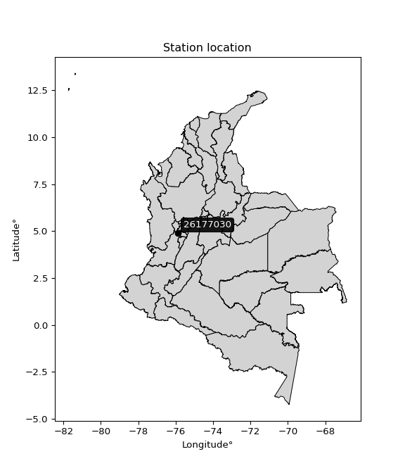

<div align="center">


</div>

# PMax24h Station (Rain): 26177030

Maximum Precipitation in 24 hours (PMax24h) is the greatest amount of rainfall for a specific duration that is meteorologically possible for a given location, acting as a "worst-case" scenario for extreme storms, crucial for designing safety-critical infrastructure like bridges, river deviations, dams, spillways, and nuclear plants to prevent catastrophic failure. The PMax24h is related with the Probable Maximum Precipitation (PMP) and it is calculated by hydrologists using meteorological data to determine the upper limit of extreme rainfall, often leading to the Probable Maximum Flood (PMF) for flood control design, and is increasingly being studied for climate change impacts. Probable Maximum Precipitation (PMP) is the theoretical upper limit of rainfall, a deterministic estimate for extreme events, while probability distributions (like GEV, Gumbel) describe the likelihood and frequency of various precipitation amounts, including rare ones, showing how often events occur, with PMP representing the extreme end of these distributions, used for critical infrastructure design to ensure safety against the worst conceivable weather, unlike standard statistical forecasts which cover typical probabilities.

The most common probability distributions in hydrology, used for analyzing floods, rainfall, and streamflow, include the Normal, Log-Normal, Gumbel, Gamma (including Log-Pearson Type III), and Generalized Extreme Value (GEV) distributions, often chosen based on the data´s skewness and whether modeling extremes or general conditions, with Gumbel and GEV popular for extreme events like floods, while the Normal distribution serves as a baseline, though often requiring transformations for skewed hydrological data. These distributions help in designing water infrastructure, managing water resources, and forecasting hydrologic events.

> Hydrological data often isn´t perfectly normal (it´s skewed), so different distributions are needed for different applications, such as: **Flood Frequency Analysis**: Using Gumbel, GEV, or Log-Pearson Type III for predicting extreme flood magnitudes and their return periods, **Rainfall Analysis**: Normal for annual totals, but Log-Normal, Weibull, or GEV for intensity or extreme daily rainfall, **Streamflow Modeling**: Gamma and Log-Normal for maximum flows, GEV for minimum flows, and Kappa for daily flows.

<div align="center">

</img>

</div>


## A. General information


### 1. General running parameters

• app_version: _v20260225_. • runtime: _2026-02-28 16:54:07.457399_. • Python version: _3.14.0_. • SciPy version: _1.16.3_. • Pandas version: _2.3.3_. • NumPy version: _2.3.5_. • Stations dataset (station_dataset_file): _dataset/pmax24h_in/automatic_colombia_2003_2025.csv_. • Stations catalog (station_catalog_file): _dataset/CNE.xls_. • Minimum year to eval til year_max (date_min): _1900_. • Maximum year to eval since year_min (date_max): _2025_. • Creates, save and include plots into reports (create_plot): _False_. • Plot only fit distributions with Δo > Δ (plot_only_fit): _True_. • Plot only simple graphs avoiding multiple CDFs and multiple Extreme values plots (plot_only_simple): _False_. • Eval low extreme values, if False, evaluates high extreme values (low_extreme): _False_. • Eval every SciPy distribution as logarithmic (pdist_logarithmic_on): _True_. • Standard deviation normalized (ddof): _1.0_. • Return periods to eval in years (Tr): _[2, 2.33, 5, 10, 15, 20, 25, 50, 75, 100, 200, 250, 500, 750, 1000]_. • Minimum data sample per station, 0 means any (minimum_sample): _5_. • Z-Score maximum threshold to adjust a value, 0 means disable (zscore_max): _3.5_. • Z-Score minimum threshold to adjust a value, 0 means disable (zscore_min): _-2.5_. • Avoid zeros, e.g. rain = 0 (avoid_zeros): _True_. • Avoid null values (avoid_nans): _True_. 

:file_folder:Table: [dataset.csv](../../dataset/pmax24h_in/automatic_colombia_2003_2025.csv)

> Delta Degrees of Freedom (DDOF): is a parameter used in the formulas for calculating variance and standard deviation. When ddof=0, the divisor is $N$ (the total number of observations) and this is used when your data set is the entire population. When ddof=1, the divisor is $N-1$ and this is used when your data set is a sample drawn from a larger population. Using $N-1$ provides an unbiased estimate of the population variance (known as Bessel´s correction).


### 2. Station info and location

|   id |   CODIGO | NOMBRE                       | CATEGORIA    | TECNOLOGIA                              | ESTADO   | FECHA_INSTALACION   |   FECHA_SUSPENSION |   ALTITUD |   LATITUD |   LONGITUD | DEPARTAMENTO   | MUNICIPIO   | AREA_OPERATIVA                         | ENTIDAD                                                     | AREA_HIDROGRAFICA   | ZONA_HIDROGRAFICA   | SUBZONA_HIDROGRAFICA               | CORRIENTE   | Catalogo   |   Version |
|-----:|---------:|:-----------------------------|:-------------|:----------------------------------------|:---------|:--------------------|-------------------:|----------:|----------:|-----------:|:---------------|:------------|:---------------------------------------|:------------------------------------------------------------|:--------------------|:--------------------|:-----------------------------------|:------------|:-----------|----------:|
|    0 | 26177030 | LA VIRGINIA - AUT [26177030] | Limnigráfica | Automática con Telemetría, Convencional | Activa   | 15/10/1946          |                nan |       922 |    4.8925 |   -75.8827 | Risaralda      | La Virginia | Area Operativa 09 - Cauca-Valle-Caldas | INSTITUTO DE HIDROLOGIA METEOROLOGIA Y ESTUDIOS AMBIENTALES | Magdalena Cauca     | Cauca               | Río Otún y otros directos al Cauca | Cauca       | CNE_IDEAM  |  20251226 |

<div align="center">

Dynamic map: [:earth_americas:Google](http://maps.google.com/maps?q=4.8925,-75.882694444) [:earth_americas:OSM](https://www.openstreetmap.org/#map=18/4.8925/-75.882694444&layers=P) [:earth_americas:Bing](https://www.bing.com/maps?cp=4.8925~-75.882694444&lvl=18) [:earth_americas:Apple](https://maps.apple.com/frame?center=4.8925%2C-75.882694444&span=0.003%2C0.006)

</div>


<div align="center">

```geojson
{
  "type": "Feature",
  "geometry": {
    "type": "Point", 
    "coordinates": [-75.882694444, 4.8925]
  }, 
  "properties": {
    "Name": "26177030"
  }
}
```

</div>


### 3. Discrete values table and plot

<div align="center">

|               |           0 |           1 |          2 |           3 |           4 |           5 |          6 |          7 |           8 |           9 |
|:--------------|------------:|------------:|-----------:|------------:|------------:|------------:|-----------:|-----------:|------------:|------------:|
| Date          | 2016        | 2017        | 2018       | 2019        | 2020        | 2021        | 2022       | 2023       | 2024        | 2025        |
| Value         |   97.6      |  144.4      |   76.5     |   58.2      |   45.5      |   56        |  957.516   |  109.631   |   59.308    |   72.58     |
| Value_initial |   97.6      |  144.4      |   76.5     |   58.2      |   45.5      |   56        |  957.516   |  109.631   |   59.308    |   72.58     |
| count         |   10        |   10        |   10       |   10        |   10        |   10        |   10       |   10       |   10        |   10        |
| mean          |  167.724    |  167.724    |  167.724   |  167.724    |  167.724    |  167.724    |  167.724   |  167.724   |  167.724    |  167.724    |
| std           |  279.116    |  279.116    |  279.116   |  279.116    |  279.116    |  279.116    |  279.116   |  279.116   |  279.116    |  279.116    |
| zscore        |   -0.251234 |   -0.083562 |   -0.32683 |   -0.392394 |   -0.437895 |   -0.400276 |    2.82962 |   -0.20813 |   -0.388424 |   -0.340874 |


</div>


> The initial value (value_initial) correspond to the initial obtained or null completed value, and value (value) is adjusted only when the initial value is outside the valid range (outlier) definite through the Z-Score value. If Z-Score is active, values out of range or outliers are replaced with the station mean value. A Z-Score (or standard score) measures how many standard deviations a data point is from the mean of a dataset, indicating its relative position; positive scores mean above the mean, negative mean below, and a score of zero is exactly at the mean, allowing for comparison of values from different distributions. It´s calculated using the formula $z=(x–μ)/σ$, where $x$ is the data point, $μ$ is the mean, and $σ$ is the standard deviation, helping identify outliers and understand probability.
>
> <sub>**Note**: In this study, "completing" (filling gaps in) and "extending" (forecasting or lengthening the historical record) rainfall data series are avoided for certain critical analyses because they introduce artificial bias and uncertainty, which can distort the statistics of rare events (extremes), alter day-to-day variability, and compromise the integrity and homogeneity of the original data. Some reasons against Completing/Extending rainfall data are: **Distortion of Extremes and Variability**: The primary issue is that most gap-filling or extension methods rely on averaging or regression with nearby stations, which inherently smooths the data. Rainfall is highly variable in space and time, with a large percentage of zero values and occasional large storms. Infilling methods often underestimate the highest values and overestimate the lowest (zero) values, which severely distorts analyses focused on flood frequency, drought severity, and intensity-duration-frequency (IDF) curves, **Loss of Data Homogeneity**: Infilled or extended data are synthetic estimates, not actual measurements. Combining these estimates with observed data can violate the assumption of data homogeneity, which requires that the data properties do not change over time. Inhomogeneity can lead to incorrect conclusions about long-term trends or changes in climate patterns, **Propagation of Errors**: Errors and biases from the original data (e.g., wind-induced undercatch, instrument errors, site changes) or the data used for imputation can propagate through the analysis, leading to unreliable hydrological models and inaccurate predictions, **Compromised Statistical Integrity**: For statistical analyses, especially those involving the frequency of events, using artificial data can introduce time bias or autocorrelation that doesn´t exist in reality, making it difficult to assess the true probability of events, **Difficulty in Validation**: It is difficult to accurately validate the quality of filled or extended data, especially for past periods where ground-truth measurements are unavailable. The reliability of imputation techniques heavily depends on the density of the surrounding station network and the complexity of the local topography.</sub>


### 4. Active continuous probability distributions from SciPy (80 of 104 available)

A Probability Density Function (PDF) describes the relative likelihood of a continuous random variable falling within a specific range, where the total area under its curve equals 1, and the area over any interval gives the actual probability for that range. Unlike discrete probabilities (like rolling a die), a PDF shows density, not direct probability for a single point (which is zero), with higher points indicating higher likelihood, often visualized as a bell curve for normal distributions.

A log of a probability density function (log-PDF) is simply the logarithm of the PDF´s value, denoted as $log(f(x))$, useful for converting multiplication of probabilities into addition, improving numerical stability with tiny numbers, and connecting to information theory concepts like entropy. Instead of dealing with very small probabilities (e.g., 0.000001), log-PDFs use negative numbers (e.g., $log(0.00001) ≈ -11.51$ that are easier for computers to handle, preventing underflow errors and simplifying complex calculations. In this study, each active probability distribution from SciPy is also evaluated in the $log$ form.

[scipy.stats](https://docs.scipy.org/doc/scipy/reference/stats.html) is a Python´s powerful submodule within the SciPy library for comprehensive statistical analysis, offering over 130 probability distributions (like Normal, Poisson, etc.), functions for descriptive stats (mean, variance), hypothesis testing (t-tests, chi-square), random variable generation, and statistical tests, making it essential for data science, modeling, and research. It provides tools to explore, model, and draw conclusions from data efficiently, working seamlessly with [NumPy](https://numpy.org/).

<div align="center">

|   id | p_dist           |   n_parameter | fit_method   | label                                                                       | active   | ref                                                                                                      |
|-----:|:-----------------|--------------:|:-------------|:----------------------------------------------------------------------------|:---------|:---------------------------------------------------------------------------------------------------------|
|    0 | alpha            |             3 | MLE          | Alpha                                                                       | True     | [:mortar_board:](https://docs.scipy.org/doc/scipy/reference/generated/scipy.stats.alpha.html)            |
|    1 | anglit           |             2 | MM           | Anglit                                                                      | True     | [:mortar_board:](https://docs.scipy.org/doc/scipy/reference/generated/scipy.stats.anglit.html)           |
|    2 | arcsine          |             2 | MM           | Arcsine                                                                     | True     | [:mortar_board:](https://docs.scipy.org/doc/scipy/reference/generated/scipy.stats.arcsine.html)          |
|    3 | argus            |             3 | MLE          | Argus                                                                       | True     | [:mortar_board:](https://docs.scipy.org/doc/scipy/reference/generated/scipy.stats.argus.html)            |
|    4 | beta             |             4 | MLE          | Beta                                                                        | True     | [:mortar_board:](https://docs.scipy.org/doc/scipy/reference/generated/scipy.stats.beta.html)             |
|    5 | betaprime        |             4 | MLE          | Beta prime                                                                  | True     | [:mortar_board:](https://docs.scipy.org/doc/scipy/reference/generated/scipy.stats.betaprime.html)        |
|    6 | bradford         |             3 | MLE          | Bradford                                                                    | True     | [:mortar_board:](https://docs.scipy.org/doc/scipy/reference/generated/scipy.stats.bradford.html)         |
|    7 | burr             |             4 | MLE          | Burr (Type III)                                                             | True     | [:mortar_board:](https://docs.scipy.org/doc/scipy/reference/generated/scipy.stats.burr.html)             |
|    8 | burr12           |             4 | MLE          | Burr (Type III) 12                                                          | True     | [:mortar_board:](https://docs.scipy.org/doc/scipy/reference/generated/scipy.stats.burr12.html)           |
|    9 | cosine           |             2 | MLE          | Cosine                                                                      | True     | [:mortar_board:](https://docs.scipy.org/doc/scipy/reference/generated/scipy.stats.cosine.html)           |
|   10 | crystalball      |             4 | MLE          | Crystalball                                                                 | True     | [:mortar_board:](https://docs.scipy.org/doc/scipy/reference/generated/scipy.stats.crystalball.html)      |
|   11 | dgamma           |             3 | MLE          | Double gamma                                                                | True     | [:mortar_board:](https://docs.scipy.org/doc/scipy/reference/generated/scipy.stats.dgamma.html)           |
|   12 | dweibull         |             3 | MLE          | Double Weibull                                                              | True     | [:mortar_board:](https://docs.scipy.org/doc/scipy/reference/generated/scipy.stats.dweibull.html)         |
|   13 | erlang           |             3 | MLE          | Erlang                                                                      | True     | [:mortar_board:](https://docs.scipy.org/doc/scipy/reference/generated/scipy.stats.erlang.html)           |
|   14 | exponnorm        |             3 | MLE          | Exponentially modified Normal                                               | True     | [:mortar_board:](https://docs.scipy.org/doc/scipy/reference/generated/scipy.stats.exponnorm.html)        |
|   15 | exponpow         |             3 | MLE          | Exponential power                                                           | True     | [:mortar_board:](https://docs.scipy.org/doc/scipy/reference/generated/scipy.stats.exponpow.html)         |
|   16 | exponweib        |             4 | MLE          | Exponentiated Weibull                                                       | True     | [:mortar_board:](https://docs.scipy.org/doc/scipy/reference/generated/scipy.stats.exponweib.html)        |
|   17 | f                |             4 | MLE          | F                                                                           | True     | [:mortar_board:](https://docs.scipy.org/doc/scipy/reference/generated/scipy.stats.f.html)                |
|   18 | fatiguelife      |             3 | MLE          | Fatigue-life (Birnbaum-Saunders)                                            | True     | [:mortar_board:](https://docs.scipy.org/doc/scipy/reference/generated/scipy.stats.fatiguelife.html)      |
|   19 | foldnorm         |             3 | MM           | Fold Normal                                                                 | True     | [:mortar_board:](https://docs.scipy.org/doc/scipy/reference/generated/scipy.stats.foldnorm.html)         |
|   20 | gamma            |             3 | MLE          | Gamma                                                                       | True     | [:mortar_board:](https://docs.scipy.org/doc/scipy/reference/generated/scipy.stats.gamma.html)            |
|   21 | gausshyper       |             6 | MLE          | Gauss hypergeometric                                                        | True     | [:mortar_board:](https://docs.scipy.org/doc/scipy/reference/generated/scipy.stats.gausshyper.html)       |
|   22 | genexpon         |             5 | MLE          | Generalized exponential                                                     | True     | [:mortar_board:](https://docs.scipy.org/doc/scipy/reference/generated/scipy.stats.genexpon.html)         |
|   23 | genextreme       |             3 | MLE          | Generalized exponential                                                     | True     | [:mortar_board:](https://docs.scipy.org/doc/scipy/reference/generated/scipy.stats.genextreme.html)       |
|   24 | gengamma         |             4 | MLE          | Generalized gamma                                                           | True     | [:mortar_board:](https://docs.scipy.org/doc/scipy/reference/generated/scipy.stats.gengamma.html)         |
|   25 | genhalflogistic  |             3 | MLE          | Generalized half-logistic                                                   | True     | [:mortar_board:](https://docs.scipy.org/doc/scipy/reference/generated/scipy.stats.genhalflogistic.html)  |
|   26 | genlogistic      |             3 | MLE          | Generalized logistic                                                        | True     | [:mortar_board:](https://docs.scipy.org/doc/scipy/reference/generated/scipy.stats.genlogistic.html)      |
|   27 | gennorm          |             3 | MLE          | Generalized Normal                                                          | True     | [:mortar_board:](https://docs.scipy.org/doc/scipy/reference/generated/scipy.stats.gennorm.html)          |
|   28 | genpareto        |             3 | MLE          | Generalized Pareto                                                          | True     | [:mortar_board:](https://docs.scipy.org/doc/scipy/reference/generated/scipy.stats.genpareto.html)        |
|   29 | gompertz         |             3 | MLE          | Gompertz (or truncated Gumbel)                                              | True     | [:mortar_board:](https://docs.scipy.org/doc/scipy/reference/generated/scipy.stats.gompertz.html)         |
|   30 | gumbel_l         |             2 | MM           | Gumbel Left Skew                                                            | True     | [:mortar_board:](https://docs.scipy.org/doc/scipy/reference/generated/scipy.stats.gumbel_l.html)         |
|   31 | gumbel_r         |             2 | MM           | Gumbel Right Skew                                                           | True     | [:mortar_board:](https://docs.scipy.org/doc/scipy/reference/generated/scipy.stats.gumbel_r.html)         |
|   32 | halfgennorm      |             3 | MLE          | Upper half of a generalized normal                                          | True     | [:mortar_board:](https://docs.scipy.org/doc/scipy/reference/generated/scipy.stats.halfgennorm.html)      |
|   33 | halflogistic     |             2 | MM           | Half-logistic                                                               | True     | [:mortar_board:](https://docs.scipy.org/doc/scipy/reference/generated/scipy.stats.halflogistic.html)     |
|   34 | halfnorm         |             2 | MM           | Half Normal                                                                 | True     | [:mortar_board:](https://docs.scipy.org/doc/scipy/reference/generated/scipy.stats.halfnorm.html)         |
|   35 | hypsecant        |             2 | MM           | hyperbolic secant                                                           | True     | [:mortar_board:](https://docs.scipy.org/doc/scipy/reference/generated/scipy.stats.hypsecant.html)        |
|   36 | invgamma         |             3 | MLE          | Inverted gamma                                                              | True     | [:mortar_board:](https://docs.scipy.org/doc/scipy/reference/generated/scipy.stats.invgamma.html)         |
|   37 | invgauss         |             3 | MLE          | Inverse Gaussian                                                            | True     | [:mortar_board:](https://docs.scipy.org/doc/scipy/reference/generated/scipy.stats.invgauss.html)         |
|   38 | invweibull       |             3 | MLE          | Inverted Weibull                                                            | True     | [:mortar_board:](https://docs.scipy.org/doc/scipy/reference/generated/scipy.stats.invweibull.html)       |
|   39 | johnsonsb        |             4 | MLE          | Johnson SB                                                                  | True     | [:mortar_board:](https://docs.scipy.org/doc/scipy/reference/generated/scipy.stats.johnsonsb.html)        |
|   40 | johnsonsu        |             4 | MLE          | Johnson Su                                                                  | True     | [:mortar_board:](https://docs.scipy.org/doc/scipy/reference/generated/scipy.stats.johnsonsu.html)        |
|   41 | kappa3           |             3 | MLE          | Kappa 3                                                                     | True     | [:mortar_board:](https://docs.scipy.org/doc/scipy/reference/generated/scipy.stats.kappa3.html)           |
|   42 | kappa4           |             4 | MLE          | Kappa 4                                                                     | True     | [:mortar_board:](https://docs.scipy.org/doc/scipy/reference/generated/scipy.stats.kappa4.html)           |
|   43 | ksone            |             3 | MLE          | Kolmogorov-Smirnov one-sided test statistic distribution                    | True     | [:mortar_board:](https://docs.scipy.org/doc/scipy/reference/generated/scipy.stats.ksone.html)            |
|   44 | kstwobign        |             2 | MLE          | Limiting distribution of scaled Kolmogorov-Smirnov two-sided test statistic | True     | [:mortar_board:](https://docs.scipy.org/doc/scipy/reference/generated/scipy.stats.kstwobign.html)        |
|   45 | laplace          |             2 | MM           | Laplace                                                                     | True     | [:mortar_board:](https://docs.scipy.org/doc/scipy/reference/generated/scipy.stats.laplace.html)          |
|   46 | levy_l           |             2 | MLE          | Left-skewed Levy                                                            | True     | [:mortar_board:](https://docs.scipy.org/doc/scipy/reference/generated/scipy.stats.levy_l.html)           |
|   47 | loggamma         |             3 | MLE          | Log gamma                                                                   | True     | [:mortar_board:](https://docs.scipy.org/doc/scipy/reference/generated/scipy.stats.loggamma.html)         |
|   48 | logistic         |             2 | MM           | Logistic (or Sech-squared)                                                  | True     | [:mortar_board:](https://docs.scipy.org/doc/scipy/reference/generated/scipy.stats.logistic.html)         |
|   49 | loglaplace       |             3 | MLE          | Log-Laplace                                                                 | True     | [:mortar_board:](https://docs.scipy.org/doc/scipy/reference/generated/scipy.stats.loglaplace.html)       |
|   50 | lomax            |             3 | MLE          | Lomax (Pareto of the second kind)                                           | True     | [:mortar_board:](https://docs.scipy.org/doc/scipy/reference/generated/scipy.stats.lomax.html)            |
|   51 | maxwell          |             2 | MM           | Maxwell                                                                     | True     | [:mortar_board:](https://docs.scipy.org/doc/scipy/reference/generated/scipy.stats.maxwell.html)          |
|   52 | mielke           |             4 | MLE          | Mielke Beta-Kappa / Dagum                                                   | True     | [:mortar_board:](https://docs.scipy.org/doc/scipy/reference/generated/scipy.stats.mielke.html)           |
|   53 | moyal            |             2 | MM           | Moyal                                                                       | True     | [:mortar_board:](https://docs.scipy.org/doc/scipy/reference/generated/scipy.stats.moyal.html)            |
|   54 | nakagami         |             3 | MLE          | Nakagami                                                                    | True     | [:mortar_board:](https://docs.scipy.org/doc/scipy/reference/generated/scipy.stats.nakagami.html)         |
|   55 | ncf              |             5 | MLE          | Non-central F distribution                                                  | True     | [:mortar_board:](https://docs.scipy.org/doc/scipy/reference/generated/scipy.stats.ncf.html)              |
|   56 | nct              |             4 | MLE          | Non-central Student’s t                                                     | True     | [:mortar_board:](https://docs.scipy.org/doc/scipy/reference/generated/scipy.stats.nct.html)              |
|   57 | norm             |             2 | MM           | Normal                                                                      | True     | [:mortar_board:](https://docs.scipy.org/doc/scipy/reference/generated/scipy.stats.norm.html)             |
|   58 | pearson3         |             3 | MM           | Pearson type III                                                            | True     | [:mortar_board:](https://docs.scipy.org/doc/scipy/reference/generated/scipy.stats.pearson3.html)         |
|   59 | powerlaw         |             3 | MLE          | Power-function                                                              | True     | [:mortar_board:](https://docs.scipy.org/doc/scipy/reference/generated/scipy.stats.powerlaw.html)         |
|   60 | rayleigh         |             2 | MM           | Rayleigh                                                                    | True     | [:mortar_board:](https://docs.scipy.org/doc/scipy/reference/generated/scipy.stats.rayleigh.html)         |
|   61 | rdist            |             3 | MLE          | R-distributed (symmetric beta)                                              | True     | [:mortar_board:](https://docs.scipy.org/doc/scipy/reference/generated/scipy.stats.rdist.html)            |
|   62 | rice             |             3 | MLE          | Rice                                                                        | True     | [:mortar_board:](https://docs.scipy.org/doc/scipy/reference/generated/scipy.stats.rice.html)             |
|   63 | semicircular     |             2 | MM           | Semicircular                                                                | True     | [:mortar_board:](https://docs.scipy.org/doc/scipy/reference/generated/scipy.stats.semicircular.html)     |
|   64 | skewnorm         |             3 | MLE          | Skew normal                                                                 | True     | [:mortar_board:](https://docs.scipy.org/doc/scipy/reference/generated/scipy.stats.skewnorm.html)         |
|   65 | t                |             3 | MLE          | Student’s t                                                                 | True     | [:mortar_board:](https://docs.scipy.org/doc/scipy/reference/generated/scipy.stats.t.html)                |
|   66 | trapezoid        |             4 | MLE          | Trapezoid                                                                   | True     | [:mortar_board:](https://docs.scipy.org/doc/scipy/reference/generated/scipy.stats.trapezoid.html)        |
|   67 | triang           |             3 | MLE          | Triangular                                                                  | True     | [:mortar_board:](https://docs.scipy.org/doc/scipy/reference/generated/scipy.stats.triang.html)           |
|   68 | truncexpon       |             3 | MLE          | Truncated exponential                                                       | True     | [:mortar_board:](https://docs.scipy.org/doc/scipy/reference/generated/scipy.stats.truncexpon.html)       |
|   69 | truncnorm        |             4 | MLE          | Truncated normal                                                            | True     | [:mortar_board:](https://docs.scipy.org/doc/scipy/reference/generated/scipy.stats.truncnorm.html)        |
|   70 | truncpareto      |             4 | MLE          | Upper truncated Pareto                                                      | True     | [:mortar_board:](https://docs.scipy.org/doc/scipy/reference/generated/scipy.stats.truncpareto.html)      |
|   71 | truncweibull_min |             5 | MLE          | Doubly truncated Weibull minimum                                            | True     | [:mortar_board:](https://docs.scipy.org/doc/scipy/reference/generated/scipy.stats.truncweibull_min.html) |
|   72 | tukeylambda      |             3 | MLE          | Tukey-Lamdba                                                                | True     | [:mortar_board:](https://docs.scipy.org/doc/scipy/reference/generated/scipy.stats.tukeylambda.html)      |
|   73 | uniform          |             2 | MLE          | Uniform                                                                     | True     | [:mortar_board:](https://docs.scipy.org/doc/scipy/reference/generated/scipy.stats.uniform.html)          |
|   74 | vonmises         |             3 | MLE          | Von Mises                                                                   | True     | [:mortar_board:](https://docs.scipy.org/doc/scipy/reference/generated/scipy.stats.vonmises.html)         |
|   75 | vonmises_line    |             3 | MLE          | Von Mises line                                                              | True     | [:mortar_board:](https://docs.scipy.org/doc/scipy/reference/generated/scipy.stats.vonmises_line.html)    |
|   76 | wald             |             2 | MM           | Wald                                                                        | True     | [:mortar_board:](https://docs.scipy.org/doc/scipy/reference/generated/scipy.stats.wald.html)             |
|   77 | weibull_max      |             3 | MLE          | Weibull maximum                                                             | True     | [:mortar_board:](https://docs.scipy.org/doc/scipy/reference/generated/scipy.stats.weibull_max.html)      |
|   78 | weibull_min      |             3 | MLE          | Weibull minimum                                                             | True     | [:mortar_board:](https://docs.scipy.org/doc/scipy/reference/generated/scipy.stats.weibull_min.html)      |
|   79 | wrapcauchy       |             3 | MLE          | Wrapped  Cauchy                                                             | True     | [:mortar_board:](https://docs.scipy.org/doc/scipy/reference/generated/scipy.stats.wrapcauchy.html)       |

</div>

> **n_parameter:** # arguments & localization & scale.
>
> **Fit methods:** (MLE) maximum likelihood, (MM) L-moments.
>
>**Inactive** (With the only purpose of prevent loops, zero divisions, infinite values, over high estimated values or horizontal trending for recurrence intervals estimations, the follow distributions were disabled.)**:** lognorm, norminvgauss, powernorm, powerlognorm, cauchy, halfcauchy, foldcauchy, skewcauchy, chi2, expon, fisk, genhyperbolic, geninvgauss, gibrat, kstwo, laplace_asymmetric, levy, levy_stable, ncx2, pareto, rel_breitwigner, recipinvgauss, studentized_range, loguniform, 


## B. Probability (PDF) vs. Empirical (EDF) distributions functions

A continuous probability distribution (CPD) describes probabilities for variables that can take any value within a range (like rain any time), unlike discrete variables with specific outcomes (like temperature). It uses a Probability Density Function (PDF), a curve where the total area under it equals 1, and the probability of the variable falling within an interval (a to b) is found by calculating the area under the curve between those points. A key feature is that the probability of hitting any single exact value is zero, so probabilities are always expressed for ranges, e.g., $P(a ≤ X ≤ b)$.

<div align="center">

Distributions parameters from station values
|     |   station | p_dist              |   n |              loc |           scale | shape                  | shape1                | shape2                | shape3             |
|----:|----------:|:--------------------|----:|-----------------:|----------------:|:-----------------------|:----------------------|:----------------------|:-------------------|
|   0 |  26177030 | alpha               |  10 |      30.6239     |    37.9206      | 0.45832045139301747    |                       |                       |                    |
|   1 |  26177030 | anglit              |  10 |     167.724      |   774.625       |                        |                       |                       |                    |
|   2 |  26177030 | arcsine             |  10 |    -206.75       |   748.947       |                        |                       |                       |                    |
|   3 |  26177030 | argus               |  10 |     -75.3622     |  1056.14        | 2.4476950141192873e-13 |                       |                       |                    |
|   4 |  26177030 | beta                |  10 |     -35.1486     |   992.665       | 0.010405093877480735   | 0.06664785439928375   |                       |                    |
|   5 |  26177030 | betaprime           |  10 |      38.6322     |     0.114266    | 227.2305903586007      | 1.034278980691529     |                       |                    |
|   6 |  26177030 | bradford            |  10 |      45.5        |   912.016       | 4.090125542791589      |                       |                       |                    |
|   7 |  26177030 | burr                |  10 |      38.7248     |     0.787626    | 1.031245109784131      | 35.6185037189385      |                       |                    |
|   8 |  26177030 | burr12              |  10 |       0.00922528 |    44.9406      | 232.03165250294677     | 0.005617299345258384  |                       |                    |
|   9 |  26177030 | cosine              |  10 |      84.9555     |    25.2288      |                        |                       |                       |                    |
|  10 |  26177030 | crystalball         |  10 |      -0.194615   |   313.5         | 4.595563974350666      | 2.1932550539350775    |                       |                    |
|  11 |  26177030 | dgamma              |  10 |      72.58       |   232.919       | 0.48725128176315136    |                       |                       |                    |
|  12 |  26177030 | dweibull            |  10 |      59.308      |   236.9         | 0.4907273516334519     |                       |                       |                    |
|  13 |  26177030 | erlang              |  10 |      45.5        |   204.628       | 0.41616052752667576    |                       |                       |                    |
|  14 |  26177030 | exponnorm           |  10 |      45.2987     |     0.0685256   | 1773.7961222329698     |                       |                       |                    |
|  15 |  26177030 | exponpow            |  10 |      45.5        |   287.214       | 0.48366310898757364    |                       |                       |                    |
|  16 |  26177030 | exponweib           |  10 |      45.5        |    11.2732      | 2.2920265799571014     | 0.28665197128014847   |                       |                    |
|  17 |  26177030 | f                   |  10 |      38.8093     |    25.1406      | 99.40679794105421      | 2.07111312460015      |                       |                    |
|  18 |  26177030 | fatiguelife         |  10 |      42.7567     |    46.9465      | 1.9542272234662783     |                       |                       |                    |
|  19 |  26177030 | foldnorm            |  10 |    -220.282      |   487.942       | 0.0006972748477176724  |                       |                       |                    |
|  20 |  26177030 | gamma               |  10 |      45.5        |   185.407       | 0.31192940936497837    |                       |                       |                    |
|  21 |  26177030 | gausshyper          |  10 |     -14.5671     |   972.083       | 0.604851767184547      | 0.5439217058795633    | 2.966285286163397     | 0.4262018208934055 |
|  22 |  26177030 | genexpon            |  10 |      45.5        |   203.753       | 1.6670547093432067     | 2.464252898642678e-12 | 1.836233122292532     |                    |
|  23 |  26177030 | genextreme          |  10 |      63.5794     |    24.3959      | -0.965007573487807     |                       |                       |                    |
|  24 |  26177030 | gengamma            |  10 |      45.5        |    14.5841      | 1.6585235378275334     | 0.4377232570406271    |                       |                    |
|  25 |  26177030 | genhalflogistic     |  10 |     -47.2559     |  1038.92        | 1.033982080369908      |                       |                       |                    |
|  26 |  26177030 | genlogistic         |  10 |    -671.355      |    95.791       | 2705.6870524921524     |                       |                       |                    |
|  27 |  26177030 | gennorm             |  10 |      72.58       |     4.73135     | 0.4304786436924558     |                       |                       |                    |
|  28 |  26177030 | genpareto           |  10 |      45.5        |    94.7089      | 0.19026529014074045    |                       |                       |                    |
|  29 |  26177030 | gompertz            |  10 |      45.4999     |     3.45858e+07 | 283573.4583785189      |                       |                       |                    |
|  30 |  26177030 | gumbel_l            |  10 |     286.894      |   206.458       |                        |                       |                       |                    |
|  31 |  26177030 | gumbel_r            |  10 |      48.5527     |   206.458       |                        |                       |                       |                    |
|  32 |  26177030 | halfgennorm         |  10 |      45.5        |     0.000249702 | 0.16011277983053596    |                       |                       |                    |
|  33 |  26177030 | halflogistic        |  10 |    -146.118      |   226.388       |                        |                       |                       |                    |
|  34 |  26177030 | halfnorm            |  10 |    -182.758      |   439.264       |                        |                       |                       |                    |
|  35 |  26177030 | hypsecant           |  10 |     167.724      |   168.572       |                        |                       |                       |                    |
|  36 |  26177030 | invgamma            |  10 |      38.5747     |    25.9679      | 1.0343016194580308     |                       |                       |                    |
|  37 |  26177030 | invgauss            |  10 |      41.3388     |    22.3207      | 5.662245157770478      |                       |                       |                    |
|  38 |  26177030 | invweibull          |  10 |      38.2988     |    25.2807      | 1.0362625352298842     |                       |                       |                    |
|  39 |  26177030 | johnsonsb           |  10 |      45.5        |   915.823       | 0.7688757794195618     | 0.13436548897272071   |                       |                    |
|  40 |  26177030 | johnsonsu           |  10 |      56.5381     |     2.67886     | -0.9426642941014055    | 0.4253202975994878    |                       |                    |
|  41 |  26177030 | kappa3              |  10 |      45.5        |    30.0473      | 1.1268985649809138     |                       |                       |                    |
|  42 |  26177030 | kappa4              |  10 |     -44.6185     |   977.128       | 1.1013598951356516     | 0.9551317596353304    |                       |                    |
|  43 |  26177030 | ksone               |  10 |     -45.7016     |  1094.42        | 1.0                    |                       |                       |                    |
|  44 |  26177030 | kstwobign           |  10 |    -398.65       |   680.809       |                        |                       |                       |                    |
|  45 |  26177030 | laplace             |  10 |     167.724      |   187.237       |                        |                       |                       |                    |
|  46 |  26177030 | levy_l              |  10 |    1055.82       |   515.36        |                        |                       |                       |                    |
|  47 |  26177030 | loggamma            |  10 |  -94347.4        | 12487.3         | 1937.3819264863307     |                       |                       |                    |
|  48 |  26177030 | logistic            |  10 |     167.724      |   145.988       |                        |                       |                       |                    |
|  49 |  26177030 | loglaplace          |  10 |      -0.226705   |    72.8067      | 1.935269979375323      |                       |                       |                    |
|  50 |  26177030 | lomax               |  10 |      45.5        |    33.3828      | 1.120231833916126      |                       |                       |                    |
|  51 |  26177030 | maxwell             |  10 |    -459.724      |   393.195       |                        |                       |                       |                    |
|  52 |  26177030 | mielke              |  10 |      -0.143416   |     4.1838      | 1072.0154629424642     | 2.1938527754895487    |                       |                    |
|  53 |  26177030 | moyal               |  10 |      16.298      |   119.199       |                        |                       |                       |                    |
|  54 |  26177030 | nakagami            |  10 |      45.5        |   433.606       | 0.12844960507097558    |                       |                       |                    |
|  55 |  26177030 | ncf                 |  10 |      -0.55158    |    80.7065      | 58.67079782001079      | 4.992680764857065     | 2.704187449017068e-09 |                    |
|  56 |  26177030 | nct                 |  10 |      -0.193606   |     1.63827     | 1.8836364368050091     | 43.52487762291469     |                       |                    |
|  57 |  26177030 | norm                |  10 |     167.724      |   264.793       |                        |                       |                       |                    |
|  58 |  26177030 | pearson3            |  10 |     167.724      |   264.793       | 2.6105126206474734     |                       |                       |                    |
|  59 |  26177030 | powerlaw            |  10 |      45.5        |   912.016       | 0.1493437272127443     |                       |                       |                    |
|  60 |  26177030 | rayleigh            |  10 |    -338.841      |   404.18        |                        |                       |                       |                    |
|  61 |  26177030 | rdist               |  10 |     -49.7368     |   194.137       | 1.3378081802288806     |                       |                       |                    |
|  62 |  26177030 | rice                |  10 |    -175.755      |   306.67        | 0.00012988905041032552 |                       |                       |                    |
|  63 |  26177030 | semicircular        |  10 |     167.723      |   529.586       |                        |                       |                       |                    |
|  64 |  26177030 | skewnorm            |  10 |      45.4998     |   291.654       | 9624798.742039703      |                       |                       |                    |
|  65 |  26177030 | t                   |  10 |      65.9844     |    16.4384      | 0.7986095081877826     |                       |                       |                    |
|  66 |  26177030 | trapezoid           |  10 |     -47.9867     |  1094.42        | 1.0                    | 1.0                   |                       |                    |
|  67 |  26177030 | triang              |  10 |      45.5        |  1006.34        | 4.759004186314052e-08  |                       |                       |                    |
|  68 |  26177030 | truncexpon          |  10 |     -39.4838     |   787.808       | 1.2655357634746243     |                       |                       |                    |
|  69 |  26177030 | truncnorm           |  10 | -548901          | 12063.7         | 45.5040665106323       | 45.57966827551522     |                       |                    |
|  70 |  26177030 | truncpareto         |  10 |      12.1042     |    33.3958      | 1.120611836593182      | 28.309336489891166    |                       |                    |
|  71 |  26177030 | truncweibull_min    |  10 |      28.9941     |  1140.19        | 0.009121253723418501   | 0.014214109351143929  | 0.8143575050850831    |                    |
|  72 |  26177030 | tukeylambda         |  10 |     -53.9996     |   253.46        | 1.2775216108103566     |                       |                       |                    |
|  73 |  26177030 | uniform             |  10 |      45.5        |   912.016       |                        |                       |                       |                    |
|  74 |  26177030 | vonmises            |  10 |       2.22163    |     1           | 0.8275372398657297     |                       |                       |                    |
|  75 |  26177030 | vonmises_line       |  10 |      72.6316     |    22.8446      | 1.5142939600951921     |                       |                       |                    |
|  76 |  26177030 | wald                |  10 |     -97.0693     |   264.793       |                        |                       |                       |                    |
|  77 |  26177030 | weibull_max         |  10 |     957.516      |     1.75569     | 0.1590152596352873     |                       |                       |                    |
|  78 |  26177030 | weibull_min         |  10 |      45.5        |    43.6475      | 0.42591774014186623    |                       |                       |                    |
|  79 |  26177030 | wrapcauchy          |  10 |      45.5        |   145.152       | 0.8743731076227372     |                       |                       |                    |
|  80 |  26177030 | logalpha            |  10 |       3.17633    |     2.80511     | 2.4860885795015397     |                       |                       |                    |
|  81 |  26177030 | loganglit           |  10 |       4.57266    |     2.43601     |                        |                       |                       |                    |
|  82 |  26177030 | logarcsine          |  10 |       3.39506    |     2.35521     |                        |                       |                       |                    |
|  83 |  26177030 | logargus            |  10 |       2.38408    |     4.6036      | 5.546873586527299e-05  |                       |                       |                    |
|  84 |  26177030 | logbeta             |  10 |       3.81771    |     3.61802     | 0.17081160944616255    | 0.9443599054656893    |                       |                    |
|  85 |  26177030 | logbetaprime        |  10 |       3.56942    |     0.0499098   | 35.796705207635114     | 2.740814304504269     |                       |                    |
|  86 |  26177030 | logbradford         |  10 |       3.81771    |     3.04668     | 1.084111358632296      |                       |                       |                    |
|  87 |  26177030 | logburr             |  10 |       3.33161    |     0.0448724   | 2.3807854605757646     | 1041.4224065296141    |                       |                    |
|  88 |  26177030 | logburr12           |  10 |       2.55043    |     1.39718     | 16.951612945565003     | 0.18281711264948922   |                       |                    |
|  89 |  26177030 | logcosine           |  10 |       4.81701    |     0.823332    |                        |                       |                       |                    |
|  90 |  26177030 | logcrystalball      |  10 |       4.57266    |     0.832706    | 5823.159560978351      | 23.180332460091872    |                       |                    |
|  91 |  26177030 | logdgamma           |  10 |       4.28469    |     0.543355    | 0.8999218418272118     |                       |                       |                    |
|  92 |  26177030 | logdweibull         |  10 |       4.28469    |     0.60679     | 0.9222644636615197     |                       |                       |                    |
|  93 |  26177030 | logerlang           |  10 |       3.81771    |     0.900338    | 0.26241520503144683    |                       |                       |                    |
|  94 |  26177030 | logexponnorm        |  10 |       3.85704    |     0.100604    | 7.113317174966009      |                       |                       |                    |
|  95 |  26177030 | logexponpow         |  10 |       3.81771    |     2.01294     | 0.8833281469042478     |                       |                       |                    |
|  96 |  26177030 | logexponweib        |  10 |       3.81771    |     0.89175     | 1.1452125046022514     | 0.23983606723951154   |                       |                    |
|  97 |  26177030 | logf                |  10 |       3.81771    |     0.531477    | 1.7062021069818327     | 6.897147093912894     |                       |                    |
|  98 |  26177030 | logfatiguelife      |  10 |       3.69193    |     0.624238    | 0.908155042219219      |                       |                       |                    |
|  99 |  26177030 | logfoldnorm         |  10 |       3.42676    |     1.39864     | 0.21746730603306563    |                       |                       |                    |
| 100 |  26177030 | loggamma            |  10 |       3.81771    |     1.48055     | 0.2318747139086662     |                       |                       |                    |
| 101 |  26177030 | loggausshyper       |  10 |       3.81771    |     3.04663     | 0.22366084657582985    | 0.8932685351770325    | 0.9495131906463957    | 1.6139933393397417 |
| 102 |  26177030 | loggenexpon         |  10 |       3.81771    |     0.550847    | 0.7294910664980981     | 4.454076652586682e-05 | 2.6325994949205445    |                    |
| 103 |  26177030 | loggenextreme       |  10 |       4.16216    |     0.349065    | -0.4198354252289806    |                       |                       |                    |
| 104 |  26177030 | loggengamma         |  10 |       3.81771    |     1.23975     | 0.9844387091455964     | 0.26770497913265445   |                       |                    |
| 105 |  26177030 | loggenhalflogistic  |  10 |       3.51439    |     3.51341     | 1.0487946648323319     |                       |                       |                    |
| 106 |  26177030 | loggenlogistic      |  10 |       0.934466   |     0.461988    | 1316.2588736774264     |                       |                       |                    |
| 107 |  26177030 | loggennorm          |  10 |       4.28469    |     0.060298    | 0.45631291548751896    |                       |                       |                    |
| 108 |  26177030 | loggenpareto        |  10 |      -0.0154318  |    12.82        | -1.8634346321608062    |                       |                       |                    |
| 109 |  26177030 | loggompertz         |  10 |       3.81771    |     1.7518      | 1.1056504169899246     |                       |                       |                    |
| 110 |  26177030 | loggumbel_l         |  10 |       4.94742    |     0.649258    |                        |                       |                       |                    |
| 111 |  26177030 | loggumbel_r         |  10 |       4.1979     |     0.649258    |                        |                       |                       |                    |
| 112 |  26177030 | loghalfgennorm      |  10 |       3.81771    |     0.52464     | 0.8069897861339357     |                       |                       |                    |
| 113 |  26177030 | loghalflogistic     |  10 |       3.58571    |     0.711934    |                        |                       |                       |                    |
| 114 |  26177030 | loghalfnorm         |  10 |       3.47048    |     1.38137     |                        |                       |                       |                    |
| 115 |  26177030 | loghypsecant        |  10 |       4.57266    |     0.530117    |                        |                       |                       |                    |
| 116 |  26177030 | loginvgamma         |  10 |       3.54557    |     1.82459     | 2.7372633142886613     |                       |                       |                    |
| 117 |  26177030 | loginvgauss         |  10 |       3.66402    |     1.06508     | 0.8531344152992772     |                       |                       |                    |
| 118 |  26177030 | loginvweibull       |  10 |       3.33072    |     0.831471    | 2.3819618637741775     |                       |                       |                    |
| 119 |  26177030 | logjohnsonsb        |  10 |       3.81771    |     3.04663     | -0.6189791973282514    | 0.1561409432499926    |                       |                    |
| 120 |  26177030 | logjohnsonsu        |  10 |       3.71265    |     0.00591059  | -6.049104540587216     | 1.1419650440051585    |                       |                    |
| 121 |  26177030 | logkappa3           |  10 |       3.81259    |     3.04054     | 412.6684032649823      |                       |                       |                    |
| 122 |  26177030 | logkappa4           |  10 |       3.5066     |     3.479       | 1.0983660279436522     | 1.0318600623022123    |                       |                    |
| 123 |  26177030 | logksone            |  10 |       3.51305    |     3.65596     | 1.0                    |                       |                       |                    |
| 124 |  26177030 | logkstwobign        |  10 |       2.43494    |     2.50656     |                        |                       |                       |                    |
| 125 |  26177030 | loglaplace          |  10 |       4.57266    |     0.588812    |                        |                       |                       |                    |
| 126 |  26177030 | loglevy_l           |  10 |       7.14525    |     1.47141     |                        |                       |                       |                    |
| 127 |  26177030 | logloggamma         |  10 |    -329.961      |    42.7453      | 2506.2188864576965     |                       |                       |                    |
| 128 |  26177030 | loglogistic         |  10 |       4.57266    |     0.459095    |                        |                       |                       |                    |
| 129 |  26177030 | logloglaplace       |  10 |       0.0844664  |     4.25282     | 9.201690572552097      |                       |                       |                    |
| 130 |  26177030 | loglomax            |  10 |       3.81771    |    13.428       | 18.914710972637373     |                       |                       |                    |
| 131 |  26177030 | logmaxwell          |  10 |       2.5995     |     1.2365      |                        |                       |                       |                    |
| 132 |  26177030 | logmielke           |  10 |       3.33445    |     0.0794867   | 624.1080780092204      | 2.3766378169545646    |                       |                    |
| 133 |  26177030 | logmoyal            |  10 |       4.09647    |     0.374849    |                        |                       |                       |                    |
| 134 |  26177030 | lognakagami         |  10 |       3.81771    |     1.8235      | 0.1934444851083306     |                       |                       |                    |
| 135 |  26177030 | logncf              |  10 |       3.54775    |     0.593812    | 854.3508153978345      | 5.472473054631324     | 102.6027424875158     |                    |
| 136 |  26177030 | lognct              |  10 |       0.305667   |     0.0411273   | 20.879406609123624     | 99.5131502521924      |                       |                    |
| 137 |  26177030 | lognorm             |  10 |       4.57266    |     0.832706    |                        |                       |                       |                    |
| 138 |  26177030 | logpearson3         |  10 |       4.57266    |     0.832707    | 1.943347668975695      |                       |                       |                    |
| 139 |  26177030 | logpowerlaw         |  10 |       3.81771    |     3.04663     | 0.19474417678064518    |                       |                       |                    |
| 140 |  26177030 | lograyleigh         |  10 |       2.97964    |     1.27104     |                        |                       |                       |                    |
| 141 |  26177030 | logrdist            |  10 |       4.3905     |     0.58209     | 1.6034775789959799     |                       |                       |                    |
| 142 |  26177030 | logrice             |  10 |       3.37171    |     1.03337     | 0.000762695366153652   |                       |                       |                    |
| 143 |  26177030 | logsemicircular     |  10 |       4.57266    |     1.66537     |                        |                       |                       |                    |
| 144 |  26177030 | logskewnorm         |  10 |       3.81771    |     1.12402     | 103165296.89926189     |                       |                       |                    |
| 145 |  26177030 | logt                |  10 |       4.1872     |     0.493848    | 2.123256596137331      |                       |                       |                    |
| 146 |  26177030 | logtrapezoid        |  10 |       3.51305    |     3.65596     | 1.0                    | 1.0                   |                       |                    |
| 147 |  26177030 | logtriang           |  10 |       3.8177     |     3.47957     | 2.1538143665912386e-06 |                       |                       |                    |
| 148 |  26177030 | logtruncexpon       |  10 |       3.8177     |     2.9243      | 1.0418380277482209     |                       |                       |                    |
| 149 |  26177030 | logtruncnorm        |  10 |     -10.1244     |     3.42986     | 4.0649230202435        | 7.590842911083829     |                       |                    |
| 150 |  26177030 | logtruncpareto      |  10 |      -2.06234    |     5.88006     | 7.537942560410281      | 1.5181294077459442    |                       |                    |
| 151 |  26177030 | logtruncweibull_min |  10 |       3.81291    |     3.49406     | 0.5332422719078718     | 0.001375572170275367  | 0.8733226180285243    |                    |
| 152 |  26177030 | logtukeylambda      |  10 |       4.39515    |     0.824578    | 1.4279925316232855     |                       |                       |                    |
| 153 |  26177030 | loguniform          |  10 |       3.81771    |     3.04663     |                        |                       |                       |                    |
| 154 |  26177030 | logvonmises         |  10 |      -1.8955     |     1           | 2.502817160069646      |                       |                       |                    |
| 155 |  26177030 | logvonmises_line    |  10 |       4.81772    |     0.65146     | 0.8485667469068938     |                       |                       |                    |
| 156 |  26177030 | logwald             |  10 |       3.73995    |     0.832706    |                        |                       |                       |                    |
| 157 |  26177030 | logweibull_max      |  10 |       6.86434    |     1.2823      | 0.6992940855309604     |                       |                       |                    |
| 158 |  26177030 | logweibull_min      |  10 |       3.81771    |     0.940859    | 0.9612451563579708     |                       |                       |                    |
| 159 |  26177030 | logwrapcauchy       |  10 |       3.81771    |     0.484886    | 0.5000000000000014     |                       |                       |                    |

</div>

> **loc** (Location parameter): This shifts the distribution along the x-axis. For many common distributions, like the normal (Gaussian) distribution, loc represents the mean $μ$. For others, like the uniform distribution, it might represent the minimum value, or for the beta distribution, the left end of the support interval.
>
> **scale** (Scale parameter): This determines the width or spread of the distribution. For the normal distribution, scale represents the standard deviation $σ$. For a uniform distribution, it defines the length of the interval (from $loc$ to $loc + scale$).
>
> **shape** (Shape parameters): Refers to parameters that define the specific form of a probability distribution, distinct from its location (loc) and scale (scale). These parameters are required arguments for most distribution functions. For example, a normal (Gaussian) distribution is fully defined by its location (mean) and scale (standard deviation), so it has no specific shape parameters beyond loc and scale. However, other distributions have intrinsic properties that need specification, as Gamma distribution that takes a shape parameter, often named $a$ or $alpha$.


### 0. Cumulative distribution values - CDF (160 evaluated)

Cumulative Distribution Function (CDF), denoted as $F$<sub>$X$</sub>$(x)$, is a function that gives the probability that a random variable $X$ will take a value less than or equal to a specific value, $x$ (i.e., $(P(X≥x)$. It essentially "accumulates" probabilities from a given point up to the far right (positive infinity), providing a complete picture of the distribution´s probabilities for both discrete (like rain) and continuous (like temperature) variables, helping to find probabilities over ranges or above certain values. Each station is evaluated separately ordering the $x$ values ascending, calculating the CDF and PDF values for the activated distributions and their logarithmic forms.

<div align="center">

CDF ordered by x ascending and calculating $log(f(x))$ separately
|   id |   Station |   date |       x |   count |    mean |     std |    zscore |   Value_initial |   station |   m |     alpha |   alpha_pdf |   anglit |   anglit_pdf |   arcsine |   arcsine_pdf |     argus |   argus_pdf |     beta |    beta_pdf |   betaprime |   betaprime_pdf |    bradford |   bradford_pdf |      burr |    burr_pdf |    burr12 |   burr12_pdf |    cosine |   cosine_pdf |   crystalball |   crystalball_pdf |   dgamma |       dgamma_pdf |   dweibull |     dweibull_pdf |      erlang |       erlang_pdf |   exponnorm |   exponnorm_pdf |    exponpow |     exponpow_pdf |   exponweib |   exponweib_pdf |         f |       f_pdf |   fatiguelife |   fatiguelife_pdf |   foldnorm |   foldnorm_pdf |      gamma |   gamma_pdf |   gausshyper |   gausshyper_pdf |    genexpon |   genexpon_pdf |   genextreme |   genextreme_pdf |   gengamma |   gengamma_pdf |   genhalflogistic |   genhalflogistic_pdf |   genlogistic |   genlogistic_pdf |   gennorm |   gennorm_pdf |   genpareto |   genpareto_pdf |    gompertz |   gompertz_pdf |   gumbel_l |   gumbel_l_pdf |   gumbel_r |   gumbel_r_pdf |   halfgennorm |   halfgennorm_pdf |   halflogistic |   halflogistic_pdf |   halfnorm |   halfnorm_pdf |   hypsecant |   hypsecant_pdf |   invgamma |   invgamma_pdf |   invgauss |   invgauss_pdf |   invweibull |   invweibull_pdf |   johnsonsb |    johnsonsb_pdf |   johnsonsu |   johnsonsu_pdf |      kappa3 |   kappa3_pdf |     kappa4 |   kappa4_pdf |     ksone |   ksone_pdf |   kstwobign |   kstwobign_pdf |   laplace |   laplace_pdf |   levy_l |   levy_l_pdf |    loggamma |   loggamma_pdf |   logistic |   logistic_pdf |   loglaplace |   loglaplace_pdf |       lomax |   lomax_pdf |   maxwell |   maxwell_pdf |   mielke |   mielke_pdf |    moyal |   moyal_pdf |   nakagami |   nakagami_pdf |      ncf |     ncf_pdf |       nct |     nct_pdf |     norm |   norm_pdf |   pearson3 |   pearson3_pdf |   powerlaw |   powerlaw_pdf |   rayleigh |   rayleigh_pdf |    rdist |    rdist_pdf |     rice |    rice_pdf |   semicircular |   semicircular_pdf |   skewnorm |   skewnorm_pdf |        t |       t_pdf |   trapezoid |   trapezoid_pdf |      triang |   triang_pdf |   truncexpon |   truncexpon_pdf |   truncnorm |   truncnorm_pdf |   truncpareto |   truncpareto_pdf |   truncweibull_min |   truncweibull_min_pdf |   tukeylambda |   tukeylambda_pdf |   uniform |   uniform_pdf |   vonmises |   vonmises_pdf |   vonmises_line |   vonmises_line_pdf |     wald |    wald_pdf |   weibull_max |   weibull_max_pdf |   weibull_min |   weibull_min_pdf |   wrapcauchy |   wrapcauchy_pdf |   logalpha |   logalpha_pdf |   loganglit |   loganglit_pdf |   logarcsine |   logarcsine_pdf |   logargus |   logargus_pdf |    logbeta |   logbeta_pdf |   logbetaprime |   logbetaprime_pdf |   logbradford |   logbradford_pdf |   logburr |   logburr_pdf |   logburr12 |   logburr12_pdf |   logcosine |   logcosine_pdf |   logcrystalball |   logcrystalball_pdf |   logdgamma |   logdgamma_pdf |   logdweibull |   logdweibull_pdf |   logerlang |   logerlang_pdf |   logexponnorm |   logexponnorm_pdf |   logexponpow |   logexponpow_pdf |   logexponweib |   logexponweib_pdf |        logf |   logf_pdf |   logfatiguelife |   logfatiguelife_pdf |   logfoldnorm |   logfoldnorm_pdf |   loggausshyper |   loggausshyper_pdf |   loggenexpon |   loggenexpon_pdf |   loggenextreme |   loggenextreme_pdf |   loggengamma |   loggengamma_pdf |   loggenhalflogistic |   loggenhalflogistic_pdf |   loggenlogistic |   loggenlogistic_pdf |   loggennorm |   loggennorm_pdf |   loggenpareto |   loggenpareto_pdf |   loggompertz |   loggompertz_pdf |   loggumbel_l |   loggumbel_l_pdf |   loggumbel_r |   loggumbel_r_pdf |   loghalfgennorm |   loghalfgennorm_pdf |   loghalflogistic |   loghalflogistic_pdf |   loghalfnorm |   loghalfnorm_pdf |   loghypsecant |   loghypsecant_pdf |   loginvgamma |   loginvgamma_pdf |   loginvgauss |   loginvgauss_pdf |   loginvweibull |   loginvweibull_pdf |   logjohnsonsb |   logjohnsonsb_pdf |   logjohnsonsu |   logjohnsonsu_pdf |   logkappa3 |   logkappa3_pdf |   logkappa4 |   logkappa4_pdf |   logksone |   logksone_pdf |   logkstwobign |   logkstwobign_pdf |   loglevy_l |   loglevy_l_pdf |   logloggamma |   logloggamma_pdf |   loglogistic |   loglogistic_pdf |   logloglaplace |   logloglaplace_pdf |    loglomax |   loglomax_pdf |   logmaxwell |   logmaxwell_pdf |   logmielke |   logmielke_pdf |   logmoyal |   logmoyal_pdf |   lognakagami |   lognakagami_pdf |    logncf |   logncf_pdf |   lognct |   lognct_pdf |   lognorm |   lognorm_pdf |   logpearson3 |   logpearson3_pdf |   logpowerlaw |   logpowerlaw_pdf |   lograyleigh |   lograyleigh_pdf |   logrdist |   logrdist_pdf |   logrice |   logrice_pdf |   logsemicircular |   logsemicircular_pdf |   logskewnorm |   logskewnorm_pdf |     logt |   logt_pdf |   logtrapezoid |   logtrapezoid_pdf |   logtriang |   logtriang_pdf |   logtruncexpon |   logtruncexpon_pdf |   logtruncnorm |   logtruncnorm_pdf |   logtruncpareto |   logtruncpareto_pdf |   logtruncweibull_min |   logtruncweibull_min_pdf |   logtukeylambda |   logtukeylambda_pdf |   loguniform |   loguniform_pdf |   logvonmises |   logvonmises_pdf |   logvonmises_line |   logvonmises_line_pdf |    logwald |   logwald_pdf |   logweibull_max |   logweibull_max_pdf |   logweibull_min |   logweibull_min_pdf |   logwrapcauchy |   logwrapcauchy_pdf |
|-----:|----------:|-------:|--------:|--------:|--------:|--------:|----------:|----------------:|----------:|----:|----------:|------------:|---------:|-------------:|----------:|--------------:|----------:|------------:|---------:|------------:|------------:|----------------:|------------:|---------------:|----------:|------------:|----------:|-------------:|----------:|-------------:|--------------:|------------------:|---------:|-----------------:|-----------:|-----------------:|------------:|-----------------:|------------:|----------------:|------------:|-----------------:|------------:|----------------:|----------:|------------:|--------------:|------------------:|-----------:|---------------:|-----------:|------------:|-------------:|-----------------:|------------:|---------------:|-------------:|-----------------:|-----------:|---------------:|------------------:|----------------------:|--------------:|------------------:|----------:|--------------:|------------:|----------------:|------------:|---------------:|-----------:|---------------:|-----------:|---------------:|--------------:|------------------:|---------------:|-------------------:|-----------:|---------------:|------------:|----------------:|-----------:|---------------:|-----------:|---------------:|-------------:|-----------------:|------------:|-----------------:|------------:|----------------:|------------:|-------------:|-----------:|-------------:|----------:|------------:|------------:|----------------:|----------:|--------------:|---------:|-------------:|------------:|---------------:|-----------:|---------------:|-------------:|-----------------:|------------:|------------:|----------:|--------------:|---------:|-------------:|---------:|------------:|-----------:|---------------:|---------:|------------:|----------:|------------:|---------:|-----------:|-----------:|---------------:|-----------:|---------------:|-----------:|---------------:|---------:|-------------:|---------:|------------:|---------------:|-------------------:|-----------:|---------------:|---------:|------------:|------------:|----------------:|------------:|-------------:|-------------:|-----------------:|------------:|----------------:|--------------:|------------------:|-------------------:|-----------------------:|--------------:|------------------:|----------:|--------------:|-----------:|---------------:|----------------:|--------------------:|---------:|------------:|--------------:|------------------:|--------------:|------------------:|-------------:|-----------------:|-----------:|---------------:|------------:|----------------:|-------------:|-----------------:|-----------:|---------------:|-----------:|--------------:|---------------:|-------------------:|--------------:|------------------:|----------:|--------------:|------------:|----------------:|------------:|----------------:|-----------------:|---------------------:|------------:|----------------:|--------------:|------------------:|------------:|----------------:|---------------:|-------------------:|--------------:|------------------:|---------------:|-------------------:|------------:|-----------:|-----------------:|---------------------:|--------------:|------------------:|----------------:|--------------------:|--------------:|------------------:|----------------:|--------------------:|--------------:|------------------:|---------------------:|-------------------------:|-----------------:|---------------------:|-------------:|-----------------:|---------------:|-------------------:|--------------:|------------------:|--------------:|------------------:|--------------:|------------------:|-----------------:|---------------------:|------------------:|----------------------:|--------------:|------------------:|---------------:|-------------------:|--------------:|------------------:|--------------:|------------------:|----------------:|--------------------:|---------------:|-------------------:|---------------:|-------------------:|------------:|----------------:|------------:|----------------:|-----------:|---------------:|---------------:|-------------------:|------------:|----------------:|--------------:|------------------:|--------------:|------------------:|----------------:|--------------------:|------------:|---------------:|-------------:|-----------------:|------------:|----------------:|-----------:|---------------:|--------------:|------------------:|----------:|-------------:|---------:|-------------:|----------:|--------------:|--------------:|------------------:|--------------:|------------------:|--------------:|------------------:|-----------:|---------------:|----------:|--------------:|------------------:|----------------------:|--------------:|------------------:|---------:|-----------:|---------------:|-------------------:|------------:|----------------:|----------------:|--------------------:|---------------:|-------------------:|-----------------:|---------------------:|----------------------:|--------------------------:|-----------------:|---------------------:|-------------:|-----------------:|--------------:|------------------:|-------------------:|-----------------------:|-----------:|--------------:|-----------------:|---------------------:|-----------------:|---------------------:|----------------:|--------------------:|
|    0 |  26177030 |   2020 |  45.5   |      10 | 167.724 | 279.116 | -0.437895 |          45.5   |  26177030 |   1 | 0.0270076 | 0.0113561   | 0.344822 |   0.0012272  |  0.394169 |   0.000899267 | 0.0195796 | 0.00032293  | 0.844259 | 0.000117793 |   0.0252688 |      0.0135814  | 1.65305e-08 |    0.00275591  | 0.0253465 | 0.0134714   | 0.0160531 |  0.0266108   | 0.0919459 |   0.00635194 |      0.557944 |       0.0012591   | 0.309478 |      0.00316841  |   0.39023  |      0.00343763  | 8.18845e-07 | 940377           |  0.00165461 |     0.0081998   | 1.29894e-08 | 442092           | 1.03055e-10 |  9528.88        | 0.0253887 | 0.0135924   |     0.0231223 |       0.0223517   |   0.41404  |    0.00140976  | 8.4532e-06 | 3.71097e+08 |     0.195026 |       0.00190627 | 2.63932e-14 |    0.00818174  |    0.0253708 |      0.0134139   |  5.117e-12 |  522.813       |         0.0468033 |           0.000529057 |      0.218516 |       0.00346845  |  0.233234 |   0.00461946  | 8.21436e-13 |     0.0105587   | 1.03135e-06 |    0.00819912  |   0.267    |    0.00110278  |   0.36244  |    0.00178166  |   4.80956e-07 |       2.55338     |       0.399627 |        0.00185588  |   0.396684 |    0.00158701  |    0.287121 |     0.0014815   |  0.0252725 |    0.0135817   |  0.0244722 |    0.018076    |    0.0253705 |      0.0134138   |  0.00154992 | 817901           |   0.0324578 |     0.00271932  | 1.40734e-09 |  0.0299332   | 3.2639e-15 |   0.0299567  | 0.0833333 | 0.000913727 |    0.211692 |      0.00228653 |  0.2603   |   0.00139022  | 0.524902 |  0.000218529 | 0.000276326 |     1.4428e+11 |   0.302121 |    0.00144426  |     0.13872  |        0.235592  | 7.35089e-10 | 0.0335571   |  0.352123 |   0.00146747  |      nan |          nan | 0.376312 | 0.00200206  | 4.7568e-05 |    8.59918e+08 | 0.137022 | 0.00831097  | 0.0914014 | 0.00930903  | 0.322191 | 0.00135438 |   0.438706 |    0.00274985  |  0.0027859 |    5.85548e+10 |   0.363722 |    0.00149697  | 0.695646 |   0.00218585 | 0.229152 | 0.00181351  |       0.354389 |         0.00116966 |  0         |    0.00273572  | 0.233561 | 0.00699699  |  0.00729679 |     0.000156103 | 4.75901e-08 |  0.0019874   |     0.142439 |      0.0015873   | 7.85471e-05 |     0.00389792  |   2.27412e-16 |       0.0343666   |         0.00451525 |            0.0149588   |      0.739872 |        0.00245366 | 0         |    0.00109647 |    7.29623 |      0.253743  |        0.113919 |         0.00738848  | 0.397768 | 0.00312894  |     0.0670173 |       3.15819e-05 |   1.88562e-07 |       1.13029e+07 |  8.36505e-10 |      0.0163595   |  0.0297433 |      0.461182  |    0.209554 |        0.334145 |     0.278482 |         0.352202 |   0.141883 |       0.192847 | 0.00188768 |   7.26064e+11 |      0.0269643 |           0.517343 |   1.90164e-06 |          0.484561 | 0.0279932 |     0.489412  |   0.0314854 |       0.380222  |    0.157714 |       0.260872  |         0.182304 |            0.317638  |    0.188461 |      0.370144   |      0.227965 |         0.353613  | 0.000106437 |     6.28943e+10 |      0.0304642 |          0.443644  |   1.48012e-14 |        29.4407    |    6.26379e-05 |        3.87366e+10 | 4.51642e-07 | 17.7077    |        0.0250681 |            0.686329  |      0.215145 |         0.536783  |     0.000334048 |          1.6824e+11 |   7.78727e-08 |         1.32431   |       0.0279989 |           0.489663  |   8.55495e-05 |       5.07664e+10 |            0.0452165 |                 0.15616  |        0.0771829 |           0.427539   |     0.162942 |        0.270786  |       0.354108 |        0.11377     |   1.55943e-08 |         0.631153  |      0.16098  |       0.226821    |      0.165959 |          0.459085 |      7.90852e-10 |            1.69272   |          0.161511 |             0.683992  |      0.198468 |          0.55964  |       0.150387 |          0.273249  |     0.0270081 |         0.517124  |     0.0252395 |         0.624941  |       0.0279879 |           0.489532  |     0.00305319 |      382.841       |      0.0244046 |          0.62154   |  0.00166072 |        0.324124 | 2.98023e-15 |        7.73899  |  0.0833333 |       0.273526 |      0.0788601 |          0.405355  |    0.493933 |       0.0639104 |      0.186283 |         0.312085  |      0.161864 |         0.295503  |        0.150743 |          0.371552   | 9.34875e-12 |      1.4086    |     0.191647 |        0.38551   |         nan |             nan |   0.146955 |      0.539196  |   7.20385e-07 |       6.27597e+08 | 0.0270059 |    0.517191  | 0.127256 |    0.423338  |  0.182304 |     0.317638  |      0.10193  |          0.994579 |   0.000824068 |       3.61374e+11 |      0.195371 |         0.417402  |   0.017197 |       1.48306  | 0.0889357 |      0.380524 |          0.221619 |              0.340735 |      0        |         0.709847  | 0.264201 |   0.500086 |     0.00694444 |          0.0455877 | 4.67383e-06 |       0.574783  |     6.11881e-06 |            0.528375 |    2.56427e-07 |          1.25006   |      2.14615e-10 |             1.33953  |           2.38927e-08 |                  5.56806  |      2.69607e-06 |             1.20775  |    0         |         0.328232 |       1.2038  |        0.397045   |           0.131851 |              0.21193   | 0.00278331 |     0.205895  |         0.160167 |            0.0673332 |      1.85312e-15 |            4.01115   |        0        |            0.984695 |
|    1 |  26177030 |   2021 |  56     |      10 | 167.724 | 279.116 | -0.400276 |          56     |  26177030 |   2 | 0.221826  | 0.0203004   | 0.357763 |   0.00123761 |  0.403564 |   0.000890579 | 0.0231155 | 0.000350562 | 0.845428 | 0.00010549  |   0.23641   |      0.0199072  | 0.0282765   |    0.00263198  | 0.235776  | 0.0199291   | 0.249146  |  0.0174789   | 0.172214  |   0.00889854 |      0.57113  |       0.00125226  | 0.347811 |      0.00426254  |   0.442157 |      0.00806403  | 0.322899    |      0.0123411   |  0.0842754  |     0.0075337   | 0.200389    |      0.009096    | 0.340063    |     0.0125297   | 0.23632   | 0.0198886   |     0.244574  |       0.014647    |   0.428755 |    0.00139301  | 0.449854   | 0.0127979   |     0.214325 |       0.00177446 | 0.0823216   |    0.0075082   |    0.235331  |      0.0199316   |  0.31466   |    0.0153238   |         0.0523891 |           0.000534921 |      0.255882 |       0.0036401   |  0.292426 |   0.00691519  | 0.103909    |     0.00926607  | 0.0824901   |    0.00752279  |   0.278783 |    0.00114166  |   0.381147 |    0.00178071  |   0.430098    |       0.0142921   |       0.418932 |        0.00182098  |   0.413243 |    0.00156697  |    0.302975 |     0.00153795  |  0.236409  |    0.0199068   |  0.257646  |    0.0185212   |    0.23533   |      0.0199316   |  0.567503   |      0.00509025  |   0.152086  |     0.0366288   | 0.253988    |  0.0190263   | 0.017729   |   0.00153267 | 0.0929275 | 0.000913727 |    0.236065 |      0.00235347 |  0.275314 |   0.0014704   | 0.527212 |  0.000221387 | 0.678906    |     0.676119   |   0.317498 |    0.00148432  |     0.197373 |        0.335205  | 0.26388     | 0.0187915   |  0.367584 |   0.001477    |      nan |          nan | 0.397223 | 0.00198007  | 0.314076   |    0.00768385  | 0.228029 | 0.00880991  | 0.201677  | 0.0111382   | 0.336539 | 0.00137831 |   0.466428 |    0.00253606  |  0.513394  |    0.00730211  |   0.379457 |    0.00149984  | 0.718882 |   0.00224199 | 0.248402 | 0.00185214  |       0.366699 |         0.00117505 |  0.0287193 |    0.00273395  | 0.335915 | 0.013133    |  0.00902793 |     0.000173636 | 0.0207589   |  0.00196666  |     0.158996 |      0.00156629  | 0.0402068   |     0.00374655  |   0.270259    |       0.0192466   |         0.126087   |            0.00914422  |      0.765721 |        0.00247039 | 0.011513  |    0.00109647 |    9.02234 |      0.0624484 |        0.219764 |         0.0129906   | 0.429617 | 0.00293872  |     0.0673514 |       3.20499e-05 |   0.420201    |       0.0128194   |  0.157577    |      0.0126839   |  0.20807   |      1.11839   |    0.28281  |        0.369757 |     0.346138 |         0.305278 |   0.184465 |       0.217064 | 0.605218   |   0.499278    |      0.219803  |           1.13079  |   0.0970723   |          0.451222 | 0.21551   |     1.13425   |   0.204853  |       1.19391   |    0.21645  |       0.303928  |         0.255505 |            0.386021  |    0.284779 |      0.575303   |      0.31672  |         0.51427   | 0.718918    |     0.755444    |      0.204634  |          1.04553   |   0.134037    |         0.566608  |    0.458238    |        0.41738     | 0.340021    |  1.12331   |        0.241362  |            1.08089   |      0.32405  |         0.510584  |     0.627391    |          0.627184   |   0.240416    |         1.00596   |       0.215556  |           1.13425   |   0.469609    |       0.429208    |            0.0787358 |                 0.166884 |        0.194989  |           0.689569   |     0.238728 |        0.492915  |       0.378117 |        0.117552    |   0.12989     |         0.61828   |      0.214683 |       0.292312    |      0.27133  |          0.545127 |      0.272819    |            1.05446   |          0.299314 |             0.639393  |      0.312079 |          0.532836 |       0.21781  |          0.37955   |     0.219811  |         1.13091   |     0.236101  |         1.11048   |       0.215525  |           1.13422   |     0.152128   |        0.189924    |      0.234058  |          1.11954   |  0.0689616  |        0.324124 | 0.0839827   |        0.368646 |  0.140128  |       0.273526 |      0.184415  |          0.594713  |    0.507758 |       0.0693674 |      0.257925 |         0.376661  |      0.232875 |         0.389123  |        0.248053 |          0.579186   | 0.251918    |      1.0377    |     0.277915 |        0.44133   |         nan |             nan |   0.27155  |      0.63935   |   0.341183    |       0.634382    | 0.21983   |    1.13096   | 0.230338 |    0.560229  |  0.255505 |     0.386021  |      0.291055 |          0.821695 |   0.592692    |       0.555883    |      0.287112 |         0.461436  |   0.218412 |       0.826179 | 0.181313  |      0.501132 |          0.294609 |              0.361037 |      0.146558 |         0.697838  | 0.386317 |   0.667227 |     0.0196359  |          0.0766575 | 0.115791    |       0.540483  |     0.105913    |            0.492158 |    0.22996     |          0.975579  |      0.240513    |             0.996031 |           0.298258    |                  0.781723 |      0.193186    |             0.861941 |    0.0681538 |         0.328232 |       1.29739 |        0.501298   |           0.182287 |              0.276017  | 0.211382   |     1.27139   |         0.174938 |            0.0751204 |      0.208639    |            0.857267  |        0.183987 |            0.723413 |
|    2 |  26177030 |   2019 |  58.2   |      10 | 167.724 | 279.116 | -0.392394 |          58.2   |  26177030 |   3 | 0.265463  | 0.0193127   | 0.360488 |   0.00123968 |  0.405522 |   0.000888887 | 0.0238931 | 0.000356339 | 0.845658 | 0.000103265 |   0.278646  |      0.0184721  | 0.0340397   |    0.00260741  | 0.27808   | 0.0185109   | 0.285932  |  0.0159941   | 0.192335  |   0.00938967 |      0.573883 |       0.00125066  | 0.357578 |      0.00462883  |   0.465322 |      0.0148131   | 0.348416    |      0.0109257   |  0.1007     |     0.00739857  | 0.219376    |      0.00820736  | 0.365612    |     0.0107868   | 0.278521  | 0.0184584   |     0.274687  |       0.0128019   |   0.431816 |    0.00138944  | 0.476038   | 0.0110953   |     0.218201 |       0.00175016 | 0.0986918   |    0.00737427  |    0.277656  |      0.0185256   |  0.346267  |    0.0134918   |         0.0535673 |           0.000536163 |      0.263923 |       0.00366929  |  0.308431 |   0.00765765  | 0.124021    |     0.00901907  | 0.0988919   |    0.00738831  |   0.281304 |    0.00114986  |   0.385063 |    0.00177995  |   0.458947    |       0.0120568   |       0.422929 |        0.00181354  |   0.416686 |    0.00156269  |    0.306371 |     0.00154955  |  0.278644  |    0.0184718   |  0.29619   |    0.0165599   |    0.277655  |      0.0185256   |  0.577658   |      0.0041988   |   0.244052  |     0.0423239   | 0.293932    |  0.0173204   | 0.0210704  |   0.00150591 | 0.0949377 | 0.000913727 |    0.241256 |      0.00236557 |  0.278568 |   0.00148778  | 0.527699 |  0.000221994 | 0.702975    |     0.578005   |   0.320773 |    0.00149244  |     0.210722 |        0.357876  | 0.303134    | 0.0169402   |  0.370835 |   0.00147871  |      nan |          nan | 0.401573 | 0.00197478  | 0.329804   |    0.00667073  | 0.247378 | 0.00877392  | 0.226215  | 0.0111528   | 0.339576 | 0.0013831  |   0.471962 |    0.00249527  |  0.528188  |    0.00621114  |   0.382757 |    0.00150018  | 0.723829 |   0.00225531 | 0.252485 | 0.00185956  |       0.369285 |         0.00117612 |  0.0347331 |    0.00273313  | 0.366631 | 0.0147921   |  0.00941397 |     0.00017731  | 0.0250807   |  0.00196232  |     0.162437 |      0.00156192  | 0.0484151   |     0.00371559  |   0.310463    |       0.0173506   |         0.145427   |            0.00845561  |      0.77116  |        0.00247429 | 0.0139252 |    0.00109647 |    9.33131 |      0.270984  |        0.249721 |         0.0142375   | 0.436039 | 0.00289988  |     0.067422  |       3.21495e-05 |   0.446268    |       0.0109765   |  0.184166    |      0.0114896   |  0.251656  |      1.13899   |    0.297165 |        0.375212 |     0.357792 |         0.29972  |   0.192913 |       0.22139  | 0.623131   |   0.433825    |      0.263322  |           1.12397  |   0.11435     |          0.445533 | 0.259362  |     1.13725   |   0.251493  |       1.21841   |    0.228303 |       0.311224  |         0.270603 |            0.397517  |    0.307935 |      0.627606   |      0.337299 |         0.554575  | 0.745662    |     0.638388    |      0.244662  |          1.0277    |   0.155613    |         0.553572  |    0.473108    |        0.357546    | 0.381299    |  1.02172   |        0.282132  |            1.03391   |      0.343612 |         0.504697  |     0.649813    |          0.540901   |   0.278207    |         0.955916  |       0.259407  |           1.13719   |   0.484903    |       0.36785     |            0.0852071 |                 0.169    |        0.222226  |           0.723071   |     0.259071 |        0.565689  |       0.382661 |        0.118299    |   0.153648    |         0.614774  |      0.226203 |       0.305636    |      0.29251  |          0.553816 |      0.31206     |            0.983468  |          0.323748 |             0.628701  |      0.332494 |          0.526694 |       0.23285  |          0.401102  |     0.263337  |         1.12416   |     0.278203  |         1.07247   |       0.259375  |           1.13718   |     0.158986   |        0.167192    |      0.276636  |          1.08786   |  0.0814513  |        0.324124 | 0.09808     |        0.363214 |  0.150668  |       0.273526 |      0.207788  |          0.617685  |    0.510452 |       0.0704645 |      0.272651 |         0.387546  |      0.248204 |         0.40645   |        0.271287 |          0.627303   | 0.290801    |      0.980993  |     0.295069 |        0.448857  |         nan |             nan |   0.296293 |      0.64426   |   0.36435     |       0.570928    | 0.263357  |    1.12417   | 0.252287 |    0.57854   |  0.270603 |     0.397517  |      0.322085 |          0.788934 |   0.61267     |       0.484675    |      0.304992 |         0.466439  |   0.249851 |       0.806441 | 0.200954  |      0.517944 |          0.308579 |              0.363994 |      0.173358 |         0.693026  | 0.412459 |   0.688831 |     0.0227009  |          0.0824234 | 0.136495    |       0.534118  |     0.124753    |            0.485716 |    0.266694    |          0.931336  |      0.277877    |             0.943792 |           0.326907    |                  0.708264 |      0.226178    |             0.850824 |    0.0808017 |         0.328232 |       1.31703 |        0.517826   |           0.193175 |              0.289164  | 0.259496   |     1.22206   |         0.177863 |            0.0766909 |      0.240885    |            0.816928  |        0.210526 |            0.654489 |
|    3 |  26177030 |   2024 |  59.308 |      10 | 167.724 | 279.116 | -0.388424 |          59.308 |  26177030 |   4 | 0.286534  | 0.0187138   | 0.361862 |   0.0012407  |  0.406506 |   0.000888052 | 0.0242895 | 0.000359246 | 0.845772 | 0.000102184 |   0.298701  |      0.0177297  | 0.0369219   |    0.00259521  | 0.298182  | 0.0177737   | 0.303272  |  0.0153141   | 0.202872  |   0.00962838 |      0.575268 |       0.00124983  | 0.362824 |      0.0048461   |   0.5      | 269119           | 0.360195    |      0.0103488   |  0.108861   |     0.00733144  | 0.228264    |      0.00784226  | 0.377166    |     0.0100853   | 0.298563  | 0.0177183   |     0.288432  |       0.0120229   |   0.433354 |    0.00138764  | 0.487944   | 0.0104123   |     0.220134 |       0.00173829 | 0.106826    |    0.00730772  |    0.297777  |      0.0177927   |  0.360786  |    0.0127313   |         0.0541617 |           0.00053679  |      0.267996 |       0.00368309  |  0.317151 |   0.00808859  | 0.133947    |     0.00889756  | 0.107041    |    0.00732149  |   0.28258  |    0.00115399  |   0.387035 |    0.00177949  |   0.471802    |       0.0111695   |       0.424937 |        0.00180978  |   0.418416 |    0.00156053  |    0.308091 |     0.00155536  |  0.298699  |    0.0177295   |  0.314037  |    0.015667    |    0.297775  |      0.0177927   |  0.582117   |      0.00385773  |   0.288539  |     0.0376921   | 0.312684    |  0.0165356   | 0.0227324  |   0.00149428 | 0.0959501 | 0.000913727 |    0.243881 |      0.00237142 |  0.280221 |   0.00149661  | 0.527946 |  0.0002223   | 0.713502    |     0.539232   |   0.322429 |    0.00149648  |     0.21758  |        0.369524  | 0.321437    | 0.016108    |  0.372474 |   0.00147954  |      nan |          nan | 0.40376  | 0.00197203  | 0.336967   |    0.00626859  | 0.257083 | 0.00874242  | 0.23856   | 0.011126    | 0.34111  | 0.00138549 |   0.474716 |    0.00247519  |  0.534827  |    0.00578455  |   0.38442  |    0.00150031  | 0.726332 |   0.00226225 | 0.254547 | 0.00186321  |       0.370589 |         0.00117665 |  0.0377611 |    0.00273265  | 0.383476 | 0.0156082   |  0.00961145 |     0.00017916  | 0.0272538   |  0.00196013  |     0.164166 |      0.00155972  | 0.0525234   |     0.00370009  |   0.32921     |       0.0164983   |         0.154623   |            0.00814664  |      0.773902 |        0.00247631 | 0.0151401 |    0.00109647 |    9.65979 |      0.274857  |        0.265836 |         0.014847    | 0.439242 | 0.00288047  |     0.0674577 |       3.21999e-05 |   0.458012    |       0.01024     |  0.196568    |      0.0108992   |  0.273147  |      1.13914   |    0.304265 |        0.377745 |     0.363421 |         0.297248 |   0.197108 |       0.223487 | 0.631065   |   0.408195    |      0.28442   |           1.11279  |   0.122726    |          0.442801 | 0.280747  |     1.12969   |   0.274441  |       1.21365   |    0.234205 |       0.314701  |         0.278151 |            0.402952  |    0.320033 |      0.655603   |      0.347959 |         0.576086  | 0.757255    |     0.592029    |      0.263894  |          1.01125   |   0.165998    |         0.547813  |    0.479625    |        0.33421     | 0.400143    |  0.977168  |        0.301395  |            1.00873   |      0.353102 |         0.501708  |     0.659686    |          0.506892   |   0.296012    |         0.932339  |       0.28079   |           1.12962   |   0.49161     |       0.343905    |            0.0884041 |                 0.17005  |        0.235998  |           0.737201   |     0.270131 |        0.608031  |       0.384895 |        0.11867     |   0.165224    |         0.612928  |      0.232029 |       0.312275    |      0.302988 |          0.55723  |      0.330301    |            0.95123   |          0.335553 |             0.623235  |      0.342398 |          0.523565 |       0.240514 |          0.411744  |     0.284439  |         1.113     |     0.298218  |         1.04986   |       0.280757  |           1.12961   |     0.162053   |        0.158313    |      0.296966  |          1.06774   |  0.0875639  |        0.324124 | 0.104908    |        0.360893 |  0.155827  |       0.273526 |      0.21953   |          0.627407  |    0.511786 |       0.0710119 |      0.280008 |         0.392699  |      0.255948 |         0.414814  |        0.28335  |          0.652106   | 0.30905     |      0.954434  |     0.303566 |        0.452197  |         nan |             nan |   0.308454 |      0.645296  |   0.374871    |       0.54536     | 0.284459  |    1.113     | 0.263274 |    0.586536  |  0.278151 |     0.402952  |      0.336814 |          0.773166 |   0.621541    |       0.456705    |      0.313809 |         0.468532  |   0.264982 |       0.798446 | 0.210793  |      0.525503 |          0.315456 |              0.365355 |      0.186403 |         0.690387  | 0.425534 |   0.69759  |     0.0242819  |          0.0852453 | 0.146539    |       0.531003  |     0.133884    |            0.482593 |    0.284059    |          0.910377  |      0.295444    |             0.919346 |           0.339975    |                  0.678122 |      0.242179    |             0.846231 |    0.0869918 |         0.328232 |       1.32687 |        0.525439   |           0.19869  |              0.295698  | 0.282258   |     1.19131   |         0.179316 |            0.0774749 |      0.256114    |            0.798252  |        0.222562 |            0.622128 |
|    4 |  26177030 |   2025 |  72.58  |      10 | 167.724 | 279.116 | -0.340874 |          72.58  |  26177030 |   5 | 0.484721  | 0.0115011   | 0.378406 |   0.00125219 |  0.41823  |   0.000878859 | 0.0292881 | 0.000393975 | 0.84705  | 9.09727e-05 |   0.482163  |      0.0105649  | 0.0704349   |    0.00245747  | 0.482265  | 0.0106039   | 0.464531  |  0.00961718  | 0.346953  |   0.011873   |      0.591785 |       0.00123871  | 0.5      | 243304           |   0.607905 |      0.00352441  | 0.467987    |      0.00654543  |  0.20104    |     0.00657308  | 0.313355    |      0.00538519  | 0.476261    |     0.0056768   | 0.48198   | 0.0105663   |     0.407427  |       0.00683208  |   0.451626 |    0.00136567  | 0.592226   | 0.006098    |     0.242338 |       0.00161241 | 0.198733    |    0.00655575  |    0.482224  |      0.0106315   |  0.489865  |    0.00757389  |         0.0613362 |           0.000544388 |      0.317762 |       0.00380226  |  0.5      |   0.0384338   | 0.243023    |     0.00758029  | 0.199112    |    0.0065666   |   0.298226 |    0.00120377  |   0.410599 |    0.00177029  |   0.577306    |       0.00580585  |       0.448654 |        0.00176402  |   0.438953 |    0.00153406  |    0.329186 |     0.00162285  |  0.48216   |    0.0105649   |  0.469988  |    0.00881552  |    0.482222  |      0.0106316   |  0.617837   |      0.00195014  |   0.546303  |     0.0103623   | 0.483702    |  0.00998279  | 0.0418899  |   0.00140355 | 0.108077  | 0.000913727 |    0.27576  |      0.00242866 |  0.300805 |   0.00160655  | 0.530921 |  0.000226026 | 0.794767    |     0.304496   |   0.342602 |    0.00154277  |     0.306598 |        0.520706  | 0.485934    | 0.00952442  |  0.392167 |   0.00148751  |      nan |          nan | 0.429695 | 0.00193502  | 0.400606   |    0.00379873  | 0.368322 | 0.00791067  | 0.378657  | 0.00974819  | 0.35968  | 0.00141244 |   0.506071 |    0.00225603  |  0.591424  |    0.00326165  |   0.404334 |    0.00150017  | 0.75697  |   0.00235919 | 0.279545 | 0.0019024   |       0.386245 |         0.00118255 |  0.0739774 |    0.00272395  | 0.615261 | 0.0156662   |  0.0121363  |     0.000201321 | 0.0530946   |  0.00193392  |     0.184693 |      0.00153367  | 0.100422    |     0.00351941  |   0.497697    |       0.00975557  |         0.244304   |            0.00566655  |      0.806943 |        0.00250385 | 0.0296925 |    0.00109647 |   11.8198  |      0.176208  |        0.499016 |         0.0190701   | 0.475966 | 0.0026563   |     0.0678891 |       3.2814e-05  |   0.557814    |       0.00567525  |  0.302119    |      0.0055973   |  0.485279  |      0.915957  |    0.382884 |        0.399088 |     0.421363 |         0.278767 |   0.244445 |       0.245042 | 0.695508   |   0.256089    |      0.485382  |           0.854077 |   0.209334    |          0.415516 | 0.486358  |     0.875425  |   0.490536  |       0.887632  |    0.301219 |       0.347597  |         0.364737 |            0.451283  |    0.5      |     25.9925     |      0.5      |        10.8133    | 0.843759    |     0.311521    |      0.444404  |          0.776362  |   0.271427    |         0.499198  |    0.53088     |        0.197412    | 0.559617    |  0.63637   |        0.477277  |            0.740141  |      0.450901 |         0.465705  |     0.737929    |          0.302312   |   0.461218    |         0.713552  |       0.486378  |           0.875309  |   0.544381    |       0.203339    |            0.123927  |                 0.181969 |        0.393448  |           0.794135   |     0.5      |        3.44908   |       0.409278 |        0.122887    |   0.286629    |         0.587787  |      0.302549 |       0.387069    |      0.416915 |          0.561791 |      0.493118    |            0.681144  |          0.454932 |             0.556959  |      0.444419 |          0.4855   |       0.335013 |          0.521584  |     0.485438  |         0.854193  |     0.482217  |         0.772462  |       0.48635   |           0.875349  |     0.187851   |        0.106411    |      0.485671  |          0.795849  |  0.153019   |        0.324124 | 0.175878    |        0.343803 |  0.211064  |       0.273526 |      0.352543  |          0.672928  |    0.52675  |       0.0773401 |      0.364277 |         0.438883  |      0.348133 |         0.494312  |        0.445896 |          0.976853   | 0.476179    |      0.713057  |     0.397483 |        0.473504  |         nan |             nan |   0.436586 |      0.611773  |   0.466071    |       0.382054    | 0.485447  |    0.854111  | 0.387458 |    0.630667  |  0.364737 |     0.451283  |      0.476855 |          0.618216 |   0.694027    |       0.289431    |      0.409691 |         0.476853  |   0.42066  |       0.753199 | 0.32314   |      0.5787   |          0.390468 |              0.376512 |      0.322189 |         0.651156  | 0.569598 |   0.700497 |     0.0445479  |          0.115463  | 0.250404    |       0.497644  |     0.228052    |            0.450391 |    0.447115    |          0.712115  |      0.457558    |             0.697563 |           0.453946    |                  0.478174 |      0.409768    |             0.819089 |    0.153277  |         0.328232 |       1.43953 |        0.581981   |           0.26562  |              0.367208  | 0.48535    |     0.826379  |         0.195857 |            0.0865614 |      0.399498    |            0.630397  |        0.31926  |            0.362557 |
|    5 |  26177030 |   2018 |  76.5   |      10 | 167.724 | 279.116 | -0.32683  |          76.5   |  26177030 |   6 | 0.526628  | 0.00992671  | 0.383321 |   0.00125531 |  0.42167  |   0.000876422 | 0.0308525 | 0.000404197 | 0.847401 | 8.81759e-05 |   0.52073   |      0.00915699 | 0.0799934   |    0.00241954  | 0.520972  | 0.00918939  | 0.500016  |  0.00851964  | 0.394311  |   0.0122659  |      0.596633 |       0.00123503  | 0.576711 |      0.00942773  |   0.620602 |      0.00298919  | 0.492405    |      0.00593389  |  0.226395   |     0.00636448  | 0.333645    |      0.00497994  | 0.497175    |     0.00501974  | 0.520555  | 0.0091595   |     0.432604  |       0.00604482  |   0.456966 |    0.00135906  | 0.614792   | 0.0054401   |     0.248595 |       0.00158006 | 0.224024    |    0.00634883  |    0.521033  |      0.00921438  |  0.517858  |    0.00673778  |         0.0634747 |           0.000546663 |      0.332707 |       0.00382152  |  0.580836 |   0.01529     | 0.272056    |     0.00723551  | 0.224443    |    0.0063589   |   0.302974 |    0.00121855  |   0.417531 |    0.00176632  |   0.598515    |       0.0050471   |       0.455542 |        0.00175027  |   0.444951 |    0.00152606  |    0.335585 |     0.00164193  |  0.520727  |    0.00915705  |  0.502201  |    0.00766216  |    0.521032  |      0.0092144   |  0.624971   |      0.0017012   |   0.582494  |     0.00824381  | 0.520336    |  0.00874602  | 0.0473564  |   0.00138593 | 0.111659  | 0.000913727 |    0.285305 |      0.00244118 |  0.307169 |   0.00164054  | 0.531809 |  0.000227146 | 0.809868    |     0.270735   |   0.348675 |    0.00155561  |     0.335249 |        0.569364  | 0.520866    | 0.00833672  |  0.398002 |   0.00148919  |      nan |          nan | 0.437257 | 0.00192276  | 0.414756   |    0.00343511  | 0.398682 | 0.00757599  | 0.415744  | 0.00916988  | 0.365232 | 0.00141981 |   0.5148   |    0.0021979   |  0.603487  |    0.00290732  |   0.410214 |    0.00149951  | 0.766284 |   0.00239366 | 0.287022 | 0.00191238  |       0.390884 |         0.00118414 |  0.0846483 |    0.00272031  | 0.670957 | 0.0127382   |  0.0129383  |     0.000207867 | 0.0606604   |  0.00192618  |     0.19069  |      0.00152605  | 0.114117    |     0.00346776  |   0.533476    |       0.00853907  |         0.265575   |            0.00519909  |      0.816777 |        0.00251335 | 0.0339906 |    0.00109647 |   12.2031  |      0.193667  |        0.573241 |         0.0186615   | 0.486255 | 0.0025932   |     0.0680181 |       3.29994e-05 |   0.578691    |       0.0050035   |  0.322132    |      0.00465099  |  0.531293  |      0.833634  |    0.403979 |        0.402867 |     0.435947 |         0.27587  |   0.257476 |       0.250368 | 0.708396   |   0.234617    |      0.528302  |           0.778325 |   0.231017    |          0.408952 | 0.530309  |     0.796067  |   0.534745  |       0.79464   |    0.319693 |       0.354717  |         0.38872  |            0.46033   |    0.560754 |      0.987366   |      0.549765 |         0.82759   | 0.859061    |     0.271595    |      0.483777  |          0.721357  |   0.297403    |         0.488551  |    0.540748    |        0.178446    | 0.591442    |  0.575042  |        0.514614  |            0.680328  |      0.475125 |         0.455272  |     0.753038    |          0.273094   |   0.497474    |         0.665536  |       0.530322  |           0.795968  |   0.554546    |       0.183819    |            0.133586  |                 0.185287 |        0.434981  |           0.783541   |     0.597474 |        1.34826   |       0.415773 |        0.124066    |   0.317336    |         0.579632  |      0.323438 |       0.407163    |      0.44629  |          0.554572 |      0.527514    |            0.627589  |          0.483732 |             0.537974  |      0.469666 |          0.47438  |       0.363099 |          0.545768  |     0.528363  |         0.778395  |     0.521098  |         0.706742  |       0.530297  |           0.796009  |     0.193256   |        0.0993443   |      0.525724  |          0.72779   |  0.170069   |        0.324124 | 0.193881    |        0.340739 |  0.225452  |       0.273526 |      0.387873  |          0.669515  |    0.530866 |       0.0791412 |      0.387601 |         0.447684  |      0.374565 |         0.510278  |        0.5      |          1.08183    | 0.512309    |      0.66137   |     0.42243  |        0.474732  |         nan |             nan |   0.468295 |      0.593371  |   0.485484    |       0.356773    | 0.528368  |    0.778312  | 0.420635 |    0.630011  |  0.38872  |     0.46033   |      0.508423 |          0.582342 |   0.708604    |       0.265593    |      0.434733 |         0.475029  |   0.460169 |       0.749444 | 0.353744  |      0.584369 |          0.410325 |              0.378433 |      0.356097 |         0.63792   | 0.605798 |   0.674311 |     0.0508285  |          0.123334  | 0.276352    |       0.488955  |     0.251532    |            0.442362 |    0.48339     |          0.667602  |      0.492986    |             0.6501   |           0.478234    |                  0.44617  |      0.452783    |             0.816681 |    0.170542  |         0.328232 |       1.47031 |        0.587881   |           0.285414 |              0.38529   | 0.526663   |     0.745834  |         0.200478 |            0.0891543 |      0.431693    |            0.594137  |        0.337155 |            0.319195 |
|    6 |  26177030 |   2016 |  97.6   |      10 | 167.724 | 279.116 | -0.251234 |          97.6   |  26177030 |   7 | 0.675476  | 0.00495521  | 0.409968 |   0.00126985 |  0.44004  |   0.000865327 | 0.0399593 | 0.00045891  | 0.849126 | 7.59944e-05 |   0.660359  |      0.00475601 | 0.129036    |    0.00223395  | 0.661004  | 0.00476549  | 0.636037  |  0.00486097  | 0.656237  |   0.011841   |      0.622459 |       0.00121211  | 0.683833 |      0.0033289   |   0.667807 |      0.00174073  | 0.593961    |      0.0039529   |  0.349676   |     0.00535024  | 0.42278     |      0.00363642  | 0.579088    |     0.00304819  | 0.660251  | 0.00475912  |     0.531737  |       0.00372173  |   0.48526  |    0.00132254  | 0.704931   | 0.00339656  |     0.280313 |       0.00143319 | 0.347059    |    0.00534219  |    0.661444  |      0.00477744  |  0.628239  |    0.00409813  |         0.0751404 |           0.000559168 |      0.413556 |       0.00381137  |  0.756906 |   0.00495917  | 0.407368    |     0.00566452  | 0.347651    |    0.0053487   |   0.329526 |    0.00129826  |   0.454506 |    0.00173594  |   0.678149    |       0.00286306  |       0.491679 |        0.00167467  |   0.476686 |    0.00148169  |    0.371249 |     0.0017359   |  0.660358  |    0.00475607  |  0.621534  |    0.00420173  |    0.661443  |      0.00477745  |  0.65231    |      0.00101042  |   0.696231  |     0.00361399  | 0.656761    |  0.00475692  | 0.0758382  |   0.00131986 | 0.130938  | 0.000913727 |    0.33728  |      0.00247665 |  0.34381  |   0.00183623  | 0.536666 |  0.000233334 | 0.862235    |     0.170939   |   0.382172 |    0.00161737  |     0.506929 |        0.837399  | 0.651224    | 0.00457063  |  0.429479 |   0.00149301  |      nan |          nan | 0.477064 | 0.00184819  | 0.473869   |    0.00233276  | 0.538707 | 0.0057187   | 0.576958  | 0.00622673  | 0.395573 | 0.00145471 |   0.558189 |    0.00192505  |  0.65214   |    0.00186935  |   0.441781 |    0.00149135  | 0.81925  |   0.00265097 | 0.327846 | 0.00195368  |       0.415951 |         0.00119152 |  0.141777  |    0.00269242  | 0.824838 | 0.00390504  |  0.017696   |     0.0002431   | 0.100863    |  0.00188451  |     0.222463 |      0.00148572  | 0.18445     |     0.00320244  |   0.666999    |       0.00468156  |         0.356353   |            0.00360041  |      0.870457 |        0.00257979 | 0.0571262 |    0.00109647 |   15.799   |      0.192121  |        0.869002 |         0.00841639  | 0.537579 | 0.00227878  |     0.0687251 |       3.40291e-05 |   0.65983     |       0.00299866  |  0.387354    |      0.00202936  |  0.692023  |      0.506628  |    0.503373 |        0.410498 |     0.502221 |         0.27031  |   0.321313 |       0.273279 | 0.756938   |   0.171353    |      0.680546  |           0.49131  |   0.327158    |          0.381076 | 0.684876  |     0.493952  |   0.686117  |       0.478229  |    0.409331 |       0.378716  |         0.503937 |            0.479068  |    0.735581 |      0.530479   |      0.701581 |         0.479574  | 0.909394    |     0.156053    |      0.632708  |          0.513245  |   0.41075     |         0.442705  |    0.576696    |        0.123389    | 0.704652    |  0.373208  |        0.652207  |            0.46492   |      0.579751 |         0.402774  |     0.807831    |          0.186912   |   0.63604     |         0.482024  |       0.684875  |           0.493923  |   0.591577    |       0.127093    |            0.180705  |                 0.201961 |        0.611772  |           0.650593   |     0.778363 |        0.436469  |       0.446703 |        0.130032    |   0.453185    |         0.533549  |      0.433688 |       0.495967    |      0.574418 |          0.490492 |      0.655553    |            0.437445  |          0.603681 |             0.446368  |      0.578507 |          0.418138 |       0.504934 |          0.60038   |     0.680606  |         0.49125   |     0.66216   |         0.468947  |       0.684858  |           0.493955  |     0.214733   |        0.079703    |      0.670225  |          0.476185  |  0.249021   |        0.324124 | 0.275497    |        0.33019  |  0.292079  |       0.273526 |      0.543941  |          0.599828  |    0.551243 |       0.0884522 |      0.499767 |         0.467202  |      0.504475 |         0.544506  |        0.700502 |          0.612909   | 0.648504    |      0.468491  |     0.536826 |        0.458903  |         nan |             nan |   0.600234 |      0.486182  |   0.561702    |       0.276776    | 0.680592  |    0.491191  | 0.568877 |    0.574494  |  0.503937 |     0.479068  |      0.632124 |          0.439468 |   0.763694    |       0.194879    |      0.547751 |         0.448242  |   0.64349  |       0.76517  | 0.495709  |      0.571033 |          0.50314  |              0.382266 |      0.502836 |         0.56372   | 0.747639 |   0.478821 |     0.0853102  |          0.159783  | 0.390554    |       0.448717  |     0.35492     |            0.407008 |    0.623811    |          0.493599  |      0.628438    |             0.472568 |           0.573274    |                  0.34397  |      0.652101    |             0.825444 |    0.250495  |         0.328232 |       1.61219 |        0.56292    |           0.388314 |              0.454415  | 0.67201    |     0.472063  |         0.223782 |            0.102597  |      0.558573    |            0.454665  |        0.39788  |            0.19645  |
|    7 |  26177030 |   2023 | 109.631 |      10 | 167.724 | 279.116 | -0.20813  |         109.631 |  26177030 |   8 | 0.726186  | 0.00358092  | 0.425286 |   0.00127645 |  0.45042  |   0.000860436 | 0.0456668 | 0.000489857 | 0.850007 | 7.06655e-05 |   0.709552  |      0.00351318 | 0.155341    |    0.00214034  | 0.710274  | 0.00351705  | 0.687211  |  0.00371903  | 0.787671  |   0.00983252 |      0.636952 |       0.0011968   | 0.718987 |      0.00258487  |   0.686736 |      0.00142831  | 0.637391    |      0.00330143  |  0.410962   |     0.00484604  | 0.463643    |      0.0031791   | 0.61203     |     0.00246542  | 0.709478  | 0.00351575  |     0.572206  |       0.00304961  |   0.501043 |    0.00130107  | 0.741736   | 0.00275913  |     0.297136 |       0.00136505 | 0.408269    |    0.00484139  |    0.710829  |      0.00352464  |  0.672314  |    0.00327844  |         0.0819117 |           0.000566495 |      0.458974 |       0.00373083  |  0.806263 |   0.00340108  | 0.47109     |     0.00494721  | 0.40893     |    0.00484627  |   0.345418 |    0.00134354  |   0.475253 |    0.00171243  |   0.70866     |       0.00225125  |       0.511563 |        0.00163061  |   0.494356 |    0.00145547  |    0.392415 |     0.00178144  |  0.709551  |    0.00351323  |  0.665801  |    0.00322635  |    0.710829  |      0.00352465  |  0.663256   |      0.00082244  |   0.733259  |     0.00262928  | 0.706361    |  0.00356999  | 0.0915567  |   0.00129407 | 0.141932  | 0.000913727 |    0.36708  |      0.00247477 |  0.366627 |   0.00195809  | 0.539495 |  0.000236987 | 0.880331    |     0.141726   |   0.401811 |    0.00164643  |     0.595265 |        0.687376  | 0.699057    | 0.00345721  |  0.447434 |   0.00149134  |      nan |          nan | 0.499015 | 0.0018004   | 0.499794   |    0.00199712  | 0.601813 | 0.00479507  | 0.643843  | 0.0049438   | 0.413174 | 0.0014708  |   0.580544 |    0.00179375  |  0.672692  |    0.00156652  |   0.459678 |    0.00148333  | 0.852489 |   0.00289171 | 0.351443 | 0.00196806  |       0.430307 |         0.00119486 |  0.174041  |    0.00267038  | 0.861439 | 0.00236684  |  0.0207416  |     0.000263189 | 0.123393    |  0.00186075  |     0.240202 |      0.00146321  | 0.222117    |     0.00306034  |   0.715993    |       0.00354108  |         0.396265   |            0.00306334  |      0.901813 |        0.00263578 | 0.0703178 |    0.00109647 |   17.6754  |      0.267926  |        0.940146 |         0.00389594  | 0.564016 | 0.00211818  |     0.0691382 |       3.46417e-05 |   0.692131    |       0.00240879  |  0.40768     |      0.00140545  |  0.744234  |      0.396414  |    0.551003 |        0.408366 |     0.533704 |         0.271825 |   0.353658 |       0.283094 | 0.775725   |   0.152701    |      0.7318    |           0.394403 |   0.37075     |          0.36907  | 0.736186  |     0.393059  |   0.735804  |       0.381141  |    0.453731 |       0.384566  |         0.559406 |            0.47377   |    0.790168 |      0.41435    |      0.751807 |         0.388724  | 0.92555     |     0.123534    |      0.687776  |          0.436295  |   0.46098     |         0.421536  |    0.590072    |        0.107464    | 0.744145    |  0.308867  |        0.701789  |            0.390675  |      0.625024 |         0.376045  |     0.828024    |          0.161644   |   0.687972    |         0.413246  |       0.736182  |           0.393049  |   0.605353    |       0.110669    |            0.204687  |                 0.21076  |        0.682428  |           0.564336   |     0.821214 |        0.311549  |       0.462001 |        0.133218    |   0.513693    |         0.507063  |      0.493432 |       0.530629    |      0.629067 |          0.449102 |      0.702434    |            0.371271  |          0.653026 |             0.402816  |      0.62545  |          0.389408 |       0.574055 |          0.584275  |     0.731851  |         0.394323  |     0.711814  |         0.388315  |       0.736169  |           0.393075  |     0.223684   |        0.0746088   |      0.720396  |          0.390199  |  0.286698   |        0.324124 | 0.313659    |        0.326526 |  0.323874  |       0.273526 |      0.610715  |          0.547883  |    0.561816 |       0.0935433 |      0.553935 |         0.463346  |      0.567363 |         0.534666  |        0.763193 |          0.472402   | 0.698763    |      0.398241  |     0.589157 |        0.440451  |         nan |             nan |   0.653581 |      0.431879  |   0.592321    |       0.250931    | 0.731832  |    0.394279  | 0.632969 |    0.526689  |  0.559406 |     0.47377   |      0.679886 |          0.383506 |   0.785074    |       0.173854    |      0.598648 |         0.426674  |   0.734115 |       0.797997 | 0.560692  |      0.54527  |          0.547532 |              0.381201 |      0.566006 |         0.522693  | 0.797551 |   0.381758 |     0.104895   |          0.177176  | 0.441599    |       0.429515  |     0.401303    |            0.391146 |    0.677204    |          0.426598  |      0.679485    |             0.407515 |           0.611276    |                  0.311055 |      0.749005    |             0.843894 |    0.288649  |         0.328232 |       1.67549 |        0.523653   |           0.442351 |              0.473417  | 0.721612   |     0.384995  |         0.23613  |            0.109973  |      0.608252    |            0.401285  |        0.418784 |            0.165166 |
|    8 |  26177030 |   2017 | 144.4   |      10 | 167.724 | 279.116 | -0.083562 |         144.4   |  26177030 |   9 | 0.812471  | 0.00171369  | 0.469909 |   0.00128861 |  0.480162 |   0.000851673 | 0.0642384 | 0.000578125 | 0.852253 | 5.93852e-05 |   0.796131  |      0.00176173 | 0.225586    |    0.00190914  | 0.796866  | 0.00176015  | 0.781571  |  0.00197172  | 0.98754   |   0.00184761 |      0.677683 |       0.00114414  | 0.788766 |      0.0015857   |   0.726974 |      0.000952665 | 0.730148    |      0.00216308  |  0.557498   |     0.00364048  | 0.558189    |      0.00234405  | 0.679552    |     0.00154454  | 0.796123  | 0.00176306  |     0.657327  |       0.00198987  |   0.54517  |    0.00123673  | 0.816918   | 0.00169779  |     0.341744 |       0.00120947 | 0.554774    |    0.00364272  |    0.797565  |      0.00176195  |  0.76019   |    0.00195312  |         0.101987  |           0.000588523 |      0.581737 |       0.00328963  |  0.885674 |   0.00152894  | 0.614219    |     0.00339817  | 0.55554     |    0.00364419  |   0.394368 |    0.00147107  |   0.533333 |    0.00162385  |   0.768518    |       0.00132813  |       0.566012 |        0.00150103  |   0.5436   |    0.00137645  |    0.456099 |     0.00187034  |  0.796131  |    0.00176175  |  0.749213  |    0.00179481  |    0.797564  |      0.00176195  |  0.686223   |      0.000540154 |   0.79864   |     0.00136013  | 0.795374    |  0.0018288   | 0.135562   |   0.00124122 | 0.173701  | 0.000913727 |    0.452037 |      0.00239568 |  0.44144  |   0.00235765  | 0.547926 |  0.000248085 | 0.912426    |     0.0954424  |   0.460144 |    0.00170159  |     0.746491 |        0.430543  | 0.786143    | 0.00181104  |  0.499004 |   0.00147148  |      nan |          nan | 0.559021 | 0.00164868  | 0.55838    |    0.00144186  | 0.732312 | 0.00288597  | 0.770829  | 0.00264667  | 0.464906 | 0.00150079 |   0.637268 |    0.0014841   |  0.717649  |    0.00108368  |   0.510681 |    0.00144746  | 1        | 192.098      | 0.420124 | 0.00197403  |       0.471972 |         0.00120094 |  0.265466  |    0.00258287  | 0.911563 | 0.000880946 |  0.0309017  |     0.000321246 | 0.186895    |  0.00179208  |     0.28997  |      0.00140003  | 0.321839    |     0.00268414  |   0.80519     |       0.0018549   |         0.484824   |            0.00214059  |      1        |        0.00394467 | 0.108441  |    0.00109647 |   23.0521  |      0.0761669 |        1        |         0.000922688 | 0.63051  | 0.00172275  |     0.0703749 |       3.65251e-05 |   0.757506    |       0.00147956  |  0.440521    |      0.000635552 |  0.827719  |      0.227698  |    0.661239 |        0.388577 |     0.610295 |         0.287383 |   0.434498 |       0.303008 | 0.813288   |   0.122539    |      0.817183  |           0.24028  |   0.4688      |          0.34343  | 0.820571  |     0.235407  |   0.818247  |       0.232524  |    0.559969 |       0.383171  |         0.684484 |            0.426904  |    0.877447 |      0.237114   |      0.837294 |         0.244898  | 0.952123    |     0.074408    |      0.787532  |          0.296897  |   0.57018     |         0.371178  |    0.615879    |        0.0821158   | 0.813543    |  0.20404   |        0.790571  |            0.263547  |      0.7197   |         0.311267  |     0.86651     |          0.121297   |   0.783353    |         0.286925  |       0.820568  |           0.235415  |   0.631921    |       0.0845064   |            0.265882  |                 0.234193 |        0.81018   |           0.369118   |     0.883902 |        0.165555  |       0.499851 |        0.14188     |   0.64369     |         0.434782  |      0.646376 |       0.566184    |      0.738413 |          0.344894 |      0.787654    |            0.255642  |          0.750466 |             0.306771  |      0.723139 |          0.319791 |       0.720145 |          0.462482  |     0.817211  |         0.2402    |     0.798773  |         0.254195  |       0.820561  |           0.23543   |     0.243203   |        0.0681782   |      0.806687  |          0.248571  |  0.375983   |        0.324124 | 0.402642    |        0.319934 |  0.399222  |       0.273526 |      0.743056  |          0.412455  |    0.589461 |       0.107703  |      0.676829 |         0.421807  |      0.704979 |         0.45303   |        0.861134 |          0.261409   | 0.789984    |      0.272401  |     0.70225  |        0.376843  |         nan |             nan |   0.755959 |      0.315172  |   0.654789    |       0.205512    | 0.817184  |    0.240183  | 0.759971 |    0.393559  |  0.684484 |     0.426904  |      0.770072 |          0.276867 |   0.827861    |       0.1396      |      0.707488 |         0.360844  |   1        |     827.614    | 0.698805  |      0.451543 |          0.651397 |              0.371084 |      0.69579  |         0.41873   | 0.877204 |   0.211702 |     0.159378   |          0.218395  | 0.553648    |       0.384011  |     0.504132    |            0.355983 |    0.776396    |          0.300531  |      0.774495    |             0.289755 |           0.688603    |                  0.254324 |      1           |             1.21271  |    0.379066  |         0.328232 |       1.80207 |        0.389025   |           0.573798 |              0.469004  | 0.806777   |     0.246075  |         0.269151 |            0.130582  |      0.704107    |            0.299913  |        0.457878 |            0.124649 |
|    9 |  26177030 |   2022 | 957.516 |      10 | 167.724 | 279.116 |  2.82962  |         957.516 |  26177030 |  10 | 0.978085  | 2.38527e-05 | 1        |   0          |  1        |   0           | 0.990908  | 0.000579802 | 0.988316 | 7.06578e+09 |   0.975714  |      2.6956e-05 | 1           |    0.000541424 | 0.975818  | 2.68021e-05 | 0.981446  |  2.52565e-05 | 1         |   0          |      0.998874 |       1.19719e-05 | 0.997208 |      1.33313e-05 |   0.926935 |      7.67732e-05 | 0.997953    |      1.11186e-05 |  0.99945    |     4.52824e-06 | 0.99132     |      4.62557e-05 | 0.93365     |     7.20511e-05 | 0.975766  | 2.69301e-05 |     0.983938  |       5.21275e-05 |   0.984213 |    8.87918e-05 | 0.999241   | 4.58561e-06 |     1        |    4390.12       | 0.999425    |    4.70105e-06 |    0.976147  |      2.65671e-05 |  0.991073  |    2.37499e-05 |         1         |           0.00643874  |      0.999888 |       1.16407e-06 |  0.999293 |   2.85985e-06 | 0.995795    |     1.56751e-05 | 0.999435    |    4.63655e-06 |   1        |    8.22531e-13 |   0.98783  |    5.85871e-05 |   0.9603      |       4.59393e-05 |       0.984845 |        6.64359e-05 |   0.990565 |    6.25105e-05 |    0.994124 |     3.48584e-05 |  0.975715  |    2.69554e-05 |  0.976185  |    4.22378e-05 |    0.976147  |      2.65671e-05 |  0.933845   |      0.0045561   |   0.966127  |     3.55081e-05 | 0.979109    |  2.52403e-05 | 0.982973   |   0.00085393 | 0.916667  | 0.000913727 |    0.999285 |      8.3707e-06 |  0.992637 |   3.93242e-05 | 0.977957 |  0.000675654 | 0.985447    |     0.0126249  |   0.995548 |    3.03585e-05 |     0.989798 |        0.0173261 | 0.976378    | 2.79907e-05 |  0.995346 |   3.97973e-05 |      nan |          nan | 0.984609 | 6.45531e-05 | 0.933376   |    0.000157792 | 0.994419 | 1.36113e-05 | 0.992759  | 1.42041e-05 | 0.998571 | 1.7627e-05 |   0.978389 |    6.96625e-05 |  1         |    0.000163751 |   0.994164 |    4.63152e-05 | 1        |   0          | 0.998917 | 1.30502e-05 |       1        |         0          |  0.998234  |    2.05929e-05 | 0.987196 | 1.14673e-05 |  0.84411    |     0.00167898  | 0.991214    |  0.000186281 |     1        |      0.000498762 | 1           |     0.000124615 |   1           |       2.86522e-05 |         1          |            0.000266111 |      1        |        0          | 1         |    0.00109647 |  152.577   |      0.301045  |        1        |         0           | 0.978794 | 6.20417e-05 |     0.992037  |       1.10929e+10 |   0.973995    |       4.43209e-05 |  0.999975    |      0.0163595   |  0.964005  |      0.0186885 |    1        |        0        |     1        |         0        |   0.987845 |       0.145818 | 0.966603   |   0.0594642   |      0.969991  |           0.021243 |   0.99999     |          0.232504 | 0.968636  |     0.0208019 |   0.969615  |       0.0218278 |    0.992706 |       0.0399994 |         0.997039 |            0.0108579 |    0.996589 |      0.00638941 |      0.988803 |         0.0152077 | 0.996603    |     0.00445004  |      0.984891  |          0.0211131 |   0.960422    |         0.0699896 |    0.707085    |        0.0302516   | 0.962768    |  0.0252314 |        0.976917  |            0.0255906 |      0.983732 |         0.0311539 |     1           |          1.53903    |   0.982313    |         0.0234249 |       0.968642  |           0.0208022 |   0.725528    |       0.0309224   |            1         |                 2.94829  |        0.996499  |           0.00756439 |     0.983334 |        0.0133999 |       1        |        1.92653e+06 |   0.994418    |         0.0200544 |      1        |       1.41788e-07 |      0.983676 |          0.024936 |      0.97404     |            0.0270801 |          0.9802   |             0.0275369 |      0.985985 |          0.028241 |       0.991559 |          0.0159217 |     0.96997   |         0.0212428 |     0.974533  |         0.0249536 |       0.968643  |           0.0208027 |     0.999977   |        5.81976e+07 |      0.972112  |          0.0232022 |  0.98912    |        0.320566 | 0.995135    |        0.34076  |  0.916667  |       0.273526 |      0.996121  |          0.0109376 |    0.977902 |       0.236865  |      0.996508 |         0.0125046 |      0.993252 |         0.0145993 |        0.993157 |          0.00928679 | 0.979093    |      0.0240037 |     0.992254 |        0.0200386 |         nan |             nan |   0.980117 |      0.0265161 |   0.891446    |       0.0714048   | 0.969951  |    0.0212499 | 0.99417  |    0.0121939 |  0.997039 |     0.0108579 |      0.976883 |          0.028214 |   1           |       0.0639212   |      0.990633 |         0.0225248 |   1        |       0        | 0.996693  |      0.010816 |          1        |              0        |      0.993281 |         0.0180244 | 0.985812 |   0.010675 |     0.840278   |          0.501465  | 0.98452     |       0.0715146 |     0.999999    |            0.186414 |    0.984806    |          0.0227758 |      1           |             0.037927 |           1           |                  0.111284 |      1           |             0        |    1         |         0.328232 |       1.99681 |        0.00673468 |           1        |              0.0880005 | 0.974608   |     0.0240255 |         1        |        19734.1       |      0.954679    |            0.0442416 |        1        |            0.984695 |


</div>

An Empirical Distribution Function (EDF) is a step-function estimate of a true cumulative distribution function (CDF) based on observed sample data, representing the proportion of data points less than or equal to a given value. It is calculated by ordering your data and jumping up by $1/n$ (where $n$ is sample size) at each unique data point, allowing analysis without assuming an underlying population distribution, and it gets closer to the true CDF as the sample size grows. For the empirical probability calculations, the parameter $m$ correspond to the order number which means the position of the $x$ values in an ascending order list.

The Kolmogorov-Smirnov (K-S) test is a non-parametric statistical test used to determine if a sample data set comes from a specific theoretical distribution (one-sample) or if two different samples come from the same underlying distribution (two-sample), by comparing their cumulative distribution functions (CDFs). It calculates the maximum vertical difference (D statistic) between these functions, with a small p-value indicating a significant difference and rejection of the null hypothesis (that the data/samples match).


### 1. EDF California (1923)

California´s estimates the true probability distribution of water-related data (like rainfall, streamflow) using observed samples, crucial for risk assessment.

<div align="center">


$P=m/n$


</div>


**1.1. Empirical values**

<div align="center">

|                | 0                  | 1              | 2                  | 3                  | 4              | 5              | 6                 | 7                 | 8                  | 9              |
|:---------------|:-------------------|:---------------|:-------------------|:-------------------|:---------------|:---------------|:------------------|:------------------|:-------------------|:---------------|
| date           | 2020               | 2021           | 2019               | 2024               | 2025           | 2018           | 2016              | 2023              | 2017               | 2022           |
| x              | 45.5               | 56.0           | 58.2               | 59.308             | 72.58          | 76.5           | 97.6              | 109.631           | 144.4              | 957.516        |
| m              | 1                  | 2              | 3                  | 4                  | 5              | 6              | 7                 | 8                 | 9                  | 10             |
| empirical_dist | edf_california     | edf_california | edf_california     | edf_california     | edf_california | edf_california | edf_california    | edf_california    | edf_california     | edf_california |
| empirical      | 0.1                | 0.2            | 0.3                | 0.4                | 0.5            | 0.6            | 0.7               | 0.8               | 0.9                | 1.0            |
| empirical_tr   | 1.1111111111111112 | 1.25           | 1.4285714285714286 | 1.6666666666666667 | 2.0            | 2.5            | 3.333333333333333 | 5.000000000000001 | 10.000000000000002 | inf            |

</div>


**1.2. Kolmogorov-Smirnov fit test (sorted by Δ)**


<div align="center">

|                | 0                   | 1                   | 2                  | 3                   | 4                   | 5                   | 6                   | 7                   | 8                   | 9                   | 10                  | 11                  | 12                  | 13                  | 14                  | 15                  | 16                 | 17                  | 18                 | 19                  | 20                  | 21                 | 22                  | 23                  | 24                  | 25                  | 26                  | 27                  | 28                  | 29                  | 30                  | 31                  | 32                  | 33                 | 34                  | 35                  | 36                  | 37                  | 38                  | 39                  | 40                  | 41                 | 42                 | 43                 | 44                 | 45                 | 46                 | 47                 | 48                 | 49                  | 50                  | 51                 | 52                 | 53                  | 54                  | 55                  | 56                  | 57                 | 58                  | 59                  | 60                 | 61                 | 62                 | 63                  | 64                  | 65                  | 66                  | 67                  | 68                  | 69                 | 70                  | 71                  | 72                  | 73                  | 74                  | 75                 | 76                  | 77                  | 78                  | 79                  | 80                 | 81                 | 82                  | 83                  | 84                  | 85                 | 86                  | 87                 | 88                 | 89                 | 90                 | 91                 | 92                  | 93                 | 94                 | 95                 | 96                 | 97                 | 98                  | 99                  | 100                | 101                | 102                | 103                 | 104                | 105                 | 106                 | 107                 | 108                | 109                | 110                 | 111                 | 112                 | 113                | 114                 | 115                 | 116                 | 117                 | 118                | 119                | 120                | 121                 | 122                 | 123                | 124                | 125                 | 126                 | 127                 | 128                 | 129                | 130                | 131                | 132                | 133                | 134                | 135                | 136                | 137                | 138                | 139                | 140                | 141                | 142                | 143                | 144                | 145                | 146                | 147                | 148                | 149                | 150                | 151                | 152                | 153                | 154                | 155                | 156                | 157                | 158                | 159                |
|:---------------|:--------------------|:--------------------|:-------------------|:--------------------|:--------------------|:--------------------|:--------------------|:--------------------|:--------------------|:--------------------|:--------------------|:--------------------|:--------------------|:--------------------|:--------------------|:--------------------|:-------------------|:--------------------|:-------------------|:--------------------|:--------------------|:-------------------|:--------------------|:--------------------|:--------------------|:--------------------|:--------------------|:--------------------|:--------------------|:--------------------|:--------------------|:--------------------|:--------------------|:-------------------|:--------------------|:--------------------|:--------------------|:--------------------|:--------------------|:--------------------|:--------------------|:-------------------|:-------------------|:-------------------|:-------------------|:-------------------|:-------------------|:-------------------|:-------------------|:--------------------|:--------------------|:-------------------|:-------------------|:--------------------|:--------------------|:--------------------|:--------------------|:-------------------|:--------------------|:--------------------|:-------------------|:-------------------|:-------------------|:--------------------|:--------------------|:--------------------|:--------------------|:--------------------|:--------------------|:-------------------|:--------------------|:--------------------|:--------------------|:--------------------|:--------------------|:-------------------|:--------------------|:--------------------|:--------------------|:--------------------|:-------------------|:-------------------|:--------------------|:--------------------|:--------------------|:-------------------|:--------------------|:-------------------|:-------------------|:-------------------|:-------------------|:-------------------|:--------------------|:-------------------|:-------------------|:-------------------|:-------------------|:-------------------|:--------------------|:--------------------|:-------------------|:-------------------|:-------------------|:--------------------|:-------------------|:--------------------|:--------------------|:--------------------|:-------------------|:-------------------|:--------------------|:--------------------|:--------------------|:-------------------|:--------------------|:--------------------|:--------------------|:--------------------|:-------------------|:-------------------|:-------------------|:--------------------|:--------------------|:-------------------|:-------------------|:--------------------|:--------------------|:--------------------|:--------------------|:-------------------|:-------------------|:-------------------|:-------------------|:-------------------|:-------------------|:-------------------|:-------------------|:-------------------|:-------------------|:-------------------|:-------------------|:-------------------|:-------------------|:-------------------|:-------------------|:-------------------|:-------------------|:-------------------|:-------------------|:-------------------|:-------------------|:-------------------|:-------------------|:-------------------|:-------------------|:-------------------|:-------------------|:-------------------|:-------------------|:-------------------|
| station        | 26177030            | 26177030            | 26177030           | 26177030            | 26177030            | 26177030            | 26177030            | 26177030            | 26177030            | 26177030            | 26177030            | 26177030            | 26177030            | 26177030            | 26177030            | 26177030            | 26177030           | 26177030            | 26177030           | 26177030            | 26177030            | 26177030           | 26177030            | 26177030            | 26177030            | 26177030            | 26177030            | 26177030            | 26177030            | 26177030            | 26177030            | 26177030            | 26177030            | 26177030           | 26177030            | 26177030            | 26177030            | 26177030            | 26177030            | 26177030            | 26177030            | 26177030           | 26177030           | 26177030           | 26177030           | 26177030           | 26177030           | 26177030           | 26177030           | 26177030            | 26177030            | 26177030           | 26177030           | 26177030            | 26177030            | 26177030            | 26177030            | 26177030           | 26177030            | 26177030            | 26177030           | 26177030           | 26177030           | 26177030            | 26177030            | 26177030            | 26177030            | 26177030            | 26177030            | 26177030           | 26177030            | 26177030            | 26177030            | 26177030            | 26177030            | 26177030           | 26177030            | 26177030            | 26177030            | 26177030            | 26177030           | 26177030           | 26177030            | 26177030            | 26177030            | 26177030           | 26177030            | 26177030           | 26177030           | 26177030           | 26177030           | 26177030           | 26177030            | 26177030           | 26177030           | 26177030           | 26177030           | 26177030           | 26177030            | 26177030            | 26177030           | 26177030           | 26177030           | 26177030            | 26177030           | 26177030            | 26177030            | 26177030            | 26177030           | 26177030           | 26177030            | 26177030            | 26177030            | 26177030           | 26177030            | 26177030            | 26177030            | 26177030            | 26177030           | 26177030           | 26177030           | 26177030            | 26177030            | 26177030           | 26177030           | 26177030            | 26177030            | 26177030            | 26177030            | 26177030           | 26177030           | 26177030           | 26177030           | 26177030           | 26177030           | 26177030           | 26177030           | 26177030           | 26177030           | 26177030           | 26177030           | 26177030           | 26177030           | 26177030           | 26177030           | 26177030           | 26177030           | 26177030           | 26177030           | 26177030           | 26177030           | 26177030           | 26177030           | 26177030           | 26177030           | 26177030           | 26177030           | 26177030           | 26177030           | 26177030           |
| empirical_dist | edf_california      | edf_california      | edf_california     | edf_california      | edf_california      | edf_california      | edf_california      | edf_california      | edf_california      | edf_california      | edf_california      | edf_california      | edf_california      | edf_california      | edf_california      | edf_california      | edf_california     | edf_california      | edf_california     | edf_california      | edf_california      | edf_california     | edf_california      | edf_california      | edf_california      | edf_california      | edf_california      | edf_california      | edf_california      | edf_california      | edf_california      | edf_california      | edf_california      | edf_california     | edf_california      | edf_california      | edf_california      | edf_california      | edf_california      | edf_california      | edf_california      | edf_california     | edf_california     | edf_california     | edf_california     | edf_california     | edf_california     | edf_california     | edf_california     | edf_california      | edf_california      | edf_california     | edf_california     | edf_california      | edf_california      | edf_california      | edf_california      | edf_california     | edf_california      | edf_california      | edf_california     | edf_california     | edf_california     | edf_california      | edf_california      | edf_california      | edf_california      | edf_california      | edf_california      | edf_california     | edf_california      | edf_california      | edf_california      | edf_california      | edf_california      | edf_california     | edf_california      | edf_california      | edf_california      | edf_california      | edf_california     | edf_california     | edf_california      | edf_california      | edf_california      | edf_california     | edf_california      | edf_california     | edf_california     | edf_california     | edf_california     | edf_california     | edf_california      | edf_california     | edf_california     | edf_california     | edf_california     | edf_california     | edf_california      | edf_california      | edf_california     | edf_california     | edf_california     | edf_california      | edf_california     | edf_california      | edf_california      | edf_california      | edf_california     | edf_california     | edf_california      | edf_california      | edf_california      | edf_california     | edf_california      | edf_california      | edf_california      | edf_california      | edf_california     | edf_california     | edf_california     | edf_california      | edf_california      | edf_california     | edf_california     | edf_california      | edf_california      | edf_california      | edf_california      | edf_california     | edf_california     | edf_california     | edf_california     | edf_california     | edf_california     | edf_california     | edf_california     | edf_california     | edf_california     | edf_california     | edf_california     | edf_california     | edf_california     | edf_california     | edf_california     | edf_california     | edf_california     | edf_california     | edf_california     | edf_california     | edf_california     | edf_california     | edf_california     | edf_california     | edf_california     | edf_california     | edf_california     | edf_california     | edf_california     | edf_california     |
| p_dist         | logdgamma           | truncpareto         | loginvgauss        | genextreme          | invweibull          | logjohnsonsu        | burr                | invgamma            | betaprime           | f                   | kappa3              | logfatiguelife      | loglomax            | johnsonsu           | loghalfgennorm      | alpha               | lomax              | logncf              | loginvgamma        | logbetaprime        | loggenexpon         | logloglaplace      | logwald             | burr12              | loggenextreme       | loginvweibull       | logburr             | logtruncnorm        | logtruncpareto      | logburr12           | logalpha            | logdweibull         | loggennorm          | logpearson3        | gennorm             | t                   | logexponnorm        | gengamma            | logrdist            | logf                | logmoyal            | loghalflogistic    | invgauss           | logtukeylambda     | loggenlogistic     | vonmises_line      | erlang             | loggumbel_r        | loghalfnorm        | lognct              | logfoldnorm         | nct                | logt               | logweibull_min      | ncf                 | lograyleigh         | cosine              | dgamma             | logmaxwell          | logtruncweibull_min | logkstwobign       | weibull_min        | exponweib          | halfgennorm         | loglogistic         | loghypsecant        | lognorm             | logcrystalball      | fatiguelife         | logskewnorm        | lognakagami         | logloggamma         | logrice             | loganglit           | gamma               | logsemicircular    | loglaplace          | loglaplace          | loggengamma         | loggompertz         | logarcsine         | dweibull           | logexponweib        | wald                | loggumbel_l         | powerlaw           | genpareto           | halflogistic       | pearson3           | logexponpow        | moyal              | genlogistic        | nakagami            | exponpow           | logcosine          | foldnorm           | halfnorm           | logvonmises_line   | logtriang           | gumbel_r            | johnsonsb          | exponnorm          | rayleigh           | gompertz            | genexpon           | logpowerlaw         | loglevy_l           | logtruncexpon       | loggenpareto       | maxwell            | logbeta             | truncweibull_min    | arcsine             | levy_l             | loggausshyper       | semicircular        | anglit              | logbradford         | norm               | logistic           | logwrapcauchy      | hypsecant           | kstwobign           | crystalball        | laplace            | wrapcauchy          | logargus            | loggamma            | loggamma            | rice               | logkappa4          | logksone           | gumbel_l           | logerlang          | loguniform         | logkappa3          | gausshyper         | truncnorm          | rdist              | truncexpon         | logweibull_max     | loggenhalflogistic | skewnorm           | tukeylambda        | logjohnsonsb       | bradford           | triang             | ksone              | logtrapezoid       | beta               | kappa4             | uniform            | genhalflogistic    | weibull_max        | argus              | trapezoid          | logvonmises        | vonmises           | mielke             | logmielke          |
| delta          | 0.08846142110405103 | 0.09999999999999978 | 0.1017819488815333 | 0.10243544101751723 | 0.10243577580000429 | 0.10303436870077198 | 0.10313448262657621 | 0.10386876892146846 | 0.10386905781765299 | 0.10387729767859522 | 0.10462558969309532 | 0.10942894788121671 | 0.11001621316431154 | 0.11146106996719407 | 0.11234599841598425 | 0.11346587926504492 | 0.1138568963096408 | 0.11554111381069354 | 0.1155612228054636 | 0.11557972107348508 | 0.11664677140689972 | 0.1166498269158967 | 0.11774207045597301 | 0.11842906422281307 | 0.11921008150392715 | 0.11924261899295036 | 0.11925339078548186 | 0.12360392493423467 | 0.12550513224983573 | 0.12555905041198567 | 0.12685274654076134 | 0.12796531564441335 | 0.12986923214982093 | 0.1299275322586534 | 0.13323432769108703 | 0.13591463196618864 | 0.13610590015064705 | 0.13980981570995588 | 0.13983114137867758 | 0.14002062823684697 | 0.14641858667216323 | 0.1495340921936602 | 0.1507865289199204 | 0.1578210000605097 | 0.1650194693374848 | 0.1690024950379363 | 0.1698521039340073 | 0.1709329062387025 | 0.1768606588847147 | 0.17936515370718065 | 0.18029953903602458 | 0.1842558331527797 | 0.1863172642447008 | 0.19589286704541464 | 0.20131818629146692 | 0.20135200408311782 | 0.20568871569746794 | 0.2094778423896124 | 0.21084326130540842 | 0.21139683411129517 | 0.2121268149872686 | 0.2202006774929522 | 0.2204477745480815 | 0.23009818021368533 | 0.23263737002621487 | 0.23690111788832452 | 0.24059352742989326 | 0.24059353618518486 | 0.24267316690475071 | 0.2439027012063596 | 0.24521131745400615 | 0.24606454930057498 | 0.24625647837858983 | 0.24899729430717343 | 0.24985414428217012 | 0.252467741464934  | 0.26475145192486554 | 0.26475145192486554 | 0.27447216629112037 | 0.28630705820201197 | 0.2897052886821855 | 0.2902295999532871 | 0.29291502172664263 | 0.29776834162042054 | 0.30656786898840915 | 0.3133935599638204 | 0.32891028049236365 | 0.3339881879029717 | 0.338706418682175  | 0.3390197407776555 | 0.3409791087873658 | 0.3410257773653293 | 0.34161967401509596 | 0.3418112542544661 | 0.3462692977900201 | 0.3548297085767086 | 0.3564000236505507 | 0.3576493288205607 | 0.35840148687744794 | 0.36666678981521816 | 0.3675028256223342 | 0.3890383294155756 | 0.3893194746800649 | 0.39107045821432285 | 0.3917311252936383 | 0.39269186042555354 | 0.39393348168325926 | 0.39869677392210534 | 0.4001485938640499 | 0.4009955844666931 | 0.40521842760071297 | 0.41517603221065363 | 0.41983827082343794 | 0.4249021667415104 | 0.42739095972768043 | 0.42802831606681363 | 0.43009123864006016 | 0.43119998027074713 | 0.4350942793628321 | 0.4398560651813901 | 0.4421220894806046 | 0.44390119288850527 | 0.44796335832786843 | 0.4579440439682275 | 0.4585603886087923 | 0.45947925203983314 | 0.46550170149167935 | 0.47890584400423813 | 0.47890584400423813 | 0.4798763172929323 | 0.4973578853527143 | 0.5007780562330648 | 0.5056317647502923 | 0.518918431660107  | 0.5209336674796778 | 0.524016717426862  | 0.5582561244180667 | 0.5781605315381273 | 0.5956464864858708 | 0.6100304754092121 | 0.6308487298747261 | 0.6341176142221405 | 0.6345340158490732 | 0.6398718792845571 | 0.6567969446210383 | 0.6744139418587076 | 0.7131047238965514 | 0.7262991000157892 | 0.74062183961495   | 0.744258759120364  | 0.764437986633008  | 0.791558920018947  | 0.7980126483937571 | 0.8296251092886449 | 0.8357616066265464 | 0.8690982842588528 | 1.1038002766931092 | 151.57662724719808 | nan                | nan                |
| deltao         | 0.3942745923300002  | 0.3942745923300002  | 0.3942745923300002 | 0.3942745923300002  | 0.3942745923300002  | 0.3942745923300002  | 0.3942745923300002  | 0.3942745923300002  | 0.3942745923300002  | 0.3942745923300002  | 0.3942745923300002  | 0.3942745923300002  | 0.3942745923300002  | 0.3942745923300002  | 0.3942745923300002  | 0.3942745923300002  | 0.3942745923300002 | 0.3942745923300002  | 0.3942745923300002 | 0.3942745923300002  | 0.3942745923300002  | 0.3942745923300002 | 0.3942745923300002  | 0.3942745923300002  | 0.3942745923300002  | 0.3942745923300002  | 0.3942745923300002  | 0.3942745923300002  | 0.3942745923300002  | 0.3942745923300002  | 0.3942745923300002  | 0.3942745923300002  | 0.3942745923300002  | 0.3942745923300002 | 0.3942745923300002  | 0.3942745923300002  | 0.3942745923300002  | 0.3942745923300002  | 0.3942745923300002  | 0.3942745923300002  | 0.3942745923300002  | 0.3942745923300002 | 0.3942745923300002 | 0.3942745923300002 | 0.3942745923300002 | 0.3942745923300002 | 0.3942745923300002 | 0.3942745923300002 | 0.3942745923300002 | 0.3942745923300002  | 0.3942745923300002  | 0.3942745923300002 | 0.3942745923300002 | 0.3942745923300002  | 0.3942745923300002  | 0.3942745923300002  | 0.3942745923300002  | 0.3942745923300002 | 0.3942745923300002  | 0.3942745923300002  | 0.3942745923300002 | 0.3942745923300002 | 0.3942745923300002 | 0.3942745923300002  | 0.3942745923300002  | 0.3942745923300002  | 0.3942745923300002  | 0.3942745923300002  | 0.3942745923300002  | 0.3942745923300002 | 0.3942745923300002  | 0.3942745923300002  | 0.3942745923300002  | 0.3942745923300002  | 0.3942745923300002  | 0.3942745923300002 | 0.3942745923300002  | 0.3942745923300002  | 0.3942745923300002  | 0.3942745923300002  | 0.3942745923300002 | 0.3942745923300002 | 0.3942745923300002  | 0.3942745923300002  | 0.3942745923300002  | 0.3942745923300002 | 0.3942745923300002  | 0.3942745923300002 | 0.3942745923300002 | 0.3942745923300002 | 0.3942745923300002 | 0.3942745923300002 | 0.3942745923300002  | 0.3942745923300002 | 0.3942745923300002 | 0.3942745923300002 | 0.3942745923300002 | 0.3942745923300002 | 0.3942745923300002  | 0.3942745923300002  | 0.3942745923300002 | 0.3942745923300002 | 0.3942745923300002 | 0.3942745923300002  | 0.3942745923300002 | 0.3942745923300002  | 0.3942745923300002  | 0.3942745923300002  | 0.3942745923300002 | 0.3942745923300002 | 0.3942745923300002  | 0.3942745923300002  | 0.3942745923300002  | 0.3942745923300002 | 0.3942745923300002  | 0.3942745923300002  | 0.3942745923300002  | 0.3942745923300002  | 0.3942745923300002 | 0.3942745923300002 | 0.3942745923300002 | 0.3942745923300002  | 0.3942745923300002  | 0.3942745923300002 | 0.3942745923300002 | 0.3942745923300002  | 0.3942745923300002  | 0.3942745923300002  | 0.3942745923300002  | 0.3942745923300002 | 0.3942745923300002 | 0.3942745923300002 | 0.3942745923300002 | 0.3942745923300002 | 0.3942745923300002 | 0.3942745923300002 | 0.3942745923300002 | 0.3942745923300002 | 0.3942745923300002 | 0.3942745923300002 | 0.3942745923300002 | 0.3942745923300002 | 0.3942745923300002 | 0.3942745923300002 | 0.3942745923300002 | 0.3942745923300002 | 0.3942745923300002 | 0.3942745923300002 | 0.3942745923300002 | 0.3942745923300002 | 0.3942745923300002 | 0.3942745923300002 | 0.3942745923300002 | 0.3942745923300002 | 0.3942745923300002 | 0.3942745923300002 | 0.3942745923300002 | 0.3942745923300002 | 0.3942745923300002 | 0.3942745923300002 |
| eval           | Δo > Δ              | Δo > Δ              | Δo > Δ             | Δo > Δ              | Δo > Δ              | Δo > Δ              | Δo > Δ              | Δo > Δ              | Δo > Δ              | Δo > Δ              | Δo > Δ              | Δo > Δ              | Δo > Δ              | Δo > Δ              | Δo > Δ              | Δo > Δ              | Δo > Δ             | Δo > Δ              | Δo > Δ             | Δo > Δ              | Δo > Δ              | Δo > Δ             | Δo > Δ              | Δo > Δ              | Δo > Δ              | Δo > Δ              | Δo > Δ              | Δo > Δ              | Δo > Δ              | Δo > Δ              | Δo > Δ              | Δo > Δ              | Δo > Δ              | Δo > Δ             | Δo > Δ              | Δo > Δ              | Δo > Δ              | Δo > Δ              | Δo > Δ              | Δo > Δ              | Δo > Δ              | Δo > Δ             | Δo > Δ             | Δo > Δ             | Δo > Δ             | Δo > Δ             | Δo > Δ             | Δo > Δ             | Δo > Δ             | Δo > Δ              | Δo > Δ              | Δo > Δ             | Δo > Δ             | Δo > Δ              | Δo > Δ              | Δo > Δ              | Δo > Δ              | Δo > Δ             | Δo > Δ              | Δo > Δ              | Δo > Δ             | Δo > Δ             | Δo > Δ             | Δo > Δ              | Δo > Δ              | Δo > Δ              | Δo > Δ              | Δo > Δ              | Δo > Δ              | Δo > Δ             | Δo > Δ              | Δo > Δ              | Δo > Δ              | Δo > Δ              | Δo > Δ              | Δo > Δ             | Δo > Δ              | Δo > Δ              | Δo > Δ              | Δo > Δ              | Δo > Δ             | Δo > Δ             | Δo > Δ              | Δo > Δ              | Δo > Δ              | Δo > Δ             | Δo > Δ              | Δo > Δ             | Δo > Δ             | Δo > Δ             | Δo > Δ             | Δo > Δ             | Δo > Δ              | Δo > Δ             | Δo > Δ             | Δo > Δ             | Δo > Δ             | Δo > Δ             | Δo > Δ              | Δo > Δ              | Δo > Δ             | Δo > Δ             | Δo > Δ             | Δo > Δ              | Δo > Δ             | Δo > Δ              | Δo > Δ              | Δo <= Δ             | Δo <= Δ            | Δo <= Δ            | Δo <= Δ             | Δo <= Δ             | Δo <= Δ             | Δo <= Δ            | Δo <= Δ             | Δo <= Δ             | Δo <= Δ             | Δo <= Δ             | Δo <= Δ            | Δo <= Δ            | Δo <= Δ            | Δo <= Δ             | Δo <= Δ             | Δo <= Δ            | Δo <= Δ            | Δo <= Δ             | Δo <= Δ             | Δo <= Δ             | Δo <= Δ             | Δo <= Δ            | Δo <= Δ            | Δo <= Δ            | Δo <= Δ            | Δo <= Δ            | Δo <= Δ            | Δo <= Δ            | Δo <= Δ            | Δo <= Δ            | Δo <= Δ            | Δo <= Δ            | Δo <= Δ            | Δo <= Δ            | Δo <= Δ            | Δo <= Δ            | Δo <= Δ            | Δo <= Δ            | Δo <= Δ            | Δo <= Δ            | Δo <= Δ            | Δo <= Δ            | Δo <= Δ            | Δo <= Δ            | Δo <= Δ            | Δo <= Δ            | Δo <= Δ            | Δo <= Δ            | Δo <= Δ            | Δo <= Δ            | Δo <= Δ            | Δo <= Δ            |
| fit            | 1                   | 1                   | 1                  | 1                   | 1                   | 1                   | 1                   | 1                   | 1                   | 1                   | 1                   | 1                   | 1                   | 1                   | 1                   | 1                   | 1                  | 1                   | 1                  | 1                   | 1                   | 1                  | 1                   | 1                   | 1                   | 1                   | 1                   | 1                   | 1                   | 1                   | 1                   | 1                   | 1                   | 1                  | 1                   | 1                   | 1                   | 1                   | 1                   | 1                   | 1                   | 1                  | 1                  | 1                  | 1                  | 1                  | 1                  | 1                  | 1                  | 1                   | 1                   | 1                  | 1                  | 1                   | 1                   | 1                   | 1                   | 1                  | 1                   | 1                   | 1                  | 1                  | 1                  | 1                   | 1                   | 1                   | 1                   | 1                   | 1                   | 1                  | 1                   | 1                   | 1                   | 1                   | 1                   | 1                  | 1                   | 1                   | 1                   | 1                   | 1                  | 1                  | 1                   | 1                   | 1                   | 1                  | 1                   | 1                  | 1                  | 1                  | 1                  | 1                  | 1                   | 1                  | 1                  | 1                  | 1                  | 1                  | 1                   | 1                   | 1                  | 1                  | 1                  | 1                   | 1                  | 1                   | 1                   | 0                   | 0                  | 0                  | 0                   | 0                   | 0                   | 0                  | 0                   | 0                   | 0                   | 0                   | 0                  | 0                  | 0                  | 0                   | 0                   | 0                  | 0                  | 0                   | 0                   | 0                   | 0                   | 0                  | 0                  | 0                  | 0                  | 0                  | 0                  | 0                  | 0                  | 0                  | 0                  | 0                  | 0                  | 0                  | 0                  | 0                  | 0                  | 0                  | 0                  | 0                  | 0                  | 0                  | 0                  | 0                  | 0                  | 0                  | 0                  | 0                  | 0                  | 0                  | 0                  | 0                  |
| n              | 10                  | 10                  | 10                 | 10                  | 10                  | 10                  | 10                  | 10                  | 10                  | 10                  | 10                  | 10                  | 10                  | 10                  | 10                  | 10                  | 10                 | 10                  | 10                 | 10                  | 10                  | 10                 | 10                  | 10                  | 10                  | 10                  | 10                  | 10                  | 10                  | 10                  | 10                  | 10                  | 10                  | 10                 | 10                  | 10                  | 10                  | 10                  | 10                  | 10                  | 10                  | 10                 | 10                 | 10                 | 10                 | 10                 | 10                 | 10                 | 10                 | 10                  | 10                  | 10                 | 10                 | 10                  | 10                  | 10                  | 10                  | 10                 | 10                  | 10                  | 10                 | 10                 | 10                 | 10                  | 10                  | 10                  | 10                  | 10                  | 10                  | 10                 | 10                  | 10                  | 10                  | 10                  | 10                  | 10                 | 10                  | 10                  | 10                  | 10                  | 10                 | 10                 | 10                  | 10                  | 10                  | 10                 | 10                  | 10                 | 10                 | 10                 | 10                 | 10                 | 10                  | 10                 | 10                 | 10                 | 10                 | 10                 | 10                  | 10                  | 10                 | 10                 | 10                 | 10                  | 10                 | 10                  | 10                  | 10                  | 10                 | 10                 | 10                  | 10                  | 10                  | 10                 | 10                  | 10                  | 10                  | 10                  | 10                 | 10                 | 10                 | 10                  | 10                  | 10                 | 10                 | 10                  | 10                  | 10                  | 10                  | 10                 | 10                 | 10                 | 10                 | 10                 | 10                 | 10                 | 10                 | 10                 | 10                 | 10                 | 10                 | 10                 | 10                 | 10                 | 10                 | 10                 | 10                 | 10                 | 10                 | 10                 | 10                 | 10                 | 10                 | 10                 | 10                 | 10                 | 10                 | 10                 | 10                 | 10                 |
| best_fit       | 1                   | 0                   | 0                  | 0                   | 0                   | 0                   | 0                   | 0                   | 0                   | 0                   | 0                   | 0                   | 0                   | 0                   | 0                   | 0                   | 0                  | 0                   | 0                  | 0                   | 0                   | 0                  | 0                   | 0                   | 0                   | 0                   | 0                   | 0                   | 0                   | 0                   | 0                   | 0                   | 0                   | 0                  | 0                   | 0                   | 0                   | 0                   | 0                   | 0                   | 0                   | 0                  | 0                  | 0                  | 0                  | 0                  | 0                  | 0                  | 0                  | 0                   | 0                   | 0                  | 0                  | 0                   | 0                   | 0                   | 0                   | 0                  | 0                   | 0                   | 0                  | 0                  | 0                  | 0                   | 0                   | 0                   | 0                   | 0                   | 0                   | 0                  | 0                   | 0                   | 0                   | 0                   | 0                   | 0                  | 0                   | 0                   | 0                   | 0                   | 0                  | 0                  | 0                   | 0                   | 0                   | 0                  | 0                   | 0                  | 0                  | 0                  | 0                  | 0                  | 0                   | 0                  | 0                  | 0                  | 0                  | 0                  | 0                   | 0                   | 0                  | 0                  | 0                  | 0                   | 0                  | 0                   | 0                   | 0                   | 0                  | 0                  | 0                   | 0                   | 0                   | 0                  | 0                   | 0                   | 0                   | 0                   | 0                  | 0                  | 0                  | 0                   | 0                   | 0                  | 0                  | 0                   | 0                   | 0                   | 0                   | 0                  | 0                  | 0                  | 0                  | 0                  | 0                  | 0                  | 0                  | 0                  | 0                  | 0                  | 0                  | 0                  | 0                  | 0                  | 0                  | 0                  | 0                  | 0                  | 0                  | 0                  | 0                  | 0                  | 0                  | 0                  | 0                  | 0                  | 0                  | 0                  | 0                  | 0                  |
| best_fit_sort  | 1                   | 2                   | 3                  | 4                   | 5                   | 6                   | 7                   | 8                   | 9                   | 10                  | 11                  | 12                  | 13                  | 14                  | 15                  | 16                  | 17                 | 18                  | 19                 | 20                  | 21                  | 22                 | 23                  | 24                  | 25                  | 26                  | 27                  | 28                  | 29                  | 30                  | 31                  | 32                  | 33                  | 34                 | 35                  | 36                  | 37                  | 38                  | 39                  | 40                  | 41                  | 42                 | 43                 | 44                 | 45                 | 46                 | 47                 | 48                 | 49                 | 50                  | 51                  | 52                 | 53                 | 54                  | 55                  | 56                  | 57                  | 58                 | 59                  | 60                  | 61                 | 62                 | 63                 | 64                  | 65                  | 66                  | 67                  | 68                  | 69                  | 70                 | 71                  | 72                  | 73                  | 74                  | 75                  | 76                 | 77                  | 78                  | 79                  | 80                  | 81                 | 82                 | 83                  | 84                  | 85                  | 86                 | 87                  | 88                 | 89                 | 90                 | 91                 | 92                 | 93                  | 94                 | 95                 | 96                 | 97                 | 98                 | 99                  | 100                 | 101                | 102                | 103                | 104                 | 105                | 106                 | 107                 | 108                 | 109                | 110                | 111                 | 112                 | 113                 | 114                | 115                 | 116                 | 117                 | 118                 | 119                | 120                | 121                | 122                 | 123                 | 124                | 125                | 126                 | 127                 | 128                 | 129                 | 130                | 131                | 132                | 133                | 134                | 135                | 136                | 137                | 138                | 139                | 140                | 141                | 142                | 143                | 144                | 145                | 146                | 147                | 148                | 149                | 150                | 151                | 152                | 153                | 154                | 155                | 156                | 157                | 158                | 159                | 160                |

</div>


**1.3. Best fit**

<div align="center">

|   id |   station | empirical_dist   | p_dist    |     delta |   deltao | eval   |   fit |   n |   best_fit |   best_fit_sort |
|-----:|----------:|:-----------------|:----------|----------:|---------:|:-------|------:|----:|-----------:|----------------:|
|    0 |  26177030 | edf_california   | logdgamma | 0.0884614 | 0.394275 | Δo > Δ |     1 |  10 |          1 |               1 |

</div>


### 2. EDF Hazen (1930)

Hazen method for plotting positions is a formula used to estimate the empirical cumulative probability distribution of flood events or other hydrological data. This formula often results in biased estimations, particularly when extrapolating to extreme events (high return periods).

<div align="center">


$P=(m-0.5)/n$


</div>


**2.1. Empirical values**

<div align="center">

|                | 0                  | 1                  | 2                  | 3                  | 4                  | 5                  | 6                 | 7         | 8                 | 9                  |
|:---------------|:-------------------|:-------------------|:-------------------|:-------------------|:-------------------|:-------------------|:------------------|:----------|:------------------|:-------------------|
| date           | 2020               | 2021               | 2019               | 2024               | 2025               | 2018               | 2016              | 2023      | 2017              | 2022               |
| x              | 45.5               | 56.0               | 58.2               | 59.308             | 72.58              | 76.5               | 97.6              | 109.631   | 144.4             | 957.516            |
| m              | 1                  | 2                  | 3                  | 4                  | 5                  | 6                  | 7                 | 8         | 9                 | 10                 |
| empirical_dist | edf_hazen          | edf_hazen          | edf_hazen          | edf_hazen          | edf_hazen          | edf_hazen          | edf_hazen         | edf_hazen | edf_hazen         | edf_hazen          |
| empirical      | 0.05               | 0.15               | 0.25               | 0.35               | 0.45               | 0.55               | 0.65              | 0.75      | 0.85              | 0.95               |
| empirical_tr   | 1.0526315789473684 | 1.1764705882352942 | 1.3333333333333333 | 1.5384615384615383 | 1.8181818181818181 | 2.2222222222222223 | 2.857142857142857 | 4.0       | 6.666666666666666 | 19.999999999999982 |

</div>


**2.2. Kolmogorov-Smirnov fit test (sorted by Δ)**


<div align="center">

|                | 0                   | 1                  | 2                   | 3                   | 4                   | 5                   | 6                   | 7                  | 8                   | 9                  | 10                  | 11                  | 12                  | 13                  | 14                  | 15                  | 16                  | 17                  | 18                  | 19                  | 20                  | 21                  | 22                  | 23                  | 24                  | 25                  | 26                  | 27                 | 28                  | 29                  | 30                  | 31                 | 32                  | 33                 | 34                  | 35                  | 36                 | 37                  | 38                  | 39                  | 40                 | 41                  | 42                 | 43                  | 44                  | 45                  | 46                 | 47                  | 48                  | 49                  | 50                  | 51                  | 52                  | 53                  | 54                  | 55                  | 56                  | 57                  | 58                  | 59                  | 60                  | 61                  | 62                  | 63                  | 64                  | 65                 | 66                  | 67                 | 68                 | 69                  | 70                 | 71                 | 72                  | 73                  | 74                  | 75                  | 76                 | 77                 | 78                 | 79                 | 80                 | 81                  | 82                  | 83                 | 84                 | 85                  | 86                  | 87                 | 88                 | 89                 | 90                 | 91                 | 92                  | 93                  | 94                  | 95                 | 96                 | 97                  | 98                 | 99                 | 100                | 101                 | 102                 | 103                 | 104                | 105                | 106                | 107                | 108                | 109                | 110                | 111                | 112                 | 113                 | 114                 | 115                | 116                | 117                 | 118                | 119                | 120                | 121                 | 122                 | 123                 | 124                 | 125                 | 126                 | 127                | 128                | 129                 | 130                 | 131                | 132                | 133                | 134                | 135                | 136                | 137                | 138                | 139                | 140                | 141                | 142                | 143                | 144                | 145                | 146                | 147                | 148                | 149                | 150                | 151                | 152                | 153                | 154                | 155                | 156                | 157                | 158                | 159                |
|:---------------|:--------------------|:-------------------|:--------------------|:--------------------|:--------------------|:--------------------|:--------------------|:-------------------|:--------------------|:-------------------|:--------------------|:--------------------|:--------------------|:--------------------|:--------------------|:--------------------|:--------------------|:--------------------|:--------------------|:--------------------|:--------------------|:--------------------|:--------------------|:--------------------|:--------------------|:--------------------|:--------------------|:-------------------|:--------------------|:--------------------|:--------------------|:-------------------|:--------------------|:-------------------|:--------------------|:--------------------|:-------------------|:--------------------|:--------------------|:--------------------|:-------------------|:--------------------|:-------------------|:--------------------|:--------------------|:--------------------|:-------------------|:--------------------|:--------------------|:--------------------|:--------------------|:--------------------|:--------------------|:--------------------|:--------------------|:--------------------|:--------------------|:--------------------|:--------------------|:--------------------|:--------------------|:--------------------|:--------------------|:--------------------|:--------------------|:-------------------|:--------------------|:-------------------|:-------------------|:--------------------|:-------------------|:-------------------|:--------------------|:--------------------|:--------------------|:--------------------|:-------------------|:-------------------|:-------------------|:-------------------|:-------------------|:--------------------|:--------------------|:-------------------|:-------------------|:--------------------|:--------------------|:-------------------|:-------------------|:-------------------|:-------------------|:-------------------|:--------------------|:--------------------|:--------------------|:-------------------|:-------------------|:--------------------|:-------------------|:-------------------|:-------------------|:--------------------|:--------------------|:--------------------|:-------------------|:-------------------|:-------------------|:-------------------|:-------------------|:-------------------|:-------------------|:-------------------|:--------------------|:--------------------|:--------------------|:-------------------|:-------------------|:--------------------|:-------------------|:-------------------|:-------------------|:--------------------|:--------------------|:--------------------|:--------------------|:--------------------|:--------------------|:-------------------|:-------------------|:--------------------|:--------------------|:-------------------|:-------------------|:-------------------|:-------------------|:-------------------|:-------------------|:-------------------|:-------------------|:-------------------|:-------------------|:-------------------|:-------------------|:-------------------|:-------------------|:-------------------|:-------------------|:-------------------|:-------------------|:-------------------|:-------------------|:-------------------|:-------------------|:-------------------|:-------------------|:-------------------|:-------------------|:-------------------|:-------------------|:-------------------|
| station        | 26177030            | 26177030           | 26177030            | 26177030            | 26177030            | 26177030            | 26177030            | 26177030           | 26177030            | 26177030           | 26177030            | 26177030            | 26177030            | 26177030            | 26177030            | 26177030            | 26177030            | 26177030            | 26177030            | 26177030            | 26177030            | 26177030            | 26177030            | 26177030            | 26177030            | 26177030            | 26177030            | 26177030           | 26177030            | 26177030            | 26177030            | 26177030           | 26177030            | 26177030           | 26177030            | 26177030            | 26177030           | 26177030            | 26177030            | 26177030            | 26177030           | 26177030            | 26177030           | 26177030            | 26177030            | 26177030            | 26177030           | 26177030            | 26177030            | 26177030            | 26177030            | 26177030            | 26177030            | 26177030            | 26177030            | 26177030            | 26177030            | 26177030            | 26177030            | 26177030            | 26177030            | 26177030            | 26177030            | 26177030            | 26177030            | 26177030           | 26177030            | 26177030           | 26177030           | 26177030            | 26177030           | 26177030           | 26177030            | 26177030            | 26177030            | 26177030            | 26177030           | 26177030           | 26177030           | 26177030           | 26177030           | 26177030            | 26177030            | 26177030           | 26177030           | 26177030            | 26177030            | 26177030           | 26177030           | 26177030           | 26177030           | 26177030           | 26177030            | 26177030            | 26177030            | 26177030           | 26177030           | 26177030            | 26177030           | 26177030           | 26177030           | 26177030            | 26177030            | 26177030            | 26177030           | 26177030           | 26177030           | 26177030           | 26177030           | 26177030           | 26177030           | 26177030           | 26177030            | 26177030            | 26177030            | 26177030           | 26177030           | 26177030            | 26177030           | 26177030           | 26177030           | 26177030            | 26177030            | 26177030            | 26177030            | 26177030            | 26177030            | 26177030           | 26177030           | 26177030            | 26177030            | 26177030           | 26177030           | 26177030           | 26177030           | 26177030           | 26177030           | 26177030           | 26177030           | 26177030           | 26177030           | 26177030           | 26177030           | 26177030           | 26177030           | 26177030           | 26177030           | 26177030           | 26177030           | 26177030           | 26177030           | 26177030           | 26177030           | 26177030           | 26177030           | 26177030           | 26177030           | 26177030           | 26177030           | 26177030           |
| empirical_dist | edf_hazen           | edf_hazen          | edf_hazen           | edf_hazen           | edf_hazen           | edf_hazen           | edf_hazen           | edf_hazen          | edf_hazen           | edf_hazen          | edf_hazen           | edf_hazen           | edf_hazen           | edf_hazen           | edf_hazen           | edf_hazen           | edf_hazen           | edf_hazen           | edf_hazen           | edf_hazen           | edf_hazen           | edf_hazen           | edf_hazen           | edf_hazen           | edf_hazen           | edf_hazen           | edf_hazen           | edf_hazen          | edf_hazen           | edf_hazen           | edf_hazen           | edf_hazen          | edf_hazen           | edf_hazen          | edf_hazen           | edf_hazen           | edf_hazen          | edf_hazen           | edf_hazen           | edf_hazen           | edf_hazen          | edf_hazen           | edf_hazen          | edf_hazen           | edf_hazen           | edf_hazen           | edf_hazen          | edf_hazen           | edf_hazen           | edf_hazen           | edf_hazen           | edf_hazen           | edf_hazen           | edf_hazen           | edf_hazen           | edf_hazen           | edf_hazen           | edf_hazen           | edf_hazen           | edf_hazen           | edf_hazen           | edf_hazen           | edf_hazen           | edf_hazen           | edf_hazen           | edf_hazen          | edf_hazen           | edf_hazen          | edf_hazen          | edf_hazen           | edf_hazen          | edf_hazen          | edf_hazen           | edf_hazen           | edf_hazen           | edf_hazen           | edf_hazen          | edf_hazen          | edf_hazen          | edf_hazen          | edf_hazen          | edf_hazen           | edf_hazen           | edf_hazen          | edf_hazen          | edf_hazen           | edf_hazen           | edf_hazen          | edf_hazen          | edf_hazen          | edf_hazen          | edf_hazen          | edf_hazen           | edf_hazen           | edf_hazen           | edf_hazen          | edf_hazen          | edf_hazen           | edf_hazen          | edf_hazen          | edf_hazen          | edf_hazen           | edf_hazen           | edf_hazen           | edf_hazen          | edf_hazen          | edf_hazen          | edf_hazen          | edf_hazen          | edf_hazen          | edf_hazen          | edf_hazen          | edf_hazen           | edf_hazen           | edf_hazen           | edf_hazen          | edf_hazen          | edf_hazen           | edf_hazen          | edf_hazen          | edf_hazen          | edf_hazen           | edf_hazen           | edf_hazen           | edf_hazen           | edf_hazen           | edf_hazen           | edf_hazen          | edf_hazen          | edf_hazen           | edf_hazen           | edf_hazen          | edf_hazen          | edf_hazen          | edf_hazen          | edf_hazen          | edf_hazen          | edf_hazen          | edf_hazen          | edf_hazen          | edf_hazen          | edf_hazen          | edf_hazen          | edf_hazen          | edf_hazen          | edf_hazen          | edf_hazen          | edf_hazen          | edf_hazen          | edf_hazen          | edf_hazen          | edf_hazen          | edf_hazen          | edf_hazen          | edf_hazen          | edf_hazen          | edf_hazen          | edf_hazen          | edf_hazen          | edf_hazen          |
| p_dist         | logwald             | loggenextreme      | loginvweibull       | logburr             | logbetaprime        | loginvgamma         | logncf              | alpha              | logburr12           | logalpha           | logtruncnorm        | logjohnsonsu        | invweibull          | genextreme          | burr                | loginvgauss         | logexponnorm        | f                   | invgamma            | betaprime           | loggenexpon         | logtruncpareto      | logfatiguelife      | johnsonsu           | burr12              | logloglaplace       | loglomax            | kappa3             | invgauss            | lomax               | loggenlogistic      | truncpareto        | loggumbel_r         | logmoyal           | loghalfgennorm      | loggennorm          | lognct             | nct                 | logdgamma           | logpearson3         | logweibull_min     | loghalflogistic     | logtukeylambda     | logrdist            | ncf                 | lograyleigh         | cosine             | logmaxwell          | logtruncweibull_min | loghalfnorm         | logkstwobign        | gengamma            | erlang              | logfoldnorm         | logdweibull         | loglogistic         | gennorm             | t                   | loghypsecant        | logf                | exponweib           | lognorm             | logcrystalball      | fatiguelife         | logskewnorm         | lognakagami        | logloggamma         | logrice            | loganglit          | logsemicircular     | loglaplace         | loglaplace         | vonmises_line       | loggompertz         | logt                | logarcsine          | loggumbel_l        | dgamma             | weibull_min        | genpareto          | halfgennorm        | logexponpow         | genlogistic         | nakagami           | exponpow           | logcosine           | gamma               | logvonmises_line   | logexponweib       | logtriang          | gumbel_r           | loggengamma        | moyal               | exponnorm           | rayleigh            | dweibull           | gompertz           | genexpon            | halfnorm           | wald               | logtruncexpon      | halflogistic        | loggenpareto        | maxwell             | powerlaw           | foldnorm           | truncweibull_min   | arcsine            | semicircular       | anglit             | logbradford        | norm               | pearson3            | logistic            | logwrapcauchy       | hypsecant          | kstwobign          | laplace             | wrapcauchy         | logargus           | johnsonsb          | rice                | logpowerlaw         | loglevy_l           | logkappa4           | logksone            | logbeta             | gumbel_l           | loguniform         | logkappa3           | levy_l              | loggausshyper      | crystalball        | gausshyper         | truncnorm          | loggamma           | loggamma           | truncexpon         | logerlang          | logweibull_max     | loggenhalflogistic | skewnorm           | logjohnsonsb       | bradford           | rdist              | triang             | ksone              | tukeylambda        | logtrapezoid       | kappa4             | uniform            | genhalflogistic    | weibull_max        | argus              | beta               | trapezoid          | logvonmises        | vonmises           | mielke             | logmielke          |
| delta          | 0.06774207045597297 | 0.0692100815039271 | 0.06924261899295031 | 0.06925339078548182 | 0.06980256218106576 | 0.06981113087031954 | 0.06983008511923239 | 0.071826014390108  | 0.07555905041198563 | 0.0768527465407613 | 0.07995964330371125 | 0.08405838329849255 | 0.08533028880512158 | 0.08533140768836811 | 0.08577570485978697 | 0.08610130754775677 | 0.08610590015064701 | 0.08632005679316287 | 0.08640858456955541 | 0.08640972604983227 | 0.09041629782002794 | 0.09051265878328624 | 0.09136165518645675 | 0.09630259931665403 | 0.09914595611711036 | 0.10074348657686012 | 0.10191779178492741 | 0.1039879683350379 | 0.10764576798952516 | 0.11388042760904474 | 0.11501946933748486 | 0.1202591162944763 | 0.12132962822640483 | 0.1215497202237438 | 0.12281893300740096 | 0.12836255747886527 | 0.1293651537071807 | 0.13425583315277978 | 0.13846142110405102 | 0.14105506695937967 | 0.1458928670454146 | 0.14931391016575488 | 0.1499999999795435 | 0.14999999999986657 | 0.15131818629146698 | 0.15135200408311777 | 0.155688715697468  | 0.16084326130540838 | 0.16139683411129513 | 0.16207942708205006 | 0.16212681498726866 | 0.16465966926638384 | 0.17289917185991624 | 0.17404992075497946 | 0.17796531564441337 | 0.18263737002621483 | 0.18323432769108705 | 0.18591463196618865 | 0.18690111788832459 | 0.19002062823684698 | 0.19006349833762862 | 0.19059352742989322 | 0.19059353618518482 | 0.19267316690475067 | 0.19390270120635966 | 0.1952113174540061 | 0.19606454930057493 | 0.1962564783785899 | 0.1989972943071734 | 0.20246774146493396 | 0.2147514519248656 | 0.2147514519248656 | 0.21900249503793623 | 0.23630705820201192 | 0.23631726424470081 | 0.23970528868218544 | 0.2565678689884091 | 0.2594778423896124 | 0.2702006774929522 | 0.2789102804923636 | 0.2800981802136854 | 0.28901974077765547 | 0.29102577736532925 | 0.2916196740150959 | 0.2918112542544661 | 0.29626929779002004 | 0.29985414428217017 | 0.3076493288205607 | 0.3082380425406741 | 0.3084014868774479 | 0.3166667898152181 | 0.3196087939691211 | 0.32631197962194874 | 0.33903832941557555 | 0.33931947468006485 | 0.3402295999532871 | 0.3410704582143228 | 0.34173112529363825 | 0.3466843682050661 | 0.3477683416204206 | 0.3486967739221053 | 0.34962716604771127 | 0.35014859386404984 | 0.35099558446669304 | 0.3633935599638204 | 0.3640399007569692 | 0.3651760322106536 | 0.3698382708234379 | 0.3780283160668136 | 0.3800912386400601 | 0.3811999802707471 | 0.3850942793628321 | 0.38870641868217504 | 0.38985606518139004 | 0.39212208948060456 | 0.3939011928885052 | 0.3979633583278684 | 0.40856038860879224 | 0.4094792520398331 | 0.4155017014916793 | 0.4175028256223342 | 0.42987631729293224 | 0.44269186042555353 | 0.44393348168325925 | 0.44735788535271426 | 0.45077805623306477 | 0.45521842760071296 | 0.4556317647502922 | 0.4709336674796778 | 0.47401671742686197 | 0.47490216674151037 | 0.4773909597276804 | 0.5079440439682275 | 0.5082561244180667 | 0.5281605315381273 | 0.5289058440042381 | 0.5289058440042381 | 0.560030475409212  | 0.568918431660107  | 0.580848729874726  | 0.5841176142221405 | 0.5845340158490732 | 0.6067969446210383 | 0.6244139418587076 | 0.6456464864858708 | 0.6631047238965514 | 0.6762991000157892 | 0.6898718792845571 | 0.6906218396149499 | 0.714437986633008  | 0.741558920018947  | 0.748012648393757  | 0.7796251092886448 | 0.7857616066265464 | 0.7942587591203639 | 0.8190982842588528 | 1.1538002766931093 | 151.6266272471981  | nan                | nan                |
| deltao         | 0.3942745923300002  | 0.3942745923300002 | 0.3942745923300002  | 0.3942745923300002  | 0.3942745923300002  | 0.3942745923300002  | 0.3942745923300002  | 0.3942745923300002 | 0.3942745923300002  | 0.3942745923300002 | 0.3942745923300002  | 0.3942745923300002  | 0.3942745923300002  | 0.3942745923300002  | 0.3942745923300002  | 0.3942745923300002  | 0.3942745923300002  | 0.3942745923300002  | 0.3942745923300002  | 0.3942745923300002  | 0.3942745923300002  | 0.3942745923300002  | 0.3942745923300002  | 0.3942745923300002  | 0.3942745923300002  | 0.3942745923300002  | 0.3942745923300002  | 0.3942745923300002 | 0.3942745923300002  | 0.3942745923300002  | 0.3942745923300002  | 0.3942745923300002 | 0.3942745923300002  | 0.3942745923300002 | 0.3942745923300002  | 0.3942745923300002  | 0.3942745923300002 | 0.3942745923300002  | 0.3942745923300002  | 0.3942745923300002  | 0.3942745923300002 | 0.3942745923300002  | 0.3942745923300002 | 0.3942745923300002  | 0.3942745923300002  | 0.3942745923300002  | 0.3942745923300002 | 0.3942745923300002  | 0.3942745923300002  | 0.3942745923300002  | 0.3942745923300002  | 0.3942745923300002  | 0.3942745923300002  | 0.3942745923300002  | 0.3942745923300002  | 0.3942745923300002  | 0.3942745923300002  | 0.3942745923300002  | 0.3942745923300002  | 0.3942745923300002  | 0.3942745923300002  | 0.3942745923300002  | 0.3942745923300002  | 0.3942745923300002  | 0.3942745923300002  | 0.3942745923300002 | 0.3942745923300002  | 0.3942745923300002 | 0.3942745923300002 | 0.3942745923300002  | 0.3942745923300002 | 0.3942745923300002 | 0.3942745923300002  | 0.3942745923300002  | 0.3942745923300002  | 0.3942745923300002  | 0.3942745923300002 | 0.3942745923300002 | 0.3942745923300002 | 0.3942745923300002 | 0.3942745923300002 | 0.3942745923300002  | 0.3942745923300002  | 0.3942745923300002 | 0.3942745923300002 | 0.3942745923300002  | 0.3942745923300002  | 0.3942745923300002 | 0.3942745923300002 | 0.3942745923300002 | 0.3942745923300002 | 0.3942745923300002 | 0.3942745923300002  | 0.3942745923300002  | 0.3942745923300002  | 0.3942745923300002 | 0.3942745923300002 | 0.3942745923300002  | 0.3942745923300002 | 0.3942745923300002 | 0.3942745923300002 | 0.3942745923300002  | 0.3942745923300002  | 0.3942745923300002  | 0.3942745923300002 | 0.3942745923300002 | 0.3942745923300002 | 0.3942745923300002 | 0.3942745923300002 | 0.3942745923300002 | 0.3942745923300002 | 0.3942745923300002 | 0.3942745923300002  | 0.3942745923300002  | 0.3942745923300002  | 0.3942745923300002 | 0.3942745923300002 | 0.3942745923300002  | 0.3942745923300002 | 0.3942745923300002 | 0.3942745923300002 | 0.3942745923300002  | 0.3942745923300002  | 0.3942745923300002  | 0.3942745923300002  | 0.3942745923300002  | 0.3942745923300002  | 0.3942745923300002 | 0.3942745923300002 | 0.3942745923300002  | 0.3942745923300002  | 0.3942745923300002 | 0.3942745923300002 | 0.3942745923300002 | 0.3942745923300002 | 0.3942745923300002 | 0.3942745923300002 | 0.3942745923300002 | 0.3942745923300002 | 0.3942745923300002 | 0.3942745923300002 | 0.3942745923300002 | 0.3942745923300002 | 0.3942745923300002 | 0.3942745923300002 | 0.3942745923300002 | 0.3942745923300002 | 0.3942745923300002 | 0.3942745923300002 | 0.3942745923300002 | 0.3942745923300002 | 0.3942745923300002 | 0.3942745923300002 | 0.3942745923300002 | 0.3942745923300002 | 0.3942745923300002 | 0.3942745923300002 | 0.3942745923300002 | 0.3942745923300002 | 0.3942745923300002 |
| eval           | Δo > Δ              | Δo > Δ             | Δo > Δ              | Δo > Δ              | Δo > Δ              | Δo > Δ              | Δo > Δ              | Δo > Δ             | Δo > Δ              | Δo > Δ             | Δo > Δ              | Δo > Δ              | Δo > Δ              | Δo > Δ              | Δo > Δ              | Δo > Δ              | Δo > Δ              | Δo > Δ              | Δo > Δ              | Δo > Δ              | Δo > Δ              | Δo > Δ              | Δo > Δ              | Δo > Δ              | Δo > Δ              | Δo > Δ              | Δo > Δ              | Δo > Δ             | Δo > Δ              | Δo > Δ              | Δo > Δ              | Δo > Δ             | Δo > Δ              | Δo > Δ             | Δo > Δ              | Δo > Δ              | Δo > Δ             | Δo > Δ              | Δo > Δ              | Δo > Δ              | Δo > Δ             | Δo > Δ              | Δo > Δ             | Δo > Δ              | Δo > Δ              | Δo > Δ              | Δo > Δ             | Δo > Δ              | Δo > Δ              | Δo > Δ              | Δo > Δ              | Δo > Δ              | Δo > Δ              | Δo > Δ              | Δo > Δ              | Δo > Δ              | Δo > Δ              | Δo > Δ              | Δo > Δ              | Δo > Δ              | Δo > Δ              | Δo > Δ              | Δo > Δ              | Δo > Δ              | Δo > Δ              | Δo > Δ             | Δo > Δ              | Δo > Δ             | Δo > Δ             | Δo > Δ              | Δo > Δ             | Δo > Δ             | Δo > Δ              | Δo > Δ              | Δo > Δ              | Δo > Δ              | Δo > Δ             | Δo > Δ             | Δo > Δ             | Δo > Δ             | Δo > Δ             | Δo > Δ              | Δo > Δ              | Δo > Δ             | Δo > Δ             | Δo > Δ              | Δo > Δ              | Δo > Δ             | Δo > Δ             | Δo > Δ             | Δo > Δ             | Δo > Δ             | Δo > Δ              | Δo > Δ              | Δo > Δ              | Δo > Δ             | Δo > Δ             | Δo > Δ              | Δo > Δ             | Δo > Δ             | Δo > Δ             | Δo > Δ              | Δo > Δ              | Δo > Δ              | Δo > Δ             | Δo > Δ             | Δo > Δ             | Δo > Δ             | Δo > Δ             | Δo > Δ             | Δo > Δ             | Δo > Δ             | Δo > Δ              | Δo > Δ              | Δo > Δ              | Δo > Δ             | Δo <= Δ            | Δo <= Δ             | Δo <= Δ            | Δo <= Δ            | Δo <= Δ            | Δo <= Δ             | Δo <= Δ             | Δo <= Δ             | Δo <= Δ             | Δo <= Δ             | Δo <= Δ             | Δo <= Δ            | Δo <= Δ            | Δo <= Δ             | Δo <= Δ             | Δo <= Δ            | Δo <= Δ            | Δo <= Δ            | Δo <= Δ            | Δo <= Δ            | Δo <= Δ            | Δo <= Δ            | Δo <= Δ            | Δo <= Δ            | Δo <= Δ            | Δo <= Δ            | Δo <= Δ            | Δo <= Δ            | Δo <= Δ            | Δo <= Δ            | Δo <= Δ            | Δo <= Δ            | Δo <= Δ            | Δo <= Δ            | Δo <= Δ            | Δo <= Δ            | Δo <= Δ            | Δo <= Δ            | Δo <= Δ            | Δo <= Δ            | Δo <= Δ            | Δo <= Δ            | Δo <= Δ            | Δo <= Δ            |
| fit            | 1                   | 1                  | 1                   | 1                   | 1                   | 1                   | 1                   | 1                  | 1                   | 1                  | 1                   | 1                   | 1                   | 1                   | 1                   | 1                   | 1                   | 1                   | 1                   | 1                   | 1                   | 1                   | 1                   | 1                   | 1                   | 1                   | 1                   | 1                  | 1                   | 1                   | 1                   | 1                  | 1                   | 1                  | 1                   | 1                   | 1                  | 1                   | 1                   | 1                   | 1                  | 1                   | 1                  | 1                   | 1                   | 1                   | 1                  | 1                   | 1                   | 1                   | 1                   | 1                   | 1                   | 1                   | 1                   | 1                   | 1                   | 1                   | 1                   | 1                   | 1                   | 1                   | 1                   | 1                   | 1                   | 1                  | 1                   | 1                  | 1                  | 1                   | 1                  | 1                  | 1                   | 1                   | 1                   | 1                   | 1                  | 1                  | 1                  | 1                  | 1                  | 1                   | 1                   | 1                  | 1                  | 1                   | 1                   | 1                  | 1                  | 1                  | 1                  | 1                  | 1                   | 1                   | 1                   | 1                  | 1                  | 1                   | 1                  | 1                  | 1                  | 1                   | 1                   | 1                   | 1                  | 1                  | 1                  | 1                  | 1                  | 1                  | 1                  | 1                  | 1                   | 1                   | 1                   | 1                  | 0                  | 0                   | 0                  | 0                  | 0                  | 0                   | 0                   | 0                   | 0                   | 0                   | 0                   | 0                  | 0                  | 0                   | 0                   | 0                  | 0                  | 0                  | 0                  | 0                  | 0                  | 0                  | 0                  | 0                  | 0                  | 0                  | 0                  | 0                  | 0                  | 0                  | 0                  | 0                  | 0                  | 0                  | 0                  | 0                  | 0                  | 0                  | 0                  | 0                  | 0                  | 0                  | 0                  | 0                  |
| n              | 10                  | 10                 | 10                  | 10                  | 10                  | 10                  | 10                  | 10                 | 10                  | 10                 | 10                  | 10                  | 10                  | 10                  | 10                  | 10                  | 10                  | 10                  | 10                  | 10                  | 10                  | 10                  | 10                  | 10                  | 10                  | 10                  | 10                  | 10                 | 10                  | 10                  | 10                  | 10                 | 10                  | 10                 | 10                  | 10                  | 10                 | 10                  | 10                  | 10                  | 10                 | 10                  | 10                 | 10                  | 10                  | 10                  | 10                 | 10                  | 10                  | 10                  | 10                  | 10                  | 10                  | 10                  | 10                  | 10                  | 10                  | 10                  | 10                  | 10                  | 10                  | 10                  | 10                  | 10                  | 10                  | 10                 | 10                  | 10                 | 10                 | 10                  | 10                 | 10                 | 10                  | 10                  | 10                  | 10                  | 10                 | 10                 | 10                 | 10                 | 10                 | 10                  | 10                  | 10                 | 10                 | 10                  | 10                  | 10                 | 10                 | 10                 | 10                 | 10                 | 10                  | 10                  | 10                  | 10                 | 10                 | 10                  | 10                 | 10                 | 10                 | 10                  | 10                  | 10                  | 10                 | 10                 | 10                 | 10                 | 10                 | 10                 | 10                 | 10                 | 10                  | 10                  | 10                  | 10                 | 10                 | 10                  | 10                 | 10                 | 10                 | 10                  | 10                  | 10                  | 10                  | 10                  | 10                  | 10                 | 10                 | 10                  | 10                  | 10                 | 10                 | 10                 | 10                 | 10                 | 10                 | 10                 | 10                 | 10                 | 10                 | 10                 | 10                 | 10                 | 10                 | 10                 | 10                 | 10                 | 10                 | 10                 | 10                 | 10                 | 10                 | 10                 | 10                 | 10                 | 10                 | 10                 | 10                 | 10                 |
| best_fit       | 1                   | 0                  | 0                   | 0                   | 0                   | 0                   | 0                   | 0                  | 0                   | 0                  | 0                   | 0                   | 0                   | 0                   | 0                   | 0                   | 0                   | 0                   | 0                   | 0                   | 0                   | 0                   | 0                   | 0                   | 0                   | 0                   | 0                   | 0                  | 0                   | 0                   | 0                   | 0                  | 0                   | 0                  | 0                   | 0                   | 0                  | 0                   | 0                   | 0                   | 0                  | 0                   | 0                  | 0                   | 0                   | 0                   | 0                  | 0                   | 0                   | 0                   | 0                   | 0                   | 0                   | 0                   | 0                   | 0                   | 0                   | 0                   | 0                   | 0                   | 0                   | 0                   | 0                   | 0                   | 0                   | 0                  | 0                   | 0                  | 0                  | 0                   | 0                  | 0                  | 0                   | 0                   | 0                   | 0                   | 0                  | 0                  | 0                  | 0                  | 0                  | 0                   | 0                   | 0                  | 0                  | 0                   | 0                   | 0                  | 0                  | 0                  | 0                  | 0                  | 0                   | 0                   | 0                   | 0                  | 0                  | 0                   | 0                  | 0                  | 0                  | 0                   | 0                   | 0                   | 0                  | 0                  | 0                  | 0                  | 0                  | 0                  | 0                  | 0                  | 0                   | 0                   | 0                   | 0                  | 0                  | 0                   | 0                  | 0                  | 0                  | 0                   | 0                   | 0                   | 0                   | 0                   | 0                   | 0                  | 0                  | 0                   | 0                   | 0                  | 0                  | 0                  | 0                  | 0                  | 0                  | 0                  | 0                  | 0                  | 0                  | 0                  | 0                  | 0                  | 0                  | 0                  | 0                  | 0                  | 0                  | 0                  | 0                  | 0                  | 0                  | 0                  | 0                  | 0                  | 0                  | 0                  | 0                  | 0                  |
| best_fit_sort  | 1                   | 2                  | 3                   | 4                   | 5                   | 6                   | 7                   | 8                  | 9                   | 10                 | 11                  | 12                  | 13                  | 14                  | 15                  | 16                  | 17                  | 18                  | 19                  | 20                  | 21                  | 22                  | 23                  | 24                  | 25                  | 26                  | 27                  | 28                 | 29                  | 30                  | 31                  | 32                 | 33                  | 34                 | 35                  | 36                  | 37                 | 38                  | 39                  | 40                  | 41                 | 42                  | 43                 | 44                  | 45                  | 46                  | 47                 | 48                  | 49                  | 50                  | 51                  | 52                  | 53                  | 54                  | 55                  | 56                  | 57                  | 58                  | 59                  | 60                  | 61                  | 62                  | 63                  | 64                  | 65                  | 66                 | 67                  | 68                 | 69                 | 70                  | 71                 | 72                 | 73                  | 74                  | 75                  | 76                  | 77                 | 78                 | 79                 | 80                 | 81                 | 82                  | 83                  | 84                 | 85                 | 86                  | 87                  | 88                 | 89                 | 90                 | 91                 | 92                 | 93                  | 94                  | 95                  | 96                 | 97                 | 98                  | 99                 | 100                | 101                | 102                 | 103                 | 104                 | 105                | 106                | 107                | 108                | 109                | 110                | 111                | 112                | 113                 | 114                 | 115                 | 116                | 117                | 118                 | 119                | 120                | 121                | 122                 | 123                 | 124                 | 125                 | 126                 | 127                 | 128                | 129                | 130                 | 131                 | 132                | 133                | 134                | 135                | 136                | 137                | 138                | 139                | 140                | 141                | 142                | 143                | 144                | 145                | 146                | 147                | 148                | 149                | 150                | 151                | 152                | 153                | 154                | 155                | 156                | 157                | 158                | 159                | 160                |

</div>


**2.3. Best fit**

<div align="center">

|   id |   station | empirical_dist   | p_dist   |     delta |   deltao | eval   |   fit |   n |   best_fit |   best_fit_sort |
|-----:|----------:|:-----------------|:---------|----------:|---------:|:-------|------:|----:|-----------:|----------------:|
|    0 |  26177030 | edf_hazen        | logwald  | 0.0677421 | 0.394275 | Δo > Δ |     1 |  10 |          1 |               1 |

</div>


### 3. EDF Weibull (1939)

Weibull plotting position formula is an empirical method used to estimate the non-exceedance probability or plotting position for a set of observed data, is often recommended or widely used in practice, particularly in flood frequency analysis.

<div align="center">


$P=m/(n+1)$


</div>


**3.1. Empirical values**

<div align="center">

|                | 0                   | 1                   | 2                  | 3                   | 4                   | 5                  | 6                  | 7                  | 8                  | 9                  |
|:---------------|:--------------------|:--------------------|:-------------------|:--------------------|:--------------------|:-------------------|:-------------------|:-------------------|:-------------------|:-------------------|
| date           | 2020                | 2021                | 2019               | 2024                | 2025                | 2018               | 2016               | 2023               | 2017               | 2022               |
| x              | 45.5                | 56.0                | 58.2               | 59.308              | 72.58               | 76.5               | 97.6               | 109.631            | 144.4              | 957.516            |
| m              | 1                   | 2                   | 3                  | 4                   | 5                   | 6                  | 7                  | 8                  | 9                  | 10                 |
| empirical_dist | edf_weibull         | edf_weibull         | edf_weibull        | edf_weibull         | edf_weibull         | edf_weibull        | edf_weibull        | edf_weibull        | edf_weibull        | edf_weibull        |
| empirical      | 0.09090909090909091 | 0.18181818181818182 | 0.2727272727272727 | 0.36363636363636365 | 0.45454545454545453 | 0.5454545454545454 | 0.6363636363636364 | 0.7272727272727273 | 0.8181818181818182 | 0.9090909090909091 |
| empirical_tr   | 1.1                 | 1.2222222222222223  | 1.375              | 1.5714285714285714  | 1.8333333333333335  | 2.1999999999999997 | 2.75               | 3.666666666666667  | 5.500000000000002  | 10.999999999999996 |

</div>


**3.2. Kolmogorov-Smirnov fit test (sorted by Δ)**


<div align="center">

|                | 0                  | 1                   | 2                   | 3                   | 4                   | 5                   | 6                   | 7                   | 8                   | 9                   | 10                  | 11                  | 12                  | 13                  | 14                 | 15                  | 16                  | 17                  | 18                  | 19                 | 20                 | 21                  | 22                  | 23                  | 24                  | 25                  | 26                  | 27                  | 28                  | 29                  | 30                  | 31                 | 32                  | 33                  | 34                  | 35                  | 36                  | 37                  | 38                  | 39                  | 40                  | 41                  | 42                  | 43                  | 44                 | 45                  | 46                  | 47                 | 48                  | 49                  | 50                  | 51                  | 52                  | 53                  | 54                 | 55                  | 56                  | 57                 | 58                 | 59                  | 60                  | 61                  | 62                  | 63                  | 64                  | 65                  | 66                  | 67                  | 68                  | 69                  | 70                  | 71                 | 72                  | 73                  | 74                 | 75                  | 76                 | 77                 | 78                  | 79                  | 80                 | 81                 | 82                  | 83                 | 84                  | 85                 | 86                  | 87                 | 88                 | 89                  | 90                 | 91                 | 92                 | 93                  | 94                 | 95                 | 96                 | 97                 | 98                 | 99                  | 100                | 101                 | 102                | 103                 | 104                | 105                | 106                 | 107                 | 108                 | 109                 | 110                 | 111                 | 112                 | 113                | 114                | 115                | 116                 | 117                | 118                 | 119                 | 120                | 121                | 122                | 123                 | 124                | 125                | 126                 | 127                 | 128                | 129                 | 130                | 131                | 132                 | 133                | 134                | 135                | 136                | 137                | 138                | 139                | 140                | 141                | 142                | 143                | 144                | 145                | 146                | 147                | 148                | 149                | 150                | 151                | 152                | 153                | 154                | 155                | 156                | 157                | 158                | 159                |
|:---------------|:-------------------|:--------------------|:--------------------|:--------------------|:--------------------|:--------------------|:--------------------|:--------------------|:--------------------|:--------------------|:--------------------|:--------------------|:--------------------|:--------------------|:-------------------|:--------------------|:--------------------|:--------------------|:--------------------|:-------------------|:-------------------|:--------------------|:--------------------|:--------------------|:--------------------|:--------------------|:--------------------|:--------------------|:--------------------|:--------------------|:--------------------|:-------------------|:--------------------|:--------------------|:--------------------|:--------------------|:--------------------|:--------------------|:--------------------|:--------------------|:--------------------|:--------------------|:--------------------|:--------------------|:-------------------|:--------------------|:--------------------|:-------------------|:--------------------|:--------------------|:--------------------|:--------------------|:--------------------|:--------------------|:-------------------|:--------------------|:--------------------|:-------------------|:-------------------|:--------------------|:--------------------|:--------------------|:--------------------|:--------------------|:--------------------|:--------------------|:--------------------|:--------------------|:--------------------|:--------------------|:--------------------|:-------------------|:--------------------|:--------------------|:-------------------|:--------------------|:-------------------|:-------------------|:--------------------|:--------------------|:-------------------|:-------------------|:--------------------|:-------------------|:--------------------|:-------------------|:--------------------|:-------------------|:-------------------|:--------------------|:-------------------|:-------------------|:-------------------|:--------------------|:-------------------|:-------------------|:-------------------|:-------------------|:-------------------|:--------------------|:-------------------|:--------------------|:-------------------|:--------------------|:-------------------|:-------------------|:--------------------|:--------------------|:--------------------|:--------------------|:--------------------|:--------------------|:--------------------|:-------------------|:-------------------|:-------------------|:--------------------|:-------------------|:--------------------|:--------------------|:-------------------|:-------------------|:-------------------|:--------------------|:-------------------|:-------------------|:--------------------|:--------------------|:-------------------|:--------------------|:-------------------|:-------------------|:--------------------|:-------------------|:-------------------|:-------------------|:-------------------|:-------------------|:-------------------|:-------------------|:-------------------|:-------------------|:-------------------|:-------------------|:-------------------|:-------------------|:-------------------|:-------------------|:-------------------|:-------------------|:-------------------|:-------------------|:-------------------|:-------------------|:-------------------|:-------------------|:-------------------|:-------------------|:-------------------|:-------------------|
| station        | 26177030           | 26177030            | 26177030            | 26177030            | 26177030            | 26177030            | 26177030            | 26177030            | 26177030            | 26177030            | 26177030            | 26177030            | 26177030            | 26177030            | 26177030           | 26177030            | 26177030            | 26177030            | 26177030            | 26177030           | 26177030           | 26177030            | 26177030            | 26177030            | 26177030            | 26177030            | 26177030            | 26177030            | 26177030            | 26177030            | 26177030            | 26177030           | 26177030            | 26177030            | 26177030            | 26177030            | 26177030            | 26177030            | 26177030            | 26177030            | 26177030            | 26177030            | 26177030            | 26177030            | 26177030           | 26177030            | 26177030            | 26177030           | 26177030            | 26177030            | 26177030            | 26177030            | 26177030            | 26177030            | 26177030           | 26177030            | 26177030            | 26177030           | 26177030           | 26177030            | 26177030            | 26177030            | 26177030            | 26177030            | 26177030            | 26177030            | 26177030            | 26177030            | 26177030            | 26177030            | 26177030            | 26177030           | 26177030            | 26177030            | 26177030           | 26177030            | 26177030           | 26177030           | 26177030            | 26177030            | 26177030           | 26177030           | 26177030            | 26177030           | 26177030            | 26177030           | 26177030            | 26177030           | 26177030           | 26177030            | 26177030           | 26177030           | 26177030           | 26177030            | 26177030           | 26177030           | 26177030           | 26177030           | 26177030           | 26177030            | 26177030           | 26177030            | 26177030           | 26177030            | 26177030           | 26177030           | 26177030            | 26177030            | 26177030            | 26177030            | 26177030            | 26177030            | 26177030            | 26177030           | 26177030           | 26177030           | 26177030            | 26177030           | 26177030            | 26177030            | 26177030           | 26177030           | 26177030           | 26177030            | 26177030           | 26177030           | 26177030            | 26177030            | 26177030           | 26177030            | 26177030           | 26177030           | 26177030            | 26177030           | 26177030           | 26177030           | 26177030           | 26177030           | 26177030           | 26177030           | 26177030           | 26177030           | 26177030           | 26177030           | 26177030           | 26177030           | 26177030           | 26177030           | 26177030           | 26177030           | 26177030           | 26177030           | 26177030           | 26177030           | 26177030           | 26177030           | 26177030           | 26177030           | 26177030           | 26177030           |
| empirical_dist | edf_weibull        | edf_weibull         | edf_weibull         | edf_weibull         | edf_weibull         | edf_weibull         | edf_weibull         | edf_weibull         | edf_weibull         | edf_weibull         | edf_weibull         | edf_weibull         | edf_weibull         | edf_weibull         | edf_weibull        | edf_weibull         | edf_weibull         | edf_weibull         | edf_weibull         | edf_weibull        | edf_weibull        | edf_weibull         | edf_weibull         | edf_weibull         | edf_weibull         | edf_weibull         | edf_weibull         | edf_weibull         | edf_weibull         | edf_weibull         | edf_weibull         | edf_weibull        | edf_weibull         | edf_weibull         | edf_weibull         | edf_weibull         | edf_weibull         | edf_weibull         | edf_weibull         | edf_weibull         | edf_weibull         | edf_weibull         | edf_weibull         | edf_weibull         | edf_weibull        | edf_weibull         | edf_weibull         | edf_weibull        | edf_weibull         | edf_weibull         | edf_weibull         | edf_weibull         | edf_weibull         | edf_weibull         | edf_weibull        | edf_weibull         | edf_weibull         | edf_weibull        | edf_weibull        | edf_weibull         | edf_weibull         | edf_weibull         | edf_weibull         | edf_weibull         | edf_weibull         | edf_weibull         | edf_weibull         | edf_weibull         | edf_weibull         | edf_weibull         | edf_weibull         | edf_weibull        | edf_weibull         | edf_weibull         | edf_weibull        | edf_weibull         | edf_weibull        | edf_weibull        | edf_weibull         | edf_weibull         | edf_weibull        | edf_weibull        | edf_weibull         | edf_weibull        | edf_weibull         | edf_weibull        | edf_weibull         | edf_weibull        | edf_weibull        | edf_weibull         | edf_weibull        | edf_weibull        | edf_weibull        | edf_weibull         | edf_weibull        | edf_weibull        | edf_weibull        | edf_weibull        | edf_weibull        | edf_weibull         | edf_weibull        | edf_weibull         | edf_weibull        | edf_weibull         | edf_weibull        | edf_weibull        | edf_weibull         | edf_weibull         | edf_weibull         | edf_weibull         | edf_weibull         | edf_weibull         | edf_weibull         | edf_weibull        | edf_weibull        | edf_weibull        | edf_weibull         | edf_weibull        | edf_weibull         | edf_weibull         | edf_weibull        | edf_weibull        | edf_weibull        | edf_weibull         | edf_weibull        | edf_weibull        | edf_weibull         | edf_weibull         | edf_weibull        | edf_weibull         | edf_weibull        | edf_weibull        | edf_weibull         | edf_weibull        | edf_weibull        | edf_weibull        | edf_weibull        | edf_weibull        | edf_weibull        | edf_weibull        | edf_weibull        | edf_weibull        | edf_weibull        | edf_weibull        | edf_weibull        | edf_weibull        | edf_weibull        | edf_weibull        | edf_weibull        | edf_weibull        | edf_weibull        | edf_weibull        | edf_weibull        | edf_weibull        | edf_weibull        | edf_weibull        | edf_weibull        | edf_weibull        | edf_weibull        | edf_weibull        |
| p_dist         | loginvgauss        | betaprime           | invgamma            | logjohnsonsu        | f                   | burr                | genextreme          | invweibull          | logfatiguelife      | burr12              | invgauss            | alpha               | logncf              | loginvgamma         | logbetaprime       | loggenextreme       | loginvweibull       | logburr             | logloglaplace       | logwald            | logburr12          | logmoyal            | logalpha            | logtruncnorm        | loggenexpon         | kappa3              | lomax               | logtruncpareto      | loglomax            | truncpareto         | loghalfgennorm      | johnsonsu          | loggumbel_r         | logexponnorm        | logdgamma           | logpearson3         | loghalflogistic     | logweibull_min      | lognct              | loggenlogistic      | lograyleigh         | logtruncweibull_min | nct                 | loghalfnorm         | gengamma           | logdweibull         | logmaxwell          | erlang             | loggennorm          | logfoldnorm         | gennorm             | ncf                 | logkstwobign        | logf                | exponweib          | fatiguelife         | lognakagami         | lognorm            | logcrystalball     | cosine              | loglogistic         | logloggamma         | loganglit           | logsemicircular     | logtukeylambda      | logrdist            | loghypsecant        | t                   | logskewnorm         | logrice             | logt                | logarcsine         | loglaplace          | loglaplace          | dgamma             | loggompertz         | vonmises_line      | loggumbel_l        | weibull_min         | halfgennorm         | nakagami           | exponpow           | logexponpow         | gamma              | genlogistic         | genpareto          | logcosine           | logexponweib       | gumbel_r           | logvonmises_line    | moyal              | logtriang          | loggengamma        | dweibull            | halfnorm           | wald               | rayleigh           | halflogistic       | loggenpareto       | exponnorm           | maxwell            | gompertz            | genexpon           | foldnorm            | logtruncexpon      | powerlaw           | truncweibull_min    | arcsine             | semicircular        | pearson3            | anglit              | norm                | logbradford         | logistic           | logwrapcauchy      | hypsecant          | kstwobign           | laplace            | wrapcauchy          | logargus            | johnsonsb          | rice               | loglevy_l          | logpowerlaw         | logkappa4          | logksone           | logbeta             | gumbel_l            | levy_l             | loguniform          | logkappa3          | loggausshyper      | crystalball         | gausshyper         | loggamma           | loggamma           | truncnorm          | truncexpon         | logerlang          | logweibull_max     | loggenhalflogistic | skewnorm           | logjohnsonsb       | bradford           | rdist              | triang             | ksone              | tukeylambda        | logtrapezoid       | kappa4             | uniform            | genhalflogistic    | weibull_max        | beta               | argus              | trapezoid          | logvonmises        | vonmises           | mielke             | logmielke          |
| delta          | 0.0656695569867401 | 0.06662332123688619 | 0.06662431858097706 | 0.06667073233713561 | 0.06667505634570259 | 0.06672670570082595 | 0.06705590702166919 | 0.06705592299610541 | 0.06782653851942588 | 0.07485603589510523 | 0.07582758617134333 | 0.07710224290140855 | 0.07917747744705717 | 0.07919758644182723 | 0.0792160847098487 | 0.08284644514029077 | 0.08287898262931398 | 0.08288975442184549 | 0.08406650988809672 | 0.0881257760267831 | 0.0891954140483493 | 0.08973153840556197 | 0.09048911017712497 | 0.09090883448190815 | 0.09090901303642149 | 0.09090908950174889 | 0.09090909017400191 | 0.09090909069447556 | 0.09090909089974215 | 0.09090909090909094 | 0.09100075118921913 | 0.0917571447711995 | 0.09916495538754988 | 0.09974226378701068 | 0.10296068243040951 | 0.10923688514119784 | 0.11749572834757305 | 0.11902081267758668 | 0.12481969916172608 | 0.12763874097799904 | 0.12862473135584507 | 0.12957865229311338 | 0.12971037860732515 | 0.13026124526386823 | 0.132841487448202  | 0.13705622473532245 | 0.13811598857813567 | 0.1410809900417344 | 0.14199892111522894 | 0.14223173893679764 | 0.14232523678199613 | 0.14677273174601235 | 0.15758136044181403 | 0.15820244641866515 | 0.1582453165194468 | 0.16085498508656892 | 0.16339313563582436 | 0.1678662547026205 | 0.1678662634579121 | 0.16935867163558738 | 0.17088934980097598 | 0.17333727657330222 | 0.17627002157990068 | 0.17974046873766125 | 0.18181818179772524 | 0.18181818181804832 | 0.18235566334286996 | 0.18847483016099564 | 0.18935724666090503 | 0.19171102383313526 | 0.20449908242651899 | 0.2078871068640037 | 0.21020599737941098 | 0.21020599737941098 | 0.2185687514805215 | 0.22811875864148673 | 0.2326388586742999 | 0.2338405962611364 | 0.23838249567477038 | 0.24827999839550352 | 0.2598014921969142 | 0.263629774264062  | 0.26629246805038276 | 0.2680359624639883 | 0.26829850463805655 | 0.2733987817589303 | 0.27354202506274733 | 0.2764198607224923 | 0.2848486079970364 | 0.28492205609328797 | 0.2854028887128578 | 0.2856742141501752 | 0.2877906121509393 | 0.29932050904419616 | 0.3057752772959752 | 0.3068592507113297 | 0.3075012928618831 | 0.3087180751386204 | 0.3183304120458681 | 0.31905947927854095 | 0.3191774026485113 | 0.32101120601989397 | 0.3214304394015616 | 0.32313080984787823 | 0.3259695011948326 | 0.3315753781456386 | 0.33335785039247184 | 0.33802008900525615 | 0.34621013424863184 | 0.34779732777308414 | 0.34827305682187837 | 0.35327609754465034 | 0.35652316638690124 | 0.3580378833632083 | 0.3603039076624228 | 0.3620830110703235 | 0.36614517650968664 | 0.3767422067906105 | 0.37766107022165135 | 0.38368351967349756 | 0.3856846438041524 | 0.3980581354747505 | 0.4030243907741683 | 0.41087367860737173 | 0.4155397035345325 | 0.418959874414883  | 0.42340024578253116 | 0.42381358293211047 | 0.4339930758324194 | 0.43911548566149605 | 0.4421985356086802 | 0.4455727779094986 | 0.46703495305913656 | 0.4764379425998849 | 0.4970876621860563 | 0.4970876621860563 | 0.5051553286325322 | 0.5282122935910303 | 0.5371002498419253 | 0.5490305480565443 | 0.5522994324039587 | 0.5532315015779847 | 0.5749787628028565 | 0.5925957600405258 | 0.6047373955767799 | 0.6312865420783697 | 0.6444809181976074 | 0.6489627883754662 | 0.6588036577967682 | 0.6826198048148262 | 0.7097407382007652 | 0.7161944665755753 | 0.7478069274704631 | 0.753349668211273  | 0.7539434248083646 | 0.787280102440671  | 1.1155757990336328 | 151.66753633810717 | nan                | nan                |
| deltao         | 0.3942745923300002 | 0.3942745923300002  | 0.3942745923300002  | 0.3942745923300002  | 0.3942745923300002  | 0.3942745923300002  | 0.3942745923300002  | 0.3942745923300002  | 0.3942745923300002  | 0.3942745923300002  | 0.3942745923300002  | 0.3942745923300002  | 0.3942745923300002  | 0.3942745923300002  | 0.3942745923300002 | 0.3942745923300002  | 0.3942745923300002  | 0.3942745923300002  | 0.3942745923300002  | 0.3942745923300002 | 0.3942745923300002 | 0.3942745923300002  | 0.3942745923300002  | 0.3942745923300002  | 0.3942745923300002  | 0.3942745923300002  | 0.3942745923300002  | 0.3942745923300002  | 0.3942745923300002  | 0.3942745923300002  | 0.3942745923300002  | 0.3942745923300002 | 0.3942745923300002  | 0.3942745923300002  | 0.3942745923300002  | 0.3942745923300002  | 0.3942745923300002  | 0.3942745923300002  | 0.3942745923300002  | 0.3942745923300002  | 0.3942745923300002  | 0.3942745923300002  | 0.3942745923300002  | 0.3942745923300002  | 0.3942745923300002 | 0.3942745923300002  | 0.3942745923300002  | 0.3942745923300002 | 0.3942745923300002  | 0.3942745923300002  | 0.3942745923300002  | 0.3942745923300002  | 0.3942745923300002  | 0.3942745923300002  | 0.3942745923300002 | 0.3942745923300002  | 0.3942745923300002  | 0.3942745923300002 | 0.3942745923300002 | 0.3942745923300002  | 0.3942745923300002  | 0.3942745923300002  | 0.3942745923300002  | 0.3942745923300002  | 0.3942745923300002  | 0.3942745923300002  | 0.3942745923300002  | 0.3942745923300002  | 0.3942745923300002  | 0.3942745923300002  | 0.3942745923300002  | 0.3942745923300002 | 0.3942745923300002  | 0.3942745923300002  | 0.3942745923300002 | 0.3942745923300002  | 0.3942745923300002 | 0.3942745923300002 | 0.3942745923300002  | 0.3942745923300002  | 0.3942745923300002 | 0.3942745923300002 | 0.3942745923300002  | 0.3942745923300002 | 0.3942745923300002  | 0.3942745923300002 | 0.3942745923300002  | 0.3942745923300002 | 0.3942745923300002 | 0.3942745923300002  | 0.3942745923300002 | 0.3942745923300002 | 0.3942745923300002 | 0.3942745923300002  | 0.3942745923300002 | 0.3942745923300002 | 0.3942745923300002 | 0.3942745923300002 | 0.3942745923300002 | 0.3942745923300002  | 0.3942745923300002 | 0.3942745923300002  | 0.3942745923300002 | 0.3942745923300002  | 0.3942745923300002 | 0.3942745923300002 | 0.3942745923300002  | 0.3942745923300002  | 0.3942745923300002  | 0.3942745923300002  | 0.3942745923300002  | 0.3942745923300002  | 0.3942745923300002  | 0.3942745923300002 | 0.3942745923300002 | 0.3942745923300002 | 0.3942745923300002  | 0.3942745923300002 | 0.3942745923300002  | 0.3942745923300002  | 0.3942745923300002 | 0.3942745923300002 | 0.3942745923300002 | 0.3942745923300002  | 0.3942745923300002 | 0.3942745923300002 | 0.3942745923300002  | 0.3942745923300002  | 0.3942745923300002 | 0.3942745923300002  | 0.3942745923300002 | 0.3942745923300002 | 0.3942745923300002  | 0.3942745923300002 | 0.3942745923300002 | 0.3942745923300002 | 0.3942745923300002 | 0.3942745923300002 | 0.3942745923300002 | 0.3942745923300002 | 0.3942745923300002 | 0.3942745923300002 | 0.3942745923300002 | 0.3942745923300002 | 0.3942745923300002 | 0.3942745923300002 | 0.3942745923300002 | 0.3942745923300002 | 0.3942745923300002 | 0.3942745923300002 | 0.3942745923300002 | 0.3942745923300002 | 0.3942745923300002 | 0.3942745923300002 | 0.3942745923300002 | 0.3942745923300002 | 0.3942745923300002 | 0.3942745923300002 | 0.3942745923300002 | 0.3942745923300002 |
| eval           | Δo > Δ             | Δo > Δ              | Δo > Δ              | Δo > Δ              | Δo > Δ              | Δo > Δ              | Δo > Δ              | Δo > Δ              | Δo > Δ              | Δo > Δ              | Δo > Δ              | Δo > Δ              | Δo > Δ              | Δo > Δ              | Δo > Δ             | Δo > Δ              | Δo > Δ              | Δo > Δ              | Δo > Δ              | Δo > Δ             | Δo > Δ             | Δo > Δ              | Δo > Δ              | Δo > Δ              | Δo > Δ              | Δo > Δ              | Δo > Δ              | Δo > Δ              | Δo > Δ              | Δo > Δ              | Δo > Δ              | Δo > Δ             | Δo > Δ              | Δo > Δ              | Δo > Δ              | Δo > Δ              | Δo > Δ              | Δo > Δ              | Δo > Δ              | Δo > Δ              | Δo > Δ              | Δo > Δ              | Δo > Δ              | Δo > Δ              | Δo > Δ             | Δo > Δ              | Δo > Δ              | Δo > Δ             | Δo > Δ              | Δo > Δ              | Δo > Δ              | Δo > Δ              | Δo > Δ              | Δo > Δ              | Δo > Δ             | Δo > Δ              | Δo > Δ              | Δo > Δ             | Δo > Δ             | Δo > Δ              | Δo > Δ              | Δo > Δ              | Δo > Δ              | Δo > Δ              | Δo > Δ              | Δo > Δ              | Δo > Δ              | Δo > Δ              | Δo > Δ              | Δo > Δ              | Δo > Δ              | Δo > Δ             | Δo > Δ              | Δo > Δ              | Δo > Δ             | Δo > Δ              | Δo > Δ             | Δo > Δ             | Δo > Δ              | Δo > Δ              | Δo > Δ             | Δo > Δ             | Δo > Δ              | Δo > Δ             | Δo > Δ              | Δo > Δ             | Δo > Δ              | Δo > Δ             | Δo > Δ             | Δo > Δ              | Δo > Δ             | Δo > Δ             | Δo > Δ             | Δo > Δ              | Δo > Δ             | Δo > Δ             | Δo > Δ             | Δo > Δ             | Δo > Δ             | Δo > Δ              | Δo > Δ             | Δo > Δ              | Δo > Δ             | Δo > Δ              | Δo > Δ             | Δo > Δ             | Δo > Δ              | Δo > Δ              | Δo > Δ              | Δo > Δ              | Δo > Δ              | Δo > Δ              | Δo > Δ              | Δo > Δ             | Δo > Δ             | Δo > Δ             | Δo > Δ              | Δo > Δ             | Δo > Δ              | Δo > Δ              | Δo > Δ             | Δo <= Δ            | Δo <= Δ            | Δo <= Δ             | Δo <= Δ            | Δo <= Δ            | Δo <= Δ             | Δo <= Δ             | Δo <= Δ            | Δo <= Δ             | Δo <= Δ            | Δo <= Δ            | Δo <= Δ             | Δo <= Δ            | Δo <= Δ            | Δo <= Δ            | Δo <= Δ            | Δo <= Δ            | Δo <= Δ            | Δo <= Δ            | Δo <= Δ            | Δo <= Δ            | Δo <= Δ            | Δo <= Δ            | Δo <= Δ            | Δo <= Δ            | Δo <= Δ            | Δo <= Δ            | Δo <= Δ            | Δo <= Δ            | Δo <= Δ            | Δo <= Δ            | Δo <= Δ            | Δo <= Δ            | Δo <= Δ            | Δo <= Δ            | Δo <= Δ            | Δo <= Δ            | Δo <= Δ            | Δo <= Δ            |
| fit            | 1                  | 1                   | 1                   | 1                   | 1                   | 1                   | 1                   | 1                   | 1                   | 1                   | 1                   | 1                   | 1                   | 1                   | 1                  | 1                   | 1                   | 1                   | 1                   | 1                  | 1                  | 1                   | 1                   | 1                   | 1                   | 1                   | 1                   | 1                   | 1                   | 1                   | 1                   | 1                  | 1                   | 1                   | 1                   | 1                   | 1                   | 1                   | 1                   | 1                   | 1                   | 1                   | 1                   | 1                   | 1                  | 1                   | 1                   | 1                  | 1                   | 1                   | 1                   | 1                   | 1                   | 1                   | 1                  | 1                   | 1                   | 1                  | 1                  | 1                   | 1                   | 1                   | 1                   | 1                   | 1                   | 1                   | 1                   | 1                   | 1                   | 1                   | 1                   | 1                  | 1                   | 1                   | 1                  | 1                   | 1                  | 1                  | 1                   | 1                   | 1                  | 1                  | 1                   | 1                  | 1                   | 1                  | 1                   | 1                  | 1                  | 1                   | 1                  | 1                  | 1                  | 1                   | 1                  | 1                  | 1                  | 1                  | 1                  | 1                   | 1                  | 1                   | 1                  | 1                   | 1                  | 1                  | 1                   | 1                   | 1                   | 1                   | 1                   | 1                   | 1                   | 1                  | 1                  | 1                  | 1                   | 1                  | 1                   | 1                   | 1                  | 0                  | 0                  | 0                   | 0                  | 0                  | 0                   | 0                   | 0                  | 0                   | 0                  | 0                  | 0                   | 0                  | 0                  | 0                  | 0                  | 0                  | 0                  | 0                  | 0                  | 0                  | 0                  | 0                  | 0                  | 0                  | 0                  | 0                  | 0                  | 0                  | 0                  | 0                  | 0                  | 0                  | 0                  | 0                  | 0                  | 0                  | 0                  | 0                  |
| n              | 10                 | 10                  | 10                  | 10                  | 10                  | 10                  | 10                  | 10                  | 10                  | 10                  | 10                  | 10                  | 10                  | 10                  | 10                 | 10                  | 10                  | 10                  | 10                  | 10                 | 10                 | 10                  | 10                  | 10                  | 10                  | 10                  | 10                  | 10                  | 10                  | 10                  | 10                  | 10                 | 10                  | 10                  | 10                  | 10                  | 10                  | 10                  | 10                  | 10                  | 10                  | 10                  | 10                  | 10                  | 10                 | 10                  | 10                  | 10                 | 10                  | 10                  | 10                  | 10                  | 10                  | 10                  | 10                 | 10                  | 10                  | 10                 | 10                 | 10                  | 10                  | 10                  | 10                  | 10                  | 10                  | 10                  | 10                  | 10                  | 10                  | 10                  | 10                  | 10                 | 10                  | 10                  | 10                 | 10                  | 10                 | 10                 | 10                  | 10                  | 10                 | 10                 | 10                  | 10                 | 10                  | 10                 | 10                  | 10                 | 10                 | 10                  | 10                 | 10                 | 10                 | 10                  | 10                 | 10                 | 10                 | 10                 | 10                 | 10                  | 10                 | 10                  | 10                 | 10                  | 10                 | 10                 | 10                  | 10                  | 10                  | 10                  | 10                  | 10                  | 10                  | 10                 | 10                 | 10                 | 10                  | 10                 | 10                  | 10                  | 10                 | 10                 | 10                 | 10                  | 10                 | 10                 | 10                  | 10                  | 10                 | 10                  | 10                 | 10                 | 10                  | 10                 | 10                 | 10                 | 10                 | 10                 | 10                 | 10                 | 10                 | 10                 | 10                 | 10                 | 10                 | 10                 | 10                 | 10                 | 10                 | 10                 | 10                 | 10                 | 10                 | 10                 | 10                 | 10                 | 10                 | 10                 | 10                 | 10                 |
| best_fit       | 1                  | 0                   | 0                   | 0                   | 0                   | 0                   | 0                   | 0                   | 0                   | 0                   | 0                   | 0                   | 0                   | 0                   | 0                  | 0                   | 0                   | 0                   | 0                   | 0                  | 0                  | 0                   | 0                   | 0                   | 0                   | 0                   | 0                   | 0                   | 0                   | 0                   | 0                   | 0                  | 0                   | 0                   | 0                   | 0                   | 0                   | 0                   | 0                   | 0                   | 0                   | 0                   | 0                   | 0                   | 0                  | 0                   | 0                   | 0                  | 0                   | 0                   | 0                   | 0                   | 0                   | 0                   | 0                  | 0                   | 0                   | 0                  | 0                  | 0                   | 0                   | 0                   | 0                   | 0                   | 0                   | 0                   | 0                   | 0                   | 0                   | 0                   | 0                   | 0                  | 0                   | 0                   | 0                  | 0                   | 0                  | 0                  | 0                   | 0                   | 0                  | 0                  | 0                   | 0                  | 0                   | 0                  | 0                   | 0                  | 0                  | 0                   | 0                  | 0                  | 0                  | 0                   | 0                  | 0                  | 0                  | 0                  | 0                  | 0                   | 0                  | 0                   | 0                  | 0                   | 0                  | 0                  | 0                   | 0                   | 0                   | 0                   | 0                   | 0                   | 0                   | 0                  | 0                  | 0                  | 0                   | 0                  | 0                   | 0                   | 0                  | 0                  | 0                  | 0                   | 0                  | 0                  | 0                   | 0                   | 0                  | 0                   | 0                  | 0                  | 0                   | 0                  | 0                  | 0                  | 0                  | 0                  | 0                  | 0                  | 0                  | 0                  | 0                  | 0                  | 0                  | 0                  | 0                  | 0                  | 0                  | 0                  | 0                  | 0                  | 0                  | 0                  | 0                  | 0                  | 0                  | 0                  | 0                  | 0                  |
| best_fit_sort  | 1                  | 2                   | 3                   | 4                   | 5                   | 6                   | 7                   | 8                   | 9                   | 10                  | 11                  | 12                  | 13                  | 14                  | 15                 | 16                  | 17                  | 18                  | 19                  | 20                 | 21                 | 22                  | 23                  | 24                  | 25                  | 26                  | 27                  | 28                  | 29                  | 30                  | 31                  | 32                 | 33                  | 34                  | 35                  | 36                  | 37                  | 38                  | 39                  | 40                  | 41                  | 42                  | 43                  | 44                  | 45                 | 46                  | 47                  | 48                 | 49                  | 50                  | 51                  | 52                  | 53                  | 54                  | 55                 | 56                  | 57                  | 58                 | 59                 | 60                  | 61                  | 62                  | 63                  | 64                  | 65                  | 66                  | 67                  | 68                  | 69                  | 70                  | 71                  | 72                 | 73                  | 74                  | 75                 | 76                  | 77                 | 78                 | 79                  | 80                  | 81                 | 82                 | 83                  | 84                 | 85                  | 86                 | 87                  | 88                 | 89                 | 90                  | 91                 | 92                 | 93                 | 94                  | 95                 | 96                 | 97                 | 98                 | 99                 | 100                 | 101                | 102                 | 103                | 104                 | 105                | 106                | 107                 | 108                 | 109                 | 110                 | 111                 | 112                 | 113                 | 114                | 115                | 116                | 117                 | 118                | 119                 | 120                 | 121                | 122                | 123                | 124                 | 125                | 126                | 127                 | 128                 | 129                | 130                 | 131                | 132                | 133                 | 134                | 135                | 136                | 137                | 138                | 139                | 140                | 141                | 142                | 143                | 144                | 145                | 146                | 147                | 148                | 149                | 150                | 151                | 152                | 153                | 154                | 155                | 156                | 157                | 158                | 159                | 160                |

</div>


**3.3. Best fit**

<div align="center">

|   id |   station | empirical_dist   | p_dist      |     delta |   deltao | eval   |   fit |   n |   best_fit |   best_fit_sort |
|-----:|----------:|:-----------------|:------------|----------:|---------:|:-------|------:|----:|-----------:|----------------:|
|    0 |  26177030 | edf_weibull      | loginvgauss | 0.0656696 | 0.394275 | Δo > Δ |     1 |  10 |          1 |               1 |

</div>


### 4. EDF Beard (1943)

The Beard formula (or Beard´s plotting position formula) in hydrology is used to estimate the empirical non-exceedance probability _(P)_ of a flood event (or other extreme hydrological data point) within a given dataset.

<div align="center">


$P=(m-0.31)/(n+0.38)$


</div>


**4.1. Empirical values**

<div align="center">

|                | 0                   | 1                   | 2                  | 3                   | 4                   | 5                  | 6                  | 7                  | 8                  | 9                  |
|:---------------|:--------------------|:--------------------|:-------------------|:--------------------|:--------------------|:-------------------|:-------------------|:-------------------|:-------------------|:-------------------|
| date           | 2020                | 2021                | 2019               | 2024                | 2025                | 2018               | 2016               | 2023               | 2017               | 2022               |
| x              | 45.5                | 56.0                | 58.2               | 59.308              | 72.58               | 76.5               | 97.6               | 109.631            | 144.4              | 957.516            |
| m              | 1                   | 2                   | 3                  | 4                   | 5                   | 6                  | 7                  | 8                  | 9                  | 10                 |
| empirical_dist | edf_beard           | edf_beard           | edf_beard          | edf_beard           | edf_beard           | edf_beard          | edf_beard          | edf_beard          | edf_beard          | edf_beard          |
| empirical      | 0.06647398843930635 | 0.16281310211946048 | 0.2591522157996146 | 0.35549132947976875 | 0.45183044315992293 | 0.5481695568400771 | 0.6445086705202312 | 0.7408477842003853 | 0.8371868978805393 | 0.9335260115606935 |
| empirical_tr   | 1.0712074303405574  | 1.1944764096662832  | 1.3498049414824447 | 1.5515695067264574  | 1.8242530755711774  | 2.213219616204691  | 2.813008130081301  | 3.8587360594795537 | 6.142011834319521  | 15.043478260869529 |

</div>


**4.2. Kolmogorov-Smirnov fit test (sorted by Δ)**


<div align="center">

|                | 0                   | 1                   | 2                   | 3                  | 4                   | 5                   | 6                  | 7                   | 8                   | 9                   | 10                  | 11                  | 12                  | 13                  | 14                  | 15                  | 16                  | 17                  | 18                  | 19                  | 20                 | 21                  | 22                  | 23                  | 24                  | 25                  | 26                  | 27                 | 28                  | 29                  | 30                  | 31                  | 32                  | 33                  | 34                  | 35                  | 36                  | 37                  | 38                 | 39                  | 40                 | 41                 | 42                 | 43                  | 44                  | 45                 | 46                 | 47                  | 48                  | 49                  | 50                  | 51                  | 52                 | 53                  | 54                 | 55                 | 56                  | 57                 | 58                  | 59                  | 60                 | 61                  | 62                  | 63                  | 64                 | 65                  | 66                  | 67                  | 68                 | 69                  | 70                  | 71                  | 72                  | 73                  | 74                 | 75                  | 76                  | 77                  | 78                 | 79                  | 80                  | 81                 | 82                  | 83                 | 84                 | 85                  | 86                  | 87                  | 88                 | 89                 | 90                 | 91                  | 92                 | 93                  | 94                 | 95                 | 96                  | 97                 | 98                  | 99                 | 100                | 101                | 102                | 103                | 104                | 105                | 106                 | 107                 | 108                 | 109                | 110                 | 111                | 112                 | 113                | 114                 | 115                | 116                 | 117                | 118                 | 119                | 120                 | 121                | 122                | 123                 | 124                 | 125                 | 126                | 127                | 128                 | 129                | 130                 | 131                 | 132                 | 133                 | 134                | 135                | 136                | 137                | 138                | 139                | 140                | 141                | 142                | 143                | 144                | 145                | 146                | 147                | 148                | 149                | 150                | 151                | 152                | 153                | 154                | 155                | 156                | 157                | 158                | 159                |
|:---------------|:--------------------|:--------------------|:--------------------|:-------------------|:--------------------|:--------------------|:-------------------|:--------------------|:--------------------|:--------------------|:--------------------|:--------------------|:--------------------|:--------------------|:--------------------|:--------------------|:--------------------|:--------------------|:--------------------|:--------------------|:-------------------|:--------------------|:--------------------|:--------------------|:--------------------|:--------------------|:--------------------|:-------------------|:--------------------|:--------------------|:--------------------|:--------------------|:--------------------|:--------------------|:--------------------|:--------------------|:--------------------|:--------------------|:-------------------|:--------------------|:-------------------|:-------------------|:-------------------|:--------------------|:--------------------|:-------------------|:-------------------|:--------------------|:--------------------|:--------------------|:--------------------|:--------------------|:-------------------|:--------------------|:-------------------|:-------------------|:--------------------|:-------------------|:--------------------|:--------------------|:-------------------|:--------------------|:--------------------|:--------------------|:-------------------|:--------------------|:--------------------|:--------------------|:-------------------|:--------------------|:--------------------|:--------------------|:--------------------|:--------------------|:-------------------|:--------------------|:--------------------|:--------------------|:-------------------|:--------------------|:--------------------|:-------------------|:--------------------|:-------------------|:-------------------|:--------------------|:--------------------|:--------------------|:-------------------|:-------------------|:-------------------|:--------------------|:-------------------|:--------------------|:-------------------|:-------------------|:--------------------|:-------------------|:--------------------|:-------------------|:-------------------|:-------------------|:-------------------|:-------------------|:-------------------|:-------------------|:--------------------|:--------------------|:--------------------|:-------------------|:--------------------|:-------------------|:--------------------|:-------------------|:--------------------|:-------------------|:--------------------|:-------------------|:--------------------|:-------------------|:--------------------|:-------------------|:-------------------|:--------------------|:--------------------|:--------------------|:-------------------|:-------------------|:--------------------|:-------------------|:--------------------|:--------------------|:--------------------|:--------------------|:-------------------|:-------------------|:-------------------|:-------------------|:-------------------|:-------------------|:-------------------|:-------------------|:-------------------|:-------------------|:-------------------|:-------------------|:-------------------|:-------------------|:-------------------|:-------------------|:-------------------|:-------------------|:-------------------|:-------------------|:-------------------|:-------------------|:-------------------|:-------------------|:-------------------|:-------------------|
| station        | 26177030            | 26177030            | 26177030            | 26177030           | 26177030            | 26177030            | 26177030           | 26177030            | 26177030            | 26177030            | 26177030            | 26177030            | 26177030            | 26177030            | 26177030            | 26177030            | 26177030            | 26177030            | 26177030            | 26177030            | 26177030           | 26177030            | 26177030            | 26177030            | 26177030            | 26177030            | 26177030            | 26177030           | 26177030            | 26177030            | 26177030            | 26177030            | 26177030            | 26177030            | 26177030            | 26177030            | 26177030            | 26177030            | 26177030           | 26177030            | 26177030           | 26177030           | 26177030           | 26177030            | 26177030            | 26177030           | 26177030           | 26177030            | 26177030            | 26177030            | 26177030            | 26177030            | 26177030           | 26177030            | 26177030           | 26177030           | 26177030            | 26177030           | 26177030            | 26177030            | 26177030           | 26177030            | 26177030            | 26177030            | 26177030           | 26177030            | 26177030            | 26177030            | 26177030           | 26177030            | 26177030            | 26177030            | 26177030            | 26177030            | 26177030           | 26177030            | 26177030            | 26177030            | 26177030           | 26177030            | 26177030            | 26177030           | 26177030            | 26177030           | 26177030           | 26177030            | 26177030            | 26177030            | 26177030           | 26177030           | 26177030           | 26177030            | 26177030           | 26177030            | 26177030           | 26177030           | 26177030            | 26177030           | 26177030            | 26177030           | 26177030           | 26177030           | 26177030           | 26177030           | 26177030           | 26177030           | 26177030            | 26177030            | 26177030            | 26177030           | 26177030            | 26177030           | 26177030            | 26177030           | 26177030            | 26177030           | 26177030            | 26177030           | 26177030            | 26177030           | 26177030            | 26177030           | 26177030           | 26177030            | 26177030            | 26177030            | 26177030           | 26177030           | 26177030            | 26177030           | 26177030            | 26177030            | 26177030            | 26177030            | 26177030           | 26177030           | 26177030           | 26177030           | 26177030           | 26177030           | 26177030           | 26177030           | 26177030           | 26177030           | 26177030           | 26177030           | 26177030           | 26177030           | 26177030           | 26177030           | 26177030           | 26177030           | 26177030           | 26177030           | 26177030           | 26177030           | 26177030           | 26177030           | 26177030           | 26177030           |
| empirical_dist | edf_beard           | edf_beard           | edf_beard           | edf_beard          | edf_beard           | edf_beard           | edf_beard          | edf_beard           | edf_beard           | edf_beard           | edf_beard           | edf_beard           | edf_beard           | edf_beard           | edf_beard           | edf_beard           | edf_beard           | edf_beard           | edf_beard           | edf_beard           | edf_beard          | edf_beard           | edf_beard           | edf_beard           | edf_beard           | edf_beard           | edf_beard           | edf_beard          | edf_beard           | edf_beard           | edf_beard           | edf_beard           | edf_beard           | edf_beard           | edf_beard           | edf_beard           | edf_beard           | edf_beard           | edf_beard          | edf_beard           | edf_beard          | edf_beard          | edf_beard          | edf_beard           | edf_beard           | edf_beard          | edf_beard          | edf_beard           | edf_beard           | edf_beard           | edf_beard           | edf_beard           | edf_beard          | edf_beard           | edf_beard          | edf_beard          | edf_beard           | edf_beard          | edf_beard           | edf_beard           | edf_beard          | edf_beard           | edf_beard           | edf_beard           | edf_beard          | edf_beard           | edf_beard           | edf_beard           | edf_beard          | edf_beard           | edf_beard           | edf_beard           | edf_beard           | edf_beard           | edf_beard          | edf_beard           | edf_beard           | edf_beard           | edf_beard          | edf_beard           | edf_beard           | edf_beard          | edf_beard           | edf_beard          | edf_beard          | edf_beard           | edf_beard           | edf_beard           | edf_beard          | edf_beard          | edf_beard          | edf_beard           | edf_beard          | edf_beard           | edf_beard          | edf_beard          | edf_beard           | edf_beard          | edf_beard           | edf_beard          | edf_beard          | edf_beard          | edf_beard          | edf_beard          | edf_beard          | edf_beard          | edf_beard           | edf_beard           | edf_beard           | edf_beard          | edf_beard           | edf_beard          | edf_beard           | edf_beard          | edf_beard           | edf_beard          | edf_beard           | edf_beard          | edf_beard           | edf_beard          | edf_beard           | edf_beard          | edf_beard          | edf_beard           | edf_beard           | edf_beard           | edf_beard          | edf_beard          | edf_beard           | edf_beard          | edf_beard           | edf_beard           | edf_beard           | edf_beard           | edf_beard          | edf_beard          | edf_beard          | edf_beard          | edf_beard          | edf_beard          | edf_beard          | edf_beard          | edf_beard          | edf_beard          | edf_beard          | edf_beard          | edf_beard          | edf_beard          | edf_beard          | edf_beard          | edf_beard          | edf_beard          | edf_beard          | edf_beard          | edf_beard          | edf_beard          | edf_beard          | edf_beard          | edf_beard          | edf_beard          |
| p_dist         | alpha               | logncf              | loginvgamma         | logbetaprime       | logjohnsonsu        | logtruncnorm        | invweibull         | genextreme          | burr                | logwald             | loginvgauss         | f                   | invgamma            | betaprime           | loggenextreme       | loginvweibull       | logburr             | loggenexpon         | logtruncpareto      | logfatiguelife      | logburr12          | logalpha            | logloglaplace       | burr12              | loglomax            | kappa3              | logexponnorm        | johnsonsu          | invgauss            | lomax               | truncpareto         | logmoyal            | loghalfgennorm      | loggumbel_r         | loggenlogistic      | logdgamma           | lognct              | logpearson3         | nct                | logweibull_min      | loggennorm         | loghalflogistic    | lograyleigh        | logtruncweibull_min | loghalfnorm         | ncf                | logmaxwell         | gengamma            | cosine              | erlang              | logkstwobign        | logfoldnorm         | logdweibull        | logtukeylambda      | logrdist           | gennorm            | loglogistic         | logf               | exponweib           | fatiguelife         | t                  | lognorm             | logcrystalball      | lognakagami         | loghypsecant       | logloggamma         | loganglit           | logskewnorm         | logsemicircular    | logrice             | loglaplace          | loglaplace          | logt                | vonmises_line       | logarcsine         | loggompertz         | dgamma              | loggumbel_l         | weibull_min        | halfgennorm         | genpareto           | nakagami           | exponpow            | logexponpow        | genlogistic        | gamma               | logcosine           | logexponweib        | logvonmises_line   | logtriang          | gumbel_r           | loggengamma         | moyal              | dweibull            | rayleigh           | exponnorm          | halfnorm            | wald               | gompertz            | genexpon           | halflogistic       | loggenpareto       | maxwell            | logtruncexpon      | foldnorm           | powerlaw           | truncweibull_min    | arcsine             | semicircular        | anglit             | logbradford         | pearson3           | norm                | logistic           | logwrapcauchy       | hypsecant          | kstwobign           | laplace            | wrapcauchy          | logargus           | johnsonsb           | rice               | loglevy_l          | logpowerlaw         | logkappa4           | logksone            | logbeta            | gumbel_l           | loguniform          | levy_l             | logkappa3           | loggausshyper       | crystalball         | gausshyper          | loggamma           | loggamma           | truncnorm          | truncexpon         | logerlang          | logweibull_max     | loggenhalflogistic | skewnorm           | logjohnsonsb       | bradford           | rdist              | triang             | ksone              | tukeylambda        | logtrapezoid       | kappa4             | uniform            | genhalflogistic    | weibull_max        | argus              | beta               | trapezoid          | logvonmises        | vonmises           | mielke             | logmielke          |
| delta          | 0.06895720874481365 | 0.07103244329046227 | 0.07105255228523233 | 0.0710710505532538 | 0.07124528117903206 | 0.07143209830782377 | 0.0725171866856611 | 0.07251830556890762 | 0.07296260274032648 | 0.07323339993574174 | 0.07328820542829628 | 0.07350695467370238 | 0.07359548245009492 | 0.07359662393037178 | 0.07470141098369587 | 0.07473394847271908 | 0.07474472026525059 | 0.07760319570056745 | 0.07769955666382575 | 0.07854855306699626 | 0.0810503798917544 | 0.08234407602053007 | 0.08523989705197957 | 0.08633285399764987 | 0.08910468966546692 | 0.09117486621557741 | 0.09159722963041578 | 0.0944721561567311 | 0.09483266587006467 | 0.10106732548958425 | 0.10744601417501581 | 0.10873661810428331 | 0.11000583088794047 | 0.11178069043908778 | 0.11949370682140414 | 0.12198743266474468 | 0.12753471054725773 | 0.12824196483991918 | 0.1324253899928568 | 0.13307976492595397 | 0.1338538869586341 | 0.1365008080462944 | 0.1421997882835031 | 0.1485837319918345  | 0.14926632496258957 | 0.149487743131544  | 0.1516910455057937 | 0.15184656714692335 | 0.15385827253754503 | 0.16008606974045575 | 0.16029637182734569 | 0.16123681863551897 | 0.161491327205107  | 0.16281310209900413 | 0.1628131021193272 | 0.1667603392517807 | 0.17360436118650763 | 0.1772075261173865 | 0.17725039621816813 | 0.17986006478529004 | 0.1803297960044008 | 0.18144131163027855 | 0.18144132038557015 | 0.18239821533454548 | 0.1850706747284016 | 0.18691233350096026 | 0.18984507850755872 | 0.19207225804643668 | 0.1933155256653193 | 0.19442603521866691 | 0.21292100876494263 | 0.21292100876494263 | 0.22350416212524032 | 0.22449382451770505 | 0.2268921865627248 | 0.23083377002701838 | 0.24300385395030605 | 0.24741565318879444 | 0.2573875753734917 | 0.26728507809422486 | 0.27611379314446194 | 0.2788065718956353 | 0.27899815213500545 | 0.2798675249780408 | 0.2818735615657146 | 0.28704104216270965 | 0.28711708199040537 | 0.29542494042121364 | 0.298497113020946  | 0.2992492710778332 | 0.3038536876957575 | 0.30679569184966066 | 0.3098379911826424 | 0.32375561151398075 | 0.3265063725606042 | 0.3298861136159609 | 0.33021037976575973 | 0.3312943531811142 | 0.33191824241470813 | 0.3325789094940236 | 0.3331531776084049 | 0.3373354917445892 | 0.3381824823472324 | 0.3395445581224906 | 0.3475659123176628 | 0.3505804578443599 | 0.35236293009119296 | 0.35702516870397727 | 0.36521521394735296 | 0.3672781365205995 | 0.37009822331455927 | 0.3722324302428687 | 0.37228117724337145 | 0.3770429630619294 | 0.37930898736114393 | 0.3810880907690446 | 0.38515025620840776 | 0.3957472864893316 | 0.39666614992037247 | 0.4026885993722187 | 0.40468972350287374 | 0.4170632151734716 | 0.4274594932439529 | 0.42987875830609307 | 0.43454478323325363 | 0.43796495411360414 | 0.4424053254812525 | 0.4428186626308316 | 0.45812056536021717 | 0.458428178302204  | 0.46120361530740134 | 0.46457785760821996 | 0.49147005552892115 | 0.49544302229860604 | 0.5160927418847776 | 0.5160927418847776 | 0.5187303855601902 | 0.5472173732897514 | 0.5561053295406466 | 0.5680356277552654 | 0.5713045121026799 | 0.5717209137296125 | 0.5939838425015777 | 0.611600839739247  | 0.6291724980465645 | 0.6502916217770908 | 0.6634859978963286 | 0.6733978908452507 | 0.6778087374954893 | 0.7016248845135473 | 0.7287458178994863 | 0.7351995462742964 | 0.7668120071691842 | 0.7729485045070857 | 0.7777847706810577 | 0.8062851821393922 | 1.1373262882538029 | 151.64310123563737 | nan                | nan                |
| deltao         | 0.3942745923300002  | 0.3942745923300002  | 0.3942745923300002  | 0.3942745923300002 | 0.3942745923300002  | 0.3942745923300002  | 0.3942745923300002 | 0.3942745923300002  | 0.3942745923300002  | 0.3942745923300002  | 0.3942745923300002  | 0.3942745923300002  | 0.3942745923300002  | 0.3942745923300002  | 0.3942745923300002  | 0.3942745923300002  | 0.3942745923300002  | 0.3942745923300002  | 0.3942745923300002  | 0.3942745923300002  | 0.3942745923300002 | 0.3942745923300002  | 0.3942745923300002  | 0.3942745923300002  | 0.3942745923300002  | 0.3942745923300002  | 0.3942745923300002  | 0.3942745923300002 | 0.3942745923300002  | 0.3942745923300002  | 0.3942745923300002  | 0.3942745923300002  | 0.3942745923300002  | 0.3942745923300002  | 0.3942745923300002  | 0.3942745923300002  | 0.3942745923300002  | 0.3942745923300002  | 0.3942745923300002 | 0.3942745923300002  | 0.3942745923300002 | 0.3942745923300002 | 0.3942745923300002 | 0.3942745923300002  | 0.3942745923300002  | 0.3942745923300002 | 0.3942745923300002 | 0.3942745923300002  | 0.3942745923300002  | 0.3942745923300002  | 0.3942745923300002  | 0.3942745923300002  | 0.3942745923300002 | 0.3942745923300002  | 0.3942745923300002 | 0.3942745923300002 | 0.3942745923300002  | 0.3942745923300002 | 0.3942745923300002  | 0.3942745923300002  | 0.3942745923300002 | 0.3942745923300002  | 0.3942745923300002  | 0.3942745923300002  | 0.3942745923300002 | 0.3942745923300002  | 0.3942745923300002  | 0.3942745923300002  | 0.3942745923300002 | 0.3942745923300002  | 0.3942745923300002  | 0.3942745923300002  | 0.3942745923300002  | 0.3942745923300002  | 0.3942745923300002 | 0.3942745923300002  | 0.3942745923300002  | 0.3942745923300002  | 0.3942745923300002 | 0.3942745923300002  | 0.3942745923300002  | 0.3942745923300002 | 0.3942745923300002  | 0.3942745923300002 | 0.3942745923300002 | 0.3942745923300002  | 0.3942745923300002  | 0.3942745923300002  | 0.3942745923300002 | 0.3942745923300002 | 0.3942745923300002 | 0.3942745923300002  | 0.3942745923300002 | 0.3942745923300002  | 0.3942745923300002 | 0.3942745923300002 | 0.3942745923300002  | 0.3942745923300002 | 0.3942745923300002  | 0.3942745923300002 | 0.3942745923300002 | 0.3942745923300002 | 0.3942745923300002 | 0.3942745923300002 | 0.3942745923300002 | 0.3942745923300002 | 0.3942745923300002  | 0.3942745923300002  | 0.3942745923300002  | 0.3942745923300002 | 0.3942745923300002  | 0.3942745923300002 | 0.3942745923300002  | 0.3942745923300002 | 0.3942745923300002  | 0.3942745923300002 | 0.3942745923300002  | 0.3942745923300002 | 0.3942745923300002  | 0.3942745923300002 | 0.3942745923300002  | 0.3942745923300002 | 0.3942745923300002 | 0.3942745923300002  | 0.3942745923300002  | 0.3942745923300002  | 0.3942745923300002 | 0.3942745923300002 | 0.3942745923300002  | 0.3942745923300002 | 0.3942745923300002  | 0.3942745923300002  | 0.3942745923300002  | 0.3942745923300002  | 0.3942745923300002 | 0.3942745923300002 | 0.3942745923300002 | 0.3942745923300002 | 0.3942745923300002 | 0.3942745923300002 | 0.3942745923300002 | 0.3942745923300002 | 0.3942745923300002 | 0.3942745923300002 | 0.3942745923300002 | 0.3942745923300002 | 0.3942745923300002 | 0.3942745923300002 | 0.3942745923300002 | 0.3942745923300002 | 0.3942745923300002 | 0.3942745923300002 | 0.3942745923300002 | 0.3942745923300002 | 0.3942745923300002 | 0.3942745923300002 | 0.3942745923300002 | 0.3942745923300002 | 0.3942745923300002 | 0.3942745923300002 |
| eval           | Δo > Δ              | Δo > Δ              | Δo > Δ              | Δo > Δ             | Δo > Δ              | Δo > Δ              | Δo > Δ             | Δo > Δ              | Δo > Δ              | Δo > Δ              | Δo > Δ              | Δo > Δ              | Δo > Δ              | Δo > Δ              | Δo > Δ              | Δo > Δ              | Δo > Δ              | Δo > Δ              | Δo > Δ              | Δo > Δ              | Δo > Δ             | Δo > Δ              | Δo > Δ              | Δo > Δ              | Δo > Δ              | Δo > Δ              | Δo > Δ              | Δo > Δ             | Δo > Δ              | Δo > Δ              | Δo > Δ              | Δo > Δ              | Δo > Δ              | Δo > Δ              | Δo > Δ              | Δo > Δ              | Δo > Δ              | Δo > Δ              | Δo > Δ             | Δo > Δ              | Δo > Δ             | Δo > Δ             | Δo > Δ             | Δo > Δ              | Δo > Δ              | Δo > Δ             | Δo > Δ             | Δo > Δ              | Δo > Δ              | Δo > Δ              | Δo > Δ              | Δo > Δ              | Δo > Δ             | Δo > Δ              | Δo > Δ             | Δo > Δ             | Δo > Δ              | Δo > Δ             | Δo > Δ              | Δo > Δ              | Δo > Δ             | Δo > Δ              | Δo > Δ              | Δo > Δ              | Δo > Δ             | Δo > Δ              | Δo > Δ              | Δo > Δ              | Δo > Δ             | Δo > Δ              | Δo > Δ              | Δo > Δ              | Δo > Δ              | Δo > Δ              | Δo > Δ             | Δo > Δ              | Δo > Δ              | Δo > Δ              | Δo > Δ             | Δo > Δ              | Δo > Δ              | Δo > Δ             | Δo > Δ              | Δo > Δ             | Δo > Δ             | Δo > Δ              | Δo > Δ              | Δo > Δ              | Δo > Δ             | Δo > Δ             | Δo > Δ             | Δo > Δ              | Δo > Δ             | Δo > Δ              | Δo > Δ             | Δo > Δ             | Δo > Δ              | Δo > Δ             | Δo > Δ              | Δo > Δ             | Δo > Δ             | Δo > Δ             | Δo > Δ             | Δo > Δ             | Δo > Δ             | Δo > Δ             | Δo > Δ              | Δo > Δ              | Δo > Δ              | Δo > Δ             | Δo > Δ              | Δo > Δ             | Δo > Δ              | Δo > Δ             | Δo > Δ              | Δo > Δ             | Δo > Δ              | Δo <= Δ            | Δo <= Δ             | Δo <= Δ            | Δo <= Δ             | Δo <= Δ            | Δo <= Δ            | Δo <= Δ             | Δo <= Δ             | Δo <= Δ             | Δo <= Δ            | Δo <= Δ            | Δo <= Δ             | Δo <= Δ            | Δo <= Δ             | Δo <= Δ             | Δo <= Δ             | Δo <= Δ             | Δo <= Δ            | Δo <= Δ            | Δo <= Δ            | Δo <= Δ            | Δo <= Δ            | Δo <= Δ            | Δo <= Δ            | Δo <= Δ            | Δo <= Δ            | Δo <= Δ            | Δo <= Δ            | Δo <= Δ            | Δo <= Δ            | Δo <= Δ            | Δo <= Δ            | Δo <= Δ            | Δo <= Δ            | Δo <= Δ            | Δo <= Δ            | Δo <= Δ            | Δo <= Δ            | Δo <= Δ            | Δo <= Δ            | Δo <= Δ            | Δo <= Δ            | Δo <= Δ            |
| fit            | 1                   | 1                   | 1                   | 1                  | 1                   | 1                   | 1                  | 1                   | 1                   | 1                   | 1                   | 1                   | 1                   | 1                   | 1                   | 1                   | 1                   | 1                   | 1                   | 1                   | 1                  | 1                   | 1                   | 1                   | 1                   | 1                   | 1                   | 1                  | 1                   | 1                   | 1                   | 1                   | 1                   | 1                   | 1                   | 1                   | 1                   | 1                   | 1                  | 1                   | 1                  | 1                  | 1                  | 1                   | 1                   | 1                  | 1                  | 1                   | 1                   | 1                   | 1                   | 1                   | 1                  | 1                   | 1                  | 1                  | 1                   | 1                  | 1                   | 1                   | 1                  | 1                   | 1                   | 1                   | 1                  | 1                   | 1                   | 1                   | 1                  | 1                   | 1                   | 1                   | 1                   | 1                   | 1                  | 1                   | 1                   | 1                   | 1                  | 1                   | 1                   | 1                  | 1                   | 1                  | 1                  | 1                   | 1                   | 1                   | 1                  | 1                  | 1                  | 1                   | 1                  | 1                   | 1                  | 1                  | 1                   | 1                  | 1                   | 1                  | 1                  | 1                  | 1                  | 1                  | 1                  | 1                  | 1                   | 1                   | 1                   | 1                  | 1                   | 1                  | 1                   | 1                  | 1                   | 1                  | 1                   | 0                  | 0                   | 0                  | 0                   | 0                  | 0                  | 0                   | 0                   | 0                   | 0                  | 0                  | 0                   | 0                  | 0                   | 0                   | 0                   | 0                   | 0                  | 0                  | 0                  | 0                  | 0                  | 0                  | 0                  | 0                  | 0                  | 0                  | 0                  | 0                  | 0                  | 0                  | 0                  | 0                  | 0                  | 0                  | 0                  | 0                  | 0                  | 0                  | 0                  | 0                  | 0                  | 0                  |
| n              | 10                  | 10                  | 10                  | 10                 | 10                  | 10                  | 10                 | 10                  | 10                  | 10                  | 10                  | 10                  | 10                  | 10                  | 10                  | 10                  | 10                  | 10                  | 10                  | 10                  | 10                 | 10                  | 10                  | 10                  | 10                  | 10                  | 10                  | 10                 | 10                  | 10                  | 10                  | 10                  | 10                  | 10                  | 10                  | 10                  | 10                  | 10                  | 10                 | 10                  | 10                 | 10                 | 10                 | 10                  | 10                  | 10                 | 10                 | 10                  | 10                  | 10                  | 10                  | 10                  | 10                 | 10                  | 10                 | 10                 | 10                  | 10                 | 10                  | 10                  | 10                 | 10                  | 10                  | 10                  | 10                 | 10                  | 10                  | 10                  | 10                 | 10                  | 10                  | 10                  | 10                  | 10                  | 10                 | 10                  | 10                  | 10                  | 10                 | 10                  | 10                  | 10                 | 10                  | 10                 | 10                 | 10                  | 10                  | 10                  | 10                 | 10                 | 10                 | 10                  | 10                 | 10                  | 10                 | 10                 | 10                  | 10                 | 10                  | 10                 | 10                 | 10                 | 10                 | 10                 | 10                 | 10                 | 10                  | 10                  | 10                  | 10                 | 10                  | 10                 | 10                  | 10                 | 10                  | 10                 | 10                  | 10                 | 10                  | 10                 | 10                  | 10                 | 10                 | 10                  | 10                  | 10                  | 10                 | 10                 | 10                  | 10                 | 10                  | 10                  | 10                  | 10                  | 10                 | 10                 | 10                 | 10                 | 10                 | 10                 | 10                 | 10                 | 10                 | 10                 | 10                 | 10                 | 10                 | 10                 | 10                 | 10                 | 10                 | 10                 | 10                 | 10                 | 10                 | 10                 | 10                 | 10                 | 10                 | 10                 |
| best_fit       | 1                   | 0                   | 0                   | 0                  | 0                   | 0                   | 0                  | 0                   | 0                   | 0                   | 0                   | 0                   | 0                   | 0                   | 0                   | 0                   | 0                   | 0                   | 0                   | 0                   | 0                  | 0                   | 0                   | 0                   | 0                   | 0                   | 0                   | 0                  | 0                   | 0                   | 0                   | 0                   | 0                   | 0                   | 0                   | 0                   | 0                   | 0                   | 0                  | 0                   | 0                  | 0                  | 0                  | 0                   | 0                   | 0                  | 0                  | 0                   | 0                   | 0                   | 0                   | 0                   | 0                  | 0                   | 0                  | 0                  | 0                   | 0                  | 0                   | 0                   | 0                  | 0                   | 0                   | 0                   | 0                  | 0                   | 0                   | 0                   | 0                  | 0                   | 0                   | 0                   | 0                   | 0                   | 0                  | 0                   | 0                   | 0                   | 0                  | 0                   | 0                   | 0                  | 0                   | 0                  | 0                  | 0                   | 0                   | 0                   | 0                  | 0                  | 0                  | 0                   | 0                  | 0                   | 0                  | 0                  | 0                   | 0                  | 0                   | 0                  | 0                  | 0                  | 0                  | 0                  | 0                  | 0                  | 0                   | 0                   | 0                   | 0                  | 0                   | 0                  | 0                   | 0                  | 0                   | 0                  | 0                   | 0                  | 0                   | 0                  | 0                   | 0                  | 0                  | 0                   | 0                   | 0                   | 0                  | 0                  | 0                   | 0                  | 0                   | 0                   | 0                   | 0                   | 0                  | 0                  | 0                  | 0                  | 0                  | 0                  | 0                  | 0                  | 0                  | 0                  | 0                  | 0                  | 0                  | 0                  | 0                  | 0                  | 0                  | 0                  | 0                  | 0                  | 0                  | 0                  | 0                  | 0                  | 0                  | 0                  |
| best_fit_sort  | 1                   | 2                   | 3                   | 4                  | 5                   | 6                   | 7                  | 8                   | 9                   | 10                  | 11                  | 12                  | 13                  | 14                  | 15                  | 16                  | 17                  | 18                  | 19                  | 20                  | 21                 | 22                  | 23                  | 24                  | 25                  | 26                  | 27                  | 28                 | 29                  | 30                  | 31                  | 32                  | 33                  | 34                  | 35                  | 36                  | 37                  | 38                  | 39                 | 40                  | 41                 | 42                 | 43                 | 44                  | 45                  | 46                 | 47                 | 48                  | 49                  | 50                  | 51                  | 52                  | 53                 | 54                  | 55                 | 56                 | 57                  | 58                 | 59                  | 60                  | 61                 | 62                  | 63                  | 64                  | 65                 | 66                  | 67                  | 68                  | 69                 | 70                  | 71                  | 72                  | 73                  | 74                  | 75                 | 76                  | 77                  | 78                  | 79                 | 80                  | 81                  | 82                 | 83                  | 84                 | 85                 | 86                  | 87                  | 88                  | 89                 | 90                 | 91                 | 92                  | 93                 | 94                  | 95                 | 96                 | 97                  | 98                 | 99                  | 100                | 101                | 102                | 103                | 104                | 105                | 106                | 107                 | 108                 | 109                 | 110                | 111                 | 112                | 113                 | 114                | 115                 | 116                | 117                 | 118                | 119                 | 120                | 121                 | 122                | 123                | 124                 | 125                 | 126                 | 127                | 128                | 129                 | 130                | 131                 | 132                 | 133                 | 134                 | 135                | 136                | 137                | 138                | 139                | 140                | 141                | 142                | 143                | 144                | 145                | 146                | 147                | 148                | 149                | 150                | 151                | 152                | 153                | 154                | 155                | 156                | 157                | 158                | 159                | 160                |

</div>


**4.3. Best fit**

<div align="center">

|   id |   station | empirical_dist   | p_dist   |     delta |   deltao | eval   |   fit |   n |   best_fit |   best_fit_sort |
|-----:|----------:|:-----------------|:---------|----------:|---------:|:-------|------:|----:|-----------:|----------------:|
|    0 |  26177030 | edf_beard        | alpha    | 0.0689572 | 0.394275 | Δo > Δ |     1 |  10 |          1 |               1 |

</div>


### 5. EDF Chegodayev (1955)

The Chegodayev formula is an empirical plotting position formula used in hydrological frequency analysis to estimate the exceedance probability or return period of a specific event from a set of observed data. It is primarily used for plotting observed data points on probability paper to fit a theoretical distribution, particularly for analyzing extreme events like maximum flood flows or rainfall intensities. The constant _b_ value in the generalized plotting position formula is 0.3.

<div align="center">


$P=(m-b)/(n+1-2b)$


</div>


**5.1. Empirical values**

<div align="center">

|                | 0                  | 1                   | 2                   | 3                  | 4                  | 5                  | 6                  | 7                  | 8                  | 9                  |
|:---------------|:-------------------|:--------------------|:--------------------|:-------------------|:-------------------|:-------------------|:-------------------|:-------------------|:-------------------|:-------------------|
| date           | 2020               | 2021                | 2019                | 2024               | 2025               | 2018               | 2016               | 2023               | 2017               | 2022               |
| x              | 45.5               | 56.0                | 58.2                | 59.308             | 72.58              | 76.5               | 97.6               | 109.631            | 144.4              | 957.516            |
| m              | 1                  | 2                   | 3                   | 4                  | 5                  | 6                  | 7                  | 8                  | 9                  | 10                 |
| empirical_dist | edf_chegodayev     | edf_chegodayev      | edf_chegodayev      | edf_chegodayev     | edf_chegodayev     | edf_chegodayev     | edf_chegodayev     | edf_chegodayev     | edf_chegodayev     | edf_chegodayev     |
| empirical      | 0.0673076923076923 | 0.16346153846153846 | 0.25961538461538464 | 0.3557692307692308 | 0.4519230769230769 | 0.5480769230769231 | 0.6442307692307693 | 0.7403846153846154 | 0.8365384615384615 | 0.9326923076923076 |
| empirical_tr   | 1.0721649484536082 | 1.1954022988505746  | 1.3506493506493507  | 1.5522388059701495 | 1.8245614035087718 | 2.2127659574468086 | 2.810810810810811  | 3.8518518518518525 | 6.117647058823526  | 14.857142857142836 |

</div>


**5.2. Kolmogorov-Smirnov fit test (sorted by Δ)**


<div align="center">

|                | 0                   | 1                   | 2                  | 3                   | 4                   | 5                  | 6                   | 7                   | 8                  | 9                  | 10                 | 11                  | 12                 | 13                  | 14                 | 15                  | 16                  | 17                  | 18                  | 19                  | 20                  | 21                 | 22                  | 23                  | 24                  | 25                  | 26                  | 27                  | 28                  | 29                  | 30                  | 31                  | 32                  | 33                  | 34                  | 35                  | 36                 | 37                 | 38                  | 39                  | 40                  | 41                 | 42                 | 43                  | 44                 | 45                  | 46                  | 47                 | 48                 | 49                  | 50                  | 51                 | 52                  | 53                  | 54                 | 55                  | 56                 | 57                  | 58                  | 59                  | 60                  | 61                  | 62                  | 63                  | 64                  | 65                  | 66                 | 67                  | 68                  | 69                  | 70                 | 71                 | 72                  | 73                  | 74                 | 75                  | 76                 | 77                  | 78                  | 79                  | 80                 | 81                 | 82                  | 83                 | 84                  | 85                  | 86                  | 87                 | 88                 | 89                 | 90                 | 91                 | 92                  | 93                 | 94                 | 95                 | 96                  | 97                 | 98                 | 99                  | 100                 | 101                | 102                | 103                | 104                | 105                | 106                 | 107                | 108                 | 109                | 110                 | 111                 | 112                 | 113                | 114                 | 115                | 116                 | 117                | 118                | 119                | 120                | 121                | 122                 | 123                | 124                 | 125                 | 126                 | 127                | 128                | 129                 | 130                 | 131                | 132                | 133                 | 134                | 135                | 136                | 137                | 138                | 139                | 140                | 141                | 142                | 143                | 144                | 145                | 146                | 147                | 148                | 149                | 150                | 151                | 152                | 153                | 154                | 155                | 156                | 157                | 158                | 159                |
|:---------------|:--------------------|:--------------------|:-------------------|:--------------------|:--------------------|:-------------------|:--------------------|:--------------------|:-------------------|:-------------------|:-------------------|:--------------------|:-------------------|:--------------------|:-------------------|:--------------------|:--------------------|:--------------------|:--------------------|:--------------------|:--------------------|:-------------------|:--------------------|:--------------------|:--------------------|:--------------------|:--------------------|:--------------------|:--------------------|:--------------------|:--------------------|:--------------------|:--------------------|:--------------------|:--------------------|:--------------------|:-------------------|:-------------------|:--------------------|:--------------------|:--------------------|:-------------------|:-------------------|:--------------------|:-------------------|:--------------------|:--------------------|:-------------------|:-------------------|:--------------------|:--------------------|:-------------------|:--------------------|:--------------------|:-------------------|:--------------------|:-------------------|:--------------------|:--------------------|:--------------------|:--------------------|:--------------------|:--------------------|:--------------------|:--------------------|:--------------------|:-------------------|:--------------------|:--------------------|:--------------------|:-------------------|:-------------------|:--------------------|:--------------------|:-------------------|:--------------------|:-------------------|:--------------------|:--------------------|:--------------------|:-------------------|:-------------------|:--------------------|:-------------------|:--------------------|:--------------------|:--------------------|:-------------------|:-------------------|:-------------------|:-------------------|:-------------------|:--------------------|:-------------------|:-------------------|:-------------------|:--------------------|:-------------------|:-------------------|:--------------------|:--------------------|:-------------------|:-------------------|:-------------------|:-------------------|:-------------------|:--------------------|:-------------------|:--------------------|:-------------------|:--------------------|:--------------------|:--------------------|:-------------------|:--------------------|:-------------------|:--------------------|:-------------------|:-------------------|:-------------------|:-------------------|:-------------------|:--------------------|:-------------------|:--------------------|:--------------------|:--------------------|:-------------------|:-------------------|:--------------------|:--------------------|:-------------------|:-------------------|:--------------------|:-------------------|:-------------------|:-------------------|:-------------------|:-------------------|:-------------------|:-------------------|:-------------------|:-------------------|:-------------------|:-------------------|:-------------------|:-------------------|:-------------------|:-------------------|:-------------------|:-------------------|:-------------------|:-------------------|:-------------------|:-------------------|:-------------------|:-------------------|:-------------------|:-------------------|:-------------------|
| station        | 26177030            | 26177030            | 26177030           | 26177030            | 26177030            | 26177030           | 26177030            | 26177030            | 26177030           | 26177030           | 26177030           | 26177030            | 26177030           | 26177030            | 26177030           | 26177030            | 26177030            | 26177030            | 26177030            | 26177030            | 26177030            | 26177030           | 26177030            | 26177030            | 26177030            | 26177030            | 26177030            | 26177030            | 26177030            | 26177030            | 26177030            | 26177030            | 26177030            | 26177030            | 26177030            | 26177030            | 26177030           | 26177030           | 26177030            | 26177030            | 26177030            | 26177030           | 26177030           | 26177030            | 26177030           | 26177030            | 26177030            | 26177030           | 26177030           | 26177030            | 26177030            | 26177030           | 26177030            | 26177030            | 26177030           | 26177030            | 26177030           | 26177030            | 26177030            | 26177030            | 26177030            | 26177030            | 26177030            | 26177030            | 26177030            | 26177030            | 26177030           | 26177030            | 26177030            | 26177030            | 26177030           | 26177030           | 26177030            | 26177030            | 26177030           | 26177030            | 26177030           | 26177030            | 26177030            | 26177030            | 26177030           | 26177030           | 26177030            | 26177030           | 26177030            | 26177030            | 26177030            | 26177030           | 26177030           | 26177030           | 26177030           | 26177030           | 26177030            | 26177030           | 26177030           | 26177030           | 26177030            | 26177030           | 26177030           | 26177030            | 26177030            | 26177030           | 26177030           | 26177030           | 26177030           | 26177030           | 26177030            | 26177030           | 26177030            | 26177030           | 26177030            | 26177030            | 26177030            | 26177030           | 26177030            | 26177030           | 26177030            | 26177030           | 26177030           | 26177030           | 26177030           | 26177030           | 26177030            | 26177030           | 26177030            | 26177030            | 26177030            | 26177030           | 26177030           | 26177030            | 26177030            | 26177030           | 26177030           | 26177030            | 26177030           | 26177030           | 26177030           | 26177030           | 26177030           | 26177030           | 26177030           | 26177030           | 26177030           | 26177030           | 26177030           | 26177030           | 26177030           | 26177030           | 26177030           | 26177030           | 26177030           | 26177030           | 26177030           | 26177030           | 26177030           | 26177030           | 26177030           | 26177030           | 26177030           | 26177030           |
| empirical_dist | edf_chegodayev      | edf_chegodayev      | edf_chegodayev     | edf_chegodayev      | edf_chegodayev      | edf_chegodayev     | edf_chegodayev      | edf_chegodayev      | edf_chegodayev     | edf_chegodayev     | edf_chegodayev     | edf_chegodayev      | edf_chegodayev     | edf_chegodayev      | edf_chegodayev     | edf_chegodayev      | edf_chegodayev      | edf_chegodayev      | edf_chegodayev      | edf_chegodayev      | edf_chegodayev      | edf_chegodayev     | edf_chegodayev      | edf_chegodayev      | edf_chegodayev      | edf_chegodayev      | edf_chegodayev      | edf_chegodayev      | edf_chegodayev      | edf_chegodayev      | edf_chegodayev      | edf_chegodayev      | edf_chegodayev      | edf_chegodayev      | edf_chegodayev      | edf_chegodayev      | edf_chegodayev     | edf_chegodayev     | edf_chegodayev      | edf_chegodayev      | edf_chegodayev      | edf_chegodayev     | edf_chegodayev     | edf_chegodayev      | edf_chegodayev     | edf_chegodayev      | edf_chegodayev      | edf_chegodayev     | edf_chegodayev     | edf_chegodayev      | edf_chegodayev      | edf_chegodayev     | edf_chegodayev      | edf_chegodayev      | edf_chegodayev     | edf_chegodayev      | edf_chegodayev     | edf_chegodayev      | edf_chegodayev      | edf_chegodayev      | edf_chegodayev      | edf_chegodayev      | edf_chegodayev      | edf_chegodayev      | edf_chegodayev      | edf_chegodayev      | edf_chegodayev     | edf_chegodayev      | edf_chegodayev      | edf_chegodayev      | edf_chegodayev     | edf_chegodayev     | edf_chegodayev      | edf_chegodayev      | edf_chegodayev     | edf_chegodayev      | edf_chegodayev     | edf_chegodayev      | edf_chegodayev      | edf_chegodayev      | edf_chegodayev     | edf_chegodayev     | edf_chegodayev      | edf_chegodayev     | edf_chegodayev      | edf_chegodayev      | edf_chegodayev      | edf_chegodayev     | edf_chegodayev     | edf_chegodayev     | edf_chegodayev     | edf_chegodayev     | edf_chegodayev      | edf_chegodayev     | edf_chegodayev     | edf_chegodayev     | edf_chegodayev      | edf_chegodayev     | edf_chegodayev     | edf_chegodayev      | edf_chegodayev      | edf_chegodayev     | edf_chegodayev     | edf_chegodayev     | edf_chegodayev     | edf_chegodayev     | edf_chegodayev      | edf_chegodayev     | edf_chegodayev      | edf_chegodayev     | edf_chegodayev      | edf_chegodayev      | edf_chegodayev      | edf_chegodayev     | edf_chegodayev      | edf_chegodayev     | edf_chegodayev      | edf_chegodayev     | edf_chegodayev     | edf_chegodayev     | edf_chegodayev     | edf_chegodayev     | edf_chegodayev      | edf_chegodayev     | edf_chegodayev      | edf_chegodayev      | edf_chegodayev      | edf_chegodayev     | edf_chegodayev     | edf_chegodayev      | edf_chegodayev      | edf_chegodayev     | edf_chegodayev     | edf_chegodayev      | edf_chegodayev     | edf_chegodayev     | edf_chegodayev     | edf_chegodayev     | edf_chegodayev     | edf_chegodayev     | edf_chegodayev     | edf_chegodayev     | edf_chegodayev     | edf_chegodayev     | edf_chegodayev     | edf_chegodayev     | edf_chegodayev     | edf_chegodayev     | edf_chegodayev     | edf_chegodayev     | edf_chegodayev     | edf_chegodayev     | edf_chegodayev     | edf_chegodayev     | edf_chegodayev     | edf_chegodayev     | edf_chegodayev     | edf_chegodayev     | edf_chegodayev     | edf_chegodayev     |
| p_dist         | alpha               | logjohnsonsu        | logncf             | loginvgamma         | logbetaprime        | logtruncnorm       | invweibull          | genextreme          | burr               | loginvgauss        | f                  | invgamma            | betaprime          | logwald             | loggenextreme      | loginvweibull       | logburr             | loggenexpon         | logtruncpareto      | logfatiguelife      | logburr12           | logalpha           | logloglaplace       | burr12              | loglomax            | kappa3              | logexponnorm        | invgauss            | johnsonsu           | lomax               | truncpareto         | logmoyal            | loghalfgennorm      | loggumbel_r         | loggenlogistic      | logdgamma           | lognct             | logpearson3        | nct                 | logweibull_min      | loggennorm          | loghalflogistic    | lograyleigh        | logtruncweibull_min | loghalfnorm        | ncf                 | gengamma            | logmaxwell         | cosine             | erlang              | logkstwobign        | logfoldnorm        | logdweibull         | logtukeylambda      | logrdist           | gennorm             | loglogistic        | logf                | exponweib           | fatiguelife         | t                   | lognorm             | logcrystalball      | lognakagami         | loghypsecant        | logloggamma         | loganglit          | logskewnorm         | logsemicircular     | logrice             | loglaplace         | loglaplace         | logt                | vonmises_line       | logarcsine         | loggompertz         | dgamma             | loggumbel_l         | weibull_min         | halfgennorm         | genpareto          | nakagami           | exponpow            | logexponpow        | genlogistic         | gamma               | logcosine           | logexponweib       | logvonmises_line   | logtriang          | gumbel_r           | loggengamma        | moyal               | dweibull           | rayleigh           | halfnorm           | exponnorm           | wald               | gompertz           | genexpon            | halflogistic        | loggenpareto       | maxwell            | logtruncexpon      | foldnorm           | powerlaw           | truncweibull_min    | arcsine            | semicircular        | anglit             | logbradford         | pearson3            | norm                | logistic           | logwrapcauchy       | hypsecant          | kstwobign           | laplace            | wrapcauchy         | logargus           | johnsonsb          | rice               | loglevy_l           | logpowerlaw        | logkappa4           | logksone            | logbeta             | gumbel_l           | loguniform         | levy_l              | logkappa3           | loggausshyper      | crystalball        | gausshyper          | loggamma           | loggamma           | truncnorm          | truncexpon         | logerlang          | logweibull_max     | loggenhalflogistic | skewnorm           | logjohnsonsb       | bradford           | rdist              | triang             | ksone              | tukeylambda        | logtrapezoid       | kappa4             | uniform            | genhalflogistic    | weibull_max        | argus              | beta               | trapezoid          | logvonmises        | vonmises           | mielke             | logmielke          |
| delta          | 0.06923511003427568 | 0.07059684483695408 | 0.0713103445799243 | 0.07133045357469436 | 0.07134895184271584 | 0.0717099995972858 | 0.07186875034358312 | 0.07186986922682964 | 0.0723141663982485 | 0.0726397690862183 | 0.0728585183316244 | 0.07294704610801694 | 0.0729481875882938 | 0.07351130122520377 | 0.0749793122731579 | 0.07501184976218112 | 0.07502262155471262 | 0.07695475935848947 | 0.07705112032174777 | 0.07790011672491828 | 0.08132828118121643 | 0.0826219773099921 | 0.08459146070990159 | 0.08568441765557189 | 0.08845625332338894 | 0.09052642987349943 | 0.09187513091987781 | 0.09418422952798669 | 0.09437952239357711 | 0.10041888914750627 | 0.10679757783293783 | 0.10808818176220533 | 0.10935739454586249 | 0.11131752162331787 | 0.11977160811086618 | 0.12131732578705287 | 0.1274420767841038 | 0.1275935284978412 | 0.13233275622970286 | 0.13243132858387607 | 0.13413178824809602 | 0.1358523717042164 | 0.1417366194677332 | 0.1479352956497566  | 0.1486178886205116 | 0.14939510936839007 | 0.15119813080484537 | 0.1512278766900238 | 0.1537656387743911 | 0.15943763339837777 | 0.16020373806419175 | 0.160588382293441  | 0.16065762333672107 | 0.16346153844108202 | 0.1634615384614051 | 0.16592663538339475 | 0.1735117274233537 | 0.17655908977530851 | 0.17660195987609015 | 0.17921162844321215 | 0.18060769729386272 | 0.18097814281450864 | 0.18097815156980024 | 0.18174977899246758 | 0.18497804096524767 | 0.18644916468519035 | 0.1893819096917888 | 0.19197962428328275 | 0.19285235684954938 | 0.19433340145551298 | 0.2128283750017887 | 0.2128283750017887 | 0.22285572578316235 | 0.22477172580716698 | 0.2262437502206469 | 0.23074113626386444 | 0.2421701500819201 | 0.24695248437302453 | 0.25673913903141377 | 0.26663664175214685 | 0.276021159381308  | 0.2781581355535574 | 0.27834971579292755 | 0.2794043561622709 | 0.28141039274994467 | 0.28639260582063164 | 0.28665391317463546 | 0.2947765040791357 | 0.2980339442051761 | 0.2987861022620633 | 0.3032052513536796 | 0.3061472555075827 | 0.30900428731425644 | 0.3229219076455948 | 0.3258579362185263 | 0.3293766758973738 | 0.32942294480019096 | 0.3304606493127283 | 0.3314550735989382 | 0.33211574067825367 | 0.33231947374001897 | 0.3366870554025113 | 0.3375340460051545 | 0.3390813893067207 | 0.3467322084492769 | 0.349932021502282  | 0.35171449374911506 | 0.3563767323618994 | 0.36456677760527506 | 0.3666297001785216 | 0.36963505449878936 | 0.37139872637448273 | 0.37163274090129356 | 0.3763945267198515 | 0.37866055101906604 | 0.3804396544269667 | 0.38450181986632986 | 0.3950988501472537 | 0.3960177135782946 | 0.4020401630301408 | 0.4040412871607958 | 0.4164147788313937 | 0.42662578937556694 | 0.4292303219640151 | 0.43389634689117573 | 0.43731651777152625 | 0.44175688913917455 | 0.4421702262887537 | 0.4574721290181393 | 0.45759447443381807 | 0.46055517896532344 | 0.463929421266142  | 0.4906363516605352 | 0.49479458595652814 | 0.5154443055426997 | 0.5154443055426997 | 0.5182672167444203 | 0.5465689369476734 | 0.5554568931985686 | 0.5673871914131875 | 0.5706560757606021 | 0.5710724773875346 | 0.5933354061594998 | 0.610952403397169  | 0.6283387941781785 | 0.6496431854350129 | 0.6628375615542507 | 0.6725641869768648 | 0.6771603011534115 | 0.7009764481714694 | 0.7280973815574084 | 0.7345511099322185 | 0.7661635708271063 | 0.7723000681650078 | 0.7769510668126717 | 0.8056367457973143 | 1.136492584385417  | 151.64393493950575 | nan                | nan                |
| deltao         | 0.3942745923300002  | 0.3942745923300002  | 0.3942745923300002 | 0.3942745923300002  | 0.3942745923300002  | 0.3942745923300002 | 0.3942745923300002  | 0.3942745923300002  | 0.3942745923300002 | 0.3942745923300002 | 0.3942745923300002 | 0.3942745923300002  | 0.3942745923300002 | 0.3942745923300002  | 0.3942745923300002 | 0.3942745923300002  | 0.3942745923300002  | 0.3942745923300002  | 0.3942745923300002  | 0.3942745923300002  | 0.3942745923300002  | 0.3942745923300002 | 0.3942745923300002  | 0.3942745923300002  | 0.3942745923300002  | 0.3942745923300002  | 0.3942745923300002  | 0.3942745923300002  | 0.3942745923300002  | 0.3942745923300002  | 0.3942745923300002  | 0.3942745923300002  | 0.3942745923300002  | 0.3942745923300002  | 0.3942745923300002  | 0.3942745923300002  | 0.3942745923300002 | 0.3942745923300002 | 0.3942745923300002  | 0.3942745923300002  | 0.3942745923300002  | 0.3942745923300002 | 0.3942745923300002 | 0.3942745923300002  | 0.3942745923300002 | 0.3942745923300002  | 0.3942745923300002  | 0.3942745923300002 | 0.3942745923300002 | 0.3942745923300002  | 0.3942745923300002  | 0.3942745923300002 | 0.3942745923300002  | 0.3942745923300002  | 0.3942745923300002 | 0.3942745923300002  | 0.3942745923300002 | 0.3942745923300002  | 0.3942745923300002  | 0.3942745923300002  | 0.3942745923300002  | 0.3942745923300002  | 0.3942745923300002  | 0.3942745923300002  | 0.3942745923300002  | 0.3942745923300002  | 0.3942745923300002 | 0.3942745923300002  | 0.3942745923300002  | 0.3942745923300002  | 0.3942745923300002 | 0.3942745923300002 | 0.3942745923300002  | 0.3942745923300002  | 0.3942745923300002 | 0.3942745923300002  | 0.3942745923300002 | 0.3942745923300002  | 0.3942745923300002  | 0.3942745923300002  | 0.3942745923300002 | 0.3942745923300002 | 0.3942745923300002  | 0.3942745923300002 | 0.3942745923300002  | 0.3942745923300002  | 0.3942745923300002  | 0.3942745923300002 | 0.3942745923300002 | 0.3942745923300002 | 0.3942745923300002 | 0.3942745923300002 | 0.3942745923300002  | 0.3942745923300002 | 0.3942745923300002 | 0.3942745923300002 | 0.3942745923300002  | 0.3942745923300002 | 0.3942745923300002 | 0.3942745923300002  | 0.3942745923300002  | 0.3942745923300002 | 0.3942745923300002 | 0.3942745923300002 | 0.3942745923300002 | 0.3942745923300002 | 0.3942745923300002  | 0.3942745923300002 | 0.3942745923300002  | 0.3942745923300002 | 0.3942745923300002  | 0.3942745923300002  | 0.3942745923300002  | 0.3942745923300002 | 0.3942745923300002  | 0.3942745923300002 | 0.3942745923300002  | 0.3942745923300002 | 0.3942745923300002 | 0.3942745923300002 | 0.3942745923300002 | 0.3942745923300002 | 0.3942745923300002  | 0.3942745923300002 | 0.3942745923300002  | 0.3942745923300002  | 0.3942745923300002  | 0.3942745923300002 | 0.3942745923300002 | 0.3942745923300002  | 0.3942745923300002  | 0.3942745923300002 | 0.3942745923300002 | 0.3942745923300002  | 0.3942745923300002 | 0.3942745923300002 | 0.3942745923300002 | 0.3942745923300002 | 0.3942745923300002 | 0.3942745923300002 | 0.3942745923300002 | 0.3942745923300002 | 0.3942745923300002 | 0.3942745923300002 | 0.3942745923300002 | 0.3942745923300002 | 0.3942745923300002 | 0.3942745923300002 | 0.3942745923300002 | 0.3942745923300002 | 0.3942745923300002 | 0.3942745923300002 | 0.3942745923300002 | 0.3942745923300002 | 0.3942745923300002 | 0.3942745923300002 | 0.3942745923300002 | 0.3942745923300002 | 0.3942745923300002 | 0.3942745923300002 |
| eval           | Δo > Δ              | Δo > Δ              | Δo > Δ             | Δo > Δ              | Δo > Δ              | Δo > Δ             | Δo > Δ              | Δo > Δ              | Δo > Δ             | Δo > Δ             | Δo > Δ             | Δo > Δ              | Δo > Δ             | Δo > Δ              | Δo > Δ             | Δo > Δ              | Δo > Δ              | Δo > Δ              | Δo > Δ              | Δo > Δ              | Δo > Δ              | Δo > Δ             | Δo > Δ              | Δo > Δ              | Δo > Δ              | Δo > Δ              | Δo > Δ              | Δo > Δ              | Δo > Δ              | Δo > Δ              | Δo > Δ              | Δo > Δ              | Δo > Δ              | Δo > Δ              | Δo > Δ              | Δo > Δ              | Δo > Δ             | Δo > Δ             | Δo > Δ              | Δo > Δ              | Δo > Δ              | Δo > Δ             | Δo > Δ             | Δo > Δ              | Δo > Δ             | Δo > Δ              | Δo > Δ              | Δo > Δ             | Δo > Δ             | Δo > Δ              | Δo > Δ              | Δo > Δ             | Δo > Δ              | Δo > Δ              | Δo > Δ             | Δo > Δ              | Δo > Δ             | Δo > Δ              | Δo > Δ              | Δo > Δ              | Δo > Δ              | Δo > Δ              | Δo > Δ              | Δo > Δ              | Δo > Δ              | Δo > Δ              | Δo > Δ             | Δo > Δ              | Δo > Δ              | Δo > Δ              | Δo > Δ             | Δo > Δ             | Δo > Δ              | Δo > Δ              | Δo > Δ             | Δo > Δ              | Δo > Δ             | Δo > Δ              | Δo > Δ              | Δo > Δ              | Δo > Δ             | Δo > Δ             | Δo > Δ              | Δo > Δ             | Δo > Δ              | Δo > Δ              | Δo > Δ              | Δo > Δ             | Δo > Δ             | Δo > Δ             | Δo > Δ             | Δo > Δ             | Δo > Δ              | Δo > Δ             | Δo > Δ             | Δo > Δ             | Δo > Δ              | Δo > Δ             | Δo > Δ             | Δo > Δ              | Δo > Δ              | Δo > Δ             | Δo > Δ             | Δo > Δ             | Δo > Δ             | Δo > Δ             | Δo > Δ              | Δo > Δ             | Δo > Δ              | Δo > Δ             | Δo > Δ              | Δo > Δ              | Δo > Δ              | Δo > Δ             | Δo > Δ              | Δo > Δ             | Δo > Δ              | Δo <= Δ            | Δo <= Δ            | Δo <= Δ            | Δo <= Δ            | Δo <= Δ            | Δo <= Δ             | Δo <= Δ            | Δo <= Δ             | Δo <= Δ             | Δo <= Δ             | Δo <= Δ            | Δo <= Δ            | Δo <= Δ             | Δo <= Δ             | Δo <= Δ            | Δo <= Δ            | Δo <= Δ             | Δo <= Δ            | Δo <= Δ            | Δo <= Δ            | Δo <= Δ            | Δo <= Δ            | Δo <= Δ            | Δo <= Δ            | Δo <= Δ            | Δo <= Δ            | Δo <= Δ            | Δo <= Δ            | Δo <= Δ            | Δo <= Δ            | Δo <= Δ            | Δo <= Δ            | Δo <= Δ            | Δo <= Δ            | Δo <= Δ            | Δo <= Δ            | Δo <= Δ            | Δo <= Δ            | Δo <= Δ            | Δo <= Δ            | Δo <= Δ            | Δo <= Δ            | Δo <= Δ            |
| fit            | 1                   | 1                   | 1                  | 1                   | 1                   | 1                  | 1                   | 1                   | 1                  | 1                  | 1                  | 1                   | 1                  | 1                   | 1                  | 1                   | 1                   | 1                   | 1                   | 1                   | 1                   | 1                  | 1                   | 1                   | 1                   | 1                   | 1                   | 1                   | 1                   | 1                   | 1                   | 1                   | 1                   | 1                   | 1                   | 1                   | 1                  | 1                  | 1                   | 1                   | 1                   | 1                  | 1                  | 1                   | 1                  | 1                   | 1                   | 1                  | 1                  | 1                   | 1                   | 1                  | 1                   | 1                   | 1                  | 1                   | 1                  | 1                   | 1                   | 1                   | 1                   | 1                   | 1                   | 1                   | 1                   | 1                   | 1                  | 1                   | 1                   | 1                   | 1                  | 1                  | 1                   | 1                   | 1                  | 1                   | 1                  | 1                   | 1                   | 1                   | 1                  | 1                  | 1                   | 1                  | 1                   | 1                   | 1                   | 1                  | 1                  | 1                  | 1                  | 1                  | 1                   | 1                  | 1                  | 1                  | 1                   | 1                  | 1                  | 1                   | 1                   | 1                  | 1                  | 1                  | 1                  | 1                  | 1                   | 1                  | 1                   | 1                  | 1                   | 1                   | 1                   | 1                  | 1                   | 1                  | 1                   | 0                  | 0                  | 0                  | 0                  | 0                  | 0                   | 0                  | 0                   | 0                   | 0                   | 0                  | 0                  | 0                   | 0                   | 0                  | 0                  | 0                   | 0                  | 0                  | 0                  | 0                  | 0                  | 0                  | 0                  | 0                  | 0                  | 0                  | 0                  | 0                  | 0                  | 0                  | 0                  | 0                  | 0                  | 0                  | 0                  | 0                  | 0                  | 0                  | 0                  | 0                  | 0                  | 0                  |
| n              | 10                  | 10                  | 10                 | 10                  | 10                  | 10                 | 10                  | 10                  | 10                 | 10                 | 10                 | 10                  | 10                 | 10                  | 10                 | 10                  | 10                  | 10                  | 10                  | 10                  | 10                  | 10                 | 10                  | 10                  | 10                  | 10                  | 10                  | 10                  | 10                  | 10                  | 10                  | 10                  | 10                  | 10                  | 10                  | 10                  | 10                 | 10                 | 10                  | 10                  | 10                  | 10                 | 10                 | 10                  | 10                 | 10                  | 10                  | 10                 | 10                 | 10                  | 10                  | 10                 | 10                  | 10                  | 10                 | 10                  | 10                 | 10                  | 10                  | 10                  | 10                  | 10                  | 10                  | 10                  | 10                  | 10                  | 10                 | 10                  | 10                  | 10                  | 10                 | 10                 | 10                  | 10                  | 10                 | 10                  | 10                 | 10                  | 10                  | 10                  | 10                 | 10                 | 10                  | 10                 | 10                  | 10                  | 10                  | 10                 | 10                 | 10                 | 10                 | 10                 | 10                  | 10                 | 10                 | 10                 | 10                  | 10                 | 10                 | 10                  | 10                  | 10                 | 10                 | 10                 | 10                 | 10                 | 10                  | 10                 | 10                  | 10                 | 10                  | 10                  | 10                  | 10                 | 10                  | 10                 | 10                  | 10                 | 10                 | 10                 | 10                 | 10                 | 10                  | 10                 | 10                  | 10                  | 10                  | 10                 | 10                 | 10                  | 10                  | 10                 | 10                 | 10                  | 10                 | 10                 | 10                 | 10                 | 10                 | 10                 | 10                 | 10                 | 10                 | 10                 | 10                 | 10                 | 10                 | 10                 | 10                 | 10                 | 10                 | 10                 | 10                 | 10                 | 10                 | 10                 | 10                 | 10                 | 10                 | 10                 |
| best_fit       | 1                   | 0                   | 0                  | 0                   | 0                   | 0                  | 0                   | 0                   | 0                  | 0                  | 0                  | 0                   | 0                  | 0                   | 0                  | 0                   | 0                   | 0                   | 0                   | 0                   | 0                   | 0                  | 0                   | 0                   | 0                   | 0                   | 0                   | 0                   | 0                   | 0                   | 0                   | 0                   | 0                   | 0                   | 0                   | 0                   | 0                  | 0                  | 0                   | 0                   | 0                   | 0                  | 0                  | 0                   | 0                  | 0                   | 0                   | 0                  | 0                  | 0                   | 0                   | 0                  | 0                   | 0                   | 0                  | 0                   | 0                  | 0                   | 0                   | 0                   | 0                   | 0                   | 0                   | 0                   | 0                   | 0                   | 0                  | 0                   | 0                   | 0                   | 0                  | 0                  | 0                   | 0                   | 0                  | 0                   | 0                  | 0                   | 0                   | 0                   | 0                  | 0                  | 0                   | 0                  | 0                   | 0                   | 0                   | 0                  | 0                  | 0                  | 0                  | 0                  | 0                   | 0                  | 0                  | 0                  | 0                   | 0                  | 0                  | 0                   | 0                   | 0                  | 0                  | 0                  | 0                  | 0                  | 0                   | 0                  | 0                   | 0                  | 0                   | 0                   | 0                   | 0                  | 0                   | 0                  | 0                   | 0                  | 0                  | 0                  | 0                  | 0                  | 0                   | 0                  | 0                   | 0                   | 0                   | 0                  | 0                  | 0                   | 0                   | 0                  | 0                  | 0                   | 0                  | 0                  | 0                  | 0                  | 0                  | 0                  | 0                  | 0                  | 0                  | 0                  | 0                  | 0                  | 0                  | 0                  | 0                  | 0                  | 0                  | 0                  | 0                  | 0                  | 0                  | 0                  | 0                  | 0                  | 0                  | 0                  |
| best_fit_sort  | 1                   | 2                   | 3                  | 4                   | 5                   | 6                  | 7                   | 8                   | 9                  | 10                 | 11                 | 12                  | 13                 | 14                  | 15                 | 16                  | 17                  | 18                  | 19                  | 20                  | 21                  | 22                 | 23                  | 24                  | 25                  | 26                  | 27                  | 28                  | 29                  | 30                  | 31                  | 32                  | 33                  | 34                  | 35                  | 36                  | 37                 | 38                 | 39                  | 40                  | 41                  | 42                 | 43                 | 44                  | 45                 | 46                  | 47                  | 48                 | 49                 | 50                  | 51                  | 52                 | 53                  | 54                  | 55                 | 56                  | 57                 | 58                  | 59                  | 60                  | 61                  | 62                  | 63                  | 64                  | 65                  | 66                  | 67                 | 68                  | 69                  | 70                  | 71                 | 72                 | 73                  | 74                  | 75                 | 76                  | 77                 | 78                  | 79                  | 80                  | 81                 | 82                 | 83                  | 84                 | 85                  | 86                  | 87                  | 88                 | 89                 | 90                 | 91                 | 92                 | 93                  | 94                 | 95                 | 96                 | 97                  | 98                 | 99                 | 100                 | 101                 | 102                | 103                | 104                | 105                | 106                | 107                 | 108                | 109                 | 110                | 111                 | 112                 | 113                 | 114                | 115                 | 116                | 117                 | 118                | 119                | 120                | 121                | 122                | 123                 | 124                | 125                 | 126                 | 127                 | 128                | 129                | 130                 | 131                 | 132                | 133                | 134                 | 135                | 136                | 137                | 138                | 139                | 140                | 141                | 142                | 143                | 144                | 145                | 146                | 147                | 148                | 149                | 150                | 151                | 152                | 153                | 154                | 155                | 156                | 157                | 158                | 159                | 160                |

</div>


**5.3. Best fit**

<div align="center">

|   id |   station | empirical_dist   | p_dist   |     delta |   deltao | eval   |   fit |   n |   best_fit |   best_fit_sort |
|-----:|----------:|:-----------------|:---------|----------:|---------:|:-------|------:|----:|-----------:|----------------:|
|    0 |  26177030 | edf_chegodayev   | alpha    | 0.0692351 | 0.394275 | Δo > Δ |     1 |  10 |          1 |               1 |

</div>


### 6. EDF Blom (1958)

The Blom formula is a specific "plotting position" formula used in hydrology and statistical analysis to estimate the empirical cumulative probability (or non-exceedance probability) of a data series. It is particularly recommended for data that are approximately normally distributed. The constant _a_ is set to 0.375 (or 3/8).

<div align="center">


$P=(m-a)/(n+1-2a)$


</div>


**6.1. Empirical values**

<div align="center">

|                | 0                   | 1                   | 2                   | 3                   | 4                   | 5                  | 6                  | 7                  | 8                  | 9                  |
|:---------------|:--------------------|:--------------------|:--------------------|:--------------------|:--------------------|:-------------------|:-------------------|:-------------------|:-------------------|:-------------------|
| date           | 2020                | 2021                | 2019                | 2024                | 2025                | 2018               | 2016               | 2023               | 2017               | 2022               |
| x              | 45.5                | 56.0                | 58.2                | 59.308              | 72.58               | 76.5               | 97.6               | 109.631            | 144.4              | 957.516            |
| m              | 1                   | 2                   | 3                   | 4                   | 5                   | 6                  | 7                  | 8                  | 9                  | 10                 |
| empirical_dist | edf_blom            | edf_blom            | edf_blom            | edf_blom            | edf_blom            | edf_blom           | edf_blom           | edf_blom           | edf_blom           | edf_blom           |
| empirical      | 0.06097560975609756 | 0.15853658536585366 | 0.25609756097560976 | 0.35365853658536583 | 0.45121951219512196 | 0.5487804878048781 | 0.6463414634146342 | 0.7439024390243902 | 0.8414634146341463 | 0.9390243902439024 |
| empirical_tr   | 1.064935064935065   | 1.1884057971014492  | 1.3442622950819672  | 1.5471698113207546  | 1.8222222222222222  | 2.2162162162162162 | 2.827586206896552  | 3.9047619047619047 | 6.307692307692307  | 16.399999999999984 |

</div>


**6.2. Kolmogorov-Smirnov fit test (sorted by Δ)**


<div align="center">

|                | 0                   | 1                   | 2                   | 3                   | 4                   | 5                   | 6                   | 7                   | 8                   | 9                   | 10                  | 11                  | 12                 | 13                 | 14                  | 15                  | 16                 | 17                  | 18                  | 19                  | 20                  | 21                  | 22                  | 23                  | 24                  | 25                  | 26                  | 27                  | 28                 | 29                  | 30                  | 31                  | 32                 | 33                  | 34                  | 35                  | 36                  | 37                  | 38                 | 39                  | 40                  | 41                 | 42                 | 43                  | 44                  | 45                 | 46                  | 47                  | 48                  | 49                  | 50                  | 51                 | 52                  | 53                 | 54                 | 55                  | 56                  | 57                  | 58                  | 59                  | 60                 | 61                  | 62                  | 63                  | 64                  | 65                  | 66                 | 67                  | 68                  | 69                 | 70                  | 71                  | 72                  | 73                  | 74                  | 75                 | 76                  | 77                  | 78                 | 79                 | 80                  | 81                 | 82                  | 83                 | 84                 | 85                 | 86                 | 87                  | 88                 | 89                  | 90                  | 91                  | 92                 | 93                  | 94                 | 95                 | 96                  | 97                 | 98                 | 99                 | 100                | 101                | 102                | 103                 | 104                | 105                | 106                | 107                 | 108                | 109                 | 110                | 111                | 112                 | 113                | 114                | 115                 | 116                | 117                 | 118                 | 119                 | 120                 | 121                | 122                | 123                 | 124                | 125                | 126                | 127                 | 128                 | 129                | 130                | 131                 | 132                 | 133                | 134                | 135                | 136                | 137                | 138                | 139                | 140                | 141                | 142                | 143                | 144                | 145                | 146                | 147                | 148                | 149                | 150                | 151                | 152                | 153                | 154                | 155                | 156                | 157                | 158                | 159                |
|:---------------|:--------------------|:--------------------|:--------------------|:--------------------|:--------------------|:--------------------|:--------------------|:--------------------|:--------------------|:--------------------|:--------------------|:--------------------|:-------------------|:-------------------|:--------------------|:--------------------|:-------------------|:--------------------|:--------------------|:--------------------|:--------------------|:--------------------|:--------------------|:--------------------|:--------------------|:--------------------|:--------------------|:--------------------|:-------------------|:--------------------|:--------------------|:--------------------|:-------------------|:--------------------|:--------------------|:--------------------|:--------------------|:--------------------|:-------------------|:--------------------|:--------------------|:-------------------|:-------------------|:--------------------|:--------------------|:-------------------|:--------------------|:--------------------|:--------------------|:--------------------|:--------------------|:-------------------|:--------------------|:-------------------|:-------------------|:--------------------|:--------------------|:--------------------|:--------------------|:--------------------|:-------------------|:--------------------|:--------------------|:--------------------|:--------------------|:--------------------|:-------------------|:--------------------|:--------------------|:-------------------|:--------------------|:--------------------|:--------------------|:--------------------|:--------------------|:-------------------|:--------------------|:--------------------|:-------------------|:-------------------|:--------------------|:-------------------|:--------------------|:-------------------|:-------------------|:-------------------|:-------------------|:--------------------|:-------------------|:--------------------|:--------------------|:--------------------|:-------------------|:--------------------|:-------------------|:-------------------|:--------------------|:-------------------|:-------------------|:-------------------|:-------------------|:-------------------|:-------------------|:--------------------|:-------------------|:-------------------|:-------------------|:--------------------|:-------------------|:--------------------|:-------------------|:-------------------|:--------------------|:-------------------|:-------------------|:--------------------|:-------------------|:--------------------|:--------------------|:--------------------|:--------------------|:-------------------|:-------------------|:--------------------|:-------------------|:-------------------|:-------------------|:--------------------|:--------------------|:-------------------|:-------------------|:--------------------|:--------------------|:-------------------|:-------------------|:-------------------|:-------------------|:-------------------|:-------------------|:-------------------|:-------------------|:-------------------|:-------------------|:-------------------|:-------------------|:-------------------|:-------------------|:-------------------|:-------------------|:-------------------|:-------------------|:-------------------|:-------------------|:-------------------|:-------------------|:-------------------|:-------------------|:-------------------|:-------------------|:-------------------|
| station        | 26177030            | 26177030            | 26177030            | 26177030            | 26177030            | 26177030            | 26177030            | 26177030            | 26177030            | 26177030            | 26177030            | 26177030            | 26177030           | 26177030           | 26177030            | 26177030            | 26177030           | 26177030            | 26177030            | 26177030            | 26177030            | 26177030            | 26177030            | 26177030            | 26177030            | 26177030            | 26177030            | 26177030            | 26177030           | 26177030            | 26177030            | 26177030            | 26177030           | 26177030            | 26177030            | 26177030            | 26177030            | 26177030            | 26177030           | 26177030            | 26177030            | 26177030           | 26177030           | 26177030            | 26177030            | 26177030           | 26177030            | 26177030            | 26177030            | 26177030            | 26177030            | 26177030           | 26177030            | 26177030           | 26177030           | 26177030            | 26177030            | 26177030            | 26177030            | 26177030            | 26177030           | 26177030            | 26177030            | 26177030            | 26177030            | 26177030            | 26177030           | 26177030            | 26177030            | 26177030           | 26177030            | 26177030            | 26177030            | 26177030            | 26177030            | 26177030           | 26177030            | 26177030            | 26177030           | 26177030           | 26177030            | 26177030           | 26177030            | 26177030           | 26177030           | 26177030           | 26177030           | 26177030            | 26177030           | 26177030            | 26177030            | 26177030            | 26177030           | 26177030            | 26177030           | 26177030           | 26177030            | 26177030           | 26177030           | 26177030           | 26177030           | 26177030           | 26177030           | 26177030            | 26177030           | 26177030           | 26177030           | 26177030            | 26177030           | 26177030            | 26177030           | 26177030           | 26177030            | 26177030           | 26177030           | 26177030            | 26177030           | 26177030            | 26177030            | 26177030            | 26177030            | 26177030           | 26177030           | 26177030            | 26177030           | 26177030           | 26177030           | 26177030            | 26177030            | 26177030           | 26177030           | 26177030            | 26177030            | 26177030           | 26177030           | 26177030           | 26177030           | 26177030           | 26177030           | 26177030           | 26177030           | 26177030           | 26177030           | 26177030           | 26177030           | 26177030           | 26177030           | 26177030           | 26177030           | 26177030           | 26177030           | 26177030           | 26177030           | 26177030           | 26177030           | 26177030           | 26177030           | 26177030           | 26177030           | 26177030           |
| empirical_dist | edf_blom            | edf_blom            | edf_blom            | edf_blom            | edf_blom            | edf_blom            | edf_blom            | edf_blom            | edf_blom            | edf_blom            | edf_blom            | edf_blom            | edf_blom           | edf_blom           | edf_blom            | edf_blom            | edf_blom           | edf_blom            | edf_blom            | edf_blom            | edf_blom            | edf_blom            | edf_blom            | edf_blom            | edf_blom            | edf_blom            | edf_blom            | edf_blom            | edf_blom           | edf_blom            | edf_blom            | edf_blom            | edf_blom           | edf_blom            | edf_blom            | edf_blom            | edf_blom            | edf_blom            | edf_blom           | edf_blom            | edf_blom            | edf_blom           | edf_blom           | edf_blom            | edf_blom            | edf_blom           | edf_blom            | edf_blom            | edf_blom            | edf_blom            | edf_blom            | edf_blom           | edf_blom            | edf_blom           | edf_blom           | edf_blom            | edf_blom            | edf_blom            | edf_blom            | edf_blom            | edf_blom           | edf_blom            | edf_blom            | edf_blom            | edf_blom            | edf_blom            | edf_blom           | edf_blom            | edf_blom            | edf_blom           | edf_blom            | edf_blom            | edf_blom            | edf_blom            | edf_blom            | edf_blom           | edf_blom            | edf_blom            | edf_blom           | edf_blom           | edf_blom            | edf_blom           | edf_blom            | edf_blom           | edf_blom           | edf_blom           | edf_blom           | edf_blom            | edf_blom           | edf_blom            | edf_blom            | edf_blom            | edf_blom           | edf_blom            | edf_blom           | edf_blom           | edf_blom            | edf_blom           | edf_blom           | edf_blom           | edf_blom           | edf_blom           | edf_blom           | edf_blom            | edf_blom           | edf_blom           | edf_blom           | edf_blom            | edf_blom           | edf_blom            | edf_blom           | edf_blom           | edf_blom            | edf_blom           | edf_blom           | edf_blom            | edf_blom           | edf_blom            | edf_blom            | edf_blom            | edf_blom            | edf_blom           | edf_blom           | edf_blom            | edf_blom           | edf_blom           | edf_blom           | edf_blom            | edf_blom            | edf_blom           | edf_blom           | edf_blom            | edf_blom            | edf_blom           | edf_blom           | edf_blom           | edf_blom           | edf_blom           | edf_blom           | edf_blom           | edf_blom           | edf_blom           | edf_blom           | edf_blom           | edf_blom           | edf_blom           | edf_blom           | edf_blom           | edf_blom           | edf_blom           | edf_blom           | edf_blom           | edf_blom           | edf_blom           | edf_blom           | edf_blom           | edf_blom           | edf_blom           | edf_blom           | edf_blom           |
| p_dist         | alpha               | logncf              | loginvgamma         | logbetaprime        | logwald             | logtruncnorm        | loggenextreme       | loginvweibull       | logburr             | logjohnsonsu        | invweibull          | genextreme          | burr               | loginvgauss        | f                   | invgamma            | betaprime          | logburr12           | logalpha            | loggenexpon         | logtruncpareto      | logfatiguelife      | logexponnorm        | logloglaplace       | burr12              | loglomax            | johnsonsu           | kappa3              | invgauss           | lomax               | truncpareto         | logmoyal            | loghalfgennorm     | loggumbel_r         | loggenlogistic      | logdgamma           | lognct              | loggennorm          | logpearson3        | nct                 | logweibull_min      | loghalflogistic    | lograyleigh        | ncf                 | logtruncweibull_min | loghalfnorm        | cosine              | logmaxwell          | gengamma            | logtukeylambda      | logrdist            | logkstwobign       | erlang              | logfoldnorm        | logdweibull        | gennorm             | loglogistic         | t                   | logf                | exponweib           | fatiguelife        | lognorm             | logcrystalball      | loghypsecant        | lognakagami         | logloggamma         | logskewnorm        | loganglit           | logrice             | logsemicircular    | loglaplace          | loglaplace          | vonmises_line       | logt                | logarcsine          | loggompertz        | dgamma              | loggumbel_l         | weibull_min        | halfgennorm        | genpareto           | logexponpow        | nakagami            | exponpow           | genlogistic        | logcosine          | gamma              | logexponweib        | logvonmises_line   | logtriang           | gumbel_r            | loggengamma         | moyal              | dweibull            | rayleigh           | exponnorm          | gompertz            | genexpon           | halfnorm           | wald               | halflogistic       | loggenpareto       | maxwell            | logtruncexpon       | foldnorm           | powerlaw           | truncweibull_min   | arcsine             | semicircular       | anglit              | logbradford        | norm               | pearson3            | logistic           | logwrapcauchy      | hypsecant           | kstwobign          | laplace             | wrapcauchy          | logargus            | johnsonsb           | rice               | loglevy_l          | logpowerlaw         | logkappa4          | logksone           | logbeta            | gumbel_l            | loguniform          | levy_l             | logkappa3          | loggausshyper       | crystalball         | gausshyper         | loggamma           | loggamma           | truncnorm          | truncexpon         | logerlang          | logweibull_max     | loggenhalflogistic | skewnorm           | logjohnsonsb       | bradford           | rdist              | triang             | ksone              | tukeylambda        | logtrapezoid       | kappa4             | uniform            | genhalflogistic    | weibull_max        | argus              | beta               | trapezoid          | logvonmises        | vonmises           | mielke             | logmielke          |
| delta          | 0.06712441585041073 | 0.06919965039605935 | 0.06921975939082942 | 0.06923825765885089 | 0.07140060704133883 | 0.07142305793785758 | 0.07286861808929296 | 0.07290115557831617 | 0.07291192737084767 | 0.07552179793263888 | 0.07679370343926792 | 0.07679482232251444 | 0.0772391194939333 | 0.0775647221819031 | 0.07778347142730921 | 0.07787199920370175 | 0.0778731406839786 | 0.07921758699735149 | 0.08051128312612715 | 0.08187971245417427 | 0.08197607341743257 | 0.08282506982060309 | 0.08976443673601286 | 0.08976787682076257 | 0.09060937075125669 | 0.09338120641907374 | 0.09508308712153207 | 0.09545138296918423 | 0.0991091826236715 | 0.10534384224319107 | 0.11172253092862264 | 0.11301313485789014 | 0.1142823476415473 | 0.11483534526309269 | 0.11766091392700123 | 0.12748581134795348 | 0.12814564151205876 | 0.13202109406423113 | 0.132518481593526  | 0.13303632095765783 | 0.13735628167956093 | 0.1407773247999012 | 0.145254443107508  | 0.15009867409634503 | 0.15286024874544146 | 0.1535428417161964 | 0.15446920350234605 | 0.15474570032979862 | 0.15612308390053017 | 0.15853658534539716 | 0.15853658536572024 | 0.1609073027921467 | 0.16436258649406257 | 0.1655133353891258 | 0.1669897058883158 | 0.17225871793498948 | 0.17653980905060507 | 0.17849700310999783 | 0.18148404287099332 | 0.18152691297177495 | 0.184136581538897  | 0.18449596645428346 | 0.18449597520957506 | 0.18568160569320263 | 0.18667473208815244 | 0.18996698832496517 | 0.1926831890112377 | 0.19289973333156363 | 0.19503696618346794 | 0.1963701804893242 | 0.21353193972974366 | 0.21353193972974366 | 0.22266103162330209 | 0.22778067887884715 | 0.23116870331633177 | 0.2314447009918194 | 0.24850223263351484 | 0.25047030801279935 | 0.2616640921270985 | 0.2715615948478317 | 0.27672472410926297 | 0.2829221798020457 | 0.28308308864924225 | 0.2832746688886124 | 0.2849282163897195 | 0.2901717368144103 | 0.2913175589163165 | 0.29970145717482044 | 0.3015517678449509 | 0.30230392590183813 | 0.30813020444936445 | 0.31107220860326745 | 0.3153363698658512 | 0.32925399019718954 | 0.3307828893142112 | 0.3329407684399658 | 0.33497289723871304 | 0.3356335643180285 | 0.3357087584489685 | 0.336792731864323  | 0.3386515562916137 | 0.3416120084981962 | 0.3424589991008394 | 0.34259921294649553 | 0.3530642910008716 | 0.3548569745979667 | 0.3566394468447999 | 0.36130168545758423 | 0.3694917307009599 | 0.37155465327420645 | 0.3731528781385642 | 0.3765576939969784 | 0.37773080892607747 | 0.3813194798155364 | 0.3835855041147509 | 0.38536460752265156 | 0.3894267729620147 | 0.40002380324293857 | 0.40094266667397943 | 0.40696511612582564 | 0.40896624025648054 | 0.4213397319270786 | 0.4329578719271617 | 0.43415527505969986 | 0.4388212999868606 | 0.4422414708672111 | 0.4466818422348593 | 0.44709517938443855 | 0.46239708211382413 | 0.4639265569854128 | 0.4654801320610083 | 0.46885437436182675 | 0.49696843421212994 | 0.499719539052213  | 0.5203692586383845 | 0.5203692586383845 | 0.5217850403841952 | 0.5514938900433584 | 0.5603818462942534 | 0.5723121445088724 | 0.5755810288562868 | 0.5759974304832195 | 0.5982603592551846 | 0.6158773564928539 | 0.6346708767297733 | 0.6545681385306977 | 0.6677625146499355 | 0.6788962695284595 | 0.6820852542490963 | 0.7059014012671543 | 0.7330223346530933 | 0.7394760630279034 | 0.7710885239227911 | 0.7772250212606927 | 0.7832831493642665 | 0.8105616988929991 | 1.1428246669370117 | 151.63760285695417 | nan                | nan                |
| deltao         | 0.3942745923300002  | 0.3942745923300002  | 0.3942745923300002  | 0.3942745923300002  | 0.3942745923300002  | 0.3942745923300002  | 0.3942745923300002  | 0.3942745923300002  | 0.3942745923300002  | 0.3942745923300002  | 0.3942745923300002  | 0.3942745923300002  | 0.3942745923300002 | 0.3942745923300002 | 0.3942745923300002  | 0.3942745923300002  | 0.3942745923300002 | 0.3942745923300002  | 0.3942745923300002  | 0.3942745923300002  | 0.3942745923300002  | 0.3942745923300002  | 0.3942745923300002  | 0.3942745923300002  | 0.3942745923300002  | 0.3942745923300002  | 0.3942745923300002  | 0.3942745923300002  | 0.3942745923300002 | 0.3942745923300002  | 0.3942745923300002  | 0.3942745923300002  | 0.3942745923300002 | 0.3942745923300002  | 0.3942745923300002  | 0.3942745923300002  | 0.3942745923300002  | 0.3942745923300002  | 0.3942745923300002 | 0.3942745923300002  | 0.3942745923300002  | 0.3942745923300002 | 0.3942745923300002 | 0.3942745923300002  | 0.3942745923300002  | 0.3942745923300002 | 0.3942745923300002  | 0.3942745923300002  | 0.3942745923300002  | 0.3942745923300002  | 0.3942745923300002  | 0.3942745923300002 | 0.3942745923300002  | 0.3942745923300002 | 0.3942745923300002 | 0.3942745923300002  | 0.3942745923300002  | 0.3942745923300002  | 0.3942745923300002  | 0.3942745923300002  | 0.3942745923300002 | 0.3942745923300002  | 0.3942745923300002  | 0.3942745923300002  | 0.3942745923300002  | 0.3942745923300002  | 0.3942745923300002 | 0.3942745923300002  | 0.3942745923300002  | 0.3942745923300002 | 0.3942745923300002  | 0.3942745923300002  | 0.3942745923300002  | 0.3942745923300002  | 0.3942745923300002  | 0.3942745923300002 | 0.3942745923300002  | 0.3942745923300002  | 0.3942745923300002 | 0.3942745923300002 | 0.3942745923300002  | 0.3942745923300002 | 0.3942745923300002  | 0.3942745923300002 | 0.3942745923300002 | 0.3942745923300002 | 0.3942745923300002 | 0.3942745923300002  | 0.3942745923300002 | 0.3942745923300002  | 0.3942745923300002  | 0.3942745923300002  | 0.3942745923300002 | 0.3942745923300002  | 0.3942745923300002 | 0.3942745923300002 | 0.3942745923300002  | 0.3942745923300002 | 0.3942745923300002 | 0.3942745923300002 | 0.3942745923300002 | 0.3942745923300002 | 0.3942745923300002 | 0.3942745923300002  | 0.3942745923300002 | 0.3942745923300002 | 0.3942745923300002 | 0.3942745923300002  | 0.3942745923300002 | 0.3942745923300002  | 0.3942745923300002 | 0.3942745923300002 | 0.3942745923300002  | 0.3942745923300002 | 0.3942745923300002 | 0.3942745923300002  | 0.3942745923300002 | 0.3942745923300002  | 0.3942745923300002  | 0.3942745923300002  | 0.3942745923300002  | 0.3942745923300002 | 0.3942745923300002 | 0.3942745923300002  | 0.3942745923300002 | 0.3942745923300002 | 0.3942745923300002 | 0.3942745923300002  | 0.3942745923300002  | 0.3942745923300002 | 0.3942745923300002 | 0.3942745923300002  | 0.3942745923300002  | 0.3942745923300002 | 0.3942745923300002 | 0.3942745923300002 | 0.3942745923300002 | 0.3942745923300002 | 0.3942745923300002 | 0.3942745923300002 | 0.3942745923300002 | 0.3942745923300002 | 0.3942745923300002 | 0.3942745923300002 | 0.3942745923300002 | 0.3942745923300002 | 0.3942745923300002 | 0.3942745923300002 | 0.3942745923300002 | 0.3942745923300002 | 0.3942745923300002 | 0.3942745923300002 | 0.3942745923300002 | 0.3942745923300002 | 0.3942745923300002 | 0.3942745923300002 | 0.3942745923300002 | 0.3942745923300002 | 0.3942745923300002 | 0.3942745923300002 |
| eval           | Δo > Δ              | Δo > Δ              | Δo > Δ              | Δo > Δ              | Δo > Δ              | Δo > Δ              | Δo > Δ              | Δo > Δ              | Δo > Δ              | Δo > Δ              | Δo > Δ              | Δo > Δ              | Δo > Δ             | Δo > Δ             | Δo > Δ              | Δo > Δ              | Δo > Δ             | Δo > Δ              | Δo > Δ              | Δo > Δ              | Δo > Δ              | Δo > Δ              | Δo > Δ              | Δo > Δ              | Δo > Δ              | Δo > Δ              | Δo > Δ              | Δo > Δ              | Δo > Δ             | Δo > Δ              | Δo > Δ              | Δo > Δ              | Δo > Δ             | Δo > Δ              | Δo > Δ              | Δo > Δ              | Δo > Δ              | Δo > Δ              | Δo > Δ             | Δo > Δ              | Δo > Δ              | Δo > Δ             | Δo > Δ             | Δo > Δ              | Δo > Δ              | Δo > Δ             | Δo > Δ              | Δo > Δ              | Δo > Δ              | Δo > Δ              | Δo > Δ              | Δo > Δ             | Δo > Δ              | Δo > Δ             | Δo > Δ             | Δo > Δ              | Δo > Δ              | Δo > Δ              | Δo > Δ              | Δo > Δ              | Δo > Δ             | Δo > Δ              | Δo > Δ              | Δo > Δ              | Δo > Δ              | Δo > Δ              | Δo > Δ             | Δo > Δ              | Δo > Δ              | Δo > Δ             | Δo > Δ              | Δo > Δ              | Δo > Δ              | Δo > Δ              | Δo > Δ              | Δo > Δ             | Δo > Δ              | Δo > Δ              | Δo > Δ             | Δo > Δ             | Δo > Δ              | Δo > Δ             | Δo > Δ              | Δo > Δ             | Δo > Δ             | Δo > Δ             | Δo > Δ             | Δo > Δ              | Δo > Δ             | Δo > Δ              | Δo > Δ              | Δo > Δ              | Δo > Δ             | Δo > Δ              | Δo > Δ             | Δo > Δ             | Δo > Δ              | Δo > Δ             | Δo > Δ             | Δo > Δ             | Δo > Δ             | Δo > Δ             | Δo > Δ             | Δo > Δ              | Δo > Δ             | Δo > Δ             | Δo > Δ             | Δo > Δ              | Δo > Δ             | Δo > Δ              | Δo > Δ             | Δo > Δ             | Δo > Δ              | Δo > Δ             | Δo > Δ             | Δo > Δ              | Δo > Δ             | Δo <= Δ             | Δo <= Δ             | Δo <= Δ             | Δo <= Δ             | Δo <= Δ            | Δo <= Δ            | Δo <= Δ             | Δo <= Δ            | Δo <= Δ            | Δo <= Δ            | Δo <= Δ             | Δo <= Δ             | Δo <= Δ            | Δo <= Δ            | Δo <= Δ             | Δo <= Δ             | Δo <= Δ            | Δo <= Δ            | Δo <= Δ            | Δo <= Δ            | Δo <= Δ            | Δo <= Δ            | Δo <= Δ            | Δo <= Δ            | Δo <= Δ            | Δo <= Δ            | Δo <= Δ            | Δo <= Δ            | Δo <= Δ            | Δo <= Δ            | Δo <= Δ            | Δo <= Δ            | Δo <= Δ            | Δo <= Δ            | Δo <= Δ            | Δo <= Δ            | Δo <= Δ            | Δo <= Δ            | Δo <= Δ            | Δo <= Δ            | Δo <= Δ            | Δo <= Δ            | Δo <= Δ            |
| fit            | 1                   | 1                   | 1                   | 1                   | 1                   | 1                   | 1                   | 1                   | 1                   | 1                   | 1                   | 1                   | 1                  | 1                  | 1                   | 1                   | 1                  | 1                   | 1                   | 1                   | 1                   | 1                   | 1                   | 1                   | 1                   | 1                   | 1                   | 1                   | 1                  | 1                   | 1                   | 1                   | 1                  | 1                   | 1                   | 1                   | 1                   | 1                   | 1                  | 1                   | 1                   | 1                  | 1                  | 1                   | 1                   | 1                  | 1                   | 1                   | 1                   | 1                   | 1                   | 1                  | 1                   | 1                  | 1                  | 1                   | 1                   | 1                   | 1                   | 1                   | 1                  | 1                   | 1                   | 1                   | 1                   | 1                   | 1                  | 1                   | 1                   | 1                  | 1                   | 1                   | 1                   | 1                   | 1                   | 1                  | 1                   | 1                   | 1                  | 1                  | 1                   | 1                  | 1                   | 1                  | 1                  | 1                  | 1                  | 1                   | 1                  | 1                   | 1                   | 1                   | 1                  | 1                   | 1                  | 1                  | 1                   | 1                  | 1                  | 1                  | 1                  | 1                  | 1                  | 1                   | 1                  | 1                  | 1                  | 1                   | 1                  | 1                   | 1                  | 1                  | 1                   | 1                  | 1                  | 1                   | 1                  | 0                   | 0                   | 0                   | 0                   | 0                  | 0                  | 0                   | 0                  | 0                  | 0                  | 0                   | 0                   | 0                  | 0                  | 0                   | 0                   | 0                  | 0                  | 0                  | 0                  | 0                  | 0                  | 0                  | 0                  | 0                  | 0                  | 0                  | 0                  | 0                  | 0                  | 0                  | 0                  | 0                  | 0                  | 0                  | 0                  | 0                  | 0                  | 0                  | 0                  | 0                  | 0                  | 0                  |
| n              | 10                  | 10                  | 10                  | 10                  | 10                  | 10                  | 10                  | 10                  | 10                  | 10                  | 10                  | 10                  | 10                 | 10                 | 10                  | 10                  | 10                 | 10                  | 10                  | 10                  | 10                  | 10                  | 10                  | 10                  | 10                  | 10                  | 10                  | 10                  | 10                 | 10                  | 10                  | 10                  | 10                 | 10                  | 10                  | 10                  | 10                  | 10                  | 10                 | 10                  | 10                  | 10                 | 10                 | 10                  | 10                  | 10                 | 10                  | 10                  | 10                  | 10                  | 10                  | 10                 | 10                  | 10                 | 10                 | 10                  | 10                  | 10                  | 10                  | 10                  | 10                 | 10                  | 10                  | 10                  | 10                  | 10                  | 10                 | 10                  | 10                  | 10                 | 10                  | 10                  | 10                  | 10                  | 10                  | 10                 | 10                  | 10                  | 10                 | 10                 | 10                  | 10                 | 10                  | 10                 | 10                 | 10                 | 10                 | 10                  | 10                 | 10                  | 10                  | 10                  | 10                 | 10                  | 10                 | 10                 | 10                  | 10                 | 10                 | 10                 | 10                 | 10                 | 10                 | 10                  | 10                 | 10                 | 10                 | 10                  | 10                 | 10                  | 10                 | 10                 | 10                  | 10                 | 10                 | 10                  | 10                 | 10                  | 10                  | 10                  | 10                  | 10                 | 10                 | 10                  | 10                 | 10                 | 10                 | 10                  | 10                  | 10                 | 10                 | 10                  | 10                  | 10                 | 10                 | 10                 | 10                 | 10                 | 10                 | 10                 | 10                 | 10                 | 10                 | 10                 | 10                 | 10                 | 10                 | 10                 | 10                 | 10                 | 10                 | 10                 | 10                 | 10                 | 10                 | 10                 | 10                 | 10                 | 10                 | 10                 |
| best_fit       | 1                   | 0                   | 0                   | 0                   | 0                   | 0                   | 0                   | 0                   | 0                   | 0                   | 0                   | 0                   | 0                  | 0                  | 0                   | 0                   | 0                  | 0                   | 0                   | 0                   | 0                   | 0                   | 0                   | 0                   | 0                   | 0                   | 0                   | 0                   | 0                  | 0                   | 0                   | 0                   | 0                  | 0                   | 0                   | 0                   | 0                   | 0                   | 0                  | 0                   | 0                   | 0                  | 0                  | 0                   | 0                   | 0                  | 0                   | 0                   | 0                   | 0                   | 0                   | 0                  | 0                   | 0                  | 0                  | 0                   | 0                   | 0                   | 0                   | 0                   | 0                  | 0                   | 0                   | 0                   | 0                   | 0                   | 0                  | 0                   | 0                   | 0                  | 0                   | 0                   | 0                   | 0                   | 0                   | 0                  | 0                   | 0                   | 0                  | 0                  | 0                   | 0                  | 0                   | 0                  | 0                  | 0                  | 0                  | 0                   | 0                  | 0                   | 0                   | 0                   | 0                  | 0                   | 0                  | 0                  | 0                   | 0                  | 0                  | 0                  | 0                  | 0                  | 0                  | 0                   | 0                  | 0                  | 0                  | 0                   | 0                  | 0                   | 0                  | 0                  | 0                   | 0                  | 0                  | 0                   | 0                  | 0                   | 0                   | 0                   | 0                   | 0                  | 0                  | 0                   | 0                  | 0                  | 0                  | 0                   | 0                   | 0                  | 0                  | 0                   | 0                   | 0                  | 0                  | 0                  | 0                  | 0                  | 0                  | 0                  | 0                  | 0                  | 0                  | 0                  | 0                  | 0                  | 0                  | 0                  | 0                  | 0                  | 0                  | 0                  | 0                  | 0                  | 0                  | 0                  | 0                  | 0                  | 0                  | 0                  |
| best_fit_sort  | 1                   | 2                   | 3                   | 4                   | 5                   | 6                   | 7                   | 8                   | 9                   | 10                  | 11                  | 12                  | 13                 | 14                 | 15                  | 16                  | 17                 | 18                  | 19                  | 20                  | 21                  | 22                  | 23                  | 24                  | 25                  | 26                  | 27                  | 28                  | 29                 | 30                  | 31                  | 32                  | 33                 | 34                  | 35                  | 36                  | 37                  | 38                  | 39                 | 40                  | 41                  | 42                 | 43                 | 44                  | 45                  | 46                 | 47                  | 48                  | 49                  | 50                  | 51                  | 52                 | 53                  | 54                 | 55                 | 56                  | 57                  | 58                  | 59                  | 60                  | 61                 | 62                  | 63                  | 64                  | 65                  | 66                  | 67                 | 68                  | 69                  | 70                 | 71                  | 72                  | 73                  | 74                  | 75                  | 76                 | 77                  | 78                  | 79                 | 80                 | 81                  | 82                 | 83                  | 84                 | 85                 | 86                 | 87                 | 88                  | 89                 | 90                  | 91                  | 92                  | 93                 | 94                  | 95                 | 96                 | 97                  | 98                 | 99                 | 100                | 101                | 102                | 103                | 104                 | 105                | 106                | 107                | 108                 | 109                | 110                 | 111                | 112                | 113                 | 114                | 115                | 116                 | 117                | 118                 | 119                 | 120                 | 121                 | 122                | 123                | 124                 | 125                | 126                | 127                | 128                 | 129                 | 130                | 131                | 132                 | 133                 | 134                | 135                | 136                | 137                | 138                | 139                | 140                | 141                | 142                | 143                | 144                | 145                | 146                | 147                | 148                | 149                | 150                | 151                | 152                | 153                | 154                | 155                | 156                | 157                | 158                | 159                | 160                |

</div>


**6.3. Best fit**

<div align="center">

|   id |   station | empirical_dist   | p_dist   |     delta |   deltao | eval   |   fit |   n |   best_fit |   best_fit_sort |
|-----:|----------:|:-----------------|:---------|----------:|---------:|:-------|------:|----:|-----------:|----------------:|
|    0 |  26177030 | edf_blom         | alpha    | 0.0671244 | 0.394275 | Δo > Δ |     1 |  10 |          1 |               1 |

</div>


### 7. EDF Tukey (1962)

In hydrology, the Tukey formula is used as a plotting position formula to estimate the empirical probability or frequency of a flood event (or other hydrological data). The formula parameter is given as _c=0.333_ (or 1/3).

<div align="center">


$P=(m-c)/(n+1-2c)$


</div>


**7.1. Empirical values**

<div align="center">

|                | 0                   | 1                   | 2                   | 3                  | 4                   | 5                  | 6                  | 7                  | 8                  | 9                  |
|:---------------|:--------------------|:--------------------|:--------------------|:-------------------|:--------------------|:-------------------|:-------------------|:-------------------|:-------------------|:-------------------|
| date           | 2020                | 2021                | 2019                | 2024               | 2025                | 2018               | 2016               | 2023               | 2017               | 2022               |
| x              | 45.5                | 56.0                | 58.2                | 59.308             | 72.58               | 76.5               | 97.6               | 109.631            | 144.4              | 957.516            |
| m              | 1                   | 2                   | 3                   | 4                  | 5                   | 6                  | 7                  | 8                  | 9                  | 10                 |
| empirical_dist | edf_tukey           | edf_tukey           | edf_tukey           | edf_tukey          | edf_tukey           | edf_tukey          | edf_tukey          | edf_tukey          | edf_tukey          | edf_tukey          |
| empirical      | 0.06451612903225806 | 0.16129032258064516 | 0.25806451612903225 | 0.3548387096774194 | 0.45161290322580644 | 0.5483870967741935 | 0.6451612903225806 | 0.7419354838709677 | 0.8387096774193549 | 0.9354838709677419 |
| empirical_tr   | 1.0689655172413792  | 1.1923076923076923  | 1.3478260869565217  | 1.55               | 1.823529411764706   | 2.214285714285714  | 2.818181818181818  | 3.875              | 6.200000000000001  | 15.499999999999988 |

</div>


**7.2. Kolmogorov-Smirnov fit test (sorted by Δ)**


<div align="center">

|                | 0                   | 1                   | 2                   | 3                   | 4                   | 5                   | 6                   | 7                   | 8                   | 9                  | 10                 | 11                  | 12                  | 13                  | 14                  | 15                  | 16                  | 17                  | 18                  | 19                  | 20                  | 21                  | 22                 | 23                 | 24                  | 25                 | 26                  | 27                 | 28                 | 29                  | 30                  | 31                  | 32                 | 33                 | 34                  | 35                  | 36                  | 37                 | 38                  | 39                  | 40                 | 41                 | 42                  | 43                  | 44                  | 45                 | 46                  | 47                  | 48                  | 49                  | 50                 | 51                  | 52                  | 53                 | 54                 | 55                  | 56                  | 57                  | 58                  | 59                  | 60                  | 61                  | 62                  | 63                 | 64                  | 65                  | 66                  | 67                  | 68                 | 69                  | 70                  | 71                  | 72                  | 73                  | 74                  | 75                  | 76                  | 77                  | 78                 | 79                  | 80                 | 81                 | 82                 | 83                 | 84                 | 85                 | 86                  | 87                 | 88                 | 89                  | 90                 | 91                 | 92                  | 93                  | 94                  | 95                 | 96                 | 97                  | 98                 | 99                 | 100                | 101                 | 102                 | 103                 | 104                | 105                | 106                | 107                | 108                | 109                | 110                | 111                | 112                 | 113                 | 114                 | 115                | 116                | 117                 | 118                | 119                | 120                | 121                 | 122                 | 123                | 124                 | 125                 | 126                 | 127                | 128                | 129                | 130                 | 131                | 132                 | 133                 | 134                | 135                | 136                | 137                | 138                | 139                | 140                | 141                | 142                | 143                | 144                | 145                | 146                | 147                | 148                | 149                | 150                | 151                | 152                | 153                | 154                | 155                | 156                | 157                | 158                | 159                |
|:---------------|:--------------------|:--------------------|:--------------------|:--------------------|:--------------------|:--------------------|:--------------------|:--------------------|:--------------------|:-------------------|:-------------------|:--------------------|:--------------------|:--------------------|:--------------------|:--------------------|:--------------------|:--------------------|:--------------------|:--------------------|:--------------------|:--------------------|:-------------------|:-------------------|:--------------------|:-------------------|:--------------------|:-------------------|:-------------------|:--------------------|:--------------------|:--------------------|:-------------------|:-------------------|:--------------------|:--------------------|:--------------------|:-------------------|:--------------------|:--------------------|:-------------------|:-------------------|:--------------------|:--------------------|:--------------------|:-------------------|:--------------------|:--------------------|:--------------------|:--------------------|:-------------------|:--------------------|:--------------------|:-------------------|:-------------------|:--------------------|:--------------------|:--------------------|:--------------------|:--------------------|:--------------------|:--------------------|:--------------------|:-------------------|:--------------------|:--------------------|:--------------------|:--------------------|:-------------------|:--------------------|:--------------------|:--------------------|:--------------------|:--------------------|:--------------------|:--------------------|:--------------------|:--------------------|:-------------------|:--------------------|:-------------------|:-------------------|:-------------------|:-------------------|:-------------------|:-------------------|:--------------------|:-------------------|:-------------------|:--------------------|:-------------------|:-------------------|:--------------------|:--------------------|:--------------------|:-------------------|:-------------------|:--------------------|:-------------------|:-------------------|:-------------------|:--------------------|:--------------------|:--------------------|:-------------------|:-------------------|:-------------------|:-------------------|:-------------------|:-------------------|:-------------------|:-------------------|:--------------------|:--------------------|:--------------------|:-------------------|:-------------------|:--------------------|:-------------------|:-------------------|:-------------------|:--------------------|:--------------------|:-------------------|:--------------------|:--------------------|:--------------------|:-------------------|:-------------------|:-------------------|:--------------------|:-------------------|:--------------------|:--------------------|:-------------------|:-------------------|:-------------------|:-------------------|:-------------------|:-------------------|:-------------------|:-------------------|:-------------------|:-------------------|:-------------------|:-------------------|:-------------------|:-------------------|:-------------------|:-------------------|:-------------------|:-------------------|:-------------------|:-------------------|:-------------------|:-------------------|:-------------------|:-------------------|:-------------------|:-------------------|
| station        | 26177030            | 26177030            | 26177030            | 26177030            | 26177030            | 26177030            | 26177030            | 26177030            | 26177030            | 26177030           | 26177030           | 26177030            | 26177030            | 26177030            | 26177030            | 26177030            | 26177030            | 26177030            | 26177030            | 26177030            | 26177030            | 26177030            | 26177030           | 26177030           | 26177030            | 26177030           | 26177030            | 26177030           | 26177030           | 26177030            | 26177030            | 26177030            | 26177030           | 26177030           | 26177030            | 26177030            | 26177030            | 26177030           | 26177030            | 26177030            | 26177030           | 26177030           | 26177030            | 26177030            | 26177030            | 26177030           | 26177030            | 26177030            | 26177030            | 26177030            | 26177030           | 26177030            | 26177030            | 26177030           | 26177030           | 26177030            | 26177030            | 26177030            | 26177030            | 26177030            | 26177030            | 26177030            | 26177030            | 26177030           | 26177030            | 26177030            | 26177030            | 26177030            | 26177030           | 26177030            | 26177030            | 26177030            | 26177030            | 26177030            | 26177030            | 26177030            | 26177030            | 26177030            | 26177030           | 26177030            | 26177030           | 26177030           | 26177030           | 26177030           | 26177030           | 26177030           | 26177030            | 26177030           | 26177030           | 26177030            | 26177030           | 26177030           | 26177030            | 26177030            | 26177030            | 26177030           | 26177030           | 26177030            | 26177030           | 26177030           | 26177030           | 26177030            | 26177030            | 26177030            | 26177030           | 26177030           | 26177030           | 26177030           | 26177030           | 26177030           | 26177030           | 26177030           | 26177030            | 26177030            | 26177030            | 26177030           | 26177030           | 26177030            | 26177030           | 26177030           | 26177030           | 26177030            | 26177030            | 26177030           | 26177030            | 26177030            | 26177030            | 26177030           | 26177030           | 26177030           | 26177030            | 26177030           | 26177030            | 26177030            | 26177030           | 26177030           | 26177030           | 26177030           | 26177030           | 26177030           | 26177030           | 26177030           | 26177030           | 26177030           | 26177030           | 26177030           | 26177030           | 26177030           | 26177030           | 26177030           | 26177030           | 26177030           | 26177030           | 26177030           | 26177030           | 26177030           | 26177030           | 26177030           | 26177030           | 26177030           |
| empirical_dist | edf_tukey           | edf_tukey           | edf_tukey           | edf_tukey           | edf_tukey           | edf_tukey           | edf_tukey           | edf_tukey           | edf_tukey           | edf_tukey          | edf_tukey          | edf_tukey           | edf_tukey           | edf_tukey           | edf_tukey           | edf_tukey           | edf_tukey           | edf_tukey           | edf_tukey           | edf_tukey           | edf_tukey           | edf_tukey           | edf_tukey          | edf_tukey          | edf_tukey           | edf_tukey          | edf_tukey           | edf_tukey          | edf_tukey          | edf_tukey           | edf_tukey           | edf_tukey           | edf_tukey          | edf_tukey          | edf_tukey           | edf_tukey           | edf_tukey           | edf_tukey          | edf_tukey           | edf_tukey           | edf_tukey          | edf_tukey          | edf_tukey           | edf_tukey           | edf_tukey           | edf_tukey          | edf_tukey           | edf_tukey           | edf_tukey           | edf_tukey           | edf_tukey          | edf_tukey           | edf_tukey           | edf_tukey          | edf_tukey          | edf_tukey           | edf_tukey           | edf_tukey           | edf_tukey           | edf_tukey           | edf_tukey           | edf_tukey           | edf_tukey           | edf_tukey          | edf_tukey           | edf_tukey           | edf_tukey           | edf_tukey           | edf_tukey          | edf_tukey           | edf_tukey           | edf_tukey           | edf_tukey           | edf_tukey           | edf_tukey           | edf_tukey           | edf_tukey           | edf_tukey           | edf_tukey          | edf_tukey           | edf_tukey          | edf_tukey          | edf_tukey          | edf_tukey          | edf_tukey          | edf_tukey          | edf_tukey           | edf_tukey          | edf_tukey          | edf_tukey           | edf_tukey          | edf_tukey          | edf_tukey           | edf_tukey           | edf_tukey           | edf_tukey          | edf_tukey          | edf_tukey           | edf_tukey          | edf_tukey          | edf_tukey          | edf_tukey           | edf_tukey           | edf_tukey           | edf_tukey          | edf_tukey          | edf_tukey          | edf_tukey          | edf_tukey          | edf_tukey          | edf_tukey          | edf_tukey          | edf_tukey           | edf_tukey           | edf_tukey           | edf_tukey          | edf_tukey          | edf_tukey           | edf_tukey          | edf_tukey          | edf_tukey          | edf_tukey           | edf_tukey           | edf_tukey          | edf_tukey           | edf_tukey           | edf_tukey           | edf_tukey          | edf_tukey          | edf_tukey          | edf_tukey           | edf_tukey          | edf_tukey           | edf_tukey           | edf_tukey          | edf_tukey          | edf_tukey          | edf_tukey          | edf_tukey          | edf_tukey          | edf_tukey          | edf_tukey          | edf_tukey          | edf_tukey          | edf_tukey          | edf_tukey          | edf_tukey          | edf_tukey          | edf_tukey          | edf_tukey          | edf_tukey          | edf_tukey          | edf_tukey          | edf_tukey          | edf_tukey          | edf_tukey          | edf_tukey          | edf_tukey          | edf_tukey          | edf_tukey          |
| p_dist         | alpha               | logncf              | loginvgamma         | logbetaprime        | logtruncnorm        | logwald             | logjohnsonsu        | invweibull          | genextreme          | loggenextreme      | loginvweibull      | logburr             | burr                | loginvgauss         | f                   | invgamma            | betaprime           | loggenexpon         | logtruncpareto      | logfatiguelife      | logburr12           | logalpha            | logloglaplace      | burr12             | loglomax            | logexponnorm       | kappa3              | johnsonsu          | invgauss           | lomax               | truncpareto         | logmoyal            | loghalfgennorm     | loggumbel_r        | loggenlogistic      | logdgamma           | lognct              | logpearson3        | nct                 | loggennorm          | logweibull_min     | loghalflogistic    | lograyleigh         | ncf                 | logtruncweibull_min | loghalfnorm        | logmaxwell          | gengamma            | cosine              | logkstwobign        | logtukeylambda     | logrdist            | erlang              | logfoldnorm        | logdweibull        | gennorm             | loglogistic         | logf                | exponweib           | t                   | fatiguelife         | lognorm             | logcrystalball      | lognakagami        | loghypsecant        | logloggamma         | loganglit           | logskewnorm         | logsemicircular    | logrice             | loglaplace          | loglaplace          | vonmises_line       | logt                | logarcsine          | loggompertz         | dgamma              | loggumbel_l         | weibull_min        | halfgennorm         | genpareto          | nakagami           | exponpow           | logexponpow        | genlogistic        | logcosine          | gamma               | logexponweib       | logvonmises_line   | logtriang           | gumbel_r           | loggengamma        | moyal               | dweibull            | rayleigh            | exponnorm          | halfnorm           | gompertz            | wald               | genexpon           | halflogistic       | loggenpareto        | maxwell             | logtruncexpon       | foldnorm           | powerlaw           | truncweibull_min   | arcsine            | semicircular       | anglit             | logbradford        | norm               | pearson3            | logistic            | logwrapcauchy       | hypsecant          | kstwobign          | laplace             | wrapcauchy         | logargus           | johnsonsb          | rice                | loglevy_l           | logpowerlaw        | logkappa4           | logksone            | logbeta             | gumbel_l           | loguniform         | levy_l             | logkappa3           | loggausshyper      | crystalball         | gausshyper          | loggamma           | loggamma           | truncnorm          | truncexpon         | logerlang          | logweibull_max     | loggenhalflogistic | skewnorm           | logjohnsonsb       | bradford           | rdist              | triang             | ksone              | tukeylambda        | logtrapezoid       | kappa4             | uniform            | genhalflogistic    | weibull_max        | argus              | beta               | trapezoid          | logvonmises        | vonmises           | mielke             | logmielke          |
| delta          | 0.06830458894246427 | 0.07037982348811289 | 0.07039993248288295 | 0.07041843075090443 | 0.07077947850547439 | 0.07258078013339236 | 0.07276806071784739 | 0.07403996622447642 | 0.07404108510772295 | 0.0740487911813465 | 0.0740813286703697 | 0.07409210046290121 | 0.07448538227914181 | 0.07481098496711161 | 0.07502973421251771 | 0.07511826198891025 | 0.07511940346918711 | 0.07912597523938278 | 0.07922233620264107 | 0.08007133260581159 | 0.08039776008940502 | 0.08169145621818069 | 0.0867626765907949 | 0.0878556335364652 | 0.09062746920428225 | 0.0909446098280664 | 0.09269764575439274 | 0.0946896960908476 | 0.09635544540888   | 0.10259010502839958 | 0.10896879371383114 | 0.11025939764309864 | 0.1115286104267558 | 0.1128683901096702 | 0.11884108701905477 | 0.12394529207179297 | 0.12775225048137417 | 0.1297647443787345 | 0.13264292992697324 | 0.13320126715628466 | 0.1346025444647695 | 0.1380235875851097 | 0.14328748795408552 | 0.14970528306566044 | 0.15010651153065002 | 0.1507891045014049 | 0.15277874517637613 | 0.15336934668573868 | 0.15407581247166147 | 0.16051391176146212 | 0.1612903225601886 | 0.16129032258051168 | 0.16160884927927108 | 0.1627595981743343 | 0.1634491866121553 | 0.16871819865882898 | 0.17457285389718258 | 0.17873030565620182 | 0.17877317575698345 | 0.17967717620205137 | 0.18138284432410556 | 0.18252901130086097 | 0.18252902005615257 | 0.183920994873361  | 0.18528821466251805 | 0.18800003317154268 | 0.19093277817814114 | 0.19228979798055312 | 0.1944032253359017 | 0.19464357515278335 | 0.21313854869905907 | 0.21313854869905907 | 0.22384120471535562 | 0.22502694166405565 | 0.22841496610154033 | 0.23105130996113482 | 0.24496171335735434 | 0.24850335285937686 | 0.2589103549123071 | 0.26880785763304016 | 0.2763313330785784 | 0.2803293514344508 | 0.280520931673821  | 0.2809552246486232 | 0.282961261236297  | 0.2882047816609878 | 0.28856382170152495 | 0.296947719960029  | 0.2995848126915284 | 0.30033697074841564 | 0.305376467234573  | 0.308318471388476  | 0.31179585058969067 | 0.32571347092102904 | 0.32802915209941974 | 0.3309738132865433 | 0.332168239172808  | 0.33300594208529055 | 0.3332522125881625 | 0.333666609164606  | 0.3351110370154532 | 0.33885827128340473 | 0.33970526188604794 | 0.34063225779307305 | 0.3495237717247111 | 0.3521032373831753 | 0.3538857096300085 | 0.3585479482427928 | 0.3667379934861685 | 0.368800916059415  | 0.3711859229851417 | 0.373803956782187  | 0.37419028964991696 | 0.37856574260074494 | 0.38083176689995946 | 0.3826108703078601 | 0.3866730357472233 | 0.39727006602814713 | 0.398188929459188  | 0.4042113789110342 | 0.4062125030416891 | 0.41858599471228713 | 0.42941735265100117 | 0.4314015378449084 | 0.43606756277206915 | 0.43948773365241967 | 0.44392810502006785 | 0.4443414421696471 | 0.4596433448990327 | 0.4603860377092523 | 0.46272639484621686 | 0.4661006371470353 | 0.49342791493596944 | 0.49696580183742156 | 0.517615521423593  | 0.517615521423593  | 0.5198180852307727 | 0.5487401528285669 | 0.5576281090794619 | 0.5695584072940809 | 0.5728272916414954 | 0.5732436932684281 | 0.5955066220403932 | 0.6131236192780625 | 0.6311303574536127 | 0.6518144013159063 | 0.6650087774351441 | 0.6753557502522991 | 0.6793315170343048 | 0.7031476640523628 | 0.7302685974383019 | 0.7367223258131119 | 0.7683347867079997 | 0.7744712840459013 | 0.7797426300881058 | 0.8078079616782077 | 1.1392841476608513 | 151.64114337623033 | nan                | nan                |
| deltao         | 0.3942745923300002  | 0.3942745923300002  | 0.3942745923300002  | 0.3942745923300002  | 0.3942745923300002  | 0.3942745923300002  | 0.3942745923300002  | 0.3942745923300002  | 0.3942745923300002  | 0.3942745923300002 | 0.3942745923300002 | 0.3942745923300002  | 0.3942745923300002  | 0.3942745923300002  | 0.3942745923300002  | 0.3942745923300002  | 0.3942745923300002  | 0.3942745923300002  | 0.3942745923300002  | 0.3942745923300002  | 0.3942745923300002  | 0.3942745923300002  | 0.3942745923300002 | 0.3942745923300002 | 0.3942745923300002  | 0.3942745923300002 | 0.3942745923300002  | 0.3942745923300002 | 0.3942745923300002 | 0.3942745923300002  | 0.3942745923300002  | 0.3942745923300002  | 0.3942745923300002 | 0.3942745923300002 | 0.3942745923300002  | 0.3942745923300002  | 0.3942745923300002  | 0.3942745923300002 | 0.3942745923300002  | 0.3942745923300002  | 0.3942745923300002 | 0.3942745923300002 | 0.3942745923300002  | 0.3942745923300002  | 0.3942745923300002  | 0.3942745923300002 | 0.3942745923300002  | 0.3942745923300002  | 0.3942745923300002  | 0.3942745923300002  | 0.3942745923300002 | 0.3942745923300002  | 0.3942745923300002  | 0.3942745923300002 | 0.3942745923300002 | 0.3942745923300002  | 0.3942745923300002  | 0.3942745923300002  | 0.3942745923300002  | 0.3942745923300002  | 0.3942745923300002  | 0.3942745923300002  | 0.3942745923300002  | 0.3942745923300002 | 0.3942745923300002  | 0.3942745923300002  | 0.3942745923300002  | 0.3942745923300002  | 0.3942745923300002 | 0.3942745923300002  | 0.3942745923300002  | 0.3942745923300002  | 0.3942745923300002  | 0.3942745923300002  | 0.3942745923300002  | 0.3942745923300002  | 0.3942745923300002  | 0.3942745923300002  | 0.3942745923300002 | 0.3942745923300002  | 0.3942745923300002 | 0.3942745923300002 | 0.3942745923300002 | 0.3942745923300002 | 0.3942745923300002 | 0.3942745923300002 | 0.3942745923300002  | 0.3942745923300002 | 0.3942745923300002 | 0.3942745923300002  | 0.3942745923300002 | 0.3942745923300002 | 0.3942745923300002  | 0.3942745923300002  | 0.3942745923300002  | 0.3942745923300002 | 0.3942745923300002 | 0.3942745923300002  | 0.3942745923300002 | 0.3942745923300002 | 0.3942745923300002 | 0.3942745923300002  | 0.3942745923300002  | 0.3942745923300002  | 0.3942745923300002 | 0.3942745923300002 | 0.3942745923300002 | 0.3942745923300002 | 0.3942745923300002 | 0.3942745923300002 | 0.3942745923300002 | 0.3942745923300002 | 0.3942745923300002  | 0.3942745923300002  | 0.3942745923300002  | 0.3942745923300002 | 0.3942745923300002 | 0.3942745923300002  | 0.3942745923300002 | 0.3942745923300002 | 0.3942745923300002 | 0.3942745923300002  | 0.3942745923300002  | 0.3942745923300002 | 0.3942745923300002  | 0.3942745923300002  | 0.3942745923300002  | 0.3942745923300002 | 0.3942745923300002 | 0.3942745923300002 | 0.3942745923300002  | 0.3942745923300002 | 0.3942745923300002  | 0.3942745923300002  | 0.3942745923300002 | 0.3942745923300002 | 0.3942745923300002 | 0.3942745923300002 | 0.3942745923300002 | 0.3942745923300002 | 0.3942745923300002 | 0.3942745923300002 | 0.3942745923300002 | 0.3942745923300002 | 0.3942745923300002 | 0.3942745923300002 | 0.3942745923300002 | 0.3942745923300002 | 0.3942745923300002 | 0.3942745923300002 | 0.3942745923300002 | 0.3942745923300002 | 0.3942745923300002 | 0.3942745923300002 | 0.3942745923300002 | 0.3942745923300002 | 0.3942745923300002 | 0.3942745923300002 | 0.3942745923300002 | 0.3942745923300002 |
| eval           | Δo > Δ              | Δo > Δ              | Δo > Δ              | Δo > Δ              | Δo > Δ              | Δo > Δ              | Δo > Δ              | Δo > Δ              | Δo > Δ              | Δo > Δ             | Δo > Δ             | Δo > Δ              | Δo > Δ              | Δo > Δ              | Δo > Δ              | Δo > Δ              | Δo > Δ              | Δo > Δ              | Δo > Δ              | Δo > Δ              | Δo > Δ              | Δo > Δ              | Δo > Δ             | Δo > Δ             | Δo > Δ              | Δo > Δ             | Δo > Δ              | Δo > Δ             | Δo > Δ             | Δo > Δ              | Δo > Δ              | Δo > Δ              | Δo > Δ             | Δo > Δ             | Δo > Δ              | Δo > Δ              | Δo > Δ              | Δo > Δ             | Δo > Δ              | Δo > Δ              | Δo > Δ             | Δo > Δ             | Δo > Δ              | Δo > Δ              | Δo > Δ              | Δo > Δ             | Δo > Δ              | Δo > Δ              | Δo > Δ              | Δo > Δ              | Δo > Δ             | Δo > Δ              | Δo > Δ              | Δo > Δ             | Δo > Δ             | Δo > Δ              | Δo > Δ              | Δo > Δ              | Δo > Δ              | Δo > Δ              | Δo > Δ              | Δo > Δ              | Δo > Δ              | Δo > Δ             | Δo > Δ              | Δo > Δ              | Δo > Δ              | Δo > Δ              | Δo > Δ             | Δo > Δ              | Δo > Δ              | Δo > Δ              | Δo > Δ              | Δo > Δ              | Δo > Δ              | Δo > Δ              | Δo > Δ              | Δo > Δ              | Δo > Δ             | Δo > Δ              | Δo > Δ             | Δo > Δ             | Δo > Δ             | Δo > Δ             | Δo > Δ             | Δo > Δ             | Δo > Δ              | Δo > Δ             | Δo > Δ             | Δo > Δ              | Δo > Δ             | Δo > Δ             | Δo > Δ              | Δo > Δ              | Δo > Δ              | Δo > Δ             | Δo > Δ             | Δo > Δ              | Δo > Δ             | Δo > Δ             | Δo > Δ             | Δo > Δ              | Δo > Δ              | Δo > Δ              | Δo > Δ             | Δo > Δ             | Δo > Δ             | Δo > Δ             | Δo > Δ             | Δo > Δ             | Δo > Δ             | Δo > Δ             | Δo > Δ              | Δo > Δ              | Δo > Δ              | Δo > Δ             | Δo > Δ             | Δo <= Δ             | Δo <= Δ            | Δo <= Δ            | Δo <= Δ            | Δo <= Δ             | Δo <= Δ             | Δo <= Δ            | Δo <= Δ             | Δo <= Δ             | Δo <= Δ             | Δo <= Δ            | Δo <= Δ            | Δo <= Δ            | Δo <= Δ             | Δo <= Δ            | Δo <= Δ             | Δo <= Δ             | Δo <= Δ            | Δo <= Δ            | Δo <= Δ            | Δo <= Δ            | Δo <= Δ            | Δo <= Δ            | Δo <= Δ            | Δo <= Δ            | Δo <= Δ            | Δo <= Δ            | Δo <= Δ            | Δo <= Δ            | Δo <= Δ            | Δo <= Δ            | Δo <= Δ            | Δo <= Δ            | Δo <= Δ            | Δo <= Δ            | Δo <= Δ            | Δo <= Δ            | Δo <= Δ            | Δo <= Δ            | Δo <= Δ            | Δo <= Δ            | Δo <= Δ            | Δo <= Δ            |
| fit            | 1                   | 1                   | 1                   | 1                   | 1                   | 1                   | 1                   | 1                   | 1                   | 1                  | 1                  | 1                   | 1                   | 1                   | 1                   | 1                   | 1                   | 1                   | 1                   | 1                   | 1                   | 1                   | 1                  | 1                  | 1                   | 1                  | 1                   | 1                  | 1                  | 1                   | 1                   | 1                   | 1                  | 1                  | 1                   | 1                   | 1                   | 1                  | 1                   | 1                   | 1                  | 1                  | 1                   | 1                   | 1                   | 1                  | 1                   | 1                   | 1                   | 1                   | 1                  | 1                   | 1                   | 1                  | 1                  | 1                   | 1                   | 1                   | 1                   | 1                   | 1                   | 1                   | 1                   | 1                  | 1                   | 1                   | 1                   | 1                   | 1                  | 1                   | 1                   | 1                   | 1                   | 1                   | 1                   | 1                   | 1                   | 1                   | 1                  | 1                   | 1                  | 1                  | 1                  | 1                  | 1                  | 1                  | 1                   | 1                  | 1                  | 1                   | 1                  | 1                  | 1                   | 1                   | 1                   | 1                  | 1                  | 1                   | 1                  | 1                  | 1                  | 1                   | 1                   | 1                   | 1                  | 1                  | 1                  | 1                  | 1                  | 1                  | 1                  | 1                  | 1                   | 1                   | 1                   | 1                  | 1                  | 0                   | 0                  | 0                  | 0                  | 0                   | 0                   | 0                  | 0                   | 0                   | 0                   | 0                  | 0                  | 0                  | 0                   | 0                  | 0                   | 0                   | 0                  | 0                  | 0                  | 0                  | 0                  | 0                  | 0                  | 0                  | 0                  | 0                  | 0                  | 0                  | 0                  | 0                  | 0                  | 0                  | 0                  | 0                  | 0                  | 0                  | 0                  | 0                  | 0                  | 0                  | 0                  | 0                  |
| n              | 10                  | 10                  | 10                  | 10                  | 10                  | 10                  | 10                  | 10                  | 10                  | 10                 | 10                 | 10                  | 10                  | 10                  | 10                  | 10                  | 10                  | 10                  | 10                  | 10                  | 10                  | 10                  | 10                 | 10                 | 10                  | 10                 | 10                  | 10                 | 10                 | 10                  | 10                  | 10                  | 10                 | 10                 | 10                  | 10                  | 10                  | 10                 | 10                  | 10                  | 10                 | 10                 | 10                  | 10                  | 10                  | 10                 | 10                  | 10                  | 10                  | 10                  | 10                 | 10                  | 10                  | 10                 | 10                 | 10                  | 10                  | 10                  | 10                  | 10                  | 10                  | 10                  | 10                  | 10                 | 10                  | 10                  | 10                  | 10                  | 10                 | 10                  | 10                  | 10                  | 10                  | 10                  | 10                  | 10                  | 10                  | 10                  | 10                 | 10                  | 10                 | 10                 | 10                 | 10                 | 10                 | 10                 | 10                  | 10                 | 10                 | 10                  | 10                 | 10                 | 10                  | 10                  | 10                  | 10                 | 10                 | 10                  | 10                 | 10                 | 10                 | 10                  | 10                  | 10                  | 10                 | 10                 | 10                 | 10                 | 10                 | 10                 | 10                 | 10                 | 10                  | 10                  | 10                  | 10                 | 10                 | 10                  | 10                 | 10                 | 10                 | 10                  | 10                  | 10                 | 10                  | 10                  | 10                  | 10                 | 10                 | 10                 | 10                  | 10                 | 10                  | 10                  | 10                 | 10                 | 10                 | 10                 | 10                 | 10                 | 10                 | 10                 | 10                 | 10                 | 10                 | 10                 | 10                 | 10                 | 10                 | 10                 | 10                 | 10                 | 10                 | 10                 | 10                 | 10                 | 10                 | 10                 | 10                 | 10                 |
| best_fit       | 1                   | 0                   | 0                   | 0                   | 0                   | 0                   | 0                   | 0                   | 0                   | 0                  | 0                  | 0                   | 0                   | 0                   | 0                   | 0                   | 0                   | 0                   | 0                   | 0                   | 0                   | 0                   | 0                  | 0                  | 0                   | 0                  | 0                   | 0                  | 0                  | 0                   | 0                   | 0                   | 0                  | 0                  | 0                   | 0                   | 0                   | 0                  | 0                   | 0                   | 0                  | 0                  | 0                   | 0                   | 0                   | 0                  | 0                   | 0                   | 0                   | 0                   | 0                  | 0                   | 0                   | 0                  | 0                  | 0                   | 0                   | 0                   | 0                   | 0                   | 0                   | 0                   | 0                   | 0                  | 0                   | 0                   | 0                   | 0                   | 0                  | 0                   | 0                   | 0                   | 0                   | 0                   | 0                   | 0                   | 0                   | 0                   | 0                  | 0                   | 0                  | 0                  | 0                  | 0                  | 0                  | 0                  | 0                   | 0                  | 0                  | 0                   | 0                  | 0                  | 0                   | 0                   | 0                   | 0                  | 0                  | 0                   | 0                  | 0                  | 0                  | 0                   | 0                   | 0                   | 0                  | 0                  | 0                  | 0                  | 0                  | 0                  | 0                  | 0                  | 0                   | 0                   | 0                   | 0                  | 0                  | 0                   | 0                  | 0                  | 0                  | 0                   | 0                   | 0                  | 0                   | 0                   | 0                   | 0                  | 0                  | 0                  | 0                   | 0                  | 0                   | 0                   | 0                  | 0                  | 0                  | 0                  | 0                  | 0                  | 0                  | 0                  | 0                  | 0                  | 0                  | 0                  | 0                  | 0                  | 0                  | 0                  | 0                  | 0                  | 0                  | 0                  | 0                  | 0                  | 0                  | 0                  | 0                  | 0                  |
| best_fit_sort  | 1                   | 2                   | 3                   | 4                   | 5                   | 6                   | 7                   | 8                   | 9                   | 10                 | 11                 | 12                  | 13                  | 14                  | 15                  | 16                  | 17                  | 18                  | 19                  | 20                  | 21                  | 22                  | 23                 | 24                 | 25                  | 26                 | 27                  | 28                 | 29                 | 30                  | 31                  | 32                  | 33                 | 34                 | 35                  | 36                  | 37                  | 38                 | 39                  | 40                  | 41                 | 42                 | 43                  | 44                  | 45                  | 46                 | 47                  | 48                  | 49                  | 50                  | 51                 | 52                  | 53                  | 54                 | 55                 | 56                  | 57                  | 58                  | 59                  | 60                  | 61                  | 62                  | 63                  | 64                 | 65                  | 66                  | 67                  | 68                  | 69                 | 70                  | 71                  | 72                  | 73                  | 74                  | 75                  | 76                  | 77                  | 78                  | 79                 | 80                  | 81                 | 82                 | 83                 | 84                 | 85                 | 86                 | 87                  | 88                 | 89                 | 90                  | 91                 | 92                 | 93                  | 94                  | 95                  | 96                 | 97                 | 98                  | 99                 | 100                | 101                | 102                 | 103                 | 104                 | 105                | 106                | 107                | 108                | 109                | 110                | 111                | 112                | 113                 | 114                 | 115                 | 116                | 117                | 118                 | 119                | 120                | 121                | 122                 | 123                 | 124                | 125                 | 126                 | 127                 | 128                | 129                | 130                | 131                 | 132                | 133                 | 134                 | 135                | 136                | 137                | 138                | 139                | 140                | 141                | 142                | 143                | 144                | 145                | 146                | 147                | 148                | 149                | 150                | 151                | 152                | 153                | 154                | 155                | 156                | 157                | 158                | 159                | 160                |

</div>


**7.3. Best fit**

<div align="center">

|   id |   station | empirical_dist   | p_dist   |     delta |   deltao | eval   |   fit |   n |   best_fit |   best_fit_sort |
|-----:|----------:|:-----------------|:---------|----------:|---------:|:-------|------:|----:|-----------:|----------------:|
|    0 |  26177030 | edf_tukey        | alpha    | 0.0683046 | 0.394275 | Δo > Δ |     1 |  10 |          1 |               1 |

</div>


### 8. EDF Gringorten (1963)

Gringorten plotting position formula is essential for estimating the probability and return periods of extreme events like floods and heavy rainfall. The constant _a=0.44_.

<div align="center">


$P=(m-a)/(n+1-2a)$


</div>


**8.1. Empirical values**

<div align="center">

|                | 0                   | 1                   | 2                  | 3                   | 4                  | 5                 | 6                  | 7                  | 8                  | 9                  |
|:---------------|:--------------------|:--------------------|:-------------------|:--------------------|:-------------------|:------------------|:-------------------|:-------------------|:-------------------|:-------------------|
| date           | 2020                | 2021                | 2019               | 2024                | 2025               | 2018              | 2016               | 2023               | 2017               | 2022               |
| x              | 45.5                | 56.0                | 58.2               | 59.308              | 72.58              | 76.5              | 97.6               | 109.631            | 144.4              | 957.516            |
| m              | 1                   | 2                   | 3                  | 4                   | 5                  | 6                 | 7                  | 8                  | 9                  | 10                 |
| empirical_dist | edf_gringorten      | edf_gringorten      | edf_gringorten     | edf_gringorten      | edf_gringorten     | edf_gringorten    | edf_gringorten     | edf_gringorten     | edf_gringorten     | edf_gringorten     |
| empirical      | 0.05533596837944665 | 0.15415019762845852 | 0.2529644268774704 | 0.35177865612648224 | 0.4505928853754941 | 0.549407114624506 | 0.6482213438735178 | 0.7470355731225297 | 0.8458498023715416 | 0.9446640316205535 |
| empirical_tr   | 1.0585774058577406  | 1.1822429906542056  | 1.3386243386243388 | 1.542682926829268   | 1.8201438848920866 | 2.219298245614035 | 2.842696629213483  | 3.9531250000000004 | 6.487179487179492  | 18.071428571428605 |

</div>


**8.2. Kolmogorov-Smirnov fit test (sorted by Δ)**


<div align="center">

|                | 0                   | 1                   | 2                   | 3                   | 4                   | 5                   | 6                   | 7                   | 8                   | 9                   | 10                  | 11                  | 12                  | 13                  | 14                  | 15                  | 16                  | 17                  | 18                  | 19                  | 20                  | 21                  | 22                  | 23                  | 24                  | 25                  | 26                  | 27                  | 28                  | 29                  | 30                  | 31                  | 32                  | 33                  | 34                  | 35                  | 36                  | 37                  | 38                 | 39                  | 40                  | 41                  | 42                  | 43                  | 44                  | 45                  | 46                  | 47                  | 48                  | 49                  | 50                 | 51                 | 52                 | 53                  | 54                 | 55                  | 56                 | 57                  | 58                  | 59                 | 60                  | 61                  | 62                  | 63                 | 64                  | 65                 | 66                 | 67                  | 68                  | 69                  | 70                  | 71                  | 72                  | 73                  | 74                  | 75                  | 76                  | 77                  | 78                 | 79                 | 80                  | 81                 | 82                  | 83                 | 84                 | 85                 | 86                 | 87                  | 88                  | 89                  | 90                  | 91                  | 92                 | 93                  | 94                 | 95                 | 96                  | 97                 | 98                  | 99                 | 100                | 101                 | 102                | 103                | 104                | 105                | 106                | 107                 | 108                | 109                 | 110                | 111                | 112                 | 113                | 114                | 115                 | 116                | 117                | 118                 | 119                 | 120                 | 121                | 122                 | 123                | 124                | 125                | 126                | 127                 | 128                 | 129                | 130                | 131                 | 132                | 133                | 134                | 135                | 136                | 137                | 138                | 139                | 140                | 141                | 142                | 143                | 144                | 145                | 146                | 147                | 148                | 149                | 150                | 151                | 152                | 153                | 154                | 155                | 156                | 157                | 158                | 159                |
|:---------------|:--------------------|:--------------------|:--------------------|:--------------------|:--------------------|:--------------------|:--------------------|:--------------------|:--------------------|:--------------------|:--------------------|:--------------------|:--------------------|:--------------------|:--------------------|:--------------------|:--------------------|:--------------------|:--------------------|:--------------------|:--------------------|:--------------------|:--------------------|:--------------------|:--------------------|:--------------------|:--------------------|:--------------------|:--------------------|:--------------------|:--------------------|:--------------------|:--------------------|:--------------------|:--------------------|:--------------------|:--------------------|:--------------------|:-------------------|:--------------------|:--------------------|:--------------------|:--------------------|:--------------------|:--------------------|:--------------------|:--------------------|:--------------------|:--------------------|:--------------------|:-------------------|:-------------------|:-------------------|:--------------------|:-------------------|:--------------------|:-------------------|:--------------------|:--------------------|:-------------------|:--------------------|:--------------------|:--------------------|:-------------------|:--------------------|:-------------------|:-------------------|:--------------------|:--------------------|:--------------------|:--------------------|:--------------------|:--------------------|:--------------------|:--------------------|:--------------------|:--------------------|:--------------------|:-------------------|:-------------------|:--------------------|:-------------------|:--------------------|:-------------------|:-------------------|:-------------------|:-------------------|:--------------------|:--------------------|:--------------------|:--------------------|:--------------------|:-------------------|:--------------------|:-------------------|:-------------------|:--------------------|:-------------------|:--------------------|:-------------------|:-------------------|:--------------------|:-------------------|:-------------------|:-------------------|:-------------------|:-------------------|:--------------------|:-------------------|:--------------------|:-------------------|:-------------------|:--------------------|:-------------------|:-------------------|:--------------------|:-------------------|:-------------------|:--------------------|:--------------------|:--------------------|:-------------------|:--------------------|:-------------------|:-------------------|:-------------------|:-------------------|:--------------------|:--------------------|:-------------------|:-------------------|:--------------------|:-------------------|:-------------------|:-------------------|:-------------------|:-------------------|:-------------------|:-------------------|:-------------------|:-------------------|:-------------------|:-------------------|:-------------------|:-------------------|:-------------------|:-------------------|:-------------------|:-------------------|:-------------------|:-------------------|:-------------------|:-------------------|:-------------------|:-------------------|:-------------------|:-------------------|:-------------------|:-------------------|:-------------------|
| station        | 26177030            | 26177030            | 26177030            | 26177030            | 26177030            | 26177030            | 26177030            | 26177030            | 26177030            | 26177030            | 26177030            | 26177030            | 26177030            | 26177030            | 26177030            | 26177030            | 26177030            | 26177030            | 26177030            | 26177030            | 26177030            | 26177030            | 26177030            | 26177030            | 26177030            | 26177030            | 26177030            | 26177030            | 26177030            | 26177030            | 26177030            | 26177030            | 26177030            | 26177030            | 26177030            | 26177030            | 26177030            | 26177030            | 26177030           | 26177030            | 26177030            | 26177030            | 26177030            | 26177030            | 26177030            | 26177030            | 26177030            | 26177030            | 26177030            | 26177030            | 26177030           | 26177030           | 26177030           | 26177030            | 26177030           | 26177030            | 26177030           | 26177030            | 26177030            | 26177030           | 26177030            | 26177030            | 26177030            | 26177030           | 26177030            | 26177030           | 26177030           | 26177030            | 26177030            | 26177030            | 26177030            | 26177030            | 26177030            | 26177030            | 26177030            | 26177030            | 26177030            | 26177030            | 26177030           | 26177030           | 26177030            | 26177030           | 26177030            | 26177030           | 26177030           | 26177030           | 26177030           | 26177030            | 26177030            | 26177030            | 26177030            | 26177030            | 26177030           | 26177030            | 26177030           | 26177030           | 26177030            | 26177030           | 26177030            | 26177030           | 26177030           | 26177030            | 26177030           | 26177030           | 26177030           | 26177030           | 26177030           | 26177030            | 26177030           | 26177030            | 26177030           | 26177030           | 26177030            | 26177030           | 26177030           | 26177030            | 26177030           | 26177030           | 26177030            | 26177030            | 26177030            | 26177030           | 26177030            | 26177030           | 26177030           | 26177030           | 26177030           | 26177030            | 26177030            | 26177030           | 26177030           | 26177030            | 26177030           | 26177030           | 26177030           | 26177030           | 26177030           | 26177030           | 26177030           | 26177030           | 26177030           | 26177030           | 26177030           | 26177030           | 26177030           | 26177030           | 26177030           | 26177030           | 26177030           | 26177030           | 26177030           | 26177030           | 26177030           | 26177030           | 26177030           | 26177030           | 26177030           | 26177030           | 26177030           | 26177030           |
| empirical_dist | edf_gringorten      | edf_gringorten      | edf_gringorten      | edf_gringorten      | edf_gringorten      | edf_gringorten      | edf_gringorten      | edf_gringorten      | edf_gringorten      | edf_gringorten      | edf_gringorten      | edf_gringorten      | edf_gringorten      | edf_gringorten      | edf_gringorten      | edf_gringorten      | edf_gringorten      | edf_gringorten      | edf_gringorten      | edf_gringorten      | edf_gringorten      | edf_gringorten      | edf_gringorten      | edf_gringorten      | edf_gringorten      | edf_gringorten      | edf_gringorten      | edf_gringorten      | edf_gringorten      | edf_gringorten      | edf_gringorten      | edf_gringorten      | edf_gringorten      | edf_gringorten      | edf_gringorten      | edf_gringorten      | edf_gringorten      | edf_gringorten      | edf_gringorten     | edf_gringorten      | edf_gringorten      | edf_gringorten      | edf_gringorten      | edf_gringorten      | edf_gringorten      | edf_gringorten      | edf_gringorten      | edf_gringorten      | edf_gringorten      | edf_gringorten      | edf_gringorten     | edf_gringorten     | edf_gringorten     | edf_gringorten      | edf_gringorten     | edf_gringorten      | edf_gringorten     | edf_gringorten      | edf_gringorten      | edf_gringorten     | edf_gringorten      | edf_gringorten      | edf_gringorten      | edf_gringorten     | edf_gringorten      | edf_gringorten     | edf_gringorten     | edf_gringorten      | edf_gringorten      | edf_gringorten      | edf_gringorten      | edf_gringorten      | edf_gringorten      | edf_gringorten      | edf_gringorten      | edf_gringorten      | edf_gringorten      | edf_gringorten      | edf_gringorten     | edf_gringorten     | edf_gringorten      | edf_gringorten     | edf_gringorten      | edf_gringorten     | edf_gringorten     | edf_gringorten     | edf_gringorten     | edf_gringorten      | edf_gringorten      | edf_gringorten      | edf_gringorten      | edf_gringorten      | edf_gringorten     | edf_gringorten      | edf_gringorten     | edf_gringorten     | edf_gringorten      | edf_gringorten     | edf_gringorten      | edf_gringorten     | edf_gringorten     | edf_gringorten      | edf_gringorten     | edf_gringorten     | edf_gringorten     | edf_gringorten     | edf_gringorten     | edf_gringorten      | edf_gringorten     | edf_gringorten      | edf_gringorten     | edf_gringorten     | edf_gringorten      | edf_gringorten     | edf_gringorten     | edf_gringorten      | edf_gringorten     | edf_gringorten     | edf_gringorten      | edf_gringorten      | edf_gringorten      | edf_gringorten     | edf_gringorten      | edf_gringorten     | edf_gringorten     | edf_gringorten     | edf_gringorten     | edf_gringorten      | edf_gringorten      | edf_gringorten     | edf_gringorten     | edf_gringorten      | edf_gringorten     | edf_gringorten     | edf_gringorten     | edf_gringorten     | edf_gringorten     | edf_gringorten     | edf_gringorten     | edf_gringorten     | edf_gringorten     | edf_gringorten     | edf_gringorten     | edf_gringorten     | edf_gringorten     | edf_gringorten     | edf_gringorten     | edf_gringorten     | edf_gringorten     | edf_gringorten     | edf_gringorten     | edf_gringorten     | edf_gringorten     | edf_gringorten     | edf_gringorten     | edf_gringorten     | edf_gringorten     | edf_gringorten     | edf_gringorten     | edf_gringorten     |
| p_dist         | logncf              | loginvgamma         | logbetaprime        | alpha               | logwald             | loggenextreme       | loginvweibull       | logburr             | logtruncnorm        | logburr12           | logalpha            | logjohnsonsu        | invweibull          | genextreme          | burr                | loginvgauss         | f                   | invgamma            | betaprime           | loggenexpon         | logtruncpareto      | logfatiguelife      | logexponnorm        | burr12              | logloglaplace       | johnsonsu           | loglomax            | kappa3              | invgauss            | lomax               | loggenlogistic      | truncpareto         | logmoyal            | loggumbel_r         | loghalfgennorm      | lognct              | loggennorm          | logdgamma           | nct                | logpearson3         | logweibull_min      | loghalflogistic     | lograyleigh         | ncf                 | logtukeylambda      | logrdist            | cosine              | logtruncweibull_min | logmaxwell          | loghalfnorm         | gengamma           | logkstwobign       | erlang             | logfoldnorm         | logdweibull        | gennorm             | loglogistic        | t                   | logf                | exponweib          | loghypsecant        | lognorm             | logcrystalball      | fatiguelife        | lognakagami         | logloggamma        | logskewnorm        | logrice             | loganglit           | logsemicircular     | loglaplace          | loglaplace          | vonmises_line       | logt                | loggompertz         | logarcsine          | loggumbel_l         | dgamma              | weibull_min        | halfgennorm        | genpareto           | logexponpow        | nakagami            | exponpow           | genlogistic        | logcosine          | gamma              | logexponweib        | logvonmises_line    | logtriang           | gumbel_r            | loggengamma         | moyal              | dweibull            | rayleigh           | exponnorm          | gompertz            | genexpon           | halfnorm            | wald               | halflogistic       | logtruncexpon       | loggenpareto       | maxwell            | foldnorm           | powerlaw           | truncweibull_min   | arcsine             | semicircular       | anglit              | logbradford        | norm               | pearson3            | logistic           | logwrapcauchy      | hypsecant           | kstwobign          | laplace            | wrapcauchy          | logargus            | johnsonsb           | rice               | logpowerlaw         | loglevy_l          | logkappa4          | logksone           | logbeta            | gumbel_l            | loguniform          | levy_l             | logkappa3          | loggausshyper       | crystalball        | gausshyper         | loggamma           | loggamma           | truncnorm          | truncexpon         | logerlang          | logweibull_max     | loggenhalflogistic | skewnorm           | logjohnsonsb       | bradford           | rdist              | triang             | ksone              | tukeylambda        | logtrapezoid       | kappa4             | uniform            | genhalflogistic    | weibull_max        | argus              | beta               | trapezoid          | logvonmises        | vonmises           | mielke             | logmielke          |
| delta          | 0.06731976993717576 | 0.06733987893194582 | 0.06735837719996729 | 0.06767581676164947 | 0.06952072658245523 | 0.07098873763040936 | 0.07102127511943257 | 0.07103204691196408 | 0.07580944567525272 | 0.07733770653846789 | 0.07863140266724356 | 0.07990818567003402 | 0.08118009117666306 | 0.08118121005990958 | 0.08162550723132844 | 0.08195110991929824 | 0.08216985916470435 | 0.08225838694109688 | 0.08225952842137374 | 0.08626610019156941 | 0.08636246115482771 | 0.08721145755799822 | 0.08788455627712927 | 0.09499575848865183 | 0.09540751819741347 | 0.09570971394115996 | 0.09776759415646888 | 0.09983777070657937 | 0.10349557036106663 | 0.10973022998058621 | 0.11578103346811763 | 0.11610891866601777 | 0.11739952259528527 | 0.11796847936123211 | 0.11866873537894243 | 0.12877226833168665 | 0.13014121360534747 | 0.13312545272460438 | 0.1336629477772857 | 0.13690486933092114 | 0.14174266941695624 | 0.14516371253729635 | 0.14838757720564744 | 0.15072530091597292 | 0.15415019760800186 | 0.15415019762832494 | 0.15509583032197394 | 0.15724663648283677 | 0.15787883442793804 | 0.15792922945359153 | 0.1605094716379253 | 0.1615339296117746 | 0.1687489742314577 | 0.16989972312652094 | 0.1726293472649667 | 0.17789835931164039 | 0.1796729431487445 | 0.18176443433773012 | 0.18587043060838845 | 0.1859133007091701 | 0.18630823251283052 | 0.18762910055242288 | 0.18762910930771448 | 0.1885229692762923 | 0.19106111982554774 | 0.1931001224231046 | 0.1933098158308656 | 0.19566359300309583 | 0.19603286742970305 | 0.19950331458746362 | 0.21415856654937154 | 0.21415856654937154 | 0.22078115116441843 | 0.23216706661624228 | 0.23334263132454158 | 0.23555509105372707 | 0.25360344211093877 | 0.25414187401016575 | 0.2660504798644937 | 0.2759479825852268 | 0.27735135092889085 | 0.2860553139001851 | 0.28746947638663756 | 0.2876610566260077 | 0.2880613504878589 | 0.2933048709125497 | 0.2957039466537116 | 0.30408784491221563 | 0.30468490194309034 | 0.30543705999997756 | 0.31251659218675976 | 0.31545859634066264 | 0.3209760112425021 | 0.33489363157384044 | 0.3351692770516065 | 0.3360739025381052 | 0.33810603133685246 | 0.3387666984161679 | 0.34134839982561943 | 0.3424323732409739 | 0.3442911976682646 | 0.34573234704463496 | 0.3459983962355915 | 0.3468453868382347 | 0.3587039323775225 | 0.3592433623353619 | 0.3610258345821952 | 0.36568807319497953 | 0.3738781184383552 | 0.37594104101160175 | 0.3770497826422887 | 0.3809440817343737 | 0.38337045030272837 | 0.3857058675529317 | 0.3879718918521462 | 0.38975099526004686 | 0.39381316069941   | 0.4044101909803339 | 0.40532905441137473 | 0.41135150386322095 | 0.41335262799387573 | 0.4257261196644739 | 0.43854166279709506 | 0.4385975133038126 | 0.4432076877242559 | 0.4466278586046064 | 0.4510682299722545 | 0.45148156712183385 | 0.46678346985121943 | 0.4695661983620637 | 0.4698665197984036 | 0.47324076209922195 | 0.5026080755887808 | 0.5041059267896083 | 0.5247556463757796 | 0.5247556463757796 | 0.5249181744823346 | 0.5558802777807537 | 0.5647682340316486 | 0.5766985322462677 | 0.5799674165936821 | 0.5803838182206148 | 0.6026467469925799 | 0.6202637442302492 | 0.6403105181064241 | 0.658954526268093  | 0.6721489023873308 | 0.6845359109051105 | 0.6864716419864916 | 0.7102877890045496 | 0.7374087223904886 | 0.7438624507652987 | 0.7754749116601865 | 0.781611408998088  | 0.7889227907409173 | 0.8149480866303944 | 1.1484643083136628 | 151.6319632155775  | nan                | nan                |
| deltao         | 0.3942745923300002  | 0.3942745923300002  | 0.3942745923300002  | 0.3942745923300002  | 0.3942745923300002  | 0.3942745923300002  | 0.3942745923300002  | 0.3942745923300002  | 0.3942745923300002  | 0.3942745923300002  | 0.3942745923300002  | 0.3942745923300002  | 0.3942745923300002  | 0.3942745923300002  | 0.3942745923300002  | 0.3942745923300002  | 0.3942745923300002  | 0.3942745923300002  | 0.3942745923300002  | 0.3942745923300002  | 0.3942745923300002  | 0.3942745923300002  | 0.3942745923300002  | 0.3942745923300002  | 0.3942745923300002  | 0.3942745923300002  | 0.3942745923300002  | 0.3942745923300002  | 0.3942745923300002  | 0.3942745923300002  | 0.3942745923300002  | 0.3942745923300002  | 0.3942745923300002  | 0.3942745923300002  | 0.3942745923300002  | 0.3942745923300002  | 0.3942745923300002  | 0.3942745923300002  | 0.3942745923300002 | 0.3942745923300002  | 0.3942745923300002  | 0.3942745923300002  | 0.3942745923300002  | 0.3942745923300002  | 0.3942745923300002  | 0.3942745923300002  | 0.3942745923300002  | 0.3942745923300002  | 0.3942745923300002  | 0.3942745923300002  | 0.3942745923300002 | 0.3942745923300002 | 0.3942745923300002 | 0.3942745923300002  | 0.3942745923300002 | 0.3942745923300002  | 0.3942745923300002 | 0.3942745923300002  | 0.3942745923300002  | 0.3942745923300002 | 0.3942745923300002  | 0.3942745923300002  | 0.3942745923300002  | 0.3942745923300002 | 0.3942745923300002  | 0.3942745923300002 | 0.3942745923300002 | 0.3942745923300002  | 0.3942745923300002  | 0.3942745923300002  | 0.3942745923300002  | 0.3942745923300002  | 0.3942745923300002  | 0.3942745923300002  | 0.3942745923300002  | 0.3942745923300002  | 0.3942745923300002  | 0.3942745923300002  | 0.3942745923300002 | 0.3942745923300002 | 0.3942745923300002  | 0.3942745923300002 | 0.3942745923300002  | 0.3942745923300002 | 0.3942745923300002 | 0.3942745923300002 | 0.3942745923300002 | 0.3942745923300002  | 0.3942745923300002  | 0.3942745923300002  | 0.3942745923300002  | 0.3942745923300002  | 0.3942745923300002 | 0.3942745923300002  | 0.3942745923300002 | 0.3942745923300002 | 0.3942745923300002  | 0.3942745923300002 | 0.3942745923300002  | 0.3942745923300002 | 0.3942745923300002 | 0.3942745923300002  | 0.3942745923300002 | 0.3942745923300002 | 0.3942745923300002 | 0.3942745923300002 | 0.3942745923300002 | 0.3942745923300002  | 0.3942745923300002 | 0.3942745923300002  | 0.3942745923300002 | 0.3942745923300002 | 0.3942745923300002  | 0.3942745923300002 | 0.3942745923300002 | 0.3942745923300002  | 0.3942745923300002 | 0.3942745923300002 | 0.3942745923300002  | 0.3942745923300002  | 0.3942745923300002  | 0.3942745923300002 | 0.3942745923300002  | 0.3942745923300002 | 0.3942745923300002 | 0.3942745923300002 | 0.3942745923300002 | 0.3942745923300002  | 0.3942745923300002  | 0.3942745923300002 | 0.3942745923300002 | 0.3942745923300002  | 0.3942745923300002 | 0.3942745923300002 | 0.3942745923300002 | 0.3942745923300002 | 0.3942745923300002 | 0.3942745923300002 | 0.3942745923300002 | 0.3942745923300002 | 0.3942745923300002 | 0.3942745923300002 | 0.3942745923300002 | 0.3942745923300002 | 0.3942745923300002 | 0.3942745923300002 | 0.3942745923300002 | 0.3942745923300002 | 0.3942745923300002 | 0.3942745923300002 | 0.3942745923300002 | 0.3942745923300002 | 0.3942745923300002 | 0.3942745923300002 | 0.3942745923300002 | 0.3942745923300002 | 0.3942745923300002 | 0.3942745923300002 | 0.3942745923300002 | 0.3942745923300002 |
| eval           | Δo > Δ              | Δo > Δ              | Δo > Δ              | Δo > Δ              | Δo > Δ              | Δo > Δ              | Δo > Δ              | Δo > Δ              | Δo > Δ              | Δo > Δ              | Δo > Δ              | Δo > Δ              | Δo > Δ              | Δo > Δ              | Δo > Δ              | Δo > Δ              | Δo > Δ              | Δo > Δ              | Δo > Δ              | Δo > Δ              | Δo > Δ              | Δo > Δ              | Δo > Δ              | Δo > Δ              | Δo > Δ              | Δo > Δ              | Δo > Δ              | Δo > Δ              | Δo > Δ              | Δo > Δ              | Δo > Δ              | Δo > Δ              | Δo > Δ              | Δo > Δ              | Δo > Δ              | Δo > Δ              | Δo > Δ              | Δo > Δ              | Δo > Δ             | Δo > Δ              | Δo > Δ              | Δo > Δ              | Δo > Δ              | Δo > Δ              | Δo > Δ              | Δo > Δ              | Δo > Δ              | Δo > Δ              | Δo > Δ              | Δo > Δ              | Δo > Δ             | Δo > Δ             | Δo > Δ             | Δo > Δ              | Δo > Δ             | Δo > Δ              | Δo > Δ             | Δo > Δ              | Δo > Δ              | Δo > Δ             | Δo > Δ              | Δo > Δ              | Δo > Δ              | Δo > Δ             | Δo > Δ              | Δo > Δ             | Δo > Δ             | Δo > Δ              | Δo > Δ              | Δo > Δ              | Δo > Δ              | Δo > Δ              | Δo > Δ              | Δo > Δ              | Δo > Δ              | Δo > Δ              | Δo > Δ              | Δo > Δ              | Δo > Δ             | Δo > Δ             | Δo > Δ              | Δo > Δ             | Δo > Δ              | Δo > Δ             | Δo > Δ             | Δo > Δ             | Δo > Δ             | Δo > Δ              | Δo > Δ              | Δo > Δ              | Δo > Δ              | Δo > Δ              | Δo > Δ             | Δo > Δ              | Δo > Δ             | Δo > Δ             | Δo > Δ              | Δo > Δ             | Δo > Δ              | Δo > Δ             | Δo > Δ             | Δo > Δ              | Δo > Δ             | Δo > Δ             | Δo > Δ             | Δo > Δ             | Δo > Δ             | Δo > Δ              | Δo > Δ             | Δo > Δ              | Δo > Δ             | Δo > Δ             | Δo > Δ              | Δo > Δ             | Δo > Δ             | Δo > Δ              | Δo > Δ             | Δo <= Δ            | Δo <= Δ             | Δo <= Δ             | Δo <= Δ             | Δo <= Δ            | Δo <= Δ             | Δo <= Δ            | Δo <= Δ            | Δo <= Δ            | Δo <= Δ            | Δo <= Δ             | Δo <= Δ             | Δo <= Δ            | Δo <= Δ            | Δo <= Δ             | Δo <= Δ            | Δo <= Δ            | Δo <= Δ            | Δo <= Δ            | Δo <= Δ            | Δo <= Δ            | Δo <= Δ            | Δo <= Δ            | Δo <= Δ            | Δo <= Δ            | Δo <= Δ            | Δo <= Δ            | Δo <= Δ            | Δo <= Δ            | Δo <= Δ            | Δo <= Δ            | Δo <= Δ            | Δo <= Δ            | Δo <= Δ            | Δo <= Δ            | Δo <= Δ            | Δo <= Δ            | Δo <= Δ            | Δo <= Δ            | Δo <= Δ            | Δo <= Δ            | Δo <= Δ            | Δo <= Δ            |
| fit            | 1                   | 1                   | 1                   | 1                   | 1                   | 1                   | 1                   | 1                   | 1                   | 1                   | 1                   | 1                   | 1                   | 1                   | 1                   | 1                   | 1                   | 1                   | 1                   | 1                   | 1                   | 1                   | 1                   | 1                   | 1                   | 1                   | 1                   | 1                   | 1                   | 1                   | 1                   | 1                   | 1                   | 1                   | 1                   | 1                   | 1                   | 1                   | 1                  | 1                   | 1                   | 1                   | 1                   | 1                   | 1                   | 1                   | 1                   | 1                   | 1                   | 1                   | 1                  | 1                  | 1                  | 1                   | 1                  | 1                   | 1                  | 1                   | 1                   | 1                  | 1                   | 1                   | 1                   | 1                  | 1                   | 1                  | 1                  | 1                   | 1                   | 1                   | 1                   | 1                   | 1                   | 1                   | 1                   | 1                   | 1                   | 1                   | 1                  | 1                  | 1                   | 1                  | 1                   | 1                  | 1                  | 1                  | 1                  | 1                   | 1                   | 1                   | 1                   | 1                   | 1                  | 1                   | 1                  | 1                  | 1                   | 1                  | 1                   | 1                  | 1                  | 1                   | 1                  | 1                  | 1                  | 1                  | 1                  | 1                   | 1                  | 1                   | 1                  | 1                  | 1                   | 1                  | 1                  | 1                   | 1                  | 0                  | 0                   | 0                   | 0                   | 0                  | 0                   | 0                  | 0                  | 0                  | 0                  | 0                   | 0                   | 0                  | 0                  | 0                   | 0                  | 0                  | 0                  | 0                  | 0                  | 0                  | 0                  | 0                  | 0                  | 0                  | 0                  | 0                  | 0                  | 0                  | 0                  | 0                  | 0                  | 0                  | 0                  | 0                  | 0                  | 0                  | 0                  | 0                  | 0                  | 0                  | 0                  | 0                  |
| n              | 10                  | 10                  | 10                  | 10                  | 10                  | 10                  | 10                  | 10                  | 10                  | 10                  | 10                  | 10                  | 10                  | 10                  | 10                  | 10                  | 10                  | 10                  | 10                  | 10                  | 10                  | 10                  | 10                  | 10                  | 10                  | 10                  | 10                  | 10                  | 10                  | 10                  | 10                  | 10                  | 10                  | 10                  | 10                  | 10                  | 10                  | 10                  | 10                 | 10                  | 10                  | 10                  | 10                  | 10                  | 10                  | 10                  | 10                  | 10                  | 10                  | 10                  | 10                 | 10                 | 10                 | 10                  | 10                 | 10                  | 10                 | 10                  | 10                  | 10                 | 10                  | 10                  | 10                  | 10                 | 10                  | 10                 | 10                 | 10                  | 10                  | 10                  | 10                  | 10                  | 10                  | 10                  | 10                  | 10                  | 10                  | 10                  | 10                 | 10                 | 10                  | 10                 | 10                  | 10                 | 10                 | 10                 | 10                 | 10                  | 10                  | 10                  | 10                  | 10                  | 10                 | 10                  | 10                 | 10                 | 10                  | 10                 | 10                  | 10                 | 10                 | 10                  | 10                 | 10                 | 10                 | 10                 | 10                 | 10                  | 10                 | 10                  | 10                 | 10                 | 10                  | 10                 | 10                 | 10                  | 10                 | 10                 | 10                  | 10                  | 10                  | 10                 | 10                  | 10                 | 10                 | 10                 | 10                 | 10                  | 10                  | 10                 | 10                 | 10                  | 10                 | 10                 | 10                 | 10                 | 10                 | 10                 | 10                 | 10                 | 10                 | 10                 | 10                 | 10                 | 10                 | 10                 | 10                 | 10                 | 10                 | 10                 | 10                 | 10                 | 10                 | 10                 | 10                 | 10                 | 10                 | 10                 | 10                 | 10                 |
| best_fit       | 1                   | 0                   | 0                   | 0                   | 0                   | 0                   | 0                   | 0                   | 0                   | 0                   | 0                   | 0                   | 0                   | 0                   | 0                   | 0                   | 0                   | 0                   | 0                   | 0                   | 0                   | 0                   | 0                   | 0                   | 0                   | 0                   | 0                   | 0                   | 0                   | 0                   | 0                   | 0                   | 0                   | 0                   | 0                   | 0                   | 0                   | 0                   | 0                  | 0                   | 0                   | 0                   | 0                   | 0                   | 0                   | 0                   | 0                   | 0                   | 0                   | 0                   | 0                  | 0                  | 0                  | 0                   | 0                  | 0                   | 0                  | 0                   | 0                   | 0                  | 0                   | 0                   | 0                   | 0                  | 0                   | 0                  | 0                  | 0                   | 0                   | 0                   | 0                   | 0                   | 0                   | 0                   | 0                   | 0                   | 0                   | 0                   | 0                  | 0                  | 0                   | 0                  | 0                   | 0                  | 0                  | 0                  | 0                  | 0                   | 0                   | 0                   | 0                   | 0                   | 0                  | 0                   | 0                  | 0                  | 0                   | 0                  | 0                   | 0                  | 0                  | 0                   | 0                  | 0                  | 0                  | 0                  | 0                  | 0                   | 0                  | 0                   | 0                  | 0                  | 0                   | 0                  | 0                  | 0                   | 0                  | 0                  | 0                   | 0                   | 0                   | 0                  | 0                   | 0                  | 0                  | 0                  | 0                  | 0                   | 0                   | 0                  | 0                  | 0                   | 0                  | 0                  | 0                  | 0                  | 0                  | 0                  | 0                  | 0                  | 0                  | 0                  | 0                  | 0                  | 0                  | 0                  | 0                  | 0                  | 0                  | 0                  | 0                  | 0                  | 0                  | 0                  | 0                  | 0                  | 0                  | 0                  | 0                  | 0                  |
| best_fit_sort  | 1                   | 2                   | 3                   | 4                   | 5                   | 6                   | 7                   | 8                   | 9                   | 10                  | 11                  | 12                  | 13                  | 14                  | 15                  | 16                  | 17                  | 18                  | 19                  | 20                  | 21                  | 22                  | 23                  | 24                  | 25                  | 26                  | 27                  | 28                  | 29                  | 30                  | 31                  | 32                  | 33                  | 34                  | 35                  | 36                  | 37                  | 38                  | 39                 | 40                  | 41                  | 42                  | 43                  | 44                  | 45                  | 46                  | 47                  | 48                  | 49                  | 50                  | 51                 | 52                 | 53                 | 54                  | 55                 | 56                  | 57                 | 58                  | 59                  | 60                 | 61                  | 62                  | 63                  | 64                 | 65                  | 66                 | 67                 | 68                  | 69                  | 70                  | 71                  | 72                  | 73                  | 74                  | 75                  | 76                  | 77                  | 78                  | 79                 | 80                 | 81                  | 82                 | 83                  | 84                 | 85                 | 86                 | 87                 | 88                  | 89                  | 90                  | 91                  | 92                  | 93                 | 94                  | 95                 | 96                 | 97                  | 98                 | 99                  | 100                | 101                | 102                 | 103                | 104                | 105                | 106                | 107                | 108                 | 109                | 110                 | 111                | 112                | 113                 | 114                | 115                | 116                 | 117                | 118                | 119                 | 120                 | 121                 | 122                | 123                 | 124                | 125                | 126                | 127                | 128                 | 129                 | 130                | 131                | 132                 | 133                | 134                | 135                | 136                | 137                | 138                | 139                | 140                | 141                | 142                | 143                | 144                | 145                | 146                | 147                | 148                | 149                | 150                | 151                | 152                | 153                | 154                | 155                | 156                | 157                | 158                | 159                | 160                |

</div>


**8.3. Best fit**

<div align="center">

|   id |   station | empirical_dist   | p_dist   |     delta |   deltao | eval   |   fit |   n |   best_fit |   best_fit_sort |
|-----:|----------:|:-----------------|:---------|----------:|---------:|:-------|------:|----:|-----------:|----------------:|
|    0 |  26177030 | edf_gringorten   | logncf   | 0.0673198 | 0.394275 | Δo > Δ |     1 |  10 |          1 |               1 |

</div>


### 9. EDF Filliben (1975)

The specific values of the constants (0.3175) (often denoted as $alpha$) and (0.365) are derived from a method proposed by James J. Filliben in a 1975 paper. This particular formula is the mean value of the $i$-th order statistic of the normal distribution and is considered a robust and effective plotting position formula for the normal probability plot correlation coefficient test for normality.

<div align="center">


$P=(m-0.3175)/(n+0.365)$


</div>


**9.1. Empirical values**

<div align="center">

|                | 0                   | 1                  | 2                   | 3                  | 4                  | 5                  | 6                  | 7                  | 8                  | 9                  |
|:---------------|:--------------------|:-------------------|:--------------------|:-------------------|:-------------------|:-------------------|:-------------------|:-------------------|:-------------------|:-------------------|
| date           | 2020                | 2021               | 2019                | 2024               | 2025               | 2018               | 2016               | 2023               | 2017               | 2022               |
| x              | 45.5                | 56.0               | 58.2                | 59.308             | 72.58              | 76.5               | 97.6               | 109.631            | 144.4              | 957.516            |
| m              | 1                   | 2                  | 3                   | 4                  | 5                  | 6                  | 7                  | 8                  | 9                  | 10                 |
| empirical_dist | edf_filliben        | edf_filliben       | edf_filliben        | edf_filliben       | edf_filliben       | edf_filliben       | edf_filliben       | edf_filliben       | edf_filliben       | edf_filliben       |
| empirical      | 0.06584659913169319 | 0.1623251326579836 | 0.25880366618427403 | 0.3552821997105644 | 0.4517607332368548 | 0.5482392667631452 | 0.6447178002894356 | 0.741196333815726  | 0.8376748673420163 | 0.9341534008683067 |
| empirical_tr   | 1.0704879938032532  | 1.193780593147135  | 1.3491701919947936  | 1.5510662177328844 | 1.8240211174659038 | 2.2135611318739987 | 2.814663951120163  | 3.8639328984156576 | 6.1604754829123305 | 15.186813186813156 |

</div>


**9.2. Kolmogorov-Smirnov fit test (sorted by Δ)**


<div align="center">

|                | 0                  | 1                   | 2                   | 3                   | 4                   | 5                   | 6                   | 7                   | 8                  | 9                   | 10                  | 11                  | 12                  | 13                  | 14                  | 15                  | 16                  | 17                  | 18                  | 19                  | 20                  | 21                  | 22                  | 23                  | 24                  | 25                  | 26                 | 27                  | 28                  | 29                  | 30                 | 31                 | 32                  | 33                  | 34                 | 35                  | 36                  | 37                  | 38                 | 39                  | 40                 | 41                  | 42                 | 43                  | 44                 | 45                  | 46                 | 47                  | 48                  | 49                  | 50                  | 51                  | 52                  | 53                  | 54                 | 55                  | 56                  | 57                  | 58                  | 59                 | 60                  | 61                  | 62                  | 63                  | 64                 | 65                  | 66                  | 67                  | 68                 | 69                 | 70                  | 71                  | 72                 | 73                  | 74                 | 75                  | 76                 | 77                  | 78                 | 79                  | 80                  | 81                 | 82                  | 83                 | 84                 | 85                  | 86                  | 87                  | 88                 | 89                 | 90                 | 91                  | 92                 | 93                 | 94                 | 95                 | 96                 | 97                 | 98                  | 99                 | 100                | 101                | 102                | 103                | 104                 | 105                | 106                 | 107                 | 108                 | 109                | 110                 | 111                 | 112                 | 113                | 114                 | 115                | 116                 | 117                | 118                 | 119                | 120                 | 121                | 122                | 123                 | 124                 | 125                 | 126                | 127                | 128                 | 129                 | 130                 | 131                 | 132                | 133                 | 134                | 135                | 136                | 137                | 138                | 139                | 140                | 141                | 142                | 143                | 144                | 145                | 146                | 147                | 148                | 149                | 150                | 151                | 152                | 153                | 154                | 155                | 156                | 157                | 158                | 159                |
|:---------------|:-------------------|:--------------------|:--------------------|:--------------------|:--------------------|:--------------------|:--------------------|:--------------------|:-------------------|:--------------------|:--------------------|:--------------------|:--------------------|:--------------------|:--------------------|:--------------------|:--------------------|:--------------------|:--------------------|:--------------------|:--------------------|:--------------------|:--------------------|:--------------------|:--------------------|:--------------------|:-------------------|:--------------------|:--------------------|:--------------------|:-------------------|:-------------------|:--------------------|:--------------------|:-------------------|:--------------------|:--------------------|:--------------------|:-------------------|:--------------------|:-------------------|:--------------------|:-------------------|:--------------------|:-------------------|:--------------------|:-------------------|:--------------------|:--------------------|:--------------------|:--------------------|:--------------------|:--------------------|:--------------------|:-------------------|:--------------------|:--------------------|:--------------------|:--------------------|:-------------------|:--------------------|:--------------------|:--------------------|:--------------------|:-------------------|:--------------------|:--------------------|:--------------------|:-------------------|:-------------------|:--------------------|:--------------------|:-------------------|:--------------------|:-------------------|:--------------------|:-------------------|:--------------------|:-------------------|:--------------------|:--------------------|:-------------------|:--------------------|:-------------------|:-------------------|:--------------------|:--------------------|:--------------------|:-------------------|:-------------------|:-------------------|:--------------------|:-------------------|:-------------------|:-------------------|:-------------------|:-------------------|:-------------------|:--------------------|:-------------------|:-------------------|:-------------------|:-------------------|:-------------------|:--------------------|:-------------------|:--------------------|:--------------------|:--------------------|:-------------------|:--------------------|:--------------------|:--------------------|:-------------------|:--------------------|:-------------------|:--------------------|:-------------------|:--------------------|:-------------------|:--------------------|:-------------------|:-------------------|:--------------------|:--------------------|:--------------------|:-------------------|:-------------------|:--------------------|:--------------------|:--------------------|:--------------------|:-------------------|:--------------------|:-------------------|:-------------------|:-------------------|:-------------------|:-------------------|:-------------------|:-------------------|:-------------------|:-------------------|:-------------------|:-------------------|:-------------------|:-------------------|:-------------------|:-------------------|:-------------------|:-------------------|:-------------------|:-------------------|:-------------------|:-------------------|:-------------------|:-------------------|:-------------------|:-------------------|:-------------------|
| station        | 26177030           | 26177030            | 26177030            | 26177030            | 26177030            | 26177030            | 26177030            | 26177030            | 26177030           | 26177030            | 26177030            | 26177030            | 26177030            | 26177030            | 26177030            | 26177030            | 26177030            | 26177030            | 26177030            | 26177030            | 26177030            | 26177030            | 26177030            | 26177030            | 26177030            | 26177030            | 26177030           | 26177030            | 26177030            | 26177030            | 26177030           | 26177030           | 26177030            | 26177030            | 26177030           | 26177030            | 26177030            | 26177030            | 26177030           | 26177030            | 26177030           | 26177030            | 26177030           | 26177030            | 26177030           | 26177030            | 26177030           | 26177030            | 26177030            | 26177030            | 26177030            | 26177030            | 26177030            | 26177030            | 26177030           | 26177030            | 26177030            | 26177030            | 26177030            | 26177030           | 26177030            | 26177030            | 26177030            | 26177030            | 26177030           | 26177030            | 26177030            | 26177030            | 26177030           | 26177030           | 26177030            | 26177030            | 26177030           | 26177030            | 26177030           | 26177030            | 26177030           | 26177030            | 26177030           | 26177030            | 26177030            | 26177030           | 26177030            | 26177030           | 26177030           | 26177030            | 26177030            | 26177030            | 26177030           | 26177030           | 26177030           | 26177030            | 26177030           | 26177030           | 26177030           | 26177030           | 26177030           | 26177030           | 26177030            | 26177030           | 26177030           | 26177030           | 26177030           | 26177030           | 26177030            | 26177030           | 26177030            | 26177030            | 26177030            | 26177030           | 26177030            | 26177030            | 26177030            | 26177030           | 26177030            | 26177030           | 26177030            | 26177030           | 26177030            | 26177030           | 26177030            | 26177030           | 26177030           | 26177030            | 26177030            | 26177030            | 26177030           | 26177030           | 26177030            | 26177030            | 26177030            | 26177030            | 26177030           | 26177030            | 26177030           | 26177030           | 26177030           | 26177030           | 26177030           | 26177030           | 26177030           | 26177030           | 26177030           | 26177030           | 26177030           | 26177030           | 26177030           | 26177030           | 26177030           | 26177030           | 26177030           | 26177030           | 26177030           | 26177030           | 26177030           | 26177030           | 26177030           | 26177030           | 26177030           | 26177030           |
| empirical_dist | edf_filliben       | edf_filliben        | edf_filliben        | edf_filliben        | edf_filliben        | edf_filliben        | edf_filliben        | edf_filliben        | edf_filliben       | edf_filliben        | edf_filliben        | edf_filliben        | edf_filliben        | edf_filliben        | edf_filliben        | edf_filliben        | edf_filliben        | edf_filliben        | edf_filliben        | edf_filliben        | edf_filliben        | edf_filliben        | edf_filliben        | edf_filliben        | edf_filliben        | edf_filliben        | edf_filliben       | edf_filliben        | edf_filliben        | edf_filliben        | edf_filliben       | edf_filliben       | edf_filliben        | edf_filliben        | edf_filliben       | edf_filliben        | edf_filliben        | edf_filliben        | edf_filliben       | edf_filliben        | edf_filliben       | edf_filliben        | edf_filliben       | edf_filliben        | edf_filliben       | edf_filliben        | edf_filliben       | edf_filliben        | edf_filliben        | edf_filliben        | edf_filliben        | edf_filliben        | edf_filliben        | edf_filliben        | edf_filliben       | edf_filliben        | edf_filliben        | edf_filliben        | edf_filliben        | edf_filliben       | edf_filliben        | edf_filliben        | edf_filliben        | edf_filliben        | edf_filliben       | edf_filliben        | edf_filliben        | edf_filliben        | edf_filliben       | edf_filliben       | edf_filliben        | edf_filliben        | edf_filliben       | edf_filliben        | edf_filliben       | edf_filliben        | edf_filliben       | edf_filliben        | edf_filliben       | edf_filliben        | edf_filliben        | edf_filliben       | edf_filliben        | edf_filliben       | edf_filliben       | edf_filliben        | edf_filliben        | edf_filliben        | edf_filliben       | edf_filliben       | edf_filliben       | edf_filliben        | edf_filliben       | edf_filliben       | edf_filliben       | edf_filliben       | edf_filliben       | edf_filliben       | edf_filliben        | edf_filliben       | edf_filliben       | edf_filliben       | edf_filliben       | edf_filliben       | edf_filliben        | edf_filliben       | edf_filliben        | edf_filliben        | edf_filliben        | edf_filliben       | edf_filliben        | edf_filliben        | edf_filliben        | edf_filliben       | edf_filliben        | edf_filliben       | edf_filliben        | edf_filliben       | edf_filliben        | edf_filliben       | edf_filliben        | edf_filliben       | edf_filliben       | edf_filliben        | edf_filliben        | edf_filliben        | edf_filliben       | edf_filliben       | edf_filliben        | edf_filliben        | edf_filliben        | edf_filliben        | edf_filliben       | edf_filliben        | edf_filliben       | edf_filliben       | edf_filliben       | edf_filliben       | edf_filliben       | edf_filliben       | edf_filliben       | edf_filliben       | edf_filliben       | edf_filliben       | edf_filliben       | edf_filliben       | edf_filliben       | edf_filliben       | edf_filliben       | edf_filliben       | edf_filliben       | edf_filliben       | edf_filliben       | edf_filliben       | edf_filliben       | edf_filliben       | edf_filliben       | edf_filliben       | edf_filliben       | edf_filliben       |
| p_dist         | alpha              | logncf              | loginvgamma         | logbetaprime        | logtruncnorm        | logjohnsonsu        | invweibull          | genextreme          | logwald            | burr                | loginvgauss         | f                   | invgamma            | betaprime           | loggenextreme       | loginvweibull       | logburr             | loggenexpon         | logtruncpareto      | logfatiguelife      | logburr12           | logalpha            | logloglaplace       | burr12              | loglomax            | logexponnorm        | kappa3             | johnsonsu           | invgauss            | lomax               | truncpareto        | logmoyal           | loghalfgennorm      | loggumbel_r         | loggenlogistic     | logdgamma           | lognct              | logpearson3         | nct                | logweibull_min      | loggennorm         | loghalflogistic     | lograyleigh        | logtruncweibull_min | ncf                | loghalfnorm         | logmaxwell         | gengamma            | cosine              | logkstwobign        | erlang              | logfoldnorm         | logdweibull         | logtukeylambda      | logrdist           | gennorm             | loglogistic         | logf                | exponweib           | t                  | fatiguelife         | lognorm             | logcrystalball      | lognakagami         | loghypsecant       | logloggamma         | loganglit           | logskewnorm         | logsemicircular    | logrice            | loglaplace          | loglaplace          | logt               | vonmises_line       | logarcsine         | loggompertz         | dgamma             | loggumbel_l         | weibull_min        | halfgennorm         | genpareto           | nakagami           | exponpow            | logexponpow        | genlogistic        | logcosine           | gamma               | logexponweib        | logvonmises_line   | logtriang          | gumbel_r           | loggengamma         | moyal              | dweibull           | rayleigh           | exponnorm          | halfnorm           | wald               | gompertz            | genexpon           | halflogistic       | loggenpareto       | maxwell            | logtruncexpon      | foldnorm            | powerlaw           | truncweibull_min    | arcsine             | semicircular        | anglit             | logbradford         | norm                | pearson3            | logistic           | logwrapcauchy       | hypsecant          | kstwobign           | laplace            | wrapcauchy          | logargus           | johnsonsb           | rice               | loglevy_l          | logpowerlaw         | logkappa4           | logksone            | logbeta            | gumbel_l           | loguniform          | levy_l              | logkappa3           | loggausshyper       | crystalball        | gausshyper          | loggamma           | loggamma           | truncnorm          | truncexpon         | logerlang          | logweibull_max     | loggenhalflogistic | skewnorm           | logjohnsonsb       | bradford           | rdist              | triang             | ksone              | tukeylambda        | logtrapezoid       | kappa4             | uniform            | genhalflogistic    | weibull_max        | argus              | beta               | trapezoid          | logvonmises        | vonmises           | mielke             | logmielke          |
| delta          | 0.0687480789756093 | 0.07082331352125792 | 0.07084342251602799 | 0.07086192078404946 | 0.07122296853861942 | 0.07173325064050895 | 0.07300515614713798 | 0.07300627503038451 | 0.0730242701665374 | 0.07345057220180337 | 0.07377617488977317 | 0.07399492413517927 | 0.07408345191157181 | 0.07408459339184867 | 0.07449228121449153 | 0.07452481870351474 | 0.07453559049604624 | 0.07809116516204434 | 0.07818752612530264 | 0.07903652252847315 | 0.08084125012255006 | 0.08213494625132572 | 0.08572786651345646 | 0.08682082345912676 | 0.08959265912694381 | 0.09138809986121144 | 0.0916628356770543 | 0.09454186607979925 | 0.09532063533154156 | 0.10155529495106114 | 0.1079339836364927 | 0.1092245875657602 | 0.11049380034941736 | 0.11212924005442848 | 0.1192845770521998 | 0.12261482197235785 | 0.12760442047032583 | 0.12872993430139607 | 0.1324950999159249 | 0.13356773438743097 | 0.1336447571894297 | 0.13698877750777128 | 0.1425483378988438 | 0.1490717014533115  | 0.1495574530546121 | 0.14975429442406646 | 0.1520395951211344 | 0.15233453660840024 | 0.15392798246061312 | 0.16036608175041378 | 0.16057403920193264 | 0.16172478809699586 | 0.16211871651272017 | 0.16232513263752713 | 0.1623251326578502 | 0.16738772855939385 | 0.17383370384194086 | 0.17769549557886338 | 0.17773836567964502 | 0.1801206662351964 | 0.18034803424676704 | 0.18178986124561924 | 0.18178987000091085 | 0.18288618479602248 | 0.1851403846514697 | 0.18726088311630096 | 0.19019362812289942 | 0.19214196796950478 | 0.19366407528066   | 0.194495745141735  | 0.21299071868801073 | 0.21299071868801073 | 0.2239921315867172 | 0.22428469474850066 | 0.2273801560242018 | 0.23090347995008648 | 0.2436312432579192 | 0.24776420280413514 | 0.2578755448349686 | 0.26777304755570175 | 0.27618350306753003 | 0.2792945413571123 | 0.27948612159648245 | 0.2802160745933815 | 0.2822221111810553 | 0.28746563160574606 | 0.28752901162418654 | 0.29591290988269053 | 0.2988456626362867 | 0.2995978206931739 | 0.3043416571572345 | 0.30728366131113755 | 0.3104653804902555 | 0.3243830008215939 | 0.3269943420220812 | 0.3302346632313016 | 0.3308377690733729 | 0.3319217424887274 | 0.33226679203004883 | 0.3329274591093643 | 0.3337805669160181 | 0.3378234612060662 | 0.3386704518087094 | 0.3398931077378313 | 0.34819330162527595 | 0.3510684273058368 | 0.35285089955266996 | 0.35751313816545427 | 0.36570318340882996 | 0.3677661059820765 | 0.37044677292989997 | 0.37276914670484845 | 0.37285981955048186 | 0.3775309325234064 | 0.37979695682262093 | 0.3815760602305216 | 0.38563822566988476 | 0.3962352559508086 | 0.39715411938184947 | 0.4031765688336957 | 0.40517769296435063 | 0.4175511846349486 | 0.428086882551566  | 0.43036672776756996 | 0.43503275269473063 | 0.43845292357508114 | 0.4428932949427294 | 0.4433066320923086 | 0.45860853482169417 | 0.45905556760981714 | 0.46169158476887834 | 0.46506582706969685 | 0.4920974448365343 | 0.49593099176008304 | 0.5165807113462546 | 0.5165807113462546 | 0.5190789351755309 | 0.5477053427512284 | 0.5565932990021234 | 0.5685235972167424 | 0.5717924815641569 | 0.5722088831910895 | 0.5944718119630547 | 0.612088809200724  | 0.6297998873541776 | 0.6507795912385678 | 0.6639739673578056 | 0.6740252801528639 | 0.6782967069569663 | 0.7021128539750243 | 0.7292337873609633 | 0.7356875157357734 | 0.7672999766306612 | 0.7734364739685627 | 0.7784121599886707 | 0.8067731516008692 | 1.137953677561416  | 151.64247384632978 | nan                | nan                |
| deltao         | 0.3942745923300002 | 0.3942745923300002  | 0.3942745923300002  | 0.3942745923300002  | 0.3942745923300002  | 0.3942745923300002  | 0.3942745923300002  | 0.3942745923300002  | 0.3942745923300002 | 0.3942745923300002  | 0.3942745923300002  | 0.3942745923300002  | 0.3942745923300002  | 0.3942745923300002  | 0.3942745923300002  | 0.3942745923300002  | 0.3942745923300002  | 0.3942745923300002  | 0.3942745923300002  | 0.3942745923300002  | 0.3942745923300002  | 0.3942745923300002  | 0.3942745923300002  | 0.3942745923300002  | 0.3942745923300002  | 0.3942745923300002  | 0.3942745923300002 | 0.3942745923300002  | 0.3942745923300002  | 0.3942745923300002  | 0.3942745923300002 | 0.3942745923300002 | 0.3942745923300002  | 0.3942745923300002  | 0.3942745923300002 | 0.3942745923300002  | 0.3942745923300002  | 0.3942745923300002  | 0.3942745923300002 | 0.3942745923300002  | 0.3942745923300002 | 0.3942745923300002  | 0.3942745923300002 | 0.3942745923300002  | 0.3942745923300002 | 0.3942745923300002  | 0.3942745923300002 | 0.3942745923300002  | 0.3942745923300002  | 0.3942745923300002  | 0.3942745923300002  | 0.3942745923300002  | 0.3942745923300002  | 0.3942745923300002  | 0.3942745923300002 | 0.3942745923300002  | 0.3942745923300002  | 0.3942745923300002  | 0.3942745923300002  | 0.3942745923300002 | 0.3942745923300002  | 0.3942745923300002  | 0.3942745923300002  | 0.3942745923300002  | 0.3942745923300002 | 0.3942745923300002  | 0.3942745923300002  | 0.3942745923300002  | 0.3942745923300002 | 0.3942745923300002 | 0.3942745923300002  | 0.3942745923300002  | 0.3942745923300002 | 0.3942745923300002  | 0.3942745923300002 | 0.3942745923300002  | 0.3942745923300002 | 0.3942745923300002  | 0.3942745923300002 | 0.3942745923300002  | 0.3942745923300002  | 0.3942745923300002 | 0.3942745923300002  | 0.3942745923300002 | 0.3942745923300002 | 0.3942745923300002  | 0.3942745923300002  | 0.3942745923300002  | 0.3942745923300002 | 0.3942745923300002 | 0.3942745923300002 | 0.3942745923300002  | 0.3942745923300002 | 0.3942745923300002 | 0.3942745923300002 | 0.3942745923300002 | 0.3942745923300002 | 0.3942745923300002 | 0.3942745923300002  | 0.3942745923300002 | 0.3942745923300002 | 0.3942745923300002 | 0.3942745923300002 | 0.3942745923300002 | 0.3942745923300002  | 0.3942745923300002 | 0.3942745923300002  | 0.3942745923300002  | 0.3942745923300002  | 0.3942745923300002 | 0.3942745923300002  | 0.3942745923300002  | 0.3942745923300002  | 0.3942745923300002 | 0.3942745923300002  | 0.3942745923300002 | 0.3942745923300002  | 0.3942745923300002 | 0.3942745923300002  | 0.3942745923300002 | 0.3942745923300002  | 0.3942745923300002 | 0.3942745923300002 | 0.3942745923300002  | 0.3942745923300002  | 0.3942745923300002  | 0.3942745923300002 | 0.3942745923300002 | 0.3942745923300002  | 0.3942745923300002  | 0.3942745923300002  | 0.3942745923300002  | 0.3942745923300002 | 0.3942745923300002  | 0.3942745923300002 | 0.3942745923300002 | 0.3942745923300002 | 0.3942745923300002 | 0.3942745923300002 | 0.3942745923300002 | 0.3942745923300002 | 0.3942745923300002 | 0.3942745923300002 | 0.3942745923300002 | 0.3942745923300002 | 0.3942745923300002 | 0.3942745923300002 | 0.3942745923300002 | 0.3942745923300002 | 0.3942745923300002 | 0.3942745923300002 | 0.3942745923300002 | 0.3942745923300002 | 0.3942745923300002 | 0.3942745923300002 | 0.3942745923300002 | 0.3942745923300002 | 0.3942745923300002 | 0.3942745923300002 | 0.3942745923300002 |
| eval           | Δo > Δ             | Δo > Δ              | Δo > Δ              | Δo > Δ              | Δo > Δ              | Δo > Δ              | Δo > Δ              | Δo > Δ              | Δo > Δ             | Δo > Δ              | Δo > Δ              | Δo > Δ              | Δo > Δ              | Δo > Δ              | Δo > Δ              | Δo > Δ              | Δo > Δ              | Δo > Δ              | Δo > Δ              | Δo > Δ              | Δo > Δ              | Δo > Δ              | Δo > Δ              | Δo > Δ              | Δo > Δ              | Δo > Δ              | Δo > Δ             | Δo > Δ              | Δo > Δ              | Δo > Δ              | Δo > Δ             | Δo > Δ             | Δo > Δ              | Δo > Δ              | Δo > Δ             | Δo > Δ              | Δo > Δ              | Δo > Δ              | Δo > Δ             | Δo > Δ              | Δo > Δ             | Δo > Δ              | Δo > Δ             | Δo > Δ              | Δo > Δ             | Δo > Δ              | Δo > Δ             | Δo > Δ              | Δo > Δ              | Δo > Δ              | Δo > Δ              | Δo > Δ              | Δo > Δ              | Δo > Δ              | Δo > Δ             | Δo > Δ              | Δo > Δ              | Δo > Δ              | Δo > Δ              | Δo > Δ             | Δo > Δ              | Δo > Δ              | Δo > Δ              | Δo > Δ              | Δo > Δ             | Δo > Δ              | Δo > Δ              | Δo > Δ              | Δo > Δ             | Δo > Δ             | Δo > Δ              | Δo > Δ              | Δo > Δ             | Δo > Δ              | Δo > Δ             | Δo > Δ              | Δo > Δ             | Δo > Δ              | Δo > Δ             | Δo > Δ              | Δo > Δ              | Δo > Δ             | Δo > Δ              | Δo > Δ             | Δo > Δ             | Δo > Δ              | Δo > Δ              | Δo > Δ              | Δo > Δ             | Δo > Δ             | Δo > Δ             | Δo > Δ              | Δo > Δ             | Δo > Δ             | Δo > Δ             | Δo > Δ             | Δo > Δ             | Δo > Δ             | Δo > Δ              | Δo > Δ             | Δo > Δ             | Δo > Δ             | Δo > Δ             | Δo > Δ             | Δo > Δ              | Δo > Δ             | Δo > Δ              | Δo > Δ              | Δo > Δ              | Δo > Δ             | Δo > Δ              | Δo > Δ              | Δo > Δ              | Δo > Δ             | Δo > Δ              | Δo > Δ             | Δo > Δ              | Δo <= Δ            | Δo <= Δ             | Δo <= Δ            | Δo <= Δ             | Δo <= Δ            | Δo <= Δ            | Δo <= Δ             | Δo <= Δ             | Δo <= Δ             | Δo <= Δ            | Δo <= Δ            | Δo <= Δ             | Δo <= Δ             | Δo <= Δ             | Δo <= Δ             | Δo <= Δ            | Δo <= Δ             | Δo <= Δ            | Δo <= Δ            | Δo <= Δ            | Δo <= Δ            | Δo <= Δ            | Δo <= Δ            | Δo <= Δ            | Δo <= Δ            | Δo <= Δ            | Δo <= Δ            | Δo <= Δ            | Δo <= Δ            | Δo <= Δ            | Δo <= Δ            | Δo <= Δ            | Δo <= Δ            | Δo <= Δ            | Δo <= Δ            | Δo <= Δ            | Δo <= Δ            | Δo <= Δ            | Δo <= Δ            | Δo <= Δ            | Δo <= Δ            | Δo <= Δ            | Δo <= Δ            |
| fit            | 1                  | 1                   | 1                   | 1                   | 1                   | 1                   | 1                   | 1                   | 1                  | 1                   | 1                   | 1                   | 1                   | 1                   | 1                   | 1                   | 1                   | 1                   | 1                   | 1                   | 1                   | 1                   | 1                   | 1                   | 1                   | 1                   | 1                  | 1                   | 1                   | 1                   | 1                  | 1                  | 1                   | 1                   | 1                  | 1                   | 1                   | 1                   | 1                  | 1                   | 1                  | 1                   | 1                  | 1                   | 1                  | 1                   | 1                  | 1                   | 1                   | 1                   | 1                   | 1                   | 1                   | 1                   | 1                  | 1                   | 1                   | 1                   | 1                   | 1                  | 1                   | 1                   | 1                   | 1                   | 1                  | 1                   | 1                   | 1                   | 1                  | 1                  | 1                   | 1                   | 1                  | 1                   | 1                  | 1                   | 1                  | 1                   | 1                  | 1                   | 1                   | 1                  | 1                   | 1                  | 1                  | 1                   | 1                   | 1                   | 1                  | 1                  | 1                  | 1                   | 1                  | 1                  | 1                  | 1                  | 1                  | 1                  | 1                   | 1                  | 1                  | 1                  | 1                  | 1                  | 1                   | 1                  | 1                   | 1                   | 1                   | 1                  | 1                   | 1                   | 1                   | 1                  | 1                   | 1                  | 1                   | 0                  | 0                   | 0                  | 0                   | 0                  | 0                  | 0                   | 0                   | 0                   | 0                  | 0                  | 0                   | 0                   | 0                   | 0                   | 0                  | 0                   | 0                  | 0                  | 0                  | 0                  | 0                  | 0                  | 0                  | 0                  | 0                  | 0                  | 0                  | 0                  | 0                  | 0                  | 0                  | 0                  | 0                  | 0                  | 0                  | 0                  | 0                  | 0                  | 0                  | 0                  | 0                  | 0                  |
| n              | 10                 | 10                  | 10                  | 10                  | 10                  | 10                  | 10                  | 10                  | 10                 | 10                  | 10                  | 10                  | 10                  | 10                  | 10                  | 10                  | 10                  | 10                  | 10                  | 10                  | 10                  | 10                  | 10                  | 10                  | 10                  | 10                  | 10                 | 10                  | 10                  | 10                  | 10                 | 10                 | 10                  | 10                  | 10                 | 10                  | 10                  | 10                  | 10                 | 10                  | 10                 | 10                  | 10                 | 10                  | 10                 | 10                  | 10                 | 10                  | 10                  | 10                  | 10                  | 10                  | 10                  | 10                  | 10                 | 10                  | 10                  | 10                  | 10                  | 10                 | 10                  | 10                  | 10                  | 10                  | 10                 | 10                  | 10                  | 10                  | 10                 | 10                 | 10                  | 10                  | 10                 | 10                  | 10                 | 10                  | 10                 | 10                  | 10                 | 10                  | 10                  | 10                 | 10                  | 10                 | 10                 | 10                  | 10                  | 10                  | 10                 | 10                 | 10                 | 10                  | 10                 | 10                 | 10                 | 10                 | 10                 | 10                 | 10                  | 10                 | 10                 | 10                 | 10                 | 10                 | 10                  | 10                 | 10                  | 10                  | 10                  | 10                 | 10                  | 10                  | 10                  | 10                 | 10                  | 10                 | 10                  | 10                 | 10                  | 10                 | 10                  | 10                 | 10                 | 10                  | 10                  | 10                  | 10                 | 10                 | 10                  | 10                  | 10                  | 10                  | 10                 | 10                  | 10                 | 10                 | 10                 | 10                 | 10                 | 10                 | 10                 | 10                 | 10                 | 10                 | 10                 | 10                 | 10                 | 10                 | 10                 | 10                 | 10                 | 10                 | 10                 | 10                 | 10                 | 10                 | 10                 | 10                 | 10                 | 10                 |
| best_fit       | 1                  | 0                   | 0                   | 0                   | 0                   | 0                   | 0                   | 0                   | 0                  | 0                   | 0                   | 0                   | 0                   | 0                   | 0                   | 0                   | 0                   | 0                   | 0                   | 0                   | 0                   | 0                   | 0                   | 0                   | 0                   | 0                   | 0                  | 0                   | 0                   | 0                   | 0                  | 0                  | 0                   | 0                   | 0                  | 0                   | 0                   | 0                   | 0                  | 0                   | 0                  | 0                   | 0                  | 0                   | 0                  | 0                   | 0                  | 0                   | 0                   | 0                   | 0                   | 0                   | 0                   | 0                   | 0                  | 0                   | 0                   | 0                   | 0                   | 0                  | 0                   | 0                   | 0                   | 0                   | 0                  | 0                   | 0                   | 0                   | 0                  | 0                  | 0                   | 0                   | 0                  | 0                   | 0                  | 0                   | 0                  | 0                   | 0                  | 0                   | 0                   | 0                  | 0                   | 0                  | 0                  | 0                   | 0                   | 0                   | 0                  | 0                  | 0                  | 0                   | 0                  | 0                  | 0                  | 0                  | 0                  | 0                  | 0                   | 0                  | 0                  | 0                  | 0                  | 0                  | 0                   | 0                  | 0                   | 0                   | 0                   | 0                  | 0                   | 0                   | 0                   | 0                  | 0                   | 0                  | 0                   | 0                  | 0                   | 0                  | 0                   | 0                  | 0                  | 0                   | 0                   | 0                   | 0                  | 0                  | 0                   | 0                   | 0                   | 0                   | 0                  | 0                   | 0                  | 0                  | 0                  | 0                  | 0                  | 0                  | 0                  | 0                  | 0                  | 0                  | 0                  | 0                  | 0                  | 0                  | 0                  | 0                  | 0                  | 0                  | 0                  | 0                  | 0                  | 0                  | 0                  | 0                  | 0                  | 0                  |
| best_fit_sort  | 1                  | 2                   | 3                   | 4                   | 5                   | 6                   | 7                   | 8                   | 9                  | 10                  | 11                  | 12                  | 13                  | 14                  | 15                  | 16                  | 17                  | 18                  | 19                  | 20                  | 21                  | 22                  | 23                  | 24                  | 25                  | 26                  | 27                 | 28                  | 29                  | 30                  | 31                 | 32                 | 33                  | 34                  | 35                 | 36                  | 37                  | 38                  | 39                 | 40                  | 41                 | 42                  | 43                 | 44                  | 45                 | 46                  | 47                 | 48                  | 49                  | 50                  | 51                  | 52                  | 53                  | 54                  | 55                 | 56                  | 57                  | 58                  | 59                  | 60                 | 61                  | 62                  | 63                  | 64                  | 65                 | 66                  | 67                  | 68                  | 69                 | 70                 | 71                  | 72                  | 73                 | 74                  | 75                 | 76                  | 77                 | 78                  | 79                 | 80                  | 81                  | 82                 | 83                  | 84                 | 85                 | 86                  | 87                  | 88                  | 89                 | 90                 | 91                 | 92                  | 93                 | 94                 | 95                 | 96                 | 97                 | 98                 | 99                  | 100                | 101                | 102                | 103                | 104                | 105                 | 106                | 107                 | 108                 | 109                 | 110                | 111                 | 112                 | 113                 | 114                | 115                 | 116                | 117                 | 118                | 119                 | 120                | 121                 | 122                | 123                | 124                 | 125                 | 126                 | 127                | 128                | 129                 | 130                 | 131                 | 132                 | 133                | 134                 | 135                | 136                | 137                | 138                | 139                | 140                | 141                | 142                | 143                | 144                | 145                | 146                | 147                | 148                | 149                | 150                | 151                | 152                | 153                | 154                | 155                | 156                | 157                | 158                | 159                | 160                |

</div>


**9.3. Best fit**

<div align="center">

|   id |   station | empirical_dist   | p_dist   |     delta |   deltao | eval   |   fit |   n |   best_fit |   best_fit_sort |
|-----:|----------:|:-----------------|:---------|----------:|---------:|:-------|------:|----:|-----------:|----------------:|
|    0 |  26177030 | edf_filliben     | alpha    | 0.0687481 | 0.394275 | Δo > Δ |     1 |  10 |          1 |               1 |

</div>


### 10. EDF Jenkinson (1977)

The Jenkinson formula in hydrology is an empirical plotting position formula used to estimate the non-exceedance probability _(P)_ or return period _(T)_ of a given ordered observation within a sample. It is a widely used method in the frequency analysis of extreme events such as floods and rainfall, as it provides a distribution-free way to plot data. _a≈0.31_ and _b≈0.38_ are constants derived to approximate the median of the probability distribution for the given rank.

<div align="center">


$P=(m-a)/(n+b)$


</div>


**10.1. Empirical values**

<div align="center">

|                | 0                   | 1                   | 2                  | 3                   | 4                   | 5                  | 6                  | 7                  | 8                  | 9                  |
|:---------------|:--------------------|:--------------------|:-------------------|:--------------------|:--------------------|:-------------------|:-------------------|:-------------------|:-------------------|:-------------------|
| date           | 2020                | 2021                | 2019               | 2024                | 2025                | 2018               | 2016               | 2023               | 2017               | 2022               |
| x              | 45.5                | 56.0                | 58.2               | 59.308              | 72.58               | 76.5               | 97.6               | 109.631            | 144.4              | 957.516            |
| m              | 1                   | 2                   | 3                  | 4                   | 5                   | 6                  | 7                  | 8                  | 9                  | 10                 |
| empirical_dist | edf_jenkinson       | edf_jenkinson       | edf_jenkinson      | edf_jenkinson       | edf_jenkinson       | edf_jenkinson      | edf_jenkinson      | edf_jenkinson      | edf_jenkinson      | edf_jenkinson      |
| empirical      | 0.06647398843930635 | 0.16281310211946048 | 0.2591522157996146 | 0.35549132947976875 | 0.45183044315992293 | 0.5481695568400771 | 0.6445086705202312 | 0.7408477842003853 | 0.8371868978805393 | 0.9335260115606935 |
| empirical_tr   | 1.0712074303405574  | 1.1944764096662832  | 1.3498049414824447 | 1.5515695067264574  | 1.8242530755711774  | 2.213219616204691  | 2.813008130081301  | 3.8587360594795537 | 6.142011834319521  | 15.043478260869529 |

</div>


**10.2. Kolmogorov-Smirnov fit test (sorted by Δ)**


<div align="center">

|                | 0                   | 1                   | 2                   | 3                  | 4                   | 5                   | 6                  | 7                   | 8                   | 9                   | 10                  | 11                  | 12                  | 13                  | 14                  | 15                  | 16                  | 17                  | 18                  | 19                  | 20                 | 21                  | 22                  | 23                  | 24                  | 25                  | 26                  | 27                 | 28                  | 29                  | 30                  | 31                  | 32                  | 33                  | 34                  | 35                  | 36                  | 37                  | 38                 | 39                  | 40                 | 41                 | 42                 | 43                  | 44                  | 45                 | 46                 | 47                  | 48                  | 49                  | 50                  | 51                  | 52                 | 53                  | 54                 | 55                 | 56                  | 57                 | 58                  | 59                  | 60                 | 61                  | 62                  | 63                  | 64                 | 65                  | 66                  | 67                  | 68                 | 69                  | 70                  | 71                  | 72                  | 73                  | 74                 | 75                  | 76                  | 77                  | 78                 | 79                  | 80                  | 81                 | 82                  | 83                 | 84                 | 85                  | 86                  | 87                  | 88                 | 89                 | 90                 | 91                  | 92                 | 93                  | 94                 | 95                 | 96                  | 97                 | 98                  | 99                 | 100                | 101                | 102                | 103                | 104                | 105                | 106                 | 107                 | 108                 | 109                | 110                 | 111                | 112                 | 113                | 114                 | 115                | 116                 | 117                | 118                 | 119                | 120                 | 121                | 122                | 123                 | 124                 | 125                 | 126                | 127                | 128                 | 129                | 130                 | 131                 | 132                 | 133                 | 134                | 135                | 136                | 137                | 138                | 139                | 140                | 141                | 142                | 143                | 144                | 145                | 146                | 147                | 148                | 149                | 150                | 151                | 152                | 153                | 154                | 155                | 156                | 157                | 158                | 159                |
|:---------------|:--------------------|:--------------------|:--------------------|:-------------------|:--------------------|:--------------------|:-------------------|:--------------------|:--------------------|:--------------------|:--------------------|:--------------------|:--------------------|:--------------------|:--------------------|:--------------------|:--------------------|:--------------------|:--------------------|:--------------------|:-------------------|:--------------------|:--------------------|:--------------------|:--------------------|:--------------------|:--------------------|:-------------------|:--------------------|:--------------------|:--------------------|:--------------------|:--------------------|:--------------------|:--------------------|:--------------------|:--------------------|:--------------------|:-------------------|:--------------------|:-------------------|:-------------------|:-------------------|:--------------------|:--------------------|:-------------------|:-------------------|:--------------------|:--------------------|:--------------------|:--------------------|:--------------------|:-------------------|:--------------------|:-------------------|:-------------------|:--------------------|:-------------------|:--------------------|:--------------------|:-------------------|:--------------------|:--------------------|:--------------------|:-------------------|:--------------------|:--------------------|:--------------------|:-------------------|:--------------------|:--------------------|:--------------------|:--------------------|:--------------------|:-------------------|:--------------------|:--------------------|:--------------------|:-------------------|:--------------------|:--------------------|:-------------------|:--------------------|:-------------------|:-------------------|:--------------------|:--------------------|:--------------------|:-------------------|:-------------------|:-------------------|:--------------------|:-------------------|:--------------------|:-------------------|:-------------------|:--------------------|:-------------------|:--------------------|:-------------------|:-------------------|:-------------------|:-------------------|:-------------------|:-------------------|:-------------------|:--------------------|:--------------------|:--------------------|:-------------------|:--------------------|:-------------------|:--------------------|:-------------------|:--------------------|:-------------------|:--------------------|:-------------------|:--------------------|:-------------------|:--------------------|:-------------------|:-------------------|:--------------------|:--------------------|:--------------------|:-------------------|:-------------------|:--------------------|:-------------------|:--------------------|:--------------------|:--------------------|:--------------------|:-------------------|:-------------------|:-------------------|:-------------------|:-------------------|:-------------------|:-------------------|:-------------------|:-------------------|:-------------------|:-------------------|:-------------------|:-------------------|:-------------------|:-------------------|:-------------------|:-------------------|:-------------------|:-------------------|:-------------------|:-------------------|:-------------------|:-------------------|:-------------------|:-------------------|:-------------------|
| station        | 26177030            | 26177030            | 26177030            | 26177030           | 26177030            | 26177030            | 26177030           | 26177030            | 26177030            | 26177030            | 26177030            | 26177030            | 26177030            | 26177030            | 26177030            | 26177030            | 26177030            | 26177030            | 26177030            | 26177030            | 26177030           | 26177030            | 26177030            | 26177030            | 26177030            | 26177030            | 26177030            | 26177030           | 26177030            | 26177030            | 26177030            | 26177030            | 26177030            | 26177030            | 26177030            | 26177030            | 26177030            | 26177030            | 26177030           | 26177030            | 26177030           | 26177030           | 26177030           | 26177030            | 26177030            | 26177030           | 26177030           | 26177030            | 26177030            | 26177030            | 26177030            | 26177030            | 26177030           | 26177030            | 26177030           | 26177030           | 26177030            | 26177030           | 26177030            | 26177030            | 26177030           | 26177030            | 26177030            | 26177030            | 26177030           | 26177030            | 26177030            | 26177030            | 26177030           | 26177030            | 26177030            | 26177030            | 26177030            | 26177030            | 26177030           | 26177030            | 26177030            | 26177030            | 26177030           | 26177030            | 26177030            | 26177030           | 26177030            | 26177030           | 26177030           | 26177030            | 26177030            | 26177030            | 26177030           | 26177030           | 26177030           | 26177030            | 26177030           | 26177030            | 26177030           | 26177030           | 26177030            | 26177030           | 26177030            | 26177030           | 26177030           | 26177030           | 26177030           | 26177030           | 26177030           | 26177030           | 26177030            | 26177030            | 26177030            | 26177030           | 26177030            | 26177030           | 26177030            | 26177030           | 26177030            | 26177030           | 26177030            | 26177030           | 26177030            | 26177030           | 26177030            | 26177030           | 26177030           | 26177030            | 26177030            | 26177030            | 26177030           | 26177030           | 26177030            | 26177030           | 26177030            | 26177030            | 26177030            | 26177030            | 26177030           | 26177030           | 26177030           | 26177030           | 26177030           | 26177030           | 26177030           | 26177030           | 26177030           | 26177030           | 26177030           | 26177030           | 26177030           | 26177030           | 26177030           | 26177030           | 26177030           | 26177030           | 26177030           | 26177030           | 26177030           | 26177030           | 26177030           | 26177030           | 26177030           | 26177030           |
| empirical_dist | edf_jenkinson       | edf_jenkinson       | edf_jenkinson       | edf_jenkinson      | edf_jenkinson       | edf_jenkinson       | edf_jenkinson      | edf_jenkinson       | edf_jenkinson       | edf_jenkinson       | edf_jenkinson       | edf_jenkinson       | edf_jenkinson       | edf_jenkinson       | edf_jenkinson       | edf_jenkinson       | edf_jenkinson       | edf_jenkinson       | edf_jenkinson       | edf_jenkinson       | edf_jenkinson      | edf_jenkinson       | edf_jenkinson       | edf_jenkinson       | edf_jenkinson       | edf_jenkinson       | edf_jenkinson       | edf_jenkinson      | edf_jenkinson       | edf_jenkinson       | edf_jenkinson       | edf_jenkinson       | edf_jenkinson       | edf_jenkinson       | edf_jenkinson       | edf_jenkinson       | edf_jenkinson       | edf_jenkinson       | edf_jenkinson      | edf_jenkinson       | edf_jenkinson      | edf_jenkinson      | edf_jenkinson      | edf_jenkinson       | edf_jenkinson       | edf_jenkinson      | edf_jenkinson      | edf_jenkinson       | edf_jenkinson       | edf_jenkinson       | edf_jenkinson       | edf_jenkinson       | edf_jenkinson      | edf_jenkinson       | edf_jenkinson      | edf_jenkinson      | edf_jenkinson       | edf_jenkinson      | edf_jenkinson       | edf_jenkinson       | edf_jenkinson      | edf_jenkinson       | edf_jenkinson       | edf_jenkinson       | edf_jenkinson      | edf_jenkinson       | edf_jenkinson       | edf_jenkinson       | edf_jenkinson      | edf_jenkinson       | edf_jenkinson       | edf_jenkinson       | edf_jenkinson       | edf_jenkinson       | edf_jenkinson      | edf_jenkinson       | edf_jenkinson       | edf_jenkinson       | edf_jenkinson      | edf_jenkinson       | edf_jenkinson       | edf_jenkinson      | edf_jenkinson       | edf_jenkinson      | edf_jenkinson      | edf_jenkinson       | edf_jenkinson       | edf_jenkinson       | edf_jenkinson      | edf_jenkinson      | edf_jenkinson      | edf_jenkinson       | edf_jenkinson      | edf_jenkinson       | edf_jenkinson      | edf_jenkinson      | edf_jenkinson       | edf_jenkinson      | edf_jenkinson       | edf_jenkinson      | edf_jenkinson      | edf_jenkinson      | edf_jenkinson      | edf_jenkinson      | edf_jenkinson      | edf_jenkinson      | edf_jenkinson       | edf_jenkinson       | edf_jenkinson       | edf_jenkinson      | edf_jenkinson       | edf_jenkinson      | edf_jenkinson       | edf_jenkinson      | edf_jenkinson       | edf_jenkinson      | edf_jenkinson       | edf_jenkinson      | edf_jenkinson       | edf_jenkinson      | edf_jenkinson       | edf_jenkinson      | edf_jenkinson      | edf_jenkinson       | edf_jenkinson       | edf_jenkinson       | edf_jenkinson      | edf_jenkinson      | edf_jenkinson       | edf_jenkinson      | edf_jenkinson       | edf_jenkinson       | edf_jenkinson       | edf_jenkinson       | edf_jenkinson      | edf_jenkinson      | edf_jenkinson      | edf_jenkinson      | edf_jenkinson      | edf_jenkinson      | edf_jenkinson      | edf_jenkinson      | edf_jenkinson      | edf_jenkinson      | edf_jenkinson      | edf_jenkinson      | edf_jenkinson      | edf_jenkinson      | edf_jenkinson      | edf_jenkinson      | edf_jenkinson      | edf_jenkinson      | edf_jenkinson      | edf_jenkinson      | edf_jenkinson      | edf_jenkinson      | edf_jenkinson      | edf_jenkinson      | edf_jenkinson      | edf_jenkinson      |
| p_dist         | alpha               | logncf              | loginvgamma         | logbetaprime       | logjohnsonsu        | logtruncnorm        | invweibull         | genextreme          | burr                | logwald             | loginvgauss         | f                   | invgamma            | betaprime           | loggenextreme       | loginvweibull       | logburr             | loggenexpon         | logtruncpareto      | logfatiguelife      | logburr12          | logalpha            | logloglaplace       | burr12              | loglomax            | kappa3              | logexponnorm        | johnsonsu          | invgauss            | lomax               | truncpareto         | logmoyal            | loghalfgennorm      | loggumbel_r         | loggenlogistic      | logdgamma           | lognct              | logpearson3         | nct                | logweibull_min      | loggennorm         | loghalflogistic    | lograyleigh        | logtruncweibull_min | loghalfnorm         | ncf                | logmaxwell         | gengamma            | cosine              | erlang              | logkstwobign        | logfoldnorm         | logdweibull        | logtukeylambda      | logrdist           | gennorm            | loglogistic         | logf               | exponweib           | fatiguelife         | t                  | lognorm             | logcrystalball      | lognakagami         | loghypsecant       | logloggamma         | loganglit           | logskewnorm         | logsemicircular    | logrice             | loglaplace          | loglaplace          | logt                | vonmises_line       | logarcsine         | loggompertz         | dgamma              | loggumbel_l         | weibull_min        | halfgennorm         | genpareto           | nakagami           | exponpow            | logexponpow        | genlogistic        | gamma               | logcosine           | logexponweib        | logvonmises_line   | logtriang          | gumbel_r           | loggengamma         | moyal              | dweibull            | rayleigh           | exponnorm          | halfnorm            | wald               | gompertz            | genexpon           | halflogistic       | loggenpareto       | maxwell            | logtruncexpon      | foldnorm           | powerlaw           | truncweibull_min    | arcsine             | semicircular        | anglit             | logbradford         | pearson3           | norm                | logistic           | logwrapcauchy       | hypsecant          | kstwobign           | laplace            | wrapcauchy          | logargus           | johnsonsb           | rice               | loglevy_l          | logpowerlaw         | logkappa4           | logksone            | logbeta            | gumbel_l           | loguniform          | levy_l             | logkappa3           | loggausshyper       | crystalball         | gausshyper          | loggamma           | loggamma           | truncnorm          | truncexpon         | logerlang          | logweibull_max     | loggenhalflogistic | skewnorm           | logjohnsonsb       | bradford           | rdist              | triang             | ksone              | tukeylambda        | logtrapezoid       | kappa4             | uniform            | genhalflogistic    | weibull_max        | argus              | beta               | trapezoid          | logvonmises        | vonmises           | mielke             | logmielke          |
| delta          | 0.06895720874481365 | 0.07103244329046227 | 0.07105255228523233 | 0.0710710505532538 | 0.07124528117903206 | 0.07143209830782377 | 0.0725171866856611 | 0.07251830556890762 | 0.07296260274032648 | 0.07323339993574174 | 0.07328820542829628 | 0.07350695467370238 | 0.07359548245009492 | 0.07359662393037178 | 0.07470141098369587 | 0.07473394847271908 | 0.07474472026525059 | 0.07760319570056745 | 0.07769955666382575 | 0.07854855306699626 | 0.0810503798917544 | 0.08234407602053007 | 0.08523989705197957 | 0.08633285399764987 | 0.08910468966546692 | 0.09117486621557741 | 0.09159722963041578 | 0.0944721561567311 | 0.09483266587006467 | 0.10106732548958425 | 0.10744601417501581 | 0.10873661810428331 | 0.11000583088794047 | 0.11178069043908778 | 0.11949370682140414 | 0.12198743266474468 | 0.12753471054725773 | 0.12824196483991918 | 0.1324253899928568 | 0.13307976492595397 | 0.1338538869586341 | 0.1365008080462944 | 0.1421997882835031 | 0.1485837319918345  | 0.14926632496258957 | 0.149487743131544  | 0.1516910455057937 | 0.15184656714692335 | 0.15385827253754503 | 0.16008606974045575 | 0.16029637182734569 | 0.16123681863551897 | 0.161491327205107  | 0.16281310209900413 | 0.1628131021193272 | 0.1667603392517807 | 0.17360436118650763 | 0.1772075261173865 | 0.17725039621816813 | 0.17986006478529004 | 0.1803297960044008 | 0.18144131163027855 | 0.18144132038557015 | 0.18239821533454548 | 0.1850706747284016 | 0.18691233350096026 | 0.18984507850755872 | 0.19207225804643668 | 0.1933155256653193 | 0.19442603521866691 | 0.21292100876494263 | 0.21292100876494263 | 0.22350416212524032 | 0.22449382451770505 | 0.2268921865627248 | 0.23083377002701838 | 0.24300385395030605 | 0.24741565318879444 | 0.2573875753734917 | 0.26728507809422486 | 0.27611379314446194 | 0.2788065718956353 | 0.27899815213500545 | 0.2798675249780408 | 0.2818735615657146 | 0.28704104216270965 | 0.28711708199040537 | 0.29542494042121364 | 0.298497113020946  | 0.2992492710778332 | 0.3038536876957575 | 0.30679569184966066 | 0.3098379911826424 | 0.32375561151398075 | 0.3265063725606042 | 0.3298861136159609 | 0.33021037976575973 | 0.3312943531811142 | 0.33191824241470813 | 0.3325789094940236 | 0.3331531776084049 | 0.3373354917445892 | 0.3381824823472324 | 0.3395445581224906 | 0.3475659123176628 | 0.3505804578443599 | 0.35236293009119296 | 0.35702516870397727 | 0.36521521394735296 | 0.3672781365205995 | 0.37009822331455927 | 0.3722324302428687 | 0.37228117724337145 | 0.3770429630619294 | 0.37930898736114393 | 0.3810880907690446 | 0.38515025620840776 | 0.3957472864893316 | 0.39666614992037247 | 0.4026885993722187 | 0.40468972350287374 | 0.4170632151734716 | 0.4274594932439529 | 0.42987875830609307 | 0.43454478323325363 | 0.43796495411360414 | 0.4424053254812525 | 0.4428186626308316 | 0.45812056536021717 | 0.458428178302204  | 0.46120361530740134 | 0.46457785760821996 | 0.49147005552892115 | 0.49544302229860604 | 0.5160927418847776 | 0.5160927418847776 | 0.5187303855601902 | 0.5472173732897514 | 0.5561053295406466 | 0.5680356277552654 | 0.5713045121026799 | 0.5717209137296125 | 0.5939838425015777 | 0.611600839739247  | 0.6291724980465645 | 0.6502916217770908 | 0.6634859978963286 | 0.6733978908452507 | 0.6778087374954893 | 0.7016248845135473 | 0.7287458178994863 | 0.7351995462742964 | 0.7668120071691842 | 0.7729485045070857 | 0.7777847706810577 | 0.8062851821393922 | 1.1373262882538029 | 151.64310123563737 | nan                | nan                |
| deltao         | 0.3942745923300002  | 0.3942745923300002  | 0.3942745923300002  | 0.3942745923300002 | 0.3942745923300002  | 0.3942745923300002  | 0.3942745923300002 | 0.3942745923300002  | 0.3942745923300002  | 0.3942745923300002  | 0.3942745923300002  | 0.3942745923300002  | 0.3942745923300002  | 0.3942745923300002  | 0.3942745923300002  | 0.3942745923300002  | 0.3942745923300002  | 0.3942745923300002  | 0.3942745923300002  | 0.3942745923300002  | 0.3942745923300002 | 0.3942745923300002  | 0.3942745923300002  | 0.3942745923300002  | 0.3942745923300002  | 0.3942745923300002  | 0.3942745923300002  | 0.3942745923300002 | 0.3942745923300002  | 0.3942745923300002  | 0.3942745923300002  | 0.3942745923300002  | 0.3942745923300002  | 0.3942745923300002  | 0.3942745923300002  | 0.3942745923300002  | 0.3942745923300002  | 0.3942745923300002  | 0.3942745923300002 | 0.3942745923300002  | 0.3942745923300002 | 0.3942745923300002 | 0.3942745923300002 | 0.3942745923300002  | 0.3942745923300002  | 0.3942745923300002 | 0.3942745923300002 | 0.3942745923300002  | 0.3942745923300002  | 0.3942745923300002  | 0.3942745923300002  | 0.3942745923300002  | 0.3942745923300002 | 0.3942745923300002  | 0.3942745923300002 | 0.3942745923300002 | 0.3942745923300002  | 0.3942745923300002 | 0.3942745923300002  | 0.3942745923300002  | 0.3942745923300002 | 0.3942745923300002  | 0.3942745923300002  | 0.3942745923300002  | 0.3942745923300002 | 0.3942745923300002  | 0.3942745923300002  | 0.3942745923300002  | 0.3942745923300002 | 0.3942745923300002  | 0.3942745923300002  | 0.3942745923300002  | 0.3942745923300002  | 0.3942745923300002  | 0.3942745923300002 | 0.3942745923300002  | 0.3942745923300002  | 0.3942745923300002  | 0.3942745923300002 | 0.3942745923300002  | 0.3942745923300002  | 0.3942745923300002 | 0.3942745923300002  | 0.3942745923300002 | 0.3942745923300002 | 0.3942745923300002  | 0.3942745923300002  | 0.3942745923300002  | 0.3942745923300002 | 0.3942745923300002 | 0.3942745923300002 | 0.3942745923300002  | 0.3942745923300002 | 0.3942745923300002  | 0.3942745923300002 | 0.3942745923300002 | 0.3942745923300002  | 0.3942745923300002 | 0.3942745923300002  | 0.3942745923300002 | 0.3942745923300002 | 0.3942745923300002 | 0.3942745923300002 | 0.3942745923300002 | 0.3942745923300002 | 0.3942745923300002 | 0.3942745923300002  | 0.3942745923300002  | 0.3942745923300002  | 0.3942745923300002 | 0.3942745923300002  | 0.3942745923300002 | 0.3942745923300002  | 0.3942745923300002 | 0.3942745923300002  | 0.3942745923300002 | 0.3942745923300002  | 0.3942745923300002 | 0.3942745923300002  | 0.3942745923300002 | 0.3942745923300002  | 0.3942745923300002 | 0.3942745923300002 | 0.3942745923300002  | 0.3942745923300002  | 0.3942745923300002  | 0.3942745923300002 | 0.3942745923300002 | 0.3942745923300002  | 0.3942745923300002 | 0.3942745923300002  | 0.3942745923300002  | 0.3942745923300002  | 0.3942745923300002  | 0.3942745923300002 | 0.3942745923300002 | 0.3942745923300002 | 0.3942745923300002 | 0.3942745923300002 | 0.3942745923300002 | 0.3942745923300002 | 0.3942745923300002 | 0.3942745923300002 | 0.3942745923300002 | 0.3942745923300002 | 0.3942745923300002 | 0.3942745923300002 | 0.3942745923300002 | 0.3942745923300002 | 0.3942745923300002 | 0.3942745923300002 | 0.3942745923300002 | 0.3942745923300002 | 0.3942745923300002 | 0.3942745923300002 | 0.3942745923300002 | 0.3942745923300002 | 0.3942745923300002 | 0.3942745923300002 | 0.3942745923300002 |
| eval           | Δo > Δ              | Δo > Δ              | Δo > Δ              | Δo > Δ             | Δo > Δ              | Δo > Δ              | Δo > Δ             | Δo > Δ              | Δo > Δ              | Δo > Δ              | Δo > Δ              | Δo > Δ              | Δo > Δ              | Δo > Δ              | Δo > Δ              | Δo > Δ              | Δo > Δ              | Δo > Δ              | Δo > Δ              | Δo > Δ              | Δo > Δ             | Δo > Δ              | Δo > Δ              | Δo > Δ              | Δo > Δ              | Δo > Δ              | Δo > Δ              | Δo > Δ             | Δo > Δ              | Δo > Δ              | Δo > Δ              | Δo > Δ              | Δo > Δ              | Δo > Δ              | Δo > Δ              | Δo > Δ              | Δo > Δ              | Δo > Δ              | Δo > Δ             | Δo > Δ              | Δo > Δ             | Δo > Δ             | Δo > Δ             | Δo > Δ              | Δo > Δ              | Δo > Δ             | Δo > Δ             | Δo > Δ              | Δo > Δ              | Δo > Δ              | Δo > Δ              | Δo > Δ              | Δo > Δ             | Δo > Δ              | Δo > Δ             | Δo > Δ             | Δo > Δ              | Δo > Δ             | Δo > Δ              | Δo > Δ              | Δo > Δ             | Δo > Δ              | Δo > Δ              | Δo > Δ              | Δo > Δ             | Δo > Δ              | Δo > Δ              | Δo > Δ              | Δo > Δ             | Δo > Δ              | Δo > Δ              | Δo > Δ              | Δo > Δ              | Δo > Δ              | Δo > Δ             | Δo > Δ              | Δo > Δ              | Δo > Δ              | Δo > Δ             | Δo > Δ              | Δo > Δ              | Δo > Δ             | Δo > Δ              | Δo > Δ             | Δo > Δ             | Δo > Δ              | Δo > Δ              | Δo > Δ              | Δo > Δ             | Δo > Δ             | Δo > Δ             | Δo > Δ              | Δo > Δ             | Δo > Δ              | Δo > Δ             | Δo > Δ             | Δo > Δ              | Δo > Δ             | Δo > Δ              | Δo > Δ             | Δo > Δ             | Δo > Δ             | Δo > Δ             | Δo > Δ             | Δo > Δ             | Δo > Δ             | Δo > Δ              | Δo > Δ              | Δo > Δ              | Δo > Δ             | Δo > Δ              | Δo > Δ             | Δo > Δ              | Δo > Δ             | Δo > Δ              | Δo > Δ             | Δo > Δ              | Δo <= Δ            | Δo <= Δ             | Δo <= Δ            | Δo <= Δ             | Δo <= Δ            | Δo <= Δ            | Δo <= Δ             | Δo <= Δ             | Δo <= Δ             | Δo <= Δ            | Δo <= Δ            | Δo <= Δ             | Δo <= Δ            | Δo <= Δ             | Δo <= Δ             | Δo <= Δ             | Δo <= Δ             | Δo <= Δ            | Δo <= Δ            | Δo <= Δ            | Δo <= Δ            | Δo <= Δ            | Δo <= Δ            | Δo <= Δ            | Δo <= Δ            | Δo <= Δ            | Δo <= Δ            | Δo <= Δ            | Δo <= Δ            | Δo <= Δ            | Δo <= Δ            | Δo <= Δ            | Δo <= Δ            | Δo <= Δ            | Δo <= Δ            | Δo <= Δ            | Δo <= Δ            | Δo <= Δ            | Δo <= Δ            | Δo <= Δ            | Δo <= Δ            | Δo <= Δ            | Δo <= Δ            |
| fit            | 1                   | 1                   | 1                   | 1                  | 1                   | 1                   | 1                  | 1                   | 1                   | 1                   | 1                   | 1                   | 1                   | 1                   | 1                   | 1                   | 1                   | 1                   | 1                   | 1                   | 1                  | 1                   | 1                   | 1                   | 1                   | 1                   | 1                   | 1                  | 1                   | 1                   | 1                   | 1                   | 1                   | 1                   | 1                   | 1                   | 1                   | 1                   | 1                  | 1                   | 1                  | 1                  | 1                  | 1                   | 1                   | 1                  | 1                  | 1                   | 1                   | 1                   | 1                   | 1                   | 1                  | 1                   | 1                  | 1                  | 1                   | 1                  | 1                   | 1                   | 1                  | 1                   | 1                   | 1                   | 1                  | 1                   | 1                   | 1                   | 1                  | 1                   | 1                   | 1                   | 1                   | 1                   | 1                  | 1                   | 1                   | 1                   | 1                  | 1                   | 1                   | 1                  | 1                   | 1                  | 1                  | 1                   | 1                   | 1                   | 1                  | 1                  | 1                  | 1                   | 1                  | 1                   | 1                  | 1                  | 1                   | 1                  | 1                   | 1                  | 1                  | 1                  | 1                  | 1                  | 1                  | 1                  | 1                   | 1                   | 1                   | 1                  | 1                   | 1                  | 1                   | 1                  | 1                   | 1                  | 1                   | 0                  | 0                   | 0                  | 0                   | 0                  | 0                  | 0                   | 0                   | 0                   | 0                  | 0                  | 0                   | 0                  | 0                   | 0                   | 0                   | 0                   | 0                  | 0                  | 0                  | 0                  | 0                  | 0                  | 0                  | 0                  | 0                  | 0                  | 0                  | 0                  | 0                  | 0                  | 0                  | 0                  | 0                  | 0                  | 0                  | 0                  | 0                  | 0                  | 0                  | 0                  | 0                  | 0                  |
| n              | 10                  | 10                  | 10                  | 10                 | 10                  | 10                  | 10                 | 10                  | 10                  | 10                  | 10                  | 10                  | 10                  | 10                  | 10                  | 10                  | 10                  | 10                  | 10                  | 10                  | 10                 | 10                  | 10                  | 10                  | 10                  | 10                  | 10                  | 10                 | 10                  | 10                  | 10                  | 10                  | 10                  | 10                  | 10                  | 10                  | 10                  | 10                  | 10                 | 10                  | 10                 | 10                 | 10                 | 10                  | 10                  | 10                 | 10                 | 10                  | 10                  | 10                  | 10                  | 10                  | 10                 | 10                  | 10                 | 10                 | 10                  | 10                 | 10                  | 10                  | 10                 | 10                  | 10                  | 10                  | 10                 | 10                  | 10                  | 10                  | 10                 | 10                  | 10                  | 10                  | 10                  | 10                  | 10                 | 10                  | 10                  | 10                  | 10                 | 10                  | 10                  | 10                 | 10                  | 10                 | 10                 | 10                  | 10                  | 10                  | 10                 | 10                 | 10                 | 10                  | 10                 | 10                  | 10                 | 10                 | 10                  | 10                 | 10                  | 10                 | 10                 | 10                 | 10                 | 10                 | 10                 | 10                 | 10                  | 10                  | 10                  | 10                 | 10                  | 10                 | 10                  | 10                 | 10                  | 10                 | 10                  | 10                 | 10                  | 10                 | 10                  | 10                 | 10                 | 10                  | 10                  | 10                  | 10                 | 10                 | 10                  | 10                 | 10                  | 10                  | 10                  | 10                  | 10                 | 10                 | 10                 | 10                 | 10                 | 10                 | 10                 | 10                 | 10                 | 10                 | 10                 | 10                 | 10                 | 10                 | 10                 | 10                 | 10                 | 10                 | 10                 | 10                 | 10                 | 10                 | 10                 | 10                 | 10                 | 10                 |
| best_fit       | 1                   | 0                   | 0                   | 0                  | 0                   | 0                   | 0                  | 0                   | 0                   | 0                   | 0                   | 0                   | 0                   | 0                   | 0                   | 0                   | 0                   | 0                   | 0                   | 0                   | 0                  | 0                   | 0                   | 0                   | 0                   | 0                   | 0                   | 0                  | 0                   | 0                   | 0                   | 0                   | 0                   | 0                   | 0                   | 0                   | 0                   | 0                   | 0                  | 0                   | 0                  | 0                  | 0                  | 0                   | 0                   | 0                  | 0                  | 0                   | 0                   | 0                   | 0                   | 0                   | 0                  | 0                   | 0                  | 0                  | 0                   | 0                  | 0                   | 0                   | 0                  | 0                   | 0                   | 0                   | 0                  | 0                   | 0                   | 0                   | 0                  | 0                   | 0                   | 0                   | 0                   | 0                   | 0                  | 0                   | 0                   | 0                   | 0                  | 0                   | 0                   | 0                  | 0                   | 0                  | 0                  | 0                   | 0                   | 0                   | 0                  | 0                  | 0                  | 0                   | 0                  | 0                   | 0                  | 0                  | 0                   | 0                  | 0                   | 0                  | 0                  | 0                  | 0                  | 0                  | 0                  | 0                  | 0                   | 0                   | 0                   | 0                  | 0                   | 0                  | 0                   | 0                  | 0                   | 0                  | 0                   | 0                  | 0                   | 0                  | 0                   | 0                  | 0                  | 0                   | 0                   | 0                   | 0                  | 0                  | 0                   | 0                  | 0                   | 0                   | 0                   | 0                   | 0                  | 0                  | 0                  | 0                  | 0                  | 0                  | 0                  | 0                  | 0                  | 0                  | 0                  | 0                  | 0                  | 0                  | 0                  | 0                  | 0                  | 0                  | 0                  | 0                  | 0                  | 0                  | 0                  | 0                  | 0                  | 0                  |
| best_fit_sort  | 1                   | 2                   | 3                   | 4                  | 5                   | 6                   | 7                  | 8                   | 9                   | 10                  | 11                  | 12                  | 13                  | 14                  | 15                  | 16                  | 17                  | 18                  | 19                  | 20                  | 21                 | 22                  | 23                  | 24                  | 25                  | 26                  | 27                  | 28                 | 29                  | 30                  | 31                  | 32                  | 33                  | 34                  | 35                  | 36                  | 37                  | 38                  | 39                 | 40                  | 41                 | 42                 | 43                 | 44                  | 45                  | 46                 | 47                 | 48                  | 49                  | 50                  | 51                  | 52                  | 53                 | 54                  | 55                 | 56                 | 57                  | 58                 | 59                  | 60                  | 61                 | 62                  | 63                  | 64                  | 65                 | 66                  | 67                  | 68                  | 69                 | 70                  | 71                  | 72                  | 73                  | 74                  | 75                 | 76                  | 77                  | 78                  | 79                 | 80                  | 81                  | 82                 | 83                  | 84                 | 85                 | 86                  | 87                  | 88                  | 89                 | 90                 | 91                 | 92                  | 93                 | 94                  | 95                 | 96                 | 97                  | 98                 | 99                  | 100                | 101                | 102                | 103                | 104                | 105                | 106                | 107                 | 108                 | 109                 | 110                | 111                 | 112                | 113                 | 114                | 115                 | 116                | 117                 | 118                | 119                 | 120                | 121                 | 122                | 123                | 124                 | 125                 | 126                 | 127                | 128                | 129                 | 130                | 131                 | 132                 | 133                 | 134                 | 135                | 136                | 137                | 138                | 139                | 140                | 141                | 142                | 143                | 144                | 145                | 146                | 147                | 148                | 149                | 150                | 151                | 152                | 153                | 154                | 155                | 156                | 157                | 158                | 159                | 160                |

</div>


**10.3. Best fit**

<div align="center">

|   id |   station | empirical_dist   | p_dist   |     delta |   deltao | eval   |   fit |   n |   best_fit |   best_fit_sort |
|-----:|----------:|:-----------------|:---------|----------:|---------:|:-------|------:|----:|-----------:|----------------:|
|    0 |  26177030 | edf_jenkinson    | alpha    | 0.0689572 | 0.394275 | Δo > Δ |     1 |  10 |          1 |               1 |

</div>


### 11. EDF Cunnane (1978)

Cunnane´s work in statistical hydrology has focused on the performance and evaluation of different probability distributions (such as GEV, Gumbel, Lognormal) for flood frequency estimation. _b_ is a constant, typically set to 0.4.

<div align="center">


$P=(m-b)/(n+1-2b)$


</div>


**11.1. Empirical values**

<div align="center">

|                | 0                    | 1                   | 2                   | 3                   | 4                   | 5                  | 6                  | 7                  | 8                  | 9                  |
|:---------------|:---------------------|:--------------------|:--------------------|:--------------------|:--------------------|:-------------------|:-------------------|:-------------------|:-------------------|:-------------------|
| date           | 2020                 | 2021                | 2019                | 2024                | 2025                | 2018               | 2016               | 2023               | 2017               | 2022               |
| x              | 45.5                 | 56.0                | 58.2                | 59.308              | 72.58               | 76.5               | 97.6               | 109.631            | 144.4              | 957.516            |
| m              | 1                    | 2                   | 3                   | 4                   | 5                   | 6                  | 7                  | 8                  | 9                  | 10                 |
| empirical_dist | edf_cunnane          | edf_cunnane         | edf_cunnane         | edf_cunnane         | edf_cunnane         | edf_cunnane        | edf_cunnane        | edf_cunnane        | edf_cunnane        | edf_cunnane        |
| empirical      | 0.058823529411764705 | 0.15686274509803924 | 0.25490196078431376 | 0.35294117647058826 | 0.45098039215686275 | 0.5490196078431373 | 0.6470588235294118 | 0.7450980392156863 | 0.8431372549019608 | 0.9411764705882353 |
| empirical_tr   | 1.0625               | 1.1860465116279069  | 1.3421052631578947  | 1.5454545454545456  | 1.8214285714285712  | 2.217391304347826  | 2.8333333333333335 | 3.9230769230769234 | 6.375              | 16.999999999999996 |

</div>


**11.2. Kolmogorov-Smirnov fit test (sorted by Δ)**


<div align="center">

|                | 0                   | 1                   | 2                   | 3                   | 4                   | 5                   | 6                   | 7                  | 8                  | 9                  | 10                  | 11                  | 12                  | 13                  | 14                  | 15                  | 16                  | 17                  | 18                  | 19                 | 20                  | 21                 | 22                  | 23                  | 24                  | 25                  | 26                  | 27                  | 28                  | 29                  | 30                  | 31                  | 32                  | 33                  | 34                  | 35                  | 36                  | 37                 | 38                  | 39                  | 40                 | 41                  | 42                  | 43                  | 44                  | 45                  | 46                 | 47                  | 48                 | 49                  | 50                 | 51                  | 52                 | 53                  | 54                  | 55                  | 56                  | 57                 | 58                  | 59                  | 60                 | 61                 | 62                  | 63                  | 64                  | 65                  | 66                  | 67                  | 68                  | 69                  | 70                  | 71                  | 72                  | 73                  | 74                  | 75                  | 76                 | 77                 | 78                 | 79                 | 80                 | 81                  | 82                  | 83                 | 84                  | 85                  | 86                  | 87                 | 88                  | 89                 | 90                  | 91                 | 92                 | 93                 | 94                  | 95                  | 96                 | 97                  | 98                  | 99                  | 100                 | 101                 | 102                | 103                 | 104                 | 105                | 106                | 107                | 108                | 109                | 110                 | 111                | 112                | 113                 | 114                 | 115                 | 116                | 117                 | 118                | 119                | 120                | 121                 | 122                | 123                 | 124                 | 125                | 126                 | 127                | 128                | 129                 | 130                | 131                 | 132                | 133                | 134                | 135                | 136                | 137                | 138                | 139                | 140                | 141                | 142                | 143                | 144                | 145                | 146                | 147                | 148                | 149                | 150                | 151                | 152                | 153                | 154                | 155                | 156                | 157                | 158                | 159                |
|:---------------|:--------------------|:--------------------|:--------------------|:--------------------|:--------------------|:--------------------|:--------------------|:-------------------|:-------------------|:-------------------|:--------------------|:--------------------|:--------------------|:--------------------|:--------------------|:--------------------|:--------------------|:--------------------|:--------------------|:-------------------|:--------------------|:-------------------|:--------------------|:--------------------|:--------------------|:--------------------|:--------------------|:--------------------|:--------------------|:--------------------|:--------------------|:--------------------|:--------------------|:--------------------|:--------------------|:--------------------|:--------------------|:-------------------|:--------------------|:--------------------|:-------------------|:--------------------|:--------------------|:--------------------|:--------------------|:--------------------|:-------------------|:--------------------|:-------------------|:--------------------|:-------------------|:--------------------|:-------------------|:--------------------|:--------------------|:--------------------|:--------------------|:-------------------|:--------------------|:--------------------|:-------------------|:-------------------|:--------------------|:--------------------|:--------------------|:--------------------|:--------------------|:--------------------|:--------------------|:--------------------|:--------------------|:--------------------|:--------------------|:--------------------|:--------------------|:--------------------|:-------------------|:-------------------|:-------------------|:-------------------|:-------------------|:--------------------|:--------------------|:-------------------|:--------------------|:--------------------|:--------------------|:-------------------|:--------------------|:-------------------|:--------------------|:-------------------|:-------------------|:-------------------|:--------------------|:--------------------|:-------------------|:--------------------|:--------------------|:--------------------|:--------------------|:--------------------|:-------------------|:--------------------|:--------------------|:-------------------|:-------------------|:-------------------|:-------------------|:-------------------|:--------------------|:-------------------|:-------------------|:--------------------|:--------------------|:--------------------|:-------------------|:--------------------|:-------------------|:-------------------|:-------------------|:--------------------|:-------------------|:--------------------|:--------------------|:-------------------|:--------------------|:-------------------|:-------------------|:--------------------|:-------------------|:--------------------|:-------------------|:-------------------|:-------------------|:-------------------|:-------------------|:-------------------|:-------------------|:-------------------|:-------------------|:-------------------|:-------------------|:-------------------|:-------------------|:-------------------|:-------------------|:-------------------|:-------------------|:-------------------|:-------------------|:-------------------|:-------------------|:-------------------|:-------------------|:-------------------|:-------------------|:-------------------|:-------------------|:-------------------|
| station        | 26177030            | 26177030            | 26177030            | 26177030            | 26177030            | 26177030            | 26177030            | 26177030           | 26177030           | 26177030           | 26177030            | 26177030            | 26177030            | 26177030            | 26177030            | 26177030            | 26177030            | 26177030            | 26177030            | 26177030           | 26177030            | 26177030           | 26177030            | 26177030            | 26177030            | 26177030            | 26177030            | 26177030            | 26177030            | 26177030            | 26177030            | 26177030            | 26177030            | 26177030            | 26177030            | 26177030            | 26177030            | 26177030           | 26177030            | 26177030            | 26177030           | 26177030            | 26177030            | 26177030            | 26177030            | 26177030            | 26177030           | 26177030            | 26177030           | 26177030            | 26177030           | 26177030            | 26177030           | 26177030            | 26177030            | 26177030            | 26177030            | 26177030           | 26177030            | 26177030            | 26177030           | 26177030           | 26177030            | 26177030            | 26177030            | 26177030            | 26177030            | 26177030            | 26177030            | 26177030            | 26177030            | 26177030            | 26177030            | 26177030            | 26177030            | 26177030            | 26177030           | 26177030           | 26177030           | 26177030           | 26177030           | 26177030            | 26177030            | 26177030           | 26177030            | 26177030            | 26177030            | 26177030           | 26177030            | 26177030           | 26177030            | 26177030           | 26177030           | 26177030           | 26177030            | 26177030            | 26177030           | 26177030            | 26177030            | 26177030            | 26177030            | 26177030            | 26177030           | 26177030            | 26177030            | 26177030           | 26177030           | 26177030           | 26177030           | 26177030           | 26177030            | 26177030           | 26177030           | 26177030            | 26177030            | 26177030            | 26177030           | 26177030            | 26177030           | 26177030           | 26177030           | 26177030            | 26177030           | 26177030            | 26177030            | 26177030           | 26177030            | 26177030           | 26177030           | 26177030            | 26177030           | 26177030            | 26177030           | 26177030           | 26177030           | 26177030           | 26177030           | 26177030           | 26177030           | 26177030           | 26177030           | 26177030           | 26177030           | 26177030           | 26177030           | 26177030           | 26177030           | 26177030           | 26177030           | 26177030           | 26177030           | 26177030           | 26177030           | 26177030           | 26177030           | 26177030           | 26177030           | 26177030           | 26177030           | 26177030           |
| empirical_dist | edf_cunnane         | edf_cunnane         | edf_cunnane         | edf_cunnane         | edf_cunnane         | edf_cunnane         | edf_cunnane         | edf_cunnane        | edf_cunnane        | edf_cunnane        | edf_cunnane         | edf_cunnane         | edf_cunnane         | edf_cunnane         | edf_cunnane         | edf_cunnane         | edf_cunnane         | edf_cunnane         | edf_cunnane         | edf_cunnane        | edf_cunnane         | edf_cunnane        | edf_cunnane         | edf_cunnane         | edf_cunnane         | edf_cunnane         | edf_cunnane         | edf_cunnane         | edf_cunnane         | edf_cunnane         | edf_cunnane         | edf_cunnane         | edf_cunnane         | edf_cunnane         | edf_cunnane         | edf_cunnane         | edf_cunnane         | edf_cunnane        | edf_cunnane         | edf_cunnane         | edf_cunnane        | edf_cunnane         | edf_cunnane         | edf_cunnane         | edf_cunnane         | edf_cunnane         | edf_cunnane        | edf_cunnane         | edf_cunnane        | edf_cunnane         | edf_cunnane        | edf_cunnane         | edf_cunnane        | edf_cunnane         | edf_cunnane         | edf_cunnane         | edf_cunnane         | edf_cunnane        | edf_cunnane         | edf_cunnane         | edf_cunnane        | edf_cunnane        | edf_cunnane         | edf_cunnane         | edf_cunnane         | edf_cunnane         | edf_cunnane         | edf_cunnane         | edf_cunnane         | edf_cunnane         | edf_cunnane         | edf_cunnane         | edf_cunnane         | edf_cunnane         | edf_cunnane         | edf_cunnane         | edf_cunnane        | edf_cunnane        | edf_cunnane        | edf_cunnane        | edf_cunnane        | edf_cunnane         | edf_cunnane         | edf_cunnane        | edf_cunnane         | edf_cunnane         | edf_cunnane         | edf_cunnane        | edf_cunnane         | edf_cunnane        | edf_cunnane         | edf_cunnane        | edf_cunnane        | edf_cunnane        | edf_cunnane         | edf_cunnane         | edf_cunnane        | edf_cunnane         | edf_cunnane         | edf_cunnane         | edf_cunnane         | edf_cunnane         | edf_cunnane        | edf_cunnane         | edf_cunnane         | edf_cunnane        | edf_cunnane        | edf_cunnane        | edf_cunnane        | edf_cunnane        | edf_cunnane         | edf_cunnane        | edf_cunnane        | edf_cunnane         | edf_cunnane         | edf_cunnane         | edf_cunnane        | edf_cunnane         | edf_cunnane        | edf_cunnane        | edf_cunnane        | edf_cunnane         | edf_cunnane        | edf_cunnane         | edf_cunnane         | edf_cunnane        | edf_cunnane         | edf_cunnane        | edf_cunnane        | edf_cunnane         | edf_cunnane        | edf_cunnane         | edf_cunnane        | edf_cunnane        | edf_cunnane        | edf_cunnane        | edf_cunnane        | edf_cunnane        | edf_cunnane        | edf_cunnane        | edf_cunnane        | edf_cunnane        | edf_cunnane        | edf_cunnane        | edf_cunnane        | edf_cunnane        | edf_cunnane        | edf_cunnane        | edf_cunnane        | edf_cunnane        | edf_cunnane        | edf_cunnane        | edf_cunnane        | edf_cunnane        | edf_cunnane        | edf_cunnane        | edf_cunnane        | edf_cunnane        | edf_cunnane        | edf_cunnane        |
| p_dist         | alpha               | logncf              | loginvgamma         | logbetaprime        | logwald             | loggenextreme       | loginvweibull       | logburr            | logtruncnorm       | logjohnsonsu       | invweibull          | genextreme          | logburr12           | burr                | loginvgauss         | f                   | invgamma            | betaprime           | logalpha            | loggenexpon        | logtruncpareto      | logfatiguelife     | logexponnorm        | logloglaplace       | burr12              | loglomax            | johnsonsu           | kappa3              | invgauss            | lomax               | truncpareto         | logmoyal            | loghalfgennorm      | loggumbel_r         | loggenlogistic      | lognct              | logdgamma           | loggennorm         | nct                 | logpearson3         | logweibull_min     | loghalflogistic     | lograyleigh         | ncf                 | logtruncweibull_min | cosine              | loghalfnorm        | logmaxwell          | logtukeylambda     | logrdist            | gengamma           | logkstwobign        | erlang             | logfoldnorm         | logdweibull         | gennorm             | loglogistic         | t                  | logf                | exponweib           | lognorm            | logcrystalball     | fatiguelife         | loghypsecant        | lognakagami         | logloggamma         | logskewnorm         | loganglit           | logrice             | logsemicircular     | loglaplace          | loglaplace          | vonmises_line       | logt                | loggompertz         | logarcsine          | dgamma             | loggumbel_l        | weibull_min        | halfgennorm        | genpareto          | logexponpow         | nakagami            | exponpow           | genlogistic         | logcosine           | gamma               | logexponweib       | logvonmises_line    | logtriang          | gumbel_r            | loggengamma        | moyal              | dweibull           | rayleigh            | exponnorm           | gompertz           | genexpon            | halfnorm            | wald                | halflogistic        | loggenpareto        | logtruncexpon      | maxwell             | foldnorm            | powerlaw           | truncweibull_min   | arcsine            | semicircular       | anglit             | logbradford         | norm               | pearson3           | logistic            | logwrapcauchy       | hypsecant           | kstwobign          | laplace             | wrapcauchy         | logargus           | johnsonsb          | rice                | loglevy_l          | logpowerlaw         | logkappa4           | logksone           | logbeta             | gumbel_l           | loguniform         | levy_l              | logkappa3          | loggausshyper       | crystalball        | gausshyper         | loggamma           | loggamma           | truncnorm          | truncexpon         | logerlang          | logweibull_max     | loggenhalflogistic | skewnorm           | logjohnsonsb       | bradford           | rdist              | triang             | ksone              | tukeylambda        | logtrapezoid       | kappa4             | uniform            | genhalflogistic    | weibull_max        | argus              | beta               | trapezoid          | logvonmises        | vonmises           | mielke             | logmielke          |
| delta          | 0.06640705573563316 | 0.06848229028128178 | 0.06850239927605184 | 0.06852089754407331 | 0.07068324692656125 | 0.07215125797451538 | 0.07218379546353859 | 0.0721945672560701 | 0.073096898205672  | 0.0771956382004533 | 0.07846754370708234 | 0.07846866259032886 | 0.07850022688257391 | 0.07891295976174773 | 0.07923856244971753 | 0.07945731169512363 | 0.07954583947151617 | 0.07954698095179302 | 0.07979392301134958 | 0.0835535527219887 | 0.08364991368524699 | 0.0844989100884175 | 0.08904707662123529 | 0.09191995716509542 | 0.09228321101907111 | 0.09505504668688816 | 0.09532220715979128 | 0.09712522323699865 | 0.10078302289148591 | 0.10701768251100549 | 0.11339637119643706 | 0.11468697512570455 | 0.11595618790936171 | 0.11603094545438875 | 0.11694355381222366 | 0.12838476155031797 | 0.12963789169228634 | 0.1313037339494535 | 0.13327544099591704 | 0.13419232186134042 | 0.1390301219473754 | 0.14245116506771563 | 0.14645004329880407 | 0.15033779413460424 | 0.15453408901325594 | 0.15470832354060526 | 0.1552166819840108 | 0.15594130052109467 | 0.1568627450775827 | 0.15686274509790576 | 0.1577969241683446 | 0.16114642283040592 | 0.166036426761877  | 0.16718717565694022 | 0.16914178623264864 | 0.17441079827932232 | 0.17773540924190112 | 0.1790518868681494 | 0.18315788313880774 | 0.18320075323958937 | 0.1856915666455795 | 0.1856915754008711 | 0.18581042180671148 | 0.18592072573146184 | 0.18834857235596691 | 0.19116258851626122 | 0.19292230904949692 | 0.19409533352285968 | 0.19527608622172715 | 0.19756578068062025 | 0.21377105976800287 | 0.21377105976800287 | 0.22194367150852445 | 0.22945451914666157 | 0.23168382103007862 | 0.23284254358414624 | 0.2506543129778477 | 0.2516659082040954 | 0.263337932394913  | 0.2732354351156461 | 0.2769638441475222 | 0.28411777999334176 | 0.28475692891705673 | 0.2849485091564269 | 0.28612381658101554 | 0.29136733700570633 | 0.29299139918413086 | 0.3013752974426349 | 0.30274736803624697 | 0.3034995260931342 | 0.30980404471717893 | 0.3127460488710819 | 0.317488450210184  | 0.3314060705415224 | 0.33245672958202566 | 0.33413636863126184 | 0.3361684974300091 | 0.33682916450932454 | 0.33786083879330137 | 0.33894481220865585 | 0.34080363663594654 | 0.34328584876601065 | 0.3437948131377916 | 0.34413283936865385 | 0.35521637134520445 | 0.3565308148657812 | 0.3583132871126144 | 0.3629755257253987 | 0.3711655709687744 | 0.3732284935420209 | 0.37434847832986023 | 0.3782315342647929 | 0.3798828892704103 | 0.38299332008335085 | 0.38525934438256537 | 0.38703844779046603 | 0.3911006132298292 | 0.40169764351075304 | 0.4026165069417939 | 0.4086389563936401 | 0.410640080524295  | 0.42301357219489305 | 0.4351099522714945 | 0.43582911532751434 | 0.44049514025467507 | 0.4439153111350256 | 0.44835568250267377 | 0.448769019652253  | 0.4640709223816386 | 0.46607863732974564 | 0.4671539723288228 | 0.47052821462964123 | 0.4991205145564628 | 0.5013933793200275 | 0.5220430989061989 | 0.5220430989061989 | 0.5229806405754912 | 0.5531677303111728 | 0.5620556865620678 | 0.5739859847766868 | 0.5772548691241013 | 0.577671270751034  | 0.5999341995229991 | 0.6175511967606684 | 0.6368229570741061 | 0.6562419787985122 | 0.66943635491775   | 0.6810483498727924 | 0.6837590945169107 | 0.7075752415349688 | 0.7346961749209078 | 0.7411499032957178 | 0.7727623641906056 | 0.7788988615285072 | 0.7854352297085992 | 0.8122355391608136 | 1.1449767472813446 | 151.63545077660984 | nan                | nan                |
| deltao         | 0.3942745923300002  | 0.3942745923300002  | 0.3942745923300002  | 0.3942745923300002  | 0.3942745923300002  | 0.3942745923300002  | 0.3942745923300002  | 0.3942745923300002 | 0.3942745923300002 | 0.3942745923300002 | 0.3942745923300002  | 0.3942745923300002  | 0.3942745923300002  | 0.3942745923300002  | 0.3942745923300002  | 0.3942745923300002  | 0.3942745923300002  | 0.3942745923300002  | 0.3942745923300002  | 0.3942745923300002 | 0.3942745923300002  | 0.3942745923300002 | 0.3942745923300002  | 0.3942745923300002  | 0.3942745923300002  | 0.3942745923300002  | 0.3942745923300002  | 0.3942745923300002  | 0.3942745923300002  | 0.3942745923300002  | 0.3942745923300002  | 0.3942745923300002  | 0.3942745923300002  | 0.3942745923300002  | 0.3942745923300002  | 0.3942745923300002  | 0.3942745923300002  | 0.3942745923300002 | 0.3942745923300002  | 0.3942745923300002  | 0.3942745923300002 | 0.3942745923300002  | 0.3942745923300002  | 0.3942745923300002  | 0.3942745923300002  | 0.3942745923300002  | 0.3942745923300002 | 0.3942745923300002  | 0.3942745923300002 | 0.3942745923300002  | 0.3942745923300002 | 0.3942745923300002  | 0.3942745923300002 | 0.3942745923300002  | 0.3942745923300002  | 0.3942745923300002  | 0.3942745923300002  | 0.3942745923300002 | 0.3942745923300002  | 0.3942745923300002  | 0.3942745923300002 | 0.3942745923300002 | 0.3942745923300002  | 0.3942745923300002  | 0.3942745923300002  | 0.3942745923300002  | 0.3942745923300002  | 0.3942745923300002  | 0.3942745923300002  | 0.3942745923300002  | 0.3942745923300002  | 0.3942745923300002  | 0.3942745923300002  | 0.3942745923300002  | 0.3942745923300002  | 0.3942745923300002  | 0.3942745923300002 | 0.3942745923300002 | 0.3942745923300002 | 0.3942745923300002 | 0.3942745923300002 | 0.3942745923300002  | 0.3942745923300002  | 0.3942745923300002 | 0.3942745923300002  | 0.3942745923300002  | 0.3942745923300002  | 0.3942745923300002 | 0.3942745923300002  | 0.3942745923300002 | 0.3942745923300002  | 0.3942745923300002 | 0.3942745923300002 | 0.3942745923300002 | 0.3942745923300002  | 0.3942745923300002  | 0.3942745923300002 | 0.3942745923300002  | 0.3942745923300002  | 0.3942745923300002  | 0.3942745923300002  | 0.3942745923300002  | 0.3942745923300002 | 0.3942745923300002  | 0.3942745923300002  | 0.3942745923300002 | 0.3942745923300002 | 0.3942745923300002 | 0.3942745923300002 | 0.3942745923300002 | 0.3942745923300002  | 0.3942745923300002 | 0.3942745923300002 | 0.3942745923300002  | 0.3942745923300002  | 0.3942745923300002  | 0.3942745923300002 | 0.3942745923300002  | 0.3942745923300002 | 0.3942745923300002 | 0.3942745923300002 | 0.3942745923300002  | 0.3942745923300002 | 0.3942745923300002  | 0.3942745923300002  | 0.3942745923300002 | 0.3942745923300002  | 0.3942745923300002 | 0.3942745923300002 | 0.3942745923300002  | 0.3942745923300002 | 0.3942745923300002  | 0.3942745923300002 | 0.3942745923300002 | 0.3942745923300002 | 0.3942745923300002 | 0.3942745923300002 | 0.3942745923300002 | 0.3942745923300002 | 0.3942745923300002 | 0.3942745923300002 | 0.3942745923300002 | 0.3942745923300002 | 0.3942745923300002 | 0.3942745923300002 | 0.3942745923300002 | 0.3942745923300002 | 0.3942745923300002 | 0.3942745923300002 | 0.3942745923300002 | 0.3942745923300002 | 0.3942745923300002 | 0.3942745923300002 | 0.3942745923300002 | 0.3942745923300002 | 0.3942745923300002 | 0.3942745923300002 | 0.3942745923300002 | 0.3942745923300002 | 0.3942745923300002 |
| eval           | Δo > Δ              | Δo > Δ              | Δo > Δ              | Δo > Δ              | Δo > Δ              | Δo > Δ              | Δo > Δ              | Δo > Δ             | Δo > Δ             | Δo > Δ             | Δo > Δ              | Δo > Δ              | Δo > Δ              | Δo > Δ              | Δo > Δ              | Δo > Δ              | Δo > Δ              | Δo > Δ              | Δo > Δ              | Δo > Δ             | Δo > Δ              | Δo > Δ             | Δo > Δ              | Δo > Δ              | Δo > Δ              | Δo > Δ              | Δo > Δ              | Δo > Δ              | Δo > Δ              | Δo > Δ              | Δo > Δ              | Δo > Δ              | Δo > Δ              | Δo > Δ              | Δo > Δ              | Δo > Δ              | Δo > Δ              | Δo > Δ             | Δo > Δ              | Δo > Δ              | Δo > Δ             | Δo > Δ              | Δo > Δ              | Δo > Δ              | Δo > Δ              | Δo > Δ              | Δo > Δ             | Δo > Δ              | Δo > Δ             | Δo > Δ              | Δo > Δ             | Δo > Δ              | Δo > Δ             | Δo > Δ              | Δo > Δ              | Δo > Δ              | Δo > Δ              | Δo > Δ             | Δo > Δ              | Δo > Δ              | Δo > Δ             | Δo > Δ             | Δo > Δ              | Δo > Δ              | Δo > Δ              | Δo > Δ              | Δo > Δ              | Δo > Δ              | Δo > Δ              | Δo > Δ              | Δo > Δ              | Δo > Δ              | Δo > Δ              | Δo > Δ              | Δo > Δ              | Δo > Δ              | Δo > Δ             | Δo > Δ             | Δo > Δ             | Δo > Δ             | Δo > Δ             | Δo > Δ              | Δo > Δ              | Δo > Δ             | Δo > Δ              | Δo > Δ              | Δo > Δ              | Δo > Δ             | Δo > Δ              | Δo > Δ             | Δo > Δ              | Δo > Δ             | Δo > Δ             | Δo > Δ             | Δo > Δ              | Δo > Δ              | Δo > Δ             | Δo > Δ              | Δo > Δ              | Δo > Δ              | Δo > Δ              | Δo > Δ              | Δo > Δ             | Δo > Δ              | Δo > Δ              | Δo > Δ             | Δo > Δ             | Δo > Δ             | Δo > Δ             | Δo > Δ             | Δo > Δ              | Δo > Δ             | Δo > Δ             | Δo > Δ              | Δo > Δ              | Δo > Δ              | Δo > Δ             | Δo <= Δ             | Δo <= Δ            | Δo <= Δ            | Δo <= Δ            | Δo <= Δ             | Δo <= Δ            | Δo <= Δ             | Δo <= Δ             | Δo <= Δ            | Δo <= Δ             | Δo <= Δ            | Δo <= Δ            | Δo <= Δ             | Δo <= Δ            | Δo <= Δ             | Δo <= Δ            | Δo <= Δ            | Δo <= Δ            | Δo <= Δ            | Δo <= Δ            | Δo <= Δ            | Δo <= Δ            | Δo <= Δ            | Δo <= Δ            | Δo <= Δ            | Δo <= Δ            | Δo <= Δ            | Δo <= Δ            | Δo <= Δ            | Δo <= Δ            | Δo <= Δ            | Δo <= Δ            | Δo <= Δ            | Δo <= Δ            | Δo <= Δ            | Δo <= Δ            | Δo <= Δ            | Δo <= Δ            | Δo <= Δ            | Δo <= Δ            | Δo <= Δ            | Δo <= Δ            | Δo <= Δ            |
| fit            | 1                   | 1                   | 1                   | 1                   | 1                   | 1                   | 1                   | 1                  | 1                  | 1                  | 1                   | 1                   | 1                   | 1                   | 1                   | 1                   | 1                   | 1                   | 1                   | 1                  | 1                   | 1                  | 1                   | 1                   | 1                   | 1                   | 1                   | 1                   | 1                   | 1                   | 1                   | 1                   | 1                   | 1                   | 1                   | 1                   | 1                   | 1                  | 1                   | 1                   | 1                  | 1                   | 1                   | 1                   | 1                   | 1                   | 1                  | 1                   | 1                  | 1                   | 1                  | 1                   | 1                  | 1                   | 1                   | 1                   | 1                   | 1                  | 1                   | 1                   | 1                  | 1                  | 1                   | 1                   | 1                   | 1                   | 1                   | 1                   | 1                   | 1                   | 1                   | 1                   | 1                   | 1                   | 1                   | 1                   | 1                  | 1                  | 1                  | 1                  | 1                  | 1                   | 1                   | 1                  | 1                   | 1                   | 1                   | 1                  | 1                   | 1                  | 1                   | 1                  | 1                  | 1                  | 1                   | 1                   | 1                  | 1                   | 1                   | 1                   | 1                   | 1                   | 1                  | 1                   | 1                   | 1                  | 1                  | 1                  | 1                  | 1                  | 1                   | 1                  | 1                  | 1                   | 1                   | 1                   | 1                  | 0                   | 0                  | 0                  | 0                  | 0                   | 0                  | 0                   | 0                   | 0                  | 0                   | 0                  | 0                  | 0                   | 0                  | 0                   | 0                  | 0                  | 0                  | 0                  | 0                  | 0                  | 0                  | 0                  | 0                  | 0                  | 0                  | 0                  | 0                  | 0                  | 0                  | 0                  | 0                  | 0                  | 0                  | 0                  | 0                  | 0                  | 0                  | 0                  | 0                  | 0                  | 0                  | 0                  |
| n              | 10                  | 10                  | 10                  | 10                  | 10                  | 10                  | 10                  | 10                 | 10                 | 10                 | 10                  | 10                  | 10                  | 10                  | 10                  | 10                  | 10                  | 10                  | 10                  | 10                 | 10                  | 10                 | 10                  | 10                  | 10                  | 10                  | 10                  | 10                  | 10                  | 10                  | 10                  | 10                  | 10                  | 10                  | 10                  | 10                  | 10                  | 10                 | 10                  | 10                  | 10                 | 10                  | 10                  | 10                  | 10                  | 10                  | 10                 | 10                  | 10                 | 10                  | 10                 | 10                  | 10                 | 10                  | 10                  | 10                  | 10                  | 10                 | 10                  | 10                  | 10                 | 10                 | 10                  | 10                  | 10                  | 10                  | 10                  | 10                  | 10                  | 10                  | 10                  | 10                  | 10                  | 10                  | 10                  | 10                  | 10                 | 10                 | 10                 | 10                 | 10                 | 10                  | 10                  | 10                 | 10                  | 10                  | 10                  | 10                 | 10                  | 10                 | 10                  | 10                 | 10                 | 10                 | 10                  | 10                  | 10                 | 10                  | 10                  | 10                  | 10                  | 10                  | 10                 | 10                  | 10                  | 10                 | 10                 | 10                 | 10                 | 10                 | 10                  | 10                 | 10                 | 10                  | 10                  | 10                  | 10                 | 10                  | 10                 | 10                 | 10                 | 10                  | 10                 | 10                  | 10                  | 10                 | 10                  | 10                 | 10                 | 10                  | 10                 | 10                  | 10                 | 10                 | 10                 | 10                 | 10                 | 10                 | 10                 | 10                 | 10                 | 10                 | 10                 | 10                 | 10                 | 10                 | 10                 | 10                 | 10                 | 10                 | 10                 | 10                 | 10                 | 10                 | 10                 | 10                 | 10                 | 10                 | 10                 | 10                 |
| best_fit       | 1                   | 0                   | 0                   | 0                   | 0                   | 0                   | 0                   | 0                  | 0                  | 0                  | 0                   | 0                   | 0                   | 0                   | 0                   | 0                   | 0                   | 0                   | 0                   | 0                  | 0                   | 0                  | 0                   | 0                   | 0                   | 0                   | 0                   | 0                   | 0                   | 0                   | 0                   | 0                   | 0                   | 0                   | 0                   | 0                   | 0                   | 0                  | 0                   | 0                   | 0                  | 0                   | 0                   | 0                   | 0                   | 0                   | 0                  | 0                   | 0                  | 0                   | 0                  | 0                   | 0                  | 0                   | 0                   | 0                   | 0                   | 0                  | 0                   | 0                   | 0                  | 0                  | 0                   | 0                   | 0                   | 0                   | 0                   | 0                   | 0                   | 0                   | 0                   | 0                   | 0                   | 0                   | 0                   | 0                   | 0                  | 0                  | 0                  | 0                  | 0                  | 0                   | 0                   | 0                  | 0                   | 0                   | 0                   | 0                  | 0                   | 0                  | 0                   | 0                  | 0                  | 0                  | 0                   | 0                   | 0                  | 0                   | 0                   | 0                   | 0                   | 0                   | 0                  | 0                   | 0                   | 0                  | 0                  | 0                  | 0                  | 0                  | 0                   | 0                  | 0                  | 0                   | 0                   | 0                   | 0                  | 0                   | 0                  | 0                  | 0                  | 0                   | 0                  | 0                   | 0                   | 0                  | 0                   | 0                  | 0                  | 0                   | 0                  | 0                   | 0                  | 0                  | 0                  | 0                  | 0                  | 0                  | 0                  | 0                  | 0                  | 0                  | 0                  | 0                  | 0                  | 0                  | 0                  | 0                  | 0                  | 0                  | 0                  | 0                  | 0                  | 0                  | 0                  | 0                  | 0                  | 0                  | 0                  | 0                  |
| best_fit_sort  | 1                   | 2                   | 3                   | 4                   | 5                   | 6                   | 7                   | 8                  | 9                  | 10                 | 11                  | 12                  | 13                  | 14                  | 15                  | 16                  | 17                  | 18                  | 19                  | 20                 | 21                  | 22                 | 23                  | 24                  | 25                  | 26                  | 27                  | 28                  | 29                  | 30                  | 31                  | 32                  | 33                  | 34                  | 35                  | 36                  | 37                  | 38                 | 39                  | 40                  | 41                 | 42                  | 43                  | 44                  | 45                  | 46                  | 47                 | 48                  | 49                 | 50                  | 51                 | 52                  | 53                 | 54                  | 55                  | 56                  | 57                  | 58                 | 59                  | 60                  | 61                 | 62                 | 63                  | 64                  | 65                  | 66                  | 67                  | 68                  | 69                  | 70                  | 71                  | 72                  | 73                  | 74                  | 75                  | 76                  | 77                 | 78                 | 79                 | 80                 | 81                 | 82                  | 83                  | 84                 | 85                  | 86                  | 87                  | 88                 | 89                  | 90                 | 91                  | 92                 | 93                 | 94                 | 95                  | 96                  | 97                 | 98                  | 99                  | 100                 | 101                 | 102                 | 103                | 104                 | 105                 | 106                | 107                | 108                | 109                | 110                | 111                 | 112                | 113                | 114                 | 115                 | 116                 | 117                | 118                 | 119                | 120                | 121                | 122                 | 123                | 124                 | 125                 | 126                | 127                 | 128                | 129                | 130                 | 131                | 132                 | 133                | 134                | 135                | 136                | 137                | 138                | 139                | 140                | 141                | 142                | 143                | 144                | 145                | 146                | 147                | 148                | 149                | 150                | 151                | 152                | 153                | 154                | 155                | 156                | 157                | 158                | 159                | 160                |

</div>


**11.3. Best fit**

<div align="center">

|   id |   station | empirical_dist   | p_dist   |     delta |   deltao | eval   |   fit |   n |   best_fit |   best_fit_sort |
|-----:|----------:|:-----------------|:---------|----------:|---------:|:-------|------:|----:|-----------:|----------------:|
|    0 |  26177030 | edf_cunnane      | alpha    | 0.0664071 | 0.394275 | Δo > Δ |     1 |  10 |          1 |               1 |

</div>


### 12. EDF Adamowski (1981)

The Adamowski formula in hydrology refers to a specific plotting position formula used for estimating the non-parametric empirical distribution of hydrological events (like flood peaks) to calculate their return periods. This formula provides an alternative to traditional parametric methods (like the Gumbel or Log Pearson Type III distributions). 

<div align="center">


$P=(m-0.25)/(n+0.5)$


</div>


**12.1. Empirical values**

<div align="center">

|                | 0                   | 1                   | 2                  | 3                   | 4                  | 5                  | 6                  | 7                  | 8                  | 9                  |
|:---------------|:--------------------|:--------------------|:-------------------|:--------------------|:-------------------|:-------------------|:-------------------|:-------------------|:-------------------|:-------------------|
| date           | 2020                | 2021                | 2019               | 2024                | 2025               | 2018               | 2016               | 2023               | 2017               | 2022               |
| x              | 45.5                | 56.0                | 58.2               | 59.308              | 72.58              | 76.5               | 97.6               | 109.631            | 144.4              | 957.516            |
| m              | 1                   | 2                   | 3                  | 4                   | 5                  | 6                  | 7                  | 8                  | 9                  | 10                 |
| empirical_dist | edf_adamowski       | edf_adamowski       | edf_adamowski      | edf_adamowski       | edf_adamowski      | edf_adamowski      | edf_adamowski      | edf_adamowski      | edf_adamowski      | edf_adamowski      |
| empirical      | 0.07142857142857142 | 0.16666666666666666 | 0.2619047619047619 | 0.35714285714285715 | 0.4523809523809524 | 0.5476190476190477 | 0.6428571428571429 | 0.7380952380952381 | 0.8333333333333334 | 0.9285714285714286 |
| empirical_tr   | 1.0769230769230769  | 1.2                 | 1.3548387096774193 | 1.5555555555555558  | 1.826086956521739  | 2.210526315789474  | 2.8000000000000003 | 3.818181818181819  | 6.000000000000002  | 14.000000000000007 |

</div>


**12.2. Kolmogorov-Smirnov fit test (sorted by Δ)**


<div align="center">

|                | 0                   | 1                   | 2                   | 3                   | 4                   | 5                   | 6                   | 7                  | 8                   | 9                   | 10                  | 11                 | 12                  | 13                  | 14                  | 15                  | 16                  | 17                  | 18                  | 19                  | 20                 | 21                 | 22                 | 23                  | 24                  | 25                  | 26                 | 27                  | 28                  | 29                  | 30                  | 31                  | 32                 | 33                  | 34                  | 35                  | 36                 | 37                  | 38                  | 39                 | 40                 | 41                 | 42                 | 43                  | 44                 | 45                  | 46                 | 47                  | 48                  | 49                  | 50                  | 51                 | 52                 | 53                  | 54                 | 55                  | 56                  | 57                  | 58                  | 59                  | 60                 | 61                  | 62                  | 63                 | 64                  | 65                 | 66                  | 67                 | 68                 | 69                  | 70                  | 71                  | 72                  | 73                  | 74                  | 75                 | 76                  | 77                  | 78                  | 79                  | 80                 | 81                  | 82                  | 83                 | 84                 | 85                  | 86                 | 87                 | 88                 | 89                  | 90                 | 91                 | 92                  | 93                 | 94                  | 95                  | 96                 | 97                 | 98                 | 99                  | 100                | 101                 | 102                 | 103                 | 104                | 105                | 106                | 107                | 108                | 109                | 110                | 111                | 112                | 113                 | 114                 | 115                | 116                | 117                 | 118                | 119                | 120                | 121                 | 122                 | 123                | 124                 | 125                 | 126                 | 127                | 128                 | 129                | 130                 | 131                | 132                | 133                 | 134                | 135                | 136                | 137                | 138                | 139                | 140                | 141                | 142                | 143                | 144                | 145                | 146                | 147                | 148                | 149                | 150                | 151                | 152                | 153                | 154                | 155                | 156                | 157                | 158                | 159                |
|:---------------|:--------------------|:--------------------|:--------------------|:--------------------|:--------------------|:--------------------|:--------------------|:-------------------|:--------------------|:--------------------|:--------------------|:-------------------|:--------------------|:--------------------|:--------------------|:--------------------|:--------------------|:--------------------|:--------------------|:--------------------|:-------------------|:-------------------|:-------------------|:--------------------|:--------------------|:--------------------|:-------------------|:--------------------|:--------------------|:--------------------|:--------------------|:--------------------|:-------------------|:--------------------|:--------------------|:--------------------|:-------------------|:--------------------|:--------------------|:-------------------|:-------------------|:-------------------|:-------------------|:--------------------|:-------------------|:--------------------|:-------------------|:--------------------|:--------------------|:--------------------|:--------------------|:-------------------|:-------------------|:--------------------|:-------------------|:--------------------|:--------------------|:--------------------|:--------------------|:--------------------|:-------------------|:--------------------|:--------------------|:-------------------|:--------------------|:-------------------|:--------------------|:-------------------|:-------------------|:--------------------|:--------------------|:--------------------|:--------------------|:--------------------|:--------------------|:-------------------|:--------------------|:--------------------|:--------------------|:--------------------|:-------------------|:--------------------|:--------------------|:-------------------|:-------------------|:--------------------|:-------------------|:-------------------|:-------------------|:--------------------|:-------------------|:-------------------|:--------------------|:-------------------|:--------------------|:--------------------|:-------------------|:-------------------|:-------------------|:--------------------|:-------------------|:--------------------|:--------------------|:--------------------|:-------------------|:-------------------|:-------------------|:-------------------|:-------------------|:-------------------|:-------------------|:-------------------|:-------------------|:--------------------|:--------------------|:-------------------|:-------------------|:--------------------|:-------------------|:-------------------|:-------------------|:--------------------|:--------------------|:-------------------|:--------------------|:--------------------|:--------------------|:-------------------|:--------------------|:-------------------|:--------------------|:-------------------|:-------------------|:--------------------|:-------------------|:-------------------|:-------------------|:-------------------|:-------------------|:-------------------|:-------------------|:-------------------|:-------------------|:-------------------|:-------------------|:-------------------|:-------------------|:-------------------|:-------------------|:-------------------|:-------------------|:-------------------|:-------------------|:-------------------|:-------------------|:-------------------|:-------------------|:-------------------|:-------------------|:-------------------|
| station        | 26177030            | 26177030            | 26177030            | 26177030            | 26177030            | 26177030            | 26177030            | 26177030           | 26177030            | 26177030            | 26177030            | 26177030           | 26177030            | 26177030            | 26177030            | 26177030            | 26177030            | 26177030            | 26177030            | 26177030            | 26177030           | 26177030           | 26177030           | 26177030            | 26177030            | 26177030            | 26177030           | 26177030            | 26177030            | 26177030            | 26177030            | 26177030            | 26177030           | 26177030            | 26177030            | 26177030            | 26177030           | 26177030            | 26177030            | 26177030           | 26177030           | 26177030           | 26177030           | 26177030            | 26177030           | 26177030            | 26177030           | 26177030            | 26177030            | 26177030            | 26177030            | 26177030           | 26177030           | 26177030            | 26177030           | 26177030            | 26177030            | 26177030            | 26177030            | 26177030            | 26177030           | 26177030            | 26177030            | 26177030           | 26177030            | 26177030           | 26177030            | 26177030           | 26177030           | 26177030            | 26177030            | 26177030            | 26177030            | 26177030            | 26177030            | 26177030           | 26177030            | 26177030            | 26177030            | 26177030            | 26177030           | 26177030            | 26177030            | 26177030           | 26177030           | 26177030            | 26177030           | 26177030           | 26177030           | 26177030            | 26177030           | 26177030           | 26177030            | 26177030           | 26177030            | 26177030            | 26177030           | 26177030           | 26177030           | 26177030            | 26177030           | 26177030            | 26177030            | 26177030            | 26177030           | 26177030           | 26177030           | 26177030           | 26177030           | 26177030           | 26177030           | 26177030           | 26177030           | 26177030            | 26177030            | 26177030           | 26177030           | 26177030            | 26177030           | 26177030           | 26177030           | 26177030            | 26177030            | 26177030           | 26177030            | 26177030            | 26177030            | 26177030           | 26177030            | 26177030           | 26177030            | 26177030           | 26177030           | 26177030            | 26177030           | 26177030           | 26177030           | 26177030           | 26177030           | 26177030           | 26177030           | 26177030           | 26177030           | 26177030           | 26177030           | 26177030           | 26177030           | 26177030           | 26177030           | 26177030           | 26177030           | 26177030           | 26177030           | 26177030           | 26177030           | 26177030           | 26177030           | 26177030           | 26177030           | 26177030           |
| empirical_dist | edf_adamowski       | edf_adamowski       | edf_adamowski       | edf_adamowski       | edf_adamowski       | edf_adamowski       | edf_adamowski       | edf_adamowski      | edf_adamowski       | edf_adamowski       | edf_adamowski       | edf_adamowski      | edf_adamowski       | edf_adamowski       | edf_adamowski       | edf_adamowski       | edf_adamowski       | edf_adamowski       | edf_adamowski       | edf_adamowski       | edf_adamowski      | edf_adamowski      | edf_adamowski      | edf_adamowski       | edf_adamowski       | edf_adamowski       | edf_adamowski      | edf_adamowski       | edf_adamowski       | edf_adamowski       | edf_adamowski       | edf_adamowski       | edf_adamowski      | edf_adamowski       | edf_adamowski       | edf_adamowski       | edf_adamowski      | edf_adamowski       | edf_adamowski       | edf_adamowski      | edf_adamowski      | edf_adamowski      | edf_adamowski      | edf_adamowski       | edf_adamowski      | edf_adamowski       | edf_adamowski      | edf_adamowski       | edf_adamowski       | edf_adamowski       | edf_adamowski       | edf_adamowski      | edf_adamowski      | edf_adamowski       | edf_adamowski      | edf_adamowski       | edf_adamowski       | edf_adamowski       | edf_adamowski       | edf_adamowski       | edf_adamowski      | edf_adamowski       | edf_adamowski       | edf_adamowski      | edf_adamowski       | edf_adamowski      | edf_adamowski       | edf_adamowski      | edf_adamowski      | edf_adamowski       | edf_adamowski       | edf_adamowski       | edf_adamowski       | edf_adamowski       | edf_adamowski       | edf_adamowski      | edf_adamowski       | edf_adamowski       | edf_adamowski       | edf_adamowski       | edf_adamowski      | edf_adamowski       | edf_adamowski       | edf_adamowski      | edf_adamowski      | edf_adamowski       | edf_adamowski      | edf_adamowski      | edf_adamowski      | edf_adamowski       | edf_adamowski      | edf_adamowski      | edf_adamowski       | edf_adamowski      | edf_adamowski       | edf_adamowski       | edf_adamowski      | edf_adamowski      | edf_adamowski      | edf_adamowski       | edf_adamowski      | edf_adamowski       | edf_adamowski       | edf_adamowski       | edf_adamowski      | edf_adamowski      | edf_adamowski      | edf_adamowski      | edf_adamowski      | edf_adamowski      | edf_adamowski      | edf_adamowski      | edf_adamowski      | edf_adamowski       | edf_adamowski       | edf_adamowski      | edf_adamowski      | edf_adamowski       | edf_adamowski      | edf_adamowski      | edf_adamowski      | edf_adamowski       | edf_adamowski       | edf_adamowski      | edf_adamowski       | edf_adamowski       | edf_adamowski       | edf_adamowski      | edf_adamowski       | edf_adamowski      | edf_adamowski       | edf_adamowski      | edf_adamowski      | edf_adamowski       | edf_adamowski      | edf_adamowski      | edf_adamowski      | edf_adamowski      | edf_adamowski      | edf_adamowski      | edf_adamowski      | edf_adamowski      | edf_adamowski      | edf_adamowski      | edf_adamowski      | edf_adamowski      | edf_adamowski      | edf_adamowski      | edf_adamowski      | edf_adamowski      | edf_adamowski      | edf_adamowski      | edf_adamowski      | edf_adamowski      | edf_adamowski      | edf_adamowski      | edf_adamowski      | edf_adamowski      | edf_adamowski      | edf_adamowski      |
| p_dist         | logjohnsonsu        | invweibull          | genextreme          | burr                | loginvgauss         | f                   | invgamma            | betaprime          | alpha               | logncf              | loginvgamma         | logbetaprime       | logtruncnorm        | loggenexpon         | logtruncpareto      | logfatiguelife      | logwald             | loggenextreme       | loginvweibull       | logburr             | logloglaplace      | burr12             | logburr12          | logalpha            | loglomax            | kappa3              | invgauss           | logexponnorm        | johnsonsu           | lomax               | truncpareto         | logmoyal            | loghalfgennorm     | loggumbel_r         | logdgamma           | loggenlogistic      | logpearson3        | lognct              | logweibull_min      | nct                | loghalflogistic    | loggennorm         | lograyleigh        | logtruncweibull_min | loghalfnorm        | gengamma            | ncf                | logmaxwell          | cosine              | erlang              | logdweibull         | logfoldnorm        | logkstwobign       | gennorm             | logtukeylambda     | logrdist            | loglogistic         | logf                | exponweib           | fatiguelife         | lognakagami        | lognorm             | logcrystalball      | t                  | logloggamma         | loghypsecant       | loganglit           | logsemicircular    | logskewnorm        | logrice             | loglaplace          | loglaplace          | logt                | logarcsine          | vonmises_line       | loggompertz        | dgamma              | loggumbel_l         | weibull_min         | halfgennorm         | nakagami           | exponpow            | genpareto           | logexponpow        | genlogistic        | gamma               | logcosine          | logexponweib       | logvonmises_line   | logtriang           | gumbel_r           | loggengamma        | moyal               | dweibull           | rayleigh            | halfnorm            | wald               | exponnorm          | halflogistic       | gompertz            | genexpon           | loggenpareto        | maxwell             | logtruncexpon       | foldnorm           | powerlaw           | truncweibull_min   | arcsine            | semicircular       | anglit             | pearson3           | logbradford        | norm               | logistic            | logwrapcauchy       | hypsecant          | kstwobign          | laplace             | wrapcauchy         | logargus           | johnsonsb          | rice                | loglevy_l           | logpowerlaw        | logkappa4           | logksone            | logbeta             | gumbel_l           | levy_l              | loguniform         | logkappa3           | loggausshyper      | crystalball        | gausshyper          | loggamma           | loggamma           | truncnorm          | truncexpon         | logerlang          | logweibull_max     | loggenhalflogistic | skewnorm           | logjohnsonsb       | bradford           | rdist              | triang             | ksone              | tukeylambda        | logtrapezoid       | kappa4             | uniform            | genhalflogistic    | weibull_max        | argus              | beta               | trapezoid          | logvonmises        | vonmises           | mielke             | logmielke          |
| delta          | 0.06739171663182589 | 0.06866362213845492 | 0.06866474102170145 | 0.06910903819312031 | 0.06943464088109011 | 0.06965339012649621 | 0.06974191790288875 | 0.0697430593831656 | 0.07060873640790205 | 0.07268397095355067 | 0.07270407994832073 | 0.0727225782163422 | 0.07308362597091217 | 0.07374963115336128 | 0.07384599211661957 | 0.07469498851979009 | 0.07488492759883014 | 0.07635293864678427 | 0.07638547613580748 | 0.07639624792833899 | 0.0813863325047734 | 0.0824792894504437 | 0.0827019075548428 | 0.08399560368361847 | 0.08525112511826075 | 0.08732130166837124 | 0.0909791013228585 | 0.09324875729350418 | 0.09392164693570165 | 0.09721376094237807 | 0.10359244962780964 | 0.10488305355707714 | 0.1061522663407343 | 0.10902814433394059 | 0.11811219758192468 | 0.12114523448449255 | 0.124388400292713  | 0.12698420132622834 | 0.12984332350009753 | 0.1318748807718274 | 0.1326472434990882 | 0.1355054146217224 | 0.1394472421783559 | 0.14473016744462852 | 0.1454127604153834 | 0.14799300259971718 | 0.1489372339105146 | 0.14893849940064652 | 0.15427131066157607 | 0.15623250519324958 | 0.15653674421584193 | 0.1573832540883128 | 0.1597458626063163 | 0.16180575626251562 | 0.1666666666462101 | 0.16666666666653318 | 0.17305385196547823 | 0.17335396157018032 | 0.17339683167096195 | 0.17600650023808406 | 0.1785446507873395 | 0.17868876552513135 | 0.17868877428042296 | 0.1819813236674891 | 0.18415978739581307 | 0.1845201655073722 | 0.18709253240241153 | 0.1905629795601721 | 0.1915217488254073 | 0.19387552599763752 | 0.21237049954391324 | 0.21237049954391324 | 0.21965059757803415 | 0.22303862201551883 | 0.22614535218079335 | 0.230283260805989  | 0.23804927096104098 | 0.24466310708364725 | 0.25353401082628557 | 0.26343151354701866 | 0.2749530073484293 | 0.27514458758779947 | 0.27556328392343254 | 0.2771149788728936 | 0.2791210154605674 | 0.28318747761550345 | 0.2843645358852582 | 0.2915713758740075 | 0.2957445669157988 | 0.29649672497268603 | 0.3000001231485515 | 0.3029421273024545 | 0.30488340819337734 | 0.3188010285247157 | 0.32265280801339824 | 0.32525579677649463 | 0.3263397701918491 | 0.3271335675108137 | 0.3281985946191398 | 0.32916569630956094 | 0.3298263633888764 | 0.33348192719738323 | 0.33432891780002644 | 0.33679201201734343 | 0.3426113293283978 | 0.3467268932971538 | 0.348509365543987  | 0.3531716041567713 | 0.361361649400147  | 0.3634245719733935 | 0.3672778472536036 | 0.3673456772094121 | 0.3684276126961655 | 0.37318939851472344 | 0.37545542281393796 | 0.3772345262218386 | 0.3812966916612018 | 0.39189372194212563 | 0.3928125853731665 | 0.3988350348250127 | 0.4008361589556676 | 0.41320965062626563 | 0.42250491025468784 | 0.4260251937588869 | 0.43069121868604765 | 0.43411138956639816 | 0.43855176093404635 | 0.4389650980836256 | 0.45347359531293896 | 0.4542670008130112 | 0.45735005076019536 | 0.4607242930610138 | 0.4865154725396561 | 0.49158945775140006 | 0.5122391773375715 | 0.5122391773375715 | 0.515977839455043  | 0.5433638087425454 | 0.5522517649934404 | 0.5641820632080594 | 0.5674509475554739 | 0.5678673491824066 | 0.5901302779543717 | 0.607747275192041  | 0.6242179150572994 | 0.6464380572298848 | 0.6596324333491226 | 0.6684433078559857 | 0.6739551729482833 | 0.6977713199663413 | 0.7248922533522804 | 0.7313459817270904 | 0.7629584426219782 | 0.7690949399598798 | 0.7728301876917926 | 0.8024316175921862 | 1.132371705264538  | 151.64805581862666 | nan                | nan                |
| deltao         | 0.3942745923300002  | 0.3942745923300002  | 0.3942745923300002  | 0.3942745923300002  | 0.3942745923300002  | 0.3942745923300002  | 0.3942745923300002  | 0.3942745923300002 | 0.3942745923300002  | 0.3942745923300002  | 0.3942745923300002  | 0.3942745923300002 | 0.3942745923300002  | 0.3942745923300002  | 0.3942745923300002  | 0.3942745923300002  | 0.3942745923300002  | 0.3942745923300002  | 0.3942745923300002  | 0.3942745923300002  | 0.3942745923300002 | 0.3942745923300002 | 0.3942745923300002 | 0.3942745923300002  | 0.3942745923300002  | 0.3942745923300002  | 0.3942745923300002 | 0.3942745923300002  | 0.3942745923300002  | 0.3942745923300002  | 0.3942745923300002  | 0.3942745923300002  | 0.3942745923300002 | 0.3942745923300002  | 0.3942745923300002  | 0.3942745923300002  | 0.3942745923300002 | 0.3942745923300002  | 0.3942745923300002  | 0.3942745923300002 | 0.3942745923300002 | 0.3942745923300002 | 0.3942745923300002 | 0.3942745923300002  | 0.3942745923300002 | 0.3942745923300002  | 0.3942745923300002 | 0.3942745923300002  | 0.3942745923300002  | 0.3942745923300002  | 0.3942745923300002  | 0.3942745923300002 | 0.3942745923300002 | 0.3942745923300002  | 0.3942745923300002 | 0.3942745923300002  | 0.3942745923300002  | 0.3942745923300002  | 0.3942745923300002  | 0.3942745923300002  | 0.3942745923300002 | 0.3942745923300002  | 0.3942745923300002  | 0.3942745923300002 | 0.3942745923300002  | 0.3942745923300002 | 0.3942745923300002  | 0.3942745923300002 | 0.3942745923300002 | 0.3942745923300002  | 0.3942745923300002  | 0.3942745923300002  | 0.3942745923300002  | 0.3942745923300002  | 0.3942745923300002  | 0.3942745923300002 | 0.3942745923300002  | 0.3942745923300002  | 0.3942745923300002  | 0.3942745923300002  | 0.3942745923300002 | 0.3942745923300002  | 0.3942745923300002  | 0.3942745923300002 | 0.3942745923300002 | 0.3942745923300002  | 0.3942745923300002 | 0.3942745923300002 | 0.3942745923300002 | 0.3942745923300002  | 0.3942745923300002 | 0.3942745923300002 | 0.3942745923300002  | 0.3942745923300002 | 0.3942745923300002  | 0.3942745923300002  | 0.3942745923300002 | 0.3942745923300002 | 0.3942745923300002 | 0.3942745923300002  | 0.3942745923300002 | 0.3942745923300002  | 0.3942745923300002  | 0.3942745923300002  | 0.3942745923300002 | 0.3942745923300002 | 0.3942745923300002 | 0.3942745923300002 | 0.3942745923300002 | 0.3942745923300002 | 0.3942745923300002 | 0.3942745923300002 | 0.3942745923300002 | 0.3942745923300002  | 0.3942745923300002  | 0.3942745923300002 | 0.3942745923300002 | 0.3942745923300002  | 0.3942745923300002 | 0.3942745923300002 | 0.3942745923300002 | 0.3942745923300002  | 0.3942745923300002  | 0.3942745923300002 | 0.3942745923300002  | 0.3942745923300002  | 0.3942745923300002  | 0.3942745923300002 | 0.3942745923300002  | 0.3942745923300002 | 0.3942745923300002  | 0.3942745923300002 | 0.3942745923300002 | 0.3942745923300002  | 0.3942745923300002 | 0.3942745923300002 | 0.3942745923300002 | 0.3942745923300002 | 0.3942745923300002 | 0.3942745923300002 | 0.3942745923300002 | 0.3942745923300002 | 0.3942745923300002 | 0.3942745923300002 | 0.3942745923300002 | 0.3942745923300002 | 0.3942745923300002 | 0.3942745923300002 | 0.3942745923300002 | 0.3942745923300002 | 0.3942745923300002 | 0.3942745923300002 | 0.3942745923300002 | 0.3942745923300002 | 0.3942745923300002 | 0.3942745923300002 | 0.3942745923300002 | 0.3942745923300002 | 0.3942745923300002 | 0.3942745923300002 |
| eval           | Δo > Δ              | Δo > Δ              | Δo > Δ              | Δo > Δ              | Δo > Δ              | Δo > Δ              | Δo > Δ              | Δo > Δ             | Δo > Δ              | Δo > Δ              | Δo > Δ              | Δo > Δ             | Δo > Δ              | Δo > Δ              | Δo > Δ              | Δo > Δ              | Δo > Δ              | Δo > Δ              | Δo > Δ              | Δo > Δ              | Δo > Δ             | Δo > Δ             | Δo > Δ             | Δo > Δ              | Δo > Δ              | Δo > Δ              | Δo > Δ             | Δo > Δ              | Δo > Δ              | Δo > Δ              | Δo > Δ              | Δo > Δ              | Δo > Δ             | Δo > Δ              | Δo > Δ              | Δo > Δ              | Δo > Δ             | Δo > Δ              | Δo > Δ              | Δo > Δ             | Δo > Δ             | Δo > Δ             | Δo > Δ             | Δo > Δ              | Δo > Δ             | Δo > Δ              | Δo > Δ             | Δo > Δ              | Δo > Δ              | Δo > Δ              | Δo > Δ              | Δo > Δ             | Δo > Δ             | Δo > Δ              | Δo > Δ             | Δo > Δ              | Δo > Δ              | Δo > Δ              | Δo > Δ              | Δo > Δ              | Δo > Δ             | Δo > Δ              | Δo > Δ              | Δo > Δ             | Δo > Δ              | Δo > Δ             | Δo > Δ              | Δo > Δ             | Δo > Δ             | Δo > Δ              | Δo > Δ              | Δo > Δ              | Δo > Δ              | Δo > Δ              | Δo > Δ              | Δo > Δ             | Δo > Δ              | Δo > Δ              | Δo > Δ              | Δo > Δ              | Δo > Δ             | Δo > Δ              | Δo > Δ              | Δo > Δ             | Δo > Δ             | Δo > Δ              | Δo > Δ             | Δo > Δ             | Δo > Δ             | Δo > Δ              | Δo > Δ             | Δo > Δ             | Δo > Δ              | Δo > Δ             | Δo > Δ              | Δo > Δ              | Δo > Δ             | Δo > Δ             | Δo > Δ             | Δo > Δ              | Δo > Δ             | Δo > Δ              | Δo > Δ              | Δo > Δ              | Δo > Δ             | Δo > Δ             | Δo > Δ             | Δo > Δ             | Δo > Δ             | Δo > Δ             | Δo > Δ             | Δo > Δ             | Δo > Δ             | Δo > Δ              | Δo > Δ              | Δo > Δ             | Δo > Δ             | Δo > Δ              | Δo > Δ             | Δo <= Δ            | Δo <= Δ            | Δo <= Δ             | Δo <= Δ             | Δo <= Δ            | Δo <= Δ             | Δo <= Δ             | Δo <= Δ             | Δo <= Δ            | Δo <= Δ             | Δo <= Δ            | Δo <= Δ             | Δo <= Δ            | Δo <= Δ            | Δo <= Δ             | Δo <= Δ            | Δo <= Δ            | Δo <= Δ            | Δo <= Δ            | Δo <= Δ            | Δo <= Δ            | Δo <= Δ            | Δo <= Δ            | Δo <= Δ            | Δo <= Δ            | Δo <= Δ            | Δo <= Δ            | Δo <= Δ            | Δo <= Δ            | Δo <= Δ            | Δo <= Δ            | Δo <= Δ            | Δo <= Δ            | Δo <= Δ            | Δo <= Δ            | Δo <= Δ            | Δo <= Δ            | Δo <= Δ            | Δo <= Δ            | Δo <= Δ            | Δo <= Δ            |
| fit            | 1                   | 1                   | 1                   | 1                   | 1                   | 1                   | 1                   | 1                  | 1                   | 1                   | 1                   | 1                  | 1                   | 1                   | 1                   | 1                   | 1                   | 1                   | 1                   | 1                   | 1                  | 1                  | 1                  | 1                   | 1                   | 1                   | 1                  | 1                   | 1                   | 1                   | 1                   | 1                   | 1                  | 1                   | 1                   | 1                   | 1                  | 1                   | 1                   | 1                  | 1                  | 1                  | 1                  | 1                   | 1                  | 1                   | 1                  | 1                   | 1                   | 1                   | 1                   | 1                  | 1                  | 1                   | 1                  | 1                   | 1                   | 1                   | 1                   | 1                   | 1                  | 1                   | 1                   | 1                  | 1                   | 1                  | 1                   | 1                  | 1                  | 1                   | 1                   | 1                   | 1                   | 1                   | 1                   | 1                  | 1                   | 1                   | 1                   | 1                   | 1                  | 1                   | 1                   | 1                  | 1                  | 1                   | 1                  | 1                  | 1                  | 1                   | 1                  | 1                  | 1                   | 1                  | 1                   | 1                   | 1                  | 1                  | 1                  | 1                   | 1                  | 1                   | 1                   | 1                   | 1                  | 1                  | 1                  | 1                  | 1                  | 1                  | 1                  | 1                  | 1                  | 1                   | 1                   | 1                  | 1                  | 1                   | 1                  | 0                  | 0                  | 0                   | 0                   | 0                  | 0                   | 0                   | 0                   | 0                  | 0                   | 0                  | 0                   | 0                  | 0                  | 0                   | 0                  | 0                  | 0                  | 0                  | 0                  | 0                  | 0                  | 0                  | 0                  | 0                  | 0                  | 0                  | 0                  | 0                  | 0                  | 0                  | 0                  | 0                  | 0                  | 0                  | 0                  | 0                  | 0                  | 0                  | 0                  | 0                  |
| n              | 10                  | 10                  | 10                  | 10                  | 10                  | 10                  | 10                  | 10                 | 10                  | 10                  | 10                  | 10                 | 10                  | 10                  | 10                  | 10                  | 10                  | 10                  | 10                  | 10                  | 10                 | 10                 | 10                 | 10                  | 10                  | 10                  | 10                 | 10                  | 10                  | 10                  | 10                  | 10                  | 10                 | 10                  | 10                  | 10                  | 10                 | 10                  | 10                  | 10                 | 10                 | 10                 | 10                 | 10                  | 10                 | 10                  | 10                 | 10                  | 10                  | 10                  | 10                  | 10                 | 10                 | 10                  | 10                 | 10                  | 10                  | 10                  | 10                  | 10                  | 10                 | 10                  | 10                  | 10                 | 10                  | 10                 | 10                  | 10                 | 10                 | 10                  | 10                  | 10                  | 10                  | 10                  | 10                  | 10                 | 10                  | 10                  | 10                  | 10                  | 10                 | 10                  | 10                  | 10                 | 10                 | 10                  | 10                 | 10                 | 10                 | 10                  | 10                 | 10                 | 10                  | 10                 | 10                  | 10                  | 10                 | 10                 | 10                 | 10                  | 10                 | 10                  | 10                  | 10                  | 10                 | 10                 | 10                 | 10                 | 10                 | 10                 | 10                 | 10                 | 10                 | 10                  | 10                  | 10                 | 10                 | 10                  | 10                 | 10                 | 10                 | 10                  | 10                  | 10                 | 10                  | 10                  | 10                  | 10                 | 10                  | 10                 | 10                  | 10                 | 10                 | 10                  | 10                 | 10                 | 10                 | 10                 | 10                 | 10                 | 10                 | 10                 | 10                 | 10                 | 10                 | 10                 | 10                 | 10                 | 10                 | 10                 | 10                 | 10                 | 10                 | 10                 | 10                 | 10                 | 10                 | 10                 | 10                 | 10                 |
| best_fit       | 1                   | 0                   | 0                   | 0                   | 0                   | 0                   | 0                   | 0                  | 0                   | 0                   | 0                   | 0                  | 0                   | 0                   | 0                   | 0                   | 0                   | 0                   | 0                   | 0                   | 0                  | 0                  | 0                  | 0                   | 0                   | 0                   | 0                  | 0                   | 0                   | 0                   | 0                   | 0                   | 0                  | 0                   | 0                   | 0                   | 0                  | 0                   | 0                   | 0                  | 0                  | 0                  | 0                  | 0                   | 0                  | 0                   | 0                  | 0                   | 0                   | 0                   | 0                   | 0                  | 0                  | 0                   | 0                  | 0                   | 0                   | 0                   | 0                   | 0                   | 0                  | 0                   | 0                   | 0                  | 0                   | 0                  | 0                   | 0                  | 0                  | 0                   | 0                   | 0                   | 0                   | 0                   | 0                   | 0                  | 0                   | 0                   | 0                   | 0                   | 0                  | 0                   | 0                   | 0                  | 0                  | 0                   | 0                  | 0                  | 0                  | 0                   | 0                  | 0                  | 0                   | 0                  | 0                   | 0                   | 0                  | 0                  | 0                  | 0                   | 0                  | 0                   | 0                   | 0                   | 0                  | 0                  | 0                  | 0                  | 0                  | 0                  | 0                  | 0                  | 0                  | 0                   | 0                   | 0                  | 0                  | 0                   | 0                  | 0                  | 0                  | 0                   | 0                   | 0                  | 0                   | 0                   | 0                   | 0                  | 0                   | 0                  | 0                   | 0                  | 0                  | 0                   | 0                  | 0                  | 0                  | 0                  | 0                  | 0                  | 0                  | 0                  | 0                  | 0                  | 0                  | 0                  | 0                  | 0                  | 0                  | 0                  | 0                  | 0                  | 0                  | 0                  | 0                  | 0                  | 0                  | 0                  | 0                  | 0                  |
| best_fit_sort  | 1                   | 2                   | 3                   | 4                   | 5                   | 6                   | 7                   | 8                  | 9                   | 10                  | 11                  | 12                 | 13                  | 14                  | 15                  | 16                  | 17                  | 18                  | 19                  | 20                  | 21                 | 22                 | 23                 | 24                  | 25                  | 26                  | 27                 | 28                  | 29                  | 30                  | 31                  | 32                  | 33                 | 34                  | 35                  | 36                  | 37                 | 38                  | 39                  | 40                 | 41                 | 42                 | 43                 | 44                  | 45                 | 46                  | 47                 | 48                  | 49                  | 50                  | 51                  | 52                 | 53                 | 54                  | 55                 | 56                  | 57                  | 58                  | 59                  | 60                  | 61                 | 62                  | 63                  | 64                 | 65                  | 66                 | 67                  | 68                 | 69                 | 70                  | 71                  | 72                  | 73                  | 74                  | 75                  | 76                 | 77                  | 78                  | 79                  | 80                  | 81                 | 82                  | 83                  | 84                 | 85                 | 86                  | 87                 | 88                 | 89                 | 90                  | 91                 | 92                 | 93                  | 94                 | 95                  | 96                  | 97                 | 98                 | 99                 | 100                 | 101                | 102                 | 103                 | 104                 | 105                | 106                | 107                | 108                | 109                | 110                | 111                | 112                | 113                | 114                 | 115                 | 116                | 117                | 118                 | 119                | 120                | 121                | 122                 | 123                 | 124                | 125                 | 126                 | 127                 | 128                | 129                 | 130                | 131                 | 132                | 133                | 134                 | 135                | 136                | 137                | 138                | 139                | 140                | 141                | 142                | 143                | 144                | 145                | 146                | 147                | 148                | 149                | 150                | 151                | 152                | 153                | 154                | 155                | 156                | 157                | 158                | 159                | 160                |

</div>


**12.3. Best fit**

<div align="center">

|   id |   station | empirical_dist   | p_dist       |     delta |   deltao | eval   |   fit |   n |   best_fit |   best_fit_sort |
|-----:|----------:|:-----------------|:-------------|----------:|---------:|:-------|------:|----:|-----------:|----------------:|
|    0 |  26177030 | edf_adamowski    | logjohnsonsu | 0.0673917 | 0.394275 | Δo > Δ |     1 |  10 |          1 |               1 |

</div>


## C. Best fit & Estimate extreme values for specific return periods - Tr

Best fit in probability distribution analysis means finding the theoretical distribution (like Normal, Poisson, Exponential, etc.) that most accurately mirrors your real-world data´s patterns (shape, center, spread) for better predictions, using methods like visual checks (Q-Q plots), goodness-of-fit tests (Kolmogorov-Smirnov, Chi-Squared), and information criteria (AIC) to score and select the simplest, most representative model.


### 1. Best fit (ordered by delta Δ)

:file_folder:Table: [bestfit_26177030.csv](table/bestfit_26177030.csv)

<div align="center">

|   id |   station | empirical_dist   | p_dist       |     delta |   deltao | eval   |   fit |   n |   best_fit |   best_fit_sort |
|-----:|----------:|:-----------------|:-------------|----------:|---------:|:-------|------:|----:|-----------:|----------------:|
|    0 |  26177030 | edf_weibull      | loginvgauss  | 0.0656696 | 0.394275 | Δo > Δ |     1 |  10 |          1 |               1 |
|    1 |  26177030 | edf_cunnane      | alpha        | 0.0664071 | 0.394275 | Δo > Δ |     1 |  10 |          1 |               2 |
|    2 |  26177030 | edf_blom         | alpha        | 0.0671244 | 0.394275 | Δo > Δ |     1 |  10 |          1 |               3 |
|    3 |  26177030 | edf_gringorten   | logncf       | 0.0673198 | 0.394275 | Δo > Δ |     1 |  10 |          1 |               4 |
|    4 |  26177030 | edf_adamowski    | logjohnsonsu | 0.0673917 | 0.394275 | Δo > Δ |     1 |  10 |          1 |               5 |
|    5 |  26177030 | edf_hazen        | logwald      | 0.0677421 | 0.394275 | Δo > Δ |     1 |  10 |          1 |               6 |
|    6 |  26177030 | edf_tukey        | alpha        | 0.0683046 | 0.394275 | Δo > Δ |     1 |  10 |          1 |               7 |
|    7 |  26177030 | edf_filliben     | alpha        | 0.0687481 | 0.394275 | Δo > Δ |     1 |  10 |          1 |               8 |
|    8 |  26177030 | edf_beard        | alpha        | 0.0689572 | 0.394275 | Δo > Δ |     1 |  10 |          1 |               9 |
|    9 |  26177030 | edf_jenkinson    | alpha        | 0.0689572 | 0.394275 | Δo > Δ |     1 |  10 |          1 |              10 |
|   10 |  26177030 | edf_chegodayev   | alpha        | 0.0692351 | 0.394275 | Δo > Δ |     1 |  10 |          1 |              11 |
|   11 |  26177030 | edf_california   | logdgamma    | 0.0884614 | 0.394275 | Δo > Δ |     1 |  10 |          1 |              12 |

</div>


### 2. Extreme values and % difference analysis

In hydrology, a return period (or recurrence interval $Tr$) is the statistical average time between extreme events like floods or droughts of a specific magnitude, indicating how rare an event is, with a 100-year flood, for example, having a 1% chance of occurring in any given year, not that it happens exactly every century. It is a key tool for infrastructure design (like bridges or dams) and risk assessment, calculated from historical data to determine the probability of future events, although it is important to remember it is statistical average, and events can cluster or be missed.

The extreme value porcentage difference is evaluated as $pdiff = 1 - (ETrBf / ETr) * 100$, where _ETrBf_ correspond to the bestfit extreme value for a specific recurrence interval and _ETr_ correspond to the extreme value for one of the most used PDFsused in hydrology.

> risk_rate: assuming the return period as the project useful life.

:file_folder:Table: [extreme_26177030.csv](table/extreme_26177030.csv), all PDFs.  
:file_folder:Table: [extremepdiff_26177030.csv](table/extremepdiff_26177030.csv), % difference between bestfit and most used PDFs in Hydrology.

<div align="center">

Extreme values table for only best fit PDFs
|   id |      tr |   prob_l |     prob_g |      alpha |   anglit |   arcsine |   argus |     beta |   betaprime |   bradford |       burr |   burr12 |   cosine |   crystalball |    dgamma |   dweibull |    erlang |   exponnorm |   exponpow |   exponweib |          f |   fatiguelife |   foldnorm |    gamma |   gausshyper |   genexpon |   genextreme |   gengamma |   genhalflogistic |   genlogistic |   gennorm |   genpareto |   gompertz |   gumbel_l |   gumbel_r |   halfgennorm |   halflogistic |   halfnorm |   hypsecant |   invgamma |   invgauss |   invweibull |   johnsonsb |   johnsonsu |     kappa3 |   kappa4 |    ksone |   kstwobign |   laplace |    levy_l |   loggamma |   logistic |   loglaplace |      lomax |   maxwell |    mielke |    moyal |   nakagami |       ncf |       nct |    norm |   pearson3 |   powerlaw |   rayleigh |    rdist |    rice |   semicircular |   skewnorm |          t |   trapezoid |   triang |   truncexpon |   truncnorm |   truncpareto |   truncweibull_min |   tukeylambda |   uniform |   vonmises |   vonmises_line |      wald |   weibull_max |   weibull_min |   wrapcauchy |        logalpha |   loganglit |   logarcsine |   logargus |   logbeta |     logbetaprime |   logbradford |          logburr |        logburr12 |   logcosine |   logcrystalball |   logdgamma |   logdweibull |   logerlang |   logexponnorm |   logexponpow |      logexponweib |             logf |   logfatiguelife |   logfoldnorm |   loggausshyper |   loggenexpon |    loggenextreme |      loggengamma |   loggenhalflogistic |   loggenlogistic |   loggennorm |   loggenpareto |   loggompertz |   loggumbel_l |   loggumbel_r |   loghalfgennorm |   loghalflogistic |   loghalfnorm |   loghypsecant |      loginvgamma |   loginvgauss |    loginvweibull |   logjohnsonsb |   logjohnsonsu |   logkappa3 |   logkappa4 |   logksone |   logkstwobign |   loglevy_l |   logloggamma |   loglogistic |   logloglaplace |   loglomax |   logmaxwell |        logmielke |   logmoyal |   lognakagami |           logncf |    lognct |   lognorm |   logpearson3 |   logpowerlaw |   lograyleigh |   logrdist |   logrice |   logsemicircular |   logskewnorm |        logt |   logtrapezoid |   logtriang |   logtruncexpon |   logtruncnorm |   logtruncpareto |   logtruncweibull_min |   logtukeylambda |   loguniform |   logvonmises |   logvonmises_line |    logwald |   logweibull_max |   logweibull_min |   logwrapcauchy |   station |   n |   risk_rate |
|-----:|--------:|---------:|-----------:|-----------:|---------:|----------:|--------:|---------:|------------:|-----------:|-----------:|---------:|---------:|--------------:|----------:|-----------:|----------:|------------:|-----------:|------------:|-----------:|--------------:|-----------:|---------:|-------------:|-----------:|-------------:|-----------:|------------------:|--------------:|----------:|------------:|-----------:|-----------:|-----------:|--------------:|---------------:|-----------:|------------:|-----------:|-----------:|-------------:|------------:|------------:|-----------:|---------:|---------:|------------:|----------:|----------:|-----------:|-----------:|-------------:|-----------:|----------:|----------:|---------:|-----------:|----------:|----------:|--------:|-----------:|-----------:|-----------:|---------:|--------:|---------------:|-----------:|-----------:|------------:|---------:|-------------:|------------:|--------------:|-------------------:|--------------:|----------:|-----------:|----------------:|----------:|--------------:|--------------:|-------------:|----------------:|------------:|-------------:|-----------:|----------:|-----------------:|--------------:|-----------------:|-----------------:|------------:|-----------------:|------------:|--------------:|------------:|---------------:|--------------:|------------------:|-----------------:|-----------------:|--------------:|----------------:|--------------:|-----------------:|-----------------:|---------------------:|-----------------:|-------------:|---------------:|--------------:|--------------:|--------------:|-----------------:|------------------:|--------------:|---------------:|-----------------:|--------------:|-----------------:|---------------:|---------------:|------------:|------------:|-----------:|---------------:|------------:|--------------:|--------------:|----------------:|-----------:|-------------:|-----------------:|-----------:|--------------:|-----------------:|----------:|----------:|--------------:|--------------:|--------------:|-----------:|----------:|------------------:|--------------:|------------:|---------------:|------------:|----------------:|---------------:|-----------------:|----------------------:|-----------------:|-------------:|--------------:|-------------------:|-----------:|-----------------:|-----------------:|----------------:|----------:|----:|------------:|
|    0 |    2    | 0.5      | 0.5        |    73.9432 |  167.724 |   167.723 | 567.096 | -35.1486 |     74.3235 |    325.592 |    74.3067 |  76.4981 |  84.9555 |     -0.195394 |   72.58   |    59.308  |   77.7996 |     129.551 |    121.767 |     77.0675 |    74.3417 |       89.7032 |    108.83  |  60.5035 |      303.249 |    130.219 |      74.3062 |    73.9467 |           634.865 |       120.789 |   72.58   |     115.673 |    130.039 |    211.225 |    124.222 |       62.0586 |        102.596 |    113.521 |     167.723 |    74.3238 |    76.2142 |      74.3063 |     48.487  |     68.6798 |    74.2602 |  466.085 |  501.508 |     164.769 |   167.724 |  -76.9956 |    47.8848 |    167.724 |      96.8013 |    74.0961 |   145.077 |   82.9716 |  110.179 |    109.734 |   91.1388 |   86.5041 | 167.724 |    69.9131 |    54.2966 |    137.045 | -49.7368 | 185.321 |        167.723 |    242.218 |    65.9844 |     725.885 |  340.251 |      310.821 |     220.8   |       72.8171 |            151.712 |      -53.9996 |   501.508 |    2.22163 |         72.6316 |   81.8886 |       957.341 |       63.9603 |      501.509 |    73.7727      |     96.8013 |      96.8015 |    178.482 |   48.7019 |     73.852       |       158.299 |     73.7359      |     73.3668      |     123.595 |          96.8013 |     72.58   |       72.58   |     47.6145 |        78.2682 |       120.496 |     63.4713       |     66.6076      |          74.9013 |       80.8516 |         48.8819 |       76.7916 |     73.7344      |    60.8368       |              332.279 |          83.2561 |      72.58   |        144.551 |       106.728 |       110.992 |       84.4247 |           73.323 |           78.8738 |       81.6307 |        96.8013 |     73.8468      |       74.3043 |     73.7367      |        904.685 |        73.9192 |     211.708 |     196.265 |    208.727 |        90.8589 |     49.9454 |       97.6486 |       96.8013 |         76.5    |    75.1077 |       90.147 |     73.7331      |    80.7773 |       79.7593 |     73.8461      |   86.9081 |   96.8013 |       75.4104 |       49.6212 |       87.8985 |    80.6805 |   98.3371 |           96.8015 |       97.1109 |     65.8381 |        445.056 |     126.071 |         142.737 |        78.4576 |          77.3359 |               80.4468 |          81.0567 |      208.727 |      0.150243 |            123.683 |    73.9014 |          448.147 |          86.5135 |         208.727 |  26177030 |  10 |    0.75     |
|    1 |    2.33 | 0.570815 | 0.429185   |    81.3563 |  222.764 |   250.348 | 618.016 | -35.1486 |     82.5649 |    387.038 |    82.51   |  86.0066 |  90.5916 |     55.7489   |   75.9009 |    64.4546 |   92.0109 |     148.114 |    149.899 |     94.9557 |    82.586  |      109.177  |    165.479 |  69.2522 |      393.274 |    148.885 |      82.4835 |    85.3272 |           694.829 |       141.106 |   75.8661 |     132.418 |    148.665 |    252.335 |    168.007 |       71.4853 |        147.613 |    164.518 |     205.54  |    82.5652 |    87.0609 |      82.4836 |     56.6716 |     75.1355 |    82.8805 |  533.392 |  579.01  |     196.576 |   196.319 |  231.285  |    49.9088 |    209.356 |     105.909  |    83.1488 |   194.169 |   91.413  |  151.626 |    153.313 |  103.457  |   96.6227 | 214.976 |   104.291  |    66.8554 |    186.863 | -14.3789 | 223.12  |        226.755 |    276.078 |    69.8965 |     778.873 |  392.565 |      375.916 |     258.565 |       81.2125 |            192.449 |      -24.4036 |   566.093 |    2.45257 |         76.3701 |  112.873  |       957.47  |       74.9629 |      873.899 |    80.3974      |    115.094  |     125.523  |    222.838 |   52.7328 |     81.0319      |       196.575 |     80.7037      |     80.2404      |     148.553 |         112.309  |     77.2985 |       78.5539 |     49.1588 |        87.3072 |       144.648 |     93.189        |     73.8914      |          83.585  |       95.4717 |         51.9478 |       86.1776 |     80.7027      |    84.2134       |              405.534 |          91.8284 |      75.1176 |        230.884 |       123.105 |       126.31  |       96.8876 |           82.286 |           90.8689 |       95.8305 |       109.026  |     81.0245      |       82.4518 |     80.7053      |        940.123 |        81.6812 |     263.405 |     246.002 |    270.406 |       102.147  |    120.434  |      113.711  |      110.342  |         82.1432 |    84.0864 |      105.196 |     80.6991      |    92.023  |      100.917  |     81.0245      |   97.9303 |  112.309  |       85.7643 |       53.9948 |      102.806  |    88.6751 |  111.695  |          116.547  |      110.648  |     72.7064 |        531.238 |     151.068 |         175.244 |        88.245  |          87.1516 |               96.9072 |          88.401  |      258.986 |      0.169535 |            143.485 |    81.4645 |          546.609 |         100.304  |         372.136 |  26177030 |  10 |    0.729209 |
|    2 |    5    | 0.8      | 0.2        |   137.568  |  416.959 |   470.679 | 781.35  | -34.6557 |    146.638  |    642.208 |   146.208  | 154.502  | 110.902  |    263.653    |  151.782  |   257.551  |  183.534  |     240.927 |    308.976 |    276.847  |   146.641  |      253.17   |    405.041 | 135.012  |      748.027 |    242.211 |     145.799  |   167.896  |           853.907 |       229.369 |  107.836  |     223.843 |    241.793 |    385.145 |    358.227 |      172.239  |        351.309 |    380.181 |     357.229 |   146.638  |   179.689  |     145.799  |    624.426  |    145.408  |   146.984  |  760.754 |  829.834 |     331.687 |   339.287 |  742.033  |    73.8639 |    370.106 |     166.032  |   152.552  |   387.391 |  139.22   |  343.616 |    466.737 |  172.771  |  156.564  | 390.579 |   299.243  |   250.19   |    386.307 |  90.1823 | 374.448 |        428.206 |    419.27  |    92.0582 |     930.892 |  601.792 |      633.375 |     439.979 |      141.663  |            442.288 |       69.8034 |   775.113 |    3.35743 |         90.8395 |  286.321  |       957.516 |      178.915  |      943.392 |   129.454       |    211.971  |     250.978  |    454.139 |  130.082  |    134.987       |       430.25  |    133.14        |    134.149       |     288.233 |         195.094  |    112.331  |      126.041  |     64.4914 |       150.786  |       310.376 | 300235            |    135.53        |         149.797  |      192.773  |         93.7025 |      153.386  |    133.142       | 47444.6          |              685.376 |         140.56   |     102.995  |        679.6   |       219.535 |       191.789 |      176.222  |          151.788 |          172.43   |      188.818  |       175.67   |    134.97        |      145.101  |    133.146       |        957.263 |       140.645  |     534.205 |     515.174 |    625.039 |       167.982  |    517.674  |      199.941  |      182.93   |        119.412  |   149.951  |      193.149 |    133.132       |   168.308  |      362.213  |    134.983       |  161.03   |  195.094  |      162.113  |      119.871  |      192.491  |   118.836  |  185.99   |          219.597  |      192.136  |    110.341  |        882.745 |     311.426 |         383.908 |       156.864  |         158.484  |              239.882  |         116.4    |      520.618 |      0.268233 |            256.795 |   140.558  |          824.038 |         213.002  |         760.456 |  26177030 |  10 |    0.67232  |
|    3 |   10    | 0.9      | 0.1        |   239.355  |  526.876 |   523.869 | 860.114 | 946.85   |    262.72   |    787.063 |   261.604  | 262.956  | 123.173  |    401.571    |  258.746  |   684.085  |  284.329  |     325.179 |    460.404 |    630.97   |   262.588  |      425.348  |    582.312 | 215.248  |      890.539 |    326.93  |     260.073  |   279.978  |           909.669 |       301.255 |  154.709  |     319.157 |    326.332 |    459.087 |    513.159 |      382.926  |        520.469 |    539.766 |     478.357 |   262.717  |   339.872  |     260.073  |    941.585  |    306.603  |   255.378  |  865.54  |  939.276 |     434.556 |   469.069 |  865.34   |   128.093  |    488.492 |     249.714  |   272.85   |   523.371 |  196.069  |  510.773 |    781.65  |  253.231  |  232.439  | 507.069 |   495.081  |   495.914  |    528.515 | 124.796  | 482.348 |        531.575 |    525.229 |   132.946  |     990.271 |  733.608 |      778.891 |     588.455 |      231.593  |            648.474 |      108.943  |   866.314 |    4.03347 |        101.767  |  470.391  |       957.516 |      354.811  |      951.196 |   231.375       |    299.499  |     296.673  |    640.165 |  355.596  |    239.682       |       632.51  |    237.32        |    241.684       |     430.19  |         281.411  |    160.447  |      200.587  |     92.2219 |       247.621  |       533.662 |      2.50238e+17  |    270.199       |         264.946  |      324.143  |        197.925  |      258.87   |    237.316       |     1.87102e+13  |              821.905 |         198.809  |     160.85   |        871.419 |       326.953 |       241.997 |      286.852  |          275.656 |          293.523  |      311.887  |       257.115  |    239.687       |      259.358  |    237.322       |        957.501 |       251.136  |     727.275 |     710.886 |    900.914 |       245.328  |    736.124  |      290.335  |      265.442  |        172.458  |   258.795  |      296.214 |    237.365       |   284.708  |     1083.91   |    239.753       |  236.482  |  281.411  |      287.485  |      268.089  |      301.045  |   132.895  |  267.541  |          303.946  |      289.04   |    163.213  |       1076.42  |     491.241 |         585.118 |       260.031  |         264.955  |              436.924  |         130.37   |      706.045 |      0.371765 |            397.393 |   250.754  |          909.603 |         427.608  |         862.399 |  26177030 |  10 |    0.651322 |
|    4 |   15    | 0.933333 | 0.0666667  |   340.4    |  573.813 |   534.014 | 890.057 | 957.491  |    376.631  |    840.828 |   374.917  | 358.907  | 128.763  |    470.395    |  329.087  |  1046.89   |  347.899  |     374.463 |    547.863 |    953.139  |   376.294  |      536.167  |    674.563 | 267.718  |      924.759 |    376.487 |     371.994  |   362.177  |           926.615 |       341.812 |  189.552  |     381.026 |    375.783 |    492.574 |    600.57  |      584.825  |        616.199 |    622.814 |     547.484 |   376.624  |   474.507  |     371.994  |    957.402  |    475.552  |   356.787  |  901.651 |  975.756 |     489.167 |   544.987 |  902.59   |   186.849  |    552.994 |     317.05   |   386.561  |   593.141 |  237.84   |  607.784 |    957.245 |  310.95   |  290.666  | 565.2   |   614.423  |   620.106  |    601.787 | 133.657  | 537.943 |        571.885 |    580.369 |   178.324  |    1009.32  |  792.005 |      834.052 |     664.849 |      302.208  |            737.944 |      121.423  |   896.715 |    4.37587 |        107.976  |  588.592  |       957.516 |      498.17   |      953.382 |   364.872       |    347.136  |     306.29   |    729.417 |  564.426  |    358.673       |       723.83  |    359.783       |    364.379       |     516.275 |         337.857  |    198.215  |      265.518  |    117.249  |       330.98   |       700.369 |      4.99453e+31  |    434.515       |         374.672  |      424.748  |        298.008  |      351.595  |    359.755       |     1.07024e+23  |              868.12  |         241.761  |     222.658  |        916.061 |       398.109 |       268.871 |      377.607  |          396.567 |          396.63   |      404.967  |       319.549  |    358.754       |      374.322  |    359.761       |        957.512 |       368.841  |     806.05  |     790.528 |   1017.67  |       299.963  |    818.728  |      349.592  |      325.134  |        216.667  |   359.48   |      368.887 |    359.971       |   386.271  |     1954.86   |    358.909       |  291.973  |  337.857  |      401.425  |      385.862  |      379.055  |   137.326  |  322.663  |          345.023  |      357.478  |    212.901  |       1147.15  |     601.153 |         683.313 |       347.101  |         346.958  |              554.343  |         135.143  |      781.515 |      0.443134 |            496.78  |   363.647  |          931.059 |         645.5    |         894.036 |  26177030 |  10 |    0.644736 |
|    5 |   20    | 0.95     | 0.05       |   441.248  |  601.424 |   537.587 | 906.493 | 957.516  |    489.224  |    868.824 |   486.99   | 447.545  | 132.2    |    515.466    |  381.269  |  1355.55   |  394.496  |     409.431 |    608.889 |   1244.86   |   488.64   |      617.891  |    736.068 | 306.749  |      937.991 |    411.649 |     482.509  |   428.056  |           934.768 |       370.209 |  217.565  |     427.908 |    410.87  |    513.418 |    661.774 |      773.79   |        683.27  |    678.183 |     596.25  |   489.212  |   589.301  |     482.509  |    959.974  |    644.07   |   454.096  |  920.044 |  993.997 |     525.955 |   598.852 |  921.665  |   248.742  |    597.576 |     375.572  |   496.196  |   639.445 |  272.273  |  676.488 |   1076.45  |  357.738  |  339.982  | 603.269 |   700.642  |   692.405  |    650.489 | 137.399  | 574.895 |        594.243 |    617.132 |   227.494  |    1018.72  |  826.817 |      863.152 |     713.3   |      359.727  |            787.414 |      127.496  |   911.915 |    4.58422 |        112.398  |  676.675  |       957.516 |      619.256  |      954.436 |   544.574       |    378.624  |     309.751  |    783.592 |  729.607  |    495.151       |       775.288 |    504.795       |    504.641       |     577.564 |         380.825  |    230.476  |      324.937  |    140.436  |       406.642  |       836.083 |      4.43492e+46  |    631.14        |         481.297  |      508.602  |        382.449  |      436.897  |    504.72        |     7.80458e+32  |              891.145 |         277.246  |     288.428  |        933.041 |       452.2   |       287.086 |      457.749  |          516.315 |          489.764  |      481.991  |       372.511  |    495.37        |      490.967  |    504.725       |        957.515 |       495.327  |     848.582 |     833.258 |   1081.61  |       343.471  |    864.555  |      394.751  |      374.068  |        256.335  |   455.835  |      426.71  |    505.236       |   479.429  |     2906.59   |    495.656       |  337.745  |  380.825  |      508.511  |      472.896  |      441.79   |   139.414  |  365.448  |          370.155  |      411.89   |    263.415  |       1183.74  |     678.046 |         740.794 |       424.809  |         411.922  |              629.624  |         137.523  |      822.222 |      0.500527 |            569.685 |   479.711  |          940.117 |         865.886  |         909.769 |  26177030 |  10 |    0.641514 |
|    6 |   25    | 0.96     | 0.04       |   542.017  |  620.135 |   539.244 | 917.092 | 957.516  |    600.863  |    885.99  |   598.172  | 531.113  | 134.611  |    548.645    |  422.776  |  1624.42   |  431.348  |     436.554 |    655.543 |   1511.93   |   599.999  |      682.708  |    781.829 | 337.878  |      944.489 |    438.922 |     592.012  |   483.522  |           939.551 |       392.082 |  241.173  |     466.082 |    438.085 |    528.251 |    708.916 |      951.024  |        734.946 |    719.379 |     633.991 |   600.846  |   689.308  |     592.011  |    960.709  |    810.063  |   548.522  |  931.224 | 1004.94  |     553.511 |   640.633 |  933.638  |   313.252  |    631.681 |     428.307  |   602.897  |   673.82  |  302.156  |  729.741 |   1165.79  |  397.822  |  383.638  | 631.293 |   768.252  |   739.391  |    686.673 | 139.38   | 602.35  |        608.748 |    644.485 |   279.8    |    1024.32  |  850.573 |      881.142 |     747.291 |      407.683  |            818.738 |      131.07   |   921.035 |    4.72285 |        115.833  |  747.228  |       957.516 |      724.678  |      955.06  |   787.366       |    401.572  |     311.37   |    820.643 |  857.845  |    650.97        |       808.23  |    675.41        |    663.881       |     624.836 |         415.909  |    259.167  |      380.605  |    162.312  |       477.049  |       951.786 |      4.66993e+61  |    862.318       |         585.807  |      581.546  |        451.491  |      517.074  |    675.26        |     3.73598e+42  |              904.878 |         308.091  |     358.205  |        941.296 |       496.177 |       300.794 |      530.9    |          635.559 |          576.185  |      548.659  |       419.453  |    651.399       |      609.465  |    675.261       |        957.515 |       630.972  |     875.171 |     859.811 |   1121.89  |       380.146  |    894.62   |      431.648  |      416.418  |        293.113  |   549.402  |      475.424 |    676.24        |   566.832  |     3908.58   |    651.862       |  377.497  |  415.909  |      610.764  |      538.186  |      495.034  |   140.606  |  400.87   |          387.429  |      457.681  |    316.028  |       1206.09  |     736.093 |         778.428 |       496.085  |         464.567  |              681.55   |         138.943  |      847.658 |      0.549868 |            624.355 |   598.876  |          944.932 |        1088.31   |         919.224 |  26177030 |  10 |    0.639603 |
|    7 |   50    | 0.98     | 0.02       |  1045.49   |  666.195 |   541.458 | 941.123 | 957.516  |   1149.94   |    921.171 |  1145.63   | 903.947  | 140.923  |    643.655    |  556.141  |  2624.74   |  549.006  |     520.807 |    796.357 |   2605.16   |  1147.37   |      890.268  |    914.842 | 438.411  |      953.844 |    523.641 |    1129.94   |   680.469  |           948.834 |       459.462 |  325.013  |     595.546 |    522.623 |    568.514 |    854.139 |     1710      |        894.164 |    839.122 |     751.003 |  1149.89   |  1058.59   |    1129.94   |    961.258  |   1593.12   |   994.3    |  954.048 | 1026.83  |     634.428 |   770.415 |  960.595  |   666.534  |    735.882 |     644.177  |  1108.97   |   773.517 |  416.426  |  895.061 |   1426.98  |  547.353  |  556.811  | 711.541 |   981.575  |   842.123  |    791.71  | 142.616  | 682.046 |        641.883 |    723.989 |   575.931  |    1035.43  |  909.523 |      918.404 |     832.062 |      564.146  |            885.32  |      138.005  |   939.276 |    5.02955 |        126.064  |  977.584  |       957.516 |     1119.1    |      956.293 |  3990.65        |    464.163  |     313.545  |    911.266 | 1204.22   |   1774.46        |       879.184 |   2017.63        |   1785.75        |     767.766 |         535.301  |    373.714  |      626.488  |    260.002  |       783.409  |      1372.71  |      1.71935e+133 |   2617.51        |        1089.99   |      858.431  |        652.621  |      872.67   |   2016.42        |     5.98907e+86  |              931.97  |         426.394  |     766.703  |        953.031 |       643.782 |       341.397 |      838.206  |         1231.5   |          950.637  |      799.542  |       606.027  |   1777.45        |     1228.3    |   2016.35        |        957.516 |      1448.68   |     930.875 |     914.806 |   1206.99  |       512.074  |    966.194  |      557.324  |      577.885  |        454.131  |   995.28   |      650.49  |   2023.56        |   953.32   |     9266.5    |   1779.7         |  529.922  |  535.301  |     1078.13   |      709.193  |      688.793  |   142.787  |  524.364  |          429.977  |      621.776  |    627.056  |       1251.7   |     902.514 |         861.762 |       796.382  |         625.568  |              804.002  |         141.741  |      900.914 |      0.739973 |            765.727 |  1235.79   |          952.894 |        2222.66   |         938.242 |  26177030 |  10 |    0.63583  |
|    8 |   75    | 0.986667 | 0.0133333  |  1548.79   |  686.466 |   541.869 | 950.653 | 957.516  |   1689.53   |    933.155 |  1684.34   | inf      | 143.937  |    694.634    |  636.56   |  3326.38   |  619.631  |     570.091 |    875.777 |   3459.03   |  1684.97   |     1015.1    |    987.249 | 499.379  |      955.771 |    573.198 |    1657.97   |   813.222  |           951.827 |       498.626 |  381.464  |     679.581 |    572.075 |    588.875 |    938.549 |     2332.75   |        986.718 |    904.305 |     819.384 |  1689.44   |  1312.84   |    1657.96   |    961.303  |   2308.71   |  1413.91   |  961.865 | 1034.13  |     678.947 |   846.333 |  971.673  |  1059.5    |    796.065 |     817.88   |  1587.33   |   827.72  |  501.765  |  991.736 |   1569.37  |  655.854  |  691.559  | 754.6   |  1108.23   |   879.12   |    848.855 | 143.426  | 725.405 |        655.12  |    767.269 |   913.399  |    1039.11  |  935.639 |      931.227 |     867.656 |      650.923  |            908.739 |      140.229  |   945.356 |    5.13889 |        131.145  | 1119.33   |       957.516 |     1398.82   |      956.702 | 17289.7         |    494.715  |     313.95   |    949.92  | 1352.54   |   3621.1         |       904.442 |   4497.15        |   3560.7         |     847.135 |         612.923  |    463.334  |      842.21   |    346.672  |      1047.14   |      1664.62  |      4.66796e+197 |   5606.12        |        1577.01   |     1061.03   |        744.321  |     1185.25   |   4492.85        |     8.43788e+124 |              940.8   |         515.042  |    1272.4    |        955.406 |       737.665 |       363.971 |     1093.03   |         1832.33  |         1271.8    |      981.442  |       751.421  |   3630.51        |     1884.96   |   4492.55        |        957.516 |      2500.14   |     950.246 |     933.584 |   1236.77  |       603.279  |    997.241  |      639.092  |      698.29   |        595.982  |  1423.44   |      771.379 |   4517.4         |  1292.03   |    14828      |   3636.73        |  644.343  |  612.923  |     1502.52   |      781.662  |      824.391  |   143.425  |  606.853  |          448.253  |      734.637  |   1041.14   |       1267.18  |     987.803 |         892.192 |      1044.51   |         707.51   |              851.296  |         142.652  |      919.399 |      0.887927 |            823.831 |  1929.92   |          954.938 |        3383.32   |         944.631 |  26177030 |  10 |    0.634587 |
|    9 |  100    | 0.99     | 0.01       |  2052.05   |  698.52  |   542.012 | 955.974 | 957.516  |   2223.07   |    939.196 |  2217.5    | inf      | 145.827  |    729.115    |  694.458  |  3876.61   |  670.391  |     605.059 |    930.816 |   4175.29   |  2216.31   |     1104.87   |   1036.57  | 543.414  |      956.487 |    608.36  |    2179.7    |   915.383  |           953.298 |       526.345 |  424.856  |     743.261 |    607.161 |    602.193 |    998.291 |     2871.73   |       1052.23  |    948.71  |     867.89  |  2222.94   |  1508.74   |    2179.7    |    961.314  |   2973.34   |  1817.52   |  965.839 | 1037.77  |     709.45  |   900.198 |  978.148  |  1483.54   |    838.556 |     968.847  |  2048.54   |   864.639 |  572.531  | 1060.32  |   1666.26  |  744.165  |  806.252  | 783.724 |  1198.78   |   898.16   |    887.786 | 143.767  | 754.943 |        662.533 |    796.752 |  1280.95   |    1040.95  |  951.207 |      937.717 |     887.426 |      706.248  |            920.688 |      141.316  |   948.396 |    5.19447 |        134.109  | 1222.68   |       957.516 |     1620.12   |      956.906 | 70192.9         |    513.828  |     314.092  |    972.206 | 1433.52   |   6424.13        |       917.39  |   8670.4         |   6155.5         |     901.012 |         671.708  |    539.834  |     1040.75   |    427.021  |      1286.51   |      1893.36  |      1.54898e+256 |  10190.8         |        2054.2    |     1225.74   |        795.337  |     1472.81   |   8659.23        |     5.03936e+158 |              945.147 |         588.709  |    1873.34   |        956.281 |       807.576 |       379.539 |     1318.94   |         2439.62  |         1562.74   |     1128.52   |       875.246  |   6446.16        |     2572.99   |   8658.38        |        957.516 |      3788.71   |     960.154 |     943.014 |   1251.94  |       674.981  |   1015.85   |      701.037  |      798.118  |        728.122  |  1843.45   |      866.345 |   8722.02        |  1603.05   |    20420.2    |   6459.71        |  739.691  |  671.708  |     1901.16   |      821.474  |      931.758  |   143.718  |  670.365  |          458.825  |      823.038  |   1584.04   |       1274.97  |    1042.43  |         907.949 |      1263.1    |         757.056  |              876.33   |         143.102  |      928.784 |      1.01631  |            855.076 |  2671.09   |          955.811 |        4562.79   |         947.838 |  26177030 |  10 |    0.633968 |
|   10 |  200    | 0.995    | 0.005      |  4064.98   |  721.292 |   542.151 | 965.22  | 957.516  |   4320.56   |    948.319 |  4316.42   | inf      | 149.668  |    807.327    |  836.273  |  5381.89   |  794.534  |     689.311 |   1059.11  |   6329.51   |  4303.86   |     1324.49   |   1149.39  | 651.705  |      957.228 |    693.079 |    4228.63   |  1189.1    |           955.461 |       592.983 |  540.89   |     911.799 |    691.699 |    631.14  |   1141.92  |     4568.41   |       1209.71  |   1050.27  |     984.745 |  4320.25   |  2027.99   |    4228.62   |    961.321  |   5300.42   |  3339.05   |  971.925 | 1043.25  |     779.706 |  1029.98  |  990.417  |  3412.38   |    940.482 |    1457.15   |  3792.96   |   949.107 |  786.217  | 1225.57  |   1887.25  | 1003.57   | 1166.13   | 849.785 |  1418.88   |   927.413  |    976.864 | 144.175  | 822.531 |        675.456 |    864.184 |  2960.14   |    1043.69  |  980.682 |      947.554 |     920.158 |      811.492  |            938.916 |      142.906  |   952.956 |    5.2786  |        139.056  | 1480.12   |       957.516 |     2233.98   |      957.212 |     1.49925e+07 |    551.974  |     314.229  |   1012.19  | 1562.93   |  33565.6         |       937.222 |  60737.8         |  28934.6         |    1021.36  |         826.805  |    780.773  |     1742.26   |    714.282  |      2112.7    |      2522.15  |    inf            |  53762.7         |        3909.66   |     1704.83   |        877.302  |     2485.67   |  60587.7         |     2.91163e+267 |              951.533 |         811.854  |    5223.45   |        957.177 |       987.043 |       415.71  |     2071.96   |         4930.04  |         2564.34   |     1553.16   |      1263.94   |  33774.6         |     5567.86   |  60575.6         |        957.516 |     11443.3    |     975.946 |     957.136 |   1275.03  |       874.235  |   1052.06   |      864.504  |     1099.7    |       1211.34   |  3493.9    |     1129.93  |  61405.3         |  2695.47   |    42397.3    |  33887.5         | 1030.49   |  826.805  |     3349.88   |      886.185  |     1233      |   144.112  |  841.822  |          477.855  |     1067.29   |   5631.36   |       1286.72  |    1154.27  |         932.292 |      1980.97   |         845.744  |              915.738  |         143.764  |      943.041 |      1.43244  |            904.684 |  6001.7    |          956.885 |        9407.99   |         952.666 |  26177030 |  10 |    0.633042 |
|   11 |  250    | 0.996    | 0.004      |  5071.43   |  727.088 |   542.168 | 967.384 | 957.516  |   5354.7    |    950.152 |  5352.47   | inf      | 150.721  |    831.229    |  882.513  |  5920.67   |  834.975  |     716.435 |   1099.16  |   7165.95   |  5332.58   |     1396.04   |   1184.1   | 687.131  |      957.325 |    720.352 |    5237.99   |  1285.61   |           955.886 |       614.407 |  581.725  |     970.96  |    718.913 |    639.657 |   1188.09  |     5253.63   |       1260.34  |   1081.51  |    1022.36  |  5354.29   |  2207.94   |    5237.98   |    961.322  |   6329.92   |  4064.09   |  973.169 | 1044.34  |     801.449 |  1071.76  |  993.61   |  4486.98   |    973.205 |    1661.76   |  4626.33   |   975.108 |  870.609  | 1278.77  |   1955.01  | 1103.56   | 1313.07   | 869.972 |  1490.24   |   933.365  |   1004.28  | 144.239  | 843.336 |        678.487 |    884.928 |  3893.1    |    1044.24  |  988.195 |      949.537 |     927.219 |      836.765  |            942.606 |      143.215  |   953.868 |    5.2955  |        140.103  | 1565.28   |       957.516 |     2456.55   |      957.273 |     2.0657e+08  |    562.127  |     314.245  |   1021.78  | 1589.73   |  62841.9         |       941.248 | 129444           |  51500.2         |    1057.07  |         880.998  |    879.448  |     2059.57   |    845.578  |      2478.51   |      2748.93  |    inf            |  99019.6         |        4818.03   |     1886.88   |        894.154  |     2941.83   | 129056           |   inf            |              952.781 |         900.223  |    7473.65   |        957.292 |      1048.08  |       426.995 |     2395.75   |         6207.52  |         3006.93   |     1713.51   |      1422.66   |  63308.6         |     7182.08   | 129025           |        957.516 |     16882.6    |     979.526 |     959.942 |   1279.7   |       947.095  |   1061.7    |      921.625  |     1218.89   |       1438.97   |  4314.09   |     1226.2   | 131153           |  3186.31   |    53057.6    |  63552.5         | 1146.59   |  880.998  |     4019.47   |      899.897  |     1344.04   |   144.182  |  902.956  |          482.432  |     1156.13   |   9305.45   |       1289.08  |    1184.65  |         937.265 |      2284.63   |         865.997  |              923.898  |         143.894  |      945.918 |      1.6017   |            914.996 |  7844.93   |          957.058 |       11885.9    |         953.634 |  26177030 |  10 |    0.632858 |
|   12 |  500    | 0.998    | 0.002      | 10103.6    |  741.458 |   542.19  | 972.359 | 957.516  |  10441.6    |    953.828 | 10455.8    | inf      | 153.524  |    902.108    | 1027.62   |  7763.33   |  961.82   |     800.687 |   1219.89  |  10268.9    | 10389.8    |     1620.45   |   1287.57  | 798.62   |      957.463 |    805.071 |   10198.3    |  1611.87   |           956.721 |       680.9   |  719.497  |    1171.6   |    803.451 |    664.073 |   1331.4   |     7903.76   |       1417.49  |   1174.67  |    1139.21  | 10440.6    |  2801.3    |   10198.3    |    961.322  |  10731.5    |  7493.29   |  975.707 | 1046.53  |     866.607 |  1201.54  | 1001.86   | 10653.4    |   1074.69  |    2499.29   |  8578.92   |  1052.7   | 1194.69   | 1444.02  |   2156.35  | 1477.64   | 1897.94   | 929.84  |  1713.2    |   945.372  |   1086.1   | 144.343  | 905.413 |        685.468 |    946.78  |  9182.24   |    1045.34  | 1006.84  |      953.516 |     941.934 |      892.774  |            950.031 |      143.823  |   955.692 |    5.32935 |        142.237  | 1836.08   |       957.516 |     3228.18   |      957.395 |     8.71008e+13 |    588.113  |     314.267  |   1044.19  | 1643.68   | 630983           |       949.362 |      2.25328e+06 | 412287           |    1158.31  |        1063.5    |   1273.48   |     3477.41   |   1439.68   |      4070.19   |      3533.19  |    inf            | 867615           |        9261.44   |     2553.16   |        927.556  |     4964.95   |      2.2415e+06  |   inf            |              955.227 |        1240.58   |   24818.7    |        957.454 |      1247.6   |       461.072 |     3759.85   |        12844.8   |         4928.87   |     2296.75   |      2054.4    | 638789           |    16103      |      2.24054e+06 |        957.516 |     63094.6    |     988.271 |     965.503 |   1289.09  |      1203.87   |   1086.99   |     1113.98   |     1677.12   |       2524.99   |  8440.16   |     1565.05  |      2.30424e+06 |  5357.61   |   103407      | 642548           | 1599.28   | 1063.5    |     7076.93   |      928.14   |     1738.39   |   144.308  | 1113.04   |          493.139  |     1467.34   |  64597.7    |       1293.81  |    1263.52  |         947.319 |      3534.42   |         909.503  |              940.51   |         144.151  |      951.699 |      2.19036  |            936.003 | 18383.7    |          957.346 |       24629.7    |         955.573 |  26177030 |  10 |    0.632489 |
|   13 |  750    | 0.998667 | 0.00133333 | 15135.8    |  747.821 |   542.194 | 974.359 | 957.516  |  15440.9    |    955.056 | 15478.6    | inf      | 154.882  |    941.483    | 1113.4    |  8960.15   | 1036.76   |     849.971 |   1288.06  |  12474.4    | 15356.9    |     1753.01   |   1345.38  | 864.714  |      957.491 |    854.628 |   15068.4    |  1821.51   |           956.993 |       719.772 |  807.82   |    1301.83  |    852.902 |    677.122 |   1415.18  |     9877.78   |       1509.36  |   1226.71  |    1207.56  | 15439.3    |  3169.79   |   15068.4    |    961.323  |  14398.6    | 10725.3    |  976.575 | 1047.26  |     903.211 |  1277.46  | 1005.77   | 17820.4    |   1133.98  |    3173.23   | 12315.1    |  1096.09  | 1437.47   | 1540.68  |   2268.34  | 1749.66   | 2354.11   | 963.097 |  1844.41   |   949.404  |   1131.85  | 144.369  | 940.125 |        688.277 |    981.333 | 15212.5    |    1045.7   | 1015.1   |      954.847 |     947.027 |      913.287  |            952.519 |      144.02   |   956.3   |    5.34064 |        142.956  | 1998.45   |       957.516 |     3737.31   |      957.436 |     3.3643e+19  |    599.998  |     314.271  |   1053.33  | 1661.54   |      3.2695e+06  |       952.084 |      1.83869e+07 |      1.75901e+06 |    1210.8   |        1180.75   |   1581.92   |     4736.58   |   1974.96   |      5440.4    |      4050.25  |    inf            |      3.84004e+06 |       13611.7    |     3022.87   |        938.325  |     6743.34   |      1.82567e+07 |   inf            |              956.019 |        1496.38   |   53258.3    |        957.487 |      1371.17  |       480.386 |     4893.2    |        19805.5   |         6579.84   |     2705.13   |      2547.03   |      3.32293e+06 |    26098.4    |      1.82461e+07 |        957.516 |    148109      |     992.412 |     967.331 |   1292.24  |      1377.55   |   1099.2    |     1237.52   |     2020.88   |       3579.96   | 12643.3    |     1793.89  |      1.89467e+07 |  7260.84   |   149974      |      3.34772e+06 | 1945.43   | 1180.75   |     9850.58   |      937.804  |     2007.39   |   144.345  | 1251.15   |          497.515  |     1676.35   | 278270      |       1295.39  |    1300.12  |         950.703 |      4541.8    |         924.974  |              946.134  |         144.235  |      953.634 |      2.5173   |            943.119 | 30632.4    |          957.421 |       37777.2    |         956.22  |  26177030 |  10 |    0.632366 |
|   14 | 1000    | 0.999    | 0.001      | 20168      |  751.612 |   542.195 | 975.482 | 957.516  |  20384.2    |    955.671 | 20450      | inf      | 155.739  |    968.592    | 1174.59   |  9862.73   | 1090.23   |     884.939 |   1335.4   |  14231.5    | 20266.4    |     1847.55   |   1385.31  | 911.948  |      957.501 |    889.79  |   19881      |  1978.76   |           957.128 |       747.345 |  873.98   |    1400.52  |    887.988 |    685.905 |   1474.61  |    11497.8    |       1574.53  |   1262.65  |    1256.06  | 20382      |  3439.69   |   19880.9    |    961.323  |  17632.1    | 13835.7    |  977.016 | 1047.62  |     928.569 |  1331.33  | 1008.23   | 25756.5    |   1176.03  |    3758.96   | 15917.4    |  1126.09  | 1639.02   | 1609.26  |   2345.49  | 1971.26   | 2742.75   | 985.995 |  1937.82   |   951.427  |   1163.46  | 144.38   | 964.113 |        689.856 |   1005.2   | 21781      |    1045.89  | 1020.02  |      955.514 |     949.611 |      923.928  |            953.766 |      144.117  |   956.604 |    5.34628 |        143.317  | 2115.24   |       957.516 |     4125.07   |      957.456 |     1.26618e+25 |    607.196  |     314.272  |   1058.49  | 1670.38   |      1.22845e+07 |       953.449 |      1.02843e+08 |      5.5594e+06  |    1245.13  |        1268.91   |   1845.31   |     5904.2    |   2476.18   |      6684.05   |      4444.3   |    inf            |      1.23323e+07 |       17907.8    |     3396.7    |        943.552  |     8379.38   |      1.01947e+08 |   inf            |              956.409 |        1709.21   |   94112.6    |        957.499 |      1461.86  |       493.838 |     5898.72   |        27016.4   |         8076.35   |     3028.82   |      2966.65   |      1.25273e+07 |    36919.7    |      1.01874e+08 |        957.516 |    282153      |     995.107 |     968.236 |   1293.81  |      1512.36   |   1106.94   |     1330.4    |     2306.57   |       4629.95   | 16931.3    |     1971.33  |      1.06685e+08 |  9008.52   |   193795      |      1.26375e+07 | 2237.29   | 1268.91   |    12454.4    |      942.683  |     2217.22   |   144.361  | 1356.48   |          499.991  |     1837.83   | 940508      |       1296.18  |    1322.44  |         952.401 |      5415.86   |         932.905  |              948.963  |         144.277  |      954.603 |      2.71666  |            946.697 | 44227.5    |          957.453 |       51205.4    |         956.544 |  26177030 |  10 |    0.632305 |


</div>


<sub>**APP DISCLAIMER**: NO WARRANTY - This software is provided by [github.com/rcfdtools](https://github.com/rcfdtools) "as is", without any express or implied warranty, including warranties of merchantability, fitness for a particular purpose, or non-infringement. There is no guarantee that the software will be error-free or operate without interruption. LIMITATION OF LIABILITY - Neither the authors nor copyright holders will be liable for claims or damages arising from the software or its use. You are responsible for determining if the software is appropriate for your use and assume all associated risks, including errors, legal compliance, and data loss. NO PROFESSIONAL ADVICE - The software provides general information and does not offer professional advice. It should not replace consultation with professional advisors.</sub>