<div align="center">


</div>

# Station (rain, Pmax24h): 26180180

Probable Maximum Precipitation (PMP) is the greatest amount of rainfall for a specific duration that is meteorologically possible for a given location, acting as a "worst-case" scenario for extreme storms, crucial for designing safety-critical infrastructure like bridges, river deviations, dams, spillways, and nuclear plants to prevent catastrophic failure. PMP is calculated by hydrologists using meteorological data to determine the upper limit of extreme rainfall, often leading to the Probable Maximum Flood (PMF) for flood control design, and is increasingly being studied for climate change impacts.

<div align="center">

</img>

</div>


## A. General information


### 1. General running parameters

• app_version: _v20251225_. • runtime: _2025-12-26 14:29:50.888910_. • Python version: _3.14.0_. • SciPy version: _1.16.3_. • Pandas version: _2.3.3_. • NumPy version: _2.3.5_. • Stations dataset (station_dataset_file): _dataset/pmax24h_in/automatic_colombia.csv_. • Stations catalog (station_catalog_file): _dataset/CNE_IDEAM.xls_. • Plot only fit distributions with Δo > Δ (plot_only_fit): _True_. • Eval low extreme values, if False, evaluates high extreme values (low_extreme): _False_. • Eval every SciPy distribution as logarithmic (pdist_logarithmic_on): _True_. • Standard deviation normalized (ddof): _1.0_. • Return periods to eval in years (Tr): _[2, 2.33, 5, 10, 15, 20, 25, 50, 75, 100, 200, 250, 500, 750, 1000]_. • Minimum data sample per station, 0 means any (minimum_sample): _5_. • Z-Score threshold to adjust a value, 0 means disable (zscore): _3.5_. • Avoid zeros, e.g. rain = 0 (avoid_zeros): _True_. • Avoid null values (avoid_nans): _True_. [:file_folder:Dataset file.](../../dataset/pmax24h_in/automatic_colombia.csv)


### 2. Station info and location

|   id |   CODIGO | NOMBRE            | CATEGORIA               | TECNOLOGIA                              | ESTADO           | FECHA_INSTALACION   |   FECHA_SUSPENSION |   ALTITUD |   LATITUD |   LONGITUD | DEPARTAMENTO   | MUNICIPIO   | AREA_OPERATIVA                      | ENTIDAD                                                     | AREA_HIDROGRAFICA   | ZONA_HIDROGRAFICA   | SUBZONA_HIDROGRAFICA   |   CORRIENTE | OBSERVACION                                                                                                                                                                                                                                                                                                                                                                 | SUBRED                                        | Catalogo   |
|-----:|---------:|:------------------|:------------------------|:----------------------------------------|:-----------------|:--------------------|-------------------:|----------:|----------:|-----------:|:---------------|:------------|:------------------------------------|:------------------------------------------------------------|:--------------------|:--------------------|:-----------------------|------------:|:----------------------------------------------------------------------------------------------------------------------------------------------------------------------------------------------------------------------------------------------------------------------------------------------------------------------------------------------------------------------------|:----------------------------------------------|:-----------|
|    0 | 26180180 | SONSON [26180180] | Climatológica Ordinaria | Automática con Telemetría, Convencional | En Mantenimiento | 15/06/1970          |                nan |      2383 |   5.71525 |   -75.2945 | Antioquia      | Sonsón      | Area Operativa 01 - Antioquia-Chocó | INSTITUTO DE HIDROLOGIA METEOROLOGIA Y ESTUDIOS AMBIENTALES | Magdalena Cauca     | Cauca               | Río Arma               |         nan | ESTACION ACTIVADA NUEVAMENTE EN SU COMPONENTE CONVENCIONAL POR SOLICITUD DEL AO. (10012023) ESTACION YA CUENTA CON OBSERVADOR                                                                                                                                                                                                                                               | Zona cafetera,RED ALERTAS - AREA OPERATIVA 01 | CNE_IDEAM  |
|      |          |                   |                         |                                         |                  |                     |                    |           |           |            |                |             |                                     |                                                             |                     |                     |                        |             | Actualizada Tecnologia. Tipo de Transmision y Estado por solicitud del coordinador del AO (24032023)|13/06/2025$mvelez$Se realiza el cambio de la tecnología y la categoría de acuerdo a la solicitud del memorando 20253080098963|15/10/2025$mvelez$Se cambio de estado bajo el memorando 20253080178903 atendiendo a la solicitud del aop 1 y del grupo de automatización |                                               |            |

<div align="center">

Map location in: [:earth_americas:Google](http://maps.google.com/maps?q=5.71525,-75.2945) [:earth_americas:OSM](https://www.openstreetmap.org/#map=18/5.71525/-75.2945&layers=P) [:earth_americas:Bing](https://www.bing.com/maps?cp=5.71525~-75.2945&lvl=18) [:earth_americas:Apple](https://maps.apple.com/frame?center=5.71525%2C-75.2945&span=0.003%2C0.006)

</div>


<div align="center">

```geojson
{
  "type": "Feature",
  "geometry": {
    "type": "Point", 
    "coordinates": [-75.2945, 5.71525]
  }, 
  "properties": {
    "Name": "26180180"
  }
}
```

</div>


### 3. Discrete values table and plot

|               |           0 |           1 |           2 |           3 |          4 |           5 |         6 |          7 |
|:--------------|------------:|------------:|------------:|------------:|-----------:|------------:|----------:|-----------:|
| Date          | 2017        | 2018        | 2019        | 2020        | 2021       | 2022        | 2024      | 2025       |
| Value         |   65.8      |   40.2      |   75.6      |   35        |    1       |   44.6      |  108      |  107.2     |
| Value_initial |   65.8      |   40.2      |   75.6      |   35        |    1       |   44.6      |  108      |  107.2     |
| count         |    8        |    8        |    8        |    8        |    8       |    8        |    8      |    8       |
| mean          |   59.675    |   59.675    |   59.675    |   59.675    |   59.675   |   59.675    |   59.675  |   59.675   |
| std           |   36.9231   |   36.9231   |   36.9231   |   36.9231   |   36.9231  |   36.9231   |   36.9231 |   36.9231  |
| zscore        |    0.165885 |   -0.527448 |    0.431302 |   -0.668281 |   -1.58911 |   -0.408281 |    1.3088 |    1.28714 |

<div align="center">

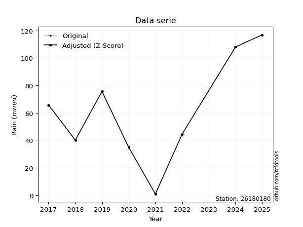</img>

</div>

> If Z-Score is active, values out of range or outliers are replaced with the station mean value.


### 4. Active continuous probability distributions from SciPy (45 of 104 available)

[scipy.stats](https://docs.scipy.org/doc/scipy/reference/stats.html) is a Python´s powerful submodule within the SciPy library for comprehensive statistical analysis, offering over 130 probability distributions (like Normal, Poisson), functions for descriptive stats (mean, variance), hypothesis testing (t-tests, chi-square), random variable generation, and statistical tests, making it essential for data science, modeling, and research. It provides tools to explore, model, and draw conclusions from data efficiently, working seamlessly with NumPy.

<div align="center">

|   id | p_dist             |   n_parameter | fit_method   | label                                                                       | active   | ref                                                                                                        |
|-----:|:-------------------|--------------:|:-------------|:----------------------------------------------------------------------------|:---------|:-----------------------------------------------------------------------------------------------------------|
|    0 | alpha              |             3 | MLE          | Alpha                                                                       | True     | [:mortar_board:](https://docs.scipy.org/doc/scipy/reference/generated/scipy.stats.alpha.html)              |
|    1 | betaprime          |             4 | MLE          | Beta prime                                                                  | True     | [:mortar_board:](https://docs.scipy.org/doc/scipy/reference/generated/scipy.stats.betaprime.html)          |
|    2 | chi2               |             3 | MLE          | Chi²                                                                        | True     | [:mortar_board:](https://docs.scipy.org/doc/scipy/reference/generated/scipy.stats.chi2.html)               |
|    3 | crystalball        |             4 | MLE          | Crystalball                                                                 | True     | [:mortar_board:](https://docs.scipy.org/doc/scipy/reference/generated/scipy.stats.crystalball.html)        |
|    4 | erlang             |             3 | MLE          | Erlang                                                                      | True     | [:mortar_board:](https://docs.scipy.org/doc/scipy/reference/generated/scipy.stats.erlang.html)             |
|    5 | expon              |             2 | MLE          | Exponential                                                                 | True     | [:mortar_board:](https://docs.scipy.org/doc/scipy/reference/generated/scipy.stats.expon.html)              |
|    6 | exponnorm          |             3 | MLE          | Exponentially modified Normal                                               | True     | [:mortar_board:](https://docs.scipy.org/doc/scipy/reference/generated/scipy.stats.exponnorm.html)          |
|    7 | f                  |             4 | MLE          | F                                                                           | True     | [:mortar_board:](https://docs.scipy.org/doc/scipy/reference/generated/scipy.stats.f.html)                  |
|    8 | fatiguelife        |             3 | MLE          | Fatigue-life (Birnbaum-Saunders)                                            | True     | [:mortar_board:](https://docs.scipy.org/doc/scipy/reference/generated/scipy.stats.fatiguelife.html)        |
|    9 | fisk               |             3 | MLE          | Fisk                                                                        | True     | [:mortar_board:](https://docs.scipy.org/doc/scipy/reference/generated/scipy.stats.fisk.html)               |
|   10 | gamma              |             3 | MLE          | Gamma                                                                       | True     | [:mortar_board:](https://docs.scipy.org/doc/scipy/reference/generated/scipy.stats.gamma.html)              |
|   11 | genexpon           |             5 | MLE          | Generalized exponential                                                     | True     | [:mortar_board:](https://docs.scipy.org/doc/scipy/reference/generated/scipy.stats.genexpon.html)           |
|   12 | genlogistic        |             3 | MLE          | Generalized logistic                                                        | True     | [:mortar_board:](https://docs.scipy.org/doc/scipy/reference/generated/scipy.stats.genlogistic.html)        |
|   13 | gibrat             |             2 | MM           | Gibrat                                                                      | True     | [:mortar_board:](https://docs.scipy.org/doc/scipy/reference/generated/scipy.stats.gibrat.html)             |
|   14 | gompertz           |             3 | MLE          | Gompertz (or truncated Gumbel)                                              | True     | [:mortar_board:](https://docs.scipy.org/doc/scipy/reference/generated/scipy.stats.gompertz.html)           |
|   15 | gumbel_l           |             2 | MM           | Gumbel Left Skew                                                            | True     | [:mortar_board:](https://docs.scipy.org/doc/scipy/reference/generated/scipy.stats.gumbel_l.html)           |
|   16 | gumbel_r           |             2 | MM           | Gumbel Right Skew                                                           | True     | [:mortar_board:](https://docs.scipy.org/doc/scipy/reference/generated/scipy.stats.gumbel_r.html)           |
|   17 | halflogistic       |             2 | MM           | Half-logistic                                                               | True     | [:mortar_board:](https://docs.scipy.org/doc/scipy/reference/generated/scipy.stats.halflogistic.html)       |
|   18 | halfnorm           |             2 | MM           | Half Normal                                                                 | True     | [:mortar_board:](https://docs.scipy.org/doc/scipy/reference/generated/scipy.stats.halfnorm.html)           |
|   19 | hypsecant          |             2 | MM           | hyperbolic secant                                                           | True     | [:mortar_board:](https://docs.scipy.org/doc/scipy/reference/generated/scipy.stats.hypsecant.html)          |
|   20 | invgamma           |             3 | MLE          | Inverted gamma                                                              | True     | [:mortar_board:](https://docs.scipy.org/doc/scipy/reference/generated/scipy.stats.invgamma.html)           |
|   21 | invgauss           |             3 | MLE          | Inverse Gaussian                                                            | True     | [:mortar_board:](https://docs.scipy.org/doc/scipy/reference/generated/scipy.stats.invgauss.html)           |
|   22 | invweibull         |             3 | MLE          | Inverted Weibull                                                            | True     | [:mortar_board:](https://docs.scipy.org/doc/scipy/reference/generated/scipy.stats.invweibull.html)         |
|   23 | johnsonsu          |             4 | MLE          | Johnson Su                                                                  | True     | [:mortar_board:](https://docs.scipy.org/doc/scipy/reference/generated/scipy.stats.johnsonsu.html)          |
|   24 | kstwobign          |             2 | MLE          | Limiting distribution of scaled Kolmogorov-Smirnov two-sided test statistic | True     | [:mortar_board:](https://docs.scipy.org/doc/scipy/reference/generated/scipy.stats.kstwobign.html)          |
|   25 | laplace            |             2 | MM           | Laplace                                                                     | True     | [:mortar_board:](https://docs.scipy.org/doc/scipy/reference/generated/scipy.stats.laplace.html)            |
|   26 | laplace_asymmetric |             3 | MLE          | Asymmetric Laplace                                                          | True     | [:mortar_board:](https://docs.scipy.org/doc/scipy/reference/generated/scipy.stats.laplace_asymmetric.html) |
|   27 | loggamma           |             3 | MLE          | Log gamma                                                                   | True     | [:mortar_board:](https://docs.scipy.org/doc/scipy/reference/generated/scipy.stats.loggamma.html)           |
|   28 | logistic           |             2 | MM           | Logistic (or Sech-squared)                                                  | True     | [:mortar_board:](https://docs.scipy.org/doc/scipy/reference/generated/scipy.stats.logistic.html)           |
|   29 | lognorm            |             3 | MLE          | Log Normal                                                                  | True     | [:mortar_board:](https://docs.scipy.org/doc/scipy/reference/generated/scipy.stats.lognorm.html)            |
|   30 | maxwell            |             2 | MM           | Maxwell                                                                     | True     | [:mortar_board:](https://docs.scipy.org/doc/scipy/reference/generated/scipy.stats.maxwell.html)            |
|   31 | mielke             |             4 | MLE          | Mielke Beta-Kappa / Dagum                                                   | True     | [:mortar_board:](https://docs.scipy.org/doc/scipy/reference/generated/scipy.stats.mielke.html)             |
|   32 | moyal              |             2 | MM           | Moyal                                                                       | True     | [:mortar_board:](https://docs.scipy.org/doc/scipy/reference/generated/scipy.stats.moyal.html)              |
|   33 | nakagami           |             3 | MLE          | Nakagami                                                                    | True     | [:mortar_board:](https://docs.scipy.org/doc/scipy/reference/generated/scipy.stats.nakagami.html)           |
|   34 | ncf                |             5 | MLE          | Non-central F distribution                                                  | True     | [:mortar_board:](https://docs.scipy.org/doc/scipy/reference/generated/scipy.stats.ncf.html)                |
|   35 | nct                |             4 | MLE          | Non-central Student’s t                                                     | True     | [:mortar_board:](https://docs.scipy.org/doc/scipy/reference/generated/scipy.stats.nct.html)                |
|   36 | norm               |             2 | MM           | Normal                                                                      | True     | [:mortar_board:](https://docs.scipy.org/doc/scipy/reference/generated/scipy.stats.norm.html)               |
|   37 | pareto             |             3 | MLE          | Pareto                                                                      | True     | [:mortar_board:](https://docs.scipy.org/doc/scipy/reference/generated/scipy.stats.pareto.html)             |
|   38 | pearson3           |             3 | MM           | Pearson type III                                                            | True     | [:mortar_board:](https://docs.scipy.org/doc/scipy/reference/generated/scipy.stats.pearson3.html)           |
|   39 | rayleigh           |             2 | MM           | Rayleigh                                                                    | True     | [:mortar_board:](https://docs.scipy.org/doc/scipy/reference/generated/scipy.stats.rayleigh.html)           |
|   40 | rice               |             3 | MLE          | Rice                                                                        | True     | [:mortar_board:](https://docs.scipy.org/doc/scipy/reference/generated/scipy.stats.rice.html)               |
|   41 | t                  |             3 | MLE          | Student’s t                                                                 | True     | [:mortar_board:](https://docs.scipy.org/doc/scipy/reference/generated/scipy.stats.t.html)                  |
|   42 | truncnorm          |             4 | MLE          | Truncated normal                                                            | True     | [:mortar_board:](https://docs.scipy.org/doc/scipy/reference/generated/scipy.stats.truncnorm.html)          |
|   43 | wald               |             2 | MM           | Wald                                                                        | True     | [:mortar_board:](https://docs.scipy.org/doc/scipy/reference/generated/scipy.stats.wald.html)               |
|   44 | weibull_min        |             3 | MLE          | Weibull minimum                                                             | True     | [:mortar_board:](https://docs.scipy.org/doc/scipy/reference/generated/scipy.stats.weibull_min.html)        |

</div>

> **n_parameter:** # arguments & localization & scale.
>
> **Fit methods:** (MLE) maximum likelihood, (MM) L-moments.
>
>**Inactive:** foldnorm, gennorm, norminvgauss, powernorm, powerlognorm, skewnorm, genextreme, anglit, arcsine, argus, beta, bradford, burr, burr12, cauchy, cosine, halfcauchy, foldcauchy, skewcauchy, wrapcauchy, dgamma, gengamma, exponweib, exponpow, truncexpon, gausshyper, genhalflogistic, genhyperbolic, geninvgauss, halfgennorm, johnsonsb, kappa4, kappa3, ksone, kstwo, loglaplace, levy, levy_l, levy_stable, ncx2, genpareto, truncpareto, lomax, powerlaw, rdist, rel_breitwigner, recipinvgauss, semicircular, studentized_range, trapezoid, triang, truncweibull_min, tukeylambda, uniform, loguniform, vonmises, vonmises_line, weibull_max, dweibull, 


## B. Probability distributions vs. Empirical distributions

A continuous probability distribution (CPD) describes probabilities for variables that can take any value within a range (like rain any time), unlike discrete variables with specific outcomes (like temperature). It uses a Probability Density Function (PDF), a curve where the total area under it equals 1, and the probability of the variable falling within an interval (a to b) is found by calculating the area under the curve between those points. A key feature is that the probability of hitting any single exact value is zero, so probabilities are always expressed for ranges, e.g., $P(a ≤ X ≤ b)$.

<div align="center">

Distributions parameters
|    |   station | p_dist                |   n |               loc |           scale | shape                  | shape1                | shape2                 | shape3   |
|---:|----------:|:----------------------|----:|------------------:|----------------:|:-----------------------|:----------------------|:-----------------------|:---------|
|  0 |  26180180 | alpha                 |   8 |   -471.679        |  8065.15        | 15.260223287889673     |                       |                        |          |
|  1 |  26180180 | betaprime             |   8 |   -427.946        | 26699.3         | 201.49061682349935     | 11036.444166633788    |                        |          |
|  2 |  26180180 | chi2                  |   8 |   -218.386        |     2.19378     | 126.78224289599046     |                       |                        |          |
|  3 |  26180180 | crystalball           |   8 |     59.675        |    34.5384      | 4724.753381905031      | 24.834916662334173    |                        |          |
|  4 |  26180180 | erlang                |   8 |  -6790.54         |     0.17416     | 39332.94214624431      |                       |                        |          |
|  5 |  26180180 | expon                 |   8 |      1            |    58.675       |                        |                       |                        |          |
|  6 |  26180180 | exponnorm             |   8 |     59.6167       |    34.5382      | 0.00168911521169571    |                       |                        |          |
|  7 |  26180180 | f                     |   8 |  -1887.84         |  1947.51        | 6425.733971407266      | 478883.02785045607    |                        |          |
|  8 |  26180180 | fatiguelife           |   8 |      1            |     0.000266393 | 389.7594630395761      |                       |                        |          |
|  9 |  26180180 | fisk                  |   8 |   -537.425        |   596.081       | 28.99354543186807      |                       |                        |          |
| 10 |  26180180 | gamma                 |   8 |  -6781.67         |     0.174379    | 39232.66795658867      |                       |                        |          |
| 11 |  26180180 | genexpon              |   8 |      0.999953     |     2.48115     | 0.04044386426309837    | 4.077988173840655e-08 | 2.1518101642833294     |          |
| 12 |  26180180 | genlogistic           |   8 |     37.2131       |    24.402       | 1.9129164862055537     |                       |                        |          |
| 13 |  26180180 | gibrat                |   8 |     33.3266       |    15.9811      |                        |                       |                        |          |
| 14 |  26180180 | gompertz              |   8 |     35            |     7.81371     | 0.00031742318169048346 |                       |                        |          |
| 15 |  26180180 | gumbel_l              |   8 |     75.2191       |    26.9295      |                        |                       |                        |          |
| 16 |  26180180 | gumbel_r              |   8 |     44.1309       |    26.9295      |                        |                       |                        |          |
| 17 |  26180180 | halflogistic          |   8 |     18.739        |    29.5291      |                        |                       |                        |          |
| 18 |  26180180 | halfnorm              |   8 |     13.9597       |    57.2956      |                        |                       |                        |          |
| 19 |  26180180 | hypsecant             |   8 |     59.675        |    21.9878      |                        |                       |                        |          |
| 20 |  26180180 | invgamma              |   8 |   -289.501        | 34127.7         | 98.71017459425235      |                       |                        |          |
| 21 |  26180180 | invgauss              |   8 |   -129.126        |  5134.6         | 0.03669691511101453    |                       |                        |          |
| 22 |  26180180 | invweibull            |   8 |      1            |     1.29804     | 0.05418878162149613    |                       |                        |          |
| 23 |  26180180 | johnsonsu             |   8 |   3088.83         |  3447.66        | 105.35169187234342     | 132.87457192134195    |                        |          |
| 24 |  26180180 | kstwobign             |   8 |    -71.7397       |   150.446       |                        |                       |                        |          |
| 25 |  26180180 | laplace               |   8 |     59.675        |    24.4223      |                        |                       |                        |          |
| 26 |  26180180 | laplace_asymmetric    |   8 |     40.2          |    25.2607      | 0.6862477545025045     |                       |                        |          |
| 27 |  26180180 | loggamma              |   8 |  -5214.74         |   829.816       | 576.5097613002649      |                       |                        |          |
| 28 |  26180180 | logistic              |   8 |     59.675        |    19.042       |                        |                       |                        |          |
| 29 |  26180180 | lognorm               |   8 |      1            |     0.403938    | 13.286795479765097     |                       |                        |          |
| 30 |  26180180 | maxwell               |   8 |    -22.1664       |    51.2865      |                        |                       |                        |          |
| 31 |  26180180 | mielke                |   8 |      0.880718     |   108.637       | 0.9517858543067188     | 267.3622776971025     |                        |          |
| 32 |  26180180 | moyal                 |   8 |     39.9237       |    15.5477      |                        |                       |                        |          |
| 33 |  26180180 | nakagami              |   8 |      1            |    59.3384      | 0.13979653133782138    |                       |                        |          |
| 34 |  26180180 | ncf                   |   8 |     -0.164698     |     7.85502     | 0.9280443001060439     | 232.11660465681305    | 6.119804505732139      |          |
| 35 |  26180180 | nct                   |   8 |  -1695.85         |    34.5162      | 912959.6708868013      | 50.86079940703932     |                        |          |
| 36 |  26180180 | norm                  |   8 |     59.675        |    34.5384      |                        |                       |                        |          |
| 37 |  26180180 | pareto                |   8 |      0.978984     |     0.0210155   | 0.1432875705040123     |                       |                        |          |
| 38 |  26180180 | pearson3              |   8 |     59.675        |    34.5384      | -0.010253531080874033  |                       |                        |          |
| 39 |  26180180 | rayleigh              |   8 |     -6.39893      |    52.7194      |                        |                       |                        |          |
| 40 |  26180180 | rice                  |   8 |    -15.6702       |    39.5457      | 1.546880591465703      |                       |                        |          |
| 41 |  26180180 | t                     |   8 |     59.6751       |    34.5381      | 70557.32298687554      |                       |                        |          |
| 42 |  26180180 | truncnorm             |   8 |     -0.690358     |     4.12992     | 0.4092950686948612     | 26.317778311663098    |                        |          |
| 43 |  26180180 | wald                  |   8 |     25.1366       |    34.5384      |                        |                       |                        |          |
| 44 |  26180180 | weibull_min           |   8 |    -30.4669       |   101.286       | 2.895631140627227      |                       |                        |          |
| 45 |  26180180 | logalpha              |   8 |    -42.2182       |  1345.33        | 29.40745952300629      |                       |                        |          |
| 46 |  26180180 | logbetaprime          |   8 |  -1178.73         |  2373.84        | 1029987.9993021151     | 2067945.6156966705    |                        |          |
| 47 |  26180180 | logchi2               |   8 |     -1.66225e-29  |     1.79529     | 1.8110617746038842     |                       |                        |          |
| 48 |  26180180 | logcrystalball        |   8 |      3.61448      |     1.42323     | 7905.712153305603      | 7.507461319835681     |                        |          |
| 49 |  26180180 | logerlang             |   8 |    -22.0999       |     0.0890523   | 288.56160080191285     |                       |                        |          |
| 50 |  26180180 | logexpon              |   8 |      0            |     3.61448     |                        |                       |                        |          |
| 51 |  26180180 | logexponnorm          |   8 |      3.6136       |     1.42322     | 0.000611574440512478   |                       |                        |          |
| 52 |  26180180 | logf                  |   8 |     -6.94752e-32  |     1.21935     | 1.4452648797356606     | 1.3394834419602144    |                        |          |
| 53 |  26180180 | logfatiguelife        |   8 |  -1598.85         |  1602.46        | 0.0008876865511503302  |                       |                        |          |
| 54 |  26180180 | logfisk               |   8 |     -3.419e+06    |     3.419e+06   | 5558787.121999318      |                       |                        |          |
| 55 |  26180180 | loggamma              |   8 |    -19.8543       |     0.0973998   | 240.74496014347665     |                       |                        |          |
| 56 |  26180180 | loggenexpon           |   8 |     -0.690121     |     0.0277565   | 4.620116746046319e-08  | 2.8883318750596985    | 2.5836158851226743e-05 |          |
| 57 |  26180180 | loggenlogistic        |   8 |      4.68218      |     1.98188e-06 | 1.8584723993763363e-06 |                       |                        |          |
| 58 |  26180180 | loggibrat             |   8 |      2.52868      |     0.65856     |                        |                       |                        |          |
| 59 |  26180180 | loggompertz           |   8 |     -2.20291e-06  |     0.757512    | 0.00420799129269175    |                       |                        |          |
| 60 |  26180180 | loggumbel_l           |   8 |      4.25501      |     1.10969     |                        |                       |                        |          |
| 61 |  26180180 | loggumbel_r           |   8 |      2.97395      |     1.10969     |                        |                       |                        |          |
| 62 |  26180180 | loghalflogistic       |   8 |      1.92762      |     1.21681     |                        |                       |                        |          |
| 63 |  26180180 | loghalfnorm           |   8 |      1.73074      |     2.36094     |                        |                       |                        |          |
| 64 |  26180180 | loghypsecant          |   8 |      3.61448      |     0.906055    |                        |                       |                        |          |
| 65 |  26180180 | loginvgamma           |   8 |    -37.7496       | 32094           | 776.575818979094       |                       |                        |          |
| 66 |  26180180 | loginvgauss           |   8 |    -12.7977       |  1639.97        | 0.009977348289591091   |                       |                        |          |
| 67 |  26180180 | loginvweibull         |   8 |     -1.29812e+08  |     1.29812e+08 | 70016625.81695469      |                       |                        |          |
| 68 |  26180180 | logjohnsonsu          |   8 |      4.68213      |     2.05304e-15 | 3.0244291114984065     | 0.10946412719898091   |                        |          |
| 69 |  26180180 | logkstwobign          |   8 |     -3.98786      |     8.71421     |                        |                       |                        |          |
| 70 |  26180180 | loglaplace            |   8 |      3.61448      |     1.00637     |                        |                       |                        |          |
| 71 |  26180180 | loglaplace_asymmetric |   8 |      4.68216      |     0.00918863  | 116.25026465690135     |                       |                        |          |
| 72 |  26180180 | logloggamma           |   8 |      4.68226      |     5.03038e-06 | 4.68596935716701e-06   |                       |                        |          |
| 73 |  26180180 | loglogistic           |   8 |      3.61448      |     0.784667    |                        |                       |                        |          |
| 74 |  26180180 | loglognorm            |   8 |     -4.94066e-324 |     1.3296e-40  | 246.66777755235097     |                       |                        |          |
| 75 |  26180180 | logmaxwell            |   8 |      0.242052     |     2.11336     |                        |                       |                        |          |
| 76 |  26180180 | logmielke             |   8 |     -1.45691e+08  |     1.45691e+08 | 1622870509.0501404     | 83446318.46447577     |                        |          |
| 77 |  26180180 | logmoyal              |   8 |      2.80059      |     0.640678    |                        |                       |                        |          |
| 78 |  26180180 | lognakagami           |   8 |     -8.39907e-32  |     3.47003     | 0.2659013264181062     |                       |                        |          |
| 79 |  26180180 | logncf                |   8 |     -5.91692e-31  |     1.17445     | 1.135478069706751      | 1.5611026540185782    | 1.0387407340582133     |          |
| 80 |  26180180 | lognct                |   8 |    -95.8794       |     1.39736     | 57767.100422531854     | 71.2002814198668      |                        |          |
| 81 |  26180180 | lognorm               |   8 |      3.61448      |     1.42323     |                        |                       |                        |          |
| 82 |  26180180 | logpareto             |   8 |     -0.0014095    |     0.0014095   | 0.1432513048242469     |                       |                        |          |
| 83 |  26180180 | logpearson3           |   8 |      3.61448      |     1.42323     | -1.9191484289220433    |                       |                        |          |
| 84 |  26180180 | lograyleigh           |   8 |      0.891784     |     2.1724      |                        |                       |                        |          |
| 85 |  26180180 | logrice               |   8 |   -454.362        |     1.42413     | 321.5805768118686      |                       |                        |          |
| 86 |  26180180 | logt                  |   8 |      4.09192      |     0.46269     | 1.4920411254186643     |                       |                        |          |
| 87 |  26180180 | logtruncnorm          |   8 |      0.00220489   |     4.49111     | -0.0010620689711764923 | 1.042043050606174     |                        |          |
| 88 |  26180180 | logwald               |   8 |      2.19124      |     1.42324     |                        |                       |                        |          |
| 89 |  26180180 | logweibull_min        |   8 | -14078.1          | 14082.3         | 19047.796680835276     |                       |                        |          |

</div>

> **loc** (Location parameter): This shifts the distribution along the x-axis. For many common distributions, like the normal (Gaussian) distribution, loc represents the mean $μ$. For others, like the uniform distribution, it might represent the minimum value, or for the beta distribution, the left end of the support interval.
>
> **scale** (Scale parameter): This determines the width or spread of the distribution. For the normal distribution, scale represents the standard deviation $σ$. For a uniform distribution, it defines the length of the interval (from $loc$ to $loc + scale$).
>
> **shape** (Shape parameters): Refers to parameters that define the specific form of a probability distribution, distinct from its location (loc) and scale (scale). These parameters are required arguments for most distribution functions. For example, a normal (Gaussian) distribution is fully defined by its location (mean) and scale (standard deviation), so it has no specific shape parameters beyond loc and scale. However, other distributions have intrinsic properties that need specification, as Gamma distribution that takes a shape parameter, often named $a$ or $alpha$.


### 0. Cumulative distribution values - CDF (90 evaluated)

> Ordered by x ascending and calculating $log(f(x))$ separately. 

|   id |   Station |   date |     x |   count |   mean |     std |    zscore |   Value_initial |   station |   m |     alpha |   alpha_pdf |   betaprime |   betaprime_pdf |      chi2 |   chi2_pdf |   crystalball |   crystalball_pdf |    erlang |   erlang_pdf |    expon |   expon_pdf |   exponnorm |   exponnorm_pdf |         f |      f_pdf |   fatiguelife |   fatiguelife_pdf |      fisk |   fisk_pdf |     gamma |   gamma_pdf |    genexpon |   genexpon_pdf |   genlogistic |   genlogistic_pdf |    gibrat |   gibrat_pdf |    gompertz |   gompertz_pdf |   gumbel_l |   gumbel_l_pdf |   gumbel_r |   gumbel_r_pdf |   halflogistic |   halflogistic_pdf |   halfnorm |   halfnorm_pdf |   hypsecant |   hypsecant_pdf |   invgamma |   invgamma_pdf |   invgauss |   invgauss_pdf |   invweibull |   invweibull_pdf |   johnsonsu |   johnsonsu_pdf |   kstwobign |   kstwobign_pdf |   laplace |   laplace_pdf |   laplace_asymmetric |   laplace_asymmetric_pdf |   loggamma |   loggamma_pdf |   logistic |   logistic_pdf |    lognorm |   lognorm_pdf |   maxwell |   maxwell_pdf |     mielke |   mielke_pdf |       moyal |   moyal_pdf |    nakagami |   nakagami_pdf |       ncf |    ncf_pdf |       nct |    nct_pdf |      norm |   norm_pdf |   pareto |   pareto_pdf |   pearson3 |   pearson3_pdf |   rayleigh |   rayleigh_pdf |      rice |   rice_pdf |        t |      t_pdf |   truncnorm |   truncnorm_pdf |     wald |   wald_pdf |   weibull_min |   weibull_min_pdf |   logalpha |   logalpha_pdf |   logbetaprime |   logbetaprime_pdf |     logchi2 |   logchi2_pdf |   logcrystalball |   logcrystalball_pdf |   logerlang |   logerlang_pdf |   logexpon |   logexpon_pdf |   logexponnorm |   logexponnorm_pdf |        logf |    logf_pdf |   logfatiguelife |   logfatiguelife_pdf |    logfisk |   logfisk_pdf |   loggenexpon |   loggenexpon_pdf |   loggenlogistic |   loggenlogistic_pdf |   loggibrat |   loggibrat_pdf |   loggompertz |   loggompertz_pdf |   loggumbel_l |   loggumbel_l_pdf |   loggumbel_r |   loggumbel_r_pdf |   loghalflogistic |   loghalflogistic_pdf |   loghalfnorm |   loghalfnorm_pdf |   loghypsecant |   loghypsecant_pdf |   loginvgamma |   loginvgamma_pdf |   loginvgauss |   loginvgauss_pdf |   loginvweibull |   loginvweibull_pdf |   logjohnsonsu |   logjohnsonsu_pdf |   logkstwobign |   logkstwobign_pdf |   loglaplace |   loglaplace_pdf |   loglaplace_asymmetric |   loglaplace_asymmetric_pdf |   logloggamma |   logloggamma_pdf |   loglogistic |   loglogistic_pdf |   loglognorm |   loglognorm_pdf |   logmaxwell |   logmaxwell_pdf |   logmielke |   logmielke_pdf |    logmoyal |   logmoyal_pdf |   lognakagami |   lognakagami_pdf |      logncf |   logncf_pdf |     lognct |   lognct_pdf |   logpareto |   logpareto_pdf |   logpearson3 |   logpearson3_pdf |   lograyleigh |   lograyleigh_pdf |    logrice |   logrice_pdf |      logt |   logt_pdf |   logtruncnorm |   logtruncnorm_pdf |   logwald |   logwald_pdf |   logweibull_min |   logweibull_min_pdf |
|-----:|----------:|-------:|------:|--------:|-------:|--------:|----------:|----------------:|----------:|----:|----------:|------------:|------------:|----------------:|----------:|-----------:|--------------:|------------------:|----------:|-------------:|---------:|------------:|------------:|----------------:|----------:|-----------:|--------------:|------------------:|----------:|-----------:|----------:|------------:|------------:|---------------:|--------------:|------------------:|----------:|-------------:|------------:|---------------:|-----------:|---------------:|-----------:|---------------:|---------------:|-------------------:|-----------:|---------------:|------------:|----------------:|-----------:|---------------:|-----------:|---------------:|-------------:|-----------------:|------------:|----------------:|------------:|----------------:|----------:|--------------:|---------------------:|-------------------------:|-----------:|---------------:|-----------:|---------------:|-----------:|--------------:|----------:|--------------:|-----------:|-------------:|------------:|------------:|------------:|---------------:|----------:|-----------:|----------:|-----------:|----------:|-----------:|---------:|-------------:|-----------:|---------------:|-----------:|---------------:|----------:|-----------:|---------:|-----------:|------------:|----------------:|---------:|-----------:|--------------:|------------------:|-----------:|---------------:|---------------:|-------------------:|------------:|--------------:|-----------------:|---------------------:|------------:|----------------:|-----------:|---------------:|---------------:|-------------------:|------------:|------------:|-----------------:|---------------------:|-----------:|--------------:|--------------:|------------------:|-----------------:|---------------------:|------------:|----------------:|--------------:|------------------:|--------------:|------------------:|--------------:|------------------:|------------------:|----------------------:|--------------:|------------------:|---------------:|-------------------:|--------------:|------------------:|--------------:|------------------:|----------------:|--------------------:|---------------:|-------------------:|---------------:|-------------------:|-------------:|-----------------:|------------------------:|----------------------------:|--------------:|------------------:|--------------:|------------------:|-------------:|-----------------:|-------------:|-----------------:|------------:|----------------:|------------:|---------------:|--------------:|------------------:|------------:|-------------:|-----------:|-------------:|------------:|----------------:|--------------:|------------------:|--------------:|------------------:|-----------:|--------------:|----------:|-----------:|---------------:|-------------------:|----------:|--------------:|-----------------:|---------------------:|
|    0 |  26180180 |   2021 |   1   |       8 | 59.675 | 36.9231 | -1.58911  |             1   |  26180180 |   1 | 0.0357409 |  0.0028376  |   0.0410154 |      0.00276857 | 0.0379863 | 0.00277372 |     0.0446751 |        0.00272843 | 0.0443871 |   0.00272971 | 0        |  0.017043   |   0.0446747 |      0.00272841 | 0.0438229 | 0.00273856 |     0.0612724 |       1.27134e+08 | 0.0497612 | 0.00254624 | 0.0443841 |  0.00272964 | 7.72661e-07 |     0.0163004  |      0.039569 |        0.0025286  | 0         |   0          | 0           |    0           |  0.0615652 |     0.0022143  | 0.00700531 |     0.00129056 |       0        |         0          |   0        |     0          |   0.0440819 |      0.00199843 |  0.0348292 |     0.00279087 |  0.0316121 |     0.00291346 |  0.000783829 |      1.36797e+12 |   0.0451184 |      0.00272702 |   0.0264671 |      0.00347669 |  0.045245 |    0.00185261 |            0.0333651 |               0.00192472 |  0.0063833 |      0.0132882 |  0.0438833 |     0.00220342 | 0.00554838 |     0.0111452 | 0.0230653 |    0.00286644 | 0.00152504 |   0.0121688  | 0.000471483 | 0.000198702 | 8.96266e-06 |    2.25711e+10 | 0.0171578 | 0.00845961 | 0.0446738 | 0.00272843 | 0.0446751 | 0.00272843 | 0        |  6.81817     |  0.0449775 |     0.00272748 |  0.0098001 |     0.00263604 | 0.0270679 | 0.00327003 | 0.044676 | 0.0027284  |  2.9269e-07 |    0.260394     | 0        | 0          |     0.0333096 |        0.00301357 | 0.00697221 |      0.0146571 |     0.00554491 |          0.0111483 | 2.83664e-27 |   154.529     |       0.00554838 |            0.0111452 |  0.00658692 |       0.0135063 |   0        |      0.276665  |     0.00554825 |          0.0111451 | 2.01163e-23 | 2.09236e+08 |       0.00557776 |            0.0112288 | 0.00166854 |    0.00270827 |      0.022798 |          0.065302 |         0        |            0.0116212 |    0        |       0         |   1.22372e-08 |        0.00555503 |     0.0213818 |         0.0190609 |   4.63238e-07 |       6.08851e-06 |          0        |              0        |      0        |          0        |      0.0117847 |          0.0130037 |    0.00502575 |          0.011054 |    0.00776919 |         0.0168597 |       0.0110084 |           0.0267732 |       0.178147 |        0.00609488  |      0.0151414 |          0.0409377 |    0.0137773 |         0.01369  |               0.0124832 |                   0.0116864 |     0.0127569 |         0.0118835 |    0.00988902 |         0.0124782 |   0.00407549 |    inf           |     0        |         0        |  0.00948183 |        0.022497 | 5.76905e-19 |    3.60734e-17 |   1.19589e-17 |       7.57197e+13 | 2.63551e-18 |  2.52881e+12 | 0.00562897 |    0.0112869 |    0        |    101.633      |     0.0285363 |         0.0205029 |      0        |          0        | 0.00557598 |     0.0111874 | 0.0143894 | 0.00517659 |    0.000647787 |           0.252551 |  0        |      0        |       0.00354101 |           0.00478253 |
|    1 |  26180180 |   2020 |  35   |       8 | 59.675 | 36.9231 | -0.668281 |            35   |  26180180 |   2 | 0.255449  |  0.0100972  |   0.243077  |      0.00935444 | 0.245614  | 0.00958683 |     0.237483  |        0.00894904 | 0.23776   |   0.00897583 | 0.439801 |  0.00954749 |   0.237482  |      0.00894904 | 0.238706  | 0.00903879 |     0.820323  |       0.00353305  | 0.236115  | 0.00913553 | 0.237758  |  0.00897599 | 0.425478    |     0.00936498 |      0.243013 |        0.00995674 | 0.0120172 |   0.0186887  | 1.41096e-10 |    4.06239e-05 |  0.201153  |     0.0066622  | 0.245702   |     0.0128066  |       0.268585 |         0.015711   |   0.286548 |     0.0130177  |   0.200368  |      0.00852269 |  0.251474  |     0.00996645 |  0.264505  |     0.0104817  |  0.432653    |      0.000577724 |   0.237106  |      0.00890939 |   0.304611  |      0.0111347  |  0.182046 |    0.0074541  |            0.237188  |               0.0136826  |  0.49831   |      0.264241  |  0.214869  |     0.00885939 | 0.483429   |     0.280066  | 0.257156  |    0.0103853  | 0.332103   |   0.00926428 | 0.241371    | 0.0151342   | 0.690238    |    0.00545174  | 0.337511  | 0.0105056  | 0.237478  | 0.00894869 | 0.237483  | 0.00894904 | 0.653135 |  0.0014609   |  0.237224  |     0.0089219  |  0.265323  |     0.0109432  | 0.252945  | 0.00970232 | 0.237482 | 0.008949   |  1          |    1.71765e-17  | 0.150271 | 0.0309688  |     0.246193  |        0.00942286 | 0.506557   |      0.256125  |     0.482838   |          0.279533  | 0.669588    |     0.0973152 |       0.483429   |            0.280066  |  0.496802   |       0.263974  |   0.626052 |      0.103458  |     0.483432   |          0.280068  | 0.691       | 0.0463017   |       0.485827   |            0.280287  | 0.351223   |    0.370475   |      0.581786 |          0.171638 |         0        |            0.325967  |    0.671485 |       0.352103  |   0.365825    |        0.384801   |     0.412761  |         0.281702  |   0.553114    |       0.295173    |          0.584223 |              0.27066  |      0.560378 |          0.250703 |      0.47924   |          0.350567  |    0.489138   |          0.269093 |    0.517564   |         0.244299  |       0.515496  |           0.184238  |       0.221681 |        0.0288904   |      0.558098  |          0.169651  |    0.471467  |         0.468481 |               0.348206  |                   0.32598   |     0.350024  |         0.326059  |    0.481169   |         0.318155  |   0.647054   |      0.000423634 |     0.517064 |         0.271521 |  0.509124   |        0.193476 | 0.578988    |    0.296212    |   0.745695    |       0.089221    | 0.606577    |  0.055236    | 0.483833   |    0.279216  |    0.674418 |      0.0131131  |     0.357982  |         0.249893  |      0.528413 |          0.266162 | 0.48349    |     0.27989   | 0.199355  | 0.330428   |    0.813117    |           0.184686 |  0.650998 |      0.298459 |       0.35292    |           0.380998   |
|    2 |  26180180 |   2018 |  40.2 |       8 | 59.675 | 36.9231 | -0.527448 |            40.2 |  26180180 |   3 | 0.310039  |  0.0108598  |   0.294035  |      0.0102172  | 0.297685  | 0.0104088  |     0.286423  |        0.00985298 | 0.286835  |   0.00987788 | 0.487312 |  0.00873777 |   0.286422  |      0.00985299 | 0.288091  | 0.00993297 |     0.837491  |       0.00308563  | 0.28661   | 0.010263   | 0.286834  |  0.00987808 | 0.472169    |     0.00860389 |      0.297471 |        0.010947   | 0.199403  |   0.0406583  | 0.000300065 |    7.90083e-05 |  0.238468  |     0.00770378 | 0.314377   |     0.0135088  |       0.348194 |         0.0148796  |   0.353034 |     0.0125393  |   0.249024  |      0.0102051  |  0.305378  |     0.0107273  |  0.320743  |     0.0111028  |  0.435447    |      0.000500448 |   0.285845  |      0.00981581 |   0.362812  |      0.0112043  |  0.225243 |    0.00922285 |            0.320161  |               0.018469   |  0.534796  |      0.262204  |  0.264494  |     0.0102162  | 0.522241   |     0.279872  | 0.312817  |    0.0109831  | 0.380109   |   0.00920114 | 0.32161     | 0.0155619   | 0.716955    |    0.00484669  | 0.391673  | 0.0103009  | 0.286416  | 0.00985251 | 0.286423  | 0.00985298 | 0.660133 |  0.00124165  |  0.286026  |     0.00982755 |  0.323379  |     0.0113444  | 0.305166  | 0.0103555  | 0.286422 | 0.00985296 |  1          |    1.46253e-22  | 0.306176 | 0.0278532  |     0.297163  |        0.0101555  | 0.541856   |      0.253214  |     0.521576   |          0.279353  | 0.682787    |     0.0932949 |       0.522241   |            0.279872  |  0.533265   |       0.262122  |   0.640112 |      0.0995683 |     0.522244   |          0.279874  | 0.697252    | 0.0439921   |       0.524656   |            0.279904  | 0.404088   |    0.391506   |      0.605264 |          0.167278 |         0        |            0.371181  |    0.715858 |       0.290951  |   0.421696    |        0.421307   |     0.452885  |         0.297348  |   0.59292     |       0.279283    |          0.62047  |              0.252717 |      0.594311 |          0.239177 |      0.527854  |          0.34997   |    0.526323   |          0.267411 |    0.551159   |         0.240487  |       0.540683  |           0.179328  |       0.225974 |        0.0333009   |      0.581251  |          0.1646    |    0.537926  |         0.459148 |               0.396419  |                   0.371116  |     0.398232  |         0.370967  |    0.525271   |         0.317793  |   0.647111   |      0.000407724 |     0.554269 |         0.265348 |  0.535587   |        0.188498 | 0.618477    |    0.273938    |   0.75781     |       0.0857167   | 0.614061    |  0.0528481   | 0.522523   |    0.278967  |    0.676195 |      0.0125526  |     0.394266  |         0.274339  |      0.564763 |          0.258421 | 0.522277   |     0.279694  | 0.252774  | 0.445462   |    0.838385    |           0.180148 |  0.689455 |      0.258007 |       0.408436   |           0.420084   |
|    3 |  26180180 |   2022 |  44.6 |       8 | 59.675 | 36.9231 | -0.408281 |            44.6 |  26180180 |   4 | 0.358878  |  0.0113079  |   0.340331  |      0.0108018  | 0.344714  | 0.0109409  |     0.331248  |        0.0105012  | 0.331762  |   0.0105226  | 0.524352 |  0.00810649 |   0.331247  |      0.0105012  | 0.333237  | 0.0105663  |     0.850357  |       0.00277098  | 0.333613  | 0.0110746  | 0.331762  |  0.0105228  | 0.5087      |     0.00800841 |      0.347072 |        0.0115603  | 0.363558  |   0.0332977  | 0.000766752 |    0.000138684 |  0.274414  |     0.00864297 | 0.374288   |     0.0136588  |       0.411894 |         0.0140598  |   0.407195 |     0.0120703  |   0.297092  |      0.0116336  |  0.353642  |     0.01118    |  0.370347  |     0.0114108  |  0.437533    |      0.000449501 |   0.330516  |      0.010469   |   0.411869  |      0.0110673  |  0.269709 |    0.0110436  |            0.396755  |               0.0163881  |  0.561888  |      0.259271  |  0.31181   |     0.011269   | 0.551226   |     0.277994  | 0.361902  |    0.0112988  | 0.420489   |   0.0091542  | 0.389581    | 0.0152472   | 0.737327    |    0.00442467  | 0.436414  | 0.0100213  | 0.331238  | 0.0105007  | 0.331248  | 0.0105012  | 0.665271 |  0.00109953  |  0.330746  |     0.0104792  |  0.373683  |     0.0114925  | 0.351694  | 0.0107713  | 0.331246 | 0.0105012  |  1          |    2.17511e-27  | 0.418168 | 0.0230581  |     0.342972  |        0.0106453  | 0.567987   |      0.249778  |     0.550508   |          0.277496  | 0.692326    |     0.0903977 |       0.551226   |            0.277994  |  0.560356   |       0.259325  |   0.650307 |      0.0967478 |     0.551229   |          0.277996  | 0.701737    | 0.0423792   |       0.553636   |            0.277883  | 0.445323   |    0.401602   |      0.622458 |          0.163774 |         0        |            0.409153  |    0.744078 |       0.253509  |   0.466746    |        0.445579   |     0.484322  |         0.307762  |   0.621269    |       0.266489    |          0.646027 |              0.239417 |      0.618696 |          0.230363 |      0.563945  |          0.344249  |    0.553966   |          0.264654 |    0.575943   |         0.23659   |       0.559104  |           0.175335  |       0.229645 |        0.0375508   |      0.598144  |          0.160661  |    0.583238  |         0.414123 |               0.436902  |                   0.409015  |     0.438689  |         0.408653  |    0.558121   |         0.314302  |   0.647153   |      0.000396556 |     0.581536 |         0.259525 |  0.554954   |        0.18437  | 0.646066    |    0.257341    |   0.76658     |       0.0831695   | 0.619462    |  0.0511628   | 0.551413   |    0.277065  |    0.677478 |      0.0121611  |     0.423775  |         0.294067  |      0.591261 |          0.251684 | 0.551243   |     0.277816  | 0.304198  | 0.545821   |    0.856918    |           0.176708 |  0.714875 |      0.232028 |       0.453475   |           0.44664    |
|    4 |  26180180 |   2017 |  65.8 |       8 | 59.675 | 36.9231 |  0.165885 |            65.8 |  26180180 |   5 | 0.600528  |  0.0107823  |   0.580782  |      0.0111765  | 0.584673  | 0.0109982  |     0.570379  |        0.0113705  | 0.571028  |   0.0113597  | 0.668587 |  0.00564829 |   0.570379  |      0.0113705  | 0.572555  | 0.0113186  |     0.897136  |       0.00174917  | 0.585504  | 0.0116647  | 0.571032  |  0.0113599  | 0.65225     |     0.00566849 |      0.596667 |        0.0110659  | 0.760842  |   0.00955483 | 0.0159054   |    0.00205928  |  0.505818  |     0.0129347  | 0.639391   |     0.0106189  |       0.662277 |         0.00950571 |   0.634421 |     0.00924812 |   0.587544  |      0.0139326  |  0.593393  |     0.0107475  |  0.607568  |     0.0103406  |  0.445284    |      0.000301261 |   0.569427  |      0.0113852  |   0.626591  |      0.00889446 |  0.610909 |    0.0159318  |            0.660868  |               0.00921309 |  0.659167  |      0.238655  |  0.579728  |     0.0127951  | 0.656158   |     0.25855   | 0.59933   |    0.0105133  | 0.612599   |   0.00898136 | 0.663482    | 0.0101562   | 0.814983    |    0.00303586  | 0.627863  | 0.00789294 | 0.570355  | 0.0113697  | 0.570379  | 0.0113705  | 0.68374  |  0.000699097 |  0.569729  |     0.0113807  |  0.608496  |     0.0101701  | 0.585648  | 0.0107231  | 0.570378 | 0.0113705  |  1          |    1.471e-57    | 0.730373 | 0.00892185 |     0.578171  |        0.010952   | 0.66139    |      0.228554  |     0.655272   |          0.2582    | 0.725491    |     0.0803749 |       0.656158   |            0.25855   |  0.657747   |       0.239162  |   0.685977 |      0.086879  |     0.656162   |          0.25855   | 0.717156    | 0.0371089   |       0.658427   |            0.257946  | 0.601731   |    0.389636   |      0.683383 |          0.14922  |         0        |            0.589197  |    0.822068 |       0.157122  |   0.651259    |        0.48691    |     0.609462  |         0.3309    |   0.715141    |       0.21607     |          0.729775 |              0.192071 |      0.701759 |          0.19674  |      0.688837  |          0.291285  |    0.653373   |          0.244061 |    0.664117   |         0.215266  |       0.624124  |           0.158691  |       0.24933  |        0.0701004   |      0.657637  |          0.145155  |    0.716817  |         0.281389 |               0.628774  |                   0.58864   |     0.630209  |         0.58706   |    0.674618   |         0.279747  |   0.6473     |      0.000359667 |     0.677131 |         0.230421 |  0.623315   |        0.166725 | 0.734594    |    0.199315    |   0.79715     |       0.074193    | 0.638233    |  0.0455494   | 0.655986   |    0.257665  |    0.681949 |      0.0108789  |     0.554098  |         0.379167  |      0.683414 |          0.221028 | 0.656111   |     0.258399  | 0.568889  | 0.710902   |    0.923102    |           0.163624 |  0.789897 |      0.159397 |       0.64026    |           0.497474   |
|    5 |  26180180 |   2019 |  75.6 |       8 | 59.675 | 36.9231 |  0.431302 |            75.6 |  26180180 |   6 | 0.699657  |  0.0093673  |   0.68522   |      0.0100237  | 0.686932  | 0.00977083 |     0.67763   |        0.0103859  | 0.678108  |   0.0103629  | 0.719564 |  0.00477948 |   0.67763   |      0.0103859  | 0.679083  | 0.0102946  |     0.912723  |       0.00144433  | 0.692674  | 0.0100682  | 0.678114  |  0.010363   | 0.703591    |     0.0048316  |      0.69731  |        0.00938974 | 0.834661  |   0.00587989 | 0.0553989   |    0.00692822  |  0.637324  |     0.0136595  | 0.732854   |     0.00845831 |       0.745522 |         0.00752136 |   0.717996 |     0.00780712 |   0.712683  |      0.0113636  |  0.692479  |     0.00939261 |  0.702048  |     0.00888452 |  0.448031    |      0.000261298 |   0.67692   |      0.010419   |   0.707206  |      0.00755129 |  0.739516 |    0.0106658  |            0.740137  |               0.00705962 |  0.69159   |      0.22818   |  0.697687  |     0.0110766  | 0.691304   |     0.247427  | 0.696194  |    0.00918794 | 0.700312   |   0.00892068 | 0.750873    | 0.00774609  | 0.842519    |    0.00259814  | 0.699644  | 0.00675715 | 0.677599  | 0.0103853  | 0.67763   | 0.0103859  | 0.690056 |  0.000595156 |  0.677147  |     0.0104087  |  0.701687  |     0.00880116 | 0.685816  | 0.00962678 | 0.67763  | 0.0103859  |  1          |    2.25638e-75  | 0.802795 | 0.00608135 |     0.681103  |        0.00994986 | 0.692426   |      0.218341  |     0.690375   |          0.247152  | 0.73642     |     0.0770884 |       0.691304   |            0.247427  |  0.69025    |       0.228812  |   0.697811 |      0.0836052 |     0.691308   |          0.247427  | 0.722194    | 0.0354781   |       0.693479   |            0.246677  | 0.654394   |    0.367706   |      0.703712 |          0.143605 |         0        |            0.671123  |    0.842237 |       0.134172  |   0.71809     |        0.472773   |     0.655459  |         0.330835  |   0.743902    |       0.198327    |          0.755349 |              0.176465 |      0.72824  |          0.184746 |      0.727497  |          0.265344  |    0.686534   |          0.233384 |    0.693342   |         0.205593  |       0.645716  |           0.152336  |       0.260887 |        0.099723    |      0.677395  |          0.139461  |    0.753309  |         0.245129 |               0.716047  |                   0.670343  |     0.717219  |         0.668114  |    0.712198   |         0.261222  |   0.647349   |      0.000348105 |     0.708266 |         0.217961 |  0.64599    |        0.159876 | 0.760969    |    0.180861    |   0.807241    |       0.0711861   | 0.644433    |  0.0437777   | 0.691013   |    0.246607  |    0.683432 |      0.0104807  |     0.609121  |         0.413813  |      0.713247 |          0.208636 | 0.691237   |     0.247293  | 0.660903  | 0.604627   |    0.945492    |           0.158903 |  0.810678 |      0.14046  |       0.708751   |           0.485958   |
|    6 |  26180180 |   2025 | 107.2 |       8 | 59.675 | 36.9231 |  1.28714  |           107.2 |  26180180 |   7 | 0.90789   |  0.00397616 |   0.912446  |      0.00430943 | 0.908136  | 0.00425038 |     0.91559   |        0.00448191 | 0.915353  |   0.00447046 | 0.836341 |  0.00278925 |   0.91559   |      0.00448191 | 0.914474  | 0.00444674 |     0.947379  |       0.00081924  | 0.906358  | 0.00381737 | 0.915358  |  0.00447033 | 0.822912    |     0.00288661 |      0.8997   |        0.00379122 | 0.937109  |   0.00167291 | 0.961994    |    0.0159068   |  0.962339  |     0.00458586 | 0.908342   |     0.00324264 |       0.904761 |         0.00307167 |   0.896338 |     0.00370468 |   0.927008  |      0.00329065 |  0.903482  |     0.00409183 |  0.90064   |     0.00389915 |  0.454902    |      0.000182831 |   0.915928  |      0.00449897 |   0.881918  |      0.00373182 |  0.928575 |    0.00292456 |            0.889867  |               0.00299195 |  0.765981  |      0.196859  |  0.923847  |     0.00369467 | 0.771845   |     0.21239   | 0.90476   |    0.00411098 | 0.979672   |   0.00874278 | 0.90851     | 0.00292929  | 0.907627    |    0.00160564  | 0.860291  | 0.00359709 | 0.91556   | 0.00448246 | 0.91559   | 0.00448191 | 0.705347 |  0.000397474 |  0.915828  |     0.00449359 |  0.901879  |     0.00401049 | 0.908024  | 0.00436103 | 0.915589 | 0.00448188 |  1          |    1.80382e-149 | 0.919322 | 0.00211737 |     0.912124  |        0.00449487 | 0.763624   |      0.188616  |     0.770857   |          0.212335  | 0.761981    |     0.0694323 |       0.771845   |            0.21239   |  0.764901   |       0.197691  |   0.725643 |      0.075905  |     0.771849   |          0.212389  | 0.733932    | 0.0318482   |       0.773708   |            0.211381  | 0.76963    |    0.288263   |      0.751316 |          0.128904 |         0        |            0.931175  |    0.881261 |       0.0925227 |   0.866044    |        0.356229   |     0.767685  |         0.305583  |   0.805763    |       0.156817    |          0.810609 |              0.140907 |      0.787582 |          0.155317 |      0.808441  |          0.198888  |    0.762606   |          0.201218 |    0.760467   |         0.178247  |       0.696075  |           0.136022  |       0.414136 |        5.737       |      0.723592  |          0.125115  |    0.825642  |         0.173253 |               0.992964  |                   0.929584  |     0.99298   |         0.924994  |    0.79432    |         0.20821   |   0.647466   |      0.00032206  |     0.778547 |         0.184102 |  0.69874    |        0.142152 | 0.816823    |    0.140418    |   0.830838    |       0.0640416   | 0.659005    |  0.0397715   | 0.771308   |    0.211816  |    0.686932 |      0.00959074 |     0.769849  |         0.507425  |      0.780445 |          0.175991 | 0.77174    |     0.21231   | 0.815161  | 0.298435   |    0.998908    |           0.146997 |  0.852924 |      0.10373  |       0.861711   |           0.370051   |
|    7 |  26180180 |   2024 | 108   |       8 | 59.675 | 36.9231 |  1.3088   |           108   |  26180180 |   8 | 0.911026  |  0.00386452 |   0.915842  |      0.00417951 | 0.911487  | 0.00412798 |     0.919119  |        0.00434015 | 0.918873  |   0.00432954 | 0.838557 |  0.00275147 |   0.919119  |      0.00434015 | 0.917976  | 0.0043081  |     0.94803   |       0.000808144 | 0.909366  | 0.00370243 | 0.918877  |  0.00432941 | 0.825207    |     0.00284921 |      0.902692 |        0.00368754 | 0.938429  |   0.00162783 | 0.973287    |    0.0123859   |  0.965885  |     0.00427939 | 0.910902   |     0.0031566  |       0.907189 |         0.00299719 |   0.899268 |     0.0036211  |   0.929594  |      0.00317599 |  0.90671   |     0.00397989 |  0.903719  |     0.00379806 |  0.455048    |      0.000181448 |   0.91947   |      0.00435597 |   0.884872  |      0.00365488 |  0.930877 |    0.00283031 |            0.892235  |               0.00292763 |  0.767442  |      0.196136  |  0.92675   |     0.00356497 | 0.773421   |     0.211562  | 0.908004  |    0.00400092 | 0.986617   |   0.00856725 | 0.910824    | 0.00285583  | 0.908903    |    0.00158621  | 0.863143  | 0.00353297 | 0.919089  | 0.00434072 | 0.919119  | 0.00434015 | 0.705664 |  0.000394078 |  0.919366  |     0.00435098 |  0.905046  |     0.00390836 | 0.911463  | 0.00423744 | 0.919118 | 0.00434012 |  1          |    1.12285e-151 | 0.920996 | 0.00206695 |     0.915666  |        0.00436132 | 0.765024   |      0.187939  |     0.772433   |          0.211512  | 0.762497    |     0.0692782 |       0.773421   |            0.211562  |  0.766368   |       0.196971  |   0.726207 |      0.075749  |     0.773425   |          0.211562  | 0.734168    | 0.0317775   |       0.775276   |            0.210549  | 0.771766   |    0.286382   |      0.752273 |          0.128585 |         0.999954 |            0.937689  |    0.881946 |       0.0918268 |   0.86868     |        0.352665   |     0.769953  |         0.304633  |   0.806926    |       0.155994    |          0.811654 |              0.14021  |      0.788734 |          0.154708 |      0.809915  |          0.197545  |    0.764099   |          0.200474 |    0.76179    |         0.177634  |       0.697085  |           0.135674  |       0.998754 |        2.19534e+11 |      0.724521  |          0.124812  |    0.826926  |         0.171978 |               0.9999    |                   0.936077  |     0.999881  |         0.931423  |    0.795864   |         0.207049  |   0.647468   |      0.000321548 |     0.779913 |         0.183361 |  0.699796   |        0.141773 | 0.817864    |    0.139648    |   0.831313    |       0.0638957   | 0.6593      |  0.0396926   | 0.772879   |    0.210994  |    0.687004 |      0.00957334 |     0.773629  |         0.509417  |      0.781751 |          0.175288 | 0.773316   |     0.211483  | 0.817362  | 0.293586   |    1           |           0.146744 |  0.853693 |      0.103085 |       0.864449   |           0.366391   |

An Empirical Distribution Function (EDF) is a step-function estimate of a true cumulative distribution function (CDF) based on observed sample data, representing the proportion of data points less than or equal to a given value. It is calculated by ordering your data and jumping up by $1/n$ (where $n$ is sample size) at each unique data point, allowing analysis without assuming an underlying population distribution, and it gets closer to the true CDF as the sample size grows.


### 1. Empirical - EDF California (1923)

California´s estimates the true probability distribution of water-related data (like rainfall, streamflow) using observed samples, crucial for risk assessment.

<div align="center">


$P=m/n$


</div>


**1.1. Empirical values**

<div align="center">

|                | 0                  | 1                  | 2              | 3              | 4                  | 5              | 6              | 7              |
|:---------------|:-------------------|:-------------------|:---------------|:---------------|:-------------------|:---------------|:---------------|:---------------|
| date           | 2021               | 2020               | 2018           | 2022           | 2017               | 2019           | 2025           | 2024           |
| x              | 1.0                | 35.0               | 40.2           | 44.6           | 65.8               | 75.6           | 107.2          | 108.0          |
| m              | 1                  | 2                  | 3              | 4              | 5                  | 6              | 7              | 8              |
| empirical_dist | edf_california     | edf_california     | edf_california | edf_california | edf_california     | edf_california | edf_california | edf_california |
| empirical      | 0.125              | 0.25               | 0.375          | 0.5            | 0.625              | 0.75           | 0.875          | 1.0            |
| empirical_tr   | 1.1428571428571428 | 1.3333333333333333 | 1.6            | 2.0            | 2.6666666666666665 | 4.0            | 8.0            | inf            |

</div>


**1.2. Kolmogorov-Smirnov fit test (sorted by Δ)**


<div align="center">

|                | 0                   | 1                   | 2                     | 3                   | 4                   | 5                   | 6                  | 7                  | 8                  | 9                   | 10                  | 11                  | 12                  | 13                  | 14                  | 15                  | 16                  | 17                  | 18                  | 19                  | 20                  | 21                  | 22                  | 23                 | 24                  | 25                 | 26                  | 27                 | 28                 | 29                  | 30                  | 31                  | 32                  | 33                  | 34                  | 35                  | 36                  | 37                 | 38                 | 39                 | 40                  | 41                 | 42                  | 43                  | 44                 | 45                  | 46                  | 47                 | 48                  | 49                  | 50                  | 51                  | 52                  | 53                  | 54                  | 55                  | 56                  | 57                  | 58                  | 59                  | 60                 | 61                 | 62                 | 63                  | 64                 | 65                 | 66                  | 67                  | 68                 | 69                 | 70                 | 71                  | 72                 | 73                  | 74                 | 75                 | 76                  | 77                  | 78                 | 79                 | 80                 | 81                 | 82                 | 83                  | 84                 | 85                 | 86                 | 87                 | 88                 | 89                 |
|:---------------|:--------------------|:--------------------|:----------------------|:--------------------|:--------------------|:--------------------|:-------------------|:-------------------|:-------------------|:--------------------|:--------------------|:--------------------|:--------------------|:--------------------|:--------------------|:--------------------|:--------------------|:--------------------|:--------------------|:--------------------|:--------------------|:--------------------|:--------------------|:-------------------|:--------------------|:-------------------|:--------------------|:-------------------|:-------------------|:--------------------|:--------------------|:--------------------|:--------------------|:--------------------|:--------------------|:--------------------|:--------------------|:-------------------|:-------------------|:-------------------|:--------------------|:-------------------|:--------------------|:--------------------|:-------------------|:--------------------|:--------------------|:-------------------|:--------------------|:--------------------|:--------------------|:--------------------|:--------------------|:--------------------|:--------------------|:--------------------|:--------------------|:--------------------|:--------------------|:--------------------|:-------------------|:-------------------|:-------------------|:--------------------|:-------------------|:-------------------|:--------------------|:--------------------|:-------------------|:-------------------|:-------------------|:--------------------|:-------------------|:--------------------|:-------------------|:-------------------|:--------------------|:--------------------|:-------------------|:-------------------|:-------------------|:-------------------|:-------------------|:--------------------|:-------------------|:-------------------|:-------------------|:-------------------|:-------------------|:-------------------|
| station        | 26180180            | 26180180            | 26180180              | 26180180            | 26180180            | 26180180            | 26180180           | 26180180           | 26180180           | 26180180            | 26180180            | 26180180            | 26180180            | 26180180            | 26180180            | 26180180            | 26180180            | 26180180            | 26180180            | 26180180            | 26180180            | 26180180            | 26180180            | 26180180           | 26180180            | 26180180           | 26180180            | 26180180           | 26180180           | 26180180            | 26180180            | 26180180            | 26180180            | 26180180            | 26180180            | 26180180            | 26180180            | 26180180           | 26180180           | 26180180           | 26180180            | 26180180           | 26180180            | 26180180            | 26180180           | 26180180            | 26180180            | 26180180           | 26180180            | 26180180            | 26180180            | 26180180            | 26180180            | 26180180            | 26180180            | 26180180            | 26180180            | 26180180            | 26180180            | 26180180            | 26180180           | 26180180           | 26180180           | 26180180            | 26180180           | 26180180           | 26180180            | 26180180            | 26180180           | 26180180           | 26180180           | 26180180            | 26180180           | 26180180            | 26180180           | 26180180           | 26180180            | 26180180            | 26180180           | 26180180           | 26180180           | 26180180           | 26180180           | 26180180            | 26180180           | 26180180           | 26180180           | 26180180           | 26180180           | 26180180           |
| empirical_dist | edf_california      | edf_california      | edf_california        | edf_california      | edf_california      | edf_california      | edf_california     | edf_california     | edf_california     | edf_california      | edf_california      | edf_california      | edf_california      | edf_california      | edf_california      | edf_california      | edf_california      | edf_california      | edf_california      | edf_california      | edf_california      | edf_california      | edf_california      | edf_california     | edf_california      | edf_california     | edf_california      | edf_california     | edf_california     | edf_california      | edf_california      | edf_california      | edf_california      | edf_california      | edf_california      | edf_california      | edf_california      | edf_california     | edf_california     | edf_california     | edf_california      | edf_california     | edf_california      | edf_california      | edf_california     | edf_california      | edf_california      | edf_california     | edf_california      | edf_california      | edf_california      | edf_california      | edf_california      | edf_california      | edf_california      | edf_california      | edf_california      | edf_california      | edf_california      | edf_california      | edf_california     | edf_california     | edf_california     | edf_california      | edf_california     | edf_california     | edf_california      | edf_california      | edf_california     | edf_california     | edf_california     | edf_california      | edf_california     | edf_california      | edf_california     | edf_california     | edf_california      | edf_california      | edf_california     | edf_california     | edf_california     | edf_california     | edf_california     | edf_california      | edf_california     | edf_california     | edf_california     | edf_california     | edf_california     | edf_california     |
| p_dist         | laplace_asymmetric  | kstwobign           | loglaplace_asymmetric | logloggamma         | mielke              | moyal               | halfnorm           | halflogistic       | wald               | gumbel_r            | rayleigh            | invgauss            | loggompertz         | logweibull_min      | ncf                 | maxwell             | alpha               | invgamma            | rice                | genlogistic         | chi2                | weibull_min         | betaprime           | fisk               | f                   | erlang             | gamma               | norm               | crystalball        | exponnorm           | t                   | nct                 | pearson3            | johnsonsu           | genexpon            | logistic            | expon               | logt               | hypsecant          | loglaplace         | gumbel_l            | logpearson3        | logfisk             | loghypsecant        | loggumbel_l        | laplace             | loglogistic         | logbetaprime       | logcrystalball      | lognorm             | lognorm             | logexponnorm        | logrice             | lognct              | logfatiguelife      | gibrat              | loginvgamma         | logerlang           | loggamma            | loggamma            | logalpha           | logmaxwell         | loginvgauss        | lograyleigh         | logmielke          | loginvweibull      | loggumbel_r         | logkstwobign        | loghalfnorm        | logmoyal           | loggenexpon        | loghalflogistic     | logncf             | logexpon            | loglognorm         | logwald            | pareto              | logchi2             | loggibrat          | logpareto          | nakagami           | logf               | logjohnsonsu       | lognakagami         | invweibull         | logtruncnorm       | fatiguelife        | gompertz           | truncnorm          | loggenlogistic     |
| delta          | 0.10776536996549324 | 0.11512773267506715 | 0.11796416020812472   | 0.11798005794890498 | 0.12347496067103292 | 0.12452851727109848 | 0.125              | 0.125              | 0.125              | 0.12571248417308034 | 0.12631704205718303 | 0.12965297285064653 | 0.13132027980878025 | 0.13555143490264965 | 0.13685692190259613 | 0.13809779356365054 | 0.14112161056459038 | 0.14635837343052577 | 0.14830574131442475 | 0.15292823616137435 | 0.15528605626795544 | 0.15702809401094509 | 0.15966901675936995 | 0.1663871564886441 | 0.16676299327298083 | 0.1682376850081953 | 0.16823810222821006 | 0.168752490190056  | 0.168752496476685  | 0.16875318499972025 | 0.16875375064765907 | 0.16876151859269295 | 0.16925404694177038 | 0.16948390818058356 | 0.17547783917579252 | 0.18818998437327172 | 0.18980096818362557 | 0.1958022561583565 | 0.2029083551840115 | 0.2214670049342306 | 0.22558559665371003 | 0.2263712435173475 | 0.22823390357887785 | 0.22924029661562828 | 0.2300469665689202 | 0.23029066021306477 | 0.23116858241338045 | 0.2328375417768847 | 0.23342916369028582 | 0.23342916627927357 | 0.23342916627927357 | 0.23343200860238456 | 0.23348989305416218 | 0.23383340373464512 | 0.23582657441986982 | 0.23798276018237766 | 0.23913842928487467 | 0.24680247919786724 | 0.24830972586972866 | 0.24830972586972866 | 0.2565565487514807 | 0.2670636121670473 | 0.2675644917515755 | 0.27841336956399876 | 0.3002042327530533 | 0.3029152473969161 | 0.30311444536577825 | 0.30809793193207347 | 0.310378220147731  | 0.3289876832640204 | 0.3317863683312039 | 0.33422280047040154 | 0.3565769723747281 | 0.37605248975112815 | 0.3970536233104185 | 0.4009980534630577 | 0.40313491705933424 | 0.41958779308011707 | 0.4214849484255445 | 0.4244178175891977 | 0.4402375512020691 | 0.4410004928201535 | 0.48911291556577   | 0.49569496743905117 | 0.5449519087968717 | 0.5631165963904902 | 0.5703226966964234 | 0.694601057798528  | 0.75               | 0.875              |
| deltao         | 0.4472608134160001  | 0.4472608134160001  | 0.4472608134160001    | 0.4472608134160001  | 0.4472608134160001  | 0.4472608134160001  | 0.4472608134160001 | 0.4472608134160001 | 0.4472608134160001 | 0.4472608134160001  | 0.4472608134160001  | 0.4472608134160001  | 0.4472608134160001  | 0.4472608134160001  | 0.4472608134160001  | 0.4472608134160001  | 0.4472608134160001  | 0.4472608134160001  | 0.4472608134160001  | 0.4472608134160001  | 0.4472608134160001  | 0.4472608134160001  | 0.4472608134160001  | 0.4472608134160001 | 0.4472608134160001  | 0.4472608134160001 | 0.4472608134160001  | 0.4472608134160001 | 0.4472608134160001 | 0.4472608134160001  | 0.4472608134160001  | 0.4472608134160001  | 0.4472608134160001  | 0.4472608134160001  | 0.4472608134160001  | 0.4472608134160001  | 0.4472608134160001  | 0.4472608134160001 | 0.4472608134160001 | 0.4472608134160001 | 0.4472608134160001  | 0.4472608134160001 | 0.4472608134160001  | 0.4472608134160001  | 0.4472608134160001 | 0.4472608134160001  | 0.4472608134160001  | 0.4472608134160001 | 0.4472608134160001  | 0.4472608134160001  | 0.4472608134160001  | 0.4472608134160001  | 0.4472608134160001  | 0.4472608134160001  | 0.4472608134160001  | 0.4472608134160001  | 0.4472608134160001  | 0.4472608134160001  | 0.4472608134160001  | 0.4472608134160001  | 0.4472608134160001 | 0.4472608134160001 | 0.4472608134160001 | 0.4472608134160001  | 0.4472608134160001 | 0.4472608134160001 | 0.4472608134160001  | 0.4472608134160001  | 0.4472608134160001 | 0.4472608134160001 | 0.4472608134160001 | 0.4472608134160001  | 0.4472608134160001 | 0.4472608134160001  | 0.4472608134160001 | 0.4472608134160001 | 0.4472608134160001  | 0.4472608134160001  | 0.4472608134160001 | 0.4472608134160001 | 0.4472608134160001 | 0.4472608134160001 | 0.4472608134160001 | 0.4472608134160001  | 0.4472608134160001 | 0.4472608134160001 | 0.4472608134160001 | 0.4472608134160001 | 0.4472608134160001 | 0.4472608134160001 |
| eval           | Δo > Δ              | Δo > Δ              | Δo > Δ                | Δo > Δ              | Δo > Δ              | Δo > Δ              | Δo > Δ             | Δo > Δ             | Δo > Δ             | Δo > Δ              | Δo > Δ              | Δo > Δ              | Δo > Δ              | Δo > Δ              | Δo > Δ              | Δo > Δ              | Δo > Δ              | Δo > Δ              | Δo > Δ              | Δo > Δ              | Δo > Δ              | Δo > Δ              | Δo > Δ              | Δo > Δ             | Δo > Δ              | Δo > Δ             | Δo > Δ              | Δo > Δ             | Δo > Δ             | Δo > Δ              | Δo > Δ              | Δo > Δ              | Δo > Δ              | Δo > Δ              | Δo > Δ              | Δo > Δ              | Δo > Δ              | Δo > Δ             | Δo > Δ             | Δo > Δ             | Δo > Δ              | Δo > Δ             | Δo > Δ              | Δo > Δ              | Δo > Δ             | Δo > Δ              | Δo > Δ              | Δo > Δ             | Δo > Δ              | Δo > Δ              | Δo > Δ              | Δo > Δ              | Δo > Δ              | Δo > Δ              | Δo > Δ              | Δo > Δ              | Δo > Δ              | Δo > Δ              | Δo > Δ              | Δo > Δ              | Δo > Δ             | Δo > Δ             | Δo > Δ             | Δo > Δ              | Δo > Δ             | Δo > Δ             | Δo > Δ              | Δo > Δ              | Δo > Δ             | Δo > Δ             | Δo > Δ             | Δo > Δ              | Δo > Δ             | Δo > Δ              | Δo > Δ             | Δo > Δ             | Δo > Δ              | Δo > Δ              | Δo > Δ             | Δo > Δ             | Δo > Δ             | Δo > Δ             | Δo <= Δ            | Δo <= Δ             | Δo <= Δ            | Δo <= Δ            | Δo <= Δ            | Δo <= Δ            | Δo <= Δ            | Δo <= Δ            |
| fit            | 1                   | 1                   | 1                     | 1                   | 1                   | 1                   | 1                  | 1                  | 1                  | 1                   | 1                   | 1                   | 1                   | 1                   | 1                   | 1                   | 1                   | 1                   | 1                   | 1                   | 1                   | 1                   | 1                   | 1                  | 1                   | 1                  | 1                   | 1                  | 1                  | 1                   | 1                   | 1                   | 1                   | 1                   | 1                   | 1                   | 1                   | 1                  | 1                  | 1                  | 1                   | 1                  | 1                   | 1                   | 1                  | 1                   | 1                   | 1                  | 1                   | 1                   | 1                   | 1                   | 1                   | 1                   | 1                   | 1                   | 1                   | 1                   | 1                   | 1                   | 1                  | 1                  | 1                  | 1                   | 1                  | 1                  | 1                   | 1                   | 1                  | 1                  | 1                  | 1                   | 1                  | 1                   | 1                  | 1                  | 1                   | 1                   | 1                  | 1                  | 1                  | 1                  | 0                  | 0                   | 0                  | 0                  | 0                  | 0                  | 0                  | 0                  |
| n              | 8                   | 8                   | 8                     | 8                   | 8                   | 8                   | 8                  | 8                  | 8                  | 8                   | 8                   | 8                   | 8                   | 8                   | 8                   | 8                   | 8                   | 8                   | 8                   | 8                   | 8                   | 8                   | 8                   | 8                  | 8                   | 8                  | 8                   | 8                  | 8                  | 8                   | 8                   | 8                   | 8                   | 8                   | 8                   | 8                   | 8                   | 8                  | 8                  | 8                  | 8                   | 8                  | 8                   | 8                   | 8                  | 8                   | 8                   | 8                  | 8                   | 8                   | 8                   | 8                   | 8                   | 8                   | 8                   | 8                   | 8                   | 8                   | 8                   | 8                   | 8                  | 8                  | 8                  | 8                   | 8                  | 8                  | 8                   | 8                   | 8                  | 8                  | 8                  | 8                   | 8                  | 8                   | 8                  | 8                  | 8                   | 8                   | 8                  | 8                  | 8                  | 8                  | 8                  | 8                   | 8                  | 8                  | 8                  | 8                  | 8                  | 8                  |
| best_fit       | 1                   | 0                   | 0                     | 0                   | 0                   | 0                   | 0                  | 0                  | 0                  | 0                   | 0                   | 0                   | 0                   | 0                   | 0                   | 0                   | 0                   | 0                   | 0                   | 0                   | 0                   | 0                   | 0                   | 0                  | 0                   | 0                  | 0                   | 0                  | 0                  | 0                   | 0                   | 0                   | 0                   | 0                   | 0                   | 0                   | 0                   | 0                  | 0                  | 0                  | 0                   | 0                  | 0                   | 0                   | 0                  | 0                   | 0                   | 0                  | 0                   | 0                   | 0                   | 0                   | 0                   | 0                   | 0                   | 0                   | 0                   | 0                   | 0                   | 0                   | 0                  | 0                  | 0                  | 0                   | 0                  | 0                  | 0                   | 0                   | 0                  | 0                  | 0                  | 0                   | 0                  | 0                   | 0                  | 0                  | 0                   | 0                   | 0                  | 0                  | 0                  | 0                  | 0                  | 0                   | 0                  | 0                  | 0                  | 0                  | 0                  | 0                  |
| best_fit_sort  | 1                   | 2                   | 3                     | 4                   | 5                   | 6                   | 7                  | 8                  | 9                  | 10                  | 11                  | 12                  | 13                  | 14                  | 15                  | 16                  | 17                  | 18                  | 19                  | 20                  | 21                  | 22                  | 23                  | 24                 | 25                  | 26                 | 27                  | 28                 | 29                 | 30                  | 31                  | 32                  | 33                  | 34                  | 35                  | 36                  | 37                  | 38                 | 39                 | 40                 | 41                  | 42                 | 43                  | 44                  | 45                 | 46                  | 47                  | 48                 | 49                  | 50                  | 51                  | 52                  | 53                  | 54                  | 55                  | 56                  | 57                  | 58                  | 59                  | 60                  | 61                 | 62                 | 63                 | 64                  | 65                 | 66                 | 67                  | 68                  | 69                 | 70                 | 71                 | 72                  | 73                 | 74                  | 75                 | 76                 | 77                  | 78                  | 79                 | 80                 | 81                 | 82                 | 83                 | 84                  | 85                 | 86                 | 87                 | 88                 | 89                 | 90                 |

</div>


<div align="center">

</img>

</div>


**1.3. Best fit**

<div align="center">

|   id |   station | empirical_dist   | p_dist             |    delta |   deltao | eval   |   fit |   n |   best_fit |   best_fit_sort |
|-----:|----------:|:-----------------|:-------------------|---------:|---------:|:-------|------:|----:|-----------:|----------------:|
|    0 |  26180180 | edf_california   | laplace_asymmetric | 0.107765 | 0.447261 | Δo > Δ |     1 |   8 |          1 |               1 |

</div>


<div align="center">

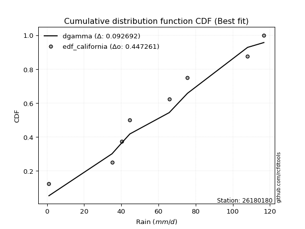</img>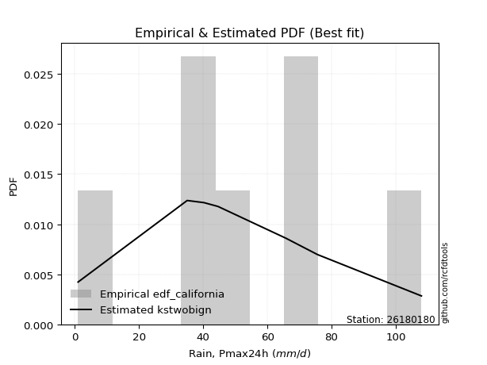</img>

</div>


### 2. Empirical - EDF Hazen (1930)

Hazen method for plotting positions is a formula used to estimate the empirical cumulative probability distribution of flood events or other hydrological data. This formula often results in biased estimations, particularly when extrapolating to extreme events (high return periods).

<div align="center">


$P=(m-0.5)/n$


</div>


**2.1. Empirical values**

<div align="center">

|                | 0                  | 1                  | 2                  | 3                  | 4                  | 5         | 6                 | 7         |
|:---------------|:-------------------|:-------------------|:-------------------|:-------------------|:-------------------|:----------|:------------------|:----------|
| date           | 2021               | 2020               | 2018               | 2022               | 2017               | 2019      | 2025              | 2024      |
| x              | 1.0                | 35.0               | 40.2               | 44.6               | 65.8               | 75.6      | 107.2             | 108.0     |
| m              | 1                  | 2                  | 3                  | 4                  | 5                  | 6         | 7                 | 8         |
| empirical_dist | edf_hazen          | edf_hazen          | edf_hazen          | edf_hazen          | edf_hazen          | edf_hazen | edf_hazen         | edf_hazen |
| empirical      | 0.0625             | 0.1875             | 0.3125             | 0.4375             | 0.5625             | 0.6875    | 0.8125            | 0.9375    |
| empirical_tr   | 1.0666666666666667 | 1.2307692307692308 | 1.4545454545454546 | 1.7777777777777777 | 2.2857142857142856 | 3.2       | 5.333333333333333 | 16.0      |

</div>


**2.2. Kolmogorov-Smirnov fit test (sorted by Δ)**


<div align="center">

|                | 0                   | 1                   | 2                   | 3                   | 4                   | 5                   | 6                   | 7                   | 8                   | 9                   | 10                  | 11                 | 12                  | 13                  | 14                  | 15                 | 16                  | 17                 | 18                  | 19                 | 20                 | 21                  | 22                  | 23                  | 24                  | 25                  | 26                  | 27                  | 28                 | 29                 | 30                 | 31                  | 32                  | 33                  | 34                 | 35                  | 36                  | 37                  | 38                  | 39                    | 40                  | 41                 | 42                  | 43                  | 44                 | 45                 | 46                 | 47                  | 48                 | 49                 | 50                  | 51                  | 52                  | 53                 | 54                 | 55                 | 56                  | 57                  | 58                  | 59                  | 60                 | 61                 | 62                 | 63                 | 64                 | 65                  | 66                  | 67                  | 68                 | 69                 | 70                 | 71                  | 72                 | 73                 | 74                  | 75                 | 76                 | 77                  | 78                  | 79                 | 80                 | 81                 | 82                 | 83                 | 84                 | 85                 | 86                 | 87                 | 88                 | 89                 |
|:---------------|:--------------------|:--------------------|:--------------------|:--------------------|:--------------------|:--------------------|:--------------------|:--------------------|:--------------------|:--------------------|:--------------------|:-------------------|:--------------------|:--------------------|:--------------------|:-------------------|:--------------------|:-------------------|:--------------------|:-------------------|:-------------------|:--------------------|:--------------------|:--------------------|:--------------------|:--------------------|:--------------------|:--------------------|:-------------------|:-------------------|:-------------------|:--------------------|:--------------------|:--------------------|:-------------------|:--------------------|:--------------------|:--------------------|:--------------------|:----------------------|:--------------------|:-------------------|:--------------------|:--------------------|:-------------------|:-------------------|:-------------------|:--------------------|:-------------------|:-------------------|:--------------------|:--------------------|:--------------------|:-------------------|:-------------------|:-------------------|:--------------------|:--------------------|:--------------------|:--------------------|:-------------------|:-------------------|:-------------------|:-------------------|:-------------------|:--------------------|:--------------------|:--------------------|:-------------------|:-------------------|:-------------------|:--------------------|:-------------------|:-------------------|:--------------------|:-------------------|:-------------------|:--------------------|:--------------------|:-------------------|:-------------------|:-------------------|:-------------------|:-------------------|:-------------------|:-------------------|:-------------------|:-------------------|:-------------------|:-------------------|
| station        | 26180180            | 26180180            | 26180180            | 26180180            | 26180180            | 26180180            | 26180180            | 26180180            | 26180180            | 26180180            | 26180180            | 26180180           | 26180180            | 26180180            | 26180180            | 26180180           | 26180180            | 26180180           | 26180180            | 26180180           | 26180180           | 26180180            | 26180180            | 26180180            | 26180180            | 26180180            | 26180180            | 26180180            | 26180180           | 26180180           | 26180180           | 26180180            | 26180180            | 26180180            | 26180180           | 26180180            | 26180180            | 26180180            | 26180180            | 26180180              | 26180180            | 26180180           | 26180180            | 26180180            | 26180180           | 26180180           | 26180180           | 26180180            | 26180180           | 26180180           | 26180180            | 26180180            | 26180180            | 26180180           | 26180180           | 26180180           | 26180180            | 26180180            | 26180180            | 26180180            | 26180180           | 26180180           | 26180180           | 26180180           | 26180180           | 26180180            | 26180180            | 26180180            | 26180180           | 26180180           | 26180180           | 26180180            | 26180180           | 26180180           | 26180180            | 26180180           | 26180180           | 26180180            | 26180180            | 26180180           | 26180180           | 26180180           | 26180180           | 26180180           | 26180180           | 26180180           | 26180180           | 26180180           | 26180180           | 26180180           |
| empirical_dist | edf_hazen           | edf_hazen           | edf_hazen           | edf_hazen           | edf_hazen           | edf_hazen           | edf_hazen           | edf_hazen           | edf_hazen           | edf_hazen           | edf_hazen           | edf_hazen          | edf_hazen           | edf_hazen           | edf_hazen           | edf_hazen          | edf_hazen           | edf_hazen          | edf_hazen           | edf_hazen          | edf_hazen          | edf_hazen           | edf_hazen           | edf_hazen           | edf_hazen           | edf_hazen           | edf_hazen           | edf_hazen           | edf_hazen          | edf_hazen          | edf_hazen          | edf_hazen           | edf_hazen           | edf_hazen           | edf_hazen          | edf_hazen           | edf_hazen           | edf_hazen           | edf_hazen           | edf_hazen             | edf_hazen           | edf_hazen          | edf_hazen           | edf_hazen           | edf_hazen          | edf_hazen          | edf_hazen          | edf_hazen           | edf_hazen          | edf_hazen          | edf_hazen           | edf_hazen           | edf_hazen           | edf_hazen          | edf_hazen          | edf_hazen          | edf_hazen           | edf_hazen           | edf_hazen           | edf_hazen           | edf_hazen          | edf_hazen          | edf_hazen          | edf_hazen          | edf_hazen          | edf_hazen           | edf_hazen           | edf_hazen           | edf_hazen          | edf_hazen          | edf_hazen          | edf_hazen           | edf_hazen          | edf_hazen          | edf_hazen           | edf_hazen          | edf_hazen          | edf_hazen           | edf_hazen           | edf_hazen          | edf_hazen          | edf_hazen          | edf_hazen          | edf_hazen          | edf_hazen          | edf_hazen          | edf_hazen          | edf_hazen          | edf_hazen          | edf_hazen          |
| p_dist         | invgauss            | rayleigh            | genlogistic         | invgamma            | maxwell             | alpha               | rice                | chi2                | gumbel_r            | laplace_asymmetric  | halfnorm            | weibull_min        | halflogistic        | betaprime           | moyal               | fisk               | f                   | erlang             | gamma               | norm               | crystalball        | exponnorm           | t                   | nct                 | pearson3            | johnsonsu           | kstwobign           | logistic            | logt               | hypsecant          | ncf                | gumbel_l            | logweibull_min      | logfisk             | mielke             | laplace             | wald                | logpearson3         | loggompertz         | loglaplace_asymmetric | logloggamma         | gibrat             | loggumbel_l         | genexpon            | expon              | loglaplace         | loghypsecant       | loglogistic         | logbetaprime       | logcrystalball     | lognorm             | lognorm             | logexponnorm        | logrice            | lognct             | logfatiguelife     | loginvgamma         | logerlang           | loggamma            | loggamma            | logalpha           | logmielke          | loginvweibull      | logmaxwell         | loginvgauss        | lograyleigh         | loggumbel_r         | logkstwobign        | loghalfnorm        | logmoyal           | loggenexpon        | loghalflogistic     | logncf             | logjohnsonsu       | logexpon            | loglognorm         | logwald            | pareto              | logchi2             | invweibull         | loggibrat          | logpareto          | nakagami           | logf               | lognakagami        | logtruncnorm       | gompertz           | fatiguelife        | loggenlogistic     | truncnorm          |
| delta          | 0.08814032367034363 | 0.08937864755993585 | 0.09042823616137435 | 0.09098193684291478 | 0.09225974098627887 | 0.09538951420602149 | 0.09552399295718073 | 0.09563552866709424 | 0.09584222558394329 | 0.09836790435501674 | 0.09904763636427599 | 0.0996239897025255 | 0.09977684426529532 | 0.09994627869763839 | 0.10098229784377288 | 0.1038871564886441 | 0.10426299327298083 | 0.1057376850081953 | 0.10573810222821006 | 0.106252490190056  | 0.106252496476685  | 0.10625318499972025 | 0.10625375064765907 | 0.10626151859269295 | 0.10675404694177038 | 0.10698390818058356 | 0.11711142969249466 | 0.12568998437327172 | 0.1333022561583565 | 0.1404083551840115 | 0.1500105625704954 | 0.16308559665371003 | 0.16541965468500325 | 0.16573390357887785 | 0.1671718943976358 | 0.16779066021306477 | 0.16787330138928003 | 0.17048222986251155 | 0.17832519236741162 | 0.18046416020812472   | 0.18048005794890498 | 0.1983419082482527 | 0.22526098152702256 | 0.23797783917579252 | 0.2523009681836256 | 0.2839670049342306 | 0.2917402966156283 | 0.29366858241338045 | 0.2953375417768847 | 0.2959291636902858 | 0.29592916627927357 | 0.29592916627927357 | 0.29593200860238456 | 0.2959898930541622 | 0.2963334037346451 | 0.2983265744198698 | 0.30163842928487467 | 0.30930247919786724 | 0.31080972586972866 | 0.31080972586972866 | 0.3190565487514807 | 0.3216243939651353 | 0.327996483766516  | 0.3295636121670473 | 0.3300644917515755 | 0.34091336956399876 | 0.36561444536577825 | 0.37059793193207347 | 0.372878220147731  | 0.3914876832640204 | 0.3942863683312039 | 0.39672280047040154 | 0.4190769723747281 | 0.42661291556577   | 0.43855248975112815 | 0.4595536233104185 | 0.4634980534630577 | 0.46563491705933424 | 0.48208779308011707 | 0.4824519087968717 | 0.4839849484255445 | 0.4869178175891977 | 0.5027375512020691 | 0.5035004928201535 | 0.5581949674390512 | 0.6256165963904902 | 0.632101057798528  | 0.6328226966964234 | 0.8125             | 0.8125             |
| deltao         | 0.4472608134160001  | 0.4472608134160001  | 0.4472608134160001  | 0.4472608134160001  | 0.4472608134160001  | 0.4472608134160001  | 0.4472608134160001  | 0.4472608134160001  | 0.4472608134160001  | 0.4472608134160001  | 0.4472608134160001  | 0.4472608134160001 | 0.4472608134160001  | 0.4472608134160001  | 0.4472608134160001  | 0.4472608134160001 | 0.4472608134160001  | 0.4472608134160001 | 0.4472608134160001  | 0.4472608134160001 | 0.4472608134160001 | 0.4472608134160001  | 0.4472608134160001  | 0.4472608134160001  | 0.4472608134160001  | 0.4472608134160001  | 0.4472608134160001  | 0.4472608134160001  | 0.4472608134160001 | 0.4472608134160001 | 0.4472608134160001 | 0.4472608134160001  | 0.4472608134160001  | 0.4472608134160001  | 0.4472608134160001 | 0.4472608134160001  | 0.4472608134160001  | 0.4472608134160001  | 0.4472608134160001  | 0.4472608134160001    | 0.4472608134160001  | 0.4472608134160001 | 0.4472608134160001  | 0.4472608134160001  | 0.4472608134160001 | 0.4472608134160001 | 0.4472608134160001 | 0.4472608134160001  | 0.4472608134160001 | 0.4472608134160001 | 0.4472608134160001  | 0.4472608134160001  | 0.4472608134160001  | 0.4472608134160001 | 0.4472608134160001 | 0.4472608134160001 | 0.4472608134160001  | 0.4472608134160001  | 0.4472608134160001  | 0.4472608134160001  | 0.4472608134160001 | 0.4472608134160001 | 0.4472608134160001 | 0.4472608134160001 | 0.4472608134160001 | 0.4472608134160001  | 0.4472608134160001  | 0.4472608134160001  | 0.4472608134160001 | 0.4472608134160001 | 0.4472608134160001 | 0.4472608134160001  | 0.4472608134160001 | 0.4472608134160001 | 0.4472608134160001  | 0.4472608134160001 | 0.4472608134160001 | 0.4472608134160001  | 0.4472608134160001  | 0.4472608134160001 | 0.4472608134160001 | 0.4472608134160001 | 0.4472608134160001 | 0.4472608134160001 | 0.4472608134160001 | 0.4472608134160001 | 0.4472608134160001 | 0.4472608134160001 | 0.4472608134160001 | 0.4472608134160001 |
| eval           | Δo > Δ              | Δo > Δ              | Δo > Δ              | Δo > Δ              | Δo > Δ              | Δo > Δ              | Δo > Δ              | Δo > Δ              | Δo > Δ              | Δo > Δ              | Δo > Δ              | Δo > Δ             | Δo > Δ              | Δo > Δ              | Δo > Δ              | Δo > Δ             | Δo > Δ              | Δo > Δ             | Δo > Δ              | Δo > Δ             | Δo > Δ             | Δo > Δ              | Δo > Δ              | Δo > Δ              | Δo > Δ              | Δo > Δ              | Δo > Δ              | Δo > Δ              | Δo > Δ             | Δo > Δ             | Δo > Δ             | Δo > Δ              | Δo > Δ              | Δo > Δ              | Δo > Δ             | Δo > Δ              | Δo > Δ              | Δo > Δ              | Δo > Δ              | Δo > Δ                | Δo > Δ              | Δo > Δ             | Δo > Δ              | Δo > Δ              | Δo > Δ             | Δo > Δ             | Δo > Δ             | Δo > Δ              | Δo > Δ             | Δo > Δ             | Δo > Δ              | Δo > Δ              | Δo > Δ              | Δo > Δ             | Δo > Δ             | Δo > Δ             | Δo > Δ              | Δo > Δ              | Δo > Δ              | Δo > Δ              | Δo > Δ             | Δo > Δ             | Δo > Δ             | Δo > Δ             | Δo > Δ             | Δo > Δ              | Δo > Δ              | Δo > Δ              | Δo > Δ             | Δo > Δ             | Δo > Δ             | Δo > Δ              | Δo > Δ             | Δo > Δ             | Δo > Δ              | Δo <= Δ            | Δo <= Δ            | Δo <= Δ             | Δo <= Δ             | Δo <= Δ            | Δo <= Δ            | Δo <= Δ            | Δo <= Δ            | Δo <= Δ            | Δo <= Δ            | Δo <= Δ            | Δo <= Δ            | Δo <= Δ            | Δo <= Δ            | Δo <= Δ            |
| fit            | 1                   | 1                   | 1                   | 1                   | 1                   | 1                   | 1                   | 1                   | 1                   | 1                   | 1                   | 1                  | 1                   | 1                   | 1                   | 1                  | 1                   | 1                  | 1                   | 1                  | 1                  | 1                   | 1                   | 1                   | 1                   | 1                   | 1                   | 1                   | 1                  | 1                  | 1                  | 1                   | 1                   | 1                   | 1                  | 1                   | 1                   | 1                   | 1                   | 1                     | 1                   | 1                  | 1                   | 1                   | 1                  | 1                  | 1                  | 1                   | 1                  | 1                  | 1                   | 1                   | 1                   | 1                  | 1                  | 1                  | 1                   | 1                   | 1                   | 1                   | 1                  | 1                  | 1                  | 1                  | 1                  | 1                   | 1                   | 1                   | 1                  | 1                  | 1                  | 1                   | 1                  | 1                  | 1                   | 0                  | 0                  | 0                   | 0                   | 0                  | 0                  | 0                  | 0                  | 0                  | 0                  | 0                  | 0                  | 0                  | 0                  | 0                  |
| n              | 8                   | 8                   | 8                   | 8                   | 8                   | 8                   | 8                   | 8                   | 8                   | 8                   | 8                   | 8                  | 8                   | 8                   | 8                   | 8                  | 8                   | 8                  | 8                   | 8                  | 8                  | 8                   | 8                   | 8                   | 8                   | 8                   | 8                   | 8                   | 8                  | 8                  | 8                  | 8                   | 8                   | 8                   | 8                  | 8                   | 8                   | 8                   | 8                   | 8                     | 8                   | 8                  | 8                   | 8                   | 8                  | 8                  | 8                  | 8                   | 8                  | 8                  | 8                   | 8                   | 8                   | 8                  | 8                  | 8                  | 8                   | 8                   | 8                   | 8                   | 8                  | 8                  | 8                  | 8                  | 8                  | 8                   | 8                   | 8                   | 8                  | 8                  | 8                  | 8                   | 8                  | 8                  | 8                   | 8                  | 8                  | 8                   | 8                   | 8                  | 8                  | 8                  | 8                  | 8                  | 8                  | 8                  | 8                  | 8                  | 8                  | 8                  |
| best_fit       | 1                   | 0                   | 0                   | 0                   | 0                   | 0                   | 0                   | 0                   | 0                   | 0                   | 0                   | 0                  | 0                   | 0                   | 0                   | 0                  | 0                   | 0                  | 0                   | 0                  | 0                  | 0                   | 0                   | 0                   | 0                   | 0                   | 0                   | 0                   | 0                  | 0                  | 0                  | 0                   | 0                   | 0                   | 0                  | 0                   | 0                   | 0                   | 0                   | 0                     | 0                   | 0                  | 0                   | 0                   | 0                  | 0                  | 0                  | 0                   | 0                  | 0                  | 0                   | 0                   | 0                   | 0                  | 0                  | 0                  | 0                   | 0                   | 0                   | 0                   | 0                  | 0                  | 0                  | 0                  | 0                  | 0                   | 0                   | 0                   | 0                  | 0                  | 0                  | 0                   | 0                  | 0                  | 0                   | 0                  | 0                  | 0                   | 0                   | 0                  | 0                  | 0                  | 0                  | 0                  | 0                  | 0                  | 0                  | 0                  | 0                  | 0                  |
| best_fit_sort  | 1                   | 2                   | 3                   | 4                   | 5                   | 6                   | 7                   | 8                   | 9                   | 10                  | 11                  | 12                 | 13                  | 14                  | 15                  | 16                 | 17                  | 18                 | 19                  | 20                 | 21                 | 22                  | 23                  | 24                  | 25                  | 26                  | 27                  | 28                  | 29                 | 30                 | 31                 | 32                  | 33                  | 34                  | 35                 | 36                  | 37                  | 38                  | 39                  | 40                    | 41                  | 42                 | 43                  | 44                  | 45                 | 46                 | 47                 | 48                  | 49                 | 50                 | 51                  | 52                  | 53                  | 54                 | 55                 | 56                 | 57                  | 58                  | 59                  | 60                  | 61                 | 62                 | 63                 | 64                 | 65                 | 66                  | 67                  | 68                  | 69                 | 70                 | 71                 | 72                  | 73                 | 74                 | 75                  | 76                 | 77                 | 78                  | 79                  | 80                 | 81                 | 82                 | 83                 | 84                 | 85                 | 86                 | 87                 | 88                 | 89                 | 90                 |

</div>


<div align="center">

</img>

</div>


**2.3. Best fit**

<div align="center">

|   id |   station | empirical_dist   | p_dist   |     delta |   deltao | eval   |   fit |   n |   best_fit |   best_fit_sort |
|-----:|----------:|:-----------------|:---------|----------:|---------:|:-------|------:|----:|-----------:|----------------:|
|    0 |  26180180 | edf_hazen        | invgauss | 0.0881403 | 0.447261 | Δo > Δ |     1 |   8 |          1 |               1 |

</div>


<div align="center">

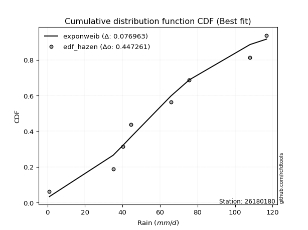</img></img>

</div>


### 3. Empirical - EDF Weibull (1939)

Weibull plotting position formula is an empirical method used to estimate the non-exceedance probability or plotting position for a set of observed data, is often recommended or widely used in practice, particularly in flood frequency analysis.

<div align="center">


$P=m/(n+1)$


</div>


**3.1. Empirical values**

<div align="center">

|                | 0                  | 1                  | 2                  | 3                  | 4                  | 5                  | 6                  | 7                  |
|:---------------|:-------------------|:-------------------|:-------------------|:-------------------|:-------------------|:-------------------|:-------------------|:-------------------|
| date           | 2021               | 2020               | 2018               | 2022               | 2017               | 2019               | 2025               | 2024               |
| x              | 1.0                | 35.0               | 40.2               | 44.6               | 65.8               | 75.6               | 107.2              | 108.0              |
| m              | 1                  | 2                  | 3                  | 4                  | 5                  | 6                  | 7                  | 8                  |
| empirical_dist | edf_weibull        | edf_weibull        | edf_weibull        | edf_weibull        | edf_weibull        | edf_weibull        | edf_weibull        | edf_weibull        |
| empirical      | 0.1111111111111111 | 0.2222222222222222 | 0.3333333333333333 | 0.4444444444444444 | 0.5555555555555556 | 0.6666666666666666 | 0.7777777777777778 | 0.8888888888888888 |
| empirical_tr   | 1.125              | 1.2857142857142856 | 1.4999999999999998 | 1.7999999999999998 | 2.25               | 2.9999999999999996 | 4.5                | 8.999999999999996  |

</div>


**3.2. Kolmogorov-Smirnov fit test (sorted by Δ)**


<div align="center">

|                | 0                   | 1                   | 2                   | 3                  | 4                   | 5                   | 6                   | 7                  | 8                   | 9                   | 10                  | 11                  | 12                 | 13                  | 14                  | 15                 | 16                  | 17                  | 18                  | 19                 | 20                  | 21                  | 22                  | 23                  | 24                  | 25                  | 26                  | 27                  | 28                  | 29                  | 30                  | 31                  | 32                 | 33                  | 34                 | 35                 | 36                  | 37                  | 38                  | 39                 | 40                 | 41                  | 42                    | 43                 | 44                  | 45                 | 46                  | 47                  | 48                 | 49                 | 50                  | 51                  | 52                  | 53                  | 54                 | 55                 | 56                  | 57                  | 58                  | 59                  | 60                 | 61                 | 62                 | 63                 | 64                 | 65                  | 66                  | 67                  | 68                  | 69                 | 70                 | 71                 | 72                  | 73                  | 74                  | 75                 | 76                 | 77                  | 78                  | 79                  | 80                 | 81                 | 82                 | 83                 | 84                 | 85                 | 86                 | 87                 | 88                 | 89                 |
|:---------------|:--------------------|:--------------------|:--------------------|:-------------------|:--------------------|:--------------------|:--------------------|:-------------------|:--------------------|:--------------------|:--------------------|:--------------------|:-------------------|:--------------------|:--------------------|:-------------------|:--------------------|:--------------------|:--------------------|:-------------------|:--------------------|:--------------------|:--------------------|:--------------------|:--------------------|:--------------------|:--------------------|:--------------------|:--------------------|:--------------------|:--------------------|:--------------------|:-------------------|:--------------------|:-------------------|:-------------------|:--------------------|:--------------------|:--------------------|:-------------------|:-------------------|:--------------------|:----------------------|:-------------------|:--------------------|:-------------------|:--------------------|:--------------------|:-------------------|:-------------------|:--------------------|:--------------------|:--------------------|:--------------------|:-------------------|:-------------------|:--------------------|:--------------------|:--------------------|:--------------------|:-------------------|:-------------------|:-------------------|:-------------------|:-------------------|:--------------------|:--------------------|:--------------------|:--------------------|:-------------------|:-------------------|:-------------------|:--------------------|:--------------------|:--------------------|:-------------------|:-------------------|:--------------------|:--------------------|:--------------------|:-------------------|:-------------------|:-------------------|:-------------------|:-------------------|:-------------------|:-------------------|:-------------------|:-------------------|:-------------------|
| station        | 26180180            | 26180180            | 26180180            | 26180180           | 26180180            | 26180180            | 26180180            | 26180180           | 26180180            | 26180180            | 26180180            | 26180180            | 26180180           | 26180180            | 26180180            | 26180180           | 26180180            | 26180180            | 26180180            | 26180180           | 26180180            | 26180180            | 26180180            | 26180180            | 26180180            | 26180180            | 26180180            | 26180180            | 26180180            | 26180180            | 26180180            | 26180180            | 26180180           | 26180180            | 26180180           | 26180180           | 26180180            | 26180180            | 26180180            | 26180180           | 26180180           | 26180180            | 26180180              | 26180180           | 26180180            | 26180180           | 26180180            | 26180180            | 26180180           | 26180180           | 26180180            | 26180180            | 26180180            | 26180180            | 26180180           | 26180180           | 26180180            | 26180180            | 26180180            | 26180180            | 26180180           | 26180180           | 26180180           | 26180180           | 26180180           | 26180180            | 26180180            | 26180180            | 26180180            | 26180180           | 26180180           | 26180180           | 26180180            | 26180180            | 26180180            | 26180180           | 26180180           | 26180180            | 26180180            | 26180180            | 26180180           | 26180180           | 26180180           | 26180180           | 26180180           | 26180180           | 26180180           | 26180180           | 26180180           | 26180180           |
| empirical_dist | edf_weibull         | edf_weibull         | edf_weibull         | edf_weibull        | edf_weibull         | edf_weibull         | edf_weibull         | edf_weibull        | edf_weibull         | edf_weibull         | edf_weibull         | edf_weibull         | edf_weibull        | edf_weibull         | edf_weibull         | edf_weibull        | edf_weibull         | edf_weibull         | edf_weibull         | edf_weibull        | edf_weibull         | edf_weibull         | edf_weibull         | edf_weibull         | edf_weibull         | edf_weibull         | edf_weibull         | edf_weibull         | edf_weibull         | edf_weibull         | edf_weibull         | edf_weibull         | edf_weibull        | edf_weibull         | edf_weibull        | edf_weibull        | edf_weibull         | edf_weibull         | edf_weibull         | edf_weibull        | edf_weibull        | edf_weibull         | edf_weibull           | edf_weibull        | edf_weibull         | edf_weibull        | edf_weibull         | edf_weibull         | edf_weibull        | edf_weibull        | edf_weibull         | edf_weibull         | edf_weibull         | edf_weibull         | edf_weibull        | edf_weibull        | edf_weibull         | edf_weibull         | edf_weibull         | edf_weibull         | edf_weibull        | edf_weibull        | edf_weibull        | edf_weibull        | edf_weibull        | edf_weibull         | edf_weibull         | edf_weibull         | edf_weibull         | edf_weibull        | edf_weibull        | edf_weibull        | edf_weibull         | edf_weibull         | edf_weibull         | edf_weibull        | edf_weibull        | edf_weibull         | edf_weibull         | edf_weibull         | edf_weibull        | edf_weibull        | edf_weibull        | edf_weibull        | edf_weibull        | edf_weibull        | edf_weibull        | edf_weibull        | edf_weibull        | edf_weibull        |
| p_dist         | kstwobign           | laplace_asymmetric  | ncf                 | halfnorm           | genlogistic         | invgauss            | rayleigh            | invgamma           | maxwell             | halflogistic        | fisk                | logfisk             | alpha              | rice                | chi2                | gumbel_r           | logweibull_min      | moyal               | weibull_min         | betaprime          | logpearson3         | f                   | erlang              | gamma               | nct                 | t                   | crystalball         | norm                | exponnorm           | pearson3            | johnsonsu           | logt                | loggompertz        | logistic            | hypsecant          | laplace            | wald                | gumbel_l            | loggumbel_l         | mielke             | genexpon           | gibrat              | loglaplace_asymmetric | logloggamma        | expon               | loglaplace         | loghypsecant        | loglogistic         | logbetaprime       | logcrystalball     | lognorm             | lognorm             | logexponnorm        | logrice             | lognct             | logfatiguelife     | loginvgamma         | logerlang           | loggamma            | loggamma            | logalpha           | logmielke          | loginvweibull      | logmaxwell         | loginvgauss        | lograyleigh         | loggumbel_r         | logkstwobign        | loghalfnorm         | logmoyal           | loggenexpon        | loghalflogistic    | logncf              | logexpon            | logjohnsonsu        | loglognorm         | logwald            | pareto              | invweibull          | logchi2             | loggibrat          | logpareto          | nakagami           | logf               | lognakagami        | logtruncnorm       | fatiguelife        | gompertz           | loggenlogistic     | truncnorm          |
| delta          | 0.10413988155157594 | 0.11208911534413846 | 0.11528834034827318 | 0.118560454399954  | 0.12192240814599253 | 0.12286254589256584 | 0.12410086978215806 | 0.125704159065137  | 0.12698196320850108 | 0.12698351056940838 | 0.12858025648328952 | 0.12900033314001058 | 0.1301117364282437 | 0.13024621517940294 | 0.13035775088931645 | 0.1305644478061655 | 0.13069743246278104 | 0.13073261231432243 | 0.13434621192474772 | 0.1346685009198606 | 0.13576000764028934 | 0.13669607139561635 | 0.13757502206780114 | 0.13757979924586894 | 0.13778217579605978 | 0.13781131280219194 | 0.13781227493068415 | 0.13781228160413295 | 0.13781271503248693 | 0.13805017843651635 | 0.13815039048515032 | 0.14024670060280092 | 0.1436029701451894 | 0.14606895421481092 | 0.1492300315387335 | 0.1747351046575092 | 0.17481774583372445 | 0.18456146356883207 | 0.19053875930480035 | 0.201894116619858  | 0.2032556169535703 | 0.21020498240459987 | 0.21518638243034693   | 0.2152022801711272 | 0.21757874596140336 | 0.2492447827120084 | 0.25701807439340607 | 0.25894636019115824 | 0.2606153195546625 | 0.2612069414680636 | 0.26120694405705136 | 0.26120694405705136 | 0.26120978638016235 | 0.26126767083193997 | 0.2616111815124229 | 0.2636043521976476 | 0.26691620706265246 | 0.27458025697564503 | 0.27608750364750645 | 0.27608750364750645 | 0.2843343265292585 | 0.2869021717429131 | 0.2932742615442938 | 0.2948413899448251 | 0.2953422695293533 | 0.30619114734177655 | 0.33089222314355604 | 0.33587570970985126 | 0.33815599792550877 | 0.3567654610417982 | 0.3595641461089817 | 0.3620005782481793 | 0.38435475015250586 | 0.40383026752890594 | 0.40577958223243665 | 0.4248314010881963 | 0.4287758312408355 | 0.43091269483711203 | 0.43384079768576056 | 0.44736557085789486 | 0.4492627262033223 | 0.4521955953669755 | 0.4680153289798469 | 0.4687782705979313 | 0.523472745216829  | 0.590894374168268  | 0.5981004744742012 | 0.6112677244651945 | 0.7777777777777778 | 0.7777777777777778 |
| deltao         | 0.4472608134160001  | 0.4472608134160001  | 0.4472608134160001  | 0.4472608134160001 | 0.4472608134160001  | 0.4472608134160001  | 0.4472608134160001  | 0.4472608134160001 | 0.4472608134160001  | 0.4472608134160001  | 0.4472608134160001  | 0.4472608134160001  | 0.4472608134160001 | 0.4472608134160001  | 0.4472608134160001  | 0.4472608134160001 | 0.4472608134160001  | 0.4472608134160001  | 0.4472608134160001  | 0.4472608134160001 | 0.4472608134160001  | 0.4472608134160001  | 0.4472608134160001  | 0.4472608134160001  | 0.4472608134160001  | 0.4472608134160001  | 0.4472608134160001  | 0.4472608134160001  | 0.4472608134160001  | 0.4472608134160001  | 0.4472608134160001  | 0.4472608134160001  | 0.4472608134160001 | 0.4472608134160001  | 0.4472608134160001 | 0.4472608134160001 | 0.4472608134160001  | 0.4472608134160001  | 0.4472608134160001  | 0.4472608134160001 | 0.4472608134160001 | 0.4472608134160001  | 0.4472608134160001    | 0.4472608134160001 | 0.4472608134160001  | 0.4472608134160001 | 0.4472608134160001  | 0.4472608134160001  | 0.4472608134160001 | 0.4472608134160001 | 0.4472608134160001  | 0.4472608134160001  | 0.4472608134160001  | 0.4472608134160001  | 0.4472608134160001 | 0.4472608134160001 | 0.4472608134160001  | 0.4472608134160001  | 0.4472608134160001  | 0.4472608134160001  | 0.4472608134160001 | 0.4472608134160001 | 0.4472608134160001 | 0.4472608134160001 | 0.4472608134160001 | 0.4472608134160001  | 0.4472608134160001  | 0.4472608134160001  | 0.4472608134160001  | 0.4472608134160001 | 0.4472608134160001 | 0.4472608134160001 | 0.4472608134160001  | 0.4472608134160001  | 0.4472608134160001  | 0.4472608134160001 | 0.4472608134160001 | 0.4472608134160001  | 0.4472608134160001  | 0.4472608134160001  | 0.4472608134160001 | 0.4472608134160001 | 0.4472608134160001 | 0.4472608134160001 | 0.4472608134160001 | 0.4472608134160001 | 0.4472608134160001 | 0.4472608134160001 | 0.4472608134160001 | 0.4472608134160001 |
| eval           | Δo > Δ              | Δo > Δ              | Δo > Δ              | Δo > Δ             | Δo > Δ              | Δo > Δ              | Δo > Δ              | Δo > Δ             | Δo > Δ              | Δo > Δ              | Δo > Δ              | Δo > Δ              | Δo > Δ             | Δo > Δ              | Δo > Δ              | Δo > Δ             | Δo > Δ              | Δo > Δ              | Δo > Δ              | Δo > Δ             | Δo > Δ              | Δo > Δ              | Δo > Δ              | Δo > Δ              | Δo > Δ              | Δo > Δ              | Δo > Δ              | Δo > Δ              | Δo > Δ              | Δo > Δ              | Δo > Δ              | Δo > Δ              | Δo > Δ             | Δo > Δ              | Δo > Δ             | Δo > Δ             | Δo > Δ              | Δo > Δ              | Δo > Δ              | Δo > Δ             | Δo > Δ             | Δo > Δ              | Δo > Δ                | Δo > Δ             | Δo > Δ              | Δo > Δ             | Δo > Δ              | Δo > Δ              | Δo > Δ             | Δo > Δ             | Δo > Δ              | Δo > Δ              | Δo > Δ              | Δo > Δ              | Δo > Δ             | Δo > Δ             | Δo > Δ              | Δo > Δ              | Δo > Δ              | Δo > Δ              | Δo > Δ             | Δo > Δ             | Δo > Δ             | Δo > Δ             | Δo > Δ             | Δo > Δ              | Δo > Δ              | Δo > Δ              | Δo > Δ              | Δo > Δ             | Δo > Δ             | Δo > Δ             | Δo > Δ              | Δo > Δ              | Δo > Δ              | Δo > Δ             | Δo > Δ             | Δo > Δ              | Δo > Δ              | Δo <= Δ             | Δo <= Δ            | Δo <= Δ            | Δo <= Δ            | Δo <= Δ            | Δo <= Δ            | Δo <= Δ            | Δo <= Δ            | Δo <= Δ            | Δo <= Δ            | Δo <= Δ            |
| fit            | 1                   | 1                   | 1                   | 1                  | 1                   | 1                   | 1                   | 1                  | 1                   | 1                   | 1                   | 1                   | 1                  | 1                   | 1                   | 1                  | 1                   | 1                   | 1                   | 1                  | 1                   | 1                   | 1                   | 1                   | 1                   | 1                   | 1                   | 1                   | 1                   | 1                   | 1                   | 1                   | 1                  | 1                   | 1                  | 1                  | 1                   | 1                   | 1                   | 1                  | 1                  | 1                   | 1                     | 1                  | 1                   | 1                  | 1                   | 1                   | 1                  | 1                  | 1                   | 1                   | 1                   | 1                   | 1                  | 1                  | 1                   | 1                   | 1                   | 1                   | 1                  | 1                  | 1                  | 1                  | 1                  | 1                   | 1                   | 1                   | 1                   | 1                  | 1                  | 1                  | 1                   | 1                   | 1                   | 1                  | 1                  | 1                   | 1                   | 0                   | 0                  | 0                  | 0                  | 0                  | 0                  | 0                  | 0                  | 0                  | 0                  | 0                  |
| n              | 8                   | 8                   | 8                   | 8                  | 8                   | 8                   | 8                   | 8                  | 8                   | 8                   | 8                   | 8                   | 8                  | 8                   | 8                   | 8                  | 8                   | 8                   | 8                   | 8                  | 8                   | 8                   | 8                   | 8                   | 8                   | 8                   | 8                   | 8                   | 8                   | 8                   | 8                   | 8                   | 8                  | 8                   | 8                  | 8                  | 8                   | 8                   | 8                   | 8                  | 8                  | 8                   | 8                     | 8                  | 8                   | 8                  | 8                   | 8                   | 8                  | 8                  | 8                   | 8                   | 8                   | 8                   | 8                  | 8                  | 8                   | 8                   | 8                   | 8                   | 8                  | 8                  | 8                  | 8                  | 8                  | 8                   | 8                   | 8                   | 8                   | 8                  | 8                  | 8                  | 8                   | 8                   | 8                   | 8                  | 8                  | 8                   | 8                   | 8                   | 8                  | 8                  | 8                  | 8                  | 8                  | 8                  | 8                  | 8                  | 8                  | 8                  |
| best_fit       | 1                   | 0                   | 0                   | 0                  | 0                   | 0                   | 0                   | 0                  | 0                   | 0                   | 0                   | 0                   | 0                  | 0                   | 0                   | 0                  | 0                   | 0                   | 0                   | 0                  | 0                   | 0                   | 0                   | 0                   | 0                   | 0                   | 0                   | 0                   | 0                   | 0                   | 0                   | 0                   | 0                  | 0                   | 0                  | 0                  | 0                   | 0                   | 0                   | 0                  | 0                  | 0                   | 0                     | 0                  | 0                   | 0                  | 0                   | 0                   | 0                  | 0                  | 0                   | 0                   | 0                   | 0                   | 0                  | 0                  | 0                   | 0                   | 0                   | 0                   | 0                  | 0                  | 0                  | 0                  | 0                  | 0                   | 0                   | 0                   | 0                   | 0                  | 0                  | 0                  | 0                   | 0                   | 0                   | 0                  | 0                  | 0                   | 0                   | 0                   | 0                  | 0                  | 0                  | 0                  | 0                  | 0                  | 0                  | 0                  | 0                  | 0                  |
| best_fit_sort  | 1                   | 2                   | 3                   | 4                  | 5                   | 6                   | 7                   | 8                  | 9                   | 10                  | 11                  | 12                  | 13                 | 14                  | 15                  | 16                 | 17                  | 18                  | 19                  | 20                 | 21                  | 22                  | 23                  | 24                  | 25                  | 26                  | 27                  | 28                  | 29                  | 30                  | 31                  | 32                  | 33                 | 34                  | 35                 | 36                 | 37                  | 38                  | 39                  | 40                 | 41                 | 42                  | 43                    | 44                 | 45                  | 46                 | 47                  | 48                  | 49                 | 50                 | 51                  | 52                  | 53                  | 54                  | 55                 | 56                 | 57                  | 58                  | 59                  | 60                  | 61                 | 62                 | 63                 | 64                 | 65                 | 66                  | 67                  | 68                  | 69                  | 70                 | 71                 | 72                 | 73                  | 74                  | 75                  | 76                 | 77                 | 78                  | 79                  | 80                  | 81                 | 82                 | 83                 | 84                 | 85                 | 86                 | 87                 | 88                 | 89                 | 90                 |

</div>


<div align="center">

</img>

</div>


**3.3. Best fit**

<div align="center">

|   id |   station | empirical_dist   | p_dist    |   delta |   deltao | eval   |   fit |   n |   best_fit |   best_fit_sort |
|-----:|----------:|:-----------------|:----------|--------:|---------:|:-------|------:|----:|-----------:|----------------:|
|    0 |  26180180 | edf_weibull      | kstwobign | 0.10414 | 0.447261 | Δo > Δ |     1 |   8 |          1 |               1 |

</div>


<div align="center">

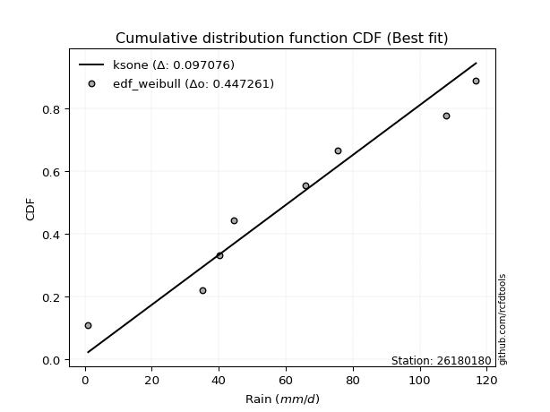</img>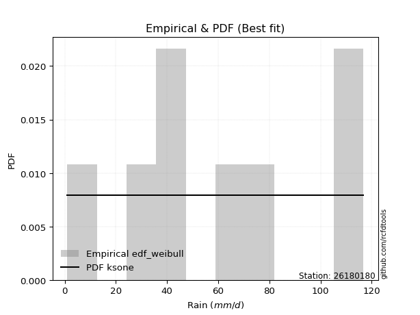</img>

</div>


### 4. Empirical - EDF Beard (1943)

The Beard formula (or Beard´s plotting position formula) in hydrology is used to estimate the empirical non-exceedance probability _(P)_ of a flood event (or other extreme hydrological data point) within a given dataset.

<div align="center">


$P=(m-0.31)/(n+0.38)$


</div>


**4.1. Empirical values**

<div align="center">

|                | 0                   | 1                   | 2                  | 3                   | 4                  | 5                  | 6                  | 7                  |
|:---------------|:--------------------|:--------------------|:-------------------|:--------------------|:-------------------|:-------------------|:-------------------|:-------------------|
| date           | 2021                | 2020                | 2018               | 2022                | 2017               | 2019               | 2025               | 2024               |
| x              | 1.0                 | 35.0                | 40.2               | 44.6                | 65.8               | 75.6               | 107.2              | 108.0              |
| m              | 1                   | 2                   | 3                  | 4                   | 5                  | 6                  | 7                  | 8                  |
| empirical_dist | edf_beard           | edf_beard           | edf_beard          | edf_beard           | edf_beard          | edf_beard          | edf_beard          | edf_beard          |
| empirical      | 0.08233890214797135 | 0.20167064439140808 | 0.3210023866348448 | 0.44033412887828155 | 0.5596658711217184 | 0.6789976133651551 | 0.7983293556085919 | 0.9176610978520287 |
| empirical_tr   | 1.0897269180754225  | 1.2526158445440956  | 1.4727592267135323 | 1.7867803837953091  | 2.2710027100271004 | 3.115241635687732  | 4.958579881656804  | 12.144927536231886 |

</div>


**4.2. Kolmogorov-Smirnov fit test (sorted by Δ)**


<div align="center">

|                | 0                   | 1                   | 2                   | 3                   | 4                   | 5                   | 6                   | 7                   | 8                  | 9                   | 10                  | 11                  | 12                  | 13                  | 14                  | 15                  | 16                  | 17                  | 18                  | 19                  | 20                  | 21                  | 22                  | 23                  | 24                  | 25                  | 26                  | 27                  | 28                 | 29                  | 30                  | 31                 | 32                  | 33                  | 34                  | 35                  | 36                  | 37                  | 38                  | 39                    | 40                  | 41                 | 42                  | 43                  | 44                 | 45                 | 46                 | 47                  | 48                 | 49                  | 50                 | 51                 | 52                 | 53                 | 54                  | 55                  | 56                 | 57                  | 58                 | 59                 | 60                 | 61                  | 62                  | 63                  | 64                 | 65                 | 66                  | 67                 | 68                 | 69                 | 70                 | 71                  | 72                 | 73                 | 74                  | 75                 | 76                  | 77                  | 78                  | 79                 | 80                  | 81                  | 82                 | 83                  | 84                 | 85                 | 86                 | 87                 | 88                 | 89                 |
|:---------------|:--------------------|:--------------------|:--------------------|:--------------------|:--------------------|:--------------------|:--------------------|:--------------------|:-------------------|:--------------------|:--------------------|:--------------------|:--------------------|:--------------------|:--------------------|:--------------------|:--------------------|:--------------------|:--------------------|:--------------------|:--------------------|:--------------------|:--------------------|:--------------------|:--------------------|:--------------------|:--------------------|:--------------------|:-------------------|:--------------------|:--------------------|:-------------------|:--------------------|:--------------------|:--------------------|:--------------------|:--------------------|:--------------------|:--------------------|:----------------------|:--------------------|:-------------------|:--------------------|:--------------------|:-------------------|:-------------------|:-------------------|:--------------------|:-------------------|:--------------------|:-------------------|:-------------------|:-------------------|:-------------------|:--------------------|:--------------------|:-------------------|:--------------------|:-------------------|:-------------------|:-------------------|:--------------------|:--------------------|:--------------------|:-------------------|:-------------------|:--------------------|:-------------------|:-------------------|:-------------------|:-------------------|:--------------------|:-------------------|:-------------------|:--------------------|:-------------------|:--------------------|:--------------------|:--------------------|:-------------------|:--------------------|:--------------------|:-------------------|:--------------------|:-------------------|:-------------------|:-------------------|:-------------------|:-------------------|:-------------------|
| station        | 26180180            | 26180180            | 26180180            | 26180180            | 26180180            | 26180180            | 26180180            | 26180180            | 26180180           | 26180180            | 26180180            | 26180180            | 26180180            | 26180180            | 26180180            | 26180180            | 26180180            | 26180180            | 26180180            | 26180180            | 26180180            | 26180180            | 26180180            | 26180180            | 26180180            | 26180180            | 26180180            | 26180180            | 26180180           | 26180180            | 26180180            | 26180180           | 26180180            | 26180180            | 26180180            | 26180180            | 26180180            | 26180180            | 26180180            | 26180180              | 26180180            | 26180180           | 26180180            | 26180180            | 26180180           | 26180180           | 26180180           | 26180180            | 26180180           | 26180180            | 26180180           | 26180180           | 26180180           | 26180180           | 26180180            | 26180180            | 26180180           | 26180180            | 26180180           | 26180180           | 26180180           | 26180180            | 26180180            | 26180180            | 26180180           | 26180180           | 26180180            | 26180180           | 26180180           | 26180180           | 26180180           | 26180180            | 26180180           | 26180180           | 26180180            | 26180180           | 26180180            | 26180180            | 26180180            | 26180180           | 26180180            | 26180180            | 26180180           | 26180180            | 26180180           | 26180180           | 26180180           | 26180180           | 26180180           | 26180180           |
| empirical_dist | edf_beard           | edf_beard           | edf_beard           | edf_beard           | edf_beard           | edf_beard           | edf_beard           | edf_beard           | edf_beard          | edf_beard           | edf_beard           | edf_beard           | edf_beard           | edf_beard           | edf_beard           | edf_beard           | edf_beard           | edf_beard           | edf_beard           | edf_beard           | edf_beard           | edf_beard           | edf_beard           | edf_beard           | edf_beard           | edf_beard           | edf_beard           | edf_beard           | edf_beard          | edf_beard           | edf_beard           | edf_beard          | edf_beard           | edf_beard           | edf_beard           | edf_beard           | edf_beard           | edf_beard           | edf_beard           | edf_beard             | edf_beard           | edf_beard          | edf_beard           | edf_beard           | edf_beard          | edf_beard          | edf_beard          | edf_beard           | edf_beard          | edf_beard           | edf_beard          | edf_beard          | edf_beard          | edf_beard          | edf_beard           | edf_beard           | edf_beard          | edf_beard           | edf_beard          | edf_beard          | edf_beard          | edf_beard           | edf_beard           | edf_beard           | edf_beard          | edf_beard          | edf_beard           | edf_beard          | edf_beard          | edf_beard          | edf_beard          | edf_beard           | edf_beard          | edf_beard          | edf_beard           | edf_beard          | edf_beard           | edf_beard           | edf_beard           | edf_beard          | edf_beard           | edf_beard           | edf_beard          | edf_beard           | edf_beard          | edf_beard          | edf_beard          | edf_beard          | edf_beard          | edf_beard          |
| p_dist         | halfnorm            | laplace_asymmetric  | genlogistic         | invgauss            | kstwobign           | rayleigh            | invgamma            | maxwell             | halflogistic       | fisk                | alpha               | rice                | chi2                | gumbel_r            | moyal               | weibull_min         | betaprime           | f                   | erlang              | gamma               | nct                 | t                   | crystalball         | norm                | exponnorm           | pearson3            | johnsonsu           | logistic            | ncf                | logt                | hypsecant           | logfisk            | logweibull_min      | logpearson3         | loggompertz         | gumbel_l            | laplace             | wald                | mielke              | loglaplace_asymmetric | logloggamma         | gibrat             | loggumbel_l         | genexpon            | expon              | loglaplace         | loghypsecant       | loglogistic         | logbetaprime       | logcrystalball      | lognorm            | lognorm            | logexponnorm       | logrice            | lognct              | logfatiguelife      | loginvgamma        | logerlang           | loggamma           | loggamma           | logalpha           | logmielke           | loginvweibull       | logmaxwell          | loginvgauss        | lograyleigh        | loggumbel_r         | logkstwobign       | loghalfnorm        | logmoyal           | loggenexpon        | loghalflogistic     | logncf             | logjohnsonsu       | logexpon            | loglognorm         | logwald             | pareto              | invweibull          | logchi2            | loggibrat           | logpareto           | nakagami           | logf                | lognakagami        | logtruncnorm       | fatiguelife        | gompertz           | loggenlogistic     | truncnorm          |
| delta          | 0.09800887656913992 | 0.10120203323329835 | 0.10137083031517846 | 0.10231096806175177 | 0.10294078530108658 | 0.10354929195134399 | 0.10515258123432292 | 0.10643038537768701 | 0.1064319327385943 | 0.10802867865247545 | 0.10956015859742962 | 0.10969463734858886 | 0.10980617305850238 | 0.11001286997535142 | 0.11018103448350836 | 0.11379463409393364 | 0.11411692308904653 | 0.11614449356480228 | 0.11702344423698707 | 0.11702822141505487 | 0.11723059796524571 | 0.11725973497137787 | 0.11726069709987008 | 0.11726070377331888 | 0.11726113720167286 | 0.11749860060570227 | 0.11759881265433625 | 0.12852411325155327 | 0.1358399181790873 | 0.13613638503663805 | 0.14324248406229306 | 0.1495519109708247 | 0.15124901029359517 | 0.15631158547110346 | 0.16415454797600354 | 0.16591972553199158 | 0.17062478909134632 | 0.17070743026756163 | 0.18134253878904394 | 0.19463480459953286   | 0.19465070234031312 | 0.2011760371265343 | 0.21109033713561448 | 0.22380719478438443 | 0.2381303237922175 | 0.2697963605428225 | 0.2775696522242202 | 0.27949793802197237 | 0.2811668973854766 | 0.28175851929887774 | 0.2817585218878655 | 0.2817585218878655 | 0.2817613642109765 | 0.2818192486627541 | 0.28216275934323704 | 0.28415593002846173 | 0.2874677848934666 | 0.29513183480645916 | 0.2966390814783206 | 0.2966390814783206 | 0.3048859043600726 | 0.30745374957372723 | 0.31382583937510794 | 0.31539296777563924 | 0.3158938473601674 | 0.3267427251725907 | 0.35144380097437017 | 0.3564272875406654 | 0.3587075757563229 | 0.3773170388726123 | 0.3801157239397958 | 0.38255215607899345 | 0.40490632798332   | 0.4181105289309251 | 0.42438184535972007 | 0.4453829789190104 | 0.44932740907164964 | 0.45146427266792616 | 0.46261300664890037 | 0.467917148688709  | 0.46981430403413643 | 0.47274717319778964 | 0.488566906810661  | 0.48932984842874544 | 0.5440243230476431 | 0.611445951999082  | 0.6186520523050154 | 0.623598671163683  | 0.7983293556085919 | 0.798329355608592  |
| deltao         | 0.4472608134160001  | 0.4472608134160001  | 0.4472608134160001  | 0.4472608134160001  | 0.4472608134160001  | 0.4472608134160001  | 0.4472608134160001  | 0.4472608134160001  | 0.4472608134160001 | 0.4472608134160001  | 0.4472608134160001  | 0.4472608134160001  | 0.4472608134160001  | 0.4472608134160001  | 0.4472608134160001  | 0.4472608134160001  | 0.4472608134160001  | 0.4472608134160001  | 0.4472608134160001  | 0.4472608134160001  | 0.4472608134160001  | 0.4472608134160001  | 0.4472608134160001  | 0.4472608134160001  | 0.4472608134160001  | 0.4472608134160001  | 0.4472608134160001  | 0.4472608134160001  | 0.4472608134160001 | 0.4472608134160001  | 0.4472608134160001  | 0.4472608134160001 | 0.4472608134160001  | 0.4472608134160001  | 0.4472608134160001  | 0.4472608134160001  | 0.4472608134160001  | 0.4472608134160001  | 0.4472608134160001  | 0.4472608134160001    | 0.4472608134160001  | 0.4472608134160001 | 0.4472608134160001  | 0.4472608134160001  | 0.4472608134160001 | 0.4472608134160001 | 0.4472608134160001 | 0.4472608134160001  | 0.4472608134160001 | 0.4472608134160001  | 0.4472608134160001 | 0.4472608134160001 | 0.4472608134160001 | 0.4472608134160001 | 0.4472608134160001  | 0.4472608134160001  | 0.4472608134160001 | 0.4472608134160001  | 0.4472608134160001 | 0.4472608134160001 | 0.4472608134160001 | 0.4472608134160001  | 0.4472608134160001  | 0.4472608134160001  | 0.4472608134160001 | 0.4472608134160001 | 0.4472608134160001  | 0.4472608134160001 | 0.4472608134160001 | 0.4472608134160001 | 0.4472608134160001 | 0.4472608134160001  | 0.4472608134160001 | 0.4472608134160001 | 0.4472608134160001  | 0.4472608134160001 | 0.4472608134160001  | 0.4472608134160001  | 0.4472608134160001  | 0.4472608134160001 | 0.4472608134160001  | 0.4472608134160001  | 0.4472608134160001 | 0.4472608134160001  | 0.4472608134160001 | 0.4472608134160001 | 0.4472608134160001 | 0.4472608134160001 | 0.4472608134160001 | 0.4472608134160001 |
| eval           | Δo > Δ              | Δo > Δ              | Δo > Δ              | Δo > Δ              | Δo > Δ              | Δo > Δ              | Δo > Δ              | Δo > Δ              | Δo > Δ             | Δo > Δ              | Δo > Δ              | Δo > Δ              | Δo > Δ              | Δo > Δ              | Δo > Δ              | Δo > Δ              | Δo > Δ              | Δo > Δ              | Δo > Δ              | Δo > Δ              | Δo > Δ              | Δo > Δ              | Δo > Δ              | Δo > Δ              | Δo > Δ              | Δo > Δ              | Δo > Δ              | Δo > Δ              | Δo > Δ             | Δo > Δ              | Δo > Δ              | Δo > Δ             | Δo > Δ              | Δo > Δ              | Δo > Δ              | Δo > Δ              | Δo > Δ              | Δo > Δ              | Δo > Δ              | Δo > Δ                | Δo > Δ              | Δo > Δ             | Δo > Δ              | Δo > Δ              | Δo > Δ             | Δo > Δ             | Δo > Δ             | Δo > Δ              | Δo > Δ             | Δo > Δ              | Δo > Δ             | Δo > Δ             | Δo > Δ             | Δo > Δ             | Δo > Δ              | Δo > Δ              | Δo > Δ             | Δo > Δ              | Δo > Δ             | Δo > Δ             | Δo > Δ             | Δo > Δ              | Δo > Δ              | Δo > Δ              | Δo > Δ             | Δo > Δ             | Δo > Δ              | Δo > Δ             | Δo > Δ             | Δo > Δ             | Δo > Δ             | Δo > Δ              | Δo > Δ             | Δo > Δ             | Δo > Δ              | Δo > Δ             | Δo <= Δ             | Δo <= Δ             | Δo <= Δ             | Δo <= Δ            | Δo <= Δ             | Δo <= Δ             | Δo <= Δ            | Δo <= Δ             | Δo <= Δ            | Δo <= Δ            | Δo <= Δ            | Δo <= Δ            | Δo <= Δ            | Δo <= Δ            |
| fit            | 1                   | 1                   | 1                   | 1                   | 1                   | 1                   | 1                   | 1                   | 1                  | 1                   | 1                   | 1                   | 1                   | 1                   | 1                   | 1                   | 1                   | 1                   | 1                   | 1                   | 1                   | 1                   | 1                   | 1                   | 1                   | 1                   | 1                   | 1                   | 1                  | 1                   | 1                   | 1                  | 1                   | 1                   | 1                   | 1                   | 1                   | 1                   | 1                   | 1                     | 1                   | 1                  | 1                   | 1                   | 1                  | 1                  | 1                  | 1                   | 1                  | 1                   | 1                  | 1                  | 1                  | 1                  | 1                   | 1                   | 1                  | 1                   | 1                  | 1                  | 1                  | 1                   | 1                   | 1                   | 1                  | 1                  | 1                   | 1                  | 1                  | 1                  | 1                  | 1                   | 1                  | 1                  | 1                   | 1                  | 0                   | 0                   | 0                   | 0                  | 0                   | 0                   | 0                  | 0                   | 0                  | 0                  | 0                  | 0                  | 0                  | 0                  |
| n              | 8                   | 8                   | 8                   | 8                   | 8                   | 8                   | 8                   | 8                   | 8                  | 8                   | 8                   | 8                   | 8                   | 8                   | 8                   | 8                   | 8                   | 8                   | 8                   | 8                   | 8                   | 8                   | 8                   | 8                   | 8                   | 8                   | 8                   | 8                   | 8                  | 8                   | 8                   | 8                  | 8                   | 8                   | 8                   | 8                   | 8                   | 8                   | 8                   | 8                     | 8                   | 8                  | 8                   | 8                   | 8                  | 8                  | 8                  | 8                   | 8                  | 8                   | 8                  | 8                  | 8                  | 8                  | 8                   | 8                   | 8                  | 8                   | 8                  | 8                  | 8                  | 8                   | 8                   | 8                   | 8                  | 8                  | 8                   | 8                  | 8                  | 8                  | 8                  | 8                   | 8                  | 8                  | 8                   | 8                  | 8                   | 8                   | 8                   | 8                  | 8                   | 8                   | 8                  | 8                   | 8                  | 8                  | 8                  | 8                  | 8                  | 8                  |
| best_fit       | 1                   | 0                   | 0                   | 0                   | 0                   | 0                   | 0                   | 0                   | 0                  | 0                   | 0                   | 0                   | 0                   | 0                   | 0                   | 0                   | 0                   | 0                   | 0                   | 0                   | 0                   | 0                   | 0                   | 0                   | 0                   | 0                   | 0                   | 0                   | 0                  | 0                   | 0                   | 0                  | 0                   | 0                   | 0                   | 0                   | 0                   | 0                   | 0                   | 0                     | 0                   | 0                  | 0                   | 0                   | 0                  | 0                  | 0                  | 0                   | 0                  | 0                   | 0                  | 0                  | 0                  | 0                  | 0                   | 0                   | 0                  | 0                   | 0                  | 0                  | 0                  | 0                   | 0                   | 0                   | 0                  | 0                  | 0                   | 0                  | 0                  | 0                  | 0                  | 0                   | 0                  | 0                  | 0                   | 0                  | 0                   | 0                   | 0                   | 0                  | 0                   | 0                   | 0                  | 0                   | 0                  | 0                  | 0                  | 0                  | 0                  | 0                  |
| best_fit_sort  | 1                   | 2                   | 3                   | 4                   | 5                   | 6                   | 7                   | 8                   | 9                  | 10                  | 11                  | 12                  | 13                  | 14                  | 15                  | 16                  | 17                  | 18                  | 19                  | 20                  | 21                  | 22                  | 23                  | 24                  | 25                  | 26                  | 27                  | 28                  | 29                 | 30                  | 31                  | 32                 | 33                  | 34                  | 35                  | 36                  | 37                  | 38                  | 39                  | 40                    | 41                  | 42                 | 43                  | 44                  | 45                 | 46                 | 47                 | 48                  | 49                 | 50                  | 51                 | 52                 | 53                 | 54                 | 55                  | 56                  | 57                 | 58                  | 59                 | 60                 | 61                 | 62                  | 63                  | 64                  | 65                 | 66                 | 67                  | 68                 | 69                 | 70                 | 71                 | 72                  | 73                 | 74                 | 75                  | 76                 | 77                  | 78                  | 79                  | 80                 | 81                  | 82                  | 83                 | 84                  | 85                 | 86                 | 87                 | 88                 | 89                 | 90                 |

</div>


<div align="center">

</img>

</div>


**4.3. Best fit**

<div align="center">

|   id |   station | empirical_dist   | p_dist   |     delta |   deltao | eval   |   fit |   n |   best_fit |   best_fit_sort |
|-----:|----------:|:-----------------|:---------|----------:|---------:|:-------|------:|----:|-----------:|----------------:|
|    0 |  26180180 | edf_beard        | halfnorm | 0.0980089 | 0.447261 | Δo > Δ |     1 |   8 |          1 |               1 |

</div>


<div align="center">

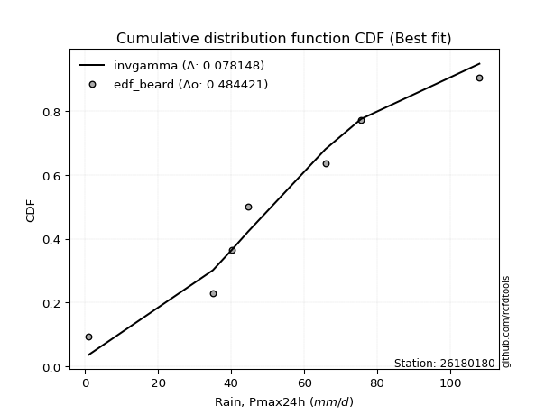</img>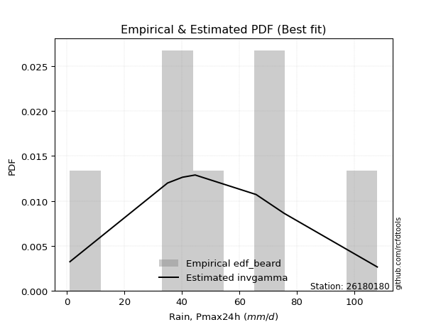</img>

</div>


### 5. Empirical - EDF Chegodayev (1955)

The Chegodayev formula is an empirical plotting position formula used in hydrological frequency analysis to estimate the exceedance probability or return period of a specific event from a set of observed data. It is primarily used for plotting observed data points on probability paper to fit a theoretical distribution, particularly for analyzing extreme events like maximum flood flows or rainfall intensities. The constant _b_ value in the generalized plotting position formula is 0.3.

<div align="center">


$P=(m-b)/(n+1-2b)$


</div>


**5.1. Empirical values**

<div align="center">

|                | 0                   | 1                   | 2                   | 3                   | 4                  | 5                  | 6                  | 7                  |
|:---------------|:--------------------|:--------------------|:--------------------|:--------------------|:-------------------|:-------------------|:-------------------|:-------------------|
| date           | 2021                | 2020                | 2018                | 2022                | 2017               | 2019               | 2025               | 2024               |
| x              | 1.0                 | 35.0                | 40.2                | 44.6                | 65.8               | 75.6               | 107.2              | 108.0              |
| m              | 1                   | 2                   | 3                   | 4                   | 5                  | 6                  | 7                  | 8                  |
| empirical_dist | edf_chegodayev      | edf_chegodayev      | edf_chegodayev      | edf_chegodayev      | edf_chegodayev     | edf_chegodayev     | edf_chegodayev     | edf_chegodayev     |
| empirical      | 0.08333333333333333 | 0.20238095238095236 | 0.32142857142857145 | 0.44047619047619047 | 0.5595238095238095 | 0.6785714285714286 | 0.7976190476190476 | 0.9166666666666666 |
| empirical_tr   | 1.090909090909091   | 1.253731343283582   | 1.4736842105263157  | 1.7872340425531914  | 2.27027027027027   | 3.1111111111111116 | 4.941176470588234  | 11.999999999999995 |

</div>


**5.2. Kolmogorov-Smirnov fit test (sorted by Δ)**


<div align="center">

|                | 0                   | 1                   | 2                   | 3                  | 4                   | 5                   | 6                   | 7                   | 8                  | 9                   | 10                  | 11                  | 12                  | 13                  | 14                  | 15                  | 16                  | 17                  | 18                  | 19                  | 20                  | 21                  | 22                  | 23                  | 24                  | 25                  | 26                  | 27                 | 28                  | 29                  | 30                  | 31                  | 32                 | 33                 | 34                  | 35                 | 36                  | 37                 | 38                  | 39                    | 40                  | 41                  | 42                 | 43                  | 44                  | 45                 | 46                  | 47                 | 48                 | 49                  | 50                  | 51                  | 52                 | 53                 | 54                 | 55                  | 56                 | 57                 | 58                  | 59                  | 60                 | 61                 | 62                 | 63                 | 64                  | 65                  | 66                 | 67                  | 68                  | 69                  | 70                  | 71                 | 72                  | 73                 | 74                 | 75                  | 76                 | 77                 | 78                  | 79                  | 80                 | 81                 | 82                  | 83                 | 84                 | 85                 | 86                 | 87                 | 88                 | 89                 |
|:---------------|:--------------------|:--------------------|:--------------------|:-------------------|:--------------------|:--------------------|:--------------------|:--------------------|:-------------------|:--------------------|:--------------------|:--------------------|:--------------------|:--------------------|:--------------------|:--------------------|:--------------------|:--------------------|:--------------------|:--------------------|:--------------------|:--------------------|:--------------------|:--------------------|:--------------------|:--------------------|:--------------------|:-------------------|:--------------------|:--------------------|:--------------------|:--------------------|:-------------------|:-------------------|:--------------------|:-------------------|:--------------------|:-------------------|:--------------------|:----------------------|:--------------------|:--------------------|:-------------------|:--------------------|:--------------------|:-------------------|:--------------------|:-------------------|:-------------------|:--------------------|:--------------------|:--------------------|:-------------------|:-------------------|:-------------------|:--------------------|:-------------------|:-------------------|:--------------------|:--------------------|:-------------------|:-------------------|:-------------------|:-------------------|:--------------------|:--------------------|:-------------------|:--------------------|:--------------------|:--------------------|:--------------------|:-------------------|:--------------------|:-------------------|:-------------------|:--------------------|:-------------------|:-------------------|:--------------------|:--------------------|:-------------------|:-------------------|:--------------------|:-------------------|:-------------------|:-------------------|:-------------------|:-------------------|:-------------------|:-------------------|
| station        | 26180180            | 26180180            | 26180180            | 26180180           | 26180180            | 26180180            | 26180180            | 26180180            | 26180180           | 26180180            | 26180180            | 26180180            | 26180180            | 26180180            | 26180180            | 26180180            | 26180180            | 26180180            | 26180180            | 26180180            | 26180180            | 26180180            | 26180180            | 26180180            | 26180180            | 26180180            | 26180180            | 26180180           | 26180180            | 26180180            | 26180180            | 26180180            | 26180180           | 26180180           | 26180180            | 26180180           | 26180180            | 26180180           | 26180180            | 26180180              | 26180180            | 26180180            | 26180180           | 26180180            | 26180180            | 26180180           | 26180180            | 26180180           | 26180180           | 26180180            | 26180180            | 26180180            | 26180180           | 26180180           | 26180180           | 26180180            | 26180180           | 26180180           | 26180180            | 26180180            | 26180180           | 26180180           | 26180180           | 26180180           | 26180180            | 26180180            | 26180180           | 26180180            | 26180180            | 26180180            | 26180180            | 26180180           | 26180180            | 26180180           | 26180180           | 26180180            | 26180180           | 26180180           | 26180180            | 26180180            | 26180180           | 26180180           | 26180180            | 26180180           | 26180180           | 26180180           | 26180180           | 26180180           | 26180180           | 26180180           |
| empirical_dist | edf_chegodayev      | edf_chegodayev      | edf_chegodayev      | edf_chegodayev     | edf_chegodayev      | edf_chegodayev      | edf_chegodayev      | edf_chegodayev      | edf_chegodayev     | edf_chegodayev      | edf_chegodayev      | edf_chegodayev      | edf_chegodayev      | edf_chegodayev      | edf_chegodayev      | edf_chegodayev      | edf_chegodayev      | edf_chegodayev      | edf_chegodayev      | edf_chegodayev      | edf_chegodayev      | edf_chegodayev      | edf_chegodayev      | edf_chegodayev      | edf_chegodayev      | edf_chegodayev      | edf_chegodayev      | edf_chegodayev     | edf_chegodayev      | edf_chegodayev      | edf_chegodayev      | edf_chegodayev      | edf_chegodayev     | edf_chegodayev     | edf_chegodayev      | edf_chegodayev     | edf_chegodayev      | edf_chegodayev     | edf_chegodayev      | edf_chegodayev        | edf_chegodayev      | edf_chegodayev      | edf_chegodayev     | edf_chegodayev      | edf_chegodayev      | edf_chegodayev     | edf_chegodayev      | edf_chegodayev     | edf_chegodayev     | edf_chegodayev      | edf_chegodayev      | edf_chegodayev      | edf_chegodayev     | edf_chegodayev     | edf_chegodayev     | edf_chegodayev      | edf_chegodayev     | edf_chegodayev     | edf_chegodayev      | edf_chegodayev      | edf_chegodayev     | edf_chegodayev     | edf_chegodayev     | edf_chegodayev     | edf_chegodayev      | edf_chegodayev      | edf_chegodayev     | edf_chegodayev      | edf_chegodayev      | edf_chegodayev      | edf_chegodayev      | edf_chegodayev     | edf_chegodayev      | edf_chegodayev     | edf_chegodayev     | edf_chegodayev      | edf_chegodayev     | edf_chegodayev     | edf_chegodayev      | edf_chegodayev      | edf_chegodayev     | edf_chegodayev     | edf_chegodayev      | edf_chegodayev     | edf_chegodayev     | edf_chegodayev     | edf_chegodayev     | edf_chegodayev     | edf_chegodayev     | edf_chegodayev     |
| p_dist         | halfnorm            | laplace_asymmetric  | genlogistic         | kstwobign          | invgauss            | rayleigh            | invgamma            | maxwell             | halflogistic       | fisk                | alpha               | rice                | chi2                | gumbel_r            | moyal               | weibull_min         | betaprime           | f                   | erlang              | gamma               | nct                 | t                   | crystalball         | norm                | exponnorm           | pearson3            | johnsonsu           | logistic           | ncf                 | logt                | hypsecant           | logfisk             | logweibull_min     | logpearson3        | loggompertz         | gumbel_l           | laplace             | wald               | mielke              | loglaplace_asymmetric | logloggamma         | gibrat              | loggumbel_l        | genexpon            | expon               | loglaplace         | loghypsecant        | loglogistic        | logbetaprime       | logcrystalball      | lognorm             | lognorm             | logexponnorm       | logrice            | lognct             | logfatiguelife      | loginvgamma        | logerlang          | loggamma            | loggamma            | logalpha           | logmielke          | loginvweibull      | logmaxwell         | loginvgauss         | lograyleigh         | loggumbel_r        | logkstwobign        | loghalfnorm         | logmoyal            | loggenexpon         | loghalflogistic    | logncf              | logjohnsonsu       | logexpon           | loglognorm          | logwald            | pareto             | invweibull          | logchi2             | loggibrat          | logpareto          | nakagami            | logf               | lognakagami        | logtruncnorm       | fatiguelife        | gompertz           | loggenlogistic     | truncnorm          |
| delta          | 0.09871918455868423 | 0.10134409483120721 | 0.10208113830472276 | 0.1022304773115423 | 0.10302127605129607 | 0.10425959994088829 | 0.10586288922386722 | 0.10714069336723131 | 0.1071422407281386 | 0.10873898664201975 | 0.11027046658697393 | 0.11040494533813316 | 0.11051648104804668 | 0.11072317796489572 | 0.11089134247305266 | 0.11450494208347795 | 0.11482723107859083 | 0.11685480155434658 | 0.11773375222653137 | 0.11773852940459917 | 0.11794090595479001 | 0.11797004296092217 | 0.11797100508941438 | 0.11797101176286318 | 0.11797144519121716 | 0.11820890859524658 | 0.11830912064388055 | 0.1286661748494622 | 0.13512961018954303 | 0.13627844663454697 | 0.14338454566020198 | 0.14884160298128044 | 0.1505387023040509 | 0.1556012774815592 | 0.16344423998645927 | 0.1660617871299005 | 0.17076685068925523 | 0.1708494918654705 | 0.18205284677858824 | 0.19534511258907716   | 0.19536101032985742 | 0.20131809872444317 | 0.2103800291460702 | 0.22309688679484016 | 0.23742001580267322 | 0.2690860525532782 | 0.27685934423467595 | 0.2787876300324281 | 0.2804565893959323 | 0.28104821130933344 | 0.28104821389832124 | 0.28104821389832124 | 0.2810510562214322 | 0.2811089406732098 | 0.2814524513536928 | 0.28344562203891743 | 0.2867574769039223 | 0.2944215268169149 | 0.29592877348877633 | 0.29592877348877633 | 0.3041755963705284 | 0.306743441584183  | 0.3131155313855637 | 0.314682659786095  | 0.31518353937062316 | 0.32603241718304643 | 0.3507334929848259 | 0.35571697955112114 | 0.35799726776677865 | 0.37660673088306806 | 0.37940541595025157 | 0.3818418480894492 | 0.40419601999377575 | 0.4176843441371986 | 0.4236715373701758 | 0.44467267092946616 | 0.4486171010821054 | 0.4507539646783819 | 0.46161857546353835 | 0.46720684069916474 | 0.4691039960445922 | 0.4720368652082454 | 0.48785659882111676 | 0.4886195404392012 | 0.5433140150580988 | 0.6107356440095378 | 0.6179417443154711 | 0.6231724863699566 | 0.7976190476190476 | 0.7976190476190477 |
| deltao         | 0.4472608134160001  | 0.4472608134160001  | 0.4472608134160001  | 0.4472608134160001 | 0.4472608134160001  | 0.4472608134160001  | 0.4472608134160001  | 0.4472608134160001  | 0.4472608134160001 | 0.4472608134160001  | 0.4472608134160001  | 0.4472608134160001  | 0.4472608134160001  | 0.4472608134160001  | 0.4472608134160001  | 0.4472608134160001  | 0.4472608134160001  | 0.4472608134160001  | 0.4472608134160001  | 0.4472608134160001  | 0.4472608134160001  | 0.4472608134160001  | 0.4472608134160001  | 0.4472608134160001  | 0.4472608134160001  | 0.4472608134160001  | 0.4472608134160001  | 0.4472608134160001 | 0.4472608134160001  | 0.4472608134160001  | 0.4472608134160001  | 0.4472608134160001  | 0.4472608134160001 | 0.4472608134160001 | 0.4472608134160001  | 0.4472608134160001 | 0.4472608134160001  | 0.4472608134160001 | 0.4472608134160001  | 0.4472608134160001    | 0.4472608134160001  | 0.4472608134160001  | 0.4472608134160001 | 0.4472608134160001  | 0.4472608134160001  | 0.4472608134160001 | 0.4472608134160001  | 0.4472608134160001 | 0.4472608134160001 | 0.4472608134160001  | 0.4472608134160001  | 0.4472608134160001  | 0.4472608134160001 | 0.4472608134160001 | 0.4472608134160001 | 0.4472608134160001  | 0.4472608134160001 | 0.4472608134160001 | 0.4472608134160001  | 0.4472608134160001  | 0.4472608134160001 | 0.4472608134160001 | 0.4472608134160001 | 0.4472608134160001 | 0.4472608134160001  | 0.4472608134160001  | 0.4472608134160001 | 0.4472608134160001  | 0.4472608134160001  | 0.4472608134160001  | 0.4472608134160001  | 0.4472608134160001 | 0.4472608134160001  | 0.4472608134160001 | 0.4472608134160001 | 0.4472608134160001  | 0.4472608134160001 | 0.4472608134160001 | 0.4472608134160001  | 0.4472608134160001  | 0.4472608134160001 | 0.4472608134160001 | 0.4472608134160001  | 0.4472608134160001 | 0.4472608134160001 | 0.4472608134160001 | 0.4472608134160001 | 0.4472608134160001 | 0.4472608134160001 | 0.4472608134160001 |
| eval           | Δo > Δ              | Δo > Δ              | Δo > Δ              | Δo > Δ             | Δo > Δ              | Δo > Δ              | Δo > Δ              | Δo > Δ              | Δo > Δ             | Δo > Δ              | Δo > Δ              | Δo > Δ              | Δo > Δ              | Δo > Δ              | Δo > Δ              | Δo > Δ              | Δo > Δ              | Δo > Δ              | Δo > Δ              | Δo > Δ              | Δo > Δ              | Δo > Δ              | Δo > Δ              | Δo > Δ              | Δo > Δ              | Δo > Δ              | Δo > Δ              | Δo > Δ             | Δo > Δ              | Δo > Δ              | Δo > Δ              | Δo > Δ              | Δo > Δ             | Δo > Δ             | Δo > Δ              | Δo > Δ             | Δo > Δ              | Δo > Δ             | Δo > Δ              | Δo > Δ                | Δo > Δ              | Δo > Δ              | Δo > Δ             | Δo > Δ              | Δo > Δ              | Δo > Δ             | Δo > Δ              | Δo > Δ             | Δo > Δ             | Δo > Δ              | Δo > Δ              | Δo > Δ              | Δo > Δ             | Δo > Δ             | Δo > Δ             | Δo > Δ              | Δo > Δ             | Δo > Δ             | Δo > Δ              | Δo > Δ              | Δo > Δ             | Δo > Δ             | Δo > Δ             | Δo > Δ             | Δo > Δ              | Δo > Δ              | Δo > Δ             | Δo > Δ              | Δo > Δ              | Δo > Δ              | Δo > Δ              | Δo > Δ             | Δo > Δ              | Δo > Δ             | Δo > Δ             | Δo > Δ              | Δo <= Δ            | Δo <= Δ            | Δo <= Δ             | Δo <= Δ             | Δo <= Δ            | Δo <= Δ            | Δo <= Δ             | Δo <= Δ            | Δo <= Δ            | Δo <= Δ            | Δo <= Δ            | Δo <= Δ            | Δo <= Δ            | Δo <= Δ            |
| fit            | 1                   | 1                   | 1                   | 1                  | 1                   | 1                   | 1                   | 1                   | 1                  | 1                   | 1                   | 1                   | 1                   | 1                   | 1                   | 1                   | 1                   | 1                   | 1                   | 1                   | 1                   | 1                   | 1                   | 1                   | 1                   | 1                   | 1                   | 1                  | 1                   | 1                   | 1                   | 1                   | 1                  | 1                  | 1                   | 1                  | 1                   | 1                  | 1                   | 1                     | 1                   | 1                   | 1                  | 1                   | 1                   | 1                  | 1                   | 1                  | 1                  | 1                   | 1                   | 1                   | 1                  | 1                  | 1                  | 1                   | 1                  | 1                  | 1                   | 1                   | 1                  | 1                  | 1                  | 1                  | 1                   | 1                   | 1                  | 1                   | 1                   | 1                   | 1                   | 1                  | 1                   | 1                  | 1                  | 1                   | 0                  | 0                  | 0                   | 0                   | 0                  | 0                  | 0                   | 0                  | 0                  | 0                  | 0                  | 0                  | 0                  | 0                  |
| n              | 8                   | 8                   | 8                   | 8                  | 8                   | 8                   | 8                   | 8                   | 8                  | 8                   | 8                   | 8                   | 8                   | 8                   | 8                   | 8                   | 8                   | 8                   | 8                   | 8                   | 8                   | 8                   | 8                   | 8                   | 8                   | 8                   | 8                   | 8                  | 8                   | 8                   | 8                   | 8                   | 8                  | 8                  | 8                   | 8                  | 8                   | 8                  | 8                   | 8                     | 8                   | 8                   | 8                  | 8                   | 8                   | 8                  | 8                   | 8                  | 8                  | 8                   | 8                   | 8                   | 8                  | 8                  | 8                  | 8                   | 8                  | 8                  | 8                   | 8                   | 8                  | 8                  | 8                  | 8                  | 8                   | 8                   | 8                  | 8                   | 8                   | 8                   | 8                   | 8                  | 8                   | 8                  | 8                  | 8                   | 8                  | 8                  | 8                   | 8                   | 8                  | 8                  | 8                   | 8                  | 8                  | 8                  | 8                  | 8                  | 8                  | 8                  |
| best_fit       | 1                   | 0                   | 0                   | 0                  | 0                   | 0                   | 0                   | 0                   | 0                  | 0                   | 0                   | 0                   | 0                   | 0                   | 0                   | 0                   | 0                   | 0                   | 0                   | 0                   | 0                   | 0                   | 0                   | 0                   | 0                   | 0                   | 0                   | 0                  | 0                   | 0                   | 0                   | 0                   | 0                  | 0                  | 0                   | 0                  | 0                   | 0                  | 0                   | 0                     | 0                   | 0                   | 0                  | 0                   | 0                   | 0                  | 0                   | 0                  | 0                  | 0                   | 0                   | 0                   | 0                  | 0                  | 0                  | 0                   | 0                  | 0                  | 0                   | 0                   | 0                  | 0                  | 0                  | 0                  | 0                   | 0                   | 0                  | 0                   | 0                   | 0                   | 0                   | 0                  | 0                   | 0                  | 0                  | 0                   | 0                  | 0                  | 0                   | 0                   | 0                  | 0                  | 0                   | 0                  | 0                  | 0                  | 0                  | 0                  | 0                  | 0                  |
| best_fit_sort  | 1                   | 2                   | 3                   | 4                  | 5                   | 6                   | 7                   | 8                   | 9                  | 10                  | 11                  | 12                  | 13                  | 14                  | 15                  | 16                  | 17                  | 18                  | 19                  | 20                  | 21                  | 22                  | 23                  | 24                  | 25                  | 26                  | 27                  | 28                 | 29                  | 30                  | 31                  | 32                  | 33                 | 34                 | 35                  | 36                 | 37                  | 38                 | 39                  | 40                    | 41                  | 42                  | 43                 | 44                  | 45                  | 46                 | 47                  | 48                 | 49                 | 50                  | 51                  | 52                  | 53                 | 54                 | 55                 | 56                  | 57                 | 58                 | 59                  | 60                  | 61                 | 62                 | 63                 | 64                 | 65                  | 66                  | 67                 | 68                  | 69                  | 70                  | 71                  | 72                 | 73                  | 74                 | 75                 | 76                  | 77                 | 78                 | 79                  | 80                  | 81                 | 82                 | 83                  | 84                 | 85                 | 86                 | 87                 | 88                 | 89                 | 90                 |

</div>


<div align="center">

</img>

</div>


**5.3. Best fit**

<div align="center">

|   id |   station | empirical_dist   | p_dist   |     delta |   deltao | eval   |   fit |   n |   best_fit |   best_fit_sort |
|-----:|----------:|:-----------------|:---------|----------:|---------:|:-------|------:|----:|-----------:|----------------:|
|    0 |  26180180 | edf_chegodayev   | halfnorm | 0.0987192 | 0.447261 | Δo > Δ |     1 |   8 |          1 |               1 |

</div>


<div align="center">

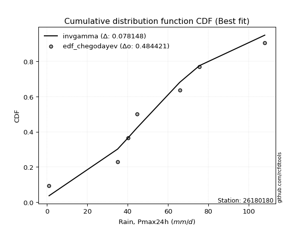</img></img>

</div>


### 6. Empirical - EDF Blom (1958)

The Blom formula is a specific "plotting position" formula used in hydrology and statistical analysis to estimate the empirical cumulative probability (or non-exceedance probability) of a data series. It is particularly recommended for data that are approximately normally distributed. The constant _a_ is set to 0.375 (or 3/8).

<div align="center">


$P=(m-a)/(n+1-2a)$


</div>


**6.1. Empirical values**

<div align="center">

|                | 0                   | 1                   | 2                  | 3                  | 4                  | 5                  | 6                 | 7                  |
|:---------------|:--------------------|:--------------------|:-------------------|:-------------------|:-------------------|:-------------------|:------------------|:-------------------|
| date           | 2021                | 2020                | 2018               | 2022               | 2017               | 2019               | 2025              | 2024               |
| x              | 1.0                 | 35.0                | 40.2               | 44.6               | 65.8               | 75.6               | 107.2             | 108.0              |
| m              | 1                   | 2                   | 3                  | 4                  | 5                  | 6                  | 7                 | 8                  |
| empirical_dist | edf_blom            | edf_blom            | edf_blom           | edf_blom           | edf_blom           | edf_blom           | edf_blom          | edf_blom           |
| empirical      | 0.07575757575757576 | 0.19696969696969696 | 0.3181818181818182 | 0.4393939393939394 | 0.5606060606060606 | 0.6818181818181818 | 0.803030303030303 | 0.9242424242424242 |
| empirical_tr   | 1.0819672131147542  | 1.2452830188679247  | 1.4666666666666666 | 1.783783783783784  | 2.275862068965517  | 3.1428571428571423 | 5.076923076923076 | 13.199999999999992 |

</div>


**6.2. Kolmogorov-Smirnov fit test (sorted by Δ)**


<div align="center">

|                | 0                  | 1                   | 2                   | 3                   | 4                   | 5                  | 6                   | 7                   | 8                  | 9                   | 10                  | 11                 | 12                  | 13                 | 14                 | 15                  | 16                  | 17                  | 18                  | 19                  | 20                  | 21                  | 22                  | 23                  | 24                  | 25                  | 26                  | 27                  | 28                 | 29                  | 30                 | 31                  | 32                 | 33                  | 34                  | 35                  | 36                  | 37                  | 38                  | 39                    | 40                 | 41                  | 42                 | 43                  | 44                 | 45                  | 46                 | 47                 | 48                  | 49                  | 50                 | 51                 | 52                 | 53                 | 54                  | 55                  | 56                 | 57                 | 58                 | 59                 | 60                  | 61                  | 62                  | 63                  | 64                 | 65                 | 66                 | 67                 | 68                 | 69                  | 70                  | 71                 | 72                 | 73                 | 74                 | 75                  | 76                  | 77                 | 78                 | 79                 | 80                  | 81                  | 82                 | 83                  | 84                 | 85                 | 86                 | 87                 | 88                 | 89                 |
|:---------------|:-------------------|:--------------------|:--------------------|:--------------------|:--------------------|:-------------------|:--------------------|:--------------------|:-------------------|:--------------------|:--------------------|:-------------------|:--------------------|:-------------------|:-------------------|:--------------------|:--------------------|:--------------------|:--------------------|:--------------------|:--------------------|:--------------------|:--------------------|:--------------------|:--------------------|:--------------------|:--------------------|:--------------------|:-------------------|:--------------------|:-------------------|:--------------------|:-------------------|:--------------------|:--------------------|:--------------------|:--------------------|:--------------------|:--------------------|:----------------------|:-------------------|:--------------------|:-------------------|:--------------------|:-------------------|:--------------------|:-------------------|:-------------------|:--------------------|:--------------------|:-------------------|:-------------------|:-------------------|:-------------------|:--------------------|:--------------------|:-------------------|:-------------------|:-------------------|:-------------------|:--------------------|:--------------------|:--------------------|:--------------------|:-------------------|:-------------------|:-------------------|:-------------------|:-------------------|:--------------------|:--------------------|:-------------------|:-------------------|:-------------------|:-------------------|:--------------------|:--------------------|:-------------------|:-------------------|:-------------------|:--------------------|:--------------------|:-------------------|:--------------------|:-------------------|:-------------------|:-------------------|:-------------------|:-------------------|:-------------------|
| station        | 26180180           | 26180180            | 26180180            | 26180180            | 26180180            | 26180180           | 26180180            | 26180180            | 26180180           | 26180180            | 26180180            | 26180180           | 26180180            | 26180180           | 26180180           | 26180180            | 26180180            | 26180180            | 26180180            | 26180180            | 26180180            | 26180180            | 26180180            | 26180180            | 26180180            | 26180180            | 26180180            | 26180180            | 26180180           | 26180180            | 26180180           | 26180180            | 26180180           | 26180180            | 26180180            | 26180180            | 26180180            | 26180180            | 26180180            | 26180180              | 26180180           | 26180180            | 26180180           | 26180180            | 26180180           | 26180180            | 26180180           | 26180180           | 26180180            | 26180180            | 26180180           | 26180180           | 26180180           | 26180180           | 26180180            | 26180180            | 26180180           | 26180180           | 26180180           | 26180180           | 26180180            | 26180180            | 26180180            | 26180180            | 26180180           | 26180180           | 26180180           | 26180180           | 26180180           | 26180180            | 26180180            | 26180180           | 26180180           | 26180180           | 26180180           | 26180180            | 26180180            | 26180180           | 26180180           | 26180180           | 26180180            | 26180180            | 26180180           | 26180180            | 26180180           | 26180180           | 26180180           | 26180180           | 26180180           | 26180180           |
| empirical_dist | edf_blom           | edf_blom            | edf_blom            | edf_blom            | edf_blom            | edf_blom           | edf_blom            | edf_blom            | edf_blom           | edf_blom            | edf_blom            | edf_blom           | edf_blom            | edf_blom           | edf_blom           | edf_blom            | edf_blom            | edf_blom            | edf_blom            | edf_blom            | edf_blom            | edf_blom            | edf_blom            | edf_blom            | edf_blom            | edf_blom            | edf_blom            | edf_blom            | edf_blom           | edf_blom            | edf_blom           | edf_blom            | edf_blom           | edf_blom            | edf_blom            | edf_blom            | edf_blom            | edf_blom            | edf_blom            | edf_blom              | edf_blom           | edf_blom            | edf_blom           | edf_blom            | edf_blom           | edf_blom            | edf_blom           | edf_blom           | edf_blom            | edf_blom            | edf_blom           | edf_blom           | edf_blom           | edf_blom           | edf_blom            | edf_blom            | edf_blom           | edf_blom           | edf_blom           | edf_blom           | edf_blom            | edf_blom            | edf_blom            | edf_blom            | edf_blom           | edf_blom           | edf_blom           | edf_blom           | edf_blom           | edf_blom            | edf_blom            | edf_blom           | edf_blom           | edf_blom           | edf_blom           | edf_blom            | edf_blom            | edf_blom           | edf_blom           | edf_blom           | edf_blom            | edf_blom            | edf_blom           | edf_blom            | edf_blom           | edf_blom           | edf_blom           | edf_blom           | edf_blom           | edf_blom           |
| p_dist         | halfnorm           | genlogistic         | invgauss            | rayleigh            | laplace_asymmetric  | invgamma           | maxwell             | halflogistic        | alpha              | rice                | chi2                | gumbel_r           | moyal               | fisk               | kstwobign          | weibull_min         | betaprime           | f                   | erlang              | gamma               | nct                 | t                   | crystalball         | norm                | exponnorm           | pearson3            | johnsonsu           | logistic            | logt               | ncf                 | hypsecant          | logfisk             | logweibull_min     | logpearson3         | gumbel_l            | loggompertz         | laplace             | wald                | mielke              | loglaplace_asymmetric | logloggamma        | gibrat              | loggumbel_l        | genexpon            | expon              | loglaplace          | loghypsecant       | loglogistic        | logbetaprime        | logcrystalball      | lognorm            | lognorm            | logexponnorm       | logrice            | lognct              | logfatiguelife      | loginvgamma        | logerlang          | loggamma           | loggamma           | logalpha            | logmielke           | loginvweibull       | logmaxwell          | loginvgauss        | lograyleigh        | loggumbel_r        | logkstwobign       | loghalfnorm        | logmoyal            | loggenexpon         | loghalflogistic    | logncf             | logjohnsonsu       | logexpon           | loglognorm          | logwald             | pareto             | invweibull         | logchi2            | loggibrat           | logpareto           | nakagami           | logf                | lognakagami        | logtruncnorm       | fatiguelife        | gompertz           | loggenlogistic     | truncnorm          |
| delta          | 0.0933079291474288 | 0.09666988289346734 | 0.09761002064004065 | 0.09884834452963287 | 0.10026184374895619 | 0.1004516338126118 | 0.10172943795597589 | 0.10173098531688318 | 0.1048592111757185 | 0.10499368992687774 | 0.10510522563679126 | 0.1053119225536403 | 0.10548008706179723 | 0.1057810958825835 | 0.1076417327227977 | 0.10909368667222252 | 0.10941597566733541 | 0.11144354614309115 | 0.11232249681527595 | 0.11232727399334375 | 0.11252965054353459 | 0.11255878754966675 | 0.11255974967815896 | 0.11255975635160775 | 0.11256018977996174 | 0.11279765318399115 | 0.11289786523262513 | 0.12758392376721112 | 0.1351961955522959 | 0.14054086560079843 | 0.1423022945779509 | 0.15425285839253583 | 0.1559499577153063 | 0.16101253289281459 | 0.16497953604764942 | 0.16885549539771466 | 0.16968459960700416 | 0.16976724078321948 | 0.17664159136733282 | 0.18993385717782174   | 0.189949754918602  | 0.20023584764219216 | 0.2157912845573256 | 0.22850814220609555 | 0.2428312712139286 | 0.27449730796453364 | 0.2822705996459313 | 0.2841988854436835 | 0.28586784480718774 | 0.28645946672058886 | 0.2864594693095766 | 0.2864594693095766 | 0.2864623116326876 | 0.2865201960844652 | 0.28686370676494816 | 0.28885687745017286 | 0.2921687323151777 | 0.2998327822281703 | 0.3013400289000317 | 0.3013400289000317 | 0.30958685178178375 | 0.31215469699543835 | 0.31852678679681906 | 0.32009391519735036 | 0.3205947947818785 | 0.3314436725943018 | 0.3561447483960813 | 0.3611282349623765 | 0.363408523178034  | 0.38201798629432343 | 0.38481667136150693 | 0.3872531035007046 | 0.4096072754050311 | 0.4209310973839518 | 0.4290827927814312 | 0.45008392634072153 | 0.45402835649336076 | 0.4561652200896373 | 0.4691943330392959 | 0.4726180961104201 | 0.47451525145584755 | 0.47744812061950076 | 0.4932678542323721 | 0.49403079585045656 | 0.5487252704693542 | 0.6161468994207933 | 0.6233529997267264 | 0.6264192396167096 | 0.803030303030303  | 0.803030303030303  |
| deltao         | 0.4472608134160001 | 0.4472608134160001  | 0.4472608134160001  | 0.4472608134160001  | 0.4472608134160001  | 0.4472608134160001 | 0.4472608134160001  | 0.4472608134160001  | 0.4472608134160001 | 0.4472608134160001  | 0.4472608134160001  | 0.4472608134160001 | 0.4472608134160001  | 0.4472608134160001 | 0.4472608134160001 | 0.4472608134160001  | 0.4472608134160001  | 0.4472608134160001  | 0.4472608134160001  | 0.4472608134160001  | 0.4472608134160001  | 0.4472608134160001  | 0.4472608134160001  | 0.4472608134160001  | 0.4472608134160001  | 0.4472608134160001  | 0.4472608134160001  | 0.4472608134160001  | 0.4472608134160001 | 0.4472608134160001  | 0.4472608134160001 | 0.4472608134160001  | 0.4472608134160001 | 0.4472608134160001  | 0.4472608134160001  | 0.4472608134160001  | 0.4472608134160001  | 0.4472608134160001  | 0.4472608134160001  | 0.4472608134160001    | 0.4472608134160001 | 0.4472608134160001  | 0.4472608134160001 | 0.4472608134160001  | 0.4472608134160001 | 0.4472608134160001  | 0.4472608134160001 | 0.4472608134160001 | 0.4472608134160001  | 0.4472608134160001  | 0.4472608134160001 | 0.4472608134160001 | 0.4472608134160001 | 0.4472608134160001 | 0.4472608134160001  | 0.4472608134160001  | 0.4472608134160001 | 0.4472608134160001 | 0.4472608134160001 | 0.4472608134160001 | 0.4472608134160001  | 0.4472608134160001  | 0.4472608134160001  | 0.4472608134160001  | 0.4472608134160001 | 0.4472608134160001 | 0.4472608134160001 | 0.4472608134160001 | 0.4472608134160001 | 0.4472608134160001  | 0.4472608134160001  | 0.4472608134160001 | 0.4472608134160001 | 0.4472608134160001 | 0.4472608134160001 | 0.4472608134160001  | 0.4472608134160001  | 0.4472608134160001 | 0.4472608134160001 | 0.4472608134160001 | 0.4472608134160001  | 0.4472608134160001  | 0.4472608134160001 | 0.4472608134160001  | 0.4472608134160001 | 0.4472608134160001 | 0.4472608134160001 | 0.4472608134160001 | 0.4472608134160001 | 0.4472608134160001 |
| eval           | Δo > Δ             | Δo > Δ              | Δo > Δ              | Δo > Δ              | Δo > Δ              | Δo > Δ             | Δo > Δ              | Δo > Δ              | Δo > Δ             | Δo > Δ              | Δo > Δ              | Δo > Δ             | Δo > Δ              | Δo > Δ             | Δo > Δ             | Δo > Δ              | Δo > Δ              | Δo > Δ              | Δo > Δ              | Δo > Δ              | Δo > Δ              | Δo > Δ              | Δo > Δ              | Δo > Δ              | Δo > Δ              | Δo > Δ              | Δo > Δ              | Δo > Δ              | Δo > Δ             | Δo > Δ              | Δo > Δ             | Δo > Δ              | Δo > Δ             | Δo > Δ              | Δo > Δ              | Δo > Δ              | Δo > Δ              | Δo > Δ              | Δo > Δ              | Δo > Δ                | Δo > Δ             | Δo > Δ              | Δo > Δ             | Δo > Δ              | Δo > Δ             | Δo > Δ              | Δo > Δ             | Δo > Δ             | Δo > Δ              | Δo > Δ              | Δo > Δ             | Δo > Δ             | Δo > Δ             | Δo > Δ             | Δo > Δ              | Δo > Δ              | Δo > Δ             | Δo > Δ             | Δo > Δ             | Δo > Δ             | Δo > Δ              | Δo > Δ              | Δo > Δ              | Δo > Δ              | Δo > Δ             | Δo > Δ             | Δo > Δ             | Δo > Δ             | Δo > Δ             | Δo > Δ              | Δo > Δ              | Δo > Δ             | Δo > Δ             | Δo > Δ             | Δo > Δ             | Δo <= Δ             | Δo <= Δ             | Δo <= Δ            | Δo <= Δ            | Δo <= Δ            | Δo <= Δ             | Δo <= Δ             | Δo <= Δ            | Δo <= Δ             | Δo <= Δ            | Δo <= Δ            | Δo <= Δ            | Δo <= Δ            | Δo <= Δ            | Δo <= Δ            |
| fit            | 1                  | 1                   | 1                   | 1                   | 1                   | 1                  | 1                   | 1                   | 1                  | 1                   | 1                   | 1                  | 1                   | 1                  | 1                  | 1                   | 1                   | 1                   | 1                   | 1                   | 1                   | 1                   | 1                   | 1                   | 1                   | 1                   | 1                   | 1                   | 1                  | 1                   | 1                  | 1                   | 1                  | 1                   | 1                   | 1                   | 1                   | 1                   | 1                   | 1                     | 1                  | 1                   | 1                  | 1                   | 1                  | 1                   | 1                  | 1                  | 1                   | 1                   | 1                  | 1                  | 1                  | 1                  | 1                   | 1                   | 1                  | 1                  | 1                  | 1                  | 1                   | 1                   | 1                   | 1                   | 1                  | 1                  | 1                  | 1                  | 1                  | 1                   | 1                   | 1                  | 1                  | 1                  | 1                  | 0                   | 0                   | 0                  | 0                  | 0                  | 0                   | 0                   | 0                  | 0                   | 0                  | 0                  | 0                  | 0                  | 0                  | 0                  |
| n              | 8                  | 8                   | 8                   | 8                   | 8                   | 8                  | 8                   | 8                   | 8                  | 8                   | 8                   | 8                  | 8                   | 8                  | 8                  | 8                   | 8                   | 8                   | 8                   | 8                   | 8                   | 8                   | 8                   | 8                   | 8                   | 8                   | 8                   | 8                   | 8                  | 8                   | 8                  | 8                   | 8                  | 8                   | 8                   | 8                   | 8                   | 8                   | 8                   | 8                     | 8                  | 8                   | 8                  | 8                   | 8                  | 8                   | 8                  | 8                  | 8                   | 8                   | 8                  | 8                  | 8                  | 8                  | 8                   | 8                   | 8                  | 8                  | 8                  | 8                  | 8                   | 8                   | 8                   | 8                   | 8                  | 8                  | 8                  | 8                  | 8                  | 8                   | 8                   | 8                  | 8                  | 8                  | 8                  | 8                   | 8                   | 8                  | 8                  | 8                  | 8                   | 8                   | 8                  | 8                   | 8                  | 8                  | 8                  | 8                  | 8                  | 8                  |
| best_fit       | 1                  | 0                   | 0                   | 0                   | 0                   | 0                  | 0                   | 0                   | 0                  | 0                   | 0                   | 0                  | 0                   | 0                  | 0                  | 0                   | 0                   | 0                   | 0                   | 0                   | 0                   | 0                   | 0                   | 0                   | 0                   | 0                   | 0                   | 0                   | 0                  | 0                   | 0                  | 0                   | 0                  | 0                   | 0                   | 0                   | 0                   | 0                   | 0                   | 0                     | 0                  | 0                   | 0                  | 0                   | 0                  | 0                   | 0                  | 0                  | 0                   | 0                   | 0                  | 0                  | 0                  | 0                  | 0                   | 0                   | 0                  | 0                  | 0                  | 0                  | 0                   | 0                   | 0                   | 0                   | 0                  | 0                  | 0                  | 0                  | 0                  | 0                   | 0                   | 0                  | 0                  | 0                  | 0                  | 0                   | 0                   | 0                  | 0                  | 0                  | 0                   | 0                   | 0                  | 0                   | 0                  | 0                  | 0                  | 0                  | 0                  | 0                  |
| best_fit_sort  | 1                  | 2                   | 3                   | 4                   | 5                   | 6                  | 7                   | 8                   | 9                  | 10                  | 11                  | 12                 | 13                  | 14                 | 15                 | 16                  | 17                  | 18                  | 19                  | 20                  | 21                  | 22                  | 23                  | 24                  | 25                  | 26                  | 27                  | 28                  | 29                 | 30                  | 31                 | 32                  | 33                 | 34                  | 35                  | 36                  | 37                  | 38                  | 39                  | 40                    | 41                 | 42                  | 43                 | 44                  | 45                 | 46                  | 47                 | 48                 | 49                  | 50                  | 51                 | 52                 | 53                 | 54                 | 55                  | 56                  | 57                 | 58                 | 59                 | 60                 | 61                  | 62                  | 63                  | 64                  | 65                 | 66                 | 67                 | 68                 | 69                 | 70                  | 71                  | 72                 | 73                 | 74                 | 75                 | 76                  | 77                  | 78                 | 79                 | 80                 | 81                  | 82                  | 83                 | 84                  | 85                 | 86                 | 87                 | 88                 | 89                 | 90                 |

</div>


<div align="center">

</img>

</div>


**6.3. Best fit**

<div align="center">

|   id |   station | empirical_dist   | p_dist   |     delta |   deltao | eval   |   fit |   n |   best_fit |   best_fit_sort |
|-----:|----------:|:-----------------|:---------|----------:|---------:|:-------|------:|----:|-----------:|----------------:|
|    0 |  26180180 | edf_blom         | halfnorm | 0.0933079 | 0.447261 | Δo > Δ |     1 |   8 |          1 |               1 |

</div>


<div align="center">

</img></img>

</div>


### 7. Empirical - EDF Tukey (1962)

In hydrology, the Tukey formula is used as a plotting position formula to estimate the empirical probability or frequency of a flood event (or other hydrological data). The formula parameter is given as _c=0.333_ (or 1/3).

<div align="center">


$P=(m-c)/(n+1-2c)$


</div>


**7.1. Empirical values**

<div align="center">

|                | 0                  | 1         | 2                  | 3                  | 4                 | 5                  | 6                 | 7                  |
|:---------------|:-------------------|:----------|:-------------------|:-------------------|:------------------|:-------------------|:------------------|:-------------------|
| date           | 2021               | 2020      | 2018               | 2022               | 2017              | 2019               | 2025              | 2024               |
| x              | 1.0                | 35.0      | 40.2               | 44.6               | 65.8              | 75.6               | 107.2             | 108.0              |
| m              | 1                  | 2         | 3                  | 4                  | 5                 | 6                  | 7                 | 8                  |
| empirical_dist | edf_tukey          | edf_tukey | edf_tukey          | edf_tukey          | edf_tukey         | edf_tukey          | edf_tukey         | edf_tukey          |
| empirical      | 0.08               | 0.2       | 0.32               | 0.44               | 0.56              | 0.68               | 0.8               | 0.92               |
| empirical_tr   | 1.0869565217391304 | 1.25      | 1.4705882352941178 | 1.7857142857142856 | 2.272727272727273 | 3.1250000000000004 | 5.000000000000001 | 12.500000000000007 |

</div>


**7.2. Kolmogorov-Smirnov fit test (sorted by Δ)**


<div align="center">

|                | 0                   | 1                   | 2                   | 3                   | 4                   | 5                   | 6                   | 7                   | 8                   | 9                   | 10                  | 11                  | 12                 | 13                  | 14                  | 15                  | 16                  | 17                 | 18                  | 19                  | 20                  | 21                  | 22                 | 23                  | 24                  | 25                  | 26                  | 27                  | 28                 | 29                  | 30                  | 31                  | 32                  | 33                  | 34                  | 35                 | 36                  | 37                  | 38                  | 39                    | 40                  | 41                  | 42                  | 43                 | 44                  | 45                 | 46                  | 47                  | 48                 | 49                 | 50                  | 51                  | 52                  | 53                  | 54                 | 55                 | 56                  | 57                  | 58                  | 59                  | 60                 | 61                 | 62                 | 63                 | 64                 | 65                  | 66                  | 67                  | 68                  | 69                 | 70                 | 71                 | 72                  | 73                  | 74                  | 75                 | 76                 | 77                  | 78                  | 79                  | 80                 | 81                 | 82                 | 83                 | 84                 | 85                 | 86                 | 87                 | 88                 | 89                 |
|:---------------|:--------------------|:--------------------|:--------------------|:--------------------|:--------------------|:--------------------|:--------------------|:--------------------|:--------------------|:--------------------|:--------------------|:--------------------|:-------------------|:--------------------|:--------------------|:--------------------|:--------------------|:-------------------|:--------------------|:--------------------|:--------------------|:--------------------|:-------------------|:--------------------|:--------------------|:--------------------|:--------------------|:--------------------|:-------------------|:--------------------|:--------------------|:--------------------|:--------------------|:--------------------|:--------------------|:-------------------|:--------------------|:--------------------|:--------------------|:----------------------|:--------------------|:--------------------|:--------------------|:-------------------|:--------------------|:-------------------|:--------------------|:--------------------|:-------------------|:-------------------|:--------------------|:--------------------|:--------------------|:--------------------|:-------------------|:-------------------|:--------------------|:--------------------|:--------------------|:--------------------|:-------------------|:-------------------|:-------------------|:-------------------|:-------------------|:--------------------|:--------------------|:--------------------|:--------------------|:-------------------|:-------------------|:-------------------|:--------------------|:--------------------|:--------------------|:-------------------|:-------------------|:--------------------|:--------------------|:--------------------|:-------------------|:-------------------|:-------------------|:-------------------|:-------------------|:-------------------|:-------------------|:-------------------|:-------------------|:-------------------|
| station        | 26180180            | 26180180            | 26180180            | 26180180            | 26180180            | 26180180            | 26180180            | 26180180            | 26180180            | 26180180            | 26180180            | 26180180            | 26180180           | 26180180            | 26180180            | 26180180            | 26180180            | 26180180           | 26180180            | 26180180            | 26180180            | 26180180            | 26180180           | 26180180            | 26180180            | 26180180            | 26180180            | 26180180            | 26180180           | 26180180            | 26180180            | 26180180            | 26180180            | 26180180            | 26180180            | 26180180           | 26180180            | 26180180            | 26180180            | 26180180              | 26180180            | 26180180            | 26180180            | 26180180           | 26180180            | 26180180           | 26180180            | 26180180            | 26180180           | 26180180           | 26180180            | 26180180            | 26180180            | 26180180            | 26180180           | 26180180           | 26180180            | 26180180            | 26180180            | 26180180            | 26180180           | 26180180           | 26180180           | 26180180           | 26180180           | 26180180            | 26180180            | 26180180            | 26180180            | 26180180           | 26180180           | 26180180           | 26180180            | 26180180            | 26180180            | 26180180           | 26180180           | 26180180            | 26180180            | 26180180            | 26180180           | 26180180           | 26180180           | 26180180           | 26180180           | 26180180           | 26180180           | 26180180           | 26180180           | 26180180           |
| empirical_dist | edf_tukey           | edf_tukey           | edf_tukey           | edf_tukey           | edf_tukey           | edf_tukey           | edf_tukey           | edf_tukey           | edf_tukey           | edf_tukey           | edf_tukey           | edf_tukey           | edf_tukey          | edf_tukey           | edf_tukey           | edf_tukey           | edf_tukey           | edf_tukey          | edf_tukey           | edf_tukey           | edf_tukey           | edf_tukey           | edf_tukey          | edf_tukey           | edf_tukey           | edf_tukey           | edf_tukey           | edf_tukey           | edf_tukey          | edf_tukey           | edf_tukey           | edf_tukey           | edf_tukey           | edf_tukey           | edf_tukey           | edf_tukey          | edf_tukey           | edf_tukey           | edf_tukey           | edf_tukey             | edf_tukey           | edf_tukey           | edf_tukey           | edf_tukey          | edf_tukey           | edf_tukey          | edf_tukey           | edf_tukey           | edf_tukey          | edf_tukey          | edf_tukey           | edf_tukey           | edf_tukey           | edf_tukey           | edf_tukey          | edf_tukey          | edf_tukey           | edf_tukey           | edf_tukey           | edf_tukey           | edf_tukey          | edf_tukey          | edf_tukey          | edf_tukey          | edf_tukey          | edf_tukey           | edf_tukey           | edf_tukey           | edf_tukey           | edf_tukey          | edf_tukey          | edf_tukey          | edf_tukey           | edf_tukey           | edf_tukey           | edf_tukey          | edf_tukey          | edf_tukey           | edf_tukey           | edf_tukey           | edf_tukey          | edf_tukey          | edf_tukey          | edf_tukey          | edf_tukey          | edf_tukey          | edf_tukey          | edf_tukey          | edf_tukey          | edf_tukey          |
| p_dist         | halfnorm            | genlogistic         | invgauss            | laplace_asymmetric  | rayleigh            | invgamma            | kstwobign           | maxwell             | halflogistic        | fisk                | alpha               | rice                | chi2               | gumbel_r            | moyal               | weibull_min         | betaprime           | f                  | erlang              | gamma               | nct                 | t                   | crystalball        | norm                | exponnorm           | pearson3            | johnsonsu           | logistic            | logt               | ncf                 | hypsecant           | logfisk             | logweibull_min      | logpearson3         | gumbel_l            | loggompertz        | laplace             | wald                | mielke              | loglaplace_asymmetric | logloggamma         | gibrat              | loggumbel_l         | genexpon           | expon               | loglaplace         | loghypsecant        | loglogistic         | logbetaprime       | logcrystalball     | lognorm             | lognorm             | logexponnorm        | logrice             | lognct             | logfatiguelife     | loginvgamma         | logerlang           | loggamma            | loggamma            | logalpha           | logmielke          | loginvweibull      | logmaxwell         | loginvgauss        | lograyleigh         | loggumbel_r         | logkstwobign        | loghalfnorm         | logmoyal           | loggenexpon        | loghalflogistic    | logncf              | logjohnsonsu        | logexpon            | loglognorm         | logwald            | pareto              | invweibull          | logchi2             | loggibrat          | logpareto          | nakagami           | logf               | lognakagami        | logtruncnorm       | fatiguelife        | gompertz           | loggenlogistic     | truncnorm          |
| delta          | 0.09633823217773174 | 0.09970018592377028 | 0.10064032367034359 | 0.10086790435501669 | 0.10187864755993581 | 0.10348193684291473 | 0.10461142969249465 | 0.10475974098627883 | 0.10476128834718612 | 0.10638715648864411 | 0.10788951420602144 | 0.10802399295718068 | 0.1081355286670942 | 0.10834222558394324 | 0.10851039009210017 | 0.11212398970252546 | 0.11244627869763835 | 0.1144738491733941 | 0.11535279984557889 | 0.11535757702364668 | 0.11555995357383753 | 0.11558909057996969 | 0.1155900527084619 | 0.11559005938191069 | 0.11559049281026468 | 0.11582795621429409 | 0.11592816826292807 | 0.12818998437327173 | 0.1358022561583565 | 0.13751056257049538 | 0.14290835518401152 | 0.15122255536223278 | 0.15291965468500324 | 0.15798222986251154 | 0.16558559665371003 | 0.1658251923674116 | 0.17029066021306477 | 0.17037330138927997 | 0.17967189439763576 | 0.19296416020812468   | 0.19298005794890494 | 0.20084190824825265 | 0.21276098152702255 | 0.2254778391757925 | 0.23980096818362556 | 0.2714670049342306 | 0.27924029661562827 | 0.28116858241338044 | 0.2828375417768847 | 0.2834291636902858 | 0.28342916627927356 | 0.28342916627927356 | 0.28343200860238454 | 0.28348989305416217 | 0.2838334037346451 | 0.2858265744198698 | 0.28913842928487465 | 0.29680247919786723 | 0.29830972586972865 | 0.29830972586972865 | 0.3065565487514807 | 0.3091243939651353 | 0.315496483766516  | 0.3170636121670473 | 0.3175644917515755 | 0.32841336956399875 | 0.35311444536577824 | 0.35809793193207345 | 0.36037822014773097 | 0.3789876832640204 | 0.3817863683312039 | 0.3842228004704015 | 0.40657697237472806 | 0.41911291556577007 | 0.42605248975112814 | 0.4470536233104185 | 0.4509980534630577 | 0.45313491705933423 | 0.46495190879687176 | 0.46958779308011706 | 0.4714849484255445 | 0.4744178175891977 | 0.4902375512020691 | 0.4910004928201535 | 0.5456949674390512 | 0.6131165963904901 | 0.6203226966964235 | 0.6246010577985279 | 0.8                | 0.8                |
| deltao         | 0.4472608134160001  | 0.4472608134160001  | 0.4472608134160001  | 0.4472608134160001  | 0.4472608134160001  | 0.4472608134160001  | 0.4472608134160001  | 0.4472608134160001  | 0.4472608134160001  | 0.4472608134160001  | 0.4472608134160001  | 0.4472608134160001  | 0.4472608134160001 | 0.4472608134160001  | 0.4472608134160001  | 0.4472608134160001  | 0.4472608134160001  | 0.4472608134160001 | 0.4472608134160001  | 0.4472608134160001  | 0.4472608134160001  | 0.4472608134160001  | 0.4472608134160001 | 0.4472608134160001  | 0.4472608134160001  | 0.4472608134160001  | 0.4472608134160001  | 0.4472608134160001  | 0.4472608134160001 | 0.4472608134160001  | 0.4472608134160001  | 0.4472608134160001  | 0.4472608134160001  | 0.4472608134160001  | 0.4472608134160001  | 0.4472608134160001 | 0.4472608134160001  | 0.4472608134160001  | 0.4472608134160001  | 0.4472608134160001    | 0.4472608134160001  | 0.4472608134160001  | 0.4472608134160001  | 0.4472608134160001 | 0.4472608134160001  | 0.4472608134160001 | 0.4472608134160001  | 0.4472608134160001  | 0.4472608134160001 | 0.4472608134160001 | 0.4472608134160001  | 0.4472608134160001  | 0.4472608134160001  | 0.4472608134160001  | 0.4472608134160001 | 0.4472608134160001 | 0.4472608134160001  | 0.4472608134160001  | 0.4472608134160001  | 0.4472608134160001  | 0.4472608134160001 | 0.4472608134160001 | 0.4472608134160001 | 0.4472608134160001 | 0.4472608134160001 | 0.4472608134160001  | 0.4472608134160001  | 0.4472608134160001  | 0.4472608134160001  | 0.4472608134160001 | 0.4472608134160001 | 0.4472608134160001 | 0.4472608134160001  | 0.4472608134160001  | 0.4472608134160001  | 0.4472608134160001 | 0.4472608134160001 | 0.4472608134160001  | 0.4472608134160001  | 0.4472608134160001  | 0.4472608134160001 | 0.4472608134160001 | 0.4472608134160001 | 0.4472608134160001 | 0.4472608134160001 | 0.4472608134160001 | 0.4472608134160001 | 0.4472608134160001 | 0.4472608134160001 | 0.4472608134160001 |
| eval           | Δo > Δ              | Δo > Δ              | Δo > Δ              | Δo > Δ              | Δo > Δ              | Δo > Δ              | Δo > Δ              | Δo > Δ              | Δo > Δ              | Δo > Δ              | Δo > Δ              | Δo > Δ              | Δo > Δ             | Δo > Δ              | Δo > Δ              | Δo > Δ              | Δo > Δ              | Δo > Δ             | Δo > Δ              | Δo > Δ              | Δo > Δ              | Δo > Δ              | Δo > Δ             | Δo > Δ              | Δo > Δ              | Δo > Δ              | Δo > Δ              | Δo > Δ              | Δo > Δ             | Δo > Δ              | Δo > Δ              | Δo > Δ              | Δo > Δ              | Δo > Δ              | Δo > Δ              | Δo > Δ             | Δo > Δ              | Δo > Δ              | Δo > Δ              | Δo > Δ                | Δo > Δ              | Δo > Δ              | Δo > Δ              | Δo > Δ             | Δo > Δ              | Δo > Δ             | Δo > Δ              | Δo > Δ              | Δo > Δ             | Δo > Δ             | Δo > Δ              | Δo > Δ              | Δo > Δ              | Δo > Δ              | Δo > Δ             | Δo > Δ             | Δo > Δ              | Δo > Δ              | Δo > Δ              | Δo > Δ              | Δo > Δ             | Δo > Δ             | Δo > Δ             | Δo > Δ             | Δo > Δ             | Δo > Δ              | Δo > Δ              | Δo > Δ              | Δo > Δ              | Δo > Δ             | Δo > Δ             | Δo > Δ             | Δo > Δ              | Δo > Δ              | Δo > Δ              | Δo > Δ             | Δo <= Δ            | Δo <= Δ             | Δo <= Δ             | Δo <= Δ             | Δo <= Δ            | Δo <= Δ            | Δo <= Δ            | Δo <= Δ            | Δo <= Δ            | Δo <= Δ            | Δo <= Δ            | Δo <= Δ            | Δo <= Δ            | Δo <= Δ            |
| fit            | 1                   | 1                   | 1                   | 1                   | 1                   | 1                   | 1                   | 1                   | 1                   | 1                   | 1                   | 1                   | 1                  | 1                   | 1                   | 1                   | 1                   | 1                  | 1                   | 1                   | 1                   | 1                   | 1                  | 1                   | 1                   | 1                   | 1                   | 1                   | 1                  | 1                   | 1                   | 1                   | 1                   | 1                   | 1                   | 1                  | 1                   | 1                   | 1                   | 1                     | 1                   | 1                   | 1                   | 1                  | 1                   | 1                  | 1                   | 1                   | 1                  | 1                  | 1                   | 1                   | 1                   | 1                   | 1                  | 1                  | 1                   | 1                   | 1                   | 1                   | 1                  | 1                  | 1                  | 1                  | 1                  | 1                   | 1                   | 1                   | 1                   | 1                  | 1                  | 1                  | 1                   | 1                   | 1                   | 1                  | 0                  | 0                   | 0                   | 0                   | 0                  | 0                  | 0                  | 0                  | 0                  | 0                  | 0                  | 0                  | 0                  | 0                  |
| n              | 8                   | 8                   | 8                   | 8                   | 8                   | 8                   | 8                   | 8                   | 8                   | 8                   | 8                   | 8                   | 8                  | 8                   | 8                   | 8                   | 8                   | 8                  | 8                   | 8                   | 8                   | 8                   | 8                  | 8                   | 8                   | 8                   | 8                   | 8                   | 8                  | 8                   | 8                   | 8                   | 8                   | 8                   | 8                   | 8                  | 8                   | 8                   | 8                   | 8                     | 8                   | 8                   | 8                   | 8                  | 8                   | 8                  | 8                   | 8                   | 8                  | 8                  | 8                   | 8                   | 8                   | 8                   | 8                  | 8                  | 8                   | 8                   | 8                   | 8                   | 8                  | 8                  | 8                  | 8                  | 8                  | 8                   | 8                   | 8                   | 8                   | 8                  | 8                  | 8                  | 8                   | 8                   | 8                   | 8                  | 8                  | 8                   | 8                   | 8                   | 8                  | 8                  | 8                  | 8                  | 8                  | 8                  | 8                  | 8                  | 8                  | 8                  |
| best_fit       | 1                   | 0                   | 0                   | 0                   | 0                   | 0                   | 0                   | 0                   | 0                   | 0                   | 0                   | 0                   | 0                  | 0                   | 0                   | 0                   | 0                   | 0                  | 0                   | 0                   | 0                   | 0                   | 0                  | 0                   | 0                   | 0                   | 0                   | 0                   | 0                  | 0                   | 0                   | 0                   | 0                   | 0                   | 0                   | 0                  | 0                   | 0                   | 0                   | 0                     | 0                   | 0                   | 0                   | 0                  | 0                   | 0                  | 0                   | 0                   | 0                  | 0                  | 0                   | 0                   | 0                   | 0                   | 0                  | 0                  | 0                   | 0                   | 0                   | 0                   | 0                  | 0                  | 0                  | 0                  | 0                  | 0                   | 0                   | 0                   | 0                   | 0                  | 0                  | 0                  | 0                   | 0                   | 0                   | 0                  | 0                  | 0                   | 0                   | 0                   | 0                  | 0                  | 0                  | 0                  | 0                  | 0                  | 0                  | 0                  | 0                  | 0                  |
| best_fit_sort  | 1                   | 2                   | 3                   | 4                   | 5                   | 6                   | 7                   | 8                   | 9                   | 10                  | 11                  | 12                  | 13                 | 14                  | 15                  | 16                  | 17                  | 18                 | 19                  | 20                  | 21                  | 22                  | 23                 | 24                  | 25                  | 26                  | 27                  | 28                  | 29                 | 30                  | 31                  | 32                  | 33                  | 34                  | 35                  | 36                 | 37                  | 38                  | 39                  | 40                    | 41                  | 42                  | 43                  | 44                 | 45                  | 46                 | 47                  | 48                  | 49                 | 50                 | 51                  | 52                  | 53                  | 54                  | 55                 | 56                 | 57                  | 58                  | 59                  | 60                  | 61                 | 62                 | 63                 | 64                 | 65                 | 66                  | 67                  | 68                  | 69                  | 70                 | 71                 | 72                 | 73                  | 74                  | 75                  | 76                 | 77                 | 78                  | 79                  | 80                  | 81                 | 82                 | 83                 | 84                 | 85                 | 86                 | 87                 | 88                 | 89                 | 90                 |

</div>


<div align="center">

</img>

</div>


**7.3. Best fit**

<div align="center">

|   id |   station | empirical_dist   | p_dist   |     delta |   deltao | eval   |   fit |   n |   best_fit |   best_fit_sort |
|-----:|----------:|:-----------------|:---------|----------:|---------:|:-------|------:|----:|-----------:|----------------:|
|    0 |  26180180 | edf_tukey        | halfnorm | 0.0963382 | 0.447261 | Δo > Δ |     1 |   8 |          1 |               1 |

</div>


<div align="center">

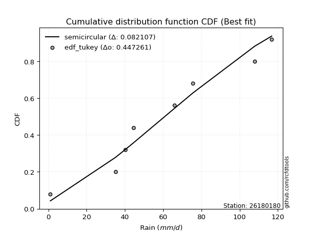</img></img>

</div>


### 8. Empirical - EDF Gringorten (1963)

Gringorten plotting position formula is essential for estimating the probability and return periods of extreme events like floods and heavy rainfall. The constant _a=0.44_.

<div align="center">


$P=(m-a)/(n+1-2a)$


</div>


**8.1. Empirical values**

<div align="center">

|                | 0                   | 1                   | 2                  | 3                  | 4                  | 5                  | 6                  | 7                  |
|:---------------|:--------------------|:--------------------|:-------------------|:-------------------|:-------------------|:-------------------|:-------------------|:-------------------|
| date           | 2021                | 2020                | 2018               | 2022               | 2017               | 2019               | 2025               | 2024               |
| x              | 1.0                 | 35.0                | 40.2               | 44.6               | 65.8               | 75.6               | 107.2              | 108.0              |
| m              | 1                   | 2                   | 3                  | 4                  | 5                  | 6                  | 7                  | 8                  |
| empirical_dist | edf_gringorten      | edf_gringorten      | edf_gringorten     | edf_gringorten     | edf_gringorten     | edf_gringorten     | edf_gringorten     | edf_gringorten     |
| empirical      | 0.06896551724137932 | 0.19211822660098524 | 0.3152709359605912 | 0.4384236453201971 | 0.5615763546798029 | 0.6847290640394089 | 0.8078817733990148 | 0.9310344827586208 |
| empirical_tr   | 1.0740740740740742  | 1.2378048780487805  | 1.460431654676259  | 1.780701754385965  | 2.2808988764044944 | 3.1718750000000004 | 5.205128205128205  | 14.500000000000018 |

</div>


**8.2. Kolmogorov-Smirnov fit test (sorted by Δ)**


<div align="center">

|                | 0                   | 1                   | 2                   | 3                   | 4                   | 5                   | 6                   | 7                  | 8                   | 9                   | 10                 | 11                  | 12                  | 13                  | 14                 | 15                  | 16                  | 17                  | 18                  | 19                  | 20                  | 21                  | 22                  | 23                  | 24                  | 25                  | 26                  | 27                  | 28                  | 29                  | 30                  | 31                  | 32                 | 33                  | 34                 | 35                 | 36                 | 37                 | 38                  | 39                    | 40                 | 41                  | 42                  | 43                  | 44                  | 45                  | 46                  | 47                  | 48                  | 49                  | 50                  | 51                  | 52                  | 53                 | 54                 | 55                  | 56                 | 57                  | 58                  | 59                  | 60                 | 61                 | 62                 | 63                 | 64                 | 65                  | 66                  | 67                  | 68                  | 69                 | 70                 | 71                  | 72                  | 73                  | 74                  | 75                 | 76                 | 77                  | 78                 | 79                  | 80                 | 81                 | 82                 | 83                 | 84                 | 85                 | 86                 | 87                 | 88                 | 89                 |
|:---------------|:--------------------|:--------------------|:--------------------|:--------------------|:--------------------|:--------------------|:--------------------|:-------------------|:--------------------|:--------------------|:-------------------|:--------------------|:--------------------|:--------------------|:-------------------|:--------------------|:--------------------|:--------------------|:--------------------|:--------------------|:--------------------|:--------------------|:--------------------|:--------------------|:--------------------|:--------------------|:--------------------|:--------------------|:--------------------|:--------------------|:--------------------|:--------------------|:-------------------|:--------------------|:-------------------|:-------------------|:-------------------|:-------------------|:--------------------|:----------------------|:-------------------|:--------------------|:--------------------|:--------------------|:--------------------|:--------------------|:--------------------|:--------------------|:--------------------|:--------------------|:--------------------|:--------------------|:--------------------|:-------------------|:-------------------|:--------------------|:-------------------|:--------------------|:--------------------|:--------------------|:-------------------|:-------------------|:-------------------|:-------------------|:-------------------|:--------------------|:--------------------|:--------------------|:--------------------|:-------------------|:-------------------|:--------------------|:--------------------|:--------------------|:--------------------|:-------------------|:-------------------|:--------------------|:-------------------|:--------------------|:-------------------|:-------------------|:-------------------|:-------------------|:-------------------|:-------------------|:-------------------|:-------------------|:-------------------|:-------------------|
| station        | 26180180            | 26180180            | 26180180            | 26180180            | 26180180            | 26180180            | 26180180            | 26180180           | 26180180            | 26180180            | 26180180           | 26180180            | 26180180            | 26180180            | 26180180           | 26180180            | 26180180            | 26180180            | 26180180            | 26180180            | 26180180            | 26180180            | 26180180            | 26180180            | 26180180            | 26180180            | 26180180            | 26180180            | 26180180            | 26180180            | 26180180            | 26180180            | 26180180           | 26180180            | 26180180           | 26180180           | 26180180           | 26180180           | 26180180            | 26180180              | 26180180           | 26180180            | 26180180            | 26180180            | 26180180            | 26180180            | 26180180            | 26180180            | 26180180            | 26180180            | 26180180            | 26180180            | 26180180            | 26180180           | 26180180           | 26180180            | 26180180           | 26180180            | 26180180            | 26180180            | 26180180           | 26180180           | 26180180           | 26180180           | 26180180           | 26180180            | 26180180            | 26180180            | 26180180            | 26180180           | 26180180           | 26180180            | 26180180            | 26180180            | 26180180            | 26180180           | 26180180           | 26180180            | 26180180           | 26180180            | 26180180           | 26180180           | 26180180           | 26180180           | 26180180           | 26180180           | 26180180           | 26180180           | 26180180           | 26180180           |
| empirical_dist | edf_gringorten      | edf_gringorten      | edf_gringorten      | edf_gringorten      | edf_gringorten      | edf_gringorten      | edf_gringorten      | edf_gringorten     | edf_gringorten      | edf_gringorten      | edf_gringorten     | edf_gringorten      | edf_gringorten      | edf_gringorten      | edf_gringorten     | edf_gringorten      | edf_gringorten      | edf_gringorten      | edf_gringorten      | edf_gringorten      | edf_gringorten      | edf_gringorten      | edf_gringorten      | edf_gringorten      | edf_gringorten      | edf_gringorten      | edf_gringorten      | edf_gringorten      | edf_gringorten      | edf_gringorten      | edf_gringorten      | edf_gringorten      | edf_gringorten     | edf_gringorten      | edf_gringorten     | edf_gringorten     | edf_gringorten     | edf_gringorten     | edf_gringorten      | edf_gringorten        | edf_gringorten     | edf_gringorten      | edf_gringorten      | edf_gringorten      | edf_gringorten      | edf_gringorten      | edf_gringorten      | edf_gringorten      | edf_gringorten      | edf_gringorten      | edf_gringorten      | edf_gringorten      | edf_gringorten      | edf_gringorten     | edf_gringorten     | edf_gringorten      | edf_gringorten     | edf_gringorten      | edf_gringorten      | edf_gringorten      | edf_gringorten     | edf_gringorten     | edf_gringorten     | edf_gringorten     | edf_gringorten     | edf_gringorten      | edf_gringorten      | edf_gringorten      | edf_gringorten      | edf_gringorten     | edf_gringorten     | edf_gringorten      | edf_gringorten      | edf_gringorten      | edf_gringorten      | edf_gringorten     | edf_gringorten     | edf_gringorten      | edf_gringorten     | edf_gringorten      | edf_gringorten     | edf_gringorten     | edf_gringorten     | edf_gringorten     | edf_gringorten     | edf_gringorten     | edf_gringorten     | edf_gringorten     | edf_gringorten     | edf_gringorten     |
| p_dist         | genlogistic         | invgauss            | rayleigh            | halfnorm            | invgamma            | maxwell             | laplace_asymmetric  | alpha              | rice                | chi2                | gumbel_r           | halflogistic        | moyal               | weibull_min         | betaprime          | fisk                | f                   | erlang              | gamma               | nct                 | t                   | crystalball         | norm                | exponnorm           | pearson3            | johnsonsu           | kstwobign           | logistic            | logt                | hypsecant           | ncf                 | logfisk             | logweibull_min     | gumbel_l            | logpearson3        | laplace            | wald               | mielke             | loggompertz         | loglaplace_asymmetric | logloggamma        | gibrat              | loggumbel_l         | genexpon            | expon               | loglaplace          | loghypsecant        | loglogistic         | logbetaprime        | logcrystalball      | lognorm             | lognorm             | logexponnorm        | logrice            | lognct             | logfatiguelife      | loginvgamma        | logerlang           | loggamma            | loggamma            | logalpha           | logmielke          | loginvweibull      | logmaxwell         | loginvgauss        | lograyleigh         | loggumbel_r         | logkstwobign        | loghalfnorm         | logmoyal           | loggenexpon        | loghalflogistic     | logncf              | logjohnsonsu        | logexpon            | loglognorm         | logwald            | pareto              | invweibull         | logchi2             | loggibrat          | logpareto          | nakagami           | logf               | lognakagami        | logtruncnorm       | fatiguelife        | gompertz           | loggenlogistic     | truncnorm          |
| delta          | 0.09181841252475553 | 0.09275855027132884 | 0.09399687416092106 | 0.09442940976329076 | 0.09560016344389999 | 0.09687796758726408 | 0.09929154967521381 | 0.1000077408070067 | 0.10014221955816593 | 0.10025375526807945 | 0.1004604521849285 | 0.10070048958549238 | 0.10190594316396995 | 0.10424221630351072 | 0.1045645052986236 | 0.10481080180884123 | 0.10659207577437935 | 0.10747102644656414 | 0.10747580362463194 | 0.10767818017482278 | 0.10770731718095494 | 0.10770827930944715 | 0.10770828598289595 | 0.10770871941124993 | 0.10794618281527935 | 0.10804639486391332 | 0.11249320309150942 | 0.12661362969346884 | 0.13422590147855362 | 0.14133200050420863 | 0.14539233596951015 | 0.15926838633749862 | 0.160801428084018  | 0.16400924197390715 | 0.1658640032615263 | 0.1687143055332619 | 0.1687969467094771 | 0.171790120998621  | 0.17370696576642639 | 0.18508238680910993   | 0.1850982845498902 | 0.19926555356844977 | 0.22064275492603733 | 0.23335961257480728 | 0.24768274158264034 | 0.27934877833324534 | 0.28712207001464307 | 0.28905035581239524 | 0.29071931517589944 | 0.29131093708930056 | 0.29131093967828836 | 0.29131093967828836 | 0.29131378200139935 | 0.2913716664531769 | 0.2917151771336599 | 0.29370834781888455 | 0.2970202026838894 | 0.30468425259688203 | 0.30619149926874345 | 0.30619149926874345 | 0.3144383221504955 | 0.3170061673641501 | 0.3233782571655308 | 0.3249453855660621 | 0.3254462651505903 | 0.33629514296301355 | 0.36099621876479304 | 0.36597970533108826 | 0.36825999354674577 | 0.3868694566630352 | 0.3896681417302187 | 0.39210457386941633 | 0.41445874577374286 | 0.42384197960517894 | 0.43393426315014294 | 0.4549353967094333 | 0.4588798268620725 | 0.46101669045834903 | 0.4759863915554925 | 0.47746956647913186 | 0.4793667218245593 | 0.4822995909882125 | 0.4981193246010839 | 0.4988822662191683 | 0.553576740838066  | 0.620998369789505  | 0.6282044700954382 | 0.6293301218379368 | 0.8078817733990148 | 0.8078817733990148 |
| deltao         | 0.4472608134160001  | 0.4472608134160001  | 0.4472608134160001  | 0.4472608134160001  | 0.4472608134160001  | 0.4472608134160001  | 0.4472608134160001  | 0.4472608134160001 | 0.4472608134160001  | 0.4472608134160001  | 0.4472608134160001 | 0.4472608134160001  | 0.4472608134160001  | 0.4472608134160001  | 0.4472608134160001 | 0.4472608134160001  | 0.4472608134160001  | 0.4472608134160001  | 0.4472608134160001  | 0.4472608134160001  | 0.4472608134160001  | 0.4472608134160001  | 0.4472608134160001  | 0.4472608134160001  | 0.4472608134160001  | 0.4472608134160001  | 0.4472608134160001  | 0.4472608134160001  | 0.4472608134160001  | 0.4472608134160001  | 0.4472608134160001  | 0.4472608134160001  | 0.4472608134160001 | 0.4472608134160001  | 0.4472608134160001 | 0.4472608134160001 | 0.4472608134160001 | 0.4472608134160001 | 0.4472608134160001  | 0.4472608134160001    | 0.4472608134160001 | 0.4472608134160001  | 0.4472608134160001  | 0.4472608134160001  | 0.4472608134160001  | 0.4472608134160001  | 0.4472608134160001  | 0.4472608134160001  | 0.4472608134160001  | 0.4472608134160001  | 0.4472608134160001  | 0.4472608134160001  | 0.4472608134160001  | 0.4472608134160001 | 0.4472608134160001 | 0.4472608134160001  | 0.4472608134160001 | 0.4472608134160001  | 0.4472608134160001  | 0.4472608134160001  | 0.4472608134160001 | 0.4472608134160001 | 0.4472608134160001 | 0.4472608134160001 | 0.4472608134160001 | 0.4472608134160001  | 0.4472608134160001  | 0.4472608134160001  | 0.4472608134160001  | 0.4472608134160001 | 0.4472608134160001 | 0.4472608134160001  | 0.4472608134160001  | 0.4472608134160001  | 0.4472608134160001  | 0.4472608134160001 | 0.4472608134160001 | 0.4472608134160001  | 0.4472608134160001 | 0.4472608134160001  | 0.4472608134160001 | 0.4472608134160001 | 0.4472608134160001 | 0.4472608134160001 | 0.4472608134160001 | 0.4472608134160001 | 0.4472608134160001 | 0.4472608134160001 | 0.4472608134160001 | 0.4472608134160001 |
| eval           | Δo > Δ              | Δo > Δ              | Δo > Δ              | Δo > Δ              | Δo > Δ              | Δo > Δ              | Δo > Δ              | Δo > Δ             | Δo > Δ              | Δo > Δ              | Δo > Δ             | Δo > Δ              | Δo > Δ              | Δo > Δ              | Δo > Δ             | Δo > Δ              | Δo > Δ              | Δo > Δ              | Δo > Δ              | Δo > Δ              | Δo > Δ              | Δo > Δ              | Δo > Δ              | Δo > Δ              | Δo > Δ              | Δo > Δ              | Δo > Δ              | Δo > Δ              | Δo > Δ              | Δo > Δ              | Δo > Δ              | Δo > Δ              | Δo > Δ             | Δo > Δ              | Δo > Δ             | Δo > Δ             | Δo > Δ             | Δo > Δ             | Δo > Δ              | Δo > Δ                | Δo > Δ             | Δo > Δ              | Δo > Δ              | Δo > Δ              | Δo > Δ              | Δo > Δ              | Δo > Δ              | Δo > Δ              | Δo > Δ              | Δo > Δ              | Δo > Δ              | Δo > Δ              | Δo > Δ              | Δo > Δ             | Δo > Δ             | Δo > Δ              | Δo > Δ             | Δo > Δ              | Δo > Δ              | Δo > Δ              | Δo > Δ             | Δo > Δ             | Δo > Δ             | Δo > Δ             | Δo > Δ             | Δo > Δ              | Δo > Δ              | Δo > Δ              | Δo > Δ              | Δo > Δ             | Δo > Δ             | Δo > Δ              | Δo > Δ              | Δo > Δ              | Δo > Δ              | Δo <= Δ            | Δo <= Δ            | Δo <= Δ             | Δo <= Δ            | Δo <= Δ             | Δo <= Δ            | Δo <= Δ            | Δo <= Δ            | Δo <= Δ            | Δo <= Δ            | Δo <= Δ            | Δo <= Δ            | Δo <= Δ            | Δo <= Δ            | Δo <= Δ            |
| fit            | 1                   | 1                   | 1                   | 1                   | 1                   | 1                   | 1                   | 1                  | 1                   | 1                   | 1                  | 1                   | 1                   | 1                   | 1                  | 1                   | 1                   | 1                   | 1                   | 1                   | 1                   | 1                   | 1                   | 1                   | 1                   | 1                   | 1                   | 1                   | 1                   | 1                   | 1                   | 1                   | 1                  | 1                   | 1                  | 1                  | 1                  | 1                  | 1                   | 1                     | 1                  | 1                   | 1                   | 1                   | 1                   | 1                   | 1                   | 1                   | 1                   | 1                   | 1                   | 1                   | 1                   | 1                  | 1                  | 1                   | 1                  | 1                   | 1                   | 1                   | 1                  | 1                  | 1                  | 1                  | 1                  | 1                   | 1                   | 1                   | 1                   | 1                  | 1                  | 1                   | 1                   | 1                   | 1                   | 0                  | 0                  | 0                   | 0                  | 0                   | 0                  | 0                  | 0                  | 0                  | 0                  | 0                  | 0                  | 0                  | 0                  | 0                  |
| n              | 8                   | 8                   | 8                   | 8                   | 8                   | 8                   | 8                   | 8                  | 8                   | 8                   | 8                  | 8                   | 8                   | 8                   | 8                  | 8                   | 8                   | 8                   | 8                   | 8                   | 8                   | 8                   | 8                   | 8                   | 8                   | 8                   | 8                   | 8                   | 8                   | 8                   | 8                   | 8                   | 8                  | 8                   | 8                  | 8                  | 8                  | 8                  | 8                   | 8                     | 8                  | 8                   | 8                   | 8                   | 8                   | 8                   | 8                   | 8                   | 8                   | 8                   | 8                   | 8                   | 8                   | 8                  | 8                  | 8                   | 8                  | 8                   | 8                   | 8                   | 8                  | 8                  | 8                  | 8                  | 8                  | 8                   | 8                   | 8                   | 8                   | 8                  | 8                  | 8                   | 8                   | 8                   | 8                   | 8                  | 8                  | 8                   | 8                  | 8                   | 8                  | 8                  | 8                  | 8                  | 8                  | 8                  | 8                  | 8                  | 8                  | 8                  |
| best_fit       | 1                   | 0                   | 0                   | 0                   | 0                   | 0                   | 0                   | 0                  | 0                   | 0                   | 0                  | 0                   | 0                   | 0                   | 0                  | 0                   | 0                   | 0                   | 0                   | 0                   | 0                   | 0                   | 0                   | 0                   | 0                   | 0                   | 0                   | 0                   | 0                   | 0                   | 0                   | 0                   | 0                  | 0                   | 0                  | 0                  | 0                  | 0                  | 0                   | 0                     | 0                  | 0                   | 0                   | 0                   | 0                   | 0                   | 0                   | 0                   | 0                   | 0                   | 0                   | 0                   | 0                   | 0                  | 0                  | 0                   | 0                  | 0                   | 0                   | 0                   | 0                  | 0                  | 0                  | 0                  | 0                  | 0                   | 0                   | 0                   | 0                   | 0                  | 0                  | 0                   | 0                   | 0                   | 0                   | 0                  | 0                  | 0                   | 0                  | 0                   | 0                  | 0                  | 0                  | 0                  | 0                  | 0                  | 0                  | 0                  | 0                  | 0                  |
| best_fit_sort  | 1                   | 2                   | 3                   | 4                   | 5                   | 6                   | 7                   | 8                  | 9                   | 10                  | 11                 | 12                  | 13                  | 14                  | 15                 | 16                  | 17                  | 18                  | 19                  | 20                  | 21                  | 22                  | 23                  | 24                  | 25                  | 26                  | 27                  | 28                  | 29                  | 30                  | 31                  | 32                  | 33                 | 34                  | 35                 | 36                 | 37                 | 38                 | 39                  | 40                    | 41                 | 42                  | 43                  | 44                  | 45                  | 46                  | 47                  | 48                  | 49                  | 50                  | 51                  | 52                  | 53                  | 54                 | 55                 | 56                  | 57                 | 58                  | 59                  | 60                  | 61                 | 62                 | 63                 | 64                 | 65                 | 66                  | 67                  | 68                  | 69                  | 70                 | 71                 | 72                  | 73                  | 74                  | 75                  | 76                 | 77                 | 78                  | 79                 | 80                  | 81                 | 82                 | 83                 | 84                 | 85                 | 86                 | 87                 | 88                 | 89                 | 90                 |

</div>


<div align="center">

</img>

</div>


**8.3. Best fit**

<div align="center">

|   id |   station | empirical_dist   | p_dist      |     delta |   deltao | eval   |   fit |   n |   best_fit |   best_fit_sort |
|-----:|----------:|:-----------------|:------------|----------:|---------:|:-------|------:|----:|-----------:|----------------:|
|    0 |  26180180 | edf_gringorten   | genlogistic | 0.0918184 | 0.447261 | Δo > Δ |     1 |   8 |          1 |               1 |

</div>


<div align="center">

</img></img>

</div>


### 9. Empirical - EDF Filliben (1975)

The specific values of the constants (0.3175) (often denoted as $alpha$) and (0.365) are derived from a method proposed by James J. Filliben in a 1975 paper. This particular formula is the mean value of the $i$-th order statistic of the normal distribution and is considered a robust and effective plotting position formula for the normal probability plot correlation coefficient test for normality.

<div align="center">


$P=(m-0.3175)/(n+0.365)$


</div>


**9.1. Empirical values**

<div align="center">

|                | 0                  | 1                   | 2                  | 3                   | 4                  | 5                  | 6                  | 7                  |
|:---------------|:-------------------|:--------------------|:-------------------|:--------------------|:-------------------|:-------------------|:-------------------|:-------------------|
| date           | 2021               | 2020                | 2018               | 2022                | 2017               | 2019               | 2025               | 2024               |
| x              | 1.0                | 35.0                | 40.2               | 44.6                | 65.8               | 75.6               | 107.2              | 108.0              |
| m              | 1                  | 2                   | 3                  | 4                   | 5                  | 6                  | 7                  | 8                  |
| empirical_dist | edf_filliben       | edf_filliben        | edf_filliben       | edf_filliben        | edf_filliben       | edf_filliben       | edf_filliben       | edf_filliben       |
| empirical      | 0.0815899581589958 | 0.20113568439928273 | 0.3206814106395696 | 0.44022713687985654 | 0.5597728631201434 | 0.6793185893604303 | 0.7988643156007172 | 0.9184100418410042 |
| empirical_tr   | 1.0888382687927107 | 1.2517770295548074  | 1.4720633523977125 | 1.7864388681260008  | 2.271554650373387  | 3.118359739049394  | 4.971768202080237  | 12.256410256410254 |

</div>


**9.2. Kolmogorov-Smirnov fit test (sorted by Δ)**


<div align="center">

|                | 0                   | 1                   | 2                   | 3                   | 4                   | 5                   | 6                   | 7                   | 8                   | 9                   | 10                  | 11                  | 12                 | 13                  | 14                  | 15                  | 16                  | 17                  | 18                  | 19                  | 20                  | 21                  | 22                 | 23                  | 24                  | 25                  | 26                  | 27                  | 28                  | 29                  | 30                  | 31                  | 32                  | 33                  | 34                 | 35                  | 36                 | 37                  | 38                  | 39                    | 40                  | 41                 | 42                  | 43                 | 44                  | 45                 | 46                 | 47                 | 48                 | 49                 | 50                 | 51                 | 52                 | 53                 | 54                  | 55                 | 56                  | 57                 | 58                 | 59                 | 60                  | 61                  | 62                  | 63                  | 64                  | 65                 | 66                 | 67                 | 68                 | 69                  | 70                  | 71                 | 72                 | 73                  | 74                 | 75                  | 76                  | 77                 | 78                 | 79                 | 80                  | 81                  | 82                  | 83                  | 84                 | 85                 | 86                 | 87                 | 88                 | 89                 |
|:---------------|:--------------------|:--------------------|:--------------------|:--------------------|:--------------------|:--------------------|:--------------------|:--------------------|:--------------------|:--------------------|:--------------------|:--------------------|:-------------------|:--------------------|:--------------------|:--------------------|:--------------------|:--------------------|:--------------------|:--------------------|:--------------------|:--------------------|:-------------------|:--------------------|:--------------------|:--------------------|:--------------------|:--------------------|:--------------------|:--------------------|:--------------------|:--------------------|:--------------------|:--------------------|:-------------------|:--------------------|:-------------------|:--------------------|:--------------------|:----------------------|:--------------------|:-------------------|:--------------------|:-------------------|:--------------------|:-------------------|:-------------------|:-------------------|:-------------------|:-------------------|:-------------------|:-------------------|:-------------------|:-------------------|:--------------------|:-------------------|:--------------------|:-------------------|:-------------------|:-------------------|:--------------------|:--------------------|:--------------------|:--------------------|:--------------------|:-------------------|:-------------------|:-------------------|:-------------------|:--------------------|:--------------------|:-------------------|:-------------------|:--------------------|:-------------------|:--------------------|:--------------------|:-------------------|:-------------------|:-------------------|:--------------------|:--------------------|:--------------------|:--------------------|:-------------------|:-------------------|:-------------------|:-------------------|:-------------------|:-------------------|
| station        | 26180180            | 26180180            | 26180180            | 26180180            | 26180180            | 26180180            | 26180180            | 26180180            | 26180180            | 26180180            | 26180180            | 26180180            | 26180180           | 26180180            | 26180180            | 26180180            | 26180180            | 26180180            | 26180180            | 26180180            | 26180180            | 26180180            | 26180180           | 26180180            | 26180180            | 26180180            | 26180180            | 26180180            | 26180180            | 26180180            | 26180180            | 26180180            | 26180180            | 26180180            | 26180180           | 26180180            | 26180180           | 26180180            | 26180180            | 26180180              | 26180180            | 26180180           | 26180180            | 26180180           | 26180180            | 26180180           | 26180180           | 26180180           | 26180180           | 26180180           | 26180180           | 26180180           | 26180180           | 26180180           | 26180180            | 26180180           | 26180180            | 26180180           | 26180180           | 26180180           | 26180180            | 26180180            | 26180180            | 26180180            | 26180180            | 26180180           | 26180180           | 26180180           | 26180180           | 26180180            | 26180180            | 26180180           | 26180180           | 26180180            | 26180180           | 26180180            | 26180180            | 26180180           | 26180180           | 26180180           | 26180180            | 26180180            | 26180180            | 26180180            | 26180180           | 26180180           | 26180180           | 26180180           | 26180180           | 26180180           |
| empirical_dist | edf_filliben        | edf_filliben        | edf_filliben        | edf_filliben        | edf_filliben        | edf_filliben        | edf_filliben        | edf_filliben        | edf_filliben        | edf_filliben        | edf_filliben        | edf_filliben        | edf_filliben       | edf_filliben        | edf_filliben        | edf_filliben        | edf_filliben        | edf_filliben        | edf_filliben        | edf_filliben        | edf_filliben        | edf_filliben        | edf_filliben       | edf_filliben        | edf_filliben        | edf_filliben        | edf_filliben        | edf_filliben        | edf_filliben        | edf_filliben        | edf_filliben        | edf_filliben        | edf_filliben        | edf_filliben        | edf_filliben       | edf_filliben        | edf_filliben       | edf_filliben        | edf_filliben        | edf_filliben          | edf_filliben        | edf_filliben       | edf_filliben        | edf_filliben       | edf_filliben        | edf_filliben       | edf_filliben       | edf_filliben       | edf_filliben       | edf_filliben       | edf_filliben       | edf_filliben       | edf_filliben       | edf_filliben       | edf_filliben        | edf_filliben       | edf_filliben        | edf_filliben       | edf_filliben       | edf_filliben       | edf_filliben        | edf_filliben        | edf_filliben        | edf_filliben        | edf_filliben        | edf_filliben       | edf_filliben       | edf_filliben       | edf_filliben       | edf_filliben        | edf_filliben        | edf_filliben       | edf_filliben       | edf_filliben        | edf_filliben       | edf_filliben        | edf_filliben        | edf_filliben       | edf_filliben       | edf_filliben       | edf_filliben        | edf_filliben        | edf_filliben        | edf_filliben        | edf_filliben       | edf_filliben       | edf_filliben       | edf_filliben       | edf_filliben       | edf_filliben       |
| p_dist         | halfnorm            | genlogistic         | laplace_asymmetric  | invgauss            | rayleigh            | kstwobign           | invgamma            | maxwell             | halflogistic        | fisk                | alpha               | rice                | chi2               | gumbel_r            | moyal               | weibull_min         | betaprime           | f                   | erlang              | gamma               | nct                 | t                   | crystalball        | norm                | exponnorm           | pearson3            | johnsonsu           | logistic            | logt                | ncf                 | hypsecant           | logfisk             | logweibull_min      | logpearson3         | loggompertz        | gumbel_l            | laplace            | wald                | mielke              | loglaplace_asymmetric | logloggamma         | gibrat             | loggumbel_l         | genexpon           | expon               | loglaplace         | loghypsecant       | loglogistic        | logbetaprime       | logcrystalball     | lognorm            | lognorm            | logexponnorm       | logrice            | lognct              | logfatiguelife     | loginvgamma         | logerlang          | loggamma           | loggamma           | logalpha            | logmielke           | loginvweibull       | logmaxwell          | loginvgauss         | lograyleigh        | loggumbel_r        | logkstwobign       | loghalfnorm        | logmoyal            | loggenexpon         | loghalflogistic    | logncf             | logjohnsonsu        | logexpon           | loglognorm          | logwald             | pareto             | invweibull         | logchi2            | loggibrat           | logpareto           | nakagami            | logf                | lognakagami        | logtruncnorm       | fatiguelife        | gompertz           | loggenlogistic     | truncnorm          |
| delta          | 0.09747391657701454 | 0.10083587032305308 | 0.10109504123487334 | 0.10177600806962639 | 0.10301433195921861 | 0.10347574529321193 | 0.10461762124219753 | 0.10589542538556163 | 0.10589697274646892 | 0.10749371866035007 | 0.10902519860530424 | 0.10915967735646348 | 0.109271213066377  | 0.10947790998322604 | 0.10964607449138297 | 0.11325967410180826 | 0.11358196309692115 | 0.11560953357267689 | 0.11648848424486169 | 0.11649326142292948 | 0.11669563797312033 | 0.11672477497925249 | 0.1167257371077447 | 0.11672574378119349 | 0.11672617720954748 | 0.11696364061357689 | 0.11706385266221087 | 0.12841712125312826 | 0.13602939303821304 | 0.13637487817121266 | 0.14313549206386805 | 0.15008687096295006 | 0.15178397028572052 | 0.15684654546322882 | 0.1646895079681289 | 0.16581273353356657 | 0.1705177970929213 | 0.17060043826913662 | 0.18080757879691856 | 0.19409984460740748   | 0.19411574234818774 | 0.2010690451281093 | 0.21162529712773984 | 0.2243421547765098 | 0.23866528378434285 | 0.2703313205349479 | 0.2781046122163455 | 0.2800328980140977 | 0.281701857377602  | 0.2822934792910031 | 0.2822934818799908 | 0.2822934818799908 | 0.2822963242031018 | 0.2823542086548795 | 0.28269771933536236 | 0.2846908900205871 | 0.28800274488559197 | 0.2956667947985845 | 0.2971740414704459 | 0.2971740414704459 | 0.30542086435219795 | 0.30798870956585256 | 0.31436079936723327 | 0.31592792776776457 | 0.31642880735229273 | 0.327277685164716  | 0.3519787609664955 | 0.3569622475327907 | 0.3592425357484482 | 0.37785199886473764 | 0.38065068393192114 | 0.3830871160711188 | 0.4054412879754453 | 0.41843150492620035 | 0.4249168053518454 | 0.44591793891113574 | 0.44986236906377497 | 0.4519992326600515 | 0.4633619506378759 | 0.4684521086808343 | 0.47034926402626176 | 0.47328213318991497 | 0.48910186680278633 | 0.48986480842087077 | 0.5445592830397684 | 0.6119809119912074 | 0.6191870122971407 | 0.6239196471589583 | 0.7988643156007172 | 0.7988643156007172 |
| deltao         | 0.4472608134160001  | 0.4472608134160001  | 0.4472608134160001  | 0.4472608134160001  | 0.4472608134160001  | 0.4472608134160001  | 0.4472608134160001  | 0.4472608134160001  | 0.4472608134160001  | 0.4472608134160001  | 0.4472608134160001  | 0.4472608134160001  | 0.4472608134160001 | 0.4472608134160001  | 0.4472608134160001  | 0.4472608134160001  | 0.4472608134160001  | 0.4472608134160001  | 0.4472608134160001  | 0.4472608134160001  | 0.4472608134160001  | 0.4472608134160001  | 0.4472608134160001 | 0.4472608134160001  | 0.4472608134160001  | 0.4472608134160001  | 0.4472608134160001  | 0.4472608134160001  | 0.4472608134160001  | 0.4472608134160001  | 0.4472608134160001  | 0.4472608134160001  | 0.4472608134160001  | 0.4472608134160001  | 0.4472608134160001 | 0.4472608134160001  | 0.4472608134160001 | 0.4472608134160001  | 0.4472608134160001  | 0.4472608134160001    | 0.4472608134160001  | 0.4472608134160001 | 0.4472608134160001  | 0.4472608134160001 | 0.4472608134160001  | 0.4472608134160001 | 0.4472608134160001 | 0.4472608134160001 | 0.4472608134160001 | 0.4472608134160001 | 0.4472608134160001 | 0.4472608134160001 | 0.4472608134160001 | 0.4472608134160001 | 0.4472608134160001  | 0.4472608134160001 | 0.4472608134160001  | 0.4472608134160001 | 0.4472608134160001 | 0.4472608134160001 | 0.4472608134160001  | 0.4472608134160001  | 0.4472608134160001  | 0.4472608134160001  | 0.4472608134160001  | 0.4472608134160001 | 0.4472608134160001 | 0.4472608134160001 | 0.4472608134160001 | 0.4472608134160001  | 0.4472608134160001  | 0.4472608134160001 | 0.4472608134160001 | 0.4472608134160001  | 0.4472608134160001 | 0.4472608134160001  | 0.4472608134160001  | 0.4472608134160001 | 0.4472608134160001 | 0.4472608134160001 | 0.4472608134160001  | 0.4472608134160001  | 0.4472608134160001  | 0.4472608134160001  | 0.4472608134160001 | 0.4472608134160001 | 0.4472608134160001 | 0.4472608134160001 | 0.4472608134160001 | 0.4472608134160001 |
| eval           | Δo > Δ              | Δo > Δ              | Δo > Δ              | Δo > Δ              | Δo > Δ              | Δo > Δ              | Δo > Δ              | Δo > Δ              | Δo > Δ              | Δo > Δ              | Δo > Δ              | Δo > Δ              | Δo > Δ             | Δo > Δ              | Δo > Δ              | Δo > Δ              | Δo > Δ              | Δo > Δ              | Δo > Δ              | Δo > Δ              | Δo > Δ              | Δo > Δ              | Δo > Δ             | Δo > Δ              | Δo > Δ              | Δo > Δ              | Δo > Δ              | Δo > Δ              | Δo > Δ              | Δo > Δ              | Δo > Δ              | Δo > Δ              | Δo > Δ              | Δo > Δ              | Δo > Δ             | Δo > Δ              | Δo > Δ             | Δo > Δ              | Δo > Δ              | Δo > Δ                | Δo > Δ              | Δo > Δ             | Δo > Δ              | Δo > Δ             | Δo > Δ              | Δo > Δ             | Δo > Δ             | Δo > Δ             | Δo > Δ             | Δo > Δ             | Δo > Δ             | Δo > Δ             | Δo > Δ             | Δo > Δ             | Δo > Δ              | Δo > Δ             | Δo > Δ              | Δo > Δ             | Δo > Δ             | Δo > Δ             | Δo > Δ              | Δo > Δ              | Δo > Δ              | Δo > Δ              | Δo > Δ              | Δo > Δ             | Δo > Δ             | Δo > Δ             | Δo > Δ             | Δo > Δ              | Δo > Δ              | Δo > Δ             | Δo > Δ             | Δo > Δ              | Δo > Δ             | Δo > Δ              | Δo <= Δ             | Δo <= Δ            | Δo <= Δ            | Δo <= Δ            | Δo <= Δ             | Δo <= Δ             | Δo <= Δ             | Δo <= Δ             | Δo <= Δ            | Δo <= Δ            | Δo <= Δ            | Δo <= Δ            | Δo <= Δ            | Δo <= Δ            |
| fit            | 1                   | 1                   | 1                   | 1                   | 1                   | 1                   | 1                   | 1                   | 1                   | 1                   | 1                   | 1                   | 1                  | 1                   | 1                   | 1                   | 1                   | 1                   | 1                   | 1                   | 1                   | 1                   | 1                  | 1                   | 1                   | 1                   | 1                   | 1                   | 1                   | 1                   | 1                   | 1                   | 1                   | 1                   | 1                  | 1                   | 1                  | 1                   | 1                   | 1                     | 1                   | 1                  | 1                   | 1                  | 1                   | 1                  | 1                  | 1                  | 1                  | 1                  | 1                  | 1                  | 1                  | 1                  | 1                   | 1                  | 1                   | 1                  | 1                  | 1                  | 1                   | 1                   | 1                   | 1                   | 1                   | 1                  | 1                  | 1                  | 1                  | 1                   | 1                   | 1                  | 1                  | 1                   | 1                  | 1                   | 0                   | 0                  | 0                  | 0                  | 0                   | 0                   | 0                   | 0                   | 0                  | 0                  | 0                  | 0                  | 0                  | 0                  |
| n              | 8                   | 8                   | 8                   | 8                   | 8                   | 8                   | 8                   | 8                   | 8                   | 8                   | 8                   | 8                   | 8                  | 8                   | 8                   | 8                   | 8                   | 8                   | 8                   | 8                   | 8                   | 8                   | 8                  | 8                   | 8                   | 8                   | 8                   | 8                   | 8                   | 8                   | 8                   | 8                   | 8                   | 8                   | 8                  | 8                   | 8                  | 8                   | 8                   | 8                     | 8                   | 8                  | 8                   | 8                  | 8                   | 8                  | 8                  | 8                  | 8                  | 8                  | 8                  | 8                  | 8                  | 8                  | 8                   | 8                  | 8                   | 8                  | 8                  | 8                  | 8                   | 8                   | 8                   | 8                   | 8                   | 8                  | 8                  | 8                  | 8                  | 8                   | 8                   | 8                  | 8                  | 8                   | 8                  | 8                   | 8                   | 8                  | 8                  | 8                  | 8                   | 8                   | 8                   | 8                   | 8                  | 8                  | 8                  | 8                  | 8                  | 8                  |
| best_fit       | 1                   | 0                   | 0                   | 0                   | 0                   | 0                   | 0                   | 0                   | 0                   | 0                   | 0                   | 0                   | 0                  | 0                   | 0                   | 0                   | 0                   | 0                   | 0                   | 0                   | 0                   | 0                   | 0                  | 0                   | 0                   | 0                   | 0                   | 0                   | 0                   | 0                   | 0                   | 0                   | 0                   | 0                   | 0                  | 0                   | 0                  | 0                   | 0                   | 0                     | 0                   | 0                  | 0                   | 0                  | 0                   | 0                  | 0                  | 0                  | 0                  | 0                  | 0                  | 0                  | 0                  | 0                  | 0                   | 0                  | 0                   | 0                  | 0                  | 0                  | 0                   | 0                   | 0                   | 0                   | 0                   | 0                  | 0                  | 0                  | 0                  | 0                   | 0                   | 0                  | 0                  | 0                   | 0                  | 0                   | 0                   | 0                  | 0                  | 0                  | 0                   | 0                   | 0                   | 0                   | 0                  | 0                  | 0                  | 0                  | 0                  | 0                  |
| best_fit_sort  | 1                   | 2                   | 3                   | 4                   | 5                   | 6                   | 7                   | 8                   | 9                   | 10                  | 11                  | 12                  | 13                 | 14                  | 15                  | 16                  | 17                  | 18                  | 19                  | 20                  | 21                  | 22                  | 23                 | 24                  | 25                  | 26                  | 27                  | 28                  | 29                  | 30                  | 31                  | 32                  | 33                  | 34                  | 35                 | 36                  | 37                 | 38                  | 39                  | 40                    | 41                  | 42                 | 43                  | 44                 | 45                  | 46                 | 47                 | 48                 | 49                 | 50                 | 51                 | 52                 | 53                 | 54                 | 55                  | 56                 | 57                  | 58                 | 59                 | 60                 | 61                  | 62                  | 63                  | 64                  | 65                  | 66                 | 67                 | 68                 | 69                 | 70                  | 71                  | 72                 | 73                 | 74                  | 75                 | 76                  | 77                  | 78                 | 79                 | 80                 | 81                  | 82                  | 83                  | 84                  | 85                 | 86                 | 87                 | 88                 | 89                 | 90                 |

</div>


<div align="center">

</img>

</div>


**9.3. Best fit**

<div align="center">

|   id |   station | empirical_dist   | p_dist   |     delta |   deltao | eval   |   fit |   n |   best_fit |   best_fit_sort |
|-----:|----------:|:-----------------|:---------|----------:|---------:|:-------|------:|----:|-----------:|----------------:|
|    0 |  26180180 | edf_filliben     | halfnorm | 0.0974739 | 0.447261 | Δo > Δ |     1 |   8 |          1 |               1 |

</div>


<div align="center">

</img></img>

</div>


### 10. Empirical - EDF Jenkinson (1977)

The Jenkinson formula in hydrology is an empirical plotting position formula used to estimate the non-exceedance probability _(P)_ or return period _(T)_ of a given ordered observation within a sample. It is a widely used method in the frequency analysis of extreme events such as floods and rainfall, as it provides a distribution-free way to plot data. _a≈0.31_ and _b≈0.38_ are constants derived to approximate the median of the probability distribution for the given rank.

<div align="center">


$P=(m-a)/(n+b)$


</div>


**10.1. Empirical values**

<div align="center">

|                | 0                   | 1                   | 2                  | 3                   | 4                  | 5                  | 6                  | 7                  |
|:---------------|:--------------------|:--------------------|:-------------------|:--------------------|:-------------------|:-------------------|:-------------------|:-------------------|
| date           | 2021                | 2020                | 2018               | 2022                | 2017               | 2019               | 2025               | 2024               |
| x              | 1.0                 | 35.0                | 40.2               | 44.6                | 65.8               | 75.6               | 107.2              | 108.0              |
| m              | 1                   | 2                   | 3                  | 4                   | 5                  | 6                  | 7                  | 8                  |
| empirical_dist | edf_jenkinson       | edf_jenkinson       | edf_jenkinson      | edf_jenkinson       | edf_jenkinson      | edf_jenkinson      | edf_jenkinson      | edf_jenkinson      |
| empirical      | 0.08233890214797135 | 0.20167064439140808 | 0.3210023866348448 | 0.44033412887828155 | 0.5596658711217184 | 0.6789976133651551 | 0.7983293556085919 | 0.9176610978520287 |
| empirical_tr   | 1.0897269180754225  | 1.2526158445440956  | 1.4727592267135323 | 1.7867803837953091  | 2.2710027100271004 | 3.115241635687732  | 4.958579881656804  | 12.144927536231886 |

</div>


**10.2. Kolmogorov-Smirnov fit test (sorted by Δ)**


<div align="center">

|                | 0                   | 1                   | 2                   | 3                   | 4                   | 5                   | 6                   | 7                   | 8                  | 9                   | 10                  | 11                  | 12                  | 13                  | 14                  | 15                  | 16                  | 17                  | 18                  | 19                  | 20                  | 21                  | 22                  | 23                  | 24                  | 25                  | 26                  | 27                  | 28                 | 29                  | 30                  | 31                 | 32                  | 33                  | 34                  | 35                  | 36                  | 37                  | 38                  | 39                    | 40                  | 41                 | 42                  | 43                  | 44                 | 45                 | 46                 | 47                  | 48                 | 49                  | 50                 | 51                 | 52                 | 53                 | 54                  | 55                  | 56                 | 57                  | 58                 | 59                 | 60                 | 61                  | 62                  | 63                  | 64                 | 65                 | 66                  | 67                 | 68                 | 69                 | 70                 | 71                  | 72                 | 73                 | 74                  | 75                 | 76                  | 77                  | 78                  | 79                 | 80                  | 81                  | 82                 | 83                  | 84                 | 85                 | 86                 | 87                 | 88                 | 89                 |
|:---------------|:--------------------|:--------------------|:--------------------|:--------------------|:--------------------|:--------------------|:--------------------|:--------------------|:-------------------|:--------------------|:--------------------|:--------------------|:--------------------|:--------------------|:--------------------|:--------------------|:--------------------|:--------------------|:--------------------|:--------------------|:--------------------|:--------------------|:--------------------|:--------------------|:--------------------|:--------------------|:--------------------|:--------------------|:-------------------|:--------------------|:--------------------|:-------------------|:--------------------|:--------------------|:--------------------|:--------------------|:--------------------|:--------------------|:--------------------|:----------------------|:--------------------|:-------------------|:--------------------|:--------------------|:-------------------|:-------------------|:-------------------|:--------------------|:-------------------|:--------------------|:-------------------|:-------------------|:-------------------|:-------------------|:--------------------|:--------------------|:-------------------|:--------------------|:-------------------|:-------------------|:-------------------|:--------------------|:--------------------|:--------------------|:-------------------|:-------------------|:--------------------|:-------------------|:-------------------|:-------------------|:-------------------|:--------------------|:-------------------|:-------------------|:--------------------|:-------------------|:--------------------|:--------------------|:--------------------|:-------------------|:--------------------|:--------------------|:-------------------|:--------------------|:-------------------|:-------------------|:-------------------|:-------------------|:-------------------|:-------------------|
| station        | 26180180            | 26180180            | 26180180            | 26180180            | 26180180            | 26180180            | 26180180            | 26180180            | 26180180           | 26180180            | 26180180            | 26180180            | 26180180            | 26180180            | 26180180            | 26180180            | 26180180            | 26180180            | 26180180            | 26180180            | 26180180            | 26180180            | 26180180            | 26180180            | 26180180            | 26180180            | 26180180            | 26180180            | 26180180           | 26180180            | 26180180            | 26180180           | 26180180            | 26180180            | 26180180            | 26180180            | 26180180            | 26180180            | 26180180            | 26180180              | 26180180            | 26180180           | 26180180            | 26180180            | 26180180           | 26180180           | 26180180           | 26180180            | 26180180           | 26180180            | 26180180           | 26180180           | 26180180           | 26180180           | 26180180            | 26180180            | 26180180           | 26180180            | 26180180           | 26180180           | 26180180           | 26180180            | 26180180            | 26180180            | 26180180           | 26180180           | 26180180            | 26180180           | 26180180           | 26180180           | 26180180           | 26180180            | 26180180           | 26180180           | 26180180            | 26180180           | 26180180            | 26180180            | 26180180            | 26180180           | 26180180            | 26180180            | 26180180           | 26180180            | 26180180           | 26180180           | 26180180           | 26180180           | 26180180           | 26180180           |
| empirical_dist | edf_jenkinson       | edf_jenkinson       | edf_jenkinson       | edf_jenkinson       | edf_jenkinson       | edf_jenkinson       | edf_jenkinson       | edf_jenkinson       | edf_jenkinson      | edf_jenkinson       | edf_jenkinson       | edf_jenkinson       | edf_jenkinson       | edf_jenkinson       | edf_jenkinson       | edf_jenkinson       | edf_jenkinson       | edf_jenkinson       | edf_jenkinson       | edf_jenkinson       | edf_jenkinson       | edf_jenkinson       | edf_jenkinson       | edf_jenkinson       | edf_jenkinson       | edf_jenkinson       | edf_jenkinson       | edf_jenkinson       | edf_jenkinson      | edf_jenkinson       | edf_jenkinson       | edf_jenkinson      | edf_jenkinson       | edf_jenkinson       | edf_jenkinson       | edf_jenkinson       | edf_jenkinson       | edf_jenkinson       | edf_jenkinson       | edf_jenkinson         | edf_jenkinson       | edf_jenkinson      | edf_jenkinson       | edf_jenkinson       | edf_jenkinson      | edf_jenkinson      | edf_jenkinson      | edf_jenkinson       | edf_jenkinson      | edf_jenkinson       | edf_jenkinson      | edf_jenkinson      | edf_jenkinson      | edf_jenkinson      | edf_jenkinson       | edf_jenkinson       | edf_jenkinson      | edf_jenkinson       | edf_jenkinson      | edf_jenkinson      | edf_jenkinson      | edf_jenkinson       | edf_jenkinson       | edf_jenkinson       | edf_jenkinson      | edf_jenkinson      | edf_jenkinson       | edf_jenkinson      | edf_jenkinson      | edf_jenkinson      | edf_jenkinson      | edf_jenkinson       | edf_jenkinson      | edf_jenkinson      | edf_jenkinson       | edf_jenkinson      | edf_jenkinson       | edf_jenkinson       | edf_jenkinson       | edf_jenkinson      | edf_jenkinson       | edf_jenkinson       | edf_jenkinson      | edf_jenkinson       | edf_jenkinson      | edf_jenkinson      | edf_jenkinson      | edf_jenkinson      | edf_jenkinson      | edf_jenkinson      |
| p_dist         | halfnorm            | laplace_asymmetric  | genlogistic         | invgauss            | kstwobign           | rayleigh            | invgamma            | maxwell             | halflogistic       | fisk                | alpha               | rice                | chi2                | gumbel_r            | moyal               | weibull_min         | betaprime           | f                   | erlang              | gamma               | nct                 | t                   | crystalball         | norm                | exponnorm           | pearson3            | johnsonsu           | logistic            | ncf                | logt                | hypsecant           | logfisk            | logweibull_min      | logpearson3         | loggompertz         | gumbel_l            | laplace             | wald                | mielke              | loglaplace_asymmetric | logloggamma         | gibrat             | loggumbel_l         | genexpon            | expon              | loglaplace         | loghypsecant       | loglogistic         | logbetaprime       | logcrystalball      | lognorm            | lognorm            | logexponnorm       | logrice            | lognct              | logfatiguelife      | loginvgamma        | logerlang           | loggamma           | loggamma           | logalpha           | logmielke           | loginvweibull       | logmaxwell          | loginvgauss        | lograyleigh        | loggumbel_r         | logkstwobign       | loghalfnorm        | logmoyal           | loggenexpon        | loghalflogistic     | logncf             | logjohnsonsu       | logexpon            | loglognorm         | logwald             | pareto              | invweibull          | logchi2            | loggibrat           | logpareto           | nakagami           | logf                | lognakagami        | logtruncnorm       | fatiguelife        | gompertz           | loggenlogistic     | truncnorm          |
| delta          | 0.09800887656913992 | 0.10120203323329835 | 0.10137083031517846 | 0.10231096806175177 | 0.10294078530108658 | 0.10354929195134399 | 0.10515258123432292 | 0.10643038537768701 | 0.1064319327385943 | 0.10802867865247545 | 0.10956015859742962 | 0.10969463734858886 | 0.10980617305850238 | 0.11001286997535142 | 0.11018103448350836 | 0.11379463409393364 | 0.11411692308904653 | 0.11614449356480228 | 0.11702344423698707 | 0.11702822141505487 | 0.11723059796524571 | 0.11725973497137787 | 0.11726069709987008 | 0.11726070377331888 | 0.11726113720167286 | 0.11749860060570227 | 0.11759881265433625 | 0.12852411325155327 | 0.1358399181790873 | 0.13613638503663805 | 0.14324248406229306 | 0.1495519109708247 | 0.15124901029359517 | 0.15631158547110346 | 0.16415454797600354 | 0.16591972553199158 | 0.17062478909134632 | 0.17070743026756163 | 0.18134253878904394 | 0.19463480459953286   | 0.19465070234031312 | 0.2011760371265343 | 0.21109033713561448 | 0.22380719478438443 | 0.2381303237922175 | 0.2697963605428225 | 0.2775696522242202 | 0.27949793802197237 | 0.2811668973854766 | 0.28175851929887774 | 0.2817585218878655 | 0.2817585218878655 | 0.2817613642109765 | 0.2818192486627541 | 0.28216275934323704 | 0.28415593002846173 | 0.2874677848934666 | 0.29513183480645916 | 0.2966390814783206 | 0.2966390814783206 | 0.3048859043600726 | 0.30745374957372723 | 0.31382583937510794 | 0.31539296777563924 | 0.3158938473601674 | 0.3267427251725907 | 0.35144380097437017 | 0.3564272875406654 | 0.3587075757563229 | 0.3773170388726123 | 0.3801157239397958 | 0.38255215607899345 | 0.40490632798332   | 0.4181105289309251 | 0.42438184535972007 | 0.4453829789190104 | 0.44932740907164964 | 0.45146427266792616 | 0.46261300664890037 | 0.467917148688709  | 0.46981430403413643 | 0.47274717319778964 | 0.488566906810661  | 0.48932984842874544 | 0.5440243230476431 | 0.611445951999082  | 0.6186520523050154 | 0.623598671163683  | 0.7983293556085919 | 0.798329355608592  |
| deltao         | 0.4472608134160001  | 0.4472608134160001  | 0.4472608134160001  | 0.4472608134160001  | 0.4472608134160001  | 0.4472608134160001  | 0.4472608134160001  | 0.4472608134160001  | 0.4472608134160001 | 0.4472608134160001  | 0.4472608134160001  | 0.4472608134160001  | 0.4472608134160001  | 0.4472608134160001  | 0.4472608134160001  | 0.4472608134160001  | 0.4472608134160001  | 0.4472608134160001  | 0.4472608134160001  | 0.4472608134160001  | 0.4472608134160001  | 0.4472608134160001  | 0.4472608134160001  | 0.4472608134160001  | 0.4472608134160001  | 0.4472608134160001  | 0.4472608134160001  | 0.4472608134160001  | 0.4472608134160001 | 0.4472608134160001  | 0.4472608134160001  | 0.4472608134160001 | 0.4472608134160001  | 0.4472608134160001  | 0.4472608134160001  | 0.4472608134160001  | 0.4472608134160001  | 0.4472608134160001  | 0.4472608134160001  | 0.4472608134160001    | 0.4472608134160001  | 0.4472608134160001 | 0.4472608134160001  | 0.4472608134160001  | 0.4472608134160001 | 0.4472608134160001 | 0.4472608134160001 | 0.4472608134160001  | 0.4472608134160001 | 0.4472608134160001  | 0.4472608134160001 | 0.4472608134160001 | 0.4472608134160001 | 0.4472608134160001 | 0.4472608134160001  | 0.4472608134160001  | 0.4472608134160001 | 0.4472608134160001  | 0.4472608134160001 | 0.4472608134160001 | 0.4472608134160001 | 0.4472608134160001  | 0.4472608134160001  | 0.4472608134160001  | 0.4472608134160001 | 0.4472608134160001 | 0.4472608134160001  | 0.4472608134160001 | 0.4472608134160001 | 0.4472608134160001 | 0.4472608134160001 | 0.4472608134160001  | 0.4472608134160001 | 0.4472608134160001 | 0.4472608134160001  | 0.4472608134160001 | 0.4472608134160001  | 0.4472608134160001  | 0.4472608134160001  | 0.4472608134160001 | 0.4472608134160001  | 0.4472608134160001  | 0.4472608134160001 | 0.4472608134160001  | 0.4472608134160001 | 0.4472608134160001 | 0.4472608134160001 | 0.4472608134160001 | 0.4472608134160001 | 0.4472608134160001 |
| eval           | Δo > Δ              | Δo > Δ              | Δo > Δ              | Δo > Δ              | Δo > Δ              | Δo > Δ              | Δo > Δ              | Δo > Δ              | Δo > Δ             | Δo > Δ              | Δo > Δ              | Δo > Δ              | Δo > Δ              | Δo > Δ              | Δo > Δ              | Δo > Δ              | Δo > Δ              | Δo > Δ              | Δo > Δ              | Δo > Δ              | Δo > Δ              | Δo > Δ              | Δo > Δ              | Δo > Δ              | Δo > Δ              | Δo > Δ              | Δo > Δ              | Δo > Δ              | Δo > Δ             | Δo > Δ              | Δo > Δ              | Δo > Δ             | Δo > Δ              | Δo > Δ              | Δo > Δ              | Δo > Δ              | Δo > Δ              | Δo > Δ              | Δo > Δ              | Δo > Δ                | Δo > Δ              | Δo > Δ             | Δo > Δ              | Δo > Δ              | Δo > Δ             | Δo > Δ             | Δo > Δ             | Δo > Δ              | Δo > Δ             | Δo > Δ              | Δo > Δ             | Δo > Δ             | Δo > Δ             | Δo > Δ             | Δo > Δ              | Δo > Δ              | Δo > Δ             | Δo > Δ              | Δo > Δ             | Δo > Δ             | Δo > Δ             | Δo > Δ              | Δo > Δ              | Δo > Δ              | Δo > Δ             | Δo > Δ             | Δo > Δ              | Δo > Δ             | Δo > Δ             | Δo > Δ             | Δo > Δ             | Δo > Δ              | Δo > Δ             | Δo > Δ             | Δo > Δ              | Δo > Δ             | Δo <= Δ             | Δo <= Δ             | Δo <= Δ             | Δo <= Δ            | Δo <= Δ             | Δo <= Δ             | Δo <= Δ            | Δo <= Δ             | Δo <= Δ            | Δo <= Δ            | Δo <= Δ            | Δo <= Δ            | Δo <= Δ            | Δo <= Δ            |
| fit            | 1                   | 1                   | 1                   | 1                   | 1                   | 1                   | 1                   | 1                   | 1                  | 1                   | 1                   | 1                   | 1                   | 1                   | 1                   | 1                   | 1                   | 1                   | 1                   | 1                   | 1                   | 1                   | 1                   | 1                   | 1                   | 1                   | 1                   | 1                   | 1                  | 1                   | 1                   | 1                  | 1                   | 1                   | 1                   | 1                   | 1                   | 1                   | 1                   | 1                     | 1                   | 1                  | 1                   | 1                   | 1                  | 1                  | 1                  | 1                   | 1                  | 1                   | 1                  | 1                  | 1                  | 1                  | 1                   | 1                   | 1                  | 1                   | 1                  | 1                  | 1                  | 1                   | 1                   | 1                   | 1                  | 1                  | 1                   | 1                  | 1                  | 1                  | 1                  | 1                   | 1                  | 1                  | 1                   | 1                  | 0                   | 0                   | 0                   | 0                  | 0                   | 0                   | 0                  | 0                   | 0                  | 0                  | 0                  | 0                  | 0                  | 0                  |
| n              | 8                   | 8                   | 8                   | 8                   | 8                   | 8                   | 8                   | 8                   | 8                  | 8                   | 8                   | 8                   | 8                   | 8                   | 8                   | 8                   | 8                   | 8                   | 8                   | 8                   | 8                   | 8                   | 8                   | 8                   | 8                   | 8                   | 8                   | 8                   | 8                  | 8                   | 8                   | 8                  | 8                   | 8                   | 8                   | 8                   | 8                   | 8                   | 8                   | 8                     | 8                   | 8                  | 8                   | 8                   | 8                  | 8                  | 8                  | 8                   | 8                  | 8                   | 8                  | 8                  | 8                  | 8                  | 8                   | 8                   | 8                  | 8                   | 8                  | 8                  | 8                  | 8                   | 8                   | 8                   | 8                  | 8                  | 8                   | 8                  | 8                  | 8                  | 8                  | 8                   | 8                  | 8                  | 8                   | 8                  | 8                   | 8                   | 8                   | 8                  | 8                   | 8                   | 8                  | 8                   | 8                  | 8                  | 8                  | 8                  | 8                  | 8                  |
| best_fit       | 1                   | 0                   | 0                   | 0                   | 0                   | 0                   | 0                   | 0                   | 0                  | 0                   | 0                   | 0                   | 0                   | 0                   | 0                   | 0                   | 0                   | 0                   | 0                   | 0                   | 0                   | 0                   | 0                   | 0                   | 0                   | 0                   | 0                   | 0                   | 0                  | 0                   | 0                   | 0                  | 0                   | 0                   | 0                   | 0                   | 0                   | 0                   | 0                   | 0                     | 0                   | 0                  | 0                   | 0                   | 0                  | 0                  | 0                  | 0                   | 0                  | 0                   | 0                  | 0                  | 0                  | 0                  | 0                   | 0                   | 0                  | 0                   | 0                  | 0                  | 0                  | 0                   | 0                   | 0                   | 0                  | 0                  | 0                   | 0                  | 0                  | 0                  | 0                  | 0                   | 0                  | 0                  | 0                   | 0                  | 0                   | 0                   | 0                   | 0                  | 0                   | 0                   | 0                  | 0                   | 0                  | 0                  | 0                  | 0                  | 0                  | 0                  |
| best_fit_sort  | 1                   | 2                   | 3                   | 4                   | 5                   | 6                   | 7                   | 8                   | 9                  | 10                  | 11                  | 12                  | 13                  | 14                  | 15                  | 16                  | 17                  | 18                  | 19                  | 20                  | 21                  | 22                  | 23                  | 24                  | 25                  | 26                  | 27                  | 28                  | 29                 | 30                  | 31                  | 32                 | 33                  | 34                  | 35                  | 36                  | 37                  | 38                  | 39                  | 40                    | 41                  | 42                 | 43                  | 44                  | 45                 | 46                 | 47                 | 48                  | 49                 | 50                  | 51                 | 52                 | 53                 | 54                 | 55                  | 56                  | 57                 | 58                  | 59                 | 60                 | 61                 | 62                  | 63                  | 64                  | 65                 | 66                 | 67                  | 68                 | 69                 | 70                 | 71                 | 72                  | 73                 | 74                 | 75                  | 76                 | 77                  | 78                  | 79                  | 80                 | 81                  | 82                  | 83                 | 84                  | 85                 | 86                 | 87                 | 88                 | 89                 | 90                 |

</div>


<div align="center">

</img>

</div>


**10.3. Best fit**

<div align="center">

|   id |   station | empirical_dist   | p_dist   |     delta |   deltao | eval   |   fit |   n |   best_fit |   best_fit_sort |
|-----:|----------:|:-----------------|:---------|----------:|---------:|:-------|------:|----:|-----------:|----------------:|
|    0 |  26180180 | edf_jenkinson    | halfnorm | 0.0980089 | 0.447261 | Δo > Δ |     1 |   8 |          1 |               1 |

</div>


<div align="center">

</img>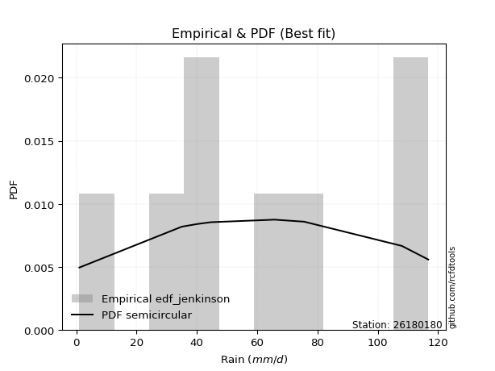</img>

</div>


### 11. Empirical - EDF Cunnane (1978)

Cunnane´s work in statistical hydrology has focused on the performance and evaluation of different probability distributions (such as GEV, Gumbel, Lognormal) for flood frequency estimation. _b_ is a constant, typically set to 0.4.

<div align="center">


$P=(m-b)/(n+1-2b)$


</div>


**11.1. Empirical values**

<div align="center">

|                | 0                   | 1                   | 2                  | 3                  | 4                  | 5                  | 6                  | 7                  |
|:---------------|:--------------------|:--------------------|:-------------------|:-------------------|:-------------------|:-------------------|:-------------------|:-------------------|
| date           | 2021                | 2020                | 2018               | 2022               | 2017               | 2019               | 2025               | 2024               |
| x              | 1.0                 | 35.0                | 40.2               | 44.6               | 65.8               | 75.6               | 107.2              | 108.0              |
| m              | 1                   | 2                   | 3                  | 4                  | 5                  | 6                  | 7                  | 8                  |
| empirical_dist | edf_cunnane         | edf_cunnane         | edf_cunnane        | edf_cunnane        | edf_cunnane        | edf_cunnane        | edf_cunnane        | edf_cunnane        |
| empirical      | 0.07317073170731708 | 0.19512195121951223 | 0.3170731707317074 | 0.4390243902439025 | 0.5609756097560976 | 0.6829268292682927 | 0.8048780487804879 | 0.926829268292683  |
| empirical_tr   | 1.0789473684210527  | 1.2424242424242424  | 1.4642857142857144 | 1.782608695652174  | 2.277777777777778  | 3.153846153846154  | 5.125000000000001  | 13.666666666666675 |

</div>


**11.2. Kolmogorov-Smirnov fit test (sorted by Δ)**


<div align="center">

|                | 0                   | 1                   | 2                   | 3                  | 4                   | 5                   | 6                   | 7                  | 8                   | 9                   | 10                  | 11                  | 12                  | 13                 | 14                  | 15                  | 16                  | 17                  | 18                  | 19                  | 20                  | 21                  | 22                  | 23                  | 24                  | 25                  | 26                  | 27                  | 28                 | 29                 | 30                  | 31                  | 32                  | 33                  | 34                  | 35                  | 36                 | 37                 | 38                  | 39                    | 40                  | 41                 | 42                  | 43                 | 44                  | 45                 | 46                 | 47                 | 48                 | 49                 | 50                 | 51                 | 52                 | 53                 | 54                  | 55                 | 56                  | 57                 | 58                 | 59                 | 60                  | 61                  | 62                  | 63                  | 64                 | 65                 | 66                 | 67                 | 68                 | 69                  | 70                  | 71                 | 72                 | 73                  | 74                 | 75                  | 76                  | 77                 | 78                 | 79                 | 80                  | 81                  | 82                  | 83                  | 84                 | 85                 | 86                 | 87                 | 88                 | 89                 |
|:---------------|:--------------------|:--------------------|:--------------------|:-------------------|:--------------------|:--------------------|:--------------------|:-------------------|:--------------------|:--------------------|:--------------------|:--------------------|:--------------------|:-------------------|:--------------------|:--------------------|:--------------------|:--------------------|:--------------------|:--------------------|:--------------------|:--------------------|:--------------------|:--------------------|:--------------------|:--------------------|:--------------------|:--------------------|:-------------------|:-------------------|:--------------------|:--------------------|:--------------------|:--------------------|:--------------------|:--------------------|:-------------------|:-------------------|:--------------------|:----------------------|:--------------------|:-------------------|:--------------------|:-------------------|:--------------------|:-------------------|:-------------------|:-------------------|:-------------------|:-------------------|:-------------------|:-------------------|:-------------------|:-------------------|:--------------------|:-------------------|:--------------------|:-------------------|:-------------------|:-------------------|:--------------------|:--------------------|:--------------------|:--------------------|:-------------------|:-------------------|:-------------------|:-------------------|:-------------------|:--------------------|:--------------------|:-------------------|:-------------------|:--------------------|:-------------------|:--------------------|:--------------------|:-------------------|:-------------------|:-------------------|:--------------------|:--------------------|:--------------------|:--------------------|:-------------------|:-------------------|:-------------------|:-------------------|:-------------------|:-------------------|
| station        | 26180180            | 26180180            | 26180180            | 26180180           | 26180180            | 26180180            | 26180180            | 26180180           | 26180180            | 26180180            | 26180180            | 26180180            | 26180180            | 26180180           | 26180180            | 26180180            | 26180180            | 26180180            | 26180180            | 26180180            | 26180180            | 26180180            | 26180180            | 26180180            | 26180180            | 26180180            | 26180180            | 26180180            | 26180180           | 26180180           | 26180180            | 26180180            | 26180180            | 26180180            | 26180180            | 26180180            | 26180180           | 26180180           | 26180180            | 26180180              | 26180180            | 26180180           | 26180180            | 26180180           | 26180180            | 26180180           | 26180180           | 26180180           | 26180180           | 26180180           | 26180180           | 26180180           | 26180180           | 26180180           | 26180180            | 26180180           | 26180180            | 26180180           | 26180180           | 26180180           | 26180180            | 26180180            | 26180180            | 26180180            | 26180180           | 26180180           | 26180180           | 26180180           | 26180180           | 26180180            | 26180180            | 26180180           | 26180180           | 26180180            | 26180180           | 26180180            | 26180180            | 26180180           | 26180180           | 26180180           | 26180180            | 26180180            | 26180180            | 26180180            | 26180180           | 26180180           | 26180180           | 26180180           | 26180180           | 26180180           |
| empirical_dist | edf_cunnane         | edf_cunnane         | edf_cunnane         | edf_cunnane        | edf_cunnane         | edf_cunnane         | edf_cunnane         | edf_cunnane        | edf_cunnane         | edf_cunnane         | edf_cunnane         | edf_cunnane         | edf_cunnane         | edf_cunnane        | edf_cunnane         | edf_cunnane         | edf_cunnane         | edf_cunnane         | edf_cunnane         | edf_cunnane         | edf_cunnane         | edf_cunnane         | edf_cunnane         | edf_cunnane         | edf_cunnane         | edf_cunnane         | edf_cunnane         | edf_cunnane         | edf_cunnane        | edf_cunnane        | edf_cunnane         | edf_cunnane         | edf_cunnane         | edf_cunnane         | edf_cunnane         | edf_cunnane         | edf_cunnane        | edf_cunnane        | edf_cunnane         | edf_cunnane           | edf_cunnane         | edf_cunnane        | edf_cunnane         | edf_cunnane        | edf_cunnane         | edf_cunnane        | edf_cunnane        | edf_cunnane        | edf_cunnane        | edf_cunnane        | edf_cunnane        | edf_cunnane        | edf_cunnane        | edf_cunnane        | edf_cunnane         | edf_cunnane        | edf_cunnane         | edf_cunnane        | edf_cunnane        | edf_cunnane        | edf_cunnane         | edf_cunnane         | edf_cunnane         | edf_cunnane         | edf_cunnane        | edf_cunnane        | edf_cunnane        | edf_cunnane        | edf_cunnane        | edf_cunnane         | edf_cunnane         | edf_cunnane        | edf_cunnane        | edf_cunnane         | edf_cunnane        | edf_cunnane         | edf_cunnane         | edf_cunnane        | edf_cunnane        | edf_cunnane        | edf_cunnane         | edf_cunnane         | edf_cunnane         | edf_cunnane         | edf_cunnane        | edf_cunnane        | edf_cunnane        | edf_cunnane        | edf_cunnane        | edf_cunnane        |
| p_dist         | halfnorm            | genlogistic         | invgauss            | rayleigh           | invgamma            | maxwell             | laplace_asymmetric  | halflogistic       | alpha               | rice                | chi2                | gumbel_r            | moyal               | fisk               | weibull_min         | betaprime           | kstwobign           | f                   | erlang              | gamma               | nct                 | t                   | crystalball         | norm                | exponnorm           | pearson3            | johnsonsu           | logistic            | logt               | hypsecant          | ncf                 | logfisk             | logweibull_min      | logpearson3         | gumbel_l            | laplace             | wald               | loggompertz        | mielke              | loglaplace_asymmetric | logloggamma         | gibrat             | loggumbel_l         | genexpon           | expon               | loglaplace         | loghypsecant       | loglogistic        | logbetaprime       | logcrystalball     | lognorm            | lognorm            | logexponnorm       | logrice            | lognct              | logfatiguelife     | loginvgamma         | logerlang          | loggamma           | loggamma           | logalpha            | logmielke           | loginvweibull       | logmaxwell          | loginvgauss        | lograyleigh        | loggumbel_r        | logkstwobign       | loghalfnorm        | logmoyal            | loggenexpon         | loghalflogistic    | logncf             | logjohnsonsu        | logexpon           | loglognorm          | logwald             | pareto             | invweibull         | logchi2            | loggibrat           | logpareto           | nakagami            | logf                | lognakagami        | logtruncnorm       | fatiguelife        | gompertz           | truncnorm          | loggenlogistic     |
| delta          | 0.09146018339724393 | 0.09482213714328247 | 0.09576227488985578 | 0.097000598779448  | 0.09860388806242693 | 0.09988169220579102 | 0.09989229459891913 | 0.1013012345091977 | 0.10301146542553363 | 0.10314594417669287 | 0.10325747988660638 | 0.10346417680345543 | 0.10363234131161236 | 0.1054115467325466 | 0.10724594092203765 | 0.10756822991715054 | 0.10948947847298243 | 0.10959580039290628 | 0.11047475106509108 | 0.11047952824315888 | 0.11068190479334972 | 0.11071104179948188 | 0.11071200392797409 | 0.11071201060142288 | 0.11071244402977687 | 0.11094990743380628 | 0.11105011948244026 | 0.12721437461717422 | 0.134826646402259  | 0.141932745427914  | 0.14238861135098316 | 0.15610060414272056 | 0.15779770346549102 | 0.16286027864299932 | 0.16460998689761253 | 0.16931505045696726 | 0.1693976916331824 | 0.1707032411478994 | 0.17479384561714795 | 0.18808611142763687   | 0.18810200916841713 | 0.1998662984921551 | 0.21763903030751033 | 0.2303558879562803 | 0.24467901696411334 | 0.2763450537147184 | 0.284118345396116  | 0.2860466311938682 | 0.2877155905573725 | 0.2883072124707736 | 0.2883072150597613 | 0.2883072150597613 | 0.2883100573828723 | 0.28836794183465   | 0.28871145251513286 | 0.2907046232003576 | 0.29401647806536246 | 0.301680527978355  | 0.3031877746502164 | 0.3031877746502164 | 0.31143459753196845 | 0.31400244274562306 | 0.32037453254700377 | 0.32194166094753507 | 0.3224425405320632 | 0.3332914183444865 | 0.357992494146266  | 0.3629759807125612 | 0.3652562689282187 | 0.38386573204450813 | 0.38666441711169164 | 0.3891008492508893 | 0.4114550211552158 | 0.42203974483406276 | 0.4309305385316159 | 0.45193167209090623 | 0.45587610224354547 | 0.458012965839822  | 0.4717811770895547 | 0.4744658418606048 | 0.47636299720603226 | 0.47929586636968546 | 0.49511559998255683 | 0.49587854160064126 | 0.5505730162195389 | 0.6179946451709779 | 0.6252007454769112 | 0.6275278870668206 | 0.8048780487804877 | 0.8048780487804879 |
| deltao         | 0.4472608134160001  | 0.4472608134160001  | 0.4472608134160001  | 0.4472608134160001 | 0.4472608134160001  | 0.4472608134160001  | 0.4472608134160001  | 0.4472608134160001 | 0.4472608134160001  | 0.4472608134160001  | 0.4472608134160001  | 0.4472608134160001  | 0.4472608134160001  | 0.4472608134160001 | 0.4472608134160001  | 0.4472608134160001  | 0.4472608134160001  | 0.4472608134160001  | 0.4472608134160001  | 0.4472608134160001  | 0.4472608134160001  | 0.4472608134160001  | 0.4472608134160001  | 0.4472608134160001  | 0.4472608134160001  | 0.4472608134160001  | 0.4472608134160001  | 0.4472608134160001  | 0.4472608134160001 | 0.4472608134160001 | 0.4472608134160001  | 0.4472608134160001  | 0.4472608134160001  | 0.4472608134160001  | 0.4472608134160001  | 0.4472608134160001  | 0.4472608134160001 | 0.4472608134160001 | 0.4472608134160001  | 0.4472608134160001    | 0.4472608134160001  | 0.4472608134160001 | 0.4472608134160001  | 0.4472608134160001 | 0.4472608134160001  | 0.4472608134160001 | 0.4472608134160001 | 0.4472608134160001 | 0.4472608134160001 | 0.4472608134160001 | 0.4472608134160001 | 0.4472608134160001 | 0.4472608134160001 | 0.4472608134160001 | 0.4472608134160001  | 0.4472608134160001 | 0.4472608134160001  | 0.4472608134160001 | 0.4472608134160001 | 0.4472608134160001 | 0.4472608134160001  | 0.4472608134160001  | 0.4472608134160001  | 0.4472608134160001  | 0.4472608134160001 | 0.4472608134160001 | 0.4472608134160001 | 0.4472608134160001 | 0.4472608134160001 | 0.4472608134160001  | 0.4472608134160001  | 0.4472608134160001 | 0.4472608134160001 | 0.4472608134160001  | 0.4472608134160001 | 0.4472608134160001  | 0.4472608134160001  | 0.4472608134160001 | 0.4472608134160001 | 0.4472608134160001 | 0.4472608134160001  | 0.4472608134160001  | 0.4472608134160001  | 0.4472608134160001  | 0.4472608134160001 | 0.4472608134160001 | 0.4472608134160001 | 0.4472608134160001 | 0.4472608134160001 | 0.4472608134160001 |
| eval           | Δo > Δ              | Δo > Δ              | Δo > Δ              | Δo > Δ             | Δo > Δ              | Δo > Δ              | Δo > Δ              | Δo > Δ             | Δo > Δ              | Δo > Δ              | Δo > Δ              | Δo > Δ              | Δo > Δ              | Δo > Δ             | Δo > Δ              | Δo > Δ              | Δo > Δ              | Δo > Δ              | Δo > Δ              | Δo > Δ              | Δo > Δ              | Δo > Δ              | Δo > Δ              | Δo > Δ              | Δo > Δ              | Δo > Δ              | Δo > Δ              | Δo > Δ              | Δo > Δ             | Δo > Δ             | Δo > Δ              | Δo > Δ              | Δo > Δ              | Δo > Δ              | Δo > Δ              | Δo > Δ              | Δo > Δ             | Δo > Δ             | Δo > Δ              | Δo > Δ                | Δo > Δ              | Δo > Δ             | Δo > Δ              | Δo > Δ             | Δo > Δ              | Δo > Δ             | Δo > Δ             | Δo > Δ             | Δo > Δ             | Δo > Δ             | Δo > Δ             | Δo > Δ             | Δo > Δ             | Δo > Δ             | Δo > Δ              | Δo > Δ             | Δo > Δ              | Δo > Δ             | Δo > Δ             | Δo > Δ             | Δo > Δ              | Δo > Δ              | Δo > Δ              | Δo > Δ              | Δo > Δ             | Δo > Δ             | Δo > Δ             | Δo > Δ             | Δo > Δ             | Δo > Δ              | Δo > Δ              | Δo > Δ             | Δo > Δ             | Δo > Δ              | Δo > Δ             | Δo <= Δ             | Δo <= Δ             | Δo <= Δ            | Δo <= Δ            | Δo <= Δ            | Δo <= Δ             | Δo <= Δ             | Δo <= Δ             | Δo <= Δ             | Δo <= Δ            | Δo <= Δ            | Δo <= Δ            | Δo <= Δ            | Δo <= Δ            | Δo <= Δ            |
| fit            | 1                   | 1                   | 1                   | 1                  | 1                   | 1                   | 1                   | 1                  | 1                   | 1                   | 1                   | 1                   | 1                   | 1                  | 1                   | 1                   | 1                   | 1                   | 1                   | 1                   | 1                   | 1                   | 1                   | 1                   | 1                   | 1                   | 1                   | 1                   | 1                  | 1                  | 1                   | 1                   | 1                   | 1                   | 1                   | 1                   | 1                  | 1                  | 1                   | 1                     | 1                   | 1                  | 1                   | 1                  | 1                   | 1                  | 1                  | 1                  | 1                  | 1                  | 1                  | 1                  | 1                  | 1                  | 1                   | 1                  | 1                   | 1                  | 1                  | 1                  | 1                   | 1                   | 1                   | 1                   | 1                  | 1                  | 1                  | 1                  | 1                  | 1                   | 1                   | 1                  | 1                  | 1                   | 1                  | 0                   | 0                   | 0                  | 0                  | 0                  | 0                   | 0                   | 0                   | 0                   | 0                  | 0                  | 0                  | 0                  | 0                  | 0                  |
| n              | 8                   | 8                   | 8                   | 8                  | 8                   | 8                   | 8                   | 8                  | 8                   | 8                   | 8                   | 8                   | 8                   | 8                  | 8                   | 8                   | 8                   | 8                   | 8                   | 8                   | 8                   | 8                   | 8                   | 8                   | 8                   | 8                   | 8                   | 8                   | 8                  | 8                  | 8                   | 8                   | 8                   | 8                   | 8                   | 8                   | 8                  | 8                  | 8                   | 8                     | 8                   | 8                  | 8                   | 8                  | 8                   | 8                  | 8                  | 8                  | 8                  | 8                  | 8                  | 8                  | 8                  | 8                  | 8                   | 8                  | 8                   | 8                  | 8                  | 8                  | 8                   | 8                   | 8                   | 8                   | 8                  | 8                  | 8                  | 8                  | 8                  | 8                   | 8                   | 8                  | 8                  | 8                   | 8                  | 8                   | 8                   | 8                  | 8                  | 8                  | 8                   | 8                   | 8                   | 8                   | 8                  | 8                  | 8                  | 8                  | 8                  | 8                  |
| best_fit       | 1                   | 0                   | 0                   | 0                  | 0                   | 0                   | 0                   | 0                  | 0                   | 0                   | 0                   | 0                   | 0                   | 0                  | 0                   | 0                   | 0                   | 0                   | 0                   | 0                   | 0                   | 0                   | 0                   | 0                   | 0                   | 0                   | 0                   | 0                   | 0                  | 0                  | 0                   | 0                   | 0                   | 0                   | 0                   | 0                   | 0                  | 0                  | 0                   | 0                     | 0                   | 0                  | 0                   | 0                  | 0                   | 0                  | 0                  | 0                  | 0                  | 0                  | 0                  | 0                  | 0                  | 0                  | 0                   | 0                  | 0                   | 0                  | 0                  | 0                  | 0                   | 0                   | 0                   | 0                   | 0                  | 0                  | 0                  | 0                  | 0                  | 0                   | 0                   | 0                  | 0                  | 0                   | 0                  | 0                   | 0                   | 0                  | 0                  | 0                  | 0                   | 0                   | 0                   | 0                   | 0                  | 0                  | 0                  | 0                  | 0                  | 0                  |
| best_fit_sort  | 1                   | 2                   | 3                   | 4                  | 5                   | 6                   | 7                   | 8                  | 9                   | 10                  | 11                  | 12                  | 13                  | 14                 | 15                  | 16                  | 17                  | 18                  | 19                  | 20                  | 21                  | 22                  | 23                  | 24                  | 25                  | 26                  | 27                  | 28                  | 29                 | 30                 | 31                  | 32                  | 33                  | 34                  | 35                  | 36                  | 37                 | 38                 | 39                  | 40                    | 41                  | 42                 | 43                  | 44                 | 45                  | 46                 | 47                 | 48                 | 49                 | 50                 | 51                 | 52                 | 53                 | 54                 | 55                  | 56                 | 57                  | 58                 | 59                 | 60                 | 61                  | 62                  | 63                  | 64                  | 65                 | 66                 | 67                 | 68                 | 69                 | 70                  | 71                  | 72                 | 73                 | 74                  | 75                 | 76                  | 77                  | 78                 | 79                 | 80                 | 81                  | 82                  | 83                  | 84                  | 85                 | 86                 | 87                 | 88                 | 89                 | 90                 |

</div>


<div align="center">

</img>

</div>


**11.3. Best fit**

<div align="center">

|   id |   station | empirical_dist   | p_dist   |     delta |   deltao | eval   |   fit |   n |   best_fit |   best_fit_sort |
|-----:|----------:|:-----------------|:---------|----------:|---------:|:-------|------:|----:|-----------:|----------------:|
|    0 |  26180180 | edf_cunnane      | halfnorm | 0.0914602 | 0.447261 | Δo > Δ |     1 |   8 |          1 |               1 |

</div>


<div align="center">

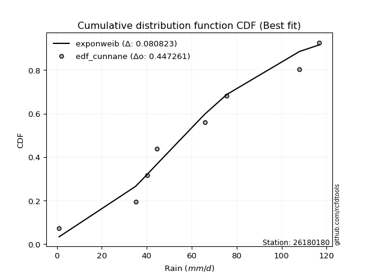</img>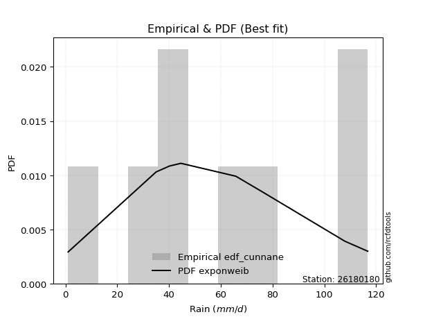</img>

</div>


### 12. Empirical - EDF Adamowski (1981)

The Adamowski formula in hydrology refers to a specific plotting position formula used for estimating the non-parametric empirical distribution of hydrological events (like flood peaks) to calculate their return periods. This formula provides an alternative to traditional parametric methods (like the Gumbel or Log Pearson Type III distributions). 

<div align="center">


$P=(m-0.25)/(n+0.5)$


</div>


**12.1. Empirical values**

<div align="center">

|                | 0                   | 1                   | 2                  | 3                  | 4                  | 5                  | 6                  | 7                  |
|:---------------|:--------------------|:--------------------|:-------------------|:-------------------|:-------------------|:-------------------|:-------------------|:-------------------|
| date           | 2021                | 2020                | 2018               | 2022               | 2017               | 2019               | 2025               | 2024               |
| x              | 1.0                 | 35.0                | 40.2               | 44.6               | 65.8               | 75.6               | 107.2              | 108.0              |
| m              | 1                   | 2                   | 3                  | 4                  | 5                  | 6                  | 7                  | 8                  |
| empirical_dist | edf_adamowski       | edf_adamowski       | edf_adamowski      | edf_adamowski      | edf_adamowski      | edf_adamowski      | edf_adamowski      | edf_adamowski      |
| empirical      | 0.08823529411764706 | 0.20588235294117646 | 0.3235294117647059 | 0.4411764705882353 | 0.5588235294117647 | 0.6764705882352942 | 0.7941176470588235 | 0.9117647058823529 |
| empirical_tr   | 1.096774193548387   | 1.259259259259259   | 1.4782608695652173 | 1.7894736842105263 | 2.2666666666666666 | 3.0909090909090913 | 4.857142857142856  | 11.33333333333333  |

</div>


**12.2. Kolmogorov-Smirnov fit test (sorted by Δ)**


<div align="center">

|                | 0                  | 1                   | 2                  | 3                   | 4                   | 5                   | 6                  | 7                   | 8                   | 9                   | 10                 | 11                  | 12                  | 13                 | 14                  | 15                  | 16                  | 17                  | 18                  | 19                  | 20                  | 21                  | 22                  | 23                  | 24                  | 25                  | 26                  | 27                  | 28                  | 29                  | 30                 | 31                  | 32                 | 33                 | 34                  | 35                  | 36                  | 37                 | 38                  | 39                    | 40                 | 41                 | 42                 | 43                  | 44                 | 45                  | 46                 | 47                 | 48                  | 49                  | 50                 | 51                 | 52                 | 53                 | 54                  | 55                  | 56                 | 57                 | 58                 | 59                 | 60                  | 61                  | 62                  | 63                  | 64                 | 65                 | 66                 | 67                 | 68                 | 69                  | 70                  | 71                 | 72                 | 73                 | 74                 | 75                  | 76                  | 77                 | 78                  | 79                 | 80                  | 81                  | 82                 | 83                  | 84                 | 85                 | 86                 | 87                 | 88                 | 89                 |
|:---------------|:-------------------|:--------------------|:-------------------|:--------------------|:--------------------|:--------------------|:-------------------|:--------------------|:--------------------|:--------------------|:-------------------|:--------------------|:--------------------|:-------------------|:--------------------|:--------------------|:--------------------|:--------------------|:--------------------|:--------------------|:--------------------|:--------------------|:--------------------|:--------------------|:--------------------|:--------------------|:--------------------|:--------------------|:--------------------|:--------------------|:-------------------|:--------------------|:-------------------|:-------------------|:--------------------|:--------------------|:--------------------|:-------------------|:--------------------|:----------------------|:-------------------|:-------------------|:-------------------|:--------------------|:-------------------|:--------------------|:-------------------|:-------------------|:--------------------|:--------------------|:-------------------|:-------------------|:-------------------|:-------------------|:--------------------|:--------------------|:-------------------|:-------------------|:-------------------|:-------------------|:--------------------|:--------------------|:--------------------|:--------------------|:-------------------|:-------------------|:-------------------|:-------------------|:-------------------|:--------------------|:--------------------|:-------------------|:-------------------|:-------------------|:-------------------|:--------------------|:--------------------|:-------------------|:--------------------|:-------------------|:--------------------|:--------------------|:-------------------|:--------------------|:-------------------|:-------------------|:-------------------|:-------------------|:-------------------|:-------------------|
| station        | 26180180           | 26180180            | 26180180           | 26180180            | 26180180            | 26180180            | 26180180           | 26180180            | 26180180            | 26180180            | 26180180           | 26180180            | 26180180            | 26180180           | 26180180            | 26180180            | 26180180            | 26180180            | 26180180            | 26180180            | 26180180            | 26180180            | 26180180            | 26180180            | 26180180            | 26180180            | 26180180            | 26180180            | 26180180            | 26180180            | 26180180           | 26180180            | 26180180           | 26180180           | 26180180            | 26180180            | 26180180            | 26180180           | 26180180            | 26180180              | 26180180           | 26180180           | 26180180           | 26180180            | 26180180           | 26180180            | 26180180           | 26180180           | 26180180            | 26180180            | 26180180           | 26180180           | 26180180           | 26180180           | 26180180            | 26180180            | 26180180           | 26180180           | 26180180           | 26180180           | 26180180            | 26180180            | 26180180            | 26180180            | 26180180           | 26180180           | 26180180           | 26180180           | 26180180           | 26180180            | 26180180            | 26180180           | 26180180           | 26180180           | 26180180           | 26180180            | 26180180            | 26180180           | 26180180            | 26180180           | 26180180            | 26180180            | 26180180           | 26180180            | 26180180           | 26180180           | 26180180           | 26180180           | 26180180           | 26180180           |
| empirical_dist | edf_adamowski      | edf_adamowski       | edf_adamowski      | edf_adamowski       | edf_adamowski       | edf_adamowski       | edf_adamowski      | edf_adamowski       | edf_adamowski       | edf_adamowski       | edf_adamowski      | edf_adamowski       | edf_adamowski       | edf_adamowski      | edf_adamowski       | edf_adamowski       | edf_adamowski       | edf_adamowski       | edf_adamowski       | edf_adamowski       | edf_adamowski       | edf_adamowski       | edf_adamowski       | edf_adamowski       | edf_adamowski       | edf_adamowski       | edf_adamowski       | edf_adamowski       | edf_adamowski       | edf_adamowski       | edf_adamowski      | edf_adamowski       | edf_adamowski      | edf_adamowski      | edf_adamowski       | edf_adamowski       | edf_adamowski       | edf_adamowski      | edf_adamowski       | edf_adamowski         | edf_adamowski      | edf_adamowski      | edf_adamowski      | edf_adamowski       | edf_adamowski      | edf_adamowski       | edf_adamowski      | edf_adamowski      | edf_adamowski       | edf_adamowski       | edf_adamowski      | edf_adamowski      | edf_adamowski      | edf_adamowski      | edf_adamowski       | edf_adamowski       | edf_adamowski      | edf_adamowski      | edf_adamowski      | edf_adamowski      | edf_adamowski       | edf_adamowski       | edf_adamowski       | edf_adamowski       | edf_adamowski      | edf_adamowski      | edf_adamowski      | edf_adamowski      | edf_adamowski      | edf_adamowski       | edf_adamowski       | edf_adamowski      | edf_adamowski      | edf_adamowski      | edf_adamowski      | edf_adamowski       | edf_adamowski       | edf_adamowski      | edf_adamowski       | edf_adamowski      | edf_adamowski       | edf_adamowski       | edf_adamowski      | edf_adamowski       | edf_adamowski      | edf_adamowski      | edf_adamowski      | edf_adamowski      | edf_adamowski      | edf_adamowski      |
| p_dist         | kstwobign          | laplace_asymmetric  | halfnorm           | genlogistic         | invgauss            | rayleigh            | invgamma           | maxwell             | halflogistic        | fisk                | alpha              | rice                | chi2                | gumbel_r           | moyal               | weibull_min         | betaprime           | f                   | erlang              | gamma               | nct                 | t                   | crystalball         | norm                | exponnorm           | pearson3            | johnsonsu           | logistic            | ncf                 | logt                | hypsecant          | logfisk             | logweibull_min     | logpearson3        | loggompertz         | gumbel_l            | laplace             | wald               | mielke              | loglaplace_asymmetric | logloggamma        | gibrat             | loggumbel_l        | genexpon            | expon              | loglaplace          | loghypsecant       | loglogistic        | logbetaprime        | logcrystalball      | lognorm            | lognorm            | logexponnorm       | logrice            | lognct              | logfatiguelife      | loginvgamma        | logerlang          | loggamma           | loggamma           | logalpha            | logmielke           | loginvweibull       | logmaxwell          | loginvgauss        | lograyleigh        | loggumbel_r        | logkstwobign       | loghalfnorm        | logmoyal            | loggenexpon         | loghalflogistic    | logncf             | logjohnsonsu       | logexpon           | loglognorm          | logwald             | pareto             | invweibull          | logchi2            | loggibrat           | logpareto           | nakagami           | logf                | lognakagami        | logtruncnorm       | fatiguelife        | gompertz           | loggenlogistic     | truncnorm          |
| delta          | 0.0987290767513182 | 0.10204437494325203 | 0.1022205851189083 | 0.10558253886494684 | 0.10652267661152015 | 0.10776100050111237 | 0.1093642897840913 | 0.11064209392745539 | 0.11064364128836268 | 0.11224038720224383 | 0.113771867147198  | 0.11390634589835724 | 0.11401788160827075 | 0.1142245785251198 | 0.11439274303327673 | 0.11800634264370202 | 0.11832863163881491 | 0.12035620211457065 | 0.12123515278675545 | 0.12123992996482325 | 0.12144230651501409 | 0.12147144352114625 | 0.12147240564963846 | 0.12147241232308725 | 0.12147284575144124 | 0.12171030915547065 | 0.12181052120410463 | 0.12972908493376523 | 0.13162820962931893 | 0.13697872674659178 | 0.1440848257722468 | 0.14534020242105633 | 0.1470373017438268 | 0.1520998769213351 | 0.15994283942623516 | 0.16822159428778638 | 0.17146713080130005 | 0.1715497719775153 | 0.18555424733881232 | 0.19884651314930124   | 0.1988624108900815 | 0.202018378836488  | 0.2068786285858461 | 0.21959548623461606 | 0.2339186152424491 | 0.26558465199305414 | 0.2733579436744518 | 0.275286229472204  | 0.27695518883570824 | 0.27754681074910936 | 0.2775468133380971 | 0.2775468133380971 | 0.2775496556612081 | 0.2776075401129857 | 0.27795105079346866 | 0.27994422147869336 | 0.2832560763436982 | 0.2909201262566908 | 0.2924273729285522 | 0.2924273729285522 | 0.30067419581030425 | 0.30324204102395885 | 0.30961413082533956 | 0.31118125922587087 | 0.311682138810399  | 0.3225310166228223 | 0.3472320924246018 | 0.352215578990897  | 0.3544958672065545 | 0.37310533032284393 | 0.37590401539002744 | 0.3783404475292251 | 0.4006946194335516 | 0.4155835038010642 | 0.4201701368099517 | 0.44117127036924203 | 0.44511570052188126 | 0.4472525641181578 | 0.45671661467922464 | 0.4637054401389406 | 0.46560259548436805 | 0.46853546464802126 | 0.4843551982608926 | 0.48511813987897706 | 0.5398126144978748 | 0.6072342434493136 | 0.614440343755247  | 0.6210716460338221 | 0.7941176470588235 | 0.7941176470588236 |
| deltao         | 0.4472608134160001 | 0.4472608134160001  | 0.4472608134160001 | 0.4472608134160001  | 0.4472608134160001  | 0.4472608134160001  | 0.4472608134160001 | 0.4472608134160001  | 0.4472608134160001  | 0.4472608134160001  | 0.4472608134160001 | 0.4472608134160001  | 0.4472608134160001  | 0.4472608134160001 | 0.4472608134160001  | 0.4472608134160001  | 0.4472608134160001  | 0.4472608134160001  | 0.4472608134160001  | 0.4472608134160001  | 0.4472608134160001  | 0.4472608134160001  | 0.4472608134160001  | 0.4472608134160001  | 0.4472608134160001  | 0.4472608134160001  | 0.4472608134160001  | 0.4472608134160001  | 0.4472608134160001  | 0.4472608134160001  | 0.4472608134160001 | 0.4472608134160001  | 0.4472608134160001 | 0.4472608134160001 | 0.4472608134160001  | 0.4472608134160001  | 0.4472608134160001  | 0.4472608134160001 | 0.4472608134160001  | 0.4472608134160001    | 0.4472608134160001 | 0.4472608134160001 | 0.4472608134160001 | 0.4472608134160001  | 0.4472608134160001 | 0.4472608134160001  | 0.4472608134160001 | 0.4472608134160001 | 0.4472608134160001  | 0.4472608134160001  | 0.4472608134160001 | 0.4472608134160001 | 0.4472608134160001 | 0.4472608134160001 | 0.4472608134160001  | 0.4472608134160001  | 0.4472608134160001 | 0.4472608134160001 | 0.4472608134160001 | 0.4472608134160001 | 0.4472608134160001  | 0.4472608134160001  | 0.4472608134160001  | 0.4472608134160001  | 0.4472608134160001 | 0.4472608134160001 | 0.4472608134160001 | 0.4472608134160001 | 0.4472608134160001 | 0.4472608134160001  | 0.4472608134160001  | 0.4472608134160001 | 0.4472608134160001 | 0.4472608134160001 | 0.4472608134160001 | 0.4472608134160001  | 0.4472608134160001  | 0.4472608134160001 | 0.4472608134160001  | 0.4472608134160001 | 0.4472608134160001  | 0.4472608134160001  | 0.4472608134160001 | 0.4472608134160001  | 0.4472608134160001 | 0.4472608134160001 | 0.4472608134160001 | 0.4472608134160001 | 0.4472608134160001 | 0.4472608134160001 |
| eval           | Δo > Δ             | Δo > Δ              | Δo > Δ             | Δo > Δ              | Δo > Δ              | Δo > Δ              | Δo > Δ             | Δo > Δ              | Δo > Δ              | Δo > Δ              | Δo > Δ             | Δo > Δ              | Δo > Δ              | Δo > Δ             | Δo > Δ              | Δo > Δ              | Δo > Δ              | Δo > Δ              | Δo > Δ              | Δo > Δ              | Δo > Δ              | Δo > Δ              | Δo > Δ              | Δo > Δ              | Δo > Δ              | Δo > Δ              | Δo > Δ              | Δo > Δ              | Δo > Δ              | Δo > Δ              | Δo > Δ             | Δo > Δ              | Δo > Δ             | Δo > Δ             | Δo > Δ              | Δo > Δ              | Δo > Δ              | Δo > Δ             | Δo > Δ              | Δo > Δ                | Δo > Δ             | Δo > Δ             | Δo > Δ             | Δo > Δ              | Δo > Δ             | Δo > Δ              | Δo > Δ             | Δo > Δ             | Δo > Δ              | Δo > Δ              | Δo > Δ             | Δo > Δ             | Δo > Δ             | Δo > Δ             | Δo > Δ              | Δo > Δ              | Δo > Δ             | Δo > Δ             | Δo > Δ             | Δo > Δ             | Δo > Δ              | Δo > Δ              | Δo > Δ              | Δo > Δ              | Δo > Δ             | Δo > Δ             | Δo > Δ             | Δo > Δ             | Δo > Δ             | Δo > Δ              | Δo > Δ              | Δo > Δ             | Δo > Δ             | Δo > Δ             | Δo > Δ             | Δo > Δ              | Δo > Δ              | Δo > Δ             | Δo <= Δ             | Δo <= Δ            | Δo <= Δ             | Δo <= Δ             | Δo <= Δ            | Δo <= Δ             | Δo <= Δ            | Δo <= Δ            | Δo <= Δ            | Δo <= Δ            | Δo <= Δ            | Δo <= Δ            |
| fit            | 1                  | 1                   | 1                  | 1                   | 1                   | 1                   | 1                  | 1                   | 1                   | 1                   | 1                  | 1                   | 1                   | 1                  | 1                   | 1                   | 1                   | 1                   | 1                   | 1                   | 1                   | 1                   | 1                   | 1                   | 1                   | 1                   | 1                   | 1                   | 1                   | 1                   | 1                  | 1                   | 1                  | 1                  | 1                   | 1                   | 1                   | 1                  | 1                   | 1                     | 1                  | 1                  | 1                  | 1                   | 1                  | 1                   | 1                  | 1                  | 1                   | 1                   | 1                  | 1                  | 1                  | 1                  | 1                   | 1                   | 1                  | 1                  | 1                  | 1                  | 1                   | 1                   | 1                   | 1                   | 1                  | 1                  | 1                  | 1                  | 1                  | 1                   | 1                   | 1                  | 1                  | 1                  | 1                  | 1                   | 1                   | 1                  | 0                   | 0                  | 0                   | 0                   | 0                  | 0                   | 0                  | 0                  | 0                  | 0                  | 0                  | 0                  |
| n              | 8                  | 8                   | 8                  | 8                   | 8                   | 8                   | 8                  | 8                   | 8                   | 8                   | 8                  | 8                   | 8                   | 8                  | 8                   | 8                   | 8                   | 8                   | 8                   | 8                   | 8                   | 8                   | 8                   | 8                   | 8                   | 8                   | 8                   | 8                   | 8                   | 8                   | 8                  | 8                   | 8                  | 8                  | 8                   | 8                   | 8                   | 8                  | 8                   | 8                     | 8                  | 8                  | 8                  | 8                   | 8                  | 8                   | 8                  | 8                  | 8                   | 8                   | 8                  | 8                  | 8                  | 8                  | 8                   | 8                   | 8                  | 8                  | 8                  | 8                  | 8                   | 8                   | 8                   | 8                   | 8                  | 8                  | 8                  | 8                  | 8                  | 8                   | 8                   | 8                  | 8                  | 8                  | 8                  | 8                   | 8                   | 8                  | 8                   | 8                  | 8                   | 8                   | 8                  | 8                   | 8                  | 8                  | 8                  | 8                  | 8                  | 8                  |
| best_fit       | 1                  | 0                   | 0                  | 0                   | 0                   | 0                   | 0                  | 0                   | 0                   | 0                   | 0                  | 0                   | 0                   | 0                  | 0                   | 0                   | 0                   | 0                   | 0                   | 0                   | 0                   | 0                   | 0                   | 0                   | 0                   | 0                   | 0                   | 0                   | 0                   | 0                   | 0                  | 0                   | 0                  | 0                  | 0                   | 0                   | 0                   | 0                  | 0                   | 0                     | 0                  | 0                  | 0                  | 0                   | 0                  | 0                   | 0                  | 0                  | 0                   | 0                   | 0                  | 0                  | 0                  | 0                  | 0                   | 0                   | 0                  | 0                  | 0                  | 0                  | 0                   | 0                   | 0                   | 0                   | 0                  | 0                  | 0                  | 0                  | 0                  | 0                   | 0                   | 0                  | 0                  | 0                  | 0                  | 0                   | 0                   | 0                  | 0                   | 0                  | 0                   | 0                   | 0                  | 0                   | 0                  | 0                  | 0                  | 0                  | 0                  | 0                  |
| best_fit_sort  | 1                  | 2                   | 3                  | 4                   | 5                   | 6                   | 7                  | 8                   | 9                   | 10                  | 11                 | 12                  | 13                  | 14                 | 15                  | 16                  | 17                  | 18                  | 19                  | 20                  | 21                  | 22                  | 23                  | 24                  | 25                  | 26                  | 27                  | 28                  | 29                  | 30                  | 31                 | 32                  | 33                 | 34                 | 35                  | 36                  | 37                  | 38                 | 39                  | 40                    | 41                 | 42                 | 43                 | 44                  | 45                 | 46                  | 47                 | 48                 | 49                  | 50                  | 51                 | 52                 | 53                 | 54                 | 55                  | 56                  | 57                 | 58                 | 59                 | 60                 | 61                  | 62                  | 63                  | 64                  | 65                 | 66                 | 67                 | 68                 | 69                 | 70                  | 71                  | 72                 | 73                 | 74                 | 75                 | 76                  | 77                  | 78                 | 79                  | 80                 | 81                  | 82                  | 83                 | 84                  | 85                 | 86                 | 87                 | 88                 | 89                 | 90                 |

</div>


<div align="center">

</img>

</div>


**12.3. Best fit**

<div align="center">

|   id |   station | empirical_dist   | p_dist    |     delta |   deltao | eval   |   fit |   n |   best_fit |   best_fit_sort |
|-----:|----------:|:-----------------|:----------|----------:|---------:|:-------|------:|----:|-----------:|----------------:|
|    0 |  26180180 | edf_adamowski    | kstwobign | 0.0987291 | 0.447261 | Δo > Δ |     1 |   8 |          1 |               1 |

</div>


<div align="center">

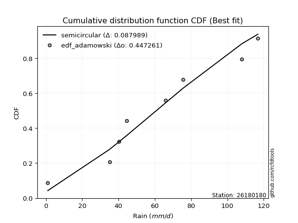</img>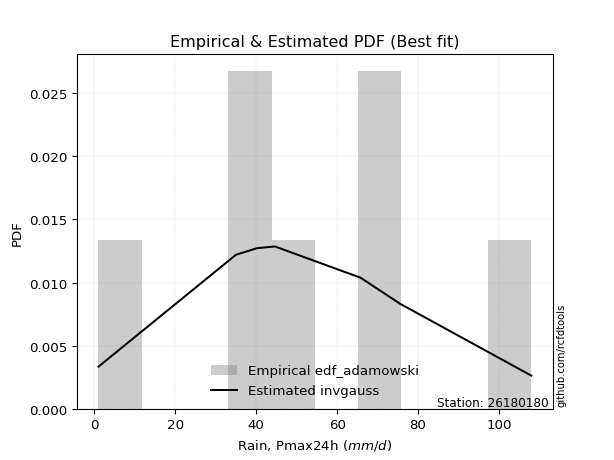</img>

</div>


## C. Best fit & Estimate extreme values for specific return periods - Tr


### 1. Best fit (ordered by delta Δ)

<div align="center">

|   id |   station | empirical_dist   | p_dist             |     delta |   deltao | eval   |   fit |   n |   best_fit |   best_fit_sort |
|-----:|----------:|:-----------------|:-------------------|----------:|---------:|:-------|------:|----:|-----------:|----------------:|
|    0 |  26180180 | edf_hazen        | invgauss           | 0.0881403 | 0.447261 | Δo > Δ |     1 |   8 |          1 |               1 |
|    1 |  26180180 | edf_cunnane      | halfnorm           | 0.0914602 | 0.447261 | Δo > Δ |     1 |   8 |          1 |               2 |
|    2 |  26180180 | edf_gringorten   | genlogistic        | 0.0918184 | 0.447261 | Δo > Δ |     1 |   8 |          1 |               3 |
|    3 |  26180180 | edf_blom         | halfnorm           | 0.0933079 | 0.447261 | Δo > Δ |     1 |   8 |          1 |               4 |
|    4 |  26180180 | edf_tukey        | halfnorm           | 0.0963382 | 0.447261 | Δo > Δ |     1 |   8 |          1 |               5 |
|    5 |  26180180 | edf_filliben     | halfnorm           | 0.0974739 | 0.447261 | Δo > Δ |     1 |   8 |          1 |               6 |
|    6 |  26180180 | edf_beard        | halfnorm           | 0.0980089 | 0.447261 | Δo > Δ |     1 |   8 |          1 |               7 |
|    7 |  26180180 | edf_jenkinson    | halfnorm           | 0.0980089 | 0.447261 | Δo > Δ |     1 |   8 |          1 |               8 |
|    8 |  26180180 | edf_chegodayev   | halfnorm           | 0.0987192 | 0.447261 | Δo > Δ |     1 |   8 |          1 |               9 |
|    9 |  26180180 | edf_adamowski    | kstwobign          | 0.0987291 | 0.447261 | Δo > Δ |     1 |   8 |          1 |              10 |
|   10 |  26180180 | edf_weibull      | kstwobign          | 0.10414   | 0.447261 | Δo > Δ |     1 |   8 |          1 |              11 |
|   11 |  26180180 | edf_california   | laplace_asymmetric | 0.107765  | 0.447261 | Δo > Δ |     1 |   8 |          1 |              12 |

</div>

:file_folder:Tables: [bestfit_26180180.csv](table/bestfit_26180180.csv) | [extreme_26180180.csv](table/extreme_26180180.csv)


### 2. Extreme values

In hydrology, a return period (or recurrence interval $Tr$) is the statistical average time between extreme events like floods or droughts of a specific magnitude, indicating how rare an event is, with a 100-year flood, for example, having a 1% chance of occurring in any given year, not that it happens exactly every century. It is a key tool for infrastructure design (like bridges or dams) and risk assessment, calculated from historical data to determine the probability of future events, although it is important to remember it is statistical average, and events can cluster or be missed.

> risk_rate: assuming the return period as the project useful life.

|   id |      tr |   prob_l |     prob_g |    alpha |   betaprime |     chi2 |   crystalball |   erlang |    expon |   exponnorm |        f |   fatiguelife |     fisk |    gamma |   genexpon |   genlogistic |   gibrat |   gompertz |   gumbel_l |   gumbel_r |   halflogistic |   halfnorm |   hypsecant |   invgamma |   invgauss |      invweibull |   johnsonsu |   kstwobign |   laplace |   laplace_asymmetric |   loggamma |   logistic |   lognorm |   maxwell |   mielke |    moyal |   nakagami |      ncf |      nct |     norm |           pareto |   pearson3 |   rayleigh |     rice |        t |   truncnorm |     wald |   weibull_min |   logalpha |   logbetaprime |          logchi2 |   logcrystalball |   logerlang |         logexpon |   logexponnorm |            logf |   logfatiguelife |   logfisk |   loggenexpon |   loggenlogistic |        loggibrat |   loggompertz |   loggumbel_l |   loggumbel_r |   loghalflogistic |   loghalfnorm |   loghypsecant |   loginvgamma |   loginvgauss |    loginvweibull |   logjohnsonsu |   logkstwobign |   loglaplace |   loglaplace_asymmetric |   logloggamma |   loglogistic |   loglognorm |   logmaxwell |        logmielke |   logmoyal |      lognakagami |           logncf |    lognct |     logpareto |   logpearson3 |   lograyleigh |   logrice |             logt |   logtruncnorm |          logwald |   logweibull_min |   station |   n |   risk_rate |
|-----:|--------:|---------:|-----------:|---------:|------------:|---------:|--------------:|---------:|---------:|------------:|---------:|--------------:|---------:|---------:|-----------:|--------------:|---------:|-----------:|-----------:|-----------:|---------------:|-----------:|------------:|-----------:|-----------:|----------------:|------------:|------------:|----------:|---------------------:|-----------:|-----------:|----------:|----------:|---------:|---------:|-----------:|---------:|---------:|---------:|-----------------:|-----------:|-----------:|---------:|---------:|------------:|---------:|--------------:|-----------:|---------------:|-----------------:|-----------------:|------------:|-----------------:|---------------:|----------------:|-----------------:|----------:|--------------:|-----------------:|-----------------:|--------------:|--------------:|--------------:|------------------:|--------------:|---------------:|--------------:|--------------:|-----------------:|---------------:|---------------:|-------------:|------------------------:|--------------:|--------------:|-------------:|-------------:|-----------------:|-----------:|-----------------:|-----------------:|----------:|--------------:|--------------:|--------------:|----------:|-----------------:|---------------:|-----------------:|-----------------:|----------:|----:|------------:|
|    0 |    2    | 0.5      | 0.5        |  56.8288 |     58.7066 |  58.285  |       59.675  |  59.6158 |  41.6704 |     59.675  |  59.4678 |       1.00027 |  58.6562 |  59.6155 |    43.5231 |       57.4301 |  49.3077 |    95.0813 |    65.3491 |    54.0009 |        51.18   |    52.605  |     59.675  |    57.4053 |    55.9122 |  1124.81        |     59.7613 |     52.7656 |   59.675  |              51.5098 |    35.2246 |    59.675  |   37.1321 |   56.7211 |  53.3251 |  52.1691 |    11.5396 |  51.1163 |  59.6767 |  59.675  |      3.63005     |    59.734  |    55.6734 |  57.9929 |  59.6751 |     3.2408  |  48.4791 |       58.7768 |    34.116  |        37.2149 |      8.68599     |          37.1321 |     35.4266 |     12.2481      |        37.1317 |    3.57523      |          36.8146 |   51.0494 |       22.0927 |           inf    |     24.2215      |       47.9961 |       46.913  |       29.3904 |           26.165  |       27.7481 |        37.1321 |       36.4422 |       32.5786 |     32.1964      |        107.889 |        25.1231 |      37.1321 |                 51.5129 |       51.3244 |       37.1321 |            1 |      32.8765 |     33.394       |    27.2536 |      4.66829     |     8.08727      |   37.0852 |   1.19317     |       56.6546 |       31.4874 |   37.1254 |     59.8546      |        7.73375 |     23.409       |          49.3677 |  26180180 |   8 |    0.75     |
|    1 |    2.33 | 0.570815 | 0.429185   |  63.0822 |     64.911  |  64.5464 |       65.8384 |  65.7813 |  50.6313 |     65.8384 |  65.6464 |       2.28924 |  64.5482 |  65.7809 |    52.8922 |       63.4961 |  52.4299 |    96.6366 |    70.7113 |    59.712  |        57.0519 |    59.2569 |     64.6076 |    63.7205 |    62.3175 | 56282.6         |     65.922  |     59.7944 |   63.4048 |              57.1314 |    46.1661 |    65.1054 |   47.8685 |   63.1244 |  61.1559 |  57.5754 |    17.9789 |  58.9145 |  65.8405 |  65.8384 |      8.67574     |    65.8955 |    62.1715 |  64.4237 |  65.8384 |     3.65393 |  52.5205 |       65.1297 |    45.1084 |        47.9994 |     14.4696      |          47.8685 |     46.4407 |     21.2717      |        47.8679 |    6.21278      |          47.4539 |   60.8369 |       32.8443 |           inf    |     27.5472      |       55.7642 |       58.5135 |       37.1887 |           33.3277 |       36.4984 |        45.5012 |       47.5447 |       43.6456 |     47.7055      |        107.978 |        37.7473 |      43.301  |                 59.3422 |       59.1667 |       46.4442 |            1 |      42.8035 |     48.6485      |    34.0545 |      7.42186     |    19.4832       |   47.8474 |   1.67461     |       68.7242 |       41.1553 |   47.8676 |     65.9787      |       10.6105  |     27.6509      |          57.1973 |  26180180 |   8 |    0.729209 |
|    2 |    5    | 0.8      | 0.2        |  87.678  |     88.438  |  88.6398 |       88.7432 |  88.7266 |  95.4338 |     88.7432 |  88.7234 |      29.6654  |  87.8496 |  88.7258 |    99.7357 |       88.2053 |  70.4048 |   101.662  |    88.0344 |    84.5235 |        83.621  |    87.387  |     84.3932 |    88.5768 |    88.104  |     1.36306e+12 |     88.7691 |     89.6513 |   82.0529 |              85.2382 |   128.473  |    86.0728 |  123.014  |   88.3275 |  86.8135 |  82.6176 |    61.0544 |  92.9088 |  88.7476 |  88.7432 |   1588.18        |    88.7603 |    88.1861 |  88.8767 |  88.7433 |     5.45945 |  75.1443 |       88.9107 |   131.317  |       123.635  |    194.896       |         123.014  |    129.136  |    336.058       |       123.012  | 2101.06         |         121.941  |  119.755  |      160.735  |           inf    |     57.7788      |       90.6169 |      119.473  |      103.38   |           99.6063 |      116.327  |       102.827  |      130.347  |      135.553  |    263.289       |        108     |       212.789  |      93.374  |                 85.1046 |       85.0054 |      110.196  |          inf |     120.924  |    246.765       |    95.5722 |     68.3916      | 76974.6          |  123.396  |   2.30651e+46 |      113.661  |      120.221  |  123.086  |    102.16        |       32.6147  |     70.2407      |          92.0279 |  26180180 |   8 |    0.67232  |
|    3 |   10    | 0.9      | 0.1        | 105.282  |    104.457  | 105.349  |      103.938  | 103.976  | 136.104  |    103.938  | 104.133  |      67.4649  | 105.585  | 103.975  |   142.259  |      107.279  |  90.8941 |   104.46   |    97.6792 |   104.732  |       105.686  |   108.203  |    100.193  |   106.361  |   107.036  |     1.40862e+18 |    103.884  |    112.384  |   98.9812 |             110.753  |   257.394  |   101.515  |  230.079  |  106.064  |  98.1337 | 104.421  |   102.614  | 119.931  | 103.944  | 103.938  | 200224           |   103.9    |   106.735  | 105.417  | 103.938  |     6.84043 |  99.1535 |      104.628  |   274.311  |       231.679  |   2145.97        |         230.079  |    258.233  |   4116.06        |       230.074  |    1.22491e+10  |         228.13   |  197.201  |      498.946  |           inf    |    134.419       |      118.789  |      177.776  |      237.735  |          247.26   |      274.278  |       197.176  |      259.11   |      299.705  |   1058.45        |        108     |       793.937  |     187.575  |                 96.5146 |       96.4625 |      208.215  |          inf |     251.145  |    919.588       |   234.705  |    402.248       |     1.39695e+13  |  231.434  | inf           |      136.567  |      258.185  |  230.304  |    165.937       |       57.2503  |    188.913       |         119.927  |  26180180 |   8 |    0.651322 |
|    4 |   15    | 0.933333 | 0.0666667  | 114.488  |    112.575  | 113.906  |      111.52   | 111.594  | 159.895  |    111.52   | 111.853  |      92.1864  | 115.459  | 111.593  |   167.133  |      117.844  | 105.027  |   105.727  |   102.047  |   116.134  |       118.172  |   119.035  |    109.209  |   115.652  |   117.06   |     3.48336e+21 |    111.414  |    124.452  |  108.884  |             125.678  |   365.828  |   109.928  |  314.464  |  115.165  | 101.922  | 117.074  |   125.572  | 134.789  | 111.527  | 111.52   |      3.39195e+06 |   111.446  |   116.292  | 113.735  | 111.52   |     7.56995 | 114.571  |      112.411  |   399.634  |       316.987  |   8814.21        |         314.464  |    366.52   |  17822.2         |       314.456  |    6.61541e+18  |         311.87   |  258.781  |      894.524  |           inf    |    240.651       |      134.291  |      212.834  |      380.307  |          413.633  |      428.591  |       285.901  |      367.097  |      451.04   |   2320.47        |        108     |      1597.21   |     282.09   |                100.338  |      100.303  |      294.495  |          inf |     365.414  |   1929           |   395.341  |   1027.85        |     5.06639e+22  |  316.794  | inf           |      144.845  |      382.796  |  314.834  |    241.743       |       70.0744  |    356.597       |         135.206  |  26180180 |   8 |    0.644736 |
|    5 |   20    | 0.95     | 0.05       | 120.677  |    117.936  | 119.59   |      116.486  | 116.586  | 176.775  |    116.485  | 116.92   |     110.49    | 122.372  | 116.585  |   184.782  |      125.192  | 116.113  |   106.516  |   104.766  |   124.117  |       126.921  |   126.257  |    115.57   |   121.893  |   123.838  |     8.27625e+23 |    116.342  |    132.581  |  115.909  |             136.267  |   461.333  |   115.743  |  385.863  |  121.204  | 103.818  | 126.036  |   141.119  | 145.026  | 116.494  | 116.486  |      2.52577e+07 |   116.385  |   122.645  | 119.201  | 116.486  |     8.05969 | 126.06   |      117.481  |   512.96   |       389.244  |  24090.4         |         385.863  |    461.724  |  50413.7         |       385.854  |    1.37372e+29  |         382.749  |  312.252  |     1318.67   |           inf    |    380.006       |      144.947  |      238.065  |      528.444  |          593.167  |      577.148  |       371.577  |      462.104  |      592.261  |   4020.39        |        108     |      2557.77   |     376.811  |                102.253  |      102.227  |      374.235  |          inf |     468.673  |   3239.33        |   571.936  |   1926.82        |     1.65945e+33  |  389.126  | inf           |      149.158  |      497.336  |  386.367  |    335.423       |       77.7822  |    572.519       |         145.685  |  26180180 |   8 |    0.641514 |
|    6 |   25    | 0.96     | 0.04       | 125.318  |    121.906  | 123.815  |      120.141  | 120.263  | 189.868  |    120.141  | 120.655  |     125.032   | 127.71   | 120.261  |   198.471  |      130.831  | 125.355  |   107.077  |   106.701  |   130.266  |       133.661  |   131.631  |    120.493  |   126.569  |   128.939  |     5.59565e+25 |    119.966  |    138.67   |  121.359  |             144.481  |   547.714  |   120.192  |  448.589  |  125.688  | 104.957  | 132.982  |   152.761  | 152.82   | 120.15   | 120.141  |      1.19874e+08 |   120.019  |   127.364  | 123.233  | 120.141  |     8.42563 | 135.263  |      121.197  |   617.469  |       452.772  |  52623.3         |         448.589  |    547.714  | 112935           |       448.577  |    6.61455e+40  |         445.034  |  360.502  |     1759.44   |           inf    |    556.146       |      153.043  |      257.822  |      680.837  |          783.071  |      720.193  |       455.141  |      547.988  |      725.507  |   6139.38        |        108     |      3639.49   |     471.684  |                103.403  |      103.383  |      449.526  |          inf |     563.783  |   4828.33        |   761.474  |   3078.12        |     3.2229e+44   |  452.737  | inf           |      151.818  |      604.107  |  449.218  |    451.627       |       82.9029  |    836.528       |         153.633  |  26180180 |   8 |    0.639603 |
|    7 |   50    | 0.98     | 0.02       | 139.017  |    133.38   | 136.103  |      130.608  | 130.798  | 230.538  |    130.608  | 131.377  |     171.692   | 144.287  | 130.796  |   240.994  |      148.127  | 157.932  |   108.601  |   111.952  |   149.208  |       154.429  |   147.249  |    135.755  |   140.354  |   144.074  |     2.42809e+31 |    130.336  |    156.551  |  138.287  |             169.996  |   899.088  |   133.783  |  690.512  |  138.692  | 107.238  | 154.546  |   186.765  | 176.375  | 130.619  | 130.608  |      1.51219e+10 |   130.418  |   141.065  | 134.814  | 130.609  |     9.49584 | 165.31   |      131.764  |  1058.46   |       698.137  | 599942           |         690.512  |    896.585  |      1.38323e+06 |       690.493  |    4.46821e+115 |         685.385  |  559.201  |     4064.3    |           inf    |   2129.24        |      177.377  |      320.116  |     1486.06   |         1842.73   |     1370.75   |       853.659  |      897.21   |     1312.1    |  22620.4         |        108     |     10252.9    |     947.545  |                105.706  |      105.696  |      787.027  |          inf |     963.449  |  16502.6         |  1851.64   |  12035.4         |     2.77617e+109 |  698.544  | inf           |      157.363  |     1062.42   |  691.67   |   1573.75        |       94.4367  |   2885.34        |         177.462  |  26180180 |   8 |    0.63583  |
|    8 |   75    | 0.986667 | 0.0133333  | 146.631  |    139.603  | 142.814  |      136.225  | 136.455  | 254.329  |    136.224  | 137.146  |     199.792   | 154.049  | 136.453  |   265.869  |      158.147  | 179.936  |   109.371  |   114.608  |   160.218  |       166.501  |   155.751  |    144.675  |   148      |   152.525  |     4.59141e+34 |    135.893  |    166.389  |  148.19   |             184.921  |  1175.98   |   141.633  |  870.328  |  145.762  | 108.006  | 167.155  |   205.298  | 189.78   | 136.236  | 136.225  |      2.56178e+11 |   135.994  |   148.519  | 141.047  | 136.226  |    10.082   | 183.799  |      137.384  |  1420.42   |       880.791  |      2.50036e+06 |         870.328  |   1170.69   |      5.98928e+06 |       870.302  |    1.62474e+212 |         864.14   |  720.586  |     6409.77   |           inf    |   5272.41        |      191.121  |      357.137  |     2339.21   |         3030.46   |     1945.85   |      1232.83   |     1172.47   |     1815.98   |  48272.3         |        108     |     18127      |    1425      |                106.474  |      106.468  |     1087.61   |          inf |    1289.3    |  33704.8         |  3113.32   |  25285.7         |     3.93014e+184 |  881.626  | inf           |      159.311  |     1444.4    |  871.916  |   4452.19        |       98.7122  |   6181.36        |         190.885  |  26180180 |   8 |    0.634587 |
|    9 |  100    | 0.99     | 0.01       | 151.889  |    143.838  | 147.4    |      140.023  | 140.283  | 271.208  |    140.023  | 141.054  |     220.012   | 161.026  | 140.281  |   283.518  |      165.229  | 196.981  |   109.875  |   116.345  |   168.01   |       175.045  |   161.543  |    151.001  |   153.274  |   158.373  |     9.57314e+36 |    139.65   |    173.13   |  155.216  |             195.511  |  1411.55   |   147.175  | 1017.81   |  150.578  | 108.401  | 176.102  |   217.909  | 199.156  | 140.036  | 140.023  |      1.90759e+12 |   139.763  |   153.597  | 145.269  | 140.025  |    10.4825  | 197.279  |      141.165  |  1736.54   |      1030.74   |      6.89317e+06 |        1017.81   |   1403.45   |      1.69419e+07 |      1017.77   |  inf            |        1010.8    |  861.851  |     8742.88   |           inf    |  10642.8         |      200.682  |      383.638  |     3224.96   |         4309.43   |     2470.37   |      1600.04   |     1406.77   |     2268.84   |  82545.3         |        108     |     26784.8    |    1903.48   |                106.858  |      106.855  |     1366.65   |          inf |    1572.29   |  55868.6         |  4501.18   |  41918.8         |     1.80714e+267 | 1031.98   | inf           |      160.315  |     1780.59   | 1019.76   |  11245.8         |      100.939   |  10772.9         |         200.21   |  26180180 |   8 |    0.633968 |
|   10 |  200    | 0.995    | 0.005      | 164.153  |    153.522  | 157.942  |      148.64   | 148.971  | 311.879  |    148.64   | 149.938  |     269.505   | 178.049  | 148.969  |   326.041  |      182.237  | 243.354  |   110.971  |   120.121  |   186.744  |       195.587  |   174.79   |    166.244  |   165.55   |   172.046  |     3.60102e+42 |    148.163  |    188.655  |  172.144  |             221.025  |  2142.3    |   160.47   | 1451.67   |  161.595  | 109.061  | 197.656  |   246.677  | 221.364  | 148.654  | 148.64   |      2.40639e+14 |   148.307  |   165.216  | 154.865  | 148.642  |    11.402   | 230.857  |      149.68   |  2756.05   |      1472.49   |      7.96641e+07 |        1451.67   |   2123.4    |      2.07506e+08 |      1451.63   |  inf            |        1442.54   | 1324.13   |    17789.6    |           inf    |  71941.6         |      223.15   |      448.222  |     6978.87   |        10047.1    |     4264.08   |      2998.51   |     2134.47   |     3791.88   | 299801           |        108     |     65831.2    |    3823.82   |                107.435  |      107.434  |     2363.65   |          inf |    2475.72   | 188257           | 10941.2    | 133037           |   inf            | 1475.11   | inf           |      161.882  |     2874.06   | 1454.79   | 253902           |      104.396   |  42978.7         |         222.079  |  26180180 |   8 |    0.633042 |
|   11 |  250    | 0.996    | 0.004      | 167.998  |    156.504  | 161.202  |      151.273  | 151.627  | 324.972  |    151.273  | 152.658  |     285.634   | 183.602  | 151.626  |   339.73   |      187.701  | 259.992  |   111.293  |   121.232  |   192.767  |       202.191  |   178.866  |    171.15   |   169.391  |   176.339  |     2.23268e+44 |    150.763  |    193.46   |  177.594  |             229.239  |  2435.64   |   164.738  | 1618.06   |  164.987  | 109.22   | 204.595  |   255.501  | 228.414  | 151.288  | 151.273  |      1.14208e+15 |   150.917  |   168.792  | 157.801  | 151.275  |    11.6857  | 241.966  |      152.265  |  3179.34   |      1642.09   |      1.75333e+08 |        1618.06   |   2411.68   |      4.64847e+08 |      1618      |  inf            |        1608.18   | 1519.86   |    22138.5    |           inf    | 142810           |      230.228  |      469.218  |     8944.72   |        13189.5    |     5043.78   |      3670.41   |     2426.99   |     4446.9    | 453848           |        108     |     86955.2    |    4786.58   |                107.55   |      107.55   |     2818.17   |          inf |    2847.05   | 278195           | 14562.7    | 189708           |   inf            | 1645.31   | inf           |      162.208  |     3330.44   | 1621.65   | 980926           |      105.105   |  67928.9         |         228.957  |  26180180 |   8 |    0.632858 |
|   12 |  500    | 0.998    | 0.002      | 179.678  |    165.406  | 170.979  |      159.082  | 159.509  | 365.642  |    159.082  | 160.739  |     336.234   | 201.098  | 159.508  |   382.253  |      204.652  | 317.495  |   112.217  |   124.417  |   211.46   |       222.689  |   191.016  |    186.391  |   181.036  |   189.387  |     8.16712e+49 |    158.466  |    207.859  |  194.522  |             254.754  |  3571.84   |   177.975  | 2232.24   |  175.107  | 109.632  | 226.149  |   281.726  | 250.063  | 159.099  | 159.082  |      1.44071e+17 |   158.652  |   179.464  | 166.522  | 159.085  |    12.5338  | 277.288  |      159.883  |  4880.27   |      2268.95   |      2.03811e+09 |        2232.24   |   3525.27   |      5.69347e+09 |      2232.16   |  inf            |        2220      | 2330.74   |    42518.7    |           inf    |      1.52712e+06 |      251.788  |      535.017  |    19324.1    |        30694      |     8321.5    |      6878.09   |     3562.16   |     7180.77   |      1.64374e+06 |        108     |    200216      |    9615.54   |                107.781  |      107.782  |     4862.49   |          inf |    4320.24   | 934813           | 35397.2    | 545745           |   inf            | 2274.64   | inf           |      162.884  |     5169.84   | 2237.65   |      3.08091e+08 |      106.54    | 291192           |         249.879  |  26180180 |   8 |    0.632489 |
|   13 |  750    | 0.998667 | 0.00133333 | 186.353  |    170.39   | 176.48   |      163.42   | 163.89   | 389.433  |    163.42   | 165.238  |     366.13    | 211.516  | 163.889  |   407.128  |      214.559  | 355.524  |   112.711  |   126.119  |   222.388  |       234.672  |   197.805  |    195.307  |   187.673  |   196.844  |     1.45993e+53 |    162.742  |    215.947  |  204.424  |             269.679  |  4424.99   |   185.709  | 2669.15   |  180.767  | 109.839  | 238.757  |   296.319  | 262.574  | 163.438  | 163.42   |      2.4407e+18  |   162.947  |   185.431  | 171.373  | 163.423  |    13.0088  | 298.466  |      164.083  |  6211.62   |      2715.49   |      8.57292e+09 |        2669.15   |   4358.87   |      2.46522e+10 |      2669.05   |  inf            |        2655.5    | 2992.12   |    61248.8    |           inf    |      7.31923e+06 |      264.128  |      573.888  |    30315.5    |        50292      |    11007.2    |      9931.54   |     4416.65   |     9411.66   |      3.48802e+06 |        108     |    319872      |   14460.6    |                107.858  |      107.859  |     6687.43   |          inf |    5455.12   |      1.8986e+06  | 59512      | 983895           |   inf            | 2723.14   | inf           |      163.119  |     6611.03   | 2675.92   |      3.85664e+10 |      107.024   | 696927           |         261.833  |  26180180 |   8 |    0.632366 |
|   14 | 1000    | 0.999    | 0.001      | 191.029  |    173.837  | 180.296  |      166.407  | 166.908  | 406.313  |    166.406  | 168.338  |     387.455   | 218.993  | 166.906  |   424.776  |      221.585  | 384.626  |   113.043  |   127.264  |   230.14   |       243.172  |   202.492  |    201.632  |   192.315  |   202.066  |     2.95999e+55 |    165.684  |    221.551  |  211.45   |             280.268  |  5131.3    |   191.193  | 3018.71   |  184.679  | 109.976  | 247.702  |   306.373  | 271.393  | 166.425  | 166.407  |      1.81743e+19 |   165.902  |   189.555  | 174.715  | 166.41   |    13.3373  | 313.7    |      166.962  |  7343.69   |      3073.08   |      2.37722e+10 |        3018.71   |   5047.63   |      6.9734e+10  |      3018.6    |  inf            |        3004.09   | 3572.01   |    78822.8    |           107.89 |      2.42823e+07 |      272.772  |      601.628  |    41724.3    |        71386.1    |    13352.8    |     12889      |     5125.34   |    11359.3    |      5.94775e+06 |        108     |    442530      |   19316.2    |                107.896  |      107.898  |     8383.17   |          inf |    6409.39   |      3.13835e+06 | 86039.1    |      1.47754e+06 |   inf            | 3082.4    | inf           |      163.241  |     7835.51   | 3026.61   |      2.887e+12   |      107.267   |      1.30562e+06 |         270.199  |  26180180 |   8 |    0.632305 |

<div align="center">

</img>

</div>


<div align="center">

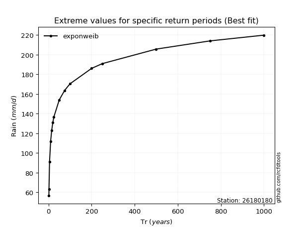</img>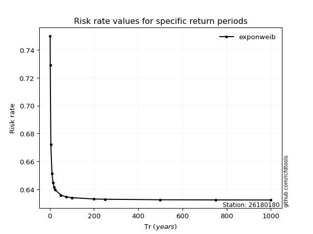</img>

</div>


<sub>**APP DISCLAIMER**: NO WARRANTY - This software is provided by [github.com/rcfdtools](https://github.com/rcfdtools) "as is", without any express or implied warranty, including warranties of merchantability, fitness for a particular purpose, or non-infringement. There is no guarantee that the software will be error-free or operate without interruption. LIMITATION OF LIABILITY - Neither the authors nor copyright holders will be liable for claims or damages arising from the software or its use. You are responsible for determining if the software is appropriate for your use and assume all associated risks, including errors, legal compliance, and data loss. NO PROFESSIONAL ADVICE - The software provides general information and does not offer professional advice. It should not replace consultation with professional advisors.</sub>