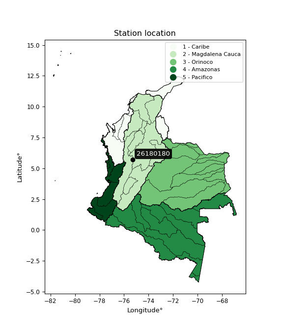

<div align="center">


</div>

# PMP Station (Rain, Pmax24h): 26180180

Probable Maximum Precipitation (PMP) is the greatest amount of rainfall for a specific duration that is meteorologically possible for a given location, acting as a "worst-case" scenario for extreme storms, crucial for designing safety-critical infrastructure like bridges, river deviations, dams, spillways, and nuclear plants to prevent catastrophic failure. PMP is calculated by hydrologists using meteorological data to determine the upper limit of extreme rainfall, often leading to the Probable Maximum Flood (PMF) for flood control design, and is increasingly being studied for climate change impacts. Probable Maximum Precipitation (PMP) is the theoretical upper limit of rainfall, a deterministic estimate for extreme events, while probability distributions (like GEV, Gumbel) describe the likelihood and frequency of various precipitation amounts, including rare ones, showing how often events occur, with PMP representing the extreme end of these distributions, used for critical infrastructure design to ensure safety against the worst conceivable weather, unlike standard statistical forecasts which cover typical probabilities.

The most common probability distributions in hydrology, used for analyzing floods, rainfall, and streamflow, include the Normal, Log-Normal, Gumbel, Gamma (including Log-Pearson Type III), and Generalized Extreme Value (GEV) distributions, often chosen based on the data´s skewness and whether modeling extremes or general conditions, with Gumbel and GEV popular for extreme events like floods, while the Normal distribution serves as a baseline, though often requiring transformations for skewed hydrological data. These distributions help in designing water infrastructure, managing water resources, and forecasting hydrologic events.

> Hydrological data often isn´t perfectly normal (it´s skewed), so different distributions are needed for different applications, such as: **Flood Frequency Analysis**: Using Gumbel, GEV, or Log-Pearson Type III for predicting extreme flood magnitudes and their return periods, **Rainfall Analysis**: Normal for annual totals, but Log-Normal, Weibull, or GEV for intensity or extreme daily rainfall, **Streamflow Modeling**: Gamma and Log-Normal for maximum flows, GEV for minimum flows, and Kappa for daily flows.

<div align="center">

</img>

</div>


## A. General information


### 1. General running parameters

• app_version: _v20260108_. • runtime: _2026-01-09 11:32:22.148588_. • Python version: _3.14.0_. • SciPy version: _1.16.3_. • Pandas version: _2.3.3_. • NumPy version: _2.3.5_. • Stations dataset (station_dataset_file): _dataset/pmax24h_in/automatic_colombia_2003_2024.csv_. • Stations catalog (station_catalog_file): _dataset/CNE.xls_. • Minimum year to eval til year_max (date_min): _1900_. • Maximum year to eval since year_min (date_max): _2024_. • Creates, save and include plots into reports (create_plot): _False_. • Plot only fit distributions with Δo > Δ (plot_only_fit): _True_. • Plot only simple graphs avoiding multiple CDFs and multiple Extreme values plots (plot_only_simple): _True_. • Eval low extreme values, if False, evaluates high extreme values (low_extreme): _False_. • Eval every SciPy distribution as logarithmic (pdist_logarithmic_on): _True_. • Standard deviation normalized (ddof): _1.0_. • Return periods to eval in years (Tr): _[2, 2.33, 5, 10, 15, 20, 25, 50, 75, 100, 200, 250, 500, 750, 1000]_. • Minimum data sample per station, 0 means any (minimum_sample): _5_. • Z-Score maximum threshold to adjust a value, 0 means disable (zscore_max): _3.5_. • Z-Score minimum threshold to adjust a value, 0 means disable (zscore_min): _-2.5_. • Avoid zeros, e.g. rain = 0 (avoid_zeros): _True_. • Avoid null values (avoid_nans): _True_. 

:file_folder:Table: [dataset.csv](../../dataset/pmax24h_in/automatic_colombia_2003_2024.csv)

> Delta Degrees of Freedom (DDOF): is a parameter used in the formulas for calculating variance and standard deviation. When ddof=0, the divisor is $N$ (the total number of observations) and this is used when your data set is the entire population. When ddof=1, the divisor is $N-1$ and this is used when your data set is a sample drawn from a larger population. Using $N-1$ provides an unbiased estimate of the population variance (known as Bessel´s correction).


### 2. Station info and location

|   id |   CODIGO | NOMBRE            | CATEGORIA               | TECNOLOGIA                              | ESTADO           | FECHA_INSTALACION   |   FECHA_SUSPENSION |   ALTITUD |   LATITUD |   LONGITUD | DEPARTAMENTO   | MUNICIPIO   | AREA_OPERATIVA                      | ENTIDAD                                                     | AREA_HIDROGRAFICA   | ZONA_HIDROGRAFICA   | SUBZONA_HIDROGRAFICA   |   CORRIENTE | Catalogo   |   Version |
|-----:|---------:|:------------------|:------------------------|:----------------------------------------|:-----------------|:--------------------|-------------------:|----------:|----------:|-----------:|:---------------|:------------|:------------------------------------|:------------------------------------------------------------|:--------------------|:--------------------|:-----------------------|------------:|:-----------|----------:|
|    0 | 26180180 | SONSON [26180180] | Climatológica Ordinaria | Automática con Telemetría, Convencional | En Mantenimiento | 15/06/1970          |                nan |      2383 |   5.71525 |   -75.2945 | Antioquia      | Sonsón      | Area Operativa 01 - Antioquia-Chocó | INSTITUTO DE HIDROLOGIA METEOROLOGIA Y ESTUDIOS AMBIENTALES | Magdalena Cauca     | Cauca               | Río Arma               |         nan | CNE_IDEAM  |  20251226 |

<div align="center">

Dynamic map: [:earth_americas:Google](http://maps.google.com/maps?q=5.71525,-75.2945) [:earth_americas:OSM](https://www.openstreetmap.org/#map=18/5.71525/-75.2945&layers=P) [:earth_americas:Bing](https://www.bing.com/maps?cp=5.71525~-75.2945&lvl=18) [:earth_americas:Apple](https://maps.apple.com/frame?center=5.71525%2C-75.2945&span=0.003%2C0.006)

</div>


<div align="center">

```geojson
{
  "type": "Feature",
  "geometry": {
    "type": "Point", 
    "coordinates": [-75.2945, 5.71525]
  }, 
  "properties": {
    "Name": "26180180"
  }
}
```

</div>


### 3. Discrete values table and plot

<div align="center">

|               |           0 |           1 |           2 |           3 |          4 |           5 |          6 |
|:--------------|------------:|------------:|------------:|------------:|-----------:|------------:|-----------:|
| Date          | 2017        | 2018        | 2019        | 2020        | 2021       | 2022        | 2024       |
| Value         |   65.8      |   40.2      |   75.6      |   35        |    1       |   44.6      |  108       |
| Value_initial |   65.8      |   40.2      |   75.6      |   35        |    1       |   44.6      |  108       |
| count         |    7        |    7        |    7        |    7        |    7       |    7        |    7       |
| mean          |   52.8857   |   52.8857   |   52.8857   |   52.8857   |   52.8857  |   52.8857   |   52.8857  |
| std           |   34.0634   |   34.0634   |   34.0634   |   34.0634   |   34.0634  |   34.0634   |   34.0634  |
| zscore        |    0.379125 |   -0.372414 |    0.666823 |   -0.525071 |   -1.52321 |   -0.243244 |    1.61799 |


</div>


> The initial value (value_initial) correspond to the initial obtained or null completed value, and value (value) is adjusted only when the initial value is outside the valid range (outlier) definite through the Z-Score value. If Z-Score is active, values out of range or outliers are replaced with the station mean value. A Z-Score (or standard score) measures how many standard deviations a data point is from the mean of a dataset, indicating its relative position; positive scores mean above the mean, negative mean below, and a score of zero is exactly at the mean, allowing for comparison of values from different distributions. It´s calculated using the formula $z=(x–μ)/σ$, where $x$ is the data point, $μ$ is the mean, and $σ$ is the standard deviation, helping identify outliers and understand probability.
>
> <sub>**Note**: In this study, "completing" (filling gaps in) and "extending" (forecasting or lengthening the historical record) rainfall data series are avoided for certain critical analyses because they introduce artificial bias and uncertainty, which can distort the statistics of rare events (extremes), alter day-to-day variability, and compromise the integrity and homogeneity of the original data. Some reasons against Completing/Extending rainfall data are: **Distortion of Extremes and Variability**: The primary issue is that most gap-filling or extension methods rely on averaging or regression with nearby stations, which inherently smooths the data. Rainfall is highly variable in space and time, with a large percentage of zero values and occasional large storms. Infilling methods often underestimate the highest values and overestimate the lowest (zero) values, which severely distorts analyses focused on flood frequency, drought severity, and intensity-duration-frequency (IDF) curves, **Loss of Data Homogeneity**: Infilled or extended data are synthetic estimates, not actual measurements. Combining these estimates with observed data can violate the assumption of data homogeneity, which requires that the data properties do not change over time. Inhomogeneity can lead to incorrect conclusions about long-term trends or changes in climate patterns, **Propagation of Errors**: Errors and biases from the original data (e.g., wind-induced undercatch, instrument errors, site changes) or the data used for imputation can propagate through the analysis, leading to unreliable hydrological models and inaccurate predictions, **Compromised Statistical Integrity**: For statistical analyses, especially those involving the frequency of events, using artificial data can introduce time bias or autocorrelation that doesn´t exist in reality, making it difficult to assess the true probability of events, **Difficulty in Validation**: It is difficult to accurately validate the quality of filled or extended data, especially for past periods where ground-truth measurements are unavailable. The reliability of imputation techniques heavily depends on the density of the surrounding station network and the complexity of the local topography.</sub>


### 4. Active continuous probability distributions from SciPy (45 of 104 available)

A Probability Density Function (PDF) describes the relative likelihood of a continuous random variable falling within a specific range, where the total area under its curve equals 1, and the area over any interval gives the actual probability for that range. Unlike discrete probabilities (like rolling a die), a PDF shows density, not direct probability for a single point (which is zero), with higher points indicating higher likelihood, often visualized as a bell curve for normal distributions.

A log of a probability density function (log-PDF) is simply the logarithm of the PDF´s value, denoted as $log(f(x))$, useful for converting multiplication of probabilities into addition, improving numerical stability with tiny numbers, and connecting to information theory concepts like entropy. Instead of dealing with very small probabilities (e.g., 0.000001), log-PDFs use negative numbers (e.g., $log(0.00001) ≈ -11.51$ that are easier for computers to handle, preventing underflow errors and simplifying complex calculations. In this study, each active probability distribution from SciPy is also evaluated in the $log$ form.

[scipy.stats](https://docs.scipy.org/doc/scipy/reference/stats.html) is a Python´s powerful submodule within the SciPy library for comprehensive statistical analysis, offering over 130 probability distributions (like Normal, Poisson), functions for descriptive stats (mean, variance), hypothesis testing (t-tests, chi-square), random variable generation, and statistical tests, making it essential for data science, modeling, and research. It provides tools to explore, model, and draw conclusions from data efficiently, working seamlessly with NumPy.

<div align="center">

|   id | p_dist             |   n_parameter | fit_method   | label                                                                       | active   | ref                                                                                                        |
|-----:|:-------------------|--------------:|:-------------|:----------------------------------------------------------------------------|:---------|:-----------------------------------------------------------------------------------------------------------|
|    0 | alpha              |             3 | MLE          | Alpha                                                                       | True     | [:mortar_board:](https://docs.scipy.org/doc/scipy/reference/generated/scipy.stats.alpha.html)              |
|    1 | betaprime          |             4 | MLE          | Beta prime                                                                  | True     | [:mortar_board:](https://docs.scipy.org/doc/scipy/reference/generated/scipy.stats.betaprime.html)          |
|    2 | chi2               |             3 | MLE          | Chi²                                                                        | True     | [:mortar_board:](https://docs.scipy.org/doc/scipy/reference/generated/scipy.stats.chi2.html)               |
|    3 | crystalball        |             4 | MLE          | Crystalball                                                                 | True     | [:mortar_board:](https://docs.scipy.org/doc/scipy/reference/generated/scipy.stats.crystalball.html)        |
|    4 | dweibull           |             3 | MLE          | Double Weibull                                                              | True     | [:mortar_board:](https://docs.scipy.org/doc/scipy/reference/generated/scipy.stats.dweibull.html)           |
|    5 | erlang             |             3 | MLE          | Erlang                                                                      | True     | [:mortar_board:](https://docs.scipy.org/doc/scipy/reference/generated/scipy.stats.erlang.html)             |
|    6 | expon              |             2 | MLE          | Exponential                                                                 | True     | [:mortar_board:](https://docs.scipy.org/doc/scipy/reference/generated/scipy.stats.expon.html)              |
|    7 | exponnorm          |             3 | MLE          | Exponentially modified Normal                                               | True     | [:mortar_board:](https://docs.scipy.org/doc/scipy/reference/generated/scipy.stats.exponnorm.html)          |
|    8 | f                  |             4 | MLE          | F                                                                           | True     | [:mortar_board:](https://docs.scipy.org/doc/scipy/reference/generated/scipy.stats.f.html)                  |
|    9 | fatiguelife        |             3 | MLE          | Fatigue-life (Birnbaum-Saunders)                                            | True     | [:mortar_board:](https://docs.scipy.org/doc/scipy/reference/generated/scipy.stats.fatiguelife.html)        |
|   10 | fisk               |             3 | MLE          | Fisk                                                                        | True     | [:mortar_board:](https://docs.scipy.org/doc/scipy/reference/generated/scipy.stats.fisk.html)               |
|   11 | gamma              |             3 | MLE          | Gamma                                                                       | True     | [:mortar_board:](https://docs.scipy.org/doc/scipy/reference/generated/scipy.stats.gamma.html)              |
|   12 | genexpon           |             5 | MLE          | Generalized exponential                                                     | True     | [:mortar_board:](https://docs.scipy.org/doc/scipy/reference/generated/scipy.stats.genexpon.html)           |
|   13 | genlogistic        |             3 | MLE          | Generalized logistic                                                        | True     | [:mortar_board:](https://docs.scipy.org/doc/scipy/reference/generated/scipy.stats.genlogistic.html)        |
|   14 | gibrat             |             2 | MM           | Gibrat                                                                      | True     | [:mortar_board:](https://docs.scipy.org/doc/scipy/reference/generated/scipy.stats.gibrat.html)             |
|   15 | gompertz           |             3 | MLE          | Gompertz (or truncated Gumbel)                                              | True     | [:mortar_board:](https://docs.scipy.org/doc/scipy/reference/generated/scipy.stats.gompertz.html)           |
|   16 | gumbel_l           |             2 | MM           | Gumbel Left Skew                                                            | True     | [:mortar_board:](https://docs.scipy.org/doc/scipy/reference/generated/scipy.stats.gumbel_l.html)           |
|   17 | gumbel_r           |             2 | MM           | Gumbel Right Skew                                                           | True     | [:mortar_board:](https://docs.scipy.org/doc/scipy/reference/generated/scipy.stats.gumbel_r.html)           |
|   18 | halflogistic       |             2 | MM           | Half-logistic                                                               | True     | [:mortar_board:](https://docs.scipy.org/doc/scipy/reference/generated/scipy.stats.halflogistic.html)       |
|   19 | halfnorm           |             2 | MM           | Half Normal                                                                 | True     | [:mortar_board:](https://docs.scipy.org/doc/scipy/reference/generated/scipy.stats.halfnorm.html)           |
|   20 | hypsecant          |             2 | MM           | hyperbolic secant                                                           | True     | [:mortar_board:](https://docs.scipy.org/doc/scipy/reference/generated/scipy.stats.hypsecant.html)          |
|   21 | invgamma           |             3 | MLE          | Inverted gamma                                                              | True     | [:mortar_board:](https://docs.scipy.org/doc/scipy/reference/generated/scipy.stats.invgamma.html)           |
|   22 | invgauss           |             3 | MLE          | Inverse Gaussian                                                            | True     | [:mortar_board:](https://docs.scipy.org/doc/scipy/reference/generated/scipy.stats.invgauss.html)           |
|   23 | invweibull         |             3 | MLE          | Inverted Weibull                                                            | True     | [:mortar_board:](https://docs.scipy.org/doc/scipy/reference/generated/scipy.stats.invweibull.html)         |
|   24 | kappa4             |             4 | MLE          | Kappa 4                                                                     | True     | [:mortar_board:](https://docs.scipy.org/doc/scipy/reference/generated/scipy.stats.kappa4.html)             |
|   25 | kstwobign          |             2 | MLE          | Limiting distribution of scaled Kolmogorov-Smirnov two-sided test statistic | True     | [:mortar_board:](https://docs.scipy.org/doc/scipy/reference/generated/scipy.stats.kstwobign.html)          |
|   26 | laplace            |             2 | MM           | Laplace                                                                     | True     | [:mortar_board:](https://docs.scipy.org/doc/scipy/reference/generated/scipy.stats.laplace.html)            |
|   27 | laplace_asymmetric |             3 | MLE          | Asymmetric Laplace                                                          | True     | [:mortar_board:](https://docs.scipy.org/doc/scipy/reference/generated/scipy.stats.laplace_asymmetric.html) |
|   28 | loggamma           |             3 | MLE          | Log gamma                                                                   | True     | [:mortar_board:](https://docs.scipy.org/doc/scipy/reference/generated/scipy.stats.loggamma.html)           |
|   29 | logistic           |             2 | MM           | Logistic (or Sech-squared)                                                  | True     | [:mortar_board:](https://docs.scipy.org/doc/scipy/reference/generated/scipy.stats.logistic.html)           |
|   30 | lognorm            |             3 | MLE          | Log Normal                                                                  | True     | [:mortar_board:](https://docs.scipy.org/doc/scipy/reference/generated/scipy.stats.lognorm.html)            |
|   31 | maxwell            |             2 | MM           | Maxwell                                                                     | True     | [:mortar_board:](https://docs.scipy.org/doc/scipy/reference/generated/scipy.stats.maxwell.html)            |
|   32 | mielke             |             4 | MLE          | Mielke Beta-Kappa / Dagum                                                   | True     | [:mortar_board:](https://docs.scipy.org/doc/scipy/reference/generated/scipy.stats.mielke.html)             |
|   33 | moyal              |             2 | MM           | Moyal                                                                       | True     | [:mortar_board:](https://docs.scipy.org/doc/scipy/reference/generated/scipy.stats.moyal.html)              |
|   34 | nakagami           |             3 | MLE          | Nakagami                                                                    | True     | [:mortar_board:](https://docs.scipy.org/doc/scipy/reference/generated/scipy.stats.nakagami.html)           |
|   35 | ncf                |             5 | MLE          | Non-central F distribution                                                  | True     | [:mortar_board:](https://docs.scipy.org/doc/scipy/reference/generated/scipy.stats.ncf.html)                |
|   36 | nct                |             4 | MLE          | Non-central Student’s t                                                     | True     | [:mortar_board:](https://docs.scipy.org/doc/scipy/reference/generated/scipy.stats.nct.html)                |
|   37 | norm               |             2 | MM           | Normal                                                                      | True     | [:mortar_board:](https://docs.scipy.org/doc/scipy/reference/generated/scipy.stats.norm.html)               |
|   38 | pearson3           |             3 | MM           | Pearson type III                                                            | True     | [:mortar_board:](https://docs.scipy.org/doc/scipy/reference/generated/scipy.stats.pearson3.html)           |
|   39 | rayleigh           |             2 | MM           | Rayleigh                                                                    | True     | [:mortar_board:](https://docs.scipy.org/doc/scipy/reference/generated/scipy.stats.rayleigh.html)           |
|   40 | rice               |             3 | MLE          | Rice                                                                        | True     | [:mortar_board:](https://docs.scipy.org/doc/scipy/reference/generated/scipy.stats.rice.html)               |
|   41 | t                  |             3 | MLE          | Student’s t                                                                 | True     | [:mortar_board:](https://docs.scipy.org/doc/scipy/reference/generated/scipy.stats.t.html)                  |
|   42 | truncnorm          |             4 | MLE          | Truncated normal                                                            | True     | [:mortar_board:](https://docs.scipy.org/doc/scipy/reference/generated/scipy.stats.truncnorm.html)          |
|   43 | wald               |             2 | MM           | Wald                                                                        | True     | [:mortar_board:](https://docs.scipy.org/doc/scipy/reference/generated/scipy.stats.wald.html)               |
|   44 | weibull_min        |             3 | MLE          | Weibull minimum                                                             | True     | [:mortar_board:](https://docs.scipy.org/doc/scipy/reference/generated/scipy.stats.weibull_min.html)        |

</div>

> **n_parameter:** # arguments & localization & scale.
>
> **Fit methods:** (MLE) maximum likelihood, (MM) L-moments.
>
>**Inactive** (With the only purpose of prevent loops, zero divisions, infinite values, over high estimated values or horizontal trending for recurrence intervals estimations, the follow distributions were disabled.)**:** foldnorm, gennorm, norminvgauss, powernorm, powerlognorm, skewnorm, genextreme, anglit, arcsine, argus, beta, bradford, burr, burr12, cauchy, cosine, halfcauchy, foldcauchy, skewcauchy, wrapcauchy, dgamma, gengamma, exponweib, exponpow, truncexpon, gausshyper, genhalflogistic, genhyperbolic, geninvgauss, halfgennorm, johnsonsb, johnsonsu, kappa3, ksone, kstwo, loglaplace, levy, levy_l, levy_stable, ncx2, pareto, genpareto, truncpareto, lomax, powerlaw, rdist, rel_breitwigner, recipinvgauss, semicircular, studentized_range, trapezoid, triang, truncweibull_min, tukeylambda, uniform, loguniform, vonmises, vonmises_line, weibull_max, 


## B. Probability (PDF) vs. Empirical (EDF) distributions functions

A continuous probability distribution (CPD) describes probabilities for variables that can take any value within a range (like rain any time), unlike discrete variables with specific outcomes (like temperature). It uses a Probability Density Function (PDF), a curve where the total area under it equals 1, and the probability of the variable falling within an interval (a to b) is found by calculating the area under the curve between those points. A key feature is that the probability of hitting any single exact value is zero, so probabilities are always expressed for ranges, e.g., $P(a ≤ X ≤ b)$.

<div align="center">

Distributions parameters from station values
|    |   station | p_dist                |   n |              loc |           scale | shape                  | shape1                 | shape2               | shape3   |
|---:|----------:|:----------------------|----:|-----------------:|----------------:|:-----------------------|:-----------------------|:---------------------|:---------|
|  0 |  26180180 | alpha                 |   7 |  -236.809        |  2625.81        | 9.200824076066624      |                        |                      |          |
|  1 |  26180180 | betaprime             |   7 |  -195.614        | 23292.6         | 62.48243864363657      | 5857.65883514332       |                      |          |
|  2 |  26180180 | chi2                  |   7 |  -143.69         |     2.56763     | 76.58100890251283      |                        |                      |          |
|  3 |  26180180 | crystalball           |   7 |    52.8857       |    31.5367      | 30744.17593039482      | 216.44414383893752     |                      |          |
|  4 |  26180180 | dweibull              |   7 |    55.3513       |    29.6161      | 1.6128840386107868     |                        |                      |          |
|  5 |  26180180 | erlang                |   7 |  -206.287        |     3.83954     | 67.49261807367338      |                        |                      |          |
|  6 |  26180180 | expon                 |   7 |     1            |    51.8857      |                        |                        |                      |          |
|  7 |  26180180 | exponnorm             |   7 |    45.4536       |    30.6518      | 0.24246972795342978    |                        |                      |          |
|  8 |  26180180 | f                     |   7 |  -192.064        |   244.941       | 120.37987147725929     | 53290.57702306516      |                      |          |
|  9 |  26180180 | fatiguelife           |   7 |     1            |     0.00246845  | 135.11637667571372     |                        |                      |          |
| 10 |  26180180 | fisk                  |   7 |  -258.511        |   309.87        | 17.101468992020685     |                        |                      |          |
| 11 |  26180180 | gamma                 |   7 |  -201.762        |     3.91535     | 65.03594788366564      |                        |                      |          |
| 12 |  26180180 | genexpon              |   7 |     0.999972     |     2.84252     | 0.054799030852039535   | 1.0808353472899055e-07 | 2.9617764503601447   |          |
| 13 |  26180180 | genlogistic           |   7 |    36.4913       |    21.1129      | 1.7026646967537151     |                        |                      |          |
| 14 |  26180180 | gibrat                |   7 |    28.8272       |    14.5922      |                        |                        |                      |          |
| 15 |  26180180 | gompertz              |   7 |    35            |     7.80576     | 0.0005056627107757332  |                        |                      |          |
| 16 |  26180180 | gumbel_l              |   7 |    67.0789       |    24.589       |                        |                        |                      |          |
| 17 |  26180180 | gumbel_r              |   7 |    38.6926       |    24.589       |                        |                        |                      |          |
| 18 |  26180180 | halflogistic          |   7 |    15.5075       |    26.9627      |                        |                        |                      |          |
| 19 |  26180180 | halfnorm              |   7 |    11.1436       |    52.316       |                        |                        |                      |          |
| 20 |  26180180 | hypsecant             |   7 |    52.8857       |    20.0768      |                        |                        |                      |          |
| 21 |  26180180 | invgamma              |   7 |  -247.456        | 27207.3         | 91.59533066656115      |                        |                      |          |
| 22 |  26180180 | invgauss              |   7 |  -136.368        |  6581.45        | 0.02871160193542345    |                        |                      |          |
| 23 |  26180180 | invweibull            |   7 |     1            |     3.09706     | 0.04869732983959829    |                        |                      |          |
| 24 |  26180180 | kappa4                |   7 |    -9.58702      |   119.931       | 1.0968461593079148     | 1.004863095872865      |                      |          |
| 25 |  26180180 | kstwobign             |   7 |   -65.9939       |   136.256       |                        |                        |                      |          |
| 26 |  26180180 | laplace               |   7 |    52.8857       |    22.2998      |                        |                        |                      |          |
| 27 |  26180180 | laplace_asymmetric    |   7 |    40.2          |    22.8063      | 0.7598364054068476     |                        |                      |          |
| 28 |  26180180 | loggamma              |   7 | -7611.66         |  1085.41        | 1166.6171710766798     |                        |                      |          |
| 29 |  26180180 | logistic              |   7 |    52.8857       |    17.387       |                        |                        |                      |          |
| 30 |  26180180 | lognorm               |   7 |     1            |     0.182233    | 14.024627730732217     |                        |                      |          |
| 31 |  26180180 | maxwell               |   7 |   -21.8428       |    46.8292      |                        |                        |                      |          |
| 32 |  26180180 | mielke                |   7 |     0.999989     |   110.179       | 0.5062367293420283     | 36.55080437363242      |                      |          |
| 33 |  26180180 | moyal                 |   7 |    34.8511       |    14.1965      |                        |                        |                      |          |
| 34 |  26180180 | nakagami              |   7 |     1            |    37.3055      | 0.18951628897276857    |                        |                      |          |
| 35 |  26180180 | ncf                   |   7 |    -0.183694     |    10.8555      | 1.1836864715112996     | 21.267462190983643     | 4.650840005413203    |          |
| 36 |  26180180 | nct                   |   7 |  -991.154        |    31.511       | 339043.571445054       | 33.132412953571276     |                      |          |
| 37 |  26180180 | norm                  |   7 |    52.8857       |    31.5366      |                        |                        |                      |          |
| 38 |  26180180 | pearson3              |   7 |    52.8857       |    31.5367      | 0.15153765332371874    |                        |                      |          |
| 39 |  26180180 | rayleigh              |   7 |    -7.44568      |    48.1375      |                        |                        |                      |          |
| 40 |  26180180 | rice                  |   7 |   -14.6217       |    36.4224      | 1.4781781165673658     |                        |                      |          |
| 41 |  26180180 | t                     |   7 |    52.884        |    31.5373      | 2531546.7669394277     |                        |                      |          |
| 42 |  26180180 | truncnorm             |   7 |    10.5304       |     9.45369     | -1.4516664156750736    | 10.310212965073907     |                      |          |
| 43 |  26180180 | wald                  |   7 |    21.3491       |    31.5366      |                        |                        |                      |          |
| 44 |  26180180 | weibull_min           |   7 |   -20.8091       |    83.0469      | 2.5200823304198527     |                        |                      |          |
| 45 |  26180180 | logalpha              |   7 |   -39.4665       |  1178.54        | 27.47662050562014      |                        |                      |          |
| 46 |  26180180 | logbetaprime          |   7 |  -618.101        |   711.993       | 339613.515592503       | 389024.4501956648      |                      |          |
| 47 |  26180180 | logchi2               |   7 |    -4.80766e-29  |     1.79902     | 1.7995336748332895     |                        |                      |          |
| 48 |  26180180 | logcrystalball        |   7 |     3.46302      |     1.45994     | 86.07113916613926      | 1689.3735573969147     |                      |          |
| 49 |  26180180 | logdweibull           |   7 |     3.79773      |     1.05416     | 0.767516660222187      |                        |                      |          |
| 50 |  26180180 | logerlang             |   7 |   -22.5795       |     0.0902159   | 288.32899771495204     |                        |                      |          |
| 51 |  26180180 | logexpon              |   7 |     0            |     3.46302     |                        |                        |                      |          |
| 52 |  26180180 | logexponnorm          |   7 |     3.46208      |     1.45994     | 0.0006484644863200587  |                        |                      |          |
| 53 |  26180180 | logf                  |   7 |    -6.94752e-32  |     1.21935     | 1.4452648797356606     | 1.3394834419602144     |                      |          |
| 54 |  26180180 | logfatiguelife        |   7 |  -981.152        |   984.611       | 0.0014820881482388217  |                        |                      |          |
| 55 |  26180180 | logfisk               |   7 |    -1.91815e+08  |     1.91815e+08 | 288702392.64849985     |                        |                      |          |
| 56 |  26180180 | loggamma              |   7 |   -23.9322       |     0.0882648   | 309.92685748418467     |                        |                      |          |
| 57 |  26180180 | loggenexpon           |   7 |    -0.403155     |     0.0157946   | 0.00045516818877032515 | 0.28003973657137465    | 9.35380097134978e-05 |          |
| 58 |  26180180 | loggenlogistic        |   7 |     4.68218      |     4.18942e-06 | 3.4322873406060906e-06 |                        |                      |          |
| 59 |  26180180 | loggibrat             |   7 |     2.34928      |     0.675524    |                        |                        |                      |          |
| 60 |  26180180 | loggompertz           |   7 |    -0.51297      |     0.790003    | 0.003233276307381217   |                        |                      |          |
| 61 |  26180180 | loggumbel_l           |   7 |     4.12007      |     1.13831     |                        |                        |                      |          |
| 62 |  26180180 | loggumbel_r           |   7 |     2.80597      |     1.13831     |                        |                        |                      |          |
| 63 |  26180180 | loghalflogistic       |   7 |     1.73259      |     1.24823     |                        |                        |                      |          |
| 64 |  26180180 | loghalfnorm           |   7 |     1.53062      |     2.4219      |                        |                        |                      |          |
| 65 |  26180180 | loghypsecant          |   7 |     3.46302      |     0.929427    |                        |                        |                      |          |
| 66 |  26180180 | loginvgamma           |   7 |   -37.3515       | 29355.8         | 720.901772848239       |                        |                      |          |
| 67 |  26180180 | loginvgauss           |   7 |   -14.9305       |  2240.74        | 0.008200049523893284   |                        |                      |          |
| 68 |  26180180 | loginvweibull         |   7 |    -3.76362e+08  |     3.76362e+08 | 203385156.08122975     |                        |                      |          |
| 69 |  26180180 | logkappa4             |   7 |    -0.395391     |     5.68093     | 1.0751341658594584     | 1.113833237989097      |                      |          |
| 70 |  26180180 | logkstwobign          |   7 |    -4.04943      |     8.59671     |                        |                        |                      |          |
| 71 |  26180180 | loglaplace            |   7 |     3.46302      |     1.03233     |                        |                        |                      |          |
| 72 |  26180180 | loglaplace_asymmetric |   7 |     4.32546      |     0.54874     | 2.0570614530295472     |                        |                      |          |
| 73 |  26180180 | logloggamma           |   7 |     4.68228      |     1.54251e-05 | 1.2708544127176955e-05 |                        |                      |          |
| 74 |  26180180 | loglogistic           |   7 |     3.46302      |     0.804907    |                        |                        |                      |          |
| 75 |  26180180 | loglognorm            |   7 |    -4.94066e-324 |     2.14501e-46 | 260.9867394617686      |                        |                      |          |
| 76 |  26180180 | logmaxwell            |   7 |     0.00360052   |     2.16787     |                        |                        |                      |          |
| 77 |  26180180 | logmielke             |   7 |    -1.34018e+08  |     1.34018e+08 | 2036904817.8507414     | 76839569.02543032      |                      |          |
| 78 |  26180180 | logmoyal              |   7 |     2.62813      |     0.657204    |                        |                        |                      |          |
| 79 |  26180180 | lognakagami           |   7 |    -1.02812e-31  |     3.76685     | 0.1596836446477498     |                        |                      |          |
| 80 |  26180180 | logncf                |   7 |    -5.91692e-31  |     1.17445     | 1.135478069706751      | 1.5611026540185782     | 1.0387407340582133   |          |
| 81 |  26180180 | lognct                |   7 |  -106.776        |     1.44671     | 142273.99111301935     | 76.19956960096846      |                      |          |
| 82 |  26180180 | lognorm               |   7 |     3.46302      |     1.45994     |                        |                        |                      |          |
| 83 |  26180180 | logpearson3           |   7 |     3.46302      |     1.45994     | -1.7743170467840468    |                        |                      |          |
| 84 |  26180180 | lograyleigh           |   7 |     0.67006      |     2.22846     |                        |                        |                      |          |
| 85 |  26180180 | logrice               |   7 |  -573.943        |     1.46009     | 395.4587738012424      |                        |                      |          |
| 86 |  26180180 | logt                  |   7 |     3.95434      |     0.407619    | 1.2828134421565895     |                        |                      |          |
| 87 |  26180180 | logtruncnorm          |   7 |     1.18264      |     3.37932     | -0.3529873521332435    | 34.049865843619116     |                      |          |
| 88 |  26180180 | logwald               |   7 |     2.00312      |     1.45991     |                        |                        |                      |          |
| 89 |  26180180 | logweibull_min        |   7 |    -1.52372e-27  |     1.56652     | 0.7254180374294761     |                        |                      |          |

</div>

> **loc** (Location parameter): This shifts the distribution along the x-axis. For many common distributions, like the normal (Gaussian) distribution, loc represents the mean $μ$. For others, like the uniform distribution, it might represent the minimum value, or for the beta distribution, the left end of the support interval.
>
> **scale** (Scale parameter): This determines the width or spread of the distribution. For the normal distribution, scale represents the standard deviation $σ$. For a uniform distribution, it defines the length of the interval (from $loc$ to $loc + scale$).
>
> **shape** (Shape parameters): Refers to parameters that define the specific form of a probability distribution, distinct from its location (loc) and scale (scale). These parameters are required arguments for most distribution functions. For example, a normal (Gaussian) distribution is fully defined by its location (mean) and scale (standard deviation), so it has no specific shape parameters beyond loc and scale. However, other distributions have intrinsic properties that need specification, as Gamma distribution that takes a shape parameter, often named $a$ or $alpha$.


### 0. Cumulative distribution values - CDF (90 evaluated)

Cumulative Distribution Function (CDF), denoted as $F$<sub>$X$</sub>$(x)$, is a function that gives the probability that a random variable $X$ will take a value less than or equal to a specific value, $x$ (i.e., $(P(X≥x)$. It essentially "accumulates" probabilities from a given point up to the far right (positive infinity), providing a complete picture of the distribution´s probabilities for both discrete (like rain) and continuous (like temperature) variables, helping to find probabilities over ranges or above certain values. Each station is evaluated separately ordering the $x$ values ascending, calculating the CDF and PDF values for the activated distributions and their logarithmic forms.

<div align="center">

CDF ordered by x ascending and calculating $log(f(x))$ separately
|   id |   Station |   date |     x |   count |    mean |     std |    zscore |   Value_initial |   station |   m |     alpha |   alpha_pdf |   betaprime |   betaprime_pdf |      chi2 |   chi2_pdf |   crystalball |   crystalball_pdf |   dweibull |   dweibull_pdf |    erlang |   erlang_pdf |    expon |   expon_pdf |   exponnorm |   exponnorm_pdf |         f |      f_pdf |   fatiguelife |   fatiguelife_pdf |      fisk |   fisk_pdf |     gamma |   gamma_pdf |    genexpon |   genexpon_pdf |   genlogistic |   genlogistic_pdf |   gibrat |   gibrat_pdf |    gompertz |   gompertz_pdf |   gumbel_l |   gumbel_l_pdf |   gumbel_r |   gumbel_r_pdf |   halflogistic |   halflogistic_pdf |   halfnorm |   halfnorm_pdf |   hypsecant |   hypsecant_pdf |   invgamma |   invgamma_pdf |   invgauss |   invgauss_pdf |   invweibull |   invweibull_pdf |      kappa4 |   kappa4_pdf |   kstwobign |   kstwobign_pdf |   laplace |   laplace_pdf |   laplace_asymmetric |   laplace_asymmetric_pdf |   loggamma |   loggamma_pdf |   logistic |   logistic_pdf |    lognorm |   lognorm_pdf |   maxwell |   maxwell_pdf |      mielke |   mielke_pdf |       moyal |   moyal_pdf |    nakagami |   nakagami_pdf |       ncf |    ncf_pdf |       nct |    nct_pdf |      norm |   norm_pdf |   pearson3 |   pearson3_pdf |   rayleigh |   rayleigh_pdf |      rice |   rice_pdf |         t |      t_pdf |   truncnorm |   truncnorm_pdf |     wald |   wald_pdf |   weibull_min |   weibull_min_pdf |   logalpha |   logalpha_pdf |   logbetaprime |   logbetaprime_pdf |     logchi2 |   logchi2_pdf |   logcrystalball |   logcrystalball_pdf |   logdweibull |   logdweibull_pdf |   logerlang |   logerlang_pdf |   logexpon |   logexpon_pdf |   logexponnorm |   logexponnorm_pdf |        logf |    logf_pdf |   logfatiguelife |   logfatiguelife_pdf |    logfisk |   logfisk_pdf |   loggenexpon |   loggenexpon_pdf |   loggenlogistic |   loggenlogistic_pdf |   loggibrat |   loggibrat_pdf |   loggompertz |   loggompertz_pdf |   loggumbel_l |   loggumbel_l_pdf |   loggumbel_r |   loggumbel_r_pdf |   loghalflogistic |   loghalflogistic_pdf |   loghalfnorm |   loghalfnorm_pdf |   loghypsecant |   loghypsecant_pdf |   loginvgamma |   loginvgamma_pdf |   loginvgauss |   loginvgauss_pdf |   loginvweibull |   loginvweibull_pdf |   logkappa4 |   logkappa4_pdf |   logkstwobign |   logkstwobign_pdf |   loglaplace |   loglaplace_pdf |   loglaplace_asymmetric |   loglaplace_asymmetric_pdf |   logloggamma |   logloggamma_pdf |   loglogistic |   loglogistic_pdf |   loglognorm |   loglognorm_pdf |   logmaxwell |   logmaxwell_pdf |   logmielke |   logmielke_pdf |    logmoyal |   logmoyal_pdf |   lognakagami |   lognakagami_pdf |      logncf |   logncf_pdf |     lognct |   lognct_pdf |   logpearson3 |   logpearson3_pdf |   lograyleigh |   lograyleigh_pdf |    logrice |   logrice_pdf |      logt |   logt_pdf |   logtruncnorm |   logtruncnorm_pdf |   logwald |   logwald_pdf |   logweibull_min |   logweibull_min_pdf |
|-----:|----------:|-------:|------:|--------:|--------:|--------:|----------:|----------------:|----------:|----:|----------:|------------:|------------:|----------------:|----------:|-----------:|--------------:|------------------:|-----------:|---------------:|----------:|-------------:|---------:|------------:|------------:|----------------:|----------:|-----------:|--------------:|------------------:|----------:|-----------:|----------:|------------:|------------:|---------------:|--------------:|------------------:|---------:|-------------:|------------:|---------------:|-----------:|---------------:|-----------:|---------------:|---------------:|-------------------:|-----------:|---------------:|------------:|----------------:|-----------:|---------------:|-----------:|---------------:|-------------:|-----------------:|------------:|-------------:|------------:|----------------:|----------:|--------------:|---------------------:|-------------------------:|-----------:|---------------:|-----------:|---------------:|-----------:|--------------:|----------:|--------------:|------------:|-------------:|------------:|------------:|------------:|---------------:|----------:|-----------:|----------:|-----------:|----------:|-----------:|-----------:|---------------:|-----------:|---------------:|----------:|-----------:|----------:|-----------:|------------:|----------------:|---------:|-----------:|--------------:|------------------:|-----------:|---------------:|---------------:|-------------------:|------------:|--------------:|-----------------:|---------------------:|--------------:|------------------:|------------:|----------------:|-----------:|---------------:|---------------:|-------------------:|------------:|------------:|-----------------:|---------------------:|-----------:|--------------:|--------------:|------------------:|-----------------:|---------------------:|------------:|----------------:|--------------:|------------------:|--------------:|------------------:|--------------:|------------------:|------------------:|----------------------:|--------------:|------------------:|---------------:|-------------------:|--------------:|------------------:|--------------:|------------------:|----------------:|--------------------:|------------:|----------------:|---------------:|-------------------:|-------------:|-----------------:|------------------------:|----------------------------:|--------------:|------------------:|--------------:|------------------:|-------------:|-----------------:|-------------:|-----------------:|------------:|----------------:|------------:|---------------:|--------------:|------------------:|------------:|-------------:|-----------:|-------------:|--------------:|------------------:|--------------:|------------------:|-----------:|--------------:|----------:|-----------:|---------------:|-------------------:|----------:|--------------:|-----------------:|---------------------:|
|    0 |  26180180 |   2021 |   1   |       7 | 52.8857 | 34.0634 | -1.52321  |             1   |  26180180 |   1 | 0.0328227 |  0.00340309 |   0.0418117 |      0.00331251 | 0.0400065 | 0.00333403 |     0.0499592 |        0.00326821 |  0.0348872 |     0.00275643 | 0.0420735 |   0.00330627 | 0        |  0.0192731  |   0.0492255 |      0.00326487 | 0.0417606 | 0.00331354 |     0.0374507 |       1.7065e+06  | 0.0459565 | 0.0028893  | 0.0420016 |  0.00330852 | 5.31617e-07 |     0.0192783  |     0.0427262 |        0.00290486 | 0        |   0          | 0           |    0           |  0.0657976 |     0.00258586 | 0.00973913 |     0.00183447 |       0        |         0          |   0        |     0          |   0.0479387 |      0.00237874 |  0.0362464 |     0.00325283 |  0.0349365 |     0.00336969 |   0.00221577 |      2.97018e+12 | 2.84526e-15 |   0.213784   |   0.0309792 |      0.00425731 | 0.0488068 |    0.00218867 |            0.0381148 |               0.00219948 |  0.0112069 |      0.0207162 |  0.0481467 |     0.00263579 | 0.00884533 |      0.016398 | 0.0287561 |    0.00359934 | 0.000281571 |  13.3409     | 0.000986193 | 0.000407141 | 1.80207e-07 |    6.1523e+08  | 0.0229562 | 0.0127943  | 0.0499501 | 0.00326825 | 0.0499588 | 0.0032682  |  0.0451773 |      0.0032961 |  0.0152734 |     0.00358908 | 0.0309538 | 0.00397344 | 0.0499683 | 0.00326862 |   0.0899985 |     0.0273956   | 0        | 0          |     0.0338201 |        0.00384113 | 0.00853737 |      0.0175597 |     0.00872706 |          0.0162971 | 1.08888e-26 |   203.787     |       0.00884533 |             0.016398 |     0.0344765 |         0.0186338 |  0.00996527 |       0.0190703 |   0        |      0.288765  |     0.00884528 |          0.0163979 | 2.01163e-23 | 2.09236e+08 |       0.00878056 |            0.0163576 | 0.00329131 |    0.00493748 |     0.0199428 |         0.0696808 |         0        |            0.0176799 |    0        |       0         |    0.00295166 |         0.0078114 |     0.0264412 |         0.0229186 |   7.78084e-06 |       8.04109e-05 |          0        |              0        |      0        |          0        |      0.0153329 |          0.0164908 |    0.00901198 |         0.0180067 |     0.0121229 |         0.0234573 |        0.015928 |           0.0356321 | 1.44668e-15 |        2.31273  |      0.0204781 |          0.0511786 |    0.0174624 |        0.0169155 |               0.0175258 |                   0.0155262 |     0.0211175 |         0.0173984 |     0.0133554 |         0.0163709 |   0.00715294 |    inf           |     0        |         0        |   0.0136006 |       0.0309373 | 1.52195e-13 |    6.42724e-12 |   6.66572e-11 |       2.07059e+20 | 2.63551e-18 |  2.52881e+12 | 0.00887501 |    0.0164499 |     0.0329544 |         0.0240173 |      0        |          0        | 0.00885079 |     0.0164052 | 0.0185696 | 0.00596769 |     0.00177746 |           0.17406  |  0        |     0         |      2.54088e-20 |          1.20967e+07 |
|    1 |  26180180 |   2020 |  35   |       7 | 52.8857 | 34.0634 | -0.525071 |            35   |  26180180 |   2 | 0.322881  |  0.0127575  |   0.295581  |      0.0114878  | 0.298596  | 0.0116322  |     0.28531   |        0.0107708  |  0.289627  |     0.0125329  | 0.295041  |   0.0114692  | 0.480707 |  0.0100084  |   0.285951  |      0.0108427  | 0.295674  | 0.0114918  |     0.807449  |       0.00349499  | 0.283422  | 0.0118333  | 0.295154  |  0.0114703  | 0.4808      |     0.0100093  |     0.288981  |        0.0120639  | 0.194801 |   0.0446376  | 2.23356e-09 |    6.4781e-05  |  0.237597  |     0.00841128 | 0.312849   |     0.0147847  |       0.34651  |         0.0163176  |   0.351615 |     0.0137452  |   0.247871  |      0.0111357  |  0.301339  |     0.0120017  |  0.310324  |     0.0122141  |   0.410707   |      0.000523465 | 0.345143    |   0.00926388 |   0.358014  |      0.012376   | 0.224202  |    0.010054   |            0.271138  |               0.0156465  |  0.541288  |      0.254523  |  0.26334   |     0.0111573  | 0.525212   |      0.272713 | 0.311575  |    0.0120171  | 0.551448    |   0.00821069 | 0.319849    | 0.017044    | 0.746432    |    0.00728437  | 0.398383  | 0.0104074  | 0.285319  | 0.0107716  | 0.285309  | 0.0107708  |  0.291118  |      0.0111956 |  0.322096  |     0.0124175  | 0.304585  | 0.011415   | 0.285332  | 0.010771   |   0.994797  |     0.00159796  | 0.303018 | 0.0306349  |     0.307378  |        0.0114866  | 0.532953   |      0.253157  |     0.525978   |          0.272687  | 0.671383    |     0.096919  |       0.525212   |             0.272713 |     0.361767  |         0.370705  |  0.539745   |       0.258293  |   0.641799 |      0.103436  |     0.525212   |          0.272714  | 0.691       | 0.0463017   |       0.526231   |            0.272765  | 0.410479   |    0.364215   |     0.605583  |         0.173396  |         0        |            0.32546   |    0.718919 |       0.279629  |    0.425437   |         0.405377  |     0.456049  |         0.290966  |   0.595878    |       0.271013    |          0.623147 |              0.245021 |      0.596848 |          0.232283 |      0.531568  |          0.340797  |    0.54373    |         0.25987   |     0.544661  |         0.237068  |        0.545465 |           0.178664  | 0.734637    |        0.209783 |      0.585681  |          0.165823  |    0.542776  |        0.442904  |               0.40886   |                   0.36221   |     0.395164  |         0.32557   |     0.528644  |         0.309575  |   0.658281   |      0.000395642 |     0.557083 |         0.258139 |   0.548409  |       0.186766  | 0.621377    |    0.265386    |   0.77277     |       0.0613689   | 0.606577    |  0.055236    | 0.52532    |    0.272428  |     0.406742  |         0.270879  |      0.567505 |          0.251282 | 0.525207   |     0.272687  | 0.23809   | 0.43178    |     0.621758   |           0.144625 |  0.692178 |     0.248783  |      0.836707    |          0.0603784   |
|    2 |  26180180 |   2018 |  40.2 |       7 | 52.8857 | 34.0634 | -0.372414 |            40.2 |  26180180 |   3 | 0.390386  |  0.013133   |   0.357376  |      0.0122274  | 0.361002  | 0.0123155  |     0.343749  |        0.011667   |  0.356151  |     0.0128621  | 0.356769  |   0.0122204  | 0.530227 |  0.00905399 |   0.344753  |      0.0117332  | 0.357486  | 0.0122296  |     0.824487  |       0.00307243  | 0.34814   | 0.0129924  | 0.356877  |  0.0122173  | 0.530325    |     0.00905459 |     0.354442  |        0.0130401  | 0.401578 |   0.0340057  | 0.000478639 |    0.000126054 |  0.284782  |     0.00974898 | 0.390419   |     0.0149336  |       0.428372 |         0.0151412  |   0.42138  |     0.0130714  |   0.311058  |      0.0131426  |  0.365577  |     0.0126435  |  0.375348  |     0.0127313  |   0.413239   |      0.000453669 | 0.393015    |   0.00915127 |   0.421956  |      0.0121672  | 0.283082  |    0.0126944  |            0.366026  |               0.0211221  |  0.576278  |      0.250363  |  0.325281  |     0.0126228  | 0.562819   |      0.269865 | 0.375289  |    0.0124342  | 0.592644    |   0.00765352 | 0.407505    | 0.0165172   | 0.78176     |    0.00633141  | 0.451049  | 0.0098368  | 0.343763  | 0.0116676  | 0.343749  | 0.011667   |  0.351569  |      0.0120078 |  0.387273  |     0.0125986  | 0.365453  | 0.0119536  | 0.343772  | 0.011667   |   0.999083  |     0.000330788 | 0.444688 | 0.0239077  |     0.368536  |        0.011991   | 0.567737   |      0.24875   |     0.563574   |          0.269731  | 0.684528    |     0.0929021 |       0.562819   |             0.269865 |     0.42231   |         0.526977  |  0.575253   |       0.254054  |   0.655844 |      0.0993803 |     0.562818   |          0.269865  | 0.697252    | 0.0439921   |       0.563838   |            0.269811  | 0.4617     |    0.374069   |     0.62925   |         0.168257  |         0        |            0.364572  |    0.754385 |       0.234115  |    0.483649   |         0.434126  |     0.497263  |         0.303719  |   0.632294    |       0.254626    |          0.65592  |              0.22823  |      0.62825  |          0.221076 |      0.578259  |          0.332181  |    0.579419   |         0.255092  |     0.577189  |         0.232348  |        0.569839 |           0.173186  | 0.76384     |        0.211933 |      0.608274  |          0.16036   |    0.600188  |        0.387289  |               0.462241  |                   0.409501  |     0.442935  |         0.364928  |     0.571212  |         0.304295  |   0.658335   |      0.000380782 |     0.592326 |         0.250458 |   0.573874  |       0.180826  | 0.656682    |    0.244442    |   0.781114    |       0.0591212   | 0.614061    |  0.0528481   | 0.562886   |    0.269566  |     0.445846  |         0.293932  |      0.601718 |          0.242513 | 0.56281    |     0.269839  | 0.308892  | 0.595382   |     0.6415     |           0.140404 |  0.724369 |     0.216903  |      0.844819    |          0.0567802   |
|    3 |  26180180 |   2022 |  44.6 |       7 | 52.8857 | 34.0634 | -0.243244 |            44.6 |  26180180 |   4 | 0.448243  |  0.0131166  |   0.412076  |      0.0125948  | 0.415967  | 0.0126265  |     0.396379  |        0.0122209  |  0.411382  |     0.0120396  | 0.411462  |   0.0125989  | 0.568423 |  0.00831785 |   0.397652  |      0.0122764  | 0.412192  | 0.0125955  |     0.837333  |       0.00277445  | 0.406812  | 0.013615   | 0.411548  |  0.0125923  | 0.568522    |     0.0083182  |     0.412948  |        0.0134924  | 0.531006 |   0.0252167  | 0.00122334  |    0.000221329 |  0.330245  |     0.0109182  | 0.455466   |     0.0145672  |       0.492606 |         0.0140442  |   0.477507 |     0.0124308  |   0.372211  |      0.014594   |  0.421852  |     0.0128902  |  0.431768  |     0.0128685  |   0.41513    |      0.000407636 | 0.433094    |   0.00906848 |   0.474708  |      0.011784   | 0.344829  |    0.0154633  |            0.452472  |               0.018242   |  0.602066  |      0.246031  |  0.383068  |     0.0135921  | 0.590668   |      0.266171 | 0.430306  |    0.0125357  | 0.625435    |   0.00726188 | 0.478086    | 0.0155002   | 0.808063    |    0.00563982  | 0.493181  | 0.00930871 | 0.396395  | 0.0122214  | 0.396378  | 0.012221   |  0.405477  |      0.0124574 |  0.442607  |     0.0125193  | 0.418672  | 0.0122044  | 0.396402  | 0.0122209  |   0.999831  |     6.88869e-05 | 0.538839 | 0.0190689  |     0.42184   |        0.0122048  | 0.593349   |      0.244278  |     0.591405   |          0.265961  | 0.694026    |     0.090008  |       0.590668   |             0.266171 |     0.5       |      1163.33      |  0.601419   |       0.249609  |   0.666013 |      0.0964438 |     0.590668   |          0.266171  | 0.701737    | 0.0423792   |       0.591677   |            0.266041  | 0.500708   |    0.376277   |     0.646516  |         0.164183  |         0        |            0.396953  |    0.777198 |       0.205905  |    0.529658   |         0.451008  |     0.529232  |         0.311577  |   0.658083    |       0.241901    |          0.678983 |              0.215898 |      0.650771 |          0.212572 |      0.612232  |          0.321411  |    0.605672   |         0.250238  |     0.601097  |         0.227883  |        0.587603 |           0.168837  | 0.785949    |        0.213835 |      0.624713  |          0.15615   |    0.638457  |        0.350219  |               0.506793  |                   0.44897   |     0.482508  |         0.397532  |     0.602487  |         0.297545  |   0.658374   |      0.000370352 |     0.617998 |         0.243739 |   0.592412  |       0.176086  | 0.681274    |    0.229155    |   0.787171    |       0.0575099   | 0.619462    |  0.0511628   | 0.590705   |    0.265868  |     0.477308  |         0.311971  |      0.626533 |          0.235215 | 0.590657   |     0.266147  | 0.3774    | 0.720768   |     0.655916   |           0.137169 |  0.745804 |     0.196259  |      0.850584    |          0.054256    |
|    4 |  26180180 |   2017 |  65.8 |       7 | 52.8857 | 34.0634 |  0.379125 |            65.8 |  26180180 |   5 | 0.699722  |  0.00997417 |   0.671609  |      0.0110485  | 0.67356   | 0.010871   |     0.658914  |        0.0116327  |  0.584989  |     0.011935   | 0.671558  |   0.0110889  | 0.713179 |  0.00552793 |   0.660414  |      0.0115948  | 0.67167   | 0.0110438  |     0.884753  |       0.00179876  | 0.685457  | 0.0113692  | 0.671382  |  0.0110743  | 0.713277    |     0.00552755 |     0.684345  |        0.0110212  | 0.823735 |   0.00700391 | 0.0253202   |    0.0032655   |  0.612996  |     0.0149413  | 0.71744    |     0.00968878 |       0.731818 |         0.00861267 |   0.703855 |     0.0088368  |   0.691936  |      0.0130586  |  0.680568  |     0.0107234  |  0.685917  |     0.0103989  |   0.422164   |      0.00027359  | 0.621965    |   0.00877281 |   0.693229  |      0.0086151  | 0.719805  |    0.0125649  |            0.729819  |               0.00900163 |  0.69341   |      0.22182   |  0.677598  |     0.0125645  | 0.689924   |      0.241675 | 0.679585  |    0.0103568  | 0.764363    |   0.00597143 | 0.736713    | 0.0089288   | 0.899841    |    0.00322474  | 0.662367  | 0.00667633 | 0.658928  | 0.0116321  | 0.658914  | 0.0116327  |  0.666597  |      0.0112964 |  0.685768  |     0.00993267 | 0.669407  | 0.0107609  | 0.658931  | 0.0116322  |   1         |     1.72315e-09 | 0.79159  | 0.00712299 |     0.670983  |        0.0106423  | 0.683975   |      0.220005  |     0.690531   |          0.241235  | 0.727042    |     0.0800014 |       0.689924   |             0.241675 |     0.685983  |         0.288285  |  0.694023   |       0.224644  |   0.701489 |      0.0861995 |     0.689924   |          0.241675  | 0.717156    | 0.0371089   |       0.690832   |            0.241297  | 0.64294    |    0.345525   |     0.707205  |         0.147643  |         0        |            0.545893  |    0.841486 |       0.131619  |    0.709482   |         0.455752  |     0.653615  |         0.322617  |   0.742794    |       0.194024    |          0.754361 |              0.172619 |      0.727209 |          0.180563 |      0.726015  |          0.259713  |    0.698234   |         0.223845  |     0.685595  |         0.205286  |        0.649908 |           0.151344  | 0.87097     |        0.224684 |      0.682294  |          0.139895  |    0.751939  |        0.240291  |               0.71524   |                   0.633634  |     0.66474   |         0.547669  |     0.71074   |         0.255419  |   0.658511   |      0.0003359   |     0.707049 |         0.212982 |   0.657218  |       0.15692   | 0.759959    |    0.17701     |   0.808434    |       0.0519696   | 0.638233    |  0.0455494   | 0.689846   |    0.241397  |     0.612339  |         0.382968  |      0.712082 |          0.203882 | 0.689905   |     0.241658  | 0.673826  | 0.630847   |     0.706843   |           0.124653 |  0.809895 |     0.137618  |      0.870014    |          0.0459538   |
|    5 |  26180180 |   2019 |  75.6 |       7 | 52.8857 | 34.0634 |  0.666823 |            75.6 |  26180180 |   6 | 0.786925  |  0.00782002 |   0.770423  |      0.00904646 | 0.770584  | 0.00886942 |     0.764315  |        0.00975993 |  0.709085  |     0.0125497  | 0.770757  |   0.00908254 | 0.762545 |  0.00457651 |   0.765282  |      0.00969312 | 0.770437  | 0.00904197 |     0.900879  |       0.00150372  | 0.783822  | 0.00867303 | 0.770454  |  0.00907186 | 0.762638    |     0.00457596 |     0.780279  |        0.00853254 | 0.877953 |   0.00432806 | 0.0872337   |    0.0107324   |  0.756873  |     0.0139828  | 0.800184   |     0.00725412 |       0.8056   |         0.00650917 |   0.782073 |     0.00713974 |   0.801341  |      0.00926495 |  0.775595  |     0.00862584 |  0.777843  |     0.00833195 |   0.42466    |      0.00023742  | 0.707443    |   0.00867467 |   0.769649  |      0.00699478 | 0.819448  |    0.00809659 |            0.805081  |               0.00649413 |  0.723448  |      0.21071   |  0.786909  |     0.00964416 | 0.72265    |      0.229508 | 0.772016  |    0.0084662  | 0.820849    |   0.00557029 | 0.811825    | 0.00650327  | 0.927522    |    0.00245313  | 0.722351  | 0.0055863  | 0.764322  | 0.00975911 | 0.764315  | 0.00975994 |  0.768129  |      0.0093347 |  0.774203  |     0.00809224 | 0.766461  | 0.00897332 | 0.764327  | 0.00975945 |   1         |     2.34924e-12 | 0.849225 | 0.00482196 |     0.766932  |        0.00887294 | 0.713771   |      0.209067  |     0.723192   |          0.229017  | 0.73792     |     0.0767219 |       0.72265    |             0.229508 |     0.722276  |         0.237497  |  0.724428   |       0.213174  |   0.71322  |      0.082812  |     0.72265    |          0.229508  | 0.722194    | 0.0354781   |       0.723501   |            0.229065  | 0.689356   |    0.32231    |     0.72727   |         0.141392  |         0        |            0.611655  |    0.858461 |       0.113469  |    0.771038   |         0.428195  |     0.698121  |         0.317637  |   0.768592    |       0.17771     |          0.77734  |              0.158521 |      0.751493 |          0.169283 |      0.760304  |          0.234205  |    0.728498   |         0.211952  |     0.713422  |         0.195462  |        0.67047  |           0.144847  | 0.902597    |        0.231337 |      0.701308  |          0.134022  |    0.783154  |        0.210054  |               0.80885   |                   0.716563  |     0.745296  |         0.614038  |     0.744876  |         0.236096  |   0.658557   |      0.000325101 |     0.73576  |         0.200515 |   0.67851   |       0.149788  | 0.783387    |    0.160689    |   0.815523    |       0.0501568   | 0.644433    |  0.0437777   | 0.722535   |    0.229254  |     0.667253  |         0.407886  |      0.739547 |          0.191714 | 0.722629   |     0.229494  | 0.749459  | 0.462054   |     0.723832   |           0.120082 |  0.827894 |     0.122053  |      0.876213    |          0.0433721   |
|    6 |  26180180 |   2024 | 108   |       7 | 52.8857 | 34.0634 |  1.61799  |           108   |  26180180 |   7 | 0.943582  |  0.00250667 |   0.952574  |      0.00273482 | 0.950104  | 0.0027512  |     0.959736  |        0.00274716 |  0.960141  |     0.00308841 | 0.953289  |   0.00272442 | 0.872829 |  0.00245098 |   0.959028  |      0.00273465 | 0.952526  | 0.00273525 |     0.938324  |       0.000876436 | 0.94639   | 0.00236736 | 0.952964  |  0.00273137 | 0.872901    |     0.00245027 |     0.944956  |        0.00249235 | 0.954595 |   0.00120587 | 0.99705     |    0.00220174  |  0.994915  |     0.0010922  | 0.942059   |     0.00228675 |       0.937282 |         0.00225317 |   0.935884 |     0.00274799 |   0.959161  |      0.00202855 |  0.948768  |     0.00266838 |  0.946406  |     0.00266227 |   0.43104    |      0.00016509  | 0.984904    |   0.00852245 |   0.923324  |      0.00287387 | 0.957772  |    0.00189366 |            0.933771  |               0.00220654 |  0.792976  |      0.178478  |  0.959684  |     0.00222527 | 0.798152   |      0.192823 | 0.947076  |    0.00280439 | 0.981271    |   0.00345704 | 0.939376    | 0.00213107  | 0.978079    |    0.000879985 | 0.856525  | 0.00293723 | 0.959727  | 0.00274717 | 0.959736  | 0.00274715 |  0.955523  |      0.0027413 |  0.943629  |     0.00280845 | 0.95187   | 0.00285912 | 0.959737  | 0.00274701 |   1         |     3.76279e-25 | 0.941937 | 0.00159324 |     0.951327  |        0.00287833 | 0.782851   |      0.177696  |     0.798507   |          0.192285  | 0.76387     |     0.0689316 |       0.798152   |             0.192823 |     0.791344  |         0.15825   |  0.794657   |       0.179933  |   0.741287 |      0.0747073 |     0.798152   |          0.192824  | 0.734168    | 0.0317775   |       0.798825   |            0.192286  | 0.791493   |    0.248391   |     0.77478   |         0.124955  |         0.999964 |            0.819226  |    0.892393 |       0.0793383 |    0.90146    |         0.289448  |     0.805724  |         0.27964   |   0.82498     |       0.139438    |          0.827919 |              0.125998 |      0.806828 |          0.141285 |      0.832491  |          0.172024  |    0.798138   |         0.177933  |     0.778273  |         0.167723  |        0.719145 |           0.128126  | 0.99222     |        0.306147 |      0.746438  |          0.119093  |    0.846503  |        0.14869   |               0.949801  |                   0.18818   |     0.999885  |         0.823736  |     0.819741  |         0.183581  |   0.658668   |      0.000300299 |     0.801334 |         0.166993 |   0.728659  |       0.131462  | 0.834       |    0.124454    |   0.832629    |       0.0458359   | 0.6593      |  0.0396926   | 0.797961   |    0.192655  |     0.822396  |         0.45575   |      0.802236 |          0.159774 | 0.798128   |     0.192819  | 0.859525  | 0.196288   |     0.764553   |           0.10825  |  0.865542 |     0.0909065 |      0.890605    |          0.0375043   |


</div>

An Empirical Distribution Function (EDF) is a step-function estimate of a true cumulative distribution function (CDF) based on observed sample data, representing the proportion of data points less than or equal to a given value. It is calculated by ordering your data and jumping up by $1/n$ (where $n$ is sample size) at each unique data point, allowing analysis without assuming an underlying population distribution, and it gets closer to the true CDF as the sample size grows. For the empirical probability calculations, the parameter $m$ correspond to the order number which means the position of the $x$ values in an ascending order list.

The Kolmogorov-Smirnov (K-S) test is a non-parametric statistical test used to determine if a sample data set comes from a specific theoretical distribution (one-sample) or if two different samples come from the same underlying distribution (two-sample), by comparing their cumulative distribution functions (CDFs). It calculates the maximum vertical difference (D statistic) between these functions, with a small p-value indicating a significant difference and rejection of the null hypothesis (that the data/samples match).


### 1. EDF California (1923)

California´s estimates the true probability distribution of water-related data (like rainfall, streamflow) using observed samples, crucial for risk assessment.

<div align="center">


$P=m/n$


</div>


**1.1. Empirical values**

<div align="center">

|                | 0                   | 1                  | 2                   | 3                  | 4                  | 5                  | 6              |
|:---------------|:--------------------|:-------------------|:--------------------|:-------------------|:-------------------|:-------------------|:---------------|
| date           | 2021                | 2020               | 2018                | 2022               | 2017               | 2019               | 2024           |
| x              | 1.0                 | 35.0               | 40.2                | 44.6               | 65.8               | 75.6               | 108.0          |
| m              | 1                   | 2                  | 3                   | 4                  | 5                  | 6                  | 7              |
| empirical_dist | edf_california      | edf_california     | edf_california      | edf_california     | edf_california     | edf_california     | edf_california |
| empirical      | 0.14285714285714285 | 0.2857142857142857 | 0.42857142857142855 | 0.5714285714285714 | 0.7142857142857143 | 0.8571428571428571 | 1.0            |
| empirical_tr   | 1.1666666666666665  | 1.4                | 1.75                | 2.333333333333333  | 3.5                | 6.999999999999997  | inf            |

</div>


**1.2. Kolmogorov-Smirnov fit test (sorted by Δ)**


<div align="center">

|                | 0                   | 1                   | 2                   | 3                   | 4                     | 5                   | 6                   | 7                   | 8                   | 9                   | 10                  | 11                  | 12                  | 13                  | 14                  | 15                  | 16                  | 17                  | 18                  | 19                  | 20                  | 21                  | 22                  | 23                  | 24                  | 25                  | 26                  | 27                  | 28                  | 29                  | 30                  | 31                  | 32                  | 33                  | 34                  | 35                  | 36                  | 37                  | 38                  | 39                  | 40                  | 41                  | 42                  | 43                  | 44                  | 45                  | 46                  | 47                  | 48                  | 49                  | 50                  | 51                  | 52                  | 53                  | 54                  | 55                  | 56                  | 57                  | 58                  | 59                  | 60                  | 61                  | 62                  | 63                  | 64                  | 65                  | 66                  | 67                  | 68                  | 69                  | 70                  | 71                  | 72                  | 73                  | 74                  | 75                  | 76                  | 77                  | 78                  | 79                  | 80                  | 81                  | 82                  | 83                  | 84                  | 85                  | 86                  | 87                  | 88                  | 89                  |
|:---------------|:--------------------|:--------------------|:--------------------|:--------------------|:----------------------|:--------------------|:--------------------|:--------------------|:--------------------|:--------------------|:--------------------|:--------------------|:--------------------|:--------------------|:--------------------|:--------------------|:--------------------|:--------------------|:--------------------|:--------------------|:--------------------|:--------------------|:--------------------|:--------------------|:--------------------|:--------------------|:--------------------|:--------------------|:--------------------|:--------------------|:--------------------|:--------------------|:--------------------|:--------------------|:--------------------|:--------------------|:--------------------|:--------------------|:--------------------|:--------------------|:--------------------|:--------------------|:--------------------|:--------------------|:--------------------|:--------------------|:--------------------|:--------------------|:--------------------|:--------------------|:--------------------|:--------------------|:--------------------|:--------------------|:--------------------|:--------------------|:--------------------|:--------------------|:--------------------|:--------------------|:--------------------|:--------------------|:--------------------|:--------------------|:--------------------|:--------------------|:--------------------|:--------------------|:--------------------|:--------------------|:--------------------|:--------------------|:--------------------|:--------------------|:--------------------|:--------------------|:--------------------|:--------------------|:--------------------|:--------------------|:--------------------|:--------------------|:--------------------|:--------------------|:--------------------|:--------------------|:--------------------|:--------------------|:--------------------|:--------------------|
| station        | 26180180            | 26180180            | 26180180            | 26180180            | 26180180              | 26180180            | 26180180            | 26180180            | 26180180            | 26180180            | 26180180            | 26180180            | 26180180            | 26180180            | 26180180            | 26180180            | 26180180            | 26180180            | 26180180            | 26180180            | 26180180            | 26180180            | 26180180            | 26180180            | 26180180            | 26180180            | 26180180            | 26180180            | 26180180            | 26180180            | 26180180            | 26180180            | 26180180            | 26180180            | 26180180            | 26180180            | 26180180            | 26180180            | 26180180            | 26180180            | 26180180            | 26180180            | 26180180            | 26180180            | 26180180            | 26180180            | 26180180            | 26180180            | 26180180            | 26180180            | 26180180            | 26180180            | 26180180            | 26180180            | 26180180            | 26180180            | 26180180            | 26180180            | 26180180            | 26180180            | 26180180            | 26180180            | 26180180            | 26180180            | 26180180            | 26180180            | 26180180            | 26180180            | 26180180            | 26180180            | 26180180            | 26180180            | 26180180            | 26180180            | 26180180            | 26180180            | 26180180            | 26180180            | 26180180            | 26180180            | 26180180            | 26180180            | 26180180            | 26180180            | 26180180            | 26180180            | 26180180            | 26180180            | 26180180            | 26180180            |
| empirical_dist | edf_california      | edf_california      | edf_california      | edf_california      | edf_california        | edf_california      | edf_california      | edf_california      | edf_california      | edf_california      | edf_california      | edf_california      | edf_california      | edf_california      | edf_california      | edf_california      | edf_california      | edf_california      | edf_california      | edf_california      | edf_california      | edf_california      | edf_california      | edf_california      | edf_california      | edf_california      | edf_california      | edf_california      | edf_california      | edf_california      | edf_california      | edf_california      | edf_california      | edf_california      | edf_california      | edf_california      | edf_california      | edf_california      | edf_california      | edf_california      | edf_california      | edf_california      | edf_california      | edf_california      | edf_california      | edf_california      | edf_california      | edf_california      | edf_california      | edf_california      | edf_california      | edf_california      | edf_california      | edf_california      | edf_california      | edf_california      | edf_california      | edf_california      | edf_california      | edf_california      | edf_california      | edf_california      | edf_california      | edf_california      | edf_california      | edf_california      | edf_california      | edf_california      | edf_california      | edf_california      | edf_california      | edf_california      | edf_california      | edf_california      | edf_california      | edf_california      | edf_california      | edf_california      | edf_california      | edf_california      | edf_california      | edf_california      | edf_california      | edf_california      | edf_california      | edf_california      | edf_california      | edf_california      | edf_california      | edf_california      |
| p_dist         | kstwobign           | laplace_asymmetric  | logloggamma         | alpha               | loglaplace_asymmetric | rayleigh            | gumbel_r            | invgauss            | loggompertz         | maxwell             | moyal               | halflogistic        | wald                | gibrat              | halfnorm            | ncf                 | invgamma            | weibull_min         | kappa4              | rice                | chi2                | genlogistic         | f                   | betaprime           | gamma               | erlang              | dweibull            | fisk                | pearson3            | exponnorm           | t                   | nct                 | crystalball         | norm                | logistic            | logpearson3         | logt                | loggumbel_l         | expon               | genexpon            | hypsecant           | logfisk             | logdweibull         | laplace             | logrice             | logexponnorm        | lognorm             | lognorm             | logcrystalball      | lognct              | logbetaprime        | logfatiguelife      | gumbel_l            | loglogistic         | loghypsecant        | logalpha            | logerlang           | loggamma            | loggamma            | loglaplace          | loginvgamma         | loginvgauss         | mielke              | logmielke           | logmaxwell          | loginvweibull       | lograyleigh         | logkstwobign        | loggumbel_r         | loghalfnorm         | loggenexpon         | logmoyal            | logtruncnorm        | loghalflogistic     | logncf              | logexpon            | loglognorm          | logchi2             | logf                | logwald             | loggibrat           | logkappa4           | nakagami            | lognakagami         | fatiguelife         | logweibull_min      | invweibull          | truncnorm           | gompertz            | loggenlogistic      |
| delta          | 0.11187792053996913 | 0.11895640616844083 | 0.12173965479507168 | 0.1231851685910389  | 0.12533130527059694   | 0.12882204605542313 | 0.13311801351914476 | 0.13966095679103707 | 0.13990548381214213 | 0.14112272670915438 | 0.14187094990062524 | 0.14285714285714285 | 0.14285714285714285 | 0.14285714285714285 | 0.14285714285714285 | 0.14347488873262804 | 0.14957689430841475 | 0.1495888947738857  | 0.1497002264738403  | 0.1527566009734157  | 0.15546126471493443 | 0.15848105510197602 | 0.15923699998613494 | 0.15935275112666103 | 0.1598802293309488  | 0.1599664319690789  | 0.16004612962809261 | 0.1646161425593905  | 0.16595117951043825 | 0.1737761769707281  | 0.17502698326936955 | 0.17503398735551845 | 0.17505004624231385 | 0.17505042608161697 | 0.18836030435465667 | 0.18988964823253718 | 0.19402896066335507 | 0.1942763792156348  | 0.19499236932207908 | 0.19508553728602607 | 0.19921736805793389 | 0.2085073996940796  | 0.20865634935214616 | 0.22660001240638594 | 0.23949303168818015 | 0.23949752854825057 | 0.23949777493061797 | 0.23949777493061797 | 0.23949780165775003 | 0.23960618544949341 | 0.24026392643070504 | 0.2405168839070344  | 0.24118338061528366 | 0.2429302065159903  | 0.24585353511585017 | 0.2472391517433612  | 0.25403084318507163 | 0.25557327341783465 | 0.25557327341783465 | 0.2570614074080583  | 0.25801554496805335 | 0.2589467003348985  | 0.2657341219531636  | 0.271341358881791   | 0.2713686864759307  | 0.28085522993356227 | 0.2817903462238577  | 0.2999665713508163  | 0.3101641209297653  | 0.31113402011922364 | 0.31986849161144526 | 0.33566269788504266 | 0.33604329670392796 | 0.3374327940316022  | 0.3406997411041406  | 0.35608451858619483 | 0.37256677654344117 | 0.3856687598239614  | 0.4052862071058678  | 0.4064641356393347  | 0.4332044687056784  | 0.44892255474246634 | 0.460717827653909   | 0.48705604919260503 | 0.5217350514434865  | 0.550993198446812   | 0.5689601652667842  | 0.7090826564601762  | 0.7699091914817968  | 0.8571428571428571  |
| deltao         | 0.48442053926100004 | 0.48442053926100004 | 0.48442053926100004 | 0.48442053926100004 | 0.48442053926100004   | 0.48442053926100004 | 0.48442053926100004 | 0.48442053926100004 | 0.48442053926100004 | 0.48442053926100004 | 0.48442053926100004 | 0.48442053926100004 | 0.48442053926100004 | 0.48442053926100004 | 0.48442053926100004 | 0.48442053926100004 | 0.48442053926100004 | 0.48442053926100004 | 0.48442053926100004 | 0.48442053926100004 | 0.48442053926100004 | 0.48442053926100004 | 0.48442053926100004 | 0.48442053926100004 | 0.48442053926100004 | 0.48442053926100004 | 0.48442053926100004 | 0.48442053926100004 | 0.48442053926100004 | 0.48442053926100004 | 0.48442053926100004 | 0.48442053926100004 | 0.48442053926100004 | 0.48442053926100004 | 0.48442053926100004 | 0.48442053926100004 | 0.48442053926100004 | 0.48442053926100004 | 0.48442053926100004 | 0.48442053926100004 | 0.48442053926100004 | 0.48442053926100004 | 0.48442053926100004 | 0.48442053926100004 | 0.48442053926100004 | 0.48442053926100004 | 0.48442053926100004 | 0.48442053926100004 | 0.48442053926100004 | 0.48442053926100004 | 0.48442053926100004 | 0.48442053926100004 | 0.48442053926100004 | 0.48442053926100004 | 0.48442053926100004 | 0.48442053926100004 | 0.48442053926100004 | 0.48442053926100004 | 0.48442053926100004 | 0.48442053926100004 | 0.48442053926100004 | 0.48442053926100004 | 0.48442053926100004 | 0.48442053926100004 | 0.48442053926100004 | 0.48442053926100004 | 0.48442053926100004 | 0.48442053926100004 | 0.48442053926100004 | 0.48442053926100004 | 0.48442053926100004 | 0.48442053926100004 | 0.48442053926100004 | 0.48442053926100004 | 0.48442053926100004 | 0.48442053926100004 | 0.48442053926100004 | 0.48442053926100004 | 0.48442053926100004 | 0.48442053926100004 | 0.48442053926100004 | 0.48442053926100004 | 0.48442053926100004 | 0.48442053926100004 | 0.48442053926100004 | 0.48442053926100004 | 0.48442053926100004 | 0.48442053926100004 | 0.48442053926100004 | 0.48442053926100004 |
| eval           | Δo > Δ              | Δo > Δ              | Δo > Δ              | Δo > Δ              | Δo > Δ                | Δo > Δ              | Δo > Δ              | Δo > Δ              | Δo > Δ              | Δo > Δ              | Δo > Δ              | Δo > Δ              | Δo > Δ              | Δo > Δ              | Δo > Δ              | Δo > Δ              | Δo > Δ              | Δo > Δ              | Δo > Δ              | Δo > Δ              | Δo > Δ              | Δo > Δ              | Δo > Δ              | Δo > Δ              | Δo > Δ              | Δo > Δ              | Δo > Δ              | Δo > Δ              | Δo > Δ              | Δo > Δ              | Δo > Δ              | Δo > Δ              | Δo > Δ              | Δo > Δ              | Δo > Δ              | Δo > Δ              | Δo > Δ              | Δo > Δ              | Δo > Δ              | Δo > Δ              | Δo > Δ              | Δo > Δ              | Δo > Δ              | Δo > Δ              | Δo > Δ              | Δo > Δ              | Δo > Δ              | Δo > Δ              | Δo > Δ              | Δo > Δ              | Δo > Δ              | Δo > Δ              | Δo > Δ              | Δo > Δ              | Δo > Δ              | Δo > Δ              | Δo > Δ              | Δo > Δ              | Δo > Δ              | Δo > Δ              | Δo > Δ              | Δo > Δ              | Δo > Δ              | Δo > Δ              | Δo > Δ              | Δo > Δ              | Δo > Δ              | Δo > Δ              | Δo > Δ              | Δo > Δ              | Δo > Δ              | Δo > Δ              | Δo > Δ              | Δo > Δ              | Δo > Δ              | Δo > Δ              | Δo > Δ              | Δo > Δ              | Δo > Δ              | Δo > Δ              | Δo > Δ              | Δo > Δ              | Δo > Δ              | Δo <= Δ             | Δo <= Δ             | Δo <= Δ             | Δo <= Δ             | Δo <= Δ             | Δo <= Δ             | Δo <= Δ             |
| fit            | 1                   | 1                   | 1                   | 1                   | 1                     | 1                   | 1                   | 1                   | 1                   | 1                   | 1                   | 1                   | 1                   | 1                   | 1                   | 1                   | 1                   | 1                   | 1                   | 1                   | 1                   | 1                   | 1                   | 1                   | 1                   | 1                   | 1                   | 1                   | 1                   | 1                   | 1                   | 1                   | 1                   | 1                   | 1                   | 1                   | 1                   | 1                   | 1                   | 1                   | 1                   | 1                   | 1                   | 1                   | 1                   | 1                   | 1                   | 1                   | 1                   | 1                   | 1                   | 1                   | 1                   | 1                   | 1                   | 1                   | 1                   | 1                   | 1                   | 1                   | 1                   | 1                   | 1                   | 1                   | 1                   | 1                   | 1                   | 1                   | 1                   | 1                   | 1                   | 1                   | 1                   | 1                   | 1                   | 1                   | 1                   | 1                   | 1                   | 1                   | 1                   | 1                   | 1                   | 0                   | 0                   | 0                   | 0                   | 0                   | 0                   | 0                   |
| n              | 7                   | 7                   | 7                   | 7                   | 7                     | 7                   | 7                   | 7                   | 7                   | 7                   | 7                   | 7                   | 7                   | 7                   | 7                   | 7                   | 7                   | 7                   | 7                   | 7                   | 7                   | 7                   | 7                   | 7                   | 7                   | 7                   | 7                   | 7                   | 7                   | 7                   | 7                   | 7                   | 7                   | 7                   | 7                   | 7                   | 7                   | 7                   | 7                   | 7                   | 7                   | 7                   | 7                   | 7                   | 7                   | 7                   | 7                   | 7                   | 7                   | 7                   | 7                   | 7                   | 7                   | 7                   | 7                   | 7                   | 7                   | 7                   | 7                   | 7                   | 7                   | 7                   | 7                   | 7                   | 7                   | 7                   | 7                   | 7                   | 7                   | 7                   | 7                   | 7                   | 7                   | 7                   | 7                   | 7                   | 7                   | 7                   | 7                   | 7                   | 7                   | 7                   | 7                   | 7                   | 7                   | 7                   | 7                   | 7                   | 7                   | 7                   |
| best_fit       | 1                   | 0                   | 0                   | 0                   | 0                     | 0                   | 0                   | 0                   | 0                   | 0                   | 0                   | 0                   | 0                   | 0                   | 0                   | 0                   | 0                   | 0                   | 0                   | 0                   | 0                   | 0                   | 0                   | 0                   | 0                   | 0                   | 0                   | 0                   | 0                   | 0                   | 0                   | 0                   | 0                   | 0                   | 0                   | 0                   | 0                   | 0                   | 0                   | 0                   | 0                   | 0                   | 0                   | 0                   | 0                   | 0                   | 0                   | 0                   | 0                   | 0                   | 0                   | 0                   | 0                   | 0                   | 0                   | 0                   | 0                   | 0                   | 0                   | 0                   | 0                   | 0                   | 0                   | 0                   | 0                   | 0                   | 0                   | 0                   | 0                   | 0                   | 0                   | 0                   | 0                   | 0                   | 0                   | 0                   | 0                   | 0                   | 0                   | 0                   | 0                   | 0                   | 0                   | 0                   | 0                   | 0                   | 0                   | 0                   | 0                   | 0                   |
| best_fit_sort  | 1                   | 2                   | 3                   | 4                   | 5                     | 6                   | 7                   | 8                   | 9                   | 10                  | 11                  | 12                  | 13                  | 14                  | 15                  | 16                  | 17                  | 18                  | 19                  | 20                  | 21                  | 22                  | 23                  | 24                  | 25                  | 26                  | 27                  | 28                  | 29                  | 30                  | 31                  | 32                  | 33                  | 34                  | 35                  | 36                  | 37                  | 38                  | 39                  | 40                  | 41                  | 42                  | 43                  | 44                  | 45                  | 46                  | 47                  | 48                  | 49                  | 50                  | 51                  | 52                  | 53                  | 54                  | 55                  | 56                  | 57                  | 58                  | 59                  | 60                  | 61                  | 62                  | 63                  | 64                  | 65                  | 66                  | 67                  | 68                  | 69                  | 70                  | 71                  | 72                  | 73                  | 74                  | 75                  | 76                  | 77                  | 78                  | 79                  | 80                  | 81                  | 82                  | 83                  | 84                  | 85                  | 86                  | 87                  | 88                  | 89                  | 90                  |

</div>


**1.3. Best fit**

<div align="center">

|   id |   station | empirical_dist   | p_dist    |    delta |   deltao | eval   |   fit |   n |   best_fit |   best_fit_sort |
|-----:|----------:|:-----------------|:----------|---------:|---------:|:-------|------:|----:|-----------:|----------------:|
|    0 |  26180180 | edf_california   | kstwobign | 0.111878 | 0.484421 | Δo > Δ |     1 |   7 |          1 |               1 |

</div>


### 2. EDF Hazen (1930)

Hazen method for plotting positions is a formula used to estimate the empirical cumulative probability distribution of flood events or other hydrological data. This formula often results in biased estimations, particularly when extrapolating to extreme events (high return periods).

<div align="center">


$P=(m-0.5)/n$


</div>


**2.1. Empirical values**

<div align="center">

|                | 0                   | 1                   | 2                   | 3         | 4                  | 5                  | 6                  |
|:---------------|:--------------------|:--------------------|:--------------------|:----------|:-------------------|:-------------------|:-------------------|
| date           | 2021                | 2020                | 2018                | 2022      | 2017               | 2019               | 2024               |
| x              | 1.0                 | 35.0                | 40.2                | 44.6      | 65.8               | 75.6               | 108.0              |
| m              | 1                   | 2                   | 3                   | 4         | 5                  | 6                  | 7                  |
| empirical_dist | edf_hazen           | edf_hazen           | edf_hazen           | edf_hazen | edf_hazen          | edf_hazen          | edf_hazen          |
| empirical      | 0.07142857142857142 | 0.21428571428571427 | 0.35714285714285715 | 0.5       | 0.6428571428571429 | 0.7857142857142857 | 0.9285714285714286 |
| empirical_tr   | 1.0769230769230769  | 1.2727272727272727  | 1.5555555555555558  | 2.0       | 2.8000000000000003 | 4.666666666666666  | 14.000000000000007 |

</div>


**2.2. Kolmogorov-Smirnov fit test (sorted by Δ)**


<div align="center">

|                | 0                   | 1                   | 2                   | 3                   | 4                   | 5                   | 6                   | 7                   | 8                   | 9                   | 10                  | 11                  | 12                  | 13                  | 14                  | 15                  | 16                  | 17                  | 18                  | 19                  | 20                  | 21                  | 22                  | 23                  | 24                  | 25                  | 26                  | 27                  | 28                  | 29                  | 30                  | 31                  | 32                  | 33                  | 34                  | 35                  | 36                  | 37                  | 38                  | 39                    | 40                  | 41                  | 42                  | 43                  | 44                  | 45                  | 46                  | 47                  | 48                  | 49                  | 50                  | 51                  | 52                  | 53                  | 54                  | 55                  | 56                  | 57                  | 58                  | 59                  | 60                  | 61                  | 62                  | 63                  | 64                  | 65                  | 66                  | 67                  | 68                  | 69                  | 70                  | 71                  | 72                  | 73                  | 74                  | 75                  | 76                  | 77                  | 78                  | 79                  | 80                  | 81                  | 82                  | 83                  | 84                  | 85                  | 86                  | 87                  | 88                  | 89                  |
|:---------------|:--------------------|:--------------------|:--------------------|:--------------------|:--------------------|:--------------------|:--------------------|:--------------------|:--------------------|:--------------------|:--------------------|:--------------------|:--------------------|:--------------------|:--------------------|:--------------------|:--------------------|:--------------------|:--------------------|:--------------------|:--------------------|:--------------------|:--------------------|:--------------------|:--------------------|:--------------------|:--------------------|:--------------------|:--------------------|:--------------------|:--------------------|:--------------------|:--------------------|:--------------------|:--------------------|:--------------------|:--------------------|:--------------------|:--------------------|:----------------------|:--------------------|:--------------------|:--------------------|:--------------------|:--------------------|:--------------------|:--------------------|:--------------------|:--------------------|:--------------------|:--------------------|:--------------------|:--------------------|:--------------------|:--------------------|:--------------------|:--------------------|:--------------------|:--------------------|:--------------------|:--------------------|:--------------------|:--------------------|:--------------------|:--------------------|:--------------------|:--------------------|:--------------------|:--------------------|:--------------------|:--------------------|:--------------------|:--------------------|:--------------------|:--------------------|:--------------------|:--------------------|:--------------------|:--------------------|:--------------------|:--------------------|:--------------------|:--------------------|:--------------------|:--------------------|:--------------------|:--------------------|:--------------------|:--------------------|:--------------------|
| station        | 26180180            | 26180180            | 26180180            | 26180180            | 26180180            | 26180180            | 26180180            | 26180180            | 26180180            | 26180180            | 26180180            | 26180180            | 26180180            | 26180180            | 26180180            | 26180180            | 26180180            | 26180180            | 26180180            | 26180180            | 26180180            | 26180180            | 26180180            | 26180180            | 26180180            | 26180180            | 26180180            | 26180180            | 26180180            | 26180180            | 26180180            | 26180180            | 26180180            | 26180180            | 26180180            | 26180180            | 26180180            | 26180180            | 26180180            | 26180180              | 26180180            | 26180180            | 26180180            | 26180180            | 26180180            | 26180180            | 26180180            | 26180180            | 26180180            | 26180180            | 26180180            | 26180180            | 26180180            | 26180180            | 26180180            | 26180180            | 26180180            | 26180180            | 26180180            | 26180180            | 26180180            | 26180180            | 26180180            | 26180180            | 26180180            | 26180180            | 26180180            | 26180180            | 26180180            | 26180180            | 26180180            | 26180180            | 26180180            | 26180180            | 26180180            | 26180180            | 26180180            | 26180180            | 26180180            | 26180180            | 26180180            | 26180180            | 26180180            | 26180180            | 26180180            | 26180180            | 26180180            | 26180180            | 26180180            | 26180180            |
| empirical_dist | edf_hazen           | edf_hazen           | edf_hazen           | edf_hazen           | edf_hazen           | edf_hazen           | edf_hazen           | edf_hazen           | edf_hazen           | edf_hazen           | edf_hazen           | edf_hazen           | edf_hazen           | edf_hazen           | edf_hazen           | edf_hazen           | edf_hazen           | edf_hazen           | edf_hazen           | edf_hazen           | edf_hazen           | edf_hazen           | edf_hazen           | edf_hazen           | edf_hazen           | edf_hazen           | edf_hazen           | edf_hazen           | edf_hazen           | edf_hazen           | edf_hazen           | edf_hazen           | edf_hazen           | edf_hazen           | edf_hazen           | edf_hazen           | edf_hazen           | edf_hazen           | edf_hazen           | edf_hazen             | edf_hazen           | edf_hazen           | edf_hazen           | edf_hazen           | edf_hazen           | edf_hazen           | edf_hazen           | edf_hazen           | edf_hazen           | edf_hazen           | edf_hazen           | edf_hazen           | edf_hazen           | edf_hazen           | edf_hazen           | edf_hazen           | edf_hazen           | edf_hazen           | edf_hazen           | edf_hazen           | edf_hazen           | edf_hazen           | edf_hazen           | edf_hazen           | edf_hazen           | edf_hazen           | edf_hazen           | edf_hazen           | edf_hazen           | edf_hazen           | edf_hazen           | edf_hazen           | edf_hazen           | edf_hazen           | edf_hazen           | edf_hazen           | edf_hazen           | edf_hazen           | edf_hazen           | edf_hazen           | edf_hazen           | edf_hazen           | edf_hazen           | edf_hazen           | edf_hazen           | edf_hazen           | edf_hazen           | edf_hazen           | edf_hazen           | edf_hazen           |
| p_dist         | chi2                | laplace_asymmetric  | genlogistic         | invgamma            | f                   | betaprime           | gamma               | erlang              | dweibull            | rice                | weibull_min         | fisk                | pearson3            | invgauss            | maxwell             | gumbel_r            | exponnorm           | t                   | nct                 | crystalball         | norm                | moyal               | rayleigh            | alpha               | logistic            | logt                | hypsecant           | kappa4              | halflogistic        | halfnorm            | kstwobign           | logdweibull         | wald                | laplace             | gumbel_l            | logloggamma         | gibrat              | ncf                 | logpearson3         | loglaplace_asymmetric | logfisk             | loggompertz         | loggumbel_l         | expon               | genexpon            | logrice             | logexponnorm        | lognorm             | lognorm             | logcrystalball      | lognct              | logbetaprime        | logfatiguelife      | loglogistic         | loghypsecant        | logalpha            | logerlang           | loggamma            | loggamma            | loglaplace          | loginvgamma         | loginvgauss         | loginvweibull       | logmielke           | mielke              | logmaxwell          | lograyleigh         | logkstwobign        | loggumbel_r         | loghalfnorm         | loggenexpon         | logncf              | logmoyal            | logtruncnorm        | loghalflogistic     | logexpon            | loglognorm          | logchi2             | logf                | logwald             | invweibull          | loggibrat           | logkappa4           | nakagami            | lognakagami         | fatiguelife         | logweibull_min      | gompertz            | truncnorm           | loggenlogistic      |
| delta          | 0.08430991375605987 | 0.08696176074264406 | 0.08705248367340462 | 0.08705312385556233 | 0.08780842855756354 | 0.08792417969808963 | 0.08845165790237741 | 0.0885378605405075  | 0.08861755819952122 | 0.09029944247267    | 0.09309277122858614 | 0.0931875711308191  | 0.09452260808186685 | 0.09603791124894154 | 0.097289490602917   | 0.09856377865392321 | 0.10234760554215672 | 0.10359841184079815 | 0.10360541592694705 | 0.10362147481374245 | 0.10362185465304558 | 0.10556352727749388 | 0.10781040642532327 | 0.10859482127981182 | 0.11693173292608527 | 0.12260038923478367 | 0.1277887966293625  | 0.13085740892123762 | 0.1322242310140699  | 0.13732883698287388 | 0.1437278866261877  | 0.14748115486071964 | 0.1487326984615347  | 0.15517144097781455 | 0.16975480918671226 | 0.18087804494148005 | 0.18087821994821895 | 0.18409686893672253 | 0.19245601892228772 | 0.19457400313742837   | 0.1961932887674727  | 0.21115133203493877 | 0.2417631604044808  | 0.2664209407506505  | 0.26651410871459746 | 0.31092160311675154 | 0.31092609997682197 | 0.31092634635918937 | 0.31092634635918937 | 0.31092637308632143 | 0.3110347568780648  | 0.31169249785927644 | 0.3119454553356058  | 0.3143587779445617  | 0.31728210654442157 | 0.3186677231719326  | 0.325459414613643   | 0.32700184484640604 | 0.32700184484640604 | 0.32848997883662967 | 0.32944411639662474 | 0.3303752717634699  | 0.3311795866990749  | 0.3341235861347345  | 0.337162693381735   | 0.3427972579045021  | 0.3532189176524291  | 0.3713951427793877  | 0.3815926923583367  | 0.38256259154779504 | 0.39129706304001666 | 0.3922912580890138  | 0.40709126931361406 | 0.40747186813249936 | 0.4088613654601736  | 0.42751309001476623 | 0.44399534797201257 | 0.4570973312525328  | 0.4767147785344392  | 0.4778927070679061  | 0.49753159383821277 | 0.5046330401342498  | 0.5203511261710377  | 0.5321463990824804  | 0.5584846206211764  | 0.5931636228720579  | 0.6224217698753834  | 0.6984806200532254  | 0.7805112278887476  | 0.7857142857142857  |
| deltao         | 0.48442053926100004 | 0.48442053926100004 | 0.48442053926100004 | 0.48442053926100004 | 0.48442053926100004 | 0.48442053926100004 | 0.48442053926100004 | 0.48442053926100004 | 0.48442053926100004 | 0.48442053926100004 | 0.48442053926100004 | 0.48442053926100004 | 0.48442053926100004 | 0.48442053926100004 | 0.48442053926100004 | 0.48442053926100004 | 0.48442053926100004 | 0.48442053926100004 | 0.48442053926100004 | 0.48442053926100004 | 0.48442053926100004 | 0.48442053926100004 | 0.48442053926100004 | 0.48442053926100004 | 0.48442053926100004 | 0.48442053926100004 | 0.48442053926100004 | 0.48442053926100004 | 0.48442053926100004 | 0.48442053926100004 | 0.48442053926100004 | 0.48442053926100004 | 0.48442053926100004 | 0.48442053926100004 | 0.48442053926100004 | 0.48442053926100004 | 0.48442053926100004 | 0.48442053926100004 | 0.48442053926100004 | 0.48442053926100004   | 0.48442053926100004 | 0.48442053926100004 | 0.48442053926100004 | 0.48442053926100004 | 0.48442053926100004 | 0.48442053926100004 | 0.48442053926100004 | 0.48442053926100004 | 0.48442053926100004 | 0.48442053926100004 | 0.48442053926100004 | 0.48442053926100004 | 0.48442053926100004 | 0.48442053926100004 | 0.48442053926100004 | 0.48442053926100004 | 0.48442053926100004 | 0.48442053926100004 | 0.48442053926100004 | 0.48442053926100004 | 0.48442053926100004 | 0.48442053926100004 | 0.48442053926100004 | 0.48442053926100004 | 0.48442053926100004 | 0.48442053926100004 | 0.48442053926100004 | 0.48442053926100004 | 0.48442053926100004 | 0.48442053926100004 | 0.48442053926100004 | 0.48442053926100004 | 0.48442053926100004 | 0.48442053926100004 | 0.48442053926100004 | 0.48442053926100004 | 0.48442053926100004 | 0.48442053926100004 | 0.48442053926100004 | 0.48442053926100004 | 0.48442053926100004 | 0.48442053926100004 | 0.48442053926100004 | 0.48442053926100004 | 0.48442053926100004 | 0.48442053926100004 | 0.48442053926100004 | 0.48442053926100004 | 0.48442053926100004 | 0.48442053926100004 |
| eval           | Δo > Δ              | Δo > Δ              | Δo > Δ              | Δo > Δ              | Δo > Δ              | Δo > Δ              | Δo > Δ              | Δo > Δ              | Δo > Δ              | Δo > Δ              | Δo > Δ              | Δo > Δ              | Δo > Δ              | Δo > Δ              | Δo > Δ              | Δo > Δ              | Δo > Δ              | Δo > Δ              | Δo > Δ              | Δo > Δ              | Δo > Δ              | Δo > Δ              | Δo > Δ              | Δo > Δ              | Δo > Δ              | Δo > Δ              | Δo > Δ              | Δo > Δ              | Δo > Δ              | Δo > Δ              | Δo > Δ              | Δo > Δ              | Δo > Δ              | Δo > Δ              | Δo > Δ              | Δo > Δ              | Δo > Δ              | Δo > Δ              | Δo > Δ              | Δo > Δ                | Δo > Δ              | Δo > Δ              | Δo > Δ              | Δo > Δ              | Δo > Δ              | Δo > Δ              | Δo > Δ              | Δo > Δ              | Δo > Δ              | Δo > Δ              | Δo > Δ              | Δo > Δ              | Δo > Δ              | Δo > Δ              | Δo > Δ              | Δo > Δ              | Δo > Δ              | Δo > Δ              | Δo > Δ              | Δo > Δ              | Δo > Δ              | Δo > Δ              | Δo > Δ              | Δo > Δ              | Δo > Δ              | Δo > Δ              | Δo > Δ              | Δo > Δ              | Δo > Δ              | Δo > Δ              | Δo > Δ              | Δo > Δ              | Δo > Δ              | Δo > Δ              | Δo > Δ              | Δo > Δ              | Δo > Δ              | Δo > Δ              | Δo > Δ              | Δo > Δ              | Δo <= Δ             | Δo <= Δ             | Δo <= Δ             | Δo <= Δ             | Δo <= Δ             | Δo <= Δ             | Δo <= Δ             | Δo <= Δ             | Δo <= Δ             | Δo <= Δ             |
| fit            | 1                   | 1                   | 1                   | 1                   | 1                   | 1                   | 1                   | 1                   | 1                   | 1                   | 1                   | 1                   | 1                   | 1                   | 1                   | 1                   | 1                   | 1                   | 1                   | 1                   | 1                   | 1                   | 1                   | 1                   | 1                   | 1                   | 1                   | 1                   | 1                   | 1                   | 1                   | 1                   | 1                   | 1                   | 1                   | 1                   | 1                   | 1                   | 1                   | 1                     | 1                   | 1                   | 1                   | 1                   | 1                   | 1                   | 1                   | 1                   | 1                   | 1                   | 1                   | 1                   | 1                   | 1                   | 1                   | 1                   | 1                   | 1                   | 1                   | 1                   | 1                   | 1                   | 1                   | 1                   | 1                   | 1                   | 1                   | 1                   | 1                   | 1                   | 1                   | 1                   | 1                   | 1                   | 1                   | 1                   | 1                   | 1                   | 1                   | 1                   | 0                   | 0                   | 0                   | 0                   | 0                   | 0                   | 0                   | 0                   | 0                   | 0                   |
| n              | 7                   | 7                   | 7                   | 7                   | 7                   | 7                   | 7                   | 7                   | 7                   | 7                   | 7                   | 7                   | 7                   | 7                   | 7                   | 7                   | 7                   | 7                   | 7                   | 7                   | 7                   | 7                   | 7                   | 7                   | 7                   | 7                   | 7                   | 7                   | 7                   | 7                   | 7                   | 7                   | 7                   | 7                   | 7                   | 7                   | 7                   | 7                   | 7                   | 7                     | 7                   | 7                   | 7                   | 7                   | 7                   | 7                   | 7                   | 7                   | 7                   | 7                   | 7                   | 7                   | 7                   | 7                   | 7                   | 7                   | 7                   | 7                   | 7                   | 7                   | 7                   | 7                   | 7                   | 7                   | 7                   | 7                   | 7                   | 7                   | 7                   | 7                   | 7                   | 7                   | 7                   | 7                   | 7                   | 7                   | 7                   | 7                   | 7                   | 7                   | 7                   | 7                   | 7                   | 7                   | 7                   | 7                   | 7                   | 7                   | 7                   | 7                   |
| best_fit       | 1                   | 0                   | 0                   | 0                   | 0                   | 0                   | 0                   | 0                   | 0                   | 0                   | 0                   | 0                   | 0                   | 0                   | 0                   | 0                   | 0                   | 0                   | 0                   | 0                   | 0                   | 0                   | 0                   | 0                   | 0                   | 0                   | 0                   | 0                   | 0                   | 0                   | 0                   | 0                   | 0                   | 0                   | 0                   | 0                   | 0                   | 0                   | 0                   | 0                     | 0                   | 0                   | 0                   | 0                   | 0                   | 0                   | 0                   | 0                   | 0                   | 0                   | 0                   | 0                   | 0                   | 0                   | 0                   | 0                   | 0                   | 0                   | 0                   | 0                   | 0                   | 0                   | 0                   | 0                   | 0                   | 0                   | 0                   | 0                   | 0                   | 0                   | 0                   | 0                   | 0                   | 0                   | 0                   | 0                   | 0                   | 0                   | 0                   | 0                   | 0                   | 0                   | 0                   | 0                   | 0                   | 0                   | 0                   | 0                   | 0                   | 0                   |
| best_fit_sort  | 1                   | 2                   | 3                   | 4                   | 5                   | 6                   | 7                   | 8                   | 9                   | 10                  | 11                  | 12                  | 13                  | 14                  | 15                  | 16                  | 17                  | 18                  | 19                  | 20                  | 21                  | 22                  | 23                  | 24                  | 25                  | 26                  | 27                  | 28                  | 29                  | 30                  | 31                  | 32                  | 33                  | 34                  | 35                  | 36                  | 37                  | 38                  | 39                  | 40                    | 41                  | 42                  | 43                  | 44                  | 45                  | 46                  | 47                  | 48                  | 49                  | 50                  | 51                  | 52                  | 53                  | 54                  | 55                  | 56                  | 57                  | 58                  | 59                  | 60                  | 61                  | 62                  | 63                  | 64                  | 65                  | 66                  | 67                  | 68                  | 69                  | 70                  | 71                  | 72                  | 73                  | 74                  | 75                  | 76                  | 77                  | 78                  | 79                  | 80                  | 81                  | 82                  | 83                  | 84                  | 85                  | 86                  | 87                  | 88                  | 89                  | 90                  |

</div>


**2.3. Best fit**

<div align="center">

|   id |   station | empirical_dist   | p_dist   |     delta |   deltao | eval   |   fit |   n |   best_fit |   best_fit_sort |
|-----:|----------:|:-----------------|:---------|----------:|---------:|:-------|------:|----:|-----------:|----------------:|
|    0 |  26180180 | edf_hazen        | chi2     | 0.0843099 | 0.484421 | Δo > Δ |     1 |   7 |          1 |               1 |

</div>


### 3. EDF Weibull (1939)

Weibull plotting position formula is an empirical method used to estimate the non-exceedance probability or plotting position for a set of observed data, is often recommended or widely used in practice, particularly in flood frequency analysis.

<div align="center">


$P=m/(n+1)$


</div>


**3.1. Empirical values**

<div align="center">

|                | 0                  | 1                  | 2           | 3           | 4                  | 5           | 6           |
|:---------------|:-------------------|:-------------------|:------------|:------------|:-------------------|:------------|:------------|
| date           | 2021               | 2020               | 2018        | 2022        | 2017               | 2019        | 2024        |
| x              | 1.0                | 35.0               | 40.2        | 44.6        | 65.8               | 75.6        | 108.0       |
| m              | 1                  | 2                  | 3           | 4           | 5                  | 6           | 7           |
| empirical_dist | edf_weibull        | edf_weibull        | edf_weibull | edf_weibull | edf_weibull        | edf_weibull | edf_weibull |
| empirical      | 0.125              | 0.25               | 0.375       | 0.5         | 0.625              | 0.75        | 0.875       |
| empirical_tr   | 1.1428571428571428 | 1.3333333333333333 | 1.6         | 2.0         | 2.6666666666666665 | 4.0         | 8.0         |

</div>


**3.2. Kolmogorov-Smirnov fit test (sorted by Δ)**


<div align="center">

|                | 0                   | 1                   | 2                   | 3                   | 4                   | 5                   | 6                   | 7                   | 8                   | 9                   | 10                  | 11                  | 12                  | 13                  | 14                  | 15                  | 16                  | 17                  | 18                  | 19                  | 20                  | 21                  | 22                  | 23                  | 24                  | 25                  | 26                  | 27                  | 28                  | 29                  | 30                  | 31                  | 32                  | 33                  | 34                  | 35                  | 36                    | 37                  | 38                  | 39                  | 40                  | 41                  | 42                  | 43                  | 44                  | 45                  | 46                  | 47                  | 48                  | 49                  | 50                  | 51                  | 52                  | 53                  | 54                  | 55                  | 56                  | 57                  | 58                  | 59                  | 60                  | 61                  | 62                  | 63                  | 64                  | 65                  | 66                  | 67                  | 68                  | 69                  | 70                  | 71                  | 72                  | 73                  | 74                  | 75                  | 76                  | 77                  | 78                  | 79                  | 80                  | 81                  | 82                  | 83                  | 84                  | 85                  | 86                  | 87                  | 88                  | 89                  |
|:---------------|:--------------------|:--------------------|:--------------------|:--------------------|:--------------------|:--------------------|:--------------------|:--------------------|:--------------------|:--------------------|:--------------------|:--------------------|:--------------------|:--------------------|:--------------------|:--------------------|:--------------------|:--------------------|:--------------------|:--------------------|:--------------------|:--------------------|:--------------------|:--------------------|:--------------------|:--------------------|:--------------------|:--------------------|:--------------------|:--------------------|:--------------------|:--------------------|:--------------------|:--------------------|:--------------------|:--------------------|:----------------------|:--------------------|:--------------------|:--------------------|:--------------------|:--------------------|:--------------------|:--------------------|:--------------------|:--------------------|:--------------------|:--------------------|:--------------------|:--------------------|:--------------------|:--------------------|:--------------------|:--------------------|:--------------------|:--------------------|:--------------------|:--------------------|:--------------------|:--------------------|:--------------------|:--------------------|:--------------------|:--------------------|:--------------------|:--------------------|:--------------------|:--------------------|:--------------------|:--------------------|:--------------------|:--------------------|:--------------------|:--------------------|:--------------------|:--------------------|:--------------------|:--------------------|:--------------------|:--------------------|:--------------------|:--------------------|:--------------------|:--------------------|:--------------------|:--------------------|:--------------------|:--------------------|:--------------------|:--------------------|
| station        | 26180180            | 26180180            | 26180180            | 26180180            | 26180180            | 26180180            | 26180180            | 26180180            | 26180180            | 26180180            | 26180180            | 26180180            | 26180180            | 26180180            | 26180180            | 26180180            | 26180180            | 26180180            | 26180180            | 26180180            | 26180180            | 26180180            | 26180180            | 26180180            | 26180180            | 26180180            | 26180180            | 26180180            | 26180180            | 26180180            | 26180180            | 26180180            | 26180180            | 26180180            | 26180180            | 26180180            | 26180180              | 26180180            | 26180180            | 26180180            | 26180180            | 26180180            | 26180180            | 26180180            | 26180180            | 26180180            | 26180180            | 26180180            | 26180180            | 26180180            | 26180180            | 26180180            | 26180180            | 26180180            | 26180180            | 26180180            | 26180180            | 26180180            | 26180180            | 26180180            | 26180180            | 26180180            | 26180180            | 26180180            | 26180180            | 26180180            | 26180180            | 26180180            | 26180180            | 26180180            | 26180180            | 26180180            | 26180180            | 26180180            | 26180180            | 26180180            | 26180180            | 26180180            | 26180180            | 26180180            | 26180180            | 26180180            | 26180180            | 26180180            | 26180180            | 26180180            | 26180180            | 26180180            | 26180180            | 26180180            |
| empirical_dist | edf_weibull         | edf_weibull         | edf_weibull         | edf_weibull         | edf_weibull         | edf_weibull         | edf_weibull         | edf_weibull         | edf_weibull         | edf_weibull         | edf_weibull         | edf_weibull         | edf_weibull         | edf_weibull         | edf_weibull         | edf_weibull         | edf_weibull         | edf_weibull         | edf_weibull         | edf_weibull         | edf_weibull         | edf_weibull         | edf_weibull         | edf_weibull         | edf_weibull         | edf_weibull         | edf_weibull         | edf_weibull         | edf_weibull         | edf_weibull         | edf_weibull         | edf_weibull         | edf_weibull         | edf_weibull         | edf_weibull         | edf_weibull         | edf_weibull           | edf_weibull         | edf_weibull         | edf_weibull         | edf_weibull         | edf_weibull         | edf_weibull         | edf_weibull         | edf_weibull         | edf_weibull         | edf_weibull         | edf_weibull         | edf_weibull         | edf_weibull         | edf_weibull         | edf_weibull         | edf_weibull         | edf_weibull         | edf_weibull         | edf_weibull         | edf_weibull         | edf_weibull         | edf_weibull         | edf_weibull         | edf_weibull         | edf_weibull         | edf_weibull         | edf_weibull         | edf_weibull         | edf_weibull         | edf_weibull         | edf_weibull         | edf_weibull         | edf_weibull         | edf_weibull         | edf_weibull         | edf_weibull         | edf_weibull         | edf_weibull         | edf_weibull         | edf_weibull         | edf_weibull         | edf_weibull         | edf_weibull         | edf_weibull         | edf_weibull         | edf_weibull         | edf_weibull         | edf_weibull         | edf_weibull         | edf_weibull         | edf_weibull         | edf_weibull         | edf_weibull         |
| p_dist         | chi2                | genlogistic         | f                   | betaprime           | gamma               | erlang              | invgamma            | invgauss            | dweibull            | weibull_min         | alpha               | fisk                | rice                | pearson3            | maxwell             | exponnorm           | t                   | nct                 | crystalball         | norm                | laplace_asymmetric  | kstwobign           | rayleigh            | logdweibull         | gumbel_r            | logistic            | logt                | moyal               | kappa4              | halfnorm            | halflogistic        | hypsecant           | logloggamma         | ncf                 | laplace             | logpearson3         | loglaplace_asymmetric | logfisk             | wald                | gumbel_l            | loggompertz         | gibrat              | loggumbel_l         | expon               | genexpon            | logrice             | logexponnorm        | lognorm             | lognorm             | logcrystalball      | lognct              | logbetaprime        | logfatiguelife      | loglogistic         | loghypsecant        | logalpha            | logerlang           | loggamma            | loggamma            | loglaplace          | loginvgamma         | loginvgauss         | loginvweibull       | logmielke           | mielke              | logmaxwell          | lograyleigh         | logkstwobign        | loggumbel_r         | loghalfnorm         | loggenexpon         | logncf              | logmoyal            | logtruncnorm        | loghalflogistic     | logexpon            | loglognorm          | logchi2             | logf                | logwald             | invweibull          | loggibrat           | logkappa4           | nakagami            | lognakagami         | fatiguelife         | logweibull_min      | gompertz            | truncnorm           | loggenlogistic      |
| delta          | 0.08499347134724869 | 0.08705248367340462 | 0.08780842855756354 | 0.08792417969808963 | 0.08845165790237741 | 0.0885378605405075  | 0.08875360791429335 | 0.09006348950538257 | 0.09011281247324945 | 0.09117990099622038 | 0.092177259518325   | 0.0931875711308191  | 0.0940461874176432  | 0.09452260808186685 | 0.09624390297457862 | 0.10234760554215672 | 0.10359841184079815 | 0.10360541592694705 | 0.10362147481374245 | 0.10362185465304558 | 0.10481890359978696 | 0.10801360091190199 | 0.10972664237544329 | 0.11176686914643391 | 0.11526087066200191 | 0.11693173292608527 | 0.12260038923478367 | 0.12401380704348237 | 0.12499999999999716 | 0.125               | 0.125               | 0.1277887966293625  | 0.14516375922719432 | 0.1483825832224368  | 0.15517144097781455 | 0.156741733208002   | 0.15885971742314264   | 0.16047900305318696 | 0.1665898413186776  | 0.16975480918671226 | 0.17543704632065305 | 0.19873536280536186 | 0.20604887469019506 | 0.23070665503636478 | 0.23079982300031177 | 0.27520731740246585 | 0.27521181426253627 | 0.27521206064490367 | 0.27521206064490367 | 0.27521208737203573 | 0.2753204711637791  | 0.27597821214499074 | 0.2762311696213201  | 0.278644492230276   | 0.2815678208301359  | 0.2829534374576469  | 0.28974512889935733 | 0.29128755913212034 | 0.29128755913212034 | 0.29277569312234397 | 0.29372983068233904 | 0.2946609860491842  | 0.2954653009847892  | 0.2984093004204488  | 0.3014484076674493  | 0.3070829721902164  | 0.3175046319381434  | 0.335680857065102   | 0.345878406644051   | 0.34684830583350934 | 0.35558277732573096 | 0.3565769723747281  | 0.37137698359932836 | 0.37175758241821366 | 0.3731470797458879  | 0.39179880430048053 | 0.40828106225772687 | 0.4213830455382471  | 0.4410004928201535  | 0.4421784213536204  | 0.44396016526678417 | 0.4689187544199641  | 0.48463684045675204 | 0.4964321133681947  | 0.5227703349068907  | 0.5574493371577722  | 0.5867074841610977  | 0.6627663343389397  | 0.7447969421744619  | 0.75                |
| deltao         | 0.48442053926100004 | 0.48442053926100004 | 0.48442053926100004 | 0.48442053926100004 | 0.48442053926100004 | 0.48442053926100004 | 0.48442053926100004 | 0.48442053926100004 | 0.48442053926100004 | 0.48442053926100004 | 0.48442053926100004 | 0.48442053926100004 | 0.48442053926100004 | 0.48442053926100004 | 0.48442053926100004 | 0.48442053926100004 | 0.48442053926100004 | 0.48442053926100004 | 0.48442053926100004 | 0.48442053926100004 | 0.48442053926100004 | 0.48442053926100004 | 0.48442053926100004 | 0.48442053926100004 | 0.48442053926100004 | 0.48442053926100004 | 0.48442053926100004 | 0.48442053926100004 | 0.48442053926100004 | 0.48442053926100004 | 0.48442053926100004 | 0.48442053926100004 | 0.48442053926100004 | 0.48442053926100004 | 0.48442053926100004 | 0.48442053926100004 | 0.48442053926100004   | 0.48442053926100004 | 0.48442053926100004 | 0.48442053926100004 | 0.48442053926100004 | 0.48442053926100004 | 0.48442053926100004 | 0.48442053926100004 | 0.48442053926100004 | 0.48442053926100004 | 0.48442053926100004 | 0.48442053926100004 | 0.48442053926100004 | 0.48442053926100004 | 0.48442053926100004 | 0.48442053926100004 | 0.48442053926100004 | 0.48442053926100004 | 0.48442053926100004 | 0.48442053926100004 | 0.48442053926100004 | 0.48442053926100004 | 0.48442053926100004 | 0.48442053926100004 | 0.48442053926100004 | 0.48442053926100004 | 0.48442053926100004 | 0.48442053926100004 | 0.48442053926100004 | 0.48442053926100004 | 0.48442053926100004 | 0.48442053926100004 | 0.48442053926100004 | 0.48442053926100004 | 0.48442053926100004 | 0.48442053926100004 | 0.48442053926100004 | 0.48442053926100004 | 0.48442053926100004 | 0.48442053926100004 | 0.48442053926100004 | 0.48442053926100004 | 0.48442053926100004 | 0.48442053926100004 | 0.48442053926100004 | 0.48442053926100004 | 0.48442053926100004 | 0.48442053926100004 | 0.48442053926100004 | 0.48442053926100004 | 0.48442053926100004 | 0.48442053926100004 | 0.48442053926100004 | 0.48442053926100004 |
| eval           | Δo > Δ              | Δo > Δ              | Δo > Δ              | Δo > Δ              | Δo > Δ              | Δo > Δ              | Δo > Δ              | Δo > Δ              | Δo > Δ              | Δo > Δ              | Δo > Δ              | Δo > Δ              | Δo > Δ              | Δo > Δ              | Δo > Δ              | Δo > Δ              | Δo > Δ              | Δo > Δ              | Δo > Δ              | Δo > Δ              | Δo > Δ              | Δo > Δ              | Δo > Δ              | Δo > Δ              | Δo > Δ              | Δo > Δ              | Δo > Δ              | Δo > Δ              | Δo > Δ              | Δo > Δ              | Δo > Δ              | Δo > Δ              | Δo > Δ              | Δo > Δ              | Δo > Δ              | Δo > Δ              | Δo > Δ                | Δo > Δ              | Δo > Δ              | Δo > Δ              | Δo > Δ              | Δo > Δ              | Δo > Δ              | Δo > Δ              | Δo > Δ              | Δo > Δ              | Δo > Δ              | Δo > Δ              | Δo > Δ              | Δo > Δ              | Δo > Δ              | Δo > Δ              | Δo > Δ              | Δo > Δ              | Δo > Δ              | Δo > Δ              | Δo > Δ              | Δo > Δ              | Δo > Δ              | Δo > Δ              | Δo > Δ              | Δo > Δ              | Δo > Δ              | Δo > Δ              | Δo > Δ              | Δo > Δ              | Δo > Δ              | Δo > Δ              | Δo > Δ              | Δo > Δ              | Δo > Δ              | Δo > Δ              | Δo > Δ              | Δo > Δ              | Δo > Δ              | Δo > Δ              | Δo > Δ              | Δo > Δ              | Δo > Δ              | Δo > Δ              | Δo > Δ              | Δo > Δ              | Δo <= Δ             | Δo <= Δ             | Δo <= Δ             | Δo <= Δ             | Δo <= Δ             | Δo <= Δ             | Δo <= Δ             | Δo <= Δ             |
| fit            | 1                   | 1                   | 1                   | 1                   | 1                   | 1                   | 1                   | 1                   | 1                   | 1                   | 1                   | 1                   | 1                   | 1                   | 1                   | 1                   | 1                   | 1                   | 1                   | 1                   | 1                   | 1                   | 1                   | 1                   | 1                   | 1                   | 1                   | 1                   | 1                   | 1                   | 1                   | 1                   | 1                   | 1                   | 1                   | 1                   | 1                     | 1                   | 1                   | 1                   | 1                   | 1                   | 1                   | 1                   | 1                   | 1                   | 1                   | 1                   | 1                   | 1                   | 1                   | 1                   | 1                   | 1                   | 1                   | 1                   | 1                   | 1                   | 1                   | 1                   | 1                   | 1                   | 1                   | 1                   | 1                   | 1                   | 1                   | 1                   | 1                   | 1                   | 1                   | 1                   | 1                   | 1                   | 1                   | 1                   | 1                   | 1                   | 1                   | 1                   | 1                   | 1                   | 0                   | 0                   | 0                   | 0                   | 0                   | 0                   | 0                   | 0                   |
| n              | 7                   | 7                   | 7                   | 7                   | 7                   | 7                   | 7                   | 7                   | 7                   | 7                   | 7                   | 7                   | 7                   | 7                   | 7                   | 7                   | 7                   | 7                   | 7                   | 7                   | 7                   | 7                   | 7                   | 7                   | 7                   | 7                   | 7                   | 7                   | 7                   | 7                   | 7                   | 7                   | 7                   | 7                   | 7                   | 7                   | 7                     | 7                   | 7                   | 7                   | 7                   | 7                   | 7                   | 7                   | 7                   | 7                   | 7                   | 7                   | 7                   | 7                   | 7                   | 7                   | 7                   | 7                   | 7                   | 7                   | 7                   | 7                   | 7                   | 7                   | 7                   | 7                   | 7                   | 7                   | 7                   | 7                   | 7                   | 7                   | 7                   | 7                   | 7                   | 7                   | 7                   | 7                   | 7                   | 7                   | 7                   | 7                   | 7                   | 7                   | 7                   | 7                   | 7                   | 7                   | 7                   | 7                   | 7                   | 7                   | 7                   | 7                   |
| best_fit       | 1                   | 0                   | 0                   | 0                   | 0                   | 0                   | 0                   | 0                   | 0                   | 0                   | 0                   | 0                   | 0                   | 0                   | 0                   | 0                   | 0                   | 0                   | 0                   | 0                   | 0                   | 0                   | 0                   | 0                   | 0                   | 0                   | 0                   | 0                   | 0                   | 0                   | 0                   | 0                   | 0                   | 0                   | 0                   | 0                   | 0                     | 0                   | 0                   | 0                   | 0                   | 0                   | 0                   | 0                   | 0                   | 0                   | 0                   | 0                   | 0                   | 0                   | 0                   | 0                   | 0                   | 0                   | 0                   | 0                   | 0                   | 0                   | 0                   | 0                   | 0                   | 0                   | 0                   | 0                   | 0                   | 0                   | 0                   | 0                   | 0                   | 0                   | 0                   | 0                   | 0                   | 0                   | 0                   | 0                   | 0                   | 0                   | 0                   | 0                   | 0                   | 0                   | 0                   | 0                   | 0                   | 0                   | 0                   | 0                   | 0                   | 0                   |
| best_fit_sort  | 1                   | 2                   | 3                   | 4                   | 5                   | 6                   | 7                   | 8                   | 9                   | 10                  | 11                  | 12                  | 13                  | 14                  | 15                  | 16                  | 17                  | 18                  | 19                  | 20                  | 21                  | 22                  | 23                  | 24                  | 25                  | 26                  | 27                  | 28                  | 29                  | 30                  | 31                  | 32                  | 33                  | 34                  | 35                  | 36                  | 37                    | 38                  | 39                  | 40                  | 41                  | 42                  | 43                  | 44                  | 45                  | 46                  | 47                  | 48                  | 49                  | 50                  | 51                  | 52                  | 53                  | 54                  | 55                  | 56                  | 57                  | 58                  | 59                  | 60                  | 61                  | 62                  | 63                  | 64                  | 65                  | 66                  | 67                  | 68                  | 69                  | 70                  | 71                  | 72                  | 73                  | 74                  | 75                  | 76                  | 77                  | 78                  | 79                  | 80                  | 81                  | 82                  | 83                  | 84                  | 85                  | 86                  | 87                  | 88                  | 89                  | 90                  |

</div>


**3.3. Best fit**

<div align="center">

|   id |   station | empirical_dist   | p_dist   |     delta |   deltao | eval   |   fit |   n |   best_fit |   best_fit_sort |
|-----:|----------:|:-----------------|:---------|----------:|---------:|:-------|------:|----:|-----------:|----------------:|
|    0 |  26180180 | edf_weibull      | chi2     | 0.0849935 | 0.484421 | Δo > Δ |     1 |   7 |          1 |               1 |

</div>


### 4. EDF Beard (1943)

The Beard formula (or Beard´s plotting position formula) in hydrology is used to estimate the empirical non-exceedance probability _(P)_ of a flood event (or other extreme hydrological data point) within a given dataset.

<div align="center">


$P=(m-0.31)/(n+0.38)$


</div>


**4.1. Empirical values**

<div align="center">

|                | 0                   | 1                   | 2                   | 3         | 4                  | 5                  | 6                  |
|:---------------|:--------------------|:--------------------|:--------------------|:----------|:-------------------|:-------------------|:-------------------|
| date           | 2021                | 2020                | 2018                | 2022      | 2017               | 2019               | 2024               |
| x              | 1.0                 | 35.0                | 40.2                | 44.6      | 65.8               | 75.6               | 108.0              |
| m              | 1                   | 2                   | 3                   | 4         | 5                  | 6                  | 7                  |
| empirical_dist | edf_beard           | edf_beard           | edf_beard           | edf_beard | edf_beard          | edf_beard          | edf_beard          |
| empirical      | 0.09349593495934959 | 0.22899728997289973 | 0.36449864498644985 | 0.5       | 0.6355013550135502 | 0.7710027100271003 | 0.9065040650406505 |
| empirical_tr   | 1.1031390134529149  | 1.29701230228471    | 1.5735607675906182  | 2.0       | 2.743494423791822  | 4.366863905325444  | 10.695652173913055 |

</div>


**4.2. Kolmogorov-Smirnov fit test (sorted by Δ)**


<div align="center">

|                | 0                   | 1                   | 2                   | 3                   | 4                   | 5                   | 6                   | 7                   | 8                   | 9                   | 10                  | 11                  | 12                  | 13                  | 14                  | 15                  | 16                  | 17                  | 18                  | 19                  | 20                  | 21                  | 22                  | 23                  | 24                  | 25                  | 26                  | 27                  | 28                  | 29                  | 30                  | 31                  | 32                  | 33                  | 34                  | 35                  | 36                  | 37                  | 38                    | 39                  | 40                  | 41                  | 42                  | 43                  | 44                  | 45                  | 46                  | 47                  | 48                  | 49                  | 50                  | 51                  | 52                  | 53                  | 54                  | 55                  | 56                  | 57                  | 58                  | 59                  | 60                  | 61                  | 62                  | 63                  | 64                  | 65                  | 66                  | 67                  | 68                  | 69                  | 70                  | 71                  | 72                  | 73                  | 74                  | 75                  | 76                  | 77                  | 78                  | 79                  | 80                  | 81                  | 82                  | 83                  | 84                  | 85                  | 86                  | 87                  | 88                  | 89                  |
|:---------------|:--------------------|:--------------------|:--------------------|:--------------------|:--------------------|:--------------------|:--------------------|:--------------------|:--------------------|:--------------------|:--------------------|:--------------------|:--------------------|:--------------------|:--------------------|:--------------------|:--------------------|:--------------------|:--------------------|:--------------------|:--------------------|:--------------------|:--------------------|:--------------------|:--------------------|:--------------------|:--------------------|:--------------------|:--------------------|:--------------------|:--------------------|:--------------------|:--------------------|:--------------------|:--------------------|:--------------------|:--------------------|:--------------------|:----------------------|:--------------------|:--------------------|:--------------------|:--------------------|:--------------------|:--------------------|:--------------------|:--------------------|:--------------------|:--------------------|:--------------------|:--------------------|:--------------------|:--------------------|:--------------------|:--------------------|:--------------------|:--------------------|:--------------------|:--------------------|:--------------------|:--------------------|:--------------------|:--------------------|:--------------------|:--------------------|:--------------------|:--------------------|:--------------------|:--------------------|:--------------------|:--------------------|:--------------------|:--------------------|:--------------------|:--------------------|:--------------------|:--------------------|:--------------------|:--------------------|:--------------------|:--------------------|:--------------------|:--------------------|:--------------------|:--------------------|:--------------------|:--------------------|:--------------------|:--------------------|:--------------------|
| station        | 26180180            | 26180180            | 26180180            | 26180180            | 26180180            | 26180180            | 26180180            | 26180180            | 26180180            | 26180180            | 26180180            | 26180180            | 26180180            | 26180180            | 26180180            | 26180180            | 26180180            | 26180180            | 26180180            | 26180180            | 26180180            | 26180180            | 26180180            | 26180180            | 26180180            | 26180180            | 26180180            | 26180180            | 26180180            | 26180180            | 26180180            | 26180180            | 26180180            | 26180180            | 26180180            | 26180180            | 26180180            | 26180180            | 26180180              | 26180180            | 26180180            | 26180180            | 26180180            | 26180180            | 26180180            | 26180180            | 26180180            | 26180180            | 26180180            | 26180180            | 26180180            | 26180180            | 26180180            | 26180180            | 26180180            | 26180180            | 26180180            | 26180180            | 26180180            | 26180180            | 26180180            | 26180180            | 26180180            | 26180180            | 26180180            | 26180180            | 26180180            | 26180180            | 26180180            | 26180180            | 26180180            | 26180180            | 26180180            | 26180180            | 26180180            | 26180180            | 26180180            | 26180180            | 26180180            | 26180180            | 26180180            | 26180180            | 26180180            | 26180180            | 26180180            | 26180180            | 26180180            | 26180180            | 26180180            | 26180180            |
| empirical_dist | edf_beard           | edf_beard           | edf_beard           | edf_beard           | edf_beard           | edf_beard           | edf_beard           | edf_beard           | edf_beard           | edf_beard           | edf_beard           | edf_beard           | edf_beard           | edf_beard           | edf_beard           | edf_beard           | edf_beard           | edf_beard           | edf_beard           | edf_beard           | edf_beard           | edf_beard           | edf_beard           | edf_beard           | edf_beard           | edf_beard           | edf_beard           | edf_beard           | edf_beard           | edf_beard           | edf_beard           | edf_beard           | edf_beard           | edf_beard           | edf_beard           | edf_beard           | edf_beard           | edf_beard           | edf_beard             | edf_beard           | edf_beard           | edf_beard           | edf_beard           | edf_beard           | edf_beard           | edf_beard           | edf_beard           | edf_beard           | edf_beard           | edf_beard           | edf_beard           | edf_beard           | edf_beard           | edf_beard           | edf_beard           | edf_beard           | edf_beard           | edf_beard           | edf_beard           | edf_beard           | edf_beard           | edf_beard           | edf_beard           | edf_beard           | edf_beard           | edf_beard           | edf_beard           | edf_beard           | edf_beard           | edf_beard           | edf_beard           | edf_beard           | edf_beard           | edf_beard           | edf_beard           | edf_beard           | edf_beard           | edf_beard           | edf_beard           | edf_beard           | edf_beard           | edf_beard           | edf_beard           | edf_beard           | edf_beard           | edf_beard           | edf_beard           | edf_beard           | edf_beard           | edf_beard           |
| p_dist         | invgamma            | weibull_min         | invgauss            | rice                | maxwell             | gumbel_r            | chi2                | genlogistic         | f                   | betaprime           | gamma               | erlang              | dweibull            | rayleigh            | fisk                | alpha               | laplace_asymmetric  | pearson3            | moyal               | exponnorm           | t                   | nct                 | crystalball         | norm                | kappa4              | logistic            | halflogistic        | logt                | halfnorm            | hypsecant           | kstwobign           | logdweibull         | laplace             | wald                | logloggamma         | ncf                 | gumbel_l            | logpearson3         | loglaplace_asymmetric | logfisk             | gibrat              | loggompertz         | loggumbel_l         | expon               | genexpon            | logrice             | logexponnorm        | lognorm             | lognorm             | logcrystalball      | lognct              | logbetaprime        | logfatiguelife      | loglogistic         | loghypsecant        | logalpha            | logerlang           | loggamma            | loggamma            | loglaplace          | loginvgamma         | loginvgauss         | loginvweibull       | logmielke           | mielke              | logmaxwell          | lograyleigh         | logkstwobign        | loggumbel_r         | loghalfnorm         | loggenexpon         | logncf              | logmoyal            | logtruncnorm        | loghalflogistic     | logexpon            | loglognorm          | logchi2             | logf                | logwald             | invweibull          | loggibrat           | logkappa4           | nakagami            | lognakagami         | fatiguelife         | logweibull_min      | gompertz            | truncnorm           | loggenlogistic      |
| delta          | 0.07814832287984336 | 0.07838119554140069 | 0.08132633556175609 | 0.0813280295448443  | 0.08257791491573155 | 0.08385220296673776 | 0.08403269328636304 | 0.08705248367340462 | 0.08780842855756354 | 0.08792417969808963 | 0.08845165790237741 | 0.0885378605405075  | 0.08861755819952122 | 0.09309883073813782 | 0.0931875711308191  | 0.09388324559262637 | 0.09431754858623675 | 0.09452260808186685 | 0.10121208524345482 | 0.10234760554215672 | 0.10359841184079815 | 0.10360541592694705 | 0.10362147481374245 | 0.10362185465304558 | 0.11614583323405217 | 0.11693173292608527 | 0.11751265532688446 | 0.12260038923478367 | 0.12261726129568842 | 0.1277887966293625  | 0.12901631093900226 | 0.13276957917353419 | 0.15517144097781455 | 0.1560884863051274  | 0.1661664692542946  | 0.16938529324953708 | 0.16975480918671226 | 0.17774444323510227 | 0.17986242745024292   | 0.18148171308028724 | 0.18823400779181165 | 0.19643975634775332 | 0.22705158471729533 | 0.2517093650634651  | 0.25180253302741207 | 0.29621002742956615 | 0.29621452428963657 | 0.29621477067200397 | 0.29621477067200397 | 0.29621479739913603 | 0.2963231811908794  | 0.29698092217209104 | 0.2972338796484204  | 0.2996472022573763  | 0.3025705308572362  | 0.3039561474847472  | 0.31074783892645763 | 0.31229026915922065 | 0.31229026915922065 | 0.3137784031494443  | 0.31473254070943935 | 0.31566369607628453 | 0.3164680110118895  | 0.3194120104475491  | 0.3224511176945496  | 0.3280856822173167  | 0.3385073419652437  | 0.3566835670922023  | 0.3668811166711513  | 0.36785101586060964 | 0.37658548735283126 | 0.3775796824018284  | 0.39237969362642866 | 0.39276029244531396 | 0.3941497897729882  | 0.41280151432758083 | 0.42928377228482717 | 0.4423857555653474  | 0.4620032028472538  | 0.4631811313807207  | 0.4754642303074347  | 0.4899214644470644  | 0.5056395504838523  | 0.517434823395295   | 0.543773044933991   | 0.5784520471848725  | 0.607710194188198   | 0.68376904436604    | 0.7657996522015622  | 0.7710027100271003  |
| deltao         | 0.48442053926100004 | 0.48442053926100004 | 0.48442053926100004 | 0.48442053926100004 | 0.48442053926100004 | 0.48442053926100004 | 0.48442053926100004 | 0.48442053926100004 | 0.48442053926100004 | 0.48442053926100004 | 0.48442053926100004 | 0.48442053926100004 | 0.48442053926100004 | 0.48442053926100004 | 0.48442053926100004 | 0.48442053926100004 | 0.48442053926100004 | 0.48442053926100004 | 0.48442053926100004 | 0.48442053926100004 | 0.48442053926100004 | 0.48442053926100004 | 0.48442053926100004 | 0.48442053926100004 | 0.48442053926100004 | 0.48442053926100004 | 0.48442053926100004 | 0.48442053926100004 | 0.48442053926100004 | 0.48442053926100004 | 0.48442053926100004 | 0.48442053926100004 | 0.48442053926100004 | 0.48442053926100004 | 0.48442053926100004 | 0.48442053926100004 | 0.48442053926100004 | 0.48442053926100004 | 0.48442053926100004   | 0.48442053926100004 | 0.48442053926100004 | 0.48442053926100004 | 0.48442053926100004 | 0.48442053926100004 | 0.48442053926100004 | 0.48442053926100004 | 0.48442053926100004 | 0.48442053926100004 | 0.48442053926100004 | 0.48442053926100004 | 0.48442053926100004 | 0.48442053926100004 | 0.48442053926100004 | 0.48442053926100004 | 0.48442053926100004 | 0.48442053926100004 | 0.48442053926100004 | 0.48442053926100004 | 0.48442053926100004 | 0.48442053926100004 | 0.48442053926100004 | 0.48442053926100004 | 0.48442053926100004 | 0.48442053926100004 | 0.48442053926100004 | 0.48442053926100004 | 0.48442053926100004 | 0.48442053926100004 | 0.48442053926100004 | 0.48442053926100004 | 0.48442053926100004 | 0.48442053926100004 | 0.48442053926100004 | 0.48442053926100004 | 0.48442053926100004 | 0.48442053926100004 | 0.48442053926100004 | 0.48442053926100004 | 0.48442053926100004 | 0.48442053926100004 | 0.48442053926100004 | 0.48442053926100004 | 0.48442053926100004 | 0.48442053926100004 | 0.48442053926100004 | 0.48442053926100004 | 0.48442053926100004 | 0.48442053926100004 | 0.48442053926100004 | 0.48442053926100004 |
| eval           | Δo > Δ              | Δo > Δ              | Δo > Δ              | Δo > Δ              | Δo > Δ              | Δo > Δ              | Δo > Δ              | Δo > Δ              | Δo > Δ              | Δo > Δ              | Δo > Δ              | Δo > Δ              | Δo > Δ              | Δo > Δ              | Δo > Δ              | Δo > Δ              | Δo > Δ              | Δo > Δ              | Δo > Δ              | Δo > Δ              | Δo > Δ              | Δo > Δ              | Δo > Δ              | Δo > Δ              | Δo > Δ              | Δo > Δ              | Δo > Δ              | Δo > Δ              | Δo > Δ              | Δo > Δ              | Δo > Δ              | Δo > Δ              | Δo > Δ              | Δo > Δ              | Δo > Δ              | Δo > Δ              | Δo > Δ              | Δo > Δ              | Δo > Δ                | Δo > Δ              | Δo > Δ              | Δo > Δ              | Δo > Δ              | Δo > Δ              | Δo > Δ              | Δo > Δ              | Δo > Δ              | Δo > Δ              | Δo > Δ              | Δo > Δ              | Δo > Δ              | Δo > Δ              | Δo > Δ              | Δo > Δ              | Δo > Δ              | Δo > Δ              | Δo > Δ              | Δo > Δ              | Δo > Δ              | Δo > Δ              | Δo > Δ              | Δo > Δ              | Δo > Δ              | Δo > Δ              | Δo > Δ              | Δo > Δ              | Δo > Δ              | Δo > Δ              | Δo > Δ              | Δo > Δ              | Δo > Δ              | Δo > Δ              | Δo > Δ              | Δo > Δ              | Δo > Δ              | Δo > Δ              | Δo > Δ              | Δo > Δ              | Δo > Δ              | Δo > Δ              | Δo > Δ              | Δo <= Δ             | Δo <= Δ             | Δo <= Δ             | Δo <= Δ             | Δo <= Δ             | Δo <= Δ             | Δo <= Δ             | Δo <= Δ             | Δo <= Δ             |
| fit            | 1                   | 1                   | 1                   | 1                   | 1                   | 1                   | 1                   | 1                   | 1                   | 1                   | 1                   | 1                   | 1                   | 1                   | 1                   | 1                   | 1                   | 1                   | 1                   | 1                   | 1                   | 1                   | 1                   | 1                   | 1                   | 1                   | 1                   | 1                   | 1                   | 1                   | 1                   | 1                   | 1                   | 1                   | 1                   | 1                   | 1                   | 1                   | 1                     | 1                   | 1                   | 1                   | 1                   | 1                   | 1                   | 1                   | 1                   | 1                   | 1                   | 1                   | 1                   | 1                   | 1                   | 1                   | 1                   | 1                   | 1                   | 1                   | 1                   | 1                   | 1                   | 1                   | 1                   | 1                   | 1                   | 1                   | 1                   | 1                   | 1                   | 1                   | 1                   | 1                   | 1                   | 1                   | 1                   | 1                   | 1                   | 1                   | 1                   | 1                   | 1                   | 0                   | 0                   | 0                   | 0                   | 0                   | 0                   | 0                   | 0                   | 0                   |
| n              | 7                   | 7                   | 7                   | 7                   | 7                   | 7                   | 7                   | 7                   | 7                   | 7                   | 7                   | 7                   | 7                   | 7                   | 7                   | 7                   | 7                   | 7                   | 7                   | 7                   | 7                   | 7                   | 7                   | 7                   | 7                   | 7                   | 7                   | 7                   | 7                   | 7                   | 7                   | 7                   | 7                   | 7                   | 7                   | 7                   | 7                   | 7                   | 7                     | 7                   | 7                   | 7                   | 7                   | 7                   | 7                   | 7                   | 7                   | 7                   | 7                   | 7                   | 7                   | 7                   | 7                   | 7                   | 7                   | 7                   | 7                   | 7                   | 7                   | 7                   | 7                   | 7                   | 7                   | 7                   | 7                   | 7                   | 7                   | 7                   | 7                   | 7                   | 7                   | 7                   | 7                   | 7                   | 7                   | 7                   | 7                   | 7                   | 7                   | 7                   | 7                   | 7                   | 7                   | 7                   | 7                   | 7                   | 7                   | 7                   | 7                   | 7                   |
| best_fit       | 1                   | 0                   | 0                   | 0                   | 0                   | 0                   | 0                   | 0                   | 0                   | 0                   | 0                   | 0                   | 0                   | 0                   | 0                   | 0                   | 0                   | 0                   | 0                   | 0                   | 0                   | 0                   | 0                   | 0                   | 0                   | 0                   | 0                   | 0                   | 0                   | 0                   | 0                   | 0                   | 0                   | 0                   | 0                   | 0                   | 0                   | 0                   | 0                     | 0                   | 0                   | 0                   | 0                   | 0                   | 0                   | 0                   | 0                   | 0                   | 0                   | 0                   | 0                   | 0                   | 0                   | 0                   | 0                   | 0                   | 0                   | 0                   | 0                   | 0                   | 0                   | 0                   | 0                   | 0                   | 0                   | 0                   | 0                   | 0                   | 0                   | 0                   | 0                   | 0                   | 0                   | 0                   | 0                   | 0                   | 0                   | 0                   | 0                   | 0                   | 0                   | 0                   | 0                   | 0                   | 0                   | 0                   | 0                   | 0                   | 0                   | 0                   |
| best_fit_sort  | 1                   | 2                   | 3                   | 4                   | 5                   | 6                   | 7                   | 8                   | 9                   | 10                  | 11                  | 12                  | 13                  | 14                  | 15                  | 16                  | 17                  | 18                  | 19                  | 20                  | 21                  | 22                  | 23                  | 24                  | 25                  | 26                  | 27                  | 28                  | 29                  | 30                  | 31                  | 32                  | 33                  | 34                  | 35                  | 36                  | 37                  | 38                  | 39                    | 40                  | 41                  | 42                  | 43                  | 44                  | 45                  | 46                  | 47                  | 48                  | 49                  | 50                  | 51                  | 52                  | 53                  | 54                  | 55                  | 56                  | 57                  | 58                  | 59                  | 60                  | 61                  | 62                  | 63                  | 64                  | 65                  | 66                  | 67                  | 68                  | 69                  | 70                  | 71                  | 72                  | 73                  | 74                  | 75                  | 76                  | 77                  | 78                  | 79                  | 80                  | 81                  | 82                  | 83                  | 84                  | 85                  | 86                  | 87                  | 88                  | 89                  | 90                  |

</div>


**4.3. Best fit**

<div align="center">

|   id |   station | empirical_dist   | p_dist   |     delta |   deltao | eval   |   fit |   n |   best_fit |   best_fit_sort |
|-----:|----------:|:-----------------|:---------|----------:|---------:|:-------|------:|----:|-----------:|----------------:|
|    0 |  26180180 | edf_beard        | invgamma | 0.0781483 | 0.484421 | Δo > Δ |     1 |   7 |          1 |               1 |

</div>


### 5. EDF Chegodayev (1955)

The Chegodayev formula is an empirical plotting position formula used in hydrological frequency analysis to estimate the exceedance probability or return period of a specific event from a set of observed data. It is primarily used for plotting observed data points on probability paper to fit a theoretical distribution, particularly for analyzing extreme events like maximum flood flows or rainfall intensities. The constant _b_ value in the generalized plotting position formula is 0.3.

<div align="center">


$P=(m-b)/(n+1-2b)$


</div>


**5.1. Empirical values**

<div align="center">

|                | 0                   | 1                   | 2                   | 3              | 4                  | 5                  | 6                  |
|:---------------|:--------------------|:--------------------|:--------------------|:---------------|:-------------------|:-------------------|:-------------------|
| date           | 2021                | 2020                | 2018                | 2022           | 2017               | 2019               | 2024               |
| x              | 1.0                 | 35.0                | 40.2                | 44.6           | 65.8               | 75.6               | 108.0              |
| m              | 1                   | 2                   | 3                   | 4              | 5                  | 6                  | 7                  |
| empirical_dist | edf_chegodayev      | edf_chegodayev      | edf_chegodayev      | edf_chegodayev | edf_chegodayev     | edf_chegodayev     | edf_chegodayev     |
| empirical      | 0.09459459459459459 | 0.22972972972972971 | 0.36486486486486486 | 0.5            | 0.6351351351351351 | 0.7702702702702703 | 0.9054054054054054 |
| empirical_tr   | 1.1044776119402986  | 1.2982456140350878  | 1.574468085106383   | 2.0            | 2.7407407407407405 | 4.352941176470589  | 10.571428571428568 |

</div>


**5.2. Kolmogorov-Smirnov fit test (sorted by Δ)**


<div align="center">

|                | 0                   | 1                   | 2                   | 3                   | 4                   | 5                   | 6                   | 7                   | 8                   | 9                   | 10                  | 11                  | 12                  | 13                  | 14                  | 15                  | 16                  | 17                  | 18                  | 19                  | 20                  | 21                  | 22                  | 23                  | 24                  | 25                  | 26                  | 27                  | 28                  | 29                  | 30                  | 31                  | 32                  | 33                  | 34                  | 35                  | 36                  | 37                  | 38                    | 39                  | 40                  | 41                  | 42                  | 43                  | 44                  | 45                  | 46                  | 47                  | 48                  | 49                  | 50                  | 51                  | 52                  | 53                  | 54                  | 55                  | 56                  | 57                  | 58                  | 59                  | 60                  | 61                  | 62                  | 63                  | 64                  | 65                  | 66                  | 67                  | 68                  | 69                  | 70                  | 71                  | 72                  | 73                  | 74                  | 75                  | 76                  | 77                  | 78                  | 79                  | 80                  | 81                  | 82                  | 83                  | 84                  | 85                  | 86                  | 87                  | 88                  | 89                  |
|:---------------|:--------------------|:--------------------|:--------------------|:--------------------|:--------------------|:--------------------|:--------------------|:--------------------|:--------------------|:--------------------|:--------------------|:--------------------|:--------------------|:--------------------|:--------------------|:--------------------|:--------------------|:--------------------|:--------------------|:--------------------|:--------------------|:--------------------|:--------------------|:--------------------|:--------------------|:--------------------|:--------------------|:--------------------|:--------------------|:--------------------|:--------------------|:--------------------|:--------------------|:--------------------|:--------------------|:--------------------|:--------------------|:--------------------|:----------------------|:--------------------|:--------------------|:--------------------|:--------------------|:--------------------|:--------------------|:--------------------|:--------------------|:--------------------|:--------------------|:--------------------|:--------------------|:--------------------|:--------------------|:--------------------|:--------------------|:--------------------|:--------------------|:--------------------|:--------------------|:--------------------|:--------------------|:--------------------|:--------------------|:--------------------|:--------------------|:--------------------|:--------------------|:--------------------|:--------------------|:--------------------|:--------------------|:--------------------|:--------------------|:--------------------|:--------------------|:--------------------|:--------------------|:--------------------|:--------------------|:--------------------|:--------------------|:--------------------|:--------------------|:--------------------|:--------------------|:--------------------|:--------------------|:--------------------|:--------------------|:--------------------|
| station        | 26180180            | 26180180            | 26180180            | 26180180            | 26180180            | 26180180            | 26180180            | 26180180            | 26180180            | 26180180            | 26180180            | 26180180            | 26180180            | 26180180            | 26180180            | 26180180            | 26180180            | 26180180            | 26180180            | 26180180            | 26180180            | 26180180            | 26180180            | 26180180            | 26180180            | 26180180            | 26180180            | 26180180            | 26180180            | 26180180            | 26180180            | 26180180            | 26180180            | 26180180            | 26180180            | 26180180            | 26180180            | 26180180            | 26180180              | 26180180            | 26180180            | 26180180            | 26180180            | 26180180            | 26180180            | 26180180            | 26180180            | 26180180            | 26180180            | 26180180            | 26180180            | 26180180            | 26180180            | 26180180            | 26180180            | 26180180            | 26180180            | 26180180            | 26180180            | 26180180            | 26180180            | 26180180            | 26180180            | 26180180            | 26180180            | 26180180            | 26180180            | 26180180            | 26180180            | 26180180            | 26180180            | 26180180            | 26180180            | 26180180            | 26180180            | 26180180            | 26180180            | 26180180            | 26180180            | 26180180            | 26180180            | 26180180            | 26180180            | 26180180            | 26180180            | 26180180            | 26180180            | 26180180            | 26180180            | 26180180            |
| empirical_dist | edf_chegodayev      | edf_chegodayev      | edf_chegodayev      | edf_chegodayev      | edf_chegodayev      | edf_chegodayev      | edf_chegodayev      | edf_chegodayev      | edf_chegodayev      | edf_chegodayev      | edf_chegodayev      | edf_chegodayev      | edf_chegodayev      | edf_chegodayev      | edf_chegodayev      | edf_chegodayev      | edf_chegodayev      | edf_chegodayev      | edf_chegodayev      | edf_chegodayev      | edf_chegodayev      | edf_chegodayev      | edf_chegodayev      | edf_chegodayev      | edf_chegodayev      | edf_chegodayev      | edf_chegodayev      | edf_chegodayev      | edf_chegodayev      | edf_chegodayev      | edf_chegodayev      | edf_chegodayev      | edf_chegodayev      | edf_chegodayev      | edf_chegodayev      | edf_chegodayev      | edf_chegodayev      | edf_chegodayev      | edf_chegodayev        | edf_chegodayev      | edf_chegodayev      | edf_chegodayev      | edf_chegodayev      | edf_chegodayev      | edf_chegodayev      | edf_chegodayev      | edf_chegodayev      | edf_chegodayev      | edf_chegodayev      | edf_chegodayev      | edf_chegodayev      | edf_chegodayev      | edf_chegodayev      | edf_chegodayev      | edf_chegodayev      | edf_chegodayev      | edf_chegodayev      | edf_chegodayev      | edf_chegodayev      | edf_chegodayev      | edf_chegodayev      | edf_chegodayev      | edf_chegodayev      | edf_chegodayev      | edf_chegodayev      | edf_chegodayev      | edf_chegodayev      | edf_chegodayev      | edf_chegodayev      | edf_chegodayev      | edf_chegodayev      | edf_chegodayev      | edf_chegodayev      | edf_chegodayev      | edf_chegodayev      | edf_chegodayev      | edf_chegodayev      | edf_chegodayev      | edf_chegodayev      | edf_chegodayev      | edf_chegodayev      | edf_chegodayev      | edf_chegodayev      | edf_chegodayev      | edf_chegodayev      | edf_chegodayev      | edf_chegodayev      | edf_chegodayev      | edf_chegodayev      | edf_chegodayev      |
| p_dist         | invgamma            | weibull_min         | invgauss            | rice                | maxwell             | chi2                | gumbel_r            | genlogistic         | f                   | betaprime           | gamma               | erlang              | dweibull            | rayleigh            | alpha               | fisk                | pearson3            | laplace_asymmetric  | moyal               | exponnorm           | t                   | nct                 | crystalball         | norm                | kappa4              | halflogistic        | logistic            | halfnorm            | logt                | hypsecant           | kstwobign           | logdweibull         | laplace             | wald                | logloggamma         | ncf                 | gumbel_l            | logpearson3         | loglaplace_asymmetric | logfisk             | gibrat              | loggompertz         | loggumbel_l         | expon               | genexpon            | logrice             | logexponnorm        | lognorm             | lognorm             | logcrystalball      | lognct              | logbetaprime        | logfatiguelife      | loglogistic         | loghypsecant        | logalpha            | logerlang           | loggamma            | loggamma            | loglaplace          | loginvgamma         | loginvgauss         | loginvweibull       | logmielke           | mielke              | logmaxwell          | lograyleigh         | logkstwobign        | loggumbel_r         | loghalfnorm         | loggenexpon         | logncf              | logmoyal            | logtruncnorm        | loghalflogistic     | logexpon            | loglognorm          | logchi2             | logf                | logwald             | invweibull          | loggibrat           | logkappa4           | nakagami            | lognakagami         | fatiguelife         | logweibull_min      | gompertz            | truncnorm           | loggenlogistic      |
| delta          | 0.07814832287984336 | 0.07816032334531431 | 0.0805938958049261  | 0.0813280295448443  | 0.08184547515890156 | 0.08403269328636304 | 0.0848554652565965  | 0.08705248367340462 | 0.08780842855756354 | 0.08792417969808963 | 0.08845165790237741 | 0.0885378605405075  | 0.08861755819952122 | 0.09236639098130783 | 0.09315080583579638 | 0.0931875711308191  | 0.09452260808186685 | 0.09468376846465187 | 0.10157830512186994 | 0.10234760554215672 | 0.10359841184079815 | 0.10360541592694705 | 0.10362147481374245 | 0.10362185465304558 | 0.11541339347722218 | 0.11678021557005447 | 0.11693173292608527 | 0.12188482153885843 | 0.12260038923478367 | 0.1277887966293625  | 0.12828387118217227 | 0.1320371394167042  | 0.15517144097781455 | 0.1564547061835425  | 0.1654340294974646  | 0.1686528534927071  | 0.16975480918671226 | 0.17701200347827228 | 0.17912998769341293   | 0.18074927332345725 | 0.18860022767022677 | 0.19570731659092333 | 0.22631914496046535 | 0.25097692530663507 | 0.25107009327058205 | 0.29547758767273613 | 0.29548208453280655 | 0.29548233091517395 | 0.29548233091517395 | 0.295482357642306   | 0.2955907414340494  | 0.296248482415261   | 0.2965014398915904  | 0.29891476250054627 | 0.30183809110040616 | 0.3032237077279172  | 0.3100153991696276  | 0.31155782940239063 | 0.31155782940239063 | 0.31304596339261426 | 0.31400010095260933 | 0.3149312563194545  | 0.31573557125505947 | 0.31867957069071906 | 0.3217186779377196  | 0.3273532424604867  | 0.33777490220841366 | 0.35595112733537226 | 0.3661486769143213  | 0.3671185761037796  | 0.37585304759600124 | 0.37684724264499836 | 0.39164725386959864 | 0.39202785268848395 | 0.3934173500161582  | 0.4120690745707508  | 0.42855133252799715 | 0.4416533158085174  | 0.4612707630904238  | 0.4624486916238907  | 0.47436557067218954 | 0.4891890246902344  | 0.5049071107270223  | 0.516702383638465   | 0.543040605177161   | 0.5777196074280425  | 0.606977754431368   | 0.68303660460921    | 0.7650672124447322  | 0.7702702702702703  |
| deltao         | 0.48442053926100004 | 0.48442053926100004 | 0.48442053926100004 | 0.48442053926100004 | 0.48442053926100004 | 0.48442053926100004 | 0.48442053926100004 | 0.48442053926100004 | 0.48442053926100004 | 0.48442053926100004 | 0.48442053926100004 | 0.48442053926100004 | 0.48442053926100004 | 0.48442053926100004 | 0.48442053926100004 | 0.48442053926100004 | 0.48442053926100004 | 0.48442053926100004 | 0.48442053926100004 | 0.48442053926100004 | 0.48442053926100004 | 0.48442053926100004 | 0.48442053926100004 | 0.48442053926100004 | 0.48442053926100004 | 0.48442053926100004 | 0.48442053926100004 | 0.48442053926100004 | 0.48442053926100004 | 0.48442053926100004 | 0.48442053926100004 | 0.48442053926100004 | 0.48442053926100004 | 0.48442053926100004 | 0.48442053926100004 | 0.48442053926100004 | 0.48442053926100004 | 0.48442053926100004 | 0.48442053926100004   | 0.48442053926100004 | 0.48442053926100004 | 0.48442053926100004 | 0.48442053926100004 | 0.48442053926100004 | 0.48442053926100004 | 0.48442053926100004 | 0.48442053926100004 | 0.48442053926100004 | 0.48442053926100004 | 0.48442053926100004 | 0.48442053926100004 | 0.48442053926100004 | 0.48442053926100004 | 0.48442053926100004 | 0.48442053926100004 | 0.48442053926100004 | 0.48442053926100004 | 0.48442053926100004 | 0.48442053926100004 | 0.48442053926100004 | 0.48442053926100004 | 0.48442053926100004 | 0.48442053926100004 | 0.48442053926100004 | 0.48442053926100004 | 0.48442053926100004 | 0.48442053926100004 | 0.48442053926100004 | 0.48442053926100004 | 0.48442053926100004 | 0.48442053926100004 | 0.48442053926100004 | 0.48442053926100004 | 0.48442053926100004 | 0.48442053926100004 | 0.48442053926100004 | 0.48442053926100004 | 0.48442053926100004 | 0.48442053926100004 | 0.48442053926100004 | 0.48442053926100004 | 0.48442053926100004 | 0.48442053926100004 | 0.48442053926100004 | 0.48442053926100004 | 0.48442053926100004 | 0.48442053926100004 | 0.48442053926100004 | 0.48442053926100004 | 0.48442053926100004 |
| eval           | Δo > Δ              | Δo > Δ              | Δo > Δ              | Δo > Δ              | Δo > Δ              | Δo > Δ              | Δo > Δ              | Δo > Δ              | Δo > Δ              | Δo > Δ              | Δo > Δ              | Δo > Δ              | Δo > Δ              | Δo > Δ              | Δo > Δ              | Δo > Δ              | Δo > Δ              | Δo > Δ              | Δo > Δ              | Δo > Δ              | Δo > Δ              | Δo > Δ              | Δo > Δ              | Δo > Δ              | Δo > Δ              | Δo > Δ              | Δo > Δ              | Δo > Δ              | Δo > Δ              | Δo > Δ              | Δo > Δ              | Δo > Δ              | Δo > Δ              | Δo > Δ              | Δo > Δ              | Δo > Δ              | Δo > Δ              | Δo > Δ              | Δo > Δ                | Δo > Δ              | Δo > Δ              | Δo > Δ              | Δo > Δ              | Δo > Δ              | Δo > Δ              | Δo > Δ              | Δo > Δ              | Δo > Δ              | Δo > Δ              | Δo > Δ              | Δo > Δ              | Δo > Δ              | Δo > Δ              | Δo > Δ              | Δo > Δ              | Δo > Δ              | Δo > Δ              | Δo > Δ              | Δo > Δ              | Δo > Δ              | Δo > Δ              | Δo > Δ              | Δo > Δ              | Δo > Δ              | Δo > Δ              | Δo > Δ              | Δo > Δ              | Δo > Δ              | Δo > Δ              | Δo > Δ              | Δo > Δ              | Δo > Δ              | Δo > Δ              | Δo > Δ              | Δo > Δ              | Δo > Δ              | Δo > Δ              | Δo > Δ              | Δo > Δ              | Δo > Δ              | Δo > Δ              | Δo <= Δ             | Δo <= Δ             | Δo <= Δ             | Δo <= Δ             | Δo <= Δ             | Δo <= Δ             | Δo <= Δ             | Δo <= Δ             | Δo <= Δ             |
| fit            | 1                   | 1                   | 1                   | 1                   | 1                   | 1                   | 1                   | 1                   | 1                   | 1                   | 1                   | 1                   | 1                   | 1                   | 1                   | 1                   | 1                   | 1                   | 1                   | 1                   | 1                   | 1                   | 1                   | 1                   | 1                   | 1                   | 1                   | 1                   | 1                   | 1                   | 1                   | 1                   | 1                   | 1                   | 1                   | 1                   | 1                   | 1                   | 1                     | 1                   | 1                   | 1                   | 1                   | 1                   | 1                   | 1                   | 1                   | 1                   | 1                   | 1                   | 1                   | 1                   | 1                   | 1                   | 1                   | 1                   | 1                   | 1                   | 1                   | 1                   | 1                   | 1                   | 1                   | 1                   | 1                   | 1                   | 1                   | 1                   | 1                   | 1                   | 1                   | 1                   | 1                   | 1                   | 1                   | 1                   | 1                   | 1                   | 1                   | 1                   | 1                   | 0                   | 0                   | 0                   | 0                   | 0                   | 0                   | 0                   | 0                   | 0                   |
| n              | 7                   | 7                   | 7                   | 7                   | 7                   | 7                   | 7                   | 7                   | 7                   | 7                   | 7                   | 7                   | 7                   | 7                   | 7                   | 7                   | 7                   | 7                   | 7                   | 7                   | 7                   | 7                   | 7                   | 7                   | 7                   | 7                   | 7                   | 7                   | 7                   | 7                   | 7                   | 7                   | 7                   | 7                   | 7                   | 7                   | 7                   | 7                   | 7                     | 7                   | 7                   | 7                   | 7                   | 7                   | 7                   | 7                   | 7                   | 7                   | 7                   | 7                   | 7                   | 7                   | 7                   | 7                   | 7                   | 7                   | 7                   | 7                   | 7                   | 7                   | 7                   | 7                   | 7                   | 7                   | 7                   | 7                   | 7                   | 7                   | 7                   | 7                   | 7                   | 7                   | 7                   | 7                   | 7                   | 7                   | 7                   | 7                   | 7                   | 7                   | 7                   | 7                   | 7                   | 7                   | 7                   | 7                   | 7                   | 7                   | 7                   | 7                   |
| best_fit       | 1                   | 0                   | 0                   | 0                   | 0                   | 0                   | 0                   | 0                   | 0                   | 0                   | 0                   | 0                   | 0                   | 0                   | 0                   | 0                   | 0                   | 0                   | 0                   | 0                   | 0                   | 0                   | 0                   | 0                   | 0                   | 0                   | 0                   | 0                   | 0                   | 0                   | 0                   | 0                   | 0                   | 0                   | 0                   | 0                   | 0                   | 0                   | 0                     | 0                   | 0                   | 0                   | 0                   | 0                   | 0                   | 0                   | 0                   | 0                   | 0                   | 0                   | 0                   | 0                   | 0                   | 0                   | 0                   | 0                   | 0                   | 0                   | 0                   | 0                   | 0                   | 0                   | 0                   | 0                   | 0                   | 0                   | 0                   | 0                   | 0                   | 0                   | 0                   | 0                   | 0                   | 0                   | 0                   | 0                   | 0                   | 0                   | 0                   | 0                   | 0                   | 0                   | 0                   | 0                   | 0                   | 0                   | 0                   | 0                   | 0                   | 0                   |
| best_fit_sort  | 1                   | 2                   | 3                   | 4                   | 5                   | 6                   | 7                   | 8                   | 9                   | 10                  | 11                  | 12                  | 13                  | 14                  | 15                  | 16                  | 17                  | 18                  | 19                  | 20                  | 21                  | 22                  | 23                  | 24                  | 25                  | 26                  | 27                  | 28                  | 29                  | 30                  | 31                  | 32                  | 33                  | 34                  | 35                  | 36                  | 37                  | 38                  | 39                    | 40                  | 41                  | 42                  | 43                  | 44                  | 45                  | 46                  | 47                  | 48                  | 49                  | 50                  | 51                  | 52                  | 53                  | 54                  | 55                  | 56                  | 57                  | 58                  | 59                  | 60                  | 61                  | 62                  | 63                  | 64                  | 65                  | 66                  | 67                  | 68                  | 69                  | 70                  | 71                  | 72                  | 73                  | 74                  | 75                  | 76                  | 77                  | 78                  | 79                  | 80                  | 81                  | 82                  | 83                  | 84                  | 85                  | 86                  | 87                  | 88                  | 89                  | 90                  |

</div>


**5.3. Best fit**

<div align="center">

|   id |   station | empirical_dist   | p_dist   |     delta |   deltao | eval   |   fit |   n |   best_fit |   best_fit_sort |
|-----:|----------:|:-----------------|:---------|----------:|---------:|:-------|------:|----:|-----------:|----------------:|
|    0 |  26180180 | edf_chegodayev   | invgamma | 0.0781483 | 0.484421 | Δo > Δ |     1 |   7 |          1 |               1 |

</div>


### 6. EDF Blom (1958)

The Blom formula is a specific "plotting position" formula used in hydrology and statistical analysis to estimate the empirical cumulative probability (or non-exceedance probability) of a data series. It is particularly recommended for data that are approximately normally distributed. The constant _a_ is set to 0.375 (or 3/8).

<div align="center">


$P=(m-a)/(n+1-2a)$


</div>


**6.1. Empirical values**

<div align="center">

|                | 0                   | 1                   | 2                  | 3        | 4                  | 5                  | 6                  |
|:---------------|:--------------------|:--------------------|:-------------------|:---------|:-------------------|:-------------------|:-------------------|
| date           | 2021                | 2020                | 2018               | 2022     | 2017               | 2019               | 2024               |
| x              | 1.0                 | 35.0                | 40.2               | 44.6     | 65.8               | 75.6               | 108.0              |
| m              | 1                   | 2                   | 3                  | 4        | 5                  | 6                  | 7                  |
| empirical_dist | edf_blom            | edf_blom            | edf_blom           | edf_blom | edf_blom           | edf_blom           | edf_blom           |
| empirical      | 0.08620689655172414 | 0.22413793103448276 | 0.3620689655172414 | 0.5      | 0.6379310344827587 | 0.7758620689655172 | 0.9137931034482759 |
| empirical_tr   | 1.0943396226415094  | 1.288888888888889   | 1.5675675675675675 | 2.0      | 2.7619047619047623 | 4.461538461538462  | 11.600000000000007 |

</div>


**6.2. Kolmogorov-Smirnov fit test (sorted by Δ)**


<div align="center">

|                | 0                   | 1                   | 2                   | 3                   | 4                   | 5                   | 6                   | 7                   | 8                   | 9                   | 10                  | 11                  | 12                  | 13                  | 14                  | 15                  | 16                  | 17                  | 18                  | 19                  | 20                  | 21                  | 22                  | 23                  | 24                  | 25                  | 26                  | 27                  | 28                  | 29                  | 30                  | 31                  | 32                  | 33                  | 34                  | 35                  | 36                  | 37                  | 38                    | 39                  | 40                  | 41                  | 42                  | 43                  | 44                  | 45                  | 46                  | 47                  | 48                  | 49                  | 50                  | 51                  | 52                  | 53                  | 54                  | 55                  | 56                  | 57                  | 58                  | 59                  | 60                  | 61                  | 62                  | 63                  | 64                  | 65                  | 66                  | 67                  | 68                  | 69                  | 70                  | 71                  | 72                  | 73                  | 74                  | 75                  | 76                  | 77                  | 78                  | 79                  | 80                  | 81                  | 82                  | 83                  | 84                  | 85                  | 86                  | 87                  | 88                  | 89                  |
|:---------------|:--------------------|:--------------------|:--------------------|:--------------------|:--------------------|:--------------------|:--------------------|:--------------------|:--------------------|:--------------------|:--------------------|:--------------------|:--------------------|:--------------------|:--------------------|:--------------------|:--------------------|:--------------------|:--------------------|:--------------------|:--------------------|:--------------------|:--------------------|:--------------------|:--------------------|:--------------------|:--------------------|:--------------------|:--------------------|:--------------------|:--------------------|:--------------------|:--------------------|:--------------------|:--------------------|:--------------------|:--------------------|:--------------------|:----------------------|:--------------------|:--------------------|:--------------------|:--------------------|:--------------------|:--------------------|:--------------------|:--------------------|:--------------------|:--------------------|:--------------------|:--------------------|:--------------------|:--------------------|:--------------------|:--------------------|:--------------------|:--------------------|:--------------------|:--------------------|:--------------------|:--------------------|:--------------------|:--------------------|:--------------------|:--------------------|:--------------------|:--------------------|:--------------------|:--------------------|:--------------------|:--------------------|:--------------------|:--------------------|:--------------------|:--------------------|:--------------------|:--------------------|:--------------------|:--------------------|:--------------------|:--------------------|:--------------------|:--------------------|:--------------------|:--------------------|:--------------------|:--------------------|:--------------------|:--------------------|:--------------------|
| station        | 26180180            | 26180180            | 26180180            | 26180180            | 26180180            | 26180180            | 26180180            | 26180180            | 26180180            | 26180180            | 26180180            | 26180180            | 26180180            | 26180180            | 26180180            | 26180180            | 26180180            | 26180180            | 26180180            | 26180180            | 26180180            | 26180180            | 26180180            | 26180180            | 26180180            | 26180180            | 26180180            | 26180180            | 26180180            | 26180180            | 26180180            | 26180180            | 26180180            | 26180180            | 26180180            | 26180180            | 26180180            | 26180180            | 26180180              | 26180180            | 26180180            | 26180180            | 26180180            | 26180180            | 26180180            | 26180180            | 26180180            | 26180180            | 26180180            | 26180180            | 26180180            | 26180180            | 26180180            | 26180180            | 26180180            | 26180180            | 26180180            | 26180180            | 26180180            | 26180180            | 26180180            | 26180180            | 26180180            | 26180180            | 26180180            | 26180180            | 26180180            | 26180180            | 26180180            | 26180180            | 26180180            | 26180180            | 26180180            | 26180180            | 26180180            | 26180180            | 26180180            | 26180180            | 26180180            | 26180180            | 26180180            | 26180180            | 26180180            | 26180180            | 26180180            | 26180180            | 26180180            | 26180180            | 26180180            | 26180180            |
| empirical_dist | edf_blom            | edf_blom            | edf_blom            | edf_blom            | edf_blom            | edf_blom            | edf_blom            | edf_blom            | edf_blom            | edf_blom            | edf_blom            | edf_blom            | edf_blom            | edf_blom            | edf_blom            | edf_blom            | edf_blom            | edf_blom            | edf_blom            | edf_blom            | edf_blom            | edf_blom            | edf_blom            | edf_blom            | edf_blom            | edf_blom            | edf_blom            | edf_blom            | edf_blom            | edf_blom            | edf_blom            | edf_blom            | edf_blom            | edf_blom            | edf_blom            | edf_blom            | edf_blom            | edf_blom            | edf_blom              | edf_blom            | edf_blom            | edf_blom            | edf_blom            | edf_blom            | edf_blom            | edf_blom            | edf_blom            | edf_blom            | edf_blom            | edf_blom            | edf_blom            | edf_blom            | edf_blom            | edf_blom            | edf_blom            | edf_blom            | edf_blom            | edf_blom            | edf_blom            | edf_blom            | edf_blom            | edf_blom            | edf_blom            | edf_blom            | edf_blom            | edf_blom            | edf_blom            | edf_blom            | edf_blom            | edf_blom            | edf_blom            | edf_blom            | edf_blom            | edf_blom            | edf_blom            | edf_blom            | edf_blom            | edf_blom            | edf_blom            | edf_blom            | edf_blom            | edf_blom            | edf_blom            | edf_blom            | edf_blom            | edf_blom            | edf_blom            | edf_blom            | edf_blom            | edf_blom            |
| p_dist         | invgamma            | rice                | weibull_min         | chi2                | invgauss            | genlogistic         | maxwell             | f                   | betaprime           | gamma               | erlang              | dweibull            | gumbel_r            | laplace_asymmetric  | fisk                | pearson3            | rayleigh            | alpha               | moyal               | exponnorm           | t                   | nct                 | crystalball         | norm                | logistic            | kappa4              | halflogistic        | logt                | halfnorm            | hypsecant           | kstwobign           | logdweibull         | wald                | laplace             | gumbel_l            | logloggamma         | ncf                 | logpearson3         | loglaplace_asymmetric | gibrat              | logfisk             | loggompertz         | loggumbel_l         | expon               | genexpon            | logrice             | logexponnorm        | lognorm             | lognorm             | logcrystalball      | lognct              | logbetaprime        | logfatiguelife      | loglogistic         | loghypsecant        | logalpha            | logerlang           | loggamma            | loggamma            | loglaplace          | loginvgamma         | loginvgauss         | loginvweibull       | logmielke           | mielke              | logmaxwell          | lograyleigh         | logkstwobign        | loggumbel_r         | loghalfnorm         | loggenexpon         | logncf              | logmoyal            | logtruncnorm        | loghalflogistic     | logexpon            | loglognorm          | logchi2             | logf                | logwald             | invweibull          | loggibrat           | logkappa4           | nakagami            | lognakagami         | fatiguelife         | logweibull_min      | gompertz            | truncnorm           | loggenlogistic      |
| delta          | 0.07814832287984336 | 0.0813280295448443  | 0.08324055447981765 | 0.08403269328636304 | 0.08618569450017305 | 0.08705248367340462 | 0.08743727385414851 | 0.08780842855756354 | 0.08792417969808963 | 0.08845165790237741 | 0.0885378605405075  | 0.08861755819952122 | 0.08871156190515472 | 0.09188786911702829 | 0.0931875711308191  | 0.09452260808186685 | 0.09795818967655479 | 0.09874260453104333 | 0.09878240577424635 | 0.10234760554215672 | 0.10359841184079815 | 0.10360541592694705 | 0.10362147481374245 | 0.10362185465304558 | 0.11693173292608527 | 0.12100519217246913 | 0.12237201426530142 | 0.12260038923478367 | 0.1274766202341054  | 0.1277887966293625  | 0.13387566987741922 | 0.13762893811195115 | 0.15365880683591893 | 0.15517144097781455 | 0.16975480918671226 | 0.17102582819271156 | 0.17424465218795404 | 0.18260380217351924 | 0.18472178638865988   | 0.18580432832260318 | 0.1863410720187042  | 0.20129911528617028 | 0.2319109436557123  | 0.256568724001882   | 0.256661891965829   | 0.3010693863679831  | 0.3010738832280535  | 0.3010741296104209  | 0.3010741296104209  | 0.30107415633755297 | 0.30118254012929635 | 0.301840281110508   | 0.30209323858683734 | 0.3045065611957932  | 0.3074298897956531  | 0.30881550642316413 | 0.31560719786487457 | 0.3171496280976376  | 0.3171496280976376  | 0.3186377620878612  | 0.3195918996478563  | 0.32052305501470146 | 0.3213273699503064  | 0.324271369385966   | 0.32731047663296653 | 0.33294504115573365 | 0.3433667009036606  | 0.3615429260306192  | 0.37174047560956824 | 0.3727103747990266  | 0.3814448462912482  | 0.3824390413402453  | 0.3972390525648456  | 0.3976196513837309  | 0.39900914871140514 | 0.41766087326599777 | 0.4341431312232441  | 0.44724511450376436 | 0.46686256178567076 | 0.46804049031913764 | 0.4827532687150601  | 0.49478082338548135 | 0.5104989094222693  | 0.5222941823337119  | 0.548632403872408   | 0.5833114061232895  | 0.612569553126615   | 0.688628403304457   | 0.7706590111399791  | 0.7758620689655172  |
| deltao         | 0.48442053926100004 | 0.48442053926100004 | 0.48442053926100004 | 0.48442053926100004 | 0.48442053926100004 | 0.48442053926100004 | 0.48442053926100004 | 0.48442053926100004 | 0.48442053926100004 | 0.48442053926100004 | 0.48442053926100004 | 0.48442053926100004 | 0.48442053926100004 | 0.48442053926100004 | 0.48442053926100004 | 0.48442053926100004 | 0.48442053926100004 | 0.48442053926100004 | 0.48442053926100004 | 0.48442053926100004 | 0.48442053926100004 | 0.48442053926100004 | 0.48442053926100004 | 0.48442053926100004 | 0.48442053926100004 | 0.48442053926100004 | 0.48442053926100004 | 0.48442053926100004 | 0.48442053926100004 | 0.48442053926100004 | 0.48442053926100004 | 0.48442053926100004 | 0.48442053926100004 | 0.48442053926100004 | 0.48442053926100004 | 0.48442053926100004 | 0.48442053926100004 | 0.48442053926100004 | 0.48442053926100004   | 0.48442053926100004 | 0.48442053926100004 | 0.48442053926100004 | 0.48442053926100004 | 0.48442053926100004 | 0.48442053926100004 | 0.48442053926100004 | 0.48442053926100004 | 0.48442053926100004 | 0.48442053926100004 | 0.48442053926100004 | 0.48442053926100004 | 0.48442053926100004 | 0.48442053926100004 | 0.48442053926100004 | 0.48442053926100004 | 0.48442053926100004 | 0.48442053926100004 | 0.48442053926100004 | 0.48442053926100004 | 0.48442053926100004 | 0.48442053926100004 | 0.48442053926100004 | 0.48442053926100004 | 0.48442053926100004 | 0.48442053926100004 | 0.48442053926100004 | 0.48442053926100004 | 0.48442053926100004 | 0.48442053926100004 | 0.48442053926100004 | 0.48442053926100004 | 0.48442053926100004 | 0.48442053926100004 | 0.48442053926100004 | 0.48442053926100004 | 0.48442053926100004 | 0.48442053926100004 | 0.48442053926100004 | 0.48442053926100004 | 0.48442053926100004 | 0.48442053926100004 | 0.48442053926100004 | 0.48442053926100004 | 0.48442053926100004 | 0.48442053926100004 | 0.48442053926100004 | 0.48442053926100004 | 0.48442053926100004 | 0.48442053926100004 | 0.48442053926100004 |
| eval           | Δo > Δ              | Δo > Δ              | Δo > Δ              | Δo > Δ              | Δo > Δ              | Δo > Δ              | Δo > Δ              | Δo > Δ              | Δo > Δ              | Δo > Δ              | Δo > Δ              | Δo > Δ              | Δo > Δ              | Δo > Δ              | Δo > Δ              | Δo > Δ              | Δo > Δ              | Δo > Δ              | Δo > Δ              | Δo > Δ              | Δo > Δ              | Δo > Δ              | Δo > Δ              | Δo > Δ              | Δo > Δ              | Δo > Δ              | Δo > Δ              | Δo > Δ              | Δo > Δ              | Δo > Δ              | Δo > Δ              | Δo > Δ              | Δo > Δ              | Δo > Δ              | Δo > Δ              | Δo > Δ              | Δo > Δ              | Δo > Δ              | Δo > Δ                | Δo > Δ              | Δo > Δ              | Δo > Δ              | Δo > Δ              | Δo > Δ              | Δo > Δ              | Δo > Δ              | Δo > Δ              | Δo > Δ              | Δo > Δ              | Δo > Δ              | Δo > Δ              | Δo > Δ              | Δo > Δ              | Δo > Δ              | Δo > Δ              | Δo > Δ              | Δo > Δ              | Δo > Δ              | Δo > Δ              | Δo > Δ              | Δo > Δ              | Δo > Δ              | Δo > Δ              | Δo > Δ              | Δo > Δ              | Δo > Δ              | Δo > Δ              | Δo > Δ              | Δo > Δ              | Δo > Δ              | Δo > Δ              | Δo > Δ              | Δo > Δ              | Δo > Δ              | Δo > Δ              | Δo > Δ              | Δo > Δ              | Δo > Δ              | Δo > Δ              | Δo > Δ              | Δo > Δ              | Δo <= Δ             | Δo <= Δ             | Δo <= Δ             | Δo <= Δ             | Δo <= Δ             | Δo <= Δ             | Δo <= Δ             | Δo <= Δ             | Δo <= Δ             |
| fit            | 1                   | 1                   | 1                   | 1                   | 1                   | 1                   | 1                   | 1                   | 1                   | 1                   | 1                   | 1                   | 1                   | 1                   | 1                   | 1                   | 1                   | 1                   | 1                   | 1                   | 1                   | 1                   | 1                   | 1                   | 1                   | 1                   | 1                   | 1                   | 1                   | 1                   | 1                   | 1                   | 1                   | 1                   | 1                   | 1                   | 1                   | 1                   | 1                     | 1                   | 1                   | 1                   | 1                   | 1                   | 1                   | 1                   | 1                   | 1                   | 1                   | 1                   | 1                   | 1                   | 1                   | 1                   | 1                   | 1                   | 1                   | 1                   | 1                   | 1                   | 1                   | 1                   | 1                   | 1                   | 1                   | 1                   | 1                   | 1                   | 1                   | 1                   | 1                   | 1                   | 1                   | 1                   | 1                   | 1                   | 1                   | 1                   | 1                   | 1                   | 1                   | 0                   | 0                   | 0                   | 0                   | 0                   | 0                   | 0                   | 0                   | 0                   |
| n              | 7                   | 7                   | 7                   | 7                   | 7                   | 7                   | 7                   | 7                   | 7                   | 7                   | 7                   | 7                   | 7                   | 7                   | 7                   | 7                   | 7                   | 7                   | 7                   | 7                   | 7                   | 7                   | 7                   | 7                   | 7                   | 7                   | 7                   | 7                   | 7                   | 7                   | 7                   | 7                   | 7                   | 7                   | 7                   | 7                   | 7                   | 7                   | 7                     | 7                   | 7                   | 7                   | 7                   | 7                   | 7                   | 7                   | 7                   | 7                   | 7                   | 7                   | 7                   | 7                   | 7                   | 7                   | 7                   | 7                   | 7                   | 7                   | 7                   | 7                   | 7                   | 7                   | 7                   | 7                   | 7                   | 7                   | 7                   | 7                   | 7                   | 7                   | 7                   | 7                   | 7                   | 7                   | 7                   | 7                   | 7                   | 7                   | 7                   | 7                   | 7                   | 7                   | 7                   | 7                   | 7                   | 7                   | 7                   | 7                   | 7                   | 7                   |
| best_fit       | 1                   | 0                   | 0                   | 0                   | 0                   | 0                   | 0                   | 0                   | 0                   | 0                   | 0                   | 0                   | 0                   | 0                   | 0                   | 0                   | 0                   | 0                   | 0                   | 0                   | 0                   | 0                   | 0                   | 0                   | 0                   | 0                   | 0                   | 0                   | 0                   | 0                   | 0                   | 0                   | 0                   | 0                   | 0                   | 0                   | 0                   | 0                   | 0                     | 0                   | 0                   | 0                   | 0                   | 0                   | 0                   | 0                   | 0                   | 0                   | 0                   | 0                   | 0                   | 0                   | 0                   | 0                   | 0                   | 0                   | 0                   | 0                   | 0                   | 0                   | 0                   | 0                   | 0                   | 0                   | 0                   | 0                   | 0                   | 0                   | 0                   | 0                   | 0                   | 0                   | 0                   | 0                   | 0                   | 0                   | 0                   | 0                   | 0                   | 0                   | 0                   | 0                   | 0                   | 0                   | 0                   | 0                   | 0                   | 0                   | 0                   | 0                   |
| best_fit_sort  | 1                   | 2                   | 3                   | 4                   | 5                   | 6                   | 7                   | 8                   | 9                   | 10                  | 11                  | 12                  | 13                  | 14                  | 15                  | 16                  | 17                  | 18                  | 19                  | 20                  | 21                  | 22                  | 23                  | 24                  | 25                  | 26                  | 27                  | 28                  | 29                  | 30                  | 31                  | 32                  | 33                  | 34                  | 35                  | 36                  | 37                  | 38                  | 39                    | 40                  | 41                  | 42                  | 43                  | 44                  | 45                  | 46                  | 47                  | 48                  | 49                  | 50                  | 51                  | 52                  | 53                  | 54                  | 55                  | 56                  | 57                  | 58                  | 59                  | 60                  | 61                  | 62                  | 63                  | 64                  | 65                  | 66                  | 67                  | 68                  | 69                  | 70                  | 71                  | 72                  | 73                  | 74                  | 75                  | 76                  | 77                  | 78                  | 79                  | 80                  | 81                  | 82                  | 83                  | 84                  | 85                  | 86                  | 87                  | 88                  | 89                  | 90                  |

</div>


**6.3. Best fit**

<div align="center">

|   id |   station | empirical_dist   | p_dist   |     delta |   deltao | eval   |   fit |   n |   best_fit |   best_fit_sort |
|-----:|----------:|:-----------------|:---------|----------:|---------:|:-------|------:|----:|-----------:|----------------:|
|    0 |  26180180 | edf_blom         | invgamma | 0.0781483 | 0.484421 | Δo > Δ |     1 |   7 |          1 |               1 |

</div>


### 7. EDF Tukey (1962)

In hydrology, the Tukey formula is used as a plotting position formula to estimate the empirical probability or frequency of a flood event (or other hydrological data). The formula parameter is given as _c=0.333_ (or 1/3).

<div align="center">


$P=(m-c)/(n+1-2c)$


</div>


**7.1. Empirical values**

<div align="center">

|                | 0                   | 1                   | 2                   | 3         | 4                  | 5                  | 6                  |
|:---------------|:--------------------|:--------------------|:--------------------|:----------|:-------------------|:-------------------|:-------------------|
| date           | 2021                | 2020                | 2018                | 2022      | 2017               | 2019               | 2024               |
| x              | 1.0                 | 35.0                | 40.2                | 44.6      | 65.8               | 75.6               | 108.0              |
| m              | 1                   | 2                   | 3                   | 4         | 5                  | 6                  | 7                  |
| empirical_dist | edf_tukey           | edf_tukey           | edf_tukey           | edf_tukey | edf_tukey          | edf_tukey          | edf_tukey          |
| empirical      | 0.09090909090909091 | 0.22727272727272727 | 0.36363636363636365 | 0.5       | 0.6363636363636364 | 0.7727272727272727 | 0.9090909090909091 |
| empirical_tr   | 1.1                 | 1.2941176470588236  | 1.5714285714285714  | 2.0       | 2.75               | 4.3999999999999995 | 10.999999999999996 |

</div>


**7.2. Kolmogorov-Smirnov fit test (sorted by Δ)**


<div align="center">

|                | 0                   | 1                   | 2                   | 3                   | 4                   | 5                   | 6                   | 7                   | 8                   | 9                   | 10                  | 11                  | 12                  | 13                  | 14                  | 15                  | 16                  | 17                  | 18                  | 19                  | 20                  | 21                  | 22                  | 23                  | 24                  | 25                  | 26                  | 27                  | 28                  | 29                  | 30                  | 31                  | 32                  | 33                  | 34                  | 35                  | 36                  | 37                  | 38                    | 39                  | 40                  | 41                  | 42                  | 43                  | 44                  | 45                  | 46                  | 47                  | 48                  | 49                  | 50                  | 51                  | 52                  | 53                  | 54                  | 55                  | 56                  | 57                  | 58                  | 59                  | 60                  | 61                  | 62                  | 63                  | 64                  | 65                  | 66                  | 67                  | 68                  | 69                  | 70                  | 71                  | 72                  | 73                  | 74                  | 75                  | 76                  | 77                  | 78                  | 79                  | 80                  | 81                  | 82                  | 83                  | 84                  | 85                  | 86                  | 87                  | 88                  | 89                  |
|:---------------|:--------------------|:--------------------|:--------------------|:--------------------|:--------------------|:--------------------|:--------------------|:--------------------|:--------------------|:--------------------|:--------------------|:--------------------|:--------------------|:--------------------|:--------------------|:--------------------|:--------------------|:--------------------|:--------------------|:--------------------|:--------------------|:--------------------|:--------------------|:--------------------|:--------------------|:--------------------|:--------------------|:--------------------|:--------------------|:--------------------|:--------------------|:--------------------|:--------------------|:--------------------|:--------------------|:--------------------|:--------------------|:--------------------|:----------------------|:--------------------|:--------------------|:--------------------|:--------------------|:--------------------|:--------------------|:--------------------|:--------------------|:--------------------|:--------------------|:--------------------|:--------------------|:--------------------|:--------------------|:--------------------|:--------------------|:--------------------|:--------------------|:--------------------|:--------------------|:--------------------|:--------------------|:--------------------|:--------------------|:--------------------|:--------------------|:--------------------|:--------------------|:--------------------|:--------------------|:--------------------|:--------------------|:--------------------|:--------------------|:--------------------|:--------------------|:--------------------|:--------------------|:--------------------|:--------------------|:--------------------|:--------------------|:--------------------|:--------------------|:--------------------|:--------------------|:--------------------|:--------------------|:--------------------|:--------------------|:--------------------|
| station        | 26180180            | 26180180            | 26180180            | 26180180            | 26180180            | 26180180            | 26180180            | 26180180            | 26180180            | 26180180            | 26180180            | 26180180            | 26180180            | 26180180            | 26180180            | 26180180            | 26180180            | 26180180            | 26180180            | 26180180            | 26180180            | 26180180            | 26180180            | 26180180            | 26180180            | 26180180            | 26180180            | 26180180            | 26180180            | 26180180            | 26180180            | 26180180            | 26180180            | 26180180            | 26180180            | 26180180            | 26180180            | 26180180            | 26180180              | 26180180            | 26180180            | 26180180            | 26180180            | 26180180            | 26180180            | 26180180            | 26180180            | 26180180            | 26180180            | 26180180            | 26180180            | 26180180            | 26180180            | 26180180            | 26180180            | 26180180            | 26180180            | 26180180            | 26180180            | 26180180            | 26180180            | 26180180            | 26180180            | 26180180            | 26180180            | 26180180            | 26180180            | 26180180            | 26180180            | 26180180            | 26180180            | 26180180            | 26180180            | 26180180            | 26180180            | 26180180            | 26180180            | 26180180            | 26180180            | 26180180            | 26180180            | 26180180            | 26180180            | 26180180            | 26180180            | 26180180            | 26180180            | 26180180            | 26180180            | 26180180            |
| empirical_dist | edf_tukey           | edf_tukey           | edf_tukey           | edf_tukey           | edf_tukey           | edf_tukey           | edf_tukey           | edf_tukey           | edf_tukey           | edf_tukey           | edf_tukey           | edf_tukey           | edf_tukey           | edf_tukey           | edf_tukey           | edf_tukey           | edf_tukey           | edf_tukey           | edf_tukey           | edf_tukey           | edf_tukey           | edf_tukey           | edf_tukey           | edf_tukey           | edf_tukey           | edf_tukey           | edf_tukey           | edf_tukey           | edf_tukey           | edf_tukey           | edf_tukey           | edf_tukey           | edf_tukey           | edf_tukey           | edf_tukey           | edf_tukey           | edf_tukey           | edf_tukey           | edf_tukey             | edf_tukey           | edf_tukey           | edf_tukey           | edf_tukey           | edf_tukey           | edf_tukey           | edf_tukey           | edf_tukey           | edf_tukey           | edf_tukey           | edf_tukey           | edf_tukey           | edf_tukey           | edf_tukey           | edf_tukey           | edf_tukey           | edf_tukey           | edf_tukey           | edf_tukey           | edf_tukey           | edf_tukey           | edf_tukey           | edf_tukey           | edf_tukey           | edf_tukey           | edf_tukey           | edf_tukey           | edf_tukey           | edf_tukey           | edf_tukey           | edf_tukey           | edf_tukey           | edf_tukey           | edf_tukey           | edf_tukey           | edf_tukey           | edf_tukey           | edf_tukey           | edf_tukey           | edf_tukey           | edf_tukey           | edf_tukey           | edf_tukey           | edf_tukey           | edf_tukey           | edf_tukey           | edf_tukey           | edf_tukey           | edf_tukey           | edf_tukey           | edf_tukey           |
| p_dist         | invgamma            | weibull_min         | rice                | invgauss            | chi2                | maxwell             | gumbel_r            | genlogistic         | f                   | betaprime           | gamma               | erlang              | dweibull            | fisk                | laplace_asymmetric  | pearson3            | rayleigh            | alpha               | moyal               | exponnorm           | t                   | nct                 | crystalball         | norm                | logistic            | kappa4              | halflogistic        | logt                | halfnorm            | hypsecant           | kstwobign           | logdweibull         | laplace             | wald                | logloggamma         | gumbel_l            | ncf                 | logpearson3         | loglaplace_asymmetric | logfisk             | gibrat              | loggompertz         | loggumbel_l         | expon               | genexpon            | logrice             | logexponnorm        | lognorm             | lognorm             | logcrystalball      | lognct              | logbetaprime        | logfatiguelife      | loglogistic         | loghypsecant        | logalpha            | logerlang           | loggamma            | loggamma            | loglaplace          | loginvgamma         | loginvgauss         | loginvweibull       | logmielke           | mielke              | logmaxwell          | lograyleigh         | logkstwobign        | loggumbel_r         | loghalfnorm         | loggenexpon         | logncf              | logmoyal            | logtruncnorm        | loghalflogistic     | logexpon            | loglognorm          | logchi2             | logf                | logwald             | invweibull          | loggibrat           | logkappa4           | nakagami            | lognakagami         | fatiguelife         | logweibull_min      | gompertz            | truncnorm           | loggenlogistic      |
| delta          | 0.07814832287984336 | 0.08010575824157315 | 0.0813280295448443  | 0.08305089826192855 | 0.08403269328636304 | 0.08430247761590401 | 0.08557676566691022 | 0.08705248367340462 | 0.08780842855756354 | 0.08792417969808963 | 0.08845165790237741 | 0.0885378605405075  | 0.08861755819952122 | 0.0931875711308191  | 0.09345526723615061 | 0.09452260808186685 | 0.09482339343831028 | 0.09560780829279883 | 0.10034980389336867 | 0.10234760554215672 | 0.10359841184079815 | 0.10360541592694705 | 0.10362147481374245 | 0.10362185465304558 | 0.11693173292608527 | 0.11787039593422463 | 0.11923721802705692 | 0.12260038923478367 | 0.12434182399586088 | 0.1277887966293625  | 0.13074087363917472 | 0.13449414187370665 | 0.15517144097781455 | 0.15522620495504125 | 0.16789103195446706 | 0.16975480918671226 | 0.17110985594970954 | 0.17946900593527473 | 0.18158699015041538   | 0.1832062757804597  | 0.1873717264417255  | 0.19816431904792578 | 0.2287761474174678  | 0.2534339277636375  | 0.2535270957275845  | 0.29793459012973855 | 0.297939086989809   | 0.2979393333721764  | 0.2979393333721764  | 0.29793936009930844 | 0.2980477438910518  | 0.29870548487226345 | 0.2989584423485928  | 0.3013717649575487  | 0.3042950935574086  | 0.3056807101849196  | 0.31247240162663004 | 0.31401483185939305 | 0.31401483185939305 | 0.3155029658496167  | 0.31645710340961175 | 0.31738825877645693 | 0.3181925737120619  | 0.3211365731477215  | 0.324175680394722   | 0.3298102449174891  | 0.3402319046654161  | 0.3584081297923747  | 0.3686056793713237  | 0.36957557856078205 | 0.37831005005300367 | 0.3793042451020008  | 0.39410425632660107 | 0.39448485514548637 | 0.3958743524731606  | 0.41452607702775324 | 0.4310083349849996  | 0.44411031826551983 | 0.46372776554742623 | 0.4649056940808931  | 0.47805107435769323 | 0.4916460271472368  | 0.5073641131840247  | 0.5191593860954674  | 0.5454976076341634  | 0.5801766098850449  | 0.6094347568883705  | 0.6854936070662124  | 0.7675242149017346  | 0.7727272727272727  |
| deltao         | 0.48442053926100004 | 0.48442053926100004 | 0.48442053926100004 | 0.48442053926100004 | 0.48442053926100004 | 0.48442053926100004 | 0.48442053926100004 | 0.48442053926100004 | 0.48442053926100004 | 0.48442053926100004 | 0.48442053926100004 | 0.48442053926100004 | 0.48442053926100004 | 0.48442053926100004 | 0.48442053926100004 | 0.48442053926100004 | 0.48442053926100004 | 0.48442053926100004 | 0.48442053926100004 | 0.48442053926100004 | 0.48442053926100004 | 0.48442053926100004 | 0.48442053926100004 | 0.48442053926100004 | 0.48442053926100004 | 0.48442053926100004 | 0.48442053926100004 | 0.48442053926100004 | 0.48442053926100004 | 0.48442053926100004 | 0.48442053926100004 | 0.48442053926100004 | 0.48442053926100004 | 0.48442053926100004 | 0.48442053926100004 | 0.48442053926100004 | 0.48442053926100004 | 0.48442053926100004 | 0.48442053926100004   | 0.48442053926100004 | 0.48442053926100004 | 0.48442053926100004 | 0.48442053926100004 | 0.48442053926100004 | 0.48442053926100004 | 0.48442053926100004 | 0.48442053926100004 | 0.48442053926100004 | 0.48442053926100004 | 0.48442053926100004 | 0.48442053926100004 | 0.48442053926100004 | 0.48442053926100004 | 0.48442053926100004 | 0.48442053926100004 | 0.48442053926100004 | 0.48442053926100004 | 0.48442053926100004 | 0.48442053926100004 | 0.48442053926100004 | 0.48442053926100004 | 0.48442053926100004 | 0.48442053926100004 | 0.48442053926100004 | 0.48442053926100004 | 0.48442053926100004 | 0.48442053926100004 | 0.48442053926100004 | 0.48442053926100004 | 0.48442053926100004 | 0.48442053926100004 | 0.48442053926100004 | 0.48442053926100004 | 0.48442053926100004 | 0.48442053926100004 | 0.48442053926100004 | 0.48442053926100004 | 0.48442053926100004 | 0.48442053926100004 | 0.48442053926100004 | 0.48442053926100004 | 0.48442053926100004 | 0.48442053926100004 | 0.48442053926100004 | 0.48442053926100004 | 0.48442053926100004 | 0.48442053926100004 | 0.48442053926100004 | 0.48442053926100004 | 0.48442053926100004 |
| eval           | Δo > Δ              | Δo > Δ              | Δo > Δ              | Δo > Δ              | Δo > Δ              | Δo > Δ              | Δo > Δ              | Δo > Δ              | Δo > Δ              | Δo > Δ              | Δo > Δ              | Δo > Δ              | Δo > Δ              | Δo > Δ              | Δo > Δ              | Δo > Δ              | Δo > Δ              | Δo > Δ              | Δo > Δ              | Δo > Δ              | Δo > Δ              | Δo > Δ              | Δo > Δ              | Δo > Δ              | Δo > Δ              | Δo > Δ              | Δo > Δ              | Δo > Δ              | Δo > Δ              | Δo > Δ              | Δo > Δ              | Δo > Δ              | Δo > Δ              | Δo > Δ              | Δo > Δ              | Δo > Δ              | Δo > Δ              | Δo > Δ              | Δo > Δ                | Δo > Δ              | Δo > Δ              | Δo > Δ              | Δo > Δ              | Δo > Δ              | Δo > Δ              | Δo > Δ              | Δo > Δ              | Δo > Δ              | Δo > Δ              | Δo > Δ              | Δo > Δ              | Δo > Δ              | Δo > Δ              | Δo > Δ              | Δo > Δ              | Δo > Δ              | Δo > Δ              | Δo > Δ              | Δo > Δ              | Δo > Δ              | Δo > Δ              | Δo > Δ              | Δo > Δ              | Δo > Δ              | Δo > Δ              | Δo > Δ              | Δo > Δ              | Δo > Δ              | Δo > Δ              | Δo > Δ              | Δo > Δ              | Δo > Δ              | Δo > Δ              | Δo > Δ              | Δo > Δ              | Δo > Δ              | Δo > Δ              | Δo > Δ              | Δo > Δ              | Δo > Δ              | Δo > Δ              | Δo <= Δ             | Δo <= Δ             | Δo <= Δ             | Δo <= Δ             | Δo <= Δ             | Δo <= Δ             | Δo <= Δ             | Δo <= Δ             | Δo <= Δ             |
| fit            | 1                   | 1                   | 1                   | 1                   | 1                   | 1                   | 1                   | 1                   | 1                   | 1                   | 1                   | 1                   | 1                   | 1                   | 1                   | 1                   | 1                   | 1                   | 1                   | 1                   | 1                   | 1                   | 1                   | 1                   | 1                   | 1                   | 1                   | 1                   | 1                   | 1                   | 1                   | 1                   | 1                   | 1                   | 1                   | 1                   | 1                   | 1                   | 1                     | 1                   | 1                   | 1                   | 1                   | 1                   | 1                   | 1                   | 1                   | 1                   | 1                   | 1                   | 1                   | 1                   | 1                   | 1                   | 1                   | 1                   | 1                   | 1                   | 1                   | 1                   | 1                   | 1                   | 1                   | 1                   | 1                   | 1                   | 1                   | 1                   | 1                   | 1                   | 1                   | 1                   | 1                   | 1                   | 1                   | 1                   | 1                   | 1                   | 1                   | 1                   | 1                   | 0                   | 0                   | 0                   | 0                   | 0                   | 0                   | 0                   | 0                   | 0                   |
| n              | 7                   | 7                   | 7                   | 7                   | 7                   | 7                   | 7                   | 7                   | 7                   | 7                   | 7                   | 7                   | 7                   | 7                   | 7                   | 7                   | 7                   | 7                   | 7                   | 7                   | 7                   | 7                   | 7                   | 7                   | 7                   | 7                   | 7                   | 7                   | 7                   | 7                   | 7                   | 7                   | 7                   | 7                   | 7                   | 7                   | 7                   | 7                   | 7                     | 7                   | 7                   | 7                   | 7                   | 7                   | 7                   | 7                   | 7                   | 7                   | 7                   | 7                   | 7                   | 7                   | 7                   | 7                   | 7                   | 7                   | 7                   | 7                   | 7                   | 7                   | 7                   | 7                   | 7                   | 7                   | 7                   | 7                   | 7                   | 7                   | 7                   | 7                   | 7                   | 7                   | 7                   | 7                   | 7                   | 7                   | 7                   | 7                   | 7                   | 7                   | 7                   | 7                   | 7                   | 7                   | 7                   | 7                   | 7                   | 7                   | 7                   | 7                   |
| best_fit       | 1                   | 0                   | 0                   | 0                   | 0                   | 0                   | 0                   | 0                   | 0                   | 0                   | 0                   | 0                   | 0                   | 0                   | 0                   | 0                   | 0                   | 0                   | 0                   | 0                   | 0                   | 0                   | 0                   | 0                   | 0                   | 0                   | 0                   | 0                   | 0                   | 0                   | 0                   | 0                   | 0                   | 0                   | 0                   | 0                   | 0                   | 0                   | 0                     | 0                   | 0                   | 0                   | 0                   | 0                   | 0                   | 0                   | 0                   | 0                   | 0                   | 0                   | 0                   | 0                   | 0                   | 0                   | 0                   | 0                   | 0                   | 0                   | 0                   | 0                   | 0                   | 0                   | 0                   | 0                   | 0                   | 0                   | 0                   | 0                   | 0                   | 0                   | 0                   | 0                   | 0                   | 0                   | 0                   | 0                   | 0                   | 0                   | 0                   | 0                   | 0                   | 0                   | 0                   | 0                   | 0                   | 0                   | 0                   | 0                   | 0                   | 0                   |
| best_fit_sort  | 1                   | 2                   | 3                   | 4                   | 5                   | 6                   | 7                   | 8                   | 9                   | 10                  | 11                  | 12                  | 13                  | 14                  | 15                  | 16                  | 17                  | 18                  | 19                  | 20                  | 21                  | 22                  | 23                  | 24                  | 25                  | 26                  | 27                  | 28                  | 29                  | 30                  | 31                  | 32                  | 33                  | 34                  | 35                  | 36                  | 37                  | 38                  | 39                    | 40                  | 41                  | 42                  | 43                  | 44                  | 45                  | 46                  | 47                  | 48                  | 49                  | 50                  | 51                  | 52                  | 53                  | 54                  | 55                  | 56                  | 57                  | 58                  | 59                  | 60                  | 61                  | 62                  | 63                  | 64                  | 65                  | 66                  | 67                  | 68                  | 69                  | 70                  | 71                  | 72                  | 73                  | 74                  | 75                  | 76                  | 77                  | 78                  | 79                  | 80                  | 81                  | 82                  | 83                  | 84                  | 85                  | 86                  | 87                  | 88                  | 89                  | 90                  |

</div>


**7.3. Best fit**

<div align="center">

|   id |   station | empirical_dist   | p_dist   |     delta |   deltao | eval   |   fit |   n |   best_fit |   best_fit_sort |
|-----:|----------:|:-----------------|:---------|----------:|---------:|:-------|------:|----:|-----------:|----------------:|
|    0 |  26180180 | edf_tukey        | invgamma | 0.0781483 | 0.484421 | Δo > Δ |     1 |   7 |          1 |               1 |

</div>


### 8. EDF Gringorten (1963)

Gringorten plotting position formula is essential for estimating the probability and return periods of extreme events like floods and heavy rainfall. The constant _a=0.44_.

<div align="center">


$P=(m-a)/(n+1-2a)$


</div>


**8.1. Empirical values**

<div align="center">

|                | 0                   | 1                   | 2                  | 3              | 4                  | 5                  | 6                  |
|:---------------|:--------------------|:--------------------|:-------------------|:---------------|:-------------------|:-------------------|:-------------------|
| date           | 2021                | 2020                | 2018               | 2022           | 2017               | 2019               | 2024               |
| x              | 1.0                 | 35.0                | 40.2               | 44.6           | 65.8               | 75.6               | 108.0              |
| m              | 1                   | 2                   | 3                  | 4              | 5                  | 6                  | 7                  |
| empirical_dist | edf_gringorten      | edf_gringorten      | edf_gringorten     | edf_gringorten | edf_gringorten     | edf_gringorten     | edf_gringorten     |
| empirical      | 0.07865168539325844 | 0.21910112359550563 | 0.3595505617977528 | 0.5            | 0.6404494382022471 | 0.7808988764044943 | 0.9213483146067415 |
| empirical_tr   | 1.0853658536585364  | 1.2805755395683454  | 1.5614035087719298 | 2.0            | 2.781249999999999  | 4.564102564102562  | 12.714285714285701 |

</div>


**8.2. Kolmogorov-Smirnov fit test (sorted by Δ)**


<div align="center">

|                | 0                   | 1                   | 2                   | 3                   | 4                   | 5                   | 6                   | 7                   | 8                   | 9                   | 10                  | 11                  | 12                  | 13                  | 14                  | 15                  | 16                  | 17                  | 18                  | 19                  | 20                  | 21                  | 22                  | 23                  | 24                  | 25                  | 26                  | 27                  | 28                  | 29                  | 30                  | 31                  | 32                  | 33                  | 34                  | 35                  | 36                  | 37                  | 38                  | 39                    | 40                  | 41                  | 42                  | 43                  | 44                  | 45                  | 46                  | 47                  | 48                  | 49                  | 50                  | 51                  | 52                  | 53                  | 54                  | 55                  | 56                  | 57                  | 58                  | 59                  | 60                  | 61                  | 62                  | 63                  | 64                  | 65                  | 66                  | 67                  | 68                  | 69                  | 70                  | 71                  | 72                  | 73                  | 74                  | 75                  | 76                  | 77                  | 78                  | 79                  | 80                  | 81                  | 82                  | 83                  | 84                  | 85                  | 86                  | 87                  | 88                  | 89                  |
|:---------------|:--------------------|:--------------------|:--------------------|:--------------------|:--------------------|:--------------------|:--------------------|:--------------------|:--------------------|:--------------------|:--------------------|:--------------------|:--------------------|:--------------------|:--------------------|:--------------------|:--------------------|:--------------------|:--------------------|:--------------------|:--------------------|:--------------------|:--------------------|:--------------------|:--------------------|:--------------------|:--------------------|:--------------------|:--------------------|:--------------------|:--------------------|:--------------------|:--------------------|:--------------------|:--------------------|:--------------------|:--------------------|:--------------------|:--------------------|:----------------------|:--------------------|:--------------------|:--------------------|:--------------------|:--------------------|:--------------------|:--------------------|:--------------------|:--------------------|:--------------------|:--------------------|:--------------------|:--------------------|:--------------------|:--------------------|:--------------------|:--------------------|:--------------------|:--------------------|:--------------------|:--------------------|:--------------------|:--------------------|:--------------------|:--------------------|:--------------------|:--------------------|:--------------------|:--------------------|:--------------------|:--------------------|:--------------------|:--------------------|:--------------------|:--------------------|:--------------------|:--------------------|:--------------------|:--------------------|:--------------------|:--------------------|:--------------------|:--------------------|:--------------------|:--------------------|:--------------------|:--------------------|:--------------------|:--------------------|:--------------------|
| station        | 26180180            | 26180180            | 26180180            | 26180180            | 26180180            | 26180180            | 26180180            | 26180180            | 26180180            | 26180180            | 26180180            | 26180180            | 26180180            | 26180180            | 26180180            | 26180180            | 26180180            | 26180180            | 26180180            | 26180180            | 26180180            | 26180180            | 26180180            | 26180180            | 26180180            | 26180180            | 26180180            | 26180180            | 26180180            | 26180180            | 26180180            | 26180180            | 26180180            | 26180180            | 26180180            | 26180180            | 26180180            | 26180180            | 26180180            | 26180180              | 26180180            | 26180180            | 26180180            | 26180180            | 26180180            | 26180180            | 26180180            | 26180180            | 26180180            | 26180180            | 26180180            | 26180180            | 26180180            | 26180180            | 26180180            | 26180180            | 26180180            | 26180180            | 26180180            | 26180180            | 26180180            | 26180180            | 26180180            | 26180180            | 26180180            | 26180180            | 26180180            | 26180180            | 26180180            | 26180180            | 26180180            | 26180180            | 26180180            | 26180180            | 26180180            | 26180180            | 26180180            | 26180180            | 26180180            | 26180180            | 26180180            | 26180180            | 26180180            | 26180180            | 26180180            | 26180180            | 26180180            | 26180180            | 26180180            | 26180180            |
| empirical_dist | edf_gringorten      | edf_gringorten      | edf_gringorten      | edf_gringorten      | edf_gringorten      | edf_gringorten      | edf_gringorten      | edf_gringorten      | edf_gringorten      | edf_gringorten      | edf_gringorten      | edf_gringorten      | edf_gringorten      | edf_gringorten      | edf_gringorten      | edf_gringorten      | edf_gringorten      | edf_gringorten      | edf_gringorten      | edf_gringorten      | edf_gringorten      | edf_gringorten      | edf_gringorten      | edf_gringorten      | edf_gringorten      | edf_gringorten      | edf_gringorten      | edf_gringorten      | edf_gringorten      | edf_gringorten      | edf_gringorten      | edf_gringorten      | edf_gringorten      | edf_gringorten      | edf_gringorten      | edf_gringorten      | edf_gringorten      | edf_gringorten      | edf_gringorten      | edf_gringorten        | edf_gringorten      | edf_gringorten      | edf_gringorten      | edf_gringorten      | edf_gringorten      | edf_gringorten      | edf_gringorten      | edf_gringorten      | edf_gringorten      | edf_gringorten      | edf_gringorten      | edf_gringorten      | edf_gringorten      | edf_gringorten      | edf_gringorten      | edf_gringorten      | edf_gringorten      | edf_gringorten      | edf_gringorten      | edf_gringorten      | edf_gringorten      | edf_gringorten      | edf_gringorten      | edf_gringorten      | edf_gringorten      | edf_gringorten      | edf_gringorten      | edf_gringorten      | edf_gringorten      | edf_gringorten      | edf_gringorten      | edf_gringorten      | edf_gringorten      | edf_gringorten      | edf_gringorten      | edf_gringorten      | edf_gringorten      | edf_gringorten      | edf_gringorten      | edf_gringorten      | edf_gringorten      | edf_gringorten      | edf_gringorten      | edf_gringorten      | edf_gringorten      | edf_gringorten      | edf_gringorten      | edf_gringorten      | edf_gringorten      | edf_gringorten      |
| p_dist         | invgamma            | chi2                | rice                | genlogistic         | f                   | betaprime           | weibull_min         | gamma               | erlang              | dweibull            | laplace_asymmetric  | invgauss            | maxwell             | fisk                | gumbel_r            | pearson3            | moyal               | exponnorm           | rayleigh            | t                   | nct                 | crystalball         | norm                | alpha               | logistic            | logt                | kappa4              | halflogistic        | hypsecant           | halfnorm            | kstwobign           | logdweibull         | wald                | laplace             | gumbel_l            | logloggamma         | ncf                 | gibrat              | logpearson3         | loglaplace_asymmetric | logfisk             | loggompertz         | loggumbel_l         | expon               | genexpon            | logrice             | logexponnorm        | lognorm             | lognorm             | logcrystalball      | lognct              | logbetaprime        | logfatiguelife      | loglogistic         | loghypsecant        | logalpha            | logerlang           | loggamma            | loggamma            | loglaplace          | loginvgamma         | loginvgauss         | loginvweibull       | logmielke           | mielke              | logmaxwell          | lograyleigh         | logkstwobign        | loggumbel_r         | loghalfnorm         | loggenexpon         | logncf              | logmoyal            | logtruncnorm        | loghalflogistic     | logexpon            | loglognorm          | logchi2             | logf                | logwald             | invweibull          | loggibrat           | logkappa4           | nakagami            | lognakagami         | fatiguelife         | logweibull_min      | gompertz            | truncnorm           | loggenlogistic      |
| delta          | 0.08223771454577097 | 0.08403269328636304 | 0.08548403316287864 | 0.08705248367340462 | 0.08780842855756354 | 0.08792417969808963 | 0.08827736191879479 | 0.08845165790237741 | 0.0885378605405075  | 0.08861755819952122 | 0.08936946539753987 | 0.09122250193915019 | 0.09247408129312565 | 0.0931875711308191  | 0.09374836934413186 | 0.09452260808186685 | 0.10074811796770253 | 0.10234760554215672 | 0.10299499711553192 | 0.10359841184079815 | 0.10360541592694705 | 0.10362147481374245 | 0.10362185465304558 | 0.10377941197002047 | 0.11693173292608527 | 0.12260038923478367 | 0.12604199961144627 | 0.12740882170427856 | 0.1277887966293625  | 0.13251342767308252 | 0.13891247731639636 | 0.14266574555092829 | 0.1511404031164305  | 0.15517144097781455 | 0.16975480918671226 | 0.1760626356316887  | 0.17928145962693118 | 0.18328592460311477 | 0.18764060961249637 | 0.18975859382763702   | 0.19137787945768134 | 0.20633592272514742 | 0.23694775109468943 | 0.2616055314408592  | 0.26169869940480617 | 0.30610619380696025 | 0.30611069066703067 | 0.30611093704939807 | 0.30611093704939807 | 0.30611096377653013 | 0.3062193475682735  | 0.30687708854948514 | 0.3071300460258145  | 0.3095433686347704  | 0.3124666972346303  | 0.3138523138621413  | 0.32064400530385173 | 0.32218643553661475 | 0.32218643553661475 | 0.3236745695268384  | 0.32462870708683345 | 0.32555986245367863 | 0.3263641773892836  | 0.3293081768249432  | 0.3323472840719437  | 0.3379818485947108  | 0.3484035083426378  | 0.3665797334695964  | 0.3767772830485454  | 0.37774718223800374 | 0.38648165373022536 | 0.3874758487792225  | 0.40227586000382276 | 0.40265645882270806 | 0.4040459561503823  | 0.42269768070497493 | 0.43917993866222127 | 0.4522819219427415  | 0.4718993692246479  | 0.4730772977581148  | 0.49030847987352566 | 0.4998176308244585  | 0.5155357168612464  | 0.5273309897726891  | 0.5536692113113851  | 0.5883482135622666  | 0.6176063605655921  | 0.693665210743434   | 0.7756958185789563  | 0.7808988764044943  |
| deltao         | 0.48442053926100004 | 0.48442053926100004 | 0.48442053926100004 | 0.48442053926100004 | 0.48442053926100004 | 0.48442053926100004 | 0.48442053926100004 | 0.48442053926100004 | 0.48442053926100004 | 0.48442053926100004 | 0.48442053926100004 | 0.48442053926100004 | 0.48442053926100004 | 0.48442053926100004 | 0.48442053926100004 | 0.48442053926100004 | 0.48442053926100004 | 0.48442053926100004 | 0.48442053926100004 | 0.48442053926100004 | 0.48442053926100004 | 0.48442053926100004 | 0.48442053926100004 | 0.48442053926100004 | 0.48442053926100004 | 0.48442053926100004 | 0.48442053926100004 | 0.48442053926100004 | 0.48442053926100004 | 0.48442053926100004 | 0.48442053926100004 | 0.48442053926100004 | 0.48442053926100004 | 0.48442053926100004 | 0.48442053926100004 | 0.48442053926100004 | 0.48442053926100004 | 0.48442053926100004 | 0.48442053926100004 | 0.48442053926100004   | 0.48442053926100004 | 0.48442053926100004 | 0.48442053926100004 | 0.48442053926100004 | 0.48442053926100004 | 0.48442053926100004 | 0.48442053926100004 | 0.48442053926100004 | 0.48442053926100004 | 0.48442053926100004 | 0.48442053926100004 | 0.48442053926100004 | 0.48442053926100004 | 0.48442053926100004 | 0.48442053926100004 | 0.48442053926100004 | 0.48442053926100004 | 0.48442053926100004 | 0.48442053926100004 | 0.48442053926100004 | 0.48442053926100004 | 0.48442053926100004 | 0.48442053926100004 | 0.48442053926100004 | 0.48442053926100004 | 0.48442053926100004 | 0.48442053926100004 | 0.48442053926100004 | 0.48442053926100004 | 0.48442053926100004 | 0.48442053926100004 | 0.48442053926100004 | 0.48442053926100004 | 0.48442053926100004 | 0.48442053926100004 | 0.48442053926100004 | 0.48442053926100004 | 0.48442053926100004 | 0.48442053926100004 | 0.48442053926100004 | 0.48442053926100004 | 0.48442053926100004 | 0.48442053926100004 | 0.48442053926100004 | 0.48442053926100004 | 0.48442053926100004 | 0.48442053926100004 | 0.48442053926100004 | 0.48442053926100004 | 0.48442053926100004 |
| eval           | Δo > Δ              | Δo > Δ              | Δo > Δ              | Δo > Δ              | Δo > Δ              | Δo > Δ              | Δo > Δ              | Δo > Δ              | Δo > Δ              | Δo > Δ              | Δo > Δ              | Δo > Δ              | Δo > Δ              | Δo > Δ              | Δo > Δ              | Δo > Δ              | Δo > Δ              | Δo > Δ              | Δo > Δ              | Δo > Δ              | Δo > Δ              | Δo > Δ              | Δo > Δ              | Δo > Δ              | Δo > Δ              | Δo > Δ              | Δo > Δ              | Δo > Δ              | Δo > Δ              | Δo > Δ              | Δo > Δ              | Δo > Δ              | Δo > Δ              | Δo > Δ              | Δo > Δ              | Δo > Δ              | Δo > Δ              | Δo > Δ              | Δo > Δ              | Δo > Δ                | Δo > Δ              | Δo > Δ              | Δo > Δ              | Δo > Δ              | Δo > Δ              | Δo > Δ              | Δo > Δ              | Δo > Δ              | Δo > Δ              | Δo > Δ              | Δo > Δ              | Δo > Δ              | Δo > Δ              | Δo > Δ              | Δo > Δ              | Δo > Δ              | Δo > Δ              | Δo > Δ              | Δo > Δ              | Δo > Δ              | Δo > Δ              | Δo > Δ              | Δo > Δ              | Δo > Δ              | Δo > Δ              | Δo > Δ              | Δo > Δ              | Δo > Δ              | Δo > Δ              | Δo > Δ              | Δo > Δ              | Δo > Δ              | Δo > Δ              | Δo > Δ              | Δo > Δ              | Δo > Δ              | Δo > Δ              | Δo > Δ              | Δo > Δ              | Δo > Δ              | Δo <= Δ             | Δo <= Δ             | Δo <= Δ             | Δo <= Δ             | Δo <= Δ             | Δo <= Δ             | Δo <= Δ             | Δo <= Δ             | Δo <= Δ             | Δo <= Δ             |
| fit            | 1                   | 1                   | 1                   | 1                   | 1                   | 1                   | 1                   | 1                   | 1                   | 1                   | 1                   | 1                   | 1                   | 1                   | 1                   | 1                   | 1                   | 1                   | 1                   | 1                   | 1                   | 1                   | 1                   | 1                   | 1                   | 1                   | 1                   | 1                   | 1                   | 1                   | 1                   | 1                   | 1                   | 1                   | 1                   | 1                   | 1                   | 1                   | 1                   | 1                     | 1                   | 1                   | 1                   | 1                   | 1                   | 1                   | 1                   | 1                   | 1                   | 1                   | 1                   | 1                   | 1                   | 1                   | 1                   | 1                   | 1                   | 1                   | 1                   | 1                   | 1                   | 1                   | 1                   | 1                   | 1                   | 1                   | 1                   | 1                   | 1                   | 1                   | 1                   | 1                   | 1                   | 1                   | 1                   | 1                   | 1                   | 1                   | 1                   | 1                   | 0                   | 0                   | 0                   | 0                   | 0                   | 0                   | 0                   | 0                   | 0                   | 0                   |
| n              | 7                   | 7                   | 7                   | 7                   | 7                   | 7                   | 7                   | 7                   | 7                   | 7                   | 7                   | 7                   | 7                   | 7                   | 7                   | 7                   | 7                   | 7                   | 7                   | 7                   | 7                   | 7                   | 7                   | 7                   | 7                   | 7                   | 7                   | 7                   | 7                   | 7                   | 7                   | 7                   | 7                   | 7                   | 7                   | 7                   | 7                   | 7                   | 7                   | 7                     | 7                   | 7                   | 7                   | 7                   | 7                   | 7                   | 7                   | 7                   | 7                   | 7                   | 7                   | 7                   | 7                   | 7                   | 7                   | 7                   | 7                   | 7                   | 7                   | 7                   | 7                   | 7                   | 7                   | 7                   | 7                   | 7                   | 7                   | 7                   | 7                   | 7                   | 7                   | 7                   | 7                   | 7                   | 7                   | 7                   | 7                   | 7                   | 7                   | 7                   | 7                   | 7                   | 7                   | 7                   | 7                   | 7                   | 7                   | 7                   | 7                   | 7                   |
| best_fit       | 1                   | 0                   | 0                   | 0                   | 0                   | 0                   | 0                   | 0                   | 0                   | 0                   | 0                   | 0                   | 0                   | 0                   | 0                   | 0                   | 0                   | 0                   | 0                   | 0                   | 0                   | 0                   | 0                   | 0                   | 0                   | 0                   | 0                   | 0                   | 0                   | 0                   | 0                   | 0                   | 0                   | 0                   | 0                   | 0                   | 0                   | 0                   | 0                   | 0                     | 0                   | 0                   | 0                   | 0                   | 0                   | 0                   | 0                   | 0                   | 0                   | 0                   | 0                   | 0                   | 0                   | 0                   | 0                   | 0                   | 0                   | 0                   | 0                   | 0                   | 0                   | 0                   | 0                   | 0                   | 0                   | 0                   | 0                   | 0                   | 0                   | 0                   | 0                   | 0                   | 0                   | 0                   | 0                   | 0                   | 0                   | 0                   | 0                   | 0                   | 0                   | 0                   | 0                   | 0                   | 0                   | 0                   | 0                   | 0                   | 0                   | 0                   |
| best_fit_sort  | 1                   | 2                   | 3                   | 4                   | 5                   | 6                   | 7                   | 8                   | 9                   | 10                  | 11                  | 12                  | 13                  | 14                  | 15                  | 16                  | 17                  | 18                  | 19                  | 20                  | 21                  | 22                  | 23                  | 24                  | 25                  | 26                  | 27                  | 28                  | 29                  | 30                  | 31                  | 32                  | 33                  | 34                  | 35                  | 36                  | 37                  | 38                  | 39                  | 40                    | 41                  | 42                  | 43                  | 44                  | 45                  | 46                  | 47                  | 48                  | 49                  | 50                  | 51                  | 52                  | 53                  | 54                  | 55                  | 56                  | 57                  | 58                  | 59                  | 60                  | 61                  | 62                  | 63                  | 64                  | 65                  | 66                  | 67                  | 68                  | 69                  | 70                  | 71                  | 72                  | 73                  | 74                  | 75                  | 76                  | 77                  | 78                  | 79                  | 80                  | 81                  | 82                  | 83                  | 84                  | 85                  | 86                  | 87                  | 88                  | 89                  | 90                  |

</div>


**8.3. Best fit**

<div align="center">

|   id |   station | empirical_dist   | p_dist   |     delta |   deltao | eval   |   fit |   n |   best_fit |   best_fit_sort |
|-----:|----------:|:-----------------|:---------|----------:|---------:|:-------|------:|----:|-----------:|----------------:|
|    0 |  26180180 | edf_gringorten   | invgamma | 0.0822377 | 0.484421 | Δo > Δ |     1 |   7 |          1 |               1 |

</div>


### 9. EDF Filliben (1975)

The specific values of the constants (0.3175) (often denoted as $alpha$) and (0.365) are derived from a method proposed by James J. Filliben in a 1975 paper. This particular formula is the mean value of the $i$-th order statistic of the normal distribution and is considered a robust and effective plotting position formula for the normal probability plot correlation coefficient test for normality.

<div align="center">


$P=(m-0.3175)/(n+0.365)$


</div>


**9.1. Empirical values**

<div align="center">

|                | 0                   | 1                   | 2                   | 3            | 4                  | 5                  | 6                  |
|:---------------|:--------------------|:--------------------|:--------------------|:-------------|:-------------------|:-------------------|:-------------------|
| date           | 2021                | 2020                | 2018                | 2022         | 2017               | 2019               | 2024               |
| x              | 1.0                 | 35.0                | 40.2                | 44.6         | 65.8               | 75.6               | 108.0              |
| m              | 1                   | 2                   | 3                   | 4            | 5                  | 6                  | 7                  |
| empirical_dist | edf_filliben        | edf_filliben        | edf_filliben        | edf_filliben | edf_filliben       | edf_filliben       | edf_filliben       |
| empirical      | 0.09266802443991853 | 0.22844534962661237 | 0.36422267481330617 | 0.5          | 0.6357773251866938 | 0.7715546503733877 | 0.9073319755600815 |
| empirical_tr   | 1.1021324354657687  | 1.2960844698636163  | 1.5728777362520021  | 2.0          | 2.7455731593662627 | 4.377414561664191  | 10.791208791208794 |

</div>


**9.2. Kolmogorov-Smirnov fit test (sorted by Δ)**


<div align="center">

|                | 0                   | 1                   | 2                   | 3                   | 4                   | 5                   | 6                   | 7                   | 8                   | 9                   | 10                  | 11                  | 12                  | 13                  | 14                  | 15                  | 16                  | 17                  | 18                  | 19                  | 20                  | 21                  | 22                  | 23                  | 24                  | 25                  | 26                  | 27                  | 28                  | 29                  | 30                  | 31                  | 32                  | 33                  | 34                  | 35                  | 36                  | 37                  | 38                    | 39                  | 40                  | 41                  | 42                  | 43                  | 44                  | 45                  | 46                  | 47                  | 48                  | 49                  | 50                  | 51                  | 52                  | 53                  | 54                  | 55                  | 56                  | 57                  | 58                  | 59                  | 60                  | 61                  | 62                  | 63                  | 64                  | 65                  | 66                  | 67                  | 68                  | 69                  | 70                  | 71                  | 72                  | 73                  | 74                  | 75                  | 76                  | 77                  | 78                  | 79                  | 80                  | 81                  | 82                  | 83                  | 84                  | 85                  | 86                  | 87                  | 88                  | 89                  |
|:---------------|:--------------------|:--------------------|:--------------------|:--------------------|:--------------------|:--------------------|:--------------------|:--------------------|:--------------------|:--------------------|:--------------------|:--------------------|:--------------------|:--------------------|:--------------------|:--------------------|:--------------------|:--------------------|:--------------------|:--------------------|:--------------------|:--------------------|:--------------------|:--------------------|:--------------------|:--------------------|:--------------------|:--------------------|:--------------------|:--------------------|:--------------------|:--------------------|:--------------------|:--------------------|:--------------------|:--------------------|:--------------------|:--------------------|:----------------------|:--------------------|:--------------------|:--------------------|:--------------------|:--------------------|:--------------------|:--------------------|:--------------------|:--------------------|:--------------------|:--------------------|:--------------------|:--------------------|:--------------------|:--------------------|:--------------------|:--------------------|:--------------------|:--------------------|:--------------------|:--------------------|:--------------------|:--------------------|:--------------------|:--------------------|:--------------------|:--------------------|:--------------------|:--------------------|:--------------------|:--------------------|:--------------------|:--------------------|:--------------------|:--------------------|:--------------------|:--------------------|:--------------------|:--------------------|:--------------------|:--------------------|:--------------------|:--------------------|:--------------------|:--------------------|:--------------------|:--------------------|:--------------------|:--------------------|:--------------------|:--------------------|
| station        | 26180180            | 26180180            | 26180180            | 26180180            | 26180180            | 26180180            | 26180180            | 26180180            | 26180180            | 26180180            | 26180180            | 26180180            | 26180180            | 26180180            | 26180180            | 26180180            | 26180180            | 26180180            | 26180180            | 26180180            | 26180180            | 26180180            | 26180180            | 26180180            | 26180180            | 26180180            | 26180180            | 26180180            | 26180180            | 26180180            | 26180180            | 26180180            | 26180180            | 26180180            | 26180180            | 26180180            | 26180180            | 26180180            | 26180180              | 26180180            | 26180180            | 26180180            | 26180180            | 26180180            | 26180180            | 26180180            | 26180180            | 26180180            | 26180180            | 26180180            | 26180180            | 26180180            | 26180180            | 26180180            | 26180180            | 26180180            | 26180180            | 26180180            | 26180180            | 26180180            | 26180180            | 26180180            | 26180180            | 26180180            | 26180180            | 26180180            | 26180180            | 26180180            | 26180180            | 26180180            | 26180180            | 26180180            | 26180180            | 26180180            | 26180180            | 26180180            | 26180180            | 26180180            | 26180180            | 26180180            | 26180180            | 26180180            | 26180180            | 26180180            | 26180180            | 26180180            | 26180180            | 26180180            | 26180180            | 26180180            |
| empirical_dist | edf_filliben        | edf_filliben        | edf_filliben        | edf_filliben        | edf_filliben        | edf_filliben        | edf_filliben        | edf_filliben        | edf_filliben        | edf_filliben        | edf_filliben        | edf_filliben        | edf_filliben        | edf_filliben        | edf_filliben        | edf_filliben        | edf_filliben        | edf_filliben        | edf_filliben        | edf_filliben        | edf_filliben        | edf_filliben        | edf_filliben        | edf_filliben        | edf_filliben        | edf_filliben        | edf_filliben        | edf_filliben        | edf_filliben        | edf_filliben        | edf_filliben        | edf_filliben        | edf_filliben        | edf_filliben        | edf_filliben        | edf_filliben        | edf_filliben        | edf_filliben        | edf_filliben          | edf_filliben        | edf_filliben        | edf_filliben        | edf_filliben        | edf_filliben        | edf_filliben        | edf_filliben        | edf_filliben        | edf_filliben        | edf_filliben        | edf_filliben        | edf_filliben        | edf_filliben        | edf_filliben        | edf_filliben        | edf_filliben        | edf_filliben        | edf_filliben        | edf_filliben        | edf_filliben        | edf_filliben        | edf_filliben        | edf_filliben        | edf_filliben        | edf_filliben        | edf_filliben        | edf_filliben        | edf_filliben        | edf_filliben        | edf_filliben        | edf_filliben        | edf_filliben        | edf_filliben        | edf_filliben        | edf_filliben        | edf_filliben        | edf_filliben        | edf_filliben        | edf_filliben        | edf_filliben        | edf_filliben        | edf_filliben        | edf_filliben        | edf_filliben        | edf_filliben        | edf_filliben        | edf_filliben        | edf_filliben        | edf_filliben        | edf_filliben        | edf_filliben        |
| p_dist         | invgamma            | weibull_min         | rice                | invgauss            | maxwell             | chi2                | gumbel_r            | genlogistic         | f                   | betaprime           | gamma               | erlang              | dweibull            | fisk                | rayleigh            | laplace_asymmetric  | alpha               | pearson3            | moyal               | exponnorm           | t                   | nct                 | crystalball         | norm                | kappa4              | logistic            | halflogistic        | logt                | halfnorm            | hypsecant           | kstwobign           | logdweibull         | laplace             | wald                | logloggamma         | gumbel_l            | ncf                 | logpearson3         | loglaplace_asymmetric | logfisk             | gibrat              | loggompertz         | loggumbel_l         | expon               | genexpon            | logrice             | logexponnorm        | lognorm             | lognorm             | logcrystalball      | lognct              | logbetaprime        | logfatiguelife      | loglogistic         | loghypsecant        | logalpha            | logerlang           | loggamma            | loggamma            | loglaplace          | loginvgamma         | loginvgauss         | loginvweibull       | logmielke           | mielke              | logmaxwell          | lograyleigh         | logkstwobign        | loggumbel_r         | loghalfnorm         | loggenexpon         | logncf              | logmoyal            | logtruncnorm        | loghalflogistic     | logexpon            | loglognorm          | logchi2             | logf                | logwald             | invweibull          | loggibrat           | logkappa4           | nakagami            | lognakagami         | fatiguelife         | logweibull_min      | gompertz            | truncnorm           | loggenlogistic      |
| delta          | 0.07814832287984336 | 0.07893313588768805 | 0.0813280295448443  | 0.08187827590804345 | 0.08312985526201891 | 0.08403269328636304 | 0.08440414331302512 | 0.08705248367340462 | 0.08780842855756354 | 0.08792417969808963 | 0.08845165790237741 | 0.0885378605405075  | 0.08861755819952122 | 0.0931875711308191  | 0.09365077108442518 | 0.09404157841309313 | 0.09443518593891373 | 0.09452260808186685 | 0.1009361150703112  | 0.10234760554215672 | 0.10359841184079815 | 0.10360541592694705 | 0.10362147481374245 | 0.10362185465304558 | 0.11669777358033953 | 0.11693173292608527 | 0.11806459567317182 | 0.12260038923478367 | 0.12316920164197578 | 0.1277887966293625  | 0.12956825128528962 | 0.13332151951982155 | 0.15517144097781455 | 0.15581251613198377 | 0.16671840960058196 | 0.16975480918671226 | 0.16993723359582444 | 0.17829638358138963 | 0.18041436779653028   | 0.1820336534265746  | 0.18795803761866803 | 0.19699169669404068 | 0.2276035250635827  | 0.25226130540975245 | 0.25235447337369943 | 0.2967619677758535  | 0.29676646463592393 | 0.29676671101829133 | 0.29676671101829133 | 0.2967667377454234  | 0.2968751215371668  | 0.2975328625183784  | 0.29778581999470777 | 0.30019914260366365 | 0.30312247120352354 | 0.30450808783103456 | 0.311299779272745   | 0.312842209505508   | 0.312842209505508   | 0.31433034349573163 | 0.3152844810557267  | 0.3162156364225719  | 0.31701995135817684 | 0.31996395079383644 | 0.32300305804083695 | 0.32863762256360407 | 0.33905928231153104 | 0.35723550743848964 | 0.36743305701743867 | 0.368402956206897   | 0.3771374276991186  | 0.37813162274811574 | 0.392931633972716   | 0.3933122327916013  | 0.39470173011927556 | 0.4133534546738682  | 0.42983571263111453 | 0.4429376959116348  | 0.4625551431935412  | 0.46373307172700806 | 0.47629214082686566 | 0.4904734047933518  | 0.5061914908301397  | 0.5179867637415824  | 0.5443249852802784  | 0.5790039875311599  | 0.6082621345344854  | 0.6843209847123274  | 0.7663515925478496  | 0.7715546503733877  |
| deltao         | 0.48442053926100004 | 0.48442053926100004 | 0.48442053926100004 | 0.48442053926100004 | 0.48442053926100004 | 0.48442053926100004 | 0.48442053926100004 | 0.48442053926100004 | 0.48442053926100004 | 0.48442053926100004 | 0.48442053926100004 | 0.48442053926100004 | 0.48442053926100004 | 0.48442053926100004 | 0.48442053926100004 | 0.48442053926100004 | 0.48442053926100004 | 0.48442053926100004 | 0.48442053926100004 | 0.48442053926100004 | 0.48442053926100004 | 0.48442053926100004 | 0.48442053926100004 | 0.48442053926100004 | 0.48442053926100004 | 0.48442053926100004 | 0.48442053926100004 | 0.48442053926100004 | 0.48442053926100004 | 0.48442053926100004 | 0.48442053926100004 | 0.48442053926100004 | 0.48442053926100004 | 0.48442053926100004 | 0.48442053926100004 | 0.48442053926100004 | 0.48442053926100004 | 0.48442053926100004 | 0.48442053926100004   | 0.48442053926100004 | 0.48442053926100004 | 0.48442053926100004 | 0.48442053926100004 | 0.48442053926100004 | 0.48442053926100004 | 0.48442053926100004 | 0.48442053926100004 | 0.48442053926100004 | 0.48442053926100004 | 0.48442053926100004 | 0.48442053926100004 | 0.48442053926100004 | 0.48442053926100004 | 0.48442053926100004 | 0.48442053926100004 | 0.48442053926100004 | 0.48442053926100004 | 0.48442053926100004 | 0.48442053926100004 | 0.48442053926100004 | 0.48442053926100004 | 0.48442053926100004 | 0.48442053926100004 | 0.48442053926100004 | 0.48442053926100004 | 0.48442053926100004 | 0.48442053926100004 | 0.48442053926100004 | 0.48442053926100004 | 0.48442053926100004 | 0.48442053926100004 | 0.48442053926100004 | 0.48442053926100004 | 0.48442053926100004 | 0.48442053926100004 | 0.48442053926100004 | 0.48442053926100004 | 0.48442053926100004 | 0.48442053926100004 | 0.48442053926100004 | 0.48442053926100004 | 0.48442053926100004 | 0.48442053926100004 | 0.48442053926100004 | 0.48442053926100004 | 0.48442053926100004 | 0.48442053926100004 | 0.48442053926100004 | 0.48442053926100004 | 0.48442053926100004 |
| eval           | Δo > Δ              | Δo > Δ              | Δo > Δ              | Δo > Δ              | Δo > Δ              | Δo > Δ              | Δo > Δ              | Δo > Δ              | Δo > Δ              | Δo > Δ              | Δo > Δ              | Δo > Δ              | Δo > Δ              | Δo > Δ              | Δo > Δ              | Δo > Δ              | Δo > Δ              | Δo > Δ              | Δo > Δ              | Δo > Δ              | Δo > Δ              | Δo > Δ              | Δo > Δ              | Δo > Δ              | Δo > Δ              | Δo > Δ              | Δo > Δ              | Δo > Δ              | Δo > Δ              | Δo > Δ              | Δo > Δ              | Δo > Δ              | Δo > Δ              | Δo > Δ              | Δo > Δ              | Δo > Δ              | Δo > Δ              | Δo > Δ              | Δo > Δ                | Δo > Δ              | Δo > Δ              | Δo > Δ              | Δo > Δ              | Δo > Δ              | Δo > Δ              | Δo > Δ              | Δo > Δ              | Δo > Δ              | Δo > Δ              | Δo > Δ              | Δo > Δ              | Δo > Δ              | Δo > Δ              | Δo > Δ              | Δo > Δ              | Δo > Δ              | Δo > Δ              | Δo > Δ              | Δo > Δ              | Δo > Δ              | Δo > Δ              | Δo > Δ              | Δo > Δ              | Δo > Δ              | Δo > Δ              | Δo > Δ              | Δo > Δ              | Δo > Δ              | Δo > Δ              | Δo > Δ              | Δo > Δ              | Δo > Δ              | Δo > Δ              | Δo > Δ              | Δo > Δ              | Δo > Δ              | Δo > Δ              | Δo > Δ              | Δo > Δ              | Δo > Δ              | Δo > Δ              | Δo <= Δ             | Δo <= Δ             | Δo <= Δ             | Δo <= Δ             | Δo <= Δ             | Δo <= Δ             | Δo <= Δ             | Δo <= Δ             | Δo <= Δ             |
| fit            | 1                   | 1                   | 1                   | 1                   | 1                   | 1                   | 1                   | 1                   | 1                   | 1                   | 1                   | 1                   | 1                   | 1                   | 1                   | 1                   | 1                   | 1                   | 1                   | 1                   | 1                   | 1                   | 1                   | 1                   | 1                   | 1                   | 1                   | 1                   | 1                   | 1                   | 1                   | 1                   | 1                   | 1                   | 1                   | 1                   | 1                   | 1                   | 1                     | 1                   | 1                   | 1                   | 1                   | 1                   | 1                   | 1                   | 1                   | 1                   | 1                   | 1                   | 1                   | 1                   | 1                   | 1                   | 1                   | 1                   | 1                   | 1                   | 1                   | 1                   | 1                   | 1                   | 1                   | 1                   | 1                   | 1                   | 1                   | 1                   | 1                   | 1                   | 1                   | 1                   | 1                   | 1                   | 1                   | 1                   | 1                   | 1                   | 1                   | 1                   | 1                   | 0                   | 0                   | 0                   | 0                   | 0                   | 0                   | 0                   | 0                   | 0                   |
| n              | 7                   | 7                   | 7                   | 7                   | 7                   | 7                   | 7                   | 7                   | 7                   | 7                   | 7                   | 7                   | 7                   | 7                   | 7                   | 7                   | 7                   | 7                   | 7                   | 7                   | 7                   | 7                   | 7                   | 7                   | 7                   | 7                   | 7                   | 7                   | 7                   | 7                   | 7                   | 7                   | 7                   | 7                   | 7                   | 7                   | 7                   | 7                   | 7                     | 7                   | 7                   | 7                   | 7                   | 7                   | 7                   | 7                   | 7                   | 7                   | 7                   | 7                   | 7                   | 7                   | 7                   | 7                   | 7                   | 7                   | 7                   | 7                   | 7                   | 7                   | 7                   | 7                   | 7                   | 7                   | 7                   | 7                   | 7                   | 7                   | 7                   | 7                   | 7                   | 7                   | 7                   | 7                   | 7                   | 7                   | 7                   | 7                   | 7                   | 7                   | 7                   | 7                   | 7                   | 7                   | 7                   | 7                   | 7                   | 7                   | 7                   | 7                   |
| best_fit       | 1                   | 0                   | 0                   | 0                   | 0                   | 0                   | 0                   | 0                   | 0                   | 0                   | 0                   | 0                   | 0                   | 0                   | 0                   | 0                   | 0                   | 0                   | 0                   | 0                   | 0                   | 0                   | 0                   | 0                   | 0                   | 0                   | 0                   | 0                   | 0                   | 0                   | 0                   | 0                   | 0                   | 0                   | 0                   | 0                   | 0                   | 0                   | 0                     | 0                   | 0                   | 0                   | 0                   | 0                   | 0                   | 0                   | 0                   | 0                   | 0                   | 0                   | 0                   | 0                   | 0                   | 0                   | 0                   | 0                   | 0                   | 0                   | 0                   | 0                   | 0                   | 0                   | 0                   | 0                   | 0                   | 0                   | 0                   | 0                   | 0                   | 0                   | 0                   | 0                   | 0                   | 0                   | 0                   | 0                   | 0                   | 0                   | 0                   | 0                   | 0                   | 0                   | 0                   | 0                   | 0                   | 0                   | 0                   | 0                   | 0                   | 0                   |
| best_fit_sort  | 1                   | 2                   | 3                   | 4                   | 5                   | 6                   | 7                   | 8                   | 9                   | 10                  | 11                  | 12                  | 13                  | 14                  | 15                  | 16                  | 17                  | 18                  | 19                  | 20                  | 21                  | 22                  | 23                  | 24                  | 25                  | 26                  | 27                  | 28                  | 29                  | 30                  | 31                  | 32                  | 33                  | 34                  | 35                  | 36                  | 37                  | 38                  | 39                    | 40                  | 41                  | 42                  | 43                  | 44                  | 45                  | 46                  | 47                  | 48                  | 49                  | 50                  | 51                  | 52                  | 53                  | 54                  | 55                  | 56                  | 57                  | 58                  | 59                  | 60                  | 61                  | 62                  | 63                  | 64                  | 65                  | 66                  | 67                  | 68                  | 69                  | 70                  | 71                  | 72                  | 73                  | 74                  | 75                  | 76                  | 77                  | 78                  | 79                  | 80                  | 81                  | 82                  | 83                  | 84                  | 85                  | 86                  | 87                  | 88                  | 89                  | 90                  |

</div>


**9.3. Best fit**

<div align="center">

|   id |   station | empirical_dist   | p_dist   |     delta |   deltao | eval   |   fit |   n |   best_fit |   best_fit_sort |
|-----:|----------:|:-----------------|:---------|----------:|---------:|:-------|------:|----:|-----------:|----------------:|
|    0 |  26180180 | edf_filliben     | invgamma | 0.0781483 | 0.484421 | Δo > Δ |     1 |   7 |          1 |               1 |

</div>


### 10. EDF Jenkinson (1977)

The Jenkinson formula in hydrology is an empirical plotting position formula used to estimate the non-exceedance probability _(P)_ or return period _(T)_ of a given ordered observation within a sample. It is a widely used method in the frequency analysis of extreme events such as floods and rainfall, as it provides a distribution-free way to plot data. _a≈0.31_ and _b≈0.38_ are constants derived to approximate the median of the probability distribution for the given rank.

<div align="center">


$P=(m-a)/(n+b)$


</div>


**10.1. Empirical values**

<div align="center">

|                | 0                   | 1                   | 2                   | 3             | 4                  | 5                  | 6                  |
|:---------------|:--------------------|:--------------------|:--------------------|:--------------|:-------------------|:-------------------|:-------------------|
| date           | 2021                | 2020                | 2018                | 2022          | 2017               | 2019               | 2024               |
| x              | 1.0                 | 35.0                | 40.2                | 44.6          | 65.8               | 75.6               | 108.0              |
| m              | 1                   | 2                   | 3                   | 4             | 5                  | 6                  | 7                  |
| empirical_dist | edf_jenkinson       | edf_jenkinson       | edf_jenkinson       | edf_jenkinson | edf_jenkinson      | edf_jenkinson      | edf_jenkinson      |
| empirical      | 0.09349593495934959 | 0.22899728997289973 | 0.36449864498644985 | 0.5           | 0.6355013550135502 | 0.7710027100271003 | 0.9065040650406505 |
| empirical_tr   | 1.1031390134529149  | 1.29701230228471    | 1.5735607675906182  | 2.0           | 2.743494423791822  | 4.366863905325444  | 10.695652173913055 |

</div>


**10.2. Kolmogorov-Smirnov fit test (sorted by Δ)**


<div align="center">

|                | 0                   | 1                   | 2                   | 3                   | 4                   | 5                   | 6                   | 7                   | 8                   | 9                   | 10                  | 11                  | 12                  | 13                  | 14                  | 15                  | 16                  | 17                  | 18                  | 19                  | 20                  | 21                  | 22                  | 23                  | 24                  | 25                  | 26                  | 27                  | 28                  | 29                  | 30                  | 31                  | 32                  | 33                  | 34                  | 35                  | 36                  | 37                  | 38                    | 39                  | 40                  | 41                  | 42                  | 43                  | 44                  | 45                  | 46                  | 47                  | 48                  | 49                  | 50                  | 51                  | 52                  | 53                  | 54                  | 55                  | 56                  | 57                  | 58                  | 59                  | 60                  | 61                  | 62                  | 63                  | 64                  | 65                  | 66                  | 67                  | 68                  | 69                  | 70                  | 71                  | 72                  | 73                  | 74                  | 75                  | 76                  | 77                  | 78                  | 79                  | 80                  | 81                  | 82                  | 83                  | 84                  | 85                  | 86                  | 87                  | 88                  | 89                  |
|:---------------|:--------------------|:--------------------|:--------------------|:--------------------|:--------------------|:--------------------|:--------------------|:--------------------|:--------------------|:--------------------|:--------------------|:--------------------|:--------------------|:--------------------|:--------------------|:--------------------|:--------------------|:--------------------|:--------------------|:--------------------|:--------------------|:--------------------|:--------------------|:--------------------|:--------------------|:--------------------|:--------------------|:--------------------|:--------------------|:--------------------|:--------------------|:--------------------|:--------------------|:--------------------|:--------------------|:--------------------|:--------------------|:--------------------|:----------------------|:--------------------|:--------------------|:--------------------|:--------------------|:--------------------|:--------------------|:--------------------|:--------------------|:--------------------|:--------------------|:--------------------|:--------------------|:--------------------|:--------------------|:--------------------|:--------------------|:--------------------|:--------------------|:--------------------|:--------------------|:--------------------|:--------------------|:--------------------|:--------------------|:--------------------|:--------------------|:--------------------|:--------------------|:--------------------|:--------------------|:--------------------|:--------------------|:--------------------|:--------------------|:--------------------|:--------------------|:--------------------|:--------------------|:--------------------|:--------------------|:--------------------|:--------------------|:--------------------|:--------------------|:--------------------|:--------------------|:--------------------|:--------------------|:--------------------|:--------------------|:--------------------|
| station        | 26180180            | 26180180            | 26180180            | 26180180            | 26180180            | 26180180            | 26180180            | 26180180            | 26180180            | 26180180            | 26180180            | 26180180            | 26180180            | 26180180            | 26180180            | 26180180            | 26180180            | 26180180            | 26180180            | 26180180            | 26180180            | 26180180            | 26180180            | 26180180            | 26180180            | 26180180            | 26180180            | 26180180            | 26180180            | 26180180            | 26180180            | 26180180            | 26180180            | 26180180            | 26180180            | 26180180            | 26180180            | 26180180            | 26180180              | 26180180            | 26180180            | 26180180            | 26180180            | 26180180            | 26180180            | 26180180            | 26180180            | 26180180            | 26180180            | 26180180            | 26180180            | 26180180            | 26180180            | 26180180            | 26180180            | 26180180            | 26180180            | 26180180            | 26180180            | 26180180            | 26180180            | 26180180            | 26180180            | 26180180            | 26180180            | 26180180            | 26180180            | 26180180            | 26180180            | 26180180            | 26180180            | 26180180            | 26180180            | 26180180            | 26180180            | 26180180            | 26180180            | 26180180            | 26180180            | 26180180            | 26180180            | 26180180            | 26180180            | 26180180            | 26180180            | 26180180            | 26180180            | 26180180            | 26180180            | 26180180            |
| empirical_dist | edf_jenkinson       | edf_jenkinson       | edf_jenkinson       | edf_jenkinson       | edf_jenkinson       | edf_jenkinson       | edf_jenkinson       | edf_jenkinson       | edf_jenkinson       | edf_jenkinson       | edf_jenkinson       | edf_jenkinson       | edf_jenkinson       | edf_jenkinson       | edf_jenkinson       | edf_jenkinson       | edf_jenkinson       | edf_jenkinson       | edf_jenkinson       | edf_jenkinson       | edf_jenkinson       | edf_jenkinson       | edf_jenkinson       | edf_jenkinson       | edf_jenkinson       | edf_jenkinson       | edf_jenkinson       | edf_jenkinson       | edf_jenkinson       | edf_jenkinson       | edf_jenkinson       | edf_jenkinson       | edf_jenkinson       | edf_jenkinson       | edf_jenkinson       | edf_jenkinson       | edf_jenkinson       | edf_jenkinson       | edf_jenkinson         | edf_jenkinson       | edf_jenkinson       | edf_jenkinson       | edf_jenkinson       | edf_jenkinson       | edf_jenkinson       | edf_jenkinson       | edf_jenkinson       | edf_jenkinson       | edf_jenkinson       | edf_jenkinson       | edf_jenkinson       | edf_jenkinson       | edf_jenkinson       | edf_jenkinson       | edf_jenkinson       | edf_jenkinson       | edf_jenkinson       | edf_jenkinson       | edf_jenkinson       | edf_jenkinson       | edf_jenkinson       | edf_jenkinson       | edf_jenkinson       | edf_jenkinson       | edf_jenkinson       | edf_jenkinson       | edf_jenkinson       | edf_jenkinson       | edf_jenkinson       | edf_jenkinson       | edf_jenkinson       | edf_jenkinson       | edf_jenkinson       | edf_jenkinson       | edf_jenkinson       | edf_jenkinson       | edf_jenkinson       | edf_jenkinson       | edf_jenkinson       | edf_jenkinson       | edf_jenkinson       | edf_jenkinson       | edf_jenkinson       | edf_jenkinson       | edf_jenkinson       | edf_jenkinson       | edf_jenkinson       | edf_jenkinson       | edf_jenkinson       | edf_jenkinson       |
| p_dist         | invgamma            | weibull_min         | invgauss            | rice                | maxwell             | gumbel_r            | chi2                | genlogistic         | f                   | betaprime           | gamma               | erlang              | dweibull            | rayleigh            | fisk                | alpha               | laplace_asymmetric  | pearson3            | moyal               | exponnorm           | t                   | nct                 | crystalball         | norm                | kappa4              | logistic            | halflogistic        | logt                | halfnorm            | hypsecant           | kstwobign           | logdweibull         | laplace             | wald                | logloggamma         | ncf                 | gumbel_l            | logpearson3         | loglaplace_asymmetric | logfisk             | gibrat              | loggompertz         | loggumbel_l         | expon               | genexpon            | logrice             | logexponnorm        | lognorm             | lognorm             | logcrystalball      | lognct              | logbetaprime        | logfatiguelife      | loglogistic         | loghypsecant        | logalpha            | logerlang           | loggamma            | loggamma            | loglaplace          | loginvgamma         | loginvgauss         | loginvweibull       | logmielke           | mielke              | logmaxwell          | lograyleigh         | logkstwobign        | loggumbel_r         | loghalfnorm         | loggenexpon         | logncf              | logmoyal            | logtruncnorm        | loghalflogistic     | logexpon            | loglognorm          | logchi2             | logf                | logwald             | invweibull          | loggibrat           | logkappa4           | nakagami            | lognakagami         | fatiguelife         | logweibull_min      | gompertz            | truncnorm           | loggenlogistic      |
| delta          | 0.07814832287984336 | 0.07838119554140069 | 0.08132633556175609 | 0.0813280295448443  | 0.08257791491573155 | 0.08385220296673776 | 0.08403269328636304 | 0.08705248367340462 | 0.08780842855756354 | 0.08792417969808963 | 0.08845165790237741 | 0.0885378605405075  | 0.08861755819952122 | 0.09309883073813782 | 0.0931875711308191  | 0.09388324559262637 | 0.09431754858623675 | 0.09452260808186685 | 0.10121208524345482 | 0.10234760554215672 | 0.10359841184079815 | 0.10360541592694705 | 0.10362147481374245 | 0.10362185465304558 | 0.11614583323405217 | 0.11693173292608527 | 0.11751265532688446 | 0.12260038923478367 | 0.12261726129568842 | 0.1277887966293625  | 0.12901631093900226 | 0.13276957917353419 | 0.15517144097781455 | 0.1560884863051274  | 0.1661664692542946  | 0.16938529324953708 | 0.16975480918671226 | 0.17774444323510227 | 0.17986242745024292   | 0.18148171308028724 | 0.18823400779181165 | 0.19643975634775332 | 0.22705158471729533 | 0.2517093650634651  | 0.25180253302741207 | 0.29621002742956615 | 0.29621452428963657 | 0.29621477067200397 | 0.29621477067200397 | 0.29621479739913603 | 0.2963231811908794  | 0.29698092217209104 | 0.2972338796484204  | 0.2996472022573763  | 0.3025705308572362  | 0.3039561474847472  | 0.31074783892645763 | 0.31229026915922065 | 0.31229026915922065 | 0.3137784031494443  | 0.31473254070943935 | 0.31566369607628453 | 0.3164680110118895  | 0.3194120104475491  | 0.3224511176945496  | 0.3280856822173167  | 0.3385073419652437  | 0.3566835670922023  | 0.3668811166711513  | 0.36785101586060964 | 0.37658548735283126 | 0.3775796824018284  | 0.39237969362642866 | 0.39276029244531396 | 0.3941497897729882  | 0.41280151432758083 | 0.42928377228482717 | 0.4423857555653474  | 0.4620032028472538  | 0.4631811313807207  | 0.4754642303074347  | 0.4899214644470644  | 0.5056395504838523  | 0.517434823395295   | 0.543773044933991   | 0.5784520471848725  | 0.607710194188198   | 0.68376904436604    | 0.7657996522015622  | 0.7710027100271003  |
| deltao         | 0.48442053926100004 | 0.48442053926100004 | 0.48442053926100004 | 0.48442053926100004 | 0.48442053926100004 | 0.48442053926100004 | 0.48442053926100004 | 0.48442053926100004 | 0.48442053926100004 | 0.48442053926100004 | 0.48442053926100004 | 0.48442053926100004 | 0.48442053926100004 | 0.48442053926100004 | 0.48442053926100004 | 0.48442053926100004 | 0.48442053926100004 | 0.48442053926100004 | 0.48442053926100004 | 0.48442053926100004 | 0.48442053926100004 | 0.48442053926100004 | 0.48442053926100004 | 0.48442053926100004 | 0.48442053926100004 | 0.48442053926100004 | 0.48442053926100004 | 0.48442053926100004 | 0.48442053926100004 | 0.48442053926100004 | 0.48442053926100004 | 0.48442053926100004 | 0.48442053926100004 | 0.48442053926100004 | 0.48442053926100004 | 0.48442053926100004 | 0.48442053926100004 | 0.48442053926100004 | 0.48442053926100004   | 0.48442053926100004 | 0.48442053926100004 | 0.48442053926100004 | 0.48442053926100004 | 0.48442053926100004 | 0.48442053926100004 | 0.48442053926100004 | 0.48442053926100004 | 0.48442053926100004 | 0.48442053926100004 | 0.48442053926100004 | 0.48442053926100004 | 0.48442053926100004 | 0.48442053926100004 | 0.48442053926100004 | 0.48442053926100004 | 0.48442053926100004 | 0.48442053926100004 | 0.48442053926100004 | 0.48442053926100004 | 0.48442053926100004 | 0.48442053926100004 | 0.48442053926100004 | 0.48442053926100004 | 0.48442053926100004 | 0.48442053926100004 | 0.48442053926100004 | 0.48442053926100004 | 0.48442053926100004 | 0.48442053926100004 | 0.48442053926100004 | 0.48442053926100004 | 0.48442053926100004 | 0.48442053926100004 | 0.48442053926100004 | 0.48442053926100004 | 0.48442053926100004 | 0.48442053926100004 | 0.48442053926100004 | 0.48442053926100004 | 0.48442053926100004 | 0.48442053926100004 | 0.48442053926100004 | 0.48442053926100004 | 0.48442053926100004 | 0.48442053926100004 | 0.48442053926100004 | 0.48442053926100004 | 0.48442053926100004 | 0.48442053926100004 | 0.48442053926100004 |
| eval           | Δo > Δ              | Δo > Δ              | Δo > Δ              | Δo > Δ              | Δo > Δ              | Δo > Δ              | Δo > Δ              | Δo > Δ              | Δo > Δ              | Δo > Δ              | Δo > Δ              | Δo > Δ              | Δo > Δ              | Δo > Δ              | Δo > Δ              | Δo > Δ              | Δo > Δ              | Δo > Δ              | Δo > Δ              | Δo > Δ              | Δo > Δ              | Δo > Δ              | Δo > Δ              | Δo > Δ              | Δo > Δ              | Δo > Δ              | Δo > Δ              | Δo > Δ              | Δo > Δ              | Δo > Δ              | Δo > Δ              | Δo > Δ              | Δo > Δ              | Δo > Δ              | Δo > Δ              | Δo > Δ              | Δo > Δ              | Δo > Δ              | Δo > Δ                | Δo > Δ              | Δo > Δ              | Δo > Δ              | Δo > Δ              | Δo > Δ              | Δo > Δ              | Δo > Δ              | Δo > Δ              | Δo > Δ              | Δo > Δ              | Δo > Δ              | Δo > Δ              | Δo > Δ              | Δo > Δ              | Δo > Δ              | Δo > Δ              | Δo > Δ              | Δo > Δ              | Δo > Δ              | Δo > Δ              | Δo > Δ              | Δo > Δ              | Δo > Δ              | Δo > Δ              | Δo > Δ              | Δo > Δ              | Δo > Δ              | Δo > Δ              | Δo > Δ              | Δo > Δ              | Δo > Δ              | Δo > Δ              | Δo > Δ              | Δo > Δ              | Δo > Δ              | Δo > Δ              | Δo > Δ              | Δo > Δ              | Δo > Δ              | Δo > Δ              | Δo > Δ              | Δo > Δ              | Δo <= Δ             | Δo <= Δ             | Δo <= Δ             | Δo <= Δ             | Δo <= Δ             | Δo <= Δ             | Δo <= Δ             | Δo <= Δ             | Δo <= Δ             |
| fit            | 1                   | 1                   | 1                   | 1                   | 1                   | 1                   | 1                   | 1                   | 1                   | 1                   | 1                   | 1                   | 1                   | 1                   | 1                   | 1                   | 1                   | 1                   | 1                   | 1                   | 1                   | 1                   | 1                   | 1                   | 1                   | 1                   | 1                   | 1                   | 1                   | 1                   | 1                   | 1                   | 1                   | 1                   | 1                   | 1                   | 1                   | 1                   | 1                     | 1                   | 1                   | 1                   | 1                   | 1                   | 1                   | 1                   | 1                   | 1                   | 1                   | 1                   | 1                   | 1                   | 1                   | 1                   | 1                   | 1                   | 1                   | 1                   | 1                   | 1                   | 1                   | 1                   | 1                   | 1                   | 1                   | 1                   | 1                   | 1                   | 1                   | 1                   | 1                   | 1                   | 1                   | 1                   | 1                   | 1                   | 1                   | 1                   | 1                   | 1                   | 1                   | 0                   | 0                   | 0                   | 0                   | 0                   | 0                   | 0                   | 0                   | 0                   |
| n              | 7                   | 7                   | 7                   | 7                   | 7                   | 7                   | 7                   | 7                   | 7                   | 7                   | 7                   | 7                   | 7                   | 7                   | 7                   | 7                   | 7                   | 7                   | 7                   | 7                   | 7                   | 7                   | 7                   | 7                   | 7                   | 7                   | 7                   | 7                   | 7                   | 7                   | 7                   | 7                   | 7                   | 7                   | 7                   | 7                   | 7                   | 7                   | 7                     | 7                   | 7                   | 7                   | 7                   | 7                   | 7                   | 7                   | 7                   | 7                   | 7                   | 7                   | 7                   | 7                   | 7                   | 7                   | 7                   | 7                   | 7                   | 7                   | 7                   | 7                   | 7                   | 7                   | 7                   | 7                   | 7                   | 7                   | 7                   | 7                   | 7                   | 7                   | 7                   | 7                   | 7                   | 7                   | 7                   | 7                   | 7                   | 7                   | 7                   | 7                   | 7                   | 7                   | 7                   | 7                   | 7                   | 7                   | 7                   | 7                   | 7                   | 7                   |
| best_fit       | 1                   | 0                   | 0                   | 0                   | 0                   | 0                   | 0                   | 0                   | 0                   | 0                   | 0                   | 0                   | 0                   | 0                   | 0                   | 0                   | 0                   | 0                   | 0                   | 0                   | 0                   | 0                   | 0                   | 0                   | 0                   | 0                   | 0                   | 0                   | 0                   | 0                   | 0                   | 0                   | 0                   | 0                   | 0                   | 0                   | 0                   | 0                   | 0                     | 0                   | 0                   | 0                   | 0                   | 0                   | 0                   | 0                   | 0                   | 0                   | 0                   | 0                   | 0                   | 0                   | 0                   | 0                   | 0                   | 0                   | 0                   | 0                   | 0                   | 0                   | 0                   | 0                   | 0                   | 0                   | 0                   | 0                   | 0                   | 0                   | 0                   | 0                   | 0                   | 0                   | 0                   | 0                   | 0                   | 0                   | 0                   | 0                   | 0                   | 0                   | 0                   | 0                   | 0                   | 0                   | 0                   | 0                   | 0                   | 0                   | 0                   | 0                   |
| best_fit_sort  | 1                   | 2                   | 3                   | 4                   | 5                   | 6                   | 7                   | 8                   | 9                   | 10                  | 11                  | 12                  | 13                  | 14                  | 15                  | 16                  | 17                  | 18                  | 19                  | 20                  | 21                  | 22                  | 23                  | 24                  | 25                  | 26                  | 27                  | 28                  | 29                  | 30                  | 31                  | 32                  | 33                  | 34                  | 35                  | 36                  | 37                  | 38                  | 39                    | 40                  | 41                  | 42                  | 43                  | 44                  | 45                  | 46                  | 47                  | 48                  | 49                  | 50                  | 51                  | 52                  | 53                  | 54                  | 55                  | 56                  | 57                  | 58                  | 59                  | 60                  | 61                  | 62                  | 63                  | 64                  | 65                  | 66                  | 67                  | 68                  | 69                  | 70                  | 71                  | 72                  | 73                  | 74                  | 75                  | 76                  | 77                  | 78                  | 79                  | 80                  | 81                  | 82                  | 83                  | 84                  | 85                  | 86                  | 87                  | 88                  | 89                  | 90                  |

</div>


**10.3. Best fit**

<div align="center">

|   id |   station | empirical_dist   | p_dist   |     delta |   deltao | eval   |   fit |   n |   best_fit |   best_fit_sort |
|-----:|----------:|:-----------------|:---------|----------:|---------:|:-------|------:|----:|-----------:|----------------:|
|    0 |  26180180 | edf_jenkinson    | invgamma | 0.0781483 | 0.484421 | Δo > Δ |     1 |   7 |          1 |               1 |

</div>


### 11. EDF Cunnane (1978)

Cunnane´s work in statistical hydrology has focused on the performance and evaluation of different probability distributions (such as GEV, Gumbel, Lognormal) for flood frequency estimation. _b_ is a constant, typically set to 0.4.

<div align="center">


$P=(m-b)/(n+1-2b)$


</div>


**11.1. Empirical values**

<div align="center">

|                | 0                   | 1                   | 2                  | 3           | 4                  | 5                  | 6                  |
|:---------------|:--------------------|:--------------------|:-------------------|:------------|:-------------------|:-------------------|:-------------------|
| date           | 2021                | 2020                | 2018               | 2022        | 2017               | 2019               | 2024               |
| x              | 1.0                 | 35.0                | 40.2               | 44.6        | 65.8               | 75.6               | 108.0              |
| m              | 1                   | 2                   | 3                  | 4           | 5                  | 6                  | 7                  |
| empirical_dist | edf_cunnane         | edf_cunnane         | edf_cunnane        | edf_cunnane | edf_cunnane        | edf_cunnane        | edf_cunnane        |
| empirical      | 0.08333333333333333 | 0.22222222222222224 | 0.3611111111111111 | 0.5         | 0.6388888888888888 | 0.7777777777777777 | 0.9166666666666666 |
| empirical_tr   | 1.090909090909091   | 1.2857142857142856  | 1.565217391304348  | 2.0         | 2.7692307692307687 | 4.499999999999998  | 11.999999999999995 |

</div>


**11.2. Kolmogorov-Smirnov fit test (sorted by Δ)**


<div align="center">

|                | 0                   | 1                   | 2                   | 3                   | 4                   | 5                   | 6                   | 7                   | 8                   | 9                   | 10                  | 11                  | 12                  | 13                  | 14                  | 15                  | 16                  | 17                  | 18                  | 19                  | 20                  | 21                  | 22                  | 23                  | 24                  | 25                  | 26                  | 27                  | 28                  | 29                  | 30                  | 31                  | 32                  | 33                  | 34                  | 35                  | 36                  | 37                  | 38                  | 39                    | 40                  | 41                  | 42                  | 43                  | 44                  | 45                  | 46                  | 47                  | 48                  | 49                  | 50                  | 51                  | 52                  | 53                  | 54                  | 55                  | 56                  | 57                  | 58                  | 59                  | 60                  | 61                  | 62                  | 63                  | 64                  | 65                  | 66                  | 67                  | 68                  | 69                  | 70                  | 71                  | 72                  | 73                  | 74                  | 75                  | 76                  | 77                  | 78                  | 79                  | 80                  | 81                  | 82                  | 83                  | 84                  | 85                  | 86                  | 87                  | 88                  | 89                  |
|:---------------|:--------------------|:--------------------|:--------------------|:--------------------|:--------------------|:--------------------|:--------------------|:--------------------|:--------------------|:--------------------|:--------------------|:--------------------|:--------------------|:--------------------|:--------------------|:--------------------|:--------------------|:--------------------|:--------------------|:--------------------|:--------------------|:--------------------|:--------------------|:--------------------|:--------------------|:--------------------|:--------------------|:--------------------|:--------------------|:--------------------|:--------------------|:--------------------|:--------------------|:--------------------|:--------------------|:--------------------|:--------------------|:--------------------|:--------------------|:----------------------|:--------------------|:--------------------|:--------------------|:--------------------|:--------------------|:--------------------|:--------------------|:--------------------|:--------------------|:--------------------|:--------------------|:--------------------|:--------------------|:--------------------|:--------------------|:--------------------|:--------------------|:--------------------|:--------------------|:--------------------|:--------------------|:--------------------|:--------------------|:--------------------|:--------------------|:--------------------|:--------------------|:--------------------|:--------------------|:--------------------|:--------------------|:--------------------|:--------------------|:--------------------|:--------------------|:--------------------|:--------------------|:--------------------|:--------------------|:--------------------|:--------------------|:--------------------|:--------------------|:--------------------|:--------------------|:--------------------|:--------------------|:--------------------|:--------------------|:--------------------|
| station        | 26180180            | 26180180            | 26180180            | 26180180            | 26180180            | 26180180            | 26180180            | 26180180            | 26180180            | 26180180            | 26180180            | 26180180            | 26180180            | 26180180            | 26180180            | 26180180            | 26180180            | 26180180            | 26180180            | 26180180            | 26180180            | 26180180            | 26180180            | 26180180            | 26180180            | 26180180            | 26180180            | 26180180            | 26180180            | 26180180            | 26180180            | 26180180            | 26180180            | 26180180            | 26180180            | 26180180            | 26180180            | 26180180            | 26180180            | 26180180              | 26180180            | 26180180            | 26180180            | 26180180            | 26180180            | 26180180            | 26180180            | 26180180            | 26180180            | 26180180            | 26180180            | 26180180            | 26180180            | 26180180            | 26180180            | 26180180            | 26180180            | 26180180            | 26180180            | 26180180            | 26180180            | 26180180            | 26180180            | 26180180            | 26180180            | 26180180            | 26180180            | 26180180            | 26180180            | 26180180            | 26180180            | 26180180            | 26180180            | 26180180            | 26180180            | 26180180            | 26180180            | 26180180            | 26180180            | 26180180            | 26180180            | 26180180            | 26180180            | 26180180            | 26180180            | 26180180            | 26180180            | 26180180            | 26180180            | 26180180            |
| empirical_dist | edf_cunnane         | edf_cunnane         | edf_cunnane         | edf_cunnane         | edf_cunnane         | edf_cunnane         | edf_cunnane         | edf_cunnane         | edf_cunnane         | edf_cunnane         | edf_cunnane         | edf_cunnane         | edf_cunnane         | edf_cunnane         | edf_cunnane         | edf_cunnane         | edf_cunnane         | edf_cunnane         | edf_cunnane         | edf_cunnane         | edf_cunnane         | edf_cunnane         | edf_cunnane         | edf_cunnane         | edf_cunnane         | edf_cunnane         | edf_cunnane         | edf_cunnane         | edf_cunnane         | edf_cunnane         | edf_cunnane         | edf_cunnane         | edf_cunnane         | edf_cunnane         | edf_cunnane         | edf_cunnane         | edf_cunnane         | edf_cunnane         | edf_cunnane         | edf_cunnane           | edf_cunnane         | edf_cunnane         | edf_cunnane         | edf_cunnane         | edf_cunnane         | edf_cunnane         | edf_cunnane         | edf_cunnane         | edf_cunnane         | edf_cunnane         | edf_cunnane         | edf_cunnane         | edf_cunnane         | edf_cunnane         | edf_cunnane         | edf_cunnane         | edf_cunnane         | edf_cunnane         | edf_cunnane         | edf_cunnane         | edf_cunnane         | edf_cunnane         | edf_cunnane         | edf_cunnane         | edf_cunnane         | edf_cunnane         | edf_cunnane         | edf_cunnane         | edf_cunnane         | edf_cunnane         | edf_cunnane         | edf_cunnane         | edf_cunnane         | edf_cunnane         | edf_cunnane         | edf_cunnane         | edf_cunnane         | edf_cunnane         | edf_cunnane         | edf_cunnane         | edf_cunnane         | edf_cunnane         | edf_cunnane         | edf_cunnane         | edf_cunnane         | edf_cunnane         | edf_cunnane         | edf_cunnane         | edf_cunnane         | edf_cunnane         |
| p_dist         | invgamma            | rice                | chi2                | weibull_min         | genlogistic         | f                   | betaprime           | invgauss            | gamma               | erlang              | dweibull            | maxwell             | gumbel_r            | laplace_asymmetric  | fisk                | pearson3            | moyal               | rayleigh            | alpha               | exponnorm           | t                   | nct                 | crystalball         | norm                | logistic            | logt                | kappa4              | halflogistic        | hypsecant           | halfnorm            | kstwobign           | logdweibull         | wald                | laplace             | gumbel_l            | logloggamma         | ncf                 | logpearson3         | gibrat              | loglaplace_asymmetric | logfisk             | loggompertz         | loggumbel_l         | expon               | genexpon            | logrice             | logexponnorm        | lognorm             | lognorm             | logcrystalball      | lognct              | logbetaprime        | logfatiguelife      | loglogistic         | loghypsecant        | logalpha            | logerlang           | loggamma            | loggamma            | loglaplace          | loginvgamma         | loginvgauss         | loginvweibull       | logmielke           | mielke              | logmaxwell          | lograyleigh         | logkstwobign        | loggumbel_r         | loghalfnorm         | loggenexpon         | logncf              | logmoyal            | logtruncnorm        | loghalflogistic     | logexpon            | loglognorm          | logchi2             | logf                | logwald             | invweibull          | loggibrat           | logkappa4           | nakagami            | lognakagami         | fatiguelife         | logweibull_min      | gompertz            | truncnorm           | loggenlogistic      |
| delta          | 0.07911661591905436 | 0.08236293453616203 | 0.08403269328636304 | 0.08515626329207818 | 0.08705248367340462 | 0.08780842855756354 | 0.08792417969808963 | 0.08810140331243357 | 0.08845165790237741 | 0.0885378605405075  | 0.08861755819952122 | 0.08935298266640904 | 0.09062727071741525 | 0.09093001471089812 | 0.0931875711308191  | 0.09452260808186685 | 0.09782455136811619 | 0.09987389848881531 | 0.10065831334330386 | 0.10234760554215672 | 0.10359841184079815 | 0.10360541592694705 | 0.10362147481374245 | 0.10362185465304558 | 0.11693173292608527 | 0.12260038923478367 | 0.12292090098472966 | 0.12428772307756195 | 0.1277887966293625  | 0.1293923290463659  | 0.13579137868967975 | 0.13954464692421167 | 0.15270095242978876 | 0.15517144097781455 | 0.16975480918671226 | 0.17294153700497208 | 0.17616036100021457 | 0.18451951098577976 | 0.18484647391647302 | 0.1866374952009204    | 0.18825678083096473 | 0.2032148240984308  | 0.23382665246797282 | 0.2584844328141426  | 0.25857760077808956 | 0.30298509518024364 | 0.30298959204031406 | 0.30298983842268146 | 0.30298983842268146 | 0.3029898651498135  | 0.3030982489415569  | 0.30375598992276853 | 0.3040089473990979  | 0.3064222700080538  | 0.30934559860791366 | 0.3107312152354247  | 0.3175229066771351  | 0.31906533690989813 | 0.31906533690989813 | 0.32055347090012176 | 0.32150760846011683 | 0.322438763826962   | 0.32324307876256697 | 0.32618707819822657 | 0.3292261854452271  | 0.3348607499679942  | 0.34528240971592117 | 0.36345863484287977 | 0.3736561844218288  | 0.37462608361128713 | 0.38336055510350875 | 0.38435475015250586 | 0.39915476137710615 | 0.39953536019599145 | 0.4009248575236657  | 0.4195765820782583  | 0.43605884003550466 | 0.4491608233160249  | 0.4687782705979313  | 0.4699561991313982  | 0.4856268319334508  | 0.4966965321977419  | 0.5124146182345298  | 0.5242098911459725  | 0.5505481126846685  | 0.58522711493555    | 0.6144852619388755  | 0.6905441121167174  | 0.7725747199522397  | 0.7777777777777777  |
| deltao         | 0.48442053926100004 | 0.48442053926100004 | 0.48442053926100004 | 0.48442053926100004 | 0.48442053926100004 | 0.48442053926100004 | 0.48442053926100004 | 0.48442053926100004 | 0.48442053926100004 | 0.48442053926100004 | 0.48442053926100004 | 0.48442053926100004 | 0.48442053926100004 | 0.48442053926100004 | 0.48442053926100004 | 0.48442053926100004 | 0.48442053926100004 | 0.48442053926100004 | 0.48442053926100004 | 0.48442053926100004 | 0.48442053926100004 | 0.48442053926100004 | 0.48442053926100004 | 0.48442053926100004 | 0.48442053926100004 | 0.48442053926100004 | 0.48442053926100004 | 0.48442053926100004 | 0.48442053926100004 | 0.48442053926100004 | 0.48442053926100004 | 0.48442053926100004 | 0.48442053926100004 | 0.48442053926100004 | 0.48442053926100004 | 0.48442053926100004 | 0.48442053926100004 | 0.48442053926100004 | 0.48442053926100004 | 0.48442053926100004   | 0.48442053926100004 | 0.48442053926100004 | 0.48442053926100004 | 0.48442053926100004 | 0.48442053926100004 | 0.48442053926100004 | 0.48442053926100004 | 0.48442053926100004 | 0.48442053926100004 | 0.48442053926100004 | 0.48442053926100004 | 0.48442053926100004 | 0.48442053926100004 | 0.48442053926100004 | 0.48442053926100004 | 0.48442053926100004 | 0.48442053926100004 | 0.48442053926100004 | 0.48442053926100004 | 0.48442053926100004 | 0.48442053926100004 | 0.48442053926100004 | 0.48442053926100004 | 0.48442053926100004 | 0.48442053926100004 | 0.48442053926100004 | 0.48442053926100004 | 0.48442053926100004 | 0.48442053926100004 | 0.48442053926100004 | 0.48442053926100004 | 0.48442053926100004 | 0.48442053926100004 | 0.48442053926100004 | 0.48442053926100004 | 0.48442053926100004 | 0.48442053926100004 | 0.48442053926100004 | 0.48442053926100004 | 0.48442053926100004 | 0.48442053926100004 | 0.48442053926100004 | 0.48442053926100004 | 0.48442053926100004 | 0.48442053926100004 | 0.48442053926100004 | 0.48442053926100004 | 0.48442053926100004 | 0.48442053926100004 | 0.48442053926100004 |
| eval           | Δo > Δ              | Δo > Δ              | Δo > Δ              | Δo > Δ              | Δo > Δ              | Δo > Δ              | Δo > Δ              | Δo > Δ              | Δo > Δ              | Δo > Δ              | Δo > Δ              | Δo > Δ              | Δo > Δ              | Δo > Δ              | Δo > Δ              | Δo > Δ              | Δo > Δ              | Δo > Δ              | Δo > Δ              | Δo > Δ              | Δo > Δ              | Δo > Δ              | Δo > Δ              | Δo > Δ              | Δo > Δ              | Δo > Δ              | Δo > Δ              | Δo > Δ              | Δo > Δ              | Δo > Δ              | Δo > Δ              | Δo > Δ              | Δo > Δ              | Δo > Δ              | Δo > Δ              | Δo > Δ              | Δo > Δ              | Δo > Δ              | Δo > Δ              | Δo > Δ                | Δo > Δ              | Δo > Δ              | Δo > Δ              | Δo > Δ              | Δo > Δ              | Δo > Δ              | Δo > Δ              | Δo > Δ              | Δo > Δ              | Δo > Δ              | Δo > Δ              | Δo > Δ              | Δo > Δ              | Δo > Δ              | Δo > Δ              | Δo > Δ              | Δo > Δ              | Δo > Δ              | Δo > Δ              | Δo > Δ              | Δo > Δ              | Δo > Δ              | Δo > Δ              | Δo > Δ              | Δo > Δ              | Δo > Δ              | Δo > Δ              | Δo > Δ              | Δo > Δ              | Δo > Δ              | Δo > Δ              | Δo > Δ              | Δo > Δ              | Δo > Δ              | Δo > Δ              | Δo > Δ              | Δo > Δ              | Δo > Δ              | Δo > Δ              | Δo > Δ              | Δo <= Δ             | Δo <= Δ             | Δo <= Δ             | Δo <= Δ             | Δo <= Δ             | Δo <= Δ             | Δo <= Δ             | Δo <= Δ             | Δo <= Δ             | Δo <= Δ             |
| fit            | 1                   | 1                   | 1                   | 1                   | 1                   | 1                   | 1                   | 1                   | 1                   | 1                   | 1                   | 1                   | 1                   | 1                   | 1                   | 1                   | 1                   | 1                   | 1                   | 1                   | 1                   | 1                   | 1                   | 1                   | 1                   | 1                   | 1                   | 1                   | 1                   | 1                   | 1                   | 1                   | 1                   | 1                   | 1                   | 1                   | 1                   | 1                   | 1                   | 1                     | 1                   | 1                   | 1                   | 1                   | 1                   | 1                   | 1                   | 1                   | 1                   | 1                   | 1                   | 1                   | 1                   | 1                   | 1                   | 1                   | 1                   | 1                   | 1                   | 1                   | 1                   | 1                   | 1                   | 1                   | 1                   | 1                   | 1                   | 1                   | 1                   | 1                   | 1                   | 1                   | 1                   | 1                   | 1                   | 1                   | 1                   | 1                   | 1                   | 1                   | 0                   | 0                   | 0                   | 0                   | 0                   | 0                   | 0                   | 0                   | 0                   | 0                   |
| n              | 7                   | 7                   | 7                   | 7                   | 7                   | 7                   | 7                   | 7                   | 7                   | 7                   | 7                   | 7                   | 7                   | 7                   | 7                   | 7                   | 7                   | 7                   | 7                   | 7                   | 7                   | 7                   | 7                   | 7                   | 7                   | 7                   | 7                   | 7                   | 7                   | 7                   | 7                   | 7                   | 7                   | 7                   | 7                   | 7                   | 7                   | 7                   | 7                   | 7                     | 7                   | 7                   | 7                   | 7                   | 7                   | 7                   | 7                   | 7                   | 7                   | 7                   | 7                   | 7                   | 7                   | 7                   | 7                   | 7                   | 7                   | 7                   | 7                   | 7                   | 7                   | 7                   | 7                   | 7                   | 7                   | 7                   | 7                   | 7                   | 7                   | 7                   | 7                   | 7                   | 7                   | 7                   | 7                   | 7                   | 7                   | 7                   | 7                   | 7                   | 7                   | 7                   | 7                   | 7                   | 7                   | 7                   | 7                   | 7                   | 7                   | 7                   |
| best_fit       | 1                   | 0                   | 0                   | 0                   | 0                   | 0                   | 0                   | 0                   | 0                   | 0                   | 0                   | 0                   | 0                   | 0                   | 0                   | 0                   | 0                   | 0                   | 0                   | 0                   | 0                   | 0                   | 0                   | 0                   | 0                   | 0                   | 0                   | 0                   | 0                   | 0                   | 0                   | 0                   | 0                   | 0                   | 0                   | 0                   | 0                   | 0                   | 0                   | 0                     | 0                   | 0                   | 0                   | 0                   | 0                   | 0                   | 0                   | 0                   | 0                   | 0                   | 0                   | 0                   | 0                   | 0                   | 0                   | 0                   | 0                   | 0                   | 0                   | 0                   | 0                   | 0                   | 0                   | 0                   | 0                   | 0                   | 0                   | 0                   | 0                   | 0                   | 0                   | 0                   | 0                   | 0                   | 0                   | 0                   | 0                   | 0                   | 0                   | 0                   | 0                   | 0                   | 0                   | 0                   | 0                   | 0                   | 0                   | 0                   | 0                   | 0                   |
| best_fit_sort  | 1                   | 2                   | 3                   | 4                   | 5                   | 6                   | 7                   | 8                   | 9                   | 10                  | 11                  | 12                  | 13                  | 14                  | 15                  | 16                  | 17                  | 18                  | 19                  | 20                  | 21                  | 22                  | 23                  | 24                  | 25                  | 26                  | 27                  | 28                  | 29                  | 30                  | 31                  | 32                  | 33                  | 34                  | 35                  | 36                  | 37                  | 38                  | 39                  | 40                    | 41                  | 42                  | 43                  | 44                  | 45                  | 46                  | 47                  | 48                  | 49                  | 50                  | 51                  | 52                  | 53                  | 54                  | 55                  | 56                  | 57                  | 58                  | 59                  | 60                  | 61                  | 62                  | 63                  | 64                  | 65                  | 66                  | 67                  | 68                  | 69                  | 70                  | 71                  | 72                  | 73                  | 74                  | 75                  | 76                  | 77                  | 78                  | 79                  | 80                  | 81                  | 82                  | 83                  | 84                  | 85                  | 86                  | 87                  | 88                  | 89                  | 90                  |

</div>


**11.3. Best fit**

<div align="center">

|   id |   station | empirical_dist   | p_dist   |     delta |   deltao | eval   |   fit |   n |   best_fit |   best_fit_sort |
|-----:|----------:|:-----------------|:---------|----------:|---------:|:-------|------:|----:|-----------:|----------------:|
|    0 |  26180180 | edf_cunnane      | invgamma | 0.0791166 | 0.484421 | Δo > Δ |     1 |   7 |          1 |               1 |

</div>


### 12. EDF Adamowski (1981)

The Adamowski formula in hydrology refers to a specific plotting position formula used for estimating the non-parametric empirical distribution of hydrological events (like flood peaks) to calculate their return periods. This formula provides an alternative to traditional parametric methods (like the Gumbel or Log Pearson Type III distributions). 

<div align="center">


$P=(m-0.25)/(n+0.5)$


</div>


**12.1. Empirical values**

<div align="center">

|                | 0                  | 1                   | 2                   | 3             | 4                  | 5                  | 6                  |
|:---------------|:-------------------|:--------------------|:--------------------|:--------------|:-------------------|:-------------------|:-------------------|
| date           | 2021               | 2020                | 2018                | 2022          | 2017               | 2019               | 2024               |
| x              | 1.0                | 35.0                | 40.2                | 44.6          | 65.8               | 75.6               | 108.0              |
| m              | 1                  | 2                   | 3                   | 4             | 5                  | 6                  | 7                  |
| empirical_dist | edf_adamowski      | edf_adamowski       | edf_adamowski       | edf_adamowski | edf_adamowski      | edf_adamowski      | edf_adamowski      |
| empirical      | 0.1                | 0.23333333333333334 | 0.36666666666666664 | 0.5           | 0.6333333333333333 | 0.7666666666666667 | 0.9                |
| empirical_tr   | 1.1111111111111112 | 1.3043478260869565  | 1.5789473684210527  | 2.0           | 2.727272727272727  | 4.2857142857142865 | 10.000000000000002 |

</div>


**12.2. Kolmogorov-Smirnov fit test (sorted by Δ)**


<div align="center">

|                | 0                   | 1                   | 2                   | 3                   | 4                   | 5                   | 6                   | 7                   | 8                   | 9                   | 10                  | 11                  | 12                  | 13                  | 14                  | 15                  | 16                  | 17                  | 18                  | 19                  | 20                  | 21                  | 22                  | 23                  | 24                  | 25                  | 26                  | 27                  | 28                  | 29                  | 30                  | 31                  | 32                  | 33                  | 34                  | 35                  | 36                  | 37                  | 38                    | 39                  | 40                  | 41                  | 42                  | 43                  | 44                  | 45                  | 46                  | 47                  | 48                  | 49                  | 50                  | 51                  | 52                  | 53                  | 54                  | 55                  | 56                  | 57                  | 58                  | 59                  | 60                  | 61                  | 62                  | 63                  | 64                  | 65                  | 66                  | 67                  | 68                  | 69                  | 70                  | 71                  | 72                  | 73                  | 74                  | 75                  | 76                  | 77                  | 78                  | 79                  | 80                  | 81                  | 82                  | 83                  | 84                  | 85                  | 86                  | 87                  | 88                  | 89                  |
|:---------------|:--------------------|:--------------------|:--------------------|:--------------------|:--------------------|:--------------------|:--------------------|:--------------------|:--------------------|:--------------------|:--------------------|:--------------------|:--------------------|:--------------------|:--------------------|:--------------------|:--------------------|:--------------------|:--------------------|:--------------------|:--------------------|:--------------------|:--------------------|:--------------------|:--------------------|:--------------------|:--------------------|:--------------------|:--------------------|:--------------------|:--------------------|:--------------------|:--------------------|:--------------------|:--------------------|:--------------------|:--------------------|:--------------------|:----------------------|:--------------------|:--------------------|:--------------------|:--------------------|:--------------------|:--------------------|:--------------------|:--------------------|:--------------------|:--------------------|:--------------------|:--------------------|:--------------------|:--------------------|:--------------------|:--------------------|:--------------------|:--------------------|:--------------------|:--------------------|:--------------------|:--------------------|:--------------------|:--------------------|:--------------------|:--------------------|:--------------------|:--------------------|:--------------------|:--------------------|:--------------------|:--------------------|:--------------------|:--------------------|:--------------------|:--------------------|:--------------------|:--------------------|:--------------------|:--------------------|:--------------------|:--------------------|:--------------------|:--------------------|:--------------------|:--------------------|:--------------------|:--------------------|:--------------------|:--------------------|:--------------------|
| station        | 26180180            | 26180180            | 26180180            | 26180180            | 26180180            | 26180180            | 26180180            | 26180180            | 26180180            | 26180180            | 26180180            | 26180180            | 26180180            | 26180180            | 26180180            | 26180180            | 26180180            | 26180180            | 26180180            | 26180180            | 26180180            | 26180180            | 26180180            | 26180180            | 26180180            | 26180180            | 26180180            | 26180180            | 26180180            | 26180180            | 26180180            | 26180180            | 26180180            | 26180180            | 26180180            | 26180180            | 26180180            | 26180180            | 26180180              | 26180180            | 26180180            | 26180180            | 26180180            | 26180180            | 26180180            | 26180180            | 26180180            | 26180180            | 26180180            | 26180180            | 26180180            | 26180180            | 26180180            | 26180180            | 26180180            | 26180180            | 26180180            | 26180180            | 26180180            | 26180180            | 26180180            | 26180180            | 26180180            | 26180180            | 26180180            | 26180180            | 26180180            | 26180180            | 26180180            | 26180180            | 26180180            | 26180180            | 26180180            | 26180180            | 26180180            | 26180180            | 26180180            | 26180180            | 26180180            | 26180180            | 26180180            | 26180180            | 26180180            | 26180180            | 26180180            | 26180180            | 26180180            | 26180180            | 26180180            | 26180180            |
| empirical_dist | edf_adamowski       | edf_adamowski       | edf_adamowski       | edf_adamowski       | edf_adamowski       | edf_adamowski       | edf_adamowski       | edf_adamowski       | edf_adamowski       | edf_adamowski       | edf_adamowski       | edf_adamowski       | edf_adamowski       | edf_adamowski       | edf_adamowski       | edf_adamowski       | edf_adamowski       | edf_adamowski       | edf_adamowski       | edf_adamowski       | edf_adamowski       | edf_adamowski       | edf_adamowski       | edf_adamowski       | edf_adamowski       | edf_adamowski       | edf_adamowski       | edf_adamowski       | edf_adamowski       | edf_adamowski       | edf_adamowski       | edf_adamowski       | edf_adamowski       | edf_adamowski       | edf_adamowski       | edf_adamowski       | edf_adamowski       | edf_adamowski       | edf_adamowski         | edf_adamowski       | edf_adamowski       | edf_adamowski       | edf_adamowski       | edf_adamowski       | edf_adamowski       | edf_adamowski       | edf_adamowski       | edf_adamowski       | edf_adamowski       | edf_adamowski       | edf_adamowski       | edf_adamowski       | edf_adamowski       | edf_adamowski       | edf_adamowski       | edf_adamowski       | edf_adamowski       | edf_adamowski       | edf_adamowski       | edf_adamowski       | edf_adamowski       | edf_adamowski       | edf_adamowski       | edf_adamowski       | edf_adamowski       | edf_adamowski       | edf_adamowski       | edf_adamowski       | edf_adamowski       | edf_adamowski       | edf_adamowski       | edf_adamowski       | edf_adamowski       | edf_adamowski       | edf_adamowski       | edf_adamowski       | edf_adamowski       | edf_adamowski       | edf_adamowski       | edf_adamowski       | edf_adamowski       | edf_adamowski       | edf_adamowski       | edf_adamowski       | edf_adamowski       | edf_adamowski       | edf_adamowski       | edf_adamowski       | edf_adamowski       | edf_adamowski       |
| p_dist         | invgauss            | invgamma            | weibull_min         | maxwell             | rice                | chi2                | genlogistic         | f                   | betaprime           | gamma               | erlang              | dweibull            | rayleigh            | alpha               | gumbel_r            | fisk                | pearson3            | laplace_asymmetric  | exponnorm           | moyal               | t                   | nct                 | crystalball         | norm                | kappa4              | halflogistic        | logistic            | halfnorm            | logt                | kstwobign           | hypsecant           | logdweibull         | laplace             | wald                | logloggamma         | ncf                 | gumbel_l            | logpearson3         | loglaplace_asymmetric | logfisk             | gibrat              | loggompertz         | loggumbel_l         | expon               | genexpon            | logrice             | logexponnorm        | lognorm             | lognorm             | logcrystalball      | lognct              | logbetaprime        | logfatiguelife      | loglogistic         | loghypsecant        | logalpha            | logerlang           | loggamma            | loggamma            | loglaplace          | loginvgamma         | loginvgauss         | loginvweibull       | logmielke           | mielke              | logmaxwell          | lograyleigh         | logkstwobign        | loggumbel_r         | loghalfnorm         | loggenexpon         | logncf              | logmoyal            | logtruncnorm        | loghalflogistic     | logexpon            | loglognorm          | logchi2             | logf                | logwald             | invweibull          | loggibrat           | logkappa4           | nakagami            | lognakagami         | fatiguelife         | logweibull_min      | gompertz            | truncnorm           | loggenlogistic      |
| delta          | 0.07699029220132247 | 0.07814832287984336 | 0.07816032334531431 | 0.07824187155529794 | 0.0813280295448443  | 0.08403269328636304 | 0.08705248367340462 | 0.08780842855756354 | 0.08792417969808963 | 0.08845165790237741 | 0.0885378605405075  | 0.08861755819952122 | 0.08876278737770421 | 0.08954720223219276 | 0.09026087066200192 | 0.0931875711308191  | 0.09452260808186685 | 0.09648557026645366 | 0.10234760554215672 | 0.10338010692367172 | 0.10359841184079815 | 0.10360541592694705 | 0.10362147481374245 | 0.10362185465304558 | 0.11180978987361856 | 0.11317661196645085 | 0.11693173292608527 | 0.11828121793525481 | 0.12260038923478367 | 0.12468026757856865 | 0.1277887966293625  | 0.12843353581310057 | 0.15517144097781455 | 0.1582565079853443  | 0.16183042589386099 | 0.16504924988910347 | 0.16975480918671226 | 0.17340839987466866 | 0.1755263840898093    | 0.17714566971985363 | 0.19040202947202856 | 0.1921037129873197  | 0.22271554135686172 | 0.24737332170303145 | 0.24746648966697843 | 0.2918739840691325  | 0.29187848092920293 | 0.29187872731157033 | 0.29187872731157033 | 0.2918787540387024  | 0.2919871378304458  | 0.2926448788116574  | 0.29289783628798677 | 0.29531115889694265 | 0.29823448749680254 | 0.29962010412431356 | 0.306411795566024   | 0.307954225798787   | 0.307954225798787   | 0.30944235978901063 | 0.3103964973490057  | 0.3113276527158509  | 0.31213196765145584 | 0.31507596708711544 | 0.31811507433411595 | 0.32374963885688307 | 0.33417129860481004 | 0.35234752373176864 | 0.36254507331071767 | 0.363514972500176   | 0.3722494439923976  | 0.37324363904139474 | 0.388043650265995   | 0.3884242490848803  | 0.38981374641255456 | 0.4084654709671472  | 0.42494772892439353 | 0.4380497122049138  | 0.4576671594868202  | 0.45884508802028706 | 0.4689601652667842  | 0.4855854210866308  | 0.5013035071234186  | 0.5130987800348614  | 0.5394370015735575  | 0.5741160038244388  | 0.6033741508277644  | 0.6794330010056064  | 0.7614636088411286  | 0.7666666666666667  |
| deltao         | 0.48442053926100004 | 0.48442053926100004 | 0.48442053926100004 | 0.48442053926100004 | 0.48442053926100004 | 0.48442053926100004 | 0.48442053926100004 | 0.48442053926100004 | 0.48442053926100004 | 0.48442053926100004 | 0.48442053926100004 | 0.48442053926100004 | 0.48442053926100004 | 0.48442053926100004 | 0.48442053926100004 | 0.48442053926100004 | 0.48442053926100004 | 0.48442053926100004 | 0.48442053926100004 | 0.48442053926100004 | 0.48442053926100004 | 0.48442053926100004 | 0.48442053926100004 | 0.48442053926100004 | 0.48442053926100004 | 0.48442053926100004 | 0.48442053926100004 | 0.48442053926100004 | 0.48442053926100004 | 0.48442053926100004 | 0.48442053926100004 | 0.48442053926100004 | 0.48442053926100004 | 0.48442053926100004 | 0.48442053926100004 | 0.48442053926100004 | 0.48442053926100004 | 0.48442053926100004 | 0.48442053926100004   | 0.48442053926100004 | 0.48442053926100004 | 0.48442053926100004 | 0.48442053926100004 | 0.48442053926100004 | 0.48442053926100004 | 0.48442053926100004 | 0.48442053926100004 | 0.48442053926100004 | 0.48442053926100004 | 0.48442053926100004 | 0.48442053926100004 | 0.48442053926100004 | 0.48442053926100004 | 0.48442053926100004 | 0.48442053926100004 | 0.48442053926100004 | 0.48442053926100004 | 0.48442053926100004 | 0.48442053926100004 | 0.48442053926100004 | 0.48442053926100004 | 0.48442053926100004 | 0.48442053926100004 | 0.48442053926100004 | 0.48442053926100004 | 0.48442053926100004 | 0.48442053926100004 | 0.48442053926100004 | 0.48442053926100004 | 0.48442053926100004 | 0.48442053926100004 | 0.48442053926100004 | 0.48442053926100004 | 0.48442053926100004 | 0.48442053926100004 | 0.48442053926100004 | 0.48442053926100004 | 0.48442053926100004 | 0.48442053926100004 | 0.48442053926100004 | 0.48442053926100004 | 0.48442053926100004 | 0.48442053926100004 | 0.48442053926100004 | 0.48442053926100004 | 0.48442053926100004 | 0.48442053926100004 | 0.48442053926100004 | 0.48442053926100004 | 0.48442053926100004 |
| eval           | Δo > Δ              | Δo > Δ              | Δo > Δ              | Δo > Δ              | Δo > Δ              | Δo > Δ              | Δo > Δ              | Δo > Δ              | Δo > Δ              | Δo > Δ              | Δo > Δ              | Δo > Δ              | Δo > Δ              | Δo > Δ              | Δo > Δ              | Δo > Δ              | Δo > Δ              | Δo > Δ              | Δo > Δ              | Δo > Δ              | Δo > Δ              | Δo > Δ              | Δo > Δ              | Δo > Δ              | Δo > Δ              | Δo > Δ              | Δo > Δ              | Δo > Δ              | Δo > Δ              | Δo > Δ              | Δo > Δ              | Δo > Δ              | Δo > Δ              | Δo > Δ              | Δo > Δ              | Δo > Δ              | Δo > Δ              | Δo > Δ              | Δo > Δ                | Δo > Δ              | Δo > Δ              | Δo > Δ              | Δo > Δ              | Δo > Δ              | Δo > Δ              | Δo > Δ              | Δo > Δ              | Δo > Δ              | Δo > Δ              | Δo > Δ              | Δo > Δ              | Δo > Δ              | Δo > Δ              | Δo > Δ              | Δo > Δ              | Δo > Δ              | Δo > Δ              | Δo > Δ              | Δo > Δ              | Δo > Δ              | Δo > Δ              | Δo > Δ              | Δo > Δ              | Δo > Δ              | Δo > Δ              | Δo > Δ              | Δo > Δ              | Δo > Δ              | Δo > Δ              | Δo > Δ              | Δo > Δ              | Δo > Δ              | Δo > Δ              | Δo > Δ              | Δo > Δ              | Δo > Δ              | Δo > Δ              | Δo > Δ              | Δo > Δ              | Δo > Δ              | Δo > Δ              | Δo <= Δ             | Δo <= Δ             | Δo <= Δ             | Δo <= Δ             | Δo <= Δ             | Δo <= Δ             | Δo <= Δ             | Δo <= Δ             | Δo <= Δ             |
| fit            | 1                   | 1                   | 1                   | 1                   | 1                   | 1                   | 1                   | 1                   | 1                   | 1                   | 1                   | 1                   | 1                   | 1                   | 1                   | 1                   | 1                   | 1                   | 1                   | 1                   | 1                   | 1                   | 1                   | 1                   | 1                   | 1                   | 1                   | 1                   | 1                   | 1                   | 1                   | 1                   | 1                   | 1                   | 1                   | 1                   | 1                   | 1                   | 1                     | 1                   | 1                   | 1                   | 1                   | 1                   | 1                   | 1                   | 1                   | 1                   | 1                   | 1                   | 1                   | 1                   | 1                   | 1                   | 1                   | 1                   | 1                   | 1                   | 1                   | 1                   | 1                   | 1                   | 1                   | 1                   | 1                   | 1                   | 1                   | 1                   | 1                   | 1                   | 1                   | 1                   | 1                   | 1                   | 1                   | 1                   | 1                   | 1                   | 1                   | 1                   | 1                   | 0                   | 0                   | 0                   | 0                   | 0                   | 0                   | 0                   | 0                   | 0                   |
| n              | 7                   | 7                   | 7                   | 7                   | 7                   | 7                   | 7                   | 7                   | 7                   | 7                   | 7                   | 7                   | 7                   | 7                   | 7                   | 7                   | 7                   | 7                   | 7                   | 7                   | 7                   | 7                   | 7                   | 7                   | 7                   | 7                   | 7                   | 7                   | 7                   | 7                   | 7                   | 7                   | 7                   | 7                   | 7                   | 7                   | 7                   | 7                   | 7                     | 7                   | 7                   | 7                   | 7                   | 7                   | 7                   | 7                   | 7                   | 7                   | 7                   | 7                   | 7                   | 7                   | 7                   | 7                   | 7                   | 7                   | 7                   | 7                   | 7                   | 7                   | 7                   | 7                   | 7                   | 7                   | 7                   | 7                   | 7                   | 7                   | 7                   | 7                   | 7                   | 7                   | 7                   | 7                   | 7                   | 7                   | 7                   | 7                   | 7                   | 7                   | 7                   | 7                   | 7                   | 7                   | 7                   | 7                   | 7                   | 7                   | 7                   | 7                   |
| best_fit       | 1                   | 0                   | 0                   | 0                   | 0                   | 0                   | 0                   | 0                   | 0                   | 0                   | 0                   | 0                   | 0                   | 0                   | 0                   | 0                   | 0                   | 0                   | 0                   | 0                   | 0                   | 0                   | 0                   | 0                   | 0                   | 0                   | 0                   | 0                   | 0                   | 0                   | 0                   | 0                   | 0                   | 0                   | 0                   | 0                   | 0                   | 0                   | 0                     | 0                   | 0                   | 0                   | 0                   | 0                   | 0                   | 0                   | 0                   | 0                   | 0                   | 0                   | 0                   | 0                   | 0                   | 0                   | 0                   | 0                   | 0                   | 0                   | 0                   | 0                   | 0                   | 0                   | 0                   | 0                   | 0                   | 0                   | 0                   | 0                   | 0                   | 0                   | 0                   | 0                   | 0                   | 0                   | 0                   | 0                   | 0                   | 0                   | 0                   | 0                   | 0                   | 0                   | 0                   | 0                   | 0                   | 0                   | 0                   | 0                   | 0                   | 0                   |
| best_fit_sort  | 1                   | 2                   | 3                   | 4                   | 5                   | 6                   | 7                   | 8                   | 9                   | 10                  | 11                  | 12                  | 13                  | 14                  | 15                  | 16                  | 17                  | 18                  | 19                  | 20                  | 21                  | 22                  | 23                  | 24                  | 25                  | 26                  | 27                  | 28                  | 29                  | 30                  | 31                  | 32                  | 33                  | 34                  | 35                  | 36                  | 37                  | 38                  | 39                    | 40                  | 41                  | 42                  | 43                  | 44                  | 45                  | 46                  | 47                  | 48                  | 49                  | 50                  | 51                  | 52                  | 53                  | 54                  | 55                  | 56                  | 57                  | 58                  | 59                  | 60                  | 61                  | 62                  | 63                  | 64                  | 65                  | 66                  | 67                  | 68                  | 69                  | 70                  | 71                  | 72                  | 73                  | 74                  | 75                  | 76                  | 77                  | 78                  | 79                  | 80                  | 81                  | 82                  | 83                  | 84                  | 85                  | 86                  | 87                  | 88                  | 89                  | 90                  |

</div>


**12.3. Best fit**

<div align="center">

|   id |   station | empirical_dist   | p_dist   |     delta |   deltao | eval   |   fit |   n |   best_fit |   best_fit_sort |
|-----:|----------:|:-----------------|:---------|----------:|---------:|:-------|------:|----:|-----------:|----------------:|
|    0 |  26180180 | edf_adamowski    | invgauss | 0.0769903 | 0.484421 | Δo > Δ |     1 |   7 |          1 |               1 |

</div>


## C. Best fit & Estimate extreme values for specific return periods - Tr

Best fit in probability distribution analysis means finding the theoretical distribution (like Normal, Poisson, Exponential) that most accurately mirrors your real-world data´s patterns (shape, center, spread) for better predictions, using methods like visual checks (Q-Q plots), goodness-of-fit tests (Kolmogorov-Smirnov, Chi-Squared), and information criteria (AIC) to score and select the simplest, most representative model.


### 1. Best fit (ordered by delta Δ)

:file_folder:Table: [bestfit_26180180.csv](table/bestfit_26180180.csv)

<div align="center">

|   id |   station | empirical_dist   | p_dist    |     delta |   deltao | eval   |   fit |   n |   best_fit |   best_fit_sort |
|-----:|----------:|:-----------------|:----------|----------:|---------:|:-------|------:|----:|-----------:|----------------:|
|    0 |  26180180 | edf_adamowski    | invgauss  | 0.0769903 | 0.484421 | Δo > Δ |     1 |   7 |          1 |               1 |
|    1 |  26180180 | edf_jenkinson    | invgamma  | 0.0781483 | 0.484421 | Δo > Δ |     1 |   7 |          1 |               2 |
|    2 |  26180180 | edf_filliben     | invgamma  | 0.0781483 | 0.484421 | Δo > Δ |     1 |   7 |          1 |               3 |
|    3 |  26180180 | edf_tukey        | invgamma  | 0.0781483 | 0.484421 | Δo > Δ |     1 |   7 |          1 |               4 |
|    4 |  26180180 | edf_chegodayev   | invgamma  | 0.0781483 | 0.484421 | Δo > Δ |     1 |   7 |          1 |               5 |
|    5 |  26180180 | edf_blom         | invgamma  | 0.0781483 | 0.484421 | Δo > Δ |     1 |   7 |          1 |               6 |
|    6 |  26180180 | edf_beard        | invgamma  | 0.0781483 | 0.484421 | Δo > Δ |     1 |   7 |          1 |               7 |
|    7 |  26180180 | edf_cunnane      | invgamma  | 0.0791166 | 0.484421 | Δo > Δ |     1 |   7 |          1 |               8 |
|    8 |  26180180 | edf_gringorten   | invgamma  | 0.0822377 | 0.484421 | Δo > Δ |     1 |   7 |          1 |               9 |
|    9 |  26180180 | edf_hazen        | chi2      | 0.0843099 | 0.484421 | Δo > Δ |     1 |   7 |          1 |              10 |
|   10 |  26180180 | edf_weibull      | chi2      | 0.0849935 | 0.484421 | Δo > Δ |     1 |   7 |          1 |              11 |
|   11 |  26180180 | edf_california   | kstwobign | 0.111878  | 0.484421 | Δo > Δ |     1 |   7 |          1 |              12 |

</div>


### 2. Extreme values and % difference analysis

In hydrology, a return period (or recurrence interval $Tr$) is the statistical average time between extreme events like floods or droughts of a specific magnitude, indicating how rare an event is, with a 100-year flood, for example, having a 1% chance of occurring in any given year, not that it happens exactly every century. It is a key tool for infrastructure design (like bridges or dams) and risk assessment, calculated from historical data to determine the probability of future events, although it is important to remember it is statistical average, and events can cluster or be missed.

The extreme value porcentage difference is evaluated as $pdiff = 1 - (ETrBf / ETr) * 100$, where _ETrBf_ correspond to the bestfit extreme value for a specific recurrence interval and _ETr_ correspond to the extreme value for one of the most used PDFsused in hydrology.

> risk_rate: assuming the return period as the project useful life.

:file_folder:Table: [extreme_26180180.csv](table/extreme_26180180.csv), all PDFs.  
:file_folder:Table: [extremepdiff_26180180.csv](table/extremepdiff_26180180.csv), % difference between bestfit and most used PDFs in Hydrology.

<div align="center">

Extreme values table for only best fit PDFs
|   id |      tr |   prob_l |     prob_g |    alpha |   betaprime |     chi2 |   crystalball |   dweibull |   erlang |    expon |   exponnorm |        f |   fatiguelife |     fisk |    gamma |   genexpon |   genlogistic |   gibrat |   gompertz |   gumbel_l |   gumbel_r |   halflogistic |   halfnorm |   hypsecant |   invgamma |   invgauss |       invweibull |   kappa4 |   kstwobign |   laplace |   laplace_asymmetric |   loggamma |   logistic |   lognorm |   maxwell |   mielke |    moyal |   nakagami |      ncf |      nct |     norm |   pearson3 |   rayleigh |     rice |        t |   truncnorm |     wald |   weibull_min |   logalpha |   logbetaprime |          logchi2 |   logcrystalball |      logdweibull |   logerlang |         logexpon |   logexponnorm |            logf |   logfatiguelife |   logfisk |   loggenexpon |   loggenlogistic |        loggibrat |   loggompertz |   loggumbel_l |   loggumbel_r |   loghalflogistic |   loghalfnorm |   loghypsecant |   loginvgamma |   loginvgauss |    loginvweibull |   logkappa4 |   logkstwobign |   loglaplace |   loglaplace_asymmetric |   logloggamma |   loglogistic |   loglognorm |   logmaxwell |        logmielke |   logmoyal |      lognakagami |           logncf |    lognct |   logpearson3 |   lograyleigh |   logrice |            logt |   logtruncnorm |          logwald |   logweibull_min |   station |   n |   risk_rate |
|-----:|--------:|---------:|-----------:|---------:|------------:|---------:|--------------:|-----------:|---------:|---------:|------------:|---------:|--------------:|---------:|---------:|-----------:|--------------:|---------:|-----------:|-----------:|-----------:|---------------:|-----------:|------------:|-----------:|-----------:|-----------------:|---------:|------------:|----------:|---------------------:|-----------:|-----------:|----------:|----------:|---------:|---------:|-----------:|---------:|---------:|---------:|-----------:|-----------:|---------:|---------:|------------:|---------:|--------------:|-----------:|---------------:|-----------------:|-----------------:|-----------------:|------------:|-----------------:|---------------:|----------------:|-----------------:|----------:|--------------:|-----------------:|-----------------:|--------------:|--------------:|--------------:|------------------:|--------------:|---------------:|--------------:|--------------:|-----------------:|------------:|---------------:|-------------:|------------------------:|--------------:|--------------:|-------------:|-------------:|-----------------:|-----------:|-----------------:|-----------------:|----------:|--------------:|--------------:|----------:|----------------:|---------------:|-----------------:|-----------------:|----------:|----:|------------:|
|    0 |    2    | 0.5      | 0.5        |  48.5792 |     51.5333 |  51.2326 |       52.8857 |    55.3513 |  51.5747 |  36.9644 |     52.7589 |  51.5245 |       1.00247 |  51.3591 |  51.5729 |    36.9546 |       51.0226 |  43.4194 |    91.3877 |    58.0667 |    47.7047 |        45.129  |    46.4302 |     52.8857 |    50.6672 |    49.9279 |   5750.11        |  52.0285 |     46.7682 |   52.8857 |              47.3255 |    29.7857 |    52.8857 |   31.9133 |   50.1885 |  29.0193 |  46.0322 |    12.1573 |  45.3362 |  52.8842 |  52.8857 |    52.0895 |    49.2319 |  51.242  |  52.884  |     11.4001 |  42.6628 |       50.9969 |    30.7493 |        31.8241 |      8.55314     |          31.9133 |     44.6         |     30.0326 |     11.0274      |        31.9133 |    3.57523      |          31.7955 |   44.5162 |       19.6229 |          inf     |     20.59        |       41.7309 |       40.5635 |       25.1078 |           22.2851 |       23.6691 |        31.9133 |       29.6127 |       29.0407 |     27.3049      |     11.1087 |        21.4339 |      31.9133 |                 43.9258 |       46.57   |       31.9133 |            1 |      28.1673 |     27.1867      |    23.237  |      2.36314     |     8.08727      |   31.8976 |       47.8957 |       26.9469 |   31.9135 |    52.1611      |        16.0039 |     19.8814      |      2.57326     |  26180180 |   7 |    0.75     |
|    1 |    2.33 | 0.570815 | 0.429185   |  54.2238 |     57.198  |  56.9289 |       58.5134 |    64.5885 |  57.2282 |  44.8885 |     58.3803 |  57.1901 |       2.44002 |  56.5698 |  57.2323 |    44.8765 |       56.3716 |  46.2702 |    92.9409 |    62.9629 |    52.9195 |        50.4906 |    52.504  |     57.3896 |    56.3044 |    55.6265 | 447652           |  59.9915 |     53.1341 |   56.2914 |              51.9094 |    39.3338 |    57.8441 |   41.4111 |   56.0353 |  37.3991 |  50.9686 |    16.9411 |  53.4694 |  58.512  |  58.5134 |    57.7363 |    55.1652 |  57.116  |  58.5118 |     12.9812 |  46.353  |       56.9008 |    40.7012 |        41.2957 |     14.229       |          41.4111 |     48.8548      |     39.5048 |     18.7138      |        41.4112 |    6.21278      |          41.2548 |   53.8029 |       28.7511 |          inf     |     23.4947      |       48.8076 |       50.883  |       31.9632 |           28.5635 |       31.3543 |        39.3117 |       38.8703 |       39.1146 |     40.4275      |     15.7779 |        32.0281 |      37.363  |                 51.0098 |       54.6926 |       40.1477 |            1 |      36.9228 |     39.5271      |    29.203  |      3.69929     |    19.4832       |   41.402  |       58.8628 |       35.4649 |   41.4125 |    56.9565      |        24.8993 |     23.585       |      3.46849     |  26180180 |   7 |    0.729209 |
|    2 |    5    | 0.8      | 0.2        |  77.3126 |     79.0137 |  79.0657 |       79.4276 |    83.4049 |  78.9595 |  84.5068 |     79.3479 |  79.0137 |      32.9258  |  77.5243 |  78.9999 |    84.484  |       77.9969 |  62.683  |    97.96   |    78.7804 |    75.5746 |        74.7506 |    78.1892 |     75.4556 |    78.5416 |    78.358  |      7.37522e+13 |  86.3258 |     80.1749 |   73.3188 |              74.8277 |   112.382  |    76.9893 |  109.043  |   79.048  |  71.9035 |  73.8344 |    43.1963 |  91.7657 |  79.4272 |  79.4276 |    79.1688 |    78.9189 |  79.512  |  79.4265 |     18.9934 |  67.0106 |       79.4986 |   119.246  |       108.844  |    190.975       |         109.043  |    114.252       |    111.282  |    263.359       |       109.043  | 2101.06         |         108.663  |  111.822  |      133.238  |          inf     |     50.2284      |       81.0162 |      105.824  |       91.2287 |           87.816  |      102.968  |        90.7277 |      109.139  |      123.472  |    222.396       |     47.6193 |       176.387  |      82.1823 |                 74.6669 |       82.387  |       97.4034 |          inf |     107.142  |    199.351       |    84.1676 |     56.1275      | 76974.6          |  109.153  |      102.801  |      106.505  |  109.057  |    85.8659      |       152.6    |     61.3689      |     20.4676      |  26180180 |   7 |    0.67232  |
|    3 |   10    | 0.9      | 0.1        |  94.7626 |     94.1597 |  94.6058 |       93.3016 |    95.1316 |  94.0105 | 120.471  |     93.3407 |  94.1682 |      75.0188  |  93.8425 |  94.0877 |   120.439  |       94.5826 |  81.3916 |   100.755  |    87.5869 |    94.0268 |        94.8975 |    97.1957 |     89.8819 |    94.4991 |    94.8599 |      3.63301e+20 |  98.0211 |    100.763  |   88.7758 |              95.6323 |   228.78   |    91.089  |  207.268  |   95.2431 |  90.4784 |  93.7427 |    65.8494 | 125.674  |  93.3026 |  93.3015 |    93.7786 |    95.8557 |  94.6935 |  93.3007 |     23.0517 |  88.9332 |       94.8168 |   250.712  |       207.19   |   2101.28        |         207.268  |    316.523       |    224.493  |   2904.17        |       207.268  |    1.22491e+10  |         206.695  |  191.655  |      399.05   |          inf     |    119.423       |      107.459  |      159.089  |      214.345  |          223.172  |      248.216  |       176.921  |      220.667  |      275.026  |    891.691       |     74.7548 |       646.536  |     168.09   |                 89.863  |       95.0486 |      187.089  |          inf |     226.758  |    740.84        |   211.544  |    672.762       |     1.39695e+13  |  207.686  |      127.99   |      233.284  |  207.308  |   141.649       |       562.065  |    169.314       |    140.616       |  26180180 |   7 |    0.651322 |
|    4 |   15    | 0.933333 | 0.0666667  | 104.216  |    101.922  | 102.62   |      100.225  |   101.078  | 101.713  | 141.509  |    100.355  | 101.935  |     102.548   | 103.065  | 101.813  |   141.471  |      103.749  |  94.296  |   102.021  |    91.5751 |   104.437  |       106.299  |   107.087  |     98.1149 |   102.851  |   103.541  |      2.16827e+24 | 101.937  |    111.693  |   97.8176 |             107.802  |   327.611  |    98.7711 |  285.579  |  103.553  |  97.1598 | 105.297  |    78.0535 | 145.725  | 100.227  | 100.225  |   101.187  |   104.582  | 102.334  | 100.224  |     25.0891 | 103.011  |      102.503  |   366.701  |       285.749  |   8632.46        |         285.579  |    616.388       |    320.049  |  11825.8         |       285.579  |    6.61541e+18  |         284.937  |  257.045  |      702.988  |          inf     |    217.035       |      122.129  |      191.348  |      347.072  |          378.33   |      392.362  |       259.003  |      315.403  |      414.99   |   1951.96        |     86.1287 |      1288.48   |     255.462  |                100.128  |       99.3382 |      266.992  |          inf |     333.138  |   1552.18        |   361.154  |   2608.58        |     5.06639e+22  |  286.315  |      137.919  |      349.409  |  285.643  |   214.926       |      1098.83   |    324.877       |    485.56        |  26180180 |   7 |    0.644736 |
|    5 |   20    | 0.95     | 0.05       | 110.705  |    107.079  | 107.962  |      104.759  |   105.023  | 106.827  | 156.436  |    104.961  | 107.096  |     122.931   | 109.579  | 106.942  |   156.393  |      110.118  | 104.419  |   102.809  |    94.0576 |   111.727  |       114.287  |   113.681  |    103.923  |   108.467  |   109.391  |      9.54695e+26 | 103.897  |    119.056  |  104.233  |             116.437  |   415.107  |   104.081  |  352.274  |  109.067  | 100.631  | 113.479  |    86.2648 | 160.151  | 104.762  | 104.759  |   106.081  |   110.383  | 107.356  | 104.758  |     26.4266 | 113.502  |      107.544  |   472.038  |       352.739  |  23601.9         |         352.274  |   1014.99        |    404.365  |  32025.5         |       352.274  |    1.37372e+29  |         351.621  |  314.866  |     1024.64   |          inf     |    346.771       |      132.257  |      214.651  |      486.374  |          547.617  |      532.437  |       338.902  |      399.385  |      545.646  |   3378.39        |     92.2044 |      2050.31   |     343.799  |                108.114  |      101.495  |      341.389  |          inf |     430.029  |   2604.59        |   527.478  |   6511.65        |     1.65945e+33  |  353.319  |      143.367  |      457.036  |  352.361  |   314.004       |      1713.98   |    527.995       |   1222.83        |  26180180 |   7 |    0.641514 |
|    6 |   25    | 0.96     | 0.04       | 115.642  |    110.914  | 111.943  |      108.097  |   107.954  | 110.627  | 168.014  |    108.359  | 110.933  |     139.125   | 114.642  | 110.755  |   167.968  |      115.004  | 112.857  |   103.369  |    95.8242 |   117.341  |       120.441  |   118.588  |    108.418  |   112.677  |   113.783  |      1.03812e+29 | 105.073  |    124.57   |  109.209  |             123.134  |   494.516  |   108.143  |  411.134  |  113.161  | 102.793  | 119.822  |    92.3972 | 171.483  | 108.1    | 108.096  |   109.706  |   114.692  | 111.061  | 108.096  |     27.4126 | 121.904  |      111.256  |   569.494  |       411.914  |  51575.3         |         411.134  |   1514.54        |    480.713  |  69358.1         |       411.134  |    6.61455e+40  |         410.502  |  367.735  |     1355.89   |          inf     |    512.51        |      139.972  |      232.943  |      630.742  |          728.143  |      668.21   |       417.296  |      475.71   |      668.919  |   5154.85        |     95.9442 |      2903.56   |     432.861  |                114.745  |      102.794  |      412.016  |          inf |     519.768  |   3880.15        |   707.486  |  12905.9         |     3.2229e+44   |  412.474  |      146.855  |      557.949  |  411.241  |   447.956       |      2383.4    |    779.048       |   2563.21        |  26180180 |   7 |    0.639603 |
|    7 |   50    | 0.98     | 0.02       | 130.587  |    122.072  | 123.569  |      117.654  |   116.489  | 121.675  | 203.978  |    118.128  | 122.1    |     191.085   | 130.546  | 121.843  |   203.923  |      129.983  | 142.604  |   104.891  |   100.62   |   134.637  |       139.404  |   132.849  |    122.354  |   125.104  |   126.767  |      1.94705e+35 | 107.424  |    140.765  |  124.666  |             143.939  |   819.404  |   120.553  |  639.939  |  125.035  | 107.638  | 139.511  |   110.271  | 207.634  | 117.659  | 117.654  |   120.187  |   127.202  | 121.707  | 117.654  |     30.2415 | 149.339  |      121.882  |   983.245  |       642.345  | 588923           |         639.939  |   5612.25        |    791.842  | 764841           |       639.939  |    4.46821e+115 |         639.626  |  590.868  |     3060.36   |          inf     |   2031.22        |      163.265  |      290.845  |     1404.72   |         1751.77   |     1293.12   |       795.478  |      789.043  |     1211.23   |  18945.8         |    103.509  |      8066.24   |     885.344  |                138.05   |      105.399  |      731.851  |          inf |     900.595  |  13241.7         |  1760.25   |  94985           |     2.77617e+109 |  642.6    |      154.587  |      995.647  |  640.134  |  2173.85        |      6187.22   |   2774.2         |  28854.6         |  26180180 |   7 |    0.63583  |
|    8 |   75    | 0.986667 | 0.0133333  | 139.141  |    128.168  | 129.947  |      122.782  |   121.156  | 127.706  | 225.016  |    123.395  | 128.2    |     222.377   | 140.038  | 127.896  |   224.955  |      138.657  | 162.695  |   105.661  |   103.045  |   144.69   |       150.427  |   140.612  |    130.498  |   132.007  |   133.986  |      8.62101e+38 | 108.207  |    149.675  |  133.708  |             156.109  |  1076.89   |   127.721  |  811.415  |  131.491  | 109.706  | 151.025  |   120.006  | 229.55   | 122.789  | 122.782  |   125.874  |   134.008  | 127.437  | 122.782  |     31.7622 | 166.222  |      127.576  |  1325.16   |       815.382  |      2.45731e+06 |         811.415  |  12593.5         |   1037.43   |      3.11443e+06 |       811.415  |    1.62474e+212 |         811.541  |  777.038  |     4768.34   |          inf     |   5148.56        |      176.482  |      325.398  |     2237.21   |         2918.11   |     1852.33   |      1159.75   |     1038.53   |     1676.43   |  40372.3         |    105.993  |     14151.9    |    1345.54   |                153.819  |      106.27   |     1019.83   |          inf |    1214.28   |  27022.6         |  2999.6    | 281779           |     3.93014e+184 |  815.205  |      157.531  |     1364.39   |  811.681  |  8808.88        |     10375.5    |   6061.09        | 128743           |  26180180 |   7 |    0.634587 |
|    9 |  100    | 0.99     | 0.01       | 145.156  |    132.335  | 134.315  |      126.251  |   124.347  | 131.825  | 239.943  |    126.97   | 132.371  |     244.893   | 146.88   | 132.032  |   239.877  |      144.787  | 178.258  |   106.165  |   104.631  |   151.806  |       158.229  |   145.901  |    136.275  |   136.771  |   138.972  |      3.28236e+41 | 108.598  |    155.78   |  140.123  |             164.744  |  1296.68   |   132.781  |  952.749  |  135.888  | 110.987  | 159.194  |   126.632  | 245.486  | 126.258  | 126.251  |   129.745  |   138.645  | 131.32   | 126.251  |     32.7917 | 178.531  |      131.423  |  1625.09   |       958.184  |      6.78073e+06 |         952.749  |  22730           |   1246.56   |      8.43421e+06 |       952.748  |  inf            |         953.343  |  942.812  |     6451.76   |          inf     |  10582.6         |      185.702  |      350.191  |     3109.98   |         4187.58   |     2366.18   |      1515.35   |     1252.22   |     2094.02   |  68965.8         |    107.208  |     20801.3    |    1810.82   |                166.089  |      106.705  |     1289.06   |          inf |    1488.4    |  44767.1         |  4378.19   | 590630           |     1.80714e+267 |  957.541  |      159.125  |     1691.05   |  953.076  | 32192.5         |     14743.8    |  10715.6         | 384507           |  26180180 |   7 |    0.633968 |
|   10 |  200    | 0.995    | 0.005      | 159.539  |    141.918  | 144.392  |      134.119  |   131.69   | 141.292  | 275.907  |    135.117  | 141.961  |     300.008   | 163.773  | 141.54   |   275.832  |      159.506  | 220.601  |   107.259  |   108.078  |   168.911  |       176.986  |   157.996  |    150.192  |   147.874  |   150.591  |      5.25139e+47 | 109.183  |    169.841  |  155.58   |             185.548  |  1981.43   |   144.921  | 1371.39   |  145.948  | 113.71   | 178.875  |   141.758  | 285.327  | 134.128  | 134.119  |   138.6    |   149.254  | 140.144  | 134.119  |     35.1293 | 209.191  |      140.133  |  2598.8    |      1381.96   |      7.8559e+07  |        1371.39   |  99473.6         |   1895.97   |      9.30076e+07 |      1371.39   |  inf            |        1373.84   | 1499.29   |    12895.5    |          inf     |  75144           |      207.439  |      410.789  |     6865.42   |         9978.83   |     4142.21   |      2886.18   |     1921.79   |     3495.24   | 249867           |    108.962  |     50509      |    3703.73   |                199.821  |      107.36   |     2261.18   |          inf |    2371.24   | 150650           | 10888.9    |      3.19692e+06 |   inf            | 1379.46   |      161.775  |     2763.47   | 1371.91   |     3.25819e+06 |     32862.9    |  44301.7         |      5.96677e+06 |  26180180 |   7 |    0.633042 |
|   11 |  250    | 0.996    | 0.004      | 164.154  |    144.883  | 147.518  |      136.523  |   133.963  | 144.22   | 287.485  |    137.619  | 144.928  |     317.97    | 169.344  | 144.48   |   287.407  |      164.234  | 235.794  |   107.581  |   109.093  |   174.411  |       183.016  |   161.718  |    154.673  |   151.351  |   154.229  |      5.18559e+49 | 109.299  |    174.192  |  160.556  |             192.246  |  2257.25   |   148.818  | 1532.85   |  149.045  | 114.52   | 185.211  |   146.402  | 298.617  | 136.533  | 136.523  |   141.326  |   152.519  | 142.846  | 136.523  |     35.8443 | 219.334  |      142.79   |  3005.38   |      1545.68   |      1.7305e+08  |        1532.85   | 162417           |   2156.85   |      2.01428e+08 |      1532.85   |  inf            |        1536.17   | 1740.05   |    15962.6    |          inf     | 151825           |      214.307  |      430.54   |     8855.82   |        13192.2    |     4920.92   |      3551.38   |     2192.95   |     4096.54   | 377958           |    109.297  |     66466.5    |    4663.18   |                212.077  |      107.491  |     2708.26   |          inf |    2736.75   | 222529           | 14600.3    |      5.36757e+06 |   inf            | 1542.28   |      162.365  |     3214.5    | 1533.45   |     2.66157e+07 |     42030.5    |  70850.9         |      1.48672e+07 |  26180180 |   7 |    0.632858 |
|   12 |  500    | 0.998    | 0.002      | 178.492  |    153.776  | 156.916  |      143.653  |   140.781  | 152.994  | 323.449  |    145.075  | 153.827  |     374.316   | 187.094  | 153.294  |   323.361  |      178.902  | 288.299  |   108.504  |   112.001  |   191.479  |       201.732  |   172.812  |    168.589  |   161.903  |   165.261  |      8.04251e+55 | 109.532  |    187.233  |  176.013  |             213.05   |  3329.21   |   160.905  | 2132.32   |  158.285  | 116.934  | 204.891  |   160.217  | 341.465  | 143.665  | 143.653  |   149.469  |   162.263  | 150.867  | 143.654  |     37.9659 | 251.586  |      150.65   |  4649.5    |      2154.56   |      2.01732e+09 |        2132.32   | 777636           |   3168.02   |      2.22123e+09 |      2132.32   |  inf            |        2139.52   | 2761.5    |    30187.5    |          107.741 |      1.72571e+06 |      235.281  |      492.58   |    19516      |        31377.4    |     8224.43   |      6763.73   |     3253.43   |     6599.19   |      1.36553e+06 |    109.939  |    151329      |    9537.75   |                255.15   |      107.753  |     4739.06   |          inf |    4197.77   | 746807           | 36311.2    |      2.50558e+07 |   inf            | 2147.21   |      163.659  |     5046.81   | 2133.22   |     3.2961e+11  |     87420.1    | 315326           |      2.76807e+08 |  26180180 |   7 |    0.632489 |
|   13 |  750    | 0.998667 | 0.00133333 | 186.909  |    158.782  | 162.22   |      147.614  |   144.618  | 157.929  | 344.487  |    149.243  | 158.837  |     407.608   | 197.803  | 158.253  |   344.393  |      187.474  | 323.023  |   108.997  |   113.555  |   201.457  |       212.674  |   179.01   |    176.729  |   167.923  |   171.548  |      3.34506e+59 | 109.61   |    194.559  |  185.055  |             225.22   |  4136.91   |   167.966  | 2561.46   |  163.454  | 118.308  | 216.403  |   167.913  | 367.695  | 147.627  | 147.614  |   154.03   |   167.712  | 155.33   | 147.615  |     39.1453 | 270.923  |      155.004  |  5945.55   |      2591.3    |      8.5006e+09  |        2561.46   |      1.99999e+06 |   3927.71   |      9.04485e+09 |      2561.45   |  inf            |        2571.94   | 3616.88   |    43124.5    |          107.829 |      8.61179e+06 |      247.321  |      529.325  |    30974.3    |        52071.6    |    10957.7    |      9859.41   |     4058.54   |     8634.5    |      2.89351e+06 |    110.14   |    240246      |   14495.4    |                284.296  |      107.84   |     6571.48   |          inf |    5332.47   |      1.51564e+06 | 61872.4    |      5.90824e+07 |   inf            | 2580.57   |      164.147  |     6494.79   | 2562.58   |     1.45259e+15 |    131512      | 771850           |      1.62448e+09 |  26180180 |   7 |    0.632366 |
|   14 | 1000    | 0.999    | 0.001      | 192.905  |    162.256  | 165.906  |      150.341  |   147.28   | 161.353  | 359.414  |    152.126  | 162.313  |     431.356   | 205.553  | 161.694  |   359.316  |      193.553  | 349.596  |   109.329  |   114.601  |   208.535  |       220.435  |   183.291  |    182.505  |   172.136  |   175.945  |      1.23455e+62 | 109.649  |    199.634  |  191.47   |             233.855  |  4806.95   |   172.974  | 2906.13   |  167.026  | 119.275  | 224.572  |   173.22   | 386.859  | 150.355  | 150.341  |   157.185  |   171.478  | 158.405  | 150.342  |     39.9576 | 284.833  |      157.997  |  7052.67   |      2942.53   |      2.36024e+10 |        2906.13   |      3.95677e+06 |   4556.82   |      2.44944e+10 |      2906.13   |  inf            |        2919.53   | 4379.66   |    55186.1    |          107.873 |      2.94669e+07 |      255.77   |      555.586  |    42983.6    |        74583.8    |    13359.2    |     12881.7    |     4729.83   |    10407.2    |      4.92898e+06 |    110.237  |    330919      |   19507.8    |                306.972  |      107.884  |     8285.98   |          inf |    6291.39   |      2.504e+06   | 90306.3    |      1.0671e+08  |   inf            | 2928.8    |      164.411  |     7731.57   | 2907.45   |     3.48789e+18 |    174310      |      1.46957e+06 |      5.84762e+09 |  26180180 |   7 |    0.632305 |


</div>


<sub>**APP DISCLAIMER**: NO WARRANTY - This software is provided by [github.com/rcfdtools](https://github.com/rcfdtools) "as is", without any express or implied warranty, including warranties of merchantability, fitness for a particular purpose, or non-infringement. There is no guarantee that the software will be error-free or operate without interruption. LIMITATION OF LIABILITY - Neither the authors nor copyright holders will be liable for claims or damages arising from the software or its use. You are responsible for determining if the software is appropriate for your use and assume all associated risks, including errors, legal compliance, and data loss. NO PROFESSIONAL ADVICE - The software provides general information and does not offer professional advice. It should not replace consultation with professional advisors.</sub>