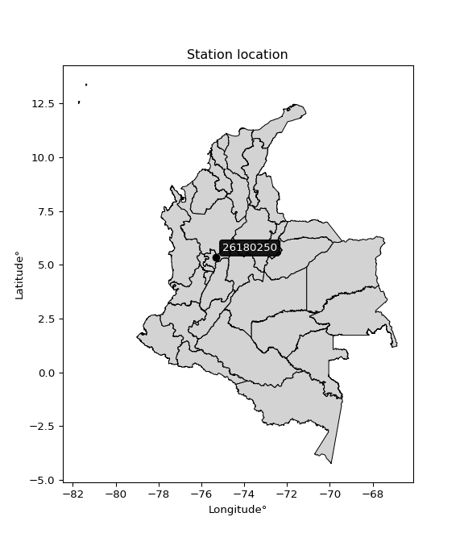

<div align="center">


</div>

# PMP Station (Rain, Pmax24h): 26180250

Probable Maximum Precipitation (PMP) is the greatest amount of rainfall for a specific duration that is meteorologically possible for a given location, acting as a "worst-case" scenario for extreme storms, crucial for designing safety-critical infrastructure like bridges, river deviations, dams, spillways, and nuclear plants to prevent catastrophic failure. PMP is calculated by hydrologists using meteorological data to determine the upper limit of extreme rainfall, often leading to the Probable Maximum Flood (PMF) for flood control design, and is increasingly being studied for climate change impacts. Probable Maximum Precipitation (PMP) is the theoretical upper limit of rainfall, a deterministic estimate for extreme events, while probability distributions (like GEV, Gumbel) describe the likelihood and frequency of various precipitation amounts, including rare ones, showing how often events occur, with PMP representing the extreme end of these distributions, used for critical infrastructure design to ensure safety against the worst conceivable weather, unlike standard statistical forecasts which cover typical probabilities.

The most common probability distributions in hydrology, used for analyzing floods, rainfall, and streamflow, include the Normal, Log-Normal, Gumbel, Gamma (including Log-Pearson Type III), and Generalized Extreme Value (GEV) distributions, often chosen based on the data´s skewness and whether modeling extremes or general conditions, with Gumbel and GEV popular for extreme events like floods, while the Normal distribution serves as a baseline, though often requiring transformations for skewed hydrological data. These distributions help in designing water infrastructure, managing water resources, and forecasting hydrologic events.

> Hydrological data often isn´t perfectly normal (it´s skewed), so different distributions are needed for different applications, such as: **Flood Frequency Analysis**: Using Gumbel, GEV, or Log-Pearson Type III for predicting extreme flood magnitudes and their return periods, **Rainfall Analysis**: Normal for annual totals, but Log-Normal, Weibull, or GEV for intensity or extreme daily rainfall, **Streamflow Modeling**: Gamma and Log-Normal for maximum flows, GEV for minimum flows, and Kappa for daily flows.

<div align="center">

</img>

</div>


## A. General information


### 1. General running parameters

• app_version: _v20260108_. • runtime: _2026-01-08 13:24:42.400241_. • Python version: _3.14.0_. • SciPy version: _1.16.3_. • Pandas version: _2.3.3_. • NumPy version: _2.3.5_. • Stations dataset (station_dataset_file): _dataset/pmax24h_in/automatic_colombia_2003_2024.csv_. • Stations catalog (station_catalog_file): _dataset/CNE.xls_. • Minimum year to eval til year_max (date_min): _1900_. • Maximum year to eval since year_min (date_max): _2024_. • Creates, save and include plots into reports (create_plot): _False_. • Plot only fit distributions with Δo > Δ (plot_only_fit): _True_. • Plot only simple graphs avoiding multiple CDFs and multiple Extreme values plots (plot_only_simple): _True_. • Eval low extreme values, if False, evaluates high extreme values (low_extreme): _False_. • Eval every SciPy distribution as logarithmic (pdist_logarithmic_on): _True_. • Standard deviation normalized (ddof): _1.0_. • Return periods to eval in years (Tr): _[2, 2.33, 5, 10, 15, 20, 25, 50, 75, 100, 200, 250, 500, 750, 1000]_. • Minimum data sample per station, 0 means any (minimum_sample): _5_. • Z-Score maximum threshold to adjust a value, 0 means disable (zscore_max): _3.5_. • Z-Score minimum threshold to adjust a value, 0 means disable (zscore_min): _-2.5_. • Avoid zeros, e.g. rain = 0 (avoid_zeros): _True_. • Avoid null values (avoid_nans): _True_. 

:file_folder:Table: [dataset.csv](../../dataset/pmax24h_in/automatic_colombia_2003_2024.csv)

> Delta Degrees of Freedom (DDOF): is a parameter used in the formulas for calculating variance and standard deviation. When ddof=0, the divisor is $N$ (the total number of observations) and this is used when your data set is the entire population. When ddof=1, the divisor is $N-1$ and this is used when your data set is a sample drawn from a larger population. Using $N-1$ provides an unbiased estimate of the population variance (known as Bessel´s correction).


### 2. Station info and location

|   id |   CODIGO | NOMBRE                | CATEGORIA               | TECNOLOGIA                              | ESTADO   | FECHA_INSTALACION   |   FECHA_SUSPENSION |   ALTITUD |   LATITUD |   LONGITUD | DEPARTAMENTO   | MUNICIPIO   | AREA_OPERATIVA                      | ENTIDAD                                                     | AREA_HIDROGRAFICA   | ZONA_HIDROGRAFICA   | SUBZONA_HIDROGRAFICA   |   CORRIENTE | Catalogo   |   Version |
|-----:|---------:|:----------------------|:------------------------|:----------------------------------------|:---------|:--------------------|-------------------:|----------:|----------:|-----------:|:---------------|:------------|:------------------------------------|:------------------------------------------------------------|:--------------------|:--------------------|:-----------------------|------------:|:-----------|----------:|
|    0 | 26180250 | VALLE ALTO [26180250] | Climatológica Ordinaria | Automática con Telemetría, Convencional | Activa   | 15/04/1994          |                nan |      3311 |      5.35 |   -75.3178 | Caldas         | Salamina    | Area Operativa 01 - Antioquia-Chocó | INSTITUTO DE HIDROLOGIA METEOROLOGIA Y ESTUDIOS AMBIENTALES | Magdalena Cauca     | Cauca               | Río Arma               |         nan | CNE_IDEAM  |  20251226 |

<div align="center">

Dynamic map: [:earth_americas:Google](http://maps.google.com/maps?q=5.35,-75.31777778) [:earth_americas:OSM](https://www.openstreetmap.org/#map=18/5.35/-75.31777778&layers=P) [:earth_americas:Bing](https://www.bing.com/maps?cp=5.35~-75.31777778&lvl=18) [:earth_americas:Apple](https://maps.apple.com/frame?center=5.35%2C-75.31777778&span=0.003%2C0.006)

</div>


<div align="center">

```geojson
{
  "type": "Feature",
  "geometry": {
    "type": "Point", 
    "coordinates": [-75.31777778, 5.35]
  }, 
  "properties": {
    "Name": "26180250"
  }
}
```

</div>


### 3. Discrete values table and plot

<div align="center">

|               |           0 |           1 |          2 |           3 |          4 |
|:--------------|------------:|------------:|-----------:|------------:|-----------:|
| Date          | 2019        | 2020        | 2021       | 2022        | 2023       |
| Value         |   43.8      |   27        |   14       |   42.6      |   49.4     |
| Value_initial |   43.8      |   27        |   14       |   42.6      |   49.4     |
| count         |    5        |    5        |    5       |    5        |    5       |
| mean          |   35.36     |   35.36     |   35.36    |   35.36     |   35.36    |
| std           |   14.5509   |   14.5509   |   14.5509  |   14.5509   |   14.5509  |
| zscore        |    0.580034 |   -0.574536 |   -1.46795 |    0.497565 |    0.96489 |


</div>


> The initial value (value_initial) correspond to the initial obtained or null completed value, and value (value) is adjusted only when the initial value is outside the valid range (outlier) definite through the Z-Score value. If Z-Score is active, values out of range or outliers are replaced with the station mean value. A Z-Score (or standard score) measures how many standard deviations a data point is from the mean of a dataset, indicating its relative position; positive scores mean above the mean, negative mean below, and a score of zero is exactly at the mean, allowing for comparison of values from different distributions. It´s calculated using the formula $z=(x–μ)/σ$, where $x$ is the data point, $μ$ is the mean, and $σ$ is the standard deviation, helping identify outliers and understand probability.
>
> <sub>**Note**: In this study, "completing" (filling gaps in) and "extending" (forecasting or lengthening the historical record) rainfall data series are avoided for certain critical analyses because they introduce artificial bias and uncertainty, which can distort the statistics of rare events (extremes), alter day-to-day variability, and compromise the integrity and homogeneity of the original data. Some reasons against Completing/Extending rainfall data are: **Distortion of Extremes and Variability**: The primary issue is that most gap-filling or extension methods rely on averaging or regression with nearby stations, which inherently smooths the data. Rainfall is highly variable in space and time, with a large percentage of zero values and occasional large storms. Infilling methods often underestimate the highest values and overestimate the lowest (zero) values, which severely distorts analyses focused on flood frequency, drought severity, and intensity-duration-frequency (IDF) curves, **Loss of Data Homogeneity**: Infilled or extended data are synthetic estimates, not actual measurements. Combining these estimates with observed data can violate the assumption of data homogeneity, which requires that the data properties do not change over time. Inhomogeneity can lead to incorrect conclusions about long-term trends or changes in climate patterns, **Propagation of Errors**: Errors and biases from the original data (e.g., wind-induced undercatch, instrument errors, site changes) or the data used for imputation can propagate through the analysis, leading to unreliable hydrological models and inaccurate predictions, **Compromised Statistical Integrity**: For statistical analyses, especially those involving the frequency of events, using artificial data can introduce time bias or autocorrelation that doesn´t exist in reality, making it difficult to assess the true probability of events, **Difficulty in Validation**: It is difficult to accurately validate the quality of filled or extended data, especially for past periods where ground-truth measurements are unavailable. The reliability of imputation techniques heavily depends on the density of the surrounding station network and the complexity of the local topography.</sub>


### 4. Active continuous probability distributions from SciPy (43 of 104 available)

A Probability Density Function (PDF) describes the relative likelihood of a continuous random variable falling within a specific range, where the total area under its curve equals 1, and the area over any interval gives the actual probability for that range. Unlike discrete probabilities (like rolling a die), a PDF shows density, not direct probability for a single point (which is zero), with higher points indicating higher likelihood, often visualized as a bell curve for normal distributions.

A log of a probability density function (log-PDF) is simply the logarithm of the PDF´s value, denoted as $log(f(x))$, useful for converting multiplication of probabilities into addition, improving numerical stability with tiny numbers, and connecting to information theory concepts like entropy. Instead of dealing with very small probabilities (e.g., 0.000001), log-PDFs use negative numbers (e.g., $log(0.00001) ≈ -11.51$ that are easier for computers to handle, preventing underflow errors and simplifying complex calculations. In this study, each active probability distribution from SciPy is also evaluated in the $log$ form.

[scipy.stats](https://docs.scipy.org/doc/scipy/reference/stats.html) is a Python´s powerful submodule within the SciPy library for comprehensive statistical analysis, offering over 130 probability distributions (like Normal, Poisson), functions for descriptive stats (mean, variance), hypothesis testing (t-tests, chi-square), random variable generation, and statistical tests, making it essential for data science, modeling, and research. It provides tools to explore, model, and draw conclusions from data efficiently, working seamlessly with NumPy.

<div align="center">

|   id | p_dist             |   n_parameter | fit_method   | label                                                                       | active   | ref                                                                                                        |
|-----:|:-------------------|--------------:|:-------------|:----------------------------------------------------------------------------|:---------|:-----------------------------------------------------------------------------------------------------------|
|    0 | alpha              |             3 | MLE          | Alpha                                                                       | True     | [:mortar_board:](https://docs.scipy.org/doc/scipy/reference/generated/scipy.stats.alpha.html)              |
|    1 | betaprime          |             4 | MLE          | Beta prime                                                                  | True     | [:mortar_board:](https://docs.scipy.org/doc/scipy/reference/generated/scipy.stats.betaprime.html)          |
|    2 | chi2               |             3 | MLE          | Chi²                                                                        | True     | [:mortar_board:](https://docs.scipy.org/doc/scipy/reference/generated/scipy.stats.chi2.html)               |
|    3 | crystalball        |             4 | MLE          | Crystalball                                                                 | True     | [:mortar_board:](https://docs.scipy.org/doc/scipy/reference/generated/scipy.stats.crystalball.html)        |
|    4 | erlang             |             3 | MLE          | Erlang                                                                      | True     | [:mortar_board:](https://docs.scipy.org/doc/scipy/reference/generated/scipy.stats.erlang.html)             |
|    5 | expon              |             2 | MLE          | Exponential                                                                 | True     | [:mortar_board:](https://docs.scipy.org/doc/scipy/reference/generated/scipy.stats.expon.html)              |
|    6 | exponnorm          |             3 | MLE          | Exponentially modified Normal                                               | True     | [:mortar_board:](https://docs.scipy.org/doc/scipy/reference/generated/scipy.stats.exponnorm.html)          |
|    7 | f                  |             4 | MLE          | F                                                                           | True     | [:mortar_board:](https://docs.scipy.org/doc/scipy/reference/generated/scipy.stats.f.html)                  |
|    8 | fatiguelife        |             3 | MLE          | Fatigue-life (Birnbaum-Saunders)                                            | True     | [:mortar_board:](https://docs.scipy.org/doc/scipy/reference/generated/scipy.stats.fatiguelife.html)        |
|    9 | fisk               |             3 | MLE          | Fisk                                                                        | True     | [:mortar_board:](https://docs.scipy.org/doc/scipy/reference/generated/scipy.stats.fisk.html)               |
|   10 | gamma              |             3 | MLE          | Gamma                                                                       | True     | [:mortar_board:](https://docs.scipy.org/doc/scipy/reference/generated/scipy.stats.gamma.html)              |
|   11 | genexpon           |             5 | MLE          | Generalized exponential                                                     | True     | [:mortar_board:](https://docs.scipy.org/doc/scipy/reference/generated/scipy.stats.genexpon.html)           |
|   12 | genlogistic        |             3 | MLE          | Generalized logistic                                                        | True     | [:mortar_board:](https://docs.scipy.org/doc/scipy/reference/generated/scipy.stats.genlogistic.html)        |
|   13 | gibrat             |             2 | MM           | Gibrat                                                                      | True     | [:mortar_board:](https://docs.scipy.org/doc/scipy/reference/generated/scipy.stats.gibrat.html)             |
|   14 | gompertz           |             3 | MLE          | Gompertz (or truncated Gumbel)                                              | True     | [:mortar_board:](https://docs.scipy.org/doc/scipy/reference/generated/scipy.stats.gompertz.html)           |
|   15 | gumbel_l           |             2 | MM           | Gumbel Left Skew                                                            | True     | [:mortar_board:](https://docs.scipy.org/doc/scipy/reference/generated/scipy.stats.gumbel_l.html)           |
|   16 | gumbel_r           |             2 | MM           | Gumbel Right Skew                                                           | True     | [:mortar_board:](https://docs.scipy.org/doc/scipy/reference/generated/scipy.stats.gumbel_r.html)           |
|   17 | halflogistic       |             2 | MM           | Half-logistic                                                               | True     | [:mortar_board:](https://docs.scipy.org/doc/scipy/reference/generated/scipy.stats.halflogistic.html)       |
|   18 | halfnorm           |             2 | MM           | Half Normal                                                                 | True     | [:mortar_board:](https://docs.scipy.org/doc/scipy/reference/generated/scipy.stats.halfnorm.html)           |
|   19 | hypsecant          |             2 | MM           | hyperbolic secant                                                           | True     | [:mortar_board:](https://docs.scipy.org/doc/scipy/reference/generated/scipy.stats.hypsecant.html)          |
|   20 | invgamma           |             3 | MLE          | Inverted gamma                                                              | True     | [:mortar_board:](https://docs.scipy.org/doc/scipy/reference/generated/scipy.stats.invgamma.html)           |
|   21 | invgauss           |             3 | MLE          | Inverse Gaussian                                                            | True     | [:mortar_board:](https://docs.scipy.org/doc/scipy/reference/generated/scipy.stats.invgauss.html)           |
|   22 | invweibull         |             3 | MLE          | Inverted Weibull                                                            | True     | [:mortar_board:](https://docs.scipy.org/doc/scipy/reference/generated/scipy.stats.invweibull.html)         |
|   23 | kstwobign          |             2 | MLE          | Limiting distribution of scaled Kolmogorov-Smirnov two-sided test statistic | True     | [:mortar_board:](https://docs.scipy.org/doc/scipy/reference/generated/scipy.stats.kstwobign.html)          |
|   24 | laplace            |             2 | MM           | Laplace                                                                     | True     | [:mortar_board:](https://docs.scipy.org/doc/scipy/reference/generated/scipy.stats.laplace.html)            |
|   25 | laplace_asymmetric |             3 | MLE          | Asymmetric Laplace                                                          | True     | [:mortar_board:](https://docs.scipy.org/doc/scipy/reference/generated/scipy.stats.laplace_asymmetric.html) |
|   26 | loggamma           |             3 | MLE          | Log gamma                                                                   | True     | [:mortar_board:](https://docs.scipy.org/doc/scipy/reference/generated/scipy.stats.loggamma.html)           |
|   27 | logistic           |             2 | MM           | Logistic (or Sech-squared)                                                  | True     | [:mortar_board:](https://docs.scipy.org/doc/scipy/reference/generated/scipy.stats.logistic.html)           |
|   28 | lognorm            |             3 | MLE          | Log Normal                                                                  | True     | [:mortar_board:](https://docs.scipy.org/doc/scipy/reference/generated/scipy.stats.lognorm.html)            |
|   29 | maxwell            |             2 | MM           | Maxwell                                                                     | True     | [:mortar_board:](https://docs.scipy.org/doc/scipy/reference/generated/scipy.stats.maxwell.html)            |
|   30 | mielke             |             4 | MLE          | Mielke Beta-Kappa / Dagum                                                   | True     | [:mortar_board:](https://docs.scipy.org/doc/scipy/reference/generated/scipy.stats.mielke.html)             |
|   31 | moyal              |             2 | MM           | Moyal                                                                       | True     | [:mortar_board:](https://docs.scipy.org/doc/scipy/reference/generated/scipy.stats.moyal.html)              |
|   32 | nakagami           |             3 | MLE          | Nakagami                                                                    | True     | [:mortar_board:](https://docs.scipy.org/doc/scipy/reference/generated/scipy.stats.nakagami.html)           |
|   33 | ncf                |             5 | MLE          | Non-central F distribution                                                  | True     | [:mortar_board:](https://docs.scipy.org/doc/scipy/reference/generated/scipy.stats.ncf.html)                |
|   34 | nct                |             4 | MLE          | Non-central Student’s t                                                     | True     | [:mortar_board:](https://docs.scipy.org/doc/scipy/reference/generated/scipy.stats.nct.html)                |
|   35 | norm               |             2 | MM           | Normal                                                                      | True     | [:mortar_board:](https://docs.scipy.org/doc/scipy/reference/generated/scipy.stats.norm.html)               |
|   36 | pearson3           |             3 | MM           | Pearson type III                                                            | True     | [:mortar_board:](https://docs.scipy.org/doc/scipy/reference/generated/scipy.stats.pearson3.html)           |
|   37 | rayleigh           |             2 | MM           | Rayleigh                                                                    | True     | [:mortar_board:](https://docs.scipy.org/doc/scipy/reference/generated/scipy.stats.rayleigh.html)           |
|   38 | rice               |             3 | MLE          | Rice                                                                        | True     | [:mortar_board:](https://docs.scipy.org/doc/scipy/reference/generated/scipy.stats.rice.html)               |
|   39 | t                  |             3 | MLE          | Student’s t                                                                 | True     | [:mortar_board:](https://docs.scipy.org/doc/scipy/reference/generated/scipy.stats.t.html)                  |
|   40 | truncnorm          |             4 | MLE          | Truncated normal                                                            | True     | [:mortar_board:](https://docs.scipy.org/doc/scipy/reference/generated/scipy.stats.truncnorm.html)          |
|   41 | wald               |             2 | MM           | Wald                                                                        | True     | [:mortar_board:](https://docs.scipy.org/doc/scipy/reference/generated/scipy.stats.wald.html)               |
|   42 | weibull_min        |             3 | MLE          | Weibull minimum                                                             | True     | [:mortar_board:](https://docs.scipy.org/doc/scipy/reference/generated/scipy.stats.weibull_min.html)        |

</div>

> **n_parameter:** # arguments & localization & scale.
>
> **Fit methods:** (MLE) maximum likelihood, (MM) L-moments.
>
>**Inactive** (With the only purpose of prevent loops, zero divisions, infinite values, over high estimated values or horizontal trending for recurrence intervals estimations, the follow distributions were disabled.)**:** foldnorm, gennorm, norminvgauss, powernorm, powerlognorm, skewnorm, genextreme, anglit, arcsine, argus, beta, bradford, burr, burr12, cauchy, cosine, halfcauchy, foldcauchy, skewcauchy, wrapcauchy, dgamma, gengamma, exponweib, exponpow, truncexpon, gausshyper, genhalflogistic, genhyperbolic, geninvgauss, halfgennorm, johnsonsb, johnsonsu, kappa4, kappa3, ksone, kstwo, loglaplace, levy, levy_l, levy_stable, ncx2, pareto, genpareto, truncpareto, lomax, powerlaw, rdist, rel_breitwigner, recipinvgauss, semicircular, studentized_range, trapezoid, triang, truncweibull_min, tukeylambda, uniform, loguniform, vonmises, vonmises_line, weibull_max, dweibull, 


## B. Probability (PDF) vs. Empirical (EDF) distributions functions

A continuous probability distribution (CPD) describes probabilities for variables that can take any value within a range (like rain any time), unlike discrete variables with specific outcomes (like temperature). It uses a Probability Density Function (PDF), a curve where the total area under it equals 1, and the probability of the variable falling within an interval (a to b) is found by calculating the area under the curve between those points. A key feature is that the probability of hitting any single exact value is zero, so probabilities are always expressed for ranges, e.g., $P(a ≤ X ≤ b)$.

<div align="center">

Distributions parameters from station values
|    |   station | p_dist                |   n |             loc |           scale | shape                  | shape1                | shape2                 | shape3   |
|---:|----------:|:----------------------|----:|----------------:|----------------:|:-----------------------|:----------------------|:-----------------------|:---------|
|  0 |  26180250 | alpha                 |   5 |  -244.495       |  5800.09        | 20.781137753919978     |                       |                        |          |
|  1 |  26180250 | betaprime             |   5 |  -396.65        |     6.06098     | 72653.15266908106      | 1019.8869950597573    |                        |          |
|  2 |  26180250 | chi2                  |   5 |    14           |    14.3826      | 1.1771968702821443     |                       |                        |          |
|  3 |  26180250 | crystalball           |   5 |    35.36        |    13.0147      | 3158.8642133995013     | 2362.883786917201     |                        |          |
|  4 |  26180250 | erlang                |   5 |  -150.432       |     0.959235    | 193.51971613287196     |                       |                        |          |
|  5 |  26180250 | expon                 |   5 |    14           |    21.36        |                        |                       |                        |          |
|  6 |  26180250 | exponnorm             |   5 |    35.3491      |    13.0147      | 0.0008380130729396335  |                       |                        |          |
|  7 |  26180250 | f                     |   5 | -4181.43        |  4216.77        | 328810.39699849195     | 574943.3438769571     |                        |          |
|  8 |  26180250 | fatiguelife           |   5 |    14           |     3.70517e-05 | 602.1785936935612      |                       |                        |          |
|  9 |  26180250 | fisk                  |   5 |    -9.70754e+08 |     9.70754e+08 | 123124401.36822599     |                       |                        |          |
| 10 |  26180250 | gamma                 |   5 |  -179.072       |     0.831994    | 257.55592141698014     |                       |                        |          |
| 11 |  26180250 | genexpon              |   5 |    14           |     2.49439     | 0.11662993247013262    | 4.652199690380823e-05 | 0.5442269793644651     |          |
| 12 |  26180250 | genlogistic           |   5 |    49.4008      |     3.73666e-05 | 2.6687552822899935e-06 |                       |                        |          |
| 13 |  26180250 | gibrat                |   5 |    25.4314      |     6.022       |                        |                       |                        |          |
| 14 |  26180250 | gompertz              |   5 |    14           |    12.875       | 0.14827173979225966    |                       |                        |          |
| 15 |  26180250 | gumbel_l              |   5 |    41.2173      |    10.1475      |                        |                       |                        |          |
| 16 |  26180250 | gumbel_r              |   5 |    29.5027      |    10.1475      |                        |                       |                        |          |
| 17 |  26180250 | halflogistic          |   5 |    19.9346      |    11.1271      |                        |                       |                        |          |
| 18 |  26180250 | halfnorm              |   5 |    18.1336      |    21.59        |                        |                       |                        |          |
| 19 |  26180250 | hypsecant             |   5 |    35.36        |     8.28541     |                        |                       |                        |          |
| 20 |  26180250 | invgamma              |   5 |  -130.126       | 24553.8         | 149.638831151354       |                       |                        |          |
| 21 |  26180250 | invgauss              |   5 |   -56.2705      |  4002.28        | 0.022845191702602546   |                       |                        |          |
| 22 |  26180250 | invweibull            |   5 |    14           |     1.36114     | 0.052886510892092106   |                       |                        |          |
| 23 |  26180250 | kstwobign             |   5 |   -16.8781      |    59.478       |                        |                       |                        |          |
| 24 |  26180250 | laplace               |   5 |    35.36        |     9.20278     |                        |                       |                        |          |
| 25 |  26180250 | laplace_asymmetric    |   5 |    43.8         |     7.50755     | 1.709264742228751      |                       |                        |          |
| 26 |  26180250 | loggamma              |   5 |    49.4002      |     1.3475e-05  | 9.602484568901386e-07  |                       |                        |          |
| 27 |  26180250 | logistic              |   5 |    35.36        |     7.17538     |                        |                       |                        |          |
| 28 |  26180250 | lognorm               |   5 |    14           |     0.0147439   | 14.877659341130938     |                       |                        |          |
| 29 |  26180250 | maxwell               |   5 |     4.52063     |    19.3257      |                        |                       |                        |          |
| 30 |  26180250 | mielke                |   5 |   -11.5281      |    61.0054      | 3.227316854956076      | 4426.0503397035045    |                        |          |
| 31 |  26180250 | moyal                 |   5 |    27.9174      |     5.85867     |                        |                       |                        |          |
| 32 |  26180250 | nakagami              |   5 |    27           |    17.1145      | 0.09021865397077296    |                       |                        |          |
| 33 |  26180250 | ncf                   |   5 |   -89.7531      |    19.9739      | 50.609200317818846     | 8547.402008883953     | 266.4580830360178      |          |
| 34 |  26180250 | nct                   |   5 |  -757.78        |    12.984       | 372758.4329941644      | 61.08588871912461     |                        |          |
| 35 |  26180250 | norm                  |   5 |    35.36        |    13.0147      |                        |                       |                        |          |
| 36 |  26180250 | pearson3              |   5 |    35.36        |    13.0147      | -0.5971176944412299    |                       |                        |          |
| 37 |  26180250 | rayleigh              |   5 |    10.4621      |    19.8656      |                        |                       |                        |          |
| 38 |  26180250 | rice                  |   5 |     5.82503     |    14.5671      | 1.7055924598340568     |                       |                        |          |
| 39 |  26180250 | t                     |   5 |    35.3606      |    13.0123      | 1700639.237222638      |                       |                        |          |
| 40 |  26180250 | truncnorm             |   5 |    35.36        |    13.0147      | -425.303098667162      | 828.0416682741902     |                        |          |
| 41 |  26180250 | wald                  |   5 |    22.3453      |    13.0147      |                        |                       |                        |          |
| 42 |  26180250 | weibull_min           |   5 |    -7.14497e+08 |     7.14497e+08 | 74354480.75963056      |                       |                        |          |
| 43 |  26180250 | logalpha              |   5 |    -9.65691     |   357.342       | 27.246998524573613     |                       |                        |          |
| 44 |  26180250 | logbetaprime          |   5 |   -29.2033      |   147.363       | 5827.064349803621      | 26283.229552452874    |                        |          |
| 45 |  26180250 | logchi2               |   5 |     2.63906     |     0.993777    | 1.004343615159736      |                       |                        |          |
| 46 |  26180250 | logcrystalball        |   5 |     3.47327     |     0.464955    | 8.86918012337429       | 739.2505037263645     |                        |          |
| 47 |  26180250 | logerlang             |   5 |    -3.85238     |     0.031133    | 235.15850897860946     |                       |                        |          |
| 48 |  26180250 | logexpon              |   5 |     2.63906     |     0.834209    |                        |                       |                        |          |
| 49 |  26180250 | logexponnorm          |   5 |     3.47297     |     0.464954    | 0.0006246977427646079  |                       |                        |          |
| 50 |  26180250 | logf                  |   5 |  -792.182       |   795.654       | 18204198.55076152      | 8547669.09532879      |                        |          |
| 51 |  26180250 | logfatiguelife        |   5 |  -217.572       |   221.046       | 0.0020964175659300664  |                       |                        |          |
| 52 |  26180250 | logfisk               |   5 |    -6.04042e+07 |     6.04042e+07 | 226384413.31019843     |                       |                        |          |
| 53 |  26180250 | loggamma              |   5 |    -4.34707     |     0.029531    | 264.8083007971409      |                       |                        |          |
| 54 |  26180250 | loggenexpon           |   5 |     2.6263      |     0.349737    | 0.17508059032986578    | 21.67402519224942     | 0.007003060986736116   |          |
| 55 |  26180250 | loggenlogistic        |   5 |     3.89997     |     9.21994e-07 | 2.1595078761667846e-06 |                       |                        |          |
| 56 |  26180250 | loggibrat             |   5 |     3.11859     |     0.215122    |                        |                       |                        |          |
| 57 |  26180250 | loggompertz           |   5 |     2.6384      |     0.37119     | 0.06800736196985499    |                       |                        |          |
| 58 |  26180250 | loggumbel_l           |   5 |     3.68252     |     0.362524    |                        |                       |                        |          |
| 59 |  26180250 | loggumbel_r           |   5 |     3.26401     |     0.362524    |                        |                       |                        |          |
| 60 |  26180250 | loghalflogistic       |   5 |     2.9222      |     0.397512    |                        |                       |                        |          |
| 61 |  26180250 | loghalfnorm           |   5 |     2.85782     |     0.771342    |                        |                       |                        |          |
| 62 |  26180250 | loghypsecant          |   5 |     3.47327     |     0.296       |                        |                       |                        |          |
| 63 |  26180250 | loginvgamma           |   5 |    -9.18585     |  8677.09        | 686.3659299144097      |                       |                        |          |
| 64 |  26180250 | loginvgauss           |   5 |    -0.979697    |   348.421       | 0.012741363740802703   |                       |                        |          |
| 65 |  26180250 | loginvweibull         |   5 |    -3.81922e+07 |     3.81922e+07 | 76936138.16726175      |                       |                        |          |
| 66 |  26180250 | logkstwobign          |   5 |     1.47424     |     2.27737     |                        |                       |                        |          |
| 67 |  26180250 | loglaplace            |   5 |     3.47327     |     0.328773    |                        |                       |                        |          |
| 68 |  26180250 | loglaplace_asymmetric |   5 |     3.89995     |     0.00468963  | 90.97156041838457      |                       |                        |          |
| 69 |  26180250 | logloggamma           |   5 |     3.90009     |     7.58963e-06 | 1.768583212191548e-05  |                       |                        |          |
| 70 |  26180250 | loglogistic           |   5 |     3.47327     |     0.256343    |                        |                       |                        |          |
| 71 |  26180250 | loglognorm            |   5 |     2.63906     |     0.000858661 | 14.147012830406593     |                       |                        |          |
| 72 |  26180250 | logmaxwell            |   5 |     2.37152     |     0.690419    |                        |                       |                        |          |
| 73 |  26180250 | logmielke             |   5 |    -4.7794e+07  |     4.7794e+07  | 107174081.68416204     | 7368566181.955869     |                        |          |
| 74 |  26180250 | logmoyal              |   5 |     3.20738     |     0.209303    |                        |                       |                        |          |
| 75 |  26180250 | lognakagami           |   5 |     3.29584     |     0.410065    | 0.4270039953795591     |                       |                        |          |
| 76 |  26180250 | logncf                |   5 |    -3.9688      |     7.43217     | 519.9073959208442      | 1039.8879185228961    | 2.6406521407615144e-06 |          |
| 77 |  26180250 | lognct                |   5 |    30.6796      |     0.462534    | 174137.6781065021      | -58.819541262224504   |                        |          |
| 78 |  26180250 | lognorm               |   5 |     3.47327     |     0.464955    |                        |                       |                        |          |
| 79 |  26180250 | logpearson3           |   5 |     3.47327     |     0.464957    | -0.9114803378298049    |                       |                        |          |
| 80 |  26180250 | lograyleigh           |   5 |     2.58378     |     0.709708    |                        |                       |                        |          |
| 81 |  26180250 | logrice               |   5 |     2.31386     |     0.507656    | 2.013638689423147      |                       |                        |          |
| 82 |  26180250 | logt                  |   5 |     3.47326     |     0.46495     | 328452821.3944906      |                       |                        |          |
| 83 |  26180250 | logtruncnorm          |   5 |    -0.167194    |     1.41723     | 2.4435279235275122     | 2.891553024680521     |                        |          |
| 84 |  26180250 | logwald               |   5 |     3.00829     |     0.464972    |                        |                       |                        |          |
| 85 |  26180250 | logweibull_min        |   5 |    -2.90146e+07 |     2.90146e+07 | 93021425.5295136       |                       |                        |          |

</div>

> **loc** (Location parameter): This shifts the distribution along the x-axis. For many common distributions, like the normal (Gaussian) distribution, loc represents the mean $μ$. For others, like the uniform distribution, it might represent the minimum value, or for the beta distribution, the left end of the support interval.
>
> **scale** (Scale parameter): This determines the width or spread of the distribution. For the normal distribution, scale represents the standard deviation $σ$. For a uniform distribution, it defines the length of the interval (from $loc$ to $loc + scale$).
>
> **shape** (Shape parameters): Refers to parameters that define the specific form of a probability distribution, distinct from its location (loc) and scale (scale). These parameters are required arguments for most distribution functions. For example, a normal (Gaussian) distribution is fully defined by its location (mean) and scale (standard deviation), so it has no specific shape parameters beyond loc and scale. However, other distributions have intrinsic properties that need specification, as Gamma distribution that takes a shape parameter, often named $a$ or $alpha$.


### 0. Cumulative distribution values - CDF (86 evaluated)

Cumulative Distribution Function (CDF), denoted as $F$<sub>$X$</sub>$(x)$, is a function that gives the probability that a random variable $X$ will take a value less than or equal to a specific value, $x$ (i.e., $(P(X≥x)$. It essentially "accumulates" probabilities from a given point up to the far right (positive infinity), providing a complete picture of the distribution´s probabilities for both discrete (like rain) and continuous (like temperature) variables, helping to find probabilities over ranges or above certain values. Each station is evaluated separately ordering the $x$ values ascending, calculating the CDF and PDF values for the activated distributions and their logarithmic forms.

<div align="center">

CDF ordered by x ascending and calculating $log(f(x))$ separately
|   id |   Station |   date |    x |   count |   mean |     std |    zscore |   Value_initial |   station |   m |     alpha |   alpha_pdf |   betaprime |   betaprime_pdf |        chi2 |       chi2_pdf |   crystalball |   crystalball_pdf |   erlang |   erlang_pdf |    expon |   expon_pdf |   exponnorm |   exponnorm_pdf |         f |      f_pdf |   fatiguelife |   fatiguelife_pdf |      fisk |   fisk_pdf |     gamma |   gamma_pdf |    genexpon |   genexpon_pdf |   genlogistic |   genlogistic_pdf |   gibrat |   gibrat_pdf |    gompertz |   gompertz_pdf |   gumbel_l |   gumbel_l_pdf |   gumbel_r |   gumbel_r_pdf |   halflogistic |   halflogistic_pdf |   halfnorm |   halfnorm_pdf |   hypsecant |   hypsecant_pdf |   invgamma |   invgamma_pdf |   invgauss |   invgauss_pdf |   invweibull |   invweibull_pdf |   kstwobign |   kstwobign_pdf |   laplace |   laplace_pdf |   laplace_asymmetric |   laplace_asymmetric_pdf |   loggamma |   loggamma_pdf |   logistic |   logistic_pdf |   lognorm |   lognorm_pdf |   maxwell |   maxwell_pdf |    mielke |   mielke_pdf |      moyal |   moyal_pdf |   nakagami |   nakagami_pdf |       ncf |    ncf_pdf |      nct |    nct_pdf |      norm |   norm_pdf |   pearson3 |   pearson3_pdf |   rayleigh |   rayleigh_pdf |      rice |   rice_pdf |         t |      t_pdf |   truncnorm |   truncnorm_pdf |     wald |   wald_pdf |   weibull_min |   weibull_min_pdf |   logalpha |   logalpha_pdf |   logbetaprime |   logbetaprime_pdf |     logchi2 |   logchi2_pdf |   logcrystalball |   logcrystalball_pdf |   logerlang |   logerlang_pdf |   logexpon |   logexpon_pdf |   logexponnorm |   logexponnorm_pdf |      logf |   logf_pdf |   logfatiguelife |   logfatiguelife_pdf |   logfisk |   logfisk_pdf |   loggenexpon |   loggenexpon_pdf |   loggenlogistic |   loggenlogistic_pdf |   loggibrat |   loggibrat_pdf |   loggompertz |   loggompertz_pdf |   loggumbel_l |   loggumbel_l_pdf |   loggumbel_r |   loggumbel_r_pdf |   loghalflogistic |   loghalflogistic_pdf |   loghalfnorm |   loghalfnorm_pdf |   loghypsecant |   loghypsecant_pdf |   loginvgamma |   loginvgamma_pdf |   loginvgauss |   loginvgauss_pdf |   loginvweibull |   loginvweibull_pdf |   logkstwobign |   logkstwobign_pdf |   loglaplace |   loglaplace_pdf |   loglaplace_asymmetric |   loglaplace_asymmetric_pdf |   logloggamma |   logloggamma_pdf |   loglogistic |   loglogistic_pdf |   loglognorm |   loglognorm_pdf |   logmaxwell |   logmaxwell_pdf |   logmielke |   logmielke_pdf |    logmoyal |   logmoyal_pdf |   lognakagami |   lognakagami_pdf |    logncf |   logncf_pdf |    lognct |   lognct_pdf |   logpearson3 |   logpearson3_pdf |   lograyleigh |   lograyleigh_pdf |   logrice |   logrice_pdf |     logt |   logt_pdf |   logtruncnorm |   logtruncnorm_pdf |   logwald |   logwald_pdf |   logweibull_min |   logweibull_min_pdf |
|-----:|----------:|-------:|-----:|--------:|-------:|--------:|----------:|----------------:|----------:|----:|----------:|------------:|------------:|----------------:|------------:|---------------:|--------------:|------------------:|---------:|-------------:|---------:|------------:|------------:|----------------:|----------:|-----------:|--------------:|------------------:|----------:|-----------:|----------:|------------:|------------:|---------------:|--------------:|------------------:|---------:|-------------:|------------:|---------------:|-----------:|---------------:|-----------:|---------------:|---------------:|-------------------:|-----------:|---------------:|------------:|----------------:|-----------:|---------------:|-----------:|---------------:|-------------:|-----------------:|------------:|----------------:|----------:|--------------:|---------------------:|-------------------------:|-----------:|---------------:|-----------:|---------------:|----------:|--------------:|----------:|--------------:|----------:|-------------:|-----------:|------------:|-----------:|---------------:|----------:|-----------:|---------:|-----------:|----------:|-----------:|-----------:|---------------:|-----------:|---------------:|----------:|-----------:|----------:|-----------:|------------:|----------------:|---------:|-----------:|--------------:|------------------:|-----------:|---------------:|---------------:|-------------------:|------------:|--------------:|-----------------:|---------------------:|------------:|----------------:|-----------:|---------------:|---------------:|-------------------:|----------:|-----------:|-----------------:|---------------------:|----------:|--------------:|--------------:|------------------:|-----------------:|---------------------:|------------:|----------------:|--------------:|------------------:|--------------:|------------------:|--------------:|------------------:|------------------:|----------------------:|--------------:|------------------:|---------------:|-------------------:|--------------:|------------------:|--------------:|------------------:|----------------:|--------------------:|---------------:|-------------------:|-------------:|-----------------:|------------------------:|----------------------------:|--------------:|------------------:|--------------:|------------------:|-------------:|-----------------:|-------------:|-----------------:|------------:|----------------:|------------:|---------------:|--------------:|------------------:|----------:|-------------:|----------:|-------------:|--------------:|------------------:|--------------:|------------------:|----------:|--------------:|---------:|-----------:|---------------:|-------------------:|----------:|--------------:|-----------------:|---------------------:|
|    0 |  26180250 |   2021 | 14   |       5 |  35.36 | 14.5509 | -1.46795  |            14   |  26180250 |   1 | 0.0487785 |  0.00877739 |   0.0533539 |      0.00852453 | 4.85169e-10 | 80380.8        |     0.0503758 |        0.00797199 | 0.051627 |   0.00859843 | 0        |  0.0468165  |   0.0503754 |      0.00797196 | 0.0504746 | 0.00800658 |     0.0609972 |       2.18385e+09 | 0.0530233 | 0.00636856 | 0.0522448 |  0.00857626 | 1.57255e-07 |     0.0467568  |      0        |        0.00569869 | 0        |   0          | 1.68945e-08 |      0.0115162 |  0.0661271 |     0.00629621 | 0.00997458 |     0.00452919 |       0        |          0         |   0        |      0         |   0.0482421 |      0.00580027 |  0.0495987 |     0.00908443 |  0.0468054 |     0.00931877 |   0.00272422 |      2.39491e+11 |   0.0496414 |       0.0131102 | 0.0490859 |    0.00533381 |            0.0730495 |               0.00569259 |   0.037496 |       0.18345  |  0.0484829 |     0.00642925 |  0.036393 |      0.17159  |  0.029216 |    0.00880741 | 0.0601098 |   0.00759921 | 0.00103911 |  0.00103085 | 0          |    0           | 0.0524208 | 0.00870344 | 0.050392 | 0.00797507 | 0.0503758 | 0.00797199 |  0.0633966 |     0.00733843 |   0.015733 |     0.00882371 | 0.0379619 | 0.00954902 | 0.0503403 | 0.00796895 |   0.0503757 |      0.00797199 | 0        | 0          |     0.0561611 |        0.00567716 |  0.0347809 |       0.18169  |      0.0386996 |           0.180947 | 1.55957e-08 |   1.76355e+07 |         0.036393 |             0.17159  |   0.0370184 |        0.183656 |   0        |       1.19874  |      0.0363932 |           0.171591 | 0.0370901 |   0.173878 |        0.0356282 |             0.169836 | 0.0325645 |      0.118072 |    0.00646641 |          0.513096 |         0        |             0.122184 |    0        |        0        |   0.000119823 |          0.183515 |      0.054677 |          0.146623 |    0.00367451 |         0.0568252 |          0        |              0        |      0        |          0        |      0.0379667 |           0.127962 |     0.0372914 |          0.184396 |     0.0391645 |          0.208805 |       0.0398831 |            0.258847 |      0.0438718 |           0.317575 |    0.0395382 |         0.12026  |               0.0520446 |                    0.121992 |     0.0529431 |          0.123371 |     0.0371739 |          0.139625 |    0.0227641 |      8.59826e+12 |    0.0147967 |         0.16098  |   0.0570002 |        0.127818 | 0.000101485 |     0.00388061 |   0           |          0        | 0.0632301 |     0.24378  | 0.0363556 |     0.171387 |     0.0547747 |          0.160775 |    0.00302866 |          0.109414 | 0.0296783 |      0.197766 | 0.036392 |   0.171588 |     0          |           0        |  0        |      0        |        0.0349997 |             0.110223 |
|    1 |  26180250 |   2020 | 27   |       5 |  35.36 | 14.5509 | -0.574536 |            27   |  26180250 |   2 | 0.280143  |  0.026495   |   0.26973   |      0.0248913  | 0.599318    |     0.0202339  |     0.260323  |        0.0249389  | 0.274372 |   0.0257385  | 0.455896 |  0.0254731  |   0.260322  |      0.0249389  | 0.261074  | 0.0249748  |     0.837356  |       0.00930412  | 0.225534  | 0.0221539  | 0.27348   |  0.0255777  | 0.455562    |     0.0254658  |      0        |        0.0144213  | 0.089276 |   0.102905   | 0.227949    |      0.0244043 |  0.21834   |     0.0189751  | 0.278119   |     0.0350737  |       0.307233 |          0.0406939 |   0.318685 |      0.0339676 |   0.222566  |      0.0247265  |  0.287283  |     0.0269141  |  0.292716  |     0.0274252  |   0.411683   |      0.00148639  |   0.352135  |       0.0283593 | 0.20158   |    0.0219043  |            0.20118   |               0.0156775  |   0.362815 |       0.792531 |  0.237743  |     0.025256   |  0.351377 |      0.797769 |  0.283412 |    0.0283989  | 0.226912  |   0.0190073  | 0.279503   |  0.0410352  | 0.00124685 |    6.33258e+10 | 0.274514  | 0.0254053  | 0.26039  | 0.0249415  | 0.260323  | 0.0249389  |  0.240847  |     0.021256   |   0.292853 |     0.0296336  | 0.27453   | 0.0262335  | 0.26027   | 0.0249408  |   0.260323  |      0.0249389  | 0.227094 | 0.080495   |     0.200361  |        0.0186064  |  0.366494  |       0.801675 |      0.359184  |           0.793499 | 0.582122    |   0.355506    |         0.351377 |             0.797769 |   0.365652  |        0.800353 |   0.544932 |       0.545509 |      0.35138   |           0.797774 | 0.353165  |   0.796677 |        0.350751  |             0.800566 | 0.282939  |      0.760376 |    0.457776   |          0.718937 |         0        |             0.56898  |    0.423213 |        2.20899  |   0.282306    |          0.772855 |      0.291186 |          0.672911 |    0.400134   |         1.01098   |          0.438174 |              1.01633  |      0.429869 |          0.880382 |      0.319693  |           0.907411 |     0.363947  |          0.791518 |     0.390743  |          0.796851 |       0.423993  |            0.73286  |      0.455642  |           0.714531 |    0.29147   |         0.886538 |               0.242642  |                    0.568751 |     0.244615  |          0.570018 |     0.333554  |          0.867179 |    0.680586  |      0.0384586   |    0.383395  |         0.845368 |   0.248596  |        0.557456 | 0.418221    |     1.11188    |   2.35085e-13 |        226.041    | 0.385444  |     0.690922 | 0.351154  |     0.797704 |     0.304312  |          0.672946 |    0.395477   |          0.854611 | 0.364779  |      0.797783 | 0.351379 |   0.79778  |     6.5092e-08 |           2.65535  |  0.460014 |      1.56833  |        0.253667  |             0.70008  |
|    2 |  26180250 |   2022 | 42.6 |       5 |  35.36 | 14.5509 |  0.497565 |            42.6 |  26180250 |   3 | 0.718512  |  0.0237488  |   0.70315   |      0.0248437  | 0.805988    |     0.00850508 |     0.710995  |        0.0262589  | 0.716112 |   0.0247388  | 0.73788  |  0.0122716  |   0.710995  |      0.026259   | 0.711079  | 0.026166   |     0.927716  |       0.00351023  | 0.678067  | 0.0276868  | 0.71488   |  0.0248614  | 0.73755     |     0.0122762  |      0        |        0.0439421  | 0.852603 |   0.0134225  | 0.704406    |      0.0313855 |  0.682087  |     0.0359025  | 0.759511   |     0.020589   |       0.769246 |          0.0183453 |   0.74288  |      0.0194458 |   0.748296  |      0.0273107  |  0.72405   |     0.0232673  |  0.723814  |     0.0224544  |   0.426879   |      0.00067196  |   0.730002  |       0.0180225 | 0.772332  |    0.0247391  |            0.678492  |               0.0528734  |   0.723729 |       0.679805 |  0.732826  |     0.0272867  |  0.725471 |      0.717037 |  0.725562 |    0.0230062  | 0.679759  |   0.0405298  | 0.775164   |  0.0186722  | 0.823505   |    0.00889129  | 0.708494  | 0.0244185  | 0.711014 | 0.0262522  | 0.710995  | 0.0262589  |  0.687688  |     0.0306492  |   0.729796 |     0.0220041  | 0.715409  | 0.0246469  | 0.711014  | 0.0262629  |   0.710995  |      0.0262589  | 0.821622 | 0.0142942  |     0.678166  |        0.0379703  |  0.724776  |       0.663438 |      0.72642   |           0.69875  | 0.708704    |   0.217372    |         0.72547  |             0.717037 |   0.728103  |        0.677582 |   0.736566 |       0.315788 |      0.725474  |           0.717035 | 0.725928  |   0.713703 |        0.725927  |             0.717942 | 0.685495  |      0.807999 |    0.739103   |          0.490931 |         0        |             1.65563  |    0.859857 |        0.351721 |   0.72679     |          1.00508  |      0.70203  |          0.995163 |    0.770772   |         0.553563  |          0.779289 |              0.493958 |      0.753568 |          0.528413 |      0.763176  |           0.728285 |     0.722578  |          0.673367 |     0.73302   |          0.616863 |       0.710052  |            0.489779 |      0.730114  |           0.470552 |    0.785727  |         0.651736 |               0.706617  |                    1.6563   |     0.707917  |          1.64963  |     0.747774  |          0.735763 |    0.693786  |      0.0222894   |    0.738222  |         0.626056 |   0.691187  |        1.54993  | 0.785358    |     0.5002     |   0.74213     |          0.948936 | 0.695203  |     0.599371 | 0.725372  |     0.717506 |     0.694345  |          0.930288 |    0.741902   |          0.598544 | 0.727129  |      0.682932 | 0.725476 |   0.717039 |     0.826936   |           1.14862  |  0.829386 |      0.379228 |        0.717018  |             1.14528  |
|    3 |  26180250 |   2019 | 43.8 |       5 |  35.36 | 14.5509 |  0.580034 |            43.8 |  26180250 |   4 | 0.74618   |  0.0223542  |   0.732201  |      0.0235568  | 0.8159      |     0.00802079 |     0.741668  |        0.0248402  | 0.744974 |   0.0233474  | 0.752199 |  0.0116011  |   0.741669  |      0.0248402  | 0.741642  | 0.0247506  |     0.931794  |       0.00328864  | 0.710354  | 0.0260962  | 0.743894  |  0.0234788  | 0.751875    |     0.0116061  |      0        |        0.0478743  | 0.867623 |   0.0116617  | 0.741357    |      0.0301447 |  0.724684  |     0.034995   | 0.783174   |     0.0188626  |       0.790364 |          0.0168653 |   0.765484 |      0.0182306 |   0.779404  |      0.024544   |  0.751135  |     0.0218656  |  0.749945  |     0.0210911  |   0.427669   |      0.000644691 |   0.751004  |       0.0169836 | 0.800165  |    0.0217147  |            0.745001  |               0.0580563  |   0.74227  |       0.65487  |  0.764272  |     0.0251081  |  0.745026 |      0.690589 |  0.752341 |    0.0216183  | 0.729607  |   0.0425583  | 0.796543   |  0.0169824  | 0.833793   |    0.00826773  | 0.737017  | 0.0231042  | 0.74168  | 0.0248337  | 0.741668  | 0.0248402  |  0.72388   |     0.029619   |   0.755398 |     0.020663   | 0.744189  | 0.0233026  | 0.741691  | 0.0248435  |   0.741668  |      0.0248402  | 0.837826 | 0.0127481  |     0.723215  |        0.0369988  |  0.74286   |       0.638346 |      0.745477  |           0.673057 | 0.714664    |   0.21174     |         0.745026 |             0.690589 |   0.746574  |        0.652039 |   0.745194 |       0.305446 |      0.745029  |           0.690586 | 0.745392  |   0.687399 |        0.745504  |             0.691261 | 0.707497  |      0.775594 |    0.752507   |          0.474049 |         0        |             1.76694  |    0.869199 |        0.321382 |   0.754296    |          0.974127 |      0.72942  |          0.975655 |    0.785719   |         0.522671  |          0.792642 |              0.467556 |      0.767942 |          0.506481 |      0.782712  |           0.678384 |     0.740943  |          0.648696 |     0.749826  |          0.59301  |       0.723409  |            0.471835 |      0.742957  |           0.454093 |    0.803088  |         0.59893  |               0.754159  |                    1.76774  |     0.755259  |          1.75995  |     0.76766   |          0.695779 |    0.694397  |      0.0217273   |    0.755262  |         0.600666 |   0.735613  |        1.64955  | 0.798834    |     0.470246   |   0.767534    |          0.880431 | 0.71162   |     0.582486 | 0.74494   |     0.691053 |     0.720013  |          0.916866 |    0.75819    |          0.574107 | 0.745756  |      0.657949 | 0.745031 |   0.690589 |     0.857993   |           1.08781  |  0.839541 |      0.352309 |        0.748412  |             1.11307  |
|    4 |  26180250 |   2023 | 49.4 |       5 |  35.36 | 14.5509 |  0.96489  |            49.4 |  26180250 |   5 | 0.852189  |  0.0155038  |   0.845367  |      0.016738   | 0.855308    |     0.00615037 |     0.859657  |        0.0171304  | 0.855897 |   0.0161936  | 0.809348 |  0.00892567 |   0.859657  |      0.0171304  | 0.85923   | 0.0170823  |     0.947727  |       0.00244971  | 0.833046  | 0.0176401  | 0.855557  |  0.0163135  | 0.809054    |     0.00893157 |      0.999946 |        0.071417   | 0.916411 |   0.00641117 | 0.885817    |      0.0205593 |  0.893517  |     0.023503   | 0.868711   |     0.0120489  |       0.867785 |          0.0110968 |   0.852435 |      0.0129502 |   0.884353  |      0.0136529  |  0.854575  |     0.0151022  |  0.849941  |     0.0146795  |   0.430975   |      0.000541943 |   0.833189  |       0.0124791 | 0.891258  |    0.0118163  |            0.928743  |               0.0162233  |   0.814121 |       0.537684 |  0.876174  |     0.0151202  |  0.820609 |      0.563155 |  0.854814 |    0.0150167  | 0.995913  |   0.0525608  | 0.872985   |  0.0107479  | 0.873568   |    0.00610417  | 0.847621  | 0.0163141  | 0.859639 | 0.0171266  | 0.859657  | 0.0171304  |  0.868679  |     0.0212501  |   0.853528 |     0.0144518  | 0.855389  | 0.0163147  | 0.85969   | 0.0171307  |   0.859657  |      0.0171304  | 0.893759 | 0.00773032 |     0.899796  |        0.0239896  |  0.812788  |       0.522833 |      0.81922   |           0.550452 | 0.738773    |   0.189596    |         0.820609 |             0.563155 |   0.81795   |        0.5328   |   0.779417 |       0.264421 |      0.820612  |           0.563151 | 0.82064   |   0.56082  |        0.821113  |             0.562954 | 0.791532  |      0.618426 |    0.805164   |          0.401581 |         0.999957 |             2.34212  |    0.901445 |        0.22223  |   0.860128    |          0.766843 |      0.838248 |          0.812807 |    0.841099   |         0.401488  |          0.842532 |              0.364945 |      0.823323 |          0.415262 |      0.852112  |           0.48184  |     0.812151  |          0.533321 |     0.814779  |          0.486263 |       0.77562   |            0.397005 |      0.793403  |           0.385221 |    0.863435  |         0.415378 |               0.99987   |                    2.34369  |     0.999675  |          2.32951  |     0.840841  |          0.522062 |    0.696878  |      0.0195828   |    0.820794  |         0.488538 |   0.962393  |        2.00339  | 0.848375    |     0.357821   |   0.856784    |          0.611306 | 0.776968  |     0.502182 | 0.820576  |     0.563548 |     0.824261  |          0.800039 |    0.820868   |          0.468087 | 0.817937  |      0.539908 | 0.820614 |   0.563151 |     0.974421   |           0.855674 |  0.875996 |      0.2594   |        0.8686    |             0.854975 |


</div>

An Empirical Distribution Function (EDF) is a step-function estimate of a true cumulative distribution function (CDF) based on observed sample data, representing the proportion of data points less than or equal to a given value. It is calculated by ordering your data and jumping up by $1/n$ (where $n$ is sample size) at each unique data point, allowing analysis without assuming an underlying population distribution, and it gets closer to the true CDF as the sample size grows. For the empirical probability calculations, the parameter $m$ correspond to the order number which means the position of the $x$ values in an ascending order list.

The Kolmogorov-Smirnov (K-S) test is a non-parametric statistical test used to determine if a sample data set comes from a specific theoretical distribution (one-sample) or if two different samples come from the same underlying distribution (two-sample), by comparing their cumulative distribution functions (CDFs). It calculates the maximum vertical difference (D statistic) between these functions, with a small p-value indicating a significant difference and rejection of the null hypothesis (that the data/samples match).


### 1. EDF California (1923)

California´s estimates the true probability distribution of water-related data (like rainfall, streamflow) using observed samples, crucial for risk assessment.

<div align="center">


$P=m/n$


</div>


**1.1. Empirical values**

<div align="center">

|                | 0              | 1                  | 2              | 3                 | 4              |
|:---------------|:---------------|:-------------------|:---------------|:------------------|:---------------|
| date           | 2021           | 2020               | 2022           | 2019              | 2023           |
| x              | 14.0           | 27.0               | 42.6           | 43.8              | 49.4           |
| m              | 1              | 2                  | 3              | 4                 | 5              |
| empirical_dist | edf_california | edf_california     | edf_california | edf_california    | edf_california |
| empirical      | 0.2            | 0.4                | 0.6            | 0.8               | 1.0            |
| empirical_tr   | 1.25           | 1.6666666666666667 | 2.5            | 5.000000000000001 | inf            |

</div>


**1.2. Kolmogorov-Smirnov fit test (sorted by Δ)**


<div align="center">

|                | 0                   | 1                   | 2                   | 3                   | 4                   | 5                   | 6                  | 7                   | 8                   | 9                   | 10                  | 11                 | 12                  | 13                  | 14                 | 15                  | 16                    | 17                  | 18                  | 19                  | 20                  | 21                  | 22                  | 23                  | 24                  | 25                  | 26                 | 27                  | 28                 | 29                  | 30                  | 31                 | 32                  | 33                  | 34                  | 35                  | 36                 | 37                  | 38                  | 39                  | 40                  | 41                  | 42                 | 43                 | 44                 | 45                  | 46                  | 47                  | 48                  | 49                 | 50                 | 51                 | 52                  | 53                  | 54                  | 55                  | 56                  | 57                  | 58                  | 59                  | 60                  | 61                  | 62                 | 63                 | 64                 | 65                 | 66                 | 67                  | 68                  | 69                  | 70                  | 71                  | 72                 | 73                 | 74                  | 75                  | 76                  | 77                 | 78                 | 79                 | 80                 | 81                  | 82                 | 83                 | 84                 | 85                 |
|:---------------|:--------------------|:--------------------|:--------------------|:--------------------|:--------------------|:--------------------|:-------------------|:--------------------|:--------------------|:--------------------|:--------------------|:-------------------|:--------------------|:--------------------|:-------------------|:--------------------|:----------------------|:--------------------|:--------------------|:--------------------|:--------------------|:--------------------|:--------------------|:--------------------|:--------------------|:--------------------|:-------------------|:--------------------|:-------------------|:--------------------|:--------------------|:-------------------|:--------------------|:--------------------|:--------------------|:--------------------|:-------------------|:--------------------|:--------------------|:--------------------|:--------------------|:--------------------|:-------------------|:-------------------|:-------------------|:--------------------|:--------------------|:--------------------|:--------------------|:-------------------|:-------------------|:-------------------|:--------------------|:--------------------|:--------------------|:--------------------|:--------------------|:--------------------|:--------------------|:--------------------|:--------------------|:--------------------|:-------------------|:-------------------|:-------------------|:-------------------|:-------------------|:--------------------|:--------------------|:--------------------|:--------------------|:--------------------|:-------------------|:-------------------|:--------------------|:--------------------|:--------------------|:-------------------|:-------------------|:-------------------|:-------------------|:--------------------|:-------------------|:-------------------|:-------------------|:-------------------|
| station        | 26180250            | 26180250            | 26180250            | 26180250            | 26180250            | 26180250            | 26180250           | 26180250            | 26180250            | 26180250            | 26180250            | 26180250           | 26180250            | 26180250            | 26180250           | 26180250            | 26180250              | 26180250            | 26180250            | 26180250            | 26180250            | 26180250            | 26180250            | 26180250            | 26180250            | 26180250            | 26180250           | 26180250            | 26180250           | 26180250            | 26180250            | 26180250           | 26180250            | 26180250            | 26180250            | 26180250            | 26180250           | 26180250            | 26180250            | 26180250            | 26180250            | 26180250            | 26180250           | 26180250           | 26180250           | 26180250            | 26180250            | 26180250            | 26180250            | 26180250           | 26180250           | 26180250           | 26180250            | 26180250            | 26180250            | 26180250            | 26180250            | 26180250            | 26180250            | 26180250            | 26180250            | 26180250            | 26180250           | 26180250           | 26180250           | 26180250           | 26180250           | 26180250            | 26180250            | 26180250            | 26180250            | 26180250            | 26180250           | 26180250           | 26180250            | 26180250            | 26180250            | 26180250           | 26180250           | 26180250           | 26180250           | 26180250            | 26180250           | 26180250           | 26180250           | 26180250           |
| empirical_dist | edf_california      | edf_california      | edf_california      | edf_california      | edf_california      | edf_california      | edf_california     | edf_california      | edf_california      | edf_california      | edf_california      | edf_california     | edf_california      | edf_california      | edf_california     | edf_california      | edf_california        | edf_california      | edf_california      | edf_california      | edf_california      | edf_california      | edf_california      | edf_california      | edf_california      | edf_california      | edf_california     | edf_california      | edf_california     | edf_california      | edf_california      | edf_california     | edf_california      | edf_california      | edf_california      | edf_california      | edf_california     | edf_california      | edf_california      | edf_california      | edf_california      | edf_california      | edf_california     | edf_california     | edf_california     | edf_california      | edf_california      | edf_california      | edf_california      | edf_california     | edf_california     | edf_california     | edf_california      | edf_california      | edf_california      | edf_california      | edf_california      | edf_california      | edf_california      | edf_california      | edf_california      | edf_california      | edf_california     | edf_california     | edf_california     | edf_california     | edf_california     | edf_california      | edf_california      | edf_california      | edf_california      | edf_california      | edf_california     | edf_california     | edf_california      | edf_california      | edf_california      | edf_california     | edf_california     | edf_california     | edf_california     | edf_california      | edf_california     | edf_california     | edf_california     | edf_california     |
| p_dist         | gamma               | erlang              | f                   | nct                 | norm                | crystalball         | truncnorm          | exponnorm           | t                   | invgamma            | alpha               | logmielke          | ncf                 | invgauss            | betaprime          | logloggamma         | loglaplace_asymmetric | pearson3            | loggumbel_l         | rice                | logistic            | loglogistic         | loghypsecant        | logweibull_min      | kstwobign           | maxwell             | mielke             | fisk                | logpearson3        | hypsecant           | logfatiguelife      | logf               | logt                | logexponnorm        | lognorm             | lognorm             | logcrystalball     | lognct              | logbetaprime        | gumbel_l            | logerlang           | logrice             | rayleigh           | logmaxwell         | loginvgauss        | loglaplace          | loggamma            | loggamma            | logalpha            | loginvgamma        | gumbel_r           | loggenexpon        | loggumbel_r         | lograyleigh         | laplace             | laplace_asymmetric  | moyal               | weibull_min         | loggompertz         | logmoyal            | genexpon            | gompertz            | loghalfnorm        | expon              | loghalflogistic    | halflogistic       | halfnorm           | chi2                | logkstwobign        | logfisk             | logexpon            | wald                | logncf             | loginvweibull      | logwald             | loggibrat           | logchi2             | loglognorm         | gibrat             | nakagami           | logtruncnorm       | lognakagami         | fatiguelife        | invweibull         | loggenlogistic     | genlogistic        |
| delta          | 0.14775515940322204 | 0.14837304040439311 | 0.14952538132184723 | 0.14960798949672147 | 0.14962424245389133 | 0.14962424732122942 | 0.1496242604006745 | 0.14962458039333434 | 0.14965970055265776 | 0.15040130654119305 | 0.15122151734129646 | 0.1514039904178537 | 0.15237888922117782 | 0.15319457979582382 | 0.1546332224107969 | 0.15538477488451907 | 0.15735795982088802   | 0.15915283380344764 | 0.16175213456511706 | 0.16203812775896578 | 0.16225729087048232 | 0.16282607985250439 | 0.16317571672201892 | 0.16500028206738906 | 0.16681067644763847 | 0.17078401116693942 | 0.1730879361954486 | 0.17446617450682597 | 0.1757386263392764 | 0.17743356903264235 | 0.17888690658559137 | 0.1793598956012089 | 0.17938582268052916 | 0.17938810804248206 | 0.17939115679562256 | 0.17939115679562256 | 0.1793912259257764 | 0.17942438817321749 | 0.18077996818676567 | 0.18166021726770673 | 0.18204954596404588 | 0.18206330806842808 | 0.1842669730487676 | 0.1852032528306439 | 0.1852205616260575 | 0.18572665496762653 | 0.18587911544261204 | 0.18587911544261204 | 0.18721246114387857 | 0.1878491931421532 | 0.1900254241042165 | 0.1948360270034616 | 0.19632549279371259 | 0.19697134392896143 | 0.19841983097961421 | 0.19882020725779972 | 0.19896088507077803 | 0.19963885494771746 | 0.19988017658780607 | 0.19989851464493563 | 0.19999984274476415 | 0.19999998310554945 | 0.2                | 0.2                | 0.2                | 0.2                | 0.2                | 0.20598791416303586 | 0.20659688322948622 | 0.20846849813715151 | 0.22058259605517427 | 0.22162209048857173 | 0.2230322983620857 | 0.2243795866629319 | 0.22938571495477567 | 0.25985722683655754 | 0.26122685034617643 | 0.3031222882622864 | 0.3107240344813619 | 0.3987531493857612 | 0.3999999349079756 | 0.39999999999976493 | 0.4373563799290343 | 0.5690251557514941 | 0.8                | 0.8                |
| deltao         | 0.5865427407550001  | 0.5865427407550001  | 0.5865427407550001  | 0.5865427407550001  | 0.5865427407550001  | 0.5865427407550001  | 0.5865427407550001 | 0.5865427407550001  | 0.5865427407550001  | 0.5865427407550001  | 0.5865427407550001  | 0.5865427407550001 | 0.5865427407550001  | 0.5865427407550001  | 0.5865427407550001 | 0.5865427407550001  | 0.5865427407550001    | 0.5865427407550001  | 0.5865427407550001  | 0.5865427407550001  | 0.5865427407550001  | 0.5865427407550001  | 0.5865427407550001  | 0.5865427407550001  | 0.5865427407550001  | 0.5865427407550001  | 0.5865427407550001 | 0.5865427407550001  | 0.5865427407550001 | 0.5865427407550001  | 0.5865427407550001  | 0.5865427407550001 | 0.5865427407550001  | 0.5865427407550001  | 0.5865427407550001  | 0.5865427407550001  | 0.5865427407550001 | 0.5865427407550001  | 0.5865427407550001  | 0.5865427407550001  | 0.5865427407550001  | 0.5865427407550001  | 0.5865427407550001 | 0.5865427407550001 | 0.5865427407550001 | 0.5865427407550001  | 0.5865427407550001  | 0.5865427407550001  | 0.5865427407550001  | 0.5865427407550001 | 0.5865427407550001 | 0.5865427407550001 | 0.5865427407550001  | 0.5865427407550001  | 0.5865427407550001  | 0.5865427407550001  | 0.5865427407550001  | 0.5865427407550001  | 0.5865427407550001  | 0.5865427407550001  | 0.5865427407550001  | 0.5865427407550001  | 0.5865427407550001 | 0.5865427407550001 | 0.5865427407550001 | 0.5865427407550001 | 0.5865427407550001 | 0.5865427407550001  | 0.5865427407550001  | 0.5865427407550001  | 0.5865427407550001  | 0.5865427407550001  | 0.5865427407550001 | 0.5865427407550001 | 0.5865427407550001  | 0.5865427407550001  | 0.5865427407550001  | 0.5865427407550001 | 0.5865427407550001 | 0.5865427407550001 | 0.5865427407550001 | 0.5865427407550001  | 0.5865427407550001 | 0.5865427407550001 | 0.5865427407550001 | 0.5865427407550001 |
| eval           | Δo > Δ              | Δo > Δ              | Δo > Δ              | Δo > Δ              | Δo > Δ              | Δo > Δ              | Δo > Δ             | Δo > Δ              | Δo > Δ              | Δo > Δ              | Δo > Δ              | Δo > Δ             | Δo > Δ              | Δo > Δ              | Δo > Δ             | Δo > Δ              | Δo > Δ                | Δo > Δ              | Δo > Δ              | Δo > Δ              | Δo > Δ              | Δo > Δ              | Δo > Δ              | Δo > Δ              | Δo > Δ              | Δo > Δ              | Δo > Δ             | Δo > Δ              | Δo > Δ             | Δo > Δ              | Δo > Δ              | Δo > Δ             | Δo > Δ              | Δo > Δ              | Δo > Δ              | Δo > Δ              | Δo > Δ             | Δo > Δ              | Δo > Δ              | Δo > Δ              | Δo > Δ              | Δo > Δ              | Δo > Δ             | Δo > Δ             | Δo > Δ             | Δo > Δ              | Δo > Δ              | Δo > Δ              | Δo > Δ              | Δo > Δ             | Δo > Δ             | Δo > Δ             | Δo > Δ              | Δo > Δ              | Δo > Δ              | Δo > Δ              | Δo > Δ              | Δo > Δ              | Δo > Δ              | Δo > Δ              | Δo > Δ              | Δo > Δ              | Δo > Δ             | Δo > Δ             | Δo > Δ             | Δo > Δ             | Δo > Δ             | Δo > Δ              | Δo > Δ              | Δo > Δ              | Δo > Δ              | Δo > Δ              | Δo > Δ             | Δo > Δ             | Δo > Δ              | Δo > Δ              | Δo > Δ              | Δo > Δ             | Δo > Δ             | Δo > Δ             | Δo > Δ             | Δo > Δ              | Δo > Δ             | Δo > Δ             | Δo <= Δ            | Δo <= Δ            |
| fit            | 1                   | 1                   | 1                   | 1                   | 1                   | 1                   | 1                  | 1                   | 1                   | 1                   | 1                   | 1                  | 1                   | 1                   | 1                  | 1                   | 1                     | 1                   | 1                   | 1                   | 1                   | 1                   | 1                   | 1                   | 1                   | 1                   | 1                  | 1                   | 1                  | 1                   | 1                   | 1                  | 1                   | 1                   | 1                   | 1                   | 1                  | 1                   | 1                   | 1                   | 1                   | 1                   | 1                  | 1                  | 1                  | 1                   | 1                   | 1                   | 1                   | 1                  | 1                  | 1                  | 1                   | 1                   | 1                   | 1                   | 1                   | 1                   | 1                   | 1                   | 1                   | 1                   | 1                  | 1                  | 1                  | 1                  | 1                  | 1                   | 1                   | 1                   | 1                   | 1                   | 1                  | 1                  | 1                   | 1                   | 1                   | 1                  | 1                  | 1                  | 1                  | 1                   | 1                  | 1                  | 0                  | 0                  |
| n              | 5                   | 5                   | 5                   | 5                   | 5                   | 5                   | 5                  | 5                   | 5                   | 5                   | 5                   | 5                  | 5                   | 5                   | 5                  | 5                   | 5                     | 5                   | 5                   | 5                   | 5                   | 5                   | 5                   | 5                   | 5                   | 5                   | 5                  | 5                   | 5                  | 5                   | 5                   | 5                  | 5                   | 5                   | 5                   | 5                   | 5                  | 5                   | 5                   | 5                   | 5                   | 5                   | 5                  | 5                  | 5                  | 5                   | 5                   | 5                   | 5                   | 5                  | 5                  | 5                  | 5                   | 5                   | 5                   | 5                   | 5                   | 5                   | 5                   | 5                   | 5                   | 5                   | 5                  | 5                  | 5                  | 5                  | 5                  | 5                   | 5                   | 5                   | 5                   | 5                   | 5                  | 5                  | 5                   | 5                   | 5                   | 5                  | 5                  | 5                  | 5                  | 5                   | 5                  | 5                  | 5                  | 5                  |
| best_fit       | 1                   | 0                   | 0                   | 0                   | 0                   | 0                   | 0                  | 0                   | 0                   | 0                   | 0                   | 0                  | 0                   | 0                   | 0                  | 0                   | 0                     | 0                   | 0                   | 0                   | 0                   | 0                   | 0                   | 0                   | 0                   | 0                   | 0                  | 0                   | 0                  | 0                   | 0                   | 0                  | 0                   | 0                   | 0                   | 0                   | 0                  | 0                   | 0                   | 0                   | 0                   | 0                   | 0                  | 0                  | 0                  | 0                   | 0                   | 0                   | 0                   | 0                  | 0                  | 0                  | 0                   | 0                   | 0                   | 0                   | 0                   | 0                   | 0                   | 0                   | 0                   | 0                   | 0                  | 0                  | 0                  | 0                  | 0                  | 0                   | 0                   | 0                   | 0                   | 0                   | 0                  | 0                  | 0                   | 0                   | 0                   | 0                  | 0                  | 0                  | 0                  | 0                   | 0                  | 0                  | 0                  | 0                  |
| best_fit_sort  | 1                   | 2                   | 3                   | 4                   | 5                   | 6                   | 7                  | 8                   | 9                   | 10                  | 11                  | 12                 | 13                  | 14                  | 15                 | 16                  | 17                    | 18                  | 19                  | 20                  | 21                  | 22                  | 23                  | 24                  | 25                  | 26                  | 27                 | 28                  | 29                 | 30                  | 31                  | 32                 | 33                  | 34                  | 35                  | 36                  | 37                 | 38                  | 39                  | 40                  | 41                  | 42                  | 43                 | 44                 | 45                 | 46                  | 47                  | 48                  | 49                  | 50                 | 51                 | 52                 | 53                  | 54                  | 55                  | 56                  | 57                  | 58                  | 59                  | 60                  | 61                  | 62                  | 63                 | 64                 | 65                 | 66                 | 67                 | 68                  | 69                  | 70                  | 71                  | 72                  | 73                 | 74                 | 75                  | 76                  | 77                  | 78                 | 79                 | 80                 | 81                 | 82                  | 83                 | 84                 | 85                 | 86                 |

</div>


<div align="center">

</img>

</div>


**1.3. Best fit**

<div align="center">

|   id |   station | empirical_dist   | p_dist   |    delta |   deltao | eval   |   fit |   n |   best_fit |   best_fit_sort |
|-----:|----------:|:-----------------|:---------|---------:|---------:|:-------|------:|----:|-----------:|----------------:|
|    0 |  26180250 | edf_california   | gamma    | 0.147755 | 0.586543 | Δo > Δ |     1 |   5 |          1 |               1 |

</div>


### 2. EDF Hazen (1930)

Hazen method for plotting positions is a formula used to estimate the empirical cumulative probability distribution of flood events or other hydrological data. This formula often results in biased estimations, particularly when extrapolating to extreme events (high return periods).

<div align="center">


$P=(m-0.5)/n$


</div>


**2.1. Empirical values**

<div align="center">

|                | 0                  | 1                  | 2         | 3                 | 4                  |
|:---------------|:-------------------|:-------------------|:----------|:------------------|:-------------------|
| date           | 2021               | 2020               | 2022      | 2019              | 2023               |
| x              | 14.0               | 27.0               | 42.6      | 43.8              | 49.4               |
| m              | 1                  | 2                  | 3         | 4                 | 5                  |
| empirical_dist | edf_hazen          | edf_hazen          | edf_hazen | edf_hazen         | edf_hazen          |
| empirical      | 0.1                | 0.3                | 0.5       | 0.7               | 0.9                |
| empirical_tr   | 1.1111111111111112 | 1.4285714285714286 | 2.0       | 3.333333333333333 | 10.000000000000002 |

</div>


**2.2. Kolmogorov-Smirnov fit test (sorted by Δ)**


<div align="center">

|                | 0                   | 1                  | 2                  | 3                   | 4                   | 5                   | 6                   | 7                   | 8                   | 9                  | 10                  | 11                  | 12                  | 13                    | 14                  | 15                  | 16                 | 17                  | 18                  | 19                  | 20                 | 21                  | 22                  | 23                  | 24                  | 25                  | 26                  | 27                 | 28                  | 29                  | 30                 | 31                 | 32                  | 33                 | 34                  | 35                  | 36                 | 37                 | 38                 | 39                  | 40                 | 41                  | 42                  | 43                  | 44                  | 45                 | 46                  | 47                  | 48                  | 49                 | 50                 | 51                  | 52                  | 53                  | 54                  | 55                  | 56                  | 57                  | 58                 | 59                  | 60                  | 61                  | 62                 | 63                  | 64                 | 65                 | 66                 | 67                  | 68                 | 69                 | 70                 | 71                  | 72                 | 73                 | 74                  | 75                 | 76                  | 77                 | 78                  | 79                 | 80                 | 81                 | 82                  | 83                 | 84                 | 85                 |
|:---------------|:--------------------|:-------------------|:-------------------|:--------------------|:--------------------|:--------------------|:--------------------|:--------------------|:--------------------|:-------------------|:--------------------|:--------------------|:--------------------|:----------------------|:--------------------|:--------------------|:-------------------|:--------------------|:--------------------|:--------------------|:-------------------|:--------------------|:--------------------|:--------------------|:--------------------|:--------------------|:--------------------|:-------------------|:--------------------|:--------------------|:-------------------|:-------------------|:--------------------|:-------------------|:--------------------|:--------------------|:-------------------|:-------------------|:-------------------|:--------------------|:-------------------|:--------------------|:--------------------|:--------------------|:--------------------|:-------------------|:--------------------|:--------------------|:--------------------|:-------------------|:-------------------|:--------------------|:--------------------|:--------------------|:--------------------|:--------------------|:--------------------|:--------------------|:-------------------|:--------------------|:--------------------|:--------------------|:-------------------|:--------------------|:-------------------|:-------------------|:-------------------|:--------------------|:-------------------|:-------------------|:-------------------|:--------------------|:-------------------|:-------------------|:--------------------|:-------------------|:--------------------|:-------------------|:--------------------|:-------------------|:-------------------|:-------------------|:--------------------|:-------------------|:-------------------|:-------------------|
| station        | 26180250            | 26180250           | 26180250           | 26180250            | 26180250            | 26180250            | 26180250            | 26180250            | 26180250            | 26180250           | 26180250            | 26180250            | 26180250            | 26180250              | 26180250            | 26180250            | 26180250           | 26180250            | 26180250            | 26180250            | 26180250           | 26180250            | 26180250            | 26180250            | 26180250            | 26180250            | 26180250            | 26180250           | 26180250            | 26180250            | 26180250           | 26180250           | 26180250            | 26180250           | 26180250            | 26180250            | 26180250           | 26180250           | 26180250           | 26180250            | 26180250           | 26180250            | 26180250            | 26180250            | 26180250            | 26180250           | 26180250            | 26180250            | 26180250            | 26180250           | 26180250           | 26180250            | 26180250            | 26180250            | 26180250            | 26180250            | 26180250            | 26180250            | 26180250           | 26180250            | 26180250            | 26180250            | 26180250           | 26180250            | 26180250           | 26180250           | 26180250           | 26180250            | 26180250           | 26180250           | 26180250           | 26180250            | 26180250           | 26180250           | 26180250            | 26180250           | 26180250            | 26180250           | 26180250            | 26180250           | 26180250           | 26180250           | 26180250            | 26180250           | 26180250           | 26180250           |
| empirical_dist | edf_hazen           | edf_hazen          | edf_hazen          | edf_hazen           | edf_hazen           | edf_hazen           | edf_hazen           | edf_hazen           | edf_hazen           | edf_hazen          | edf_hazen           | edf_hazen           | edf_hazen           | edf_hazen             | edf_hazen           | edf_hazen           | edf_hazen          | edf_hazen           | edf_hazen           | edf_hazen           | edf_hazen          | edf_hazen           | edf_hazen           | edf_hazen           | edf_hazen           | edf_hazen           | edf_hazen           | edf_hazen          | edf_hazen           | edf_hazen           | edf_hazen          | edf_hazen          | edf_hazen           | edf_hazen          | edf_hazen           | edf_hazen           | edf_hazen          | edf_hazen          | edf_hazen          | edf_hazen           | edf_hazen          | edf_hazen           | edf_hazen           | edf_hazen           | edf_hazen           | edf_hazen          | edf_hazen           | edf_hazen           | edf_hazen           | edf_hazen          | edf_hazen          | edf_hazen           | edf_hazen           | edf_hazen           | edf_hazen           | edf_hazen           | edf_hazen           | edf_hazen           | edf_hazen          | edf_hazen           | edf_hazen           | edf_hazen           | edf_hazen          | edf_hazen           | edf_hazen          | edf_hazen          | edf_hazen          | edf_hazen           | edf_hazen          | edf_hazen          | edf_hazen          | edf_hazen           | edf_hazen          | edf_hazen          | edf_hazen           | edf_hazen          | edf_hazen           | edf_hazen          | edf_hazen           | edf_hazen          | edf_hazen          | edf_hazen          | edf_hazen           | edf_hazen          | edf_hazen          | edf_hazen          |
| p_dist         | fisk                | weibull_min        | laplace_asymmetric | mielke              | gumbel_l            | logfisk             | pearson3            | logmielke           | logpearson3         | logncf             | loggumbel_l         | betaprime           | gompertz            | loglaplace_asymmetric | logloggamma         | ncf                 | loginvweibull      | crystalball         | norm                | truncnorm           | exponnorm          | t                   | nct                 | f                   | gamma               | rice                | erlang              | logweibull_min     | alpha               | loginvgamma         | loggamma           | loggamma           | invgauss            | invgamma           | logalpha            | lognct              | logcrystalball     | lognorm            | lognorm            | logexponnorm        | logt               | maxwell             | logfatiguelife      | logf                | logbetaprime        | loggompertz        | logrice             | logerlang           | rayleigh            | kstwobign          | logkstwobign       | logistic            | loginvgauss         | genexpon            | expon               | logmaxwell          | loggenexpon         | lograyleigh         | halfnorm           | logexpon            | loglogistic         | hypsecant           | loghalfnorm        | gumbel_r            | loghypsecant       | halflogistic       | loggumbel_r        | laplace             | moyal              | loghalflogistic    | logchi2            | logmoyal            | loglaplace         | lognakagami        | chi2                | wald               | nakagami            | logtruncnorm       | logwald             | gibrat             | loggibrat          | loglognorm         | invweibull          | fatiguelife        | loggenlogistic     | genlogistic        |
| delta          | 0.17806728789208093 | 0.1781656252621424 | 0.1784917991052316 | 0.17975949915191647 | 0.18208743374665048 | 0.18549541818061144 | 0.18768787213173788 | 0.19118733900693874 | 0.19434462104361816 | 0.1952028569268297 | 0.20203019677350587 | 0.20315029254874517 | 0.20440605922601096 | 0.20661689553057405   | 0.20791730080707949 | 0.20849440969923605 | 0.2100523379192265 | 0.21099506648899824 | 0.21099507749490454 | 0.21099508571588155 | 0.2109952240834415 | 0.21101365804712824 | 0.21101446375768096 | 0.21107876714628615 | 0.21487984336981558 | 0.21540946067947264 | 0.21611246847931787 | 0.2170182500826503 | 0.21851172581465828 | 0.22257765308601585 | 0.2237290392394301 | 0.2237290392394301 | 0.22381445002543288 | 0.2240499290303437 | 0.22477624143310604 | 0.22537204435871638 | 0.2254704710204971 | 0.2254705304980027 | 0.2254705304980027 | 0.22547405234321727 | 0.2254760247445322 | 0.22556239236639075 | 0.22592713328599268 | 0.22592790823788134 | 0.22641978750366043 | 0.2267897135173904 | 0.22712877498070372 | 0.22810320750926893 | 0.22979597002646068 | 0.2300021730546301 | 0.2301138315737692 | 0.23282554117176602 | 0.23301990777420478 | 0.23754950789390372 | 0.23787959267846215 | 0.23822240432324537 | 0.23910348356344724 | 0.24190193838676688 | 0.242880015074868  | 0.24493178287194012 | 0.24777409046532628 | 0.24829636217381013 | 0.2535678351053057 | 0.25951077627078367 | 0.2631757167220189 | 0.269246382162756  | 0.2707724889851031 | 0.27233175816502153 | 0.2751638780269464 | 0.2792894589261714 | 0.2821216952166636 | 0.28535828880866365 | 0.2857266549676265 | 0.2999999999997649 | 0.30598791416303583 | 0.3216220904885717 | 0.32350538281185925 | 0.3269357081448756 | 0.32938571495477564 | 0.3526030962101454 | 0.3598572268365575 | 0.3805859432906418 | 0.46902515575149417 | 0.5373563799290344 | 0.7                | 0.7                |
| deltao         | 0.5865427407550001  | 0.5865427407550001 | 0.5865427407550001 | 0.5865427407550001  | 0.5865427407550001  | 0.5865427407550001  | 0.5865427407550001  | 0.5865427407550001  | 0.5865427407550001  | 0.5865427407550001 | 0.5865427407550001  | 0.5865427407550001  | 0.5865427407550001  | 0.5865427407550001    | 0.5865427407550001  | 0.5865427407550001  | 0.5865427407550001 | 0.5865427407550001  | 0.5865427407550001  | 0.5865427407550001  | 0.5865427407550001 | 0.5865427407550001  | 0.5865427407550001  | 0.5865427407550001  | 0.5865427407550001  | 0.5865427407550001  | 0.5865427407550001  | 0.5865427407550001 | 0.5865427407550001  | 0.5865427407550001  | 0.5865427407550001 | 0.5865427407550001 | 0.5865427407550001  | 0.5865427407550001 | 0.5865427407550001  | 0.5865427407550001  | 0.5865427407550001 | 0.5865427407550001 | 0.5865427407550001 | 0.5865427407550001  | 0.5865427407550001 | 0.5865427407550001  | 0.5865427407550001  | 0.5865427407550001  | 0.5865427407550001  | 0.5865427407550001 | 0.5865427407550001  | 0.5865427407550001  | 0.5865427407550001  | 0.5865427407550001 | 0.5865427407550001 | 0.5865427407550001  | 0.5865427407550001  | 0.5865427407550001  | 0.5865427407550001  | 0.5865427407550001  | 0.5865427407550001  | 0.5865427407550001  | 0.5865427407550001 | 0.5865427407550001  | 0.5865427407550001  | 0.5865427407550001  | 0.5865427407550001 | 0.5865427407550001  | 0.5865427407550001 | 0.5865427407550001 | 0.5865427407550001 | 0.5865427407550001  | 0.5865427407550001 | 0.5865427407550001 | 0.5865427407550001 | 0.5865427407550001  | 0.5865427407550001 | 0.5865427407550001 | 0.5865427407550001  | 0.5865427407550001 | 0.5865427407550001  | 0.5865427407550001 | 0.5865427407550001  | 0.5865427407550001 | 0.5865427407550001 | 0.5865427407550001 | 0.5865427407550001  | 0.5865427407550001 | 0.5865427407550001 | 0.5865427407550001 |
| eval           | Δo > Δ              | Δo > Δ             | Δo > Δ             | Δo > Δ              | Δo > Δ              | Δo > Δ              | Δo > Δ              | Δo > Δ              | Δo > Δ              | Δo > Δ             | Δo > Δ              | Δo > Δ              | Δo > Δ              | Δo > Δ                | Δo > Δ              | Δo > Δ              | Δo > Δ             | Δo > Δ              | Δo > Δ              | Δo > Δ              | Δo > Δ             | Δo > Δ              | Δo > Δ              | Δo > Δ              | Δo > Δ              | Δo > Δ              | Δo > Δ              | Δo > Δ             | Δo > Δ              | Δo > Δ              | Δo > Δ             | Δo > Δ             | Δo > Δ              | Δo > Δ             | Δo > Δ              | Δo > Δ              | Δo > Δ             | Δo > Δ             | Δo > Δ             | Δo > Δ              | Δo > Δ             | Δo > Δ              | Δo > Δ              | Δo > Δ              | Δo > Δ              | Δo > Δ             | Δo > Δ              | Δo > Δ              | Δo > Δ              | Δo > Δ             | Δo > Δ             | Δo > Δ              | Δo > Δ              | Δo > Δ              | Δo > Δ              | Δo > Δ              | Δo > Δ              | Δo > Δ              | Δo > Δ             | Δo > Δ              | Δo > Δ              | Δo > Δ              | Δo > Δ             | Δo > Δ              | Δo > Δ             | Δo > Δ             | Δo > Δ             | Δo > Δ              | Δo > Δ             | Δo > Δ             | Δo > Δ             | Δo > Δ              | Δo > Δ             | Δo > Δ             | Δo > Δ              | Δo > Δ             | Δo > Δ              | Δo > Δ             | Δo > Δ              | Δo > Δ             | Δo > Δ             | Δo > Δ             | Δo > Δ              | Δo > Δ             | Δo <= Δ            | Δo <= Δ            |
| fit            | 1                   | 1                  | 1                  | 1                   | 1                   | 1                   | 1                   | 1                   | 1                   | 1                  | 1                   | 1                   | 1                   | 1                     | 1                   | 1                   | 1                  | 1                   | 1                   | 1                   | 1                  | 1                   | 1                   | 1                   | 1                   | 1                   | 1                   | 1                  | 1                   | 1                   | 1                  | 1                  | 1                   | 1                  | 1                   | 1                   | 1                  | 1                  | 1                  | 1                   | 1                  | 1                   | 1                   | 1                   | 1                   | 1                  | 1                   | 1                   | 1                   | 1                  | 1                  | 1                   | 1                   | 1                   | 1                   | 1                   | 1                   | 1                   | 1                  | 1                   | 1                   | 1                   | 1                  | 1                   | 1                  | 1                  | 1                  | 1                   | 1                  | 1                  | 1                  | 1                   | 1                  | 1                  | 1                   | 1                  | 1                   | 1                  | 1                   | 1                  | 1                  | 1                  | 1                   | 1                  | 0                  | 0                  |
| n              | 5                   | 5                  | 5                  | 5                   | 5                   | 5                   | 5                   | 5                   | 5                   | 5                  | 5                   | 5                   | 5                   | 5                     | 5                   | 5                   | 5                  | 5                   | 5                   | 5                   | 5                  | 5                   | 5                   | 5                   | 5                   | 5                   | 5                   | 5                  | 5                   | 5                   | 5                  | 5                  | 5                   | 5                  | 5                   | 5                   | 5                  | 5                  | 5                  | 5                   | 5                  | 5                   | 5                   | 5                   | 5                   | 5                  | 5                   | 5                   | 5                   | 5                  | 5                  | 5                   | 5                   | 5                   | 5                   | 5                   | 5                   | 5                   | 5                  | 5                   | 5                   | 5                   | 5                  | 5                   | 5                  | 5                  | 5                  | 5                   | 5                  | 5                  | 5                  | 5                   | 5                  | 5                  | 5                   | 5                  | 5                   | 5                  | 5                   | 5                  | 5                  | 5                  | 5                   | 5                  | 5                  | 5                  |
| best_fit       | 1                   | 0                  | 0                  | 0                   | 0                   | 0                   | 0                   | 0                   | 0                   | 0                  | 0                   | 0                   | 0                   | 0                     | 0                   | 0                   | 0                  | 0                   | 0                   | 0                   | 0                  | 0                   | 0                   | 0                   | 0                   | 0                   | 0                   | 0                  | 0                   | 0                   | 0                  | 0                  | 0                   | 0                  | 0                   | 0                   | 0                  | 0                  | 0                  | 0                   | 0                  | 0                   | 0                   | 0                   | 0                   | 0                  | 0                   | 0                   | 0                   | 0                  | 0                  | 0                   | 0                   | 0                   | 0                   | 0                   | 0                   | 0                   | 0                  | 0                   | 0                   | 0                   | 0                  | 0                   | 0                  | 0                  | 0                  | 0                   | 0                  | 0                  | 0                  | 0                   | 0                  | 0                  | 0                   | 0                  | 0                   | 0                  | 0                   | 0                  | 0                  | 0                  | 0                   | 0                  | 0                  | 0                  |
| best_fit_sort  | 1                   | 2                  | 3                  | 4                   | 5                   | 6                   | 7                   | 8                   | 9                   | 10                 | 11                  | 12                  | 13                  | 14                    | 15                  | 16                  | 17                 | 18                  | 19                  | 20                  | 21                 | 22                  | 23                  | 24                  | 25                  | 26                  | 27                  | 28                 | 29                  | 30                  | 31                 | 32                 | 33                  | 34                 | 35                  | 36                  | 37                 | 38                 | 39                 | 40                  | 41                 | 42                  | 43                  | 44                  | 45                  | 46                 | 47                  | 48                  | 49                  | 50                 | 51                 | 52                  | 53                  | 54                  | 55                  | 56                  | 57                  | 58                  | 59                 | 60                  | 61                  | 62                  | 63                 | 64                  | 65                 | 66                 | 67                 | 68                  | 69                 | 70                 | 71                 | 72                  | 73                 | 74                 | 75                  | 76                 | 77                  | 78                 | 79                  | 80                 | 81                 | 82                 | 83                  | 84                 | 85                 | 86                 |

</div>


<div align="center">

</img>

</div>


**2.3. Best fit**

<div align="center">

|   id |   station | empirical_dist   | p_dist   |    delta |   deltao | eval   |   fit |   n |   best_fit |   best_fit_sort |
|-----:|----------:|:-----------------|:---------|---------:|---------:|:-------|------:|----:|-----------:|----------------:|
|    0 |  26180250 | edf_hazen        | fisk     | 0.178067 | 0.586543 | Δo > Δ |     1 |   5 |          1 |               1 |

</div>


### 3. EDF Weibull (1939)

Weibull plotting position formula is an empirical method used to estimate the non-exceedance probability or plotting position for a set of observed data, is often recommended or widely used in practice, particularly in flood frequency analysis.

<div align="center">


$P=m/(n+1)$


</div>


**3.1. Empirical values**

<div align="center">

|                | 0                   | 1                  | 2           | 3                  | 4                  |
|:---------------|:--------------------|:-------------------|:------------|:-------------------|:-------------------|
| date           | 2021                | 2020               | 2022        | 2019               | 2023               |
| x              | 14.0                | 27.0               | 42.6        | 43.8               | 49.4               |
| m              | 1                   | 2                  | 3           | 4                  | 5                  |
| empirical_dist | edf_weibull         | edf_weibull        | edf_weibull | edf_weibull        | edf_weibull        |
| empirical      | 0.16666666666666666 | 0.3333333333333333 | 0.5         | 0.6666666666666666 | 0.8333333333333334 |
| empirical_tr   | 1.2                 | 1.4999999999999998 | 2.0         | 2.9999999999999996 | 6.000000000000002  |

</div>


**3.2. Kolmogorov-Smirnov fit test (sorted by Δ)**


<div align="center">

|                | 0                   | 1                  | 2                  | 3                   | 4                   | 5                   | 6                   | 7                   | 8                   | 9                  | 10                  | 11                  | 12                  | 13                    | 14                  | 15                  | 16                 | 17                  | 18                  | 19                  | 20                 | 21                  | 22                  | 23                  | 24                  | 25                  | 26                  | 27                 | 28                  | 29                  | 30                 | 31                 | 32                  | 33                 | 34                  | 35                  | 36                 | 37                 | 38                 | 39                  | 40                 | 41                  | 42                  | 43                  | 44                  | 45                 | 46                  | 47                  | 48                  | 49                 | 50                 | 51                  | 52                  | 53                  | 54                  | 55                  | 56                  | 57                  | 58                  | 59                 | 60                  | 61                  | 62                  | 63                 | 64                  | 65                 | 66                 | 67                 | 68                  | 69                 | 70                 | 71                  | 72                 | 73                  | 74                 | 75                  | 76                  | 77                 | 78                 | 79                 | 80                 | 81                 | 82                 | 83                 | 84                 | 85                 |
|:---------------|:--------------------|:-------------------|:-------------------|:--------------------|:--------------------|:--------------------|:--------------------|:--------------------|:--------------------|:-------------------|:--------------------|:--------------------|:--------------------|:----------------------|:--------------------|:--------------------|:-------------------|:--------------------|:--------------------|:--------------------|:-------------------|:--------------------|:--------------------|:--------------------|:--------------------|:--------------------|:--------------------|:-------------------|:--------------------|:--------------------|:-------------------|:-------------------|:--------------------|:-------------------|:--------------------|:--------------------|:-------------------|:-------------------|:-------------------|:--------------------|:-------------------|:--------------------|:--------------------|:--------------------|:--------------------|:-------------------|:--------------------|:--------------------|:--------------------|:-------------------|:-------------------|:--------------------|:--------------------|:--------------------|:--------------------|:--------------------|:--------------------|:--------------------|:--------------------|:-------------------|:--------------------|:--------------------|:--------------------|:-------------------|:--------------------|:-------------------|:-------------------|:-------------------|:--------------------|:-------------------|:-------------------|:--------------------|:-------------------|:--------------------|:-------------------|:--------------------|:--------------------|:-------------------|:-------------------|:-------------------|:-------------------|:-------------------|:-------------------|:-------------------|:-------------------|:-------------------|
| station        | 26180250            | 26180250           | 26180250           | 26180250            | 26180250            | 26180250            | 26180250            | 26180250            | 26180250            | 26180250           | 26180250            | 26180250            | 26180250            | 26180250              | 26180250            | 26180250            | 26180250           | 26180250            | 26180250            | 26180250            | 26180250           | 26180250            | 26180250            | 26180250            | 26180250            | 26180250            | 26180250            | 26180250           | 26180250            | 26180250            | 26180250           | 26180250           | 26180250            | 26180250           | 26180250            | 26180250            | 26180250           | 26180250           | 26180250           | 26180250            | 26180250           | 26180250            | 26180250            | 26180250            | 26180250            | 26180250           | 26180250            | 26180250            | 26180250            | 26180250           | 26180250           | 26180250            | 26180250            | 26180250            | 26180250            | 26180250            | 26180250            | 26180250            | 26180250            | 26180250           | 26180250            | 26180250            | 26180250            | 26180250           | 26180250            | 26180250           | 26180250           | 26180250           | 26180250            | 26180250           | 26180250           | 26180250            | 26180250           | 26180250            | 26180250           | 26180250            | 26180250            | 26180250           | 26180250           | 26180250           | 26180250           | 26180250           | 26180250           | 26180250           | 26180250           | 26180250           |
| empirical_dist | edf_weibull         | edf_weibull        | edf_weibull        | edf_weibull         | edf_weibull         | edf_weibull         | edf_weibull         | edf_weibull         | edf_weibull         | edf_weibull        | edf_weibull         | edf_weibull         | edf_weibull         | edf_weibull           | edf_weibull         | edf_weibull         | edf_weibull        | edf_weibull         | edf_weibull         | edf_weibull         | edf_weibull        | edf_weibull         | edf_weibull         | edf_weibull         | edf_weibull         | edf_weibull         | edf_weibull         | edf_weibull        | edf_weibull         | edf_weibull         | edf_weibull        | edf_weibull        | edf_weibull         | edf_weibull        | edf_weibull         | edf_weibull         | edf_weibull        | edf_weibull        | edf_weibull        | edf_weibull         | edf_weibull        | edf_weibull         | edf_weibull         | edf_weibull         | edf_weibull         | edf_weibull        | edf_weibull         | edf_weibull         | edf_weibull         | edf_weibull        | edf_weibull        | edf_weibull         | edf_weibull         | edf_weibull         | edf_weibull         | edf_weibull         | edf_weibull         | edf_weibull         | edf_weibull         | edf_weibull        | edf_weibull         | edf_weibull         | edf_weibull         | edf_weibull        | edf_weibull         | edf_weibull        | edf_weibull        | edf_weibull        | edf_weibull         | edf_weibull        | edf_weibull        | edf_weibull         | edf_weibull        | edf_weibull         | edf_weibull        | edf_weibull         | edf_weibull         | edf_weibull        | edf_weibull        | edf_weibull        | edf_weibull        | edf_weibull        | edf_weibull        | edf_weibull        | edf_weibull        | edf_weibull        |
| p_dist         | fisk                | weibull_min        | laplace_asymmetric | mielke              | gumbel_l            | logfisk             | pearson3            | logmielke           | logpearson3         | logncf             | loggumbel_l         | betaprime           | gompertz            | loglaplace_asymmetric | logloggamma         | ncf                 | loginvweibull      | crystalball         | norm                | truncnorm           | exponnorm          | t                   | nct                 | f                   | gamma               | rice                | erlang              | logweibull_min     | alpha               | loginvgamma         | loggamma           | loggamma           | invgauss            | invgamma           | logalpha            | lognct              | logcrystalball     | lognorm            | lognorm            | logexponnorm        | logt               | maxwell             | logfatiguelife      | logf                | logbetaprime        | loggompertz        | logrice             | logerlang           | rayleigh            | kstwobign          | logkstwobign       | logistic            | loginvgauss         | logexpon            | genexpon            | expon               | logmaxwell          | loggenexpon         | lograyleigh         | halfnorm           | loglogistic         | hypsecant           | logchi2             | loghalfnorm        | gumbel_r            | loghypsecant       | halflogistic       | loggumbel_r        | laplace             | moyal              | loghalflogistic    | logmoyal            | loglaplace         | chi2                | wald               | logwald             | nakagami            | logtruncnorm       | lognakagami        | loglognorm         | gibrat             | loggibrat          | invweibull         | fatiguelife        | loggenlogistic     | genlogistic        |
| delta          | 0.17806728789208093 | 0.1781656252621424 | 0.1784917991052316 | 0.17975949915191647 | 0.18208743374665048 | 0.18549541818061144 | 0.18768787213173788 | 0.19118733900693874 | 0.19434462104361816 | 0.1952028569268297 | 0.20203019677350587 | 0.20315029254874517 | 0.20440605922601096 | 0.20661689553057405   | 0.20791730080707949 | 0.20849440969923605 | 0.2100523379192265 | 0.21099506648899824 | 0.21099507749490454 | 0.21099508571588155 | 0.2109952240834415 | 0.21101365804712824 | 0.21101446375768096 | 0.21107876714628615 | 0.21487984336981558 | 0.21540946067947264 | 0.21611246847931787 | 0.2170182500826503 | 0.21851172581465828 | 0.22257765308601585 | 0.2237290392394301 | 0.2237290392394301 | 0.22381445002543288 | 0.2240499290303437 | 0.22477624143310604 | 0.22537204435871638 | 0.2254704710204971 | 0.2254705304980027 | 0.2254705304980027 | 0.22547405234321727 | 0.2254760247445322 | 0.22556239236639075 | 0.22592713328599268 | 0.22592790823788134 | 0.22641978750366043 | 0.2267897135173904 | 0.22712877498070372 | 0.22810320750926893 | 0.22979597002646068 | 0.2300021730546301 | 0.2301138315737692 | 0.23282554117176602 | 0.23301990777420478 | 0.23656648439690553 | 0.23754950789390372 | 0.23787959267846215 | 0.23822240432324537 | 0.23910348356344724 | 0.24190193838676688 | 0.242880015074868  | 0.24777409046532628 | 0.24829636217381013 | 0.24878836188333026 | 0.2535678351053057 | 0.25951077627078367 | 0.2631757167220189 | 0.269246382162756  | 0.2707724889851031 | 0.27233175816502153 | 0.2751638780269464 | 0.2792894589261714 | 0.28535828880866365 | 0.2857266549676265 | 0.30598791416303583 | 0.3216220904885717 | 0.32938571495477564 | 0.33208648271909447 | 0.3333332682413089 | 0.3333333333330982 | 0.3472526099573085 | 0.3526030962101454 | 0.3598572268365575 | 0.4023584890848275 | 0.504023046595701  | 0.6666666666666666 | 0.6666666666666666 |
| deltao         | 0.5865427407550001  | 0.5865427407550001 | 0.5865427407550001 | 0.5865427407550001  | 0.5865427407550001  | 0.5865427407550001  | 0.5865427407550001  | 0.5865427407550001  | 0.5865427407550001  | 0.5865427407550001 | 0.5865427407550001  | 0.5865427407550001  | 0.5865427407550001  | 0.5865427407550001    | 0.5865427407550001  | 0.5865427407550001  | 0.5865427407550001 | 0.5865427407550001  | 0.5865427407550001  | 0.5865427407550001  | 0.5865427407550001 | 0.5865427407550001  | 0.5865427407550001  | 0.5865427407550001  | 0.5865427407550001  | 0.5865427407550001  | 0.5865427407550001  | 0.5865427407550001 | 0.5865427407550001  | 0.5865427407550001  | 0.5865427407550001 | 0.5865427407550001 | 0.5865427407550001  | 0.5865427407550001 | 0.5865427407550001  | 0.5865427407550001  | 0.5865427407550001 | 0.5865427407550001 | 0.5865427407550001 | 0.5865427407550001  | 0.5865427407550001 | 0.5865427407550001  | 0.5865427407550001  | 0.5865427407550001  | 0.5865427407550001  | 0.5865427407550001 | 0.5865427407550001  | 0.5865427407550001  | 0.5865427407550001  | 0.5865427407550001 | 0.5865427407550001 | 0.5865427407550001  | 0.5865427407550001  | 0.5865427407550001  | 0.5865427407550001  | 0.5865427407550001  | 0.5865427407550001  | 0.5865427407550001  | 0.5865427407550001  | 0.5865427407550001 | 0.5865427407550001  | 0.5865427407550001  | 0.5865427407550001  | 0.5865427407550001 | 0.5865427407550001  | 0.5865427407550001 | 0.5865427407550001 | 0.5865427407550001 | 0.5865427407550001  | 0.5865427407550001 | 0.5865427407550001 | 0.5865427407550001  | 0.5865427407550001 | 0.5865427407550001  | 0.5865427407550001 | 0.5865427407550001  | 0.5865427407550001  | 0.5865427407550001 | 0.5865427407550001 | 0.5865427407550001 | 0.5865427407550001 | 0.5865427407550001 | 0.5865427407550001 | 0.5865427407550001 | 0.5865427407550001 | 0.5865427407550001 |
| eval           | Δo > Δ              | Δo > Δ             | Δo > Δ             | Δo > Δ              | Δo > Δ              | Δo > Δ              | Δo > Δ              | Δo > Δ              | Δo > Δ              | Δo > Δ             | Δo > Δ              | Δo > Δ              | Δo > Δ              | Δo > Δ                | Δo > Δ              | Δo > Δ              | Δo > Δ             | Δo > Δ              | Δo > Δ              | Δo > Δ              | Δo > Δ             | Δo > Δ              | Δo > Δ              | Δo > Δ              | Δo > Δ              | Δo > Δ              | Δo > Δ              | Δo > Δ             | Δo > Δ              | Δo > Δ              | Δo > Δ             | Δo > Δ             | Δo > Δ              | Δo > Δ             | Δo > Δ              | Δo > Δ              | Δo > Δ             | Δo > Δ             | Δo > Δ             | Δo > Δ              | Δo > Δ             | Δo > Δ              | Δo > Δ              | Δo > Δ              | Δo > Δ              | Δo > Δ             | Δo > Δ              | Δo > Δ              | Δo > Δ              | Δo > Δ             | Δo > Δ             | Δo > Δ              | Δo > Δ              | Δo > Δ              | Δo > Δ              | Δo > Δ              | Δo > Δ              | Δo > Δ              | Δo > Δ              | Δo > Δ             | Δo > Δ              | Δo > Δ              | Δo > Δ              | Δo > Δ             | Δo > Δ              | Δo > Δ             | Δo > Δ             | Δo > Δ             | Δo > Δ              | Δo > Δ             | Δo > Δ             | Δo > Δ              | Δo > Δ             | Δo > Δ              | Δo > Δ             | Δo > Δ              | Δo > Δ              | Δo > Δ             | Δo > Δ             | Δo > Δ             | Δo > Δ             | Δo > Δ             | Δo > Δ             | Δo > Δ             | Δo <= Δ            | Δo <= Δ            |
| fit            | 1                   | 1                  | 1                  | 1                   | 1                   | 1                   | 1                   | 1                   | 1                   | 1                  | 1                   | 1                   | 1                   | 1                     | 1                   | 1                   | 1                  | 1                   | 1                   | 1                   | 1                  | 1                   | 1                   | 1                   | 1                   | 1                   | 1                   | 1                  | 1                   | 1                   | 1                  | 1                  | 1                   | 1                  | 1                   | 1                   | 1                  | 1                  | 1                  | 1                   | 1                  | 1                   | 1                   | 1                   | 1                   | 1                  | 1                   | 1                   | 1                   | 1                  | 1                  | 1                   | 1                   | 1                   | 1                   | 1                   | 1                   | 1                   | 1                   | 1                  | 1                   | 1                   | 1                   | 1                  | 1                   | 1                  | 1                  | 1                  | 1                   | 1                  | 1                  | 1                   | 1                  | 1                   | 1                  | 1                   | 1                   | 1                  | 1                  | 1                  | 1                  | 1                  | 1                  | 1                  | 0                  | 0                  |
| n              | 5                   | 5                  | 5                  | 5                   | 5                   | 5                   | 5                   | 5                   | 5                   | 5                  | 5                   | 5                   | 5                   | 5                     | 5                   | 5                   | 5                  | 5                   | 5                   | 5                   | 5                  | 5                   | 5                   | 5                   | 5                   | 5                   | 5                   | 5                  | 5                   | 5                   | 5                  | 5                  | 5                   | 5                  | 5                   | 5                   | 5                  | 5                  | 5                  | 5                   | 5                  | 5                   | 5                   | 5                   | 5                   | 5                  | 5                   | 5                   | 5                   | 5                  | 5                  | 5                   | 5                   | 5                   | 5                   | 5                   | 5                   | 5                   | 5                   | 5                  | 5                   | 5                   | 5                   | 5                  | 5                   | 5                  | 5                  | 5                  | 5                   | 5                  | 5                  | 5                   | 5                  | 5                   | 5                  | 5                   | 5                   | 5                  | 5                  | 5                  | 5                  | 5                  | 5                  | 5                  | 5                  | 5                  |
| best_fit       | 1                   | 0                  | 0                  | 0                   | 0                   | 0                   | 0                   | 0                   | 0                   | 0                  | 0                   | 0                   | 0                   | 0                     | 0                   | 0                   | 0                  | 0                   | 0                   | 0                   | 0                  | 0                   | 0                   | 0                   | 0                   | 0                   | 0                   | 0                  | 0                   | 0                   | 0                  | 0                  | 0                   | 0                  | 0                   | 0                   | 0                  | 0                  | 0                  | 0                   | 0                  | 0                   | 0                   | 0                   | 0                   | 0                  | 0                   | 0                   | 0                   | 0                  | 0                  | 0                   | 0                   | 0                   | 0                   | 0                   | 0                   | 0                   | 0                   | 0                  | 0                   | 0                   | 0                   | 0                  | 0                   | 0                  | 0                  | 0                  | 0                   | 0                  | 0                  | 0                   | 0                  | 0                   | 0                  | 0                   | 0                   | 0                  | 0                  | 0                  | 0                  | 0                  | 0                  | 0                  | 0                  | 0                  |
| best_fit_sort  | 1                   | 2                  | 3                  | 4                   | 5                   | 6                   | 7                   | 8                   | 9                   | 10                 | 11                  | 12                  | 13                  | 14                    | 15                  | 16                  | 17                 | 18                  | 19                  | 20                  | 21                 | 22                  | 23                  | 24                  | 25                  | 26                  | 27                  | 28                 | 29                  | 30                  | 31                 | 32                 | 33                  | 34                 | 35                  | 36                  | 37                 | 38                 | 39                 | 40                  | 41                 | 42                  | 43                  | 44                  | 45                  | 46                 | 47                  | 48                  | 49                  | 50                 | 51                 | 52                  | 53                  | 54                  | 55                  | 56                  | 57                  | 58                  | 59                  | 60                 | 61                  | 62                  | 63                  | 64                 | 65                  | 66                 | 67                 | 68                 | 69                  | 70                 | 71                 | 72                  | 73                 | 74                  | 75                 | 76                  | 77                  | 78                 | 79                 | 80                 | 81                 | 82                 | 83                 | 84                 | 85                 | 86                 |

</div>


<div align="center">

</img>

</div>


**3.3. Best fit**

<div align="center">

|   id |   station | empirical_dist   | p_dist   |    delta |   deltao | eval   |   fit |   n |   best_fit |   best_fit_sort |
|-----:|----------:|:-----------------|:---------|---------:|---------:|:-------|------:|----:|-----------:|----------------:|
|    0 |  26180250 | edf_weibull      | fisk     | 0.178067 | 0.586543 | Δo > Δ |     1 |   5 |          1 |               1 |

</div>


### 4. EDF Beard (1943)

The Beard formula (or Beard´s plotting position formula) in hydrology is used to estimate the empirical non-exceedance probability _(P)_ of a flood event (or other extreme hydrological data point) within a given dataset.

<div align="center">


$P=(m-0.31)/(n+0.38)$


</div>


**4.1. Empirical values**

<div align="center">

|                | 0                   | 1                  | 2         | 3                  | 4                  |
|:---------------|:--------------------|:-------------------|:----------|:-------------------|:-------------------|
| date           | 2021                | 2020               | 2022      | 2019               | 2023               |
| x              | 14.0                | 27.0               | 42.6      | 43.8               | 49.4               |
| m              | 1                   | 2                  | 3         | 4                  | 5                  |
| empirical_dist | edf_beard           | edf_beard          | edf_beard | edf_beard          | edf_beard          |
| empirical      | 0.12825278810408922 | 0.3141263940520446 | 0.5       | 0.6858736059479554 | 0.8717472118959109 |
| empirical_tr   | 1.1471215351812367  | 1.4579945799457996 | 2.0       | 3.183431952662722  | 7.797101449275368  |

</div>


**4.2. Kolmogorov-Smirnov fit test (sorted by Δ)**


<div align="center">

|                | 0                   | 1                  | 2                  | 3                   | 4                   | 5                   | 6                   | 7                   | 8                   | 9                  | 10                  | 11                  | 12                  | 13                    | 14                  | 15                  | 16                 | 17                  | 18                  | 19                  | 20                 | 21                  | 22                  | 23                  | 24                  | 25                  | 26                  | 27                 | 28                  | 29                  | 30                 | 31                 | 32                  | 33                 | 34                  | 35                  | 36                 | 37                 | 38                 | 39                  | 40                 | 41                  | 42                  | 43                  | 44                  | 45                 | 46                  | 47                  | 48                  | 49                 | 50                 | 51                  | 52                  | 53                  | 54                  | 55                  | 56                  | 57                  | 58                  | 59                 | 60                  | 61                  | 62                 | 63                  | 64                 | 65                  | 66                 | 67                 | 68                  | 69                 | 70                 | 71                  | 72                 | 73                  | 74                  | 75                 | 76                  | 77                 | 78                  | 79                 | 80                 | 81                 | 82                 | 83                 | 84                 | 85                 |
|:---------------|:--------------------|:-------------------|:-------------------|:--------------------|:--------------------|:--------------------|:--------------------|:--------------------|:--------------------|:-------------------|:--------------------|:--------------------|:--------------------|:----------------------|:--------------------|:--------------------|:-------------------|:--------------------|:--------------------|:--------------------|:-------------------|:--------------------|:--------------------|:--------------------|:--------------------|:--------------------|:--------------------|:-------------------|:--------------------|:--------------------|:-------------------|:-------------------|:--------------------|:-------------------|:--------------------|:--------------------|:-------------------|:-------------------|:-------------------|:--------------------|:-------------------|:--------------------|:--------------------|:--------------------|:--------------------|:-------------------|:--------------------|:--------------------|:--------------------|:-------------------|:-------------------|:--------------------|:--------------------|:--------------------|:--------------------|:--------------------|:--------------------|:--------------------|:--------------------|:-------------------|:--------------------|:--------------------|:-------------------|:--------------------|:-------------------|:--------------------|:-------------------|:-------------------|:--------------------|:-------------------|:-------------------|:--------------------|:-------------------|:--------------------|:--------------------|:-------------------|:--------------------|:-------------------|:--------------------|:-------------------|:-------------------|:-------------------|:-------------------|:-------------------|:-------------------|:-------------------|
| station        | 26180250            | 26180250           | 26180250           | 26180250            | 26180250            | 26180250            | 26180250            | 26180250            | 26180250            | 26180250           | 26180250            | 26180250            | 26180250            | 26180250              | 26180250            | 26180250            | 26180250           | 26180250            | 26180250            | 26180250            | 26180250           | 26180250            | 26180250            | 26180250            | 26180250            | 26180250            | 26180250            | 26180250           | 26180250            | 26180250            | 26180250           | 26180250           | 26180250            | 26180250           | 26180250            | 26180250            | 26180250           | 26180250           | 26180250           | 26180250            | 26180250           | 26180250            | 26180250            | 26180250            | 26180250            | 26180250           | 26180250            | 26180250            | 26180250            | 26180250           | 26180250           | 26180250            | 26180250            | 26180250            | 26180250            | 26180250            | 26180250            | 26180250            | 26180250            | 26180250           | 26180250            | 26180250            | 26180250           | 26180250            | 26180250           | 26180250            | 26180250           | 26180250           | 26180250            | 26180250           | 26180250           | 26180250            | 26180250           | 26180250            | 26180250            | 26180250           | 26180250            | 26180250           | 26180250            | 26180250           | 26180250           | 26180250           | 26180250           | 26180250           | 26180250           | 26180250           |
| empirical_dist | edf_beard           | edf_beard          | edf_beard          | edf_beard           | edf_beard           | edf_beard           | edf_beard           | edf_beard           | edf_beard           | edf_beard          | edf_beard           | edf_beard           | edf_beard           | edf_beard             | edf_beard           | edf_beard           | edf_beard          | edf_beard           | edf_beard           | edf_beard           | edf_beard          | edf_beard           | edf_beard           | edf_beard           | edf_beard           | edf_beard           | edf_beard           | edf_beard          | edf_beard           | edf_beard           | edf_beard          | edf_beard          | edf_beard           | edf_beard          | edf_beard           | edf_beard           | edf_beard          | edf_beard          | edf_beard          | edf_beard           | edf_beard          | edf_beard           | edf_beard           | edf_beard           | edf_beard           | edf_beard          | edf_beard           | edf_beard           | edf_beard           | edf_beard          | edf_beard          | edf_beard           | edf_beard           | edf_beard           | edf_beard           | edf_beard           | edf_beard           | edf_beard           | edf_beard           | edf_beard          | edf_beard           | edf_beard           | edf_beard          | edf_beard           | edf_beard          | edf_beard           | edf_beard          | edf_beard          | edf_beard           | edf_beard          | edf_beard          | edf_beard           | edf_beard          | edf_beard           | edf_beard           | edf_beard          | edf_beard           | edf_beard          | edf_beard           | edf_beard          | edf_beard          | edf_beard          | edf_beard          | edf_beard          | edf_beard          | edf_beard          |
| p_dist         | fisk                | weibull_min        | laplace_asymmetric | mielke              | gumbel_l            | logfisk             | pearson3            | logmielke           | logpearson3         | logncf             | loggumbel_l         | betaprime           | gompertz            | loglaplace_asymmetric | logloggamma         | ncf                 | loginvweibull      | crystalball         | norm                | truncnorm           | exponnorm          | t                   | nct                 | f                   | gamma               | rice                | erlang              | logweibull_min     | alpha               | loginvgamma         | loggamma           | loggamma           | invgauss            | invgamma           | logalpha            | lognct              | logcrystalball     | lognorm            | lognorm            | logexponnorm        | logt               | maxwell             | logfatiguelife      | logf                | logbetaprime        | loggompertz        | logrice             | logerlang           | rayleigh            | kstwobign          | logkstwobign       | logistic            | loginvgauss         | logexpon            | genexpon            | expon               | logmaxwell          | loggenexpon         | lograyleigh         | halfnorm           | loglogistic         | hypsecant           | loghalfnorm        | gumbel_r            | loghypsecant       | logchi2             | halflogistic       | loggumbel_r        | laplace             | moyal              | loghalflogistic    | logmoyal            | loglaplace         | chi2                | lognakagami         | wald               | nakagami            | logtruncnorm       | logwald             | gibrat             | loggibrat          | loglognorm         | invweibull         | fatiguelife        | loggenlogistic     | genlogistic        |
| delta          | 0.17806728789208093 | 0.1781656252621424 | 0.1784917991052316 | 0.17975949915191647 | 0.18208743374665048 | 0.18549541818061144 | 0.18768787213173788 | 0.19118733900693874 | 0.19434462104361816 | 0.1952028569268297 | 0.20203019677350587 | 0.20315029254874517 | 0.20440605922601096 | 0.20661689553057405   | 0.20791730080707949 | 0.20849440969923605 | 0.2100523379192265 | 0.21099506648899824 | 0.21099507749490454 | 0.21099508571588155 | 0.2109952240834415 | 0.21101365804712824 | 0.21101446375768096 | 0.21107876714628615 | 0.21487984336981558 | 0.21540946067947264 | 0.21611246847931787 | 0.2170182500826503 | 0.21851172581465828 | 0.22257765308601585 | 0.2237290392394301 | 0.2237290392394301 | 0.22381445002543288 | 0.2240499290303437 | 0.22477624143310604 | 0.22537204435871638 | 0.2254704710204971 | 0.2254705304980027 | 0.2254705304980027 | 0.22547405234321727 | 0.2254760247445322 | 0.22556239236639075 | 0.22592713328599268 | 0.22592790823788134 | 0.22641978750366043 | 0.2267897135173904 | 0.22712877498070372 | 0.22810320750926893 | 0.22979597002646068 | 0.2300021730546301 | 0.2301138315737692 | 0.23282554117176602 | 0.23301990777420478 | 0.23656648439690553 | 0.23754950789390372 | 0.23787959267846215 | 0.23822240432324537 | 0.23910348356344724 | 0.24190193838676688 | 0.242880015074868  | 0.24777409046532628 | 0.24829636217381013 | 0.2535678351053057 | 0.25951077627078367 | 0.2631757167220189 | 0.26799530116461895 | 0.269246382162756  | 0.2707724889851031 | 0.27233175816502153 | 0.2751638780269464 | 0.2792894589261714 | 0.28535828880866365 | 0.2857266549676265 | 0.30598791416303583 | 0.31412639405180953 | 0.3216220904885717 | 0.32350538281185925 | 0.3269357081448756 | 0.32938571495477564 | 0.3526030962101454 | 0.3598572268365575 | 0.3664595492385972 | 0.440772367647405  | 0.5232299858769898 | 0.6858736059479554 | 0.6858736059479554 |
| deltao         | 0.5865427407550001  | 0.5865427407550001 | 0.5865427407550001 | 0.5865427407550001  | 0.5865427407550001  | 0.5865427407550001  | 0.5865427407550001  | 0.5865427407550001  | 0.5865427407550001  | 0.5865427407550001 | 0.5865427407550001  | 0.5865427407550001  | 0.5865427407550001  | 0.5865427407550001    | 0.5865427407550001  | 0.5865427407550001  | 0.5865427407550001 | 0.5865427407550001  | 0.5865427407550001  | 0.5865427407550001  | 0.5865427407550001 | 0.5865427407550001  | 0.5865427407550001  | 0.5865427407550001  | 0.5865427407550001  | 0.5865427407550001  | 0.5865427407550001  | 0.5865427407550001 | 0.5865427407550001  | 0.5865427407550001  | 0.5865427407550001 | 0.5865427407550001 | 0.5865427407550001  | 0.5865427407550001 | 0.5865427407550001  | 0.5865427407550001  | 0.5865427407550001 | 0.5865427407550001 | 0.5865427407550001 | 0.5865427407550001  | 0.5865427407550001 | 0.5865427407550001  | 0.5865427407550001  | 0.5865427407550001  | 0.5865427407550001  | 0.5865427407550001 | 0.5865427407550001  | 0.5865427407550001  | 0.5865427407550001  | 0.5865427407550001 | 0.5865427407550001 | 0.5865427407550001  | 0.5865427407550001  | 0.5865427407550001  | 0.5865427407550001  | 0.5865427407550001  | 0.5865427407550001  | 0.5865427407550001  | 0.5865427407550001  | 0.5865427407550001 | 0.5865427407550001  | 0.5865427407550001  | 0.5865427407550001 | 0.5865427407550001  | 0.5865427407550001 | 0.5865427407550001  | 0.5865427407550001 | 0.5865427407550001 | 0.5865427407550001  | 0.5865427407550001 | 0.5865427407550001 | 0.5865427407550001  | 0.5865427407550001 | 0.5865427407550001  | 0.5865427407550001  | 0.5865427407550001 | 0.5865427407550001  | 0.5865427407550001 | 0.5865427407550001  | 0.5865427407550001 | 0.5865427407550001 | 0.5865427407550001 | 0.5865427407550001 | 0.5865427407550001 | 0.5865427407550001 | 0.5865427407550001 |
| eval           | Δo > Δ              | Δo > Δ             | Δo > Δ             | Δo > Δ              | Δo > Δ              | Δo > Δ              | Δo > Δ              | Δo > Δ              | Δo > Δ              | Δo > Δ             | Δo > Δ              | Δo > Δ              | Δo > Δ              | Δo > Δ                | Δo > Δ              | Δo > Δ              | Δo > Δ             | Δo > Δ              | Δo > Δ              | Δo > Δ              | Δo > Δ             | Δo > Δ              | Δo > Δ              | Δo > Δ              | Δo > Δ              | Δo > Δ              | Δo > Δ              | Δo > Δ             | Δo > Δ              | Δo > Δ              | Δo > Δ             | Δo > Δ             | Δo > Δ              | Δo > Δ             | Δo > Δ              | Δo > Δ              | Δo > Δ             | Δo > Δ             | Δo > Δ             | Δo > Δ              | Δo > Δ             | Δo > Δ              | Δo > Δ              | Δo > Δ              | Δo > Δ              | Δo > Δ             | Δo > Δ              | Δo > Δ              | Δo > Δ              | Δo > Δ             | Δo > Δ             | Δo > Δ              | Δo > Δ              | Δo > Δ              | Δo > Δ              | Δo > Δ              | Δo > Δ              | Δo > Δ              | Δo > Δ              | Δo > Δ             | Δo > Δ              | Δo > Δ              | Δo > Δ             | Δo > Δ              | Δo > Δ             | Δo > Δ              | Δo > Δ             | Δo > Δ             | Δo > Δ              | Δo > Δ             | Δo > Δ             | Δo > Δ              | Δo > Δ             | Δo > Δ              | Δo > Δ              | Δo > Δ             | Δo > Δ              | Δo > Δ             | Δo > Δ              | Δo > Δ             | Δo > Δ             | Δo > Δ             | Δo > Δ             | Δo > Δ             | Δo <= Δ            | Δo <= Δ            |
| fit            | 1                   | 1                  | 1                  | 1                   | 1                   | 1                   | 1                   | 1                   | 1                   | 1                  | 1                   | 1                   | 1                   | 1                     | 1                   | 1                   | 1                  | 1                   | 1                   | 1                   | 1                  | 1                   | 1                   | 1                   | 1                   | 1                   | 1                   | 1                  | 1                   | 1                   | 1                  | 1                  | 1                   | 1                  | 1                   | 1                   | 1                  | 1                  | 1                  | 1                   | 1                  | 1                   | 1                   | 1                   | 1                   | 1                  | 1                   | 1                   | 1                   | 1                  | 1                  | 1                   | 1                   | 1                   | 1                   | 1                   | 1                   | 1                   | 1                   | 1                  | 1                   | 1                   | 1                  | 1                   | 1                  | 1                   | 1                  | 1                  | 1                   | 1                  | 1                  | 1                   | 1                  | 1                   | 1                   | 1                  | 1                   | 1                  | 1                   | 1                  | 1                  | 1                  | 1                  | 1                  | 0                  | 0                  |
| n              | 5                   | 5                  | 5                  | 5                   | 5                   | 5                   | 5                   | 5                   | 5                   | 5                  | 5                   | 5                   | 5                   | 5                     | 5                   | 5                   | 5                  | 5                   | 5                   | 5                   | 5                  | 5                   | 5                   | 5                   | 5                   | 5                   | 5                   | 5                  | 5                   | 5                   | 5                  | 5                  | 5                   | 5                  | 5                   | 5                   | 5                  | 5                  | 5                  | 5                   | 5                  | 5                   | 5                   | 5                   | 5                   | 5                  | 5                   | 5                   | 5                   | 5                  | 5                  | 5                   | 5                   | 5                   | 5                   | 5                   | 5                   | 5                   | 5                   | 5                  | 5                   | 5                   | 5                  | 5                   | 5                  | 5                   | 5                  | 5                  | 5                   | 5                  | 5                  | 5                   | 5                  | 5                   | 5                   | 5                  | 5                   | 5                  | 5                   | 5                  | 5                  | 5                  | 5                  | 5                  | 5                  | 5                  |
| best_fit       | 1                   | 0                  | 0                  | 0                   | 0                   | 0                   | 0                   | 0                   | 0                   | 0                  | 0                   | 0                   | 0                   | 0                     | 0                   | 0                   | 0                  | 0                   | 0                   | 0                   | 0                  | 0                   | 0                   | 0                   | 0                   | 0                   | 0                   | 0                  | 0                   | 0                   | 0                  | 0                  | 0                   | 0                  | 0                   | 0                   | 0                  | 0                  | 0                  | 0                   | 0                  | 0                   | 0                   | 0                   | 0                   | 0                  | 0                   | 0                   | 0                   | 0                  | 0                  | 0                   | 0                   | 0                   | 0                   | 0                   | 0                   | 0                   | 0                   | 0                  | 0                   | 0                   | 0                  | 0                   | 0                  | 0                   | 0                  | 0                  | 0                   | 0                  | 0                  | 0                   | 0                  | 0                   | 0                   | 0                  | 0                   | 0                  | 0                   | 0                  | 0                  | 0                  | 0                  | 0                  | 0                  | 0                  |
| best_fit_sort  | 1                   | 2                  | 3                  | 4                   | 5                   | 6                   | 7                   | 8                   | 9                   | 10                 | 11                  | 12                  | 13                  | 14                    | 15                  | 16                  | 17                 | 18                  | 19                  | 20                  | 21                 | 22                  | 23                  | 24                  | 25                  | 26                  | 27                  | 28                 | 29                  | 30                  | 31                 | 32                 | 33                  | 34                 | 35                  | 36                  | 37                 | 38                 | 39                 | 40                  | 41                 | 42                  | 43                  | 44                  | 45                  | 46                 | 47                  | 48                  | 49                  | 50                 | 51                 | 52                  | 53                  | 54                  | 55                  | 56                  | 57                  | 58                  | 59                  | 60                 | 61                  | 62                  | 63                 | 64                  | 65                 | 66                  | 67                 | 68                 | 69                  | 70                 | 71                 | 72                  | 73                 | 74                  | 75                  | 76                 | 77                  | 78                 | 79                  | 80                 | 81                 | 82                 | 83                 | 84                 | 85                 | 86                 |

</div>


<div align="center">

</img>

</div>


**4.3. Best fit**

<div align="center">

|   id |   station | empirical_dist   | p_dist   |    delta |   deltao | eval   |   fit |   n |   best_fit |   best_fit_sort |
|-----:|----------:|:-----------------|:---------|---------:|---------:|:-------|------:|----:|-----------:|----------------:|
|    0 |  26180250 | edf_beard        | fisk     | 0.178067 | 0.586543 | Δo > Δ |     1 |   5 |          1 |               1 |

</div>


### 5. EDF Chegodayev (1955)

The Chegodayev formula is an empirical plotting position formula used in hydrological frequency analysis to estimate the exceedance probability or return period of a specific event from a set of observed data. It is primarily used for plotting observed data points on probability paper to fit a theoretical distribution, particularly for analyzing extreme events like maximum flood flows or rainfall intensities. The constant _b_ value in the generalized plotting position formula is 0.3.

<div align="center">


$P=(m-b)/(n+1-2b)$


</div>


**5.1. Empirical values**

<div align="center">

|                | 0                   | 1                   | 2              | 3                  | 4                  |
|:---------------|:--------------------|:--------------------|:---------------|:-------------------|:-------------------|
| date           | 2021                | 2020                | 2022           | 2019               | 2023               |
| x              | 14.0                | 27.0                | 42.6           | 43.8               | 49.4               |
| m              | 1                   | 2                   | 3              | 4                  | 5                  |
| empirical_dist | edf_chegodayev      | edf_chegodayev      | edf_chegodayev | edf_chegodayev     | edf_chegodayev     |
| empirical      | 0.12962962962962962 | 0.31481481481481477 | 0.5            | 0.6851851851851851 | 0.8703703703703703 |
| empirical_tr   | 1.148936170212766   | 1.4594594594594594  | 2.0            | 3.1764705882352935 | 7.714285714285713  |

</div>


**5.2. Kolmogorov-Smirnov fit test (sorted by Δ)**


<div align="center">

|                | 0                   | 1                  | 2                  | 3                   | 4                   | 5                   | 6                   | 7                   | 8                   | 9                  | 10                  | 11                  | 12                  | 13                    | 14                  | 15                  | 16                 | 17                  | 18                  | 19                  | 20                 | 21                  | 22                  | 23                  | 24                  | 25                  | 26                  | 27                 | 28                  | 29                  | 30                 | 31                 | 32                  | 33                 | 34                  | 35                  | 36                 | 37                 | 38                 | 39                  | 40                 | 41                  | 42                  | 43                  | 44                  | 45                 | 46                  | 47                  | 48                  | 49                 | 50                 | 51                  | 52                  | 53                  | 54                  | 55                  | 56                  | 57                  | 58                  | 59                 | 60                  | 61                  | 62                 | 63                  | 64                 | 65                 | 66                 | 67                 | 68                  | 69                 | 70                 | 71                  | 72                 | 73                  | 74                 | 75                 | 76                  | 77                 | 78                  | 79                 | 80                 | 81                  | 82                 | 83                 | 84                 | 85                 |
|:---------------|:--------------------|:-------------------|:-------------------|:--------------------|:--------------------|:--------------------|:--------------------|:--------------------|:--------------------|:-------------------|:--------------------|:--------------------|:--------------------|:----------------------|:--------------------|:--------------------|:-------------------|:--------------------|:--------------------|:--------------------|:-------------------|:--------------------|:--------------------|:--------------------|:--------------------|:--------------------|:--------------------|:-------------------|:--------------------|:--------------------|:-------------------|:-------------------|:--------------------|:-------------------|:--------------------|:--------------------|:-------------------|:-------------------|:-------------------|:--------------------|:-------------------|:--------------------|:--------------------|:--------------------|:--------------------|:-------------------|:--------------------|:--------------------|:--------------------|:-------------------|:-------------------|:--------------------|:--------------------|:--------------------|:--------------------|:--------------------|:--------------------|:--------------------|:--------------------|:-------------------|:--------------------|:--------------------|:-------------------|:--------------------|:-------------------|:-------------------|:-------------------|:-------------------|:--------------------|:-------------------|:-------------------|:--------------------|:-------------------|:--------------------|:-------------------|:-------------------|:--------------------|:-------------------|:--------------------|:-------------------|:-------------------|:--------------------|:-------------------|:-------------------|:-------------------|:-------------------|
| station        | 26180250            | 26180250           | 26180250           | 26180250            | 26180250            | 26180250            | 26180250            | 26180250            | 26180250            | 26180250           | 26180250            | 26180250            | 26180250            | 26180250              | 26180250            | 26180250            | 26180250           | 26180250            | 26180250            | 26180250            | 26180250           | 26180250            | 26180250            | 26180250            | 26180250            | 26180250            | 26180250            | 26180250           | 26180250            | 26180250            | 26180250           | 26180250           | 26180250            | 26180250           | 26180250            | 26180250            | 26180250           | 26180250           | 26180250           | 26180250            | 26180250           | 26180250            | 26180250            | 26180250            | 26180250            | 26180250           | 26180250            | 26180250            | 26180250            | 26180250           | 26180250           | 26180250            | 26180250            | 26180250            | 26180250            | 26180250            | 26180250            | 26180250            | 26180250            | 26180250           | 26180250            | 26180250            | 26180250           | 26180250            | 26180250           | 26180250           | 26180250           | 26180250           | 26180250            | 26180250           | 26180250           | 26180250            | 26180250           | 26180250            | 26180250           | 26180250           | 26180250            | 26180250           | 26180250            | 26180250           | 26180250           | 26180250            | 26180250           | 26180250           | 26180250           | 26180250           |
| empirical_dist | edf_chegodayev      | edf_chegodayev     | edf_chegodayev     | edf_chegodayev      | edf_chegodayev      | edf_chegodayev      | edf_chegodayev      | edf_chegodayev      | edf_chegodayev      | edf_chegodayev     | edf_chegodayev      | edf_chegodayev      | edf_chegodayev      | edf_chegodayev        | edf_chegodayev      | edf_chegodayev      | edf_chegodayev     | edf_chegodayev      | edf_chegodayev      | edf_chegodayev      | edf_chegodayev     | edf_chegodayev      | edf_chegodayev      | edf_chegodayev      | edf_chegodayev      | edf_chegodayev      | edf_chegodayev      | edf_chegodayev     | edf_chegodayev      | edf_chegodayev      | edf_chegodayev     | edf_chegodayev     | edf_chegodayev      | edf_chegodayev     | edf_chegodayev      | edf_chegodayev      | edf_chegodayev     | edf_chegodayev     | edf_chegodayev     | edf_chegodayev      | edf_chegodayev     | edf_chegodayev      | edf_chegodayev      | edf_chegodayev      | edf_chegodayev      | edf_chegodayev     | edf_chegodayev      | edf_chegodayev      | edf_chegodayev      | edf_chegodayev     | edf_chegodayev     | edf_chegodayev      | edf_chegodayev      | edf_chegodayev      | edf_chegodayev      | edf_chegodayev      | edf_chegodayev      | edf_chegodayev      | edf_chegodayev      | edf_chegodayev     | edf_chegodayev      | edf_chegodayev      | edf_chegodayev     | edf_chegodayev      | edf_chegodayev     | edf_chegodayev     | edf_chegodayev     | edf_chegodayev     | edf_chegodayev      | edf_chegodayev     | edf_chegodayev     | edf_chegodayev      | edf_chegodayev     | edf_chegodayev      | edf_chegodayev     | edf_chegodayev     | edf_chegodayev      | edf_chegodayev     | edf_chegodayev      | edf_chegodayev     | edf_chegodayev     | edf_chegodayev      | edf_chegodayev     | edf_chegodayev     | edf_chegodayev     | edf_chegodayev     |
| p_dist         | fisk                | weibull_min        | laplace_asymmetric | mielke              | gumbel_l            | logfisk             | pearson3            | logmielke           | logpearson3         | logncf             | loggumbel_l         | betaprime           | gompertz            | loglaplace_asymmetric | logloggamma         | ncf                 | loginvweibull      | crystalball         | norm                | truncnorm           | exponnorm          | t                   | nct                 | f                   | gamma               | rice                | erlang              | logweibull_min     | alpha               | loginvgamma         | loggamma           | loggamma           | invgauss            | invgamma           | logalpha            | lognct              | logcrystalball     | lognorm            | lognorm            | logexponnorm        | logt               | maxwell             | logfatiguelife      | logf                | logbetaprime        | loggompertz        | logrice             | logerlang           | rayleigh            | kstwobign          | logkstwobign       | logistic            | loginvgauss         | logexpon            | genexpon            | expon               | logmaxwell          | loggenexpon         | lograyleigh         | halfnorm           | loglogistic         | hypsecant           | loghalfnorm        | gumbel_r            | loghypsecant       | logchi2            | halflogistic       | loggumbel_r        | laplace             | moyal              | loghalflogistic    | logmoyal            | loglaplace         | chi2                | lognakagami        | wald               | nakagami            | logtruncnorm       | logwald             | gibrat             | loggibrat          | loglognorm          | invweibull         | fatiguelife        | loggenlogistic     | genlogistic        |
| delta          | 0.17806728789208093 | 0.1781656252621424 | 0.1784917991052316 | 0.17975949915191647 | 0.18208743374665048 | 0.18549541818061144 | 0.18768787213173788 | 0.19118733900693874 | 0.19434462104361816 | 0.1952028569268297 | 0.20203019677350587 | 0.20315029254874517 | 0.20440605922601096 | 0.20661689553057405   | 0.20791730080707949 | 0.20849440969923605 | 0.2100523379192265 | 0.21099506648899824 | 0.21099507749490454 | 0.21099508571588155 | 0.2109952240834415 | 0.21101365804712824 | 0.21101446375768096 | 0.21107876714628615 | 0.21487984336981558 | 0.21540946067947264 | 0.21611246847931787 | 0.2170182500826503 | 0.21851172581465828 | 0.22257765308601585 | 0.2237290392394301 | 0.2237290392394301 | 0.22381445002543288 | 0.2240499290303437 | 0.22477624143310604 | 0.22537204435871638 | 0.2254704710204971 | 0.2254705304980027 | 0.2254705304980027 | 0.22547405234321727 | 0.2254760247445322 | 0.22556239236639075 | 0.22592713328599268 | 0.22592790823788134 | 0.22641978750366043 | 0.2267897135173904 | 0.22712877498070372 | 0.22810320750926893 | 0.22979597002646068 | 0.2300021730546301 | 0.2301138315737692 | 0.23282554117176602 | 0.23301990777420478 | 0.23656648439690553 | 0.23754950789390372 | 0.23787959267846215 | 0.23822240432324537 | 0.23910348356344724 | 0.24190193838676688 | 0.242880015074868  | 0.24777409046532628 | 0.24829636217381013 | 0.2535678351053057 | 0.25951077627078367 | 0.2631757167220189 | 0.2673068804018488 | 0.269246382162756  | 0.2707724889851031 | 0.27233175816502153 | 0.2751638780269464 | 0.2792894589261714 | 0.28535828880866365 | 0.2857266549676265 | 0.30598791416303583 | 0.3148148148145797 | 0.3216220904885717 | 0.32350538281185925 | 0.3269357081448756 | 0.32938571495477564 | 0.3526030962101454 | 0.3598572268365575 | 0.36577112847582705 | 0.4393955261218645 | 0.5225415651142196 | 0.6851851851851851 | 0.6851851851851851 |
| deltao         | 0.5865427407550001  | 0.5865427407550001 | 0.5865427407550001 | 0.5865427407550001  | 0.5865427407550001  | 0.5865427407550001  | 0.5865427407550001  | 0.5865427407550001  | 0.5865427407550001  | 0.5865427407550001 | 0.5865427407550001  | 0.5865427407550001  | 0.5865427407550001  | 0.5865427407550001    | 0.5865427407550001  | 0.5865427407550001  | 0.5865427407550001 | 0.5865427407550001  | 0.5865427407550001  | 0.5865427407550001  | 0.5865427407550001 | 0.5865427407550001  | 0.5865427407550001  | 0.5865427407550001  | 0.5865427407550001  | 0.5865427407550001  | 0.5865427407550001  | 0.5865427407550001 | 0.5865427407550001  | 0.5865427407550001  | 0.5865427407550001 | 0.5865427407550001 | 0.5865427407550001  | 0.5865427407550001 | 0.5865427407550001  | 0.5865427407550001  | 0.5865427407550001 | 0.5865427407550001 | 0.5865427407550001 | 0.5865427407550001  | 0.5865427407550001 | 0.5865427407550001  | 0.5865427407550001  | 0.5865427407550001  | 0.5865427407550001  | 0.5865427407550001 | 0.5865427407550001  | 0.5865427407550001  | 0.5865427407550001  | 0.5865427407550001 | 0.5865427407550001 | 0.5865427407550001  | 0.5865427407550001  | 0.5865427407550001  | 0.5865427407550001  | 0.5865427407550001  | 0.5865427407550001  | 0.5865427407550001  | 0.5865427407550001  | 0.5865427407550001 | 0.5865427407550001  | 0.5865427407550001  | 0.5865427407550001 | 0.5865427407550001  | 0.5865427407550001 | 0.5865427407550001 | 0.5865427407550001 | 0.5865427407550001 | 0.5865427407550001  | 0.5865427407550001 | 0.5865427407550001 | 0.5865427407550001  | 0.5865427407550001 | 0.5865427407550001  | 0.5865427407550001 | 0.5865427407550001 | 0.5865427407550001  | 0.5865427407550001 | 0.5865427407550001  | 0.5865427407550001 | 0.5865427407550001 | 0.5865427407550001  | 0.5865427407550001 | 0.5865427407550001 | 0.5865427407550001 | 0.5865427407550001 |
| eval           | Δo > Δ              | Δo > Δ             | Δo > Δ             | Δo > Δ              | Δo > Δ              | Δo > Δ              | Δo > Δ              | Δo > Δ              | Δo > Δ              | Δo > Δ             | Δo > Δ              | Δo > Δ              | Δo > Δ              | Δo > Δ                | Δo > Δ              | Δo > Δ              | Δo > Δ             | Δo > Δ              | Δo > Δ              | Δo > Δ              | Δo > Δ             | Δo > Δ              | Δo > Δ              | Δo > Δ              | Δo > Δ              | Δo > Δ              | Δo > Δ              | Δo > Δ             | Δo > Δ              | Δo > Δ              | Δo > Δ             | Δo > Δ             | Δo > Δ              | Δo > Δ             | Δo > Δ              | Δo > Δ              | Δo > Δ             | Δo > Δ             | Δo > Δ             | Δo > Δ              | Δo > Δ             | Δo > Δ              | Δo > Δ              | Δo > Δ              | Δo > Δ              | Δo > Δ             | Δo > Δ              | Δo > Δ              | Δo > Δ              | Δo > Δ             | Δo > Δ             | Δo > Δ              | Δo > Δ              | Δo > Δ              | Δo > Δ              | Δo > Δ              | Δo > Δ              | Δo > Δ              | Δo > Δ              | Δo > Δ             | Δo > Δ              | Δo > Δ              | Δo > Δ             | Δo > Δ              | Δo > Δ             | Δo > Δ             | Δo > Δ             | Δo > Δ             | Δo > Δ              | Δo > Δ             | Δo > Δ             | Δo > Δ              | Δo > Δ             | Δo > Δ              | Δo > Δ             | Δo > Δ             | Δo > Δ              | Δo > Δ             | Δo > Δ              | Δo > Δ             | Δo > Δ             | Δo > Δ              | Δo > Δ             | Δo > Δ             | Δo <= Δ            | Δo <= Δ            |
| fit            | 1                   | 1                  | 1                  | 1                   | 1                   | 1                   | 1                   | 1                   | 1                   | 1                  | 1                   | 1                   | 1                   | 1                     | 1                   | 1                   | 1                  | 1                   | 1                   | 1                   | 1                  | 1                   | 1                   | 1                   | 1                   | 1                   | 1                   | 1                  | 1                   | 1                   | 1                  | 1                  | 1                   | 1                  | 1                   | 1                   | 1                  | 1                  | 1                  | 1                   | 1                  | 1                   | 1                   | 1                   | 1                   | 1                  | 1                   | 1                   | 1                   | 1                  | 1                  | 1                   | 1                   | 1                   | 1                   | 1                   | 1                   | 1                   | 1                   | 1                  | 1                   | 1                   | 1                  | 1                   | 1                  | 1                  | 1                  | 1                  | 1                   | 1                  | 1                  | 1                   | 1                  | 1                   | 1                  | 1                  | 1                   | 1                  | 1                   | 1                  | 1                  | 1                   | 1                  | 1                  | 0                  | 0                  |
| n              | 5                   | 5                  | 5                  | 5                   | 5                   | 5                   | 5                   | 5                   | 5                   | 5                  | 5                   | 5                   | 5                   | 5                     | 5                   | 5                   | 5                  | 5                   | 5                   | 5                   | 5                  | 5                   | 5                   | 5                   | 5                   | 5                   | 5                   | 5                  | 5                   | 5                   | 5                  | 5                  | 5                   | 5                  | 5                   | 5                   | 5                  | 5                  | 5                  | 5                   | 5                  | 5                   | 5                   | 5                   | 5                   | 5                  | 5                   | 5                   | 5                   | 5                  | 5                  | 5                   | 5                   | 5                   | 5                   | 5                   | 5                   | 5                   | 5                   | 5                  | 5                   | 5                   | 5                  | 5                   | 5                  | 5                  | 5                  | 5                  | 5                   | 5                  | 5                  | 5                   | 5                  | 5                   | 5                  | 5                  | 5                   | 5                  | 5                   | 5                  | 5                  | 5                   | 5                  | 5                  | 5                  | 5                  |
| best_fit       | 1                   | 0                  | 0                  | 0                   | 0                   | 0                   | 0                   | 0                   | 0                   | 0                  | 0                   | 0                   | 0                   | 0                     | 0                   | 0                   | 0                  | 0                   | 0                   | 0                   | 0                  | 0                   | 0                   | 0                   | 0                   | 0                   | 0                   | 0                  | 0                   | 0                   | 0                  | 0                  | 0                   | 0                  | 0                   | 0                   | 0                  | 0                  | 0                  | 0                   | 0                  | 0                   | 0                   | 0                   | 0                   | 0                  | 0                   | 0                   | 0                   | 0                  | 0                  | 0                   | 0                   | 0                   | 0                   | 0                   | 0                   | 0                   | 0                   | 0                  | 0                   | 0                   | 0                  | 0                   | 0                  | 0                  | 0                  | 0                  | 0                   | 0                  | 0                  | 0                   | 0                  | 0                   | 0                  | 0                  | 0                   | 0                  | 0                   | 0                  | 0                  | 0                   | 0                  | 0                  | 0                  | 0                  |
| best_fit_sort  | 1                   | 2                  | 3                  | 4                   | 5                   | 6                   | 7                   | 8                   | 9                   | 10                 | 11                  | 12                  | 13                  | 14                    | 15                  | 16                  | 17                 | 18                  | 19                  | 20                  | 21                 | 22                  | 23                  | 24                  | 25                  | 26                  | 27                  | 28                 | 29                  | 30                  | 31                 | 32                 | 33                  | 34                 | 35                  | 36                  | 37                 | 38                 | 39                 | 40                  | 41                 | 42                  | 43                  | 44                  | 45                  | 46                 | 47                  | 48                  | 49                  | 50                 | 51                 | 52                  | 53                  | 54                  | 55                  | 56                  | 57                  | 58                  | 59                  | 60                 | 61                  | 62                  | 63                 | 64                  | 65                 | 66                 | 67                 | 68                 | 69                  | 70                 | 71                 | 72                  | 73                 | 74                  | 75                 | 76                 | 77                  | 78                 | 79                  | 80                 | 81                 | 82                  | 83                 | 84                 | 85                 | 86                 |

</div>


<div align="center">

</img>

</div>


**5.3. Best fit**

<div align="center">

|   id |   station | empirical_dist   | p_dist   |    delta |   deltao | eval   |   fit |   n |   best_fit |   best_fit_sort |
|-----:|----------:|:-----------------|:---------|---------:|---------:|:-------|------:|----:|-----------:|----------------:|
|    0 |  26180250 | edf_chegodayev   | fisk     | 0.178067 | 0.586543 | Δo > Δ |     1 |   5 |          1 |               1 |

</div>


### 6. EDF Blom (1958)

The Blom formula is a specific "plotting position" formula used in hydrology and statistical analysis to estimate the empirical cumulative probability (or non-exceedance probability) of a data series. It is particularly recommended for data that are approximately normally distributed. The constant _a_ is set to 0.375 (or 3/8).

<div align="center">


$P=(m-a)/(n+1-2a)$


</div>


**6.1. Empirical values**

<div align="center">

|                | 0                   | 1                   | 2        | 3                  | 4                  |
|:---------------|:--------------------|:--------------------|:---------|:-------------------|:-------------------|
| date           | 2021                | 2020                | 2022     | 2019               | 2023               |
| x              | 14.0                | 27.0                | 42.6     | 43.8               | 49.4               |
| m              | 1                   | 2                   | 3        | 4                  | 5                  |
| empirical_dist | edf_blom            | edf_blom            | edf_blom | edf_blom           | edf_blom           |
| empirical      | 0.11904761904761904 | 0.30952380952380953 | 0.5      | 0.6904761904761905 | 0.8809523809523809 |
| empirical_tr   | 1.135135135135135   | 1.4482758620689655  | 2.0      | 3.230769230769231  | 8.399999999999999  |

</div>


**6.2. Kolmogorov-Smirnov fit test (sorted by Δ)**


<div align="center">

|                | 0                   | 1                  | 2                  | 3                   | 4                   | 5                   | 6                   | 7                   | 8                   | 9                  | 10                  | 11                  | 12                  | 13                    | 14                  | 15                  | 16                 | 17                  | 18                  | 19                  | 20                 | 21                  | 22                  | 23                  | 24                  | 25                  | 26                  | 27                 | 28                  | 29                  | 30                 | 31                 | 32                  | 33                 | 34                  | 35                  | 36                 | 37                 | 38                 | 39                  | 40                 | 41                  | 42                  | 43                  | 44                  | 45                 | 46                  | 47                  | 48                  | 49                 | 50                 | 51                  | 52                  | 53                  | 54                  | 55                  | 56                  | 57                  | 58                  | 59                 | 60                  | 61                  | 62                 | 63                  | 64                 | 65                 | 66                 | 67                  | 68                  | 69                 | 70                 | 71                  | 72                 | 73                  | 74                  | 75                 | 76                  | 77                 | 78                  | 79                 | 80                 | 81                 | 82                 | 83                 | 84                 | 85                 |
|:---------------|:--------------------|:-------------------|:-------------------|:--------------------|:--------------------|:--------------------|:--------------------|:--------------------|:--------------------|:-------------------|:--------------------|:--------------------|:--------------------|:----------------------|:--------------------|:--------------------|:-------------------|:--------------------|:--------------------|:--------------------|:-------------------|:--------------------|:--------------------|:--------------------|:--------------------|:--------------------|:--------------------|:-------------------|:--------------------|:--------------------|:-------------------|:-------------------|:--------------------|:-------------------|:--------------------|:--------------------|:-------------------|:-------------------|:-------------------|:--------------------|:-------------------|:--------------------|:--------------------|:--------------------|:--------------------|:-------------------|:--------------------|:--------------------|:--------------------|:-------------------|:-------------------|:--------------------|:--------------------|:--------------------|:--------------------|:--------------------|:--------------------|:--------------------|:--------------------|:-------------------|:--------------------|:--------------------|:-------------------|:--------------------|:-------------------|:-------------------|:-------------------|:--------------------|:--------------------|:-------------------|:-------------------|:--------------------|:-------------------|:--------------------|:--------------------|:-------------------|:--------------------|:-------------------|:--------------------|:-------------------|:-------------------|:-------------------|:-------------------|:-------------------|:-------------------|:-------------------|
| station        | 26180250            | 26180250           | 26180250           | 26180250            | 26180250            | 26180250            | 26180250            | 26180250            | 26180250            | 26180250           | 26180250            | 26180250            | 26180250            | 26180250              | 26180250            | 26180250            | 26180250           | 26180250            | 26180250            | 26180250            | 26180250           | 26180250            | 26180250            | 26180250            | 26180250            | 26180250            | 26180250            | 26180250           | 26180250            | 26180250            | 26180250           | 26180250           | 26180250            | 26180250           | 26180250            | 26180250            | 26180250           | 26180250           | 26180250           | 26180250            | 26180250           | 26180250            | 26180250            | 26180250            | 26180250            | 26180250           | 26180250            | 26180250            | 26180250            | 26180250           | 26180250           | 26180250            | 26180250            | 26180250            | 26180250            | 26180250            | 26180250            | 26180250            | 26180250            | 26180250           | 26180250            | 26180250            | 26180250           | 26180250            | 26180250           | 26180250           | 26180250           | 26180250            | 26180250            | 26180250           | 26180250           | 26180250            | 26180250           | 26180250            | 26180250            | 26180250           | 26180250            | 26180250           | 26180250            | 26180250           | 26180250           | 26180250           | 26180250           | 26180250           | 26180250           | 26180250           |
| empirical_dist | edf_blom            | edf_blom           | edf_blom           | edf_blom            | edf_blom            | edf_blom            | edf_blom            | edf_blom            | edf_blom            | edf_blom           | edf_blom            | edf_blom            | edf_blom            | edf_blom              | edf_blom            | edf_blom            | edf_blom           | edf_blom            | edf_blom            | edf_blom            | edf_blom           | edf_blom            | edf_blom            | edf_blom            | edf_blom            | edf_blom            | edf_blom            | edf_blom           | edf_blom            | edf_blom            | edf_blom           | edf_blom           | edf_blom            | edf_blom           | edf_blom            | edf_blom            | edf_blom           | edf_blom           | edf_blom           | edf_blom            | edf_blom           | edf_blom            | edf_blom            | edf_blom            | edf_blom            | edf_blom           | edf_blom            | edf_blom            | edf_blom            | edf_blom           | edf_blom           | edf_blom            | edf_blom            | edf_blom            | edf_blom            | edf_blom            | edf_blom            | edf_blom            | edf_blom            | edf_blom           | edf_blom            | edf_blom            | edf_blom           | edf_blom            | edf_blom           | edf_blom           | edf_blom           | edf_blom            | edf_blom            | edf_blom           | edf_blom           | edf_blom            | edf_blom           | edf_blom            | edf_blom            | edf_blom           | edf_blom            | edf_blom           | edf_blom            | edf_blom           | edf_blom           | edf_blom           | edf_blom           | edf_blom           | edf_blom           | edf_blom           |
| p_dist         | fisk                | weibull_min        | laplace_asymmetric | mielke              | gumbel_l            | logfisk             | pearson3            | logmielke           | logpearson3         | logncf             | loggumbel_l         | betaprime           | gompertz            | loglaplace_asymmetric | logloggamma         | ncf                 | loginvweibull      | crystalball         | norm                | truncnorm           | exponnorm          | t                   | nct                 | f                   | gamma               | rice                | erlang              | logweibull_min     | alpha               | loginvgamma         | loggamma           | loggamma           | invgauss            | invgamma           | logalpha            | lognct              | logcrystalball     | lognorm            | lognorm            | logexponnorm        | logt               | maxwell             | logfatiguelife      | logf                | logbetaprime        | loggompertz        | logrice             | logerlang           | rayleigh            | kstwobign          | logkstwobign       | logistic            | loginvgauss         | logexpon            | genexpon            | expon               | logmaxwell          | loggenexpon         | lograyleigh         | halfnorm           | loglogistic         | hypsecant           | loghalfnorm        | gumbel_r            | loghypsecant       | halflogistic       | loggumbel_r        | laplace             | logchi2             | moyal              | loghalflogistic    | logmoyal            | loglaplace         | chi2                | lognakagami         | wald               | nakagami            | logtruncnorm       | logwald             | gibrat             | loggibrat          | loglognorm         | invweibull         | fatiguelife        | loggenlogistic     | genlogistic        |
| delta          | 0.17806728789208093 | 0.1781656252621424 | 0.1784917991052316 | 0.17975949915191647 | 0.18208743374665048 | 0.18549541818061144 | 0.18768787213173788 | 0.19118733900693874 | 0.19434462104361816 | 0.1952028569268297 | 0.20203019677350587 | 0.20315029254874517 | 0.20440605922601096 | 0.20661689553057405   | 0.20791730080707949 | 0.20849440969923605 | 0.2100523379192265 | 0.21099506648899824 | 0.21099507749490454 | 0.21099508571588155 | 0.2109952240834415 | 0.21101365804712824 | 0.21101446375768096 | 0.21107876714628615 | 0.21487984336981558 | 0.21540946067947264 | 0.21611246847931787 | 0.2170182500826503 | 0.21851172581465828 | 0.22257765308601585 | 0.2237290392394301 | 0.2237290392394301 | 0.22381445002543288 | 0.2240499290303437 | 0.22477624143310604 | 0.22537204435871638 | 0.2254704710204971 | 0.2254705304980027 | 0.2254705304980027 | 0.22547405234321727 | 0.2254760247445322 | 0.22556239236639075 | 0.22592713328599268 | 0.22592790823788134 | 0.22641978750366043 | 0.2267897135173904 | 0.22712877498070372 | 0.22810320750926893 | 0.22979597002646068 | 0.2300021730546301 | 0.2301138315737692 | 0.23282554117176602 | 0.23301990777420478 | 0.23656648439690553 | 0.23754950789390372 | 0.23787959267846215 | 0.23822240432324537 | 0.23910348356344724 | 0.24190193838676688 | 0.242880015074868  | 0.24777409046532628 | 0.24829636217381013 | 0.2535678351053057 | 0.25951077627078367 | 0.2631757167220189 | 0.269246382162756  | 0.2707724889851031 | 0.27233175816502153 | 0.27259788569285404 | 0.2751638780269464 | 0.2792894589261714 | 0.28535828880866365 | 0.2857266549676265 | 0.30598791416303583 | 0.30952380952357444 | 0.3216220904885717 | 0.32350538281185925 | 0.3269357081448756 | 0.32938571495477564 | 0.3526030962101454 | 0.3598572268365575 | 0.3710621337668323 | 0.4499775367038751 | 0.5278325704052248 | 0.6904761904761905 | 0.6904761904761905 |
| deltao         | 0.5865427407550001  | 0.5865427407550001 | 0.5865427407550001 | 0.5865427407550001  | 0.5865427407550001  | 0.5865427407550001  | 0.5865427407550001  | 0.5865427407550001  | 0.5865427407550001  | 0.5865427407550001 | 0.5865427407550001  | 0.5865427407550001  | 0.5865427407550001  | 0.5865427407550001    | 0.5865427407550001  | 0.5865427407550001  | 0.5865427407550001 | 0.5865427407550001  | 0.5865427407550001  | 0.5865427407550001  | 0.5865427407550001 | 0.5865427407550001  | 0.5865427407550001  | 0.5865427407550001  | 0.5865427407550001  | 0.5865427407550001  | 0.5865427407550001  | 0.5865427407550001 | 0.5865427407550001  | 0.5865427407550001  | 0.5865427407550001 | 0.5865427407550001 | 0.5865427407550001  | 0.5865427407550001 | 0.5865427407550001  | 0.5865427407550001  | 0.5865427407550001 | 0.5865427407550001 | 0.5865427407550001 | 0.5865427407550001  | 0.5865427407550001 | 0.5865427407550001  | 0.5865427407550001  | 0.5865427407550001  | 0.5865427407550001  | 0.5865427407550001 | 0.5865427407550001  | 0.5865427407550001  | 0.5865427407550001  | 0.5865427407550001 | 0.5865427407550001 | 0.5865427407550001  | 0.5865427407550001  | 0.5865427407550001  | 0.5865427407550001  | 0.5865427407550001  | 0.5865427407550001  | 0.5865427407550001  | 0.5865427407550001  | 0.5865427407550001 | 0.5865427407550001  | 0.5865427407550001  | 0.5865427407550001 | 0.5865427407550001  | 0.5865427407550001 | 0.5865427407550001 | 0.5865427407550001 | 0.5865427407550001  | 0.5865427407550001  | 0.5865427407550001 | 0.5865427407550001 | 0.5865427407550001  | 0.5865427407550001 | 0.5865427407550001  | 0.5865427407550001  | 0.5865427407550001 | 0.5865427407550001  | 0.5865427407550001 | 0.5865427407550001  | 0.5865427407550001 | 0.5865427407550001 | 0.5865427407550001 | 0.5865427407550001 | 0.5865427407550001 | 0.5865427407550001 | 0.5865427407550001 |
| eval           | Δo > Δ              | Δo > Δ             | Δo > Δ             | Δo > Δ              | Δo > Δ              | Δo > Δ              | Δo > Δ              | Δo > Δ              | Δo > Δ              | Δo > Δ             | Δo > Δ              | Δo > Δ              | Δo > Δ              | Δo > Δ                | Δo > Δ              | Δo > Δ              | Δo > Δ             | Δo > Δ              | Δo > Δ              | Δo > Δ              | Δo > Δ             | Δo > Δ              | Δo > Δ              | Δo > Δ              | Δo > Δ              | Δo > Δ              | Δo > Δ              | Δo > Δ             | Δo > Δ              | Δo > Δ              | Δo > Δ             | Δo > Δ             | Δo > Δ              | Δo > Δ             | Δo > Δ              | Δo > Δ              | Δo > Δ             | Δo > Δ             | Δo > Δ             | Δo > Δ              | Δo > Δ             | Δo > Δ              | Δo > Δ              | Δo > Δ              | Δo > Δ              | Δo > Δ             | Δo > Δ              | Δo > Δ              | Δo > Δ              | Δo > Δ             | Δo > Δ             | Δo > Δ              | Δo > Δ              | Δo > Δ              | Δo > Δ              | Δo > Δ              | Δo > Δ              | Δo > Δ              | Δo > Δ              | Δo > Δ             | Δo > Δ              | Δo > Δ              | Δo > Δ             | Δo > Δ              | Δo > Δ             | Δo > Δ             | Δo > Δ             | Δo > Δ              | Δo > Δ              | Δo > Δ             | Δo > Δ             | Δo > Δ              | Δo > Δ             | Δo > Δ              | Δo > Δ              | Δo > Δ             | Δo > Δ              | Δo > Δ             | Δo > Δ              | Δo > Δ             | Δo > Δ             | Δo > Δ             | Δo > Δ             | Δo > Δ             | Δo <= Δ            | Δo <= Δ            |
| fit            | 1                   | 1                  | 1                  | 1                   | 1                   | 1                   | 1                   | 1                   | 1                   | 1                  | 1                   | 1                   | 1                   | 1                     | 1                   | 1                   | 1                  | 1                   | 1                   | 1                   | 1                  | 1                   | 1                   | 1                   | 1                   | 1                   | 1                   | 1                  | 1                   | 1                   | 1                  | 1                  | 1                   | 1                  | 1                   | 1                   | 1                  | 1                  | 1                  | 1                   | 1                  | 1                   | 1                   | 1                   | 1                   | 1                  | 1                   | 1                   | 1                   | 1                  | 1                  | 1                   | 1                   | 1                   | 1                   | 1                   | 1                   | 1                   | 1                   | 1                  | 1                   | 1                   | 1                  | 1                   | 1                  | 1                  | 1                  | 1                   | 1                   | 1                  | 1                  | 1                   | 1                  | 1                   | 1                   | 1                  | 1                   | 1                  | 1                   | 1                  | 1                  | 1                  | 1                  | 1                  | 0                  | 0                  |
| n              | 5                   | 5                  | 5                  | 5                   | 5                   | 5                   | 5                   | 5                   | 5                   | 5                  | 5                   | 5                   | 5                   | 5                     | 5                   | 5                   | 5                  | 5                   | 5                   | 5                   | 5                  | 5                   | 5                   | 5                   | 5                   | 5                   | 5                   | 5                  | 5                   | 5                   | 5                  | 5                  | 5                   | 5                  | 5                   | 5                   | 5                  | 5                  | 5                  | 5                   | 5                  | 5                   | 5                   | 5                   | 5                   | 5                  | 5                   | 5                   | 5                   | 5                  | 5                  | 5                   | 5                   | 5                   | 5                   | 5                   | 5                   | 5                   | 5                   | 5                  | 5                   | 5                   | 5                  | 5                   | 5                  | 5                  | 5                  | 5                   | 5                   | 5                  | 5                  | 5                   | 5                  | 5                   | 5                   | 5                  | 5                   | 5                  | 5                   | 5                  | 5                  | 5                  | 5                  | 5                  | 5                  | 5                  |
| best_fit       | 1                   | 0                  | 0                  | 0                   | 0                   | 0                   | 0                   | 0                   | 0                   | 0                  | 0                   | 0                   | 0                   | 0                     | 0                   | 0                   | 0                  | 0                   | 0                   | 0                   | 0                  | 0                   | 0                   | 0                   | 0                   | 0                   | 0                   | 0                  | 0                   | 0                   | 0                  | 0                  | 0                   | 0                  | 0                   | 0                   | 0                  | 0                  | 0                  | 0                   | 0                  | 0                   | 0                   | 0                   | 0                   | 0                  | 0                   | 0                   | 0                   | 0                  | 0                  | 0                   | 0                   | 0                   | 0                   | 0                   | 0                   | 0                   | 0                   | 0                  | 0                   | 0                   | 0                  | 0                   | 0                  | 0                  | 0                  | 0                   | 0                   | 0                  | 0                  | 0                   | 0                  | 0                   | 0                   | 0                  | 0                   | 0                  | 0                   | 0                  | 0                  | 0                  | 0                  | 0                  | 0                  | 0                  |
| best_fit_sort  | 1                   | 2                  | 3                  | 4                   | 5                   | 6                   | 7                   | 8                   | 9                   | 10                 | 11                  | 12                  | 13                  | 14                    | 15                  | 16                  | 17                 | 18                  | 19                  | 20                  | 21                 | 22                  | 23                  | 24                  | 25                  | 26                  | 27                  | 28                 | 29                  | 30                  | 31                 | 32                 | 33                  | 34                 | 35                  | 36                  | 37                 | 38                 | 39                 | 40                  | 41                 | 42                  | 43                  | 44                  | 45                  | 46                 | 47                  | 48                  | 49                  | 50                 | 51                 | 52                  | 53                  | 54                  | 55                  | 56                  | 57                  | 58                  | 59                  | 60                 | 61                  | 62                  | 63                 | 64                  | 65                 | 66                 | 67                 | 68                  | 69                  | 70                 | 71                 | 72                  | 73                 | 74                  | 75                  | 76                 | 77                  | 78                 | 79                  | 80                 | 81                 | 82                 | 83                 | 84                 | 85                 | 86                 |

</div>


<div align="center">

</img>

</div>


**6.3. Best fit**

<div align="center">

|   id |   station | empirical_dist   | p_dist   |    delta |   deltao | eval   |   fit |   n |   best_fit |   best_fit_sort |
|-----:|----------:|:-----------------|:---------|---------:|---------:|:-------|------:|----:|-----------:|----------------:|
|    0 |  26180250 | edf_blom         | fisk     | 0.178067 | 0.586543 | Δo > Δ |     1 |   5 |          1 |               1 |

</div>


### 7. EDF Tukey (1962)

In hydrology, the Tukey formula is used as a plotting position formula to estimate the empirical probability or frequency of a flood event (or other hydrological data). The formula parameter is given as _c=0.333_ (or 1/3).

<div align="center">


$P=(m-c)/(n+1-2c)$


</div>


**7.1. Empirical values**

<div align="center">

|                | 0                  | 1                  | 2         | 3         | 4         |
|:---------------|:-------------------|:-------------------|:----------|:----------|:----------|
| date           | 2021               | 2020               | 2022      | 2019      | 2023      |
| x              | 14.0               | 27.0               | 42.6      | 43.8      | 49.4      |
| m              | 1                  | 2                  | 3         | 4         | 5         |
| empirical_dist | edf_tukey          | edf_tukey          | edf_tukey | edf_tukey | edf_tukey |
| empirical      | 0.125              | 0.3125             | 0.5       | 0.6875    | 0.875     |
| empirical_tr   | 1.1428571428571428 | 1.4545454545454546 | 2.0       | 3.2       | 8.0       |

</div>


**7.2. Kolmogorov-Smirnov fit test (sorted by Δ)**


<div align="center">

|                | 0                   | 1                  | 2                  | 3                   | 4                   | 5                   | 6                   | 7                   | 8                   | 9                  | 10                  | 11                  | 12                  | 13                    | 14                  | 15                  | 16                 | 17                  | 18                  | 19                  | 20                 | 21                  | 22                  | 23                  | 24                  | 25                  | 26                  | 27                 | 28                  | 29                  | 30                 | 31                 | 32                  | 33                 | 34                  | 35                  | 36                 | 37                 | 38                 | 39                  | 40                 | 41                  | 42                  | 43                  | 44                  | 45                 | 46                  | 47                  | 48                  | 49                 | 50                 | 51                  | 52                  | 53                  | 54                  | 55                  | 56                  | 57                  | 58                  | 59                 | 60                  | 61                  | 62                 | 63                  | 64                 | 65                 | 66                  | 67                 | 68                  | 69                 | 70                 | 71                  | 72                 | 73                  | 74                 | 75                 | 76                  | 77                 | 78                  | 79                 | 80                 | 81                 | 82                  | 83                 | 84                 | 85                 |
|:---------------|:--------------------|:-------------------|:-------------------|:--------------------|:--------------------|:--------------------|:--------------------|:--------------------|:--------------------|:-------------------|:--------------------|:--------------------|:--------------------|:----------------------|:--------------------|:--------------------|:-------------------|:--------------------|:--------------------|:--------------------|:-------------------|:--------------------|:--------------------|:--------------------|:--------------------|:--------------------|:--------------------|:-------------------|:--------------------|:--------------------|:-------------------|:-------------------|:--------------------|:-------------------|:--------------------|:--------------------|:-------------------|:-------------------|:-------------------|:--------------------|:-------------------|:--------------------|:--------------------|:--------------------|:--------------------|:-------------------|:--------------------|:--------------------|:--------------------|:-------------------|:-------------------|:--------------------|:--------------------|:--------------------|:--------------------|:--------------------|:--------------------|:--------------------|:--------------------|:-------------------|:--------------------|:--------------------|:-------------------|:--------------------|:-------------------|:-------------------|:--------------------|:-------------------|:--------------------|:-------------------|:-------------------|:--------------------|:-------------------|:--------------------|:-------------------|:-------------------|:--------------------|:-------------------|:--------------------|:-------------------|:-------------------|:-------------------|:--------------------|:-------------------|:-------------------|:-------------------|
| station        | 26180250            | 26180250           | 26180250           | 26180250            | 26180250            | 26180250            | 26180250            | 26180250            | 26180250            | 26180250           | 26180250            | 26180250            | 26180250            | 26180250              | 26180250            | 26180250            | 26180250           | 26180250            | 26180250            | 26180250            | 26180250           | 26180250            | 26180250            | 26180250            | 26180250            | 26180250            | 26180250            | 26180250           | 26180250            | 26180250            | 26180250           | 26180250           | 26180250            | 26180250           | 26180250            | 26180250            | 26180250           | 26180250           | 26180250           | 26180250            | 26180250           | 26180250            | 26180250            | 26180250            | 26180250            | 26180250           | 26180250            | 26180250            | 26180250            | 26180250           | 26180250           | 26180250            | 26180250            | 26180250            | 26180250            | 26180250            | 26180250            | 26180250            | 26180250            | 26180250           | 26180250            | 26180250            | 26180250           | 26180250            | 26180250           | 26180250           | 26180250            | 26180250           | 26180250            | 26180250           | 26180250           | 26180250            | 26180250           | 26180250            | 26180250           | 26180250           | 26180250            | 26180250           | 26180250            | 26180250           | 26180250           | 26180250           | 26180250            | 26180250           | 26180250           | 26180250           |
| empirical_dist | edf_tukey           | edf_tukey          | edf_tukey          | edf_tukey           | edf_tukey           | edf_tukey           | edf_tukey           | edf_tukey           | edf_tukey           | edf_tukey          | edf_tukey           | edf_tukey           | edf_tukey           | edf_tukey             | edf_tukey           | edf_tukey           | edf_tukey          | edf_tukey           | edf_tukey           | edf_tukey           | edf_tukey          | edf_tukey           | edf_tukey           | edf_tukey           | edf_tukey           | edf_tukey           | edf_tukey           | edf_tukey          | edf_tukey           | edf_tukey           | edf_tukey          | edf_tukey          | edf_tukey           | edf_tukey          | edf_tukey           | edf_tukey           | edf_tukey          | edf_tukey          | edf_tukey          | edf_tukey           | edf_tukey          | edf_tukey           | edf_tukey           | edf_tukey           | edf_tukey           | edf_tukey          | edf_tukey           | edf_tukey           | edf_tukey           | edf_tukey          | edf_tukey          | edf_tukey           | edf_tukey           | edf_tukey           | edf_tukey           | edf_tukey           | edf_tukey           | edf_tukey           | edf_tukey           | edf_tukey          | edf_tukey           | edf_tukey           | edf_tukey          | edf_tukey           | edf_tukey          | edf_tukey          | edf_tukey           | edf_tukey          | edf_tukey           | edf_tukey          | edf_tukey          | edf_tukey           | edf_tukey          | edf_tukey           | edf_tukey          | edf_tukey          | edf_tukey           | edf_tukey          | edf_tukey           | edf_tukey          | edf_tukey          | edf_tukey          | edf_tukey           | edf_tukey          | edf_tukey          | edf_tukey          |
| p_dist         | fisk                | weibull_min        | laplace_asymmetric | mielke              | gumbel_l            | logfisk             | pearson3            | logmielke           | logpearson3         | logncf             | loggumbel_l         | betaprime           | gompertz            | loglaplace_asymmetric | logloggamma         | ncf                 | loginvweibull      | crystalball         | norm                | truncnorm           | exponnorm          | t                   | nct                 | f                   | gamma               | rice                | erlang              | logweibull_min     | alpha               | loginvgamma         | loggamma           | loggamma           | invgauss            | invgamma           | logalpha            | lognct              | logcrystalball     | lognorm            | lognorm            | logexponnorm        | logt               | maxwell             | logfatiguelife      | logf                | logbetaprime        | loggompertz        | logrice             | logerlang           | rayleigh            | kstwobign          | logkstwobign       | logistic            | loginvgauss         | logexpon            | genexpon            | expon               | logmaxwell          | loggenexpon         | lograyleigh         | halfnorm           | loglogistic         | hypsecant           | loghalfnorm        | gumbel_r            | loghypsecant       | halflogistic       | logchi2             | loggumbel_r        | laplace             | moyal              | loghalflogistic    | logmoyal            | loglaplace         | chi2                | lognakagami        | wald               | nakagami            | logtruncnorm       | logwald             | gibrat             | loggibrat          | loglognorm         | invweibull          | fatiguelife        | loggenlogistic     | genlogistic        |
| delta          | 0.17806728789208093 | 0.1781656252621424 | 0.1784917991052316 | 0.17975949915191647 | 0.18208743374665048 | 0.18549541818061144 | 0.18768787213173788 | 0.19118733900693874 | 0.19434462104361816 | 0.1952028569268297 | 0.20203019677350587 | 0.20315029254874517 | 0.20440605922601096 | 0.20661689553057405   | 0.20791730080707949 | 0.20849440969923605 | 0.2100523379192265 | 0.21099506648899824 | 0.21099507749490454 | 0.21099508571588155 | 0.2109952240834415 | 0.21101365804712824 | 0.21101446375768096 | 0.21107876714628615 | 0.21487984336981558 | 0.21540946067947264 | 0.21611246847931787 | 0.2170182500826503 | 0.21851172581465828 | 0.22257765308601585 | 0.2237290392394301 | 0.2237290392394301 | 0.22381445002543288 | 0.2240499290303437 | 0.22477624143310604 | 0.22537204435871638 | 0.2254704710204971 | 0.2254705304980027 | 0.2254705304980027 | 0.22547405234321727 | 0.2254760247445322 | 0.22556239236639075 | 0.22592713328599268 | 0.22592790823788134 | 0.22641978750366043 | 0.2267897135173904 | 0.22712877498070372 | 0.22810320750926893 | 0.22979597002646068 | 0.2300021730546301 | 0.2301138315737692 | 0.23282554117176602 | 0.23301990777420478 | 0.23656648439690553 | 0.23754950789390372 | 0.23787959267846215 | 0.23822240432324537 | 0.23910348356344724 | 0.24190193838676688 | 0.242880015074868  | 0.24777409046532628 | 0.24829636217381013 | 0.2535678351053057 | 0.25951077627078367 | 0.2631757167220189 | 0.269246382162756  | 0.26962169521666357 | 0.2707724889851031 | 0.27233175816502153 | 0.2751638780269464 | 0.2792894589261714 | 0.28535828880866365 | 0.2857266549676265 | 0.30598791416303583 | 0.3124999999997649 | 0.3216220904885717 | 0.32350538281185925 | 0.3269357081448756 | 0.32938571495477564 | 0.3526030962101454 | 0.3598572268365575 | 0.3680859432906418 | 0.44402515575149415 | 0.5248563799290343 | 0.6875             | 0.6875             |
| deltao         | 0.5865427407550001  | 0.5865427407550001 | 0.5865427407550001 | 0.5865427407550001  | 0.5865427407550001  | 0.5865427407550001  | 0.5865427407550001  | 0.5865427407550001  | 0.5865427407550001  | 0.5865427407550001 | 0.5865427407550001  | 0.5865427407550001  | 0.5865427407550001  | 0.5865427407550001    | 0.5865427407550001  | 0.5865427407550001  | 0.5865427407550001 | 0.5865427407550001  | 0.5865427407550001  | 0.5865427407550001  | 0.5865427407550001 | 0.5865427407550001  | 0.5865427407550001  | 0.5865427407550001  | 0.5865427407550001  | 0.5865427407550001  | 0.5865427407550001  | 0.5865427407550001 | 0.5865427407550001  | 0.5865427407550001  | 0.5865427407550001 | 0.5865427407550001 | 0.5865427407550001  | 0.5865427407550001 | 0.5865427407550001  | 0.5865427407550001  | 0.5865427407550001 | 0.5865427407550001 | 0.5865427407550001 | 0.5865427407550001  | 0.5865427407550001 | 0.5865427407550001  | 0.5865427407550001  | 0.5865427407550001  | 0.5865427407550001  | 0.5865427407550001 | 0.5865427407550001  | 0.5865427407550001  | 0.5865427407550001  | 0.5865427407550001 | 0.5865427407550001 | 0.5865427407550001  | 0.5865427407550001  | 0.5865427407550001  | 0.5865427407550001  | 0.5865427407550001  | 0.5865427407550001  | 0.5865427407550001  | 0.5865427407550001  | 0.5865427407550001 | 0.5865427407550001  | 0.5865427407550001  | 0.5865427407550001 | 0.5865427407550001  | 0.5865427407550001 | 0.5865427407550001 | 0.5865427407550001  | 0.5865427407550001 | 0.5865427407550001  | 0.5865427407550001 | 0.5865427407550001 | 0.5865427407550001  | 0.5865427407550001 | 0.5865427407550001  | 0.5865427407550001 | 0.5865427407550001 | 0.5865427407550001  | 0.5865427407550001 | 0.5865427407550001  | 0.5865427407550001 | 0.5865427407550001 | 0.5865427407550001 | 0.5865427407550001  | 0.5865427407550001 | 0.5865427407550001 | 0.5865427407550001 |
| eval           | Δo > Δ              | Δo > Δ             | Δo > Δ             | Δo > Δ              | Δo > Δ              | Δo > Δ              | Δo > Δ              | Δo > Δ              | Δo > Δ              | Δo > Δ             | Δo > Δ              | Δo > Δ              | Δo > Δ              | Δo > Δ                | Δo > Δ              | Δo > Δ              | Δo > Δ             | Δo > Δ              | Δo > Δ              | Δo > Δ              | Δo > Δ             | Δo > Δ              | Δo > Δ              | Δo > Δ              | Δo > Δ              | Δo > Δ              | Δo > Δ              | Δo > Δ             | Δo > Δ              | Δo > Δ              | Δo > Δ             | Δo > Δ             | Δo > Δ              | Δo > Δ             | Δo > Δ              | Δo > Δ              | Δo > Δ             | Δo > Δ             | Δo > Δ             | Δo > Δ              | Δo > Δ             | Δo > Δ              | Δo > Δ              | Δo > Δ              | Δo > Δ              | Δo > Δ             | Δo > Δ              | Δo > Δ              | Δo > Δ              | Δo > Δ             | Δo > Δ             | Δo > Δ              | Δo > Δ              | Δo > Δ              | Δo > Δ              | Δo > Δ              | Δo > Δ              | Δo > Δ              | Δo > Δ              | Δo > Δ             | Δo > Δ              | Δo > Δ              | Δo > Δ             | Δo > Δ              | Δo > Δ             | Δo > Δ             | Δo > Δ              | Δo > Δ             | Δo > Δ              | Δo > Δ             | Δo > Δ             | Δo > Δ              | Δo > Δ             | Δo > Δ              | Δo > Δ             | Δo > Δ             | Δo > Δ              | Δo > Δ             | Δo > Δ              | Δo > Δ             | Δo > Δ             | Δo > Δ             | Δo > Δ              | Δo > Δ             | Δo <= Δ            | Δo <= Δ            |
| fit            | 1                   | 1                  | 1                  | 1                   | 1                   | 1                   | 1                   | 1                   | 1                   | 1                  | 1                   | 1                   | 1                   | 1                     | 1                   | 1                   | 1                  | 1                   | 1                   | 1                   | 1                  | 1                   | 1                   | 1                   | 1                   | 1                   | 1                   | 1                  | 1                   | 1                   | 1                  | 1                  | 1                   | 1                  | 1                   | 1                   | 1                  | 1                  | 1                  | 1                   | 1                  | 1                   | 1                   | 1                   | 1                   | 1                  | 1                   | 1                   | 1                   | 1                  | 1                  | 1                   | 1                   | 1                   | 1                   | 1                   | 1                   | 1                   | 1                   | 1                  | 1                   | 1                   | 1                  | 1                   | 1                  | 1                  | 1                   | 1                  | 1                   | 1                  | 1                  | 1                   | 1                  | 1                   | 1                  | 1                  | 1                   | 1                  | 1                   | 1                  | 1                  | 1                  | 1                   | 1                  | 0                  | 0                  |
| n              | 5                   | 5                  | 5                  | 5                   | 5                   | 5                   | 5                   | 5                   | 5                   | 5                  | 5                   | 5                   | 5                   | 5                     | 5                   | 5                   | 5                  | 5                   | 5                   | 5                   | 5                  | 5                   | 5                   | 5                   | 5                   | 5                   | 5                   | 5                  | 5                   | 5                   | 5                  | 5                  | 5                   | 5                  | 5                   | 5                   | 5                  | 5                  | 5                  | 5                   | 5                  | 5                   | 5                   | 5                   | 5                   | 5                  | 5                   | 5                   | 5                   | 5                  | 5                  | 5                   | 5                   | 5                   | 5                   | 5                   | 5                   | 5                   | 5                   | 5                  | 5                   | 5                   | 5                  | 5                   | 5                  | 5                  | 5                   | 5                  | 5                   | 5                  | 5                  | 5                   | 5                  | 5                   | 5                  | 5                  | 5                   | 5                  | 5                   | 5                  | 5                  | 5                  | 5                   | 5                  | 5                  | 5                  |
| best_fit       | 1                   | 0                  | 0                  | 0                   | 0                   | 0                   | 0                   | 0                   | 0                   | 0                  | 0                   | 0                   | 0                   | 0                     | 0                   | 0                   | 0                  | 0                   | 0                   | 0                   | 0                  | 0                   | 0                   | 0                   | 0                   | 0                   | 0                   | 0                  | 0                   | 0                   | 0                  | 0                  | 0                   | 0                  | 0                   | 0                   | 0                  | 0                  | 0                  | 0                   | 0                  | 0                   | 0                   | 0                   | 0                   | 0                  | 0                   | 0                   | 0                   | 0                  | 0                  | 0                   | 0                   | 0                   | 0                   | 0                   | 0                   | 0                   | 0                   | 0                  | 0                   | 0                   | 0                  | 0                   | 0                  | 0                  | 0                   | 0                  | 0                   | 0                  | 0                  | 0                   | 0                  | 0                   | 0                  | 0                  | 0                   | 0                  | 0                   | 0                  | 0                  | 0                  | 0                   | 0                  | 0                  | 0                  |
| best_fit_sort  | 1                   | 2                  | 3                  | 4                   | 5                   | 6                   | 7                   | 8                   | 9                   | 10                 | 11                  | 12                  | 13                  | 14                    | 15                  | 16                  | 17                 | 18                  | 19                  | 20                  | 21                 | 22                  | 23                  | 24                  | 25                  | 26                  | 27                  | 28                 | 29                  | 30                  | 31                 | 32                 | 33                  | 34                 | 35                  | 36                  | 37                 | 38                 | 39                 | 40                  | 41                 | 42                  | 43                  | 44                  | 45                  | 46                 | 47                  | 48                  | 49                  | 50                 | 51                 | 52                  | 53                  | 54                  | 55                  | 56                  | 57                  | 58                  | 59                  | 60                 | 61                  | 62                  | 63                 | 64                  | 65                 | 66                 | 67                  | 68                 | 69                  | 70                 | 71                 | 72                  | 73                 | 74                  | 75                 | 76                 | 77                  | 78                 | 79                  | 80                 | 81                 | 82                 | 83                  | 84                 | 85                 | 86                 |

</div>


<div align="center">

</img>

</div>


**7.3. Best fit**

<div align="center">

|   id |   station | empirical_dist   | p_dist   |    delta |   deltao | eval   |   fit |   n |   best_fit |   best_fit_sort |
|-----:|----------:|:-----------------|:---------|---------:|---------:|:-------|------:|----:|-----------:|----------------:|
|    0 |  26180250 | edf_tukey        | fisk     | 0.178067 | 0.586543 | Δo > Δ |     1 |   5 |          1 |               1 |

</div>


### 8. EDF Gringorten (1963)

Gringorten plotting position formula is essential for estimating the probability and return periods of extreme events like floods and heavy rainfall. The constant _a=0.44_.

<div align="center">


$P=(m-a)/(n+1-2a)$


</div>


**8.1. Empirical values**

<div align="center">

|                | 0                   | 1                  | 2              | 3                 | 4                  |
|:---------------|:--------------------|:-------------------|:---------------|:------------------|:-------------------|
| date           | 2021                | 2020               | 2022           | 2019              | 2023               |
| x              | 14.0                | 27.0               | 42.6           | 43.8              | 49.4               |
| m              | 1                   | 2                  | 3              | 4                 | 5                  |
| empirical_dist | edf_gringorten      | edf_gringorten     | edf_gringorten | edf_gringorten    | edf_gringorten     |
| empirical      | 0.10937500000000001 | 0.3046875          | 0.5            | 0.6953125         | 0.8906249999999999 |
| empirical_tr   | 1.1228070175438596  | 1.4382022471910112 | 2.0            | 3.282051282051282 | 9.142857142857133  |

</div>


**8.2. Kolmogorov-Smirnov fit test (sorted by Δ)**


<div align="center">

|                | 0                   | 1                  | 2                  | 3                   | 4                   | 5                   | 6                   | 7                   | 8                   | 9                  | 10                  | 11                  | 12                  | 13                    | 14                  | 15                  | 16                 | 17                  | 18                  | 19                  | 20                 | 21                  | 22                  | 23                  | 24                  | 25                  | 26                  | 27                 | 28                  | 29                  | 30                 | 31                 | 32                  | 33                 | 34                  | 35                  | 36                 | 37                 | 38                 | 39                  | 40                 | 41                  | 42                  | 43                  | 44                  | 45                 | 46                  | 47                  | 48                  | 49                 | 50                 | 51                  | 52                  | 53                  | 54                  | 55                  | 56                  | 57                 | 58                  | 59                 | 60                  | 61                  | 62                 | 63                  | 64                 | 65                 | 66                 | 67                  | 68                 | 69                  | 70                 | 71                  | 72                 | 73                 | 74                  | 75                 | 76                  | 77                 | 78                  | 79                 | 80                 | 81                 | 82                  | 83                 | 84                 | 85                 |
|:---------------|:--------------------|:-------------------|:-------------------|:--------------------|:--------------------|:--------------------|:--------------------|:--------------------|:--------------------|:-------------------|:--------------------|:--------------------|:--------------------|:----------------------|:--------------------|:--------------------|:-------------------|:--------------------|:--------------------|:--------------------|:-------------------|:--------------------|:--------------------|:--------------------|:--------------------|:--------------------|:--------------------|:-------------------|:--------------------|:--------------------|:-------------------|:-------------------|:--------------------|:-------------------|:--------------------|:--------------------|:-------------------|:-------------------|:-------------------|:--------------------|:-------------------|:--------------------|:--------------------|:--------------------|:--------------------|:-------------------|:--------------------|:--------------------|:--------------------|:-------------------|:-------------------|:--------------------|:--------------------|:--------------------|:--------------------|:--------------------|:--------------------|:-------------------|:--------------------|:-------------------|:--------------------|:--------------------|:-------------------|:--------------------|:-------------------|:-------------------|:-------------------|:--------------------|:-------------------|:--------------------|:-------------------|:--------------------|:-------------------|:-------------------|:--------------------|:-------------------|:--------------------|:-------------------|:--------------------|:-------------------|:-------------------|:-------------------|:--------------------|:-------------------|:-------------------|:-------------------|
| station        | 26180250            | 26180250           | 26180250           | 26180250            | 26180250            | 26180250            | 26180250            | 26180250            | 26180250            | 26180250           | 26180250            | 26180250            | 26180250            | 26180250              | 26180250            | 26180250            | 26180250           | 26180250            | 26180250            | 26180250            | 26180250           | 26180250            | 26180250            | 26180250            | 26180250            | 26180250            | 26180250            | 26180250           | 26180250            | 26180250            | 26180250           | 26180250           | 26180250            | 26180250           | 26180250            | 26180250            | 26180250           | 26180250           | 26180250           | 26180250            | 26180250           | 26180250            | 26180250            | 26180250            | 26180250            | 26180250           | 26180250            | 26180250            | 26180250            | 26180250           | 26180250           | 26180250            | 26180250            | 26180250            | 26180250            | 26180250            | 26180250            | 26180250           | 26180250            | 26180250           | 26180250            | 26180250            | 26180250           | 26180250            | 26180250           | 26180250           | 26180250           | 26180250            | 26180250           | 26180250            | 26180250           | 26180250            | 26180250           | 26180250           | 26180250            | 26180250           | 26180250            | 26180250           | 26180250            | 26180250           | 26180250           | 26180250           | 26180250            | 26180250           | 26180250           | 26180250           |
| empirical_dist | edf_gringorten      | edf_gringorten     | edf_gringorten     | edf_gringorten      | edf_gringorten      | edf_gringorten      | edf_gringorten      | edf_gringorten      | edf_gringorten      | edf_gringorten     | edf_gringorten      | edf_gringorten      | edf_gringorten      | edf_gringorten        | edf_gringorten      | edf_gringorten      | edf_gringorten     | edf_gringorten      | edf_gringorten      | edf_gringorten      | edf_gringorten     | edf_gringorten      | edf_gringorten      | edf_gringorten      | edf_gringorten      | edf_gringorten      | edf_gringorten      | edf_gringorten     | edf_gringorten      | edf_gringorten      | edf_gringorten     | edf_gringorten     | edf_gringorten      | edf_gringorten     | edf_gringorten      | edf_gringorten      | edf_gringorten     | edf_gringorten     | edf_gringorten     | edf_gringorten      | edf_gringorten     | edf_gringorten      | edf_gringorten      | edf_gringorten      | edf_gringorten      | edf_gringorten     | edf_gringorten      | edf_gringorten      | edf_gringorten      | edf_gringorten     | edf_gringorten     | edf_gringorten      | edf_gringorten      | edf_gringorten      | edf_gringorten      | edf_gringorten      | edf_gringorten      | edf_gringorten     | edf_gringorten      | edf_gringorten     | edf_gringorten      | edf_gringorten      | edf_gringorten     | edf_gringorten      | edf_gringorten     | edf_gringorten     | edf_gringorten     | edf_gringorten      | edf_gringorten     | edf_gringorten      | edf_gringorten     | edf_gringorten      | edf_gringorten     | edf_gringorten     | edf_gringorten      | edf_gringorten     | edf_gringorten      | edf_gringorten     | edf_gringorten      | edf_gringorten     | edf_gringorten     | edf_gringorten     | edf_gringorten      | edf_gringorten     | edf_gringorten     | edf_gringorten     |
| p_dist         | fisk                | weibull_min        | laplace_asymmetric | mielke              | gumbel_l            | logfisk             | pearson3            | logmielke           | logpearson3         | logncf             | loggumbel_l         | betaprime           | gompertz            | loglaplace_asymmetric | logloggamma         | ncf                 | loginvweibull      | crystalball         | norm                | truncnorm           | exponnorm          | t                   | nct                 | f                   | gamma               | rice                | erlang              | logweibull_min     | alpha               | loginvgamma         | loggamma           | loggamma           | invgauss            | invgamma           | logalpha            | lognct              | logcrystalball     | lognorm            | lognorm            | logexponnorm        | logt               | maxwell             | logfatiguelife      | logf                | logbetaprime        | loggompertz        | logrice             | logerlang           | rayleigh            | kstwobign          | logkstwobign       | logistic            | loginvgauss         | genexpon            | expon               | logmaxwell          | loggenexpon         | logexpon           | lograyleigh         | halfnorm           | loglogistic         | hypsecant           | loghalfnorm        | gumbel_r            | loghypsecant       | halflogistic       | loggumbel_r        | laplace             | moyal              | logchi2             | loghalflogistic    | logmoyal            | loglaplace         | lognakagami        | chi2                | wald               | nakagami            | logtruncnorm       | logwald             | gibrat             | loggibrat          | loglognorm         | invweibull          | fatiguelife        | loggenlogistic     | genlogistic        |
| delta          | 0.17806728789208093 | 0.1781656252621424 | 0.1784917991052316 | 0.17975949915191647 | 0.18208743374665048 | 0.18549541818061144 | 0.18768787213173788 | 0.19118733900693874 | 0.19434462104361816 | 0.1952028569268297 | 0.20203019677350587 | 0.20315029254874517 | 0.20440605922601096 | 0.20661689553057405   | 0.20791730080707949 | 0.20849440969923605 | 0.2100523379192265 | 0.21099506648899824 | 0.21099507749490454 | 0.21099508571588155 | 0.2109952240834415 | 0.21101365804712824 | 0.21101446375768096 | 0.21107876714628615 | 0.21487984336981558 | 0.21540946067947264 | 0.21611246847931787 | 0.2170182500826503 | 0.21851172581465828 | 0.22257765308601585 | 0.2237290392394301 | 0.2237290392394301 | 0.22381445002543288 | 0.2240499290303437 | 0.22477624143310604 | 0.22537204435871638 | 0.2254704710204971 | 0.2254705304980027 | 0.2254705304980027 | 0.22547405234321727 | 0.2254760247445322 | 0.22556239236639075 | 0.22592713328599268 | 0.22592790823788134 | 0.22641978750366043 | 0.2267897135173904 | 0.22712877498070372 | 0.22810320750926893 | 0.22979597002646068 | 0.2300021730546301 | 0.2301138315737692 | 0.23282554117176602 | 0.23301990777420478 | 0.23754950789390372 | 0.23787959267846215 | 0.23822240432324537 | 0.23910348356344724 | 0.2402442828719401 | 0.24190193838676688 | 0.242880015074868  | 0.24777409046532628 | 0.24829636217381013 | 0.2535678351053057 | 0.25951077627078367 | 0.2631757167220189 | 0.269246382162756  | 0.2707724889851031 | 0.27233175816502153 | 0.2751638780269464 | 0.27743419521666357 | 0.2792894589261714 | 0.28535828880866365 | 0.2857266549676265 | 0.3046874999997649 | 0.30598791416303583 | 0.3216220904885717 | 0.32350538281185925 | 0.3269357081448756 | 0.32938571495477564 | 0.3526030962101454 | 0.3598572268365575 | 0.3758984432906418 | 0.45965015575149404 | 0.5326688799290343 | 0.6953125          | 0.6953125          |
| deltao         | 0.5865427407550001  | 0.5865427407550001 | 0.5865427407550001 | 0.5865427407550001  | 0.5865427407550001  | 0.5865427407550001  | 0.5865427407550001  | 0.5865427407550001  | 0.5865427407550001  | 0.5865427407550001 | 0.5865427407550001  | 0.5865427407550001  | 0.5865427407550001  | 0.5865427407550001    | 0.5865427407550001  | 0.5865427407550001  | 0.5865427407550001 | 0.5865427407550001  | 0.5865427407550001  | 0.5865427407550001  | 0.5865427407550001 | 0.5865427407550001  | 0.5865427407550001  | 0.5865427407550001  | 0.5865427407550001  | 0.5865427407550001  | 0.5865427407550001  | 0.5865427407550001 | 0.5865427407550001  | 0.5865427407550001  | 0.5865427407550001 | 0.5865427407550001 | 0.5865427407550001  | 0.5865427407550001 | 0.5865427407550001  | 0.5865427407550001  | 0.5865427407550001 | 0.5865427407550001 | 0.5865427407550001 | 0.5865427407550001  | 0.5865427407550001 | 0.5865427407550001  | 0.5865427407550001  | 0.5865427407550001  | 0.5865427407550001  | 0.5865427407550001 | 0.5865427407550001  | 0.5865427407550001  | 0.5865427407550001  | 0.5865427407550001 | 0.5865427407550001 | 0.5865427407550001  | 0.5865427407550001  | 0.5865427407550001  | 0.5865427407550001  | 0.5865427407550001  | 0.5865427407550001  | 0.5865427407550001 | 0.5865427407550001  | 0.5865427407550001 | 0.5865427407550001  | 0.5865427407550001  | 0.5865427407550001 | 0.5865427407550001  | 0.5865427407550001 | 0.5865427407550001 | 0.5865427407550001 | 0.5865427407550001  | 0.5865427407550001 | 0.5865427407550001  | 0.5865427407550001 | 0.5865427407550001  | 0.5865427407550001 | 0.5865427407550001 | 0.5865427407550001  | 0.5865427407550001 | 0.5865427407550001  | 0.5865427407550001 | 0.5865427407550001  | 0.5865427407550001 | 0.5865427407550001 | 0.5865427407550001 | 0.5865427407550001  | 0.5865427407550001 | 0.5865427407550001 | 0.5865427407550001 |
| eval           | Δo > Δ              | Δo > Δ             | Δo > Δ             | Δo > Δ              | Δo > Δ              | Δo > Δ              | Δo > Δ              | Δo > Δ              | Δo > Δ              | Δo > Δ             | Δo > Δ              | Δo > Δ              | Δo > Δ              | Δo > Δ                | Δo > Δ              | Δo > Δ              | Δo > Δ             | Δo > Δ              | Δo > Δ              | Δo > Δ              | Δo > Δ             | Δo > Δ              | Δo > Δ              | Δo > Δ              | Δo > Δ              | Δo > Δ              | Δo > Δ              | Δo > Δ             | Δo > Δ              | Δo > Δ              | Δo > Δ             | Δo > Δ             | Δo > Δ              | Δo > Δ             | Δo > Δ              | Δo > Δ              | Δo > Δ             | Δo > Δ             | Δo > Δ             | Δo > Δ              | Δo > Δ             | Δo > Δ              | Δo > Δ              | Δo > Δ              | Δo > Δ              | Δo > Δ             | Δo > Δ              | Δo > Δ              | Δo > Δ              | Δo > Δ             | Δo > Δ             | Δo > Δ              | Δo > Δ              | Δo > Δ              | Δo > Δ              | Δo > Δ              | Δo > Δ              | Δo > Δ             | Δo > Δ              | Δo > Δ             | Δo > Δ              | Δo > Δ              | Δo > Δ             | Δo > Δ              | Δo > Δ             | Δo > Δ             | Δo > Δ             | Δo > Δ              | Δo > Δ             | Δo > Δ              | Δo > Δ             | Δo > Δ              | Δo > Δ             | Δo > Δ             | Δo > Δ              | Δo > Δ             | Δo > Δ              | Δo > Δ             | Δo > Δ              | Δo > Δ             | Δo > Δ             | Δo > Δ             | Δo > Δ              | Δo > Δ             | Δo <= Δ            | Δo <= Δ            |
| fit            | 1                   | 1                  | 1                  | 1                   | 1                   | 1                   | 1                   | 1                   | 1                   | 1                  | 1                   | 1                   | 1                   | 1                     | 1                   | 1                   | 1                  | 1                   | 1                   | 1                   | 1                  | 1                   | 1                   | 1                   | 1                   | 1                   | 1                   | 1                  | 1                   | 1                   | 1                  | 1                  | 1                   | 1                  | 1                   | 1                   | 1                  | 1                  | 1                  | 1                   | 1                  | 1                   | 1                   | 1                   | 1                   | 1                  | 1                   | 1                   | 1                   | 1                  | 1                  | 1                   | 1                   | 1                   | 1                   | 1                   | 1                   | 1                  | 1                   | 1                  | 1                   | 1                   | 1                  | 1                   | 1                  | 1                  | 1                  | 1                   | 1                  | 1                   | 1                  | 1                   | 1                  | 1                  | 1                   | 1                  | 1                   | 1                  | 1                   | 1                  | 1                  | 1                  | 1                   | 1                  | 0                  | 0                  |
| n              | 5                   | 5                  | 5                  | 5                   | 5                   | 5                   | 5                   | 5                   | 5                   | 5                  | 5                   | 5                   | 5                   | 5                     | 5                   | 5                   | 5                  | 5                   | 5                   | 5                   | 5                  | 5                   | 5                   | 5                   | 5                   | 5                   | 5                   | 5                  | 5                   | 5                   | 5                  | 5                  | 5                   | 5                  | 5                   | 5                   | 5                  | 5                  | 5                  | 5                   | 5                  | 5                   | 5                   | 5                   | 5                   | 5                  | 5                   | 5                   | 5                   | 5                  | 5                  | 5                   | 5                   | 5                   | 5                   | 5                   | 5                   | 5                  | 5                   | 5                  | 5                   | 5                   | 5                  | 5                   | 5                  | 5                  | 5                  | 5                   | 5                  | 5                   | 5                  | 5                   | 5                  | 5                  | 5                   | 5                  | 5                   | 5                  | 5                   | 5                  | 5                  | 5                  | 5                   | 5                  | 5                  | 5                  |
| best_fit       | 1                   | 0                  | 0                  | 0                   | 0                   | 0                   | 0                   | 0                   | 0                   | 0                  | 0                   | 0                   | 0                   | 0                     | 0                   | 0                   | 0                  | 0                   | 0                   | 0                   | 0                  | 0                   | 0                   | 0                   | 0                   | 0                   | 0                   | 0                  | 0                   | 0                   | 0                  | 0                  | 0                   | 0                  | 0                   | 0                   | 0                  | 0                  | 0                  | 0                   | 0                  | 0                   | 0                   | 0                   | 0                   | 0                  | 0                   | 0                   | 0                   | 0                  | 0                  | 0                   | 0                   | 0                   | 0                   | 0                   | 0                   | 0                  | 0                   | 0                  | 0                   | 0                   | 0                  | 0                   | 0                  | 0                  | 0                  | 0                   | 0                  | 0                   | 0                  | 0                   | 0                  | 0                  | 0                   | 0                  | 0                   | 0                  | 0                   | 0                  | 0                  | 0                  | 0                   | 0                  | 0                  | 0                  |
| best_fit_sort  | 1                   | 2                  | 3                  | 4                   | 5                   | 6                   | 7                   | 8                   | 9                   | 10                 | 11                  | 12                  | 13                  | 14                    | 15                  | 16                  | 17                 | 18                  | 19                  | 20                  | 21                 | 22                  | 23                  | 24                  | 25                  | 26                  | 27                  | 28                 | 29                  | 30                  | 31                 | 32                 | 33                  | 34                 | 35                  | 36                  | 37                 | 38                 | 39                 | 40                  | 41                 | 42                  | 43                  | 44                  | 45                  | 46                 | 47                  | 48                  | 49                  | 50                 | 51                 | 52                  | 53                  | 54                  | 55                  | 56                  | 57                  | 58                 | 59                  | 60                 | 61                  | 62                  | 63                 | 64                  | 65                 | 66                 | 67                 | 68                  | 69                 | 70                  | 71                 | 72                  | 73                 | 74                 | 75                  | 76                 | 77                  | 78                 | 79                  | 80                 | 81                 | 82                 | 83                  | 84                 | 85                 | 86                 |

</div>


<div align="center">

</img>

</div>


**8.3. Best fit**

<div align="center">

|   id |   station | empirical_dist   | p_dist   |    delta |   deltao | eval   |   fit |   n |   best_fit |   best_fit_sort |
|-----:|----------:|:-----------------|:---------|---------:|---------:|:-------|------:|----:|-----------:|----------------:|
|    0 |  26180250 | edf_gringorten   | fisk     | 0.178067 | 0.586543 | Δo > Δ |     1 |   5 |          1 |               1 |

</div>


### 9. EDF Filliben (1975)

The specific values of the constants (0.3175) (often denoted as $alpha$) and (0.365) are derived from a method proposed by James J. Filliben in a 1975 paper. This particular formula is the mean value of the $i$-th order statistic of the normal distribution and is considered a robust and effective plotting position formula for the normal probability plot correlation coefficient test for normality.

<div align="center">


$P=(m-0.3175)/(n+0.365)$


</div>


**9.1. Empirical values**

<div align="center">

|                | 0                   | 1                  | 2            | 3                  | 4                  |
|:---------------|:--------------------|:-------------------|:-------------|:-------------------|:-------------------|
| date           | 2021                | 2020               | 2022         | 2019               | 2023               |
| x              | 14.0                | 27.0               | 42.6         | 43.8               | 49.4               |
| m              | 1                   | 2                  | 3            | 4                  | 5                  |
| empirical_dist | edf_filliben        | edf_filliben       | edf_filliben | edf_filliben       | edf_filliben       |
| empirical      | 0.12721342031686858 | 0.3136067101584343 | 0.5          | 0.6863932898415657 | 0.8727865796831314 |
| empirical_tr   | 1.1457554725040042  | 1.456890699253225  | 2.0          | 3.188707280832095  | 7.860805860805863  |

</div>


**9.2. Kolmogorov-Smirnov fit test (sorted by Δ)**


<div align="center">

|                | 0                   | 1                  | 2                  | 3                   | 4                   | 5                   | 6                   | 7                   | 8                   | 9                  | 10                  | 11                  | 12                  | 13                    | 14                  | 15                  | 16                 | 17                  | 18                  | 19                  | 20                 | 21                  | 22                  | 23                  | 24                  | 25                  | 26                  | 27                 | 28                  | 29                  | 30                 | 31                 | 32                  | 33                 | 34                  | 35                  | 36                 | 37                 | 38                 | 39                  | 40                 | 41                  | 42                  | 43                  | 44                  | 45                 | 46                  | 47                  | 48                  | 49                 | 50                 | 51                  | 52                  | 53                  | 54                  | 55                  | 56                  | 57                  | 58                  | 59                 | 60                  | 61                  | 62                 | 63                  | 64                 | 65                 | 66                 | 67                 | 68                  | 69                 | 70                 | 71                  | 72                 | 73                  | 74                 | 75                 | 76                  | 77                 | 78                  | 79                 | 80                 | 81                  | 82                 | 83                 | 84                 | 85                 |
|:---------------|:--------------------|:-------------------|:-------------------|:--------------------|:--------------------|:--------------------|:--------------------|:--------------------|:--------------------|:-------------------|:--------------------|:--------------------|:--------------------|:----------------------|:--------------------|:--------------------|:-------------------|:--------------------|:--------------------|:--------------------|:-------------------|:--------------------|:--------------------|:--------------------|:--------------------|:--------------------|:--------------------|:-------------------|:--------------------|:--------------------|:-------------------|:-------------------|:--------------------|:-------------------|:--------------------|:--------------------|:-------------------|:-------------------|:-------------------|:--------------------|:-------------------|:--------------------|:--------------------|:--------------------|:--------------------|:-------------------|:--------------------|:--------------------|:--------------------|:-------------------|:-------------------|:--------------------|:--------------------|:--------------------|:--------------------|:--------------------|:--------------------|:--------------------|:--------------------|:-------------------|:--------------------|:--------------------|:-------------------|:--------------------|:-------------------|:-------------------|:-------------------|:-------------------|:--------------------|:-------------------|:-------------------|:--------------------|:-------------------|:--------------------|:-------------------|:-------------------|:--------------------|:-------------------|:--------------------|:-------------------|:-------------------|:--------------------|:-------------------|:-------------------|:-------------------|:-------------------|
| station        | 26180250            | 26180250           | 26180250           | 26180250            | 26180250            | 26180250            | 26180250            | 26180250            | 26180250            | 26180250           | 26180250            | 26180250            | 26180250            | 26180250              | 26180250            | 26180250            | 26180250           | 26180250            | 26180250            | 26180250            | 26180250           | 26180250            | 26180250            | 26180250            | 26180250            | 26180250            | 26180250            | 26180250           | 26180250            | 26180250            | 26180250           | 26180250           | 26180250            | 26180250           | 26180250            | 26180250            | 26180250           | 26180250           | 26180250           | 26180250            | 26180250           | 26180250            | 26180250            | 26180250            | 26180250            | 26180250           | 26180250            | 26180250            | 26180250            | 26180250           | 26180250           | 26180250            | 26180250            | 26180250            | 26180250            | 26180250            | 26180250            | 26180250            | 26180250            | 26180250           | 26180250            | 26180250            | 26180250           | 26180250            | 26180250           | 26180250           | 26180250           | 26180250           | 26180250            | 26180250           | 26180250           | 26180250            | 26180250           | 26180250            | 26180250           | 26180250           | 26180250            | 26180250           | 26180250            | 26180250           | 26180250           | 26180250            | 26180250           | 26180250           | 26180250           | 26180250           |
| empirical_dist | edf_filliben        | edf_filliben       | edf_filliben       | edf_filliben        | edf_filliben        | edf_filliben        | edf_filliben        | edf_filliben        | edf_filliben        | edf_filliben       | edf_filliben        | edf_filliben        | edf_filliben        | edf_filliben          | edf_filliben        | edf_filliben        | edf_filliben       | edf_filliben        | edf_filliben        | edf_filliben        | edf_filliben       | edf_filliben        | edf_filliben        | edf_filliben        | edf_filliben        | edf_filliben        | edf_filliben        | edf_filliben       | edf_filliben        | edf_filliben        | edf_filliben       | edf_filliben       | edf_filliben        | edf_filliben       | edf_filliben        | edf_filliben        | edf_filliben       | edf_filliben       | edf_filliben       | edf_filliben        | edf_filliben       | edf_filliben        | edf_filliben        | edf_filliben        | edf_filliben        | edf_filliben       | edf_filliben        | edf_filliben        | edf_filliben        | edf_filliben       | edf_filliben       | edf_filliben        | edf_filliben        | edf_filliben        | edf_filliben        | edf_filliben        | edf_filliben        | edf_filliben        | edf_filliben        | edf_filliben       | edf_filliben        | edf_filliben        | edf_filliben       | edf_filliben        | edf_filliben       | edf_filliben       | edf_filliben       | edf_filliben       | edf_filliben        | edf_filliben       | edf_filliben       | edf_filliben        | edf_filliben       | edf_filliben        | edf_filliben       | edf_filliben       | edf_filliben        | edf_filliben       | edf_filliben        | edf_filliben       | edf_filliben       | edf_filliben        | edf_filliben       | edf_filliben       | edf_filliben       | edf_filliben       |
| p_dist         | fisk                | weibull_min        | laplace_asymmetric | mielke              | gumbel_l            | logfisk             | pearson3            | logmielke           | logpearson3         | logncf             | loggumbel_l         | betaprime           | gompertz            | loglaplace_asymmetric | logloggamma         | ncf                 | loginvweibull      | crystalball         | norm                | truncnorm           | exponnorm          | t                   | nct                 | f                   | gamma               | rice                | erlang              | logweibull_min     | alpha               | loginvgamma         | loggamma           | loggamma           | invgauss            | invgamma           | logalpha            | lognct              | logcrystalball     | lognorm            | lognorm            | logexponnorm        | logt               | maxwell             | logfatiguelife      | logf                | logbetaprime        | loggompertz        | logrice             | logerlang           | rayleigh            | kstwobign          | logkstwobign       | logistic            | loginvgauss         | logexpon            | genexpon            | expon               | logmaxwell          | loggenexpon         | lograyleigh         | halfnorm           | loglogistic         | hypsecant           | loghalfnorm        | gumbel_r            | loghypsecant       | logchi2            | halflogistic       | loggumbel_r        | laplace             | moyal              | loghalflogistic    | logmoyal            | loglaplace         | chi2                | lognakagami        | wald               | nakagami            | logtruncnorm       | logwald             | gibrat             | loggibrat          | loglognorm          | invweibull         | fatiguelife        | loggenlogistic     | genlogistic        |
| delta          | 0.17806728789208093 | 0.1781656252621424 | 0.1784917991052316 | 0.17975949915191647 | 0.18208743374665048 | 0.18549541818061144 | 0.18768787213173788 | 0.19118733900693874 | 0.19434462104361816 | 0.1952028569268297 | 0.20203019677350587 | 0.20315029254874517 | 0.20440605922601096 | 0.20661689553057405   | 0.20791730080707949 | 0.20849440969923605 | 0.2100523379192265 | 0.21099506648899824 | 0.21099507749490454 | 0.21099508571588155 | 0.2109952240834415 | 0.21101365804712824 | 0.21101446375768096 | 0.21107876714628615 | 0.21487984336981558 | 0.21540946067947264 | 0.21611246847931787 | 0.2170182500826503 | 0.21851172581465828 | 0.22257765308601585 | 0.2237290392394301 | 0.2237290392394301 | 0.22381445002543288 | 0.2240499290303437 | 0.22477624143310604 | 0.22537204435871638 | 0.2254704710204971 | 0.2254705304980027 | 0.2254705304980027 | 0.22547405234321727 | 0.2254760247445322 | 0.22556239236639075 | 0.22592713328599268 | 0.22592790823788134 | 0.22641978750366043 | 0.2267897135173904 | 0.22712877498070372 | 0.22810320750926893 | 0.22979597002646068 | 0.2300021730546301 | 0.2301138315737692 | 0.23282554117176602 | 0.23301990777420478 | 0.23656648439690553 | 0.23754950789390372 | 0.23787959267846215 | 0.23822240432324537 | 0.23910348356344724 | 0.24190193838676688 | 0.242880015074868  | 0.24777409046532628 | 0.24829636217381013 | 0.2535678351053057 | 0.25951077627078367 | 0.2631757167220189 | 0.2685149850582293 | 0.269246382162756  | 0.2707724889851031 | 0.27233175816502153 | 0.2751638780269464 | 0.2792894589261714 | 0.28535828880866365 | 0.2857266549676265 | 0.30598791416303583 | 0.3136067101581992 | 0.3216220904885717 | 0.32350538281185925 | 0.3269357081448756 | 0.32938571495477564 | 0.3526030962101454 | 0.3598572268365575 | 0.36697923313220754 | 0.4418117354346256 | 0.5237496697706001 | 0.6863932898415657 | 0.6863932898415657 |
| deltao         | 0.5865427407550001  | 0.5865427407550001 | 0.5865427407550001 | 0.5865427407550001  | 0.5865427407550001  | 0.5865427407550001  | 0.5865427407550001  | 0.5865427407550001  | 0.5865427407550001  | 0.5865427407550001 | 0.5865427407550001  | 0.5865427407550001  | 0.5865427407550001  | 0.5865427407550001    | 0.5865427407550001  | 0.5865427407550001  | 0.5865427407550001 | 0.5865427407550001  | 0.5865427407550001  | 0.5865427407550001  | 0.5865427407550001 | 0.5865427407550001  | 0.5865427407550001  | 0.5865427407550001  | 0.5865427407550001  | 0.5865427407550001  | 0.5865427407550001  | 0.5865427407550001 | 0.5865427407550001  | 0.5865427407550001  | 0.5865427407550001 | 0.5865427407550001 | 0.5865427407550001  | 0.5865427407550001 | 0.5865427407550001  | 0.5865427407550001  | 0.5865427407550001 | 0.5865427407550001 | 0.5865427407550001 | 0.5865427407550001  | 0.5865427407550001 | 0.5865427407550001  | 0.5865427407550001  | 0.5865427407550001  | 0.5865427407550001  | 0.5865427407550001 | 0.5865427407550001  | 0.5865427407550001  | 0.5865427407550001  | 0.5865427407550001 | 0.5865427407550001 | 0.5865427407550001  | 0.5865427407550001  | 0.5865427407550001  | 0.5865427407550001  | 0.5865427407550001  | 0.5865427407550001  | 0.5865427407550001  | 0.5865427407550001  | 0.5865427407550001 | 0.5865427407550001  | 0.5865427407550001  | 0.5865427407550001 | 0.5865427407550001  | 0.5865427407550001 | 0.5865427407550001 | 0.5865427407550001 | 0.5865427407550001 | 0.5865427407550001  | 0.5865427407550001 | 0.5865427407550001 | 0.5865427407550001  | 0.5865427407550001 | 0.5865427407550001  | 0.5865427407550001 | 0.5865427407550001 | 0.5865427407550001  | 0.5865427407550001 | 0.5865427407550001  | 0.5865427407550001 | 0.5865427407550001 | 0.5865427407550001  | 0.5865427407550001 | 0.5865427407550001 | 0.5865427407550001 | 0.5865427407550001 |
| eval           | Δo > Δ              | Δo > Δ             | Δo > Δ             | Δo > Δ              | Δo > Δ              | Δo > Δ              | Δo > Δ              | Δo > Δ              | Δo > Δ              | Δo > Δ             | Δo > Δ              | Δo > Δ              | Δo > Δ              | Δo > Δ                | Δo > Δ              | Δo > Δ              | Δo > Δ             | Δo > Δ              | Δo > Δ              | Δo > Δ              | Δo > Δ             | Δo > Δ              | Δo > Δ              | Δo > Δ              | Δo > Δ              | Δo > Δ              | Δo > Δ              | Δo > Δ             | Δo > Δ              | Δo > Δ              | Δo > Δ             | Δo > Δ             | Δo > Δ              | Δo > Δ             | Δo > Δ              | Δo > Δ              | Δo > Δ             | Δo > Δ             | Δo > Δ             | Δo > Δ              | Δo > Δ             | Δo > Δ              | Δo > Δ              | Δo > Δ              | Δo > Δ              | Δo > Δ             | Δo > Δ              | Δo > Δ              | Δo > Δ              | Δo > Δ             | Δo > Δ             | Δo > Δ              | Δo > Δ              | Δo > Δ              | Δo > Δ              | Δo > Δ              | Δo > Δ              | Δo > Δ              | Δo > Δ              | Δo > Δ             | Δo > Δ              | Δo > Δ              | Δo > Δ             | Δo > Δ              | Δo > Δ             | Δo > Δ             | Δo > Δ             | Δo > Δ             | Δo > Δ              | Δo > Δ             | Δo > Δ             | Δo > Δ              | Δo > Δ             | Δo > Δ              | Δo > Δ             | Δo > Δ             | Δo > Δ              | Δo > Δ             | Δo > Δ              | Δo > Δ             | Δo > Δ             | Δo > Δ              | Δo > Δ             | Δo > Δ             | Δo <= Δ            | Δo <= Δ            |
| fit            | 1                   | 1                  | 1                  | 1                   | 1                   | 1                   | 1                   | 1                   | 1                   | 1                  | 1                   | 1                   | 1                   | 1                     | 1                   | 1                   | 1                  | 1                   | 1                   | 1                   | 1                  | 1                   | 1                   | 1                   | 1                   | 1                   | 1                   | 1                  | 1                   | 1                   | 1                  | 1                  | 1                   | 1                  | 1                   | 1                   | 1                  | 1                  | 1                  | 1                   | 1                  | 1                   | 1                   | 1                   | 1                   | 1                  | 1                   | 1                   | 1                   | 1                  | 1                  | 1                   | 1                   | 1                   | 1                   | 1                   | 1                   | 1                   | 1                   | 1                  | 1                   | 1                   | 1                  | 1                   | 1                  | 1                  | 1                  | 1                  | 1                   | 1                  | 1                  | 1                   | 1                  | 1                   | 1                  | 1                  | 1                   | 1                  | 1                   | 1                  | 1                  | 1                   | 1                  | 1                  | 0                  | 0                  |
| n              | 5                   | 5                  | 5                  | 5                   | 5                   | 5                   | 5                   | 5                   | 5                   | 5                  | 5                   | 5                   | 5                   | 5                     | 5                   | 5                   | 5                  | 5                   | 5                   | 5                   | 5                  | 5                   | 5                   | 5                   | 5                   | 5                   | 5                   | 5                  | 5                   | 5                   | 5                  | 5                  | 5                   | 5                  | 5                   | 5                   | 5                  | 5                  | 5                  | 5                   | 5                  | 5                   | 5                   | 5                   | 5                   | 5                  | 5                   | 5                   | 5                   | 5                  | 5                  | 5                   | 5                   | 5                   | 5                   | 5                   | 5                   | 5                   | 5                   | 5                  | 5                   | 5                   | 5                  | 5                   | 5                  | 5                  | 5                  | 5                  | 5                   | 5                  | 5                  | 5                   | 5                  | 5                   | 5                  | 5                  | 5                   | 5                  | 5                   | 5                  | 5                  | 5                   | 5                  | 5                  | 5                  | 5                  |
| best_fit       | 1                   | 0                  | 0                  | 0                   | 0                   | 0                   | 0                   | 0                   | 0                   | 0                  | 0                   | 0                   | 0                   | 0                     | 0                   | 0                   | 0                  | 0                   | 0                   | 0                   | 0                  | 0                   | 0                   | 0                   | 0                   | 0                   | 0                   | 0                  | 0                   | 0                   | 0                  | 0                  | 0                   | 0                  | 0                   | 0                   | 0                  | 0                  | 0                  | 0                   | 0                  | 0                   | 0                   | 0                   | 0                   | 0                  | 0                   | 0                   | 0                   | 0                  | 0                  | 0                   | 0                   | 0                   | 0                   | 0                   | 0                   | 0                   | 0                   | 0                  | 0                   | 0                   | 0                  | 0                   | 0                  | 0                  | 0                  | 0                  | 0                   | 0                  | 0                  | 0                   | 0                  | 0                   | 0                  | 0                  | 0                   | 0                  | 0                   | 0                  | 0                  | 0                   | 0                  | 0                  | 0                  | 0                  |
| best_fit_sort  | 1                   | 2                  | 3                  | 4                   | 5                   | 6                   | 7                   | 8                   | 9                   | 10                 | 11                  | 12                  | 13                  | 14                    | 15                  | 16                  | 17                 | 18                  | 19                  | 20                  | 21                 | 22                  | 23                  | 24                  | 25                  | 26                  | 27                  | 28                 | 29                  | 30                  | 31                 | 32                 | 33                  | 34                 | 35                  | 36                  | 37                 | 38                 | 39                 | 40                  | 41                 | 42                  | 43                  | 44                  | 45                  | 46                 | 47                  | 48                  | 49                  | 50                 | 51                 | 52                  | 53                  | 54                  | 55                  | 56                  | 57                  | 58                  | 59                  | 60                 | 61                  | 62                  | 63                 | 64                  | 65                 | 66                 | 67                 | 68                 | 69                  | 70                 | 71                 | 72                  | 73                 | 74                  | 75                 | 76                 | 77                  | 78                 | 79                  | 80                 | 81                 | 82                  | 83                 | 84                 | 85                 | 86                 |

</div>


<div align="center">

</img>

</div>


**9.3. Best fit**

<div align="center">

|   id |   station | empirical_dist   | p_dist   |    delta |   deltao | eval   |   fit |   n |   best_fit |   best_fit_sort |
|-----:|----------:|:-----------------|:---------|---------:|---------:|:-------|------:|----:|-----------:|----------------:|
|    0 |  26180250 | edf_filliben     | fisk     | 0.178067 | 0.586543 | Δo > Δ |     1 |   5 |          1 |               1 |

</div>


### 10. EDF Jenkinson (1977)

The Jenkinson formula in hydrology is an empirical plotting position formula used to estimate the non-exceedance probability _(P)_ or return period _(T)_ of a given ordered observation within a sample. It is a widely used method in the frequency analysis of extreme events such as floods and rainfall, as it provides a distribution-free way to plot data. _a≈0.31_ and _b≈0.38_ are constants derived to approximate the median of the probability distribution for the given rank.

<div align="center">


$P=(m-a)/(n+b)$


</div>


**10.1. Empirical values**

<div align="center">

|                | 0                   | 1                  | 2             | 3                  | 4                  |
|:---------------|:--------------------|:-------------------|:--------------|:-------------------|:-------------------|
| date           | 2021                | 2020               | 2022          | 2019               | 2023               |
| x              | 14.0                | 27.0               | 42.6          | 43.8               | 49.4               |
| m              | 1                   | 2                  | 3             | 4                  | 5                  |
| empirical_dist | edf_jenkinson       | edf_jenkinson      | edf_jenkinson | edf_jenkinson      | edf_jenkinson      |
| empirical      | 0.12825278810408922 | 0.3141263940520446 | 0.5           | 0.6858736059479554 | 0.8717472118959109 |
| empirical_tr   | 1.1471215351812367  | 1.4579945799457996 | 2.0           | 3.183431952662722  | 7.797101449275368  |

</div>


**10.2. Kolmogorov-Smirnov fit test (sorted by Δ)**


<div align="center">

|                | 0                   | 1                  | 2                  | 3                   | 4                   | 5                   | 6                   | 7                   | 8                   | 9                  | 10                  | 11                  | 12                  | 13                    | 14                  | 15                  | 16                 | 17                  | 18                  | 19                  | 20                 | 21                  | 22                  | 23                  | 24                  | 25                  | 26                  | 27                 | 28                  | 29                  | 30                 | 31                 | 32                  | 33                 | 34                  | 35                  | 36                 | 37                 | 38                 | 39                  | 40                 | 41                  | 42                  | 43                  | 44                  | 45                 | 46                  | 47                  | 48                  | 49                 | 50                 | 51                  | 52                  | 53                  | 54                  | 55                  | 56                  | 57                  | 58                  | 59                 | 60                  | 61                  | 62                 | 63                  | 64                 | 65                  | 66                 | 67                 | 68                  | 69                 | 70                 | 71                  | 72                 | 73                  | 74                  | 75                 | 76                  | 77                 | 78                  | 79                 | 80                 | 81                 | 82                 | 83                 | 84                 | 85                 |
|:---------------|:--------------------|:-------------------|:-------------------|:--------------------|:--------------------|:--------------------|:--------------------|:--------------------|:--------------------|:-------------------|:--------------------|:--------------------|:--------------------|:----------------------|:--------------------|:--------------------|:-------------------|:--------------------|:--------------------|:--------------------|:-------------------|:--------------------|:--------------------|:--------------------|:--------------------|:--------------------|:--------------------|:-------------------|:--------------------|:--------------------|:-------------------|:-------------------|:--------------------|:-------------------|:--------------------|:--------------------|:-------------------|:-------------------|:-------------------|:--------------------|:-------------------|:--------------------|:--------------------|:--------------------|:--------------------|:-------------------|:--------------------|:--------------------|:--------------------|:-------------------|:-------------------|:--------------------|:--------------------|:--------------------|:--------------------|:--------------------|:--------------------|:--------------------|:--------------------|:-------------------|:--------------------|:--------------------|:-------------------|:--------------------|:-------------------|:--------------------|:-------------------|:-------------------|:--------------------|:-------------------|:-------------------|:--------------------|:-------------------|:--------------------|:--------------------|:-------------------|:--------------------|:-------------------|:--------------------|:-------------------|:-------------------|:-------------------|:-------------------|:-------------------|:-------------------|:-------------------|
| station        | 26180250            | 26180250           | 26180250           | 26180250            | 26180250            | 26180250            | 26180250            | 26180250            | 26180250            | 26180250           | 26180250            | 26180250            | 26180250            | 26180250              | 26180250            | 26180250            | 26180250           | 26180250            | 26180250            | 26180250            | 26180250           | 26180250            | 26180250            | 26180250            | 26180250            | 26180250            | 26180250            | 26180250           | 26180250            | 26180250            | 26180250           | 26180250           | 26180250            | 26180250           | 26180250            | 26180250            | 26180250           | 26180250           | 26180250           | 26180250            | 26180250           | 26180250            | 26180250            | 26180250            | 26180250            | 26180250           | 26180250            | 26180250            | 26180250            | 26180250           | 26180250           | 26180250            | 26180250            | 26180250            | 26180250            | 26180250            | 26180250            | 26180250            | 26180250            | 26180250           | 26180250            | 26180250            | 26180250           | 26180250            | 26180250           | 26180250            | 26180250           | 26180250           | 26180250            | 26180250           | 26180250           | 26180250            | 26180250           | 26180250            | 26180250            | 26180250           | 26180250            | 26180250           | 26180250            | 26180250           | 26180250           | 26180250           | 26180250           | 26180250           | 26180250           | 26180250           |
| empirical_dist | edf_jenkinson       | edf_jenkinson      | edf_jenkinson      | edf_jenkinson       | edf_jenkinson       | edf_jenkinson       | edf_jenkinson       | edf_jenkinson       | edf_jenkinson       | edf_jenkinson      | edf_jenkinson       | edf_jenkinson       | edf_jenkinson       | edf_jenkinson         | edf_jenkinson       | edf_jenkinson       | edf_jenkinson      | edf_jenkinson       | edf_jenkinson       | edf_jenkinson       | edf_jenkinson      | edf_jenkinson       | edf_jenkinson       | edf_jenkinson       | edf_jenkinson       | edf_jenkinson       | edf_jenkinson       | edf_jenkinson      | edf_jenkinson       | edf_jenkinson       | edf_jenkinson      | edf_jenkinson      | edf_jenkinson       | edf_jenkinson      | edf_jenkinson       | edf_jenkinson       | edf_jenkinson      | edf_jenkinson      | edf_jenkinson      | edf_jenkinson       | edf_jenkinson      | edf_jenkinson       | edf_jenkinson       | edf_jenkinson       | edf_jenkinson       | edf_jenkinson      | edf_jenkinson       | edf_jenkinson       | edf_jenkinson       | edf_jenkinson      | edf_jenkinson      | edf_jenkinson       | edf_jenkinson       | edf_jenkinson       | edf_jenkinson       | edf_jenkinson       | edf_jenkinson       | edf_jenkinson       | edf_jenkinson       | edf_jenkinson      | edf_jenkinson       | edf_jenkinson       | edf_jenkinson      | edf_jenkinson       | edf_jenkinson      | edf_jenkinson       | edf_jenkinson      | edf_jenkinson      | edf_jenkinson       | edf_jenkinson      | edf_jenkinson      | edf_jenkinson       | edf_jenkinson      | edf_jenkinson       | edf_jenkinson       | edf_jenkinson      | edf_jenkinson       | edf_jenkinson      | edf_jenkinson       | edf_jenkinson      | edf_jenkinson      | edf_jenkinson      | edf_jenkinson      | edf_jenkinson      | edf_jenkinson      | edf_jenkinson      |
| p_dist         | fisk                | weibull_min        | laplace_asymmetric | mielke              | gumbel_l            | logfisk             | pearson3            | logmielke           | logpearson3         | logncf             | loggumbel_l         | betaprime           | gompertz            | loglaplace_asymmetric | logloggamma         | ncf                 | loginvweibull      | crystalball         | norm                | truncnorm           | exponnorm          | t                   | nct                 | f                   | gamma               | rice                | erlang              | logweibull_min     | alpha               | loginvgamma         | loggamma           | loggamma           | invgauss            | invgamma           | logalpha            | lognct              | logcrystalball     | lognorm            | lognorm            | logexponnorm        | logt               | maxwell             | logfatiguelife      | logf                | logbetaprime        | loggompertz        | logrice             | logerlang           | rayleigh            | kstwobign          | logkstwobign       | logistic            | loginvgauss         | logexpon            | genexpon            | expon               | logmaxwell          | loggenexpon         | lograyleigh         | halfnorm           | loglogistic         | hypsecant           | loghalfnorm        | gumbel_r            | loghypsecant       | logchi2             | halflogistic       | loggumbel_r        | laplace             | moyal              | loghalflogistic    | logmoyal            | loglaplace         | chi2                | lognakagami         | wald               | nakagami            | logtruncnorm       | logwald             | gibrat             | loggibrat          | loglognorm         | invweibull         | fatiguelife        | loggenlogistic     | genlogistic        |
| delta          | 0.17806728789208093 | 0.1781656252621424 | 0.1784917991052316 | 0.17975949915191647 | 0.18208743374665048 | 0.18549541818061144 | 0.18768787213173788 | 0.19118733900693874 | 0.19434462104361816 | 0.1952028569268297 | 0.20203019677350587 | 0.20315029254874517 | 0.20440605922601096 | 0.20661689553057405   | 0.20791730080707949 | 0.20849440969923605 | 0.2100523379192265 | 0.21099506648899824 | 0.21099507749490454 | 0.21099508571588155 | 0.2109952240834415 | 0.21101365804712824 | 0.21101446375768096 | 0.21107876714628615 | 0.21487984336981558 | 0.21540946067947264 | 0.21611246847931787 | 0.2170182500826503 | 0.21851172581465828 | 0.22257765308601585 | 0.2237290392394301 | 0.2237290392394301 | 0.22381445002543288 | 0.2240499290303437 | 0.22477624143310604 | 0.22537204435871638 | 0.2254704710204971 | 0.2254705304980027 | 0.2254705304980027 | 0.22547405234321727 | 0.2254760247445322 | 0.22556239236639075 | 0.22592713328599268 | 0.22592790823788134 | 0.22641978750366043 | 0.2267897135173904 | 0.22712877498070372 | 0.22810320750926893 | 0.22979597002646068 | 0.2300021730546301 | 0.2301138315737692 | 0.23282554117176602 | 0.23301990777420478 | 0.23656648439690553 | 0.23754950789390372 | 0.23787959267846215 | 0.23822240432324537 | 0.23910348356344724 | 0.24190193838676688 | 0.242880015074868  | 0.24777409046532628 | 0.24829636217381013 | 0.2535678351053057 | 0.25951077627078367 | 0.2631757167220189 | 0.26799530116461895 | 0.269246382162756  | 0.2707724889851031 | 0.27233175816502153 | 0.2751638780269464 | 0.2792894589261714 | 0.28535828880866365 | 0.2857266549676265 | 0.30598791416303583 | 0.31412639405180953 | 0.3216220904885717 | 0.32350538281185925 | 0.3269357081448756 | 0.32938571495477564 | 0.3526030962101454 | 0.3598572268365575 | 0.3664595492385972 | 0.440772367647405  | 0.5232299858769898 | 0.6858736059479554 | 0.6858736059479554 |
| deltao         | 0.5865427407550001  | 0.5865427407550001 | 0.5865427407550001 | 0.5865427407550001  | 0.5865427407550001  | 0.5865427407550001  | 0.5865427407550001  | 0.5865427407550001  | 0.5865427407550001  | 0.5865427407550001 | 0.5865427407550001  | 0.5865427407550001  | 0.5865427407550001  | 0.5865427407550001    | 0.5865427407550001  | 0.5865427407550001  | 0.5865427407550001 | 0.5865427407550001  | 0.5865427407550001  | 0.5865427407550001  | 0.5865427407550001 | 0.5865427407550001  | 0.5865427407550001  | 0.5865427407550001  | 0.5865427407550001  | 0.5865427407550001  | 0.5865427407550001  | 0.5865427407550001 | 0.5865427407550001  | 0.5865427407550001  | 0.5865427407550001 | 0.5865427407550001 | 0.5865427407550001  | 0.5865427407550001 | 0.5865427407550001  | 0.5865427407550001  | 0.5865427407550001 | 0.5865427407550001 | 0.5865427407550001 | 0.5865427407550001  | 0.5865427407550001 | 0.5865427407550001  | 0.5865427407550001  | 0.5865427407550001  | 0.5865427407550001  | 0.5865427407550001 | 0.5865427407550001  | 0.5865427407550001  | 0.5865427407550001  | 0.5865427407550001 | 0.5865427407550001 | 0.5865427407550001  | 0.5865427407550001  | 0.5865427407550001  | 0.5865427407550001  | 0.5865427407550001  | 0.5865427407550001  | 0.5865427407550001  | 0.5865427407550001  | 0.5865427407550001 | 0.5865427407550001  | 0.5865427407550001  | 0.5865427407550001 | 0.5865427407550001  | 0.5865427407550001 | 0.5865427407550001  | 0.5865427407550001 | 0.5865427407550001 | 0.5865427407550001  | 0.5865427407550001 | 0.5865427407550001 | 0.5865427407550001  | 0.5865427407550001 | 0.5865427407550001  | 0.5865427407550001  | 0.5865427407550001 | 0.5865427407550001  | 0.5865427407550001 | 0.5865427407550001  | 0.5865427407550001 | 0.5865427407550001 | 0.5865427407550001 | 0.5865427407550001 | 0.5865427407550001 | 0.5865427407550001 | 0.5865427407550001 |
| eval           | Δo > Δ              | Δo > Δ             | Δo > Δ             | Δo > Δ              | Δo > Δ              | Δo > Δ              | Δo > Δ              | Δo > Δ              | Δo > Δ              | Δo > Δ             | Δo > Δ              | Δo > Δ              | Δo > Δ              | Δo > Δ                | Δo > Δ              | Δo > Δ              | Δo > Δ             | Δo > Δ              | Δo > Δ              | Δo > Δ              | Δo > Δ             | Δo > Δ              | Δo > Δ              | Δo > Δ              | Δo > Δ              | Δo > Δ              | Δo > Δ              | Δo > Δ             | Δo > Δ              | Δo > Δ              | Δo > Δ             | Δo > Δ             | Δo > Δ              | Δo > Δ             | Δo > Δ              | Δo > Δ              | Δo > Δ             | Δo > Δ             | Δo > Δ             | Δo > Δ              | Δo > Δ             | Δo > Δ              | Δo > Δ              | Δo > Δ              | Δo > Δ              | Δo > Δ             | Δo > Δ              | Δo > Δ              | Δo > Δ              | Δo > Δ             | Δo > Δ             | Δo > Δ              | Δo > Δ              | Δo > Δ              | Δo > Δ              | Δo > Δ              | Δo > Δ              | Δo > Δ              | Δo > Δ              | Δo > Δ             | Δo > Δ              | Δo > Δ              | Δo > Δ             | Δo > Δ              | Δo > Δ             | Δo > Δ              | Δo > Δ             | Δo > Δ             | Δo > Δ              | Δo > Δ             | Δo > Δ             | Δo > Δ              | Δo > Δ             | Δo > Δ              | Δo > Δ              | Δo > Δ             | Δo > Δ              | Δo > Δ             | Δo > Δ              | Δo > Δ             | Δo > Δ             | Δo > Δ             | Δo > Δ             | Δo > Δ             | Δo <= Δ            | Δo <= Δ            |
| fit            | 1                   | 1                  | 1                  | 1                   | 1                   | 1                   | 1                   | 1                   | 1                   | 1                  | 1                   | 1                   | 1                   | 1                     | 1                   | 1                   | 1                  | 1                   | 1                   | 1                   | 1                  | 1                   | 1                   | 1                   | 1                   | 1                   | 1                   | 1                  | 1                   | 1                   | 1                  | 1                  | 1                   | 1                  | 1                   | 1                   | 1                  | 1                  | 1                  | 1                   | 1                  | 1                   | 1                   | 1                   | 1                   | 1                  | 1                   | 1                   | 1                   | 1                  | 1                  | 1                   | 1                   | 1                   | 1                   | 1                   | 1                   | 1                   | 1                   | 1                  | 1                   | 1                   | 1                  | 1                   | 1                  | 1                   | 1                  | 1                  | 1                   | 1                  | 1                  | 1                   | 1                  | 1                   | 1                   | 1                  | 1                   | 1                  | 1                   | 1                  | 1                  | 1                  | 1                  | 1                  | 0                  | 0                  |
| n              | 5                   | 5                  | 5                  | 5                   | 5                   | 5                   | 5                   | 5                   | 5                   | 5                  | 5                   | 5                   | 5                   | 5                     | 5                   | 5                   | 5                  | 5                   | 5                   | 5                   | 5                  | 5                   | 5                   | 5                   | 5                   | 5                   | 5                   | 5                  | 5                   | 5                   | 5                  | 5                  | 5                   | 5                  | 5                   | 5                   | 5                  | 5                  | 5                  | 5                   | 5                  | 5                   | 5                   | 5                   | 5                   | 5                  | 5                   | 5                   | 5                   | 5                  | 5                  | 5                   | 5                   | 5                   | 5                   | 5                   | 5                   | 5                   | 5                   | 5                  | 5                   | 5                   | 5                  | 5                   | 5                  | 5                   | 5                  | 5                  | 5                   | 5                  | 5                  | 5                   | 5                  | 5                   | 5                   | 5                  | 5                   | 5                  | 5                   | 5                  | 5                  | 5                  | 5                  | 5                  | 5                  | 5                  |
| best_fit       | 1                   | 0                  | 0                  | 0                   | 0                   | 0                   | 0                   | 0                   | 0                   | 0                  | 0                   | 0                   | 0                   | 0                     | 0                   | 0                   | 0                  | 0                   | 0                   | 0                   | 0                  | 0                   | 0                   | 0                   | 0                   | 0                   | 0                   | 0                  | 0                   | 0                   | 0                  | 0                  | 0                   | 0                  | 0                   | 0                   | 0                  | 0                  | 0                  | 0                   | 0                  | 0                   | 0                   | 0                   | 0                   | 0                  | 0                   | 0                   | 0                   | 0                  | 0                  | 0                   | 0                   | 0                   | 0                   | 0                   | 0                   | 0                   | 0                   | 0                  | 0                   | 0                   | 0                  | 0                   | 0                  | 0                   | 0                  | 0                  | 0                   | 0                  | 0                  | 0                   | 0                  | 0                   | 0                   | 0                  | 0                   | 0                  | 0                   | 0                  | 0                  | 0                  | 0                  | 0                  | 0                  | 0                  |
| best_fit_sort  | 1                   | 2                  | 3                  | 4                   | 5                   | 6                   | 7                   | 8                   | 9                   | 10                 | 11                  | 12                  | 13                  | 14                    | 15                  | 16                  | 17                 | 18                  | 19                  | 20                  | 21                 | 22                  | 23                  | 24                  | 25                  | 26                  | 27                  | 28                 | 29                  | 30                  | 31                 | 32                 | 33                  | 34                 | 35                  | 36                  | 37                 | 38                 | 39                 | 40                  | 41                 | 42                  | 43                  | 44                  | 45                  | 46                 | 47                  | 48                  | 49                  | 50                 | 51                 | 52                  | 53                  | 54                  | 55                  | 56                  | 57                  | 58                  | 59                  | 60                 | 61                  | 62                  | 63                 | 64                  | 65                 | 66                  | 67                 | 68                 | 69                  | 70                 | 71                 | 72                  | 73                 | 74                  | 75                  | 76                 | 77                  | 78                 | 79                  | 80                 | 81                 | 82                 | 83                 | 84                 | 85                 | 86                 |

</div>


<div align="center">

</img>

</div>


**10.3. Best fit**

<div align="center">

|   id |   station | empirical_dist   | p_dist   |    delta |   deltao | eval   |   fit |   n |   best_fit |   best_fit_sort |
|-----:|----------:|:-----------------|:---------|---------:|---------:|:-------|------:|----:|-----------:|----------------:|
|    0 |  26180250 | edf_jenkinson    | fisk     | 0.178067 | 0.586543 | Δo > Δ |     1 |   5 |          1 |               1 |

</div>


### 11. EDF Cunnane (1978)

Cunnane´s work in statistical hydrology has focused on the performance and evaluation of different probability distributions (such as GEV, Gumbel, Lognormal) for flood frequency estimation. _b_ is a constant, typically set to 0.4.

<div align="center">


$P=(m-b)/(n+1-2b)$


</div>


**11.1. Empirical values**

<div align="center">

|                | 0                   | 1                  | 2           | 3                  | 4                  |
|:---------------|:--------------------|:-------------------|:------------|:-------------------|:-------------------|
| date           | 2021                | 2020               | 2022        | 2019               | 2023               |
| x              | 14.0                | 27.0               | 42.6        | 43.8               | 49.4               |
| m              | 1                   | 2                  | 3           | 4                  | 5                  |
| empirical_dist | edf_cunnane         | edf_cunnane        | edf_cunnane | edf_cunnane        | edf_cunnane        |
| empirical      | 0.11538461538461538 | 0.3076923076923077 | 0.5         | 0.6923076923076923 | 0.8846153846153845 |
| empirical_tr   | 1.1304347826086958  | 1.4444444444444444 | 2.0         | 3.25               | 8.666666666666655  |

</div>


**11.2. Kolmogorov-Smirnov fit test (sorted by Δ)**


<div align="center">

|                | 0                   | 1                  | 2                  | 3                   | 4                   | 5                   | 6                   | 7                   | 8                   | 9                  | 10                  | 11                  | 12                  | 13                    | 14                  | 15                  | 16                 | 17                  | 18                  | 19                  | 20                 | 21                  | 22                  | 23                  | 24                  | 25                  | 26                  | 27                 | 28                  | 29                  | 30                 | 31                 | 32                  | 33                 | 34                  | 35                  | 36                 | 37                 | 38                 | 39                  | 40                 | 41                  | 42                  | 43                  | 44                  | 45                 | 46                  | 47                  | 48                  | 49                 | 50                 | 51                  | 52                  | 53                 | 54                  | 55                  | 56                  | 57                  | 58                  | 59                 | 60                  | 61                  | 62                 | 63                  | 64                 | 65                 | 66                 | 67                  | 68                  | 69                 | 70                 | 71                  | 72                 | 73                  | 74                 | 75                 | 76                  | 77                 | 78                  | 79                 | 80                 | 81                 | 82                 | 83                 | 84                 | 85                 |
|:---------------|:--------------------|:-------------------|:-------------------|:--------------------|:--------------------|:--------------------|:--------------------|:--------------------|:--------------------|:-------------------|:--------------------|:--------------------|:--------------------|:----------------------|:--------------------|:--------------------|:-------------------|:--------------------|:--------------------|:--------------------|:-------------------|:--------------------|:--------------------|:--------------------|:--------------------|:--------------------|:--------------------|:-------------------|:--------------------|:--------------------|:-------------------|:-------------------|:--------------------|:-------------------|:--------------------|:--------------------|:-------------------|:-------------------|:-------------------|:--------------------|:-------------------|:--------------------|:--------------------|:--------------------|:--------------------|:-------------------|:--------------------|:--------------------|:--------------------|:-------------------|:-------------------|:--------------------|:--------------------|:-------------------|:--------------------|:--------------------|:--------------------|:--------------------|:--------------------|:-------------------|:--------------------|:--------------------|:-------------------|:--------------------|:-------------------|:-------------------|:-------------------|:--------------------|:--------------------|:-------------------|:-------------------|:--------------------|:-------------------|:--------------------|:-------------------|:-------------------|:--------------------|:-------------------|:--------------------|:-------------------|:-------------------|:-------------------|:-------------------|:-------------------|:-------------------|:-------------------|
| station        | 26180250            | 26180250           | 26180250           | 26180250            | 26180250            | 26180250            | 26180250            | 26180250            | 26180250            | 26180250           | 26180250            | 26180250            | 26180250            | 26180250              | 26180250            | 26180250            | 26180250           | 26180250            | 26180250            | 26180250            | 26180250           | 26180250            | 26180250            | 26180250            | 26180250            | 26180250            | 26180250            | 26180250           | 26180250            | 26180250            | 26180250           | 26180250           | 26180250            | 26180250           | 26180250            | 26180250            | 26180250           | 26180250           | 26180250           | 26180250            | 26180250           | 26180250            | 26180250            | 26180250            | 26180250            | 26180250           | 26180250            | 26180250            | 26180250            | 26180250           | 26180250           | 26180250            | 26180250            | 26180250           | 26180250            | 26180250            | 26180250            | 26180250            | 26180250            | 26180250           | 26180250            | 26180250            | 26180250           | 26180250            | 26180250           | 26180250           | 26180250           | 26180250            | 26180250            | 26180250           | 26180250           | 26180250            | 26180250           | 26180250            | 26180250           | 26180250           | 26180250            | 26180250           | 26180250            | 26180250           | 26180250           | 26180250           | 26180250           | 26180250           | 26180250           | 26180250           |
| empirical_dist | edf_cunnane         | edf_cunnane        | edf_cunnane        | edf_cunnane         | edf_cunnane         | edf_cunnane         | edf_cunnane         | edf_cunnane         | edf_cunnane         | edf_cunnane        | edf_cunnane         | edf_cunnane         | edf_cunnane         | edf_cunnane           | edf_cunnane         | edf_cunnane         | edf_cunnane        | edf_cunnane         | edf_cunnane         | edf_cunnane         | edf_cunnane        | edf_cunnane         | edf_cunnane         | edf_cunnane         | edf_cunnane         | edf_cunnane         | edf_cunnane         | edf_cunnane        | edf_cunnane         | edf_cunnane         | edf_cunnane        | edf_cunnane        | edf_cunnane         | edf_cunnane        | edf_cunnane         | edf_cunnane         | edf_cunnane        | edf_cunnane        | edf_cunnane        | edf_cunnane         | edf_cunnane        | edf_cunnane         | edf_cunnane         | edf_cunnane         | edf_cunnane         | edf_cunnane        | edf_cunnane         | edf_cunnane         | edf_cunnane         | edf_cunnane        | edf_cunnane        | edf_cunnane         | edf_cunnane         | edf_cunnane        | edf_cunnane         | edf_cunnane         | edf_cunnane         | edf_cunnane         | edf_cunnane         | edf_cunnane        | edf_cunnane         | edf_cunnane         | edf_cunnane        | edf_cunnane         | edf_cunnane        | edf_cunnane        | edf_cunnane        | edf_cunnane         | edf_cunnane         | edf_cunnane        | edf_cunnane        | edf_cunnane         | edf_cunnane        | edf_cunnane         | edf_cunnane        | edf_cunnane        | edf_cunnane         | edf_cunnane        | edf_cunnane         | edf_cunnane        | edf_cunnane        | edf_cunnane        | edf_cunnane        | edf_cunnane        | edf_cunnane        | edf_cunnane        |
| p_dist         | fisk                | weibull_min        | laplace_asymmetric | mielke              | gumbel_l            | logfisk             | pearson3            | logmielke           | logpearson3         | logncf             | loggumbel_l         | betaprime           | gompertz            | loglaplace_asymmetric | logloggamma         | ncf                 | loginvweibull      | crystalball         | norm                | truncnorm           | exponnorm          | t                   | nct                 | f                   | gamma               | rice                | erlang              | logweibull_min     | alpha               | loginvgamma         | loggamma           | loggamma           | invgauss            | invgamma           | logalpha            | lognct              | logcrystalball     | lognorm            | lognorm            | logexponnorm        | logt               | maxwell             | logfatiguelife      | logf                | logbetaprime        | loggompertz        | logrice             | logerlang           | rayleigh            | kstwobign          | logkstwobign       | logistic            | loginvgauss         | logexpon           | genexpon            | expon               | logmaxwell          | loggenexpon         | lograyleigh         | halfnorm           | loglogistic         | hypsecant           | loghalfnorm        | gumbel_r            | loghypsecant       | halflogistic       | loggumbel_r        | laplace             | logchi2             | moyal              | loghalflogistic    | logmoyal            | loglaplace         | chi2                | lognakagami        | wald               | nakagami            | logtruncnorm       | logwald             | gibrat             | loggibrat          | loglognorm         | invweibull         | fatiguelife        | loggenlogistic     | genlogistic        |
| delta          | 0.17806728789208093 | 0.1781656252621424 | 0.1784917991052316 | 0.17975949915191647 | 0.18208743374665048 | 0.18549541818061144 | 0.18768787213173788 | 0.19118733900693874 | 0.19434462104361816 | 0.1952028569268297 | 0.20203019677350587 | 0.20315029254874517 | 0.20440605922601096 | 0.20661689553057405   | 0.20791730080707949 | 0.20849440969923605 | 0.2100523379192265 | 0.21099506648899824 | 0.21099507749490454 | 0.21099508571588155 | 0.2109952240834415 | 0.21101365804712824 | 0.21101446375768096 | 0.21107876714628615 | 0.21487984336981558 | 0.21540946067947264 | 0.21611246847931787 | 0.2170182500826503 | 0.21851172581465828 | 0.22257765308601585 | 0.2237290392394301 | 0.2237290392394301 | 0.22381445002543288 | 0.2240499290303437 | 0.22477624143310604 | 0.22537204435871638 | 0.2254704710204971 | 0.2254705304980027 | 0.2254705304980027 | 0.22547405234321727 | 0.2254760247445322 | 0.22556239236639075 | 0.22592713328599268 | 0.22592790823788134 | 0.22641978750366043 | 0.2267897135173904 | 0.22712877498070372 | 0.22810320750926893 | 0.22979597002646068 | 0.2300021730546301 | 0.2301138315737692 | 0.23282554117176602 | 0.23301990777420478 | 0.2372394751796324 | 0.23754950789390372 | 0.23787959267846215 | 0.23822240432324537 | 0.23910348356344724 | 0.24190193838676688 | 0.242880015074868  | 0.24777409046532628 | 0.24829636217381013 | 0.2535678351053057 | 0.25951077627078367 | 0.2631757167220189 | 0.269246382162756  | 0.2707724889851031 | 0.27233175816502153 | 0.27442938752435586 | 0.2751638780269464 | 0.2792894589261714 | 0.28535828880866365 | 0.2857266549676265 | 0.30598791416303583 | 0.3076923076920726 | 0.3216220904885717 | 0.32350538281185925 | 0.3269357081448756 | 0.32938571495477564 | 0.3526030962101454 | 0.3598572268365575 | 0.3728936355983341 | 0.4536405403668786 | 0.5296640722367266 | 0.6923076923076923 | 0.6923076923076923 |
| deltao         | 0.5865427407550001  | 0.5865427407550001 | 0.5865427407550001 | 0.5865427407550001  | 0.5865427407550001  | 0.5865427407550001  | 0.5865427407550001  | 0.5865427407550001  | 0.5865427407550001  | 0.5865427407550001 | 0.5865427407550001  | 0.5865427407550001  | 0.5865427407550001  | 0.5865427407550001    | 0.5865427407550001  | 0.5865427407550001  | 0.5865427407550001 | 0.5865427407550001  | 0.5865427407550001  | 0.5865427407550001  | 0.5865427407550001 | 0.5865427407550001  | 0.5865427407550001  | 0.5865427407550001  | 0.5865427407550001  | 0.5865427407550001  | 0.5865427407550001  | 0.5865427407550001 | 0.5865427407550001  | 0.5865427407550001  | 0.5865427407550001 | 0.5865427407550001 | 0.5865427407550001  | 0.5865427407550001 | 0.5865427407550001  | 0.5865427407550001  | 0.5865427407550001 | 0.5865427407550001 | 0.5865427407550001 | 0.5865427407550001  | 0.5865427407550001 | 0.5865427407550001  | 0.5865427407550001  | 0.5865427407550001  | 0.5865427407550001  | 0.5865427407550001 | 0.5865427407550001  | 0.5865427407550001  | 0.5865427407550001  | 0.5865427407550001 | 0.5865427407550001 | 0.5865427407550001  | 0.5865427407550001  | 0.5865427407550001 | 0.5865427407550001  | 0.5865427407550001  | 0.5865427407550001  | 0.5865427407550001  | 0.5865427407550001  | 0.5865427407550001 | 0.5865427407550001  | 0.5865427407550001  | 0.5865427407550001 | 0.5865427407550001  | 0.5865427407550001 | 0.5865427407550001 | 0.5865427407550001 | 0.5865427407550001  | 0.5865427407550001  | 0.5865427407550001 | 0.5865427407550001 | 0.5865427407550001  | 0.5865427407550001 | 0.5865427407550001  | 0.5865427407550001 | 0.5865427407550001 | 0.5865427407550001  | 0.5865427407550001 | 0.5865427407550001  | 0.5865427407550001 | 0.5865427407550001 | 0.5865427407550001 | 0.5865427407550001 | 0.5865427407550001 | 0.5865427407550001 | 0.5865427407550001 |
| eval           | Δo > Δ              | Δo > Δ             | Δo > Δ             | Δo > Δ              | Δo > Δ              | Δo > Δ              | Δo > Δ              | Δo > Δ              | Δo > Δ              | Δo > Δ             | Δo > Δ              | Δo > Δ              | Δo > Δ              | Δo > Δ                | Δo > Δ              | Δo > Δ              | Δo > Δ             | Δo > Δ              | Δo > Δ              | Δo > Δ              | Δo > Δ             | Δo > Δ              | Δo > Δ              | Δo > Δ              | Δo > Δ              | Δo > Δ              | Δo > Δ              | Δo > Δ             | Δo > Δ              | Δo > Δ              | Δo > Δ             | Δo > Δ             | Δo > Δ              | Δo > Δ             | Δo > Δ              | Δo > Δ              | Δo > Δ             | Δo > Δ             | Δo > Δ             | Δo > Δ              | Δo > Δ             | Δo > Δ              | Δo > Δ              | Δo > Δ              | Δo > Δ              | Δo > Δ             | Δo > Δ              | Δo > Δ              | Δo > Δ              | Δo > Δ             | Δo > Δ             | Δo > Δ              | Δo > Δ              | Δo > Δ             | Δo > Δ              | Δo > Δ              | Δo > Δ              | Δo > Δ              | Δo > Δ              | Δo > Δ             | Δo > Δ              | Δo > Δ              | Δo > Δ             | Δo > Δ              | Δo > Δ             | Δo > Δ             | Δo > Δ             | Δo > Δ              | Δo > Δ              | Δo > Δ             | Δo > Δ             | Δo > Δ              | Δo > Δ             | Δo > Δ              | Δo > Δ             | Δo > Δ             | Δo > Δ              | Δo > Δ             | Δo > Δ              | Δo > Δ             | Δo > Δ             | Δo > Δ             | Δo > Δ             | Δo > Δ             | Δo <= Δ            | Δo <= Δ            |
| fit            | 1                   | 1                  | 1                  | 1                   | 1                   | 1                   | 1                   | 1                   | 1                   | 1                  | 1                   | 1                   | 1                   | 1                     | 1                   | 1                   | 1                  | 1                   | 1                   | 1                   | 1                  | 1                   | 1                   | 1                   | 1                   | 1                   | 1                   | 1                  | 1                   | 1                   | 1                  | 1                  | 1                   | 1                  | 1                   | 1                   | 1                  | 1                  | 1                  | 1                   | 1                  | 1                   | 1                   | 1                   | 1                   | 1                  | 1                   | 1                   | 1                   | 1                  | 1                  | 1                   | 1                   | 1                  | 1                   | 1                   | 1                   | 1                   | 1                   | 1                  | 1                   | 1                   | 1                  | 1                   | 1                  | 1                  | 1                  | 1                   | 1                   | 1                  | 1                  | 1                   | 1                  | 1                   | 1                  | 1                  | 1                   | 1                  | 1                   | 1                  | 1                  | 1                  | 1                  | 1                  | 0                  | 0                  |
| n              | 5                   | 5                  | 5                  | 5                   | 5                   | 5                   | 5                   | 5                   | 5                   | 5                  | 5                   | 5                   | 5                   | 5                     | 5                   | 5                   | 5                  | 5                   | 5                   | 5                   | 5                  | 5                   | 5                   | 5                   | 5                   | 5                   | 5                   | 5                  | 5                   | 5                   | 5                  | 5                  | 5                   | 5                  | 5                   | 5                   | 5                  | 5                  | 5                  | 5                   | 5                  | 5                   | 5                   | 5                   | 5                   | 5                  | 5                   | 5                   | 5                   | 5                  | 5                  | 5                   | 5                   | 5                  | 5                   | 5                   | 5                   | 5                   | 5                   | 5                  | 5                   | 5                   | 5                  | 5                   | 5                  | 5                  | 5                  | 5                   | 5                   | 5                  | 5                  | 5                   | 5                  | 5                   | 5                  | 5                  | 5                   | 5                  | 5                   | 5                  | 5                  | 5                  | 5                  | 5                  | 5                  | 5                  |
| best_fit       | 1                   | 0                  | 0                  | 0                   | 0                   | 0                   | 0                   | 0                   | 0                   | 0                  | 0                   | 0                   | 0                   | 0                     | 0                   | 0                   | 0                  | 0                   | 0                   | 0                   | 0                  | 0                   | 0                   | 0                   | 0                   | 0                   | 0                   | 0                  | 0                   | 0                   | 0                  | 0                  | 0                   | 0                  | 0                   | 0                   | 0                  | 0                  | 0                  | 0                   | 0                  | 0                   | 0                   | 0                   | 0                   | 0                  | 0                   | 0                   | 0                   | 0                  | 0                  | 0                   | 0                   | 0                  | 0                   | 0                   | 0                   | 0                   | 0                   | 0                  | 0                   | 0                   | 0                  | 0                   | 0                  | 0                  | 0                  | 0                   | 0                   | 0                  | 0                  | 0                   | 0                  | 0                   | 0                  | 0                  | 0                   | 0                  | 0                   | 0                  | 0                  | 0                  | 0                  | 0                  | 0                  | 0                  |
| best_fit_sort  | 1                   | 2                  | 3                  | 4                   | 5                   | 6                   | 7                   | 8                   | 9                   | 10                 | 11                  | 12                  | 13                  | 14                    | 15                  | 16                  | 17                 | 18                  | 19                  | 20                  | 21                 | 22                  | 23                  | 24                  | 25                  | 26                  | 27                  | 28                 | 29                  | 30                  | 31                 | 32                 | 33                  | 34                 | 35                  | 36                  | 37                 | 38                 | 39                 | 40                  | 41                 | 42                  | 43                  | 44                  | 45                  | 46                 | 47                  | 48                  | 49                  | 50                 | 51                 | 52                  | 53                  | 54                 | 55                  | 56                  | 57                  | 58                  | 59                  | 60                 | 61                  | 62                  | 63                 | 64                  | 65                 | 66                 | 67                 | 68                  | 69                  | 70                 | 71                 | 72                  | 73                 | 74                  | 75                 | 76                 | 77                  | 78                 | 79                  | 80                 | 81                 | 82                 | 83                 | 84                 | 85                 | 86                 |

</div>


<div align="center">

</img>

</div>


**11.3. Best fit**

<div align="center">

|   id |   station | empirical_dist   | p_dist   |    delta |   deltao | eval   |   fit |   n |   best_fit |   best_fit_sort |
|-----:|----------:|:-----------------|:---------|---------:|---------:|:-------|------:|----:|-----------:|----------------:|
|    0 |  26180250 | edf_cunnane      | fisk     | 0.178067 | 0.586543 | Δo > Δ |     1 |   5 |          1 |               1 |

</div>


### 12. EDF Adamowski (1981)

The Adamowski formula in hydrology refers to a specific plotting position formula used for estimating the non-parametric empirical distribution of hydrological events (like flood peaks) to calculate their return periods. This formula provides an alternative to traditional parametric methods (like the Gumbel or Log Pearson Type III distributions). 

<div align="center">


$P=(m-0.25)/(n+0.5)$


</div>


**12.1. Empirical values**

<div align="center">

|                | 0                   | 1                  | 2             | 3                  | 4                  |
|:---------------|:--------------------|:-------------------|:--------------|:-------------------|:-------------------|
| date           | 2021                | 2020               | 2022          | 2019               | 2023               |
| x              | 14.0                | 27.0               | 42.6          | 43.8               | 49.4               |
| m              | 1                   | 2                  | 3             | 4                  | 5                  |
| empirical_dist | edf_adamowski       | edf_adamowski      | edf_adamowski | edf_adamowski      | edf_adamowski      |
| empirical      | 0.13636363636363635 | 0.3181818181818182 | 0.5           | 0.6818181818181818 | 0.8636363636363636 |
| empirical_tr   | 1.1578947368421053  | 1.4666666666666666 | 2.0           | 3.1428571428571423 | 7.333333333333334  |

</div>


**12.2. Kolmogorov-Smirnov fit test (sorted by Δ)**


<div align="center">

|                | 0                   | 1                  | 2                  | 3                   | 4                   | 5                   | 6                   | 7                   | 8                   | 9                  | 10                  | 11                  | 12                  | 13                    | 14                  | 15                  | 16                 | 17                  | 18                  | 19                  | 20                 | 21                  | 22                  | 23                  | 24                  | 25                  | 26                  | 27                 | 28                  | 29                  | 30                 | 31                 | 32                  | 33                 | 34                  | 35                  | 36                 | 37                 | 38                 | 39                  | 40                 | 41                  | 42                  | 43                  | 44                  | 45                 | 46                  | 47                  | 48                  | 49                 | 50                 | 51                  | 52                  | 53                  | 54                  | 55                  | 56                  | 57                  | 58                  | 59                 | 60                  | 61                  | 62                 | 63                  | 64                 | 65                 | 66                 | 67                 | 68                  | 69                 | 70                 | 71                  | 72                 | 73                  | 74                 | 75                 | 76                  | 77                 | 78                  | 79                 | 80                 | 81                  | 82                 | 83                 | 84                 | 85                 |
|:---------------|:--------------------|:-------------------|:-------------------|:--------------------|:--------------------|:--------------------|:--------------------|:--------------------|:--------------------|:-------------------|:--------------------|:--------------------|:--------------------|:----------------------|:--------------------|:--------------------|:-------------------|:--------------------|:--------------------|:--------------------|:-------------------|:--------------------|:--------------------|:--------------------|:--------------------|:--------------------|:--------------------|:-------------------|:--------------------|:--------------------|:-------------------|:-------------------|:--------------------|:-------------------|:--------------------|:--------------------|:-------------------|:-------------------|:-------------------|:--------------------|:-------------------|:--------------------|:--------------------|:--------------------|:--------------------|:-------------------|:--------------------|:--------------------|:--------------------|:-------------------|:-------------------|:--------------------|:--------------------|:--------------------|:--------------------|:--------------------|:--------------------|:--------------------|:--------------------|:-------------------|:--------------------|:--------------------|:-------------------|:--------------------|:-------------------|:-------------------|:-------------------|:-------------------|:--------------------|:-------------------|:-------------------|:--------------------|:-------------------|:--------------------|:-------------------|:-------------------|:--------------------|:-------------------|:--------------------|:-------------------|:-------------------|:--------------------|:-------------------|:-------------------|:-------------------|:-------------------|
| station        | 26180250            | 26180250           | 26180250           | 26180250            | 26180250            | 26180250            | 26180250            | 26180250            | 26180250            | 26180250           | 26180250            | 26180250            | 26180250            | 26180250              | 26180250            | 26180250            | 26180250           | 26180250            | 26180250            | 26180250            | 26180250           | 26180250            | 26180250            | 26180250            | 26180250            | 26180250            | 26180250            | 26180250           | 26180250            | 26180250            | 26180250           | 26180250           | 26180250            | 26180250           | 26180250            | 26180250            | 26180250           | 26180250           | 26180250           | 26180250            | 26180250           | 26180250            | 26180250            | 26180250            | 26180250            | 26180250           | 26180250            | 26180250            | 26180250            | 26180250           | 26180250           | 26180250            | 26180250            | 26180250            | 26180250            | 26180250            | 26180250            | 26180250            | 26180250            | 26180250           | 26180250            | 26180250            | 26180250           | 26180250            | 26180250           | 26180250           | 26180250           | 26180250           | 26180250            | 26180250           | 26180250           | 26180250            | 26180250           | 26180250            | 26180250           | 26180250           | 26180250            | 26180250           | 26180250            | 26180250           | 26180250           | 26180250            | 26180250           | 26180250           | 26180250           | 26180250           |
| empirical_dist | edf_adamowski       | edf_adamowski      | edf_adamowski      | edf_adamowski       | edf_adamowski       | edf_adamowski       | edf_adamowski       | edf_adamowski       | edf_adamowski       | edf_adamowski      | edf_adamowski       | edf_adamowski       | edf_adamowski       | edf_adamowski         | edf_adamowski       | edf_adamowski       | edf_adamowski      | edf_adamowski       | edf_adamowski       | edf_adamowski       | edf_adamowski      | edf_adamowski       | edf_adamowski       | edf_adamowski       | edf_adamowski       | edf_adamowski       | edf_adamowski       | edf_adamowski      | edf_adamowski       | edf_adamowski       | edf_adamowski      | edf_adamowski      | edf_adamowski       | edf_adamowski      | edf_adamowski       | edf_adamowski       | edf_adamowski      | edf_adamowski      | edf_adamowski      | edf_adamowski       | edf_adamowski      | edf_adamowski       | edf_adamowski       | edf_adamowski       | edf_adamowski       | edf_adamowski      | edf_adamowski       | edf_adamowski       | edf_adamowski       | edf_adamowski      | edf_adamowski      | edf_adamowski       | edf_adamowski       | edf_adamowski       | edf_adamowski       | edf_adamowski       | edf_adamowski       | edf_adamowski       | edf_adamowski       | edf_adamowski      | edf_adamowski       | edf_adamowski       | edf_adamowski      | edf_adamowski       | edf_adamowski      | edf_adamowski      | edf_adamowski      | edf_adamowski      | edf_adamowski       | edf_adamowski      | edf_adamowski      | edf_adamowski       | edf_adamowski      | edf_adamowski       | edf_adamowski      | edf_adamowski      | edf_adamowski       | edf_adamowski      | edf_adamowski       | edf_adamowski      | edf_adamowski      | edf_adamowski       | edf_adamowski      | edf_adamowski      | edf_adamowski      | edf_adamowski      |
| p_dist         | fisk                | weibull_min        | laplace_asymmetric | mielke              | gumbel_l            | logfisk             | pearson3            | logmielke           | logpearson3         | logncf             | loggumbel_l         | betaprime           | gompertz            | loglaplace_asymmetric | logloggamma         | ncf                 | loginvweibull      | crystalball         | norm                | truncnorm           | exponnorm          | t                   | nct                 | f                   | gamma               | rice                | erlang              | logweibull_min     | alpha               | loginvgamma         | loggamma           | loggamma           | invgauss            | invgamma           | logalpha            | lognct              | logcrystalball     | lognorm            | lognorm            | logexponnorm        | logt               | maxwell             | logfatiguelife      | logf                | logbetaprime        | loggompertz        | logrice             | logerlang           | rayleigh            | kstwobign          | logkstwobign       | logistic            | loginvgauss         | logexpon            | genexpon            | expon               | logmaxwell          | loggenexpon         | lograyleigh         | halfnorm           | loglogistic         | hypsecant           | loghalfnorm        | gumbel_r            | loghypsecant       | logchi2            | halflogistic       | loggumbel_r        | laplace             | moyal              | loghalflogistic    | logmoyal            | loglaplace         | chi2                | lognakagami        | wald               | nakagami            | logtruncnorm       | logwald             | gibrat             | loggibrat          | loglognorm          | invweibull         | fatiguelife        | loggenlogistic     | genlogistic        |
| delta          | 0.17806728789208093 | 0.1781656252621424 | 0.1784917991052316 | 0.17975949915191647 | 0.18208743374665048 | 0.18549541818061144 | 0.18768787213173788 | 0.19118733900693874 | 0.19434462104361816 | 0.1952028569268297 | 0.20203019677350587 | 0.20315029254874517 | 0.20440605922601096 | 0.20661689553057405   | 0.20791730080707949 | 0.20849440969923605 | 0.2100523379192265 | 0.21099506648899824 | 0.21099507749490454 | 0.21099508571588155 | 0.2109952240834415 | 0.21101365804712824 | 0.21101446375768096 | 0.21107876714628615 | 0.21487984336981558 | 0.21540946067947264 | 0.21611246847931787 | 0.2170182500826503 | 0.21851172581465828 | 0.22257765308601585 | 0.2237290392394301 | 0.2237290392394301 | 0.22381445002543288 | 0.2240499290303437 | 0.22477624143310604 | 0.22537204435871638 | 0.2254704710204971 | 0.2254705304980027 | 0.2254705304980027 | 0.22547405234321727 | 0.2254760247445322 | 0.22556239236639075 | 0.22592713328599268 | 0.22592790823788134 | 0.22641978750366043 | 0.2267897135173904 | 0.22712877498070372 | 0.22810320750926893 | 0.22979597002646068 | 0.2300021730546301 | 0.2301138315737692 | 0.23282554117176602 | 0.23301990777420478 | 0.23656648439690553 | 0.23754950789390372 | 0.23787959267846215 | 0.23822240432324537 | 0.23910348356344724 | 0.24190193838676688 | 0.242880015074868  | 0.24777409046532628 | 0.24829636217381013 | 0.2535678351053057 | 0.25951077627078367 | 0.2631757167220189 | 0.2639398770348454 | 0.269246382162756  | 0.2707724889851031 | 0.27233175816502153 | 0.2751638780269464 | 0.2792894589261714 | 0.28535828880866365 | 0.2857266549676265 | 0.30598791416303583 | 0.3181818181815831 | 0.3216220904885717 | 0.32350538281185925 | 0.3269357081448756 | 0.32938571495477564 | 0.3526030962101454 | 0.3598572268365575 | 0.36240412510882364 | 0.4326615193878578 | 0.5191745617472161 | 0.6818181818181818 | 0.6818181818181818 |
| deltao         | 0.5865427407550001  | 0.5865427407550001 | 0.5865427407550001 | 0.5865427407550001  | 0.5865427407550001  | 0.5865427407550001  | 0.5865427407550001  | 0.5865427407550001  | 0.5865427407550001  | 0.5865427407550001 | 0.5865427407550001  | 0.5865427407550001  | 0.5865427407550001  | 0.5865427407550001    | 0.5865427407550001  | 0.5865427407550001  | 0.5865427407550001 | 0.5865427407550001  | 0.5865427407550001  | 0.5865427407550001  | 0.5865427407550001 | 0.5865427407550001  | 0.5865427407550001  | 0.5865427407550001  | 0.5865427407550001  | 0.5865427407550001  | 0.5865427407550001  | 0.5865427407550001 | 0.5865427407550001  | 0.5865427407550001  | 0.5865427407550001 | 0.5865427407550001 | 0.5865427407550001  | 0.5865427407550001 | 0.5865427407550001  | 0.5865427407550001  | 0.5865427407550001 | 0.5865427407550001 | 0.5865427407550001 | 0.5865427407550001  | 0.5865427407550001 | 0.5865427407550001  | 0.5865427407550001  | 0.5865427407550001  | 0.5865427407550001  | 0.5865427407550001 | 0.5865427407550001  | 0.5865427407550001  | 0.5865427407550001  | 0.5865427407550001 | 0.5865427407550001 | 0.5865427407550001  | 0.5865427407550001  | 0.5865427407550001  | 0.5865427407550001  | 0.5865427407550001  | 0.5865427407550001  | 0.5865427407550001  | 0.5865427407550001  | 0.5865427407550001 | 0.5865427407550001  | 0.5865427407550001  | 0.5865427407550001 | 0.5865427407550001  | 0.5865427407550001 | 0.5865427407550001 | 0.5865427407550001 | 0.5865427407550001 | 0.5865427407550001  | 0.5865427407550001 | 0.5865427407550001 | 0.5865427407550001  | 0.5865427407550001 | 0.5865427407550001  | 0.5865427407550001 | 0.5865427407550001 | 0.5865427407550001  | 0.5865427407550001 | 0.5865427407550001  | 0.5865427407550001 | 0.5865427407550001 | 0.5865427407550001  | 0.5865427407550001 | 0.5865427407550001 | 0.5865427407550001 | 0.5865427407550001 |
| eval           | Δo > Δ              | Δo > Δ             | Δo > Δ             | Δo > Δ              | Δo > Δ              | Δo > Δ              | Δo > Δ              | Δo > Δ              | Δo > Δ              | Δo > Δ             | Δo > Δ              | Δo > Δ              | Δo > Δ              | Δo > Δ                | Δo > Δ              | Δo > Δ              | Δo > Δ             | Δo > Δ              | Δo > Δ              | Δo > Δ              | Δo > Δ             | Δo > Δ              | Δo > Δ              | Δo > Δ              | Δo > Δ              | Δo > Δ              | Δo > Δ              | Δo > Δ             | Δo > Δ              | Δo > Δ              | Δo > Δ             | Δo > Δ             | Δo > Δ              | Δo > Δ             | Δo > Δ              | Δo > Δ              | Δo > Δ             | Δo > Δ             | Δo > Δ             | Δo > Δ              | Δo > Δ             | Δo > Δ              | Δo > Δ              | Δo > Δ              | Δo > Δ              | Δo > Δ             | Δo > Δ              | Δo > Δ              | Δo > Δ              | Δo > Δ             | Δo > Δ             | Δo > Δ              | Δo > Δ              | Δo > Δ              | Δo > Δ              | Δo > Δ              | Δo > Δ              | Δo > Δ              | Δo > Δ              | Δo > Δ             | Δo > Δ              | Δo > Δ              | Δo > Δ             | Δo > Δ              | Δo > Δ             | Δo > Δ             | Δo > Δ             | Δo > Δ             | Δo > Δ              | Δo > Δ             | Δo > Δ             | Δo > Δ              | Δo > Δ             | Δo > Δ              | Δo > Δ             | Δo > Δ             | Δo > Δ              | Δo > Δ             | Δo > Δ              | Δo > Δ             | Δo > Δ             | Δo > Δ              | Δo > Δ             | Δo > Δ             | Δo <= Δ            | Δo <= Δ            |
| fit            | 1                   | 1                  | 1                  | 1                   | 1                   | 1                   | 1                   | 1                   | 1                   | 1                  | 1                   | 1                   | 1                   | 1                     | 1                   | 1                   | 1                  | 1                   | 1                   | 1                   | 1                  | 1                   | 1                   | 1                   | 1                   | 1                   | 1                   | 1                  | 1                   | 1                   | 1                  | 1                  | 1                   | 1                  | 1                   | 1                   | 1                  | 1                  | 1                  | 1                   | 1                  | 1                   | 1                   | 1                   | 1                   | 1                  | 1                   | 1                   | 1                   | 1                  | 1                  | 1                   | 1                   | 1                   | 1                   | 1                   | 1                   | 1                   | 1                   | 1                  | 1                   | 1                   | 1                  | 1                   | 1                  | 1                  | 1                  | 1                  | 1                   | 1                  | 1                  | 1                   | 1                  | 1                   | 1                  | 1                  | 1                   | 1                  | 1                   | 1                  | 1                  | 1                   | 1                  | 1                  | 0                  | 0                  |
| n              | 5                   | 5                  | 5                  | 5                   | 5                   | 5                   | 5                   | 5                   | 5                   | 5                  | 5                   | 5                   | 5                   | 5                     | 5                   | 5                   | 5                  | 5                   | 5                   | 5                   | 5                  | 5                   | 5                   | 5                   | 5                   | 5                   | 5                   | 5                  | 5                   | 5                   | 5                  | 5                  | 5                   | 5                  | 5                   | 5                   | 5                  | 5                  | 5                  | 5                   | 5                  | 5                   | 5                   | 5                   | 5                   | 5                  | 5                   | 5                   | 5                   | 5                  | 5                  | 5                   | 5                   | 5                   | 5                   | 5                   | 5                   | 5                   | 5                   | 5                  | 5                   | 5                   | 5                  | 5                   | 5                  | 5                  | 5                  | 5                  | 5                   | 5                  | 5                  | 5                   | 5                  | 5                   | 5                  | 5                  | 5                   | 5                  | 5                   | 5                  | 5                  | 5                   | 5                  | 5                  | 5                  | 5                  |
| best_fit       | 1                   | 0                  | 0                  | 0                   | 0                   | 0                   | 0                   | 0                   | 0                   | 0                  | 0                   | 0                   | 0                   | 0                     | 0                   | 0                   | 0                  | 0                   | 0                   | 0                   | 0                  | 0                   | 0                   | 0                   | 0                   | 0                   | 0                   | 0                  | 0                   | 0                   | 0                  | 0                  | 0                   | 0                  | 0                   | 0                   | 0                  | 0                  | 0                  | 0                   | 0                  | 0                   | 0                   | 0                   | 0                   | 0                  | 0                   | 0                   | 0                   | 0                  | 0                  | 0                   | 0                   | 0                   | 0                   | 0                   | 0                   | 0                   | 0                   | 0                  | 0                   | 0                   | 0                  | 0                   | 0                  | 0                  | 0                  | 0                  | 0                   | 0                  | 0                  | 0                   | 0                  | 0                   | 0                  | 0                  | 0                   | 0                  | 0                   | 0                  | 0                  | 0                   | 0                  | 0                  | 0                  | 0                  |
| best_fit_sort  | 1                   | 2                  | 3                  | 4                   | 5                   | 6                   | 7                   | 8                   | 9                   | 10                 | 11                  | 12                  | 13                  | 14                    | 15                  | 16                  | 17                 | 18                  | 19                  | 20                  | 21                 | 22                  | 23                  | 24                  | 25                  | 26                  | 27                  | 28                 | 29                  | 30                  | 31                 | 32                 | 33                  | 34                 | 35                  | 36                  | 37                 | 38                 | 39                 | 40                  | 41                 | 42                  | 43                  | 44                  | 45                  | 46                 | 47                  | 48                  | 49                  | 50                 | 51                 | 52                  | 53                  | 54                  | 55                  | 56                  | 57                  | 58                  | 59                  | 60                 | 61                  | 62                  | 63                 | 64                  | 65                 | 66                 | 67                 | 68                 | 69                  | 70                 | 71                 | 72                  | 73                 | 74                  | 75                 | 76                 | 77                  | 78                 | 79                  | 80                 | 81                 | 82                  | 83                 | 84                 | 85                 | 86                 |

</div>


<div align="center">

</img>

</div>


**12.3. Best fit**

<div align="center">

|   id |   station | empirical_dist   | p_dist   |    delta |   deltao | eval   |   fit |   n |   best_fit |   best_fit_sort |
|-----:|----------:|:-----------------|:---------|---------:|---------:|:-------|------:|----:|-----------:|----------------:|
|    0 |  26180250 | edf_adamowski    | fisk     | 0.178067 | 0.586543 | Δo > Δ |     1 |   5 |          1 |               1 |

</div>


## C. Best fit & Estimate extreme values for specific return periods - Tr

Best fit in probability distribution analysis means finding the theoretical distribution (like Normal, Poisson, Exponential) that most accurately mirrors your real-world data´s patterns (shape, center, spread) for better predictions, using methods like visual checks (Q-Q plots), goodness-of-fit tests (Kolmogorov-Smirnov, Chi-Squared), and information criteria (AIC) to score and select the simplest, most representative model.


### 1. Best fit (ordered by delta Δ)

:file_folder:Table: [bestfit_26180250.csv](table/bestfit_26180250.csv)

<div align="center">

|   id |   station | empirical_dist   | p_dist   |    delta |   deltao | eval   |   fit |   n |   best_fit |   best_fit_sort |
|-----:|----------:|:-----------------|:---------|---------:|---------:|:-------|------:|----:|-----------:|----------------:|
|    0 |  26180250 | edf_california   | gamma    | 0.147755 | 0.586543 | Δo > Δ |     1 |   5 |          1 |               1 |
|    1 |  26180250 | edf_adamowski    | fisk     | 0.178067 | 0.586543 | Δo > Δ |     1 |   5 |          1 |               2 |
|    2 |  26180250 | edf_jenkinson    | fisk     | 0.178067 | 0.586543 | Δo > Δ |     1 |   5 |          1 |               3 |
|    3 |  26180250 | edf_cunnane      | fisk     | 0.178067 | 0.586543 | Δo > Δ |     1 |   5 |          1 |               4 |
|    4 |  26180250 | edf_gringorten   | fisk     | 0.178067 | 0.586543 | Δo > Δ |     1 |   5 |          1 |               5 |
|    5 |  26180250 | edf_tukey        | fisk     | 0.178067 | 0.586543 | Δo > Δ |     1 |   5 |          1 |               6 |
|    6 |  26180250 | edf_blom         | fisk     | 0.178067 | 0.586543 | Δo > Δ |     1 |   5 |          1 |               7 |
|    7 |  26180250 | edf_filliben     | fisk     | 0.178067 | 0.586543 | Δo > Δ |     1 |   5 |          1 |               8 |
|    8 |  26180250 | edf_chegodayev   | fisk     | 0.178067 | 0.586543 | Δo > Δ |     1 |   5 |          1 |               9 |
|    9 |  26180250 | edf_beard        | fisk     | 0.178067 | 0.586543 | Δo > Δ |     1 |   5 |          1 |              10 |
|   10 |  26180250 | edf_weibull      | fisk     | 0.178067 | 0.586543 | Δo > Δ |     1 |   5 |          1 |              11 |
|   11 |  26180250 | edf_hazen        | fisk     | 0.178067 | 0.586543 | Δo > Δ |     1 |   5 |          1 |              12 |

</div>


### 2. Extreme values and % difference analysis

In hydrology, a return period (or recurrence interval $Tr$) is the statistical average time between extreme events like floods or droughts of a specific magnitude, indicating how rare an event is, with a 100-year flood, for example, having a 1% chance of occurring in any given year, not that it happens exactly every century. It is a key tool for infrastructure design (like bridges or dams) and risk assessment, calculated from historical data to determine the probability of future events, although it is important to remember it is statistical average, and events can cluster or be missed.

> risk_rate: assuming the return period as the project useful life.

:file_folder:Table: [extreme_26180250.csv](table/extreme_26180250.csv), all PDFs.  
:file_folder:Table: [extremepdiff_26180250.csv](table/extremepdiff_26180250.csv), % difference between bestfit and most used PDFs in Hydrology.

<div align="center">

Extreme values table for only best fit PDFs
|   id |      tr |   prob_l |     prob_g |   alpha |   betaprime |     chi2 |   crystalball |   erlang |    expon |   exponnorm |       f |   fatiguelife |    fisk |   gamma |   genexpon |   genlogistic |   gibrat |   gompertz |   gumbel_l |   gumbel_r |   halflogistic |   halfnorm |   hypsecant |   invgamma |   invgauss |      invweibull |   kstwobign |   laplace |   laplace_asymmetric |   loggamma |   logistic |   lognorm |   maxwell |   mielke |    moyal |   nakagami |     ncf |     nct |    norm |   pearson3 |   rayleigh |    rice |       t |   truncnorm |     wald |   weibull_min |   logalpha |   logbetaprime |     logchi2 |   logcrystalball |   logerlang |   logexpon |   logexponnorm |     logf |   logfatiguelife |   logfisk |   loggenexpon |   loggenlogistic |   loggibrat |   loggompertz |   loggumbel_l |   loggumbel_r |   loghalflogistic |   loghalfnorm |   loghypsecant |   loginvgamma |   loginvgauss |   loginvweibull |   logkstwobign |   loglaplace |   loglaplace_asymmetric |   logloggamma |   loglogistic |    loglognorm |   logmaxwell |   logmielke |   logmoyal |   lognakagami |   logncf |   lognct |   logpearson3 |   lograyleigh |   logrice |     logt |   logtruncnorm |   logwald |   logweibull_min |   station |   n |   risk_rate |
|-----:|--------:|---------:|-----------:|--------:|------------:|---------:|--------------:|---------:|---------:|------------:|--------:|--------------:|--------:|--------:|-----------:|--------------:|---------:|-----------:|-----------:|-----------:|---------------:|-----------:|------------:|-----------:|-----------:|----------------:|------------:|----------:|---------------------:|-----------:|-----------:|----------:|----------:|---------:|---------:|-----------:|--------:|--------:|--------:|-----------:|-----------:|--------:|--------:|------------:|---------:|--------------:|-----------:|---------------:|------------:|-----------------:|------------:|-----------:|---------------:|---------:|-----------------:|----------:|--------------:|-----------------:|------------:|--------------:|--------------:|--------------:|------------------:|--------------:|---------------:|--------------:|--------------:|----------------:|---------------:|-------------:|------------------------:|--------------:|--------------:|--------------:|-------------:|------------:|-----------:|--------------:|---------:|---------:|--------------:|--------------:|----------:|---------:|---------------:|----------:|-----------------:|----------:|----:|------------:|
|    0 |    2    | 0.5      | 0.5        | 34.609  |     35.252  |  22.7859 |       35.36   |  34.8791 |  28.8056 |     35.36   | 35.3378 |       14      | 36.7269 | 34.936  |    28.8204 |      inf      |  31.4534 |    36.3516 |    37.4981 |    33.2219 |        32.1589 |    32.6959 |     35.36   |    34.3279 |    34.1317 |  1406           |     32.3443 |   35.36   |              38.6827 |    31.9174 |    35.36   |   32.2419 |   34.2469 | -11.5281 |  32.5316 |    27.9496 | 35.008  | 35.358  | 35.36   |    36.6482 |    33.8521 | 34.8531 | 35.3606 |     35.36   |  31.1412 |       37.8721 |    31.7539 |        32.0113 |     22.0844 |          32.2419 |     31.7668 |    24.9603 |        32.2418 |  32.1876 |          32.2457 |   34.6038 |       28.6555 |         inf      |     28.0423 |       34.2919 |       34.8012 |       29.8708 |           28.7579 |       29.3146 |        32.2419 |       31.8924 |       30.9259 |         30.0173 |        28.7585 |      32.2419 |                 36.7557 |       36.6948 |       32.2419 |  14.012       |      30.9849 |     36.8721 |    29.1432 |       34.8807 |  31.7724 |  32.2497 |       34.5692 |       30.551  |   31.8188 |  32.2418 |        33.9402 |   27.7307 |          35.3345 |  26180250 |   5 |    0.75     |
|    1 |    2.33 | 0.570815 | 0.429185   | 37.0264 |     37.6917 |  25.6544 |       37.6825 |  37.2681 |  32.0677 |     37.6825 | 37.6651 |       14.4279 | 38.9754 | 37.3258 |    32.0854 |      inf      |  32.6299 |    38.499  |    39.5187 |    35.3739 |        34.3716 |    35.2025 |     37.2187 |    36.7527 |    36.5962 | 76779.1         |     35.1231 |   36.7655 |              40.3825 |    34.784  |    37.4063 |   35.0312 |   36.6598 | -11.5281 |  34.5688 |    28.9794 | 37.4489 | 37.6808 | 37.6825 |    38.8892 |    36.3007 | 37.2598 | 37.6827 |     37.6825 |  32.664  |       39.7855 |    34.6215 |        34.8339 |     26.1712 |          35.0312 |     34.6008 |    28.3517 |        35.031  |  34.9833 |          35.0262 |   37.3396 |       31.8096 |         inf      |     29.246  |       36.7003 |       37.4062 |       32.2579 |           31.1233 |       32.0609 |        34.4555 |       34.7761 |       33.8252 |         33.3498 |        31.9871 |      33.9021 |                 38.8926 |       38.8411 |       34.6872 |  14.1509      |      33.7744 |     39.1157 |    31.3433 |       36.6737 |  35.1608 |  35.0388 |       37.3498 |       33.3439 |   34.6645 |  35.031  |        35.3834 |   29.2812 |          37.5987 |  26180250 |   5 |    0.729209 |
|    2 |    5    | 0.8      | 0.2        | 46.3896 |     46.9197 |  41.9079 |       46.3134 |  46.326  |  48.3776 |     46.3134 | 46.3244 |       23.5169 | 47.6569 | 46.3624 |    48.4096 |      inf      |  39.4032 |    45.8363 |    46.0464 |    44.7234 |        44.3833 |    45.8024 |     44.6743 |    46.1929 |    46.3523 |     2.82578e+12 |     46.9269 |   43.7924 |              44.8671 |    48.1491 |    45.3072 |   47.6834 |   46.1568 |  45.4018 |  44.0052 |    40.1595 | 46.747  | 46.3136 | 46.3134 |    46.5159 |    46.1035 | 46.3646 | 46.3121 |     46.3134 |  41.1891 |       45.9669 |    48.2323 |        47.7574 |     72.1399 |          47.6834 |     47.8121 |    53.6062 |        47.6831 |  47.6739 |          47.6432 |   50.0917 |       48.7747 |         inf      |     37.2519 |       45.9807 |       47.2306 |       45.0502 |           44.506  |       46.8213 |        44.9712 |       48.3095 |       47.9596 |         52.69   |        50.264  |      43.5765 |                 44.9166 |       44.8952 |       45.9997 |   2.61596e+56 |      47.4172 |     45.47   |    43.909  |       45.5389 |  51.8004 |  47.6871 |       47.9587 |       47.3271 |   47.8326 |  47.6829 |        41.6343 |   39.7067 |          45.9528 |  26180250 |   5 |    0.67232  |
|    3 |   10    | 0.9      | 0.1        | 52.9522 |     53.1848 |  58.2247 |       52.039  |  52.492  |  63.1832 |     52.039  | 52.0777 |       36.0665 | 54.0506 | 52.4932 |    63.2282 |      inf      |  47.124  |    50.1163 |    49.6807 |    52.3383 |        52.6976 |    53.6461 |     50.6278 |    52.8502 |    53.3683 |     4.10688e+18 |     55.9139 |   50.1713 |              47.9116 |    60.029  |    51.1259 |   58.5061 |   52.8403 |  47.5179 |  52.2211 |    54.2673 | 53.1133 | 52.041  | 52.039  |    50.9875 |    53.0931 | 52.4988 | 52.0366 |     52.039  |  50.2363 |       49.4085 |    60.6619 |        58.9551 |    207.892  |          58.5061 |     59.5558 |    95.5734 |        58.5057 |  58.5442 |          58.4435 |   62.1921 |       66.5269 |         inf      |     49.0829 |       52.2795 |       53.7787 |       59.1351 |           59.8984 |       61.9649 |        55.6295 |       60.4572 |       61.3436 |         76.4738 |        70.909  |      54.7297 |                 47.2313 |       47.2228 |       56.6284 | inf           |      60.2051 |     47.9223 |    58.8879 |       53.5668 |  67.6388 |  58.5032 |       54.9051 |       60.7513 |   59.356  |  58.5054 |        45.5951 |   54.8577 |          51.384  |  26180250 |   5 |    0.651322 |
|    4 |   15    | 0.933333 | 0.0666667  | 56.3391 |     56.3551 |  68.1656 |       54.8962 |  55.6163 |  71.844  |     54.8962 | 54.9514 |       44.2741 | 57.5341 | 55.5935 |    71.8965 |      inf      |  52.4495 |    52.0874 |    51.3266 |    56.6346 |        57.4028 |    57.7279 |     54.0254 |    56.2974 |    57.0392 |     1.23104e+22 |     60.6849 |   53.9027 |              49.6925 |    67.1095 |    54.2962 |   64.7934 |   56.2695 |  48.187  |  56.9892 |    62.5823 | 56.3497 | 54.8992 | 54.8962 |    53.0509 |    56.6945 | 55.5793 | 54.8933 |     54.8962 |  56.0459 |       50.9671 |    68.2151 |        65.5154 |    400.011  |          64.7935 |     66.5562 |   134.04   |        64.793  |  64.8645 |          64.7213 |   69.9737 |       78.1559 |         inf      |     59.3677 |       55.4351 |       57.0358 |       68.9452 |           70.8624 |       71.6934 |        62.8088 |       67.7475 |       69.6718 |         94.3605 |        85.1213 |      62.5341 |                 47.9698 |       47.9655 |       63.4195 | inf           |      68.0516 |     48.7084 |    69.824  |       58.3054 |  77.5027 |  64.7854 |       58.2448 |       69.0926 |   66.138  |  64.7926 |        47.187  |   67.5118 |          54.0504 |  26180250 |   5 |    0.644736 |
|    5 |   20    | 0.95     | 0.05       | 58.5992 |     58.4472 |  75.3466 |       56.7673 |  57.6794 |  77.9888 |     56.7672 | 56.8342 |       50.3508 | 59.9419 | 57.6386 |    78.0468 |      inf      |  56.6269 |    53.3229 |    52.3511 |    59.6428 |        60.6994 |    60.4493 |     56.4223 |    58.6017 |    59.506  |     3.34664e+24 |     63.8989 |   56.5502 |              50.956  |    72.2309 |    56.4875 |   69.2726 |   58.5453 |  48.5154 |  60.366  |    68.3092 | 58.4906 | 56.771  | 56.7673 |    54.3432 |    59.0882 | 57.6023 | 56.764  |     56.7673 |  60.3753 |       51.9373 |    73.7445 |        70.2123 |    643.729  |          69.2727 |     71.6204 |   170.396  |        69.2722 |  69.3694 |          69.1953 |   75.914  |       87.0198 |         inf      |     68.9222 |       57.5016 |       59.162  |       76.7674 |           79.7191 |       79.0141 |        68.4241 |       73.0432 |       75.8544 |        109.32   |        96.2681 |      68.7375 |                 48.3334 |       48.3312 |       68.5836 | inf           |      73.8157 |     49.1011 |    78.7767 |       61.6984 |  84.8226 |  69.2603 |       60.3664 |       75.2612 |   71.0042 |  69.2717 |        48.0481 |   78.8049 |          55.7796 |  26180250 |   5 |    0.641514 |
|    6 |   25    | 0.96     | 0.04       | 60.2848 |     59.9955 |  80.9774 |       58.1447 |  59.2068 |  82.7552 |     58.1446 | 58.2207 |       55.179  | 61.7838 | 59.1516 |    82.8173 |      inf      |  60.1094 |    54.2058 |    53.0801 |    61.9599 |        63.2392 |    62.4742 |     58.2773 |    60.3221 |    61.3542 |     2.51008e+26 |     66.3062 |   58.6037 |              51.9362 |    76.2694 |    58.1637 |   72.7666 |   60.2349 |  48.7105 |  62.9835 |    72.6278 | 60.0775 | 58.149  | 58.1447 |    55.2652 |    60.8666 | 59.0941 | 58.1411 |     58.1447 |  63.843  |       52.6276 |    78.1431 |        73.8891 |    936.126  |          72.7666 |     75.6142 |   205.259  |        72.7661 |  72.8847 |          72.6862 |   80.7966 |       94.2656 |         inf      |     78.0526 |       59.0219 |       60.7231 |       83.3925 |           87.2908 |       84.9418 |        73.1122 |       77.232  |       80.8217 |        122.441  |       105.564  |      73.9699 |                 48.5498 |       48.5489 |       72.8163 | inf           |      78.4085 |     49.3413 |    86.4984 |       64.3515 |  90.7004 |  72.7507 |       61.8898 |       80.1983 |   74.8187 |  72.7656 |        48.5881 |   89.1986 |          57.0437 |  26180250 |   5 |    0.639603 |
|    7 |   50    | 0.98     | 0.02       | 65.217  |     64.4677 |  98.7421 |       62.0889 |  63.6216 |  97.5608 |     62.0889 | 62.1935 |       70.6701 | 67.4113 | 63.5195 |    97.6359 |      inf      |  72.3854 |    56.6158 |    55.0591 |    69.0977 |        71.0649 |    68.3596 |     64.0285 |    65.3652 |    66.8008 |     1.4994e+32  |     73.3754 |   64.9826 |              54.9806 |    89.2387 |    63.2853 |   83.7778 |   65.135  |  49.0966 |  71.109  |    85.3176 | 64.673  | 62.095  | 62.0889 |    57.771  |    66.0293 | 63.3769 | 62.0847 |     62.0889 |  75.1651 |       54.5017 |    92.4938 |        85.5471 |   3069.87   |          83.7778 |     88.4431 |   365.952  |        83.7772 |  83.9693 |          83.6928 |   97.7471 |      118.984  |         inf      |    121.015  |       63.3666 |       65.1716 |      107.615  |          115.447  |      104.819  |        89.7887 |       90.7588 |       97.3095 |        173.61   |       138.378  |      92.9021 |                 48.9788 |       48.9804 |       87.4361 | inf           |      93.4094 |     49.8697 |   115.632  |       72.7313 | 110.178  |  83.7489 |       66.0473 |       96.4417 |   86.938  |  83.7765 |        49.7253 |  133.669  |          60.6214 |  26180250 |   5 |    0.63583  |
|    8 |   75    | 0.986667 | 0.0133333  | 67.9298 |     66.8913 | 109.289  |       64.2053 |  66.0155 | 106.222  |     64.2053 | 64.3265 |       79.9996 | 70.6616 | 65.8848 |   106.304  |      inf      |  80.6766 |    57.8413 |    56.0598 |    73.2465 |        75.6139 |    71.5634 |     67.3894 |    68.1441 |    69.819  |     3.41415e+35 |     77.2648 |   68.714  |              56.7616 |    97.1588 |    66.2433 |   90.3577 |   67.7991 |  49.2241 |  75.8606 |    92.2516 | 67.1702 | 64.2124 | 64.2053 |    59.0352 |    68.8379 | 65.6808 | 64.2007 |     64.2053 |  82.1322 |       55.4493 |   101.422  |        92.5624 |   6235.01   |          90.3577 |     96.2797 |   513.241  |        90.357  |  90.5976 |          90.2737 |  109.112  |      135.107  |         inf      |    162.731  |       65.69   |       67.5438 |      124.808  |          135.82   |      117.53   |       101.244  |       99.0731 |      107.77   |        212.676  |       160.599  |     106.15   |                 49.1206 |       49.1231 |       97.1819 | inf           |     102.737  |     50.092  |   137.026  |       77.7432 | 122.504  |  90.3199 |       68.1392 |      106.621  |   94.2454 |  90.3562 |        50.1227 |  171.447  |          62.5151 |  26180250 |   5 |    0.634587 |
|    9 |  100    | 0.99     | 0.01       | 69.7918 |     68.54   | 116.828  |       65.6367 |  67.6446 | 112.366  |     65.6367 | 65.7698 |       86.7124 | 72.9564 | 67.4932 |   112.455  |      inf      |  87.0995 |    58.6451 |    56.7144 |    76.1828 |        78.8336 |    73.7459 |     69.7735 |    70.0534 |    71.8989 |     8.11889e+37 |     79.9297 |   71.3615 |              58.0251 |   102.942  |    68.3317 |   95.0986 |   69.6138 |  49.2876 |  79.2318 |    96.9704 | 68.8716 | 65.6446 | 65.6367 |    59.8593 |    70.7514 | 67.2412 | 65.6319 |     65.6367 |  87.2119 |       56.0692 |   108.018  |        97.6387 |  10359.6    |          95.0986 |    102.003  |   652.449  |        95.0979 |  95.3752 |          95.0172 |  117.924  |      147.346  |         inf      |    204.699  |       67.2577 |       69.1419 |      138.612  |          152.376  |      127.061  |       110.245  |      105.169  |      115.59   |        245.529  |       177.851  |     116.68   |                 49.1914 |       49.1943 |      104.71   | inf           |     109.617  |     50.2289 |   154.563  |       81.3535 | 131.7    |  95.0539 |       69.4945 |      114.164  |   99.5384 |  95.097  |        50.325  |  205.564  |          63.7857 |  26180250 |   5 |    0.633968 |
|   10 |  200    | 0.995    | 0.005      | 74.0987 |     72.3087 | 135.154  |       68.8836 |  71.3697 | 127.172  |     68.8836 | 69.0452 |      103.144  | 78.4611 | 71.1673 |   127.273  |      inf      | 104.574  |    60.3977 |    58.1372 |    83.242  |        86.5743 |    78.7376 |     75.517  |    74.4751 |    76.7339 |     4.18943e+43 |     86.0675 |   77.7404 |              61.0696 |   117.475  |    73.3415 |  106.795  |   73.7654 |  49.3826 |  87.3538 |   107.724  | 72.7683 | 68.8933 | 68.8836 |    61.6377 |    75.1297 | 70.7861 | 68.8782 |     68.8836 |  99.8649 |       57.4165 |   124.873  |       110.237  |  35711.4    |         106.795  |    116.39   |  1163.24   |       106.794  | 107.169  |         106.726  |  142.071  |      179.758  |         inf      |    382.133  |       70.8006 |       72.7472 |      178.372  |          200.915  |      151.867  |       135.354  |      120.576  |      135.908  |        346.801  |       224.968  |     146.544  |                 49.2972 |       49.3007 |      125.232  | inf           |     127.143  |     50.5176 |   206.596  |       90.2517 | 155.514  | 106.732  |       72.3819 |      133.494  |  112.689  | 106.793  |        50.6332 |  323.049  |          66.6371 |  26180250 |   5 |    0.633042 |
|   11 |  250    | 0.996    | 0.004      | 75.4385 |     73.4684 | 141.095  |       69.8759 |  72.5163 | 131.938  |     69.8758 | 70.0466 |      108.499  | 80.2284 | 72.2972 |   132.044  |      inf      | 110.844  |    60.9146 |    58.5558 |    85.5115 |        89.0628 |    80.2733 |     77.3659 |    75.8521 |    78.2442 |     2.87535e+45 |     87.967  |   79.7939 |              62.0497 |   122.344  |    74.9498 |  110.649  |   75.0433 |  49.4016 |  89.9685 |   111.018  | 73.9695 | 69.8861 | 69.8759 |    62.1566 |    76.4774 | 71.8709 | 69.8703 |     69.8759 | 104.051  |       57.8129 |   130.607  |       114.409  |  53386.2    |         110.649  |    121.212  |  1401.24   |       110.648  | 111.056  |         110.585  |  150.827  |      191.123  |         inf      |    478.064  |       71.8795 |       73.8433 |      193.436  |          219.595  |      160.432  |       144.596  |      125.765  |      142.923  |        387.522  |       241.94   |     157.699  |                 49.3183 |       49.322  |      132.639  | inf           |     133.083  |     50.6029 |   226.825  |       93.1794 | 163.71   | 110.578  |       73.2109 |      140.078  |  117.049  | 110.647  |        50.6955 |  375.16   |          67.5001 |  26180250 |   5 |    0.632858 |
|   12 |  500    | 0.998    | 0.002      | 79.4789 |     76.93   | 159.658  |       72.8184 |  75.9396 | 146.744  |     72.8184 | 73.0176 |      125.299  | 85.7092 | 75.6678 |   146.862  |      inf      | 132.512  |    62.3996 |    59.7558 |    92.5554 |        96.7866 |    84.8519 |     83.109  |    80.0082 |    82.8148 |     1.44186e+51 |     93.6594 |   86.1728 |              65.0942 |   138.098  |    79.9378 |  122.914  |   78.8569 |  49.4404 |  98.0904 |   120.793  | 77.5601 | 72.8304 | 72.8184 |    63.6293 |    80.4986 | 75.0913 | 72.8123 |     72.8184 | 117.361  |       58.9493 |   149.455  |       127.76   | 187923      |         122.914  |    136.817  |  2498.24   |       122.913  | 123.435  |         122.875  |  181.566  |      229.55   |         inf      |   1036.7    |       75.0672 |       77.078  |      248.786  |          289.373  |      188.944  |       177.526  |      142.647  |      166.319  |        546.951  |       300.861  |     198.061  |                 49.3606 |       49.3645 |      158.511  | inf           |     152.507  |     50.8547 |   303.182  |      102.482  | 190.941  | 122.821  |       75.5196 |      161.719  |  131.009  | 122.911  |        50.8209 |  603.576  |          70.0365 |  26180250 |   5 |    0.632489 |
|   13 |  750    | 0.998667 | 0.00133333 | 81.7677 |     78.8674 | 170.582  |       74.453  |  77.8561 | 155.405  |     74.453  | 74.6688 |      135.224  | 88.9113 | 77.5529 |   155.531  |       49.3821 | 146.842  |    63.195  |    60.3972 |    96.6732 |       101.302  |    87.4097 |     86.4685 |    82.3648 |    85.4138 |     3.09935e+54 |     96.8573 |   89.9042 |              66.8751 |   147.778  |    82.852  |  130.305  |   80.9898 |  49.4545 | 102.841  |   126.222  | 79.5732 | 74.466  | 74.453  |    64.4057 |    82.7472 | 76.8824 | 74.4466 |     74.453  | 125.341  |       59.5567 |   161.252  |       135.855  | 394646      |         130.305  |    146.409  |  3503.73   |       130.304  | 130.899  |         130.286  |  202.347  |      254.356  |          49.3728 |   1729.7    |       76.8302 |       78.8644 |      288.215  |          340.027  |      207.024  |       200.164  |      153.084  |      181.211  |        669.013  |       340.05   |     226.304  |                 49.3746 |       49.3786 |      175.904  | inf           |     164.582  |     50.9965 |   359.267  |      108.075  | 208.194  | 130.197  |       76.7046 |      175.247  |  139.478  | 130.303  |        50.8629 |  802.701  |          71.4309 |  26180250 |   5 |    0.632366 |
|   14 | 1000    | 0.999    | 0.001      | 83.3625 |     80.2074 | 178.358  |       75.5784 |  79.1818 | 161.55   |     75.5784 | 75.806  |      142.304  | 91.1821 | 78.8562 |   161.681  |       49.3868 | 157.808  |    63.7309 |    60.8289 |    99.5942 |       104.505  |    89.1762 |     88.8521 |    84.0077 |    87.2283 |     7.16198e+56 |     99.0727 |   92.5517 |              68.1387 |   154.863  |    84.9186 |  135.651  |   82.464  |  49.4624 | 106.212  |   129.957  | 80.9669 | 75.5922 | 75.5784 |    64.9233 |    84.3011 | 78.1165 | 75.5718 |     75.5784 | 131.082  |       59.9654 |   169.988  |       141.731  | 669594      |         135.651  |    153.431  |  4454.06   |       135.65   | 136.299  |         135.647  |  218.51   |      273.067  |          49.3798 |   2559.17   |       78.0407 |       80.0901 |      319.916  |          381.248  |      220.51   |       217.956  |      160.755  |      192.355  |        771.777  |       370.154  |     248.754  |                 49.3817 |       49.3857 |      189.382  | inf           |     173.482  |     51.0957 |   405.245  |      112.115  | 221.065  | 135.532  |       77.4801 |      185.25   |  145.629  | 135.648  |        50.8839 |  985.423  |          72.3849 |  26180250 |   5 |    0.632305 |


</div>


<div align="center">

</img>

</div>


<sub>**APP DISCLAIMER**: NO WARRANTY - This software is provided by [github.com/rcfdtools](https://github.com/rcfdtools) "as is", without any express or implied warranty, including warranties of merchantability, fitness for a particular purpose, or non-infringement. There is no guarantee that the software will be error-free or operate without interruption. LIMITATION OF LIABILITY - Neither the authors nor copyright holders will be liable for claims or damages arising from the software or its use. You are responsible for determining if the software is appropriate for your use and assume all associated risks, including errors, legal compliance, and data loss. NO PROFESSIONAL ADVICE - The software provides general information and does not offer professional advice. It should not replace consultation with professional advisors.</sub>