<div align="center">


</div>

# PMax24h Station (Rain): 26180250

Maximum Precipitation in 24 hours (PMax24h) is the greatest amount of rainfall for a specific duration that is meteorologically possible for a given location, acting as a "worst-case" scenario for extreme storms, crucial for designing safety-critical infrastructure like bridges, river deviations, dams, spillways, and nuclear plants to prevent catastrophic failure. The PMax24h is related with the Probable Maximum Precipitation (PMP) and it is calculated by hydrologists using meteorological data to determine the upper limit of extreme rainfall, often leading to the Probable Maximum Flood (PMF) for flood control design, and is increasingly being studied for climate change impacts. Probable Maximum Precipitation (PMP) is the theoretical upper limit of rainfall, a deterministic estimate for extreme events, while probability distributions (like GEV, Gumbel) describe the likelihood and frequency of various precipitation amounts, including rare ones, showing how often events occur, with PMP representing the extreme end of these distributions, used for critical infrastructure design to ensure safety against the worst conceivable weather, unlike standard statistical forecasts which cover typical probabilities.

The most common probability distributions in hydrology, used for analyzing floods, rainfall, and streamflow, include the Normal, Log-Normal, Gumbel, Gamma (including Log-Pearson Type III), and Generalized Extreme Value (GEV) distributions, often chosen based on the data´s skewness and whether modeling extremes or general conditions, with Gumbel and GEV popular for extreme events like floods, while the Normal distribution serves as a baseline, though often requiring transformations for skewed hydrological data. These distributions help in designing water infrastructure, managing water resources, and forecasting hydrologic events.

> Hydrological data often isn´t perfectly normal (it´s skewed), so different distributions are needed for different applications, such as: **Flood Frequency Analysis**: Using Gumbel, GEV, or Log-Pearson Type III for predicting extreme flood magnitudes and their return periods, **Rainfall Analysis**: Normal for annual totals, but Log-Normal, Weibull, or GEV for intensity or extreme daily rainfall, **Streamflow Modeling**: Gamma and Log-Normal for maximum flows, GEV for minimum flows, and Kappa for daily flows.

<div align="center">

</img>

</div>


## A. General information


### 1. General running parameters

• app_version: _v20260312_. • runtime: _2026-03-12 07:15:23.203550_. • Python version: _3.14.0_. • SciPy version: _1.16.3_. • Pandas version: _2.3.3_. • NumPy version: _2.3.5_. • Stations dataset (station_dataset_file): _dataset/pmax24h_in/automatic_colombia_2003_2025.csv_. • Stations catalog (station_catalog_file): _dataset/CNE.xls_. • Minimum year to eval til year_max (date_min): _1900_. • Maximum year to eval since year_min (date_max): _2025_. • Creates, save and include plots into reports (create_plot): _True_. • Plot only fit distributions with Δo > Δ (plot_only_fit): _True_. • Plot only simple graphs avoiding multiple CDFs and multiple Extreme values plots (plot_only_simple): _True_. • Eval low extreme values, if False, evaluates high extreme values (low_extreme): _False_. • Eval every SciPy distribution as logarithmic (pdist_logarithmic_on): _True_. • Standard deviation normalized (ddof): _1.0_. • Return periods to eval in years (Tr): _[2, 2.33, 5, 10, 15, 20, 25, 50, 75, 100, 200, 250, 500, 750, 1000]_. • Minimum data sample per station, 0 means any (minimum_sample): _5_. • Z-Score maximum threshold to adjust a value, 0 means disable (zscore_max): _3.5_. • Z-Score minimum threshold to adjust a value, 0 means disable (zscore_min): _-2.5_. • Avoid zeros, e.g. rain = 0 (avoid_zeros): _True_. • Avoid null values (avoid_nans): _True_. 

:file_folder:Table: [dataset.csv](../../dataset/pmax24h_in/automatic_colombia_2003_2025.csv)

> Delta Degrees of Freedom (DDOF): is a parameter used in the formulas for calculating variance and standard deviation. When ddof=0, the divisor is $N$ (the total number of observations) and this is used when your data set is the entire population. When ddof=1, the divisor is $N-1$ and this is used when your data set is a sample drawn from a larger population. Using $N-1$ provides an unbiased estimate of the population variance (known as Bessel´s correction).


### 2. Station info and location

|   id |   CODIGO | NOMBRE                | CATEGORIA               | TECNOLOGIA                              | ESTADO   | FECHA_INSTALACION   |   FECHA_SUSPENSION |   ALTITUD |   LATITUD |   LONGITUD | DEPARTAMENTO   | MUNICIPIO   | AREA_OPERATIVA                      | ENTIDAD                                                     | AREA_HIDROGRAFICA   | ZONA_HIDROGRAFICA   | SUBZONA_HIDROGRAFICA   |   CORRIENTE | Catalogo   |   Version |
|-----:|---------:|:----------------------|:------------------------|:----------------------------------------|:---------|:--------------------|-------------------:|----------:|----------:|-----------:|:---------------|:------------|:------------------------------------|:------------------------------------------------------------|:--------------------|:--------------------|:-----------------------|------------:|:-----------|----------:|
|    0 | 26180250 | VALLE ALTO [26180250] | Climatológica Ordinaria | Automática con Telemetría, Convencional | Activa   | 15/04/1994          |                nan |      3311 |      5.35 |   -75.3178 | Caldas         | Salamina    | Area Operativa 01 - Antioquia-Chocó | INSTITUTO DE HIDROLOGIA METEOROLOGIA Y ESTUDIOS AMBIENTALES | Magdalena Cauca     | Cauca               | Río Arma               |         nan | CNE_IDEAM  |  20251226 |

<div align="center">

Dynamic map: [:earth_americas:Google](http://maps.google.com/maps?q=5.35,-75.31777778) [:earth_americas:OSM](https://www.openstreetmap.org/#map=18/5.35/-75.31777778&layers=P) [:earth_americas:Bing](https://www.bing.com/maps?cp=5.35~-75.31777778&lvl=18) [:earth_americas:Apple](https://maps.apple.com/frame?center=5.35%2C-75.31777778&span=0.003%2C0.006)

</div>


<div align="center">

```geojson
{
  "type": "Feature",
  "geometry": {
    "type": "Point", 
    "coordinates": [-75.31777778, 5.35]
  }, 
  "properties": {
    "Name": "26180250"
  }
}
```

</div>


### 3. Discrete values table and plot

<div align="center">

|               |           0 |           1 |          2 |           3 |          4 |           5 |
|:--------------|------------:|------------:|-----------:|------------:|-----------:|------------:|
| Date          | 2019        | 2020        | 2021       | 2022        | 2023       | 2025        |
| Value         |   43.8      |   27        |   14       |   42.6      |   49.4     |   25.2      |
| Value_initial |   43.8      |   27        |   14       |   42.6      |   49.4     |   25.2      |
| count         |    6        |    6        |    6       |    6        |    6       |    6        |
| mean          |   33.6667   |   33.6667   |   33.6667  |   33.6667   |   33.6667  |   33.6667   |
| std           |   13.6597   |   13.6597   |   13.6597  |   13.6597   |   13.6597  |   13.6597   |
| zscore        |    0.741843 |   -0.488055 |   -1.43976 |    0.653993 |    1.15181 |   -0.619829 |


</div>


<div align="center">

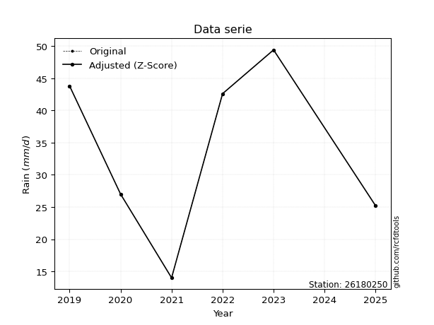</img>

</div>


> The initial value (value_initial) correspond to the initial obtained or null completed value, and value (value) is adjusted only when the initial value is outside the valid range (outlier) definite through the Z-Score value. If Z-Score is active, values out of range or outliers are replaced with the station mean value. A Z-Score (or standard score) measures how many standard deviations a data point is from the mean of a dataset, indicating its relative position; positive scores mean above the mean, negative mean below, and a score of zero is exactly at the mean, allowing for comparison of values from different distributions. It´s calculated using the formula $z=(x–μ)/σ$, where $x$ is the data point, $μ$ is the mean, and $σ$ is the standard deviation, helping identify outliers and understand probability.
>
> <sub>**Note**: In this study, "completing" (filling gaps in) and "extending" (forecasting or lengthening the historical record) rainfall data series are avoided for certain critical analyses because they introduce artificial bias and uncertainty, which can distort the statistics of rare events (extremes), alter day-to-day variability, and compromise the integrity and homogeneity of the original data. Some reasons against Completing/Extending rainfall data are: **Distortion of Extremes and Variability**: The primary issue is that most gap-filling or extension methods rely on averaging or regression with nearby stations, which inherently smooths the data. Rainfall is highly variable in space and time, with a large percentage of zero values and occasional large storms. Infilling methods often underestimate the highest values and overestimate the lowest (zero) values, which severely distorts analyses focused on flood frequency, drought severity, and intensity-duration-frequency (IDF) curves, **Loss of Data Homogeneity**: Infilled or extended data are synthetic estimates, not actual measurements. Combining these estimates with observed data can violate the assumption of data homogeneity, which requires that the data properties do not change over time. Inhomogeneity can lead to incorrect conclusions about long-term trends or changes in climate patterns, **Propagation of Errors**: Errors and biases from the original data (e.g., wind-induced undercatch, instrument errors, site changes) or the data used for imputation can propagate through the analysis, leading to unreliable hydrological models and inaccurate predictions, **Compromised Statistical Integrity**: For statistical analyses, especially those involving the frequency of events, using artificial data can introduce time bias or autocorrelation that doesn´t exist in reality, making it difficult to assess the true probability of events, **Difficulty in Validation**: It is difficult to accurately validate the quality of filled or extended data, especially for past periods where ground-truth measurements are unavailable. The reliability of imputation techniques heavily depends on the density of the surrounding station network and the complexity of the local topography.</sub>


### 4. Active continuous probability distributions from SciPy (80 of 104 available)

A Probability Density Function (PDF) describes the relative likelihood of a continuous random variable falling within a specific range, where the total area under its curve equals 1, and the area over any interval gives the actual probability for that range. Unlike discrete probabilities (like rolling a die), a PDF shows density, not direct probability for a single point (which is zero), with higher points indicating higher likelihood, often visualized as a bell curve for normal distributions.

A log of a probability density function (log-PDF) is simply the logarithm of the PDF´s value, denoted as $log(f(x))$, useful for converting multiplication of probabilities into addition, improving numerical stability with tiny numbers, and connecting to information theory concepts like entropy. Instead of dealing with very small probabilities (e.g., 0.000001), log-PDFs use negative numbers (e.g., $log(0.00001) ≈ -11.51$ that are easier for computers to handle, preventing underflow errors and simplifying complex calculations. In this study, each active probability distribution from SciPy is also evaluated in the $log$ form.

[scipy.stats](https://docs.scipy.org/doc/scipy/reference/stats.html) is a Python´s powerful submodule within the SciPy library for comprehensive statistical analysis, offering over 130 probability distributions (like Normal, Poisson, etc.), functions for descriptive stats (mean, variance), hypothesis testing (t-tests, chi-square), random variable generation, and statistical tests, making it essential for data science, modeling, and research. It provides tools to explore, model, and draw conclusions from data efficiently, working seamlessly with [NumPy](https://numpy.org/).

<div align="center">

|   id | p_dist           |   n_parameter | fit_method   | label                                                                       | active   | ref                                                                                                      |
|-----:|:-----------------|--------------:|:-------------|:----------------------------------------------------------------------------|:---------|:---------------------------------------------------------------------------------------------------------|
|    0 | alpha            |             3 | MLE          | Alpha                                                                       | True     | [:mortar_board:](https://docs.scipy.org/doc/scipy/reference/generated/scipy.stats.alpha.html)            |
|    1 | anglit           |             2 | MM           | Anglit                                                                      | True     | [:mortar_board:](https://docs.scipy.org/doc/scipy/reference/generated/scipy.stats.anglit.html)           |
|    2 | arcsine          |             2 | MM           | Arcsine                                                                     | True     | [:mortar_board:](https://docs.scipy.org/doc/scipy/reference/generated/scipy.stats.arcsine.html)          |
|    3 | argus            |             3 | MLE          | Argus                                                                       | True     | [:mortar_board:](https://docs.scipy.org/doc/scipy/reference/generated/scipy.stats.argus.html)            |
|    4 | beta             |             4 | MLE          | Beta                                                                        | True     | [:mortar_board:](https://docs.scipy.org/doc/scipy/reference/generated/scipy.stats.beta.html)             |
|    5 | betaprime        |             4 | MLE          | Beta prime                                                                  | True     | [:mortar_board:](https://docs.scipy.org/doc/scipy/reference/generated/scipy.stats.betaprime.html)        |
|    6 | bradford         |             3 | MLE          | Bradford                                                                    | True     | [:mortar_board:](https://docs.scipy.org/doc/scipy/reference/generated/scipy.stats.bradford.html)         |
|    7 | burr             |             4 | MLE          | Burr (Type III)                                                             | True     | [:mortar_board:](https://docs.scipy.org/doc/scipy/reference/generated/scipy.stats.burr.html)             |
|    8 | burr12           |             4 | MLE          | Burr (Type III) 12                                                          | True     | [:mortar_board:](https://docs.scipy.org/doc/scipy/reference/generated/scipy.stats.burr12.html)           |
|    9 | cosine           |             2 | MLE          | Cosine                                                                      | True     | [:mortar_board:](https://docs.scipy.org/doc/scipy/reference/generated/scipy.stats.cosine.html)           |
|   10 | crystalball      |             4 | MLE          | Crystalball                                                                 | True     | [:mortar_board:](https://docs.scipy.org/doc/scipy/reference/generated/scipy.stats.crystalball.html)      |
|   11 | dgamma           |             3 | MLE          | Double gamma                                                                | True     | [:mortar_board:](https://docs.scipy.org/doc/scipy/reference/generated/scipy.stats.dgamma.html)           |
|   12 | dweibull         |             3 | MLE          | Double Weibull                                                              | True     | [:mortar_board:](https://docs.scipy.org/doc/scipy/reference/generated/scipy.stats.dweibull.html)         |
|   13 | erlang           |             3 | MLE          | Erlang                                                                      | True     | [:mortar_board:](https://docs.scipy.org/doc/scipy/reference/generated/scipy.stats.erlang.html)           |
|   14 | exponnorm        |             3 | MLE          | Exponentially modified Normal                                               | True     | [:mortar_board:](https://docs.scipy.org/doc/scipy/reference/generated/scipy.stats.exponnorm.html)        |
|   15 | exponpow         |             3 | MLE          | Exponential power                                                           | True     | [:mortar_board:](https://docs.scipy.org/doc/scipy/reference/generated/scipy.stats.exponpow.html)         |
|   16 | exponweib        |             4 | MLE          | Exponentiated Weibull                                                       | True     | [:mortar_board:](https://docs.scipy.org/doc/scipy/reference/generated/scipy.stats.exponweib.html)        |
|   17 | f                |             4 | MLE          | F                                                                           | True     | [:mortar_board:](https://docs.scipy.org/doc/scipy/reference/generated/scipy.stats.f.html)                |
|   18 | fatiguelife      |             3 | MLE          | Fatigue-life (Birnbaum-Saunders)                                            | True     | [:mortar_board:](https://docs.scipy.org/doc/scipy/reference/generated/scipy.stats.fatiguelife.html)      |
|   19 | foldnorm         |             3 | MM           | Fold Normal                                                                 | True     | [:mortar_board:](https://docs.scipy.org/doc/scipy/reference/generated/scipy.stats.foldnorm.html)         |
|   20 | gamma            |             3 | MLE          | Gamma                                                                       | True     | [:mortar_board:](https://docs.scipy.org/doc/scipy/reference/generated/scipy.stats.gamma.html)            |
|   21 | gausshyper       |             6 | MLE          | Gauss hypergeometric                                                        | True     | [:mortar_board:](https://docs.scipy.org/doc/scipy/reference/generated/scipy.stats.gausshyper.html)       |
|   22 | genexpon         |             5 | MLE          | Generalized exponential                                                     | True     | [:mortar_board:](https://docs.scipy.org/doc/scipy/reference/generated/scipy.stats.genexpon.html)         |
|   23 | genextreme       |             3 | MLE          | Generalized exponential                                                     | True     | [:mortar_board:](https://docs.scipy.org/doc/scipy/reference/generated/scipy.stats.genextreme.html)       |
|   24 | gengamma         |             4 | MLE          | Generalized gamma                                                           | True     | [:mortar_board:](https://docs.scipy.org/doc/scipy/reference/generated/scipy.stats.gengamma.html)         |
|   25 | genhalflogistic  |             3 | MLE          | Generalized half-logistic                                                   | True     | [:mortar_board:](https://docs.scipy.org/doc/scipy/reference/generated/scipy.stats.genhalflogistic.html)  |
|   26 | genlogistic      |             3 | MLE          | Generalized logistic                                                        | True     | [:mortar_board:](https://docs.scipy.org/doc/scipy/reference/generated/scipy.stats.genlogistic.html)      |
|   27 | gennorm          |             3 | MLE          | Generalized Normal                                                          | True     | [:mortar_board:](https://docs.scipy.org/doc/scipy/reference/generated/scipy.stats.gennorm.html)          |
|   28 | genpareto        |             3 | MLE          | Generalized Pareto                                                          | True     | [:mortar_board:](https://docs.scipy.org/doc/scipy/reference/generated/scipy.stats.genpareto.html)        |
|   29 | gompertz         |             3 | MLE          | Gompertz (or truncated Gumbel)                                              | True     | [:mortar_board:](https://docs.scipy.org/doc/scipy/reference/generated/scipy.stats.gompertz.html)         |
|   30 | gumbel_l         |             2 | MM           | Gumbel Left Skew                                                            | True     | [:mortar_board:](https://docs.scipy.org/doc/scipy/reference/generated/scipy.stats.gumbel_l.html)         |
|   31 | gumbel_r         |             2 | MM           | Gumbel Right Skew                                                           | True     | [:mortar_board:](https://docs.scipy.org/doc/scipy/reference/generated/scipy.stats.gumbel_r.html)         |
|   32 | halfgennorm      |             3 | MLE          | Upper half of a generalized normal                                          | True     | [:mortar_board:](https://docs.scipy.org/doc/scipy/reference/generated/scipy.stats.halfgennorm.html)      |
|   33 | halflogistic     |             2 | MM           | Half-logistic                                                               | True     | [:mortar_board:](https://docs.scipy.org/doc/scipy/reference/generated/scipy.stats.halflogistic.html)     |
|   34 | halfnorm         |             2 | MM           | Half Normal                                                                 | True     | [:mortar_board:](https://docs.scipy.org/doc/scipy/reference/generated/scipy.stats.halfnorm.html)         |
|   35 | hypsecant        |             2 | MM           | hyperbolic secant                                                           | True     | [:mortar_board:](https://docs.scipy.org/doc/scipy/reference/generated/scipy.stats.hypsecant.html)        |
|   36 | invgamma         |             3 | MLE          | Inverted gamma                                                              | True     | [:mortar_board:](https://docs.scipy.org/doc/scipy/reference/generated/scipy.stats.invgamma.html)         |
|   37 | invgauss         |             3 | MLE          | Inverse Gaussian                                                            | True     | [:mortar_board:](https://docs.scipy.org/doc/scipy/reference/generated/scipy.stats.invgauss.html)         |
|   38 | invweibull       |             3 | MLE          | Inverted Weibull                                                            | True     | [:mortar_board:](https://docs.scipy.org/doc/scipy/reference/generated/scipy.stats.invweibull.html)       |
|   39 | johnsonsb        |             4 | MLE          | Johnson SB                                                                  | True     | [:mortar_board:](https://docs.scipy.org/doc/scipy/reference/generated/scipy.stats.johnsonsb.html)        |
|   40 | johnsonsu        |             4 | MLE          | Johnson Su                                                                  | True     | [:mortar_board:](https://docs.scipy.org/doc/scipy/reference/generated/scipy.stats.johnsonsu.html)        |
|   41 | kappa3           |             3 | MLE          | Kappa 3                                                                     | True     | [:mortar_board:](https://docs.scipy.org/doc/scipy/reference/generated/scipy.stats.kappa3.html)           |
|   42 | kappa4           |             4 | MLE          | Kappa 4                                                                     | True     | [:mortar_board:](https://docs.scipy.org/doc/scipy/reference/generated/scipy.stats.kappa4.html)           |
|   43 | ksone            |             3 | MLE          | Kolmogorov-Smirnov one-sided test statistic distribution                    | True     | [:mortar_board:](https://docs.scipy.org/doc/scipy/reference/generated/scipy.stats.ksone.html)            |
|   44 | kstwobign        |             2 | MLE          | Limiting distribution of scaled Kolmogorov-Smirnov two-sided test statistic | True     | [:mortar_board:](https://docs.scipy.org/doc/scipy/reference/generated/scipy.stats.kstwobign.html)        |
|   45 | laplace          |             2 | MM           | Laplace                                                                     | True     | [:mortar_board:](https://docs.scipy.org/doc/scipy/reference/generated/scipy.stats.laplace.html)          |
|   46 | levy_l           |             2 | MLE          | Left-skewed Levy                                                            | True     | [:mortar_board:](https://docs.scipy.org/doc/scipy/reference/generated/scipy.stats.levy_l.html)           |
|   47 | loggamma         |             3 | MLE          | Log gamma                                                                   | True     | [:mortar_board:](https://docs.scipy.org/doc/scipy/reference/generated/scipy.stats.loggamma.html)         |
|   48 | logistic         |             2 | MM           | Logistic (or Sech-squared)                                                  | True     | [:mortar_board:](https://docs.scipy.org/doc/scipy/reference/generated/scipy.stats.logistic.html)         |
|   49 | loglaplace       |             3 | MLE          | Log-Laplace                                                                 | True     | [:mortar_board:](https://docs.scipy.org/doc/scipy/reference/generated/scipy.stats.loglaplace.html)       |
|   50 | lomax            |             3 | MLE          | Lomax (Pareto of the second kind)                                           | True     | [:mortar_board:](https://docs.scipy.org/doc/scipy/reference/generated/scipy.stats.lomax.html)            |
|   51 | maxwell          |             2 | MM           | Maxwell                                                                     | True     | [:mortar_board:](https://docs.scipy.org/doc/scipy/reference/generated/scipy.stats.maxwell.html)          |
|   52 | mielke           |             4 | MLE          | Mielke Beta-Kappa / Dagum                                                   | True     | [:mortar_board:](https://docs.scipy.org/doc/scipy/reference/generated/scipy.stats.mielke.html)           |
|   53 | moyal            |             2 | MM           | Moyal                                                                       | True     | [:mortar_board:](https://docs.scipy.org/doc/scipy/reference/generated/scipy.stats.moyal.html)            |
|   54 | nakagami         |             3 | MLE          | Nakagami                                                                    | True     | [:mortar_board:](https://docs.scipy.org/doc/scipy/reference/generated/scipy.stats.nakagami.html)         |
|   55 | ncf              |             5 | MLE          | Non-central F distribution                                                  | True     | [:mortar_board:](https://docs.scipy.org/doc/scipy/reference/generated/scipy.stats.ncf.html)              |
|   56 | nct              |             4 | MLE          | Non-central Student’s t                                                     | True     | [:mortar_board:](https://docs.scipy.org/doc/scipy/reference/generated/scipy.stats.nct.html)              |
|   57 | norm             |             2 | MM           | Normal                                                                      | True     | [:mortar_board:](https://docs.scipy.org/doc/scipy/reference/generated/scipy.stats.norm.html)             |
|   58 | pearson3         |             3 | MM           | Pearson type III                                                            | True     | [:mortar_board:](https://docs.scipy.org/doc/scipy/reference/generated/scipy.stats.pearson3.html)         |
|   59 | powerlaw         |             3 | MLE          | Power-function                                                              | True     | [:mortar_board:](https://docs.scipy.org/doc/scipy/reference/generated/scipy.stats.powerlaw.html)         |
|   60 | rayleigh         |             2 | MM           | Rayleigh                                                                    | True     | [:mortar_board:](https://docs.scipy.org/doc/scipy/reference/generated/scipy.stats.rayleigh.html)         |
|   61 | rdist            |             3 | MLE          | R-distributed (symmetric beta)                                              | True     | [:mortar_board:](https://docs.scipy.org/doc/scipy/reference/generated/scipy.stats.rdist.html)            |
|   62 | rice             |             3 | MLE          | Rice                                                                        | True     | [:mortar_board:](https://docs.scipy.org/doc/scipy/reference/generated/scipy.stats.rice.html)             |
|   63 | semicircular     |             2 | MM           | Semicircular                                                                | True     | [:mortar_board:](https://docs.scipy.org/doc/scipy/reference/generated/scipy.stats.semicircular.html)     |
|   64 | skewnorm         |             3 | MLE          | Skew normal                                                                 | True     | [:mortar_board:](https://docs.scipy.org/doc/scipy/reference/generated/scipy.stats.skewnorm.html)         |
|   65 | t                |             3 | MLE          | Student’s t                                                                 | True     | [:mortar_board:](https://docs.scipy.org/doc/scipy/reference/generated/scipy.stats.t.html)                |
|   66 | trapezoid        |             4 | MLE          | Trapezoid                                                                   | True     | [:mortar_board:](https://docs.scipy.org/doc/scipy/reference/generated/scipy.stats.trapezoid.html)        |
|   67 | triang           |             3 | MLE          | Triangular                                                                  | True     | [:mortar_board:](https://docs.scipy.org/doc/scipy/reference/generated/scipy.stats.triang.html)           |
|   68 | truncexpon       |             3 | MLE          | Truncated exponential                                                       | True     | [:mortar_board:](https://docs.scipy.org/doc/scipy/reference/generated/scipy.stats.truncexpon.html)       |
|   69 | truncnorm        |             4 | MLE          | Truncated normal                                                            | True     | [:mortar_board:](https://docs.scipy.org/doc/scipy/reference/generated/scipy.stats.truncnorm.html)        |
|   70 | truncpareto      |             4 | MLE          | Upper truncated Pareto                                                      | True     | [:mortar_board:](https://docs.scipy.org/doc/scipy/reference/generated/scipy.stats.truncpareto.html)      |
|   71 | truncweibull_min |             5 | MLE          | Doubly truncated Weibull minimum                                            | True     | [:mortar_board:](https://docs.scipy.org/doc/scipy/reference/generated/scipy.stats.truncweibull_min.html) |
|   72 | tukeylambda      |             3 | MLE          | Tukey-Lamdba                                                                | True     | [:mortar_board:](https://docs.scipy.org/doc/scipy/reference/generated/scipy.stats.tukeylambda.html)      |
|   73 | uniform          |             2 | MLE          | Uniform                                                                     | True     | [:mortar_board:](https://docs.scipy.org/doc/scipy/reference/generated/scipy.stats.uniform.html)          |
|   74 | vonmises         |             3 | MLE          | Von Mises                                                                   | True     | [:mortar_board:](https://docs.scipy.org/doc/scipy/reference/generated/scipy.stats.vonmises.html)         |
|   75 | vonmises_line    |             3 | MLE          | Von Mises line                                                              | True     | [:mortar_board:](https://docs.scipy.org/doc/scipy/reference/generated/scipy.stats.vonmises_line.html)    |
|   76 | wald             |             2 | MM           | Wald                                                                        | True     | [:mortar_board:](https://docs.scipy.org/doc/scipy/reference/generated/scipy.stats.wald.html)             |
|   77 | weibull_max      |             3 | MLE          | Weibull maximum                                                             | True     | [:mortar_board:](https://docs.scipy.org/doc/scipy/reference/generated/scipy.stats.weibull_max.html)      |
|   78 | weibull_min      |             3 | MLE          | Weibull minimum                                                             | True     | [:mortar_board:](https://docs.scipy.org/doc/scipy/reference/generated/scipy.stats.weibull_min.html)      |
|   79 | wrapcauchy       |             3 | MLE          | Wrapped  Cauchy                                                             | True     | [:mortar_board:](https://docs.scipy.org/doc/scipy/reference/generated/scipy.stats.wrapcauchy.html)       |

</div>

> **n_parameter:** # arguments & localization & scale.
>
> **Fit methods:** (MLE) maximum likelihood, (MM) L-moments.
>
>**Inactive** (With the only purpose of prevent loops, zero divisions, infinite values, over high estimated values or horizontal trending for recurrence intervals estimations, the follow distributions were disabled.)**:** lognorm, norminvgauss, powernorm, powerlognorm, cauchy, halfcauchy, foldcauchy, skewcauchy, chi2, expon, fisk, genhyperbolic, geninvgauss, gibrat, kstwo, laplace_asymmetric, levy, levy_stable, ncx2, pareto, rel_breitwigner, recipinvgauss, studentized_range, loguniform, 


## B. Probability (PDF) vs. Empirical (EDF) distributions functions

A continuous probability distribution (CPD) describes probabilities for variables that can take any value within a range (like rain any time), unlike discrete variables with specific outcomes (like temperature). It uses a Probability Density Function (PDF), a curve where the total area under it equals 1, and the probability of the variable falling within an interval (a to b) is found by calculating the area under the curve between those points. A key feature is that the probability of hitting any single exact value is zero, so probabilities are always expressed for ranges, e.g., $P(a ≤ X ≤ b)$.

<div align="center">

Distributions parameters from station values
|     |   station | p_dist              |   n |               loc |            scale | shape                  | shape1                 | shape2             | shape3             |
|----:|----------:|:--------------------|----:|------------------:|-----------------:|:-----------------------|:-----------------------|:-------------------|:-------------------|
|   0 |  26180250 | alpha               |   6 |    -191.78        |   3992.78        | 17.75613378534782      |                        |                    |                    |
|   1 |  26180250 | anglit              |   6 |      33.6667      |     36.4783      |                        |                        |                    |                    |
|   2 |  26180250 | arcsine             |   6 |      16.0321      |     35.2691      |                        |                        |                    |                    |
|   3 |  26180250 | argus               |   6 |       3.90589     |     47.3507      | 1.349840751199801      |                        |                    |                    |
|   4 |  26180250 | beta                |   6 |      12.9229      |     36.4771      | 0.6521613572356462     | 0.5052212379137349     |                    |                    |
|   5 |  26180250 | betaprime           |   6 |    -122.468       |   8771.56        | 151.54088543932238     | 8514.71612263774       |                    |                    |
|   6 |  26180250 | bradford            |   6 |      14           |     35.4001      | 0.9860010005873558     |                        |                    |                    |
|   7 |  26180250 | burr                |   6 |    -213.516       |    137.373       | 20.809334547756627     | 112300.03077607478     |                    |                    |
|   8 |  26180250 | burr12              |   6 |      -1.20098     |     15.0904      | 586.6390482159644      | 0.002242869415929356   |                    |                    |
|   9 |  26180250 | cosine              |   6 |      33.152       |     10.0472      |                        |                        |                    |                    |
|  10 |  26180250 | crystalball         |   6 |      33.6667      |     12.4695      | 3645.7936517237194     | 45.450113610525804     |                    |                    |
|  11 |  26180250 | dgamma              |   6 |      34.3659      |      1.5763      | 7.359014670401322      |                        |                    |                    |
|  12 |  26180250 | dweibull            |   6 |      33.7482      |     13.0935      | 2.7263797820864264     |                        |                    |                    |
|  13 |  26180250 | erlang              |   6 |    -186.226       |      0.722641    | 304.34598921063434     |                        |                    |                    |
|  14 |  26180250 | exponnorm           |   6 |      33.6576      |     12.4695      | 0.00071872426730068    |                        |                    |                    |
|  15 |  26180250 | exponpow            |   6 |      14           |      1.6101      | 0.12267717039682949    |                        |                    |                    |
|  16 |  26180250 | exponweib           |   6 |      14           |      1.01186     | 1.280963809276611      | 0.25031762125123536    |                    |                    |
|  17 |  26180250 | f                   |   6 |   -3757.56        |   3791.26        | 201852.08140504378     | 2129725.3315682863     |                    |                    |
|  18 |  26180250 | fatiguelife         |   6 |      14           |      0.000294278 | 283.14982634935916     |                        |                    |                    |
|  19 |  26180250 | foldnorm            |   6 |     -21.8594      |     12.2107      | 4.55187527192445       |                        |                    |                    |
|  20 |  26180250 | gamma               |   6 |    -191.482       |      0.704421    | 319.52123497679383     |                        |                    |                    |
|  21 |  26180250 | gausshyper          |   6 |      13.228       |     36.172       | 1.2278241986191039     | 0.7239778622013153     | 1.021134477567917  | 0.8047936452661879 |
|  22 |  26180250 | genexpon            |   6 |      14           |      2.54048     | 0.1284231919129587     | 1.0107545378350611e-05 | 0.5775424768937791 |                    |
|  23 |  26180250 | genextreme          |   6 |      34.3765      |     17.3348      | 1.1538469409317345     |                        |                    |                    |
|  24 |  26180250 | gengamma            |   6 |      14           |      0.944151    | 1.3053403799093035     | 0.26192636674702535    |                    |                    |
|  25 |  26180250 | genhalflogistic     |   6 |       6.91857     |     46.4874      | 1.094298319766068      |                        |                    |                    |
|  26 |  26180250 | genlogistic         |   6 |      49.4002      |      1.00499e-05 | 6.403352570288833e-07  |                        |                    |                    |
|  27 |  26180250 | gennorm             |   6 |      31.7         |     17.7         | 29984601.73347804      |                        |                    |                    |
|  28 |  26180250 | genpareto           |   6 |      -0.210314    |     64.1128      | -1.2923272389171223    |                        |                    |                    |
|  29 |  26180250 | gompertz            |   6 |      14           |     15.4243      | 0.26545391362866544    |                        |                    |                    |
|  30 |  26180250 | gumbel_l            |   6 |      39.2786      |      9.72244     |                        |                        |                    |                    |
|  31 |  26180250 | gumbel_r            |   6 |      28.0547      |      9.72244     |                        |                        |                    |                    |
|  32 |  26180250 | halfgennorm         |   6 |      14           |      1.15853     | 0.3833377232598295     |                        |                    |                    |
|  33 |  26180250 | halflogistic        |   6 |      18.8874      |     10.661       |                        |                        |                    |                    |
|  34 |  26180250 | halfnorm            |   6 |      17.1619      |     20.6857      |                        |                        |                    |                    |
|  35 |  26180250 | hypsecant           |   6 |      33.6667      |      7.93834     |                        |                        |                    |                    |
|  36 |  26180250 | invgamma            |   6 |    -102.974       |  15579           | 115.05108676299687     |                        |                    |                    |
|  37 |  26180250 | invgauss            |   6 |     -35.6885      |   1888.15        | 0.036569319612044404   |                        |                    |                    |
|  38 |  26180250 | invweibull          |   6 |      14           |      1.3328      | 0.04889425156906721    |                        |                    |                    |
|  39 |  26180250 | johnsonsb           |   6 |      13.9999      |     35.4001      | 0.04791778644103109    | 0.07495509672618311    |                    |                    |
|  40 |  26180250 | johnsonsu           |   6 |      55.2509      |      0.375678    | 6.71163041791093       | 1.4786050803391269     |                    |                    |
|  41 |  26180250 | kappa3              |   6 |      12.2495      |     37.0722      | 736.7351413499393      |                        |                    |                    |
|  42 |  26180250 | kappa4              |   6 |      12.8845      |     40.326       | 1.0216514671889616     | 1.104354465590004      |                    |                    |
|  43 |  26180250 | ksone               |   6 |      12.0688      |     43.1957      | 1.0                    |                        |                    |                    |
|  44 |  26180250 | kstwobign           |   6 |     -13.4588      |     53.7424      |                        |                        |                    |                    |
|  45 |  26180250 | laplace             |   6 |      33.6667      |      8.81728     |                        |                        |                    |                    |
|  46 |  26180250 | levy_l              |   6 |      50.594       |      4.92242     |                        |                        |                    |                    |
|  47 |  26180250 | loggamma            |   6 |      49.4003      |      1.71699e-05 | 1.090147899832625e-06  |                        |                    |                    |
|  48 |  26180250 | logistic            |   6 |      33.6667      |      6.87481     |                        |                        |                    |                    |
|  49 |  26180250 | loglaplace          |   6 |      -0.106643    |     42.7066      | 2.6536503437559986     |                        |                    |                    |
|  50 |  26180250 | lomax               |   6 |      14           |      2.71632e+10 | 816681790.3943478      |                        |                    |                    |
|  51 |  26180250 | maxwell             |   6 |       4.11914     |     18.5162      |                        |                        |                    |                    |
|  52 |  26180250 | mielke              |   6 |      -3.44292     |     53.0111      | 2.3611301029303053     | 1455.2772073133046     |                    |                    |
|  53 |  26180250 | moyal               |   6 |      26.5358      |      5.61326     |                        |                        |                    |                    |
|  54 |  26180250 | nakagami            |   6 |      25.2         |     12.4881      | 0.18670540690918616    |                        |                    |                    |
|  55 |  26180250 | ncf                 |   6 |      -3.20909     |      5.77121e-07 | 5.102869371882492e-07  | 1343.4069088561023     | 32.571624578942554 |                    |
|  56 |  26180250 | nct                 |   6 |    -738.018       |     12.3706      | 113611.13047493054     | 62.37979902814931      |                    |                    |
|  57 |  26180250 | norm                |   6 |      33.6667      |     12.4695      |                        |                        |                    |                    |
|  58 |  26180250 | pearson3            |   6 |      33.6667      |     12.4695      | -0.24600936177947816   |                        |                    |                    |
|  59 |  26180250 | powerlaw            |   6 |      14           |     35.4         | 0.14974172285206552    |                        |                    |                    |
|  60 |  26180250 | rayleigh            |   6 |       9.81175     |     19.0335      |                        |                        |                    |                    |
|  61 |  26180250 | rdist               |   6 |      13.7763      |     13.2237      | 1.230071336565886      |                        |                    |                    |
|  62 |  26180250 | rice                |   6 |       7.35979     |     14.4499      | 1.4349661628020467     |                        |                    |                    |
|  63 |  26180250 | semicircular        |   6 |      33.6667      |     24.939       |                        |                        |                    |                    |
|  64 |  26180250 | skewnorm            |   6 |      49.4         |     20.0739      | -9338438.110821549     |                        |                    |                    |
|  65 |  26180250 | t                   |   6 |      33.667       |     12.4693      | 14550.218549578727     |                        |                    |                    |
|  66 |  26180250 | trapezoid           |   6 |      -1.68258     |     52.9037      | 1.0                    | 1.0                    |                    |                    |
|  67 |  26180250 | triang              |   6 |       1.56169     |     48.3319      | 0.9897876414433877     |                        |                    |                    |
|  68 |  26180250 | truncexpon          |   6 |      14           |     48.8643      | 0.7244567158673325     |                        |                    |                    |
|  69 |  26180250 | truncnorm           |   6 |      33.6667      |     12.4695      | -370.12598859505454    | 610.5142064679787      |                    |                    |
|  70 |  26180250 | truncpareto         |   6 |      13.9409      |      0.0591334   | 0.20372952701960545    | 599.6469202202412      |                    |                    |
|  71 |  26180250 | truncweibull_min    |   6 |      12.7214      |     55.7679      | 1.2183188124513726     | 1.415632831091418e-08  | 0.657701031092313  |                    |
|  72 |  26180250 | tukeylambda         |   6 |      31.7631      |     19.4901      | 1.0972260116431696     |                        |                    |                    |
|  73 |  26180250 | uniform             |   6 |      14           |     35.4         |                        |                        |                    |                    |
|  74 |  26180250 | vonmises            |   6 |       0.0335062   |      1           | 0.9927636747339101     |                        |                    |                    |
|  75 |  26180250 | vonmises_line       |   6 |      31.8239      |      5.67353     | 7.169984081327127e-06  |                        |                    |                    |
|  76 |  26180250 | wald                |   6 |      21.1971      |     12.4696      |                        |                        |                    |                    |
|  77 |  26180250 | weibull_max         |   6 |      49.4         |      1.31949     | 0.26905768010032194    |                        |                    |                    |
|  78 |  26180250 | weibull_min         |   6 |     -56.7678      |     95.8253      | 8.803236148381153      |                        |                    |                    |
|  79 |  26180250 | wrapcauchy          |   6 |      13.9999      |      5.6341      | 0.31355608329555784    |                        |                    |                    |
|  80 |  26180250 | logalpha            |   6 |      -8.88348     |    338.043       | 27.474026915953786     |                        |                    |                    |
|  81 |  26180250 | loganglit           |   6 |       3.4322      |      1.2704      |                        |                        |                    |                    |
|  82 |  26180250 | logarcsine          |   6 |       2.81807     |      1.22825     |                        |                        |                    |                    |
|  83 |  26180250 | logargus            |   6 |       2.18378     |      1.76376     | 2.1337761343359225     |                        |                    |                    |
|  84 |  26180250 | logbeta             |   6 |       2.43522     |      1.46473     | 1.0363167468892287     | 0.5130568643578045     |                    |                    |
|  85 |  26180250 | logbetaprime        |   6 |      -3.0144      |      9.90355     | 235.30415008008896     | 361.5161236504381      |                    |                    |
|  86 |  26180250 | logbradford         |   6 |       2.63905     |      1.26096     | 1.0798112080842899     |                        |                    |                    |
|  87 |  26180250 | logburr             |   6 |       1.47729     |      2.43188     | 960.8219181553912      | 0.004207526955176301   |                    |                    |
|  88 |  26180250 | logburr12           |   6 |    -109.185       |    116.143       | 349.2626468550741      | 25368.867055909017     |                    |                    |
|  89 |  26180250 | logcosine           |   6 |       3.38582     |      0.362288    |                        |                        |                    |                    |
|  90 |  26180250 | logcrystalball      |   6 |       3.4322      |      0.434266    | 3057.60481844323       | 9.924000014680846      |                    |                    |
|  91 |  26180250 | logdgamma           |   6 |       3.49558     |      0.0935707   | 4.042752593279392      |                        |                    |                    |
|  92 |  26180250 | logdweibull         |   6 |       3.46905     |      0.430082    | 1.9036326433978008     |                        |                    |                    |
|  93 |  26180250 | logerlang           |   6 |      -4.15591     |      0.0261131   | 290.3549225214648      |                        |                    |                    |
|  94 |  26180250 | logexponnorm        |   6 |       3.43185     |      0.434263    | 0.0007798316132831735  |                        |                    |                    |
|  95 |  26180250 | logexponpow         |   6 | -138407           | 138411           | 351671.79857358825     |                        |                    |                    |
|  96 |  26180250 | logexponweib        |   6 |       2.63906     |      1.67949     | 0.648794711742592      | 0.24805450526254608    |                    |                    |
|  97 |  26180250 | logf                |   6 |    -355.052       |    358.484       | 4514519.5379159935     | 1943459.3966515912     |                    |                    |
|  98 |  26180250 | logfatiguelife      |   6 |    -202.002       |    205.433       | 0.002110505750178569   |                        |                    |                    |
|  99 |  26180250 | logfoldnorm         |   6 |       2.73335     |      0.47115     | 1.4148177872474452     |                        |                    |                    |
| 100 |  26180250 | loggamma            |   6 |      -4.22325     |      0.025974    | 294.48560405073215     |                        |                    |                    |
| 101 |  26180250 | loggausshyper       |   6 |       2.59249     |      1.30746     | 1.1993097928832943     | 0.9078562123031607     | 0.7918083323644844 | 1.1332896684870981 |
| 102 |  26180250 | loggenexpon         |   6 |       2.63906     |      1.3056      | 0.8543404058831348     | 1.7641283553929226     | 1.5378733545708776 |                    |
| 103 |  26180250 | loggenextreme       |   6 |       3.44748     |      0.50198     | 1.1094294314286322     |                        |                    |                    |
| 104 |  26180250 | loggengamma         |   6 |       2.63906     |      1.60998     | 1.0337525083620518     | 0.5022176824653468     |                    |                    |
| 105 |  26180250 | loggenhalflogistic  |   6 |       2.63682     |      1.39727     | 1.1061969684343742     |                        |                    |                    |
| 106 |  26180250 | loggenlogistic      |   6 |       3.89997     |      1.24259e-06 | 2.642776290446922e-06  |                        |                    |                    |
| 107 |  26180250 | loggennorm          |   6 |       3.2695      |      0.630448    | 9541962.559303667      |                        |                    |                    |
| 108 |  26180250 | loggenpareto        |   6 |      -0.00548447  |     13.0022      | -3.3292551413339044    |                        |                    |                    |
| 109 |  26180250 | loggompertz         |   6 |       2.63499     |      0.397479    | 0.09489103467473109    |                        |                    |                    |
| 110 |  26180250 | loggumbel_l         |   6 |       3.62764     |      0.338596    |                        |                        |                    |                    |
| 111 |  26180250 | loggumbel_r         |   6 |       3.23675     |      0.338596    |                        |                        |                    |                    |
| 112 |  26180250 | loghalfgennorm      |   6 |       2.63836     |      1.26404     | 3376.6793790830598     |                        |                    |                    |
| 113 |  26180250 | loghalflogistic     |   6 |       2.91747     |      0.371296    |                        |                        |                    |                    |
| 114 |  26180250 | loghalfnorm         |   6 |       2.85741     |      0.720389    |                        |                        |                    |                    |
| 115 |  26180250 | loghypsecant        |   6 |       3.4322      |      0.276462    |                        |                        |                    |                    |
| 116 |  26180250 | loginvgamma         |   6 |      -5.17292     |   3151.84        | 367.6256151406837      |                        |                    |                    |
| 117 |  26180250 | loginvgauss         |   6 |      -0.677664    |    340.898       | 0.012042404820051658   |                        |                    |                    |
| 118 |  26180250 | loginvweibull       |   6 | -100702           | 100705           | 220733.52623353005     |                        |                    |                    |
| 119 |  26180250 | logjohnsonsb        |   6 |       1.982       |      1.91795     | 0.4591794602546623     | 0.12143869298581988    |                    |                    |
| 120 |  26180250 | logjohnsonsu        |   6 |       3.9266      |      0.000627991 | 5.236129887704665      | 0.7749200238551825     |                    |                    |
| 121 |  26180250 | logkappa3           |   6 |       2.63906     |      1.26075     | 16324.366791988981     |                        |                    |                    |
| 122 |  26180250 | logkappa4           |   6 |       2.54413     |      1.38823     | 1.0734598628546228     | 1.0229608573740259     |                    |                    |
| 123 |  26180250 | logksone            |   6 |       2.51297     |      1.51307     | 1.0                    |                        |                    |                    |
| 124 |  26180250 | logkstwobign        |   6 |       1.59872     |      2.09255     |                        |                        |                    |                    |
| 125 |  26180250 | loglaplace          |   6 |       3.4322      |      0.307072    |                        |                        |                    |                    |
| 126 |  26180250 | loglevy_l           |   6 |       3.92846     |      0.117064    |                        |                        |                    |                    |
| 127 |  26180250 | logloggamma         |   6 |       3.90145     |      5.10433e-06 | 1.0955423827099633e-05 |                        |                    |                    |
| 128 |  26180250 | loglogistic         |   6 |       3.4322      |      0.239423    |                        |                        |                    |                    |
| 129 |  26180250 | logloglaplace       |   6 |      -1.25007e+07 |      1.25007e+07 | 34119883.50382437      |                        |                    |                    |
| 130 |  26180250 | loglomax            |   6 |       2.63906     |     27.5551      | 35.03200006989171      |                        |                    |                    |
| 131 |  26180250 | logmaxwell          |   6 |       2.40317     |      0.644847    |                        |                        |                    |                    |
| 132 |  26180250 | logmielke           |   6 |      -3.4203e+07  |      3.4203e+07  | 70810177.26071098      | 5839939950.482903      |                    |                    |
| 133 |  26180250 | logmoyal            |   6 |       3.18386     |      0.195488    |                        |                        |                    |                    |
| 134 |  26180250 | lognakagami         |   6 |       3.22684     |      0.410423    | 0.18588180005048544    |                        |                    |                    |
| 135 |  26180250 | logncf              |   6 |      -3.22295     |      6.2191      | 177.55015933457435     | 359.97719866143484     | 12.02189015586547  |                    |
| 136 |  26180250 | lognct              |   6 |     -14.703       |      0.393721    | 4433.254173553843      | 46.05022417618673      |                    |                    |
| 137 |  26180250 | lognorm             |   6 |       3.4322      |      0.434266    |                        |                        |                    |                    |
| 138 |  26180250 | logpearson3         |   6 |       3.43394     |      0.413042    | 1.0494057764852518     |                        |                    |                    |
| 139 |  26180250 | logpowerlaw         |   6 |       2.63906     |      1.26089     | 0.1611906822531891     |                        |                    |                    |
| 140 |  26180250 | lograyleigh         |   6 |       2.60142     |      0.662863    |                        |                        |                    |                    |
| 141 |  26180250 | logrdist            |   6 |       3.58605     |      0.359205    | 1.3388655387942767     |                        |                    |                    |
| 142 |  26180250 | logrice             |   6 |       2.35408     |      0.473677    | 2.0052257075877953     |                        |                    |                    |
| 143 |  26180250 | logsemicircular     |   6 |       3.4322      |      0.868532    |                        |                        |                    |                    |
| 144 |  26180250 | logskewnorm         |   6 |       3.89995     |      0.63819     | -12086492.447571762    |                        |                    |                    |
| 145 |  26180250 | logt                |   6 |       3.4322      |      0.434266    | 4643293175.406422      |                        |                    |                    |
| 146 |  26180250 | logtrapezoid        |   6 |       2.20391     |      1.84243     | 1.0                    | 1.0                    |                    |                    |
| 147 |  26180250 | logtriang           |   6 |       2.35199     |      1.54796     | 0.9999996226384311     |                        |                    |                    |
| 148 |  26180250 | logtruncexpon       |   6 |       2.63906     |      1.6088      | 0.7837479652270216     |                        |                    |                    |
| 149 |  26180250 | logtruncnorm        |   6 |      -0.146106    |      1.15508     | 2.92009966317154       | 3.5028574648947552     |                    |                    |
| 150 |  26180250 | logtruncpareto      |   6 |       2.63656     |      0.00250138  | 0.20347626667657848    | 505.0796586434437      |                    |                    |
| 151 |  26180250 | logtruncweibull_min |   6 |       2.61939     |      1.39446     | 1.1159081442842425     | 5.8054450958785885e-08 | 0.9183219707156738 |                    |
| 152 |  26180250 | logtukeylambda      |   6 |       3.56389     |      0.43093     | 1.2785614162371304     |                        |                    |                    |
| 153 |  26180250 | loguniform          |   6 |       2.63906     |      1.26089     |                        |                        |                    |                    |
| 154 |  26180250 | logvonmises         |   6 |      -2.84123     |      1           | 5.789496365309479      |                        |                    |                    |
| 155 |  26180250 | logvonmises_line    |   6 |       3.26995     |      0.200823    | 0.019970025212385563   |                        |                    |                    |
| 156 |  26180250 | logwald             |   6 |       2.99791     |      0.434279    |                        |                        |                    |                    |
| 157 |  26180250 | logweibull_max      |   6 |       3.89995     |      0.46846     | 0.808870847861537      |                        |                    |                    |
| 158 |  26180250 | logweibull_min      |   6 |      -8.13243e+06 |      8.13244e+06 | 25169195.71820964      |                        |                    |                    |
| 159 |  26180250 | logwrapcauchy       |   6 |       2.63906     |      0.200677    | 0.5                    |                        |                    |                    |

</div>

> **loc** (Location parameter): This shifts the distribution along the x-axis. For many common distributions, like the normal (Gaussian) distribution, loc represents the mean $μ$. For others, like the uniform distribution, it might represent the minimum value, or for the beta distribution, the left end of the support interval.
>
> **scale** (Scale parameter): This determines the width or spread of the distribution. For the normal distribution, scale represents the standard deviation $σ$. For a uniform distribution, it defines the length of the interval (from $loc$ to $loc + scale$).
>
> **shape** (Shape parameters): Refers to parameters that define the specific form of a probability distribution, distinct from its location (loc) and scale (scale). These parameters are required arguments for most distribution functions. For example, a normal (Gaussian) distribution is fully defined by its location (mean) and scale (standard deviation), so it has no specific shape parameters beyond loc and scale. However, other distributions have intrinsic properties that need specification, as Gamma distribution that takes a shape parameter, often named $a$ or $alpha$.


### 0. Cumulative distribution values - CDF (160 evaluated)

Cumulative Distribution Function (CDF), denoted as $F$<sub>$X$</sub>$(x)$, is a function that gives the probability that a random variable $X$ will take a value less than or equal to a specific value, $x$ (i.e., $(P(X≥x)$. It essentially "accumulates" probabilities from a given point up to the far right (positive infinity), providing a complete picture of the distribution´s probabilities for both discrete (like rain) and continuous (like temperature) variables, helping to find probabilities over ranges or above certain values. Each station is evaluated separately ordering the $x$ values ascending, calculating the CDF and PDF values for the activated distributions and their logarithmic forms.

<div align="center">

CDF ordered by x ascending and calculating $log(f(x))$ separately
|   id |   Station |   date |    x |   count |    mean |     std |    zscore |   Value_initial |   station |   m |     alpha |   alpha_pdf |    anglit |   anglit_pdf |   arcsine |   arcsine_pdf |     argus |   argus_pdf |      beta |       beta_pdf |   betaprime |   betaprime_pdf |    bradford |   bradford_pdf |      burr |   burr_pdf |     burr12 |   burr12_pdf |    cosine |   cosine_pdf |   crystalball |   crystalball_pdf |    dgamma |   dgamma_pdf |   dweibull |   dweibull_pdf |   erlang |   erlang_pdf |   exponnorm |   exponnorm_pdf |   exponpow |   exponpow_pdf |   exponweib |   exponweib_pdf |         f |      f_pdf |   fatiguelife |   fatiguelife_pdf |   foldnorm |   foldnorm_pdf |     gamma |   gamma_pdf |   gausshyper |   gausshyper_pdf |    genexpon |   genexpon_pdf |   genextreme |   genextreme_pdf |    gengamma |   gengamma_pdf |   genhalflogistic |   genhalflogistic_pdf |   genlogistic |   genlogistic_pdf |     gennorm |   gennorm_pdf |   genpareto |   genpareto_pdf |    gompertz |   gompertz_pdf |   gumbel_l |   gumbel_l_pdf |   gumbel_r |   gumbel_r_pdf |   halfgennorm |   halfgennorm_pdf |   halflogistic |   halflogistic_pdf |   halfnorm |   halfnorm_pdf |   hypsecant |   hypsecant_pdf |   invgamma |   invgamma_pdf |   invgauss |   invgauss_pdf |   invweibull |   invweibull_pdf |   johnsonsb |   johnsonsb_pdf |   johnsonsu |   johnsonsu_pdf |    kappa3 |   kappa3_pdf |     kappa4 |   kappa4_pdf |     ksone |   ksone_pdf |   kstwobign |   kstwobign_pdf |   laplace |   laplace_pdf |   levy_l |   levy_l_pdf |   loggamma |   loggamma_pdf |   logistic |   logistic_pdf |   loglaplace |   loglaplace_pdf |       lomax |   lomax_pdf |   maxwell |   maxwell_pdf |   mielke |   mielke_pdf |      moyal |   moyal_pdf |   nakagami |   nakagami_pdf |       ncf |   ncf_pdf |       nct |    nct_pdf |      norm |   norm_pdf |   pearson3 |   pearson3_pdf |   powerlaw |   powerlaw_pdf |   rayleigh |   rayleigh_pdf |    rdist |     rdist_pdf |      rice |   rice_pdf |   semicircular |   semicircular_pdf |   skewnorm |   skewnorm_pdf |         t |      t_pdf |   trapezoid |   trapezoid_pdf |    triang |   triang_pdf |   truncexpon |   truncexpon_pdf |   truncnorm |   truncnorm_pdf |   truncpareto |   truncpareto_pdf |   truncweibull_min |   truncweibull_min_pdf |   tukeylambda |   tukeylambda_pdf |   uniform |   uniform_pdf |   vonmises |   vonmises_pdf |   vonmises_line |   vonmises_line_pdf |     wald |   wald_pdf |   weibull_max |   weibull_max_pdf |   weibull_min |   weibull_min_pdf |   wrapcauchy |   wrapcauchy_pdf |   logalpha |   logalpha_pdf |   loganglit |   loganglit_pdf |   logarcsine |   logarcsine_pdf |   logargus |   logargus_pdf |   logbeta |   logbeta_pdf |   logbetaprime |   logbetaprime_pdf |   logbradford |   logbradford_pdf |   logburr |   logburr_pdf |   logburr12 |   logburr12_pdf |   logcosine |   logcosine_pdf |   logcrystalball |   logcrystalball_pdf |   logdgamma |   logdgamma_pdf |   logdweibull |   logdweibull_pdf |   logerlang |   logerlang_pdf |   logexponnorm |   logexponnorm_pdf |   logexponpow |   logexponpow_pdf |   logexponweib |   logexponweib_pdf |      logf |   logf_pdf |   logfatiguelife |   logfatiguelife_pdf |   logfoldnorm |   logfoldnorm_pdf |   loggausshyper |   loggausshyper_pdf |   loggenexpon |   loggenexpon_pdf |   loggenextreme |   loggenextreme_pdf |   loggengamma |   loggengamma_pdf |   loggenhalflogistic |   loggenhalflogistic_pdf |   loggenlogistic |   loggenlogistic_pdf |   loggennorm |   loggennorm_pdf |   loggenpareto |   loggenpareto_pdf |   loggompertz |   loggompertz_pdf |   loggumbel_l |   loggumbel_l_pdf |   loggumbel_r |   loggumbel_r_pdf |   loghalfgennorm |   loghalfgennorm_pdf |   loghalflogistic |   loghalflogistic_pdf |   loghalfnorm |   loghalfnorm_pdf |   loghypsecant |   loghypsecant_pdf |   loginvgamma |   loginvgamma_pdf |   loginvgauss |   loginvgauss_pdf |   loginvweibull |   loginvweibull_pdf |   logjohnsonsb |   logjohnsonsb_pdf |   logjohnsonsu |   logjohnsonsu_pdf |   logkappa3 |   logkappa3_pdf |   logkappa4 |   logkappa4_pdf |   logksone |   logksone_pdf |   logkstwobign |   logkstwobign_pdf |   loglevy_l |   loglevy_l_pdf |   logloggamma |   logloggamma_pdf |   loglogistic |   loglogistic_pdf |   logloglaplace |   logloglaplace_pdf |    loglomax |   loglomax_pdf |   logmaxwell |   logmaxwell_pdf |   logmielke |   logmielke_pdf |    logmoyal |   logmoyal_pdf |   lognakagami |   lognakagami_pdf |   logncf |   logncf_pdf |    lognct |   lognct_pdf |   lognorm |   lognorm_pdf |   logpearson3 |   logpearson3_pdf |   logpowerlaw |   logpowerlaw_pdf |   lograyleigh |   lograyleigh_pdf |   logrdist |   logrdist_pdf |   logrice |   logrice_pdf |   logsemicircular |   logsemicircular_pdf |   logskewnorm |   logskewnorm_pdf |      logt |   logt_pdf |   logtrapezoid |   logtrapezoid_pdf |   logtriang |   logtriang_pdf |   logtruncexpon |   logtruncexpon_pdf |   logtruncnorm |   logtruncnorm_pdf |   logtruncpareto |   logtruncpareto_pdf |   logtruncweibull_min |   logtruncweibull_min_pdf |   logtukeylambda |   logtukeylambda_pdf |   loguniform |   loguniform_pdf |   logvonmises |   logvonmises_pdf |   logvonmises_line |   logvonmises_line_pdf |   logwald |   logwald_pdf |   logweibull_max |   logweibull_max_pdf |   logweibull_min |   logweibull_min_pdf |   logwrapcauchy |   logwrapcauchy_pdf |
|-----:|----------:|-------:|-----:|--------:|--------:|--------:|----------:|----------------:|----------:|----:|----------:|------------:|----------:|-------------:|----------:|--------------:|----------:|------------:|----------:|---------------:|------------:|----------------:|------------:|---------------:|----------:|-----------:|-----------:|-------------:|----------:|-------------:|--------------:|------------------:|----------:|-------------:|-----------:|---------------:|---------:|-------------:|------------:|----------------:|-----------:|---------------:|------------:|----------------:|----------:|-----------:|--------------:|------------------:|-----------:|---------------:|----------:|------------:|-------------:|-----------------:|------------:|---------------:|-------------:|-----------------:|------------:|---------------:|------------------:|----------------------:|--------------:|------------------:|------------:|--------------:|------------:|----------------:|------------:|---------------:|-----------:|---------------:|-----------:|---------------:|--------------:|------------------:|---------------:|-------------------:|-----------:|---------------:|------------:|----------------:|-----------:|---------------:|-----------:|---------------:|-------------:|-----------------:|------------:|----------------:|------------:|----------------:|----------:|-------------:|-----------:|-------------:|----------:|------------:|------------:|----------------:|----------:|--------------:|---------:|-------------:|-----------:|---------------:|-----------:|---------------:|-------------:|-----------------:|------------:|------------:|----------:|--------------:|---------:|-------------:|-----------:|------------:|-----------:|---------------:|----------:|----------:|----------:|-----------:|----------:|-----------:|-----------:|---------------:|-----------:|---------------:|-----------:|---------------:|---------:|--------------:|----------:|-----------:|---------------:|-------------------:|-----------:|---------------:|----------:|-----------:|------------:|----------------:|----------:|-------------:|-------------:|-----------------:|------------:|----------------:|--------------:|------------------:|-------------------:|-----------------------:|--------------:|------------------:|----------:|--------------:|-----------:|---------------:|----------------:|--------------------:|---------:|-----------:|--------------:|------------------:|--------------:|------------------:|-------------:|-----------------:|-----------:|---------------:|------------:|----------------:|-------------:|-----------------:|-----------:|---------------:|----------:|--------------:|---------------:|-------------------:|--------------:|------------------:|----------:|--------------:|------------:|----------------:|------------:|----------------:|-----------------:|---------------------:|------------:|----------------:|--------------:|------------------:|------------:|----------------:|---------------:|-------------------:|--------------:|------------------:|---------------:|-------------------:|----------:|-----------:|-----------------:|---------------------:|--------------:|------------------:|----------------:|--------------------:|--------------:|------------------:|----------------:|--------------------:|--------------:|------------------:|---------------------:|-------------------------:|-----------------:|---------------------:|-------------:|-----------------:|---------------:|-------------------:|--------------:|------------------:|--------------:|------------------:|--------------:|------------------:|-----------------:|---------------------:|------------------:|----------------------:|--------------:|------------------:|---------------:|-------------------:|--------------:|------------------:|--------------:|------------------:|----------------:|--------------------:|---------------:|-------------------:|---------------:|-------------------:|------------:|----------------:|------------:|----------------:|-----------:|---------------:|---------------:|-------------------:|------------:|----------------:|--------------:|------------------:|--------------:|------------------:|----------------:|--------------------:|------------:|---------------:|-------------:|-----------------:|------------:|----------------:|------------:|---------------:|--------------:|------------------:|---------:|-------------:|----------:|-------------:|----------:|--------------:|--------------:|------------------:|--------------:|------------------:|--------------:|------------------:|-----------:|---------------:|----------:|--------------:|------------------:|----------------------:|--------------:|------------------:|----------:|-----------:|---------------:|-------------------:|------------:|----------------:|----------------:|--------------------:|---------------:|-------------------:|-----------------:|---------------------:|----------------------:|--------------------------:|-----------------:|---------------------:|-------------:|-----------------:|--------------:|------------------:|-------------------:|-----------------------:|----------:|--------------:|-----------------:|---------------------:|-----------------:|---------------------:|----------------:|--------------------:|
|    0 |  26180250 |   2021 | 14   |       6 | 33.6667 | 13.6597 | -1.43976  |            14   |  26180250 |   1 | 0.0497785 |  0.00969035 | 0.0594304 |    0.0129627 |  0        |     0         | 0.0464157 |  0.00927945 | 0.0595726 |      0.0363965 |   0.0571068 |      0.00981396 | 2.54536e-07 |      0.0405949 | 0.0452103 |  0.0128038 | 0.00959297 |   0.0845611  | 0.0463317 |    0.0106267 |     0.0573771 |        0.00922376 | 0.0179018 |   0.00635624 |  0.0233012 |     0.00986334 | 0.055553 |   0.00946978 |    0.057378 |      0.00922386 |  0.0146239 |    1.00987e+12 | 1.85608e-05 |     3.35004e+09 | 0.0571406 | 0.00921592 |     0.0692694 |       5.89668e+07 |  0.0531386 |     0.00886529 | 0.0564804 |  0.00958789 |   0.00907889 |        0.0143656 | 1.60266e-06 |     0.0505508  |     0.12223  |       0.00628967 | 7.88696e-06 |    1.51795e+09 |         0.0831283 |             0.012818  |      0        |        0.00667844 | 3.20591e-07 |     0.0282486 |    0.229832 |       0.0168349 | 2.40097e-09 |      0.0172101 |  0.0715805 |     0.00709237 |  0.0143446 |     0.00626222 |   2.02016e-12 |        0.22993    |       0        |         0          |   0        |      0         |   0.0533249 |       0.006686  |  0.0505261 |      0.0100168 |   0.050337 |      0.0111136 |   0.00574544 |      4.07959e+11 |    0.169644 |   348.913       |    0.103689 |      0.00645839 | 0.0467965 |    0.0267337 | 0.00739542 |    0.0276585 | 0.0447075 |   0.0231505 |   0.0434823 |       0.0133837 |  0.053739 |    0.00609474 | 0.286204 |   0.00373831 |  0.0351681 |       0.187142 |  0.0541315 |     0.00744767 |    0.0377771 |         0.123023 | 2.85874e-08 |   0.0300657 | 0.0371322 |     0.0106424 | 0.072472 |   0.00981005 | 0.00225417 |  0.00204469 | 0          |    0           | 0.0449151 | 0.0105828 | 0.0574513 | 0.00923601 | 0.0573771 | 0.00922376 |  0.0635349 |     0.00887998 | 0.00362484 |    3.05563e+11 |  0.0239195 |      0.0112845 | 0.506198 |     0.0277139 | 0.0377344 |  0.0113619 |       0.056457 |          0.0156971 |  0.0778191 |     0.00839475 | 0.0573814 | 0.00922315 |   0.0878746 |       0.0112066 | 0.0669134 |    0.0107592 |   8.4497e-07 |        0.0397058 |   0.0573772 |      0.00922376 |      0        |        4.73043    |          0.0221682 |              0.0210172 |   7.10543e-15 |         0.0492346 |  0        |     0.0282486 |    2.86601 |      0.149277  |     8.03838e-07 |           0.028052  | 0        |  0         |     0.0886445 |        0.00163256 |     0.0670082 |        0.00804983 |  5.97321e-06 |        0.0540554 |  0.0311913 |       0.178921 |    0.025722 |        0.24922  |     0        |         0        |  0.0354985 |       0.165226 | 0.0680114 |   0.358644    |      0.0603275 |           0.249953 |   1.26413e-05 |          1.16941  | 0.0504673 |    nan        |   0.0442889 |        0.135219 |   0.0315489 |        0.232384 |        0.0338958 |             0.173307 |  0.00996918 |       0.0752906 |     0.0151638 |          0.121576 |   0.0348074 |        0.18602  |      0.0338955 |           0.173307 |     0.0513546 |          0.130365 |     0.00311143 |        1.12749e+12 | 0.0338597 |   0.173317 |        0.0337337 |             0.173572 |      0        |          0        |       0.0233238 |            0.59313  |   1.53853e-09 |          0.654366 |        0.080558 |            0.145051 |   8.23597e-09 |       9.62838e+06 |          0.000802151 |                 0.358475 |         0        |             0.145569 |  7.70527e-07 |         0.793087 |       0.287931 |        0.169628    |   0.000974645 |          0.240951 |     0.0525229 |          0.150973 |    0.00290053 |          0.050052 |         0        |             0.791252 |          0        |              0        |      0        |          0        |      0.0360971 |           0.130288 |     0.0337139 |          0.189727 |     0.0290098 |          0.183131 |       0.0321303 |            0.242122 |       0.648037 |        0.104343    |       0.113077 |           0.115427 | 7.51401e-11 |        0.792705 |  1.3716e-15 |        8.91382  |  0.0833333 |       0.660907 |       0.03427  |           0.295894 |    0.236824 |       0.0890893 |     0.0665727 |          0.142885 |     0.0351379 |          0.141604 |       0.0747774 |            0.2041   | 8.78333e-12 |       1.27134  |    0.0125084 |         0.154856 |   0.0712594 |        0.147528 | 5.61014e-05 |     0.00245848 |   0           |       0           | 0.173636 |     0.33249  | 0.0346174 |     0.177519 | 0.0338958 |      0.173307 |      0        |          0        |    0.00322914 |       1.17208e+12 |    0.00161066 |         0.0855201 | 0          |        0       | 0.0263228 |      0.198477 |          0.015149 |              0.298708 |      0.048185 |          0.177563 | 0.0338961 |   0.173308 |      0.0557821 |           0.256381 |   0.0343918 |        0.239605 |     1.82157e-06 |            1.14406  |    0           |           0        |         0        |          113.262     |             0.0143524 |                  0.810718 |      0           |              0       |     0        |         0.793089 |       1.03351 |          0.159962 |        9.90576e-06 |               0.776766 |  0        |      0        |         0.107797 |             0.154037 |        0.0451872 |             0.136642 |        0        |            2.37927  |
|    1 |  26180250 |   2025 | 25.2 |       6 | 33.6667 | 13.6597 | -0.619829 |            25.2 |  26180250 |   2 | 0.259314  |  0.0274712  | 0.276145  |    0.0245126 |  0.340594 |     0.0205771 | 0.212596  |  0.0206436  | 0.312377  |      0.0188443 |   0.259131  |      0.0262787  | 0.395728    |      0.0309423 | 0.32009   |  0.0317855 | 0.520954   |   0.0238744  | 0.260814  |    0.0269737 |     0.248572  |        0.0254068  | 0.343832  |   0.0483207  |  0.365734  |     0.036476   | 0.253176 |   0.0260503  |    0.248575 |      0.0254069  |  0.922387  |    0.00383516  | 0.798435    |     0.00801616  | 0.248298  | 0.0253983  |     0.75458   |       0.00967856  |  0.242612  |     0.0256093  | 0.255752  |  0.0261954  |   0.24429    |        0.023822  | 0.432321    |     0.0286987  |     0.220555 |       0.0119397  | 0.77378     |    0.00898407  |         0.251592  |             0.0176856 |      0        |        0.0136331  | 0.5         |     0.0282486 |    0.426196 |       0.0183474 | 0.246672    |      0.0267991 |  0.209451  |     0.0191105  |  0.261512  |     0.0360773  |   0.526906    |        0.0211497  |       0.287703 |         0.043018   |   0.302416 |      0.0357669 |   0.211034  |       0.024679  |  0.26584   |      0.0279572 |   0.285626 |      0.0293821 |   0.4061     |      0.00159762  |    0.496078 |     0.00390534  |    0.214051 |      0.0143387  | 0.346214  |    0.0267337 | 0.303816   |    0.0264545 | 0.303993  |   0.0231505 |   0.321147  |       0.0313053 |  0.191401 |    0.0217075  | 0.340262 |   0.00627785 |  0.333354  |       0.830153 |  0.22591   |     0.0254371  |    0.256176  |         0.834254 | 0.285903    |   0.0214698 | 0.269966  |     0.0292143 | 0.233751 |   0.0192689  | 0.260016   |  0.0424503  | 1.2424e-06 |    1.30583e+08 | 0.274434  | 0.0290247 | 0.248798  | 0.0254149  | 0.248572  | 0.0254068  |  0.241435  |     0.0237035  | 0.841708   |    0.0112535   |  0.278789  |      0.0306349 | 0.864796 |     0.0469849 | 0.26432   |  0.0278086 |       0.288098 |          0.0240109 |  0.227993  |     0.0192185  | 0.248566  | 0.0254059  |   0.258208  |       0.0192101 | 0.24167   |    0.0204473 |   0.397422   |        0.0315726 |   0.248572  |      0.0254068  |      0.901786 |        0.0085269  |          0.330209  |              0.0297079 |   0.319535    |         0.0276106 |  0.316384 |     0.0282486 |    4.51149 |      0.340149  |     0.314184    |           0.0280523 | 0.188254 |  0.0857864 |     0.112207  |        0.00272885 |     0.223394  |        0.021087   |  0.39567     |        0.0188344 |  0.3301    |       0.834836 |    0.341157 |        0.746376 |     0.391472 |         0.549974 |  0.239937  |       0.60191  | 0.318396  |   0.511447    |      0.352367  |           0.708296 |   0.556757    |          0.777876 | 0.264139  |      0.610345 |   0.246243  |        0.662023 |   0.362541  |        0.836988 |        0.318152  |             0.821483 |  0.342112   |       1.18329   |     0.357596  |          0.942094 |   0.332748  |        0.831148 |      0.318154  |           0.821489 |     0.226657  |          0.565011 |     0.668309   |        0.121438    | 0.317984  |   0.82054  |        0.319336  |             0.824911 |      0.349758 |          0.832337 |       0.458524  |            0.771379 |   0.454328    |          0.725433 |        0.239193 |            0.458193 |   0.436378    |       0.282304    |          0.277073    |                 0.61996  |         0        |             0.508148 |  0.5         |         0.793087 |       0.410283 |        0.263156    |   0.278003    |          0.764041 |     0.26372   |          0.665715 |    0.357115   |          1.08602  |         0        |             0.791252 |          0.394073 |              1.13751  |      0.391926 |          0.971104 |      0.282717  |           0.893376 |     0.340454  |          0.842482 |     0.343538  |          0.860098 |       0.387546  |            0.805215 |       0.703276 |        0.0961658   |       0.230314 |           0.33652  | 0.465941    |        0.792705 |  0.483273   |        0.771891 |  0.471806  |       0.660907 |       0.419783 |           0.793044 |    0.317073 |       0.21367   |     0.235065  |          0.504519 |     0.297821  |          0.873448 |       0.371979  |            1.01529  | 0.52261     |       0.594251 |    0.347741  |         0.892887 |   0.240619  |        0.498151 | 0.370319    |     1.22393    |   2.16615e-06 |       1.81337e+09 | 0.417028 |     0.465173 | 0.321948  |     0.821344 | 0.318152  |      0.821483 |      0.354304 |          1.09899  |    0.884244   |       0.242489    |    0.359249   |         0.912045  | 9.6078e-12 |   161279       | 0.330992  |      0.830003 |          0.350895 |              0.712202 |      0.291557 |          0.716856 | 0.318153  |   0.821483 |      0.308258  |           0.602692 |   0.319413  |        0.730206 |     0.56331     |            0.793922 |    5.24153e-06 |           3.19889  |         0.934294 |            0.157897  |             0.547123  |                  0.819335 |      2.20268e-13 |              2.31987 |     0.466167 |         0.793089 |       1.30703 |          0.82013  |        0.465158    |               0.808048 |  0.388348 |      1.94151  |         0.261668 |             0.421571 |        0.248094  |             0.663554 |        0.488684 |            0.267034 |
|    2 |  26180250 |   2020 | 27   |       6 | 33.6667 | 13.6597 | -0.488055 |            27   |  26180250 |   3 | 0.310631  |  0.0294554  | 0.321285  |    0.0256026 |  0.376596 |     0.0194973 | 0.251515  |  0.022605   | 0.346112  |      0.018669  |   0.308345  |      0.0283299  | 0.450386    |      0.0298034 | 0.377456  |  0.031818  | 0.560774   |   0.0204927  | 0.311072  |    0.0288036 |     0.29645   |        0.0277327  | 0.422824  |   0.0376947  |  0.424319  |     0.0281358  | 0.302101 |   0.0282419  |    0.296453 |      0.0277327  |  0.928656  |    0.00316656  | 0.811629    |     0.00671229  | 0.296155  | 0.0277175  |     0.771041  |       0.00864729  |  0.290984  |     0.0280776  | 0.304925  |  0.0283705  |   0.28764    |        0.0243386 | 0.481698    |     0.0262025  |     0.243249 |       0.0133046  | 0.788593    |    0.00754801  |         0.284368  |             0.0187485 |      0        |        0.0152898  | 0.5         |     0.0282486 |    0.459508 |       0.018671  | 0.296139    |      0.0281387 |  0.246351  |     0.0219239  |  0.328051  |     0.0376079  |   0.562387    |        0.0183813  |       0.363124 |         0.0407158  |   0.365641 |      0.0344471 |   0.259493  |       0.0291863 |  0.317937  |      0.0298309 |   0.339835 |      0.0307367 |   0.408766   |      0.00137538  |    0.502846 |     0.00363505  |    0.241613 |      0.0163285  | 0.394335  |    0.0267337 | 0.351529   |    0.0265644 | 0.345664  |   0.0231505 |   0.377593  |       0.0312983 |  0.234749 |    0.0266237  | 0.352157 |   0.00695816 |  0.392181  |       0.871968 |  0.274935  |     0.0289966  |    0.320713  |         1.04442  | 0.323521    |   0.0203388 | 0.32395   |     0.0306651 | 0.269929 |   0.0209355  | 0.33731    |  0.0430354  | 0.384498   |    0.0795039   | 0.328108  | 0.0305038 | 0.296686  | 0.0277361  | 0.29645   | 0.0277327  |  0.286329  |     0.0261443  | 0.860703   |    0.00991409  |  0.334857  |      0.0315581 | 1        | 22533.4       | 0.315857  |  0.0293791 |       0.331869 |          0.0245981 |  0.264475  |     0.0213265  | 0.296442  | 0.027732   |   0.293944  |       0.0204963 | 0.279877  |    0.0220044 |   0.453218   |        0.0304308 |   0.29645   |      0.0277327  |      0.915812 |        0.0071328  |          0.383722  |              0.0297266 |   0.369155    |         0.0275279 |  0.367232 |     0.0282486 |    4.91867 |      0.0974295 |     0.364678    |           0.0280523 | 0.333749 |  0.0741298 |     0.117374  |        0.00302042 |     0.263687  |        0.023686   |  0.42757     |        0.0167618 |  0.389159  |       0.873832 |    0.393487 |        0.769085 |     0.428728 |         0.531586 |  0.2844    |       0.688692 | 0.354667  |   0.54074     |      0.402069  |           0.730495 |   0.609397    |          0.748462 | 0.308843  |      0.686568 |   0.295484  |        0.766183 |   0.421344  |        0.865129 |        0.376761  |             0.874469 |  0.41905    |       1.00285   |     0.418862  |          0.815082 |   0.391655  |        0.873265 |      0.376762  |           0.874476 |     0.269008  |          0.664909 |     0.676229   |        0.108642    | 0.376519  |   0.873295 |        0.378168  |             0.877466 |      0.408016 |          0.854506 |       0.511758  |            0.771814 |   0.503069    |          0.686861 |        0.273179 |            0.528907 |   0.455011    |       0.258544    |          0.321563    |                 0.670836 |         0        |             0.58846  |  0.5         |         0.793087 |       0.42913  |        0.283838    |   0.333333    |          0.839216 |     0.312941  |          0.761609 |    0.431762   |          1.07098  |         0        |             0.791252 |          0.469572 |              1.04971  |      0.457208 |          0.920331 |      0.349004  |           1.02424  |     0.399928  |          0.87818  |     0.404028  |          0.889774 |       0.44269   |            0.790701 |       0.71005  |        0.100441    |       0.255469 |           0.394876 | 0.520632    |        0.792705 |  0.536384   |        0.767859 |  0.517404  |       0.660907 |       0.473694 |           0.767898 |    0.332928 |       0.2473    |     0.272582  |          0.585043 |     0.361345  |          0.963878 |       0.449056  |            1.22567  | 0.561851    |       0.54407  |    0.410043  |         0.909552 |   0.277564  |        0.574637 | 0.452683    |     1.15597    |   0.408464    |       2.19125     | 0.44921  |     0.46722  | 0.380445  |     0.871373 | 0.376761  |      0.874469 |      0.429486 |          1.07449  |    0.900205   |       0.220934    |    0.42232    |         0.912977  | 0.154596   |        1.53064 | 0.38975   |      0.870303 |          0.400463 |              0.723894 |      0.34384  |          0.798754 | 0.376762  |   0.874469 |      0.351241  |           0.643341 |   0.371778  |        0.787792 |     0.616927    |            0.760594 |    0.202416    |           2.68211  |         0.944482 |            0.138229  |             0.6026    |                  0.788791 |      0.113518    |              1.53429 |     0.520884 |         0.793089 |       1.36583 |          0.881125 |        0.520927    |               0.808284 |  0.506703 |      1.50464  |         0.292764 |             0.481519 |        0.297436  |             0.767595 |        0.50697  |            0.265377 |
|    3 |  26180250 |   2022 | 42.6 |       6 | 33.6667 | 13.6597 |  0.653993 |            42.6 |  26180250 |   4 | 0.764435  |  0.0223652  | 0.73522   |    0.0241906 |  0.669091 |     0.0209354 | 0.731218  |  0.0369949  | 0.666872  |      0.0259788 |   0.76209   |      0.0232815  | 0.853921    |      0.0225954 | 0.768372  |  0.0164491 | 0.753912   |   0.00739233 | 0.778224  |    0.0251788 |     0.763132  |        0.024752   | 0.612856  |   0.0441353  |  0.645506  |     0.0375506  | 0.762745 |   0.0238641  |    0.763134 |      0.0247519  |  0.957176  |    0.00108514  | 0.874444    |     0.00249872  | 0.762257  | 0.0247261  |     0.864549  |       0.00418876  |  0.766405  |     0.0250832  | 0.765592  |  0.023741   |   0.710284   |        0.0315978 | 0.764455    |     0.0119079  |     0.604663 |       0.0387701  | 0.859734    |    0.00284764  |         0.684287  |             0.0357301 |      0        |        0.041312   | 0.5         |     0.0282486 |    0.785136 |       0.0244502 | 0.760671    |      0.0263059 |  0.755179  |     0.0354354  |  0.799305  |     0.0184166  |   0.74547     |        0.00753642 |       0.804811 |         0.0165219  |   0.781208 |      0.0181086 |   0.800217  |       0.0235467 |  0.769079  |      0.0218869 |   0.774873 |      0.0201649 |   0.422832   |      0.000622231 |    0.561822 |     0.00537753  |    0.686701 |      0.0414046  | 0.811381  |    0.0267337 | 0.781162   |    0.0292223 | 0.706811  |   0.0231505 |   0.773371  |       0.0175176 |  0.818465 |    0.0205885  | 0.567375 |   0.0287834  |  0.770612  |       0.661519 |  0.785739  |     0.0244884  |    0.823447  |         0.574956 | 0.576787    |   0.0127242 | 0.770989  |     0.0214738 | 0.716952 |   0.036766   | 0.811036   |  0.0165136  | 0.851036   |    0.0134058   | 0.768476  | 0.0208342 | 0.763119  | 0.0247299  | 0.763132  | 0.024752   |  0.757188  |     0.0266754  | 0.968564   |    0.00507113  |  0.773222  |      0.020525  | 1        |     0         | 0.765879  |  0.0227221 |       0.723066 |          0.0238331 |  0.734799  |     0.037531   | 0.763124  | 0.0247519  |   0.700638  |       0.031644  | 0.728399  |    0.0354985 |   0.85962    |        0.0221138 |   0.763132  |      0.024752   |      0.983464 |        0.00276929 |          0.827495  |              0.0264665 |   0.799144    |         0.0279769 |  0.80791  |     0.0282486 |    7.13166 |      0.147001  |     0.802295    |           0.0280521 | 0.84864  |  0.0122516 |     0.21129   |        0.0129961  |     0.747548  |        0.0307867  |  0.706497    |        0.0291053 |  0.7643    |       0.651743 |    0.741133 |        0.689566 |     0.674258 |         0.60703  |  0.763152  |       1.4009   | 0.684854  |   1.08895     |      0.720872  |           0.594749 |   0.914051    |          0.598801 | 0.763099  |      1.35629  |   0.762841  |        1.05539  |   0.795606  |        0.672828 |        0.769162  |             0.700645 |  0.643226   |       1.17001   |     0.68125   |          0.965958 |   0.770717  |        0.662354 |      0.769165  |           0.700644 |     0.749165  |          1.31875  |     0.713722   |        0.0635394   | 0.768372  |   0.70017  |        0.770655  |             0.698138 |      0.77227  |          0.642042 |       0.868682  |            0.815685 |   0.751905    |          0.407189 |        0.693901 |            1.54331  |   0.548647    |       0.165384    |          0.748201    |                 1.34351  |         0        |             1.55213  |  0.5         |         0.793087 |       0.625769 |        0.759013    |   0.772596    |          0.901609 |     0.763826  |          1.00664  |    0.803779   |          0.518524 |         0.881052 |             0.791252 |          0.808821 |              0.465678 |      0.78562  |          0.512411 |      0.805922  |           0.659311 |     0.772576  |          0.639592 |     0.772994  |          0.621451 |       0.740877  |            0.487042 |       0.776505 |        0.265493    |       0.632055 |           1.67128  | 0.882119    |        0.792705 |  0.883847   |        0.76382  |  0.818789  |       0.660907 |       0.759753 |           0.470064 |    0.584449 |       1.32034   |     0.725376  |          1.55687  |     0.791686  |          0.688819 |       0.839643  |            0.437682 | 0.750158    |       0.305305 |    0.776219  |         0.607471 |   0.713468  |        1.47709  | 0.815046    |     0.464491   |   0.831049    |       0.454121    | 0.653495 |     0.410337 | 0.768538  |     0.690578 | 0.769162  |      0.700645 |      0.804006 |          0.531737 |    0.980062   |       0.141964    |    0.77822    |         0.580678  | 0.683511   |        1.16795 | 0.768935  |      0.668773 |          0.728902 |              0.681535 |      0.816494 |          1.21702  | 0.769162  |   0.700644 |      0.705876  |           0.912016 |   0.817809  |        1.16841  |     0.918948    |            0.572864 |    0.908233    |           0.765103 |         0.989919 |            0.0734212 |             0.916634  |                  0.592024 |      0.767301    |              1.45482 |     0.882547 |         0.793089 |       1.76573 |          0.711304 |        0.884056    |               0.780854 |  0.851608 |      0.343575 |         0.674376 |             1.4511   |        0.764932  |             1.05336  |        0.72645  |            1.16591  |
|    4 |  26180250 |   2019 | 43.8 |       6 | 33.6667 | 13.6597 |  0.741843 |            43.8 |  26180250 |   5 | 0.790287  |  0.0207178  | 0.763719  |    0.0232904 |  0.694854 |     0.0220553 | 0.775679  |  0.0370384  | 0.699313  |      0.0282066 |   0.789048  |      0.0216386  | 0.880787    |      0.0221827 | 0.787368  |  0.0152221 | 0.76251    |   0.00694382 | 0.807497  |    0.0235876 |     0.79179   |        0.0229962  | 0.669216  |   0.0489651  |  0.692578  |     0.0405565  | 0.790368 |   0.0221633  |    0.791791 |      0.0229961  |  0.958441  |    0.00102314  | 0.877362    |     0.00236748  | 0.790889  | 0.0229789  |     0.869462  |       0.00400051  |  0.795408  |     0.023241   | 0.79306   |  0.0220293  |   0.749061   |        0.0330971 | 0.778319    |     0.011207   |     0.653659 |       0.0430108  | 0.863061    |    0.0026993   |         0.728651  |             0.0382721 |      0        |        0.0445945  | 0.5         |     0.0282486 |    0.815109 |       0.0255479 | 0.791347    |      0.0247897 |  0.7965    |     0.033324   |  0.820368  |     0.0167072  |   0.754272    |        0.00713824 |       0.823759 |         0.0150747  |   0.802169 |      0.0168334 |   0.826781  |       0.0207594 |  0.794362  |      0.0202496 |   0.798157 |      0.0186446 |   0.423563   |      0.000597007 |    0.568762 |     0.00624877  |    0.736897 |      0.042117   | 0.843462  |    0.0267337 | 0.816525   |    0.0297348 | 0.734591  |   0.0231505 |   0.793662  |       0.0163083 |  0.841564 |    0.0179688  | 0.605337 |   0.0347924  |  0.788551  |       0.629889 |  0.813662  |     0.0220539  |    0.838718  |         0.525226 | 0.591784    |   0.0122733 | 0.795823  |     0.0199148 | 0.761856 |   0.0380764  | 0.829883   |  0.0149214  | 0.866394   |    0.0122091   | 0.792558  | 0.0193029 | 0.791752  | 0.0229763  | 0.79179   | 0.0229962  |  0.78816   |     0.0249179  | 0.974544   |    0.00489697  |  0.796966  |      0.0190486 | 1        |     0         | 0.792204  |  0.0211456 |       0.751369 |          0.0233248 |  0.780268  |     0.0382304  | 0.791782  | 0.0229961  |   0.739126  |       0.0325015 | 0.77162   |    0.0365365 |   0.885833   |        0.0215774 |   0.79179   |      0.0229962  |      0.986706 |        0.00263588 |          0.859029  |              0.0260886 |   0.832815    |         0.0281487 |  0.841808 |     0.0282486 |    7.42711 |      0.332593  |     0.835957    |           0.0280521 | 0.862529 |  0.0109264 |     0.228687  |        0.016211   |     0.783457  |        0.0290008  |  0.744084    |        0.0336787 |  0.781979  |       0.62096  |    0.760052 |        0.67231  |     0.691411 |         0.628581 |  0.802289  |       1.41424  | 0.716645  |   1.20579     |      0.737121  |           0.575006 |   0.930585    |          0.591595 | 0.801482  |      1.40732  |   0.791558  |        1.01054  |   0.813895  |        0.643639 |        0.788161  |             0.667053 |  0.676082   |       1.18919   |     0.708075  |          0.962834 |   0.788677  |        0.630613 |      0.788164  |           0.667051 |     0.785447  |          1.28987  |     0.715465   |        0.0619458   | 0.787361  |   0.666741 |        0.789582  |             0.664368 |      0.789705 |          0.613106 |       0.891498  |            0.827523 |   0.763002    |          0.391757 |        0.73858  |            1.67669  |   0.553191    |       0.161752    |          0.786714    |                 1.43162  |         0        |             1.64659  |  0.5         |         0.793087 |       0.648406 |        0.877746    |   0.797113    |          0.862634 |     0.791243  |          0.965858 |    0.817728   |          0.485971 |         0.903033 |             0.791252 |          0.821372 |              0.438125 |      0.799516 |          0.488093 |      0.823495  |           0.606225 |     0.789913  |          0.608533 |     0.789833  |          0.590839 |       0.754121  |            0.466462 |       0.784523 |        0.315059    |       0.681344 |           1.88224  | 0.90414     |        0.792705 |  0.905094   |        0.766018 |  0.837149  |       0.660907 |       0.772548 |           0.451134 |    0.624868 |       1.60438   |     0.76994   |          1.65252  |     0.810174  |          0.642343 |       0.851352  |            0.405723 | 0.758493    |       0.294834 |    0.792681  |         0.577699 |   0.755704  |        1.56453  | 0.827525    |     0.434204   |   0.843261    |       0.425358    | 0.664803 |     0.403746 | 0.787267  |     0.657714 | 0.788161  |      0.667053 |      0.818325 |          0.499356 |    0.983965   |       0.139058    |    0.79396    |         0.552495  | 0.716494   |        1.2086  | 0.787081  |      0.637525 |          0.747701 |              0.671782 |      0.850463 |          1.22821  | 0.788162  |   0.667051 |      0.731439  |           0.928383 |   0.850589  |        1.1916   |     0.934725    |            0.563057 |    0.928646    |           0.705257 |         0.991928 |            0.0712792 |             0.932926  |                  0.580926 |      0.807975    |              1.47447 |     0.904578 |         0.793089 |       1.785   |          0.675823 |        0.905728    |               0.779512 |  0.860798 |      0.318423 |         0.716748 |             1.60474  |        0.793585  |             1.008    |        0.762006 |            1.40151  |
|    5 |  26180250 |   2023 | 49.4 |       6 | 33.6667 | 13.6597 |  1.15181  |            49.4 |  26180250 |   6 | 0.885115  |  0.0133142  | 0.879772  |    0.0178313 |  0.85083  |     0.0399639 | 0.965698  |  0.0264045  | 1         | 585538         |   0.888347  |      0.0139172  | 0.999999    |      0.0204405 | 0.858358  |  0.0103763 | 0.796472   |   0.00529226 | 0.916364  |    0.0151064 |     0.896479  |        0.0144332  | 0.901963  |   0.0271594  |  0.901717  |     0.0278499  | 0.891652 |   0.0140921  |    0.89648  |      0.0144331  |  0.963494  |    0.000796673 | 0.889178    |     0.00188314  | 0.895603  | 0.0144585  |     0.889695  |       0.00325972  |  0.90042   |     0.0143284  | 0.893524  |  0.0139427  |   1          |      399.768     | 0.832977    |     0.00844381 |     1        |       6.08998    | 0.876544    |    0.00215053  |         1         |             1.01986   |      0.999989 |        0.0637149  | 1           |     0.0282486 |    1        |      63.3897    | 0.906448    |      0.0159801 |  0.941113  |     0.0171536  |  0.894664  |     0.0102425  |   0.789789    |        0.00563228 |       0.89188  |         0.00959343 |   0.88088  |      0.0114513 |   0.912822  |       0.0108451 |  0.886903  |      0.0129832 |   0.88375  |      0.0121365 |   0.426625   |      0.000501954 |    0.997016 |     8.68162e+10 |    0.947974 |      0.0268455  | 0.993162  |    0.026563  | 1          |    0.798035  | 0.864234  |   0.0231505 |   0.870387  |       0.0112742 |  0.916049 |    0.00952119 | 0.957688 |   0.0863518  |  0.855885  |       0.489228 |  0.907924  |     0.01216    |    0.891001  |         0.354961 | 0.65504     |   0.0103715 | 0.88743   |     0.0129568 | 0.99251  |   0.0439163  | 0.896196   |  0.00919398 | 0.921549   |    0.00777044  | 0.881444  | 0.0126301 | 0.896366  | 0.014427   | 0.896479  | 0.0144332  |  0.901835  |     0.015543   | 1          |    0.00422999  |  0.885026  |      0.012564  | 1        |     0         | 0.889645  |  0.013732  |       0.873111 |          0.0198061 |  1         |     0.0397473  | 0.89647   | 0.014433   |   0.932339  |       0.0365032 | 0.989788  |    0.0413805 |   1          |        0.019241  |   0.896479  |      0.0144332  |      1        |        0.00214321 |          1         |              0.0242391 |   0.995782    |         0.0323259 |  1        |     0.0282486 |    8.22923 |      0.233944  |     0.993048    |           0.028052  | 0.910444 |  0.0066153 |     0.999855  |        5.4835e+09 |     0.91501   |        0.017373   |  1           |        0.0540554 |  0.848529  |       0.485457 |    0.835808 |        0.583201 |     0.775616 |         0.7999   |  0.962741  |       1.10303  | 1         |   1.23233e+07 |      0.8009    |           0.484129 |   0.999971    |          0.562287 | 0.984648  |      1.60151  |   0.897124  |        0.722564 |   0.883187  |        0.505683 |        0.859286  |             0.51431  |  0.809215   |       0.962736  |     0.816724  |          0.812609 |   0.85607   |        0.489496 |      0.859288  |           0.514306 |     0.921391  |          0.895262 |     0.722539   |        0.0558484   | 0.858491  |   0.514705 |        0.860357  |             0.511303 |      0.855661 |          0.482595 |       1         |           18.0222   |   0.806302    |          0.329206 |        1        |           74.6461   |   0.571776    |       0.147584    |          1           |                48.6877   |         0.999968 |             2.12675  |  0.999999    |         0.793087 |       0.999984 |        1.11772e+10 |   0.888367    |          0.642433 |     0.893007  |          0.706236 |    0.868449   |          0.361763 |         0.998233 |             0.790117 |          0.867539 |              0.333127 |      0.852156 |          0.388677 |      0.884057  |           0.41017  |     0.85494   |          0.472799 |     0.852955  |          0.459353 |       0.805103  |            0.382556 |       1        |        1.25808e+09 |       0.963629 |           2.31799  | 0.999516    |        0.792413 |  0.998923   |        0.842778 |  0.916667  |       0.660907 |       0.822069 |           0.37325  |    0.957281 |       3.63898   |     0.996798  |          2.13943  |     0.875846  |          0.454173 |       0.892962  |            0.292152 | 0.79142     |       0.253573 |    0.854488  |         0.450778 |   0.968584  |        1.86108  | 0.872752    |     0.322689   |   0.887788    |       0.319403    | 0.711545 |     0.372603 | 0.857497  |     0.508925 | 0.859286  |      0.51431  |      0.870608 |          0.373845 |    1          |       0.127839    |    0.853215   |         0.433797  | 0.883881   |        1.73826 | 0.85537   |      0.497091 |          0.825474 |              0.617604 |      1        |          1.25023  | 0.859286  |   0.514309 |      0.847403  |           0.999271 |   1         |        1.29202  |     0.999999    |            0.522484 |    0.999988    |           0.492316 |         1        |            0.0631911 |             0.999999  |                  0.534461 |      0.998004    |              1.97255 |     1        |         0.793089 |       1.85673 |          0.51606  |        0.999298    |               0.776766 |  0.893588 |      0.2321   |         1        |          1284.04     |        0.898709  |             0.717811 |        1        |            2.37927  |


</div>

An Empirical Distribution Function (EDF) is a step-function estimate of a true cumulative distribution function (CDF) based on observed sample data, representing the proportion of data points less than or equal to a given value. It is calculated by ordering your data and jumping up by $1/n$ (where $n$ is sample size) at each unique data point, allowing analysis without assuming an underlying population distribution, and it gets closer to the true CDF as the sample size grows. For the empirical probability calculations, the parameter $m$ correspond to the order number which means the position of the $x$ values in an ascending order list.

The Kolmogorov-Smirnov (K-S) test is a non-parametric statistical test used to determine if a sample data set comes from a specific theoretical distribution (one-sample) or if two different samples come from the same underlying distribution (two-sample), by comparing their cumulative distribution functions (CDFs). It calculates the maximum vertical difference (D statistic) between these functions, with a small p-value indicating a significant difference and rejection of the null hypothesis (that the data/samples match).


### 1. EDF California (1923)

California´s estimates the true probability distribution of water-related data (like rainfall, streamflow) using observed samples, crucial for risk assessment.

<div align="center">


$P=m/n$


</div>


**1.1. Empirical values**

<div align="center">

|                | 0                   | 1                  | 2              | 3                  | 4                  | 5              |
|:---------------|:--------------------|:-------------------|:---------------|:-------------------|:-------------------|:---------------|
| date           | 2021                | 2025               | 2020           | 2022               | 2019               | 2023           |
| x              | 14.0                | 25.2               | 27.0           | 42.6               | 43.8               | 49.4           |
| m              | 1                   | 2                  | 3              | 4                  | 5                  | 6              |
| empirical_dist | edf_california      | edf_california     | edf_california | edf_california     | edf_california     | edf_california |
| empirical      | 0.16666666666666666 | 0.3333333333333333 | 0.5            | 0.6666666666666666 | 0.8333333333333334 | 1.0            |
| empirical_tr   | 1.2                 | 1.4999999999999998 | 2.0            | 2.9999999999999996 | 6.000000000000002  | inf            |

</div>


**1.2. Kolmogorov-Smirnov fit test (sorted by Δ)**


<div align="center">

|                | 0                  | 1                   | 2                   | 3                   | 4                   | 5                   | 6                   | 7                  | 8                  | 9                  | 10                  | 11                 | 12                  | 13                  | 14                  | 15                  | 16                 | 17                  | 18                 | 19                  | 20                 | 21                  | 22                  | 23                  | 24                  | 25                  | 26                 | 27                  | 28                 | 29                  | 30                  | 31                 | 32                 | 33                  | 34                 | 35                  | 36                  | 37                 | 38                 | 39                  | 40                  | 41                 | 42                  | 43                  | 44                  | 45                  | 46                  | 47                  | 48                  | 49                  | 50                  | 51                  | 52                  | 53                  | 54                  | 55                 | 56                  | 57                  | 58                  | 59                 | 60                  | 61                 | 62                  | 63                  | 64                  | 65                 | 66                  | 67                  | 68                  | 69                  | 70                 | 71                  | 72                 | 73                 | 74                  | 75                  | 76                  | 77                  | 78                  | 79                  | 80                  | 81                 | 82                 | 83                  | 84                  | 85                  | 86                  | 87                  | 88                  | 89                  | 90                 | 91                 | 92                  | 93                  | 94                  | 95                  | 96                  | 97                  | 98                  | 99                  | 100                 | 101                | 102                 | 103                 | 104                | 105                | 106                | 107                | 108                 | 109                | 110                | 111                 | 112                 | 113                 | 114                | 115                 | 116                 | 117                 | 118                 | 119                | 120                 | 121                 | 122                 | 123                 | 124                 | 125                 | 126                | 127                 | 128                | 129                | 130                 | 131                 | 132                 | 133                | 134                 | 135                | 136                 | 137                 | 138                 | 139                 | 140                | 141                | 142                 | 143                | 144                | 145                | 146                | 147            | 148                | 149                | 150                | 151                | 152                | 153                | 154                | 155                | 156                | 157                | 158                | 159                |
|:---------------|:-------------------|:--------------------|:--------------------|:--------------------|:--------------------|:--------------------|:--------------------|:-------------------|:-------------------|:-------------------|:--------------------|:-------------------|:--------------------|:--------------------|:--------------------|:--------------------|:-------------------|:--------------------|:-------------------|:--------------------|:-------------------|:--------------------|:--------------------|:--------------------|:--------------------|:--------------------|:-------------------|:--------------------|:-------------------|:--------------------|:--------------------|:-------------------|:-------------------|:--------------------|:-------------------|:--------------------|:--------------------|:-------------------|:-------------------|:--------------------|:--------------------|:-------------------|:--------------------|:--------------------|:--------------------|:--------------------|:--------------------|:--------------------|:--------------------|:--------------------|:--------------------|:--------------------|:--------------------|:--------------------|:--------------------|:-------------------|:--------------------|:--------------------|:--------------------|:-------------------|:--------------------|:-------------------|:--------------------|:--------------------|:--------------------|:-------------------|:--------------------|:--------------------|:--------------------|:--------------------|:-------------------|:--------------------|:-------------------|:-------------------|:--------------------|:--------------------|:--------------------|:--------------------|:--------------------|:--------------------|:--------------------|:-------------------|:-------------------|:--------------------|:--------------------|:--------------------|:--------------------|:--------------------|:--------------------|:--------------------|:-------------------|:-------------------|:--------------------|:--------------------|:--------------------|:--------------------|:--------------------|:--------------------|:--------------------|:--------------------|:--------------------|:-------------------|:--------------------|:--------------------|:-------------------|:-------------------|:-------------------|:-------------------|:--------------------|:-------------------|:-------------------|:--------------------|:--------------------|:--------------------|:-------------------|:--------------------|:--------------------|:--------------------|:--------------------|:-------------------|:--------------------|:--------------------|:--------------------|:--------------------|:--------------------|:--------------------|:-------------------|:--------------------|:-------------------|:-------------------|:--------------------|:--------------------|:--------------------|:-------------------|:--------------------|:-------------------|:--------------------|:--------------------|:--------------------|:--------------------|:-------------------|:-------------------|:--------------------|:-------------------|:-------------------|:-------------------|:-------------------|:---------------|:-------------------|:-------------------|:-------------------|:-------------------|:-------------------|:-------------------|:-------------------|:-------------------|:-------------------|:-------------------|:-------------------|:-------------------|
| station        | 26180250           | 26180250            | 26180250            | 26180250            | 26180250            | 26180250            | 26180250            | 26180250           | 26180250           | 26180250           | 26180250            | 26180250           | 26180250            | 26180250            | 26180250            | 26180250            | 26180250           | 26180250            | 26180250           | 26180250            | 26180250           | 26180250            | 26180250            | 26180250            | 26180250            | 26180250            | 26180250           | 26180250            | 26180250           | 26180250            | 26180250            | 26180250           | 26180250           | 26180250            | 26180250           | 26180250            | 26180250            | 26180250           | 26180250           | 26180250            | 26180250            | 26180250           | 26180250            | 26180250            | 26180250            | 26180250            | 26180250            | 26180250            | 26180250            | 26180250            | 26180250            | 26180250            | 26180250            | 26180250            | 26180250            | 26180250           | 26180250            | 26180250            | 26180250            | 26180250           | 26180250            | 26180250           | 26180250            | 26180250            | 26180250            | 26180250           | 26180250            | 26180250            | 26180250            | 26180250            | 26180250           | 26180250            | 26180250           | 26180250           | 26180250            | 26180250            | 26180250            | 26180250            | 26180250            | 26180250            | 26180250            | 26180250           | 26180250           | 26180250            | 26180250            | 26180250            | 26180250            | 26180250            | 26180250            | 26180250            | 26180250           | 26180250           | 26180250            | 26180250            | 26180250            | 26180250            | 26180250            | 26180250            | 26180250            | 26180250            | 26180250            | 26180250           | 26180250            | 26180250            | 26180250           | 26180250           | 26180250           | 26180250           | 26180250            | 26180250           | 26180250           | 26180250            | 26180250            | 26180250            | 26180250           | 26180250            | 26180250            | 26180250            | 26180250            | 26180250           | 26180250            | 26180250            | 26180250            | 26180250            | 26180250            | 26180250            | 26180250           | 26180250            | 26180250           | 26180250           | 26180250            | 26180250            | 26180250            | 26180250           | 26180250            | 26180250           | 26180250            | 26180250            | 26180250            | 26180250            | 26180250           | 26180250           | 26180250            | 26180250           | 26180250           | 26180250           | 26180250           | 26180250       | 26180250           | 26180250           | 26180250           | 26180250           | 26180250           | 26180250           | 26180250           | 26180250           | 26180250           | 26180250           | 26180250           | 26180250           |
| empirical_dist | edf_california     | edf_california      | edf_california      | edf_california      | edf_california      | edf_california      | edf_california      | edf_california     | edf_california     | edf_california     | edf_california      | edf_california     | edf_california      | edf_california      | edf_california      | edf_california      | edf_california     | edf_california      | edf_california     | edf_california      | edf_california     | edf_california      | edf_california      | edf_california      | edf_california      | edf_california      | edf_california     | edf_california      | edf_california     | edf_california      | edf_california      | edf_california     | edf_california     | edf_california      | edf_california     | edf_california      | edf_california      | edf_california     | edf_california     | edf_california      | edf_california      | edf_california     | edf_california      | edf_california      | edf_california      | edf_california      | edf_california      | edf_california      | edf_california      | edf_california      | edf_california      | edf_california      | edf_california      | edf_california      | edf_california      | edf_california     | edf_california      | edf_california      | edf_california      | edf_california     | edf_california      | edf_california     | edf_california      | edf_california      | edf_california      | edf_california     | edf_california      | edf_california      | edf_california      | edf_california      | edf_california     | edf_california      | edf_california     | edf_california     | edf_california      | edf_california      | edf_california      | edf_california      | edf_california      | edf_california      | edf_california      | edf_california     | edf_california     | edf_california      | edf_california      | edf_california      | edf_california      | edf_california      | edf_california      | edf_california      | edf_california     | edf_california     | edf_california      | edf_california      | edf_california      | edf_california      | edf_california      | edf_california      | edf_california      | edf_california      | edf_california      | edf_california     | edf_california      | edf_california      | edf_california     | edf_california     | edf_california     | edf_california     | edf_california      | edf_california     | edf_california     | edf_california      | edf_california      | edf_california      | edf_california     | edf_california      | edf_california      | edf_california      | edf_california      | edf_california     | edf_california      | edf_california      | edf_california      | edf_california      | edf_california      | edf_california      | edf_california     | edf_california      | edf_california     | edf_california     | edf_california      | edf_california      | edf_california      | edf_california     | edf_california      | edf_california     | edf_california      | edf_california      | edf_california      | edf_california      | edf_california     | edf_california     | edf_california      | edf_california     | edf_california     | edf_california     | edf_california     | edf_california | edf_california     | edf_california     | edf_california     | edf_california     | edf_california     | edf_california     | edf_california     | edf_california     | edf_california     | edf_california     | edf_california     | edf_california     |
| p_dist         | genpareto          | kstwobign           | logcosine           | loglogistic         | logfatiguelife      | logexponnorm        | logt                | lognorm            | logcrystalball     | logf               | burr                | lognct             | dweibull            | logerlang           | loggamma            | loggamma            | logrice            | kappa3              | loginvgamma        | logbeta             | loginvgauss        | loghypsecant        | logtriang           | logalpha            | logksone            | logtrapezoid        | beta               | logmaxwell          | ksone              | logskewnorm         | kappa4              | invgauss           | truncweibull_min   | loggumbel_r         | dgamma             | loganglit           | moyal               | lograyleigh        | rayleigh           | logmoyal            | wrapcauchy          | vonmises_line      | tukeylambda         | uniform             | halflogistic        | logfoldnorm         | loghalflogistic     | loghalfnorm         | logwrapcauchy       | arcsine             | halfnorm            | logpearson3         | loggompertz         | genexpon            | semicircular        | ncf                | gumbel_r            | logloglaplace       | logsemicircular     | maxwell            | logkstwobign        | loggenhalflogistic | anglit              | loglaplace          | loglaplace          | wald               | invgamma            | logdweibull         | rice                | loggenpareto        | logwald            | loggumbel_l         | bradford           | cosine             | alpha               | logdgamma           | logburr             | betaprime           | truncexpon          | loggenexpon         | loginvweibull       | gamma              | erlang             | logbetaprime        | loggausshyper       | logweibull_min      | nct                 | burr12              | exponnorm           | truncnorm           | norm               | crystalball        | t                   | f                   | gompertz            | logburr12           | trapezoid           | logweibull_max      | loglevy_l           | loglomax            | foldnorm            | halfgennorm        | gausshyper          | pearson3            | logkappa3          | logargus           | genhalflogistic    | loguniform         | logkappa4           | logvonmises_line   | triang             | logmielke           | logarcsine          | logistic            | loggenextreme      | logloggamma         | levy_l              | mielke              | logexponpow         | skewnorm           | weibull_min         | hypsecant           | logjohnsonsu        | logbradford         | argus               | logtruncweibull_min | logtruncexpon      | gumbel_l            | genextreme         | johnsonsu          | johnsonsb           | laplace             | logncf              | logtruncnorm       | lognakagami         | nakagami           | gennorm             | loggennorm          | logexponweib        | lomax               | logrdist           | logtukeylambda     | fatiguelife         | loggengamma        | gengamma           | exponweib          | logjohnsonsb       | loghalfgennorm | powerlaw           | rdist              | logpowerlaw        | truncpareto        | invweibull         | exponpow           | logtruncpareto     | weibull_max        | genlogistic        | loggenlogistic     | logvonmises        | vonmises           |
| delta          | 0.1184693201332403 | 0.12961305925189692 | 0.13511781115009452 | 0.13865519714319513 | 0.13964288126798763 | 0.14071167895841996 | 0.14071415950141497 | 0.1407144079581405 | 0.1407144336216457 | 0.1415092659956123 | 0.14164153399008406 | 0.1425033813567832 | 0.14336543534165685 | 0.14392982652879494 | 0.14411488922417148 | 0.14411488922417148 | 0.1446300191883062 | 0.14471452251939587 | 0.1450599982255255 | 0.14533285530290613 | 0.1470452846291992 | 0.15099579478613512 | 0.15114279655719687 | 0.15147059119168182 | 0.15212217332611866 | 0.15259663170742432 | 0.1538879517792463 | 0.15415824046045598 | 0.1543364255974894 | 0.15615973552601042 | 0.15927125089171637 | 0.1601649845942067 | 0.1608284267684762 | 0.16376613452449734 | 0.1641175035919903 | 0.16419172279436522 | 0.16441250046441058 | 0.1650560050872792 | 0.1651430038444207 | 0.16661056528187868 | 0.16666069346025808 | 0.1666658628284844 | 0.16666666666665955 | 0.16666666666666666 | 0.16666666666666666 | 0.16666666666666666 | 0.16666666666666666 | 0.16666666666666666 | 0.16666666666666666 | 0.16666666666666666 | 0.16666666666666666 | 0.16666666666666666 | 0.16666746544460653 | 0.16702278852472352 | 0.16813113813218833 | 0.1718921538998195 | 0.17194892568785664 | 0.17297657636722608 | 0.17452596857320402 | 0.1760501099941495 | 0.17793134363274854 | 0.1784372553603608 | 0.17871465809329162 | 0.17928728277957834 | 0.17928728277957834 | 0.1819736882823355 | 0.18206322488814314 | 0.18327632395037718 | 0.18414340352916392 | 0.18492733146984575 | 0.1849417185296769 | 0.18705890513028867 | 0.1872546747029583 | 0.1889283546483046 | 0.18936930875260338 | 0.19078514867494922 | 0.19115658257300472 | 0.19165526318332343 | 0.19295328222192099 | 0.19369827873303713 | 0.19489747435995441 | 0.1950751699131184 | 0.1978985813985205 | 0.19910004468932008 | 0.20201563281997836 | 0.20256424227119124 | 0.20331360717743868 | 0.20352835702598515 | 0.20354733055024493 | 0.20354950572695757 | 0.2035495745534458 | 0.2035495768733091 | 0.20355771262897782 | 0.20384525534770775 | 0.20386084087024559 | 0.20451638383991783 | 0.20605602050205746 | 0.20723647568486253 | 0.20846495195353254 | 0.20857953971375143 | 0.20901611365888695 | 0.2102114386545254 | 0.21236034571430146 | 0.21367108856130818 | 0.2154525055490787 | 0.2155998778572905 | 0.2156323675036136 | 0.2158799413246757 | 0.21717996515422022 | 0.2173890953197457 | 0.2201231942632425 | 0.22243637148310874 | 0.22438447100020698 | 0.22506455381622853 | 0.2268209734586742 | 0.22741777507870803 | 0.22799629691998635 | 0.23007059718384487 | 0.23099199071857285 | 0.2355248491830484 | 0.23631274405865954 | 0.24050653123522003 | 0.24453053666741043 | 0.24738468306683647 | 0.24848498833180932 | 0.24996748548275027 | 0.2522814850755919 | 0.25364897745641607 | 0.2567507077188168 | 0.2583867252582816 | 0.26457121313729415 | 0.26525093959530466 | 0.28845495956528955 | 0.3333280918044531 | 0.33333116717943784 | 0.3333320909368179 | 0.33333333333333337 | 0.33333333333333337 | 0.33497520162712696 | 0.34496013213566346 | 0.3454035793111865 | 0.3864819929169485 | 0.42124659314936314 | 0.4282238784287027 | 0.4404465011118662 | 0.4651012670609927 | 0.4813699134834105 | 0.5            | 0.5083743609550024 | 0.5314631503638823 | 0.5509103625474392 | 0.5684528736449974 | 0.5733748834176704 | 0.5890535338925729 | 0.6009607371581214 | 0.6046460372554934 | 0.8333333333333334 | 0.8333333333333334 | 1.0990668226991227 | 7.2292315397741245 |
| deltao         | 0.530385761606     | 0.530385761606      | 0.530385761606      | 0.530385761606      | 0.530385761606      | 0.530385761606      | 0.530385761606      | 0.530385761606     | 0.530385761606     | 0.530385761606     | 0.530385761606      | 0.530385761606     | 0.530385761606      | 0.530385761606      | 0.530385761606      | 0.530385761606      | 0.530385761606     | 0.530385761606      | 0.530385761606     | 0.530385761606      | 0.530385761606     | 0.530385761606      | 0.530385761606      | 0.530385761606      | 0.530385761606      | 0.530385761606      | 0.530385761606     | 0.530385761606      | 0.530385761606     | 0.530385761606      | 0.530385761606      | 0.530385761606     | 0.530385761606     | 0.530385761606      | 0.530385761606     | 0.530385761606      | 0.530385761606      | 0.530385761606     | 0.530385761606     | 0.530385761606      | 0.530385761606      | 0.530385761606     | 0.530385761606      | 0.530385761606      | 0.530385761606      | 0.530385761606      | 0.530385761606      | 0.530385761606      | 0.530385761606      | 0.530385761606      | 0.530385761606      | 0.530385761606      | 0.530385761606      | 0.530385761606      | 0.530385761606      | 0.530385761606     | 0.530385761606      | 0.530385761606      | 0.530385761606      | 0.530385761606     | 0.530385761606      | 0.530385761606     | 0.530385761606      | 0.530385761606      | 0.530385761606      | 0.530385761606     | 0.530385761606      | 0.530385761606      | 0.530385761606      | 0.530385761606      | 0.530385761606     | 0.530385761606      | 0.530385761606     | 0.530385761606     | 0.530385761606      | 0.530385761606      | 0.530385761606      | 0.530385761606      | 0.530385761606      | 0.530385761606      | 0.530385761606      | 0.530385761606     | 0.530385761606     | 0.530385761606      | 0.530385761606      | 0.530385761606      | 0.530385761606      | 0.530385761606      | 0.530385761606      | 0.530385761606      | 0.530385761606     | 0.530385761606     | 0.530385761606      | 0.530385761606      | 0.530385761606      | 0.530385761606      | 0.530385761606      | 0.530385761606      | 0.530385761606      | 0.530385761606      | 0.530385761606      | 0.530385761606     | 0.530385761606      | 0.530385761606      | 0.530385761606     | 0.530385761606     | 0.530385761606     | 0.530385761606     | 0.530385761606      | 0.530385761606     | 0.530385761606     | 0.530385761606      | 0.530385761606      | 0.530385761606      | 0.530385761606     | 0.530385761606      | 0.530385761606      | 0.530385761606      | 0.530385761606      | 0.530385761606     | 0.530385761606      | 0.530385761606      | 0.530385761606      | 0.530385761606      | 0.530385761606      | 0.530385761606      | 0.530385761606     | 0.530385761606      | 0.530385761606     | 0.530385761606     | 0.530385761606      | 0.530385761606      | 0.530385761606      | 0.530385761606     | 0.530385761606      | 0.530385761606     | 0.530385761606      | 0.530385761606      | 0.530385761606      | 0.530385761606      | 0.530385761606     | 0.530385761606     | 0.530385761606      | 0.530385761606     | 0.530385761606     | 0.530385761606     | 0.530385761606     | 0.530385761606 | 0.530385761606     | 0.530385761606     | 0.530385761606     | 0.530385761606     | 0.530385761606     | 0.530385761606     | 0.530385761606     | 0.530385761606     | 0.530385761606     | 0.530385761606     | 0.530385761606     | 0.530385761606     |
| eval           | Δo > Δ             | Δo > Δ              | Δo > Δ              | Δo > Δ              | Δo > Δ              | Δo > Δ              | Δo > Δ              | Δo > Δ             | Δo > Δ             | Δo > Δ             | Δo > Δ              | Δo > Δ             | Δo > Δ              | Δo > Δ              | Δo > Δ              | Δo > Δ              | Δo > Δ             | Δo > Δ              | Δo > Δ             | Δo > Δ              | Δo > Δ             | Δo > Δ              | Δo > Δ              | Δo > Δ              | Δo > Δ              | Δo > Δ              | Δo > Δ             | Δo > Δ              | Δo > Δ             | Δo > Δ              | Δo > Δ              | Δo > Δ             | Δo > Δ             | Δo > Δ              | Δo > Δ             | Δo > Δ              | Δo > Δ              | Δo > Δ             | Δo > Δ             | Δo > Δ              | Δo > Δ              | Δo > Δ             | Δo > Δ              | Δo > Δ              | Δo > Δ              | Δo > Δ              | Δo > Δ              | Δo > Δ              | Δo > Δ              | Δo > Δ              | Δo > Δ              | Δo > Δ              | Δo > Δ              | Δo > Δ              | Δo > Δ              | Δo > Δ             | Δo > Δ              | Δo > Δ              | Δo > Δ              | Δo > Δ             | Δo > Δ              | Δo > Δ             | Δo > Δ              | Δo > Δ              | Δo > Δ              | Δo > Δ             | Δo > Δ              | Δo > Δ              | Δo > Δ              | Δo > Δ              | Δo > Δ             | Δo > Δ              | Δo > Δ             | Δo > Δ             | Δo > Δ              | Δo > Δ              | Δo > Δ              | Δo > Δ              | Δo > Δ              | Δo > Δ              | Δo > Δ              | Δo > Δ             | Δo > Δ             | Δo > Δ              | Δo > Δ              | Δo > Δ              | Δo > Δ              | Δo > Δ              | Δo > Δ              | Δo > Δ              | Δo > Δ             | Δo > Δ             | Δo > Δ              | Δo > Δ              | Δo > Δ              | Δo > Δ              | Δo > Δ              | Δo > Δ              | Δo > Δ              | Δo > Δ              | Δo > Δ              | Δo > Δ             | Δo > Δ              | Δo > Δ              | Δo > Δ             | Δo > Δ             | Δo > Δ             | Δo > Δ             | Δo > Δ              | Δo > Δ             | Δo > Δ             | Δo > Δ              | Δo > Δ              | Δo > Δ              | Δo > Δ             | Δo > Δ              | Δo > Δ              | Δo > Δ              | Δo > Δ              | Δo > Δ             | Δo > Δ              | Δo > Δ              | Δo > Δ              | Δo > Δ              | Δo > Δ              | Δo > Δ              | Δo > Δ             | Δo > Δ              | Δo > Δ             | Δo > Δ             | Δo > Δ              | Δo > Δ              | Δo > Δ              | Δo > Δ             | Δo > Δ              | Δo > Δ             | Δo > Δ              | Δo > Δ              | Δo > Δ              | Δo > Δ              | Δo > Δ             | Δo > Δ             | Δo > Δ              | Δo > Δ             | Δo > Δ             | Δo > Δ             | Δo > Δ             | Δo > Δ         | Δo > Δ             | Δo <= Δ            | Δo <= Δ            | Δo <= Δ            | Δo <= Δ            | Δo <= Δ            | Δo <= Δ            | Δo <= Δ            | Δo <= Δ            | Δo <= Δ            | Δo <= Δ            | Δo <= Δ            |
| fit            | 1                  | 1                   | 1                   | 1                   | 1                   | 1                   | 1                   | 1                  | 1                  | 1                  | 1                   | 1                  | 1                   | 1                   | 1                   | 1                   | 1                  | 1                   | 1                  | 1                   | 1                  | 1                   | 1                   | 1                   | 1                   | 1                   | 1                  | 1                   | 1                  | 1                   | 1                   | 1                  | 1                  | 1                   | 1                  | 1                   | 1                   | 1                  | 1                  | 1                   | 1                   | 1                  | 1                   | 1                   | 1                   | 1                   | 1                   | 1                   | 1                   | 1                   | 1                   | 1                   | 1                   | 1                   | 1                   | 1                  | 1                   | 1                   | 1                   | 1                  | 1                   | 1                  | 1                   | 1                   | 1                   | 1                  | 1                   | 1                   | 1                   | 1                   | 1                  | 1                   | 1                  | 1                  | 1                   | 1                   | 1                   | 1                   | 1                   | 1                   | 1                   | 1                  | 1                  | 1                   | 1                   | 1                   | 1                   | 1                   | 1                   | 1                   | 1                  | 1                  | 1                   | 1                   | 1                   | 1                   | 1                   | 1                   | 1                   | 1                   | 1                   | 1                  | 1                   | 1                   | 1                  | 1                  | 1                  | 1                  | 1                   | 1                  | 1                  | 1                   | 1                   | 1                   | 1                  | 1                   | 1                   | 1                   | 1                   | 1                  | 1                   | 1                   | 1                   | 1                   | 1                   | 1                   | 1                  | 1                   | 1                  | 1                  | 1                   | 1                   | 1                   | 1                  | 1                   | 1                  | 1                   | 1                   | 1                   | 1                   | 1                  | 1                  | 1                   | 1                  | 1                  | 1                  | 1                  | 1              | 1                  | 0                  | 0                  | 0                  | 0                  | 0                  | 0                  | 0                  | 0                  | 0                  | 0                  | 0                  |
| n              | 6                  | 6                   | 6                   | 6                   | 6                   | 6                   | 6                   | 6                  | 6                  | 6                  | 6                   | 6                  | 6                   | 6                   | 6                   | 6                   | 6                  | 6                   | 6                  | 6                   | 6                  | 6                   | 6                   | 6                   | 6                   | 6                   | 6                  | 6                   | 6                  | 6                   | 6                   | 6                  | 6                  | 6                   | 6                  | 6                   | 6                   | 6                  | 6                  | 6                   | 6                   | 6                  | 6                   | 6                   | 6                   | 6                   | 6                   | 6                   | 6                   | 6                   | 6                   | 6                   | 6                   | 6                   | 6                   | 6                  | 6                   | 6                   | 6                   | 6                  | 6                   | 6                  | 6                   | 6                   | 6                   | 6                  | 6                   | 6                   | 6                   | 6                   | 6                  | 6                   | 6                  | 6                  | 6                   | 6                   | 6                   | 6                   | 6                   | 6                   | 6                   | 6                  | 6                  | 6                   | 6                   | 6                   | 6                   | 6                   | 6                   | 6                   | 6                  | 6                  | 6                   | 6                   | 6                   | 6                   | 6                   | 6                   | 6                   | 6                   | 6                   | 6                  | 6                   | 6                   | 6                  | 6                  | 6                  | 6                  | 6                   | 6                  | 6                  | 6                   | 6                   | 6                   | 6                  | 6                   | 6                   | 6                   | 6                   | 6                  | 6                   | 6                   | 6                   | 6                   | 6                   | 6                   | 6                  | 6                   | 6                  | 6                  | 6                   | 6                   | 6                   | 6                  | 6                   | 6                  | 6                   | 6                   | 6                   | 6                   | 6                  | 6                  | 6                   | 6                  | 6                  | 6                  | 6                  | 6              | 6                  | 6                  | 6                  | 6                  | 6                  | 6                  | 6                  | 6                  | 6                  | 6                  | 6                  | 6                  |
| best_fit       | 1                  | 0                   | 0                   | 0                   | 0                   | 0                   | 0                   | 0                  | 0                  | 0                  | 0                   | 0                  | 0                   | 0                   | 0                   | 0                   | 0                  | 0                   | 0                  | 0                   | 0                  | 0                   | 0                   | 0                   | 0                   | 0                   | 0                  | 0                   | 0                  | 0                   | 0                   | 0                  | 0                  | 0                   | 0                  | 0                   | 0                   | 0                  | 0                  | 0                   | 0                   | 0                  | 0                   | 0                   | 0                   | 0                   | 0                   | 0                   | 0                   | 0                   | 0                   | 0                   | 0                   | 0                   | 0                   | 0                  | 0                   | 0                   | 0                   | 0                  | 0                   | 0                  | 0                   | 0                   | 0                   | 0                  | 0                   | 0                   | 0                   | 0                   | 0                  | 0                   | 0                  | 0                  | 0                   | 0                   | 0                   | 0                   | 0                   | 0                   | 0                   | 0                  | 0                  | 0                   | 0                   | 0                   | 0                   | 0                   | 0                   | 0                   | 0                  | 0                  | 0                   | 0                   | 0                   | 0                   | 0                   | 0                   | 0                   | 0                   | 0                   | 0                  | 0                   | 0                   | 0                  | 0                  | 0                  | 0                  | 0                   | 0                  | 0                  | 0                   | 0                   | 0                   | 0                  | 0                   | 0                   | 0                   | 0                   | 0                  | 0                   | 0                   | 0                   | 0                   | 0                   | 0                   | 0                  | 0                   | 0                  | 0                  | 0                   | 0                   | 0                   | 0                  | 0                   | 0                  | 0                   | 0                   | 0                   | 0                   | 0                  | 0                  | 0                   | 0                  | 0                  | 0                  | 0                  | 0              | 0                  | 0                  | 0                  | 0                  | 0                  | 0                  | 0                  | 0                  | 0                  | 0                  | 0                  | 0                  |
| best_fit_sort  | 1                  | 2                   | 3                   | 4                   | 5                   | 6                   | 7                   | 8                  | 9                  | 10                 | 11                  | 12                 | 13                  | 14                  | 15                  | 16                  | 17                 | 18                  | 19                 | 20                  | 21                 | 22                  | 23                  | 24                  | 25                  | 26                  | 27                 | 28                  | 29                 | 30                  | 31                  | 32                 | 33                 | 34                  | 35                 | 36                  | 37                  | 38                 | 39                 | 40                  | 41                  | 42                 | 43                  | 44                  | 45                  | 46                  | 47                  | 48                  | 49                  | 50                  | 51                  | 52                  | 53                  | 54                  | 55                  | 56                 | 57                  | 58                  | 59                  | 60                 | 61                  | 62                 | 63                  | 64                  | 65                  | 66                 | 67                  | 68                  | 69                  | 70                  | 71                 | 72                  | 73                 | 74                 | 75                  | 76                  | 77                  | 78                  | 79                  | 80                  | 81                  | 82                 | 83                 | 84                  | 85                  | 86                  | 87                  | 88                  | 89                  | 90                  | 91                 | 92                 | 93                  | 94                  | 95                  | 96                  | 97                  | 98                  | 99                  | 100                 | 101                 | 102                | 103                 | 104                 | 105                | 106                | 107                | 108                | 109                 | 110                | 111                | 112                 | 113                 | 114                 | 115                | 116                 | 117                 | 118                 | 119                 | 120                | 121                 | 122                 | 123                 | 124                 | 125                 | 126                 | 127                | 128                 | 129                | 130                | 131                 | 132                 | 133                 | 134                | 135                 | 136                | 137                 | 138                 | 139                 | 140                 | 141                | 142                | 143                 | 144                | 145                | 146                | 147                | 148            | 149                | 150                | 151                | 152                | 153                | 154                | 155                | 156                | 157                | 158                | 159                | 160                |

</div>


**1.3. Best fit**

<div align="center">

|   id |   station | empirical_dist   | p_dist    |    delta |   deltao | eval   |   fit |   n |   best_fit |   best_fit_sort |
|-----:|----------:|:-----------------|:----------|---------:|---------:|:-------|------:|----:|-----------:|----------------:|
|    0 |  26180250 | edf_california   | genpareto | 0.118469 | 0.530386 | Δo > Δ |     1 |   6 |          1 |               1 |

</div>


<div align="center">

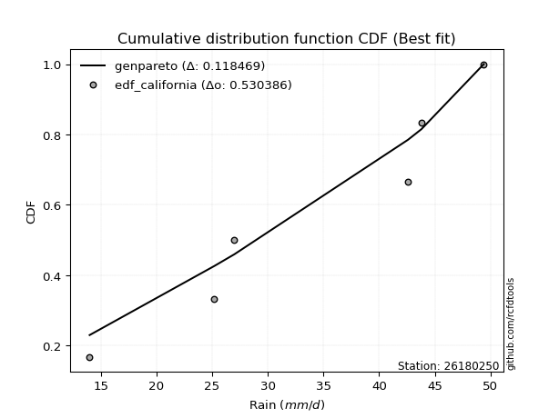</img>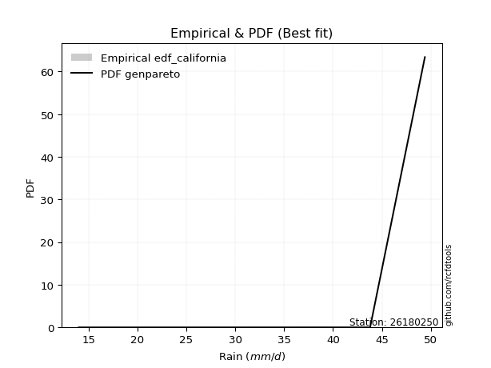</img>

</div>


### 2. EDF Hazen (1930)

Hazen method for plotting positions is a formula used to estimate the empirical cumulative probability distribution of flood events or other hydrological data. This formula often results in biased estimations, particularly when extrapolating to extreme events (high return periods).

<div align="center">


$P=(m-0.5)/n$


</div>


**2.1. Empirical values**

<div align="center">

|                | 0                   | 1                  | 2                  | 3                  | 4         | 5                  |
|:---------------|:--------------------|:-------------------|:-------------------|:-------------------|:----------|:-------------------|
| date           | 2021                | 2025               | 2020               | 2022               | 2019      | 2023               |
| x              | 14.0                | 25.2               | 27.0               | 42.6               | 43.8      | 49.4               |
| m              | 1                   | 2                  | 3                  | 4                  | 5         | 6                  |
| empirical_dist | edf_hazen           | edf_hazen          | edf_hazen          | edf_hazen          | edf_hazen | edf_hazen          |
| empirical      | 0.08333333333333333 | 0.25               | 0.4166666666666667 | 0.5833333333333334 | 0.75      | 0.9166666666666666 |
| empirical_tr   | 1.090909090909091   | 1.3333333333333333 | 1.7142857142857144 | 2.4000000000000004 | 4.0       | 11.999999999999995 |

</div>


**2.2. Kolmogorov-Smirnov fit test (sorted by Δ)**


<div align="center">

|                | 0                   | 1                   | 2                   | 3                  | 4                   | 5                  | 6                   | 7                   | 8                   | 9                   | 10                  | 11                  | 12                  | 13                  | 14                  | 15                  | 16                  | 17                  | 18                  | 19                  | 20                  | 21                 | 22                  | 23                 | 24                  | 25                  | 26                  | 27                  | 28                 | 29                  | 30                 | 31                | 32               | 33                  | 34                  | 35                | 36                 | 37                 | 38                 | 39                  | 40                  | 41                 | 42                  | 43                  | 44                  | 45                  | 46                | 47                  | 48                  | 49                  | 50                  | 51                  | 52                | 53                  | 54                 | 55                 | 56                  | 57                  | 58                  | 59                  | 60                  | 61                 | 62                  | 63                  | 64                 | 65                 | 66                  | 67                  | 68                  | 69                  | 70                  | 71                  | 72                 | 73                  | 74                | 75                  | 76                  | 77                  | 78                  | 79                 | 80                 | 81                  | 82                  | 83                  | 84                  | 85                  | 86                  | 87                  | 88                 | 89                  | 90                  | 91                 | 92                  | 93                  | 94                | 95                 | 96                  | 97                 | 98                 | 99                  | 100                | 101                 | 102                 | 103                 | 104                 | 105                 | 106                 | 107                | 108                 | 109                 | 110                 | 111                 | 112                | 113                 | 114                 | 115                 | 116                 | 117                 | 118            | 119            | 120                 | 121                | 122                 | 123                 | 124                | 125                 | 126                 | 127                 | 128                | 129                 | 130                 | 131                | 132                 | 133                 | 134                | 135                 | 136                | 137                 | 138                 | 139                 | 140                 | 141                | 142                | 143                | 144               | 145                | 146                | 147                | 148               | 149                | 150                | 151                | 152                | 153                | 154                | 155                | 156            | 157            | 158                | 159                |
|:---------------|:--------------------|:--------------------|:--------------------|:-------------------|:--------------------|:-------------------|:--------------------|:--------------------|:--------------------|:--------------------|:--------------------|:--------------------|:--------------------|:--------------------|:--------------------|:--------------------|:--------------------|:--------------------|:--------------------|:--------------------|:--------------------|:-------------------|:--------------------|:-------------------|:--------------------|:--------------------|:--------------------|:--------------------|:-------------------|:--------------------|:-------------------|:------------------|:-----------------|:--------------------|:--------------------|:------------------|:-------------------|:-------------------|:-------------------|:--------------------|:--------------------|:-------------------|:--------------------|:--------------------|:--------------------|:--------------------|:------------------|:--------------------|:--------------------|:--------------------|:--------------------|:--------------------|:------------------|:--------------------|:-------------------|:-------------------|:--------------------|:--------------------|:--------------------|:--------------------|:--------------------|:-------------------|:--------------------|:--------------------|:-------------------|:-------------------|:--------------------|:--------------------|:--------------------|:--------------------|:--------------------|:--------------------|:-------------------|:--------------------|:------------------|:--------------------|:--------------------|:--------------------|:--------------------|:-------------------|:-------------------|:--------------------|:--------------------|:--------------------|:--------------------|:--------------------|:--------------------|:--------------------|:-------------------|:--------------------|:--------------------|:-------------------|:--------------------|:--------------------|:------------------|:-------------------|:--------------------|:-------------------|:-------------------|:--------------------|:-------------------|:--------------------|:--------------------|:--------------------|:--------------------|:--------------------|:--------------------|:-------------------|:--------------------|:--------------------|:--------------------|:--------------------|:-------------------|:--------------------|:--------------------|:--------------------|:--------------------|:--------------------|:---------------|:---------------|:--------------------|:-------------------|:--------------------|:--------------------|:-------------------|:--------------------|:--------------------|:--------------------|:-------------------|:--------------------|:--------------------|:-------------------|:--------------------|:--------------------|:-------------------|:--------------------|:-------------------|:--------------------|:--------------------|:--------------------|:--------------------|:-------------------|:-------------------|:-------------------|:------------------|:-------------------|:-------------------|:-------------------|:------------------|:-------------------|:-------------------|:-------------------|:-------------------|:-------------------|:-------------------|:-------------------|:---------------|:---------------|:-------------------|:-------------------|
| station        | 26180250            | 26180250            | 26180250            | 26180250           | 26180250            | 26180250           | 26180250            | 26180250            | 26180250            | 26180250            | 26180250            | 26180250            | 26180250            | 26180250            | 26180250            | 26180250            | 26180250            | 26180250            | 26180250            | 26180250            | 26180250            | 26180250           | 26180250            | 26180250           | 26180250            | 26180250            | 26180250            | 26180250            | 26180250           | 26180250            | 26180250           | 26180250          | 26180250         | 26180250            | 26180250            | 26180250          | 26180250           | 26180250           | 26180250           | 26180250            | 26180250            | 26180250           | 26180250            | 26180250            | 26180250            | 26180250            | 26180250          | 26180250            | 26180250            | 26180250            | 26180250            | 26180250            | 26180250          | 26180250            | 26180250           | 26180250           | 26180250            | 26180250            | 26180250            | 26180250            | 26180250            | 26180250           | 26180250            | 26180250            | 26180250           | 26180250           | 26180250            | 26180250            | 26180250            | 26180250            | 26180250            | 26180250            | 26180250           | 26180250            | 26180250          | 26180250            | 26180250            | 26180250            | 26180250            | 26180250           | 26180250           | 26180250            | 26180250            | 26180250            | 26180250            | 26180250            | 26180250            | 26180250            | 26180250           | 26180250            | 26180250            | 26180250           | 26180250            | 26180250            | 26180250          | 26180250           | 26180250            | 26180250           | 26180250           | 26180250            | 26180250           | 26180250            | 26180250            | 26180250            | 26180250            | 26180250            | 26180250            | 26180250           | 26180250            | 26180250            | 26180250            | 26180250            | 26180250           | 26180250            | 26180250            | 26180250            | 26180250            | 26180250            | 26180250       | 26180250       | 26180250            | 26180250           | 26180250            | 26180250            | 26180250           | 26180250            | 26180250            | 26180250            | 26180250           | 26180250            | 26180250            | 26180250           | 26180250            | 26180250            | 26180250           | 26180250            | 26180250           | 26180250            | 26180250            | 26180250            | 26180250            | 26180250           | 26180250           | 26180250           | 26180250          | 26180250           | 26180250           | 26180250           | 26180250          | 26180250           | 26180250           | 26180250           | 26180250           | 26180250           | 26180250           | 26180250           | 26180250       | 26180250       | 26180250           | 26180250           |
| empirical_dist | edf_hazen           | edf_hazen           | edf_hazen           | edf_hazen          | edf_hazen           | edf_hazen          | edf_hazen           | edf_hazen           | edf_hazen           | edf_hazen           | edf_hazen           | edf_hazen           | edf_hazen           | edf_hazen           | edf_hazen           | edf_hazen           | edf_hazen           | edf_hazen           | edf_hazen           | edf_hazen           | edf_hazen           | edf_hazen          | edf_hazen           | edf_hazen          | edf_hazen           | edf_hazen           | edf_hazen           | edf_hazen           | edf_hazen          | edf_hazen           | edf_hazen          | edf_hazen         | edf_hazen        | edf_hazen           | edf_hazen           | edf_hazen         | edf_hazen          | edf_hazen          | edf_hazen          | edf_hazen           | edf_hazen           | edf_hazen          | edf_hazen           | edf_hazen           | edf_hazen           | edf_hazen           | edf_hazen         | edf_hazen           | edf_hazen           | edf_hazen           | edf_hazen           | edf_hazen           | edf_hazen         | edf_hazen           | edf_hazen          | edf_hazen          | edf_hazen           | edf_hazen           | edf_hazen           | edf_hazen           | edf_hazen           | edf_hazen          | edf_hazen           | edf_hazen           | edf_hazen          | edf_hazen          | edf_hazen           | edf_hazen           | edf_hazen           | edf_hazen           | edf_hazen           | edf_hazen           | edf_hazen          | edf_hazen           | edf_hazen         | edf_hazen           | edf_hazen           | edf_hazen           | edf_hazen           | edf_hazen          | edf_hazen          | edf_hazen           | edf_hazen           | edf_hazen           | edf_hazen           | edf_hazen           | edf_hazen           | edf_hazen           | edf_hazen          | edf_hazen           | edf_hazen           | edf_hazen          | edf_hazen           | edf_hazen           | edf_hazen         | edf_hazen          | edf_hazen           | edf_hazen          | edf_hazen          | edf_hazen           | edf_hazen          | edf_hazen           | edf_hazen           | edf_hazen           | edf_hazen           | edf_hazen           | edf_hazen           | edf_hazen          | edf_hazen           | edf_hazen           | edf_hazen           | edf_hazen           | edf_hazen          | edf_hazen           | edf_hazen           | edf_hazen           | edf_hazen           | edf_hazen           | edf_hazen      | edf_hazen      | edf_hazen           | edf_hazen          | edf_hazen           | edf_hazen           | edf_hazen          | edf_hazen           | edf_hazen           | edf_hazen           | edf_hazen          | edf_hazen           | edf_hazen           | edf_hazen          | edf_hazen           | edf_hazen           | edf_hazen          | edf_hazen           | edf_hazen          | edf_hazen           | edf_hazen           | edf_hazen           | edf_hazen           | edf_hazen          | edf_hazen          | edf_hazen          | edf_hazen         | edf_hazen          | edf_hazen          | edf_hazen          | edf_hazen         | edf_hazen          | edf_hazen          | edf_hazen          | edf_hazen          | edf_hazen          | edf_hazen          | edf_hazen          | edf_hazen      | edf_hazen      | edf_hazen          | edf_hazen          |
| p_dist         | beta                | arcsine             | dgamma              | logbeta            | logdgamma           | logdweibull        | dweibull            | logtrapezoid        | trapezoid           | ksone               | logweibull_max      | gausshyper          | genhalflogistic     | logbetaprime        | logmielke           | semicircular        | logarcsine          | loggenextreme       | logloggamma         | triang              | logsemicircular     | wrapcauchy         | mielke              | anglit             | skewnorm            | loglevy_l           | loginvweibull       | loganglit           | logjohnsonsu       | weibull_min         | loggenhalflogistic | argus             | logexponpow      | gumbel_l            | genextreme          | pearson3          | johnsonsu          | logkstwobign       | gompertz           | betaprime           | f                   | erlang             | logburr12           | logburr             | nct                 | t                   | norm              | crystalball         | truncnorm           | exponnorm           | logargus            | loggumbel_l         | logalpha          | alpha               | logweibull_min     | gamma              | genexpon            | rice                | foldnorm            | burr                | logf                | ncf                | lognct              | logrice             | invgamma           | logcrystalball     | lognorm             | logt                | logexponnorm        | loggamma            | loggamma            | logfatiguelife      | logerlang          | maxwell             | logfoldnorm       | loginvgamma         | loggompertz         | loginvgauss         | rayleigh            | kstwobign          | invgauss           | logmaxwell          | lograyleigh         | cosine              | kappa4              | halfnorm            | genpareto           | loghalfnorm         | logistic           | levy_l              | loggenexpon         | loggenpareto       | logncf              | loglogistic         | logcosine         | tukeylambda        | gumbel_r            | hypsecant          | vonmises_line      | loggumbel_r         | logpearson3        | halflogistic        | loghypsecant        | uniform             | loghalflogistic     | moyal               | kappa3              | logmoyal           | logskewnorm         | logtriang           | laplace             | logksone            | logwrapcauchy      | loglaplace          | loglaplace          | truncweibull_min    | johnsonsb           | lognakagami         | gennorm        | loggennorm     | logloglaplace       | lomax              | logrdist            | wald                | nakagami           | logwald             | bradford            | burr12              | loglomax           | truncexpon          | halfgennorm         | loggausshyper      | logkappa3           | loguniform          | logkappa4          | logvonmises_line    | logtukeylambda     | logtruncnorm        | logbradford         | logtruncweibull_min | logtruncexpon       | loggengamma        | loghalfgennorm     | logexponweib       | invweibull        | fatiguelife        | weibull_max        | gengamma           | exponweib         | logjohnsonsb       | powerlaw           | rdist              | logpowerlaw        | truncpareto        | exponpow           | logtruncpareto     | genlogistic    | loggenlogistic | logvonmises        | vonmises           |
| delta          | 0.08353823462595167 | 0.09059395744885507 | 0.09383219889523858 | 0.1015210269365121 | 0.10745181534161585 | 0.1075964717824292 | 0.11573377004183172 | 0.12254292214017937 | 0.12272268716872414 | 0.12347747696730216 | 0.12390314235152922 | 0.12902701238096814 | 0.13229903417028027 | 0.13753852036718917 | 0.13910303814977543 | 0.13973301522236925 | 0.14147160240625445 | 0.14348764012534088 | 0.14408444174537471 | 0.14506561518348882 | 0.14556822908379063 | 0.1456704522100959 | 0.14673726385051156 | 0.1518863687306823 | 0.15219151584971508 | 0.15349081086860256 | 0.15754411648369537 | 0.15779976953449582 | 0.1611972033340771 | 0.16421505135452752 | 0.1648672487096926 | 0.165151654998476 | 0.16583190385043 | 0.17184524664834477 | 0.17341737438548346 | 0.173854211884244 | 0.1750533919249483 | 0.1764200044870332 | 0.1773381173793157 | 0.17875710550586843 | 0.17892377997169928 | 0.1794119828776266 | 0.17950756928805045 | 0.17976605451273775 | 0.17978546989019495 | 0.17979026160628997 | 0.179798685924342 | 0.17979869210520538 | 0.17979873742181018 | 0.17980016988307845 | 0.17981853126221314 | 0.18049307627819355 | 0.180966731532184 | 0.18110193612625836 | 0.1815982587160785 | 0.1822586525966663 | 0.18232121912731702 | 0.18254554817914626 | 0.18307123459562125 | 0.18503819450582337 | 0.18503872960916812 | 0.1851430735233972 | 0.18520419014408573 | 0.18560132672684526 | 0.1857456342280277 | 0.1858282539771129 | 0.18582828717473332 | 0.18582874065105703 | 0.18583142014415033 | 0.18727897926856074 | 0.18727897926856074 | 0.18732158854325764 | 0.1873834028562481 | 0.18765616091223347 | 0.188936420984248 | 0.18924280049967157 | 0.18926262231368574 | 0.18966080049613188 | 0.18988862769105996 | 0.1900373083976835 | 0.1915401219475038 | 0.19288550392461856 | 0.19488710971162126 | 0.19489111107050572 | 0.19782892523455797 | 0.19787436880952447 | 0.20180265346657356 | 0.20228676967770975 | 0.2024058125415158 | 0.20287033644414348 | 0.20432828168146722 | 0.2045974252474171 | 0.20512162623195618 | 0.20835246969328902 | 0.212272864629523 | 0.2158108662753927 | 0.21597153396921542 | 0.2168841092192243 | 0.2189612167606989 | 0.22044576548273298 | 0.2206728736778042 | 0.22147735322694817 | 0.22258903635932348 | 0.22457627118644075 | 0.22548790668450835 | 0.22770277812269502 | 0.22804785585272913 | 0.2317127048200356 | 0.23316048577647808 | 0.23447612989053013 | 0.23513208260166785 | 0.23545550665945192 | 0.2386844168124198 | 0.24011358656466453 | 0.24011358656466453 | 0.24416176010180946 | 0.24607839307266166 | 0.24999783384610452 | 0.25           | 0.25           | 0.25630990970055934 | 0.2616267988023301 | 0.26207024597785317 | 0.26530702161566877 | 0.2677021693732612 | 0.26827505186301015 | 0.27058800803629157 | 0.27095442479065557 | 0.2726096060507548 | 0.27628661555525424 | 0.27690559171936135 | 0.2853489661533116 | 0.29878583888241195 | 0.29921327465800895 | 0.3005132984875535 | 0.30072242865307897 | 0.3031486595836152 | 0.32489978218158444 | 0.33071801640016973 | 0.33330081881608353 | 0.33561481840892515 | 0.3448905450953693 | 0.4166666666666667 | 0.4183085349604603 | 0.490041550084337 | 0.5045799264826965 | 0.5213127039221599 | 0.5237798344451995 | 0.548434600394326 | 0.5647032468167438 | 0.5917076942883357 | 0.6147964836972155 | 0.6342436958807725 | 0.6517862069783307 | 0.6723868672259061 | 0.6842940704914547 | 0.75           | 0.75           | 1.1824001560324557 | 7.3125648731074575 |
| deltao         | 0.530385761606      | 0.530385761606      | 0.530385761606      | 0.530385761606     | 0.530385761606      | 0.530385761606     | 0.530385761606      | 0.530385761606      | 0.530385761606      | 0.530385761606      | 0.530385761606      | 0.530385761606      | 0.530385761606      | 0.530385761606      | 0.530385761606      | 0.530385761606      | 0.530385761606      | 0.530385761606      | 0.530385761606      | 0.530385761606      | 0.530385761606      | 0.530385761606     | 0.530385761606      | 0.530385761606     | 0.530385761606      | 0.530385761606      | 0.530385761606      | 0.530385761606      | 0.530385761606     | 0.530385761606      | 0.530385761606     | 0.530385761606    | 0.530385761606   | 0.530385761606      | 0.530385761606      | 0.530385761606    | 0.530385761606     | 0.530385761606     | 0.530385761606     | 0.530385761606      | 0.530385761606      | 0.530385761606     | 0.530385761606      | 0.530385761606      | 0.530385761606      | 0.530385761606      | 0.530385761606    | 0.530385761606      | 0.530385761606      | 0.530385761606      | 0.530385761606      | 0.530385761606      | 0.530385761606    | 0.530385761606      | 0.530385761606     | 0.530385761606     | 0.530385761606      | 0.530385761606      | 0.530385761606      | 0.530385761606      | 0.530385761606      | 0.530385761606     | 0.530385761606      | 0.530385761606      | 0.530385761606     | 0.530385761606     | 0.530385761606      | 0.530385761606      | 0.530385761606      | 0.530385761606      | 0.530385761606      | 0.530385761606      | 0.530385761606     | 0.530385761606      | 0.530385761606    | 0.530385761606      | 0.530385761606      | 0.530385761606      | 0.530385761606      | 0.530385761606     | 0.530385761606     | 0.530385761606      | 0.530385761606      | 0.530385761606      | 0.530385761606      | 0.530385761606      | 0.530385761606      | 0.530385761606      | 0.530385761606     | 0.530385761606      | 0.530385761606      | 0.530385761606     | 0.530385761606      | 0.530385761606      | 0.530385761606    | 0.530385761606     | 0.530385761606      | 0.530385761606     | 0.530385761606     | 0.530385761606      | 0.530385761606     | 0.530385761606      | 0.530385761606      | 0.530385761606      | 0.530385761606      | 0.530385761606      | 0.530385761606      | 0.530385761606     | 0.530385761606      | 0.530385761606      | 0.530385761606      | 0.530385761606      | 0.530385761606     | 0.530385761606      | 0.530385761606      | 0.530385761606      | 0.530385761606      | 0.530385761606      | 0.530385761606 | 0.530385761606 | 0.530385761606      | 0.530385761606     | 0.530385761606      | 0.530385761606      | 0.530385761606     | 0.530385761606      | 0.530385761606      | 0.530385761606      | 0.530385761606     | 0.530385761606      | 0.530385761606      | 0.530385761606     | 0.530385761606      | 0.530385761606      | 0.530385761606     | 0.530385761606      | 0.530385761606     | 0.530385761606      | 0.530385761606      | 0.530385761606      | 0.530385761606      | 0.530385761606     | 0.530385761606     | 0.530385761606     | 0.530385761606    | 0.530385761606     | 0.530385761606     | 0.530385761606     | 0.530385761606    | 0.530385761606     | 0.530385761606     | 0.530385761606     | 0.530385761606     | 0.530385761606     | 0.530385761606     | 0.530385761606     | 0.530385761606 | 0.530385761606 | 0.530385761606     | 0.530385761606     |
| eval           | Δo > Δ              | Δo > Δ              | Δo > Δ              | Δo > Δ             | Δo > Δ              | Δo > Δ             | Δo > Δ              | Δo > Δ              | Δo > Δ              | Δo > Δ              | Δo > Δ              | Δo > Δ              | Δo > Δ              | Δo > Δ              | Δo > Δ              | Δo > Δ              | Δo > Δ              | Δo > Δ              | Δo > Δ              | Δo > Δ              | Δo > Δ              | Δo > Δ             | Δo > Δ              | Δo > Δ             | Δo > Δ              | Δo > Δ              | Δo > Δ              | Δo > Δ              | Δo > Δ             | Δo > Δ              | Δo > Δ             | Δo > Δ            | Δo > Δ           | Δo > Δ              | Δo > Δ              | Δo > Δ            | Δo > Δ             | Δo > Δ             | Δo > Δ             | Δo > Δ              | Δo > Δ              | Δo > Δ             | Δo > Δ              | Δo > Δ              | Δo > Δ              | Δo > Δ              | Δo > Δ            | Δo > Δ              | Δo > Δ              | Δo > Δ              | Δo > Δ              | Δo > Δ              | Δo > Δ            | Δo > Δ              | Δo > Δ             | Δo > Δ             | Δo > Δ              | Δo > Δ              | Δo > Δ              | Δo > Δ              | Δo > Δ              | Δo > Δ             | Δo > Δ              | Δo > Δ              | Δo > Δ             | Δo > Δ             | Δo > Δ              | Δo > Δ              | Δo > Δ              | Δo > Δ              | Δo > Δ              | Δo > Δ              | Δo > Δ             | Δo > Δ              | Δo > Δ            | Δo > Δ              | Δo > Δ              | Δo > Δ              | Δo > Δ              | Δo > Δ             | Δo > Δ             | Δo > Δ              | Δo > Δ              | Δo > Δ              | Δo > Δ              | Δo > Δ              | Δo > Δ              | Δo > Δ              | Δo > Δ             | Δo > Δ              | Δo > Δ              | Δo > Δ             | Δo > Δ              | Δo > Δ              | Δo > Δ            | Δo > Δ             | Δo > Δ              | Δo > Δ             | Δo > Δ             | Δo > Δ              | Δo > Δ             | Δo > Δ              | Δo > Δ              | Δo > Δ              | Δo > Δ              | Δo > Δ              | Δo > Δ              | Δo > Δ             | Δo > Δ              | Δo > Δ              | Δo > Δ              | Δo > Δ              | Δo > Δ             | Δo > Δ              | Δo > Δ              | Δo > Δ              | Δo > Δ              | Δo > Δ              | Δo > Δ         | Δo > Δ         | Δo > Δ              | Δo > Δ             | Δo > Δ              | Δo > Δ              | Δo > Δ             | Δo > Δ              | Δo > Δ              | Δo > Δ              | Δo > Δ             | Δo > Δ              | Δo > Δ              | Δo > Δ             | Δo > Δ              | Δo > Δ              | Δo > Δ             | Δo > Δ              | Δo > Δ             | Δo > Δ              | Δo > Δ              | Δo > Δ              | Δo > Δ              | Δo > Δ             | Δo > Δ             | Δo > Δ             | Δo > Δ            | Δo > Δ             | Δo > Δ             | Δo > Δ             | Δo <= Δ           | Δo <= Δ            | Δo <= Δ            | Δo <= Δ            | Δo <= Δ            | Δo <= Δ            | Δo <= Δ            | Δo <= Δ            | Δo <= Δ        | Δo <= Δ        | Δo <= Δ            | Δo <= Δ            |
| fit            | 1                   | 1                   | 1                   | 1                  | 1                   | 1                  | 1                   | 1                   | 1                   | 1                   | 1                   | 1                   | 1                   | 1                   | 1                   | 1                   | 1                   | 1                   | 1                   | 1                   | 1                   | 1                  | 1                   | 1                  | 1                   | 1                   | 1                   | 1                   | 1                  | 1                   | 1                  | 1                 | 1                | 1                   | 1                   | 1                 | 1                  | 1                  | 1                  | 1                   | 1                   | 1                  | 1                   | 1                   | 1                   | 1                   | 1                 | 1                   | 1                   | 1                   | 1                   | 1                   | 1                 | 1                   | 1                  | 1                  | 1                   | 1                   | 1                   | 1                   | 1                   | 1                  | 1                   | 1                   | 1                  | 1                  | 1                   | 1                   | 1                   | 1                   | 1                   | 1                   | 1                  | 1                   | 1                 | 1                   | 1                   | 1                   | 1                   | 1                  | 1                  | 1                   | 1                   | 1                   | 1                   | 1                   | 1                   | 1                   | 1                  | 1                   | 1                   | 1                  | 1                   | 1                   | 1                 | 1                  | 1                   | 1                  | 1                  | 1                   | 1                  | 1                   | 1                   | 1                   | 1                   | 1                   | 1                   | 1                  | 1                   | 1                   | 1                   | 1                   | 1                  | 1                   | 1                   | 1                   | 1                   | 1                   | 1              | 1              | 1                   | 1                  | 1                   | 1                   | 1                  | 1                   | 1                   | 1                   | 1                  | 1                   | 1                   | 1                  | 1                   | 1                   | 1                  | 1                   | 1                  | 1                   | 1                   | 1                   | 1                   | 1                  | 1                  | 1                  | 1                 | 1                  | 1                  | 1                  | 0                 | 0                  | 0                  | 0                  | 0                  | 0                  | 0                  | 0                  | 0              | 0              | 0                  | 0                  |
| n              | 6                   | 6                   | 6                   | 6                  | 6                   | 6                  | 6                   | 6                   | 6                   | 6                   | 6                   | 6                   | 6                   | 6                   | 6                   | 6                   | 6                   | 6                   | 6                   | 6                   | 6                   | 6                  | 6                   | 6                  | 6                   | 6                   | 6                   | 6                   | 6                  | 6                   | 6                  | 6                 | 6                | 6                   | 6                   | 6                 | 6                  | 6                  | 6                  | 6                   | 6                   | 6                  | 6                   | 6                   | 6                   | 6                   | 6                 | 6                   | 6                   | 6                   | 6                   | 6                   | 6                 | 6                   | 6                  | 6                  | 6                   | 6                   | 6                   | 6                   | 6                   | 6                  | 6                   | 6                   | 6                  | 6                  | 6                   | 6                   | 6                   | 6                   | 6                   | 6                   | 6                  | 6                   | 6                 | 6                   | 6                   | 6                   | 6                   | 6                  | 6                  | 6                   | 6                   | 6                   | 6                   | 6                   | 6                   | 6                   | 6                  | 6                   | 6                   | 6                  | 6                   | 6                   | 6                 | 6                  | 6                   | 6                  | 6                  | 6                   | 6                  | 6                   | 6                   | 6                   | 6                   | 6                   | 6                   | 6                  | 6                   | 6                   | 6                   | 6                   | 6                  | 6                   | 6                   | 6                   | 6                   | 6                   | 6              | 6              | 6                   | 6                  | 6                   | 6                   | 6                  | 6                   | 6                   | 6                   | 6                  | 6                   | 6                   | 6                  | 6                   | 6                   | 6                  | 6                   | 6                  | 6                   | 6                   | 6                   | 6                   | 6                  | 6                  | 6                  | 6                 | 6                  | 6                  | 6                  | 6                 | 6                  | 6                  | 6                  | 6                  | 6                  | 6                  | 6                  | 6              | 6              | 6                  | 6                  |
| best_fit       | 1                   | 0                   | 0                   | 0                  | 0                   | 0                  | 0                   | 0                   | 0                   | 0                   | 0                   | 0                   | 0                   | 0                   | 0                   | 0                   | 0                   | 0                   | 0                   | 0                   | 0                   | 0                  | 0                   | 0                  | 0                   | 0                   | 0                   | 0                   | 0                  | 0                   | 0                  | 0                 | 0                | 0                   | 0                   | 0                 | 0                  | 0                  | 0                  | 0                   | 0                   | 0                  | 0                   | 0                   | 0                   | 0                   | 0                 | 0                   | 0                   | 0                   | 0                   | 0                   | 0                 | 0                   | 0                  | 0                  | 0                   | 0                   | 0                   | 0                   | 0                   | 0                  | 0                   | 0                   | 0                  | 0                  | 0                   | 0                   | 0                   | 0                   | 0                   | 0                   | 0                  | 0                   | 0                 | 0                   | 0                   | 0                   | 0                   | 0                  | 0                  | 0                   | 0                   | 0                   | 0                   | 0                   | 0                   | 0                   | 0                  | 0                   | 0                   | 0                  | 0                   | 0                   | 0                 | 0                  | 0                   | 0                  | 0                  | 0                   | 0                  | 0                   | 0                   | 0                   | 0                   | 0                   | 0                   | 0                  | 0                   | 0                   | 0                   | 0                   | 0                  | 0                   | 0                   | 0                   | 0                   | 0                   | 0              | 0              | 0                   | 0                  | 0                   | 0                   | 0                  | 0                   | 0                   | 0                   | 0                  | 0                   | 0                   | 0                  | 0                   | 0                   | 0                  | 0                   | 0                  | 0                   | 0                   | 0                   | 0                   | 0                  | 0                  | 0                  | 0                 | 0                  | 0                  | 0                  | 0                 | 0                  | 0                  | 0                  | 0                  | 0                  | 0                  | 0                  | 0              | 0              | 0                  | 0                  |
| best_fit_sort  | 1                   | 2                   | 3                   | 4                  | 5                   | 6                  | 7                   | 8                   | 9                   | 10                  | 11                  | 12                  | 13                  | 14                  | 15                  | 16                  | 17                  | 18                  | 19                  | 20                  | 21                  | 22                 | 23                  | 24                 | 25                  | 26                  | 27                  | 28                  | 29                 | 30                  | 31                 | 32                | 33               | 34                  | 35                  | 36                | 37                 | 38                 | 39                 | 40                  | 41                  | 42                 | 43                  | 44                  | 45                  | 46                  | 47                | 48                  | 49                  | 50                  | 51                  | 52                  | 53                | 54                  | 55                 | 56                 | 57                  | 58                  | 59                  | 60                  | 61                  | 62                 | 63                  | 64                  | 65                 | 66                 | 67                  | 68                  | 69                  | 70                  | 71                  | 72                  | 73                 | 74                  | 75                | 76                  | 77                  | 78                  | 79                  | 80                 | 81                 | 82                  | 83                  | 84                  | 85                  | 86                  | 87                  | 88                  | 89                 | 90                  | 91                  | 92                 | 93                  | 94                  | 95                | 96                 | 97                  | 98                 | 99                 | 100                 | 101                | 102                 | 103                 | 104                 | 105                 | 106                 | 107                 | 108                | 109                 | 110                 | 111                 | 112                 | 113                | 114                 | 115                 | 116                 | 117                 | 118                 | 119            | 120            | 121                 | 122                | 123                 | 124                 | 125                | 126                 | 127                 | 128                 | 129                | 130                 | 131                 | 132                | 133                 | 134                 | 135                | 136                 | 137                | 138                 | 139                 | 140                 | 141                 | 142                | 143                | 144                | 145               | 146                | 147                | 148                | 149               | 150                | 151                | 152                | 153                | 154                | 155                | 156                | 157            | 158            | 159                | 160                |

</div>


**2.3. Best fit**

<div align="center">

|   id |   station | empirical_dist   | p_dist   |     delta |   deltao | eval   |   fit |   n |   best_fit |   best_fit_sort |
|-----:|----------:|:-----------------|:---------|----------:|---------:|:-------|------:|----:|-----------:|----------------:|
|    0 |  26180250 | edf_hazen        | beta     | 0.0835382 | 0.530386 | Δo > Δ |     1 |   6 |          1 |               1 |

</div>


<div align="center">

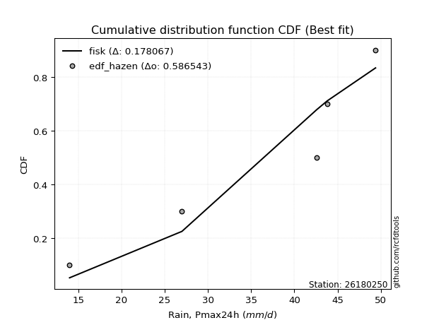</img>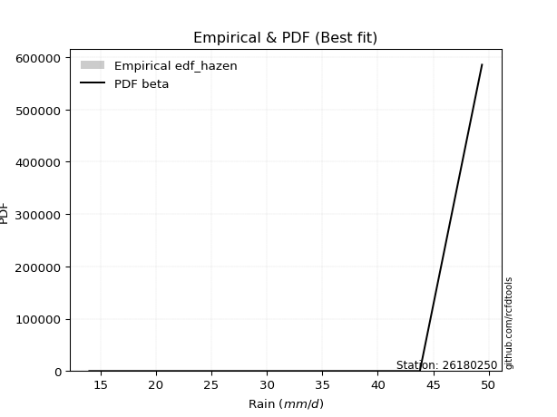</img>

</div>


### 3. EDF Weibull (1939)

Weibull plotting position formula is an empirical method used to estimate the non-exceedance probability or plotting position for a set of observed data, is often recommended or widely used in practice, particularly in flood frequency analysis.

<div align="center">


$P=m/(n+1)$


</div>


**3.1. Empirical values**

<div align="center">

|                | 0                   | 1                  | 2                   | 3                  | 4                  | 5                  |
|:---------------|:--------------------|:-------------------|:--------------------|:-------------------|:-------------------|:-------------------|
| date           | 2021                | 2025               | 2020                | 2022               | 2019               | 2023               |
| x              | 14.0                | 25.2               | 27.0                | 42.6               | 43.8               | 49.4               |
| m              | 1                   | 2                  | 3                   | 4                  | 5                  | 6                  |
| empirical_dist | edf_weibull         | edf_weibull        | edf_weibull         | edf_weibull        | edf_weibull        | edf_weibull        |
| empirical      | 0.14285714285714285 | 0.2857142857142857 | 0.42857142857142855 | 0.5714285714285714 | 0.7142857142857143 | 0.8571428571428571 |
| empirical_tr   | 1.1666666666666665  | 1.4                | 1.75                | 2.333333333333333  | 3.5                | 6.999999999999997  |

</div>


**3.2. Kolmogorov-Smirnov fit test (sorted by Δ)**


<div align="center">

|                | 0                   | 1                   | 2                   | 3                   | 4                   | 5                   | 6                 | 7                   | 8                   | 9                  | 10                 | 11                 | 12                  | 13                  | 14                  | 15                  | 16                  | 17                  | 18                  | 19                  | 20                 | 21                  | 22                  | 23                  | 24                 | 25                 | 26                  | 27                  | 28                  | 29                  | 30                 | 31                  | 32                 | 33                  | 34                  | 35                  | 36                | 37                  | 38                  | 39                  | 40                  | 41                  | 42                  | 43                 | 44                  | 45                  | 46                  | 47                  | 48                  | 49                  | 50                  | 51                  | 52                  | 53                  | 54                  | 55                  | 56                  | 57                  | 58                  | 59                  | 60                  | 61                  | 62                  | 63                  | 64                 | 65                  | 66                 | 67                  | 68                  | 69                  | 70                 | 71                | 72                 | 73                  | 74                  | 75                  | 76                  | 77                  | 78                  | 79                  | 80                 | 81                  | 82                  | 83                 | 84                  | 85                 | 86                  | 87                  | 88                  | 89                 | 90                  | 91                  | 92                  | 93                  | 94                  | 95                 | 96                 | 97                  | 98                | 99                  | 100                 | 101                | 102                 | 103                 | 104                 | 105                 | 106                 | 107                 | 108                 | 109                 | 110                | 111                 | 112               | 113                | 114                 | 115                 | 116                 | 117                | 118                 | 119                | 120                | 121                | 122                 | 123                | 124                 | 125                | 126                 | 127                | 128                | 129                | 130                | 131                | 132                | 133                | 134                | 135                 | 136                 | 137                 | 138                | 139                | 140                 | 141                | 142                | 143                 | 144                 | 145                 | 146                 | 147                | 148                | 149                | 150              | 151                | 152                | 153               | 154                | 155               | 156                | 157                | 158                | 159               |
|:---------------|:--------------------|:--------------------|:--------------------|:--------------------|:--------------------|:--------------------|:------------------|:--------------------|:--------------------|:-------------------|:-------------------|:-------------------|:--------------------|:--------------------|:--------------------|:--------------------|:--------------------|:--------------------|:--------------------|:--------------------|:-------------------|:--------------------|:--------------------|:--------------------|:-------------------|:-------------------|:--------------------|:--------------------|:--------------------|:--------------------|:-------------------|:--------------------|:-------------------|:--------------------|:--------------------|:--------------------|:------------------|:--------------------|:--------------------|:--------------------|:--------------------|:--------------------|:--------------------|:-------------------|:--------------------|:--------------------|:--------------------|:--------------------|:--------------------|:--------------------|:--------------------|:--------------------|:--------------------|:--------------------|:--------------------|:--------------------|:--------------------|:--------------------|:--------------------|:--------------------|:--------------------|:--------------------|:--------------------|:--------------------|:-------------------|:--------------------|:-------------------|:--------------------|:--------------------|:--------------------|:-------------------|:------------------|:-------------------|:--------------------|:--------------------|:--------------------|:--------------------|:--------------------|:--------------------|:--------------------|:-------------------|:--------------------|:--------------------|:-------------------|:--------------------|:-------------------|:--------------------|:--------------------|:--------------------|:-------------------|:--------------------|:--------------------|:--------------------|:--------------------|:--------------------|:-------------------|:-------------------|:--------------------|:------------------|:--------------------|:--------------------|:-------------------|:--------------------|:--------------------|:--------------------|:--------------------|:--------------------|:--------------------|:--------------------|:--------------------|:-------------------|:--------------------|:------------------|:-------------------|:--------------------|:--------------------|:--------------------|:-------------------|:--------------------|:-------------------|:-------------------|:-------------------|:--------------------|:-------------------|:--------------------|:-------------------|:--------------------|:-------------------|:-------------------|:-------------------|:-------------------|:-------------------|:-------------------|:-------------------|:-------------------|:--------------------|:--------------------|:--------------------|:-------------------|:-------------------|:--------------------|:-------------------|:-------------------|:--------------------|:--------------------|:--------------------|:--------------------|:-------------------|:-------------------|:-------------------|:-----------------|:-------------------|:-------------------|:------------------|:-------------------|:------------------|:-------------------|:-------------------|:-------------------|:------------------|
| station        | 26180250            | 26180250            | 26180250            | 26180250            | 26180250            | 26180250            | 26180250          | 26180250            | 26180250            | 26180250           | 26180250           | 26180250           | 26180250            | 26180250            | 26180250            | 26180250            | 26180250            | 26180250            | 26180250            | 26180250            | 26180250           | 26180250            | 26180250            | 26180250            | 26180250           | 26180250           | 26180250            | 26180250            | 26180250            | 26180250            | 26180250           | 26180250            | 26180250           | 26180250            | 26180250            | 26180250            | 26180250          | 26180250            | 26180250            | 26180250            | 26180250            | 26180250            | 26180250            | 26180250           | 26180250            | 26180250            | 26180250            | 26180250            | 26180250            | 26180250            | 26180250            | 26180250            | 26180250            | 26180250            | 26180250            | 26180250            | 26180250            | 26180250            | 26180250            | 26180250            | 26180250            | 26180250            | 26180250            | 26180250            | 26180250           | 26180250            | 26180250           | 26180250            | 26180250            | 26180250            | 26180250           | 26180250          | 26180250           | 26180250            | 26180250            | 26180250            | 26180250            | 26180250            | 26180250            | 26180250            | 26180250           | 26180250            | 26180250            | 26180250           | 26180250            | 26180250           | 26180250            | 26180250            | 26180250            | 26180250           | 26180250            | 26180250            | 26180250            | 26180250            | 26180250            | 26180250           | 26180250           | 26180250            | 26180250          | 26180250            | 26180250            | 26180250           | 26180250            | 26180250            | 26180250            | 26180250            | 26180250            | 26180250            | 26180250            | 26180250            | 26180250           | 26180250            | 26180250          | 26180250           | 26180250            | 26180250            | 26180250            | 26180250           | 26180250            | 26180250           | 26180250           | 26180250           | 26180250            | 26180250           | 26180250            | 26180250           | 26180250            | 26180250           | 26180250           | 26180250           | 26180250           | 26180250           | 26180250           | 26180250           | 26180250           | 26180250            | 26180250            | 26180250            | 26180250           | 26180250           | 26180250            | 26180250           | 26180250           | 26180250            | 26180250            | 26180250            | 26180250            | 26180250           | 26180250           | 26180250           | 26180250         | 26180250           | 26180250           | 26180250          | 26180250           | 26180250          | 26180250           | 26180250           | 26180250           | 26180250          |
| empirical_dist | edf_weibull         | edf_weibull         | edf_weibull         | edf_weibull         | edf_weibull         | edf_weibull         | edf_weibull       | edf_weibull         | edf_weibull         | edf_weibull        | edf_weibull        | edf_weibull        | edf_weibull         | edf_weibull         | edf_weibull         | edf_weibull         | edf_weibull         | edf_weibull         | edf_weibull         | edf_weibull         | edf_weibull        | edf_weibull         | edf_weibull         | edf_weibull         | edf_weibull        | edf_weibull        | edf_weibull         | edf_weibull         | edf_weibull         | edf_weibull         | edf_weibull        | edf_weibull         | edf_weibull        | edf_weibull         | edf_weibull         | edf_weibull         | edf_weibull       | edf_weibull         | edf_weibull         | edf_weibull         | edf_weibull         | edf_weibull         | edf_weibull         | edf_weibull        | edf_weibull         | edf_weibull         | edf_weibull         | edf_weibull         | edf_weibull         | edf_weibull         | edf_weibull         | edf_weibull         | edf_weibull         | edf_weibull         | edf_weibull         | edf_weibull         | edf_weibull         | edf_weibull         | edf_weibull         | edf_weibull         | edf_weibull         | edf_weibull         | edf_weibull         | edf_weibull         | edf_weibull        | edf_weibull         | edf_weibull        | edf_weibull         | edf_weibull         | edf_weibull         | edf_weibull        | edf_weibull       | edf_weibull        | edf_weibull         | edf_weibull         | edf_weibull         | edf_weibull         | edf_weibull         | edf_weibull         | edf_weibull         | edf_weibull        | edf_weibull         | edf_weibull         | edf_weibull        | edf_weibull         | edf_weibull        | edf_weibull         | edf_weibull         | edf_weibull         | edf_weibull        | edf_weibull         | edf_weibull         | edf_weibull         | edf_weibull         | edf_weibull         | edf_weibull        | edf_weibull        | edf_weibull         | edf_weibull       | edf_weibull         | edf_weibull         | edf_weibull        | edf_weibull         | edf_weibull         | edf_weibull         | edf_weibull         | edf_weibull         | edf_weibull         | edf_weibull         | edf_weibull         | edf_weibull        | edf_weibull         | edf_weibull       | edf_weibull        | edf_weibull         | edf_weibull         | edf_weibull         | edf_weibull        | edf_weibull         | edf_weibull        | edf_weibull        | edf_weibull        | edf_weibull         | edf_weibull        | edf_weibull         | edf_weibull        | edf_weibull         | edf_weibull        | edf_weibull        | edf_weibull        | edf_weibull        | edf_weibull        | edf_weibull        | edf_weibull        | edf_weibull        | edf_weibull         | edf_weibull         | edf_weibull         | edf_weibull        | edf_weibull        | edf_weibull         | edf_weibull        | edf_weibull        | edf_weibull         | edf_weibull         | edf_weibull         | edf_weibull         | edf_weibull        | edf_weibull        | edf_weibull        | edf_weibull      | edf_weibull        | edf_weibull        | edf_weibull       | edf_weibull        | edf_weibull       | edf_weibull        | edf_weibull        | edf_weibull        | edf_weibull       |
| p_dist         | loglevy_l           | dweibull            | dgamma              | logdweibull         | logdgamma           | logtrapezoid        | trapezoid         | ksone               | logbeta             | beta               | wrapcauchy         | logweibull_max     | arcsine             | logarcsine          | gausshyper          | levy_l              | genhalflogistic     | loggenpareto        | logncf              | logbetaprime        | logmielke          | semicircular        | loggenextreme       | logloggamma         | triang             | logsemicircular    | mielke              | anglit              | skewnorm            | loginvweibull       | loganglit          | logjohnsonsu        | weibull_min        | loggenhalflogistic  | argus               | logexponpow         | loggenexpon       | gumbel_l            | genextreme          | pearson3            | johnsonsu           | logkstwobign        | gompertz            | betaprime          | f                   | erlang              | logburr12           | logburr             | nct                 | t                   | norm                | crystalball         | truncnorm           | exponnorm           | logargus            | loggumbel_l         | logalpha            | alpha               | genexpon            | logweibull_min      | gamma               | rice                | foldnorm            | burr                | logf               | ncf                 | lognct             | logrice             | invgamma            | logcrystalball      | lognorm            | logt              | logexponnorm       | loggamma            | loggamma            | logfatiguelife      | logerlang           | maxwell             | logfoldnorm         | loginvgamma         | loggompertz        | loginvgauss         | rayleigh            | kstwobign          | lomax               | logwrapcauchy      | invgauss            | logmaxwell          | lograyleigh         | cosine             | kappa4              | halfnorm            | johnsonsb           | genpareto           | loghalfnorm         | gennorm            | loggennorm         | logistic            | loglogistic       | logcosine           | tukeylambda         | gumbel_r           | hypsecant           | vonmises_line       | loggumbel_r         | logpearson3         | halflogistic        | loghypsecant        | burr12              | uniform             | loglomax           | loghalflogistic     | moyal             | kappa3             | halfgennorm         | logmoyal            | logskewnorm         | logtriang          | laplace             | logksone           | loglaplace         | loglaplace         | truncweibull_min    | logloglaplace      | wald                | logwald            | bradford            | loggengamma        | lognakagami        | nakagami           | logrdist           | truncexpon         | loggausshyper      | logkappa3          | loguniform         | logkappa4           | logvonmises_line    | logtukeylambda      | logtruncnorm       | logbradford        | logtruncweibull_min | logtruncexpon      | logexponweib       | loghalfgennorm      | invweibull          | fatiguelife         | weibull_max         | gengamma           | logjohnsonsb       | exponweib          | powerlaw         | rdist              | logpowerlaw        | truncpareto       | exponpow           | logtruncpareto    | genlogistic        | loggenlogistic     | logvonmises        | vonmises          |
| delta          | 0.10013824390277482 | 0.11955591153213305 | 0.12495532889794327 | 0.12769333799483915 | 0.13288796661470428 | 0.13444768404494134 | 0.134627449073486 | 0.13538223887206413 | 0.14285713113928233 | 0.1428571334699873 | 0.1428571417824277 | 0.1428571428564379 | 0.14285714285714285 | 0.14285714285714285 | 0.14285714286044493 | 0.14334652692033395 | 0.14420379607504213 | 0.14507361572360755 | 0.14559781670814664 | 0.14944328227195114 | 0.1510078000545373 | 0.15163777712713122 | 0.15539240203010274 | 0.15598920365013658 | 0.1569703770882508 | 0.1574729909885526 | 0.15864202575527342 | 0.16379113063544426 | 0.16409627775447694 | 0.16944887838845735 | 0.1697045314392578 | 0.17310196523883897 | 0.1761198132592895 | 0.17677201061445458 | 0.17705641690323787 | 0.17773666575519198 | 0.180476739093838 | 0.18375000855310675 | 0.18532213629024533 | 0.18575897378900597 | 0.18695815382971015 | 0.18832476639179518 | 0.18924287928407768 | 0.1906618674106304 | 0.19082854187646126 | 0.19131674478238858 | 0.19141233119281242 | 0.19167081641749972 | 0.19169023179495692 | 0.19169502351105194 | 0.19170344782910398 | 0.19170345400996736 | 0.19170349932657216 | 0.19170493178784043 | 0.19172329316697512 | 0.19239783818295553 | 0.19287149343694598 | 0.19300669803102033 | 0.19302617114944765 | 0.19350302062084046 | 0.19416341450142827 | 0.19445031008390823 | 0.19497599650038322 | 0.19694295641058535 | 0.1969434915139301 | 0.19704783542815918 | 0.1971089520488477 | 0.19750608863160724 | 0.19765039613278967 | 0.19773301588187486 | 0.1977330490794953 | 0.197733502555819 | 0.1977361820489123 | 0.19918374117332271 | 0.19918374117332271 | 0.19922635044801962 | 0.19928816476101008 | 0.19956092281699545 | 0.20084118288900998 | 0.20114756240443354 | 0.2011673842184477 | 0.20156556240089385 | 0.20179338959582194 | 0.2019420703024455 | 0.20210298927852055 | 0.2029701310981341 | 0.20344488385226578 | 0.20479026582938054 | 0.20679187161638324 | 0.2067958729752677 | 0.20973368713931995 | 0.20977913071428644 | 0.21036410735837596 | 0.21370741537133553 | 0.21419153158247173 | 0.2142857142857143 | 0.2142857142857143 | 0.21431057444627777 | 0.220257231598051 | 0.22417762653428497 | 0.22771562818015467 | 0.2278762958739774 | 0.22878887112398627 | 0.23086597866546088 | 0.23235052738749495 | 0.23257763558256617 | 0.23338211513171014 | 0.23449379826408545 | 0.23524013907636987 | 0.23648103309120272 | 0.2368953203364691 | 0.23739266858927033 | 0.239607540027457 | 0.2399526177574911 | 0.24119130600507566 | 0.24361746672479756 | 0.24506524768124005 | 0.2463808917952921 | 0.24703684450642982 | 0.2473602685642139 | 0.2520183484694265 | 0.2520183484694265 | 0.25606652200657143 | 0.2682146716053213 | 0.27721178352043074 | 0.2801798137677721 | 0.28249276994105355 | 0.2853667355715598 | 0.2857121195603902 | 0.2857130433177703 | 0.2857142857046779 | 0.2881913774600162 | 0.2972537280580736 | 0.3106906007871739 | 0.3111180365627709 | 0.31241806039231546 | 0.31262719055784094 | 0.31505342148837706 | 0.3368045440863464 | 0.3426227783049317 | 0.3452055807208455  | 0.3475195803136871 | 0.3825942492461746 | 0.42857142857142855 | 0.43051774056052744 | 0.46886564076841075 | 0.48559841820787425 | 0.4880655487309138 | 0.5051794372929344 | 0.5127203146800403 | 0.55599340857405 | 0.5790821979829298 | 0.5985294101664868 | 0.616071921264045 | 0.6366725815116204 | 0.648579784777169 | 0.7142857142857143 | 0.7142857142857143 | 1.1943049179372178 | 7.372088682631268 |
| deltao         | 0.530385761606      | 0.530385761606      | 0.530385761606      | 0.530385761606      | 0.530385761606      | 0.530385761606      | 0.530385761606    | 0.530385761606      | 0.530385761606      | 0.530385761606     | 0.530385761606     | 0.530385761606     | 0.530385761606      | 0.530385761606      | 0.530385761606      | 0.530385761606      | 0.530385761606      | 0.530385761606      | 0.530385761606      | 0.530385761606      | 0.530385761606     | 0.530385761606      | 0.530385761606      | 0.530385761606      | 0.530385761606     | 0.530385761606     | 0.530385761606      | 0.530385761606      | 0.530385761606      | 0.530385761606      | 0.530385761606     | 0.530385761606      | 0.530385761606     | 0.530385761606      | 0.530385761606      | 0.530385761606      | 0.530385761606    | 0.530385761606      | 0.530385761606      | 0.530385761606      | 0.530385761606      | 0.530385761606      | 0.530385761606      | 0.530385761606     | 0.530385761606      | 0.530385761606      | 0.530385761606      | 0.530385761606      | 0.530385761606      | 0.530385761606      | 0.530385761606      | 0.530385761606      | 0.530385761606      | 0.530385761606      | 0.530385761606      | 0.530385761606      | 0.530385761606      | 0.530385761606      | 0.530385761606      | 0.530385761606      | 0.530385761606      | 0.530385761606      | 0.530385761606      | 0.530385761606      | 0.530385761606     | 0.530385761606      | 0.530385761606     | 0.530385761606      | 0.530385761606      | 0.530385761606      | 0.530385761606     | 0.530385761606    | 0.530385761606     | 0.530385761606      | 0.530385761606      | 0.530385761606      | 0.530385761606      | 0.530385761606      | 0.530385761606      | 0.530385761606      | 0.530385761606     | 0.530385761606      | 0.530385761606      | 0.530385761606     | 0.530385761606      | 0.530385761606     | 0.530385761606      | 0.530385761606      | 0.530385761606      | 0.530385761606     | 0.530385761606      | 0.530385761606      | 0.530385761606      | 0.530385761606      | 0.530385761606      | 0.530385761606     | 0.530385761606     | 0.530385761606      | 0.530385761606    | 0.530385761606      | 0.530385761606      | 0.530385761606     | 0.530385761606      | 0.530385761606      | 0.530385761606      | 0.530385761606      | 0.530385761606      | 0.530385761606      | 0.530385761606      | 0.530385761606      | 0.530385761606     | 0.530385761606      | 0.530385761606    | 0.530385761606     | 0.530385761606      | 0.530385761606      | 0.530385761606      | 0.530385761606     | 0.530385761606      | 0.530385761606     | 0.530385761606     | 0.530385761606     | 0.530385761606      | 0.530385761606     | 0.530385761606      | 0.530385761606     | 0.530385761606      | 0.530385761606     | 0.530385761606     | 0.530385761606     | 0.530385761606     | 0.530385761606     | 0.530385761606     | 0.530385761606     | 0.530385761606     | 0.530385761606      | 0.530385761606      | 0.530385761606      | 0.530385761606     | 0.530385761606     | 0.530385761606      | 0.530385761606     | 0.530385761606     | 0.530385761606      | 0.530385761606      | 0.530385761606      | 0.530385761606      | 0.530385761606     | 0.530385761606     | 0.530385761606     | 0.530385761606   | 0.530385761606     | 0.530385761606     | 0.530385761606    | 0.530385761606     | 0.530385761606    | 0.530385761606     | 0.530385761606     | 0.530385761606     | 0.530385761606    |
| eval           | Δo > Δ              | Δo > Δ              | Δo > Δ              | Δo > Δ              | Δo > Δ              | Δo > Δ              | Δo > Δ            | Δo > Δ              | Δo > Δ              | Δo > Δ             | Δo > Δ             | Δo > Δ             | Δo > Δ              | Δo > Δ              | Δo > Δ              | Δo > Δ              | Δo > Δ              | Δo > Δ              | Δo > Δ              | Δo > Δ              | Δo > Δ             | Δo > Δ              | Δo > Δ              | Δo > Δ              | Δo > Δ             | Δo > Δ             | Δo > Δ              | Δo > Δ              | Δo > Δ              | Δo > Δ              | Δo > Δ             | Δo > Δ              | Δo > Δ             | Δo > Δ              | Δo > Δ              | Δo > Δ              | Δo > Δ            | Δo > Δ              | Δo > Δ              | Δo > Δ              | Δo > Δ              | Δo > Δ              | Δo > Δ              | Δo > Δ             | Δo > Δ              | Δo > Δ              | Δo > Δ              | Δo > Δ              | Δo > Δ              | Δo > Δ              | Δo > Δ              | Δo > Δ              | Δo > Δ              | Δo > Δ              | Δo > Δ              | Δo > Δ              | Δo > Δ              | Δo > Δ              | Δo > Δ              | Δo > Δ              | Δo > Δ              | Δo > Δ              | Δo > Δ              | Δo > Δ              | Δo > Δ             | Δo > Δ              | Δo > Δ             | Δo > Δ              | Δo > Δ              | Δo > Δ              | Δo > Δ             | Δo > Δ            | Δo > Δ             | Δo > Δ              | Δo > Δ              | Δo > Δ              | Δo > Δ              | Δo > Δ              | Δo > Δ              | Δo > Δ              | Δo > Δ             | Δo > Δ              | Δo > Δ              | Δo > Δ             | Δo > Δ              | Δo > Δ             | Δo > Δ              | Δo > Δ              | Δo > Δ              | Δo > Δ             | Δo > Δ              | Δo > Δ              | Δo > Δ              | Δo > Δ              | Δo > Δ              | Δo > Δ             | Δo > Δ             | Δo > Δ              | Δo > Δ            | Δo > Δ              | Δo > Δ              | Δo > Δ             | Δo > Δ              | Δo > Δ              | Δo > Δ              | Δo > Δ              | Δo > Δ              | Δo > Δ              | Δo > Δ              | Δo > Δ              | Δo > Δ             | Δo > Δ              | Δo > Δ            | Δo > Δ             | Δo > Δ              | Δo > Δ              | Δo > Δ              | Δo > Δ             | Δo > Δ              | Δo > Δ             | Δo > Δ             | Δo > Δ             | Δo > Δ              | Δo > Δ             | Δo > Δ              | Δo > Δ             | Δo > Δ              | Δo > Δ             | Δo > Δ             | Δo > Δ             | Δo > Δ             | Δo > Δ             | Δo > Δ             | Δo > Δ             | Δo > Δ             | Δo > Δ              | Δo > Δ              | Δo > Δ              | Δo > Δ             | Δo > Δ             | Δo > Δ              | Δo > Δ             | Δo > Δ             | Δo > Δ              | Δo > Δ              | Δo > Δ              | Δo > Δ              | Δo > Δ             | Δo > Δ             | Δo > Δ             | Δo <= Δ          | Δo <= Δ            | Δo <= Δ            | Δo <= Δ           | Δo <= Δ            | Δo <= Δ           | Δo <= Δ            | Δo <= Δ            | Δo <= Δ            | Δo <= Δ           |
| fit            | 1                   | 1                   | 1                   | 1                   | 1                   | 1                   | 1                 | 1                   | 1                   | 1                  | 1                  | 1                  | 1                   | 1                   | 1                   | 1                   | 1                   | 1                   | 1                   | 1                   | 1                  | 1                   | 1                   | 1                   | 1                  | 1                  | 1                   | 1                   | 1                   | 1                   | 1                  | 1                   | 1                  | 1                   | 1                   | 1                   | 1                 | 1                   | 1                   | 1                   | 1                   | 1                   | 1                   | 1                  | 1                   | 1                   | 1                   | 1                   | 1                   | 1                   | 1                   | 1                   | 1                   | 1                   | 1                   | 1                   | 1                   | 1                   | 1                   | 1                   | 1                   | 1                   | 1                   | 1                   | 1                  | 1                   | 1                  | 1                   | 1                   | 1                   | 1                  | 1                 | 1                  | 1                   | 1                   | 1                   | 1                   | 1                   | 1                   | 1                   | 1                  | 1                   | 1                   | 1                  | 1                   | 1                  | 1                   | 1                   | 1                   | 1                  | 1                   | 1                   | 1                   | 1                   | 1                   | 1                  | 1                  | 1                   | 1                 | 1                   | 1                   | 1                  | 1                   | 1                   | 1                   | 1                   | 1                   | 1                   | 1                   | 1                   | 1                  | 1                   | 1                 | 1                  | 1                   | 1                   | 1                   | 1                  | 1                   | 1                  | 1                  | 1                  | 1                   | 1                  | 1                   | 1                  | 1                   | 1                  | 1                  | 1                  | 1                  | 1                  | 1                  | 1                  | 1                  | 1                   | 1                   | 1                   | 1                  | 1                  | 1                   | 1                  | 1                  | 1                   | 1                   | 1                   | 1                   | 1                  | 1                  | 1                  | 0                | 0                  | 0                  | 0                 | 0                  | 0                 | 0                  | 0                  | 0                  | 0                 |
| n              | 6                   | 6                   | 6                   | 6                   | 6                   | 6                   | 6                 | 6                   | 6                   | 6                  | 6                  | 6                  | 6                   | 6                   | 6                   | 6                   | 6                   | 6                   | 6                   | 6                   | 6                  | 6                   | 6                   | 6                   | 6                  | 6                  | 6                   | 6                   | 6                   | 6                   | 6                  | 6                   | 6                  | 6                   | 6                   | 6                   | 6                 | 6                   | 6                   | 6                   | 6                   | 6                   | 6                   | 6                  | 6                   | 6                   | 6                   | 6                   | 6                   | 6                   | 6                   | 6                   | 6                   | 6                   | 6                   | 6                   | 6                   | 6                   | 6                   | 6                   | 6                   | 6                   | 6                   | 6                   | 6                  | 6                   | 6                  | 6                   | 6                   | 6                   | 6                  | 6                 | 6                  | 6                   | 6                   | 6                   | 6                   | 6                   | 6                   | 6                   | 6                  | 6                   | 6                   | 6                  | 6                   | 6                  | 6                   | 6                   | 6                   | 6                  | 6                   | 6                   | 6                   | 6                   | 6                   | 6                  | 6                  | 6                   | 6                 | 6                   | 6                   | 6                  | 6                   | 6                   | 6                   | 6                   | 6                   | 6                   | 6                   | 6                   | 6                  | 6                   | 6                 | 6                  | 6                   | 6                   | 6                   | 6                  | 6                   | 6                  | 6                  | 6                  | 6                   | 6                  | 6                   | 6                  | 6                   | 6                  | 6                  | 6                  | 6                  | 6                  | 6                  | 6                  | 6                  | 6                   | 6                   | 6                   | 6                  | 6                  | 6                   | 6                  | 6                  | 6                   | 6                   | 6                   | 6                   | 6                  | 6                  | 6                  | 6                | 6                  | 6                  | 6                 | 6                  | 6                 | 6                  | 6                  | 6                  | 6                 |
| best_fit       | 1                   | 0                   | 0                   | 0                   | 0                   | 0                   | 0                 | 0                   | 0                   | 0                  | 0                  | 0                  | 0                   | 0                   | 0                   | 0                   | 0                   | 0                   | 0                   | 0                   | 0                  | 0                   | 0                   | 0                   | 0                  | 0                  | 0                   | 0                   | 0                   | 0                   | 0                  | 0                   | 0                  | 0                   | 0                   | 0                   | 0                 | 0                   | 0                   | 0                   | 0                   | 0                   | 0                   | 0                  | 0                   | 0                   | 0                   | 0                   | 0                   | 0                   | 0                   | 0                   | 0                   | 0                   | 0                   | 0                   | 0                   | 0                   | 0                   | 0                   | 0                   | 0                   | 0                   | 0                   | 0                  | 0                   | 0                  | 0                   | 0                   | 0                   | 0                  | 0                 | 0                  | 0                   | 0                   | 0                   | 0                   | 0                   | 0                   | 0                   | 0                  | 0                   | 0                   | 0                  | 0                   | 0                  | 0                   | 0                   | 0                   | 0                  | 0                   | 0                   | 0                   | 0                   | 0                   | 0                  | 0                  | 0                   | 0                 | 0                   | 0                   | 0                  | 0                   | 0                   | 0                   | 0                   | 0                   | 0                   | 0                   | 0                   | 0                  | 0                   | 0                 | 0                  | 0                   | 0                   | 0                   | 0                  | 0                   | 0                  | 0                  | 0                  | 0                   | 0                  | 0                   | 0                  | 0                   | 0                  | 0                  | 0                  | 0                  | 0                  | 0                  | 0                  | 0                  | 0                   | 0                   | 0                   | 0                  | 0                  | 0                   | 0                  | 0                  | 0                   | 0                   | 0                   | 0                   | 0                  | 0                  | 0                  | 0                | 0                  | 0                  | 0                 | 0                  | 0                 | 0                  | 0                  | 0                  | 0                 |
| best_fit_sort  | 1                   | 2                   | 3                   | 4                   | 5                   | 6                   | 7                 | 8                   | 9                   | 10                 | 11                 | 12                 | 13                  | 14                  | 15                  | 16                  | 17                  | 18                  | 19                  | 20                  | 21                 | 22                  | 23                  | 24                  | 25                 | 26                 | 27                  | 28                  | 29                  | 30                  | 31                 | 32                  | 33                 | 34                  | 35                  | 36                  | 37                | 38                  | 39                  | 40                  | 41                  | 42                  | 43                  | 44                 | 45                  | 46                  | 47                  | 48                  | 49                  | 50                  | 51                  | 52                  | 53                  | 54                  | 55                  | 56                  | 57                  | 58                  | 59                  | 60                  | 61                  | 62                  | 63                  | 64                  | 65                 | 66                  | 67                 | 68                  | 69                  | 70                  | 71                 | 72                | 73                 | 74                  | 75                  | 76                  | 77                  | 78                  | 79                  | 80                  | 81                 | 82                  | 83                  | 84                 | 85                  | 86                 | 87                  | 88                  | 89                  | 90                 | 91                  | 92                  | 93                  | 94                  | 95                  | 96                 | 97                 | 98                  | 99                | 100                 | 101                 | 102                | 103                 | 104                 | 105                 | 106                 | 107                 | 108                 | 109                 | 110                 | 111                | 112                 | 113               | 114                | 115                 | 116                 | 117                 | 118                | 119                 | 120                | 121                | 122                | 123                 | 124                | 125                 | 126                | 127                 | 128                | 129                | 130                | 131                | 132                | 133                | 134                | 135                | 136                 | 137                 | 138                 | 139                | 140                | 141                 | 142                | 143                | 144                 | 145                 | 146                 | 147                 | 148                | 149                | 150                | 151              | 152                | 153                | 154               | 155                | 156               | 157                | 158                | 159                | 160               |

</div>


**3.3. Best fit**

<div align="center">

|   id |   station | empirical_dist   | p_dist    |    delta |   deltao | eval   |   fit |   n |   best_fit |   best_fit_sort |
|-----:|----------:|:-----------------|:----------|---------:|---------:|:-------|------:|----:|-----------:|----------------:|
|    0 |  26180250 | edf_weibull      | loglevy_l | 0.100138 | 0.530386 | Δo > Δ |     1 |   6 |          1 |               1 |

</div>


<div align="center">

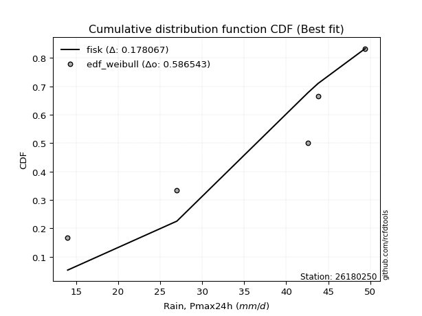</img>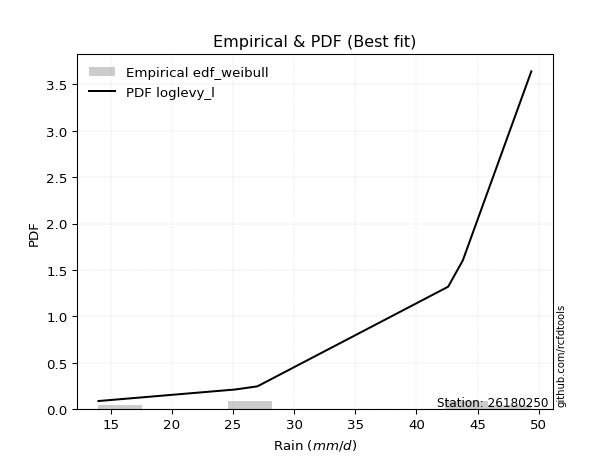</img>

</div>


### 4. EDF Beard (1943)

The Beard formula (or Beard´s plotting position formula) in hydrology is used to estimate the empirical non-exceedance probability _(P)_ of a flood event (or other extreme hydrological data point) within a given dataset.

<div align="center">


$P=(m-0.31)/(n+0.38)$


</div>


**4.1. Empirical values**

<div align="center">

|                | 0                   | 1                   | 2                  | 3                  | 4                  | 5                  |
|:---------------|:--------------------|:--------------------|:-------------------|:-------------------|:-------------------|:-------------------|
| date           | 2021                | 2025                | 2020               | 2022               | 2019               | 2023               |
| x              | 14.0                | 25.2                | 27.0               | 42.6               | 43.8               | 49.4               |
| m              | 1                   | 2                   | 3                  | 4                  | 5                  | 6                  |
| empirical_dist | edf_beard           | edf_beard           | edf_beard          | edf_beard          | edf_beard          | edf_beard          |
| empirical      | 0.10815047021943573 | 0.26489028213166144 | 0.4216300940438871 | 0.5783699059561128 | 0.7351097178683387 | 0.8918495297805643 |
| empirical_tr   | 1.1212653778558874  | 1.3603411513859276  | 1.7289972899728996 | 2.3717472118959106 | 3.7751479289940844 | 9.246376811594207  |

</div>


**4.2. Kolmogorov-Smirnov fit test (sorted by Δ)**


<div align="center">

|                | 0                   | 1                   | 2                   | 3                   | 4                   | 5                   | 6                   | 7                 | 8                   | 9                   | 10                 | 11                  | 12                  | 13                  | 14                  | 15                 | 16                  | 17                  | 18                 | 19                  | 20                  | 21                  | 22                 | 23                | 24                  | 25                  | 26                  | 27                  | 28                  | 29                  | 30                  | 31                  | 32                  | 33                  | 34                  | 35                 | 36                  | 37                  | 38                  | 39                  | 40                  | 41                  | 42                  | 43                  | 44                  | 45                | 46                 | 47                 | 48                  | 49                  | 50                  | 51                  | 52                | 53                 | 54                 | 55                  | 56                 | 57                  | 58                  | 59                  | 60                 | 61                 | 62                  | 63                  | 64                  | 65                  | 66                 | 67                  | 68                  | 69                  | 70                  | 71                 | 72                  | 73                 | 74                 | 75                 | 76                  | 77                  | 78                  | 79                  | 80                 | 81                  | 82                  | 83                  | 84                  | 85                  | 86                  | 87                  | 88                  | 89                  | 90                 | 91                 | 92                  | 93                  | 94                  | 95                  | 96                  | 97                  | 98                  | 99                  | 100                 | 101                 | 102                 | 103                 | 104                | 105                | 106                 | 107                 | 108                 | 109                 | 110                 | 111                 | 112                 | 113                 | 114                 | 115                | 116                 | 117                 | 118                 | 119              | 120                 | 121                 | 122                | 123                | 124                 | 125                | 126                | 127                 | 128                | 129                | 130                | 131                | 132                | 133                | 134                 | 135                | 136                 | 137               | 138               | 139                | 140                 | 141                | 142                 | 143                | 144                 | 145               | 146                | 147               | 148                | 149                | 150                | 151                | 152               | 153                | 154                | 155                | 156                | 157                | 158                | 159                |
|:---------------|:--------------------|:--------------------|:--------------------|:--------------------|:--------------------|:--------------------|:--------------------|:------------------|:--------------------|:--------------------|:-------------------|:--------------------|:--------------------|:--------------------|:--------------------|:-------------------|:--------------------|:--------------------|:-------------------|:--------------------|:--------------------|:--------------------|:-------------------|:------------------|:--------------------|:--------------------|:--------------------|:--------------------|:--------------------|:--------------------|:--------------------|:--------------------|:--------------------|:--------------------|:--------------------|:-------------------|:--------------------|:--------------------|:--------------------|:--------------------|:--------------------|:--------------------|:--------------------|:--------------------|:--------------------|:------------------|:-------------------|:-------------------|:--------------------|:--------------------|:--------------------|:--------------------|:------------------|:-------------------|:-------------------|:--------------------|:-------------------|:--------------------|:--------------------|:--------------------|:-------------------|:-------------------|:--------------------|:--------------------|:--------------------|:--------------------|:-------------------|:--------------------|:--------------------|:--------------------|:--------------------|:-------------------|:--------------------|:-------------------|:-------------------|:-------------------|:--------------------|:--------------------|:--------------------|:--------------------|:-------------------|:--------------------|:--------------------|:--------------------|:--------------------|:--------------------|:--------------------|:--------------------|:--------------------|:--------------------|:-------------------|:-------------------|:--------------------|:--------------------|:--------------------|:--------------------|:--------------------|:--------------------|:--------------------|:--------------------|:--------------------|:--------------------|:--------------------|:--------------------|:-------------------|:-------------------|:--------------------|:--------------------|:--------------------|:--------------------|:--------------------|:--------------------|:--------------------|:--------------------|:--------------------|:-------------------|:--------------------|:--------------------|:--------------------|:-----------------|:--------------------|:--------------------|:-------------------|:-------------------|:--------------------|:-------------------|:-------------------|:--------------------|:-------------------|:-------------------|:-------------------|:-------------------|:-------------------|:-------------------|:--------------------|:-------------------|:--------------------|:------------------|:------------------|:-------------------|:--------------------|:-------------------|:--------------------|:-------------------|:--------------------|:------------------|:-------------------|:------------------|:-------------------|:-------------------|:-------------------|:-------------------|:------------------|:-------------------|:-------------------|:-------------------|:-------------------|:-------------------|:-------------------|:-------------------|
| station        | 26180250            | 26180250            | 26180250            | 26180250            | 26180250            | 26180250            | 26180250            | 26180250          | 26180250            | 26180250            | 26180250           | 26180250            | 26180250            | 26180250            | 26180250            | 26180250           | 26180250            | 26180250            | 26180250           | 26180250            | 26180250            | 26180250            | 26180250           | 26180250          | 26180250            | 26180250            | 26180250            | 26180250            | 26180250            | 26180250            | 26180250            | 26180250            | 26180250            | 26180250            | 26180250            | 26180250           | 26180250            | 26180250            | 26180250            | 26180250            | 26180250            | 26180250            | 26180250            | 26180250            | 26180250            | 26180250          | 26180250           | 26180250           | 26180250            | 26180250            | 26180250            | 26180250            | 26180250          | 26180250           | 26180250           | 26180250            | 26180250           | 26180250            | 26180250            | 26180250            | 26180250           | 26180250           | 26180250            | 26180250            | 26180250            | 26180250            | 26180250           | 26180250            | 26180250            | 26180250            | 26180250            | 26180250           | 26180250            | 26180250           | 26180250           | 26180250           | 26180250            | 26180250            | 26180250            | 26180250            | 26180250           | 26180250            | 26180250            | 26180250            | 26180250            | 26180250            | 26180250            | 26180250            | 26180250            | 26180250            | 26180250           | 26180250           | 26180250            | 26180250            | 26180250            | 26180250            | 26180250            | 26180250            | 26180250            | 26180250            | 26180250            | 26180250            | 26180250            | 26180250            | 26180250           | 26180250           | 26180250            | 26180250            | 26180250            | 26180250            | 26180250            | 26180250            | 26180250            | 26180250            | 26180250            | 26180250           | 26180250            | 26180250            | 26180250            | 26180250         | 26180250            | 26180250            | 26180250           | 26180250           | 26180250            | 26180250           | 26180250           | 26180250            | 26180250           | 26180250           | 26180250           | 26180250           | 26180250           | 26180250           | 26180250            | 26180250           | 26180250            | 26180250          | 26180250          | 26180250           | 26180250            | 26180250           | 26180250            | 26180250           | 26180250            | 26180250          | 26180250           | 26180250          | 26180250           | 26180250           | 26180250           | 26180250           | 26180250          | 26180250           | 26180250           | 26180250           | 26180250           | 26180250           | 26180250           | 26180250           |
| empirical_dist | edf_beard           | edf_beard           | edf_beard           | edf_beard           | edf_beard           | edf_beard           | edf_beard           | edf_beard         | edf_beard           | edf_beard           | edf_beard          | edf_beard           | edf_beard           | edf_beard           | edf_beard           | edf_beard          | edf_beard           | edf_beard           | edf_beard          | edf_beard           | edf_beard           | edf_beard           | edf_beard          | edf_beard         | edf_beard           | edf_beard           | edf_beard           | edf_beard           | edf_beard           | edf_beard           | edf_beard           | edf_beard           | edf_beard           | edf_beard           | edf_beard           | edf_beard          | edf_beard           | edf_beard           | edf_beard           | edf_beard           | edf_beard           | edf_beard           | edf_beard           | edf_beard           | edf_beard           | edf_beard         | edf_beard          | edf_beard          | edf_beard           | edf_beard           | edf_beard           | edf_beard           | edf_beard         | edf_beard          | edf_beard          | edf_beard           | edf_beard          | edf_beard           | edf_beard           | edf_beard           | edf_beard          | edf_beard          | edf_beard           | edf_beard           | edf_beard           | edf_beard           | edf_beard          | edf_beard           | edf_beard           | edf_beard           | edf_beard           | edf_beard          | edf_beard           | edf_beard          | edf_beard          | edf_beard          | edf_beard           | edf_beard           | edf_beard           | edf_beard           | edf_beard          | edf_beard           | edf_beard           | edf_beard           | edf_beard           | edf_beard           | edf_beard           | edf_beard           | edf_beard           | edf_beard           | edf_beard          | edf_beard          | edf_beard           | edf_beard           | edf_beard           | edf_beard           | edf_beard           | edf_beard           | edf_beard           | edf_beard           | edf_beard           | edf_beard           | edf_beard           | edf_beard           | edf_beard          | edf_beard          | edf_beard           | edf_beard           | edf_beard           | edf_beard           | edf_beard           | edf_beard           | edf_beard           | edf_beard           | edf_beard           | edf_beard          | edf_beard           | edf_beard           | edf_beard           | edf_beard        | edf_beard           | edf_beard           | edf_beard          | edf_beard          | edf_beard           | edf_beard          | edf_beard          | edf_beard           | edf_beard          | edf_beard          | edf_beard          | edf_beard          | edf_beard          | edf_beard          | edf_beard           | edf_beard          | edf_beard           | edf_beard         | edf_beard         | edf_beard          | edf_beard           | edf_beard          | edf_beard           | edf_beard          | edf_beard           | edf_beard         | edf_beard          | edf_beard         | edf_beard          | edf_beard          | edf_beard          | edf_beard          | edf_beard         | edf_beard          | edf_beard          | edf_beard          | edf_beard          | edf_beard          | edf_beard          | edf_beard          |
| p_dist         | dgamma              | logdgamma           | dweibull            | logdweibull         | logbeta             | beta                | arcsine             | logarcsine        | logtrapezoid        | trapezoid           | ksone              | loglevy_l           | logweibull_max      | wrapcauchy          | gausshyper          | genhalflogistic    | logbetaprime        | logmielke           | semicircular       | loggenextreme       | logloggamma         | triang              | logsemicircular    | mielke            | anglit              | skewnorm            | loginvweibull       | loganglit           | logjohnsonsu        | weibull_min         | loggenhalflogistic  | argus               | logexponpow         | gumbel_l            | levy_l              | genextreme         | pearson3            | loggenpareto        | johnsonsu           | logncf              | logkstwobign        | gompertz            | betaprime           | f                   | erlang              | logburr12         | logburr            | nct                | t                   | norm                | crystalball         | truncnorm           | exponnorm         | logargus           | loggumbel_l        | logalpha            | alpha              | genexpon            | logweibull_min      | gamma               | rice               | foldnorm           | loggenexpon         | burr                | logf                | ncf                 | lognct             | logrice             | invgamma            | logcrystalball      | lognorm             | logt               | logexponnorm        | loggamma           | loggamma           | logfatiguelife     | logerlang           | maxwell             | logfoldnorm         | loginvgamma         | loggompertz        | loginvgauss         | rayleigh            | kstwobign           | invgauss            | logmaxwell          | lograyleigh         | cosine              | kappa4              | halfnorm            | genpareto          | loghalfnorm        | logistic            | loglogistic         | logcosine           | tukeylambda         | gumbel_r            | hypsecant           | logwrapcauchy       | vonmises_line       | loggumbel_r         | logpearson3         | halflogistic        | loghypsecant        | uniform            | loghalflogistic    | johnsonsb           | moyal               | kappa3              | loggennorm          | gennorm             | logmoyal            | lomax               | logskewnorm         | logtriang           | laplace            | logksone            | loglaplace          | loglaplace          | truncweibull_min | burr12              | loglomax            | logloglaplace      | halfgennorm        | lognakagami         | logrdist           | wald               | nakagami            | logwald            | bradford           | truncexpon         | loggausshyper      | logkappa3          | loguniform         | logkappa4           | logvonmises_line   | logtukeylambda      | loggengamma       | logtruncnorm      | logbradford        | logtruncweibull_min | logtruncexpon      | logexponweib        | loghalfgennorm     | invweibull          | fatiguelife       | weibull_max        | gengamma          | exponweib          | logjohnsonsb       | powerlaw           | rdist              | logpowerlaw       | truncpareto        | exponpow           | logtruncpareto     | genlogistic        | loggenlogistic     | logvonmises        | vonmises           |
| delta          | 0.09024865626023615 | 0.09818129397699715 | 0.10084348791017028 | 0.10288001731267549 | 0.10815045850157512 | 0.10815046083228008 | 0.10815047021943573 | 0.126581320274593 | 0.12750634951739992 | 0.12768611454594458 | 0.1284409043445227 | 0.12867367398250013 | 0.12886656972874966 | 0.13078017007843445 | 0.13399043975818858 | 0.1372624615475007 | 0.14250194774440972 | 0.14406646552699587 | 0.1446964425995898 | 0.14845106750256132 | 0.14904786912259516 | 0.15002904256070937 | 0.1505316564610112 | 0.151700691227732 | 0.15684979610790284 | 0.15715494322693552 | 0.16250754386091593 | 0.16276319691171637 | 0.16616063071129755 | 0.16917847873174807 | 0.16983067608691316 | 0.17011508237569645 | 0.17079533122765056 | 0.17680867402556533 | 0.17805319955804105 | 0.1783808017627039 | 0.17881763926146454 | 0.17978028836131466 | 0.18001681930216873 | 0.18030448934585386 | 0.18138343186425376 | 0.18230154475653626 | 0.18372053288308898 | 0.18388720734891983 | 0.18437541025484716 | 0.184470996665271 | 0.1847294818899583 | 0.1847488972674155 | 0.18475368898351052 | 0.18476211330156256 | 0.18476211948242593 | 0.18476216479903074 | 0.184763597260299 | 0.1847819586394337 | 0.1854565036554141 | 0.18593015890940456 | 0.1860653635034789 | 0.18608483662190622 | 0.18656168609329904 | 0.18722207997388685 | 0.1875089755563668 | 0.1880346619728418 | 0.18943799954980578 | 0.19000162188304393 | 0.19000215698638867 | 0.19010650090061776 | 0.1901676175213063 | 0.19056475410406581 | 0.19070906160524825 | 0.19079168135433344 | 0.19079171455195387 | 0.1907921680282776 | 0.19079484752137088 | 0.1922424066457813 | 0.1922424066457813 | 0.1922850159204782 | 0.19234683023346866 | 0.19261958828945402 | 0.19389984836146856 | 0.19420622787689212 | 0.1942260496909063 | 0.19462422787335243 | 0.19485205506828052 | 0.19500073577490407 | 0.19650354932472436 | 0.19784893130183911 | 0.19985053708884182 | 0.19985453844772627 | 0.20279235261177853 | 0.20283779618674502 | 0.2067660808437941 | 0.2072501970549303 | 0.20736923991873635 | 0.21331589707050957 | 0.21723629200674355 | 0.22077429365261325 | 0.22093496134643598 | 0.22184753659644485 | 0.22379413468075837 | 0.22392464413791946 | 0.22540919285995353 | 0.22563630105502475 | 0.22644078060416872 | 0.22755246373654403 | 0.2295396985636613 | 0.2304513340617289 | 0.23118811094100022 | 0.23266620549991557 | 0.23301128322994968 | 0.23510971786833867 | 0.23510971786833867 | 0.23667613219725614 | 0.23680966191622776 | 0.23812391315369863 | 0.23943955726775068 | 0.2400955099788884 | 0.24041893403667247 | 0.24507701394188508 | 0.24507701394188508 | 0.24912518747903 | 0.25606414265899413 | 0.25771932391909336 | 0.2612733370777799 | 0.2620153095876999 | 0.26488811597776596 | 0.2670336733550736 | 0.2702704489928893 | 0.27266559675048174 | 0.2732384792402307 | 0.2755514354135121 | 0.2812500429324748 | 0.2903123935305322 | 0.3037492662596325 | 0.3041767020352295 | 0.30547672586477403 | 0.3056858560302995 | 0.30811208696083564 | 0.320073408209267 | 0.329863209558805 | 0.3356814437773903 | 0.3382642461933041  | 0.3405782457861457 | 0.40341825282879884 | 0.4216300940438871 | 0.46522441319823465 | 0.489689644351035 | 0.5064224217904987 | 0.508889552313538 | 0.5335443182626646 | 0.5398861099306415 | 0.5768174121566743 | 0.5999062015655541 | 0.619353413749111 | 0.6368959248466692 | 0.6574965850942447 | 0.6694037883597933 | 0.7351097178683387 | 0.7351097178683387 | 1.1873635834096765 | 7.3373820099935605 |
| deltao         | 0.530385761606      | 0.530385761606      | 0.530385761606      | 0.530385761606      | 0.530385761606      | 0.530385761606      | 0.530385761606      | 0.530385761606    | 0.530385761606      | 0.530385761606      | 0.530385761606     | 0.530385761606      | 0.530385761606      | 0.530385761606      | 0.530385761606      | 0.530385761606     | 0.530385761606      | 0.530385761606      | 0.530385761606     | 0.530385761606      | 0.530385761606      | 0.530385761606      | 0.530385761606     | 0.530385761606    | 0.530385761606      | 0.530385761606      | 0.530385761606      | 0.530385761606      | 0.530385761606      | 0.530385761606      | 0.530385761606      | 0.530385761606      | 0.530385761606      | 0.530385761606      | 0.530385761606      | 0.530385761606     | 0.530385761606      | 0.530385761606      | 0.530385761606      | 0.530385761606      | 0.530385761606      | 0.530385761606      | 0.530385761606      | 0.530385761606      | 0.530385761606      | 0.530385761606    | 0.530385761606     | 0.530385761606     | 0.530385761606      | 0.530385761606      | 0.530385761606      | 0.530385761606      | 0.530385761606    | 0.530385761606     | 0.530385761606     | 0.530385761606      | 0.530385761606     | 0.530385761606      | 0.530385761606      | 0.530385761606      | 0.530385761606     | 0.530385761606     | 0.530385761606      | 0.530385761606      | 0.530385761606      | 0.530385761606      | 0.530385761606     | 0.530385761606      | 0.530385761606      | 0.530385761606      | 0.530385761606      | 0.530385761606     | 0.530385761606      | 0.530385761606     | 0.530385761606     | 0.530385761606     | 0.530385761606      | 0.530385761606      | 0.530385761606      | 0.530385761606      | 0.530385761606     | 0.530385761606      | 0.530385761606      | 0.530385761606      | 0.530385761606      | 0.530385761606      | 0.530385761606      | 0.530385761606      | 0.530385761606      | 0.530385761606      | 0.530385761606     | 0.530385761606     | 0.530385761606      | 0.530385761606      | 0.530385761606      | 0.530385761606      | 0.530385761606      | 0.530385761606      | 0.530385761606      | 0.530385761606      | 0.530385761606      | 0.530385761606      | 0.530385761606      | 0.530385761606      | 0.530385761606     | 0.530385761606     | 0.530385761606      | 0.530385761606      | 0.530385761606      | 0.530385761606      | 0.530385761606      | 0.530385761606      | 0.530385761606      | 0.530385761606      | 0.530385761606      | 0.530385761606     | 0.530385761606      | 0.530385761606      | 0.530385761606      | 0.530385761606   | 0.530385761606      | 0.530385761606      | 0.530385761606     | 0.530385761606     | 0.530385761606      | 0.530385761606     | 0.530385761606     | 0.530385761606      | 0.530385761606     | 0.530385761606     | 0.530385761606     | 0.530385761606     | 0.530385761606     | 0.530385761606     | 0.530385761606      | 0.530385761606     | 0.530385761606      | 0.530385761606    | 0.530385761606    | 0.530385761606     | 0.530385761606      | 0.530385761606     | 0.530385761606      | 0.530385761606     | 0.530385761606      | 0.530385761606    | 0.530385761606     | 0.530385761606    | 0.530385761606     | 0.530385761606     | 0.530385761606     | 0.530385761606     | 0.530385761606    | 0.530385761606     | 0.530385761606     | 0.530385761606     | 0.530385761606     | 0.530385761606     | 0.530385761606     | 0.530385761606     |
| eval           | Δo > Δ              | Δo > Δ              | Δo > Δ              | Δo > Δ              | Δo > Δ              | Δo > Δ              | Δo > Δ              | Δo > Δ            | Δo > Δ              | Δo > Δ              | Δo > Δ             | Δo > Δ              | Δo > Δ              | Δo > Δ              | Δo > Δ              | Δo > Δ             | Δo > Δ              | Δo > Δ              | Δo > Δ             | Δo > Δ              | Δo > Δ              | Δo > Δ              | Δo > Δ             | Δo > Δ            | Δo > Δ              | Δo > Δ              | Δo > Δ              | Δo > Δ              | Δo > Δ              | Δo > Δ              | Δo > Δ              | Δo > Δ              | Δo > Δ              | Δo > Δ              | Δo > Δ              | Δo > Δ             | Δo > Δ              | Δo > Δ              | Δo > Δ              | Δo > Δ              | Δo > Δ              | Δo > Δ              | Δo > Δ              | Δo > Δ              | Δo > Δ              | Δo > Δ            | Δo > Δ             | Δo > Δ             | Δo > Δ              | Δo > Δ              | Δo > Δ              | Δo > Δ              | Δo > Δ            | Δo > Δ             | Δo > Δ             | Δo > Δ              | Δo > Δ             | Δo > Δ              | Δo > Δ              | Δo > Δ              | Δo > Δ             | Δo > Δ             | Δo > Δ              | Δo > Δ              | Δo > Δ              | Δo > Δ              | Δo > Δ             | Δo > Δ              | Δo > Δ              | Δo > Δ              | Δo > Δ              | Δo > Δ             | Δo > Δ              | Δo > Δ             | Δo > Δ             | Δo > Δ             | Δo > Δ              | Δo > Δ              | Δo > Δ              | Δo > Δ              | Δo > Δ             | Δo > Δ              | Δo > Δ              | Δo > Δ              | Δo > Δ              | Δo > Δ              | Δo > Δ              | Δo > Δ              | Δo > Δ              | Δo > Δ              | Δo > Δ             | Δo > Δ             | Δo > Δ              | Δo > Δ              | Δo > Δ              | Δo > Δ              | Δo > Δ              | Δo > Δ              | Δo > Δ              | Δo > Δ              | Δo > Δ              | Δo > Δ              | Δo > Δ              | Δo > Δ              | Δo > Δ             | Δo > Δ             | Δo > Δ              | Δo > Δ              | Δo > Δ              | Δo > Δ              | Δo > Δ              | Δo > Δ              | Δo > Δ              | Δo > Δ              | Δo > Δ              | Δo > Δ             | Δo > Δ              | Δo > Δ              | Δo > Δ              | Δo > Δ           | Δo > Δ              | Δo > Δ              | Δo > Δ             | Δo > Δ             | Δo > Δ              | Δo > Δ             | Δo > Δ             | Δo > Δ              | Δo > Δ             | Δo > Δ             | Δo > Δ             | Δo > Δ             | Δo > Δ             | Δo > Δ             | Δo > Δ              | Δo > Δ             | Δo > Δ              | Δo > Δ            | Δo > Δ            | Δo > Δ             | Δo > Δ              | Δo > Δ             | Δo > Δ              | Δo > Δ             | Δo > Δ              | Δo > Δ            | Δo > Δ             | Δo > Δ            | Δo <= Δ            | Δo <= Δ            | Δo <= Δ            | Δo <= Δ            | Δo <= Δ           | Δo <= Δ            | Δo <= Δ            | Δo <= Δ            | Δo <= Δ            | Δo <= Δ            | Δo <= Δ            | Δo <= Δ            |
| fit            | 1                   | 1                   | 1                   | 1                   | 1                   | 1                   | 1                   | 1                 | 1                   | 1                   | 1                  | 1                   | 1                   | 1                   | 1                   | 1                  | 1                   | 1                   | 1                  | 1                   | 1                   | 1                   | 1                  | 1                 | 1                   | 1                   | 1                   | 1                   | 1                   | 1                   | 1                   | 1                   | 1                   | 1                   | 1                   | 1                  | 1                   | 1                   | 1                   | 1                   | 1                   | 1                   | 1                   | 1                   | 1                   | 1                 | 1                  | 1                  | 1                   | 1                   | 1                   | 1                   | 1                 | 1                  | 1                  | 1                   | 1                  | 1                   | 1                   | 1                   | 1                  | 1                  | 1                   | 1                   | 1                   | 1                   | 1                  | 1                   | 1                   | 1                   | 1                   | 1                  | 1                   | 1                  | 1                  | 1                  | 1                   | 1                   | 1                   | 1                   | 1                  | 1                   | 1                   | 1                   | 1                   | 1                   | 1                   | 1                   | 1                   | 1                   | 1                  | 1                  | 1                   | 1                   | 1                   | 1                   | 1                   | 1                   | 1                   | 1                   | 1                   | 1                   | 1                   | 1                   | 1                  | 1                  | 1                   | 1                   | 1                   | 1                   | 1                   | 1                   | 1                   | 1                   | 1                   | 1                  | 1                   | 1                   | 1                   | 1                | 1                   | 1                   | 1                  | 1                  | 1                   | 1                  | 1                  | 1                   | 1                  | 1                  | 1                  | 1                  | 1                  | 1                  | 1                   | 1                  | 1                   | 1                 | 1                 | 1                  | 1                   | 1                  | 1                   | 1                  | 1                   | 1                 | 1                  | 1                 | 0                  | 0                  | 0                  | 0                  | 0                 | 0                  | 0                  | 0                  | 0                  | 0                  | 0                  | 0                  |
| n              | 6                   | 6                   | 6                   | 6                   | 6                   | 6                   | 6                   | 6                 | 6                   | 6                   | 6                  | 6                   | 6                   | 6                   | 6                   | 6                  | 6                   | 6                   | 6                  | 6                   | 6                   | 6                   | 6                  | 6                 | 6                   | 6                   | 6                   | 6                   | 6                   | 6                   | 6                   | 6                   | 6                   | 6                   | 6                   | 6                  | 6                   | 6                   | 6                   | 6                   | 6                   | 6                   | 6                   | 6                   | 6                   | 6                 | 6                  | 6                  | 6                   | 6                   | 6                   | 6                   | 6                 | 6                  | 6                  | 6                   | 6                  | 6                   | 6                   | 6                   | 6                  | 6                  | 6                   | 6                   | 6                   | 6                   | 6                  | 6                   | 6                   | 6                   | 6                   | 6                  | 6                   | 6                  | 6                  | 6                  | 6                   | 6                   | 6                   | 6                   | 6                  | 6                   | 6                   | 6                   | 6                   | 6                   | 6                   | 6                   | 6                   | 6                   | 6                  | 6                  | 6                   | 6                   | 6                   | 6                   | 6                   | 6                   | 6                   | 6                   | 6                   | 6                   | 6                   | 6                   | 6                  | 6                  | 6                   | 6                   | 6                   | 6                   | 6                   | 6                   | 6                   | 6                   | 6                   | 6                  | 6                   | 6                   | 6                   | 6                | 6                   | 6                   | 6                  | 6                  | 6                   | 6                  | 6                  | 6                   | 6                  | 6                  | 6                  | 6                  | 6                  | 6                  | 6                   | 6                  | 6                   | 6                 | 6                 | 6                  | 6                   | 6                  | 6                   | 6                  | 6                   | 6                 | 6                  | 6                 | 6                  | 6                  | 6                  | 6                  | 6                 | 6                  | 6                  | 6                  | 6                  | 6                  | 6                  | 6                  |
| best_fit       | 1                   | 0                   | 0                   | 0                   | 0                   | 0                   | 0                   | 0                 | 0                   | 0                   | 0                  | 0                   | 0                   | 0                   | 0                   | 0                  | 0                   | 0                   | 0                  | 0                   | 0                   | 0                   | 0                  | 0                 | 0                   | 0                   | 0                   | 0                   | 0                   | 0                   | 0                   | 0                   | 0                   | 0                   | 0                   | 0                  | 0                   | 0                   | 0                   | 0                   | 0                   | 0                   | 0                   | 0                   | 0                   | 0                 | 0                  | 0                  | 0                   | 0                   | 0                   | 0                   | 0                 | 0                  | 0                  | 0                   | 0                  | 0                   | 0                   | 0                   | 0                  | 0                  | 0                   | 0                   | 0                   | 0                   | 0                  | 0                   | 0                   | 0                   | 0                   | 0                  | 0                   | 0                  | 0                  | 0                  | 0                   | 0                   | 0                   | 0                   | 0                  | 0                   | 0                   | 0                   | 0                   | 0                   | 0                   | 0                   | 0                   | 0                   | 0                  | 0                  | 0                   | 0                   | 0                   | 0                   | 0                   | 0                   | 0                   | 0                   | 0                   | 0                   | 0                   | 0                   | 0                  | 0                  | 0                   | 0                   | 0                   | 0                   | 0                   | 0                   | 0                   | 0                   | 0                   | 0                  | 0                   | 0                   | 0                   | 0                | 0                   | 0                   | 0                  | 0                  | 0                   | 0                  | 0                  | 0                   | 0                  | 0                  | 0                  | 0                  | 0                  | 0                  | 0                   | 0                  | 0                   | 0                 | 0                 | 0                  | 0                   | 0                  | 0                   | 0                  | 0                   | 0                 | 0                  | 0                 | 0                  | 0                  | 0                  | 0                  | 0                 | 0                  | 0                  | 0                  | 0                  | 0                  | 0                  | 0                  |
| best_fit_sort  | 1                   | 2                   | 3                   | 4                   | 5                   | 6                   | 7                   | 8                 | 9                   | 10                  | 11                 | 12                  | 13                  | 14                  | 15                  | 16                 | 17                  | 18                  | 19                 | 20                  | 21                  | 22                  | 23                 | 24                | 25                  | 26                  | 27                  | 28                  | 29                  | 30                  | 31                  | 32                  | 33                  | 34                  | 35                  | 36                 | 37                  | 38                  | 39                  | 40                  | 41                  | 42                  | 43                  | 44                  | 45                  | 46                | 47                 | 48                 | 49                  | 50                  | 51                  | 52                  | 53                | 54                 | 55                 | 56                  | 57                 | 58                  | 59                  | 60                  | 61                 | 62                 | 63                  | 64                  | 65                  | 66                  | 67                 | 68                  | 69                  | 70                  | 71                  | 72                 | 73                  | 74                 | 75                 | 76                 | 77                  | 78                  | 79                  | 80                  | 81                 | 82                  | 83                  | 84                  | 85                  | 86                  | 87                  | 88                  | 89                  | 90                  | 91                 | 92                 | 93                  | 94                  | 95                  | 96                  | 97                  | 98                  | 99                  | 100                 | 101                 | 102                 | 103                 | 104                 | 105                | 106                | 107                 | 108                 | 109                 | 110                 | 111                 | 112                 | 113                 | 114                 | 115                 | 116                | 117                 | 118                 | 119                 | 120              | 121                 | 122                 | 123                | 124                | 125                 | 126                | 127                | 128                 | 129                | 130                | 131                | 132                | 133                | 134                | 135                 | 136                | 137                 | 138               | 139               | 140                | 141                 | 142                | 143                 | 144                | 145                 | 146               | 147                | 148               | 149                | 150                | 151                | 152                | 153               | 154                | 155                | 156                | 157                | 158                | 159                | 160                |

</div>


**4.3. Best fit**

<div align="center">

|   id |   station | empirical_dist   | p_dist   |     delta |   deltao | eval   |   fit |   n |   best_fit |   best_fit_sort |
|-----:|----------:|:-----------------|:---------|----------:|---------:|:-------|------:|----:|-----------:|----------------:|
|    0 |  26180250 | edf_beard        | dgamma   | 0.0902487 | 0.530386 | Δo > Δ |     1 |   6 |          1 |               1 |

</div>


<div align="center">

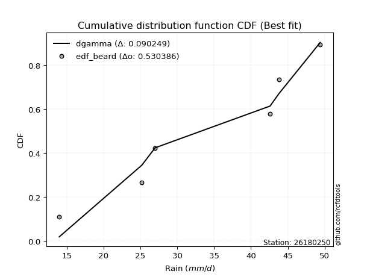</img>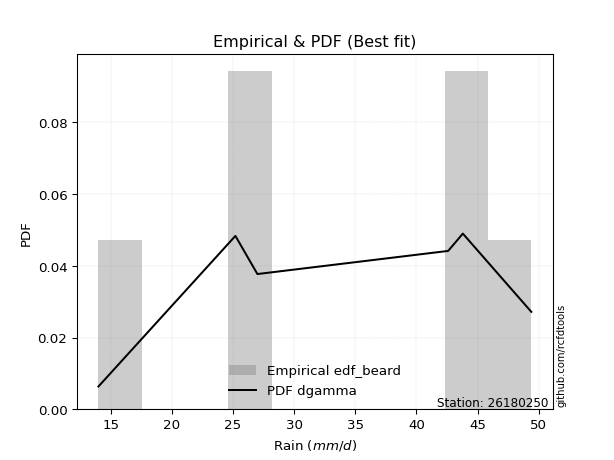</img>

</div>


### 5. EDF Chegodayev (1955)

The Chegodayev formula is an empirical plotting position formula used in hydrological frequency analysis to estimate the exceedance probability or return period of a specific event from a set of observed data. It is primarily used for plotting observed data points on probability paper to fit a theoretical distribution, particularly for analyzing extreme events like maximum flood flows or rainfall intensities. The constant _b_ value in the generalized plotting position formula is 0.3.

<div align="center">


$P=(m-b)/(n+1-2b)$


</div>


**5.1. Empirical values**

<div align="center">

|                | 0                   | 1                  | 2                  | 3                  | 4                 | 5                 |
|:---------------|:--------------------|:-------------------|:-------------------|:-------------------|:------------------|:------------------|
| date           | 2021                | 2025               | 2020               | 2022               | 2019              | 2023              |
| x              | 14.0                | 25.2               | 27.0               | 42.6               | 43.8              | 49.4              |
| m              | 1                   | 2                  | 3                  | 4                  | 5                 | 6                 |
| empirical_dist | edf_chegodayev      | edf_chegodayev     | edf_chegodayev     | edf_chegodayev     | edf_chegodayev    | edf_chegodayev    |
| empirical      | 0.10937499999999999 | 0.265625           | 0.421875           | 0.578125           | 0.734375          | 0.890625          |
| empirical_tr   | 1.1228070175438596  | 1.3617021276595744 | 1.7297297297297298 | 2.3703703703703702 | 3.764705882352941 | 9.142857142857142 |

</div>


**5.2. Kolmogorov-Smirnov fit test (sorted by Δ)**


<div align="center">

|                | 0                  | 1                  | 2                   | 3                  | 4                   | 5                   | 6                   | 7                   | 8                   | 9                   | 10                  | 11                  | 12                  | 13                 | 14                  | 15                 | 16                  | 17                  | 18                  | 19                 | 20                  | 21                 | 22                | 23                  | 24                  | 25                 | 26                  | 27                  | 28                  | 29                 | 30                  | 31                  | 32                  | 33                 | 34                  | 35                 | 36                  | 37                  | 38                  | 39                 | 40                  | 41                  | 42                 | 43                  | 44                  | 45                  | 46                  | 47                  | 48                  | 49                  | 50                  | 51                  | 52                  | 53                  | 54                  | 55                  | 56                  | 57                  | 58                  | 59                  | 60                  | 61                  | 62                  | 63                  | 64                 | 65                  | 66                 | 67                  | 68                  | 69                  | 70                 | 71                 | 72                 | 73                 | 74                 | 75                  | 76                  | 77                  | 78                  | 79                  | 80                 | 81                  | 82                  | 83                  | 84                  | 85                  | 86                  | 87                 | 88                  | 89                  | 90                  | 91                  | 92                  | 93                 | 94                  | 95                  | 96                 | 97                  | 98                 | 99                  | 100                 | 101                 | 102                 | 103                 | 104                 | 105                 | 106                 | 107                 | 108                | 109            | 110            | 111                 | 112                 | 113                 | 114                | 115                 | 116                | 117                | 118                | 119                 | 120                 | 121                | 122                 | 123                | 124                | 125                | 126                 | 127                 | 128                | 129                 | 130                | 131               | 132                | 133                | 134                 | 135                 | 136                | 137                | 138                | 139                | 140                 | 141                | 142                | 143            | 144                 | 145                 | 146                | 147                | 148               | 149                | 150                | 151                | 152                | 153                | 154                | 155                | 156            | 157            | 158                | 159                |
|:---------------|:-------------------|:-------------------|:--------------------|:-------------------|:--------------------|:--------------------|:--------------------|:--------------------|:--------------------|:--------------------|:--------------------|:--------------------|:--------------------|:-------------------|:--------------------|:-------------------|:--------------------|:--------------------|:--------------------|:-------------------|:--------------------|:-------------------|:------------------|:--------------------|:--------------------|:-------------------|:--------------------|:--------------------|:--------------------|:-------------------|:--------------------|:--------------------|:--------------------|:-------------------|:--------------------|:-------------------|:--------------------|:--------------------|:--------------------|:-------------------|:--------------------|:--------------------|:-------------------|:--------------------|:--------------------|:--------------------|:--------------------|:--------------------|:--------------------|:--------------------|:--------------------|:--------------------|:--------------------|:--------------------|:--------------------|:--------------------|:--------------------|:--------------------|:--------------------|:--------------------|:--------------------|:--------------------|:--------------------|:--------------------|:-------------------|:--------------------|:-------------------|:--------------------|:--------------------|:--------------------|:-------------------|:-------------------|:-------------------|:-------------------|:-------------------|:--------------------|:--------------------|:--------------------|:--------------------|:--------------------|:-------------------|:--------------------|:--------------------|:--------------------|:--------------------|:--------------------|:--------------------|:-------------------|:--------------------|:--------------------|:--------------------|:--------------------|:--------------------|:-------------------|:--------------------|:--------------------|:-------------------|:--------------------|:-------------------|:--------------------|:--------------------|:--------------------|:--------------------|:--------------------|:--------------------|:--------------------|:--------------------|:--------------------|:-------------------|:---------------|:---------------|:--------------------|:--------------------|:--------------------|:-------------------|:--------------------|:-------------------|:-------------------|:-------------------|:--------------------|:--------------------|:-------------------|:--------------------|:-------------------|:-------------------|:-------------------|:--------------------|:--------------------|:-------------------|:--------------------|:-------------------|:------------------|:-------------------|:-------------------|:--------------------|:--------------------|:-------------------|:-------------------|:-------------------|:-------------------|:--------------------|:-------------------|:-------------------|:---------------|:--------------------|:--------------------|:-------------------|:-------------------|:------------------|:-------------------|:-------------------|:-------------------|:-------------------|:-------------------|:-------------------|:-------------------|:---------------|:---------------|:-------------------|:-------------------|
| station        | 26180250           | 26180250           | 26180250            | 26180250           | 26180250            | 26180250            | 26180250            | 26180250            | 26180250            | 26180250            | 26180250            | 26180250            | 26180250            | 26180250           | 26180250            | 26180250           | 26180250            | 26180250            | 26180250            | 26180250           | 26180250            | 26180250           | 26180250          | 26180250            | 26180250            | 26180250           | 26180250            | 26180250            | 26180250            | 26180250           | 26180250            | 26180250            | 26180250            | 26180250           | 26180250            | 26180250           | 26180250            | 26180250            | 26180250            | 26180250           | 26180250            | 26180250            | 26180250           | 26180250            | 26180250            | 26180250            | 26180250            | 26180250            | 26180250            | 26180250            | 26180250            | 26180250            | 26180250            | 26180250            | 26180250            | 26180250            | 26180250            | 26180250            | 26180250            | 26180250            | 26180250            | 26180250            | 26180250            | 26180250            | 26180250           | 26180250            | 26180250           | 26180250            | 26180250            | 26180250            | 26180250           | 26180250           | 26180250           | 26180250           | 26180250           | 26180250            | 26180250            | 26180250            | 26180250            | 26180250            | 26180250           | 26180250            | 26180250            | 26180250            | 26180250            | 26180250            | 26180250            | 26180250           | 26180250            | 26180250            | 26180250            | 26180250            | 26180250            | 26180250           | 26180250            | 26180250            | 26180250           | 26180250            | 26180250           | 26180250            | 26180250            | 26180250            | 26180250            | 26180250            | 26180250            | 26180250            | 26180250            | 26180250            | 26180250           | 26180250       | 26180250       | 26180250            | 26180250            | 26180250            | 26180250           | 26180250            | 26180250           | 26180250           | 26180250           | 26180250            | 26180250            | 26180250           | 26180250            | 26180250           | 26180250           | 26180250           | 26180250            | 26180250            | 26180250           | 26180250            | 26180250           | 26180250          | 26180250           | 26180250           | 26180250            | 26180250            | 26180250           | 26180250           | 26180250           | 26180250           | 26180250            | 26180250           | 26180250           | 26180250       | 26180250            | 26180250            | 26180250           | 26180250           | 26180250          | 26180250           | 26180250           | 26180250           | 26180250           | 26180250           | 26180250           | 26180250           | 26180250       | 26180250       | 26180250           | 26180250           |
| empirical_dist | edf_chegodayev     | edf_chegodayev     | edf_chegodayev      | edf_chegodayev     | edf_chegodayev      | edf_chegodayev      | edf_chegodayev      | edf_chegodayev      | edf_chegodayev      | edf_chegodayev      | edf_chegodayev      | edf_chegodayev      | edf_chegodayev      | edf_chegodayev     | edf_chegodayev      | edf_chegodayev     | edf_chegodayev      | edf_chegodayev      | edf_chegodayev      | edf_chegodayev     | edf_chegodayev      | edf_chegodayev     | edf_chegodayev    | edf_chegodayev      | edf_chegodayev      | edf_chegodayev     | edf_chegodayev      | edf_chegodayev      | edf_chegodayev      | edf_chegodayev     | edf_chegodayev      | edf_chegodayev      | edf_chegodayev      | edf_chegodayev     | edf_chegodayev      | edf_chegodayev     | edf_chegodayev      | edf_chegodayev      | edf_chegodayev      | edf_chegodayev     | edf_chegodayev      | edf_chegodayev      | edf_chegodayev     | edf_chegodayev      | edf_chegodayev      | edf_chegodayev      | edf_chegodayev      | edf_chegodayev      | edf_chegodayev      | edf_chegodayev      | edf_chegodayev      | edf_chegodayev      | edf_chegodayev      | edf_chegodayev      | edf_chegodayev      | edf_chegodayev      | edf_chegodayev      | edf_chegodayev      | edf_chegodayev      | edf_chegodayev      | edf_chegodayev      | edf_chegodayev      | edf_chegodayev      | edf_chegodayev      | edf_chegodayev     | edf_chegodayev      | edf_chegodayev     | edf_chegodayev      | edf_chegodayev      | edf_chegodayev      | edf_chegodayev     | edf_chegodayev     | edf_chegodayev     | edf_chegodayev     | edf_chegodayev     | edf_chegodayev      | edf_chegodayev      | edf_chegodayev      | edf_chegodayev      | edf_chegodayev      | edf_chegodayev     | edf_chegodayev      | edf_chegodayev      | edf_chegodayev      | edf_chegodayev      | edf_chegodayev      | edf_chegodayev      | edf_chegodayev     | edf_chegodayev      | edf_chegodayev      | edf_chegodayev      | edf_chegodayev      | edf_chegodayev      | edf_chegodayev     | edf_chegodayev      | edf_chegodayev      | edf_chegodayev     | edf_chegodayev      | edf_chegodayev     | edf_chegodayev      | edf_chegodayev      | edf_chegodayev      | edf_chegodayev      | edf_chegodayev      | edf_chegodayev      | edf_chegodayev      | edf_chegodayev      | edf_chegodayev      | edf_chegodayev     | edf_chegodayev | edf_chegodayev | edf_chegodayev      | edf_chegodayev      | edf_chegodayev      | edf_chegodayev     | edf_chegodayev      | edf_chegodayev     | edf_chegodayev     | edf_chegodayev     | edf_chegodayev      | edf_chegodayev      | edf_chegodayev     | edf_chegodayev      | edf_chegodayev     | edf_chegodayev     | edf_chegodayev     | edf_chegodayev      | edf_chegodayev      | edf_chegodayev     | edf_chegodayev      | edf_chegodayev     | edf_chegodayev    | edf_chegodayev     | edf_chegodayev     | edf_chegodayev      | edf_chegodayev      | edf_chegodayev     | edf_chegodayev     | edf_chegodayev     | edf_chegodayev     | edf_chegodayev      | edf_chegodayev     | edf_chegodayev     | edf_chegodayev | edf_chegodayev      | edf_chegodayev      | edf_chegodayev     | edf_chegodayev     | edf_chegodayev    | edf_chegodayev     | edf_chegodayev     | edf_chegodayev     | edf_chegodayev     | edf_chegodayev     | edf_chegodayev     | edf_chegodayev     | edf_chegodayev | edf_chegodayev | edf_chegodayev     | edf_chegodayev     |
| p_dist         | dgamma             | logdgamma          | dweibull            | logdweibull        | logbeta             | beta                | arcsine             | logarcsine          | loglevy_l           | logtrapezoid        | trapezoid           | ksone               | logweibull_max      | wrapcauchy         | gausshyper          | genhalflogistic    | logbetaprime        | logmielke           | semicircular        | loggenextreme      | logloggamma         | triang             | logsemicircular   | mielke              | anglit              | skewnorm           | loginvweibull       | loganglit           | logjohnsonsu        | weibull_min        | loggenhalflogistic  | argus               | logexponpow         | levy_l             | gumbel_l            | loggenpareto       | genextreme          | pearson3            | logncf              | johnsonsu          | logkstwobign        | gompertz            | betaprime          | f                   | erlang              | logburr12           | logburr             | nct                 | t                   | norm                | crystalball         | truncnorm           | exponnorm           | logargus            | loggumbel_l         | logalpha            | alpha               | genexpon            | logweibull_min      | gamma               | rice                | foldnorm            | loggenexpon         | burr                | logf               | ncf                 | lognct             | logrice             | invgamma            | logcrystalball      | lognorm            | logt               | logexponnorm       | loggamma           | loggamma           | logfatiguelife      | logerlang           | maxwell             | logfoldnorm         | loginvgamma         | loggompertz        | loginvgauss         | rayleigh            | kstwobign           | invgauss            | logmaxwell          | lograyleigh         | cosine             | kappa4              | halfnorm            | genpareto           | loghalfnorm         | logistic            | loglogistic        | logcosine           | tukeylambda         | gumbel_r           | hypsecant           | logwrapcauchy      | vonmises_line       | loggumbel_r         | logpearson3         | halflogistic        | loghypsecant        | uniform             | johnsonsb           | loghalflogistic     | moyal               | kappa3             | loggennorm     | gennorm        | lomax               | logmoyal            | logskewnorm         | logtriang          | laplace             | logksone           | loglaplace         | loglaplace         | truncweibull_min    | burr12              | loglomax           | halfgennorm         | logloglaplace      | lognakagami        | logrdist           | wald                | nakagami            | logwald            | bradford            | truncexpon         | loggausshyper     | logkappa3          | loguniform         | logkappa4           | logvonmises_line    | logtukeylambda     | loggengamma        | logtruncnorm       | logbradford        | logtruncweibull_min | logtruncexpon      | logexponweib       | loghalfgennorm | invweibull          | fatiguelife         | weibull_max        | gengamma           | exponweib         | logjohnsonsb       | powerlaw           | rdist              | logpowerlaw        | truncpareto        | exponpow           | logtruncpareto     | genlogistic    | loggenlogistic | logvonmises        | vonmises           |
| delta          | 0.0914731860408004 | 0.0994058237575614 | 0.10010877004183172 | 0.1031249232687883 | 0.10937498828213943 | 0.10937499061284439 | 0.10937499999999999 | 0.12584660240625445 | 0.12744914420193587 | 0.12775125547351274 | 0.12793102050205746 | 0.12868581030063553 | 0.12911147568486253 | 0.1300454522100959 | 0.13423534571430146 | 0.1375073675036136 | 0.14274685370052254 | 0.14431137148310874 | 0.14494134855570262 | 0.1486959734586742 | 0.14929277507870803 | 0.1502739485168222 | 0.150776562417124 | 0.15194559718384487 | 0.15709470206401566 | 0.1573998491830484 | 0.16275244981702874 | 0.16300810286782919 | 0.16640553666741043 | 0.1694233846878609 | 0.17007558204302597 | 0.17035998833180932 | 0.17104023718376338 | 0.1768286697774768 | 0.17705357998167814 | 0.1785557585807504 | 0.17862570771881678 | 0.17906254521757736 | 0.17907995956528955 | 0.1802617252582816 | 0.18162833782036658 | 0.18254645071264908 | 0.1839654388392018 | 0.18413211330503265 | 0.18462031621095998 | 0.18471590262138382 | 0.18497438784607112 | 0.18499380322352832 | 0.18499859493962334 | 0.18500701925767538 | 0.18500702543853875 | 0.18500707075514355 | 0.18500850321641182 | 0.18502686459554651 | 0.18570140961152692 | 0.18617506486551738 | 0.18631026945959173 | 0.18632974257801904 | 0.18680659204941186 | 0.18746698592999966 | 0.18775388151247963 | 0.18827956792895462 | 0.18870328168146722 | 0.19024652783915674 | 0.1902470629425015 | 0.19035140685673058 | 0.1904125234774191 | 0.19080966006017863 | 0.19095396756136107 | 0.19103658731044626 | 0.1910366205080667 | 0.1910370739843904 | 0.1910397534774837 | 0.1924873126018941 | 0.1924873126018941 | 0.19252992187659101 | 0.19259173618958148 | 0.19286449424556684 | 0.19414475431758138 | 0.19445113383300494 | 0.1944709556470191 | 0.19486913382946525 | 0.19509696102439333 | 0.19524564173101688 | 0.19674845528083718 | 0.19809383725795193 | 0.20009544304495464 | 0.2000994444038391 | 0.20303725856789134 | 0.20308270214285784 | 0.20701098679990693 | 0.20749510301104312 | 0.20761414587484917 | 0.2135608030266224 | 0.21748119796285637 | 0.22101919960872607 | 0.2211798673025488 | 0.22209244255255767 | 0.2230594168124198 | 0.22416955009403228 | 0.22565409881606635 | 0.22588120701113756 | 0.22668568656028154 | 0.22779736969265685 | 0.22978460451977412 | 0.23045339307266166 | 0.23069624001784172 | 0.23291111145602839 | 0.2332561891860625 | 0.234375       | 0.234375       | 0.23558513213566346 | 0.23692103815336896 | 0.23836881910981145 | 0.2396844632238635 | 0.24034041593500122 | 0.2406638399927853 | 0.2453219198979979 | 0.2453219198979979 | 0.24937009343514283 | 0.25532942479065557 | 0.2569846060507548 | 0.26128059171936135 | 0.2615182430338927 | 0.2656228338461045 | 0.2672785793111865 | 0.27051535494900214 | 0.27291050270659456 | 0.2734833851963435 | 0.27579634136962494 | 0.2814949488885876 | 0.290557299486645 | 0.3039941722157453 | 0.3044216079913423 | 0.30572163182088685 | 0.30593076198641234 | 0.3083569929169485 | 0.3188488784287027 | 0.3301081155149178 | 0.3359263497335031 | 0.3385091521494169  | 0.3408231517422585 | 0.4026835349604603 | 0.421875       | 0.46399988341767034 | 0.48895492648269645 | 0.5056877039221599 | 0.5081548344451995 | 0.532809600394326 | 0.5386615801500771 | 0.5760826942883357 | 0.5991714836972155 | 0.6186186958807725 | 0.6361612069783307 | 0.6567618672259061 | 0.6686690704914547 | 0.734375       | 0.734375       | 1.1876084893657892 | 7.3386065397741245 |
| deltao         | 0.530385761606     | 0.530385761606     | 0.530385761606      | 0.530385761606     | 0.530385761606      | 0.530385761606      | 0.530385761606      | 0.530385761606      | 0.530385761606      | 0.530385761606      | 0.530385761606      | 0.530385761606      | 0.530385761606      | 0.530385761606     | 0.530385761606      | 0.530385761606     | 0.530385761606      | 0.530385761606      | 0.530385761606      | 0.530385761606     | 0.530385761606      | 0.530385761606     | 0.530385761606    | 0.530385761606      | 0.530385761606      | 0.530385761606     | 0.530385761606      | 0.530385761606      | 0.530385761606      | 0.530385761606     | 0.530385761606      | 0.530385761606      | 0.530385761606      | 0.530385761606     | 0.530385761606      | 0.530385761606     | 0.530385761606      | 0.530385761606      | 0.530385761606      | 0.530385761606     | 0.530385761606      | 0.530385761606      | 0.530385761606     | 0.530385761606      | 0.530385761606      | 0.530385761606      | 0.530385761606      | 0.530385761606      | 0.530385761606      | 0.530385761606      | 0.530385761606      | 0.530385761606      | 0.530385761606      | 0.530385761606      | 0.530385761606      | 0.530385761606      | 0.530385761606      | 0.530385761606      | 0.530385761606      | 0.530385761606      | 0.530385761606      | 0.530385761606      | 0.530385761606      | 0.530385761606      | 0.530385761606     | 0.530385761606      | 0.530385761606     | 0.530385761606      | 0.530385761606      | 0.530385761606      | 0.530385761606     | 0.530385761606     | 0.530385761606     | 0.530385761606     | 0.530385761606     | 0.530385761606      | 0.530385761606      | 0.530385761606      | 0.530385761606      | 0.530385761606      | 0.530385761606     | 0.530385761606      | 0.530385761606      | 0.530385761606      | 0.530385761606      | 0.530385761606      | 0.530385761606      | 0.530385761606     | 0.530385761606      | 0.530385761606      | 0.530385761606      | 0.530385761606      | 0.530385761606      | 0.530385761606     | 0.530385761606      | 0.530385761606      | 0.530385761606     | 0.530385761606      | 0.530385761606     | 0.530385761606      | 0.530385761606      | 0.530385761606      | 0.530385761606      | 0.530385761606      | 0.530385761606      | 0.530385761606      | 0.530385761606      | 0.530385761606      | 0.530385761606     | 0.530385761606 | 0.530385761606 | 0.530385761606      | 0.530385761606      | 0.530385761606      | 0.530385761606     | 0.530385761606      | 0.530385761606     | 0.530385761606     | 0.530385761606     | 0.530385761606      | 0.530385761606      | 0.530385761606     | 0.530385761606      | 0.530385761606     | 0.530385761606     | 0.530385761606     | 0.530385761606      | 0.530385761606      | 0.530385761606     | 0.530385761606      | 0.530385761606     | 0.530385761606    | 0.530385761606     | 0.530385761606     | 0.530385761606      | 0.530385761606      | 0.530385761606     | 0.530385761606     | 0.530385761606     | 0.530385761606     | 0.530385761606      | 0.530385761606     | 0.530385761606     | 0.530385761606 | 0.530385761606      | 0.530385761606      | 0.530385761606     | 0.530385761606     | 0.530385761606    | 0.530385761606     | 0.530385761606     | 0.530385761606     | 0.530385761606     | 0.530385761606     | 0.530385761606     | 0.530385761606     | 0.530385761606 | 0.530385761606 | 0.530385761606     | 0.530385761606     |
| eval           | Δo > Δ             | Δo > Δ             | Δo > Δ              | Δo > Δ             | Δo > Δ              | Δo > Δ              | Δo > Δ              | Δo > Δ              | Δo > Δ              | Δo > Δ              | Δo > Δ              | Δo > Δ              | Δo > Δ              | Δo > Δ             | Δo > Δ              | Δo > Δ             | Δo > Δ              | Δo > Δ              | Δo > Δ              | Δo > Δ             | Δo > Δ              | Δo > Δ             | Δo > Δ            | Δo > Δ              | Δo > Δ              | Δo > Δ             | Δo > Δ              | Δo > Δ              | Δo > Δ              | Δo > Δ             | Δo > Δ              | Δo > Δ              | Δo > Δ              | Δo > Δ             | Δo > Δ              | Δo > Δ             | Δo > Δ              | Δo > Δ              | Δo > Δ              | Δo > Δ             | Δo > Δ              | Δo > Δ              | Δo > Δ             | Δo > Δ              | Δo > Δ              | Δo > Δ              | Δo > Δ              | Δo > Δ              | Δo > Δ              | Δo > Δ              | Δo > Δ              | Δo > Δ              | Δo > Δ              | Δo > Δ              | Δo > Δ              | Δo > Δ              | Δo > Δ              | Δo > Δ              | Δo > Δ              | Δo > Δ              | Δo > Δ              | Δo > Δ              | Δo > Δ              | Δo > Δ              | Δo > Δ             | Δo > Δ              | Δo > Δ             | Δo > Δ              | Δo > Δ              | Δo > Δ              | Δo > Δ             | Δo > Δ             | Δo > Δ             | Δo > Δ             | Δo > Δ             | Δo > Δ              | Δo > Δ              | Δo > Δ              | Δo > Δ              | Δo > Δ              | Δo > Δ             | Δo > Δ              | Δo > Δ              | Δo > Δ              | Δo > Δ              | Δo > Δ              | Δo > Δ              | Δo > Δ             | Δo > Δ              | Δo > Δ              | Δo > Δ              | Δo > Δ              | Δo > Δ              | Δo > Δ             | Δo > Δ              | Δo > Δ              | Δo > Δ             | Δo > Δ              | Δo > Δ             | Δo > Δ              | Δo > Δ              | Δo > Δ              | Δo > Δ              | Δo > Δ              | Δo > Δ              | Δo > Δ              | Δo > Δ              | Δo > Δ              | Δo > Δ             | Δo > Δ         | Δo > Δ         | Δo > Δ              | Δo > Δ              | Δo > Δ              | Δo > Δ             | Δo > Δ              | Δo > Δ             | Δo > Δ             | Δo > Δ             | Δo > Δ              | Δo > Δ              | Δo > Δ             | Δo > Δ              | Δo > Δ             | Δo > Δ             | Δo > Δ             | Δo > Δ              | Δo > Δ              | Δo > Δ             | Δo > Δ              | Δo > Δ             | Δo > Δ            | Δo > Δ             | Δo > Δ             | Δo > Δ              | Δo > Δ              | Δo > Δ             | Δo > Δ             | Δo > Δ             | Δo > Δ             | Δo > Δ              | Δo > Δ             | Δo > Δ             | Δo > Δ         | Δo > Δ              | Δo > Δ              | Δo > Δ             | Δo > Δ             | Δo <= Δ           | Δo <= Δ            | Δo <= Δ            | Δo <= Δ            | Δo <= Δ            | Δo <= Δ            | Δo <= Δ            | Δo <= Δ            | Δo <= Δ        | Δo <= Δ        | Δo <= Δ            | Δo <= Δ            |
| fit            | 1                  | 1                  | 1                   | 1                  | 1                   | 1                   | 1                   | 1                   | 1                   | 1                   | 1                   | 1                   | 1                   | 1                  | 1                   | 1                  | 1                   | 1                   | 1                   | 1                  | 1                   | 1                  | 1                 | 1                   | 1                   | 1                  | 1                   | 1                   | 1                   | 1                  | 1                   | 1                   | 1                   | 1                  | 1                   | 1                  | 1                   | 1                   | 1                   | 1                  | 1                   | 1                   | 1                  | 1                   | 1                   | 1                   | 1                   | 1                   | 1                   | 1                   | 1                   | 1                   | 1                   | 1                   | 1                   | 1                   | 1                   | 1                   | 1                   | 1                   | 1                   | 1                   | 1                   | 1                   | 1                  | 1                   | 1                  | 1                   | 1                   | 1                   | 1                  | 1                  | 1                  | 1                  | 1                  | 1                   | 1                   | 1                   | 1                   | 1                   | 1                  | 1                   | 1                   | 1                   | 1                   | 1                   | 1                   | 1                  | 1                   | 1                   | 1                   | 1                   | 1                   | 1                  | 1                   | 1                   | 1                  | 1                   | 1                  | 1                   | 1                   | 1                   | 1                   | 1                   | 1                   | 1                   | 1                   | 1                   | 1                  | 1              | 1              | 1                   | 1                   | 1                   | 1                  | 1                   | 1                  | 1                  | 1                  | 1                   | 1                   | 1                  | 1                   | 1                  | 1                  | 1                  | 1                   | 1                   | 1                  | 1                   | 1                  | 1                 | 1                  | 1                  | 1                   | 1                   | 1                  | 1                  | 1                  | 1                  | 1                   | 1                  | 1                  | 1              | 1                   | 1                   | 1                  | 1                  | 0                 | 0                  | 0                  | 0                  | 0                  | 0                  | 0                  | 0                  | 0              | 0              | 0                  | 0                  |
| n              | 6                  | 6                  | 6                   | 6                  | 6                   | 6                   | 6                   | 6                   | 6                   | 6                   | 6                   | 6                   | 6                   | 6                  | 6                   | 6                  | 6                   | 6                   | 6                   | 6                  | 6                   | 6                  | 6                 | 6                   | 6                   | 6                  | 6                   | 6                   | 6                   | 6                  | 6                   | 6                   | 6                   | 6                  | 6                   | 6                  | 6                   | 6                   | 6                   | 6                  | 6                   | 6                   | 6                  | 6                   | 6                   | 6                   | 6                   | 6                   | 6                   | 6                   | 6                   | 6                   | 6                   | 6                   | 6                   | 6                   | 6                   | 6                   | 6                   | 6                   | 6                   | 6                   | 6                   | 6                   | 6                  | 6                   | 6                  | 6                   | 6                   | 6                   | 6                  | 6                  | 6                  | 6                  | 6                  | 6                   | 6                   | 6                   | 6                   | 6                   | 6                  | 6                   | 6                   | 6                   | 6                   | 6                   | 6                   | 6                  | 6                   | 6                   | 6                   | 6                   | 6                   | 6                  | 6                   | 6                   | 6                  | 6                   | 6                  | 6                   | 6                   | 6                   | 6                   | 6                   | 6                   | 6                   | 6                   | 6                   | 6                  | 6              | 6              | 6                   | 6                   | 6                   | 6                  | 6                   | 6                  | 6                  | 6                  | 6                   | 6                   | 6                  | 6                   | 6                  | 6                  | 6                  | 6                   | 6                   | 6                  | 6                   | 6                  | 6                 | 6                  | 6                  | 6                   | 6                   | 6                  | 6                  | 6                  | 6                  | 6                   | 6                  | 6                  | 6              | 6                   | 6                   | 6                  | 6                  | 6                 | 6                  | 6                  | 6                  | 6                  | 6                  | 6                  | 6                  | 6              | 6              | 6                  | 6                  |
| best_fit       | 1                  | 0                  | 0                   | 0                  | 0                   | 0                   | 0                   | 0                   | 0                   | 0                   | 0                   | 0                   | 0                   | 0                  | 0                   | 0                  | 0                   | 0                   | 0                   | 0                  | 0                   | 0                  | 0                 | 0                   | 0                   | 0                  | 0                   | 0                   | 0                   | 0                  | 0                   | 0                   | 0                   | 0                  | 0                   | 0                  | 0                   | 0                   | 0                   | 0                  | 0                   | 0                   | 0                  | 0                   | 0                   | 0                   | 0                   | 0                   | 0                   | 0                   | 0                   | 0                   | 0                   | 0                   | 0                   | 0                   | 0                   | 0                   | 0                   | 0                   | 0                   | 0                   | 0                   | 0                   | 0                  | 0                   | 0                  | 0                   | 0                   | 0                   | 0                  | 0                  | 0                  | 0                  | 0                  | 0                   | 0                   | 0                   | 0                   | 0                   | 0                  | 0                   | 0                   | 0                   | 0                   | 0                   | 0                   | 0                  | 0                   | 0                   | 0                   | 0                   | 0                   | 0                  | 0                   | 0                   | 0                  | 0                   | 0                  | 0                   | 0                   | 0                   | 0                   | 0                   | 0                   | 0                   | 0                   | 0                   | 0                  | 0              | 0              | 0                   | 0                   | 0                   | 0                  | 0                   | 0                  | 0                  | 0                  | 0                   | 0                   | 0                  | 0                   | 0                  | 0                  | 0                  | 0                   | 0                   | 0                  | 0                   | 0                  | 0                 | 0                  | 0                  | 0                   | 0                   | 0                  | 0                  | 0                  | 0                  | 0                   | 0                  | 0                  | 0              | 0                   | 0                   | 0                  | 0                  | 0                 | 0                  | 0                  | 0                  | 0                  | 0                  | 0                  | 0                  | 0              | 0              | 0                  | 0                  |
| best_fit_sort  | 1                  | 2                  | 3                   | 4                  | 5                   | 6                   | 7                   | 8                   | 9                   | 10                  | 11                  | 12                  | 13                  | 14                 | 15                  | 16                 | 17                  | 18                  | 19                  | 20                 | 21                  | 22                 | 23                | 24                  | 25                  | 26                 | 27                  | 28                  | 29                  | 30                 | 31                  | 32                  | 33                  | 34                 | 35                  | 36                 | 37                  | 38                  | 39                  | 40                 | 41                  | 42                  | 43                 | 44                  | 45                  | 46                  | 47                  | 48                  | 49                  | 50                  | 51                  | 52                  | 53                  | 54                  | 55                  | 56                  | 57                  | 58                  | 59                  | 60                  | 61                  | 62                  | 63                  | 64                  | 65                 | 66                  | 67                 | 68                  | 69                  | 70                  | 71                 | 72                 | 73                 | 74                 | 75                 | 76                  | 77                  | 78                  | 79                  | 80                  | 81                 | 82                  | 83                  | 84                  | 85                  | 86                  | 87                  | 88                 | 89                  | 90                  | 91                  | 92                  | 93                  | 94                 | 95                  | 96                  | 97                 | 98                  | 99                 | 100                 | 101                 | 102                 | 103                 | 104                 | 105                 | 106                 | 107                 | 108                 | 109                | 110            | 111            | 112                 | 113                 | 114                 | 115                | 116                 | 117                | 118                | 119                | 120                 | 121                 | 122                | 123                 | 124                | 125                | 126                | 127                 | 128                 | 129                | 130                 | 131                | 132               | 133                | 134                | 135                 | 136                 | 137                | 138                | 139                | 140                | 141                 | 142                | 143                | 144            | 145                 | 146                 | 147                | 148                | 149               | 150                | 151                | 152                | 153                | 154                | 155                | 156                | 157            | 158            | 159                | 160                |

</div>


**5.3. Best fit**

<div align="center">

|   id |   station | empirical_dist   | p_dist   |     delta |   deltao | eval   |   fit |   n |   best_fit |   best_fit_sort |
|-----:|----------:|:-----------------|:---------|----------:|---------:|:-------|------:|----:|-----------:|----------------:|
|    0 |  26180250 | edf_chegodayev   | dgamma   | 0.0914732 | 0.530386 | Δo > Δ |     1 |   6 |          1 |               1 |

</div>


<div align="center">

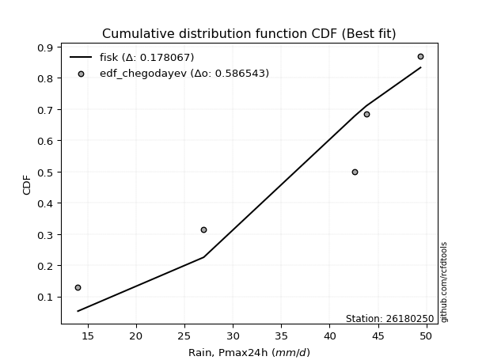</img>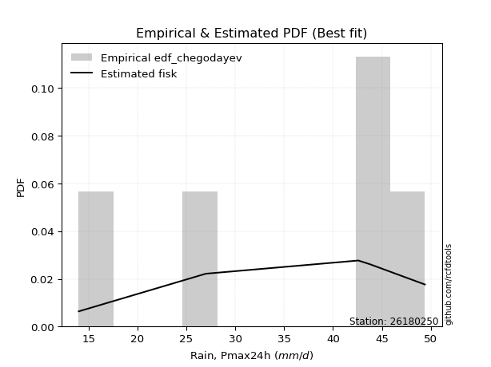</img>

</div>


### 6. EDF Blom (1958)

The Blom formula is a specific "plotting position" formula used in hydrology and statistical analysis to estimate the empirical cumulative probability (or non-exceedance probability) of a data series. It is particularly recommended for data that are approximately normally distributed. The constant _a_ is set to 0.375 (or 3/8).

<div align="center">


$P=(m-a)/(n+1-2a)$


</div>


**6.1. Empirical values**

<div align="center">

|                | 0                  | 1                  | 2                  | 3                 | 4                 | 5                  |
|:---------------|:-------------------|:-------------------|:-------------------|:------------------|:------------------|:-------------------|
| date           | 2021               | 2025               | 2020               | 2022              | 2019              | 2023               |
| x              | 14.0               | 25.2               | 27.0               | 42.6              | 43.8              | 49.4               |
| m              | 1                  | 2                  | 3                  | 4                 | 5                 | 6                  |
| empirical_dist | edf_blom           | edf_blom           | edf_blom           | edf_blom          | edf_blom          | edf_blom           |
| empirical      | 0.1                | 0.26               | 0.42               | 0.58              | 0.74              | 0.9                |
| empirical_tr   | 1.1111111111111112 | 1.3513513513513513 | 1.7241379310344827 | 2.380952380952381 | 3.846153846153846 | 10.000000000000002 |

</div>


**6.2. Kolmogorov-Smirnov fit test (sorted by Δ)**


<div align="center">

|                | 0                   | 1                   | 2                   | 3              | 4                   | 5                   | 6                   | 7                   | 8                   | 9                   | 10                  | 11                  | 12                  | 13                  | 14                  | 15                  | 16                  | 17                  | 18                  | 19                  | 20                | 21                  | 22                  | 23                  | 24                 | 25                  | 26                  | 27                  | 28                 | 29                  | 30                  | 31                 | 32                  | 33                  | 34                  | 35                 | 36                 | 37                  | 38                  | 39                  | 40                 | 41                  | 42                  | 43                  | 44                  | 45                  | 46                  | 47                 | 48                 | 49                  | 50                  | 51                  | 52                  | 53                  | 54                  | 55                 | 56                 | 57                  | 58                 | 59                  | 60                 | 61                  | 62                  | 63                  | 64                  | 65                  | 66                  | 67                 | 68                 | 69                  | 70                  | 71                  | 72                  | 73                  | 74                  | 75                  | 76                  | 77                  | 78                  | 79                  | 80                 | 81                  | 82                  | 83                 | 84                  | 85                  | 86                  | 87                  | 88                  | 89                  | 90                  | 91                  | 92                 | 93                  | 94                 | 95                 | 96                  | 97                 | 98                  | 99                 | 100                | 101                 | 102                | 103                 | 104                | 105                 | 106                 | 107                 | 108               | 109                 | 110                | 111                 | 112                 | 113                 | 114            | 115            | 116                 | 117                 | 118                 | 119                 | 120                 | 121                 | 122                 | 123                | 124                 | 125                 | 126                | 127                | 128                 | 129               | 130                 | 131                 | 132                 | 133                 | 134                | 135                | 136                | 137                | 138                 | 139                 | 140                 | 141                 | 142                 | 143            | 144                 | 145                 | 146                | 147                | 148               | 149                | 150                | 151                | 152                | 153                | 154                | 155                | 156            | 157            | 158                | 159               |
|:---------------|:--------------------|:--------------------|:--------------------|:---------------|:--------------------|:--------------------|:--------------------|:--------------------|:--------------------|:--------------------|:--------------------|:--------------------|:--------------------|:--------------------|:--------------------|:--------------------|:--------------------|:--------------------|:--------------------|:--------------------|:------------------|:--------------------|:--------------------|:--------------------|:-------------------|:--------------------|:--------------------|:--------------------|:-------------------|:--------------------|:--------------------|:-------------------|:--------------------|:--------------------|:--------------------|:-------------------|:-------------------|:--------------------|:--------------------|:--------------------|:-------------------|:--------------------|:--------------------|:--------------------|:--------------------|:--------------------|:--------------------|:-------------------|:-------------------|:--------------------|:--------------------|:--------------------|:--------------------|:--------------------|:--------------------|:-------------------|:-------------------|:--------------------|:-------------------|:--------------------|:-------------------|:--------------------|:--------------------|:--------------------|:--------------------|:--------------------|:--------------------|:-------------------|:-------------------|:--------------------|:--------------------|:--------------------|:--------------------|:--------------------|:--------------------|:--------------------|:--------------------|:--------------------|:--------------------|:--------------------|:-------------------|:--------------------|:--------------------|:-------------------|:--------------------|:--------------------|:--------------------|:--------------------|:--------------------|:--------------------|:--------------------|:--------------------|:-------------------|:--------------------|:-------------------|:-------------------|:--------------------|:-------------------|:--------------------|:-------------------|:-------------------|:--------------------|:-------------------|:--------------------|:-------------------|:--------------------|:--------------------|:--------------------|:------------------|:--------------------|:-------------------|:--------------------|:--------------------|:--------------------|:---------------|:---------------|:--------------------|:--------------------|:--------------------|:--------------------|:--------------------|:--------------------|:--------------------|:-------------------|:--------------------|:--------------------|:-------------------|:-------------------|:--------------------|:------------------|:--------------------|:--------------------|:--------------------|:--------------------|:-------------------|:-------------------|:-------------------|:-------------------|:--------------------|:--------------------|:--------------------|:--------------------|:--------------------|:---------------|:--------------------|:--------------------|:-------------------|:-------------------|:------------------|:-------------------|:-------------------|:-------------------|:-------------------|:-------------------|:-------------------|:-------------------|:---------------|:---------------|:-------------------|:------------------|
| station        | 26180250            | 26180250            | 26180250            | 26180250       | 26180250            | 26180250            | 26180250            | 26180250            | 26180250            | 26180250            | 26180250            | 26180250            | 26180250            | 26180250            | 26180250            | 26180250            | 26180250            | 26180250            | 26180250            | 26180250            | 26180250          | 26180250            | 26180250            | 26180250            | 26180250           | 26180250            | 26180250            | 26180250            | 26180250           | 26180250            | 26180250            | 26180250           | 26180250            | 26180250            | 26180250            | 26180250           | 26180250           | 26180250            | 26180250            | 26180250            | 26180250           | 26180250            | 26180250            | 26180250            | 26180250            | 26180250            | 26180250            | 26180250           | 26180250           | 26180250            | 26180250            | 26180250            | 26180250            | 26180250            | 26180250            | 26180250           | 26180250           | 26180250            | 26180250           | 26180250            | 26180250           | 26180250            | 26180250            | 26180250            | 26180250            | 26180250            | 26180250            | 26180250           | 26180250           | 26180250            | 26180250            | 26180250            | 26180250            | 26180250            | 26180250            | 26180250            | 26180250            | 26180250            | 26180250            | 26180250            | 26180250           | 26180250            | 26180250            | 26180250           | 26180250            | 26180250            | 26180250            | 26180250            | 26180250            | 26180250            | 26180250            | 26180250            | 26180250           | 26180250            | 26180250           | 26180250           | 26180250            | 26180250           | 26180250            | 26180250           | 26180250           | 26180250            | 26180250           | 26180250            | 26180250           | 26180250            | 26180250            | 26180250            | 26180250          | 26180250            | 26180250           | 26180250            | 26180250            | 26180250            | 26180250       | 26180250       | 26180250            | 26180250            | 26180250            | 26180250            | 26180250            | 26180250            | 26180250            | 26180250           | 26180250            | 26180250            | 26180250           | 26180250           | 26180250            | 26180250          | 26180250            | 26180250            | 26180250            | 26180250            | 26180250           | 26180250           | 26180250           | 26180250           | 26180250            | 26180250            | 26180250            | 26180250            | 26180250            | 26180250       | 26180250            | 26180250            | 26180250           | 26180250           | 26180250          | 26180250           | 26180250           | 26180250           | 26180250           | 26180250           | 26180250           | 26180250           | 26180250       | 26180250       | 26180250           | 26180250          |
| empirical_dist | edf_blom            | edf_blom            | edf_blom            | edf_blom       | edf_blom            | edf_blom            | edf_blom            | edf_blom            | edf_blom            | edf_blom            | edf_blom            | edf_blom            | edf_blom            | edf_blom            | edf_blom            | edf_blom            | edf_blom            | edf_blom            | edf_blom            | edf_blom            | edf_blom          | edf_blom            | edf_blom            | edf_blom            | edf_blom           | edf_blom            | edf_blom            | edf_blom            | edf_blom           | edf_blom            | edf_blom            | edf_blom           | edf_blom            | edf_blom            | edf_blom            | edf_blom           | edf_blom           | edf_blom            | edf_blom            | edf_blom            | edf_blom           | edf_blom            | edf_blom            | edf_blom            | edf_blom            | edf_blom            | edf_blom            | edf_blom           | edf_blom           | edf_blom            | edf_blom            | edf_blom            | edf_blom            | edf_blom            | edf_blom            | edf_blom           | edf_blom           | edf_blom            | edf_blom           | edf_blom            | edf_blom           | edf_blom            | edf_blom            | edf_blom            | edf_blom            | edf_blom            | edf_blom            | edf_blom           | edf_blom           | edf_blom            | edf_blom            | edf_blom            | edf_blom            | edf_blom            | edf_blom            | edf_blom            | edf_blom            | edf_blom            | edf_blom            | edf_blom            | edf_blom           | edf_blom            | edf_blom            | edf_blom           | edf_blom            | edf_blom            | edf_blom            | edf_blom            | edf_blom            | edf_blom            | edf_blom            | edf_blom            | edf_blom           | edf_blom            | edf_blom           | edf_blom           | edf_blom            | edf_blom           | edf_blom            | edf_blom           | edf_blom           | edf_blom            | edf_blom           | edf_blom            | edf_blom           | edf_blom            | edf_blom            | edf_blom            | edf_blom          | edf_blom            | edf_blom           | edf_blom            | edf_blom            | edf_blom            | edf_blom       | edf_blom       | edf_blom            | edf_blom            | edf_blom            | edf_blom            | edf_blom            | edf_blom            | edf_blom            | edf_blom           | edf_blom            | edf_blom            | edf_blom           | edf_blom           | edf_blom            | edf_blom          | edf_blom            | edf_blom            | edf_blom            | edf_blom            | edf_blom           | edf_blom           | edf_blom           | edf_blom           | edf_blom            | edf_blom            | edf_blom            | edf_blom            | edf_blom            | edf_blom       | edf_blom            | edf_blom            | edf_blom           | edf_blom           | edf_blom          | edf_blom           | edf_blom           | edf_blom           | edf_blom           | edf_blom           | edf_blom           | edf_blom           | edf_blom       | edf_blom       | edf_blom           | edf_blom          |
| p_dist         | dgamma              | logdgamma           | beta                | arcsine        | logdweibull         | logbeta             | dweibull            | logtrapezoid        | trapezoid           | ksone               | logweibull_max      | logarcsine          | gausshyper          | genhalflogistic     | wrapcauchy          | loglevy_l           | logbetaprime        | logmielke           | semicircular        | loggenextreme       | logloggamma       | triang              | logsemicircular     | mielke              | anglit             | skewnorm            | loginvweibull       | loganglit           | logjohnsonsu       | weibull_min         | loggenhalflogistic  | argus              | logexponpow         | gumbel_l            | genextreme          | pearson3           | johnsonsu          | logkstwobign        | gompertz            | betaprime           | f                  | erlang              | logburr12           | logburr             | nct                 | t                   | norm                | crystalball        | truncnorm          | exponnorm           | logargus            | loggumbel_l         | logalpha            | alpha               | genexpon            | logweibull_min     | gamma              | rice                | levy_l             | foldnorm            | loggenpareto       | burr                | logf                | logncf              | ncf                 | lognct              | logrice             | invgamma           | logcrystalball     | lognorm             | logt                | logexponnorm        | loggamma            | loggamma            | logfatiguelife      | logerlang           | maxwell             | logfoldnorm         | loginvgamma         | loggompertz         | loginvgauss        | rayleigh            | kstwobign           | loggenexpon        | invgauss            | logmaxwell          | lograyleigh         | cosine              | kappa4              | halfnorm            | genpareto           | loghalfnorm         | logistic           | loglogistic         | logcosine          | tukeylambda        | gumbel_r            | hypsecant          | vonmises_line       | loggumbel_r        | logpearson3        | halflogistic        | loghypsecant       | uniform             | logwrapcauchy      | loghalflogistic     | moyal               | kappa3              | logmoyal          | johnsonsb           | logskewnorm        | logtriang           | laplace             | logksone            | gennorm        | loggennorm     | loglaplace          | loglaplace          | lomax               | truncweibull_min    | logloglaplace       | lognakagami         | burr12              | loglomax           | logrdist            | halfgennorm         | wald               | nakagami           | logwald             | bradford          | truncexpon          | loggausshyper       | logkappa3           | loguniform          | logkappa4          | logvonmises_line   | logtukeylambda     | loggengamma        | logtruncnorm        | logbradford         | logtruncweibull_min | logtruncexpon       | logexponweib        | loghalfgennorm | invweibull          | fatiguelife         | weibull_max        | gengamma           | exponweib         | logjohnsonsb       | powerlaw           | rdist              | logpowerlaw        | truncpareto        | exponpow           | logtruncpareto     | genlogistic    | loggenlogistic | logvonmises        | vonmises          |
| delta          | 0.08383219889523857 | 0.09078514867494925 | 0.09999999061284437 | 0.1            | 0.10124992326878834 | 0.10485436026984551 | 0.10573377004183171 | 0.12587625547351278 | 0.12605602050205744 | 0.12681081030063557 | 0.12723647568486252 | 0.13147160240625444 | 0.13236034571430144 | 0.13563236750361357 | 0.13567045221009588 | 0.13682414420193587 | 0.14087185370052258 | 0.14243637148310873 | 0.14306634855570266 | 0.14682097345867418 | 0.147417775078708 | 0.14839894851682223 | 0.14890156241712404 | 0.15007059718384486 | 0.1552197020640157 | 0.15552484918304837 | 0.16087744981702878 | 0.16113310286782923 | 0.1645305366674104 | 0.16754838468786093 | 0.16820058204302601 | 0.1684849883318093 | 0.16916523718376342 | 0.17517857998167818 | 0.17675070771881676 | 0.1771875452175774 | 0.1783867252582816 | 0.17975333782036662 | 0.18067145071264912 | 0.18209043883920184 | 0.1822571133050327 | 0.18274531621096002 | 0.18284090262138386 | 0.18309938784607116 | 0.18311880322352836 | 0.18312359493962338 | 0.18313201925767542 | 0.1831320254385388 | 0.1831320707551436 | 0.18313350321641186 | 0.18315186459554655 | 0.18382640961152696 | 0.18430006486551742 | 0.18443526945959177 | 0.18445474257801908 | 0.1849315920494119 | 0.1855919859299997 | 0.18587888151247967 | 0.1862036697774768 | 0.18640456792895466 | 0.1879307585807504 | 0.18837152783915678 | 0.18837206294250153 | 0.18845495956528957 | 0.18847640685673062 | 0.18853752347741914 | 0.18893466006017867 | 0.1890789675613611 | 0.1891615873104463 | 0.18916162050806673 | 0.18916207398439044 | 0.18916475347748374 | 0.19061231260189415 | 0.19061231260189415 | 0.19065492187659105 | 0.19071673618958151 | 0.19098949424556688 | 0.19226975431758142 | 0.19257613383300498 | 0.19259595564701915 | 0.1929941338294653 | 0.19322196102439337 | 0.19337064173101692 | 0.1943282816814672 | 0.19487345528083722 | 0.19621883725795197 | 0.19822044304495468 | 0.19822444440383913 | 0.20116225856789138 | 0.20120770214285788 | 0.20513598679990697 | 0.20562010301104316 | 0.2057391458748492 | 0.21168580302662243 | 0.2156061979628564 | 0.2191441996087261 | 0.21930486730254883 | 0.2202174425525577 | 0.22229455009403232 | 0.2237790988160664 | 0.2240062070111376 | 0.22481068656028158 | 0.2259223696926569 | 0.22790960451977416 | 0.2286844168124198 | 0.22882124001784176 | 0.23103611145602843 | 0.23138118918606254 | 0.235046038153369 | 0.23607839307266165 | 0.2364938191098115 | 0.23780946322386354 | 0.23846541593500126 | 0.23878883999278533 | 0.24           | 0.24           | 0.24344691989799794 | 0.24344691989799794 | 0.24496013213566348 | 0.24749509343514287 | 0.25964324303389275 | 0.25999783384610453 | 0.26095442479065556 | 0.2626096060507548 | 0.26540357931118647 | 0.26690559171936135 | 0.2686403549490022 | 0.2710355027065946 | 0.27160838519634356 | 0.273921341369625 | 0.27961994888858765 | 0.28868229948664503 | 0.30211917221574536 | 0.30254660799134236 | 0.3038466318208869 | 0.3040557619864124 | 0.3064819929169485 | 0.3282238784287027 | 0.32823311551491785 | 0.33405134973350314 | 0.33663415214941694 | 0.33894815174225856 | 0.40830853496046027 | 0.42           | 0.47337488341767037 | 0.49457992648269644 | 0.5113127039221599 | 0.5137798344451995 | 0.538434600394326 | 0.5480365801500772 | 0.5817076942883357 | 0.6047964836972155 | 0.6242436958807724 | 0.6417862069783307 | 0.6623868672259061 | 0.6742940704914547 | 0.74           | 0.74           | 1.1857334893657892 | 7.329231539774124 |
| deltao         | 0.530385761606      | 0.530385761606      | 0.530385761606      | 0.530385761606 | 0.530385761606      | 0.530385761606      | 0.530385761606      | 0.530385761606      | 0.530385761606      | 0.530385761606      | 0.530385761606      | 0.530385761606      | 0.530385761606      | 0.530385761606      | 0.530385761606      | 0.530385761606      | 0.530385761606      | 0.530385761606      | 0.530385761606      | 0.530385761606      | 0.530385761606    | 0.530385761606      | 0.530385761606      | 0.530385761606      | 0.530385761606     | 0.530385761606      | 0.530385761606      | 0.530385761606      | 0.530385761606     | 0.530385761606      | 0.530385761606      | 0.530385761606     | 0.530385761606      | 0.530385761606      | 0.530385761606      | 0.530385761606     | 0.530385761606     | 0.530385761606      | 0.530385761606      | 0.530385761606      | 0.530385761606     | 0.530385761606      | 0.530385761606      | 0.530385761606      | 0.530385761606      | 0.530385761606      | 0.530385761606      | 0.530385761606     | 0.530385761606     | 0.530385761606      | 0.530385761606      | 0.530385761606      | 0.530385761606      | 0.530385761606      | 0.530385761606      | 0.530385761606     | 0.530385761606     | 0.530385761606      | 0.530385761606     | 0.530385761606      | 0.530385761606     | 0.530385761606      | 0.530385761606      | 0.530385761606      | 0.530385761606      | 0.530385761606      | 0.530385761606      | 0.530385761606     | 0.530385761606     | 0.530385761606      | 0.530385761606      | 0.530385761606      | 0.530385761606      | 0.530385761606      | 0.530385761606      | 0.530385761606      | 0.530385761606      | 0.530385761606      | 0.530385761606      | 0.530385761606      | 0.530385761606     | 0.530385761606      | 0.530385761606      | 0.530385761606     | 0.530385761606      | 0.530385761606      | 0.530385761606      | 0.530385761606      | 0.530385761606      | 0.530385761606      | 0.530385761606      | 0.530385761606      | 0.530385761606     | 0.530385761606      | 0.530385761606     | 0.530385761606     | 0.530385761606      | 0.530385761606     | 0.530385761606      | 0.530385761606     | 0.530385761606     | 0.530385761606      | 0.530385761606     | 0.530385761606      | 0.530385761606     | 0.530385761606      | 0.530385761606      | 0.530385761606      | 0.530385761606    | 0.530385761606      | 0.530385761606     | 0.530385761606      | 0.530385761606      | 0.530385761606      | 0.530385761606 | 0.530385761606 | 0.530385761606      | 0.530385761606      | 0.530385761606      | 0.530385761606      | 0.530385761606      | 0.530385761606      | 0.530385761606      | 0.530385761606     | 0.530385761606      | 0.530385761606      | 0.530385761606     | 0.530385761606     | 0.530385761606      | 0.530385761606    | 0.530385761606      | 0.530385761606      | 0.530385761606      | 0.530385761606      | 0.530385761606     | 0.530385761606     | 0.530385761606     | 0.530385761606     | 0.530385761606      | 0.530385761606      | 0.530385761606      | 0.530385761606      | 0.530385761606      | 0.530385761606 | 0.530385761606      | 0.530385761606      | 0.530385761606     | 0.530385761606     | 0.530385761606    | 0.530385761606     | 0.530385761606     | 0.530385761606     | 0.530385761606     | 0.530385761606     | 0.530385761606     | 0.530385761606     | 0.530385761606 | 0.530385761606 | 0.530385761606     | 0.530385761606    |
| eval           | Δo > Δ              | Δo > Δ              | Δo > Δ              | Δo > Δ         | Δo > Δ              | Δo > Δ              | Δo > Δ              | Δo > Δ              | Δo > Δ              | Δo > Δ              | Δo > Δ              | Δo > Δ              | Δo > Δ              | Δo > Δ              | Δo > Δ              | Δo > Δ              | Δo > Δ              | Δo > Δ              | Δo > Δ              | Δo > Δ              | Δo > Δ            | Δo > Δ              | Δo > Δ              | Δo > Δ              | Δo > Δ             | Δo > Δ              | Δo > Δ              | Δo > Δ              | Δo > Δ             | Δo > Δ              | Δo > Δ              | Δo > Δ             | Δo > Δ              | Δo > Δ              | Δo > Δ              | Δo > Δ             | Δo > Δ             | Δo > Δ              | Δo > Δ              | Δo > Δ              | Δo > Δ             | Δo > Δ              | Δo > Δ              | Δo > Δ              | Δo > Δ              | Δo > Δ              | Δo > Δ              | Δo > Δ             | Δo > Δ             | Δo > Δ              | Δo > Δ              | Δo > Δ              | Δo > Δ              | Δo > Δ              | Δo > Δ              | Δo > Δ             | Δo > Δ             | Δo > Δ              | Δo > Δ             | Δo > Δ              | Δo > Δ             | Δo > Δ              | Δo > Δ              | Δo > Δ              | Δo > Δ              | Δo > Δ              | Δo > Δ              | Δo > Δ             | Δo > Δ             | Δo > Δ              | Δo > Δ              | Δo > Δ              | Δo > Δ              | Δo > Δ              | Δo > Δ              | Δo > Δ              | Δo > Δ              | Δo > Δ              | Δo > Δ              | Δo > Δ              | Δo > Δ             | Δo > Δ              | Δo > Δ              | Δo > Δ             | Δo > Δ              | Δo > Δ              | Δo > Δ              | Δo > Δ              | Δo > Δ              | Δo > Δ              | Δo > Δ              | Δo > Δ              | Δo > Δ             | Δo > Δ              | Δo > Δ             | Δo > Δ             | Δo > Δ              | Δo > Δ             | Δo > Δ              | Δo > Δ             | Δo > Δ             | Δo > Δ              | Δo > Δ             | Δo > Δ              | Δo > Δ             | Δo > Δ              | Δo > Δ              | Δo > Δ              | Δo > Δ            | Δo > Δ              | Δo > Δ             | Δo > Δ              | Δo > Δ              | Δo > Δ              | Δo > Δ         | Δo > Δ         | Δo > Δ              | Δo > Δ              | Δo > Δ              | Δo > Δ              | Δo > Δ              | Δo > Δ              | Δo > Δ              | Δo > Δ             | Δo > Δ              | Δo > Δ              | Δo > Δ             | Δo > Δ             | Δo > Δ              | Δo > Δ            | Δo > Δ              | Δo > Δ              | Δo > Δ              | Δo > Δ              | Δo > Δ             | Δo > Δ             | Δo > Δ             | Δo > Δ             | Δo > Δ              | Δo > Δ              | Δo > Δ              | Δo > Δ              | Δo > Δ              | Δo > Δ         | Δo > Δ              | Δo > Δ              | Δo > Δ             | Δo > Δ             | Δo <= Δ           | Δo <= Δ            | Δo <= Δ            | Δo <= Δ            | Δo <= Δ            | Δo <= Δ            | Δo <= Δ            | Δo <= Δ            | Δo <= Δ        | Δo <= Δ        | Δo <= Δ            | Δo <= Δ           |
| fit            | 1                   | 1                   | 1                   | 1              | 1                   | 1                   | 1                   | 1                   | 1                   | 1                   | 1                   | 1                   | 1                   | 1                   | 1                   | 1                   | 1                   | 1                   | 1                   | 1                   | 1                 | 1                   | 1                   | 1                   | 1                  | 1                   | 1                   | 1                   | 1                  | 1                   | 1                   | 1                  | 1                   | 1                   | 1                   | 1                  | 1                  | 1                   | 1                   | 1                   | 1                  | 1                   | 1                   | 1                   | 1                   | 1                   | 1                   | 1                  | 1                  | 1                   | 1                   | 1                   | 1                   | 1                   | 1                   | 1                  | 1                  | 1                   | 1                  | 1                   | 1                  | 1                   | 1                   | 1                   | 1                   | 1                   | 1                   | 1                  | 1                  | 1                   | 1                   | 1                   | 1                   | 1                   | 1                   | 1                   | 1                   | 1                   | 1                   | 1                   | 1                  | 1                   | 1                   | 1                  | 1                   | 1                   | 1                   | 1                   | 1                   | 1                   | 1                   | 1                   | 1                  | 1                   | 1                  | 1                  | 1                   | 1                  | 1                   | 1                  | 1                  | 1                   | 1                  | 1                   | 1                  | 1                   | 1                   | 1                   | 1                 | 1                   | 1                  | 1                   | 1                   | 1                   | 1              | 1              | 1                   | 1                   | 1                   | 1                   | 1                   | 1                   | 1                   | 1                  | 1                   | 1                   | 1                  | 1                  | 1                   | 1                 | 1                   | 1                   | 1                   | 1                   | 1                  | 1                  | 1                  | 1                  | 1                   | 1                   | 1                   | 1                   | 1                   | 1              | 1                   | 1                   | 1                  | 1                  | 0                 | 0                  | 0                  | 0                  | 0                  | 0                  | 0                  | 0                  | 0              | 0              | 0                  | 0                 |
| n              | 6                   | 6                   | 6                   | 6              | 6                   | 6                   | 6                   | 6                   | 6                   | 6                   | 6                   | 6                   | 6                   | 6                   | 6                   | 6                   | 6                   | 6                   | 6                   | 6                   | 6                 | 6                   | 6                   | 6                   | 6                  | 6                   | 6                   | 6                   | 6                  | 6                   | 6                   | 6                  | 6                   | 6                   | 6                   | 6                  | 6                  | 6                   | 6                   | 6                   | 6                  | 6                   | 6                   | 6                   | 6                   | 6                   | 6                   | 6                  | 6                  | 6                   | 6                   | 6                   | 6                   | 6                   | 6                   | 6                  | 6                  | 6                   | 6                  | 6                   | 6                  | 6                   | 6                   | 6                   | 6                   | 6                   | 6                   | 6                  | 6                  | 6                   | 6                   | 6                   | 6                   | 6                   | 6                   | 6                   | 6                   | 6                   | 6                   | 6                   | 6                  | 6                   | 6                   | 6                  | 6                   | 6                   | 6                   | 6                   | 6                   | 6                   | 6                   | 6                   | 6                  | 6                   | 6                  | 6                  | 6                   | 6                  | 6                   | 6                  | 6                  | 6                   | 6                  | 6                   | 6                  | 6                   | 6                   | 6                   | 6                 | 6                   | 6                  | 6                   | 6                   | 6                   | 6              | 6              | 6                   | 6                   | 6                   | 6                   | 6                   | 6                   | 6                   | 6                  | 6                   | 6                   | 6                  | 6                  | 6                   | 6                 | 6                   | 6                   | 6                   | 6                   | 6                  | 6                  | 6                  | 6                  | 6                   | 6                   | 6                   | 6                   | 6                   | 6              | 6                   | 6                   | 6                  | 6                  | 6                 | 6                  | 6                  | 6                  | 6                  | 6                  | 6                  | 6                  | 6              | 6              | 6                  | 6                 |
| best_fit       | 1                   | 0                   | 0                   | 0              | 0                   | 0                   | 0                   | 0                   | 0                   | 0                   | 0                   | 0                   | 0                   | 0                   | 0                   | 0                   | 0                   | 0                   | 0                   | 0                   | 0                 | 0                   | 0                   | 0                   | 0                  | 0                   | 0                   | 0                   | 0                  | 0                   | 0                   | 0                  | 0                   | 0                   | 0                   | 0                  | 0                  | 0                   | 0                   | 0                   | 0                  | 0                   | 0                   | 0                   | 0                   | 0                   | 0                   | 0                  | 0                  | 0                   | 0                   | 0                   | 0                   | 0                   | 0                   | 0                  | 0                  | 0                   | 0                  | 0                   | 0                  | 0                   | 0                   | 0                   | 0                   | 0                   | 0                   | 0                  | 0                  | 0                   | 0                   | 0                   | 0                   | 0                   | 0                   | 0                   | 0                   | 0                   | 0                   | 0                   | 0                  | 0                   | 0                   | 0                  | 0                   | 0                   | 0                   | 0                   | 0                   | 0                   | 0                   | 0                   | 0                  | 0                   | 0                  | 0                  | 0                   | 0                  | 0                   | 0                  | 0                  | 0                   | 0                  | 0                   | 0                  | 0                   | 0                   | 0                   | 0                 | 0                   | 0                  | 0                   | 0                   | 0                   | 0              | 0              | 0                   | 0                   | 0                   | 0                   | 0                   | 0                   | 0                   | 0                  | 0                   | 0                   | 0                  | 0                  | 0                   | 0                 | 0                   | 0                   | 0                   | 0                   | 0                  | 0                  | 0                  | 0                  | 0                   | 0                   | 0                   | 0                   | 0                   | 0              | 0                   | 0                   | 0                  | 0                  | 0                 | 0                  | 0                  | 0                  | 0                  | 0                  | 0                  | 0                  | 0              | 0              | 0                  | 0                 |
| best_fit_sort  | 1                   | 2                   | 3                   | 4              | 5                   | 6                   | 7                   | 8                   | 9                   | 10                  | 11                  | 12                  | 13                  | 14                  | 15                  | 16                  | 17                  | 18                  | 19                  | 20                  | 21                | 22                  | 23                  | 24                  | 25                 | 26                  | 27                  | 28                  | 29                 | 30                  | 31                  | 32                 | 33                  | 34                  | 35                  | 36                 | 37                 | 38                  | 39                  | 40                  | 41                 | 42                  | 43                  | 44                  | 45                  | 46                  | 47                  | 48                 | 49                 | 50                  | 51                  | 52                  | 53                  | 54                  | 55                  | 56                 | 57                 | 58                  | 59                 | 60                  | 61                 | 62                  | 63                  | 64                  | 65                  | 66                  | 67                  | 68                 | 69                 | 70                  | 71                  | 72                  | 73                  | 74                  | 75                  | 76                  | 77                  | 78                  | 79                  | 80                  | 81                 | 82                  | 83                  | 84                 | 85                  | 86                  | 87                  | 88                  | 89                  | 90                  | 91                  | 92                  | 93                 | 94                  | 95                 | 96                 | 97                  | 98                 | 99                  | 100                | 101                | 102                 | 103                | 104                 | 105                | 106                 | 107                 | 108                 | 109               | 110                 | 111                | 112                 | 113                 | 114                 | 115            | 116            | 117                 | 118                 | 119                 | 120                 | 121                 | 122                 | 123                 | 124                | 125                 | 126                 | 127                | 128                | 129                 | 130               | 131                 | 132                 | 133                 | 134                 | 135                | 136                | 137                | 138                | 139                 | 140                 | 141                 | 142                 | 143                 | 144            | 145                 | 146                 | 147                | 148                | 149               | 150                | 151                | 152                | 153                | 154                | 155                | 156                | 157            | 158            | 159                | 160               |

</div>


**6.3. Best fit**

<div align="center">

|   id |   station | empirical_dist   | p_dist   |     delta |   deltao | eval   |   fit |   n |   best_fit |   best_fit_sort |
|-----:|----------:|:-----------------|:---------|----------:|---------:|:-------|------:|----:|-----------:|----------------:|
|    0 |  26180250 | edf_blom         | dgamma   | 0.0838322 | 0.530386 | Δo > Δ |     1 |   6 |          1 |               1 |

</div>


<div align="center">

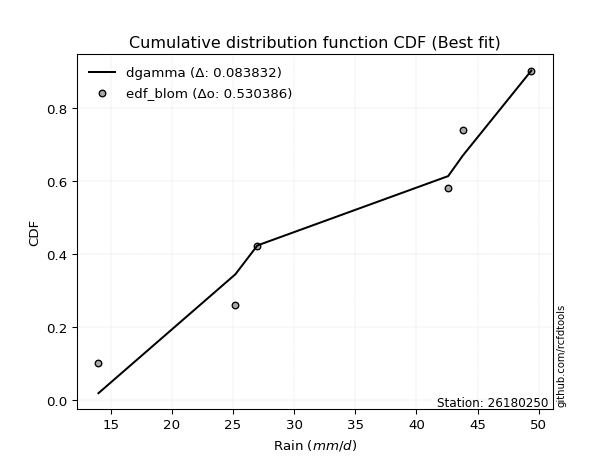</img></img>

</div>


### 7. EDF Tukey (1962)

In hydrology, the Tukey formula is used as a plotting position formula to estimate the empirical probability or frequency of a flood event (or other hydrological data). The formula parameter is given as _c=0.333_ (or 1/3).

<div align="center">


$P=(m-c)/(n+1-2c)$


</div>


**7.1. Empirical values**

<div align="center">

|                | 0                   | 1                  | 2                   | 3                  | 4                  | 5                  |
|:---------------|:--------------------|:-------------------|:--------------------|:-------------------|:-------------------|:-------------------|
| date           | 2021                | 2025               | 2020                | 2022               | 2019               | 2023               |
| x              | 14.0                | 25.2               | 27.0                | 42.6               | 43.8               | 49.4               |
| m              | 1                   | 2                  | 3                   | 4                  | 5                  | 6                  |
| empirical_dist | edf_tukey           | edf_tukey          | edf_tukey           | edf_tukey          | edf_tukey          | edf_tukey          |
| empirical      | 0.10526315789473684 | 0.2631578947368421 | 0.42105263157894735 | 0.5789473684210527 | 0.7368421052631579 | 0.8947368421052632 |
| empirical_tr   | 1.1176470588235294  | 1.357142857142857  | 1.7272727272727273  | 2.375              | 3.7999999999999994 | 9.5                |

</div>


**7.2. Kolmogorov-Smirnov fit test (sorted by Δ)**


<div align="center">

|                | 0                   | 1                   | 2                   | 3                   | 4                   | 5                   | 6                   | 7                   | 8                  | 9                   | 10                  | 11                  | 12                  | 13                 | 14                 | 15                  | 16                  | 17                 | 18                  | 19                  | 20                  | 21                  | 22                  | 23                  | 24                | 25                  | 26                 | 27                  | 28                  | 29                  | 30                  | 31                  | 32                  | 33                 | 34                  | 35                 | 36                  | 37                  | 38                  | 39                  | 40                  | 41                  | 42                 | 43               | 44                  | 45                  | 46                  | 47                  | 48                  | 49                  | 50                 | 51                 | 52                  | 53                  | 54                  | 55                  | 56                  | 57                 | 58                 | 59                | 60                  | 61                  | 62                 | 63                  | 64                  | 65                  | 66                  | 67                  | 68                 | 69                  | 70                  | 71                  | 72                  | 73                  | 74                  | 75                  | 76                  | 77                 | 78                  | 79                  | 80                  | 81                 | 82                  | 83                  | 84                  | 85                  | 86                  | 87                  | 88                 | 89                  | 90                  | 91                  | 92                 | 93                  | 94                 | 95                  | 96                  | 97                | 98                  | 99                 | 100                | 101                 | 102                 | 103                | 104                 | 105                 | 106                 | 107                 | 108                 | 109                | 110                | 111                | 112                | 113                 | 114                 | 115                 | 116                 | 117                 | 118                 | 119                 | 120                | 121                | 122                 | 123                | 124                 | 125                | 126                | 127                | 128                 | 129                | 130                 | 131                 | 132                 | 133                 | 134                | 135                | 136                 | 137                 | 138                 | 139                 | 140                 | 141                 | 142                | 143                 | 144                | 145                 | 146                | 147                | 148                | 149                | 150                | 151                | 152                | 153                | 154                | 155                | 156                | 157                | 158                | 159               |
|:---------------|:--------------------|:--------------------|:--------------------|:--------------------|:--------------------|:--------------------|:--------------------|:--------------------|:-------------------|:--------------------|:--------------------|:--------------------|:--------------------|:-------------------|:-------------------|:--------------------|:--------------------|:-------------------|:--------------------|:--------------------|:--------------------|:--------------------|:--------------------|:--------------------|:------------------|:--------------------|:-------------------|:--------------------|:--------------------|:--------------------|:--------------------|:--------------------|:--------------------|:-------------------|:--------------------|:-------------------|:--------------------|:--------------------|:--------------------|:--------------------|:--------------------|:--------------------|:-------------------|:-----------------|:--------------------|:--------------------|:--------------------|:--------------------|:--------------------|:--------------------|:-------------------|:-------------------|:--------------------|:--------------------|:--------------------|:--------------------|:--------------------|:-------------------|:-------------------|:------------------|:--------------------|:--------------------|:-------------------|:--------------------|:--------------------|:--------------------|:--------------------|:--------------------|:-------------------|:--------------------|:--------------------|:--------------------|:--------------------|:--------------------|:--------------------|:--------------------|:--------------------|:-------------------|:--------------------|:--------------------|:--------------------|:-------------------|:--------------------|:--------------------|:--------------------|:--------------------|:--------------------|:--------------------|:-------------------|:--------------------|:--------------------|:--------------------|:-------------------|:--------------------|:-------------------|:--------------------|:--------------------|:------------------|:--------------------|:-------------------|:-------------------|:--------------------|:--------------------|:-------------------|:--------------------|:--------------------|:--------------------|:--------------------|:--------------------|:-------------------|:-------------------|:-------------------|:-------------------|:--------------------|:--------------------|:--------------------|:--------------------|:--------------------|:--------------------|:--------------------|:-------------------|:-------------------|:--------------------|:-------------------|:--------------------|:-------------------|:-------------------|:-------------------|:--------------------|:-------------------|:--------------------|:--------------------|:--------------------|:--------------------|:-------------------|:-------------------|:--------------------|:--------------------|:--------------------|:--------------------|:--------------------|:--------------------|:-------------------|:--------------------|:-------------------|:--------------------|:-------------------|:-------------------|:-------------------|:-------------------|:-------------------|:-------------------|:-------------------|:-------------------|:-------------------|:-------------------|:-------------------|:-------------------|:-------------------|:------------------|
| station        | 26180250            | 26180250            | 26180250            | 26180250            | 26180250            | 26180250            | 26180250            | 26180250            | 26180250           | 26180250            | 26180250            | 26180250            | 26180250            | 26180250           | 26180250           | 26180250            | 26180250            | 26180250           | 26180250            | 26180250            | 26180250            | 26180250            | 26180250            | 26180250            | 26180250          | 26180250            | 26180250           | 26180250            | 26180250            | 26180250            | 26180250            | 26180250            | 26180250            | 26180250           | 26180250            | 26180250           | 26180250            | 26180250            | 26180250            | 26180250            | 26180250            | 26180250            | 26180250           | 26180250         | 26180250            | 26180250            | 26180250            | 26180250            | 26180250            | 26180250            | 26180250           | 26180250           | 26180250            | 26180250            | 26180250            | 26180250            | 26180250            | 26180250           | 26180250           | 26180250          | 26180250            | 26180250            | 26180250           | 26180250            | 26180250            | 26180250            | 26180250            | 26180250            | 26180250           | 26180250            | 26180250            | 26180250            | 26180250            | 26180250            | 26180250            | 26180250            | 26180250            | 26180250           | 26180250            | 26180250            | 26180250            | 26180250           | 26180250            | 26180250            | 26180250            | 26180250            | 26180250            | 26180250            | 26180250           | 26180250            | 26180250            | 26180250            | 26180250           | 26180250            | 26180250           | 26180250            | 26180250            | 26180250          | 26180250            | 26180250           | 26180250           | 26180250            | 26180250            | 26180250           | 26180250            | 26180250            | 26180250            | 26180250            | 26180250            | 26180250           | 26180250           | 26180250           | 26180250           | 26180250            | 26180250            | 26180250            | 26180250            | 26180250            | 26180250            | 26180250            | 26180250           | 26180250           | 26180250            | 26180250           | 26180250            | 26180250           | 26180250           | 26180250           | 26180250            | 26180250           | 26180250            | 26180250            | 26180250            | 26180250            | 26180250           | 26180250           | 26180250            | 26180250            | 26180250            | 26180250            | 26180250            | 26180250            | 26180250           | 26180250            | 26180250           | 26180250            | 26180250           | 26180250           | 26180250           | 26180250           | 26180250           | 26180250           | 26180250           | 26180250           | 26180250           | 26180250           | 26180250           | 26180250           | 26180250           | 26180250          |
| empirical_dist | edf_tukey           | edf_tukey           | edf_tukey           | edf_tukey           | edf_tukey           | edf_tukey           | edf_tukey           | edf_tukey           | edf_tukey          | edf_tukey           | edf_tukey           | edf_tukey           | edf_tukey           | edf_tukey          | edf_tukey          | edf_tukey           | edf_tukey           | edf_tukey          | edf_tukey           | edf_tukey           | edf_tukey           | edf_tukey           | edf_tukey           | edf_tukey           | edf_tukey         | edf_tukey           | edf_tukey          | edf_tukey           | edf_tukey           | edf_tukey           | edf_tukey           | edf_tukey           | edf_tukey           | edf_tukey          | edf_tukey           | edf_tukey          | edf_tukey           | edf_tukey           | edf_tukey           | edf_tukey           | edf_tukey           | edf_tukey           | edf_tukey          | edf_tukey        | edf_tukey           | edf_tukey           | edf_tukey           | edf_tukey           | edf_tukey           | edf_tukey           | edf_tukey          | edf_tukey          | edf_tukey           | edf_tukey           | edf_tukey           | edf_tukey           | edf_tukey           | edf_tukey          | edf_tukey          | edf_tukey         | edf_tukey           | edf_tukey           | edf_tukey          | edf_tukey           | edf_tukey           | edf_tukey           | edf_tukey           | edf_tukey           | edf_tukey          | edf_tukey           | edf_tukey           | edf_tukey           | edf_tukey           | edf_tukey           | edf_tukey           | edf_tukey           | edf_tukey           | edf_tukey          | edf_tukey           | edf_tukey           | edf_tukey           | edf_tukey          | edf_tukey           | edf_tukey           | edf_tukey           | edf_tukey           | edf_tukey           | edf_tukey           | edf_tukey          | edf_tukey           | edf_tukey           | edf_tukey           | edf_tukey          | edf_tukey           | edf_tukey          | edf_tukey           | edf_tukey           | edf_tukey         | edf_tukey           | edf_tukey          | edf_tukey          | edf_tukey           | edf_tukey           | edf_tukey          | edf_tukey           | edf_tukey           | edf_tukey           | edf_tukey           | edf_tukey           | edf_tukey          | edf_tukey          | edf_tukey          | edf_tukey          | edf_tukey           | edf_tukey           | edf_tukey           | edf_tukey           | edf_tukey           | edf_tukey           | edf_tukey           | edf_tukey          | edf_tukey          | edf_tukey           | edf_tukey          | edf_tukey           | edf_tukey          | edf_tukey          | edf_tukey          | edf_tukey           | edf_tukey          | edf_tukey           | edf_tukey           | edf_tukey           | edf_tukey           | edf_tukey          | edf_tukey          | edf_tukey           | edf_tukey           | edf_tukey           | edf_tukey           | edf_tukey           | edf_tukey           | edf_tukey          | edf_tukey           | edf_tukey          | edf_tukey           | edf_tukey          | edf_tukey          | edf_tukey          | edf_tukey          | edf_tukey          | edf_tukey          | edf_tukey          | edf_tukey          | edf_tukey          | edf_tukey          | edf_tukey          | edf_tukey          | edf_tukey          | edf_tukey         |
| p_dist         | dgamma              | logdgamma           | logdweibull         | dweibull            | beta                | arcsine             | logbeta             | logtrapezoid        | trapezoid          | ksone               | logweibull_max      | logarcsine          | loglevy_l           | wrapcauchy         | gausshyper         | genhalflogistic     | logbetaprime        | logmielke          | semicircular        | loggenextreme       | logloggamma         | triang              | logsemicircular     | mielke              | anglit            | skewnorm            | loginvweibull      | loganglit           | logjohnsonsu        | weibull_min         | loggenhalflogistic  | argus               | logexponpow         | gumbel_l           | genextreme          | pearson3           | johnsonsu           | logkstwobign        | levy_l              | gompertz            | loggenpareto        | betaprime           | logncf             | f                | erlang              | logburr12           | logburr             | nct                 | t                   | norm                | crystalball        | truncnorm          | exponnorm           | logargus            | loggumbel_l         | logalpha            | alpha               | genexpon           | logweibull_min     | gamma             | rice                | foldnorm            | burr               | logf                | ncf                 | lognct              | logrice             | invgamma            | logcrystalball     | lognorm             | logt                | logexponnorm        | loggenexpon         | loggamma            | loggamma            | logfatiguelife      | logerlang           | maxwell            | logfoldnorm         | loginvgamma         | loggompertz         | loginvgauss        | rayleigh            | kstwobign           | invgauss            | logmaxwell          | lograyleigh         | cosine              | kappa4             | halfnorm            | genpareto           | loghalfnorm         | logistic           | loglogistic         | logcosine          | tukeylambda         | gumbel_r            | hypsecant         | vonmises_line       | loggumbel_r        | logpearson3        | logwrapcauchy       | halflogistic        | loghypsecant       | uniform             | loghalflogistic     | moyal               | kappa3              | johnsonsb           | logmoyal           | loggennorm         | gennorm            | logskewnorm        | logtriang           | laplace             | lomax               | logksone            | loglaplace          | loglaplace          | truncweibull_min    | burr12             | loglomax           | logloglaplace       | lognakagami        | halfgennorm         | logrdist           | wald               | nakagami           | logwald             | bradford           | truncexpon          | loggausshyper       | logkappa3           | loguniform          | logkappa4          | logvonmises_line   | logtukeylambda      | loggengamma         | logtruncnorm        | logbradford         | logtruncweibull_min | logtruncexpon       | logexponweib       | loghalfgennorm      | invweibull         | fatiguelife         | weibull_max        | gengamma           | exponweib          | logjohnsonsb       | powerlaw           | rdist              | logpowerlaw        | truncpareto        | exponpow           | logtruncpareto     | genlogistic        | loggenlogistic     | logvonmises        | vonmises          |
| delta          | 0.08736134393553725 | 0.09529398165229827 | 0.10230255484773565 | 0.10257587530498963 | 0.10526314850758123 | 0.10526315789473684 | 0.10590699184879282 | 0.12692888705246008 | 0.1271086520810048 | 0.12786344187958287 | 0.12828910726380988 | 0.12831370766941236 | 0.13156098630719903 | 0.1325125574732538 | 0.1334129772932488 | 0.13668499908256093 | 0.14192448527946988 | 0.1434890030620561 | 0.14411898013464997 | 0.14787360503762154 | 0.14847040665765537 | 0.14945158009576953 | 0.14995419399607135 | 0.15112322876279222 | 0.156272333642963 | 0.15657748076199574 | 0.1619300813959761 | 0.16218573444677653 | 0.16558316824635777 | 0.16860101626680823 | 0.16925321362197332 | 0.16953761991075667 | 0.17021786876271072 | 0.1762312115606255 | 0.17780333929776412 | 0.1782401767965247 | 0.17943935683722895 | 0.18080596939931393 | 0.18094051188273996 | 0.18172408229159642 | 0.18266760068601356 | 0.18314307041814915 | 0.1831918016705527 | 0.18330974488398 | 0.18379794778990732 | 0.18389353420033117 | 0.18415201942501846 | 0.18417143480247566 | 0.18417622651857068 | 0.18418465083662272 | 0.1841846570174861 | 0.1841847023340909 | 0.18418613479535917 | 0.18420449617449386 | 0.18487904119047427 | 0.18535269644446473 | 0.18548790103853907 | 0.1855073741569664 | 0.1859842236283592 | 0.186644617508947 | 0.18693151309142697 | 0.18745719950790196 | 0.1894241594181041 | 0.18942469452144883 | 0.18952903843567792 | 0.18959015505636645 | 0.18998729163912598 | 0.19013159914030842 | 0.1902142188893936 | 0.19021425208701404 | 0.19021470556333775 | 0.19021738505643104 | 0.19117038694462513 | 0.19166494418084146 | 0.19166494418084146 | 0.19170755345553836 | 0.19176936776852882 | 0.1920421258245142 | 0.19332238589652873 | 0.19362876541195229 | 0.19364858722596645 | 0.1940467654084126 | 0.19427459260334068 | 0.19442327330996423 | 0.19592608685978452 | 0.19727146883689928 | 0.19927307462390198 | 0.19927707598278643 | 0.2022148901468387 | 0.20226033372180519 | 0.20618861837885427 | 0.20667273458999047 | 0.2067917774537965 | 0.21273843460556974 | 0.2166588295418037 | 0.22019683118767341 | 0.22035749888149614 | 0.221270074131505 | 0.22334718167297962 | 0.2248317303950137 | 0.2250588385900849 | 0.22552652207557772 | 0.22586331813922889 | 0.2269750012716042 | 0.22896223609872146 | 0.22987387159678907 | 0.23208874303497573 | 0.23243382076500985 | 0.23292049833581957 | 0.2360986697323163 | 0.2368421052631579 | 0.2368421052631579 | 0.2375464506887588 | 0.23886209480281084 | 0.23951804751394856 | 0.23969697424092662 | 0.23984147157173263 | 0.24449955147694524 | 0.24449955147694524 | 0.24854772501409017 | 0.2577965300538135 | 0.2594517113139127 | 0.26069587461284005 | 0.2631557285829466 | 0.26374769698251926 | 0.2664562108901338 | 0.2696929865279495 | 0.2720881342855419 | 0.27266101677529087 | 0.2749739729485723 | 0.28067258046753496 | 0.28973493106559234 | 0.30317180379469266 | 0.30359923957028967 | 0.3048992633998342 | 0.3051083935653597 | 0.30753462449589586 | 0.32296072053396585 | 0.32928574709386516 | 0.33510398131245045 | 0.33768678372836425 | 0.34000078332120587 | 0.4051506402236182 | 0.42105263157894735 | 0.4681117255229335 | 0.49142203174585436 | 0.5081548091853179 | 0.5106219397083573 | 0.5352767056574839 | 0.5427734222553403 | 0.5785497995514937 | 0.6016385889603735 | 0.6210858011439304 | 0.6386283122414886 | 0.6592289724890641 | 0.6711361757546126 | 0.7368421052631579 | 0.7368421052631579 | 1.1867861209447366 | 7.334494697668862 |
| deltao         | 0.530385761606      | 0.530385761606      | 0.530385761606      | 0.530385761606      | 0.530385761606      | 0.530385761606      | 0.530385761606      | 0.530385761606      | 0.530385761606     | 0.530385761606      | 0.530385761606      | 0.530385761606      | 0.530385761606      | 0.530385761606     | 0.530385761606     | 0.530385761606      | 0.530385761606      | 0.530385761606     | 0.530385761606      | 0.530385761606      | 0.530385761606      | 0.530385761606      | 0.530385761606      | 0.530385761606      | 0.530385761606    | 0.530385761606      | 0.530385761606     | 0.530385761606      | 0.530385761606      | 0.530385761606      | 0.530385761606      | 0.530385761606      | 0.530385761606      | 0.530385761606     | 0.530385761606      | 0.530385761606     | 0.530385761606      | 0.530385761606      | 0.530385761606      | 0.530385761606      | 0.530385761606      | 0.530385761606      | 0.530385761606     | 0.530385761606   | 0.530385761606      | 0.530385761606      | 0.530385761606      | 0.530385761606      | 0.530385761606      | 0.530385761606      | 0.530385761606     | 0.530385761606     | 0.530385761606      | 0.530385761606      | 0.530385761606      | 0.530385761606      | 0.530385761606      | 0.530385761606     | 0.530385761606     | 0.530385761606    | 0.530385761606      | 0.530385761606      | 0.530385761606     | 0.530385761606      | 0.530385761606      | 0.530385761606      | 0.530385761606      | 0.530385761606      | 0.530385761606     | 0.530385761606      | 0.530385761606      | 0.530385761606      | 0.530385761606      | 0.530385761606      | 0.530385761606      | 0.530385761606      | 0.530385761606      | 0.530385761606     | 0.530385761606      | 0.530385761606      | 0.530385761606      | 0.530385761606     | 0.530385761606      | 0.530385761606      | 0.530385761606      | 0.530385761606      | 0.530385761606      | 0.530385761606      | 0.530385761606     | 0.530385761606      | 0.530385761606      | 0.530385761606      | 0.530385761606     | 0.530385761606      | 0.530385761606     | 0.530385761606      | 0.530385761606      | 0.530385761606    | 0.530385761606      | 0.530385761606     | 0.530385761606     | 0.530385761606      | 0.530385761606      | 0.530385761606     | 0.530385761606      | 0.530385761606      | 0.530385761606      | 0.530385761606      | 0.530385761606      | 0.530385761606     | 0.530385761606     | 0.530385761606     | 0.530385761606     | 0.530385761606      | 0.530385761606      | 0.530385761606      | 0.530385761606      | 0.530385761606      | 0.530385761606      | 0.530385761606      | 0.530385761606     | 0.530385761606     | 0.530385761606      | 0.530385761606     | 0.530385761606      | 0.530385761606     | 0.530385761606     | 0.530385761606     | 0.530385761606      | 0.530385761606     | 0.530385761606      | 0.530385761606      | 0.530385761606      | 0.530385761606      | 0.530385761606     | 0.530385761606     | 0.530385761606      | 0.530385761606      | 0.530385761606      | 0.530385761606      | 0.530385761606      | 0.530385761606      | 0.530385761606     | 0.530385761606      | 0.530385761606     | 0.530385761606      | 0.530385761606     | 0.530385761606     | 0.530385761606     | 0.530385761606     | 0.530385761606     | 0.530385761606     | 0.530385761606     | 0.530385761606     | 0.530385761606     | 0.530385761606     | 0.530385761606     | 0.530385761606     | 0.530385761606     | 0.530385761606    |
| eval           | Δo > Δ              | Δo > Δ              | Δo > Δ              | Δo > Δ              | Δo > Δ              | Δo > Δ              | Δo > Δ              | Δo > Δ              | Δo > Δ             | Δo > Δ              | Δo > Δ              | Δo > Δ              | Δo > Δ              | Δo > Δ             | Δo > Δ             | Δo > Δ              | Δo > Δ              | Δo > Δ             | Δo > Δ              | Δo > Δ              | Δo > Δ              | Δo > Δ              | Δo > Δ              | Δo > Δ              | Δo > Δ            | Δo > Δ              | Δo > Δ             | Δo > Δ              | Δo > Δ              | Δo > Δ              | Δo > Δ              | Δo > Δ              | Δo > Δ              | Δo > Δ             | Δo > Δ              | Δo > Δ             | Δo > Δ              | Δo > Δ              | Δo > Δ              | Δo > Δ              | Δo > Δ              | Δo > Δ              | Δo > Δ             | Δo > Δ           | Δo > Δ              | Δo > Δ              | Δo > Δ              | Δo > Δ              | Δo > Δ              | Δo > Δ              | Δo > Δ             | Δo > Δ             | Δo > Δ              | Δo > Δ              | Δo > Δ              | Δo > Δ              | Δo > Δ              | Δo > Δ             | Δo > Δ             | Δo > Δ            | Δo > Δ              | Δo > Δ              | Δo > Δ             | Δo > Δ              | Δo > Δ              | Δo > Δ              | Δo > Δ              | Δo > Δ              | Δo > Δ             | Δo > Δ              | Δo > Δ              | Δo > Δ              | Δo > Δ              | Δo > Δ              | Δo > Δ              | Δo > Δ              | Δo > Δ              | Δo > Δ             | Δo > Δ              | Δo > Δ              | Δo > Δ              | Δo > Δ             | Δo > Δ              | Δo > Δ              | Δo > Δ              | Δo > Δ              | Δo > Δ              | Δo > Δ              | Δo > Δ             | Δo > Δ              | Δo > Δ              | Δo > Δ              | Δo > Δ             | Δo > Δ              | Δo > Δ             | Δo > Δ              | Δo > Δ              | Δo > Δ            | Δo > Δ              | Δo > Δ             | Δo > Δ             | Δo > Δ              | Δo > Δ              | Δo > Δ             | Δo > Δ              | Δo > Δ              | Δo > Δ              | Δo > Δ              | Δo > Δ              | Δo > Δ             | Δo > Δ             | Δo > Δ             | Δo > Δ             | Δo > Δ              | Δo > Δ              | Δo > Δ              | Δo > Δ              | Δo > Δ              | Δo > Δ              | Δo > Δ              | Δo > Δ             | Δo > Δ             | Δo > Δ              | Δo > Δ             | Δo > Δ              | Δo > Δ             | Δo > Δ             | Δo > Δ             | Δo > Δ              | Δo > Δ             | Δo > Δ              | Δo > Δ              | Δo > Δ              | Δo > Δ              | Δo > Δ             | Δo > Δ             | Δo > Δ              | Δo > Δ              | Δo > Δ              | Δo > Δ              | Δo > Δ              | Δo > Δ              | Δo > Δ             | Δo > Δ              | Δo > Δ             | Δo > Δ              | Δo > Δ             | Δo > Δ             | Δo <= Δ            | Δo <= Δ            | Δo <= Δ            | Δo <= Δ            | Δo <= Δ            | Δo <= Δ            | Δo <= Δ            | Δo <= Δ            | Δo <= Δ            | Δo <= Δ            | Δo <= Δ            | Δo <= Δ           |
| fit            | 1                   | 1                   | 1                   | 1                   | 1                   | 1                   | 1                   | 1                   | 1                  | 1                   | 1                   | 1                   | 1                   | 1                  | 1                  | 1                   | 1                   | 1                  | 1                   | 1                   | 1                   | 1                   | 1                   | 1                   | 1                 | 1                   | 1                  | 1                   | 1                   | 1                   | 1                   | 1                   | 1                   | 1                  | 1                   | 1                  | 1                   | 1                   | 1                   | 1                   | 1                   | 1                   | 1                  | 1                | 1                   | 1                   | 1                   | 1                   | 1                   | 1                   | 1                  | 1                  | 1                   | 1                   | 1                   | 1                   | 1                   | 1                  | 1                  | 1                 | 1                   | 1                   | 1                  | 1                   | 1                   | 1                   | 1                   | 1                   | 1                  | 1                   | 1                   | 1                   | 1                   | 1                   | 1                   | 1                   | 1                   | 1                  | 1                   | 1                   | 1                   | 1                  | 1                   | 1                   | 1                   | 1                   | 1                   | 1                   | 1                  | 1                   | 1                   | 1                   | 1                  | 1                   | 1                  | 1                   | 1                   | 1                 | 1                   | 1                  | 1                  | 1                   | 1                   | 1                  | 1                   | 1                   | 1                   | 1                   | 1                   | 1                  | 1                  | 1                  | 1                  | 1                   | 1                   | 1                   | 1                   | 1                   | 1                   | 1                   | 1                  | 1                  | 1                   | 1                  | 1                   | 1                  | 1                  | 1                  | 1                   | 1                  | 1                   | 1                   | 1                   | 1                   | 1                  | 1                  | 1                   | 1                   | 1                   | 1                   | 1                   | 1                   | 1                  | 1                   | 1                  | 1                   | 1                  | 1                  | 0                  | 0                  | 0                  | 0                  | 0                  | 0                  | 0                  | 0                  | 0                  | 0                  | 0                  | 0                 |
| n              | 6                   | 6                   | 6                   | 6                   | 6                   | 6                   | 6                   | 6                   | 6                  | 6                   | 6                   | 6                   | 6                   | 6                  | 6                  | 6                   | 6                   | 6                  | 6                   | 6                   | 6                   | 6                   | 6                   | 6                   | 6                 | 6                   | 6                  | 6                   | 6                   | 6                   | 6                   | 6                   | 6                   | 6                  | 6                   | 6                  | 6                   | 6                   | 6                   | 6                   | 6                   | 6                   | 6                  | 6                | 6                   | 6                   | 6                   | 6                   | 6                   | 6                   | 6                  | 6                  | 6                   | 6                   | 6                   | 6                   | 6                   | 6                  | 6                  | 6                 | 6                   | 6                   | 6                  | 6                   | 6                   | 6                   | 6                   | 6                   | 6                  | 6                   | 6                   | 6                   | 6                   | 6                   | 6                   | 6                   | 6                   | 6                  | 6                   | 6                   | 6                   | 6                  | 6                   | 6                   | 6                   | 6                   | 6                   | 6                   | 6                  | 6                   | 6                   | 6                   | 6                  | 6                   | 6                  | 6                   | 6                   | 6                 | 6                   | 6                  | 6                  | 6                   | 6                   | 6                  | 6                   | 6                   | 6                   | 6                   | 6                   | 6                  | 6                  | 6                  | 6                  | 6                   | 6                   | 6                   | 6                   | 6                   | 6                   | 6                   | 6                  | 6                  | 6                   | 6                  | 6                   | 6                  | 6                  | 6                  | 6                   | 6                  | 6                   | 6                   | 6                   | 6                   | 6                  | 6                  | 6                   | 6                   | 6                   | 6                   | 6                   | 6                   | 6                  | 6                   | 6                  | 6                   | 6                  | 6                  | 6                  | 6                  | 6                  | 6                  | 6                  | 6                  | 6                  | 6                  | 6                  | 6                  | 6                  | 6                 |
| best_fit       | 1                   | 0                   | 0                   | 0                   | 0                   | 0                   | 0                   | 0                   | 0                  | 0                   | 0                   | 0                   | 0                   | 0                  | 0                  | 0                   | 0                   | 0                  | 0                   | 0                   | 0                   | 0                   | 0                   | 0                   | 0                 | 0                   | 0                  | 0                   | 0                   | 0                   | 0                   | 0                   | 0                   | 0                  | 0                   | 0                  | 0                   | 0                   | 0                   | 0                   | 0                   | 0                   | 0                  | 0                | 0                   | 0                   | 0                   | 0                   | 0                   | 0                   | 0                  | 0                  | 0                   | 0                   | 0                   | 0                   | 0                   | 0                  | 0                  | 0                 | 0                   | 0                   | 0                  | 0                   | 0                   | 0                   | 0                   | 0                   | 0                  | 0                   | 0                   | 0                   | 0                   | 0                   | 0                   | 0                   | 0                   | 0                  | 0                   | 0                   | 0                   | 0                  | 0                   | 0                   | 0                   | 0                   | 0                   | 0                   | 0                  | 0                   | 0                   | 0                   | 0                  | 0                   | 0                  | 0                   | 0                   | 0                 | 0                   | 0                  | 0                  | 0                   | 0                   | 0                  | 0                   | 0                   | 0                   | 0                   | 0                   | 0                  | 0                  | 0                  | 0                  | 0                   | 0                   | 0                   | 0                   | 0                   | 0                   | 0                   | 0                  | 0                  | 0                   | 0                  | 0                   | 0                  | 0                  | 0                  | 0                   | 0                  | 0                   | 0                   | 0                   | 0                   | 0                  | 0                  | 0                   | 0                   | 0                   | 0                   | 0                   | 0                   | 0                  | 0                   | 0                  | 0                   | 0                  | 0                  | 0                  | 0                  | 0                  | 0                  | 0                  | 0                  | 0                  | 0                  | 0                  | 0                  | 0                  | 0                 |
| best_fit_sort  | 1                   | 2                   | 3                   | 4                   | 5                   | 6                   | 7                   | 8                   | 9                  | 10                  | 11                  | 12                  | 13                  | 14                 | 15                 | 16                  | 17                  | 18                 | 19                  | 20                  | 21                  | 22                  | 23                  | 24                  | 25                | 26                  | 27                 | 28                  | 29                  | 30                  | 31                  | 32                  | 33                  | 34                 | 35                  | 36                 | 37                  | 38                  | 39                  | 40                  | 41                  | 42                  | 43                 | 44               | 45                  | 46                  | 47                  | 48                  | 49                  | 50                  | 51                 | 52                 | 53                  | 54                  | 55                  | 56                  | 57                  | 58                 | 59                 | 60                | 61                  | 62                  | 63                 | 64                  | 65                  | 66                  | 67                  | 68                  | 69                 | 70                  | 71                  | 72                  | 73                  | 74                  | 75                  | 76                  | 77                  | 78                 | 79                  | 80                  | 81                  | 82                 | 83                  | 84                  | 85                  | 86                  | 87                  | 88                  | 89                 | 90                  | 91                  | 92                  | 93                 | 94                  | 95                 | 96                  | 97                  | 98                | 99                  | 100                | 101                | 102                 | 103                 | 104                | 105                 | 106                 | 107                 | 108                 | 109                 | 110                | 111                | 112                | 113                | 114                 | 115                 | 116                 | 117                 | 118                 | 119                 | 120                 | 121                | 122                | 123                 | 124                | 125                 | 126                | 127                | 128                | 129                 | 130                | 131                 | 132                 | 133                 | 134                 | 135                | 136                | 137                 | 138                 | 139                 | 140                 | 141                 | 142                 | 143                | 144                 | 145                | 146                 | 147                | 148                | 149                | 150                | 151                | 152                | 153                | 154                | 155                | 156                | 157                | 158                | 159                | 160               |

</div>


**7.3. Best fit**

<div align="center">

|   id |   station | empirical_dist   | p_dist   |     delta |   deltao | eval   |   fit |   n |   best_fit |   best_fit_sort |
|-----:|----------:|:-----------------|:---------|----------:|---------:|:-------|------:|----:|-----------:|----------------:|
|    0 |  26180250 | edf_tukey        | dgamma   | 0.0873613 | 0.530386 | Δo > Δ |     1 |   6 |          1 |               1 |

</div>


<div align="center">

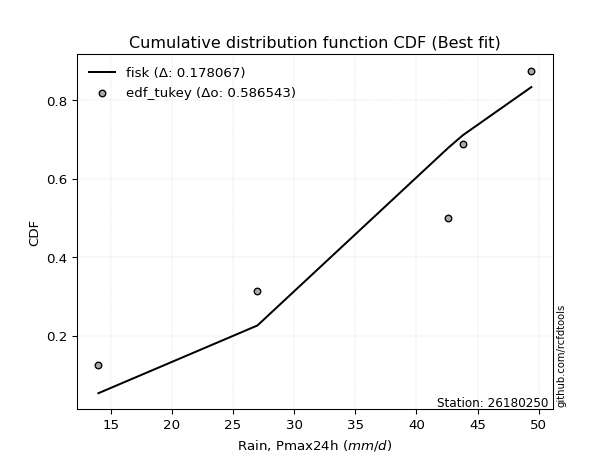</img></img>

</div>


### 8. EDF Gringorten (1963)

Gringorten plotting position formula is essential for estimating the probability and return periods of extreme events like floods and heavy rainfall. The constant _a=0.44_.

<div align="center">


$P=(m-a)/(n+1-2a)$


</div>


**8.1. Empirical values**

<div align="center">

|                | 0                   | 1                  | 2                   | 3                  | 4                  | 5                  |
|:---------------|:--------------------|:-------------------|:--------------------|:-------------------|:-------------------|:-------------------|
| date           | 2021                | 2025               | 2020                | 2022               | 2019               | 2023               |
| x              | 14.0                | 25.2               | 27.0                | 42.6               | 43.8               | 49.4               |
| m              | 1                   | 2                  | 3                   | 4                  | 5                  | 6                  |
| empirical_dist | edf_gringorten      | edf_gringorten     | edf_gringorten      | edf_gringorten     | edf_gringorten     | edf_gringorten     |
| empirical      | 0.09150326797385622 | 0.2549019607843137 | 0.41830065359477125 | 0.5816993464052288 | 0.7450980392156862 | 0.9084967320261437 |
| empirical_tr   | 1.1007194244604317  | 1.3421052631578947 | 1.7191011235955058  | 2.3906250000000004 | 3.9230769230769216 | 10.928571428571415 |

</div>


**8.2. Kolmogorov-Smirnov fit test (sorted by Δ)**


<div align="center">

|                | 0                   | 1                   | 2                   | 3                  | 4                  | 5                   | 6                   | 7                   | 8                   | 9                   | 10                  | 11                 | 12                  | 13                  | 14                  | 15               | 16                  | 17                  | 18                  | 19                  | 20                  | 21                  | 22                 | 23                  | 24                  | 25                  | 26                  | 27                  | 28                  | 29                 | 30                  | 31                  | 32                  | 33                  | 34                  | 35                  | 36                  | 37                  | 38                  | 39                | 40                  | 41                  | 42                  | 43                  | 44                  | 45                  | 46                  | 47                  | 48                  | 49                  | 50                 | 51                  | 52                  | 53                  | 54                  | 55                  | 56                  | 57                  | 58                  | 59                  | 60                 | 61                  | 62                 | 63                  | 64                  | 65                  | 66                 | 67                 | 68                 | 69                 | 70                 | 71                 | 72                  | 73                  | 74                  | 75                  | 76                 | 77                  | 78                  | 79                  | 80                  | 81                  | 82                  | 83                  | 84                  | 85                 | 86                  | 87                 | 88                  | 89                  | 90                  | 91                  | 92                  | 93                 | 94                  | 95                  | 96               | 97                  | 98                  | 99                  | 100                 | 101                 | 102                 | 103                 | 104                 | 105                 | 106                | 107                 | 108                | 109                 | 110                | 111                 | 112                | 113                 | 114                | 115                | 116                | 117                | 118                 | 119                | 120                 | 121                | 122                 | 123                 | 124                 | 125                | 126                 | 127                | 128                 | 129                 | 130                | 131                | 132                | 133                | 134                 | 135                 | 136                 | 137               | 138                | 139                 | 140                 | 141                | 142                 | 143                 | 144               | 145                 | 146                | 147                | 148                | 149                | 150               | 151                | 152                | 153               | 154                | 155               | 156                | 157                | 158                | 159              |
|:---------------|:--------------------|:--------------------|:--------------------|:-------------------|:-------------------|:--------------------|:--------------------|:--------------------|:--------------------|:--------------------|:--------------------|:-------------------|:--------------------|:--------------------|:--------------------|:-----------------|:--------------------|:--------------------|:--------------------|:--------------------|:--------------------|:--------------------|:-------------------|:--------------------|:--------------------|:--------------------|:--------------------|:--------------------|:--------------------|:-------------------|:--------------------|:--------------------|:--------------------|:--------------------|:--------------------|:--------------------|:--------------------|:--------------------|:--------------------|:------------------|:--------------------|:--------------------|:--------------------|:--------------------|:--------------------|:--------------------|:--------------------|:--------------------|:--------------------|:--------------------|:-------------------|:--------------------|:--------------------|:--------------------|:--------------------|:--------------------|:--------------------|:--------------------|:--------------------|:--------------------|:-------------------|:--------------------|:-------------------|:--------------------|:--------------------|:--------------------|:-------------------|:-------------------|:-------------------|:-------------------|:-------------------|:-------------------|:--------------------|:--------------------|:--------------------|:--------------------|:-------------------|:--------------------|:--------------------|:--------------------|:--------------------|:--------------------|:--------------------|:--------------------|:--------------------|:-------------------|:--------------------|:-------------------|:--------------------|:--------------------|:--------------------|:--------------------|:--------------------|:-------------------|:--------------------|:--------------------|:-----------------|:--------------------|:--------------------|:--------------------|:--------------------|:--------------------|:--------------------|:--------------------|:--------------------|:--------------------|:-------------------|:--------------------|:-------------------|:--------------------|:-------------------|:--------------------|:-------------------|:--------------------|:-------------------|:-------------------|:-------------------|:-------------------|:--------------------|:-------------------|:--------------------|:-------------------|:--------------------|:--------------------|:--------------------|:-------------------|:--------------------|:-------------------|:--------------------|:--------------------|:-------------------|:-------------------|:-------------------|:-------------------|:--------------------|:--------------------|:--------------------|:------------------|:-------------------|:--------------------|:--------------------|:-------------------|:--------------------|:--------------------|:------------------|:--------------------|:-------------------|:-------------------|:-------------------|:-------------------|:------------------|:-------------------|:-------------------|:------------------|:-------------------|:------------------|:-------------------|:-------------------|:-------------------|:-----------------|
| station        | 26180250            | 26180250            | 26180250            | 26180250           | 26180250           | 26180250            | 26180250            | 26180250            | 26180250            | 26180250            | 26180250            | 26180250           | 26180250            | 26180250            | 26180250            | 26180250         | 26180250            | 26180250            | 26180250            | 26180250            | 26180250            | 26180250            | 26180250           | 26180250            | 26180250            | 26180250            | 26180250            | 26180250            | 26180250            | 26180250           | 26180250            | 26180250            | 26180250            | 26180250            | 26180250            | 26180250            | 26180250            | 26180250            | 26180250            | 26180250          | 26180250            | 26180250            | 26180250            | 26180250            | 26180250            | 26180250            | 26180250            | 26180250            | 26180250            | 26180250            | 26180250           | 26180250            | 26180250            | 26180250            | 26180250            | 26180250            | 26180250            | 26180250            | 26180250            | 26180250            | 26180250           | 26180250            | 26180250           | 26180250            | 26180250            | 26180250            | 26180250           | 26180250           | 26180250           | 26180250           | 26180250           | 26180250           | 26180250            | 26180250            | 26180250            | 26180250            | 26180250           | 26180250            | 26180250            | 26180250            | 26180250            | 26180250            | 26180250            | 26180250            | 26180250            | 26180250           | 26180250            | 26180250           | 26180250            | 26180250            | 26180250            | 26180250            | 26180250            | 26180250           | 26180250            | 26180250            | 26180250         | 26180250            | 26180250            | 26180250            | 26180250            | 26180250            | 26180250            | 26180250            | 26180250            | 26180250            | 26180250           | 26180250            | 26180250           | 26180250            | 26180250           | 26180250            | 26180250           | 26180250            | 26180250           | 26180250           | 26180250           | 26180250           | 26180250            | 26180250           | 26180250            | 26180250           | 26180250            | 26180250            | 26180250            | 26180250           | 26180250            | 26180250           | 26180250            | 26180250            | 26180250           | 26180250           | 26180250           | 26180250           | 26180250            | 26180250            | 26180250            | 26180250          | 26180250           | 26180250            | 26180250            | 26180250           | 26180250            | 26180250            | 26180250          | 26180250            | 26180250           | 26180250           | 26180250           | 26180250           | 26180250          | 26180250           | 26180250           | 26180250          | 26180250           | 26180250          | 26180250           | 26180250           | 26180250           | 26180250         |
| empirical_dist | edf_gringorten      | edf_gringorten      | edf_gringorten      | edf_gringorten     | edf_gringorten     | edf_gringorten      | edf_gringorten      | edf_gringorten      | edf_gringorten      | edf_gringorten      | edf_gringorten      | edf_gringorten     | edf_gringorten      | edf_gringorten      | edf_gringorten      | edf_gringorten   | edf_gringorten      | edf_gringorten      | edf_gringorten      | edf_gringorten      | edf_gringorten      | edf_gringorten      | edf_gringorten     | edf_gringorten      | edf_gringorten      | edf_gringorten      | edf_gringorten      | edf_gringorten      | edf_gringorten      | edf_gringorten     | edf_gringorten      | edf_gringorten      | edf_gringorten      | edf_gringorten      | edf_gringorten      | edf_gringorten      | edf_gringorten      | edf_gringorten      | edf_gringorten      | edf_gringorten    | edf_gringorten      | edf_gringorten      | edf_gringorten      | edf_gringorten      | edf_gringorten      | edf_gringorten      | edf_gringorten      | edf_gringorten      | edf_gringorten      | edf_gringorten      | edf_gringorten     | edf_gringorten      | edf_gringorten      | edf_gringorten      | edf_gringorten      | edf_gringorten      | edf_gringorten      | edf_gringorten      | edf_gringorten      | edf_gringorten      | edf_gringorten     | edf_gringorten      | edf_gringorten     | edf_gringorten      | edf_gringorten      | edf_gringorten      | edf_gringorten     | edf_gringorten     | edf_gringorten     | edf_gringorten     | edf_gringorten     | edf_gringorten     | edf_gringorten      | edf_gringorten      | edf_gringorten      | edf_gringorten      | edf_gringorten     | edf_gringorten      | edf_gringorten      | edf_gringorten      | edf_gringorten      | edf_gringorten      | edf_gringorten      | edf_gringorten      | edf_gringorten      | edf_gringorten     | edf_gringorten      | edf_gringorten     | edf_gringorten      | edf_gringorten      | edf_gringorten      | edf_gringorten      | edf_gringorten      | edf_gringorten     | edf_gringorten      | edf_gringorten      | edf_gringorten   | edf_gringorten      | edf_gringorten      | edf_gringorten      | edf_gringorten      | edf_gringorten      | edf_gringorten      | edf_gringorten      | edf_gringorten      | edf_gringorten      | edf_gringorten     | edf_gringorten      | edf_gringorten     | edf_gringorten      | edf_gringorten     | edf_gringorten      | edf_gringorten     | edf_gringorten      | edf_gringorten     | edf_gringorten     | edf_gringorten     | edf_gringorten     | edf_gringorten      | edf_gringorten     | edf_gringorten      | edf_gringorten     | edf_gringorten      | edf_gringorten      | edf_gringorten      | edf_gringorten     | edf_gringorten      | edf_gringorten     | edf_gringorten      | edf_gringorten      | edf_gringorten     | edf_gringorten     | edf_gringorten     | edf_gringorten     | edf_gringorten      | edf_gringorten      | edf_gringorten      | edf_gringorten    | edf_gringorten     | edf_gringorten      | edf_gringorten      | edf_gringorten     | edf_gringorten      | edf_gringorten      | edf_gringorten    | edf_gringorten      | edf_gringorten     | edf_gringorten     | edf_gringorten     | edf_gringorten     | edf_gringorten    | edf_gringorten     | edf_gringorten     | edf_gringorten    | edf_gringorten     | edf_gringorten    | edf_gringorten     | edf_gringorten     | edf_gringorten     | edf_gringorten   |
| p_dist         | dgamma              | beta                | arcsine             | logdgamma          | logdweibull        | logbeta             | dweibull            | logtrapezoid        | trapezoid           | ksone               | logweibull_max      | gausshyper         | genhalflogistic     | logarcsine          | logbetaprime        | logmielke        | wrapcauchy          | semicircular        | loggenextreme       | loglevy_l           | logloggamma         | triang              | logsemicircular    | mielke              | anglit              | skewnorm            | loginvweibull       | loganglit           | logjohnsonsu        | weibull_min        | loggenhalflogistic  | argus               | logexponpow         | gumbel_l            | genextreme          | pearson3            | johnsonsu           | logkstwobign        | gompertz            | betaprime         | f                   | erlang              | logburr12           | logburr             | nct                 | t                   | norm                | crystalball         | truncnorm           | exponnorm           | logargus           | loggumbel_l         | logalpha            | alpha               | genexpon            | logweibull_min      | gamma               | rice                | foldnorm            | burr                | logf               | ncf                 | lognct             | logrice             | invgamma            | logcrystalball      | lognorm            | logt               | logexponnorm       | loggamma           | loggamma           | logfatiguelife     | logerlang           | maxwell             | logfoldnorm         | loginvgamma         | loggompertz        | loginvgauss         | rayleigh            | kstwobign           | invgauss            | logmaxwell          | levy_l              | loggenpareto        | lograyleigh         | cosine             | logncf              | loggenexpon        | kappa4              | halfnorm            | genpareto           | loghalfnorm         | logistic            | loglogistic        | logcosine           | tukeylambda         | gumbel_r         | hypsecant           | vonmises_line       | loggumbel_r         | logpearson3         | halflogistic        | loghypsecant        | uniform             | loghalflogistic     | moyal               | kappa3             | logmoyal            | logwrapcauchy      | logskewnorm         | logtriang          | laplace             | logksone           | johnsonsb           | loglaplace         | loglaplace         | loggennorm         | gennorm            | truncweibull_min    | lomax              | lognakagami         | logloglaplace      | logrdist            | burr12              | wald                | loglomax           | nakagami            | logwald            | halfgennorm         | bradford            | truncexpon         | loggausshyper      | logkappa3          | loguniform         | logkappa4           | logvonmises_line    | logtukeylambda      | logtruncnorm      | logbradford        | logtruncweibull_min | loggengamma         | logtruncexpon      | logexponweib        | loghalfgennorm      | invweibull        | fatiguelife         | weibull_max        | gengamma           | exponweib          | logjohnsonsb       | powerlaw          | rdist              | logpowerlaw        | truncpareto       | exponpow           | logtruncpareto    | genlogistic        | loggenlogistic     | logvonmises        | vonmises         |
| delta          | 0.08893023811092488 | 0.09150325858670072 | 0.09150326797385622 | 0.0992818807010929 | 0.1026945109981155 | 0.10315501386461667 | 0.11083180925751801 | 0.12417690906828394 | 0.12435667409682871 | 0.12511146389540673 | 0.12553712927963379 | 0.1306609993090727 | 0.13393302109838484 | 0.13656964162194074 | 0.13917250729529373 | 0.14073702507788 | 0.14076849142578218 | 0.14136700215047382 | 0.14512162705344545 | 0.14532087622807965 | 0.14571842867347928 | 0.14669960211159339 | 0.1472022160118952 | 0.14837125077861613 | 0.15352035565878686 | 0.15382550277781964 | 0.15917810341179994 | 0.15943375646260038 | 0.16283119026218168 | 0.1658490382826321 | 0.16650123563779717 | 0.16678564192658057 | 0.16746589077853458 | 0.17347923357644934 | 0.17505136131358803 | 0.17548819881234856 | 0.17668737885305286 | 0.17805399141513778 | 0.17897210430742028 | 0.180391092433973 | 0.18055776689980385 | 0.18104596980573118 | 0.18114155621615502 | 0.18140004144084232 | 0.18141945681829952 | 0.18142424853439454 | 0.18143267285244657 | 0.18143267903330995 | 0.18143272434991475 | 0.18143415681118302 | 0.1814525181903177 | 0.18212706320629812 | 0.18260071846028858 | 0.18273592305436293 | 0.18275539617279024 | 0.18323224564418306 | 0.18389263952477086 | 0.18417953510725082 | 0.18470522152372582 | 0.18667218143392794 | 0.1866727165372727 | 0.18677706045150178 | 0.1868381770721903 | 0.18723531365494983 | 0.18737962115613227 | 0.18746224090521746 | 0.1874622741028379 | 0.1874627275791616 | 0.1874654070722549 | 0.1889129661966653 | 0.1889129661966653 | 0.1889555754713622 | 0.18901738978435267 | 0.18929014784033804 | 0.19057040791235258 | 0.19087678742777614 | 0.1908966092417903 | 0.19129478742423645 | 0.19152261461916453 | 0.19167129532578808 | 0.19317410887560837 | 0.19451949085272313 | 0.19470040180362058 | 0.19642749060689418 | 0.19652109663972583 | 0.1965250979986103 | 0.19695169159143322 | 0.1994263208971535 | 0.19946291216266254 | 0.19950835573762904 | 0.20343664039467813 | 0.20392075660581432 | 0.20403979946962036 | 0.2099864566213936 | 0.21390685155762756 | 0.21744485320349727 | 0.21760552089732 | 0.21851809614732887 | 0.22059520368880348 | 0.22207975241083755 | 0.22230686060590876 | 0.22311134015505274 | 0.22422302328742805 | 0.22621025811454532 | 0.22712189361261292 | 0.22933676505079958 | 0.2296818427808337 | 0.23334669174814016 | 0.2337824560281061 | 0.23479447270458265 | 0.2361101168186347 | 0.23676606952977242 | 0.2370894935875565 | 0.24117643228834795 | 0.2417475734927691 | 0.2417475734927691 | 0.2450980392156863 | 0.2450980392156863 | 0.24579574702991402 | 0.2534568641618071 | 0.25489979463041823 | 0.2579438966286639 | 0.26370423290595774 | 0.26605246400634186 | 0.26694100854377334 | 0.2677076452664411 | 0.26933615630136576 | 0.2699090387911147 | 0.27200363093504765 | 0.27222199496439614 | 0.2779206024833588 | 0.2869829530814162 | 0.3004198258105165 | 0.3008472615861135 | 0.30214728541565805 | 0.30235641558118354 | 0.30478264651171977 | 0.326533769109689 | 0.3323520033282743 | 0.3349348057441881  | 0.33672061045484636 | 0.3372488053370297 | 0.41340657417614657 | 0.41830065359477125 | 0.481871615443814 | 0.49967796569838274 | 0.5164107431378462 | 0.5188778736608858 | 0.5435326396100123 | 0.5565333121762209 | 0.586805733504022 | 0.6098945229129018 | 0.6293417350964587 | 0.646884246194017 | 0.6674849064415924 | 0.679392109707141 | 0.7450980392156862 | 0.7450980392156862 | 1.1840341429605603 | 7.32073480774798 |
| deltao         | 0.530385761606      | 0.530385761606      | 0.530385761606      | 0.530385761606     | 0.530385761606     | 0.530385761606      | 0.530385761606      | 0.530385761606      | 0.530385761606      | 0.530385761606      | 0.530385761606      | 0.530385761606     | 0.530385761606      | 0.530385761606      | 0.530385761606      | 0.530385761606   | 0.530385761606      | 0.530385761606      | 0.530385761606      | 0.530385761606      | 0.530385761606      | 0.530385761606      | 0.530385761606     | 0.530385761606      | 0.530385761606      | 0.530385761606      | 0.530385761606      | 0.530385761606      | 0.530385761606      | 0.530385761606     | 0.530385761606      | 0.530385761606      | 0.530385761606      | 0.530385761606      | 0.530385761606      | 0.530385761606      | 0.530385761606      | 0.530385761606      | 0.530385761606      | 0.530385761606    | 0.530385761606      | 0.530385761606      | 0.530385761606      | 0.530385761606      | 0.530385761606      | 0.530385761606      | 0.530385761606      | 0.530385761606      | 0.530385761606      | 0.530385761606      | 0.530385761606     | 0.530385761606      | 0.530385761606      | 0.530385761606      | 0.530385761606      | 0.530385761606      | 0.530385761606      | 0.530385761606      | 0.530385761606      | 0.530385761606      | 0.530385761606     | 0.530385761606      | 0.530385761606     | 0.530385761606      | 0.530385761606      | 0.530385761606      | 0.530385761606     | 0.530385761606     | 0.530385761606     | 0.530385761606     | 0.530385761606     | 0.530385761606     | 0.530385761606      | 0.530385761606      | 0.530385761606      | 0.530385761606      | 0.530385761606     | 0.530385761606      | 0.530385761606      | 0.530385761606      | 0.530385761606      | 0.530385761606      | 0.530385761606      | 0.530385761606      | 0.530385761606      | 0.530385761606     | 0.530385761606      | 0.530385761606     | 0.530385761606      | 0.530385761606      | 0.530385761606      | 0.530385761606      | 0.530385761606      | 0.530385761606     | 0.530385761606      | 0.530385761606      | 0.530385761606   | 0.530385761606      | 0.530385761606      | 0.530385761606      | 0.530385761606      | 0.530385761606      | 0.530385761606      | 0.530385761606      | 0.530385761606      | 0.530385761606      | 0.530385761606     | 0.530385761606      | 0.530385761606     | 0.530385761606      | 0.530385761606     | 0.530385761606      | 0.530385761606     | 0.530385761606      | 0.530385761606     | 0.530385761606     | 0.530385761606     | 0.530385761606     | 0.530385761606      | 0.530385761606     | 0.530385761606      | 0.530385761606     | 0.530385761606      | 0.530385761606      | 0.530385761606      | 0.530385761606     | 0.530385761606      | 0.530385761606     | 0.530385761606      | 0.530385761606      | 0.530385761606     | 0.530385761606     | 0.530385761606     | 0.530385761606     | 0.530385761606      | 0.530385761606      | 0.530385761606      | 0.530385761606    | 0.530385761606     | 0.530385761606      | 0.530385761606      | 0.530385761606     | 0.530385761606      | 0.530385761606      | 0.530385761606    | 0.530385761606      | 0.530385761606     | 0.530385761606     | 0.530385761606     | 0.530385761606     | 0.530385761606    | 0.530385761606     | 0.530385761606     | 0.530385761606    | 0.530385761606     | 0.530385761606    | 0.530385761606     | 0.530385761606     | 0.530385761606     | 0.530385761606   |
| eval           | Δo > Δ              | Δo > Δ              | Δo > Δ              | Δo > Δ             | Δo > Δ             | Δo > Δ              | Δo > Δ              | Δo > Δ              | Δo > Δ              | Δo > Δ              | Δo > Δ              | Δo > Δ             | Δo > Δ              | Δo > Δ              | Δo > Δ              | Δo > Δ           | Δo > Δ              | Δo > Δ              | Δo > Δ              | Δo > Δ              | Δo > Δ              | Δo > Δ              | Δo > Δ             | Δo > Δ              | Δo > Δ              | Δo > Δ              | Δo > Δ              | Δo > Δ              | Δo > Δ              | Δo > Δ             | Δo > Δ              | Δo > Δ              | Δo > Δ              | Δo > Δ              | Δo > Δ              | Δo > Δ              | Δo > Δ              | Δo > Δ              | Δo > Δ              | Δo > Δ            | Δo > Δ              | Δo > Δ              | Δo > Δ              | Δo > Δ              | Δo > Δ              | Δo > Δ              | Δo > Δ              | Δo > Δ              | Δo > Δ              | Δo > Δ              | Δo > Δ             | Δo > Δ              | Δo > Δ              | Δo > Δ              | Δo > Δ              | Δo > Δ              | Δo > Δ              | Δo > Δ              | Δo > Δ              | Δo > Δ              | Δo > Δ             | Δo > Δ              | Δo > Δ             | Δo > Δ              | Δo > Δ              | Δo > Δ              | Δo > Δ             | Δo > Δ             | Δo > Δ             | Δo > Δ             | Δo > Δ             | Δo > Δ             | Δo > Δ              | Δo > Δ              | Δo > Δ              | Δo > Δ              | Δo > Δ             | Δo > Δ              | Δo > Δ              | Δo > Δ              | Δo > Δ              | Δo > Δ              | Δo > Δ              | Δo > Δ              | Δo > Δ              | Δo > Δ             | Δo > Δ              | Δo > Δ             | Δo > Δ              | Δo > Δ              | Δo > Δ              | Δo > Δ              | Δo > Δ              | Δo > Δ             | Δo > Δ              | Δo > Δ              | Δo > Δ           | Δo > Δ              | Δo > Δ              | Δo > Δ              | Δo > Δ              | Δo > Δ              | Δo > Δ              | Δo > Δ              | Δo > Δ              | Δo > Δ              | Δo > Δ             | Δo > Δ              | Δo > Δ             | Δo > Δ              | Δo > Δ             | Δo > Δ              | Δo > Δ             | Δo > Δ              | Δo > Δ             | Δo > Δ             | Δo > Δ             | Δo > Δ             | Δo > Δ              | Δo > Δ             | Δo > Δ              | Δo > Δ             | Δo > Δ              | Δo > Δ              | Δo > Δ              | Δo > Δ             | Δo > Δ              | Δo > Δ             | Δo > Δ              | Δo > Δ              | Δo > Δ             | Δo > Δ             | Δo > Δ             | Δo > Δ             | Δo > Δ              | Δo > Δ              | Δo > Δ              | Δo > Δ            | Δo > Δ             | Δo > Δ              | Δo > Δ              | Δo > Δ             | Δo > Δ              | Δo > Δ              | Δo > Δ            | Δo > Δ              | Δo > Δ             | Δo > Δ             | Δo <= Δ            | Δo <= Δ            | Δo <= Δ           | Δo <= Δ            | Δo <= Δ            | Δo <= Δ           | Δo <= Δ            | Δo <= Δ           | Δo <= Δ            | Δo <= Δ            | Δo <= Δ            | Δo <= Δ          |
| fit            | 1                   | 1                   | 1                   | 1                  | 1                  | 1                   | 1                   | 1                   | 1                   | 1                   | 1                   | 1                  | 1                   | 1                   | 1                   | 1                | 1                   | 1                   | 1                   | 1                   | 1                   | 1                   | 1                  | 1                   | 1                   | 1                   | 1                   | 1                   | 1                   | 1                  | 1                   | 1                   | 1                   | 1                   | 1                   | 1                   | 1                   | 1                   | 1                   | 1                 | 1                   | 1                   | 1                   | 1                   | 1                   | 1                   | 1                   | 1                   | 1                   | 1                   | 1                  | 1                   | 1                   | 1                   | 1                   | 1                   | 1                   | 1                   | 1                   | 1                   | 1                  | 1                   | 1                  | 1                   | 1                   | 1                   | 1                  | 1                  | 1                  | 1                  | 1                  | 1                  | 1                   | 1                   | 1                   | 1                   | 1                  | 1                   | 1                   | 1                   | 1                   | 1                   | 1                   | 1                   | 1                   | 1                  | 1                   | 1                  | 1                   | 1                   | 1                   | 1                   | 1                   | 1                  | 1                   | 1                   | 1                | 1                   | 1                   | 1                   | 1                   | 1                   | 1                   | 1                   | 1                   | 1                   | 1                  | 1                   | 1                  | 1                   | 1                  | 1                   | 1                  | 1                   | 1                  | 1                  | 1                  | 1                  | 1                   | 1                  | 1                   | 1                  | 1                   | 1                   | 1                   | 1                  | 1                   | 1                  | 1                   | 1                   | 1                  | 1                  | 1                  | 1                  | 1                   | 1                   | 1                   | 1                 | 1                  | 1                   | 1                   | 1                  | 1                   | 1                   | 1                 | 1                   | 1                  | 1                  | 0                  | 0                  | 0                 | 0                  | 0                  | 0                 | 0                  | 0                 | 0                  | 0                  | 0                  | 0                |
| n              | 6                   | 6                   | 6                   | 6                  | 6                  | 6                   | 6                   | 6                   | 6                   | 6                   | 6                   | 6                  | 6                   | 6                   | 6                   | 6                | 6                   | 6                   | 6                   | 6                   | 6                   | 6                   | 6                  | 6                   | 6                   | 6                   | 6                   | 6                   | 6                   | 6                  | 6                   | 6                   | 6                   | 6                   | 6                   | 6                   | 6                   | 6                   | 6                   | 6                 | 6                   | 6                   | 6                   | 6                   | 6                   | 6                   | 6                   | 6                   | 6                   | 6                   | 6                  | 6                   | 6                   | 6                   | 6                   | 6                   | 6                   | 6                   | 6                   | 6                   | 6                  | 6                   | 6                  | 6                   | 6                   | 6                   | 6                  | 6                  | 6                  | 6                  | 6                  | 6                  | 6                   | 6                   | 6                   | 6                   | 6                  | 6                   | 6                   | 6                   | 6                   | 6                   | 6                   | 6                   | 6                   | 6                  | 6                   | 6                  | 6                   | 6                   | 6                   | 6                   | 6                   | 6                  | 6                   | 6                   | 6                | 6                   | 6                   | 6                   | 6                   | 6                   | 6                   | 6                   | 6                   | 6                   | 6                  | 6                   | 6                  | 6                   | 6                  | 6                   | 6                  | 6                   | 6                  | 6                  | 6                  | 6                  | 6                   | 6                  | 6                   | 6                  | 6                   | 6                   | 6                   | 6                  | 6                   | 6                  | 6                   | 6                   | 6                  | 6                  | 6                  | 6                  | 6                   | 6                   | 6                   | 6                 | 6                  | 6                   | 6                   | 6                  | 6                   | 6                   | 6                 | 6                   | 6                  | 6                  | 6                  | 6                  | 6                 | 6                  | 6                  | 6                 | 6                  | 6                 | 6                  | 6                  | 6                  | 6                |
| best_fit       | 1                   | 0                   | 0                   | 0                  | 0                  | 0                   | 0                   | 0                   | 0                   | 0                   | 0                   | 0                  | 0                   | 0                   | 0                   | 0                | 0                   | 0                   | 0                   | 0                   | 0                   | 0                   | 0                  | 0                   | 0                   | 0                   | 0                   | 0                   | 0                   | 0                  | 0                   | 0                   | 0                   | 0                   | 0                   | 0                   | 0                   | 0                   | 0                   | 0                 | 0                   | 0                   | 0                   | 0                   | 0                   | 0                   | 0                   | 0                   | 0                   | 0                   | 0                  | 0                   | 0                   | 0                   | 0                   | 0                   | 0                   | 0                   | 0                   | 0                   | 0                  | 0                   | 0                  | 0                   | 0                   | 0                   | 0                  | 0                  | 0                  | 0                  | 0                  | 0                  | 0                   | 0                   | 0                   | 0                   | 0                  | 0                   | 0                   | 0                   | 0                   | 0                   | 0                   | 0                   | 0                   | 0                  | 0                   | 0                  | 0                   | 0                   | 0                   | 0                   | 0                   | 0                  | 0                   | 0                   | 0                | 0                   | 0                   | 0                   | 0                   | 0                   | 0                   | 0                   | 0                   | 0                   | 0                  | 0                   | 0                  | 0                   | 0                  | 0                   | 0                  | 0                   | 0                  | 0                  | 0                  | 0                  | 0                   | 0                  | 0                   | 0                  | 0                   | 0                   | 0                   | 0                  | 0                   | 0                  | 0                   | 0                   | 0                  | 0                  | 0                  | 0                  | 0                   | 0                   | 0                   | 0                 | 0                  | 0                   | 0                   | 0                  | 0                   | 0                   | 0                 | 0                   | 0                  | 0                  | 0                  | 0                  | 0                 | 0                  | 0                  | 0                 | 0                  | 0                 | 0                  | 0                  | 0                  | 0                |
| best_fit_sort  | 1                   | 2                   | 3                   | 4                  | 5                  | 6                   | 7                   | 8                   | 9                   | 10                  | 11                  | 12                 | 13                  | 14                  | 15                  | 16               | 17                  | 18                  | 19                  | 20                  | 21                  | 22                  | 23                 | 24                  | 25                  | 26                  | 27                  | 28                  | 29                  | 30                 | 31                  | 32                  | 33                  | 34                  | 35                  | 36                  | 37                  | 38                  | 39                  | 40                | 41                  | 42                  | 43                  | 44                  | 45                  | 46                  | 47                  | 48                  | 49                  | 50                  | 51                 | 52                  | 53                  | 54                  | 55                  | 56                  | 57                  | 58                  | 59                  | 60                  | 61                 | 62                  | 63                 | 64                  | 65                  | 66                  | 67                 | 68                 | 69                 | 70                 | 71                 | 72                 | 73                  | 74                  | 75                  | 76                  | 77                 | 78                  | 79                  | 80                  | 81                  | 82                  | 83                  | 84                  | 85                  | 86                 | 87                  | 88                 | 89                  | 90                  | 91                  | 92                  | 93                  | 94                 | 95                  | 96                  | 97               | 98                  | 99                  | 100                 | 101                 | 102                 | 103                 | 104                 | 105                 | 106                 | 107                | 108                 | 109                | 110                 | 111                | 112                 | 113                | 114                 | 115                | 116                | 117                | 118                | 119                 | 120                | 121                 | 122                | 123                 | 124                 | 125                 | 126                | 127                 | 128                | 129                 | 130                 | 131                | 132                | 133                | 134                | 135                 | 136                 | 137                 | 138               | 139                | 140                 | 141                 | 142                | 143                 | 144                 | 145               | 146                 | 147                | 148                | 149                | 150                | 151               | 152                | 153                | 154               | 155                | 156               | 157                | 158                | 159                | 160              |

</div>


**8.3. Best fit**

<div align="center">

|   id |   station | empirical_dist   | p_dist   |     delta |   deltao | eval   |   fit |   n |   best_fit |   best_fit_sort |
|-----:|----------:|:-----------------|:---------|----------:|---------:|:-------|------:|----:|-----------:|----------------:|
|    0 |  26180250 | edf_gringorten   | dgamma   | 0.0889302 | 0.530386 | Δo > Δ |     1 |   6 |          1 |               1 |

</div>


<div align="center">

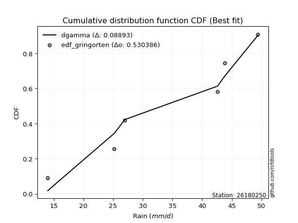</img></img>

</div>


### 9. EDF Filliben (1975)

The specific values of the constants (0.3175) (often denoted as $alpha$) and (0.365) are derived from a method proposed by James J. Filliben in a 1975 paper. This particular formula is the mean value of the $i$-th order statistic of the normal distribution and is considered a robust and effective plotting position formula for the normal probability plot correlation coefficient test for normality.

<div align="center">


$P=(m-0.3175)/(n+0.365)$


</div>


**9.1. Empirical values**

<div align="center">

|                | 0                   | 1                   | 2                  | 3                  | 4                  | 5                  |
|:---------------|:--------------------|:--------------------|:-------------------|:-------------------|:-------------------|:-------------------|
| date           | 2021                | 2025                | 2020               | 2022               | 2019               | 2023               |
| x              | 14.0                | 25.2                | 27.0               | 42.6               | 43.8               | 49.4               |
| m              | 1                   | 2                   | 3                  | 4                  | 5                  | 6                  |
| empirical_dist | edf_filliben        | edf_filliben        | edf_filliben       | edf_filliben       | edf_filliben       | edf_filliben       |
| empirical      | 0.10722702278083267 | 0.26433621366849963 | 0.4214454045561665 | 0.5785545954438335 | 0.7356637863315004 | 0.8927729772191673 |
| empirical_tr   | 1.1201055873295205  | 1.3593166043780034  | 1.7284453496266123 | 2.3727865796831313 | 3.783060921248143  | 9.326007326007321  |

</div>


**9.2. Kolmogorov-Smirnov fit test (sorted by Δ)**


<div align="center">

|                | 0                   | 1                   | 2                   | 3                   | 4                   | 5                   | 6                   | 7                   | 8                   | 9                   | 10                  | 11                  | 12                 | 13                  | 14                  | 15                 | 16                  | 17                  | 18                  | 19                  | 20                  | 21                 | 22                  | 23                 | 24                  | 25                  | 26                  | 27                 | 28                  | 29                  | 30                 | 31                  | 32                 | 33                  | 34                 | 35                 | 36                  | 37                  | 38                  | 39                 | 40                 | 41                 | 42                  | 43                  | 44                 | 45                  | 46                  | 47                  | 48                  | 49                 | 50                  | 51                  | 52                  | 53                  | 54                  | 55                 | 56                  | 57                  | 58                  | 59                 | 60                  | 61                  | 62                  | 63                | 64                 | 65                  | 66                  | 67                  | 68                 | 69                  | 70                  | 71                  | 72                  | 73                  | 74                  | 75                  | 76                | 77                  | 78                 | 79                  | 80                  | 81                  | 82                  | 83                 | 84                 | 85                  | 86                  | 87                 | 88                  | 89                  | 90                  | 91                  | 92                 | 93                  | 94                 | 95                 | 96                  | 97                 | 98                 | 99                  | 100                 | 101                | 102                 | 103                 | 104                 | 105                 | 106                 | 107                | 108                 | 109                 | 110                 | 111                 | 112                 | 113                 | 114                 | 115                 | 116                 | 117                 | 118                 | 119                 | 120                 | 121                 | 122                 | 123                | 124                 | 125               | 126                 | 127                | 128                 | 129                 | 130                 | 131                | 132                 | 133                 | 134                | 135                 | 136                 | 137                 | 138                 | 139                 | 140                 | 141                 | 142                 | 143                | 144                | 145                | 146                | 147                | 148                | 149                | 150               | 151                | 152                | 153               | 154                | 155                | 156                | 157                | 158                | 159               |
|:---------------|:--------------------|:--------------------|:--------------------|:--------------------|:--------------------|:--------------------|:--------------------|:--------------------|:--------------------|:--------------------|:--------------------|:--------------------|:-------------------|:--------------------|:--------------------|:-------------------|:--------------------|:--------------------|:--------------------|:--------------------|:--------------------|:-------------------|:--------------------|:-------------------|:--------------------|:--------------------|:--------------------|:-------------------|:--------------------|:--------------------|:-------------------|:--------------------|:-------------------|:--------------------|:-------------------|:-------------------|:--------------------|:--------------------|:--------------------|:-------------------|:-------------------|:-------------------|:--------------------|:--------------------|:-------------------|:--------------------|:--------------------|:--------------------|:--------------------|:-------------------|:--------------------|:--------------------|:--------------------|:--------------------|:--------------------|:-------------------|:--------------------|:--------------------|:--------------------|:-------------------|:--------------------|:--------------------|:--------------------|:------------------|:-------------------|:--------------------|:--------------------|:--------------------|:-------------------|:--------------------|:--------------------|:--------------------|:--------------------|:--------------------|:--------------------|:--------------------|:------------------|:--------------------|:-------------------|:--------------------|:--------------------|:--------------------|:--------------------|:-------------------|:-------------------|:--------------------|:--------------------|:-------------------|:--------------------|:--------------------|:--------------------|:--------------------|:-------------------|:--------------------|:-------------------|:-------------------|:--------------------|:-------------------|:-------------------|:--------------------|:--------------------|:-------------------|:--------------------|:--------------------|:--------------------|:--------------------|:--------------------|:-------------------|:--------------------|:--------------------|:--------------------|:--------------------|:--------------------|:--------------------|:--------------------|:--------------------|:--------------------|:--------------------|:--------------------|:--------------------|:--------------------|:--------------------|:--------------------|:-------------------|:--------------------|:------------------|:--------------------|:-------------------|:--------------------|:--------------------|:--------------------|:-------------------|:--------------------|:--------------------|:-------------------|:--------------------|:--------------------|:--------------------|:--------------------|:--------------------|:--------------------|:--------------------|:--------------------|:-------------------|:-------------------|:-------------------|:-------------------|:-------------------|:-------------------|:-------------------|:------------------|:-------------------|:-------------------|:------------------|:-------------------|:-------------------|:-------------------|:-------------------|:-------------------|:------------------|
| station        | 26180250            | 26180250            | 26180250            | 26180250            | 26180250            | 26180250            | 26180250            | 26180250            | 26180250            | 26180250            | 26180250            | 26180250            | 26180250           | 26180250            | 26180250            | 26180250           | 26180250            | 26180250            | 26180250            | 26180250            | 26180250            | 26180250           | 26180250            | 26180250           | 26180250            | 26180250            | 26180250            | 26180250           | 26180250            | 26180250            | 26180250           | 26180250            | 26180250           | 26180250            | 26180250           | 26180250           | 26180250            | 26180250            | 26180250            | 26180250           | 26180250           | 26180250           | 26180250            | 26180250            | 26180250           | 26180250            | 26180250            | 26180250            | 26180250            | 26180250           | 26180250            | 26180250            | 26180250            | 26180250            | 26180250            | 26180250           | 26180250            | 26180250            | 26180250            | 26180250           | 26180250            | 26180250            | 26180250            | 26180250          | 26180250           | 26180250            | 26180250            | 26180250            | 26180250           | 26180250            | 26180250            | 26180250            | 26180250            | 26180250            | 26180250            | 26180250            | 26180250          | 26180250            | 26180250           | 26180250            | 26180250            | 26180250            | 26180250            | 26180250           | 26180250           | 26180250            | 26180250            | 26180250           | 26180250            | 26180250            | 26180250            | 26180250            | 26180250           | 26180250            | 26180250           | 26180250           | 26180250            | 26180250           | 26180250           | 26180250            | 26180250            | 26180250           | 26180250            | 26180250            | 26180250            | 26180250            | 26180250            | 26180250           | 26180250            | 26180250            | 26180250            | 26180250            | 26180250            | 26180250            | 26180250            | 26180250            | 26180250            | 26180250            | 26180250            | 26180250            | 26180250            | 26180250            | 26180250            | 26180250           | 26180250            | 26180250          | 26180250            | 26180250           | 26180250            | 26180250            | 26180250            | 26180250           | 26180250            | 26180250            | 26180250           | 26180250            | 26180250            | 26180250            | 26180250            | 26180250            | 26180250            | 26180250            | 26180250            | 26180250           | 26180250           | 26180250           | 26180250           | 26180250           | 26180250           | 26180250           | 26180250          | 26180250           | 26180250           | 26180250          | 26180250           | 26180250           | 26180250           | 26180250           | 26180250           | 26180250          |
| empirical_dist | edf_filliben        | edf_filliben        | edf_filliben        | edf_filliben        | edf_filliben        | edf_filliben        | edf_filliben        | edf_filliben        | edf_filliben        | edf_filliben        | edf_filliben        | edf_filliben        | edf_filliben       | edf_filliben        | edf_filliben        | edf_filliben       | edf_filliben        | edf_filliben        | edf_filliben        | edf_filliben        | edf_filliben        | edf_filliben       | edf_filliben        | edf_filliben       | edf_filliben        | edf_filliben        | edf_filliben        | edf_filliben       | edf_filliben        | edf_filliben        | edf_filliben       | edf_filliben        | edf_filliben       | edf_filliben        | edf_filliben       | edf_filliben       | edf_filliben        | edf_filliben        | edf_filliben        | edf_filliben       | edf_filliben       | edf_filliben       | edf_filliben        | edf_filliben        | edf_filliben       | edf_filliben        | edf_filliben        | edf_filliben        | edf_filliben        | edf_filliben       | edf_filliben        | edf_filliben        | edf_filliben        | edf_filliben        | edf_filliben        | edf_filliben       | edf_filliben        | edf_filliben        | edf_filliben        | edf_filliben       | edf_filliben        | edf_filliben        | edf_filliben        | edf_filliben      | edf_filliben       | edf_filliben        | edf_filliben        | edf_filliben        | edf_filliben       | edf_filliben        | edf_filliben        | edf_filliben        | edf_filliben        | edf_filliben        | edf_filliben        | edf_filliben        | edf_filliben      | edf_filliben        | edf_filliben       | edf_filliben        | edf_filliben        | edf_filliben        | edf_filliben        | edf_filliben       | edf_filliben       | edf_filliben        | edf_filliben        | edf_filliben       | edf_filliben        | edf_filliben        | edf_filliben        | edf_filliben        | edf_filliben       | edf_filliben        | edf_filliben       | edf_filliben       | edf_filliben        | edf_filliben       | edf_filliben       | edf_filliben        | edf_filliben        | edf_filliben       | edf_filliben        | edf_filliben        | edf_filliben        | edf_filliben        | edf_filliben        | edf_filliben       | edf_filliben        | edf_filliben        | edf_filliben        | edf_filliben        | edf_filliben        | edf_filliben        | edf_filliben        | edf_filliben        | edf_filliben        | edf_filliben        | edf_filliben        | edf_filliben        | edf_filliben        | edf_filliben        | edf_filliben        | edf_filliben       | edf_filliben        | edf_filliben      | edf_filliben        | edf_filliben       | edf_filliben        | edf_filliben        | edf_filliben        | edf_filliben       | edf_filliben        | edf_filliben        | edf_filliben       | edf_filliben        | edf_filliben        | edf_filliben        | edf_filliben        | edf_filliben        | edf_filliben        | edf_filliben        | edf_filliben        | edf_filliben       | edf_filliben       | edf_filliben       | edf_filliben       | edf_filliben       | edf_filliben       | edf_filliben       | edf_filliben      | edf_filliben       | edf_filliben       | edf_filliben      | edf_filliben       | edf_filliben       | edf_filliben       | edf_filliben       | edf_filliben       | edf_filliben      |
| p_dist         | dgamma              | logdgamma           | dweibull            | logdweibull         | logbeta             | beta                | arcsine             | logarcsine          | logtrapezoid        | trapezoid           | ksone               | logweibull_max      | loglevy_l          | wrapcauchy          | gausshyper          | genhalflogistic    | logbetaprime        | logmielke           | semicircular        | loggenextreme       | logloggamma         | triang             | logsemicircular     | mielke             | anglit              | skewnorm            | loginvweibull       | loganglit          | logjohnsonsu        | weibull_min         | loggenhalflogistic | argus               | logexponpow        | gumbel_l            | genextreme         | pearson3           | levy_l              | johnsonsu           | loggenpareto        | logkstwobign       | logncf             | gompertz           | betaprime           | f                   | erlang             | logburr12           | logburr             | nct                 | t                   | norm               | crystalball         | truncnorm           | exponnorm           | logargus            | loggumbel_l         | logalpha           | alpha               | genexpon            | logweibull_min      | gamma              | rice                | foldnorm            | burr                | logf              | ncf                | lognct              | loggenexpon         | logrice             | invgamma           | logcrystalball      | lognorm             | logt                | logexponnorm        | loggamma            | loggamma            | logfatiguelife      | logerlang         | maxwell             | logfoldnorm        | loginvgamma         | loggompertz         | loginvgauss         | rayleigh            | kstwobign          | invgauss           | logmaxwell          | lograyleigh         | cosine             | kappa4              | halfnorm            | genpareto           | loghalfnorm         | logistic           | loglogistic         | logcosine          | tukeylambda        | gumbel_r            | hypsecant          | vonmises_line      | logwrapcauchy       | loggumbel_r         | logpearson3        | halflogistic        | loghypsecant        | uniform             | loghalflogistic     | johnsonsb           | moyal              | kappa3              | loggennorm          | gennorm             | logmoyal            | lomax               | logskewnorm         | logtriang           | laplace             | logksone            | loglaplace          | loglaplace          | truncweibull_min    | burr12              | loglomax            | logloglaplace       | halfgennorm        | lognakagami         | logrdist          | wald                | nakagami           | logwald             | bradford            | truncexpon          | loggausshyper      | logkappa3           | loguniform          | logkappa4          | logvonmises_line    | logtukeylambda      | loggengamma         | logtruncnorm        | logbradford         | logtruncweibull_min | logtruncexpon       | logexponweib        | loghalfgennorm     | invweibull         | fatiguelife        | weibull_max        | gengamma           | exponweib          | logjohnsonsb       | powerlaw          | rdist              | logpowerlaw        | truncpareto       | exponpow           | logtruncpareto     | genlogistic        | loggenlogistic     | logvonmises        | vonmises          |
| delta          | 0.08932520882163308 | 0.09725784653839409 | 0.10139755637333209 | 0.10269532782495483 | 0.10722701106297217 | 0.10722701339367713 | 0.10722702278083267 | 0.12713538873775482 | 0.12732166002967926 | 0.12750142505822398 | 0.12825621485680205 | 0.12868188024102906 | 0.1295971214211032 | 0.13133423854159626 | 0.13380575027046798 | 0.1370777720597801 | 0.14231725825668906 | 0.14388177603927527 | 0.14451175311186915 | 0.14826637801484072 | 0.14886317963487455 | 0.1498443530729887 | 0.15034696697329053 | 0.1515160017400114 | 0.15666510662018218 | 0.15697025373921492 | 0.16232285437319527 | 0.1625785074239957 | 0.16597594122357695 | 0.16899378924402741 | 0.1696459865991925 | 0.16993039288797585 | 0.1706106417399299 | 0.17662398453784467 | 0.1781961122749833 | 0.1786329497737439 | 0.17897664699664412 | 0.17983212981444813 | 0.18070373579991772 | 0.1811987423765331 | 0.1812279367844568 | 0.1821168552688156 | 0.18353584339536833 | 0.18370251786119918 | 0.1841907207671265 | 0.18428630717755035 | 0.18454479240223765 | 0.18456420777969484 | 0.18456899949578986 | 0.1845774238138419 | 0.18457742999470528 | 0.18457747531131008 | 0.18457890777257835 | 0.18459726915171304 | 0.18527181416769345 | 0.1857454694216839 | 0.18588067401575825 | 0.18590014713418557 | 0.18637699660557838 | 0.1870373904861662 | 0.18732428606864615 | 0.18784997248512114 | 0.18981693239532327 | 0.189817467498668 | 0.1899218114128971 | 0.18998292803358563 | 0.18999206801296759 | 0.19038006461634516 | 0.1905243721175276 | 0.19060699186661278 | 0.19060702506423322 | 0.19060747854055693 | 0.19061015803365022 | 0.19205771715806064 | 0.19205771715806064 | 0.19210032643275754 | 0.192162140745748 | 0.19243489880173337 | 0.1937151588737479 | 0.19402153838917147 | 0.19404136020318563 | 0.19443953838563177 | 0.19466736558055986 | 0.1948160462871834 | 0.1963188598370037 | 0.19766424181411846 | 0.19966584760112116 | 0.1996698489600056 | 0.20260766312405787 | 0.20265310669902437 | 0.20658139135607345 | 0.20706550756720965 | 0.2071845504310157 | 0.21313120758278892 | 0.2170516025190229 | 0.2205896041648926 | 0.22075027185871532 | 0.2216628471087242 | 0.2237399546501988 | 0.22434820314392018 | 0.22522450337223288 | 0.2254516115673041 | 0.22625609111644807 | 0.22736777424882337 | 0.22935500907594064 | 0.23026664457400825 | 0.23174217940416203 | 0.2324815160121949 | 0.23282659374222903 | 0.23566378633150042 | 0.23566378633150042 | 0.23649144270953548 | 0.23773310935483072 | 0.23793922366597797 | 0.23925486778003002 | 0.23991082049116774 | 0.24023424454895181 | 0.24489232445416442 | 0.24489232445416442 | 0.24894049799130935 | 0.25661821112215594 | 0.25827339238225516 | 0.26108864759005923 | 0.2625693780508617 | 0.26433404751460415 | 0.266848983867353 | 0.27008575950516867 | 0.2724809072627611 | 0.27305378975251005 | 0.27536674592579147 | 0.28106535344475414 | 0.2901277040428115 | 0.30356457677191184 | 0.30399201254750885 | 0.3052920363770534 | 0.30550116654257886 | 0.30792739747311504 | 0.32099685564786995 | 0.32967852007108434 | 0.33549675428966963 | 0.33807955670558343 | 0.34039355629842505 | 0.40397232129196065 | 0.4214454045561665 | 0.4661478606368376 | 0.4902437128141968 | 0.5069764902536604 | 0.5094436207766999 | 0.5340983867258264 | 0.5408095573692445 | 0.577371480619836 | 0.6004602700287158 | 0.6199074822122728 | 0.637449993309831 | 0.6580506535574064 | 0.6699578568229552 | 0.7356637863315004 | 0.7356637863315004 | 1.1871788939219559 | 7.336458562554958 |
| deltao         | 0.530385761606      | 0.530385761606      | 0.530385761606      | 0.530385761606      | 0.530385761606      | 0.530385761606      | 0.530385761606      | 0.530385761606      | 0.530385761606      | 0.530385761606      | 0.530385761606      | 0.530385761606      | 0.530385761606     | 0.530385761606      | 0.530385761606      | 0.530385761606     | 0.530385761606      | 0.530385761606      | 0.530385761606      | 0.530385761606      | 0.530385761606      | 0.530385761606     | 0.530385761606      | 0.530385761606     | 0.530385761606      | 0.530385761606      | 0.530385761606      | 0.530385761606     | 0.530385761606      | 0.530385761606      | 0.530385761606     | 0.530385761606      | 0.530385761606     | 0.530385761606      | 0.530385761606     | 0.530385761606     | 0.530385761606      | 0.530385761606      | 0.530385761606      | 0.530385761606     | 0.530385761606     | 0.530385761606     | 0.530385761606      | 0.530385761606      | 0.530385761606     | 0.530385761606      | 0.530385761606      | 0.530385761606      | 0.530385761606      | 0.530385761606     | 0.530385761606      | 0.530385761606      | 0.530385761606      | 0.530385761606      | 0.530385761606      | 0.530385761606     | 0.530385761606      | 0.530385761606      | 0.530385761606      | 0.530385761606     | 0.530385761606      | 0.530385761606      | 0.530385761606      | 0.530385761606    | 0.530385761606     | 0.530385761606      | 0.530385761606      | 0.530385761606      | 0.530385761606     | 0.530385761606      | 0.530385761606      | 0.530385761606      | 0.530385761606      | 0.530385761606      | 0.530385761606      | 0.530385761606      | 0.530385761606    | 0.530385761606      | 0.530385761606     | 0.530385761606      | 0.530385761606      | 0.530385761606      | 0.530385761606      | 0.530385761606     | 0.530385761606     | 0.530385761606      | 0.530385761606      | 0.530385761606     | 0.530385761606      | 0.530385761606      | 0.530385761606      | 0.530385761606      | 0.530385761606     | 0.530385761606      | 0.530385761606     | 0.530385761606     | 0.530385761606      | 0.530385761606     | 0.530385761606     | 0.530385761606      | 0.530385761606      | 0.530385761606     | 0.530385761606      | 0.530385761606      | 0.530385761606      | 0.530385761606      | 0.530385761606      | 0.530385761606     | 0.530385761606      | 0.530385761606      | 0.530385761606      | 0.530385761606      | 0.530385761606      | 0.530385761606      | 0.530385761606      | 0.530385761606      | 0.530385761606      | 0.530385761606      | 0.530385761606      | 0.530385761606      | 0.530385761606      | 0.530385761606      | 0.530385761606      | 0.530385761606     | 0.530385761606      | 0.530385761606    | 0.530385761606      | 0.530385761606     | 0.530385761606      | 0.530385761606      | 0.530385761606      | 0.530385761606     | 0.530385761606      | 0.530385761606      | 0.530385761606     | 0.530385761606      | 0.530385761606      | 0.530385761606      | 0.530385761606      | 0.530385761606      | 0.530385761606      | 0.530385761606      | 0.530385761606      | 0.530385761606     | 0.530385761606     | 0.530385761606     | 0.530385761606     | 0.530385761606     | 0.530385761606     | 0.530385761606     | 0.530385761606    | 0.530385761606     | 0.530385761606     | 0.530385761606    | 0.530385761606     | 0.530385761606     | 0.530385761606     | 0.530385761606     | 0.530385761606     | 0.530385761606    |
| eval           | Δo > Δ              | Δo > Δ              | Δo > Δ              | Δo > Δ              | Δo > Δ              | Δo > Δ              | Δo > Δ              | Δo > Δ              | Δo > Δ              | Δo > Δ              | Δo > Δ              | Δo > Δ              | Δo > Δ             | Δo > Δ              | Δo > Δ              | Δo > Δ             | Δo > Δ              | Δo > Δ              | Δo > Δ              | Δo > Δ              | Δo > Δ              | Δo > Δ             | Δo > Δ              | Δo > Δ             | Δo > Δ              | Δo > Δ              | Δo > Δ              | Δo > Δ             | Δo > Δ              | Δo > Δ              | Δo > Δ             | Δo > Δ              | Δo > Δ             | Δo > Δ              | Δo > Δ             | Δo > Δ             | Δo > Δ              | Δo > Δ              | Δo > Δ              | Δo > Δ             | Δo > Δ             | Δo > Δ             | Δo > Δ              | Δo > Δ              | Δo > Δ             | Δo > Δ              | Δo > Δ              | Δo > Δ              | Δo > Δ              | Δo > Δ             | Δo > Δ              | Δo > Δ              | Δo > Δ              | Δo > Δ              | Δo > Δ              | Δo > Δ             | Δo > Δ              | Δo > Δ              | Δo > Δ              | Δo > Δ             | Δo > Δ              | Δo > Δ              | Δo > Δ              | Δo > Δ            | Δo > Δ             | Δo > Δ              | Δo > Δ              | Δo > Δ              | Δo > Δ             | Δo > Δ              | Δo > Δ              | Δo > Δ              | Δo > Δ              | Δo > Δ              | Δo > Δ              | Δo > Δ              | Δo > Δ            | Δo > Δ              | Δo > Δ             | Δo > Δ              | Δo > Δ              | Δo > Δ              | Δo > Δ              | Δo > Δ             | Δo > Δ             | Δo > Δ              | Δo > Δ              | Δo > Δ             | Δo > Δ              | Δo > Δ              | Δo > Δ              | Δo > Δ              | Δo > Δ             | Δo > Δ              | Δo > Δ             | Δo > Δ             | Δo > Δ              | Δo > Δ             | Δo > Δ             | Δo > Δ              | Δo > Δ              | Δo > Δ             | Δo > Δ              | Δo > Δ              | Δo > Δ              | Δo > Δ              | Δo > Δ              | Δo > Δ             | Δo > Δ              | Δo > Δ              | Δo > Δ              | Δo > Δ              | Δo > Δ              | Δo > Δ              | Δo > Δ              | Δo > Δ              | Δo > Δ              | Δo > Δ              | Δo > Δ              | Δo > Δ              | Δo > Δ              | Δo > Δ              | Δo > Δ              | Δo > Δ             | Δo > Δ              | Δo > Δ            | Δo > Δ              | Δo > Δ             | Δo > Δ              | Δo > Δ              | Δo > Δ              | Δo > Δ             | Δo > Δ              | Δo > Δ              | Δo > Δ             | Δo > Δ              | Δo > Δ              | Δo > Δ              | Δo > Δ              | Δo > Δ              | Δo > Δ              | Δo > Δ              | Δo > Δ              | Δo > Δ             | Δo > Δ             | Δo > Δ             | Δo > Δ             | Δo > Δ             | Δo <= Δ            | Δo <= Δ            | Δo <= Δ           | Δo <= Δ            | Δo <= Δ            | Δo <= Δ           | Δo <= Δ            | Δo <= Δ            | Δo <= Δ            | Δo <= Δ            | Δo <= Δ            | Δo <= Δ           |
| fit            | 1                   | 1                   | 1                   | 1                   | 1                   | 1                   | 1                   | 1                   | 1                   | 1                   | 1                   | 1                   | 1                  | 1                   | 1                   | 1                  | 1                   | 1                   | 1                   | 1                   | 1                   | 1                  | 1                   | 1                  | 1                   | 1                   | 1                   | 1                  | 1                   | 1                   | 1                  | 1                   | 1                  | 1                   | 1                  | 1                  | 1                   | 1                   | 1                   | 1                  | 1                  | 1                  | 1                   | 1                   | 1                  | 1                   | 1                   | 1                   | 1                   | 1                  | 1                   | 1                   | 1                   | 1                   | 1                   | 1                  | 1                   | 1                   | 1                   | 1                  | 1                   | 1                   | 1                   | 1                 | 1                  | 1                   | 1                   | 1                   | 1                  | 1                   | 1                   | 1                   | 1                   | 1                   | 1                   | 1                   | 1                 | 1                   | 1                  | 1                   | 1                   | 1                   | 1                   | 1                  | 1                  | 1                   | 1                   | 1                  | 1                   | 1                   | 1                   | 1                   | 1                  | 1                   | 1                  | 1                  | 1                   | 1                  | 1                  | 1                   | 1                   | 1                  | 1                   | 1                   | 1                   | 1                   | 1                   | 1                  | 1                   | 1                   | 1                   | 1                   | 1                   | 1                   | 1                   | 1                   | 1                   | 1                   | 1                   | 1                   | 1                   | 1                   | 1                   | 1                  | 1                   | 1                 | 1                   | 1                  | 1                   | 1                   | 1                   | 1                  | 1                   | 1                   | 1                  | 1                   | 1                   | 1                   | 1                   | 1                   | 1                   | 1                   | 1                   | 1                  | 1                  | 1                  | 1                  | 1                  | 0                  | 0                  | 0                 | 0                  | 0                  | 0                 | 0                  | 0                  | 0                  | 0                  | 0                  | 0                 |
| n              | 6                   | 6                   | 6                   | 6                   | 6                   | 6                   | 6                   | 6                   | 6                   | 6                   | 6                   | 6                   | 6                  | 6                   | 6                   | 6                  | 6                   | 6                   | 6                   | 6                   | 6                   | 6                  | 6                   | 6                  | 6                   | 6                   | 6                   | 6                  | 6                   | 6                   | 6                  | 6                   | 6                  | 6                   | 6                  | 6                  | 6                   | 6                   | 6                   | 6                  | 6                  | 6                  | 6                   | 6                   | 6                  | 6                   | 6                   | 6                   | 6                   | 6                  | 6                   | 6                   | 6                   | 6                   | 6                   | 6                  | 6                   | 6                   | 6                   | 6                  | 6                   | 6                   | 6                   | 6                 | 6                  | 6                   | 6                   | 6                   | 6                  | 6                   | 6                   | 6                   | 6                   | 6                   | 6                   | 6                   | 6                 | 6                   | 6                  | 6                   | 6                   | 6                   | 6                   | 6                  | 6                  | 6                   | 6                   | 6                  | 6                   | 6                   | 6                   | 6                   | 6                  | 6                   | 6                  | 6                  | 6                   | 6                  | 6                  | 6                   | 6                   | 6                  | 6                   | 6                   | 6                   | 6                   | 6                   | 6                  | 6                   | 6                   | 6                   | 6                   | 6                   | 6                   | 6                   | 6                   | 6                   | 6                   | 6                   | 6                   | 6                   | 6                   | 6                   | 6                  | 6                   | 6                 | 6                   | 6                  | 6                   | 6                   | 6                   | 6                  | 6                   | 6                   | 6                  | 6                   | 6                   | 6                   | 6                   | 6                   | 6                   | 6                   | 6                   | 6                  | 6                  | 6                  | 6                  | 6                  | 6                  | 6                  | 6                 | 6                  | 6                  | 6                 | 6                  | 6                  | 6                  | 6                  | 6                  | 6                 |
| best_fit       | 1                   | 0                   | 0                   | 0                   | 0                   | 0                   | 0                   | 0                   | 0                   | 0                   | 0                   | 0                   | 0                  | 0                   | 0                   | 0                  | 0                   | 0                   | 0                   | 0                   | 0                   | 0                  | 0                   | 0                  | 0                   | 0                   | 0                   | 0                  | 0                   | 0                   | 0                  | 0                   | 0                  | 0                   | 0                  | 0                  | 0                   | 0                   | 0                   | 0                  | 0                  | 0                  | 0                   | 0                   | 0                  | 0                   | 0                   | 0                   | 0                   | 0                  | 0                   | 0                   | 0                   | 0                   | 0                   | 0                  | 0                   | 0                   | 0                   | 0                  | 0                   | 0                   | 0                   | 0                 | 0                  | 0                   | 0                   | 0                   | 0                  | 0                   | 0                   | 0                   | 0                   | 0                   | 0                   | 0                   | 0                 | 0                   | 0                  | 0                   | 0                   | 0                   | 0                   | 0                  | 0                  | 0                   | 0                   | 0                  | 0                   | 0                   | 0                   | 0                   | 0                  | 0                   | 0                  | 0                  | 0                   | 0                  | 0                  | 0                   | 0                   | 0                  | 0                   | 0                   | 0                   | 0                   | 0                   | 0                  | 0                   | 0                   | 0                   | 0                   | 0                   | 0                   | 0                   | 0                   | 0                   | 0                   | 0                   | 0                   | 0                   | 0                   | 0                   | 0                  | 0                   | 0                 | 0                   | 0                  | 0                   | 0                   | 0                   | 0                  | 0                   | 0                   | 0                  | 0                   | 0                   | 0                   | 0                   | 0                   | 0                   | 0                   | 0                   | 0                  | 0                  | 0                  | 0                  | 0                  | 0                  | 0                  | 0                 | 0                  | 0                  | 0                 | 0                  | 0                  | 0                  | 0                  | 0                  | 0                 |
| best_fit_sort  | 1                   | 2                   | 3                   | 4                   | 5                   | 6                   | 7                   | 8                   | 9                   | 10                  | 11                  | 12                  | 13                 | 14                  | 15                  | 16                 | 17                  | 18                  | 19                  | 20                  | 21                  | 22                 | 23                  | 24                 | 25                  | 26                  | 27                  | 28                 | 29                  | 30                  | 31                 | 32                  | 33                 | 34                  | 35                 | 36                 | 37                  | 38                  | 39                  | 40                 | 41                 | 42                 | 43                  | 44                  | 45                 | 46                  | 47                  | 48                  | 49                  | 50                 | 51                  | 52                  | 53                  | 54                  | 55                  | 56                 | 57                  | 58                  | 59                  | 60                 | 61                  | 62                  | 63                  | 64                | 65                 | 66                  | 67                  | 68                  | 69                 | 70                  | 71                  | 72                  | 73                  | 74                  | 75                  | 76                  | 77                | 78                  | 79                 | 80                  | 81                  | 82                  | 83                  | 84                 | 85                 | 86                  | 87                  | 88                 | 89                  | 90                  | 91                  | 92                  | 93                 | 94                  | 95                 | 96                 | 97                  | 98                 | 99                 | 100                 | 101                 | 102                | 103                 | 104                 | 105                 | 106                 | 107                 | 108                | 109                 | 110                 | 111                 | 112                 | 113                 | 114                 | 115                 | 116                 | 117                 | 118                 | 119                 | 120                 | 121                 | 122                 | 123                 | 124                | 125                 | 126               | 127                 | 128                | 129                 | 130                 | 131                 | 132                | 133                 | 134                 | 135                | 136                 | 137                 | 138                 | 139                 | 140                 | 141                 | 142                 | 143                 | 144                | 145                | 146                | 147                | 148                | 149                | 150                | 151               | 152                | 153                | 154               | 155                | 156                | 157                | 158                | 159                | 160               |

</div>


**9.3. Best fit**

<div align="center">

|   id |   station | empirical_dist   | p_dist   |     delta |   deltao | eval   |   fit |   n |   best_fit |   best_fit_sort |
|-----:|----------:|:-----------------|:---------|----------:|---------:|:-------|------:|----:|-----------:|----------------:|
|    0 |  26180250 | edf_filliben     | dgamma   | 0.0893252 | 0.530386 | Δo > Δ |     1 |   6 |          1 |               1 |

</div>


<div align="center">

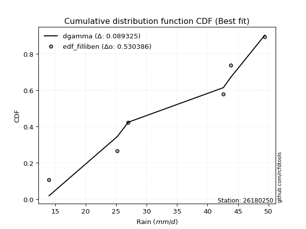</img></img>

</div>


### 10. EDF Jenkinson (1977)

The Jenkinson formula in hydrology is an empirical plotting position formula used to estimate the non-exceedance probability _(P)_ or return period _(T)_ of a given ordered observation within a sample. It is a widely used method in the frequency analysis of extreme events such as floods and rainfall, as it provides a distribution-free way to plot data. _a≈0.31_ and _b≈0.38_ are constants derived to approximate the median of the probability distribution for the given rank.

<div align="center">


$P=(m-a)/(n+b)$


</div>


**10.1. Empirical values**

<div align="center">

|                | 0                   | 1                   | 2                  | 3                  | 4                  | 5                  |
|:---------------|:--------------------|:--------------------|:-------------------|:-------------------|:-------------------|:-------------------|
| date           | 2021                | 2025                | 2020               | 2022               | 2019               | 2023               |
| x              | 14.0                | 25.2                | 27.0               | 42.6               | 43.8               | 49.4               |
| m              | 1                   | 2                   | 3                  | 4                  | 5                  | 6                  |
| empirical_dist | edf_jenkinson       | edf_jenkinson       | edf_jenkinson      | edf_jenkinson      | edf_jenkinson      | edf_jenkinson      |
| empirical      | 0.10815047021943573 | 0.26489028213166144 | 0.4216300940438871 | 0.5783699059561128 | 0.7351097178683387 | 0.8918495297805643 |
| empirical_tr   | 1.1212653778558874  | 1.3603411513859276  | 1.7289972899728996 | 2.3717472118959106 | 3.7751479289940844 | 9.246376811594207  |

</div>


**10.2. Kolmogorov-Smirnov fit test (sorted by Δ)**


<div align="center">

|                | 0                   | 1                   | 2                   | 3                   | 4                   | 5                   | 6                   | 7                 | 8                   | 9                   | 10                 | 11                  | 12                  | 13                  | 14                  | 15                 | 16                  | 17                  | 18                 | 19                  | 20                  | 21                  | 22                 | 23                | 24                  | 25                  | 26                  | 27                  | 28                  | 29                  | 30                  | 31                  | 32                  | 33                  | 34                  | 35                 | 36                  | 37                  | 38                  | 39                  | 40                  | 41                  | 42                  | 43                  | 44                  | 45                | 46                 | 47                 | 48                  | 49                  | 50                  | 51                  | 52                | 53                 | 54                 | 55                  | 56                 | 57                  | 58                  | 59                  | 60                 | 61                 | 62                  | 63                  | 64                  | 65                  | 66                 | 67                  | 68                  | 69                  | 70                  | 71                 | 72                  | 73                 | 74                 | 75                 | 76                  | 77                  | 78                  | 79                  | 80                 | 81                  | 82                  | 83                  | 84                  | 85                  | 86                  | 87                  | 88                  | 89                  | 90                 | 91                 | 92                  | 93                  | 94                  | 95                  | 96                  | 97                  | 98                  | 99                  | 100                 | 101                 | 102                 | 103                 | 104                | 105                | 106                 | 107                 | 108                 | 109                 | 110                 | 111                 | 112                 | 113                 | 114                 | 115                | 116                 | 117                 | 118                 | 119              | 120                 | 121                 | 122                | 123                | 124                 | 125                | 126                | 127                 | 128                | 129                | 130                | 131                | 132                | 133                | 134                 | 135                | 136                 | 137               | 138               | 139                | 140                 | 141                | 142                 | 143                | 144                 | 145               | 146                | 147               | 148                | 149                | 150                | 151                | 152               | 153                | 154                | 155                | 156                | 157                | 158                | 159                |
|:---------------|:--------------------|:--------------------|:--------------------|:--------------------|:--------------------|:--------------------|:--------------------|:------------------|:--------------------|:--------------------|:-------------------|:--------------------|:--------------------|:--------------------|:--------------------|:-------------------|:--------------------|:--------------------|:-------------------|:--------------------|:--------------------|:--------------------|:-------------------|:------------------|:--------------------|:--------------------|:--------------------|:--------------------|:--------------------|:--------------------|:--------------------|:--------------------|:--------------------|:--------------------|:--------------------|:-------------------|:--------------------|:--------------------|:--------------------|:--------------------|:--------------------|:--------------------|:--------------------|:--------------------|:--------------------|:------------------|:-------------------|:-------------------|:--------------------|:--------------------|:--------------------|:--------------------|:------------------|:-------------------|:-------------------|:--------------------|:-------------------|:--------------------|:--------------------|:--------------------|:-------------------|:-------------------|:--------------------|:--------------------|:--------------------|:--------------------|:-------------------|:--------------------|:--------------------|:--------------------|:--------------------|:-------------------|:--------------------|:-------------------|:-------------------|:-------------------|:--------------------|:--------------------|:--------------------|:--------------------|:-------------------|:--------------------|:--------------------|:--------------------|:--------------------|:--------------------|:--------------------|:--------------------|:--------------------|:--------------------|:-------------------|:-------------------|:--------------------|:--------------------|:--------------------|:--------------------|:--------------------|:--------------------|:--------------------|:--------------------|:--------------------|:--------------------|:--------------------|:--------------------|:-------------------|:-------------------|:--------------------|:--------------------|:--------------------|:--------------------|:--------------------|:--------------------|:--------------------|:--------------------|:--------------------|:-------------------|:--------------------|:--------------------|:--------------------|:-----------------|:--------------------|:--------------------|:-------------------|:-------------------|:--------------------|:-------------------|:-------------------|:--------------------|:-------------------|:-------------------|:-------------------|:-------------------|:-------------------|:-------------------|:--------------------|:-------------------|:--------------------|:------------------|:------------------|:-------------------|:--------------------|:-------------------|:--------------------|:-------------------|:--------------------|:------------------|:-------------------|:------------------|:-------------------|:-------------------|:-------------------|:-------------------|:------------------|:-------------------|:-------------------|:-------------------|:-------------------|:-------------------|:-------------------|:-------------------|
| station        | 26180250            | 26180250            | 26180250            | 26180250            | 26180250            | 26180250            | 26180250            | 26180250          | 26180250            | 26180250            | 26180250           | 26180250            | 26180250            | 26180250            | 26180250            | 26180250           | 26180250            | 26180250            | 26180250           | 26180250            | 26180250            | 26180250            | 26180250           | 26180250          | 26180250            | 26180250            | 26180250            | 26180250            | 26180250            | 26180250            | 26180250            | 26180250            | 26180250            | 26180250            | 26180250            | 26180250           | 26180250            | 26180250            | 26180250            | 26180250            | 26180250            | 26180250            | 26180250            | 26180250            | 26180250            | 26180250          | 26180250           | 26180250           | 26180250            | 26180250            | 26180250            | 26180250            | 26180250          | 26180250           | 26180250           | 26180250            | 26180250           | 26180250            | 26180250            | 26180250            | 26180250           | 26180250           | 26180250            | 26180250            | 26180250            | 26180250            | 26180250           | 26180250            | 26180250            | 26180250            | 26180250            | 26180250           | 26180250            | 26180250           | 26180250           | 26180250           | 26180250            | 26180250            | 26180250            | 26180250            | 26180250           | 26180250            | 26180250            | 26180250            | 26180250            | 26180250            | 26180250            | 26180250            | 26180250            | 26180250            | 26180250           | 26180250           | 26180250            | 26180250            | 26180250            | 26180250            | 26180250            | 26180250            | 26180250            | 26180250            | 26180250            | 26180250            | 26180250            | 26180250            | 26180250           | 26180250           | 26180250            | 26180250            | 26180250            | 26180250            | 26180250            | 26180250            | 26180250            | 26180250            | 26180250            | 26180250           | 26180250            | 26180250            | 26180250            | 26180250         | 26180250            | 26180250            | 26180250           | 26180250           | 26180250            | 26180250           | 26180250           | 26180250            | 26180250           | 26180250           | 26180250           | 26180250           | 26180250           | 26180250           | 26180250            | 26180250           | 26180250            | 26180250          | 26180250          | 26180250           | 26180250            | 26180250           | 26180250            | 26180250           | 26180250            | 26180250          | 26180250           | 26180250          | 26180250           | 26180250           | 26180250           | 26180250           | 26180250          | 26180250           | 26180250           | 26180250           | 26180250           | 26180250           | 26180250           | 26180250           |
| empirical_dist | edf_jenkinson       | edf_jenkinson       | edf_jenkinson       | edf_jenkinson       | edf_jenkinson       | edf_jenkinson       | edf_jenkinson       | edf_jenkinson     | edf_jenkinson       | edf_jenkinson       | edf_jenkinson      | edf_jenkinson       | edf_jenkinson       | edf_jenkinson       | edf_jenkinson       | edf_jenkinson      | edf_jenkinson       | edf_jenkinson       | edf_jenkinson      | edf_jenkinson       | edf_jenkinson       | edf_jenkinson       | edf_jenkinson      | edf_jenkinson     | edf_jenkinson       | edf_jenkinson       | edf_jenkinson       | edf_jenkinson       | edf_jenkinson       | edf_jenkinson       | edf_jenkinson       | edf_jenkinson       | edf_jenkinson       | edf_jenkinson       | edf_jenkinson       | edf_jenkinson      | edf_jenkinson       | edf_jenkinson       | edf_jenkinson       | edf_jenkinson       | edf_jenkinson       | edf_jenkinson       | edf_jenkinson       | edf_jenkinson       | edf_jenkinson       | edf_jenkinson     | edf_jenkinson      | edf_jenkinson      | edf_jenkinson       | edf_jenkinson       | edf_jenkinson       | edf_jenkinson       | edf_jenkinson     | edf_jenkinson      | edf_jenkinson      | edf_jenkinson       | edf_jenkinson      | edf_jenkinson       | edf_jenkinson       | edf_jenkinson       | edf_jenkinson      | edf_jenkinson      | edf_jenkinson       | edf_jenkinson       | edf_jenkinson       | edf_jenkinson       | edf_jenkinson      | edf_jenkinson       | edf_jenkinson       | edf_jenkinson       | edf_jenkinson       | edf_jenkinson      | edf_jenkinson       | edf_jenkinson      | edf_jenkinson      | edf_jenkinson      | edf_jenkinson       | edf_jenkinson       | edf_jenkinson       | edf_jenkinson       | edf_jenkinson      | edf_jenkinson       | edf_jenkinson       | edf_jenkinson       | edf_jenkinson       | edf_jenkinson       | edf_jenkinson       | edf_jenkinson       | edf_jenkinson       | edf_jenkinson       | edf_jenkinson      | edf_jenkinson      | edf_jenkinson       | edf_jenkinson       | edf_jenkinson       | edf_jenkinson       | edf_jenkinson       | edf_jenkinson       | edf_jenkinson       | edf_jenkinson       | edf_jenkinson       | edf_jenkinson       | edf_jenkinson       | edf_jenkinson       | edf_jenkinson      | edf_jenkinson      | edf_jenkinson       | edf_jenkinson       | edf_jenkinson       | edf_jenkinson       | edf_jenkinson       | edf_jenkinson       | edf_jenkinson       | edf_jenkinson       | edf_jenkinson       | edf_jenkinson      | edf_jenkinson       | edf_jenkinson       | edf_jenkinson       | edf_jenkinson    | edf_jenkinson       | edf_jenkinson       | edf_jenkinson      | edf_jenkinson      | edf_jenkinson       | edf_jenkinson      | edf_jenkinson      | edf_jenkinson       | edf_jenkinson      | edf_jenkinson      | edf_jenkinson      | edf_jenkinson      | edf_jenkinson      | edf_jenkinson      | edf_jenkinson       | edf_jenkinson      | edf_jenkinson       | edf_jenkinson     | edf_jenkinson     | edf_jenkinson      | edf_jenkinson       | edf_jenkinson      | edf_jenkinson       | edf_jenkinson      | edf_jenkinson       | edf_jenkinson     | edf_jenkinson      | edf_jenkinson     | edf_jenkinson      | edf_jenkinson      | edf_jenkinson      | edf_jenkinson      | edf_jenkinson     | edf_jenkinson      | edf_jenkinson      | edf_jenkinson      | edf_jenkinson      | edf_jenkinson      | edf_jenkinson      | edf_jenkinson      |
| p_dist         | dgamma              | logdgamma           | dweibull            | logdweibull         | logbeta             | beta                | arcsine             | logarcsine        | logtrapezoid        | trapezoid           | ksone              | loglevy_l           | logweibull_max      | wrapcauchy          | gausshyper          | genhalflogistic    | logbetaprime        | logmielke           | semicircular       | loggenextreme       | logloggamma         | triang              | logsemicircular    | mielke            | anglit              | skewnorm            | loginvweibull       | loganglit           | logjohnsonsu        | weibull_min         | loggenhalflogistic  | argus               | logexponpow         | gumbel_l            | levy_l              | genextreme         | pearson3            | loggenpareto        | johnsonsu           | logncf              | logkstwobign        | gompertz            | betaprime           | f                   | erlang              | logburr12         | logburr            | nct                | t                   | norm                | crystalball         | truncnorm           | exponnorm         | logargus           | loggumbel_l        | logalpha            | alpha              | genexpon            | logweibull_min      | gamma               | rice               | foldnorm           | loggenexpon         | burr                | logf                | ncf                 | lognct             | logrice             | invgamma            | logcrystalball      | lognorm             | logt               | logexponnorm        | loggamma           | loggamma           | logfatiguelife     | logerlang           | maxwell             | logfoldnorm         | loginvgamma         | loggompertz        | loginvgauss         | rayleigh            | kstwobign           | invgauss            | logmaxwell          | lograyleigh         | cosine              | kappa4              | halfnorm            | genpareto          | loghalfnorm        | logistic            | loglogistic         | logcosine           | tukeylambda         | gumbel_r            | hypsecant           | logwrapcauchy       | vonmises_line       | loggumbel_r         | logpearson3         | halflogistic        | loghypsecant        | uniform            | loghalflogistic    | johnsonsb           | moyal               | kappa3              | loggennorm          | gennorm             | logmoyal            | lomax               | logskewnorm         | logtriang           | laplace            | logksone            | loglaplace          | loglaplace          | truncweibull_min | burr12              | loglomax            | logloglaplace      | halfgennorm        | lognakagami         | logrdist           | wald               | nakagami            | logwald            | bradford           | truncexpon         | loggausshyper      | logkappa3          | loguniform         | logkappa4           | logvonmises_line   | logtukeylambda      | loggengamma       | logtruncnorm      | logbradford        | logtruncweibull_min | logtruncexpon      | logexponweib        | loghalfgennorm     | invweibull          | fatiguelife       | weibull_max        | gengamma          | exponweib          | logjohnsonsb       | powerlaw           | rdist              | logpowerlaw       | truncpareto        | exponpow           | logtruncpareto     | genlogistic        | loggenlogistic     | logvonmises        | vonmises           |
| delta          | 0.09024865626023615 | 0.09818129397699715 | 0.10084348791017028 | 0.10288001731267549 | 0.10815045850157512 | 0.10815046083228008 | 0.10815047021943573 | 0.126581320274593 | 0.12750634951739992 | 0.12768611454594458 | 0.1284409043445227 | 0.12867367398250013 | 0.12886656972874966 | 0.13078017007843445 | 0.13399043975818858 | 0.1372624615475007 | 0.14250194774440972 | 0.14406646552699587 | 0.1446964425995898 | 0.14845106750256132 | 0.14904786912259516 | 0.15002904256070937 | 0.1505316564610112 | 0.151700691227732 | 0.15684979610790284 | 0.15715494322693552 | 0.16250754386091593 | 0.16276319691171637 | 0.16616063071129755 | 0.16917847873174807 | 0.16983067608691316 | 0.17011508237569645 | 0.17079533122765056 | 0.17680867402556533 | 0.17805319955804105 | 0.1783808017627039 | 0.17881763926146454 | 0.17978028836131466 | 0.18001681930216873 | 0.18030448934585386 | 0.18138343186425376 | 0.18230154475653626 | 0.18372053288308898 | 0.18388720734891983 | 0.18437541025484716 | 0.184470996665271 | 0.1847294818899583 | 0.1847488972674155 | 0.18475368898351052 | 0.18476211330156256 | 0.18476211948242593 | 0.18476216479903074 | 0.184763597260299 | 0.1847819586394337 | 0.1854565036554141 | 0.18593015890940456 | 0.1860653635034789 | 0.18608483662190622 | 0.18656168609329904 | 0.18722207997388685 | 0.1875089755563668 | 0.1880346619728418 | 0.18943799954980578 | 0.19000162188304393 | 0.19000215698638867 | 0.19010650090061776 | 0.1901676175213063 | 0.19056475410406581 | 0.19070906160524825 | 0.19079168135433344 | 0.19079171455195387 | 0.1907921680282776 | 0.19079484752137088 | 0.1922424066457813 | 0.1922424066457813 | 0.1922850159204782 | 0.19234683023346866 | 0.19261958828945402 | 0.19389984836146856 | 0.19420622787689212 | 0.1942260496909063 | 0.19462422787335243 | 0.19485205506828052 | 0.19500073577490407 | 0.19650354932472436 | 0.19784893130183911 | 0.19985053708884182 | 0.19985453844772627 | 0.20279235261177853 | 0.20283779618674502 | 0.2067660808437941 | 0.2072501970549303 | 0.20736923991873635 | 0.21331589707050957 | 0.21723629200674355 | 0.22077429365261325 | 0.22093496134643598 | 0.22184753659644485 | 0.22379413468075837 | 0.22392464413791946 | 0.22540919285995353 | 0.22563630105502475 | 0.22644078060416872 | 0.22755246373654403 | 0.2295396985636613 | 0.2304513340617289 | 0.23118811094100022 | 0.23266620549991557 | 0.23301128322994968 | 0.23510971786833867 | 0.23510971786833867 | 0.23667613219725614 | 0.23680966191622776 | 0.23812391315369863 | 0.23943955726775068 | 0.2400955099788884 | 0.24041893403667247 | 0.24507701394188508 | 0.24507701394188508 | 0.24912518747903 | 0.25606414265899413 | 0.25771932391909336 | 0.2612733370777799 | 0.2620153095876999 | 0.26488811597776596 | 0.2670336733550736 | 0.2702704489928893 | 0.27266559675048174 | 0.2732384792402307 | 0.2755514354135121 | 0.2812500429324748 | 0.2903123935305322 | 0.3037492662596325 | 0.3041767020352295 | 0.30547672586477403 | 0.3056858560302995 | 0.30811208696083564 | 0.320073408209267 | 0.329863209558805 | 0.3356814437773903 | 0.3382642461933041  | 0.3405782457861457 | 0.40341825282879884 | 0.4216300940438871 | 0.46522441319823465 | 0.489689644351035 | 0.5064224217904987 | 0.508889552313538 | 0.5335443182626646 | 0.5398861099306415 | 0.5768174121566743 | 0.5999062015655541 | 0.619353413749111 | 0.6368959248466692 | 0.6574965850942447 | 0.6694037883597933 | 0.7351097178683387 | 0.7351097178683387 | 1.1873635834096765 | 7.3373820099935605 |
| deltao         | 0.530385761606      | 0.530385761606      | 0.530385761606      | 0.530385761606      | 0.530385761606      | 0.530385761606      | 0.530385761606      | 0.530385761606    | 0.530385761606      | 0.530385761606      | 0.530385761606     | 0.530385761606      | 0.530385761606      | 0.530385761606      | 0.530385761606      | 0.530385761606     | 0.530385761606      | 0.530385761606      | 0.530385761606     | 0.530385761606      | 0.530385761606      | 0.530385761606      | 0.530385761606     | 0.530385761606    | 0.530385761606      | 0.530385761606      | 0.530385761606      | 0.530385761606      | 0.530385761606      | 0.530385761606      | 0.530385761606      | 0.530385761606      | 0.530385761606      | 0.530385761606      | 0.530385761606      | 0.530385761606     | 0.530385761606      | 0.530385761606      | 0.530385761606      | 0.530385761606      | 0.530385761606      | 0.530385761606      | 0.530385761606      | 0.530385761606      | 0.530385761606      | 0.530385761606    | 0.530385761606     | 0.530385761606     | 0.530385761606      | 0.530385761606      | 0.530385761606      | 0.530385761606      | 0.530385761606    | 0.530385761606     | 0.530385761606     | 0.530385761606      | 0.530385761606     | 0.530385761606      | 0.530385761606      | 0.530385761606      | 0.530385761606     | 0.530385761606     | 0.530385761606      | 0.530385761606      | 0.530385761606      | 0.530385761606      | 0.530385761606     | 0.530385761606      | 0.530385761606      | 0.530385761606      | 0.530385761606      | 0.530385761606     | 0.530385761606      | 0.530385761606     | 0.530385761606     | 0.530385761606     | 0.530385761606      | 0.530385761606      | 0.530385761606      | 0.530385761606      | 0.530385761606     | 0.530385761606      | 0.530385761606      | 0.530385761606      | 0.530385761606      | 0.530385761606      | 0.530385761606      | 0.530385761606      | 0.530385761606      | 0.530385761606      | 0.530385761606     | 0.530385761606     | 0.530385761606      | 0.530385761606      | 0.530385761606      | 0.530385761606      | 0.530385761606      | 0.530385761606      | 0.530385761606      | 0.530385761606      | 0.530385761606      | 0.530385761606      | 0.530385761606      | 0.530385761606      | 0.530385761606     | 0.530385761606     | 0.530385761606      | 0.530385761606      | 0.530385761606      | 0.530385761606      | 0.530385761606      | 0.530385761606      | 0.530385761606      | 0.530385761606      | 0.530385761606      | 0.530385761606     | 0.530385761606      | 0.530385761606      | 0.530385761606      | 0.530385761606   | 0.530385761606      | 0.530385761606      | 0.530385761606     | 0.530385761606     | 0.530385761606      | 0.530385761606     | 0.530385761606     | 0.530385761606      | 0.530385761606     | 0.530385761606     | 0.530385761606     | 0.530385761606     | 0.530385761606     | 0.530385761606     | 0.530385761606      | 0.530385761606     | 0.530385761606      | 0.530385761606    | 0.530385761606    | 0.530385761606     | 0.530385761606      | 0.530385761606     | 0.530385761606      | 0.530385761606     | 0.530385761606      | 0.530385761606    | 0.530385761606     | 0.530385761606    | 0.530385761606     | 0.530385761606     | 0.530385761606     | 0.530385761606     | 0.530385761606    | 0.530385761606     | 0.530385761606     | 0.530385761606     | 0.530385761606     | 0.530385761606     | 0.530385761606     | 0.530385761606     |
| eval           | Δo > Δ              | Δo > Δ              | Δo > Δ              | Δo > Δ              | Δo > Δ              | Δo > Δ              | Δo > Δ              | Δo > Δ            | Δo > Δ              | Δo > Δ              | Δo > Δ             | Δo > Δ              | Δo > Δ              | Δo > Δ              | Δo > Δ              | Δo > Δ             | Δo > Δ              | Δo > Δ              | Δo > Δ             | Δo > Δ              | Δo > Δ              | Δo > Δ              | Δo > Δ             | Δo > Δ            | Δo > Δ              | Δo > Δ              | Δo > Δ              | Δo > Δ              | Δo > Δ              | Δo > Δ              | Δo > Δ              | Δo > Δ              | Δo > Δ              | Δo > Δ              | Δo > Δ              | Δo > Δ             | Δo > Δ              | Δo > Δ              | Δo > Δ              | Δo > Δ              | Δo > Δ              | Δo > Δ              | Δo > Δ              | Δo > Δ              | Δo > Δ              | Δo > Δ            | Δo > Δ             | Δo > Δ             | Δo > Δ              | Δo > Δ              | Δo > Δ              | Δo > Δ              | Δo > Δ            | Δo > Δ             | Δo > Δ             | Δo > Δ              | Δo > Δ             | Δo > Δ              | Δo > Δ              | Δo > Δ              | Δo > Δ             | Δo > Δ             | Δo > Δ              | Δo > Δ              | Δo > Δ              | Δo > Δ              | Δo > Δ             | Δo > Δ              | Δo > Δ              | Δo > Δ              | Δo > Δ              | Δo > Δ             | Δo > Δ              | Δo > Δ             | Δo > Δ             | Δo > Δ             | Δo > Δ              | Δo > Δ              | Δo > Δ              | Δo > Δ              | Δo > Δ             | Δo > Δ              | Δo > Δ              | Δo > Δ              | Δo > Δ              | Δo > Δ              | Δo > Δ              | Δo > Δ              | Δo > Δ              | Δo > Δ              | Δo > Δ             | Δo > Δ             | Δo > Δ              | Δo > Δ              | Δo > Δ              | Δo > Δ              | Δo > Δ              | Δo > Δ              | Δo > Δ              | Δo > Δ              | Δo > Δ              | Δo > Δ              | Δo > Δ              | Δo > Δ              | Δo > Δ             | Δo > Δ             | Δo > Δ              | Δo > Δ              | Δo > Δ              | Δo > Δ              | Δo > Δ              | Δo > Δ              | Δo > Δ              | Δo > Δ              | Δo > Δ              | Δo > Δ             | Δo > Δ              | Δo > Δ              | Δo > Δ              | Δo > Δ           | Δo > Δ              | Δo > Δ              | Δo > Δ             | Δo > Δ             | Δo > Δ              | Δo > Δ             | Δo > Δ             | Δo > Δ              | Δo > Δ             | Δo > Δ             | Δo > Δ             | Δo > Δ             | Δo > Δ             | Δo > Δ             | Δo > Δ              | Δo > Δ             | Δo > Δ              | Δo > Δ            | Δo > Δ            | Δo > Δ             | Δo > Δ              | Δo > Δ             | Δo > Δ              | Δo > Δ             | Δo > Δ              | Δo > Δ            | Δo > Δ             | Δo > Δ            | Δo <= Δ            | Δo <= Δ            | Δo <= Δ            | Δo <= Δ            | Δo <= Δ           | Δo <= Δ            | Δo <= Δ            | Δo <= Δ            | Δo <= Δ            | Δo <= Δ            | Δo <= Δ            | Δo <= Δ            |
| fit            | 1                   | 1                   | 1                   | 1                   | 1                   | 1                   | 1                   | 1                 | 1                   | 1                   | 1                  | 1                   | 1                   | 1                   | 1                   | 1                  | 1                   | 1                   | 1                  | 1                   | 1                   | 1                   | 1                  | 1                 | 1                   | 1                   | 1                   | 1                   | 1                   | 1                   | 1                   | 1                   | 1                   | 1                   | 1                   | 1                  | 1                   | 1                   | 1                   | 1                   | 1                   | 1                   | 1                   | 1                   | 1                   | 1                 | 1                  | 1                  | 1                   | 1                   | 1                   | 1                   | 1                 | 1                  | 1                  | 1                   | 1                  | 1                   | 1                   | 1                   | 1                  | 1                  | 1                   | 1                   | 1                   | 1                   | 1                  | 1                   | 1                   | 1                   | 1                   | 1                  | 1                   | 1                  | 1                  | 1                  | 1                   | 1                   | 1                   | 1                   | 1                  | 1                   | 1                   | 1                   | 1                   | 1                   | 1                   | 1                   | 1                   | 1                   | 1                  | 1                  | 1                   | 1                   | 1                   | 1                   | 1                   | 1                   | 1                   | 1                   | 1                   | 1                   | 1                   | 1                   | 1                  | 1                  | 1                   | 1                   | 1                   | 1                   | 1                   | 1                   | 1                   | 1                   | 1                   | 1                  | 1                   | 1                   | 1                   | 1                | 1                   | 1                   | 1                  | 1                  | 1                   | 1                  | 1                  | 1                   | 1                  | 1                  | 1                  | 1                  | 1                  | 1                  | 1                   | 1                  | 1                   | 1                 | 1                 | 1                  | 1                   | 1                  | 1                   | 1                  | 1                   | 1                 | 1                  | 1                 | 0                  | 0                  | 0                  | 0                  | 0                 | 0                  | 0                  | 0                  | 0                  | 0                  | 0                  | 0                  |
| n              | 6                   | 6                   | 6                   | 6                   | 6                   | 6                   | 6                   | 6                 | 6                   | 6                   | 6                  | 6                   | 6                   | 6                   | 6                   | 6                  | 6                   | 6                   | 6                  | 6                   | 6                   | 6                   | 6                  | 6                 | 6                   | 6                   | 6                   | 6                   | 6                   | 6                   | 6                   | 6                   | 6                   | 6                   | 6                   | 6                  | 6                   | 6                   | 6                   | 6                   | 6                   | 6                   | 6                   | 6                   | 6                   | 6                 | 6                  | 6                  | 6                   | 6                   | 6                   | 6                   | 6                 | 6                  | 6                  | 6                   | 6                  | 6                   | 6                   | 6                   | 6                  | 6                  | 6                   | 6                   | 6                   | 6                   | 6                  | 6                   | 6                   | 6                   | 6                   | 6                  | 6                   | 6                  | 6                  | 6                  | 6                   | 6                   | 6                   | 6                   | 6                  | 6                   | 6                   | 6                   | 6                   | 6                   | 6                   | 6                   | 6                   | 6                   | 6                  | 6                  | 6                   | 6                   | 6                   | 6                   | 6                   | 6                   | 6                   | 6                   | 6                   | 6                   | 6                   | 6                   | 6                  | 6                  | 6                   | 6                   | 6                   | 6                   | 6                   | 6                   | 6                   | 6                   | 6                   | 6                  | 6                   | 6                   | 6                   | 6                | 6                   | 6                   | 6                  | 6                  | 6                   | 6                  | 6                  | 6                   | 6                  | 6                  | 6                  | 6                  | 6                  | 6                  | 6                   | 6                  | 6                   | 6                 | 6                 | 6                  | 6                   | 6                  | 6                   | 6                  | 6                   | 6                 | 6                  | 6                 | 6                  | 6                  | 6                  | 6                  | 6                 | 6                  | 6                  | 6                  | 6                  | 6                  | 6                  | 6                  |
| best_fit       | 1                   | 0                   | 0                   | 0                   | 0                   | 0                   | 0                   | 0                 | 0                   | 0                   | 0                  | 0                   | 0                   | 0                   | 0                   | 0                  | 0                   | 0                   | 0                  | 0                   | 0                   | 0                   | 0                  | 0                 | 0                   | 0                   | 0                   | 0                   | 0                   | 0                   | 0                   | 0                   | 0                   | 0                   | 0                   | 0                  | 0                   | 0                   | 0                   | 0                   | 0                   | 0                   | 0                   | 0                   | 0                   | 0                 | 0                  | 0                  | 0                   | 0                   | 0                   | 0                   | 0                 | 0                  | 0                  | 0                   | 0                  | 0                   | 0                   | 0                   | 0                  | 0                  | 0                   | 0                   | 0                   | 0                   | 0                  | 0                   | 0                   | 0                   | 0                   | 0                  | 0                   | 0                  | 0                  | 0                  | 0                   | 0                   | 0                   | 0                   | 0                  | 0                   | 0                   | 0                   | 0                   | 0                   | 0                   | 0                   | 0                   | 0                   | 0                  | 0                  | 0                   | 0                   | 0                   | 0                   | 0                   | 0                   | 0                   | 0                   | 0                   | 0                   | 0                   | 0                   | 0                  | 0                  | 0                   | 0                   | 0                   | 0                   | 0                   | 0                   | 0                   | 0                   | 0                   | 0                  | 0                   | 0                   | 0                   | 0                | 0                   | 0                   | 0                  | 0                  | 0                   | 0                  | 0                  | 0                   | 0                  | 0                  | 0                  | 0                  | 0                  | 0                  | 0                   | 0                  | 0                   | 0                 | 0                 | 0                  | 0                   | 0                  | 0                   | 0                  | 0                   | 0                 | 0                  | 0                 | 0                  | 0                  | 0                  | 0                  | 0                 | 0                  | 0                  | 0                  | 0                  | 0                  | 0                  | 0                  |
| best_fit_sort  | 1                   | 2                   | 3                   | 4                   | 5                   | 6                   | 7                   | 8                 | 9                   | 10                  | 11                 | 12                  | 13                  | 14                  | 15                  | 16                 | 17                  | 18                  | 19                 | 20                  | 21                  | 22                  | 23                 | 24                | 25                  | 26                  | 27                  | 28                  | 29                  | 30                  | 31                  | 32                  | 33                  | 34                  | 35                  | 36                 | 37                  | 38                  | 39                  | 40                  | 41                  | 42                  | 43                  | 44                  | 45                  | 46                | 47                 | 48                 | 49                  | 50                  | 51                  | 52                  | 53                | 54                 | 55                 | 56                  | 57                 | 58                  | 59                  | 60                  | 61                 | 62                 | 63                  | 64                  | 65                  | 66                  | 67                 | 68                  | 69                  | 70                  | 71                  | 72                 | 73                  | 74                 | 75                 | 76                 | 77                  | 78                  | 79                  | 80                  | 81                 | 82                  | 83                  | 84                  | 85                  | 86                  | 87                  | 88                  | 89                  | 90                  | 91                 | 92                 | 93                  | 94                  | 95                  | 96                  | 97                  | 98                  | 99                  | 100                 | 101                 | 102                 | 103                 | 104                 | 105                | 106                | 107                 | 108                 | 109                 | 110                 | 111                 | 112                 | 113                 | 114                 | 115                 | 116                | 117                 | 118                 | 119                 | 120              | 121                 | 122                 | 123                | 124                | 125                 | 126                | 127                | 128                 | 129                | 130                | 131                | 132                | 133                | 134                | 135                 | 136                | 137                 | 138               | 139               | 140                | 141                 | 142                | 143                 | 144                | 145                 | 146               | 147                | 148               | 149                | 150                | 151                | 152                | 153               | 154                | 155                | 156                | 157                | 158                | 159                | 160                |

</div>


**10.3. Best fit**

<div align="center">

|   id |   station | empirical_dist   | p_dist   |     delta |   deltao | eval   |   fit |   n |   best_fit |   best_fit_sort |
|-----:|----------:|:-----------------|:---------|----------:|---------:|:-------|------:|----:|-----------:|----------------:|
|    0 |  26180250 | edf_jenkinson    | dgamma   | 0.0902487 | 0.530386 | Δo > Δ |     1 |   6 |          1 |               1 |

</div>


<div align="center">

</img></img>

</div>


### 11. EDF Cunnane (1978)

Cunnane´s work in statistical hydrology has focused on the performance and evaluation of different probability distributions (such as GEV, Gumbel, Lognormal) for flood frequency estimation. _b_ is a constant, typically set to 0.4.

<div align="center">


$P=(m-b)/(n+1-2b)$


</div>


**11.1. Empirical values**

<div align="center">

|                | 0                  | 1                   | 2                   | 3                  | 4                  | 5                  |
|:---------------|:-------------------|:--------------------|:--------------------|:-------------------|:-------------------|:-------------------|
| date           | 2021               | 2025                | 2020                | 2022               | 2019               | 2023               |
| x              | 14.0               | 25.2                | 27.0                | 42.6               | 43.8               | 49.4               |
| m              | 1                  | 2                   | 3                   | 4                  | 5                  | 6                  |
| empirical_dist | edf_cunnane        | edf_cunnane         | edf_cunnane         | edf_cunnane        | edf_cunnane        | edf_cunnane        |
| empirical      | 0.0967741935483871 | 0.25806451612903225 | 0.41935483870967744 | 0.5806451612903226 | 0.7419354838709676 | 0.9032258064516128 |
| empirical_tr   | 1.1071428571428572 | 1.3478260869565217  | 1.7222222222222225  | 2.384615384615385  | 3.8749999999999982 | 10.333333333333318 |

</div>


**11.2. Kolmogorov-Smirnov fit test (sorted by Δ)**


<div align="center">

|                | 0                   | 1                   | 2                   | 3                  | 4                   | 5                   | 6                   | 7                   | 8                  | 9                  | 10                  | 11                 | 12                 | 13                  | 14                  | 15                  | 16                  | 17                  | 18               | 19                  | 20                  | 21                  | 22                  | 23                 | 24                  | 25                  | 26                  | 27                  | 28                  | 29                  | 30                  | 31                  | 32                  | 33                  | 34                  | 35                  | 36                  | 37                  | 38                  | 39                  | 40                  | 41                  | 42                 | 43                 | 44                 | 45                  | 46                  | 47                  | 48                  | 49                 | 50                 | 51                 | 52                  | 53                 | 54                  | 55                  | 56                  | 57                | 58                | 59                  | 60                  | 61                  | 62                  | 63                | 64                  | 65                  | 66                  | 67                  | 68                  | 69                 | 70                 | 71                 | 72                 | 73                  | 74                  | 75                 | 76                  | 77                  | 78                  | 79                  | 80                  | 81                 | 82                  | 83                  | 84                 | 85                  | 86                  | 87                  | 88                  | 89                  | 90                 | 91                 | 92                  | 93                  | 94                  | 95                  | 96                  | 97                  | 98                  | 99                  | 100                 | 101                 | 102                 | 103                | 104                | 105                 | 106                 | 107                 | 108                 | 109                 | 110                 | 111                | 112                | 113                 | 114                 | 115                 | 116                 | 117                 | 118                | 119                 | 120                | 121                | 122                | 123                 | 124                | 125                | 126                | 127                 | 128                | 129                | 130               | 131                | 132                | 133                | 134                 | 135                | 136                 | 137                | 138                 | 139                | 140                 | 141                | 142               | 143                 | 144                | 145                | 146                | 147                | 148                | 149              | 150                | 151                | 152                | 153                | 154                | 155                | 156                | 157                | 158                | 159                |
|:---------------|:--------------------|:--------------------|:--------------------|:-------------------|:--------------------|:--------------------|:--------------------|:--------------------|:-------------------|:-------------------|:--------------------|:-------------------|:-------------------|:--------------------|:--------------------|:--------------------|:--------------------|:--------------------|:-----------------|:--------------------|:--------------------|:--------------------|:--------------------|:-------------------|:--------------------|:--------------------|:--------------------|:--------------------|:--------------------|:--------------------|:--------------------|:--------------------|:--------------------|:--------------------|:--------------------|:--------------------|:--------------------|:--------------------|:--------------------|:--------------------|:--------------------|:--------------------|:-------------------|:-------------------|:-------------------|:--------------------|:--------------------|:--------------------|:--------------------|:-------------------|:-------------------|:-------------------|:--------------------|:-------------------|:--------------------|:--------------------|:--------------------|:------------------|:------------------|:--------------------|:--------------------|:--------------------|:--------------------|:------------------|:--------------------|:--------------------|:--------------------|:--------------------|:--------------------|:-------------------|:-------------------|:-------------------|:-------------------|:--------------------|:--------------------|:-------------------|:--------------------|:--------------------|:--------------------|:--------------------|:--------------------|:-------------------|:--------------------|:--------------------|:-------------------|:--------------------|:--------------------|:--------------------|:--------------------|:--------------------|:-------------------|:-------------------|:--------------------|:--------------------|:--------------------|:--------------------|:--------------------|:--------------------|:--------------------|:--------------------|:--------------------|:--------------------|:--------------------|:-------------------|:-------------------|:--------------------|:--------------------|:--------------------|:--------------------|:--------------------|:--------------------|:-------------------|:-------------------|:--------------------|:--------------------|:--------------------|:--------------------|:--------------------|:-------------------|:--------------------|:-------------------|:-------------------|:-------------------|:--------------------|:-------------------|:-------------------|:-------------------|:--------------------|:-------------------|:-------------------|:------------------|:-------------------|:-------------------|:-------------------|:--------------------|:-------------------|:--------------------|:-------------------|:--------------------|:-------------------|:--------------------|:-------------------|:------------------|:--------------------|:-------------------|:-------------------|:-------------------|:-------------------|:-------------------|:-----------------|:-------------------|:-------------------|:-------------------|:-------------------|:-------------------|:-------------------|:-------------------|:-------------------|:-------------------|:-------------------|
| station        | 26180250            | 26180250            | 26180250            | 26180250           | 26180250            | 26180250            | 26180250            | 26180250            | 26180250           | 26180250           | 26180250            | 26180250           | 26180250           | 26180250            | 26180250            | 26180250            | 26180250            | 26180250            | 26180250         | 26180250            | 26180250            | 26180250            | 26180250            | 26180250           | 26180250            | 26180250            | 26180250            | 26180250            | 26180250            | 26180250            | 26180250            | 26180250            | 26180250            | 26180250            | 26180250            | 26180250            | 26180250            | 26180250            | 26180250            | 26180250            | 26180250            | 26180250            | 26180250           | 26180250           | 26180250           | 26180250            | 26180250            | 26180250            | 26180250            | 26180250           | 26180250           | 26180250           | 26180250            | 26180250           | 26180250            | 26180250            | 26180250            | 26180250          | 26180250          | 26180250            | 26180250            | 26180250            | 26180250            | 26180250          | 26180250            | 26180250            | 26180250            | 26180250            | 26180250            | 26180250           | 26180250           | 26180250           | 26180250           | 26180250            | 26180250            | 26180250           | 26180250            | 26180250            | 26180250            | 26180250            | 26180250            | 26180250           | 26180250            | 26180250            | 26180250           | 26180250            | 26180250            | 26180250            | 26180250            | 26180250            | 26180250           | 26180250           | 26180250            | 26180250            | 26180250            | 26180250            | 26180250            | 26180250            | 26180250            | 26180250            | 26180250            | 26180250            | 26180250            | 26180250           | 26180250           | 26180250            | 26180250            | 26180250            | 26180250            | 26180250            | 26180250            | 26180250           | 26180250           | 26180250            | 26180250            | 26180250            | 26180250            | 26180250            | 26180250           | 26180250            | 26180250           | 26180250           | 26180250           | 26180250            | 26180250           | 26180250           | 26180250           | 26180250            | 26180250           | 26180250           | 26180250          | 26180250           | 26180250           | 26180250           | 26180250            | 26180250           | 26180250            | 26180250           | 26180250            | 26180250           | 26180250            | 26180250           | 26180250          | 26180250            | 26180250           | 26180250           | 26180250           | 26180250           | 26180250           | 26180250         | 26180250           | 26180250           | 26180250           | 26180250           | 26180250           | 26180250           | 26180250           | 26180250           | 26180250           | 26180250           |
| empirical_dist | edf_cunnane         | edf_cunnane         | edf_cunnane         | edf_cunnane        | edf_cunnane         | edf_cunnane         | edf_cunnane         | edf_cunnane         | edf_cunnane        | edf_cunnane        | edf_cunnane         | edf_cunnane        | edf_cunnane        | edf_cunnane         | edf_cunnane         | edf_cunnane         | edf_cunnane         | edf_cunnane         | edf_cunnane      | edf_cunnane         | edf_cunnane         | edf_cunnane         | edf_cunnane         | edf_cunnane        | edf_cunnane         | edf_cunnane         | edf_cunnane         | edf_cunnane         | edf_cunnane         | edf_cunnane         | edf_cunnane         | edf_cunnane         | edf_cunnane         | edf_cunnane         | edf_cunnane         | edf_cunnane         | edf_cunnane         | edf_cunnane         | edf_cunnane         | edf_cunnane         | edf_cunnane         | edf_cunnane         | edf_cunnane        | edf_cunnane        | edf_cunnane        | edf_cunnane         | edf_cunnane         | edf_cunnane         | edf_cunnane         | edf_cunnane        | edf_cunnane        | edf_cunnane        | edf_cunnane         | edf_cunnane        | edf_cunnane         | edf_cunnane         | edf_cunnane         | edf_cunnane       | edf_cunnane       | edf_cunnane         | edf_cunnane         | edf_cunnane         | edf_cunnane         | edf_cunnane       | edf_cunnane         | edf_cunnane         | edf_cunnane         | edf_cunnane         | edf_cunnane         | edf_cunnane        | edf_cunnane        | edf_cunnane        | edf_cunnane        | edf_cunnane         | edf_cunnane         | edf_cunnane        | edf_cunnane         | edf_cunnane         | edf_cunnane         | edf_cunnane         | edf_cunnane         | edf_cunnane        | edf_cunnane         | edf_cunnane         | edf_cunnane        | edf_cunnane         | edf_cunnane         | edf_cunnane         | edf_cunnane         | edf_cunnane         | edf_cunnane        | edf_cunnane        | edf_cunnane         | edf_cunnane         | edf_cunnane         | edf_cunnane         | edf_cunnane         | edf_cunnane         | edf_cunnane         | edf_cunnane         | edf_cunnane         | edf_cunnane         | edf_cunnane         | edf_cunnane        | edf_cunnane        | edf_cunnane         | edf_cunnane         | edf_cunnane         | edf_cunnane         | edf_cunnane         | edf_cunnane         | edf_cunnane        | edf_cunnane        | edf_cunnane         | edf_cunnane         | edf_cunnane         | edf_cunnane         | edf_cunnane         | edf_cunnane        | edf_cunnane         | edf_cunnane        | edf_cunnane        | edf_cunnane        | edf_cunnane         | edf_cunnane        | edf_cunnane        | edf_cunnane        | edf_cunnane         | edf_cunnane        | edf_cunnane        | edf_cunnane       | edf_cunnane        | edf_cunnane        | edf_cunnane        | edf_cunnane         | edf_cunnane        | edf_cunnane         | edf_cunnane        | edf_cunnane         | edf_cunnane        | edf_cunnane         | edf_cunnane        | edf_cunnane       | edf_cunnane         | edf_cunnane        | edf_cunnane        | edf_cunnane        | edf_cunnane        | edf_cunnane        | edf_cunnane      | edf_cunnane        | edf_cunnane        | edf_cunnane        | edf_cunnane        | edf_cunnane        | edf_cunnane        | edf_cunnane        | edf_cunnane        | edf_cunnane        | edf_cunnane        |
| p_dist         | dgamma              | logdgamma           | beta                | arcsine            | logdweibull         | logbeta             | dweibull            | logtrapezoid        | trapezoid          | ksone              | logweibull_max      | gausshyper         | logarcsine         | genhalflogistic     | wrapcauchy          | loglevy_l           | logbetaprime        | logmielke           | semicircular     | loggenextreme       | logloggamma         | triang              | logsemicircular     | mielke             | anglit              | skewnorm            | loginvweibull       | loganglit           | logjohnsonsu        | weibull_min         | loggenhalflogistic  | argus               | logexponpow         | gumbel_l            | genextreme          | pearson3            | johnsonsu           | logkstwobign        | gompertz            | betaprime           | f                   | erlang              | logburr12          | logburr            | nct                | t                   | norm                | crystalball         | truncnorm           | exponnorm          | logargus           | loggumbel_l        | logalpha            | alpha              | genexpon            | logweibull_min      | gamma               | rice              | foldnorm          | burr                | logf                | ncf                 | lognct              | logrice           | invgamma            | logcrystalball      | lognorm             | logt                | logexponnorm        | levy_l             | loggamma           | loggamma           | logfatiguelife     | logerlang           | maxwell             | loggenpareto       | logfoldnorm         | logncf              | loginvgamma         | loggompertz         | loginvgauss         | rayleigh           | kstwobign           | invgauss            | logmaxwell         | loggenexpon         | lograyleigh         | cosine              | kappa4              | halfnorm            | genpareto          | loghalfnorm        | logistic            | loglogistic         | logcosine           | tukeylambda         | gumbel_r            | hypsecant           | vonmises_line       | loggumbel_r         | logpearson3         | halflogistic        | loghypsecant        | uniform            | loghalflogistic    | moyal               | logwrapcauchy       | kappa3              | logmoyal            | logskewnorm         | logtriang           | laplace            | johnsonsb          | logksone            | gennorm             | loggennorm          | loglaplace          | loglaplace          | truncweibull_min   | lomax               | lognakagami        | logloglaplace      | burr12             | loglomax            | logrdist           | wald               | halfgennorm        | nakagami            | logwald            | bradford           | truncexpon        | loggausshyper      | logkappa3          | loguniform         | logkappa4           | logvonmises_line   | logtukeylambda      | logtruncnorm       | loggengamma         | logbradford        | logtruncweibull_min | logtruncexpon      | logexponweib      | loghalfgennorm      | invweibull         | fatiguelife        | weibull_max        | gengamma           | exponweib          | logjohnsonsb     | powerlaw           | rdist              | logpowerlaw        | truncpareto        | exponpow           | logtruncpareto     | genlogistic        | loggenlogistic     | logvonmises        | vonmises           |
| delta          | 0.08576768276620633 | 0.09401095512656199 | 0.09677418416123162 | 0.0967741935483871 | 0.10060476197846568 | 0.10420919897952285 | 0.10766925391279947 | 0.12523109418319012 | 0.1254108592117349 | 0.1261656490103129 | 0.12659131439453997 | 0.1317151844239789 | 0.1334070862772222 | 0.13498720621329102 | 0.13760593608106364 | 0.14004995065354878 | 0.14022669241019992 | 0.14179121019278618 | 0.14242118726538 | 0.14617581216835163 | 0.14677261378838546 | 0.14775378722649957 | 0.14825640112680138 | 0.1494254358935223 | 0.15457454077369304 | 0.15487968789272583 | 0.16023228852670612 | 0.16048794157750657 | 0.16388537537708786 | 0.16690322339753827 | 0.16755542075270335 | 0.16783982704148676 | 0.16852007589344076 | 0.17453341869135552 | 0.17610554642849421 | 0.17654238392725474 | 0.17774156396795904 | 0.17910817653004396 | 0.18002628942232646 | 0.18144527754887918 | 0.18161195201471003 | 0.18210015492063736 | 0.1821957413310612 | 0.1824542265557485 | 0.1824736419332057 | 0.18247843364930072 | 0.18248685796735276 | 0.18248686414821613 | 0.18248690946482093 | 0.1824883419260892 | 0.1825067033052239 | 0.1831812483212043 | 0.18365490357519476 | 0.1837901081692691 | 0.18380958128769642 | 0.18428643075908924 | 0.18494682463967704 | 0.185233720222157 | 0.185759406638632 | 0.18772636654883412 | 0.18772690165217887 | 0.18783124556640796 | 0.18789236218709648 | 0.188289498769856 | 0.18843380627103845 | 0.18851642602012364 | 0.18851645921774407 | 0.18851691269406778 | 0.18851959218716108 | 0.1894294762290897 | 0.1899671513115715 | 0.1899671513115715 | 0.1900097605862684 | 0.19007157489925885 | 0.19034433295524422 | 0.1911565650323633 | 0.19162459302725876 | 0.19168076601690232 | 0.19193097254268232 | 0.19195079435669649 | 0.19234897253914263 | 0.1925767997340707 | 0.19272548044069426 | 0.19422829399051456 | 0.1955736759676293 | 0.19626376555243497 | 0.19757528175463202 | 0.19757928311351647 | 0.20051709727756872 | 0.20056254085253522 | 0.2044908255095843 | 0.2049749417207205 | 0.20509398458452655 | 0.21104064173629977 | 0.21496103667253375 | 0.21849903831840345 | 0.21865970601222617 | 0.21957228126223505 | 0.22164938880370966 | 0.22313393752574373 | 0.22336104572081494 | 0.22416552526995892 | 0.22527720840233423 | 0.2272644432294515 | 0.2281760787275191 | 0.23039095016570577 | 0.23061990068338756 | 0.23073602789573988 | 0.23440087686304634 | 0.23584865781948883 | 0.23716430193354088 | 0.2378202546446786 | 0.2380138769436294 | 0.23814367870246267 | 0.24193548387096775 | 0.24193548387096775 | 0.24280175860767528 | 0.24280175860767528 | 0.2468499321448202 | 0.24818593858727622 | 0.2580623499751368 | 0.2589980817435701 | 0.2628899086616233 | 0.26454508992172254 | 0.2647584180208639 | 0.2679951936586795 | 0.2688410755903291 | 0.27039034141627194 | 0.2709632239060209 | 0.2732761800793023 | 0.278974787598265 | 0.2880371381963224 | 0.3014740109254227 | 0.3019014467010197 | 0.30320147053056423 | 0.3034106006960897 | 0.30583683162662595 | 0.3275879542245952 | 0.33144968488031545 | 0.3334061884431805 | 0.3359889908590943  | 0.3383029904519359 | 0.410244018831428 | 0.41935483870967744 | 0.4766006898692831 | 0.4965154103536642 | 0.5132481877931276 | 0.5157153183161672 | 0.5403700842652938 | 0.55126238660169 | 0.5836431781593034 | 0.6067319675681833 | 0.6261791797517402 | 0.6437216908492984 | 0.6643223510968739 | 0.6762295543624225 | 0.7419354838709676 | 0.7419354838709676 | 1.1850883280754667 | 7.3260057333225115 |
| deltao         | 0.530385761606      | 0.530385761606      | 0.530385761606      | 0.530385761606     | 0.530385761606      | 0.530385761606      | 0.530385761606      | 0.530385761606      | 0.530385761606     | 0.530385761606     | 0.530385761606      | 0.530385761606     | 0.530385761606     | 0.530385761606      | 0.530385761606      | 0.530385761606      | 0.530385761606      | 0.530385761606      | 0.530385761606   | 0.530385761606      | 0.530385761606      | 0.530385761606      | 0.530385761606      | 0.530385761606     | 0.530385761606      | 0.530385761606      | 0.530385761606      | 0.530385761606      | 0.530385761606      | 0.530385761606      | 0.530385761606      | 0.530385761606      | 0.530385761606      | 0.530385761606      | 0.530385761606      | 0.530385761606      | 0.530385761606      | 0.530385761606      | 0.530385761606      | 0.530385761606      | 0.530385761606      | 0.530385761606      | 0.530385761606     | 0.530385761606     | 0.530385761606     | 0.530385761606      | 0.530385761606      | 0.530385761606      | 0.530385761606      | 0.530385761606     | 0.530385761606     | 0.530385761606     | 0.530385761606      | 0.530385761606     | 0.530385761606      | 0.530385761606      | 0.530385761606      | 0.530385761606    | 0.530385761606    | 0.530385761606      | 0.530385761606      | 0.530385761606      | 0.530385761606      | 0.530385761606    | 0.530385761606      | 0.530385761606      | 0.530385761606      | 0.530385761606      | 0.530385761606      | 0.530385761606     | 0.530385761606     | 0.530385761606     | 0.530385761606     | 0.530385761606      | 0.530385761606      | 0.530385761606     | 0.530385761606      | 0.530385761606      | 0.530385761606      | 0.530385761606      | 0.530385761606      | 0.530385761606     | 0.530385761606      | 0.530385761606      | 0.530385761606     | 0.530385761606      | 0.530385761606      | 0.530385761606      | 0.530385761606      | 0.530385761606      | 0.530385761606     | 0.530385761606     | 0.530385761606      | 0.530385761606      | 0.530385761606      | 0.530385761606      | 0.530385761606      | 0.530385761606      | 0.530385761606      | 0.530385761606      | 0.530385761606      | 0.530385761606      | 0.530385761606      | 0.530385761606     | 0.530385761606     | 0.530385761606      | 0.530385761606      | 0.530385761606      | 0.530385761606      | 0.530385761606      | 0.530385761606      | 0.530385761606     | 0.530385761606     | 0.530385761606      | 0.530385761606      | 0.530385761606      | 0.530385761606      | 0.530385761606      | 0.530385761606     | 0.530385761606      | 0.530385761606     | 0.530385761606     | 0.530385761606     | 0.530385761606      | 0.530385761606     | 0.530385761606     | 0.530385761606     | 0.530385761606      | 0.530385761606     | 0.530385761606     | 0.530385761606    | 0.530385761606     | 0.530385761606     | 0.530385761606     | 0.530385761606      | 0.530385761606     | 0.530385761606      | 0.530385761606     | 0.530385761606      | 0.530385761606     | 0.530385761606      | 0.530385761606     | 0.530385761606    | 0.530385761606      | 0.530385761606     | 0.530385761606     | 0.530385761606     | 0.530385761606     | 0.530385761606     | 0.530385761606   | 0.530385761606     | 0.530385761606     | 0.530385761606     | 0.530385761606     | 0.530385761606     | 0.530385761606     | 0.530385761606     | 0.530385761606     | 0.530385761606     | 0.530385761606     |
| eval           | Δo > Δ              | Δo > Δ              | Δo > Δ              | Δo > Δ             | Δo > Δ              | Δo > Δ              | Δo > Δ              | Δo > Δ              | Δo > Δ             | Δo > Δ             | Δo > Δ              | Δo > Δ             | Δo > Δ             | Δo > Δ              | Δo > Δ              | Δo > Δ              | Δo > Δ              | Δo > Δ              | Δo > Δ           | Δo > Δ              | Δo > Δ              | Δo > Δ              | Δo > Δ              | Δo > Δ             | Δo > Δ              | Δo > Δ              | Δo > Δ              | Δo > Δ              | Δo > Δ              | Δo > Δ              | Δo > Δ              | Δo > Δ              | Δo > Δ              | Δo > Δ              | Δo > Δ              | Δo > Δ              | Δo > Δ              | Δo > Δ              | Δo > Δ              | Δo > Δ              | Δo > Δ              | Δo > Δ              | Δo > Δ             | Δo > Δ             | Δo > Δ             | Δo > Δ              | Δo > Δ              | Δo > Δ              | Δo > Δ              | Δo > Δ             | Δo > Δ             | Δo > Δ             | Δo > Δ              | Δo > Δ             | Δo > Δ              | Δo > Δ              | Δo > Δ              | Δo > Δ            | Δo > Δ            | Δo > Δ              | Δo > Δ              | Δo > Δ              | Δo > Δ              | Δo > Δ            | Δo > Δ              | Δo > Δ              | Δo > Δ              | Δo > Δ              | Δo > Δ              | Δo > Δ             | Δo > Δ             | Δo > Δ             | Δo > Δ             | Δo > Δ              | Δo > Δ              | Δo > Δ             | Δo > Δ              | Δo > Δ              | Δo > Δ              | Δo > Δ              | Δo > Δ              | Δo > Δ             | Δo > Δ              | Δo > Δ              | Δo > Δ             | Δo > Δ              | Δo > Δ              | Δo > Δ              | Δo > Δ              | Δo > Δ              | Δo > Δ             | Δo > Δ             | Δo > Δ              | Δo > Δ              | Δo > Δ              | Δo > Δ              | Δo > Δ              | Δo > Δ              | Δo > Δ              | Δo > Δ              | Δo > Δ              | Δo > Δ              | Δo > Δ              | Δo > Δ             | Δo > Δ             | Δo > Δ              | Δo > Δ              | Δo > Δ              | Δo > Δ              | Δo > Δ              | Δo > Δ              | Δo > Δ             | Δo > Δ             | Δo > Δ              | Δo > Δ              | Δo > Δ              | Δo > Δ              | Δo > Δ              | Δo > Δ             | Δo > Δ              | Δo > Δ             | Δo > Δ             | Δo > Δ             | Δo > Δ              | Δo > Δ             | Δo > Δ             | Δo > Δ             | Δo > Δ              | Δo > Δ             | Δo > Δ             | Δo > Δ            | Δo > Δ             | Δo > Δ             | Δo > Δ             | Δo > Δ              | Δo > Δ             | Δo > Δ              | Δo > Δ             | Δo > Δ              | Δo > Δ             | Δo > Δ              | Δo > Δ             | Δo > Δ            | Δo > Δ              | Δo > Δ             | Δo > Δ             | Δo > Δ             | Δo > Δ             | Δo <= Δ            | Δo <= Δ          | Δo <= Δ            | Δo <= Δ            | Δo <= Δ            | Δo <= Δ            | Δo <= Δ            | Δo <= Δ            | Δo <= Δ            | Δo <= Δ            | Δo <= Δ            | Δo <= Δ            |
| fit            | 1                   | 1                   | 1                   | 1                  | 1                   | 1                   | 1                   | 1                   | 1                  | 1                  | 1                   | 1                  | 1                  | 1                   | 1                   | 1                   | 1                   | 1                   | 1                | 1                   | 1                   | 1                   | 1                   | 1                  | 1                   | 1                   | 1                   | 1                   | 1                   | 1                   | 1                   | 1                   | 1                   | 1                   | 1                   | 1                   | 1                   | 1                   | 1                   | 1                   | 1                   | 1                   | 1                  | 1                  | 1                  | 1                   | 1                   | 1                   | 1                   | 1                  | 1                  | 1                  | 1                   | 1                  | 1                   | 1                   | 1                   | 1                 | 1                 | 1                   | 1                   | 1                   | 1                   | 1                 | 1                   | 1                   | 1                   | 1                   | 1                   | 1                  | 1                  | 1                  | 1                  | 1                   | 1                   | 1                  | 1                   | 1                   | 1                   | 1                   | 1                   | 1                  | 1                   | 1                   | 1                  | 1                   | 1                   | 1                   | 1                   | 1                   | 1                  | 1                  | 1                   | 1                   | 1                   | 1                   | 1                   | 1                   | 1                   | 1                   | 1                   | 1                   | 1                   | 1                  | 1                  | 1                   | 1                   | 1                   | 1                   | 1                   | 1                   | 1                  | 1                  | 1                   | 1                   | 1                   | 1                   | 1                   | 1                  | 1                   | 1                  | 1                  | 1                  | 1                   | 1                  | 1                  | 1                  | 1                   | 1                  | 1                  | 1                 | 1                  | 1                  | 1                  | 1                   | 1                  | 1                   | 1                  | 1                   | 1                  | 1                   | 1                  | 1                 | 1                   | 1                  | 1                  | 1                  | 1                  | 0                  | 0                | 0                  | 0                  | 0                  | 0                  | 0                  | 0                  | 0                  | 0                  | 0                  | 0                  |
| n              | 6                   | 6                   | 6                   | 6                  | 6                   | 6                   | 6                   | 6                   | 6                  | 6                  | 6                   | 6                  | 6                  | 6                   | 6                   | 6                   | 6                   | 6                   | 6                | 6                   | 6                   | 6                   | 6                   | 6                  | 6                   | 6                   | 6                   | 6                   | 6                   | 6                   | 6                   | 6                   | 6                   | 6                   | 6                   | 6                   | 6                   | 6                   | 6                   | 6                   | 6                   | 6                   | 6                  | 6                  | 6                  | 6                   | 6                   | 6                   | 6                   | 6                  | 6                  | 6                  | 6                   | 6                  | 6                   | 6                   | 6                   | 6                 | 6                 | 6                   | 6                   | 6                   | 6                   | 6                 | 6                   | 6                   | 6                   | 6                   | 6                   | 6                  | 6                  | 6                  | 6                  | 6                   | 6                   | 6                  | 6                   | 6                   | 6                   | 6                   | 6                   | 6                  | 6                   | 6                   | 6                  | 6                   | 6                   | 6                   | 6                   | 6                   | 6                  | 6                  | 6                   | 6                   | 6                   | 6                   | 6                   | 6                   | 6                   | 6                   | 6                   | 6                   | 6                   | 6                  | 6                  | 6                   | 6                   | 6                   | 6                   | 6                   | 6                   | 6                  | 6                  | 6                   | 6                   | 6                   | 6                   | 6                   | 6                  | 6                   | 6                  | 6                  | 6                  | 6                   | 6                  | 6                  | 6                  | 6                   | 6                  | 6                  | 6                 | 6                  | 6                  | 6                  | 6                   | 6                  | 6                   | 6                  | 6                   | 6                  | 6                   | 6                  | 6                 | 6                   | 6                  | 6                  | 6                  | 6                  | 6                  | 6                | 6                  | 6                  | 6                  | 6                  | 6                  | 6                  | 6                  | 6                  | 6                  | 6                  |
| best_fit       | 1                   | 0                   | 0                   | 0                  | 0                   | 0                   | 0                   | 0                   | 0                  | 0                  | 0                   | 0                  | 0                  | 0                   | 0                   | 0                   | 0                   | 0                   | 0                | 0                   | 0                   | 0                   | 0                   | 0                  | 0                   | 0                   | 0                   | 0                   | 0                   | 0                   | 0                   | 0                   | 0                   | 0                   | 0                   | 0                   | 0                   | 0                   | 0                   | 0                   | 0                   | 0                   | 0                  | 0                  | 0                  | 0                   | 0                   | 0                   | 0                   | 0                  | 0                  | 0                  | 0                   | 0                  | 0                   | 0                   | 0                   | 0                 | 0                 | 0                   | 0                   | 0                   | 0                   | 0                 | 0                   | 0                   | 0                   | 0                   | 0                   | 0                  | 0                  | 0                  | 0                  | 0                   | 0                   | 0                  | 0                   | 0                   | 0                   | 0                   | 0                   | 0                  | 0                   | 0                   | 0                  | 0                   | 0                   | 0                   | 0                   | 0                   | 0                  | 0                  | 0                   | 0                   | 0                   | 0                   | 0                   | 0                   | 0                   | 0                   | 0                   | 0                   | 0                   | 0                  | 0                  | 0                   | 0                   | 0                   | 0                   | 0                   | 0                   | 0                  | 0                  | 0                   | 0                   | 0                   | 0                   | 0                   | 0                  | 0                   | 0                  | 0                  | 0                  | 0                   | 0                  | 0                  | 0                  | 0                   | 0                  | 0                  | 0                 | 0                  | 0                  | 0                  | 0                   | 0                  | 0                   | 0                  | 0                   | 0                  | 0                   | 0                  | 0                 | 0                   | 0                  | 0                  | 0                  | 0                  | 0                  | 0                | 0                  | 0                  | 0                  | 0                  | 0                  | 0                  | 0                  | 0                  | 0                  | 0                  |
| best_fit_sort  | 1                   | 2                   | 3                   | 4                  | 5                   | 6                   | 7                   | 8                   | 9                  | 10                 | 11                  | 12                 | 13                 | 14                  | 15                  | 16                  | 17                  | 18                  | 19               | 20                  | 21                  | 22                  | 23                  | 24                 | 25                  | 26                  | 27                  | 28                  | 29                  | 30                  | 31                  | 32                  | 33                  | 34                  | 35                  | 36                  | 37                  | 38                  | 39                  | 40                  | 41                  | 42                  | 43                 | 44                 | 45                 | 46                  | 47                  | 48                  | 49                  | 50                 | 51                 | 52                 | 53                  | 54                 | 55                  | 56                  | 57                  | 58                | 59                | 60                  | 61                  | 62                  | 63                  | 64                | 65                  | 66                  | 67                  | 68                  | 69                  | 70                 | 71                 | 72                 | 73                 | 74                  | 75                  | 76                 | 77                  | 78                  | 79                  | 80                  | 81                  | 82                 | 83                  | 84                  | 85                 | 86                  | 87                  | 88                  | 89                  | 90                  | 91                 | 92                 | 93                  | 94                  | 95                  | 96                  | 97                  | 98                  | 99                  | 100                 | 101                 | 102                 | 103                 | 104                | 105                | 106                 | 107                 | 108                 | 109                 | 110                 | 111                 | 112                | 113                | 114                 | 115                 | 116                 | 117                 | 118                 | 119                | 120                 | 121                | 122                | 123                | 124                 | 125                | 126                | 127                | 128                 | 129                | 130                | 131               | 132                | 133                | 134                | 135                 | 136                | 137                 | 138                | 139                 | 140                | 141                 | 142                | 143               | 144                 | 145                | 146                | 147                | 148                | 149                | 150              | 151                | 152                | 153                | 154                | 155                | 156                | 157                | 158                | 159                | 160                |

</div>


**11.3. Best fit**

<div align="center">

|   id |   station | empirical_dist   | p_dist   |     delta |   deltao | eval   |   fit |   n |   best_fit |   best_fit_sort |
|-----:|----------:|:-----------------|:---------|----------:|---------:|:-------|------:|----:|-----------:|----------------:|
|    0 |  26180250 | edf_cunnane      | dgamma   | 0.0857677 | 0.530386 | Δo > Δ |     1 |   6 |          1 |               1 |

</div>


<div align="center">

</img>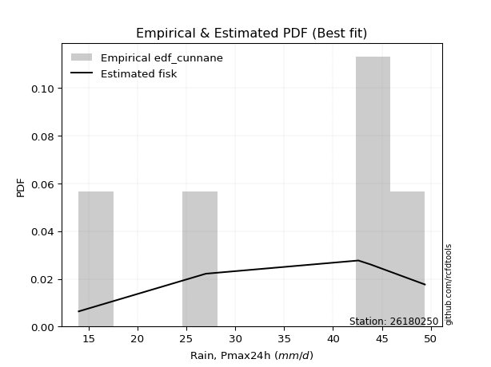</img>

</div>


### 12. EDF Adamowski (1981)

The Adamowski formula in hydrology refers to a specific plotting position formula used for estimating the non-parametric empirical distribution of hydrological events (like flood peaks) to calculate their return periods. This formula provides an alternative to traditional parametric methods (like the Gumbel or Log Pearson Type III distributions). 

<div align="center">


$P=(m-0.25)/(n+0.5)$


</div>


**12.1. Empirical values**

<div align="center">

|                | 0                   | 1                  | 2                  | 3                  | 4                  | 5                  |
|:---------------|:--------------------|:-------------------|:-------------------|:-------------------|:-------------------|:-------------------|
| date           | 2021                | 2025               | 2020               | 2022               | 2019               | 2023               |
| x              | 14.0                | 25.2               | 27.0               | 42.6               | 43.8               | 49.4               |
| m              | 1                   | 2                  | 3                  | 4                  | 5                  | 6                  |
| empirical_dist | edf_adamowski       | edf_adamowski      | edf_adamowski      | edf_adamowski      | edf_adamowski      | edf_adamowski      |
| empirical      | 0.11538461538461539 | 0.2692307692307692 | 0.4230769230769231 | 0.5769230769230769 | 0.7307692307692307 | 0.8846153846153846 |
| empirical_tr   | 1.1304347826086958  | 1.3684210526315788 | 1.7333333333333334 | 2.3636363636363633 | 3.7142857142857135 | 8.666666666666664  |

</div>


**12.2. Kolmogorov-Smirnov fit test (sorted by Δ)**


<div align="center">

|                | 0                  | 1                   | 2                   | 3                   | 4                   | 5                   | 6                   | 7                   | 8                   | 9                   | 10                  | 11                 | 12                  | 13                 | 14                  | 15                  | 16                  | 17                  | 18                  | 19                  | 20                 | 21                  | 22                  | 23                  | 24                  | 25                  | 26                  | 27                 | 28                 | 29                  | 30                 | 31                 | 32                 | 33                 | 34                | 35                  | 36                  | 37                  | 38                 | 39                  | 40                 | 41                 | 42                | 43                  | 44                  | 45                 | 46                  | 47                  | 48                  | 49                  | 50                 | 51                  | 52                  | 53                  | 54                  | 55                  | 56                 | 57                  | 58                  | 59                  | 60                 | 61                  | 62                  | 63                  | 64                  | 65                 | 66                  | 67                  | 68                 | 69                 | 70                  | 71                  | 72                  | 73                  | 74                  | 75                  | 76                 | 77                  | 78                 | 79                  | 80                  | 81                  | 82                  | 83               | 84                 | 85                  | 86                  | 87                  | 88                  | 89                  | 90                  | 91                  | 92                 | 93                  | 94                 | 95                 | 96                 | 97                  | 98                 | 99                 | 100                 | 101                 | 102                | 103                 | 104                 | 105                 | 106                 | 107                 | 108                 | 109                 | 110                 | 111                 | 112                 | 113                 | 114                 | 115                 | 116                 | 117                 | 118                 | 119                 | 120                 | 121                | 122                 | 123                 | 124                 | 125                | 126                 | 127                | 128                 | 129                 | 130                 | 131                | 132                 | 133                 | 134              | 135                 | 136                | 137                 | 138                 | 139                 | 140                 | 141                 | 142                 | 143                | 144                | 145                 | 146                | 147                | 148                | 149                | 150                | 151                | 152                | 153                | 154               | 155                | 156                | 157                | 158                | 159                |
|:---------------|:-------------------|:--------------------|:--------------------|:--------------------|:--------------------|:--------------------|:--------------------|:--------------------|:--------------------|:--------------------|:--------------------|:-------------------|:--------------------|:-------------------|:--------------------|:--------------------|:--------------------|:--------------------|:--------------------|:--------------------|:-------------------|:--------------------|:--------------------|:--------------------|:--------------------|:--------------------|:--------------------|:-------------------|:-------------------|:--------------------|:-------------------|:-------------------|:-------------------|:-------------------|:------------------|:--------------------|:--------------------|:--------------------|:-------------------|:--------------------|:-------------------|:-------------------|:------------------|:--------------------|:--------------------|:-------------------|:--------------------|:--------------------|:--------------------|:--------------------|:-------------------|:--------------------|:--------------------|:--------------------|:--------------------|:--------------------|:-------------------|:--------------------|:--------------------|:--------------------|:-------------------|:--------------------|:--------------------|:--------------------|:--------------------|:-------------------|:--------------------|:--------------------|:-------------------|:-------------------|:--------------------|:--------------------|:--------------------|:--------------------|:--------------------|:--------------------|:-------------------|:--------------------|:-------------------|:--------------------|:--------------------|:--------------------|:--------------------|:-----------------|:-------------------|:--------------------|:--------------------|:--------------------|:--------------------|:--------------------|:--------------------|:--------------------|:-------------------|:--------------------|:-------------------|:-------------------|:-------------------|:--------------------|:-------------------|:-------------------|:--------------------|:--------------------|:-------------------|:--------------------|:--------------------|:--------------------|:--------------------|:--------------------|:--------------------|:--------------------|:--------------------|:--------------------|:--------------------|:--------------------|:--------------------|:--------------------|:--------------------|:--------------------|:--------------------|:--------------------|:--------------------|:-------------------|:--------------------|:--------------------|:--------------------|:-------------------|:--------------------|:-------------------|:--------------------|:--------------------|:--------------------|:-------------------|:--------------------|:--------------------|:-----------------|:--------------------|:-------------------|:--------------------|:--------------------|:--------------------|:--------------------|:--------------------|:--------------------|:-------------------|:-------------------|:--------------------|:-------------------|:-------------------|:-------------------|:-------------------|:-------------------|:-------------------|:-------------------|:-------------------|:------------------|:-------------------|:-------------------|:-------------------|:-------------------|:-------------------|
| station        | 26180250           | 26180250            | 26180250            | 26180250            | 26180250            | 26180250            | 26180250            | 26180250            | 26180250            | 26180250            | 26180250            | 26180250           | 26180250            | 26180250           | 26180250            | 26180250            | 26180250            | 26180250            | 26180250            | 26180250            | 26180250           | 26180250            | 26180250            | 26180250            | 26180250            | 26180250            | 26180250            | 26180250           | 26180250           | 26180250            | 26180250           | 26180250           | 26180250           | 26180250           | 26180250          | 26180250            | 26180250            | 26180250            | 26180250           | 26180250            | 26180250           | 26180250           | 26180250          | 26180250            | 26180250            | 26180250           | 26180250            | 26180250            | 26180250            | 26180250            | 26180250           | 26180250            | 26180250            | 26180250            | 26180250            | 26180250            | 26180250           | 26180250            | 26180250            | 26180250            | 26180250           | 26180250            | 26180250            | 26180250            | 26180250            | 26180250           | 26180250            | 26180250            | 26180250           | 26180250           | 26180250            | 26180250            | 26180250            | 26180250            | 26180250            | 26180250            | 26180250           | 26180250            | 26180250           | 26180250            | 26180250            | 26180250            | 26180250            | 26180250         | 26180250           | 26180250            | 26180250            | 26180250            | 26180250            | 26180250            | 26180250            | 26180250            | 26180250           | 26180250            | 26180250           | 26180250           | 26180250           | 26180250            | 26180250           | 26180250           | 26180250            | 26180250            | 26180250           | 26180250            | 26180250            | 26180250            | 26180250            | 26180250            | 26180250            | 26180250            | 26180250            | 26180250            | 26180250            | 26180250            | 26180250            | 26180250            | 26180250            | 26180250            | 26180250            | 26180250            | 26180250            | 26180250           | 26180250            | 26180250            | 26180250            | 26180250           | 26180250            | 26180250           | 26180250            | 26180250            | 26180250            | 26180250           | 26180250            | 26180250            | 26180250         | 26180250            | 26180250           | 26180250            | 26180250            | 26180250            | 26180250            | 26180250            | 26180250            | 26180250           | 26180250           | 26180250            | 26180250           | 26180250           | 26180250           | 26180250           | 26180250           | 26180250           | 26180250           | 26180250           | 26180250          | 26180250           | 26180250           | 26180250           | 26180250           | 26180250           |
| empirical_dist | edf_adamowski      | edf_adamowski       | edf_adamowski       | edf_adamowski       | edf_adamowski       | edf_adamowski       | edf_adamowski       | edf_adamowski       | edf_adamowski       | edf_adamowski       | edf_adamowski       | edf_adamowski      | edf_adamowski       | edf_adamowski      | edf_adamowski       | edf_adamowski       | edf_adamowski       | edf_adamowski       | edf_adamowski       | edf_adamowski       | edf_adamowski      | edf_adamowski       | edf_adamowski       | edf_adamowski       | edf_adamowski       | edf_adamowski       | edf_adamowski       | edf_adamowski      | edf_adamowski      | edf_adamowski       | edf_adamowski      | edf_adamowski      | edf_adamowski      | edf_adamowski      | edf_adamowski     | edf_adamowski       | edf_adamowski       | edf_adamowski       | edf_adamowski      | edf_adamowski       | edf_adamowski      | edf_adamowski      | edf_adamowski     | edf_adamowski       | edf_adamowski       | edf_adamowski      | edf_adamowski       | edf_adamowski       | edf_adamowski       | edf_adamowski       | edf_adamowski      | edf_adamowski       | edf_adamowski       | edf_adamowski       | edf_adamowski       | edf_adamowski       | edf_adamowski      | edf_adamowski       | edf_adamowski       | edf_adamowski       | edf_adamowski      | edf_adamowski       | edf_adamowski       | edf_adamowski       | edf_adamowski       | edf_adamowski      | edf_adamowski       | edf_adamowski       | edf_adamowski      | edf_adamowski      | edf_adamowski       | edf_adamowski       | edf_adamowski       | edf_adamowski       | edf_adamowski       | edf_adamowski       | edf_adamowski      | edf_adamowski       | edf_adamowski      | edf_adamowski       | edf_adamowski       | edf_adamowski       | edf_adamowski       | edf_adamowski    | edf_adamowski      | edf_adamowski       | edf_adamowski       | edf_adamowski       | edf_adamowski       | edf_adamowski       | edf_adamowski       | edf_adamowski       | edf_adamowski      | edf_adamowski       | edf_adamowski      | edf_adamowski      | edf_adamowski      | edf_adamowski       | edf_adamowski      | edf_adamowski      | edf_adamowski       | edf_adamowski       | edf_adamowski      | edf_adamowski       | edf_adamowski       | edf_adamowski       | edf_adamowski       | edf_adamowski       | edf_adamowski       | edf_adamowski       | edf_adamowski       | edf_adamowski       | edf_adamowski       | edf_adamowski       | edf_adamowski       | edf_adamowski       | edf_adamowski       | edf_adamowski       | edf_adamowski       | edf_adamowski       | edf_adamowski       | edf_adamowski      | edf_adamowski       | edf_adamowski       | edf_adamowski       | edf_adamowski      | edf_adamowski       | edf_adamowski      | edf_adamowski       | edf_adamowski       | edf_adamowski       | edf_adamowski      | edf_adamowski       | edf_adamowski       | edf_adamowski    | edf_adamowski       | edf_adamowski      | edf_adamowski       | edf_adamowski       | edf_adamowski       | edf_adamowski       | edf_adamowski       | edf_adamowski       | edf_adamowski      | edf_adamowski      | edf_adamowski       | edf_adamowski      | edf_adamowski      | edf_adamowski      | edf_adamowski      | edf_adamowski      | edf_adamowski      | edf_adamowski      | edf_adamowski      | edf_adamowski     | edf_adamowski      | edf_adamowski      | edf_adamowski      | edf_adamowski      | edf_adamowski      |
| p_dist         | dweibull           | dgamma              | logdweibull         | logdgamma           | logbeta             | beta                | arcsine             | loglevy_l           | logarcsine          | logtrapezoid        | trapezoid           | wrapcauchy         | ksone               | logweibull_max     | gausshyper          | genhalflogistic     | logbetaprime        | logmielke           | semicircular        | loggenextreme       | logloggamma        | triang              | logsemicircular     | mielke              | anglit              | skewnorm            | loginvweibull       | loganglit          | logjohnsonsu       | weibull_min         | levy_l             | loggenhalflogistic | argus              | logexponpow        | loggenpareto      | logncf              | gumbel_l            | genextreme          | pearson3           | johnsonsu           | logkstwobign       | gompertz           | loggenexpon       | betaprime           | f                   | erlang             | logburr12           | logburr             | nct                 | t                   | norm               | crystalball         | truncnorm           | exponnorm           | logargus            | loggumbel_l         | logalpha           | alpha               | genexpon            | logweibull_min      | gamma              | rice                | foldnorm            | burr                | logf                | ncf                | lognct              | logrice             | invgamma           | logcrystalball     | lognorm             | logt                | logexponnorm        | loggamma            | loggamma            | logfatiguelife      | logerlang          | maxwell             | logfoldnorm        | loginvgamma         | loggompertz         | loginvgauss         | rayleigh            | kstwobign        | invgauss           | logmaxwell          | lograyleigh         | cosine              | kappa4              | halfnorm            | genpareto           | loghalfnorm         | logistic           | loglogistic         | logcosine          | logwrapcauchy      | tukeylambda        | gumbel_r            | hypsecant          | vonmises_line      | johnsonsb           | loggumbel_r         | logpearson3        | halflogistic        | loghypsecant        | lomax               | loggennorm          | gennorm             | uniform             | loghalflogistic     | moyal               | kappa3              | logmoyal            | logskewnorm         | logtriang           | laplace             | logksone            | loglaplace          | loglaplace          | truncweibull_min    | burr12              | loglomax           | halfgennorm         | logloglaplace       | lognakagami         | logrdist           | wald                | nakagami           | logwald             | bradford            | truncexpon          | loggausshyper      | logkappa3           | loguniform          | logkappa4        | logvonmises_line    | logtukeylambda     | loggengamma         | logtruncnorm        | logbradford         | logtruncweibull_min | logtruncexpon       | logexponweib        | loghalfgennorm     | invweibull         | fatiguelife         | weibull_max        | gengamma           | exponweib          | logjohnsonsb       | powerlaw           | rdist              | logpowerlaw        | truncpareto        | exponpow          | logtruncpareto     | genlogistic        | loggenlogistic     | logvonmises        | vonmises           |
| delta          | 0.0965030008110625 | 0.09748280142541581 | 0.10432684634571143 | 0.10541543914217683 | 0.11538460366675485 | 0.11538460599745981 | 0.11538461538461539 | 0.12143952881732048 | 0.12224083317548523 | 0.12895317855043587 | 0.12913294357898053 | 0.1295743957736193 | 0.12988773337755866 | 0.1303133987617856 | 0.13543726879122453 | 0.13870929058053666 | 0.14394877677744566 | 0.14551329456003181 | 0.14614327163262575 | 0.14989789653559726 | 0.1504946981556311 | 0.15147587159374531 | 0.15197848549404713 | 0.15314752026076794 | 0.15829662514093878 | 0.15860177225997146 | 0.16395437289395187 | 0.1642100259447523 | 0.1676074597443335 | 0.17062530776478402 | 0.1708190543928614 | 0.1712775051199491 | 0.1715619114087324 | 0.1722421602606865 | 0.172546143196135 | 0.17307034418067413 | 0.17825550305860127 | 0.17982763079573985 | 0.1802644682945005 | 0.18146364833520467 | 0.1828302608972897 | 0.1837483737895722 | 0.185097512450698 | 0.18516736191612493 | 0.18533403638195578 | 0.1858222392878831 | 0.18591782569830695 | 0.18617631092299425 | 0.18619572630045145 | 0.18620051801654647 | 0.1862089423345985 | 0.18620894851546188 | 0.18620899383206668 | 0.18621042629333495 | 0.18622878767246964 | 0.18690333268845005 | 0.1873769879424405 | 0.18751219253651485 | 0.18753166565494217 | 0.18800851512633499 | 0.1886689090069228 | 0.18895580458940275 | 0.18948149100587774 | 0.19144845091607987 | 0.19144898601942462 | 0.1915533299336537 | 0.19161444655434223 | 0.19201158313710176 | 0.1921558906382842 | 0.1922385103873694 | 0.19223854358498982 | 0.19223899706131353 | 0.19224167655440683 | 0.19368923567881724 | 0.19368923567881724 | 0.19373184495351414 | 0.1937936592665046 | 0.19406641732248997 | 0.1953466773945045 | 0.19565305690992807 | 0.19567287872394223 | 0.19607105690638837 | 0.19629888410131646 | 0.19644756480794 | 0.1979503783577603 | 0.19929576033487506 | 0.20129736612187776 | 0.20130136748076222 | 0.20423918164481447 | 0.20428462521978097 | 0.20821290987683005 | 0.20869702608796625 | 0.2088160689517723 | 0.21476272610354552 | 0.2186831210397795 | 0.2194536475816506 | 0.2222211226856492 | 0.22238179037947192 | 0.2232943656294808 | 0.2253714731709554 | 0.22684762384189244 | 0.22685602189298948 | 0.2270831300880607 | 0.22788760963720467 | 0.22899929276957998 | 0.22957551675104804 | 0.23076923076923078 | 0.23076923076923078 | 0.23098652759669724 | 0.23189816309476485 | 0.23411303453295151 | 0.23445811226298563 | 0.23812296123029209 | 0.23957074218673458 | 0.24088638630078663 | 0.24154233901192435 | 0.24186576306970842 | 0.24652384297492103 | 0.24652384297492103 | 0.25057201651206595 | 0.25172365555988635 | 0.2533788368199856 | 0.25767482248859214 | 0.26272016611081583 | 0.26922860307687374 | 0.2692307692211614 | 0.27171727802592527 | 0.2741124257835177 | 0.27468530827326665 | 0.27699826444654807 | 0.28269687196551074 | 0.2917592225635681 | 0.30519609529266845 | 0.30562353106826545 | 0.30692355489781 | 0.30713268506333546 | 0.3095589159938716 | 0.31283926304408727 | 0.33131003859184094 | 0.33712827281042623 | 0.33971107522634003 | 0.34202507481918165 | 0.39907776572969106 | 0.4230769230769231 | 0.4579902680330549 | 0.48534915725192723 | 0.5020819346913907 | 0.5045490652144302 | 0.5292038311635567 | 0.5326519647654617 | 0.5724769250575665 | 0.5955657144664463 | 0.6150129266500033 | 0.6325554377475615 | 0.653156097995137 | 0.6650633012606855 | 0.7307692307692307 | 0.7307692307692307 | 1.1888104124427123 | 7.3446161551587394 |
| deltao         | 0.530385761606     | 0.530385761606      | 0.530385761606      | 0.530385761606      | 0.530385761606      | 0.530385761606      | 0.530385761606      | 0.530385761606      | 0.530385761606      | 0.530385761606      | 0.530385761606      | 0.530385761606     | 0.530385761606      | 0.530385761606     | 0.530385761606      | 0.530385761606      | 0.530385761606      | 0.530385761606      | 0.530385761606      | 0.530385761606      | 0.530385761606     | 0.530385761606      | 0.530385761606      | 0.530385761606      | 0.530385761606      | 0.530385761606      | 0.530385761606      | 0.530385761606     | 0.530385761606     | 0.530385761606      | 0.530385761606     | 0.530385761606     | 0.530385761606     | 0.530385761606     | 0.530385761606    | 0.530385761606      | 0.530385761606      | 0.530385761606      | 0.530385761606     | 0.530385761606      | 0.530385761606     | 0.530385761606     | 0.530385761606    | 0.530385761606      | 0.530385761606      | 0.530385761606     | 0.530385761606      | 0.530385761606      | 0.530385761606      | 0.530385761606      | 0.530385761606     | 0.530385761606      | 0.530385761606      | 0.530385761606      | 0.530385761606      | 0.530385761606      | 0.530385761606     | 0.530385761606      | 0.530385761606      | 0.530385761606      | 0.530385761606     | 0.530385761606      | 0.530385761606      | 0.530385761606      | 0.530385761606      | 0.530385761606     | 0.530385761606      | 0.530385761606      | 0.530385761606     | 0.530385761606     | 0.530385761606      | 0.530385761606      | 0.530385761606      | 0.530385761606      | 0.530385761606      | 0.530385761606      | 0.530385761606     | 0.530385761606      | 0.530385761606     | 0.530385761606      | 0.530385761606      | 0.530385761606      | 0.530385761606      | 0.530385761606   | 0.530385761606     | 0.530385761606      | 0.530385761606      | 0.530385761606      | 0.530385761606      | 0.530385761606      | 0.530385761606      | 0.530385761606      | 0.530385761606     | 0.530385761606      | 0.530385761606     | 0.530385761606     | 0.530385761606     | 0.530385761606      | 0.530385761606     | 0.530385761606     | 0.530385761606      | 0.530385761606      | 0.530385761606     | 0.530385761606      | 0.530385761606      | 0.530385761606      | 0.530385761606      | 0.530385761606      | 0.530385761606      | 0.530385761606      | 0.530385761606      | 0.530385761606      | 0.530385761606      | 0.530385761606      | 0.530385761606      | 0.530385761606      | 0.530385761606      | 0.530385761606      | 0.530385761606      | 0.530385761606      | 0.530385761606      | 0.530385761606     | 0.530385761606      | 0.530385761606      | 0.530385761606      | 0.530385761606     | 0.530385761606      | 0.530385761606     | 0.530385761606      | 0.530385761606      | 0.530385761606      | 0.530385761606     | 0.530385761606      | 0.530385761606      | 0.530385761606   | 0.530385761606      | 0.530385761606     | 0.530385761606      | 0.530385761606      | 0.530385761606      | 0.530385761606      | 0.530385761606      | 0.530385761606      | 0.530385761606     | 0.530385761606     | 0.530385761606      | 0.530385761606     | 0.530385761606     | 0.530385761606     | 0.530385761606     | 0.530385761606     | 0.530385761606     | 0.530385761606     | 0.530385761606     | 0.530385761606    | 0.530385761606     | 0.530385761606     | 0.530385761606     | 0.530385761606     | 0.530385761606     |
| eval           | Δo > Δ             | Δo > Δ              | Δo > Δ              | Δo > Δ              | Δo > Δ              | Δo > Δ              | Δo > Δ              | Δo > Δ              | Δo > Δ              | Δo > Δ              | Δo > Δ              | Δo > Δ             | Δo > Δ              | Δo > Δ             | Δo > Δ              | Δo > Δ              | Δo > Δ              | Δo > Δ              | Δo > Δ              | Δo > Δ              | Δo > Δ             | Δo > Δ              | Δo > Δ              | Δo > Δ              | Δo > Δ              | Δo > Δ              | Δo > Δ              | Δo > Δ             | Δo > Δ             | Δo > Δ              | Δo > Δ             | Δo > Δ             | Δo > Δ             | Δo > Δ             | Δo > Δ            | Δo > Δ              | Δo > Δ              | Δo > Δ              | Δo > Δ             | Δo > Δ              | Δo > Δ             | Δo > Δ             | Δo > Δ            | Δo > Δ              | Δo > Δ              | Δo > Δ             | Δo > Δ              | Δo > Δ              | Δo > Δ              | Δo > Δ              | Δo > Δ             | Δo > Δ              | Δo > Δ              | Δo > Δ              | Δo > Δ              | Δo > Δ              | Δo > Δ             | Δo > Δ              | Δo > Δ              | Δo > Δ              | Δo > Δ             | Δo > Δ              | Δo > Δ              | Δo > Δ              | Δo > Δ              | Δo > Δ             | Δo > Δ              | Δo > Δ              | Δo > Δ             | Δo > Δ             | Δo > Δ              | Δo > Δ              | Δo > Δ              | Δo > Δ              | Δo > Δ              | Δo > Δ              | Δo > Δ             | Δo > Δ              | Δo > Δ             | Δo > Δ              | Δo > Δ              | Δo > Δ              | Δo > Δ              | Δo > Δ           | Δo > Δ             | Δo > Δ              | Δo > Δ              | Δo > Δ              | Δo > Δ              | Δo > Δ              | Δo > Δ              | Δo > Δ              | Δo > Δ             | Δo > Δ              | Δo > Δ             | Δo > Δ             | Δo > Δ             | Δo > Δ              | Δo > Δ             | Δo > Δ             | Δo > Δ              | Δo > Δ              | Δo > Δ             | Δo > Δ              | Δo > Δ              | Δo > Δ              | Δo > Δ              | Δo > Δ              | Δo > Δ              | Δo > Δ              | Δo > Δ              | Δo > Δ              | Δo > Δ              | Δo > Δ              | Δo > Δ              | Δo > Δ              | Δo > Δ              | Δo > Δ              | Δo > Δ              | Δo > Δ              | Δo > Δ              | Δo > Δ             | Δo > Δ              | Δo > Δ              | Δo > Δ              | Δo > Δ             | Δo > Δ              | Δo > Δ             | Δo > Δ              | Δo > Δ              | Δo > Δ              | Δo > Δ             | Δo > Δ              | Δo > Δ              | Δo > Δ           | Δo > Δ              | Δo > Δ             | Δo > Δ              | Δo > Δ              | Δo > Δ              | Δo > Δ              | Δo > Δ              | Δo > Δ              | Δo > Δ             | Δo > Δ             | Δo > Δ              | Δo > Δ             | Δo > Δ             | Δo > Δ             | Δo <= Δ            | Δo <= Δ            | Δo <= Δ            | Δo <= Δ            | Δo <= Δ            | Δo <= Δ           | Δo <= Δ            | Δo <= Δ            | Δo <= Δ            | Δo <= Δ            | Δo <= Δ            |
| fit            | 1                  | 1                   | 1                   | 1                   | 1                   | 1                   | 1                   | 1                   | 1                   | 1                   | 1                   | 1                  | 1                   | 1                  | 1                   | 1                   | 1                   | 1                   | 1                   | 1                   | 1                  | 1                   | 1                   | 1                   | 1                   | 1                   | 1                   | 1                  | 1                  | 1                   | 1                  | 1                  | 1                  | 1                  | 1                 | 1                   | 1                   | 1                   | 1                  | 1                   | 1                  | 1                  | 1                 | 1                   | 1                   | 1                  | 1                   | 1                   | 1                   | 1                   | 1                  | 1                   | 1                   | 1                   | 1                   | 1                   | 1                  | 1                   | 1                   | 1                   | 1                  | 1                   | 1                   | 1                   | 1                   | 1                  | 1                   | 1                   | 1                  | 1                  | 1                   | 1                   | 1                   | 1                   | 1                   | 1                   | 1                  | 1                   | 1                  | 1                   | 1                   | 1                   | 1                   | 1                | 1                  | 1                   | 1                   | 1                   | 1                   | 1                   | 1                   | 1                   | 1                  | 1                   | 1                  | 1                  | 1                  | 1                   | 1                  | 1                  | 1                   | 1                   | 1                  | 1                   | 1                   | 1                   | 1                   | 1                   | 1                   | 1                   | 1                   | 1                   | 1                   | 1                   | 1                   | 1                   | 1                   | 1                   | 1                   | 1                   | 1                   | 1                  | 1                   | 1                   | 1                   | 1                  | 1                   | 1                  | 1                   | 1                   | 1                   | 1                  | 1                   | 1                   | 1                | 1                   | 1                  | 1                   | 1                   | 1                   | 1                   | 1                   | 1                   | 1                  | 1                  | 1                   | 1                  | 1                  | 1                  | 0                  | 0                  | 0                  | 0                  | 0                  | 0                 | 0                  | 0                  | 0                  | 0                  | 0                  |
| n              | 6                  | 6                   | 6                   | 6                   | 6                   | 6                   | 6                   | 6                   | 6                   | 6                   | 6                   | 6                  | 6                   | 6                  | 6                   | 6                   | 6                   | 6                   | 6                   | 6                   | 6                  | 6                   | 6                   | 6                   | 6                   | 6                   | 6                   | 6                  | 6                  | 6                   | 6                  | 6                  | 6                  | 6                  | 6                 | 6                   | 6                   | 6                   | 6                  | 6                   | 6                  | 6                  | 6                 | 6                   | 6                   | 6                  | 6                   | 6                   | 6                   | 6                   | 6                  | 6                   | 6                   | 6                   | 6                   | 6                   | 6                  | 6                   | 6                   | 6                   | 6                  | 6                   | 6                   | 6                   | 6                   | 6                  | 6                   | 6                   | 6                  | 6                  | 6                   | 6                   | 6                   | 6                   | 6                   | 6                   | 6                  | 6                   | 6                  | 6                   | 6                   | 6                   | 6                   | 6                | 6                  | 6                   | 6                   | 6                   | 6                   | 6                   | 6                   | 6                   | 6                  | 6                   | 6                  | 6                  | 6                  | 6                   | 6                  | 6                  | 6                   | 6                   | 6                  | 6                   | 6                   | 6                   | 6                   | 6                   | 6                   | 6                   | 6                   | 6                   | 6                   | 6                   | 6                   | 6                   | 6                   | 6                   | 6                   | 6                   | 6                   | 6                  | 6                   | 6                   | 6                   | 6                  | 6                   | 6                  | 6                   | 6                   | 6                   | 6                  | 6                   | 6                   | 6                | 6                   | 6                  | 6                   | 6                   | 6                   | 6                   | 6                   | 6                   | 6                  | 6                  | 6                   | 6                  | 6                  | 6                  | 6                  | 6                  | 6                  | 6                  | 6                  | 6                 | 6                  | 6                  | 6                  | 6                  | 6                  |
| best_fit       | 1                  | 0                   | 0                   | 0                   | 0                   | 0                   | 0                   | 0                   | 0                   | 0                   | 0                   | 0                  | 0                   | 0                  | 0                   | 0                   | 0                   | 0                   | 0                   | 0                   | 0                  | 0                   | 0                   | 0                   | 0                   | 0                   | 0                   | 0                  | 0                  | 0                   | 0                  | 0                  | 0                  | 0                  | 0                 | 0                   | 0                   | 0                   | 0                  | 0                   | 0                  | 0                  | 0                 | 0                   | 0                   | 0                  | 0                   | 0                   | 0                   | 0                   | 0                  | 0                   | 0                   | 0                   | 0                   | 0                   | 0                  | 0                   | 0                   | 0                   | 0                  | 0                   | 0                   | 0                   | 0                   | 0                  | 0                   | 0                   | 0                  | 0                  | 0                   | 0                   | 0                   | 0                   | 0                   | 0                   | 0                  | 0                   | 0                  | 0                   | 0                   | 0                   | 0                   | 0                | 0                  | 0                   | 0                   | 0                   | 0                   | 0                   | 0                   | 0                   | 0                  | 0                   | 0                  | 0                  | 0                  | 0                   | 0                  | 0                  | 0                   | 0                   | 0                  | 0                   | 0                   | 0                   | 0                   | 0                   | 0                   | 0                   | 0                   | 0                   | 0                   | 0                   | 0                   | 0                   | 0                   | 0                   | 0                   | 0                   | 0                   | 0                  | 0                   | 0                   | 0                   | 0                  | 0                   | 0                  | 0                   | 0                   | 0                   | 0                  | 0                   | 0                   | 0                | 0                   | 0                  | 0                   | 0                   | 0                   | 0                   | 0                   | 0                   | 0                  | 0                  | 0                   | 0                  | 0                  | 0                  | 0                  | 0                  | 0                  | 0                  | 0                  | 0                 | 0                  | 0                  | 0                  | 0                  | 0                  |
| best_fit_sort  | 1                  | 2                   | 3                   | 4                   | 5                   | 6                   | 7                   | 8                   | 9                   | 10                  | 11                  | 12                 | 13                  | 14                 | 15                  | 16                  | 17                  | 18                  | 19                  | 20                  | 21                 | 22                  | 23                  | 24                  | 25                  | 26                  | 27                  | 28                 | 29                 | 30                  | 31                 | 32                 | 33                 | 34                 | 35                | 36                  | 37                  | 38                  | 39                 | 40                  | 41                 | 42                 | 43                | 44                  | 45                  | 46                 | 47                  | 48                  | 49                  | 50                  | 51                 | 52                  | 53                  | 54                  | 55                  | 56                  | 57                 | 58                  | 59                  | 60                  | 61                 | 62                  | 63                  | 64                  | 65                  | 66                 | 67                  | 68                  | 69                 | 70                 | 71                  | 72                  | 73                  | 74                  | 75                  | 76                  | 77                 | 78                  | 79                 | 80                  | 81                  | 82                  | 83                  | 84               | 85                 | 86                  | 87                  | 88                  | 89                  | 90                  | 91                  | 92                  | 93                 | 94                  | 95                 | 96                 | 97                 | 98                  | 99                 | 100                | 101                 | 102                 | 103                | 104                 | 105                 | 106                 | 107                 | 108                 | 109                 | 110                 | 111                 | 112                 | 113                 | 114                 | 115                 | 116                 | 117                 | 118                 | 119                 | 120                 | 121                 | 122                | 123                 | 124                 | 125                 | 126                | 127                 | 128                | 129                 | 130                 | 131                 | 132                | 133                 | 134                 | 135              | 136                 | 137                | 138                 | 139                 | 140                 | 141                 | 142                 | 143                 | 144                | 145                | 146                 | 147                | 148                | 149                | 150                | 151                | 152                | 153                | 154                | 155               | 156                | 157                | 158                | 159                | 160                |

</div>


**12.3. Best fit**

<div align="center">

|   id |   station | empirical_dist   | p_dist   |    delta |   deltao | eval   |   fit |   n |   best_fit |   best_fit_sort |
|-----:|----------:|:-----------------|:---------|---------:|---------:|:-------|------:|----:|-----------:|----------------:|
|    0 |  26180250 | edf_adamowski    | dweibull | 0.096503 | 0.530386 | Δo > Δ |     1 |   6 |          1 |               1 |

</div>


<div align="center">

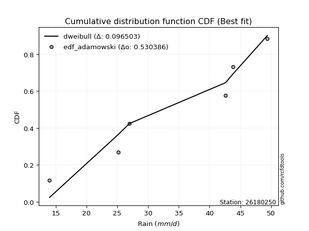</img>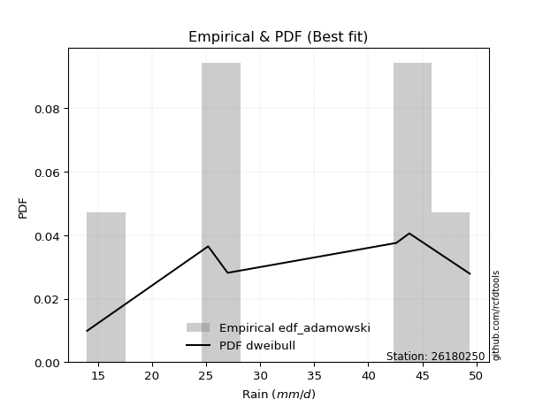</img>

</div>


## C. Best fit & Estimate extreme values for specific return periods - Tr

Best fit in probability distribution analysis means finding the theoretical distribution (like Normal, Poisson, Exponential, etc.) that most accurately mirrors your real-world data´s patterns (shape, center, spread) for better predictions, using methods like visual checks (Q-Q plots), goodness-of-fit tests (Kolmogorov-Smirnov, Chi-Squared), and information criteria (AIC) to score and select the simplest, most representative model.


### 1. Best fit (ordered by delta Δ)

:file_folder:Table: [bestfit_26180250.csv](table/bestfit_26180250.csv)

<div align="center">

|   id |   station | empirical_dist   | p_dist    |     delta |   deltao | eval   |   fit |   n |   best_fit |   best_fit_sort |
|-----:|----------:|:-----------------|:----------|----------:|---------:|:-------|------:|----:|-----------:|----------------:|
|    0 |  26180250 | edf_hazen        | beta      | 0.0835382 | 0.530386 | Δo > Δ |     1 |   6 |          1 |               1 |
|    1 |  26180250 | edf_blom         | dgamma    | 0.0838322 | 0.530386 | Δo > Δ |     1 |   6 |          1 |               2 |
|    2 |  26180250 | edf_cunnane      | dgamma    | 0.0857677 | 0.530386 | Δo > Δ |     1 |   6 |          1 |               3 |
|    3 |  26180250 | edf_tukey        | dgamma    | 0.0873613 | 0.530386 | Δo > Δ |     1 |   6 |          1 |               4 |
|    4 |  26180250 | edf_gringorten   | dgamma    | 0.0889302 | 0.530386 | Δo > Δ |     1 |   6 |          1 |               5 |
|    5 |  26180250 | edf_filliben     | dgamma    | 0.0893252 | 0.530386 | Δo > Δ |     1 |   6 |          1 |               6 |
|    6 |  26180250 | edf_beard        | dgamma    | 0.0902487 | 0.530386 | Δo > Δ |     1 |   6 |          1 |               7 |
|    7 |  26180250 | edf_jenkinson    | dgamma    | 0.0902487 | 0.530386 | Δo > Δ |     1 |   6 |          1 |               8 |
|    8 |  26180250 | edf_chegodayev   | dgamma    | 0.0914732 | 0.530386 | Δo > Δ |     1 |   6 |          1 |               9 |
|    9 |  26180250 | edf_adamowski    | dweibull  | 0.096503  | 0.530386 | Δo > Δ |     1 |   6 |          1 |              10 |
|   10 |  26180250 | edf_weibull      | loglevy_l | 0.100138  | 0.530386 | Δo > Δ |     1 |   6 |          1 |              11 |
|   11 |  26180250 | edf_california   | genpareto | 0.118469  | 0.530386 | Δo > Δ |     1 |   6 |          1 |              12 |

</div>


### 2. Extreme values and % difference analysis

In hydrology, a return period (or recurrence interval $Tr$) is the statistical average time between extreme events like floods or droughts of a specific magnitude, indicating how rare an event is, with a 100-year flood, for example, having a 1% chance of occurring in any given year, not that it happens exactly every century. It is a key tool for infrastructure design (like bridges or dams) and risk assessment, calculated from historical data to determine the probability of future events, although it is important to remember it is statistical average, and events can cluster or be missed.

The extreme value porcentage difference is evaluated as $pdiff = 1 - (ETrBf / ETr) * 100$, where _ETrBf_ correspond to the bestfit extreme value for a specific recurrence interval and _ETr_ correspond to the extreme value for one of the most used PDFsused in hydrology.

> risk_rate: assuming the return period as the project useful life.

:file_folder:Table: [extreme_26180250.csv](table/extreme_26180250.csv), all PDFs.  
:file_folder:Table: [extremepdiff_26180250.csv](table/extremepdiff_26180250.csv), % difference between bestfit and most used PDFs in Hydrology.

<div align="center">

Extreme values table for only best fit PDFs
|   id |      tr |   prob_l |     prob_g |   alpha |   anglit |   arcsine |   argus |    beta |   betaprime |   bradford |     burr |   burr12 |   cosine |   crystalball |   dgamma |   dweibull |   erlang |   exponnorm |   exponpow |   exponweib |       f |   fatiguelife |   foldnorm |   gamma |   gausshyper |   genexpon |   genextreme |   gengamma |   genhalflogistic |   genlogistic |   gennorm |   genpareto |   gompertz |   gumbel_l |   gumbel_r |   halfgennorm |   halflogistic |   halfnorm |   hypsecant |   invgamma |   invgauss |       invweibull |   johnsonsb |   johnsonsu |   kappa3 |   kappa4 |   ksone |   kstwobign |   laplace |   levy_l |   loggamma |   logistic |   loglaplace |    lomax |   maxwell |   mielke |    moyal |   nakagami |     ncf |     nct |    norm |   pearson3 |   powerlaw |   rayleigh |   rdist |    rice |   semicircular |   skewnorm |       t |   trapezoid |   triang |   truncexpon |   truncnorm |   truncpareto |   truncweibull_min |   tukeylambda |   uniform |   vonmises |   vonmises_line |     wald |   weibull_max |   weibull_min |   wrapcauchy |   logalpha |   loganglit |   logarcsine |   logargus |   logbeta |   logbetaprime |   logbradford |   logburr |   logburr12 |   logcosine |   logcrystalball |   logdgamma |   logdweibull |   logerlang |   logexponnorm |   logexponpow |   logexponweib |     logf |   logfatiguelife |   logfoldnorm |   loggausshyper |   loggenexpon |   loggenextreme |      loggengamma |   loggenhalflogistic |   loggenlogistic |   loggennorm |   loggenpareto |   loggompertz |   loggumbel_l |   loggumbel_r |   loghalfgennorm |   loghalflogistic |   loghalfnorm |   loghypsecant |   loginvgamma |   loginvgauss |   loginvweibull |   logjohnsonsb |   logjohnsonsu |   logkappa3 |   logkappa4 |   logksone |   logkstwobign |   loglevy_l |   logloggamma |   loglogistic |   logloglaplace |   loglomax |   logmaxwell |   logmielke |   logmoyal |   lognakagami |   logncf |   lognct |   lognorm |   logpearson3 |   logpowerlaw |   lograyleigh |   logrdist |   logrice |   logsemicircular |   logskewnorm |     logt |   logtrapezoid |   logtriang |   logtruncexpon |   logtruncnorm |   logtruncpareto |   logtruncweibull_min |   logtukeylambda |   loguniform |   logvonmises |   logvonmises_line |   logwald |   logweibull_max |   logweibull_min |   logwrapcauchy |   station |   n |   risk_rate |
|-----:|--------:|---------:|-----------:|--------:|---------:|----------:|--------:|--------:|------------:|-----------:|---------:|---------:|---------:|--------------:|---------:|-----------:|---------:|------------:|-----------:|------------:|--------:|--------------:|-----------:|--------:|-------------:|-----------:|-------------:|-----------:|------------------:|--------------:|----------:|------------:|-----------:|-----------:|-----------:|--------------:|---------------:|-----------:|------------:|-----------:|-----------:|-----------------:|------------:|------------:|---------:|---------:|--------:|------------:|----------:|---------:|-----------:|-----------:|-------------:|---------:|----------:|---------:|---------:|-----------:|--------:|--------:|--------:|-----------:|-----------:|-----------:|--------:|--------:|---------------:|-----------:|--------:|------------:|---------:|-------------:|------------:|--------------:|-------------------:|--------------:|----------:|-----------:|----------------:|---------:|--------------:|--------------:|-------------:|-----------:|------------:|-------------:|-----------:|----------:|---------------:|--------------:|----------:|------------:|------------:|-----------------:|------------:|--------------:|------------:|---------------:|--------------:|---------------:|---------:|-----------------:|--------------:|----------------:|--------------:|----------------:|-----------------:|---------------------:|-----------------:|-------------:|---------------:|--------------:|--------------:|--------------:|-----------------:|------------------:|--------------:|---------------:|--------------:|--------------:|----------------:|---------------:|---------------:|------------:|------------:|-----------:|---------------:|------------:|--------------:|--------------:|----------------:|-----------:|-------------:|------------:|-----------:|--------------:|---------:|---------:|----------:|--------------:|--------------:|--------------:|-----------:|----------:|------------------:|--------------:|---------:|---------------:|------------:|----------------:|---------------:|-----------------:|----------------------:|-----------------:|-------------:|--------------:|-------------------:|----------:|-----------------:|-----------------:|----------------:|----------:|----:|------------:|
|    0 |    2    | 0.5      | 0.5        | 33.0875 |  33.6667 |   33.6667 | 36.0151 | 35.0967 |     33.3071 |    28.6934 |  30.9677 |  24.3548 |  33.152  |       33.6667 |  34.3659 |    33.7482 |  33.4662 |     33.6666 |    14.0086 |     14.5868 | 33.6822 |       14.0003 |    33.7221 | 33.3605 |      35.313  |    27.7111 |      39.5575 |    14.913  |           36.6331 |           inf |      31.7 |     29.1445 |    33.8053 |    35.7152 |    31.6181 |       23.991  |        30.5997 |    31.1142 |     33.6667 |    32.8292 |    32.1237 |   2414.22        |     26.2274 |     37.6689 |  30.9525 |  32.5403 | 33.6667 |     31.017  |   33.6667 |  39.774  |    30.4802 |    33.6667 |      30.9445 |  37.0544 |   32.6002 |  36.0821 |  30.9568 |    28.8558 | 32.5048 | 33.6607 | 33.6667 |    34.1775 |    14.3457 |    32.2219 | 13.7763 | 33.0051 |        33.6667 |    35.8604 | 33.667  |     35.726  |  35.5625 |      28.562  |     33.6667 |       14.4867 |            30.9307 |       31.7631 |   31.7    |  0.0335062 |         31.8239 |  29.6245 |       49.0621 |       35.1498 |      31.6999 |    30.5887 |     30.9445 |      30.9446 |    34.5496 |   34.2732 |        30.8288 |       23.4618 |   33.9877 |     33.6459 |     29.5422 |          30.9445 |     32.9693 |       32.1063 |     30.492  |        30.9444 |       34.9878 |  14.7372       |  30.9588 |          30.8868 |       30.0435 |         26.5918 |       26.8799 |         36.549  |     32.7767      |              33.963  |         inf      |      26.2983 |        33.4946 |       32.3425 |       33.2329 |       28.8138 |          13.9903 |           27.8096 |       28.3126 |        30.9445 |       30.2156 |       30.0548 |         29.0686 |        7.5742  |        38.7275 |     14      |     25.7525 |    26.2983 |        27.9511 |     39.2966 |       35.8196 |       30.9445 |         28.0842 |    24.281  |      29.8163 |     35.878  |    28.1577 |       28.3953 |  30.1068 |  30.847  |   30.9445 |       28.8756 |       14.2415 |       29.4261 |    36.0912 |   30.5709 |           30.9445 |       32.1206 |  30.9445 |        33.3382 |     31.3923 |         23.3131 |        30.7795 |          14.2795 |               23.8119 |          35.3001 |      26.2983 |     0.0583537 |            26.31   |   26.881  |          36.678  |          33.5772 |         26.2983 |  26180250 |   6 |    0.75     |
|    1 |    2.33 | 0.570815 | 0.429185   | 35.3704 |  36.2586 |   37.5576 | 38.1351 | 38.518  |     35.5987 |    31.2124 |  33.472  |  27.5001 |  35.3965 |       35.8919 |  41.5597 |    40.3205 |  35.7222 |     35.8918 |    14.0298 |     15.1703 | 35.9109 |       14.7519 |    35.9011 | 35.6136 |      37.8913 |    30.732  |      41.6939 |    15.7429 |           39.1297 |           inf |      31.7 |     32.7725 |    36.0855 |    37.6512 |    33.68   |       27.4665 |        32.7196 |    33.5157 |     35.4475 |    35.1166 |    34.4669 | 183656           |     44.121  |     39.6683 |  33.6014 |  35.1391 | 36.7256 |     33.5278 |   35.0133 |  42.7185 |    33.011  |    35.6272 |      32.4303 |  42.134  |   34.912  |  38.3629 |  32.9086 |    30.4495 | 34.8424 | 35.8872 | 35.8919 |    36.3799 |    14.8372 |    34.568  | 16.3196 | 35.3222 |        36.4466 |    38.0211 | 35.8922 |     38.2874 |  37.8906 |      31.0258 |     35.8919 |       14.7677 |            33.3598 |       34.3429 |   34.2069 |  0.243088  |         34.3483 |  31.0836 |       49.2464 |       37.2526 |      36.3033 |    33.151  |     33.8678 |      35.435  |    36.7735 |   37.674  |        33.9697 |       25.662  |   36.3879 |     35.8794 |     32.0327 |          33.4379 |     39.8434 |       37.6872 |     33.0194 |        33.4378 |       37.1428 |  16.2279       |  33.4578 |          33.3718 |       32.6414 |         29.146  |       29.9386 |         38.9322 |     49.0802      |              36.571  |         inf      |      26.2983 |        39.1052 |       34.7018 |       35.5507 |       30.9589 |          13.9903 |           29.9405 |       30.7824 |        32.9244 |       32.7451 |       32.5767 |         32.0217 |        8.62722 |        40.9395 |     14      |     28.2401 |    29.2726 |        30.8217 |     42.147  |       38.0998 |       33.1312 |         29.7004 |    27.4534 |      32.3161 |     38.2485 |    30.1383 |       29.9198 |  35.1528 |  33.3587 |   33.4379 |       31.0315 |       14.5554 |       31.9312 |    38.53   |   33.1134 |           34.0902 |       34.4047 |  33.4379 |        36.4488 |     33.8355 |         25.4401 |        32.0119 |          14.4399 |               25.9453 |          37.1205 |      28.7545 |     0.0629603 |            28.7202 |   28.2822 |          39.2854 |          35.8085 |         33.4086 |  26180250 |   6 |    0.729209 |
|    2 |    5    | 0.8      | 0.2        | 44.2764 |  45.4036 |   47.9333 | 44.4579 | 46.8486 |     44.3147 |    40.2572 |  44.6534 | inf      |  43.4851 |       44.1613 |  46.5333 |    46.4285 |  44.2409 |     44.1612 |    15.1459 |     25.3973 | 44.2017 |       30.7124 |    43.9989 | 44.1184 |      45.2846 |    45.8358 |      46.7384 |    28.6211 |           45.5632 |           inf |      31.7 |     43.2017 |    44.1524 |    43.9054 |    42.6378 |       51.2817 |        42.312  |    43.6716 |     42.5908 |    44.0811 |    43.8992 |      2.80359e+13 |     49.3991 |     45.3023 |  42.1743 |  43.2418 | 46.6254 |     44.1933 |   41.7459 |  47.5968 |    44.6174 |    43.1972 |      40.9997 |  67.5307 |   44.0112 |  44.7877 |  41.9497 |    39.2643 | 44.1906 | 44.1633 | 44.1613 |    44.2824 |    21.9767 |    43.9601 | 23.6487 | 44.1731 |        45.9332 |    44.3143 | 44.1617 |     45.6359 |  44.5697 |      39.9757 |     44.1613 |       18.2523 |            41.5674 |       42.6306 |   42.32   |  1.06417   |         42.5182 |  39.2516 |       49.395  |       44.3802 |      45.3111 |    45.126  |     46.5696 |      50.8578 |    43.7292 |   46.4789 |        49.3084 |       35.4855 |   43.7539 |     44.1702 |     42.8805 |          44.5978 |     48.9362 |       48.416  |     44.6072 |        44.5975 |       44.3004 | 708.845        |  44.6536 |          44.5027 |       44.5528 |         39.1091 |       48.4763 |         45.3436 |   1154.51        |              44.2038 |         inf      |      26.2983 |        48.4998 |       43.9473 |       44.2021 |       42.2932 |          13.9903 |           41.8165 |       43.8435 |        42.224  |       44.5438 |       44.573  |         48.7528 |       45.6536  |        46.3142 |     14      |     38.1579 |    41.406  |        46.6885 |     47.3317 |       44.5886 |       43.1252 |         39.2879 |    51.1377 |      44.3652 |     45.0218 |    41.2918 |       39.9836 |  64.3433 |  44.6721 |   44.5978 |       42.2829 |       19.1997 |       44.2864 |    46.7517 |   44.7138 |           47.4366 |       42.0251 |  44.5977 |        47.0791 |     41.9521 |         35.0426 |        37.836  |          16.5006 |               35.4019 |          43.5634 |      38.389  |     0.0836709 |            38.2698 |   37.5887 |          45.9067 |          44.0813 |         44.9067 |  26180250 |   6 |    0.67232  |
|    3 |   10    | 0.9      | 0.1        | 50.5799 |  50.5798 |   50.4381 | 47.258  | 48.7449 |     50.2723 |    44.6719 |  54.1334 | inf      |  48.3719 |       49.647  |  49.3283 |    49.3387 |  50.0102 |     49.6469 |    20.865  |     55.8405 | 49.7089 |       52.7498 |    49.3708 | 49.8754 |      47.8056 |    59.5466 |      48.2803 |    63.0565 |           47.7062 |           inf |      31.7 |     46.8693 |    49.0048 |    47.3874 |    49.9338 |       82.3358 |        50.278  |    51.1868 |     48.2949 |    50.4587 |    50.8231 |      1.29793e+20 |     49.4    |     47.8647 |  45.9149 |  46.532  | 50.9449 |     52.3137 |   47.8575 |  48.7746 |    54.7202 |    48.7722 |      50.7245 |  90.5851 |   50.4147 |  47.2547 |  49.8214 |    46.9035 | 50.9716 | 49.6551 | 49.647  |    49.2827 |    31.5157 |    50.6569 | 25.8905 | 50.1817 |        50.801  |    46.8775 | 49.6477 |     48.5063 |  47.1786 |      44.461  |     49.647  |       24.9928 |            45.3859 |       46.167  |   45.86   |  1.69152   |         46.083  |  47.9198 |       49.3997 |       48.5801 |      47.5048 |    55.8489 |     55.7688 |      55.4933 |    46.9754 |   48.6269 |        63.8261 |       41.617  |   46.8342 |     49.5986 |     51.1432 |          53.9863 |     55.5063 |       55.7726 |     54.6916 |        53.986  |       48.3    |   6.31515e+10  |  54.0853 |          53.8778 |       54.806  |         44.2509 |       71.9481 |         47.5929 | 103261           |              47.0552 |         inf      |      26.2983 |        49.3097 |       50.3313 |       49.9009 |       54.5282 |          43.6324 |           55.187  |       56.9598 |        51.5031 |       55.0738 |       55.5777 |         68.6576 |       49.2917  |        48.1796 |     14      |     43.5096 |    48.1698 |        64.051  |     48.6762 |       47.1039 |       52.3663 |         50.6464 |    91.017  |      55.4491 |     47.6575 |    54.3152 |       51.4226 |  98.6403 |  54.275  |   53.9863 |       53.9327 |       26.975  |       55.9189 |    49.8452 |   54.6876 |           56.2002 |       45.593  |  53.9863 |        52.0286 |     45.6277 |         41.2278 |        42.151  |          21.1264 |               41.4307 |          46.5583 |      43.5479 |     0.101461  |            43.4794 |   50.8353 |          47.9879 |          49.4893 |         47.3066 |  26180250 |   6 |    0.651322 |
|    4 |   15    | 0.933333 | 0.0666667  | 53.8532 |  52.7901 |   50.9159 | 48.2823 | 49.1057 |     53.2983 |    46.212  |  59.6347 | inf      |  50.5979 |       52.3845 |  50.7357 |    50.678  |  52.9247 |     52.3844 |    28.5933 |     90.0238 | 52.4592 |       67.1626 |    52.0514 | 52.7828 |      48.4871 |    67.5669 |      48.713  |    99.4122 |           48.3337 |           inf |      31.7 |     47.9014 |    51.266  |    48.9644 |    54.0501 |      104.799  |        54.7861 |    55.0976 |     51.5502 |    53.7787 |    54.4885 |      7.47983e+23 |     49.4    |     48.8853 |  47.1617 |  47.5664 | 52.3848 |     56.6247 |   51.4326 |  49.1304 |    60.6647 |    51.8097 |      57.4501 | 104.071  |   53.7003 |  48.0416 |  54.3898 |    51.0231 | 54.53   | 52.3962 | 52.3845 |    51.7069 |    36.3308 |    54.1074 | 26.4233 | 53.2072 |        52.6993 |    47.7208 | 52.3854 |     49.4272 |  48.0157 |      46.0525 |     52.3845 |       29.7611 |            46.7003 |       47.3211 |   47.04   |  2.02956   |         47.2713 |  53.4861 |       49.3999 |       50.5391 |      48.1535 |    62.2861 |     60.2313 |      56.4243 |    48.1905 |   49.0478 |        72.8433 |       44.0041 |   47.8477 |     52.2738 |     55.4175 |          59.3865 |     59.2585 |       59.7677 |     60.6245 |        59.3861 |       50.0911 |   7.44147e+21  |  59.5152 |          59.2746 |       60.7767 |         46.0293 |       89.7653 |         48.2624 |      2.91618e+06 |              47.9179 |         inf      |      26.2983 |        49.3766 |       53.5564 |       52.718  |       62.9332 |          45.5098 |           64.5689 |       65.2707 |        57.6858 |       61.379  |       62.2901 |         83.2872 |       49.3822  |        48.7977 |     14      |     45.4404 |    50.6616 |        75.7572 |     49.0898 |       47.9088 |       58.2095 |         58.7577 |   128.203  |      62.1711 |     48.503  |    63.6822 |       58.8977 | 123.091  |  59.8314 |   59.3865 |       61.623  |       31.8458 |       63.0589 |    50.67   |   60.4954 |           60.0411 |       46.8319 |  59.3865 |        53.7244 |     46.8739 |         43.6919 |        44.095  |          25.0481 |               43.8307 |          47.5558 |      45.4172 |     0.111938  |            45.3804 |   61.7102 |          48.5584 |          52.152  |         48.0173 |  26180250 |   6 |    0.644736 |
|    5 |   20    | 0.95     | 0.05       | 56.045  |  54.0903 |   51.0841 | 48.8353 | 49.2333 |     55.2991 |    46.9954 |  63.5538 | inf      |  51.9668 |       54.1772 |  51.6717 |    51.5273 |  54.8461 |     54.1772 |    36.9328 |    124.538  | 54.2612 |       77.8336 |    53.8069 | 54.6993 |      48.7858 |    73.2574 |      48.912  |   134.859  |           48.6289 |           inf |      31.7 |     48.3667 |    52.6904 |    49.946  |    56.9323 |      122.715  |        57.9446 |    57.7051 |     53.8466 |    56.0047 |    56.9673 |      3.21362e+26 |     49.4    |     49.4762 |  47.7852 |  48.0652 | 53.1047 |     59.5287 |   53.9692 |  49.3126 |    64.9334 |    53.9091 |      62.7561 | 113.639  |   55.8808 |  48.429  |  57.6252 |    53.7956 | 56.9237 | 54.1914 | 54.1772 |    53.269  |    39.1326 |    56.4009 | 26.6381 | 55.1963 |        53.7522 |    48.1412 | 54.1784 |     49.8816 |  48.4286 |      46.8681 |     54.1772 |       33.0653 |            47.366  |       47.8904 |   47.63   |  2.24817   |         47.8654 |  57.6341 |       49.4    |       51.7768 |      48.4695 |    66.9658 |     63.0214 |      56.7559 |    48.8529 |   49.1987 |        79.5267 |       45.2719 |   48.3523 |     54.012  |     58.2217 |          63.2124 |     61.9315 |       62.5268 |     64.8845 |        63.2119 |       51.1964 |   1.88131e+34  |  63.3642 |          63.1    |       65.0355 |         46.9171 |      104.719  |         48.5786 |      4.28704e+07 |              48.3275 |         inf      |      26.2983 |        49.391  |       55.6772 |       54.5513 |       69.578  |          46.4786 |           72.077  |       71.475  |        62.4888 |       65.9552 |       67.2158 |         95.3489 |       49.3946  |        49.1204 |     14      |     46.4315 |    51.9554 |        84.8264 |     49.3029 |       48.3055 |       62.6249 |         65.2889 |   163.873  |      67.0762 |     48.9227 |    71.2775 |       64.5314 | 142.738  |  63.7818 |   63.2124 |       67.5388 |       35.033  |       68.3022 |    51.0226 |   64.6379 |           62.2835 |       47.4621 |  63.2123 |        54.5812 |     47.5012 |         45.0149 |        45.2115 |          28.1417 |               45.12   |          48.0489 |      46.3817 |     0.119494  |            46.3632 |   71.3011 |          48.8151 |          53.8814 |         48.3652 |  26180250 |   6 |    0.641514 |
|    6 |   25    | 0.96     | 0.04       | 57.6837 |  54.9715 |   51.1622 | 49.1886 | 49.2928 |     56.7818 |    47.4698 |  66.6108 | inf      |  52.9268 |       55.4969 |  52.3697 |    52.1409 |  56.2671 |     55.4968 |    45.382  |    158.448  | 55.588  |       86.312  |    55.0992 | 56.1165 |      48.9484 |    77.6713 |      49.0251 |   168.867  |           48.7994 |           inf |      31.7 |     48.6256 |    53.7113 |    50.6445 |    59.1523 |      137.764  |        60.378  |    59.6451 |     55.6239 |    57.6702 |    58.8323 |      3.42906e+28 |     49.4    |     49.8759 |  48.1592 |  48.3566 | 53.5367 |     61.7039 |   55.9367 |  49.4269 |    68.2824 |    55.5152 |      67.207  | 121.061  |   57.4996 |  48.6595 |  60.133  |    55.8663 | 58.7179 | 55.513  | 55.4969 |    54.4061 |    40.953  |    58.1048 | 26.7479 | 56.6641 |        54.4352 |    48.3932 | 55.4982 |     50.1522 |  48.6747 |      47.3641 |     55.4969 |       35.4482 |            47.7683 |       48.2285 |   47.984  |  2.4006    |         48.2219 |  60.9565 |       49.4    |       52.6663 |      48.6572 |    70.6705 |     64.9853 |      56.9104 |    49.2785 |   49.2696 |        84.8894 |       46.0577 |   48.6544 |     55.2844 |     60.2724 |          66.1854 |     64.0218 |       64.6366 |     68.2266 |        66.1849 |       51.9776 |   1.83485e+47  |  66.3562 |          66.0737 |       68.3603 |         47.4454 |      117.859  |         48.7612 |      4.13338e+08 |              48.5648 |         inf      |      26.2983 |        49.3957 |       57.2415 |       55.8946 |       75.1708 |          47.0697 |           78.452  |       76.4708 |        66.4789 |       69.5734 |       71.1413 |        105.818  |       49.3977  |        49.3236 |     46.9978 |     47.0336 |    52.7475 |        92.3238 |     49.4372 |       48.5418 |       66.2275 |         70.8508 |   198.52   |      70.9663 |     49.1767 |    77.7826 |       69.0881 | 159.43   |  66.8593 |   66.1854 |       72.4155 |       37.2575 |       72.4781 |    51.2102 |   67.8718 |           63.7829 |       47.8439 |  66.1853 |        55.0981 |     47.8789 |         45.8401 |        45.9381 |          30.5874 |               45.9246 |          48.3415 |      46.9703 |     0.125452  |            46.9634 |   80.0478 |          48.9583 |          55.1468 |         48.5726 |  26180250 |   6 |    0.639603 |
|    7 |   50    | 0.98     | 0.02       | 62.4985 |  57.1405 |   51.2664 | 49.9799 | 49.3728 |     61.0734 |    48.4283 |  76.2416 | inf      |  55.4406 |       59.2759 |  54.4181 |    53.8518 |  60.3667 |     59.2759 |    85.1686 |    314.108  | 59.3894 |      113.515  |    58.7998 | 60.2044 |      49.2265 |    91.3821 |      49.2335 |   318.729  |           49.1218 |           inf |      31.7 |     49.0838 |    56.5097 |    52.5406 |    65.9911 |      191.084  |        67.8759 |    65.2839 |     61.1342 |    62.5689 |    64.3661 |      6.06792e+34 |     49.4    |     50.8747 |  48.9073 |  48.9146 | 54.4006 |     68.0914 |   62.0484 |  49.6844 |    78.946  |    60.4222 |      83.1481 | 144.116  |   62.1944 |  49.1165 |  67.9181 |    61.9025 | 64.0075 | 59.2981 | 59.2759 |    57.6029 |    44.9321 |    63.0512 | 26.9182 | 60.8818 |        55.9956 |    48.8968 | 59.278  |     50.6894 |  49.1629 |      48.3715 |     59.2759 |       41.3815 |            48.5796 |       48.8939 |   48.692  |  2.75923   |         48.9348 |  71.8044 |       49.4    |       55.1177 |      49.0297 |    82.6573 |     70.0844 |      57.1174 |    50.2383 |   49.3662 |       102.643  |       47.6886 |   49.2581 |     58.8929 |     65.991  |          75.4952 |     70.6638 |       71.0828 |     78.8675 |        75.4946 |       54.0737 |   1.02825e+113 |  75.732  |          75.3917 |       78.852  |         48.4775 |      169.226  |         49.1062 |      1.29066e+12 |              49.0146 |         inf      |      26.2983 |        49.3996 |       61.7303 |       59.7101 |       95.3861 |          48.2746 |          101.862  |       93.0639 |        80.5426 |       81.2535 |       83.9905 |        145.859  |       49.3998  |        49.776  |     48.1987 |     48.2506 |    54.3681 |       118.393  |     49.7409 |       49.0104 |       78.5699 |         91.3346 |   363.042  |      83.5721 |     49.7196 |   102.007  |       84.2913 | 220.497  |  76.5384 |   75.4952 |       89.3626 |       42.5815 |       86.1033 |    51.5185 |   78.0759 |           67.345  |       48.616  |  75.4952 |        56.1386 |     48.6374 |         47.5661 |        47.5439 |          37.565  |               47.6086 |          48.9142 |      48.1698 |     0.144659  |            48.1879 |  116.795  |          49.2144 |          58.7336 |         48.986  |  26180250 |   6 |    0.63583  |
|    8 |   75    | 0.986667 | 0.0133333  | 65.1594 |  58.0951 |   51.2858 | 50.29   | 49.3878 |     63.4044 |    48.7507 |  81.9908 | inf      |  56.6411 |       61.3036 |  55.5509 |    54.7459 |  62.5852 |     61.3036 |   119.789  |    449.528  | 61.4303 |      129.898  |    60.7854 | 62.4162 |      49.3009 |    99.4024 |      49.2961 |   443.998  |           49.2221 |           inf |      31.7 |     49.2128 |    57.9385 |    53.4994 |    69.9661 |      227.006  |        72.2344 |    68.3535 |     64.3544 |    65.2791 |    67.4558 |      2.59739e+38 |     49.4    |     51.3323 |  49.1567 |  49.0898 | 54.6886 |     71.6057 |   65.6235 |  49.7902 |    85.3962 |    63.2563 |      94.1727 | 157.602  |   64.7469 |  49.2677 |  72.4708 |    65.1899 | 66.9388 | 61.3293 | 61.3036 |    59.282  |    46.3648 |    65.7422 | 26.9577 | 63.1527 |        56.619  |    49.0645 | 61.3062 |     50.8672 |  49.3245 |      48.7119 |     61.3036 |       43.7853 |            48.852  |       49.1109 |   48.928  |  2.89351   |         49.1725 |  78.4796 |       49.4    |       56.3781 |      49.1532 |    90.0459 |     72.4535 |      57.1558 |    50.6172 |   49.3847 |       113.867  |       48.2504 |   49.4627 |     60.8072 |     68.9103 |          81.0193 |     74.6844 |       74.8103 |     85.3034 |        81.0186 |       55.1186 |   1.44207e+175 |  81.2993 |          80.9247 |       85.1306 |         48.8075 |      208.519  |         49.2132 |      2.89176e+14 |              49.1545 |         inf      |      26.2983 |        49.3999 |       64.1413 |       61.7376 |      109.548  |          48.6831 |          118.559  |      103.564  |        90.1011 |       88.4331 |       92.0156 |        175.769  |       49.4     |        49.9561 |     48.6057 |     48.6583 |    54.9193 |       135.754  |     49.8662 |       49.1654 |       86.7204 |        105.962  |   519.671  |      91.3414 |     49.9388 |   119.533  |       93.9349 | 263.65   |  82.3106 |   81.0192 |      100.697  |       44.6656 |       94.563  |    51.5961 |   84.1816 |           68.8229 |       48.876  |  81.0193 |        56.4873 |     48.8911 |         48.165  |        48.1318 |          40.7966 |               48.1933 |          49.0993 |      48.5764 |     0.156507  |            48.6032 |  147.364  |          49.288  |          60.6353 |         49.1238 |  26180250 |   6 |    0.634587 |
|    9 |  100    | 0.99     | 0.01       | 66.9908 |  58.6627 |   51.2925 | 50.4622 | 49.3931 |     64.9921 |    48.9125 |  86.1287 | inf      |  57.3935 |       62.6751 |  56.3315 |    55.3425 |  64.0931 |     62.6751 |   150.252  |    570.171  | 62.8111 |      141.686  |    62.1284 | 63.9194 |      49.3334 |   105.093  |      49.3256 |   553.029  |           49.2704 |           inf |      31.7 |     49.2709 |    58.8776 |    54.1265 |    72.7794 |      254.669  |        75.3192 |    70.4446 |     66.6386 |    67.1454 |    69.5942 |      9.65542e+40 |     49.4    |     51.6145 |  49.2814 |  49.1742 | 54.8325 |     74.0136 |   68.1601 |  49.8521 |    90.0791 |    65.2572 |     102.87   | 167.17   |   66.4856 |  49.3431 |  75.7006 |    67.4276 | 68.9585 | 62.7032 | 62.6751 |    60.4035 |    47.102  |    67.5756 | 26.9735 | 64.6914 |        56.968  |    49.1484 | 62.678  |     50.9559 |  49.4052 |      48.883  |     62.6751 |       45.082  |            48.9886 |       49.2179 |   49.046  |  2.9627    |         49.2913 |  83.3466 |       49.4    |       57.2103 |      49.215  |    95.474  |     73.9001 |      57.1693 |    50.8282 |   49.3912 |       122.24   |       48.5349 |   49.5697 |     62.0931 |     70.8056 |          84.9829 |     77.6092 |       77.4465 |     89.9757 |        84.9821 |       55.7962 |   9.38952e+232 |  85.2958 |          84.8966 |       89.6582 |         48.9676 |      241.592  |         49.2644 |      1.84321e+16 |              49.2216 |         inf      |      26.2983 |        49.4    |       65.772  |       63.1009 |      120.825  |          48.8886 |          132.007  |      111.387  |        97.5615 |       93.6982 |       97.9588 |        200.575  |       49.4     |        50.0585 |     48.8105 |     48.8618 |    55.197  |       149.098  |     49.9396 |       49.2427 |       92.9791 |        117.741  |   671.968  |      97.0429 |     50.0707 |   133.764  |      101.123  | 298.102  |  86.465  |   84.9829 |      109.455  |       45.7748 |      100.798  |    51.6287 |   88.5843 |           69.6647 |       49.0065 |  84.9829 |        56.6621 |     49.0182 |         48.469  |        48.4368 |          42.6472 |               48.4903 |          49.1901 |      48.781  |     0.165244  |            48.8122 |  174.584  |          49.3216 |          61.9123 |         49.1927 |  26180250 |   6 |    0.633968 |
|   10 |  200    | 0.995    | 0.005      | 71.2436 |  59.7351 |   51.2991 | 50.76   | 49.3983 |     68.6274 |    49.1559 |  96.3152 | inf      |  58.9234 |       65.786  |  58.1478 |    56.674  |  67.5359 |     65.786  |   246.302  |    962.572  | 65.9445 |      170.54   |    65.1748 | 67.3508 |      49.3744 |   118.804  |      49.3667 |   896.696  |           49.3395 |           inf |      31.7 |     49.3473 |    60.9298 |    55.4897 |    79.543  |      328.929  |        82.7356 |    75.2273 |     72.1415 |    71.4813 |    74.5927 |      1.45839e+47 |     49.4    |     52.1824 |  49.4697 |  49.295  | 55.0485 |     79.5595 |   74.2717 |  49.9693 |   101.757  |    70.0571 |     127.271  | 190.225  |   70.4633 |  49.4574 |  83.4825 |    72.5357 | 73.651  | 65.82   | 65.786  |    62.9052 |    48.2346 |    71.7704 | 26.9914 | 68.1889 |        57.5766 |    49.2742 | 65.7898 |     51.0887 |  49.5482 |      49.1408 |     65.786  |       47.1567 |            49.194  |       49.3757 |   49.223  |  3.06831   |         49.4696 |  95.4695 |       49.4    |       59.0401 |      49.3075 |   109.24   |     76.7122 |      57.1823 |    51.1942 |   49.3977 |       143.915  |       48.966  |   49.7533 |     64.9838 |     74.8214 |          94.7073 |     84.934  |       83.7946 |    101.627  |        94.7064 |       57.2522 | inf            |  95.1071 |          94.6477 |      100.841  |         49.1979 |      343.658  |         49.3373 |      1.19922e+21 |              49.3173 |         inf      |      26.2983 |        49.4    |       69.4685 |       66.1688 |      152.917  |          49.1985 |          170.911  |      131.574  |       118.171  |      107.016  |      113.199  |        275.497  |       49.4     |        50.2438 |     49.1194 |     49.1656 |    55.6162 |       185.034  |     50.0789 |       49.3585 |      109.896  |        151.781  |  1259.17   |     111.462  |     50.3427 |   175.404  |      119.659  | 396.188  |  96.7012 |   94.7073 |      133.307  |       47.5292 |      116.653  |    51.6679 |   99.4574 |           71.1569 |       49.2028 |  94.7073 |        56.9247 |     49.209  |         48.931  |        48.9094 |          45.7743 |               48.9416 |          49.323  |      49.0895 |     0.187625  |            49.1274 |  266.297  |          49.3668 |          64.7817 |         49.2963 |  26180250 |   6 |    0.633042 |
|   11 |  250    | 0.996    | 0.004      | 72.5713 |  60.008  |   51.2998 | 50.8294 | 49.3989 |     69.7476 |    49.2046 |  99.663  | inf      |  59.3428 |       66.7367 |  58.7159 |    57.0753 |  68.5942 |     66.7367 |   284.646  |   1124.58   | 66.9024 |      179.944  |    66.1057 | 68.4054 |      49.3812 |   123.218  |      49.3742 |  1035.07   |           49.3526 |           inf |      31.7 |     49.3605 |    61.5364 |    55.8908 |    81.7173 |      355.173  |        85.1199 |    76.6986 |     73.913  |    72.8353 |    76.1619 |      1.41372e+49 |     49.4    |     52.3378 |  49.5085 |  49.3179 | 55.0917 |     81.2759 |   76.2393 |  49.9998 |   105.643  |    71.5981 |     136.297  | 197.646  |   71.6877 |  49.4815 |  85.9876 |    74.1038 | 75.1159 | 66.7726 | 66.7367 |    63.6581 |    48.465  |    73.0617 | 26.994  | 69.2596 |        57.7194 |    49.2994 | 66.7409 |     51.1152 |  49.5847 |      49.1926 |     66.7367 |       47.5913 |            49.2352 |       49.4067 |   49.2584 |  3.08961   |         49.5052 |  99.4801 |       49.4    |       59.5841 |      49.326  |   113.892  |     77.4448 |      57.1839 |    51.2797 |   49.3985 |       151.375  |       49.0529 |   49.7991 |     65.8599 |     75.9615 |          97.8954 |     87.383  |       85.8424 |    105.503  |        97.8945 |       57.6761 | inf            |  98.3255 |          97.8465 |      104.529  |         49.2419 |      384.734  |         49.3511 |      5.86595e+22 |              49.3354 |         inf      |      26.2983 |        49.4    |       70.597  |       67.0996 |      164.946  |          49.2607 |          185.71   |      138.491  |       125.69   |      111.505  |      118.4    |        305.092  |       49.4     |        50.2897 |     49.1814 |     49.2259 |    55.7004 |       197.822  |     50.1153 |       49.3816 |      115.955  |        164.711  |  1545.39   |     116.318  |     50.4216 |   191.394  |      126.004  | 432.885  | 100.07   |   97.8954 |      141.901  |       47.8937 |      122.019  |    51.674  |  103.043  |           71.5116 |       49.2422 |  97.8954 |        56.9773 |     49.2472 |         49.0242 |        49.0062 |          46.4564 |               49.0327 |          49.349  |      49.1515 |     0.195289  |            49.1907 |  306.216  |          49.3748 |          65.6509 |         49.317  |  26180250 |   6 |    0.632858 |
|   12 |  500    | 0.998    | 0.002      | 76.5885 |  60.6848 |   51.3009 | 50.9886 | 49.3997 |     73.0956 |    49.3023 | 110.286  | inf      |  60.4589 |       69.556  |  60.4381 |    58.2518 |  71.7497 |     69.5559 |   429.094  |   1761.74   | 69.7442 |      209.444  |    68.8665 | 71.5497 |      49.3928 |   136.928  |      49.3884 |  1566.08   |           49.3778 |           inf |      31.7 |     49.3839 |    63.2813 |    57.0406 |    88.4662 |      444.158  |        92.5202 |    81.0854 |     79.4155 |    76.9332 |    80.9316 |      2.07026e+55 |     49.4    |     52.7546 |  49.5938 |  49.3618 | 55.1781 |     86.4193 |   82.3509 |  50.0785 |   118.133  |    76.3771 |     168.626  | 220.701  |   75.3415 |  49.5358 |  93.7693 |    78.7685 | 79.5459 | 69.5977 | 69.556  |    65.859  |    48.9299 |    76.9144 | 26.9981 | 72.4393 |        58.0481 |    49.3497 | 69.5612 |     51.1682 |  49.6752 |      49.2962 |     69.556  |       48.4814 |            49.3175 |       49.4678 |   49.3292 |  3.13231   |         49.5765 | 112.232  |       49.4    |       61.1577 |      49.363  |   129.08   |     79.2917 |      57.1859 |    51.476  |   49.3996 |       176.164  |       49.2273 |   49.9204 |     68.438  |     79.0809 |         107.995  |     95.3013 |       92.2328 |    117.963  |       107.994  |       58.8795 | inf            | 108.527  |         107.986  |      116.279  |         49.3262 |      545.694  |         49.3773 |      2.81942e+28 |              49.37   |         inf      |      26.2983 |        49.4    |       73.9392 |       69.8409 |      208.649  |          49.3854 |          240.307  |      161.351  |       152.239  |      126.125  |      135.55   |        418.767  |       49.4     |        50.4021 |     49.3056 |     49.3455 |    55.8692 |       241.686  |     50.2092 |       49.4277 |      136.953  |        212.331  |  2944.43   |     132.101  |     50.6526 |   250.972  |      146.939  | 565.564  | 110.784  |  107.995  |      171.838  |       48.6371 |      139.54   |    51.684  |  114.464  |           72.335  |       49.3211 | 107.995  |        57.0825 |     49.3236 |         49.2115 |        49.2021 |          47.8835 |               49.2158 |          49.3999 |      49.2756 |     0.220807  |            49.3175 |  477.431  |          49.3893 |          68.2081 |         49.3585 |  26180250 |   6 |    0.632489 |
|   13 |  750    | 0.998667 | 0.00133333 | 78.8733 |  60.9844 |   51.3011 | 51.0524 | 49.3999 |     74.9722 |    49.3349 | 116.663  | inf      |  60.9997 |       71.1221 |  61.4196 |    58.897  |  73.5136 |     71.1221 |   532.526  |   2242.84   | 71.3235 |      226.874  |    70.4001 | 73.3071 |      49.3959 |   144.949  |      49.3928 |  1956.84   |           49.3858 |           inf |      31.7 |     49.3904 |    64.2175 |    57.6551 |    92.4115 |      501.561  |        96.8464 |    83.5361 |     82.6342 |    79.2641 |    83.6574 |      8.32647e+58 |     49.4    |     52.9602 |  49.6294 |  49.3756 | 55.2069 |     89.3088 |   85.926  |  50.1159 |   125.748  |    79.1692 |     190.984  | 234.187  |   77.385  |  49.5593 |  98.3213 |    81.3672 | 82.0624 | 71.1673 | 71.1221 |    67.0613 |    49.086  |    79.0689 | 26.999  | 74.2084 |        58.1804 |    49.3665 | 71.128  |     51.1858 |  49.7152 |      49.3308 |     71.1221 |       48.7844 |            49.345  |       49.4878 |   49.3528 |  3.14657   |         49.6003 | 119.879  |       49.4    |       62.0074 |      49.3753 |   138.515  |     80.1234 |      57.1863 |    51.5549 |   49.3998 |       191.875  |       49.2856 |   49.9824 |     69.8574 |     80.6383 |         114.049  |    100.167  |       95.9991 |    125.56   |       114.048  |       59.5154 | inf            | 114.646  |         114.068  |      123.367  |         49.3528 |      669.051  |         49.3855 |      1.19631e+32 |              49.3809 |          49.3698 |      26.2983 |        49.4    |       75.7925 |       71.3517 |      239.381  |          49.4271 |          279.385  |      175.726  |       170.298  |      135.179  |      146.324  |        503.94   |       49.4     |        50.4519 |     49.3471 |     49.385  |    55.9256 |       270.466  |     50.2539 |       49.4431 |      150.939  |        246.336  |  4318.73   |     141.846  |     50.7815 |   294.085  |      160.075  | 658.133  | 117.234  |  114.049  |      191.887  |       48.8892 |      150.413  |    51.6865 |  121.354  |           72.6691 |       49.3474 | 114.049  |        57.1176 |     49.349  |         49.2743 |        49.2681 |          48.3788 |               49.2771 |          49.4165 |      49.317  |     0.237134  |            49.3598 |  623.102  |          49.3935 |          69.6153 |         49.3723 |  26180250 |   6 |    0.632366 |
|   14 | 1000    | 0.999    | 0.001      | 80.4691 |  61.1629 |   51.3011 | 51.0882 | 49.3999 |     76.2713 |    49.3512 | 121.261  | inf      |  61.3409 |       72.2004 |  62.1058 |    59.3381 |  74.7327 |     72.2004 |   614.881  |   2639.94   | 72.4111 |      239.307  |    71.456  | 74.5216 |      49.3972 |   150.639  |      49.3948 |  2274.48   |           49.3896 |           inf |      31.7 |     49.3934 |    64.8488 |    58.0686 |    95.2101 |      544.737  |        99.9151 |    85.2286 |     84.918  |    80.8921 |    85.5663 |      3.00074e+61 |     49.4    |     53.0922 |  49.6511 |  49.3822 | 55.2213 |     91.3106 |   88.4626 |  50.1394 |   131.297  |    81.1493 |     208.623  | 243.755  |   78.7975 |  49.574  | 101.551  |    83.1588 | 83.8181 | 72.248  | 72.2004 |    67.8806 |    49.1643 |    80.5577 | 26.9994 | 75.4276 |        58.2547 |    49.3749 | 72.2068 |     51.1946 |  49.7391 |      49.3481 |     72.2004 |       48.9371 |            49.3588 |       49.4976 |   49.3646 |  3.1537    |         49.6122 | 125.379  |       49.4    |       62.5827 |      49.3815 |   145.47   |     80.6232 |      57.1865 |    51.5991 |   49.3999 |       203.6    |       49.3148 |   50.0241 |     70.8294 |     81.6365 |         118.413  |    103.73   |       98.6868 |    131.095  |       118.412  |       59.9405 | inf            | 119.059  |         118.454  |      128.497  |         49.3656 |      772.972  |         49.3895 |      6.13322e+34 |              49.3861 |          49.3775 |      26.2983 |        49.4    |       77.0669 |       72.3868 |      263.887  |          49.4482 |          310.899  |      186.395  |       184.396  |      141.84   |      154.321  |        574.665  |       49.4     |        50.4819 |     49.3679 |     49.4045 |    55.9538 |       292.391  |     50.2819 |       49.4508 |      161.715  |        273.718  |  5682.76   |     148.998  |     50.8713 |   329.095  |      169.809  | 731.478  | 121.898  |  118.413  |      207.383  |       49.0161 |      158.417  |    51.6875 |  126.34   |           72.8574 |       49.3605 | 118.413  |        57.1351 |     49.3618 |         49.3057 |        49.3012 |          48.6302 |               49.3078 |          49.4247 |      49.3378 |     0.249458  |            49.381  |  754.655  |          49.3955 |          70.5788 |         49.3792 |  26180250 |   6 |    0.632305 |


</div>


<div align="center">

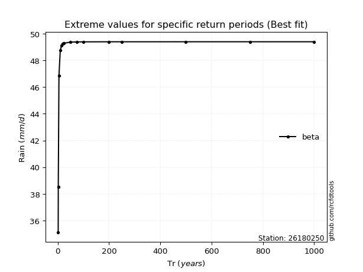</img>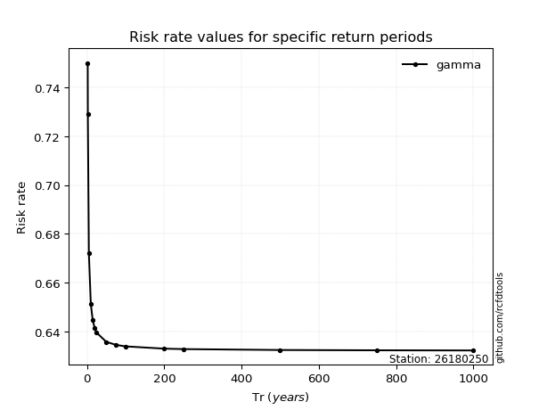</img>

</div>


<sub>**APP DISCLAIMER**: NO WARRANTY - This software is provided by [github.com/rcfdtools](https://github.com/rcfdtools) "as is", without any express or implied warranty, including warranties of merchantability, fitness for a particular purpose, or non-infringement. There is no guarantee that the software will be error-free or operate without interruption. LIMITATION OF LIABILITY - Neither the authors nor copyright holders will be liable for claims or damages arising from the software or its use. You are responsible for determining if the software is appropriate for your use and assume all associated risks, including errors, legal compliance, and data loss. NO PROFESSIONAL ADVICE - The software provides general information and does not offer professional advice. It should not replace consultation with professional advisors.</sub>