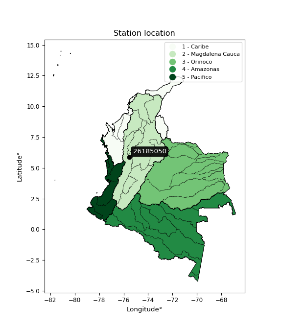

<div align="center">


</div>

# PMax24h Station (Rain, Pmax24h): 26185050

Maximum Precipitation in 24 hours (PMax24h) is the greatest amount of rainfall for a specific duration that is meteorologically possible for a given location, acting as a "worst-case" scenario for extreme storms, crucial for designing safety-critical infrastructure like bridges, river deviations, dams, spillways, and nuclear plants to prevent catastrophic failure. The PMax24h is related with the Probable Maximum Precipitation (PMP) and it is calculated by hydrologists using meteorological data to determine the upper limit of extreme rainfall, often leading to the Probable Maximum Flood (PMF) for flood control design, and is increasingly being studied for climate change impacts. Probable Maximum Precipitation (PMP) is the theoretical upper limit of rainfall, a deterministic estimate for extreme events, while probability distributions (like GEV, Gumbel) describe the likelihood and frequency of various precipitation amounts, including rare ones, showing how often events occur, with PMP representing the extreme end of these distributions, used for critical infrastructure design to ensure safety against the worst conceivable weather, unlike standard statistical forecasts which cover typical probabilities.

The most common probability distributions in hydrology, used for analyzing floods, rainfall, and streamflow, include the Normal, Log-Normal, Gumbel, Gamma (including Log-Pearson Type III), and Generalized Extreme Value (GEV) distributions, often chosen based on the data´s skewness and whether modeling extremes or general conditions, with Gumbel and GEV popular for extreme events like floods, while the Normal distribution serves as a baseline, though often requiring transformations for skewed hydrological data. These distributions help in designing water infrastructure, managing water resources, and forecasting hydrologic events.

> Hydrological data often isn´t perfectly normal (it´s skewed), so different distributions are needed for different applications, such as: **Flood Frequency Analysis**: Using Gumbel, GEV, or Log-Pearson Type III for predicting extreme flood magnitudes and their return periods, **Rainfall Analysis**: Normal for annual totals, but Log-Normal, Weibull, or GEV for intensity or extreme daily rainfall, **Streamflow Modeling**: Gamma and Log-Normal for maximum flows, GEV for minimum flows, and Kappa for daily flows.

<div align="center">

</img>

</div>


## A. General information


### 1. General running parameters

• app_version: _v20260225_. • runtime: _2026-02-27 14:50:08.749431_. • Python version: _3.14.0_. • SciPy version: _1.16.3_. • Pandas version: _2.3.3_. • NumPy version: _2.3.5_. • Stations dataset (station_dataset_file): _dataset/pmax24h_in/automatic_colombia_2003_2025.csv_. • Stations catalog (station_catalog_file): _dataset/CNE.xls_. • Minimum year to eval til year_max (date_min): _1900_. • Maximum year to eval since year_min (date_max): _2025_. • Creates, save and include plots into reports (create_plot): _False_. • Plot only fit distributions with Δo > Δ (plot_only_fit): _True_. • Plot only simple graphs avoiding multiple CDFs and multiple Extreme values plots (plot_only_simple): _False_. • Eval low extreme values, if False, evaluates high extreme values (low_extreme): _False_. • Eval every SciPy distribution as logarithmic (pdist_logarithmic_on): _True_. • Standard deviation normalized (ddof): _1.0_. • Return periods to eval in years (Tr): _[2, 2.33, 5, 10, 15, 20, 25, 50, 75, 100, 200, 250, 500, 750, 1000]_. • Minimum data sample per station, 0 means any (minimum_sample): _5_. • Z-Score maximum threshold to adjust a value, 0 means disable (zscore_max): _3.5_. • Z-Score minimum threshold to adjust a value, 0 means disable (zscore_min): _-2.5_. • Avoid zeros, e.g. rain = 0 (avoid_zeros): _True_. • Avoid null values (avoid_nans): _True_. 

:file_folder:Table: [dataset.csv](../../dataset/pmax24h_in/automatic_colombia_2003_2025.csv)

> Delta Degrees of Freedom (DDOF): is a parameter used in the formulas for calculating variance and standard deviation. When ddof=0, the divisor is $N$ (the total number of observations) and this is used when your data set is the entire population. When ddof=1, the divisor is $N-1$ and this is used when your data set is a sample drawn from a larger population. Using $N-1$ provides an unbiased estimate of the population variance (known as Bessel´s correction).


### 2. Station info and location

|   id |   CODIGO | NOMBRE                   | CATEGORIA               | TECNOLOGIA                | ESTADO   | FECHA_INSTALACION   |   FECHA_SUSPENSION |   ALTITUD |   LATITUD |   LONGITUD | DEPARTAMENTO   | MUNICIPIO     | AREA_OPERATIVA                      | ENTIDAD                                                     | AREA_HIDROGRAFICA   | ZONA_HIDROGRAFICA   | SUBZONA_HIDROGRAFICA   |   CORRIENTE | Catalogo   |   Version |
|-----:|---------:|:-------------------------|:------------------------|:--------------------------|:---------|:--------------------|-------------------:|----------:|----------:|-----------:|:---------------|:--------------|:------------------------------------|:------------------------------------------------------------|:--------------------|:--------------------|:-----------------------|------------:|:-----------|----------:|
|    0 | 26185050 | SANTA BARBARA [26185050] | Climatológica Principal | Automática con Telemetría | Activa   | 30/11/2004          |                nan |      1680 |   5.85958 |   -75.5563 | Antioquia      | Santa Bárbara | Area Operativa 01 - Antioquia-Chocó | INSTITUTO DE HIDROLOGIA METEOROLOGIA Y ESTUDIOS AMBIENTALES | Magdalena Cauca     | Cauca               | Río Arma               |         nan | CNE_IDEAM  |  20251226 |

<div align="center">

Dynamic map: [:earth_americas:Google](http://maps.google.com/maps?q=5.859583333,-75.55627778) [:earth_americas:OSM](https://www.openstreetmap.org/#map=18/5.859583333/-75.55627778&layers=P) [:earth_americas:Bing](https://www.bing.com/maps?cp=5.859583333~-75.55627778&lvl=18) [:earth_americas:Apple](https://maps.apple.com/frame?center=5.859583333%2C-75.55627778&span=0.003%2C0.006)

</div>


<div align="center">

```geojson
{
  "type": "Feature",
  "geometry": {
    "type": "Point", 
    "coordinates": [-75.55627778, 5.859583333]
  }, 
  "properties": {
    "Name": "26185050"
  }
}
```

</div>


### 3. Discrete values table and plot

<div align="center">

|               |           0 |           1 |           2 |          3 |           4 |          5 |          6 |             7 |
|:--------------|------------:|------------:|------------:|-----------:|------------:|-----------:|-----------:|--------------:|
| Date          | 2017        | 2018        | 2019        | 2021       | 2022        | 2023       | 2024       | 2025          |
| Value         |   79.5      |   92.5      |   12.4      |    1       |   45.5      |    0.3     |  126       |   51.2        |
| Value_initial |   79.5      |   92.5      |   12.4      |    1       |   45.5      |    0.3     |  126       |   51.2        |
| count         |    8        |    8        |    8        |    8       |    8        |    8       |    8       |    8          |
| mean          |   51.05     |   51.05     |   51.05     |   51.05    |   51.05     |   51.05    |   51.05    |   51.05       |
| std           |   45.904    |   45.904    |   45.904    |   45.904   |   45.904    |   45.904   |   45.904   |   45.904      |
| zscore        |    0.619772 |    0.902972 |   -0.841975 |   -1.09032 |   -0.120905 |   -1.10557 |    1.63276 |    0.00326769 |


</div>


> The initial value (value_initial) correspond to the initial obtained or null completed value, and value (value) is adjusted only when the initial value is outside the valid range (outlier) definite through the Z-Score value. If Z-Score is active, values out of range or outliers are replaced with the station mean value. A Z-Score (or standard score) measures how many standard deviations a data point is from the mean of a dataset, indicating its relative position; positive scores mean above the mean, negative mean below, and a score of zero is exactly at the mean, allowing for comparison of values from different distributions. It´s calculated using the formula $z=(x–μ)/σ$, where $x$ is the data point, $μ$ is the mean, and $σ$ is the standard deviation, helping identify outliers and understand probability.
>
> <sub>**Note**: In this study, "completing" (filling gaps in) and "extending" (forecasting or lengthening the historical record) rainfall data series are avoided for certain critical analyses because they introduce artificial bias and uncertainty, which can distort the statistics of rare events (extremes), alter day-to-day variability, and compromise the integrity and homogeneity of the original data. Some reasons against Completing/Extending rainfall data are: **Distortion of Extremes and Variability**: The primary issue is that most gap-filling or extension methods rely on averaging or regression with nearby stations, which inherently smooths the data. Rainfall is highly variable in space and time, with a large percentage of zero values and occasional large storms. Infilling methods often underestimate the highest values and overestimate the lowest (zero) values, which severely distorts analyses focused on flood frequency, drought severity, and intensity-duration-frequency (IDF) curves, **Loss of Data Homogeneity**: Infilled or extended data are synthetic estimates, not actual measurements. Combining these estimates with observed data can violate the assumption of data homogeneity, which requires that the data properties do not change over time. Inhomogeneity can lead to incorrect conclusions about long-term trends or changes in climate patterns, **Propagation of Errors**: Errors and biases from the original data (e.g., wind-induced undercatch, instrument errors, site changes) or the data used for imputation can propagate through the analysis, leading to unreliable hydrological models and inaccurate predictions, **Compromised Statistical Integrity**: For statistical analyses, especially those involving the frequency of events, using artificial data can introduce time bias or autocorrelation that doesn´t exist in reality, making it difficult to assess the true probability of events, **Difficulty in Validation**: It is difficult to accurately validate the quality of filled or extended data, especially for past periods where ground-truth measurements are unavailable. The reliability of imputation techniques heavily depends on the density of the surrounding station network and the complexity of the local topography.</sub>


### 4. Active continuous probability distributions from SciPy (80 of 104 available)

A Probability Density Function (PDF) describes the relative likelihood of a continuous random variable falling within a specific range, where the total area under its curve equals 1, and the area over any interval gives the actual probability for that range. Unlike discrete probabilities (like rolling a die), a PDF shows density, not direct probability for a single point (which is zero), with higher points indicating higher likelihood, often visualized as a bell curve for normal distributions.

A log of a probability density function (log-PDF) is simply the logarithm of the PDF´s value, denoted as $log(f(x))$, useful for converting multiplication of probabilities into addition, improving numerical stability with tiny numbers, and connecting to information theory concepts like entropy. Instead of dealing with very small probabilities (e.g., 0.000001), log-PDFs use negative numbers (e.g., $log(0.00001) ≈ -11.51$ that are easier for computers to handle, preventing underflow errors and simplifying complex calculations. In this study, each active probability distribution from SciPy is also evaluated in the $log$ form.

[scipy.stats](https://docs.scipy.org/doc/scipy/reference/stats.html) is a Python´s powerful submodule within the SciPy library for comprehensive statistical analysis, offering over 130 probability distributions (like Normal, Poisson, etc.), functions for descriptive stats (mean, variance), hypothesis testing (t-tests, chi-square), random variable generation, and statistical tests, making it essential for data science, modeling, and research. It provides tools to explore, model, and draw conclusions from data efficiently, working seamlessly with [NumPy](https://numpy.org/).

<div align="center">

|   id | p_dist           |   n_parameter | fit_method   | label                                                                       | active   | ref                                                                                                      |
|-----:|:-----------------|--------------:|:-------------|:----------------------------------------------------------------------------|:---------|:---------------------------------------------------------------------------------------------------------|
|    0 | alpha            |             3 | MLE          | Alpha                                                                       | True     | [:mortar_board:](https://docs.scipy.org/doc/scipy/reference/generated/scipy.stats.alpha.html)            |
|    1 | anglit           |             2 | MM           | Anglit                                                                      | True     | [:mortar_board:](https://docs.scipy.org/doc/scipy/reference/generated/scipy.stats.anglit.html)           |
|    2 | arcsine          |             2 | MM           | Arcsine                                                                     | True     | [:mortar_board:](https://docs.scipy.org/doc/scipy/reference/generated/scipy.stats.arcsine.html)          |
|    3 | argus            |             3 | MLE          | Argus                                                                       | True     | [:mortar_board:](https://docs.scipy.org/doc/scipy/reference/generated/scipy.stats.argus.html)            |
|    4 | beta             |             4 | MLE          | Beta                                                                        | True     | [:mortar_board:](https://docs.scipy.org/doc/scipy/reference/generated/scipy.stats.beta.html)             |
|    5 | betaprime        |             4 | MLE          | Beta prime                                                                  | True     | [:mortar_board:](https://docs.scipy.org/doc/scipy/reference/generated/scipy.stats.betaprime.html)        |
|    6 | bradford         |             3 | MLE          | Bradford                                                                    | True     | [:mortar_board:](https://docs.scipy.org/doc/scipy/reference/generated/scipy.stats.bradford.html)         |
|    7 | burr             |             4 | MLE          | Burr (Type III)                                                             | True     | [:mortar_board:](https://docs.scipy.org/doc/scipy/reference/generated/scipy.stats.burr.html)             |
|    8 | burr12           |             4 | MLE          | Burr (Type III) 12                                                          | True     | [:mortar_board:](https://docs.scipy.org/doc/scipy/reference/generated/scipy.stats.burr12.html)           |
|    9 | cosine           |             2 | MLE          | Cosine                                                                      | True     | [:mortar_board:](https://docs.scipy.org/doc/scipy/reference/generated/scipy.stats.cosine.html)           |
|   10 | crystalball      |             4 | MLE          | Crystalball                                                                 | True     | [:mortar_board:](https://docs.scipy.org/doc/scipy/reference/generated/scipy.stats.crystalball.html)      |
|   11 | dgamma           |             3 | MLE          | Double gamma                                                                | True     | [:mortar_board:](https://docs.scipy.org/doc/scipy/reference/generated/scipy.stats.dgamma.html)           |
|   12 | dweibull         |             3 | MLE          | Double Weibull                                                              | True     | [:mortar_board:](https://docs.scipy.org/doc/scipy/reference/generated/scipy.stats.dweibull.html)         |
|   13 | erlang           |             3 | MLE          | Erlang                                                                      | True     | [:mortar_board:](https://docs.scipy.org/doc/scipy/reference/generated/scipy.stats.erlang.html)           |
|   14 | exponnorm        |             3 | MLE          | Exponentially modified Normal                                               | True     | [:mortar_board:](https://docs.scipy.org/doc/scipy/reference/generated/scipy.stats.exponnorm.html)        |
|   15 | exponpow         |             3 | MLE          | Exponential power                                                           | True     | [:mortar_board:](https://docs.scipy.org/doc/scipy/reference/generated/scipy.stats.exponpow.html)         |
|   16 | exponweib        |             4 | MLE          | Exponentiated Weibull                                                       | True     | [:mortar_board:](https://docs.scipy.org/doc/scipy/reference/generated/scipy.stats.exponweib.html)        |
|   17 | f                |             4 | MLE          | F                                                                           | True     | [:mortar_board:](https://docs.scipy.org/doc/scipy/reference/generated/scipy.stats.f.html)                |
|   18 | fatiguelife      |             3 | MLE          | Fatigue-life (Birnbaum-Saunders)                                            | True     | [:mortar_board:](https://docs.scipy.org/doc/scipy/reference/generated/scipy.stats.fatiguelife.html)      |
|   19 | foldnorm         |             3 | MM           | Fold Normal                                                                 | True     | [:mortar_board:](https://docs.scipy.org/doc/scipy/reference/generated/scipy.stats.foldnorm.html)         |
|   20 | gamma            |             3 | MLE          | Gamma                                                                       | True     | [:mortar_board:](https://docs.scipy.org/doc/scipy/reference/generated/scipy.stats.gamma.html)            |
|   21 | gausshyper       |             6 | MLE          | Gauss hypergeometric                                                        | True     | [:mortar_board:](https://docs.scipy.org/doc/scipy/reference/generated/scipy.stats.gausshyper.html)       |
|   22 | genexpon         |             5 | MLE          | Generalized exponential                                                     | True     | [:mortar_board:](https://docs.scipy.org/doc/scipy/reference/generated/scipy.stats.genexpon.html)         |
|   23 | genextreme       |             3 | MLE          | Generalized exponential                                                     | True     | [:mortar_board:](https://docs.scipy.org/doc/scipy/reference/generated/scipy.stats.genextreme.html)       |
|   24 | gengamma         |             4 | MLE          | Generalized gamma                                                           | True     | [:mortar_board:](https://docs.scipy.org/doc/scipy/reference/generated/scipy.stats.gengamma.html)         |
|   25 | genhalflogistic  |             3 | MLE          | Generalized half-logistic                                                   | True     | [:mortar_board:](https://docs.scipy.org/doc/scipy/reference/generated/scipy.stats.genhalflogistic.html)  |
|   26 | genlogistic      |             3 | MLE          | Generalized logistic                                                        | True     | [:mortar_board:](https://docs.scipy.org/doc/scipy/reference/generated/scipy.stats.genlogistic.html)      |
|   27 | gennorm          |             3 | MLE          | Generalized Normal                                                          | True     | [:mortar_board:](https://docs.scipy.org/doc/scipy/reference/generated/scipy.stats.gennorm.html)          |
|   28 | genpareto        |             3 | MLE          | Generalized Pareto                                                          | True     | [:mortar_board:](https://docs.scipy.org/doc/scipy/reference/generated/scipy.stats.genpareto.html)        |
|   29 | gompertz         |             3 | MLE          | Gompertz (or truncated Gumbel)                                              | True     | [:mortar_board:](https://docs.scipy.org/doc/scipy/reference/generated/scipy.stats.gompertz.html)         |
|   30 | gumbel_l         |             2 | MM           | Gumbel Left Skew                                                            | True     | [:mortar_board:](https://docs.scipy.org/doc/scipy/reference/generated/scipy.stats.gumbel_l.html)         |
|   31 | gumbel_r         |             2 | MM           | Gumbel Right Skew                                                           | True     | [:mortar_board:](https://docs.scipy.org/doc/scipy/reference/generated/scipy.stats.gumbel_r.html)         |
|   32 | halfgennorm      |             3 | MLE          | Upper half of a generalized normal                                          | True     | [:mortar_board:](https://docs.scipy.org/doc/scipy/reference/generated/scipy.stats.halfgennorm.html)      |
|   33 | halflogistic     |             2 | MM           | Half-logistic                                                               | True     | [:mortar_board:](https://docs.scipy.org/doc/scipy/reference/generated/scipy.stats.halflogistic.html)     |
|   34 | halfnorm         |             2 | MM           | Half Normal                                                                 | True     | [:mortar_board:](https://docs.scipy.org/doc/scipy/reference/generated/scipy.stats.halfnorm.html)         |
|   35 | hypsecant        |             2 | MM           | hyperbolic secant                                                           | True     | [:mortar_board:](https://docs.scipy.org/doc/scipy/reference/generated/scipy.stats.hypsecant.html)        |
|   36 | invgamma         |             3 | MLE          | Inverted gamma                                                              | True     | [:mortar_board:](https://docs.scipy.org/doc/scipy/reference/generated/scipy.stats.invgamma.html)         |
|   37 | invgauss         |             3 | MLE          | Inverse Gaussian                                                            | True     | [:mortar_board:](https://docs.scipy.org/doc/scipy/reference/generated/scipy.stats.invgauss.html)         |
|   38 | invweibull       |             3 | MLE          | Inverted Weibull                                                            | True     | [:mortar_board:](https://docs.scipy.org/doc/scipy/reference/generated/scipy.stats.invweibull.html)       |
|   39 | johnsonsb        |             4 | MLE          | Johnson SB                                                                  | True     | [:mortar_board:](https://docs.scipy.org/doc/scipy/reference/generated/scipy.stats.johnsonsb.html)        |
|   40 | johnsonsu        |             4 | MLE          | Johnson Su                                                                  | True     | [:mortar_board:](https://docs.scipy.org/doc/scipy/reference/generated/scipy.stats.johnsonsu.html)        |
|   41 | kappa3           |             3 | MLE          | Kappa 3                                                                     | True     | [:mortar_board:](https://docs.scipy.org/doc/scipy/reference/generated/scipy.stats.kappa3.html)           |
|   42 | kappa4           |             4 | MLE          | Kappa 4                                                                     | True     | [:mortar_board:](https://docs.scipy.org/doc/scipy/reference/generated/scipy.stats.kappa4.html)           |
|   43 | ksone            |             3 | MLE          | Kolmogorov-Smirnov one-sided test statistic distribution                    | True     | [:mortar_board:](https://docs.scipy.org/doc/scipy/reference/generated/scipy.stats.ksone.html)            |
|   44 | kstwobign        |             2 | MLE          | Limiting distribution of scaled Kolmogorov-Smirnov two-sided test statistic | True     | [:mortar_board:](https://docs.scipy.org/doc/scipy/reference/generated/scipy.stats.kstwobign.html)        |
|   45 | laplace          |             2 | MM           | Laplace                                                                     | True     | [:mortar_board:](https://docs.scipy.org/doc/scipy/reference/generated/scipy.stats.laplace.html)          |
|   46 | levy_l           |             2 | MLE          | Left-skewed Levy                                                            | True     | [:mortar_board:](https://docs.scipy.org/doc/scipy/reference/generated/scipy.stats.levy_l.html)           |
|   47 | loggamma         |             3 | MLE          | Log gamma                                                                   | True     | [:mortar_board:](https://docs.scipy.org/doc/scipy/reference/generated/scipy.stats.loggamma.html)         |
|   48 | logistic         |             2 | MM           | Logistic (or Sech-squared)                                                  | True     | [:mortar_board:](https://docs.scipy.org/doc/scipy/reference/generated/scipy.stats.logistic.html)         |
|   49 | loglaplace       |             3 | MLE          | Log-Laplace                                                                 | True     | [:mortar_board:](https://docs.scipy.org/doc/scipy/reference/generated/scipy.stats.loglaplace.html)       |
|   50 | lomax            |             3 | MLE          | Lomax (Pareto of the second kind)                                           | True     | [:mortar_board:](https://docs.scipy.org/doc/scipy/reference/generated/scipy.stats.lomax.html)            |
|   51 | maxwell          |             2 | MM           | Maxwell                                                                     | True     | [:mortar_board:](https://docs.scipy.org/doc/scipy/reference/generated/scipy.stats.maxwell.html)          |
|   52 | mielke           |             4 | MLE          | Mielke Beta-Kappa / Dagum                                                   | True     | [:mortar_board:](https://docs.scipy.org/doc/scipy/reference/generated/scipy.stats.mielke.html)           |
|   53 | moyal            |             2 | MM           | Moyal                                                                       | True     | [:mortar_board:](https://docs.scipy.org/doc/scipy/reference/generated/scipy.stats.moyal.html)            |
|   54 | nakagami         |             3 | MLE          | Nakagami                                                                    | True     | [:mortar_board:](https://docs.scipy.org/doc/scipy/reference/generated/scipy.stats.nakagami.html)         |
|   55 | ncf              |             5 | MLE          | Non-central F distribution                                                  | True     | [:mortar_board:](https://docs.scipy.org/doc/scipy/reference/generated/scipy.stats.ncf.html)              |
|   56 | nct              |             4 | MLE          | Non-central Student’s t                                                     | True     | [:mortar_board:](https://docs.scipy.org/doc/scipy/reference/generated/scipy.stats.nct.html)              |
|   57 | norm             |             2 | MM           | Normal                                                                      | True     | [:mortar_board:](https://docs.scipy.org/doc/scipy/reference/generated/scipy.stats.norm.html)             |
|   58 | pearson3         |             3 | MM           | Pearson type III                                                            | True     | [:mortar_board:](https://docs.scipy.org/doc/scipy/reference/generated/scipy.stats.pearson3.html)         |
|   59 | powerlaw         |             3 | MLE          | Power-function                                                              | True     | [:mortar_board:](https://docs.scipy.org/doc/scipy/reference/generated/scipy.stats.powerlaw.html)         |
|   60 | rayleigh         |             2 | MM           | Rayleigh                                                                    | True     | [:mortar_board:](https://docs.scipy.org/doc/scipy/reference/generated/scipy.stats.rayleigh.html)         |
|   61 | rdist            |             3 | MLE          | R-distributed (symmetric beta)                                              | True     | [:mortar_board:](https://docs.scipy.org/doc/scipy/reference/generated/scipy.stats.rdist.html)            |
|   62 | rice             |             3 | MLE          | Rice                                                                        | True     | [:mortar_board:](https://docs.scipy.org/doc/scipy/reference/generated/scipy.stats.rice.html)             |
|   63 | semicircular     |             2 | MM           | Semicircular                                                                | True     | [:mortar_board:](https://docs.scipy.org/doc/scipy/reference/generated/scipy.stats.semicircular.html)     |
|   64 | skewnorm         |             3 | MLE          | Skew normal                                                                 | True     | [:mortar_board:](https://docs.scipy.org/doc/scipy/reference/generated/scipy.stats.skewnorm.html)         |
|   65 | t                |             3 | MLE          | Student’s t                                                                 | True     | [:mortar_board:](https://docs.scipy.org/doc/scipy/reference/generated/scipy.stats.t.html)                |
|   66 | trapezoid        |             4 | MLE          | Trapezoid                                                                   | True     | [:mortar_board:](https://docs.scipy.org/doc/scipy/reference/generated/scipy.stats.trapezoid.html)        |
|   67 | triang           |             3 | MLE          | Triangular                                                                  | True     | [:mortar_board:](https://docs.scipy.org/doc/scipy/reference/generated/scipy.stats.triang.html)           |
|   68 | truncexpon       |             3 | MLE          | Truncated exponential                                                       | True     | [:mortar_board:](https://docs.scipy.org/doc/scipy/reference/generated/scipy.stats.truncexpon.html)       |
|   69 | truncnorm        |             4 | MLE          | Truncated normal                                                            | True     | [:mortar_board:](https://docs.scipy.org/doc/scipy/reference/generated/scipy.stats.truncnorm.html)        |
|   70 | truncpareto      |             4 | MLE          | Upper truncated Pareto                                                      | True     | [:mortar_board:](https://docs.scipy.org/doc/scipy/reference/generated/scipy.stats.truncpareto.html)      |
|   71 | truncweibull_min |             5 | MLE          | Doubly truncated Weibull minimum                                            | True     | [:mortar_board:](https://docs.scipy.org/doc/scipy/reference/generated/scipy.stats.truncweibull_min.html) |
|   72 | tukeylambda      |             3 | MLE          | Tukey-Lamdba                                                                | True     | [:mortar_board:](https://docs.scipy.org/doc/scipy/reference/generated/scipy.stats.tukeylambda.html)      |
|   73 | uniform          |             2 | MLE          | Uniform                                                                     | True     | [:mortar_board:](https://docs.scipy.org/doc/scipy/reference/generated/scipy.stats.uniform.html)          |
|   74 | vonmises         |             3 | MLE          | Von Mises                                                                   | True     | [:mortar_board:](https://docs.scipy.org/doc/scipy/reference/generated/scipy.stats.vonmises.html)         |
|   75 | vonmises_line    |             3 | MLE          | Von Mises line                                                              | True     | [:mortar_board:](https://docs.scipy.org/doc/scipy/reference/generated/scipy.stats.vonmises_line.html)    |
|   76 | wald             |             2 | MM           | Wald                                                                        | True     | [:mortar_board:](https://docs.scipy.org/doc/scipy/reference/generated/scipy.stats.wald.html)             |
|   77 | weibull_max      |             3 | MLE          | Weibull maximum                                                             | True     | [:mortar_board:](https://docs.scipy.org/doc/scipy/reference/generated/scipy.stats.weibull_max.html)      |
|   78 | weibull_min      |             3 | MLE          | Weibull minimum                                                             | True     | [:mortar_board:](https://docs.scipy.org/doc/scipy/reference/generated/scipy.stats.weibull_min.html)      |
|   79 | wrapcauchy       |             3 | MLE          | Wrapped  Cauchy                                                             | True     | [:mortar_board:](https://docs.scipy.org/doc/scipy/reference/generated/scipy.stats.wrapcauchy.html)       |

</div>

> **n_parameter:** # arguments & localization & scale.
>
> **Fit methods:** (MLE) maximum likelihood, (MM) L-moments.
>
>**Inactive** (With the only purpose of prevent loops, zero divisions, infinite values, over high estimated values or horizontal trending for recurrence intervals estimations, the follow distributions were disabled.)**:** lognorm, norminvgauss, powernorm, powerlognorm, cauchy, halfcauchy, foldcauchy, skewcauchy, chi2, expon, fisk, genhyperbolic, geninvgauss, gibrat, kstwo, laplace_asymmetric, levy, levy_stable, ncx2, pareto, rel_breitwigner, recipinvgauss, studentized_range, loguniform, 


## B. Probability (PDF) vs. Empirical (EDF) distributions functions

A continuous probability distribution (CPD) describes probabilities for variables that can take any value within a range (like rain any time), unlike discrete variables with specific outcomes (like temperature). It uses a Probability Density Function (PDF), a curve where the total area under it equals 1, and the probability of the variable falling within an interval (a to b) is found by calculating the area under the curve between those points. A key feature is that the probability of hitting any single exact value is zero, so probabilities are always expressed for ranges, e.g., $P(a ≤ X ≤ b)$.

<div align="center">

Distributions parameters from station values
|     |   station | p_dist              |   n |              loc |           scale | shape                  | shape1                | shape2             | shape3             |
|----:|----------:|:--------------------|----:|-----------------:|----------------:|:-----------------------|:----------------------|:-------------------|:-------------------|
|   0 |  26185050 | alpha               |   8 |    -15.7959      |    29.1785      | 1.7916806733676186e-09 |                       |                    |                    |
|   1 |  26185050 | anglit              |   8 |     51.05        |   125.614       |                        |                       |                    |                    |
|   2 |  26185050 | arcsine             |   8 |     -9.67526     |   121.451       |                        |                       |                    |                    |
|   3 |  26185050 | argus               |   8 |    -23.6736      |   157.242       | 0.5367118931688579     |                       |                    |                    |
|   4 |  26185050 | beta                |   8 |     -7.33199     |   133.332       | 0.8962117224172536     | 0.8537918227309211    |                    |                    |
|   5 |  26185050 | betaprime           |   8 |      0.3         |   331.987       | 0.48361461235270375    | 2.652804497991837     |                    |                    |
|   6 |  26185050 | bradford            |   8 |      0.29999     |   125.7         | 1.0714192636195166     |                       |                    |                    |
|   7 |  26185050 | burr                |   8 |      0.299994    |   140.222       | 6.345473057611047      | 0.040946451460156574  |                    |                    |
|   8 |  26185050 | burr12              |   8 |      0.3         |    92.9726      | 0.6513825977276086     | 3.1509857273366153    |                    |                    |
|   9 |  26185050 | cosine              |   8 |     53.4834      |    35.2025      |                        |                       |                    |                    |
|  10 |  26185050 | crystalball         |   8 |     51.05        |    42.9392      | 9984.448490996372      | 1236.332486121806     |                    |                    |
|  11 |  26185050 | dgamma              |   8 |     48.3585      |    29.972       | 1.2094620143369812     |                       |                    |                    |
|  12 |  26185050 | dweibull            |   8 |     36.1956      |    43.4183      | 1.694554150127404      |                       |                    |                    |
|  13 |  26185050 | erlang              |   8 |      0.3         |    48.3334      | 0.23593363778871568    |                       |                    |                    |
|  14 |  26185050 | exponnorm           |   8 |     36.8931      |    40.579       | 0.3488716514087394     |                       |                    |                    |
|  15 |  26185050 | exponpow            |   8 |      0.3         |   118.989       | 0.17204124553599331    |                       |                    |                    |
|  16 |  26185050 | exponweib           |   8 |      0.3         |     2.92177     | 4.2691144945601796     | 0.06383696062010401   |                    |                    |
|  17 |  26185050 | f                   |   8 |      0.3         |    86.7942      | 0.7109952970519235     | 34.010829569285974    |                    |                    |
|  18 |  26185050 | fatiguelife         |   8 |      0.3         |     0.00117797  | 209.7194618144531      |                       |                    |                    |
|  19 |  26185050 | foldnorm            |   8 |    -27.7732      |    46.1134      | 1.6699996065991813     |                       |                    |                    |
|  20 |  26185050 | gamma               |   8 |      0.3         |    49.4467      | 0.439250075841232      |                       |                    |                    |
|  21 |  26185050 | gausshyper          |   8 |    -13.765       |   139.765       | 1.1333447931559664     | 0.9600967325838073    | 1.0790848474465256 | 0.9590147884251743 |
|  22 |  26185050 | genexpon            |   8 |      0.299882    |     2.57487     | 0.05047531966034928    | 9.568368424077461e-08 | 2.4022248273134874 |                    |
|  23 |  26185050 | genextreme          |   8 |      3.13935     |    19.5068      | -6.870137181016165     |                       |                    |                    |
|  24 |  26185050 | gengamma            |   8 |      0.3         |     0.000203891 | 5.3057504852909645     | 0.15345300286371538   |                    |                    |
|  25 |  26185050 | genhalflogistic     |   8 |    -12.7905      |   146.258       | 1.0538065819766609     |                       |                    |                    |
|  26 |  26185050 | genlogistic         |   8 |   -213.262       |    35.2651      | 1001.4073217463449     |                       |                    |                    |
|  27 |  26185050 | gennorm             |   8 |     63.15        |    62.8501      | 11448984.231814727     |                       |                    |                    |
|  28 |  26185050 | genpareto           |   8 |     -0.0535327   |   198.59        | -1.5754391131779144    |                       |                    |                    |
|  29 |  26185050 | gompertz            |   8 |      0.3         |   143.725       | 2.0410492844279045     |                       |                    |                    |
|  30 |  26185050 | gumbel_l            |   8 |     70.3749      |    33.4796      |                        |                       |                    |                    |
|  31 |  26185050 | gumbel_r            |   8 |     31.7251      |    33.4796      |                        |                       |                    |                    |
|  32 |  26185050 | halfgennorm         |   8 |      0.3         |     3.97034     | 0.41212152945769154    |                       |                    |                    |
|  33 |  26185050 | halflogistic        |   8 |      0.157034    |    36.7115      |                        |                       |                    |                    |
|  34 |  26185050 | halfnorm            |   8 |     -5.78471     |    71.2317      |                        |                       |                    |                    |
|  35 |  26185050 | hypsecant           |   8 |     51.05        |    27.336       |                        |                       |                    |                    |
|  36 |  26185050 | invgamma            |   8 |    -70.8323      |   848.269       | 7.914317692414982      |                       |                    |                    |
|  37 |  26185050 | invgauss            |   8 |    -12.1183      |    60.7173      | 1.0403680183855664     |                       |                    |                    |
|  38 |  26185050 | invweibull          |   8 |      0.3         |     3.19097     | 0.04462064210810297    |                       |                    |                    |
|  39 |  26185050 | johnsonsb           |   8 |      0.3         |   202.082       | 0.49411839206269553    | 0.07188190341257158   |                    |                    |
|  40 |  26185050 | johnsonsu           |   8 |      0.3         |     1.84918e-10 | -1.882287960933171     | 0.11875332990980317   |                    |                    |
|  41 |  26185050 | kappa3              |   8 |      0.299912    |   125.7         | 1890626.9117254599     |                       |                    |                    |
|  42 |  26185050 | kappa4              |   8 |    -12.4532      |   141.044       | 1.0995023180169716     | 1.018322452348594     |                    |                    |
|  43 |  26185050 | ksone               |   8 |    -12.27        |   150.84        | 1.0                    |                       |                    |                    |
|  44 |  26185050 | kstwobign           |   8 |    -90.8007      |   162.06        |                        |                       |                    |                    |
|  45 |  26185050 | laplace             |   8 |     51.05        |    30.3626      |                        |                       |                    |                    |
|  46 |  26185050 | levy_l              |   8 |    133.855       |    36.9431      |                        |                       |                    |                    |
|  47 |  26185050 | loggamma            |   8 | -12140.6         |  1668.83        | 1488.8014083514872     |                       |                    |                    |
|  48 |  26185050 | logistic            |   8 |     51.05        |    23.6736      |                        |                       |                    |                    |
|  49 |  26185050 | loglaplace          |   8 |     -0.132868    |    45.6329      | 0.6640396628270103     |                       |                    |                    |
|  50 |  26185050 | lomax               |   8 |      0.3         |     8.93571e+10 | 1869509810.0042229     |                       |                    |                    |
|  51 |  26185050 | maxwell             |   8 |    -50.6979      |    63.7611      |                        |                       |                    |                    |
|  52 |  26185050 | mielke              |   8 |      0.3         |   131.039       | 0.4360143355540979     | 360.70483659182725    |                    |                    |
|  53 |  26185050 | moyal               |   8 |     26.4946      |    19.3294      |                        |                       |                    |                    |
|  54 |  26185050 | nakagami            |   8 |      0.3         |    97.3775      | 0.1822009460643747     |                       |                    |                    |
|  55 |  26185050 | ncf                 |   8 |      0.3         |     7.63945     | 0.42740067974858525    | 87.92861993000145     | 2.868424229746374  |                    |
|  56 |  26185050 | nct                 |   8 |     -0.117756    |     0.0202154   | 0.2768014435384381     | 54.73619197198369     |                    |                    |
|  57 |  26185050 | norm                |   8 |     51.05        |    42.9392      |                        |                       |                    |                    |
|  58 |  26185050 | pearson3            |   8 |     51.05        |    42.9392      | 0.3177973979609198     |                       |                    |                    |
|  59 |  26185050 | powerlaw            |   8 |      0.3         |   125.7         | 0.15239892787522524    |                       |                    |                    |
|  60 |  26185050 | rayleigh            |   8 |    -31.0953      |    65.5424      |                        |                       |                    |                    |
|  61 |  26185050 | rdist               |   8 |    -11.3788      |    62.5788      | 1.1595905227412056     |                       |                    |                    |
|  62 |  26185050 | rice                |   8 |    -24.3018      |    57.9101      | 0.4928246372233708     |                       |                    |                    |
|  63 |  26185050 | semicircular        |   8 |     51.05        |    85.8785      |                        |                       |                    |                    |
|  64 |  26185050 | skewnorm            |   8 |      0.299935    |    66.4784      | 5108272.827078991      |                       |                    |                    |
|  65 |  26185050 | t                   |   8 |     51.0502      |    42.9392      | 4178069892.5883336     |                       |                    |                    |
|  66 |  26185050 | trapezoid           |   8 |    -12.8835      |   150.84        | 1.0                    | 1.0                   |                    |                    |
|  67 |  26185050 | triang              |   8 |    -57.4333      |   183.881       | 0.9975627303202916     |                       |                    |                    |
|  68 |  26185050 | truncexpon          |   8 |    -13.5513      |   142.641       | 0.9783385275607899     |                       |                    |                    |
|  69 |  26185050 | truncnorm           |   8 |    -28.6254      |    76.7269      | 0.37699115412509876    | 152.24641923959422    |                    |                    |
|  70 |  26185050 | truncpareto         |   8 |      0.288476    |     0.0115236   | 0.14580192936880237    | 10909.053571412816    |                    |                    |
|  71 |  26185050 | truncweibull_min    |   8 |    -12.1904      |   124.519       | 1.1408903993465676     | 0.0006709256029332705 | 1.1097976888945746 |                    |
|  72 |  26185050 | tukeylambda         |   8 |    -11.3443      |    66.5016      | 1.0632713526063253     |                       |                    |                    |
|  73 |  26185050 | uniform             |   8 |      0.3         |   125.7         |                        |                       |                    |                    |
|  74 |  26185050 | vonmises            |   8 |      0.372999    |     1           | 0.9992785115806705     |                       |                    |                    |
|  75 |  26185050 | vonmises_line       |   8 |     63.1507      |    20.006       | 0.029589947804507313   |                       |                    |                    |
|  76 |  26185050 | wald                |   8 |      8.1108      |    42.9392      |                        |                       |                    |                    |
|  77 |  26185050 | weibull_max         |   8 |    126           |     1.58029     | 0.19668709637507414    |                       |                    |                    |
|  78 |  26185050 | weibull_min         |   8 |      0.3         |    66.534       | 0.8324321444322861     |                       |                    |                    |
|  79 |  26185050 | wrapcauchy          |   8 |      0.299959    |    20.0058      | 0.3372547805686523     |                       |                    |                    |
|  80 |  26185050 | logalpha            |   8 |    -22.4818      |   268.525       | 10.717582564935746     |                       |                    |                    |
|  81 |  26185050 | loganglit           |   8 |      2.8508      |     6.19442     |                        |                       |                    |                    |
|  82 |  26185050 | logarcsine          |   8 |     -0.143753    |     5.9891      |                        |                       |                    |                    |
|  83 |  26185050 | logargus            |   8 |     -3.67546     |     8.67202     | 2.555088059405603      |                       |                    |                    |
|  84 |  26185050 | logbeta             |   8 |     -1.9401      |     6.77638     | 0.42265523090422474    | 0.16903111410002167   |                    |                    |
|  85 |  26185050 | logbetaprime        |   8 |     -1.20397     |     2.71729     | 0.17361634773901902    | 0.6928468729414584    |                    |                    |
|  86 |  26185050 | logbradford         |   8 |     -1.20398     |     6.04028     | 1.0196421841433525     |                       |                    |                    |
|  87 |  26185050 | logburr             |   8 | -12610.5         | 12592.3         | 5528.0645053142825     | 6075.470025663975     |                    |                    |
|  88 |  26185050 | logburr12           |   8 |     -1.20397     |     8.57763     | 0.3122419519354337     | 4.0861539234533435    |                    |                    |
|  89 |  26185050 | logcosine           |   8 |      2.56313     |     1.76374     |                        |                       |                    |                    |
|  90 |  26185050 | logcrystalball      |   8 |      2.8508      |     2.11746     | 154.00717744506872     | 443.15372417492335    |                    |                    |
|  91 |  26185050 | logdgamma           |   8 |      3.03965     |     0.708674    | 2.486985325205998      |                       |                    |                    |
|  92 |  26185050 | logdweibull         |   8 |      2.90761     |     2.02032     | 1.6853032032682884     |                       |                    |                    |
|  93 |  26185050 | logerlang           |   8 |    -31.1609      |     0.142749    | 238.41038213139177     |                       |                    |                    |
|  94 |  26185050 | logexponnorm        |   8 |      2.84929     |     2.11746     | 0.0007133634187176802  |                       |                    |                    |
|  95 |  26185050 | logexponpow         |   8 |     -1.20397     |     2.00433     | 0.29171497068046515    |                       |                    |                    |
|  96 |  26185050 | logexponweib        |   8 |     -1.20397     |     2.08608     | 1.7408958227712037     | 0.12926425005058456   |                    |                    |
|  97 |  26185050 | logf                |   8 |     -1.20397     |     1.11476     | 1.1398349378833448     | 1.12636441131002      |                    |                    |
|  98 |  26185050 | logfatiguelife      |   8 |   -694.527       |   697.371       | 0.003038062552815618   |                       |                    |                    |
|  99 |  26185050 | logfoldnorm         |   8 |    -11.0717      |     1.82525     | 7.665322314586412      |                       |                    |                    |
| 100 |  26185050 | loggamma            |   8 |    -27.7066      |     0.155614    | 196.05298665976284     |                       |                    |                    |
| 101 |  26185050 | loggausshyper       |   8 |     -1.80261     |     6.63889     | 1.1241246215183385     | 0.760404576627093     | 1.1092058104752602 | 1.0025350167989426 |
| 102 |  26185050 | loggenexpon         |   8 |     -1.20397     |     2.2829      | 0.2892359409855168     | 0.420447168416234     | 1.220738693152276  |                    |
| 103 |  26185050 | loggenextreme       |   8 |      2.92842     |     2.23561     | 1.1717878765613343     |                       |                    |                    |
| 104 |  26185050 | loggengamma         |   8 |     -1.20397     |     1.70019     | 1.5145933667301217     | 0.5377892832612092    |                    |                    |
| 105 |  26185050 | loggenhalflogistic  |   8 |     -1.74976     |     6.9973      | 1.0624438151632478     |                       |                    |                    |
| 106 |  26185050 | loggenlogistic      |   8 |      4.8363      |     1.49239e-06 | 7.523743864237945e-07  |                       |                    |                    |
| 107 |  26185050 | loggennorm          |   8 |      3.93574     |     0.00689419  | 0.27874967702144393    |                       |                    |                    |
| 108 |  26185050 | loggenpareto        |   8 |     -1.20397     |     1.29334     | 0.6947026034635366     |                       |                    |                    |
| 109 |  26185050 | loggompertz         |   8 |     -1.20398     |     2.0771      | 0.110835887963697      |                       |                    |                    |
| 110 |  26185050 | loggumbel_l         |   8 |      3.80377     |     1.65098     |                        |                       |                    |                    |
| 111 |  26185050 | loggumbel_r         |   8 |      1.89783     |     1.65098     |                        |                       |                    |                    |
| 112 |  26185050 | loghalfgennorm      |   8 |     -1.20397     |     1.75075     | 0.6608416306602306     |                       |                    |                    |
| 113 |  26185050 | loghalflogistic     |   8 |      0.341148    |     1.81034     |                        |                       |                    |                    |
| 114 |  26185050 | loghalfnorm         |   8 |      0.048131    |     3.51263     |                        |                       |                    |                    |
| 115 |  26185050 | loghypsecant        |   8 |      2.8508      |     1.34802     |                        |                       |                    |                    |
| 116 |  26185050 | loginvgamma         |   8 |    -41.6788      | 17913.7         | 403.8025188856068      |                       |                    |                    |
| 117 |  26185050 | loginvgauss         |   8 |    -14.4547      |   946.99        | 0.018161674727121768   |                       |                    |                    |
| 118 |  26185050 | loginvweibull       |   8 |     -1.73394e+08 |     1.73394e+08 | 75517703.57863599      |                       |                    |                    |
| 119 |  26185050 | logjohnsonsb        |   8 |     -3.79693     |     8.63322     | -0.16092546246864878   | 0.08936810509814214   |                    |                    |
| 120 |  26185050 | logjohnsonsu        |   8 |      4.91311     |     0.00172055  | 5.271553910458572      | 0.7441815139448935    |                    |                    |
| 121 |  26185050 | logkappa3           |   8 |     -1.20397     |     1.14186     | 0.9418625661486502     |                       |                    |                    |
| 122 |  26185050 | logkappa4           |   8 |     -1.70536     |     6.89614     | 1.0785732268397523     | 1.0528551758891824    |                    |                    |
| 123 |  26185050 | logksone            |   8 |     -1.808       |     7.24831     | 1.0                    |                       |                    |                    |
| 124 |  26185050 | logkstwobign        |   8 |     -6.30268     |    10.4294      |                        |                       |                    |                    |
| 125 |  26185050 | loglaplace          |   8 |      2.8508      |     1.49727     |                        |                       |                    |                    |
| 126 |  26185050 | loglevy_l           |   8 |      4.94369     |     0.495961    |                        |                       |                    |                    |
| 127 |  26185050 | logloggamma         |   8 |      4.83643     |     1.60293e-05 | 8.081652096300798e-06  |                       |                    |                    |
| 128 |  26185050 | loglogistic         |   8 |      2.8508      |     1.16742     |                        |                       |                    |                    |
| 129 |  26185050 | logloglaplace       |   8 |     -1.20397     |     1.57078     | 0.6694257386189706     |                       |                    |                    |
| 130 |  26185050 | loglomax            |   8 |     -1.20397     |     4.99823e+12 | 1335516908795.071      |                       |                    |                    |
| 131 |  26185050 | logmaxwell          |   8 |     -2.1667      |     3.14425     |                        |                       |                    |                    |
| 132 |  26185050 | logmielke           |   8 |     -1.30322e+06 |     1.30322e+06 | 3467199.9718352132     | 651390.4063693895     |                    |                    |
| 133 |  26185050 | logmoyal            |   8 |      1.6399      |     0.953193    |                        |                       |                    |                    |
| 134 |  26185050 | lognakagami         |   8 |  -1058.43        |  1061.28        | 62777.20547357535      |                       |                    |                    |
| 135 |  26185050 | logncf              |   8 |     -1.20397     |     1.11789     | 1.0608985268599178     | 1.1167262844882835    | 1.0618968609866366 |                    |
| 136 |  26185050 | lognct              |   8 |   -129.391       |     2.07496     | 45535.38161513618      | 63.73046208465317     |                    |                    |
| 137 |  26185050 | lognorm             |   8 |      2.8508      |     2.11746     |                        |                       |                    |                    |
| 138 |  26185050 | logpearson3         |   8 |      2.8508      |     2.11746     | -0.9426894862642967    |                       |                    |                    |
| 139 |  26185050 | logpowerlaw         |   8 |     -1.20397     |     6.04025     | 0.197935763163519      |                       |                    |                    |
| 140 |  26185050 | lograyleigh         |   8 |     -1.19999     |     3.23207     |                        |                       |                    |                    |
| 141 |  26185050 | logrdist            |   8 |     -0.875854    |     3.39355     | 0.9942629914932275     |                       |                    |                    |
| 142 |  26185050 | logrice             |   8 |     -2.55355     |     2.30116     | 2.088617344312737      |                       |                    |                    |
| 143 |  26185050 | logsemicircular     |   8 |      2.8508      |     4.23493     |                        |                       |                    |                    |
| 144 |  26185050 | logskewnorm         |   8 |      4.83628     |     2.90274     | -6097281.052531108     |                       |                    |                    |
| 145 |  26185050 | logt                |   8 |      2.85082     |     2.11744     | 42063235.0347822       |                       |                    |                    |
| 146 |  26185050 | logtrapezoid        |   8 |     -3.2952      |     8.98363     | 1.0                    | 1.0                   |                    |                    |
| 147 |  26185050 | logtriang           |   8 |     -2.38958     |     7.22602     | 0.9999999998467083     |                       |                    |                    |
| 148 |  26185050 | logtruncexpon       |   8 |     -1.20425     |     9.33346     | 0.647191238214673      |                       |                    |                    |
| 149 |  26185050 | logtruncnorm        |   8 |      1.75315     |     6.35328     | -0.46557648952105135   | 0.48528236240643485   |                    |                    |
| 150 |  26185050 | logtruncpareto      |   8 |     -1.20543     |     0.00144077  | 3.3027442730694306e-09 | 4195.322380404468     |                    |                    |
| 151 |  26185050 | logtruncweibull_min |   8 |     -1.46372     |     9.03535     | 1.428241353431194      | 0.0005549443626996023 | 0.6972614162067663 |                    |
| 152 |  26185050 | logtukeylambda      |   8 |      1.81795     |     4.00658     | 1.3258382509221924     |                       |                    |                    |
| 153 |  26185050 | loguniform          |   8 |     -1.20397     |     6.04025     |                        |                       |                    |                    |
| 154 |  26185050 | logvonmises         |   8 |     -1.85076     |     1           | 1.5127097605694326     |                       |                    |                    |
| 155 |  26185050 | logvonmises_line    |   8 |      3.27617     |     1.42607     | 0.7590455598977968     |                       |                    |                    |
| 156 |  26185050 | logwald             |   8 |      0.7333      |     2.11749     |                        |                       |                    |                    |
| 157 |  26185050 | logweibull_max      |   8 |      4.83628     |     2.29409     | 0.21469134507605986    |                       |                    |                    |
| 158 |  26185050 | logweibull_min      |   8 |     -1.38821e+08 |     1.38821e+08 | 97937320.36986873      |                       |                    |                    |
| 159 |  26185050 | logwrapcauchy       |   8 |     -1.20397     |     0.961337    | 0.5388976892493467     |                       |                    |                    |

</div>

> **loc** (Location parameter): This shifts the distribution along the x-axis. For many common distributions, like the normal (Gaussian) distribution, loc represents the mean $μ$. For others, like the uniform distribution, it might represent the minimum value, or for the beta distribution, the left end of the support interval.
>
> **scale** (Scale parameter): This determines the width or spread of the distribution. For the normal distribution, scale represents the standard deviation $σ$. For a uniform distribution, it defines the length of the interval (from $loc$ to $loc + scale$).
>
> **shape** (Shape parameters): Refers to parameters that define the specific form of a probability distribution, distinct from its location (loc) and scale (scale). These parameters are required arguments for most distribution functions. For example, a normal (Gaussian) distribution is fully defined by its location (mean) and scale (standard deviation), so it has no specific shape parameters beyond loc and scale. However, other distributions have intrinsic properties that need specification, as Gamma distribution that takes a shape parameter, often named $a$ or $alpha$.


### 0. Cumulative distribution values - CDF (160 evaluated)

Cumulative Distribution Function (CDF), denoted as $F$<sub>$X$</sub>$(x)$, is a function that gives the probability that a random variable $X$ will take a value less than or equal to a specific value, $x$ (i.e., $(P(X≥x)$. It essentially "accumulates" probabilities from a given point up to the far right (positive infinity), providing a complete picture of the distribution´s probabilities for both discrete (like rain) and continuous (like temperature) variables, helping to find probabilities over ranges or above certain values. Each station is evaluated separately ordering the $x$ values ascending, calculating the CDF and PDF values for the activated distributions and their logarithmic forms.

<div align="center">

CDF ordered by x ascending and calculating $log(f(x))$ separately
|   id |   Station |   date |     x |   count |   mean |    std |      zscore |   Value_initial |   station |   m |     alpha |   alpha_pdf |   anglit |   anglit_pdf |   arcsine |   arcsine_pdf |     argus |   argus_pdf |      beta |   beta_pdf |   betaprime |   betaprime_pdf |    bradford |   bradford_pdf |      burr |     burr_pdf |      burr12 |      burr12_pdf |   cosine |   cosine_pdf |   crystalball |   crystalball_pdf |   dgamma |   dgamma_pdf |   dweibull |   dweibull_pdf |      erlang |   erlang_pdf |   exponnorm |   exponnorm_pdf |    exponpow |   exponpow_pdf |   exponweib |   exponweib_pdf |           f |       f_pdf |   fatiguelife |   fatiguelife_pdf |   foldnorm |   foldnorm_pdf |       gamma |   gamma_pdf |   gausshyper |   gausshyper_pdf |    genexpon |   genexpon_pdf |   genextreme |   genextreme_pdf |    gengamma |   gengamma_pdf |   genhalflogistic |   genhalflogistic_pdf |   genlogistic |   genlogistic_pdf |     gennorm |   gennorm_pdf |   genpareto |   genpareto_pdf |    gompertz |   gompertz_pdf |   gumbel_l |   gumbel_l_pdf |   gumbel_r |   gumbel_r_pdf |   halfgennorm |   halfgennorm_pdf |   halflogistic |   halflogistic_pdf |   halfnorm |   halfnorm_pdf |   hypsecant |   hypsecant_pdf |   invgamma |   invgamma_pdf |   invgauss |   invgauss_pdf |   invweibull |   invweibull_pdf |   johnsonsb |   johnsonsb_pdf |   johnsonsu |   johnsonsu_pdf |     kappa3 |   kappa3_pdf |      kappa4 |   kappa4_pdf |     ksone |   ksone_pdf |   kstwobign |   kstwobign_pdf |   laplace |   laplace_pdf |   levy_l |   levy_l_pdf |   loggamma |   loggamma_pdf |   logistic |   logistic_pdf |   loglaplace |   loglaplace_pdf |       lomax |   lomax_pdf |   maxwell |   maxwell_pdf |      mielke |   mielke_pdf |     moyal |   moyal_pdf |    nakagami |   nakagami_pdf |         ncf |     ncf_pdf |       nct |     nct_pdf |     norm |   norm_pdf |   pearson3 |   pearson3_pdf |   powerlaw |   powerlaw_pdf |   rayleigh |   rayleigh_pdf |    rdist |      rdist_pdf |      rice |   rice_pdf |   semicircular |   semicircular_pdf |   skewnorm |   skewnorm_pdf |        t |      t_pdf |   trapezoid |   trapezoid_pdf |   triang |   triang_pdf |   truncexpon |   truncexpon_pdf |   truncnorm |   truncnorm_pdf |   truncpareto |   truncpareto_pdf |   truncweibull_min |   truncweibull_min_pdf |   tukeylambda |   tukeylambda_pdf |    uniform |   uniform_pdf |   vonmises |   vonmises_pdf |   vonmises_line |   vonmises_line_pdf |     wald |   wald_pdf |   weibull_max |   weibull_max_pdf |   weibull_min |   weibull_min_pdf |   wrapcauchy |   wrapcauchy_pdf |   logalpha |   logalpha_pdf |   loganglit |   loganglit_pdf |   logarcsine |   logarcsine_pdf |   logargus |   logargus_pdf |   logbeta |   logbeta_pdf |   logbetaprime |   logbetaprime_pdf |   logbradford |   logbradford_pdf |   logburr |   logburr_pdf |   logburr12 |   logburr12_pdf |   logcosine |   logcosine_pdf |   logcrystalball |   logcrystalball_pdf |   logdgamma |   logdgamma_pdf |   logdweibull |   logdweibull_pdf |   logerlang |   logerlang_pdf |   logexponnorm |   logexponnorm_pdf |   logexponpow |   logexponpow_pdf |   logexponweib |   logexponweib_pdf |        logf |    logf_pdf |   logfatiguelife |   logfatiguelife_pdf |   logfoldnorm |   logfoldnorm_pdf |   loggausshyper |   loggausshyper_pdf |   loggenexpon |   loggenexpon_pdf |   loggenextreme |   loggenextreme_pdf |   loggengamma |   loggengamma_pdf |   loggenhalflogistic |   loggenhalflogistic_pdf |   loggenlogistic |   loggenlogistic_pdf |   loggennorm |   loggennorm_pdf |   loggenpareto |   loggenpareto_pdf |   loggompertz |   loggompertz_pdf |   loggumbel_l |   loggumbel_l_pdf |   loggumbel_r |   loggumbel_r_pdf |   loghalfgennorm |   loghalfgennorm_pdf |   loghalflogistic |   loghalflogistic_pdf |   loghalfnorm |   loghalfnorm_pdf |   loghypsecant |   loghypsecant_pdf |   loginvgamma |   loginvgamma_pdf |   loginvgauss |   loginvgauss_pdf |   loginvweibull |   loginvweibull_pdf |   logjohnsonsb |   logjohnsonsb_pdf |   logjohnsonsu |   logjohnsonsu_pdf |   logkappa3 |   logkappa3_pdf |   logkappa4 |   logkappa4_pdf |   logksone |   logksone_pdf |   logkstwobign |   logkstwobign_pdf |   loglevy_l |   loglevy_l_pdf |   logloggamma |   logloggamma_pdf |   loglogistic |   loglogistic_pdf |   logloglaplace |   logloglaplace_pdf |    loglomax |   loglomax_pdf |   logmaxwell |   logmaxwell_pdf |   logmielke |   logmielke_pdf |    logmoyal |   logmoyal_pdf |   lognakagami |   lognakagami_pdf |      logncf |   logncf_pdf |    lognct |   lognct_pdf |   lognorm |   lognorm_pdf |   logpearson3 |   logpearson3_pdf |   logpowerlaw |   logpowerlaw_pdf |   lograyleigh |   lograyleigh_pdf |   logrdist |   logrdist_pdf |   logrice |   logrice_pdf |   logsemicircular |   logsemicircular_pdf |   logskewnorm |   logskewnorm_pdf |      logt |   logt_pdf |   logtrapezoid |   logtrapezoid_pdf |   logtriang |   logtriang_pdf |   logtruncexpon |   logtruncexpon_pdf |   logtruncnorm |   logtruncnorm_pdf |   logtruncpareto |   logtruncpareto_pdf |   logtruncweibull_min |   logtruncweibull_min_pdf |   logtukeylambda |   logtukeylambda_pdf |   loguniform |   loguniform_pdf |   logvonmises |   logvonmises_pdf |   logvonmises_line |   logvonmises_line_pdf |   logwald |   logwald_pdf |   logweibull_max |   logweibull_max_pdf |   logweibull_min |   logweibull_min_pdf |   logwrapcauchy |   logwrapcauchy_pdf |
|-----:|----------:|-------:|------:|--------:|-------:|-------:|------------:|----------------:|----------:|----:|----------:|------------:|---------:|-------------:|----------:|--------------:|----------:|------------:|----------:|-----------:|------------:|----------------:|------------:|---------------:|----------:|-------------:|------------:|----------------:|---------:|-------------:|--------------:|------------------:|---------:|-------------:|-----------:|---------------:|------------:|-------------:|------------:|----------------:|------------:|---------------:|------------:|----------------:|------------:|------------:|--------------:|------------------:|-----------:|---------------:|------------:|------------:|-------------:|-----------------:|------------:|---------------:|-------------:|-----------------:|------------:|---------------:|------------------:|----------------------:|--------------:|------------------:|------------:|--------------:|------------:|----------------:|------------:|---------------:|-----------:|---------------:|-----------:|---------------:|--------------:|------------------:|---------------:|-------------------:|-----------:|---------------:|------------:|----------------:|-----------:|---------------:|-----------:|---------------:|-------------:|-----------------:|------------:|----------------:|------------:|----------------:|-----------:|-------------:|------------:|-------------:|----------:|------------:|------------:|----------------:|----------:|--------------:|---------:|-------------:|-----------:|---------------:|-----------:|---------------:|-------------:|-----------------:|------------:|------------:|----------:|--------------:|------------:|-------------:|----------:|------------:|------------:|---------------:|------------:|------------:|----------:|------------:|---------:|-----------:|-----------:|---------------:|-----------:|---------------:|-----------:|---------------:|---------:|---------------:|----------:|-----------:|---------------:|-------------------:|-----------:|---------------:|---------:|-----------:|------------:|----------------:|---------:|-------------:|-------------:|-----------------:|------------:|----------------:|--------------:|------------------:|-------------------:|-----------------------:|--------------:|------------------:|-----------:|--------------:|-----------:|---------------:|----------------:|--------------------:|---------:|-----------:|--------------:|------------------:|--------------:|------------------:|-------------:|-----------------:|-----------:|---------------:|------------:|----------------:|-------------:|-----------------:|-----------:|---------------:|----------:|--------------:|---------------:|-------------------:|--------------:|------------------:|----------:|--------------:|------------:|----------------:|------------:|----------------:|-----------------:|---------------------:|------------:|----------------:|--------------:|------------------:|------------:|----------------:|---------------:|-------------------:|--------------:|------------------:|---------------:|-------------------:|------------:|------------:|-----------------:|---------------------:|--------------:|------------------:|----------------:|--------------------:|--------------:|------------------:|----------------:|--------------------:|--------------:|------------------:|---------------------:|-------------------------:|-----------------:|---------------------:|-------------:|-----------------:|---------------:|-------------------:|--------------:|------------------:|--------------:|------------------:|--------------:|------------------:|-----------------:|---------------------:|------------------:|----------------------:|--------------:|------------------:|---------------:|-------------------:|--------------:|------------------:|--------------:|------------------:|----------------:|--------------------:|---------------:|-------------------:|---------------:|-------------------:|------------:|----------------:|------------:|----------------:|-----------:|---------------:|---------------:|-------------------:|------------:|----------------:|--------------:|------------------:|--------------:|------------------:|----------------:|--------------------:|------------:|---------------:|-------------:|-----------------:|------------:|----------------:|------------:|---------------:|--------------:|------------------:|------------:|-------------:|----------:|-------------:|----------:|--------------:|--------------:|------------------:|--------------:|------------------:|--------------:|------------------:|-----------:|---------------:|----------:|--------------:|------------------:|----------------------:|--------------:|------------------:|----------:|-----------:|---------------:|-------------------:|------------:|----------------:|----------------:|--------------------:|---------------:|-------------------:|-----------------:|---------------------:|----------------------:|--------------------------:|-----------------:|---------------------:|-------------:|-----------------:|--------------:|------------------:|-------------------:|-----------------------:|----------:|--------------:|-----------------:|---------------------:|-----------------:|---------------------:|----------------:|--------------------:|
|    0 |  26185050 |   2023 |   0.3 |       8 |  51.05 | 45.904 | -1.10557    |             0.3 |  26185050 |   1 | 0.069865  |  0.0173773  | 0.138537 |   0.00550037 |  0.185044 |    0.0095455  | 0.0327547 |  0.00272102 | 0.066736  | 0.00787269 | 2.00484e-09 |      8.7331e+06 | 1.18444e-07 |     0.0117045  | 0.0121908 | 525.15       | 4.24294e-12 | 49787.7         | 0.100682 |   0.00479228 |      0.118622 |        0.00462087 | 0.132936 |   0.00404649 |   0.242308 |     0.00828627 | 0.000271878 |  2.57358e+09 |    0.117257 |      0.00468541 | 0.000701924 |    2.17542e+12 |  2.3131e-05 |     1.08768e+11 | 1.19635e-06 | 1.07909e+08 |     0.0693339 |       8.07923e+06 |   0.132957 |     0.00557136 | 1.14718e-07 | 8.48355e+06 |     0.101782 |       0.0078472  | 2.31017e-06 |     0.019603   |   0.00052643 |    219           | 2.85836e-13 | 4184.52        |         0.0469699 |            0.0037663  |     0.0958901 |        0.00636766 | 6.91454e-07 |    0.00795544 |  0.00178113 |      0.00504068 | 7.33923e-16 |     0.0142011  |   0.116009 |    0.00325583  |  0.0775769 |     0.00592374 |   6.67421e-11 |        0.0821087  |     0.00194715 |         0.0136197  |  0.0680736 |     0.0111605  |   0.0986516 |      0.00355136 |  0.0881232 |     0.00725659 |  0.0656809 |     0.0146615  |   0.00371537 |      1.67101e+13 |  0.00496848 |     1.86189e+13 |   0.0338295 |     4.35021e+07 | 6.9929e-07 |   0.00795538 | 3.08505e-15 |   0.197357   | 0.0833333 |  0.00662954 |   0.0898927 |      0.00671788 | 0.0939859 |    0.00309545 | 0.401071 |   0.00136811 |  0.0286011 |      0.0329801 |   0.104918 |     0.00396687 |    0.0333314 |        0.0222614 | 2.48517e-11 |  0.0209218  |  0.112719 |    0.00581385 | 9.75215e-09 |  7.65986e+07 | 0.0489402 |  0.00584782 | 1.78587e-07 |    1.17233e+09 | 0.000152079 | 1.22225e+09 | 0.0361813 | 0.266748    | 0.118622 | 0.00462087 |   0.11288  |     0.00512706 | 0.00159487 |    4.37851e+12 |   0.108387 |     0.00651621 | 0.566059 |     0.0057129  | 0.0768332 | 0.0060017  |       0.147006 |         0.00598015 | 0          |     0.0120022  | 0.118621 | 0.00462085 |  0.00763886 |      0.00115885 | 0.098818 |   0.00342326 |     0.148286 |       0.0101942  | 2.66009e-13 |      0.0137156  |      0        |      17.0472      |           0.103244 |             0.00912379 |      0.591505 |        0.00786363 | 0          |    0.00795545 |   0.475088 |      0.340666  |     4.18075e-08 |          0.00772172 | 0        | 0          |     0.0939533 |       0.000347677 |    8.9277e-16 |       13.3878     |  6.58022e-07 |       0.0160521  |   0.028563 |      0.0387436 |   0.0170148 |       0.0417557 |    0         |         0        |  0.0253998 |      0.0229218 |  0.124924 |   0.0767311   |     0.00145771 |        1.13978e+12 |   2.33173e-06 |          0.240151 | 0.0281403 |     0.0440372 | 2.70503e-05 |     3.80379e+10 |   0.0256523 |       0.0419179 |        0.0277513 |            0.0301184 |   0.0172708 |       0.0192333 |     0.018225  |         0.0247401 |   0.0282661 |       0.0319994 |      0.0277513 |          0.0301184 |   2.21581e-05 |       2.91106e+10 |    0.000252509 |        2.54809e+11 | 7.56977e-10 | 1.94292e+06 |        0.0276946 |            0.0302258 |      0.011938 |         0.0170354 |       0.0772053 |            0.140149 |   4.73863e-10 |         0.126697  |        0.068988 |           0.0260616 |   8.58638e-14 |       314.976     |            0.0406883 |                0.0777838 |         0        |            0.0239915 |    0.0440883 |       0.00993293 |    6.41465e-09 |          0.773189  |   1.34331e-07 |         0.053361  |     0.04702   |         0.0277998 |    0.00143667 |        0.00569578 |       1.2065e-11 |            0.42568   |          0        |             0         |      0        |         0         |      0.0314189 |          0.0232696 |     0.0295053 |         0.0343584 |     0.0301871 |         0.0387183 |       0.0286115 |           0.0442859 |       0.406523 |        0.0191103   |      0.0919488 |          0.0200723 | 6.55879e-10 |       0.933265  | 1.61321e-15 |        2.11548  |  0.0833333 |       0.137963 |      0.0293835 |          0.0537325 |    0.223615 |       0.0177032 |      0.047575 |         0.0239864 |     0.030082  |         0.0249928 |     1.22684e-11 |       36987.2       | 1.17533e-13 |      0.267198  |   0.00742316 |        0.0227004 |    0.027198 |       0.0355985 | 8.79246e-06 |    9.53558e-05 |     0.0278207 |         0.0302138 | 1.81341e-09 |  4.33211e+06 | 0.0278582 |    0.0302453 | 0.0277512 |     0.0301184 |     0.0468028 |         0.0302479 |   0.000558473 |       4.97836e+11 |     0         |          0        |   0.469297 |    0.0938673   | 0.0212968 |     0.0342073 |        0.00523234 |             0.0433786 |     0.0374448 |         0.0315406 | 0.0277495 |  0.0301171 |      0.0541874 |          0.0518236 |   0.0269204 |       0.0454121 |      6.3368e-05 |            0.224851 |    0.000125535 |           0.154162 |       0.00144704 |           82.2065    |             0.0138864 |                 0.0763888 |      1.63425e-13 |             0.249573 |     0        |         0.165556 |      0.755008 |         0.320753  |        7.18269e-11 |              0.0454561 |  0        |     0         |         0.291994 |          0.0127761   |        0.0293619 |            0.0204076 |     6.81756e-07 |           0.552532  |
|    1 |  26185050 |   2021 |   1   |       8 |  51.05 | 45.904 | -1.09032    |             1   |  26185050 |   2 | 0.0823459 |  0.0182494  | 0.142409 |   0.00556416 |  0.191623 |    0.00925634 | 0.0346868 |  0.00279905 | 0.0722237 | 0.00780768 | 0.0875194   |      0.0601965  | 0.00816892  |     0.0116351  | 0.252324  |   0.0936561  | 0.119977    |     0.102568    | 0.104068 |   0.00488196 |      0.121888 |        0.00471014 | 0.135797 |   0.0041294  |   0.248138 |     0.00837036 | 0.40376     |  0.1345      |    0.120569 |      0.00477768 | 0.400594    |    0.0920518   |  0.111841   |     0.0266516   | 0.139051    | 0.0704652   |     0.54619   |       0.0329558   |   0.136877 |     0.00562879 | 0.173217    | 0.107629    |     0.107281 |       0.00786278 | 0.0136307   |     0.0193358  |   0.293443   |      0.0748126   | 0.225622    |    0.13189     |         0.0496133 |            0.00378642 |     0.100407  |        0.00653685 | 0.5         |    0.00795544 |  0.0053132  |      0.00505097 | 0.00991551  |     0.0141289  |   0.118309 |    0.00331597  |  0.0817909 |     0.00611629 |   0.0408887   |        0.0503538  |     0.0114804  |         0.0136179  |  0.0758825 |     0.0111506  |   0.101168  |      0.00363892 |  0.0932775 |     0.00746948 |  0.0761756 |     0.0153036  |   0.342997   |      0.0233951   |  0.534717   |     0.0409534   |   0.793625  |     0.0483929   | 0.00556946 |   0.00795538 | 0.00875886  |   0.0113809  | 0.087974  |  0.00662954 |   0.0946584 |      0.00689777 | 0.0961779 |    0.00316764 | 0.402032 |   0.00137793 |  0.0961767 |      0.0834789 |   0.107728 |     0.00406031 |    0.074486  |        0.0497478 | 0.0145385   |  0.0206176  |  0.116827 |    0.00592196 | 0.102151    |  0.0636278   | 0.0531404 |  0.00615284 | 0.131517    |    0.0684638   | 0.114415    | 0.0380735   | 0.203457  | 0.175013    | 0.121888 | 0.00471014 |   0.116506 |     0.0052324  | 0.453374   |    0.0987053   |   0.112988 |     0.00662713 | 0.570062 |     0.00572363 | 0.0810845 | 0.00614426 |       0.151208 |         0.00602394 | 0.00840214 |     0.0120015  | 0.121887 | 0.00471012 |  0.00847159 |      0.00122038 | 0.101229 |   0.00346477 |     0.155404 |       0.0101443  | 0.00958431  |      0.013668   |      0.608751 |       0.151349    |           0.109641 |             0.00915144 |      0.597009 |        0.00786463 | 0.00556881 |    0.00795545 |   0.701172 |      0.282447  |     0.00540528  |          0.00772186 | 0        | 0          |     0.0941976 |       0.000350148 |    0.0223153  |        0.0262388  |  0.0112336   |       0.016037   |   0.110004 |      0.0999014 |   0.102065  |       0.0977442 |    0.0990284 |         0.347246 |  0.0647086 |      0.0444131 |  0.198351 |   0.0527482   |     0.749066   |        0.0824776   |   0.263214    |          0.199587 | 0.121663  |     0.112327  | 0.829456    |     0.0634995   |   0.110654  |       0.100821  |        0.0890981 |            0.0761189 |   0.0627317 |       0.0640321 |     0.0788524 |         0.0844171 |   0.0934415 |       0.0803467 |      0.0890983 |          0.0761189 |   0.745262    |       0.125938    |    0.418131    |        0.0473267   | 0.511851    | 0.143883    |        0.0893587 |            0.0765538 |      0.054855 |         0.0608189 |       0.249121  |            0.142843 |   0.190047    |         0.173431  |        0.109505 |           0.0427382 |   0.349103    |         0.165716  |            0.144314  |                0.0952823 |         0        |            0.0440213 |    0.0591074 |       0.0156264  |    0.512256    |          0.229015  |   0.0833694   |         0.0873281 |     0.0950391 |         0.0547388 |    0.0425671  |        0.0813883  |       0.327141   |            0.194977  |          0        |             0         |      0        |         0         |      0.0764426 |          0.0561639 |     0.0996236 |         0.0861582 |     0.109851  |         0.0970267 |       0.122004  |           0.111782  |       0.427576 |        0.0164848   |      0.12186   |          0.0306295 | 0.506997    |       0.199006  | 0.214515    |        0.166149 |  0.249437  |       0.137963 |      0.141485  |          0.12922   |    0.248557 |       0.0243093 |      0.087298 |         0.044014  |     0.0800276 |         0.063065  |     0.418458    |           0.232669  | 0.275084    |      0.193686  |   0.0756202  |        0.0950322 |    0.103792 |       0.0957149 | 0.018095    |    0.0605522   |     0.0893555 |         0.0763359 | 0.375918    |  0.136985    | 0.089426  |    0.0763466 | 0.0890981 |     0.0761189 |     0.0991569 |         0.0593933 |   0.726705    |       0.119472    |     0.0666012 |          0.107222 |   0.582769 |    0.0967203   | 0.0906093 |     0.0843381 |        0.10648    |             0.111165  |     0.0956915 |         0.0686038 | 0.0890946 |  0.0761174 |      0.134543  |          0.0816597 |   0.109356  |       0.0915278 |      0.254044   |            0.197639 |    0.192984    |           0.165382 |       0.806717   |            0.0994493 |             0.159154  |                 0.149645  |      0.211834    |             0.163295 |     0.199325 |         0.165556 |      0.957445 |         0.063149  |        0.0598813   |              0.0586489 |  0        |     0         |         0.309236 |          0.0161113   |        0.0673108 |            0.0458521 |     0.37499     |           0.123269  |
|    2 |  26185050 |   2019 |  12.4 |       8 |  51.05 | 45.904 | -0.841975   |            12.4 |  26185050 |   3 | 0.300741  |  0.0171429  | 0.211367 |   0.0065005  |  0.280393 |    0.00679607 | 0.0737627 |  0.00404943 | 0.157401  | 0.00723992 | 0.33561     |      0.0124324  | 0.134788    |     0.0106102  | 0.529101  |   0.0113614  | 0.523159    |     0.0169416   | 0.167898 |   0.00629729 |      0.184031 |        0.00619618 | 0.191428 |   0.00570193 |   0.348514 |     0.00895781 | 0.757685    |  0.0120396   |    0.183749 |      0.00630853 | 0.61854     |    0.00718775  |  0.17573    |     0.00217882  | 0.378259    | 0.0107056   |     0.68553   |       0.00708957  |   0.206675 |     0.00663074 | 0.56597     | 0.017289    |     0.197474 |       0.00791062 | 0.211166    |     0.0154636  |   0.44496    |      0.00433443  | 0.573892    |    0.0114628   |         0.0947428 |            0.00413919 |     0.18935   |        0.00892799 | 0.5         |    0.00795544 |  0.0638954  |      0.00523051 | 0.164123    |     0.012913   |   0.162214 |    0.00442901  |  0.168456  |     0.0089617  |   0.344942    |        0.0168653  |     0.165217   |         0.0132479  |  0.2015    |     0.0108421  |   0.151875  |      0.00534745 |  0.195177  |     0.0101266  |  0.266705  |     0.016107   |   0.389746   |      0.00135426  |  0.616452   |     0.00241274  |   0.876465  |     0.00200372  | 0.0962608  |   0.00795538 | 0.117074    |   0.00880808 | 0.163551  |  0.00662954 |   0.187865  |      0.00925579 | 0.140003  |    0.00461102 | 0.418721 |   0.00155598 |  0.457352  |      0.183161  |   0.163472 |     0.00577642 |    0.400267  |        0.267331  | 0.223651    |  0.0162426  |  0.193741 |    0.00751017 | 0.35391     |  0.0127529   | 0.14989   |  0.0105391  | 0.371372    |    0.0111576   | 0.271639    | 0.00977254  | 0.585326  | 0.00916085  | 0.184031 | 0.00619618 |   0.185836 |     0.0069093  | 0.699969   |    0.00881608  |   0.197638 |     0.00812395 | 0.636726 |     0.00600958 | 0.163051  | 0.00812355 |       0.223476 |         0.00661985 | 0.144429   |     0.011805   | 0.18403  | 0.00619615 |  0.0280958  |      0.00222246 | 0.14458  |   0.00414072 |     0.266549 |       0.00936511 | 0.160466    |      0.0127642  |      0.858781 |       0.00588148  |           0.214912 |             0.00922334 |      0.686796 |        0.00789071 | 0.0962609  |    0.00795545 |   2.3242   |      0.296397  |     0.0935986   |          0.00776236 | 0.004052 | 0.00509935 |     0.0984366 |       0.000395123 |    0.214931   |        0.0130694  |  0.178836    |       0.0126154  |   0.490577 |      0.17136   |   0.446328  |       0.160503  |    0.464519  |         0.10696  |  0.299987  |      0.170045  |  0.33069  |   0.0601083   |     0.85125    |        0.0211194   |   0.69354     |          0.147491 | 0.497194  |     0.152262  | 0.903118    |     0.014454    |   0.491801  |       0.180444  |        0.437499  |            0.186089  |   0.457268  |       0.162737  |     0.469703  |         0.126901  |   0.444441  |       0.180474  |      0.437499  |          0.186089  |   0.901036    |       0.0307839   |    0.484632    |        0.0162963   | 0.694465    | 0.0383695   |        0.438939  |            0.186177  |      0.412885 |         0.213336  |       0.604507  |            0.142075 |   0.576672    |         0.120943  |        0.306961 |           0.133436  |   0.61073     |         0.0671952 |            0.455262  |                0.160905  |         0        |            0.15664   |    0.140379  |       0.066808   |    0.794222    |          0.0530521 |   0.425459    |         0.18395   |     0.368005  |         0.175657  |    0.503094   |        0.209339   |       0.646933   |            0.082078  |          0.537862 |             0.19629   |      0.517978 |         0.177409  |      0.422132  |          0.229101  |     0.463338  |         0.180834  |     0.487449  |         0.174729  |       0.495247  |           0.151567  |       0.471545 |        0.0209695   |      0.263969  |          0.101556  | 0.75103     |       0.0476981 | 0.619284    |        0.158602 |  0.596787  |       0.137963 |      0.528157  |          0.14669   |    0.348837 |       0.0671285 |      0.310661 |         0.156629  |     0.429146  |         0.209847  |     0.719335    |           0.0504839 | 0.630063    |      0.0988573 |   0.471899   |        0.18566   |    0.473669 |       0.165056  | 0.528041    |    0.216421    |     0.43827   |         0.186129  | 0.572745    |  0.0463473   | 0.438048  |    0.185881  | 0.437499  |     0.186089  |     0.378082  |         0.170169  |   0.908596    |       0.0483234   |     0.483942  |          0.183658 |   1        |    4.90644e+06 | 0.44925   |     0.182519  |        0.449977   |             0.14986   |     0.424431  |         0.199797  | 0.437494  |  0.18609   |      0.418679  |          0.144052  |   0.461193  |       0.187963  |      0.690174   |            0.150911 |    0.621428    |           0.17056  |       0.941908   |            0.0321985 |             0.592939  |                 0.181429  |      0.609648    |             0.157263 |     0.616144 |         0.165556 |      1.0387   |         0.0575943 |        0.348043    |              0.18679   |  0.597171 |     0.239998  |         0.36704  |          0.034064    |        0.337446  |            0.192418  |     0.536274    |           0.0561088 |
|    3 |  26185050 |   2022 |  45.5 |       8 |  51.05 | 45.904 | -0.120905   |            45.5 |  26185050 |   4 | 0.634056  |  0.00553265 | 0.455875 |   0.00792981 |  0.470867 |    0.00526383 | 0.263727  |  0.00731127 | 0.38868   | 0.00687402 | 0.579847    |      0.00471947 | 0.447512    |     0.00844927 | 0.745137  |   0.00428005 | 0.783485    |     0.00378196  | 0.428121 |   0.00892649 |      0.448579 |        0.00921357 | 0.475011 |   0.0101228  |   0.535438 |     0.00621984 | 0.929982    |  0.00221759  |    0.452375 |      0.00929665 | 0.735974    |    0.00198378  |  0.212985   |     0.000667747 | 0.583623    | 0.00399053  |     0.824851  |       0.00266491  |   0.467154 |     0.00866572 | 0.849191    | 0.00422768  |     0.451765 |       0.00739609 | 0.587724    |     0.00808189 |   0.512516   |      0.0011032   | 0.748188    |    0.00267413  |         0.252843  |            0.00551724 |     0.521365  |        0.00962585 | 0.5         |    0.00795544 |  0.247723   |      0.00593172 | 0.529655    |     0.00914783 |   0.378544 |    0.00882988  |  0.515461  |     0.010203   |   0.654624    |        0.00538375 |     0.549425   |         0.00950835 |  0.528456  |     0.00864384 |   0.435813  |      0.0114084  |  0.542909  |     0.00930293 |  0.633835  |     0.00707879 |   0.411294   |      0.000360729 |  0.657139   |     0.000752985 |   0.905577  |     0.000442071 | 0.359584   |   0.00795538 | 0.389162    |   0.00786437 | 0.382989  |  0.00662954 |   0.520985  |      0.00951062 | 0.416471  |    0.0137166  | 0.482124 |   0.00236884 |  0.686085  |      0.159262  |   0.441657 |     0.0104165  |    0.737873  |        0.175069  | 0.611579    |  0.00812647 |  0.482914 |    0.00912689 | 0.628706    |  0.00606471  | 0.540779  |  0.0104701  | 0.596976    |    0.00465541  | 0.532166    | 0.00645562  | 0.710062  | 0.00175918  | 0.448579 | 0.00921357 |   0.469288 |     0.00938591 | 0.855667   |    0.00288502  |   0.494827 |     0.00900734 | 0.886017 |     0.0117394  | 0.475316  | 0.00971922 |       0.458886 |         0.00739754 | 0.503446   |     0.0095252  | 0.448577 | 0.00921356 |  0.149812   |      0.00513201 | 0.31412  |   0.00610337 |     0.543195 |       0.00742565 | 0.527037    |      0.00923433 |      0.94415  |       0.00130026  |           0.503169 |             0.00803096 |      0.951707 |        0.00825137 | 0.359586   |    0.00795545 |   7.82361  |      0.190053  |     0.355929    |          0.00810457 | 0.611117 | 0.0113253  |     0.114579  |       0.000606516 |    0.515588   |        0.00646629 |  0.426832    |       0.00457136 |   0.694038 |      0.136179  |   0.65357   |       0.153632  |    0.604655  |         0.112312 |  0.612866  |      0.320276  |  0.429055 |   0.102711    |     0.873613   |        0.0140591   |   0.873414    |          0.129973 | 0.673488  |     0.116664  | 0.918326    |     0.00951031  |   0.717112  |       0.158592  |        0.676034  |            0.169752  |   0.590577  |       0.205281  |     0.614787  |         0.186045  |   0.672445  |       0.160832  |      0.676033  |          0.169752  |   0.932525    |       0.0189383   |    0.502914    |        0.0122225   | 0.735239    | 0.0257389   |        0.67712   |            0.169185  |      0.688679 |         0.193642  |       0.796599  |            0.157838 |   0.710661    |         0.086312  |        0.556921 |           0.273122  |   0.685084    |         0.0486966 |            0.705629  |                0.231981  |         0        |            0.301673  |    0.373962  |       0.606904   |    0.847754    |          0.0318377 |   0.677831    |         0.192876  |     0.635226  |         0.222817  |    0.731552   |        0.138508   |       0.736252   |            0.057242  |          0.744364 |             0.12316   |      0.716797 |         0.127711  |      0.710934  |          0.186155  |     0.687369  |         0.155075  |     0.697588  |         0.142084  |       0.671051  |           0.116586  |       0.507521 |        0.0396778   |      0.480506  |          0.270706  | 0.800319    |       0.0301612 | 0.826693    |        0.161543 |  0.776141  |       0.137963 |      0.696875  |          0.111618  |    0.493105 |       0.188666  |      0.598331 |         0.301667  |     0.695984  |         0.181246  |     0.770339    |           0.0306155 | 0.738621    |      0.0698345 |   0.694781   |        0.15025   |    0.668159 |       0.12969   | 0.749681    |    0.12691     |     0.676672  |         0.16953   | 0.623183    |  0.0325809   | 0.676149  |    0.16936   | 0.676034  |     0.169752  |     0.630604  |         0.208584  |   0.964105    |       0.0380014   |     0.700333  |          0.14394  |   1        |    0           | 0.679558  |     0.162237  |        0.644079   |             0.146355  |     0.725663  |         0.258461  | 0.676032  |  0.169754  |      0.626889  |          0.176268  |   0.737914  |       0.237757  |      0.873311   |            0.13129  |    0.838941    |           0.162964 |       0.977811   |            0.0238654 |             0.825946  |                 0.1755    |      0.818025    |             0.165224 |     0.83137  |         0.165556 |      1.25543  |         0.330064  |        0.610335    |              0.19652   |  0.801859 |     0.0997647 |         0.431697 |          0.0764361   |        0.643001  |            0.259422  |     0.650539    |           0.153953  |
|    4 |  26185050 |   2025 |  51.2 |       8 |  51.05 | 45.904 |  0.00326769 |            51.2 |  26185050 |   5 | 0.663181  |  0.00471755 | 0.501194 |   0.00796085 |  0.500786 |    0.00524182 | 0.306771  |  0.00778623 | 0.427858  | 0.00687474 | 0.605325    |      0.00423475 | 0.494847    |     0.00816298 | 0.768463  |   0.00391639 | 0.803307    |     0.00319745  | 0.47936  |   0.00903275 |      0.501394 |        0.0092908  | 0.524817 |   0.010116   |   0.576143 |     0.00790855 | 0.941381    |  0.00179993  |    0.505569 |      0.00933999 | 0.746608    |    0.001756    |  0.216591   |     0.000599751 | 0.605251    | 0.0036104   |     0.839196  |       0.00237685  |   0.516626 |     0.00867184 | 0.87121     | 0.00352465  |     0.493621 |       0.00729022 | 0.63131     |     0.00722746 |   0.518421   |      0.000973965 | 0.762369    |    0.00231625  |         0.285163  |            0.00582737 |     0.574574  |        0.00902587 | 0.5         |    0.00795544 |  0.281986   |      0.00609298 | 0.579948    |     0.00850018 |   0.43106  |    0.00958408  |  0.571809  |     0.00954649 |   0.683284    |        0.00469595 |     0.601306   |         0.00869524 |  0.576284  |     0.00813384 |   0.501747  |      0.0116442  |  0.593775  |     0.00853781 |  0.671521  |     0.0061698  |   0.413229   |      0.00032014  |  0.661246   |     0.000690692 |   0.907928  |     0.000385319 | 0.404929   |   0.00795538 | 0.433772    |   0.00779018 | 0.420777  |  0.00662954 |   0.573616  |      0.00894275 | 0.502464  |    0.0163865  | 0.496216 |   0.00258058 |  0.704611  |      0.154625  |   0.501584 |     0.0105602  |    0.757743  |        0.161799  | 0.655244    |  0.00721291 |  0.534388 |    0.00891275 | 0.66212     |  0.00567179  | 0.597647  |  0.00947679 | 0.622386    |    0.00427172  | 0.567772    | 0.00604035  | 0.719358  | 0.00151366  | 0.501394 | 0.0092908  |   0.522524 |     0.00926613 | 0.871296   |    0.00260873  |   0.545369 |     0.00870941 | 1        | 15907.2        | 0.529942  | 0.00942569 |       0.501112 |         0.00741302 | 0.556123   |     0.00895281 | 0.501392 | 0.0092908  |  0.180493   |      0.00563304 | 0.349872 |   0.00644135 |     0.584687 |       0.00713477 | 0.577782    |      0.00857112 |      0.95107  |       0.00113487  |           0.548186 |             0.00776325 |      1        |        0.0133392  | 0.404932   |    0.00795545 |   8.68233  |      0.292985  |     0.402263    |          0.00815061 | 0.669492 | 0.00924234 |     0.118195  |       0.000663676 |    0.550734   |        0.00587896 |  0.451803    |       0.00421824 |   0.709849 |      0.13174   |   0.671587  |       0.151632  |    0.61801   |         0.114045 |  0.651524  |      0.334649  |  0.44173  |   0.112454    |     0.875246   |        0.013612    |   0.888672    |          0.128587 | 0.687042  |     0.113012  | 0.91943     |     0.00920233  |   0.735591  |       0.1545    |        0.695806  |            0.165229  |   0.615402  |       0.214401  |     0.63704   |         0.190576  |   0.691177  |       0.156535  |      0.695806  |          0.165229  |   0.934716    |       0.0181854   |    0.504341    |        0.0119518   | 0.73823     | 0.0249376   |        0.696823  |            0.164632  |      0.711159 |         0.187186  |       0.815423  |            0.161259 |   0.720684    |         0.0835367 |        0.590412 |           0.294821  |   0.690755    |         0.0474081 |            0.733556  |                0.241381  |         0        |            0.320168  |    0.5       |       5.51268    |    0.851435    |          0.0305443 |   0.700424    |         0.189837  |     0.661494  |         0.222095  |    0.747501   |        0.131763   |       0.742904   |            0.0554924 |          0.75855  |             0.117271  |      0.731599 |         0.123119  |      0.732308  |          0.175988  |     0.705404  |         0.150494  |     0.714093  |         0.137571  |       0.684598  |           0.11298   |       0.512459 |        0.0441794   |      0.514343  |          0.303562  | 0.803814    |       0.0290758 | 0.8458      |        0.162244 |  0.792425  |       0.137963 |      0.709849  |          0.108231  |    0.516986 |       0.217084  |      0.635017 |         0.320163  |     0.716943  |         0.173833  |     0.773883    |           0.0294508 | 0.746736    |      0.0676734 |   0.712228   |        0.14536   |    0.683221 |       0.125541  | 0.764249    |    0.12        |     0.696417  |         0.164993  | 0.626974    |  0.0316709   | 0.695875  |    0.164842  | 0.695806  |     0.165229  |     0.655219  |         0.208384  |   0.968549    |       0.0372998   |     0.717038  |          0.139113 |   1        |    0           | 0.69845   |     0.157834  |        0.661292   |             0.145309  |     0.756379  |         0.261958  | 0.695804  |  0.165231  |      0.647866  |          0.179193  |   0.766243  |       0.242278  |      0.888709   |            0.12964  |    0.858116    |           0.161955 |       0.980595   |            0.0233175 |             0.846605  |                 0.174549  |      0.837613    |             0.166732 |     0.85091  |         0.165556 |      1.29634  |         0.362643  |        0.633243    |              0.191539  |  0.813222 |     0.0928763 |         0.441264 |          0.086064    |        0.673545  |            0.257826  |     0.670198    |           0.1802    |
|    5 |  26185050 |   2017 |  79.5 |       8 |  51.05 | 45.904 |  0.619772   |            79.5 |  26185050 |   6 | 0.759462  |  0.00244622 | 0.718821 |   0.00715802 |  0.655207 |    0.00593326 | 0.55418   |  0.00948173 | 0.624414  | 0.00707397 | 0.70081     |      0.00269493 | 0.708365    |     0.00698747 | 0.861136  |   0.00275171 | 0.867855    |     0.00162296  | 0.72483  |   0.00786272 |      0.746195 |        0.00745985 | 0.779221 |   0.00649735 |   0.815241 |     0.00719772 | 0.974227    |  0.000714926 |    0.74919  |      0.00734234 | 0.785728    |    0.0011025   |  0.23037    |     0.000401618 | 0.688523    | 0.00241661  |     0.891841  |       0.00145005  |   0.74415  |     0.00697809 | 0.938654    | 0.00155198  |     0.692852 |       0.00680546 | 0.788296    |     0.00415005 |   0.540089   |      0.000611463 | 0.811794    |    0.00132993  |         0.476804  |            0.00788394 |     0.780046  |        0.00549386 | 0.5         |    0.00795544 |  0.469004   |      0.00724831 | 0.776943    |     0.00549611 |   0.731073 |    0.0105493   |  0.786604  |     0.00563953 |   0.783254    |        0.00265068 |     0.793432   |         0.00504564 |  0.768805  |     0.00547    |   0.78386   |      0.00731306 |  0.782044  |     0.00492277 |  0.800539  |     0.00331438 |   0.420425   |      0.00020524  |  0.678154   |     0.000535039 |   0.9163    |     0.000230639 | 0.630067   |   0.00795538 | 0.650381    |   0.00754668 | 0.608393  |  0.00662954 |   0.780576  |      0.00566861 | 0.804101  |    0.00645199 | 0.590297 |   0.00430755 |  0.768488  |      0.135248  |   0.768837 |     0.00750735 |    0.81943   |        0.120599  | 0.809291    |  0.00398998 |  0.756279 |    0.00648722 | 0.802888    |  0.00442008  | 0.79963   |  0.00507267 | 0.723512    |    0.00300496  | 0.712207    | 0.0042403   | 0.751483  | 0.000863983 | 0.746195 | 0.00745985 |   0.755906 |     0.00683198 | 0.932024   |    0.00179343  |   0.759162 |     0.00620034 | 1        |     0          | 0.760754  | 0.00662516 |       0.706977 |         0.00699443 | 0.76649    |     0.00590271 | 0.746194 | 0.00745987 |  0.375108   |      0.00812066 | 0.555907 |   0.00811938 |     0.767832 |       0.00585081 | 0.775172    |      0.00545559 |      0.975804 |       0.000683884 |           0.748767 |             0.00641739 |      1        |        0          | 0.630072   |    0.00795545 |  13.0288   |      0.0547284 |     0.633516    |          0.0081163  | 0.84014  | 0.00379797 |     0.143014  |       0.00117647  |    0.685292   |        0.00382411 |  0.567288    |       0.00447585 |   0.764076 |      0.114645  |   0.736355  |       0.14226   |    0.670075  |         0.123511 |  0.808137  |      0.370132  |  0.504481 |   0.188317    |     0.880899   |        0.0121321   |   0.944156    |          0.123668 | 0.73379   |     0.0995308 | 0.923249    |     0.00818681  |   0.799823  |       0.136869  |        0.764293  |            0.145368  |   0.710343  |       0.208713  |     0.721138  |         0.186909  |   0.75614   |       0.138216  |      0.764292  |          0.145368  |   0.942153    |       0.0156961   |    0.509394    |        0.0110409   | 0.748601    | 0.0222837   |        0.765032  |            0.144717  |      0.78752  |         0.158987  |       0.890562  |            0.18384  |   0.755264    |         0.0737998 |        0.742817 |           0.409245  |   0.710627    |         0.0430205 |            0.848841  |                0.285591  |         0        |            0.399685  |    0.741582  |       0.228224   |    0.863914    |          0.0263243 |   0.780401    |         0.17199   |     0.756841  |         0.208262  |    0.800168   |        0.108048   |       0.765979   |            0.0495305 |          0.805585 |             0.0969522 |      0.782058 |         0.106342  |      0.801321  |          0.138001  |     0.767558  |         0.131616  |     0.770761  |         0.119817  |       0.731367  |           0.0996489 |       0.538285 |        0.0814031   |      0.684789  |          0.492106  | 0.815798    |       0.0255115 | 0.918021    |        0.16665  |  0.853131  |       0.137963 |      0.75472   |          0.0957815 |    0.64995  |       0.42419   |      0.792743 |         0.399686  |     0.786887  |         0.143647  |     0.785981    |           0.0256768 | 0.774829    |      0.0601575 |   0.771997   |        0.126099  |    0.73502  |       0.109893  | 0.81181     |    0.0968642   |     0.764792  |         0.1451    | 0.64022     |  0.0286214   | 0.764201  |    0.145032  | 0.764293  |     0.145368  |     0.74546   |         0.199569  |   0.984425    |       0.0349216   |     0.774185  |          0.12053  |   1        |    0           | 0.76388   |     0.13901   |        0.724185   |             0.140242  |     0.873942  |         0.271435  | 0.764292  |  0.14537   |      0.729113  |          0.190097  |   0.876558  |       0.259132  |      0.944429   |            0.12367  |    0.928482    |           0.157768 |       0.99044    |            0.0214792 |             0.922554  |                 0.170546  |      0.912661    |             0.175456 |     0.923757 |         0.165556 |      1.47535  |         0.434318  |        0.712473    |              0.167362  |  0.849215 |     0.0718217 |         0.492427 |          0.162625    |        0.782805  |            0.233976  |     0.782326    |           0.351792  |
|    6 |  26185050 |   2018 |  92.5 |       8 |  51.05 | 45.904 |  0.902972   |            92.5 |  26185050 |   7 | 0.787597  |  0.00191432 | 0.806541 |   0.00628924 |  0.739143 |    0.00717261 | 0.679348  |  0.00969396 | 0.717794  | 0.00731469 | 0.732893    |      0.00225977 | 0.796324    |     0.00655392 | 0.894309  |   0.00235552 | 0.886454    |     0.00126041  | 0.818837 |   0.00653819 |      0.832807 |        0.00583055 | 0.850283 |   0.00453003 |   0.894229 |     0.00494476 | 0.981929    |  0.000486428 |    0.834098 |      0.00569413 | 0.798918    |    0.000935113 |  0.235238   |     0.000349742 | 0.717642    | 0.00207747  |     0.908897  |       0.00118547  |   0.825922 |     0.00557204 | 0.955673    | 0.0010957   |     0.780117 |       0.00662637 | 0.835921    |     0.00321646 |   0.547418   |      0.000520728 | 0.827443    |    0.00109073  |         0.587881  |            0.0092684  |     0.84213   |        0.00410273 | 0.5         |    0.00795544 |  0.56878    |      0.00817057 | 0.840479    |     0.00430268 |   0.855784 |    0.00834139  |  0.849768  |     0.00413193 |   0.814106    |        0.00212312 |     0.850424   |         0.00376964 |  0.832348  |     0.00432373 |   0.862432  |      0.00487728 |  0.837651  |     0.00368267 |  0.83849   |     0.00256384 |   0.422894   |      0.000176139 |  0.684922   |     0.000509394 |   0.919042  |     0.000193212 | 0.733487   |   0.00795538 | 0.748062    |   0.00748631 | 0.694577  |  0.00662954 |   0.845249  |      0.0043142  | 0.872331  |    0.00420482 | 0.65542  |   0.00583315 |  0.78843   |      0.128058  |   0.852065 |     0.00532449 |    0.836801  |        0.108997  | 0.854705    |  0.00303983 |  0.831386 |    0.0050686  | 0.857895    |  0.00405699  | 0.8561    |  0.00368167 | 0.759951    |    0.00261392  | 0.762818    | 0.00356141  | 0.761672  | 0.000712266 | 0.832807 | 0.00583055 |   0.834552 |     0.00526491 | 0.953864   |    0.00157666  |   0.831022 |     0.00486169 | 1        |     0          | 0.836877  | 0.00509476 |       0.794884 |         0.0064924  | 0.834533   |     0.00458741 | 0.832806 | 0.00583058 |  0.488104   |      0.00926338 | 0.666469 |   0.00889021 |     0.84053  |       0.00534115 | 0.83798     |      0.00423558 |      0.983945 |       0.000574597 |           0.828325 |             0.00582705 |      1        |        0          | 0.733492   |    0.00795545 |  15.0563   |      0.0745888 |     0.738171    |          0.00797803 | 0.88159  | 0.00266041 |     0.161485  |       0.00172875  |    0.730728   |        0.00318973 |  0.633721    |       0.00595703 |   0.78099  |      0.10871   |   0.757609  |       0.13836   |    0.68913   |         0.128282 |  0.864094  |      0.366509  |  0.537685 |   0.258741    |     0.882703   |        0.011682    |   0.962764    |          0.122061 | 0.74852   |     0.0950084 | 0.924465    |     0.00787915  |   0.820041  |       0.130072  |        0.785734  |            0.137717  |   0.741158  |       0.197733  |     0.748949  |         0.179979  |   0.776553  |       0.131304  |      0.785733  |          0.137717  |   0.944472    |       0.0149408   |    0.511045    |        0.0107588   | 0.751914    | 0.0214761   |        0.786374  |            0.137069  |      0.810793 |         0.148291  |       0.919537  |            0.200251 |   0.766203    |         0.0706707 |        0.809333 |           0.472737  |   0.717038    |         0.0416467 |            0.893631  |                0.306701  |         0        |            0.431398  |    0.771673  |       0.173568   |    0.867804    |          0.0250617 |   0.805826    |         0.16358   |     0.787729  |         0.199274  |    0.815958   |        0.100522   |       0.773338   |            0.0476642 |          0.819781 |             0.090579  |      0.797739 |         0.100747  |      0.821283  |          0.125721  |     0.786969  |         0.124687  |     0.788432  |         0.113539  |       0.746118  |           0.0951697 |       0.553059 |        0.118577    |      0.766543  |          0.590442  | 0.81958     |       0.0244372 | 0.943466    |        0.169582 |  0.874026  |       0.137963 |      0.768909  |          0.091605  |    0.72484  |       0.576308  |      0.855648 |         0.431401  |     0.807834  |         0.132976  |     0.789784    |           0.0245541 | 0.783759    |      0.0577796 |   0.790578   |        0.119277  |    0.751259 |       0.104561  | 0.825943    |    0.08984     |     0.786191  |         0.137446  | 0.644483    |  0.0276822   | 0.785593  |    0.137408  | 0.785734  |     0.137717  |     0.775235  |         0.193349  |   0.989657    |       0.0341794   |     0.791949  |          0.114064 |   1        |    0           | 0.784397  |     0.131888  |        0.745262   |             0.138047  |     0.915204  |         0.273319  | 0.785733  |  0.137718  |      0.758188  |          0.19385   |   0.916243  |       0.264933  |      0.963008   |            0.121679 |    0.952257    |           0.156179 |       0.99365    |            0.0209117 |             0.948268  |                 0.169017  |      0.939611    |             0.180786 |     0.948831 |         0.165556 |      1.54117  |         0.432427  |        0.737097    |              0.157752  |  0.85964  |     0.0659515 |         0.521899 |          0.235744    |        0.817161  |            0.219177  |     0.842107    |           0.438607  |
|    7 |  26185050 |   2024 | 126   |       8 |  51.05 | 45.904 |  1.63276    |           126   |  26185050 |   8 | 0.836964  |  0.00113365 | 0.964802 |   0.00293408 |  1        |    0          | 0.96888   |  0.00598303 | 1         | 1.12752    | 0.794981    |      0.00151712 | 1           |     0.00565048 | 0.955997  |   0.00131764 | 0.918633    |     0.000729347 | 0.968345 |   0.0023966  |      0.95955  |        0.00202519 | 0.946768 |   0.00166746 |   0.983749 |     0.00105072 | 0.992474    |  0.000191938 |    0.957721 |      0.00199402 | 0.825212    |    0.000662705 |  0.24537    |     0.000263599 | 0.776435    | 0.00148423  |     0.940337  |       0.000734821 |   0.952011 |     0.00216442 | 0.980276    | 0.000467714 |     1        |       0.0239071  | 0.914915    |     0.00166792 |   0.562163   |      0.000374936 | 0.857046    |    0.000718899 |         1         |            0.0892358  |     0.935703  |        0.00176328 | 0.999999    |    0.00795544 |  1          |   3385          | 0.942337    |     0.00196355 |   0.994841 |    0.000811618 |  0.941905  |     0.00168384 |   0.869707    |        0.00129029 |     0.93713    |         0.00165872 |  0.935699  |     0.00202308 |   0.959024  |      0.00149483 |  0.923486  |     0.00168953 |  0.902632  |     0.0014054  |   0.427923   |      0.000128937 |  0.701918   |     0.000524505 |   0.924422  |     0.000134517 | 0.999992   |   0.00795538 | 0.99956     |   0.00816891 | 0.916667  |  0.00662954 |   0.944211  |      0.00184199 | 0.957644  |    0.00139501 | 0.969892 |   0.0104879  |  0.825694  |      0.113034  |   0.959533 |     0.00164018 |    0.86724   |        0.088668  | 0.927912    |  0.00150821 |  0.946887 |    0.00206577 | 0.982028    |  0.00340635  | 0.939232  |  0.00156886 | 0.834169    |    0.00186562  | 0.858013    | 0.00221247  | 0.781192  | 0.000480231 | 0.95955  | 0.00202519 |   0.951334 |     0.00199855 | 1          |    0.0012124   |   0.943439 |     0.00206839 | 1        |     0          | 0.950885  | 0.00198681 |       0.973279 |         0.00361887 | 0.941355   |     0.00200862 | 0.95955  | 0.00202521 |  0.847751   |      0.0122081  | 0.997563 |   0.0108766  |     1        |       0.00422317 | 0.937868    |      0.00193275 |      1        |       0.000402856 |           1        |             0.00446328 |      1        |        0          | 1          |    0.00795545 |  20.4875   |      0.341344  |     0.999989    |          0.00772172 | 0.94183  | 0.00117261 |     0.998274  |       2.38625e+10 |    0.816991   |        0.00205816 |  1           |       0.0160521  |   0.812736 |      0.0967731 |   0.79902   |       0.129385  |    0.730731  |         0.141995 |  0.968232  |      0.280646  |  0.99844  |   3.50471e+11 |     0.886181   |        0.010843    |   0.999998    |          0.118908 | 0.776493  |     0.0860732 | 0.92681     |     0.00730706  |   0.857993  |       0.115346  |        0.825793  |            0.121387  |   0.79801   |       0.16927   |     0.801683  |         0.160251  |   0.81489   |       0.116697  |      0.825792  |          0.121387  |   0.948868    |       0.0135365   |    0.514286    |        0.0102259   | 0.758314    | 0.0199698   |        0.826238  |            0.120777  |      0.853176 |         0.125925  |       1         |          625.578    |   0.7871      |         0.0646328 |        1        |          97.6335    |   0.7295      |         0.039033  |            1         |                2.47634   |         0.999989 |            0.504136  |    0.814803  |       0.112903   |    0.875183    |          0.0227373 |   0.853356    |         0.14336   |     0.845719  |         0.174653  |    0.844789   |        0.0863057  |       0.787513   |            0.0441171 |          0.845887 |             0.0785695 |      0.827157 |         0.0897066 |      0.856526  |          0.102866  |     0.823286  |         0.110294  |     0.821546  |         0.100769  |       0.774153  |           0.0863093 |       0.998894 |        1.72146e+11 |      0.973105  |          0.601636  | 0.826818    |       0.0224477 | 0.998229    |        0.202722 |  0.916667  |       0.137963 |      0.795933  |          0.083323  |    0.968354 |       0.793209  |      0.999932 |         0.504084  |     0.845632  |         0.111818  |     0.797047    |           0.0224928 | 0.800899    |      0.0531916 |   0.825292   |        0.105386  |    0.781925 |       0.0939544 | 0.851664    |    0.0769073   |     0.826167  |         0.121122  | 0.652761    |  0.0259159   | 0.825566  |    0.121144  | 0.825793  |     0.121387  |     0.832402  |         0.17541   |   1           |       0.0327694   |     0.82518   |          0.101018 |   1        |    0           | 0.822843  |     0.11681   |        0.787143   |             0.132781  |     0.999999  |         0.274873  | 0.825793  |  0.121389  |      0.819286  |          0.20151   |   0.999956  |       0.276772  |      1          |            0.117716 |    1           |           0.152716 |       0.999945   |            0.0198419 |             1         |                 0.165691  |      0.999168    |             0.227122 |     1        |         0.165556 |      1.66891  |         0.385487  |        0.782739    |              0.137573  |  0.878381 |     0.0556724 |         0.999509 |          1.18646e+11 |        0.879142  |            0.180176  |     1           |           0.552532  |


</div>

An Empirical Distribution Function (EDF) is a step-function estimate of a true cumulative distribution function (CDF) based on observed sample data, representing the proportion of data points less than or equal to a given value. It is calculated by ordering your data and jumping up by $1/n$ (where $n$ is sample size) at each unique data point, allowing analysis without assuming an underlying population distribution, and it gets closer to the true CDF as the sample size grows. For the empirical probability calculations, the parameter $m$ correspond to the order number which means the position of the $x$ values in an ascending order list.

The Kolmogorov-Smirnov (K-S) test is a non-parametric statistical test used to determine if a sample data set comes from a specific theoretical distribution (one-sample) or if two different samples come from the same underlying distribution (two-sample), by comparing their cumulative distribution functions (CDFs). It calculates the maximum vertical difference (D statistic) between these functions, with a small p-value indicating a significant difference and rejection of the null hypothesis (that the data/samples match).


### 1. EDF California (1923)

California´s estimates the true probability distribution of water-related data (like rainfall, streamflow) using observed samples, crucial for risk assessment.

<div align="center">


$P=m/n$


</div>


**1.1. Empirical values**

<div align="center">

|                | 0                  | 1                  | 2              | 3              | 4                  | 5              | 6              | 7              |
|:---------------|:-------------------|:-------------------|:---------------|:---------------|:-------------------|:---------------|:---------------|:---------------|
| date           | 2023               | 2021               | 2019           | 2022           | 2025               | 2017           | 2018           | 2024           |
| x              | 0.3                | 1.0                | 12.4           | 45.5           | 51.2               | 79.5           | 92.5           | 126.0          |
| m              | 1                  | 2                  | 3              | 4              | 5                  | 6              | 7              | 8              |
| empirical_dist | edf_california     | edf_california     | edf_california | edf_california | edf_california     | edf_california | edf_california | edf_california |
| empirical      | 0.125              | 0.25               | 0.375          | 0.5            | 0.625              | 0.75           | 0.875          | 1.0            |
| empirical_tr   | 1.1428571428571428 | 1.3333333333333333 | 1.6            | 2.0            | 2.6666666666666665 | 4.0            | 8.0            | inf            |

</div>


**1.2. Kolmogorov-Smirnov fit test (sorted by Δ)**


<div align="center">

|                | 0                   | 1                   | 2                   | 3                  | 4                   | 5                   | 6                   | 7                   | 8                  | 9                   | 10                  | 11                  | 12                  | 13                  | 14                 | 15                  | 16                 | 17                 | 18                  | 19                 | 20                  | 21                  | 22                 | 23                  | 24                  | 25                  | 26                  | 27                  | 28                 | 29                  | 30                  | 31                 | 32                  | 33                  | 34                  | 35                  | 36                  | 37                  | 38                  | 39                  | 40                  | 41                  | 42                 | 43                 | 44                  | 45                  | 46                  | 47                 | 48                  | 49                 | 50                 | 51                  | 52                  | 53                  | 54                  | 55                 | 56                  | 57                  | 58                  | 59                  | 60                  | 61                  | 62                 | 63                  | 64                  | 65                 | 66                  | 67                 | 68                 | 69                  | 70                  | 71                  | 72                 | 73                  | 74                  | 75                  | 76                  | 77                  | 78                  | 79                 | 80                  | 81                  | 82                  | 83                  | 84                  | 85                  | 86                  | 87                  | 88                  | 89                 | 90                 | 91                  | 92                  | 93                  | 94                  | 95                  | 96                  | 97                  | 98                 | 99                 | 100                | 101                | 102                | 103                | 104                | 105                 | 106                | 107                 | 108                | 109                | 110                | 111                 | 112                | 113                | 114                 | 115                 | 116                | 117                | 118                | 119                | 120                | 121                 | 122                 | 123                | 124                | 125                 | 126                | 127                | 128                | 129                | 130                 | 131                 | 132                | 133                | 134                | 135                 | 136                | 137                | 138                 | 139                | 140                 | 141                | 142                | 143                 | 144                 | 145                | 146                | 147                 | 148                | 149                | 150                | 151                | 152                | 153                | 154                | 155                | 156                | 157                | 158                | 159                |
|:---------------|:--------------------|:--------------------|:--------------------|:-------------------|:--------------------|:--------------------|:--------------------|:--------------------|:-------------------|:--------------------|:--------------------|:--------------------|:--------------------|:--------------------|:-------------------|:--------------------|:-------------------|:-------------------|:--------------------|:-------------------|:--------------------|:--------------------|:-------------------|:--------------------|:--------------------|:--------------------|:--------------------|:--------------------|:-------------------|:--------------------|:--------------------|:-------------------|:--------------------|:--------------------|:--------------------|:--------------------|:--------------------|:--------------------|:--------------------|:--------------------|:--------------------|:--------------------|:-------------------|:-------------------|:--------------------|:--------------------|:--------------------|:-------------------|:--------------------|:-------------------|:-------------------|:--------------------|:--------------------|:--------------------|:--------------------|:-------------------|:--------------------|:--------------------|:--------------------|:--------------------|:--------------------|:--------------------|:-------------------|:--------------------|:--------------------|:-------------------|:--------------------|:-------------------|:-------------------|:--------------------|:--------------------|:--------------------|:-------------------|:--------------------|:--------------------|:--------------------|:--------------------|:--------------------|:--------------------|:-------------------|:--------------------|:--------------------|:--------------------|:--------------------|:--------------------|:--------------------|:--------------------|:--------------------|:--------------------|:-------------------|:-------------------|:--------------------|:--------------------|:--------------------|:--------------------|:--------------------|:--------------------|:--------------------|:-------------------|:-------------------|:-------------------|:-------------------|:-------------------|:-------------------|:-------------------|:--------------------|:-------------------|:--------------------|:-------------------|:-------------------|:-------------------|:--------------------|:-------------------|:-------------------|:--------------------|:--------------------|:-------------------|:-------------------|:-------------------|:-------------------|:-------------------|:--------------------|:--------------------|:-------------------|:-------------------|:--------------------|:-------------------|:-------------------|:-------------------|:-------------------|:--------------------|:--------------------|:-------------------|:-------------------|:-------------------|:--------------------|:-------------------|:-------------------|:--------------------|:-------------------|:--------------------|:-------------------|:-------------------|:--------------------|:--------------------|:-------------------|:-------------------|:--------------------|:-------------------|:-------------------|:-------------------|:-------------------|:-------------------|:-------------------|:-------------------|:-------------------|:-------------------|:-------------------|:-------------------|:-------------------|
| station        | 26185050            | 26185050            | 26185050            | 26185050           | 26185050            | 26185050            | 26185050            | 26185050            | 26185050           | 26185050            | 26185050            | 26185050            | 26185050            | 26185050            | 26185050           | 26185050            | 26185050           | 26185050           | 26185050            | 26185050           | 26185050            | 26185050            | 26185050           | 26185050            | 26185050            | 26185050            | 26185050            | 26185050            | 26185050           | 26185050            | 26185050            | 26185050           | 26185050            | 26185050            | 26185050            | 26185050            | 26185050            | 26185050            | 26185050            | 26185050            | 26185050            | 26185050            | 26185050           | 26185050           | 26185050            | 26185050            | 26185050            | 26185050           | 26185050            | 26185050           | 26185050           | 26185050            | 26185050            | 26185050            | 26185050            | 26185050           | 26185050            | 26185050            | 26185050            | 26185050            | 26185050            | 26185050            | 26185050           | 26185050            | 26185050            | 26185050           | 26185050            | 26185050           | 26185050           | 26185050            | 26185050            | 26185050            | 26185050           | 26185050            | 26185050            | 26185050            | 26185050            | 26185050            | 26185050            | 26185050           | 26185050            | 26185050            | 26185050            | 26185050            | 26185050            | 26185050            | 26185050            | 26185050            | 26185050            | 26185050           | 26185050           | 26185050            | 26185050            | 26185050            | 26185050            | 26185050            | 26185050            | 26185050            | 26185050           | 26185050           | 26185050           | 26185050           | 26185050           | 26185050           | 26185050           | 26185050            | 26185050           | 26185050            | 26185050           | 26185050           | 26185050           | 26185050            | 26185050           | 26185050           | 26185050            | 26185050            | 26185050           | 26185050           | 26185050           | 26185050           | 26185050           | 26185050            | 26185050            | 26185050           | 26185050           | 26185050            | 26185050           | 26185050           | 26185050           | 26185050           | 26185050            | 26185050            | 26185050           | 26185050           | 26185050           | 26185050            | 26185050           | 26185050           | 26185050            | 26185050           | 26185050            | 26185050           | 26185050           | 26185050            | 26185050            | 26185050           | 26185050           | 26185050            | 26185050           | 26185050           | 26185050           | 26185050           | 26185050           | 26185050           | 26185050           | 26185050           | 26185050           | 26185050           | 26185050           | 26185050           |
| empirical_dist | edf_california      | edf_california      | edf_california      | edf_california     | edf_california      | edf_california      | edf_california      | edf_california      | edf_california     | edf_california      | edf_california      | edf_california      | edf_california      | edf_california      | edf_california     | edf_california      | edf_california     | edf_california     | edf_california      | edf_california     | edf_california      | edf_california      | edf_california     | edf_california      | edf_california      | edf_california      | edf_california      | edf_california      | edf_california     | edf_california      | edf_california      | edf_california     | edf_california      | edf_california      | edf_california      | edf_california      | edf_california      | edf_california      | edf_california      | edf_california      | edf_california      | edf_california      | edf_california     | edf_california     | edf_california      | edf_california      | edf_california      | edf_california     | edf_california      | edf_california     | edf_california     | edf_california      | edf_california      | edf_california      | edf_california      | edf_california     | edf_california      | edf_california      | edf_california      | edf_california      | edf_california      | edf_california      | edf_california     | edf_california      | edf_california      | edf_california     | edf_california      | edf_california     | edf_california     | edf_california      | edf_california      | edf_california      | edf_california     | edf_california      | edf_california      | edf_california      | edf_california      | edf_california      | edf_california      | edf_california     | edf_california      | edf_california      | edf_california      | edf_california      | edf_california      | edf_california      | edf_california      | edf_california      | edf_california      | edf_california     | edf_california     | edf_california      | edf_california      | edf_california      | edf_california      | edf_california      | edf_california      | edf_california      | edf_california     | edf_california     | edf_california     | edf_california     | edf_california     | edf_california     | edf_california     | edf_california      | edf_california     | edf_california      | edf_california     | edf_california     | edf_california     | edf_california      | edf_california     | edf_california     | edf_california      | edf_california      | edf_california     | edf_california     | edf_california     | edf_california     | edf_california     | edf_california      | edf_california      | edf_california     | edf_california     | edf_california      | edf_california     | edf_california     | edf_california     | edf_california     | edf_california      | edf_california      | edf_california     | edf_california     | edf_california     | edf_california      | edf_california     | edf_california     | edf_california      | edf_california     | edf_california      | edf_california     | edf_california     | edf_california      | edf_california      | edf_california     | edf_california     | edf_california      | edf_california     | edf_california     | edf_california     | edf_california     | edf_california     | edf_california     | edf_california     | edf_california     | edf_california     | edf_california     | edf_california     | edf_california     |
| p_dist         | truncexpon          | dweibull            | logjohnsonsu        | arcsine            | loggenextreme       | ncf                 | mielke              | loglevy_l           | semicircular       | loggumbel_l         | truncweibull_min    | logwrapcauchy       | logloggamma         | anglit              | nakagami           | logpearson3         | alpha              | foldnorm           | invgauss            | halfnorm           | logt                | logexponnorm        | lognorm            | logcrystalball      | lognct              | lognakagami         | logfatiguelife      | rayleigh            | gausshyper         | loggompertz         | logrice             | invgamma           | logtrapezoid        | maxwell             | logweibull_min      | dgamma              | logerlang           | logargus            | genlogistic         | loggamma            | loggamma            | kstwobign           | loginvgamma        | pearson3           | norm                | crystalball         | t                   | exponnorm          | logalpha            | logmaxwell         | logfoldnorm        | loglogistic         | loginvgauss         | logdweibull         | lograyleigh         | loganglit          | logdgamma           | logkstwobign        | betaprime           | loggenhalflogistic  | gumbel_r            | cosine              | halfgennorm        | loghypsecant        | ksone               | logistic           | rice                | gumbel_l           | logsemicircular    | loggenexpon         | logcosine           | logvonmises_line    | beta               | logmielke           | nct                 | hypsecant           | logburr             | f                   | moyal               | logskewnorm        | loginvweibull       | weibull_min         | loggumbel_r         | loggennorm          | laplace             | lomax               | genexpon            | loglaplace          | loglaplace          | logtriang          | halflogistic       | gompertz            | truncnorm           | wrapcauchy          | skewnorm            | bradford            | exponpow            | burr                | gengamma           | logmoyal           | loghalfnorm        | loghalflogistic    | loglomax           | kappa4             | logarcsine         | loggengamma         | loghalfgennorm     | triang              | levy_l             | logksone           | uniform            | kappa3              | vonmises_line      | burr12             | loggausshyper       | johnsonsb           | logwald            | logtukeylambda     | argus              | logf               | logjohnsonsb       | fatiguelife         | logtruncweibull_min | logkappa4          | loguniform         | logbeta             | logtruncnorm       | genhalflogistic    | genpareto          | logloglaplace      | logncf              | gamma               | logweibull_max     | powerlaw           | wald               | logtruncexpon       | logbradford        | gennorm            | logkappa3           | loggenpareto       | erlang              | genextreme         | rdist              | trapezoid           | tukeylambda         | truncpareto        | logexponweib       | logbetaprime        | logexponpow        | logpowerlaw        | johnsonsu          | logtruncpareto     | invweibull         | logburr12          | logrdist           | weibull_max        | exponweib          | logvonmises        | loggenlogistic     | vonmises           |
| delta          | 0.10845142205697406 | 0.11730814212077928 | 0.12814049326692822 | 0.1358567603964851 | 0.14049484873769857 | 0.14198745068912233 | 0.14784867248739741 | 0.15016003896085284 | 0.15152400544675   | 0.15496088209903158 | 0.16008752129604326 | 0.16127405433951347 | 0.16270196029839826 | 0.16363253584329862 | 0.1658313439837451 | 0.16759804357558017 | 0.1676541342875228 | 0.1683253856056342 | 0.17382436510498012 | 0.1741174961220044 | 0.17603178862490587 | 0.17603322377041142 | 0.1760335921061742 | 0.17603363885009682 | 0.17614887166569293 | 0.17667155268833756 | 0.17711952727559455 | 0.17736182535242326 | 0.1775262034660743 | 0.17783138222709272 | 0.17955814019350502 | 0.1798227082922416 | 0.18071429452325705 | 0.18125865688909137 | 0.18268923555391914 | 0.18357192675773149 | 0.18511008220794278 | 0.18529140041140912 | 0.18565004443658825 | 0.18608471563690154 | 0.18608471563690154 | 0.18713515184250373 | 0.1873691325947061 | 0.1891635749935955 | 0.19096895298904204 | 0.19096895602328343 | 0.19097011565049082 | 0.1912514045882205 | 0.19403759413153665 | 0.1947812418789694 | 0.1951450360558593 | 0.19598388402866174 | 0.19758834547381343 | 0.19831692336459206 | 0.20033341956411044 | 0.2009798909900964 | 0.20198959293207996 | 0.20406705696399707 | 0.20501902430399344 | 0.20562902822145823 | 0.20654371166681637 | 0.20710225746829913 | 0.2091112500778597 | 0.21093396010571264 | 0.21144921771413416 | 0.2115279155454867 | 0.21194864241803318 | 0.2127864769151236 | 0.2128572177800614 | 0.21289970710728667 | 0.21711183593589745 | 0.21726104399597268 | 0.2175986126458159 | 0.21807493572292813 | 0.21880750997282095 | 0.22312509849598475 | 0.22350691527898736 | 0.22356458835132575 | 0.22511040183950276 | 0.2256631833468945 | 0.22584709498490518 | 0.22768468398073474 | 0.23155230867800058 | 0.23462073582326373 | 0.23499735202201513 | 0.23546147563343206 | 0.23636930973001308 | 0.23787342340683237 | 0.23787342340683237 | 0.2379143528656269 | 0.2385195558194963 | 0.24008449486776987 | 0.24041569262751017 | 0.24127857083257043 | 0.24159785977089482 | 0.24183107529895606 | 0.24353992688623793 | 0.24513736108306505 | 0.248188010467713  | 0.2496810657169235 | 0.25               | 0.25               | 0.2550632504016255 | 0.2579258516515356 | 0.2692690436269046 | 0.27050023672948653 | 0.2719329625057876 | 0.27512761247090606 | 0.2760705484396788 | 0.2761414695127481 | 0.278739061256961  | 0.27873921657639217 | 0.2814014110998547 | 0.2834852944459685 | 0.29659884152938276 | 0.29808160020638974 | 0.3018591528902136 | 0.3180248951230098 | 0.3182294220413001 | 0.3194648867179183 | 0.3219409634692604 | 0.32485101057715793 | 0.32594641355501774 | 0.3266930295397983 | 0.3313697634152978 | 0.33731543405187203 | 0.3389410220072824 | 0.3398374518216061 | 0.343014433960361  | 0.3443351712739351 | 0.34723878728568536 | 0.34919103263162254 | 0.3531007233934881 | 0.3556671856857365 | 0.3709479954907216 | 0.37331091974739805 | 0.3734139679920542 | 0.375              | 0.37603040878453275 | 0.4192216163024307 | 0.42998225894391173 | 0.4378374579754969 | 0.4410588458290764 | 0.44450740081434537 | 0.46650459621984197 | 0.4837806669166048 | 0.4857138384466846 | 0.49906578485513353 | 0.5260359070425912 | 0.533595643169841  | 0.5436247781528963 | 0.566908176513971  | 0.5720771417478159 | 0.5794557132976321 | 0.6249999925631359 | 0.7135145916872543 | 0.75462970189049   | 0.7554315930137832 | 0.875              | 19.487465362372735 |
| deltao         | 0.4472608134160001  | 0.4472608134160001  | 0.4472608134160001  | 0.4472608134160001 | 0.4472608134160001  | 0.4472608134160001  | 0.4472608134160001  | 0.4472608134160001  | 0.4472608134160001 | 0.4472608134160001  | 0.4472608134160001  | 0.4472608134160001  | 0.4472608134160001  | 0.4472608134160001  | 0.4472608134160001 | 0.4472608134160001  | 0.4472608134160001 | 0.4472608134160001 | 0.4472608134160001  | 0.4472608134160001 | 0.4472608134160001  | 0.4472608134160001  | 0.4472608134160001 | 0.4472608134160001  | 0.4472608134160001  | 0.4472608134160001  | 0.4472608134160001  | 0.4472608134160001  | 0.4472608134160001 | 0.4472608134160001  | 0.4472608134160001  | 0.4472608134160001 | 0.4472608134160001  | 0.4472608134160001  | 0.4472608134160001  | 0.4472608134160001  | 0.4472608134160001  | 0.4472608134160001  | 0.4472608134160001  | 0.4472608134160001  | 0.4472608134160001  | 0.4472608134160001  | 0.4472608134160001 | 0.4472608134160001 | 0.4472608134160001  | 0.4472608134160001  | 0.4472608134160001  | 0.4472608134160001 | 0.4472608134160001  | 0.4472608134160001 | 0.4472608134160001 | 0.4472608134160001  | 0.4472608134160001  | 0.4472608134160001  | 0.4472608134160001  | 0.4472608134160001 | 0.4472608134160001  | 0.4472608134160001  | 0.4472608134160001  | 0.4472608134160001  | 0.4472608134160001  | 0.4472608134160001  | 0.4472608134160001 | 0.4472608134160001  | 0.4472608134160001  | 0.4472608134160001 | 0.4472608134160001  | 0.4472608134160001 | 0.4472608134160001 | 0.4472608134160001  | 0.4472608134160001  | 0.4472608134160001  | 0.4472608134160001 | 0.4472608134160001  | 0.4472608134160001  | 0.4472608134160001  | 0.4472608134160001  | 0.4472608134160001  | 0.4472608134160001  | 0.4472608134160001 | 0.4472608134160001  | 0.4472608134160001  | 0.4472608134160001  | 0.4472608134160001  | 0.4472608134160001  | 0.4472608134160001  | 0.4472608134160001  | 0.4472608134160001  | 0.4472608134160001  | 0.4472608134160001 | 0.4472608134160001 | 0.4472608134160001  | 0.4472608134160001  | 0.4472608134160001  | 0.4472608134160001  | 0.4472608134160001  | 0.4472608134160001  | 0.4472608134160001  | 0.4472608134160001 | 0.4472608134160001 | 0.4472608134160001 | 0.4472608134160001 | 0.4472608134160001 | 0.4472608134160001 | 0.4472608134160001 | 0.4472608134160001  | 0.4472608134160001 | 0.4472608134160001  | 0.4472608134160001 | 0.4472608134160001 | 0.4472608134160001 | 0.4472608134160001  | 0.4472608134160001 | 0.4472608134160001 | 0.4472608134160001  | 0.4472608134160001  | 0.4472608134160001 | 0.4472608134160001 | 0.4472608134160001 | 0.4472608134160001 | 0.4472608134160001 | 0.4472608134160001  | 0.4472608134160001  | 0.4472608134160001 | 0.4472608134160001 | 0.4472608134160001  | 0.4472608134160001 | 0.4472608134160001 | 0.4472608134160001 | 0.4472608134160001 | 0.4472608134160001  | 0.4472608134160001  | 0.4472608134160001 | 0.4472608134160001 | 0.4472608134160001 | 0.4472608134160001  | 0.4472608134160001 | 0.4472608134160001 | 0.4472608134160001  | 0.4472608134160001 | 0.4472608134160001  | 0.4472608134160001 | 0.4472608134160001 | 0.4472608134160001  | 0.4472608134160001  | 0.4472608134160001 | 0.4472608134160001 | 0.4472608134160001  | 0.4472608134160001 | 0.4472608134160001 | 0.4472608134160001 | 0.4472608134160001 | 0.4472608134160001 | 0.4472608134160001 | 0.4472608134160001 | 0.4472608134160001 | 0.4472608134160001 | 0.4472608134160001 | 0.4472608134160001 | 0.4472608134160001 |
| eval           | Δo > Δ              | Δo > Δ              | Δo > Δ              | Δo > Δ             | Δo > Δ              | Δo > Δ              | Δo > Δ              | Δo > Δ              | Δo > Δ             | Δo > Δ              | Δo > Δ              | Δo > Δ              | Δo > Δ              | Δo > Δ              | Δo > Δ             | Δo > Δ              | Δo > Δ             | Δo > Δ             | Δo > Δ              | Δo > Δ             | Δo > Δ              | Δo > Δ              | Δo > Δ             | Δo > Δ              | Δo > Δ              | Δo > Δ              | Δo > Δ              | Δo > Δ              | Δo > Δ             | Δo > Δ              | Δo > Δ              | Δo > Δ             | Δo > Δ              | Δo > Δ              | Δo > Δ              | Δo > Δ              | Δo > Δ              | Δo > Δ              | Δo > Δ              | Δo > Δ              | Δo > Δ              | Δo > Δ              | Δo > Δ             | Δo > Δ             | Δo > Δ              | Δo > Δ              | Δo > Δ              | Δo > Δ             | Δo > Δ              | Δo > Δ             | Δo > Δ             | Δo > Δ              | Δo > Δ              | Δo > Δ              | Δo > Δ              | Δo > Δ             | Δo > Δ              | Δo > Δ              | Δo > Δ              | Δo > Δ              | Δo > Δ              | Δo > Δ              | Δo > Δ             | Δo > Δ              | Δo > Δ              | Δo > Δ             | Δo > Δ              | Δo > Δ             | Δo > Δ             | Δo > Δ              | Δo > Δ              | Δo > Δ              | Δo > Δ             | Δo > Δ              | Δo > Δ              | Δo > Δ              | Δo > Δ              | Δo > Δ              | Δo > Δ              | Δo > Δ             | Δo > Δ              | Δo > Δ              | Δo > Δ              | Δo > Δ              | Δo > Δ              | Δo > Δ              | Δo > Δ              | Δo > Δ              | Δo > Δ              | Δo > Δ             | Δo > Δ             | Δo > Δ              | Δo > Δ              | Δo > Δ              | Δo > Δ              | Δo > Δ              | Δo > Δ              | Δo > Δ              | Δo > Δ             | Δo > Δ             | Δo > Δ             | Δo > Δ             | Δo > Δ             | Δo > Δ             | Δo > Δ             | Δo > Δ              | Δo > Δ             | Δo > Δ              | Δo > Δ             | Δo > Δ             | Δo > Δ             | Δo > Δ              | Δo > Δ             | Δo > Δ             | Δo > Δ              | Δo > Δ              | Δo > Δ             | Δo > Δ             | Δo > Δ             | Δo > Δ             | Δo > Δ             | Δo > Δ              | Δo > Δ              | Δo > Δ             | Δo > Δ             | Δo > Δ              | Δo > Δ             | Δo > Δ             | Δo > Δ             | Δo > Δ             | Δo > Δ              | Δo > Δ              | Δo > Δ             | Δo > Δ             | Δo > Δ             | Δo > Δ              | Δo > Δ             | Δo > Δ             | Δo > Δ              | Δo > Δ             | Δo > Δ              | Δo > Δ             | Δo > Δ             | Δo > Δ              | Δo <= Δ             | Δo <= Δ            | Δo <= Δ            | Δo <= Δ             | Δo <= Δ            | Δo <= Δ            | Δo <= Δ            | Δo <= Δ            | Δo <= Δ            | Δo <= Δ            | Δo <= Δ            | Δo <= Δ            | Δo <= Δ            | Δo <= Δ            | Δo <= Δ            | Δo <= Δ            |
| fit            | 1                   | 1                   | 1                   | 1                  | 1                   | 1                   | 1                   | 1                   | 1                  | 1                   | 1                   | 1                   | 1                   | 1                   | 1                  | 1                   | 1                  | 1                  | 1                   | 1                  | 1                   | 1                   | 1                  | 1                   | 1                   | 1                   | 1                   | 1                   | 1                  | 1                   | 1                   | 1                  | 1                   | 1                   | 1                   | 1                   | 1                   | 1                   | 1                   | 1                   | 1                   | 1                   | 1                  | 1                  | 1                   | 1                   | 1                   | 1                  | 1                   | 1                  | 1                  | 1                   | 1                   | 1                   | 1                   | 1                  | 1                   | 1                   | 1                   | 1                   | 1                   | 1                   | 1                  | 1                   | 1                   | 1                  | 1                   | 1                  | 1                  | 1                   | 1                   | 1                   | 1                  | 1                   | 1                   | 1                   | 1                   | 1                   | 1                   | 1                  | 1                   | 1                   | 1                   | 1                   | 1                   | 1                   | 1                   | 1                   | 1                   | 1                  | 1                  | 1                   | 1                   | 1                   | 1                   | 1                   | 1                   | 1                   | 1                  | 1                  | 1                  | 1                  | 1                  | 1                  | 1                  | 1                   | 1                  | 1                   | 1                  | 1                  | 1                  | 1                   | 1                  | 1                  | 1                   | 1                   | 1                  | 1                  | 1                  | 1                  | 1                  | 1                   | 1                   | 1                  | 1                  | 1                   | 1                  | 1                  | 1                  | 1                  | 1                   | 1                   | 1                  | 1                  | 1                  | 1                   | 1                  | 1                  | 1                   | 1                  | 1                   | 1                  | 1                  | 1                   | 0                   | 0                  | 0                  | 0                   | 0                  | 0                  | 0                  | 0                  | 0                  | 0                  | 0                  | 0                  | 0                  | 0                  | 0                  | 0                  |
| n              | 8                   | 8                   | 8                   | 8                  | 8                   | 8                   | 8                   | 8                   | 8                  | 8                   | 8                   | 8                   | 8                   | 8                   | 8                  | 8                   | 8                  | 8                  | 8                   | 8                  | 8                   | 8                   | 8                  | 8                   | 8                   | 8                   | 8                   | 8                   | 8                  | 8                   | 8                   | 8                  | 8                   | 8                   | 8                   | 8                   | 8                   | 8                   | 8                   | 8                   | 8                   | 8                   | 8                  | 8                  | 8                   | 8                   | 8                   | 8                  | 8                   | 8                  | 8                  | 8                   | 8                   | 8                   | 8                   | 8                  | 8                   | 8                   | 8                   | 8                   | 8                   | 8                   | 8                  | 8                   | 8                   | 8                  | 8                   | 8                  | 8                  | 8                   | 8                   | 8                   | 8                  | 8                   | 8                   | 8                   | 8                   | 8                   | 8                   | 8                  | 8                   | 8                   | 8                   | 8                   | 8                   | 8                   | 8                   | 8                   | 8                   | 8                  | 8                  | 8                   | 8                   | 8                   | 8                   | 8                   | 8                   | 8                   | 8                  | 8                  | 8                  | 8                  | 8                  | 8                  | 8                  | 8                   | 8                  | 8                   | 8                  | 8                  | 8                  | 8                   | 8                  | 8                  | 8                   | 8                   | 8                  | 8                  | 8                  | 8                  | 8                  | 8                   | 8                   | 8                  | 8                  | 8                   | 8                  | 8                  | 8                  | 8                  | 8                   | 8                   | 8                  | 8                  | 8                  | 8                   | 8                  | 8                  | 8                   | 8                  | 8                   | 8                  | 8                  | 8                   | 8                   | 8                  | 8                  | 8                   | 8                  | 8                  | 8                  | 8                  | 8                  | 8                  | 8                  | 8                  | 8                  | 8                  | 8                  | 8                  |
| best_fit       | 1                   | 0                   | 0                   | 0                  | 0                   | 0                   | 0                   | 0                   | 0                  | 0                   | 0                   | 0                   | 0                   | 0                   | 0                  | 0                   | 0                  | 0                  | 0                   | 0                  | 0                   | 0                   | 0                  | 0                   | 0                   | 0                   | 0                   | 0                   | 0                  | 0                   | 0                   | 0                  | 0                   | 0                   | 0                   | 0                   | 0                   | 0                   | 0                   | 0                   | 0                   | 0                   | 0                  | 0                  | 0                   | 0                   | 0                   | 0                  | 0                   | 0                  | 0                  | 0                   | 0                   | 0                   | 0                   | 0                  | 0                   | 0                   | 0                   | 0                   | 0                   | 0                   | 0                  | 0                   | 0                   | 0                  | 0                   | 0                  | 0                  | 0                   | 0                   | 0                   | 0                  | 0                   | 0                   | 0                   | 0                   | 0                   | 0                   | 0                  | 0                   | 0                   | 0                   | 0                   | 0                   | 0                   | 0                   | 0                   | 0                   | 0                  | 0                  | 0                   | 0                   | 0                   | 0                   | 0                   | 0                   | 0                   | 0                  | 0                  | 0                  | 0                  | 0                  | 0                  | 0                  | 0                   | 0                  | 0                   | 0                  | 0                  | 0                  | 0                   | 0                  | 0                  | 0                   | 0                   | 0                  | 0                  | 0                  | 0                  | 0                  | 0                   | 0                   | 0                  | 0                  | 0                   | 0                  | 0                  | 0                  | 0                  | 0                   | 0                   | 0                  | 0                  | 0                  | 0                   | 0                  | 0                  | 0                   | 0                  | 0                   | 0                  | 0                  | 0                   | 0                   | 0                  | 0                  | 0                   | 0                  | 0                  | 0                  | 0                  | 0                  | 0                  | 0                  | 0                  | 0                  | 0                  | 0                  | 0                  |
| best_fit_sort  | 1                   | 2                   | 3                   | 4                  | 5                   | 6                   | 7                   | 8                   | 9                  | 10                  | 11                  | 12                  | 13                  | 14                  | 15                 | 16                  | 17                 | 18                 | 19                  | 20                 | 21                  | 22                  | 23                 | 24                  | 25                  | 26                  | 27                  | 28                  | 29                 | 30                  | 31                  | 32                 | 33                  | 34                  | 35                  | 36                  | 37                  | 38                  | 39                  | 40                  | 41                  | 42                  | 43                 | 44                 | 45                  | 46                  | 47                  | 48                 | 49                  | 50                 | 51                 | 52                  | 53                  | 54                  | 55                  | 56                 | 57                  | 58                  | 59                  | 60                  | 61                  | 62                  | 63                 | 64                  | 65                  | 66                 | 67                  | 68                 | 69                 | 70                  | 71                  | 72                  | 73                 | 74                  | 75                  | 76                  | 77                  | 78                  | 79                  | 80                 | 81                  | 82                  | 83                  | 84                  | 85                  | 86                  | 87                  | 88                  | 89                  | 90                 | 91                 | 92                  | 93                  | 94                  | 95                  | 96                  | 97                  | 98                  | 99                 | 100                | 101                | 102                | 103                | 104                | 105                | 106                 | 107                | 108                 | 109                | 110                | 111                | 112                 | 113                | 114                | 115                 | 116                 | 117                | 118                | 119                | 120                | 121                | 122                 | 123                 | 124                | 125                | 126                 | 127                | 128                | 129                | 130                | 131                 | 132                 | 133                | 134                | 135                | 136                 | 137                | 138                | 139                 | 140                | 141                 | 142                | 143                | 144                 | 145                 | 146                | 147                | 148                 | 149                | 150                | 151                | 152                | 153                | 154                | 155                | 156                | 157                | 158                | 159                | 160                |

</div>


**1.3. Best fit**

<div align="center">

|   id |   station | empirical_dist   | p_dist     |    delta |   deltao | eval   |   fit |   n |   best_fit |   best_fit_sort |
|-----:|----------:|:-----------------|:-----------|---------:|---------:|:-------|------:|----:|-----------:|----------------:|
|    0 |  26185050 | edf_california   | truncexpon | 0.108451 | 0.447261 | Δo > Δ |     1 |   8 |          1 |               1 |

</div>


### 2. EDF Hazen (1930)

Hazen method for plotting positions is a formula used to estimate the empirical cumulative probability distribution of flood events or other hydrological data. This formula often results in biased estimations, particularly when extrapolating to extreme events (high return periods).

<div align="center">


$P=(m-0.5)/n$


</div>


**2.1. Empirical values**

<div align="center">

|                | 0                  | 1                  | 2                  | 3                  | 4                  | 5         | 6                 | 7         |
|:---------------|:-------------------|:-------------------|:-------------------|:-------------------|:-------------------|:----------|:------------------|:----------|
| date           | 2023               | 2021               | 2019               | 2022               | 2025               | 2017      | 2018              | 2024      |
| x              | 0.3                | 1.0                | 12.4               | 45.5               | 51.2               | 79.5      | 92.5              | 126.0     |
| m              | 1                  | 2                  | 3                  | 4                  | 5                  | 6         | 7                 | 8         |
| empirical_dist | edf_hazen          | edf_hazen          | edf_hazen          | edf_hazen          | edf_hazen          | edf_hazen | edf_hazen         | edf_hazen |
| empirical      | 0.0625             | 0.1875             | 0.3125             | 0.4375             | 0.5625             | 0.6875    | 0.8125            | 0.9375    |
| empirical_tr   | 1.0666666666666667 | 1.2307692307692308 | 1.4545454545454546 | 1.7777777777777777 | 2.2857142857142856 | 3.2       | 5.333333333333333 | 16.0      |

</div>


**2.2. Kolmogorov-Smirnov fit test (sorted by Δ)**


<div align="center">

|                | 0                   | 1                   | 2                   | 3                   | 4                   | 5                   | 6                  | 7                   | 8                   | 9                   | 10                  | 11                  | 12                  | 13                  | 14                  | 15                  | 16                  | 17                 | 18                  | 19                  | 20                  | 21                 | 22                  | 23                  | 24                  | 25                  | 26                 | 27                  | 28                 | 29                  | 30                 | 31                  | 32                  | 33                  | 34                  | 35                  | 36                  | 37                  | 38                  | 39                  | 40                  | 41                  | 42                 | 43                  | 44                 | 45                  | 46                  | 47                  | 48                  | 49                  | 50                  | 51                  | 52                  | 53                  | 54                  | 55                  | 56                  | 57                  | 58                  | 59                  | 60                  | 61                  | 62                  | 63                 | 64                  | 65                  | 66                 | 67                  | 68                  | 69                  | 70                 | 71                  | 72                  | 73                  | 74                  | 75                 | 76                  | 77                  | 78                  | 79                  | 80                  | 81                  | 82                  | 83                  | 84                 | 85                 | 86                 | 87                  | 88                 | 89                  | 90                 | 91                  | 92                  | 93                  | 94                 | 95                  | 96                  | 97                  | 98                 | 99                  | 100                 | 101                | 102                 | 103                | 104                | 105                | 106                 | 107                | 108                | 109                | 110                 | 111                | 112                 | 113                | 114                | 115                | 116                | 117                | 118                | 119                | 120                | 121                | 122                | 123                | 124                 | 125                | 126                | 127                | 128                | 129                 | 130                 | 131                 | 132                | 133                | 134                | 135                | 136                 | 137                | 138                | 139                 | 140                | 141                 | 142                | 143                 | 144                | 145                | 146                | 147                | 148                | 149                | 150                | 151                | 152                | 153                | 154                | 155                | 156                | 157                | 158                | 159                |
|:---------------|:--------------------|:--------------------|:--------------------|:--------------------|:--------------------|:--------------------|:-------------------|:--------------------|:--------------------|:--------------------|:--------------------|:--------------------|:--------------------|:--------------------|:--------------------|:--------------------|:--------------------|:-------------------|:--------------------|:--------------------|:--------------------|:-------------------|:--------------------|:--------------------|:--------------------|:--------------------|:-------------------|:--------------------|:-------------------|:--------------------|:-------------------|:--------------------|:--------------------|:--------------------|:--------------------|:--------------------|:--------------------|:--------------------|:--------------------|:--------------------|:--------------------|:--------------------|:-------------------|:--------------------|:-------------------|:--------------------|:--------------------|:--------------------|:--------------------|:--------------------|:--------------------|:--------------------|:--------------------|:--------------------|:--------------------|:--------------------|:--------------------|:--------------------|:--------------------|:--------------------|:--------------------|:--------------------|:--------------------|:-------------------|:--------------------|:--------------------|:-------------------|:--------------------|:--------------------|:--------------------|:-------------------|:--------------------|:--------------------|:--------------------|:--------------------|:-------------------|:--------------------|:--------------------|:--------------------|:--------------------|:--------------------|:--------------------|:--------------------|:--------------------|:-------------------|:-------------------|:-------------------|:--------------------|:-------------------|:--------------------|:-------------------|:--------------------|:--------------------|:--------------------|:-------------------|:--------------------|:--------------------|:--------------------|:-------------------|:--------------------|:--------------------|:-------------------|:--------------------|:-------------------|:-------------------|:-------------------|:--------------------|:-------------------|:-------------------|:-------------------|:--------------------|:-------------------|:--------------------|:-------------------|:-------------------|:-------------------|:-------------------|:-------------------|:-------------------|:-------------------|:-------------------|:-------------------|:-------------------|:-------------------|:--------------------|:-------------------|:-------------------|:-------------------|:-------------------|:--------------------|:--------------------|:--------------------|:-------------------|:-------------------|:-------------------|:-------------------|:--------------------|:-------------------|:-------------------|:--------------------|:-------------------|:--------------------|:-------------------|:--------------------|:-------------------|:-------------------|:-------------------|:-------------------|:-------------------|:-------------------|:-------------------|:-------------------|:-------------------|:-------------------|:-------------------|:-------------------|:-------------------|:-------------------|:-------------------|:-------------------|
| station        | 26185050            | 26185050            | 26185050            | 26185050            | 26185050            | 26185050            | 26185050           | 26185050            | 26185050            | 26185050            | 26185050            | 26185050            | 26185050            | 26185050            | 26185050            | 26185050            | 26185050            | 26185050           | 26185050            | 26185050            | 26185050            | 26185050           | 26185050            | 26185050            | 26185050            | 26185050            | 26185050           | 26185050            | 26185050           | 26185050            | 26185050           | 26185050            | 26185050            | 26185050            | 26185050            | 26185050            | 26185050            | 26185050            | 26185050            | 26185050            | 26185050            | 26185050            | 26185050           | 26185050            | 26185050           | 26185050            | 26185050            | 26185050            | 26185050            | 26185050            | 26185050            | 26185050            | 26185050            | 26185050            | 26185050            | 26185050            | 26185050            | 26185050            | 26185050            | 26185050            | 26185050            | 26185050            | 26185050            | 26185050           | 26185050            | 26185050            | 26185050           | 26185050            | 26185050            | 26185050            | 26185050           | 26185050            | 26185050            | 26185050            | 26185050            | 26185050           | 26185050            | 26185050            | 26185050            | 26185050            | 26185050            | 26185050            | 26185050            | 26185050            | 26185050           | 26185050           | 26185050           | 26185050            | 26185050           | 26185050            | 26185050           | 26185050            | 26185050            | 26185050            | 26185050           | 26185050            | 26185050            | 26185050            | 26185050           | 26185050            | 26185050            | 26185050           | 26185050            | 26185050           | 26185050           | 26185050           | 26185050            | 26185050           | 26185050           | 26185050           | 26185050            | 26185050           | 26185050            | 26185050           | 26185050           | 26185050           | 26185050           | 26185050           | 26185050           | 26185050           | 26185050           | 26185050           | 26185050           | 26185050           | 26185050            | 26185050           | 26185050           | 26185050           | 26185050           | 26185050            | 26185050            | 26185050            | 26185050           | 26185050           | 26185050           | 26185050           | 26185050            | 26185050           | 26185050           | 26185050            | 26185050           | 26185050            | 26185050           | 26185050            | 26185050           | 26185050           | 26185050           | 26185050           | 26185050           | 26185050           | 26185050           | 26185050           | 26185050           | 26185050           | 26185050           | 26185050           | 26185050           | 26185050           | 26185050           | 26185050           |
| empirical_dist | edf_hazen           | edf_hazen           | edf_hazen           | edf_hazen           | edf_hazen           | edf_hazen           | edf_hazen          | edf_hazen           | edf_hazen           | edf_hazen           | edf_hazen           | edf_hazen           | edf_hazen           | edf_hazen           | edf_hazen           | edf_hazen           | edf_hazen           | edf_hazen          | edf_hazen           | edf_hazen           | edf_hazen           | edf_hazen          | edf_hazen           | edf_hazen           | edf_hazen           | edf_hazen           | edf_hazen          | edf_hazen           | edf_hazen          | edf_hazen           | edf_hazen          | edf_hazen           | edf_hazen           | edf_hazen           | edf_hazen           | edf_hazen           | edf_hazen           | edf_hazen           | edf_hazen           | edf_hazen           | edf_hazen           | edf_hazen           | edf_hazen          | edf_hazen           | edf_hazen          | edf_hazen           | edf_hazen           | edf_hazen           | edf_hazen           | edf_hazen           | edf_hazen           | edf_hazen           | edf_hazen           | edf_hazen           | edf_hazen           | edf_hazen           | edf_hazen           | edf_hazen           | edf_hazen           | edf_hazen           | edf_hazen           | edf_hazen           | edf_hazen           | edf_hazen          | edf_hazen           | edf_hazen           | edf_hazen          | edf_hazen           | edf_hazen           | edf_hazen           | edf_hazen          | edf_hazen           | edf_hazen           | edf_hazen           | edf_hazen           | edf_hazen          | edf_hazen           | edf_hazen           | edf_hazen           | edf_hazen           | edf_hazen           | edf_hazen           | edf_hazen           | edf_hazen           | edf_hazen          | edf_hazen          | edf_hazen          | edf_hazen           | edf_hazen          | edf_hazen           | edf_hazen          | edf_hazen           | edf_hazen           | edf_hazen           | edf_hazen          | edf_hazen           | edf_hazen           | edf_hazen           | edf_hazen          | edf_hazen           | edf_hazen           | edf_hazen          | edf_hazen           | edf_hazen          | edf_hazen          | edf_hazen          | edf_hazen           | edf_hazen          | edf_hazen          | edf_hazen          | edf_hazen           | edf_hazen          | edf_hazen           | edf_hazen          | edf_hazen          | edf_hazen          | edf_hazen          | edf_hazen          | edf_hazen          | edf_hazen          | edf_hazen          | edf_hazen          | edf_hazen          | edf_hazen          | edf_hazen           | edf_hazen          | edf_hazen          | edf_hazen          | edf_hazen          | edf_hazen           | edf_hazen           | edf_hazen           | edf_hazen          | edf_hazen          | edf_hazen          | edf_hazen          | edf_hazen           | edf_hazen          | edf_hazen          | edf_hazen           | edf_hazen          | edf_hazen           | edf_hazen          | edf_hazen           | edf_hazen          | edf_hazen          | edf_hazen          | edf_hazen          | edf_hazen          | edf_hazen          | edf_hazen          | edf_hazen          | edf_hazen          | edf_hazen          | edf_hazen          | edf_hazen          | edf_hazen          | edf_hazen          | edf_hazen          | edf_hazen          |
| p_dist         | logjohnsonsu        | semicircular        | ncf                 | truncweibull_min    | anglit              | truncexpon          | foldnorm           | halfnorm            | rayleigh            | gausshyper          | invgamma            | maxwell             | loggenextreme       | dgamma              | arcsine             | genlogistic         | kstwobign           | pearson3           | norm                | crystalball         | t                   | exponnorm          | betaprime           | gumbel_r            | cosine              | ksone               | logistic           | rice                | gumbel_l           | logdgamma           | beta               | nakagami            | hypsecant           | logloggamma         | f                   | loglevy_l           | moyal               | weibull_min         | loggennorm          | laplace             | logvonmises_line    | genexpon            | lomax              | logargus            | halflogistic       | logdweibull         | gompertz            | truncnorm           | wrapcauchy          | skewnorm            | bradford            | dweibull            | logtrapezoid        | mielke              | logpearson3         | kappa4              | invgauss            | alpha               | loggumbel_l         | logweibull_min      | logsemicircular     | logarcsine          | triang              | loganglit          | uniform             | kappa3              | halfgennorm        | vonmises_line       | logwrapcauchy       | logmielke           | loginvweibull      | logerlang           | logburr             | logt                | logexponnorm        | lognorm            | logcrystalball      | lognct              | lognakagami         | logfatiguelife      | loggompertz         | logrice             | loggamma            | loggamma            | loginvgamma        | logfoldnorm        | argus              | logalpha            | logmaxwell         | loglogistic         | logkstwobign       | loginvgauss         | lograyleigh         | loggenhalflogistic  | nct                | loggenexpon         | loghypsecant        | logbeta             | genhalflogistic    | loghalfnorm         | logcosine           | genpareto          | logncf              | logskewnorm        | logweibull_max     | loggumbel_r        | loggengamma         | loglaplace         | loglaplace         | logtriang          | exponpow            | loghalflogistic    | burr                | wald               | gengamma           | logmoyal           | gennorm            | loglomax           | loghalfgennorm     | levy_l             | logksone           | logjohnsonsb       | burr12             | johnsonsb          | loggausshyper       | logwald            | genextreme         | logtukeylambda     | logf               | trapezoid           | fatiguelife         | logtruncweibull_min | logkappa4          | loguniform         | logtruncnorm       | logloglaplace      | gamma               | powerlaw           | logexponweib       | logtruncexpon       | logbradford        | logkappa3           | loggenpareto       | erlang              | rdist              | invweibull         | tukeylambda        | truncpareto        | logbetaprime       | logexponpow        | logpowerlaw        | johnsonsu          | logtruncpareto     | logburr12          | weibull_max        | logrdist           | exponweib          | loggenlogistic     | logvonmises        | vonmises           |
| delta          | 0.06564049326692822 | 0.08902400544674999 | 0.09466649943307537 | 0.09758752129604326 | 0.10113253584329862 | 0.10569531483388828 | 0.1058253856056342 | 0.11161749612200439 | 0.11486182535242326 | 0.11502620346607431 | 0.11732270829224159 | 0.11875865688909137 | 0.11942121798118521 | 0.12107192675773149 | 0.12254410993499384 | 0.12315004443658825 | 0.12463515184250373 | 0.1266635749935955 | 0.12846895298904204 | 0.12846895602328343 | 0.12847011565049082 | 0.1287514045882205 | 0.14251902430399344 | 0.14404371166681637 | 0.14460225746829913 | 0.14894921771413416 | 0.1490279155454867 | 0.14944864241803318 | 0.1502864769151236 | 0.15307733224670927 | 0.1550986126458159 | 0.15947585307052414 | 0.16062509849598475 | 0.16083110960019864 | 0.16106458835132575 | 0.16111499592587664 | 0.16261040183950276 | 0.16518468398073474 | 0.17212073582326373 | 0.17249735202201513 | 0.17283462589445053 | 0.17386930973001308 | 0.1740785615057877 | 0.17536581681940633 | 0.1760195558194963 | 0.17728708280919547 | 0.17758449486776987 | 0.17791569262751017 | 0.17877857083257043 | 0.17909785977089482 | 0.17933107529895606 | 0.17980814212077928 | 0.18938936550897523 | 0.19120595648819205 | 0.19310352701408506 | 0.19542585165153556 | 0.19633534412192877 | 0.19655584499151835 | 0.19772636280630862 | 0.20550106780527455 | 0.20657879667421386 | 0.20676904362690463 | 0.21262761247090606 | 0.2160703442689934 | 0.21623906125696102 | 0.21623921657639217 | 0.2171242443232102 | 0.21890141109985475 | 0.22377405433951347 | 0.23065857332342354 | 0.2335509181484129 | 0.23494451371789893 | 0.23598806430601682 | 0.23853178862490587 | 0.23853322377041142 | 0.2385335921061742 | 0.23853363885009682 | 0.23864887166569293 | 0.23917155268833756 | 0.23961952727559455 | 0.24033138222709272 | 0.24205814019350502 | 0.24858471563690154 | 0.24858471563690154 | 0.2498691325947061 | 0.2511791486625592 | 0.2557294220413001 | 0.25653759413153665 | 0.2572812418789694 | 0.25848388402866174 | 0.2593754603885602 | 0.26008834547381343 | 0.26283341956411044 | 0.26812902822145823 | 0.2728261449369962 | 0.27316134772383127 | 0.27343396010571264 | 0.27481543405187203 | 0.2773374518216061 | 0.27929685205689103 | 0.27961183593589745 | 0.280514433960361  | 0.28473878728568536 | 0.2881631833468945 | 0.2906007233934881 | 0.2940523086780006 | 0.29822980509435904 | 0.3003734234068324 | 0.3003734234068324 | 0.3004143528656269 | 0.30603992688623793 | 0.3068635564838029 | 0.30763736108306505 | 0.3084479954907216 | 0.310688010467713  | 0.3121810657169235 | 0.3125             | 0.3175632504016255 | 0.3344329625057876 | 0.3385705484396788 | 0.3386414695127481 | 0.3440226651807129 | 0.3459852944459685 | 0.3472165621098183 | 0.35909884152938276 | 0.3643591528902136 | 0.3753374579754969 | 0.3805248951230098 | 0.3819648867179183 | 0.38200740081434537 | 0.38735101057715793 | 0.38844641355501774 | 0.3891930295397983 | 0.3938697634152978 | 0.4014410220072824 | 0.4068351712739351 | 0.41169103263162254 | 0.4181671856857365 | 0.4232138384466846 | 0.43581091974739805 | 0.4359139679920542 | 0.43853040878453275 | 0.4817216163024307 | 0.49248225894391173 | 0.5035588458290764 | 0.5095771417478159 | 0.529004596219842  | 0.5462806669166048 | 0.5615657848551335 | 0.5885359070425912 | 0.596095643169841  | 0.6061247781528963 | 0.629408176513971  | 0.6419557132976321 | 0.6510145916872543 | 0.6874999925631359 | 0.69212970189049   | 0.8125             | 0.8179315930137832 | 19.549965362372735 |
| deltao         | 0.4472608134160001  | 0.4472608134160001  | 0.4472608134160001  | 0.4472608134160001  | 0.4472608134160001  | 0.4472608134160001  | 0.4472608134160001 | 0.4472608134160001  | 0.4472608134160001  | 0.4472608134160001  | 0.4472608134160001  | 0.4472608134160001  | 0.4472608134160001  | 0.4472608134160001  | 0.4472608134160001  | 0.4472608134160001  | 0.4472608134160001  | 0.4472608134160001 | 0.4472608134160001  | 0.4472608134160001  | 0.4472608134160001  | 0.4472608134160001 | 0.4472608134160001  | 0.4472608134160001  | 0.4472608134160001  | 0.4472608134160001  | 0.4472608134160001 | 0.4472608134160001  | 0.4472608134160001 | 0.4472608134160001  | 0.4472608134160001 | 0.4472608134160001  | 0.4472608134160001  | 0.4472608134160001  | 0.4472608134160001  | 0.4472608134160001  | 0.4472608134160001  | 0.4472608134160001  | 0.4472608134160001  | 0.4472608134160001  | 0.4472608134160001  | 0.4472608134160001  | 0.4472608134160001 | 0.4472608134160001  | 0.4472608134160001 | 0.4472608134160001  | 0.4472608134160001  | 0.4472608134160001  | 0.4472608134160001  | 0.4472608134160001  | 0.4472608134160001  | 0.4472608134160001  | 0.4472608134160001  | 0.4472608134160001  | 0.4472608134160001  | 0.4472608134160001  | 0.4472608134160001  | 0.4472608134160001  | 0.4472608134160001  | 0.4472608134160001  | 0.4472608134160001  | 0.4472608134160001  | 0.4472608134160001  | 0.4472608134160001 | 0.4472608134160001  | 0.4472608134160001  | 0.4472608134160001 | 0.4472608134160001  | 0.4472608134160001  | 0.4472608134160001  | 0.4472608134160001 | 0.4472608134160001  | 0.4472608134160001  | 0.4472608134160001  | 0.4472608134160001  | 0.4472608134160001 | 0.4472608134160001  | 0.4472608134160001  | 0.4472608134160001  | 0.4472608134160001  | 0.4472608134160001  | 0.4472608134160001  | 0.4472608134160001  | 0.4472608134160001  | 0.4472608134160001 | 0.4472608134160001 | 0.4472608134160001 | 0.4472608134160001  | 0.4472608134160001 | 0.4472608134160001  | 0.4472608134160001 | 0.4472608134160001  | 0.4472608134160001  | 0.4472608134160001  | 0.4472608134160001 | 0.4472608134160001  | 0.4472608134160001  | 0.4472608134160001  | 0.4472608134160001 | 0.4472608134160001  | 0.4472608134160001  | 0.4472608134160001 | 0.4472608134160001  | 0.4472608134160001 | 0.4472608134160001 | 0.4472608134160001 | 0.4472608134160001  | 0.4472608134160001 | 0.4472608134160001 | 0.4472608134160001 | 0.4472608134160001  | 0.4472608134160001 | 0.4472608134160001  | 0.4472608134160001 | 0.4472608134160001 | 0.4472608134160001 | 0.4472608134160001 | 0.4472608134160001 | 0.4472608134160001 | 0.4472608134160001 | 0.4472608134160001 | 0.4472608134160001 | 0.4472608134160001 | 0.4472608134160001 | 0.4472608134160001  | 0.4472608134160001 | 0.4472608134160001 | 0.4472608134160001 | 0.4472608134160001 | 0.4472608134160001  | 0.4472608134160001  | 0.4472608134160001  | 0.4472608134160001 | 0.4472608134160001 | 0.4472608134160001 | 0.4472608134160001 | 0.4472608134160001  | 0.4472608134160001 | 0.4472608134160001 | 0.4472608134160001  | 0.4472608134160001 | 0.4472608134160001  | 0.4472608134160001 | 0.4472608134160001  | 0.4472608134160001 | 0.4472608134160001 | 0.4472608134160001 | 0.4472608134160001 | 0.4472608134160001 | 0.4472608134160001 | 0.4472608134160001 | 0.4472608134160001 | 0.4472608134160001 | 0.4472608134160001 | 0.4472608134160001 | 0.4472608134160001 | 0.4472608134160001 | 0.4472608134160001 | 0.4472608134160001 | 0.4472608134160001 |
| eval           | Δo > Δ              | Δo > Δ              | Δo > Δ              | Δo > Δ              | Δo > Δ              | Δo > Δ              | Δo > Δ             | Δo > Δ              | Δo > Δ              | Δo > Δ              | Δo > Δ              | Δo > Δ              | Δo > Δ              | Δo > Δ              | Δo > Δ              | Δo > Δ              | Δo > Δ              | Δo > Δ             | Δo > Δ              | Δo > Δ              | Δo > Δ              | Δo > Δ             | Δo > Δ              | Δo > Δ              | Δo > Δ              | Δo > Δ              | Δo > Δ             | Δo > Δ              | Δo > Δ             | Δo > Δ              | Δo > Δ             | Δo > Δ              | Δo > Δ              | Δo > Δ              | Δo > Δ              | Δo > Δ              | Δo > Δ              | Δo > Δ              | Δo > Δ              | Δo > Δ              | Δo > Δ              | Δo > Δ              | Δo > Δ             | Δo > Δ              | Δo > Δ             | Δo > Δ              | Δo > Δ              | Δo > Δ              | Δo > Δ              | Δo > Δ              | Δo > Δ              | Δo > Δ              | Δo > Δ              | Δo > Δ              | Δo > Δ              | Δo > Δ              | Δo > Δ              | Δo > Δ              | Δo > Δ              | Δo > Δ              | Δo > Δ              | Δo > Δ              | Δo > Δ              | Δo > Δ             | Δo > Δ              | Δo > Δ              | Δo > Δ             | Δo > Δ              | Δo > Δ              | Δo > Δ              | Δo > Δ             | Δo > Δ              | Δo > Δ              | Δo > Δ              | Δo > Δ              | Δo > Δ             | Δo > Δ              | Δo > Δ              | Δo > Δ              | Δo > Δ              | Δo > Δ              | Δo > Δ              | Δo > Δ              | Δo > Δ              | Δo > Δ             | Δo > Δ             | Δo > Δ             | Δo > Δ              | Δo > Δ             | Δo > Δ              | Δo > Δ             | Δo > Δ              | Δo > Δ              | Δo > Δ              | Δo > Δ             | Δo > Δ              | Δo > Δ              | Δo > Δ              | Δo > Δ             | Δo > Δ              | Δo > Δ              | Δo > Δ             | Δo > Δ              | Δo > Δ             | Δo > Δ             | Δo > Δ             | Δo > Δ              | Δo > Δ             | Δo > Δ             | Δo > Δ             | Δo > Δ              | Δo > Δ             | Δo > Δ              | Δo > Δ             | Δo > Δ             | Δo > Δ             | Δo > Δ             | Δo > Δ             | Δo > Δ             | Δo > Δ             | Δo > Δ             | Δo > Δ             | Δo > Δ             | Δo > Δ             | Δo > Δ              | Δo > Δ             | Δo > Δ             | Δo > Δ             | Δo > Δ             | Δo > Δ              | Δo > Δ              | Δo > Δ              | Δo > Δ             | Δo > Δ             | Δo > Δ             | Δo > Δ             | Δo > Δ              | Δo > Δ             | Δo > Δ             | Δo > Δ              | Δo > Δ             | Δo > Δ              | Δo <= Δ            | Δo <= Δ             | Δo <= Δ            | Δo <= Δ            | Δo <= Δ            | Δo <= Δ            | Δo <= Δ            | Δo <= Δ            | Δo <= Δ            | Δo <= Δ            | Δo <= Δ            | Δo <= Δ            | Δo <= Δ            | Δo <= Δ            | Δo <= Δ            | Δo <= Δ            | Δo <= Δ            | Δo <= Δ            |
| fit            | 1                   | 1                   | 1                   | 1                   | 1                   | 1                   | 1                  | 1                   | 1                   | 1                   | 1                   | 1                   | 1                   | 1                   | 1                   | 1                   | 1                   | 1                  | 1                   | 1                   | 1                   | 1                  | 1                   | 1                   | 1                   | 1                   | 1                  | 1                   | 1                  | 1                   | 1                  | 1                   | 1                   | 1                   | 1                   | 1                   | 1                   | 1                   | 1                   | 1                   | 1                   | 1                   | 1                  | 1                   | 1                  | 1                   | 1                   | 1                   | 1                   | 1                   | 1                   | 1                   | 1                   | 1                   | 1                   | 1                   | 1                   | 1                   | 1                   | 1                   | 1                   | 1                   | 1                   | 1                  | 1                   | 1                   | 1                  | 1                   | 1                   | 1                   | 1                  | 1                   | 1                   | 1                   | 1                   | 1                  | 1                   | 1                   | 1                   | 1                   | 1                   | 1                   | 1                   | 1                   | 1                  | 1                  | 1                  | 1                   | 1                  | 1                   | 1                  | 1                   | 1                   | 1                   | 1                  | 1                   | 1                   | 1                   | 1                  | 1                   | 1                   | 1                  | 1                   | 1                  | 1                  | 1                  | 1                   | 1                  | 1                  | 1                  | 1                   | 1                  | 1                   | 1                  | 1                  | 1                  | 1                  | 1                  | 1                  | 1                  | 1                  | 1                  | 1                  | 1                  | 1                   | 1                  | 1                  | 1                  | 1                  | 1                   | 1                   | 1                   | 1                  | 1                  | 1                  | 1                  | 1                   | 1                  | 1                  | 1                   | 1                  | 1                   | 0                  | 0                   | 0                  | 0                  | 0                  | 0                  | 0                  | 0                  | 0                  | 0                  | 0                  | 0                  | 0                  | 0                  | 0                  | 0                  | 0                  | 0                  |
| n              | 8                   | 8                   | 8                   | 8                   | 8                   | 8                   | 8                  | 8                   | 8                   | 8                   | 8                   | 8                   | 8                   | 8                   | 8                   | 8                   | 8                   | 8                  | 8                   | 8                   | 8                   | 8                  | 8                   | 8                   | 8                   | 8                   | 8                  | 8                   | 8                  | 8                   | 8                  | 8                   | 8                   | 8                   | 8                   | 8                   | 8                   | 8                   | 8                   | 8                   | 8                   | 8                   | 8                  | 8                   | 8                  | 8                   | 8                   | 8                   | 8                   | 8                   | 8                   | 8                   | 8                   | 8                   | 8                   | 8                   | 8                   | 8                   | 8                   | 8                   | 8                   | 8                   | 8                   | 8                  | 8                   | 8                   | 8                  | 8                   | 8                   | 8                   | 8                  | 8                   | 8                   | 8                   | 8                   | 8                  | 8                   | 8                   | 8                   | 8                   | 8                   | 8                   | 8                   | 8                   | 8                  | 8                  | 8                  | 8                   | 8                  | 8                   | 8                  | 8                   | 8                   | 8                   | 8                  | 8                   | 8                   | 8                   | 8                  | 8                   | 8                   | 8                  | 8                   | 8                  | 8                  | 8                  | 8                   | 8                  | 8                  | 8                  | 8                   | 8                  | 8                   | 8                  | 8                  | 8                  | 8                  | 8                  | 8                  | 8                  | 8                  | 8                  | 8                  | 8                  | 8                   | 8                  | 8                  | 8                  | 8                  | 8                   | 8                   | 8                   | 8                  | 8                  | 8                  | 8                  | 8                   | 8                  | 8                  | 8                   | 8                  | 8                   | 8                  | 8                   | 8                  | 8                  | 8                  | 8                  | 8                  | 8                  | 8                  | 8                  | 8                  | 8                  | 8                  | 8                  | 8                  | 8                  | 8                  | 8                  |
| best_fit       | 1                   | 0                   | 0                   | 0                   | 0                   | 0                   | 0                  | 0                   | 0                   | 0                   | 0                   | 0                   | 0                   | 0                   | 0                   | 0                   | 0                   | 0                  | 0                   | 0                   | 0                   | 0                  | 0                   | 0                   | 0                   | 0                   | 0                  | 0                   | 0                  | 0                   | 0                  | 0                   | 0                   | 0                   | 0                   | 0                   | 0                   | 0                   | 0                   | 0                   | 0                   | 0                   | 0                  | 0                   | 0                  | 0                   | 0                   | 0                   | 0                   | 0                   | 0                   | 0                   | 0                   | 0                   | 0                   | 0                   | 0                   | 0                   | 0                   | 0                   | 0                   | 0                   | 0                   | 0                  | 0                   | 0                   | 0                  | 0                   | 0                   | 0                   | 0                  | 0                   | 0                   | 0                   | 0                   | 0                  | 0                   | 0                   | 0                   | 0                   | 0                   | 0                   | 0                   | 0                   | 0                  | 0                  | 0                  | 0                   | 0                  | 0                   | 0                  | 0                   | 0                   | 0                   | 0                  | 0                   | 0                   | 0                   | 0                  | 0                   | 0                   | 0                  | 0                   | 0                  | 0                  | 0                  | 0                   | 0                  | 0                  | 0                  | 0                   | 0                  | 0                   | 0                  | 0                  | 0                  | 0                  | 0                  | 0                  | 0                  | 0                  | 0                  | 0                  | 0                  | 0                   | 0                  | 0                  | 0                  | 0                  | 0                   | 0                   | 0                   | 0                  | 0                  | 0                  | 0                  | 0                   | 0                  | 0                  | 0                   | 0                  | 0                   | 0                  | 0                   | 0                  | 0                  | 0                  | 0                  | 0                  | 0                  | 0                  | 0                  | 0                  | 0                  | 0                  | 0                  | 0                  | 0                  | 0                  | 0                  |
| best_fit_sort  | 1                   | 2                   | 3                   | 4                   | 5                   | 6                   | 7                  | 8                   | 9                   | 10                  | 11                  | 12                  | 13                  | 14                  | 15                  | 16                  | 17                  | 18                 | 19                  | 20                  | 21                  | 22                 | 23                  | 24                  | 25                  | 26                  | 27                 | 28                  | 29                 | 30                  | 31                 | 32                  | 33                  | 34                  | 35                  | 36                  | 37                  | 38                  | 39                  | 40                  | 41                  | 42                  | 43                 | 44                  | 45                 | 46                  | 47                  | 48                  | 49                  | 50                  | 51                  | 52                  | 53                  | 54                  | 55                  | 56                  | 57                  | 58                  | 59                  | 60                  | 61                  | 62                  | 63                  | 64                 | 65                  | 66                  | 67                 | 68                  | 69                  | 70                  | 71                 | 72                  | 73                  | 74                  | 75                  | 76                 | 77                  | 78                  | 79                  | 80                  | 81                  | 82                  | 83                  | 84                  | 85                 | 86                 | 87                 | 88                  | 89                 | 90                  | 91                 | 92                  | 93                  | 94                  | 95                 | 96                  | 97                  | 98                  | 99                 | 100                 | 101                 | 102                | 103                 | 104                | 105                | 106                | 107                 | 108                | 109                | 110                | 111                 | 112                | 113                 | 114                | 115                | 116                | 117                | 118                | 119                | 120                | 121                | 122                | 123                | 124                | 125                 | 126                | 127                | 128                | 129                | 130                 | 131                 | 132                 | 133                | 134                | 135                | 136                | 137                 | 138                | 139                | 140                 | 141                | 142                 | 143                | 144                 | 145                | 146                | 147                | 148                | 149                | 150                | 151                | 152                | 153                | 154                | 155                | 156                | 157                | 158                | 159                | 160                |

</div>


**2.3. Best fit**

<div align="center">

|   id |   station | empirical_dist   | p_dist       |     delta |   deltao | eval   |   fit |   n |   best_fit |   best_fit_sort |
|-----:|----------:|:-----------------|:-------------|----------:|---------:|:-------|------:|----:|-----------:|----------------:|
|    0 |  26185050 | edf_hazen        | logjohnsonsu | 0.0656405 | 0.447261 | Δo > Δ |     1 |   8 |          1 |               1 |

</div>


### 3. EDF Weibull (1939)

Weibull plotting position formula is an empirical method used to estimate the non-exceedance probability or plotting position for a set of observed data, is often recommended or widely used in practice, particularly in flood frequency analysis.

<div align="center">


$P=m/(n+1)$


</div>


**3.1. Empirical values**

<div align="center">

|                | 0                  | 1                  | 2                  | 3                  | 4                  | 5                  | 6                  | 7                  |
|:---------------|:-------------------|:-------------------|:-------------------|:-------------------|:-------------------|:-------------------|:-------------------|:-------------------|
| date           | 2023               | 2021               | 2019               | 2022               | 2025               | 2017               | 2018               | 2024               |
| x              | 0.3                | 1.0                | 12.4               | 45.5               | 51.2               | 79.5               | 92.5               | 126.0              |
| m              | 1                  | 2                  | 3                  | 4                  | 5                  | 6                  | 7                  | 8                  |
| empirical_dist | edf_weibull        | edf_weibull        | edf_weibull        | edf_weibull        | edf_weibull        | edf_weibull        | edf_weibull        | edf_weibull        |
| empirical      | 0.1111111111111111 | 0.2222222222222222 | 0.3333333333333333 | 0.4444444444444444 | 0.5555555555555556 | 0.6666666666666666 | 0.7777777777777778 | 0.8888888888888888 |
| empirical_tr   | 1.125              | 1.2857142857142856 | 1.4999999999999998 | 1.7999999999999998 | 2.25               | 2.9999999999999996 | 4.5                | 8.999999999999996  |

</div>


**3.2. Kolmogorov-Smirnov fit test (sorted by Δ)**


<div align="center">

|                | 0                   | 1                  | 2                   | 3                   | 4                   | 5                   | 6                   | 7                   | 8                   | 9                   | 10                 | 11                  | 12                  | 13                 | 14                  | 15                 | 16                 | 17                  | 18                  | 19                 | 20                  | 21                  | 22                  | 23                  | 24                  | 25                  | 26                  | 27                  | 28                  | 29                 | 30                  | 31                  | 32                 | 33                 | 34                  | 35                 | 36                 | 37                  | 38                 | 39                 | 40                  | 41                 | 42                  | 43                  | 44                  | 45                  | 46                  | 47                 | 48                  | 49                  | 50                  | 51                  | 52                  | 53                  | 54                  | 55                  | 56                 | 57                 | 58                  | 59                 | 60                 | 61                  | 62                  | 63                  | 64                  | 65                  | 66                  | 67                  | 68                 | 69                 | 70                  | 71                 | 72                  | 73                 | 74                 | 75                  | 76                  | 77                 | 78                 | 79                  | 80                  | 81                  | 82                  | 83                  | 84                  | 85                  | 86                 | 87                  | 88                  | 89                  | 90                 | 91                  | 92                 | 93                  | 94                 | 95                 | 96                 | 97                  | 98                  | 99                 | 100                 | 101                | 102                | 103                | 104                | 105                | 106                | 107                 | 108                | 109                 | 110                 | 111                 | 112                | 113                | 114                 | 115                | 116                 | 117                | 118                | 119                | 120                 | 121                 | 122                | 123                | 124                 | 125                 | 126                 | 127                 | 128                | 129                | 130                 | 131                | 132                 | 133                 | 134                | 135                 | 136                 | 137                | 138                | 139                 | 140                 | 141                 | 142                | 143                | 144                 | 145                | 146                | 147                | 148                | 149                | 150                | 151                | 152                | 153                | 154                | 155                | 156                | 157                | 158                | 159                |
|:---------------|:--------------------|:-------------------|:--------------------|:--------------------|:--------------------|:--------------------|:--------------------|:--------------------|:--------------------|:--------------------|:-------------------|:--------------------|:--------------------|:-------------------|:--------------------|:-------------------|:-------------------|:--------------------|:--------------------|:-------------------|:--------------------|:--------------------|:--------------------|:--------------------|:--------------------|:--------------------|:--------------------|:--------------------|:--------------------|:-------------------|:--------------------|:--------------------|:-------------------|:-------------------|:--------------------|:-------------------|:-------------------|:--------------------|:-------------------|:-------------------|:--------------------|:-------------------|:--------------------|:--------------------|:--------------------|:--------------------|:--------------------|:-------------------|:--------------------|:--------------------|:--------------------|:--------------------|:--------------------|:--------------------|:--------------------|:--------------------|:-------------------|:-------------------|:--------------------|:-------------------|:-------------------|:--------------------|:--------------------|:--------------------|:--------------------|:--------------------|:--------------------|:--------------------|:-------------------|:-------------------|:--------------------|:-------------------|:--------------------|:-------------------|:-------------------|:--------------------|:--------------------|:-------------------|:-------------------|:--------------------|:--------------------|:--------------------|:--------------------|:--------------------|:--------------------|:--------------------|:-------------------|:--------------------|:--------------------|:--------------------|:-------------------|:--------------------|:-------------------|:--------------------|:-------------------|:-------------------|:-------------------|:--------------------|:--------------------|:-------------------|:--------------------|:-------------------|:-------------------|:-------------------|:-------------------|:-------------------|:-------------------|:--------------------|:-------------------|:--------------------|:--------------------|:--------------------|:-------------------|:-------------------|:--------------------|:-------------------|:--------------------|:-------------------|:-------------------|:-------------------|:--------------------|:--------------------|:-------------------|:-------------------|:--------------------|:--------------------|:--------------------|:--------------------|:-------------------|:-------------------|:--------------------|:-------------------|:--------------------|:--------------------|:-------------------|:--------------------|:--------------------|:-------------------|:-------------------|:--------------------|:--------------------|:--------------------|:-------------------|:-------------------|:--------------------|:-------------------|:-------------------|:-------------------|:-------------------|:-------------------|:-------------------|:-------------------|:-------------------|:-------------------|:-------------------|:-------------------|:-------------------|:-------------------|:-------------------|:-------------------|
| station        | 26185050            | 26185050           | 26185050            | 26185050            | 26185050            | 26185050            | 26185050            | 26185050            | 26185050            | 26185050            | 26185050           | 26185050            | 26185050            | 26185050           | 26185050            | 26185050           | 26185050           | 26185050            | 26185050            | 26185050           | 26185050            | 26185050            | 26185050            | 26185050            | 26185050            | 26185050            | 26185050            | 26185050            | 26185050            | 26185050           | 26185050            | 26185050            | 26185050           | 26185050           | 26185050            | 26185050           | 26185050           | 26185050            | 26185050           | 26185050           | 26185050            | 26185050           | 26185050            | 26185050            | 26185050            | 26185050            | 26185050            | 26185050           | 26185050            | 26185050            | 26185050            | 26185050            | 26185050            | 26185050            | 26185050            | 26185050            | 26185050           | 26185050           | 26185050            | 26185050           | 26185050           | 26185050            | 26185050            | 26185050            | 26185050            | 26185050            | 26185050            | 26185050            | 26185050           | 26185050           | 26185050            | 26185050           | 26185050            | 26185050           | 26185050           | 26185050            | 26185050            | 26185050           | 26185050           | 26185050            | 26185050            | 26185050            | 26185050            | 26185050            | 26185050            | 26185050            | 26185050           | 26185050            | 26185050            | 26185050            | 26185050           | 26185050            | 26185050           | 26185050            | 26185050           | 26185050           | 26185050           | 26185050            | 26185050            | 26185050           | 26185050            | 26185050           | 26185050           | 26185050           | 26185050           | 26185050           | 26185050           | 26185050            | 26185050           | 26185050            | 26185050            | 26185050            | 26185050           | 26185050           | 26185050            | 26185050           | 26185050            | 26185050           | 26185050           | 26185050           | 26185050            | 26185050            | 26185050           | 26185050           | 26185050            | 26185050            | 26185050            | 26185050            | 26185050           | 26185050           | 26185050            | 26185050           | 26185050            | 26185050            | 26185050           | 26185050            | 26185050            | 26185050           | 26185050           | 26185050            | 26185050            | 26185050            | 26185050           | 26185050           | 26185050            | 26185050           | 26185050           | 26185050           | 26185050           | 26185050           | 26185050           | 26185050           | 26185050           | 26185050           | 26185050           | 26185050           | 26185050           | 26185050           | 26185050           | 26185050           |
| empirical_dist | edf_weibull         | edf_weibull        | edf_weibull         | edf_weibull         | edf_weibull         | edf_weibull         | edf_weibull         | edf_weibull         | edf_weibull         | edf_weibull         | edf_weibull        | edf_weibull         | edf_weibull         | edf_weibull        | edf_weibull         | edf_weibull        | edf_weibull        | edf_weibull         | edf_weibull         | edf_weibull        | edf_weibull         | edf_weibull         | edf_weibull         | edf_weibull         | edf_weibull         | edf_weibull         | edf_weibull         | edf_weibull         | edf_weibull         | edf_weibull        | edf_weibull         | edf_weibull         | edf_weibull        | edf_weibull        | edf_weibull         | edf_weibull        | edf_weibull        | edf_weibull         | edf_weibull        | edf_weibull        | edf_weibull         | edf_weibull        | edf_weibull         | edf_weibull         | edf_weibull         | edf_weibull         | edf_weibull         | edf_weibull        | edf_weibull         | edf_weibull         | edf_weibull         | edf_weibull         | edf_weibull         | edf_weibull         | edf_weibull         | edf_weibull         | edf_weibull        | edf_weibull        | edf_weibull         | edf_weibull        | edf_weibull        | edf_weibull         | edf_weibull         | edf_weibull         | edf_weibull         | edf_weibull         | edf_weibull         | edf_weibull         | edf_weibull        | edf_weibull        | edf_weibull         | edf_weibull        | edf_weibull         | edf_weibull        | edf_weibull        | edf_weibull         | edf_weibull         | edf_weibull        | edf_weibull        | edf_weibull         | edf_weibull         | edf_weibull         | edf_weibull         | edf_weibull         | edf_weibull         | edf_weibull         | edf_weibull        | edf_weibull         | edf_weibull         | edf_weibull         | edf_weibull        | edf_weibull         | edf_weibull        | edf_weibull         | edf_weibull        | edf_weibull        | edf_weibull        | edf_weibull         | edf_weibull         | edf_weibull        | edf_weibull         | edf_weibull        | edf_weibull        | edf_weibull        | edf_weibull        | edf_weibull        | edf_weibull        | edf_weibull         | edf_weibull        | edf_weibull         | edf_weibull         | edf_weibull         | edf_weibull        | edf_weibull        | edf_weibull         | edf_weibull        | edf_weibull         | edf_weibull        | edf_weibull        | edf_weibull        | edf_weibull         | edf_weibull         | edf_weibull        | edf_weibull        | edf_weibull         | edf_weibull         | edf_weibull         | edf_weibull         | edf_weibull        | edf_weibull        | edf_weibull         | edf_weibull        | edf_weibull         | edf_weibull         | edf_weibull        | edf_weibull         | edf_weibull         | edf_weibull        | edf_weibull        | edf_weibull         | edf_weibull         | edf_weibull         | edf_weibull        | edf_weibull        | edf_weibull         | edf_weibull        | edf_weibull        | edf_weibull        | edf_weibull        | edf_weibull        | edf_weibull        | edf_weibull        | edf_weibull        | edf_weibull        | edf_weibull        | edf_weibull        | edf_weibull        | edf_weibull        | edf_weibull        | edf_weibull        |
| p_dist         | logjohnsonsu        | semicircular       | ncf                 | truncexpon          | arcsine             | loglevy_l           | loggenextreme       | truncweibull_min    | anglit              | foldnorm            | betaprime          | rayleigh            | gausshyper          | invgamma           | f                   | maxwell            | dgamma             | genlogistic         | kstwobign           | halfnorm           | pearson3            | dweibull            | norm                | crystalball         | t                   | exponnorm           | nakagami            | logloggamma         | logdgamma           | logarcsine         | gumbel_r            | cosine              | logvonmises_line   | logargus           | ksone               | logistic           | rice               | logdweibull         | gumbel_l           | beta               | hypsecant           | logtrapezoid       | moyal               | mielke              | logpearson3         | invgauss            | alpha               | loggumbel_l        | loggennorm          | laplace             | logweibull_min      | logsemicircular     | weibull_min         | triang              | logwrapcauchy       | lomax               | genexpon           | loganglit          | halfgennorm         | halflogistic       | wrapcauchy         | gompertz            | truncnorm           | skewnorm            | bradford            | kappa4              | logmielke           | loginvweibull       | logerlang          | logburr            | logt                | logexponnorm       | lognorm             | logcrystalball     | lognct             | lognakagami         | logfatiguelife      | loggompertz        | logrice            | uniform             | kappa3              | logncf              | vonmises_line       | logbeta             | loggamma            | loggamma            | loginvgamma        | logfoldnorm         | logalpha            | logmaxwell          | loglogistic        | logkstwobign        | loginvgauss        | logweibull_max      | lograyleigh        | argus              | loggenhalflogistic | nct                 | loggenexpon         | loghypsecant       | genhalflogistic     | loghalfnorm        | logcosine          | genpareto          | loggengamma        | gennorm            | logskewnorm        | loggumbel_r         | levy_l             | exponpow            | loglaplace          | loglaplace          | logtriang          | logjohnsonsb       | loglomax            | loghalflogistic    | burr                | gengamma           | logmoyal           | johnsonsb          | loghalfgennorm      | genextreme          | wald               | logksone           | burr12              | loggausshyper       | logwald             | logf                | logtukeylambda     | logexponweib       | trapezoid           | fatiguelife        | logtruncweibull_min | logkappa4           | logloglaplace      | loguniform          | logtruncnorm        | gamma              | powerlaw           | logkappa3           | logtruncexpon       | logbradford         | rdist              | loggenpareto       | invweibull          | erlang             | tukeylambda        | truncpareto        | logbetaprime       | logexponpow        | johnsonsu          | logpowerlaw        | logburr12          | logtruncpareto     | weibull_max        | exponweib          | logrdist           | loggenlogistic     | logvonmises        | vonmises           |
| delta          | 0.10036271548915043 | 0.1098573387800833 | 0.11095903207753194 | 0.11111111111086436 | 0.11111111111111116 | 0.11250388481476553 | 0.11271707095992077 | 0.11842085462937657 | 0.12196586917663194 | 0.12665871893896752 | 0.1354025271153093 | 0.13569515868575657 | 0.13585953679940763 | 0.1381560416255749 | 0.13917844356396913 | 0.1395919902224247 | 0.1419052600910648 | 0.14398337776992157 | 0.14546848517583705 | 0.1463397183442266 | 0.14749690832692883 | 0.14857461087869994 | 0.14930228632237535 | 0.14930228935661674 | 0.14930344898382414 | 0.14958473792155383 | 0.15253140862607972 | 0.15388666515575422 | 0.15949050966776207 | 0.1602104614062022 | 0.16487704500014969 | 0.16543559080163245 | 0.1658901814500061 | 0.1684213723749619 | 0.16978255104746748 | 0.16986124887882   | 0.1702819757513665 | 0.17034263836475105 | 0.1711198102484569 | 0.1759319459791492 | 0.18145843182931806 | 0.1824449210645308 | 0.18344373517283608 | 0.18426151204374763 | 0.18615908256964064 | 0.18939089967748435 | 0.18961140054707393 | 0.1907819183618642 | 0.19295406915659705 | 0.19333068535534845 | 0.19855662336083013 | 0.19963435222976944 | 0.19990690620295695 | 0.20568316802646164 | 0.20609497344748307 | 0.20768369785565427 | 0.2085915319522353 | 0.209125899824549  | 0.21017979987876578 | 0.2107417780417185 | 0.2109886065092406 | 0.21230671708999208 | 0.21263791484973238 | 0.21382008199311703 | 0.21405329752117827 | 0.21625918498486887 | 0.22371412887897912 | 0.22660647370396847 | 0.2280000692734545 | 0.2290436198615724 | 0.23158734418046145 | 0.231588779325967  | 0.23158914766172978 | 0.2315891944056524 | 0.2317044272212485 | 0.23222710824389314 | 0.23267508283115013 | 0.2333869377826483 | 0.2351136957490606 | 0.23707239459029433 | 0.23707254990972548 | 0.23941168041689692 | 0.23973474443318807 | 0.24009321182964982 | 0.24164027119245712 | 0.24164027119245712 | 0.2429246881502617 | 0.24423470421811477 | 0.24959314968709223 | 0.25033679743452497 | 0.2515394395842173 | 0.25243101594411577 | 0.253143901029369  | 0.25587850117126587 | 0.255888975119666  | 0.2595705937442882 | 0.2611845837770138 | 0.26561716982401395 | 0.26621690327938685 | 0.2664895156612682 | 0.27039300737716165 | 0.2723524076124466 | 0.272667391491453  | 0.2735699895159166 | 0.2773964717610257 | 0.2777777777777778 | 0.2812187389024501 | 0.28710786423355616 | 0.2899594373285677 | 0.29152998557922616 | 0.29342897896238795 | 0.29342897896238795 | 0.2934699084211825 | 0.2954115540696018 | 0.29672991706829216 | 0.2999191120393585 | 0.30069291663862063 | 0.3037435660232686 | 0.3052366212724791 | 0.3124943398875961 | 0.31359962917245426 | 0.32672634686438573 | 0.3292813288240549 | 0.3316970250683037 | 0.33904085000152406 | 0.35215439708493834 | 0.35741470844576917 | 0.36113155338458497 | 0.3735804506785654 | 0.3746027273355734 | 0.37506295636990095 | 0.3804065661327135 | 0.3815019691105733  | 0.38224858509535387 | 0.3860018379406018 | 0.38692531897085336 | 0.39449657756283796 | 0.4047465881871781 | 0.4112227412412921 | 0.41769707545119944 | 0.42886647530295363 | 0.42896952354760975 | 0.4549477347179653 | 0.4608882829690974 | 0.46096603063670466 | 0.4855378144994673 | 0.5072627205548257 | 0.5254473335832714 | 0.5268435626329113 | 0.5677025737092578 | 0.5714025559306741 | 0.5752623098365077 | 0.6072334910754099 | 0.6085748431806377 | 0.616292369465032  | 0.6435185907793788 | 0.6666666592298025 | 0.7777777777777778 | 0.8109871485693387 | 19.598576473483845 |
| deltao         | 0.4472608134160001  | 0.4472608134160001 | 0.4472608134160001  | 0.4472608134160001  | 0.4472608134160001  | 0.4472608134160001  | 0.4472608134160001  | 0.4472608134160001  | 0.4472608134160001  | 0.4472608134160001  | 0.4472608134160001 | 0.4472608134160001  | 0.4472608134160001  | 0.4472608134160001 | 0.4472608134160001  | 0.4472608134160001 | 0.4472608134160001 | 0.4472608134160001  | 0.4472608134160001  | 0.4472608134160001 | 0.4472608134160001  | 0.4472608134160001  | 0.4472608134160001  | 0.4472608134160001  | 0.4472608134160001  | 0.4472608134160001  | 0.4472608134160001  | 0.4472608134160001  | 0.4472608134160001  | 0.4472608134160001 | 0.4472608134160001  | 0.4472608134160001  | 0.4472608134160001 | 0.4472608134160001 | 0.4472608134160001  | 0.4472608134160001 | 0.4472608134160001 | 0.4472608134160001  | 0.4472608134160001 | 0.4472608134160001 | 0.4472608134160001  | 0.4472608134160001 | 0.4472608134160001  | 0.4472608134160001  | 0.4472608134160001  | 0.4472608134160001  | 0.4472608134160001  | 0.4472608134160001 | 0.4472608134160001  | 0.4472608134160001  | 0.4472608134160001  | 0.4472608134160001  | 0.4472608134160001  | 0.4472608134160001  | 0.4472608134160001  | 0.4472608134160001  | 0.4472608134160001 | 0.4472608134160001 | 0.4472608134160001  | 0.4472608134160001 | 0.4472608134160001 | 0.4472608134160001  | 0.4472608134160001  | 0.4472608134160001  | 0.4472608134160001  | 0.4472608134160001  | 0.4472608134160001  | 0.4472608134160001  | 0.4472608134160001 | 0.4472608134160001 | 0.4472608134160001  | 0.4472608134160001 | 0.4472608134160001  | 0.4472608134160001 | 0.4472608134160001 | 0.4472608134160001  | 0.4472608134160001  | 0.4472608134160001 | 0.4472608134160001 | 0.4472608134160001  | 0.4472608134160001  | 0.4472608134160001  | 0.4472608134160001  | 0.4472608134160001  | 0.4472608134160001  | 0.4472608134160001  | 0.4472608134160001 | 0.4472608134160001  | 0.4472608134160001  | 0.4472608134160001  | 0.4472608134160001 | 0.4472608134160001  | 0.4472608134160001 | 0.4472608134160001  | 0.4472608134160001 | 0.4472608134160001 | 0.4472608134160001 | 0.4472608134160001  | 0.4472608134160001  | 0.4472608134160001 | 0.4472608134160001  | 0.4472608134160001 | 0.4472608134160001 | 0.4472608134160001 | 0.4472608134160001 | 0.4472608134160001 | 0.4472608134160001 | 0.4472608134160001  | 0.4472608134160001 | 0.4472608134160001  | 0.4472608134160001  | 0.4472608134160001  | 0.4472608134160001 | 0.4472608134160001 | 0.4472608134160001  | 0.4472608134160001 | 0.4472608134160001  | 0.4472608134160001 | 0.4472608134160001 | 0.4472608134160001 | 0.4472608134160001  | 0.4472608134160001  | 0.4472608134160001 | 0.4472608134160001 | 0.4472608134160001  | 0.4472608134160001  | 0.4472608134160001  | 0.4472608134160001  | 0.4472608134160001 | 0.4472608134160001 | 0.4472608134160001  | 0.4472608134160001 | 0.4472608134160001  | 0.4472608134160001  | 0.4472608134160001 | 0.4472608134160001  | 0.4472608134160001  | 0.4472608134160001 | 0.4472608134160001 | 0.4472608134160001  | 0.4472608134160001  | 0.4472608134160001  | 0.4472608134160001 | 0.4472608134160001 | 0.4472608134160001  | 0.4472608134160001 | 0.4472608134160001 | 0.4472608134160001 | 0.4472608134160001 | 0.4472608134160001 | 0.4472608134160001 | 0.4472608134160001 | 0.4472608134160001 | 0.4472608134160001 | 0.4472608134160001 | 0.4472608134160001 | 0.4472608134160001 | 0.4472608134160001 | 0.4472608134160001 | 0.4472608134160001 |
| eval           | Δo > Δ              | Δo > Δ             | Δo > Δ              | Δo > Δ              | Δo > Δ              | Δo > Δ              | Δo > Δ              | Δo > Δ              | Δo > Δ              | Δo > Δ              | Δo > Δ             | Δo > Δ              | Δo > Δ              | Δo > Δ             | Δo > Δ              | Δo > Δ             | Δo > Δ             | Δo > Δ              | Δo > Δ              | Δo > Δ             | Δo > Δ              | Δo > Δ              | Δo > Δ              | Δo > Δ              | Δo > Δ              | Δo > Δ              | Δo > Δ              | Δo > Δ              | Δo > Δ              | Δo > Δ             | Δo > Δ              | Δo > Δ              | Δo > Δ             | Δo > Δ             | Δo > Δ              | Δo > Δ             | Δo > Δ             | Δo > Δ              | Δo > Δ             | Δo > Δ             | Δo > Δ              | Δo > Δ             | Δo > Δ              | Δo > Δ              | Δo > Δ              | Δo > Δ              | Δo > Δ              | Δo > Δ             | Δo > Δ              | Δo > Δ              | Δo > Δ              | Δo > Δ              | Δo > Δ              | Δo > Δ              | Δo > Δ              | Δo > Δ              | Δo > Δ             | Δo > Δ             | Δo > Δ              | Δo > Δ             | Δo > Δ             | Δo > Δ              | Δo > Δ              | Δo > Δ              | Δo > Δ              | Δo > Δ              | Δo > Δ              | Δo > Δ              | Δo > Δ             | Δo > Δ             | Δo > Δ              | Δo > Δ             | Δo > Δ              | Δo > Δ             | Δo > Δ             | Δo > Δ              | Δo > Δ              | Δo > Δ             | Δo > Δ             | Δo > Δ              | Δo > Δ              | Δo > Δ              | Δo > Δ              | Δo > Δ              | Δo > Δ              | Δo > Δ              | Δo > Δ             | Δo > Δ              | Δo > Δ              | Δo > Δ              | Δo > Δ             | Δo > Δ              | Δo > Δ             | Δo > Δ              | Δo > Δ             | Δo > Δ             | Δo > Δ             | Δo > Δ              | Δo > Δ              | Δo > Δ             | Δo > Δ              | Δo > Δ             | Δo > Δ             | Δo > Δ             | Δo > Δ             | Δo > Δ             | Δo > Δ             | Δo > Δ              | Δo > Δ             | Δo > Δ              | Δo > Δ              | Δo > Δ              | Δo > Δ             | Δo > Δ             | Δo > Δ              | Δo > Δ             | Δo > Δ              | Δo > Δ             | Δo > Δ             | Δo > Δ             | Δo > Δ              | Δo > Δ              | Δo > Δ             | Δo > Δ             | Δo > Δ              | Δo > Δ              | Δo > Δ              | Δo > Δ              | Δo > Δ             | Δo > Δ             | Δo > Δ              | Δo > Δ             | Δo > Δ              | Δo > Δ              | Δo > Δ             | Δo > Δ              | Δo > Δ              | Δo > Δ             | Δo > Δ             | Δo > Δ              | Δo > Δ              | Δo > Δ              | Δo <= Δ            | Δo <= Δ            | Δo <= Δ             | Δo <= Δ            | Δo <= Δ            | Δo <= Δ            | Δo <= Δ            | Δo <= Δ            | Δo <= Δ            | Δo <= Δ            | Δo <= Δ            | Δo <= Δ            | Δo <= Δ            | Δo <= Δ            | Δo <= Δ            | Δo <= Δ            | Δo <= Δ            | Δo <= Δ            |
| fit            | 1                   | 1                  | 1                   | 1                   | 1                   | 1                   | 1                   | 1                   | 1                   | 1                   | 1                  | 1                   | 1                   | 1                  | 1                   | 1                  | 1                  | 1                   | 1                   | 1                  | 1                   | 1                   | 1                   | 1                   | 1                   | 1                   | 1                   | 1                   | 1                   | 1                  | 1                   | 1                   | 1                  | 1                  | 1                   | 1                  | 1                  | 1                   | 1                  | 1                  | 1                   | 1                  | 1                   | 1                   | 1                   | 1                   | 1                   | 1                  | 1                   | 1                   | 1                   | 1                   | 1                   | 1                   | 1                   | 1                   | 1                  | 1                  | 1                   | 1                  | 1                  | 1                   | 1                   | 1                   | 1                   | 1                   | 1                   | 1                   | 1                  | 1                  | 1                   | 1                  | 1                   | 1                  | 1                  | 1                   | 1                   | 1                  | 1                  | 1                   | 1                   | 1                   | 1                   | 1                   | 1                   | 1                   | 1                  | 1                   | 1                   | 1                   | 1                  | 1                   | 1                  | 1                   | 1                  | 1                  | 1                  | 1                   | 1                   | 1                  | 1                   | 1                  | 1                  | 1                  | 1                  | 1                  | 1                  | 1                   | 1                  | 1                   | 1                   | 1                   | 1                  | 1                  | 1                   | 1                  | 1                   | 1                  | 1                  | 1                  | 1                   | 1                   | 1                  | 1                  | 1                   | 1                   | 1                   | 1                   | 1                  | 1                  | 1                   | 1                  | 1                   | 1                   | 1                  | 1                   | 1                   | 1                  | 1                  | 1                   | 1                   | 1                   | 0                  | 0                  | 0                   | 0                  | 0                  | 0                  | 0                  | 0                  | 0                  | 0                  | 0                  | 0                  | 0                  | 0                  | 0                  | 0                  | 0                  | 0                  |
| n              | 8                   | 8                  | 8                   | 8                   | 8                   | 8                   | 8                   | 8                   | 8                   | 8                   | 8                  | 8                   | 8                   | 8                  | 8                   | 8                  | 8                  | 8                   | 8                   | 8                  | 8                   | 8                   | 8                   | 8                   | 8                   | 8                   | 8                   | 8                   | 8                   | 8                  | 8                   | 8                   | 8                  | 8                  | 8                   | 8                  | 8                  | 8                   | 8                  | 8                  | 8                   | 8                  | 8                   | 8                   | 8                   | 8                   | 8                   | 8                  | 8                   | 8                   | 8                   | 8                   | 8                   | 8                   | 8                   | 8                   | 8                  | 8                  | 8                   | 8                  | 8                  | 8                   | 8                   | 8                   | 8                   | 8                   | 8                   | 8                   | 8                  | 8                  | 8                   | 8                  | 8                   | 8                  | 8                  | 8                   | 8                   | 8                  | 8                  | 8                   | 8                   | 8                   | 8                   | 8                   | 8                   | 8                   | 8                  | 8                   | 8                   | 8                   | 8                  | 8                   | 8                  | 8                   | 8                  | 8                  | 8                  | 8                   | 8                   | 8                  | 8                   | 8                  | 8                  | 8                  | 8                  | 8                  | 8                  | 8                   | 8                  | 8                   | 8                   | 8                   | 8                  | 8                  | 8                   | 8                  | 8                   | 8                  | 8                  | 8                  | 8                   | 8                   | 8                  | 8                  | 8                   | 8                   | 8                   | 8                   | 8                  | 8                  | 8                   | 8                  | 8                   | 8                   | 8                  | 8                   | 8                   | 8                  | 8                  | 8                   | 8                   | 8                   | 8                  | 8                  | 8                   | 8                  | 8                  | 8                  | 8                  | 8                  | 8                  | 8                  | 8                  | 8                  | 8                  | 8                  | 8                  | 8                  | 8                  | 8                  |
| best_fit       | 1                   | 0                  | 0                   | 0                   | 0                   | 0                   | 0                   | 0                   | 0                   | 0                   | 0                  | 0                   | 0                   | 0                  | 0                   | 0                  | 0                  | 0                   | 0                   | 0                  | 0                   | 0                   | 0                   | 0                   | 0                   | 0                   | 0                   | 0                   | 0                   | 0                  | 0                   | 0                   | 0                  | 0                  | 0                   | 0                  | 0                  | 0                   | 0                  | 0                  | 0                   | 0                  | 0                   | 0                   | 0                   | 0                   | 0                   | 0                  | 0                   | 0                   | 0                   | 0                   | 0                   | 0                   | 0                   | 0                   | 0                  | 0                  | 0                   | 0                  | 0                  | 0                   | 0                   | 0                   | 0                   | 0                   | 0                   | 0                   | 0                  | 0                  | 0                   | 0                  | 0                   | 0                  | 0                  | 0                   | 0                   | 0                  | 0                  | 0                   | 0                   | 0                   | 0                   | 0                   | 0                   | 0                   | 0                  | 0                   | 0                   | 0                   | 0                  | 0                   | 0                  | 0                   | 0                  | 0                  | 0                  | 0                   | 0                   | 0                  | 0                   | 0                  | 0                  | 0                  | 0                  | 0                  | 0                  | 0                   | 0                  | 0                   | 0                   | 0                   | 0                  | 0                  | 0                   | 0                  | 0                   | 0                  | 0                  | 0                  | 0                   | 0                   | 0                  | 0                  | 0                   | 0                   | 0                   | 0                   | 0                  | 0                  | 0                   | 0                  | 0                   | 0                   | 0                  | 0                   | 0                   | 0                  | 0                  | 0                   | 0                   | 0                   | 0                  | 0                  | 0                   | 0                  | 0                  | 0                  | 0                  | 0                  | 0                  | 0                  | 0                  | 0                  | 0                  | 0                  | 0                  | 0                  | 0                  | 0                  |
| best_fit_sort  | 1                   | 2                  | 3                   | 4                   | 5                   | 6                   | 7                   | 8                   | 9                   | 10                  | 11                 | 12                  | 13                  | 14                 | 15                  | 16                 | 17                 | 18                  | 19                  | 20                 | 21                  | 22                  | 23                  | 24                  | 25                  | 26                  | 27                  | 28                  | 29                  | 30                 | 31                  | 32                  | 33                 | 34                 | 35                  | 36                 | 37                 | 38                  | 39                 | 40                 | 41                  | 42                 | 43                  | 44                  | 45                  | 46                  | 47                  | 48                 | 49                  | 50                  | 51                  | 52                  | 53                  | 54                  | 55                  | 56                  | 57                 | 58                 | 59                  | 60                 | 61                 | 62                  | 63                  | 64                  | 65                  | 66                  | 67                  | 68                  | 69                 | 70                 | 71                  | 72                 | 73                  | 74                 | 75                 | 76                  | 77                  | 78                 | 79                 | 80                  | 81                  | 82                  | 83                  | 84                  | 85                  | 86                  | 87                 | 88                  | 89                  | 90                  | 91                 | 92                  | 93                 | 94                  | 95                 | 96                 | 97                 | 98                  | 99                  | 100                | 101                 | 102                | 103                | 104                | 105                | 106                | 107                | 108                 | 109                | 110                 | 111                 | 112                 | 113                | 114                | 115                 | 116                | 117                 | 118                | 119                | 120                | 121                 | 122                 | 123                | 124                | 125                 | 126                 | 127                 | 128                 | 129                | 130                | 131                 | 132                | 133                 | 134                 | 135                | 136                 | 137                 | 138                | 139                | 140                 | 141                 | 142                 | 143                | 144                | 145                 | 146                | 147                | 148                | 149                | 150                | 151                | 152                | 153                | 154                | 155                | 156                | 157                | 158                | 159                | 160                |

</div>


**3.3. Best fit**

<div align="center">

|   id |   station | empirical_dist   | p_dist       |    delta |   deltao | eval   |   fit |   n |   best_fit |   best_fit_sort |
|-----:|----------:|:-----------------|:-------------|---------:|---------:|:-------|------:|----:|-----------:|----------------:|
|    0 |  26185050 | edf_weibull      | logjohnsonsu | 0.100363 | 0.447261 | Δo > Δ |     1 |   8 |          1 |               1 |

</div>


### 4. EDF Beard (1943)

The Beard formula (or Beard´s plotting position formula) in hydrology is used to estimate the empirical non-exceedance probability _(P)_ of a flood event (or other extreme hydrological data point) within a given dataset.

<div align="center">


$P=(m-0.31)/(n+0.38)$


</div>


**4.1. Empirical values**

<div align="center">

|                | 0                   | 1                   | 2                  | 3                   | 4                  | 5                  | 6                  | 7                  |
|:---------------|:--------------------|:--------------------|:-------------------|:--------------------|:-------------------|:-------------------|:-------------------|:-------------------|
| date           | 2023                | 2021                | 2019               | 2022                | 2025               | 2017               | 2018               | 2024               |
| x              | 0.3                 | 1.0                 | 12.4               | 45.5                | 51.2               | 79.5               | 92.5               | 126.0              |
| m              | 1                   | 2                   | 3                  | 4                   | 5                  | 6                  | 7                  | 8                  |
| empirical_dist | edf_beard           | edf_beard           | edf_beard          | edf_beard           | edf_beard          | edf_beard          | edf_beard          | edf_beard          |
| empirical      | 0.08233890214797135 | 0.20167064439140808 | 0.3210023866348448 | 0.44033412887828155 | 0.5596658711217184 | 0.6789976133651551 | 0.7983293556085919 | 0.9176610978520287 |
| empirical_tr   | 1.0897269180754225  | 1.2526158445440956  | 1.4727592267135323 | 1.7867803837953091  | 2.2710027100271004 | 3.115241635687732  | 4.958579881656804  | 12.144927536231886 |

</div>


**4.2. Kolmogorov-Smirnov fit test (sorted by Δ)**


<div align="center">

|                | 0                  | 1                   | 2                  | 3                  | 4                   | 5                   | 6                   | 7                   | 8                   | 9                   | 10                  | 11                  | 12                 | 13                 | 14                 | 15                  | 16                  | 17                  | 18                  | 19                  | 20                  | 21                  | 22                  | 23                 | 24                 | 25                  | 26                 | 27                  | 28                 | 29                  | 30                 | 31                 | 32                 | 33                 | 34                  | 35                 | 36                  | 37                  | 38                  | 39                  | 40                  | 41                  | 42                  | 43                  | 44                  | 45                  | 46                  | 47                  | 48                 | 49                  | 50                 | 51                  | 52                  | 53                  | 54                 | 55                  | 56                  | 57                 | 58                  | 59                 | 60                 | 61                  | 62                  | 63                  | 64                  | 65                  | 66                  | 67                  | 68                  | 69                 | 70                  | 71                  | 72                  | 73                  | 74                  | 75                  | 76                  | 77                  | 78                 | 79                 | 80                  | 81                  | 82                 | 83                 | 84                  | 85                  | 86                 | 87                 | 88                  | 89                 | 90                  | 91                 | 92                 | 93                 | 94                 | 95                 | 96                 | 97                 | 98                 | 99                  | 100                 | 101                | 102                | 103                | 104                 | 105                | 106                 | 107                | 108                | 109                | 110                 | 111                | 112                | 113                | 114                 | 115                 | 116                 | 117                | 118                 | 119                 | 120                 | 121                 | 122                 | 123                 | 124                 | 125                | 126                 | 127                 | 128                 | 129                 | 130                | 131                 | 132                 | 133                 | 134                | 135                | 136                 | 137                | 138                 | 139                 | 140                | 141                | 142                | 143                 | 144                | 145                 | 146                | 147                | 148                | 149                | 150                | 151                | 152                | 153                | 154                | 155                | 156                | 157                | 158                | 159                |
|:---------------|:-------------------|:--------------------|:-------------------|:-------------------|:--------------------|:--------------------|:--------------------|:--------------------|:--------------------|:--------------------|:--------------------|:--------------------|:-------------------|:-------------------|:-------------------|:--------------------|:--------------------|:--------------------|:--------------------|:--------------------|:--------------------|:--------------------|:--------------------|:-------------------|:-------------------|:--------------------|:-------------------|:--------------------|:-------------------|:--------------------|:-------------------|:-------------------|:-------------------|:-------------------|:--------------------|:-------------------|:--------------------|:--------------------|:--------------------|:--------------------|:--------------------|:--------------------|:--------------------|:--------------------|:--------------------|:--------------------|:--------------------|:--------------------|:-------------------|:--------------------|:-------------------|:--------------------|:--------------------|:--------------------|:-------------------|:--------------------|:--------------------|:-------------------|:--------------------|:-------------------|:-------------------|:--------------------|:--------------------|:--------------------|:--------------------|:--------------------|:--------------------|:--------------------|:--------------------|:-------------------|:--------------------|:--------------------|:--------------------|:--------------------|:--------------------|:--------------------|:--------------------|:--------------------|:-------------------|:-------------------|:--------------------|:--------------------|:-------------------|:-------------------|:--------------------|:--------------------|:-------------------|:-------------------|:--------------------|:-------------------|:--------------------|:-------------------|:-------------------|:-------------------|:-------------------|:-------------------|:-------------------|:-------------------|:-------------------|:--------------------|:--------------------|:-------------------|:-------------------|:-------------------|:--------------------|:-------------------|:--------------------|:-------------------|:-------------------|:-------------------|:--------------------|:-------------------|:-------------------|:-------------------|:--------------------|:--------------------|:--------------------|:-------------------|:--------------------|:--------------------|:--------------------|:--------------------|:--------------------|:--------------------|:--------------------|:-------------------|:--------------------|:--------------------|:--------------------|:--------------------|:-------------------|:--------------------|:--------------------|:--------------------|:-------------------|:-------------------|:--------------------|:-------------------|:--------------------|:--------------------|:-------------------|:-------------------|:-------------------|:--------------------|:-------------------|:--------------------|:-------------------|:-------------------|:-------------------|:-------------------|:-------------------|:-------------------|:-------------------|:-------------------|:-------------------|:-------------------|:-------------------|:-------------------|:-------------------|:-------------------|
| station        | 26185050           | 26185050            | 26185050           | 26185050           | 26185050            | 26185050            | 26185050            | 26185050            | 26185050            | 26185050            | 26185050            | 26185050            | 26185050           | 26185050           | 26185050           | 26185050            | 26185050            | 26185050            | 26185050            | 26185050            | 26185050            | 26185050            | 26185050            | 26185050           | 26185050           | 26185050            | 26185050           | 26185050            | 26185050           | 26185050            | 26185050           | 26185050           | 26185050           | 26185050           | 26185050            | 26185050           | 26185050            | 26185050            | 26185050            | 26185050            | 26185050            | 26185050            | 26185050            | 26185050            | 26185050            | 26185050            | 26185050            | 26185050            | 26185050           | 26185050            | 26185050           | 26185050            | 26185050            | 26185050            | 26185050           | 26185050            | 26185050            | 26185050           | 26185050            | 26185050           | 26185050           | 26185050            | 26185050            | 26185050            | 26185050            | 26185050            | 26185050            | 26185050            | 26185050            | 26185050           | 26185050            | 26185050            | 26185050            | 26185050            | 26185050            | 26185050            | 26185050            | 26185050            | 26185050           | 26185050           | 26185050            | 26185050            | 26185050           | 26185050           | 26185050            | 26185050            | 26185050           | 26185050           | 26185050            | 26185050           | 26185050            | 26185050           | 26185050           | 26185050           | 26185050           | 26185050           | 26185050           | 26185050           | 26185050           | 26185050            | 26185050            | 26185050           | 26185050           | 26185050           | 26185050            | 26185050           | 26185050            | 26185050           | 26185050           | 26185050           | 26185050            | 26185050           | 26185050           | 26185050           | 26185050            | 26185050            | 26185050            | 26185050           | 26185050            | 26185050            | 26185050            | 26185050            | 26185050            | 26185050            | 26185050            | 26185050           | 26185050            | 26185050            | 26185050            | 26185050            | 26185050           | 26185050            | 26185050            | 26185050            | 26185050           | 26185050           | 26185050            | 26185050           | 26185050            | 26185050            | 26185050           | 26185050           | 26185050           | 26185050            | 26185050           | 26185050            | 26185050           | 26185050           | 26185050           | 26185050           | 26185050           | 26185050           | 26185050           | 26185050           | 26185050           | 26185050           | 26185050           | 26185050           | 26185050           | 26185050           |
| empirical_dist | edf_beard          | edf_beard           | edf_beard          | edf_beard          | edf_beard           | edf_beard           | edf_beard           | edf_beard           | edf_beard           | edf_beard           | edf_beard           | edf_beard           | edf_beard          | edf_beard          | edf_beard          | edf_beard           | edf_beard           | edf_beard           | edf_beard           | edf_beard           | edf_beard           | edf_beard           | edf_beard           | edf_beard          | edf_beard          | edf_beard           | edf_beard          | edf_beard           | edf_beard          | edf_beard           | edf_beard          | edf_beard          | edf_beard          | edf_beard          | edf_beard           | edf_beard          | edf_beard           | edf_beard           | edf_beard           | edf_beard           | edf_beard           | edf_beard           | edf_beard           | edf_beard           | edf_beard           | edf_beard           | edf_beard           | edf_beard           | edf_beard          | edf_beard           | edf_beard          | edf_beard           | edf_beard           | edf_beard           | edf_beard          | edf_beard           | edf_beard           | edf_beard          | edf_beard           | edf_beard          | edf_beard          | edf_beard           | edf_beard           | edf_beard           | edf_beard           | edf_beard           | edf_beard           | edf_beard           | edf_beard           | edf_beard          | edf_beard           | edf_beard           | edf_beard           | edf_beard           | edf_beard           | edf_beard           | edf_beard           | edf_beard           | edf_beard          | edf_beard          | edf_beard           | edf_beard           | edf_beard          | edf_beard          | edf_beard           | edf_beard           | edf_beard          | edf_beard          | edf_beard           | edf_beard          | edf_beard           | edf_beard          | edf_beard          | edf_beard          | edf_beard          | edf_beard          | edf_beard          | edf_beard          | edf_beard          | edf_beard           | edf_beard           | edf_beard          | edf_beard          | edf_beard          | edf_beard           | edf_beard          | edf_beard           | edf_beard          | edf_beard          | edf_beard          | edf_beard           | edf_beard          | edf_beard          | edf_beard          | edf_beard           | edf_beard           | edf_beard           | edf_beard          | edf_beard           | edf_beard           | edf_beard           | edf_beard           | edf_beard           | edf_beard           | edf_beard           | edf_beard          | edf_beard           | edf_beard           | edf_beard           | edf_beard           | edf_beard          | edf_beard           | edf_beard           | edf_beard           | edf_beard          | edf_beard          | edf_beard           | edf_beard          | edf_beard           | edf_beard           | edf_beard          | edf_beard          | edf_beard          | edf_beard           | edf_beard          | edf_beard           | edf_beard          | edf_beard          | edf_beard          | edf_beard          | edf_beard          | edf_beard          | edf_beard          | edf_beard          | edf_beard          | edf_beard          | edf_beard          | edf_beard          | edf_beard          | edf_beard          |
| p_dist         | logjohnsonsu       | ncf                 | semicircular       | arcsine            | truncexpon          | truncweibull_min    | anglit              | foldnorm            | loggenextreme       | rayleigh            | gausshyper          | halfnorm            | invgamma           | maxwell            | dgamma             | genlogistic         | kstwobign           | pearson3            | norm                | crystalball         | t                   | exponnorm           | betaprime           | loglevy_l          | f                  | logdgamma           | gumbel_r           | cosine              | nakagami           | ksone               | logistic           | rice               | logloggamma        | gumbel_l           | dweibull            | beta               | hypsecant           | logvonmises_line    | moyal               | logargus            | logdweibull         | weibull_min         | loggennorm          | laplace             | logtrapezoid        | logarcsine          | lomax               | genexpon            | mielke             | halflogistic        | logpearson3        | wrapcauchy          | gompertz            | truncnorm           | skewnorm           | invgauss            | bradford            | alpha              | loggumbel_l         | logweibull_min     | logsemicircular    | kappa4              | triang              | loganglit           | halfgennorm         | logwrapcauchy       | uniform             | kappa3              | vonmises_line       | logmielke          | loginvweibull       | logerlang           | logburr             | logt                | logexponnorm        | lognorm             | logcrystalball      | lognct              | lognakagami        | logfatiguelife     | loggompertz         | logrice             | loggamma           | loggamma           | loginvgamma         | logfoldnorm         | argus              | logalpha           | logmaxwell          | loglogistic        | logkstwobign        | loginvgauss        | lograyleigh        | logbeta            | logncf             | loggenhalflogistic | nct                | loggenexpon        | loghypsecant       | genhalflogistic     | logweibull_max      | loghalfnorm        | logcosine          | genpareto          | logskewnorm         | loggengamma        | loggumbel_r         | exponpow           | loglaplace         | loglaplace         | logtriang           | gennorm            | loghalflogistic    | burr               | gengamma            | loglomax            | logmoyal            | wald               | levy_l              | logjohnsonsb        | loghalfgennorm      | johnsonsb           | logksone            | burr12              | genextreme          | loggausshyper      | logwald             | logf                | logtukeylambda      | trapezoid           | fatiguelife        | logtruncweibull_min | logkappa4           | loguniform          | logloglaplace      | logtruncnorm       | logexponweib        | gamma              | powerlaw            | logkappa3           | logtruncexpon      | logbradford        | loggenpareto       | rdist               | erlang             | invweibull          | tukeylambda        | truncpareto        | logbetaprime       | logexponpow        | logpowerlaw        | johnsonsu          | logtruncpareto     | logburr12          | weibull_max        | exponweib          | logrdist           | loggenlogistic     | logvonmises        | vonmises           |
| delta          | 0.0798111376583363 | 0.09183237055479382 | 0.0975263920815948 | 0.1027052077870225 | 0.10286118595560673 | 0.10608990793088807 | 0.10963492247814344 | 0.11432777224047902 | 0.11658708910290366 | 0.12336421198726807 | 0.12352859010091913 | 0.12578814051341247 | 0.1258250949270864 | 0.1272610435239362 | 0.1295743133925763 | 0.13165243107143307 | 0.13313753847734855 | 0.13516596162844033 | 0.13697133962388686 | 0.13697134265812824 | 0.13697250228533564 | 0.13725379122306533 | 0.13951284268147218 | 0.1412760937779053 | 0.143288759130132  | 0.15024320336842772 | 0.1525460983016612 | 0.15310464410314395 | 0.1566417241922426 | 0.15745160434897898 | 0.1575303021803315 | 0.157951029052878  | 0.1579969807219171 | 0.1587888635499684 | 0.15996923997280793 | 0.1636009992806607 | 0.16912748513082956 | 0.17000049701616898 | 0.17111278847434758 | 0.17253168794112478 | 0.17445295393091392 | 0.17935532837214282 | 0.18062312245810855 | 0.18099973865685995 | 0.18655523663069368 | 0.18693014147893328 | 0.18713212002484014 | 0.18803995412142116 | 0.1883718276099105 | 0.19019020021090438 | 0.1902693981358035 | 0.19043702867842646 | 0.19175513925917795 | 0.19208633701891825 | 0.1932685041623029 | 0.19350121524364722 | 0.19350171969036414 | 0.1937217161132368 | 0.19489223392802707 | 0.202666938926993  | 0.2037446677959323 | 0.20392823828638038 | 0.20979348359262445 | 0.21323621539071186 | 0.21429011544492865 | 0.21527166770466866 | 0.22474144789180583 | 0.22474160321123698 | 0.22740379773469957 | 0.227824444445142  | 0.23071678927013134 | 0.23211038483961738 | 0.23315393542773527 | 0.23569765974662432 | 0.23569909489212987 | 0.23569946322789265 | 0.23569950997181527 | 0.23581474278741138 | 0.236337423810056  | 0.236785398397313  | 0.23749725334881117 | 0.23922401131522347 | 0.24575058675862   | 0.24575058675862   | 0.24703500371642456 | 0.24834501978427764 | 0.2528952931630185 | 0.2537034652532551 | 0.25444711300068784 | 0.2556497551503802 | 0.25654133151027864 | 0.2572542165955319 | 0.2599992906858289 | 0.2606447896604639 | 0.264899885137714  | 0.2652948993431767 | 0.2697274853901768 | 0.2703272188455497 | 0.2705998312274311 | 0.27450332294332447 | 0.27643007900207994 | 0.2764627231786095 | 0.2767777070576159 | 0.2776803050820794 | 0.28532905446861295 | 0.2897274184595142 | 0.29121817979971903 | 0.2975375402513931 | 0.2975392945285508 | 0.2975392945285508 | 0.29758022398734535 | 0.2983293556085919 | 0.3040294276055214 | 0.3048032322047835 | 0.30785388158943144 | 0.30906086376678066 | 0.30934693683864195 | 0.3169503821255664 | 0.31873164629170747 | 0.32418376303274155 | 0.32593057587094276 | 0.33304591771841024 | 0.33580734063446654 | 0.34315116556768693 | 0.35549855582752554 | 0.3562647126511012 | 0.36152502401193204 | 0.37346250008307347 | 0.37769076624472825 | 0.37917327193606376 | 0.3845168816988764 | 0.3856122846767362  | 0.38635890066151674 | 0.39103563453701623 | 0.3983327846390903 | 0.3986068931290008 | 0.40337493629871324 | 0.408856903753341  | 0.41533305680745497 | 0.43002802214968794 | 0.4329767908691165 | 0.4330798391137726 | 0.4732192296675859 | 0.48371994368110505 | 0.4896481300656302 | 0.48973823959984447 | 0.5113730361209885 | 0.53777828028176   | 0.5473951404637254 | 0.5800335204077464 | 0.5875932565349962 | 0.5919541337614882 | 0.6209057898791261 | 0.6277850689062241 | 0.636843947295846  | 0.6722907997425186 | 0.6789976059282911 | 0.7983293556085919 | 0.8150974641355015 | 19.569804264520705 |
| deltao         | 0.4472608134160001 | 0.4472608134160001  | 0.4472608134160001 | 0.4472608134160001 | 0.4472608134160001  | 0.4472608134160001  | 0.4472608134160001  | 0.4472608134160001  | 0.4472608134160001  | 0.4472608134160001  | 0.4472608134160001  | 0.4472608134160001  | 0.4472608134160001 | 0.4472608134160001 | 0.4472608134160001 | 0.4472608134160001  | 0.4472608134160001  | 0.4472608134160001  | 0.4472608134160001  | 0.4472608134160001  | 0.4472608134160001  | 0.4472608134160001  | 0.4472608134160001  | 0.4472608134160001 | 0.4472608134160001 | 0.4472608134160001  | 0.4472608134160001 | 0.4472608134160001  | 0.4472608134160001 | 0.4472608134160001  | 0.4472608134160001 | 0.4472608134160001 | 0.4472608134160001 | 0.4472608134160001 | 0.4472608134160001  | 0.4472608134160001 | 0.4472608134160001  | 0.4472608134160001  | 0.4472608134160001  | 0.4472608134160001  | 0.4472608134160001  | 0.4472608134160001  | 0.4472608134160001  | 0.4472608134160001  | 0.4472608134160001  | 0.4472608134160001  | 0.4472608134160001  | 0.4472608134160001  | 0.4472608134160001 | 0.4472608134160001  | 0.4472608134160001 | 0.4472608134160001  | 0.4472608134160001  | 0.4472608134160001  | 0.4472608134160001 | 0.4472608134160001  | 0.4472608134160001  | 0.4472608134160001 | 0.4472608134160001  | 0.4472608134160001 | 0.4472608134160001 | 0.4472608134160001  | 0.4472608134160001  | 0.4472608134160001  | 0.4472608134160001  | 0.4472608134160001  | 0.4472608134160001  | 0.4472608134160001  | 0.4472608134160001  | 0.4472608134160001 | 0.4472608134160001  | 0.4472608134160001  | 0.4472608134160001  | 0.4472608134160001  | 0.4472608134160001  | 0.4472608134160001  | 0.4472608134160001  | 0.4472608134160001  | 0.4472608134160001 | 0.4472608134160001 | 0.4472608134160001  | 0.4472608134160001  | 0.4472608134160001 | 0.4472608134160001 | 0.4472608134160001  | 0.4472608134160001  | 0.4472608134160001 | 0.4472608134160001 | 0.4472608134160001  | 0.4472608134160001 | 0.4472608134160001  | 0.4472608134160001 | 0.4472608134160001 | 0.4472608134160001 | 0.4472608134160001 | 0.4472608134160001 | 0.4472608134160001 | 0.4472608134160001 | 0.4472608134160001 | 0.4472608134160001  | 0.4472608134160001  | 0.4472608134160001 | 0.4472608134160001 | 0.4472608134160001 | 0.4472608134160001  | 0.4472608134160001 | 0.4472608134160001  | 0.4472608134160001 | 0.4472608134160001 | 0.4472608134160001 | 0.4472608134160001  | 0.4472608134160001 | 0.4472608134160001 | 0.4472608134160001 | 0.4472608134160001  | 0.4472608134160001  | 0.4472608134160001  | 0.4472608134160001 | 0.4472608134160001  | 0.4472608134160001  | 0.4472608134160001  | 0.4472608134160001  | 0.4472608134160001  | 0.4472608134160001  | 0.4472608134160001  | 0.4472608134160001 | 0.4472608134160001  | 0.4472608134160001  | 0.4472608134160001  | 0.4472608134160001  | 0.4472608134160001 | 0.4472608134160001  | 0.4472608134160001  | 0.4472608134160001  | 0.4472608134160001 | 0.4472608134160001 | 0.4472608134160001  | 0.4472608134160001 | 0.4472608134160001  | 0.4472608134160001  | 0.4472608134160001 | 0.4472608134160001 | 0.4472608134160001 | 0.4472608134160001  | 0.4472608134160001 | 0.4472608134160001  | 0.4472608134160001 | 0.4472608134160001 | 0.4472608134160001 | 0.4472608134160001 | 0.4472608134160001 | 0.4472608134160001 | 0.4472608134160001 | 0.4472608134160001 | 0.4472608134160001 | 0.4472608134160001 | 0.4472608134160001 | 0.4472608134160001 | 0.4472608134160001 | 0.4472608134160001 |
| eval           | Δo > Δ             | Δo > Δ              | Δo > Δ             | Δo > Δ             | Δo > Δ              | Δo > Δ              | Δo > Δ              | Δo > Δ              | Δo > Δ              | Δo > Δ              | Δo > Δ              | Δo > Δ              | Δo > Δ             | Δo > Δ             | Δo > Δ             | Δo > Δ              | Δo > Δ              | Δo > Δ              | Δo > Δ              | Δo > Δ              | Δo > Δ              | Δo > Δ              | Δo > Δ              | Δo > Δ             | Δo > Δ             | Δo > Δ              | Δo > Δ             | Δo > Δ              | Δo > Δ             | Δo > Δ              | Δo > Δ             | Δo > Δ             | Δo > Δ             | Δo > Δ             | Δo > Δ              | Δo > Δ             | Δo > Δ              | Δo > Δ              | Δo > Δ              | Δo > Δ              | Δo > Δ              | Δo > Δ              | Δo > Δ              | Δo > Δ              | Δo > Δ              | Δo > Δ              | Δo > Δ              | Δo > Δ              | Δo > Δ             | Δo > Δ              | Δo > Δ             | Δo > Δ              | Δo > Δ              | Δo > Δ              | Δo > Δ             | Δo > Δ              | Δo > Δ              | Δo > Δ             | Δo > Δ              | Δo > Δ             | Δo > Δ             | Δo > Δ              | Δo > Δ              | Δo > Δ              | Δo > Δ              | Δo > Δ              | Δo > Δ              | Δo > Δ              | Δo > Δ              | Δo > Δ             | Δo > Δ              | Δo > Δ              | Δo > Δ              | Δo > Δ              | Δo > Δ              | Δo > Δ              | Δo > Δ              | Δo > Δ              | Δo > Δ             | Δo > Δ             | Δo > Δ              | Δo > Δ              | Δo > Δ             | Δo > Δ             | Δo > Δ              | Δo > Δ              | Δo > Δ             | Δo > Δ             | Δo > Δ              | Δo > Δ             | Δo > Δ              | Δo > Δ             | Δo > Δ             | Δo > Δ             | Δo > Δ             | Δo > Δ             | Δo > Δ             | Δo > Δ             | Δo > Δ             | Δo > Δ              | Δo > Δ              | Δo > Δ             | Δo > Δ             | Δo > Δ             | Δo > Δ              | Δo > Δ             | Δo > Δ              | Δo > Δ             | Δo > Δ             | Δo > Δ             | Δo > Δ              | Δo > Δ             | Δo > Δ             | Δo > Δ             | Δo > Δ              | Δo > Δ              | Δo > Δ              | Δo > Δ             | Δo > Δ              | Δo > Δ              | Δo > Δ              | Δo > Δ              | Δo > Δ              | Δo > Δ              | Δo > Δ              | Δo > Δ             | Δo > Δ              | Δo > Δ              | Δo > Δ              | Δo > Δ              | Δo > Δ             | Δo > Δ              | Δo > Δ              | Δo > Δ              | Δo > Δ             | Δo > Δ             | Δo > Δ              | Δo > Δ             | Δo > Δ              | Δo > Δ              | Δo > Δ             | Δo > Δ             | Δo <= Δ            | Δo <= Δ             | Δo <= Δ            | Δo <= Δ             | Δo <= Δ            | Δo <= Δ            | Δo <= Δ            | Δo <= Δ            | Δo <= Δ            | Δo <= Δ            | Δo <= Δ            | Δo <= Δ            | Δo <= Δ            | Δo <= Δ            | Δo <= Δ            | Δo <= Δ            | Δo <= Δ            | Δo <= Δ            |
| fit            | 1                  | 1                   | 1                  | 1                  | 1                   | 1                   | 1                   | 1                   | 1                   | 1                   | 1                   | 1                   | 1                  | 1                  | 1                  | 1                   | 1                   | 1                   | 1                   | 1                   | 1                   | 1                   | 1                   | 1                  | 1                  | 1                   | 1                  | 1                   | 1                  | 1                   | 1                  | 1                  | 1                  | 1                  | 1                   | 1                  | 1                   | 1                   | 1                   | 1                   | 1                   | 1                   | 1                   | 1                   | 1                   | 1                   | 1                   | 1                   | 1                  | 1                   | 1                  | 1                   | 1                   | 1                   | 1                  | 1                   | 1                   | 1                  | 1                   | 1                  | 1                  | 1                   | 1                   | 1                   | 1                   | 1                   | 1                   | 1                   | 1                   | 1                  | 1                   | 1                   | 1                   | 1                   | 1                   | 1                   | 1                   | 1                   | 1                  | 1                  | 1                   | 1                   | 1                  | 1                  | 1                   | 1                   | 1                  | 1                  | 1                   | 1                  | 1                   | 1                  | 1                  | 1                  | 1                  | 1                  | 1                  | 1                  | 1                  | 1                   | 1                   | 1                  | 1                  | 1                  | 1                   | 1                  | 1                   | 1                  | 1                  | 1                  | 1                   | 1                  | 1                  | 1                  | 1                   | 1                   | 1                   | 1                  | 1                   | 1                   | 1                   | 1                   | 1                   | 1                   | 1                   | 1                  | 1                   | 1                   | 1                   | 1                   | 1                  | 1                   | 1                   | 1                   | 1                  | 1                  | 1                   | 1                  | 1                   | 1                   | 1                  | 1                  | 0                  | 0                   | 0                  | 0                   | 0                  | 0                  | 0                  | 0                  | 0                  | 0                  | 0                  | 0                  | 0                  | 0                  | 0                  | 0                  | 0                  | 0                  |
| n              | 8                  | 8                   | 8                  | 8                  | 8                   | 8                   | 8                   | 8                   | 8                   | 8                   | 8                   | 8                   | 8                  | 8                  | 8                  | 8                   | 8                   | 8                   | 8                   | 8                   | 8                   | 8                   | 8                   | 8                  | 8                  | 8                   | 8                  | 8                   | 8                  | 8                   | 8                  | 8                  | 8                  | 8                  | 8                   | 8                  | 8                   | 8                   | 8                   | 8                   | 8                   | 8                   | 8                   | 8                   | 8                   | 8                   | 8                   | 8                   | 8                  | 8                   | 8                  | 8                   | 8                   | 8                   | 8                  | 8                   | 8                   | 8                  | 8                   | 8                  | 8                  | 8                   | 8                   | 8                   | 8                   | 8                   | 8                   | 8                   | 8                   | 8                  | 8                   | 8                   | 8                   | 8                   | 8                   | 8                   | 8                   | 8                   | 8                  | 8                  | 8                   | 8                   | 8                  | 8                  | 8                   | 8                   | 8                  | 8                  | 8                   | 8                  | 8                   | 8                  | 8                  | 8                  | 8                  | 8                  | 8                  | 8                  | 8                  | 8                   | 8                   | 8                  | 8                  | 8                  | 8                   | 8                  | 8                   | 8                  | 8                  | 8                  | 8                   | 8                  | 8                  | 8                  | 8                   | 8                   | 8                   | 8                  | 8                   | 8                   | 8                   | 8                   | 8                   | 8                   | 8                   | 8                  | 8                   | 8                   | 8                   | 8                   | 8                  | 8                   | 8                   | 8                   | 8                  | 8                  | 8                   | 8                  | 8                   | 8                   | 8                  | 8                  | 8                  | 8                   | 8                  | 8                   | 8                  | 8                  | 8                  | 8                  | 8                  | 8                  | 8                  | 8                  | 8                  | 8                  | 8                  | 8                  | 8                  | 8                  |
| best_fit       | 1                  | 0                   | 0                  | 0                  | 0                   | 0                   | 0                   | 0                   | 0                   | 0                   | 0                   | 0                   | 0                  | 0                  | 0                  | 0                   | 0                   | 0                   | 0                   | 0                   | 0                   | 0                   | 0                   | 0                  | 0                  | 0                   | 0                  | 0                   | 0                  | 0                   | 0                  | 0                  | 0                  | 0                  | 0                   | 0                  | 0                   | 0                   | 0                   | 0                   | 0                   | 0                   | 0                   | 0                   | 0                   | 0                   | 0                   | 0                   | 0                  | 0                   | 0                  | 0                   | 0                   | 0                   | 0                  | 0                   | 0                   | 0                  | 0                   | 0                  | 0                  | 0                   | 0                   | 0                   | 0                   | 0                   | 0                   | 0                   | 0                   | 0                  | 0                   | 0                   | 0                   | 0                   | 0                   | 0                   | 0                   | 0                   | 0                  | 0                  | 0                   | 0                   | 0                  | 0                  | 0                   | 0                   | 0                  | 0                  | 0                   | 0                  | 0                   | 0                  | 0                  | 0                  | 0                  | 0                  | 0                  | 0                  | 0                  | 0                   | 0                   | 0                  | 0                  | 0                  | 0                   | 0                  | 0                   | 0                  | 0                  | 0                  | 0                   | 0                  | 0                  | 0                  | 0                   | 0                   | 0                   | 0                  | 0                   | 0                   | 0                   | 0                   | 0                   | 0                   | 0                   | 0                  | 0                   | 0                   | 0                   | 0                   | 0                  | 0                   | 0                   | 0                   | 0                  | 0                  | 0                   | 0                  | 0                   | 0                   | 0                  | 0                  | 0                  | 0                   | 0                  | 0                   | 0                  | 0                  | 0                  | 0                  | 0                  | 0                  | 0                  | 0                  | 0                  | 0                  | 0                  | 0                  | 0                  | 0                  |
| best_fit_sort  | 1                  | 2                   | 3                  | 4                  | 5                   | 6                   | 7                   | 8                   | 9                   | 10                  | 11                  | 12                  | 13                 | 14                 | 15                 | 16                  | 17                  | 18                  | 19                  | 20                  | 21                  | 22                  | 23                  | 24                 | 25                 | 26                  | 27                 | 28                  | 29                 | 30                  | 31                 | 32                 | 33                 | 34                 | 35                  | 36                 | 37                  | 38                  | 39                  | 40                  | 41                  | 42                  | 43                  | 44                  | 45                  | 46                  | 47                  | 48                  | 49                 | 50                  | 51                 | 52                  | 53                  | 54                  | 55                 | 56                  | 57                  | 58                 | 59                  | 60                 | 61                 | 62                  | 63                  | 64                  | 65                  | 66                  | 67                  | 68                  | 69                  | 70                 | 71                  | 72                  | 73                  | 74                  | 75                  | 76                  | 77                  | 78                  | 79                 | 80                 | 81                  | 82                  | 83                 | 84                 | 85                  | 86                  | 87                 | 88                 | 89                  | 90                 | 91                  | 92                 | 93                 | 94                 | 95                 | 96                 | 97                 | 98                 | 99                 | 100                 | 101                 | 102                | 103                | 104                | 105                 | 106                | 107                 | 108                | 109                | 110                | 111                 | 112                | 113                | 114                | 115                 | 116                 | 117                 | 118                | 119                 | 120                 | 121                 | 122                 | 123                 | 124                 | 125                 | 126                | 127                 | 128                 | 129                 | 130                 | 131                | 132                 | 133                 | 134                 | 135                | 136                | 137                 | 138                | 139                 | 140                 | 141                | 142                | 143                | 144                 | 145                | 146                 | 147                | 148                | 149                | 150                | 151                | 152                | 153                | 154                | 155                | 156                | 157                | 158                | 159                | 160                |

</div>


**4.3. Best fit**

<div align="center">

|   id |   station | empirical_dist   | p_dist       |     delta |   deltao | eval   |   fit |   n |   best_fit |   best_fit_sort |
|-----:|----------:|:-----------------|:-------------|----------:|---------:|:-------|------:|----:|-----------:|----------------:|
|    0 |  26185050 | edf_beard        | logjohnsonsu | 0.0798111 | 0.447261 | Δo > Δ |     1 |   8 |          1 |               1 |

</div>


### 5. EDF Chegodayev (1955)

The Chegodayev formula is an empirical plotting position formula used in hydrological frequency analysis to estimate the exceedance probability or return period of a specific event from a set of observed data. It is primarily used for plotting observed data points on probability paper to fit a theoretical distribution, particularly for analyzing extreme events like maximum flood flows or rainfall intensities. The constant _b_ value in the generalized plotting position formula is 0.3.

<div align="center">


$P=(m-b)/(n+1-2b)$


</div>


**5.1. Empirical values**

<div align="center">

|                | 0                   | 1                   | 2                   | 3                   | 4                  | 5                  | 6                  | 7                  |
|:---------------|:--------------------|:--------------------|:--------------------|:--------------------|:-------------------|:-------------------|:-------------------|:-------------------|
| date           | 2023                | 2021                | 2019                | 2022                | 2025               | 2017               | 2018               | 2024               |
| x              | 0.3                 | 1.0                 | 12.4                | 45.5                | 51.2               | 79.5               | 92.5               | 126.0              |
| m              | 1                   | 2                   | 3                   | 4                   | 5                  | 6                  | 7                  | 8                  |
| empirical_dist | edf_chegodayev      | edf_chegodayev      | edf_chegodayev      | edf_chegodayev      | edf_chegodayev     | edf_chegodayev     | edf_chegodayev     | edf_chegodayev     |
| empirical      | 0.08333333333333333 | 0.20238095238095236 | 0.32142857142857145 | 0.44047619047619047 | 0.5595238095238095 | 0.6785714285714286 | 0.7976190476190476 | 0.9166666666666666 |
| empirical_tr   | 1.090909090909091   | 1.253731343283582   | 1.4736842105263157  | 1.7872340425531914  | 2.27027027027027   | 3.1111111111111116 | 4.941176470588234  | 11.999999999999995 |

</div>


**5.2. Kolmogorov-Smirnov fit test (sorted by Δ)**


<div align="center">

|                | 0                   | 1                  | 2                   | 3                   | 4                   | 5                   | 6                   | 7                   | 8                   | 9                   | 10                  | 11                  | 12                  | 13                  | 14                  | 15                 | 16                  | 17                  | 18                 | 19                  | 20                  | 21                  | 22                  | 23                  | 24                 | 25                 | 26                  | 27                  | 28                  | 29                  | 30                  | 31                  | 32                  | 33                  | 34                  | 35                  | 36                 | 37                  | 38                 | 39                  | 40                 | 41                 | 42                  | 43                  | 44                  | 45                  | 46                 | 47                 | 48                  | 49                 | 50                  | 51                  | 52                  | 53                  | 54                 | 55                  | 56                  | 57                  | 58                  | 59                  | 60                 | 61                 | 62                 | 63                  | 64                  | 65                  | 66                  | 67                  | 68                  | 69                 | 70                  | 71                  | 72                  | 73                 | 74                  | 75                  | 76                  | 77                  | 78                 | 79                  | 80                  | 81                  | 82                  | 83                  | 84                  | 85                  | 86                  | 87                 | 88                 | 89                  | 90                 | 91                  | 92                  | 93                 | 94                 | 95                  | 96                 | 97                 | 98                  | 99                 | 100                 | 101                 | 102                | 103                 | 104                 | 105                | 106                | 107                | 108                | 109                | 110                 | 111                 | 112                 | 113                | 114                 | 115                | 116                 | 117                 | 118                | 119                | 120                | 121                | 122                 | 123                | 124                | 125                | 126                | 127                 | 128                 | 129                | 130                 | 131                 | 132                | 133                | 134                 | 135                | 136                | 137                | 138                 | 139                | 140                | 141                | 142                 | 143                | 144                 | 145                 | 146                | 147                | 148                | 149                | 150                | 151                | 152                | 153                | 154                | 155                | 156                | 157                | 158                | 159                |
|:---------------|:--------------------|:-------------------|:--------------------|:--------------------|:--------------------|:--------------------|:--------------------|:--------------------|:--------------------|:--------------------|:--------------------|:--------------------|:--------------------|:--------------------|:--------------------|:-------------------|:--------------------|:--------------------|:-------------------|:--------------------|:--------------------|:--------------------|:--------------------|:--------------------|:-------------------|:-------------------|:--------------------|:--------------------|:--------------------|:--------------------|:--------------------|:--------------------|:--------------------|:--------------------|:--------------------|:--------------------|:-------------------|:--------------------|:-------------------|:--------------------|:-------------------|:-------------------|:--------------------|:--------------------|:--------------------|:--------------------|:-------------------|:-------------------|:--------------------|:-------------------|:--------------------|:--------------------|:--------------------|:--------------------|:-------------------|:--------------------|:--------------------|:--------------------|:--------------------|:--------------------|:-------------------|:-------------------|:-------------------|:--------------------|:--------------------|:--------------------|:--------------------|:--------------------|:--------------------|:-------------------|:--------------------|:--------------------|:--------------------|:-------------------|:--------------------|:--------------------|:--------------------|:--------------------|:-------------------|:--------------------|:--------------------|:--------------------|:--------------------|:--------------------|:--------------------|:--------------------|:--------------------|:-------------------|:-------------------|:--------------------|:-------------------|:--------------------|:--------------------|:-------------------|:-------------------|:--------------------|:-------------------|:-------------------|:--------------------|:-------------------|:--------------------|:--------------------|:-------------------|:--------------------|:--------------------|:-------------------|:-------------------|:-------------------|:-------------------|:-------------------|:--------------------|:--------------------|:--------------------|:-------------------|:--------------------|:-------------------|:--------------------|:--------------------|:-------------------|:-------------------|:-------------------|:-------------------|:--------------------|:-------------------|:-------------------|:-------------------|:-------------------|:--------------------|:--------------------|:-------------------|:--------------------|:--------------------|:-------------------|:-------------------|:--------------------|:-------------------|:-------------------|:-------------------|:--------------------|:-------------------|:-------------------|:-------------------|:--------------------|:-------------------|:--------------------|:--------------------|:-------------------|:-------------------|:-------------------|:-------------------|:-------------------|:-------------------|:-------------------|:-------------------|:-------------------|:-------------------|:-------------------|:-------------------|:-------------------|:-------------------|
| station        | 26185050            | 26185050           | 26185050            | 26185050            | 26185050            | 26185050            | 26185050            | 26185050            | 26185050            | 26185050            | 26185050            | 26185050            | 26185050            | 26185050            | 26185050            | 26185050           | 26185050            | 26185050            | 26185050           | 26185050            | 26185050            | 26185050            | 26185050            | 26185050            | 26185050           | 26185050           | 26185050            | 26185050            | 26185050            | 26185050            | 26185050            | 26185050            | 26185050            | 26185050            | 26185050            | 26185050            | 26185050           | 26185050            | 26185050           | 26185050            | 26185050           | 26185050           | 26185050            | 26185050            | 26185050            | 26185050            | 26185050           | 26185050           | 26185050            | 26185050           | 26185050            | 26185050            | 26185050            | 26185050            | 26185050           | 26185050            | 26185050            | 26185050            | 26185050            | 26185050            | 26185050           | 26185050           | 26185050           | 26185050            | 26185050            | 26185050            | 26185050            | 26185050            | 26185050            | 26185050           | 26185050            | 26185050            | 26185050            | 26185050           | 26185050            | 26185050            | 26185050            | 26185050            | 26185050           | 26185050            | 26185050            | 26185050            | 26185050            | 26185050            | 26185050            | 26185050            | 26185050            | 26185050           | 26185050           | 26185050            | 26185050           | 26185050            | 26185050            | 26185050           | 26185050           | 26185050            | 26185050           | 26185050           | 26185050            | 26185050           | 26185050            | 26185050            | 26185050           | 26185050            | 26185050            | 26185050           | 26185050           | 26185050           | 26185050           | 26185050           | 26185050            | 26185050            | 26185050            | 26185050           | 26185050            | 26185050           | 26185050            | 26185050            | 26185050           | 26185050           | 26185050           | 26185050           | 26185050            | 26185050           | 26185050           | 26185050           | 26185050           | 26185050            | 26185050            | 26185050           | 26185050            | 26185050            | 26185050           | 26185050           | 26185050            | 26185050           | 26185050           | 26185050           | 26185050            | 26185050           | 26185050           | 26185050           | 26185050            | 26185050           | 26185050            | 26185050            | 26185050           | 26185050           | 26185050           | 26185050           | 26185050           | 26185050           | 26185050           | 26185050           | 26185050           | 26185050           | 26185050           | 26185050           | 26185050           | 26185050           |
| empirical_dist | edf_chegodayev      | edf_chegodayev     | edf_chegodayev      | edf_chegodayev      | edf_chegodayev      | edf_chegodayev      | edf_chegodayev      | edf_chegodayev      | edf_chegodayev      | edf_chegodayev      | edf_chegodayev      | edf_chegodayev      | edf_chegodayev      | edf_chegodayev      | edf_chegodayev      | edf_chegodayev     | edf_chegodayev      | edf_chegodayev      | edf_chegodayev     | edf_chegodayev      | edf_chegodayev      | edf_chegodayev      | edf_chegodayev      | edf_chegodayev      | edf_chegodayev     | edf_chegodayev     | edf_chegodayev      | edf_chegodayev      | edf_chegodayev      | edf_chegodayev      | edf_chegodayev      | edf_chegodayev      | edf_chegodayev      | edf_chegodayev      | edf_chegodayev      | edf_chegodayev      | edf_chegodayev     | edf_chegodayev      | edf_chegodayev     | edf_chegodayev      | edf_chegodayev     | edf_chegodayev     | edf_chegodayev      | edf_chegodayev      | edf_chegodayev      | edf_chegodayev      | edf_chegodayev     | edf_chegodayev     | edf_chegodayev      | edf_chegodayev     | edf_chegodayev      | edf_chegodayev      | edf_chegodayev      | edf_chegodayev      | edf_chegodayev     | edf_chegodayev      | edf_chegodayev      | edf_chegodayev      | edf_chegodayev      | edf_chegodayev      | edf_chegodayev     | edf_chegodayev     | edf_chegodayev     | edf_chegodayev      | edf_chegodayev      | edf_chegodayev      | edf_chegodayev      | edf_chegodayev      | edf_chegodayev      | edf_chegodayev     | edf_chegodayev      | edf_chegodayev      | edf_chegodayev      | edf_chegodayev     | edf_chegodayev      | edf_chegodayev      | edf_chegodayev      | edf_chegodayev      | edf_chegodayev     | edf_chegodayev      | edf_chegodayev      | edf_chegodayev      | edf_chegodayev      | edf_chegodayev      | edf_chegodayev      | edf_chegodayev      | edf_chegodayev      | edf_chegodayev     | edf_chegodayev     | edf_chegodayev      | edf_chegodayev     | edf_chegodayev      | edf_chegodayev      | edf_chegodayev     | edf_chegodayev     | edf_chegodayev      | edf_chegodayev     | edf_chegodayev     | edf_chegodayev      | edf_chegodayev     | edf_chegodayev      | edf_chegodayev      | edf_chegodayev     | edf_chegodayev      | edf_chegodayev      | edf_chegodayev     | edf_chegodayev     | edf_chegodayev     | edf_chegodayev     | edf_chegodayev     | edf_chegodayev      | edf_chegodayev      | edf_chegodayev      | edf_chegodayev     | edf_chegodayev      | edf_chegodayev     | edf_chegodayev      | edf_chegodayev      | edf_chegodayev     | edf_chegodayev     | edf_chegodayev     | edf_chegodayev     | edf_chegodayev      | edf_chegodayev     | edf_chegodayev     | edf_chegodayev     | edf_chegodayev     | edf_chegodayev      | edf_chegodayev      | edf_chegodayev     | edf_chegodayev      | edf_chegodayev      | edf_chegodayev     | edf_chegodayev     | edf_chegodayev      | edf_chegodayev     | edf_chegodayev     | edf_chegodayev     | edf_chegodayev      | edf_chegodayev     | edf_chegodayev     | edf_chegodayev     | edf_chegodayev      | edf_chegodayev     | edf_chegodayev      | edf_chegodayev      | edf_chegodayev     | edf_chegodayev     | edf_chegodayev     | edf_chegodayev     | edf_chegodayev     | edf_chegodayev     | edf_chegodayev     | edf_chegodayev     | edf_chegodayev     | edf_chegodayev     | edf_chegodayev     | edf_chegodayev     | edf_chegodayev     | edf_chegodayev     |
| p_dist         | logjohnsonsu        | ncf                | semicircular        | arcsine             | truncexpon          | truncweibull_min    | anglit              | foldnorm            | loggenextreme       | rayleigh            | gausshyper          | invgamma            | halfnorm            | maxwell             | dgamma              | genlogistic        | kstwobign           | pearson3            | norm               | crystalball         | t                   | exponnorm           | betaprime           | loglevy_l           | f                  | logdgamma          | gumbel_r            | cosine              | nakagami            | logloggamma         | ksone               | logistic            | rice                | dweibull            | gumbel_l            | beta                | hypsecant          | logvonmises_line    | moyal              | logargus            | logdweibull        | weibull_min        | loggennorm          | laplace             | logarcsine          | logtrapezoid        | lomax              | mielke             | genexpon            | logpearson3        | halflogistic        | wrapcauchy          | gompertz            | truncnorm           | invgauss           | alpha               | skewnorm            | bradford            | loggumbel_l         | logweibull_min      | logsemicircular    | kappa4             | triang             | loganglit           | halfgennorm         | logwrapcauchy       | uniform             | kappa3              | logmielke           | vonmises_line      | loginvweibull       | logerlang           | logburr             | logt               | logexponnorm        | lognorm             | logcrystalball      | lognct              | lognakagami        | logfatiguelife      | loggompertz         | logrice             | loggamma            | loggamma            | loginvgamma         | logfoldnorm         | argus               | logalpha           | logmaxwell         | loglogistic         | logkstwobign       | loginvgauss         | lograyleigh         | logbeta            | logncf             | loggenhalflogistic  | nct                | loggenexpon        | loghypsecant        | genhalflogistic    | logweibull_max      | loghalfnorm         | logcosine          | genpareto           | logskewnorm         | loggengamma        | loggumbel_r        | exponpow           | loglaplace         | loglaplace         | logtriang           | gennorm             | loghalflogistic     | burr               | gengamma            | loglomax           | logmoyal            | wald                | levy_l             | logjohnsonsb       | loghalfgennorm     | johnsonsb          | logksone            | burr12             | genextreme         | loggausshyper      | logwald            | logf                | logtukeylambda      | trapezoid          | fatiguelife         | logtruncweibull_min | logkappa4          | loguniform         | logloglaplace       | logtruncnorm       | logexponweib       | gamma              | powerlaw            | logkappa3          | logtruncexpon      | logbradford        | loggenpareto        | rdist              | invweibull          | erlang              | tukeylambda        | truncpareto        | logbetaprime       | logexponpow        | logpowerlaw        | johnsonsu          | logtruncpareto     | logburr12          | weibull_max        | exponweib          | logrdist           | loggenlogistic     | logvonmises        | vonmises           |
| delta          | 0.08052144564788058 | 0.0916903089568849 | 0.09795257687532144 | 0.10171077660166052 | 0.10271912435769781 | 0.10651609272461471 | 0.11006110727187007 | 0.11475395703420566 | 0.11644502750499475 | 0.12379039678099471 | 0.12395477489464576 | 0.12625127972081304 | 0.12649844850295675 | 0.12768722831766283 | 0.13000049818630294 | 0.1320786158651597 | 0.13356372327107519 | 0.13559214642216696 | 0.1373975244176135 | 0.13739752745185488 | 0.13739868707906228 | 0.13767997601679197 | 0.13937078108356327 | 0.14028166259254332 | 0.1431466975322231 | 0.1501011417705188 | 0.15297228309538782 | 0.15353082889687059 | 0.15649966259433368 | 0.15785491912400818 | 0.15787778914270562 | 0.15795648697405815 | 0.15837721384660464 | 0.15897480878744596 | 0.15921504834369504 | 0.16402718407438735 | 0.1695536699245562 | 0.16985843541826007 | 0.1715389732680742 | 0.17238962634321586 | 0.174310892333005  | 0.1800656363616871 | 0.18104930725183518 | 0.18142592345058658 | 0.18593571029357125 | 0.18641317503278476 | 0.1878424280143844 | 0.1882297660120016 | 0.18875026211096543 | 0.1901273365378946 | 0.19090050820044865 | 0.19114733666797074 | 0.19246544724872222 | 0.19279664500846252 | 0.1933591536457383 | 0.19357965451532788 | 0.19397881215184717 | 0.19421202767990842 | 0.19475017233011815 | 0.20252487732908409 | 0.2036026061980234 | 0.204354423080107  | 0.2096514219947156 | 0.21309415379280294 | 0.21414805384701974 | 0.21484548291094202 | 0.22516763268553247 | 0.22516778800496362 | 0.22768238284723308 | 0.2278299825284262 | 0.23057472767222242 | 0.23196832324170846 | 0.23301187382982635 | 0.2355555981487154 | 0.23555703329422095 | 0.23555740162998373 | 0.23555744837390635 | 0.23567268118950246 | 0.2361953622121471 | 0.23664333679940408 | 0.23735519175090225 | 0.23908194971731456 | 0.24560852516071108 | 0.24560852516071108 | 0.24689294211851565 | 0.24820295818636873 | 0.25275323156510965 | 0.2535614036553462 | 0.2543050514027789 | 0.25550769355247127 | 0.2563992699123697 | 0.25711215499762297 | 0.25985722908791997 | 0.2599344816709196 | 0.263905453952352  | 0.26515283774526777 | 0.2695854237922679 | 0.2701851572476408 | 0.27045776962952217 | 0.2743612613454156 | 0.27571977101253564 | 0.27632066158070057 | 0.276635645459707  | 0.27753824348417055 | 0.28518699287070404 | 0.2893012336657876 | 0.2910761182018101 | 0.2971113554576665 | 0.2973972329306419 | 0.2973972329306419 | 0.29743816238943643 | 0.29761904761904767 | 0.30388736600761246 | 0.3046611706068746 | 0.30771181999152253 | 0.308634678973054  | 0.30920487524073303 | 0.31737656691929306 | 0.3177372151063455 | 0.3231893318473796 | 0.3255043910772161 | 0.332335609728866  | 0.33566527903655763 | 0.343009103969778  | 0.3545041246421635 | 0.3561226510531923 | 0.3613829624140231 | 0.37303631528934683 | 0.37754870464681933 | 0.3790312103381549 | 0.38437482010096746 | 0.3854702230788273  | 0.3862168390636078 | 0.3908935729391073 | 0.39790659984536364 | 0.3984648315310919 | 0.4023805051133512 | 0.4087148421554321 | 0.41519099520954605 | 0.4296018373559613 | 0.4328347292712076 | 0.4329377775158637 | 0.47279304487385926 | 0.4827255124957431 | 0.48874380841448245 | 0.48950606846772127 | 0.5112309745230796 | 0.5373520954880333 | 0.5466848324741812 | 0.5796073356140197 | 0.5871670717412696 | 0.591243825771944  | 0.6204796050853996 | 0.6270747609166798 | 0.6361336393063017 | 0.6712963685571566 | 0.6785714211345644 | 0.7976190476190476 | 0.8149554025375927 | 19.570798695706067 |
| deltao         | 0.4472608134160001  | 0.4472608134160001 | 0.4472608134160001  | 0.4472608134160001  | 0.4472608134160001  | 0.4472608134160001  | 0.4472608134160001  | 0.4472608134160001  | 0.4472608134160001  | 0.4472608134160001  | 0.4472608134160001  | 0.4472608134160001  | 0.4472608134160001  | 0.4472608134160001  | 0.4472608134160001  | 0.4472608134160001 | 0.4472608134160001  | 0.4472608134160001  | 0.4472608134160001 | 0.4472608134160001  | 0.4472608134160001  | 0.4472608134160001  | 0.4472608134160001  | 0.4472608134160001  | 0.4472608134160001 | 0.4472608134160001 | 0.4472608134160001  | 0.4472608134160001  | 0.4472608134160001  | 0.4472608134160001  | 0.4472608134160001  | 0.4472608134160001  | 0.4472608134160001  | 0.4472608134160001  | 0.4472608134160001  | 0.4472608134160001  | 0.4472608134160001 | 0.4472608134160001  | 0.4472608134160001 | 0.4472608134160001  | 0.4472608134160001 | 0.4472608134160001 | 0.4472608134160001  | 0.4472608134160001  | 0.4472608134160001  | 0.4472608134160001  | 0.4472608134160001 | 0.4472608134160001 | 0.4472608134160001  | 0.4472608134160001 | 0.4472608134160001  | 0.4472608134160001  | 0.4472608134160001  | 0.4472608134160001  | 0.4472608134160001 | 0.4472608134160001  | 0.4472608134160001  | 0.4472608134160001  | 0.4472608134160001  | 0.4472608134160001  | 0.4472608134160001 | 0.4472608134160001 | 0.4472608134160001 | 0.4472608134160001  | 0.4472608134160001  | 0.4472608134160001  | 0.4472608134160001  | 0.4472608134160001  | 0.4472608134160001  | 0.4472608134160001 | 0.4472608134160001  | 0.4472608134160001  | 0.4472608134160001  | 0.4472608134160001 | 0.4472608134160001  | 0.4472608134160001  | 0.4472608134160001  | 0.4472608134160001  | 0.4472608134160001 | 0.4472608134160001  | 0.4472608134160001  | 0.4472608134160001  | 0.4472608134160001  | 0.4472608134160001  | 0.4472608134160001  | 0.4472608134160001  | 0.4472608134160001  | 0.4472608134160001 | 0.4472608134160001 | 0.4472608134160001  | 0.4472608134160001 | 0.4472608134160001  | 0.4472608134160001  | 0.4472608134160001 | 0.4472608134160001 | 0.4472608134160001  | 0.4472608134160001 | 0.4472608134160001 | 0.4472608134160001  | 0.4472608134160001 | 0.4472608134160001  | 0.4472608134160001  | 0.4472608134160001 | 0.4472608134160001  | 0.4472608134160001  | 0.4472608134160001 | 0.4472608134160001 | 0.4472608134160001 | 0.4472608134160001 | 0.4472608134160001 | 0.4472608134160001  | 0.4472608134160001  | 0.4472608134160001  | 0.4472608134160001 | 0.4472608134160001  | 0.4472608134160001 | 0.4472608134160001  | 0.4472608134160001  | 0.4472608134160001 | 0.4472608134160001 | 0.4472608134160001 | 0.4472608134160001 | 0.4472608134160001  | 0.4472608134160001 | 0.4472608134160001 | 0.4472608134160001 | 0.4472608134160001 | 0.4472608134160001  | 0.4472608134160001  | 0.4472608134160001 | 0.4472608134160001  | 0.4472608134160001  | 0.4472608134160001 | 0.4472608134160001 | 0.4472608134160001  | 0.4472608134160001 | 0.4472608134160001 | 0.4472608134160001 | 0.4472608134160001  | 0.4472608134160001 | 0.4472608134160001 | 0.4472608134160001 | 0.4472608134160001  | 0.4472608134160001 | 0.4472608134160001  | 0.4472608134160001  | 0.4472608134160001 | 0.4472608134160001 | 0.4472608134160001 | 0.4472608134160001 | 0.4472608134160001 | 0.4472608134160001 | 0.4472608134160001 | 0.4472608134160001 | 0.4472608134160001 | 0.4472608134160001 | 0.4472608134160001 | 0.4472608134160001 | 0.4472608134160001 | 0.4472608134160001 |
| eval           | Δo > Δ              | Δo > Δ             | Δo > Δ              | Δo > Δ              | Δo > Δ              | Δo > Δ              | Δo > Δ              | Δo > Δ              | Δo > Δ              | Δo > Δ              | Δo > Δ              | Δo > Δ              | Δo > Δ              | Δo > Δ              | Δo > Δ              | Δo > Δ             | Δo > Δ              | Δo > Δ              | Δo > Δ             | Δo > Δ              | Δo > Δ              | Δo > Δ              | Δo > Δ              | Δo > Δ              | Δo > Δ             | Δo > Δ             | Δo > Δ              | Δo > Δ              | Δo > Δ              | Δo > Δ              | Δo > Δ              | Δo > Δ              | Δo > Δ              | Δo > Δ              | Δo > Δ              | Δo > Δ              | Δo > Δ             | Δo > Δ              | Δo > Δ             | Δo > Δ              | Δo > Δ             | Δo > Δ             | Δo > Δ              | Δo > Δ              | Δo > Δ              | Δo > Δ              | Δo > Δ             | Δo > Δ             | Δo > Δ              | Δo > Δ             | Δo > Δ              | Δo > Δ              | Δo > Δ              | Δo > Δ              | Δo > Δ             | Δo > Δ              | Δo > Δ              | Δo > Δ              | Δo > Δ              | Δo > Δ              | Δo > Δ             | Δo > Δ             | Δo > Δ             | Δo > Δ              | Δo > Δ              | Δo > Δ              | Δo > Δ              | Δo > Δ              | Δo > Δ              | Δo > Δ             | Δo > Δ              | Δo > Δ              | Δo > Δ              | Δo > Δ             | Δo > Δ              | Δo > Δ              | Δo > Δ              | Δo > Δ              | Δo > Δ             | Δo > Δ              | Δo > Δ              | Δo > Δ              | Δo > Δ              | Δo > Δ              | Δo > Δ              | Δo > Δ              | Δo > Δ              | Δo > Δ             | Δo > Δ             | Δo > Δ              | Δo > Δ             | Δo > Δ              | Δo > Δ              | Δo > Δ             | Δo > Δ             | Δo > Δ              | Δo > Δ             | Δo > Δ             | Δo > Δ              | Δo > Δ             | Δo > Δ              | Δo > Δ              | Δo > Δ             | Δo > Δ              | Δo > Δ              | Δo > Δ             | Δo > Δ             | Δo > Δ             | Δo > Δ             | Δo > Δ             | Δo > Δ              | Δo > Δ              | Δo > Δ              | Δo > Δ             | Δo > Δ              | Δo > Δ             | Δo > Δ              | Δo > Δ              | Δo > Δ             | Δo > Δ             | Δo > Δ             | Δo > Δ             | Δo > Δ              | Δo > Δ             | Δo > Δ             | Δo > Δ             | Δo > Δ             | Δo > Δ              | Δo > Δ              | Δo > Δ             | Δo > Δ              | Δo > Δ              | Δo > Δ             | Δo > Δ             | Δo > Δ              | Δo > Δ             | Δo > Δ             | Δo > Δ             | Δo > Δ              | Δo > Δ             | Δo > Δ             | Δo > Δ             | Δo <= Δ             | Δo <= Δ            | Δo <= Δ             | Δo <= Δ             | Δo <= Δ            | Δo <= Δ            | Δo <= Δ            | Δo <= Δ            | Δo <= Δ            | Δo <= Δ            | Δo <= Δ            | Δo <= Δ            | Δo <= Δ            | Δo <= Δ            | Δo <= Δ            | Δo <= Δ            | Δo <= Δ            | Δo <= Δ            |
| fit            | 1                   | 1                  | 1                   | 1                   | 1                   | 1                   | 1                   | 1                   | 1                   | 1                   | 1                   | 1                   | 1                   | 1                   | 1                   | 1                  | 1                   | 1                   | 1                  | 1                   | 1                   | 1                   | 1                   | 1                   | 1                  | 1                  | 1                   | 1                   | 1                   | 1                   | 1                   | 1                   | 1                   | 1                   | 1                   | 1                   | 1                  | 1                   | 1                  | 1                   | 1                  | 1                  | 1                   | 1                   | 1                   | 1                   | 1                  | 1                  | 1                   | 1                  | 1                   | 1                   | 1                   | 1                   | 1                  | 1                   | 1                   | 1                   | 1                   | 1                   | 1                  | 1                  | 1                  | 1                   | 1                   | 1                   | 1                   | 1                   | 1                   | 1                  | 1                   | 1                   | 1                   | 1                  | 1                   | 1                   | 1                   | 1                   | 1                  | 1                   | 1                   | 1                   | 1                   | 1                   | 1                   | 1                   | 1                   | 1                  | 1                  | 1                   | 1                  | 1                   | 1                   | 1                  | 1                  | 1                   | 1                  | 1                  | 1                   | 1                  | 1                   | 1                   | 1                  | 1                   | 1                   | 1                  | 1                  | 1                  | 1                  | 1                  | 1                   | 1                   | 1                   | 1                  | 1                   | 1                  | 1                   | 1                   | 1                  | 1                  | 1                  | 1                  | 1                   | 1                  | 1                  | 1                  | 1                  | 1                   | 1                   | 1                  | 1                   | 1                   | 1                  | 1                  | 1                   | 1                  | 1                  | 1                  | 1                   | 1                  | 1                  | 1                  | 0                   | 0                  | 0                   | 0                   | 0                  | 0                  | 0                  | 0                  | 0                  | 0                  | 0                  | 0                  | 0                  | 0                  | 0                  | 0                  | 0                  | 0                  |
| n              | 8                   | 8                  | 8                   | 8                   | 8                   | 8                   | 8                   | 8                   | 8                   | 8                   | 8                   | 8                   | 8                   | 8                   | 8                   | 8                  | 8                   | 8                   | 8                  | 8                   | 8                   | 8                   | 8                   | 8                   | 8                  | 8                  | 8                   | 8                   | 8                   | 8                   | 8                   | 8                   | 8                   | 8                   | 8                   | 8                   | 8                  | 8                   | 8                  | 8                   | 8                  | 8                  | 8                   | 8                   | 8                   | 8                   | 8                  | 8                  | 8                   | 8                  | 8                   | 8                   | 8                   | 8                   | 8                  | 8                   | 8                   | 8                   | 8                   | 8                   | 8                  | 8                  | 8                  | 8                   | 8                   | 8                   | 8                   | 8                   | 8                   | 8                  | 8                   | 8                   | 8                   | 8                  | 8                   | 8                   | 8                   | 8                   | 8                  | 8                   | 8                   | 8                   | 8                   | 8                   | 8                   | 8                   | 8                   | 8                  | 8                  | 8                   | 8                  | 8                   | 8                   | 8                  | 8                  | 8                   | 8                  | 8                  | 8                   | 8                  | 8                   | 8                   | 8                  | 8                   | 8                   | 8                  | 8                  | 8                  | 8                  | 8                  | 8                   | 8                   | 8                   | 8                  | 8                   | 8                  | 8                   | 8                   | 8                  | 8                  | 8                  | 8                  | 8                   | 8                  | 8                  | 8                  | 8                  | 8                   | 8                   | 8                  | 8                   | 8                   | 8                  | 8                  | 8                   | 8                  | 8                  | 8                  | 8                   | 8                  | 8                  | 8                  | 8                   | 8                  | 8                   | 8                   | 8                  | 8                  | 8                  | 8                  | 8                  | 8                  | 8                  | 8                  | 8                  | 8                  | 8                  | 8                  | 8                  | 8                  |
| best_fit       | 1                   | 0                  | 0                   | 0                   | 0                   | 0                   | 0                   | 0                   | 0                   | 0                   | 0                   | 0                   | 0                   | 0                   | 0                   | 0                  | 0                   | 0                   | 0                  | 0                   | 0                   | 0                   | 0                   | 0                   | 0                  | 0                  | 0                   | 0                   | 0                   | 0                   | 0                   | 0                   | 0                   | 0                   | 0                   | 0                   | 0                  | 0                   | 0                  | 0                   | 0                  | 0                  | 0                   | 0                   | 0                   | 0                   | 0                  | 0                  | 0                   | 0                  | 0                   | 0                   | 0                   | 0                   | 0                  | 0                   | 0                   | 0                   | 0                   | 0                   | 0                  | 0                  | 0                  | 0                   | 0                   | 0                   | 0                   | 0                   | 0                   | 0                  | 0                   | 0                   | 0                   | 0                  | 0                   | 0                   | 0                   | 0                   | 0                  | 0                   | 0                   | 0                   | 0                   | 0                   | 0                   | 0                   | 0                   | 0                  | 0                  | 0                   | 0                  | 0                   | 0                   | 0                  | 0                  | 0                   | 0                  | 0                  | 0                   | 0                  | 0                   | 0                   | 0                  | 0                   | 0                   | 0                  | 0                  | 0                  | 0                  | 0                  | 0                   | 0                   | 0                   | 0                  | 0                   | 0                  | 0                   | 0                   | 0                  | 0                  | 0                  | 0                  | 0                   | 0                  | 0                  | 0                  | 0                  | 0                   | 0                   | 0                  | 0                   | 0                   | 0                  | 0                  | 0                   | 0                  | 0                  | 0                  | 0                   | 0                  | 0                  | 0                  | 0                   | 0                  | 0                   | 0                   | 0                  | 0                  | 0                  | 0                  | 0                  | 0                  | 0                  | 0                  | 0                  | 0                  | 0                  | 0                  | 0                  | 0                  |
| best_fit_sort  | 1                   | 2                  | 3                   | 4                   | 5                   | 6                   | 7                   | 8                   | 9                   | 10                  | 11                  | 12                  | 13                  | 14                  | 15                  | 16                 | 17                  | 18                  | 19                 | 20                  | 21                  | 22                  | 23                  | 24                  | 25                 | 26                 | 27                  | 28                  | 29                  | 30                  | 31                  | 32                  | 33                  | 34                  | 35                  | 36                  | 37                 | 38                  | 39                 | 40                  | 41                 | 42                 | 43                  | 44                  | 45                  | 46                  | 47                 | 48                 | 49                  | 50                 | 51                  | 52                  | 53                  | 54                  | 55                 | 56                  | 57                  | 58                  | 59                  | 60                  | 61                 | 62                 | 63                 | 64                  | 65                  | 66                  | 67                  | 68                  | 69                  | 70                 | 71                  | 72                  | 73                  | 74                 | 75                  | 76                  | 77                  | 78                  | 79                 | 80                  | 81                  | 82                  | 83                  | 84                  | 85                  | 86                  | 87                  | 88                 | 89                 | 90                  | 91                 | 92                  | 93                  | 94                 | 95                 | 96                  | 97                 | 98                 | 99                  | 100                | 101                 | 102                 | 103                | 104                 | 105                 | 106                | 107                | 108                | 109                | 110                | 111                 | 112                 | 113                 | 114                | 115                 | 116                | 117                 | 118                 | 119                | 120                | 121                | 122                | 123                 | 124                | 125                | 126                | 127                | 128                 | 129                 | 130                | 131                 | 132                 | 133                | 134                | 135                 | 136                | 137                | 138                | 139                 | 140                | 141                | 142                | 143                 | 144                | 145                 | 146                 | 147                | 148                | 149                | 150                | 151                | 152                | 153                | 154                | 155                | 156                | 157                | 158                | 159                | 160                |

</div>


**5.3. Best fit**

<div align="center">

|   id |   station | empirical_dist   | p_dist       |     delta |   deltao | eval   |   fit |   n |   best_fit |   best_fit_sort |
|-----:|----------:|:-----------------|:-------------|----------:|---------:|:-------|------:|----:|-----------:|----------------:|
|    0 |  26185050 | edf_chegodayev   | logjohnsonsu | 0.0805214 | 0.447261 | Δo > Δ |     1 |   8 |          1 |               1 |

</div>


### 6. EDF Blom (1958)

The Blom formula is a specific "plotting position" formula used in hydrology and statistical analysis to estimate the empirical cumulative probability (or non-exceedance probability) of a data series. It is particularly recommended for data that are approximately normally distributed. The constant _a_ is set to 0.375 (or 3/8).

<div align="center">


$P=(m-a)/(n+1-2a)$


</div>


**6.1. Empirical values**

<div align="center">

|                | 0                   | 1                   | 2                  | 3                  | 4                  | 5                  | 6                 | 7                  |
|:---------------|:--------------------|:--------------------|:-------------------|:-------------------|:-------------------|:-------------------|:------------------|:-------------------|
| date           | 2023                | 2021                | 2019               | 2022               | 2025               | 2017               | 2018              | 2024               |
| x              | 0.3                 | 1.0                 | 12.4               | 45.5               | 51.2               | 79.5               | 92.5              | 126.0              |
| m              | 1                   | 2                   | 3                  | 4                  | 5                  | 6                  | 7                 | 8                  |
| empirical_dist | edf_blom            | edf_blom            | edf_blom           | edf_blom           | edf_blom           | edf_blom           | edf_blom          | edf_blom           |
| empirical      | 0.07575757575757576 | 0.19696969696969696 | 0.3181818181818182 | 0.4393939393939394 | 0.5606060606060606 | 0.6818181818181818 | 0.803030303030303 | 0.9242424242424242 |
| empirical_tr   | 1.0819672131147542  | 1.2452830188679247  | 1.4666666666666666 | 1.783783783783784  | 2.275862068965517  | 3.1428571428571423 | 5.076923076923076 | 13.199999999999992 |

</div>


**6.2. Kolmogorov-Smirnov fit test (sorted by Δ)**


<div align="center">

|                | 0                   | 1                   | 2                   | 3                   | 4                   | 5                  | 6                   | 7                   | 8                   | 9                   | 10                  | 11                  | 12                  | 13                  | 14                  | 15                  | 16                 | 17                 | 18                  | 19                 | 20                 | 21                 | 22                  | 23                  | 24                 | 25                  | 26                 | 27                  | 28                  | 29                  | 30                  | 31                  | 32                  | 33                  | 34                  | 35                  | 36                  | 37                  | 38                  | 39                  | 40                 | 41                  | 42                 | 43                 | 44                  | 45                  | 46                  | 47                  | 48                  | 49                  | 50                  | 51                  | 52                  | 53                  | 54                  | 55                  | 56                  | 57                  | 58                  | 59                  | 60                  | 61                  | 62                 | 63                  | 64                 | 65                 | 66                 | 67                  | 68                  | 69                  | 70                 | 71                  | 72                  | 73                  | 74                  | 75                 | 76                  | 77                  | 78                  | 79                  | 80                  | 81                  | 82                  | 83                  | 84                  | 85                 | 86                  | 87                  | 88                 | 89                  | 90                 | 91                  | 92                  | 93                 | 94                  | 95                 | 96                 | 97                  | 98                  | 99                 | 100                 | 101                 | 102                | 103                 | 104                | 105                | 106                 | 107                | 108                | 109                | 110                 | 111                 | 112                 | 113                 | 114                | 115                | 116                | 117                | 118                | 119                | 120                 | 121                | 122                 | 123                | 124                 | 125                | 126                | 127                | 128                | 129                | 130                 | 131                 | 132                | 133                | 134                | 135                | 136                 | 137                | 138                | 139                | 140                 | 141                | 142                 | 143                 | 144                 | 145                | 146                | 147                | 148                | 149                | 150                | 151                | 152                | 153                | 154                | 155                | 156                | 157                | 158                | 159                |
|:---------------|:--------------------|:--------------------|:--------------------|:--------------------|:--------------------|:-------------------|:--------------------|:--------------------|:--------------------|:--------------------|:--------------------|:--------------------|:--------------------|:--------------------|:--------------------|:--------------------|:-------------------|:-------------------|:--------------------|:-------------------|:-------------------|:-------------------|:--------------------|:--------------------|:-------------------|:--------------------|:-------------------|:--------------------|:--------------------|:--------------------|:--------------------|:--------------------|:--------------------|:--------------------|:--------------------|:--------------------|:--------------------|:--------------------|:--------------------|:--------------------|:-------------------|:--------------------|:-------------------|:-------------------|:--------------------|:--------------------|:--------------------|:--------------------|:--------------------|:--------------------|:--------------------|:--------------------|:--------------------|:--------------------|:--------------------|:--------------------|:--------------------|:--------------------|:--------------------|:--------------------|:--------------------|:--------------------|:-------------------|:--------------------|:-------------------|:-------------------|:-------------------|:--------------------|:--------------------|:--------------------|:-------------------|:--------------------|:--------------------|:--------------------|:--------------------|:-------------------|:--------------------|:--------------------|:--------------------|:--------------------|:--------------------|:--------------------|:--------------------|:--------------------|:--------------------|:-------------------|:--------------------|:--------------------|:-------------------|:--------------------|:-------------------|:--------------------|:--------------------|:-------------------|:--------------------|:-------------------|:-------------------|:--------------------|:--------------------|:-------------------|:--------------------|:--------------------|:-------------------|:--------------------|:-------------------|:-------------------|:--------------------|:-------------------|:-------------------|:-------------------|:--------------------|:--------------------|:--------------------|:--------------------|:-------------------|:-------------------|:-------------------|:-------------------|:-------------------|:-------------------|:--------------------|:-------------------|:--------------------|:-------------------|:--------------------|:-------------------|:-------------------|:-------------------|:-------------------|:-------------------|:--------------------|:--------------------|:-------------------|:-------------------|:-------------------|:-------------------|:--------------------|:-------------------|:-------------------|:-------------------|:--------------------|:-------------------|:--------------------|:--------------------|:--------------------|:-------------------|:-------------------|:-------------------|:-------------------|:-------------------|:-------------------|:-------------------|:-------------------|:-------------------|:-------------------|:-------------------|:-------------------|:-------------------|:-------------------|:-------------------|
| station        | 26185050            | 26185050            | 26185050            | 26185050            | 26185050            | 26185050           | 26185050            | 26185050            | 26185050            | 26185050            | 26185050            | 26185050            | 26185050            | 26185050            | 26185050            | 26185050            | 26185050           | 26185050           | 26185050            | 26185050           | 26185050           | 26185050           | 26185050            | 26185050            | 26185050           | 26185050            | 26185050           | 26185050            | 26185050            | 26185050            | 26185050            | 26185050            | 26185050            | 26185050            | 26185050            | 26185050            | 26185050            | 26185050            | 26185050            | 26185050            | 26185050           | 26185050            | 26185050           | 26185050           | 26185050            | 26185050            | 26185050            | 26185050            | 26185050            | 26185050            | 26185050            | 26185050            | 26185050            | 26185050            | 26185050            | 26185050            | 26185050            | 26185050            | 26185050            | 26185050            | 26185050            | 26185050            | 26185050           | 26185050            | 26185050           | 26185050           | 26185050           | 26185050            | 26185050            | 26185050            | 26185050           | 26185050            | 26185050            | 26185050            | 26185050            | 26185050           | 26185050            | 26185050            | 26185050            | 26185050            | 26185050            | 26185050            | 26185050            | 26185050            | 26185050            | 26185050           | 26185050            | 26185050            | 26185050           | 26185050            | 26185050           | 26185050            | 26185050            | 26185050           | 26185050            | 26185050           | 26185050           | 26185050            | 26185050            | 26185050           | 26185050            | 26185050            | 26185050           | 26185050            | 26185050           | 26185050           | 26185050            | 26185050           | 26185050           | 26185050           | 26185050            | 26185050            | 26185050            | 26185050            | 26185050           | 26185050           | 26185050           | 26185050           | 26185050           | 26185050           | 26185050            | 26185050           | 26185050            | 26185050           | 26185050            | 26185050           | 26185050           | 26185050           | 26185050           | 26185050           | 26185050            | 26185050            | 26185050           | 26185050           | 26185050           | 26185050           | 26185050            | 26185050           | 26185050           | 26185050           | 26185050            | 26185050           | 26185050            | 26185050            | 26185050            | 26185050           | 26185050           | 26185050           | 26185050           | 26185050           | 26185050           | 26185050           | 26185050           | 26185050           | 26185050           | 26185050           | 26185050           | 26185050           | 26185050           | 26185050           |
| empirical_dist | edf_blom            | edf_blom            | edf_blom            | edf_blom            | edf_blom            | edf_blom           | edf_blom            | edf_blom            | edf_blom            | edf_blom            | edf_blom            | edf_blom            | edf_blom            | edf_blom            | edf_blom            | edf_blom            | edf_blom           | edf_blom           | edf_blom            | edf_blom           | edf_blom           | edf_blom           | edf_blom            | edf_blom            | edf_blom           | edf_blom            | edf_blom           | edf_blom            | edf_blom            | edf_blom            | edf_blom            | edf_blom            | edf_blom            | edf_blom            | edf_blom            | edf_blom            | edf_blom            | edf_blom            | edf_blom            | edf_blom            | edf_blom           | edf_blom            | edf_blom           | edf_blom           | edf_blom            | edf_blom            | edf_blom            | edf_blom            | edf_blom            | edf_blom            | edf_blom            | edf_blom            | edf_blom            | edf_blom            | edf_blom            | edf_blom            | edf_blom            | edf_blom            | edf_blom            | edf_blom            | edf_blom            | edf_blom            | edf_blom           | edf_blom            | edf_blom           | edf_blom           | edf_blom           | edf_blom            | edf_blom            | edf_blom            | edf_blom           | edf_blom            | edf_blom            | edf_blom            | edf_blom            | edf_blom           | edf_blom            | edf_blom            | edf_blom            | edf_blom            | edf_blom            | edf_blom            | edf_blom            | edf_blom            | edf_blom            | edf_blom           | edf_blom            | edf_blom            | edf_blom           | edf_blom            | edf_blom           | edf_blom            | edf_blom            | edf_blom           | edf_blom            | edf_blom           | edf_blom           | edf_blom            | edf_blom            | edf_blom           | edf_blom            | edf_blom            | edf_blom           | edf_blom            | edf_blom           | edf_blom           | edf_blom            | edf_blom           | edf_blom           | edf_blom           | edf_blom            | edf_blom            | edf_blom            | edf_blom            | edf_blom           | edf_blom           | edf_blom           | edf_blom           | edf_blom           | edf_blom           | edf_blom            | edf_blom           | edf_blom            | edf_blom           | edf_blom            | edf_blom           | edf_blom           | edf_blom           | edf_blom           | edf_blom           | edf_blom            | edf_blom            | edf_blom           | edf_blom           | edf_blom           | edf_blom           | edf_blom            | edf_blom           | edf_blom           | edf_blom           | edf_blom            | edf_blom           | edf_blom            | edf_blom            | edf_blom            | edf_blom           | edf_blom           | edf_blom           | edf_blom           | edf_blom           | edf_blom           | edf_blom           | edf_blom           | edf_blom           | edf_blom           | edf_blom           | edf_blom           | edf_blom           | edf_blom           | edf_blom           |
| p_dist         | logjohnsonsu        | ncf                 | semicircular        | truncweibull_min    | truncexpon          | anglit             | arcsine             | foldnorm            | loggenextreme       | rayleigh            | gausshyper          | halfnorm            | invgamma            | maxwell             | dgamma              | genlogistic         | kstwobign          | pearson3           | norm                | crystalball        | t                  | exponnorm          | betaprime           | f                   | loglevy_l          | gumbel_r            | cosine             | logdgamma           | ksone               | logistic            | rice                | gumbel_l            | nakagami            | logloggamma         | beta                | hypsecant           | dweibull            | moyal               | logvonmises_line    | logargus            | weibull_min        | logdweibull         | loggennorm         | laplace            | lomax               | genexpon            | halflogistic        | wrapcauchy          | gompertz            | truncnorm           | logtrapezoid        | skewnorm            | bradford            | mielke              | logpearson3         | logarcsine          | invgauss            | alpha               | loggumbel_l         | kappa4              | logweibull_min      | logsemicircular     | triang             | loganglit           | halfgennorm        | logwrapcauchy      | uniform            | kappa3              | vonmises_line       | logmielke           | loginvweibull      | logerlang           | logburr             | logt                | logexponnorm        | lognorm            | logcrystalball      | lognct              | lognakagami         | logfatiguelife      | loggompertz         | logrice             | loggamma            | loggamma            | loginvgamma         | logfoldnorm        | argus               | logalpha            | logmaxwell         | loglogistic         | logkstwobign       | loginvgauss         | lograyleigh         | logbeta            | loggenhalflogistic  | nct                | loggenexpon        | logncf              | loghypsecant        | genhalflogistic    | loghalfnorm         | logcosine           | genpareto          | logweibull_max      | logskewnorm        | loggumbel_r        | loggengamma         | loglaplace         | loglaplace         | logtriang          | exponpow            | gennorm             | loghalflogistic     | burr                | gengamma           | logmoyal           | loglomax           | wald               | levy_l             | loghalfgennorm     | logjohnsonsb        | logksone           | johnsonsb           | burr12             | loggausshyper       | genextreme         | logwald            | logf               | logtukeylambda     | trapezoid          | fatiguelife         | logtruncweibull_min | logkappa4          | loguniform         | logtruncnorm       | logloglaplace      | gamma               | logexponweib       | powerlaw           | logkappa3          | logtruncexpon       | logbradford        | loggenpareto        | rdist               | erlang              | invweibull         | tukeylambda        | truncpareto        | logbetaprime       | logexponpow        | logpowerlaw        | johnsonsu          | logtruncpareto     | logburr12          | weibull_max        | exponweib          | logrdist           | loggenlogistic     | logvonmises        | vonmises           |
| delta          | 0.07511019023662519 | 0.09277256003913598 | 0.09470582362856816 | 0.10326933947786143 | 0.10380137543994888 | 0.1068143540251168 | 0.10928653417741808 | 0.11150720378745238 | 0.11752727858724582 | 0.12054364353424143 | 0.12070802164789249 | 0.12108719309170135 | 0.12300452647405977 | 0.12444047507090955 | 0.12675374493954966 | 0.12883186261840643 | 0.1303169700243219 | 0.1323453931754137 | 0.13415077117086022 | 0.1341507742051016 | 0.134151933832309  | 0.1344332227700387 | 0.14045303216581434 | 0.14780701259374995 | 0.1478574201683009 | 0.14972552984863455 | 0.1502840756501173 | 0.15118339285276988 | 0.15463103589595234 | 0.15470973372730487 | 0.15513046059985136 | 0.15596829509694177 | 0.15758191367658475 | 0.15893717020625925 | 0.16078043082763407 | 0.16630691667780292 | 0.16655056636320353 | 0.16829222002132094 | 0.17094068650051114 | 0.17347187742546694 | 0.1746543809504317 | 0.17539314341525608 | 0.1778025540050819 | 0.1781791702038333 | 0.18243117260312902 | 0.18333900669971004 | 0.18548925278919326 | 0.18573608125671534 | 0.18705419183746683 | 0.18738538959720713 | 0.18749542611503583 | 0.18856755674059178 | 0.18880077226865302 | 0.18931201709425266 | 0.19120958762014567 | 0.19351146786932882 | 0.19444140472798938 | 0.19466190559757895 | 0.19583242341236923 | 0.20110766983335374 | 0.20360712841133516 | 0.20468485728027447 | 0.2107336730769666 | 0.21417640487505402 | 0.2152303049292708 | 0.2180922361576953 | 0.2219208794387792 | 0.22192103475821034 | 0.22458322928167293 | 0.22876463392948415 | 0.2316569787544735 | 0.23305057432395954 | 0.23409412491207743 | 0.23663784923096648 | 0.23663928437647203 | 0.2366396527122348 | 0.23663969945615743 | 0.23675493227175354 | 0.23727761329439817 | 0.23772558788165515 | 0.23843744283315332 | 0.24016420079956563 | 0.24669077624296215 | 0.24669077624296215 | 0.24797519320076672 | 0.2492852092686198 | 0.25383548264736067 | 0.25464365473759726 | 0.25538730248503   | 0.25658994463472234 | 0.2574815209946208 | 0.25819440607987404 | 0.26093948017017105 | 0.265345737082175  | 0.26623508882751884 | 0.270667674874519  | 0.2712674083298919 | 0.27148121152810956 | 0.27154002071177324 | 0.2754435124276666 | 0.27740291266295164 | 0.27771789654195805 | 0.2786204945664216 | 0.28113102642379106 | 0.2862692439529551 | 0.2921583692840612 | 0.29254798691254086 | 0.298479484012893  | 0.298479484012893  | 0.2985204134716875 | 0.30035810870441976 | 0.30303030303030304 | 0.30496961708986353 | 0.30574342168912566 | 0.3087940710737736 | 0.3102871263229841 | 0.3118814322198073 | 0.3141298136725398 | 0.3253129726821031 | 0.3287511443239694 | 0.33076508942313715 | 0.3367475301188087 | 0.33774686514012137 | 0.3440913550520291 | 0.35720490213544337 | 0.3620798822179211 | 0.3624652134962742 | 0.3762830685361001 | 0.3786309557290704 | 0.3801134614204059 | 0.38545707118321854 | 0.38655247416107835 | 0.3872990901458589 | 0.3919758240213584 | 0.399547082613343  | 0.4011533530921169 | 0.40979709323768315 | 0.4099562626891088 | 0.4162732462917971 | 0.4328485906027146 | 0.43391698035345866 | 0.4340200285981148 | 0.47603979812061253 | 0.49030127007150065 | 0.49058831954997234 | 0.49631956599024   | 0.5157470204622662 | 0.5405988487347866 | 0.5520960878854366 | 0.582854088860773  | 0.5904138249880229 | 0.5966550811831994 | 0.6237263583321528 | 0.6324860163279351 | 0.6415448947175573 | 0.6788721261329141 | 0.6818181743813176 | 0.803030303030303  | 0.8160376536198437 | 19.56322293813031  |
| deltao         | 0.4472608134160001  | 0.4472608134160001  | 0.4472608134160001  | 0.4472608134160001  | 0.4472608134160001  | 0.4472608134160001 | 0.4472608134160001  | 0.4472608134160001  | 0.4472608134160001  | 0.4472608134160001  | 0.4472608134160001  | 0.4472608134160001  | 0.4472608134160001  | 0.4472608134160001  | 0.4472608134160001  | 0.4472608134160001  | 0.4472608134160001 | 0.4472608134160001 | 0.4472608134160001  | 0.4472608134160001 | 0.4472608134160001 | 0.4472608134160001 | 0.4472608134160001  | 0.4472608134160001  | 0.4472608134160001 | 0.4472608134160001  | 0.4472608134160001 | 0.4472608134160001  | 0.4472608134160001  | 0.4472608134160001  | 0.4472608134160001  | 0.4472608134160001  | 0.4472608134160001  | 0.4472608134160001  | 0.4472608134160001  | 0.4472608134160001  | 0.4472608134160001  | 0.4472608134160001  | 0.4472608134160001  | 0.4472608134160001  | 0.4472608134160001 | 0.4472608134160001  | 0.4472608134160001 | 0.4472608134160001 | 0.4472608134160001  | 0.4472608134160001  | 0.4472608134160001  | 0.4472608134160001  | 0.4472608134160001  | 0.4472608134160001  | 0.4472608134160001  | 0.4472608134160001  | 0.4472608134160001  | 0.4472608134160001  | 0.4472608134160001  | 0.4472608134160001  | 0.4472608134160001  | 0.4472608134160001  | 0.4472608134160001  | 0.4472608134160001  | 0.4472608134160001  | 0.4472608134160001  | 0.4472608134160001 | 0.4472608134160001  | 0.4472608134160001 | 0.4472608134160001 | 0.4472608134160001 | 0.4472608134160001  | 0.4472608134160001  | 0.4472608134160001  | 0.4472608134160001 | 0.4472608134160001  | 0.4472608134160001  | 0.4472608134160001  | 0.4472608134160001  | 0.4472608134160001 | 0.4472608134160001  | 0.4472608134160001  | 0.4472608134160001  | 0.4472608134160001  | 0.4472608134160001  | 0.4472608134160001  | 0.4472608134160001  | 0.4472608134160001  | 0.4472608134160001  | 0.4472608134160001 | 0.4472608134160001  | 0.4472608134160001  | 0.4472608134160001 | 0.4472608134160001  | 0.4472608134160001 | 0.4472608134160001  | 0.4472608134160001  | 0.4472608134160001 | 0.4472608134160001  | 0.4472608134160001 | 0.4472608134160001 | 0.4472608134160001  | 0.4472608134160001  | 0.4472608134160001 | 0.4472608134160001  | 0.4472608134160001  | 0.4472608134160001 | 0.4472608134160001  | 0.4472608134160001 | 0.4472608134160001 | 0.4472608134160001  | 0.4472608134160001 | 0.4472608134160001 | 0.4472608134160001 | 0.4472608134160001  | 0.4472608134160001  | 0.4472608134160001  | 0.4472608134160001  | 0.4472608134160001 | 0.4472608134160001 | 0.4472608134160001 | 0.4472608134160001 | 0.4472608134160001 | 0.4472608134160001 | 0.4472608134160001  | 0.4472608134160001 | 0.4472608134160001  | 0.4472608134160001 | 0.4472608134160001  | 0.4472608134160001 | 0.4472608134160001 | 0.4472608134160001 | 0.4472608134160001 | 0.4472608134160001 | 0.4472608134160001  | 0.4472608134160001  | 0.4472608134160001 | 0.4472608134160001 | 0.4472608134160001 | 0.4472608134160001 | 0.4472608134160001  | 0.4472608134160001 | 0.4472608134160001 | 0.4472608134160001 | 0.4472608134160001  | 0.4472608134160001 | 0.4472608134160001  | 0.4472608134160001  | 0.4472608134160001  | 0.4472608134160001 | 0.4472608134160001 | 0.4472608134160001 | 0.4472608134160001 | 0.4472608134160001 | 0.4472608134160001 | 0.4472608134160001 | 0.4472608134160001 | 0.4472608134160001 | 0.4472608134160001 | 0.4472608134160001 | 0.4472608134160001 | 0.4472608134160001 | 0.4472608134160001 | 0.4472608134160001 |
| eval           | Δo > Δ              | Δo > Δ              | Δo > Δ              | Δo > Δ              | Δo > Δ              | Δo > Δ             | Δo > Δ              | Δo > Δ              | Δo > Δ              | Δo > Δ              | Δo > Δ              | Δo > Δ              | Δo > Δ              | Δo > Δ              | Δo > Δ              | Δo > Δ              | Δo > Δ             | Δo > Δ             | Δo > Δ              | Δo > Δ             | Δo > Δ             | Δo > Δ             | Δo > Δ              | Δo > Δ              | Δo > Δ             | Δo > Δ              | Δo > Δ             | Δo > Δ              | Δo > Δ              | Δo > Δ              | Δo > Δ              | Δo > Δ              | Δo > Δ              | Δo > Δ              | Δo > Δ              | Δo > Δ              | Δo > Δ              | Δo > Δ              | Δo > Δ              | Δo > Δ              | Δo > Δ             | Δo > Δ              | Δo > Δ             | Δo > Δ             | Δo > Δ              | Δo > Δ              | Δo > Δ              | Δo > Δ              | Δo > Δ              | Δo > Δ              | Δo > Δ              | Δo > Δ              | Δo > Δ              | Δo > Δ              | Δo > Δ              | Δo > Δ              | Δo > Δ              | Δo > Δ              | Δo > Δ              | Δo > Δ              | Δo > Δ              | Δo > Δ              | Δo > Δ             | Δo > Δ              | Δo > Δ             | Δo > Δ             | Δo > Δ             | Δo > Δ              | Δo > Δ              | Δo > Δ              | Δo > Δ             | Δo > Δ              | Δo > Δ              | Δo > Δ              | Δo > Δ              | Δo > Δ             | Δo > Δ              | Δo > Δ              | Δo > Δ              | Δo > Δ              | Δo > Δ              | Δo > Δ              | Δo > Δ              | Δo > Δ              | Δo > Δ              | Δo > Δ             | Δo > Δ              | Δo > Δ              | Δo > Δ             | Δo > Δ              | Δo > Δ             | Δo > Δ              | Δo > Δ              | Δo > Δ             | Δo > Δ              | Δo > Δ             | Δo > Δ             | Δo > Δ              | Δo > Δ              | Δo > Δ             | Δo > Δ              | Δo > Δ              | Δo > Δ             | Δo > Δ              | Δo > Δ             | Δo > Δ             | Δo > Δ              | Δo > Δ             | Δo > Δ             | Δo > Δ             | Δo > Δ              | Δo > Δ              | Δo > Δ              | Δo > Δ              | Δo > Δ             | Δo > Δ             | Δo > Δ             | Δo > Δ             | Δo > Δ             | Δo > Δ             | Δo > Δ              | Δo > Δ             | Δo > Δ              | Δo > Δ             | Δo > Δ              | Δo > Δ             | Δo > Δ             | Δo > Δ             | Δo > Δ             | Δo > Δ             | Δo > Δ              | Δo > Δ              | Δo > Δ             | Δo > Δ             | Δo > Δ             | Δo > Δ             | Δo > Δ              | Δo > Δ             | Δo > Δ             | Δo > Δ             | Δo > Δ              | Δo > Δ             | Δo <= Δ             | Δo <= Δ             | Δo <= Δ             | Δo <= Δ            | Δo <= Δ            | Δo <= Δ            | Δo <= Δ            | Δo <= Δ            | Δo <= Δ            | Δo <= Δ            | Δo <= Δ            | Δo <= Δ            | Δo <= Δ            | Δo <= Δ            | Δo <= Δ            | Δo <= Δ            | Δo <= Δ            | Δo <= Δ            |
| fit            | 1                   | 1                   | 1                   | 1                   | 1                   | 1                  | 1                   | 1                   | 1                   | 1                   | 1                   | 1                   | 1                   | 1                   | 1                   | 1                   | 1                  | 1                  | 1                   | 1                  | 1                  | 1                  | 1                   | 1                   | 1                  | 1                   | 1                  | 1                   | 1                   | 1                   | 1                   | 1                   | 1                   | 1                   | 1                   | 1                   | 1                   | 1                   | 1                   | 1                   | 1                  | 1                   | 1                  | 1                  | 1                   | 1                   | 1                   | 1                   | 1                   | 1                   | 1                   | 1                   | 1                   | 1                   | 1                   | 1                   | 1                   | 1                   | 1                   | 1                   | 1                   | 1                   | 1                  | 1                   | 1                  | 1                  | 1                  | 1                   | 1                   | 1                   | 1                  | 1                   | 1                   | 1                   | 1                   | 1                  | 1                   | 1                   | 1                   | 1                   | 1                   | 1                   | 1                   | 1                   | 1                   | 1                  | 1                   | 1                   | 1                  | 1                   | 1                  | 1                   | 1                   | 1                  | 1                   | 1                  | 1                  | 1                   | 1                   | 1                  | 1                   | 1                   | 1                  | 1                   | 1                  | 1                  | 1                   | 1                  | 1                  | 1                  | 1                   | 1                   | 1                   | 1                   | 1                  | 1                  | 1                  | 1                  | 1                  | 1                  | 1                   | 1                  | 1                   | 1                  | 1                   | 1                  | 1                  | 1                  | 1                  | 1                  | 1                   | 1                   | 1                  | 1                  | 1                  | 1                  | 1                   | 1                  | 1                  | 1                  | 1                   | 1                  | 0                   | 0                   | 0                   | 0                  | 0                  | 0                  | 0                  | 0                  | 0                  | 0                  | 0                  | 0                  | 0                  | 0                  | 0                  | 0                  | 0                  | 0                  |
| n              | 8                   | 8                   | 8                   | 8                   | 8                   | 8                  | 8                   | 8                   | 8                   | 8                   | 8                   | 8                   | 8                   | 8                   | 8                   | 8                   | 8                  | 8                  | 8                   | 8                  | 8                  | 8                  | 8                   | 8                   | 8                  | 8                   | 8                  | 8                   | 8                   | 8                   | 8                   | 8                   | 8                   | 8                   | 8                   | 8                   | 8                   | 8                   | 8                   | 8                   | 8                  | 8                   | 8                  | 8                  | 8                   | 8                   | 8                   | 8                   | 8                   | 8                   | 8                   | 8                   | 8                   | 8                   | 8                   | 8                   | 8                   | 8                   | 8                   | 8                   | 8                   | 8                   | 8                  | 8                   | 8                  | 8                  | 8                  | 8                   | 8                   | 8                   | 8                  | 8                   | 8                   | 8                   | 8                   | 8                  | 8                   | 8                   | 8                   | 8                   | 8                   | 8                   | 8                   | 8                   | 8                   | 8                  | 8                   | 8                   | 8                  | 8                   | 8                  | 8                   | 8                   | 8                  | 8                   | 8                  | 8                  | 8                   | 8                   | 8                  | 8                   | 8                   | 8                  | 8                   | 8                  | 8                  | 8                   | 8                  | 8                  | 8                  | 8                   | 8                   | 8                   | 8                   | 8                  | 8                  | 8                  | 8                  | 8                  | 8                  | 8                   | 8                  | 8                   | 8                  | 8                   | 8                  | 8                  | 8                  | 8                  | 8                  | 8                   | 8                   | 8                  | 8                  | 8                  | 8                  | 8                   | 8                  | 8                  | 8                  | 8                   | 8                  | 8                   | 8                   | 8                   | 8                  | 8                  | 8                  | 8                  | 8                  | 8                  | 8                  | 8                  | 8                  | 8                  | 8                  | 8                  | 8                  | 8                  | 8                  |
| best_fit       | 1                   | 0                   | 0                   | 0                   | 0                   | 0                  | 0                   | 0                   | 0                   | 0                   | 0                   | 0                   | 0                   | 0                   | 0                   | 0                   | 0                  | 0                  | 0                   | 0                  | 0                  | 0                  | 0                   | 0                   | 0                  | 0                   | 0                  | 0                   | 0                   | 0                   | 0                   | 0                   | 0                   | 0                   | 0                   | 0                   | 0                   | 0                   | 0                   | 0                   | 0                  | 0                   | 0                  | 0                  | 0                   | 0                   | 0                   | 0                   | 0                   | 0                   | 0                   | 0                   | 0                   | 0                   | 0                   | 0                   | 0                   | 0                   | 0                   | 0                   | 0                   | 0                   | 0                  | 0                   | 0                  | 0                  | 0                  | 0                   | 0                   | 0                   | 0                  | 0                   | 0                   | 0                   | 0                   | 0                  | 0                   | 0                   | 0                   | 0                   | 0                   | 0                   | 0                   | 0                   | 0                   | 0                  | 0                   | 0                   | 0                  | 0                   | 0                  | 0                   | 0                   | 0                  | 0                   | 0                  | 0                  | 0                   | 0                   | 0                  | 0                   | 0                   | 0                  | 0                   | 0                  | 0                  | 0                   | 0                  | 0                  | 0                  | 0                   | 0                   | 0                   | 0                   | 0                  | 0                  | 0                  | 0                  | 0                  | 0                  | 0                   | 0                  | 0                   | 0                  | 0                   | 0                  | 0                  | 0                  | 0                  | 0                  | 0                   | 0                   | 0                  | 0                  | 0                  | 0                  | 0                   | 0                  | 0                  | 0                  | 0                   | 0                  | 0                   | 0                   | 0                   | 0                  | 0                  | 0                  | 0                  | 0                  | 0                  | 0                  | 0                  | 0                  | 0                  | 0                  | 0                  | 0                  | 0                  | 0                  |
| best_fit_sort  | 1                   | 2                   | 3                   | 4                   | 5                   | 6                  | 7                   | 8                   | 9                   | 10                  | 11                  | 12                  | 13                  | 14                  | 15                  | 16                  | 17                 | 18                 | 19                  | 20                 | 21                 | 22                 | 23                  | 24                  | 25                 | 26                  | 27                 | 28                  | 29                  | 30                  | 31                  | 32                  | 33                  | 34                  | 35                  | 36                  | 37                  | 38                  | 39                  | 40                  | 41                 | 42                  | 43                 | 44                 | 45                  | 46                  | 47                  | 48                  | 49                  | 50                  | 51                  | 52                  | 53                  | 54                  | 55                  | 56                  | 57                  | 58                  | 59                  | 60                  | 61                  | 62                  | 63                 | 64                  | 65                 | 66                 | 67                 | 68                  | 69                  | 70                  | 71                 | 72                  | 73                  | 74                  | 75                  | 76                 | 77                  | 78                  | 79                  | 80                  | 81                  | 82                  | 83                  | 84                  | 85                  | 86                 | 87                  | 88                  | 89                 | 90                  | 91                 | 92                  | 93                  | 94                 | 95                  | 96                 | 97                 | 98                  | 99                  | 100                | 101                 | 102                 | 103                | 104                 | 105                | 106                | 107                 | 108                | 109                | 110                | 111                 | 112                 | 113                 | 114                 | 115                | 116                | 117                | 118                | 119                | 120                | 121                 | 122                | 123                 | 124                | 125                 | 126                | 127                | 128                | 129                | 130                | 131                 | 132                 | 133                | 134                | 135                | 136                | 137                 | 138                | 139                | 140                | 141                 | 142                | 143                 | 144                 | 145                 | 146                | 147                | 148                | 149                | 150                | 151                | 152                | 153                | 154                | 155                | 156                | 157                | 158                | 159                | 160                |

</div>


**6.3. Best fit**

<div align="center">

|   id |   station | empirical_dist   | p_dist       |     delta |   deltao | eval   |   fit |   n |   best_fit |   best_fit_sort |
|-----:|----------:|:-----------------|:-------------|----------:|---------:|:-------|------:|----:|-----------:|----------------:|
|    0 |  26185050 | edf_blom         | logjohnsonsu | 0.0751102 | 0.447261 | Δo > Δ |     1 |   8 |          1 |               1 |

</div>


### 7. EDF Tukey (1962)

In hydrology, the Tukey formula is used as a plotting position formula to estimate the empirical probability or frequency of a flood event (or other hydrological data). The formula parameter is given as _c=0.333_ (or 1/3).

<div align="center">


$P=(m-c)/(n+1-2c)$


</div>


**7.1. Empirical values**

<div align="center">

|                | 0                  | 1         | 2                  | 3                  | 4                 | 5                  | 6                 | 7                  |
|:---------------|:-------------------|:----------|:-------------------|:-------------------|:------------------|:-------------------|:------------------|:-------------------|
| date           | 2023               | 2021      | 2019               | 2022               | 2025              | 2017               | 2018              | 2024               |
| x              | 0.3                | 1.0       | 12.4               | 45.5               | 51.2              | 79.5               | 92.5              | 126.0              |
| m              | 1                  | 2         | 3                  | 4                  | 5                 | 6                  | 7                 | 8                  |
| empirical_dist | edf_tukey          | edf_tukey | edf_tukey          | edf_tukey          | edf_tukey         | edf_tukey          | edf_tukey         | edf_tukey          |
| empirical      | 0.08               | 0.2       | 0.32               | 0.44               | 0.56              | 0.68               | 0.8               | 0.92               |
| empirical_tr   | 1.0869565217391304 | 1.25      | 1.4705882352941178 | 1.7857142857142856 | 2.272727272727273 | 3.1250000000000004 | 5.000000000000001 | 12.500000000000007 |

</div>


**7.2. Kolmogorov-Smirnov fit test (sorted by Δ)**


<div align="center">

|                | 0                   | 1                   | 2                  | 3                   | 4                   | 5                   | 6                   | 7                   | 8                   | 9                   | 10                  | 11                 | 12                 | 13                  | 14                 | 15                  | 16                  | 17                  | 18                  | 19                  | 20                  | 21                  | 22                  | 23                  | 24                  | 25                  | 26                  | 27                  | 28                  | 29                 | 30                 | 31                  | 32                 | 33                  | 34                  | 35                 | 36                  | 37                  | 38                  | 39                  | 40                  | 41                  | 42                  | 43                  | 44                  | 45                 | 46                  | 47                 | 48                  | 49                 | 50                  | 51                  | 52                  | 53                  | 54                  | 55                  | 56                  | 57                  | 58                  | 59                  | 60                  | 61                  | 62                 | 63                 | 64                 | 65                  | 66                  | 67                  | 68                  | 69                  | 70                 | 71                  | 72                  | 73                  | 74                  | 75                 | 76                  | 77                  | 78                  | 79                  | 80                 | 81                  | 82                  | 83                  | 84                 | 85                 | 86                  | 87                  | 88                 | 89                  | 90                 | 91                  | 92                  | 93                 | 94                  | 95                 | 96                  | 97                  | 98                  | 99                 | 100                 | 101                 | 102                | 103                | 104                | 105                 | 106                | 107                 | 108                 | 109                | 110                | 111                 | 112                | 113                 | 114                | 115                | 116                 | 117                | 118                | 119                | 120                 | 121                | 122                | 123                | 124                 | 125                 | 126                | 127                | 128                | 129                | 130                | 131                 | 132                | 133                | 134                | 135                | 136                | 137                 | 138                | 139                 | 140                 | 141                 | 142                | 143                | 144                 | 145                 | 146                | 147                | 148                | 149                | 150                | 151                | 152                | 153                | 154                | 155                | 156                | 157                | 158                | 159                |
|:---------------|:--------------------|:--------------------|:-------------------|:--------------------|:--------------------|:--------------------|:--------------------|:--------------------|:--------------------|:--------------------|:--------------------|:-------------------|:-------------------|:--------------------|:-------------------|:--------------------|:--------------------|:--------------------|:--------------------|:--------------------|:--------------------|:--------------------|:--------------------|:--------------------|:--------------------|:--------------------|:--------------------|:--------------------|:--------------------|:-------------------|:-------------------|:--------------------|:-------------------|:--------------------|:--------------------|:-------------------|:--------------------|:--------------------|:--------------------|:--------------------|:--------------------|:--------------------|:--------------------|:--------------------|:--------------------|:-------------------|:--------------------|:-------------------|:--------------------|:-------------------|:--------------------|:--------------------|:--------------------|:--------------------|:--------------------|:--------------------|:--------------------|:--------------------|:--------------------|:--------------------|:--------------------|:--------------------|:-------------------|:-------------------|:-------------------|:--------------------|:--------------------|:--------------------|:--------------------|:--------------------|:-------------------|:--------------------|:--------------------|:--------------------|:--------------------|:-------------------|:--------------------|:--------------------|:--------------------|:--------------------|:-------------------|:--------------------|:--------------------|:--------------------|:-------------------|:-------------------|:--------------------|:--------------------|:-------------------|:--------------------|:-------------------|:--------------------|:--------------------|:-------------------|:--------------------|:-------------------|:--------------------|:--------------------|:--------------------|:-------------------|:--------------------|:--------------------|:-------------------|:-------------------|:-------------------|:--------------------|:-------------------|:--------------------|:--------------------|:-------------------|:-------------------|:--------------------|:-------------------|:--------------------|:-------------------|:-------------------|:--------------------|:-------------------|:-------------------|:-------------------|:--------------------|:-------------------|:-------------------|:-------------------|:--------------------|:--------------------|:-------------------|:-------------------|:-------------------|:-------------------|:-------------------|:--------------------|:-------------------|:-------------------|:-------------------|:-------------------|:-------------------|:--------------------|:-------------------|:--------------------|:--------------------|:--------------------|:-------------------|:-------------------|:--------------------|:--------------------|:-------------------|:-------------------|:-------------------|:-------------------|:-------------------|:-------------------|:-------------------|:-------------------|:-------------------|:-------------------|:-------------------|:-------------------|:-------------------|:-------------------|
| station        | 26185050            | 26185050            | 26185050           | 26185050            | 26185050            | 26185050            | 26185050            | 26185050            | 26185050            | 26185050            | 26185050            | 26185050           | 26185050           | 26185050            | 26185050           | 26185050            | 26185050            | 26185050            | 26185050            | 26185050            | 26185050            | 26185050            | 26185050            | 26185050            | 26185050            | 26185050            | 26185050            | 26185050            | 26185050            | 26185050           | 26185050           | 26185050            | 26185050           | 26185050            | 26185050            | 26185050           | 26185050            | 26185050            | 26185050            | 26185050            | 26185050            | 26185050            | 26185050            | 26185050            | 26185050            | 26185050           | 26185050            | 26185050           | 26185050            | 26185050           | 26185050            | 26185050            | 26185050            | 26185050            | 26185050            | 26185050            | 26185050            | 26185050            | 26185050            | 26185050            | 26185050            | 26185050            | 26185050           | 26185050           | 26185050           | 26185050            | 26185050            | 26185050            | 26185050            | 26185050            | 26185050           | 26185050            | 26185050            | 26185050            | 26185050            | 26185050           | 26185050            | 26185050            | 26185050            | 26185050            | 26185050           | 26185050            | 26185050            | 26185050            | 26185050           | 26185050           | 26185050            | 26185050            | 26185050           | 26185050            | 26185050           | 26185050            | 26185050            | 26185050           | 26185050            | 26185050           | 26185050            | 26185050            | 26185050            | 26185050           | 26185050            | 26185050            | 26185050           | 26185050           | 26185050           | 26185050            | 26185050           | 26185050            | 26185050            | 26185050           | 26185050           | 26185050            | 26185050           | 26185050            | 26185050           | 26185050           | 26185050            | 26185050           | 26185050           | 26185050           | 26185050            | 26185050           | 26185050           | 26185050           | 26185050            | 26185050            | 26185050           | 26185050           | 26185050           | 26185050           | 26185050           | 26185050            | 26185050           | 26185050           | 26185050           | 26185050           | 26185050           | 26185050            | 26185050           | 26185050            | 26185050            | 26185050            | 26185050           | 26185050           | 26185050            | 26185050            | 26185050           | 26185050           | 26185050           | 26185050           | 26185050           | 26185050           | 26185050           | 26185050           | 26185050           | 26185050           | 26185050           | 26185050           | 26185050           | 26185050           |
| empirical_dist | edf_tukey           | edf_tukey           | edf_tukey          | edf_tukey           | edf_tukey           | edf_tukey           | edf_tukey           | edf_tukey           | edf_tukey           | edf_tukey           | edf_tukey           | edf_tukey          | edf_tukey          | edf_tukey           | edf_tukey          | edf_tukey           | edf_tukey           | edf_tukey           | edf_tukey           | edf_tukey           | edf_tukey           | edf_tukey           | edf_tukey           | edf_tukey           | edf_tukey           | edf_tukey           | edf_tukey           | edf_tukey           | edf_tukey           | edf_tukey          | edf_tukey          | edf_tukey           | edf_tukey          | edf_tukey           | edf_tukey           | edf_tukey          | edf_tukey           | edf_tukey           | edf_tukey           | edf_tukey           | edf_tukey           | edf_tukey           | edf_tukey           | edf_tukey           | edf_tukey           | edf_tukey          | edf_tukey           | edf_tukey          | edf_tukey           | edf_tukey          | edf_tukey           | edf_tukey           | edf_tukey           | edf_tukey           | edf_tukey           | edf_tukey           | edf_tukey           | edf_tukey           | edf_tukey           | edf_tukey           | edf_tukey           | edf_tukey           | edf_tukey          | edf_tukey          | edf_tukey          | edf_tukey           | edf_tukey           | edf_tukey           | edf_tukey           | edf_tukey           | edf_tukey          | edf_tukey           | edf_tukey           | edf_tukey           | edf_tukey           | edf_tukey          | edf_tukey           | edf_tukey           | edf_tukey           | edf_tukey           | edf_tukey          | edf_tukey           | edf_tukey           | edf_tukey           | edf_tukey          | edf_tukey          | edf_tukey           | edf_tukey           | edf_tukey          | edf_tukey           | edf_tukey          | edf_tukey           | edf_tukey           | edf_tukey          | edf_tukey           | edf_tukey          | edf_tukey           | edf_tukey           | edf_tukey           | edf_tukey          | edf_tukey           | edf_tukey           | edf_tukey          | edf_tukey          | edf_tukey          | edf_tukey           | edf_tukey          | edf_tukey           | edf_tukey           | edf_tukey          | edf_tukey          | edf_tukey           | edf_tukey          | edf_tukey           | edf_tukey          | edf_tukey          | edf_tukey           | edf_tukey          | edf_tukey          | edf_tukey          | edf_tukey           | edf_tukey          | edf_tukey          | edf_tukey          | edf_tukey           | edf_tukey           | edf_tukey          | edf_tukey          | edf_tukey          | edf_tukey          | edf_tukey          | edf_tukey           | edf_tukey          | edf_tukey          | edf_tukey          | edf_tukey          | edf_tukey          | edf_tukey           | edf_tukey          | edf_tukey           | edf_tukey           | edf_tukey           | edf_tukey          | edf_tukey          | edf_tukey           | edf_tukey           | edf_tukey          | edf_tukey          | edf_tukey          | edf_tukey          | edf_tukey          | edf_tukey          | edf_tukey          | edf_tukey          | edf_tukey          | edf_tukey          | edf_tukey          | edf_tukey          | edf_tukey          | edf_tukey          |
| p_dist         | logjohnsonsu        | ncf                 | semicircular       | truncexpon          | arcsine             | truncweibull_min    | anglit              | foldnorm            | loggenextreme       | rayleigh            | gausshyper          | halfnorm           | invgamma           | maxwell             | dgamma             | genlogistic         | kstwobign           | pearson3            | norm                | crystalball         | t                   | exponnorm           | betaprime           | loglevy_l           | f                   | logdgamma           | gumbel_r            | cosine              | ksone               | logistic           | rice               | nakagami            | gumbel_l           | logloggamma         | dweibull            | beta               | hypsecant           | moyal               | logvonmises_line    | logargus            | logdweibull         | weibull_min         | loggennorm          | laplace             | lomax               | genexpon           | logtrapezoid        | halflogistic       | mielke              | wrapcauchy         | logarcsine          | gompertz            | truncnorm           | logpearson3         | skewnorm            | bradford            | invgauss            | alpha               | loggumbel_l         | kappa4              | logweibull_min      | logsemicircular     | triang             | loganglit          | halfgennorm        | logwrapcauchy       | uniform             | kappa3              | vonmises_line       | logmielke           | loginvweibull      | logerlang           | logburr             | logt                | logexponnorm        | lognorm            | logcrystalball      | lognct              | lognakagami         | logfatiguelife      | loggompertz        | logrice             | loggamma            | loggamma            | loginvgamma        | logfoldnorm        | argus               | logalpha            | logmaxwell         | loglogistic         | logkstwobign       | loginvgauss         | lograyleigh         | logbeta            | loggenhalflogistic  | logncf             | nct                 | loggenexpon         | loghypsecant        | genhalflogistic    | loghalfnorm         | logcosine           | genpareto          | logweibull_max     | logskewnorm        | loggengamma         | loggumbel_r        | loglaplace          | loglaplace          | logtriang          | exponpow           | gennorm             | loghalflogistic    | burr                | gengamma           | logmoyal           | loglomax            | wald               | levy_l             | logjohnsonsb       | loghalfgennorm      | johnsonsb          | logksone           | burr12             | loggausshyper       | genextreme          | logwald            | logf               | logtukeylambda     | trapezoid          | fatiguelife        | logtruncweibull_min | logkappa4          | loguniform         | logtruncnorm       | logloglaplace      | logexponweib       | gamma               | powerlaw           | logkappa3           | logtruncexpon       | logbradford         | loggenpareto       | rdist              | erlang              | invweibull          | tukeylambda        | truncpareto        | logbetaprime       | logexponpow        | logpowerlaw        | johnsonsu          | logtruncpareto     | logburr12          | weibull_max        | exponweib          | logrdist           | loggenlogistic     | logvonmises        | vonmises           |
| delta          | 0.07814049326692823 | 0.09216649943307537 | 0.09652400544675   | 0.10319531483388827 | 0.10504410993499384 | 0.10508752129604326 | 0.10863253584329863 | 0.11332538560563421 | 0.11692121798118521 | 0.12236182535242326 | 0.12252620346607432 | 0.1241174961220044 | 0.1248227082922416 | 0.12625865688909138 | 0.1285719267577315 | 0.13065004443658826 | 0.13213515184250374 | 0.13416357499359552 | 0.13596895298904205 | 0.13596895602328343 | 0.13597011565049083 | 0.13625140458822052 | 0.13984697155975373 | 0.14361499592587662 | 0.14362288800841355 | 0.15057733224670927 | 0.15154371166681638 | 0.15210225746829914 | 0.15644921771413417 | 0.1565279155454867 | 0.1569486424180332 | 0.15697585307052414 | 0.1577864769151236 | 0.15833110960019864 | 0.16230814212077926 | 0.1625986126458159 | 0.16812509849598475 | 0.17011040183950277 | 0.17033462589445053 | 0.17286581681940633 | 0.17478708280919547 | 0.17768468398073475 | 0.17962073582326374 | 0.17999735202201514 | 0.18546147563343207 | 0.1863693097300131 | 0.18688936550897522 | 0.1885195558194963 | 0.18870595648819205 | 0.1887663842870184 | 0.18926904362690466 | 0.19008449486776988 | 0.19041569262751018 | 0.19060352701408506 | 0.19159785977089483 | 0.19183107529895607 | 0.19383534412192877 | 0.19405584499151834 | 0.19522636280630862 | 0.20292585165153557 | 0.20300106780527455 | 0.20407879667421386 | 0.2101276124709061 | 0.2135703442689934 | 0.2146242443232102 | 0.21627405433951347 | 0.22373906125696102 | 0.22373921657639217 | 0.22640141109985476 | 0.22815857332342354 | 0.2310509181484129 | 0.23244451371789893 | 0.23348806430601682 | 0.23603178862490587 | 0.23603322377041142 | 0.2360335921061742 | 0.23603363885009682 | 0.23614887166569293 | 0.23667155268833756 | 0.23711952727559454 | 0.2378313822270927 | 0.23955814019350502 | 0.24608471563690154 | 0.24608471563690154 | 0.2473691325947061 | 0.2486791486625592 | 0.25322942204130017 | 0.25403759413153665 | 0.2547812418789694 | 0.25598388402866173 | 0.2568754603885602 | 0.25758834547381343 | 0.26033341956411044 | 0.2623154340518721 | 0.26562902822145823 | 0.2672387872856854 | 0.27006161426845837 | 0.27066134772383127 | 0.27093396010571263 | 0.2748374518216061 | 0.27679685205689103 | 0.27711183593589744 | 0.2780144339603611 | 0.2781007233934881 | 0.2856631833468945 | 0.29072980509435903 | 0.2915523086780006 | 0.29787342340683237 | 0.29787342340683237 | 0.2979143528656269 | 0.2985399268862379 | 0.30000000000000004 | 0.3043635564838029 | 0.30513736108306505 | 0.308188010467713  | 0.3096810657169235 | 0.31006325040162547 | 0.3159479954907216 | 0.3210705484396788 | 0.3265226651807129 | 0.32693296250578757 | 0.3347165621098183 | 0.3361414695127481 | 0.3434852944459685 | 0.35659884152938276 | 0.35783745797549693 | 0.3618591528902136 | 0.3744648867179183 | 0.3780248951230098 | 0.3795074008143454 | 0.3848510105771579 | 0.38594641355501774 | 0.3866930295397983 | 0.3913697634152978 | 0.3989410220072824 | 0.3993351712739351 | 0.4057138384466846 | 0.40919103263162254 | 0.4156671856857365 | 0.43103040878453275 | 0.43331091974739805 | 0.43341396799205417 | 0.4742216163024307 | 0.4860588458290764 | 0.48998225894391173 | 0.49207714174781586 | 0.5117071649992702 | 0.5387806669166049 | 0.5490657848551335 | 0.5810359070425912 | 0.5885956431698409 | 0.5936247781528963 | 0.6219081765139709 | 0.6294557132976322 | 0.6385145916872543 | 0.67462970189049   | 0.6799999925631359 | 0.8                | 0.8154315930137832 | 19.567465362372733 |
| deltao         | 0.4472608134160001  | 0.4472608134160001  | 0.4472608134160001 | 0.4472608134160001  | 0.4472608134160001  | 0.4472608134160001  | 0.4472608134160001  | 0.4472608134160001  | 0.4472608134160001  | 0.4472608134160001  | 0.4472608134160001  | 0.4472608134160001 | 0.4472608134160001 | 0.4472608134160001  | 0.4472608134160001 | 0.4472608134160001  | 0.4472608134160001  | 0.4472608134160001  | 0.4472608134160001  | 0.4472608134160001  | 0.4472608134160001  | 0.4472608134160001  | 0.4472608134160001  | 0.4472608134160001  | 0.4472608134160001  | 0.4472608134160001  | 0.4472608134160001  | 0.4472608134160001  | 0.4472608134160001  | 0.4472608134160001 | 0.4472608134160001 | 0.4472608134160001  | 0.4472608134160001 | 0.4472608134160001  | 0.4472608134160001  | 0.4472608134160001 | 0.4472608134160001  | 0.4472608134160001  | 0.4472608134160001  | 0.4472608134160001  | 0.4472608134160001  | 0.4472608134160001  | 0.4472608134160001  | 0.4472608134160001  | 0.4472608134160001  | 0.4472608134160001 | 0.4472608134160001  | 0.4472608134160001 | 0.4472608134160001  | 0.4472608134160001 | 0.4472608134160001  | 0.4472608134160001  | 0.4472608134160001  | 0.4472608134160001  | 0.4472608134160001  | 0.4472608134160001  | 0.4472608134160001  | 0.4472608134160001  | 0.4472608134160001  | 0.4472608134160001  | 0.4472608134160001  | 0.4472608134160001  | 0.4472608134160001 | 0.4472608134160001 | 0.4472608134160001 | 0.4472608134160001  | 0.4472608134160001  | 0.4472608134160001  | 0.4472608134160001  | 0.4472608134160001  | 0.4472608134160001 | 0.4472608134160001  | 0.4472608134160001  | 0.4472608134160001  | 0.4472608134160001  | 0.4472608134160001 | 0.4472608134160001  | 0.4472608134160001  | 0.4472608134160001  | 0.4472608134160001  | 0.4472608134160001 | 0.4472608134160001  | 0.4472608134160001  | 0.4472608134160001  | 0.4472608134160001 | 0.4472608134160001 | 0.4472608134160001  | 0.4472608134160001  | 0.4472608134160001 | 0.4472608134160001  | 0.4472608134160001 | 0.4472608134160001  | 0.4472608134160001  | 0.4472608134160001 | 0.4472608134160001  | 0.4472608134160001 | 0.4472608134160001  | 0.4472608134160001  | 0.4472608134160001  | 0.4472608134160001 | 0.4472608134160001  | 0.4472608134160001  | 0.4472608134160001 | 0.4472608134160001 | 0.4472608134160001 | 0.4472608134160001  | 0.4472608134160001 | 0.4472608134160001  | 0.4472608134160001  | 0.4472608134160001 | 0.4472608134160001 | 0.4472608134160001  | 0.4472608134160001 | 0.4472608134160001  | 0.4472608134160001 | 0.4472608134160001 | 0.4472608134160001  | 0.4472608134160001 | 0.4472608134160001 | 0.4472608134160001 | 0.4472608134160001  | 0.4472608134160001 | 0.4472608134160001 | 0.4472608134160001 | 0.4472608134160001  | 0.4472608134160001  | 0.4472608134160001 | 0.4472608134160001 | 0.4472608134160001 | 0.4472608134160001 | 0.4472608134160001 | 0.4472608134160001  | 0.4472608134160001 | 0.4472608134160001 | 0.4472608134160001 | 0.4472608134160001 | 0.4472608134160001 | 0.4472608134160001  | 0.4472608134160001 | 0.4472608134160001  | 0.4472608134160001  | 0.4472608134160001  | 0.4472608134160001 | 0.4472608134160001 | 0.4472608134160001  | 0.4472608134160001  | 0.4472608134160001 | 0.4472608134160001 | 0.4472608134160001 | 0.4472608134160001 | 0.4472608134160001 | 0.4472608134160001 | 0.4472608134160001 | 0.4472608134160001 | 0.4472608134160001 | 0.4472608134160001 | 0.4472608134160001 | 0.4472608134160001 | 0.4472608134160001 | 0.4472608134160001 |
| eval           | Δo > Δ              | Δo > Δ              | Δo > Δ             | Δo > Δ              | Δo > Δ              | Δo > Δ              | Δo > Δ              | Δo > Δ              | Δo > Δ              | Δo > Δ              | Δo > Δ              | Δo > Δ             | Δo > Δ             | Δo > Δ              | Δo > Δ             | Δo > Δ              | Δo > Δ              | Δo > Δ              | Δo > Δ              | Δo > Δ              | Δo > Δ              | Δo > Δ              | Δo > Δ              | Δo > Δ              | Δo > Δ              | Δo > Δ              | Δo > Δ              | Δo > Δ              | Δo > Δ              | Δo > Δ             | Δo > Δ             | Δo > Δ              | Δo > Δ             | Δo > Δ              | Δo > Δ              | Δo > Δ             | Δo > Δ              | Δo > Δ              | Δo > Δ              | Δo > Δ              | Δo > Δ              | Δo > Δ              | Δo > Δ              | Δo > Δ              | Δo > Δ              | Δo > Δ             | Δo > Δ              | Δo > Δ             | Δo > Δ              | Δo > Δ             | Δo > Δ              | Δo > Δ              | Δo > Δ              | Δo > Δ              | Δo > Δ              | Δo > Δ              | Δo > Δ              | Δo > Δ              | Δo > Δ              | Δo > Δ              | Δo > Δ              | Δo > Δ              | Δo > Δ             | Δo > Δ             | Δo > Δ             | Δo > Δ              | Δo > Δ              | Δo > Δ              | Δo > Δ              | Δo > Δ              | Δo > Δ             | Δo > Δ              | Δo > Δ              | Δo > Δ              | Δo > Δ              | Δo > Δ             | Δo > Δ              | Δo > Δ              | Δo > Δ              | Δo > Δ              | Δo > Δ             | Δo > Δ              | Δo > Δ              | Δo > Δ              | Δo > Δ             | Δo > Δ             | Δo > Δ              | Δo > Δ              | Δo > Δ             | Δo > Δ              | Δo > Δ             | Δo > Δ              | Δo > Δ              | Δo > Δ             | Δo > Δ              | Δo > Δ             | Δo > Δ              | Δo > Δ              | Δo > Δ              | Δo > Δ             | Δo > Δ              | Δo > Δ              | Δo > Δ             | Δo > Δ             | Δo > Δ             | Δo > Δ              | Δo > Δ             | Δo > Δ              | Δo > Δ              | Δo > Δ             | Δo > Δ             | Δo > Δ              | Δo > Δ             | Δo > Δ              | Δo > Δ             | Δo > Δ             | Δo > Δ              | Δo > Δ             | Δo > Δ             | Δo > Δ             | Δo > Δ              | Δo > Δ             | Δo > Δ             | Δo > Δ             | Δo > Δ              | Δo > Δ              | Δo > Δ             | Δo > Δ             | Δo > Δ             | Δo > Δ             | Δo > Δ             | Δo > Δ              | Δo > Δ             | Δo > Δ             | Δo > Δ             | Δo > Δ             | Δo > Δ             | Δo > Δ              | Δo > Δ             | Δo > Δ              | Δo > Δ              | Δo > Δ              | Δo <= Δ            | Δo <= Δ            | Δo <= Δ             | Δo <= Δ             | Δo <= Δ            | Δo <= Δ            | Δo <= Δ            | Δo <= Δ            | Δo <= Δ            | Δo <= Δ            | Δo <= Δ            | Δo <= Δ            | Δo <= Δ            | Δo <= Δ            | Δo <= Δ            | Δo <= Δ            | Δo <= Δ            | Δo <= Δ            |
| fit            | 1                   | 1                   | 1                  | 1                   | 1                   | 1                   | 1                   | 1                   | 1                   | 1                   | 1                   | 1                  | 1                  | 1                   | 1                  | 1                   | 1                   | 1                   | 1                   | 1                   | 1                   | 1                   | 1                   | 1                   | 1                   | 1                   | 1                   | 1                   | 1                   | 1                  | 1                  | 1                   | 1                  | 1                   | 1                   | 1                  | 1                   | 1                   | 1                   | 1                   | 1                   | 1                   | 1                   | 1                   | 1                   | 1                  | 1                   | 1                  | 1                   | 1                  | 1                   | 1                   | 1                   | 1                   | 1                   | 1                   | 1                   | 1                   | 1                   | 1                   | 1                   | 1                   | 1                  | 1                  | 1                  | 1                   | 1                   | 1                   | 1                   | 1                   | 1                  | 1                   | 1                   | 1                   | 1                   | 1                  | 1                   | 1                   | 1                   | 1                   | 1                  | 1                   | 1                   | 1                   | 1                  | 1                  | 1                   | 1                   | 1                  | 1                   | 1                  | 1                   | 1                   | 1                  | 1                   | 1                  | 1                   | 1                   | 1                   | 1                  | 1                   | 1                   | 1                  | 1                  | 1                  | 1                   | 1                  | 1                   | 1                   | 1                  | 1                  | 1                   | 1                  | 1                   | 1                  | 1                  | 1                   | 1                  | 1                  | 1                  | 1                   | 1                  | 1                  | 1                  | 1                   | 1                   | 1                  | 1                  | 1                  | 1                  | 1                  | 1                   | 1                  | 1                  | 1                  | 1                  | 1                  | 1                   | 1                  | 1                   | 1                   | 1                   | 0                  | 0                  | 0                   | 0                   | 0                  | 0                  | 0                  | 0                  | 0                  | 0                  | 0                  | 0                  | 0                  | 0                  | 0                  | 0                  | 0                  | 0                  |
| n              | 8                   | 8                   | 8                  | 8                   | 8                   | 8                   | 8                   | 8                   | 8                   | 8                   | 8                   | 8                  | 8                  | 8                   | 8                  | 8                   | 8                   | 8                   | 8                   | 8                   | 8                   | 8                   | 8                   | 8                   | 8                   | 8                   | 8                   | 8                   | 8                   | 8                  | 8                  | 8                   | 8                  | 8                   | 8                   | 8                  | 8                   | 8                   | 8                   | 8                   | 8                   | 8                   | 8                   | 8                   | 8                   | 8                  | 8                   | 8                  | 8                   | 8                  | 8                   | 8                   | 8                   | 8                   | 8                   | 8                   | 8                   | 8                   | 8                   | 8                   | 8                   | 8                   | 8                  | 8                  | 8                  | 8                   | 8                   | 8                   | 8                   | 8                   | 8                  | 8                   | 8                   | 8                   | 8                   | 8                  | 8                   | 8                   | 8                   | 8                   | 8                  | 8                   | 8                   | 8                   | 8                  | 8                  | 8                   | 8                   | 8                  | 8                   | 8                  | 8                   | 8                   | 8                  | 8                   | 8                  | 8                   | 8                   | 8                   | 8                  | 8                   | 8                   | 8                  | 8                  | 8                  | 8                   | 8                  | 8                   | 8                   | 8                  | 8                  | 8                   | 8                  | 8                   | 8                  | 8                  | 8                   | 8                  | 8                  | 8                  | 8                   | 8                  | 8                  | 8                  | 8                   | 8                   | 8                  | 8                  | 8                  | 8                  | 8                  | 8                   | 8                  | 8                  | 8                  | 8                  | 8                  | 8                   | 8                  | 8                   | 8                   | 8                   | 8                  | 8                  | 8                   | 8                   | 8                  | 8                  | 8                  | 8                  | 8                  | 8                  | 8                  | 8                  | 8                  | 8                  | 8                  | 8                  | 8                  | 8                  |
| best_fit       | 1                   | 0                   | 0                  | 0                   | 0                   | 0                   | 0                   | 0                   | 0                   | 0                   | 0                   | 0                  | 0                  | 0                   | 0                  | 0                   | 0                   | 0                   | 0                   | 0                   | 0                   | 0                   | 0                   | 0                   | 0                   | 0                   | 0                   | 0                   | 0                   | 0                  | 0                  | 0                   | 0                  | 0                   | 0                   | 0                  | 0                   | 0                   | 0                   | 0                   | 0                   | 0                   | 0                   | 0                   | 0                   | 0                  | 0                   | 0                  | 0                   | 0                  | 0                   | 0                   | 0                   | 0                   | 0                   | 0                   | 0                   | 0                   | 0                   | 0                   | 0                   | 0                   | 0                  | 0                  | 0                  | 0                   | 0                   | 0                   | 0                   | 0                   | 0                  | 0                   | 0                   | 0                   | 0                   | 0                  | 0                   | 0                   | 0                   | 0                   | 0                  | 0                   | 0                   | 0                   | 0                  | 0                  | 0                   | 0                   | 0                  | 0                   | 0                  | 0                   | 0                   | 0                  | 0                   | 0                  | 0                   | 0                   | 0                   | 0                  | 0                   | 0                   | 0                  | 0                  | 0                  | 0                   | 0                  | 0                   | 0                   | 0                  | 0                  | 0                   | 0                  | 0                   | 0                  | 0                  | 0                   | 0                  | 0                  | 0                  | 0                   | 0                  | 0                  | 0                  | 0                   | 0                   | 0                  | 0                  | 0                  | 0                  | 0                  | 0                   | 0                  | 0                  | 0                  | 0                  | 0                  | 0                   | 0                  | 0                   | 0                   | 0                   | 0                  | 0                  | 0                   | 0                   | 0                  | 0                  | 0                  | 0                  | 0                  | 0                  | 0                  | 0                  | 0                  | 0                  | 0                  | 0                  | 0                  | 0                  |
| best_fit_sort  | 1                   | 2                   | 3                  | 4                   | 5                   | 6                   | 7                   | 8                   | 9                   | 10                  | 11                  | 12                 | 13                 | 14                  | 15                 | 16                  | 17                  | 18                  | 19                  | 20                  | 21                  | 22                  | 23                  | 24                  | 25                  | 26                  | 27                  | 28                  | 29                  | 30                 | 31                 | 32                  | 33                 | 34                  | 35                  | 36                 | 37                  | 38                  | 39                  | 40                  | 41                  | 42                  | 43                  | 44                  | 45                  | 46                 | 47                  | 48                 | 49                  | 50                 | 51                  | 52                  | 53                  | 54                  | 55                  | 56                  | 57                  | 58                  | 59                  | 60                  | 61                  | 62                  | 63                 | 64                 | 65                 | 66                  | 67                  | 68                  | 69                  | 70                  | 71                 | 72                  | 73                  | 74                  | 75                  | 76                 | 77                  | 78                  | 79                  | 80                  | 81                 | 82                  | 83                  | 84                  | 85                 | 86                 | 87                  | 88                  | 89                 | 90                  | 91                 | 92                  | 93                  | 94                 | 95                  | 96                 | 97                  | 98                  | 99                  | 100                | 101                 | 102                 | 103                | 104                | 105                | 106                 | 107                | 108                 | 109                 | 110                | 111                | 112                 | 113                | 114                 | 115                | 116                | 117                 | 118                | 119                | 120                | 121                 | 122                | 123                | 124                | 125                 | 126                 | 127                | 128                | 129                | 130                | 131                | 132                 | 133                | 134                | 135                | 136                | 137                | 138                 | 139                | 140                 | 141                 | 142                 | 143                | 144                | 145                 | 146                 | 147                | 148                | 149                | 150                | 151                | 152                | 153                | 154                | 155                | 156                | 157                | 158                | 159                | 160                |

</div>


**7.3. Best fit**

<div align="center">

|   id |   station | empirical_dist   | p_dist       |     delta |   deltao | eval   |   fit |   n |   best_fit |   best_fit_sort |
|-----:|----------:|:-----------------|:-------------|----------:|---------:|:-------|------:|----:|-----------:|----------------:|
|    0 |  26185050 | edf_tukey        | logjohnsonsu | 0.0781405 | 0.447261 | Δo > Δ |     1 |   8 |          1 |               1 |

</div>


### 8. EDF Gringorten (1963)

Gringorten plotting position formula is essential for estimating the probability and return periods of extreme events like floods and heavy rainfall. The constant _a=0.44_.

<div align="center">


$P=(m-a)/(n+1-2a)$


</div>


**8.1. Empirical values**

<div align="center">

|                | 0                   | 1                   | 2                  | 3                  | 4                  | 5                  | 6                  | 7                  |
|:---------------|:--------------------|:--------------------|:-------------------|:-------------------|:-------------------|:-------------------|:-------------------|:-------------------|
| date           | 2023                | 2021                | 2019               | 2022               | 2025               | 2017               | 2018               | 2024               |
| x              | 0.3                 | 1.0                 | 12.4               | 45.5               | 51.2               | 79.5               | 92.5               | 126.0              |
| m              | 1                   | 2                   | 3                  | 4                  | 5                  | 6                  | 7                  | 8                  |
| empirical_dist | edf_gringorten      | edf_gringorten      | edf_gringorten     | edf_gringorten     | edf_gringorten     | edf_gringorten     | edf_gringorten     | edf_gringorten     |
| empirical      | 0.06896551724137932 | 0.19211822660098524 | 0.3152709359605912 | 0.4384236453201971 | 0.5615763546798029 | 0.6847290640394089 | 0.8078817733990148 | 0.9310344827586208 |
| empirical_tr   | 1.0740740740740742  | 1.2378048780487805  | 1.460431654676259  | 1.780701754385965  | 2.2808988764044944 | 3.1718750000000004 | 5.205128205128205  | 14.500000000000018 |

</div>


**8.2. Kolmogorov-Smirnov fit test (sorted by Δ)**


<div align="center">

|                | 0                   | 1                   | 2                   | 3                   | 4                   | 5                   | 6                  | 7                   | 8                   | 9                   | 10                 | 11                  | 12                  | 13                  | 14                  | 15                  | 16                  | 17                 | 18                  | 19                  | 20                  | 21                 | 22                 | 23                  | 24                  | 25                  | 26                 | 27                  | 28                  | 29                  | 30                  | 31                 | 32                 | 33                  | 34                  | 35                  | 36                  | 37                  | 38                 | 39                  | 40                 | 41                  | 42                  | 43                  | 44                  | 45                  | 46                  | 47                  | 48                 | 49                 | 50                  | 51                 | 52                 | 53                  | 54                  | 55                  | 56                  | 57                 | 58                  | 59                 | 60                  | 61                  | 62                 | 63                 | 64                  | 65                 | 66                  | 67                  | 68                  | 69                  | 70                  | 71                 | 72                 | 73                  | 74                 | 75                  | 76                 | 77                 | 78                  | 79                  | 80                 | 81                 | 82                  | 83                  | 84                 | 85                 | 86                  | 87                  | 88                  | 89                 | 90                  | 91                 | 92                 | 93                 | 94                 | 95                  | 96                  | 97                 | 98                 | 99                  | 100                | 101                | 102                 | 103                 | 104                | 105                 | 106                 | 107                 | 108                 | 109                | 110                 | 111                | 112                 | 113                | 114                | 115                | 116                | 117                | 118                | 119                | 120                 | 121                | 122                | 123                 | 124                 | 125                 | 126                 | 127                | 128                | 129                | 130                | 131                 | 132                 | 133                 | 134                 | 135                | 136                | 137                 | 138                | 139                 | 140                 | 141                 | 142                | 143                | 144                 | 145                | 146                | 147                | 148                | 149                | 150                | 151                | 152                | 153                | 154                | 155                | 156                | 157                | 158                | 159                |
|:---------------|:--------------------|:--------------------|:--------------------|:--------------------|:--------------------|:--------------------|:-------------------|:--------------------|:--------------------|:--------------------|:-------------------|:--------------------|:--------------------|:--------------------|:--------------------|:--------------------|:--------------------|:-------------------|:--------------------|:--------------------|:--------------------|:-------------------|:-------------------|:--------------------|:--------------------|:--------------------|:-------------------|:--------------------|:--------------------|:--------------------|:--------------------|:-------------------|:-------------------|:--------------------|:--------------------|:--------------------|:--------------------|:--------------------|:-------------------|:--------------------|:-------------------|:--------------------|:--------------------|:--------------------|:--------------------|:--------------------|:--------------------|:--------------------|:-------------------|:-------------------|:--------------------|:-------------------|:-------------------|:--------------------|:--------------------|:--------------------|:--------------------|:-------------------|:--------------------|:-------------------|:--------------------|:--------------------|:-------------------|:-------------------|:--------------------|:-------------------|:--------------------|:--------------------|:--------------------|:--------------------|:--------------------|:-------------------|:-------------------|:--------------------|:-------------------|:--------------------|:-------------------|:-------------------|:--------------------|:--------------------|:-------------------|:-------------------|:--------------------|:--------------------|:-------------------|:-------------------|:--------------------|:--------------------|:--------------------|:-------------------|:--------------------|:-------------------|:-------------------|:-------------------|:-------------------|:--------------------|:--------------------|:-------------------|:-------------------|:--------------------|:-------------------|:-------------------|:--------------------|:--------------------|:-------------------|:--------------------|:--------------------|:--------------------|:--------------------|:-------------------|:--------------------|:-------------------|:--------------------|:-------------------|:-------------------|:-------------------|:-------------------|:-------------------|:-------------------|:-------------------|:--------------------|:-------------------|:-------------------|:--------------------|:--------------------|:--------------------|:--------------------|:-------------------|:-------------------|:-------------------|:-------------------|:--------------------|:--------------------|:--------------------|:--------------------|:-------------------|:-------------------|:--------------------|:-------------------|:--------------------|:--------------------|:--------------------|:-------------------|:-------------------|:--------------------|:-------------------|:-------------------|:-------------------|:-------------------|:-------------------|:-------------------|:-------------------|:-------------------|:-------------------|:-------------------|:-------------------|:-------------------|:-------------------|:-------------------|:-------------------|
| station        | 26185050            | 26185050            | 26185050            | 26185050            | 26185050            | 26185050            | 26185050           | 26185050            | 26185050            | 26185050            | 26185050           | 26185050            | 26185050            | 26185050            | 26185050            | 26185050            | 26185050            | 26185050           | 26185050            | 26185050            | 26185050            | 26185050           | 26185050           | 26185050            | 26185050            | 26185050            | 26185050           | 26185050            | 26185050            | 26185050            | 26185050            | 26185050           | 26185050           | 26185050            | 26185050            | 26185050            | 26185050            | 26185050            | 26185050           | 26185050            | 26185050           | 26185050            | 26185050            | 26185050            | 26185050            | 26185050            | 26185050            | 26185050            | 26185050           | 26185050           | 26185050            | 26185050           | 26185050           | 26185050            | 26185050            | 26185050            | 26185050            | 26185050           | 26185050            | 26185050           | 26185050            | 26185050            | 26185050           | 26185050           | 26185050            | 26185050           | 26185050            | 26185050            | 26185050            | 26185050            | 26185050            | 26185050           | 26185050           | 26185050            | 26185050           | 26185050            | 26185050           | 26185050           | 26185050            | 26185050            | 26185050           | 26185050           | 26185050            | 26185050            | 26185050           | 26185050           | 26185050            | 26185050            | 26185050            | 26185050           | 26185050            | 26185050           | 26185050           | 26185050           | 26185050           | 26185050            | 26185050            | 26185050           | 26185050           | 26185050            | 26185050           | 26185050           | 26185050            | 26185050            | 26185050           | 26185050            | 26185050            | 26185050            | 26185050            | 26185050           | 26185050            | 26185050           | 26185050            | 26185050           | 26185050           | 26185050           | 26185050           | 26185050           | 26185050           | 26185050           | 26185050            | 26185050           | 26185050           | 26185050            | 26185050            | 26185050            | 26185050            | 26185050           | 26185050           | 26185050           | 26185050           | 26185050            | 26185050            | 26185050            | 26185050            | 26185050           | 26185050           | 26185050            | 26185050           | 26185050            | 26185050            | 26185050            | 26185050           | 26185050           | 26185050            | 26185050           | 26185050           | 26185050           | 26185050           | 26185050           | 26185050           | 26185050           | 26185050           | 26185050           | 26185050           | 26185050           | 26185050           | 26185050           | 26185050           | 26185050           |
| empirical_dist | edf_gringorten      | edf_gringorten      | edf_gringorten      | edf_gringorten      | edf_gringorten      | edf_gringorten      | edf_gringorten     | edf_gringorten      | edf_gringorten      | edf_gringorten      | edf_gringorten     | edf_gringorten      | edf_gringorten      | edf_gringorten      | edf_gringorten      | edf_gringorten      | edf_gringorten      | edf_gringorten     | edf_gringorten      | edf_gringorten      | edf_gringorten      | edf_gringorten     | edf_gringorten     | edf_gringorten      | edf_gringorten      | edf_gringorten      | edf_gringorten     | edf_gringorten      | edf_gringorten      | edf_gringorten      | edf_gringorten      | edf_gringorten     | edf_gringorten     | edf_gringorten      | edf_gringorten      | edf_gringorten      | edf_gringorten      | edf_gringorten      | edf_gringorten     | edf_gringorten      | edf_gringorten     | edf_gringorten      | edf_gringorten      | edf_gringorten      | edf_gringorten      | edf_gringorten      | edf_gringorten      | edf_gringorten      | edf_gringorten     | edf_gringorten     | edf_gringorten      | edf_gringorten     | edf_gringorten     | edf_gringorten      | edf_gringorten      | edf_gringorten      | edf_gringorten      | edf_gringorten     | edf_gringorten      | edf_gringorten     | edf_gringorten      | edf_gringorten      | edf_gringorten     | edf_gringorten     | edf_gringorten      | edf_gringorten     | edf_gringorten      | edf_gringorten      | edf_gringorten      | edf_gringorten      | edf_gringorten      | edf_gringorten     | edf_gringorten     | edf_gringorten      | edf_gringorten     | edf_gringorten      | edf_gringorten     | edf_gringorten     | edf_gringorten      | edf_gringorten      | edf_gringorten     | edf_gringorten     | edf_gringorten      | edf_gringorten      | edf_gringorten     | edf_gringorten     | edf_gringorten      | edf_gringorten      | edf_gringorten      | edf_gringorten     | edf_gringorten      | edf_gringorten     | edf_gringorten     | edf_gringorten     | edf_gringorten     | edf_gringorten      | edf_gringorten      | edf_gringorten     | edf_gringorten     | edf_gringorten      | edf_gringorten     | edf_gringorten     | edf_gringorten      | edf_gringorten      | edf_gringorten     | edf_gringorten      | edf_gringorten      | edf_gringorten      | edf_gringorten      | edf_gringorten     | edf_gringorten      | edf_gringorten     | edf_gringorten      | edf_gringorten     | edf_gringorten     | edf_gringorten     | edf_gringorten     | edf_gringorten     | edf_gringorten     | edf_gringorten     | edf_gringorten      | edf_gringorten     | edf_gringorten     | edf_gringorten      | edf_gringorten      | edf_gringorten      | edf_gringorten      | edf_gringorten     | edf_gringorten     | edf_gringorten     | edf_gringorten     | edf_gringorten      | edf_gringorten      | edf_gringorten      | edf_gringorten      | edf_gringorten     | edf_gringorten     | edf_gringorten      | edf_gringorten     | edf_gringorten      | edf_gringorten      | edf_gringorten      | edf_gringorten     | edf_gringorten     | edf_gringorten      | edf_gringorten     | edf_gringorten     | edf_gringorten     | edf_gringorten     | edf_gringorten     | edf_gringorten     | edf_gringorten     | edf_gringorten     | edf_gringorten     | edf_gringorten     | edf_gringorten     | edf_gringorten     | edf_gringorten     | edf_gringorten     | edf_gringorten     |
| p_dist         | logjohnsonsu        | semicircular        | ncf                 | truncweibull_min    | anglit              | truncexpon          | foldnorm           | arcsine             | halfnorm            | rayleigh            | gausshyper         | loggenextreme       | invgamma            | maxwell             | dgamma              | genlogistic         | kstwobign           | pearson3           | norm                | crystalball         | t                   | exponnorm          | betaprime          | gumbel_r            | cosine              | ksone               | logistic           | logdgamma           | rice                | gumbel_l            | f                   | loglevy_l          | beta               | nakagami            | logloggamma         | hypsecant           | moyal               | weibull_min         | logvonmises_line   | dweibull            | logargus           | loggennorm          | laplace             | logdweibull         | lomax               | genexpon            | halflogistic        | wrapcauchy          | gompertz           | truncnorm          | skewnorm            | bradford           | logtrapezoid       | mielke              | logpearson3         | invgauss            | alpha               | loggumbel_l        | kappa4              | logarcsine         | logweibull_min      | logsemicircular     | triang             | loganglit          | halfgennorm         | uniform            | kappa3              | logwrapcauchy       | vonmises_line       | logmielke           | loginvweibull       | logerlang          | logburr            | logt                | logexponnorm       | lognorm             | logcrystalball     | lognct             | lognakagami         | logfatiguelife      | loggompertz        | logrice            | loggamma            | loggamma            | loginvgamma        | logfoldnorm        | argus               | logalpha            | logmaxwell          | loglogistic        | logkstwobign        | loginvgauss        | lograyleigh        | loggenhalflogistic | logbeta            | nct                 | loggenexpon         | loghypsecant       | genhalflogistic    | logncf              | loghalfnorm        | logcosine          | genpareto           | logweibull_max      | logskewnorm        | loggumbel_r         | loggengamma         | loglaplace          | loglaplace          | logtriang          | exponpow            | loghalflogistic    | burr                | gennorm            | gengamma           | wald               | logmoyal           | loglomax           | loghalfgennorm     | levy_l             | logjohnsonsb        | logksone           | johnsonsb          | burr12              | loggausshyper       | logwald             | genextreme          | logf               | logtukeylambda     | trapezoid          | fatiguelife        | logtruncweibull_min | logkappa4           | loguniform          | logtruncnorm        | logloglaplace      | gamma              | logexponweib        | powerlaw           | logtruncexpon       | logbradford         | logkappa3           | loggenpareto       | erlang             | rdist               | invweibull         | tukeylambda        | truncpareto        | logbetaprime       | logexponpow        | logpowerlaw        | johnsonsu          | logtruncpareto     | logburr12          | weibull_max        | logrdist           | exponweib          | loggenlogistic     | logvonmises        | vonmises           |
| delta          | 0.07025871986791346 | 0.09179494140734118 | 0.09374285411287825 | 0.10035845725663445 | 0.10390347180388981 | 0.10477166951369116 | 0.1085963215662254 | 0.11607859269361452 | 0.11623572272298963 | 0.11763276131301445 | 0.1177971394266655 | 0.11849757266098809 | 0.12009364425283278 | 0.12152959284968257 | 0.12384286271832268 | 0.12592098039717944 | 0.12740608780309493 | 0.1294345109541867 | 0.13123988894963323 | 0.13123989198387462 | 0.13124105161108202 | 0.1315223405488117 | 0.1414233262395566 | 0.14681464762740756 | 0.14737319342889033 | 0.15172015367472536 | 0.1517988515060779 | 0.15215368692651215 | 0.15221957837862438 | 0.15305741287571478 | 0.15459907110994653 | 0.1546494786844973 | 0.1578695486064071 | 0.15855220775032702 | 0.15990746428000152 | 0.16339603445657594 | 0.16538133780009395 | 0.16980291058171998 | 0.1719109805742534 | 0.17334262487939994 | 0.1744421714992092 | 0.17489167178385492 | 0.17526828798260632 | 0.17636343748899835 | 0.17757970223441727 | 0.17848753633099831 | 0.18063778242048154 | 0.18088461088800362 | 0.1822027214687551 | 0.1825339192284954 | 0.18371608637188006 | 0.1839493018999413 | 0.1884657201887781 | 0.19028231116799493 | 0.19217988169388794 | 0.19541169880173165 | 0.19563219967132123 | 0.1968027174861115 | 0.19819678761212675 | 0.2003035263855254 | 0.20457742248507743 | 0.20565515135401674 | 0.211703967150709  | 0.2151466989487963 | 0.21620059900301308 | 0.2190099972175522 | 0.21901015253698336 | 0.22100311837892228 | 0.22167234706044595 | 0.22973492800322642 | 0.23262727282821577 | 0.2340208683977018 | 0.2350644189858197 | 0.23760814330470875 | 0.2376095784502143 | 0.23760994678597708 | 0.2376099935298997 | 0.2377252263454958 | 0.23824790736814044 | 0.23869588195539743 | 0.2394077369068956 | 0.2411344948733079 | 0.24766107031670442 | 0.24766107031670442 | 0.248945487274509  | 0.2502555033423621 | 0.25480577672110305 | 0.25561394881133953 | 0.25635759655877227 | 0.2575602387084646 | 0.25845181506836307 | 0.2591647001536163 | 0.2619097742439133 | 0.2672053829012611 | 0.2701972074508868 | 0.27163796894826125 | 0.27223770240363415 | 0.2725103147855155 | 0.276413806501409  | 0.27827327004430613 | 0.2783732067366939 | 0.2786881906157003 | 0.27959078864016396 | 0.28598249679250287 | 0.2872395380266974 | 0.29312866335780347 | 0.29545886913376784 | 0.29944977808663525 | 0.29944977808663525 | 0.2994907075454298 | 0.30326899092564674 | 0.3059399111636058 | 0.30671371576286793 | 0.3078817733990148 | 0.3097643651475159 | 0.3112189314513128 | 0.3112574203967264 | 0.3147923144410343 | 0.3316620265451964 | 0.3321050311982995 | 0.33755714793933356 | 0.337717824192551  | 0.3425983355088331 | 0.34506164912577136 | 0.35817519620918564 | 0.36343550757001647 | 0.36887194073411766 | 0.3791939507573271 | 0.3796012498028127 | 0.3810837554941483 | 0.3864273652569608 | 0.3875227682348206  | 0.38826938421960117 | 0.39294611809510066 | 0.40051737668708526 | 0.4040642353133439 | 0.4107673873114254 | 0.41674832120530536 | 0.4172435403655394 | 0.43488727442720093 | 0.43499032267185705 | 0.43575947282394156 | 0.4789506803418395 | 0.4915586136237146 | 0.49709332858769706 | 0.5031116245064366 | 0.5225390789784626 | 0.5435097309560136 | 0.5569475582541483 | 0.585764971082     | 0.5933247072092498 | 0.6015065515519111 | 0.6266372405533798 | 0.6373374866966469 | 0.646396365086269  | 0.6847290566025447 | 0.6856641846491107 | 0.8078817733990148 | 0.8170079476935861 | 19.556430879614116 |
| deltao         | 0.4472608134160001  | 0.4472608134160001  | 0.4472608134160001  | 0.4472608134160001  | 0.4472608134160001  | 0.4472608134160001  | 0.4472608134160001 | 0.4472608134160001  | 0.4472608134160001  | 0.4472608134160001  | 0.4472608134160001 | 0.4472608134160001  | 0.4472608134160001  | 0.4472608134160001  | 0.4472608134160001  | 0.4472608134160001  | 0.4472608134160001  | 0.4472608134160001 | 0.4472608134160001  | 0.4472608134160001  | 0.4472608134160001  | 0.4472608134160001 | 0.4472608134160001 | 0.4472608134160001  | 0.4472608134160001  | 0.4472608134160001  | 0.4472608134160001 | 0.4472608134160001  | 0.4472608134160001  | 0.4472608134160001  | 0.4472608134160001  | 0.4472608134160001 | 0.4472608134160001 | 0.4472608134160001  | 0.4472608134160001  | 0.4472608134160001  | 0.4472608134160001  | 0.4472608134160001  | 0.4472608134160001 | 0.4472608134160001  | 0.4472608134160001 | 0.4472608134160001  | 0.4472608134160001  | 0.4472608134160001  | 0.4472608134160001  | 0.4472608134160001  | 0.4472608134160001  | 0.4472608134160001  | 0.4472608134160001 | 0.4472608134160001 | 0.4472608134160001  | 0.4472608134160001 | 0.4472608134160001 | 0.4472608134160001  | 0.4472608134160001  | 0.4472608134160001  | 0.4472608134160001  | 0.4472608134160001 | 0.4472608134160001  | 0.4472608134160001 | 0.4472608134160001  | 0.4472608134160001  | 0.4472608134160001 | 0.4472608134160001 | 0.4472608134160001  | 0.4472608134160001 | 0.4472608134160001  | 0.4472608134160001  | 0.4472608134160001  | 0.4472608134160001  | 0.4472608134160001  | 0.4472608134160001 | 0.4472608134160001 | 0.4472608134160001  | 0.4472608134160001 | 0.4472608134160001  | 0.4472608134160001 | 0.4472608134160001 | 0.4472608134160001  | 0.4472608134160001  | 0.4472608134160001 | 0.4472608134160001 | 0.4472608134160001  | 0.4472608134160001  | 0.4472608134160001 | 0.4472608134160001 | 0.4472608134160001  | 0.4472608134160001  | 0.4472608134160001  | 0.4472608134160001 | 0.4472608134160001  | 0.4472608134160001 | 0.4472608134160001 | 0.4472608134160001 | 0.4472608134160001 | 0.4472608134160001  | 0.4472608134160001  | 0.4472608134160001 | 0.4472608134160001 | 0.4472608134160001  | 0.4472608134160001 | 0.4472608134160001 | 0.4472608134160001  | 0.4472608134160001  | 0.4472608134160001 | 0.4472608134160001  | 0.4472608134160001  | 0.4472608134160001  | 0.4472608134160001  | 0.4472608134160001 | 0.4472608134160001  | 0.4472608134160001 | 0.4472608134160001  | 0.4472608134160001 | 0.4472608134160001 | 0.4472608134160001 | 0.4472608134160001 | 0.4472608134160001 | 0.4472608134160001 | 0.4472608134160001 | 0.4472608134160001  | 0.4472608134160001 | 0.4472608134160001 | 0.4472608134160001  | 0.4472608134160001  | 0.4472608134160001  | 0.4472608134160001  | 0.4472608134160001 | 0.4472608134160001 | 0.4472608134160001 | 0.4472608134160001 | 0.4472608134160001  | 0.4472608134160001  | 0.4472608134160001  | 0.4472608134160001  | 0.4472608134160001 | 0.4472608134160001 | 0.4472608134160001  | 0.4472608134160001 | 0.4472608134160001  | 0.4472608134160001  | 0.4472608134160001  | 0.4472608134160001 | 0.4472608134160001 | 0.4472608134160001  | 0.4472608134160001 | 0.4472608134160001 | 0.4472608134160001 | 0.4472608134160001 | 0.4472608134160001 | 0.4472608134160001 | 0.4472608134160001 | 0.4472608134160001 | 0.4472608134160001 | 0.4472608134160001 | 0.4472608134160001 | 0.4472608134160001 | 0.4472608134160001 | 0.4472608134160001 | 0.4472608134160001 |
| eval           | Δo > Δ              | Δo > Δ              | Δo > Δ              | Δo > Δ              | Δo > Δ              | Δo > Δ              | Δo > Δ             | Δo > Δ              | Δo > Δ              | Δo > Δ              | Δo > Δ             | Δo > Δ              | Δo > Δ              | Δo > Δ              | Δo > Δ              | Δo > Δ              | Δo > Δ              | Δo > Δ             | Δo > Δ              | Δo > Δ              | Δo > Δ              | Δo > Δ             | Δo > Δ             | Δo > Δ              | Δo > Δ              | Δo > Δ              | Δo > Δ             | Δo > Δ              | Δo > Δ              | Δo > Δ              | Δo > Δ              | Δo > Δ             | Δo > Δ             | Δo > Δ              | Δo > Δ              | Δo > Δ              | Δo > Δ              | Δo > Δ              | Δo > Δ             | Δo > Δ              | Δo > Δ             | Δo > Δ              | Δo > Δ              | Δo > Δ              | Δo > Δ              | Δo > Δ              | Δo > Δ              | Δo > Δ              | Δo > Δ             | Δo > Δ             | Δo > Δ              | Δo > Δ             | Δo > Δ             | Δo > Δ              | Δo > Δ              | Δo > Δ              | Δo > Δ              | Δo > Δ             | Δo > Δ              | Δo > Δ             | Δo > Δ              | Δo > Δ              | Δo > Δ             | Δo > Δ             | Δo > Δ              | Δo > Δ             | Δo > Δ              | Δo > Δ              | Δo > Δ              | Δo > Δ              | Δo > Δ              | Δo > Δ             | Δo > Δ             | Δo > Δ              | Δo > Δ             | Δo > Δ              | Δo > Δ             | Δo > Δ             | Δo > Δ              | Δo > Δ              | Δo > Δ             | Δo > Δ             | Δo > Δ              | Δo > Δ              | Δo > Δ             | Δo > Δ             | Δo > Δ              | Δo > Δ              | Δo > Δ              | Δo > Δ             | Δo > Δ              | Δo > Δ             | Δo > Δ             | Δo > Δ             | Δo > Δ             | Δo > Δ              | Δo > Δ              | Δo > Δ             | Δo > Δ             | Δo > Δ              | Δo > Δ             | Δo > Δ             | Δo > Δ              | Δo > Δ              | Δo > Δ             | Δo > Δ              | Δo > Δ              | Δo > Δ              | Δo > Δ              | Δo > Δ             | Δo > Δ              | Δo > Δ             | Δo > Δ              | Δo > Δ             | Δo > Δ             | Δo > Δ             | Δo > Δ             | Δo > Δ             | Δo > Δ             | Δo > Δ             | Δo > Δ              | Δo > Δ             | Δo > Δ             | Δo > Δ              | Δo > Δ              | Δo > Δ              | Δo > Δ              | Δo > Δ             | Δo > Δ             | Δo > Δ             | Δo > Δ             | Δo > Δ              | Δo > Δ              | Δo > Δ              | Δo > Δ              | Δo > Δ             | Δo > Δ             | Δo > Δ              | Δo > Δ             | Δo > Δ              | Δo > Δ              | Δo > Δ              | Δo <= Δ            | Δo <= Δ            | Δo <= Δ             | Δo <= Δ            | Δo <= Δ            | Δo <= Δ            | Δo <= Δ            | Δo <= Δ            | Δo <= Δ            | Δo <= Δ            | Δo <= Δ            | Δo <= Δ            | Δo <= Δ            | Δo <= Δ            | Δo <= Δ            | Δo <= Δ            | Δo <= Δ            | Δo <= Δ            |
| fit            | 1                   | 1                   | 1                   | 1                   | 1                   | 1                   | 1                  | 1                   | 1                   | 1                   | 1                  | 1                   | 1                   | 1                   | 1                   | 1                   | 1                   | 1                  | 1                   | 1                   | 1                   | 1                  | 1                  | 1                   | 1                   | 1                   | 1                  | 1                   | 1                   | 1                   | 1                   | 1                  | 1                  | 1                   | 1                   | 1                   | 1                   | 1                   | 1                  | 1                   | 1                  | 1                   | 1                   | 1                   | 1                   | 1                   | 1                   | 1                   | 1                  | 1                  | 1                   | 1                  | 1                  | 1                   | 1                   | 1                   | 1                   | 1                  | 1                   | 1                  | 1                   | 1                   | 1                  | 1                  | 1                   | 1                  | 1                   | 1                   | 1                   | 1                   | 1                   | 1                  | 1                  | 1                   | 1                  | 1                   | 1                  | 1                  | 1                   | 1                   | 1                  | 1                  | 1                   | 1                   | 1                  | 1                  | 1                   | 1                   | 1                   | 1                  | 1                   | 1                  | 1                  | 1                  | 1                  | 1                   | 1                   | 1                  | 1                  | 1                   | 1                  | 1                  | 1                   | 1                   | 1                  | 1                   | 1                   | 1                   | 1                   | 1                  | 1                   | 1                  | 1                   | 1                  | 1                  | 1                  | 1                  | 1                  | 1                  | 1                  | 1                   | 1                  | 1                  | 1                   | 1                   | 1                   | 1                   | 1                  | 1                  | 1                  | 1                  | 1                   | 1                   | 1                   | 1                   | 1                  | 1                  | 1                   | 1                  | 1                   | 1                   | 1                   | 0                  | 0                  | 0                   | 0                  | 0                  | 0                  | 0                  | 0                  | 0                  | 0                  | 0                  | 0                  | 0                  | 0                  | 0                  | 0                  | 0                  | 0                  |
| n              | 8                   | 8                   | 8                   | 8                   | 8                   | 8                   | 8                  | 8                   | 8                   | 8                   | 8                  | 8                   | 8                   | 8                   | 8                   | 8                   | 8                   | 8                  | 8                   | 8                   | 8                   | 8                  | 8                  | 8                   | 8                   | 8                   | 8                  | 8                   | 8                   | 8                   | 8                   | 8                  | 8                  | 8                   | 8                   | 8                   | 8                   | 8                   | 8                  | 8                   | 8                  | 8                   | 8                   | 8                   | 8                   | 8                   | 8                   | 8                   | 8                  | 8                  | 8                   | 8                  | 8                  | 8                   | 8                   | 8                   | 8                   | 8                  | 8                   | 8                  | 8                   | 8                   | 8                  | 8                  | 8                   | 8                  | 8                   | 8                   | 8                   | 8                   | 8                   | 8                  | 8                  | 8                   | 8                  | 8                   | 8                  | 8                  | 8                   | 8                   | 8                  | 8                  | 8                   | 8                   | 8                  | 8                  | 8                   | 8                   | 8                   | 8                  | 8                   | 8                  | 8                  | 8                  | 8                  | 8                   | 8                   | 8                  | 8                  | 8                   | 8                  | 8                  | 8                   | 8                   | 8                  | 8                   | 8                   | 8                   | 8                   | 8                  | 8                   | 8                  | 8                   | 8                  | 8                  | 8                  | 8                  | 8                  | 8                  | 8                  | 8                   | 8                  | 8                  | 8                   | 8                   | 8                   | 8                   | 8                  | 8                  | 8                  | 8                  | 8                   | 8                   | 8                   | 8                   | 8                  | 8                  | 8                   | 8                  | 8                   | 8                   | 8                   | 8                  | 8                  | 8                   | 8                  | 8                  | 8                  | 8                  | 8                  | 8                  | 8                  | 8                  | 8                  | 8                  | 8                  | 8                  | 8                  | 8                  | 8                  |
| best_fit       | 1                   | 0                   | 0                   | 0                   | 0                   | 0                   | 0                  | 0                   | 0                   | 0                   | 0                  | 0                   | 0                   | 0                   | 0                   | 0                   | 0                   | 0                  | 0                   | 0                   | 0                   | 0                  | 0                  | 0                   | 0                   | 0                   | 0                  | 0                   | 0                   | 0                   | 0                   | 0                  | 0                  | 0                   | 0                   | 0                   | 0                   | 0                   | 0                  | 0                   | 0                  | 0                   | 0                   | 0                   | 0                   | 0                   | 0                   | 0                   | 0                  | 0                  | 0                   | 0                  | 0                  | 0                   | 0                   | 0                   | 0                   | 0                  | 0                   | 0                  | 0                   | 0                   | 0                  | 0                  | 0                   | 0                  | 0                   | 0                   | 0                   | 0                   | 0                   | 0                  | 0                  | 0                   | 0                  | 0                   | 0                  | 0                  | 0                   | 0                   | 0                  | 0                  | 0                   | 0                   | 0                  | 0                  | 0                   | 0                   | 0                   | 0                  | 0                   | 0                  | 0                  | 0                  | 0                  | 0                   | 0                   | 0                  | 0                  | 0                   | 0                  | 0                  | 0                   | 0                   | 0                  | 0                   | 0                   | 0                   | 0                   | 0                  | 0                   | 0                  | 0                   | 0                  | 0                  | 0                  | 0                  | 0                  | 0                  | 0                  | 0                   | 0                  | 0                  | 0                   | 0                   | 0                   | 0                   | 0                  | 0                  | 0                  | 0                  | 0                   | 0                   | 0                   | 0                   | 0                  | 0                  | 0                   | 0                  | 0                   | 0                   | 0                   | 0                  | 0                  | 0                   | 0                  | 0                  | 0                  | 0                  | 0                  | 0                  | 0                  | 0                  | 0                  | 0                  | 0                  | 0                  | 0                  | 0                  | 0                  |
| best_fit_sort  | 1                   | 2                   | 3                   | 4                   | 5                   | 6                   | 7                  | 8                   | 9                   | 10                  | 11                 | 12                  | 13                  | 14                  | 15                  | 16                  | 17                  | 18                 | 19                  | 20                  | 21                  | 22                 | 23                 | 24                  | 25                  | 26                  | 27                 | 28                  | 29                  | 30                  | 31                  | 32                 | 33                 | 34                  | 35                  | 36                  | 37                  | 38                  | 39                 | 40                  | 41                 | 42                  | 43                  | 44                  | 45                  | 46                  | 47                  | 48                  | 49                 | 50                 | 51                  | 52                 | 53                 | 54                  | 55                  | 56                  | 57                  | 58                 | 59                  | 60                 | 61                  | 62                  | 63                 | 64                 | 65                  | 66                 | 67                  | 68                  | 69                  | 70                  | 71                  | 72                 | 73                 | 74                  | 75                 | 76                  | 77                 | 78                 | 79                  | 80                  | 81                 | 82                 | 83                  | 84                  | 85                 | 86                 | 87                  | 88                  | 89                  | 90                 | 91                  | 92                 | 93                 | 94                 | 95                 | 96                  | 97                  | 98                 | 99                 | 100                 | 101                | 102                | 103                 | 104                 | 105                | 106                 | 107                 | 108                 | 109                 | 110                | 111                 | 112                | 113                 | 114                | 115                | 116                | 117                | 118                | 119                | 120                | 121                 | 122                | 123                | 124                 | 125                 | 126                 | 127                 | 128                | 129                | 130                | 131                | 132                 | 133                 | 134                 | 135                 | 136                | 137                | 138                 | 139                | 140                 | 141                 | 142                 | 143                | 144                | 145                 | 146                | 147                | 148                | 149                | 150                | 151                | 152                | 153                | 154                | 155                | 156                | 157                | 158                | 159                | 160                |

</div>


**8.3. Best fit**

<div align="center">

|   id |   station | empirical_dist   | p_dist       |     delta |   deltao | eval   |   fit |   n |   best_fit |   best_fit_sort |
|-----:|----------:|:-----------------|:-------------|----------:|---------:|:-------|------:|----:|-----------:|----------------:|
|    0 |  26185050 | edf_gringorten   | logjohnsonsu | 0.0702587 | 0.447261 | Δo > Δ |     1 |   8 |          1 |               1 |

</div>


### 9. EDF Filliben (1975)

The specific values of the constants (0.3175) (often denoted as $alpha$) and (0.365) are derived from a method proposed by James J. Filliben in a 1975 paper. This particular formula is the mean value of the $i$-th order statistic of the normal distribution and is considered a robust and effective plotting position formula for the normal probability plot correlation coefficient test for normality.

<div align="center">


$P=(m-0.3175)/(n+0.365)$


</div>


**9.1. Empirical values**

<div align="center">

|                | 0                  | 1                   | 2                  | 3                   | 4                  | 5                  | 6                  | 7                  |
|:---------------|:-------------------|:--------------------|:-------------------|:--------------------|:-------------------|:-------------------|:-------------------|:-------------------|
| date           | 2023               | 2021                | 2019               | 2022                | 2025               | 2017               | 2018               | 2024               |
| x              | 0.3                | 1.0                 | 12.4               | 45.5                | 51.2               | 79.5               | 92.5               | 126.0              |
| m              | 1                  | 2                   | 3                  | 4                   | 5                  | 6                  | 7                  | 8                  |
| empirical_dist | edf_filliben       | edf_filliben        | edf_filliben       | edf_filliben        | edf_filliben       | edf_filliben       | edf_filliben       | edf_filliben       |
| empirical      | 0.0815899581589958 | 0.20113568439928273 | 0.3206814106395696 | 0.44022713687985654 | 0.5597728631201434 | 0.6793185893604303 | 0.7988643156007172 | 0.9184100418410042 |
| empirical_tr   | 1.0888382687927107 | 1.2517770295548074  | 1.4720633523977125 | 1.7864388681260008  | 2.271554650373387  | 3.118359739049394  | 4.971768202080237  | 12.256410256410254 |

</div>


**9.2. Kolmogorov-Smirnov fit test (sorted by Δ)**


<div align="center">

|                | 0                   | 1                   | 2                   | 3                   | 4                   | 5                   | 6                   | 7                   | 8                   | 9                   | 10                  | 11                  | 12                 | 13                 | 14                 | 15                  | 16                  | 17                  | 18                  | 19                  | 20                  | 21                  | 22                 | 23                  | 24                  | 25                  | 26                 | 27                  | 28                 | 29                  | 30                  | 31                 | 32                 | 33                 | 34                  | 35                  | 36                  | 37                 | 38                  | 39                 | 40                  | 41                  | 42                  | 43                  | 44                  | 45                 | 46                 | 47                 | 48                 | 49                  | 50                 | 51                  | 52                 | 53                 | 54                  | 55                 | 56                  | 57                 | 58                  | 59                 | 60                  | 61                  | 62                  | 63                  | 64                  | 65                  | 66                  | 67                 | 68                  | 69                 | 70                  | 71                 | 72                  | 73                  | 74                  | 75                  | 76                  | 77                 | 78                  | 79                 | 80                  | 81                  | 82                 | 83                 | 84                  | 85                  | 86                 | 87                 | 88                  | 89                 | 90                  | 91                 | 92                 | 93                 | 94                 | 95                 | 96                  | 97                  | 98                 | 99                 | 100                | 101                | 102                | 103                | 104                 | 105                | 106                 | 107                 | 108                 | 109                 | 110                | 111                 | 112                | 113                | 114                 | 115                 | 116                 | 117                | 118                | 119                 | 120                 | 121                | 122                 | 123                 | 124                 | 125                | 126                 | 127                 | 128                 | 129                 | 130                | 131                 | 132                 | 133                 | 134                | 135                 | 136                 | 137                | 138                | 139                 | 140                | 141                 | 142                | 143                 | 144                | 145                | 146                | 147                | 148                | 149                | 150                | 151                | 152                | 153                | 154                | 155                | 156                | 157                | 158                | 159                |
|:---------------|:--------------------|:--------------------|:--------------------|:--------------------|:--------------------|:--------------------|:--------------------|:--------------------|:--------------------|:--------------------|:--------------------|:--------------------|:-------------------|:-------------------|:-------------------|:--------------------|:--------------------|:--------------------|:--------------------|:--------------------|:--------------------|:--------------------|:-------------------|:--------------------|:--------------------|:--------------------|:-------------------|:--------------------|:-------------------|:--------------------|:--------------------|:-------------------|:-------------------|:-------------------|:--------------------|:--------------------|:--------------------|:-------------------|:--------------------|:-------------------|:--------------------|:--------------------|:--------------------|:--------------------|:--------------------|:-------------------|:-------------------|:-------------------|:-------------------|:--------------------|:-------------------|:--------------------|:-------------------|:-------------------|:--------------------|:-------------------|:--------------------|:-------------------|:--------------------|:-------------------|:--------------------|:--------------------|:--------------------|:--------------------|:--------------------|:--------------------|:--------------------|:-------------------|:--------------------|:-------------------|:--------------------|:-------------------|:--------------------|:--------------------|:--------------------|:--------------------|:--------------------|:-------------------|:--------------------|:-------------------|:--------------------|:--------------------|:-------------------|:-------------------|:--------------------|:--------------------|:-------------------|:-------------------|:--------------------|:-------------------|:--------------------|:-------------------|:-------------------|:-------------------|:-------------------|:-------------------|:--------------------|:--------------------|:-------------------|:-------------------|:-------------------|:-------------------|:-------------------|:-------------------|:--------------------|:-------------------|:--------------------|:--------------------|:--------------------|:--------------------|:-------------------|:--------------------|:-------------------|:-------------------|:--------------------|:--------------------|:--------------------|:-------------------|:-------------------|:--------------------|:--------------------|:-------------------|:--------------------|:--------------------|:--------------------|:-------------------|:--------------------|:--------------------|:--------------------|:--------------------|:-------------------|:--------------------|:--------------------|:--------------------|:-------------------|:--------------------|:--------------------|:-------------------|:-------------------|:--------------------|:-------------------|:--------------------|:-------------------|:--------------------|:-------------------|:-------------------|:-------------------|:-------------------|:-------------------|:-------------------|:-------------------|:-------------------|:-------------------|:-------------------|:-------------------|:-------------------|:-------------------|:-------------------|:-------------------|:-------------------|
| station        | 26185050            | 26185050            | 26185050            | 26185050            | 26185050            | 26185050            | 26185050            | 26185050            | 26185050            | 26185050            | 26185050            | 26185050            | 26185050           | 26185050           | 26185050           | 26185050            | 26185050            | 26185050            | 26185050            | 26185050            | 26185050            | 26185050            | 26185050           | 26185050            | 26185050            | 26185050            | 26185050           | 26185050            | 26185050           | 26185050            | 26185050            | 26185050           | 26185050           | 26185050           | 26185050            | 26185050            | 26185050            | 26185050           | 26185050            | 26185050           | 26185050            | 26185050            | 26185050            | 26185050            | 26185050            | 26185050           | 26185050           | 26185050           | 26185050           | 26185050            | 26185050           | 26185050            | 26185050           | 26185050           | 26185050            | 26185050           | 26185050            | 26185050           | 26185050            | 26185050           | 26185050            | 26185050            | 26185050            | 26185050            | 26185050            | 26185050            | 26185050            | 26185050           | 26185050            | 26185050           | 26185050            | 26185050           | 26185050            | 26185050            | 26185050            | 26185050            | 26185050            | 26185050           | 26185050            | 26185050           | 26185050            | 26185050            | 26185050           | 26185050           | 26185050            | 26185050            | 26185050           | 26185050           | 26185050            | 26185050           | 26185050            | 26185050           | 26185050           | 26185050           | 26185050           | 26185050           | 26185050            | 26185050            | 26185050           | 26185050           | 26185050           | 26185050           | 26185050           | 26185050           | 26185050            | 26185050           | 26185050            | 26185050            | 26185050            | 26185050            | 26185050           | 26185050            | 26185050           | 26185050           | 26185050            | 26185050            | 26185050            | 26185050           | 26185050           | 26185050            | 26185050            | 26185050           | 26185050            | 26185050            | 26185050            | 26185050           | 26185050            | 26185050            | 26185050            | 26185050            | 26185050           | 26185050            | 26185050            | 26185050            | 26185050           | 26185050            | 26185050            | 26185050           | 26185050           | 26185050            | 26185050           | 26185050            | 26185050           | 26185050            | 26185050           | 26185050           | 26185050           | 26185050           | 26185050           | 26185050           | 26185050           | 26185050           | 26185050           | 26185050           | 26185050           | 26185050           | 26185050           | 26185050           | 26185050           | 26185050           |
| empirical_dist | edf_filliben        | edf_filliben        | edf_filliben        | edf_filliben        | edf_filliben        | edf_filliben        | edf_filliben        | edf_filliben        | edf_filliben        | edf_filliben        | edf_filliben        | edf_filliben        | edf_filliben       | edf_filliben       | edf_filliben       | edf_filliben        | edf_filliben        | edf_filliben        | edf_filliben        | edf_filliben        | edf_filliben        | edf_filliben        | edf_filliben       | edf_filliben        | edf_filliben        | edf_filliben        | edf_filliben       | edf_filliben        | edf_filliben       | edf_filliben        | edf_filliben        | edf_filliben       | edf_filliben       | edf_filliben       | edf_filliben        | edf_filliben        | edf_filliben        | edf_filliben       | edf_filliben        | edf_filliben       | edf_filliben        | edf_filliben        | edf_filliben        | edf_filliben        | edf_filliben        | edf_filliben       | edf_filliben       | edf_filliben       | edf_filliben       | edf_filliben        | edf_filliben       | edf_filliben        | edf_filliben       | edf_filliben       | edf_filliben        | edf_filliben       | edf_filliben        | edf_filliben       | edf_filliben        | edf_filliben       | edf_filliben        | edf_filliben        | edf_filliben        | edf_filliben        | edf_filliben        | edf_filliben        | edf_filliben        | edf_filliben       | edf_filliben        | edf_filliben       | edf_filliben        | edf_filliben       | edf_filliben        | edf_filliben        | edf_filliben        | edf_filliben        | edf_filliben        | edf_filliben       | edf_filliben        | edf_filliben       | edf_filliben        | edf_filliben        | edf_filliben       | edf_filliben       | edf_filliben        | edf_filliben        | edf_filliben       | edf_filliben       | edf_filliben        | edf_filliben       | edf_filliben        | edf_filliben       | edf_filliben       | edf_filliben       | edf_filliben       | edf_filliben       | edf_filliben        | edf_filliben        | edf_filliben       | edf_filliben       | edf_filliben       | edf_filliben       | edf_filliben       | edf_filliben       | edf_filliben        | edf_filliben       | edf_filliben        | edf_filliben        | edf_filliben        | edf_filliben        | edf_filliben       | edf_filliben        | edf_filliben       | edf_filliben       | edf_filliben        | edf_filliben        | edf_filliben        | edf_filliben       | edf_filliben       | edf_filliben        | edf_filliben        | edf_filliben       | edf_filliben        | edf_filliben        | edf_filliben        | edf_filliben       | edf_filliben        | edf_filliben        | edf_filliben        | edf_filliben        | edf_filliben       | edf_filliben        | edf_filliben        | edf_filliben        | edf_filliben       | edf_filliben        | edf_filliben        | edf_filliben       | edf_filliben       | edf_filliben        | edf_filliben       | edf_filliben        | edf_filliben       | edf_filliben        | edf_filliben       | edf_filliben       | edf_filliben       | edf_filliben       | edf_filliben       | edf_filliben       | edf_filliben       | edf_filliben       | edf_filliben       | edf_filliben       | edf_filliben       | edf_filliben       | edf_filliben       | edf_filliben       | edf_filliben       | edf_filliben       |
| p_dist         | logjohnsonsu        | ncf                 | semicircular        | truncexpon          | arcsine             | truncweibull_min    | anglit              | foldnorm            | loggenextreme       | rayleigh            | gausshyper          | halfnorm            | invgamma           | maxwell            | dgamma             | genlogistic         | kstwobign           | pearson3            | norm                | crystalball         | t                   | exponnorm           | betaprime          | loglevy_l           | f                   | logdgamma           | gumbel_r           | cosine              | nakagami           | ksone               | logistic            | rice               | logloggamma        | gumbel_l           | dweibull            | beta                | hypsecant           | logvonmises_line   | moyal               | logargus           | logdweibull         | weibull_min         | loggennorm          | laplace             | lomax               | logtrapezoid       | genexpon           | logarcsine         | mielke             | halflogistic        | wrapcauchy         | logpearson3         | gompertz           | truncnorm          | skewnorm            | bradford           | invgauss            | alpha              | loggumbel_l         | logweibull_min     | kappa4              | logsemicircular     | triang              | loganglit           | halfgennorm         | logwrapcauchy       | uniform             | kappa3             | vonmises_line       | logmielke          | loginvweibull       | logerlang          | logburr             | logt                | logexponnorm        | lognorm             | logcrystalball      | lognct             | lognakagami         | logfatiguelife     | loggompertz         | logrice             | loggamma           | loggamma           | loginvgamma         | logfoldnorm         | argus              | logalpha           | logmaxwell          | loglogistic        | logkstwobign        | loginvgauss        | lograyleigh        | logbeta            | loggenhalflogistic | logncf             | nct                 | loggenexpon         | loghypsecant       | genhalflogistic    | loghalfnorm        | logcosine          | logweibull_max     | genpareto          | logskewnorm         | loggengamma        | loggumbel_r         | loglaplace          | loglaplace          | logtriang           | exponpow           | gennorm             | loghalflogistic    | burr               | gengamma            | loglomax            | logmoyal            | wald               | levy_l             | logjohnsonsb        | loghalfgennorm      | johnsonsb          | logksone            | burr12              | genextreme          | loggausshyper      | logwald             | logf                | logtukeylambda      | trapezoid           | fatiguelife        | logtruncweibull_min | logkappa4           | loguniform          | logloglaplace      | logtruncnorm        | logexponweib        | gamma              | powerlaw           | logkappa3           | logtruncexpon      | logbradford         | loggenpareto       | rdist               | erlang             | invweibull         | tukeylambda        | truncpareto        | logbetaprime       | logexponpow        | logpowerlaw        | johnsonsu          | logtruncpareto     | logburr12          | weibull_max        | exponweib          | logrdist           | loggenlogistic     | logvonmises        | vonmises           |
| delta          | 0.07927617766621095 | 0.09193936255321883 | 0.09720541608631961 | 0.10296817795403174 | 0.10345415177599804 | 0.10576893193561288 | 0.10931394648286824 | 0.11400679624520382 | 0.11669408110132867 | 0.12304323599199288 | 0.12320761410564393 | 0.12525318052128712 | 0.1255041189318112 | 0.126940067528661  | 0.1292533373973011 | 0.13133145507615787 | 0.13281656248207335 | 0.13484498563316513 | 0.13665036362861166 | 0.13665036666285305 | 0.13665152629006044 | 0.13693281522779013 | 0.1396198346798972 | 0.14202503776688083 | 0.14339575112855701 | 0.15035019536685273 | 0.152225122306386  | 0.15278366810786875 | 0.1567487161906676 | 0.15713062835370378 | 0.15720932618505631 | 0.1576300530576028 | 0.1581039727203421 | 0.1584678875546932 | 0.16071818396178347 | 0.16328002328538552 | 0.16880650913555437 | 0.170107489014594  | 0.17079181247907238 | 0.1726386799395498 | 0.17455994592933893 | 0.17882036838001747 | 0.18030214646283335 | 0.18067876266158475 | 0.18659716003271476 | 0.1866622286291187 | 0.1875049941292958 | 0.1876790854679088 | 0.1884788196083355 | 0.18965524021877903 | 0.1899020686863011 | 0.19037639013422852 | 0.1912201792670526 | 0.1915513770267929 | 0.19273354417017755 | 0.1929667596982388 | 0.19360820724207223 | 0.1938287081116618 | 0.19499922592645208 | 0.202773930925418  | 0.20360726229110518 | 0.20385165979435732 | 0.20990047559104946 | 0.21334320738913687 | 0.21439710744335366 | 0.21559264369994385 | 0.22442047189653064 | 0.2244206272159618 | 0.22708282173942437 | 0.227931436443567  | 0.23082378126855635 | 0.2322173768380424 | 0.23326092742616028 | 0.23580465174504933 | 0.23580608689055488 | 0.23580645522631766 | 0.23580650197024028 | 0.2359217347858364 | 0.23644441580848102 | 0.236892390395738  | 0.23760424534723618 | 0.23933100331364848 | 0.245857578757045  | 0.245857578757045  | 0.24714199571484957 | 0.24845201178270265 | 0.2530022851614435 | 0.2538104572516801 | 0.25455410499911285 | 0.2557567471488052 | 0.25664832350870365 | 0.2573612085939569 | 0.2601062826842539 | 0.2611797496525893 | 0.2654018913416017 | 0.2656488291266895 | 0.26983447738860183 | 0.27043421084397473 | 0.2707068232258561 | 0.2746103149417495 | 0.2765697151770345 | 0.2768846990560409 | 0.2769650389942053 | 0.2777872970805044 | 0.28543604646703796 | 0.2900483944547894 | 0.29132517179814404 | 0.29764628652697583 | 0.29764628652697583 | 0.29768721598577036 | 0.2978585162466683 | 0.29886431560071725 | 0.3041364196039464 | 0.3049102242032085 | 0.30796087358785645 | 0.30938183976205585 | 0.30945392883706696 | 0.3166294061302912 | 0.319480590280683  | 0.32493270702171706 | 0.32625155186621796 | 0.3335808777105356 | 0.33591433263289155 | 0.34325815756611194 | 0.35624749981650106 | 0.3563717046495262 | 0.36163201601035705 | 0.37378347607834866 | 0.37779775824315326 | 0.37928026393448877 | 0.3846238736973014 | 0.3857192766751612  | 0.38646589265994175 | 0.39114262653544124 | 0.3986537606343655 | 0.39871388512742584 | 0.40412388028768875 | 0.408963895751766  | 0.41544004880588   | 0.43034899814496314 | 0.4330837828675415 | 0.43318683111219763 | 0.4735402056628611 | 0.48446888767008056 | 0.4897551220640552 | 0.49048718358882   | 0.5114800281194136 | 0.5380992562770353 | 0.5479301004558508 | 0.5803544964030216 | 0.5879142325302713 | 0.5924890937536136 | 0.6212267658744013 | 0.6283200288983494 | 0.6373789072879714 | 0.6730397437314941 | 0.6793185819235663 | 0.7988643156007172 | 0.8152044561339267 | 19.56905532053173  |
| deltao         | 0.4472608134160001  | 0.4472608134160001  | 0.4472608134160001  | 0.4472608134160001  | 0.4472608134160001  | 0.4472608134160001  | 0.4472608134160001  | 0.4472608134160001  | 0.4472608134160001  | 0.4472608134160001  | 0.4472608134160001  | 0.4472608134160001  | 0.4472608134160001 | 0.4472608134160001 | 0.4472608134160001 | 0.4472608134160001  | 0.4472608134160001  | 0.4472608134160001  | 0.4472608134160001  | 0.4472608134160001  | 0.4472608134160001  | 0.4472608134160001  | 0.4472608134160001 | 0.4472608134160001  | 0.4472608134160001  | 0.4472608134160001  | 0.4472608134160001 | 0.4472608134160001  | 0.4472608134160001 | 0.4472608134160001  | 0.4472608134160001  | 0.4472608134160001 | 0.4472608134160001 | 0.4472608134160001 | 0.4472608134160001  | 0.4472608134160001  | 0.4472608134160001  | 0.4472608134160001 | 0.4472608134160001  | 0.4472608134160001 | 0.4472608134160001  | 0.4472608134160001  | 0.4472608134160001  | 0.4472608134160001  | 0.4472608134160001  | 0.4472608134160001 | 0.4472608134160001 | 0.4472608134160001 | 0.4472608134160001 | 0.4472608134160001  | 0.4472608134160001 | 0.4472608134160001  | 0.4472608134160001 | 0.4472608134160001 | 0.4472608134160001  | 0.4472608134160001 | 0.4472608134160001  | 0.4472608134160001 | 0.4472608134160001  | 0.4472608134160001 | 0.4472608134160001  | 0.4472608134160001  | 0.4472608134160001  | 0.4472608134160001  | 0.4472608134160001  | 0.4472608134160001  | 0.4472608134160001  | 0.4472608134160001 | 0.4472608134160001  | 0.4472608134160001 | 0.4472608134160001  | 0.4472608134160001 | 0.4472608134160001  | 0.4472608134160001  | 0.4472608134160001  | 0.4472608134160001  | 0.4472608134160001  | 0.4472608134160001 | 0.4472608134160001  | 0.4472608134160001 | 0.4472608134160001  | 0.4472608134160001  | 0.4472608134160001 | 0.4472608134160001 | 0.4472608134160001  | 0.4472608134160001  | 0.4472608134160001 | 0.4472608134160001 | 0.4472608134160001  | 0.4472608134160001 | 0.4472608134160001  | 0.4472608134160001 | 0.4472608134160001 | 0.4472608134160001 | 0.4472608134160001 | 0.4472608134160001 | 0.4472608134160001  | 0.4472608134160001  | 0.4472608134160001 | 0.4472608134160001 | 0.4472608134160001 | 0.4472608134160001 | 0.4472608134160001 | 0.4472608134160001 | 0.4472608134160001  | 0.4472608134160001 | 0.4472608134160001  | 0.4472608134160001  | 0.4472608134160001  | 0.4472608134160001  | 0.4472608134160001 | 0.4472608134160001  | 0.4472608134160001 | 0.4472608134160001 | 0.4472608134160001  | 0.4472608134160001  | 0.4472608134160001  | 0.4472608134160001 | 0.4472608134160001 | 0.4472608134160001  | 0.4472608134160001  | 0.4472608134160001 | 0.4472608134160001  | 0.4472608134160001  | 0.4472608134160001  | 0.4472608134160001 | 0.4472608134160001  | 0.4472608134160001  | 0.4472608134160001  | 0.4472608134160001  | 0.4472608134160001 | 0.4472608134160001  | 0.4472608134160001  | 0.4472608134160001  | 0.4472608134160001 | 0.4472608134160001  | 0.4472608134160001  | 0.4472608134160001 | 0.4472608134160001 | 0.4472608134160001  | 0.4472608134160001 | 0.4472608134160001  | 0.4472608134160001 | 0.4472608134160001  | 0.4472608134160001 | 0.4472608134160001 | 0.4472608134160001 | 0.4472608134160001 | 0.4472608134160001 | 0.4472608134160001 | 0.4472608134160001 | 0.4472608134160001 | 0.4472608134160001 | 0.4472608134160001 | 0.4472608134160001 | 0.4472608134160001 | 0.4472608134160001 | 0.4472608134160001 | 0.4472608134160001 | 0.4472608134160001 |
| eval           | Δo > Δ              | Δo > Δ              | Δo > Δ              | Δo > Δ              | Δo > Δ              | Δo > Δ              | Δo > Δ              | Δo > Δ              | Δo > Δ              | Δo > Δ              | Δo > Δ              | Δo > Δ              | Δo > Δ             | Δo > Δ             | Δo > Δ             | Δo > Δ              | Δo > Δ              | Δo > Δ              | Δo > Δ              | Δo > Δ              | Δo > Δ              | Δo > Δ              | Δo > Δ             | Δo > Δ              | Δo > Δ              | Δo > Δ              | Δo > Δ             | Δo > Δ              | Δo > Δ             | Δo > Δ              | Δo > Δ              | Δo > Δ             | Δo > Δ             | Δo > Δ             | Δo > Δ              | Δo > Δ              | Δo > Δ              | Δo > Δ             | Δo > Δ              | Δo > Δ             | Δo > Δ              | Δo > Δ              | Δo > Δ              | Δo > Δ              | Δo > Δ              | Δo > Δ             | Δo > Δ             | Δo > Δ             | Δo > Δ             | Δo > Δ              | Δo > Δ             | Δo > Δ              | Δo > Δ             | Δo > Δ             | Δo > Δ              | Δo > Δ             | Δo > Δ              | Δo > Δ             | Δo > Δ              | Δo > Δ             | Δo > Δ              | Δo > Δ              | Δo > Δ              | Δo > Δ              | Δo > Δ              | Δo > Δ              | Δo > Δ              | Δo > Δ             | Δo > Δ              | Δo > Δ             | Δo > Δ              | Δo > Δ             | Δo > Δ              | Δo > Δ              | Δo > Δ              | Δo > Δ              | Δo > Δ              | Δo > Δ             | Δo > Δ              | Δo > Δ             | Δo > Δ              | Δo > Δ              | Δo > Δ             | Δo > Δ             | Δo > Δ              | Δo > Δ              | Δo > Δ             | Δo > Δ             | Δo > Δ              | Δo > Δ             | Δo > Δ              | Δo > Δ             | Δo > Δ             | Δo > Δ             | Δo > Δ             | Δo > Δ             | Δo > Δ              | Δo > Δ              | Δo > Δ             | Δo > Δ             | Δo > Δ             | Δo > Δ             | Δo > Δ             | Δo > Δ             | Δo > Δ              | Δo > Δ             | Δo > Δ              | Δo > Δ              | Δo > Δ              | Δo > Δ              | Δo > Δ             | Δo > Δ              | Δo > Δ             | Δo > Δ             | Δo > Δ              | Δo > Δ              | Δo > Δ              | Δo > Δ             | Δo > Δ             | Δo > Δ              | Δo > Δ              | Δo > Δ             | Δo > Δ              | Δo > Δ              | Δo > Δ              | Δo > Δ             | Δo > Δ              | Δo > Δ              | Δo > Δ              | Δo > Δ              | Δo > Δ             | Δo > Δ              | Δo > Δ              | Δo > Δ              | Δo > Δ             | Δo > Δ              | Δo > Δ              | Δo > Δ             | Δo > Δ             | Δo > Δ              | Δo > Δ             | Δo > Δ              | Δo <= Δ            | Δo <= Δ             | Δo <= Δ            | Δo <= Δ            | Δo <= Δ            | Δo <= Δ            | Δo <= Δ            | Δo <= Δ            | Δo <= Δ            | Δo <= Δ            | Δo <= Δ            | Δo <= Δ            | Δo <= Δ            | Δo <= Δ            | Δo <= Δ            | Δo <= Δ            | Δo <= Δ            | Δo <= Δ            |
| fit            | 1                   | 1                   | 1                   | 1                   | 1                   | 1                   | 1                   | 1                   | 1                   | 1                   | 1                   | 1                   | 1                  | 1                  | 1                  | 1                   | 1                   | 1                   | 1                   | 1                   | 1                   | 1                   | 1                  | 1                   | 1                   | 1                   | 1                  | 1                   | 1                  | 1                   | 1                   | 1                  | 1                  | 1                  | 1                   | 1                   | 1                   | 1                  | 1                   | 1                  | 1                   | 1                   | 1                   | 1                   | 1                   | 1                  | 1                  | 1                  | 1                  | 1                   | 1                  | 1                   | 1                  | 1                  | 1                   | 1                  | 1                   | 1                  | 1                   | 1                  | 1                   | 1                   | 1                   | 1                   | 1                   | 1                   | 1                   | 1                  | 1                   | 1                  | 1                   | 1                  | 1                   | 1                   | 1                   | 1                   | 1                   | 1                  | 1                   | 1                  | 1                   | 1                   | 1                  | 1                  | 1                   | 1                   | 1                  | 1                  | 1                   | 1                  | 1                   | 1                  | 1                  | 1                  | 1                  | 1                  | 1                   | 1                   | 1                  | 1                  | 1                  | 1                  | 1                  | 1                  | 1                   | 1                  | 1                   | 1                   | 1                   | 1                   | 1                  | 1                   | 1                  | 1                  | 1                   | 1                   | 1                   | 1                  | 1                  | 1                   | 1                   | 1                  | 1                   | 1                   | 1                   | 1                  | 1                   | 1                   | 1                   | 1                   | 1                  | 1                   | 1                   | 1                   | 1                  | 1                   | 1                   | 1                  | 1                  | 1                   | 1                  | 1                   | 0                  | 0                   | 0                  | 0                  | 0                  | 0                  | 0                  | 0                  | 0                  | 0                  | 0                  | 0                  | 0                  | 0                  | 0                  | 0                  | 0                  | 0                  |
| n              | 8                   | 8                   | 8                   | 8                   | 8                   | 8                   | 8                   | 8                   | 8                   | 8                   | 8                   | 8                   | 8                  | 8                  | 8                  | 8                   | 8                   | 8                   | 8                   | 8                   | 8                   | 8                   | 8                  | 8                   | 8                   | 8                   | 8                  | 8                   | 8                  | 8                   | 8                   | 8                  | 8                  | 8                  | 8                   | 8                   | 8                   | 8                  | 8                   | 8                  | 8                   | 8                   | 8                   | 8                   | 8                   | 8                  | 8                  | 8                  | 8                  | 8                   | 8                  | 8                   | 8                  | 8                  | 8                   | 8                  | 8                   | 8                  | 8                   | 8                  | 8                   | 8                   | 8                   | 8                   | 8                   | 8                   | 8                   | 8                  | 8                   | 8                  | 8                   | 8                  | 8                   | 8                   | 8                   | 8                   | 8                   | 8                  | 8                   | 8                  | 8                   | 8                   | 8                  | 8                  | 8                   | 8                   | 8                  | 8                  | 8                   | 8                  | 8                   | 8                  | 8                  | 8                  | 8                  | 8                  | 8                   | 8                   | 8                  | 8                  | 8                  | 8                  | 8                  | 8                  | 8                   | 8                  | 8                   | 8                   | 8                   | 8                   | 8                  | 8                   | 8                  | 8                  | 8                   | 8                   | 8                   | 8                  | 8                  | 8                   | 8                   | 8                  | 8                   | 8                   | 8                   | 8                  | 8                   | 8                   | 8                   | 8                   | 8                  | 8                   | 8                   | 8                   | 8                  | 8                   | 8                   | 8                  | 8                  | 8                   | 8                  | 8                   | 8                  | 8                   | 8                  | 8                  | 8                  | 8                  | 8                  | 8                  | 8                  | 8                  | 8                  | 8                  | 8                  | 8                  | 8                  | 8                  | 8                  | 8                  |
| best_fit       | 1                   | 0                   | 0                   | 0                   | 0                   | 0                   | 0                   | 0                   | 0                   | 0                   | 0                   | 0                   | 0                  | 0                  | 0                  | 0                   | 0                   | 0                   | 0                   | 0                   | 0                   | 0                   | 0                  | 0                   | 0                   | 0                   | 0                  | 0                   | 0                  | 0                   | 0                   | 0                  | 0                  | 0                  | 0                   | 0                   | 0                   | 0                  | 0                   | 0                  | 0                   | 0                   | 0                   | 0                   | 0                   | 0                  | 0                  | 0                  | 0                  | 0                   | 0                  | 0                   | 0                  | 0                  | 0                   | 0                  | 0                   | 0                  | 0                   | 0                  | 0                   | 0                   | 0                   | 0                   | 0                   | 0                   | 0                   | 0                  | 0                   | 0                  | 0                   | 0                  | 0                   | 0                   | 0                   | 0                   | 0                   | 0                  | 0                   | 0                  | 0                   | 0                   | 0                  | 0                  | 0                   | 0                   | 0                  | 0                  | 0                   | 0                  | 0                   | 0                  | 0                  | 0                  | 0                  | 0                  | 0                   | 0                   | 0                  | 0                  | 0                  | 0                  | 0                  | 0                  | 0                   | 0                  | 0                   | 0                   | 0                   | 0                   | 0                  | 0                   | 0                  | 0                  | 0                   | 0                   | 0                   | 0                  | 0                  | 0                   | 0                   | 0                  | 0                   | 0                   | 0                   | 0                  | 0                   | 0                   | 0                   | 0                   | 0                  | 0                   | 0                   | 0                   | 0                  | 0                   | 0                   | 0                  | 0                  | 0                   | 0                  | 0                   | 0                  | 0                   | 0                  | 0                  | 0                  | 0                  | 0                  | 0                  | 0                  | 0                  | 0                  | 0                  | 0                  | 0                  | 0                  | 0                  | 0                  | 0                  |
| best_fit_sort  | 1                   | 2                   | 3                   | 4                   | 5                   | 6                   | 7                   | 8                   | 9                   | 10                  | 11                  | 12                  | 13                 | 14                 | 15                 | 16                  | 17                  | 18                  | 19                  | 20                  | 21                  | 22                  | 23                 | 24                  | 25                  | 26                  | 27                 | 28                  | 29                 | 30                  | 31                  | 32                 | 33                 | 34                 | 35                  | 36                  | 37                  | 38                 | 39                  | 40                 | 41                  | 42                  | 43                  | 44                  | 45                  | 46                 | 47                 | 48                 | 49                 | 50                  | 51                 | 52                  | 53                 | 54                 | 55                  | 56                 | 57                  | 58                 | 59                  | 60                 | 61                  | 62                  | 63                  | 64                  | 65                  | 66                  | 67                  | 68                 | 69                  | 70                 | 71                  | 72                 | 73                  | 74                  | 75                  | 76                  | 77                  | 78                 | 79                  | 80                 | 81                  | 82                  | 83                 | 84                 | 85                  | 86                  | 87                 | 88                 | 89                  | 90                 | 91                  | 92                 | 93                 | 94                 | 95                 | 96                 | 97                  | 98                  | 99                 | 100                | 101                | 102                | 103                | 104                | 105                 | 106                | 107                 | 108                 | 109                 | 110                 | 111                | 112                 | 113                | 114                | 115                 | 116                 | 117                 | 118                | 119                | 120                 | 121                 | 122                | 123                 | 124                 | 125                 | 126                | 127                 | 128                 | 129                 | 130                 | 131                | 132                 | 133                 | 134                 | 135                | 136                 | 137                 | 138                | 139                | 140                 | 141                | 142                 | 143                | 144                 | 145                | 146                | 147                | 148                | 149                | 150                | 151                | 152                | 153                | 154                | 155                | 156                | 157                | 158                | 159                | 160                |

</div>


**9.3. Best fit**

<div align="center">

|   id |   station | empirical_dist   | p_dist       |     delta |   deltao | eval   |   fit |   n |   best_fit |   best_fit_sort |
|-----:|----------:|:-----------------|:-------------|----------:|---------:|:-------|------:|----:|-----------:|----------------:|
|    0 |  26185050 | edf_filliben     | logjohnsonsu | 0.0792762 | 0.447261 | Δo > Δ |     1 |   8 |          1 |               1 |

</div>


### 10. EDF Jenkinson (1977)

The Jenkinson formula in hydrology is an empirical plotting position formula used to estimate the non-exceedance probability _(P)_ or return period _(T)_ of a given ordered observation within a sample. It is a widely used method in the frequency analysis of extreme events such as floods and rainfall, as it provides a distribution-free way to plot data. _a≈0.31_ and _b≈0.38_ are constants derived to approximate the median of the probability distribution for the given rank.

<div align="center">


$P=(m-a)/(n+b)$


</div>


**10.1. Empirical values**

<div align="center">

|                | 0                   | 1                   | 2                  | 3                   | 4                  | 5                  | 6                  | 7                  |
|:---------------|:--------------------|:--------------------|:-------------------|:--------------------|:-------------------|:-------------------|:-------------------|:-------------------|
| date           | 2023                | 2021                | 2019               | 2022                | 2025               | 2017               | 2018               | 2024               |
| x              | 0.3                 | 1.0                 | 12.4               | 45.5                | 51.2               | 79.5               | 92.5               | 126.0              |
| m              | 1                   | 2                   | 3                  | 4                   | 5                  | 6                  | 7                  | 8                  |
| empirical_dist | edf_jenkinson       | edf_jenkinson       | edf_jenkinson      | edf_jenkinson       | edf_jenkinson      | edf_jenkinson      | edf_jenkinson      | edf_jenkinson      |
| empirical      | 0.08233890214797135 | 0.20167064439140808 | 0.3210023866348448 | 0.44033412887828155 | 0.5596658711217184 | 0.6789976133651551 | 0.7983293556085919 | 0.9176610978520287 |
| empirical_tr   | 1.0897269180754225  | 1.2526158445440956  | 1.4727592267135323 | 1.7867803837953091  | 2.2710027100271004 | 3.115241635687732  | 4.958579881656804  | 12.144927536231886 |

</div>


**10.2. Kolmogorov-Smirnov fit test (sorted by Δ)**


<div align="center">

|                | 0                  | 1                   | 2                  | 3                  | 4                   | 5                   | 6                   | 7                   | 8                   | 9                   | 10                  | 11                  | 12                 | 13                 | 14                 | 15                  | 16                  | 17                  | 18                  | 19                  | 20                  | 21                  | 22                  | 23                 | 24                 | 25                  | 26                 | 27                  | 28                 | 29                  | 30                 | 31                 | 32                 | 33                 | 34                  | 35                 | 36                  | 37                  | 38                  | 39                  | 40                  | 41                  | 42                  | 43                  | 44                  | 45                  | 46                  | 47                  | 48                 | 49                  | 50                 | 51                  | 52                  | 53                  | 54                 | 55                  | 56                  | 57                 | 58                  | 59                 | 60                 | 61                  | 62                  | 63                  | 64                  | 65                  | 66                  | 67                  | 68                  | 69                 | 70                  | 71                  | 72                  | 73                  | 74                  | 75                  | 76                  | 77                  | 78                 | 79                 | 80                  | 81                  | 82                 | 83                 | 84                  | 85                  | 86                 | 87                 | 88                  | 89                 | 90                  | 91                 | 92                 | 93                 | 94                 | 95                 | 96                 | 97                 | 98                 | 99                  | 100                 | 101                | 102                | 103                | 104                 | 105                | 106                 | 107                | 108                | 109                | 110                 | 111                | 112                | 113                | 114                 | 115                 | 116                 | 117                | 118                 | 119                 | 120                 | 121                 | 122                 | 123                 | 124                 | 125                | 126                 | 127                 | 128                 | 129                 | 130                | 131                 | 132                 | 133                 | 134                | 135                | 136                 | 137                | 138                 | 139                 | 140                | 141                | 142                | 143                 | 144                | 145                 | 146                | 147                | 148                | 149                | 150                | 151                | 152                | 153                | 154                | 155                | 156                | 157                | 158                | 159                |
|:---------------|:-------------------|:--------------------|:-------------------|:-------------------|:--------------------|:--------------------|:--------------------|:--------------------|:--------------------|:--------------------|:--------------------|:--------------------|:-------------------|:-------------------|:-------------------|:--------------------|:--------------------|:--------------------|:--------------------|:--------------------|:--------------------|:--------------------|:--------------------|:-------------------|:-------------------|:--------------------|:-------------------|:--------------------|:-------------------|:--------------------|:-------------------|:-------------------|:-------------------|:-------------------|:--------------------|:-------------------|:--------------------|:--------------------|:--------------------|:--------------------|:--------------------|:--------------------|:--------------------|:--------------------|:--------------------|:--------------------|:--------------------|:--------------------|:-------------------|:--------------------|:-------------------|:--------------------|:--------------------|:--------------------|:-------------------|:--------------------|:--------------------|:-------------------|:--------------------|:-------------------|:-------------------|:--------------------|:--------------------|:--------------------|:--------------------|:--------------------|:--------------------|:--------------------|:--------------------|:-------------------|:--------------------|:--------------------|:--------------------|:--------------------|:--------------------|:--------------------|:--------------------|:--------------------|:-------------------|:-------------------|:--------------------|:--------------------|:-------------------|:-------------------|:--------------------|:--------------------|:-------------------|:-------------------|:--------------------|:-------------------|:--------------------|:-------------------|:-------------------|:-------------------|:-------------------|:-------------------|:-------------------|:-------------------|:-------------------|:--------------------|:--------------------|:-------------------|:-------------------|:-------------------|:--------------------|:-------------------|:--------------------|:-------------------|:-------------------|:-------------------|:--------------------|:-------------------|:-------------------|:-------------------|:--------------------|:--------------------|:--------------------|:-------------------|:--------------------|:--------------------|:--------------------|:--------------------|:--------------------|:--------------------|:--------------------|:-------------------|:--------------------|:--------------------|:--------------------|:--------------------|:-------------------|:--------------------|:--------------------|:--------------------|:-------------------|:-------------------|:--------------------|:-------------------|:--------------------|:--------------------|:-------------------|:-------------------|:-------------------|:--------------------|:-------------------|:--------------------|:-------------------|:-------------------|:-------------------|:-------------------|:-------------------|:-------------------|:-------------------|:-------------------|:-------------------|:-------------------|:-------------------|:-------------------|:-------------------|:-------------------|
| station        | 26185050           | 26185050            | 26185050           | 26185050           | 26185050            | 26185050            | 26185050            | 26185050            | 26185050            | 26185050            | 26185050            | 26185050            | 26185050           | 26185050           | 26185050           | 26185050            | 26185050            | 26185050            | 26185050            | 26185050            | 26185050            | 26185050            | 26185050            | 26185050           | 26185050           | 26185050            | 26185050           | 26185050            | 26185050           | 26185050            | 26185050           | 26185050           | 26185050           | 26185050           | 26185050            | 26185050           | 26185050            | 26185050            | 26185050            | 26185050            | 26185050            | 26185050            | 26185050            | 26185050            | 26185050            | 26185050            | 26185050            | 26185050            | 26185050           | 26185050            | 26185050           | 26185050            | 26185050            | 26185050            | 26185050           | 26185050            | 26185050            | 26185050           | 26185050            | 26185050           | 26185050           | 26185050            | 26185050            | 26185050            | 26185050            | 26185050            | 26185050            | 26185050            | 26185050            | 26185050           | 26185050            | 26185050            | 26185050            | 26185050            | 26185050            | 26185050            | 26185050            | 26185050            | 26185050           | 26185050           | 26185050            | 26185050            | 26185050           | 26185050           | 26185050            | 26185050            | 26185050           | 26185050           | 26185050            | 26185050           | 26185050            | 26185050           | 26185050           | 26185050           | 26185050           | 26185050           | 26185050           | 26185050           | 26185050           | 26185050            | 26185050            | 26185050           | 26185050           | 26185050           | 26185050            | 26185050           | 26185050            | 26185050           | 26185050           | 26185050           | 26185050            | 26185050           | 26185050           | 26185050           | 26185050            | 26185050            | 26185050            | 26185050           | 26185050            | 26185050            | 26185050            | 26185050            | 26185050            | 26185050            | 26185050            | 26185050           | 26185050            | 26185050            | 26185050            | 26185050            | 26185050           | 26185050            | 26185050            | 26185050            | 26185050           | 26185050           | 26185050            | 26185050           | 26185050            | 26185050            | 26185050           | 26185050           | 26185050           | 26185050            | 26185050           | 26185050            | 26185050           | 26185050           | 26185050           | 26185050           | 26185050           | 26185050           | 26185050           | 26185050           | 26185050           | 26185050           | 26185050           | 26185050           | 26185050           | 26185050           |
| empirical_dist | edf_jenkinson      | edf_jenkinson       | edf_jenkinson      | edf_jenkinson      | edf_jenkinson       | edf_jenkinson       | edf_jenkinson       | edf_jenkinson       | edf_jenkinson       | edf_jenkinson       | edf_jenkinson       | edf_jenkinson       | edf_jenkinson      | edf_jenkinson      | edf_jenkinson      | edf_jenkinson       | edf_jenkinson       | edf_jenkinson       | edf_jenkinson       | edf_jenkinson       | edf_jenkinson       | edf_jenkinson       | edf_jenkinson       | edf_jenkinson      | edf_jenkinson      | edf_jenkinson       | edf_jenkinson      | edf_jenkinson       | edf_jenkinson      | edf_jenkinson       | edf_jenkinson      | edf_jenkinson      | edf_jenkinson      | edf_jenkinson      | edf_jenkinson       | edf_jenkinson      | edf_jenkinson       | edf_jenkinson       | edf_jenkinson       | edf_jenkinson       | edf_jenkinson       | edf_jenkinson       | edf_jenkinson       | edf_jenkinson       | edf_jenkinson       | edf_jenkinson       | edf_jenkinson       | edf_jenkinson       | edf_jenkinson      | edf_jenkinson       | edf_jenkinson      | edf_jenkinson       | edf_jenkinson       | edf_jenkinson       | edf_jenkinson      | edf_jenkinson       | edf_jenkinson       | edf_jenkinson      | edf_jenkinson       | edf_jenkinson      | edf_jenkinson      | edf_jenkinson       | edf_jenkinson       | edf_jenkinson       | edf_jenkinson       | edf_jenkinson       | edf_jenkinson       | edf_jenkinson       | edf_jenkinson       | edf_jenkinson      | edf_jenkinson       | edf_jenkinson       | edf_jenkinson       | edf_jenkinson       | edf_jenkinson       | edf_jenkinson       | edf_jenkinson       | edf_jenkinson       | edf_jenkinson      | edf_jenkinson      | edf_jenkinson       | edf_jenkinson       | edf_jenkinson      | edf_jenkinson      | edf_jenkinson       | edf_jenkinson       | edf_jenkinson      | edf_jenkinson      | edf_jenkinson       | edf_jenkinson      | edf_jenkinson       | edf_jenkinson      | edf_jenkinson      | edf_jenkinson      | edf_jenkinson      | edf_jenkinson      | edf_jenkinson      | edf_jenkinson      | edf_jenkinson      | edf_jenkinson       | edf_jenkinson       | edf_jenkinson      | edf_jenkinson      | edf_jenkinson      | edf_jenkinson       | edf_jenkinson      | edf_jenkinson       | edf_jenkinson      | edf_jenkinson      | edf_jenkinson      | edf_jenkinson       | edf_jenkinson      | edf_jenkinson      | edf_jenkinson      | edf_jenkinson       | edf_jenkinson       | edf_jenkinson       | edf_jenkinson      | edf_jenkinson       | edf_jenkinson       | edf_jenkinson       | edf_jenkinson       | edf_jenkinson       | edf_jenkinson       | edf_jenkinson       | edf_jenkinson      | edf_jenkinson       | edf_jenkinson       | edf_jenkinson       | edf_jenkinson       | edf_jenkinson      | edf_jenkinson       | edf_jenkinson       | edf_jenkinson       | edf_jenkinson      | edf_jenkinson      | edf_jenkinson       | edf_jenkinson      | edf_jenkinson       | edf_jenkinson       | edf_jenkinson      | edf_jenkinson      | edf_jenkinson      | edf_jenkinson       | edf_jenkinson      | edf_jenkinson       | edf_jenkinson      | edf_jenkinson      | edf_jenkinson      | edf_jenkinson      | edf_jenkinson      | edf_jenkinson      | edf_jenkinson      | edf_jenkinson      | edf_jenkinson      | edf_jenkinson      | edf_jenkinson      | edf_jenkinson      | edf_jenkinson      | edf_jenkinson      |
| p_dist         | logjohnsonsu       | ncf                 | semicircular       | arcsine            | truncexpon          | truncweibull_min    | anglit              | foldnorm            | loggenextreme       | rayleigh            | gausshyper          | halfnorm            | invgamma           | maxwell            | dgamma             | genlogistic         | kstwobign           | pearson3            | norm                | crystalball         | t                   | exponnorm           | betaprime           | loglevy_l          | f                  | logdgamma           | gumbel_r           | cosine              | nakagami           | ksone               | logistic           | rice               | logloggamma        | gumbel_l           | dweibull            | beta               | hypsecant           | logvonmises_line    | moyal               | logargus            | logdweibull         | weibull_min         | loggennorm          | laplace             | logtrapezoid        | logarcsine          | lomax               | genexpon            | mielke             | halflogistic        | logpearson3        | wrapcauchy          | gompertz            | truncnorm           | skewnorm           | invgauss            | bradford            | alpha              | loggumbel_l         | logweibull_min     | logsemicircular    | kappa4              | triang              | loganglit           | halfgennorm         | logwrapcauchy       | uniform             | kappa3              | vonmises_line       | logmielke          | loginvweibull       | logerlang           | logburr             | logt                | logexponnorm        | lognorm             | logcrystalball      | lognct              | lognakagami        | logfatiguelife     | loggompertz         | logrice             | loggamma           | loggamma           | loginvgamma         | logfoldnorm         | argus              | logalpha           | logmaxwell          | loglogistic        | logkstwobign        | loginvgauss        | lograyleigh        | logbeta            | logncf             | loggenhalflogistic | nct                | loggenexpon        | loghypsecant       | genhalflogistic     | logweibull_max      | loghalfnorm        | logcosine          | genpareto          | logskewnorm         | loggengamma        | loggumbel_r         | exponpow           | loglaplace         | loglaplace         | logtriang           | gennorm            | loghalflogistic    | burr               | gengamma            | loglomax            | logmoyal            | wald               | levy_l              | logjohnsonsb        | loghalfgennorm      | johnsonsb           | logksone            | burr12              | genextreme          | loggausshyper      | logwald             | logf                | logtukeylambda      | trapezoid           | fatiguelife        | logtruncweibull_min | logkappa4           | loguniform          | logloglaplace      | logtruncnorm       | logexponweib        | gamma              | powerlaw            | logkappa3           | logtruncexpon      | logbradford        | loggenpareto       | rdist               | erlang             | invweibull          | tukeylambda        | truncpareto        | logbetaprime       | logexponpow        | logpowerlaw        | johnsonsu          | logtruncpareto     | logburr12          | weibull_max        | exponweib          | logrdist           | loggenlogistic     | logvonmises        | vonmises           |
| delta          | 0.0798111376583363 | 0.09183237055479382 | 0.0975263920815948 | 0.1027052077870225 | 0.10286118595560673 | 0.10608990793088807 | 0.10963492247814344 | 0.11432777224047902 | 0.11658708910290366 | 0.12336421198726807 | 0.12352859010091913 | 0.12578814051341247 | 0.1258250949270864 | 0.1272610435239362 | 0.1295743133925763 | 0.13165243107143307 | 0.13313753847734855 | 0.13516596162844033 | 0.13697133962388686 | 0.13697134265812824 | 0.13697250228533564 | 0.13725379122306533 | 0.13951284268147218 | 0.1412760937779053 | 0.143288759130132  | 0.15024320336842772 | 0.1525460983016612 | 0.15310464410314395 | 0.1566417241922426 | 0.15745160434897898 | 0.1575303021803315 | 0.157951029052878  | 0.1579969807219171 | 0.1587888635499684 | 0.15996923997280793 | 0.1636009992806607 | 0.16912748513082956 | 0.17000049701616898 | 0.17111278847434758 | 0.17253168794112478 | 0.17445295393091392 | 0.17935532837214282 | 0.18062312245810855 | 0.18099973865685995 | 0.18655523663069368 | 0.18693014147893328 | 0.18713212002484014 | 0.18803995412142116 | 0.1883718276099105 | 0.19019020021090438 | 0.1902693981358035 | 0.19043702867842646 | 0.19175513925917795 | 0.19208633701891825 | 0.1932685041623029 | 0.19350121524364722 | 0.19350171969036414 | 0.1937217161132368 | 0.19489223392802707 | 0.202666938926993  | 0.2037446677959323 | 0.20392823828638038 | 0.20979348359262445 | 0.21323621539071186 | 0.21429011544492865 | 0.21527166770466866 | 0.22474144789180583 | 0.22474160321123698 | 0.22740379773469957 | 0.227824444445142  | 0.23071678927013134 | 0.23211038483961738 | 0.23315393542773527 | 0.23569765974662432 | 0.23569909489212987 | 0.23569946322789265 | 0.23569950997181527 | 0.23581474278741138 | 0.236337423810056  | 0.236785398397313  | 0.23749725334881117 | 0.23922401131522347 | 0.24575058675862   | 0.24575058675862   | 0.24703500371642456 | 0.24834501978427764 | 0.2528952931630185 | 0.2537034652532551 | 0.25444711300068784 | 0.2556497551503802 | 0.25654133151027864 | 0.2572542165955319 | 0.2599992906858289 | 0.2606447896604639 | 0.264899885137714  | 0.2652948993431767 | 0.2697274853901768 | 0.2703272188455497 | 0.2705998312274311 | 0.27450332294332447 | 0.27643007900207994 | 0.2764627231786095 | 0.2767777070576159 | 0.2776803050820794 | 0.28532905446861295 | 0.2897274184595142 | 0.29121817979971903 | 0.2975375402513931 | 0.2975392945285508 | 0.2975392945285508 | 0.29758022398734535 | 0.2983293556085919 | 0.3040294276055214 | 0.3048032322047835 | 0.30785388158943144 | 0.30906086376678066 | 0.30934693683864195 | 0.3169503821255664 | 0.31873164629170747 | 0.32418376303274155 | 0.32593057587094276 | 0.33304591771841024 | 0.33580734063446654 | 0.34315116556768693 | 0.35549855582752554 | 0.3562647126511012 | 0.36152502401193204 | 0.37346250008307347 | 0.37769076624472825 | 0.37917327193606376 | 0.3845168816988764 | 0.3856122846767362  | 0.38635890066151674 | 0.39103563453701623 | 0.3983327846390903 | 0.3986068931290008 | 0.40337493629871324 | 0.408856903753341  | 0.41533305680745497 | 0.43002802214968794 | 0.4329767908691165 | 0.4330798391137726 | 0.4732192296675859 | 0.48371994368110505 | 0.4896481300656302 | 0.48973823959984447 | 0.5113730361209885 | 0.53777828028176   | 0.5473951404637254 | 0.5800335204077464 | 0.5875932565349962 | 0.5919541337614882 | 0.6209057898791261 | 0.6277850689062241 | 0.636843947295846  | 0.6722907997425186 | 0.6789976059282911 | 0.7983293556085919 | 0.8150974641355015 | 19.569804264520705 |
| deltao         | 0.4472608134160001 | 0.4472608134160001  | 0.4472608134160001 | 0.4472608134160001 | 0.4472608134160001  | 0.4472608134160001  | 0.4472608134160001  | 0.4472608134160001  | 0.4472608134160001  | 0.4472608134160001  | 0.4472608134160001  | 0.4472608134160001  | 0.4472608134160001 | 0.4472608134160001 | 0.4472608134160001 | 0.4472608134160001  | 0.4472608134160001  | 0.4472608134160001  | 0.4472608134160001  | 0.4472608134160001  | 0.4472608134160001  | 0.4472608134160001  | 0.4472608134160001  | 0.4472608134160001 | 0.4472608134160001 | 0.4472608134160001  | 0.4472608134160001 | 0.4472608134160001  | 0.4472608134160001 | 0.4472608134160001  | 0.4472608134160001 | 0.4472608134160001 | 0.4472608134160001 | 0.4472608134160001 | 0.4472608134160001  | 0.4472608134160001 | 0.4472608134160001  | 0.4472608134160001  | 0.4472608134160001  | 0.4472608134160001  | 0.4472608134160001  | 0.4472608134160001  | 0.4472608134160001  | 0.4472608134160001  | 0.4472608134160001  | 0.4472608134160001  | 0.4472608134160001  | 0.4472608134160001  | 0.4472608134160001 | 0.4472608134160001  | 0.4472608134160001 | 0.4472608134160001  | 0.4472608134160001  | 0.4472608134160001  | 0.4472608134160001 | 0.4472608134160001  | 0.4472608134160001  | 0.4472608134160001 | 0.4472608134160001  | 0.4472608134160001 | 0.4472608134160001 | 0.4472608134160001  | 0.4472608134160001  | 0.4472608134160001  | 0.4472608134160001  | 0.4472608134160001  | 0.4472608134160001  | 0.4472608134160001  | 0.4472608134160001  | 0.4472608134160001 | 0.4472608134160001  | 0.4472608134160001  | 0.4472608134160001  | 0.4472608134160001  | 0.4472608134160001  | 0.4472608134160001  | 0.4472608134160001  | 0.4472608134160001  | 0.4472608134160001 | 0.4472608134160001 | 0.4472608134160001  | 0.4472608134160001  | 0.4472608134160001 | 0.4472608134160001 | 0.4472608134160001  | 0.4472608134160001  | 0.4472608134160001 | 0.4472608134160001 | 0.4472608134160001  | 0.4472608134160001 | 0.4472608134160001  | 0.4472608134160001 | 0.4472608134160001 | 0.4472608134160001 | 0.4472608134160001 | 0.4472608134160001 | 0.4472608134160001 | 0.4472608134160001 | 0.4472608134160001 | 0.4472608134160001  | 0.4472608134160001  | 0.4472608134160001 | 0.4472608134160001 | 0.4472608134160001 | 0.4472608134160001  | 0.4472608134160001 | 0.4472608134160001  | 0.4472608134160001 | 0.4472608134160001 | 0.4472608134160001 | 0.4472608134160001  | 0.4472608134160001 | 0.4472608134160001 | 0.4472608134160001 | 0.4472608134160001  | 0.4472608134160001  | 0.4472608134160001  | 0.4472608134160001 | 0.4472608134160001  | 0.4472608134160001  | 0.4472608134160001  | 0.4472608134160001  | 0.4472608134160001  | 0.4472608134160001  | 0.4472608134160001  | 0.4472608134160001 | 0.4472608134160001  | 0.4472608134160001  | 0.4472608134160001  | 0.4472608134160001  | 0.4472608134160001 | 0.4472608134160001  | 0.4472608134160001  | 0.4472608134160001  | 0.4472608134160001 | 0.4472608134160001 | 0.4472608134160001  | 0.4472608134160001 | 0.4472608134160001  | 0.4472608134160001  | 0.4472608134160001 | 0.4472608134160001 | 0.4472608134160001 | 0.4472608134160001  | 0.4472608134160001 | 0.4472608134160001  | 0.4472608134160001 | 0.4472608134160001 | 0.4472608134160001 | 0.4472608134160001 | 0.4472608134160001 | 0.4472608134160001 | 0.4472608134160001 | 0.4472608134160001 | 0.4472608134160001 | 0.4472608134160001 | 0.4472608134160001 | 0.4472608134160001 | 0.4472608134160001 | 0.4472608134160001 |
| eval           | Δo > Δ             | Δo > Δ              | Δo > Δ             | Δo > Δ             | Δo > Δ              | Δo > Δ              | Δo > Δ              | Δo > Δ              | Δo > Δ              | Δo > Δ              | Δo > Δ              | Δo > Δ              | Δo > Δ             | Δo > Δ             | Δo > Δ             | Δo > Δ              | Δo > Δ              | Δo > Δ              | Δo > Δ              | Δo > Δ              | Δo > Δ              | Δo > Δ              | Δo > Δ              | Δo > Δ             | Δo > Δ             | Δo > Δ              | Δo > Δ             | Δo > Δ              | Δo > Δ             | Δo > Δ              | Δo > Δ             | Δo > Δ             | Δo > Δ             | Δo > Δ             | Δo > Δ              | Δo > Δ             | Δo > Δ              | Δo > Δ              | Δo > Δ              | Δo > Δ              | Δo > Δ              | Δo > Δ              | Δo > Δ              | Δo > Δ              | Δo > Δ              | Δo > Δ              | Δo > Δ              | Δo > Δ              | Δo > Δ             | Δo > Δ              | Δo > Δ             | Δo > Δ              | Δo > Δ              | Δo > Δ              | Δo > Δ             | Δo > Δ              | Δo > Δ              | Δo > Δ             | Δo > Δ              | Δo > Δ             | Δo > Δ             | Δo > Δ              | Δo > Δ              | Δo > Δ              | Δo > Δ              | Δo > Δ              | Δo > Δ              | Δo > Δ              | Δo > Δ              | Δo > Δ             | Δo > Δ              | Δo > Δ              | Δo > Δ              | Δo > Δ              | Δo > Δ              | Δo > Δ              | Δo > Δ              | Δo > Δ              | Δo > Δ             | Δo > Δ             | Δo > Δ              | Δo > Δ              | Δo > Δ             | Δo > Δ             | Δo > Δ              | Δo > Δ              | Δo > Δ             | Δo > Δ             | Δo > Δ              | Δo > Δ             | Δo > Δ              | Δo > Δ             | Δo > Δ             | Δo > Δ             | Δo > Δ             | Δo > Δ             | Δo > Δ             | Δo > Δ             | Δo > Δ             | Δo > Δ              | Δo > Δ              | Δo > Δ             | Δo > Δ             | Δo > Δ             | Δo > Δ              | Δo > Δ             | Δo > Δ              | Δo > Δ             | Δo > Δ             | Δo > Δ             | Δo > Δ              | Δo > Δ             | Δo > Δ             | Δo > Δ             | Δo > Δ              | Δo > Δ              | Δo > Δ              | Δo > Δ             | Δo > Δ              | Δo > Δ              | Δo > Δ              | Δo > Δ              | Δo > Δ              | Δo > Δ              | Δo > Δ              | Δo > Δ             | Δo > Δ              | Δo > Δ              | Δo > Δ              | Δo > Δ              | Δo > Δ             | Δo > Δ              | Δo > Δ              | Δo > Δ              | Δo > Δ             | Δo > Δ             | Δo > Δ              | Δo > Δ             | Δo > Δ              | Δo > Δ              | Δo > Δ             | Δo > Δ             | Δo <= Δ            | Δo <= Δ             | Δo <= Δ            | Δo <= Δ             | Δo <= Δ            | Δo <= Δ            | Δo <= Δ            | Δo <= Δ            | Δo <= Δ            | Δo <= Δ            | Δo <= Δ            | Δo <= Δ            | Δo <= Δ            | Δo <= Δ            | Δo <= Δ            | Δo <= Δ            | Δo <= Δ            | Δo <= Δ            |
| fit            | 1                  | 1                   | 1                  | 1                  | 1                   | 1                   | 1                   | 1                   | 1                   | 1                   | 1                   | 1                   | 1                  | 1                  | 1                  | 1                   | 1                   | 1                   | 1                   | 1                   | 1                   | 1                   | 1                   | 1                  | 1                  | 1                   | 1                  | 1                   | 1                  | 1                   | 1                  | 1                  | 1                  | 1                  | 1                   | 1                  | 1                   | 1                   | 1                   | 1                   | 1                   | 1                   | 1                   | 1                   | 1                   | 1                   | 1                   | 1                   | 1                  | 1                   | 1                  | 1                   | 1                   | 1                   | 1                  | 1                   | 1                   | 1                  | 1                   | 1                  | 1                  | 1                   | 1                   | 1                   | 1                   | 1                   | 1                   | 1                   | 1                   | 1                  | 1                   | 1                   | 1                   | 1                   | 1                   | 1                   | 1                   | 1                   | 1                  | 1                  | 1                   | 1                   | 1                  | 1                  | 1                   | 1                   | 1                  | 1                  | 1                   | 1                  | 1                   | 1                  | 1                  | 1                  | 1                  | 1                  | 1                  | 1                  | 1                  | 1                   | 1                   | 1                  | 1                  | 1                  | 1                   | 1                  | 1                   | 1                  | 1                  | 1                  | 1                   | 1                  | 1                  | 1                  | 1                   | 1                   | 1                   | 1                  | 1                   | 1                   | 1                   | 1                   | 1                   | 1                   | 1                   | 1                  | 1                   | 1                   | 1                   | 1                   | 1                  | 1                   | 1                   | 1                   | 1                  | 1                  | 1                   | 1                  | 1                   | 1                   | 1                  | 1                  | 0                  | 0                   | 0                  | 0                   | 0                  | 0                  | 0                  | 0                  | 0                  | 0                  | 0                  | 0                  | 0                  | 0                  | 0                  | 0                  | 0                  | 0                  |
| n              | 8                  | 8                   | 8                  | 8                  | 8                   | 8                   | 8                   | 8                   | 8                   | 8                   | 8                   | 8                   | 8                  | 8                  | 8                  | 8                   | 8                   | 8                   | 8                   | 8                   | 8                   | 8                   | 8                   | 8                  | 8                  | 8                   | 8                  | 8                   | 8                  | 8                   | 8                  | 8                  | 8                  | 8                  | 8                   | 8                  | 8                   | 8                   | 8                   | 8                   | 8                   | 8                   | 8                   | 8                   | 8                   | 8                   | 8                   | 8                   | 8                  | 8                   | 8                  | 8                   | 8                   | 8                   | 8                  | 8                   | 8                   | 8                  | 8                   | 8                  | 8                  | 8                   | 8                   | 8                   | 8                   | 8                   | 8                   | 8                   | 8                   | 8                  | 8                   | 8                   | 8                   | 8                   | 8                   | 8                   | 8                   | 8                   | 8                  | 8                  | 8                   | 8                   | 8                  | 8                  | 8                   | 8                   | 8                  | 8                  | 8                   | 8                  | 8                   | 8                  | 8                  | 8                  | 8                  | 8                  | 8                  | 8                  | 8                  | 8                   | 8                   | 8                  | 8                  | 8                  | 8                   | 8                  | 8                   | 8                  | 8                  | 8                  | 8                   | 8                  | 8                  | 8                  | 8                   | 8                   | 8                   | 8                  | 8                   | 8                   | 8                   | 8                   | 8                   | 8                   | 8                   | 8                  | 8                   | 8                   | 8                   | 8                   | 8                  | 8                   | 8                   | 8                   | 8                  | 8                  | 8                   | 8                  | 8                   | 8                   | 8                  | 8                  | 8                  | 8                   | 8                  | 8                   | 8                  | 8                  | 8                  | 8                  | 8                  | 8                  | 8                  | 8                  | 8                  | 8                  | 8                  | 8                  | 8                  | 8                  |
| best_fit       | 1                  | 0                   | 0                  | 0                  | 0                   | 0                   | 0                   | 0                   | 0                   | 0                   | 0                   | 0                   | 0                  | 0                  | 0                  | 0                   | 0                   | 0                   | 0                   | 0                   | 0                   | 0                   | 0                   | 0                  | 0                  | 0                   | 0                  | 0                   | 0                  | 0                   | 0                  | 0                  | 0                  | 0                  | 0                   | 0                  | 0                   | 0                   | 0                   | 0                   | 0                   | 0                   | 0                   | 0                   | 0                   | 0                   | 0                   | 0                   | 0                  | 0                   | 0                  | 0                   | 0                   | 0                   | 0                  | 0                   | 0                   | 0                  | 0                   | 0                  | 0                  | 0                   | 0                   | 0                   | 0                   | 0                   | 0                   | 0                   | 0                   | 0                  | 0                   | 0                   | 0                   | 0                   | 0                   | 0                   | 0                   | 0                   | 0                  | 0                  | 0                   | 0                   | 0                  | 0                  | 0                   | 0                   | 0                  | 0                  | 0                   | 0                  | 0                   | 0                  | 0                  | 0                  | 0                  | 0                  | 0                  | 0                  | 0                  | 0                   | 0                   | 0                  | 0                  | 0                  | 0                   | 0                  | 0                   | 0                  | 0                  | 0                  | 0                   | 0                  | 0                  | 0                  | 0                   | 0                   | 0                   | 0                  | 0                   | 0                   | 0                   | 0                   | 0                   | 0                   | 0                   | 0                  | 0                   | 0                   | 0                   | 0                   | 0                  | 0                   | 0                   | 0                   | 0                  | 0                  | 0                   | 0                  | 0                   | 0                   | 0                  | 0                  | 0                  | 0                   | 0                  | 0                   | 0                  | 0                  | 0                  | 0                  | 0                  | 0                  | 0                  | 0                  | 0                  | 0                  | 0                  | 0                  | 0                  | 0                  |
| best_fit_sort  | 1                  | 2                   | 3                  | 4                  | 5                   | 6                   | 7                   | 8                   | 9                   | 10                  | 11                  | 12                  | 13                 | 14                 | 15                 | 16                  | 17                  | 18                  | 19                  | 20                  | 21                  | 22                  | 23                  | 24                 | 25                 | 26                  | 27                 | 28                  | 29                 | 30                  | 31                 | 32                 | 33                 | 34                 | 35                  | 36                 | 37                  | 38                  | 39                  | 40                  | 41                  | 42                  | 43                  | 44                  | 45                  | 46                  | 47                  | 48                  | 49                 | 50                  | 51                 | 52                  | 53                  | 54                  | 55                 | 56                  | 57                  | 58                 | 59                  | 60                 | 61                 | 62                  | 63                  | 64                  | 65                  | 66                  | 67                  | 68                  | 69                  | 70                 | 71                  | 72                  | 73                  | 74                  | 75                  | 76                  | 77                  | 78                  | 79                 | 80                 | 81                  | 82                  | 83                 | 84                 | 85                  | 86                  | 87                 | 88                 | 89                  | 90                 | 91                  | 92                 | 93                 | 94                 | 95                 | 96                 | 97                 | 98                 | 99                 | 100                 | 101                 | 102                | 103                | 104                | 105                 | 106                | 107                 | 108                | 109                | 110                | 111                 | 112                | 113                | 114                | 115                 | 116                 | 117                 | 118                | 119                 | 120                 | 121                 | 122                 | 123                 | 124                 | 125                 | 126                | 127                 | 128                 | 129                 | 130                 | 131                | 132                 | 133                 | 134                 | 135                | 136                | 137                 | 138                | 139                 | 140                 | 141                | 142                | 143                | 144                 | 145                | 146                 | 147                | 148                | 149                | 150                | 151                | 152                | 153                | 154                | 155                | 156                | 157                | 158                | 159                | 160                |

</div>


**10.3. Best fit**

<div align="center">

|   id |   station | empirical_dist   | p_dist       |     delta |   deltao | eval   |   fit |   n |   best_fit |   best_fit_sort |
|-----:|----------:|:-----------------|:-------------|----------:|---------:|:-------|------:|----:|-----------:|----------------:|
|    0 |  26185050 | edf_jenkinson    | logjohnsonsu | 0.0798111 | 0.447261 | Δo > Δ |     1 |   8 |          1 |               1 |

</div>


### 11. EDF Cunnane (1978)

Cunnane´s work in statistical hydrology has focused on the performance and evaluation of different probability distributions (such as GEV, Gumbel, Lognormal) for flood frequency estimation. _b_ is a constant, typically set to 0.4.

<div align="center">


$P=(m-b)/(n+1-2b)$


</div>


**11.1. Empirical values**

<div align="center">

|                | 0                   | 1                   | 2                  | 3                  | 4                  | 5                  | 6                  | 7                  |
|:---------------|:--------------------|:--------------------|:-------------------|:-------------------|:-------------------|:-------------------|:-------------------|:-------------------|
| date           | 2023                | 2021                | 2019               | 2022               | 2025               | 2017               | 2018               | 2024               |
| x              | 0.3                 | 1.0                 | 12.4               | 45.5               | 51.2               | 79.5               | 92.5               | 126.0              |
| m              | 1                   | 2                   | 3                  | 4                  | 5                  | 6                  | 7                  | 8                  |
| empirical_dist | edf_cunnane         | edf_cunnane         | edf_cunnane        | edf_cunnane        | edf_cunnane        | edf_cunnane        | edf_cunnane        | edf_cunnane        |
| empirical      | 0.07317073170731708 | 0.19512195121951223 | 0.3170731707317074 | 0.4390243902439025 | 0.5609756097560976 | 0.6829268292682927 | 0.8048780487804879 | 0.926829268292683  |
| empirical_tr   | 1.0789473684210527  | 1.2424242424242424  | 1.4642857142857144 | 1.782608695652174  | 2.277777777777778  | 3.153846153846154  | 5.125000000000001  | 13.666666666666675 |

</div>


**11.2. Kolmogorov-Smirnov fit test (sorted by Δ)**


<div align="center">

|                | 0                   | 1                   | 2                   | 3                   | 4                   | 5                  | 6                   | 7                   | 8                   | 9                   | 10                  | 11                  | 12                  | 13                  | 14                  | 15                  | 16                 | 17                 | 18                  | 19                 | 20                 | 21                 | 22                  | 23                  | 24                 | 25                  | 26                  | 27                  | 28                  | 29                  | 30                  | 31                  | 32                  | 33                  | 34                  | 35                  | 36                  | 37                 | 38                  | 39                  | 40                  | 41                  | 42                 | 43                 | 44                  | 45                 | 46                  | 47                 | 48                 | 49                 | 50                  | 51                 | 52                  | 53                  | 54                  | 55                  | 56                  | 57                 | 58                  | 59                  | 60                  | 61                  | 62                  | 63                 | 64                 | 65                 | 66                 | 67                  | 68                  | 69                  | 70                 | 71                  | 72                  | 73                  | 74                  | 75                 | 76                  | 77                  | 78                  | 79                  | 80                  | 81                  | 82                  | 83                  | 84                  | 85                 | 86                  | 87                  | 88                 | 89                  | 90                 | 91                  | 92                  | 93                  | 94                 | 95                 | 96                 | 97                  | 98                  | 99                 | 100                 | 101                 | 102                 | 103                 | 104                | 105                | 106                 | 107                | 108                | 109                | 110                 | 111                 | 112                 | 113                 | 114                | 115                | 116                | 117                | 118                 | 119                | 120                | 121                | 122                 | 123                | 124                 | 125                | 126                 | 127                | 128                | 129                | 130                 | 131                 | 132                | 133                | 134                | 135                | 136                 | 137                 | 138                | 139                | 140                 | 141                | 142                 | 143                 | 144                | 145                | 146                | 147                | 148                | 149                | 150                | 151                | 152                | 153                | 154                | 155                | 156                | 157                | 158                | 159                |
|:---------------|:--------------------|:--------------------|:--------------------|:--------------------|:--------------------|:-------------------|:--------------------|:--------------------|:--------------------|:--------------------|:--------------------|:--------------------|:--------------------|:--------------------|:--------------------|:--------------------|:-------------------|:-------------------|:--------------------|:-------------------|:-------------------|:-------------------|:--------------------|:--------------------|:-------------------|:--------------------|:--------------------|:--------------------|:--------------------|:--------------------|:--------------------|:--------------------|:--------------------|:--------------------|:--------------------|:--------------------|:--------------------|:-------------------|:--------------------|:--------------------|:--------------------|:--------------------|:-------------------|:-------------------|:--------------------|:-------------------|:--------------------|:-------------------|:-------------------|:-------------------|:--------------------|:-------------------|:--------------------|:--------------------|:--------------------|:--------------------|:--------------------|:-------------------|:--------------------|:--------------------|:--------------------|:--------------------|:--------------------|:-------------------|:-------------------|:-------------------|:-------------------|:--------------------|:--------------------|:--------------------|:-------------------|:--------------------|:--------------------|:--------------------|:--------------------|:-------------------|:--------------------|:--------------------|:--------------------|:--------------------|:--------------------|:--------------------|:--------------------|:--------------------|:--------------------|:-------------------|:--------------------|:--------------------|:-------------------|:--------------------|:-------------------|:--------------------|:--------------------|:--------------------|:-------------------|:-------------------|:-------------------|:--------------------|:--------------------|:-------------------|:--------------------|:--------------------|:--------------------|:--------------------|:-------------------|:-------------------|:--------------------|:-------------------|:-------------------|:-------------------|:--------------------|:--------------------|:--------------------|:--------------------|:-------------------|:-------------------|:-------------------|:-------------------|:--------------------|:-------------------|:-------------------|:-------------------|:--------------------|:-------------------|:--------------------|:-------------------|:--------------------|:-------------------|:-------------------|:-------------------|:--------------------|:--------------------|:-------------------|:-------------------|:-------------------|:-------------------|:--------------------|:--------------------|:-------------------|:-------------------|:--------------------|:-------------------|:--------------------|:--------------------|:-------------------|:-------------------|:-------------------|:-------------------|:-------------------|:-------------------|:-------------------|:-------------------|:-------------------|:-------------------|:-------------------|:-------------------|:-------------------|:-------------------|:-------------------|:-------------------|
| station        | 26185050            | 26185050            | 26185050            | 26185050            | 26185050            | 26185050           | 26185050            | 26185050            | 26185050            | 26185050            | 26185050            | 26185050            | 26185050            | 26185050            | 26185050            | 26185050            | 26185050           | 26185050           | 26185050            | 26185050           | 26185050           | 26185050           | 26185050            | 26185050            | 26185050           | 26185050            | 26185050            | 26185050            | 26185050            | 26185050            | 26185050            | 26185050            | 26185050            | 26185050            | 26185050            | 26185050            | 26185050            | 26185050           | 26185050            | 26185050            | 26185050            | 26185050            | 26185050           | 26185050           | 26185050            | 26185050           | 26185050            | 26185050           | 26185050           | 26185050           | 26185050            | 26185050           | 26185050            | 26185050            | 26185050            | 26185050            | 26185050            | 26185050           | 26185050            | 26185050            | 26185050            | 26185050            | 26185050            | 26185050           | 26185050           | 26185050           | 26185050           | 26185050            | 26185050            | 26185050            | 26185050           | 26185050            | 26185050            | 26185050            | 26185050            | 26185050           | 26185050            | 26185050            | 26185050            | 26185050            | 26185050            | 26185050            | 26185050            | 26185050            | 26185050            | 26185050           | 26185050            | 26185050            | 26185050           | 26185050            | 26185050           | 26185050            | 26185050            | 26185050            | 26185050           | 26185050           | 26185050           | 26185050            | 26185050            | 26185050           | 26185050            | 26185050            | 26185050            | 26185050            | 26185050           | 26185050           | 26185050            | 26185050           | 26185050           | 26185050           | 26185050            | 26185050            | 26185050            | 26185050            | 26185050           | 26185050           | 26185050           | 26185050           | 26185050            | 26185050           | 26185050           | 26185050           | 26185050            | 26185050           | 26185050            | 26185050           | 26185050            | 26185050           | 26185050           | 26185050           | 26185050            | 26185050            | 26185050           | 26185050           | 26185050           | 26185050           | 26185050            | 26185050            | 26185050           | 26185050           | 26185050            | 26185050           | 26185050            | 26185050            | 26185050           | 26185050           | 26185050           | 26185050           | 26185050           | 26185050           | 26185050           | 26185050           | 26185050           | 26185050           | 26185050           | 26185050           | 26185050           | 26185050           | 26185050           | 26185050           |
| empirical_dist | edf_cunnane         | edf_cunnane         | edf_cunnane         | edf_cunnane         | edf_cunnane         | edf_cunnane        | edf_cunnane         | edf_cunnane         | edf_cunnane         | edf_cunnane         | edf_cunnane         | edf_cunnane         | edf_cunnane         | edf_cunnane         | edf_cunnane         | edf_cunnane         | edf_cunnane        | edf_cunnane        | edf_cunnane         | edf_cunnane        | edf_cunnane        | edf_cunnane        | edf_cunnane         | edf_cunnane         | edf_cunnane        | edf_cunnane         | edf_cunnane         | edf_cunnane         | edf_cunnane         | edf_cunnane         | edf_cunnane         | edf_cunnane         | edf_cunnane         | edf_cunnane         | edf_cunnane         | edf_cunnane         | edf_cunnane         | edf_cunnane        | edf_cunnane         | edf_cunnane         | edf_cunnane         | edf_cunnane         | edf_cunnane        | edf_cunnane        | edf_cunnane         | edf_cunnane        | edf_cunnane         | edf_cunnane        | edf_cunnane        | edf_cunnane        | edf_cunnane         | edf_cunnane        | edf_cunnane         | edf_cunnane         | edf_cunnane         | edf_cunnane         | edf_cunnane         | edf_cunnane        | edf_cunnane         | edf_cunnane         | edf_cunnane         | edf_cunnane         | edf_cunnane         | edf_cunnane        | edf_cunnane        | edf_cunnane        | edf_cunnane        | edf_cunnane         | edf_cunnane         | edf_cunnane         | edf_cunnane        | edf_cunnane         | edf_cunnane         | edf_cunnane         | edf_cunnane         | edf_cunnane        | edf_cunnane         | edf_cunnane         | edf_cunnane         | edf_cunnane         | edf_cunnane         | edf_cunnane         | edf_cunnane         | edf_cunnane         | edf_cunnane         | edf_cunnane        | edf_cunnane         | edf_cunnane         | edf_cunnane        | edf_cunnane         | edf_cunnane        | edf_cunnane         | edf_cunnane         | edf_cunnane         | edf_cunnane        | edf_cunnane        | edf_cunnane        | edf_cunnane         | edf_cunnane         | edf_cunnane        | edf_cunnane         | edf_cunnane         | edf_cunnane         | edf_cunnane         | edf_cunnane        | edf_cunnane        | edf_cunnane         | edf_cunnane        | edf_cunnane        | edf_cunnane        | edf_cunnane         | edf_cunnane         | edf_cunnane         | edf_cunnane         | edf_cunnane        | edf_cunnane        | edf_cunnane        | edf_cunnane        | edf_cunnane         | edf_cunnane        | edf_cunnane        | edf_cunnane        | edf_cunnane         | edf_cunnane        | edf_cunnane         | edf_cunnane        | edf_cunnane         | edf_cunnane        | edf_cunnane        | edf_cunnane        | edf_cunnane         | edf_cunnane         | edf_cunnane        | edf_cunnane        | edf_cunnane        | edf_cunnane        | edf_cunnane         | edf_cunnane         | edf_cunnane        | edf_cunnane        | edf_cunnane         | edf_cunnane        | edf_cunnane         | edf_cunnane         | edf_cunnane        | edf_cunnane        | edf_cunnane        | edf_cunnane        | edf_cunnane        | edf_cunnane        | edf_cunnane        | edf_cunnane        | edf_cunnane        | edf_cunnane        | edf_cunnane        | edf_cunnane        | edf_cunnane        | edf_cunnane        | edf_cunnane        | edf_cunnane        |
| p_dist         | logjohnsonsu        | ncf                 | semicircular        | truncweibull_min    | truncexpon          | anglit             | foldnorm            | arcsine             | loggenextreme       | halfnorm            | rayleigh            | gausshyper          | invgamma            | maxwell             | dgamma              | genlogistic         | kstwobign          | pearson3           | norm                | crystalball        | t                  | exponnorm          | betaprime           | gumbel_r            | cosine             | f                   | loglevy_l           | logdgamma           | ksone               | logistic            | rice                | gumbel_l            | nakagami            | logloggamma         | beta                | hypsecant           | moyal               | dweibull           | logvonmises_line    | weibull_min         | logargus            | logdweibull         | loggennorm         | laplace            | lomax               | genexpon           | halflogistic        | wrapcauchy         | gompertz           | truncnorm          | skewnorm            | bradford           | logtrapezoid        | mielke              | logpearson3         | invgauss            | alpha               | logarcsine         | loggumbel_l         | kappa4              | logweibull_min      | logsemicircular     | triang              | loganglit          | halfgennorm        | logwrapcauchy      | uniform            | kappa3              | vonmises_line       | logmielke           | loginvweibull      | logerlang           | logburr             | logt                | logexponnorm        | lognorm            | logcrystalball      | lognct              | lognakagami         | logfatiguelife      | loggompertz         | logrice             | loggamma            | loggamma            | loginvgamma         | logfoldnorm        | argus               | logalpha            | logmaxwell         | loglogistic         | logkstwobign       | loginvgauss         | lograyleigh         | loggenhalflogistic  | logbeta            | nct                | loggenexpon        | loghypsecant        | logncf              | genhalflogistic    | loghalfnorm         | logcosine           | genpareto           | logweibull_max      | logskewnorm        | loggumbel_r        | loggengamma         | loglaplace         | loglaplace         | logtriang          | exponpow            | gennorm             | loghalflogistic     | burr                | gengamma           | logmoyal           | loglomax           | wald               | levy_l              | loghalfgennorm     | logjohnsonsb       | logksone           | johnsonsb           | burr12             | loggausshyper       | logwald            | genextreme          | logf               | logtukeylambda     | trapezoid          | fatiguelife         | logtruncweibull_min | logkappa4          | loguniform         | logtruncnorm       | logloglaplace      | gamma               | logexponweib        | powerlaw           | logkappa3          | logtruncexpon       | logbradford        | loggenpareto        | erlang              | rdist              | invweibull         | tukeylambda        | truncpareto        | logbetaprime       | logexponpow        | logpowerlaw        | johnsonsu          | logtruncpareto     | logburr12          | weibull_max        | exponweib          | logrdist           | loggenlogistic     | logvonmises        | vonmises           |
| delta          | 0.07326244448644045 | 0.09314210918917287 | 0.09359717617845736 | 0.10216069202775063 | 0.10417092458998578 | 0.105705706575006  | 0.11039855633734158 | 0.11187337822767676 | 0.11789682773728272 | 0.11923944734151662 | 0.11943499608413063 | 0.11959937419778169 | 0.12189587902394897 | 0.12333182762079875 | 0.12564509748943886 | 0.12772321516829563 | 0.1292083225742111 | 0.1312367457253029 | 0.13304212372074942 | 0.1330421267549908 | 0.1330432863821982 | 0.1333245753199279 | 0.14082258131585124 | 0.14861688239852375 | 0.1491754282000065 | 0.15039385664400873 | 0.15044426421855955 | 0.15155294200280678 | 0.15352238844584154 | 0.15360108627719407 | 0.15402181314974056 | 0.15485964764683097 | 0.15795146282662165 | 0.15930671935629614 | 0.15967178337752327 | 0.16519826922769212 | 0.16718357257121014 | 0.1691374104134622 | 0.17131023565054804 | 0.17280663520024697 | 0.17384142657550383 | 0.17576269256529298 | 0.1766939065549711 | 0.1770705227537225 | 0.18058342685294426 | 0.1814912609495253 | 0.18364150703900853 | 0.1838883355065306 | 0.1852064460872821 | 0.1855376438470224 | 0.18671981099040705 | 0.1869530265184683 | 0.18786497526507273 | 0.18968156624428956 | 0.19157913677018257 | 0.19481095387802627 | 0.19503145474761585 | 0.1960983119195876 | 0.19620197256240612 | 0.19999902238324294 | 0.20397667756137206 | 0.20505440643031136 | 0.21110322222700367 | 0.2145459540250909 | 0.2155998540793077 | 0.2192008836078061 | 0.2208122319886684 | 0.22081238730809954 | 0.22347458183156213 | 0.22913418307952105 | 0.2320265279045104 | 0.23342012347399643 | 0.23446367406211432 | 0.23700739838100338 | 0.23700883352650892 | 0.2370092018622717 | 0.23700924860619432 | 0.23712448142179043 | 0.23764716244443507 | 0.23809513703169205 | 0.23880699198319022 | 0.24053374994960253 | 0.24706032539299905 | 0.24706032539299905 | 0.24834474235080362 | 0.2496547584186567 | 0.25420503179739773 | 0.25501320388763415 | 0.2557568516350669 | 0.25695949378475924 | 0.2578510701446577 | 0.25856395522991094 | 0.26130902932020794 | 0.26660463797755574 | 0.2671934828323599 | 0.2710372240245559 | 0.2716369574799288 | 0.27190956986181014 | 0.27406805557836833 | 0.2758130615777037 | 0.27777246181298854 | 0.27808744569199495 | 0.27899004371645864 | 0.28297877217397593 | 0.286638793102992  | 0.2925279184340981 | 0.29365663436265166 | 0.2988490331629299 | 0.2988490331629299 | 0.2988899626217244 | 0.30146675615453056 | 0.30487804878048785 | 0.30533916623990043 | 0.30611297083916256 | 0.3091636202238105 | 0.310656675473021  | 0.3129900796699181 | 0.313021166222429  | 0.32789981673236174 | 0.3298597917740802 | 0.3333519334733958 | 0.3371170792688456 | 0.33959461089030607 | 0.344460904202066  | 0.35757445128548027 | 0.3628347626463111 | 0.36466672626817986 | 0.3773917159862109 | 0.3790005048791073 | 0.380483010570443  | 0.38582662033325543 | 0.38692202331111525 | 0.3876686392958958 | 0.3923453731713953 | 0.3999166317633799 | 0.4022620005422277 | 0.41016664238772005 | 0.41254310673936756 | 0.416642795441834  | 0.4339572380528254 | 0.43428652950349556 | 0.4343895777481517 | 0.47714844557072333 | 0.49095786870000924 | 0.4928881141217593 | 0.4989064100404988 | 0.5183338645125248 | 0.5417074961848974 | 0.5539438336356213 | 0.5839627363108838 | 0.5915224724381336 | 0.5985028269333841 | 0.6248350057822636 | 0.6343337620781199 | 0.6433926404677421 | 0.6814589701831729 | 0.6829268218314285 | 0.8048780487804879 | 0.8164072027698807 | 19.560636094080053 |
| deltao         | 0.4472608134160001  | 0.4472608134160001  | 0.4472608134160001  | 0.4472608134160001  | 0.4472608134160001  | 0.4472608134160001 | 0.4472608134160001  | 0.4472608134160001  | 0.4472608134160001  | 0.4472608134160001  | 0.4472608134160001  | 0.4472608134160001  | 0.4472608134160001  | 0.4472608134160001  | 0.4472608134160001  | 0.4472608134160001  | 0.4472608134160001 | 0.4472608134160001 | 0.4472608134160001  | 0.4472608134160001 | 0.4472608134160001 | 0.4472608134160001 | 0.4472608134160001  | 0.4472608134160001  | 0.4472608134160001 | 0.4472608134160001  | 0.4472608134160001  | 0.4472608134160001  | 0.4472608134160001  | 0.4472608134160001  | 0.4472608134160001  | 0.4472608134160001  | 0.4472608134160001  | 0.4472608134160001  | 0.4472608134160001  | 0.4472608134160001  | 0.4472608134160001  | 0.4472608134160001 | 0.4472608134160001  | 0.4472608134160001  | 0.4472608134160001  | 0.4472608134160001  | 0.4472608134160001 | 0.4472608134160001 | 0.4472608134160001  | 0.4472608134160001 | 0.4472608134160001  | 0.4472608134160001 | 0.4472608134160001 | 0.4472608134160001 | 0.4472608134160001  | 0.4472608134160001 | 0.4472608134160001  | 0.4472608134160001  | 0.4472608134160001  | 0.4472608134160001  | 0.4472608134160001  | 0.4472608134160001 | 0.4472608134160001  | 0.4472608134160001  | 0.4472608134160001  | 0.4472608134160001  | 0.4472608134160001  | 0.4472608134160001 | 0.4472608134160001 | 0.4472608134160001 | 0.4472608134160001 | 0.4472608134160001  | 0.4472608134160001  | 0.4472608134160001  | 0.4472608134160001 | 0.4472608134160001  | 0.4472608134160001  | 0.4472608134160001  | 0.4472608134160001  | 0.4472608134160001 | 0.4472608134160001  | 0.4472608134160001  | 0.4472608134160001  | 0.4472608134160001  | 0.4472608134160001  | 0.4472608134160001  | 0.4472608134160001  | 0.4472608134160001  | 0.4472608134160001  | 0.4472608134160001 | 0.4472608134160001  | 0.4472608134160001  | 0.4472608134160001 | 0.4472608134160001  | 0.4472608134160001 | 0.4472608134160001  | 0.4472608134160001  | 0.4472608134160001  | 0.4472608134160001 | 0.4472608134160001 | 0.4472608134160001 | 0.4472608134160001  | 0.4472608134160001  | 0.4472608134160001 | 0.4472608134160001  | 0.4472608134160001  | 0.4472608134160001  | 0.4472608134160001  | 0.4472608134160001 | 0.4472608134160001 | 0.4472608134160001  | 0.4472608134160001 | 0.4472608134160001 | 0.4472608134160001 | 0.4472608134160001  | 0.4472608134160001  | 0.4472608134160001  | 0.4472608134160001  | 0.4472608134160001 | 0.4472608134160001 | 0.4472608134160001 | 0.4472608134160001 | 0.4472608134160001  | 0.4472608134160001 | 0.4472608134160001 | 0.4472608134160001 | 0.4472608134160001  | 0.4472608134160001 | 0.4472608134160001  | 0.4472608134160001 | 0.4472608134160001  | 0.4472608134160001 | 0.4472608134160001 | 0.4472608134160001 | 0.4472608134160001  | 0.4472608134160001  | 0.4472608134160001 | 0.4472608134160001 | 0.4472608134160001 | 0.4472608134160001 | 0.4472608134160001  | 0.4472608134160001  | 0.4472608134160001 | 0.4472608134160001 | 0.4472608134160001  | 0.4472608134160001 | 0.4472608134160001  | 0.4472608134160001  | 0.4472608134160001 | 0.4472608134160001 | 0.4472608134160001 | 0.4472608134160001 | 0.4472608134160001 | 0.4472608134160001 | 0.4472608134160001 | 0.4472608134160001 | 0.4472608134160001 | 0.4472608134160001 | 0.4472608134160001 | 0.4472608134160001 | 0.4472608134160001 | 0.4472608134160001 | 0.4472608134160001 | 0.4472608134160001 |
| eval           | Δo > Δ              | Δo > Δ              | Δo > Δ              | Δo > Δ              | Δo > Δ              | Δo > Δ             | Δo > Δ              | Δo > Δ              | Δo > Δ              | Δo > Δ              | Δo > Δ              | Δo > Δ              | Δo > Δ              | Δo > Δ              | Δo > Δ              | Δo > Δ              | Δo > Δ             | Δo > Δ             | Δo > Δ              | Δo > Δ             | Δo > Δ             | Δo > Δ             | Δo > Δ              | Δo > Δ              | Δo > Δ             | Δo > Δ              | Δo > Δ              | Δo > Δ              | Δo > Δ              | Δo > Δ              | Δo > Δ              | Δo > Δ              | Δo > Δ              | Δo > Δ              | Δo > Δ              | Δo > Δ              | Δo > Δ              | Δo > Δ             | Δo > Δ              | Δo > Δ              | Δo > Δ              | Δo > Δ              | Δo > Δ             | Δo > Δ             | Δo > Δ              | Δo > Δ             | Δo > Δ              | Δo > Δ             | Δo > Δ             | Δo > Δ             | Δo > Δ              | Δo > Δ             | Δo > Δ              | Δo > Δ              | Δo > Δ              | Δo > Δ              | Δo > Δ              | Δo > Δ             | Δo > Δ              | Δo > Δ              | Δo > Δ              | Δo > Δ              | Δo > Δ              | Δo > Δ             | Δo > Δ             | Δo > Δ             | Δo > Δ             | Δo > Δ              | Δo > Δ              | Δo > Δ              | Δo > Δ             | Δo > Δ              | Δo > Δ              | Δo > Δ              | Δo > Δ              | Δo > Δ             | Δo > Δ              | Δo > Δ              | Δo > Δ              | Δo > Δ              | Δo > Δ              | Δo > Δ              | Δo > Δ              | Δo > Δ              | Δo > Δ              | Δo > Δ             | Δo > Δ              | Δo > Δ              | Δo > Δ             | Δo > Δ              | Δo > Δ             | Δo > Δ              | Δo > Δ              | Δo > Δ              | Δo > Δ             | Δo > Δ             | Δo > Δ             | Δo > Δ              | Δo > Δ              | Δo > Δ             | Δo > Δ              | Δo > Δ              | Δo > Δ              | Δo > Δ              | Δo > Δ             | Δo > Δ             | Δo > Δ              | Δo > Δ             | Δo > Δ             | Δo > Δ             | Δo > Δ              | Δo > Δ              | Δo > Δ              | Δo > Δ              | Δo > Δ             | Δo > Δ             | Δo > Δ             | Δo > Δ             | Δo > Δ              | Δo > Δ             | Δo > Δ             | Δo > Δ             | Δo > Δ              | Δo > Δ             | Δo > Δ              | Δo > Δ             | Δo > Δ              | Δo > Δ             | Δo > Δ             | Δo > Δ             | Δo > Δ              | Δo > Δ              | Δo > Δ             | Δo > Δ             | Δo > Δ             | Δo > Δ             | Δo > Δ              | Δo > Δ              | Δo > Δ             | Δo > Δ             | Δo > Δ              | Δo > Δ             | Δo <= Δ             | Δo <= Δ             | Δo <= Δ            | Δo <= Δ            | Δo <= Δ            | Δo <= Δ            | Δo <= Δ            | Δo <= Δ            | Δo <= Δ            | Δo <= Δ            | Δo <= Δ            | Δo <= Δ            | Δo <= Δ            | Δo <= Δ            | Δo <= Δ            | Δo <= Δ            | Δo <= Δ            | Δo <= Δ            |
| fit            | 1                   | 1                   | 1                   | 1                   | 1                   | 1                  | 1                   | 1                   | 1                   | 1                   | 1                   | 1                   | 1                   | 1                   | 1                   | 1                   | 1                  | 1                  | 1                   | 1                  | 1                  | 1                  | 1                   | 1                   | 1                  | 1                   | 1                   | 1                   | 1                   | 1                   | 1                   | 1                   | 1                   | 1                   | 1                   | 1                   | 1                   | 1                  | 1                   | 1                   | 1                   | 1                   | 1                  | 1                  | 1                   | 1                  | 1                   | 1                  | 1                  | 1                  | 1                   | 1                  | 1                   | 1                   | 1                   | 1                   | 1                   | 1                  | 1                   | 1                   | 1                   | 1                   | 1                   | 1                  | 1                  | 1                  | 1                  | 1                   | 1                   | 1                   | 1                  | 1                   | 1                   | 1                   | 1                   | 1                  | 1                   | 1                   | 1                   | 1                   | 1                   | 1                   | 1                   | 1                   | 1                   | 1                  | 1                   | 1                   | 1                  | 1                   | 1                  | 1                   | 1                   | 1                   | 1                  | 1                  | 1                  | 1                   | 1                   | 1                  | 1                   | 1                   | 1                   | 1                   | 1                  | 1                  | 1                   | 1                  | 1                  | 1                  | 1                   | 1                   | 1                   | 1                   | 1                  | 1                  | 1                  | 1                  | 1                   | 1                  | 1                  | 1                  | 1                   | 1                  | 1                   | 1                  | 1                   | 1                  | 1                  | 1                  | 1                   | 1                   | 1                  | 1                  | 1                  | 1                  | 1                   | 1                   | 1                  | 1                  | 1                   | 1                  | 0                   | 0                   | 0                  | 0                  | 0                  | 0                  | 0                  | 0                  | 0                  | 0                  | 0                  | 0                  | 0                  | 0                  | 0                  | 0                  | 0                  | 0                  |
| n              | 8                   | 8                   | 8                   | 8                   | 8                   | 8                  | 8                   | 8                   | 8                   | 8                   | 8                   | 8                   | 8                   | 8                   | 8                   | 8                   | 8                  | 8                  | 8                   | 8                  | 8                  | 8                  | 8                   | 8                   | 8                  | 8                   | 8                   | 8                   | 8                   | 8                   | 8                   | 8                   | 8                   | 8                   | 8                   | 8                   | 8                   | 8                  | 8                   | 8                   | 8                   | 8                   | 8                  | 8                  | 8                   | 8                  | 8                   | 8                  | 8                  | 8                  | 8                   | 8                  | 8                   | 8                   | 8                   | 8                   | 8                   | 8                  | 8                   | 8                   | 8                   | 8                   | 8                   | 8                  | 8                  | 8                  | 8                  | 8                   | 8                   | 8                   | 8                  | 8                   | 8                   | 8                   | 8                   | 8                  | 8                   | 8                   | 8                   | 8                   | 8                   | 8                   | 8                   | 8                   | 8                   | 8                  | 8                   | 8                   | 8                  | 8                   | 8                  | 8                   | 8                   | 8                   | 8                  | 8                  | 8                  | 8                   | 8                   | 8                  | 8                   | 8                   | 8                   | 8                   | 8                  | 8                  | 8                   | 8                  | 8                  | 8                  | 8                   | 8                   | 8                   | 8                   | 8                  | 8                  | 8                  | 8                  | 8                   | 8                  | 8                  | 8                  | 8                   | 8                  | 8                   | 8                  | 8                   | 8                  | 8                  | 8                  | 8                   | 8                   | 8                  | 8                  | 8                  | 8                  | 8                   | 8                   | 8                  | 8                  | 8                   | 8                  | 8                   | 8                   | 8                  | 8                  | 8                  | 8                  | 8                  | 8                  | 8                  | 8                  | 8                  | 8                  | 8                  | 8                  | 8                  | 8                  | 8                  | 8                  |
| best_fit       | 1                   | 0                   | 0                   | 0                   | 0                   | 0                  | 0                   | 0                   | 0                   | 0                   | 0                   | 0                   | 0                   | 0                   | 0                   | 0                   | 0                  | 0                  | 0                   | 0                  | 0                  | 0                  | 0                   | 0                   | 0                  | 0                   | 0                   | 0                   | 0                   | 0                   | 0                   | 0                   | 0                   | 0                   | 0                   | 0                   | 0                   | 0                  | 0                   | 0                   | 0                   | 0                   | 0                  | 0                  | 0                   | 0                  | 0                   | 0                  | 0                  | 0                  | 0                   | 0                  | 0                   | 0                   | 0                   | 0                   | 0                   | 0                  | 0                   | 0                   | 0                   | 0                   | 0                   | 0                  | 0                  | 0                  | 0                  | 0                   | 0                   | 0                   | 0                  | 0                   | 0                   | 0                   | 0                   | 0                  | 0                   | 0                   | 0                   | 0                   | 0                   | 0                   | 0                   | 0                   | 0                   | 0                  | 0                   | 0                   | 0                  | 0                   | 0                  | 0                   | 0                   | 0                   | 0                  | 0                  | 0                  | 0                   | 0                   | 0                  | 0                   | 0                   | 0                   | 0                   | 0                  | 0                  | 0                   | 0                  | 0                  | 0                  | 0                   | 0                   | 0                   | 0                   | 0                  | 0                  | 0                  | 0                  | 0                   | 0                  | 0                  | 0                  | 0                   | 0                  | 0                   | 0                  | 0                   | 0                  | 0                  | 0                  | 0                   | 0                   | 0                  | 0                  | 0                  | 0                  | 0                   | 0                   | 0                  | 0                  | 0                   | 0                  | 0                   | 0                   | 0                  | 0                  | 0                  | 0                  | 0                  | 0                  | 0                  | 0                  | 0                  | 0                  | 0                  | 0                  | 0                  | 0                  | 0                  | 0                  |
| best_fit_sort  | 1                   | 2                   | 3                   | 4                   | 5                   | 6                  | 7                   | 8                   | 9                   | 10                  | 11                  | 12                  | 13                  | 14                  | 15                  | 16                  | 17                 | 18                 | 19                  | 20                 | 21                 | 22                 | 23                  | 24                  | 25                 | 26                  | 27                  | 28                  | 29                  | 30                  | 31                  | 32                  | 33                  | 34                  | 35                  | 36                  | 37                  | 38                 | 39                  | 40                  | 41                  | 42                  | 43                 | 44                 | 45                  | 46                 | 47                  | 48                 | 49                 | 50                 | 51                  | 52                 | 53                  | 54                  | 55                  | 56                  | 57                  | 58                 | 59                  | 60                  | 61                  | 62                  | 63                  | 64                 | 65                 | 66                 | 67                 | 68                  | 69                  | 70                  | 71                 | 72                  | 73                  | 74                  | 75                  | 76                 | 77                  | 78                  | 79                  | 80                  | 81                  | 82                  | 83                  | 84                  | 85                  | 86                 | 87                  | 88                  | 89                 | 90                  | 91                 | 92                  | 93                  | 94                  | 95                 | 96                 | 97                 | 98                  | 99                  | 100                | 101                 | 102                 | 103                 | 104                 | 105                | 106                | 107                 | 108                | 109                | 110                | 111                 | 112                 | 113                 | 114                 | 115                | 116                | 117                | 118                | 119                 | 120                | 121                | 122                | 123                 | 124                | 125                 | 126                | 127                 | 128                | 129                | 130                | 131                 | 132                 | 133                | 134                | 135                | 136                | 137                 | 138                 | 139                | 140                | 141                 | 142                | 143                 | 144                 | 145                | 146                | 147                | 148                | 149                | 150                | 151                | 152                | 153                | 154                | 155                | 156                | 157                | 158                | 159                | 160                |

</div>


**11.3. Best fit**

<div align="center">

|   id |   station | empirical_dist   | p_dist       |     delta |   deltao | eval   |   fit |   n |   best_fit |   best_fit_sort |
|-----:|----------:|:-----------------|:-------------|----------:|---------:|:-------|------:|----:|-----------:|----------------:|
|    0 |  26185050 | edf_cunnane      | logjohnsonsu | 0.0732624 | 0.447261 | Δo > Δ |     1 |   8 |          1 |               1 |

</div>


### 12. EDF Adamowski (1981)

The Adamowski formula in hydrology refers to a specific plotting position formula used for estimating the non-parametric empirical distribution of hydrological events (like flood peaks) to calculate their return periods. This formula provides an alternative to traditional parametric methods (like the Gumbel or Log Pearson Type III distributions). 

<div align="center">


$P=(m-0.25)/(n+0.5)$


</div>


**12.1. Empirical values**

<div align="center">

|                | 0                   | 1                   | 2                  | 3                  | 4                  | 5                  | 6                  | 7                  |
|:---------------|:--------------------|:--------------------|:-------------------|:-------------------|:-------------------|:-------------------|:-------------------|:-------------------|
| date           | 2023                | 2021                | 2019               | 2022               | 2025               | 2017               | 2018               | 2024               |
| x              | 0.3                 | 1.0                 | 12.4               | 45.5               | 51.2               | 79.5               | 92.5               | 126.0              |
| m              | 1                   | 2                   | 3                  | 4                  | 5                  | 6                  | 7                  | 8                  |
| empirical_dist | edf_adamowski       | edf_adamowski       | edf_adamowski      | edf_adamowski      | edf_adamowski      | edf_adamowski      | edf_adamowski      | edf_adamowski      |
| empirical      | 0.08823529411764706 | 0.20588235294117646 | 0.3235294117647059 | 0.4411764705882353 | 0.5588235294117647 | 0.6764705882352942 | 0.7941176470588235 | 0.9117647058823529 |
| empirical_tr   | 1.096774193548387   | 1.259259259259259   | 1.4782608695652173 | 1.7894736842105263 | 2.2666666666666666 | 3.0909090909090913 | 4.857142857142856  | 11.33333333333333  |

</div>


**12.2. Kolmogorov-Smirnov fit test (sorted by Δ)**


<div align="center">

|                | 0                   | 1                   | 2                   | 3                   | 4                  | 5                   | 6                   | 7                   | 8                  | 9                   | 10                 | 11                 | 12                  | 13                  | 14                  | 15                  | 16                  | 17                  | 18                 | 19                  | 20                  | 21                  | 22                  | 23                 | 24                  | 25                 | 26                 | 27                  | 28                  | 29                  | 30                  | 31                  | 32                 | 33                  | 34                 | 35                 | 36                  | 37                  | 38                  | 39                 | 40                  | 41                  | 42                  | 43                  | 44                 | 45                  | 46                  | 47                  | 48                  | 49                  | 50                 | 51                  | 52                  | 53                  | 54                  | 55                  | 56                  | 57                  | 58                  | 59                  | 60                  | 61                  | 62                  | 63                  | 64                  | 65                  | 66                  | 67                  | 68                  | 69                 | 70                  | 71                  | 72                  | 73                 | 74                  | 75                  | 76                  | 77                  | 78                  | 79                  | 80                  | 81                  | 82                  | 83                  | 84                  | 85                 | 86                  | 87                  | 88                 | 89                  | 90                 | 91                  | 92                 | 93                 | 94                  | 95                  | 96                 | 97                 | 98                  | 99                  | 100                | 101                 | 102                 | 103                 | 104                | 105                 | 106                | 107                 | 108                 | 109                | 110                | 111                | 112                 | 113                 | 114                | 115                | 116                | 117                 | 118                | 119                | 120                | 121                 | 122                | 123                | 124                | 125                | 126                | 127                | 128                | 129                | 130                 | 131                 | 132                | 133                | 134                | 135                | 136                | 137                 | 138                 | 139                 | 140                 | 141                | 142                | 143                | 144                 | 145                 | 146                | 147                | 148                | 149                | 150                | 151                | 152                | 153                | 154                | 155                | 156                | 157                | 158                | 159                |
|:---------------|:--------------------|:--------------------|:--------------------|:--------------------|:-------------------|:--------------------|:--------------------|:--------------------|:-------------------|:--------------------|:-------------------|:-------------------|:--------------------|:--------------------|:--------------------|:--------------------|:--------------------|:--------------------|:-------------------|:--------------------|:--------------------|:--------------------|:--------------------|:-------------------|:--------------------|:-------------------|:-------------------|:--------------------|:--------------------|:--------------------|:--------------------|:--------------------|:-------------------|:--------------------|:-------------------|:-------------------|:--------------------|:--------------------|:--------------------|:-------------------|:--------------------|:--------------------|:--------------------|:--------------------|:-------------------|:--------------------|:--------------------|:--------------------|:--------------------|:--------------------|:-------------------|:--------------------|:--------------------|:--------------------|:--------------------|:--------------------|:--------------------|:--------------------|:--------------------|:--------------------|:--------------------|:--------------------|:--------------------|:--------------------|:--------------------|:--------------------|:--------------------|:--------------------|:--------------------|:-------------------|:--------------------|:--------------------|:--------------------|:-------------------|:--------------------|:--------------------|:--------------------|:--------------------|:--------------------|:--------------------|:--------------------|:--------------------|:--------------------|:--------------------|:--------------------|:-------------------|:--------------------|:--------------------|:-------------------|:--------------------|:-------------------|:--------------------|:-------------------|:-------------------|:--------------------|:--------------------|:-------------------|:-------------------|:--------------------|:--------------------|:-------------------|:--------------------|:--------------------|:--------------------|:-------------------|:--------------------|:-------------------|:--------------------|:--------------------|:-------------------|:-------------------|:-------------------|:--------------------|:--------------------|:-------------------|:-------------------|:-------------------|:--------------------|:-------------------|:-------------------|:-------------------|:--------------------|:-------------------|:-------------------|:-------------------|:-------------------|:-------------------|:-------------------|:-------------------|:-------------------|:--------------------|:--------------------|:-------------------|:-------------------|:-------------------|:-------------------|:-------------------|:--------------------|:--------------------|:--------------------|:--------------------|:-------------------|:-------------------|:-------------------|:--------------------|:--------------------|:-------------------|:-------------------|:-------------------|:-------------------|:-------------------|:-------------------|:-------------------|:-------------------|:-------------------|:-------------------|:-------------------|:-------------------|:-------------------|:-------------------|
| station        | 26185050            | 26185050            | 26185050            | 26185050            | 26185050           | 26185050            | 26185050            | 26185050            | 26185050           | 26185050            | 26185050           | 26185050           | 26185050            | 26185050            | 26185050            | 26185050            | 26185050            | 26185050            | 26185050           | 26185050            | 26185050            | 26185050            | 26185050            | 26185050           | 26185050            | 26185050           | 26185050           | 26185050            | 26185050            | 26185050            | 26185050            | 26185050            | 26185050           | 26185050            | 26185050           | 26185050           | 26185050            | 26185050            | 26185050            | 26185050           | 26185050            | 26185050            | 26185050            | 26185050            | 26185050           | 26185050            | 26185050            | 26185050            | 26185050            | 26185050            | 26185050           | 26185050            | 26185050            | 26185050            | 26185050            | 26185050            | 26185050            | 26185050            | 26185050            | 26185050            | 26185050            | 26185050            | 26185050            | 26185050            | 26185050            | 26185050            | 26185050            | 26185050            | 26185050            | 26185050           | 26185050            | 26185050            | 26185050            | 26185050           | 26185050            | 26185050            | 26185050            | 26185050            | 26185050            | 26185050            | 26185050            | 26185050            | 26185050            | 26185050            | 26185050            | 26185050           | 26185050            | 26185050            | 26185050           | 26185050            | 26185050           | 26185050            | 26185050           | 26185050           | 26185050            | 26185050            | 26185050           | 26185050           | 26185050            | 26185050            | 26185050           | 26185050            | 26185050            | 26185050            | 26185050           | 26185050            | 26185050           | 26185050            | 26185050            | 26185050           | 26185050           | 26185050           | 26185050            | 26185050            | 26185050           | 26185050           | 26185050           | 26185050            | 26185050           | 26185050           | 26185050           | 26185050            | 26185050           | 26185050           | 26185050           | 26185050           | 26185050           | 26185050           | 26185050           | 26185050           | 26185050            | 26185050            | 26185050           | 26185050           | 26185050           | 26185050           | 26185050           | 26185050            | 26185050            | 26185050            | 26185050            | 26185050           | 26185050           | 26185050           | 26185050            | 26185050            | 26185050           | 26185050           | 26185050           | 26185050           | 26185050           | 26185050           | 26185050           | 26185050           | 26185050           | 26185050           | 26185050           | 26185050           | 26185050           | 26185050           |
| empirical_dist | edf_adamowski       | edf_adamowski       | edf_adamowski       | edf_adamowski       | edf_adamowski      | edf_adamowski       | edf_adamowski       | edf_adamowski       | edf_adamowski      | edf_adamowski       | edf_adamowski      | edf_adamowski      | edf_adamowski       | edf_adamowski       | edf_adamowski       | edf_adamowski       | edf_adamowski       | edf_adamowski       | edf_adamowski      | edf_adamowski       | edf_adamowski       | edf_adamowski       | edf_adamowski       | edf_adamowski      | edf_adamowski       | edf_adamowski      | edf_adamowski      | edf_adamowski       | edf_adamowski       | edf_adamowski       | edf_adamowski       | edf_adamowski       | edf_adamowski      | edf_adamowski       | edf_adamowski      | edf_adamowski      | edf_adamowski       | edf_adamowski       | edf_adamowski       | edf_adamowski      | edf_adamowski       | edf_adamowski       | edf_adamowski       | edf_adamowski       | edf_adamowski      | edf_adamowski       | edf_adamowski       | edf_adamowski       | edf_adamowski       | edf_adamowski       | edf_adamowski      | edf_adamowski       | edf_adamowski       | edf_adamowski       | edf_adamowski       | edf_adamowski       | edf_adamowski       | edf_adamowski       | edf_adamowski       | edf_adamowski       | edf_adamowski       | edf_adamowski       | edf_adamowski       | edf_adamowski       | edf_adamowski       | edf_adamowski       | edf_adamowski       | edf_adamowski       | edf_adamowski       | edf_adamowski      | edf_adamowski       | edf_adamowski       | edf_adamowski       | edf_adamowski      | edf_adamowski       | edf_adamowski       | edf_adamowski       | edf_adamowski       | edf_adamowski       | edf_adamowski       | edf_adamowski       | edf_adamowski       | edf_adamowski       | edf_adamowski       | edf_adamowski       | edf_adamowski      | edf_adamowski       | edf_adamowski       | edf_adamowski      | edf_adamowski       | edf_adamowski      | edf_adamowski       | edf_adamowski      | edf_adamowski      | edf_adamowski       | edf_adamowski       | edf_adamowski      | edf_adamowski      | edf_adamowski       | edf_adamowski       | edf_adamowski      | edf_adamowski       | edf_adamowski       | edf_adamowski       | edf_adamowski      | edf_adamowski       | edf_adamowski      | edf_adamowski       | edf_adamowski       | edf_adamowski      | edf_adamowski      | edf_adamowski      | edf_adamowski       | edf_adamowski       | edf_adamowski      | edf_adamowski      | edf_adamowski      | edf_adamowski       | edf_adamowski      | edf_adamowski      | edf_adamowski      | edf_adamowski       | edf_adamowski      | edf_adamowski      | edf_adamowski      | edf_adamowski      | edf_adamowski      | edf_adamowski      | edf_adamowski      | edf_adamowski      | edf_adamowski       | edf_adamowski       | edf_adamowski      | edf_adamowski      | edf_adamowski      | edf_adamowski      | edf_adamowski      | edf_adamowski       | edf_adamowski       | edf_adamowski       | edf_adamowski       | edf_adamowski      | edf_adamowski      | edf_adamowski      | edf_adamowski       | edf_adamowski       | edf_adamowski      | edf_adamowski      | edf_adamowski      | edf_adamowski      | edf_adamowski      | edf_adamowski      | edf_adamowski      | edf_adamowski      | edf_adamowski      | edf_adamowski      | edf_adamowski      | edf_adamowski      | edf_adamowski      | edf_adamowski      |
| p_dist         | logjohnsonsu        | ncf                 | arcsine             | semicircular        | truncexpon         | truncweibull_min    | anglit              | loggenextreme       | foldnorm           | rayleigh            | gausshyper         | invgamma           | maxwell             | halfnorm            | dgamma              | genlogistic         | loglevy_l           | kstwobign           | pearson3           | betaprime           | norm                | crystalball         | t                   | exponnorm          | f                   | logdgamma          | dweibull           | gumbel_r            | cosine              | nakagami            | logloggamma         | ksone               | logistic           | rice                | gumbel_l           | beta               | logvonmises_line    | hypsecant           | logargus            | logdweibull        | moyal               | logarcsine          | loggennorm          | laplace             | weibull_min        | logtrapezoid        | mielke              | logpearson3         | lomax               | genexpon            | invgauss           | alpha               | loggumbel_l         | halflogistic        | wrapcauchy          | gompertz            | truncnorm           | skewnorm            | bradford            | logweibull_min      | logsemicircular     | kappa4              | triang              | loganglit           | logwrapcauchy       | halfgennorm         | logmielke           | uniform             | kappa3              | loginvweibull      | vonmises_line       | logerlang           | logburr             | logt               | logexponnorm        | lognorm             | logcrystalball      | lognct              | lognakagami         | logfatiguelife      | loggompertz         | logrice             | loggamma            | loggamma            | loginvgamma         | logfoldnorm        | argus               | logalpha            | logmaxwell         | loglogistic         | logkstwobign       | loginvgauss         | logbeta            | logncf             | lograyleigh         | loggenhalflogistic  | nct                | loggenexpon        | loghypsecant        | logweibull_max      | genhalflogistic    | loghalfnorm         | logcosine           | genpareto           | logskewnorm        | loggengamma         | loggumbel_r        | gennorm             | exponpow            | loglaplace         | loglaplace         | logtriang          | loghalflogistic     | burr                | loglomax           | gengamma           | logmoyal           | levy_l              | logjohnsonsb       | wald               | loghalfgennorm     | johnsonsb           | logksone           | burr12             | genextreme         | loggausshyper      | logwald            | logf               | logtukeylambda     | trapezoid          | fatiguelife         | logtruncweibull_min | logkappa4          | loguniform         | logloglaplace      | logexponweib       | logtruncnorm       | gamma               | powerlaw            | logkappa3           | logtruncexpon       | logbradford        | loggenpareto       | rdist              | invweibull          | erlang              | tukeylambda        | truncpareto        | logbetaprime       | logexponpow        | logpowerlaw        | johnsonsu          | logtruncpareto     | logburr12          | weibull_max        | exponweib          | logrdist           | loggenlogistic     | logvonmises        | vonmises           |
| delta          | 0.08402284620810468 | 0.09146748004048867 | 0.09680881581734678 | 0.10005341721145589 | 0.102018844245653  | 0.10861693306074915 | 0.11216194760800452 | 0.11574474739294993 | 0.1168547973703401 | 0.12589123711712916 | 0.1260556152307802 | 0.1283521200569475 | 0.12978806865379727 | 0.12999984906318085 | 0.13210133852243738 | 0.13417945620129415 | 0.13537970180822956 | 0.13566456360720963 | 0.1376929867583014 | 0.13867050097151845 | 0.13949836475374794 | 0.13949836778798932 | 0.13949952741519672 | 0.1397808163529264 | 0.14244641742017827 | 0.149400861658474  | 0.1540728480031322 | 0.15507312343152227 | 0.15563166923300503 | 0.15579938248228886 | 0.15715463901196336 | 0.15997862947884006 | 0.1600573273101926 | 0.16047805418273908 | 0.1613158886798295 | 0.1661280244105218 | 0.16915815530621525 | 0.17165451026069065 | 0.17168934623117105 | 0.1736106122209602 | 0.17363981360420866 | 0.18103374950925755 | 0.18315014758796963 | 0.18352676378672103 | 0.1835670369219112 | 0.18571289492073995 | 0.18752948589995677 | 0.18942705642584978 | 0.19134382857460852 | 0.19225166267118954 | 0.1926588735336935 | 0.19287937440328307 | 0.19404989221807334 | 0.19440190876067276 | 0.19464873722819484 | 0.19596684780894633 | 0.19629804556868663 | 0.19748021271207128 | 0.19771342824013252 | 0.20182459721703927 | 0.20290232608597858 | 0.20645526341624146 | 0.20895114188267078 | 0.21239387368075813 | 0.21274464257480757 | 0.21344777373497492 | 0.22698210273518826 | 0.22726847302166692 | 0.22726862834109807 | 0.2298744475601776 | 0.22993082286456065 | 0.23126804312966365 | 0.23231159371778154 | 0.2348553180366706 | 0.23485675318217614 | 0.23485712151793892 | 0.23485716826186154 | 0.23497240107745765 | 0.23549508210010228 | 0.23594305668735926 | 0.23665491163885743 | 0.23838166960526974 | 0.24490824504866626 | 0.24490824504866626 | 0.24619266200647083 | 0.2475026780743239 | 0.25205295145306483 | 0.25286112354330137 | 0.2536047712907341 | 0.25480741344042646 | 0.2556989898003249 | 0.25641187488557815 | 0.2564330811106955 | 0.2590034931680383 | 0.25915694897587516 | 0.26445255763322295 | 0.2688851436802231 | 0.269484877135596  | 0.26975748951747736 | 0.27221837045231156 | 0.2736609812333708 | 0.27562038146865575 | 0.27593536534766216 | 0.27683796337212574 | 0.2844867127586592 | 0.28720039332965314 | 0.2903758380897653 | 0.29411764705882354 | 0.29501051512153204 | 0.2966969528185971 | 0.2966969528185971 | 0.2967378822773916 | 0.30318708589556764 | 0.30396089049482977 | 0.3065338386369196 | 0.3070115398794777 | 0.3085045951286882 | 0.31283525432203174 | 0.3182873710630658 | 0.3194774072554275 | 0.3234035507410817 | 0.32883420916864187 | 0.3349649989245128 | 0.3423088238577332 | 0.3496021638578498 | 0.3554223709411475 | 0.3606826823019783 | 0.3709354749532124 | 0.3768484245347745 | 0.3783309302261101 | 0.38367453998892265 | 0.38476994296678246 | 0.385516558951563  | 0.3901932928270625 | 0.3958057595092292 | 0.3974785443290375 | 0.3977645514190471 | 0.40801456204338726 | 0.41449071509750124 | 0.42750099701982686 | 0.43213444915916277 | 0.4322374974038189 | 0.4706922045377248 | 0.4778235517114293 | 0.48384184763016874 | 0.48880578835567645 | 0.5105306944110348 | 0.5352512551518989 | 0.543183431913957  | 0.5775064952778852 | 0.5850662314051351 | 0.5877424252117198 | 0.6183787647492651 | 0.6235733603564557 | 0.6326322387460777 | 0.6663944077728429 | 0.6764705807984299 | 0.7941176470588235 | 0.8142551224255479 | 19.575700656490383 |
| deltao         | 0.4472608134160001  | 0.4472608134160001  | 0.4472608134160001  | 0.4472608134160001  | 0.4472608134160001 | 0.4472608134160001  | 0.4472608134160001  | 0.4472608134160001  | 0.4472608134160001 | 0.4472608134160001  | 0.4472608134160001 | 0.4472608134160001 | 0.4472608134160001  | 0.4472608134160001  | 0.4472608134160001  | 0.4472608134160001  | 0.4472608134160001  | 0.4472608134160001  | 0.4472608134160001 | 0.4472608134160001  | 0.4472608134160001  | 0.4472608134160001  | 0.4472608134160001  | 0.4472608134160001 | 0.4472608134160001  | 0.4472608134160001 | 0.4472608134160001 | 0.4472608134160001  | 0.4472608134160001  | 0.4472608134160001  | 0.4472608134160001  | 0.4472608134160001  | 0.4472608134160001 | 0.4472608134160001  | 0.4472608134160001 | 0.4472608134160001 | 0.4472608134160001  | 0.4472608134160001  | 0.4472608134160001  | 0.4472608134160001 | 0.4472608134160001  | 0.4472608134160001  | 0.4472608134160001  | 0.4472608134160001  | 0.4472608134160001 | 0.4472608134160001  | 0.4472608134160001  | 0.4472608134160001  | 0.4472608134160001  | 0.4472608134160001  | 0.4472608134160001 | 0.4472608134160001  | 0.4472608134160001  | 0.4472608134160001  | 0.4472608134160001  | 0.4472608134160001  | 0.4472608134160001  | 0.4472608134160001  | 0.4472608134160001  | 0.4472608134160001  | 0.4472608134160001  | 0.4472608134160001  | 0.4472608134160001  | 0.4472608134160001  | 0.4472608134160001  | 0.4472608134160001  | 0.4472608134160001  | 0.4472608134160001  | 0.4472608134160001  | 0.4472608134160001 | 0.4472608134160001  | 0.4472608134160001  | 0.4472608134160001  | 0.4472608134160001 | 0.4472608134160001  | 0.4472608134160001  | 0.4472608134160001  | 0.4472608134160001  | 0.4472608134160001  | 0.4472608134160001  | 0.4472608134160001  | 0.4472608134160001  | 0.4472608134160001  | 0.4472608134160001  | 0.4472608134160001  | 0.4472608134160001 | 0.4472608134160001  | 0.4472608134160001  | 0.4472608134160001 | 0.4472608134160001  | 0.4472608134160001 | 0.4472608134160001  | 0.4472608134160001 | 0.4472608134160001 | 0.4472608134160001  | 0.4472608134160001  | 0.4472608134160001 | 0.4472608134160001 | 0.4472608134160001  | 0.4472608134160001  | 0.4472608134160001 | 0.4472608134160001  | 0.4472608134160001  | 0.4472608134160001  | 0.4472608134160001 | 0.4472608134160001  | 0.4472608134160001 | 0.4472608134160001  | 0.4472608134160001  | 0.4472608134160001 | 0.4472608134160001 | 0.4472608134160001 | 0.4472608134160001  | 0.4472608134160001  | 0.4472608134160001 | 0.4472608134160001 | 0.4472608134160001 | 0.4472608134160001  | 0.4472608134160001 | 0.4472608134160001 | 0.4472608134160001 | 0.4472608134160001  | 0.4472608134160001 | 0.4472608134160001 | 0.4472608134160001 | 0.4472608134160001 | 0.4472608134160001 | 0.4472608134160001 | 0.4472608134160001 | 0.4472608134160001 | 0.4472608134160001  | 0.4472608134160001  | 0.4472608134160001 | 0.4472608134160001 | 0.4472608134160001 | 0.4472608134160001 | 0.4472608134160001 | 0.4472608134160001  | 0.4472608134160001  | 0.4472608134160001  | 0.4472608134160001  | 0.4472608134160001 | 0.4472608134160001 | 0.4472608134160001 | 0.4472608134160001  | 0.4472608134160001  | 0.4472608134160001 | 0.4472608134160001 | 0.4472608134160001 | 0.4472608134160001 | 0.4472608134160001 | 0.4472608134160001 | 0.4472608134160001 | 0.4472608134160001 | 0.4472608134160001 | 0.4472608134160001 | 0.4472608134160001 | 0.4472608134160001 | 0.4472608134160001 | 0.4472608134160001 |
| eval           | Δo > Δ              | Δo > Δ              | Δo > Δ              | Δo > Δ              | Δo > Δ             | Δo > Δ              | Δo > Δ              | Δo > Δ              | Δo > Δ             | Δo > Δ              | Δo > Δ             | Δo > Δ             | Δo > Δ              | Δo > Δ              | Δo > Δ              | Δo > Δ              | Δo > Δ              | Δo > Δ              | Δo > Δ             | Δo > Δ              | Δo > Δ              | Δo > Δ              | Δo > Δ              | Δo > Δ             | Δo > Δ              | Δo > Δ             | Δo > Δ             | Δo > Δ              | Δo > Δ              | Δo > Δ              | Δo > Δ              | Δo > Δ              | Δo > Δ             | Δo > Δ              | Δo > Δ             | Δo > Δ             | Δo > Δ              | Δo > Δ              | Δo > Δ              | Δo > Δ             | Δo > Δ              | Δo > Δ              | Δo > Δ              | Δo > Δ              | Δo > Δ             | Δo > Δ              | Δo > Δ              | Δo > Δ              | Δo > Δ              | Δo > Δ              | Δo > Δ             | Δo > Δ              | Δo > Δ              | Δo > Δ              | Δo > Δ              | Δo > Δ              | Δo > Δ              | Δo > Δ              | Δo > Δ              | Δo > Δ              | Δo > Δ              | Δo > Δ              | Δo > Δ              | Δo > Δ              | Δo > Δ              | Δo > Δ              | Δo > Δ              | Δo > Δ              | Δo > Δ              | Δo > Δ             | Δo > Δ              | Δo > Δ              | Δo > Δ              | Δo > Δ             | Δo > Δ              | Δo > Δ              | Δo > Δ              | Δo > Δ              | Δo > Δ              | Δo > Δ              | Δo > Δ              | Δo > Δ              | Δo > Δ              | Δo > Δ              | Δo > Δ              | Δo > Δ             | Δo > Δ              | Δo > Δ              | Δo > Δ             | Δo > Δ              | Δo > Δ             | Δo > Δ              | Δo > Δ             | Δo > Δ             | Δo > Δ              | Δo > Δ              | Δo > Δ             | Δo > Δ             | Δo > Δ              | Δo > Δ              | Δo > Δ             | Δo > Δ              | Δo > Δ              | Δo > Δ              | Δo > Δ             | Δo > Δ              | Δo > Δ             | Δo > Δ              | Δo > Δ              | Δo > Δ             | Δo > Δ             | Δo > Δ             | Δo > Δ              | Δo > Δ              | Δo > Δ             | Δo > Δ             | Δo > Δ             | Δo > Δ              | Δo > Δ             | Δo > Δ             | Δo > Δ             | Δo > Δ              | Δo > Δ             | Δo > Δ             | Δo > Δ             | Δo > Δ             | Δo > Δ             | Δo > Δ             | Δo > Δ             | Δo > Δ             | Δo > Δ              | Δo > Δ              | Δo > Δ             | Δo > Δ             | Δo > Δ             | Δo > Δ             | Δo > Δ             | Δo > Δ              | Δo > Δ              | Δo > Δ              | Δo > Δ              | Δo > Δ             | Δo <= Δ            | Δo <= Δ            | Δo <= Δ             | Δo <= Δ             | Δo <= Δ            | Δo <= Δ            | Δo <= Δ            | Δo <= Δ            | Δo <= Δ            | Δo <= Δ            | Δo <= Δ            | Δo <= Δ            | Δo <= Δ            | Δo <= Δ            | Δo <= Δ            | Δo <= Δ            | Δo <= Δ            | Δo <= Δ            |
| fit            | 1                   | 1                   | 1                   | 1                   | 1                  | 1                   | 1                   | 1                   | 1                  | 1                   | 1                  | 1                  | 1                   | 1                   | 1                   | 1                   | 1                   | 1                   | 1                  | 1                   | 1                   | 1                   | 1                   | 1                  | 1                   | 1                  | 1                  | 1                   | 1                   | 1                   | 1                   | 1                   | 1                  | 1                   | 1                  | 1                  | 1                   | 1                   | 1                   | 1                  | 1                   | 1                   | 1                   | 1                   | 1                  | 1                   | 1                   | 1                   | 1                   | 1                   | 1                  | 1                   | 1                   | 1                   | 1                   | 1                   | 1                   | 1                   | 1                   | 1                   | 1                   | 1                   | 1                   | 1                   | 1                   | 1                   | 1                   | 1                   | 1                   | 1                  | 1                   | 1                   | 1                   | 1                  | 1                   | 1                   | 1                   | 1                   | 1                   | 1                   | 1                   | 1                   | 1                   | 1                   | 1                   | 1                  | 1                   | 1                   | 1                  | 1                   | 1                  | 1                   | 1                  | 1                  | 1                   | 1                   | 1                  | 1                  | 1                   | 1                   | 1                  | 1                   | 1                   | 1                   | 1                  | 1                   | 1                  | 1                   | 1                   | 1                  | 1                  | 1                  | 1                   | 1                   | 1                  | 1                  | 1                  | 1                   | 1                  | 1                  | 1                  | 1                   | 1                  | 1                  | 1                  | 1                  | 1                  | 1                  | 1                  | 1                  | 1                   | 1                   | 1                  | 1                  | 1                  | 1                  | 1                  | 1                   | 1                   | 1                   | 1                   | 1                  | 0                  | 0                  | 0                   | 0                   | 0                  | 0                  | 0                  | 0                  | 0                  | 0                  | 0                  | 0                  | 0                  | 0                  | 0                  | 0                  | 0                  | 0                  |
| n              | 8                   | 8                   | 8                   | 8                   | 8                  | 8                   | 8                   | 8                   | 8                  | 8                   | 8                  | 8                  | 8                   | 8                   | 8                   | 8                   | 8                   | 8                   | 8                  | 8                   | 8                   | 8                   | 8                   | 8                  | 8                   | 8                  | 8                  | 8                   | 8                   | 8                   | 8                   | 8                   | 8                  | 8                   | 8                  | 8                  | 8                   | 8                   | 8                   | 8                  | 8                   | 8                   | 8                   | 8                   | 8                  | 8                   | 8                   | 8                   | 8                   | 8                   | 8                  | 8                   | 8                   | 8                   | 8                   | 8                   | 8                   | 8                   | 8                   | 8                   | 8                   | 8                   | 8                   | 8                   | 8                   | 8                   | 8                   | 8                   | 8                   | 8                  | 8                   | 8                   | 8                   | 8                  | 8                   | 8                   | 8                   | 8                   | 8                   | 8                   | 8                   | 8                   | 8                   | 8                   | 8                   | 8                  | 8                   | 8                   | 8                  | 8                   | 8                  | 8                   | 8                  | 8                  | 8                   | 8                   | 8                  | 8                  | 8                   | 8                   | 8                  | 8                   | 8                   | 8                   | 8                  | 8                   | 8                  | 8                   | 8                   | 8                  | 8                  | 8                  | 8                   | 8                   | 8                  | 8                  | 8                  | 8                   | 8                  | 8                  | 8                  | 8                   | 8                  | 8                  | 8                  | 8                  | 8                  | 8                  | 8                  | 8                  | 8                   | 8                   | 8                  | 8                  | 8                  | 8                  | 8                  | 8                   | 8                   | 8                   | 8                   | 8                  | 8                  | 8                  | 8                   | 8                   | 8                  | 8                  | 8                  | 8                  | 8                  | 8                  | 8                  | 8                  | 8                  | 8                  | 8                  | 8                  | 8                  | 8                  |
| best_fit       | 1                   | 0                   | 0                   | 0                   | 0                  | 0                   | 0                   | 0                   | 0                  | 0                   | 0                  | 0                  | 0                   | 0                   | 0                   | 0                   | 0                   | 0                   | 0                  | 0                   | 0                   | 0                   | 0                   | 0                  | 0                   | 0                  | 0                  | 0                   | 0                   | 0                   | 0                   | 0                   | 0                  | 0                   | 0                  | 0                  | 0                   | 0                   | 0                   | 0                  | 0                   | 0                   | 0                   | 0                   | 0                  | 0                   | 0                   | 0                   | 0                   | 0                   | 0                  | 0                   | 0                   | 0                   | 0                   | 0                   | 0                   | 0                   | 0                   | 0                   | 0                   | 0                   | 0                   | 0                   | 0                   | 0                   | 0                   | 0                   | 0                   | 0                  | 0                   | 0                   | 0                   | 0                  | 0                   | 0                   | 0                   | 0                   | 0                   | 0                   | 0                   | 0                   | 0                   | 0                   | 0                   | 0                  | 0                   | 0                   | 0                  | 0                   | 0                  | 0                   | 0                  | 0                  | 0                   | 0                   | 0                  | 0                  | 0                   | 0                   | 0                  | 0                   | 0                   | 0                   | 0                  | 0                   | 0                  | 0                   | 0                   | 0                  | 0                  | 0                  | 0                   | 0                   | 0                  | 0                  | 0                  | 0                   | 0                  | 0                  | 0                  | 0                   | 0                  | 0                  | 0                  | 0                  | 0                  | 0                  | 0                  | 0                  | 0                   | 0                   | 0                  | 0                  | 0                  | 0                  | 0                  | 0                   | 0                   | 0                   | 0                   | 0                  | 0                  | 0                  | 0                   | 0                   | 0                  | 0                  | 0                  | 0                  | 0                  | 0                  | 0                  | 0                  | 0                  | 0                  | 0                  | 0                  | 0                  | 0                  |
| best_fit_sort  | 1                   | 2                   | 3                   | 4                   | 5                  | 6                   | 7                   | 8                   | 9                  | 10                  | 11                 | 12                 | 13                  | 14                  | 15                  | 16                  | 17                  | 18                  | 19                 | 20                  | 21                  | 22                  | 23                  | 24                 | 25                  | 26                 | 27                 | 28                  | 29                  | 30                  | 31                  | 32                  | 33                 | 34                  | 35                 | 36                 | 37                  | 38                  | 39                  | 40                 | 41                  | 42                  | 43                  | 44                  | 45                 | 46                  | 47                  | 48                  | 49                  | 50                  | 51                 | 52                  | 53                  | 54                  | 55                  | 56                  | 57                  | 58                  | 59                  | 60                  | 61                  | 62                  | 63                  | 64                  | 65                  | 66                  | 67                  | 68                  | 69                  | 70                 | 71                  | 72                  | 73                  | 74                 | 75                  | 76                  | 77                  | 78                  | 79                  | 80                  | 81                  | 82                  | 83                  | 84                  | 85                  | 86                 | 87                  | 88                  | 89                 | 90                  | 91                 | 92                  | 93                 | 94                 | 95                  | 96                  | 97                 | 98                 | 99                  | 100                 | 101                | 102                 | 103                 | 104                 | 105                | 106                 | 107                | 108                 | 109                 | 110                | 111                | 112                | 113                 | 114                 | 115                | 116                | 117                | 118                 | 119                | 120                | 121                | 122                 | 123                | 124                | 125                | 126                | 127                | 128                | 129                | 130                | 131                 | 132                 | 133                | 134                | 135                | 136                | 137                | 138                 | 139                 | 140                 | 141                 | 142                | 143                | 144                | 145                 | 146                 | 147                | 148                | 149                | 150                | 151                | 152                | 153                | 154                | 155                | 156                | 157                | 158                | 159                | 160                |

</div>


**12.3. Best fit**

<div align="center">

|   id |   station | empirical_dist   | p_dist       |     delta |   deltao | eval   |   fit |   n |   best_fit |   best_fit_sort |
|-----:|----------:|:-----------------|:-------------|----------:|---------:|:-------|------:|----:|-----------:|----------------:|
|    0 |  26185050 | edf_adamowski    | logjohnsonsu | 0.0840228 | 0.447261 | Δo > Δ |     1 |   8 |          1 |               1 |

</div>


## C. Best fit & Estimate extreme values for specific return periods - Tr

Best fit in probability distribution analysis means finding the theoretical distribution (like Normal, Poisson, Exponential, etc.) that most accurately mirrors your real-world data´s patterns (shape, center, spread) for better predictions, using methods like visual checks (Q-Q plots), goodness-of-fit tests (Kolmogorov-Smirnov, Chi-Squared), and information criteria (AIC) to score and select the simplest, most representative model.


### 1. Best fit (ordered by delta Δ)

:file_folder:Table: [bestfit_26185050.csv](table/bestfit_26185050.csv)

<div align="center">

|   id |   station | empirical_dist   | p_dist       |     delta |   deltao | eval   |   fit |   n |   best_fit |   best_fit_sort |
|-----:|----------:|:-----------------|:-------------|----------:|---------:|:-------|------:|----:|-----------:|----------------:|
|    0 |  26185050 | edf_hazen        | logjohnsonsu | 0.0656405 | 0.447261 | Δo > Δ |     1 |   8 |          1 |               1 |
|    1 |  26185050 | edf_gringorten   | logjohnsonsu | 0.0702587 | 0.447261 | Δo > Δ |     1 |   8 |          1 |               2 |
|    2 |  26185050 | edf_cunnane      | logjohnsonsu | 0.0732624 | 0.447261 | Δo > Δ |     1 |   8 |          1 |               3 |
|    3 |  26185050 | edf_blom         | logjohnsonsu | 0.0751102 | 0.447261 | Δo > Δ |     1 |   8 |          1 |               4 |
|    4 |  26185050 | edf_tukey        | logjohnsonsu | 0.0781405 | 0.447261 | Δo > Δ |     1 |   8 |          1 |               5 |
|    5 |  26185050 | edf_filliben     | logjohnsonsu | 0.0792762 | 0.447261 | Δo > Δ |     1 |   8 |          1 |               6 |
|    6 |  26185050 | edf_beard        | logjohnsonsu | 0.0798111 | 0.447261 | Δo > Δ |     1 |   8 |          1 |               7 |
|    7 |  26185050 | edf_jenkinson    | logjohnsonsu | 0.0798111 | 0.447261 | Δo > Δ |     1 |   8 |          1 |               8 |
|    8 |  26185050 | edf_chegodayev   | logjohnsonsu | 0.0805214 | 0.447261 | Δo > Δ |     1 |   8 |          1 |               9 |
|    9 |  26185050 | edf_adamowski    | logjohnsonsu | 0.0840228 | 0.447261 | Δo > Δ |     1 |   8 |          1 |              10 |
|   10 |  26185050 | edf_weibull      | logjohnsonsu | 0.100363  | 0.447261 | Δo > Δ |     1 |   8 |          1 |              11 |
|   11 |  26185050 | edf_california   | truncexpon   | 0.108451  | 0.447261 | Δo > Δ |     1 |   8 |          1 |              12 |

</div>


### 2. Extreme values and % difference analysis

In hydrology, a return period (or recurrence interval $Tr$) is the statistical average time between extreme events like floods or droughts of a specific magnitude, indicating how rare an event is, with a 100-year flood, for example, having a 1% chance of occurring in any given year, not that it happens exactly every century. It is a key tool for infrastructure design (like bridges or dams) and risk assessment, calculated from historical data to determine the probability of future events, although it is important to remember it is statistical average, and events can cluster or be missed.

The extreme value porcentage difference is evaluated as $pdiff = 1 - (ETrBf / ETr) * 100$, where _ETrBf_ correspond to the bestfit extreme value for a specific recurrence interval and _ETr_ correspond to the extreme value for one of the most used PDFsused in hydrology.

> risk_rate: assuming the return period as the project useful life.

:file_folder:Table: [extreme_26185050.csv](table/extreme_26185050.csv), all PDFs.  
:file_folder:Table: [extremepdiff_26185050.csv](table/extremepdiff_26185050.csv), % difference between bestfit and most used PDFs in Hydrology.

<div align="center">

Extreme values table for only best fit PDFs
|   id |      tr |   prob_l |     prob_g |      alpha |   anglit |   arcsine |    argus |     beta |   betaprime |   bradford |     burr |    burr12 |   cosine |   crystalball |   dgamma |   dweibull |    erlang |   exponnorm |   exponpow |        exponweib |         f |   fatiguelife |   foldnorm |     gamma |   gausshyper |   genexpon |      genextreme |    gengamma |   genhalflogistic |   genlogistic |   gennorm |   genpareto |   gompertz |   gumbel_l |   gumbel_r |   halfgennorm |   halflogistic |   halfnorm |   hypsecant |   invgamma |   invgauss |      invweibull |   johnsonsb |        johnsonsu |   kappa3 |   kappa4 |    ksone |   kstwobign |   laplace |   levy_l |   loggamma |   logistic |   loglaplace |    lomax |   maxwell |   mielke |    moyal |   nakagami |      ncf |              nct |     norm |   pearson3 |   powerlaw |   rayleigh |     rdist |     rice |   semicircular |   skewnorm |        t |   trapezoid |   triang |   truncexpon |   truncnorm |   truncpareto |   truncweibull_min |   tukeylambda |   uniform |   vonmises |   vonmises_line |     wald |   weibull_max |   weibull_min |   wrapcauchy |    logalpha |   loganglit |   logarcsine |   logargus |   logbeta |      logbetaprime |   logbradford |          logburr |        logburr12 |   logcosine |   logcrystalball |   logdgamma |   logdweibull |   logerlang |   logexponnorm |      logexponpow |      logexponweib |            logf |   logfatiguelife |   logfoldnorm |   loggausshyper |      loggenexpon |   loggenextreme |      loggengamma |   loggenhalflogistic |   loggenlogistic |       loggennorm |     loggenpareto |   loggompertz |   loggumbel_l |   loggumbel_r |   loghalfgennorm |   loghalflogistic |   loghalfnorm |   loghypsecant |   loginvgamma |   loginvgauss |    loginvweibull |   logjohnsonsb |   logjohnsonsu |        logkappa3 |   logkappa4 |   logksone |     logkstwobign |   loglevy_l |   logloggamma |   loglogistic |   logloglaplace |         loglomax |   logmaxwell |        logmielke |         logmoyal |   lognakagami |         logncf |     lognct |    lognorm |   logpearson3 |   logpowerlaw |   lograyleigh |   logrdist |    logrice |   logsemicircular |   logskewnorm |       logt |   logtrapezoid |   logtriang |   logtruncexpon |   logtruncnorm |   logtruncpareto |   logtruncweibull_min |   logtukeylambda |   loguniform |   logvonmises |   logvonmises_line |          logwald |   logweibull_max |   logweibull_min |   logwrapcauchy |   station |   n |   risk_rate |
|-----:|--------:|---------:|-----------:|-----------:|---------:|----------:|---------:|---------:|------------:|-----------:|---------:|----------:|---------:|--------------:|---------:|-----------:|----------:|------------:|-----------:|-----------------:|----------:|--------------:|-----------:|----------:|-------------:|-----------:|----------------:|------------:|------------------:|--------------:|----------:|------------:|-----------:|-----------:|-----------:|--------------:|---------------:|-----------:|------------:|-----------:|-----------:|----------------:|------------:|-----------------:|---------:|---------:|---------:|------------:|----------:|---------:|-----------:|-----------:|-------------:|---------:|----------:|---------:|---------:|-----------:|---------:|-----------------:|---------:|-----------:|-----------:|-----------:|----------:|---------:|---------------:|-----------:|---------:|------------:|---------:|-------------:|------------:|--------------:|-------------------:|--------------:|----------:|-----------:|----------------:|---------:|--------------:|--------------:|-------------:|------------:|------------:|-------------:|-----------:|----------:|------------------:|--------------:|-----------------:|-----------------:|------------:|-----------------:|------------:|--------------:|------------:|---------------:|-----------------:|------------------:|----------------:|-----------------:|--------------:|----------------:|-----------------:|----------------:|-----------------:|---------------------:|-----------------:|-----------------:|-----------------:|--------------:|--------------:|--------------:|-----------------:|------------------:|--------------:|---------------:|--------------:|--------------:|-----------------:|---------------:|---------------:|-----------------:|------------:|-----------:|-----------------:|------------:|--------------:|--------------:|----------------:|-----------------:|-------------:|-----------------:|-----------------:|--------------:|---------------:|-----------:|-----------:|--------------:|--------------:|--------------:|-----------:|-----------:|------------------:|--------------:|-----------:|---------------:|------------:|----------------:|---------------:|-----------------:|----------------------:|-----------------:|-------------:|--------------:|-------------------:|-----------------:|-----------------:|-----------------:|----------------:|----------:|----:|------------:|
|    0 |    2    | 0.5      | 0.5        |    27.4641 |  51.05   |   51.05   |  73.7186 |  61.6731 |     31.0564 |    51.8324 |  10.0326 |   11.1008 |  53.4834 |       51.05   |  48.3585 |    36.1956 |   2.06314 |     50.6039 |    3.16119 |  66856.2         |   28.1037 |      0.301178 |    49.2843 |   9.02715 |      52.076  |    35.659  |    35.5185      |     7.39499 |           82.392  |       43.3034 |     63.15 |     83.7039 |    42.3214 |    58.1042 |    43.9958 |       24.3958 |        40.4888 |    42.2604 |     51.05   |    41.0235 |    30.0343 | 11782           |    0.508798 |      0.300707    | 0.299912 |  59.7541 |  63.15   |     43.316  |   51.05   |  52.65   |    15.6465 |    51.05   |      17.3017 |  33.4304 |   47.3776 |  27.0292 |  41.7184 |    27.8027 |  40.6543 |      6.24073     |  51.05   |    48.7791 |    1.63064 |    46.0751 | -11.3788  |  48.0542 |        51.05   |    45.1389 |  51.0502 |     93.7765 |   72.432 |      39.7984 |     42.6242 |      0.565834 |            45.1058 |     -11.3443  |   63.15   |   0.372999 |         63.1507 |  37.1309 |       125.755 |       43.1378 |      63.15   |     13.1024 |     17.3017 |      17.3016 |    31.0695 |   77.5928 |      0.328642     |       3.63578 |     12.6309      |     0.311774     |     12.9764 |          17.3017 |     20.898  |       18.313  |     16.8521 |        17.3017 |      0.374729    |     36.0407       |    0.923515     |          17.1702 |       18.5318 |         5.90907 |      6.86098     |         36.3993 |      3.23085     |              16.224  |              inf |     51.2         |      0.948947    |       18.3908 |       24.4999 |       12.2183 |      2.97873     |      10.2781      |       11.2162 |        17.3017 |       15.1876 |       13.3252 |     12.7958      |        37.0545 |        48.7816 |     0.965953     |     5.84839 |    6.14817 |     10.2618      |     47.1584 |       31.8685 |       17.3017 |    1.44312      |      4.01549     |      14.4357 |     14.5625      |     10.9204      |       17.2309 |   3.51472      |    17.2589 |    17.3017 |       24.0165 |      0.359905 |       13.5378 |   0.416506 |    16.3609 |           17.3017 |       17.7861 |    17.302  |        21.2677 |     15.1802 |         3.80242 |        6.10469 |         0.328864 |                7.4261 |          6.1592  |      6.14817 |      0.157117 |            26.4742 |      8.70924     |          83.1113 |          25.9526 |         6.14817 |  26185050 |   8 |    0.75     |
|    1 |    2.33 | 0.570815 | 0.429185   |    35.6787 |  59.9755 |   64.4486 |  81.2493 |  71.8723 |     43.6219 |    60.7687 |  16.5043 |   15.5415 |  61.3476 |       58.7125 |  55.5703 |    50.5198 |   3.463   |     58.2364 |    7.21676 | 313894           |   42.3833 |      1.95222  |    57.4905 |  12.6829  |      61.9331 |    43.4497 |   151.493       |    12.1346  |           90.6361 |       50.7846 |     63.15 |     92.7487 |    50.1331 |    64.7707 |    51.096  |       32.4658 |        47.7889 |    50.5302 |     57.1823 |    48.5663 |    37.4575 |     1.36567e+06 |    2.77166  |      0.303179    | 0.299912 |  69.0038 |  73.8318 |     50.8874 |   55.687  |  74.7488 |    23.1117 |    57.8012 |      21.7468 |  40.73   |   55.3384 |  36.5178 |  48.4397 |    40.1237 |  51.7054 |     10.9358      |  58.7125 |    56.4765 |    3.47342 |    54.1537 |   1.13169 |  55.6066 |        60.6227 |    52.8569 |  58.7127 |    101.08   |   81.324 |      49.2689 |     50.3916 |      0.793135 |            54.1415 |      -2.33155 |   72.0515 |   0.581823 |         71.8026 |  42.1553 |       125.917 |       54.7142 |      80.2832 |     20.0259 |     26.8682 |      33.4992 |    39.7582 |  103.088  |      0.366867     |       5.58729 |     20.4925      |     0.324167     |     19.243  |          25.2459 |     41.2075 |       35.5199 |     25.0031 |        25.246  |      0.436208    | 915466            |    1.63812      |          25.062  |       25.667  |         9.77465 |     11.8171      |         47.8359 |      7.15595     |              23.9713 |              inf |     53.6202      |      1.32959     |       26.3927 |       34.0358 |       17.3409 |      5.47164     |      14.7317      |       16.8638 |        23.411  |       22.5842 |       20.1576 |     20.823       |       104.263  |        60.7068 |     1.44934      |     9.13486 |   10.2723  |     16.7048      |     63.4459 |       41.4437 |       24.1365 |    2.15832      |      7.11157     |      21.3762 |     22.8312      |     15.2119      |       25.1451 |  11.8975       |    25.1994 |    25.2459 |       34.1115 |      0.428067 |       20.1633 |   0.883217 |    24.1588 |           27.7396 |       24.3094 |    25.2463 |        32.8563 |     21.5386 |         5.80377 |        9.22281 |         0.354531 |               10.9767 |          9.68276 |      9.43002 |      0.185072 |            37.3397 |     11.158       |         107.914  |          34.4158 |        21.3173  |  26185050 |   8 |    0.729209 |
|    2 |    5    | 0.8      | 0.2        |    99.3759 |  91.4665 |  100.178  | 105.114  | 103.497  |    129.369  |    93.0617 |  59.7469 |   50.1807 |  89.6875 |       87.1886 |  82.8438 |    77.4308 |  16.5063  |     86.8741 |   93.6647  |      7.73011e+07 |  143.127  |     37.0006   |    88.0485 |  35.682   |      95.5087 |    82.4012 | 84827.4         |    71.2343  |          112.298  |       83.2822 |     63.15 |    116.014  |    83.8613 |    86.3074 |    81.9424 |       86.1968 |        80.8205 |    85.5024 |     81.7805 |    83.3015 |    79.3377 |     1.26736e+15 |  200.788    |      1.14644     | 0.299912 |  99.4472 | 108.402  |     83.0491 |   78.871  | 111.361  |   101.408  |    83.8686 |      68.2201 |  77.2264 |   86.6717 |  78.8482 |  79.573  |   109.171  | 103.774  |    174.38        |  87.1886 |    86.3676 |   29.3696  |    86.4959 |  36.4706  |  85.7769 |        93.2903 |    85.4954 |  87.1888 |    122.032  |  106.835 |      85.1067 |     84.2555 |      5.84495  |            87.7261 |      26.6919  |  100.86   |   1.39987  |        100.294  |  70.282  |       125.999 |      118.148  |     112.171  |    110.823  |    126.959  |     195.086  |    77.7702 |  125.72   |      2.32125      |      26.2378  |    167.765       |     0.689668     |     79.6032 |         102.812  |    127.495  |      124.687  |    111.258  |       102.813  |      1.70445     |      1.43065e+300 | 1921.92         |         102.366  |       86.1129 |        46.4893  |    154.765       |         90.673  |   1168.12        |              66.5743 |              inf |    111.591       |     13.8637      |       89.2833 |       98.4403 |       79.3764 |    168.964       |      75.1045      |       94.6082 |        78.745  |      102.908  |      102.623  |    172.699       |       125.985  |        97.7164 |    45.0218       |    38.5536  |   54.0898  |    132.353       |    103.722  |       80.9499 |       87.2859 |  144.027        |    123.892       |     100.225  |    153.804       |     70.6233      |      102.479  |   3.84191e+07  |   102.947  |   102.812  |      105.37   |      2.12209  |       99.3594 |   6.52279  |   104.395  |          138.907  |       60.3936 |   102.813  |       114.435  |     58.7664 |        26.4535  |       35.8789  |         0.936425 |               39.2652 |         40.7807  |     37.6462  |      0.348821 |           143.407  |     44.6647      |         125.733  |          85.6547 |        83.4423  |  26185050 |   8 |    0.67232  |
|    3 |   10    | 0.9      | 0.1        |   216.403  | 109.291  |  108.803  | 116.448  | 115.951  |    240.633  |   108.931  |  94.9541 |  104.433  | 106.809  |      106.079  | 105.713  |    93.6915 |  34.6512  |    106.184  |  334.95    |      2.4679e+09  |  263.085  |     85.3933   |   108.333  |  60.6007  |     110.841  |   117.76   |     1.47081e+07 |   213.421   |          119.766  |      109.748  |     63.15 |    122.649  |   108.848  |    98.298  |   107.066  |      154.05   |       108.252  |   111.381  |    101.423  |   113.966  |   124.156  |     2.55175e+22 |  202.379    |     34.6931      | 0.299912 | 112.844  | 123.486  |    107.536  |   99.9168 | 120.2    |   277.457  |   103.066  |     192.591  | 110.357  |  108.722  | 103.209  | 106.679  |   169.455  | 148.292  |   2134.5         | 106.079  |   107.332  |   63.2633  |   109.557  |  46.6404  | 107.218  |       110.053  |   109.647  | 106.079  |    130.216  |  116.799 |     104.093  |    110.091  |     22.4572   |           105.422  |      39.1651  |  113.43   |   2.0252   |        113.077  | 100.131  |       126     |      181.506  |     119.612  |    393.697  |    305.77   |     298.504  |   102.162  |  125.995  |    562.847        |      55.9347  |    930.066       |    10.0775       |    187.713  |         260.979  |    273.329  |      266.963  |    306.602  |       260.98   |     11.9924      |    inf            |    2.18882e+13  |         260.768  |      192.22   |        83.6367  |   1479.02        |        109.916  | 510195           |              94.4306 |              inf |    477.767       |    469.61        |      180.375  |      177.815  |      274.004  |   6105.29        |     290.498       |      338.962  |       207.439  |      292.302  |      327.519  |    967.371       |       126      |       113.275  | 40315.6          |    71.3158  |  111.662   |    639.921       |    116.79   |      102.252  |      224.951  |    1.06812e+07  |   1658.3         |     297.319  |    705.778       |    268.825       |      260.35   |   1.2355e+29   |   262.054  |   260.979  |      192.938  |     10.4145   |      309.8    |  10.5316   |   278.217  |          317.476  |       87.4898 |   260.978  |       186.312  |     86.9754 |        55.882   |       66.4369  |         4.13422  |               69.6865 |         73.9346  |     68.8725  |      0.562994 |           385.546  |    194.639       |         125.992  |         142.306  |       104.552   |  26185050 |   8 |    0.651322 |
|    4 |   15    | 0.933333 | 0.0666667  |   333.013  | 116.902  |  110.448  | 120.725  | 119.739  |    322.557  |   114.483  | 111.354  |  149.666  | 114.609  |      115.505  | 118.797  |   101.844  |  47.0555  |    115.946  |  573.267   |      1.31753e+10 |  341.932  |    117.043    |   118.456  |  76.2236  |     115.987  |   138.444  |     2.69646e+08 |   360.624   |          122.007  |      124.68   |     63.15 |    124.231  |   121.675  |   103.728  |   121.241  |      202.21   |       123.776  |   124.848  |    112.633  |   132.266  |   153.059  |     3.37022e+26 |  202.382    |    218.741       | 0.299912 | 117.296  | 128.514  |    120.536  |  112.228  | 122.871  |   462.019  |   113.526  |     353.422  | 129.737  |  120.036  | 112.161  | 122.411  |   202.019  | 173.657  |   9235.9         | 115.505  |   118.138  |   80.2328  |   121.438  |  48.923   | 118.241  |       116.589  |   122.216  | 115.506  |    132.842  |  119.996 |     111.028  |    123.723  |     37.9932   |           111.909  |      43.2631  |  117.62   |   2.3628   |        117.376  | 119.299  |       126     |      220.488  |     121.801  |    775.439  |    445.044  |     323.73   |   112.546  |  126      | 629536            |      72.8624  |   2444.6         |   341.734        |    277.46   |         415.423  |    411.384  |      391.212  |    512.051  |       415.425  |     47.4984      |    inf            |    2.09254e+28  |         416.013  |      286.962  |        98.9219  |   5482.67        |        115.947  |      3.22983e+07 |             104.82   |              inf |   1688.78        |   9422.56        |      249.038  |      232.416  |      551.224  |  59607.3         |     624.6         |      658.517  |       360.547  |      497.932  |      599.306  |   2557.29        |       126      |       118.706  |     4.63085e+07  |    87.114   |  142.179   |   1477.26        |    121.052  |      109.9    |      376.79   |    2.06719e+13  |   7562.94        |     519.429  |   1657.75        |    583.955       |      414.638  |   2.35938e+61  |   417.808  |   415.423  |      250.83   |     21.2987   |      556.605  |  11.5319   |   454.666  |          438.233  |       98.8363 |   415.419  |       217.852  |     98.6343 |        72.7089  |       81.985   |         9.58967  |               84.6969 |         89.3304  |     84.234   |      0.739009 |           625.964  |    500.883       |         125.999  |         179.089  |       111.497   |  26185050 |   8 |    0.644736 |
|    5 |   20    | 0.95     | 0.05       |   449.52   | 121.38   |  111.028  | 123.065  | 121.527  |    389.359  |   117.31   | 121.67   |  189.329  | 119.405  |      121.679  | 127.998  |   107.223  |  56.4446  |    122.393  |  791.173   |      3.87095e+10 |  401.074  |    140.476    |   125.086  |  87.6469  |     118.552  |   153.119  |     2.06671e+09 |   504.403   |          123.078  |      135.134  |     63.15 |    124.876  |   130.127  |   107.108  |   131.166  |      240.216  |       134.652  |   133.827  |    120.54   |   145.539  |   174.642  |     2.58792e+29 |  202.382    |    733.308       | 0.299912 | 119.514  | 131.028  |    129.293  |  120.963  | 124.238  |   646.99   |   120.756  |     543.701  | 143.487  |  127.545  | 116.795  | 133.552  |   223.943  | 191.451  |  26112.5         | 121.679  |   125.34   |   90.0767  |   129.336  |  49.811   | 125.558  |       120.215  |   130.595  | 121.679  |    134.137  |  121.574 |     114.626  |    132.869  |     50.2673   |           115.283  |      45.293   |  119.715  |   2.58161  |        119.53   | 133.582  |       126     |      248.88   |     122.866  |   1230.42   |    554.999  |     333.112  |   118.513  |  126      |      2.23996e+09  |      83.3548  |   4809.35        | 18467            |    352.831  |         563.247  |    544.159  |      503.49   |    718.264  |       563.25   |    137.139       |    inf            |    6.02403e+47  |         564.968  |      373.068  |       106.706   |  13863.8         |        118.811  |      7.90018e+08 |             110.161  |              inf |   5090.3         | 140569           |      304.738  |      274.571  |      899.251  | 323341           |    1067.91        |     1025.31   |       532.503  |      708.833  |      898.514  |   5051.08        |       126      |       121.586  |     6.24168e+10  |    96.1231  |  160.436   |   2595.42        |    123.295  |      113.827  |      538.181  |    5.55465e+20  |  22196.2         |     752.202  |   3009.84        |   1011.54        |      562.395  |   3.30841e+103 |   567.125  |   563.248  |      293.878  |     31.7336   |      821.641  |  11.9048   |   627.549  |          524.027  |      105.032  |   563.24   |       235.324  |    104.949  |        83.1721  |       91.1735  |        16.0817   |               93.4528 |         97.9306  |     93.1554  |      0.896967 |           834.231  |   1013.08        |         126      |         206.642  |       115.02    |  26185050 |   8 |    0.641514 |
|    6 |   25    | 0.96     | 0.04       |   565.986  | 124.414  |  111.296  | 124.571  | 122.554  |    446.67   |   119.023  | 129.154  |  225.131  | 122.769  |      126.223  | 135.097  |   111.208  |  64.0066  |    127.17   |  989.407   |      8.47486e+10 |  448.607  |    159.094    |   129.966  |  96.6684  |     120.083  |   164.503  |     9.92126e+09 |   643.195   |          123.703  |      143.187  |     63.15 |    125.209  |   136.358  |   109.514  |   138.811  |      271.907  |       143.032  |   140.507  |    126.661  |   156.034  |   191.951  |     4.31901e+31 |  202.382    |   1787.4         | 0.299912 | 120.841  | 132.536  |    135.852  |  127.738  | 125.096  |   830.157  |   126.286  |     759.383  | 154.153  |  133.119  | 119.627  | 142.188  |   240.321  | 205.163  |  58473.2         | 126.223  |   130.705  |   96.4621  |   135.204  |  50.2538  | 130.989  |       122.567  |   136.83   | 126.223  |    134.909  |  122.513 |     116.83   |    139.701  |     59.8149   |           117.353  |      46.5026  |  120.972  |   2.73445  |        120.823  | 145.023  |       126     |      271.287  |     123.498  |   1744.86   |    644.578  |     337.557  |   122.462  |  126      |      2.1109e+13   |      90.431   |   8099.53        |     1.34575e+06  |    417.595  |         704.73   |    672.869  |      607.003  |    922.644  |       704.734  |    325.264       |    inf            |    2.70906e+71  |         707.792  |      452.565  |       111.291   |  28452.1         |        120.461  |      1.08708e+10 |             113.394  |              inf |  13608.2         |      1.71529e+06 |      351.966  |      309.148  |     1311      |      1.24985e+06 |    1614.34        |     1425.37   |       720.1    |      921.319  |     1216.35   |   8532.53        |       126      |       123.413  |     9.4769e+13   |   101.895   |  172.496   |   3958.54        |    124.724  |      116.216  |      706.923  |    1.44023e+29  |  51164.5         |     990.19   |   4762.12        |   1548.56        |      703.873  |   8.84052e+154 |   710.203  |   704.731  |      328.061  |     40.8789   |     1097.35   |  12.0813   |   795.783  |          588.474  |      108.93   |   704.72   |       246.393  |    108.902  |        90.2443  |       97.2098  |        22.7416   |               99.1633 |        103.369   |     98.9556  |      1.04258  |          1006.57   |   1781.03        |         126      |         228.794  |       117.16    |  26185050 |   8 |    0.639603 |
|    7 |   50    | 0.98     | 0.02       |  1148.13   | 131.883  |  111.655  | 127.976  | 124.469  |    660.032  |   122.486  | 150.819  |  370.773  | 131.576  |      139.236  | 156.989  |   122.749  |  88.7466  |    141.016  | 1773.74    |      7.62951e+11 |  604.662  |    218.83     |   143.941  | 125.414   |     123.113  |   199.862  |     1.24534e+12 |  1267.36    |          124.905  |      167.993  |     63.15 |    125.735  |   154.15   |   116.043  |   162.36   |      382.833  |       168.851  |   159.925  |    145.635  |   189.951  |   248.572  |     3.03143e+38 |  202.382    |  22934.6         | 0.299912 | 123.477  | 135.553  |    155.114  |  148.784  | 127.029  |  1706.32   |   143.184  |    2143.8    | 187.283  |  149.286  | 125.406  | 168.996  |   288.069  | 247.4    | 715299           | 139.236  |   146.37   |  110.394   |   152.237  |  50.9133  | 146.732  |       127.941  |   154.952  | 139.237  |    136.44   |  124.378 |     121.341  |    159.67   |     85.9175   |           121.6    |      48.8942  |  123.486  |   3.09508  |        123.412  | 182.378  |       126     |      342.827  |     124.753  |   4973.89   |    931.617  |     343.586  |   131.716  |  126      |      1.42955e+38  |     106.621   |  40352.2         |     2.65895e+16  |    649.237  |        1338.81   |   1275.46   |     1043.5    |   1901.45   |      1338.82   |   5752.54        |    inf            |    4.82405e+246 |        1350.13   |      786.897  |       119.852   | 264969           |        123.54   |      8.09391e+13 |             119.863  |              inf | 627868           |      8.20612e+10 |      521.301  |      426.58   |     4187.47   |      1.03205e+08 |    5766.94        |     3713.48   |      1835.55   |     1972.69   |     2961.88   |  42903.4         |       126      |       127.509  |     2.47685e+30  |   114.222   |  199.406   |  13673.4         |    128.002  |      121.067  |     1626.5    |    1.1737e+83   | 684834           |    2197.63   |  19528.4         |   5808.54        |     1338.44   | inf            |  1352.85   |  1338.81   |      436.533  |     70.1188   |     2541.73   |  12.3201   |  1572.83   |          767.015  |      117.157  |  1338.79   |       269.925  |    117.192  |       106.475   |      110.605   |        49.9127   |              111.727  |        114.79    |    111.662   |      1.63165  |          1512.44   |  11237.9         |         126      |         301.646  |       121.515   |  26185050 |   8 |    0.63583  |
|    8 |   75    | 0.986667 | 0.0133333  |  1730.2    | 135.17   |  111.722  | 129.323  | 125.047  |    813.93   |   123.652  | 163.089  |  486.131  | 135.782  |      146.219  | 169.708  |   129.026  | 103.92    |    148.564  | 2353.04    |      2.4101e+12  |  701.389  |    254.805    |   151.44   | 142.638   |     124.105  |   220.545  |     2.06607e+13 |  1804.63    |          125.288  |      182.411  |     63.15 |    125.86   |   163.62   |   119.345  |   176.048  |      456.603  |       183.859  |   170.495  |    156.724  |   210.851  |   283.477  |     2.89039e+42 |  202.382    |  90195.3         | 0.299912 | 124.348  | 136.559  |    165.711  |  161.094  | 127.823  |  2521.84   |   152.943  |    3934.06   | 206.663  |  158.076  | 127.366  | 184.673  |   314.075  | 271.942  |      3.09494e+06 | 146.219  |   154.96   |  115.402   |   161.503  |  51.0575  | 155.282  |       130.087  |   164.817  | 146.219  |    136.948  |  124.995 |     122.877  |    170.602  |     97.3786   |           123.049  |      49.6791  |  124.324  |   3.23043  |        124.275  | 205.365  |       126     |      385.908  |     125.169  |   8998.52   |   1095.56   |     344.716  |   135.501  |  126      |      2.48828e+69  |     112.695   | 102628           |     2.79256e+27  |    801.542  |        1889.12   |   1834.01   |     1401.35   |   2813.26   |      1889.14   |  34415.3         |    inf            |  inf            |        1909.73   |     1058.82   |       122.353   | 976794           |        124.471  |      2.5264e+16  |             121.99   |              inf |      1.07306e+07 |      7.91128e+14 |      636.375  |      502.009  |     8224.28   |      1.57304e+09 |   12088.5         |     6253.95   |      3171.37   |     2987.56   |     4842.44   | 109693           |       126      |       129.145  |     2.29635e+47  |   118.523   |  209.278   |  27043.7         |    129.374  |      122.706  |     2631.86   |    4.58944e+152 |      3.1233e+06  |    3389.98   |  44306           |  12583.8         |     1889.64   | inf            |  1911.91   |  1889.12   |      500.217  |     84.7955   |     4014.07   |  12.3646   |  2268.44   |          852.657  |      120.034  |  1889.08   |       278.2    |    120.074  |       112.584   |      115.499   |        66.8751   |              116.283  |        118.711   |    116.25    |      2.03766  |          1745.06   |  34912.1         |         126      |         346.902  |       122.994   |  26185050 |   8 |    0.634587 |
|    9 |  100    | 0.99     | 0.01       |  2312.25   | 137.125  |  111.745  | 130.074  | 125.32   |    938.521  |   124.237  | 171.847  |  584.931  | 138.419  |      150.942  | 178.702  |   133.306  | 114.938   |    153.724  | 2818.29    |      5.18612e+12 |  772.305  |    280.691    |   156.512  | 155.007   |     124.594  |   235.221  |     1.50839e+14 |  2282.77    |          125.475  |      192.615  |     63.15 |    125.911  |   169.98   |   121.504  |   185.736  |      512.981  |       194.482  |   177.696  |    164.59   |   226.212  |   308.948  |     1.89391e+45 |  202.382    | 227725           | 0.299912 | 124.781  | 137.062  |    172.972  |  169.829  | 128.287  |  3289.79   |   159.833  |    6052.14   | 220.414  |  164.063  | 128.353  | 195.796  |   331.776  | 289.311  |      8.75021e+06 | 150.942  |   160.843  |  117.978   |   167.816  |  51.1132  | 161.101  |       131.289  |   171.537  | 150.942  |    137.2    |  125.303 |     123.652  |    178.07   |    103.763    |           123.78   |      50.0678  |  124.743  |   3.30023  |        124.706  | 222.124  |       126     |      416.978  |     125.377  |  13613.6    |   1206.42   |     345.112  |   137.643  |  126      |      4.92787e+105 |     115.873   | 198707           |     5.62635e+38  |    914.723  |        2384.53   |   2363.98   |     1713.51   |   3672.1    |      2384.55   | 127318           |    inf            |  inf            |        2414.75   |     1294.21   |       123.489   |      2.46471e+06 |        124.909  |      1.87386e+18 |             123.039  |              inf |      1.07684e+08 |      3.08059e+18 |      725.254  |      558.422  |    13261      |      1.15455e+10 |   20411.4         |     8920.07   |      4674.16   |     3966.26   |     6790.81   | 213171           |       126      |       130.074  |     4.92629e+64  |   120.693   |  214.396   |  43152.3         |    130.183  |      123.53   |     3696.83   |    7.96554e+234 |      9.16647e+06 |    4554.24   |  79097.9         |  21777.7         |     2386.13   | inf            |  2415.95   |  2384.53   |      544.973  |     93.4325   |     5480.09   |  12.3801   |  2906.69   |          904.727  |      121.499  |  2384.47   |       282.422  |    121.537  |       115.783   |      118.033   |        77.8916   |              118.635  |        120.678   |    118.615   |      2.31947  |          1876.16   |  79781.8         |         126      |         380.116  |       123.739   |  26185050 |   8 |    0.633968 |
|   10 |  200    | 0.995    | 0.005      |  4640.38   | 140.818  |  111.768  | 131.379  | 125.698  |   1301.14   |   125.117  | 193.646  |  895.98   | 143.779  |      161.654  | 200.286  |   143.119  | 142.19    |    165.616  | 4122.84    |      2.84708e+13 |  950.665  |    344.055    |   168.016  | 185.227   |     125.316  |   270.58   |     1.7953e+16  |  3845.67    |          125.748  |      217.148  |     63.15 |    125.97   |   184.238  |   126.198  |   209.027  |      662.794  |       220.021  |   194.165  |    183.54   |   265.22   |   372.46   |     1.11757e+52 |  202.382    |      1.8612e+06  | 0.299912 | 125.425  | 137.816  |    189.696  |  190.875  | 129.167  |  6041.52   |   176.362  |   17085.7    | 253.544  |  177.76   | 129.847  | 222.593  |   372.181  | 331.098  |      1.07041e+08 | 161.654  |   174.41   |  121.933   |   182.262  |  51.1737  | 174.398  |       133.385  |   186.907  | 161.654  |    137.579  |  125.764 |     124.821  |    195.209  |    114.262    |           124.885  |      50.6439  |  125.371  |   3.40679  |        125.354  | 263.87   |       126     |      493.417  |     125.688  |  36293.6    |   1447.39   |     345.495  |   141.415  |  126      |      2.30274e+289 |     120.822   | 973011           |     4.5516e+84   |   1196.54   |        4044.15   |   4311.34   |     2717.8    |   6749.82   |      4044.18   |      3.31485e+06 |    inf            |  inf            |        4112.81   |     2040.65   |       124.984   |      2.29183e+07 |        125.516  |      1.3033e+23  |             124.577  |              inf |      8.22834e+10 |      5.60197e+30 |      964.254  |      703.873  |    41819      |      1.71363e+12 |   71914.2         |    20094.4    |     11899.7    |     7603.26   |    14876.2    |      1.05298e+06 |       126      |       131.754  |     2.08109e+136 |   123.945   |  222.308   | 126596           |    131.729  |      124.77   |     8352.4    |  inf            |      1.22693e+08 |    8948.78   | 318444           |  81640.7         |     4050.75   | inf            |  4108.23   |  4044.15   |      649.975  |    108.336    |    11172.4    |  12.3951   |  5103.96   |         1003.22   |      123.729  |  4044.02   |       288.861  |    123.761  |       120.772   |      121.946   |        98.7068   |              122.258  |        123.614   |    122.252   |      2.87904  |          2093.11   | 625104           |         126      |         463.69   |       124.865   |  26185050 |   8 |    0.633042 |
|   11 |  250    | 0.996    | 0.004      |  5804.44   | 141.757  |  111.77   | 131.684  | 125.767  |   1439.68   |   125.293  | 200.976  | 1022.91   | 145.249  |      164.928  | 207.212  |   146.146  | 151.144   |    169.308  | 4597.32    |      4.74362e+13 | 1010.28   |    364.705    |   171.532  | 195.063   |     125.458  |   281.963  |     8.34486e+16 |  4496.14    |          125.801  |      225.035  |     63.15 |    125.979  |   188.542  |   127.58   |   216.514  |      715.281  |       228.231  |   199.232  |    189.64   |   278.424  |   393.488  |     1.67889e+54 |  202.382    |      3.53682e+06 | 0.299912 | 125.552  | 137.967  |    194.871  |  197.65   | 129.395  |  7284.51   |   181.668  |   23863.5    | 264.21   |  181.977  | 130.153  | 231.219  |   384.583  | 344.548  |      2.39693e+08 | 164.928  |   178.617  |  122.737   |   186.708  |  51.1821  | 178.486  |       133.876  |   191.635  | 164.928  |    137.655  |  125.856 |     125.056  |    200.496  |    116.505    |           125.107  |      50.7576  |  125.497  |   3.42829  |        125.483  | 277.68   |       126     |      518.47   |     125.751  |  49570.8    |   1516.05   |     345.541  |   142.307  |  126      |    inf            |     121.84    |      1.62155e+06 |     3.81833e+107 |   1287.96   |        4752.67   |   5217.15   |     3133.63   |   8139.89   |      4752.71   |      9.72382e+06 |    inf            |  inf            |        4840.03   |     2345.34   |       125.242   |      4.6982e+07  |        125.627  |      5.93639e+24 |             124.877  |              inf |      9.88037e+11 |      1.34109e+36 |     1048.72   |      753.483  |    60496.5    |      9.07548e+12 |  107808           |    25797.7    |     16075.9    |     9296.94   |    18995.7    |      1.75968e+06 |       126      |       132.168  |     1.20386e+173 |   124.588   |  223.926   | 176633           |    132.134  |      125.019  |    10850.6    |  inf            |      2.82819e+08 |   11017      | 498240           | 124927           |     4761.92   | inf            |  4832.05   |  4752.67   |      682.646  |    111.631    |    13911.5    |  12.3969   |  6063.16   |         1027.84   |      124.18   |  4752.52   |       290.165  |    124.21   |       121.798   |      122.746   |       103.619    |              122.997  |        124.195   |    122.992   |      3.01385  |          2139.58   |      1.23517e+06 |         126      |         491.612  |       125.091   |  26185050 |   8 |    0.632858 |
|   12 |  500    | 0.998    | 0.002      | 11624.7    | 144.088  |  111.774  | 132.384  | 125.897  |   1952.8    |   125.646  | 225.051  | 1525.87   | 149.159  |      174.636  | 228.673  |   155.204  | 179.419   |    180.444  | 6236.57    |      2.09733e+14 | 1202.17   |    429.485    |   181.958  | 225.898   |     125.737  |   317.322  |     9.82942e+18 |  7087.77    |          125.904  |      249.514  |     63.15 |    125.993  |   201.146  |   131.539  |   239.754  |      891.771  |       253.714  |   214.338  |    208.588  |   321.64   |   460.394  |     9.57656e+60 |  202.382    |      2.37387e+07 | 0.299912 | 125.806  | 138.268  |    210.382  |  218.696  | 129.986  | 12734.2    |   198.125  |   67368.6    | 297.34   |  194.559  | 130.815  | 258.016  |   421.476  | 386.38   |      2.93215e+09 | 174.636  |   191.265  |  124.36    |   199.975  |  51.1946  | 190.671  |       135.008  |   205.734  | 174.636  |    137.806  |  126.042 |     125.527  |    216.296  |    121.146    |           125.553  |      50.9826  |  125.749  |   3.4714   |        125.742  | 321.593  |       126     |      597.57   |     125.875  | 129487      |   1700.67   |     345.602  |   144.371  |  126      |    inf            |     123.902   |      7.91497e+06 |     1.2008e+220  |   1566.72   |        7671.01   |   9367.96   |     4798.19   |  14231.9    |      7671.07   |      2.93648e+08 |    inf            |  inf            |        7845.72   |     3543.46   |       125.695   |      4.36812e+08 |        125.835  |      1.69498e+30 |             125.461  |              inf |      7.23983e+15 |      1.98458e+59 |     1334.61   |      915.941  |   190302      |      1.9084e+15  |  378795           |    54337.3    |     40923.7    |    16985.1    |    39747.2    |      8.66205e+06 |       126      |       133.179  |   inf            |   125.857   |  227.195   | 479257           |    133.187  |      125.518  |    24428.7    |  inf            |      3.78552e+09 |   20489.1    |      1.99869e+06 | 468316           |     7693.41   | inf            |  7819.46   |  7671.01   |      779.777  |    118.569    |    26761.2    |  12.3992   | 10108.2    |         1086.85   |      125.087  |  7670.73   |       292.787  |    125.112  |       123.879   |      124.361   |       114.328    |              124.489  |        125.343   |    124.487   |      3.30818  |          2235.73   |      1.07697e+07 |         126      |         581.329  |       125.545   |  26185050 |   8 |    0.632489 |
|   13 |  750    | 0.998667 | 0.00133333 | 17445      | 145.12   |  111.775  | 132.666  | 125.936  |   2321.53   |   125.764  | 240.204  | 1915.05   | 151.054  |      180.029  | 241.194  |   160.286  | 196.239   |    186.764  | 7308.73    |      4.70491e+14 | 1319.09   |    467.759    |   187.75   | 244.105   |     125.827  |   338.006  |     1.59696e+20 |  9079.47    |          125.938  |      263.825  |     63.15 |    125.996  |   208.037  |   133.655  |   253.34   |     1004.58   |       268.612  |   222.777  |    219.672  |   348.573  |   500.536  |     8.52837e+64 |  202.382    |      6.83565e+07 | 0.299912 | 125.889  | 138.369  |    219.095  |  231.007  | 130.267  | 17408.6    |   207.74   |  123627      | 316.72   |  201.596  | 131.084  | 273.69   |   442.027  | 410.915  |      1.26867e+10 | 180.029  |   198.401  |  124.904   |   207.394  |  51.1973  | 197.476  |       135.464  |   213.61   | 180.029  |    137.856  |  126.117 |     125.685  |    225.143  |    122.74     |           125.702  |      51.0565  |  125.832  |   3.48579  |        125.829  | 347.923  |       126     |      644.685  |     125.917  | 226172      |   1789.43   |     345.614  |   145.205  |  126      |    inf            |     124.598   |      1.99985e+07 |   inf            |   1722.76   |       10008.1    |  13137      |     6094.4    |  19454      |     10008.2    |      2.23683e+09 |    inf            |  inf            |       10262      |     4456.44   |       125.821   |      1.6097e+09  |        125.897  |      4.27469e+33 |             125.65   |              inf |      3.19229e+18 |      1.05543e+79 |     1518.45   |     1016.68   |   371882      |      4.89378e+16 |  789683           |    82382      |     70688.7    |    23836.5    |    60427.6    |      2.19923e+07 |       126      |       133.625  |   inf            |   126.27    |  228.296   | 839645           |    133.689  |      125.684  |    39247.4    |  inf            |      1.72645e+10 |   28988.9    |      4.5019e+06  |      1.01447e+06 |    10043.1    | inf            | 10217.2    | 10008.1    |      833.225  |    120.989    |    38582.5    |  12.3997   | 13430.4    |         1111.54   |      125.391  | 10007.7    |       293.666  |    125.414  |       124.582   |      124.905   |       118.181    |              124.99   |        125.72    |    124.989   |      3.4137   |          2268.76   |      3.94536e+07 |         126      |         635.813  |       125.696   |  26185050 |   8 |    0.632366 |
|   14 | 1000    | 0.999    | 0.001      | 23265.2    | 145.734  |  111.775  | 132.824  | 125.954  |   2619.59   |   125.823  | 251.499  | 2244.41   | 152.249  |      183.742  | 250.064  |   163.806  | 208.279   |    191.178  | 8118.76    |      8.14567e+14 | 1404.13   |    495.061    |   191.737  | 257.089   |     125.872  |   352.681  |     1.15382e+21 | 10744.8     |          125.954  |      273.976  |     63.15 |    125.998  |   212.734  |   135.079  |   262.977  |     1088.95   |       279.179  |   228.605  |    227.536  |   368.476  |   529.421  |     5.40146e+67 |  202.382    |      1.41587e+08 | 0.299912 | 125.931  | 138.419  |    225.131  |  239.742  | 130.443  | 21611.9    |   214.558  |  190187      | 330.471  |  206.46   | 131.247  | 284.812  |   456.194  | 428.364  |      3.58687e+10 | 183.742  |   203.361  |  125.177   |   212.521  |  51.1984  | 202.175  |       135.72   |   219.049  | 183.742  |    137.881  |  126.161 |     125.763  |    231.262  |    123.546    |           125.776  |      51.0931  |  125.874  |   3.49299  |        125.872  | 366.862  |       126     |      678.47   |     125.938  | 335613      |   1844.52   |     345.618  |   145.675  |  126      |    inf            |     124.947   |      3.85973e+07 |   inf            |   1829.09   |       12019.1    |  16671.2    |     7192.34   |  24147.1    |     12019.2    |      9.57203e+09 |    inf            |  inf            |       12346.3    |     5218.37   |       125.877   |      4.06115e+09 |        125.927  |      1.37237e+36 |             125.742  |              inf |      3.6616e+20  |      6.30718e+96 |     1656.36   |     1090.65   |   598131      |      5.14156e+17 |       1.32974e+06 |   109812      |    104177      |    30152.1    |    80926.1    |      4.25898e+07 |       126      |       133.891  |   inf            |   126.474   |  228.848   |      1.23825e+06 |    134.006  |      125.767  |    54933.4    |  inf            |      5.06691e+10 |   36846.5    |      8.00818e+06 |      1.75557e+06 |    12066      | inf            | 12283.4    | 12019.1    |      869.542  |    122.221    |    49680.6    |  12.3998   | 16334.5    |         1125.66   |      125.543  | 12018.6    |       294.106  |    125.565  |       124.935   |      125.178   |       120.165    |              125.242  |        125.907   |    125.241   |      3.46785  |          2285.45   |      1.00394e+08 |         126      |         675.329  |       125.772   |  26185050 |   8 |    0.632305 |


</div>


<sub>**APP DISCLAIMER**: NO WARRANTY - This software is provided by [github.com/rcfdtools](https://github.com/rcfdtools) "as is", without any express or implied warranty, including warranties of merchantability, fitness for a particular purpose, or non-infringement. There is no guarantee that the software will be error-free or operate without interruption. LIMITATION OF LIABILITY - Neither the authors nor copyright holders will be liable for claims or damages arising from the software or its use. You are responsible for determining if the software is appropriate for your use and assume all associated risks, including errors, legal compliance, and data loss. NO PROFESSIONAL ADVICE - The software provides general information and does not offer professional advice. It should not replace consultation with professional advisors.</sub>