<div align="center">


</div>

# Station (rain, Pmax24h): 26185050

Probable Maximum Precipitation (PMP) is the greatest amount of rainfall for a specific duration that is meteorologically possible for a given location, acting as a "worst-case" scenario for extreme storms, crucial for designing safety-critical infrastructure like bridges, river deviations, dams, spillways, and nuclear plants to prevent catastrophic failure. PMP is calculated by hydrologists using meteorological data to determine the upper limit of extreme rainfall, often leading to the Probable Maximum Flood (PMF) for flood control design, and is increasingly being studied for climate change impacts.

<div align="center">

</img>

</div>


## A. General information


### 1. General running parameters

• app_version: _v20251225_. • runtime: _2025-12-26 14:29:50.888910_. • Python version: _3.14.0_. • SciPy version: _1.16.3_. • Pandas version: _2.3.3_. • NumPy version: _2.3.5_. • Stations dataset (station_dataset_file): _dataset/pmax24h_in/automatic_colombia.csv_. • Stations catalog (station_catalog_file): _dataset/CNE_IDEAM.xls_. • Plot only fit distributions with Δo > Δ (plot_only_fit): _True_. • Eval low extreme values, if False, evaluates high extreme values (low_extreme): _False_. • Eval every SciPy distribution as logarithmic (pdist_logarithmic_on): _True_. • Standard deviation normalized (ddof): _1.0_. • Return periods to eval in years (Tr): _[2, 2.33, 5, 10, 15, 20, 25, 50, 75, 100, 200, 250, 500, 750, 1000]_. • Minimum data sample per station, 0 means any (minimum_sample): _5_. • Z-Score threshold to adjust a value, 0 means disable (zscore): _3.5_. • Avoid zeros, e.g. rain = 0 (avoid_zeros): _True_. • Avoid null values (avoid_nans): _True_. [:file_folder:Dataset file.](../../dataset/pmax24h_in/automatic_colombia.csv)


### 2. Station info and location

|   id |   CODIGO | NOMBRE                   | CATEGORIA               | TECNOLOGIA                | ESTADO   | FECHA_INSTALACION   |   FECHA_SUSPENSION |   ALTITUD |   LATITUD |   LONGITUD | DEPARTAMENTO   | MUNICIPIO     | AREA_OPERATIVA                      | ENTIDAD                                                     | AREA_HIDROGRAFICA   | ZONA_HIDROGRAFICA   | SUBZONA_HIDROGRAFICA   |   CORRIENTE | OBSERVACION                                                                                                                                                                                                                                                                                                                                    | SUBRED                                                   | Catalogo   |
|-----:|---------:|:-------------------------|:------------------------|:--------------------------|:---------|:--------------------|-------------------:|----------:|----------:|-----------:|:---------------|:--------------|:------------------------------------|:------------------------------------------------------------|:--------------------|:--------------------|:-----------------------|------------:|:-----------------------------------------------------------------------------------------------------------------------------------------------------------------------------------------------------------------------------------------------------------------------------------------------------------------------------------------------|:---------------------------------------------------------|:-----------|
|    0 | 26185050 | SANTA BARBARA [26185050] | Climatológica Principal | Automática con Telemetría | Activa   | 30/11/2004          |                nan |      1680 |   5.85958 |   -75.5563 | Antioquia      | Santa Bárbara | Area Operativa 01 - Antioquia-Chocó | INSTITUTO DE HIDROLOGIA METEOROLOGIA Y ESTUDIOS AMBIENTALES | Magdalena Cauca     | Cauca               | Río Arma               |         nan | ESTACIÓN ACTIVADA NUEVAMENTE EN SU COMPONENTE CONVENCIONAL POR SOLICITUD DEL AO. (11012023) ESTACIÓN YA CUENTA CON OBSERVADOR Y PERTENECE A LA RED DE ALERTAS.|06/06/2025$mvelez$La estación fue actualizada en su estado luego de la reunión con el grupo de automatización 24/04/2025 se realiza el cambio bajo el memorando 20253080087083. | Radición Global,Radiación Visible,Radiación Ultravioleta | CNE_IDEAM  |

<div align="center">

Map location in: [:earth_americas:Google](http://maps.google.com/maps?q=5.859583333,-75.55627778) [:earth_americas:OSM](https://www.openstreetmap.org/#map=18/5.859583333/-75.55627778&layers=P) [:earth_americas:Bing](https://www.bing.com/maps?cp=5.859583333~-75.55627778&lvl=18) [:earth_americas:Apple](https://maps.apple.com/frame?center=5.859583333%2C-75.55627778&span=0.003%2C0.006)

</div>


<div align="center">

```geojson
{
  "type": "Feature",
  "geometry": {
    "type": "Point", 
    "coordinates": [-75.55627778, 5.859583333]
  }, 
  "properties": {
    "Name": "26185050"
  }
}
```

</div>


### 3. Discrete values table and plot

|               |           0 |           1 |           2 |          3 |           4 |          5 |          6 |             7 |
|:--------------|------------:|------------:|------------:|-----------:|------------:|-----------:|-----------:|--------------:|
| Date          | 2017        | 2018        | 2019        | 2021       | 2022        | 2023       | 2024       | 2025          |
| Value         |   79.5      |   92.5      |   12.4      |    1       |   45.5      |    0.3     |  126       |   51.2        |
| Value_initial |   79.5      |   92.5      |   12.4      |    1       |   45.5      |    0.3     |  126       |   51.2        |
| count         |    8        |    8        |    8        |    8       |    8        |    8       |    8       |    8          |
| mean          |   51.05     |   51.05     |   51.05     |   51.05    |   51.05     |   51.05    |   51.05    |   51.05       |
| std           |   45.904    |   45.904    |   45.904    |   45.904   |   45.904    |   45.904   |   45.904   |   45.904      |
| zscore        |    0.619772 |    0.902972 |   -0.841975 |   -1.09032 |   -0.120905 |   -1.10557 |    1.63276 |    0.00326769 |

<div align="center">

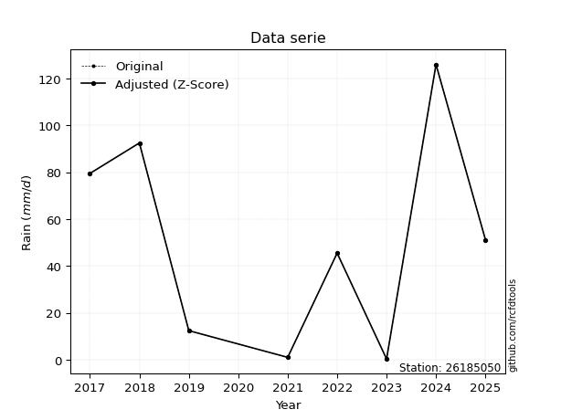</img>

</div>

> If Z-Score is active, values out of range or outliers are replaced with the station mean value.


### 4. Active continuous probability distributions from SciPy (45 of 104 available)

[scipy.stats](https://docs.scipy.org/doc/scipy/reference/stats.html) is a Python´s powerful submodule within the SciPy library for comprehensive statistical analysis, offering over 130 probability distributions (like Normal, Poisson), functions for descriptive stats (mean, variance), hypothesis testing (t-tests, chi-square), random variable generation, and statistical tests, making it essential for data science, modeling, and research. It provides tools to explore, model, and draw conclusions from data efficiently, working seamlessly with NumPy.

<div align="center">

|   id | p_dist             |   n_parameter | fit_method   | label                                                                       | active   | ref                                                                                                        |
|-----:|:-------------------|--------------:|:-------------|:----------------------------------------------------------------------------|:---------|:-----------------------------------------------------------------------------------------------------------|
|    0 | alpha              |             3 | MLE          | Alpha                                                                       | True     | [:mortar_board:](https://docs.scipy.org/doc/scipy/reference/generated/scipy.stats.alpha.html)              |
|    1 | betaprime          |             4 | MLE          | Beta prime                                                                  | True     | [:mortar_board:](https://docs.scipy.org/doc/scipy/reference/generated/scipy.stats.betaprime.html)          |
|    2 | chi2               |             3 | MLE          | Chi²                                                                        | True     | [:mortar_board:](https://docs.scipy.org/doc/scipy/reference/generated/scipy.stats.chi2.html)               |
|    3 | crystalball        |             4 | MLE          | Crystalball                                                                 | True     | [:mortar_board:](https://docs.scipy.org/doc/scipy/reference/generated/scipy.stats.crystalball.html)        |
|    4 | erlang             |             3 | MLE          | Erlang                                                                      | True     | [:mortar_board:](https://docs.scipy.org/doc/scipy/reference/generated/scipy.stats.erlang.html)             |
|    5 | expon              |             2 | MLE          | Exponential                                                                 | True     | [:mortar_board:](https://docs.scipy.org/doc/scipy/reference/generated/scipy.stats.expon.html)              |
|    6 | exponnorm          |             3 | MLE          | Exponentially modified Normal                                               | True     | [:mortar_board:](https://docs.scipy.org/doc/scipy/reference/generated/scipy.stats.exponnorm.html)          |
|    7 | f                  |             4 | MLE          | F                                                                           | True     | [:mortar_board:](https://docs.scipy.org/doc/scipy/reference/generated/scipy.stats.f.html)                  |
|    8 | fatiguelife        |             3 | MLE          | Fatigue-life (Birnbaum-Saunders)                                            | True     | [:mortar_board:](https://docs.scipy.org/doc/scipy/reference/generated/scipy.stats.fatiguelife.html)        |
|    9 | fisk               |             3 | MLE          | Fisk                                                                        | True     | [:mortar_board:](https://docs.scipy.org/doc/scipy/reference/generated/scipy.stats.fisk.html)               |
|   10 | gamma              |             3 | MLE          | Gamma                                                                       | True     | [:mortar_board:](https://docs.scipy.org/doc/scipy/reference/generated/scipy.stats.gamma.html)              |
|   11 | genexpon           |             5 | MLE          | Generalized exponential                                                     | True     | [:mortar_board:](https://docs.scipy.org/doc/scipy/reference/generated/scipy.stats.genexpon.html)           |
|   12 | genlogistic        |             3 | MLE          | Generalized logistic                                                        | True     | [:mortar_board:](https://docs.scipy.org/doc/scipy/reference/generated/scipy.stats.genlogistic.html)        |
|   13 | gibrat             |             2 | MM           | Gibrat                                                                      | True     | [:mortar_board:](https://docs.scipy.org/doc/scipy/reference/generated/scipy.stats.gibrat.html)             |
|   14 | gompertz           |             3 | MLE          | Gompertz (or truncated Gumbel)                                              | True     | [:mortar_board:](https://docs.scipy.org/doc/scipy/reference/generated/scipy.stats.gompertz.html)           |
|   15 | gumbel_l           |             2 | MM           | Gumbel Left Skew                                                            | True     | [:mortar_board:](https://docs.scipy.org/doc/scipy/reference/generated/scipy.stats.gumbel_l.html)           |
|   16 | gumbel_r           |             2 | MM           | Gumbel Right Skew                                                           | True     | [:mortar_board:](https://docs.scipy.org/doc/scipy/reference/generated/scipy.stats.gumbel_r.html)           |
|   17 | halflogistic       |             2 | MM           | Half-logistic                                                               | True     | [:mortar_board:](https://docs.scipy.org/doc/scipy/reference/generated/scipy.stats.halflogistic.html)       |
|   18 | halfnorm           |             2 | MM           | Half Normal                                                                 | True     | [:mortar_board:](https://docs.scipy.org/doc/scipy/reference/generated/scipy.stats.halfnorm.html)           |
|   19 | hypsecant          |             2 | MM           | hyperbolic secant                                                           | True     | [:mortar_board:](https://docs.scipy.org/doc/scipy/reference/generated/scipy.stats.hypsecant.html)          |
|   20 | invgamma           |             3 | MLE          | Inverted gamma                                                              | True     | [:mortar_board:](https://docs.scipy.org/doc/scipy/reference/generated/scipy.stats.invgamma.html)           |
|   21 | invgauss           |             3 | MLE          | Inverse Gaussian                                                            | True     | [:mortar_board:](https://docs.scipy.org/doc/scipy/reference/generated/scipy.stats.invgauss.html)           |
|   22 | invweibull         |             3 | MLE          | Inverted Weibull                                                            | True     | [:mortar_board:](https://docs.scipy.org/doc/scipy/reference/generated/scipy.stats.invweibull.html)         |
|   23 | johnsonsu          |             4 | MLE          | Johnson Su                                                                  | True     | [:mortar_board:](https://docs.scipy.org/doc/scipy/reference/generated/scipy.stats.johnsonsu.html)          |
|   24 | kstwobign          |             2 | MLE          | Limiting distribution of scaled Kolmogorov-Smirnov two-sided test statistic | True     | [:mortar_board:](https://docs.scipy.org/doc/scipy/reference/generated/scipy.stats.kstwobign.html)          |
|   25 | laplace            |             2 | MM           | Laplace                                                                     | True     | [:mortar_board:](https://docs.scipy.org/doc/scipy/reference/generated/scipy.stats.laplace.html)            |
|   26 | laplace_asymmetric |             3 | MLE          | Asymmetric Laplace                                                          | True     | [:mortar_board:](https://docs.scipy.org/doc/scipy/reference/generated/scipy.stats.laplace_asymmetric.html) |
|   27 | loggamma           |             3 | MLE          | Log gamma                                                                   | True     | [:mortar_board:](https://docs.scipy.org/doc/scipy/reference/generated/scipy.stats.loggamma.html)           |
|   28 | logistic           |             2 | MM           | Logistic (or Sech-squared)                                                  | True     | [:mortar_board:](https://docs.scipy.org/doc/scipy/reference/generated/scipy.stats.logistic.html)           |
|   29 | lognorm            |             3 | MLE          | Log Normal                                                                  | True     | [:mortar_board:](https://docs.scipy.org/doc/scipy/reference/generated/scipy.stats.lognorm.html)            |
|   30 | maxwell            |             2 | MM           | Maxwell                                                                     | True     | [:mortar_board:](https://docs.scipy.org/doc/scipy/reference/generated/scipy.stats.maxwell.html)            |
|   31 | mielke             |             4 | MLE          | Mielke Beta-Kappa / Dagum                                                   | True     | [:mortar_board:](https://docs.scipy.org/doc/scipy/reference/generated/scipy.stats.mielke.html)             |
|   32 | moyal              |             2 | MM           | Moyal                                                                       | True     | [:mortar_board:](https://docs.scipy.org/doc/scipy/reference/generated/scipy.stats.moyal.html)              |
|   33 | nakagami           |             3 | MLE          | Nakagami                                                                    | True     | [:mortar_board:](https://docs.scipy.org/doc/scipy/reference/generated/scipy.stats.nakagami.html)           |
|   34 | ncf                |             5 | MLE          | Non-central F distribution                                                  | True     | [:mortar_board:](https://docs.scipy.org/doc/scipy/reference/generated/scipy.stats.ncf.html)                |
|   35 | nct                |             4 | MLE          | Non-central Student’s t                                                     | True     | [:mortar_board:](https://docs.scipy.org/doc/scipy/reference/generated/scipy.stats.nct.html)                |
|   36 | norm               |             2 | MM           | Normal                                                                      | True     | [:mortar_board:](https://docs.scipy.org/doc/scipy/reference/generated/scipy.stats.norm.html)               |
|   37 | pareto             |             3 | MLE          | Pareto                                                                      | True     | [:mortar_board:](https://docs.scipy.org/doc/scipy/reference/generated/scipy.stats.pareto.html)             |
|   38 | pearson3           |             3 | MM           | Pearson type III                                                            | True     | [:mortar_board:](https://docs.scipy.org/doc/scipy/reference/generated/scipy.stats.pearson3.html)           |
|   39 | rayleigh           |             2 | MM           | Rayleigh                                                                    | True     | [:mortar_board:](https://docs.scipy.org/doc/scipy/reference/generated/scipy.stats.rayleigh.html)           |
|   40 | rice               |             3 | MLE          | Rice                                                                        | True     | [:mortar_board:](https://docs.scipy.org/doc/scipy/reference/generated/scipy.stats.rice.html)               |
|   41 | t                  |             3 | MLE          | Student’s t                                                                 | True     | [:mortar_board:](https://docs.scipy.org/doc/scipy/reference/generated/scipy.stats.t.html)                  |
|   42 | truncnorm          |             4 | MLE          | Truncated normal                                                            | True     | [:mortar_board:](https://docs.scipy.org/doc/scipy/reference/generated/scipy.stats.truncnorm.html)          |
|   43 | wald               |             2 | MM           | Wald                                                                        | True     | [:mortar_board:](https://docs.scipy.org/doc/scipy/reference/generated/scipy.stats.wald.html)               |
|   44 | weibull_min        |             3 | MLE          | Weibull minimum                                                             | True     | [:mortar_board:](https://docs.scipy.org/doc/scipy/reference/generated/scipy.stats.weibull_min.html)        |

</div>

> **n_parameter:** # arguments & localization & scale.
>
> **Fit methods:** (MLE) maximum likelihood, (MM) L-moments.
>
>**Inactive:** foldnorm, gennorm, norminvgauss, powernorm, powerlognorm, skewnorm, genextreme, anglit, arcsine, argus, beta, bradford, burr, burr12, cauchy, cosine, halfcauchy, foldcauchy, skewcauchy, wrapcauchy, dgamma, gengamma, exponweib, exponpow, truncexpon, gausshyper, genhalflogistic, genhyperbolic, geninvgauss, halfgennorm, johnsonsb, kappa4, kappa3, ksone, kstwo, loglaplace, levy, levy_l, levy_stable, ncx2, genpareto, truncpareto, lomax, powerlaw, rdist, rel_breitwigner, recipinvgauss, semicircular, studentized_range, trapezoid, triang, truncweibull_min, tukeylambda, uniform, loguniform, vonmises, vonmises_line, weibull_max, dweibull, 


## B. Probability distributions vs. Empirical distributions

A continuous probability distribution (CPD) describes probabilities for variables that can take any value within a range (like rain any time), unlike discrete variables with specific outcomes (like temperature). It uses a Probability Density Function (PDF), a curve where the total area under it equals 1, and the probability of the variable falling within an interval (a to b) is found by calculating the area under the curve between those points. A key feature is that the probability of hitting any single exact value is zero, so probabilities are always expressed for ranges, e.g., $P(a ≤ X ≤ b)$.

<div align="center">

Distributions parameters
|    |   station | p_dist                |   n |              loc |           scale | shape                  | shape1                | shape2             | shape3   |
|---:|----------:|:----------------------|----:|-----------------:|----------------:|:-----------------------|:----------------------|:-------------------|:---------|
|  0 |  26185050 | alpha                 |   8 |    -15.7959      |    29.1785      | 1.7916806733676186e-09 |                       |                    |          |
|  1 |  26185050 | betaprime             |   8 |      0.3         |   331.987       | 0.48361461235270375    | 2.652804497991837     |                    |          |
|  2 |  26185050 | chi2                  |   8 |      0.3         |    20.6314      | 1.4289754934651437     |                       |                    |          |
|  3 |  26185050 | crystalball           |   8 |     51.05        |    42.9392      | 9984.448490996372      | 1236.332486121806     |                    |          |
|  4 |  26185050 | erlang                |   8 |      0.3         |    48.3334      | 0.23593363778871568    |                       |                    |          |
|  5 |  26185050 | expon                 |   8 |      0.3         |    50.75        |                        |                       |                    |          |
|  6 |  26185050 | exponnorm             |   8 |     36.8931      |    40.579       | 0.3488716514087394     |                       |                    |          |
|  7 |  26185050 | f                     |   8 |      0.3         |    86.7942      | 0.7109952970519235     | 34.010829569285974    |                    |          |
|  8 |  26185050 | fatiguelife           |   8 |      0.3         |     0.00117797  | 209.7194618144531      |                       |                    |          |
|  9 |  26185050 | fisk                  |   8 |      0.3         |    16.2303      | 0.18882836039371026    |                       |                    |          |
| 10 |  26185050 | gamma                 |   8 |      0.3         |    49.4467      | 0.439250075841232      |                       |                    |          |
| 11 |  26185050 | genexpon              |   8 |      0.299882    |     2.57487     | 0.05047531966034928    | 9.568368424077461e-08 | 2.4022248273134874 |          |
| 12 |  26185050 | genlogistic           |   8 |   -213.262       |    35.2651      | 1001.4073217463449     |                       |                    |          |
| 13 |  26185050 | gibrat                |   8 |     18.2928      |    19.8683      |                        |                       |                    |          |
| 14 |  26185050 | gompertz              |   8 |      0.3         |   143.725       | 2.0410492844279045     |                       |                    |          |
| 15 |  26185050 | gumbel_l              |   8 |     70.3749      |    33.4796      |                        |                       |                    |          |
| 16 |  26185050 | gumbel_r              |   8 |     31.7251      |    33.4796      |                        |                       |                    |          |
| 17 |  26185050 | halflogistic          |   8 |      0.157034    |    36.7115      |                        |                       |                    |          |
| 18 |  26185050 | halfnorm              |   8 |     -5.78471     |    71.2317      |                        |                       |                    |          |
| 19 |  26185050 | hypsecant             |   8 |     51.05        |    27.336       |                        |                       |                    |          |
| 20 |  26185050 | invgamma              |   8 |    -70.8323      |   848.269       | 7.914317692414982      |                       |                    |          |
| 21 |  26185050 | invgauss              |   8 |    -12.1183      |    60.7173      | 1.0403680183855664     |                       |                    |          |
| 22 |  26185050 | invweibull            |   8 |      0.3         |     3.19097     | 0.04462064210810297    |                       |                    |          |
| 23 |  26185050 | johnsonsu             |   8 |      0.3         |     1.84918e-10 | -1.882287960933171     | 0.11875332990980317   |                    |          |
| 24 |  26185050 | kstwobign             |   8 |    -90.8007      |   162.06        |                        |                       |                    |          |
| 25 |  26185050 | laplace               |   8 |     51.05        |    30.3626      |                        |                       |                    |          |
| 26 |  26185050 | laplace_asymmetric    |   8 |     45.5         |    35.9293      | 0.9257406655781999     |                       |                    |          |
| 27 |  26185050 | loggamma              |   8 | -12140.6         |  1668.83        | 1488.8014083514872     |                       |                    |          |
| 28 |  26185050 | logistic              |   8 |     51.05        |    23.6736      |                        |                       |                    |          |
| 29 |  26185050 | lognorm               |   8 |      0.3         |     0.17767     | 13.584809592909968     |                       |                    |          |
| 30 |  26185050 | maxwell               |   8 |    -50.6979      |    63.7611      |                        |                       |                    |          |
| 31 |  26185050 | mielke                |   8 |      0.3         |   131.039       | 0.4360143355540979     | 360.70483659182725    |                    |          |
| 32 |  26185050 | moyal                 |   8 |     26.4946      |    19.3294      |                        |                       |                    |          |
| 33 |  26185050 | nakagami              |   8 |      0.3         |    97.3775      | 0.1822009460643747     |                       |                    |          |
| 34 |  26185050 | ncf                   |   8 |      0.3         |     7.63945     | 0.42740067974858525    | 87.92861993000145     | 2.868424229746374  |          |
| 35 |  26185050 | nct                   |   8 |     -0.117756    |     0.0202154   | 0.2768014435384381     | 54.73619197198369     |                    |          |
| 36 |  26185050 | norm                  |   8 |     51.05        |    42.9392      |                        |                       |                    |          |
| 37 |  26185050 | pareto                |   8 |      0.288476    |     0.0115236   | 0.14580192936880237    |                       |                    |          |
| 38 |  26185050 | pearson3              |   8 |     51.05        |    42.9392      | 0.3177973979609198     |                       |                    |          |
| 39 |  26185050 | rayleigh              |   8 |    -31.0953      |    65.5424      |                        |                       |                    |          |
| 40 |  26185050 | rice                  |   8 |    -24.3018      |    57.9101      | 0.4928246372233708     |                       |                    |          |
| 41 |  26185050 | t                     |   8 |     51.0502      |    42.9392      | 4178069892.5883336     |                       |                    |          |
| 42 |  26185050 | truncnorm             |   8 |    -28.6254      |    76.7269      | 0.37699115412509876    | 152.24641923959422    |                    |          |
| 43 |  26185050 | wald                  |   8 |      8.1108      |    42.9392      |                        |                       |                    |          |
| 44 |  26185050 | weibull_min           |   8 |      0.3         |    66.534       | 0.8324321444322861     |                       |                    |          |
| 45 |  26185050 | logalpha              |   8 |    -22.4818      |   268.525       | 10.717582564935746     |                       |                    |          |
| 46 |  26185050 | logbetaprime          |   8 |     -1.20397     |     2.71729     | 0.17361634773901902    | 0.6928468729414584    |                    |          |
| 47 |  26185050 | logchi2               |   8 |     -1.20397     |     4.23962     | 0.3615833458079078     |                       |                    |          |
| 48 |  26185050 | logcrystalball        |   8 |      2.8508      |     2.11746     | 154.00717744506872     | 443.15372417492335    |                    |          |
| 49 |  26185050 | logerlang             |   8 |    -31.1609      |     0.142749    | 238.41038213139177     |                       |                    |          |
| 50 |  26185050 | logexpon              |   8 |     -1.20397     |     4.05478     |                        |                       |                    |          |
| 51 |  26185050 | logexponnorm          |   8 |      2.84929     |     2.11746     | 0.0007133634187176802  |                       |                    |          |
| 52 |  26185050 | logf                  |   8 |     -1.20397     |     1.11476     | 1.1398349378833448     | 1.12636441131002      |                    |          |
| 53 |  26185050 | logfatiguelife        |   8 |   -694.527       |   697.371       | 0.003038062552815618   |                       |                    |          |
| 54 |  26185050 | logfisk               |   8 |     -1.20397     |     0.883901    | 0.2113777295501837     |                       |                    |          |
| 55 |  26185050 | loggamma              |   8 |    -27.7066      |     0.155614    | 196.05298665976284     |                       |                    |          |
| 56 |  26185050 | loggenexpon           |   8 |     -1.20397     |     2.2829      | 0.2892359409855168     | 0.420447168416234     | 1.220738693152276  |          |
| 57 |  26185050 | loggenlogistic        |   8 |      4.8363      |     1.49239e-06 | 7.523743864237945e-07  |                       |                    |          |
| 58 |  26185050 | loggibrat             |   8 |      1.23548     |     0.979752    |                        |                       |                    |          |
| 59 |  26185050 | loggompertz           |   8 |     -1.20398     |     2.0771      | 0.110835887963697      |                       |                    |          |
| 60 |  26185050 | loggumbel_l           |   8 |      3.80377     |     1.65098     |                        |                       |                    |          |
| 61 |  26185050 | loggumbel_r           |   8 |      1.89783     |     1.65098     |                        |                       |                    |          |
| 62 |  26185050 | loghalflogistic       |   8 |      0.341148    |     1.81034     |                        |                       |                    |          |
| 63 |  26185050 | loghalfnorm           |   8 |      0.048131    |     3.51263     |                        |                       |                    |          |
| 64 |  26185050 | loghypsecant          |   8 |      2.8508      |     1.34802     |                        |                       |                    |          |
| 65 |  26185050 | loginvgamma           |   8 |    -41.6788      | 17913.7         | 403.8025188856068      |                       |                    |          |
| 66 |  26185050 | loginvgauss           |   8 |    -14.4547      |   946.99        | 0.018161674727121768   |                       |                    |          |
| 67 |  26185050 | loginvweibull         |   8 |     -1.73394e+08 |     1.73394e+08 | 75517703.57863599      |                       |                    |          |
| 68 |  26185050 | logjohnsonsu          |   8 |      4.91311     |     0.00172055  | 5.271553910458572      | 0.7441815139448935    |                    |          |
| 69 |  26185050 | logkstwobign          |   8 |     -6.30268     |    10.4294      |                        |                       |                    |          |
| 70 |  26185050 | loglaplace            |   8 |      2.8508      |     1.49727     |                        |                       |                    |          |
| 71 |  26185050 | loglaplace_asymmetric |   8 |      4.52721     |     0.764122    | 2.581313264922343      |                       |                    |          |
| 72 |  26185050 | logloggamma           |   8 |      4.83643     |     1.60293e-05 | 8.081652096300798e-06  |                       |                    |          |
| 73 |  26185050 | loglogistic           |   8 |      2.8508      |     1.16742     |                        |                       |                    |          |
| 74 |  26185050 | loglognorm            |   8 |   -885.125       |   887.967       | 0.002380677364443381   |                       |                    |          |
| 75 |  26185050 | logmaxwell            |   8 |     -2.1667      |     3.14425     |                        |                       |                    |          |
| 76 |  26185050 | logmielke             |   8 |     -1.30322e+06 |     1.30322e+06 | 3467199.9718352132     | 651390.4063693895     |                    |          |
| 77 |  26185050 | logmoyal              |   8 |      1.6399      |     0.953193    |                        |                       |                    |          |
| 78 |  26185050 | lognakagami           |   8 |  -1058.43        |  1061.28        | 62777.20547357535      |                       |                    |          |
| 79 |  26185050 | logncf                |   8 |     -1.20397     |     1.11789     | 1.0608985268599178     | 1.1167262844882835    | 1.0618968609866366 |          |
| 80 |  26185050 | lognct                |   8 |   -129.391       |     2.07496     | 45535.38161513618      | 63.73046208465317     |                    |          |
| 81 |  26185050 | lognorm               |   8 |      2.8508      |     2.11746     |                        |                       |                    |          |
| 82 |  26185050 | logpareto             |   8 |     -1.20541     |     0.00144075  | 0.14333035172959416    |                       |                    |          |
| 83 |  26185050 | logpearson3           |   8 |      2.8508      |     2.11746     | -0.9426894862642967    |                       |                    |          |
| 84 |  26185050 | lograyleigh           |   8 |     -1.19999     |     3.23207     |                        |                       |                    |          |
| 85 |  26185050 | logrice               |   8 |     -2.55355     |     2.30116     | 2.088617344312737      |                       |                    |          |
| 86 |  26185050 | logt                  |   8 |      2.85082     |     2.11744     | 42063235.0347822       |                       |                    |          |
| 87 |  26185050 | logtruncnorm          |   8 |      1.75315     |     6.35328     | -0.46557648952105135   | 0.48528236240643485   |                    |          |
| 88 |  26185050 | logwald               |   8 |      0.7333      |     2.11749     |                        |                       |                    |          |
| 89 |  26185050 | logweibull_min        |   8 |     -1.38821e+08 |     1.38821e+08 | 97937320.36986873      |                       |                    |          |

</div>

> **loc** (Location parameter): This shifts the distribution along the x-axis. For many common distributions, like the normal (Gaussian) distribution, loc represents the mean $μ$. For others, like the uniform distribution, it might represent the minimum value, or for the beta distribution, the left end of the support interval.
>
> **scale** (Scale parameter): This determines the width or spread of the distribution. For the normal distribution, scale represents the standard deviation $σ$. For a uniform distribution, it defines the length of the interval (from $loc$ to $loc + scale$).
>
> **shape** (Shape parameters): Refers to parameters that define the specific form of a probability distribution, distinct from its location (loc) and scale (scale). These parameters are required arguments for most distribution functions. For example, a normal (Gaussian) distribution is fully defined by its location (mean) and scale (standard deviation), so it has no specific shape parameters beyond loc and scale. However, other distributions have intrinsic properties that need specification, as Gamma distribution that takes a shape parameter, often named $a$ or $alpha$.


### 0. Cumulative distribution values - CDF (90 evaluated)

> Ordered by x ascending and calculating $log(f(x))$ separately. 

|   id |   Station |   date |     x |   count |   mean |    std |      zscore |   Value_initial |   station |   m |     alpha |   alpha_pdf |   betaprime |   betaprime_pdf |        chi2 |    chi2_pdf |   crystalball |   crystalball_pdf |      erlang |   erlang_pdf |     expon |   expon_pdf |   exponnorm |   exponnorm_pdf |           f |       f_pdf |   fatiguelife |   fatiguelife_pdf |        fisk |    fisk_pdf |       gamma |   gamma_pdf |    genexpon |   genexpon_pdf |   genlogistic |   genlogistic_pdf |   gibrat |   gibrat_pdf |    gompertz |   gompertz_pdf |   gumbel_l |   gumbel_l_pdf |   gumbel_r |   gumbel_r_pdf |   halflogistic |   halflogistic_pdf |   halfnorm |   halfnorm_pdf |   hypsecant |   hypsecant_pdf |   invgamma |   invgamma_pdf |   invgauss |   invgauss_pdf |   invweibull |   invweibull_pdf |   johnsonsu |   johnsonsu_pdf |   kstwobign |   kstwobign_pdf |   laplace |   laplace_pdf |   laplace_asymmetric |   laplace_asymmetric_pdf |   loggamma |   loggamma_pdf |   logistic |   logistic_pdf |   lognorm |   lognorm_pdf |   maxwell |   maxwell_pdf |      mielke |   mielke_pdf |     moyal |   moyal_pdf |    nakagami |   nakagami_pdf |         ncf |     ncf_pdf |       nct |     nct_pdf |     norm |   norm_pdf |   pareto |   pareto_pdf |   pearson3 |   pearson3_pdf |   rayleigh |   rayleigh_pdf |      rice |   rice_pdf |        t |      t_pdf |   truncnorm |   truncnorm_pdf |     wald |   wald_pdf |   weibull_min |   weibull_min_pdf |   logalpha |   logalpha_pdf |   logbetaprime |   logbetaprime_pdf |    logchi2 |   logchi2_pdf |   logcrystalball |   logcrystalball_pdf |   logerlang |   logerlang_pdf |   logexpon |   logexpon_pdf |   logexponnorm |   logexponnorm_pdf |        logf |    logf_pdf |   logfatiguelife |   logfatiguelife_pdf |     logfisk |   logfisk_pdf |   loggenexpon |   loggenexpon_pdf |   loggenlogistic |   loggenlogistic_pdf |   loggibrat |   loggibrat_pdf |   loggompertz |   loggompertz_pdf |   loggumbel_l |   loggumbel_l_pdf |   loggumbel_r |   loggumbel_r_pdf |   loghalflogistic |   loghalflogistic_pdf |   loghalfnorm |   loghalfnorm_pdf |   loghypsecant |   loghypsecant_pdf |   loginvgamma |   loginvgamma_pdf |   loginvgauss |   loginvgauss_pdf |   loginvweibull |   loginvweibull_pdf |   logjohnsonsu |   logjohnsonsu_pdf |   logkstwobign |   logkstwobign_pdf |   loglaplace |   loglaplace_pdf |   loglaplace_asymmetric |   loglaplace_asymmetric_pdf |   logloggamma |   logloggamma_pdf |   loglogistic |   loglogistic_pdf |   loglognorm |   loglognorm_pdf |   logmaxwell |   logmaxwell_pdf |   logmielke |   logmielke_pdf |    logmoyal |   logmoyal_pdf |   lognakagami |   lognakagami_pdf |      logncf |   logncf_pdf |    lognct |   lognct_pdf |   logpareto |   logpareto_pdf |   logpearson3 |   logpearson3_pdf |   lograyleigh |   lograyleigh_pdf |   logrice |   logrice_pdf |      logt |   logt_pdf |   logtruncnorm |   logtruncnorm_pdf |   logwald |   logwald_pdf |   logweibull_min |   logweibull_min_pdf |
|-----:|----------:|-------:|------:|--------:|-------:|-------:|------------:|----------------:|----------:|----:|----------:|------------:|------------:|----------------:|------------:|------------:|--------------:|------------------:|------------:|-------------:|----------:|------------:|------------:|----------------:|------------:|------------:|--------------:|------------------:|------------:|------------:|------------:|------------:|------------:|---------------:|--------------:|------------------:|---------:|-------------:|------------:|---------------:|-----------:|---------------:|-----------:|---------------:|---------------:|-------------------:|-----------:|---------------:|------------:|----------------:|-----------:|---------------:|-----------:|---------------:|-------------:|-----------------:|------------:|----------------:|------------:|----------------:|----------:|--------------:|---------------------:|-------------------------:|-----------:|---------------:|-----------:|---------------:|----------:|--------------:|----------:|--------------:|------------:|-------------:|----------:|------------:|------------:|---------------:|------------:|------------:|----------:|------------:|---------:|-----------:|---------:|-------------:|-----------:|---------------:|-----------:|---------------:|----------:|-----------:|---------:|-----------:|------------:|----------------:|---------:|-----------:|--------------:|------------------:|-----------:|---------------:|---------------:|-------------------:|-----------:|--------------:|-----------------:|---------------------:|------------:|----------------:|-----------:|---------------:|---------------:|-------------------:|------------:|------------:|-----------------:|---------------------:|------------:|--------------:|--------------:|------------------:|-----------------:|---------------------:|------------:|----------------:|--------------:|------------------:|--------------:|------------------:|--------------:|------------------:|------------------:|----------------------:|--------------:|------------------:|---------------:|-------------------:|--------------:|------------------:|--------------:|------------------:|----------------:|--------------------:|---------------:|-------------------:|---------------:|-------------------:|-------------:|-----------------:|------------------------:|----------------------------:|--------------:|------------------:|--------------:|------------------:|-------------:|-----------------:|-------------:|-----------------:|------------:|----------------:|------------:|---------------:|--------------:|------------------:|------------:|-------------:|----------:|-------------:|------------:|----------------:|--------------:|------------------:|--------------:|------------------:|----------:|--------------:|----------:|-----------:|---------------:|-------------------:|----------:|--------------:|-----------------:|---------------------:|
|    0 |  26185050 |   2023 |   0.3 |       8 |  51.05 | 45.904 | -1.10557    |             0.3 |  26185050 |   1 | 0.069865  |  0.0173773  | 2.00484e-09 |      8.7331e+06 | 5.11647e-07 | 6.43734     |      0.118622 |        0.00462087 | 0.000271878 |  2.57358e+09 | 0         |  0.0197044  |    0.117257 |      0.00468541 | 1.19635e-06 | 1.07909e+08 |     0.0693339 |       8.07923e+06 | 0.000503171 | 1.71074e+12 | 1.14718e-07 | 8.48355e+06 | 2.31017e-06 |     0.019603   |     0.0958901 |        0.00636766 | 0        |  0           | 7.33923e-16 |     0.0142011  |   0.116009 |    0.00325583  |  0.0775769 |     0.00592374 |     0.00194715 |         0.0136197  |  0.0680736 |     0.0111605  |   0.0986516 |      0.00355136 |  0.0881232 |     0.00725659 |  0.0656809 |     0.0146615  |   0.00371537 |      1.67101e+13 |   0.0338295 |     4.35021e+07 |   0.0898927 |      0.00671788 | 0.0939859 |    0.00309545 |             0.118574 |               0.00356492 |  0.0286011 |      0.0329801 |   0.104918 |     0.00396687 | 0.0277512 |     0.0301184 |  0.112719 |    0.00581385 | 9.75215e-09 |  7.65986e+07 | 0.0489402 |  0.00584782 | 1.78587e-07 |    1.17233e+09 | 0.000152079 | 1.22225e+09 | 0.0361813 | 0.266748    | 0.118622 | 0.00462087 | 0        | 12.6525      |   0.11288  |     0.00512706 |   0.108387 |     0.00651621 | 0.0768332 | 0.0060017  | 0.118621 | 0.00462085 | 2.66009e-13 |      0.0137156  | 0        | 0          |    8.9277e-16 |       13.3878     |   0.028563 |      0.0387436 |     0.00145771 |        1.13978e+12 | 0.00108816 |   8.85992e+11 |        0.0277513 |            0.0301184 |   0.0282661 |       0.0319994 |   0        |      0.246623  |      0.0277513 |          0.0301184 | 7.56977e-10 | 1.94292e+06 |        0.0276946 |            0.0302258 | 0.000503844 |   4.79398e+11 |   4.73863e-10 |         0.126697  |         0        |            0.0239915 |    0        |       0         |   1.34331e-07 |         0.053361  |     0.04702   |         0.0277998 |    0.00143667 |        0.00569578 |          0        |             0         |      0        |         0         |      0.0314189 |          0.0232696 |     0.0295053 |         0.0343584 |     0.0301871 |         0.0387183 |       0.0286115 |           0.0442859 |      0.0919488 |          0.0200723 |      0.0293835 |          0.0537325 |    0.0333314 |        0.0222614 |               0.0475742 |                   0.0241195 |      0.047575 |         0.0239864 |     0.030082  |         0.0249928 |    0.0275422 |        0.0301159 |   0.00742316 |        0.0227004 |    0.027198 |       0.0355985 | 8.79246e-06 |    9.53558e-05 |     0.0278207 |         0.0302138 | 1.81341e-09 |  4.33211e+06 | 0.0278582 |    0.0302453 |    0        |     99.4832     |     0.0468028 |         0.0302479 |     0         |          0        | 0.0212968 |     0.0342073 | 0.0277495 |  0.0301171 |    0.000125535 |           0.154162 |  0        |     0         |        0.0293619 |            0.0204076 |
|    1 |  26185050 |   2021 |   1   |       8 |  51.05 | 45.904 | -1.09032    |             1   |  26185050 |   2 | 0.0823459 |  0.0182494  | 0.0875194   |      0.0601965  | 0.0591866   | 0.059816    |      0.121888 |        0.00471014 | 0.40376     |  0.1345      | 0.0136984 |  0.0194345  |    0.120569 |      0.00477768 | 0.139051    | 0.0704652   |     0.54619   |       0.0329558   | 0.355811    | 0.0618304   | 0.173217    | 0.107629    | 0.0136307   |     0.0193358  |     0.100407  |        0.00653685 | 0        |  0           | 0.00991551  |     0.0141289  |   0.118309 |    0.00331597  |  0.0817909 |     0.00611629 |     0.0114804  |         0.0136179  |  0.0758825 |     0.0111506  |   0.101168  |      0.00363892 |  0.0932775 |     0.00746948 |  0.0761756 |     0.0153036  |   0.342997   |      0.0233951   |   0.793625  |     0.0483929   |   0.0946584 |      0.00689777 | 0.0961779 |    0.00316764 |             0.121095 |               0.00364074 |  0.0961767 |      0.0834789 |   0.107728 |     0.00406031 | 0.0890981 |     0.0761189 |  0.116827 |    0.00592196 | 0.102151    |  0.0636278   | 0.0531404 |  0.00615284 | 0.131517    |    0.0684638   | 0.114415    | 0.0380735   | 0.203457  | 0.175013    | 0.121888 | 0.00471014 | 0.451815 |  0.112331    |   0.116506 |     0.0052324  |   0.112988 |     0.00662713 | 0.0810845 | 0.00614426 | 0.121887 | 0.00471012 | 0.00958431  |      0.013668   | 0        | 0          |    0.0223153  |        0.0262388  |   0.110004 |      0.0999014 |     0.749066   |        0.0824776   | 0.744926   |   0.0991278   |        0.0890981 |            0.0761189 |   0.0934415 |       0.0803467 |   0.256902 |      0.183265  |      0.0890983 |          0.0761189 | 0.511851    | 0.143883    |        0.0893587 |            0.0765538 | 0.516325    |   0.0438449   |   0.190047    |         0.173431  |         0        |            0.0440213 |    0        |       0         |   0.0833694   |         0.0873281 |     0.0950391 |         0.0547388 |    0.0425671  |        0.0813883  |          0        |             0         |      0        |         0         |      0.0764426 |          0.0561639 |     0.0996236 |         0.0861582 |     0.109851  |         0.0970267 |       0.122004  |           0.111782  |      0.12186   |          0.0306295 |      0.141485  |          0.12922   |    0.074486  |        0.0497478 |               0.087592  |                   0.044408  |      0.087298 |         0.044014  |     0.0800276 |         0.063065  |    0.0890772 |        0.0764763 |   0.0756202  |        0.0950322 |    0.103792 |       0.0957149 | 0.018095    |    0.0605522   |     0.0893555 |         0.0763359 | 0.375918    |  0.136985    | 0.089426  |    0.0763466 |    0.618837 |      0.0453223  |     0.0991569 |         0.0593933 |     0.0666012 |          0.107222 | 0.0906093 |     0.0843381 | 0.0890946 |  0.0761174 |    0.192984    |           0.165382 |  0        |     0         |        0.0673108 |            0.0458521 |
|    2 |  26185050 |   2019 |  12.4 |       8 |  51.05 | 45.904 | -0.841975   |            12.4 |  26185050 |   3 | 0.300741  |  0.0171429  | 0.33561     |      0.0124324  | 0.40568     | 0.0201121   |      0.184031 |        0.00619618 | 0.757685    |  0.0120396   | 0.212131  |  0.0155245  |    0.183749 |      0.00630853 | 0.378259    | 0.0107056   |     0.68553   |       0.00708957  | 0.48614     | 0.00389841  | 0.56597     | 0.017289    | 0.211166    |     0.0154636  |     0.18935   |        0.00892799 | 0        |  0           | 0.164123    |     0.012913   |   0.162214 |    0.00442901  |  0.168456  |     0.0089617  |     0.165217   |         0.0132479  |  0.2015    |     0.0108421  |   0.151875  |      0.00534745 |  0.195177  |     0.0101266  |  0.266705  |     0.016107   |   0.389746   |      0.00135426  |   0.876465  |     0.00200372  |   0.187865  |      0.00925579 | 0.140003  |    0.00461102 |             0.1706   |               0.00512909 |  0.457352  |      0.183161  |   0.163472 |     0.00577642 | 0.437499  |     0.186089  |  0.193741 |    0.00751017 | 0.35391     |  0.0127529   | 0.14989   |  0.0105391  | 0.371372    |    0.0111576   | 0.271639    | 0.00977254  | 0.585326  | 0.00916085  | 0.184031 | 0.00619618 | 0.637387 |  0.00436524  |   0.185836 |     0.0069093  |   0.197638 |     0.00812395 | 0.163051  | 0.00812355 | 0.18403  | 0.00619615 | 0.160466    |      0.0127642  | 0.004052 | 0.00509935 |    0.214931   |        0.0130694  |   0.490577 |      0.17136   |     0.85125    |        0.0211194   | 0.877117   |   0.0292235   |        0.437499  |            0.186089  |   0.444441  |       0.180474  |   0.600623 |      0.0984956 |      0.437499  |          0.186089  | 0.694465    | 0.0383695   |        0.438939  |            0.186177  | 0.575389    |   0.0138763   |   0.576672    |         0.120943  |         0        |            0.15664   |    0.606053 |       0.300075  |   0.425459    |         0.18395   |     0.368005  |         0.175657  |    0.503094   |        0.209339   |          0.537862 |             0.19629   |      0.517978 |         0.177409  |      0.422132  |          0.229101  |     0.463338  |         0.180834  |     0.487449  |         0.174729  |       0.495247  |           0.151567  |      0.263969  |          0.101556  |      0.528157  |          0.14669   |    0.400267  |        0.267331  |               0.313917  |                   0.159152  |      0.310661 |         0.156629  |     0.429146  |         0.209847  |    0.439062  |        0.18658   |   0.471899   |        0.18566   |    0.473669 |       0.165056  | 0.528041    |    0.216421    |     0.43827   |         0.186129  | 0.572745    |  0.0463473   | 0.438048  |    0.185881  |    0.675727 |      0.0124837  |     0.378082  |         0.170169  |     0.483942  |          0.183658 | 0.44925   |     0.182519  | 0.437494  |  0.18609   |    0.621428    |           0.17056  |  0.597171 |     0.239998  |        0.337446  |            0.192418  |
|    3 |  26185050 |   2022 |  45.5 |       8 |  51.05 | 45.904 | -0.120905   |            45.5 |  26185050 |   4 | 0.634056  |  0.00553265 | 0.579847    |      0.00471947 | 0.780973    | 0.0061896   |      0.448579 |        0.00921357 | 0.929982    |  0.00221759  | 0.589607  |  0.00808656 |    0.452375 |      0.00929665 | 0.583623    | 0.00399053  |     0.824851  |       0.00266491  | 0.5482      | 0.0010347   | 0.849191    | 0.00422768  | 0.587724    |     0.00808189 |     0.521365  |        0.00962585 | 0.623376 |  0.0139562   | 0.529655    |     0.00914783 |   0.378544 |    0.00882988  |  0.515461  |     0.010203   |     0.549425   |         0.00950835 |  0.528456  |     0.00864384 |   0.435813  |      0.0114084  |  0.542909  |     0.00930293 |  0.633835  |     0.00707879 |   0.411294   |      0.000360729 |   0.905577  |     0.000442071 |   0.520985  |      0.00951062 | 0.416471  |    0.0137166  |             0.461496 |               0.0138749  |  0.686085  |      0.159262  |   0.441657 |     0.0104165  | 0.676034  |     0.169752  |  0.482914 |    0.00912689 | 0.628706    |  0.00606471  | 0.540779  |  0.0104701  | 0.596976    |    0.00465541  | 0.532166    | 0.00645562  | 0.710062  | 0.00175918  | 0.448579 | 0.00921357 | 0.700748 |  0.000965054 |   0.469288 |     0.00938591 |   0.494827 |     0.00900734 | 0.475316  | 0.00971922 | 0.448577 | 0.00921356 | 0.527037    |      0.00923433 | 0.611117 | 0.0113253  |    0.515588   |        0.00646629 |   0.694038 |      0.136179  |     0.873613   |        0.0140591   | 0.908257   |   0.0196136   |        0.676034  |            0.169752  |   0.672445  |       0.160832  |   0.71017  |      0.0714786 |      0.676033  |          0.169752  | 0.735239    | 0.0257389   |        0.67712   |            0.169185  | 0.590782    |   0.0101763   |   0.710661    |         0.086312  |         0        |            0.301673  |    0.833755 |       0.0965997 |   0.677831    |         0.192876  |     0.635226  |         0.222817  |    0.731552   |        0.138508   |          0.744364 |             0.12316   |      0.716797 |         0.127711  |      0.710934  |          0.186155  |     0.687369  |         0.155075  |     0.697588  |         0.142084  |       0.671051  |           0.116586  |      0.480506  |          0.270706  |      0.696875  |          0.111618  |    0.737873  |        0.175069  |               0.606812  |                   0.307646  |      0.598331 |         0.301667  |     0.695984  |         0.181246  |    0.677742  |        0.169476  |   0.694781   |        0.15025   |    0.668159 |       0.12969   | 0.749681    |    0.12691     |     0.676672  |         0.16953   | 0.623183    |  0.0325809   | 0.676149  |    0.16936   |    0.689352 |      0.00886406 |     0.630604  |         0.208584  |     0.700333  |          0.14394  | 0.679558  |     0.162237  | 0.676032  |  0.169754  |    0.838941    |           0.162964 |  0.801859 |     0.0997647 |        0.643001  |            0.259422  |
|    4 |  26185050 |   2025 |  51.2 |       8 |  51.05 | 45.904 |  0.00326769 |            51.2 |  26185050 |   5 | 0.663181  |  0.00471755 | 0.605325    |      0.00423475 | 0.813375    | 0.00521126  |      0.501394 |        0.0092908  | 0.941381    |  0.00179993  | 0.633206  |  0.00722746 |    0.505569 |      0.00933999 | 0.605251    | 0.0036104   |     0.839196  |       0.00237685  | 0.553749    | 0.000916731 | 0.87121     | 0.00352465  | 0.63131     |     0.00722746 |     0.574574  |        0.00902587 | 0.693069 |  0.0106742   | 0.579948    |     0.00850018 |   0.43106  |    0.00958408  |  0.571809  |     0.00954649 |     0.601306   |         0.00869524 |  0.576284  |     0.00813384 |   0.501747  |      0.0116442  |  0.593775  |     0.00853781 |  0.671521  |     0.0061698  |   0.413229   |      0.00032014  |   0.907928  |     0.000385319 |   0.573616  |      0.00894275 | 0.502464  |    0.0163865  |             0.535049 |               0.0119797  |  0.704611  |      0.154625  |   0.501584 |     0.0105602  | 0.695806  |     0.165229  |  0.534388 |    0.00891275 | 0.66212     |  0.00567179  | 0.597647  |  0.00947679 | 0.622386    |    0.00427172  | 0.567772    | 0.00604035  | 0.719358  | 0.00151366  | 0.501394 | 0.0092908  | 0.705884 |  0.000842298 |   0.522524 |     0.00926613 |   0.545369 |     0.00870941 | 0.529942  | 0.00942569 | 0.501392 | 0.0092908  | 0.577782    |      0.00857112 | 0.669492 | 0.00924234 |    0.550734   |        0.00587896 |   0.709849 |      0.13174   |     0.875246   |        0.013612    | 0.910534   |   0.0189779   |        0.695806  |            0.165229  |   0.691177  |       0.156535  |   0.718485 |      0.069428  |      0.695806  |          0.165229  | 0.73823     | 0.0249376   |        0.696823  |            0.164632  | 0.591969    |   0.00993373  |   0.720684    |         0.0835367 |         0        |            0.320168  |    0.844662 |       0.0883733 |   0.700424    |         0.189837  |     0.661494  |         0.222095  |    0.747501   |        0.131763   |          0.75855  |             0.117271  |      0.731599 |         0.123119  |      0.732308  |          0.175988  |     0.705404  |         0.150494  |     0.714093  |         0.137571  |       0.684598  |           0.11298   |      0.514343  |          0.303562  |      0.709849  |          0.108231  |    0.757743  |        0.161799  |               0.644231  |                   0.326617  |      0.635017 |         0.320163  |     0.716943  |         0.173833  |    0.697478  |        0.164892  |   0.712228   |        0.14536   |    0.683221 |       0.125541  | 0.764249    |    0.12        |     0.696417  |         0.164993  | 0.626974    |  0.0316709   | 0.695875  |    0.164842  |    0.690384 |      0.00863178 |     0.655219  |         0.208384  |     0.717038  |          0.139113 | 0.69845   |     0.157834  | 0.695804  |  0.165231  |    0.858116    |           0.161955 |  0.813222 |     0.0928763 |        0.673545  |            0.257826  |
|    5 |  26185050 |   2017 |  79.5 |       8 |  51.05 | 45.904 |  0.619772   |            79.5 |  26185050 |   6 | 0.759462  |  0.00244622 | 0.70081     |      0.00269493 | 0.913893    | 0.00231346  |      0.746195 |        0.00745985 | 0.974227    |  0.000714926 | 0.789988  |  0.00413817 |    0.74919  |      0.00734234 | 0.688523    | 0.00241661  |     0.891841  |       0.00145005  | 0.574274    | 0.000582896 | 0.938654    | 0.00155198  | 0.788296    |     0.00415005 |     0.780046  |        0.00549386 | 0.869735 |  0.00346108  | 0.776943    |     0.00549611 |   0.731073 |    0.0105493   |  0.786604  |     0.00563953 |     0.793432   |         0.00504564 |  0.768805  |     0.00547    |   0.78386   |      0.00731306 |  0.782044  |     0.00492277 |  0.800539  |     0.00331438 |   0.420425   |      0.00020524  |   0.9163    |     0.000230639 |   0.780576  |      0.00566861 | 0.804101  |    0.00645199 |             0.775749 |               0.00577796 |  0.768488  |      0.135248  |   0.768837 |     0.00750735 | 0.764293  |     0.145368  |  0.756279 |    0.00648722 | 0.802888    |  0.00442008  | 0.79963   |  0.00507267 | 0.723512    |    0.00300496  | 0.712207    | 0.0042403   | 0.751483  | 0.000863983 | 0.746195 | 0.00745985 | 0.724242 |  0.000507579 |   0.755906 |     0.00683198 |   0.759162 |     0.00620034 | 0.760754  | 0.00662516 | 0.746194 | 0.00745987 | 0.775172    |      0.00545559 | 0.84014  | 0.00379797 |    0.685292   |        0.00382411 |   0.764076 |      0.114645  |     0.880899   |        0.0121321   | 0.918402   |   0.0168456   |        0.764293  |            0.145368  |   0.75614   |       0.138216  |   0.747435 |      0.0622882 |      0.764292  |          0.145368  | 0.748601    | 0.0222837   |        0.765032  |            0.144717  | 0.596156    |   0.00912052  |   0.755264    |         0.0737998 |         0        |            0.399685  |    0.877943 |       0.0644678 |   0.780401    |         0.17199   |     0.756841  |         0.208262  |    0.800168   |        0.108048   |          0.805585 |             0.0969522 |      0.782058 |         0.106342  |      0.801321  |          0.138001  |     0.767558  |         0.131616  |     0.770761  |         0.119817  |       0.731367  |           0.0996489 |      0.684789  |          0.492106  |      0.75472   |          0.0957815 |    0.81943   |        0.120599  |               0.805241  |                   0.408246  |      0.792743 |         0.399686  |     0.786887  |         0.143647  |    0.765774  |        0.144852  |   0.771997   |        0.126099  |    0.73502  |       0.109893  | 0.81181     |    0.0968642   |     0.764792  |         0.1451    | 0.64022     |  0.0286214   | 0.764201  |    0.145032  |    0.694007 |      0.00785822 |     0.74546   |         0.199569  |     0.774185  |          0.12053  | 0.76388   |     0.13901   | 0.764292  |  0.14537   |    0.928482    |           0.157768 |  0.849215 |     0.0718217 |        0.782805  |            0.233976  |
|    6 |  26185050 |   2018 |  92.5 |       8 |  51.05 | 45.904 |  0.902972   |            92.5 |  26185050 |   7 | 0.787597  |  0.00191432 | 0.732893    |      0.00225977 | 0.939154    | 0.00161656  |      0.832807 |        0.00583055 | 0.981929    |  0.000486428 | 0.837447  |  0.00320302 |    0.834098 |      0.00569413 | 0.717642    | 0.00207747  |     0.908897  |       0.00118547  | 0.581275    | 0.000498479 | 0.955673    | 0.0010957   | 0.835921    |     0.00321646 |     0.84213   |        0.00410273 | 0.906204 |  0.00225633  | 0.840479    |     0.00430268 |   0.855784 |    0.00834139  |  0.849768  |     0.00413193 |     0.850424   |         0.00376964 |  0.832348  |     0.00432373 |   0.862432  |      0.00487728 |  0.837651  |     0.00368267 |  0.83849   |     0.00256384 |   0.422894   |      0.000176139 |   0.919042  |     0.000193212 |   0.845249  |      0.0043142  | 0.872331  |    0.00420482 |             0.839577 |               0.00413339 |  0.78843   |      0.128058  |   0.852065 |     0.00532449 | 0.785734  |     0.137717  |  0.831386 |    0.0050686  | 0.857895    |  0.00405699  | 0.8561    |  0.00368167 | 0.759951    |    0.00261392  | 0.762818    | 0.00356141  | 0.761672  | 0.000712266 | 0.832807 | 0.00583055 | 0.730284 |  0.000426466 |   0.834552 |     0.00526491 |   0.831022 |     0.00486169 | 0.836877  | 0.00509476 | 0.832806 | 0.00583058 | 0.83798     |      0.00423558 | 0.88159  | 0.00266041 |    0.730728   |        0.00318973 |   0.78099  |      0.10871   |     0.882703   |        0.011682    | 0.920903   |   0.0161883   |        0.785734  |            0.137717  |   0.776553  |       0.131304  |   0.756695 |      0.0600045 |      0.785733  |          0.137717  | 0.751914    | 0.0214761   |        0.786374  |            0.137069  | 0.597518    |   0.00886977  |   0.766203    |         0.0706707 |         0        |            0.431398  |    0.887219 |       0.0581538 |   0.805826    |         0.16358   |     0.787729  |         0.199274  |    0.815958   |        0.100522   |          0.819781 |             0.090579  |      0.797739 |         0.100747  |      0.821283  |          0.125721  |     0.786969  |         0.124687  |     0.788432  |         0.113539  |       0.746118  |           0.0951697 |      0.766543  |          0.590442  |      0.768909  |          0.091605  |    0.836801  |        0.108997  |               0.869506  |                   0.440828  |      0.855648 |         0.431401  |     0.807834  |         0.132976  |    0.787133  |        0.137159  |   0.790578   |        0.119277  |    0.751259 |       0.104561  | 0.825943    |    0.08984     |     0.786191  |         0.137446  | 0.644483    |  0.0276822   | 0.785593  |    0.137408  |    0.695179 |      0.0076213  |     0.775235  |         0.193349  |     0.791949  |          0.114064 | 0.784397  |     0.131888  | 0.785733  |  0.137718  |    0.952257    |           0.156179 |  0.85964  |     0.0659515 |        0.817161  |            0.219177  |
|    7 |  26185050 |   2024 | 126   |       8 |  51.05 | 45.904 |  1.63276    |           126   |  26185050 |   8 | 0.836964  |  0.00113365 | 0.794981    |      0.00151712 | 0.974775    | 0.000657006 |      0.95955  |        0.00202519 | 0.992474    |  0.000191938 | 0.915992  |  0.00165532 |    0.957721 |      0.00199402 | 0.776435    | 0.00148423  |     0.940337  |       0.000734821 | 0.595448    | 0.000361868 | 0.980276    | 0.000467714 | 0.914915    |     0.00166792 |     0.935703  |        0.00176328 | 0.954514 |  0.000887679 | 0.942337    |     0.00196355 |   0.994841 |    0.000811618 |  0.941905  |     0.00168384 |     0.93713    |         0.00165872 |  0.935699  |     0.00202308 |   0.959024  |      0.00149483 |  0.923486  |     0.00168953 |  0.902632  |     0.0014054  |   0.427923   |      0.000128937 |   0.924422  |     0.000134517 |   0.944211  |      0.00184199 | 0.957644  |    0.00139501 |             0.932329 |               0.00174359 |  0.825694  |      0.113034  |   0.959533 |     0.00164018 | 0.825793  |     0.121387  |  0.946887 |    0.00206577 | 0.982028    |  0.00340635  | 0.939232  |  0.00156886 | 0.834169    |    0.00186562  | 0.858013    | 0.00221247  | 0.781192  | 0.000480231 | 0.95955  | 0.00202519 | 0.7422   |  0.000299    |   0.951334 |     0.00199855 |   0.943439 |     0.00206839 | 0.950885  | 0.00198681 | 0.95955  | 0.00202521 | 0.937868    |      0.00193275 | 0.94183  | 0.00117261 |    0.816991   |        0.00205816 |   0.812736 |      0.0967731 |     0.886181   |        0.010843    | 0.925712   |   0.0149514   |        0.825793  |            0.121387  |   0.81489   |       0.116697  |   0.774552 |      0.0556007 |      0.825792  |          0.121387  | 0.758314    | 0.0199698   |        0.826238  |            0.120777  | 0.600185    |   0.00839746  |   0.7871      |         0.0646328 |         0.999989 |            0.504136  |    0.903476 |       0.0474921 |   0.853356    |         0.14336   |     0.845719  |         0.174653  |    0.844789   |        0.0863057  |          0.845887 |             0.0785695 |      0.827157 |         0.0897066 |      0.856526  |          0.102866  |     0.823286  |         0.110294  |     0.821546  |         0.100769  |       0.774153  |           0.0863093 |      0.973105  |          0.601636  |      0.795933  |          0.083323  |    0.86724   |        0.088668  |               0.954065  |                   0.155176  |      0.999932 |         0.504084  |     0.845632  |         0.111818  |    0.827011  |        0.120775  |   0.825292   |        0.105386  |    0.781925 |       0.0939544 | 0.851664    |    0.0769073   |     0.826167  |         0.121122  | 0.652761    |  0.0259159   | 0.825566  |    0.121144  |    0.697465 |      0.0071772  |     0.832402  |         0.17541   |     0.82518   |          0.101018 | 0.822843  |     0.11681   | 0.825793  |  0.121389  |    1           |           0.152716 |  0.878381 |     0.0556724 |        0.879142  |            0.180176  |

An Empirical Distribution Function (EDF) is a step-function estimate of a true cumulative distribution function (CDF) based on observed sample data, representing the proportion of data points less than or equal to a given value. It is calculated by ordering your data and jumping up by $1/n$ (where $n$ is sample size) at each unique data point, allowing analysis without assuming an underlying population distribution, and it gets closer to the true CDF as the sample size grows.


### 1. Empirical - EDF California (1923)

California´s estimates the true probability distribution of water-related data (like rainfall, streamflow) using observed samples, crucial for risk assessment.

<div align="center">


$P=m/n$


</div>


**1.1. Empirical values**

<div align="center">

|                | 0                  | 1                  | 2              | 3              | 4                  | 5              | 6              | 7              |
|:---------------|:-------------------|:-------------------|:---------------|:---------------|:-------------------|:---------------|:---------------|:---------------|
| date           | 2023               | 2021               | 2019           | 2022           | 2025               | 2017           | 2018           | 2024           |
| x              | 0.3                | 1.0                | 12.4           | 45.5           | 51.2               | 79.5           | 92.5           | 126.0          |
| m              | 1                  | 2                  | 3              | 4              | 5                  | 6              | 7              | 8              |
| empirical_dist | edf_california     | edf_california     | edf_california | edf_california | edf_california     | edf_california | edf_california | edf_california |
| empirical      | 0.125              | 0.25               | 0.375          | 0.5            | 0.625              | 0.75           | 0.875          | 1.0            |
| empirical_tr   | 1.1428571428571428 | 1.3333333333333333 | 1.6            | 2.0            | 2.6666666666666665 | 4.0            | 8.0            | inf            |

</div>


**1.2. Kolmogorov-Smirnov fit test (sorted by Δ)**


<div align="center">

|                | 0                   | 1                   | 2                   | 3                   | 4                     | 5                   | 6                  | 7                   | 8                  | 9                   | 10                 | 11                  | 12                  | 13                 | 14                 | 15                  | 16                  | 17                  | 18                  | 19                  | 20                  | 21                  | 22                  | 23                 | 24                  | 25                  | 26                  | 27                  | 28                  | 29                  | 30                  | 31                 | 32                 | 33                  | 34                  | 35                  | 36                 | 37                  | 38                 | 39                  | 40                  | 41                  | 42                  | 43                  | 44                  | 45                  | 46                  | 47                 | 48                  | 49                 | 50                  | 51                  | 52                  | 53                  | 54                  | 55                  | 56                  | 57                  | 58                  | 59                  | 60                  | 61                 | 62                  | 63                  | 64                 | 65                  | 66                  | 67                 | 68                 | 69                 | 70                  | 71                 | 72                 | 73                 | 74                  | 75                 | 76                 | 77                  | 78                  | 79                 | 80                 | 81                 | 82                  | 83                  | 84                  | 85                  | 86                 | 87                 | 88                 | 89                 |
|:---------------|:--------------------|:--------------------|:--------------------|:--------------------|:----------------------|:--------------------|:-------------------|:--------------------|:-------------------|:--------------------|:-------------------|:--------------------|:--------------------|:-------------------|:-------------------|:--------------------|:--------------------|:--------------------|:--------------------|:--------------------|:--------------------|:--------------------|:--------------------|:-------------------|:--------------------|:--------------------|:--------------------|:--------------------|:--------------------|:--------------------|:--------------------|:-------------------|:-------------------|:--------------------|:--------------------|:--------------------|:-------------------|:--------------------|:-------------------|:--------------------|:--------------------|:--------------------|:--------------------|:--------------------|:--------------------|:--------------------|:--------------------|:-------------------|:--------------------|:-------------------|:--------------------|:--------------------|:--------------------|:--------------------|:--------------------|:--------------------|:--------------------|:--------------------|:--------------------|:--------------------|:--------------------|:-------------------|:--------------------|:--------------------|:-------------------|:--------------------|:--------------------|:-------------------|:-------------------|:-------------------|:--------------------|:-------------------|:-------------------|:-------------------|:--------------------|:-------------------|:-------------------|:--------------------|:--------------------|:-------------------|:-------------------|:-------------------|:--------------------|:--------------------|:--------------------|:--------------------|:-------------------|:-------------------|:-------------------|:-------------------|
| station        | 26185050            | 26185050            | 26185050            | 26185050            | 26185050              | 26185050            | 26185050           | 26185050            | 26185050           | 26185050            | 26185050           | 26185050            | 26185050            | 26185050           | 26185050           | 26185050            | 26185050            | 26185050            | 26185050            | 26185050            | 26185050            | 26185050            | 26185050            | 26185050           | 26185050            | 26185050            | 26185050            | 26185050            | 26185050            | 26185050            | 26185050            | 26185050           | 26185050           | 26185050            | 26185050            | 26185050            | 26185050           | 26185050            | 26185050           | 26185050            | 26185050            | 26185050            | 26185050            | 26185050            | 26185050            | 26185050            | 26185050            | 26185050           | 26185050            | 26185050           | 26185050            | 26185050            | 26185050            | 26185050            | 26185050            | 26185050            | 26185050            | 26185050            | 26185050            | 26185050            | 26185050            | 26185050           | 26185050            | 26185050            | 26185050           | 26185050            | 26185050            | 26185050           | 26185050           | 26185050           | 26185050            | 26185050           | 26185050           | 26185050           | 26185050            | 26185050           | 26185050           | 26185050            | 26185050            | 26185050           | 26185050           | 26185050           | 26185050            | 26185050            | 26185050            | 26185050            | 26185050           | 26185050           | 26185050           | 26185050           |
| empirical_dist | edf_california      | edf_california      | edf_california      | edf_california      | edf_california        | edf_california      | edf_california     | edf_california      | edf_california     | edf_california      | edf_california     | edf_california      | edf_california      | edf_california     | edf_california     | edf_california      | edf_california      | edf_california      | edf_california      | edf_california      | edf_california      | edf_california      | edf_california      | edf_california     | edf_california      | edf_california      | edf_california      | edf_california      | edf_california      | edf_california      | edf_california      | edf_california     | edf_california     | edf_california      | edf_california      | edf_california      | edf_california     | edf_california      | edf_california     | edf_california      | edf_california      | edf_california      | edf_california      | edf_california      | edf_california      | edf_california      | edf_california      | edf_california     | edf_california      | edf_california     | edf_california      | edf_california      | edf_california      | edf_california      | edf_california      | edf_california      | edf_california      | edf_california      | edf_california      | edf_california      | edf_california      | edf_california     | edf_california      | edf_california      | edf_california     | edf_california      | edf_california      | edf_california     | edf_california     | edf_california     | edf_california      | edf_california     | edf_california     | edf_california     | edf_california      | edf_california     | edf_california     | edf_california      | edf_california      | edf_california     | edf_california     | edf_california     | edf_california      | edf_california      | edf_california      | edf_california      | edf_california     | edf_california     | edf_california     | edf_california     |
| p_dist         | logjohnsonsu        | ncf                 | mielke              | loggumbel_l         | loglaplace_asymmetric | logloggamma         | nakagami           | logpearson3         | alpha              | invgauss            | halfnorm           | logt                | logexponnorm        | lognorm            | lognorm            | logcrystalball      | lognct              | lognakagami         | logfatiguelife      | rayleigh            | loglognorm          | loggompertz         | logrice             | invgamma           | maxwell             | logweibull_min      | logerlang           | genlogistic         | loggamma            | loggamma            | kstwobign           | loginvgamma        | pearson3           | norm                | crystalball         | t                   | exponnorm          | logalpha            | logmaxwell         | loglogistic         | loginvgauss         | lograyleigh         | logkstwobign        | laplace_asymmetric  | betaprime           | gumbel_r            | loghypsecant        | logistic           | rice                | gumbel_l           | loggenexpon         | logmielke           | nct                 | hypsecant           | f                   | moyal               | logexpon            | loginvweibull       | weibull_min         | loggumbel_r         | laplace             | expon              | genexpon            | loglaplace          | halflogistic       | gompertz            | truncnorm           | logmoyal           | loghalfnorm        | loghalflogistic    | pareto              | chi2               | logwald            | logf               | fatiguelife         | loggibrat          | logtruncnorm       | logncf              | gamma               | logpareto          | wald               | gibrat             | logfisk             | fisk                | erlang              | logbetaprime        | logchi2            | johnsonsu          | invweibull         | loggenlogistic     |
| delta          | 0.12814049326692822 | 0.14198745068912233 | 0.14784867248739741 | 0.15496088209903158 | 0.16240804845761037   | 0.16270196029839826 | 0.1658313439837451 | 0.16759804357558017 | 0.1676541342875228 | 0.17382436510498012 | 0.1741174961220044 | 0.17603178862490587 | 0.17603322377041142 | 0.1760335921061742 | 0.1760335921061742 | 0.17603363885009682 | 0.17614887166569293 | 0.17667155268833756 | 0.17711952727559455 | 0.17736182535242326 | 0.17774166612824926 | 0.17783138222709272 | 0.17955814019350502 | 0.1798227082922416 | 0.18125865688909137 | 0.18268923555391914 | 0.18511008220794278 | 0.18565004443658825 | 0.18608471563690154 | 0.18608471563690154 | 0.18713515184250373 | 0.1873691325947061 | 0.1891635749935955 | 0.19096895298904204 | 0.19096895602328343 | 0.19097011565049082 | 0.1912514045882205 | 0.19403759413153665 | 0.1947812418789694 | 0.19598388402866174 | 0.19758834547381343 | 0.20033341956411044 | 0.20406705696399707 | 0.20440023975906688 | 0.20501902430399344 | 0.20654371166681637 | 0.21093396010571264 | 0.2115279155454867 | 0.21194864241803318 | 0.2127864769151236 | 0.21289970710728667 | 0.21807493572292813 | 0.21880750997282095 | 0.22312509849598475 | 0.22356458835132575 | 0.22511040183950276 | 0.22562257198305313 | 0.22584709498490518 | 0.22768468398073474 | 0.23155230867800058 | 0.23499735202201513 | 0.2363015855514252 | 0.23636930973001308 | 0.23787342340683237 | 0.2385195558194963 | 0.24008449486776987 | 0.24041569262751017 | 0.2496810657169235 | 0.25               | 0.25               | 0.26238704098811705 | 0.2809731948184171 | 0.3018591528902136 | 0.3194648867179183 | 0.32485101057715793 | 0.3337548084544144 | 0.3389410220072824 | 0.34723878728568536 | 0.34919103263162254 | 0.3688374773391707 | 0.3709479954907216 | 0.375              | 0.39981463238571446 | 0.40455156122938096 | 0.42998225894391173 | 0.49906578485513353 | 0.5021174000871537 | 0.5436247781528963 | 0.5720771417478159 | 0.875              |
| deltao         | 0.4472608134160001  | 0.4472608134160001  | 0.4472608134160001  | 0.4472608134160001  | 0.4472608134160001    | 0.4472608134160001  | 0.4472608134160001 | 0.4472608134160001  | 0.4472608134160001 | 0.4472608134160001  | 0.4472608134160001 | 0.4472608134160001  | 0.4472608134160001  | 0.4472608134160001 | 0.4472608134160001 | 0.4472608134160001  | 0.4472608134160001  | 0.4472608134160001  | 0.4472608134160001  | 0.4472608134160001  | 0.4472608134160001  | 0.4472608134160001  | 0.4472608134160001  | 0.4472608134160001 | 0.4472608134160001  | 0.4472608134160001  | 0.4472608134160001  | 0.4472608134160001  | 0.4472608134160001  | 0.4472608134160001  | 0.4472608134160001  | 0.4472608134160001 | 0.4472608134160001 | 0.4472608134160001  | 0.4472608134160001  | 0.4472608134160001  | 0.4472608134160001 | 0.4472608134160001  | 0.4472608134160001 | 0.4472608134160001  | 0.4472608134160001  | 0.4472608134160001  | 0.4472608134160001  | 0.4472608134160001  | 0.4472608134160001  | 0.4472608134160001  | 0.4472608134160001  | 0.4472608134160001 | 0.4472608134160001  | 0.4472608134160001 | 0.4472608134160001  | 0.4472608134160001  | 0.4472608134160001  | 0.4472608134160001  | 0.4472608134160001  | 0.4472608134160001  | 0.4472608134160001  | 0.4472608134160001  | 0.4472608134160001  | 0.4472608134160001  | 0.4472608134160001  | 0.4472608134160001 | 0.4472608134160001  | 0.4472608134160001  | 0.4472608134160001 | 0.4472608134160001  | 0.4472608134160001  | 0.4472608134160001 | 0.4472608134160001 | 0.4472608134160001 | 0.4472608134160001  | 0.4472608134160001 | 0.4472608134160001 | 0.4472608134160001 | 0.4472608134160001  | 0.4472608134160001 | 0.4472608134160001 | 0.4472608134160001  | 0.4472608134160001  | 0.4472608134160001 | 0.4472608134160001 | 0.4472608134160001 | 0.4472608134160001  | 0.4472608134160001  | 0.4472608134160001  | 0.4472608134160001  | 0.4472608134160001 | 0.4472608134160001 | 0.4472608134160001 | 0.4472608134160001 |
| eval           | Δo > Δ              | Δo > Δ              | Δo > Δ              | Δo > Δ              | Δo > Δ                | Δo > Δ              | Δo > Δ             | Δo > Δ              | Δo > Δ             | Δo > Δ              | Δo > Δ             | Δo > Δ              | Δo > Δ              | Δo > Δ             | Δo > Δ             | Δo > Δ              | Δo > Δ              | Δo > Δ              | Δo > Δ              | Δo > Δ              | Δo > Δ              | Δo > Δ              | Δo > Δ              | Δo > Δ             | Δo > Δ              | Δo > Δ              | Δo > Δ              | Δo > Δ              | Δo > Δ              | Δo > Δ              | Δo > Δ              | Δo > Δ             | Δo > Δ             | Δo > Δ              | Δo > Δ              | Δo > Δ              | Δo > Δ             | Δo > Δ              | Δo > Δ             | Δo > Δ              | Δo > Δ              | Δo > Δ              | Δo > Δ              | Δo > Δ              | Δo > Δ              | Δo > Δ              | Δo > Δ              | Δo > Δ             | Δo > Δ              | Δo > Δ             | Δo > Δ              | Δo > Δ              | Δo > Δ              | Δo > Δ              | Δo > Δ              | Δo > Δ              | Δo > Δ              | Δo > Δ              | Δo > Δ              | Δo > Δ              | Δo > Δ              | Δo > Δ             | Δo > Δ              | Δo > Δ              | Δo > Δ             | Δo > Δ              | Δo > Δ              | Δo > Δ             | Δo > Δ             | Δo > Δ             | Δo > Δ              | Δo > Δ             | Δo > Δ             | Δo > Δ             | Δo > Δ              | Δo > Δ             | Δo > Δ             | Δo > Δ              | Δo > Δ              | Δo > Δ             | Δo > Δ             | Δo > Δ             | Δo > Δ              | Δo > Δ              | Δo > Δ              | Δo <= Δ             | Δo <= Δ            | Δo <= Δ            | Δo <= Δ            | Δo <= Δ            |
| fit            | 1                   | 1                   | 1                   | 1                   | 1                     | 1                   | 1                  | 1                   | 1                  | 1                   | 1                  | 1                   | 1                   | 1                  | 1                  | 1                   | 1                   | 1                   | 1                   | 1                   | 1                   | 1                   | 1                   | 1                  | 1                   | 1                   | 1                   | 1                   | 1                   | 1                   | 1                   | 1                  | 1                  | 1                   | 1                   | 1                   | 1                  | 1                   | 1                  | 1                   | 1                   | 1                   | 1                   | 1                   | 1                   | 1                   | 1                   | 1                  | 1                   | 1                  | 1                   | 1                   | 1                   | 1                   | 1                   | 1                   | 1                   | 1                   | 1                   | 1                   | 1                   | 1                  | 1                   | 1                   | 1                  | 1                   | 1                   | 1                  | 1                  | 1                  | 1                   | 1                  | 1                  | 1                  | 1                   | 1                  | 1                  | 1                   | 1                   | 1                  | 1                  | 1                  | 1                   | 1                   | 1                   | 0                   | 0                  | 0                  | 0                  | 0                  |
| n              | 8                   | 8                   | 8                   | 8                   | 8                     | 8                   | 8                  | 8                   | 8                  | 8                   | 8                  | 8                   | 8                   | 8                  | 8                  | 8                   | 8                   | 8                   | 8                   | 8                   | 8                   | 8                   | 8                   | 8                  | 8                   | 8                   | 8                   | 8                   | 8                   | 8                   | 8                   | 8                  | 8                  | 8                   | 8                   | 8                   | 8                  | 8                   | 8                  | 8                   | 8                   | 8                   | 8                   | 8                   | 8                   | 8                   | 8                   | 8                  | 8                   | 8                  | 8                   | 8                   | 8                   | 8                   | 8                   | 8                   | 8                   | 8                   | 8                   | 8                   | 8                   | 8                  | 8                   | 8                   | 8                  | 8                   | 8                   | 8                  | 8                  | 8                  | 8                   | 8                  | 8                  | 8                  | 8                   | 8                  | 8                  | 8                   | 8                   | 8                  | 8                  | 8                  | 8                   | 8                   | 8                   | 8                   | 8                  | 8                  | 8                  | 8                  |
| best_fit       | 1                   | 0                   | 0                   | 0                   | 0                     | 0                   | 0                  | 0                   | 0                  | 0                   | 0                  | 0                   | 0                   | 0                  | 0                  | 0                   | 0                   | 0                   | 0                   | 0                   | 0                   | 0                   | 0                   | 0                  | 0                   | 0                   | 0                   | 0                   | 0                   | 0                   | 0                   | 0                  | 0                  | 0                   | 0                   | 0                   | 0                  | 0                   | 0                  | 0                   | 0                   | 0                   | 0                   | 0                   | 0                   | 0                   | 0                   | 0                  | 0                   | 0                  | 0                   | 0                   | 0                   | 0                   | 0                   | 0                   | 0                   | 0                   | 0                   | 0                   | 0                   | 0                  | 0                   | 0                   | 0                  | 0                   | 0                   | 0                  | 0                  | 0                  | 0                   | 0                  | 0                  | 0                  | 0                   | 0                  | 0                  | 0                   | 0                   | 0                  | 0                  | 0                  | 0                   | 0                   | 0                   | 0                   | 0                  | 0                  | 0                  | 0                  |
| best_fit_sort  | 1                   | 2                   | 3                   | 4                   | 5                     | 6                   | 7                  | 8                   | 9                  | 10                  | 11                 | 12                  | 13                  | 14                 | 15                 | 16                  | 17                  | 18                  | 19                  | 20                  | 21                  | 22                  | 23                  | 24                 | 25                  | 26                  | 27                  | 28                  | 29                  | 30                  | 31                  | 32                 | 33                 | 34                  | 35                  | 36                  | 37                 | 38                  | 39                 | 40                  | 41                  | 42                  | 43                  | 44                  | 45                  | 46                  | 47                  | 48                 | 49                  | 50                 | 51                  | 52                  | 53                  | 54                  | 55                  | 56                  | 57                  | 58                  | 59                  | 60                  | 61                  | 62                 | 63                  | 64                  | 65                 | 66                  | 67                  | 68                 | 69                 | 70                 | 71                  | 72                 | 73                 | 74                 | 75                  | 76                 | 77                 | 78                  | 79                  | 80                 | 81                 | 82                 | 83                  | 84                  | 85                  | 86                  | 87                 | 88                 | 89                 | 90                 |

</div>


<div align="center">

</img>

</div>


**1.3. Best fit**

<div align="center">

|   id |   station | empirical_dist   | p_dist       |   delta |   deltao | eval   |   fit |   n |   best_fit |   best_fit_sort |
|-----:|----------:|:-----------------|:-------------|--------:|---------:|:-------|------:|----:|-----------:|----------------:|
|    0 |  26185050 | edf_california   | logjohnsonsu | 0.12814 | 0.447261 | Δo > Δ |     1 |   8 |          1 |               1 |

</div>


<div align="center">

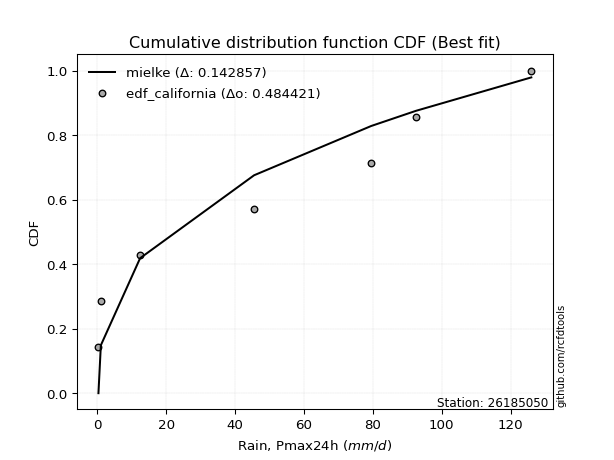</img>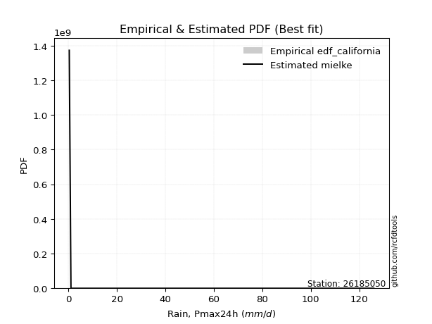</img>

</div>


### 2. Empirical - EDF Hazen (1930)

Hazen method for plotting positions is a formula used to estimate the empirical cumulative probability distribution of flood events or other hydrological data. This formula often results in biased estimations, particularly when extrapolating to extreme events (high return periods).

<div align="center">


$P=(m-0.5)/n$


</div>


**2.1. Empirical values**

<div align="center">

|                | 0                  | 1                  | 2                  | 3                  | 4                  | 5         | 6                 | 7         |
|:---------------|:-------------------|:-------------------|:-------------------|:-------------------|:-------------------|:----------|:------------------|:----------|
| date           | 2023               | 2021               | 2019               | 2022               | 2025               | 2017      | 2018              | 2024      |
| x              | 0.3                | 1.0                | 12.4               | 45.5               | 51.2               | 79.5      | 92.5              | 126.0     |
| m              | 1                  | 2                  | 3                  | 4                  | 5                  | 6         | 7                 | 8         |
| empirical_dist | edf_hazen          | edf_hazen          | edf_hazen          | edf_hazen          | edf_hazen          | edf_hazen | edf_hazen         | edf_hazen |
| empirical      | 0.0625             | 0.1875             | 0.3125             | 0.4375             | 0.5625             | 0.6875    | 0.8125            | 0.9375    |
| empirical_tr   | 1.0666666666666667 | 1.2307692307692308 | 1.4545454545454546 | 1.7777777777777777 | 2.2857142857142856 | 3.2       | 5.333333333333333 | 16.0      |

</div>


**2.2. Kolmogorov-Smirnov fit test (sorted by Δ)**


<div align="center">

|                | 0                   | 1                   | 2                   | 3                   | 4                   | 5                   | 6                   | 7                   | 8                  | 9                   | 10                  | 11                  | 12                 | 13                  | 14                  | 15                  | 16                 | 17                  | 18                 | 19                  | 20                  | 21                  | 22                  | 23                  | 24                  | 25                    | 26                  | 27                 | 28                  | 29                 | 30                  | 31                  | 32                  | 33                  | 34                  | 35                  | 36                  | 37                  | 38                  | 39                 | 40                  | 41                  | 42                  | 43                 | 44                 | 45                  | 46                  | 47                  | 48                  | 49                  | 50                  | 51                  | 52                  | 53                  | 54                 | 55                  | 56                 | 57                  | 58                 | 59                  | 60                  | 61                 | 62                  | 63                  | 64                  | 65                  | 66                  | 67                 | 68                 | 69                 | 70                 | 71                 | 72                 | 73                  | 74                  | 75                  | 76                 | 77                 | 78                 | 79                  | 80                 | 81                 | 82                  | 83                 | 84                  | 85                 | 86                 | 87                 | 88                 | 89                 |
|:---------------|:--------------------|:--------------------|:--------------------|:--------------------|:--------------------|:--------------------|:--------------------|:--------------------|:-------------------|:--------------------|:--------------------|:--------------------|:-------------------|:--------------------|:--------------------|:--------------------|:-------------------|:--------------------|:-------------------|:--------------------|:--------------------|:--------------------|:--------------------|:--------------------|:--------------------|:----------------------|:--------------------|:-------------------|:--------------------|:-------------------|:--------------------|:--------------------|:--------------------|:--------------------|:--------------------|:--------------------|:--------------------|:--------------------|:--------------------|:-------------------|:--------------------|:--------------------|:--------------------|:-------------------|:-------------------|:--------------------|:--------------------|:--------------------|:--------------------|:--------------------|:--------------------|:--------------------|:--------------------|:--------------------|:-------------------|:--------------------|:-------------------|:--------------------|:-------------------|:--------------------|:--------------------|:-------------------|:--------------------|:--------------------|:--------------------|:--------------------|:--------------------|:-------------------|:-------------------|:-------------------|:-------------------|:-------------------|:-------------------|:--------------------|:--------------------|:--------------------|:-------------------|:-------------------|:-------------------|:--------------------|:-------------------|:-------------------|:--------------------|:-------------------|:--------------------|:-------------------|:-------------------|:-------------------|:-------------------|:-------------------|
| station        | 26185050            | 26185050            | 26185050            | 26185050            | 26185050            | 26185050            | 26185050            | 26185050            | 26185050           | 26185050            | 26185050            | 26185050            | 26185050           | 26185050            | 26185050            | 26185050            | 26185050           | 26185050            | 26185050           | 26185050            | 26185050            | 26185050            | 26185050            | 26185050            | 26185050            | 26185050              | 26185050            | 26185050           | 26185050            | 26185050           | 26185050            | 26185050            | 26185050            | 26185050            | 26185050            | 26185050            | 26185050            | 26185050            | 26185050            | 26185050           | 26185050            | 26185050            | 26185050            | 26185050           | 26185050           | 26185050            | 26185050            | 26185050            | 26185050            | 26185050            | 26185050            | 26185050            | 26185050            | 26185050            | 26185050           | 26185050            | 26185050           | 26185050            | 26185050           | 26185050            | 26185050            | 26185050           | 26185050            | 26185050            | 26185050            | 26185050            | 26185050            | 26185050           | 26185050           | 26185050           | 26185050           | 26185050           | 26185050           | 26185050            | 26185050            | 26185050            | 26185050           | 26185050           | 26185050           | 26185050            | 26185050           | 26185050           | 26185050            | 26185050           | 26185050            | 26185050           | 26185050           | 26185050           | 26185050           | 26185050           |
| empirical_dist | edf_hazen           | edf_hazen           | edf_hazen           | edf_hazen           | edf_hazen           | edf_hazen           | edf_hazen           | edf_hazen           | edf_hazen          | edf_hazen           | edf_hazen           | edf_hazen           | edf_hazen          | edf_hazen           | edf_hazen           | edf_hazen           | edf_hazen          | edf_hazen           | edf_hazen          | edf_hazen           | edf_hazen           | edf_hazen           | edf_hazen           | edf_hazen           | edf_hazen           | edf_hazen             | edf_hazen           | edf_hazen          | edf_hazen           | edf_hazen          | edf_hazen           | edf_hazen           | edf_hazen           | edf_hazen           | edf_hazen           | edf_hazen           | edf_hazen           | edf_hazen           | edf_hazen           | edf_hazen          | edf_hazen           | edf_hazen           | edf_hazen           | edf_hazen          | edf_hazen          | edf_hazen           | edf_hazen           | edf_hazen           | edf_hazen           | edf_hazen           | edf_hazen           | edf_hazen           | edf_hazen           | edf_hazen           | edf_hazen          | edf_hazen           | edf_hazen          | edf_hazen           | edf_hazen          | edf_hazen           | edf_hazen           | edf_hazen          | edf_hazen           | edf_hazen           | edf_hazen           | edf_hazen           | edf_hazen           | edf_hazen          | edf_hazen          | edf_hazen          | edf_hazen          | edf_hazen          | edf_hazen          | edf_hazen           | edf_hazen           | edf_hazen           | edf_hazen          | edf_hazen          | edf_hazen          | edf_hazen           | edf_hazen          | edf_hazen          | edf_hazen           | edf_hazen          | edf_hazen           | edf_hazen          | edf_hazen          | edf_hazen          | edf_hazen          | edf_hazen          |
| p_dist         | logjohnsonsu        | ncf                 | halfnorm            | rayleigh            | invgamma            | maxwell             | genlogistic         | kstwobign           | pearson3           | norm                | crystalball         | t                   | exponnorm          | laplace_asymmetric  | betaprime           | gumbel_r            | logistic           | rice                | gumbel_l           | nakagami            | hypsecant           | logloggamma         | f                   | moyal               | weibull_min         | loglaplace_asymmetric | laplace             | expon              | genexpon            | halflogistic       | gompertz            | truncnorm           | mielke              | logpearson3         | invgauss            | alpha               | loggumbel_l         | logweibull_min      | logmielke           | loginvweibull      | logerlang           | logt                | logexponnorm        | lognorm            | lognorm            | logcrystalball      | lognct              | lognakagami         | logfatiguelife      | loglognorm          | loggompertz         | logrice             | loggamma            | loggamma            | loginvgamma        | logalpha            | logmaxwell         | loglogistic         | logkstwobign       | loginvgauss         | lograyleigh         | nct                | loggenexpon         | loghypsecant        | loghalfnorm         | logncf              | logexpon            | loggumbel_r        | loglaplace         | loghalflogistic    | wald               | logmoyal           | gibrat             | pareto              | logfisk             | fisk                | chi2               | logwald            | logf               | fatiguelife         | loggibrat          | logtruncnorm       | gamma               | logpareto          | erlang              | invweibull         | logbetaprime       | logchi2            | johnsonsu          | loggenlogistic     |
| delta          | 0.06564049326692822 | 0.09466649943307537 | 0.11161749612200439 | 0.11486182535242326 | 0.11732270829224159 | 0.11875865688909137 | 0.12315004443658825 | 0.12463515184250373 | 0.1266635749935955 | 0.12846895298904204 | 0.12846895602328343 | 0.12847011565049082 | 0.1287514045882205 | 0.14190023975906688 | 0.14251902430399344 | 0.14404371166681637 | 0.1490279155454867 | 0.14944864241803318 | 0.1502864769151236 | 0.15947585307052414 | 0.16062509849598475 | 0.16083110960019864 | 0.16106458835132575 | 0.16261040183950276 | 0.16518468398073474 | 0.16931236130921878   | 0.17249735202201513 | 0.1738015855514252 | 0.17386930973001308 | 0.1760195558194963 | 0.17758449486776987 | 0.17791569262751017 | 0.19120595648819205 | 0.19310352701408506 | 0.19633534412192877 | 0.19655584499151835 | 0.19772636280630862 | 0.20550106780527455 | 0.23065857332342354 | 0.2335509181484129 | 0.23494451371789893 | 0.23853178862490587 | 0.23853322377041142 | 0.2385335921061742 | 0.2385335921061742 | 0.23853363885009682 | 0.23864887166569293 | 0.23917155268833756 | 0.23961952727559455 | 0.24024166612824926 | 0.24033138222709272 | 0.24205814019350502 | 0.24858471563690154 | 0.24858471563690154 | 0.2498691325947061 | 0.25653759413153665 | 0.2572812418789694 | 0.25848388402866174 | 0.2593754603885602 | 0.26008834547381343 | 0.26283341956411044 | 0.2728261449369962 | 0.27316134772383127 | 0.27343396010571264 | 0.27929685205689103 | 0.28473878728568536 | 0.28812257198305313 | 0.2940523086780006 | 0.3003734234068324 | 0.3068635564838029 | 0.3084479954907216 | 0.3121810657169235 | 0.3125             | 0.32488704098811705 | 0.33731463238571446 | 0.34205156122938096 | 0.3434731948184171 | 0.3643591528902136 | 0.3819648867179183 | 0.38735101057715793 | 0.3962548084544144 | 0.4014410220072824 | 0.41169103263162254 | 0.4313374773391707 | 0.49248225894391173 | 0.5095771417478159 | 0.5615657848551335 | 0.5646174000871537 | 0.6061247781528963 | 0.8125             |
| deltao         | 0.4472608134160001  | 0.4472608134160001  | 0.4472608134160001  | 0.4472608134160001  | 0.4472608134160001  | 0.4472608134160001  | 0.4472608134160001  | 0.4472608134160001  | 0.4472608134160001 | 0.4472608134160001  | 0.4472608134160001  | 0.4472608134160001  | 0.4472608134160001 | 0.4472608134160001  | 0.4472608134160001  | 0.4472608134160001  | 0.4472608134160001 | 0.4472608134160001  | 0.4472608134160001 | 0.4472608134160001  | 0.4472608134160001  | 0.4472608134160001  | 0.4472608134160001  | 0.4472608134160001  | 0.4472608134160001  | 0.4472608134160001    | 0.4472608134160001  | 0.4472608134160001 | 0.4472608134160001  | 0.4472608134160001 | 0.4472608134160001  | 0.4472608134160001  | 0.4472608134160001  | 0.4472608134160001  | 0.4472608134160001  | 0.4472608134160001  | 0.4472608134160001  | 0.4472608134160001  | 0.4472608134160001  | 0.4472608134160001 | 0.4472608134160001  | 0.4472608134160001  | 0.4472608134160001  | 0.4472608134160001 | 0.4472608134160001 | 0.4472608134160001  | 0.4472608134160001  | 0.4472608134160001  | 0.4472608134160001  | 0.4472608134160001  | 0.4472608134160001  | 0.4472608134160001  | 0.4472608134160001  | 0.4472608134160001  | 0.4472608134160001 | 0.4472608134160001  | 0.4472608134160001 | 0.4472608134160001  | 0.4472608134160001 | 0.4472608134160001  | 0.4472608134160001  | 0.4472608134160001 | 0.4472608134160001  | 0.4472608134160001  | 0.4472608134160001  | 0.4472608134160001  | 0.4472608134160001  | 0.4472608134160001 | 0.4472608134160001 | 0.4472608134160001 | 0.4472608134160001 | 0.4472608134160001 | 0.4472608134160001 | 0.4472608134160001  | 0.4472608134160001  | 0.4472608134160001  | 0.4472608134160001 | 0.4472608134160001 | 0.4472608134160001 | 0.4472608134160001  | 0.4472608134160001 | 0.4472608134160001 | 0.4472608134160001  | 0.4472608134160001 | 0.4472608134160001  | 0.4472608134160001 | 0.4472608134160001 | 0.4472608134160001 | 0.4472608134160001 | 0.4472608134160001 |
| eval           | Δo > Δ              | Δo > Δ              | Δo > Δ              | Δo > Δ              | Δo > Δ              | Δo > Δ              | Δo > Δ              | Δo > Δ              | Δo > Δ             | Δo > Δ              | Δo > Δ              | Δo > Δ              | Δo > Δ             | Δo > Δ              | Δo > Δ              | Δo > Δ              | Δo > Δ             | Δo > Δ              | Δo > Δ             | Δo > Δ              | Δo > Δ              | Δo > Δ              | Δo > Δ              | Δo > Δ              | Δo > Δ              | Δo > Δ                | Δo > Δ              | Δo > Δ             | Δo > Δ              | Δo > Δ             | Δo > Δ              | Δo > Δ              | Δo > Δ              | Δo > Δ              | Δo > Δ              | Δo > Δ              | Δo > Δ              | Δo > Δ              | Δo > Δ              | Δo > Δ             | Δo > Δ              | Δo > Δ              | Δo > Δ              | Δo > Δ             | Δo > Δ             | Δo > Δ              | Δo > Δ              | Δo > Δ              | Δo > Δ              | Δo > Δ              | Δo > Δ              | Δo > Δ              | Δo > Δ              | Δo > Δ              | Δo > Δ             | Δo > Δ              | Δo > Δ             | Δo > Δ              | Δo > Δ             | Δo > Δ              | Δo > Δ              | Δo > Δ             | Δo > Δ              | Δo > Δ              | Δo > Δ              | Δo > Δ              | Δo > Δ              | Δo > Δ             | Δo > Δ             | Δo > Δ             | Δo > Δ             | Δo > Δ             | Δo > Δ             | Δo > Δ              | Δo > Δ              | Δo > Δ              | Δo > Δ             | Δo > Δ             | Δo > Δ             | Δo > Δ              | Δo > Δ             | Δo > Δ             | Δo > Δ              | Δo > Δ             | Δo <= Δ             | Δo <= Δ            | Δo <= Δ            | Δo <= Δ            | Δo <= Δ            | Δo <= Δ            |
| fit            | 1                   | 1                   | 1                   | 1                   | 1                   | 1                   | 1                   | 1                   | 1                  | 1                   | 1                   | 1                   | 1                  | 1                   | 1                   | 1                   | 1                  | 1                   | 1                  | 1                   | 1                   | 1                   | 1                   | 1                   | 1                   | 1                     | 1                   | 1                  | 1                   | 1                  | 1                   | 1                   | 1                   | 1                   | 1                   | 1                   | 1                   | 1                   | 1                   | 1                  | 1                   | 1                   | 1                   | 1                  | 1                  | 1                   | 1                   | 1                   | 1                   | 1                   | 1                   | 1                   | 1                   | 1                   | 1                  | 1                   | 1                  | 1                   | 1                  | 1                   | 1                   | 1                  | 1                   | 1                   | 1                   | 1                   | 1                   | 1                  | 1                  | 1                  | 1                  | 1                  | 1                  | 1                   | 1                   | 1                   | 1                  | 1                  | 1                  | 1                   | 1                  | 1                  | 1                   | 1                  | 0                   | 0                  | 0                  | 0                  | 0                  | 0                  |
| n              | 8                   | 8                   | 8                   | 8                   | 8                   | 8                   | 8                   | 8                   | 8                  | 8                   | 8                   | 8                   | 8                  | 8                   | 8                   | 8                   | 8                  | 8                   | 8                  | 8                   | 8                   | 8                   | 8                   | 8                   | 8                   | 8                     | 8                   | 8                  | 8                   | 8                  | 8                   | 8                   | 8                   | 8                   | 8                   | 8                   | 8                   | 8                   | 8                   | 8                  | 8                   | 8                   | 8                   | 8                  | 8                  | 8                   | 8                   | 8                   | 8                   | 8                   | 8                   | 8                   | 8                   | 8                   | 8                  | 8                   | 8                  | 8                   | 8                  | 8                   | 8                   | 8                  | 8                   | 8                   | 8                   | 8                   | 8                   | 8                  | 8                  | 8                  | 8                  | 8                  | 8                  | 8                   | 8                   | 8                   | 8                  | 8                  | 8                  | 8                   | 8                  | 8                  | 8                   | 8                  | 8                   | 8                  | 8                  | 8                  | 8                  | 8                  |
| best_fit       | 1                   | 0                   | 0                   | 0                   | 0                   | 0                   | 0                   | 0                   | 0                  | 0                   | 0                   | 0                   | 0                  | 0                   | 0                   | 0                   | 0                  | 0                   | 0                  | 0                   | 0                   | 0                   | 0                   | 0                   | 0                   | 0                     | 0                   | 0                  | 0                   | 0                  | 0                   | 0                   | 0                   | 0                   | 0                   | 0                   | 0                   | 0                   | 0                   | 0                  | 0                   | 0                   | 0                   | 0                  | 0                  | 0                   | 0                   | 0                   | 0                   | 0                   | 0                   | 0                   | 0                   | 0                   | 0                  | 0                   | 0                  | 0                   | 0                  | 0                   | 0                   | 0                  | 0                   | 0                   | 0                   | 0                   | 0                   | 0                  | 0                  | 0                  | 0                  | 0                  | 0                  | 0                   | 0                   | 0                   | 0                  | 0                  | 0                  | 0                   | 0                  | 0                  | 0                   | 0                  | 0                   | 0                  | 0                  | 0                  | 0                  | 0                  |
| best_fit_sort  | 1                   | 2                   | 3                   | 4                   | 5                   | 6                   | 7                   | 8                   | 9                  | 10                  | 11                  | 12                  | 13                 | 14                  | 15                  | 16                  | 17                 | 18                  | 19                 | 20                  | 21                  | 22                  | 23                  | 24                  | 25                  | 26                    | 27                  | 28                 | 29                  | 30                 | 31                  | 32                  | 33                  | 34                  | 35                  | 36                  | 37                  | 38                  | 39                  | 40                 | 41                  | 42                  | 43                  | 44                 | 45                 | 46                  | 47                  | 48                  | 49                  | 50                  | 51                  | 52                  | 53                  | 54                  | 55                 | 56                  | 57                 | 58                  | 59                 | 60                  | 61                  | 62                 | 63                  | 64                  | 65                  | 66                  | 67                  | 68                 | 69                 | 70                 | 71                 | 72                 | 73                 | 74                  | 75                  | 76                  | 77                 | 78                 | 79                 | 80                  | 81                 | 82                 | 83                  | 84                 | 85                  | 86                 | 87                 | 88                 | 89                 | 90                 |

</div>


<div align="center">

</img>

</div>


**2.3. Best fit**

<div align="center">

|   id |   station | empirical_dist   | p_dist       |     delta |   deltao | eval   |   fit |   n |   best_fit |   best_fit_sort |
|-----:|----------:|:-----------------|:-------------|----------:|---------:|:-------|------:|----:|-----------:|----------------:|
|    0 |  26185050 | edf_hazen        | logjohnsonsu | 0.0656405 | 0.447261 | Δo > Δ |     1 |   8 |          1 |               1 |

</div>


<div align="center">

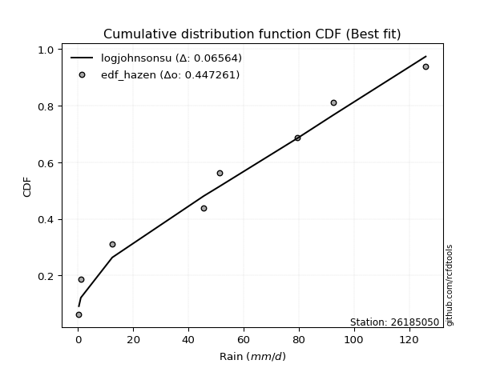</img>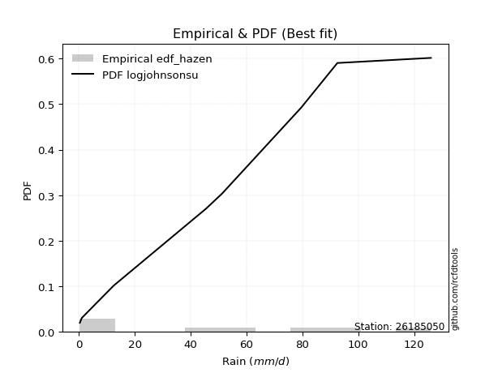</img>

</div>


### 3. Empirical - EDF Weibull (1939)

Weibull plotting position formula is an empirical method used to estimate the non-exceedance probability or plotting position for a set of observed data, is often recommended or widely used in practice, particularly in flood frequency analysis.

<div align="center">


$P=m/(n+1)$


</div>


**3.1. Empirical values**

<div align="center">

|                | 0                  | 1                  | 2                  | 3                  | 4                  | 5                  | 6                  | 7                  |
|:---------------|:-------------------|:-------------------|:-------------------|:-------------------|:-------------------|:-------------------|:-------------------|:-------------------|
| date           | 2023               | 2021               | 2019               | 2022               | 2025               | 2017               | 2018               | 2024               |
| x              | 0.3                | 1.0                | 12.4               | 45.5               | 51.2               | 79.5               | 92.5               | 126.0              |
| m              | 1                  | 2                  | 3                  | 4                  | 5                  | 6                  | 7                  | 8                  |
| empirical_dist | edf_weibull        | edf_weibull        | edf_weibull        | edf_weibull        | edf_weibull        | edf_weibull        | edf_weibull        | edf_weibull        |
| empirical      | 0.1111111111111111 | 0.2222222222222222 | 0.3333333333333333 | 0.4444444444444444 | 0.5555555555555556 | 0.6666666666666666 | 0.7777777777777778 | 0.8888888888888888 |
| empirical_tr   | 1.125              | 1.2857142857142856 | 1.4999999999999998 | 1.7999999999999998 | 2.25               | 2.9999999999999996 | 4.5                | 8.999999999999996  |

</div>


**3.2. Kolmogorov-Smirnov fit test (sorted by Δ)**


<div align="center">

|                | 0                   | 1                   | 2                  | 3                   | 4                  | 5                   | 6                  | 7                   | 8                   | 9                  | 10                  | 11                  | 12                  | 13                  | 14                  | 15                  | 16                  | 17                    | 18                 | 19                  | 20                 | 21                 | 22                 | 23                  | 24                  | 25                  | 26                  | 27                  | 28                  | 29                 | 30                  | 31                  | 32                  | 33                 | 34                 | 35                 | 36                  | 37                  | 38                  | 39                  | 40                 | 41                  | 42                 | 43                  | 44                  | 45                 | 46                 | 47                  | 48                  | 49                  | 50                 | 51                 | 52                  | 53                  | 54                  | 55                 | 56                  | 57                  | 58                 | 59                  | 60                 | 61                 | 62                  | 63                  | 64                 | 65                 | 66                 | 67                  | 68                  | 69                 | 70                  | 71                 | 72                  | 73                 | 74                 | 75                 | 76                 | 77                  | 78                  | 79                 | 80                 | 81                  | 82                 | 83                 | 84                  | 85                 | 86                 | 87                 | 88                 | 89                 |
|:---------------|:--------------------|:--------------------|:-------------------|:--------------------|:-------------------|:--------------------|:-------------------|:--------------------|:--------------------|:-------------------|:--------------------|:--------------------|:--------------------|:--------------------|:--------------------|:--------------------|:--------------------|:----------------------|:-------------------|:--------------------|:-------------------|:-------------------|:-------------------|:--------------------|:--------------------|:--------------------|:--------------------|:--------------------|:--------------------|:-------------------|:--------------------|:--------------------|:--------------------|:-------------------|:-------------------|:-------------------|:--------------------|:--------------------|:--------------------|:--------------------|:-------------------|:--------------------|:-------------------|:--------------------|:--------------------|:-------------------|:-------------------|:--------------------|:--------------------|:--------------------|:-------------------|:-------------------|:--------------------|:--------------------|:--------------------|:-------------------|:--------------------|:--------------------|:-------------------|:--------------------|:-------------------|:-------------------|:--------------------|:--------------------|:-------------------|:-------------------|:-------------------|:--------------------|:--------------------|:-------------------|:--------------------|:-------------------|:--------------------|:-------------------|:-------------------|:-------------------|:-------------------|:--------------------|:--------------------|:-------------------|:-------------------|:--------------------|:-------------------|:-------------------|:--------------------|:-------------------|:-------------------|:-------------------|:-------------------|:-------------------|
| station        | 26185050            | 26185050            | 26185050           | 26185050            | 26185050           | 26185050            | 26185050           | 26185050            | 26185050            | 26185050           | 26185050            | 26185050            | 26185050            | 26185050            | 26185050            | 26185050            | 26185050            | 26185050              | 26185050           | 26185050            | 26185050           | 26185050           | 26185050           | 26185050            | 26185050            | 26185050            | 26185050            | 26185050            | 26185050            | 26185050           | 26185050            | 26185050            | 26185050            | 26185050           | 26185050           | 26185050           | 26185050            | 26185050            | 26185050            | 26185050            | 26185050           | 26185050            | 26185050           | 26185050            | 26185050            | 26185050           | 26185050           | 26185050            | 26185050            | 26185050            | 26185050           | 26185050           | 26185050            | 26185050            | 26185050            | 26185050           | 26185050            | 26185050            | 26185050           | 26185050            | 26185050           | 26185050           | 26185050            | 26185050            | 26185050           | 26185050           | 26185050           | 26185050            | 26185050            | 26185050           | 26185050            | 26185050           | 26185050            | 26185050           | 26185050           | 26185050           | 26185050           | 26185050            | 26185050            | 26185050           | 26185050           | 26185050            | 26185050           | 26185050           | 26185050            | 26185050           | 26185050           | 26185050           | 26185050           | 26185050           |
| empirical_dist | edf_weibull         | edf_weibull         | edf_weibull        | edf_weibull         | edf_weibull        | edf_weibull         | edf_weibull        | edf_weibull         | edf_weibull         | edf_weibull        | edf_weibull         | edf_weibull         | edf_weibull         | edf_weibull         | edf_weibull         | edf_weibull         | edf_weibull         | edf_weibull           | edf_weibull        | edf_weibull         | edf_weibull        | edf_weibull        | edf_weibull        | edf_weibull         | edf_weibull         | edf_weibull         | edf_weibull         | edf_weibull         | edf_weibull         | edf_weibull        | edf_weibull         | edf_weibull         | edf_weibull         | edf_weibull        | edf_weibull        | edf_weibull        | edf_weibull         | edf_weibull         | edf_weibull         | edf_weibull         | edf_weibull        | edf_weibull         | edf_weibull        | edf_weibull         | edf_weibull         | edf_weibull        | edf_weibull        | edf_weibull         | edf_weibull         | edf_weibull         | edf_weibull        | edf_weibull        | edf_weibull         | edf_weibull         | edf_weibull         | edf_weibull        | edf_weibull         | edf_weibull         | edf_weibull        | edf_weibull         | edf_weibull        | edf_weibull        | edf_weibull         | edf_weibull         | edf_weibull        | edf_weibull        | edf_weibull        | edf_weibull         | edf_weibull         | edf_weibull        | edf_weibull         | edf_weibull        | edf_weibull         | edf_weibull        | edf_weibull        | edf_weibull        | edf_weibull        | edf_weibull         | edf_weibull         | edf_weibull        | edf_weibull        | edf_weibull         | edf_weibull        | edf_weibull        | edf_weibull         | edf_weibull        | edf_weibull        | edf_weibull        | edf_weibull        | edf_weibull        |
| p_dist         | logjohnsonsu        | ncf                 | betaprime          | rayleigh            | invgamma           | f                   | maxwell            | genlogistic         | kstwobign           | halfnorm           | pearson3            | norm                | crystalball         | t                   | exponnorm           | nakagami            | logloggamma         | loglaplace_asymmetric | laplace_asymmetric | gumbel_r            | logistic           | rice               | gumbel_l           | hypsecant           | moyal               | mielke              | logpearson3         | invgauss            | alpha               | loggumbel_l        | laplace             | logweibull_min      | weibull_min         | expon              | genexpon           | halflogistic       | gompertz            | truncnorm           | logmielke           | loginvweibull       | logerlang          | logt                | logexponnorm       | lognorm             | lognorm             | logcrystalball     | lognct             | lognakagami         | logfatiguelife      | loglognorm          | loggompertz        | logrice            | logncf              | loggamma            | loggamma            | loginvgamma        | logalpha            | logmaxwell          | loglogistic        | logkstwobign        | loginvgauss        | lograyleigh        | nct                 | loggenexpon         | loghypsecant       | logexpon           | loghalfnorm        | loggumbel_r         | loglaplace          | fisk               | logfisk             | loghalflogistic    | pareto              | logmoyal           | wald               | gibrat             | chi2               | logwald             | logf                | fatiguelife        | loggibrat          | logtruncnorm        | logpareto          | gamma              | invweibull          | erlang             | logbetaprime       | logchi2            | johnsonsu          | loggenlogistic     |
| delta          | 0.10036271548915043 | 0.11095903207753194 | 0.1354025271153093 | 0.13569515868575657 | 0.1381560416255749 | 0.13917844356396913 | 0.1395919902224247 | 0.14398337776992157 | 0.14546848517583705 | 0.1463397183442266 | 0.14749690832692883 | 0.14930228632237535 | 0.14930228935661674 | 0.14930344898382414 | 0.14958473792155383 | 0.15253140862607972 | 0.15388666515575422 | 0.16236791686477436   | 0.1627335730924002 | 0.16487704500014969 | 0.16986124887882   | 0.1702819757513665 | 0.1711198102484569 | 0.18145843182931806 | 0.18344373517283608 | 0.18426151204374763 | 0.18615908256964064 | 0.18939089967748435 | 0.18961140054707393 | 0.1907819183618642 | 0.19333068535534845 | 0.19855662336083013 | 0.19990690620295695 | 0.2085238077736474 | 0.2085915319522353 | 0.2107417780417185 | 0.21230671708999208 | 0.21263791484973238 | 0.22371412887897912 | 0.22660647370396847 | 0.2280000692734545 | 0.23158734418046145 | 0.231588779325967  | 0.23158914766172978 | 0.23158914766172978 | 0.2315891944056524 | 0.2317044272212485 | 0.23222710824389314 | 0.23267508283115013 | 0.23329722168380485 | 0.2333869377826483 | 0.2351136957490606 | 0.23941168041689692 | 0.24164027119245712 | 0.24164027119245712 | 0.2429246881502617 | 0.24959314968709223 | 0.25033679743452497 | 0.2515394395842173 | 0.25243101594411577 | 0.253143901029369  | 0.255888975119666  | 0.26561716982401395 | 0.26621690327938685 | 0.2664895156612682 | 0.2672892386497198 | 0.2723524076124466 | 0.28710786423355616 | 0.29342897896238795 | 0.2934404501182698 | 0.29410282933814536 | 0.2999191120393585 | 0.30405370765478373 | 0.3052366212724791 | 0.3292813288240549 | 0.3333333333333333 | 0.3365287503739727 | 0.35741470844576917 | 0.36113155338458497 | 0.3804065661327135 | 0.38931036400997   | 0.39449657756283796 | 0.3966152551169485 | 0.4047465881871781 | 0.46096603063670466 | 0.4855378144994673 | 0.5268435626329113 | 0.5437840667538203 | 0.5714025559306741 | 0.7777777777777778 |
| deltao         | 0.4472608134160001  | 0.4472608134160001  | 0.4472608134160001 | 0.4472608134160001  | 0.4472608134160001 | 0.4472608134160001  | 0.4472608134160001 | 0.4472608134160001  | 0.4472608134160001  | 0.4472608134160001 | 0.4472608134160001  | 0.4472608134160001  | 0.4472608134160001  | 0.4472608134160001  | 0.4472608134160001  | 0.4472608134160001  | 0.4472608134160001  | 0.4472608134160001    | 0.4472608134160001 | 0.4472608134160001  | 0.4472608134160001 | 0.4472608134160001 | 0.4472608134160001 | 0.4472608134160001  | 0.4472608134160001  | 0.4472608134160001  | 0.4472608134160001  | 0.4472608134160001  | 0.4472608134160001  | 0.4472608134160001 | 0.4472608134160001  | 0.4472608134160001  | 0.4472608134160001  | 0.4472608134160001 | 0.4472608134160001 | 0.4472608134160001 | 0.4472608134160001  | 0.4472608134160001  | 0.4472608134160001  | 0.4472608134160001  | 0.4472608134160001 | 0.4472608134160001  | 0.4472608134160001 | 0.4472608134160001  | 0.4472608134160001  | 0.4472608134160001 | 0.4472608134160001 | 0.4472608134160001  | 0.4472608134160001  | 0.4472608134160001  | 0.4472608134160001 | 0.4472608134160001 | 0.4472608134160001  | 0.4472608134160001  | 0.4472608134160001  | 0.4472608134160001 | 0.4472608134160001  | 0.4472608134160001  | 0.4472608134160001 | 0.4472608134160001  | 0.4472608134160001 | 0.4472608134160001 | 0.4472608134160001  | 0.4472608134160001  | 0.4472608134160001 | 0.4472608134160001 | 0.4472608134160001 | 0.4472608134160001  | 0.4472608134160001  | 0.4472608134160001 | 0.4472608134160001  | 0.4472608134160001 | 0.4472608134160001  | 0.4472608134160001 | 0.4472608134160001 | 0.4472608134160001 | 0.4472608134160001 | 0.4472608134160001  | 0.4472608134160001  | 0.4472608134160001 | 0.4472608134160001 | 0.4472608134160001  | 0.4472608134160001 | 0.4472608134160001 | 0.4472608134160001  | 0.4472608134160001 | 0.4472608134160001 | 0.4472608134160001 | 0.4472608134160001 | 0.4472608134160001 |
| eval           | Δo > Δ              | Δo > Δ              | Δo > Δ             | Δo > Δ              | Δo > Δ             | Δo > Δ              | Δo > Δ             | Δo > Δ              | Δo > Δ              | Δo > Δ             | Δo > Δ              | Δo > Δ              | Δo > Δ              | Δo > Δ              | Δo > Δ              | Δo > Δ              | Δo > Δ              | Δo > Δ                | Δo > Δ             | Δo > Δ              | Δo > Δ             | Δo > Δ             | Δo > Δ             | Δo > Δ              | Δo > Δ              | Δo > Δ              | Δo > Δ              | Δo > Δ              | Δo > Δ              | Δo > Δ             | Δo > Δ              | Δo > Δ              | Δo > Δ              | Δo > Δ             | Δo > Δ             | Δo > Δ             | Δo > Δ              | Δo > Δ              | Δo > Δ              | Δo > Δ              | Δo > Δ             | Δo > Δ              | Δo > Δ             | Δo > Δ              | Δo > Δ              | Δo > Δ             | Δo > Δ             | Δo > Δ              | Δo > Δ              | Δo > Δ              | Δo > Δ             | Δo > Δ             | Δo > Δ              | Δo > Δ              | Δo > Δ              | Δo > Δ             | Δo > Δ              | Δo > Δ              | Δo > Δ             | Δo > Δ              | Δo > Δ             | Δo > Δ             | Δo > Δ              | Δo > Δ              | Δo > Δ             | Δo > Δ             | Δo > Δ             | Δo > Δ              | Δo > Δ              | Δo > Δ             | Δo > Δ              | Δo > Δ             | Δo > Δ              | Δo > Δ             | Δo > Δ             | Δo > Δ             | Δo > Δ             | Δo > Δ              | Δo > Δ              | Δo > Δ             | Δo > Δ             | Δo > Δ              | Δo > Δ             | Δo > Δ             | Δo <= Δ             | Δo <= Δ            | Δo <= Δ            | Δo <= Δ            | Δo <= Δ            | Δo <= Δ            |
| fit            | 1                   | 1                   | 1                  | 1                   | 1                  | 1                   | 1                  | 1                   | 1                   | 1                  | 1                   | 1                   | 1                   | 1                   | 1                   | 1                   | 1                   | 1                     | 1                  | 1                   | 1                  | 1                  | 1                  | 1                   | 1                   | 1                   | 1                   | 1                   | 1                   | 1                  | 1                   | 1                   | 1                   | 1                  | 1                  | 1                  | 1                   | 1                   | 1                   | 1                   | 1                  | 1                   | 1                  | 1                   | 1                   | 1                  | 1                  | 1                   | 1                   | 1                   | 1                  | 1                  | 1                   | 1                   | 1                   | 1                  | 1                   | 1                   | 1                  | 1                   | 1                  | 1                  | 1                   | 1                   | 1                  | 1                  | 1                  | 1                   | 1                   | 1                  | 1                   | 1                  | 1                   | 1                  | 1                  | 1                  | 1                  | 1                   | 1                   | 1                  | 1                  | 1                   | 1                  | 1                  | 0                   | 0                  | 0                  | 0                  | 0                  | 0                  |
| n              | 8                   | 8                   | 8                  | 8                   | 8                  | 8                   | 8                  | 8                   | 8                   | 8                  | 8                   | 8                   | 8                   | 8                   | 8                   | 8                   | 8                   | 8                     | 8                  | 8                   | 8                  | 8                  | 8                  | 8                   | 8                   | 8                   | 8                   | 8                   | 8                   | 8                  | 8                   | 8                   | 8                   | 8                  | 8                  | 8                  | 8                   | 8                   | 8                   | 8                   | 8                  | 8                   | 8                  | 8                   | 8                   | 8                  | 8                  | 8                   | 8                   | 8                   | 8                  | 8                  | 8                   | 8                   | 8                   | 8                  | 8                   | 8                   | 8                  | 8                   | 8                  | 8                  | 8                   | 8                   | 8                  | 8                  | 8                  | 8                   | 8                   | 8                  | 8                   | 8                  | 8                   | 8                  | 8                  | 8                  | 8                  | 8                   | 8                   | 8                  | 8                  | 8                   | 8                  | 8                  | 8                   | 8                  | 8                  | 8                  | 8                  | 8                  |
| best_fit       | 1                   | 0                   | 0                  | 0                   | 0                  | 0                   | 0                  | 0                   | 0                   | 0                  | 0                   | 0                   | 0                   | 0                   | 0                   | 0                   | 0                   | 0                     | 0                  | 0                   | 0                  | 0                  | 0                  | 0                   | 0                   | 0                   | 0                   | 0                   | 0                   | 0                  | 0                   | 0                   | 0                   | 0                  | 0                  | 0                  | 0                   | 0                   | 0                   | 0                   | 0                  | 0                   | 0                  | 0                   | 0                   | 0                  | 0                  | 0                   | 0                   | 0                   | 0                  | 0                  | 0                   | 0                   | 0                   | 0                  | 0                   | 0                   | 0                  | 0                   | 0                  | 0                  | 0                   | 0                   | 0                  | 0                  | 0                  | 0                   | 0                   | 0                  | 0                   | 0                  | 0                   | 0                  | 0                  | 0                  | 0                  | 0                   | 0                   | 0                  | 0                  | 0                   | 0                  | 0                  | 0                   | 0                  | 0                  | 0                  | 0                  | 0                  |
| best_fit_sort  | 1                   | 2                   | 3                  | 4                   | 5                  | 6                   | 7                  | 8                   | 9                   | 10                 | 11                  | 12                  | 13                  | 14                  | 15                  | 16                  | 17                  | 18                    | 19                 | 20                  | 21                 | 22                 | 23                 | 24                  | 25                  | 26                  | 27                  | 28                  | 29                  | 30                 | 31                  | 32                  | 33                  | 34                 | 35                 | 36                 | 37                  | 38                  | 39                  | 40                  | 41                 | 42                  | 43                 | 44                  | 45                  | 46                 | 47                 | 48                  | 49                  | 50                  | 51                 | 52                 | 53                  | 54                  | 55                  | 56                 | 57                  | 58                  | 59                 | 60                  | 61                 | 62                 | 63                  | 64                  | 65                 | 66                 | 67                 | 68                  | 69                  | 70                 | 71                  | 72                 | 73                  | 74                 | 75                 | 76                 | 77                 | 78                  | 79                  | 80                 | 81                 | 82                  | 83                 | 84                 | 85                  | 86                 | 87                 | 88                 | 89                 | 90                 |

</div>


<div align="center">

</img>

</div>


**3.3. Best fit**

<div align="center">

|   id |   station | empirical_dist   | p_dist       |    delta |   deltao | eval   |   fit |   n |   best_fit |   best_fit_sort |
|-----:|----------:|:-----------------|:-------------|---------:|---------:|:-------|------:|----:|-----------:|----------------:|
|    0 |  26185050 | edf_weibull      | logjohnsonsu | 0.100363 | 0.447261 | Δo > Δ |     1 |   8 |          1 |               1 |

</div>


<div align="center">

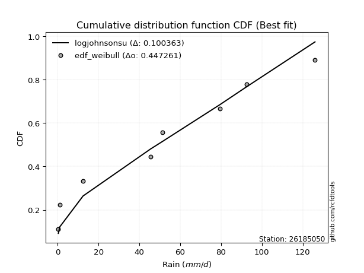</img></img>

</div>


### 4. Empirical - EDF Beard (1943)

The Beard formula (or Beard´s plotting position formula) in hydrology is used to estimate the empirical non-exceedance probability _(P)_ of a flood event (or other extreme hydrological data point) within a given dataset.

<div align="center">


$P=(m-0.31)/(n+0.38)$


</div>


**4.1. Empirical values**

<div align="center">

|                | 0                   | 1                   | 2                  | 3                   | 4                  | 5                  | 6                  | 7                  |
|:---------------|:--------------------|:--------------------|:-------------------|:--------------------|:-------------------|:-------------------|:-------------------|:-------------------|
| date           | 2023                | 2021                | 2019               | 2022                | 2025               | 2017               | 2018               | 2024               |
| x              | 0.3                 | 1.0                 | 12.4               | 45.5                | 51.2               | 79.5               | 92.5               | 126.0              |
| m              | 1                   | 2                   | 3                  | 4                   | 5                  | 6                  | 7                  | 8                  |
| empirical_dist | edf_beard           | edf_beard           | edf_beard          | edf_beard           | edf_beard          | edf_beard          | edf_beard          | edf_beard          |
| empirical      | 0.08233890214797135 | 0.20167064439140808 | 0.3210023866348448 | 0.44033412887828155 | 0.5596658711217184 | 0.6789976133651551 | 0.7983293556085919 | 0.9176610978520287 |
| empirical_tr   | 1.0897269180754225  | 1.2526158445440956  | 1.4727592267135323 | 1.7867803837953091  | 2.2710027100271004 | 3.115241635687732  | 4.958579881656804  | 12.144927536231886 |

</div>


**4.2. Kolmogorov-Smirnov fit test (sorted by Δ)**


<div align="center">

|                | 0                  | 1                   | 2                   | 3                   | 4                  | 5                  | 6                   | 7                   | 8                   | 9                   | 10                  | 11                  | 12                  | 13                  | 14                 | 15                 | 16                 | 17                 | 18                 | 19                 | 20                 | 21                 | 22                    | 23                  | 24                  | 25                  | 26                  | 27                  | 28                  | 29                 | 30                  | 31                 | 32                  | 33                  | 34                  | 35                 | 36                  | 37                 | 38                 | 39                  | 40                  | 41                  | 42                  | 43                  | 44                  | 45                  | 46                  | 47                 | 48                 | 49                  | 50                  | 51                  | 52                 | 53                 | 54                  | 55                 | 56                  | 57                 | 58                  | 59                 | 60                 | 61                 | 62                 | 63                 | 64                 | 65                 | 66                 | 67                  | 68                 | 69                 | 70                  | 71                  | 72                 | 73                 | 74                 | 75                 | 76                  | 77                  | 78                  | 79                 | 80                  | 81                 | 82                 | 83                  | 84                 | 85                  | 86                 | 87                 | 88                 | 89                 |
|:---------------|:-------------------|:--------------------|:--------------------|:--------------------|:-------------------|:-------------------|:--------------------|:--------------------|:--------------------|:--------------------|:--------------------|:--------------------|:--------------------|:--------------------|:-------------------|:-------------------|:-------------------|:-------------------|:-------------------|:-------------------|:-------------------|:-------------------|:----------------------|:--------------------|:--------------------|:--------------------|:--------------------|:--------------------|:--------------------|:-------------------|:--------------------|:-------------------|:--------------------|:--------------------|:--------------------|:-------------------|:--------------------|:-------------------|:-------------------|:--------------------|:--------------------|:--------------------|:--------------------|:--------------------|:--------------------|:--------------------|:--------------------|:-------------------|:-------------------|:--------------------|:--------------------|:--------------------|:-------------------|:-------------------|:--------------------|:-------------------|:--------------------|:-------------------|:--------------------|:-------------------|:-------------------|:-------------------|:-------------------|:-------------------|:-------------------|:-------------------|:-------------------|:--------------------|:-------------------|:-------------------|:--------------------|:--------------------|:-------------------|:-------------------|:-------------------|:-------------------|:--------------------|:--------------------|:--------------------|:-------------------|:--------------------|:-------------------|:-------------------|:--------------------|:-------------------|:--------------------|:-------------------|:-------------------|:-------------------|:-------------------|
| station        | 26185050           | 26185050            | 26185050            | 26185050            | 26185050           | 26185050           | 26185050            | 26185050            | 26185050            | 26185050            | 26185050            | 26185050            | 26185050            | 26185050            | 26185050           | 26185050           | 26185050           | 26185050           | 26185050           | 26185050           | 26185050           | 26185050           | 26185050              | 26185050            | 26185050            | 26185050            | 26185050            | 26185050            | 26185050            | 26185050           | 26185050            | 26185050           | 26185050            | 26185050            | 26185050            | 26185050           | 26185050            | 26185050           | 26185050           | 26185050            | 26185050            | 26185050            | 26185050            | 26185050            | 26185050            | 26185050            | 26185050            | 26185050           | 26185050           | 26185050            | 26185050            | 26185050            | 26185050           | 26185050           | 26185050            | 26185050           | 26185050            | 26185050           | 26185050            | 26185050           | 26185050           | 26185050           | 26185050           | 26185050           | 26185050           | 26185050           | 26185050           | 26185050            | 26185050           | 26185050           | 26185050            | 26185050            | 26185050           | 26185050           | 26185050           | 26185050           | 26185050            | 26185050            | 26185050            | 26185050           | 26185050            | 26185050           | 26185050           | 26185050            | 26185050           | 26185050            | 26185050           | 26185050           | 26185050           | 26185050           |
| empirical_dist | edf_beard          | edf_beard           | edf_beard           | edf_beard           | edf_beard          | edf_beard          | edf_beard           | edf_beard           | edf_beard           | edf_beard           | edf_beard           | edf_beard           | edf_beard           | edf_beard           | edf_beard          | edf_beard          | edf_beard          | edf_beard          | edf_beard          | edf_beard          | edf_beard          | edf_beard          | edf_beard             | edf_beard           | edf_beard           | edf_beard           | edf_beard           | edf_beard           | edf_beard           | edf_beard          | edf_beard           | edf_beard          | edf_beard           | edf_beard           | edf_beard           | edf_beard          | edf_beard           | edf_beard          | edf_beard          | edf_beard           | edf_beard           | edf_beard           | edf_beard           | edf_beard           | edf_beard           | edf_beard           | edf_beard           | edf_beard          | edf_beard          | edf_beard           | edf_beard           | edf_beard           | edf_beard          | edf_beard          | edf_beard           | edf_beard          | edf_beard           | edf_beard          | edf_beard           | edf_beard          | edf_beard          | edf_beard          | edf_beard          | edf_beard          | edf_beard          | edf_beard          | edf_beard          | edf_beard           | edf_beard          | edf_beard          | edf_beard           | edf_beard           | edf_beard          | edf_beard          | edf_beard          | edf_beard          | edf_beard           | edf_beard           | edf_beard           | edf_beard          | edf_beard           | edf_beard          | edf_beard          | edf_beard           | edf_beard          | edf_beard           | edf_beard          | edf_beard          | edf_beard          | edf_beard          |
| p_dist         | logjohnsonsu       | ncf                 | rayleigh            | halfnorm            | invgamma           | maxwell            | genlogistic         | kstwobign           | pearson3            | norm                | crystalball         | t                   | exponnorm           | betaprime           | f                  | laplace_asymmetric | gumbel_r           | nakagami           | logistic           | rice               | logloggamma        | gumbel_l           | loglaplace_asymmetric | hypsecant           | moyal               | weibull_min         | laplace             | expon               | genexpon            | mielke             | halflogistic        | logpearson3        | gompertz            | truncnorm           | invgauss            | alpha              | loggumbel_l         | logweibull_min     | logmielke          | loginvweibull       | logerlang           | logt                | logexponnorm        | lognorm             | lognorm             | logcrystalball      | lognct              | lognakagami        | logfatiguelife     | loglognorm          | loggompertz         | logrice             | loggamma           | loggamma           | loginvgamma         | logalpha           | logmaxwell          | loglogistic        | logkstwobign        | loginvgauss        | lograyleigh        | logncf             | nct                | loggenexpon        | loghypsecant       | loghalfnorm        | logexpon           | loggumbel_r         | loglaplace         | loghalflogistic    | logmoyal            | pareto              | wald               | logfisk            | gibrat             | fisk               | chi2                | logwald             | logf                | fatiguelife        | loggibrat           | logtruncnorm       | gamma              | logpareto           | erlang             | invweibull          | logbetaprime       | logchi2            | johnsonsu          | loggenlogistic     |
| delta          | 0.0798111376583363 | 0.09183237055479382 | 0.12336421198726807 | 0.12578814051341247 | 0.1258250949270864 | 0.1272610435239362 | 0.13165243107143307 | 0.13313753847734855 | 0.13516596162844033 | 0.13697133962388686 | 0.13697134265812824 | 0.13697250228533564 | 0.13725379122306533 | 0.13951284268147218 | 0.143288759130132  | 0.1504026263939117 | 0.1525460983016612 | 0.1566417241922426 | 0.1575303021803315 | 0.157951029052878  | 0.1579969807219171 | 0.1587888635499684 | 0.16647823243093723   | 0.16912748513082956 | 0.17111278847434758 | 0.17935532837214282 | 0.18099973865685995 | 0.18797222994283327 | 0.18803995412142116 | 0.1883718276099105 | 0.19019020021090438 | 0.1902693981358035 | 0.19175513925917795 | 0.19208633701891825 | 0.19350121524364722 | 0.1937217161132368 | 0.19489223392802707 | 0.202666938926993  | 0.227824444445142  | 0.23071678927013134 | 0.23211038483961738 | 0.23569765974662432 | 0.23569909489212987 | 0.23569946322789265 | 0.23569946322789265 | 0.23569950997181527 | 0.23581474278741138 | 0.236337423810056  | 0.236785398397313  | 0.23740753724996772 | 0.23749725334881117 | 0.23922401131522347 | 0.24575058675862   | 0.24575058675862   | 0.24703500371642456 | 0.2537034652532551 | 0.25444711300068784 | 0.2556497551503802 | 0.25654133151027864 | 0.2572542165955319 | 0.2599992906858289 | 0.264899885137714  | 0.2697274853901768 | 0.2703272188455497 | 0.2705998312274311 | 0.2764627231786095 | 0.2796201853482083 | 0.29121817979971903 | 0.2975392945285508 | 0.3040294276055214 | 0.30934693683864195 | 0.31638465435327223 | 0.3169503821255664 | 0.3174757302377431 | 0.3210023866348448 | 0.3222126590814096 | 0.34063906594013554 | 0.36152502401193204 | 0.37346250008307347 | 0.3845168816988764 | 0.39342067957613286 | 0.3986068931290008 | 0.408856903753341  | 0.41716683294776263 | 0.4896481300656302 | 0.48973823959984447 | 0.5473951404637254 | 0.5561150134523088 | 0.5919541337614882 | 0.7983293556085919 |
| deltao         | 0.4472608134160001 | 0.4472608134160001  | 0.4472608134160001  | 0.4472608134160001  | 0.4472608134160001 | 0.4472608134160001 | 0.4472608134160001  | 0.4472608134160001  | 0.4472608134160001  | 0.4472608134160001  | 0.4472608134160001  | 0.4472608134160001  | 0.4472608134160001  | 0.4472608134160001  | 0.4472608134160001 | 0.4472608134160001 | 0.4472608134160001 | 0.4472608134160001 | 0.4472608134160001 | 0.4472608134160001 | 0.4472608134160001 | 0.4472608134160001 | 0.4472608134160001    | 0.4472608134160001  | 0.4472608134160001  | 0.4472608134160001  | 0.4472608134160001  | 0.4472608134160001  | 0.4472608134160001  | 0.4472608134160001 | 0.4472608134160001  | 0.4472608134160001 | 0.4472608134160001  | 0.4472608134160001  | 0.4472608134160001  | 0.4472608134160001 | 0.4472608134160001  | 0.4472608134160001 | 0.4472608134160001 | 0.4472608134160001  | 0.4472608134160001  | 0.4472608134160001  | 0.4472608134160001  | 0.4472608134160001  | 0.4472608134160001  | 0.4472608134160001  | 0.4472608134160001  | 0.4472608134160001 | 0.4472608134160001 | 0.4472608134160001  | 0.4472608134160001  | 0.4472608134160001  | 0.4472608134160001 | 0.4472608134160001 | 0.4472608134160001  | 0.4472608134160001 | 0.4472608134160001  | 0.4472608134160001 | 0.4472608134160001  | 0.4472608134160001 | 0.4472608134160001 | 0.4472608134160001 | 0.4472608134160001 | 0.4472608134160001 | 0.4472608134160001 | 0.4472608134160001 | 0.4472608134160001 | 0.4472608134160001  | 0.4472608134160001 | 0.4472608134160001 | 0.4472608134160001  | 0.4472608134160001  | 0.4472608134160001 | 0.4472608134160001 | 0.4472608134160001 | 0.4472608134160001 | 0.4472608134160001  | 0.4472608134160001  | 0.4472608134160001  | 0.4472608134160001 | 0.4472608134160001  | 0.4472608134160001 | 0.4472608134160001 | 0.4472608134160001  | 0.4472608134160001 | 0.4472608134160001  | 0.4472608134160001 | 0.4472608134160001 | 0.4472608134160001 | 0.4472608134160001 |
| eval           | Δo > Δ             | Δo > Δ              | Δo > Δ              | Δo > Δ              | Δo > Δ             | Δo > Δ             | Δo > Δ              | Δo > Δ              | Δo > Δ              | Δo > Δ              | Δo > Δ              | Δo > Δ              | Δo > Δ              | Δo > Δ              | Δo > Δ             | Δo > Δ             | Δo > Δ             | Δo > Δ             | Δo > Δ             | Δo > Δ             | Δo > Δ             | Δo > Δ             | Δo > Δ                | Δo > Δ              | Δo > Δ              | Δo > Δ              | Δo > Δ              | Δo > Δ              | Δo > Δ              | Δo > Δ             | Δo > Δ              | Δo > Δ             | Δo > Δ              | Δo > Δ              | Δo > Δ              | Δo > Δ             | Δo > Δ              | Δo > Δ             | Δo > Δ             | Δo > Δ              | Δo > Δ              | Δo > Δ              | Δo > Δ              | Δo > Δ              | Δo > Δ              | Δo > Δ              | Δo > Δ              | Δo > Δ             | Δo > Δ             | Δo > Δ              | Δo > Δ              | Δo > Δ              | Δo > Δ             | Δo > Δ             | Δo > Δ              | Δo > Δ             | Δo > Δ              | Δo > Δ             | Δo > Δ              | Δo > Δ             | Δo > Δ             | Δo > Δ             | Δo > Δ             | Δo > Δ             | Δo > Δ             | Δo > Δ             | Δo > Δ             | Δo > Δ              | Δo > Δ             | Δo > Δ             | Δo > Δ              | Δo > Δ              | Δo > Δ             | Δo > Δ             | Δo > Δ             | Δo > Δ             | Δo > Δ              | Δo > Δ              | Δo > Δ              | Δo > Δ             | Δo > Δ              | Δo > Δ             | Δo > Δ             | Δo > Δ              | Δo <= Δ            | Δo <= Δ             | Δo <= Δ            | Δo <= Δ            | Δo <= Δ            | Δo <= Δ            |
| fit            | 1                  | 1                   | 1                   | 1                   | 1                  | 1                  | 1                   | 1                   | 1                   | 1                   | 1                   | 1                   | 1                   | 1                   | 1                  | 1                  | 1                  | 1                  | 1                  | 1                  | 1                  | 1                  | 1                     | 1                   | 1                   | 1                   | 1                   | 1                   | 1                   | 1                  | 1                   | 1                  | 1                   | 1                   | 1                   | 1                  | 1                   | 1                  | 1                  | 1                   | 1                   | 1                   | 1                   | 1                   | 1                   | 1                   | 1                   | 1                  | 1                  | 1                   | 1                   | 1                   | 1                  | 1                  | 1                   | 1                  | 1                   | 1                  | 1                   | 1                  | 1                  | 1                  | 1                  | 1                  | 1                  | 1                  | 1                  | 1                   | 1                  | 1                  | 1                   | 1                   | 1                  | 1                  | 1                  | 1                  | 1                   | 1                   | 1                   | 1                  | 1                   | 1                  | 1                  | 1                   | 0                  | 0                   | 0                  | 0                  | 0                  | 0                  |
| n              | 8                  | 8                   | 8                   | 8                   | 8                  | 8                  | 8                   | 8                   | 8                   | 8                   | 8                   | 8                   | 8                   | 8                   | 8                  | 8                  | 8                  | 8                  | 8                  | 8                  | 8                  | 8                  | 8                     | 8                   | 8                   | 8                   | 8                   | 8                   | 8                   | 8                  | 8                   | 8                  | 8                   | 8                   | 8                   | 8                  | 8                   | 8                  | 8                  | 8                   | 8                   | 8                   | 8                   | 8                   | 8                   | 8                   | 8                   | 8                  | 8                  | 8                   | 8                   | 8                   | 8                  | 8                  | 8                   | 8                  | 8                   | 8                  | 8                   | 8                  | 8                  | 8                  | 8                  | 8                  | 8                  | 8                  | 8                  | 8                   | 8                  | 8                  | 8                   | 8                   | 8                  | 8                  | 8                  | 8                  | 8                   | 8                   | 8                   | 8                  | 8                   | 8                  | 8                  | 8                   | 8                  | 8                   | 8                  | 8                  | 8                  | 8                  |
| best_fit       | 1                  | 0                   | 0                   | 0                   | 0                  | 0                  | 0                   | 0                   | 0                   | 0                   | 0                   | 0                   | 0                   | 0                   | 0                  | 0                  | 0                  | 0                  | 0                  | 0                  | 0                  | 0                  | 0                     | 0                   | 0                   | 0                   | 0                   | 0                   | 0                   | 0                  | 0                   | 0                  | 0                   | 0                   | 0                   | 0                  | 0                   | 0                  | 0                  | 0                   | 0                   | 0                   | 0                   | 0                   | 0                   | 0                   | 0                   | 0                  | 0                  | 0                   | 0                   | 0                   | 0                  | 0                  | 0                   | 0                  | 0                   | 0                  | 0                   | 0                  | 0                  | 0                  | 0                  | 0                  | 0                  | 0                  | 0                  | 0                   | 0                  | 0                  | 0                   | 0                   | 0                  | 0                  | 0                  | 0                  | 0                   | 0                   | 0                   | 0                  | 0                   | 0                  | 0                  | 0                   | 0                  | 0                   | 0                  | 0                  | 0                  | 0                  |
| best_fit_sort  | 1                  | 2                   | 3                   | 4                   | 5                  | 6                  | 7                   | 8                   | 9                   | 10                  | 11                  | 12                  | 13                  | 14                  | 15                 | 16                 | 17                 | 18                 | 19                 | 20                 | 21                 | 22                 | 23                    | 24                  | 25                  | 26                  | 27                  | 28                  | 29                  | 30                 | 31                  | 32                 | 33                  | 34                  | 35                  | 36                 | 37                  | 38                 | 39                 | 40                  | 41                  | 42                  | 43                  | 44                  | 45                  | 46                  | 47                  | 48                 | 49                 | 50                  | 51                  | 52                  | 53                 | 54                 | 55                  | 56                 | 57                  | 58                 | 59                  | 60                 | 61                 | 62                 | 63                 | 64                 | 65                 | 66                 | 67                 | 68                  | 69                 | 70                 | 71                  | 72                  | 73                 | 74                 | 75                 | 76                 | 77                  | 78                  | 79                  | 80                 | 81                  | 82                 | 83                 | 84                  | 85                 | 86                  | 87                 | 88                 | 89                 | 90                 |

</div>


<div align="center">

</img>

</div>


**4.3. Best fit**

<div align="center">

|   id |   station | empirical_dist   | p_dist       |     delta |   deltao | eval   |   fit |   n |   best_fit |   best_fit_sort |
|-----:|----------:|:-----------------|:-------------|----------:|---------:|:-------|------:|----:|-----------:|----------------:|
|    0 |  26185050 | edf_beard        | logjohnsonsu | 0.0798111 | 0.447261 | Δo > Δ |     1 |   8 |          1 |               1 |

</div>


<div align="center">

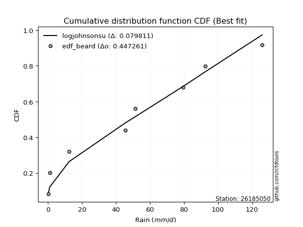</img>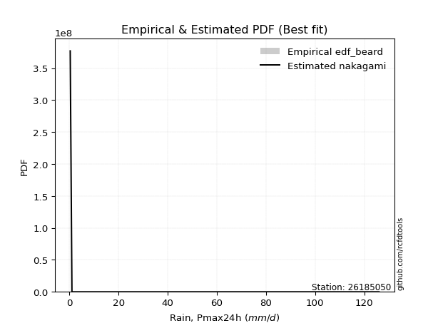</img>

</div>


### 5. Empirical - EDF Chegodayev (1955)

The Chegodayev formula is an empirical plotting position formula used in hydrological frequency analysis to estimate the exceedance probability or return period of a specific event from a set of observed data. It is primarily used for plotting observed data points on probability paper to fit a theoretical distribution, particularly for analyzing extreme events like maximum flood flows or rainfall intensities. The constant _b_ value in the generalized plotting position formula is 0.3.

<div align="center">


$P=(m-b)/(n+1-2b)$


</div>


**5.1. Empirical values**

<div align="center">

|                | 0                   | 1                   | 2                   | 3                   | 4                  | 5                  | 6                  | 7                  |
|:---------------|:--------------------|:--------------------|:--------------------|:--------------------|:-------------------|:-------------------|:-------------------|:-------------------|
| date           | 2023                | 2021                | 2019                | 2022                | 2025               | 2017               | 2018               | 2024               |
| x              | 0.3                 | 1.0                 | 12.4                | 45.5                | 51.2               | 79.5               | 92.5               | 126.0              |
| m              | 1                   | 2                   | 3                   | 4                   | 5                  | 6                  | 7                  | 8                  |
| empirical_dist | edf_chegodayev      | edf_chegodayev      | edf_chegodayev      | edf_chegodayev      | edf_chegodayev     | edf_chegodayev     | edf_chegodayev     | edf_chegodayev     |
| empirical      | 0.08333333333333333 | 0.20238095238095236 | 0.32142857142857145 | 0.44047619047619047 | 0.5595238095238095 | 0.6785714285714286 | 0.7976190476190476 | 0.9166666666666666 |
| empirical_tr   | 1.090909090909091   | 1.253731343283582   | 1.4736842105263157  | 1.7872340425531914  | 2.27027027027027   | 3.1111111111111116 | 4.941176470588234  | 11.999999999999995 |

</div>


**5.2. Kolmogorov-Smirnov fit test (sorted by Δ)**


<div align="center">

|                | 0                   | 1                  | 2                   | 3                   | 4                   | 5                   | 6                  | 7                   | 8                   | 9                  | 10                  | 11                  | 12                  | 13                  | 14                 | 15                  | 16                  | 17                  | 18                  | 19                  | 20                  | 21                  | 22                    | 23                 | 24                 | 25                 | 26                  | 27                 | 28                  | 29                  | 30                 | 31                  | 32                  | 33                  | 34                 | 35                  | 36                  | 37                  | 38                  | 39                  | 40                  | 41                 | 42                  | 43                  | 44                  | 45                  | 46                  | 47                 | 48                  | 49                 | 50                  | 51                  | 52                  | 53                  | 54                  | 55                 | 56                 | 57                  | 58                 | 59                  | 60                  | 61                 | 62                 | 63                 | 64                  | 65                  | 66                 | 67                 | 68                 | 69                  | 70                  | 71                 | 72                 | 73                  | 74                 | 75                  | 76                  | 77                 | 78                  | 79                  | 80                  | 81                 | 82                 | 83                 | 84                  | 85                  | 86                 | 87                 | 88                 | 89                 |
|:---------------|:--------------------|:-------------------|:--------------------|:--------------------|:--------------------|:--------------------|:-------------------|:--------------------|:--------------------|:-------------------|:--------------------|:--------------------|:--------------------|:--------------------|:-------------------|:--------------------|:--------------------|:--------------------|:--------------------|:--------------------|:--------------------|:--------------------|:----------------------|:-------------------|:-------------------|:-------------------|:--------------------|:-------------------|:--------------------|:--------------------|:-------------------|:--------------------|:--------------------|:--------------------|:-------------------|:--------------------|:--------------------|:--------------------|:--------------------|:--------------------|:--------------------|:-------------------|:--------------------|:--------------------|:--------------------|:--------------------|:--------------------|:-------------------|:--------------------|:-------------------|:--------------------|:--------------------|:--------------------|:--------------------|:--------------------|:-------------------|:-------------------|:--------------------|:-------------------|:--------------------|:--------------------|:-------------------|:-------------------|:-------------------|:--------------------|:--------------------|:-------------------|:-------------------|:-------------------|:--------------------|:--------------------|:-------------------|:-------------------|:--------------------|:-------------------|:--------------------|:--------------------|:-------------------|:--------------------|:--------------------|:--------------------|:-------------------|:-------------------|:-------------------|:--------------------|:--------------------|:-------------------|:-------------------|:-------------------|:-------------------|
| station        | 26185050            | 26185050           | 26185050            | 26185050            | 26185050            | 26185050            | 26185050           | 26185050            | 26185050            | 26185050           | 26185050            | 26185050            | 26185050            | 26185050            | 26185050           | 26185050            | 26185050            | 26185050            | 26185050            | 26185050            | 26185050            | 26185050            | 26185050              | 26185050           | 26185050           | 26185050           | 26185050            | 26185050           | 26185050            | 26185050            | 26185050           | 26185050            | 26185050            | 26185050            | 26185050           | 26185050            | 26185050            | 26185050            | 26185050            | 26185050            | 26185050            | 26185050           | 26185050            | 26185050            | 26185050            | 26185050            | 26185050            | 26185050           | 26185050            | 26185050           | 26185050            | 26185050            | 26185050            | 26185050            | 26185050            | 26185050           | 26185050           | 26185050            | 26185050           | 26185050            | 26185050            | 26185050           | 26185050           | 26185050           | 26185050            | 26185050            | 26185050           | 26185050           | 26185050           | 26185050            | 26185050            | 26185050           | 26185050           | 26185050            | 26185050           | 26185050            | 26185050            | 26185050           | 26185050            | 26185050            | 26185050            | 26185050           | 26185050           | 26185050           | 26185050            | 26185050            | 26185050           | 26185050           | 26185050           | 26185050           |
| empirical_dist | edf_chegodayev      | edf_chegodayev     | edf_chegodayev      | edf_chegodayev      | edf_chegodayev      | edf_chegodayev      | edf_chegodayev     | edf_chegodayev      | edf_chegodayev      | edf_chegodayev     | edf_chegodayev      | edf_chegodayev      | edf_chegodayev      | edf_chegodayev      | edf_chegodayev     | edf_chegodayev      | edf_chegodayev      | edf_chegodayev      | edf_chegodayev      | edf_chegodayev      | edf_chegodayev      | edf_chegodayev      | edf_chegodayev        | edf_chegodayev     | edf_chegodayev     | edf_chegodayev     | edf_chegodayev      | edf_chegodayev     | edf_chegodayev      | edf_chegodayev      | edf_chegodayev     | edf_chegodayev      | edf_chegodayev      | edf_chegodayev      | edf_chegodayev     | edf_chegodayev      | edf_chegodayev      | edf_chegodayev      | edf_chegodayev      | edf_chegodayev      | edf_chegodayev      | edf_chegodayev     | edf_chegodayev      | edf_chegodayev      | edf_chegodayev      | edf_chegodayev      | edf_chegodayev      | edf_chegodayev     | edf_chegodayev      | edf_chegodayev     | edf_chegodayev      | edf_chegodayev      | edf_chegodayev      | edf_chegodayev      | edf_chegodayev      | edf_chegodayev     | edf_chegodayev     | edf_chegodayev      | edf_chegodayev     | edf_chegodayev      | edf_chegodayev      | edf_chegodayev     | edf_chegodayev     | edf_chegodayev     | edf_chegodayev      | edf_chegodayev      | edf_chegodayev     | edf_chegodayev     | edf_chegodayev     | edf_chegodayev      | edf_chegodayev      | edf_chegodayev     | edf_chegodayev     | edf_chegodayev      | edf_chegodayev     | edf_chegodayev      | edf_chegodayev      | edf_chegodayev     | edf_chegodayev      | edf_chegodayev      | edf_chegodayev      | edf_chegodayev     | edf_chegodayev     | edf_chegodayev     | edf_chegodayev      | edf_chegodayev      | edf_chegodayev     | edf_chegodayev     | edf_chegodayev     | edf_chegodayev     |
| p_dist         | logjohnsonsu        | ncf                | rayleigh            | invgamma            | halfnorm            | maxwell             | genlogistic        | kstwobign           | pearson3            | norm               | crystalball         | t                   | exponnorm           | betaprime           | f                  | laplace_asymmetric  | gumbel_r            | nakagami            | logloggamma         | logistic            | rice                | gumbel_l            | loglaplace_asymmetric | hypsecant          | moyal              | weibull_min        | laplace             | mielke             | expon               | genexpon            | logpearson3        | halflogistic        | gompertz            | truncnorm           | invgauss           | alpha               | loggumbel_l         | logweibull_min      | logmielke           | loginvweibull       | logerlang           | logt               | logexponnorm        | lognorm             | lognorm             | logcrystalball      | lognct              | lognakagami        | logfatiguelife      | loglognorm         | loggompertz         | logrice             | loggamma            | loggamma            | loginvgamma         | logalpha           | logmaxwell         | loglogistic         | logkstwobign       | loginvgauss         | lograyleigh         | logncf             | nct                | loggenexpon        | loghypsecant        | loghalfnorm         | logexpon           | loggumbel_r        | loglaplace         | loghalflogistic     | logmoyal            | pareto             | logfisk            | wald                | fisk               | gibrat              | chi2                | logwald            | logf                | fatiguelife         | loggibrat           | logtruncnorm       | gamma              | logpareto          | invweibull          | erlang              | logbetaprime       | logchi2            | johnsonsu          | loggenlogistic     |
| delta          | 0.08052144564788058 | 0.0916903089568849 | 0.12379039678099471 | 0.12625127972081304 | 0.12649844850295675 | 0.12768722831766283 | 0.1320786158651597 | 0.13356372327107519 | 0.13559214642216696 | 0.1373975244176135 | 0.13739752745185488 | 0.13739868707906228 | 0.13767997601679197 | 0.13937078108356327 | 0.1431466975322231 | 0.15082881118763833 | 0.15297228309538782 | 0.15649966259433368 | 0.15785491912400818 | 0.15795648697405815 | 0.15837721384660464 | 0.15921504834369504 | 0.16633617083302832   | 0.1695536699245562 | 0.1715389732680742 | 0.1800656363616871 | 0.18142592345058658 | 0.1882297660120016 | 0.18868253793237755 | 0.18875026211096543 | 0.1901273365378946 | 0.19090050820044865 | 0.19246544724872222 | 0.19279664500846252 | 0.1933591536457383 | 0.19357965451532788 | 0.19475017233011815 | 0.20252487732908409 | 0.22768238284723308 | 0.23057472767222242 | 0.23196832324170846 | 0.2355555981487154 | 0.23555703329422095 | 0.23555740162998373 | 0.23555740162998373 | 0.23555744837390635 | 0.23567268118950246 | 0.2361953622121471 | 0.23664333679940408 | 0.2372654756520588 | 0.23735519175090225 | 0.23908194971731456 | 0.24560852516071108 | 0.24560852516071108 | 0.24689294211851565 | 0.2535614036553462 | 0.2543050514027789 | 0.25550769355247127 | 0.2563992699123697 | 0.25711215499762297 | 0.25985722908791997 | 0.263905453952352  | 0.2695854237922679 | 0.2701851572476408 | 0.27045776962952217 | 0.27632066158070057 | 0.2791940005544817 | 0.2910761182018101 | 0.2973972329306419 | 0.30388736600761246 | 0.30920487524073303 | 0.3159584695595456 | 0.3164812990523811 | 0.31737656691929306 | 0.3212182278960476 | 0.32142857142857145 | 0.34049700434222663 | 0.3613829624140231 | 0.37303631528934683 | 0.38437482010096746 | 0.39327861797822394 | 0.3984648315310919 | 0.4087148421554321 | 0.4164565249582184 | 0.48874380841448245 | 0.48950606846772127 | 0.5466848324741812 | 0.5556888286585822 | 0.591243825771944  | 0.7976190476190476 |
| deltao         | 0.4472608134160001  | 0.4472608134160001 | 0.4472608134160001  | 0.4472608134160001  | 0.4472608134160001  | 0.4472608134160001  | 0.4472608134160001 | 0.4472608134160001  | 0.4472608134160001  | 0.4472608134160001 | 0.4472608134160001  | 0.4472608134160001  | 0.4472608134160001  | 0.4472608134160001  | 0.4472608134160001 | 0.4472608134160001  | 0.4472608134160001  | 0.4472608134160001  | 0.4472608134160001  | 0.4472608134160001  | 0.4472608134160001  | 0.4472608134160001  | 0.4472608134160001    | 0.4472608134160001 | 0.4472608134160001 | 0.4472608134160001 | 0.4472608134160001  | 0.4472608134160001 | 0.4472608134160001  | 0.4472608134160001  | 0.4472608134160001 | 0.4472608134160001  | 0.4472608134160001  | 0.4472608134160001  | 0.4472608134160001 | 0.4472608134160001  | 0.4472608134160001  | 0.4472608134160001  | 0.4472608134160001  | 0.4472608134160001  | 0.4472608134160001  | 0.4472608134160001 | 0.4472608134160001  | 0.4472608134160001  | 0.4472608134160001  | 0.4472608134160001  | 0.4472608134160001  | 0.4472608134160001 | 0.4472608134160001  | 0.4472608134160001 | 0.4472608134160001  | 0.4472608134160001  | 0.4472608134160001  | 0.4472608134160001  | 0.4472608134160001  | 0.4472608134160001 | 0.4472608134160001 | 0.4472608134160001  | 0.4472608134160001 | 0.4472608134160001  | 0.4472608134160001  | 0.4472608134160001 | 0.4472608134160001 | 0.4472608134160001 | 0.4472608134160001  | 0.4472608134160001  | 0.4472608134160001 | 0.4472608134160001 | 0.4472608134160001 | 0.4472608134160001  | 0.4472608134160001  | 0.4472608134160001 | 0.4472608134160001 | 0.4472608134160001  | 0.4472608134160001 | 0.4472608134160001  | 0.4472608134160001  | 0.4472608134160001 | 0.4472608134160001  | 0.4472608134160001  | 0.4472608134160001  | 0.4472608134160001 | 0.4472608134160001 | 0.4472608134160001 | 0.4472608134160001  | 0.4472608134160001  | 0.4472608134160001 | 0.4472608134160001 | 0.4472608134160001 | 0.4472608134160001 |
| eval           | Δo > Δ              | Δo > Δ             | Δo > Δ              | Δo > Δ              | Δo > Δ              | Δo > Δ              | Δo > Δ             | Δo > Δ              | Δo > Δ              | Δo > Δ             | Δo > Δ              | Δo > Δ              | Δo > Δ              | Δo > Δ              | Δo > Δ             | Δo > Δ              | Δo > Δ              | Δo > Δ              | Δo > Δ              | Δo > Δ              | Δo > Δ              | Δo > Δ              | Δo > Δ                | Δo > Δ             | Δo > Δ             | Δo > Δ             | Δo > Δ              | Δo > Δ             | Δo > Δ              | Δo > Δ              | Δo > Δ             | Δo > Δ              | Δo > Δ              | Δo > Δ              | Δo > Δ             | Δo > Δ              | Δo > Δ              | Δo > Δ              | Δo > Δ              | Δo > Δ              | Δo > Δ              | Δo > Δ             | Δo > Δ              | Δo > Δ              | Δo > Δ              | Δo > Δ              | Δo > Δ              | Δo > Δ             | Δo > Δ              | Δo > Δ             | Δo > Δ              | Δo > Δ              | Δo > Δ              | Δo > Δ              | Δo > Δ              | Δo > Δ             | Δo > Δ             | Δo > Δ              | Δo > Δ             | Δo > Δ              | Δo > Δ              | Δo > Δ             | Δo > Δ             | Δo > Δ             | Δo > Δ              | Δo > Δ              | Δo > Δ             | Δo > Δ             | Δo > Δ             | Δo > Δ              | Δo > Δ              | Δo > Δ             | Δo > Δ             | Δo > Δ              | Δo > Δ             | Δo > Δ              | Δo > Δ              | Δo > Δ             | Δo > Δ              | Δo > Δ              | Δo > Δ              | Δo > Δ             | Δo > Δ             | Δo > Δ             | Δo <= Δ             | Δo <= Δ             | Δo <= Δ            | Δo <= Δ            | Δo <= Δ            | Δo <= Δ            |
| fit            | 1                   | 1                  | 1                   | 1                   | 1                   | 1                   | 1                  | 1                   | 1                   | 1                  | 1                   | 1                   | 1                   | 1                   | 1                  | 1                   | 1                   | 1                   | 1                   | 1                   | 1                   | 1                   | 1                     | 1                  | 1                  | 1                  | 1                   | 1                  | 1                   | 1                   | 1                  | 1                   | 1                   | 1                   | 1                  | 1                   | 1                   | 1                   | 1                   | 1                   | 1                   | 1                  | 1                   | 1                   | 1                   | 1                   | 1                   | 1                  | 1                   | 1                  | 1                   | 1                   | 1                   | 1                   | 1                   | 1                  | 1                  | 1                   | 1                  | 1                   | 1                   | 1                  | 1                  | 1                  | 1                   | 1                   | 1                  | 1                  | 1                  | 1                   | 1                   | 1                  | 1                  | 1                   | 1                  | 1                   | 1                   | 1                  | 1                   | 1                   | 1                   | 1                  | 1                  | 1                  | 0                   | 0                   | 0                  | 0                  | 0                  | 0                  |
| n              | 8                   | 8                  | 8                   | 8                   | 8                   | 8                   | 8                  | 8                   | 8                   | 8                  | 8                   | 8                   | 8                   | 8                   | 8                  | 8                   | 8                   | 8                   | 8                   | 8                   | 8                   | 8                   | 8                     | 8                  | 8                  | 8                  | 8                   | 8                  | 8                   | 8                   | 8                  | 8                   | 8                   | 8                   | 8                  | 8                   | 8                   | 8                   | 8                   | 8                   | 8                   | 8                  | 8                   | 8                   | 8                   | 8                   | 8                   | 8                  | 8                   | 8                  | 8                   | 8                   | 8                   | 8                   | 8                   | 8                  | 8                  | 8                   | 8                  | 8                   | 8                   | 8                  | 8                  | 8                  | 8                   | 8                   | 8                  | 8                  | 8                  | 8                   | 8                   | 8                  | 8                  | 8                   | 8                  | 8                   | 8                   | 8                  | 8                   | 8                   | 8                   | 8                  | 8                  | 8                  | 8                   | 8                   | 8                  | 8                  | 8                  | 8                  |
| best_fit       | 1                   | 0                  | 0                   | 0                   | 0                   | 0                   | 0                  | 0                   | 0                   | 0                  | 0                   | 0                   | 0                   | 0                   | 0                  | 0                   | 0                   | 0                   | 0                   | 0                   | 0                   | 0                   | 0                     | 0                  | 0                  | 0                  | 0                   | 0                  | 0                   | 0                   | 0                  | 0                   | 0                   | 0                   | 0                  | 0                   | 0                   | 0                   | 0                   | 0                   | 0                   | 0                  | 0                   | 0                   | 0                   | 0                   | 0                   | 0                  | 0                   | 0                  | 0                   | 0                   | 0                   | 0                   | 0                   | 0                  | 0                  | 0                   | 0                  | 0                   | 0                   | 0                  | 0                  | 0                  | 0                   | 0                   | 0                  | 0                  | 0                  | 0                   | 0                   | 0                  | 0                  | 0                   | 0                  | 0                   | 0                   | 0                  | 0                   | 0                   | 0                   | 0                  | 0                  | 0                  | 0                   | 0                   | 0                  | 0                  | 0                  | 0                  |
| best_fit_sort  | 1                   | 2                  | 3                   | 4                   | 5                   | 6                   | 7                  | 8                   | 9                   | 10                 | 11                  | 12                  | 13                  | 14                  | 15                 | 16                  | 17                  | 18                  | 19                  | 20                  | 21                  | 22                  | 23                    | 24                 | 25                 | 26                 | 27                  | 28                 | 29                  | 30                  | 31                 | 32                  | 33                  | 34                  | 35                 | 36                  | 37                  | 38                  | 39                  | 40                  | 41                  | 42                 | 43                  | 44                  | 45                  | 46                  | 47                  | 48                 | 49                  | 50                 | 51                  | 52                  | 53                  | 54                  | 55                  | 56                 | 57                 | 58                  | 59                 | 60                  | 61                  | 62                 | 63                 | 64                 | 65                  | 66                  | 67                 | 68                 | 69                 | 70                  | 71                  | 72                 | 73                 | 74                  | 75                 | 76                  | 77                  | 78                 | 79                  | 80                  | 81                  | 82                 | 83                 | 84                 | 85                  | 86                  | 87                 | 88                 | 89                 | 90                 |

</div>


<div align="center">

</img>

</div>


**5.3. Best fit**

<div align="center">

|   id |   station | empirical_dist   | p_dist       |     delta |   deltao | eval   |   fit |   n |   best_fit |   best_fit_sort |
|-----:|----------:|:-----------------|:-------------|----------:|---------:|:-------|------:|----:|-----------:|----------------:|
|    0 |  26185050 | edf_chegodayev   | logjohnsonsu | 0.0805214 | 0.447261 | Δo > Δ |     1 |   8 |          1 |               1 |

</div>


<div align="center">

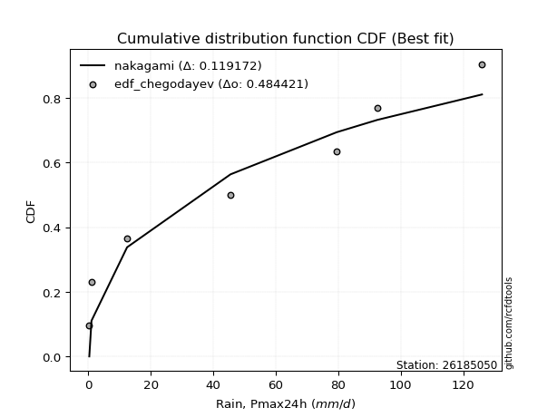</img>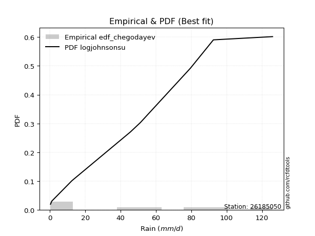</img>

</div>


### 6. Empirical - EDF Blom (1958)

The Blom formula is a specific "plotting position" formula used in hydrology and statistical analysis to estimate the empirical cumulative probability (or non-exceedance probability) of a data series. It is particularly recommended for data that are approximately normally distributed. The constant _a_ is set to 0.375 (or 3/8).

<div align="center">


$P=(m-a)/(n+1-2a)$


</div>


**6.1. Empirical values**

<div align="center">

|                | 0                   | 1                   | 2                  | 3                  | 4                  | 5                  | 6                 | 7                  |
|:---------------|:--------------------|:--------------------|:-------------------|:-------------------|:-------------------|:-------------------|:------------------|:-------------------|
| date           | 2023                | 2021                | 2019               | 2022               | 2025               | 2017               | 2018              | 2024               |
| x              | 0.3                 | 1.0                 | 12.4               | 45.5               | 51.2               | 79.5               | 92.5              | 126.0              |
| m              | 1                   | 2                   | 3                  | 4                  | 5                  | 6                  | 7                 | 8                  |
| empirical_dist | edf_blom            | edf_blom            | edf_blom           | edf_blom           | edf_blom           | edf_blom           | edf_blom          | edf_blom           |
| empirical      | 0.07575757575757576 | 0.19696969696969696 | 0.3181818181818182 | 0.4393939393939394 | 0.5606060606060606 | 0.6818181818181818 | 0.803030303030303 | 0.9242424242424242 |
| empirical_tr   | 1.0819672131147542  | 1.2452830188679247  | 1.4666666666666666 | 1.783783783783784  | 2.275862068965517  | 3.1428571428571423 | 5.076923076923076 | 13.199999999999992 |

</div>


**6.2. Kolmogorov-Smirnov fit test (sorted by Δ)**


<div align="center">

|                | 0                   | 1                   | 2                   | 3                   | 4                   | 5                   | 6                   | 7                  | 8                  | 9                   | 10                 | 11                 | 12                 | 13                  | 14                  | 15                  | 16                  | 17                  | 18                  | 19                  | 20                  | 21                  | 22                  | 23                    | 24                  | 25                 | 26                 | 27                  | 28                  | 29                  | 30                  | 31                  | 32                  | 33                  | 34                  | 35                  | 36                  | 37                  | 38                  | 39                 | 40                  | 41                  | 42                  | 43                 | 44                 | 45                  | 46                  | 47                  | 48                  | 49                  | 50                  | 51                  | 52                  | 53                  | 54                  | 55                  | 56                 | 57                  | 58                 | 59                  | 60                  | 61                 | 62                 | 63                  | 64                  | 65                  | 66                  | 67                 | 68                 | 69                  | 70                 | 71                 | 72                 | 73                  | 74                  | 75                  | 76                 | 77                 | 78                 | 79                  | 80                 | 81                 | 82                  | 83                  | 84                  | 85                 | 86                 | 87                 | 88                 | 89                 |
|:---------------|:--------------------|:--------------------|:--------------------|:--------------------|:--------------------|:--------------------|:--------------------|:-------------------|:-------------------|:--------------------|:-------------------|:-------------------|:-------------------|:--------------------|:--------------------|:--------------------|:--------------------|:--------------------|:--------------------|:--------------------|:--------------------|:--------------------|:--------------------|:----------------------|:--------------------|:-------------------|:-------------------|:--------------------|:--------------------|:--------------------|:--------------------|:--------------------|:--------------------|:--------------------|:--------------------|:--------------------|:--------------------|:--------------------|:--------------------|:-------------------|:--------------------|:--------------------|:--------------------|:-------------------|:-------------------|:--------------------|:--------------------|:--------------------|:--------------------|:--------------------|:--------------------|:--------------------|:--------------------|:--------------------|:--------------------|:--------------------|:-------------------|:--------------------|:-------------------|:--------------------|:--------------------|:-------------------|:-------------------|:--------------------|:--------------------|:--------------------|:--------------------|:-------------------|:-------------------|:--------------------|:-------------------|:-------------------|:-------------------|:--------------------|:--------------------|:--------------------|:-------------------|:-------------------|:-------------------|:--------------------|:-------------------|:-------------------|:--------------------|:--------------------|:--------------------|:-------------------|:-------------------|:-------------------|:-------------------|:-------------------|
| station        | 26185050            | 26185050            | 26185050            | 26185050            | 26185050            | 26185050            | 26185050            | 26185050           | 26185050           | 26185050            | 26185050           | 26185050           | 26185050           | 26185050            | 26185050            | 26185050            | 26185050            | 26185050            | 26185050            | 26185050            | 26185050            | 26185050            | 26185050            | 26185050              | 26185050            | 26185050           | 26185050           | 26185050            | 26185050            | 26185050            | 26185050            | 26185050            | 26185050            | 26185050            | 26185050            | 26185050            | 26185050            | 26185050            | 26185050            | 26185050           | 26185050            | 26185050            | 26185050            | 26185050           | 26185050           | 26185050            | 26185050            | 26185050            | 26185050            | 26185050            | 26185050            | 26185050            | 26185050            | 26185050            | 26185050            | 26185050            | 26185050           | 26185050            | 26185050           | 26185050            | 26185050            | 26185050           | 26185050           | 26185050            | 26185050            | 26185050            | 26185050            | 26185050           | 26185050           | 26185050            | 26185050           | 26185050           | 26185050           | 26185050            | 26185050            | 26185050            | 26185050           | 26185050           | 26185050           | 26185050            | 26185050           | 26185050           | 26185050            | 26185050            | 26185050            | 26185050           | 26185050           | 26185050           | 26185050           | 26185050           |
| empirical_dist | edf_blom            | edf_blom            | edf_blom            | edf_blom            | edf_blom            | edf_blom            | edf_blom            | edf_blom           | edf_blom           | edf_blom            | edf_blom           | edf_blom           | edf_blom           | edf_blom            | edf_blom            | edf_blom            | edf_blom            | edf_blom            | edf_blom            | edf_blom            | edf_blom            | edf_blom            | edf_blom            | edf_blom              | edf_blom            | edf_blom           | edf_blom           | edf_blom            | edf_blom            | edf_blom            | edf_blom            | edf_blom            | edf_blom            | edf_blom            | edf_blom            | edf_blom            | edf_blom            | edf_blom            | edf_blom            | edf_blom           | edf_blom            | edf_blom            | edf_blom            | edf_blom           | edf_blom           | edf_blom            | edf_blom            | edf_blom            | edf_blom            | edf_blom            | edf_blom            | edf_blom            | edf_blom            | edf_blom            | edf_blom            | edf_blom            | edf_blom           | edf_blom            | edf_blom           | edf_blom            | edf_blom            | edf_blom           | edf_blom           | edf_blom            | edf_blom            | edf_blom            | edf_blom            | edf_blom           | edf_blom           | edf_blom            | edf_blom           | edf_blom           | edf_blom           | edf_blom            | edf_blom            | edf_blom            | edf_blom           | edf_blom           | edf_blom           | edf_blom            | edf_blom           | edf_blom           | edf_blom            | edf_blom            | edf_blom            | edf_blom           | edf_blom           | edf_blom           | edf_blom           | edf_blom           |
| p_dist         | logjohnsonsu        | ncf                 | rayleigh            | halfnorm            | invgamma            | maxwell             | genlogistic         | kstwobign          | pearson3           | norm                | crystalball        | t                  | exponnorm          | betaprime           | laplace_asymmetric  | f                   | gumbel_r            | logistic            | rice                | gumbel_l            | nakagami            | logloggamma         | hypsecant           | loglaplace_asymmetric | moyal               | weibull_min        | laplace            | expon               | genexpon            | halflogistic        | gompertz            | truncnorm           | mielke              | logpearson3         | invgauss            | alpha               | loggumbel_l         | logweibull_min      | logmielke           | loginvweibull      | logerlang           | logt                | logexponnorm        | lognorm            | lognorm            | logcrystalball      | lognct              | lognakagami         | logfatiguelife      | loglognorm          | loggompertz         | logrice             | loggamma            | loggamma            | loginvgamma         | logalpha            | logmaxwell         | loglogistic         | logkstwobign       | loginvgauss         | lograyleigh         | nct                | loggenexpon        | logncf              | loghypsecant        | loghalfnorm         | logexpon            | loggumbel_r        | loglaplace         | loghalflogistic     | logmoyal           | wald               | gibrat             | pareto              | logfisk             | fisk                | chi2               | logwald            | logf               | fatiguelife         | loggibrat          | logtruncnorm       | gamma               | logpareto           | erlang              | invweibull         | logbetaprime       | logchi2            | johnsonsu          | loggenlogistic     |
| delta          | 0.07511019023662519 | 0.09277256003913598 | 0.12054364353424143 | 0.12108719309170135 | 0.12300452647405977 | 0.12444047507090955 | 0.12883186261840643 | 0.1303169700243219 | 0.1323453931754137 | 0.13415077117086022 | 0.1341507742051016 | 0.134151933832309  | 0.1344332227700387 | 0.14045303216581434 | 0.14758205794088505 | 0.14780701259374995 | 0.14972552984863455 | 0.15470973372730487 | 0.15513046059985136 | 0.15596829509694177 | 0.15758191367658475 | 0.15893717020625925 | 0.16630691667780292 | 0.1674184219152794    | 0.16829222002132094 | 0.1746543809504317 | 0.1781791702038333 | 0.18327128252112215 | 0.18333900669971004 | 0.18548925278919326 | 0.18705419183746683 | 0.18738538959720713 | 0.18931201709425266 | 0.19120958762014567 | 0.19444140472798938 | 0.19466190559757895 | 0.19583242341236923 | 0.20360712841133516 | 0.22876463392948415 | 0.2316569787544735 | 0.23305057432395954 | 0.23663784923096648 | 0.23663928437647203 | 0.2366396527122348 | 0.2366396527122348 | 0.23663969945615743 | 0.23675493227175354 | 0.23727761329439817 | 0.23772558788165515 | 0.23834772673430987 | 0.23843744283315332 | 0.24016420079956563 | 0.24669077624296215 | 0.24669077624296215 | 0.24797519320076672 | 0.25464365473759726 | 0.25538730248503   | 0.25658994463472234 | 0.2574815209946208 | 0.25819440607987404 | 0.26093948017017105 | 0.270667674874519  | 0.2712674083298919 | 0.27148121152810956 | 0.27154002071177324 | 0.27740291266295164 | 0.28244075380123496 | 0.2921583692840612 | 0.298479484012893  | 0.30496961708986353 | 0.3102871263229841 | 0.3141298136725398 | 0.3181818181818182 | 0.31920522280629887 | 0.32405705662813866 | 0.32879398547180516 | 0.3415792554244777 | 0.3624652134962742 | 0.3762830685361001 | 0.38545707118321854 | 0.394360869060475  | 0.399547082613343  | 0.40979709323768315 | 0.42186778036947375 | 0.49058831954997234 | 0.49631956599024   | 0.5520960878854366 | 0.5589355819053354 | 0.5966550811831994 | 0.803030303030303  |
| deltao         | 0.4472608134160001  | 0.4472608134160001  | 0.4472608134160001  | 0.4472608134160001  | 0.4472608134160001  | 0.4472608134160001  | 0.4472608134160001  | 0.4472608134160001 | 0.4472608134160001 | 0.4472608134160001  | 0.4472608134160001 | 0.4472608134160001 | 0.4472608134160001 | 0.4472608134160001  | 0.4472608134160001  | 0.4472608134160001  | 0.4472608134160001  | 0.4472608134160001  | 0.4472608134160001  | 0.4472608134160001  | 0.4472608134160001  | 0.4472608134160001  | 0.4472608134160001  | 0.4472608134160001    | 0.4472608134160001  | 0.4472608134160001 | 0.4472608134160001 | 0.4472608134160001  | 0.4472608134160001  | 0.4472608134160001  | 0.4472608134160001  | 0.4472608134160001  | 0.4472608134160001  | 0.4472608134160001  | 0.4472608134160001  | 0.4472608134160001  | 0.4472608134160001  | 0.4472608134160001  | 0.4472608134160001  | 0.4472608134160001 | 0.4472608134160001  | 0.4472608134160001  | 0.4472608134160001  | 0.4472608134160001 | 0.4472608134160001 | 0.4472608134160001  | 0.4472608134160001  | 0.4472608134160001  | 0.4472608134160001  | 0.4472608134160001  | 0.4472608134160001  | 0.4472608134160001  | 0.4472608134160001  | 0.4472608134160001  | 0.4472608134160001  | 0.4472608134160001  | 0.4472608134160001 | 0.4472608134160001  | 0.4472608134160001 | 0.4472608134160001  | 0.4472608134160001  | 0.4472608134160001 | 0.4472608134160001 | 0.4472608134160001  | 0.4472608134160001  | 0.4472608134160001  | 0.4472608134160001  | 0.4472608134160001 | 0.4472608134160001 | 0.4472608134160001  | 0.4472608134160001 | 0.4472608134160001 | 0.4472608134160001 | 0.4472608134160001  | 0.4472608134160001  | 0.4472608134160001  | 0.4472608134160001 | 0.4472608134160001 | 0.4472608134160001 | 0.4472608134160001  | 0.4472608134160001 | 0.4472608134160001 | 0.4472608134160001  | 0.4472608134160001  | 0.4472608134160001  | 0.4472608134160001 | 0.4472608134160001 | 0.4472608134160001 | 0.4472608134160001 | 0.4472608134160001 |
| eval           | Δo > Δ              | Δo > Δ              | Δo > Δ              | Δo > Δ              | Δo > Δ              | Δo > Δ              | Δo > Δ              | Δo > Δ             | Δo > Δ             | Δo > Δ              | Δo > Δ             | Δo > Δ             | Δo > Δ             | Δo > Δ              | Δo > Δ              | Δo > Δ              | Δo > Δ              | Δo > Δ              | Δo > Δ              | Δo > Δ              | Δo > Δ              | Δo > Δ              | Δo > Δ              | Δo > Δ                | Δo > Δ              | Δo > Δ             | Δo > Δ             | Δo > Δ              | Δo > Δ              | Δo > Δ              | Δo > Δ              | Δo > Δ              | Δo > Δ              | Δo > Δ              | Δo > Δ              | Δo > Δ              | Δo > Δ              | Δo > Δ              | Δo > Δ              | Δo > Δ             | Δo > Δ              | Δo > Δ              | Δo > Δ              | Δo > Δ             | Δo > Δ             | Δo > Δ              | Δo > Δ              | Δo > Δ              | Δo > Δ              | Δo > Δ              | Δo > Δ              | Δo > Δ              | Δo > Δ              | Δo > Δ              | Δo > Δ              | Δo > Δ              | Δo > Δ             | Δo > Δ              | Δo > Δ             | Δo > Δ              | Δo > Δ              | Δo > Δ             | Δo > Δ             | Δo > Δ              | Δo > Δ              | Δo > Δ              | Δo > Δ              | Δo > Δ             | Δo > Δ             | Δo > Δ              | Δo > Δ             | Δo > Δ             | Δo > Δ             | Δo > Δ              | Δo > Δ              | Δo > Δ              | Δo > Δ             | Δo > Δ             | Δo > Δ             | Δo > Δ              | Δo > Δ             | Δo > Δ             | Δo > Δ              | Δo > Δ              | Δo <= Δ             | Δo <= Δ            | Δo <= Δ            | Δo <= Δ            | Δo <= Δ            | Δo <= Δ            |
| fit            | 1                   | 1                   | 1                   | 1                   | 1                   | 1                   | 1                   | 1                  | 1                  | 1                   | 1                  | 1                  | 1                  | 1                   | 1                   | 1                   | 1                   | 1                   | 1                   | 1                   | 1                   | 1                   | 1                   | 1                     | 1                   | 1                  | 1                  | 1                   | 1                   | 1                   | 1                   | 1                   | 1                   | 1                   | 1                   | 1                   | 1                   | 1                   | 1                   | 1                  | 1                   | 1                   | 1                   | 1                  | 1                  | 1                   | 1                   | 1                   | 1                   | 1                   | 1                   | 1                   | 1                   | 1                   | 1                   | 1                   | 1                  | 1                   | 1                  | 1                   | 1                   | 1                  | 1                  | 1                   | 1                   | 1                   | 1                   | 1                  | 1                  | 1                   | 1                  | 1                  | 1                  | 1                   | 1                   | 1                   | 1                  | 1                  | 1                  | 1                   | 1                  | 1                  | 1                   | 1                   | 0                   | 0                  | 0                  | 0                  | 0                  | 0                  |
| n              | 8                   | 8                   | 8                   | 8                   | 8                   | 8                   | 8                   | 8                  | 8                  | 8                   | 8                  | 8                  | 8                  | 8                   | 8                   | 8                   | 8                   | 8                   | 8                   | 8                   | 8                   | 8                   | 8                   | 8                     | 8                   | 8                  | 8                  | 8                   | 8                   | 8                   | 8                   | 8                   | 8                   | 8                   | 8                   | 8                   | 8                   | 8                   | 8                   | 8                  | 8                   | 8                   | 8                   | 8                  | 8                  | 8                   | 8                   | 8                   | 8                   | 8                   | 8                   | 8                   | 8                   | 8                   | 8                   | 8                   | 8                  | 8                   | 8                  | 8                   | 8                   | 8                  | 8                  | 8                   | 8                   | 8                   | 8                   | 8                  | 8                  | 8                   | 8                  | 8                  | 8                  | 8                   | 8                   | 8                   | 8                  | 8                  | 8                  | 8                   | 8                  | 8                  | 8                   | 8                   | 8                   | 8                  | 8                  | 8                  | 8                  | 8                  |
| best_fit       | 1                   | 0                   | 0                   | 0                   | 0                   | 0                   | 0                   | 0                  | 0                  | 0                   | 0                  | 0                  | 0                  | 0                   | 0                   | 0                   | 0                   | 0                   | 0                   | 0                   | 0                   | 0                   | 0                   | 0                     | 0                   | 0                  | 0                  | 0                   | 0                   | 0                   | 0                   | 0                   | 0                   | 0                   | 0                   | 0                   | 0                   | 0                   | 0                   | 0                  | 0                   | 0                   | 0                   | 0                  | 0                  | 0                   | 0                   | 0                   | 0                   | 0                   | 0                   | 0                   | 0                   | 0                   | 0                   | 0                   | 0                  | 0                   | 0                  | 0                   | 0                   | 0                  | 0                  | 0                   | 0                   | 0                   | 0                   | 0                  | 0                  | 0                   | 0                  | 0                  | 0                  | 0                   | 0                   | 0                   | 0                  | 0                  | 0                  | 0                   | 0                  | 0                  | 0                   | 0                   | 0                   | 0                  | 0                  | 0                  | 0                  | 0                  |
| best_fit_sort  | 1                   | 2                   | 3                   | 4                   | 5                   | 6                   | 7                   | 8                  | 9                  | 10                  | 11                 | 12                 | 13                 | 14                  | 15                  | 16                  | 17                  | 18                  | 19                  | 20                  | 21                  | 22                  | 23                  | 24                    | 25                  | 26                 | 27                 | 28                  | 29                  | 30                  | 31                  | 32                  | 33                  | 34                  | 35                  | 36                  | 37                  | 38                  | 39                  | 40                 | 41                  | 42                  | 43                  | 44                 | 45                 | 46                  | 47                  | 48                  | 49                  | 50                  | 51                  | 52                  | 53                  | 54                  | 55                  | 56                  | 57                 | 58                  | 59                 | 60                  | 61                  | 62                 | 63                 | 64                  | 65                  | 66                  | 67                  | 68                 | 69                 | 70                  | 71                 | 72                 | 73                 | 74                  | 75                  | 76                  | 77                 | 78                 | 79                 | 80                  | 81                 | 82                 | 83                  | 84                  | 85                  | 86                 | 87                 | 88                 | 89                 | 90                 |

</div>


<div align="center">

</img>

</div>


**6.3. Best fit**

<div align="center">

|   id |   station | empirical_dist   | p_dist       |     delta |   deltao | eval   |   fit |   n |   best_fit |   best_fit_sort |
|-----:|----------:|:-----------------|:-------------|----------:|---------:|:-------|------:|----:|-----------:|----------------:|
|    0 |  26185050 | edf_blom         | logjohnsonsu | 0.0751102 | 0.447261 | Δo > Δ |     1 |   8 |          1 |               1 |

</div>


<div align="center">

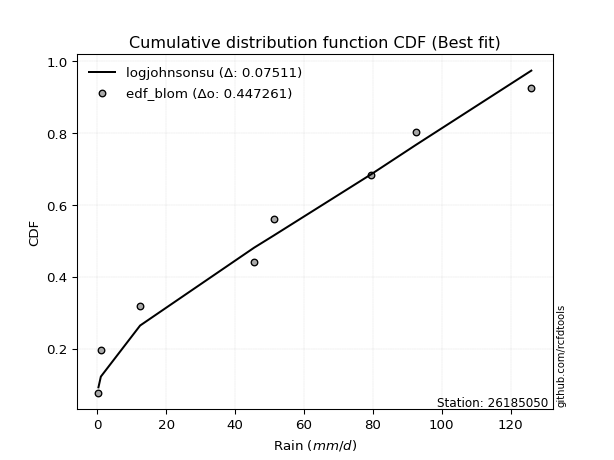</img>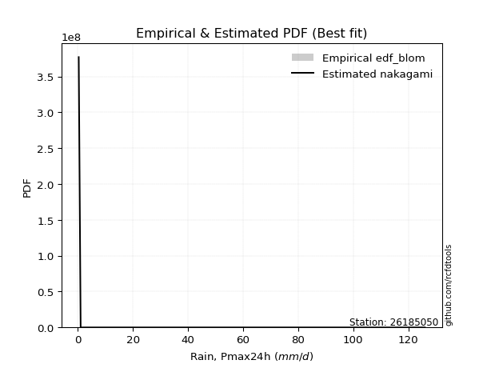</img>

</div>


### 7. Empirical - EDF Tukey (1962)

In hydrology, the Tukey formula is used as a plotting position formula to estimate the empirical probability or frequency of a flood event (or other hydrological data). The formula parameter is given as _c=0.333_ (or 1/3).

<div align="center">


$P=(m-c)/(n+1-2c)$


</div>


**7.1. Empirical values**

<div align="center">

|                | 0                  | 1         | 2                  | 3                  | 4                 | 5                  | 6                 | 7                  |
|:---------------|:-------------------|:----------|:-------------------|:-------------------|:------------------|:-------------------|:------------------|:-------------------|
| date           | 2023               | 2021      | 2019               | 2022               | 2025              | 2017               | 2018              | 2024               |
| x              | 0.3                | 1.0       | 12.4               | 45.5               | 51.2              | 79.5               | 92.5              | 126.0              |
| m              | 1                  | 2         | 3                  | 4                  | 5                 | 6                  | 7                 | 8                  |
| empirical_dist | edf_tukey          | edf_tukey | edf_tukey          | edf_tukey          | edf_tukey         | edf_tukey          | edf_tukey         | edf_tukey          |
| empirical      | 0.08               | 0.2       | 0.32               | 0.44               | 0.56              | 0.68               | 0.8               | 0.92               |
| empirical_tr   | 1.0869565217391304 | 1.25      | 1.4705882352941178 | 1.7857142857142856 | 2.272727272727273 | 3.1250000000000004 | 5.000000000000001 | 12.500000000000007 |

</div>


**7.2. Kolmogorov-Smirnov fit test (sorted by Δ)**


<div align="center">

|                | 0                   | 1                   | 2                   | 3                  | 4                  | 5                   | 6                   | 7                   | 8                   | 9                   | 10                  | 11                  | 12                  | 13                  | 14                  | 15                  | 16                  | 17                 | 18                 | 19                  | 20                 | 21                  | 22                    | 23                  | 24                  | 25                  | 26                  | 27                 | 28                 | 29                 | 30                  | 31                  | 32                  | 33                  | 34                  | 35                  | 36                  | 37                  | 38                  | 39                 | 40                  | 41                  | 42                  | 43                 | 44                 | 45                  | 46                  | 47                  | 48                  | 49                  | 50                 | 51                  | 52                  | 53                  | 54                 | 55                  | 56                 | 57                  | 58                 | 59                  | 60                  | 61                 | 62                  | 63                  | 64                  | 65                  | 66                 | 67                 | 68                  | 69                 | 70                 | 71                 | 72                  | 73                 | 74                 | 75                 | 76                 | 77                 | 78                 | 79                 | 80                 | 81                 | 82                  | 83                 | 84                  | 85                  | 86                 | 87                 | 88                 | 89                 |
|:---------------|:--------------------|:--------------------|:--------------------|:-------------------|:-------------------|:--------------------|:--------------------|:--------------------|:--------------------|:--------------------|:--------------------|:--------------------|:--------------------|:--------------------|:--------------------|:--------------------|:--------------------|:-------------------|:-------------------|:--------------------|:-------------------|:--------------------|:----------------------|:--------------------|:--------------------|:--------------------|:--------------------|:-------------------|:-------------------|:-------------------|:--------------------|:--------------------|:--------------------|:--------------------|:--------------------|:--------------------|:--------------------|:--------------------|:--------------------|:-------------------|:--------------------|:--------------------|:--------------------|:-------------------|:-------------------|:--------------------|:--------------------|:--------------------|:--------------------|:--------------------|:-------------------|:--------------------|:--------------------|:--------------------|:-------------------|:--------------------|:-------------------|:--------------------|:-------------------|:--------------------|:--------------------|:-------------------|:--------------------|:--------------------|:--------------------|:--------------------|:-------------------|:-------------------|:--------------------|:-------------------|:-------------------|:-------------------|:--------------------|:-------------------|:-------------------|:-------------------|:-------------------|:-------------------|:-------------------|:-------------------|:-------------------|:-------------------|:--------------------|:-------------------|:--------------------|:--------------------|:-------------------|:-------------------|:-------------------|:-------------------|
| station        | 26185050            | 26185050            | 26185050            | 26185050           | 26185050           | 26185050            | 26185050            | 26185050            | 26185050            | 26185050            | 26185050            | 26185050            | 26185050            | 26185050            | 26185050            | 26185050            | 26185050            | 26185050           | 26185050           | 26185050            | 26185050           | 26185050            | 26185050              | 26185050            | 26185050            | 26185050            | 26185050            | 26185050           | 26185050           | 26185050           | 26185050            | 26185050            | 26185050            | 26185050            | 26185050            | 26185050            | 26185050            | 26185050            | 26185050            | 26185050           | 26185050            | 26185050            | 26185050            | 26185050           | 26185050           | 26185050            | 26185050            | 26185050            | 26185050            | 26185050            | 26185050           | 26185050            | 26185050            | 26185050            | 26185050           | 26185050            | 26185050           | 26185050            | 26185050           | 26185050            | 26185050            | 26185050           | 26185050            | 26185050            | 26185050            | 26185050            | 26185050           | 26185050           | 26185050            | 26185050           | 26185050           | 26185050           | 26185050            | 26185050           | 26185050           | 26185050           | 26185050           | 26185050           | 26185050           | 26185050           | 26185050           | 26185050           | 26185050            | 26185050           | 26185050            | 26185050            | 26185050           | 26185050           | 26185050           | 26185050           |
| empirical_dist | edf_tukey           | edf_tukey           | edf_tukey           | edf_tukey          | edf_tukey          | edf_tukey           | edf_tukey           | edf_tukey           | edf_tukey           | edf_tukey           | edf_tukey           | edf_tukey           | edf_tukey           | edf_tukey           | edf_tukey           | edf_tukey           | edf_tukey           | edf_tukey          | edf_tukey          | edf_tukey           | edf_tukey          | edf_tukey           | edf_tukey             | edf_tukey           | edf_tukey           | edf_tukey           | edf_tukey           | edf_tukey          | edf_tukey          | edf_tukey          | edf_tukey           | edf_tukey           | edf_tukey           | edf_tukey           | edf_tukey           | edf_tukey           | edf_tukey           | edf_tukey           | edf_tukey           | edf_tukey          | edf_tukey           | edf_tukey           | edf_tukey           | edf_tukey          | edf_tukey          | edf_tukey           | edf_tukey           | edf_tukey           | edf_tukey           | edf_tukey           | edf_tukey          | edf_tukey           | edf_tukey           | edf_tukey           | edf_tukey          | edf_tukey           | edf_tukey          | edf_tukey           | edf_tukey          | edf_tukey           | edf_tukey           | edf_tukey          | edf_tukey           | edf_tukey           | edf_tukey           | edf_tukey           | edf_tukey          | edf_tukey          | edf_tukey           | edf_tukey          | edf_tukey          | edf_tukey          | edf_tukey           | edf_tukey          | edf_tukey          | edf_tukey          | edf_tukey          | edf_tukey          | edf_tukey          | edf_tukey          | edf_tukey          | edf_tukey          | edf_tukey           | edf_tukey          | edf_tukey           | edf_tukey           | edf_tukey          | edf_tukey          | edf_tukey          | edf_tukey          |
| p_dist         | logjohnsonsu        | ncf                 | rayleigh            | halfnorm           | invgamma           | maxwell             | genlogistic         | kstwobign           | pearson3            | norm                | crystalball         | t                   | exponnorm           | betaprime           | f                   | laplace_asymmetric  | gumbel_r            | logistic           | rice               | nakagami            | gumbel_l           | logloggamma         | loglaplace_asymmetric | hypsecant           | moyal               | weibull_min         | laplace             | expon              | genexpon           | halflogistic       | mielke              | gompertz            | truncnorm           | logpearson3         | invgauss            | alpha               | loggumbel_l         | logweibull_min      | logmielke           | loginvweibull      | logerlang           | logt                | logexponnorm        | lognorm            | lognorm            | logcrystalball      | lognct              | lognakagami         | logfatiguelife      | loglognorm          | loggompertz        | logrice             | loggamma            | loggamma            | loginvgamma        | logalpha            | logmaxwell         | loglogistic         | logkstwobign       | loginvgauss         | lograyleigh         | logncf             | nct                 | loggenexpon         | loghypsecant        | loghalfnorm         | logexpon           | loggumbel_r        | loglaplace          | loghalflogistic    | logmoyal           | wald               | pareto              | logfisk            | gibrat             | fisk               | chi2               | logwald            | logf               | fatiguelife        | loggibrat          | logtruncnorm       | gamma               | logpareto          | erlang              | invweibull          | logbetaprime       | logchi2            | johnsonsu          | loggenlogistic     |
| delta          | 0.07814049326692823 | 0.09216649943307537 | 0.12236182535242326 | 0.1241174961220044 | 0.1248227082922416 | 0.12625865688909138 | 0.13065004443658826 | 0.13213515184250374 | 0.13416357499359552 | 0.13596895298904205 | 0.13596895602328343 | 0.13597011565049083 | 0.13625140458822052 | 0.13984697155975373 | 0.14362288800841355 | 0.14940023975906688 | 0.15154371166681638 | 0.1565279155454867 | 0.1569486424180332 | 0.15697585307052414 | 0.1577864769151236 | 0.15833110960019864 | 0.16681236130921878   | 0.16812509849598475 | 0.17011040183950277 | 0.17768468398073475 | 0.17999735202201514 | 0.1863015855514252 | 0.1863693097300131 | 0.1885195558194963 | 0.18870595648819205 | 0.19008449486776988 | 0.19041569262751018 | 0.19060352701408506 | 0.19383534412192877 | 0.19405584499151834 | 0.19522636280630862 | 0.20300106780527455 | 0.22815857332342354 | 0.2310509181484129 | 0.23244451371789893 | 0.23603178862490587 | 0.23603322377041142 | 0.2360335921061742 | 0.2360335921061742 | 0.23603363885009682 | 0.23614887166569293 | 0.23667155268833756 | 0.23711952727559454 | 0.23774166612824926 | 0.2378313822270927 | 0.23955814019350502 | 0.24608471563690154 | 0.24608471563690154 | 0.2473691325947061 | 0.25403759413153665 | 0.2547812418789694 | 0.25598388402866173 | 0.2568754603885602 | 0.25758834547381343 | 0.26033341956411044 | 0.2672387872856854 | 0.27006161426845837 | 0.27066134772383127 | 0.27093396010571263 | 0.27679685205689103 | 0.2806225719830531 | 0.2915523086780006 | 0.29787342340683237 | 0.3043635564838029 | 0.3096810657169235 | 0.3159479954907216 | 0.31738704098811704 | 0.3198146323857145 | 0.32               | 0.324551561229381  | 0.3409731948184171 | 0.3618591528902136 | 0.3744648867179183 | 0.3848510105771579 | 0.3937548084544144 | 0.3989410220072824 | 0.40919103263162254 | 0.4188374773391707 | 0.48998225894391173 | 0.49207714174781586 | 0.5490657848551335 | 0.5571174000871537 | 0.5936247781528963 | 0.8                |
| deltao         | 0.4472608134160001  | 0.4472608134160001  | 0.4472608134160001  | 0.4472608134160001 | 0.4472608134160001 | 0.4472608134160001  | 0.4472608134160001  | 0.4472608134160001  | 0.4472608134160001  | 0.4472608134160001  | 0.4472608134160001  | 0.4472608134160001  | 0.4472608134160001  | 0.4472608134160001  | 0.4472608134160001  | 0.4472608134160001  | 0.4472608134160001  | 0.4472608134160001 | 0.4472608134160001 | 0.4472608134160001  | 0.4472608134160001 | 0.4472608134160001  | 0.4472608134160001    | 0.4472608134160001  | 0.4472608134160001  | 0.4472608134160001  | 0.4472608134160001  | 0.4472608134160001 | 0.4472608134160001 | 0.4472608134160001 | 0.4472608134160001  | 0.4472608134160001  | 0.4472608134160001  | 0.4472608134160001  | 0.4472608134160001  | 0.4472608134160001  | 0.4472608134160001  | 0.4472608134160001  | 0.4472608134160001  | 0.4472608134160001 | 0.4472608134160001  | 0.4472608134160001  | 0.4472608134160001  | 0.4472608134160001 | 0.4472608134160001 | 0.4472608134160001  | 0.4472608134160001  | 0.4472608134160001  | 0.4472608134160001  | 0.4472608134160001  | 0.4472608134160001 | 0.4472608134160001  | 0.4472608134160001  | 0.4472608134160001  | 0.4472608134160001 | 0.4472608134160001  | 0.4472608134160001 | 0.4472608134160001  | 0.4472608134160001 | 0.4472608134160001  | 0.4472608134160001  | 0.4472608134160001 | 0.4472608134160001  | 0.4472608134160001  | 0.4472608134160001  | 0.4472608134160001  | 0.4472608134160001 | 0.4472608134160001 | 0.4472608134160001  | 0.4472608134160001 | 0.4472608134160001 | 0.4472608134160001 | 0.4472608134160001  | 0.4472608134160001 | 0.4472608134160001 | 0.4472608134160001 | 0.4472608134160001 | 0.4472608134160001 | 0.4472608134160001 | 0.4472608134160001 | 0.4472608134160001 | 0.4472608134160001 | 0.4472608134160001  | 0.4472608134160001 | 0.4472608134160001  | 0.4472608134160001  | 0.4472608134160001 | 0.4472608134160001 | 0.4472608134160001 | 0.4472608134160001 |
| eval           | Δo > Δ              | Δo > Δ              | Δo > Δ              | Δo > Δ             | Δo > Δ             | Δo > Δ              | Δo > Δ              | Δo > Δ              | Δo > Δ              | Δo > Δ              | Δo > Δ              | Δo > Δ              | Δo > Δ              | Δo > Δ              | Δo > Δ              | Δo > Δ              | Δo > Δ              | Δo > Δ             | Δo > Δ             | Δo > Δ              | Δo > Δ             | Δo > Δ              | Δo > Δ                | Δo > Δ              | Δo > Δ              | Δo > Δ              | Δo > Δ              | Δo > Δ             | Δo > Δ             | Δo > Δ             | Δo > Δ              | Δo > Δ              | Δo > Δ              | Δo > Δ              | Δo > Δ              | Δo > Δ              | Δo > Δ              | Δo > Δ              | Δo > Δ              | Δo > Δ             | Δo > Δ              | Δo > Δ              | Δo > Δ              | Δo > Δ             | Δo > Δ             | Δo > Δ              | Δo > Δ              | Δo > Δ              | Δo > Δ              | Δo > Δ              | Δo > Δ             | Δo > Δ              | Δo > Δ              | Δo > Δ              | Δo > Δ             | Δo > Δ              | Δo > Δ             | Δo > Δ              | Δo > Δ             | Δo > Δ              | Δo > Δ              | Δo > Δ             | Δo > Δ              | Δo > Δ              | Δo > Δ              | Δo > Δ              | Δo > Δ             | Δo > Δ             | Δo > Δ              | Δo > Δ             | Δo > Δ             | Δo > Δ             | Δo > Δ              | Δo > Δ             | Δo > Δ             | Δo > Δ             | Δo > Δ             | Δo > Δ             | Δo > Δ             | Δo > Δ             | Δo > Δ             | Δo > Δ             | Δo > Δ              | Δo > Δ             | Δo <= Δ             | Δo <= Δ             | Δo <= Δ            | Δo <= Δ            | Δo <= Δ            | Δo <= Δ            |
| fit            | 1                   | 1                   | 1                   | 1                  | 1                  | 1                   | 1                   | 1                   | 1                   | 1                   | 1                   | 1                   | 1                   | 1                   | 1                   | 1                   | 1                   | 1                  | 1                  | 1                   | 1                  | 1                   | 1                     | 1                   | 1                   | 1                   | 1                   | 1                  | 1                  | 1                  | 1                   | 1                   | 1                   | 1                   | 1                   | 1                   | 1                   | 1                   | 1                   | 1                  | 1                   | 1                   | 1                   | 1                  | 1                  | 1                   | 1                   | 1                   | 1                   | 1                   | 1                  | 1                   | 1                   | 1                   | 1                  | 1                   | 1                  | 1                   | 1                  | 1                   | 1                   | 1                  | 1                   | 1                   | 1                   | 1                   | 1                  | 1                  | 1                   | 1                  | 1                  | 1                  | 1                   | 1                  | 1                  | 1                  | 1                  | 1                  | 1                  | 1                  | 1                  | 1                  | 1                   | 1                  | 0                   | 0                   | 0                  | 0                  | 0                  | 0                  |
| n              | 8                   | 8                   | 8                   | 8                  | 8                  | 8                   | 8                   | 8                   | 8                   | 8                   | 8                   | 8                   | 8                   | 8                   | 8                   | 8                   | 8                   | 8                  | 8                  | 8                   | 8                  | 8                   | 8                     | 8                   | 8                   | 8                   | 8                   | 8                  | 8                  | 8                  | 8                   | 8                   | 8                   | 8                   | 8                   | 8                   | 8                   | 8                   | 8                   | 8                  | 8                   | 8                   | 8                   | 8                  | 8                  | 8                   | 8                   | 8                   | 8                   | 8                   | 8                  | 8                   | 8                   | 8                   | 8                  | 8                   | 8                  | 8                   | 8                  | 8                   | 8                   | 8                  | 8                   | 8                   | 8                   | 8                   | 8                  | 8                  | 8                   | 8                  | 8                  | 8                  | 8                   | 8                  | 8                  | 8                  | 8                  | 8                  | 8                  | 8                  | 8                  | 8                  | 8                   | 8                  | 8                   | 8                   | 8                  | 8                  | 8                  | 8                  |
| best_fit       | 1                   | 0                   | 0                   | 0                  | 0                  | 0                   | 0                   | 0                   | 0                   | 0                   | 0                   | 0                   | 0                   | 0                   | 0                   | 0                   | 0                   | 0                  | 0                  | 0                   | 0                  | 0                   | 0                     | 0                   | 0                   | 0                   | 0                   | 0                  | 0                  | 0                  | 0                   | 0                   | 0                   | 0                   | 0                   | 0                   | 0                   | 0                   | 0                   | 0                  | 0                   | 0                   | 0                   | 0                  | 0                  | 0                   | 0                   | 0                   | 0                   | 0                   | 0                  | 0                   | 0                   | 0                   | 0                  | 0                   | 0                  | 0                   | 0                  | 0                   | 0                   | 0                  | 0                   | 0                   | 0                   | 0                   | 0                  | 0                  | 0                   | 0                  | 0                  | 0                  | 0                   | 0                  | 0                  | 0                  | 0                  | 0                  | 0                  | 0                  | 0                  | 0                  | 0                   | 0                  | 0                   | 0                   | 0                  | 0                  | 0                  | 0                  |
| best_fit_sort  | 1                   | 2                   | 3                   | 4                  | 5                  | 6                   | 7                   | 8                   | 9                   | 10                  | 11                  | 12                  | 13                  | 14                  | 15                  | 16                  | 17                  | 18                 | 19                 | 20                  | 21                 | 22                  | 23                    | 24                  | 25                  | 26                  | 27                  | 28                 | 29                 | 30                 | 31                  | 32                  | 33                  | 34                  | 35                  | 36                  | 37                  | 38                  | 39                  | 40                 | 41                  | 42                  | 43                  | 44                 | 45                 | 46                  | 47                  | 48                  | 49                  | 50                  | 51                 | 52                  | 53                  | 54                  | 55                 | 56                  | 57                 | 58                  | 59                 | 60                  | 61                  | 62                 | 63                  | 64                  | 65                  | 66                  | 67                 | 68                 | 69                  | 70                 | 71                 | 72                 | 73                  | 74                 | 75                 | 76                 | 77                 | 78                 | 79                 | 80                 | 81                 | 82                 | 83                  | 84                 | 85                  | 86                  | 87                 | 88                 | 89                 | 90                 |

</div>


<div align="center">

</img>

</div>


**7.3. Best fit**

<div align="center">

|   id |   station | empirical_dist   | p_dist       |     delta |   deltao | eval   |   fit |   n |   best_fit |   best_fit_sort |
|-----:|----------:|:-----------------|:-------------|----------:|---------:|:-------|------:|----:|-----------:|----------------:|
|    0 |  26185050 | edf_tukey        | logjohnsonsu | 0.0781405 | 0.447261 | Δo > Δ |     1 |   8 |          1 |               1 |

</div>


<div align="center">

</img></img>

</div>


### 8. Empirical - EDF Gringorten (1963)

Gringorten plotting position formula is essential for estimating the probability and return periods of extreme events like floods and heavy rainfall. The constant _a=0.44_.

<div align="center">


$P=(m-a)/(n+1-2a)$


</div>


**8.1. Empirical values**

<div align="center">

|                | 0                   | 1                   | 2                  | 3                  | 4                  | 5                  | 6                  | 7                  |
|:---------------|:--------------------|:--------------------|:-------------------|:-------------------|:-------------------|:-------------------|:-------------------|:-------------------|
| date           | 2023                | 2021                | 2019               | 2022               | 2025               | 2017               | 2018               | 2024               |
| x              | 0.3                 | 1.0                 | 12.4               | 45.5               | 51.2               | 79.5               | 92.5               | 126.0              |
| m              | 1                   | 2                   | 3                  | 4                  | 5                  | 6                  | 7                  | 8                  |
| empirical_dist | edf_gringorten      | edf_gringorten      | edf_gringorten     | edf_gringorten     | edf_gringorten     | edf_gringorten     | edf_gringorten     | edf_gringorten     |
| empirical      | 0.06896551724137932 | 0.19211822660098524 | 0.3152709359605912 | 0.4384236453201971 | 0.5615763546798029 | 0.6847290640394089 | 0.8078817733990148 | 0.9310344827586208 |
| empirical_tr   | 1.0740740740740742  | 1.2378048780487805  | 1.460431654676259  | 1.780701754385965  | 2.2808988764044944 | 3.1718750000000004 | 5.205128205128205  | 14.500000000000018 |

</div>


**8.2. Kolmogorov-Smirnov fit test (sorted by Δ)**


<div align="center">

|                | 0                   | 1                   | 2                   | 3                   | 4                   | 5                   | 6                   | 7                   | 8                  | 9                   | 10                  | 11                  | 12                 | 13                 | 14                  | 15                  | 16                 | 17                  | 18                  | 19                  | 20                  | 21                  | 22                  | 23                  | 24                    | 25                  | 26                  | 27                  | 28                  | 29                  | 30                 | 31                 | 32                  | 33                  | 34                  | 35                  | 36                 | 37                  | 38                  | 39                  | 40                 | 41                  | 42                 | 43                  | 44                  | 45                 | 46                 | 47                  | 48                  | 49                  | 50                 | 51                 | 52                  | 53                  | 54                 | 55                  | 56                  | 57                 | 58                  | 59                 | 60                 | 61                  | 62                  | 63                 | 64                  | 65                 | 66                  | 67                  | 68                  | 69                 | 70                 | 71                 | 72                 | 73                  | 74                  | 75                  | 76                 | 77                  | 78                 | 79                 | 80                 | 81                  | 82                 | 83                 | 84                 | 85                 | 86                 | 87                 | 88                 | 89                 |
|:---------------|:--------------------|:--------------------|:--------------------|:--------------------|:--------------------|:--------------------|:--------------------|:--------------------|:-------------------|:--------------------|:--------------------|:--------------------|:-------------------|:-------------------|:--------------------|:--------------------|:-------------------|:--------------------|:--------------------|:--------------------|:--------------------|:--------------------|:--------------------|:--------------------|:----------------------|:--------------------|:--------------------|:--------------------|:--------------------|:--------------------|:-------------------|:-------------------|:--------------------|:--------------------|:--------------------|:--------------------|:-------------------|:--------------------|:--------------------|:--------------------|:-------------------|:--------------------|:-------------------|:--------------------|:--------------------|:-------------------|:-------------------|:--------------------|:--------------------|:--------------------|:-------------------|:-------------------|:--------------------|:--------------------|:-------------------|:--------------------|:--------------------|:-------------------|:--------------------|:-------------------|:-------------------|:--------------------|:--------------------|:-------------------|:--------------------|:-------------------|:--------------------|:--------------------|:--------------------|:-------------------|:-------------------|:-------------------|:-------------------|:--------------------|:--------------------|:--------------------|:-------------------|:--------------------|:-------------------|:-------------------|:-------------------|:--------------------|:-------------------|:-------------------|:-------------------|:-------------------|:-------------------|:-------------------|:-------------------|:-------------------|
| station        | 26185050            | 26185050            | 26185050            | 26185050            | 26185050            | 26185050            | 26185050            | 26185050            | 26185050           | 26185050            | 26185050            | 26185050            | 26185050           | 26185050           | 26185050            | 26185050            | 26185050           | 26185050            | 26185050            | 26185050            | 26185050            | 26185050            | 26185050            | 26185050            | 26185050              | 26185050            | 26185050            | 26185050            | 26185050            | 26185050            | 26185050           | 26185050           | 26185050            | 26185050            | 26185050            | 26185050            | 26185050           | 26185050            | 26185050            | 26185050            | 26185050           | 26185050            | 26185050           | 26185050            | 26185050            | 26185050           | 26185050           | 26185050            | 26185050            | 26185050            | 26185050           | 26185050           | 26185050            | 26185050            | 26185050           | 26185050            | 26185050            | 26185050           | 26185050            | 26185050           | 26185050           | 26185050            | 26185050            | 26185050           | 26185050            | 26185050           | 26185050            | 26185050            | 26185050            | 26185050           | 26185050           | 26185050           | 26185050           | 26185050            | 26185050            | 26185050            | 26185050           | 26185050            | 26185050           | 26185050           | 26185050           | 26185050            | 26185050           | 26185050           | 26185050           | 26185050           | 26185050           | 26185050           | 26185050           | 26185050           |
| empirical_dist | edf_gringorten      | edf_gringorten      | edf_gringorten      | edf_gringorten      | edf_gringorten      | edf_gringorten      | edf_gringorten      | edf_gringorten      | edf_gringorten     | edf_gringorten      | edf_gringorten      | edf_gringorten      | edf_gringorten     | edf_gringorten     | edf_gringorten      | edf_gringorten      | edf_gringorten     | edf_gringorten      | edf_gringorten      | edf_gringorten      | edf_gringorten      | edf_gringorten      | edf_gringorten      | edf_gringorten      | edf_gringorten        | edf_gringorten      | edf_gringorten      | edf_gringorten      | edf_gringorten      | edf_gringorten      | edf_gringorten     | edf_gringorten     | edf_gringorten      | edf_gringorten      | edf_gringorten      | edf_gringorten      | edf_gringorten     | edf_gringorten      | edf_gringorten      | edf_gringorten      | edf_gringorten     | edf_gringorten      | edf_gringorten     | edf_gringorten      | edf_gringorten      | edf_gringorten     | edf_gringorten     | edf_gringorten      | edf_gringorten      | edf_gringorten      | edf_gringorten     | edf_gringorten     | edf_gringorten      | edf_gringorten      | edf_gringorten     | edf_gringorten      | edf_gringorten      | edf_gringorten     | edf_gringorten      | edf_gringorten     | edf_gringorten     | edf_gringorten      | edf_gringorten      | edf_gringorten     | edf_gringorten      | edf_gringorten     | edf_gringorten      | edf_gringorten      | edf_gringorten      | edf_gringorten     | edf_gringorten     | edf_gringorten     | edf_gringorten     | edf_gringorten      | edf_gringorten      | edf_gringorten      | edf_gringorten     | edf_gringorten      | edf_gringorten     | edf_gringorten     | edf_gringorten     | edf_gringorten      | edf_gringorten     | edf_gringorten     | edf_gringorten     | edf_gringorten     | edf_gringorten     | edf_gringorten     | edf_gringorten     | edf_gringorten     |
| p_dist         | logjohnsonsu        | ncf                 | halfnorm            | rayleigh            | invgamma            | maxwell             | genlogistic         | kstwobign           | pearson3           | norm                | crystalball         | t                   | exponnorm          | betaprime          | laplace_asymmetric  | gumbel_r            | logistic           | rice                | gumbel_l            | f                   | nakagami            | logloggamma         | hypsecant           | moyal               | loglaplace_asymmetric | weibull_min         | laplace             | expon               | genexpon            | halflogistic        | gompertz           | truncnorm          | mielke              | logpearson3         | invgauss            | alpha               | loggumbel_l        | logweibull_min      | logmielke           | loginvweibull       | logerlang          | logt                | logexponnorm       | lognorm             | lognorm             | logcrystalball     | lognct             | lognakagami         | logfatiguelife      | loglognorm          | loggompertz        | logrice            | loggamma            | loggamma            | loginvgamma        | logalpha            | logmaxwell          | loglogistic        | logkstwobign        | loginvgauss        | lograyleigh        | nct                 | loggenexpon         | loghypsecant       | logncf              | loghalfnorm        | logexpon            | loggumbel_r         | loglaplace          | loghalflogistic    | wald               | logmoyal           | gibrat             | pareto              | logfisk             | fisk                | chi2               | logwald             | logf               | fatiguelife        | loggibrat          | logtruncnorm        | gamma              | logpareto          | erlang             | invweibull         | logbetaprime       | logchi2            | johnsonsu          | loggenlogistic     |
| delta          | 0.07025871986791346 | 0.09374285411287825 | 0.11623572272298963 | 0.11763276131301445 | 0.12009364425283278 | 0.12152959284968257 | 0.12592098039717944 | 0.12740608780309493 | 0.1294345109541867 | 0.13123988894963323 | 0.13123989198387462 | 0.13124105161108202 | 0.1315223405488117 | 0.1414233262395566 | 0.14467117571965807 | 0.14681464762740756 | 0.1517988515060779 | 0.15221957837862438 | 0.15305741287571478 | 0.15459907110994653 | 0.15855220775032702 | 0.15990746428000152 | 0.16339603445657594 | 0.16538133780009395 | 0.16838871598902166   | 0.16980291058171998 | 0.17526828798260632 | 0.17841981215241043 | 0.17848753633099831 | 0.18063778242048154 | 0.1822027214687551 | 0.1825339192284954 | 0.19028231116799493 | 0.19217988169388794 | 0.19541169880173165 | 0.19563219967132123 | 0.1968027174861115 | 0.20457742248507743 | 0.22973492800322642 | 0.23262727282821577 | 0.2340208683977018 | 0.23760814330470875 | 0.2376095784502143 | 0.23760994678597708 | 0.23760994678597708 | 0.2376099935298997 | 0.2377252263454958 | 0.23824790736814044 | 0.23869588195539743 | 0.23931802080805215 | 0.2394077369068956 | 0.2411344948733079 | 0.24766107031670442 | 0.24766107031670442 | 0.248945487274509  | 0.25561394881133953 | 0.25635759655877227 | 0.2575602387084646 | 0.25845181506836307 | 0.2591647001536163 | 0.2619097742439133 | 0.27163796894826125 | 0.27223770240363415 | 0.2725103147855155 | 0.27827327004430613 | 0.2783732067366939 | 0.28535163602246194 | 0.29312866335780347 | 0.29944977808663525 | 0.3059399111636058 | 0.3112189314513128 | 0.3112574203967264 | 0.3152709359605912 | 0.32211610502752586 | 0.33084911514433524 | 0.33558604398800174 | 0.34254954949822   | 0.36343550757001647 | 0.3791939507573271 | 0.3864273652569608 | 0.3953311631342173 | 0.40051737668708526 | 0.4107673873114254 | 0.4267192507381855 | 0.4915586136237146 | 0.5031116245064366 | 0.5569475582541483 | 0.5618464641265625 | 0.6015065515519111 | 0.8078817733990148 |
| deltao         | 0.4472608134160001  | 0.4472608134160001  | 0.4472608134160001  | 0.4472608134160001  | 0.4472608134160001  | 0.4472608134160001  | 0.4472608134160001  | 0.4472608134160001  | 0.4472608134160001 | 0.4472608134160001  | 0.4472608134160001  | 0.4472608134160001  | 0.4472608134160001 | 0.4472608134160001 | 0.4472608134160001  | 0.4472608134160001  | 0.4472608134160001 | 0.4472608134160001  | 0.4472608134160001  | 0.4472608134160001  | 0.4472608134160001  | 0.4472608134160001  | 0.4472608134160001  | 0.4472608134160001  | 0.4472608134160001    | 0.4472608134160001  | 0.4472608134160001  | 0.4472608134160001  | 0.4472608134160001  | 0.4472608134160001  | 0.4472608134160001 | 0.4472608134160001 | 0.4472608134160001  | 0.4472608134160001  | 0.4472608134160001  | 0.4472608134160001  | 0.4472608134160001 | 0.4472608134160001  | 0.4472608134160001  | 0.4472608134160001  | 0.4472608134160001 | 0.4472608134160001  | 0.4472608134160001 | 0.4472608134160001  | 0.4472608134160001  | 0.4472608134160001 | 0.4472608134160001 | 0.4472608134160001  | 0.4472608134160001  | 0.4472608134160001  | 0.4472608134160001 | 0.4472608134160001 | 0.4472608134160001  | 0.4472608134160001  | 0.4472608134160001 | 0.4472608134160001  | 0.4472608134160001  | 0.4472608134160001 | 0.4472608134160001  | 0.4472608134160001 | 0.4472608134160001 | 0.4472608134160001  | 0.4472608134160001  | 0.4472608134160001 | 0.4472608134160001  | 0.4472608134160001 | 0.4472608134160001  | 0.4472608134160001  | 0.4472608134160001  | 0.4472608134160001 | 0.4472608134160001 | 0.4472608134160001 | 0.4472608134160001 | 0.4472608134160001  | 0.4472608134160001  | 0.4472608134160001  | 0.4472608134160001 | 0.4472608134160001  | 0.4472608134160001 | 0.4472608134160001 | 0.4472608134160001 | 0.4472608134160001  | 0.4472608134160001 | 0.4472608134160001 | 0.4472608134160001 | 0.4472608134160001 | 0.4472608134160001 | 0.4472608134160001 | 0.4472608134160001 | 0.4472608134160001 |
| eval           | Δo > Δ              | Δo > Δ              | Δo > Δ              | Δo > Δ              | Δo > Δ              | Δo > Δ              | Δo > Δ              | Δo > Δ              | Δo > Δ             | Δo > Δ              | Δo > Δ              | Δo > Δ              | Δo > Δ             | Δo > Δ             | Δo > Δ              | Δo > Δ              | Δo > Δ             | Δo > Δ              | Δo > Δ              | Δo > Δ              | Δo > Δ              | Δo > Δ              | Δo > Δ              | Δo > Δ              | Δo > Δ                | Δo > Δ              | Δo > Δ              | Δo > Δ              | Δo > Δ              | Δo > Δ              | Δo > Δ             | Δo > Δ             | Δo > Δ              | Δo > Δ              | Δo > Δ              | Δo > Δ              | Δo > Δ             | Δo > Δ              | Δo > Δ              | Δo > Δ              | Δo > Δ             | Δo > Δ              | Δo > Δ             | Δo > Δ              | Δo > Δ              | Δo > Δ             | Δo > Δ             | Δo > Δ              | Δo > Δ              | Δo > Δ              | Δo > Δ             | Δo > Δ             | Δo > Δ              | Δo > Δ              | Δo > Δ             | Δo > Δ              | Δo > Δ              | Δo > Δ             | Δo > Δ              | Δo > Δ             | Δo > Δ             | Δo > Δ              | Δo > Δ              | Δo > Δ             | Δo > Δ              | Δo > Δ             | Δo > Δ              | Δo > Δ              | Δo > Δ              | Δo > Δ             | Δo > Δ             | Δo > Δ             | Δo > Δ             | Δo > Δ              | Δo > Δ              | Δo > Δ              | Δo > Δ             | Δo > Δ              | Δo > Δ             | Δo > Δ             | Δo > Δ             | Δo > Δ              | Δo > Δ             | Δo > Δ             | Δo <= Δ            | Δo <= Δ            | Δo <= Δ            | Δo <= Δ            | Δo <= Δ            | Δo <= Δ            |
| fit            | 1                   | 1                   | 1                   | 1                   | 1                   | 1                   | 1                   | 1                   | 1                  | 1                   | 1                   | 1                   | 1                  | 1                  | 1                   | 1                   | 1                  | 1                   | 1                   | 1                   | 1                   | 1                   | 1                   | 1                   | 1                     | 1                   | 1                   | 1                   | 1                   | 1                   | 1                  | 1                  | 1                   | 1                   | 1                   | 1                   | 1                  | 1                   | 1                   | 1                   | 1                  | 1                   | 1                  | 1                   | 1                   | 1                  | 1                  | 1                   | 1                   | 1                   | 1                  | 1                  | 1                   | 1                   | 1                  | 1                   | 1                   | 1                  | 1                   | 1                  | 1                  | 1                   | 1                   | 1                  | 1                   | 1                  | 1                   | 1                   | 1                   | 1                  | 1                  | 1                  | 1                  | 1                   | 1                   | 1                   | 1                  | 1                   | 1                  | 1                  | 1                  | 1                   | 1                  | 1                  | 0                  | 0                  | 0                  | 0                  | 0                  | 0                  |
| n              | 8                   | 8                   | 8                   | 8                   | 8                   | 8                   | 8                   | 8                   | 8                  | 8                   | 8                   | 8                   | 8                  | 8                  | 8                   | 8                   | 8                  | 8                   | 8                   | 8                   | 8                   | 8                   | 8                   | 8                   | 8                     | 8                   | 8                   | 8                   | 8                   | 8                   | 8                  | 8                  | 8                   | 8                   | 8                   | 8                   | 8                  | 8                   | 8                   | 8                   | 8                  | 8                   | 8                  | 8                   | 8                   | 8                  | 8                  | 8                   | 8                   | 8                   | 8                  | 8                  | 8                   | 8                   | 8                  | 8                   | 8                   | 8                  | 8                   | 8                  | 8                  | 8                   | 8                   | 8                  | 8                   | 8                  | 8                   | 8                   | 8                   | 8                  | 8                  | 8                  | 8                  | 8                   | 8                   | 8                   | 8                  | 8                   | 8                  | 8                  | 8                  | 8                   | 8                  | 8                  | 8                  | 8                  | 8                  | 8                  | 8                  | 8                  |
| best_fit       | 1                   | 0                   | 0                   | 0                   | 0                   | 0                   | 0                   | 0                   | 0                  | 0                   | 0                   | 0                   | 0                  | 0                  | 0                   | 0                   | 0                  | 0                   | 0                   | 0                   | 0                   | 0                   | 0                   | 0                   | 0                     | 0                   | 0                   | 0                   | 0                   | 0                   | 0                  | 0                  | 0                   | 0                   | 0                   | 0                   | 0                  | 0                   | 0                   | 0                   | 0                  | 0                   | 0                  | 0                   | 0                   | 0                  | 0                  | 0                   | 0                   | 0                   | 0                  | 0                  | 0                   | 0                   | 0                  | 0                   | 0                   | 0                  | 0                   | 0                  | 0                  | 0                   | 0                   | 0                  | 0                   | 0                  | 0                   | 0                   | 0                   | 0                  | 0                  | 0                  | 0                  | 0                   | 0                   | 0                   | 0                  | 0                   | 0                  | 0                  | 0                  | 0                   | 0                  | 0                  | 0                  | 0                  | 0                  | 0                  | 0                  | 0                  |
| best_fit_sort  | 1                   | 2                   | 3                   | 4                   | 5                   | 6                   | 7                   | 8                   | 9                  | 10                  | 11                  | 12                  | 13                 | 14                 | 15                  | 16                  | 17                 | 18                  | 19                  | 20                  | 21                  | 22                  | 23                  | 24                  | 25                    | 26                  | 27                  | 28                  | 29                  | 30                  | 31                 | 32                 | 33                  | 34                  | 35                  | 36                  | 37                 | 38                  | 39                  | 40                  | 41                 | 42                  | 43                 | 44                  | 45                  | 46                 | 47                 | 48                  | 49                  | 50                  | 51                 | 52                 | 53                  | 54                  | 55                 | 56                  | 57                  | 58                 | 59                  | 60                 | 61                 | 62                  | 63                  | 64                 | 65                  | 66                 | 67                  | 68                  | 69                  | 70                 | 71                 | 72                 | 73                 | 74                  | 75                  | 76                  | 77                 | 78                  | 79                 | 80                 | 81                 | 82                  | 83                 | 84                 | 85                 | 86                 | 87                 | 88                 | 89                 | 90                 |

</div>


<div align="center">

</img>

</div>


**8.3. Best fit**

<div align="center">

|   id |   station | empirical_dist   | p_dist       |     delta |   deltao | eval   |   fit |   n |   best_fit |   best_fit_sort |
|-----:|----------:|:-----------------|:-------------|----------:|---------:|:-------|------:|----:|-----------:|----------------:|
|    0 |  26185050 | edf_gringorten   | logjohnsonsu | 0.0702587 | 0.447261 | Δo > Δ |     1 |   8 |          1 |               1 |

</div>


<div align="center">

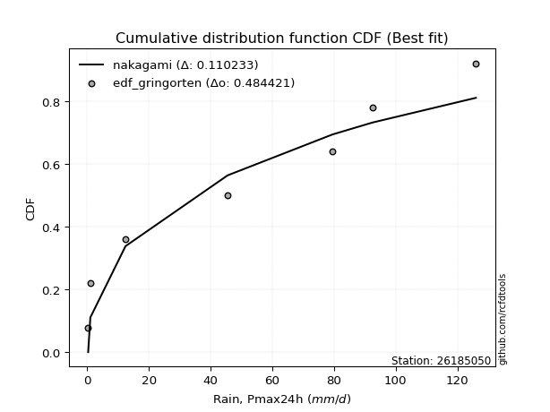</img>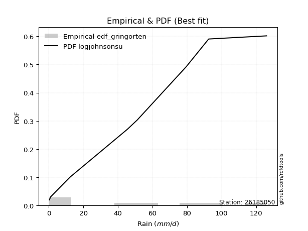</img>

</div>


### 9. Empirical - EDF Filliben (1975)

The specific values of the constants (0.3175) (often denoted as $alpha$) and (0.365) are derived from a method proposed by James J. Filliben in a 1975 paper. This particular formula is the mean value of the $i$-th order statistic of the normal distribution and is considered a robust and effective plotting position formula for the normal probability plot correlation coefficient test for normality.

<div align="center">


$P=(m-0.3175)/(n+0.365)$


</div>


**9.1. Empirical values**

<div align="center">

|                | 0                  | 1                   | 2                  | 3                   | 4                  | 5                  | 6                  | 7                  |
|:---------------|:-------------------|:--------------------|:-------------------|:--------------------|:-------------------|:-------------------|:-------------------|:-------------------|
| date           | 2023               | 2021                | 2019               | 2022                | 2025               | 2017               | 2018               | 2024               |
| x              | 0.3                | 1.0                 | 12.4               | 45.5                | 51.2               | 79.5               | 92.5               | 126.0              |
| m              | 1                  | 2                   | 3                  | 4                   | 5                  | 6                  | 7                  | 8                  |
| empirical_dist | edf_filliben       | edf_filliben        | edf_filliben       | edf_filliben        | edf_filliben       | edf_filliben       | edf_filliben       | edf_filliben       |
| empirical      | 0.0815899581589958 | 0.20113568439928273 | 0.3206814106395696 | 0.44022713687985654 | 0.5597728631201434 | 0.6793185893604303 | 0.7988643156007172 | 0.9184100418410042 |
| empirical_tr   | 1.0888382687927107 | 1.2517770295548074  | 1.4720633523977125 | 1.7864388681260008  | 2.271554650373387  | 3.118359739049394  | 4.971768202080237  | 12.256410256410254 |

</div>


**9.2. Kolmogorov-Smirnov fit test (sorted by Δ)**


<div align="center">

|                | 0                   | 1                   | 2                   | 3                   | 4                  | 5                  | 6                   | 7                   | 8                   | 9                   | 10                  | 11                  | 12                  | 13                 | 14                  | 15                 | 16                 | 17                 | 18                  | 19                 | 20                 | 21                 | 22                    | 23                  | 24                  | 25                  | 26                  | 27                  | 28                 | 29                 | 30                  | 31                  | 32                 | 33                 | 34                  | 35                 | 36                  | 37                 | 38                 | 39                  | 40                 | 41                  | 42                  | 43                  | 44                  | 45                  | 46                 | 47                  | 48                 | 49                  | 50                  | 51                  | 52                 | 53                 | 54                  | 55                 | 56                  | 57                 | 58                  | 59                 | 60                 | 61                 | 62                  | 63                  | 64                 | 65                 | 66                 | 67                  | 68                  | 69                 | 70                  | 71                 | 72                  | 73                  | 74                 | 75                  | 76                  | 77                  | 78                  | 79                 | 80                  | 81                  | 82                 | 83                  | 84                 | 85                 | 86                 | 87                 | 88                 | 89                 |
|:---------------|:--------------------|:--------------------|:--------------------|:--------------------|:-------------------|:-------------------|:--------------------|:--------------------|:--------------------|:--------------------|:--------------------|:--------------------|:--------------------|:-------------------|:--------------------|:-------------------|:-------------------|:-------------------|:--------------------|:-------------------|:-------------------|:-------------------|:----------------------|:--------------------|:--------------------|:--------------------|:--------------------|:--------------------|:-------------------|:-------------------|:--------------------|:--------------------|:-------------------|:-------------------|:--------------------|:-------------------|:--------------------|:-------------------|:-------------------|:--------------------|:-------------------|:--------------------|:--------------------|:--------------------|:--------------------|:--------------------|:-------------------|:--------------------|:-------------------|:--------------------|:--------------------|:--------------------|:-------------------|:-------------------|:--------------------|:-------------------|:--------------------|:-------------------|:--------------------|:-------------------|:-------------------|:-------------------|:--------------------|:--------------------|:-------------------|:-------------------|:-------------------|:--------------------|:--------------------|:-------------------|:--------------------|:-------------------|:--------------------|:--------------------|:-------------------|:--------------------|:--------------------|:--------------------|:--------------------|:-------------------|:--------------------|:--------------------|:-------------------|:--------------------|:-------------------|:-------------------|:-------------------|:-------------------|:-------------------|:-------------------|
| station        | 26185050            | 26185050            | 26185050            | 26185050            | 26185050           | 26185050           | 26185050            | 26185050            | 26185050            | 26185050            | 26185050            | 26185050            | 26185050            | 26185050           | 26185050            | 26185050           | 26185050           | 26185050           | 26185050            | 26185050           | 26185050           | 26185050           | 26185050              | 26185050            | 26185050            | 26185050            | 26185050            | 26185050            | 26185050           | 26185050           | 26185050            | 26185050            | 26185050           | 26185050           | 26185050            | 26185050           | 26185050            | 26185050           | 26185050           | 26185050            | 26185050           | 26185050            | 26185050            | 26185050            | 26185050            | 26185050            | 26185050           | 26185050            | 26185050           | 26185050            | 26185050            | 26185050            | 26185050           | 26185050           | 26185050            | 26185050           | 26185050            | 26185050           | 26185050            | 26185050           | 26185050           | 26185050           | 26185050            | 26185050            | 26185050           | 26185050           | 26185050           | 26185050            | 26185050            | 26185050           | 26185050            | 26185050           | 26185050            | 26185050            | 26185050           | 26185050            | 26185050            | 26185050            | 26185050            | 26185050           | 26185050            | 26185050            | 26185050           | 26185050            | 26185050           | 26185050           | 26185050           | 26185050           | 26185050           | 26185050           |
| empirical_dist | edf_filliben        | edf_filliben        | edf_filliben        | edf_filliben        | edf_filliben       | edf_filliben       | edf_filliben        | edf_filliben        | edf_filliben        | edf_filliben        | edf_filliben        | edf_filliben        | edf_filliben        | edf_filliben       | edf_filliben        | edf_filliben       | edf_filliben       | edf_filliben       | edf_filliben        | edf_filliben       | edf_filliben       | edf_filliben       | edf_filliben          | edf_filliben        | edf_filliben        | edf_filliben        | edf_filliben        | edf_filliben        | edf_filliben       | edf_filliben       | edf_filliben        | edf_filliben        | edf_filliben       | edf_filliben       | edf_filliben        | edf_filliben       | edf_filliben        | edf_filliben       | edf_filliben       | edf_filliben        | edf_filliben       | edf_filliben        | edf_filliben        | edf_filliben        | edf_filliben        | edf_filliben        | edf_filliben       | edf_filliben        | edf_filliben       | edf_filliben        | edf_filliben        | edf_filliben        | edf_filliben       | edf_filliben       | edf_filliben        | edf_filliben       | edf_filliben        | edf_filliben       | edf_filliben        | edf_filliben       | edf_filliben       | edf_filliben       | edf_filliben        | edf_filliben        | edf_filliben       | edf_filliben       | edf_filliben       | edf_filliben        | edf_filliben        | edf_filliben       | edf_filliben        | edf_filliben       | edf_filliben        | edf_filliben        | edf_filliben       | edf_filliben        | edf_filliben        | edf_filliben        | edf_filliben        | edf_filliben       | edf_filliben        | edf_filliben        | edf_filliben       | edf_filliben        | edf_filliben       | edf_filliben       | edf_filliben       | edf_filliben       | edf_filliben       | edf_filliben       |
| p_dist         | logjohnsonsu        | ncf                 | rayleigh            | halfnorm            | invgamma           | maxwell            | genlogistic         | kstwobign           | pearson3            | norm                | crystalball         | t                   | exponnorm           | betaprime          | f                   | laplace_asymmetric | gumbel_r           | nakagami           | logistic            | rice               | logloggamma        | gumbel_l           | loglaplace_asymmetric | hypsecant           | moyal               | weibull_min         | laplace             | expon               | genexpon           | mielke             | halflogistic        | logpearson3         | gompertz           | truncnorm          | invgauss            | alpha              | loggumbel_l         | logweibull_min     | logmielke          | loginvweibull       | logerlang          | logt                | logexponnorm        | lognorm             | lognorm             | logcrystalball      | lognct             | lognakagami         | logfatiguelife     | loglognorm          | loggompertz         | logrice             | loggamma           | loggamma           | loginvgamma         | logalpha           | logmaxwell          | loglogistic        | logkstwobign        | loginvgauss        | lograyleigh        | logncf             | nct                 | loggenexpon         | loghypsecant       | loghalfnorm        | logexpon           | loggumbel_r         | loglaplace          | loghalflogistic    | logmoyal            | wald               | pareto              | logfisk             | gibrat             | fisk                | chi2                | logwald             | logf                | fatiguelife        | loggibrat           | logtruncnorm        | gamma              | logpareto           | erlang             | invweibull         | logbetaprime       | logchi2            | johnsonsu          | loggenlogistic     |
| delta          | 0.07927617766621095 | 0.09193936255321883 | 0.12304323599199288 | 0.12525318052128712 | 0.1255041189318112 | 0.126940067528661  | 0.13133145507615787 | 0.13281656248207335 | 0.13484498563316513 | 0.13665036362861166 | 0.13665036666285305 | 0.13665152629006044 | 0.13693281522779013 | 0.1396198346798972 | 0.14339575112855701 | 0.1500816503986365 | 0.152225122306386  | 0.1567487161906676 | 0.15720932618505631 | 0.1576300530576028 | 0.1581039727203421 | 0.1584678875546932 | 0.16658522442936224   | 0.16880650913555437 | 0.17079181247907238 | 0.17882036838001747 | 0.18067876266158475 | 0.18743726995070792 | 0.1875049941292958 | 0.1884788196083355 | 0.18965524021877903 | 0.19037639013422852 | 0.1912201792670526 | 0.1915513770267929 | 0.19360820724207223 | 0.1938287081116618 | 0.19499922592645208 | 0.202773930925418  | 0.227931436443567  | 0.23082378126855635 | 0.2322173768380424 | 0.23580465174504933 | 0.23580608689055488 | 0.23580645522631766 | 0.23580645522631766 | 0.23580650197024028 | 0.2359217347858364 | 0.23644441580848102 | 0.236892390395738  | 0.23751452924839273 | 0.23760424534723618 | 0.23933100331364848 | 0.245857578757045  | 0.245857578757045  | 0.24714199571484957 | 0.2538104572516801 | 0.25455410499911285 | 0.2557567471488052 | 0.25664832350870365 | 0.2573612085939569 | 0.2601062826842539 | 0.2656488291266895 | 0.26983447738860183 | 0.27043421084397473 | 0.2707068232258561 | 0.2765697151770345 | 0.2799411613434835 | 0.29132517179814404 | 0.29764628652697583 | 0.3041364196039464 | 0.30945392883706696 | 0.3166294061302912 | 0.31670563034854743 | 0.31822467422671863 | 0.3206814106395696 | 0.32296160307038513 | 0.34074605793856055 | 0.36163201601035705 | 0.37378347607834866 | 0.3846238736973014 | 0.39352767157455787 | 0.39871388512742584 | 0.408963895751766  | 0.41770179293988796 | 0.4897551220640552 | 0.49048718358882   | 0.5479301004558508 | 0.5564359894475841 | 0.5924890937536136 | 0.7988643156007172 |
| deltao         | 0.4472608134160001  | 0.4472608134160001  | 0.4472608134160001  | 0.4472608134160001  | 0.4472608134160001 | 0.4472608134160001 | 0.4472608134160001  | 0.4472608134160001  | 0.4472608134160001  | 0.4472608134160001  | 0.4472608134160001  | 0.4472608134160001  | 0.4472608134160001  | 0.4472608134160001 | 0.4472608134160001  | 0.4472608134160001 | 0.4472608134160001 | 0.4472608134160001 | 0.4472608134160001  | 0.4472608134160001 | 0.4472608134160001 | 0.4472608134160001 | 0.4472608134160001    | 0.4472608134160001  | 0.4472608134160001  | 0.4472608134160001  | 0.4472608134160001  | 0.4472608134160001  | 0.4472608134160001 | 0.4472608134160001 | 0.4472608134160001  | 0.4472608134160001  | 0.4472608134160001 | 0.4472608134160001 | 0.4472608134160001  | 0.4472608134160001 | 0.4472608134160001  | 0.4472608134160001 | 0.4472608134160001 | 0.4472608134160001  | 0.4472608134160001 | 0.4472608134160001  | 0.4472608134160001  | 0.4472608134160001  | 0.4472608134160001  | 0.4472608134160001  | 0.4472608134160001 | 0.4472608134160001  | 0.4472608134160001 | 0.4472608134160001  | 0.4472608134160001  | 0.4472608134160001  | 0.4472608134160001 | 0.4472608134160001 | 0.4472608134160001  | 0.4472608134160001 | 0.4472608134160001  | 0.4472608134160001 | 0.4472608134160001  | 0.4472608134160001 | 0.4472608134160001 | 0.4472608134160001 | 0.4472608134160001  | 0.4472608134160001  | 0.4472608134160001 | 0.4472608134160001 | 0.4472608134160001 | 0.4472608134160001  | 0.4472608134160001  | 0.4472608134160001 | 0.4472608134160001  | 0.4472608134160001 | 0.4472608134160001  | 0.4472608134160001  | 0.4472608134160001 | 0.4472608134160001  | 0.4472608134160001  | 0.4472608134160001  | 0.4472608134160001  | 0.4472608134160001 | 0.4472608134160001  | 0.4472608134160001  | 0.4472608134160001 | 0.4472608134160001  | 0.4472608134160001 | 0.4472608134160001 | 0.4472608134160001 | 0.4472608134160001 | 0.4472608134160001 | 0.4472608134160001 |
| eval           | Δo > Δ              | Δo > Δ              | Δo > Δ              | Δo > Δ              | Δo > Δ             | Δo > Δ             | Δo > Δ              | Δo > Δ              | Δo > Δ              | Δo > Δ              | Δo > Δ              | Δo > Δ              | Δo > Δ              | Δo > Δ             | Δo > Δ              | Δo > Δ             | Δo > Δ             | Δo > Δ             | Δo > Δ              | Δo > Δ             | Δo > Δ             | Δo > Δ             | Δo > Δ                | Δo > Δ              | Δo > Δ              | Δo > Δ              | Δo > Δ              | Δo > Δ              | Δo > Δ             | Δo > Δ             | Δo > Δ              | Δo > Δ              | Δo > Δ             | Δo > Δ             | Δo > Δ              | Δo > Δ             | Δo > Δ              | Δo > Δ             | Δo > Δ             | Δo > Δ              | Δo > Δ             | Δo > Δ              | Δo > Δ              | Δo > Δ              | Δo > Δ              | Δo > Δ              | Δo > Δ             | Δo > Δ              | Δo > Δ             | Δo > Δ              | Δo > Δ              | Δo > Δ              | Δo > Δ             | Δo > Δ             | Δo > Δ              | Δo > Δ             | Δo > Δ              | Δo > Δ             | Δo > Δ              | Δo > Δ             | Δo > Δ             | Δo > Δ             | Δo > Δ              | Δo > Δ              | Δo > Δ             | Δo > Δ             | Δo > Δ             | Δo > Δ              | Δo > Δ              | Δo > Δ             | Δo > Δ              | Δo > Δ             | Δo > Δ              | Δo > Δ              | Δo > Δ             | Δo > Δ              | Δo > Δ              | Δo > Δ              | Δo > Δ              | Δo > Δ             | Δo > Δ              | Δo > Δ              | Δo > Δ             | Δo > Δ              | Δo <= Δ            | Δo <= Δ            | Δo <= Δ            | Δo <= Δ            | Δo <= Δ            | Δo <= Δ            |
| fit            | 1                   | 1                   | 1                   | 1                   | 1                  | 1                  | 1                   | 1                   | 1                   | 1                   | 1                   | 1                   | 1                   | 1                  | 1                   | 1                  | 1                  | 1                  | 1                   | 1                  | 1                  | 1                  | 1                     | 1                   | 1                   | 1                   | 1                   | 1                   | 1                  | 1                  | 1                   | 1                   | 1                  | 1                  | 1                   | 1                  | 1                   | 1                  | 1                  | 1                   | 1                  | 1                   | 1                   | 1                   | 1                   | 1                   | 1                  | 1                   | 1                  | 1                   | 1                   | 1                   | 1                  | 1                  | 1                   | 1                  | 1                   | 1                  | 1                   | 1                  | 1                  | 1                  | 1                   | 1                   | 1                  | 1                  | 1                  | 1                   | 1                   | 1                  | 1                   | 1                  | 1                   | 1                   | 1                  | 1                   | 1                   | 1                   | 1                   | 1                  | 1                   | 1                   | 1                  | 1                   | 0                  | 0                  | 0                  | 0                  | 0                  | 0                  |
| n              | 8                   | 8                   | 8                   | 8                   | 8                  | 8                  | 8                   | 8                   | 8                   | 8                   | 8                   | 8                   | 8                   | 8                  | 8                   | 8                  | 8                  | 8                  | 8                   | 8                  | 8                  | 8                  | 8                     | 8                   | 8                   | 8                   | 8                   | 8                   | 8                  | 8                  | 8                   | 8                   | 8                  | 8                  | 8                   | 8                  | 8                   | 8                  | 8                  | 8                   | 8                  | 8                   | 8                   | 8                   | 8                   | 8                   | 8                  | 8                   | 8                  | 8                   | 8                   | 8                   | 8                  | 8                  | 8                   | 8                  | 8                   | 8                  | 8                   | 8                  | 8                  | 8                  | 8                   | 8                   | 8                  | 8                  | 8                  | 8                   | 8                   | 8                  | 8                   | 8                  | 8                   | 8                   | 8                  | 8                   | 8                   | 8                   | 8                   | 8                  | 8                   | 8                   | 8                  | 8                   | 8                  | 8                  | 8                  | 8                  | 8                  | 8                  |
| best_fit       | 1                   | 0                   | 0                   | 0                   | 0                  | 0                  | 0                   | 0                   | 0                   | 0                   | 0                   | 0                   | 0                   | 0                  | 0                   | 0                  | 0                  | 0                  | 0                   | 0                  | 0                  | 0                  | 0                     | 0                   | 0                   | 0                   | 0                   | 0                   | 0                  | 0                  | 0                   | 0                   | 0                  | 0                  | 0                   | 0                  | 0                   | 0                  | 0                  | 0                   | 0                  | 0                   | 0                   | 0                   | 0                   | 0                   | 0                  | 0                   | 0                  | 0                   | 0                   | 0                   | 0                  | 0                  | 0                   | 0                  | 0                   | 0                  | 0                   | 0                  | 0                  | 0                  | 0                   | 0                   | 0                  | 0                  | 0                  | 0                   | 0                   | 0                  | 0                   | 0                  | 0                   | 0                   | 0                  | 0                   | 0                   | 0                   | 0                   | 0                  | 0                   | 0                   | 0                  | 0                   | 0                  | 0                  | 0                  | 0                  | 0                  | 0                  |
| best_fit_sort  | 1                   | 2                   | 3                   | 4                   | 5                  | 6                  | 7                   | 8                   | 9                   | 10                  | 11                  | 12                  | 13                  | 14                 | 15                  | 16                 | 17                 | 18                 | 19                  | 20                 | 21                 | 22                 | 23                    | 24                  | 25                  | 26                  | 27                  | 28                  | 29                 | 30                 | 31                  | 32                  | 33                 | 34                 | 35                  | 36                 | 37                  | 38                 | 39                 | 40                  | 41                 | 42                  | 43                  | 44                  | 45                  | 46                  | 47                 | 48                  | 49                 | 50                  | 51                  | 52                  | 53                 | 54                 | 55                  | 56                 | 57                  | 58                 | 59                  | 60                 | 61                 | 62                 | 63                  | 64                  | 65                 | 66                 | 67                 | 68                  | 69                  | 70                 | 71                  | 72                 | 73                  | 74                  | 75                 | 76                  | 77                  | 78                  | 79                  | 80                 | 81                  | 82                  | 83                 | 84                  | 85                 | 86                 | 87                 | 88                 | 89                 | 90                 |

</div>


<div align="center">

</img>

</div>


**9.3. Best fit**

<div align="center">

|   id |   station | empirical_dist   | p_dist       |     delta |   deltao | eval   |   fit |   n |   best_fit |   best_fit_sort |
|-----:|----------:|:-----------------|:-------------|----------:|---------:|:-------|------:|----:|-----------:|----------------:|
|    0 |  26185050 | edf_filliben     | logjohnsonsu | 0.0792762 | 0.447261 | Δo > Δ |     1 |   8 |          1 |               1 |

</div>


<div align="center">

</img>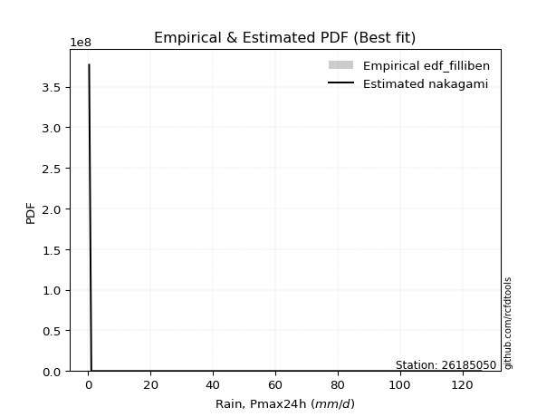</img>

</div>


### 10. Empirical - EDF Jenkinson (1977)

The Jenkinson formula in hydrology is an empirical plotting position formula used to estimate the non-exceedance probability _(P)_ or return period _(T)_ of a given ordered observation within a sample. It is a widely used method in the frequency analysis of extreme events such as floods and rainfall, as it provides a distribution-free way to plot data. _a≈0.31_ and _b≈0.38_ are constants derived to approximate the median of the probability distribution for the given rank.

<div align="center">


$P=(m-a)/(n+b)$


</div>


**10.1. Empirical values**

<div align="center">

|                | 0                   | 1                   | 2                  | 3                   | 4                  | 5                  | 6                  | 7                  |
|:---------------|:--------------------|:--------------------|:-------------------|:--------------------|:-------------------|:-------------------|:-------------------|:-------------------|
| date           | 2023                | 2021                | 2019               | 2022                | 2025               | 2017               | 2018               | 2024               |
| x              | 0.3                 | 1.0                 | 12.4               | 45.5                | 51.2               | 79.5               | 92.5               | 126.0              |
| m              | 1                   | 2                   | 3                  | 4                   | 5                  | 6                  | 7                  | 8                  |
| empirical_dist | edf_jenkinson       | edf_jenkinson       | edf_jenkinson      | edf_jenkinson       | edf_jenkinson      | edf_jenkinson      | edf_jenkinson      | edf_jenkinson      |
| empirical      | 0.08233890214797135 | 0.20167064439140808 | 0.3210023866348448 | 0.44033412887828155 | 0.5596658711217184 | 0.6789976133651551 | 0.7983293556085919 | 0.9176610978520287 |
| empirical_tr   | 1.0897269180754225  | 1.2526158445440956  | 1.4727592267135323 | 1.7867803837953091  | 2.2710027100271004 | 3.115241635687732  | 4.958579881656804  | 12.144927536231886 |

</div>


**10.2. Kolmogorov-Smirnov fit test (sorted by Δ)**


<div align="center">

|                | 0                  | 1                   | 2                   | 3                   | 4                  | 5                  | 6                   | 7                   | 8                   | 9                   | 10                  | 11                  | 12                  | 13                  | 14                 | 15                 | 16                 | 17                 | 18                 | 19                 | 20                 | 21                 | 22                    | 23                  | 24                  | 25                  | 26                  | 27                  | 28                  | 29                 | 30                  | 31                 | 32                  | 33                  | 34                  | 35                 | 36                  | 37                 | 38                 | 39                  | 40                  | 41                  | 42                  | 43                  | 44                  | 45                  | 46                  | 47                 | 48                 | 49                  | 50                  | 51                  | 52                 | 53                 | 54                  | 55                 | 56                  | 57                 | 58                  | 59                 | 60                 | 61                 | 62                 | 63                 | 64                 | 65                 | 66                 | 67                  | 68                 | 69                 | 70                  | 71                  | 72                 | 73                 | 74                 | 75                 | 76                  | 77                  | 78                  | 79                 | 80                  | 81                 | 82                 | 83                  | 84                 | 85                  | 86                 | 87                 | 88                 | 89                 |
|:---------------|:-------------------|:--------------------|:--------------------|:--------------------|:-------------------|:-------------------|:--------------------|:--------------------|:--------------------|:--------------------|:--------------------|:--------------------|:--------------------|:--------------------|:-------------------|:-------------------|:-------------------|:-------------------|:-------------------|:-------------------|:-------------------|:-------------------|:----------------------|:--------------------|:--------------------|:--------------------|:--------------------|:--------------------|:--------------------|:-------------------|:--------------------|:-------------------|:--------------------|:--------------------|:--------------------|:-------------------|:--------------------|:-------------------|:-------------------|:--------------------|:--------------------|:--------------------|:--------------------|:--------------------|:--------------------|:--------------------|:--------------------|:-------------------|:-------------------|:--------------------|:--------------------|:--------------------|:-------------------|:-------------------|:--------------------|:-------------------|:--------------------|:-------------------|:--------------------|:-------------------|:-------------------|:-------------------|:-------------------|:-------------------|:-------------------|:-------------------|:-------------------|:--------------------|:-------------------|:-------------------|:--------------------|:--------------------|:-------------------|:-------------------|:-------------------|:-------------------|:--------------------|:--------------------|:--------------------|:-------------------|:--------------------|:-------------------|:-------------------|:--------------------|:-------------------|:--------------------|:-------------------|:-------------------|:-------------------|:-------------------|
| station        | 26185050           | 26185050            | 26185050            | 26185050            | 26185050           | 26185050           | 26185050            | 26185050            | 26185050            | 26185050            | 26185050            | 26185050            | 26185050            | 26185050            | 26185050           | 26185050           | 26185050           | 26185050           | 26185050           | 26185050           | 26185050           | 26185050           | 26185050              | 26185050            | 26185050            | 26185050            | 26185050            | 26185050            | 26185050            | 26185050           | 26185050            | 26185050           | 26185050            | 26185050            | 26185050            | 26185050           | 26185050            | 26185050           | 26185050           | 26185050            | 26185050            | 26185050            | 26185050            | 26185050            | 26185050            | 26185050            | 26185050            | 26185050           | 26185050           | 26185050            | 26185050            | 26185050            | 26185050           | 26185050           | 26185050            | 26185050           | 26185050            | 26185050           | 26185050            | 26185050           | 26185050           | 26185050           | 26185050           | 26185050           | 26185050           | 26185050           | 26185050           | 26185050            | 26185050           | 26185050           | 26185050            | 26185050            | 26185050           | 26185050           | 26185050           | 26185050           | 26185050            | 26185050            | 26185050            | 26185050           | 26185050            | 26185050           | 26185050           | 26185050            | 26185050           | 26185050            | 26185050           | 26185050           | 26185050           | 26185050           |
| empirical_dist | edf_jenkinson      | edf_jenkinson       | edf_jenkinson       | edf_jenkinson       | edf_jenkinson      | edf_jenkinson      | edf_jenkinson       | edf_jenkinson       | edf_jenkinson       | edf_jenkinson       | edf_jenkinson       | edf_jenkinson       | edf_jenkinson       | edf_jenkinson       | edf_jenkinson      | edf_jenkinson      | edf_jenkinson      | edf_jenkinson      | edf_jenkinson      | edf_jenkinson      | edf_jenkinson      | edf_jenkinson      | edf_jenkinson         | edf_jenkinson       | edf_jenkinson       | edf_jenkinson       | edf_jenkinson       | edf_jenkinson       | edf_jenkinson       | edf_jenkinson      | edf_jenkinson       | edf_jenkinson      | edf_jenkinson       | edf_jenkinson       | edf_jenkinson       | edf_jenkinson      | edf_jenkinson       | edf_jenkinson      | edf_jenkinson      | edf_jenkinson       | edf_jenkinson       | edf_jenkinson       | edf_jenkinson       | edf_jenkinson       | edf_jenkinson       | edf_jenkinson       | edf_jenkinson       | edf_jenkinson      | edf_jenkinson      | edf_jenkinson       | edf_jenkinson       | edf_jenkinson       | edf_jenkinson      | edf_jenkinson      | edf_jenkinson       | edf_jenkinson      | edf_jenkinson       | edf_jenkinson      | edf_jenkinson       | edf_jenkinson      | edf_jenkinson      | edf_jenkinson      | edf_jenkinson      | edf_jenkinson      | edf_jenkinson      | edf_jenkinson      | edf_jenkinson      | edf_jenkinson       | edf_jenkinson      | edf_jenkinson      | edf_jenkinson       | edf_jenkinson       | edf_jenkinson      | edf_jenkinson      | edf_jenkinson      | edf_jenkinson      | edf_jenkinson       | edf_jenkinson       | edf_jenkinson       | edf_jenkinson      | edf_jenkinson       | edf_jenkinson      | edf_jenkinson      | edf_jenkinson       | edf_jenkinson      | edf_jenkinson       | edf_jenkinson      | edf_jenkinson      | edf_jenkinson      | edf_jenkinson      |
| p_dist         | logjohnsonsu       | ncf                 | rayleigh            | halfnorm            | invgamma           | maxwell            | genlogistic         | kstwobign           | pearson3            | norm                | crystalball         | t                   | exponnorm           | betaprime           | f                  | laplace_asymmetric | gumbel_r           | nakagami           | logistic           | rice               | logloggamma        | gumbel_l           | loglaplace_asymmetric | hypsecant           | moyal               | weibull_min         | laplace             | expon               | genexpon            | mielke             | halflogistic        | logpearson3        | gompertz            | truncnorm           | invgauss            | alpha              | loggumbel_l         | logweibull_min     | logmielke          | loginvweibull       | logerlang           | logt                | logexponnorm        | lognorm             | lognorm             | logcrystalball      | lognct              | lognakagami        | logfatiguelife     | loglognorm          | loggompertz         | logrice             | loggamma           | loggamma           | loginvgamma         | logalpha           | logmaxwell          | loglogistic        | logkstwobign        | loginvgauss        | lograyleigh        | logncf             | nct                | loggenexpon        | loghypsecant       | loghalfnorm        | logexpon           | loggumbel_r         | loglaplace         | loghalflogistic    | logmoyal            | pareto              | wald               | logfisk            | gibrat             | fisk               | chi2                | logwald             | logf                | fatiguelife        | loggibrat           | logtruncnorm       | gamma              | logpareto           | erlang             | invweibull          | logbetaprime       | logchi2            | johnsonsu          | loggenlogistic     |
| delta          | 0.0798111376583363 | 0.09183237055479382 | 0.12336421198726807 | 0.12578814051341247 | 0.1258250949270864 | 0.1272610435239362 | 0.13165243107143307 | 0.13313753847734855 | 0.13516596162844033 | 0.13697133962388686 | 0.13697134265812824 | 0.13697250228533564 | 0.13725379122306533 | 0.13951284268147218 | 0.143288759130132  | 0.1504026263939117 | 0.1525460983016612 | 0.1566417241922426 | 0.1575303021803315 | 0.157951029052878  | 0.1579969807219171 | 0.1587888635499684 | 0.16647823243093723   | 0.16912748513082956 | 0.17111278847434758 | 0.17935532837214282 | 0.18099973865685995 | 0.18797222994283327 | 0.18803995412142116 | 0.1883718276099105 | 0.19019020021090438 | 0.1902693981358035 | 0.19175513925917795 | 0.19208633701891825 | 0.19350121524364722 | 0.1937217161132368 | 0.19489223392802707 | 0.202666938926993  | 0.227824444445142  | 0.23071678927013134 | 0.23211038483961738 | 0.23569765974662432 | 0.23569909489212987 | 0.23569946322789265 | 0.23569946322789265 | 0.23569950997181527 | 0.23581474278741138 | 0.236337423810056  | 0.236785398397313  | 0.23740753724996772 | 0.23749725334881117 | 0.23922401131522347 | 0.24575058675862   | 0.24575058675862   | 0.24703500371642456 | 0.2537034652532551 | 0.25444711300068784 | 0.2556497551503802 | 0.25654133151027864 | 0.2572542165955319 | 0.2599992906858289 | 0.264899885137714  | 0.2697274853901768 | 0.2703272188455497 | 0.2705998312274311 | 0.2764627231786095 | 0.2796201853482083 | 0.29121817979971903 | 0.2975392945285508 | 0.3040294276055214 | 0.30934693683864195 | 0.31638465435327223 | 0.3169503821255664 | 0.3174757302377431 | 0.3210023866348448 | 0.3222126590814096 | 0.34063906594013554 | 0.36152502401193204 | 0.37346250008307347 | 0.3845168816988764 | 0.39342067957613286 | 0.3986068931290008 | 0.408856903753341  | 0.41716683294776263 | 0.4896481300656302 | 0.48973823959984447 | 0.5473951404637254 | 0.5561150134523088 | 0.5919541337614882 | 0.7983293556085919 |
| deltao         | 0.4472608134160001 | 0.4472608134160001  | 0.4472608134160001  | 0.4472608134160001  | 0.4472608134160001 | 0.4472608134160001 | 0.4472608134160001  | 0.4472608134160001  | 0.4472608134160001  | 0.4472608134160001  | 0.4472608134160001  | 0.4472608134160001  | 0.4472608134160001  | 0.4472608134160001  | 0.4472608134160001 | 0.4472608134160001 | 0.4472608134160001 | 0.4472608134160001 | 0.4472608134160001 | 0.4472608134160001 | 0.4472608134160001 | 0.4472608134160001 | 0.4472608134160001    | 0.4472608134160001  | 0.4472608134160001  | 0.4472608134160001  | 0.4472608134160001  | 0.4472608134160001  | 0.4472608134160001  | 0.4472608134160001 | 0.4472608134160001  | 0.4472608134160001 | 0.4472608134160001  | 0.4472608134160001  | 0.4472608134160001  | 0.4472608134160001 | 0.4472608134160001  | 0.4472608134160001 | 0.4472608134160001 | 0.4472608134160001  | 0.4472608134160001  | 0.4472608134160001  | 0.4472608134160001  | 0.4472608134160001  | 0.4472608134160001  | 0.4472608134160001  | 0.4472608134160001  | 0.4472608134160001 | 0.4472608134160001 | 0.4472608134160001  | 0.4472608134160001  | 0.4472608134160001  | 0.4472608134160001 | 0.4472608134160001 | 0.4472608134160001  | 0.4472608134160001 | 0.4472608134160001  | 0.4472608134160001 | 0.4472608134160001  | 0.4472608134160001 | 0.4472608134160001 | 0.4472608134160001 | 0.4472608134160001 | 0.4472608134160001 | 0.4472608134160001 | 0.4472608134160001 | 0.4472608134160001 | 0.4472608134160001  | 0.4472608134160001 | 0.4472608134160001 | 0.4472608134160001  | 0.4472608134160001  | 0.4472608134160001 | 0.4472608134160001 | 0.4472608134160001 | 0.4472608134160001 | 0.4472608134160001  | 0.4472608134160001  | 0.4472608134160001  | 0.4472608134160001 | 0.4472608134160001  | 0.4472608134160001 | 0.4472608134160001 | 0.4472608134160001  | 0.4472608134160001 | 0.4472608134160001  | 0.4472608134160001 | 0.4472608134160001 | 0.4472608134160001 | 0.4472608134160001 |
| eval           | Δo > Δ             | Δo > Δ              | Δo > Δ              | Δo > Δ              | Δo > Δ             | Δo > Δ             | Δo > Δ              | Δo > Δ              | Δo > Δ              | Δo > Δ              | Δo > Δ              | Δo > Δ              | Δo > Δ              | Δo > Δ              | Δo > Δ             | Δo > Δ             | Δo > Δ             | Δo > Δ             | Δo > Δ             | Δo > Δ             | Δo > Δ             | Δo > Δ             | Δo > Δ                | Δo > Δ              | Δo > Δ              | Δo > Δ              | Δo > Δ              | Δo > Δ              | Δo > Δ              | Δo > Δ             | Δo > Δ              | Δo > Δ             | Δo > Δ              | Δo > Δ              | Δo > Δ              | Δo > Δ             | Δo > Δ              | Δo > Δ             | Δo > Δ             | Δo > Δ              | Δo > Δ              | Δo > Δ              | Δo > Δ              | Δo > Δ              | Δo > Δ              | Δo > Δ              | Δo > Δ              | Δo > Δ             | Δo > Δ             | Δo > Δ              | Δo > Δ              | Δo > Δ              | Δo > Δ             | Δo > Δ             | Δo > Δ              | Δo > Δ             | Δo > Δ              | Δo > Δ             | Δo > Δ              | Δo > Δ             | Δo > Δ             | Δo > Δ             | Δo > Δ             | Δo > Δ             | Δo > Δ             | Δo > Δ             | Δo > Δ             | Δo > Δ              | Δo > Δ             | Δo > Δ             | Δo > Δ              | Δo > Δ              | Δo > Δ             | Δo > Δ             | Δo > Δ             | Δo > Δ             | Δo > Δ              | Δo > Δ              | Δo > Δ              | Δo > Δ             | Δo > Δ              | Δo > Δ             | Δo > Δ             | Δo > Δ              | Δo <= Δ            | Δo <= Δ             | Δo <= Δ            | Δo <= Δ            | Δo <= Δ            | Δo <= Δ            |
| fit            | 1                  | 1                   | 1                   | 1                   | 1                  | 1                  | 1                   | 1                   | 1                   | 1                   | 1                   | 1                   | 1                   | 1                   | 1                  | 1                  | 1                  | 1                  | 1                  | 1                  | 1                  | 1                  | 1                     | 1                   | 1                   | 1                   | 1                   | 1                   | 1                   | 1                  | 1                   | 1                  | 1                   | 1                   | 1                   | 1                  | 1                   | 1                  | 1                  | 1                   | 1                   | 1                   | 1                   | 1                   | 1                   | 1                   | 1                   | 1                  | 1                  | 1                   | 1                   | 1                   | 1                  | 1                  | 1                   | 1                  | 1                   | 1                  | 1                   | 1                  | 1                  | 1                  | 1                  | 1                  | 1                  | 1                  | 1                  | 1                   | 1                  | 1                  | 1                   | 1                   | 1                  | 1                  | 1                  | 1                  | 1                   | 1                   | 1                   | 1                  | 1                   | 1                  | 1                  | 1                   | 0                  | 0                   | 0                  | 0                  | 0                  | 0                  |
| n              | 8                  | 8                   | 8                   | 8                   | 8                  | 8                  | 8                   | 8                   | 8                   | 8                   | 8                   | 8                   | 8                   | 8                   | 8                  | 8                  | 8                  | 8                  | 8                  | 8                  | 8                  | 8                  | 8                     | 8                   | 8                   | 8                   | 8                   | 8                   | 8                   | 8                  | 8                   | 8                  | 8                   | 8                   | 8                   | 8                  | 8                   | 8                  | 8                  | 8                   | 8                   | 8                   | 8                   | 8                   | 8                   | 8                   | 8                   | 8                  | 8                  | 8                   | 8                   | 8                   | 8                  | 8                  | 8                   | 8                  | 8                   | 8                  | 8                   | 8                  | 8                  | 8                  | 8                  | 8                  | 8                  | 8                  | 8                  | 8                   | 8                  | 8                  | 8                   | 8                   | 8                  | 8                  | 8                  | 8                  | 8                   | 8                   | 8                   | 8                  | 8                   | 8                  | 8                  | 8                   | 8                  | 8                   | 8                  | 8                  | 8                  | 8                  |
| best_fit       | 1                  | 0                   | 0                   | 0                   | 0                  | 0                  | 0                   | 0                   | 0                   | 0                   | 0                   | 0                   | 0                   | 0                   | 0                  | 0                  | 0                  | 0                  | 0                  | 0                  | 0                  | 0                  | 0                     | 0                   | 0                   | 0                   | 0                   | 0                   | 0                   | 0                  | 0                   | 0                  | 0                   | 0                   | 0                   | 0                  | 0                   | 0                  | 0                  | 0                   | 0                   | 0                   | 0                   | 0                   | 0                   | 0                   | 0                   | 0                  | 0                  | 0                   | 0                   | 0                   | 0                  | 0                  | 0                   | 0                  | 0                   | 0                  | 0                   | 0                  | 0                  | 0                  | 0                  | 0                  | 0                  | 0                  | 0                  | 0                   | 0                  | 0                  | 0                   | 0                   | 0                  | 0                  | 0                  | 0                  | 0                   | 0                   | 0                   | 0                  | 0                   | 0                  | 0                  | 0                   | 0                  | 0                   | 0                  | 0                  | 0                  | 0                  |
| best_fit_sort  | 1                  | 2                   | 3                   | 4                   | 5                  | 6                  | 7                   | 8                   | 9                   | 10                  | 11                  | 12                  | 13                  | 14                  | 15                 | 16                 | 17                 | 18                 | 19                 | 20                 | 21                 | 22                 | 23                    | 24                  | 25                  | 26                  | 27                  | 28                  | 29                  | 30                 | 31                  | 32                 | 33                  | 34                  | 35                  | 36                 | 37                  | 38                 | 39                 | 40                  | 41                  | 42                  | 43                  | 44                  | 45                  | 46                  | 47                  | 48                 | 49                 | 50                  | 51                  | 52                  | 53                 | 54                 | 55                  | 56                 | 57                  | 58                 | 59                  | 60                 | 61                 | 62                 | 63                 | 64                 | 65                 | 66                 | 67                 | 68                  | 69                 | 70                 | 71                  | 72                  | 73                 | 74                 | 75                 | 76                 | 77                  | 78                  | 79                  | 80                 | 81                  | 82                 | 83                 | 84                  | 85                 | 86                  | 87                 | 88                 | 89                 | 90                 |

</div>


<div align="center">

</img>

</div>


**10.3. Best fit**

<div align="center">

|   id |   station | empirical_dist   | p_dist       |     delta |   deltao | eval   |   fit |   n |   best_fit |   best_fit_sort |
|-----:|----------:|:-----------------|:-------------|----------:|---------:|:-------|------:|----:|-----------:|----------------:|
|    0 |  26185050 | edf_jenkinson    | logjohnsonsu | 0.0798111 | 0.447261 | Δo > Δ |     1 |   8 |          1 |               1 |

</div>


<div align="center">

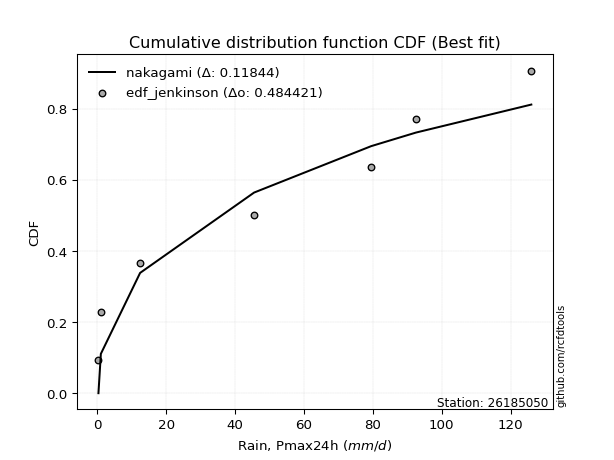</img>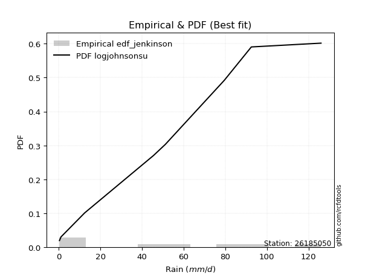</img>

</div>


### 11. Empirical - EDF Cunnane (1978)

Cunnane´s work in statistical hydrology has focused on the performance and evaluation of different probability distributions (such as GEV, Gumbel, Lognormal) for flood frequency estimation. _b_ is a constant, typically set to 0.4.

<div align="center">


$P=(m-b)/(n+1-2b)$


</div>


**11.1. Empirical values**

<div align="center">

|                | 0                   | 1                   | 2                  | 3                  | 4                  | 5                  | 6                  | 7                  |
|:---------------|:--------------------|:--------------------|:-------------------|:-------------------|:-------------------|:-------------------|:-------------------|:-------------------|
| date           | 2023                | 2021                | 2019               | 2022               | 2025               | 2017               | 2018               | 2024               |
| x              | 0.3                 | 1.0                 | 12.4               | 45.5               | 51.2               | 79.5               | 92.5               | 126.0              |
| m              | 1                   | 2                   | 3                  | 4                  | 5                  | 6                  | 7                  | 8                  |
| empirical_dist | edf_cunnane         | edf_cunnane         | edf_cunnane        | edf_cunnane        | edf_cunnane        | edf_cunnane        | edf_cunnane        | edf_cunnane        |
| empirical      | 0.07317073170731708 | 0.19512195121951223 | 0.3170731707317074 | 0.4390243902439025 | 0.5609756097560976 | 0.6829268292682927 | 0.8048780487804879 | 0.926829268292683  |
| empirical_tr   | 1.0789473684210527  | 1.2424242424242424  | 1.4642857142857144 | 1.782608695652174  | 2.277777777777778  | 3.153846153846154  | 5.125000000000001  | 13.666666666666675 |

</div>


**11.2. Kolmogorov-Smirnov fit test (sorted by Δ)**


<div align="center">

|                | 0                   | 1                   | 2                   | 3                   | 4                   | 5                   | 6                   | 7                  | 8                  | 9                   | 10                 | 11                 | 12                 | 13                  | 14                  | 15                  | 16                  | 17                  | 18                  | 19                  | 20                  | 21                  | 22                  | 23                  | 24                    | 25                  | 26                 | 27                  | 28                 | 29                  | 30                 | 31                 | 32                  | 33                  | 34                  | 35                  | 36                  | 37                  | 38                  | 39                 | 40                  | 41                  | 42                  | 43                 | 44                 | 45                  | 46                  | 47                  | 48                  | 49                  | 50                  | 51                  | 52                  | 53                  | 54                  | 55                  | 56                 | 57                  | 58                 | 59                  | 60                  | 61                 | 62                 | 63                  | 64                  | 65                  | 66                  | 67                 | 68                 | 69                  | 70                 | 71                 | 72                 | 73                  | 74                  | 75                  | 76                 | 77                 | 78                 | 79                  | 80                 | 81                 | 82                  | 83                  | 84                  | 85                 | 86                 | 87                 | 88                 | 89                 |
|:---------------|:--------------------|:--------------------|:--------------------|:--------------------|:--------------------|:--------------------|:--------------------|:-------------------|:-------------------|:--------------------|:-------------------|:-------------------|:-------------------|:--------------------|:--------------------|:--------------------|:--------------------|:--------------------|:--------------------|:--------------------|:--------------------|:--------------------|:--------------------|:--------------------|:----------------------|:--------------------|:-------------------|:--------------------|:-------------------|:--------------------|:-------------------|:-------------------|:--------------------|:--------------------|:--------------------|:--------------------|:--------------------|:--------------------|:--------------------|:-------------------|:--------------------|:--------------------|:--------------------|:-------------------|:-------------------|:--------------------|:--------------------|:--------------------|:--------------------|:--------------------|:--------------------|:--------------------|:--------------------|:--------------------|:--------------------|:--------------------|:-------------------|:--------------------|:-------------------|:--------------------|:--------------------|:-------------------|:-------------------|:--------------------|:--------------------|:--------------------|:--------------------|:-------------------|:-------------------|:--------------------|:-------------------|:-------------------|:-------------------|:--------------------|:--------------------|:--------------------|:-------------------|:-------------------|:-------------------|:--------------------|:-------------------|:-------------------|:--------------------|:--------------------|:--------------------|:-------------------|:-------------------|:-------------------|:-------------------|:-------------------|
| station        | 26185050            | 26185050            | 26185050            | 26185050            | 26185050            | 26185050            | 26185050            | 26185050           | 26185050           | 26185050            | 26185050           | 26185050           | 26185050           | 26185050            | 26185050            | 26185050            | 26185050            | 26185050            | 26185050            | 26185050            | 26185050            | 26185050            | 26185050            | 26185050            | 26185050              | 26185050            | 26185050           | 26185050            | 26185050           | 26185050            | 26185050           | 26185050           | 26185050            | 26185050            | 26185050            | 26185050            | 26185050            | 26185050            | 26185050            | 26185050           | 26185050            | 26185050            | 26185050            | 26185050           | 26185050           | 26185050            | 26185050            | 26185050            | 26185050            | 26185050            | 26185050            | 26185050            | 26185050            | 26185050            | 26185050            | 26185050            | 26185050           | 26185050            | 26185050           | 26185050            | 26185050            | 26185050           | 26185050           | 26185050            | 26185050            | 26185050            | 26185050            | 26185050           | 26185050           | 26185050            | 26185050           | 26185050           | 26185050           | 26185050            | 26185050            | 26185050            | 26185050           | 26185050           | 26185050           | 26185050            | 26185050           | 26185050           | 26185050            | 26185050            | 26185050            | 26185050           | 26185050           | 26185050           | 26185050           | 26185050           |
| empirical_dist | edf_cunnane         | edf_cunnane         | edf_cunnane         | edf_cunnane         | edf_cunnane         | edf_cunnane         | edf_cunnane         | edf_cunnane        | edf_cunnane        | edf_cunnane         | edf_cunnane        | edf_cunnane        | edf_cunnane        | edf_cunnane         | edf_cunnane         | edf_cunnane         | edf_cunnane         | edf_cunnane         | edf_cunnane         | edf_cunnane         | edf_cunnane         | edf_cunnane         | edf_cunnane         | edf_cunnane         | edf_cunnane           | edf_cunnane         | edf_cunnane        | edf_cunnane         | edf_cunnane        | edf_cunnane         | edf_cunnane        | edf_cunnane        | edf_cunnane         | edf_cunnane         | edf_cunnane         | edf_cunnane         | edf_cunnane         | edf_cunnane         | edf_cunnane         | edf_cunnane        | edf_cunnane         | edf_cunnane         | edf_cunnane         | edf_cunnane        | edf_cunnane        | edf_cunnane         | edf_cunnane         | edf_cunnane         | edf_cunnane         | edf_cunnane         | edf_cunnane         | edf_cunnane         | edf_cunnane         | edf_cunnane         | edf_cunnane         | edf_cunnane         | edf_cunnane        | edf_cunnane         | edf_cunnane        | edf_cunnane         | edf_cunnane         | edf_cunnane        | edf_cunnane        | edf_cunnane         | edf_cunnane         | edf_cunnane         | edf_cunnane         | edf_cunnane        | edf_cunnane        | edf_cunnane         | edf_cunnane        | edf_cunnane        | edf_cunnane        | edf_cunnane         | edf_cunnane         | edf_cunnane         | edf_cunnane        | edf_cunnane        | edf_cunnane        | edf_cunnane         | edf_cunnane        | edf_cunnane        | edf_cunnane         | edf_cunnane         | edf_cunnane         | edf_cunnane        | edf_cunnane        | edf_cunnane        | edf_cunnane        | edf_cunnane        |
| p_dist         | logjohnsonsu        | ncf                 | halfnorm            | rayleigh            | invgamma            | maxwell             | genlogistic         | kstwobign          | pearson3           | norm                | crystalball        | t                  | exponnorm          | betaprime           | laplace_asymmetric  | gumbel_r            | f                   | logistic            | rice                | gumbel_l            | nakagami            | logloggamma         | hypsecant           | moyal               | loglaplace_asymmetric | weibull_min         | laplace            | expon               | genexpon           | halflogistic        | gompertz           | truncnorm          | mielke              | logpearson3         | invgauss            | alpha               | loggumbel_l         | logweibull_min      | logmielke           | loginvweibull      | logerlang           | logt                | logexponnorm        | lognorm            | lognorm            | logcrystalball      | lognct              | lognakagami         | logfatiguelife      | loglognorm          | loggompertz         | logrice             | loggamma            | loggamma            | loginvgamma         | logalpha            | logmaxwell         | loglogistic         | logkstwobign       | loginvgauss         | lograyleigh         | nct                | loggenexpon        | loghypsecant        | logncf              | loghalfnorm         | logexpon            | loggumbel_r        | loglaplace         | loghalflogistic     | logmoyal           | wald               | gibrat             | pareto              | logfisk             | fisk                | chi2               | logwald            | logf               | fatiguelife         | loggibrat          | logtruncnorm       | gamma               | logpareto           | erlang              | invweibull         | logbetaprime       | logchi2            | johnsonsu          | loggenlogistic     |
| delta          | 0.07326244448644045 | 0.09314210918917287 | 0.11923944734151662 | 0.11943499608413063 | 0.12189587902394897 | 0.12333182762079875 | 0.12772321516829563 | 0.1292083225742111 | 0.1312367457253029 | 0.13304212372074942 | 0.1330421267549908 | 0.1330432863821982 | 0.1333245753199279 | 0.14082258131585124 | 0.14647341049077425 | 0.14861688239852375 | 0.15039385664400873 | 0.15360108627719407 | 0.15402181314974056 | 0.15485964764683097 | 0.15795146282662165 | 0.15930671935629614 | 0.16519826922769212 | 0.16718357257121014 | 0.1677879710653163    | 0.17280663520024697 | 0.1770705227537225 | 0.18142353677093742 | 0.1814912609495253 | 0.18364150703900853 | 0.1852064460872821 | 0.1855376438470224 | 0.18968156624428956 | 0.19157913677018257 | 0.19481095387802627 | 0.19503145474761585 | 0.19620197256240612 | 0.20397667756137206 | 0.22913418307952105 | 0.2320265279045104 | 0.23342012347399643 | 0.23700739838100338 | 0.23700883352650892 | 0.2370092018622717 | 0.2370092018622717 | 0.23700924860619432 | 0.23712448142179043 | 0.23764716244443507 | 0.23809513703169205 | 0.23871727588434677 | 0.23880699198319022 | 0.24053374994960253 | 0.24706032539299905 | 0.24706032539299905 | 0.24834474235080362 | 0.25501320388763415 | 0.2557568516350669 | 0.25695949378475924 | 0.2578510701446577 | 0.25856395522991094 | 0.26130902932020794 | 0.2710372240245559 | 0.2716369574799288 | 0.27190956986181014 | 0.27406805557836833 | 0.27777246181298854 | 0.28354940125134576 | 0.2925279184340981 | 0.2988490331629299 | 0.30533916623990043 | 0.310656675473021  | 0.313021166222429  | 0.3170731707317074 | 0.32031387025640967 | 0.32664390067839744 | 0.33138082952206394 | 0.3419488045745146 | 0.3628347626463111 | 0.3773917159862109 | 0.38582662033325543 | 0.3947304182105119 | 0.3999166317633799 | 0.41016664238772005 | 0.42371552611965846 | 0.49095786870000924 | 0.4989064100404988 | 0.5539438336356213 | 0.5600442293554463 | 0.5985028269333841 | 0.8048780487804879 |
| deltao         | 0.4472608134160001  | 0.4472608134160001  | 0.4472608134160001  | 0.4472608134160001  | 0.4472608134160001  | 0.4472608134160001  | 0.4472608134160001  | 0.4472608134160001 | 0.4472608134160001 | 0.4472608134160001  | 0.4472608134160001 | 0.4472608134160001 | 0.4472608134160001 | 0.4472608134160001  | 0.4472608134160001  | 0.4472608134160001  | 0.4472608134160001  | 0.4472608134160001  | 0.4472608134160001  | 0.4472608134160001  | 0.4472608134160001  | 0.4472608134160001  | 0.4472608134160001  | 0.4472608134160001  | 0.4472608134160001    | 0.4472608134160001  | 0.4472608134160001 | 0.4472608134160001  | 0.4472608134160001 | 0.4472608134160001  | 0.4472608134160001 | 0.4472608134160001 | 0.4472608134160001  | 0.4472608134160001  | 0.4472608134160001  | 0.4472608134160001  | 0.4472608134160001  | 0.4472608134160001  | 0.4472608134160001  | 0.4472608134160001 | 0.4472608134160001  | 0.4472608134160001  | 0.4472608134160001  | 0.4472608134160001 | 0.4472608134160001 | 0.4472608134160001  | 0.4472608134160001  | 0.4472608134160001  | 0.4472608134160001  | 0.4472608134160001  | 0.4472608134160001  | 0.4472608134160001  | 0.4472608134160001  | 0.4472608134160001  | 0.4472608134160001  | 0.4472608134160001  | 0.4472608134160001 | 0.4472608134160001  | 0.4472608134160001 | 0.4472608134160001  | 0.4472608134160001  | 0.4472608134160001 | 0.4472608134160001 | 0.4472608134160001  | 0.4472608134160001  | 0.4472608134160001  | 0.4472608134160001  | 0.4472608134160001 | 0.4472608134160001 | 0.4472608134160001  | 0.4472608134160001 | 0.4472608134160001 | 0.4472608134160001 | 0.4472608134160001  | 0.4472608134160001  | 0.4472608134160001  | 0.4472608134160001 | 0.4472608134160001 | 0.4472608134160001 | 0.4472608134160001  | 0.4472608134160001 | 0.4472608134160001 | 0.4472608134160001  | 0.4472608134160001  | 0.4472608134160001  | 0.4472608134160001 | 0.4472608134160001 | 0.4472608134160001 | 0.4472608134160001 | 0.4472608134160001 |
| eval           | Δo > Δ              | Δo > Δ              | Δo > Δ              | Δo > Δ              | Δo > Δ              | Δo > Δ              | Δo > Δ              | Δo > Δ             | Δo > Δ             | Δo > Δ              | Δo > Δ             | Δo > Δ             | Δo > Δ             | Δo > Δ              | Δo > Δ              | Δo > Δ              | Δo > Δ              | Δo > Δ              | Δo > Δ              | Δo > Δ              | Δo > Δ              | Δo > Δ              | Δo > Δ              | Δo > Δ              | Δo > Δ                | Δo > Δ              | Δo > Δ             | Δo > Δ              | Δo > Δ             | Δo > Δ              | Δo > Δ             | Δo > Δ             | Δo > Δ              | Δo > Δ              | Δo > Δ              | Δo > Δ              | Δo > Δ              | Δo > Δ              | Δo > Δ              | Δo > Δ             | Δo > Δ              | Δo > Δ              | Δo > Δ              | Δo > Δ             | Δo > Δ             | Δo > Δ              | Δo > Δ              | Δo > Δ              | Δo > Δ              | Δo > Δ              | Δo > Δ              | Δo > Δ              | Δo > Δ              | Δo > Δ              | Δo > Δ              | Δo > Δ              | Δo > Δ             | Δo > Δ              | Δo > Δ             | Δo > Δ              | Δo > Δ              | Δo > Δ             | Δo > Δ             | Δo > Δ              | Δo > Δ              | Δo > Δ              | Δo > Δ              | Δo > Δ             | Δo > Δ             | Δo > Δ              | Δo > Δ             | Δo > Δ             | Δo > Δ             | Δo > Δ              | Δo > Δ              | Δo > Δ              | Δo > Δ             | Δo > Δ             | Δo > Δ             | Δo > Δ              | Δo > Δ             | Δo > Δ             | Δo > Δ              | Δo > Δ              | Δo <= Δ             | Δo <= Δ            | Δo <= Δ            | Δo <= Δ            | Δo <= Δ            | Δo <= Δ            |
| fit            | 1                   | 1                   | 1                   | 1                   | 1                   | 1                   | 1                   | 1                  | 1                  | 1                   | 1                  | 1                  | 1                  | 1                   | 1                   | 1                   | 1                   | 1                   | 1                   | 1                   | 1                   | 1                   | 1                   | 1                   | 1                     | 1                   | 1                  | 1                   | 1                  | 1                   | 1                  | 1                  | 1                   | 1                   | 1                   | 1                   | 1                   | 1                   | 1                   | 1                  | 1                   | 1                   | 1                   | 1                  | 1                  | 1                   | 1                   | 1                   | 1                   | 1                   | 1                   | 1                   | 1                   | 1                   | 1                   | 1                   | 1                  | 1                   | 1                  | 1                   | 1                   | 1                  | 1                  | 1                   | 1                   | 1                   | 1                   | 1                  | 1                  | 1                   | 1                  | 1                  | 1                  | 1                   | 1                   | 1                   | 1                  | 1                  | 1                  | 1                   | 1                  | 1                  | 1                   | 1                   | 0                   | 0                  | 0                  | 0                  | 0                  | 0                  |
| n              | 8                   | 8                   | 8                   | 8                   | 8                   | 8                   | 8                   | 8                  | 8                  | 8                   | 8                  | 8                  | 8                  | 8                   | 8                   | 8                   | 8                   | 8                   | 8                   | 8                   | 8                   | 8                   | 8                   | 8                   | 8                     | 8                   | 8                  | 8                   | 8                  | 8                   | 8                  | 8                  | 8                   | 8                   | 8                   | 8                   | 8                   | 8                   | 8                   | 8                  | 8                   | 8                   | 8                   | 8                  | 8                  | 8                   | 8                   | 8                   | 8                   | 8                   | 8                   | 8                   | 8                   | 8                   | 8                   | 8                   | 8                  | 8                   | 8                  | 8                   | 8                   | 8                  | 8                  | 8                   | 8                   | 8                   | 8                   | 8                  | 8                  | 8                   | 8                  | 8                  | 8                  | 8                   | 8                   | 8                   | 8                  | 8                  | 8                  | 8                   | 8                  | 8                  | 8                   | 8                   | 8                   | 8                  | 8                  | 8                  | 8                  | 8                  |
| best_fit       | 1                   | 0                   | 0                   | 0                   | 0                   | 0                   | 0                   | 0                  | 0                  | 0                   | 0                  | 0                  | 0                  | 0                   | 0                   | 0                   | 0                   | 0                   | 0                   | 0                   | 0                   | 0                   | 0                   | 0                   | 0                     | 0                   | 0                  | 0                   | 0                  | 0                   | 0                  | 0                  | 0                   | 0                   | 0                   | 0                   | 0                   | 0                   | 0                   | 0                  | 0                   | 0                   | 0                   | 0                  | 0                  | 0                   | 0                   | 0                   | 0                   | 0                   | 0                   | 0                   | 0                   | 0                   | 0                   | 0                   | 0                  | 0                   | 0                  | 0                   | 0                   | 0                  | 0                  | 0                   | 0                   | 0                   | 0                   | 0                  | 0                  | 0                   | 0                  | 0                  | 0                  | 0                   | 0                   | 0                   | 0                  | 0                  | 0                  | 0                   | 0                  | 0                  | 0                   | 0                   | 0                   | 0                  | 0                  | 0                  | 0                  | 0                  |
| best_fit_sort  | 1                   | 2                   | 3                   | 4                   | 5                   | 6                   | 7                   | 8                  | 9                  | 10                  | 11                 | 12                 | 13                 | 14                  | 15                  | 16                  | 17                  | 18                  | 19                  | 20                  | 21                  | 22                  | 23                  | 24                  | 25                    | 26                  | 27                 | 28                  | 29                 | 30                  | 31                 | 32                 | 33                  | 34                  | 35                  | 36                  | 37                  | 38                  | 39                  | 40                 | 41                  | 42                  | 43                  | 44                 | 45                 | 46                  | 47                  | 48                  | 49                  | 50                  | 51                  | 52                  | 53                  | 54                  | 55                  | 56                  | 57                 | 58                  | 59                 | 60                  | 61                  | 62                 | 63                 | 64                  | 65                  | 66                  | 67                  | 68                 | 69                 | 70                  | 71                 | 72                 | 73                 | 74                  | 75                  | 76                  | 77                 | 78                 | 79                 | 80                  | 81                 | 82                 | 83                  | 84                  | 85                  | 86                 | 87                 | 88                 | 89                 | 90                 |

</div>


<div align="center">

</img>

</div>


**11.3. Best fit**

<div align="center">

|   id |   station | empirical_dist   | p_dist       |     delta |   deltao | eval   |   fit |   n |   best_fit |   best_fit_sort |
|-----:|----------:|:-----------------|:-------------|----------:|---------:|:-------|------:|----:|-----------:|----------------:|
|    0 |  26185050 | edf_cunnane      | logjohnsonsu | 0.0732624 | 0.447261 | Δo > Δ |     1 |   8 |          1 |               1 |

</div>


<div align="center">

</img>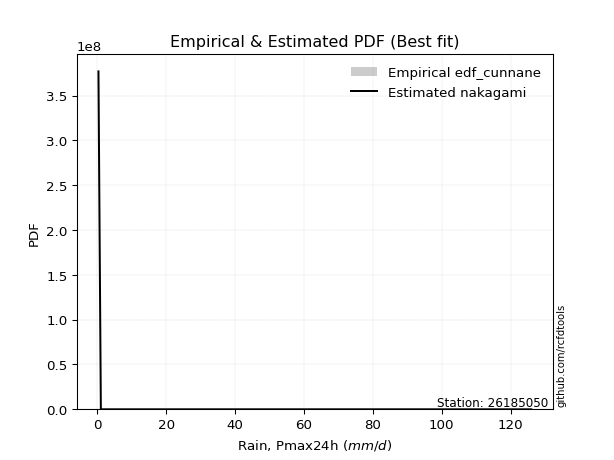</img>

</div>


### 12. Empirical - EDF Adamowski (1981)

The Adamowski formula in hydrology refers to a specific plotting position formula used for estimating the non-parametric empirical distribution of hydrological events (like flood peaks) to calculate their return periods. This formula provides an alternative to traditional parametric methods (like the Gumbel or Log Pearson Type III distributions). 

<div align="center">


$P=(m-0.25)/(n+0.5)$


</div>


**12.1. Empirical values**

<div align="center">

|                | 0                   | 1                   | 2                  | 3                  | 4                  | 5                  | 6                  | 7                  |
|:---------------|:--------------------|:--------------------|:-------------------|:-------------------|:-------------------|:-------------------|:-------------------|:-------------------|
| date           | 2023                | 2021                | 2019               | 2022               | 2025               | 2017               | 2018               | 2024               |
| x              | 0.3                 | 1.0                 | 12.4               | 45.5               | 51.2               | 79.5               | 92.5               | 126.0              |
| m              | 1                   | 2                   | 3                  | 4                  | 5                  | 6                  | 7                  | 8                  |
| empirical_dist | edf_adamowski       | edf_adamowski       | edf_adamowski      | edf_adamowski      | edf_adamowski      | edf_adamowski      | edf_adamowski      | edf_adamowski      |
| empirical      | 0.08823529411764706 | 0.20588235294117646 | 0.3235294117647059 | 0.4411764705882353 | 0.5588235294117647 | 0.6764705882352942 | 0.7941176470588235 | 0.9117647058823529 |
| empirical_tr   | 1.096774193548387   | 1.259259259259259   | 1.4782608695652173 | 1.7894736842105263 | 2.2666666666666666 | 3.0909090909090913 | 4.857142857142856  | 11.33333333333333  |

</div>


**12.2. Kolmogorov-Smirnov fit test (sorted by Δ)**


<div align="center">

|                | 0                   | 1                   | 2                   | 3                  | 4                   | 5                   | 6                   | 7                   | 8                  | 9                   | 10                  | 11                  | 12                  | 13                 | 14                  | 15                  | 16                  | 17                  | 18                  | 19                 | 20                  | 21                 | 22                    | 23                  | 24                  | 25                  | 26                 | 27                  | 28                  | 29                  | 30                  | 31                 | 32                  | 33                  | 34                  | 35                  | 36                  | 37                  | 38                  | 39                 | 40                  | 41                 | 42                  | 43                  | 44                  | 45                  | 46                  | 47                  | 48                  | 49                  | 50                  | 51                  | 52                  | 53                  | 54                  | 55                  | 56                 | 57                  | 58                 | 59                  | 60                 | 61                  | 62                 | 63                 | 64                  | 65                  | 66                  | 67                 | 68                 | 69                  | 70                 | 71                 | 72                  | 73                 | 74                 | 75                 | 76                 | 77                 | 78                 | 79                  | 80                  | 81                 | 82                  | 83                  | 84                  | 85                  | 86                 | 87                 | 88                 | 89                 |
|:---------------|:--------------------|:--------------------|:--------------------|:-------------------|:--------------------|:--------------------|:--------------------|:--------------------|:-------------------|:--------------------|:--------------------|:--------------------|:--------------------|:-------------------|:--------------------|:--------------------|:--------------------|:--------------------|:--------------------|:-------------------|:--------------------|:-------------------|:----------------------|:--------------------|:--------------------|:--------------------|:-------------------|:--------------------|:--------------------|:--------------------|:--------------------|:-------------------|:--------------------|:--------------------|:--------------------|:--------------------|:--------------------|:--------------------|:--------------------|:-------------------|:--------------------|:-------------------|:--------------------|:--------------------|:--------------------|:--------------------|:--------------------|:--------------------|:--------------------|:--------------------|:--------------------|:--------------------|:--------------------|:--------------------|:--------------------|:--------------------|:-------------------|:--------------------|:-------------------|:--------------------|:-------------------|:--------------------|:-------------------|:-------------------|:--------------------|:--------------------|:--------------------|:-------------------|:-------------------|:--------------------|:-------------------|:-------------------|:--------------------|:-------------------|:-------------------|:-------------------|:-------------------|:-------------------|:-------------------|:--------------------|:--------------------|:-------------------|:--------------------|:--------------------|:--------------------|:--------------------|:-------------------|:-------------------|:-------------------|:-------------------|
| station        | 26185050            | 26185050            | 26185050            | 26185050           | 26185050            | 26185050            | 26185050            | 26185050            | 26185050           | 26185050            | 26185050            | 26185050            | 26185050            | 26185050           | 26185050            | 26185050            | 26185050            | 26185050            | 26185050            | 26185050           | 26185050            | 26185050           | 26185050              | 26185050            | 26185050            | 26185050            | 26185050           | 26185050            | 26185050            | 26185050            | 26185050            | 26185050           | 26185050            | 26185050            | 26185050            | 26185050            | 26185050            | 26185050            | 26185050            | 26185050           | 26185050            | 26185050           | 26185050            | 26185050            | 26185050            | 26185050            | 26185050            | 26185050            | 26185050            | 26185050            | 26185050            | 26185050            | 26185050            | 26185050            | 26185050            | 26185050            | 26185050           | 26185050            | 26185050           | 26185050            | 26185050           | 26185050            | 26185050           | 26185050           | 26185050            | 26185050            | 26185050            | 26185050           | 26185050           | 26185050            | 26185050           | 26185050           | 26185050            | 26185050           | 26185050           | 26185050           | 26185050           | 26185050           | 26185050           | 26185050            | 26185050            | 26185050           | 26185050            | 26185050            | 26185050            | 26185050            | 26185050           | 26185050           | 26185050           | 26185050           |
| empirical_dist | edf_adamowski       | edf_adamowski       | edf_adamowski       | edf_adamowski      | edf_adamowski       | edf_adamowski       | edf_adamowski       | edf_adamowski       | edf_adamowski      | edf_adamowski       | edf_adamowski       | edf_adamowski       | edf_adamowski       | edf_adamowski      | edf_adamowski       | edf_adamowski       | edf_adamowski       | edf_adamowski       | edf_adamowski       | edf_adamowski      | edf_adamowski       | edf_adamowski      | edf_adamowski         | edf_adamowski       | edf_adamowski       | edf_adamowski       | edf_adamowski      | edf_adamowski       | edf_adamowski       | edf_adamowski       | edf_adamowski       | edf_adamowski      | edf_adamowski       | edf_adamowski       | edf_adamowski       | edf_adamowski       | edf_adamowski       | edf_adamowski       | edf_adamowski       | edf_adamowski      | edf_adamowski       | edf_adamowski      | edf_adamowski       | edf_adamowski       | edf_adamowski       | edf_adamowski       | edf_adamowski       | edf_adamowski       | edf_adamowski       | edf_adamowski       | edf_adamowski       | edf_adamowski       | edf_adamowski       | edf_adamowski       | edf_adamowski       | edf_adamowski       | edf_adamowski      | edf_adamowski       | edf_adamowski      | edf_adamowski       | edf_adamowski      | edf_adamowski       | edf_adamowski      | edf_adamowski      | edf_adamowski       | edf_adamowski       | edf_adamowski       | edf_adamowski      | edf_adamowski      | edf_adamowski       | edf_adamowski      | edf_adamowski      | edf_adamowski       | edf_adamowski      | edf_adamowski      | edf_adamowski      | edf_adamowski      | edf_adamowski      | edf_adamowski      | edf_adamowski       | edf_adamowski       | edf_adamowski      | edf_adamowski       | edf_adamowski       | edf_adamowski       | edf_adamowski       | edf_adamowski      | edf_adamowski      | edf_adamowski      | edf_adamowski      |
| p_dist         | logjohnsonsu        | ncf                 | rayleigh            | invgamma           | maxwell             | halfnorm            | genlogistic         | kstwobign           | pearson3           | betaprime           | norm                | crystalball         | t                   | exponnorm          | f                   | laplace_asymmetric  | gumbel_r            | nakagami            | logloggamma         | logistic           | rice                | gumbel_l           | loglaplace_asymmetric | hypsecant           | moyal               | laplace             | weibull_min        | mielke              | logpearson3         | expon               | genexpon            | invgauss           | alpha               | loggumbel_l         | halflogistic        | gompertz            | truncnorm           | logweibull_min      | logmielke           | loginvweibull      | logerlang           | logt               | logexponnorm        | lognorm             | lognorm             | logcrystalball      | lognct              | lognakagami         | logfatiguelife      | loglognorm          | loggompertz         | logrice             | loggamma            | loggamma            | loginvgamma         | logalpha            | logmaxwell         | loglogistic         | logkstwobign       | loginvgauss         | logncf             | lograyleigh         | nct                | loggenexpon        | loghypsecant        | loghalfnorm         | logexpon            | loggumbel_r        | loglaplace         | loghalflogistic     | logmoyal           | logfisk            | pareto              | fisk               | wald               | gibrat             | chi2               | logwald            | logf               | fatiguelife         | loggibrat           | logtruncnorm       | gamma               | logpareto           | invweibull          | erlang              | logbetaprime       | logchi2            | johnsonsu          | loggenlogistic     |
| delta          | 0.08402284620810468 | 0.09146748004048867 | 0.12589123711712916 | 0.1283521200569475 | 0.12978806865379727 | 0.12999984906318085 | 0.13417945620129415 | 0.13566456360720963 | 0.1376929867583014 | 0.13867050097151845 | 0.13949836475374794 | 0.13949836778798932 | 0.13949952741519672 | 0.1397808163529264 | 0.14244641742017827 | 0.15292965152377277 | 0.15507312343152227 | 0.15579938248228886 | 0.15715463901196336 | 0.1600573273101926 | 0.16047805418273908 | 0.1613158886798295 | 0.1656358907209835    | 0.17165451026069065 | 0.17363981360420866 | 0.18352676378672103 | 0.1835670369219112 | 0.18752948589995677 | 0.18942705642584978 | 0.19218393849260165 | 0.19225166267118954 | 0.1926588735336935 | 0.19287937440328307 | 0.19404989221807334 | 0.19440190876067276 | 0.19596684780894633 | 0.19629804556868663 | 0.20182459721703927 | 0.22698210273518826 | 0.2298744475601776 | 0.23126804312966365 | 0.2348553180366706 | 0.23485675318217614 | 0.23485712151793892 | 0.23485712151793892 | 0.23485716826186154 | 0.23497240107745765 | 0.23549508210010228 | 0.23594305668735926 | 0.23656519554001398 | 0.23665491163885743 | 0.23838166960526974 | 0.24490824504866626 | 0.24490824504866626 | 0.24619266200647083 | 0.25286112354330137 | 0.2536047712907341 | 0.25480741344042646 | 0.2556989898003249 | 0.25641187488557815 | 0.2590034931680383 | 0.25915694897587516 | 0.2688851436802231 | 0.269484877135596  | 0.26975748951747736 | 0.27562038146865575 | 0.27709316021834723 | 0.2903758380897653 | 0.2966969528185971 | 0.30318708589556764 | 0.3085045951286882 | 0.3115793382680674 | 0.31385762922341115 | 0.3163162671117339 | 0.3194774072554275 | 0.3235294117647059 | 0.3397967242301818 | 0.3606826823019783 | 0.3709354749532124 | 0.38367453998892265 | 0.39257833786617913 | 0.3977645514190471 | 0.40801456204338726 | 0.41295512439799426 | 0.48384184763016874 | 0.48880578835567645 | 0.543183431913957  | 0.5535879883224477 | 0.5877424252117198 | 0.7941176470588235 |
| deltao         | 0.4472608134160001  | 0.4472608134160001  | 0.4472608134160001  | 0.4472608134160001 | 0.4472608134160001  | 0.4472608134160001  | 0.4472608134160001  | 0.4472608134160001  | 0.4472608134160001 | 0.4472608134160001  | 0.4472608134160001  | 0.4472608134160001  | 0.4472608134160001  | 0.4472608134160001 | 0.4472608134160001  | 0.4472608134160001  | 0.4472608134160001  | 0.4472608134160001  | 0.4472608134160001  | 0.4472608134160001 | 0.4472608134160001  | 0.4472608134160001 | 0.4472608134160001    | 0.4472608134160001  | 0.4472608134160001  | 0.4472608134160001  | 0.4472608134160001 | 0.4472608134160001  | 0.4472608134160001  | 0.4472608134160001  | 0.4472608134160001  | 0.4472608134160001 | 0.4472608134160001  | 0.4472608134160001  | 0.4472608134160001  | 0.4472608134160001  | 0.4472608134160001  | 0.4472608134160001  | 0.4472608134160001  | 0.4472608134160001 | 0.4472608134160001  | 0.4472608134160001 | 0.4472608134160001  | 0.4472608134160001  | 0.4472608134160001  | 0.4472608134160001  | 0.4472608134160001  | 0.4472608134160001  | 0.4472608134160001  | 0.4472608134160001  | 0.4472608134160001  | 0.4472608134160001  | 0.4472608134160001  | 0.4472608134160001  | 0.4472608134160001  | 0.4472608134160001  | 0.4472608134160001 | 0.4472608134160001  | 0.4472608134160001 | 0.4472608134160001  | 0.4472608134160001 | 0.4472608134160001  | 0.4472608134160001 | 0.4472608134160001 | 0.4472608134160001  | 0.4472608134160001  | 0.4472608134160001  | 0.4472608134160001 | 0.4472608134160001 | 0.4472608134160001  | 0.4472608134160001 | 0.4472608134160001 | 0.4472608134160001  | 0.4472608134160001 | 0.4472608134160001 | 0.4472608134160001 | 0.4472608134160001 | 0.4472608134160001 | 0.4472608134160001 | 0.4472608134160001  | 0.4472608134160001  | 0.4472608134160001 | 0.4472608134160001  | 0.4472608134160001  | 0.4472608134160001  | 0.4472608134160001  | 0.4472608134160001 | 0.4472608134160001 | 0.4472608134160001 | 0.4472608134160001 |
| eval           | Δo > Δ              | Δo > Δ              | Δo > Δ              | Δo > Δ             | Δo > Δ              | Δo > Δ              | Δo > Δ              | Δo > Δ              | Δo > Δ             | Δo > Δ              | Δo > Δ              | Δo > Δ              | Δo > Δ              | Δo > Δ             | Δo > Δ              | Δo > Δ              | Δo > Δ              | Δo > Δ              | Δo > Δ              | Δo > Δ             | Δo > Δ              | Δo > Δ             | Δo > Δ                | Δo > Δ              | Δo > Δ              | Δo > Δ              | Δo > Δ             | Δo > Δ              | Δo > Δ              | Δo > Δ              | Δo > Δ              | Δo > Δ             | Δo > Δ              | Δo > Δ              | Δo > Δ              | Δo > Δ              | Δo > Δ              | Δo > Δ              | Δo > Δ              | Δo > Δ             | Δo > Δ              | Δo > Δ             | Δo > Δ              | Δo > Δ              | Δo > Δ              | Δo > Δ              | Δo > Δ              | Δo > Δ              | Δo > Δ              | Δo > Δ              | Δo > Δ              | Δo > Δ              | Δo > Δ              | Δo > Δ              | Δo > Δ              | Δo > Δ              | Δo > Δ             | Δo > Δ              | Δo > Δ             | Δo > Δ              | Δo > Δ             | Δo > Δ              | Δo > Δ             | Δo > Δ             | Δo > Δ              | Δo > Δ              | Δo > Δ              | Δo > Δ             | Δo > Δ             | Δo > Δ              | Δo > Δ             | Δo > Δ             | Δo > Δ              | Δo > Δ             | Δo > Δ             | Δo > Δ             | Δo > Δ             | Δo > Δ             | Δo > Δ             | Δo > Δ              | Δo > Δ              | Δo > Δ             | Δo > Δ              | Δo > Δ              | Δo <= Δ             | Δo <= Δ             | Δo <= Δ            | Δo <= Δ            | Δo <= Δ            | Δo <= Δ            |
| fit            | 1                   | 1                   | 1                   | 1                  | 1                   | 1                   | 1                   | 1                   | 1                  | 1                   | 1                   | 1                   | 1                   | 1                  | 1                   | 1                   | 1                   | 1                   | 1                   | 1                  | 1                   | 1                  | 1                     | 1                   | 1                   | 1                   | 1                  | 1                   | 1                   | 1                   | 1                   | 1                  | 1                   | 1                   | 1                   | 1                   | 1                   | 1                   | 1                   | 1                  | 1                   | 1                  | 1                   | 1                   | 1                   | 1                   | 1                   | 1                   | 1                   | 1                   | 1                   | 1                   | 1                   | 1                   | 1                   | 1                   | 1                  | 1                   | 1                  | 1                   | 1                  | 1                   | 1                  | 1                  | 1                   | 1                   | 1                   | 1                  | 1                  | 1                   | 1                  | 1                  | 1                   | 1                  | 1                  | 1                  | 1                  | 1                  | 1                  | 1                   | 1                   | 1                  | 1                   | 1                   | 0                   | 0                   | 0                  | 0                  | 0                  | 0                  |
| n              | 8                   | 8                   | 8                   | 8                  | 8                   | 8                   | 8                   | 8                   | 8                  | 8                   | 8                   | 8                   | 8                   | 8                  | 8                   | 8                   | 8                   | 8                   | 8                   | 8                  | 8                   | 8                  | 8                     | 8                   | 8                   | 8                   | 8                  | 8                   | 8                   | 8                   | 8                   | 8                  | 8                   | 8                   | 8                   | 8                   | 8                   | 8                   | 8                   | 8                  | 8                   | 8                  | 8                   | 8                   | 8                   | 8                   | 8                   | 8                   | 8                   | 8                   | 8                   | 8                   | 8                   | 8                   | 8                   | 8                   | 8                  | 8                   | 8                  | 8                   | 8                  | 8                   | 8                  | 8                  | 8                   | 8                   | 8                   | 8                  | 8                  | 8                   | 8                  | 8                  | 8                   | 8                  | 8                  | 8                  | 8                  | 8                  | 8                  | 8                   | 8                   | 8                  | 8                   | 8                   | 8                   | 8                   | 8                  | 8                  | 8                  | 8                  |
| best_fit       | 1                   | 0                   | 0                   | 0                  | 0                   | 0                   | 0                   | 0                   | 0                  | 0                   | 0                   | 0                   | 0                   | 0                  | 0                   | 0                   | 0                   | 0                   | 0                   | 0                  | 0                   | 0                  | 0                     | 0                   | 0                   | 0                   | 0                  | 0                   | 0                   | 0                   | 0                   | 0                  | 0                   | 0                   | 0                   | 0                   | 0                   | 0                   | 0                   | 0                  | 0                   | 0                  | 0                   | 0                   | 0                   | 0                   | 0                   | 0                   | 0                   | 0                   | 0                   | 0                   | 0                   | 0                   | 0                   | 0                   | 0                  | 0                   | 0                  | 0                   | 0                  | 0                   | 0                  | 0                  | 0                   | 0                   | 0                   | 0                  | 0                  | 0                   | 0                  | 0                  | 0                   | 0                  | 0                  | 0                  | 0                  | 0                  | 0                  | 0                   | 0                   | 0                  | 0                   | 0                   | 0                   | 0                   | 0                  | 0                  | 0                  | 0                  |
| best_fit_sort  | 1                   | 2                   | 3                   | 4                  | 5                   | 6                   | 7                   | 8                   | 9                  | 10                  | 11                  | 12                  | 13                  | 14                 | 15                  | 16                  | 17                  | 18                  | 19                  | 20                 | 21                  | 22                 | 23                    | 24                  | 25                  | 26                  | 27                 | 28                  | 29                  | 30                  | 31                  | 32                 | 33                  | 34                  | 35                  | 36                  | 37                  | 38                  | 39                  | 40                 | 41                  | 42                 | 43                  | 44                  | 45                  | 46                  | 47                  | 48                  | 49                  | 50                  | 51                  | 52                  | 53                  | 54                  | 55                  | 56                  | 57                 | 58                  | 59                 | 60                  | 61                 | 62                  | 63                 | 64                 | 65                  | 66                  | 67                  | 68                 | 69                 | 70                  | 71                 | 72                 | 73                  | 74                 | 75                 | 76                 | 77                 | 78                 | 79                 | 80                  | 81                  | 82                 | 83                  | 84                  | 85                  | 86                  | 87                 | 88                 | 89                 | 90                 |

</div>


<div align="center">

</img>

</div>


**12.3. Best fit**

<div align="center">

|   id |   station | empirical_dist   | p_dist       |     delta |   deltao | eval   |   fit |   n |   best_fit |   best_fit_sort |
|-----:|----------:|:-----------------|:-------------|----------:|---------:|:-------|------:|----:|-----------:|----------------:|
|    0 |  26185050 | edf_adamowski    | logjohnsonsu | 0.0840228 | 0.447261 | Δo > Δ |     1 |   8 |          1 |               1 |

</div>


<div align="center">

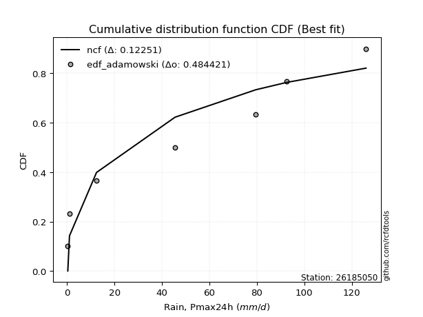</img></img>

</div>


## C. Best fit & Estimate extreme values for specific return periods - Tr


### 1. Best fit (ordered by delta Δ)

<div align="center">

|   id |   station | empirical_dist   | p_dist       |     delta |   deltao | eval   |   fit |   n |   best_fit |   best_fit_sort |
|-----:|----------:|:-----------------|:-------------|----------:|---------:|:-------|------:|----:|-----------:|----------------:|
|    0 |  26185050 | edf_hazen        | logjohnsonsu | 0.0656405 | 0.447261 | Δo > Δ |     1 |   8 |          1 |               1 |
|    1 |  26185050 | edf_gringorten   | logjohnsonsu | 0.0702587 | 0.447261 | Δo > Δ |     1 |   8 |          1 |               2 |
|    2 |  26185050 | edf_cunnane      | logjohnsonsu | 0.0732624 | 0.447261 | Δo > Δ |     1 |   8 |          1 |               3 |
|    3 |  26185050 | edf_blom         | logjohnsonsu | 0.0751102 | 0.447261 | Δo > Δ |     1 |   8 |          1 |               4 |
|    4 |  26185050 | edf_tukey        | logjohnsonsu | 0.0781405 | 0.447261 | Δo > Δ |     1 |   8 |          1 |               5 |
|    5 |  26185050 | edf_filliben     | logjohnsonsu | 0.0792762 | 0.447261 | Δo > Δ |     1 |   8 |          1 |               6 |
|    6 |  26185050 | edf_beard        | logjohnsonsu | 0.0798111 | 0.447261 | Δo > Δ |     1 |   8 |          1 |               7 |
|    7 |  26185050 | edf_jenkinson    | logjohnsonsu | 0.0798111 | 0.447261 | Δo > Δ |     1 |   8 |          1 |               8 |
|    8 |  26185050 | edf_chegodayev   | logjohnsonsu | 0.0805214 | 0.447261 | Δo > Δ |     1 |   8 |          1 |               9 |
|    9 |  26185050 | edf_adamowski    | logjohnsonsu | 0.0840228 | 0.447261 | Δo > Δ |     1 |   8 |          1 |              10 |
|   10 |  26185050 | edf_weibull      | logjohnsonsu | 0.100363  | 0.447261 | Δo > Δ |     1 |   8 |          1 |              11 |
|   11 |  26185050 | edf_california   | logjohnsonsu | 0.12814   | 0.447261 | Δo > Δ |     1 |   8 |          1 |              12 |

</div>

:file_folder:Tables: [bestfit_26185050.csv](table/bestfit_26185050.csv) | [extreme_26185050.csv](table/extreme_26185050.csv)


### 2. Extreme values

In hydrology, a return period (or recurrence interval $Tr$) is the statistical average time between extreme events like floods or droughts of a specific magnitude, indicating how rare an event is, with a 100-year flood, for example, having a 1% chance of occurring in any given year, not that it happens exactly every century. It is a key tool for infrastructure design (like bridges or dams) and risk assessment, calculated from historical data to determine the probability of future events, although it is important to remember it is statistical average, and events can cluster or be missed.

> risk_rate: assuming the return period as the project useful life.

|   id |      tr |   prob_l |     prob_g |      alpha |   betaprime |     chi2 |   crystalball |    erlang |    expon |   exponnorm |         f |   fatiguelife |            fisk |     gamma |   genexpon |   genlogistic |   gibrat |   gompertz |   gumbel_l |   gumbel_r |   halflogistic |   halfnorm |   hypsecant |   invgamma |   invgauss |      invweibull |        johnsonsu |   kstwobign |   laplace |   laplace_asymmetric |   loggamma |   logistic |    lognorm |   maxwell |   mielke |    moyal |   nakagami |      ncf |              nct |     norm |          pareto |   pearson3 |   rayleigh |     rice |        t |   truncnorm |     wald |   weibull_min |    logalpha |      logbetaprime |          logchi2 |   logcrystalball |   logerlang |         logexpon |   logexponnorm |            logf |   logfatiguelife |        logfisk |      loggenexpon |   loggenlogistic |       loggibrat |   loggompertz |   loggumbel_l |   loggumbel_r |   loghalflogistic |   loghalfnorm |   loghypsecant |   loginvgamma |   loginvgauss |    loginvweibull |   logjohnsonsu |     logkstwobign |   loglaplace |   loglaplace_asymmetric |   logloggamma |   loglogistic |   loglognorm |   logmaxwell |        logmielke |         logmoyal |   lognakagami |         logncf |     lognct |     logpareto |   logpearson3 |   lograyleigh |    logrice |       logt |   logtruncnorm |          logwald |   logweibull_min |   station |   n |   risk_rate |
|-----:|--------:|---------:|-----------:|-----------:|------------:|---------:|--------------:|----------:|---------:|------------:|----------:|--------------:|----------------:|----------:|-----------:|--------------:|---------:|-----------:|-----------:|-----------:|---------------:|-----------:|------------:|-----------:|-----------:|----------------:|-----------------:|------------:|----------:|---------------------:|-----------:|-----------:|-----------:|----------:|---------:|---------:|-----------:|---------:|-----------------:|---------:|----------------:|-----------:|-----------:|---------:|---------:|------------:|---------:|--------------:|------------:|------------------:|-----------------:|-----------------:|------------:|-----------------:|---------------:|----------------:|-----------------:|---------------:|-----------------:|-----------------:|----------------:|--------------:|--------------:|--------------:|------------------:|--------------:|---------------:|--------------:|--------------:|-----------------:|---------------:|-----------------:|-------------:|------------------------:|--------------:|--------------:|-------------:|-------------:|-----------------:|-----------------:|--------------:|---------------:|-----------:|--------------:|--------------:|--------------:|-----------:|-----------:|---------------:|-----------------:|-----------------:|----------:|----:|------------:|
|    0 |    2    | 0.5      | 0.5        |    27.4641 |     31.0564 |  17.6682 |       51.05   |   2.06314 |  35.4772 |     50.6039 |   28.1037 |      0.301178 |    16.5303      |   9.02715 |    35.659  |       43.3034 |  38.161  |    42.3214 |    58.1042 |    43.9958 |        40.4888 |    42.2604 |     51.05   |    41.0235 |    30.0343 | 11782           |      0.300707    |     43.316  |   51.05   |              48.3793 |    15.6465 |    51.05   |    17.3017 |   47.3776 |  27.0292 |  41.7184 |    27.8027 |  40.6543 |      6.24073     |  51.05   |     1.62581     |    48.7791 |    46.0751 |  48.0542 |  51.0502 |     42.6242 |  37.1309 |       43.1378 |     13.1024 |      0.328642     |      0.338072    |          17.3017 |     16.8521 |      4.98575     |        17.3017 |    0.923515     |          17.1702 |   0.726097     |      6.86098     |              inf |     9.16354     |       18.3908 |       24.4999 |       12.2183 |      10.2781      |       11.2162 |        17.3017 |       15.1876 |       13.3252 |     12.7958      |        48.7816 |     10.2618      |      17.3017 |                 31.057  |       31.8685 |       17.3017 |      17.1467 |      14.4357 |     14.5625      |     10.9204      |       17.2309 |   3.51472      |    17.2589 |   0.359181    |       24.0165 |       13.5378 |    16.3609 |    17.302  |        6.10469 |      8.70924     |          25.9526 |  26185050 |   8 |    0.75     |
|    1 |    2.33 | 0.570815 | 0.429185   |    35.6787 |     43.6219 |  22.5425 |       58.7125 |   3.463   |  43.2278 |     58.2364 |   42.3833 |      1.95222  |    73.7887      |  12.6829  |    43.4497 |       50.7846 |  42.0426 |    50.1331 |    64.7707 |    51.096  |        47.7889 |    50.5302 |     57.1823 |    48.5663 |    37.4575 |     1.36567e+06 |      0.303179    |     50.8874 |   55.687  |              54.3066 |    23.1117 |    57.8012 |    25.2459 |   55.3384 |  36.5178 |  48.4397 |    40.1237 |  51.7054 |     10.9358      |  58.7125 |     4.10039     |    56.4765 |    54.1537 |  55.6066 |  58.7127 |     50.3916 |  42.1553 |       54.7142 |     20.0259 |      0.366867     |      0.385925    |          25.2459 |     25.0031 |      9.2612      |        25.246  |    1.63812      |          25.062  |   9.04935      |     11.8171      |              inf |    11.0966      |       26.3927 |       34.0358 |       17.3409 |      14.7317      |       16.8638 |        23.411  |       22.5842 |       20.1576 |     20.823       |        60.7068 |     16.7048      |      21.7468 |                 40.3298 |       41.4437 |       24.1365 |      25.0063 |      21.3762 |     22.8312      |     15.2119      |       25.1451 |  11.8975       |    25.1994 |   0.507285    |       34.1115 |       20.1633 |    24.1588 |    25.2463 |        9.22281 |     11.158       |          34.4158 |  26185050 |   8 |    0.729209 |
|    2 |    5    | 0.8      | 0.2        |    99.3759 |    129.369  |  48.7273 |       87.1886 |  16.5063  |  81.979  |     86.8741 |  143.127  |     37.0006   | 25045.4         |  35.682   |    82.4012 |       83.2822 |  64.3896 |    83.8613 |    86.3074 |    81.9424 |        80.8205 |    85.5024 |     81.7805 |    83.3015 |    79.3377 |     1.26736e+15 |      1.14644     |     83.0491 |   78.871  |              83.9419 |   101.408  |    83.8686 |   102.812  |   86.6717 |  78.8482 |  79.573  |   109.171  | 103.774  |    174.38        |  87.1886 |   717.352       |    86.3676 |    86.4959 |  85.7769 |  87.1888 |     84.2555 |  70.282  |      118.148  |    110.823  |      2.32125      |      2.02003     |         102.812  |    111.258  |    204.78        |       102.813  | 1921.92         |         102.366  |   1.43167e+270 |    154.765       |              inf |    33.4024      |       89.2833 |       98.4403 |       79.3764 |      75.1045      |       94.6082 |        78.745  |      102.908  |      102.623  |    172.699       |        97.7164 |    132.353       |      68.2201 |                 78.4827 |       80.9499 |       87.2859 |     101.773  |     100.225  |    153.804       |     70.6233      |      102.479  |   3.84191e+07  |   102.947  |   3.76006e+46 |      105.37   |       99.3594 |   104.395  |   102.813  |       35.8789  |     44.6647      |          85.6547 |  26185050 |   8 |    0.67232  |
|    3 |   10    | 0.9      | 0.1        |   216.403  |    240.633  |  73.9484 |      106.079  |  34.6512  | 117.156  |    106.184  |  263.085  |     85.3933   |     1.83576e+06 |  60.6007  |   117.76   |      109.748  |  89.8627 |   108.848  |    98.298  |   107.066  |       108.252  |   111.381  |    101.423  |   113.966  |   124.156  |     2.55175e+22 |     34.6931      |    107.536  |   99.9168 |             110.844  |   277.457  |   103.066  |   260.979  |  108.722  | 103.209  | 106.679  |   169.455  | 148.292  |   2134.5         | 106.079  | 83216.5         |   107.332  |   109.557  | 107.218  | 106.079  |    110.091  | 100.131  |      181.506  |    393.697  |    562.847        |     30.5753      |         260.979  |    306.602  |   3403.27        |       260.98   |    2.18882e+13  |         260.768  | inf            |   1479.02        |              inf |   117.304       |      180.375  |      177.815  |      274.004  |     290.498       |      338.962  |       207.439  |      292.302  |      327.519  |    967.371       |       113.275  |    639.921       |     192.591  |                100.083  |      102.252  |      224.951  |     258.552  |     297.319  |    705.778       |    268.825       |      260.35   |   1.2355e+29   |   262.054  | inf           |      192.938  |      309.8    |   278.217  |   260.978  |       66.4369  |    194.639       |         142.306  |  26185050 |   8 |    0.651322 |
|    4 |   15    | 0.933333 | 0.0666667  |   333.013  |    322.557  |  89.066  |      115.505  |  47.0555  | 137.734  |    115.946  |  341.932  |    117.043    |     1.90549e+07 |  76.2236  |   138.444  |      124.68   | 107.433  |   121.675  |   103.728  |   121.241  |       123.776  |   124.848  |    112.633  |   132.266  |   153.059  |     3.37022e+26 |    218.741       |    120.536  |  112.228  |             126.581  |   462.019  |   113.526  |   415.423  |  120.036  | 112.161  | 122.411  |   202.019  | 173.657  |   9235.9         | 115.505  |     1.34261e+06 |   118.138  |   121.438  | 118.241  | 115.506  |    123.723  | 119.299  |      220.488  |    775.439  | 629536            |    217.347       |         415.423  |    512.051  |  17616           |       415.425  |    2.09254e+28  |         416.013  | inf            |   5482.67        |              inf |   278.995       |      249.038  |      232.416  |      551.224  |     624.6         |      658.517  |       360.547  |      497.932  |      599.306  |   2557.29        |       118.706  |   1477.26        |     353.422  |                112.846  |      109.9    |      376.79   |     411.878  |     519.429  |   1657.75        |    583.955       |      414.638  |   2.35938e+61  |   417.808  | inf           |      250.83   |      556.605  |   454.666  |   415.419  |       81.985   |    500.883       |         179.089  |  26185050 |   8 |    0.644736 |
|    5 |   20    | 0.95     | 0.05       |   449.52   |    389.359  |  99.9096 |      121.679  |  56.4446  | 152.333  |    122.393  |  401.074  |    140.476    |     9.60213e+07 |  87.6469  |   153.119  |      135.134  | 121.215  |   130.127  |   107.108  |   131.166  |       134.652  |   133.827  |    120.54   |   145.539  |   174.642  |     2.58792e+29 |    733.308       |    129.293  |  120.963  |             137.746  |   646.99   |   120.756  |   563.248  |  127.545  | 116.795  | 133.552  |   223.943  | 191.451  |  26112.5         | 121.679  |     9.65735e+06 |   125.34   |   129.336  | 125.558  | 121.679  |    132.869  | 133.582  |      248.88   |   1230.42   |      2.23996e+09  |    989.351       |         563.247  |    718.264  |  56559.6         |       563.25   |    6.02403e+47  |         564.968  | inf            |  13863.8         |              inf |   550.509       |      304.738  |      274.571  |      899.251  |    1067.91        |     1025.31   |       532.503  |      708.833  |      898.514  |   5051.08        |       121.586  |   2595.42        |     543.701  |                122.877  |      113.827  |      538.181  |     558.797  |     752.202  |   3009.84        |   1011.54        |      562.395  |   3.30841e+103 |   567.125  | inf           |      293.878  |      821.641  |   627.549  |   563.24   |       91.1735  |   1013.08        |         206.642  |  26185050 |   8 |    0.641514 |
|    6 |   25    | 0.96     | 0.04       |   565.986  |    446.67   | 108.376  |      126.223  |  64.0066  | 163.658  |    127.17   |  448.607  |    159.094    |     3.30878e+08 |  96.6684  |   164.503  |      143.187  | 132.705  |   136.358  |   109.514  |   138.811  |       143.032  |   140.507  |    126.661  |   156.034  |   191.951  |     4.31901e+31 |   1787.4         |    135.852  |  127.738  |             146.406  |   830.157  |   126.286  |   704.731  |  133.119  | 119.627  | 142.188  |   240.321  | 205.163  |  58473.2         | 126.223  |     4.46197e+07 |   130.705  |   135.204  | 130.989  | 126.223  |    139.701  | 145.023  |      271.287  |   1744.86   |      2.1109e+13   |   3400.22        |         704.73   |    922.644  | 139783           |       704.734  |    2.70906e+71  |         707.792  | inf            |  28452.1         |              inf |   970.134       |      351.966  |      309.148  |     1311      |    1614.34        |     1425.37   |       720.1    |      921.319  |     1216.35   |   8532.53        |       123.413  |   3958.54        |     759.383  |                131.268  |      116.216  |      706.923  |     699.537  |     990.19   |   4762.12        |   1548.56        |      703.873  |   8.84052e+154 |   710.203  | inf           |      328.061  |     1097.35   |   795.783  |   704.72   |       97.2098  |   1781.03        |         228.794  |  26185050 |   8 |    0.639603 |
|    7 |   50    | 0.98     | 0.02       |  1148.13   |    660.032  | 134.929  |      139.236  |  88.7466  | 198.835  |    141.016  |  604.662  |    218.83     |     1.44974e+10 | 125.414   |   199.862  |      167.993  | 173.207  |   154.15   |   116.043  |   162.36   |       168.851  |   159.925  |    145.635  |   189.951  |   248.572  |     3.03143e+38 |  22934.6         |    155.114  |  148.784  |             173.308  |  1706.32   |   143.184  |  1338.81   |  149.286  | 125.406  | 168.996  |   288.069  | 247.4    | 715299           | 139.236  |     5.17818e+09 |   146.37   |   152.237  | 146.732  | 139.237  |    159.67   | 182.378  |      342.827  |   4973.89   |      1.42955e+38  | 204934           |        1338.81   |   1901.45   |      2.32308e+06 |      1338.82   |    4.82405e+246 |        1350.13   | inf            | 264969           |              inf |  7148.68        |      521.301  |      426.58   |     4187.47   |    5766.94        |     3713.48   |      1835.55   |     1972.69   |     2961.88   |  42903.4         |       127.509  |  13673.4         |    2143.8    |                161.164  |      121.067  |     1626.5    |    1331.4    |    2197.63   |  19528.4         |   5808.54        |     1338.44   | inf            |  1352.85   | inf           |      436.533  |     2541.73   |  1572.83   |  1338.79   |      110.605   |  11237.9         |         301.646  |  26185050 |   8 |    0.63583  |
|    8 |   75    | 0.986667 | 0.0133333  |  1730.2    |    813.93   | 150.604  |      146.219  | 103.92    | 219.413  |    148.564  |  701.389  |    254.805    |     1.28656e+11 | 142.638   |   220.545  |      182.411  | 200.562  |   163.62   |   119.345  |   176.048  |       183.859  |   170.495  |    156.724  |   210.851  |   283.477  |     2.89039e+42 |  90195.3         |    165.711  |  161.094  |             189.045  |  2521.84   |   152.943  |  1889.12   |  158.076  | 127.366  | 184.673  |   314.075  | 271.942  |      3.09494e+06 | 146.219  |     8.3545e+10  |   154.96   |   161.503  | 155.282  | 146.219  |    170.602  | 205.365  |      385.908  |   8998.52   |      2.48828e+69  |      2.61245e+06 |        1889.12   |   2813.26   |      1.20247e+07 |      1889.14   |  inf            |        1909.73   | inf            | 976794           |              inf | 27546.5         |      636.375  |      502.009  |     8224.28   |   12088.5         |     6253.95   |      3171.37   |     2987.56   |     4842.44   | 109693           |       129.145  |  27043.7         |    3934.06   |                181.717  |      122.706  |     2631.86   |    1880.89   |    3389.98   |  44306           |  12583.8         |     1889.64   | inf            |  1911.91   | inf           |      500.217  |     4014.07   |  2268.44   |  1889.08   |      115.499   |  34912.1         |         346.902  |  26185050 |   8 |    0.634587 |
|    9 |  100    | 0.99     | 0.01       |  2312.25   |    938.521  | 161.778  |      150.942  | 114.938   | 234.012  |    153.724  |  772.305  |    280.691    |     6.00952e+11 | 155.007   |   235.221  |      192.615  | 221.753  |   169.98   |   121.504  |   185.736  |       194.482  |   177.696  |    164.59   |   226.212  |   308.948  |     1.89391e+45 | 227725           |    172.972  |  169.829  |             200.21   |  3289.79   |   159.833  |  2384.53   |  164.063  | 128.353  | 195.796  |   331.776  | 289.311  |      8.75021e+06 | 150.942  |     6.00935e+11 |   160.843  |   167.816  | 161.101  | 150.942  |    178.07   | 222.124  |      416.978  |  13613.6    |      4.92787e+105 |      1.67603e+07 |        2384.53   |   3672.1    |      3.86076e+07 |      2384.55   |  inf            |        2414.75   | inf            |      2.46471e+06 |              inf | 78323.8         |      725.254  |      558.422  |    13261      |   20411.4         |     8920.07   |      4674.16   |     3966.26   |     6790.81   | 213171           |       130.074  |  43152.3         |    6052.14   |                197.87   |      123.53   |     3696.83   |    2376.22   |    4554.24   |  79097.9         |  21777.7         |     2386.13   | inf            |  2415.95   | inf           |      544.973  |     5480.09   |  2906.69   |  2384.47   |      118.033   |  79781.8         |         380.116  |  26185050 |   8 |    0.633968 |
|   10 |  200    | 0.995    | 0.005      |  4640.38   |   1301.14   | 188.848  |      161.654  | 142.19    | 269.19   |    165.616  |  950.665  |    344.055    |     2.42452e+13 | 185.227   |   270.58   |      217.148  | 279.406  |   184.238  |   126.198  |   209.027  |       220.021  |   194.165  |    183.54   |   265.22   |   372.46   |     1.11757e+52 |      1.8612e+06  |    189.696  |  190.875  |             227.113  |  6041.52   |   176.362  |  4044.15   |  177.76   | 129.847  | 222.593  |   372.181  | 331.098  |      1.07041e+08 | 161.654  |     6.97394e+13 |   174.41   |   182.262  | 174.398  | 161.654  |    195.209  | 263.87   |      493.417  |  36293.6    |      2.30274e+289 |      1.71087e+09 |        4044.15   |   6749.82   |      6.41626e+08 |      4044.18   |  inf            |        4112.81   | inf            |      2.29183e+07 |              inf |     1.34458e+06 |      964.254  |      703.873  |    41819      |   71914.2         |    20094.4    |     11899.7    |     7603.26   |    14876.2    |      1.05298e+06 |       131.754  | 126596           |   17085.7    |                242.935  |      124.77   |     8352.4    |    4038.98   |    8948.78   | 318444           |  81640.7         |     4050.75   | inf            |  4108.23   | inf           |      649.975  |    11172.4    |  5103.96   |  4044.02   |      121.946   | 625104           |         463.69   |  26185050 |   8 |    0.633042 |
|   11 |  250    | 0.996    | 0.004      |  5804.44   |   1439.68   | 197.602  |      164.928  | 151.144   | 280.514  |    169.308  | 1010.28   |    364.705    |     7.94608e+13 | 195.063   |   281.963  |      225.035  | 300.092  |   188.542  |   127.58   |   216.514  |       228.231  |   199.232  |    189.64   |   278.424  |   393.488  |     1.67889e+54 |      3.53682e+06 |    194.871  |  197.65   |             235.773  |  7284.51   |   181.668  |  4752.67   |  181.977  | 130.153  | 231.219  |   384.583  | 344.548  |      2.39693e+08 | 164.928  |     3.22216e+14 |   178.617  |   186.708  | 178.486  | 164.928  |    200.496  | 277.68   |      518.47   |  49570.8    |    inf            |      7.87557e+09 |        4752.67   |   8139.89   |      1.58573e+09 |      4752.71   |  inf            |        4840.03   | inf            |      4.6982e+07  |              inf |     3.72905e+06 |     1048.72   |      753.483  |    60496.5    |  107808           |    25797.7    |     16075.9    |     9296.94   |    18995.7    |      1.75968e+06 |       132.168  | 176633           |   23863.5    |                259.524  |      125.019  |    10850.6    |    4750.11   |   11017      | 498240           | 124927           |     4761.92   | inf            |  4832.05   | inf           |      682.646  |    13911.5    |  6063.16   |  4752.52   |      122.746   |      1.23517e+06 |         491.612  |  26185050 |   8 |    0.632858 |
|   12 |  500    | 0.998    | 0.002      | 11624.7    |   1952.8    | 224.892  |      174.636  | 179.419   | 315.691  |    180.444  | 1202.17   |    429.485    |     3.15476e+15 | 225.898   |   317.322  |      249.514  | 371.581  |   201.146  |   131.539  |   239.754  |       253.714  |   214.338  |    208.588  |   321.64   |   460.394  |     9.57656e+60 |      2.37387e+07 |    210.382  |  218.696  |             262.675  | 12734.2    |   198.125  |  7671.01   |  194.559  | 130.815  | 258.016  |   421.476  | 386.38   |      2.93215e+09 | 174.636  |     3.73936e+16 |   191.265  |   199.975  | 190.671  | 174.636  |    216.296  | 321.593  |      597.57   | 129487      |    inf            |      9.93982e+11 |        7671.01   |  14231.9    |      2.63536e+10 |      7671.07   |  inf            |        7845.72   | inf            |      4.36812e+08 |              inf |     1.26658e+08 |     1334.61   |      915.941  |   190302      |  378795           |    54337.3    |     40923.7    |    16985.1    |    39747.2    |      8.66205e+06 |       133.179  | 479257           |   67368.6    |                318.632  |      125.518  |    24428.7    |    7685.03   |   20489.1    |      1.99869e+06 | 468316           |     7693.41   | inf            |  7819.46   | inf           |      779.777  |    26761.2    | 10108.2    |  7670.73   |      124.361   |      1.07697e+07 |         581.329  |  26185050 |   8 |    0.632489 |
|   13 |  750    | 0.998667 | 0.00133333 | 17445      |   2321.53   | 240.917  |      180.029  | 196.239   | 336.269  |    186.764  | 1319.09   |    467.759    |     2.71049e+16 | 244.105   |   338.006  |      263.825  | 418.86   |   208.037  |   133.655  |   253.34   |       268.612  |   222.777  |    219.672  |   348.573  |   500.536  |     8.52837e+64 |      6.83565e+07 |    219.095  |  231.007  |             278.412  | 17408.6    |   207.74   | 10008.1    |  201.596  | 131.084  | 273.69   |   442.027  | 410.915  |      1.26867e+10 | 180.029  |     6.03309e+17 |   198.401  |   207.394  | 197.476  | 180.029  |    225.143  | 347.923  |      644.685  | 226172      |    inf            |      1.78396e+13 |       10008.1    |  19454      |      1.36411e+11 |     10008.2    |  inf            |       10262      | inf            |      1.6097e+09  |              inf |     1.30365e+09 |     1518.45   |     1016.68   |   371882      |  789683           |    82382      |     70688.7    |    23836.5    |    60427.6    |      2.19923e+07 |       133.625  | 839645           |  123627      |                359.266  |      125.684  |    39247.4    |   10040.7    |   28988.9    |      4.5019e+06  |      1.01447e+06 |    10043.1    | inf            | 10217.2    | inf           |      833.225  |    38582.5    | 13430.4    | 10007.7    |      124.905   |      3.94536e+07 |         635.813  |  26185050 |   8 |    0.632366 |
|   14 | 1000    | 0.999    | 0.001      | 23265.2    |   2619.59   | 252.31   |      183.742  | 208.279   | 350.869  |    191.178  | 1404.13   |    495.061    |     1.24586e+17 | 257.089   |   352.681  |      273.976  | 455.041  |   212.734  |   135.079  |   262.977  |       279.179  |   228.605  |    227.536  |   368.476  |   529.421  |     5.40146e+67 |      1.41587e+08 |    225.131  |  239.742  |             289.577  | 21611.9    |   214.558  | 12019.1    |  206.46   | 131.247  | 284.812  |   456.194  | 428.364  |      3.58687e+10 | 183.742  |     4.33958e+18 |   203.361  |   212.521  | 202.175  | 183.742  |    231.262  | 366.862  |      678.47   | 335613      |    inf            |      1.41479e+14 |       12019.1    |  24147.1    |      4.37974e+11 |     12019.2    |  inf            |       12346.3    | inf            |      4.06115e+09 |              inf |     7.76252e+09 |     1656.36   |     1090.65   |   598131      |       1.32974e+06 |   109812      |    104177      |    30152.1    |    80926.1    |      4.25898e+07 |       133.891  |      1.23825e+06 |  190187      |                391.201  |      125.767  |    54933.4    |   12070.7    |   36846.5    |      8.00818e+06 |      1.75557e+06 |    12066      | inf            | 12283.4    | inf           |      869.542  |    49680.6    | 16334.5    | 12018.6    |      125.178   |      1.00394e+08 |         675.329  |  26185050 |   8 |    0.632305 |

<div align="center">

</img>

</div>


<div align="center">

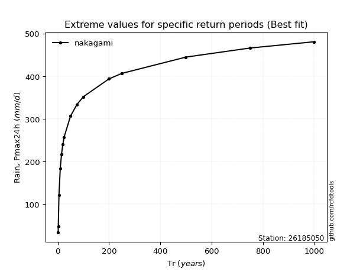</img>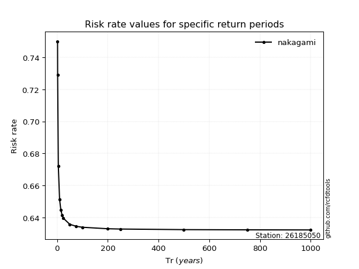</img>

</div>


<sub>**APP DISCLAIMER**: NO WARRANTY - This software is provided by [github.com/rcfdtools](https://github.com/rcfdtools) "as is", without any express or implied warranty, including warranties of merchantability, fitness for a particular purpose, or non-infringement. There is no guarantee that the software will be error-free or operate without interruption. LIMITATION OF LIABILITY - Neither the authors nor copyright holders will be liable for claims or damages arising from the software or its use. You are responsible for determining if the software is appropriate for your use and assume all associated risks, including errors, legal compliance, and data loss. NO PROFESSIONAL ADVICE - The software provides general information and does not offer professional advice. It should not replace consultation with professional advisors.</sub>